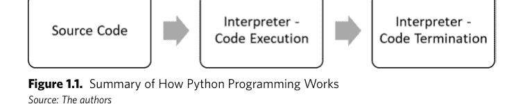
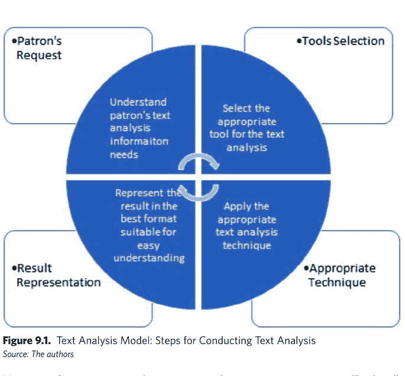
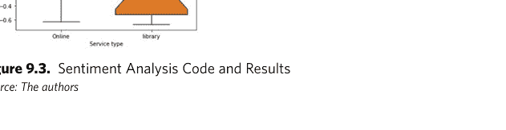

# 面向信息专业人士的Python

如何设计实用应用以把握数据爆炸的机遇

布拉迪·D·伦德、丹尼尔·阿格巴吉、科西·比萨杜、陈海华

# 面向信息专业人士的Python

如何设计应用以把握数据爆炸的机遇

布拉迪·D·伦德
丹尼尔·阿格巴吉
科西·多齐·比萨杜
陈海华

ROWMAN & LITTLEFIELD
兰哈姆 • 博尔德 • 纽约 • 伦敦

组稿编辑：查尔斯·哈蒙
组稿助理：劳伦·莫伊尼汉
销售与市场咨询：textbooks@rowman.com

本书中转载的、经许可使用的其他来源材料的致谢信息，见正文相应页面。

由Rowman & Littlefield出版
Rowman & Littlefield出版集团旗下品牌
地址：4501 Forbes Boulevard, Suite 200, Lanham, Maryland 20706
网址：www.rowman.com

地址：86-90 Paul Street, London EC2A 4NE

版权所有 © 2024 The Rowman & Littlefield Publishing Group, Inc.

*保留所有权利。*未经出版商书面许可，不得以任何形式或任何电子或机械方式（包括信息存储和检索系统）复制本书的任何部分，但评论家为撰写评论而引用段落的情况除外。

英国图书馆编目出版信息可查

## 美国国会图书馆编目出版数据

作者：Lund, Brady, 1994- author. | Agbaji, Daniel, author. | Bissadu, Kossi Dodzi, author. | Chen, Haihua, author.
书名：Python for information professionals : how to design practical applications to capitalize on the data explosion / Brady Lund, Daniel Agbaji, Kossi Dodzi Bissadu, Haihua Chen.
描述：Lanham : Rowman & Littlefield Publishers, [2024] | Includes bibliographical references and index.
标识符：LCCN 2023031250 (print) | LCCN 2023031251 (ebook) | ISBN 9781538178249 (cloth) | ISBN 9781538178256 (paperback) | ISBN 9781538178263 (ebook)
主题：LCSH: Python (Computer program language) | Libraries—Data processing.
分类：LCC Z678.93.P98 L86 2024 (print) | LCC Z678.93.P98 (ebook) | DDC 025.00285—dc23/eng20231013
国会图书馆记录可访问：https://lccn.loc.gov/2023031250
国会图书馆电子书记录可访问：https://lccn.loc.gov/2023031251

∞™ 本书用纸符合美国国家信息科学标准——印刷图书馆材料用纸耐久性标准，ANSI/NISO Z39.48-1992。

# 目录

前言

v

# 第一部分：Python基础

**第1章：** Python工作区

3

**第2章：** 面向对象编程

13

**第3章：** 数据类型、结构、集合与算法

27

**第4章：** 函数：让数据运作的代码

37

**第5章：** 导入、创建与维护数据文件

47

**第6章：** 测试与故障排除

57

# 第二部分：Python在信息组织中的进一步应用

**第7章：** 图书馆管理与使用数据

69

**第8章：** 图书馆研究数据管理

81

**第9章：** 文本分析

91

**第10章：** 图书馆与信息科学研究

101

**第11章：** 人工智能应用

111

# 第三部分：使用Python的实践与伦理考量

**第12章：** 数据爆炸、大数据与数据素养

121

**第13章：** 数据伦理

129

iii

**第14章：** 知识与数据经济 137

**第15章：** 进阶Python精通的更多资源 147

术语表 155

索引 157

关于作者 161

# 前言

欢迎，读者。我们很高兴您选择本书作为学习资源，以支持您掌握对现代数据或信息专业人士而言最具价值的技能之一——Python编程语言。在本书中，我们致力于向您介绍Python的基础知识以及一些高级概念，并通过呈现图书馆与信息科学领域的相关示例来为您的学习提供背景。我们有意将本书设计为从较简单的概念开始，然后逐步增加复杂性，这样无论您处于Python学习的哪个阶段，都能跟上进度。本书既可作为初学者的学习资源，也可供那些希望获得一些指导以提升编码能力的人士随时查阅。

在本书的引言部分，我们旨在探讨Python的基本方面、其巨大的普及度，以及您学习和掌握它至关重要的原因。通过这样做，我们将为您学习本书的其余部分奠定坚实的基础，使您能够将技能提升到新的水平并实现目标。学习Python至关重要，因为在数据革命期间，它正迅速成为许多行业和应用程序的事实标准语言，Python程序员在大型公司以及公共和学术图书馆等信息组织中都备受青睐。通过掌握Python，您不仅能获得一套宝贵的技能，为您当前或未来的职业生涯带来益处，还能获得创建有用工具和应用程序的能力，从而改善您的日常生活。

## 为什么选择Python？

一些读者可能会问：“为什么特别选择Python？是什么让您在众多竞争语言中选择了它？”有几种方式可以回答这个问题。一种方式是直接指出该语言的普及度。图0.1展示了Google Trends（2023）关于三种常见编程语言（Java、C和Python）搜索热度的数据。在过去的二十年里，Java曾是王者。然而，自2019年年中以来，Python在这三种语言中占据了主导地位，尽管在2004年至2014年的十多年间，它几乎不被Java和C所重视。在过去的五年里，除了少数几个国家（巴西、印度、西班牙、墨西哥、沙特阿拉伯和尼日利亚），Python在所有国家都是这三种语言中最受欢迎的搜索词，而在2022年，除了墨西哥和尼日利亚，它在全球所有国家都是最受欢迎的编程语言。

**图0.1.** 关于C、Java和Python搜索的Google Trends数据
*来源：作者*

解释该语言普及度的第二种方式是其多功能性以及庞大的模块、框架和工具库，这使其成为全球开发者的首选语言。Python庞大的生态系统支持各种应用，从Web开发到科学计算、数据分析和机器学习。它有几个专门针对特定领域的库，例如NumPy、Pandas和Matplotlib，它们促进了数据分析和可视化；以及TensorFlow、Keras和PyTorch，它们支持机器学习应用。

此外，Python是一种免费且开源的语言，这意味着任何人都可以无需支付许可费用即可使用它，并且其源代码可供所有人修改、改进和重新分发。Python的这一特性催生了一个活跃的开发者社区，致力于Python语言的持续改进，定期更新和修复错误。该语言可以在多种操作系统（Windows、Linux和macOS）上运行，并且可以轻松地与C和C++等其他编程语言集成。

## 什么是Python？

Python是一种高级、通用的编程语言，这意味着它可以用于各种目的和任务，不像HTML这样的语言，它是一种专门用于构建Web内容的标记语言。Python可用于广泛的应用，包括Web开发、科学计算、机器学习和数据分析等。Python的语法设计得易于阅读和使用，使其成为初学者和专家的理想语言。

Python由Guido van Rossum在1980年代末创建，第一个版本于1991年发布（Millman & Aivazis, 2011）。该语言以英国喜剧团体Monty Python命名，其创作者对该团体幽默的喜爱在语言的文档和示例中显而易见。它是一种多功能语言，支持多种编程范式，包括过程式、函数式和面向对象编程。过程式编程涉及逐步执行代码，使用过程或函数来完成任务。函数式编程强调组合函数来执行计算，并注重不可变性。面向对象编程涉及将代码组织成包含数据和利用数据方法的对象。Python对多种编程范式的支持使其成为一种灵活的语言，可以适应广泛的需求和应用。面向对象编程将是本书的重点，并在第3章中进行更详细的讨论。

## Python能做什么？

Python是一种极其通用的语言，在各个领域都有应用。它广泛应用于Web开发，这得益于Django和Flask等框架，它们简化了动态网站和Web应用程序的创建。Python丰富的生态系统，如NumPy、Pandas和Matplotlib等库，能够高效地进行数据操作、分析和可视化，使其成为数据科学和分析的热门选择。借助TensorFlow、Keras和scikit-learn等库，Python促进了机器学习和人工智能任务，为模型构建和训练提供了工具。Python的简单性和易用性使其适用于脚本编写、自动化和系统管理，而SciPy和SymPy等库则支持科学计算和模拟。Python的Pygame库支持游戏开发，它也可用于物联网应用、桌面应用程序开发和构建跨平台图形用户界面。

## 面向图书馆员和信息专业人士的Python

由于其多功能性以及在各种图书馆实践中的实用性，Python在图书馆员和信息专业人士中获得了显著的普及。

以下是Python在该领域应用的几个成功案例。这些主题将在后续章节中进行更详细的探讨。

1.  **数据操作与分析：** 图书馆员可以利用Python强大的数据操作与分析库（如Pandas和NumPy）来组织和审视海量数据集（Ranjani et al., 2019）。这使他们能够发掘关于图书馆使用的宝贵见解，优化馆藏管理策略，并更深入地理解用户行为。
2.  **网络爬虫与数据提取：** 借助Python功能多样的库（如BeautifulSoup和Scrapy），图书馆员可以轻松地从网站和在线目录中提取有价值的数据（Thomas & Mathur, 2019）。这一功能在收集关于图书、文章和各类资源的全面信息方面被证明是无价的，确保了馆藏的丰富性和时效性。
3.  **文本挖掘与自然语言处理：** Python的NLTK（自然语言工具包）和spaCy库为图书馆员深入文本挖掘和自然语言处理开辟了途径。利用这些工具，图书馆员可以从文本资源中提取有意义的信息，进行情感分析，并通过自动化能力简化编目等流程。
4.  **日常任务自动化：** 凭借Python的脚本编写能力，图书馆员可以自动化那些困扰其工作流程的重复性任务。这包括简化文件的批处理、高效的文件重命名以及细致的数据清洗，从而节省宝贵时间并提升整体运营效率（Graser & Burel, 2019）。
5.  **数字保存：** Python是数字保存工作中的可靠伙伴。图书馆员可以利用其能力执行关键任务，如文件格式转换、元数据提取和高效的数字资产管理。PyMARC和PyPDF2等库在无缝处理图书馆环境中常见的各种文件格式方面被证明是至关重要的。
6.  **用户交互与服务：** Python赋予图书馆员创建以用户为中心的交互式体验的能力。通过利用其功能，他们可以开发聊天机器人、推荐系统以及根据图书馆用户需求定制的交互式界面。这些工具增强了用户参与度，提供了个性化服务，并为探索和发现创造了丰富的环境（Lyons, 2019）。
7.  **与图书馆系统集成：** Python可以与各种图书馆管理系统和发现工具无缝集成，使图书馆员能够自由地开发自定义功能并实现工作流程自动化（Lou, 2023）。这种集成提高了效率，优化了流程，并最终提升了图书馆生态系统内的整体用户体验。

这些仅仅是Python在图书馆中众多可能用途中的一小部分，本书将对此进行深入探讨！

## 本书与其他Python书籍有何不同？

虽然市面上不乏学习Python的书籍，但本书提供了一种独特的方法，并以易于理解和接受的方式呈现材料。与大多数其他Python资源不同，本书采取了有针对性的Python编程方法，着眼于其在特定学科——图书馆与信息科学——及其相关专业中的应用。它在实用性和易懂性方面也与其他市场上的书籍有所不同。我们努力避免过度使用术语，而是以直截了当的方式进行描述，使所有读者都能轻松理解。对于那些在其他书籍和在线课程中苦苦挣扎的读者，我们希望这将是最终帮助你掌握这门强大语言的资源。

## 本书大纲

本书是学习Python编程语言从基础到高级概念的综合指南。全书分为三个部分，每个部分专注于Python应用的一个特定方面。第一部分是Python编程语言的导论，讨论其历史、特点以及在信息专业中的重要性。本节专为Python初学者设计，侧重于语言的基础知识。第一章将引导你熟悉Python工作空间以及用于实践和使用Python的各种平台选项。接下来，我们将讨论面向对象编程及其在Python中的应用。随后是一章专注于数据类型、结构、集合和算法的内容，这是Python在数据科学应用中的关键组成部分。在本导论之后，我们将通过讨论函数，以及如何导入、创建和维护数据文件，如何测试和调试代码，来完成本书第一部分的讨论。

本书第二部分探讨了Python在信息组织中的各种应用。每一章都专注于图书馆与信息科学的一个不同领域，以及如何以实际方式利用Python来改进流程和成果。本节旨在为那些希望在图书馆与信息科学的工作或研究中应用Python的人提供指导。针对图书馆与信息组织中可能面临的以下主题/挑战，各设一章：图书馆管理与使用数据、图书馆研究数据、文本分析、图书馆与信息科学研究以及人工智能应用。

本书第三部分也是最后一部分，专注于使用Python处理组织和研究数据的实际考量。本节各章旨在帮助读者理解处理数据的伦理影响，以及高质量数据更广泛的经济影响。其中第一章关注数据爆炸、大数据增长以及现代世界对数据素养的需求问题。接下来，我们探讨与数据和数据科学相关的伦理问题。本节最后一章探讨数据的经济价值以及数据科学家和数据图书馆员的机遇。

本书以所涵盖主题的总结作结，并提供了进一步学习的额外资源。各章设计得易于理解且易于遵循，每一章都建立在前面章节所呈现的概念之上。读完本书，读者将对Python编程语言有坚实的基础，并具备在现实场景中应用它所需的知识和技能。

在当今数据驱动的世界中，学习Python是一项宝贵的技能，本书是任何希望掌握它的人的绝佳资源。我们期待带领你踏上从Python编程基础到高级概念的旅程，并通过来自图书馆与信息科学领域的实际案例和数据集来丰富这些内容。读完本书，你将具备开始编写自己的Python程序所需的技能和信心，并朝着成为一名熟练的Python程序员迈进！那么，请坐到电脑前，让我们开始吧！

## 参考文献

Google Trends. (2023, May 21). R, C++, Python. Retrieved from https://trends.google.com/trends/.

Graser, M., & Burel, M. (2019). Metadata Automation: The Current Landscape and Future Developments. *Bulletin: Vol. 45*(2), 4.

Lou, D. (2023). Using Python scripts to compare records from vendors with those from ILS. *Code4Lib, 55*. https://journal.code4lib.org/articles/17022.

Lyons, K. R. (2019). AxoPy: A Python library for implementing human-computer interface experiments. *Journal of Open Source Software, 4*(34), 1191.

Millman, K., & Aivazis, M. (2011). Python for scientists and engineers. *Computing in Science and Engineering, 13*(2), 9–12.

Ranjani, J., Sheela, A., & Meena, K. P. (2019, April). Combination of NumPy, SciPy and Matplotlib/Pylab—a good alternative methodology to MATLAB—A comparative analysis. In *2019 1st International Conference on Innovations in Information and Communication Technology (ICIICT)* (pp. 1–5). IEEE.

Thomas, D. M., & Mathur, S. (2019, June). Data analysis by web scraping using Python. In *2019 3rd International Conference on Electronics, Communication and Aerospace Technology (ICECA)* (pp. 450–54). IEEE.

## 第一部分

# Python

## 基础知识

# 1. Python 工作区

在本章中，我们将重点介绍如何为使用 Python 编程语言进行编码而准备我们的计算机或工作站。我们将探讨可用于开发 Python 库的各种工作区。作为一名 Python 开发者，拥有合适的工具对于成功至关重要。我们将讨论免费和开源选项，以及可能需要付费的专有工具。在本章结束时，你将全面了解 Python 开发工作区以及如何有效地使用它们。我们还将涵盖在专业环境中使用这些工具的行业最佳实践，为你提供必要的知识和技能，以成为一名优秀的 Python 开发者。

在我们深入探讨 Python 开发的不同工作区之前，让我们先简要讨论一下 Python 编程语言是如何运作的。（这只是一个简要介绍，因为我们将在后续章节中更详细地讨论这些主题。）我们将探索从编写代码行到执行它们并获得所需结果所涉及的活动。对 Python 工作原理有一个基本的了解，有助于在编写和执行代码时遇到的任何问题进行故障排除。

## PYTHON 的工作原理

正如本书引言中所讨论的，理解 Python 是一种面向对象编程语言非常重要。面向对象编程是一种围绕对象或数据而非函数和逻辑来组织软件设计或开发的计算机编程方法（Rentsch, 1982）。面向对象编程的基本结构包括类、对象、方法和属性。类是用户定义的数据类型，其作用类似于单个对象的方法和属性的模板定义。对象是类的实例，由使用特定定义数据创建的方法和属性组成。方法是在类中定义的函数，描述对象的行为。属性表示对象的状态。表 1.1 给出了一个面向对象编程结构元素的简单示例。

**表 1.1. 面向对象编程结构元素示例**

| 结构元素 | 示例 |
| :--- | :--- |
| 类 | 一只狗 |
| 对象 | 狗的名字 |
| 属性 | 狗的颜色 |
| 方法 | 叫 |

Python 代码的结构遵循一种模板，该模板描述了你创建为对象的 Python 类的实例。可以将 Python 中的对象想象为你创建的模板代码的副本。就像我们物理环境中的任何其他对象一样，Python 对象可以被描述、按名称调用，甚至可以使用其函数在你编写的程序中执行任务（Lutz, 2013）。这个概念以及许多其他概念将在后续章节中详细讨论。目前，重要的是要理解 Python 编程语言被称为面向对象编程语言的概念，是因为它将你创建的代码视为一个对象。这可以是整个代码类，甚至是一块代码。这意味着你在 Python 中开发的代码可以像其他任何对象一样被重用、修改，甚至封装。并且像大多数面向对象编程语言一样，它遵循类似的特性和功能模式。理解 Python 的工作原理是了解 Python 代码为何如此运行以及工作区为何应配备正确资源来构建 Python 代码的关键。此外，这种理解将使你更好地欣赏使用 Python 作为编程语言来构建功能性应用程序，无论是用于图书馆还是你工作的任何信息服务机构。

因此，让我们将 Python 编程的操作层（语言如何工作）分解为一系列步骤的总结，以提供 Python 作为面向对象编程语言如何工作的心理图景。下图描述了 Python 编程涉及的各个步骤或层次——从编写单行代码到计算机执行它的时刻。



从上图中，你会注意到你在 Python 中编写的源代码是 Python 代码功能的第一层。因此，编写清晰的代码意味着 Python 编程语言能够理解你所写的内容并将其执行。运行代码意味着将你的源代码发送给 Python 进行执行。但这并不是 Python 作为编程语言功能的步骤的终点。Python 解释器是下一步。它随你的 Python 编程语言预装。因此，你不需要单独安装解释器。顾名思义，它负责将代码从人类相关的语言（在这种情况下是 Python 编程语言）解释为机器语言，也称为低级语言。机器语言是计算机理解的语言。

Python 解释器提供的这些解释功能有助于执行你编写并运行的代码。然而，解释器在“幕后”做了相当多的事情来成功执行你的代码。解释器幕后工作的一部分是将你编写的代码分解为标记或更小的单元，然后将这些标记解析为一种结构模式，它使用该模式来识别你编写的代码的所有各种特征。一旦解释器更好地理解了你编写的代码，它就会将其获得的内容传递到抽象语法树中。抽象语法树保存字节码。字节码，也称为计算机理解的 0 和 1 语言，然后从抽象语法树生成，以便计算机能够理解你在 Python 代码中编写的指令。为了实现这个目标，一旦代码执行完毕，结果就会被提供。一旦过程完成，解释器就结束代码的执行。

## PYTHON 工作区

Python 工作区在 Python 程序的开发中起着关键作用。它指的是设计、开发和执行 Python 代码的数字环境，由几个基本要素组成。要编写 Python 代码，你可以使用任何不会向代码添加不必要元数据的文本格式应用程序。在本章中，我们将此类文本格式应用程序称为“纯”文本格式应用程序。然而，需要注意的是，大多数纯文本格式应用程序不提供在同一环境中运行代码的功能。

对于 Windows 操作系统，可用于编写 Python 代码的纯文本格式应用程序示例包括记事本和 Notepad Plus (Notepad++)。在 MacOS 上，可以使用名为 TextEdit 的纯文本格式应用程序来开发 Python 代码和其他编程语言的代码。还有其他纯文本格式应用程序或软件可以安装在你的操作系统上以开发 Python 代码。

现在，假设你使用了记事本、Notepad Plus 或 TextEdit 来编写一些代码行。虽然你可以在同一环境中查看代码，但你无法运行或编译它以供计算机理解。这就是编译器/解释器的用武之地。编译器或解释器对于运行你的 Python 代码至关重要。它将高级编程源代码翻译成计算机可以理解的机器代码。虽然编译器生成类似汇编的程序代码，但解释器逐行执行代码，从程序中产生结果。换句话说，编译器产生中间机器代码，而解释器读取并执行单行代码。

## 使用纯文本格式应用程序的 PYTHON 工作区

要在纯文本格式环境中编写和执行 Python 代码，需要使用 Python 命令行界面。Python CLI 可以通过终端应用程序（在 MacOS 中）或通过命令提示符界面（在 Windows 操作系统中）访问。Python CLI 随大多数操作系统预装，当你安装 Python 时，它作为 Python 包的一部分提供。在纯文本格式环境中编写 Python 代码后，可以按照以下步骤执行：

1.  在纯文本格式环境中编写代码后，确保其没有语法和逻辑错误；然后将文件以“.py”扩展名保存在你可以轻松访问的文件夹中。
2.  现在，打开命令行提示符，在 Windows 操作系统中也称为“CMD”，在 MacOS 中称为终端。要在 Windows 操作系统中打开命令行提示符，请选择 Windows 开始按钮并键入关键字“CMD”。这将在搜索栏中显示 CMD 应用程序。然后你可以单击它以打开应用程序。在 MacOS 中，你可以通过调出“聚焦”界面，然后键入关键字“终端”来访问终端。在 MacOS 电脑上，只需同时键入命令和空格键即可调出聚焦界面。在搜索栏中，键入关键字“终端”。
3.  一旦你在首选电脑上打开了命令行界面，然后通过键入 CD（更改目录）命令导航到你在步骤一中保存的 Python 代码文件的位置。例如，如果你将文件保存在文档文件夹中，那么键入命令“CD Document”将把命令行界面指向文件所在的文档文件夹。
4.  现在你位于保存 Python 代码文件的目录中，你可以通过调用 Python 命令“Python”后跟包含代码的文件名来执行代码。假设文件名保存为“books.py”；那么 Python 执行命令将如下所示：“Python books.py”。

5.  代码执行完毕后，Python解释器将在命令行界面的下一行返回代码的执行结果。

## 使用集成开发环境的Python工作空间

与使用纯文本编辑应用作为Python代码开发工作空间不同，大多数Python工作空间是一个集成的环境。这通常被称为集成开发环境。集成开发环境是Python工作空间的重要组成部分。它为编码、测试和调试Python代码提供了一个全面且智能的集成环境。它提供了代码高亮、自动补全、错误报告和调试工具等功能。一些流行的Python IDE包括PyCharm、Spyder和Jupyter Notebook。

标准开发工具包也是Python工作空间的重要组成部分。SDK提供了一套工具和库，用于开发和部署Python应用程序。SDK通常包括编译器、调试器、库以及其他开发和测试Python代码所必需的工具。

插件或扩展是可以添加到Python工作空间以增强其功能的附加组件。例如，插件可用于添加对特定编程语言的支持、与其他开发工具集成，或提供额外的调试和测试功能。

最后，操作系统也是Python工作空间的一个重要组成部分。Python支持多种操作系统，包括Windows、MacOS和Linux。操作系统提供了支持Python代码执行以及Python工作空间其他组件运行的底层基础设施。

在硬件方面，开发者可以选择使用物理计算机、虚拟机或云计算。Python预装在大多数操作系统上，可以在PC、Mac和Chromebook等各种设备上通过命令行界面运行。然而，为确保顺利运行，硬件应满足最低规格要求，包括内存和CPU速度。这些要求可能因所开发程序的复杂性和处理的数据量而异。

表1.2提供了开发Python程序所需最低硬件规格的概览。然而，这并非详尽无遗的列表，开发者可以根据需要选择使用更大的内存和CPU算力。

在软件方面，确认Python编程语言（也称为Python CLI）是否已安装在您的计算机上非常重要。下一节将提供分步说明，指导如何在MacOS和Windows上确认和安装Python。

表1.2. 使用Python开发的硬件规格要求（Python系统要求——TAE，2022）

| 操作系统和版本 | CPU架构 | 内存和可用磁盘空间 |
| :--- | :--- | :--- |
| Windows PC，版本7或更高<br>MacOS X 10.11或更高<br>Linux：RHEL 6/7，64位 | 至少双核Intel Core i5或更高 | 至少4G内存<br>至少5G磁盘空间 |

## 在本地计算机上安装Python编程语言

假设您想在Windows PC和MacOS计算机上设置Python工作空间，并且两台计算机都满足表1.2中指定的最低要求，下一步是确认Python编程语言是否已预装在您的计算机上。您计算机上运行的Python版本很重要，因为某些版本可能与您的操作系统版本不兼容（Python Releases for Windows, 2023; Python Releases for MacOS, 2023）。

要检查Windows PC上是否安装了Python，请按照以下步骤操作：

- 1. 导航到Windows按钮并单击它以打开Windows对话框显示。
- 2. 在搜索栏中键入“Command Prompt”或“CMD”。
- 3. 按键盘上的回车键以打开Windows命令提示符界面。
- 4. 在CMD界面中键入“Python—version”以检查是否安装了Python并查找其版本号。

要检查MacOS计算机上是否安装了Python，请按照以下步骤操作：

- 1. 通过单击任务栏上的Launchpad图标或使用组合键“Space + Command”并键入“Launchpad”来导航到Mac启动台。
- 2. 在搜索栏中键入“terminal”以打开Mac终端，其功能与Windows CMD/命令提示符界面相同。
- 3. 在终端中键入“Python—version”以查找当前在您计算机上运行的Python版本。

如果您的计算机上未安装Python，下一步是安装它。在安装之前，检查您想在计算机上运行的Python版本是否与您的操作系统兼容非常重要（Python Releases for Windows, 2023; Python Releases for MacOS, 2023）。例如，在本例中，我们将在Windows和MacOS计算机上下载并安装Python 3版本。

要在Windows PC上安装Python：

- 1. 打开浏览器并搜索“Download Python”。
- 2. 从搜索结果中找到Python官方下载页面，并定位适合您操作系统的版本。
- 3. 将Python安装程序下载到计算机上的某个文件夹。
- 4. 双击下载的Python安装程序文件以开始安装过程。
- 5. 按照安装向导在您的计算机上安装Python 3.11.2版本。

对于MacOS计算机，一个流行的包管理器是Homebrew，可用于管理计算机上安装的软件包。要在MacOS计算机上安装Homebrew和Python：

- 1. 从官方网站复制Homebrew安装程序Bash脚本。
- 2. 将脚本粘贴到MacOS终端中并按回车键。
- 3. 通过在终端中键入“brew”来确认安装，这将显示所有相关的Homebrew命令。
- 4. 在终端中键入“brew install Python3”以安装Python解释器。
- 5. 键入“Python3”以确认Python3已安装在您的计算机上。

安装Python或包管理器只是为Python编程准备工作空间的第一步。在下一节中，您将学习如何在本地计算机上为Python编程设置集成开发环境。

## 在本地计算机上为Python编程设置IDE

在计算机上安装Python解释器/编译器只是准备Python开发工作空间的众多步骤之一。确保拥有一个可用且与Python编程语言兼容的IDE对于构建合适的工作空间至关重要。那么，这个很酷的术语*IDE*是什么呢？IDE，也称为集成开发环境，是一款软件，主要是像Microsoft Word这样的桌面应用程序，它提供了安装插件/扩展、代码补全或智能感知、代码格式化或代码检查、代码调试甚至代码执行的灵活性。大多数IDE旨在支持多种编程语言的开发。

市面上有许多IDE可用于构建Python代码。其中一些是免费的，而另一些则需要支付一定的许可费用。一些例子包括PyCharm、IntelliJ IDE、Eclipse、NetBeans、Visual Studio Code等。列表不胜枚举。然而，对于您的本地计算机，一个流行的IDE是由Microsoft提供的Visual Studio Code。它是免费的，并且具有用户友好的界面。您需要首先从官方网站将VSC IDE下载到本地计算机，然后才能开始使用它。截至本文撰写日期，下载VSC的官方页面URL为https://code.visualstudio.com/Download。访问该页面后，选择适合您操作系统的安装文件。

要为Python编程准备VSC IDE，您需要安装适用于Python编程的扩展。我们将在此列出的大多数扩展由Microsoft提供，该公司也是VSC IDE的开发方。找到扩展/包图标（通常位于IDE的左侧），然后搜索并安装以下扩展列表：

- 1. Python：此扩展提供智能感知、代码检查、代码调试以及默认Python安装未提供的一些其他优秀功能。
- 2. Python Preview：这是一个Python调试器扩展工具。它提供了可视化和交互式的Python代码调试体验。
- 3. Jupyter：如果您喜欢流行的Jupyter Notebook界面，它提供了一种用户友好且轻松的方式来编写和运行Python代码，那么此扩展将成为您在VSC IDE中进行Python编程的必备工具之一。
- 4. Tabnine：这是一个代码补全扩展工具，具有用于开发人工智能相关代码的智能感知功能。
- 5. Python Test Explorer for Visual Studio Code：此扩展提供Python代码的单元测试。通过此扩展，您可以运行测试以检查Python程序是否正常工作。

除了上面提到的五个VSC IDE的Python相关扩展示例之外，您可能还会遇到其他流行的扩展。我们建议在最终决定是否安装之前，阅读评论并核实扩展的作者或负责公司。此外，您可以使用其他开发者下载该扩展的次数来作为是否安装的决策依据。

现在您的本地计算机已准备好安装了用于开发Python代码的IDE，需要注意的是，您也可以在云端构建Python代码。了解如何在云端构建Python代码可确保当您不在安装了VSC IDE和其他Python工作空间相关工具的计算机旁时，仍然可以构建和运行代码。一些流行的基于云的工作站是Google Collab和Jupyter Note-

## 参考文献

Lutz, M. (2013). *Learning Python: Powerful object-oriented programming*. O’Reilly Media.
Python Releases for MacOS. (2023). 于2023年3月6日从Python.org网站检索：https://www.python.org/downloads/macos/.
Python Releases for Windows. (2023). 于2023年3月6日从Python.org网站检索：https://www.python.org/downloads/windows/.
Python System Requirements—TAE. (2022). 于2023年3月6日从Tutorialandexample.com网站检索：https://www.tutorialandexample.com/python-systemrequirements#-:text=Python%20System%20Requirements%20Introduction%20know%2CPrerequisites%3A%20...%20Installing%20Python%20on%20Linux%20.
Rentsch, T. (1982). Object-oriented programming. ACM Sigplan Notices, 17(9), 51–57.

## 2 面向对象编程

被称为面向对象编程的编程范式，其核心围绕“对象”这一概念展开，对象是包含数据和行为的类的实例（Cox, 1986）。OOP强调开发模块化和可重用的代码，使得代码更易于理解、维护和扩展。在OOP中，程序被组织成类，类作为对象的蓝图。这些类包含属性（存储数据的变量）和方法（操作数据的函数）。OOP的一个关键特性是封装，它将数据和方法的访问限制在类的公共接口内。

Python作为一种OOP语言，支持类和对象的创建，使开发者能够更轻松地生成模块化、可重用且易于理解的代码（Lutz, 2010）。OOP原则使开发者能够将复杂问题分解为更易管理的部分，从而产生更高效和结构化的代码。Python中OOP的一个显著优势是代码重用能力（Sanner, 1999）。通过定义类和对象，代码可以在程序的不同部分甚至多个程序中使用，从而减少时间和代码重复。

OOP通过将相关的属性和方法分组到单个类中来增强代码组织。这种方法使得管理和修改代码更加容易，从而提高了可维护性和可扩展性。在本章中，我们将探讨Python语言中OOP的基础知识，包括类和对象、继承以及封装等概念。通过理解这些原则，开发者可以创建更有效和高效的代码，并充分利用Python语言的全部潜力。

## 类与对象

### 类与对象的定义

类和对象是面向对象编程中的基本概念，它们有助于创建模块化和结构化的代码。类充当生成对象的模板或蓝图。它指定了一组描述对象状态的属性，以及定义对象行为的方法。例如，一个Book类可能包含诸如title、author和ISBN等属性，以及borrow和return等方法。

同时，对象是类的一个实例，其属性被赋予了特定的值。对象由类生成，从同一个类创建的每个对象都是唯一的，并且不同于同一类的其他对象。这意味着，如果你有一个Book类，你可以创建两个独立的Book对象，每个对象都有自己的属性，如title、author和ISBN。

在Python中，每个元素都是一个对象，包括内置数据类型，如字符串、整数和列表（Oliphant, 2007）。这意味着即使是内置数据类型也有可以用来操作它们的属性和方法。通过定义新的类，开发者可以创建新的数据类型，这些数据类型可用于生成对象，从而使得在代码中构建代表现实世界对象或概念的自定义对象成为可能。

通过使用类和对象，开发者可以生成可重用且组织良好的代码，从而易于维护和扩展。此外，OOP允许开发者将数据和行为封装在对象中，这可以使他们的代码更安全且更易于理解。

### 在Python中创建和使用类与对象

在Python中创建一个类很简单。我们从使用`class`关键字开始，后跟类名和一个冒号。然后，我们定义类的属性和方法。以下是一个Python基本类的示例：

```python
class Person:
    def __init__(self, name, age):
        self.name = name
        self.age = age
    def greet(self):
        print(f"Hello, my name is {self.name} and I'm {self.age} years old.")
```

在这个例子中，我们定义了一个名为Person的类，它有两个属性`name`和`age`，以及一个名为`greet`的方法，该方法使用对象的属性打印出一条消息。我们使用特殊方法`__init__`在对象创建时初始化其属性。

要创建一个Person类的对象，我们只需像调用函数一样调用该类并传入所需的参数：

```python
person = Person("John", 30)
```

在这个例子中，我们创建了一个名为`person`的对象，其`name`属性设置为“John”，`age`属性设置为30。然后，我们可以调用该对象的`greet`方法来打印消息：

```python
person.greet()
```

这将打印出消息：

“Hello, my name is John, and I’m 30 years old.”

### 代码示例标题：为图书馆消费账户创建一个类和对象

### 代码示例目标：下面的示例代码展示了如何在Python中为图书馆消费账户创建一个类和一个对象。

### 示例代码：

使用关键字“class”后跟你想给类的名字来初始化类；在这个例子中，我们将其命名为“LibraryAccount”。

```python
class LibraryAccount:
    def __init__(self, budget):
        self.budget = budget
    def purchase(self, cost):
        if self.budget >= cost:
            self.budget -= cost
        else:
            print("Insufficient budget.")
```

从“LibraryAccount”类创建一个“account”对象

```python
account = LibraryAccount(1000)
account.purchase(500)
account.purchase(2000)
account.purchase(800)
print(account.budget)
```

在这个例子中，我们定义了一个名为`LibraryAccount`的类，它有一个名为`budget`的属性和一个名为`purchase`的方法来修改`budget`属性。我们创建了一个名为`account`的对象，初始预算为1000，然后进行了三次购买：一次500，一次2000（由于预算不足而失败），以及一次800。最后的`print`语句输出剩余的预算，应为200。

## 继承

### 继承的定义

继承是面向对象编程中的一个强大特性，它允许一个类从另一个类继承属性和方法。通过这样做，继承促进了代码重用，减少了重复，并有助于代码组织。被继承的类通常被称为父类或超类，而继承它的类被称为子类或派生类。子类可以访问父类的所有属性和方法，并可以覆盖或添加自己的属性和方法。这使得子类能够继承父类的行为和属性，同时也有灵活性根据需要进行修改。

使用继承允许你创建建立在现有类之上的新类，而不是从头开始。这种方法使你能够重用现有代码，并显著减少需要编写的代码量。因此，你的代码变得更高效且更易于维护。在Python中，你可以使用`class`关键字定义一个继承自现有类的新类。你可以通过将父类放在子类名后的括号中来指定父类。例如，如果你有一个名为`Person`的父类，具有`name`和`age`属性，你可以创建一个名为`Student`的子类，它继承自`Person`类并添加一个额外的属性`student_id`。

### 如何在Python中实现继承

要在Python中实现继承，我们使用以下语法定义一个继承自现有类的新类：

```python
class ChildClass(ParentClass):
    def __init__(self, child_attribute, parent_attribute):
        super().__init__(parent_attribute)
        self.child_attribute = child_attribute
```

在上面的例子中，我们定义了一个名为`ChildClass`的子类，它继承自一个名为`ParentClass`的父类。我们使用`super()`函数来调用父类的`__init__()`方法并初始化父类的属性。然后，我们向子类添加了我们自己的属性`child_attribute`。

### 代码示例标题：为图书馆账户创建一个包含员工薪资子账户的类

### 代码示例目标：以下代码示例展示了如何在Python中实现继承，场景涉及图书馆资料采购和图书馆员工薪资。

### 示例代码：

```python
class LibraryAccount:
    def __init__(self, budget):
        self.budget = budget
    def purchase(self, cost):
        if self.budget >= cost:
            self.budget -= cost
        else:
            print("Insufficient budget.")
class EmployeeAccount(LibraryAccount):
    def __init__(self, salary, budget):
        super().__init__(budget)
        self.salary = salary
    def pay_salary(self):
        self.purchase(self.salary)
employee_account = EmployeeAccount(1000, 2000)
employee_account.pay_salary()
employee_account.purchase(500)
employee_account.purchase(2000)
print(employee_account.budget)
```

在此示例中，我们定义了一个名为`LibraryAccount`的父类，其中包含一个用于初始化预算属性的`__init__()`方法和一个用于进行采购的方法。然后，我们定义了一个名为`EmployeeAccount`的子类，它继承自`LibraryAccount`类，并添加了一个薪资属性和一个通过从预算中进行采购来支付员工薪资的方法。

我们创建了一个名为`employee_account`的`EmployeeAccount`类对象，其初始预算为2000，薪资为1000。我们调用`pay_salary()`方法从预算中扣除薪资，并调用`purchase()`方法进行了两次采购，金额分别为500和2000（第二次采购因预算不足而失败）。最后的打印语句输出剩余的预算，应为500。

## 多态

### 多态的定义

多态使得单一接口能够表示不同类型的数据或对象。在继承的上下文中，多态使得子类能够继承父类的方法，同时也允许子类根据需要修改或重写这些方法，以适应其特定需求。

通过多态，单一方法可以根据其被调用的对象类型执行不同的操作。这一特性使得代码具有高度的灵活性，更易于维护和扩展。例如，你可能有一个名为`show_info`的方法，用于显示对象的信息。如果你有多个类继承自一个父类，每个类都可以拥有自己定制的`show_info`方法实现，以适应其代表的特定对象类型。

### 如何在Python中实现多态

在Python中，多态可以通过方法重写来实现。方法重写是一种技术，其中子类为其父类中已定义的方法提供新的实现。子类中的新实现被称为重写了父类中的原始实现。Python中方法重写的语法如下：

```python
class ChildClass(ParentClass):
    def method_name(self, arguments):
        # 子类中该方法的新实现
```

### 代码示例标题：创建一个继承自主图书馆账户类并重写某些方法的图书馆账户类

### 代码示例目标：此示例代码演示了如何创建一个继承自父类的类。

### 示例代码：

```python
class LibraryAccount:
    def __init__(self, budget):
        self.budget = budget
    def purchase(self, cost):
        if self.budget >= cost:
            self.budget -= cost
        else:
            print("Insufficient budget.")
    def display_balance(self):
        print(f"Remaining budget: {self.budget}")
class SpecialLibraryAccount(LibraryAccount):
    def __init__(self, budget, discount_rate):
        super().__init__(budget)
        self.discount_rate = discount_rate
    def purchase(self, cost):
        discounted_cost = cost * (1-self.discount_rate)
        if self.budget >= discounted_cost:
            self.budget -= discounted_cost
        else:
            print("Insufficient budget.")
    def display_balance(self):
        print(f"Remaining budget (special account): {self.budget}")
regular_account = LibraryAccount(2000)
special_account = SpecialLibraryAccount(2000, 0.1)
regular_account.purchase(1000)
special_account.purchase(1000)
regular_account.display_balance()
special_account.display_balance()
```

在此示例中，我们定义了一个名为`LibraryAccount`的父类，其中包含一个用于初始化预算属性的`__init__()`方法，以及用于进行采购和显示剩余余额的方法。然后，我们定义了一个名为`SpecialLibraryAccount`的子类，它继承自`LibraryAccount`类，并添加了一个`discount_rate`属性。该子类重写了`purchase()`和`display_balance()`方法，以提供考虑了折扣率的新实现。

我们分别创建了`LibraryAccount`和`SpecialLibraryAccount`类的两个对象：`regular_account`和`special_account`。我们对两个对象都调用了`purchase()`方法进行1000的采购，但特殊账户享有10%的折扣。随后，我们对两个对象调用了`display_balance()`方法来显示剩余预算，普通账户应为1000，特殊账户应为1100。

## 封装

### 封装的定义

封装涉及限制对对象特定部分的访问。封装鼓励将数据（属性）和操作数据的方法（函数）分组在一个称为类的单一实体中。封装通过防止外部干扰和数据滥用，分离了关注点并增强了代码的模块化。通过向外部世界隐藏对象的实现细节，封装使代码更安全，更不易出错。

在Python中，封装通过将属性和方法设为私有或受保护来实现，这意味着它们只能在类或其子类内部被访问或修改。这通过在属性或方法名称前添加单下划线（`_`）或双下划线（`__`）来实现。

### 如何在Python中实现封装

要在Python中实现封装，请使用命名约定和属性装饰器。要使属性或方法私有，请在其名称前加上两个下划线（`__`）。要使其受保护，请改用单个下划线（`_`）。请注意，Python并不严格强制执行私有性；这更多是一种向程序员发出的信号，表明该属性或方法不应被直接访问。

我们可以使用属性装饰器（`@property`和`@<attribute>.setter`）为属性创建getter和setter方法。这允许我们控制对属性值的访问和修改。

### 代码示例标题：创建一个具有私有属性和方法的图书馆账户类

### 代码示例目标：此代码示例证明了如何创建一个封装了私有属性和方法的类。

### 示例代码：

```python
class LibraryAccount:
    def __init__(self, budget):
        self.__budget = budget
    @property
    def budget(self):
        return self.__budget
    @budget.setter
    def budget(self, value):
        if value >= 0:
            self.__budget = value
        else:
            print("Invalid budget value.")
    def __validate_purchase(self, cost):
        return self.__budget >= cost
    def purchase(self, cost):
        if self.__validate_purchase(cost):
            self.__budget -= cost
        else:
            print("Insufficient budget.")
    def display_balance(self):
        print(f"Remaining budget: {self.__budget}")
library_account = LibraryAccount(2000)
# 直接访问和修改私有属性__budget会导致错误
# library_account.__budget = 1000 # 这行会导致错误
# 相反，我们使用属性装饰器来访问和修改属性
library_account.budget = 1000
print(library_account.budget)
library_account.purchase(500)
library_account.display_balance()
# 尝试直接调用私有方法__validate_purchase会导致错误
# library_account.__validate_purchase(500) # 这行会导致错误
```

在此示例中，我们定义了一个`LibraryAccount`类，其中包含私有属性`__budget`和一个私有方法`__validate_purchase()`。我们使用属性装饰器为`__budget`属性创建了getter和setter方法，以实现受控的访问和修改。`purchase()`方法使用私有的`__validate_purchase()`方法来检查是否有足够的预算进行采购。

我们创建了一个名为`library_account`的`LibraryAccount`类对象，其初始预算为2000。我们演示了如何使用属性装饰器来访问和修改私有属性`__budget`。最后，我们调用`purchase()`方法进行了500的采购，并调用`display_balance()`方法显示剩余预算，应为1500。

## 抽象

### 抽象的定义

抽象通过将复杂系统分解为更小、更易管理的部分来简化系统。它涉及创建抽象类和方法，这些类和方法作为在具体类中实现特定功能的蓝图。抽象类是不能被实例化的类；它们旨在被其他类继承，而这些子类必须为抽象方法提供实现（Khoirom等人，2020）。这允许更好的模块化、代码重用性和更轻松的维护，因为抽象类提供了一个高级接口，封装了一组相关对象的通用行为和属性，同时将具体的实现细节留给具体类。

例如，你可能有一个名为`Shape`的抽象类，它作为所有类型形状（如正方形、三角形和圆形）的蓝图。`Shape`类可能有诸如`area`和`perimeter`之类的抽象方法，这些方法代表了所有形状的通用行为，同时将具体的实现细节留给具体类。通过使用抽象，你可以简化复杂系统，使其更易于理解和维护。

### 如何在Python中实现抽象

在Python中，抽象是通过使用`abc`模块（抽象基类）来实现的。我们可以通过继承`abc`模块提供的`ABC`类，并使用`@abstractmethod`装饰器来定义抽象方法，从而定义一个抽象类。抽象类的子类必须为其所有抽象方法提供具体实现。

### 代码示例标题：为图书馆账户创建一个抽象类并在特定账户类中实现它

### 代码示例目标：此示例代码展示了如何创建一个抽象类并在具体类中实现它。

### 示例代码：

```
from abc import ABC, abstractmethod

class LibraryAccount(ABC):
    def __init__(self, budget):
        self.budget = budget

    @abstractmethod
    def purchase(self, cost):
        pass

    def display_balance(self):
        print(f"Remaining budget: {self.budget}")

class RegularLibraryAccount(LibraryAccount):
    def purchase(self, cost):
        if self.budget >= cost:
            self.budget -= cost
        else:
            print("Insufficient budget.")

class SpecialLibraryAccount(LibraryAccount):
    def __init__(self, budget, discount_rate):
        super().__init__(budget)
        self.discount_rate = discount_rate

    def purchase(self, cost):
        discounted_cost = cost * (1 - self.discount_rate)
        if self.budget >= discounted_cost:
            self.budget -= discounted_cost
        else:
            print("Insufficient budget.")

regular_account = RegularLibraryAccount(2000)
special_account = SpecialLibraryAccount(2000, 0.1)
regular_account.purchase(1000)
special_account.purchase(1000)
regular_account.display_balance()
special_account.display_balance()
```

在此示例中，我们定义了一个名为`LibraryAccount`的抽象类，它继承自`ABC`类。我们使用`@abstractmethod`装饰器声明了一个抽象方法`purchase()`，这意味着任何具体的子类都必须为此方法提供实现。`display_balance()`方法是一个具体方法，子类可以直接使用。

然后我们定义了两个具体类`RegularLibraryAccount`和`SpecialLibraryAccount`，它们继承自`LibraryAccount`抽象类，并为`purchase()`方法提供了各自的实现。`RegularLibraryAccount`类在没有任何修改的情况下实现了该方法，而`SpecialLibraryAccount`类添加了一个`discount_rate`属性，并修改了`purchase()`方法以应用折扣。

我们分别创建了`RegularLibraryAccount`和`SpecialLibraryAccount`类的两个对象`regular_account`和`special_account`。我们调用两个对象的`purchase()`方法进行1000的购买，但特殊账户享有10%的折扣。然后调用两个对象的`display_balance()`方法显示剩余预算，普通账户应为1000，特殊账户应为1100。

## 组合

### 组合的定义

组合是一种编程概念，我们通过组合更简单的对象来创建更复杂的对象。它的工作原理是让一个类包含其他类的实例作为其属性。这允许每个类专注于自己的工作，同时仍然能够与其他类交互。当一个类与另一个类是“拥有”关系而非“是”关系时，通常使用组合而不是继承。

### 如何在Python中实现组合

要在Python中实现组合，你可以定义一个类，该类包含其他类的实例作为属性。这可以通过在类的`__init__()`方法中初始化这些实例，或者在创建类的实例时将它们作为参数传递来实现。

### 代码示例标题：创建一个图书馆类，并使用组合包含多个账户对象

### 代码示例目标：此处，示例代码展示了如何使用组合在类中包含多个对象。

### 示例代码：

```
class LibraryAccount:
    def __init__(self, budget):
        self.budget = budget

    def purchase(self, cost):
        if self.budget >= cost:
            self.budget -= cost
        else:
            print("Insufficient budget.")

    def display_balance(self):
        print(f"Remaining budget: {self.budget}")

class Library:
    def __init__(self, regular_account, special_account):
        self.regular_account = regular_account
        self.special_account = special_account

    def make_purchase(self, cost, account_type):
        if account_type == "regular":
            self.regular_account.purchase(cost)
        elif account_type == "special":
            self.special_account.purchase(cost)
        else:
            print("Invalid account type.")

    def display_balances(self):
        print("Regular account:")
        self.regular_account.display_balance()
        print("Special account:")
        self.special_account.display_balance()

regular_account = LibraryAccount(2000)
special_account = LibraryAccount(3000)
library = Library(regular_account, special_account)
library.make_purchase(1000, "regular")
library.make_purchase(1500, "special")
library.display_balances()
```

在此示例中，我们首先定义了一个`LibraryAccount`类，它具有一个`budget`属性以及用于购买和显示剩余余额的方法。然后我们创建了一个`Library`类，它使用组合将多个`LibraryAccount`对象作为属性包含进来：`regular_account`和`special_account`。

我们创建了两个`LibraryAccount`类的实例`regular_account`和`special_account`，初始预算分别为2000和3000。然后我们创建了一个`Library`类的实例，并将这两个`LibraryAccount`实例作为参数传递。

我们使用`Library`类的`make_purchase()`方法从普通账户和特殊账户进行购买。最后，我们调用`display_balances()`方法显示两个账户的剩余预算，普通账户应为1000，特殊账户应为1500。

在本章中，我们探讨了Python中面向对象编程（OOP）的基本概念和原则。OOP是一种强大的编程范式，它通过将代码组织成类和对象，使开发人员能够生成模块化、可重用和可维护的代码（Budd, 2008）。它使我们能够对现实世界的实体进行建模，从而简化复杂软件的开发。通过理解和运用Python中的这些OOP原则，你可以构建高效、结构化且可扩展的代码，使其更易于理解、维护和扩展。这种方法可以带来更有效的软件开发和更好的整体软件质量。牢记这些OOP原则，我们可以在Python框架内继续处理各种类型的数据。

## 参考文献

- Budd, T. (2008). *面向对象编程导论*. Pearson.
- Cox, B. J. (1986). *面向对象编程：一种演化方法*. Addison-Wesley Longman Publishing.
- Khoirom, S., Sonia, M., Laikhuram, B., Laishram, J., & Singh, T. D. (2020). 面向初学者的Python与Java比较分析. *国际工程技术研究杂志, 7*(8), 4384–407.
- Lutz, M. (2010). *Python编程：强大的面向对象编程*. O’Reilly Media.
- Oliphant, T. E. (2007). 用于科学计算的Python. *科学与工程计算, 9*(3), 10–20.
- Sanner, M. F. (1999). Python：一种用于软件集成和开发的编程语言. *分子图形建模杂志, 17*(1), 57–61.

# 3

## 数据类型、结构、集合与算法

Python编程中的数据类型指的是该语言支持的不同数据类别。Python支持多种数据类型，包括数值、序列、映射和集合数据类型（Shein, 2015）。在深入探讨数据类型的具体细节之前，重要的是要理解，当你编写Python程序时，你主要是在处理数据——接收、发送和操作数据。事实上，每一段Python代码都涉及处理数据。当你创建一个变量来存储值，或者定义一个函数来执行算法或操作数据时，你就是在处理数据。因此，理解不同的数据类型、与数据操作相关的概念以及如何在Python中有效地处理它们至关重要。

Python中的数据类型是该语言的内置特性，这意味着你通常不需要从头开始创建自己的数据类型来使用它们。因为Python中的一切都是对象，而Python是一门面向对象编程（OOP）语言，所以Python中的数据类型充当模板，可用于创建具有相同特性和功能的副本。要在Python中使用数据类型，你需要在使用前定义或声明它，并用一个值或空值初始化它。Python中的大多数数据类型被认为是原始类型，因为它们是默认的和基本的数据类型，其他数据类型可以从中构建。然而，也存在非原始数据类型，它们以各种格式存储值或值的集合。非原始数据类型的一个例子是创建你自己的Python类来存储和操作数据。当这个类的实例被重用来解决问题时，它们就成为了数据类型。Python数据类型可以保存数值、字符串（数字和字母的组合）、数值或字符串的列表，或者两者的配对。

数值数据类型包括整数、浮点数和复数，而序列数据类型包括列表、元组和范围。字典代表映射数据类型，集合代表集合数据类型。理解Python中的各种数据类型对于开发高效且有效的

## 数据类型

### PYTHON中的基本数据类型

在Python中，有几种基本数据类型（原始数据类型）用于表示不同类型的信息（Shein, 2015）。这些包括：

- 1. 整数：用于表示整数。它们可以是正数、负数或零，并且可以用十进制（基数为10）、二进制（基数为2）、八进制（基数为8）或十六进制（基数为16）格式表示。例如，十进制整数10、二进制整数0b1010、八进制整数0o12和十六进制整数0xA都表示相同的数字。
- 2. 浮点数：用于表示带小数点的实数。它们可以是正数、负数或零，并以浮点格式表示，这允许在精度和范围之间进行权衡。例如，浮点数3.14表示圆周率π的值，精确到两位小数。
- 3. 字符串：用于表示字符序列。它们可以使用单引号（'）、双引号（"）或三引号（'''或"""）表示，并且可以包含字母、数字、标点符号或特殊字符的任何组合。例如，字符串"Hello, World!"表示计算机编程中的经典入门消息。
- 4. 布尔值：用于表示二进制值（True或False）。它们通常用于控制流语句中，根据特定条件的真假做出决策。例如，布尔表达式10 > 5的求值结果为True，而布尔表达式10 < 5的求值结果为False。

### 高级数据类型（非原始数据类型）

除了基本数据类型外，Python中还有更高级的数据类型，可用于表示更复杂的信息。这些包括：

- 1. 列表：一个有序项目的集合，可以是任何数据类型。列表使用方括号（[]）表示，各个项目用逗号分隔。例如，列表[1, 2, 3, 4, 5]表示前五个正整数。列表是可变的，这意味着它们包含的项目在创建后可以更改。
- 2. 元组：类似于列表，但它们是不可变的（创建后无法更改）。元组使用圆括号（()）表示，各个项目用逗号分隔。例如，元组(1, 2, 3)表示一个简单的三个数字的序列。元组通常用于表示固定数量的相关值，例如二维空间中的一个点，或在代码执行期间不应更改的值。
- 3. 字典：一个键值对的集合，其中每个键与一个特定值相关联。字典使用花括号（{}）表示，各个键值对用逗号分隔。例如，字典{'name': 'John', 'age': 30, 'gender': 'male'}表示一个具有三个属性的简单个人资料。字典通常用于表示相关值的集合，其中每个值与一个特定的标签或标识符相关联。

### 代码示例标题：使用不同数据类型表示图书馆借阅账户

### 代码示例目标：此示例代码描述了一个示例，展示我们如何在Python中使用不同的数据类型来表示图书馆借阅账户。

### 示例代码：

```python
# 表示一个图书馆借阅账户
# 使用整数数据类型表示账户号码
account_number = 123456

# 使用字符串数据类型表示账户持有人的姓名
name = "John Doe"

# 使用列表数据类型表示当前借出的书籍
checked_out_books = ["The Great Gatsby", "To Kill a Mockingbird", "Pride and Prejudice"]

# 使用字典数据类型表示每本书的到期日期
due_dates = {"The Great Gatsby": "2023-07-01",
            "To Kill a Mockingbird": "2023-07-15",
            "Pride and Prejudice": "2023-07-31"}

# 使用布尔数据类型表示账户是否处于良好状态
good_standing = True
```

此代码示例展示了如何使用不同的数据类型以结构化和有组织的方式表示现实世界的信息。

## 数据结构

### 数据结构在用例和性能方面的比较

数据结构是计算机算法的基本组成部分，用于以更易于检索、操作和分析的方式组织和存储数据。Python提供了几种内置数据结构，包括列表、元组、字典和集合，这些在编程中常用（Baka, 2017）。

在选择数据结构时，考虑每种结构的预期用例和性能特征非常重要。例如，列表适用于保持项目的特定顺序并执行对列表的更改，而元组最适合表示不可更改的项目集合。字典针对基于键的查找进行了优化，使其成为计数项目或分组数据的理想选择。集合有利于确定项目是否存在于集合中或执行并集和交集等集合操作。

在性能方面，每种数据结构的时间复杂度是一个关键考虑因素。例如，列表在列表开头插入项目的时间复杂度为O(n)，但在列表末尾插入项目的时间复杂度为O(1)。另一方面，字典在基于键插入和搜索项目的时间复杂度均为O(1)。

为手头的任务选择合适的数据结构至关重要，因为它会显著影响代码的性能和效率。此外，熟悉各种数据结构及其用例，能够让你在给定场景中就使用哪种数据结构做出明智的决定。

### 代码示例标题：使用不同数据结构表示图书馆借阅账户列表

### 代码示例目标：此代码示例描述了如何在Python中使用不同的数据类型。观察此代码示例如何说明如何使用不同的数据结构来表示图书馆借阅账户列表。

### 示例代码：

```python
# 表示一个图书馆借阅账户列表
# 使用列表数据类型表示账户集合

accounts = [
    {"account_number": 123456, "name": "John Doe",
    "checked_out_books": ["The Great Gatsby", "To Kill a Mockingbird"], "due_dates": {"The Great Gatsby": "2022-07-01", "To Kill a Mockingbird": "2022-07-15"}, "good_standing": True},
    {"account_number": 654321, "name": "Jane Doe", "checked_out_books": ["Pride and Prejudice"], "due_dates": {"Pride and Prejudice": "2022-07-31"}, "good_standing": False}
]

# 使用集合数据类型表示所有账户中借出的书籍集合
checked_out_books_set = set()
for account in accounts:
    checked_out_books_set |= set(account["checked_out_books"])
```

在此代码示例中，我们使用列表来表示图书馆借阅账户的集合，其中每个账户用一个字典表示。我们还使用一个集合来表示所有账户中借出的书籍集合，从而可以轻松执行并集和交集等集合操作。

## 集合

### PYTHON中集合概述

集合是Python中的数据结构，用于存储唯一项目的集合。它们使用set类型实现，可以使用花括号或set()函数创建。集合是无序的，这意味着集合中的项目没有特定的顺序。

集合的一个关键特征是它们只允许唯一项目。这意味着如果你尝试向集合中添加一个已经存在的项目，它不会被再次添加。这使得集合在从集合中删除重复项或检查项目是否存在于集合中等任务中非常有用。集合还针对成员测试进行了优化，时间复杂度为O(1)。这意味着检查一个项目是否在集合中非常快，即使对于大型集合也是如此。

### 如何使用集合执行并集、交集、差集等操作

集合提供了几种有用的操作，可用于操作它们包含的项目。这些操作包括：

- 1. **并集操作：** 将两个组合并以创建一个新集合，该集合包含两个集合中的所有项目。当你需要将两个集合合并为一个集合，并保持元素的唯一性。例如，你可以使用并集操作将两个图书馆的藏书集合合并，创建一个包含两个图书馆所有书籍的单一集合。

2.  **交集操作：** 创建一个新集合，其中仅包含同时存在于两个集合中的元素。当你需要找出两个集合的共同元素时，此操作非常有用。例如，你可以使用交集操作来找出同时存在于两个图书馆中的书籍。

3.  **差集操作：** 创建一个新集合，其中包含存在于一个集合但不存在于另一个集合中的元素。当你需要找出一个集合独有的元素时，此操作非常有用。例如，你可以使用差集操作来找出仅存在于一个图书馆而不存在于另一个图书馆的书籍。

### 代码示例标题：使用集合在图书馆借阅账户列表中查找唯一值

### 代码示例目标：此示例演示如何使用集合在图书馆借阅账户列表中查找唯一值。

### 示例代码：

```
# 表示一个图书馆借阅账户列表

accounts = [
    {"account_number": 123456, "name": "John Doe",
     "checked_out_books": ["The Great Gatsby", "To Kill a Mockingbird"], "due_dates": {"The Great Gatsby": "2022-07-01", "To Kill a Mockingbird": "2022-07-15"}, "good_standing": True},
    {"account_number": 654321, "name": "Jane Doe", "checked_out_books": ["Pride and Prejudice"], "due_dates": {"Pride and Prejudice": "2022-07-31"}, "good_standing": False}
]

# 使用集合查找所有账户中借出的唯一书籍

checked_out_books = set()
for account in accounts:
    checked_out_books |= set(account["checked_out_books"])
unique_books = list(checked_out_books)
```

在此代码示例中，我们使用集合来查找所有账户中借出的唯一书籍。我们遍历账户列表，使用并集操作将每组借出的书籍添加到 `checked_out_books` 集合中。最后，我们将 `checked_out_books` 集合转换为列表，以获得唯一书籍的列表。

## 算法

### Python 中常见算法概述

算法是解决问题的分步过程，Python 中有几种常用于执行各种任务的常见算法。Python 中一些最常见的算法包括：

-   排序：用于以特定方式对项目集合进行排序。
-   搜索：用于在集合中查找特定项目。
-   递归：一种函数调用自身以解决问题的技术。

此外，你可能还会遇到其他更复杂或更罕见的算法，包括：

-   图算法：用于处理和分析图结构，例如查找两个节点之间的最短路径。
-   动态规划：一种通过将问题分解为更小的、重叠的子问题来解决问题的技术。
-   分治法：一种通过将问题分解为更小的子问题并分别解决每个子问题来解决问题的技术。
-   贪心算法：一种通过在每一步做出最佳选择来解决问题的技术，而不考虑所做选择的长期影响。
-   暴力算法：一种通过尝试所有可能的解决方案并选择最佳方案来解决问题的技术。

这些算法提供了一系列解决问题的方法，算法的选择将取决于所解决的具体问题和所需的性能特征。

### 时间和空间复杂度

在 Python 中编码时，我们不仅希望代码成功运行，还关心代码运行所需的时间，以及计算机为成功执行代码需要处理的工作量。因此，当我们谈论时间和空间复杂度时，我们指的是代码的效率和性能的影响。在分析算法时，考虑时间和空间复杂度非常重要，因为这些因素会极大地影响解决方案的整体性能。因此，时间复杂度是指算法运行时间作为输入大小的函数。它通常使用“大 O”符号表示，该符号提供了算法运行时间的上界。这有助于识别算法中最耗时的部分，并确定它是否能在合理的时间内处理大量输入。可以将其视为衡量代码执行所需时间的一种方式——从运行、编译到执行的那一刻。

空间复杂度是指算法使用的内存量作为输入大小的函数。与时间复杂度类似，空间复杂度也使用“大 O”符号表示，它提供了算法内存使用的上界。考虑空间复杂度很重要，因为内存限制会限制解决方案的可扩展性并影响其整体性能。通过同时考虑时间和空间复杂度，开发人员可以就特定任务使用哪种算法做出明智的决定，并优化其代码的性能。

### 代码示例标题：使用算法按借出材料数量对图书馆借阅账户列表进行排序

### 代码示例目标：此示例代码展示如何使用算法对图书馆借阅账户进行排序。

### 示例代码：

```
# 表示一个图书馆借阅账户列表

accounts = [
    {"account_number": 123456, "name": "John Doe",
    "checked_out_books": ["The Great Gatsby", "To Kill a Mockingbird"], "due_dates": {"The Great Gatsby": "2022-07-01", "To Kill a Mockingbird": "2022-07-15"}, "good_standing": True},
    {"account_number": 654321, "name": "Jane Doe",
    "checked_out_books": ["Pride and Prejudice"], "due_dates": {"Pride and Prejudice": "2022-07-31"}, "good_standing": False}
]

# 使用排序算法按借出材料数量对账户进行排序
accounts.sort(key=lambda x: len(x["checked_out_books"]), reverse=True)
```

在此代码示例中，我们使用 Python 中的排序函数（它实现了一种排序算法）来按借出材料数量对图书馆借阅账户列表进行排序。`key` 参数用于指定用于排序的函数，在本例中是传入 `checked_out_books` 列表长度的 lambda 函数。`reverse` 参数用于指定列表是否应按降序排序。

上述代码示例将节省大量时间并减少计算机处理能力的空间或工作量，因为它为处理排序相关问题提供了一种比传统遍历项目列表更智能的方法，后者需要更长的时间来完成并产生更多的工作量。

本章探讨了 Python 中的数据类型、数据结构、集合和算法。通过理解不同的数据类型及其属性，开发人员可以为其用例选择适当的数据结构并优化代码性能。此外，理解数据结构和算法使开发人员能够高效地组织和操作数据，从而更有效地解决问题。这些信息为我们下一章讨论函数奠定了基础。这些章节共同构成了我们讨论 Python 语言的主干。

## 参考文献

Baka, B. (2017). *Python data structures and algorithms*. Packt Publishing.
McKinney, W. (2010). Data structures for statistical computing in Python. *Proceedings of the 9th Python in Science Conference*, 445, 51-56.
Shein, E. (2015). Python for beginners. *Communication of the ACM*, 58(3), 19-21.

# 4

## 函数

让我们的数据发挥作用的代码

在本章中，我们将深入探讨 Python 中的函数主题。在这里，我们探讨函数在代码组织和可重用性方面的重要性。函数是编程的一个关键方面，允许开发人员编写可重用、易于维护和扩展的代码（Bassi, 2007）。在本章中，我们将首先简要概述 Python 中的函数及其重要性，然后全面讨论如何定义和调用函数，以及相应的语法。本章随后将探讨函数作用域的概念，包括 LEGB 规则，该规则定义了调用函数时变量的搜索顺序。还将讨论不同类型的函数参数，包括位置参数、关键字参数和默认参数，以及使用 `*args` 和 `**kwargs` 处理可变长度参数列表。还将涵盖递归和 lambda 函数，并讨论何时以及如何使用这些 Python 函数的高级特性。

## 什么是 Python 中的函数？

在 Python 以及大多数编程语言中，函数是帮助解决问题的代码块。可以将它们视为解决数学问题时使用的公式。与数学不同，你可以自由定义自己的函数。有些函数是预定义的，意味着它们随 Python 编程语言一起提供，而其他函数则可以由你根据特定用途自定义。

需要注意的是，如果已经存在满足你需求的函数，你就不需要再编写另一个函数。那么，如何确定你需要的函数是否已经存在于 Python 中呢？Python 官方文档是当你不确定是否已存在能解决你所遇问题的函数时，从这里开始查找是合适的起点。在撰写本书时，Python官方文档中关于函数的网页链接可在此处找到：https://docs.python.org/3/glossary.html#term-function。你也可以在任何搜索引擎中搜索“Python function”来找到此链接。

假设你想编写一个函数，用于搜索书籍集合，找出标题中包含特定单词的书籍，并提供匹配书籍的列表。你如何确定Python中是否已有现成的函数可以完成此任务？只需搜索Python文档网站页面，找到合适的函数即可。此任务可以使用Python中已预定义的搜索和排序函数来完成。要使用一个函数，无论是Python预定义的还是你自定义的，你都需要在代码中调用它。

## 定义和调用函数

### 在Python中定义和调用函数的语法

在Python中，函数使用“def”关键字定义，后跟函数名和一组可包含参数的括号。函数可以通过使用函数名后跟一组可包含参数的括号来调用。例如，以下语法将允许你在Python中定义一个函数：

```
def function_name(arg1, arg2, ...):
    # 函数体
    # 语句
    return value
```

而此示例代码将允许你调用该函数：

```
def greet(name):
    print("Hello, " + name + "!")
greet("John")  # 输出：Hello, John!
```

### 函数参数和返回值

函数参数是在调用函数时传递给函数的值或表达式。这些参数可以在函数内部用于执行特定操作或计算。函数参数可以是位置参数，意味着它们按特定顺序传递；也可以是关键字参数，意味着它们按名称传递（Bassi, 2007）。

函数的返回值使用return语句指定。return关键字后面的值或表达式就是返回给函数调用者的值。返回值可以被调用者用于执行额外操作或存储函数的结果。

当函数被调用时，它会从头到尾执行（Dobesova, 2011）。函数参数被处理，函数体内的任何操作都会被执行。函数可以使用传递给它的参数执行特定计算，也可以返回一个值给调用者。当遇到return语句或到达函数末尾时，函数的执行结束。

### 代码示例标题：计算图书馆读者平均借书数量的Python函数
### 代码示例目标：此代码示例展示了如何使用一些基本计算来处理图书馆事务——例如计算平均借书数量。
### 示例代码：

```
def average_books_borrowed(patrons):
    total = 0
    for patron in patrons:
        total += len(patron["checked_out_books"])
    return total / len(patrons)

# 使用图书馆读者列表调用该函数
library_patrons = [{"checked_out_books": ["Book 1", "Book 2"]},
                   {"checked_out_books": ["Book 3", "Book 4", "Book 5"]},
                   {"checked_out_books": ["Book 6"]}]
avg_books_borrowed = average_books_borrowed(library_patrons)
print("Average number of books borrowed:", avg_books_borrowed)
```

在此代码示例中，函数“average_books_borrowed”接受一个图书馆读者列表作为其参数，并通过将每位读者借出的书籍数量相加，然后除以读者总数来计算平均借书数量。然后，使用图书馆读者列表调用该函数，并将结果打印到控制台。

## 函数作用域

### 函数中局部作用域和全局作用域概述

函数作用域指的是函数内部变量的可见性和可访问性（Politz et al., 2013）。换句话说，它决定了哪些变量可以在函数内部使用和修改，以及哪些变量可以在函数外部使用。函数中有两种主要的作用域类型：局部作用域和全局作用域。

*局部作用域*指的是在函数内部声明和使用的变量。这些变量只能在声明它们的函数内部访问和使用。局部变量在每次调用函数时创建，并在函数返回后销毁。

*全局作用域*指的是在任何函数外部声明的变量，可以被程序中的任何函数访问和使用。全局变量在整个程序生命周期内持续存在，并且可以被任何函数修改。

理解函数中局部作用域和全局作用域的区别非常重要，因为它们会影响代码的行为和效率。一般来说，建议尽可能使用局部变量，因为它们有助于限制变量的作用域，使代码更易于理解和维护。另一方面，全局变量应谨慎使用，因为它们可能导致意外行为并使代码更难调试。在函数内部访问全局变量时，有必要使用global关键字来表明你要访问的是全局变量，而不是创建一个同名的局部变量。

### LEGB规则（局部、嵌套、全局、内置）

LEGB规则（局部、嵌套、全局、内置）是一个助记符，帮助开发者记住Python搜索变量的顺序（Unpingco, 2021）。它指出Python按以下顺序搜索变量：

1.  局部作用域
2.  嵌套作用域（任何外层函数的作用域）
3.  全局作用域
4.  内置作用域（Python的内置函数和变量）

LEGB规则是理解Python中变量作用域的重要概念。当在函数内引用一个变量时，Python首先在局部作用域中查找该变量，这包括在当前函数内声明的所有变量。如果在局部作用域中未找到该变量，Python接着在嵌套作用域中查找，这包括在任何外层函数中声明的变量。如果仍未找到，Python则检查全局作用域，这包括在程序中任何函数外部声明的所有变量。最后，如果在全局作用域中未找到该变量，Python会检查内置作用域，这包括Python中所有内置函数和变量。理解LEGB规则对于避免作用域相关错误并确保程序按预期运行至关重要。

### 代码示例标题：函数与全局变量：在函数中包含全局变量
### 代码示例目标：此代码示例说明了如何在函数中使用全局变量来跟踪从图书馆借出的书籍总数。
### 示例代码：

```
# 用于跟踪从图书馆借出的书籍总数的全局变量
total_books_borrowed = 0
def borrow_book(number_of_books):
    # 访问全局变量
    global total_books_borrowed
    # 将借出的书籍数量加到总数上
    total_books_borrowed += number_of_books
    # 返回更新后的总数
    return total_books_borrowed

# 调用函数并打印结果
print(borrow_book(2))  # 2
print(borrow_book(3))  # 5
```

在此示例中，全局变量total_books_borrowed用于跟踪从图书馆借出的书籍总数。borrow_book函数访问全局变量，并将作为参数传递的书籍数量加到总数上。然后返回并打印更新后的总数。

## 函数参数

### 不同类型函数参数概述

函数参数是在调用函数时传递给函数的值。函数参数有几种类型，包括：

1.  **位置参数：** 这是最简单的函数参数类型。它们根据传递的位置分配给函数参数。例如，如果你有一个带有两个参数的函数，传递给函数的第一个参数将分配给第一个参数，第二个参数将分配给第二个参数。

### 关键字参数
这些是使用参数名赋值给函数参数的函数参数。关键字参数允许你以任意顺序指定参数，只要使用参数名即可。例如，你可以将第一个参数作为关键字参数传递，第二个参数作为位置参数传递来调用函数。

### 默认参数
这些是如果未向函数传递值则具有默认值的函数参数。这在函数经常使用相同参数调用，或者默认值对函数有意义的情况下非常有用。例如，你可以为列表中要返回的项目数量设置一个默认参数，默认值为10。

### 可变长度参数
这些是允许你向函数传递可变数量参数的函数参数。Python中有两种类型的可变长度参数：`*args`和`**kwargs`。`*args`允许你向函数传递可变数量的位置参数，而`**kwargs`允许你向函数传递可变数量的关键字参数。当你想编写一个能够处理不同数量参数的灵活函数时，这些类型的参数非常有用。

### 如何使用*args和**kwargs处理可变长度参数列表

要处理可变长度参数列表，你可以使用`*args`和`**kwargs`语法。使用`*args`时，你可以向函数传递任意数量的非关键字参数。参数以元组的形式传递给函数。要使用`args`，你只需在函数定义中添加一个星号（`*`）后跟参数名。例如：

```python
def func(*args):
    for arg in args:
        print(arg)
func(1, 2, 3, 4)
```

在这个例子中，函数`func()`接受任意数量的非关键字参数并打印每个参数。

类似地，要使用`**kwargs`，你可以向函数传递任意数量的关键字参数。关键字参数以字典的形式传递给函数。要使用`kwargs`，你在函数定义中添加两个星号（`**`）后跟参数名。例如：

```python
def func(**kwargs):
    for key, value in kwargs.items():
        print(key, value)
func(a=1, b=2, c=3)
```

在这个例子中，函数`func()`接受任意数量的关键字参数并打印每个参数。注意`kwargs`是关键字参数的约定名称，但你可以使用任何你喜欢的名称。

### 代码示例标题：创建处理任意数量图书馆账户的函数
### 代码示例目标：通过这个示例代码，我们演示如何使用`*args`和`**kwargs`处理可变长度参数列表。
### 示例代码：

```python
def process_library_accounts(*accounts, **details):
    for account in accounts:
        print("Processing account:", account)
    for key, value in details.items():
        print(f"{key}: {value}")
```

# 使用可变数量的参数调用函数

```python
process_library_accounts("John Doe", "Jane Doe", "Jim Smith", library="Library A", location="New York")
```

# 输出：
# Processing account: John Doe
# Processing account: Jane Doe
# Processing account: Jim Smith
# library: Library A
# location: New York

在这个例子中，`process_library_accounts`函数接受任意数量的图书馆账户作为`*accounts`并处理它们。该函数还接受任意数量的关键字参数作为`**details`。函数遍历账户和详情并打印它们。

## 递归

### 函数中递归的概述

递归是编程中一种强大的技术，它允许以模块化和有组织的方式解决问题（Downey, 2012）。它对于解决可以分解为更小、更简单子问题的问题特别有用。通过重复调用相同的函数，递归可以通过解决同一问题的较小实例来解决问题。

使用递归时，确保函数有一个基本情况非常重要，基本情况是导致函数停止递归调用自身的条件。如果没有基本情况，函数将继续无限调用自身，导致堆栈溢出错误。

递归函数在设计和调试方面可能具有挑战性，但它们可以产生优雅而高效的代码。在Python中，递归可用于解决搜索和排序、树遍历以及数学计算（如阶乘和斐波那契数列）等问题。

要有效使用递归，理解问题并确定如何将其分解为更小的子问题非常重要。然后应设计递归函数来解决基本情况并进行递归调用以解决子问题。通过将问题分解为更小的部分，递归可以简化复杂问题并产生更有组织且易于维护的代码。

### 代码示例标题：创建计算数字阶乘的递归函数
### 代码示例目标：此代码示例展示如何使用递归计算数字的阶乘。
### 示例代码：

```python
def factorial(n):
    # 基本情况
    if n == 0:
        return 1
    # 递归情况
    return n * factorial(n-1)

# 调用函数并打印结果
print(factorial(5))  # 120
```

在这个例子中，`factorial`函数接受单个参数`n`并返回`n`的阶乘。该函数有一个基本情况，当`n`等于0时停止递归。基本情况返回1，这是0!（0的阶乘）的结果。递归情况通过将`n`与`factorial`函数调用`n-1`的结果相乘来计算`n`的阶乘。此过程持续进行直到达到基本情况。

## Lambda函数

### Python中Lambda函数的概述

*Lambda函数*是在Python中创建小型一次性函数的强大而简洁的方式（Dubois et al., 1996）。它们通常用于函数式编程，可以作为参数传递给高阶函数，如`map()`、`filter()`和`reduce()`。此外，lambda函数可用于创建简单函数，这些函数用作排序操作中的键函数，或用作仅使用一次的简短一次性函数。

Lambda函数比常规函数具有更紧凑的语法，允许你在单行中定义函数。然而，它们的作用域有限，只能包含单个表达式，不能包含语句或注解。尽管有这些限制，它们在简化代码和提高可读性方面仍然非常有用。

使用lambda函数时，记住它们的限制并适当使用它们非常重要。通常，lambda函数最适合用于简单任务或作为更大函数式编程构造的一部分。通过有效使用lambda函数，你可以创建更简洁、更易读且更易于维护的代码。

### 代码示例标题：创建lambda函数按借阅书籍数量排序图书馆账户列表
### 代码示例目标：此代码示例展示如何使用lambda函数按借阅书籍数量排序图书馆账户列表。
### 示例代码：

```python
library_accounts = [
    {"name": "John Doe", "books_borrowed": 5},
    {"name": "Jane Doe", "books_borrowed": 2},
    {"name": "Jim Smith", "books_borrowed": 3},
]

# 使用lambda函数按借阅书籍数量排序图书馆账户列表
sorted_library_accounts = sorted(library_accounts,
                                 key=lambda x: x["books_borrowed"])

# 打印排序后的图书馆账户列表
for account in sorted_library_accounts:
    print(account["name"], account["books_borrowed"])

# 输出：
# Jane Doe 2
# Jim Smith 3
# John Doe 5
```

在这个例子中，`sorted`函数接受一个图书馆账户列表并根据借阅书籍数量对其进行排序。lambda函数`lambda x: x["books_borrowed"]`作为`key`参数传递给`sorted`函数。lambda函数接受单个参数`x`并返回

## 5 导入、创建和维护数据文件

欢迎来到第5章，我们将探讨在Python中导入、创建和维护数据文件的主题。数据文件是许多软件应用的关键组成部分，了解如何有效处理它们至关重要。本章将涵盖用于数据存储的常用文件格式，以及如何使用库和模块将它们导入Python。我们还将讨论创建数据文件的过程以及维护它们的最佳实践。

在编写Python软件程序时，导入或导出文件在各种场景下都变得必要。图书馆等机构处理大量数据，包括事务性数据和历史数据。事务性数据涵盖日常活动，而历史数据则有助于记录组织内部的工作方式。因此，深入理解如何在Python中处理数据文件对于满足客户和组织的需求至关重要。

让我们通过一个例子来说明数据文件在编写Python程序时的重要性。假设你有一个包含书籍列表及其描述的文件。图书馆管理员要求你检查该列表，确保其中不包含董事会同意不应出现在图书馆的某些特定书名或资源类别。如果列表包含数千个书名，手动逐一筛选以满足要求将非常耗时。即使使用电子表格应用程序中的函数，也需要相当长的时间。当几行代码就能高效处理时，反复执行相同的的手动任务就变得不切实际。

因此，在处理需要操作或转换的大型数据集时，利用Python中的数据文件变得极其有用。

然而，在将数据文件导入你的Python代码之前，理解任务要求至关重要。理解这些要求可以指导决策过程，确定文件的哪些部分（例如字段）应被考虑，哪些应被排除。这种选择标准通常发生在数据集的预处理和清洗阶段。在本书的后续章节中，我们将探讨涉及数据转换的用例和示例Python代码，并讨论如何执行数据预处理。

需要特别注意的是，每当在Python代码中使用数据文件时，理解使用它们的具体要求是至关重要的。这种理解决定了数据的适当转换，包括执行任务所需的必要字段。在考虑从代码中导出数据集时，也需要同样的考量。

## 导入数据文件

数据文件是以各种格式包含数据的计算机文件。它们作为存储和检索数据的仓库，促进数据交换，转换数据类型，为数据格式提供解释参数，并记录数据活动。例如，Word文件存储文档数据，电子邮件附件允许在不同位置共享数据，将数据从一种类型转换为另一种类型是数据转换的一种形式。此外，数据文件可以包含有关其最后编辑时间的信息。

### 不同文件格式概述

处理数据时，有多种格式可用于存储和导入数据。你可能已经熟悉Word文档、Excel电子表格和PowerPoint演示文稿等文件格式。在Python中，有几种常用于存储和导入数据的文件格式（van Rossum, 2007）。一些最常遇到的文件格式包括：

- CSV（逗号分隔值）：这是一种纯文本文件格式，以表格形式存储数据，每行代表一条记录，每列代表一个字段。每行中的值用逗号分隔。示例：一个包含图书馆目录的CSV文件，列包括书名、作者、出版日期和类型。
- Excel：这是Microsoft Excel使用的专有文件格式。它以电子表格形式存储数据，每个工作表代表一个表格，每行和每列分别代表一条记录和一个字段。示例：一个包含图书馆流通数据的Excel文件，包含不同年份的工作表，其中每行代表一个借阅者，每列代表一次图书借阅。
- JSON（JavaScript对象表示法）：这是一种基于文本的数据格式，用于存储和交换数据。JSON数据被构造为键值对的集合，可用于表示复杂的数据结构。示例：一个包含图书馆读者信息的JSON文件，其中每个键值对代表一个特定属性，如姓名、地址和会员状态。
- TXT：这是一种纯文本文件格式，以纯文本形式存储数据，文件的每一行代表一条记录。示例：一个包含图书馆事件日志的TXT文件，其中每一行代表一个事件，如图书归还、预约或系统通知。
- XML（可扩展标记语言）：这是一种标记语言，用于以树状结构存储数据，树中的每个元素代表数据的不同方面。示例：一个包含图书馆元数据的XML文件，其中元素代表书籍、作者、类型和相关信息，按层次结构组织。
- 二进制：这是一种非文本文件格式，以二进制格式存储数据。二进制文件通常用于存储大量数据或存储不打算供人类读取或编辑的数据。示例：一个包含图书馆档案材料数字化副本的二进制文件，如扫描的文档、图像或音频记录。

除了这些文件格式外，还有用于特定目的的特定文件格式，例如用于文档的PDF、用于图像的PNG和用于音频文件的MP3。文件格式的选择将取决于数据存储和导入的具体用例和要求。

Python提供了一系列专门设计用于导入数据文件的库和模块。以下是一些值得注意的：

1. Pandas：Pandas是一个广泛用于数据分析和操作的库。它提供了高效且强大的数据结构，如DataFrame，简化了结构化数据的处理。使用Pandas，你可以无缝地从CSV、Excel和JSON等格式导入数据，并执行各种数据操作（McKinney, 2011）。
2. Openpyxl：Openpyxl是一个专门用于处理Excel文件的库。它支持使用Python读取、写入和操作Excel电子表格。使用Openpyxl，你可以从Excel文件中提取数据、修改现有数据并创建新的工作表。
3. Numpy：Numpy是Python中用于数值计算的基础库。它引入了强大的数据结构，如数组和矩阵，以及一系列数学函数。Numpy支持读取和写入CSV和二进制文件等格式的数据，使其在科学计算任务中非常有价值（Van der Walt et al., 2011）。

本章涵盖了Python函数的基础知识，包括它们在代码组织和重用中的重要性。我们研究了函数的语法和结构，以及函数作用域的概念及其对变量访问的影响。还详细讨论了不同类型的函数参数以及可变长度参数列表。此外，我们探讨了递归和lambda函数及其在Python中的用例。掌握了这些知识，我们就具备了必要的背景，可以继续使用Python来解决当今图书馆和信息组织面临的许多重大问题。

## 参考文献

Bassi, S. (2007). A primer on Python for life science researchers. *PLoS Computational Biology*, *3*(11), e199.
Dobesova, Z. (2011). Programming language Python for data processing. *International Conference on Electrical and Control Engineering*, 2011, 4866–69.
Downey, A. (2012). *Think Python*. O’Reilly Media.
Dubois, P. F., Hinsen, K., & Hugunin, J. (1996). Numerical Python. *Computers in Physics*, *10*(3), 262–67.
Politz, J. G., et al. (2013). Python: The full monty. *ACM SIGPLAN Notices*, *48*(10), 217–32.
Unpingco, J. (2021). *Python programming for data analysis*. Springer.

### Matplotlib

Matplotlib 是一个流行的绘图库，便于创建可视化图表。它提供了丰富的绘图函数，例如折线图、散点图、柱状图和直方图。Matplotlib 允许你将图表导出为多种文件格式，包括 PNG、PDF 和 SVG。

### Os

`os` 模块是 Python 标准库的一部分，提供了与操作系统交互的功能。它有助于读写文件、操作文件路径以及访问文件元数据。`os` 模块功能多样，是文件相关操作的基础。

### Csv

`csv` 模块同样是标准库的一部分，专门提供对读写 CSV 文件的支持。它提供了处理 CSV 数据的函数，允许你从 CSV 文件读取数据、向其中写入新数据，并根据需要操作内容。

通过结合使用这些库和模块，你可以有效地导入、操作和可视化各种格式的数据。这种能力使你能够提取洞察，并基于数据驱动的分析做出明智的决策。

**# 代码示例标题：** 使用 Pandas 库导入包含图书馆账户数据的 CSV 文件
**# 代码示例目标：** 通过此代码示例，我们演示如何使用 Pandas 库导入一个包含图书馆账户数据的 CSV 文件。
**# 示例代码：**

```
import pandas as pd

# Read the CSV file into a pandas DataFrame
df = pd.read_csv("library_accounts.csv")

# Print the first 5 records of the DataFrame
print(df.head())
```

在此示例中，Pandas 库被导入为 `pd`。`read_csv` 函数用于将 CSV 文件 `library_accounts.csv` 读入 Pandas DataFrame。`head` 函数用于打印 DataFrame 的前五条记录。DataFrame 是一种二维数据结构，可用于表示和操作表格数据。

## 创建数据文件

### 创建文件的过程

在 Python 中创建文件的过程包括打开文件、向文件写入数据，然后关闭文件。数据可以以多种格式写入，例如纯文本、CSV、Excel 或 JSON，具体取决于项目的要求（Langtangen, 2016）。

要在 Python 中创建文件，你首先需要使用 `open` 函数创建一个文件对象。`open` 函数接受两个参数：你要创建的文件的名称，以及你希望打开文件的模式（例如，`'w'` 表示写入模式）。一旦你有了文件对象，就可以使用 `write` 方法向其写入数据。写入文件完成后，你应该使用 `close` 方法关闭它，以确保所有数据都已写入磁盘并释放文件使用的任何资源。

例如，以下是如何创建一个纯文本文件并向其中写入一些数据：

```
# Open a file in write mode
f = open('example.txt', 'w')
# Write some data to the file
f.write('Hello, world!')
# Close the file
f.close()
```

在此示例中，我们首先使用 `open` 函数以写入模式（`'w'`）为文件 `example.txt` 创建一个文件对象。然后，我们使用 `write` 方法将字符串 `'Hello, world!'` 写入文件。最后，我们使用 `close` 方法关闭文件。运行此代码后，你将在当前工作目录中得到一个名为 `example.txt` 的文件，其中包含文本 `Hello, world!`。

如果你想以更结构化的格式（如 CSV 或 JSON）将数据写入文件，可以使用 Pandas 等库或内置的 `csv` 和 `json` 模块来完成。这些库提供了读写所需格式数据的便捷函数，因此你不必手动编写代码来格式化数据。

**# 代码示例标题：** 使用 Pandas 库创建包含图书馆账户数据的 CSV 文件

**# 代码示例目标：** 这里我们提供一个示例，展示如何使用 Pandas 库创建一个包含图书馆账户数据的 CSV 文件。

**# 示例代码：**

```
import pandas as pd

# Create a pandas DataFrame with library account data
library_accounts = {
    "account_number": [100, 101, 102, 103, 104],
    "name": ["John Doe", "Jane Doe", "Jim Smith", "Sarah Lee", "Michael J"],
    "books_borrowed": [5, 2, 3, 7, 4]
}
df = pd.DataFrame(library_accounts)
# Write the DataFrame to a CSV file
df.to_csv("library_accounts.csv", index=False)
```

在此示例中，创建了一个包含图书馆账户数据的 Pandas DataFrame。然后，使用 `to_csv` 函数将 DataFrame 写入 CSV 文件。`index` 参数设置为 `False` 以从输出文件中排除索引列。生成的 CSV 文件可以轻松地使用电子表格应用程序打开和操作，或者加载到 Python 脚本中进行进一步分析。

## 维护数据文件

### Python 中处理数据文件维护的不同方式概述

数据文件维护是数据管理的一个重要方面，它确保数据准确、最新且可用。在 Python 中，有几种方法可以处理数据文件维护，包括：

-   更新：这涉及更改数据文件中的现有记录。例如，更新图书馆账户的借书数量。
-   删除：这涉及从数据文件中移除记录。例如，删除一个不再活跃的图书馆账户。
-   追加：这涉及向数据文件添加新记录。例如，向现有账户列表中添加一个新的图书馆账户。

高效地处理数据文件维护对于保持数据的组织性和最新性非常重要。Python 中有各种库和模块可用于数据文件维护，例如 Pandas 和 Openpyxl。

使用 Pandas 处理数据文件维护时，可以使用 `loc` 方法定位要更新的特定行，然后更新所需列中的值来更新记录。可以使用 `drop` 方法指定要删除的行的索引来删除记录。可以使用 `append` 方法向现有 DataFrame 添加新行来追加记录。

使用 Openpyxl 处理数据文件维护时，可以使用 `cell` 方法定位要更新的特定单元格，然后更新该单元格中的值来更新记录。可以使用 `delete_rows` 方法指定要删除的行范围来删除记录。可以通过向现有工作表添加新行来追加记录。

执行数据文件维护时需要谨慎，因为任何错误都可能导致数据丢失或损坏。建议在进行任何更改之前备份数据文件。

**# 代码示例标题：** 使用 Pandas 库更新包含图书馆账户数据的 CSV 文件
**# 代码示例目标：** 此示例代码展示了如何使用 Pandas 库更新包含图书馆账户数据的 CSV 文件。
**# 示例代码：**

```
import pandas as pd

# Read the CSV file into a pandas DataFrame
df = pd.read_csv("library_accounts.csv")

# Update the number of books borrowed for a specific library account
df.loc[df["account_number"] == 102, "books_borrowed"] = 4

# Write the updated DataFrame to the CSV file
df.to_csv("library_accounts.csv", index=False)
```

在此示例中，使用 `read_csv` 函数将 CSV 文件 `library_accounts.csv` 读入 Pandas DataFrame。`loc` 方法用于更新特定图书馆账户的借书数量。然后，使用 `to_csv` 函数将更新后的 DataFrame 写入 CSV 文件。`index` 参数设置为 `False` 以从输出文件中排除索引列。

## 使用 OS 模块处理文件

### Python 中的 OS 模块

Python 中的 `os` 模块是一个内置模块，提供了一种与操作系统交互并执行与文件和目录管理相关的各种任务的方式。该模块对于以编程方式管理和操作文件和目录特别有用。

`os` 模块用于文件系统交互的一些最常用函数包括：

-   `os.listdir(path)`：此函数返回指定路径下的文件和目录列表。此函数可用于获取目录中所有文件和目录的列表，并对其执行各种操作。

### os 模块函数

- `os.mkdir(path)`: 此函数在指定路径创建一个新目录。如果目录已存在，此函数将引发 `FileExistsError`。
- `os.rmdir(path)`: 此函数删除指定路径的目录。此函数仅在目录为空时删除目录。如果目录不为空，此函数将引发 `OSError`。
- `os.path.exists(path)`: 此函数在指定路径存在时返回 `True`，否则返回 `False`。此函数可用于在对文件或目录执行任何操作之前检查其是否存在。
- `os.path.isfile(path)`: 此函数在指定路径是文件时返回 `True`，否则返回 `False`。此函数可用于在对路径执行任何操作之前检查它是文件还是目录。

### 代码示例标题：使用 os 模块检查特定数据文件是否存在
### 代码示例目标：此示例代码演示如何使用 os 模块检查特定数据文件是否存在。
### 示例代码：

```python
import os
file_path = "library_accounts.csv"
if os.path.exists(file_path):
    print(f"The file '{file_path}' exists.")
else:
    print(f"The file '{file_path}' does not exist.")
```

在此示例中，`os.path.exists` 函数用于检查文件 `library_accounts.csv` 是否存在。如果文件存在，则打印一条消息指示文件存在。如果文件不存在，则打印一条消息指示文件不存在。

处理数据文件是编程的重要组成部分，能够有效地导入、创建和维护数据文件对于任何开发者都至关重要。在本章中，我们探讨了可用于将数据文件导入 Python 的不同文件格式和库。我们还研究了创建文件的过程以及在 Python 中处理数据文件维护的不同方法。最后，我们讨论了 OS 模块及其在文件处理中的应用。掌握了本章的知识，您就可以在项目中自信地处理数据文件，从而实现更高效、更有效的数据管理。

## 参考文献

Langtangen, H. P. (2016). *A primer on scientific programming with Python*. Springer-Verlag.

McKinney, W. (2011). Pandas: A foundational Python library for data analysis and statistics. *Python for High Performance and Scientific Computing, 14(9)*, 1–9.

Van der Walt, S., Colbert, S. C., & Varoquaux, G. (2011). The NumPy array: A structure for efficient numerical computation. *Computing in Science and Engineering, 13(2)*, 22–30.

Van Rossum, G. (2007). Python programming language. *USENIX Annual Technical Conference, 41(1)*, 1–36.

# 6 测试与故障排除

在本 Python 编程指南的第 6 章中，我们将深入探讨 Python 中的测试和故障排除。测试是开发过程的重要组成部分，因为它有助于确保您的代码正常运行并满足项目要求 (Sale, 2014)。在本章中，我们将讨论不同类型的测试以及在 Python 中设计数据结构和算法的最佳实践。我们还将介绍故障排除技术，包括 Python 代码中常见问题的概述。这将帮助您诊断和解决代码中的问题，确保您的项目顺利运行。我们将以对分析器及其在 Python 中的使用的讨论作为结束，并提供避免数据结构和算法设计中常见陷阱的建议。

## 测试类型

### 不同类型的测试

测试是软件开发的关键部分，对于确保软件系统按预期运行非常重要 (Sale, 2014)。不同类型的测试服务于不同的目的，用于验证软件系统的不同方面。在软件开发中可以执行几种类型的测试，包括：

- 单元测试：这种测试方法侧重于软件系统的单个单元或组件，独立验证其功能。它涉及测试特定的代码元素，例如函数或类 (Trautsch & Grabowski, 2017)。
- 集成测试：这种测试方法检查不同组件或系统之间的交互，确保它们正确协作。它验证系统的各个组件是否正确地协同工作。
- 验收测试：这种类型的测试评估软件系统的整体功能。它旨在确认系统满足最终用户的需求和期望。
- 功能测试：这种测试技术验证软件系统在响应特定输入和事件时是否按预期运行。它涵盖输入验证、错误处理和边界条件等领域。
- 回归测试：这种测试方法确保对软件系统的更改没有引入新的错误或导致现有功能中断。它确认系统在修改后继续按预期工作。
- 性能测试：这种测试方法衡量软件系统的性能和可扩展性。它评估不同负载条件下的响应时间、吞吐量和资源利用率。
- 安全测试：这种类型的测试评估软件系统的安全性。它定位漏洞，识别潜在威胁，并评估安全控制的有效性。

需要注意的是，不同类型的测试服务于不同的目的，并在软件开发过程的不同阶段执行。通常，使用不同类型的测试组合来确保软件系统具有高质量并满足用户需求。

### 何时使用每种类型的测试

在开发过程的适当阶段使用正确的测试类型非常重要，以确保软件正常运行并满足最终用户的需求和期望 (Arbuckle, 2010)：

- 单元测试通常在开发过程的早期使用，以验证单个代码单元。
- 集成测试在单个单元经过测试后使用，以验证不同组件之间的交互。
- 验收测试在开发过程接近尾声时使用，以验证系统的整体功能。
- 功能测试通常在开发过程的中间阶段执行，在单个代码单元经过测试之后，但在评估整个系统之前。
- 回归测试在对软件系统进行更改后使用，以确保这些更改没有影响现有功能。
- 性能测试通常在开发过程的后期阶段执行，在系统集成和完成功能测试之后。
- 安全测试通常与其他类型的测试一起使用，甚至在系统部署后使用，以持续评估系统的安全性。

**代码示例标题：** 图书馆资源的回归分析
**代码示例目标：** 此代码段演示如何使用 unittest 库为 Python 代码创建单元测试。
**示例代码：**

```python
import unittest
def add(a, b):
    return a + b
class TestAddition(unittest.TestCase):
    def test_addition(self):
        self.assertEqual(add(1, 2), 3)
        self.assertEqual(add(0, 0), 0)
        self.assertEqual(add(-1, -1), -2)
if __name__ == '__main__':
    unittest.main()
```

在此示例中，定义了一个简单的 `add` 函数来将两个数字相加。然后定义了一个测试用例类 `TestAddition` 来测试 `add` 函数。`unittest.TestCase` 类提供了几种测试方法，包括 `assertEqual`，用于验证 `add` 函数的结果是否等于预期值。测试用例类使用 `unittest.main` 函数执行。如果所有测试通过，每个测试的输出将是 "."，表示测试成功。

### 故障排除技术

### Python 代码中常见问题的概述

Python 代码中可能出现几种类型的问题，每种问题都有其独特的特征和含义 (Kohn, 2019)。语法错误是一种常见类型的问题，当代码不符合 Python 语言的语法规则时发生。这些错误通常由缺少括号、引号或其他语法元素引起。例如，忘记关闭括号或拼写错误关键字都可能导致语法错误。遇到语法错误时，代码无法执行，直到语法错误被修复。
另一方面，语义错误在代码语法正确但未能产生预期结果时显现。这些错误通常源于逻辑错误或不正确的数据类型。例如，将整数值赋给预期用于字符串数据的变量可能导致意外行为。解决语义错误涉及分析代码的逻辑并确保使用适当的数据类型。

运行时错误发生在代码执行期间，可能以多种形式表现。例如除以零或尝试访问列表中不存在的索引。这些错误通常由程序执行过程中出现的意外条件或特殊情况引起。需要适当的异常处理和调试技术来识别和解决运行时错误。

逻辑错误代表代码逻辑或设计中的错误，导致非预期行为或错误结果。当代码因逻辑缺陷而未能产生预期输出时，就会发生逻辑错误。例如，条件语句评估错误或循环过早终止都可能引入逻辑错误。识别和修复逻辑错误通常需要仔细检查代码的结构和逻辑流程（Kambaraliyevich, 2022）。

内存错误在代码使用超出可用内存时产生，导致崩溃或其他意外行为（Redondo & Ortin, 2014）。这些错误在处理大型数据集或内存管理不当时常见发生。它们可能导致程序变慢、冻结或意外终止。内存错误需要高效的内存分配和释放策略来确保最佳内存使用。

### 故障排除技术

有多种技术可用于排除Python代码中的问题（Matthes, 2023），包括：

- 调试：这涉及使用调试器逐步执行代码并检查变量和表达式的值。调试可以使用图形调试器或命令行调试器（如pdb）进行。
- 错误消息：Python提供详细的错误消息，可用于诊断代码问题。错误消息可用于识别导致问题的代码行以及发生的错误类型。
- 打印语句：这是一种简单但有效的技术，涉及在代码中添加打印语句以显示变量和表达式的值。这可用于跟踪代码流程并识别任何意外行为。
- 单元测试：编写单元测试可以帮助你识别特定代码单元的问题。通过测试单个代码单元，你可以在问题影响系统其余部分之前隔离并修复它们。
- Google和Stack Overflow：这些是提供编程问题答案的在线社区。如果你遇到无法解决的问题，通常可以通过在这些网站上搜索错误消息或类似问题找到有用的答案。
- 代码审查：这是其他开发人员审查你的代码以识别任何潜在问题的过程。代码审查可以是捕获错误和提高代码整体质量的有效方法。

这些只是可用于排除Python代码问题的众多技术中的一部分。最佳技术将取决于问题的性质、你的经验水平以及可用的资源。

**代码示例标题：** 使用pdb库调试Python脚本
**代码示例目标：** 此代码示例演示如何使用pdb库调试Python脚本。
**示例代码：**

```
import pdb
def divide(a, b):
    pdb.set_trace()
    return a / b
result = divide(10, 2)
print(result)
```

在此示例中，pdb.set_trace函数用于启动调试器。当脚本运行时，调试器将启动，允许你逐步执行代码、检查变量和表达式的值，并执行其他调试任务。p命令可用于打印表达式的值，n命令可用于步进到下一行代码。要退出调试器，请在提示符处输入q。

### 设计数据结构和算法的最佳实践

### 最佳实践清单

在Python中设计数据结构和算法时，考虑以下最佳实践非常重要（Reitz & Schlusser, 2016）：

- 选择正确的数据结构：不同的数据结构具有不同的性能特征，因此为手头的任务选择正确的数据结构很重要。例如，如果你需要存储大量项目并快速检索它们，哈希表或二叉搜索树可能是一个不错的选择。
- 避免暴力算法：暴力算法是尝试所有可能的输入组合直到找到解决方案的算法。这些算法可能非常慢，应尽可能避免。
- 使用适当的算法：不同的算法具有不同的性能特征，因此为手头的任务选择正确的算法很重要。例如，如果你需要对大量项目进行排序，快速排序或归并排序算法可能是一个不错的选择。
- 优化算法：算法通常可以优化以提高其性能。这可以通过减少执行的操作数量、降低操作的时间复杂度或改进算法的空间复杂度来实现。
- 考虑输入大小：在设计算法时考虑输入的大小很重要。某些算法在小输入时可能表现良好，但在大输入时变得非常慢。在这些情况下，应考虑对大输入更有效的替代算法。
- 重用现有代码：尽可能重用现有代码和库，以减少开发解决方案所需的时间和精力。这也有助于确保解决方案稳健且优化良好。
- 考虑并行性：在处理大量数据时，可以使用并行处理来提高性能。并行处理涉及将大型任务划分为可以同时执行的较小任务。这可以通过多线程、多进程或分布式处理等技术实现。
- 使用缓存：缓存是一种将昂贵计算的结果存储在内存中以便稍后重用的技术。缓存可以显著提高重复执行相同计算的算法的性能。

这些最佳实践有助于确保你设计的数据结构和算法高效、可扩展且稳健。在设计阶段考虑这些最佳实践，你可以在开发过程中节省时间和精力，并为用户提供高质量的解决方案。

### 避免数据结构和算法设计中的常见陷阱

在设计数据结构和算法时，避免可能阻碍解决方案有效性和效率的常见陷阱至关重要。其中一个陷阱是过度工程化，即开发人员创建过于复杂的数据结构和算法，难以理解和维护（Golomb et al., 2018）。虽然追求稳健性很重要，但必须取得平衡，避免不必要的复杂性，以免导致混淆和未来维护困难。

另一个需要避免的陷阱是忽略边缘情况。在设计算法时考虑这些特殊情况至关重要，因为它们通常会导致意外行为。通过彻底分析和考虑边缘情况，开发人员可以确保解决方案的可靠性和准确性。选择低效的算法是另一个可能显著影响性能的陷阱。为手头的任务选择适当且高效的算法至关重要。使用低效的算法可能导致处理时间缓慢，阻碍整体系统性能。

在不完全理解的情况下重用代码是一个应该避免的诱惑。从在线来源复制和粘贴代码而不完全理解其内部工作原理可能导致次优代码（Keuning et al., 2017）。代码可能未针对特定用例进行优化，或者可能包含错误和安全漏洞。必须彻底理解和验证任何使用的代码，以确保其可靠性和安全性。在设计数据结构和算法时，考虑可扩展性至关重要。忽视考虑它们在数据量增加时的表现可能导致性能不佳和无法处理大量数据。仔细考虑可扩展性可以实现能够有效增长和适应不断变化需求的解决方案。

彻底测试是一个不应忽视的关键步骤。必须严格测试数据结构和算法，包括边缘情况和性能测试。这种全面的测试方法确保它们正确高效地运行。忽视彻底测试可能导致错误和性能问题的存在，这些问题可能在生产中造成重大问题之前一直未被发现。

忽略最佳实践是另一个需要避免的陷阱。最佳实践，如使用适当的算法、优化算法和考虑可扩展性，都是有原因存在的。忽略这些准则可能导致次优性能和增加的开发时间。保持对最新最佳实践的了解并持续提高数据结构和算法设计技能，以产生高质量、高效的解决方案至关重要。

**代码示例标题：** 使用timeit库优化排序算法
**代码示例目标：** 下面的代码示例演示如何使用timeit库优化排序算法。
**示例代码：**

```
import timeit
def bubble_sort(arr):
    n = len(arr)
    for i in range(n):
        for j in range(0, n-i-1):
            if arr[j] > arr[j+1]:
                arr[j], arr[j+1] = arr[j+1], arr[j]
    return arr
arr = [64, 34, 25, 12, 22, 11, 90]
```

print("排序后的数组为：", bubble_sort(arr))
print("耗时：", timeit.timeit(lambda: bubble_sort(arr), number=1000))

在此示例中，定义了一个冒泡排序算法来对数字数组进行排序。随后使用 `timeit` 库来测量对该数组排序 1000 次所需的时间。`timeit` 函数接受一个可调用对象作为参数，并返回运行该可调用对象所需的时间。`number` 参数用于指定可调用对象应运行的次数。所得的时间可用于比较不同排序算法的性能，并找出优化的机会。

## 性能分析与优化

### 性能分析器及其在 Python 中的应用

*性能分析器*是一种可用于衡量 Python 脚本性能的工具。性能分析器可以测量运行脚本所需的时间、函数调用次数以及其他性能指标。性能分析器可用于识别 Python 脚本中的性能瓶颈（Wagner 等人，2017）。通过测量运行脚本所需的时间和函数调用次数，可以识别出拖慢脚本的代码区域。然后可以对这些区域进行优化，以提高脚本的性能。

Python 有多种性能分析器可用，包括 cProfile、profile 和 Pyflame。cProfile 是 Python 的内置性能分析器，包含在标准库中。它提供关于脚本性能的详细信息，包括运行每个函数所需的时间、对每个函数的调用次数以及使用的内存量。

Profile 是另一个性能分析器，提供与 cProfile 类似的一组功能。两者的主要区别在于 profile 是纯 Python 实现，而 cProfile 是 C 扩展。

Pyflame 是一个较新的性能分析器，专为 Python 设计。它提供了脚本性能的详细、高层次视图，并可用于实时识别性能瓶颈。Pyflame 还提供有关单行代码执行的信息，这对于调试非常有用。

使用性能分析器非常简单。只需在要分析的脚本上运行性能分析器，然后检查输出以识别任何性能瓶颈。需要注意的是，性能分析器可能占用大量资源，并可能减慢其正在分析的脚本。因此，建议仅在开发期间使用性能分析器，并将其从生产代码中移除。

**# 代码示例标题：** 使用 cProfile 库对 Python 脚本进行性能分析
**# 代码示例目标：** 此代码示例展示如何使用 cProfile 库对 Python 脚本进行性能分析。
**# 示例代码：**

```python
import cProfile
def fib(n):
    if n <= 0:
        return 0
    elif n == 1:
        return 1
    else:
        return fib(n-1) + fib(n-2)
cProfile.run('fib(35)')
```

在此示例中，定义了一个简单的斐波那契函数来计算第 n 个斐波那契数。然后使用 cProfile 库通过调用 `run` 函数并传入参数 `'fib(35)'` 来对该函数进行性能分析。性能分析器将输出一份报告，提供有关运行该函数所需的时间、函数调用次数以及其他性能指标的信息。这些信息可用于识别性能瓶颈并优化该函数。

既然我们已经介绍了 Python 编程语言的基础知识，我们可以将重点转向图书馆与信息科学领域的一些进一步示例。在接下来的章节中，我们将探讨与现代图书馆员相关的话题，包括使用 Python 进行图书馆管理和使用数据分析、图书馆研究数据支持、文本分析、丰富图书馆与信息科学研究以及人工智能应用。然后，我们将以第三部分结束本书，该部分侧重于使用 Python 的实践和伦理考量。

## 参考文献

Arbuckle, D. (2010). *Python testing: Beginner's guide*. Packt Publishing.
Golomb, D., Gangadharan, D., Chen, S., Sokolsky, O., & Lee, I. (2018, May). Data freshness over-engineering: Formulation and results. In *2018 IEEE 21st International Symposium on Real-Time Distributed Computing (ISORC)* (pp. 174–83). IEEE.
Kambaraliyevich, A. D. (2022). Learn how to prevent errors while writing Python code. *Texas Journal of Multidisciplinary Studies*, 6, 37–41.
Keuning, H., Heeren, B., & Jeuring, J. (2017). Code quality issues in student programs. In *Proceedings of the ACM Conference on Innovation and Technology in Computer Science Education* (pp. 110–15). Association for Computing Machinery.
Kohn, T. (2019). The error behind the message: Finding the cause of error messages in Python. In *Proceedings of the 50th ACM Technical Symposium on Computer Science Education* (pp. 524–30). Association for Computing Machinery.
Matthes, E. (2023). *Python crash course*. No Starch Press.
Redondo, J. M., & Ortin, F. (2014). A comprehensive evaluation of common Python implementations. *IEEE Software*, 32(4), 76–84.
Reitz, K., & Schlusser, T. (2016). *The hitchhiker's guide to Python: Best practices for development*. O'Reilly Media.
Sale, D. (2014). *Testing Python: Applying unit testing, TDD, BDD, and acceptance testing*. John Wiley & Sons.
Trautsch, F., & Grabowski, J. (2017, March). Are there any unit tests? An empirical study on unit testing in open source python projects. In *2017 IEEE International Conference on Software Testing, Verification and Validation (ICST)* (pp. 207–18). IEEE.
Wagner, M., Llort, G., Mercadal, E., Giménez, J., & Labarta, J. (2017). Performance analysis of parallel python applications. *Procedia Computer Science*, 108, 2171–79.

第二部分

# Python 在信息组织中的进一步应用

# 7
图书馆管理与使用数据

图书馆在日常运营中会产生大量数据：一段时间内的读者访问次数、读者使用或借阅的资料数量和类型、Wi-Fi 会话和计算机使用次数等。来自各个图书馆的数据也会被汇总成出版物和数据集，例如国家教育统计中心的综合高等教育数据系统（NCES IPEDS）用于学术图书馆，以及博物馆与图书馆服务研究所的公共图书馆调查（IMLS PLS）。这些数据可被图书馆用于指导所提供的服务以及行政决策，如人员分配和预算编制。然而，这些分析通常可能停留在非常表面的层次，仅提供描述性统计，例如，“一月份我们有 84 次访问和 112 份资料被借出；二月份有 62 次访问和 101 份资料被借出。……”虽然这些描述性统计很有帮助，但只要具备一点 Python 专业知识，就能释放出这些数据背后更强大的力量。

本章探讨了三种实用的方法，你可以运用新掌握的 Python 技能，从大多数图书馆已经定期收集的数据中挖掘洞察。第一种分析方法是图书馆使用频率分析。第二种是回归分析，同样使用图书馆使用数据。最后一种是使用 Python 管理图书馆预算和财务。本章的示例（鼓励你与我们一起实践）主要利用 IMLS 的 PLS 或 NCES IPEDS 数据。这些数据以 CSV 格式开放获取，来源如下：

- https://imls.gov/research-evaluation/data-collection/public-libraries-survey
- https://nces.ed.gov/ipeds/use-the-data

注意：我们将在本章中使用的 IMLS PLS 和 NCES IPEDS 数据在分析前需要进行清洗。许多图书馆提供的数据不完整，除非在执行分析前移除这些图书馆，否则会扭曲你的结果。值为 0、-1、-3 和 -9 的数据表示不同类型的缺失或不完整数据，应从数据集中移除，否则你的结果将与本章呈现的结果有显著差异。

## 使用图书馆运营数据进行频率分析

在管理图书馆时，关注一些关于读者访问、使用的资料、可用资源以及它们如何相互作用的指标至关重要（Krikelas, 1966）。在访问量大的图书馆配备不足数量的工作人员或图书馆员，或者在需求较低的图书馆配备过多人员，都会对你的服务和效率产生负面影响。频率是分析读者访问、使用的资源以及满足需求的可用资源的有用工具。

频率是什么意思？*频率*提供了对数据集有意义且有用的信息摘要。频率记录事件发生的次数。频率可以是比率、百分比或标量值。揭示读者访问与人员配备的比率将有助于更好地理解资源影响、分配或重新分配。这也是一个有用的信息，可以用来证明增加人员的请求，利用这些信息将很容易说服图书馆委员会成员、大学管理人员或任何负责图书馆和资源的领导层提供或批准更好的资源管理计划。

那么，如何进行频率分析呢？当然，第一步是准备好你的数据文件，如本书第一部分所述。第二步是可视化你的数据，以了解需要理解数据集的哪些有用的频率信息。从那里，在 Python 中执行频率分析就很简单了。只需确保你的目录路径与你命名的文件/保存路径一致。

我们频率示例中使用的数据来自博物馆与图书馆研究所（IMLS PLS）2020 年的公共图书馆调查数据。本节使用的数据样本包含美国所有州和地区所有公共图书馆的数据列。这些列包括州、图书馆名称、每个图书馆的图书馆员和工作人员数量、开放时间、可用资源、实体和在线流通量、年度总访问量、计算机和 Wi-Fi 使用情况等。

假设你被要求提供一个州（例如阿拉斯加州）所有公共图书馆的每日读者访问和网站访问概览；你需要收集多个变量的数据，以提供情况的完整图景。这些变量可能包括每日读者访问次数、图书馆员访问与读者访问的比率、使用图书馆计算机和 Wi-Fi 的访客百分比，以及数-## 每个图书馆的读者到馆访问和网站访问的日频率

下面的 Python 代码示例展示了如何计算实体图书馆和在线图书馆服务的日访问频率、百分比以及资源使用比例。日频率通过将总访问次数除以总开放时长来计算。我们假设每个图书馆每天开放八小时，在线服务每天提供二十四小时。

**代码示例目标：** 此代码示例演示了如何使用 Python 代码从数据文件中提取相关数据。它利用图书馆提供的读者相关数据，提取有助于图书馆做出明智决策的关键信息。

**示例代码：**

```python
# Import all the necessary modules and the data file containing the patron's visit and website library usage
import pandas as pd

# Store the Patron's data csv file into a variable for your code to use
patronsData = pd.read_csv('patronsData.csv')

# Extract data needed for the analysis from the patronsData csv file
PatronsVisitsData = patronsData[['State', 'LibCode', 'HrsOpen']]

# Create all the columns needed for the data analysis results
PatronsVisitsData = PatronsVisitsData.reindex(columns = PatronsVisitsData.columns.tolist() + ['DailyVisitCount', 'DailyWebVisitCount', 'LibrarianRatio', 'ComputerUseRec', 'WifiUsePerc', 'BooksVisitsRatio', 'DownloadsRate', 'OnlContUseRate'])

# Perform the frequency count for each case and put the results in their corresponding columns
PatronsVisitsData['DailyVisitCount'] = patronsData['Visits']*8/PatronsData['HrsOpen']
PatronsVisitsData['DailyWebVisitCount'] = patronsData['WebVisit']/365

# Calculation of ratios and percentages for patron visits and resource usage
# Library-to-Visits Ratio
PatronsVisitsData['LibrarianRatio'] = PatronsVisitsData['DailyVisitCount']/patronsData['NbLibrarians']

# Percentage of patrons that used a computer during their visit
PatronsVisitsData['ComputerUsePerc'] = 100*(patronsData['CompUse']/patronsData['Visits'])

# Percentage of patrons that used Wi-Fi during their visit
PatronsVisitsData['WifiUsePerc'] = 100*(patronsData['WifiUse']/patronsData['Visits'])

# Number of books checked out per patron
PatronsVisitsData['BooksVisitsRatio'] = patronsData['PhysCirc']/patronsData['Visits']

# Number of downloads per patron
PatronsVisitsData['DownloadsRate'] = patronsData['onlineDown']/patronsData['WebVisit']

# Total number of online materials viewed per patron
PatronsVisitsData['OnlContUseRate'] = patronsData['OnlineContUse']/patronsData['WebVisit']

# Rounds the result values to two decimal places
PatronsVisitsData = PatronsVisitsData.round(decimals = 2)

# Displays the patrons and resources data findings, limiting to the first seven lines
PatronsVisitsData[1:8].sort_values(by='HrsOpen', ascending = False)
```

以阿拉斯加州为例，频率计算结果显示，一些图书馆的在线访问次数多于实体到馆访问次数（例如 AK0002）。所有其他图书馆的实体到馆读者都多于使用在线服务的读者。此外，开放时间较长的地点往往访问次数更多，但也有少数地点的日网站访问量相当高。您可以在各州看到类似的模式，这表明开放时间与访问次数之间可能存在相关性。相关性和回归分析可以证实或确认这些发现。您可以对所有州或每个州进行类似的解读，以了解实体和网站访问的日、周、月访问模式。

关于每日访问-馆员比例，十一家图书馆中只有三家比例较低（<20），这表明如果进行进一步分析（例如回归分析）并发现这些地点馆员的工作量模式，那么比例较高的地点可能需要增加馆员。例如，一些图书馆的比例超过 190，这意味着一名馆员平均每天要服务 190 名读者。将此结果与比例为 19 的其他图书馆相比，表明前者类别的图书馆可能需要增加馆员。

关于计算机和 Wi-Fi 的每日使用情况，在阿拉斯加州，约 8% 到 25% 的访客使用了图书馆的计算机。拥有足够数量的计算机将足以满足读者的计算机需求。一些图书馆的计算机和 Wi-Fi 使用率较低，但图书借阅量较高。这表明在这些地点，实体图书和资料的可用性可能比计算机和 Wi-Fi 更为重要。

关于在线图书馆服务，一些图书馆的读者使用在线数字资料多于离线资料。例如，怀俄明州的康弗斯县图书馆平均每次网站访问下载和/或使用 10.22 份资源，而每位读者到馆访问仅借阅 0.52 本实体图书。与康弗斯县不同，阿拉斯加州的安克雷奇图书馆平均每次访问借阅两本图书，而其网站使用的资源少于 0.5 份。

以上示例向您展示了频率在理解图书馆数据方面的重要性，它是进一步数据分析的起点。我们鼓励您尝试使用 Python 代码，创建更多变量或指标来评估读者访问及其对每周和每月资源的影响。

## 使用图书馆使用数据进行回归分析

通常，了解您收集的关于您自己和其他图书馆的数据，其价值远不止于频率。您想知道您在图书馆服务中所做的某些改变是否产生了理想的效果，或者正在讨论的潜在改变在其他图书馆是否表现良好（Dilevko, 2007）。当涉及这类分析时，回归分析极具价值。

什么是回归分析？*回归分析*允许分析师在大型数据集中理解变量之间的相互影响。普通最小二乘回归分析（最常见/标准的类型）揭示了一个或多个自变量与单个因变量之间的关系。理解变量之间的关系对于决策和倡导非常有价值。如果您有数据支持，说服图书馆委员会或大学管理者增加资金、延长开放时间或提供更大的员工自主权会容易得多。

轶事或描述性数字在一定程度上是有价值的，但在大型图书馆的重大行政决策方面，通常不足以作为依据。

那么，如何进行回归分析呢？当然，第一步是准备好您的数据文件，如本书第 1 部分所述。接下来，在 Python 中执行普通最小二乘回归所需的代码很简单。只需确保您的目录路径与您命名的文件/保存路径一致。以下代码将执行此任务：

**代码示例目标：** 下面的代码示例演示了如何使用 Python 代码来洞察不同图书馆资源之间关系的影响。

**示例代码：**

```python
# Imports the libraries necessary to perform regression analysis
import numpy as np
import pandas as pd
from sklearn.linear_model import LinearRegression

# Loads data into a pandas Dataframe
df = pd.read_csv('Sample_IMLS_Public_Libraries_Dataset.csv')

# Creates a linear regression model object
model = LinearRegression()

# Fits the model based on the 'LibOps' and 'Visits' data
X = df[['LibOps']]
y = df['visits']
model.fit(X, y)

# Prints the coefficients of the model
print('Model Intercept (b)', model.intercept_)
print('LibOps Coefficient (m)', model.coef_[0])
```

### 公共图书馆数据

假设您的图书馆有兴趣了解图书馆开放小时数与图书馆访问次数、参考咨询次数、Wi-Fi 使用次数以及活动参与人数之间的关系。IMLS PLS 拥有所有这些可供您使用的数据。您可能希望从控制图书馆服务人口开始。您可以在 Excel 中使用简单的数学函数创建新变量。在一个空列中，使用公式 =Visits

### 学术图书馆数据

贵校已讨论是否应增加图书馆的采购预算，以扩大资料流通量。管理者希望了解馆藏规模与每位学生及教职员工的年流通量之间是否存在明显关系。解决此问题所需的所有数据均可通过 NCES IPEDS 数据库获取。所需数据如下：

- 在“学术图书馆”项下：
    - 实体书籍数量
    - 数字/电子书籍数量
    - 实体图书馆总流通量
    - 数字/电子资源总流通量
- 在“人力资源”项下：
    - 全职教学人员——具有教职员工身份，处于终身教职轨道
    - 全职教学人员——具有教职员工身份，已获终身教职
- 在“秋季入学人数”项下：
    - 总计 - 所有学生总数

在您的 CSV 文件中，可以合并实体与电子资源的总量、实体与电子流通量，以及终身教职轨道教员、终身教职教员和学生总数。这将产生三个变量：`collectionSize`（馆藏规模）、`circulations`（流通量）和 `totalServicePopulation`（总服务人口）。然后，您可以将 `collectionSize` 和 `circulations` 分别除以 `totalServicePopulation`，从而得出两个变量：`collectionsPer`（人均馆藏）和 `circulationsPer`（人均流通量）。这两个变量——图书馆服务人口中的人均馆藏和人均流通量——将用于评估馆藏与流通量之间的关系。

一旦计算出这些变量，您就可以像分析公共图书馆数据一样进行分析。`collectionsPer` 应作为自变量（x），`circulationsPer` 作为因变量（y）。结果应类似于 r² = .045，p < .001，beta 值为 .035。这表明，每位学生/教职员工每增加一个实体或电子资源，人均流通量将增加 .035。因此，在一个拥有 10,000 名学生和 200 名教学教员的学校，如果每人增加一个馆藏（即新增 10,200 个项目），流通量将增加 3.5%，即 357 次（10,200 * .035）。如果一个项目的平均成本为 20 美元，那么投资 204,000 美元以增加 357 次流通量可能不是最实用的方法——尤其是当数据显示，将同等金额用于增加图书馆员薪资（相当于在俄亥俄州立大学和德克萨斯大学奥斯汀分校等大型大学中，每位图书馆员平均加薪约 1,500 至 3,000 美元）预计能使人均流通量增加 13%，即在该校 10,200 人中增加 1,326 次流通量时。这项分析为将增加的资金分配给人力资源而非仅仅增加采购预算提供了依据。

回归分析是一个强大的工具，这不会是我们在本书中最后一次讨论它。在未来的章节中，我们将讨论如何使用回归分析来支持各种组织数据和社会科学研究项目。回归分析，以及其他更高级的统计方法，如结构方程模型、聚类分析和方差分析，是您在顶级学术期刊上发表研究成果的关键，也能确保您向管理者提出的论点具有一定的无可辩驳性，使其更难以被反驳或忽视。

## 使用 Python 代码进行图书馆预算与财务管理

财务管理是成功运营图书馆的一个关键方面（Lohela & Summers, 1982）。它涉及制定并坚持预算、确保充足的资金，并确保可用资金以最大化其对图书馆及其所有利益相关者影响的方式使用。不幸的是，许多图书馆在财务管理方面举步维艰，可能会将这项重要任务委托给可能不完全了解图书馆特定需求的外部人员。因此，图书馆必须对财务管理有深入的理解，以确保其拥有蓬勃发展所需的资源。

假设您被要求根据图书馆的当前需求——支付员工薪资、购买新的图书馆资源以及为图书馆项目分配资金——来编制一份图书馆预算。编制预算后，您需要与具有相似特征的图书馆的预算进行比较，并预测未来的预算可能是什么样子。您将如何做，以及如何着手这项任务？

财务数据是图书馆决策的关键资源，作为图书馆员，拥有有效管理图书馆财务的能力可以对图书馆的发展轨迹产生重大影响。这包括预算编制、创建引人注目的财务报告，以及有效传达数据背后的故事。虽然许多图书馆使用电子表格软件（如 Microsoft Excel）来管理其财务记录，但这些文档的分析和处理可能受到限制。为了充分利用财务数据所能提供的见解，使用 Python 代码等额外工具来补充传统的财务分析方法可能会有所帮助。

本示例演示了如何使用 Python 分析图书馆预算，以指导当前财政年度及以后的决策。本案例研究中使用的数据来源于博物馆与图书馆服务研究所公共图书馆调查（IMLS PLS），并保存为 CSV 文件。然后，使用 Python 代码对原始数据进行处理和分析，以提供见解并为图书馆的财务规划提供信息。

对于上述用例，我们获得了一组需要分析的原始财务数据。在开始编写任何 Python 代码之前，观察数据并识别任何潜在的异常值或异常情况非常重要。这也将使我们了解数据的性质。

为了进行此分析，我们需要导入多个 Python 库。numpy 库（`import numpy as numpyLibrary`）将用于数据预处理和清理。Pandas 库（`import pandas as pandasLibrary`）对于分析和操作数据非常有用。datetime 库（`from datetime import datetime as dateTimeLibrary`）允许我们处理与日期相关的对象，例如月份和年份。在我们的Python代码中，使用`plotly.express`和`plotly.graph_objects`库（`import plotly.express as plotExpressLibrary`）来创建交互式图表。导入`Jupyter_dash`库（`from jupyter_dash import JupyterDash`）是为了在Jupyter环境中创建Dash应用。最后，`dash_core_components`和`dash_html_components`库（`import dash_core_components as dcc; import dash_html_components as html`）为我们的Python结构提供了交互式用户界面和布局选项。

如果你在导入语句的输出中遇到“Library does not exist”或“package not found”的错误信息，请不要惊慌。这仅仅意味着你试图导入的一些库在Jupyter Notebook中并非默认安装。要解决此问题，你可以利用错误信息来识别缺少哪些库，然后在你的源代码中运行以下代码来安装它们：

```
pip install plotly jupyter_dash dash_html_components
```

请注意，所有库应列在单行代码中，并用单个空格分隔。这将使你能够在Python代码中使用这些库。

要检索我们想要用于分析的文件，我们可以使用`pandasLibrary.read_csv`命令，如图7.1所示。

### 这些库管理方法的其他可能用途

除了这里提供的三个示例之外，还有许多其他绝佳的途径可以利用Python来改进图书馆运营（Virkus & Garoufallou, 2019）。它可以用于根据公共数据、先前的招聘情况以及经验和市场规模的组合来确定员工的合适起薪。它可以通过识别哪些资料相对于其采购成本使用率最高来推动采购流程。它甚至可以（在拥有足够大的数据集的情况下）通过聚类分析，根据图书馆索书号向读者推荐资源。可能性是无穷无尽的，我们在此只能简要分享其中少数几种。任何优秀数据分析师的关键在于他们的创造力以及对需求和适当性的理解（即围绕数据和所执行分析的背景）。

本章清楚地展示了使用Python进行统计和机器学习方法对于从图书馆数据中解锁价值的价值。只需十到十五行代码，就足以将那些陈旧的描述性分析和平淡的可视化转变为资源分配和图书馆价值的动态论证。即使你没有成为Python“专家”，这些工具无疑也将提升你的组织思考自身数据价值的方式、它能揭示的人类行为，以及为什么确保像图书馆这样存储大量数据的组织以安全的方式进行存储是绝对必要的。

在后续章节中，我们将讨论Python在研究数据服务、文本分析（用于研究和图书馆管理目的）、你自己的个人图书馆和信息科学研究，以及一些更先进的人工智能（AI）应用等领域的其他宝贵用途，这些应用将推动你的组织使命。任何时候，如果你对术语或概念感到困惑，请务必参考本书第一部分或索引以重新回到正轨。我们的目标是让在你的组织运营中实施Python的过程尽可能简单和愉快！

## 参考文献

Dilevko, J. (2007). Inferential statistics and librarianship. *Library and Information Science Research*, 29(2), 209–29.
Lohela, S., & Summers, F. W. (1982). The impact of planning on budgeting. *Journal of Library Administration*, 2(2), 173–85.
Krikelas, J. (1966). Library statistics and the measurement of library services. *ALA Bulletin*, 60(5), 494–99.
Virkus, S., & Garoufallou, E. (2019). Data science from a library and information science perspective. *Data Technologies and Applications*, 53(4), 422–41.

# 8 图书馆研究数据管理

学术图书馆的主要目的之一是服务于大学的研究需求。虽然Python对各种图书馆功能都很有用，但研究数据支持可能是这种语言最常见的应用场景。因此，我们专门用本书的一章来讨论如何使用Python及相关技术来支持研究人员，这是很自然的。我们将从讨论机构数据存储库对于支持数据存储和使用的重要性开始，并确保其以易于与Python兼容的格式呈现。然后，我们将讨论如何使用Python来帮助管理和存储数据，并导出数据以供使用。最后，我们将讨论研究数据管理和Python语言的一些额外注意事项。

## 选择和设置机构存储库

机构存储库对于存储学院或大学研究人员产生的知识和数据集非常重要。虽然以同行评审和编辑过的稿件形式存在的知识产权可能已转让给出版商，但原始研究产品仍然是高等教育机构共享的权利。这些机构产品被访问的难易程度会对其使用产生巨大影响。许多学术图书馆已经拥有某种形式的机构存储库。如果你和你的图书馆属于这种情况（并且你对现有的感到满意），那么恭喜！你可以继续阅读本章的下一节。对于那些没有机构存储库或想尝试新事物的人，请继续阅读！

机构数据存储库需要什么？这个问题的答案取决于你和你的大学管理者的兴趣。

你想选择商业产品吗？如果是这样，他们可能会让一切对你来说都相当容易，你也不需要进一步阅读了。但是，当然，商业产品伴随着商业成本，这些成本对于规模较小的学院和大学来说通常是难以承受的。另外，请记住，相当多的这些商业平台是为传统信息资源而设计的。某些最适合使用Python进行分析的元数据和格式选项可能无法得到传统机构存储库平台的良好支持（Pittard & Li, 2020）。

另一个需要最少技术投入的解决方案是选择参与哈佛大学的Dataverse项目（https://dataverse.harvard.edu）。Dataverse是由哈佛托管的一个大型存储库，它聚合了来自世界各地的研究数据集。个人研究人员可以使用其机构隶属关系创建一个帐户，然后直接将文档上传到存储库。当然，这个平台的缺点是数据的管理权属于哈佛大学，而不是研究人员所在的大学。该存储库也是自我管理的，这意味着监管有限，可用的支持也很少——不同功能和高质量元数据的应用程度差异很大（Boyd, 2021）。因此，大多数高等教育机构可能更倾向于选择低成本、大学特定的数据存储库。

如果你想走低成本、高控制的路线，DSpace是显而易见的选择。二十多年来，它已被数百所大学使用。DSpace可以从dspace.lyrasis.org安装。它必须分两个阶段安装：首先是后端内容；然后是前端内容，或用户界面。DSpace存储库可以通过超链接与现有的图书馆网络平台集成，并且可以根据图书馆的需求进行定制。尽管在布局方面相当简单，但DSpace对创建者和用户都很直观，创建者可以使用csv文件批量上传元数据和其他内容，用户可以使用搜索框和/或分面搜索来导航内容，就像使用传统的在线图书馆目录一样。它可能不是最花哨的平台，但它久经考验，可以处理各种数据格式。Dryad（https://datadryad.org/stash）就是在DSpace环境中构建的大型公共数据存储库的一个例子（White et al., 2008）。

一个稍微不那么传统的选择是，学校可以创建一个GitHub频道或一个链接到个别研究人员频道的页面。GitHub的好处在于它肯定是为支持数据共享而设计的。大多数处理大量定量数据的研究人员都会熟悉这个平台，并且已经拥有一个帐户。然而，这个平台有两个主要缺点：它可能对定性研究人员或不经常使用GitHub的定量研究人员来说不那么友好；而且，与哈佛Dataverse一样，GitHub上的数据存储库需要将某些权限和存储空间交给第三方。

无论选择哪种存储库选项，最重要的事情是确保良好的用户体验。如果研究人员不喜欢使用你的平台，他们就会寻求替代方案，比如个人GitHub页面。作为图书馆，目标需要是用研究人员重视的工具来支持他们，这就是为什么掌握数据管理和Python技能现在很有价值，并且在未来几年只会变得更加重要。

## 处理不同格式的研究数据

公共、学术、专业甚至学校图书馆经常面临管理研究资料的挑战。使用研究相关资料的读者通常会提出特殊要求。例如，读者可能要求图书馆提供某期刊不同卷期的单个数字文件。这种要求可能需要图书馆员将所请求卷期的不同文件合并成一个完整的文件。同样，出于研究目的，读者可能要求从某期刊中提取符合特定标准（标题、主题、作者姓名、版本、卷号等）的文章，并以不同格式提供，同时提取其元数据。

对于上述两种情况，图书馆员除了搜索和检索技能外，还需要做更多工作来满足读者的要求。而以传统方式完成这项任务并非易事。在某些情况下，考虑到图书馆员还有其他读者需要接待，可能需要一天甚至两天的时间才能满足读者的这种特殊请求。但谢天谢地，在Python代码的帮助下，图书馆员有机会满足读者的研究需求，特别是当这些需求属于特殊请求类别时。

在这个Python用例中，我们将假设读者提出了其中一种特殊请求。但与上面提到的不同，这个请求更具挑战性。读者要求你提供来自同一期刊的五篇文章的元数据。所有元数据——作者姓名、文章标题、主题等——都应放在一个MS Excel文件中，因为读者打算将其用于研究目的。

正如你在前面章节中学到的，在开始编码之前，理解问题并设计逻辑方法来解决它至关重要。对于读者的特殊请求，我们可以推断需要编写代码来从获取的期刊文章中收集元数据。随后，我们需要额外的代码将这些提取的元数据保存到MS Excel文件中，正如读者所要求的。

下面的代码片段展示了这个问题的解决方案：

### 代码示例标题：如何处理不同格式的研究数据
### 代码示例目标：下面的代码示例演示了如何处理以不同格式存储的研究数据。

### 示例代码：

```
# Import necessary libraries
import PyPDF2
import pandas as pd

# Open pdf file and extract metadata
with open('example_journal.pdf', 'rb') as file:
    pdf_reader = PyPDF2.PdfFileReader(file)
    pdf_info = pdf_reader.getDocumentInfo()

# Print extracted metadata
print(pdf_info)

# Save extracted metadata to Excel file
data = {'Author': pdf_info.author, 'Title': pdf_info.title, 'Subject': pdf_info.subject}
df = pd.DataFrame(data, index=[0])
df.to_excel('metadata.xlsx')
```

一如既往，我们必须首先安装所有依赖（必需的）库并将它们导入到我们的代码中。前两行解释了如何操作。然后，后续的代码行及其注释演示了如何从期刊文章PDF文件中提取元数据。在这个例子中，我们确保将PDF文件放在与源代码相同的目录/文件夹中。然后我们在第55行输入文件名作为字符串字面量。

输出可以在最后看到，显示了文件的元数据信息。这些元数据是从文件本身获取的，而不是文件内容。因此，它描述文章的方式是告知人们关于文件的信息，而不是文件的内容。为了使这更有趣，我们可以使用本书中之前的编码知识，将代码获得的输出导出到MS Excel文件中（请参阅第5章了解如何将输出导出到Excel文件）。

现在你有了结果，最后要做的就是将其放在手边，以便与提出请求的读者分享。在将文件发送给读者之前，仔细检查结果并手动检查元数据表示中的不一致或任何形式的错误非常重要。此外，必须让读者了解在使用提取的元数据时应考虑的任何版权或隐私措施。

## 使用Python帮助存储研究数据

存储研究数据对于任何依赖研究活动或数据运营的行业都至关重要；信息专业人员可能需要存储各种研究数据以备将来使用。数据存储包括通过使用计算资源的记录媒体来保留数据。

由于数据存储步骤缺失或操作不正确，更容易丢失你的研究数据集或其他研究人员的数据。本书的一位作者在数据存储的重要性及其潜在后果方面有过类似经历。就我而言，我曾与一个数据科学和机器学习专业团队一起参与一个深度学习研究项目。我的职责之一是预处理一个大型图像数据集，这大约需要四十八小时才能完成。预处理完成后，我将预处理后的数据存储在安全位置，然后再与团队共享。然而，就在项目完成前两天，我们遇到了一个重大挫折——我们丢失了对工作至关重要的预处理数据集。幸运的是，由于我事先的谨慎，我只花了几分钟时间运行Python代码，就从我的存储中检索到了数据集的另一份副本。这一事件是一个宝贵的教训，突出了妥善存储和保护研究数据集的重要性，无论是我们自己的还是其他研究人员的。

当信息专业人员或研究人员想要存储研究数据时，在开始研究数据存储之前，他们需要解决几个问题；其中一些问题是：

- 1. 我要存储的数据类型是什么？数据类型可以帮助你决定正确的存储格式；将表格数据存储在适当的存储格式中以便于检索和使用是一个好主意；将图像文件存储为文本格式可能会不方便。
- 2. 数据结构是什么？数据结构有助于高效的数据持久性和存储形式识别；文件存储与块存储或对象存储的目的不同。以相同格式存储整数数据和存储字符串或基于文本的数据可能会导致数据不可用。
- 3. 需要存储的数据的目的是什么？就数据处理或转换阶段而言，存在不同类型的研究数据；存储原始和未处理的数据集以备将来处理可能决定了存储方法、格式、位置和工具，以确保数据的易于检索和处理；数据处理引擎也可能指示所需的数据存储格式作为输入。Microsoft Office Excel无法在不进行文件转换的情况下打开PDF文件，最好将表格数据保存为Excel兼容的数据格式。
- 4. 数据的法律和伦理要求是什么？你不能像存储其他数据一样存储涉及人类受试者的研究数据；某些数据存储需要加密，并且必须在数据存储期间进行。

这个列表并不详尽，任何人都可以根据个人需求向列表中添加更多问题。我们都知道Python是一种编程和脚本语言，而不是存储媒体或工具；Python在数据存储过程中提供帮助；例如，Python提供了一些库，如sqlite3 pickles来存储对象数据。其他Python库可以帮助存储和操作大量数据，如Pillow、Imdb和h5py。前面列出的问题对于确定存储研究数据或任何研究相关数据集的最合适方法至关重要。你可以以各种格式将数据存储在磁盘上；或者使用闪电内存映射数据库（LMDB）；或者分层数据格式（HDF5）；还存在其他几种存储研究数据的方法。

存储研究数据可以遵循以下步骤：

步骤1：定义你的数据存储函数和/或数据检索函数：在此步骤中，你定义一个Python函数来根据你想要使用的存储方法存储你的数据。定义存储函数的优点是其可重用性，可以存储多个不同的数据集。定义检索函数是可选的；然而，这是一个最佳实践，定义此函数以测试存储的数据，避免数据丢失。一个值得推荐的研究最佳实践是向你的数据存储函数添加异常处理和日志记录。

步骤2：研究数据操作、处理和准备存储：此阶段处理处于所需处理阶段（原始数据、研究分析结果、处理后的数据等）和格式（平面文件、图像等）的研究数据。在此阶段，你通过定义所有存储参数、存储位置（本地磁盘、远程、数据库、云）以及与存储位置的任何连接来准备数据存储。你还可以使用Python编程语言定义用于存储的数据文件名。

步骤3：数据存储处理：此阶段包括调用你的存储函数（在步骤1中定义）并向此函数提供所有参数，以将你的数据存储在指定位置。

步骤4：验证成功的存储处理：验证对于数据存储至关重要，特别是当你处理内存中的数据时。成功的数据存储需要良好地验证以所需格式存储在指定位置的数据。你可以使用任何方法来检查你的数据是否正确存储。我建议使用数据检索函数（在步骤1中定义）来提取存储的数据或其部分，以验证你在步骤3中存储的数据。

我们的用例将涵盖研究分析结果数据的存储。假设你对一组成年人进行实验室测试，以评估他们是否通过测试。你想知道他们的一些生理变量（如葡萄糖水平、血压、BMI和年龄）之间是否存在任何相关性。在我们的例子中，我们想关注通过实验室测试的人。测试后，你收集数据并用Python进行分析；但是，如果你关闭了program, you will lose all your non-persistent data. You want to store the results and use them in your report or for further analysis.

The test data used for this case was a random lab dataset generated in CSV format. The dataset has six columns (individual id, glucose level, blood pressure, BMI, age, and whether the individual passes or fails the test) and 267 rows. The code snippet below provides a Python code sample of storing your analyzed data in column format.

### 代码示例标题：如何存储研究数据
### 代码示例目标：以下代码示例展示了如何为您的图书馆或信息机构存储研究分析数据。
### 示例代码：

```python
#Import libraries

import pandas as pd
import pickle

#Import the lab test data and check the first row

LabData = pd.read_csv('Labtest.csv')
LabData.head()

# Define a function that will store your research data analysis

def store_Data(Data, OutputName):
    try:
        with open(OutputName, "wb") as fw:
            pickle.dump(Data, fw)
    except Exception as ex:
        print("Error during storing the data", ex)
    fw.close()

# Define a function that can call or retrieve your stored data

def retrieve_Data(filename):
    try:
        with open(filename, "rb") as fw:
            return pickle.load(fw)
    except Exception as ex:
        print("Error during retrieving the stored data:", ex)

#Perform a correlation analysis on dataset of people who passed the test

Data = LabData.loc[(LabData['Pass test?'] == 1)].drop(['Pass test?', 'Individual ID'], axis = 1)
Results = Data.corr()
OutputFile = 'CorrelationTestResults'
store_Data(Results, OutputFile)
#Call your stored data
RetrievedData = retrieve_Data("CorrelationTestResults")
print(RetrievedData)
```

在我们的案例中，我们使用 pickle 库来存储分析结果数据。我们导入原始数据并检查数据的前两行。然后，我们定义了名为“store_Data”的存储函数和名为“retrieve_Data”的检索函数。这两个函数都包含错误或异常处理。存储函数接收两个输入参数，并处理作为输入提供的数据集的存储。第一个参数是要存储的数据，第二个是我们为分析结果数据提供的输出名称。定义完这两个函数后，我们执行相关性分析，并将结果赋值给一个名为“Results”的变量。然后，我们将此变量提供给存储函数进行处理。通过调用存储函数，我们的结果以平面文件形式存储，并命名为“CorrelationTestResults”。我们通过调用检索数据函数来检查存储的相关性分析结果数据。

## 关于 Python 和研究数据管理的几点额外考虑

一位有才华的研究数据分析师可能能够作为研究团队的一员执行分析，而不仅仅是主要担任数据管理者的角色。本书第一部分的章节，以及本节之前和未来的章节，都旨在使读者能够胜任这种角色。事实上，对于量化研究人员（除了“硬核数据科学家”）来说，许多最流行的统计分析方法，包括相关性分析、回归分析和聚类分析，都已在本书前面的章节中讨论过（Bruce 等人，2020）。

当然，在与研究人员合作时，有必要灵活适应特定项目的需求，并对相当快速的变化做出响应。正如本书引言所述，Python 真正成为数据科学和统计分析最突出语言只是过去几年的事情。虽然考虑到其用户友好性，Python 的受欢迎程度不太可能突然下降，但研究人员使用它的方式可能会发生变化。某些语法或流行的软件包可能会随着时间的推移和 Python 新版本的发布而改变，这可能需要对代码库进行调整，并且数据分析师或数据图书馆员肯定需要持续学习，以保持其相关性，并为他们的用户和合作者提供最佳服务。

## 参考文献

Boyd, C. (2021). Use of optional data curation features by users of Harvard Dataverse Repository. *Journal of eScience Librarianship*, *10*(2), article 1. https://doi.org/10.7191/jeslib.2021.1191.

Bruce, P., Bruce, A., Gedeck, P. (2020). *Practical statistics for data scientists*. Sebastopol, CA: O’Reilly Media, Inc.

Pittard, W. S., & Li, S. (2020). The essential toolbox of data science: Python, R, Git, and Docker. In Li, S. (ed.), *Computational Methods and Data Analysis for Metabolomics*. New York, NY: Humana.

White, H., Carrier, S., Thompson, A., Greenberg, J., & Scherle, R. (2008). The Dryad data repository: A Singapore framework metadata architecture in a DSpace environment. In *Proceedings of the International Conference on Dublin Core and Metadata Applications*, 2008, 157–62.

# 9

## 文本分析

文本分析是一种计算方法，用于从一系列文本中提取意义（Underwood, 2015）。虽然图书馆员对这种技术并不陌生，特别是在寻找不同文本之间的联系或意义方面，但它通常需要使用不同的工具集来满足用户的信息需求。因此，本章旨在探讨 Python 在文本分析中的多样化用例，阐明在此类场景中使用 Python 的重要性，提供实施 Python 代码以解决相关现实情况的指导，并阐明代码实施过程中的关键考虑因素。

图书馆服务，特别是涉及研究的服务，经常整合创新工具，如软件或计算机程序，用于分析文本并揭示其相互联系。然而，使用此类工具通常需要专门的培训才能理解其功能。此外，专有软件通常限制自定义或添加新功能。因此，使用 Python 编程在文本分析中具有显著优势，因为它能够根据特定的分析需求定制功能。Python 代码可以轻松修改或扩展，以适应用户的新请求。

用户可能会根据他们的信息需求和兴趣领域，寻求一系列文本分析用例的 Python 解决方案（Qian & Gui, 2021）。通常，他们在文本分析方面的需求围绕定量研究展开。例如，他们可能请求协助确定特定单词或短语在给定上下文中的出现频率。这种定量方法提供了关于单词在不同上下文或卷册中出现时的重要性的见解。

当图书馆员使用软件或 Python 等编程语言进行文本分析时，他们常常面临熟悉成功分析所需步骤的挑战。具体步骤可能因研究请求和信息需求的复杂性而异。



**图 9.1.** 文本分析模型：进行文本分析的步骤
*来源：作者*

然而，存在贯穿各种案例的通用模式（Rockwell, 2003）。因此，以下模型概述了进行文本分析所涉及步骤的高层概览。

图 9.1 所示的模型概述了文本分析涉及的四个通用步骤。让我们根据模型中的描述，详细解释每个步骤：

1.  理解用户的请求：在开始任何研究之前，图书馆员必须掌握用户关于文本分析的信息需求。这一步对于提供符合客户要求的解决方案至关重要。当存在模糊性或不明确时，提出适当的问题是必要的。这些问题有助于阐明用户希望进行的文本分析类型，从而能够确定最合适的工具。此外，关于呈现结果所需格式的问题有助于根据用户的偏好定制结果。
2.  工具选择：文本分析工具存在众多选择。然而，用户的请求应指导图书馆员选择合适的分析工具。例如，如果用户只是请求计算特定书籍或章节中的单词频率，使用复杂的工具将是不必要的。对于没有经验或

## 词频分析

在许多场景中，确定文本或书籍中单词的出现频率非常有价值。词频指的是特定单词在文本中被使用或提及的次数。了解某些单词的频率有广泛的应用，例如识别词频效应、定性研究数据分析、文献综述、情感分析和消费者行为分析。在信息与图书馆科学领域，词频分析有助于编目和理解读者的资料偏好。例如，图书馆可能希望识别在线读者在搜索书籍或其他资料时最常用的词汇。这些信息使图书馆能够分配适当的资源并相应地调整其馆藏。

什么是词频分析？*词频分析*是一种技术，它通过统计每个单词的出现次数来评估不同单词在文本中的重要性。这种分析可以基于绝对计数、相对频率或百分比。它有助于从各种来源（如学生或读者反馈、研究访谈记录、电子邮件、书面文件和网站）中提取有用信息、总结内容和识别主要思想。词频分析与文本挖掘相结合，在几乎所有领域和行业都有应用，其范围已超越信息专业人员。

那么，如何进行词频分析呢？
要进行词频分析，你需要一份兼容格式的文档、文本或报告，以便使用词频分析工具进行处理。为此目的，有各种工具、网站和软件应用程序可用。在本书中，我们使用Python编程语言，因为它在对任何文本文档执行此类分析时具有灵活性和简便性。你可以按照建议的步骤进行词频分析：

- 1. 选择你的词频分析工具（例如Python）。
- 2. 以适当的格式收集你的文档或文本，并确保所选工具可以访问它。
- 3. 通过执行必要的清理任务（如分词和词干提取，如前一节所述）来准备文档或文本。
- 4. 使用所选工具执行词频分析。以Python为例，可以使用“wordfreq”或“counter”等库来实现此目的。

让我们考虑一个实际场景：一个图书馆旨在了解其在线读者在网站上阅读或访问的资料类型方面的行为。图书馆的IT部门提供了一个日志文件，其中包含每位访客搜索、访问或阅读资料的记录。该文件已经过清理和准备分析。
为了清晰和简洁，此数据被过度简化了。但是，无论你拥有大型还是更混乱的数据集，概念都是相同的。准确的词频计数主要取决于数据准备的质量。确保正确清理和准备数据以获得可用于重要决策的结果至关重要。
图9.2提供了词频分析的代码示例，并展示了分析结果。
结果显示，大多数在线图书馆读者搜索、访问或阅读与历史主题相关的资料。这些结果有助于了解读者通过网站搜索或访问最频繁的主题的行为。同样，读者也更频繁地搜索和阅读与数学相关的资料。历史和人文资料通过图书馆在线服务的使用较少。图书馆领导层可以利用这些信息提供足够的资源和支持，以实现卓越的客户服务。在许多用例中，词频分析为信息专业人员提供了有用的信息或见解。本示例旨在教你词频分析的基础知识；你可以找到其他包含更高级词频分析的示例。

```python
# Import libraries
import pandas as pd
import matplotlib.pyplot as plt
from collections import Counter

# Import the dataset
df=pd.read_table('websitelog.txt',header=None)

#define a function that will count each word in the document after splitting every sentence into a single word.
def word_Count(file_name):
    with open(file_name) as f:
        return Counter(f.read().split(','))

#Call the defined function on your dataset and transform the results into a format suitable for graphing.
WordCounts = word_Count("websitelog.txt")  # count each word
WordCounts = pd.DataFrame(WordCounts.most_common(5),
                         columns=['words', 'count'])
fig, ax = plt.subplots(figsize=(20, 4))

# Plotting the results in a horizontal graph. You can put the results in tabular form or graph format. It depends on your choice.
WordCounts.sort_values(by='count').plot.barh(x='words', y='count', ax=ax, color='blue')
ax.set_title("Count of subjects accessed by Library patrons")
plt.show()
```

**图9.2.** 词频分析代码与结果
*来源：作者*

## 情感分析

情感分析已成为客户体验相关数据中文本分类的关键。许多公司依靠情感分析来深入了解客户的偏好、改进现有产品质量并做出明智的决策。它作为组织的宝贵工具，为领导者提供从员工到客户等特定群体的洞察。随着社交媒体数据的可用性、大数据的兴起、先进的机器学习工具和人工智能的发展，情感分析已达到其性能巅峰（Hussein, 2018）。在信息专业人员的背景下，情感分析被证明有助于检测信息和数字服务中的不满意领域。它是信息研究人员的一个关键研究领域，使他们能够揭示关于人类和文化的未开发知识。图书馆员可以依靠情感分析来增强他们为读者提供的服务。

什么是情感分析？它是自然语言处理（NLP）中文本分类的一个子集（Medhat et al., 2014）。*情感分析*涉及将文本或单词分组或分类到不同的情感类别中，例如积极、消极、好、坏、中性等。然而，在更广泛的背景下进行情感分析时必须谨慎，因为不恰当的分析可能会产生误导。情感分析对于## 面向信息专业人士的情感分析

信息专业人士在各种场景中都可能用到情感分析。例如，公司可能希望评估其在信息获取、共享和使用方面的表现。作为信息专业人士，你可以运用情感分析，为同事和领导层提供关于此主题的真实见解。图书馆也可以利用这一工具来改进服务，满足客户的需求。此外，数据科学家在开发、利用和共享情感分析工具与技术方面也扮演着至关重要的角色。

如何使用Python进行情感分析？使用Python进行情感分析有多种方法，每种方法都有其优缺点。选择也可能取决于个人偏好。一些流行的方法包括使用TextBlob、VADER、基于词袋向量化（Bag of Words Vectorization）的模型、基于LSTM的模型或基于Transformer的模型等库。Python使用一个训练有素的库（称为词典或词汇表）进行情感分析。这个库可以是预训练且现成可用的，例如效价感知词典和情感推理器（VADER）。或者，你也可以创建自己的词典并训练你的情感分析模型。情感分析词典由一系列根据词语语义倾向标记为积极、中性或消极的单词或短语组成。例如，一个词典可能将单词 *happy* 标记为“积极”，将单词 *lost* 标记为“消极”。不同词典对词语的标记可能不同，如果没有合适的词典，你也可以创建自己的。需要注意的是，某些词典更适合分析来自社交媒体帖子等常见应用的评论和评价，而其他词典则可能针对特定情境进行了调整。

由于情感分析技术的广泛性，本书无法涵盖所有方面。针对我们的具体用例，我们将使用：

VADER：该模块是自然语言工具包（NLTK）库的一部分。使用VADER可以提供以极性分数形式呈现的附加信息。极性分数表示与一个词相关的消极或积极强度。分数范围从-1到+1，其中-1到-0.5代表消极情感，-0.5到0.5表示中性情感，+0.5到+1表示积极情感。

我们将使用一个图书馆调查数据集进行分析。该数据集包含了一项图书馆为评估顾客对其所提供服务的看法而进行的调查回复。该图书馆提供在线和实体场所服务，两者在本质上是相同的。该数据集以xlsx格式提供，规模相对较小，包含三列（服务类型、顾客调查ID及其对服务的评价）和五十行（五十名参与者）。

图书馆领导层希望了解顾客如何看待他们的服务，以及在线和实体场所之间是否存在任何差异。为了解决这些问题，他们对五十名参与者进行了调查，并将数据提供给你进行情感分析。

图9.3提供了一个代码片段并展示了情感分析的结果。

```python
nltk.download('vader_lexicon')

#Import the raw data for sentiment analysis
rawData = pd.read_excel(r'LibrarySurveyData.xlsx')

# Adding an id row to the data frame, this column will serve as a lookup column to merge the result table and the raw data table
rawData["row_id"] = rawData.index + 1

#Create a new data frame with "row id" and "response" fields
sentimentData = rawData[['row_id', 'Response']].copy()

#Remove all non-alphabet characters and convert to Lower case
sentimentData['Response'] = sentimentData['Response'].str.replace("[^a-zA-Z]", " ")
sentimentData['Response'] = sentimentData['Response'].str.casefold()

#Create a new data frame to input the sentiment analysis result for each patron and display the results
sentimentAnalyseResults=pd.DataFrame()
sentimentAnalyseResults["row_id"]=['99999999999'] #Initialize the data frame column row-id
sentimentAnalyseResults["sentiment_type"]='NA'    #Initialize the data frame column sentiment type
sentimentAnalyseResults["sentiment_score"]='NA'   #Initialize the data frame column sentiment score
sentimentAnalyzer = SentimentIntensityAnalyzer()
results = sentimentAnalyseResults
for index, row in sentimentData.iterrows():
    scores = sentimentAnalyzer.polarity_scores(row[1])
    for key, value in scores.items():
        temp = [key,value,row[0]]
        sentimentAnalyseResults["row_id"]=row[0]
        sentimentAnalyseResults["sentiment_type"]=key
        sentimentAnalyseResults["sentiment_score"]=value
        results=results.append(sentimentAnalyseResults)
#Only focus on the compound score here for this analysis and display
resultsCleaned = results[results.sentiment_type == 'compound']
resultsCleaned.head(1)
```

| row_id | sentiment_type | sentiment_score |
|---|---|---|
| 0 | 1 | compound | 0.8147 |

```python
#Visualize the sentiment analysis result by providing some statistics and graphs
# Merge the raw data and the result data frames
resultsFinal = pd.merge(rawData, resultsCleaned, on='row_id', how='inner')

#Visualize the results using seaborn library
sns.boxplot(x='Service_type', y='sentiment_score', notch = True,
            data=resultsFinal, showfliers=False).set(title='Sentiment Score by Service type')
plt.xlabel('Service type')
plt.ylabel('Sentiment Score')
plt.xticks(rotation=15)
print("Summary Statistics of the analysis")
print(resultsCleaned['sentiment_score'].describe())  # provide the summary statistics for the sentiment analysis
```

Summary Statistics of the analysis
count    50.000000
mean      0.083122
std       0.373200
min      -0.669600
25%      -0.458800
50%       0.000000
75%       0.440400
max       0.876400
Name: sentiment_score, dtype: float64



**图9.3. 情感分析代码与结果**
来源：作者

上面的代码片段向你展示了如何进行分析。下面的代码片段则展示了如何可视化并呈现结果，以回答领导层想知道的两个问题。

从结果来看，很明显顾客对图书馆提供的服务持中立态度。平均分落在-0.5到0.5的范围内，表明是中性情感。情感分数范围从-0.67到0.88，标准差为0.5。需要注意的是，顾客对图书馆服务的感受因人而异，差异很大。然而，很大一部分参与者（高达75%）对服务表达了更为中立的感受。这些信息对于图书馆的领导层和管理层进行进一步调查和分析，以识别任何值得关注的领域，可能非常有价值。

现在，让我们比较两种服务类型：在线服务和实体场所服务。两者都处于中性范围内，得分分别为-0.25和-0.08。然而，与在线服务相比，参与者对实体场所服务表达了更消极的感受。为了获得仅从平均分无法获得的额外见解，我们可以利用Seaborn库和箱线图工具。

观察上面的图像，图书馆服务和在线服务的箱体都显示出参与者回复的情感分数分布更广。这种分布表明每种服务类型内部存在两极分化，意味着一些参与者对所提供的服务感觉非常积极，而另一些则感觉非常消极。

这一见解可以为确定持有消极情感的人们所接受的具体服务提供一些方向。参与者可能是在表达对与特定主题相关的资料有限可用性的不满。因此，服务类型可能与他们的整体看法无关。你可以向图书馆领导层传达，总的来说，参与者无论服务类型如何，情感都相似，尽管与在线服务相比，对实体图书馆服务的情感略显消极。需要进一步分析以确定具体是哪些服务收到了负面反馈，从而理解他们不满的根源。

本章深入探讨了文本分析领域，并探索了Python在该领域的多样化应用案例。通过利用Python编程，图书馆员可以灵活地定制和调整他们的文本分析方法，以满足其顾客的具体需求。本章强调了理解顾客请求、选择合适的工具和技术以及清晰呈现结果的重要性，为图书馆员进行文本分析提供了一个全面的框架。此外，本章还深入探讨了文本分析的两个具体应用：词频分析和情感分析。词频分析帮助图书馆员识别

## 图书馆与信息科学研究

在本章中，我们将深入探讨Python在图书馆与信息科学（LIS）研究中的应用，强调其对LIS专业人员，特别是学术图书馆员的重要性。作为知识与信息的守护者，LIS专业人员有责任推动其学科和职业的发展。因此，我们将探索三个能极大提升LIS研究的Python具体应用：数据分析与可视化、文本分析与自然语言处理（NLP），以及网络爬虫与数据提取。这些工具使研究人员能够分析复杂数据集、处理和分析文本与定性数据，并从网络中提取与研究相关的信息。在本章中，我们将提供使用Pandas、NumPy和Beautiful Soup等流行库的实用示例，为你提供将这些工具融入未来研究工作的必要技能。

首先，让我们认识到研究在图书馆学专业中的内在价值。研究在帮助图书馆员了解该领域最新发展、探索新兴技术和工具、以及为图书馆面临的挑战设计创新解决方案方面发挥着至关重要的作用（Rubin, 2017）。此外，研究使图书馆员能够更深入地了解用户的需求和偏好，设计有效的图书馆服务和项目，并评估其举措的影响。

开展研究也为图书馆员提供了为该领域更广泛的知识体系做出贡献，并向同事和更广泛社区传播其发现的机会（Lund & Wang, 2021）。这不仅推动了整个专业的发展，也提升了图书馆员个人及其所在机构的声誉。此外，研究技能对图书馆员至关重要，因为他们经常与依赖其信息查找和评估专业知识的研究人员和学生合作。精通研究使图书馆员能够更好地支持这些用户，指导他们有效地进行自己的研究。

虽然存在多种研究方法，但案例研究在图书馆与信息科学中日益流行（Lund & Wang, 2021）。然而，单个案例研究的结果可能不具备高度的可推广性，因为一个图书馆的情况和结果不一定适用于另一个图书馆。另一方面，采用定性或定量数据的数据驱动研究往往表现出更高的严谨性。虽然无需专业工具即可执行基本数据分析，但利用Python等数据分析工具可以解锁更深刻的见解。

在LIS研究领域，Python的数据分析和可视化能力非常宝贵。Pandas和NumPy等库为操作和分析数据集提供了强大的工具，使研究人员能够识别数据中的模式、关系和趋势。使用Matplotlib和Seaborn等库创建的可视化效果有助于有效传达研究结果，增强理解并促进新见解的发现。

文本分析和自然语言处理也是Python擅长的重要领域。借助NLTK（自然语言工具包）库，研究人员可以处理和分析文本数据、提取关键信息、执行情感分析，甚至开发语言模型。这些技术为从大量文本集合（如学术文章、社交媒体数据或用户反馈）中发现模式并获得更深入见解提供了强大的方法。

此外，使用Python进行网络爬虫和数据提取使研究人员能够从网站、在线数据库和其他网络来源收集相关信息。Beautiful Soup库简化了从HTML或XML文档中解析和提取数据的过程，而Scrapy等框架则提供了更高级的网页爬取和抓取功能。这使研究人员能够收集数据进行分析或跟踪网络内容的变化，支持各种研究目标，例如研究在线信息行为或监控数字资源的趋势。

通过利用Python及其相关库进行数据分析与可视化、文本分析与NLP，以及网络爬虫与数据提取，LIS专业人员可以提升其研究的质量和深度。本章探讨的实用示例和技术将为你提供有效利用这些工具的必要技能，使你能够为图书馆与信息科学领域做出重大贡献，并推动图书馆学的知识与实践发展。

## 数据分析与可视化

数据分析与可视化在图书馆与信息科学研究中扮演着关键角色，使研究人员能够理解和解释复杂的数据集（Katsurai & Joo, 2021）。数据分析涉及对数据进行系统性的检查、清洗和组织，以得出见解和结论。它包含各种技术，如统计分析、机器学习和数据挖掘，有助于识别数据中的模式和关系。

另一方面，可视化则涉及使用图表、图形和其他视觉辅助工具，以清晰易懂的方式呈现数据（Ma & Lund, 2020）。可视化是传达研究结果的有效工具，以视觉上吸引人且易于理解的格式呈现数据。在图书馆与信息科学研究中，数据分析与可视化有多种应用。

一个常见的应用是识别数据中的模式和趋势，例如图书馆资源的使用模式或用户的借阅偏好。这些信息可以为资源分配、图书馆服务的决策提供依据，也可用于检验假设并支持或反驳研究问题。

另一个关键应用是评估图书馆项目的效果。通过分析项目参与度和参与者满意度的数据，研究人员可以识别最受欢迎和最有影响力的项目。然后可以利用可视化工具将这些信息呈现给决策者，辅助项目规划和资源分配。

数据分析与可视化还便于探索图书馆使用与其他因素（如年龄、性别或社会经济地位）之间的关系。通过分析和可视化这些关系，研究人员可以深入了解用户人口统计特征，并相应地调整图书馆服务。

此外，数据分析与可视化能够跟踪图书馆使用随时间变化的趋势。这有助于识别可能影响图书馆使用模式的外部因素，使研究人员能够评估政策或项目对图书馆使用的影响。

Python提供了强大的库，包括NumPy和Pandas，广泛用于数据分析和可视化。在本章中，我们将以分析图书馆用户人口统计趋势为例进行演示。通过了解用户人口统计特征的变化，例如年龄、性别或教育水平随时间的变化，研究人员可以为图书馆的推广和营销工作提供信息。让我们看一个分析此示例数据的代码片段：

### 代码示例标题：使用Pandas库进行数据可视化与分析

### 代码示例目标：以下代码示例提供了使用Python代码和Pandas库进行数据可视化与分析的必要步骤。

识别用户中的模式和偏好，而情感分析则有助于评估感知并确定服务改进的领域。Python和VADER等各类库使图书馆员能够高效地分析文本数据并提取有价值的见解。

## 参考文献

- Hussein, D. M. (2018). A survey on sentiment analysis challenges. *Journal of King Saud University—Engineering Sciences*, 30(4), 330–38.
- Medhat, W., Hassan, A., & Korashy, H. (2014). Sentiment analysis algorithms and applications: A survey. *Ains Shams Engineering Journal*, 5(4), 1093–113.
- Qian, Y., & Gui, W. (2021). Identifying health information needs of senior online communities users: A text mining approach. *Aslib Journal of Information Management*, 73(1), 5–24.
- Rockwell, G. (2003). What is text analysis, really? *Literary and Linguistic Computing*, 18(2), 209–19.
- Underwood, T. (2015). Seven Ways Humanists are Using Computers to Understand Text. The Stone and the Shell. Accessed April 19, 2017. https://tedunderwood.com/2015/06/04/seven-ways-humanists-are-using-computers-to-understand-text/.

### 示例代码：

```python
import pandas as pd
# Load the Excel spreadsheet into a Pandas dataframe
df = pd.read_excel('library_users.xlsx')
# Group the data by age and gender and calculate the mean number of visits
visits_by_age_gender = df.groupby(['age', 'gender'])['visits'].mean()
# Calculate the percentage of users in each age group
age_group_percentages = df['age'].value_counts(normalize=True)
```

此脚本利用Pandas数据分析库来分析数据。数据存储在Excel电子表格中，通过`read_excel()`函数加载到Pandas数据框中。
脚本随后使用`groupby()`函数按年龄和性别对数据进行分组，并使用`mean()`函数计算每个组的平均访问次数。结果数据存储在`visits_by_age_gender`变量中并打印到控制台，为用户提供每个组的平均访问次数。
接下来，脚本使用`value_counts()`函数计算每个年龄段用户的百分比。`normalize`参数设置为`True`，使计数被归一化以表示百分比。结果数据存储在`age_group_percentages`变量中并打印到控制台。
通过利用Pandas等Python库的功能，研究人员可以有效地分析和可视化数据，从而在图书馆与信息科学研究领域发现有价值的见解并做出明智的决策。

## 图书馆与信息科学研究的文本分析与自然语言处理

虽然我们在前一章中总体讨论了文本分析，但在本节中，我们将专门关注用于在图书馆与信息科学领域进行原创研究的文本分析和自然语言处理。文本分析和自然语言处理涉及使用算法和计算技术来分析和理解文本数据。这些技术可用于从非结构化文本数据（如研究文章、书评或社交媒体帖子）中提取意义和见解。文本分析可用于识别文本数据中的模式、趋势和关系，并可应用于广泛的研究领域，包括信息检索、情感分析和主题建模。

自然语言处理是文本分析的一个子领域，专门关注人类语言的分析和解释。它涉及使用语言建模、机器翻译和文本分类等技术来理解和分析文本数据。自然语言处理可用于识别文本数据中表达的情感、将文本分类为类别，或从文本文档中提取关键信息。

有几种Python库可用于文本分析和自然语言处理，例如NLTK（自然语言工具包）和Gensim。这些库为分词、词干提取和词性标注等任务提供工具，可用于为分析预处理文本数据。它们还提供主题建模和词嵌入等高级技术，可用于揭示文本数据中的模式和关系。文本分析和自然语言处理在图书馆与信息科学研究中有多种应用方式。例如，这些技术可用于识别研究文章中的趋势和模式，例如特定领域中最常用的单词或短语，或被引用最频繁的作者。文本分析还可用于识别不同概念或思想之间的关系，例如特定研究主题与其最常发表的期刊之间的关系。

除了这些用途外，文本分析和自然语言处理还可用于支持定性研究，例如内容分析或话语分析。这些技术可以帮助研究人员识别文本数据中的主题和模式，并探索单词和短语的含义和语境。

Python拥有多个库，如NLTK和Gensim，可用于执行文本分析和自然语言处理任务。在本示例中，我们将了解如何从包含读者评论的文档中检索关键词列表。

### 代码示例标题：使用docx库
### 代码示例目标：此代码示例演示如何在Python代码中使用docx库。
### 示例代码：

```python
import docx
import re

# Open the Word document
document = docx.Document('patron_comments.docx')

# Initialize an empty list to store the keywords
keywords = []

# Iterate through each paragraph in the document
for paragraph in document.paragraphs:
    # Extract the text of the paragraph
    text = paragraph.text
    # Use a regular expression to find all the words that are at least three characters long
    words = re.findall(r'\b\w{3,}\b', text)
    # Add the words to the list of keywords
    keywords.extend(words)
    # Print the list of keywords
    print(keywords)
```

此脚本使用docx库打开Word文档并提取每个段落的文本。docx库允许脚本处理Word文档的结构，包括段落和样式。

提取每个段落的文本后，脚本使用正则表达式查找所有至少三个字符长的单词。正则表达式是形成搜索模式的字符序列，可用于匹配文本中的模式。在这种情况下，正则表达式搜索由三个或更多字符组成且被单词边界包围的任何单词。这确保脚本只匹配整个单词，而不是单词的一部分。

正则表达式与`findall()`函数结合使用，该函数在文本中搜索模式的所有出现并返回匹配列表。然后使用`extend()`函数将匹配列表添加到`keywords`列表中。最后，脚本将关键词列表打印到控制台。此列表可用于进一步分析，例如识别最常见的关键词或探索不同关键词之间的关系。

## 网络爬虫与数据提取

有几种不同的方法可用于网络爬虫和数据提取，例如使用网络爬虫或利用网络API（应用程序编程接口）。网络爬虫是自动从网站检索和解析数据的工具，可以定制以提取特定类型的数据，如文本、图像或链接。另一方面，网络API提供了一种结构化的方式来访问和检索网站数据，使研究人员无需解析HTML或其他网页元素即可直接访问所需数据。

Python提供了一系列库，如Beautiful Soup、Selenium和Requests，可用于网络爬虫和数据提取。这些库使得编写从网站和在线源提取数据的脚本变得容易，并可用于自动化数据收集过程。网络爬虫和数据提取可以成为图书馆与信息科学研究的强大工具，因为它允许研究人员以高效和自动化的方式从网络收集大量数据。然而，在使用这些技术时，重要的是要意识到法律和道德方面的考虑，因为一些网站可能对网络爬虫的使用有限制，或者可能需要通过API访问数据的许可。

网络爬虫和数据提取在图书馆与信息科学研究中有多种应用方式。例如，这些技术可用于从图书馆目录或数据库收集数据，如图书的标题和作者、与特定研究主题相关的主题或关键词，或电子资源的使用统计数据。网络爬虫和数据提取还可用于从社交媒体平台（如Twitter或Instagram）或在线新闻源收集数据。

除了收集数据外，网络爬虫和数据提取还可用于清理和结构化数据，通过删除不需要的字符或以特定方式格式化数据。这可以帮助研究人员为进一步分析准备数据，例如数据可视化或机器学习。

Python可用于从网站和其他在线源抓取和提取数据。本示例探讨如何从评论网站提取特定书籍的书评。

以下脚本首先使用requests库向包含评论的页面URL发送请求。然后使用BeautifulSoup库解析页面的HTML内容并查找所有具有类“review”的元素。最后，它遍历每个这些元素并提取评论文本，将其打印到控制台。

### 代码示例标题：如何在数据提取中使用BeautifulSoup库
### 代码示例目标：以下代码示例描述了使用BeautifulSoup在Web上进行数据提取所涉及的步骤。
### 示例代码：

```python
import requests
from bs4 import BeautifulSoup

# URL of the page with the reviews
url = "https://www.goodreads.com/book/show/656.War_and_Peace"
```

#向URL发送请求
response = requests.get(url)
#解析页面的HTML内容
soup = BeautifulSoup(response.text, 'html.parser')
#查找页面上所有的评论元素
review_elements = soup.find_all('div', class_='review')
#遍历每个评论元素
for element in review_elements:
    #提取评论的文本
    review_text = element.find('p').text
    #打印评论文本
    print(review_text)

## 图书情报学研究的额外考量

伦理和法律考量是图书馆与信息科学研究中使用数据科学工具的重要组成部分。研究人员应注意其处理数据的隐私和机密性，并确保已获得必要的许可和同意，以便在研究中使用这些数据（Elkoumy等人，2021）。在处理敏感或个人数据（如健康记录或财务信息）时，这一点尤为重要。研究人员还应了解任何关于数据使用的法律限制，例如版权或知识产权法。正确引用任何数据来源并注明数据原始创作者的贡献非常重要，这既是伦理实践的要求，也是法律的要求。研究人员还应了解可能适用于其处理数据的任何服务条款或使用条款协议。这些问题将在本书第14章中进一步详细讨论。

在图书馆与信息科学研究中使用数据科学工具时，技术限制和挑战是一个重要的考量因素。数据集可能庞大而复杂，可能需要专门的技术和硬件来处理和分析。研究人员应了解处理大型数据集所需的资源和专业知识，并准备好投入时间和精力来获取必要的技能和工具。数据清洗和预处理也是数据分析过程的重要组成部分。原始数据通常杂乱无章且非结构化，需要大量精力来准备分析（Kaisler等人，2013）。这可能涉及诸如删除缺失或无效值、标准化数据格式或整合来自多个来源的数据等任务。研究人员应准备好花时间清洗和预处理数据，因为这是产生准确可靠结果的关键步骤。本书前面的章节已经详细讨论了这些主题。读者可以根据需要回顾，以复习如何准备数据进行分析。

与所有研究一样，在图书馆与信息科学研究中使用数据科学工具时，研究人员意识到其分析的局限性非常重要。这包括考虑其数据中可能存在的任何偏见或假设，因为这些会影响结果的准确性和可靠性。研究人员应仔细解释和呈现其发现，并对其数据的任何局限性或偏见保持透明。研究人员还应考虑他们的发现如何与图书馆与信息科学的更广泛领域相关。这可能涉及将他们的结果置于该主题更广泛的文献背景中，或者考虑他们的发现如何为未来的研究或实践提供信息。通过考虑其工作的更广泛影响，研究人员可以为该领域的知识和理解做出贡献，并有助于推动图书馆与信息科学领域的发展。有关如何在图书馆与信息科学领域进行研究的更多信息，有许多优秀且价格合理的教科书可供参考。

## 参考文献

Elkoumy, G., 等人. (2021). 流程挖掘中的隐私和机密性：威胁与研究挑战. *ACM管理信息系统汇刊 (TMIS)*, 13(1), 1–17.

Kaisler, S., Armour, F., Espinosa, J. A., & Money, W. (2013, 一月). 大数据：向前发展的议题与挑战. 载于 *2013年第46届夏威夷系统科学国际会议* (第995-1004页). IEEE.

Katsurai, M., & Joo, S. (2021). 图书情报学学科中数据挖掘方法的应用. *图书情报学研究*, 19(1). https://doi.org/10.6182/jlis.202106_19(1).001.

Lund, B. D., & Wang, T. (2021). 对1980年至2019年间五种顶级、面向实践者的图书情报学期刊所用研究方法的分析. *文献学杂志*, 77(5), 1196–208.

Ma, J., & Lund, B. (2020). 对2006年至2018年图书情报学领域数据挖掘研究的聚类分析. *信息科学与技术协会会议录*, 57(1), e413.

Rubin, R. E. (2017). *图书馆与信息科学基础*. 芝加哥, IL: 美国图书馆协会.

# 11

## 人工智能应用

人工智能（AI）是指利用计算机系统执行通常需要人类智能才能完成的任务，例如感知、综合和推断信息。它涵盖了广泛的能力，包括模式识别、视觉感知、语言翻译、语音识别和决策等（Russell & Norvig, 2020）。

一个显著的人工智能发展是ChatGPT的出现，这是一款于2022年11月推出的人工智能聊天机器人。这个强大的人工智能系统对各个领域产生了深远影响，引发了公众褒贬不一的反应。虽然一些人认为它对人类具有潜在危险并威胁安全，但另一些人则将其视为具有广泛应用前景的革命性技术（OpenAI, 2022）。

人工智能及类似技术日益突出的地位正在塑造我们世界的未来。通过模拟人类思维和智能，人工智能可以解决以前超出人类能力范围的复杂问题。它通过利用机器学习和深度学习技术来实现这一点，从而支持智能决策过程。人工智能的应用几乎是无限的，跨越了电子商务、教育、个人生活方式、导航、机器人技术、医疗保健、人力资源、农业、游戏、汽车、社交媒体、营销、聊天机器人、金融、天文学、网络安全、旅行和运输等多个行业（Lund & Wang, 2023）。

根据Biswal（2023）的数据，全球人工智能软件市场的收入预计到2025年将达到1260亿美元，年增长率约为54%。目前，37%的组织已经依赖某种形式的人工智能，而使用人工智能的企业数量在过去四年中显著增长了270%。据估计，到2025年，大约95%的客户互动将由人工智能驱动（Biswal, 2023）。

这些统计数据凸显了人工智能在各个领域采用和影响的加速，表明世界的未来确实取决于人工智能及相关技术的持续进步和应用。随着人工智能的不断发展，组织和个人适应并利用其潜力以推动创新、提高效率并在不断变化的数字时代格局中发掘新机遇至关重要。

谈到人工智能，常常存在一种误解，认为它意味着存在超越人类能力并能学习任何事物的高度智能机器或设备。然而，这种看法并不完全准确，因为我们尚未达到那样的人工智能发展水平。人工智能的真正力量在于其处理海量数据并提取可能逃过人类认知的有价值见解的能力（Raximov等人，2021）。

人工智能的核心是机器学习，它涉及计算机程序模拟人类智能并从数据或经验中学习的能力。机器学习结合了算法、统计方法、搜索技术和优化，使程序能够推断模式或行为（Jordan & Mitchell, 2015）。机器学习大致可分为三类（Mahesh, 2020）：

- 监督式机器学习算法：这些算法在标记的数据集上运行，其中输入变量（特征或自变量）被映射到输出变量（因变量或标签）。监督式机器学习算法的例子包括线性回归和逻辑回归、决策树和随机森林。例如，信息专业人员可以使用回归模型，利用读者的人口统计信息和他们的图书借阅历史，根据个人偏好预测或推荐新书。同样，决策树模型可以帮助分析读者的信息需求和行为，使信息专业人员能够提供定制化的高质量服务。
- 无监督式机器学习算法：这些算法用于处理未标记的数据集，特别适合分类或分段目的。无监督式机器学习算法的例子包括K均值聚类、层次聚类、主成分分析（PCA）和先验算法。例如，图书馆管理层可能希望识别不同类别的图书馆读者，以更好地了解他们的具体需求。K均值聚类可以通过根据读者的特征自动分组来帮助实现这一目标。这种方法避免了对成千上万读者的手动分段，使信息专业人员能够对现有客户进行分类并预测未来客户的需求。

## 强化学习算法

这些算法通过试错进行学习，与环境互动以随时间改进决策。最著名的强化学习算法之一是马尔可夫决策过程（MDP）。这种方法通常用于智能体从重复经验中学习以优化其行动并最大化奖励的场景。

通过利用这些机器学习算法，信息专业人员可以获得有价值的见解，做出明智的决策，并提升其服务。无论是预测读者偏好、细分客户群体，还是优化决策流程，机器学习都提供了一套强大的工具集，以增强信息管理的能力，并确保提供更高效和个性化的服务。

不讨论人工智能就无法完整地认识深度学习的重要性，它是该领域的一个关键组成部分。深度学习是机器学习的一个子集，它通过运用多层处理从海量数据集中提取有意义的特征（LeCun et al., 2015）。其算法在图像或语音识别、自然语言处理和语音识别等任务中尤为突出。一些著名的深度学习算法包括卷积神经网络（CNN）、循环神经网络（RNN）、长短期记忆网络（LSTM）、生成对抗网络（GAN）、多层感知机（MLP）、自组织映射（SOM）和径向基函数网络（RBFN）。

在信息检索领域，学者和专业人员最近引入了神经网络技术来增强其实践并提高检索信息的准确性。通过利用深度学习和机器学习算法，信息专业人员可以有效地处理、组织、传输、存储和传播信息。目前，许多在线图书馆搜索程序、数据库搜索和文献推荐系统都依赖某种形式的机器学习或深度学习算法来增强其功能。这些人工智能技术的进步在全球范围内树立了新的趋势，信息专业人员必须将这些算法纳入其流程、程序和运营中。

随着人工智能的不断发展并塑造信息管理领域，信息专业人员将从拥抱这些先进算法中大大受益。通过将机器学习和深度学习技术融入其实践，他们可以简化工作流程、提高信息检索的准确性、增强用户体验，并从海量数据中解锁有价值的见解。采用人工智能算法是迈向未来的关键一步，确保信息专业人员始终处于技术进步的前沿，并在其领域内最大化人工智能的潜力。

## 预测图书馆所需的图书馆员数量

在这个用例中，我们希望利用人工智能，根据覆盖区域的人口、开放时间、图书馆的常规用户数量以及年度总流通量，来预测一个图书馆所需的图书馆员数量。人工智能的有用之处在于它能够从过去的数据中学习，并对未来的结果提供指导或预测。管理图书馆资源对于任何图书馆的运营效率、成本和卓越的客户服务都至关重要；图书馆管理中的一组关键工作人员是图书馆员。提供较少数量的图书馆员可能会影响客户服务并增加图书馆员的工作量，这可能会对他们的表现和客户体验产生负面影响。另一方面，拥有过多的图书馆员会增加运营成本，并浪费可用于支持城市或州其他项目的资源和资金。因此，对于监督图书馆活动的领导层来说，高效管理图书馆员至关重要。在这个例子中，我们将使用关于美国所有图书馆的数据集。我们在前面的章节中已经使用过这个数据集，即读者数据集。为简单起见，我们只使用四个特征或列（覆盖区域的人口、开放时间、图书馆的常规用户数量以及年度总流通量）。完成此任务所需的步骤如下：

1.  将历史数据集导入开发环境；
2.  预处理数据集：重复值、缺失值等（在我们的案例中，我们有一个已经预处理好、可直接使用的数据集）；
3.  将数据集拆分为训练集和验证集；
4.  开发你的模型：在本例中，为简单起见，我们使用线性回归模型；
5.  训练模型并验证模型的准确性；
6.  导入预测图书馆所需图书馆员数量所需的数据集；
7.  预处理预测数据集（我们的预测数据集已经预处理过）。

图11.1向你展示了如何预测每个图书馆所需的图书馆员数量，以及分析结果。

上述示例表明，对于一个覆盖人口为291,845、需要每年开放10,659小时、估计有1,114,668名常规用户和1,498,017次年度总流通量的图书馆，图书馆管理层应计划配备三十二名图书馆员以实现高效的图书馆运营。上述示例是使用人工智能进行图书馆运营资源使用预测的一个简单示例。还有更多复杂的人工智能算法可供信息专业人员使用，以解决我们领域中高级信息专业人员的问题。

```
patronsData.head(1)
```

| | Population | HrsOpen | RegUsers | TotalAnnualCirc | NbLibrarians |
|---|---|---|---|---|---|
| 0 | 291845 | 10659 | 111468 | 1498017 | 31.0 |

```
# Split the dataset into train and validation dataset
patronsFeatures = patronsData.drop(['NbLibrarians'], axis = 1)
librariansNum = patronsData['NbLibrarians']
patronsDataTrain, patronsDataValid, librariansTrain, librariansValid = train_test_split(patronsFeatures, librariansNum, test_size=0.20, random_state = 42)

# Using linear regression to train our model
model = linearRegression(fit_intercept=True)

# Train the model using the fit function
model.fit(patronsDataTrain, librariansTrain)
model.fit(patronsDataValid, librariansValid)

# Check the accuracy score for the train and validation data
print('train r2-score: ', model.score(patronsDataTrain, librariansTrain))
print('validation r2-score: ', model.score(patronsDataValid, librariansValid))

train r2-score:  0.7370901523772881
validation r2-score:  0.8284660758581298

# Import data that will be used for prediction
predictionData = pd.read_csv('predict.csv')

# predict the number of Librarians
predictionData ['Predictions']= model.predict(predictionData )
predictionData
```

| | Population | HrsOpen | RegUsers | TotalAnnualCirc | Predictions |
|---|---|---|---|---|---|
| 0 | 291845 | 10659 | 111468 | 1498017 | 31.967086 |

**图 11.1.** 图书馆读者预测代码与结果
来源：作者

## 基于现有馆藏对未来的图书馆资源进行分类

在本节中，我们将讨论如何使用Python代码来自动化一些日常任务，特别是那些通常由图书馆员在幕后完成的任务。图书馆资源的分类就是众多不涉及与图书馆读者直接沟通的任务之一。尽管它是运营图书馆的关键部分，但人们会同意，使用人工智能工具对图书馆资源进行分类，与人工分类相比，有潜力提供及时、高效甚至更好的体验。此外，这将使图书馆员有更多时间专注于图书馆中以用户为中心的任务。

对图书馆资源进行分类的关键在于理解图书馆馆藏中存在的各种类别。因此，必须了解图书馆拥有什么类型的资源——丛书和期刊、书籍、参考资源等。还必须理解格式。所有资源都是数字格式还是仅仅是纸质版？同一资源是否有不同的格式？回答这些问题有助于减少需要编写的Python代码量，因为对资源的良好理解意味着使用代码对未来的资源进行分类将不会太难实现。借助Python代码，有多种方法可以进行图书馆资源的分类。可以使用实体名称识别来根据资源的标题或作者找到正确的类别。

使用自然语言处理工具包也是一种可行的方法。因此，在本例中，我们将保持简单、简洁、直截了当。

假设你有一个资源列表，其中混合了书籍、期刊甚至杂志等需要分类的项目。你需要从列表中的项目出发，确定每个资源所属的类别。这将非常实用，尤其是当你希望向客户甚至图书馆管理层展示新购资源或馆藏中已有资源的概况时。

与本书中分享的许多其他Python代码用例一样，以下步骤可用于实现对现有图书馆资源（包括未来资源）的分类功能：

1.  首先，我们需要将列表保存在文件中，或用某种合适的数据类型来表示该列表。
2.  按照你在前一章学到的数据预处理技术来清理数据。
3.  应用适当的模型，以获得正确的结果。

在本例（图11.2）中，我们将考虑使用一种称为字典的简单数据结构来存放项目列表。然后为其创建一个预定义的类别。这个预定义的类别将用于对项目进行分类，使得对现有和未来馆藏的分类变得轻而易举。这里唯一的挑战是，对于你想要添加并分类的每个新项目，你都必须手动将其输入到列表中。

在提供的代码片段中，我们演示了将图书馆馆藏分为两大类的过程。然而，需要注意的是，这样做是为了简化说明。在你自己的图书馆实施分类之前，我们强烈建议你了解馆藏中存在的具体资源类型。这种理解将帮助你确定最合适且最有效的分类方式。

```python
# Import the python library to use
from collections import defaultdict

# create an empty list to hold the list of library resources
resource_categorization = {}

# Create the category for your holdings
resource_categorization['periodicals'] = set(['newspapers', 'magazines'])
resource_categorization['reference'] = set(['dictionary', 'bible', 'glossary'])

list_all_resources = set(['newspapers', 'dictionary', 'glossary', 'magazines', 'books', 'authors'])

resource_items = set.union(*resource_categorization.values())

category = defaultdict(set)

# Go through each item in the entire list and assign it to the right category it belongs to
category['other'] = resource_items.copy()
for key in resource_items.keys():
    category[key] = resource_categorization[key] & items
    category['other'] -= resource_categorization[key]
```

**图11.2.** 材料分类代码
来源：作者

在我们的示例中，我们选择了一种通用的分类方法，没有深入到细节层面。然而，为了进行更详细的分类，还可以考虑其他因素。例如，你可以根据作者姓名对项目进行分类，从而轻松识别和组织特定作者的资源。此外，你还可以区分数字资源和实体资源，从而在图书馆系统中高效管理这两种类型的资源。

通过Python代码实现分类的主要目标是创建一个便捷的图书馆馆藏表示方式。这种表示方式不仅有助于高效组织现有资源，也为图书馆未来新增资源的分类提供了一个有用的框架。通过利用基于代码的分类技术，图书馆员可以节省时间和精力，将注意力转向更以用户为中心的任务，并提升整体的图书馆体验。

## 人工智能技术的未来

人工智能（AI）已成为包括电子商务、教育、医疗保健和金融在内的多个行业的变革者。其复制人类智能和处理海量数据的能力带来了显著的进步。本章探讨了人工智能的多样化应用并强调了其重要性。机器学习算法，如监督学习、无监督学习和强化学习，在人工智能系统中扮演着关键角色。这些算法使机器能够从数据中学习并做出智能决策。它们在信息管理和检索方面具有巨大的潜力。

本章重点介绍了人工智能日益增长的重要性及其对信息管理领域的变革性影响。随着人工智能技术的不断进步，信息专业人员必须保持更新，并将这些算法融入他们的流程和项目中。通过利用人工智能的力量，他们可以提高效率，提供更好的客户体验，并从海量数据中提取有价值的见解。最终，人工智能有潜力彻底改变该领域，并将信息管理推向新的高度。

## 参考文献

- Biswal, A. (2023). AI applications: Top 18 artificial intelligence applications in 2023. Retrieved from https://www.simplilearn.com/tutorials/artificial-intelligence-tutorial/artificial-intelligence-applications.
- Jordan, M. I., & Mitchell, T. M. (2015). Machine learning: Trends, perspectives, and prospects. *Science*, 349(6245), 255-60.
- LeCun, Y., Bengio, Y., & Hinton, G. (2015). Deep learning. *Nature*, 521(7553), 436-44.
- Lund, B. D., & Wang, T. (2023). Chatting about ChatGPT: How may AI and GPT impact academia and libraries? *Library Hi Tech News*, 40(3), 26-29.
- Mahesh, B. (2020). Machine learning algorithms—a review. *International Journal of Science and Research (IJSR)*, 9, 381-86.
- OpenAI. (2022). Introducing ChatGPT. Retrieved from https://openai.com/blog/chatgpt.
- Raximov, N., Primqulov, O., & Daminova, B. (2021). Basic concepts and stages of research development on artificial intelligence. *International Conference on Information Science and Communications Technologies*. https://doi.org/10.1109/ICISCT52966.2021.9670085.
- Russell, S., & Norvig, P. (2020). *Artificial intelligence: A modern approach*. Pearson.

第三部分

# 使用Python的实践与伦理考量

# 12

## 数据爆炸、大数据与数据素养

在整本书中，我们主要关注处理大型数据集。例如，美国博物馆与图书馆服务研究所的完整公共图书馆调查数据集包含近一百万条独立数据，或超过5,000行和150列。然而，与许多数据科学家在其职业生涯中将遇到的数据集相比，这些数据集相对较小。例如，研究数据管理图书馆员可能会处理像密歇根大学（2022年）健康与退休调查这样的数据集，该调查收集了美国各地老年人对数千个问题的回答，产生了数千万个数据项。处理美国人口普查数据的人员可能需要管理包含数十亿个数据项的数据集，这是由于庞大的人口规模以及十年一次的调查中提出的问题数量所致。仅靠人眼或人脑无法处理如此大量的数据，即使是像Microsoft Excel这样的标准数据软件也可能力不从心，因为Excel工作表限制为1,048,576行数据（Microsoft, 2022）。

*大数据*描述的是包含如此多数据以至于无法使用传统方法/软件进行分析的数据集。这超出了上述涉及数千万甚至数十亿个数据集的例子，延伸到包含数万亿或数千万亿个数据项的数据集。数据集的增长可能迅速升级。试想一下，目前全球有数亿个活跃网站，大多数拥有多个网页（Siteefy, 2022）。如果你收集与这些网页内容相关的数据（例如使用Google的网络爬虫），你很容易就能达到数万亿个数据项甚至更多。如今，大多数大型公司和公共实体都会持有某种形式的大数据。沃尔玛和亚马逊拥有包含交易信息的数据集。Facebook和Twitter拥有与用户数据相关的数据集。大型大学拥有涵盖员工和学生服务器活动的数据集。

如前所述，大数据并不总是能与你过去可能用来处理数据的许多标准软件“友好相处”——比如

## 数据创建的快速增长

数据正以惊人的速度生成。2019年的研究表明，每天产生的数据超过两泽字节（Desjardins, 2019）。这相当于2,000,000,000,000,000,000字节，或者说地球上每个人每天产生超过2亿字节的数据！作为对比，本句末尾的句号就是一个字节的数据。本章的文本文件大约是50千字节（50,000字节）。试想一下，每天有多少数据被主动和被动地生成。我们在社交媒体上发布动态，发送消息和电子邮件，使用谷歌搜索，并创建被该网站索引的网站。我们还使用可穿戴设备，并生成像cookies这样的数据来捕捉我们的网络使用行为。难怪预计到2025年，全球创建的数据总量将超过150泽字节（150,000,000,000,000,000,000,000字节）！

这些数字如此庞大，以至于人们可能难以完全理解。提供一些相对的度量可能会有所帮助。根据Bunn（2012）的研究，美国所有学术图书馆加起来大约包含2拍字节的数据（2,000,000,000,000,000字节）。这无疑是大量的数据，但仅占全球每天创建数据量的千分之一。这意味着，美国图书馆所持有的所有数据，从实体和电子资源中的数据，到元数据，再到读者和人力资源数据，仍然只代表了*单日*创建数据的一小部分。这一事实正是图书馆与信息科学领域对挖掘数据科学潜力产生浓厚兴趣的原因。作为图书馆员，我们具备数据收集和管理的基础技能，而“数据宇宙”代表了一个我们可以开发的巨大资源。

然而，这些数据创建中最引人入胜且可以说是最重要的方面，是其快速增长。回想一下，每天创建两泽字节的数据，并且预计到2025年将创建超过150泽字节的总数据。嗯，截至2010年，人类历史上总共只创建了两泽字节的数据。这意味着，在十五年的时间里，预计创建的数据量将是人类历史上所有记录数据量的七十五倍。虽然Desjardins（2019）指出2019年每天创建两泽字节的数据，但当你阅读本书时，这个数字很可能已经接近一百泽字节，因为数据增长的速度是指数级的。现有的数据创建来源（社交媒体、电子邮件、追踪器等）并未消失，新的数据创建来源也在不断开发。

图12.1显示了如果当前增长趋势持续下去，现有数据量可能如何继续增长。如图所示，预计到2034年底，数据总量将达到一尧字节（一千泽字节）。这相当于多少所学术图书馆？大约一万亿所，足以让地球上的每个人拥有相当于125所学术研究图书馆的数据！

通用互联网数据并非我们经历巨大增长的唯一领域。由于亚马逊等平台的出现，出版过程的民主化导致过去十年电子书出版物激增。Haines（2022）收集的数据表明，在过去十五年里，亚马逊上可用的电子书数量平均每年增长12%。如今有超过一千万本电子书可用，这大致相当于从印刷术发明（1450年）到二十世纪初（Fink-Jensen, 2015）出版的所有独特书籍总数。如果我们考虑一本平均电子书（包括作为独立出版物出版的短篇小说和中篇小说）的长度为四万字，那么这意味着这些书中出版了超过四千亿字！再考虑一下每本电子出版物所需的元数据量。通过亚马逊的Kindle Direct Publishing的元数据可能不如大多数图书馆元数据那么广泛，但尽管如此，仍需要数十个字段，这意味着如果你收集所有这些数据，你可能会得到数亿条数据。

无论何种形式，数据量只会增加。即使创建的数据量增长停止，我们仍然会创造更多数据——在网上捕捉更多行为数据、出版更多书籍、录制更多音频内容——按年计算，其总量将超过1990年之前整个人类历史的总和！但增长不会停止。全球人口在增长，拥有可靠互联网接入的人数在增长，运营中的网站数量在增长，收集数据的小部件和爬虫数量也在增长。现在存在的数据量以及每天创建的数据量几乎是难以想象的，而在不久的将来，它只会变得更加难以想象。

## 我们能用这些数据做什么？

数据本身并不具有内在价值。只有当我们对数据采取行动（无论是我们直接行动，还是创建一个可以为我们完成任务的机器学习工具）时，我们才能赋予其价值。为了拥有可以被赋予价值并转化为“信息”的数据，我们需要能够收集、控制和保存它，就像处理任何信息产品一样。这是图书馆员专业技能的领域。那么，图书馆员和信息专业人员在大数据革命中是否有一席之地？他们肯定会有一定的角色，如果他们能迅速高效地展示其领域专业知识，他们就有潜力承担更重要的角色。

随着数据集中数据量的增长，一项任务变得指数级重要，那就是分配准确且信息丰富的元数据。例如，考虑一个仅包含一百个访谈问题回答的数据集，你可以通读所有回答，并对问题是什么有一个相当好的理解。只要你的评估相对准确，你就可以通过添加该标题来重新确立这些数据的价值。然而，如果你有一个包含一百万行数据的数据集，任务就困难得多。你可以阅读一百行的样本，但如何知道这些行是否真正具有代表性？通读所有行以确保你有一个完整图景的可行性是不存在的，除非你有数百小时的空闲时间。因此，这些数据的价值已经大大丧失，甚至完全丧失。现在，将这个问题扩展到具有数千万或数亿行的数据集，并考虑确保数据完整性（即保留意义）所需的广泛元数据类型。图书馆员在一个多世纪前就解决了这个问题，当时他们为阅读材料开发了分类系统。当然，大型数据集将比最大的图书馆馆藏还要大得多，但图书馆员开发的原则可以转化到这个新环境中。

图书馆和信息专业人员可以为大数据以及一般数据分析做出巨大贡献的另一个领域，是在数据分析完成后创建叙述。*数据叙事*是创建叙述，以一种引人入胜且易于目标受众理解的格式呈现数据发现（Riche et al., 2018）。换句话说，数据叙事将数据分析置于背景中，并使其易于公众理解，就像图书馆员已经对他们分享和提供给公众的信息资源所做的那样。用一个有点粗俗的比喻来说，他们是数据世界的“影响者”。数据叙事确实需要一些关于所执行分析的技术知识，但主要依赖于讲述者以真实和权威的方式呈现发现的能力。数据叙事领域是一个相对年轻的领域/职业，预计未来将有充足的增长空间。

大数据分析中图书馆和信息专业人员可以发挥重要作用的最后一个例子是需求分析。需求分析是图书馆学的基础服务模式之一（Greer et al., 2013），也是大多数系统设计模型的关键组成部分（Stair & Reynolds, 2017）。它涉及识别用户的实际需求和/或满足这些需求所需的条件，通常通过数据分析、观察和访谈来实现。在大数据时代，这种角色可能变得至关重要，以确保收集的数据和执行的分析是有价值的，并且时间和资源/计算能力不会浪费在那些没有真正目的或价值的数据分析上。

当然，这些只是图书馆员在大数据时代可以扮演的众多角色中的三个例子。当然，图书馆和信息专业人员可能亲自参与分析，或监督由分析师团队执行的分析（Semeler et al., 2019）。图书馆和信息专业人员技能的多样性，包括软技能和硬技能，使他们非常适合各种角色。

## 大型数据集示例

网上可以找到许多大型数据集的示例，可用于实验或新颖分析。政府来源（见下文Data.gov）始终是很好的来源，因为它们通常遵循数据质量标准。然而，非营利组织和广告平台也经常收集大量数据，其中一些会将这些数据（或至少是过时的版本）提供出来向公众开放。以下四个数据源可能对您自行分析大型数据集的实践有所帮助。请记住，GitHub上也有许多优秀的数据集，但与这些平台相比，可能需要更多的解析工作才能找到它们。

**雅虎研究**为拥有.edu邮箱的注册用户提供Webscope数据集。新数据集不断添加。这些数据集分为六大类：广告与市场数据，包括与网络营销项目相关的数据；计算系统数据，跟踪对雅虎数据库的访问；语言数据，包括与雅虎搜索和雅虎知识堂查询相关的数据；竞赛数据，包括专门用于改进现有机器学习算法的数据集；图与社交数据，包括与空间和主题映射相关的数据；以及评分与分类数据，包括与雅虎音乐和雅虎电影等平台上用户评论相关的数据。可在 https://webscope.sandbox.yahoo.com/ 获取。

**AWS（亚马逊网络服务）**拥有一个开放数据仓库，包含来自亚马逊及其注册合作伙伴的数据，包括许多大学和其他非营利组织。AWS实际上使用GitHub来提供数据访问。其主要优势在于提供了便捷的访问途径和对相关、可信数据集的概览。AWS开放数据服务对于对生物医学和地理学感兴趣的人特别有用；然而，也提供了与各种主题相关的数据集。可在 https://aws.amazon.com/opendata/ 获取。

**斯坦福大学的斯坦福网络分析项目（SNAP）**为所有用户提供斯坦福大型网络数据集集合。这些数据集种类繁多，涵盖社交媒体网络、引文网络、研究合作网络、产品购买网络、系统使用网络以及物理地理网络等。通常，这些数据集源于正在进行的研究项目。并非所有包含的数据集都符合大数据集的标准，但它们仍然可以作为测试各种分析方法的有用数据。可在 http://snap.stanford.edu/ 获取。

**Data.gov** 持有大量代表美国政府收集/创建的大型数据集，对所有用户开放。该仓库是21世纪初美国电子政务计划的关键组成部分。在这里，您可以找到与商业、国防和教育相关的数据，以及美国人口普查数据。该集合包含数千个大型数据集，数百万个数据项，以及数十万个数据集。这些数据集通常提供多种格式，包括csv、xml和xls。可在 https://data.gov/ 获取。

## 大数据的未来是什么？

由于创建的数据量只会持续增长——除非发生类似千年虫或全球生态灾难——对大数据分析的需求也将持续增长。Python是一种强大的编程语言，能够处理和分析大数据。这使其非常适合数据科学的未来发展。我们可以预见的一个问题，也是Python已做好准备的，是对当前数据清理/处理和分析方式的改进。长期以来，数据科学领域的主要做事方式保持相对不变，这在很大程度上是因为相同类型的人承担了计算机科学家和数据分析师的角色。然而，数据科学作为一个职业和研究领域正变得越来越多样化，同时经历着巨大的增长（Daniel, 2019）。如果观察其他经历过类似变化的职业/领域，例如2000年代的高等教育，你会发现一系列新的思想和理念在一个曾经以停滞为特征的领域中涌现。

数据分析师还应准备好处理海量数据，这些数据可以被实时利用和分析，以响应当前的需求或趋势。例如，考虑你有一个算法，可以根据当前游客数量、天气条件和一天中的时间等因素动态计算主题公园的门票价格。这可能不是大多数读者希望在未来看到的场景，但它仍然是一个极有可能发生的情况，而数据科学家的工作将是设计那些能够随着新数据的不断输入而持续更新成本价值（如股票市场）的算法类型。这种基于预测人类行为并根据预测动态调整支付/收取价格的原则，长期以来一直是市场的基础，这些概念是投资策略的基础（Niederhoffer & Osborne, 1966）。如果这在生活的其他领域成为现实，Python非常适合处理这项任务。

尽管关于大数据的未来有许多未知数，但有一件事是肯定的：本书概述的Python和数据分析原则为应对任何未来的挑战提供了坚实的基础。这些原则是可扩展的，意味着它们可以应用于任何大小和格式的数据。此外，Python的开发和支持团队确保该语言在不断变化的数据环境、自动化和第四次工业革命的其他方面保持与时俱进和相关性。

## 参考文献

Bunn, J. (2012). *How big is a petabyte, exabyte, zettabyte, or a yottabyte?* Retrieved from http://highscalability.com/blog/2012/9/11/how-big-is-a-petabyte-exabyte-zettabyte-or-a-yottabyte.html.

Daniel, B. K. (2019). Big data and data science: A critical review of issues for educational research. *British Journal of Educational Technology*, 50(1), 101-13.

Desjardins, J. (2019, April). How much data is generated each day? *World Economic Forum*. Retrieved from https://www.weforum.org/agenda/2019/04/how-much-data-is-generated-each-day-cf4bddf29f/.

Fink-Jensen, J. (2015). *Book titles per capita*. Retrieved from https://datasets.iisg.amsterdam/dataset.xhtml?persistentId=hdl:10622/AOQMAZ.

Greer, R. C., Grover, R. J., & Fowler, S. G. (2013). *Introduction to the library and information professions* (2nd edition). Santa Barbara, CA: Libraries Unlimited.

Haines, D. (2022). *There are now well over 12 million Kindle ebooks on the Amazon store*. Retrieved from https://justpublishingadvice.com/there-are-now-over-5-million-kindle-ebooks/.

Microsoft. (2022). Excel specifications and limits. Retrieved from https://support.microsoft.com/en-us/office/excel-specifications-and-limits-1672b34d-7043-467e-8e27-269d656771c3.

Niederhoffer, V., & Osborne, M. F. (1966). Market making and reversal on the stock exchange. *Journal of the American Statistical Association*, *61*(316), 897–916.

Riche, N. H., Hurter, C., Diakopoulos, N., & Carpendale, S. (2018). *Data-driven storytelling*. Boca Raton, FL: CRC Press.

Semeler, A. R., Pinto, A. L., & Rozados, H. B. (2019). Data science in data librarianship: Core competencies of a data librarian. *Journal of Librarianship and Information Science*, *51*(3), 771–80.

Siteefy. (2022). *How many websites are there in the world?* Retrieved from https://siteefy.com/how-many-websites-are-there/.

Stair, R., & Reynolds, G. (2017). *Principles of information systems*. Boston, MA: Cengage Learning.

University of Michigan. (2022). *Health and retirement study*. Retrieved from https://hrs.isr.umich.edu/about.

# 13
## 数据伦理

数据伦理是处理数据的一个关键方面。它涉及确保数据以负责任、合乎道德和透明的方式收集、使用和共享，并保护其免受未经授权的访问或滥用。考虑到许多类型数据的敏感性，以及数据可能被滥用或利用从而对个人或社会造成伤害的可能性，这一点尤为重要。与数据伦理相关的一些关键概念包括数据隐私与保密性、数据准确性与可靠性、数据偏见与公平性以及数据治理。确保这些问题得到妥善解决对于建立对数据的信任以及确保数据以有益于社会的方式使用至关重要。鉴于我们生活的许多方面——从商业和政策制定到个人决策和与他人的互动——越来越依赖数据，这一点尤其重要。数据伦理要求致力于透明度、问责制和持续学习，以确保数据以尊重个人和社会权利与利益的方式使用。在本章中，我们将详细讨论这些伦理问题。

## 数据隐私与保密性

隐私和保密性是图书馆学的核心价值观，对于与读者建立信任以及保护图书馆馆藏和服务的完整性至关重要（Cooke, 2018）。这些价值观也应应用于数据处理，因为负责任地处理数据有助于确保敏感信息得到保护，并尊重个人隐私。在当今数字时代，海量数据被收集和在线共享，这一点尤为重要（Mehta & Wang, 2020）。图书馆员在处理数据时，有职业义务维护隐私和保密原则。处理数据时，应采取措施确保其处理的数据得到安全处理，并尊重个人权利。

确保个人和敏感数据受到保护，不向未经授权的个人或组织披露至关重要。这包括遵守相关法律法规，例如欧洲的《通用数据保护条例》（GDPR）和美国的《健康保险流通与责任法案》（HIPAA）。由于通常分析的数据具有敏感性，数据分析在GDPR和HIPAA法规面前可能构成威胁（Kalkman等人，2022）。GDPR和HIPAA都旨在保护个人数据的隐私和安全，并对处理此类数据的组织施加了严格要求。

根据GDPR，个人数据被定义为与已识别或可识别的自然人相关的任何信息（Goddard，2017）。这包括姓名、地址、电话号码和电子邮件地址等信息，以及健康数据和财务信息等更敏感的信息。GDPR要求收集、使用或存储个人数据的组织必须以合法、公平和透明的方式进行，并且必须有正当理由这样做。

HIPAA是一套类似的法规，专门适用于医疗保健行业。它为受保实体（如医院和医疗服务提供者）及其业务合作伙伴传输或维护的个人健康信息（PHI）的保护制定了标准（Annas，2003）。HIPAA要求PHI必须保持安全和保密，并且只能用于或披露给授权目的。

在数据分析的背景下，威胁源于数据分析通常涉及收集、存储和处理大量个人数据。如果这些数据未按照GDPR或HIPAA的要求处理，则可能被滥用或泄露，导致隐私泄露和组织面临法律后果（Talesh，2018）。因此，从事数据分析的组织必须了解并遵守这些法规，以保护个人数据的隐私和安全，这一点非常重要。

## 数据安全

确保数据安全至关重要，因为数据泄露可能对个人和组织产生重大后果。图书馆专业人员应采取措施保护数据免受未经授权的访问，例如通过加密以及安全的存储和传输。数据安全是数据伦理的一个重要方面，因为它涉及保护个人和敏感信息免受未经授权的访问或滥用（Tankard，2012）。数据安全对数据伦理构成威胁，因为它对于保护个人的隐私和机密性以及确保数据以负责任和合乎道德的方式使用至关重要。

数据安全面临多种不同的威胁，这些威胁可能对数据伦理构成风险。其中一些威胁的例子包括：

-   网络攻击：网络攻击是对数据安全的常见威胁，可能涉及未经授权访问或窃取敏感数据。网络攻击可能由黑客或其他恶意行为者实施，并可能对个人和组织造成严重后果（Agrafiotis等人，2018）。
-   数据泄露：数据泄露是指敏感数据在未经授权的情况下被访问或披露的事件。数据泄露可能由多种原因引起，例如人为错误、系统漏洞或恶意攻击（Kolevski & Michael，2015）。
-   数据滥用：当数据用于收集目的以外的用途，或以不符合道德原则的方式使用时，就发生了数据滥用。数据滥用可能对个人造成严重后果，并可能侵蚀收集和使用数据的组织的信任（Shabtai等人，2014）。
-   数据保护措施不足：不充分的数据保护措施也可能对数据安全构成威胁。这可能包括缺乏加密、访问控制不足，或对数据安全最佳实践缺乏了解。

总体而言，数据安全对数据伦理的威胁在图书馆背景下尤为重要。图书馆收集和存储大量数据，包括其读者的个人信息，并有专业义务保护这些信息的隐私和机密性（Lund，2021）。这意味着要采取适当措施保护其持有的数据，并确保以负责任和合乎道德的方式使用。通过履行其在数据安全方面的伦理责任，图书馆可以与读者建立信任，并保护其馆藏和服务的完整性。

## 数据准确性和可靠性

确保数据准确可靠非常重要，因为数据中的错误或偏差可能导致有缺陷或误导性的结论（Barchard & Pace，2011）。图书馆专业人员应勤勉地检查其数据来源的质量，并验证其数据分析的准确性。数据准确性和可靠性对数据伦理很重要，因为它们确保所使用的数据是准确和可信的。当数据准确时，意味着它没有错误并代表真实情况（Fox等人，1994）。当数据可靠时，意味着它可以被信任为一致和可依赖的。

当你考虑使用不正确或不可靠数据的潜在后果时，数据准确性和可靠性对数据伦理的重要性就变得清晰了。如果数据不准确或不可靠，可能导致有缺陷的结论和决策，这可能对个人和社会产生严重后果（Graves等人，2016）。例如，如果数据用于制定政策决策或分配资源，而该数据不正确或不可靠，则可能导致资源分配不当或实施无效的政策。这可能会使本已面临预算限制的图书馆陷入困境。

此外，使用不准确或不可靠的数据也可能侵蚀对数据及其使用组织的信任（Medeiros，2013）。当人们不再信任所使用的数据时，他们可能不太愿意相信或根据基于该数据的结论或建议采取行动。这可能对社会产生负面影响，因为它可能导致信任与合作的破裂。

## 数据所有权和同意

确保数据收集和使用获得适当同意并遵守相关法律法规非常重要。这包括获得个人对其个人数据收集和使用的同意，并尊重数据创建者的知识产权。同意问题是使用Python或任何其他编程语言进行数据分析时数据伦理的一个重要方面。同意是指在收集、使用或共享个人数据之前获得个人许可的过程（Crow等人，2006）。

在数据伦理的背景下，获得同意很重要，因为它有助于确保个人了解其数据的使用方式，并有机会选择加入或退出其数据的收集或使用（Purcaru等人，2014）。当涉及敏感的个人数据（如健康信息或财务信息）时，这一点尤为重要，因为这些数据可能更敏感，需要更强的保护。获得同意也很重要，因为它有助于在个人和组织之间建立信任（Rennie，1997）。当个人觉得他们的数据得到负责任和合乎道德的处理时，他们更有可能信任该组织并愿意分享他们的数据。

就使用Python或任何其他编程语言进行数据分析而言，获得同意很重要，因为它确保所分析的数据以负责任和合乎道德的方式使用。这可能涉及在收集数据之前获得个人的明确同意，或为个人提供选择退出其数据收集或使用的机会。它还可能涉及采取措施确保数据得到安全和保密的处理，并且仅用于收集它的目的。

## 数据透明度与问责制

图书馆专业人员应对其数据收集和分析实践保持透明，并愿意为其工作中的任何错误或局限性负责。这有助于确保数据以合乎道德和负责任的方式使用，并确保从中得出的任何结论都是可信的。数据透明度和问责制对于数据伦理至关重要，因为它们有助于确保数据以负责任和合乎道德的方式使用（Bertino 等人，2019）。数据透明度指的是数据应当开放且可访问，并且个人应能理解其数据如何被使用的理念。数据问责制指的是收集和使用数据的组织应对其行为负责，并应确保数据以负责任和合乎道德的方式使用的理念（Ko，2014）。

当你考虑到以不负责任或不道德的方式使用数据可能带来的潜在后果时，数据透明度和问责制对于数据伦理的重要性就变得清晰了。如果数据使用不透明或未履行问责制，可能会导致有缺陷的结论和决策，从而给组织带来严重后果。例如，如果数据被用于制定政策决策或分配资源，而这些数据的使用不透明或未履行问责制，可能会导致资源分配不当或实施无效的政策（Hora 等人，2017）。

此外，缺乏数据透明度和问责制也会侵蚀人们对数据和使用数据的组织的信任。当人们不再信任所使用的数据时，他们可能不太愿意相信或根据基于该数据的结论或建议采取行动。这可能会对社会产生负面影响，因为它可能导致信任与合作的破裂。

## 极端自动化

像 Python 这样的语言有可能被用来创建强大的人工智能。一个例子就是像 ChatGPT 这样的平台。通过像 ChatGPT 这样的平台实现的极端自动化可能带来诸多风险，包括：

- “不准确或有偏见的输出：极端自动化的一个风险是平台的输出可能不准确或有偏见。如果用于训练平台的数据不具有代表性或在某种程度上存在偏见，就可能发生这种情况。因此，平台的输出可能无法准确反映现实，或者可能偏向于某些群体或观点。
- “对平台的依赖：极端自动化的另一个风险是可能导致对平台的依赖。如果平台不可靠或离线，这可能会带来问题，因为它会扰乱依赖它的系统的运行。
- “工作岗位流失：通过像 ChatGPT 这样的平台实现的极端自动化也可能导致工作岗位流失，因为它可以用机器劳动取代人力劳动。这对工人和社区可能产生负面影响，尤其是在没有替代就业机会的情况下。
- “伦理问题：极端自动化也可能引发伦理问题，例如是否应该依赖机器做出可能对人们生活产生重大影响的决定。这在医疗保健和刑事司法等领域尤为重要，因为错误的后果可能非常严重”（OpenAI，2022）。

像 ChatGPT 这样的平台最令人担忧的方面之一是，即使不是不可能，也很难分辨你是在与人工智能平台互动，而不是与真人互动。著名的图灵测试（以艾伦·图灵命名）是一种用于检验人类用户能否区分其与人工智能界面和人类用户之间互动的测试。认为人工智能永远不可能那么先进吗？上面的四个要点完全由一个人工智能程序（https://chat.openai.com/）撰写。你能分辨出来吗？

好消息是？即使是 ChatGPT 也不相信它会取代专业图书馆员的角色：

> “ChatGPT 或任何其他人工智能平台不太可能完全消除对专业图书馆员的需求。虽然人工智能和其他技术可以自动化某些任务和功能，但图书馆学的许多方面需要人类的判断和专业知识。
>
> “例如，图书馆员是训练有素的专业人员，擅长组织和管理信息，他们在提供信息资源访问方面发挥着关键作用。他们还擅长帮助人们查找和使用信息，并且经常与研究人员和其他用户密切合作，以识别和满足他们的信息需求。
>
> “人工智能和其他技术或许能够自动化与这些活动相关的某些任务，例如编目和分类，但它们不太可能完全取代专业图书馆员的专业知识和判断力。
>
> “此外，图书馆员在馆藏发展、保存和推广等领域也扮演着重要角色，这些可能是人工智能和其他技术难以或无法复制的”（OpenAI，2022）。

在撰写本文时，ChatGPT 仍处于测试阶段，仅通过 https://chat.openai.com/chat 向研究人员开放。这些平台的力量是不可否认的，并且可以通过我们在本书中讨论的机器学习概念类型来复制（尽管这些工具的规模远超我们本书的讨论范围）。关于 ChatGPT 还有其他问题，例如谁拥有回复的版权，在撰写本文时尚未得到令人满意的解答（Floridi & Chiriatti，2020）。为保险起见，我们将 ChatGPT 撰写的文本放在引号中，并在上方提供了出处。

## 为伦理挑战做准备

数据伦理是一个复杂且多方面的问题，需要仔细考虑和规划，以确保数据以负责任和合乎道德的方式收集、使用和共享。与数据伦理相关的一些关键挑战包括数据隐私与保密性、数据准确性与可靠性、数据偏见与公平性以及数据治理。为应对这些伦理挑战，重要的是要了解适用于数据收集和使用的相关法律、法规和最佳实践，并建立流程以确保满足这些要求。这可能涉及实施政策、程序和控制措施，以保护个人和敏感数据，并确保数据准确、可靠且无偏见。还可能涉及建立明确的角色、职责和流程来管理数据，并处理可能出现的任何伦理问题。通过积极主动地应对这些挑战，组织可以帮助建立对数据的信任，并确保数据以合乎道德、透明且有益于社会的方式使用。

## 参考文献

Agrafiotis, I., Nurse, J. R., Goldsmith, M., Creese, S., & Upton, D. (2018). A taxonomy of cyber-harms: Defining the impacts of cyber-attacks and understanding how they propagate. *Journal of Cybersecurity*, 4(1).

Annas, G. J. (2003). HIPAA regulations: A new era of medical-record privacy? *New England Journal of Medicine*, 348, 1486–90.

Barchard, K. A., & Pace, L. A. (2011). Preventing human error: The impact of data entry methods on data accuracy and statistical results. *Computers in Human Behavior*, 27(5), 1834–39.

Bertino, E., Merrill, S., Nesen, A., & Utz, C. (2019). Redefining data transparency: A multidimensional approach. *Computer*, 52(1), 16-26.

Cooke, L. (2018). Privacy, libraries and the era of big data. *IFLA Journal*, 44(3), 167–69.

Crow, G., Wiles, R., Heath, S., & Charles, V. (2006). Research ethics and data quality: The implications of informed consent. *International Journal of Social Research Methodology*, 9(2), 83–95.

Floridi, L., & Chiriatti, M. (2020). GPT-3: Its nature, scope, limits, and consequences. *Minds and Machines*, 30(4), 681–94.

Fox, C., Levitin, A., & Redman, T. (1994). The notion of data and its quality dimensions. *Information Processing & Management*, 30(1), 9–19.

## 知识与数据经济

数据科学是一个快速发展的领域，具有巨大的经济价值。随着数据在各行各业——包括许多图书馆与信息科学专业人士所从事的行业（例如高等教育、知识管理）——变得日益重要，理解数据和数据科学的经济影响至关重要。在本章中，我们将探讨与数据和数据科学经济价值相关的一些关键问题，包括数据所有权、数据质量和数据垄断。我们还将讨论数据图书馆学在管理和组织数据馆藏中的作用，以及随着越来越多的组织认识到有效管理和使用数据的重要性，对数据图书馆员日益增长的需求。最后，我们将思考数据素养的经济价值，以及教育和培训个人熟练处理数据的重要性。理解这些问题对于任何对数据和数据科学经济价值感兴趣的人来说都至关重要，并能帮助个人和组织就数据管理和使用做出明智的决策。

### 数据经济学

数据具有巨大的价值。它之所以有价值，是因为它能提供洞见、为决策提供信息并推动进步。它可以通过提供有关客户行为、市场趋势和其他相关因素的信息，帮助企业做出更好的决策（Khade, 2016）。在医疗保健行业，数据可用于改善患者护理和治疗效果，同时也能识别趋势和模式，为开发新的治疗方法和疗法提供信息（Stead & Lorenzi, 1999）。在公共部门，数据可用于为政策决策提供信息、更有效地分配资源，以及衡量项目和举措的影响。数据有潜力彻底改变各行各业，并转变我们生活和工作的方式。数据的货币价值既带来了机遇，也带来了风险，这些都值得深入探讨。

### 数据所有权

数据所有权的概念是决定数据经济价值的一个重要因素。它指的是与数据的控制、占有和使用相关的法律权利和责任（Al-Khoury, 2012）。有时，创建数据的个人拥有其所有权，例如当一个人在社交媒体上分享个人信息时。在这种情况下，个人保留其数据的所有权，并有权控制其使用方式。然而，在某些情况下，例如在社交媒体上，数据的权利可能会被放弃或授予其他实体，这可能是使用平台的条件之一（Small et al., 2012）。在其他情况下，收集数据的组织拥有其所有权，例如当一家公司通过忠诚度计划收集客户数据时。在这些情况下，公司拥有使用和控制数据的合法权利，因为数据是作为公司业务运营的一部分收集的（Fadler & Legner, 2022）。客户可以选择不参与该计划，但同意参与的客户如果公司按照其政策收集和使用数据，则对数据没有法律上的主张权。

数据所有权问题可能产生重大的经济后果，因为数据可以成为可以买卖的宝贵资产（Nolin, 2020）。公司可能会从其他组织或个人那里获取数据，以获得洞见或用于营销目的。有许多专门从事促进数据交换的服务（Amado et al., 2018）。另一方面，个人或组织也可能将他们的数据出售给其他公司或组织以换取报酬。买卖数据的能力催生了数据经济的出现，在这种经济中，数据被视为一种可交易的商品，就像一桶石油一样（Nolin, 2020）。数据所有权的主题可能很复杂，并且可能因背景和法律管辖权的不同而有所差异。例如，围绕数据所有权的法律可能因国家而异，并且对于谁有权拥有和控制数据可能存在相互冲突的法律意见（Hummel et al., 2021）。欧盟国家通常对消费者在数据所有权方面有强大、统一的保护，而一些全球南方国家可能只有很少的消费者保护（Hoofnagle et al., 2019）。因此，个人和组织了解数据所有权的法律和伦理考量，并在处理数据时考虑这些事项非常重要。

### 数据质量

在基于数据做出决策或得出结论时，数据质量是一个需要考虑的关键方面。不准确或质量差的数据可能导致有缺陷的结论或决策，从而产生经济后果（Lee et al., 2006）。这在金融和医疗保健等对数据准确性要求极高的行业尤为重要。例如，在金融领域，低质量的数据可能导致错误的风险评估或投资决策，从而给个人或组织造成经济损失（Tee et al., 2007）。许多大型金融机构在微薄的利润空间中运营，盈利与亏损之间的差异可能高达数百万。因此，低质量数据可能是一个重大隐患，有可能导致金融崩溃。在医疗保健行业，低质量的数据可能导致误诊或错误的治疗，这可能对患者造成严重后果（Orfanidis et al., 2004）。它还可能导致医疗保健组织效率低下和成本增加。此外，如果医疗保健组织控制的数据以违反联邦法律或损害患者信任的方式被破坏或泄露，低质量数据可能导致重大的法律问题。这些问题可能导致患者流失，或者更糟的是，引发重大诉讼。因此，确保数据质量对于个人和组织的决策都至关重要。这可能涉及数据清洗、验证和核实等过程，以确保数据准确、完整和相关（Chen, 2022）。建立系统以长期监控和维护数据质量也很重要。

### 数据垄断

与数据经济价值相关的另一个问题是数据垄断的风险。垄断是一种市场结构，其中一家公司是特定产品或服务的唯一供应商（Lerner, 1934）。在垄断中，公司对产品或服务的价格拥有完全控制权，因为没有其他公司提供替代品。垄断可能以多种方式产生，包括政府授予公司独家权利、存在阻止其他公司进入市场的自然壁垒，或者一家公司收购了市场上的所有其他公司。当一家公司或组织控制大量数据并能够利用其主导特定市场时，就形成了数据垄断（Ma, 2022）。一些公司已经达到了可以被视为近乎垄断的地位，例如谷歌，它受益于约占全球在线搜索量的90%。谷歌不一定“出售”用户数据，但它不需要这样做——它可以自己使用这些数据以确保进一步的成功。数据垄断可能带来许多负面后果，包括：

- *缺乏竞争：* 数据垄断可能限制特定市场的竞争，因为拥有垄断地位的公司或组织由于能够访问大量数据而比其竞争对手具有优势（Stucke & Grunes, 2016）。这可能导致更高的价格和更少的创新，因为其他公司可能无法有效竞争。

- *隐私担忧：* 数据垄断也可能引发隐私担忧，因为拥有垄断地位的公司或组织可能能够访问大量

Goddard, M. (2017). The EU General Data Protection Regulation (GDPR): European regulation that has a global impact. *International Journal of Market Research*, 59(6), 703–05.

Graves, J. T., Acquisti, A., & Christin, N. (2016). Big data and bad data: On the sensitivity of security policy to imperfect information. *University of Chicago Law Review*, 83, 117.

Hora, M. T., Bouwma-Gearhart, J., & Park, H. J. (2017). Data driven decision-making in the era of accountability: Fostering faculty data cultures for learning. *The Review of Higher Education*, 40(3), 391–426.

Kalkman, S., van Delden, J., Banerjee, A., Tyl, B., Mostert, M., & van Thiel, G. (2022). Patients’ and public views and attitudes towards the sharing of health data for research: A narrative review of the empirical evidence. *Journal of Medical Ethics*, 48(1), 3–13.

Ko, R.K.L. (2014). Data accountability in cloud systems. In S. Nepal & M. Pathan (Eds.), *Security, privacy and trust in cloud systems* (pp. 211–38). Berlin, Heidelberg: Springer.

Kolevski, D., & Michael, K. (2015, October). Cloud computing data breaches a socio-technical review of literature. In *2015 International Conference on Green Computing and Internet of Things (ICGCIoT)* (pp. 1486–95). IEEE.

Lund, B. D. (2021). Public libraries’ data privacy policies: A content and cluster analysis. *The Serials Librarian*, 81(1), 99–107.

Medeiros, N. (2013). A public trust: Libraries and data curation. *OCLC Systems & Services*, 29(4), 192–94.

Mehta, D., & Wang, X. (2020). COVID-19 and digital library services: A case study of a university library. *Digital Library Perspectives*, 36(4), 351–63.

OpenAI. (2022). ChatGPT. Retrieved from https://chat.openai.com/chat.

Purcaru, D., Preda, A., Popa, D., Moga, M. A., & Rogozea, L. (2014). Informed consent: How much awareness is there? *PLoS One*, 9(10), e110139.

Rennie, D. (1997). Disclosure to the reader of institutional review board approval and informed consent. *JAMA*, 277(11), 922–23.

Shabtai, A., Bercovitch, M., Rokach, L., & Elovici, Y. (2014). Optimizing data misuse detection. *ACM Transactions on Knowledge Discovery from Data (TKDD)*, 8(3), 1–23.

Talesh, S. A. (2018). Data breach, privacy, and cyber insurance: How insurance companies act as “compliance managers” for businesses. *Law & Social Inquiry*, 43(2), 417–40.

Tankard, C. (2012). Big data security. *Network security*, 2012(7), 5–8.

个人数据（Acquisti et al., 2016）。这可能会引发关于数据如何被使用以及个人隐私是否得到尊重的担忧。

*缺乏透明度：* 数据垄断者在如何使用数据方面也可能不够透明，因为他们可能缺乏披露这些信息的动力（Kerber, 2016）。这会使个人和监管机构难以理解数据的使用方式，并确保其被负责任地使用。

*直接经济后果：* 数据垄断也可能带来直接的经济后果，因为它可能导致价格上涨和竞争减少（Loertscher & Marx, 2020）。这可能对消费者和企业产生负面影响，并可能限制特定市场的经济增长。

与传统垄断一样，数据垄断可能难以瓦解，因为达到这种地位的公司通常拥有显著的控制力和影响力（Lamoreaux, 2019）。这可能包括资助、实习以及与大学的其他合作关系。这些资源和联系可以帮助公司维持其市场主导地位，使其他公司难以竞争。此外，数据垄断者可能拥有进行游说和其他活动的财力资源，以塑造有利于自身的公共政策和舆论。

## 数据图书馆学

数据驱动型经济的兴起也改变了图书馆和信息专业内部的传统角色。近年来出现的新角色之一是数据图书馆员（Khan & Du, 2018）。现在阅读本书的许多人可能自己也瞄准了这样的角色。这个角色将传统的图书馆任务与数据科学和管理任务相结合，图书馆员在支持大学的研究数据管理需求方面发挥着关键作用。

数据图书馆员是负责管理和组织数据集合，并协助用户查找、访问和使用数据的专业人员（Semeler et al., 2019）。他们可能在各种环境中工作，包括学术图书馆、政府机构和私营组织。要成为一名数据图书馆员，通常需要拥有图书馆学或相关领域的高级学位，并且可能还需要在数据管理或数据科学方面接受专门培训。

数据图书馆员的角色涉及一系列活动，包括获取和编目数据、制定数据管理计划以及提供数据素养教育和培训（Koltay, 2017）。随着越来越多的组织认识到有效管理和使用数据的重要性，对数据图书馆员的需求正在增加。数据图书馆员可能有机会处理各种类型和格式的数据，包括统计数据、地理空间数据和科学数据。

数据图书馆员通常与研究人员、政策制定者和其他利益相关者密切合作，以支持数据驱动的决策和研究（Federer, 2018）。他们也可能参与促进数据共享和开放数据倡议，并可能致力于确保数据为未来使用而得到保存。总的来说，数据图书馆员的角色对于帮助组织有效使用和管理数据以做出明智决策并推动研究和创新至关重要。

很难准确估计数据图书馆员的薪资范围，因为薪资可能因多种因素而有很大差异，包括地点、组织类型和数据图书馆员的经验水平。根据Glassdoor网站（2022）的薪资数据，美国学术机构的数据图书馆员平均年薪可能在6万美元左右，而政府机构的数据图书馆员平均年薪可能在7万美元左右。然而，这些数字仅仅是估计。

除了数据图书馆员职位外，对于同时接受过图书馆学和数据科学培训的个人来说，还有许多替代职业，这使得这一教育组合值得追求。这些职业对专业人士来说也往往在经济上相当有利可图。这些职位包括：

- **数据科学家**运用他们在统计学和编程方面的技能来分析和解释大型数据集（Davenport & Patil, 2012）。他们可能在金融、医疗保健或技术等多种行业工作，并可能利用其数据科学专业知识来帮助改善健康信息学领域的健康结果（Meyer, 2019）。数据科学家经常处理大量数据，使用机器学习和数据挖掘等技术来提取见解并为决策提供信息。他们也可能参与开发数据驱动的产品或解决方案，并可能与其他利益相关者（如业务分析师和数据工程师）密切合作。随着组织越来越认识到数据驱动决策和见解的价值，对数据科学家的需求很高。
- **信息架构师**设计和组织信息系统和结构。他们可能在图书馆和信息科学、信息技术或咨询等多种行业工作，负责创建合乎逻辑且直观的方式来组织和呈现信息（Morville, 2021）。信息架构师经常处理复杂的信息系统，并可能使用用户体验（UX）设计和数据可视化等技术来创建用户友好的界面和数据产品。他们也可能参与信息治理和管理政策的制定，并可能与图书馆员、数据科学家和业务分析师等利益相关者合作，以确保信息得到适当的结构化和维护。
- **数据分析师**收集、处理和分析大型数据集。他们可能在金融、医疗保健或营销等多种行业工作，负责从数据中提取见解和趋势。数据分析师经常处理大型数据集，使用SQL和Excel等工具来清理和转换数据，并使用统计和可视化技术来发现模式和趋势（Dong & Triche, 2020）。他们也可能参与开发数据驱动的产品或解决方案，并可能与数据科学家和业务分析师等其他利益相关者密切合作，为决策和战略提供信息。随着组织越来越认识到数据驱动见解和决策的价值，对数据分析师的需求很高。数据分析师可能在咨询公司、政府机构或私营组织等各种环境中工作，并可能有机会处理各种项目和挑战。
- **数据管理员**负责监督组织内数据的收集、存储和使用。他们可能在医疗保健、政府或金融等行业工作，负责确保数据在组织内得到适当的收集、存储和使用。数据管理员可能参与一系列活动，例如制定数据管理政策和程序、实施数据存储和安全措施，以及与利益相关者合作以确保数据得到合乎道德且符合相关法律法规的使用（Chang et al., 2019）。他们也可能参与开发数据驱动的产品或解决方案，并可能与数据分析师和数据科学家等其他利益相关者密切合作，以支持数据驱动的决策和战略。
- **研究分析师**使用研究方法和数据分析来收集和解释关于特定主题或行业的信息。他们可能在市场研究、咨询或政府等行业工作，负责进行研究并根据其发现产生见解和建议（ZipRecruiter, 2022）。研究分析师可能使用多种技术，如调查、访谈和数据分析，来收集和解释信息。他们也可能参与制定研究计划，并可能与客户或政策制定者等其他利益相关者密切合作，以传达他们的发现和建议。研究分析师可能在咨询公司、研究组织或政府机构等各种环境中工作，并可能有机会处理各种项目和主题。研究分析师的角色对于帮助组织和决策者基于数据和研究做出明智决策非常重要。

## 数据的经济未来

未来，能够有效利用数据的组织将占据成功的优势。数据已成为企业的宝贵资产，因为它可以提供关于客户行为、市场趋势和运营效率的洞察（Kanarkard 等人，2017）。通过利用这些数据，组织可以做出明智的决策，从而推动增长和盈利。

然而，要充分发挥数据的潜力，仅仅收集数据是不够的。确保数据质量，并拥有必要的技能和资源来有效分析和解读数据同样重要。低质量的数据可能导致有缺陷的结论和决策，从而产生经济后果。这在金融和医疗保健等领域尤为重要，因为准确的数据至关重要。

为了应对数据的经济未来，组织必须投资于管理和维护数据质量的流程与系统，并培养必要的技能和专业知识，以有效利用数据来指导决策。那些能够做到这一点的组织将占据有利地位，能够把握数据带来的机遇，并在日益数据驱动的经济中蓬勃发展。

此外，图书馆与信息科学专业的学生应考虑学习数据科学课程，因为这可以提升他们的技能并拓宽他们的职业机会。在当今数据驱动的经济中，数据科学知识正变得越来越有价值，拥有数据科学技能的图书馆与信息专业人士在就业市场上将更具竞争力。通过投资于数据科学教育，图书馆与信息科学专业的学生可以为信息专业的未来做好准备，并更能适应技术和经济的变化。

## 参考文献

Acquisti, A., Taylor, C., & Wagman, L. (2016). 隐私经济学。*Journal of Economic Literature, 54*(2), 442–92.

Al-Khoury, A. M. (2012). 数据所有权：谁拥有“我的数据”。*International Journal of Management & Information Technology, 2*(1), 1–8.

Amado, A., Cortez, P., Rita, P., & Moro, S. (2018). 营销领域大数据研究趋势：基于文本挖掘和主题建模的文献分析。*European Research on Management and Business Economics, 24*(1), 1–7.

Chang, H. C., Wang, C. Y., & Hawamdeh, S. (2019). 数据分析与知识管理就业市场的新兴趋势：扩展KSA框架。*Journal of Knowledge Management, 23*(4), 664–86.

Chen, H. (2022). *质量评估与改进*（博士论文）。北德克萨斯大学。

Davenport, T. H., & Patil, D. J. (2012). 数据科学家。*Harvard Business Review*, 90(5), 70–76.

Dong, T., & Triche, J. (2020). 初级数据分析师工作技能的纵向分析。*Journal of Information Systems Education*, 31(4), 312–26.

Fadler, M., & Legner, C. (2022). 重新审视数据所有权：在大数据和分析时代厘清数据责任。*Journal of Business Analytics*, 5(1), 123–39.

Federer, L. (2018). 定义数据图书馆学：一项关于能力、技能和培训的调查。*Journal of the Medical Library Association*, 106(3), 294–303.

Glassdoor. (2022). *数据图书馆员*。检索自 https://www.glassdoor.com/Job/data-librarian-jobs-SRCH_KO0,14.htm.

Hoofnagle, C. J., van der Sloot, B., & Borgesius, F. Z. (2019). 欧盟《通用数据保护条例》：它是什么以及意味着什么。*Information & Communications Technology Law*, 28(1), 65–98.

Hummel, P., Braun, M., & Dabrock, P. (2021). 数据归谁所有？关于数据所有权的伦理反思。*Philosophy & Technology*, 34(3), 545–72.

Kanarkard, W., Seemajaruak, C., Pongsuwana, T., & Inlam, T. (2017). 图书馆读者行为的预测分析。载于*第3届信息处理国际通信会议论文集*（第1–5页）。ACM。https://doi.org/10.1145/3162957.3162961.

Kerber, W. (2016). 数字市场、数据与隐私：竞争法、消费者法与数据保护。*Journal of Intellectual Property Law & Practice*, 11(1), 856–66.

Khade, A. A. (2016). 使用大数据分析进行客户行为分析。*Procedia Computer Science*, 79, 986–92.

Khan, H. R., & Du, Y. (2018). 什么是数据图书馆员？对美国学术图书馆数据图书馆员招聘广告的内容分析。*IFLA世界图书馆大会2018*。检索自 https://library.ifla.org/id/eprint/2255.

Koltay, T. (2017). 研究人员和数据图书馆员的数据素养。*Journal of Librarianship and Information Science*, 49(1), 3–14.

Lamoreaux, N. R. (2019). 规模问题：从标准石油到谷歌。*Journal of Economic Perspectives*, 33(3), 94–117.

Lee, Y. W., Pipino, L. L., Funk, J. D., & Wang, R. Y. (2006). *数据质量之旅*。麻省理工学院出版社。

Lerner, A. P. (1934). 垄断的概念与垄断力量的衡量。*The Review of Economic Studies*, 1(3), 157–75.

Loertscher, S., & Marx, L. M. (2020). 数字垄断：隐私保护还是价格监管？*International Journal of Industrial Organization*, 71, 文章102623.

Ma, J. (2022). *监管数据垄断：法律与经济学视角*。施普林格出版社。

Meyer, M. A. (2019). 医疗保健数据科学家的资格、技能和工作重点：对招聘信息的内容分析。*Journal of the American Medical Informatics Association*, 26(5), 383–91.

Morville, P. (2021). 大架构师，小架构师。载于*信息架构进展*（第19–21页）。施普林格出版社。

Nolin, J. M. (2020). 数据是石油、基础设施还是资产？数据作为经济价值的三种隐喻。*Journal of Information, Communication and Ethics in Society*, 18(1), 28–43.

Orfanidis, L., Bamidis, P. D., & Eaglestone, B. (2004). 电子健康记录中的数据质量问题：针对希腊卫生系统的适应性框架。*Health Informatics Journal*, 10(1), 23–36.

Semeler, A. R., Pinto, A. L., & Rozados, H. B. F. (2019). 数据图书馆学中的数据科学：数据图书馆员的核心能力。*Journal of Librarianship and Information Science*, 51(3), 771–80.

Small, H., Kasianovitz, K., Blanford, R., & Celaya, I. (2012). 你的推文告诉我们什么：Twitter数据的身份、所有权和隐私。*International Journal of Digital Curation*, 7(1), 174–97.

Stead, W. W., & Lorenzi, N. M. (1999). 健康信息学：将投资与价值联系起来。*Journal of the American Medical Informatics Association*, 6(5), 341–48.

Stucke, M. E., & Grunes, A. P. (2016). *大数据与竞争政策*。牛津大学出版社。

Tee, S. W., Bowen, P. L., Doyle, P., & Rohde, F. H. (2007). 影响组织改善其信息系统数据质量的因素。*Accounting & Finance*, 47(2), 335–55.

ZipRecruiter. (2022). *什么是研究分析师以及如何成为研究分析师*。检索自 https://www.ziprecruiter.com/Career/Research-Analyst/What-Is-How-to-Become.

## 15 进一步提升Python精通程度的资源

Python是一种强大且通用的编程语言，在图书馆与信息科学领域有许多应用。它特别适用于数据提取、处理和分析等任务，以及构建自定义工具和应用程序。借助Python，图书馆与信息专业人士可以自动化日常任务，从各种来源提取数据，并分析数据以获得洞察并支持决策。此外，Python的灵活性以及广泛的库和框架使其成为开发支持特定需求和工作流程的自定义工具和应用程序的理想选择。通过学习Python，图书馆与信息专业人士可以提升他们的技能和能力，并更好地利用数据和技术的力量来支持他们的工作。

本书探讨了与图书馆与信息专业人士相关的Python主题，包括数据处理与分析、网络爬虫、文本分析和可视化。它还讨论了使用Python时重要的伦理考量，例如数据安全、同意和透明度。从这些内容中，我们理解Python不仅是一种编程语言，更是图书馆学和信息专业未来的重要工具包。

虽然我们相信本书已为您在职业生涯中应用数据科学原理做好了充分准备，但许多人会希望进一步探索，以继续提升技能并在该领域发展真正的专业知识。我们推荐许多资源给那些想了解更多关于Python编程语言的人，包括：

- 1. 在线教程和课程：有许多在线教程和课程可供学习Python，从初级水平

## PYTHON 的未来趋势

随着图书馆与信息科学领域的持续发展，Python 编程语言及其生态系统也在不断演进。紧跟 Python 的最新趋势与发展，对于保持领先优势并在工作中利用新工具与技术至关重要。本节将探讨 Python 的一些未来趋势，并提供获取相关信息的策略。

-   1. Python 增强提案（PEPs）：PEPs 是提出 Python 语言本身新功能、改进或变更的文档（Nand Sharma 等人，2022）。通过关注 PEPs，你可以洞察 Python 的发展方向以及可能影响你项目的即将到来的变更。Python 官方网站维护着一个 PEPs 仓库，定期查阅它们可以帮助你了解该语言的未来。

-   2. Python 社区与会议：参与 Python 社区并参加会议，可以提供宝贵的机会来了解新兴趋势并与该领域的专家建立联系。PyCon 是 Python 社区最大的年度会议，包含关于各种 Python 相关主题的演讲、研讨会和小组讨论（PyCon，2023）。同样，本地的 Python 用户组和聚会也提供了与志同道合者交流和分享知识的机会。参与这些活动可以让你接触到 Python 的最新进展和实践。

-   3. 在线资源与通讯：众多在线资源和通讯专门关注 Python，并定期更新关于最新趋势、库、框架和工具的信息。像 Python.org、Real Python、Towards Data Science 和 Python Weekly 这样的网站提供关于 Python 相关主题的教程、文章和新闻。订阅 *Python Weekly* 和 *Python Bytes* 等通讯，可以将精选内容和更新直接发送到你的收件箱，确保你了解不断发展的 Python 领域。

-   4. 社交媒体与在线论坛：Twitter、LinkedIn 和 Reddit 等社交媒体平台可以作为关于 Python 的宝贵信息和讨论来源。关注有影响力的 Python 开发者、开源项目和组织，可以提供关于最新发展和趋势的见解。在 Reddit 的 /r/Python 或 Stack Overflow 等论坛上参与 Python 相关的讨论，可以帮助你保持信息灵通并获得问题的答案。

-   5. 博客与技术出版物：Python 社区的许多专家和爱好者维护着博客，并撰写关于 Python 相关主题的技术文章。通过关注 Python 软件基金会博客、Medium 上的 Towards Data Science 和 Analytics Vidhya 等出版物，或 Python 专家的个人博客，你可以获取关于新兴趋势、库和技术的深度文章、教程和分析。

-   6. 持续学习与在线课程：通过参加专注于 Python 和数据科学的在线课程或项目，投资于持续学习。Coursera、edX 和 DataCamp 等平台提供关于 Python 编程、数据分析、机器学习和其他高级主题的课程。这些课程通常涵盖最新的趋势和技术，为你提供最新的知识和技能。

-   7. 开源贡献与项目：为开源项目做贡献或启动你自己的项目，可以加深你对 Python 及其不断发展的生态系统的理解。通过积极参与 GitHub 等开源社区，你可以与来自世界各地的开发者合作，并接触到前沿项目。关注并为流行的库或框架做贡献，可以提供关于新兴趋势和实践的第一手经验（Cabo，2018）。

通过定期探索这些资源并参与 Python 社区，你可以了解 Python 的最新趋势、库、框架和工具。请记住分配时间进行持续学习，参加相关的会议和聚会，并积极参与讨论。采用这些策略将帮助你驾驭不断发展的 Python 领域，并保持你作为图书馆与信息专业人士的专业知识。

## 练习/示例数据集

除了学习 Python 编程概念和技术外，将你的知识应用于真实世界的数据集以巩固技能并获得实践经验也至关重要。通过使用练习/示例数据集，你可以提高作为 Python 程序员的熟练程度，并对数据操作、分析和可视化有更深入的理解。本节列出了部分可供你探索的数据集。请注意，其中一些资源可能需要你创建一个免费账户才能访问数据集。

### 博物馆与图书馆服务研究所

-   公共图书馆调查：此数据集提供 CSV 或 SPSS 格式，包含有关美国公共图书馆的信息。它涵盖了图书馆人口统计、服务、馆藏等方面。你可以通过以下链接访问数据集：公共图书馆调查。

-   州图书馆行政机构调查：此数据集同样提供 CSV 或 SPSS 格式，专注于州图书馆行政机构。它提供了有关这些机构的服务、预算、人员配备和资源的数据。你可以在以下位置找到该数据集：州图书馆行政机构调查。

-   博物馆数据：此数据集提供 CSV 格式，提供了有关博物馆运营和馆藏的见解。它涵盖了博物馆类型、参观人数、收入等多个方面。要探索此数据集，请访问：博物馆数据。

-   遗产健康信息调查：此数据集（CSV 格式）专注于遗产健康信息，提供了有关图书馆如何支持健康相关服务和资源的信息。它为探索图书馆与医疗保健的交叉点提供了宝贵的数据。你可以通过以下链接访问数据集：遗产健康信息调查。

-   社会福祉（图书馆在其社区中的作用）：此数据集（CSV 格式）调查了图书馆在促进其社区社会福祉方面的作用。它提供了有关图书馆社会影响及其参与社区发展的见解。在此处访问数据集：社会福祉数据集。

-   州经济与宽带可用性和采用率：此数据集提供 XLS 格式，探讨了州一级的经济状况以及宽带的可用性和采用率。在考察图书馆在其更广泛的经济和技术环境中的作用时，它可以提供宝贵的背景信息。该数据集可在以下位置找到：州经济与宽带可用性和采用率。

### 国家教育统计中心

-   IPEDS（综合高等教育数据系统）：IPEDS 提供了一个全面的数据集，允许你根据与学术图书馆相关的不同变量来比较机构。通过访问 IPEDS 数据中心网站上的“比较机构”页面，你可以探索多个因素的数据，包括：
    -   图书馆馆藏是否完全为电子形式？
    -   图书馆分馆数量
    -   图书馆是否支持虚拟参考咨询服务？
    -   馆藏：实体和数字资源数量
    -   支出：总额、资料采购、员工薪资和福利
    -   流通量：实体、数字、总量、馆际互借
    -   人员配备：全职等效（FTE）员工数量、学生助理数量

该数据集提供 CSV 格式，使你能够轻松地使用 Python 导入和分析数据。此外，IPEDS 数据集便于在机构之间进行便捷比较，使你能够根据同一系统内可用的其他机构级数据来评估图书馆的表现。要访问 IPEDS 数据中心并探索该数据集，请访问：IPEDS 数据中心。

### 美国图书馆协会认证项目数据

美国图书馆协会（ALA）提供有关认证图书馆项目的数据，提供了有关教师、学生入学人数、支出和收入的见解。虽然该数据集仅提供 XLS 格式，但仍可与 Python 结合用于分析。数据包括以下信息：

-   全职等效（FTE）教师
-   院系总学生入学人数
-   仅 ALA 认证硕士项目的学生总入学人数
-   少数族裔入学人数
-   总支出
-   总收入

通过 ALA 的认证项目数据页面访问数据集并探索趋势数据选项：ALA 认证项目数据。

### ALISE 图书情报学院数据集

美国图书馆与情报学教育协会（ALISE）提供了一份专注于图书情报学院的统计数据集。请注意，此数据集仅对ALISE正式会员开放，不包括学生会员。虽然数据集的具体内容可能有所不同，但它提供了关于图书情报学院各方面的见解，例如招生、师资等。您可以通过ALISE统计报告页面探索该数据集：ALISE 图书情报学院数据集。

### OCLC

OCLC 提供的数据集对于理解选民对图书馆的看法非常有价值，能够提供关于公众舆论和资金支持的见解。该数据集以 XLS 格式提供，可通过 OCLC 网站上的“从认知到资助——选民对图书馆的看法数据”页面访问：OCLC 选民对图书馆看法数据。

### 美国国会图书馆

美国国会图书馆提供了多个数据集仓库，其中包含与资源存储相关的丰富信息。这些仓库包括关于历史报纸、人口普查数据、劳动力数据、书目数据等的数据集。您可以通过访问美国国会图书馆的数据集仓库页面来探索这些数据集：美国国会图书馆数据集仓库。

### 书目数据

Web of Science：Web of Science 提供详细的出版物信息，广泛用于科学计量学研究。虽然可用的数据集格式可能有所不同，但您可以获得全面的书目数据进行分析。通过其平台探索 Web of Science 数据集：Web of Science。

Ebsco 数据库：Ebsco 提供一系列包含高质量信息的数据库，尽管其覆盖范围不如更广泛的来源广泛。这些数据库通常专注于特定主题，为研究和分析提供了宝贵的资源。通过 Ebsco 网站探索可用的 Ebsco 数据库及其内容：Ebsco 数据库。

### 美国人口普查

美国人口普查局提供了关于服务人口、人口统计和社会经济因素的广泛信息。在研究图书馆及其社区时，他们的数据集可能非常有价值。虽然需要注册，但注册是免费的，并且可以访问大量数据。您可以通过美国人口普查网站注册并探索数据集：美国人口普查数据。

### 图书馆数据的其他网络数据源

除了上述数据集外，还有其他几个网络数据源提供有价值的图书馆相关数据集。这些来源提供了涵盖图书馆资源、使用情况等各个方面的广泛数据集。以下是一些值得注意的数据源：

- Data World for Libraries：Data World 是一个托管大量数据集的平台，包括超过 145 个图书馆数据集。这些数据集涵盖图书馆馆藏、读者使用、流通数据等不同领域。通过探索 Data World for Libraries，您可以发现并访问各种数据集，从而加深对图书馆运营和趋势的理解。
- Minitab 数据集库：Minitab 数据集库提供搜索和检索功能，帮助您找到适合特定需求的数据集。虽然并非专门针对图书馆，但 Minitab 提供的数据集可能与图书馆分析相关。通过利用其搜索功能，您可以探索并获取与图书馆相关的数据集，然后用于分析和洞察。
- 世界图书馆数据集：世界图书馆数据集提供了下载与图书馆资源相关的不同类别数据集的机会。这些类别可能包括关于图书、出版物、图书馆地理位置等的数据。通过访问世界图书馆数据集，您可以探索并下载符合您特定兴趣领域或研究的数据集。
- Kaggle 图书馆用户数据集：Kaggle 是一个流行的数据科学和机器学习平台，也托管与图书馆相关的数据集。其图书馆用户数据集部分允许您搜索所需的特定类型的图书馆数据。无论是用户人口统计、流通数据还是其他图书馆相关信息，Kaggle 都提供了由数据科学社区贡献的多样化数据集。
- 公共图书馆国家数据：公共图书馆国家数据资源提供了访问与公共图书馆相关的各种数据集的途径。在其网页上，您会找到多个链接，这些链接指向涵盖公共图书馆运营、服务和人口统计等不同方面的特定数据集。通过点击每个链接，您可以访问并下载相关数据集，从而探索和分析关于公共图书馆的国家级数据。

通过利用这些额外的网络数据源，您可以扩展对多样化图书馆数据集的访问，并更全面地了解图书馆相关的趋势、模式和用户行为。对于希望增强分析能力并在图书馆领域开发数据驱动见解的 Python 程序员来说，这些数据集可能是宝贵的资产。

总之，我们希望本书能为读者在 Python 编程和数据分析方面打下坚实的基础。当然，我们非常乐意听取任何读者的反馈，如果他们发现本书有助于掌握 Python 概念并在其图书情报学职业生涯中应用这些概念！凭借从本书中获得的技能和知识，我们相信读者将能够很好地应对未来作为信息专业人员职业生涯中处理数据的挑战。无论您是图书馆员、档案管理员、数据科学家还是信息管理者，Python 的多功能性和广泛使用使其成为您工具箱中的宝贵工具。我们希望本书涵盖的原则和技术能成为您在作为信息专业人员持续学习和成长过程中的指南。

## 参考文献

Cabo, C. (2018). 流程图作为学习 Python 的脚手架工具的有效性。*IEEE 教育前沿会议*。https://doi.org/10.1109/FIE.2018.8658891.

Nand Sharma, P., Tony Roy Savarimuthu, B., & Stanger, N. (2022). 挖掘开源决策过程：Python 增强提案的案例研究。*软件：实践与经验*, 52(10), 2312-46.

PyCon. (2023). 什么是 PyCon US？检索自 https://us.pycon.org/2023/about/pycon/.

## 术语表

*参数*：传递给函数或方法以自定义其行为的值。

*属性*：表示对象的状态。

*大数据*：使用传统数据处理方法难以处理和分析的大型复杂数据集。

*类*：面向对象编程中用户定义的数据类型，作为单个对象的方法和属性的模板定义。

*代码维护*：更新、修改和修复现有代码的持续过程。

*同意*：在收集、使用或共享个人数据之前，从个人获得许可的过程。

*数据准确性*：数据无误并能真实反映实际情况的质量。

*数据保密性*：要求保持数据安全和机密，限制授权人员访问。

*数据伦理*：指导负责任和合乎道德地收集、使用和共享数据的原则和实践。

*数据爆炸*：生成、收集和存储的数据量呈指数级快速增长。

*数据文件*：包含各种格式数据的计算机文件，作为存储和检索数据的仓库。

*数据图书馆学*：结合传统图书馆任务与数据科学和管理任务的角色。数据图书馆员负责管理和组织数据集，协助用户查找和使用数据，并提供数据素养教育和培训。

*数据隐私*：保护个人和敏感信息免受未经授权访问或泄露。

*数据革命*：数据驱动的技术、实践和应用的快速增长和变革，彻底改变了全球的行业和组织。

*数据科学*：涉及使用数据挖掘、机器学习和统计分析等各种技术从大型数据集中提取见解和知识的研究领域。

*数据安全*：为保护数据免受未经授权访问、盗窃或滥用而实施的措施和实践。

**数据类型**：Python 支持的不同数据类别，例如数值、序列、映射和集合数据类型。

**调试**：通过分析和操作代码执行过程来识别和解决代码中的错误或缺陷的过程。

**封装**：将数据和方法捆绑到一个对象中，隐藏实现细节并提供一个定义好的接口。

**极致自动化**：使用先进技术（如 AI 平台）来自动化任务和决策过程。

**函数**：执行特定任务或一组指令的命名代码块。

**函数式编程**：一种强调使用函数进行计算的编程范式，通常注重不可变性。

**继承**：子类从父类继承属性和行为的机制。

**图书馆与信息科学**：研究和实践领域，涉及图书馆和其他信息组织中信息资源的组织、管理和检索。

**方法**：在类中定义的函数，描述对象的行为。

**数值数据类型**：包括整数、浮点数和复数。

**Numpy**：Python 中用于数值计算的基础库，提供数组和矩阵等数据结构以及数学函数。

**对象**：类的实例，由使用特定定义的数据创建的方法和属性组成。

**面向对象编程**：一种将代码组织成包含数据和利用数据的方法的对象的编程范式。

**多态性**：对象能够呈现多种形式或具有多种行为的能力。

**过程式编程**：一种专注于使用过程或函数逐步执行代码的编程范式。

**编程范式**：组织和构建代码的不同方法和风格，例如过程式编程、函数式编程和面向对象编程。

**Python 编程语言**：一种高级、通用的编程语言，以其多功能性和可读性而闻名。它广泛应用于各个领域，包括 Web 开发、数据分析、机器学习和自动化。

**标准开发套件 (SDK)**：一组工具和库，支持 Python 应用程序的开发和部署。

**测试**：评估软件系统或其组件以确保其正常运行并满足指定要求的过程。

**故障排除**：识别和解决软件或硬件系统中问题或故障的过程。

**工作区**：允许设计、开发和执行 Python 代码的数字环境。

## 索引

抽象类, 21-23
抽象语法树, 5
抽象, 21-22
算法, ix, 28, 30, 33-35, 57, 61-64, 104, 112-14, 117
- 暴力法, 33
- 分治法, 33
- 动态规划, 33
- 图算法, 33
- 贪心算法, 33
- 递归, 33, 37, 43-44
- 搜索, 33, 44
- 排序, 33-35, 38, 44-45, 63-64
应用, 5, 79, 94, 111, 147
args, 37, 42-43
参数, 38-39, 41-43
人工智能, 79, 111, 117, 134
属性 (Python 中), 3, 13-14, 16, 19-21
自动化, vii-viii, 127, 133-34
大数据, 121-22, 124-27
二进制文件, 49
布尔数据, 28-29
边界条件, 58
字节码, 5
聊天机器人, viii, 111
ChatGPT, 111, 133-135
类 (Python 中的使用), 3, 13-14, 16, 18-19, 21-23, 25, 57
代码扩展, 14
代码维护, 14
代码组织, 13, 16, 37, 46
代码可扩展性, 13, 34, 58, 63
复数, 27
复杂对象, 23
复杂度
- 时间, 30-31, 33-34, 62
- 空间, 28, 33-34, 62
组合, 23-24
计算效率, 30, 33
具体类, 21-23
机密性, 108, 129-32, 135
版权, 84, 108, 134
网络攻击, 131
数据分析师, 78, 88, 122, 127, 142
数据分析, 102, 125-27
数据泄露, 130-31
数据伦理, 129-32, 133, 135
数据交换, 48, 138
数据爆炸, x, 121-22
数据文件, ix, 47-54
- 追加, 52-53
- 删除, 52
- 更新, 52-53
数据增长, 123
数据素养, x, 122, 137, 140
数据操作, viii, 27, 86, 147, 150
数据滥用, 131
数据所有权, 132, 137-38
数据预处理, 48, 77, 116
数据隐私, 129, 135
数据科学, vii, 85, 88, 108-9, 127, 137, 140-41, 143, 147-48, 153
数据科学家, x, 88, 96, 121, 127, 141-42, 154
数据集, 69, 81, 108, 121
数据叙事, 125
数据结构, 28, 30-31, 34, 49-50, 57, 61-63, 85, 116
数据转换, 48
数据类型, ix, 3, 14, 27–30, 35, 48, 59, 141
数据可视化, 103, 107, 141
Data.gov, 125–26
调试, 7, 9–10, 60–61, 64
字典, 27–30, 96
封装, 13, 19–20
错误
- 逻辑错误, 6, 59–60
- 内存错误, 60
- 语义错误, 59
- 语法错误, 59
扩展 (Python 编程), 7, 9–10
文件格式, viii, 47–50, 54
浮点数, 27–28
第四次工业革命, 127
函数调用, 33, 44, 64–65
函数, vii, ix, 3–4, 13–14, 19, 27, 35, 37–46, 48–51, 57, 81, 88
- 阶乘, 44
- Lambda 函数, 44–46
通用数据保护条例 (GDPR), 130
健康保险流通与责任法案 (HIPAA), 130
信息架构师, 141
信息需求, 91–92, 112, 134
信息职业, 140, 147
继承, 13, 16–17, 23
博物馆与图书馆服务研究所, 69–70, 77, 121, 150
整数, 14, 27–29, 59, 85
集成开发环境, 7, 9
解释器, 5–7, 9
Jupyter Notebook, 7, 10, 78
Kaggle, 153
kwargs, 37, 42–43
LEGB 规则, 37, 40
图书馆员, vii–viii, x, 65, 70–73, 76–77, 83, 91–93, 95, 98–99, 101–2, 114–15, 122, 124–25, 129, 134, 154
- 数据图书馆员, 88, 121, 137, 140–41
库 (Python 中的使用), 3, 104–5
图书馆与信息科学, v, ix–x, 65, 79, 101–5, 107–9, 122, 141, 143, 147–48, 152
国会图书馆, 152
机器学习, vi–vii, 85, 103, 107, 111–13, 117, 124, 126, 134, 141, 149, 153
- 强化学习, 113, 117
- 监督学习, 112
- 无监督学习, 112
元数据, viii, 5, 49–50, 82–84, 122, 124–25
垄断, 137, 139–40
国家教育统计中心 (NCES), 69
需求分析, 125
非原始数据, 27–28
Numpy (Python 库), vi–viii, 49, 74, 77, 101–3
面向对象编程, vii, ix, 3, 13–15, 25, 27
对象 (Python 中), vii, 3–4, 13–14, 17, 19, 21, 23–25, 78, 86
开源, vi, 3, 149
优化, 64, 112
OS 模块, 53–54
Pandas (Python 库), vi–viii, 49–53, 71, 74, 77–78, 84, 87, 101–4
父类, 16–19
性能优化, 64, 112
个人数据, 108, 130, 132, 140
插件 (Python 中使用), 7, 9
多态性, 17–18
原始数据, 27–28
性能分析器, 57, 64–65
Python 编程语言, v, ix–x, 3–9, 37, 86, 94, 147–48
范围, 27
可读性, 45
回归, 58–59, 69, 73–76, 88, 112, 114
研究分析师, 86–87, 142
可重用性, 21, 37, 46, 86
作用域, 39–40, 46
搜索引擎, 38
情感分析, viii, 93, 95–99
社交媒体, 95–96, 102, 104, 107, 111, 122–23, 126, 138, 149
源代码, vi, 5–6, 78, 84
标准开发套件, 7
统计学, 69, 107, 112, 141, 151
子类, 16–19, 21–23
语法 (函数), vii, 5–6, 16, 18, 37–38, 42, 45–46, 59, 88
测试, 7, 10, 57–60, 63
- 验收测试, 58
- 功能测试, 58
- 集成测试, 57–58
- 性能测试, 58, 63
- 回归测试, 58
- 安全测试, 58–59
文本分析, x, 65, 79, 91–98, 101–2, 104–5
文本挖掘, viii, 94
透明度, 129, 133, 140
故障排除, 3, 57, 59
元组, 27, 29–30
图灵测试, 134
使用数据, x, 65
用户行为, viii
VADER, 96, 99
多功能性, vi–vii, 125
Visual Studio Code, 10
可视化 (数据分析与), vi–vii, 50, 78, 93, 101–3, 107, 141–42, 147, 150
网络爬虫, viii, 101–2, 106–7, 147
工作流, viii, 113, 147
XML, 49, 102, 126

## 关于作者

**Brady D. Lund**，博士，是北德克萨斯大学信息科学助理教授。他出版了四本与图书馆和教育机构技术相关的书籍——包括 *Casting Light on the Dark Web* 和 *Creating Accessible Online Instruction Using Universal Design Principles*，均由 Rowman & Littlefield Publishing 出版——以及一百多篇文章、社论和观点论文。他的工作经常将数据分析原理与图书馆和信息科学研究主题相结合。

**Daniel Agbaji** 是北德克萨斯大学信息科学博士生，专攻数据科学。作为一名经验丰富的研究员和软件开发者，他已在知名出版商处发表了学术出版物和书籍章节。Daniel 在信息科学和图书馆领域发表过文章。作为软件开发者，Daniel 为财富 500 强公司编写了数千行代码。

**Kossi Dodzi Bissadu** 是北德克萨斯大学信息科学博士生，主修网络安全。他目前在 Zenner USA 担任软件工程师，领导各种产品、软件、应用程序和系统开发项目。他也是一名美国空军退伍军人，一位非常有才华和敬业的专业人士，拥有超过十年的专业成就记录，并在领导、管理和从事技术与科学工作方面取得了成功。他使用多种编程语言（包括 Python）开发了多个应用程序、网站、API 和服务。他还发表了多篇研究论文，并担任两本国际期刊的审稿人。

**Haihua Chen**，博士，是北德克萨斯大学数据科学助理教授，在 Python 和为信息科学与数据科学学生教授技术课程方面拥有丰富经验。他发表了近五十篇关于各种主题的文章，包括自然语言处理、机器学习、数据质量、信息检索、数字图书馆和应用数据科学。陈博士是 *The Electronic Library* 的编辑。他曾担任国际会议和研讨会的组织委员会成员。