CRC 专题

# Python 在伊斯兰天文学中的应用

伊斯兰历法、朝向与礼拜时间的现代计算方法

穆罕默德·沙兹万·法伊德、穆罕默德·沙基·纳赫万迪、沙赫林·艾哈迈德与穆德·赛义夫·安瓦尔·穆德·纳瓦维

# Python 在伊斯兰天文学中的应用

《Python 在伊斯兰天文学中的应用：伊斯兰历法、朝向与礼拜时间的现代计算方法》一书，旨在满足伊斯兰天文学领域对提高计算精度和数据可视化的迫切需求。该领域正变得日益复杂，导致在确定伊斯兰历月份的开始、朝向方位以及礼拜时间时容易出现错误。本书通过展示如何为天文计算定制 Python 环境，以及如何通过优雅的 Python 算法实现朝向确定背后的数学原理，提供了一种更精确的方法。本指南提供了以天文精度计算礼拜时间的详细方法，无论身处全球何处，都能实现准确的时间安排。本书还深入探讨了观月科学，帮助读者学习计算和分析对伊斯兰历法确定至关重要的观测数据。高级可视化章节通过实际应用将这些计算生动呈现：开发你自己的朝向罗盘、创建礼拜时间太阳位置的可视化表示，以及生成详细的月牙可见性图表以辅助观月工作。本指南非常适合对伊斯兰天文学感兴趣的程序员、拥抱技术的宗教学者，或任何希望理解这些传统实践背后数学基础的人士，它将古老智慧与现代计算技术桥接起来，通过 Python 的强大功能使复杂的天文计算变得触手可及。

# 主要特点：

- 首本提供实用指导的书籍，介绍如何使用 Python（辅以交互式编码网站）解决伊斯兰天文学领域的实际问题。
- 采用伊斯兰天文学中最新且最受信赖的方法，确保所有计算准确无误，并基于公认的参考文献。
- 包含可视化内容，帮助读者理解朝向方位、礼拜时区和月牙可见性等关键主题，使内容实用且用户友好。

**穆罕默德·沙兹万·法伊德**是马来西亚敦胡先翁大学通识与课外学习中心伊斯兰研究系的高级讲师。他的专长在于伊斯兰天文学与计算科学的交叉领域，致力于将传统伊斯兰天文实践与现代技术进步相结合。

**穆罕默德·沙基·纳赫万迪**是印尼锡克努尔贾蒂大学的讲师，专攻伊斯兰天文学及其与现代科学技术的融合。他的学术重点包括月牙可见性、礼拜时间计算和伊斯兰历法确定。

**沙赫林·艾哈迈德**是马来西亚著名的天文学家，也是 Falak Online 的创始人，该平台致力于推广伊斯兰天文学和公众天文学教育。凭借在观测天文学方面的丰富经验，沙赫林被广泛认为是推动理解和应用伊斯兰天文实践的领军人物。

**穆德·赛义夫·安瓦尔·穆德·纳瓦维**是马来亚大学伊斯兰研究学院教法原理与应用科学系的副教授。作为伊斯兰天文学领域的著名学者，他专攻伊斯兰历法确定、朝向方位和礼拜时间计算方法的开发。

# Python 在伊斯兰天文学中的应用

伊斯兰历法、朝向与礼拜时间的现代计算方法

穆罕默德·沙兹万·法伊德、
穆罕默德·沙基·纳赫万迪、
沙赫林·艾哈迈德与
穆德·赛义夫·安瓦尔·穆德·纳瓦维

设计封面图片：Shutterstock

第一版于 2026 年由 CRC Press 出版
地址：佛罗里达州博卡拉顿市西北行政中心大道 2385 号，套房 320，邮编 33431

以及由 CRC Press 出版
地址：英国牛津郡阿宾登市米尔顿公园公园广场 4 号，邮编 OX14 4RN

CRC Press 是 Taylor & Francis Group, LLC 的旗下品牌

© 2026 穆罕默德·沙兹万·法伊德、穆罕默德·沙基·纳赫万迪、沙赫林·艾哈迈德与穆德·赛义夫·安瓦尔·穆德·纳瓦维

我们已尽合理努力出版可靠的数据和信息，但作者和出版商无法对所有材料的有效性或其使用后果承担责任。作者和出版商已尽力追溯本出版物中所有转载材料的版权所有者，如果未获得以本形式出版的许可，我们向版权所有者致歉。如有任何版权材料未被确认，请来信告知，以便我们在任何未来的重印中予以更正。

除美国版权法允许的情况外，未经出版商书面许可，不得以任何形式（无论是电子、机械或其他方式，无论是现在已知或未来发明的，包括影印、缩微胶片和录音，或任何信息存储或检索系统）转载、复制、传播或利用本书的任何部分。

如需获得影印或电子使用本作品材料的许可，请访问 www.copyright.com 或联系版权结算中心 (CCC)，地址：马萨诸塞州丹弗斯市罗斯伍德大道 222 号，邮编 01923，电话：978-750-8400。对于 CCC 上未提供的作品，请联系 mpkbookspermissions@tandf.co.uk

商标声明：产品或公司名称可能是商标或注册商标，仅用于识别和说明，无意侵权。

ISBN: 978-1-041-08261-3 (精装)
ISBN: 978-1-041-09243-8 (平装)
ISBN: 978-1-003-64912-0 (电子书)

DOI: 10.1201/9781003649120

由印度钦奈 Deanta Global Publishing Services 使用 Times 字体排版

# 目录

致谢

1.  伊斯兰天文学在穆斯林中的应用

2.  为什么 Python 在伊斯兰天文学中很重要
    -   礼拜时间计算
    -   朝向方位确定
    -   确定伊斯兰历月份的开始

3.  计算准确性的重要性
    -   宗教实践的准确确定
    -   社会和经济影响
    -   现代技术和计算的重要性
    -   计算的复杂性
    -   月牙位置的计算与可视化
    -   礼拜时间的计算与可视化
    -   朝向方位的计算

4.  为天文计算设置 Python
    -   Python 入门
    -   在 Google Colab 中使用 Python 计算礼拜时间
    -   Python 运算基础
        -   加法
        -   减法
        -   乘法
        -   除法
        -   整数除法
        -   取模
    -   if 语句
    -   else 语句
    -   在条件中使用 or
    -   综合示例
    -   Python 中的 print()
    -   将十进制度转换为度、分、秒
        -   示例：将 292.35° 转换为 DMS
    -   使用 pip 安装 Python 包
        -   什么是 pip？
        -   使用 pip 安装包
        -   列出已安装的包
    -   在 Python 中处理日期和时间，Datetime 模块
        -   导入 Datetime 模块
        -   创建特定日期
        -   访问日期组件
        -   为什么这很有用？
        -   循环
            -   示例 1：简单计数器
            -   为什么使用 while？
            -   示例
    -   使用 Skyfield
        -   步骤 1：安装 Skyfield 库
        -   步骤 2：了解什么是星历表
        -   步骤 3：加载星历表 DE440s
        -   步骤 4：验证加载是否成功

5.  使用 Python 计算朝向
    -   朝向计算
        -   练习 1
        -   练习 2
        -   练习 3
        -   练习 4
        -   练习 5

6.  Istiwa’ A’zam 与 Rashdul Qibla
    -   时差方程
        -   差异的两个原因
        -   为什么这很重要？
        -   简单定义
        -   计算时差方程
            -   练习 1

## 7 礼拜时间计算

太阳赤纬

练习 2

朝向方向计算

练习 3

练习 4

练习 5

晌礼

练习 1

练习 2

练习 3

晡礼

练习 1

练习 2

练习 3

昏礼

练习 1

练习 2

练习 3

练习 4

宵礼

练习 1

练习 2

练习 3

日出

练习 1

练习 2

练习 3

练习 4

晨礼

练习 1

练习 2

练习 3

练习 4

## 8 新月观测数据计算

练习 1

练习 2

练习 3

练习 4

## 9 朝向罗盘可视化

107

极坐标图上的朝向方向可视化

108

练习 1：使用北纬 39.12 度、东经 80.11 度的位置可视化朝向方向

110

极坐标图上的太阳方位角可视化

114

各行说明

115

练习 2：计算 2024 年 4 月 13 日 15:34，在北纬 39.12 度、东经 80.11 度，时区为 6+ 的太阳方位角

118

极坐标图上的太阳方位角与朝向方向可视化

121

练习 3：使用北纬 39.12 度、东经 80.11 度的位置，可视化 2024 年 4 月 13 日 15:34 的朝向方向和太阳方位角

121

练习 4

127

练习 5

127

练习 6

127

练习 7

128

## 10 礼拜时间太阳位置可视化

129

太阳位置可视化

129

导入库

130

设置观测者和太阳位置

131

根据角度计算太阳位置

131

绘制可视化图

131

练习 1：计算礼拜时间的太阳高度角

133

定义观测者位置

135

定义日期和时间

135

初始化观测者位置

135

计算太阳视位置

136

计算太阳高度

136

输出太阳高度

136

宵礼时间太阳位置可视化 153

练习 5：可视化给定位置和日期宵礼时间的太阳高度 153

晨礼时间太阳位置可视化 160

练习 6：可视化给定位置和日期晨礼时间的太阳高度 160

练习 1：晨礼 166

练习 2：日出 166

练习 3：晌礼 166

练习 4：晡礼 166

练习 5：昏礼 167

练习 6：宵礼 167

## 11 新月观测数据可视化 168

第一次实践：马来西亚槟城 168

第二次实践：印度尼西亚班达亚齐 178

练习 1 178

练习 2 187

练习 3 187

练习 4 187

练习 5 187

## 结论 188

参考文献 191

索引 195

## 致谢

一切赞颂，全归真主，我们赞颂他，并求他宽恕与求他襄助。承蒙真主的恩典与许可，我们得以成功完成此书。同样，承蒙他的许可，我们获得了在旅途中经受考验与磨难所需的热情与精神力量。我们还要向在撰写本书期间给予我们巨大帮助和支持的各方表示衷心的感谢。没有他们的帮助、合作与支持，我们可能无法走到这一步。最后，向所有直接或间接参与并为本研究做出贡献的各方，我们祈求真主赐福你们，并赐予你们最好的回报。感谢一切。

本研究得到了马来西亚敦胡先翁大学（UTHM）通过第一层级拨款（Q989）的支持。

## 穆斯林应用伊斯兰天文学 1

本书附有一个托管在 Google Colab 仓库中的交互式编码网站。读者可以探索用于伊斯兰天文学计算和计算的代码，观察其在 Colab 环境中的实现方式，并根据自己的变量和实际情况调整演示的代码。用户无需手动从本书重写代码；相反，他们可以直接从 Google Colab 仓库复制。重写代码通常会导致错误，错误越多，练习就越不愉快；相信我，我有经验。该网站包含 6 个超链接，将用户引导至相应的章节。该网站可通过 bit.ly/pythonforislamicastronomy 访问，或使用图 1.1 中给出的二维码。

通过此链接，用户可以编辑代码。编辑后的代码将保存在用户自己的 Google Colab 副本中，不会影响原始代码。

伊斯兰天文学，也称为 *'ilm al-hay'ah*，指的是在伊斯兰世界内发展和实践的科学分支，主要研究天体及其运动，主要用于宗教、历法和导航目的（Ilyas, 1997）。这一研究领域将观测天文学与伊斯兰原则相结合，使其成为穆斯林的重要研究领域。伊斯兰天文学在历史上对多个领域做出了贡献，从计时和历法制定到导航和理解天象（Yusuf, 2010）。其重要性体现在它精确地影响着穆斯林的宗教义务和更广泛的科学知识。

伊斯兰天文学最实际的应用之一是确定每日五次礼拜（Salah）的确切时间，这依赖于太阳在天空中的位置。这确保了穆斯林每天在正确的时间进行礼拜（Abas et al., 2022）。在马来西亚，马来西亚伊斯兰发展部（JAKIM）每年发布详细的礼拜时间表，使用天文算法计算并通过观测验证。像 JAKIM 的《天文年鉴》这样的工具允许用户参考特定区域的礼拜时间（Huda et al., 2014）。麦加的《回历》使用天文数据和历史传统的结合来设定礼拜时间和官方时间表，这对于数百万朝觐和副朝的朝圣者尤为重要（Rubin, 2017）。英国穆斯林委员会为不同城市提供详细的礼拜时间表，包含针对爱丁堡等高纬度地区的调整，那里的日照模式使标准计算变得复杂（Ali, 2015）。

回历是一种阴历，每个月都始于新月（*hilal*）的观测。这一确定对于确定斋月、开斋节和朝觐等关键伊斯兰事件的日期至关重要（Ilyas, 1984）。新月观测活动在穆斯林占多数的国家定期举行。例如，在印度尼西亚，宗教事务部协调全国范围的 *rukyah* 观测，例如在佩拉布汉拉图天文台进行的观测，以验证斋月和其他重要月份的开始（Wahidi et al., 2019）。国家穆夫提办公室管理来自布吉特阿戈克天文台等地点的官方新月观测，并对斋月和开斋节的公告进行全国直播（Mohd Nawawi et al., 2024）。摩洛哥以使用 *hisab*（天文计算）和 *rukyah* 来确定伊斯兰月份而闻名，这通常导致其斋月开始日期与邻国不同（Lairgi, 2025）。

穆斯林在礼拜时必须面向麦加的克尔白。伊斯兰天文学提供了从地球上任何地点准确确定朝向方向的方法。历史上，这是通过使用星盘等仪器完成的，如今则借助数字罗盘和卫星技术（Faid, Nahwandi, et al., 2022）。近年来，研究人员开展了一个清真寺礼拜空间的测量项目，以确保它们根据更新的天文和地理空间数据准确地朝向朝向方向（Yildirim et al., 2024）。艾资哈尔清真寺，伊斯兰世界最古老的大学之一，在 1992 年进行了朝向方向的重新校准，此前新的天文勘测纠正了可追溯到几个世纪前的早期朝向错误（Rabbat, 1996）。穆斯林社区经常使用智能手机应用程序（例如 Muslim Pro）和 Google Earth 朝向服务，这些应用使用天文算法来精确定位克尔白的方向（Schumm, 2020）。

伊斯兰教义强调观测和回应天象，如日食和月食，这些是进行特殊礼拜的场合。伊斯兰天文学家精确地计算和预测这些事件，使社区能够正确地进行观测（King, 1993）。在 2018 年 7 月 27 日的月全食期间，包括沙特阿拉伯和印度尼西亚在内的世界各地的穆斯林社区举行了 *Salat al-Khusuf*（月食祈祷）并组织了观测活动。像印度尼西亚的博萨天文台这样的天文台对事件进行了直播，将科学推广与宗教活动相结合（Izzuddin et al., 2022）。在 2019 年的日环食期间，王国各地的清真寺举行了 *Salat al-Kusuf*，天文台提供了直播报道，并解释了宗教实践与天文现象之间的联系（Elmhamdi et al., 2024）。

在现代导航工具出现之前，伊斯兰天文学家开发了基于天体的复杂导航技术。这对于穿越沙漠和海洋长途跋涉的旅行者、朝圣者和海上商人尤为重要。在非洲、阿拉伯半岛和东南亚之间航行印度洋的穆斯林水手和商人使用像 *Kamal* 这样的仪器，这是一种测量恒星高度的简单装置，以确定他们的位置和方向。几个世纪以来，这些知识对于促进贸易路线和朝圣之旅至关重要（Niri et al., 2023）。穿越撒哈拉前往麦加的北非商队依赖天文观测，特别是北极星（Polaris），以在沙漠中保持路线。在奥斯曼帝国时期，海上探险家和舰队使用基于伊斯兰天文学的图表和仪器，如星盘和象限仪，有效地在地中海和红海航行（Faid, Nawawi, et al., 2022）。

### 为何Python在伊斯兰天文学中至关重要

Python是一种广泛使用的、解释型的、面向对象的、具有动态语义的高级编程语言，专为通用编程而设计。它无处不在，许多人每天都在使用由Python驱动的设备，无论他们是否意识到。Python由吉多·范罗苏姆创建，并于1991年2月20日首次发布。虽然你可能知道python是一种大型蛇类，但Python编程语言的名称实际上源自一个名为“蒙提·派森的飞行马戏团”的古老BBC电视喜剧小品系列（Mehare等人，2023）。Python的一大特点是它真正是一个人的作品。通常，新的编程语言是由雇佣了许多专业人士的大型公司开发和发布的，并且由于版权法规，很难点名参与此类项目的任何个人。Python是个例外（Faid, Mohd Nawawi等人，2024）。

当然，吉多·范罗苏姆并没有独自开发和扩展Python的所有组件。Python在全球范围内的迅速传播是成千上万（通常是匿名的）程序员、测试员、用户（其中大多数不是IT专家）和爱好者持续工作的结果，但必须指出的是，最初的构想（Python萌芽的种子）来自一个人——吉多（Ozgur等人，2021）。Python由Python软件基金会维护，这是一个致力于开发、改进、扩展和普及Python语言及其环境的组织和社区。有数十亿行用Python编写的代码，这意味着几乎无限的代码重用和从精心设计的示例中学习的机会。此外，还有一个庞大且高度活跃的Python社区，总是乐于助人（Faid, Nawawi, Saadon等人，2023）。

有几个因素使Python非常适合学习：

-   它易于学习——学习Python所需的时间比许多其他语言短，这意味着你可以更快地开始真正的编程。
-   它易于用于编写新软件——通常，使用Python可以更快地编写代码。
-   它易于获取、安装和使用——Python是免费的、开源的、跨平台的；并非所有语言都能做到这一点。

编程技能为你在几乎任何行业的职业生涯做好准备，如果你想追求更高级、更高薪的软件开发和工程职位，这些技能是必不可少的。Python是一种比其他语言打开更多大门的编程语言。拥有扎实的Python知识，你可以在各种工作和行业中工作。而且，你对Python理解得越深，在21世纪你能做的事情就越多。即使你的工作不需要它，你也会发现了解它很有用（Blank & Deb，2020）。

Python是一门非常适合科学的语言，尤其是在天文学领域。各种包，如NumPy、SciPy、Scikit-Image和Astropy（仅举几例），都是Python适合天文学的绝佳例子，并且有许多用例。[NumPy、Astropy和SciPy是NumFOCUS财政赞助的项目；Scikit-Image是一个附属项目。]这些工具使得在各种天文项目中使用Python变得更加容易。

例如，运营甚大望远镜的欧洲南方天文台在其网站上提供数据下载。你可以访问www.eso.org/UserPortal并为其门户创建一个用户名。如果你正在寻找SPHERE仪器的数据，你可以下载任何具有系外行星或原行星盘的邻近恒星的完整数据集。对于任何Python爱好者来说，处理这些数据并在噪声中让隐藏的行星或盘显现出来，都是一个极好且引人入胜的项目（Rhodes，2011）。

通过结合使用NumPy、SciPy、Astropy、Scikit-Image等提供的工具，加上一点耐心和毅力，就有可能分析大量可用的天文数据，从而产生一些令人惊叹的结果。Python在伊斯兰天文学中扮演着重要角色，特别是在确定祈祷时间、朝向方向和希吉拉历月份的开始方面。这些方面是伊斯兰天文学的核心讨论内容。

### 祈祷时间计算

祈祷时间的确定涉及使用太阳的位置作为参考来测量每次祈祷的开始和结束时间。太阳过中天后的位置用于确定祖赫尔，太阳的影子用于确定阿斯尔，日出和日落用于确定马格里布和舒鲁克，而地平线以下的太阳光用于确定法吉尔和伊沙（Faid等人，2019）。Python及其库（如NumPy、SciPy和Astropy）可用于执行太阳位置的精确计算，这对于确定准确的祈祷时间至关重要（Faid等人，2021）。

### 朝向方向确定

朝向方向的确定需要精确的纬度和经度读数。历史上，伊斯兰学者使用太阳的位置和日食来确定这些坐标（Faid, Husien等人，2016）。如今，GPS提供纬度和经度，但测量员和天文学家仍然需要太阳位置数据来获得方位方向。Python可用于精确计算方位角，结合纬度、经度和太阳位置，这对于确保朝向方向正确至关重要（Amin，2018）。

### 确定希吉拉历月份的开始

伊斯兰月份的开始是通过新月的可见性来确定的（Shariff等人，2016）。月亮的可见性取决于其相对于太阳的位置，由于月亮运动更快且更动态，受到太阳和地球引力的影响，所涉及的计算比太阳的计算更复杂。Python通过使用Astropy等库，可以精确计算月亮的位置，这对于确定新月从而确定希吉拉历月份的开始至关重要（Muztaba等人，2023）。

### 计算准确性的重要性

计算太阳和月亮位置的精确度直接影响祈祷时间、朝向方向和新月的可见性。如果这些计算不准确，可能会导致错误的祈祷时间、朝向方向或伊斯兰月份的开始。因此，对于权威人士来说，使用精确的计算至关重要。像马来西亚的JAKIM、JUPEM和州穆夫提部门这样的公共机构负责生成公众所依赖的准确数据（Shariff等人，2017）。例如，清真寺和祈祷室的朝向方向必须经过官方测量员和穆夫提部门的认证，以确保当地穆斯林社区使用的方向是准确的。同样，祈祷时间表和年度希吉拉历的发布涉及精确的计算，通常在发布前由州天文学委员会审核（Faid, Shariff等人，2016）。

作为公众，我们自己并不承担进行这些精确计算的负担。相反，我们被鼓励依赖权威来源获取准确信息。然而，提高公众对伊斯兰天文学计算的认识和理解，可以增强对这一知识的欣赏，并减少困惑和错误信息的传播（Faid等人，2018）。通过在伊斯兰天文学中使用Python，我们可以利用其力量进行精确高效的计算，确保与时间和方向相关的伊斯兰实践得到正确和一致的遵守（Faid等人，2025）。伊斯兰天文学中的准确性是一个非常关键的方面，特别是在确定新的希吉拉历月份时（Syazwan Faid等人，2025）。这是由于几个因素对穆斯林的宗教实践以及更广泛的社会和经济影响有直接影响（Wahyuni等人，2022）。

### 宗教实践的准确确定

确定新的希吉拉历月份至关重要，因为它设定了伊斯兰历法中关键事件的日期，例如斋月的开始、开斋节和古尔邦节。准确确定希吉拉历月份确保了诸如斋戒和节日祈祷等宗教活动能在正确的日子进行。即使月球位置的偏差小至0.5度，也可能导致日期确定的差异，从而可能在社区内引起混淆（Adegoke, 2013, 2017）。

### 社会和经济影响

确定希吉拉历月份的错误可能导致穆斯林之间的误解，尤其是在宗教日期在社会和经济规划中扮演重要角色的社会中。例如，开斋节日期的变动会影响假期规划、节日准备以及相关经济活动等多个方面（Mohd Nawawi et al., 2024）。

### 现代技术和计算的重要性

使用现代技术，如Python编程和先进的天文工具，可以更准确、更一致地进行希吉拉历月份的确定计算。这些计算涉及多种天文因素，例如月球、太阳和地球的位置，以及其他可能影响新月可见性的因素，如天气条件和地形（Junaidi, 2022）。通过采用先进的算法和精确的数学计算，确定希吉拉历月份时出错的可能性大大降低。这种准确性对于确保全球穆斯林能够充满信心地实践他们的信仰至关重要，确信他们所遵循的日期是正确和有效的（Gharaybeh, 2025）。

### 计算的复杂性

计算新希吉拉历月份的过程非常复杂，涉及数百个数学公式和数千个变量。必须仔细计算每一个方面，以确保结果的准确性。例如，月球的高度角、月球与太阳之间的距离、日落和月落的时间等因素都在这些计算中起着关键作用。这些计算中的任何错误都可能导致日期确定错误，这不仅影响宗教实践，还可能在穆斯林中引起混乱和分裂（Faid, Shariff, et al., 2024; Meeus, 1991）。因此，伊斯兰天文学的准确性不仅是维护宗教实践和仪式正确性的必要条件，也是确保社区内社会和谐与稳定的关键（Faid, Nawawi, et al., 2024）。通过利用技术和精确的科学方法，穆斯林可以更有信心、更符合其信仰教义地实践他们的宗教活动。随着技术的进步，天文计算软件和编程算法的使用极大地促进了这一过程，确保每次计算都能准确高效地完成。然而，即使有技术的帮助，仍然需要专业知识和对伊斯兰天文学的深入了解，以确保确定新希吉拉历月份的准确性（Rasyid et al., 2024）。

Python可以以高效和准确的方式对天文数据进行建模和可视化。以下是Python在伊斯兰天文学（Falak）领域的一些具体应用。

### 新月位置的计算和可视化

Python可用于精确计算每晚月球的位置。通过应用精确的天文公式，可以确定新月可见的时间和地点。Python还允许我们以图形或地图的形式绘制月球的运动，使天文学家更容易预测和确认新月的可见性。这对于确定希吉拉历月份的开始以及斋月和开斋节等伊斯兰庆典至关重要（Rasyid et al., 2023）。

### 祈祷时间的计算和可视化

Python可用于根据太阳的位置计算祈祷时间。通过输入地理位置数据，Python可以计算日出、正午、日落以及确定祈祷时间所需的其他关键时间。此外，Python可以绘制一天中太阳的位置和天空的亮度。这有助于天文学家和公众了解一年中祈祷时间的变化，包括由于季节变化和位置不同而产生的差异（Razzak, 2024）。

### 朝向（Qibla）方向的计算

Python可用于计算太阳的影子轨迹以确定朝向（Qibla）方向。通过计算特定时间的太阳位置，我们可以确定影子的方向，从而指示准确的朝向方向。这对于确保祈祷方向正确特别有用，尤其是在可能没有视觉指引的地方。Python可以生成显示世界各地不同地点朝向方向的地图或图表（Asrin et al., 2018）。通过使用Python，我们可以简化和加速那些如果手动完成将需要大量时间和精力的计算过程。Python不仅简化了计算过程，还确保了结果的准确性和可靠性。这使得Python成为伊斯兰天文学（Falak）和更广泛的伊斯兰天文学领域中一个宝贵的工具（Al-Rajab et al., 2023; Loucif et al., 2024）。

## 为天文计算设置Python

### Python入门

Google Colaboratory，通常称为Google Colab，是Google提供的一项免费云平台，允许用户通过浏览器编写和执行Python代码。它因其简单性、强大功能以及与Google Drive的无缝集成而特别受数据科学家、教育工作者和研究人员的欢迎。无需安装，只需一个Google账户即可。

使用Google Colab，你可以：

-   即时编写和运行Python代码。
-   使用预装的科学库，如NumPy、Pandas、Matplotlib等。
-   与他人实时协作。
-   通过Google Drive轻松保存和共享笔记本。

这使其成为使用Python计算伊斯兰天文学问题等项目的便捷工具。

### 在Google Colab中使用Python进行祈祷时间计算

你可以使用Google Colab运行基于天文数据和地理坐标计算祈祷时间的Python脚本。以下是入门方法：

**步骤1：访问Google Colab**
访问 https://colab.research.google.com。你需要使用你的Google账户登录。

**步骤2：创建新笔记本**
-   点击“文件” > “新建笔记本”。
-   一个带有Python环境的新笔记本将在你的浏览器中打开。

**步骤3：安装依赖项或库并开始编码！**

### Python操作基础

Python可以像科学计算器一样处理基本算术。以下是关键操作：

#### 加法

```
a = 10
b = 5
result = a + b
print(result) # 输出：15
```

#### 减法

```
a = 10
b = 5
result = a - b
print(result) # 输出：5
```

#### 乘法

```
a = 10
b = 5
result = a * b
print(result) # 输出：50
```

#### 除法

```
a = 10
b = 5
result = a / b
print(result) # 输出：2.0
```

#### 整数除法

```
a = 10
b = 3
result = a // b
print(result) # 输出：3
```

#### 取模

```
a = 10
b = 3
result = a % b
print(result) # 输出：1
```

#### 幂运算

```
a = 2
b = 3
result = a ** b
print(result) # 输出：8
```

要使用三角函数，我们需要导入math模块。Python的math函数以**弧度**为单位工作，而不是度。

#### 导入Math模块

```
import math
```

#### 将度转换为弧度

```
degrees = 90
radians = math.radians(degrees)
print(radians) # 输出：1.5707963267948966
```

#### 三角函数

##### 正弦 (sin)

```
angle = 30
result = math.sin(math.radians(angle))
print(result) # 输出：0.49999999999999994
```

##### 余弦 (cos)

```
angle = 60
result = math.cos(math.radians(angle))
print(result) # 输出：0.5000000000000001
```

##### 正切 (tan)

```
angle = 45
result = math.tan(math.radians(angle))
print(result) # 输出：0.9999999999999999
```

##### 反正切 (Arctangent/atan)

atan()函数返回其正切值为给定数字的角度（以**弧度**为单位）。要将其转换为度，请使用math.degrees()：

```
x = 1 # tan(angle) = 1
angle_rad = math.atan(x)
angle_deg = math.degrees(angle_rad)
print(angle_rad) # 输出：0.7853981633974483 (弧度)
print(angle_deg) # 输出：45.0 (度)
```

这在三角计算、天文学以及根据已知边比确定角度的物理学中尤其有用。

## PYTHON 中的基本条件语句

条件语句允许你的程序根据特定条件做出决策。这在几乎所有实际应用中都非常有用。

### if 语句

if 语句仅在指定条件为真时执行一段代码块。

```
temperature = 30
if temperature > 25:
    print("It's a hot day.")
```

### else 语句

else 代码块在 if 条件为假时运行。

```
temperature = 20
if temperature > 25:
    print("It's a hot day.")
else:
    print("It's a nice day.")
```

### 在条件中使用 or

`or` 关键字检查多个条件中**至少有一个**为真。

```
day = "Sunday"
is_holiday = True

if day == "Sunday" or is_holiday:
    print("You can rest today.")
else:
    print("It's a working day.")
```

### 综合示例

这是一个实际场景的示例：

```
score = 80
if score >= 90:
    print("Excellent")
elif score >= 70:
    print("Good job")
else:
    print("Keep trying")
```

### 解释

- 如果分数是 90 或更高 → 打印 "Excellent"
- 如果分数是 70 或更高（但低于 90） → 打印 "Good job"
- 如果分数低于 70 → 打印 "Keep trying"

### 输出

```
Good job
```

### 另一个使用 or 的示例

```
score = 60
if score < 70 or score > 100:
    print("Score needs review")
else:
    print("Score is acceptable")
```

### 输出

```
Score needs review
```

这些基本控制结构使你的 Python 程序能够做出决策并对不同的输入做出反应。这展示了 Python 如何按顺序检查条件。它在第一个为 True 的条件处停止。这些 if、else 和 or 语句赋予你的 Python 程序逻辑，使其能够根据输入或条件表现出不同的行为。这在自动化、数据过滤、模拟等方面至关重要。

## Python 中的 print()

`print()` 函数用于在屏幕上显示信息或输出。它是 Python 编程中最基本和最常用的函数之一。

```
print("Welcome to the world of Python!")
```

### 输出

Welcome to the world of Python!

你也可以打印数字或计算结果：

```
print(5 + 3)
```

### 输出

8

`print()` 函数对于检查值、调试和与用户交互至关重要。有时，你想打印一个包含变量值的句子，比如一个人的名字或年龄。在 Python 中，使用格式化字符串（也称为 f-strings）可以更轻松、更清晰地实现这一点。

```
name = "Aminah"
age = 18
print(f"My name is {name} and I am {age} years old.")
```

### 输出

My name is Aminah and I am 18 years old.

在这个例子中，引号前的 `f` 告诉 Python 将该字符串视为**格式化字符串**。在花括号 `{}` 内，Python 将插入变量的值。你甚至可以包含计算：

```
length = 5
width = 3
print(f"The area is {length * width} square units.")
```

### 输出

```
The area is 15 square units.
```

格式化字符串使你的代码更短、更清晰、更易于理解，尤其是在组合文本和值时。有时你想控制显示的小数位数。你可以使用格式说明符，如 `:.2f` 来四舍五入到 2 位小数。

```
azimuth_kiblat = 292.347182
print(f"Azimuth Kiblat: {azimuth_kiblat:.2f}")
```

### 输出

```
Azimuth Kiblat: 292.35
```

在 `{azimuth_kiblat:.2f}` 中：

- `:` 开始格式化
- `.2f` 表示**浮点格式保留 2 位小数**

这在数学、地理和科学应用中非常有用。

## 将十进制度转换为度、分、秒

在许多领域，如地理、测量和导航中，角度通常不仅以十进制度（例如 292.35°）表示，还以更传统的格式表示：度、分、秒（DMS）。虽然十进制度更易于计算，但 DMS 格式更具可读性，并且在 GPS 坐标、导航系统和官方土地记录中常用。

给定一个十进制度值：

1. **度：** 十进制度的整数部分
2. **分：** 将小数部分乘以 60，然后取整数部分
3. **秒：** 将剩余的小数部分再次乘以 60

### 示例：将 292.35° 转换为 DMS

1. **度** = 292
2. **小数部分** = 0.35
3. **分** = 0.35 × 60 = 21.0 → **21 分**
4. **秒** = 0.0 × 60 = 0 → **0 秒**

### 最终答案

292.35° = 292° 21' 0"

这是一个执行此转换的 Python 脚本：

```
decimal_degree = 292.35

# Step 1: Get whole degrees
degrees = int(decimal_degree)
# Step 2: Get the decimal part and convert to minutes
decimal_part = decimal_degree - degrees
minutes_total = decimal_part * 60
minutes = int(minutes_total)

# Step 3: Convert the decimal part of minutes to seconds
seconds = round((minutes_total - minutes) * 60)

print(f"{decimal_degree}° = {degrees}° {minutes}' {seconds}\"")
```

### 输出

```
292.35° = 292° 21' 0"
```

这种方法对于以标准化、人类友好的格式显示位置和角度非常有用。

## 使用 PIP 安装 Python 包

当你开始编写 Python 程序时，你经常需要使用 Python 默认未包含的额外工具、库或框架。这些工具称为包。Python 提供了一个强大的命令行工具 `pip`，帮助你轻松安装和管理这些包。

### 什么是 pip？

pip 代表 "Pip Installs Packages"。它是 Python 的官方包安装器。

使用 pip，你可以：

- 安装新的 Python 库（如 numpy、matplotlib、flask）
- 升级包
- 卸载包
- 检查已安装的包

### 使用 pip 安装包

你可以使用这个简单的命令从互联网安装一个 Python 包：

```
pip install package_name
```

## 示例

要安装 requests，一个流行的 HTTP 包：

```
pip install requests
```

### 列出已安装的包

要查看当前安装的所有包：

```
pip list
```

这将显示每个包的名称和版本。pip 是一个用于安装和管理 Python 包的工具。你可以使用简单的命令轻松安装、升级和删除包。pip 连接到 Python 包索引（PyPI）以从互联网下载包。学习使用 pip 对于处理实际的 Python 项目至关重要。

## 在 PYTHON 中处理日期和时间，DATETIME 模块

在许多实际程序中，特别是那些涉及日历、日志、天文事件或调度的程序，你需要处理日期和时间。Python 通过一个名为 `datetime` 的内置模块使这变得容易。

`datetime` 模块允许你：

- 创建和操作日期和时间
- 提取日、月、年、小时、分钟等
- 执行日期算术（例如，添加天数、减去日期）
- 将日期格式化为可读的字符串

### 导入 Datetime 模块

要使用 datetime 功能，你首先需要**导入它**：

```
from datetime import datetime
```

这行代码从 datetime 模块导入 datetime 类。

### 创建特定日期

你可以使用 `datetime()` 构造函数定义日期和时间：

```
date = datetime(2024, 1, 14)
```

这创建了一个表示以下内容的 datetime 对象：

- **年**：2024
- **月**：一月（1）
- **日**：14

如果未指定，时间默认设置为午夜（00:00:00）。你也可以包含时间：

```
date = datetime(2024, 1, 14, 15, 30)
```

这意味着 2024 年 1 月 14 日，下午 3:30。

### 访问日期组件

创建 datetime 对象后，你可以访问它的部分：

```
print(date.year) # 2024
print(date.month) # 1
print(date.day) # 14
```

你也可以获取**星期几**或**一年中的第几天**：

```
print(date.weekday()) # 6 (Sunday; Monday is 0)
print(date.timetuple().tm_yday) # 14 (14th day of the year)
```

### 为什么这很有用？

准确处理日期和时间在以下方面至关重要：

- 天文计算（如 Qibla 方向）
- 在应用程序中记录时间戳
- 调度任务或发送提醒
- 管理日历事件

## 循环

编程中的**循环**用于在**某个条件为真时**重复一组指令。当我们想要以下情况时，循环很有用：

- 重复一个任务多次
- 搜索一个值
- 模拟连续或基于时间的过程

Python 提供两种主要类型的循环：

- for 循环 – 当你知道想要重复多少次时使用
- while 循环 – 当你想要重复**直到**满足某个条件时使用

while 循环在条件为真时**持续执行**其内部的代码。

```
while condition:
    # do something
```

如果条件变为假，循环**停止**。

## 示例 1：简单计数器

```
count = 0
while count < 5:
    print("Counting:", count)
    count += 1
Counting: 0
Counting: 1
Counting: 2
Counting: 3
Counting: 4
```

## 为什么使用 while？

在以下情况下使用 while：

-   你不知道循环应该运行多少次。
-   你在等待某个条件变为真。

## 示例

编写一个循环，打印数字，直到该数字的平方大于 100。

```python
n = 1
while True:
    print(n)
    if n * n > 100:
        break
    n += 1
```

## 总结

-   while 循环非常适合**重复次数未知**的条件。
-   始终确保有办法**退出循环**。
-   它们对于模拟、天文计算和基于搜索的问题很有用。

## 使用 SKYFIELD

Skyfield 是一个 Python 库，旨在计算恒星、行星和绕地球运行的卫星的位置。其结果预计与美国海军天文台及其天文年历生成的位置在 0.0005 角秒（半毫角秒，或 mas）内一致。Skyfield 完全用纯 Python 编写，无需任何编译即可安装，使其适用于各种 Python 环境。它支持 Python 版本 2.6、2.7 和 3，NumPy 是其唯一的二进制依赖项。NumPy 是 Python 科学计算的基础包，其向量运算使 Skyfield 高效。在 Skyfield 开发之前，使用的是一个名为 PyEphem 的旧版本。Skyfield 建立在 PyEphem 的功能之上，提供更准确和现代的天文计算（Faid, Mohd Nawawi, et al., 2023; Faid, Nawawi, & Saadon, 2023; Faid, Nawawi, Wahab, et al., 2023）。

PyEphem 使用源自 Jean Meeus 的 *Astronomical Algorithms* 的流行天文计算技术，例如 IAU 1980 地球章动模型和 VSOP87 行星理论。这些技术仍被世界各地的各种权威机构使用（Holwerda et al., 2016）。PyEphem 提供高达 1 角秒的精度，足以计算月球和太阳数据。但是，对于新项目，应优先考虑 Skyfield 库而不是 PyEphem。其现代设计鼓励更好的 Python 编码实践，并利用 NumPy 加速计算。PyEphem 对 C 库的依赖通常会导致令人沮丧的安装问题。如果 Python 包索引（PyPI）没有为你的系统提供 wheel，你将需要一个 C 编译器和一个 Python 开发环境来安装 PyEphem。

PyEphem 的另一个缺点是其对角度单位的处理，这可能会令人困惑。该库试图通过将字符串输入（如 '1.23'）解释为赤纬度数（或在设置赤经时解释为小时）来显得聪明，但浮点输入（如 1.23）被假定为弧度。PyEphem 返回的角度增加了困惑：打印时，它们以度显示，但对它们进行算术运算会发现它们是弧度。这导致了重大混淆并使代码更难阅读，但修复它会破坏依赖 PyEphem 的现有程序。此外，PyEphem 的 compute() 方法就地修改其对象，而不是返回结果。虽然这反映了底层 C 库的运作方式，但它使得在列表推导式中使用 compute() 变得困难，你最终会得到一个 None 对象的列表。因此，在这种情况下，将使用 Skyfield 来计算月球和太阳数据。Skyfield 的优势，如现代设计、与 Python 的更好集成以及易用性，使其成为当代项目中天文计算的更优选择。Skyfield 是一个现代 Python 库，它使得使用来自美国国家航空航天局喷气推进实验室（JPL）的高精度数据轻松计算行星和其他天体的位置成为可能。本指南解释了如何安装和使用 **DE440s 星历表**，其中包含太阳系的位置数据。

## 步骤 1：安装 Skyfield 库

首先，在 Google Colab 或 Jupyter Notebook 中安装 Skyfield 库。在一个新单元格中，键入以下内容并按 **Shift + Enter**：

```
!pip install skyfield
```

这将安装执行天文计算所需的核心 Skyfield 库。

## 步骤 2：了解什么是星历表

**星历表**是一个表格或数据集，提供天体在固定间隔的位置。Skyfield 使用 NASA JPL 发布的星历表来计算行星和月球的准确位置。在本示例中，我们将使用 **DE440s**，这是一个紧凑但高精度的星历表，适用于许多应用。

## 步骤 3：加载星历表 DE440s

接下来，我们将使用 Skyfield 加载 DE440s 星历表。在一个新单元格中键入以下代码：

```python
from skyfield.api import load
# 加载时间尺度
ts = load.timescale()
# 从互联网加载星历表数据（DE440s）
planets = load('de440s.bsp')
```

load.timescale() 准备计算中使用的时间系统。load('de440s.bsp') 下载并加载 DE440s 星历表文件。此文件将在你第一次运行代码时从互联网下载。请确保你的互联网连接稳定。

## 步骤 4：验证加载成功

星历表文件下载后，Skyfield 将将其存储在本地（或在 Colab 会话中临时存储）。如果成功，将不会显示错误，你现在可以像这样访问行星位置：

```python
earth = planets['earth']
mars = planets['mars']
```

## 使用 Python 5 计算朝拜方向

朝拜方向的计算基于三个位置点。第一个是克尔白的位置，位于北纬 21.4225，东经 39.8262。第二个位置是观察者的计算位置。第三个点是北极，它作为克尔白与计算位置之间角度的轴。因此，从计算位置朝向克尔白的朝拜方向公式为，

$$\Delta\lambda = (\lambda_{Location} - \lambda_{Kaabah})$$ 公式 5.1

$\Delta\lambda$ 是计算从克尔白经度到位于东经的地点经度的距离的公式，可以通过计算两个经度值的差值得到。然后，

$$A = \sin \Delta\lambda$$ 公式 5.2

$$B = \cos(\varphi_{Location}) \times \tan(\varphi_{Kaabah})$$ 公式 5.3

$$C = \sin \varphi_{Location} \times \cos \Delta\lambda$$ 公式 5.4

$$D = \frac{A}{(B - C)}$$ 公式 5.5

然后使用以下公式计算朝拜方向（$\theta$），

$$\theta = Tan^{-1}(D)$$ 公式 5.6

上述朝拜方向计算公式仅适用于东南亚地区。这是因为计算（$\Delta\lambda$）的公式仅考虑了地点位于东经且其值大于克尔白经度的情况。为了使朝拜方向计算公式可用于所有东经和西经地点，从克尔白经度到地点经度的距离（$\Delta\lambda$）使用以下公式计算：

$dev = abs(\lambda_{Location} - \lambda_{Kaabah})$ 公式 5.7

经度之间的距离，$\Delta\lambda = \begin{cases} 360 - dev, \text{如果} \ dev > 180 \\ dev, \text{如果} \ dev \le 180 \end{cases}$ 公式 5.8

公式中地点经度的值在地点位于东经时为正，位于西经时为负。

在通用朝拜方向计算中，朝拜方向（$\theta$）的参考值并非总是从北向西。然而，它可能根据朝拜方向值（$\theta$）和地点经度（$\lambda_{location}$）而变化。要确定朝拜方向的参考，请使用以下规定：

朝拜方向方位 = $\begin{cases} UB & \text{如果} \ \theta > 0 \ \text{且} \ \lambda_{location} > \lambda_{Kaabah} \\ UT & \text{如果} \ \theta > 0 \ \text{且} \ \lambda_{location} \le \lambda_{Kaabah} \\ UB & \text{如果} \ \theta > 0 \ \text{且} \ \lambda_{location} < 0 \ \text{且} \ c \ge 180 \\ UT & \text{如果} \ \theta > 0 \ \text{且} \ \lambda_{location} < 0 \ \text{且} \ c < 180 \\ SB & \text{如果} \ \theta < 0 \ \text{且} \ \lambda_{location} > \lambda_{Kaabah} \\ ST & \text{如果} \ \theta < 0 \ \text{且} \ \lambda_{location} \le \lambda_{Kaabah} \\ SB & \text{如果} \ \theta < 0 \ \text{且} \ \lambda_{location} < 0 \ \text{且} \ c \ge 180 \\ ST & \text{如果} \ \theta < 0 \ \text{且} \ \lambda_{location} < 0 \ \text{且} \ c < 180 \end{cases}$

"UB" 表示朝拜方向使用从北向西的参考。

"SB" 表示朝拜方向使用从南向西的参考。

"UT" 表示朝拜方向使用从北向东的参考。

"ST" 表示朝拜方向使用从南向东的参考。

### 朝向计算

朝向方位角的公式也因朝向方向值（$\theta$）的参考基准不同而有所变化。要计算朝向方位角值，请使用以下规定：

$$\text{朝向方位角} = \begin{cases} 360-\theta & \text{若 } UB \\ 180-\theta & \text{若 } SB \\ \theta & \text{若 } UT \\ 180+\theta & \text{若 } ST \end{cases}$$

#### 练习 1

确定槟城的朝向方向，其地理纬度为北纬 5.2632 度，经度为东经 100.4846 度。天房的地理纬度为北纬 21.4225 度，经度为东经 39.8262 度。首先，确定变量，用 Python 表示为：

```python
φ_Location = 5.2632
λ_Location = 100.4846
φ_Kaabah = 21.4225
λ_Kaabah = 39.8262
Difference_Longitude = (λ_Location-λ_Kaabah)
```

其次，进行计算。使用上述公式，计算过程在 Python 中可写为：

```python
import math
A = math.sin(math.radians(abs(Difference_Longitude)))
```

要确认 A 的结果，在 Python 中输入：

```python
print(A)
0.8717137230643722
```

接下来，计算 B 到 D，在 Python 中写为：

```python
B = math.cos(math.radians(φ_Location))*math.tan(math.radians(φ_Kaabah))
print(B)
0.3906945822201198
C = math.sin(math.radians(φ_Location))*math.cos(math.radians(Difference_Longitude))
print(C)
0.0449496276198435
D = A/((B-C))
print(D)
2.5212623104570837
```

朝向方向 $\theta$ 在 Python 中计算如下：

```python
θ = math.degrees(math.atan(D))
print(θ)
68.36540021170762
```

朝向方向并不一定直接对应基于磁罗盘的朝向方位角。我们的手机根据磁罗盘的参考来确定方位角。因此，需要增加少量计算来确定朝向方位角。首先，根据公式 5.8 修正经度差，在 Python 中写为：

```python
#确定朝向方位角
if Difference_Longitude > 180:
    delta_λ = 360 - Difference_Longitude
else:
    delta_λ = Difference_Longitude
print(delta_λ)
60.6584
```

然后，确定以天房为中心的用户地理坐标所在象限，在 Python 中：

```python
if θ > 0:
    if λ_Location > λ_Kaabah:
        quadrant = "UB" # Utara Barat (西北)
    elif λ_Location <= λ_Kaabah:
        quadrant = "UT" # Utara Timur (东北)
elif λ_Location < 0:
    if c >= 180:
        quadrant = "UB"
    else:
        quadrant = "UT"
elif θ < 0:
    if λ_Location > λ_Kaabah:
        quadrant = "SB" # Selatan Barat (西南)
    elif λ_Location <= λ_Kaabah:
        quadrant = "ST" # Selatan Timur (东南)
elif λ_Location < 0:
    if c >= 180:
        quadrant = "SB"
    else:
        quadrant = "ST"
print(quadrant)
UB
```

如果象限是 UB，即马来语中的 Utara-Barat 或英语中的 Northwest。这意味着朝向方位角位于计算位置的西北方向。要将朝向方向转换为朝向方位角，在 Python 中写为：

```python
if quadrant == "UB":
    azimuth_kiblat = 360 - θ
elif quadrant == "SB":
    azimuth_kiblat = 180 - θ
elif quadrant == "UT":
    azimuth_kiblat = θ
elif quadrant == "ST":
    azimuth_kiblat = 180 + θ
print(azimuth_kiblat)
291.63459978829235
```

因此，朝向方位角为 291.63 度。要将结果转换为度分秒形式：

```python
# 转换为度分秒形式
degrees = int(azimuth_kiblat)
decimal_part = azimuth_kiblat - degrees
minutes_total = decimal_part * 60
minutes = int(minutes_total)
# 将分钟的小数部分转换为秒
seconds = round((minutes_total - minutes) * 60)
print(f"{azimuth_kiblat}° = {degrees}° {minutes}' {seconds}")
291.63459978829235° = 291° 38' 5"
```

最后，以文本形式打印结果：

```python
print(f'坐标为北纬 {φ_Location} 度，东经 {λ_Location} 度的位置，其朝向方位角为 {azimuth_kiblat:0.2f}')
坐标为北纬 5.2632 度，东经 100.4846 度的位置，其朝向方位角为 291.63
```

### 练习 2

确定一个地理纬度为南纬 1.21 度，经度为东经 108.411 度的位置的朝向方向。使用 Google Colab 网站上的代码生成方位角。

### 练习 3

确定爱丁堡市的朝向方向，其地理纬度为北纬 55.9533°，经度为西经 3.1883°。此练习在 Google Colab 网站上不可用，意味着你需要根据提供的示例自行编写代码。

### 练习 4

计算萨摩亚阿皮亚市的朝向方位角，其地理纬度为南纬 13.833 度，地理经度为西经 171.75 度。

### 练习 5

计算美国华盛顿特区的朝向方位角，其地理纬度为北纬 38.904722 度，地理经度为西经 77.016389 度。

## 6 Istiwa’ A’zam 与 Rashdul Qibla

Istiwa’ A’zam 指的是太阳直射麦加天房的天文现象。此时，地球上任何地方的任何垂直物体的影子都直接背向天房，这使其成为确定朝向（礼拜方向）最准确的方法之一。与基于罗盘的朝向方法不同，此现象不受地球磁场影响，因此尤其可靠。

Istiwa’ A’zam 每年发生两次，当太阳的视路径精确穿过天房所在的纬度时，大约在 5 月 28 日和 7 月 15 日。在这些日期，太阳直接经过天房正上方，时间约为沙特时间下午 12:16。

在 Istiwa’ A’zam 时刻：太阳直射天房。一根垂直的棍子或物体会投下影子，该影子精确指向朝向的相反方向。这种方法不受磁干扰，与罗盘不同。因此，在这些日期，影子提供了一种自然、准确的朝向方向，尤其适用于没有现代工具的清真寺或家庭。

然而，由于 Istiwa’ A’zam 每年仅发生两次，对于日常或长期的朝向对齐并不总是实用。因此，穆斯林使用 Rashdul Qibla，它指的是利用太阳影子进行朝向方向的一般计算。Rashdul Qibla 指的是利用太阳位置及其影子方向来确定朝向方向。当太阳的方位角与朝向方位角匹配时，任何直立物体的影子将直接指向天房的相反方向，从而有效地给出准确的朝向方向。这个时刻可以为世界上的任何地点计算，而不仅限于 Istiwa’ A’zam 的特殊事件（太阳直射天房时）。因此，Rashdul Qibla 可以在一年中的许多日期使用。

现代工具如手机罗盘常常受到磁干扰，导致显著的不准确，在某些情况下误差可达 20°。这可能导致礼拜方向偏离天房超过 1000 公里。相比之下，太阳的位置可以使用天文算法和星历数据精确计算。这使得 Rashdul Qibla：

- 独立于磁误差。
- 全球适用。
- 通过自然观测易于验证。

虽然 Istiwa’ A’zam 每年只发生两次（大约在 5 月 28 日和 7 月 15 日），但 Rashdul Qibla 可以通过寻找给定地点太阳方位角等于朝向方位角的时间来计算任何一天。由于天文学家的持续观测和天体测量研究人员对星历计算的改进，太阳的位置可以被精确计算。计算太阳影子指向朝向的时间如下。第一步，计算第一个辅助角以获得太阳时角的值，使用以下公式：

$$U = \tan^{-1} \left( \frac{1}{\tan - \theta \times \sin \varphi_{Location}} \right)$$ 公式 6.1

然后使用以下公式计算第二个辅助角：

$$T - U = \cos^{-1} \left( \frac{\tan \delta \times \cos U}{\tan \varphi_{Location}} \right)$$ 公式 6.2

获得两个辅助角后，使用以下规定计算太阳时角：

$$t\_HMS) = \left( \begin{cases} -(T - U) + U, & \text{若 } U > 0 \\ |T - U| + U, & \text{若 } U \le 0 \end{cases} \right) / 15$$ 公式 6.3

将太阳时角（以小时为单位）加上 12 点，得到 Rashdul Qibla 的太阳时：

$$R = 12 + t\_HMS$$ 公式 6.4

最后，可以使用以下公式获得根据地方平均时的 Rashdul Qibla 时间：

$$Rashd\ alQibla\ Mean\ time = \left\{ \begin{array}{ll} R - EoT + \frac{TZ \times 15 - \lambda_{location}}{15}, & \text{若 } TZ > 0 \\ R - EoT - \frac{|TZ \times 15| - |\lambda_{location}|}{15}, & \text{若 } TZ \le 0 \end{array} \right.$$ 公式 6.5

其中 $\theta$ 是朝向麦加的方向，如前一章所计算。TZ 是所在地的时区。$\delta$ 是太阳赤纬。$EoT$ 是时差方程。时差方程的公式复杂且计算耗时。

### 时差方程

时差方程解释了以下两者之间的差异：

- 太阳时 – 基于太阳在天空中实际位置的时间（日晷显示的时间）
- 时钟时间 – 普通时钟显示的时间（平均时间）

这种差异最大可达 ±16 分钟。它在一年中的每一天都会变化。

- 太阳正午（太阳位于最高点时）并不总是在下午 12:00 整。
- 时差方程有助于解释为什么太阳有时会提前或推迟出现。

### 造成差异的两个原因

1. 地球轨道是椭圆形的
   - 地球在靠近太阳时（一月）移动得更快
   - 地球在远离太阳时（七月）移动得更慢
2. 地球自转轴是倾斜的
   - 倾斜角（23.44°）改变了太阳在一年中穿越天空的路径

### 为什么这很重要？

- 天文学 – 校正太阳位置
- 日晷 – 用于调整真实太阳时间
- 伊斯兰教礼拜时间 – 计算准确的晌礼和其他基于太阳的时间
- 导航 – 对齐地图和太阳角度

### 简单定义

时差方程等于太阳时减去时钟时间。如果 EoT 为正，太阳落后于时钟。如果 EoT 为负，太阳超前于时钟。

### 计算时差方程

有几个 Python 库能够计算时差方程。一个例子是 pvlib。Pvlib 需要通过 pip 安装。

```
pip install pvlib
```

安装后，pvlib 只需要一年中的日期信息。例如，要计算 2024 年 1 月 14 日的时差方程。

```
import pvlib
from datetime import datetime
import math
# 定义日期
date = datetime(2024, 1, 14)
# 计算一年中的第几天
day_of_year = date.timetuple().tm_yday
```

然后，确定时差方程的结果，

```
EoT = pvlib.solarposition.equation_of_time_pvdrom(
    day_of_year) / 60
print(f"Equation of Time on date {date} is {EoT}")
Equation of Time on date 2024-01-14 00:00:00 is
-0.14995874998914036
```

此时差方程是十进制格式，需要转换为小时、分钟、秒。

```
# 转换为度数形式
degrees = int(EoT)
decimal_part = EoT - degrees
minutes_total = decimal_part * 60
minutes = int(minutes_total)
# 步骤 3：将分钟的小数部分转换为秒
seconds = round((minutes_total - minutes) * 60)
print(f"{EoT}° = {degrees}° {minutes}' {seconds}"")
-0.14995874998914036° = 0° -8' -60"
```

结果是负 8 分 60 秒。这意味着太阳位置超前于时钟。

#### 练习 1

确定 2025 年 5 月 26 日的时差方程。

安装所需的库。

```
pip install pvlib
```

将日期输入 Python 变量。

```
Year = 2025
Month = 5
Day = 26
```

将日期输入 pvlib 库

```
import pvlib
from datetime import datetime
import math
# 定义日期
date = datetime(Year, Month, Day)
# 计算一年中的第几天
day_of_year = date.timetuple().tm_yday
```

输入计算 EoT。

```
EoT = pvlib.solarposition.equation_of_time_pvcdrom(day_of_year) / 60
print(f"Equation of Time on date {date} is {EoT}")
Equation of Time on date 2025-05-26 00:00:00 is 0.05194889980865643
```

转换为小时。

```
# 转换为度数形式
degrees = int(EoT)
decimal_part = EoT - degrees
minutes_total = decimal_part * 60
minutes = int(minutes_total)
# 步骤 3：将分钟的小数部分转换为秒
seconds = round((minutes_total - minutes) * 60)
print(f"{EoT}° = {degrees}° {minutes}' {seconds}"")
0.05194889980865643° = 0° 3' 7"
```

2025 年 5 月 26 日的时差方程为正 3 分 7 秒。

### 太阳赤纬

太阳赤纬可以使用 Skyfield 库计算。首先，需要安装 Skyfield 库。

```
pip install skyfield
```

Skyfield 需要一些信息来运行；它需要导入用户想要使用的 Skyfield 函数；星历表、观测对象、用户位置。首先，导入 Skyfield 函数。在本例中，我们想使用 *load* 函数来加载星历数据，使用 *N, S, W, E* 来加载地理方向数据，以及使用 *wgs84* 来加载地球地理位置数据。在 Python 中写作，

```
from skyfield.api import load
from skyfield.api import N, S, E, W, wgs84
```

接下来，从 *load* 函数中，确定将要使用的星历表和目标。在本例中，使用星历表 440s，因为它体积小且精度高。观测目标是地球和太阳，因为此计算仅涉及这两个对象。在 Python 中写作

```
ts = load.timescale()
eph = load('de440s.bsp')
planets = load('de440s.bsp')
earth = planets['earth']
sun = planets['sun']
```

然后，Skyfield 需要位置输入来计算太阳位置。假设我们从马来西亚吉隆坡的位置计算，坐标为北纬 3.1319°，东经 101.6841°，日期为 2025 年 10 月 14 日。

```
name_city = "Kuala Lumpur"
lat_location = 3.1319
long_location = 101.6841
year = 2025
month = 10
day = 14
```

接下来是将信息提供给 Skyfield 用户位置。在本例中，用户来自地球，计算在 lat_location 和 long_location 坐标上进行。

```
kuala_lumpur = earth + wgs84.latlon(lat_location,
long_location, elevation_m=0)
```

然后，输入计算观测的日期，从计算位置到目标位置。计算位置是 kuala_lumpur，而目标位置是太阳。代码在 Python 中写作

```
astro = kuala_lumpur.at(ts.utc(year, month, day)).
observe(sun)
```

astro 意味着输入是太阳的天体测量位置。要转换为视位置，即从吉隆坡观测者看到的位置，是；

```
app = astro.apparent()
```

从这个 app 数据中，我们可以计算从地球观测到的太阳的赤经、赤纬和距离。使用 Skyfield 确定太阳的赤纬。

```
app = astro.apparent()
ra_dec,dec_app,d_app = app.radec()
print(dec_app)
-08deg 01' 18.7"
```

2025 年 10 月 14 日吉隆坡的太阳赤纬为 −08° 01' 18.7"。

### 练习 2

确定 2025 年 5 月 26 日南非开普敦的太阳赤纬，其时区为 UTC/GMT +2 小时。

安装 skyfield 库

```
pip install skyfield
```

导入必要函数

```
from skyfield.api import load
from skyfield.api import N, S, E, W, wgs84
```

加载星历数据和行星对象

```
ts = load.timescale()
eph = load('de440s.bsp')
planets = load('de440s.bsp')
earth = planets['earth']
sun = planets['sun']
```

插入变量

```
#插入变量
name_city = "Cape Town"
lat_location = -33.9221
long_location = 18.4231
year = 2025
month = 5
day = 26
tz = 2
```

确定太阳赤纬

```
kuala_lumpur = earth + wgs84.latlon(lat_location,
long_location, elevation_m=0)
astro = kuala_lumpur.at(ts.utc(year, month, day)).
observe(sun)
app = astro.apparent()
app = astro.apparent()
ra_dec,dec_app,d_app = app.radec()
print(dec_app)
+21deg 04' 00.3"
```

2025 年 5 月 26 日南非开普敦的太阳赤纬为 +21° 04' 00.3"。

### 拉希德·基布拉的计算

拉希德·基布拉的计算涉及计算时差方程和太阳赤纬，以及第 9 至 13 式的公式。使用前面的例子，在 2025 年 5 月 26 日，开普敦，时差方程为 0° 3’ 7”，太阳赤纬为 +21° 04’ 00.3”，我们可以确定太阳影子朝向朝向麦加方向的时间。

首先，根据前一章的代码确定朝向麦加的方向。

#### 朝向麦加方向代码

```
# 朝向麦加方向计算
φ_Location = -33.9221
λ_Location = 18.4231
φ_Kaabah = 21.4225
λ_Kaabah = 39.8262
Difference_Longitude = abs(λ_Location-λ_Kaabah )

#计算朝向麦加方向
import math
A = math.sin(math.radians(abs(Difference_Longitude)))
B = math.cos(math.radians(φ_Location))*math.tan(math.radians(φ_Kaabah))
C = math.sin(math.radians(φ_Location)) * math.cos(math.radians(Difference_Longitude))
D = A/(B-C)
θ = math.degrees(math.atan(D))

#确定朝向麦加的方位角
if Difference_Longitude > 180:
    delta_λ = 360 - Difference_Longitude
else:
    delta_λ = Difference_Longitude

if θ > 0:
    if λ_Location > λ_Kaabah:
        quadrant = "UB" # Utara Barat
    elif λ_Location <= λ_Kaabah:
        quadrant = "UT" # Utara Timur
    elif λ_Location < 0:
        if c >= 180:
            quadrant = "UB"
        else:
            quadrant = "UT"
```

## 42 用于伊斯兰天文学的 Python

```python
elif θ < 0:
    if λ_Location > λ_Kaabah:
        quadrant = "SB" # 西南
    elif λ_Location <= λ_Kaabah:
        quadrant = "ST" # 东南
    elif λ_Location < 0:
        if c >= 180:
            quadrant = "SB"
        else:
            quadrant = "ST"

if quadrant == "UB":
    azimuth_kiblat = 360 - θ
elif quadrant == "SB":
    azimuth_kiblat = 180 - θ
elif quadrant == "UT":
    azimuth_kiblat = θ
elif quadrant == "ST":
    azimuth_kiblat = 180 + θ
print(azimuth_kiblat)
23.354225930229862
```

开普敦的朝向方位角为 23.354225930229862。
要计算拉什杜尔·基布拉（Rashdul Qibla），根据公式 9，使用 Python 代码确定 U 的写法如下：

```python
U = math.degrees(math.atan(1 / (math.tan(math.radians(-azimuth_kiblat)) * math.sin(math.radians(φ_Location)))))
print(U)
76.45187800936165
```

太阳赤纬，从之前的代码中提取自变量 `dec_app`。
这是度数格式，不能直接用于计算。为了将太阳赤纬表示为十进制格式并使其可计算，代码如下：

```python
dec_app.degrees
```

接下来，可以使用方程 6.2，根据太阳赤纬和变量 U 计算 T_U 的值。在 Python 中，这写为：

```python
T_U = math.degrees(math.acos(math.tan(math.radians(dec_app.degrees)) * math.cos(math.radians(U)) / math.tan(math.radians(lat_location))))
print(T_U)
97.71100015734693
```

获得 T_U 值后，使用 Python 通过方程 6.3 计算太阳时角（$t_{HMS}$）；

```python
if U > 0:
    t_HMS = (-abs(T_U) + U) / 15
else:
    t_HMS = (abs(T_U) + U) / 15
print(t_HMS)
-1.4172748098656853
```

拉什杜尔·基布拉时间 R（以太阳时表示）通过方程 6.4 获得，在 Python 中表示为：

```python
R = 12 + t_HMS
print(R)
10.582725190134315
```

R 的值是太阳时。要将太阳时的朝向方向转换为当地时间，使用方程 6.5。方程 6.5 需要时区 I 和时差方程 EoT 的数据。在 Python 中，这写为：

```python
if tz > 0:
    Rashdul_Kiblat = R - EoT + (tz * 15 - long_location) / 15
else:
    Rashdul_Kiblat = R - EoT + (abs(tz * 15) - abs(long_location)) / 15
print(Rashdul_Kiblat)
11.302569623658991
```

答案是十进制。要转换为时分格式：

```python
# 转换为度分秒格式
degrees = int(Rashdul_Kiblat)
decimal_part = Rashdul_Kiblat - degrees
minutes_total = decimal_part * 60
minutes = int(minutes_total)
# 步骤 3：将分钟的小数部分转换为秒
seconds = round((minutes_total - minutes) * 60)
print(f"{degrees}° {minutes}' {seconds}""")
11° 18' 9"
```

拉什杜尔·基布拉（Rashdul Kiblat）将发生，或者说太阳的影子，将在 2025 年 5 月 25 日上午 11:18 指向朝向方向。地点为南非开普敦。

### 练习 3

确定挪威奥斯陆的拉什杜尔·基布拉时间，其地理纬度为北纬 59.913333，东经 10.738889，日期为 2025 年 7 月 30 日，时区为 UTC+1。克尔白（Kaabah）的地理纬度为北纬 21.4225，东经 39.8262。

确定朝向方向

```python
# 朝向方向计算
φ_Location = 59.913333
λ_Location = 10.738889
φ_Kaabah = 21.4225
λ_Kaabah = 39.8262
Difference_Longitude = abs(λ_Location-λ_Kaabah )

#计算朝向方向
import math

A = math.sin(math.radians(abs(Difference_Longitude)))
B = math.cos(math.radians(φ_Location))*math.tan(math.radians(φ_Kaabah))
C = math.sin(math.radians(φ_Location)) * math.cos(math.radians(Difference_Longitude))
D = A/(B-C)
θ = math.degrees(math.atan(D))

#确定朝向的方位角
if Difference_Longitude > 180:
    delta_λ = 360 - Difference_Longitude
else:
    delta_λ = Difference_Longitude

if θ > 0:
    if λ_Location > λ_Kaabah:
        quadrant = "UB" # 西北
    elif λ_Location <= λ_Kaabah:
        quadrant = "UT" # 东北
    elif λ_Location < 0:
        if c >= 180:
            quadrant = "UB"
        else:
            quadrant = "UT"
elif θ < 0:
    if λ_Location > λ_Kaabah:
        quadrant = "SB" # 西南
    elif λ_Location <= λ_Kaabah:
        quadrant = "ST" # 东南
    elif λ_Location < 0:
        if c >= 180:
            quadrant = "SB"
        else:
            quadrant = "ST"

if quadrant == "UB":
    azimuth_kiblat = 360 - θ
elif quadrant == "SB":
    azimuth_kiblat = 180 - θ
elif quadrant == "UT":
    azimuth_kiblat = θ
elif quadrant == "ST":
    azimuth_kiblat = 180 + θ
print(azimuth_kiblat)
139.01065227776655
```

朝向方向为 139.01。然后，确定时差方程。首先安装 pvlib。

```bash
pip install pvlib
```

然后运行代码：

```python
import pvlib
from datetime import datetime
import math

Year = 2025
Month = 7
Day = 30

# 定义日期
date = datetime(Year, Month, Day)

# 计算一年中的第几天
day_of_year = date.timetuple().tm_yday
EoT = pvlib.solarposition.equation_of_time_pvcdrom(
    day_of_year) / 60

print(f"Equation of Time on date {date} is {EoT}")
Equation of Time on date 2025-07-30 00:00:00 is
-0.10191142861300423
```

时差方程为 -0.1019，然后确定太阳赤纬。首先安装 skyfield。

```bash
pip install skyfield
```

然后运行代码计算太阳赤纬：

```python
#确定太阳赤纬
#导入必要函数
from skyfield.api import load
from skyfield.api import N, S, E, W, wgs84
#加载星历数据和行星对象
ts = load.timescale()
eph = load('de440s.bsp')
planets = load('de440s.bsp')
earth = planets['earth']
sun = planets['sun']

#插入变量
name_city = "Oslo "
lat_location = 59.913333
long_location = 10.738889
year = 2025
month = 7
day = 30
tz = 1
location = earth + wgs84.latlon(lat_location, long_location, elevation_m=0)
astro = location.at(ts.utc(year, month, day)).observe(sun)
app = astro.apparent()
app = astro.apparent()
ra_dec,dec_app,d_app = app.radec()
print(dec_app)
+18deg 34' 49.6"
```

确定拉什杜尔·基布拉时间

```python
# 拉什杜尔·基布拉计算
U = math.degrees(math.atan(1 / (math.tan(math.radians(-azimuth_kiblat)) * math.sin(math.radians(φ_Location)))))
T_U = math.degrees(math.acos((math.tan(math.radians(dec_app.degrees)) * math.cos(math.radians(U))) / math.tan(math.radians(lat_location))))

if U > 0:
    t_HMS = (-abs(T_U) + U) / 15
else:
    t_HMS = (abs(T_U) + U) / 15
R=12+t_HMS
if tz > 0:
    Rashdul_Kiblat = R - EoT + (tz * 15 - long_location) / 15
else:
    Rashdul_Kiblat = R - EoT + (abs(tz * 15) - abs(long_location)) / 15
# 转换为度分秒格式
degrees = int(Rashdul_Kiblat)
decimal_part = Rashdul_Kiblat - degrees
minutes_total = decimal_part * 60
minutes = int(minutes_total)
# 步骤 3：将分钟的小数部分转换为秒
seconds = round((minutes_total - minutes) * 60)
print(f"{degrees}° {minutes}' {seconds}""")
10° 22' 17"
```

拉什杜尔·基布拉于 2025 年 7 月 30 日 10:22:17 在奥斯陆发生。

### 练习 4

使用你编写的 Python 程序，计算美国华盛顿特区的拉什杜尔·基布拉，其地理纬度为北纬 38.904722，地理经度为西经 77.016389，日期为 2025 年 3 月 25 日，时区为 UTC-5。

### 练习 5

使用你编写的 Python 程序，计算南非约翰内斯堡的拉什杜尔·基布拉，其地理纬度为南纬 26.204444，地理经度为东经 28.045556，日期为 2025 年 11 月 3 日，时区为 UTC+2。

## 礼拜时间计算

### 7

礼拜时间的计算基于太阳的位置。每个国家都有不同的礼拜时间计算方法。在马来西亚，礼拜时间是基于太阳位置、其时角和时差方程的表格外推法计算的。

表格外推法意味着计算需要手动进行，无法自动化进行年度确定。因此，本文中的礼拜时间计算不使用表格外推法；而是使用 Skyfield 库直接从太阳位置提取。

### 祖赫尔（ZUHUR）

祖赫尔（Zuhr）的最早开始时间是在太阳正午之后，当太阳经过当地子午线并达到天空中的最高点时。它基于先知的圣训：

> 祖赫尔的时间是太阳经过其天顶之后，直到一个人的影子长度等于他的身高。
> 穆斯林圣训实录 (612)

祖赫尔（Dhuhr）礼拜的最早开始时间就在太阳经过其天顶之后，这被称为太阳中天。为了确保太阳已完全越过子午线并开始下降，应用了一个等于太阳视直径一半的偏移量。这大约对应于 1 分 4 秒。

使用 Python 中的 Skyfield 库，可以根据太阳的实际位置精确计算太阳每日中天时间。这种方法不需要时差方程，因为 Skyfield 已经考虑了太阳的视运动和地球的轨道变化。要计算祖赫尔礼拜时间

## 52 用于伊斯兰天文学的 Python

首先，我们需要对应的地点和日期。在本例中，我们使用伦敦的坐标，即北纬51.5072°，西经0.1276°，时区为GMT+1，日期为2025年5月28日。然后，我们需要导入计算所需的函数。

```python
from skyfield.api import load
from skyfield.api import N, S, E, W, wgs84
from skyfield import almanac
```

导入 `almanac` 是因为查找太阳中天的函数位于 `almanac` 模块下。

将输入放入变量中

```python
latitude = 51.5072
longitude = -0.1276
timezone = 1
day = 28
month = 5
year = 2025
```

加载星历表。

```python
ts = load.timescale()
eph = load('de440s.bsp')
planets = load('de440s.bsp')
earth = planets['earth']
sun = planets['sun']
```

输入用户位置信息

```python
location = earth + wgs84.latlon(lat_location, long_location, elevation_m=0)
```

Skyfield 需要计算日期的范围。如果我们想定位2025年5月29日至2025年5月30日之间的中天时间，可以这样写：

```python
t0 = ts.utc(year, month, day)
t1 = ts.utc(year, month, day + 1)
```

然后，查找太阳中天的时间

```python
t = almanac.find_transits(location, sun, t0, t1)
print(t)
<Time tt=[2460823.99928731]>
```

结果是以儒略日表示的。从以下代码中提取太阳中天的小时、分钟和秒

```python
hour_solar_transit = t.utc.hour
minutes_solar_transit = t.utc.minute
second_solar_transit = t.utc.second

print(hour_solar_transit)
print(minutes_solar_transit)
print(second_solar_transit)
[11.]
[57.]
[49.23954726]
```

这意味着太阳中天将发生在11:57:49。但是，这还没有进行时区校正。此外，Zuhur（晌礼）将发生在太阳中天之后1分4秒，即0.017778小时。因此，需要根据实际的Zuhur时间进行校正。

```python
zuhur_time = hour_solar_transit + (minutes_solar_transit / 60) + (second_solar_transit / 3600) + timezone + 0.017778
print(zuhur_time)
[12.98145565]
```

这意味着经过时区和1分4秒的校正后，Zuhr时间是[12.98145565]。这不是时间格式；要转换为时间格式：

```python
# 转换为度分秒格式
degrees = int(zuhur_time)
decimal_part = float(zuhur_time) - degrees
minutes_total = decimal_part * 60
minutes = int(minutes_total)

seconds = round((minutes_total - minutes) * 60)

sun_astro = location.at(ts.utc(year, month, day, hour_solar_transit, minutes_solar_transit, second_solar_transit)).observe(sun)
sun_alt, _, _ = sun_astro.apparent().altaz()

# 检查在Zuhr时间太阳是否在地平线以上
if sun_alt.degrees <= 0:
    zuhur = "Zuhur Does Not Occur"
else:
    zuhur = f"Zuhur Occurs at {degrees}° {minutes}' {seconds}"
```

```python
print(zuhur)
Zuhur Occurs at 12° 58' 53"
```

这意味着在北纬51.5072°，西经0.1276°，时区为GMT+1，日期为2025年5月28日，Zuhur祷告时间发生在12:58:53。上述代码包含了在靠近北极或南极的位置计算Zuhur时的应对措施。

#### 练习 1

确定尼日利亚阿布贾的Zuhr祷告时间，其坐标为北纬9.0563°，东经7.4985°，时区为GMT+1，日期为2014年1月1日。

安装 skyfield

```bash
pip install skyfield
```

导入必要的函数

```python
from skyfield.api import load
from skyfield.api import N, S, E, W, wgs84
from skyfield import almanac
```

加载星历表数据和行星对象

```python
ts = load.timescale()
eph = load('de440s.bsp')
planets = load('de440s.bsp')
earth = planets['earth']
sun = planets['sun']
```

输入变量

```python
lat_location = 9.0563
long_location = 7.4985
timezone = 1
day = 1
month = 1
year = 2014
```

将信息输入到 location 变量

```python
location = earth + wgs84.latlon(lat_location, long_location, elevation_m=0)
```

确定数据范围

```python
t0 = ts.utc(year, month, day)
t1 = ts.utc(year, month, day + 1)
```

查找中天时间

```python
t = almanac.find_transits(location, sun, t0, t1)
```

提取小时、分钟、秒

```python
hour_solar_transit = t.utc.hour
minutes_solar_transit = t.utc.minute
second_solar_transit = t.utc.second

print(hour_solar_transit)
print(minutes_solar_transit)
print(second_solar_transit)
```

以小数形式表示的 Zuhr 时间

```python
zuhur_time = hour_solar_transit + (minutes_solar_transit / 60) + (second_solar_transit / 3600) + timezone + 0.017778
print(zuhur_time)
```

以时间格式表示的 Zuhr

```python
degrees = int(zuhur_time)
decimal_part = zuhur_time - degrees
minutes_total = decimal_part * 60
minutes = int(minutes_total)

seconds = round((minutes_total - minutes) * 60)

sun_astro = location.at(ts.utc(year, month, day, hour_solar_transit, minutes_solar_transit, second_solar_transit)).observe(sun)
sun_alt, _, _ = sun_astro.apparent().altaz()
# 检查在Zuhr时间太阳是否在地平线以上
if sun_alt.degrees <= 0:
    zuhur = "Zuhur Does Not Occur"
else:
    zuhur = f"Zuhur Occurs at {degrees}° {minutes}' {seconds}"

print(zuhur)
Zuhur occurs at 12° 34' 37"
```

这意味着在肯尼亚阿布贾坐标（北纬9.0563°，东经7.4985°），时区为GMT+1，日期为2014年1月1日，Zuhur祷告时间将发生在13:05:08。

### 练习 2

确定阿根廷布宜诺斯艾利斯的Zuhr祷告时间，其坐标为南纬34.6037°，西经58.3816°，时区为GMT-3，日期为2023年11月5日。

### 练习 3

确定加拿大温哥华的Zuhr祷告时间，其坐标为北纬49.2827°，西经123.1207°，时区为GMT-8，日期为2020年9月10日。

## ASAR（晡礼）

Asar祷告的开始时间是基于太阳影子的长度。这基于圣训：

> ...然后他在万物的影子长度与自身长度相等时祈祷Asar...
> ...然后他在万物的影子长度约为自身长度两倍时祈祷Asar...

对于Asar祷告开始时影子的实际长度，有几种解释。首先，根据Asy-Syafie伊斯兰思想学派，Asar祷告时间的太阳影子长度为

*Asar Shadow Syafie* = 1 × *棍子的高度* 公式 7.1

或用Python表示为

```python
sun_shadow_asar = 1
```

因为我们假设棍子的高度为1，无论单位如何。对于Hanafi伊斯兰思想学派，Asar祷告时间的太阳影子长度为

*Asar Shadow Hanafi* = 2 × *棍子的高度* 公式 7.2

或用Python表示为

```python
sun_shadow_asar = 2
```

其他观点，如马来西亚所采用的，Asar祷告时间的太阳影子长度为

*Asar Shadow Others* = *太阳中天时的影子长度* + 1 × *棍子的高度* 公式 7.3

或用Python表示为

```python
sun_shadow_asar = 1 + sun_shadow_transit
```

要计算Asar的祷告时间，我们需要在一个时间循环中计算从太阳中天到Asar祷告时间规定的太阳影子长度之间的太阳影子长度。例如，对于伦敦坐标（北纬51.5072°，西经0.1276°），时区为GMT+1，日期为2025年5月28日，其中Asar太阳影子长度为公式7.3。首先，我们需要导入计算所需的函数。

```python
from skyfield.api import load
from skyfield.api import N, S, E, W, wgs84
from skyfield import almanac
import math
```

将输入放入变量中

```python
lat_location = 51.5072
long_location = -0.1276
timezone = 1
day = 28
month = 5
year = 2025
```

加载星历表。

```python
ts = load.timescale()
eph = load('de440s.bsp')
planets = load('de440s.bsp')
earth = planets['earth']
sun = planets['sun']
```

输入用户位置信息

```python
location = earth + wgs84.latlon(lat_location, long_location, elevation_m=0)
```

Skyfield 需要计算日期的范围。如果我们想定位2025年5月29日至2025年5月30日之间的中天时间，可以这样写：

```python
t0 = ts.utc(year, month, day)
t1 = ts.utc(year, month, day + 1)
```

然后，查找太阳中天的时间

```python
t = almanac.find_transits(location, sun, t0, t1)
```

找到太阳中天后，确定太阳中天时的太阳高度角位置

```python
h, m, s = t.utc.hour, t.utc.minute, t.utc.second
sun_astro = location.at(ts.utc(year, month, day, h, m)).observe(sun)
sun_app = sun_astro.apparent()
sun_alt, sun_az, distance = sun_app.altaz()
```

在上面的代码中，`sun_astro` 是太阳的天体测量位置。天体测量位置需要转换为视位置以确定太阳的高度角。因此，代码 `sun_app = sun_astro.apparent()` 将位置从天体测量位置转换为视位置。然后，为了确定太阳的高度角，`sun_alt, sun_az, distance = sun_app.altaz()`，其中 `sun_alt` 是太阳高度角，`sun_az` 是太阳方位角。`distance` 是太阳和地球之间的视距离。

## 56 用于伊斯兰天文学的Python

```python
print(sun_alt)
# 60deg 02' 14.0"
```

从上面的代码中，我们知道太阳的高度角是60° 02’ 14.0”。然后，确定太阳正午时太阳影子的长度，其计算公式为

```python
sun_shadow_transit = 1 / (math.tan(math.radians(sun_alt.degrees)))
print(sun_shadow_transit)
# 0.576484553268423
```

结果是0.5764，这表明在太阳正午时，太阳影子的长度大约是立杆高度的57.64%，假设立杆高度为1。然后根据公式7.3确定太阳影子是否达到了所需长度。

```python
sun_shadow_asar = 1 + sun_shadow_transit
print(sun_shadow_asar)
# 1.5764845532684229
```

在太阳正午时，太阳影子的长度约为0.5764，意味着它仅为立杆高度的57.64%。然而，对于晡礼，所需的影子长度是1.5764，即立杆高度的157.64%。这表明太阳必须在天空中进一步下降，晡礼时间才会开始。为了准确确定晡礼的时间，我们从太阳正午时刻开始实现一个基于时间的循环。该循环检查每个时间点的影子长度，直到达到所需的晡礼长度。为了使过程更高效，该循环被分为三个阶段：小时循环、分钟循环和秒循环，使程序能够逐步且精确地识别满足条件的确切时间。为了开发小时时间循环，根据循环规则，太阳影子不能超过晡礼所需的太阳影子长度，

```python
# 从小时开始
test = 1
while True:
    # 计算影子长度
    sun_astro = location.at(ts.utc(year, month, day, h, m, s)).observe(sun)
    sun_alt, _, _ = sun_astro.apparent().altaz() # 获取太阳高度角
    sun_shadow = 1 / math.tan(math.radians(sun_alt.degrees))

    if sun_alt.degrees <= 0:
        break
    if test > 24:
        break
    if sun_shadow >= sun_shadow_asar:
        break # 如果影子长度达到或超过所需长度，则退出循环
    h += 1
    test += 1
    print(f'Sun Altitude {sun_alt.degrees}, Sun_Shadow {sun_shadow} at hour {h}')
```

```
Sun Altitude [58.06080941], Sun_Shadow 0.6233945983146184 at hour [12.]
Sun Altitude [60.03162483], Sun_Shadow 0.5766145603035456 at hour [13.]
Sun Altitude [57.62354596], Sun_Shadow 0.6340429848026038 at hour [14.]
Sun Altitude [51.70606881], Sun_Shadow 0.7895804424162487 at hour [15.]
Sun Altitude [43.7299877], Sun_Shadow 1.0453443161558726 at hour [16.]
Sun Altitude [34.76344347], Sun_Shadow 1.4407721100751296 at hour [17.]
```

从上面的打印输出中，我们可以看到在17点时，太阳影子超过了所需的晡礼影子长度。因此，我们回退一小时，并进行分钟级的时间循环，以更精确地确定首次达到所需影子长度的确切分钟。

```python
# 一旦小时条件满足，就进入分钟循环
h_asar = h - 1
test = 1
while True:
    # 计算影子长度
    sun_astro = location.at(ts.utc(year, month, day, h_asar, m, s)).observe(sun)
    sun_alt, _, _ = sun_astro.apparent().altaz() # 获取太阳高度角
    sun_shadow = 1 / math.tan(math.radians(sun_alt.degrees))

    if sun_alt.degrees <= 0:
        break
    if test > 1440:
        break
    if sun_shadow >= sun_shadow_asar:
        break # 如果影子长度达到或超过所需长度，则退出循环
    m += 1
    test += 1
    print(f'Sun Altitude {sun_alt.degrees}, Sun_Shadow {sun_shadow} at minute {m}')

# 以分钟为单位递增时间
m_asar = m - 1
```

```
Sun Altitude [34.76344347], Sun_Shadow 1.4407721100751296 at minute 2
Sun Altitude [34.60973771], Sun_Shadow 1.449055572925344 at minute 3
Sun Altitude [34.45594556], Sun_Shadow 1.4574083986033666 at minute 4
Sun Altitude [34.30206933], Sun_Shadow 1.4658314538010262 at minute 5
Sun Altitude [34.14811128], Sun_Shadow 1.4743256209720872 at minute 6
Sun Altitude [33.99407369], Sun_Shadow 1.4828917986639925 at minute 7
Sun Altitude [33.8399588], Sun_Shadow 1.4915309018584026 at minute 8
Sun Altitude [33.68576885], Sun_Shadow 1.50024386232121 at minute 9
Sun Altitude [33.53150605], Sun_Shadow 1.5090316289614694 at minute 10
Sun Altitude [33.37717262], Sun_Shadow 1.517895168199992 at minute 11
Sun Altitude [33.22277074], Sun_Shadow 1.5268354643482442 at minute 12
Sun Altitude [33.06830259], Sun_Shadow 1.5358535199970826 at minute 13
Sun Altitude [32.91377034], Sun_Shadow 1.544950356416044 at minute 14
Sun Altitude [32.75917614], Sun_Shadow 1.554127013963914 at minute 15
Sun Altitude [32.60452212], Sun_Shadow 1.5633845525101653 at minute 16
Sun Altitude [32.44981041], Sun_Shadow 1.5727240518677097 at minute 17
```

从上面的打印输出中，我们可以看到在23分钟时，太阳影子超过了所需的晡礼影子长度。因此，我们回退一分钟，并进行秒级的时间循环，以更精确地确定首次达到所需影子长度的确切秒数。

```python
# 一旦分钟条件满足，就进入秒循环
test = 1
while True:
    # 计算影子长度
    sun_astro = location.at(ts.utc(year, month, day, h_asar, m_asar, s)).observe(sun)
    sun_alt, _, _ = sun_astro.apparent().altaz() # 获取太阳高度角
    sun_shadow = 1 / math.tan(math.radians(sun_alt.degrees))

    if sun_alt.degrees <= 0:
        break
    if test > 86400:
        break
    if sun_shadow >= sun_shadow_asar:
        break # 如果影子长度达到或超过所需长度，则退出循环
    s += 1
    test += 1
    print(f'Sun Altitude {sun_alt.degrees}, Sun_Shadow {sun_shadow} at second {s}')

# 以秒为单位递增时间
s_asar = s
```

```
Sun Altitude [32.44981041], Sun_Shadow 1.5727240518677097 at second 2
Sun Altitude [32.44723141], Sun_Shadow 1.5728804108174916 at second 3
Sun Altitude [32.44465239], Sun_Shadow 1.573036792844485 at second 4
Sun Altitude [32.44207335], Sun_Shadow 1.5731931979536897 at second 5
Sun Altitude [32.4394943], Sun_Shadow 1.573349626150443 at second 6
Sun Altitude [32.43691523], Sun_Shadow 1.5735060774396996 at second 7
Sun Altitude [32.43433615], Sun_Shadow 1.573662551826798 at second 8
Sun Altitude [32.43175705], Sun_Shadow 1.5738190493167965 at second 9
Sun Altitude [32.42917794], Sun_Shadow 1.573975569914748 at second 10
Sun Altitude [32.42659881], Sun_Shadow 1.5741321136259998 at second 11
Sun Altitude [32.42401967], Sun_Shadow 1.5742886804555098 at second 12
Sun Altitude [32.42144051], Sun_Shadow 1.5744452704086311 at second 13
Sun Altitude [32.41886133], Sun_Shadow 1.5746018834903772 at second 14
Sun Altitude [32.41628214], Sun_Shadow 1.5747585197059564 at second 15
Sun Altitude [32.41370294], Sun_Shadow 1.5749151790605282 at second 16
Sun Altitude [32.41112372], Sun_Shadow 1.5750718615593058 at second 17
Sun Altitude [32.40854448], Sun_Shadow 1.5752285672074033 at second 18
Sun Altitude [32.40596523], Sun_Shadow 1.5753852960098962 at second 19
Sun Altitude [32.40338597], Sun_Shadow 1.5755420479721345 at second 20
Sun Altitude [32.40080668], Sun_Shadow 1.5756988230991047 at second 21
Sun Altitude [32.39822739], Sun_Shadow 1.5758556213961656 at second 22
Sun Altitude [32.39564808], Sun_Shadow 1.5760124428683018 at second 23
Sun Altitude [32.39306875], Sun_Shadow 1.5761692875208748 at second 24
Sun Altitude [32.39048941], Sun_Shadow 1.5763261553589674 at second 25
Sun Altitude [32.38791005], Sun_Shadow 1.5764830463876598 at second 26
```

从上面的打印输出中，我们可以看到在26秒时，太阳影子超过了所需的晡礼影子长度。因此，我们回退一秒。经过时间循环并进行时区校正后的晡礼时间是

```python
asar_time = (h_asar + (m_asar) / 60 + s_asar / 3600) + timezone
print(asar_time)
# [17.27388889]
```

这是以十进制形式观察到的。要转换为时间格式。

```python
asar_time = float(asar_time)
degrees = int(asar_time)
decimal_part = asar_time - degrees
minutes_total = decimal_part * 60
minutes = int(minutes_total)

seconds = round((minutes_total - minutes) * 60)

if sun_alt.degrees <= 0 or test > 86400:
    asar = "Asar Does Not Occur"
else:
    asar = f"Asar Occurs at {degrees}° {minutes}' {seconds}\""

print(asar)
# Asar Occurs at 17° 16' 26"
```

因此，根据公式7.3，2025年5月28日在伦敦的晡礼时间是17:16:26。第二部分是针对计算位置靠近北极或南极时的应对措施。现在，使用相同的伦敦坐标，即北纬51.5072°，西经0.1276°，时区为GMT+1，日期为2025年5月28日。确定晡礼的祈祷时间，其中晡礼太阳影子根据公式7.1计算。首先，我们需要导入计算所需的函数。

```python
from skyfield.api import load
from skyfield.api import N, S, E, W, wgs84
from skyfield import almanac
import math
```

将输入放入变量中

```python
lat_location = 51.5072
long_location = -0.1276
timezone = 1
day = 28
month = 5
year = 2025
```

加载星历表。

```python
ts = load.timescale()
eph = load('de440s.bsp')
```

## 62 用于伊斯兰天文学的Python

```python
planets = load('de440s.bsp')
earth = planets['earth']
sun = planets['sun']
```

输入用户位置信息

```python
location = earth + wgs84.latlon(lat_location, long_location, elevation_m=0)
```

Skyfield需要计算日期的范围，其写法为：

```python
t0 = ts.utc(year, month, day)
t1 = ts.utc(year, month, day + 1)
```

然后，寻找太阳中天的时间

```python
t = almanac.find_transits(location, sun, t0, t1)
```

找到太阳中天后，确定太阳中天时的太阳高度角位置

```python
h, m, s = t.utc.hour, t.utc.minute, t.utc.second
sun_astro = observer.at(ts.utc(year, month, day, h, m)).observe(sun)
sun_app = sun_astro.apparent()
sun_alt, sun_az, distance = sun_app.altaz()
print(sun_alt)
60deg 02' 14.0"
```

然后，确定中天时太阳影子的长度，其写法为

```python
sun_shadow_transit = 1/ (math.tan(math.radians(sun_alt.degrees)))
print(sun_shadow_transit)
0.576484553268423
```

接着，确定太阳影子是否已达到公式7.1所给出的长度。

```python
sun_shadow_asar = 1
```

在太阳中天时，太阳影子的长度约为0.57，这意味着它仅为杆高的57%。然而，对于晡礼，所需的影子长度是杆高的1或100%。这表明太阳必须在天空中进一步下降，晡礼时间才会开始。编写小时时间循环，循环规则是太阳影子不超过晡礼太阳影子的长度

```python
# 从小时开始
test=1
while True:

    # 计算影子长度
    sun_astro = location.at(ts.utc(year, month, day, h,
    m, s)).observe(sun)
    sun_alt, _, _ = sun_astro.apparent().altaz() # 获取
    太阳高度角
    sun_shadow= 1 / math.tan(math.radians(sun_alt.
    degrees))

    if sun_alt.degrees <= 0:
        break
    if test > 24:
        break

    if sun_shadow >= sun_shadow_asar:
        break # 如果影子长度匹配或超过所需长度，则退出循环
    h += 1
    print(f'Sun Altitude {sun_alt.degrees}, Sun_Shadow
    {sun_shadow} at hour {h}')
```

进行分钟级时间循环，以更精确地确定首次达到所需影子长度的确切分钟。

```python
# 一旦满足小时条件，转到分钟
h_asar = h - 1
test=1

while True:
    # 计算影子长度
    sun_astro = location.at(ts.utc(year, month, day,
    h_asar, m, s)).observe(sun)
    sun_alt, _, _ = sun_astro.apparent().altaz() # 获取
    太阳高度角
    sun_shadow = 1 / math.tan(math.radians(sun_alt.
    degrees))
    if sun_alt.degrees <= 0:
        break
    if test > 1440:
        break

    if sun_shadow >= sun_shadow_asar:
        break # 如果影子长度匹配或超过所需长度，则退出循环
    m += 1
    print(f'Sun Altitude {sun_alt.degrees}, Sun_Shadow
    {sun_shadow} at minute {m}')
    # 按分钟递增时间
    m_asar = m - 1
```

进行秒级时间循环，以更精确地确定首次达到所需影子长度的确切秒数。

```python
# 一旦满足分钟条件，转到
秒
test = 1
while True:
    # 计算影子长度
    sun_astro = location.at(ts.utc(year, month, day,
    h_asar, m_asar, s)).observe(sun)
    sun_alt, _, _ = sun_astro.apparent().altaz() # 获取
    太阳高度角
    sun_shadow = 1 / math.tan(math.radians(sun_alt.
    degrees))
    if sun_alt.degrees <= 0:
        break
    if test > 86400:
        break

    if sun_shadow >= sun_shadow_asar:
        break # 如果影子长度匹配或超过所需长度，则退出循环
    s += 1
    print(f'Sun Altitude {sun_alt.degrees}, Sun_Shadow
    {sun_shadow} at second {s}')

    # 按秒递增时间

    s_asar = s
```

经过时间循环后，考虑时区校正的晡礼时间为

```python
asar_time = (h_asar + (m_asar) / 60 + s_asar / 3600) + timezone
print(asar_time)
```

这是以小数形式观察到的。要转换为时间格式。

```python
asar_time = float(asar_time)
degrees = int(asar_time)
decimal_part = asar_time - degrees
minutes_total = decimal_part * 60
minutes = int(minutes_total)

seconds = round((minutes_total - minutes) * 60)
if sun_alt.degrees <= 0 or test >86400:
    asar = "Asar Does Not Occur"
else:
    asar = f"Asar Occurs at {degrees}° {minutes}' {seconds}"

print(asar)
Asar Occurs at 15° 52' 6"
```

因此，根据公式7.1，2025年5月28日伦敦的晡礼时间发生在15:52:06。最后，使用相同的伦敦坐标，即北纬51.5072°，西经0.1276°，时区为GMT+1，日期为2025年5月28日。确定晡礼时间，其中晡礼太阳影子为公式7.2。根据上述代码，变化是公式7.2。其中，

```python
sun_shadow_asar = 2
```

小时时间循环，循环规则是太阳影子不超过晡礼太阳影子的长度

```python
# 从小时开始
test = 1
while True:

    # 计算影子长度
    sun_astro = location.at(ts.utc(year, month, day, h, m, s)).observe(sun)
    sun_alt, _, _ = sun_astro.apparent().altaz() # 获取太阳高度角
    sun_shadow= 1 / math.tan(math.radians(sun_alt.degrees))

    if sun_alt.degrees <= 0:
        break
    if test > 24:
        break

    if sun_shadow >= sun_shadow_asar:
        break # 如果影子长度匹配
              # 或超过所需长度，则退出循环
    h += 1

# 一旦满足小时条件，转到分钟
h_asar = h - 1
test=1
while True:
    # 计算影子长度
    sun_astro = location.at(ts.utc(year, month, day,
    h_asar, m, s)).observe(sun)
    sun_alt, _, _ = sun_astro.apparent().altaz() # 获取
    太阳高度角
    sun_shadow = 1 / math.tan(math.radians(sun_alt.
    degrees))

    if sun_alt.degrees <= 0:
        break
    if test > 1440:
        break

    if sun_shadow >= sun_shadow_asar:
        break # 如果影子长度匹配
              # 或超过所需长度，则退出循环
        m += 1

    # 按分钟递增时间
    m_asar = m - 1
    test = 1

# 一旦满足分钟条件，转到
# 秒
while True:
    # 计算影子长度
    sun_astro = location.at(ts.utc(year, month, day,
    h_asar, m_asar, s)).observe(sun)
    sun_alt, _, _ = sun_astro.apparent().altaz() # 获取太阳高度角
    sun_shadow = 1 / math.tan(math.radians(sun_alt.degrees))

    if sun_alt.degrees <= 0:
        break
    if test > 86400:
        break

    if sun_shadow >= sun_shadow_asar:
        break # 如果影子长度匹配或超过所需长度，则退出循环
    s += 1

    # 按秒递增时间

    s_asar = s
```

经过时间循环后，考虑时区校正的晡礼时间为

```python
asar_time = (h_asar + (m_asar) / 60 + s_asar / 3600) + timezone
print(asar_time)
```

这是以小数形式观察到的。要转换为时间格式。

```python
asar_time = float(asar_time)
degrees = int(asar_time)
decimal_part = asar_time - degrees
minutes_total = decimal_part * 60
minutes = int(minutes_total)
seconds = round((minutes_total - minutes) * 60)
print(f"{degrees}° {minutes}' {seconds}")
17° 53' 55"
```

因此，根据公式7.2，2025年5月28日伦敦的晡礼时间发生在17:53:55。

### 练习1

使用开罗的坐标，即北纬30.0444°，东经31.2357°，时区为GMT+2，确定2025年3月10日的晡礼时间。使用公式14计算晡礼所需的影子长度。

#### 练习2

使用吉隆坡的坐标，即北纬3.1390°，东经101.6869°，时区为GMT+8，确定2025年9月21日的晡礼时间。应用公式15评估晡礼所需的影子长度。

#### 练习3

使用纽约市的坐标，即北纬40.7128°，西经74.0060°，时区为GMT−4，确定2025年8月5日的晡礼时间。使用公式16找出影子长度何时满足晡礼要求。

## 昏礼

昏礼的开始时间基于日落的位置。这基于圣训：

> ...然后他在太阳落下、封斋者开斋时祈祷昏礼....

太阳的位置必须完全低于地平线，以标志着昏礼的开始。这意味着太阳的上边缘必须完全消失。然而，大气折射和观察者海拔高度等因素会影响日落时太阳的视位置。在计算昏礼的精确时间时，必须仔细考虑这些变量。昏礼时间的确定基于`find_settings`函数。Skyfield使用美国海军天文台的日出和日落的官方定义，将其定义为太阳中心位于地平线以下50角分的时刻，以考虑平均太阳半径16角分和地平线处大约34角分的大气折射。要确定昏礼的时间，假设用户位于悉尼塔眼，南纬33.8688°，东经151.2093°，日期为23日

## 70 用于伊斯兰天文学的Python

2025年3月，生效时区为GMT + 11，海拔350米。首先，我们需要导入计算所需的函数。

```python
from skyfield.api import load
from skyfield.api import N, S, E, W, wgs84
from skyfield import almanac
import math
```

将输入值放入变量

```python
lat_location = -33.8688
long_location = 151.2093
timezone = 11
day = 23
month = 3
year = 2025
ele = 350
```

加载星历表。

```python
ts = load.timescale()
eph = load('de440s.bsp')
planets = load('de440s.bsp')
earth = planets['earth']
sun = planets['sun']
```

输入用户位置信息

```python
location = earth + wgs84.latlon(lat_location, long_location, elevation_m=ele)
```

Skyfield需要计算日期的范围，写法如下：

```python
t0 = ts.utc(year, month, day)
t1 = ts.utc(year, month, day + 1)
```

然后，包含折射和位置海拔的变量

```python
from skyfield.units import Angle
from numpy import arccos
from skyfield.earthlib import refraction

altitude_m = ele
earth_radius_m = 6378136.6
side_over_hypotenuse = earth_radius_m / (earth_radius_m + altitude_m)
h = Angle(radians=-arccos(side_over_hypotenuse))
solar_radius_degrees = 16 / 60
r = refraction(0.0, temperature_C=15.0, pressure_mbar=1030.0)
```

然后，确定日落时间

```python
t, y = almanac.find_settings(location, sun, t0, t1,
    horizon_degrees=-r + h.degrees - solar_radius_degrees)
h, m, s = t.utc.hour, t.utc.minute, t.utc.second
print(h,m,s)
[8.] [5.] [28.44139129]
```

日落时间是UTC时间的8:05:28.44。要转换为GMT + 11的当地时间。

```python
maghrib_time = float(h + m / 60 + s / 3600 + timezone)
print(maghrib_time)
19.09123372
```

在计算日落附近的祈祷时间时，有时计算出的时间可能会超过24小时。这通常是由于在基础时间（通常是UTC）上加上了本地时区偏移量。为了纠正这一点并确保得到的祈祷时间保持在24小时格式内，使用以下代码来规范化时间

```python
maghrib_time %= 24 # 确保24小时制格式
print(maghrib_time)
```

从这一刻起，我们可以转换为时间格式，

```python
maghrib_time = float(maghrib_time)
degrees = int(maghrib_time)
decimal_part = maghrib_time - degrees
minutes_total = decimal_part * 60
minutes = int(minutes_total)
seconds = round((minutes_total - minutes) * 60)

sun_astro = location.at(ts.utc(year, month, day, h, m,
    s)).observe(sun)
sun_alt, _, _ = sun_astro.apparent().altaz()
if sun_alt.degrees >= 0:
    maghrib = "Maghrib Does Not Occur"
else:
    maghrib = f"Maghrib Occurs at {degrees}° {minutes}' {seconds}"
    print(maghrib)
Maghrib Occurs at 19° 5' 28"
```

这意味着，在悉尼塔眼（南纬33.8688°，东经151.2093°），2025年3月23日，生效时区为GMT + 11，海拔350米，昏礼（Maghrib）发生在19:5:28。

### 练习1

确定2025年7月15日，位于马来西亚吉隆坡塔的用户的昏礼时间，详情如下：

- 纬度：北纬3.1579°
- 经度：东经101.7123°
- 海拔：300米
- 时区：GMT +8

#### 练习2

计算2025年10月10日，埃及开罗的昏礼时间，坐标如下：

- 纬度：北纬30.0444°
- 经度：东经31.2357°
- 海拔：75米
- 时区：GMT +2

#### 练习3

2025年1月1日，确定位于美国纽约帝国大厦的用户的昏礼时间：

- 纬度：北纬40.7484°
- 经度：西经73.9857°
- 海拔：381米
- 时区：GMT -5（标准时间，无夏令时）

#### 练习4

计算2025年5月28日，沙特阿拉伯麦加某地的昏礼时间：

- 纬度：北纬21.4225°
- 经度：东经39.8262°
- 海拔：277米
- 时区：GMT +3

## 夜功拜（ISYA'）

夜功拜（Isya'）的开始时间基于日落后天空的状况。这基于圣训：

> ……然后他在暮光消失后祈祷了夜功拜……

暮光从天空中消失是由于太阳在日落后继续下降到地平线以下。在某个角度，即太阳俯角，太阳光线不再以照亮夜空的方式被大气折射。当达到这个临界角度时，天空变得完全黑暗，标志着夜功拜（'Isha/Isya'）祈祷时间的开始。然而，伊斯兰学者对于标志着夜功拜开始的确切太阳俯角意见不一。虽然许多人采用地平线以下15°到18°之间的角度，但并没有一致的共识，不同地区根据教法推理和观测研究应用不同的标准。为了确定夜功拜时间，在曼谷（北纬13.7563°，东经100.5018°，时区GMT+7，海拔150米），2025年6月16日，夜功拜期间太阳俯角为18度。首先，我们需要导入计算所需的函数。

```python
from skyfield.api import load
from skyfield.api import N, S, E, W, wgs84
from skyfield import almanac
import math
```

将输入值放入变量

```python
lat_location = 13.7563
long_location = 100.5018
timezone = 7
day = 16
month = 6
year = 2025
ele = 150
```

加载星历表。

```python
ts = load.timescale()
eph = load('de440s.bsp')
planets = load('de440s.bsp')
earth = planets['earth']
sun = planets['sun']
```

输入用户位置信息

```python
location = earth + wgs84.latlon(lat_location, long_location, elevation_m=ele)
```

Skyfield需要计算日期的范围，写法如下：

```python
t0 = ts.utc(year, month, day)
t1 = ts.utc(year, month, day + 1)
```

然后，包含折射和位置海拔的变量

```python
from skyfield.units import Angle
from numpy import arccos
from skyfield.earthlib import refraction

altitude_m = ele
earth_radius_m = 6378136.6
side_over_hypotenuse = earth_radius_m / (earth_radius_m + altitude_m)
h = Angle(radians=-arccos(side_over_hypotenuse))
solar_radius_degrees = 16 / 60
r = refraction(0.0, temperature_C=15.0, pressure_mbar=1030.0)
```

然后，确定日落时间

```python
t, y = almanac.find_settings(location, sun, t0, t1,
    horizon_degrees=-r + h.degrees - solar_radius_degrees)
h, m, s = t.utc.hour, t.utc.minute, t.utc.second
print(h,m,s)
[11.] [48.] [36.56323494]
```

由于夜功拜（'Isha/Isya'）祈祷发生在日落之后，因此需要从日落时刻开始进行基于时间的循环，直到太阳高度达到18度的太阳俯角。时间循环操作与之前的晡礼（Asar）祈祷时间循环操作类似。首先确定太阳高度，

```python
sun_astro = location.at(ts.utc(year, month, day, h,
    m)).observe(sun)
sun_app = sun_astro.apparent()
sun_alt, sun_az, distance = sun_app.altaz()
print(sun_alt)
-01deg 06' 01.2"
```

为了进行小时时间循环，循环规则是太阳度数不超过-18度的高度。

```python
# 从小时开始
test=1
while True:

    # 计算太阳高度
    sun_astro = location.at(ts.utc(year, month, day, h,
        m, s)).observe(sun)
    sun_alt, _, _ = sun_astro.apparent().altaz() # 获取
        太阳的高度
    isha_angle = 18
    elevation_correction = 0.0293 * math.sqrt(ele)
    isha_angle_actual = -isha_angle - elevation_correction

    if sun_alt.degrees >= 0:
        break
    if test > 24:
        break

    if sun_alt.degrees <= isha_angle_actual:
        break # 如果太阳高度低于-18度则退出循环
    print(f'Sun Altitude {sun_alt.degrees}, at hour
        {h}')
    h += 1
    test += 1
Sun Altitude [-1.23504713], at hour [11.]
Sun Altitude [-14.26400679], at hour [12.]
```

在上面的代码中，**if sun_alt.degrees <= isha_angle_actual:** 用于判断太阳高度是否已达到低于18度的俯角。

在此示例中，海拔因素被用于高海拔地区。在计算礼拜时间时，特别是宵礼和晨礼，太阳位于地平线以下的位置至关重要。通常，用于宵礼的角度是太阳位于地平线以下18度时。然而，这个标准角度是基于海平面观测得出的。

在高海拔地区，由于地球的几何形状和观测者的地平线，情况会发生变化。当一个人位于山上或高海拔地区时，他们的天空视野更广阔，并且在物理上位于一部分大气之上。因此，与海平面的人相比，太阳看起来落得更快，黑暗也来得更早。为了准确反映这种更早到来的夜晚，宵礼角度必须略微向下调整，即使用更大的俯角。这就是为什么我们在计算中包含一个*海拔校正因子*。校正通常使用以下公式计算：

**海拔校正** = 0.0293 × √(**海拔（米）**) 公式 7.4

这个值从标准宵礼角度（例如，−18°）中减去，从而为高海拔地区给出一个略微更陡的实际角度。例如，在海拔4000米处，校正可能约为1.85度，因此调整后的角度变为大约−19.85度。这种调整确保了计算出的宵礼时间与该海拔处的人实际观测到的黑暗相匹配。如果不应用此校正，礼拜时间将不准确地延迟，尤其是在山区。从输出中可以看到，太阳高度角在12时达到−18度以下。然后进行分钟级的时间循环，以更精确地确定太阳高度首次达到要求的精确分钟。

```python
# 一旦满足小时条件，进入分钟循环
h_isya = h - 1
test=1

while True:
    # 计算太阳高度
    sun_astro = location.at(ts.utc(year, month, day,
    h_isya, m, s)).observe(sun)
    sun_alt, _, _ = sun_astro.apparent().altaz() # 获取
    太阳高度

    if sun_alt.degrees >= 0:
        break
    if test > 1440:
        break
```

# 7.6 用于伊斯兰天文学的Python

```python
if sun_alt.degrees <= isha_angle_actual:
    break # 如果太阳高度位于−18度以下，则退出循环
m += 1
print(f'Sun Altitude {sun_alt.degrees}, at minute
{m}')
```

```python
# 以分钟为单位增加时间
m_isya = m - 1
```

Sun Altitude [-14.26400679], at minute [49.]
Sun Altitude [-14.47642833], at minute [50.]
Sun Altitude [-14.68866518], at minute [51.]
Sun Altitude [-14.90071568], at minute [52.]
Sun Altitude [-15.11257813], at minute [53.]
Sun Altitude [-15.32425085], at minute [54.]
Sun Altitude [-15.53573212], at minute [55.]
Sun Altitude [-15.74702021], at minute [56.]
Sun Altitude [-15.95811338], at minute [57.]
Sun Altitude [-16.16900984], at minute [58.]
Sun Altitude [-16.37970783], at minute [59.]
Sun Altitude [-16.59020554], at minute [60.]
Sun Altitude [-16.80050114], at minute [61.]
Sun Altitude [-17.0105928], at minute [62.]
Sun Altitude [-17.22047865], at minute [63.]
Sun Altitude [-17.43015683], at minute [64.]
Sun Altitude [-17.63962543], at minute [65.]
Sun Altitude [-17.84888254], at minute [66.]
Sun Altitude [-18.05792617], at minute [67.]
Sun Altitude [-18.26675447], at minute [68.]

从上面的打印输出中，我们可以看到太阳高度在第68分钟达到所需的宵礼俯角以下。因此，我们回退一分钟，并进行秒级的时间循环，以更精确地确定首次达到所需宵礼俯角的精确分钟。

```python
# 一旦满足分钟条件，进入秒循环
test = 1
while True:
    # 计算太阳高度
    sun_astro = location.at(ts.utc(year, month, day,
    h_isya, m_isya, s)).observe(sun)
    sun_alt, _, _ = sun_astro.apparent().altaz() # 获取
    太阳高度
```

```python
if sun_alt.degrees >= 0:
    break
if test > 86400:
    break

if sun_alt.degrees <= isha_angle_actual:
    break # 如果太阳高度位于−18度以下，则退出循环
s += 1
print(f'Sun Altitude {sun_alt.degrees}, at second
{s}')

# 以秒为单位增加时间

s_isya = s
```

Sun Altitude [-18.26675447], at second [37.56323494]
Sun Altitude [-18.2702331], at second [38.56323494]
Sun Altitude [-18.27371168], at second [39.56323494]
Sun Altitude [-18.27719019], at second [40.56323494]
Sun Altitude [-18.28066865], at second [41.56323494]
Sun Altitude [-18.28414704], at second [42.56323494]
Sun Altitude [-18.28762538], at second [43.56323494]
Sun Altitude [-18.29110365], at second [44.56323494]
Sun Altitude [-18.29458186], at second [45.56323494]
Sun Altitude [-18.29806001], at second [46.56323494]
Sun Altitude [-18.30153811], at second [47.56323494]
Sun Altitude [-18.30501614], at second [48.56323494]
Sun Altitude [-18.30849411], at second [49.56323494]
Sun Altitude [-18.31197202], at second [50.56323494]
Sun Altitude [-18.31544987], at second [51.56323494]
Sun Altitude [-18.31892766], at second [52.56323494]
Sun Altitude [-18.32240539], at second [53.56323494]
Sun Altitude [-18.32588306], at second [54.56323494]
Sun Altitude [-18.32936066], at second [55.56323494]
Sun Altitude [-18.33283821], at second [56.56323494]
Sun Altitude [-18.3363157], at second [57.56323494]
Sun Altitude [-18.33979312], at second [58.56323494]
Sun Altitude [-18.34327049], at second [59.56323494]
Sun Altitude [-18.34674779], at second [60.56323494]
Sun Altitude [-18.35022504], at second [61.56323494]
Sun Altitude [-18.35370222], at second [62.56323494]
Sun Altitude [-18.35717935], at second [63.56323494]

从上面的打印输出中，我们可以看到太阳高度在第63秒超过了所需的宵礼太阳俯角。因此，我们回退一秒。经过时间循环并进行时区校正后的宵礼时间是

```python
isya_time = (h_isya + (m_isya) / 60 + s_isya / 3600)+timezone
print(isya_time)
[20.13444444]
```

为了进行校正并确保结果礼拜时间保持在24小时格式内，

```python
isya_time %= 24 # 确保24小时制格式
print(isya_time)
```

为了转换为时间格式，

```python
isya_time = float(isya_time)
degrees = int(isya_time)
decimal_part = isya_time - degrees
minutes_total = decimal_part * 60
minutes = int(minutes_total)
seconds = round((minutes_total - minutes) * 60)

if sun_alt.degrees >= 0 or test >86400:
    isya = "Isya' Does Not Occur"
else:
    isya = f"Isya' Occurs at {degrees}° {minutes}' {seconds}""

print(isya)
Isya' Occurs at 20° 8' 4"
```

2025年6月16日，在曼谷（北纬13.7563°，东经100.5018°，时区GMT+7，海拔150米），对于18度的太阳俯角，宵礼时间是20:08:04。

### 练习1

确定印度尼西亚雅加达的宵礼时间，其纬度：南纬6.2088°，经度：东经106.8456°，时区：GMT+7，海拔：50米，日期：2025年7月21日，假设宵礼开始于太阳俯角为-17°时。
首先，我们需要导入计算所需的函数。

```python
from skyfield.api import load
from skyfield.api import N, S, E, W, wgs84
from skyfield import almanac
import math
```

将输入放入变量

```python
lat_location = -6.2088
long_location = 106.8456
timezone = 7
day = 21
month = 7
year = 2025
ele = 50
```

加载星历表。

```python
ts = load.timescale()
eph = load('de440s.bsp')
planets = load('de440s.bsp')
earth = planets['earth']
sun = planets['sun']
```

输入用户位置信息

```python
location = earth + wgs84.latlon(lat_location, long_location, elevation_m=ele)
```

Skyfield需要计算日期的范围，写法如下；

```python
t0 = ts.utc(year, month, day)
t1 = ts.utc(year, month, day + 1)
```

然后，包含折射和位置海拔的变量

```python
from skyfield.units import Angle
from numpy import arccos
from skyfield.earthlib import refraction

altitude_m = ele
earth_radius_m = 6378136.6
side_over_hypotenuse = earth_radius_m / (earth_radius_m + altitude_m)
h = Angle(radians=-arccos(side_over_hypotenuse))
solar_radius_degrees = 16 / 60
```

## 80 用于伊斯兰天文学的Python

```python
r = refraction(0.0, temperature_C=15.0,
               pressure_mbar=1030.0)
```

然后，确定日落时间

```python
t, y = almanac.find_settings(location, sun, t0, t1,
                             horizon_degrees=-r + h.degrees - solar_radius_degrees)
h, m, s = t.utc.hour, t.utc.minute, t.utc.second
print(h, m, s)
[10.] [54.] [23.66874027]
```

由于'Isya'（宵礼）发生在日落之后，因此需要从日落时刻开始，进行一个基于时间的循环，直到太阳高度达到太阳俯角18度。这个时间循环操作与之前的Asar（晡礼）祈祷时间循环操作类似。首先确定太阳高度，

```python
sun_astro = location.at(ts.utc(year, month, day, h,
                               m)).observe(sun)
sun_app = sun_astro.apparent()
sun_alt, sun_az, distance = sun_app.altaz()
print(sun_alt)
-00deg 58' 37.5"
```

为了开发小时级时间循环，循环规则是太阳角度不超过-17度的高度。

```python
# 从小时开始

test = 1
while True:

    # 计算太阳高度
    sun_astro = location.at(ts.utc(year, month, day,
                                   h+1, m, s)).observe(sun)
    sun_alt, _, _ = sun_astro.apparent().altaz() # 获取
    # 太阳的高度
    isha_angle = 17
    elevation_correction = 0.0293 * math.sqrt(ele)
    isha_angle_actual = -isha_angle - elevation_correction

    if sun_alt.degrees >= 0:
        break
    if test > 24:
        break
```

```python
if sun_alt.degrees <= isha_angle_actual:
    break # 如果太阳高度
    # 低于-18度，则退出循环
    h = h + 1
```

然后进行分钟级时间循环，以更精确地确定太阳高度首次达到所需值的确切分钟。

```python
# 一旦满足小时条件，就进入分钟级循环
h_isya = h - 1
test = 1
while True:
    # 计算太阳高度
    sun_astro = location.at(ts.utc(year, month, day,
                                   h_isya, m, s)).observe(sun)
    sun_alt, _, _ = sun_astro.apparent().altaz() # 获取
    # 太阳的高度

    if sun_alt.degrees >= 0:
        break
    if test > 1440:
        break

    if sun_alt.degrees <= isha_angle_actual:
        break # 如果太阳高度
        # 低于-18度，则退出循环
    m += 1

    # 以分钟为单位增加时间
    m_isya = m - 1
```

进行秒级时间循环，以更精确地确定首次达到所需Isya'俯角度数的确切秒数。

```python
# 一旦满足分钟条件，就进入秒级循环
test = 1
while True:
    # 计算太阳高度
    sun_astro = location.at(ts.utc(year, month, day,
                                   h_isya, m_isya, s)).observe(sun)
    sun_alt, _, _ = sun_astro.apparent().altaz() # 获取
    # 太阳的高度
```

```python
if sun_alt.degrees >= 0:
    break
if test > 86400:
    break

if sun_alt.degrees <= isha_angle_actual:
    break # 如果太阳高度
          # 低于-18度，则退出循环
s += 1
print(f'Sun Altitude {sun_alt.degrees}, {isha_angle_actual} at second {s}')

# 以秒为单位增加时间

s_isya = s
```

然后，我们回退一秒。经过时间循环和时区校正后的Isya'时间是

```python
isya_time = (h_isya + (m_isya) / 60 + s_isya / 3600) + timezone
print(isya_time)
[19.05666667]
```

为了校正这一点并确保结果祈祷时间保持在24小时格式内，

```python
isya_time %= 24 # 确保24小时制格式
print(isya_time)
[19.05666667]
```

转换为时间格式，

```python
isya_time = float(isya_time)
degrees = int(isya_time)
decimal_part = isya_time - degrees
minutes_total = decimal_part * 60
minutes = int(minutes_total)
seconds = round((minutes_total - minutes) * 60)

if sun_alt.degrees >= 0 or test > 86400:
    isya = "Isya' Does Not Occur"
else:
    isya = f"Isya' Occurs at {degrees}° {minutes}' {seconds}"
```

```python
print(isya)
Isya' Occurs at 19° 3' 25"
```

印度尼西亚雅加达的'Isya'祈祷时间，纬度：南纬6.2088°，经度：东经106.8456°，时区：GMT+7，海拔：50米，日期：2025年7月21日，假设'Isya'在太阳俯角为-17度时开始，时间为19:3:24。

#### 练习2

确定土耳其伊斯坦布尔的'Isya'祈祷时间，纬度：北纬41.0082°，经度：东经28.9784°，时区：GMT+3，海拔：40米，日期：2025年8月15日。使用-16°的太阳俯角作为'Isya'祈祷开始的标志。

#### 练习3

确定日本东京的'Isya'祈祷时间，详细信息如下：纬度：北纬35.6762°，经度：东经139.6503°，海拔：40米，时区：GMT+9，日期：2025年6月16日。假设'Isya'在太阳俯角达到地平线以下20°时开始。

## SYURUK（日出）

Syuruk是Subh（晨礼）祈祷时间的结束。它基于日出时间。这源于圣训：

> ...晨礼的时间始于晨光出现，终于日出。

Syuruk的日出是指太阳上边缘首次可见。这意味着太阳的上边缘必须完全可见。同样，也需要考虑日落时的折射和海拔因素。为了确定Syuruk的时间，假设用户位于悉尼塔眼，纬度南纬33.8688°，经度东经151.2093°，日期为2025年3月23日，时区为GMT+11，海拔350米。首先，我们需要导入计算所需的函数。

```python
from skyfield.api import load
from skyfield.api import N, S, E, W, wgs84
from skyfield import almanac
import math
```

将输入放入变量

```python
lat_location = -33.8688
long_location = 151.2093
timezone = 11
day = 23
month = 3
year = 2025
ele = 350
```

加载星历表。

```python
ts = load.timescale()
eph = load('de440s.bsp')
planets = load('de440s.bsp')
earth = planets['earth']
sun = planets['sun']
```

输入用户位置信息

```python
location = earth + wgs84.latlon(lat_location, long_location, elevation_m=ele)
```

Skyfield需要计算日期的范围，写法如下：

```python
t0 = ts.utc(year, month, day-1)
t1 = ts.utc(year, month, day)
```

由于Syuruk发生在早晨，我们假设从前一天开始计算。然后，包含折射和位置海拔的变量

```python
from skyfield.units import Angle
from numpy import arccos
from skyfield.earthlib import refraction

altitude_m = ele
earth_radius_m = 6378136.6
side_over_hypotenuse = earth_radius_m / (earth_radius_m + altitude_m)
```

```python
h = Angle(radians=-arccos(side_over_hypotenuse))
solar_radius_degrees = 16 / 60
r = refraction(0.0, temperature_C=15.0,
               pressure_mbar=1030.0)
```

然后，确定日出时间

```python
t, y = almanac.find_risings(location, sun, t0, t1,
                            horizon_degrees=-r + h.degrees - solar_radius_degrees)
h, m, s = t.utc.hour, t.utc.minute, t.utc.second
print(h, m, s)
[19.] [57.] [29.52933632]
```

日出时间是19:57:29，这是UTC时间。转换为GMT+11的当地时间。

```python
syuruk_time = float(h + m / 60 + s / 3600 + timezone)
print(syuruk_time)
30.958202593423238
```

在计算日出附近的时间时，有时计算出的时间可能超过24小时；上述例子就是这种情况。为了校正这一点并确保结果祈祷时间保持在24小时格式内，使用以下代码来规范化时间

```python
syuruk_time %= 24 # 确保24小时制格式
print(syuruk_time)
6.958202593423238
```

从这一刻起，我们可以转换为时间格式，

```python
syuruk_time = float(syuruk_time)
degrees = int(syuruk_time)
decimal_part = syuruk_time - degrees
minutes_total = decimal_part * 60
minutes = int(minutes_total)
seconds = round((minutes_total - minutes) * 60)
sun_astro = location.at(ts.utc(year, month, day, h, m,
                               s)).observe(sun)
sun_alt, _, _ = sun_astro.apparent().altaz()
sun_alt, _, _ = sun_astro.apparent().altaz()
if sun_alt.degrees >= 0:
    syuruk = "Syuruk Does Not Occur"
else:
```

#### 练习 1

确定位于日本东京市中心的用户在2025年7月15日的Syuruk（日出结束）时间，具体位置信息如下：

- 纬度：北纬35.6762°
- 经度：东经139.6503°
- 海拔：40米
- 时区：GMT +9

### 练习 2

计算南非开普敦在2025年10月10日的Syuruk时间。使用以下坐标：

- 纬度：南纬33.9249°
- 经度：东经18.4241°
- 海拔：15米
- 时区：GMT +2

### 练习 3

在2025年1月1日，确定位于巴西里约热内卢的用户的Syuruk祈祷时间：

- 纬度：南纬22.9068°
- 经度：西经43.1729°
- 海拔：5米
- 时区：GMT -3

### 练习 4

使用以下详细信息，计算德国柏林在2025年5月28日的Syuruk时间：

- 纬度：北纬52.5200°
- 经度：东经13.4050°
- 海拔：34米
- 时区：GMT +2（夏令时生效）

## SUBH

Subh祈祷时间的开始基于日出前天空的状况。这基于先知的圣训。

> ...然后他在黎明（Fajr）开始时祈祷了Fajr...
> ...然后他在大地发光时祈祷了Subh

天空中出现的晨曦是由于太阳在日出前持续在地平线下方上升造成的。在某个角度，即太阳俯角，太阳光线开始被大气折射，从而照亮夜空。当达到这个临界角度时，第一缕微弱的光线水平出现在天空中，标志着Subh祈祷时间的开始。然而，伊斯兰学者对于标志着Subh开始的确切太阳俯角意见不一。虽然许多人采用地平线下15°到20°之间的角度，但并没有一致的共识，不同地区根据教法推理和观测研究应用不同的标准。为了确定曼谷（纬度北纬13.7563°，东经100.5018°，时区GMT+7，海拔150米）在2025年6月16日，Subh期间太阳俯角为18度的Subh祈祷时间，我们需要导入计算所需的函数。

```python
from skyfield.api import load
from skyfield.api import N, S, E, W, wgs84
from skyfield import almanac
import math
```

将输入放入变量中

```python
lat_location = 13.7563
long_location = 100.5018
timezone = 7
day = 16
month = 6
year = 2025
ele = 150
```

加载星历表。

```python
ts = load.timescale()
eph = load('de440s.bsp')
planets = load('de440s.bsp')
earth = planets['earth']
sun = planets['sun']
```

输入用户位置信息

```python
location = earth + wgs84.latlon(lat_location, long_location, elevation_m=ele)
```

Skyfield需要计算日期的范围，写法如下：

```python
t0 = ts.utc(year, month, day-1)
t1 = ts.utc(year, month, day)
```

然后，包含折射和位置海拔的变量

```python
from skyfield.units import Angle
from numpy import arccos
from skyfield.earthlib import refraction

altitude_m = ele
earth_radius_m = 6378136.6
side_over_hypotenuse = earth_radius_m / (earth_radius_m + altitude_m)
h = Angle(radians=-arccos(side_over_hypotenuse))
solar_radius_degrees = 16 / 60
r = refraction(0.0, temperature_C=15.0, pressure_mbar=1030.0)
```

然后，确定日出时间

```python
t, y = almanac.find_risings(location, sun, t0, t1,
    horizon_degrees=-r + h.degrees - solar_radius_degrees)
h, m, s = t.utc.hour, t.utc.minute, t.utc.second
print(h,m,s)
[22.]  [48.]  [48.62638382]
```

由于Subh祈祷发生在日出之前，因此需要从日出时刻开始进行基于时间的循环，回溯直到太阳高度达到18度的太阳俯角。时间循环操作与之前的Asar祈祷时间循环操作类似。首先确定太阳高度，

```python
sun_astro = location.at(ts.utc(year, month, day, h,
    m)).observe(sun)
sun_app = sun_astro.apparent()
sun_alt, sun_az, distance = sun_app.altaz()
print(sun_alt)
-01deg 27' 11.4"
```

为了进行小时级时间循环，循环规则是太阳角度不超过-18度的高度。

```python
# 从小时开始
test = 1
while True:

    # 计算太阳高度
    sun_astro = location.at(ts.utc(year, month, day, h,
        m, s)).observe(sun)
    sun_alt, _, _ = sun_astro.apparent().altaz() # 获取
    太阳的高度
    subh_angle = 18
    elevation_correction = 0.0293 * math.sqrt(ele)
    subh_angle_actual = -subh_angle
    - elevation_correction

    if sun_alt.degrees >= 0:
        break
    if test > 24:
        break

    if sun_alt.degrees <= subh_angle_actual:
        break # 如果太阳高度低于-18度则退出循环
    h -= 1
    print(f'Sun Altitude {sun_alt.degrees}, at hour
    {h}')
```

Sun Altitude [-1.27408764], at hour [21.]
Sun Altitude [-14.3007989], at hour [20.]

在上面的代码中，使用 `sun_alt.degrees <= subh_angle_actual` 来判断太阳高度是否已达到低于18度的俯角。从输出看，太阳高度在20时达到低于-18度的角度。然后进行分钟级时间循环，以更精确地确定太阳高度首次达到所需俯角的确切分钟。

```python
# 一旦满足小时条件，转到分钟
h_subh = h + 1
test = 1
while True:
    # 计算太阳高度
    sun_astro = location.at(ts.utc(year, month, day,
        h_subh, m, s)).observe(sun)
    sun_alt, _, _ = sun_astro.apparent().altaz() # 获取
    太阳的高度

    if sun_alt.degrees >= 0:
        break
    if test > 1440:
        break

    if sun_alt.degrees <= subh_angle_actual:
            break # 如果太阳高度低于
            所需俯角则退出循环
    m -= 1
    print(f'Sun Altitude {sun_alt.degrees}, at minute
    {m}')

    # 按分钟递增时间
    m_subh = m + 1
```

Sun Altitude [-14.3007989], at minute [47.]
Sun Altitude [-14.51317791], at minute [46.]
Sun Altitude [-14.72537202], at minute [45.]
Sun Altitude [-14.93737954], at minute [44.]
Sun Altitude [-15.14919881], at minute [43.]
Sun Altitude [-15.36082811], at minute [42.]
Sun Altitude [-15.57226573], at minute [41.]
Sun Altitude [-15.78350995], at minute [40.]
Sun Altitude [-15.994559], at minute [39.]
Sun Altitude [-16.20541111], at minute [38.]
Sun Altitude [-16.41606451], at minute [37.]
Sun Altitude [-16.62651737], at minute [36.]
Sun Altitude [-16.83676789], at minute [35.]
Sun Altitude [-17.04681421], at minute [34.]
Sun Altitude [-17.25665447], at minute [33.]
Sun Altitude [-17.4662868], at minute [32.]
Sun Altitude [-17.67570929], at minute [31.]
Sun Altitude [-17.88492002], at minute [30.]
Sun Altitude [-18.09391709], at minute [29.]
Sun Altitude [-18.30269847], at minute [28.]

从上面的打印输出可以看出，太阳高度在28分钟时达到低于所需的Subh俯角。因此，我们回退一分钟，并进行秒级时间循环，以更精确地确定太阳高度首次达到所需Subh俯角的确切秒数。

```python
# 一旦满足分钟条件，转到秒
test = 1
while True:
    # 计算太阳高度
    sun_astro = location.at(ts.utc(year, month, day,
        h_subh, m_subh, s)).observe(sun)
    sun_alt, _, _ = sun_astro.apparent().altaz() # 获取太阳的高度
    if sun_alt.degrees >= 0:
        break
    if test > 86400:
        break

    if sun_alt.degrees <= subh_angle_actual:
        break # 如果太阳高度低于所需俯角则退出循环
    s -= 1
    print(f'Sun Altitude {sun_alt.degrees}, at second {s}')

    # 按秒递增时间

s_subh = s + 1
```

## 92 用于伊斯兰天文学的Python

```
太阳高度角 [-18.30269847]，在秒 [47.62638382]
太阳高度角 [-18.30617632]，在秒 [46.62638382]
太阳高度角 [-18.30965412]，在秒 [45.62638382]
太阳高度角 [-18.31313185]，在秒 [44.62638382]
太阳高度角 [-18.31660952]，在秒 [43.62638382]
太阳高度角 [-18.32008713]，在秒 [42.62638382]
太阳高度角 [-18.32356467]，在秒 [41.62638382]
太阳高度角 [-18.32704216]，在秒 [40.62638382]
太阳高度角 [-18.33051959]，在秒 [39.62638382]
太阳高度角 [-18.33399696]，在秒 [38.62638382]
太阳高度角 [-18.33747427]，在秒 [37.62638382]
太阳高度角 [-18.34095151]，在秒 [36.62638382]
太阳高度角 [-18.3444287]，在秒 [35.62638382]
太阳高度角 [-18.34790582]，在秒 [34.62638382]
太阳高度角 [-18.35138289]，在秒 [33.62638382]
太阳高度角 [-18.35485989]，在秒 [32.62638382]
太阳高度角 [-18.35833683]，在秒 [31.62638382]
```

从上面的打印输出中，我们可以看到太阳高度角在第31秒时超过了所需的宵礼太阳俯角。因此，我们回退一秒。经过时间循环和时区校正后的宵礼时间是

```
subh_time = (h_subh + (m_subh) / 60 + s_subh / 3600)+timezone
print(subh_time)
[28.4925]
```

为了修正这一点并确保最终的祈祷时间保持在24小时格式内，

```
subh_time %= 24 # 确保24小时制格式
print(subh_time)
[4.4925]
```

转换为时间格式，

```
subh_time = float(subh_time)
degrees = int(subh_time)
decimal_part = subh_time - degrees
minutes_total = decimal_part * 60
minutes = int(minutes_total)
seconds = round((minutes_total - minutes) * 60)

if sun_alt.degrees >= 0 or test >86400:
    subh = "Subuh Does Not Occur"
else:
    subh = f"Subuh Occurs at {degrees}° {minutes}' {seconds}"
```

```
print(subh)
Subuh Occurs at 4° 29' 33"
```

在曼谷（北纬13.7563°，东经100.5018°，时区GMT+7，海拔150米），2025年6月16日，太阳俯角为18度时的晨礼时间是04:31:16。

### 练习1

确定印度尼西亚雅加达的晨礼时间，坐标为：南纬6.2088°，东经106.8456°，时区：GMT+7，海拔：50米，日期：2025年7月21日，假设晨礼开始于太阳俯角-17°。首先，我们需要导入计算所需的函数。

```
from skyfield.api import load
from skyfield.api import N, S, E, W, wgs84
from skyfield import almanac
import math
```

将输入放入变量

```
lat_location = -6.2088
long_location = 106.8456
timezone = 7
day = 21
month = 7
year = 2025
ele = 50
```

加载星历表。

```
ts = load.timescale()
eph = load('de440s.bsp')
planets = load('de440s.bsp')
earth = planets['earth']
sun = planets['sun']
```

输入用户位置信息

```
location = earth + wgs84.latlon(lat_location, long_location, elevation_m=ele)
```

## 94 用于伊斯兰天文学的Python

Skyfield需要计算日期的范围，写法如下；

```
t0 = ts.utc(year, month, day-1)
t1 = ts.utc(year, month, day)
```

然后，包含折射和位置海拔的变量

```
from skyfield.units import Angle
from numpy import arccos
from skyfield.earthlib import refraction

altitude_m = ele
earth_radius_m = 6378136.6
side_over_hypotenuse = earth_radius_m / (earth_radius_m + altitude_m)
h = Angle(radians=-arccos(side_over_hypotenuse))
solar_radius_degrees = 16 / 60
r = refraction(0.0, temperature_C=15.0,
pressure_mbar=1030.0)
```

然后，确定日出时间

```
t, y = almanac.find_risings(location, sun, t0, t1,
horizon_degrees=-r + h.degrees - solar_radius_degrees)
h, m, s = t.utc.hour, t.utc.minute, t.utc.second
```

由于晨礼发生在日出之前，有必要从日出时刻开始执行基于时间的循环，并回溯直到太阳高度角达到17度的太阳俯角。时间循环操作与之前的晡礼时间循环操作类似。首先确定太阳高度角，

```
sun_astro = location.at(ts.utc(year, month, day, h,
m)).observe(sun)
sun_app = sun_astro.apparent()
sun_alt, sun_az, distance = sun_app.altaz()
```

开发小时级时间循环，循环规则是太阳度数不超过-17度的高度角。

```
# 从小时开始

test = 1
while True:

    # 计算太阳高度角
    sun_astro = location.at(ts.utc(year, month, day, h, m, s)).observe(sun)
    sun_alt, _, _ = sun_astro.apparent().altaz() # 获取太阳高度角
    subh_angle = 17
    elevation_correction = 0.0293 * math.sqrt(ele)
    subh_angle_actual = -subh_angle - elevation_correction
    if sun_alt.degrees >= 0:
        break
    if test > 24:
        break

    if sun_alt.degrees <= subh_angle_actual:
        break # 如果太阳高度角低于-18度，则退出循环
    h -= 1
```

在上面的代码中，`if sun_alt.degrees <= subh_angle_actual:` 用于判断太阳高度角是否已低于目标值，然后进行分钟级时间循环，以更精确地确定太阳高度角首次达到目标值的确切分钟。

```
# 一旦满足小时条件，转到分钟
h_subh = h + 1
test =1
while True:
    # 计算太阳高度角
    sun_astro = location.at(ts.utc(year, month, day, h_subh, m, s)).observe(sun)
    sun_alt, _, _ = sun_astro.apparent().altaz() # 获取太阳高度角
    if sun_alt.degrees >= 0:
        break
    if test > 1440:
        break

    if sun_alt.degrees <= subh_angle_actual:
        break # 如果太阳高度角低于-18度，则退出循环
    m -= 1

    # 按分钟递增时间
    m_subh = m + 1
```

然后进行秒级时间循环，以更精确地确定首次达到所需晨礼俯角的确切秒数。

```
# 一旦满足分钟条件，转到秒
test = 1
while True:
    # 计算太阳高度角
    sun_astro = location.at(ts.utc(year, month, day, h_subh, m_subh, s)).observe(sun)
    sun_alt, _, _ = sun_astro.apparent().altaz() # 获取太阳高度角
    if sun_alt.degrees >= 0:
        break
    if test > 86400:
        break

    if sun_alt.degrees <= subh_angle_actual:
        break # 如果太阳高度角低于-18度，则退出循环
    s -= 1

    # 按秒递增时间
    s_subh = s + 1
```

经过时间循环和时区校正后的宵礼时间是

```
subh_time = (h_subh + (m_subh) / 60 + s_subh / 3600)+timezone
print(subh_time)
[28.91295064]
```

为了修正这一点并确保最终的祈祷时间保持在24小时格式内，

```
subh_time %= 24 # 确保24小时制格式
print(subh_time)
4.91295064
```

转换为时间格式，

```
subh_time = float(subh_time)
degrees = int(subh_time)
decimal_part = subh_time - degrees
minutes_total = decimal_part * 60
minutes = int(minutes_total)
seconds = round((minutes_total - minutes) * 60)

if sun_alt.degrees >= 0 or test >86400:
    subh = "Subuh Does Not Occur"
else:
    subh = f"Subuh Occurs at {degrees}° {minutes}' {seconds}"
```

```
print(subh)
Subuh Occurs at 4° 54' 47"
```

在印度尼西亚雅加达（南纬6.2088°，东经106.8456°，时区：GMT+7，海拔：50米），2025年7月21日，假设晨礼开始于太阳俯角-17°时的晨礼时间是04:54:47。

#### 练习2

确定苏丹喀土穆在2025年7月21日的晨礼（法吉尔）时间，假设晨礼开始于太阳低于地平线-15°时。位置详情：

- 纬度：北纬15.5007°
- 经度：东经32.5599°
- 海拔：380米
- 时区：GMT+2

#### 练习3

计算菲律宾马尼拉在2025年7月21日的晨礼时间，使用-19°的太阳俯角。位置详情：

- 纬度：北纬14.5995°
- 经度：东经120.9842°
- 海拔：16米
- 时区：GMT+8

#### 练习4

计算萨尔瓦多圣萨尔瓦多在2025年7月21日的晨礼时间，基于-20°的太阳俯角。位置详情：

- 纬度：北纬13.6929°
- 经度：西经-89.2182°
- 海拔：658米
- 时区：GMT-6

## 月面观测数据计算

希吉拉新月的确定基于希吉拉月第29天的月球位置（Mustapha 等人，2024年）。无论是通过月面观测、天文计算还是月牙可见性标准来确定新的希吉拉月，了解月球的几何位置都至关重要。过去，计算希吉拉月第29天月球位置是一项艰巨的任务，只有特定人员才能完成。如今，由于 Python 编程语言和丰富库的发明，计算月球位置的任务只需几行代码即可完成。在这种情况下，可以使用 Skyfield 来计算月球的位置。

假设用户的观测地点是卢旺达的基加利，纬度：南纬 1.9577°，经度：东经 30.1127°，海拔：1,567 米，时区：GMT+2。确定 2025年5月27日希吉拉月观测期间月球的几何位置。首先，安装 skyfield 及其他相关库。

```
pip install skyfield numpy tabulate
```

导入相关函数

```
from skyfield import almanac
from skyfield.api import Topos, load
from skyfield import api
import numpy as np
from skyfield.api import N, S, E, W, load, wgs84
from skyfield.api import Topos, load, Angle, GREGORIAN_START
import math
from scipy.ndimage import rotate
import calendar
from tabulate import tabulate
from matplotlib.patches import Arc
import matplotlib.pyplot as plt
from matplotlib.colors import LinearSegmentedColormap
import matplotlib.image as mpimg
from matplotlib.offsetbox import OffsetImage, AnnotationBbox
```

### 加载星历表和函数

```
planets = load('de440s.bsp')
earth = planets['earth']
sun = planets['sun']
moon = planets['moon']
h_maghrib = 0
m_maghrib = 0
ts = load.timescale()
eph = api.load('de440s.bsp')
```

由于我们要计算月球的位置，因此加载了月球。声明 `h_maghrib = 0, m_maghrib = 0` 是为了缓解后续可能出现的一些问题。然后，输入相关变量。

```
lat_location = -1.9577
long_location = 30.1127
timezone = 8
year = 2025
month = 3
day = 30
ele = 100
```

输入位置信息以及折射和海拔参数。

```
location = earth + wgs84.latlon(lat_location, long_location, elevation_m=0)
from skyfield.units import Angle
from numpy import arccos
from skyfield.earthlib import refraction
altitude_m = ele
earth_radius_m = 6378136.6
side_over_hypotenuse = earth_radius_m / (earth_radius_m + altitude_m)
h = Angle(radians=-arccos(side_over_hypotenuse))
solar_radius_degrees = 16 / 60
r = refraction(0.0, temperature_C=15.0, pressure_mbar=1030.0)
```

确定日落时间。

```
t, y = almanac.find_settings(location, sun, t0, t1, horizon_degrees=-r + h.degrees - solar_radius_degrees)
h_sunset, m_sunset, s_sunset = t.utc.hour, t.utc.minute, t.utc.second
```

在月面观测计算中，日落时间使用变量 `h_sunset`、`m_sunset`、`s_sunset` 存储。做出这种区分是为了明确地将其与稍后将单独计算的月落时间区分开来。然后将日落时间转换为时间格式

```
sunset_time = float(h_sunset + m_sunset / 60 + s_sunset / 3600 + timezone)
sunset_time %= 24 # Ensure 24-hour clock format
sunset_time = float(sunset_time)
degrees = int(sunset_time)
decimal_part = sunset_time - degrees
minutes_total = decimal_part * 60
minutes = int(minutes_total)
seconds = round((minutes_total - minutes) * 60)
sunset = f"{degrees}° {minutes}' {seconds}"
print(sunset)
```

18° 7' 58"

我们可以使用 f-string 将结果组合到一个变量中，如上所示。在此示例中，结果存储在 `sunset` 变量中，并以度-分-秒（DMS）格式打印。这对应于 18:07:58，表示日落时间。一旦确定了日落时间，我们就可以继续计算月落时间，其方法类似。

```
t, y = almanac.find_settings(location, moon, t0, t1, horizon_degrees=-r + h.degrees - solar_radius_degrees)
h_moonset, m_moonset, s_moonset = t.utc.hour, t.utc.minute, t.utc.second
```

请注意与之前代码相比，从 `sun` 到 `moon` 的变化。这是因为之前的代码是用于计算太阳位置，而此代码用于计算月球位置。然后将月落时间转换为时间格式

```
moonset_time = float(h_moonset + m_moonset / 60 + s_moonset / 3600 + timezone)
moonset_time %= 24 # Ensure 24-hour clock format
moonset_time = float(moonset_time)
degrees = int(moonset_time)
decimal_part = moonset_time - degrees
minutes_total = decimal_part * 60
minutes = int(minutes_total)
seconds = round((minutes_total - minutes) * 60)
moonset = f"{degrees}° {minutes}' {seconds}"
print(moonset)
```

19° 4' 59"

因此，月落发生在 19:04:59。然后可以提取滞后时间的值，即月落和日落之间的时间差。

```
lag_time = abs(moonset_time - sunset_time)
print(lag_time)
```

0.9504272807035683

要计算滞后时间，请用 **moonset_time** 减去 **sunset_time**。然后确保结果始终为正；在减法运算中使用 `abs()` 函数。结果是十进制格式；要转换为时间格式，

```
degrees = int(lag_time)
decimal_part = lag_time - degrees
minutes_total = decimal_part * 60
minutes = int(minutes_total)
seconds = round((minutes_total - minutes) * 60)
lagtime = f"{degrees}° {minutes}' {seconds}"
print(lagtime)
```

0° 57' 2"

月落和日落之间的滞后时间为 57 分 2 秒。接下来是确定月球的几何位置。月球的几何位置使用地心参考系计算。这意味着月球的位置是相对于用户在地球表面的位置来计算的。计算基于日落时的月球位置进行。要执行计算，我们首先计算日落时的月球高度。

```
moon_astro = location.at(ts.utc(year, month, day, h_sunset, m_sunset)).observe(moon)
moon_app = moon_astro.apparent()
moon_alt, moon_az, distance = moon_app.altaz()
print(moon_alt)
```

12deg 27' 16.3"

用于计算月落的代码结构类似于计算祈祷时间（如日落）的代码。唯一的区别在于观测的天体，祈祷时间是太阳，而月面观测是月球。在这种情况下，可以重用与 `h_sunset` 和 `m_sunset` 相同的变量来确定日落时的月球位置。日落时的月球高度为 12 deg 27' 16.3"。这种格式对人类可读，但不适合数值计算。要执行进一步的计算，例如确定月球可见性，我们需要以十进制度为单位的高度。为此，只需访问 `moon_alt` 变量的 `.degrees` 属性：

```
print(moon_alt.degrees)
```

[12.4545324]

新月观测的下一个重要参数是视弧。视弧是太阳高度和月球高度之间的高度差。首先，确定日落时的太阳高度。

```
sun_astro = location.at(ts.utc(year, month, day, h_sunset, m_sunset)).observe(moon)
sun_app = sun_astro.apparent()
sun_alt, sun_az, distance = sun_app.altaz()
print(sun_alt.degrees)
```

[-0.92325118]

接下来，计算日月高度差或视弧，

```
arc_of_vision = abs(moon_alt.degrees - sun_alt.degrees)
print(arc_of_vision)
```

[13.37778358]

视弧为 13.3778358。接下来是光弧。光弧是太阳和月球之间的角距离，或离角。光弧可以通过代码确定，

```
arc_of_light = sun_app.separation_from(moon_app)
print(arc_of_light.degrees)
```

[16.57460685]

光弧为 13.3778358。接下来是方位角差。方位角差是太阳方位角和月球方位角之间的方位角差。确定方位角差的代码如下

```
difference_azimuth = abs(moon_az.degrees - sun_az.degrees)
print(difference_azimuth)
```

[9.85833904]

太阳和月球之间的方位角差为 9.85833904°。需要考虑的最后一个参数是月龄，它指的是从合月（新月）时刻到观测地点日落之间经过的时间。这个月龄是评估月牙可见性可能性的关键因素。要确定月龄，首先确定日落时间的儒略日，

```
t, y = almanac.find_settings(location, moon, t0, t1, horizon_degrees=-r + h.degrees - solar_radius_degrees)
jd_sunset = t.tt
jd_sunset = jd_sunset[0]
print(jd_sunset)
```

2460760.037716627

代码与查找日落的代码类似，但输出更改为 `t.tt`，因为它是儒略日格式。接下来，使用 `almanac` 函数确定月球合月时间，

```
t0 = ts.utc((year), (month), (day-5))
t1 = ts.utc((year), (month), (day+5))
f = almanac.oppositions_conjunctions(eph, eph['Moon'])
t, y = almanac.find_discrete(t0, t1, f)

for ti, yi in zip(t, y):
    if yi == 1:
        jd_moon_conjuction = format(ti.tt)
    else:
        None
jd_moon_conjuction = float(jd_moon_conjuction)
```

月球合月时间使用 `almanac.oppositions_conjunctions` 函数计算。此函数可以确定合月的时间

#### 练习 1

一位位于土耳其伊斯坦布尔的观测者，其坐标为北纬41.0082°、东经28.9784°，海拔39米，处于GMT+3时区，计划观测标志着沙瓦尔月开始的新月。观测日期定于2025年3月29日，对应伊历1446年斋月的第29天。请确定该日期和时间下月球的几何位置。

### 练习 2

在南非开普敦，一位观测者位于南纬33.9249°、东经18.4241°，海拔15米，处于GMT+2时区，将于2025年6月6日尝试观测新月。该日期对应伊历1446年都尔喀尔德月的第29天，对于确定都尔黑哲月的开始至关重要。请计算该地点和日期下月球的几何位置。

### 练习 3

假设一位在印度尼西亚雅加达的用户，坐标为南纬6.2088°、东经106.8456°，从海拔50米处观测月球。当地时区为GMT+7。计划观测日期为2025年3月29日，对应伊历1446年斋月的第29天。任务是确定该日晚间用于沙瓦尔新月观测的月球几何位置。

### 练习 4

在美国洛杉矶，一位观测者位于北纬34.0522°、西经118.2437°，海拔71米，处于GMT-7时区，计划于2025年6月6日观测月球。该日期对应伊历1446年都尔喀尔德月的第29天。请确定该地点日落时月球的几何位置，以评估都尔黑哲新月观测的可能性。

## 朝拜方向罗盘可视化 9

拉什杜尔·基布拉（Rashdul Kiblat）的确定适用于一年中的所有日子。但在某些特定日期或时间，拉什杜尔·基布拉可能不适用，这是由于太阳位置所致。因此，另一种确定朝拜方向（Qibla）的替代方法是基于太阳方位角度。所以，要创建朝拜方向罗盘的可视化，必须基于太阳方位角度。太阳方位角度可以使用Skyfield计算，而朝拜方向可以使用之前的公式计算；因此，太阳方位角度与朝拜方向之间的夹角可以通过两者角度相减来确定。这个相减得到的角度可以被可视化。

太阳方位与朝拜方向之间夹角的可视化可以使用matplotlib的极坐标图功能来确定。Matplotlib是Python内置的可视化函数库。Matplotlib可用于创建条形图、折线图等多种图表。Matplotlib可以使用极坐标图来可视化太阳方位与朝拜方向之间的角度差。极坐标图是在极坐标系中绘制幅值|G(jω)H(jω)|与相角∠(G(jω)H(jω))关系的图，其中频率值ω从0变化到∞。在极坐标图中，传递函数的幅值绘制为到原点的距离，相角从正实轴开始绘制。极坐标图用于奈奎斯特图中，根据开环频率响应判断闭环控制系统的稳定性。极坐标图的角度刻度从0度到360度。这对于根据太阳方位位置确定朝拜方向非常合适。

### 极坐标图上的朝拜方向可视化

在Python中使用极坐标图进行朝拜方向可视化的指令如下：

```
fig, ax = plt.subplots(subplot_kw={'projection':
'polar'}, figsize=(8, 8))
```

其中
- `fig`：图形对象，是绘图的整体容器。
- `ax`：坐标轴对象，代表极坐标子图。
- `subplot_kw={'projection': 'polar'}`：将坐标轴配置为极坐标投影。

该代码的输出如图9.1所示。

请注意，0度方向从罗盘的右侧开始。为了重新排列极坐标图，使0度位于罗盘的前方/上方，代码如下：

```python
import matplotlib.pyplot as plt
# 创建极坐标图
fig, ax = plt.subplots(subplot_kw={'projection':
'polar'}, figsize=(8, 8))
ax.set_theta_direction(-1) # 设置顺时针方向
ax.set_theta_zero_location('N') # 将0°设置在顶部（北方）
```

其中 `ax.set_theta_zero_location('N')` 将顶部设置为罗盘的起始位置，即**北方**。而 `ax.set_theta_direction(-1)` 将罗盘方向设置为顺时针方向，与实际罗盘方向一致。

朝拜方向遵循之前的朝拜方向公式；假设朝拜方向为291度。在代码中，这可以表示为：

```python
qibla_direction_deg = 291
```

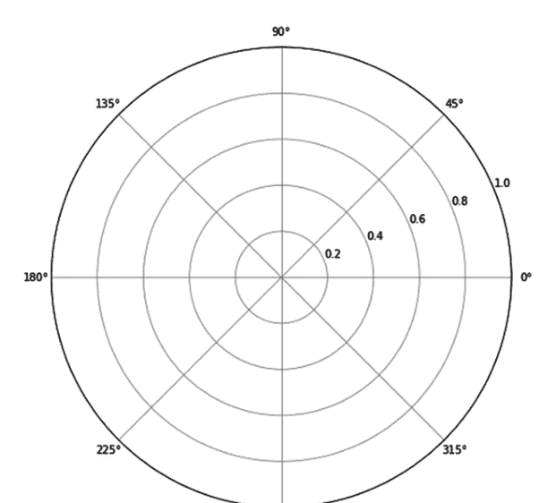

图 9.1 通用极坐标图。

极坐标图中的朝拜方向以弧度形式读取；因此，要转换为弧度形式，代码表示为：

```python
qibla_direction_rad = np.deg2rad(qibla_direction_deg)
```

这将角度度数转换为弧度形式。之后，要在极坐标图中可视化朝拜方向，代码如下：

```python
ax.plot([0, qibla_direction_rad], [0, 1], label='Qibla Direction', color='blue', linewidth=2)
```

其中，

- `ax.plot`：这是在指定坐标轴（ax）上绘制数据的方法，在本例中是之前创建的极坐标轴。
- 参数：`[0, qibla_direction_rad]` 和 `[0, 1]`：
    - `[0, qibla_direction_rad]`：这是以弧度为单位的径向角度数据。线段从0弧度（中心）开始，延伸到 `qibla_direction_rad`，代表极坐标系中的朝拜方向。
    - `[0, 1]`：这是半径数据。线段从半径0（中心）开始，向外延伸到半径1。
- `label='Qibla Direction'`：为线段提供标签，如果添加到图中，可以在图例中显示。
- `color='blue'`：将线段颜色设置为蓝色。
- `linewidth=2`：指定线段粗细为2个单位。

该代码的输出如图9.2所示。

#### 练习 1：使用北纬39.12°、东经80.11°的位置可视化朝拜方向

首先，确定朝拜方向。为此，我们首先插入计算所需的变量。

```python
φ_Location = 39.12
λ_Location = 80.11
φ_Kaabah = 21.4225
λ_Kaabah = 39.8262
Difference_Longitude = abs(λ_Location-λ_Kaabah)
```

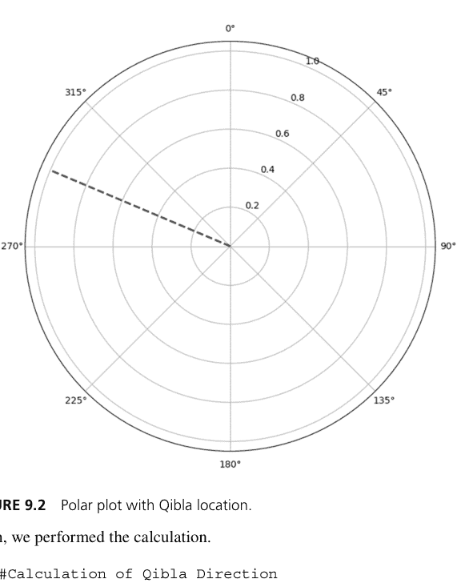

图 9.2 带有朝拜方向位置的极坐标图。

然后，我们执行计算。

```python
#朝拜方向计算
import math

A = math.sin(math.radians(abs(Difference_Longitude)))
B = math.cos(math.radians(φ_Location)) * math.tan(math.radians(φ_Kaabah))
C = math.sin(math.radians(φ_Location)) * math.cos(math.radians(Difference_Longitude))
D = A/(B-C)
θ = math.degrees(math.atan(D))

#确定朝拜方向的方位角
if Difference_Longitude > 180:
    delta_λ = 360 - Difference_Longitude
else:
    delta_λ = Difference_Longitude

if θ > 0:
    if λ_Location > λ_Kaabah:
        quadrant = "UB" # Utara Barat (西北)
    elif λ_Location <= λ_Kaabah:
        quadrant = "UT" # Utara Timur (东北)
    elif λ_Location < 0:
        if c >= 180:
            quadrant = "UB"
        else:
            quadrant = "UT"
elif θ < 0:
    if λ_Location > λ_Kaabah:
        quadrant = "SB" # Selatan Barat (西南)
    elif λ_Location <= λ_Kaabah:
        quadrant = "ST" # Selatan Timur (东南)
    elif λ_Location < 0:
        if c >= 180:
            quadrant = "SB"
        else:
            quadrant = "ST"

if quadrant == "UB":
    azimuth_kiblat = 360 - θ
elif quadrant == "SB":
    azimuth_kiblat = 180 - θ
elif quadrant == "UT":
    azimuth_kiblat = θ
elif quadrant == "ST":
    azimuth_kiblat = 180 + θ
# 转换为度分秒形式

degrees = int(azimuth_kiblat)
decimal_part = azimuth_kiblat - degrees
minutes_total = decimal_part * 60
minutes = int(minutes_total)
seconds = round((minutes_total - minutes) * 60)
print(f'坐标为北纬{φ_Location}°、东经{λ_Location}°的位置，其朝拜方向的方位角为 {degrees}° {minutes}' {seconds}"')
```

坐标为北纬39.12度、东经80.11度的地点，其朝向麦加的方位角为254° 41' 48"。

给定地点的朝向麦加方向为254° 41' 48"。接下来，创建极坐标图。首先，创建一个空的极坐标图。

```python
import matplotlib.pyplot as plt
import numpy as np
fig, ax = plt.subplots(subplot_kw={'projection': 'polar'}, figsize=(8, 8))
```

上述代码将生成一个空的极坐标图。然后，将极坐标图的顶部对齐为北方，即0度。

```python
import matplotlib.pyplot as plt
import numpy as np

fig, ax = plt.subplots(subplot_kw={'projection': 'polar'}, figsize=(8, 8))
ax.set_theta_direction(-1) # 设置顺时针旋转
ax.set_theta_zero_location('N') # 将0°（北方）设置在顶部
```

好的，现在极坐标图的顶部是0度，类似于我们通常在磁罗盘上看到的对齐方式。然后根据之前计算的朝向麦加方向来标注。

```python
import matplotlib.pyplot as plt
import numpy as np

fig, ax = plt.subplots(subplot_kw={'projection': 'polar'}, figsize=(8, 8))
ax.set_theta_direction(-1) # 设置顺时针旋转
ax.set_theta_zero_location('N') # 将0°（北方）设置在顶部

# 将朝向麦加方向转换为弧度以便绘图
qibla_direction_rad = np.deg2rad(azimuth_kiblat)
ax.plot([0, qibla_direction_rad], [0, 1], label=f'Qibla: {azimuth_kiblat:.2f}°', color='blue', linewidth=2)
```

这将标注朝向麦加方向（图9.3）。

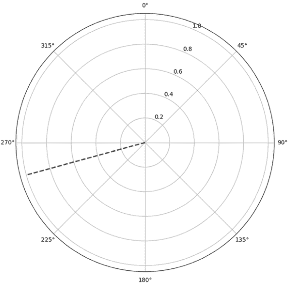

图9.3 带有朝向麦加方向的极坐标图。

### 太阳方位角在极坐标图上的可视化

在朝向麦加方向可以在极坐标图上计算和可视化之后，现在进行太阳方位角的计算。太阳方位角计算可以使用Skyfield库执行。计算任何给定时间和地点的太阳方位角如下：

```python
from skyfield.api import load
from skyfield.api import N,S,E,W, wgs84
location = earth + wgs84.latlon(location_latitud * N, location_longitud * E, elevation_m=0)
ts = load.timescale()
```

```python
eph = load('de440s.bsp')
planets = load('de440s.bsp')
earth = planets['earth']
sun = planets['sun']
astro = location.at(ts.utc(year, month, day,
hour-timezone,minute)).observe(sun)
sun_app = astro.apparent()
sun_alt, sun_az, = sun_app.altaz()
```

### 逐行解释

```python
from skyfield.api import load:
```

- 从skyfield.api模块导入load函数。
- load函数用于获取天文计算所需的数据文件（例如，时间尺度、星历表文件）。

```python
from skyfield.api import N, S, E, W, wgs84:
```

- 从skyfield.api模块导入常量N、S、E、W（代表基本方向：北、南、东、西）和wgs84对象。
- wgs84是一个大地测量模型，用于与地球相关的计算，例如将经纬度转换为三维坐标。

```python
ts = load.timescale():
```

- 加载一个时间尺度对象，用于在Skyfield中处理时间。
- 时间尺度对象提供定义和操作时间（例如，UTC、TT）的方法。

```python
eph = load('de421.bsp'):
```

- 加载JPL（喷气推进实验室）**DE421星历表文件**。该文件包含太阳系天体的精确位置和速度。
- 'de421.bsp'是一个二进制文件，Skyfield用它来计算行星和其他天体的位置。

116 用于伊斯兰天文学的Python

```python
planets = load('de421.bsp') :
```

- 这一行是多余的（重复加载了'de421.bsp'），但本质上是将相同的星历表数据赋值给一个新变量planet。
- 这样做通常是为了提高代码的可读性（例如，区分同一数据文件的不同用途）。

```python
earth = planets['earth'] :
```

- 从星历表数据中提取地球对象。该对象允许进行涉及地球位置的计算，包括观测者位置。

```python
sun = planets['sun'] :
```

- 从星历表数据中提取太阳对象。该对象可用于计算太阳相对于地球或其他天体的位置。

```python
location = earth + wgs84.latlon(location_latitud * N, location_longitud * E, elevation_m=0)
```

Earth:

- 代表加载的星历表（de421.bsp）中定义的太阳系中的地球。
- 该对象用作观测者位置的基础参考。

```python
wgs84.latlon(location_latitud * N, location_longitud * E, elevation_m=0) :
```

- 一个表示地球形状（纬度、经度、海拔）的大地测量模型。
- 将地理坐标转换为相对于地心的空间三维位置。

```python
location_latitud * N :
```

- 将纬度值（location_latitud）乘以N（北），确保其被解释为北半球坐标。如果在南半球，则应使用S。

```python
location_longitud * E :
```

- 将经度值（location_longitud）乘以E（东）。如果在西半球，则应使用W。

elevation_m=0:

- 指定地点的海拔高度（以米为单位）。这里设置为0，对应于海平面。

earth + ...:

- 将太阳系中地球的位置与地球上的观测者位置相结合。生成的location对象代表地球在太空中移动时的一个特定点。

```python
astro = location.at(ts.utc(year, month, day, hour,minute)).observe(sun)
```

location.at(ts.utc(year, month, day, hour, minute)):

- 计算指定地点在给定**UTC时间**在地球上的位置。
- ts.utc(year, month, day, hour, minute)：以协调世界时（UTC）定义时间。
- 此步骤确定那一刻地球（因此观测者）在太空中的位置。

.observe(sun) :

- 计算从指定地点在指定时间看到的太阳的**视位置**。
- 考虑了观测者、地球和太阳的相对位置。

```python
sun_app = astro.apparent()
```

astro.apparent() :

- 将太阳的**几何位置**（由astro计算）转换为其**视位置**，通过：
  1. 考虑**光行时延迟**：太阳的观测位置包括光从太阳传播到观测者所需的时间。
  2. 包含**光行差**：调整观测太阳时地球的运动。

sun_app:

- 此变量现在包含观测者看到的太阳的**视位置**，考虑了这些效应。

```python
sun_alt, sun_az, sun_distance = sun_app.altaz()
```

### 输出解释：

sun_alt (高度角):

- 太阳在地平线上方或下方的角高度（以度为单位）。
- 正值：太阳在地平线上方。
- 零：太阳在地平线上（日出或日落）。
- 负值：太阳在地平线下方（夜间）。

sun_az (方位角):

- 指向太阳的罗盘方向（以度为单位）。
- 从北方顺时针测量：
  - 0° = 北
  - 90° = 东
  - 180° = 南
  - 270° = 西

sun_distance (距离):

从观测者位置到太阳的距离，以天文单位（AU）为单位。
1 AU ≈ 1.496亿公里，这是地球到太阳的平均距离。

#### 练习2：计算2024年4月13日15:34，在北纬39.12度、东经80.11度，时区为+6的太阳方位角

首先，确定太阳方位角。第一步是输入所需的变量。

```python
import math
from skyfield.api import load, N, E, wgs84 # Skyfield用于天文计算
import calendar # 用于处理日期和时间

lat_location = 39.12
long_location = 80.11
timezone = 6
year = 2025
month = 4
day = 13
ele = 100
```

其思想是用户可以利用太阳的位置来确定朝向麦加的方向，而无需计时Rashdul Qibla。我们可以在一天中太阳位于地平线上方的任何时间使用。在这个案例中，我们使用15:34的太阳方位角位置。输入小时和分钟的变量，

```python
hour = 15
minute = 34
```

然后，确定太阳方位角

```python
# 加载行星星历表数据（精确的天文位置）
eph = load('de440s.bsp')
planets = load('de440s.bsp')

# 从星历表中获取地球和太阳对象
earth = planets['earth']
sun = planets['sun']

location = earth + wgs84.latlon(lat_location, long_location, elevation_m=0)

# 创建时间尺度对象并设置观测时间
ts = load.timescale()
t0 = ts.utc(year, month, day)
t1 = ts.utc(year, month, day + 1)
```

### 极坐标图上的太阳方位角与朝向（Qibla）可视化

现在，让我们将用于朝向的极坐标图与太阳方位角结合起来。

#### 练习 3：在 2024 年 4 月 13 日 15:34，使用北纬 39.12、东经 80.11 的位置，可视化朝向和太阳方位角

当两个可视化代码在同一个命令控制台中运行时，太阳方位角和朝向的可视化可以结合在一起。首先，运行朝向计算代码。

```python
φ_Location = 39.12
λ_Location = 80.11
φ_Kaabah = 21.4225
λ_Kaabah = 39.8262
Difference_Longitude = abs(λ_Location-λ_Kaabah)

#Calculation of Qibla Direction
import math

A = math.sin(math.radians(abs(Difference_Longitude)))
B = math.cos(math.radians(φ_Location))*math.tan(math.radians(φ_Kaabah))
C = math.sin(math.radians(φ_Location)) * math.cos(math.radians(Difference_Longitude))
D = A/(B-C)
θ = math.degrees(math.atan(D))

#Determine the Azimuth of the Qibla
if Difference_Longitude > 180:
    delta_λ = 360 - Difference_Longitude
else:
    delta_λ = Difference_Longitude

if θ > 0:
    if λ_Location > λ_Kaabah:
        quadrant = "UB" # Utara Barat
    elif λ_Location <= λ_Kaabah:
        quadrant = "UT" # Utara Timur
    elif λ_Location < 0:
        if c >= 180:
            quadrant = "UB"
        else:
            quadrant = "UT"
elif θ < 0:
    if λ_Location > λ_Kaabah:
        quadrant = "SB" # Selatan Barat
    elif λ_Location <= λ_Kaabah:
        quadrant = "ST" # Selatan Timur
    elif λ_Location < 0:
        if c >= 180:
            quadrant = "SB"
        else:
            quadrant = "ST"

if quadrant == "UB":
    azimuth_kiblat = 360 - θ
elif quadrant == "SB":
    azimuth_kiblat = 180 - θ
elif quadrant == "UT":
    azimuth_kiblat = θ
elif quadrant == "ST":
    azimuth_kiblat = 180 + θ
```

```python
# To Convert in Degree Form

degrees = int(azimuth_kiblat)
decimal_part = azimuth_kiblat - degrees
minutes_total = decimal_part * 60
minutes = int(minutes_total)
seconds = round((minutes_total - minutes) * 60)
print(f'The azimuth of the Qibla for Location with coordinate {φ_Location} Latitude, {λ_Location} Longitude, is {degrees}° {minutes}' {seconds}"')
```

然后是太阳方位角代码

```python
# Import required libraries
import math
from skyfield.api import load, N, E, wgs84 # Skyfield for astronomical calculations
import calendar # For handling dates and times

lat_location = 39.12
long_location = 80.11
timezone = 6
year = 2025
month = 4
day = 13
ele = 100

hour = 15
minute = 34

# Load planetary ephemeris data (precise astronomical positions)
eph = load('de440s.bsp')
planets = load('de440s.bsp')

# Get Earth and Sun objects from the ephemeris
earth = planets['earth']
sun = planets['sun']

location = earth + wgs84.latlon(lat_location, long_location, elevation_m=0)

# Create timescale object and set observation time
ts = load.timescale()
t0 = ts.utc(year, month, day)
t1 = ts.utc(year, month, day + 1)

sun_astro = location.at(ts.utc(year, month, day, hour-timezone, minute)).observe(sun)
sun_app = sun_astro.apparent()
sun_alt, sun_az, distance = sun_app.altaz()
print(sun_az.degrees)
```

然后运行可视化代码的组合。组合代码需要两个重要变量：太阳方位角 `sun_az.degrees` 和朝向 `azimuth_kiblat`。

```python
import matplotlib.pyplot as plt
import numpy as np

fig, ax = plt.subplots(subplot_kw={'projection': 'polar'}, figsize=(8, 8))
ax.set_theta_direction(-1)
ax.set_theta_zero_location('N')

# Plot Qibla Direction (blue line)
qibla_direction_rad = np.deg2rad(azimuth_kiblat)
ax.plot([0, qibla_direction_rad], [0, 1], label=f'Qibla: {azimuth_kiblat:.2f}°', color='blue', linewidth=2)

# Plot Sun Azimuth (orange line)
sun_direction_rad = np.deg2rad(sun_az.degrees)
# Plot a line from center (0,0) to edge (1) in sun's direction
ax.plot(
    [0, sun_direction_rad],      # Angle in radians
    [0, 1],                      # Distance from center
    label=f'Sun Az: {sun_az.degrees:.2f}°',  # Legend label
    color='orange',              # Color of line
    linewidth=2                  # Line thickness
)
```

生成的代码会生成一个罗盘，同时显示太阳的方位角和朝向。然而，它目前缺少标签来帮助用户解读可视化结果。为了增强其可用性，应使用清晰、描述性的标签更新可视化输出。

```python
import matplotlib.pyplot as plt
import numpy as np

fig, ax = plt.subplots(subplot_kw={'projection': 'polar'}, figsize=(8, 8))
ax.set_theta_direction(-1)
ax.set_theta_zero_location('N')

# Plot Qibla Direction (blue line)
qibla_direction_rad = np.deg2rad(azimuth_kiblat)
ax.plot([0, qibla_direction_rad], [0, 1], label=f'Qibla: {azimuth_kiblat:.2f}°', color='blue', linewidth=2)

# Plot Sun Azimuth (orange line)
sun_direction_rad = np.deg2rad(sun_az.degrees)
# Plot a line from center (0,0) to edge (1) in sun's direction
ax.plot(
    [0, sun_direction_rad], [0, 1], label=f'Sun Az: {sun_az.degrees:.2f}°',
    color='orange', linewidth=2
)

plt.title(f'Visualization of Qibla and Sun Azimuth\nLat: {lat_location}° | Long: {long_location}° \n{day} {month} {year}, {hour}:{minute} Local Time\n', pad=20)
plt.legend(loc='upper right')
plt.show()
```

图 9.5 展示了一个极坐标图；它就像一个罗盘，显示了两个重要的方向：朝向的位置（由虚线标记）和特定时间太阳的位置（由点划线显示）。在图表的正上方，你会看到它所依据的确切位置，包括纬度和经度，以及当地的日期和时间。这些信息很重要，因为朝向和太阳的方向都会根据你所在的位置和时间而变化。

现在，如果你环顾圆圈，你会注意到像 0°、90°、180° 和 270° 这样的数字。这些代表方向：0° 是北，90° 是东，180° 是南，270° 是西。所以，可以想象你站在一个罗盘内部，每个度数都告诉你你面朝哪个方向。

要使用它，首先关注蓝线；那是你所在位置的朝向。它告诉你需要面对的确切角度，以便朝向麦加的克尔白（天房）祈祷。如果你有罗盘或手机上的罗盘应用程序，只需旋转自己，直到与那个度数对齐。那就是你的朝向。

现在，这里变得更有用的地方，注意到橙色线了吗？它显示了在给定时间太阳的位置。如果你在户外并且能看到太阳，你可以利用它的位置来帮助你找到朝向，而不需要罗盘。一个简单的方法是使用像水瓶或任何直立的物体。将其放在平坦的表面上，观察它的影子落在哪里。影子会直接指向远离太阳的方向。

现在，再次查看图表并找到橙色线；那是太阳的方位角。然后将其与蓝色线进行比较，蓝色线显示的是朝拜方向（Qibla）。这两条线之间的角度告诉你，需要从太阳的位置旋转多少度才能面向朝拜方向。例如，如果朝拜方向在图表上位于太阳位置的左侧，那么你需要从影子的方向向左转动相同的角度。这样，影子就成了你的向导，只需一个瓶子和这张图表，即使没有技术设备，你也能确定朝拜方向。非常方便，对吧？

所以，简而言之，这张图表帮助你同时看到特定时间朝拜方向和太阳的位置，这很有用，尤其是在你没有数字指南针但能看到太阳的时候。

### 练习 4

可视化2025年8月17日当地时间14:40，位于南纬36.74°、西经71.06°（智利奇延附近）地点的朝拜方向和太阳方位角。该地点海拔150米，当地时区为UTC−4（智利标准时间）。使用这些信息生成一个极坐标图，显示该时刻的朝拜方向和太阳方位角。

### 练习 5

可视化2025年8月31日当地时间09:23，位于北纬48.85°、东经2.35°（法国巴黎）地点的朝拜方向和太阳方位角。该地点海拔35米，当地时区为UTC+2（中欧夏令时）。生成一个极坐标图，以可视化该特定时刻的朝拜方向和太阳位置。

### 练习 6

可视化2025年10月10日当地时间16:10，位于北纬1.29°、东经103.85°（新加坡）地点的朝拜方向和太阳方位角。该地点海拔15米，当地时区为UTC+8（新加坡标准时间）。生成一张图表，显示太阳方位角和朝拜方向。

### 练习 7

可视化2025年12月5日当地时间07:00，位于北纬40.71°、西经74.01°（美国纽约市）地点的朝拜方向和太阳方位角。该地点海拔10米，当地时区为UTC–5（美国东部标准时间）。创建一个可视化图表，比较日出时段太阳位置与朝拜方向。

## 祈祷时间太阳位置可视化 10

### 可视化太阳位置

祈祷时间由太阳相对于观测者的位置决定。每个祈祷时间对应一个特定的太阳事件：

1.  晌礼（Zuhur）在太阳到达天空最高点（天顶）时开始，即正对观测者位置的正上方（太阳正午）。
2.  晡礼（Asr）在物体影子的长度等于其实际高度（或两倍高度，取决于教法学派）时开始。
3.  昏礼（Maghrib）在日落时开始，此时太阳完全消失在地平线以下。
4.  宵礼（Isha）和晨礼（Fajr）取决于太阳在地平线以下折射引起的大气暮光。
    -   宵礼在天空完全变暗（天文暮光结束）时开始。
    -   晨礼在黎明时分第一缕光线出现（天文暮光开始）时开始。
5.  日出标志着晨礼的结束和白天的开始。

此可视化有助于说明这些关键的太阳位置，从而更容易理解伊斯兰祈祷时间的天文学基础。在深入代码之前，让我们先了解目标和预期输出：

### A. 目标

我们希望创建一个简单的可视化，显示：

1.  观测者（火柴人）在某个位置的位置。
2.  太阳在特定高度角时在天空中的位置。
3.  作为参考的地平线（0°）。

### B. 预期输出

一个包含以下元素的图表：

1.  绿色线：地平线（地面水平）。
2.  简单的人形：观测者的表示。
3.  橙色圆圈：处于一定高度的太阳。
4.  虚线：从观测者到太阳的视线。

要根据观测者可视化太阳的位置，步骤如下：

1.  导入库：使用 matplotlib 进行绘图，使用 numpy 进行数学计算。
2.  设置位置：
    -   观测者坐标（observer_x, observer_y）。
    -   太阳高度角（altitude_angle）。
3.  根据角度计算太阳位置（sun_x, sun_y）。
4.  绘制可视化：
    -   将地平线绘制为一条直线。
    -   将太阳表示为一个橙色点。
    -   绘制一个火柴人（如果有图像可用）。

以下是包含内联解释的完整代码，但首先，安装相关库。

### 导入库

```python
import matplotlib.pyplot as plt
import numpy as np
from PIL import Image
import requests
import io # Import io to handle the image data in memory
```

### 设置观测者和太阳位置

```python
observer_x, observer_y = 5, 0 # Observer's position on the horizon
altitude_angle = 40 # Angle in degrees (negative for below horizon)
distance_to_sun = 3 # Arbitrary horizontal distance to the Sun
```

### 根据角度计算太阳位置

```python
sun_x = observer_x - distance_to_sun # Place the Sun to the left of the observer
sun_y = observer_y + np.tan(np.radians(altitude_angle)) * distance_to_sun # Calculate vertical position
```

### 绘制可视化

```python
fig, ax = plt.subplots(figsize=(10, 6))

# Draw the horizon (straight line)
ax.plot([0, 10], [0, 0], color="green", linewidth=2, label="Horizon")

# Add stick figure to the plot using direct download link from Google Drive URL
image_url = "https://drive.google.com/uc?export=download&id=1T7pLZNW6dF9PKxdOZ9UXZDbA84teRSdx"

# Download the image content from the URL
response = requests.get(image_url)
response.raise_for_status() # Raise an exception for bad status codes

# Open the image from the downloaded content
stick_figure = Image.open(io.BytesIO(response.content))

# Setup position of stick figure (on the horizon)
stick_x, stick_y = 5, 0
ax.imshow(stick_figure, extent=(stick_x - 0.3, stick_x + 0.3, stick_y, stick_y + 1))

# Add the Sun as an orange dot
ax.plot(sun_x, sun_y, marker="o", color="orange", markersize=10, label="Sun")

# Draw the line of sight (dashed line)
ax.plot([observer_x, sun_x], [observer_y + 0.8, sun_y], color="black", linestyle="--", linewidth=1, label="Line of Sight")

# Add altitude scale
ax.axhline(0, color="black", linestyle="-", linewidth=1)
ax.text(-0.5, 0, "Horizon (0°)", va="center", ha="right", fontsize=10, color="green")
ax.text(-0.5, sun_y, f"Sun Position ({altitude_angle}°)", va="center", ha="right", fontsize=10, color="orange")

# Adjust the plot
ax.set_xlim(0, 10)
ax.set_ylim(-1.5, 5)

# Add labels and legend
ax.axis("off")
ax.legend(loc="upper right")
ax.set_title("Sun's Altitude Visualization", fontsize=14)

plt.show()
```

上述代码实现的结果如图10.1所示。此可视化展示了如何从观测者的角度，以几何方式表示太阳高度角（例如用于确定祈祷时间的角度）。

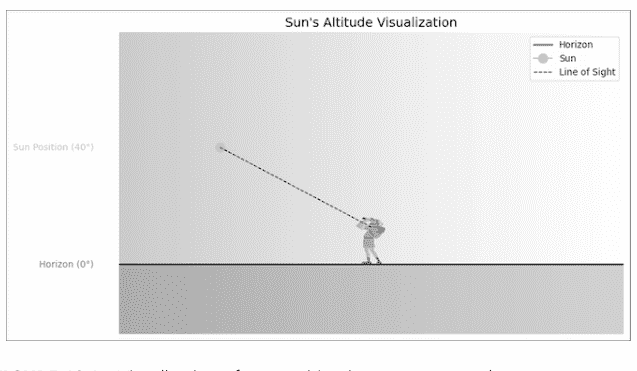

图10.1 观测者视角的太阳位置可视化。

#### 练习 1：计算祈祷时间的太阳高度角

使用 Python 的 skyfield 库计算给定坐标和日期在特定祈祷时间（例如，晡礼）的太阳高度角。
例如，如果2024年11月13日，纬度3，经度101，时区8的晡礼时间是4:32，那么太阳高度角的确定如下：

### Skyfield 安装

```python
!pip install skyfield

# 2. Library Imports
from skyfield.api import load, wgs84
from skyfield.almanac import find_transits, find_settings, find_risings
from datetime import datetime, timedelta
import math

# 3. Load Astronomical Data
ts = load.timescale()
eph = load('de440s.bsp')
sun = eph['Sun']
```

### 4. 定义观测者位置

```
latitude = 3
longitude = 101
timezone = 8
```

### 5. 定义日期和时间

```
day = 13
month = 11
year = 2024
hour = 16
minute = 32
month_name = calendar.month_name[month]
```

### 6. 初始化观测者位置

```
observer = eph['Earth'] + wgs84.latlon(latitude, longitude)
```

### 7. 计算太阳的视位置

```
sun_astro = observer.at(ts.utc(year, month, day, hour, minute)).observe(sun)
sun_app = sun_astro.apparent()
sun_alt, sun_az, distance = sun_app.altaz()
```

### 8. 输出太阳高度角

```
print(f'the Altitude of Sun at Asr prayer time on {day} {month_name} {year}, at coordinate lat: {latitude}, long: {longitude}, tz: {timezone}, at {hour}:{minute} Local Time is {sun_alt.degrees}')
```

这段Python代码使用**Skyfield库**计算了在特定位置、日期和时间下**太阳的高度角**（以度为单位）。以下是代码的工作原理：

### 库导入

- **skyfield.api**：提供加载天文数据和计算天体位置的工具。
- **skyfield.almanac**：包含计算天文事件的函数，尽管此处未直接使用。
- **datetime, timedelta**：处理日期和时间操作。
- **math**：在此代码片段中未使用，但可用于需要时的四舍五入操作。

### 加载天文数据

```
ts = load.timescale()
eph = load('de440s.bsp')
sun = eph['Sun']
```

- **ts = load.timescale()**：初始化一个时间尺度对象，用于处理时间相关计算。
- **eph = load('de440s.bsp')**：加载DE440s星历表文件，其中包含天体的精确位置数据。
- **sun = eph['Sun']**：加载太阳的位置数据。

### 定义观测者位置

```
latitude = 3
longitude = 101
timezone = 8
```

- **latitude and longitude**：指定观测者的地理坐标。这些坐标对应马来西亚的一个地点。
- **timezone**：相对于UTC的本地时区偏移量（马来西亚 = +8）。

### 定义日期和时间

```
day = 13
month = 6
year = 2024
hour = 16
minute = 32
```

- 指定计算太阳高度角的精确**日期**（2024年6月13日）和**时间**（当地时间16:32）。

### 初始化观测者位置

```
observer = eph['Earth'] + wgs84.latlon(latitude, longitude)
```

- 使用**WGS84大地坐标系**将地球的位置与观测者的位置结合起来。

### 计算太阳的视位置

```
sun_astro = observer.at(ts.utc(year, month, day, hour - timezone, minute)).observe(sun)
sun_app = sun_astro.apparent()
```

- **ts.utc(year, month, day, hour – timezone, minute)**：通过减去时区偏移量将本地时间转换为UTC时间（当地时间16:32 → UTC时间08:32）。
- **observer.at()**：指定观测者在给定UTC时间的位置。
- **observe(sun)**：计算从观测者位置看太阳在天空中的相对位置。
- **apparent()**：考虑大气效应（如折射）以提供太阳的视位置。

### 计算太阳高度角

```
sun_alt, sun_az, distance = sun_app.altaz()
```

- **altaz()**：计算太阳相对于观测者的**高度角**、**方位角**和**距离**。
    - **sun_alt**：太阳的高度角，以度为单位（地平线以上的角度）。
    - **sun_az**：太阳的方位角，以度为单位（从正北顺时针测量的角度）。
    - **distance**：观测者与太阳之间的距离（此处未使用）。

### 输出太阳高度角

```
print(f'the Altitude of Sun during Asr prayer time on {day} {month_name} {year}, at coordinate lat: {latitude}, long: {longitude}, tz: {timezone}, at {hour}:{minute} Local Time is {sun_alt.degrees}')
```

- **sun_alt.degrees**：将高度角从弧度（Skyfield的默认单位）转换为度并打印。
- 该值表示太阳在地平线以上的角高度：

the Altitude of sun during Asr prayer time on 13 November 2024, at coordinate lat: 3, long: 101, tz: 8, at 16:32 Local Time is 33.77219002658052

### 正午祈祷时间太阳位置的可视化

#### 练习2：可视化给定位置和日期正午祈祷时间的太阳高度角

创建一个可视化，显示在2024年12月19日，对于给定坐标（纬度：39.9°N，经度：116.4°E，时区：UTC+8），海拔100米处，正午祈祷时间太阳在天空中的位置。
首先，根据给定位置确定正午时间。

```
# 导入必要函数
from skyfield.api import load
from skyfield.api import N, S, E, W, wgs84
from skyfield import almanac

# 加载星历数据和行星对象
ts = load.timescale()
eph = load('de440s.bsp')
planets = load('de440s.bsp')
earth = planets['earth']
sun = planets['sun']

# 变量输入
lat_location = 39.9
long_location = 116.4
timezone = 8
day = 19
month = 12
year = 2024
ele = 100
```

138 伊斯兰天文学的Python实现

```
# 输入到
location = earth + wgs84.latlon(lat_location, long_location, elevation_m=0)

# 数据范围
t0 = ts.utc(year, month, day)
t1 = ts.utc(year, month, day + 1)

# 太阳中天时间
t = almanac.find_transits(location, sun, t0, t1)
hour_solar_transit = t.utc.hour
minutes_solar_transit = t.utc.minute
second_solar_transit = t.utc.second

zuhur_time = hour_solar_transit + (minutes_solar_transit / 60) + (second_solar_transit / 3600) + timezone + 0.017778

zuhur_time = float(zuhur_time)
degrees = int(zuhur_time)
decimal_part = zuhur_time - degrees
minutes_total = decimal_part * 60
minutes = int(minutes_total)

seconds = round((minutes_total - minutes) * 60)
sun_astro = location.at(ts.utc(year, month, day, hour_solar_transit, minutes_solar_transit, second_solar_transit)).observe(sun)
sun_alt, _, _ = sun_astro.apparent().altaz()
# 检查正午时间太阳是否在地平线以上
if sun_alt.degrees <= 0:
    zuhur = "Zuhur Does Not Occur"
else:
    zuhur = f"Zuhur Occurs at {degrees}° {minutes}' {seconds}\""

print(zuhur)
Zuhur Occurs at 12° 12' 36"
```

为指定位置计算出的正午祈祷时间是12:12:36。此结果源自存储在变量中的值：degrees = 12, minutes = 12, 和 seconds = 36。这些值代表太阳刚刚经过其每日天顶的时间。需要注意的是，此计算假设基于本地时间（LTC）使用适当的时区偏移量进行转换。

然而，如果我们打算将这些值用于进一步的天文计算，例如确定太阳位置，我们必须确保计算基于UTC（协调世界时）。这一点至关重要，因为天文算法（例如用于确定太阳高度角或方位角的算法）通常依赖于像UTC这样的标准化时间参考，以保持不同地点和日期的准确性和一致性。

根据给定的时间，确定太阳的位置。

```
# 本地时间值
h = degrees
m = minutes
s = seconds

# 将本地时间调整为UTC
h_utc = h - timezone

# 使用Skyfield计算观测时间
sun_astro = location.at(ts.utc(year, month, day, h_utc, m, s)).observe(sun)
sun_alt, _, _ = sun_astro.apparent().altaz()

print(sun_alt)
26deg 40' 41.6"
```

现在我们得到太阳的位置是26度40分41.6秒的太阳高度角。我们可以使用这个值来可视化太阳的位置。太阳的可视化可以使用matplotlib。代码可能有点复杂，但重要的是变量。

```
# 1. 导入库
import matplotlib.pyplot as plt
import numpy as np
from PIL import Image
import requests
import io # 导入io以处理内存中的图像数据

# 2. 设置观测者和太阳位置
observer_x, observer_y = 5, 0 # 观测者在地平线上的位置
altitude_angle = sun_alt.degrees[0] # 角度，以度为单位（负值表示在地平线以下）
distance_to_sun = # 到太阳的任意水平距离
```

140 伊斯兰天文学的Python实现

```
# 3. 根据角度计算太阳的位置
sun_x = observer_x - distance_to_sun # 将太阳放置在观测者的左侧
sun_y = observer_y + np.tan(np.radians(altitude_angle)) * distance_to_sun # 计算垂直位置

# 4. 绘制可视化
fig, ax = plt.subplots(figsize=(10, 6))

# 绘制地平线（直线）
ax.plot([0, 10], [0, 0], color="green", linewidth=2, label="Horizon")

# 使用Google Drive的直接下载链接将火柴人添加到图中
image_url = "https://drive.google.com/uc?export=download&id=1T7pLZNW6dF9PKxdOZ9UXZDbA84teRSdx"
# 从URL下载图像内容
response = requests.get(image_url)
response.raise_for_status() # 对于错误状态码引发异常
# 从下载的内容中打开图像
stick_figure = Image.open(io.BytesIO(response.content))

stick_x, stick_y = 5, 0 # 火柴人的位置（在地平线上）
ax.imshow(stick_figure, extent=(stick_x - 0.3, stick_x + 0.3, stick_y, stick_y + 1))

# 将太阳添加为橙色点
ax.plot(sun_x, sun_y, marker="o", color="orange", markersize=10, label="Sun")

# 添加天空渐变（蓝色）
sky_gradient = np.linspace(1, 0, 256).reshape(1, -1)
sky_gradient = np.vstack((sky_gradient, sky_gradient))
ax.imshow(sky_gradient, extent=[0, 10, -1.5, 5], cmap='Blues', alpha=0.3, aspect='auto')

# 添加地面（绿色）
ground = plt.Rectangle((0, -1.5), 10, 1.5, color='darkgreen', alpha=0.3)
ax.add_patch(ground)
```

### 萨尔祈祷时段太阳位置的可视化

#### 练习3：为给定地点和日期可视化萨尔祈祷时段的太阳高度角

创建一个可视化图表，展示在2024年12月19日，给定坐标（纬度：39.9°N，经度：116.4°E，时区：UTC+8）下萨尔祈祷时段的太阳在天空中的位置。在练习3中，给定的数据仅包括地点坐标和日期。因此，我们需要按照第7章所述，计算萨尔祈祷时段的太阳高度角。之后，我们才能创建萨尔祈祷时段太阳高度角的可视化图表。首先，计算萨尔祈祷时间。

```python
# 计算萨尔祈祷时间和太阳高度角
# 1. 导入必要函数
from skyfield.api import load
from skyfield.api import N, S, E, W, wgs84
from skyfield import almanac
import math
import calendar

# 2. 定义观测者位置
lat_location = 39.9
long_location = 116.4
timezone = 8

# 3. 定义日期
day = 19
month = 12
year = 2024
month_name = calendar.month_name[month]

# 4. 加载天文数据
ts = load.timescale()
eph = load('de440s.bsp')
planets = load('de440s.bsp')
earth = planets['earth']
sun = planets['sun']

### 6. 初始化观测者位置
location = earth + wgs84.latlon(lat_location, long_location, elevation_m=0)

# 7. 设置用于计算太阳中天的日期范围
t0 = ts.utc(year, month, day)
t1 = ts.utc(year, month, day + 1)

# 8. 计算太阳中天时间
t = almanac.find_transits(location, sun, t0, t1)

# 9. 太阳中天时的太阳高度角位置
h, m, s = t.utc.hour, t.utc.minute, t.utc.second
sun_astro = location.at(ts.utc(year, month, day, h, m)).observe(sun)
sun_app = sun_astro.apparent()
sun_alt, sun_az, distance = sun_app.altaz()

# 10. 计算中天时的太阳影长
sun_shadow_transit = 1/(math.tan(math.radians(sun_alt.degrees)))

# 11. 计算萨尔祈祷时的太阳影长
sun_shadow_asar = 1 + sun_shadow_transit

# 12. 循环查找太阳影长不超过萨尔祈祷影长的时刻
# 从小时开始
test = 1
while True:
    # 计算影长
    sun_astro = location.at(ts.utc(year, month, day, h, m, s)).observe(sun)
    sun_alt, _, _ = sun_astro.apparent().altaz() # 获取太阳高度角
    sun_shadow = 1 / math.tan(math.radians(sun_alt.degrees))

    if sun_alt.degrees <= 0:
        break
    if test > 24:
        break

    if sun_shadow >= sun_shadow_asar:
        break # 如果影长达到或超过目标长度，则退出循环
    h += 1

# 一旦满足小时条件，转到分钟
h_asar = h - 1
test = 1
while True:
    # 计算影长
    sun_astro = location.at(ts.utc(year, month, day, h_asar, m, s)).observe(sun)
    sun_alt, _, _ = sun_astro.apparent().altaz() # 获取太阳高度角
    sun_shadow = 1 / math.tan(math.radians(sun_alt.degrees))

    if sun_alt.degrees <= 0:
        break
    if test > 1440:
        break

    if sun_shadow >= sun_shadow_asar:
        break # 如果影长达到或超过目标长度，则退出循环
    m += 1

# 以分钟为单位递增时间
m_asar = m - 1
test = 1

# 一旦满足分钟条件，转到秒
while True:
    # 计算影长
    sun_astro = location.at(ts.utc(year, month, day, h_asar, m_asar, s)).observe(sun)
    sun_alt, _, _ = sun_astro.apparent().altaz() # 获取太阳高度角
    sun_shadow = 1 / math.tan(math.radians(sun_alt.degrees))

    if sun_alt.degrees <= 0:
        break
    if test > 86400:
        break

    if sun_shadow >= sun_shadow_asar:
        break # 如果影长达到或超过目标长度，则退出循环
    s += 1

    # 以秒为单位递增时间

s_asar = s

asar_time = (h_asar + (m_asar) / 60 + s_asar / 3600) + timezone
asar_time = float(asar_time)
degrees = int(asar_time)
decimal_part = asar_time - degrees
minutes_total = decimal_part * 60
minutes = int(minutes_total)
seconds = round((minutes_total - minutes) * 60)

if sun_alt.degrees <= 0 or test > 86400:
    asar = "萨尔祈祷不发生"
else:
    asar = f"萨尔祈祷发生在 {degrees}° {minutes}' {seconds}\""

print(asar)
# 输出：萨尔祈祷发生在 14° 34' 7"
```

其次，太阳高度角可视化。

```python
# 1. 导入库
import matplotlib.pyplot as plt
import numpy as np
from PIL import Image
import requests
import io # 导入io以处理内存中的图像数据

# 2. 设置观测者和太阳位置
observer_x, observer_y = 5, 0 # 观测者在地平线上的位置
altitude_angle = sun_alt.degrees[0] # 角度（度）（地平线以下为负值）
distance_to_sun = 3 # 到太阳的任意水平距离

# 3. 根据角度计算太阳位置
sun_x = observer_x - distance_to_sun # 将太阳放置在观测者左侧
sun_y = observer_y + np.tan(np.radians(altitude_angle)) * distance_to_sun # 计算垂直位置

# 4. 绘制可视化图表
fig, ax = plt.subplots(figsize=(10, 6))

# 绘制地平线（直线）
ax.plot([0, 10], [0, 0], color="green", linewidth=2, label="Horizon")

# 使用Google Drive直接下载链接将火柴人添加到图表中
image_url = "https://drive.google.com/uc?export=download&id=1T7pLZNW6dF9PKxd0Z9UXZDbA84teRSdx"
# 从URL下载图像内容
response = requests.get(image_url)
response.raise_for_status() # 对于错误状态码引发异常
# 从下载的内容中打开图像
stick_figure = Image.open(io.BytesIO(response.content))

stick_x, stick_y = 5, 0 # 火柴人位置（在地平线上）
ax.imshow(stick_figure, extent=(stick_x - 0.3, stick_x + 0.3, stick_y, stick_y + 1))

# 将太阳添加为橙色圆点
ax.plot(sun_x, sun_y, marker="o", color="orange", markersize=10, label="Sun")

# 添加天空渐变（蓝色）
sky_gradient = np.linspace(1, 0, 256).reshape(1, -1)
sky_gradient = np.vstack((sky_gradient, sky_gradient))
ax.imshow(sky_gradient, extent=[0, 10, -1.5, 5], cmap='Blues', alpha=0.3, aspect='auto')

# 添加地面（绿色）
ground = plt.Rectangle((0, -1.5), 10, 1.5, color='darkgreen', alpha=0.3)
ax.add_patch(ground)

# 绘制视线（虚线）
ax.plot([observer_x, sun_x], [observer_y + 0.8, sun_y], color="black", linestyle="--", linewidth=1, label="Line of Sight")

# 添加高度角刻度
ax.axhline(0, color="black", linestyle="-", linewidth=1)
ax.text(-0.5, 0, "Horizon (0°)", va="center", ha="right", fontsize=10, color="green")
ax.text(-0.5, sun_y, f"Sun Position ({altitude_angle:.4f}°)", va="center", ha="right", fontsize=10, color="orange")

# 调整图表
ax.set_xlim(0, 10)
ax.set_ylim(-1.5, 5)

# 添加标签和图例
ax.axis("off")
ax.legend(loc="upper right")
ax.set_title(f"Sun's Altitude Visualization at Asr Prayer Time\n Lat: {lat_location}° N Long: {long_location}° E TZ: {timezone}\n {day} {month_name} {year} {degrees}: {minutes}: {seconds}", fontsize=14)

plt.show()
```

在上面的代码中，最重要的变量是 `sun_alt.degrees`，它表示在指定时刻太阳的高度角（以度为单位）。这个值对于确定太阳是否满足给定祈祷时间的条件至关重要。其余代码主要作为模板，提供观测和可视化的结构，并不直接影响太阳高度角的计算结果。此外，在可视化不同的祈祷时间（例如晨礼、晌礼、萨尔等）时，请确保通过修改以下行来相应地更新图表标题：

```python
ax.set_title(f"Sun's Altitude Visualization at Zuhur Prayer Time\n Lat: {lat_location}° N Long: {long_location}° E TZ: {timezone}\n {day} {month_name} {year} {degrees}: {minutes}: {seconds}", fontsize=14)
```

以反映正在分析的**特定祈祷时间**。编码可视化的结果如图10.2所示。

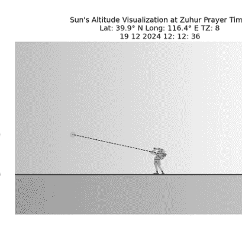

**图10.2** 晌礼祈祷时段太阳位置的可视化。

### 祈祷时间太阳位置的可视化

#### 练习 4：为给定地点和日期可视化祈祷时间的太阳高度

创建一个可视化图表，展示在给定坐标（纬度：39.9°N，经度：116.4°E，时区：UTC+8）下，2024年12月19日，海拔100米处，祈祷时间的太阳在天空中的位置。首先，确定祈祷时间。

```python
#Import Necessary Function
from skyfield.api import load
from skyfield.api import N, S, E, W, wgs84
from skyfield import almanac

#Load Ephemeris Data and Planet Objects
ts = load.timescale()
eph = load('de440s.bsp')
planets = load('de440s.bsp')
earth = planets['earth']
sun = planets['sun']
```

```python
# Variable Input
lat_location = 39.9
long_location = 116.4
timezone = 8
day = 19
month = 12
year = 2024
ele = 100
```

```python
#input into
location = earth + wgs84.latlon(lat_location, long_location, elevation_m=0)
```

```python
#Range of Data
t0 = ts.utc(year, month, day)
t1 = ts.utc(year, month, day + 1)
```

```python
from skyfield.units import Angle
from numpy import arccos
from skyfield.earthlib import refraction
```

```python
altitude_m = ele
earth_radius_m = 6378136.6
side_over_hypotenuse = earth_radius_m / (earth_radius_m + altitude_m)
h = Angle(radians=-arccos(side_over_hypotenuse))
solar_radius_degrees = 16 / 60
r = refraction(0.0, temperature_C=15.0, pressure_mbar=1030.0)
```

```python
t, y = almanac.find_settings(location, sun, t0, t1, horizon_degrees=-r + h.degrees - solar_radius_degrees)
h, m, s = t.utc.hour, t.utc.minute, t.utc.second
```

```python
maghrib_time = float(h + m / 60 + s / 3600 + timezone)
maghrib_time %= 24 # Ensure 24-hour clock format
maghrib_time = float(maghrib_time)
degrees = int(maghrib_time)
decimal_part = maghrib_time - degrees
```

```python
minutes_total = decimal_part * 60
minutes = int(minutes_total)
seconds = round((minutes_total - minutes) * 60)

sun_astro = location.at(ts.utc(year, month, day, h, m, s)).observe(sun)
sun_alt, _, _ = sun_astro.apparent().altaz()
if sun_alt.degrees >= 0:
    maghrib = "Maghrib Does Not Occur"
else:
    maghrib = f"Maghrib Occurs at {degrees}° {minutes}' {seconds}\""

print(maghrib)
```

Maghrib Occurs at 16° 53' 43"

首先，确定太阳高度。

```python
# Local time values
h = degrees
m = minutes
s = seconds

# Adjust local time to UTC
h_utc = h - timezone

# Compute observation time using Skyfield
sun_astro = location.at(ts.utc(year, month, day, h_utc, m, s)).observe(sun)
sun_alt, _, _ = sun_astro.apparent().altaz()

print(sun_alt)
```

-01deg 09' 42.5"

然后可视化太阳的位置

```python
# 1. Import Library
import matplotlib.pyplot as plt
import numpy as np
from PIL import Image
import requests
import io # Import io to handle the image data in memory
```

```python
# 2. Set Observer and Sun Positions
observer_x, observer_y = 5, 0 # Observer's position on the horizon
altitude_angle = sun_alt.degrees # Angle in degrees (negative for below horizon)
distance_to_sun = 3 # Arbitrary horizontal distance to the Sun

# 3. Calculate the Sun's position based on the angle
sun_x = observer_x - distance_to_sun # Place the Sun to the left of the observer
sun_y = observer_y + np.tan(np.radians(altitude_angle)) * distance_to_sun # Calculate vertical position

# 4. Plot the Visualization
fig, ax = plt.subplots(figsize=(10, 6))

# Draw the horizon (straight line)
ax.plot([0, 10], [0, 0], color="green", linewidth=2, label="Horizon")

# Add stick figure to the plot using direct download link from Google Drive URL
image_url = "https://drive.google.com/uc?export=download&id=1T7pLZNW6dF9PKxdOZ9UXZDbA84teRSdx"
# Download the image content from the URL
response = requests.get(image_url)
response.raise_for_status() # Raise an exception for bad status codes
# Open the image from the downloaded content
stick_figure = Image.open(io.BytesIO(response.content))

stick_x, stick_y = 5, 0 # Position of stick figure (on the horizon)
ax.imshow(stick_figure, extent=(stick_x - 0.3, stick_x + 0.3, stick_y, stick_y + 1))

# Add the Sun as an orange dot
ax.plot(sun_x, sun_y, marker="o", color="orange", markersize=10, label="Sun")

# Add sky gradient (blue)
sky_gradient = np.linspace(1, 0, 256).reshape(1, -1)
```

```python
sky_gradient = np.vstack((sky_gradient, sky_gradient))
ax.imshow(sky_gradient, extent=[0, 10, -1.5, 5], cmap='Blues', alpha=0.3, aspect='auto')

# Add ground (green)
ground = plt.Rectangle((0, -1.5), 10, 1.5, color='darkgreen', alpha=0.3)
ax.add_patch(ground)

# Draw the line of sight (dashed line)
ax.plot([observer_x, sun_x], [observer_y + 0.8, sun_y], color="black", linestyle="--", linewidth=1, label="Line of Sight")

# Add altitude scale
ax.axhline(0, color="black", linestyle="-", linewidth=1)
ax.text(-0.5, 0, "Horizon (0°)", va="center", ha="right", fontsize=10, color="green")
ax.text(-0.5, sun_y+1, f"Sun Position ({altitude_angle:.4f}°)", va="center", ha="right", fontsize=10, color="orange")

# Adjust the plot
ax.set_xlim(0, 10)
ax.set_ylim(-1.5, 5)
# Add labels and legend
```

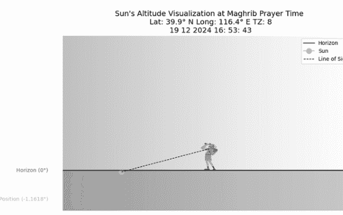

图 10.4 祈祷时间太阳位置的可视化。

```python
ax.axis("off")
ax.legend(loc="upper right")
ax.set_title(f"Sun's Altitude Visualization at Maghrib Prayer Time\n Lat: {lat_location}° N Long: {long_location}° E TZ: {timezone}\n {day} {month} {year} {degrees}: {minutes}: {seconds}", fontsize=14)

plt.show()
```

上述代码实现的结果如图 10.4 所示。

### 夜间祈祷时间太阳位置的可视化

#### 练习 5：为给定地点和日期可视化夜间祈祷时间的太阳高度

创建一个可视化图表，展示在给定坐标（纬度：39.9°N，经度：116.4°E，时区：UTC+8）下，2024年12月19日，太阳俯角为16度时，夜间祈祷时间的太阳在天空中的位置。首先，确定夜间祈祷时间。

```python
#Import Necessary Function
from skyfield.api import load
from skyfield.api import N, S, E, W, wgs84
from skyfield import almanac
import math

#Load Ephemeris Data and Planet Objects
ts = load.timescale()
eph = load('de440s.bsp')
planets = load('de440s.bsp')
earth = planets['earth']
sun = planets['sun']

# Variable Input
lat_location = 39.9
long_location = 116.4
```

```python
timezone = 8
day = 19
month = 12
year = 2024
ele = 100

location = earth + wgs84.latlon(lat_location, long_location, elevation_m=ele)
t0 = ts.utc(year, month, day)
t1 = ts.utc(year, month, day + 1)

from skyfield.units import Angle
from numpy import arccos
from skyfield.earthlib import refraction

altitude_m = ele
earth_radius_m = 6378136.6
side_over_hypotenuse = earth_radius_m / (earth_radius_m + altitude_m)
h = Angle(radians=-arccos(side_over_hypotenuse))
solar_radius_degrees = 16 / 60
r = refraction(0.0, temperature_C=15.0, pressure_mbar=1030.0)

t, y = almanac.find_settings(location, sun, t0, t1, horizon_degrees=-r + h.degrees - solar_radius_degrees)
h, m, s = t.utc.hour, t.utc.minute, t.utc.second
#print(h,m,s)

m=1
s=1
h=h+1

sun_astro = location.at(ts.utc(year, month, day, h, m)).observe(sun)
sun_app = sun_astro.apparent()
sun_alt, sun_az, distance = sun_app.altaz()
#print(sun_alt)

# Start with hour

isya_angle = 16
elevation_correction = 0.0293 * math.sqrt(ele)
isha_angle_actual = -isya_angle - elevation_correction
#print(isya_angle_corrected)
```

```python
# Start with hour

test = 1
while True:

    # Calculate the Solar Altitude
    sun_astro = location.at(ts.utc(year, month, day, h+1, m, s)).observe(sun)
    sun_alt, _, _ = sun_astro.apparent().altaz() # Get the altitude of the sun

    if sun_alt.degrees >= 0:
        break
    if test > 24:
        break

    if sun_alt.degrees <= isha_angle_actual:
        break # Exit the loop if the solar altitude located below -18 degree
    h = h + 1

# Once the condition is met for hours, move to minutes
h_isya = h - 1
test = 1
while True:
    # Calculate the Solar Altitude
    sun_astro = location.at(ts.utc(year, month, day, h_isya, m, s)).observe(sun)
    sun_alt, _, _ = sun_astro.apparent().altaz() # Get the altitude of the sun

    if sun_alt.degrees >= 0:
        break
    if test > 1440:
        break

    if sun_alt.degrees <= isha_angle_actual:
        break # Exit the loop if the solar altitude located below -18 degree
    m += 1

    # Increment time in minutes
    m_isya = m - 1
```

## 156 用于伊斯兰天文学的Python

```python
# 一旦满足分钟条件，就转到秒
test = 1
while True:
    # 计算太阳高度角
    sun_astro = location.at(ts.utc(year, month, day, h_isya, m_isya, s)).observe(sun)
    sun_alt, _, _ = sun_astro.apparent().altaz() # 获取太阳高度角

    if sun_alt.degrees >= 0:
        break
    if test > 86400:
        break

    if sun_alt.degrees <= isha_angle_actual:
        break # 如果太阳高度角低于-18度，则退出循环
    s += 1

    # 以秒为单位增加时间

s_isya = s

isya_time = float(h_isyak + m_isyak / 60 + s_isyak / 3600 + timezone)
isya_time %= 24 # 确保24小时制格式
isya_time = float(isya_time)
degrees = int(isya_time)
decimal_part = isya_time - degrees
minutes_total = decimal_part * 60
minutes = int(minutes_total)
seconds = round((minutes_total - minutes) * 60)

if sun_alt.degrees >= 0 or test > 86400:
    isya = "Isya' 不发生"
else:
    isya = f"Isya' 发生于 {degrees}° {minutes}' {seconds}''"

print(isya)
Isya' 发生于 18° 19' 59''
```

确定Isya'祈祷时间的太阳高度角

```python
# 本地时间值
h = degrees
m = minutes
s = seconds

# 将本地时间调整为UTC
h_utc = h - timezone

# 使用Skyfield计算观测时间
sun_astro = location.at(ts.utc(year, month, day, h_utc, m, s)).observe(sun)
sun_alt, _, _ = sun_astro.apparent().altaz()

print(sun_alt)
-16deg 17' 40.3"
```

可视化Isya'祈祷时间的太阳位置

```python
# 1. 导入库
import matplotlib.pyplot as plt
import numpy as np
from PIL import Image
import requests
import io # 导入io以处理内存中的图像数据

# 2. 设置观测者和太阳位置
observer_x, observer_y = 5, 0 # 观测者在地平线上的位置
altitude_angle = sun_alt.degrees # 角度（度）（地平线以下为负值）
distance_to_sun = # 到太阳的任意水平距离

# 3. 根据角度计算太阳位置
sun_x = observer_x - distance_to_sun # 将太阳置于观测者左侧
sun_y = observer_y + np.tan(np.radians(altitude_angle)) * distance_to_sun # 计算垂直位置

# 4. 绘制可视化图
fig, ax = plt.subplots(figsize=(10, 6))

# 绘制地平线（直线）
ax.plot([0, 10], [0, 0], color="green", linewidth=2,
        label="地平线")

# 使用直接下载添加火柴人图形
# 链接来自Google Drive URL
image_url = "https://drive.google.com/uc?export=download&id=1T7pLZNW6dF9PKxdOZ9UXZDbA84teRSdx"
# 从URL下载图像内容
response = requests.get(image_url)
response.raise_for_status() # 对于
# 错误状态码引发异常
# 从下载的内容中打开图像
stick_figure = Image.open(io.BytesIO(response.content))

stick_x, stick_y = 5, 0 # 火柴人图形的位置（在
# 地平线上）
ax.imshow(stick_figure, extent=(stick_x - 0.3, stick_x
+ 0.3, stick_y, stick_y + 1))

# 添加太阳作为橙色圆点
ax.plot(sun_x, sun_y, marker="o", color="orange",
        markersize=10, label="太阳")

# 添加天空渐变（蓝色）
sky_gradient = np.linspace(1, 0, 256).reshape(1, -1)
sky_gradient = np.vstack((sky_gradient, sky_gradient))
ax.imshow(sky_gradient, extent=[0, 10, -1.5, 5],
         cmap='Blues', alpha=0.3, aspect='auto')

# 添加地面（绿色）
ground = plt.Rectangle((0, -1.5), 10, 1.5,
                        color='darkgreen', alpha=0.3)
ax.add_patch(ground)

# 绘制视线（虚线）
ax.plot([observer_x, sun_x], [observer_y + 0.8,
sun_y], color="black", linestyle="--", linewidth=1,
        label="视线")

# 添加高度角刻度
ax.axhline(0, color="black", linestyle="-",
           linewidth=1)
ax.text(-0.5, 0, "地平线 (0°)", va="center",
        ha="right", fontsize=10, color="green")
ax.text(-0.5, sun_y-1, f"太阳位置 ({altitude_angle:.4f}°)", va="center", ha="right", fontsize=10,
        color="orange")

# 调整绘图
ax.set_xlim(0, 10)
ax.set_ylim(-1.5, 5)
# 添加标签和图例
ax.axis("off")
ax.legend(loc="upper right")
ax.set_title(f"Isya'祈祷时间的太阳高度角可视化\n 纬度: {lat_location}° N 经度: {long_location}° E 时区: {timezone}\n {day} {month} {year}
{degrees}: {minutes}: {seconds}", fontsize=14)

plt.show()
```

上述代码实现的结果如图10.5所示。

### SUBH祈祷时间太阳位置的可视化

#### 练习6：可视化给定位置和日期Subh祈祷时间的太阳高度角

创建一个可视化图，显示2024年12月19日，给定坐标（纬度：39.9°N，经度：116.4°E，时区：UTC+8）下，Subh祈祷时间太阳在天空中的位置，太阳俯角为15度。首先，确定Subh祈祷时间

```python
#导入必要函数
from skyfield.api import load
from skyfield.api import N, S, E, W, wgs84
from skyfield import almanac
import math

#加载星历数据和行星对象
ts = load.timescale()
eph = load('de440s.bsp')
planets = load('de440s.bsp')
earth = planets['earth']
sun = planets['sun']

# 变量输入

lat_location = 39.9
long_location = 116.4
timezone = 8
day = 19
month = 12
year = 2024
ele = 100

location = earth + wgs84.latlon(lat_location, long_location, elevation_m=ele)
t0 = ts.utc(year, month, day)
t1 = ts.utc(year, month, day + 1)

from skyfield.units import Angle
from numpy import arccos
from skyfield.earthlib import refraction

altitude_m = ele
earth_radius_m = 6378136.6
side_over_hypotenuse = earth_radius_m / (earth_radius_m + altitude_m)
h = Angle(radians=-arccos(side_over_hypotenuse))
solar_radius_degrees = 16 / 60
r = refraction(0.0, temperature_C=15.0,
pressure_mbar=1030.0)

t, y = almanac.find_risings(location, sun, t0, t1,
horizon_degrees=-r + h.degrees - solar_radius_degrees)
h, m, s = t.utc.hour, t.utc.minute, t.utc.second

subh_angle = 16
elevation_correction = 0.0293 * math.sqrt(ele)
subh_angle_actual = -subh_angle - elevation_correction

# 从小时开始

test = 1
while True:

    # 计算太阳高度角
    sun_astro = location.at(ts.utc(year, month, day, h,
    m, s)).observe(sun)
    sun_alt, _, _ = sun_astro.apparent().altaz() # 获取
    太阳高度角

    if sun_alt.degrees >= 0:
        break
    if test > 24:
        break

    if sun_alt.degrees <= subh_angle_actual:
        break # 如果太阳高度角
        低于-18度，则退出循环
    h -= 1

# 一旦满足小时条件，就转到分钟
h_subh = h + 1
test = 1
while True:
    # 计算太阳高度角
    sun_astro = location.at(ts.utc(year, month, day,
    h_subh, m, s)).observe(sun)
    sun_alt, _, _ = sun_astro.apparent().altaz() # 获取
    太阳高度角
    if sun_alt.degrees >= 0:
        break
    if test > 1440:
        break

    if sun_alt.degrees <= subh_angle_actual:
        break # 如果太阳高度角
        低于-18度，则退出循环
    m -= 1

    # 以分钟为单位增加时间
    m_subh = m + 1

# 一旦满足分钟条件，就转到
秒
test = 1
while True:
    # 计算太阳高度角
    sun_astro = location.at(ts.utc(year, month, day,
    h_subh, m_subh, s)).observe(sun)
    sun_alt, _, _ = sun_astro.apparent().altaz() # 获取
    太阳高度角
    if sun_alt.degrees >= 0:
        break
    if test > 86400:
        break

    if sun_alt.degrees <= subh_angle_actual:
        break # 如果太阳高度角
        低于-18度，则退出循环
    s -= 1

    # 以秒为单位增加时间

    s_subh = s + 1

subh_time = float(h_subh + (m_subh) / 60 + s_subh /
3600 + timezone)
subh_time %= 24 # 确保24小时制格式
subh_time = float(subh_time)
degrees = int(subh_time)
decimal_part = subh_time - degrees
minutes_total = decimal_part * 60
minutes = int(minutes_total)
seconds = round((minutes_total - minutes) * 60)

if sun_alt.degrees >= 0 or test > 86400:
    subh = "Subuh 不发生"
else:
    subh = f"Subuh 发生于 {degrees}° {minutes}' {seconds}''"

print(subh)
```

确定Subh的太阳高度角

```python
# 本地时间值
h = degrees
m = minutes
s = seconds

# 将本地时间调整为UTC
h_utc = h - timezone

# 使用Skyfield计算观测时间
sun_astro = location.at(ts.utc(year, month, day,
h_utc, m, s)).observe(sun)
sun_alt, _, _ = sun_astro.apparent().altaz()

print(sun_alt)
-16deg 11' 25.1"
```

确定并可视化Subh祈祷时间的太阳位置。

```python
# 1. 导入库
import matplotlib.pyplot as plt
import numpy as np
from PIL import Image
import requests
import io # 导入io以处理内存中的图像数据
```

## 10 • 祈祷时间太阳位置可视化

### 164 用于伊斯兰天文学的Python

```python
# 2. 设置观测者和太阳位置
observer_x, observer_y = 5, 0  # 观测者在地平线上的位置
altitude_angle = sun_alt.degrees  # 以度为单位的角度（地平线以下为负值）
distance_to_sun = 3  # 到太阳的任意水平距离
```

```python
# 3. 根据角度计算太阳位置
sun_x = observer_x - distance_to_sun  # 将太阳置于观测者左侧
sun_y = observer_y + np.tan(np.radians(altitude_angle)) * distance_to_sun  # 计算垂直位置
```

```python
# 4. 绘制可视化图
fig, ax = plt.subplots(figsize=(10, 6))
```

```python
# 绘制地平线（直线）
ax.plot([0, 10], [0, 0], color="green", linewidth=2, label="Horizon")
```

```python
# 使用Google Drive直链在图中添加简笔人物
image_url = "https://drive.google.com/uc?export=download&id=1T7pLZNW6dF9PKxdOZ9UXZDbA84teRSdx"
# 从URL下载图像内容
response = requests.get(image_url)
response.raise_for_status()  # 对错误状态码抛出异常
# 从下载的内容中打开图像
stick_figure = Image.open(io.BytesIO(response.content))
```

```python
stick_x, stick_y = 5, 0  # 简笔人物的位置（在地平线上）
ax.imshow(stick_figure, extent=(stick_x - 0.3, stick_x + 0.3, stick_y, stick_y + 1))
```

```python
# 添加太阳作为橙色圆点
ax.plot(sun_x, sun_y, marker="o", color="orange", markersize=10, label="Sun")
```

```python
# 添加天空渐变（蓝色）
sky_gradient = np.linspace(1, 0, 256).reshape(1, -1)
sky_gradient = np.vstack((sky_gradient, sky_gradient))
```

### 165

晨礼时太阳高度角可视化
纬度：39.9° N 经度：116.4° E 时区：8
2024年12月19日 6:3:38

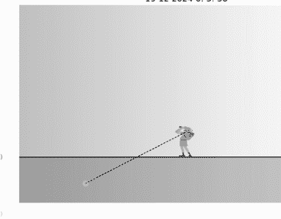

图 10.6 晨礼时间太阳位置可视化。

```python
ax.imshow(sky_gradient, extent=[0, 10, -1.5, 5],
          cmap='Blues', alpha=0.3, aspect='auto')

# 添加地面（绿色）
ground = plt.Rectangle((0, -1.5), 10, 1.5,
                       color='darkgreen', alpha=0.3)
ax.add_patch(ground)

# 绘制视线（虚线）
ax.plot([observer_x, sun_x], [observer_y + 0.8,
        sun_y], color="black", linestyle="--", linewidth=1,
        label="Line of Sight")

# 添加高度角标尺
ax.axhline(0, color="black", linestyle="-",
           linewidth=1)
ax.text(-0.5, 0, "Horizon (0°)", va="center",
        ha="right", fontsize=10, color="green")
ax.text(-0.5, sun_y-1, f"Sun Position ({altitude_angle:.4f}°)", va="center", ha="right", fontsize=10,
        color="orange")

# 调整图表
ax.set_xlim(0, 10)
ax.set_ylim(-1.5, 5)
# 添加标签和图例
```

```python
ax.axis("off")
ax.legend(loc="upper right")
ax.set_title(f"Sun's Altitude Visualization at Subh Prayer Time\n Lat: {lat_location}° N Long: {long_location}° E TZ: {timezone}\n {day} {month} {year} {degrees}: {minutes}: {seconds}", fontsize=14)

plt.show()
```

上述代码实现的结果如图10.6所示。

### 练习1：晨礼

使用东京的坐标（北纬35.6894°，东经139.6916°，海拔100米，时区GMT+9），计算2025年12月27日的晨礼（Fajr）时间，使用太阳俯角-18度，并在日出前太阳达到此角度时可视化其高度角。

### 练习2：日出

使用东京的坐标（北纬35.6894°，东经139.6916°，海拔100米，时区GMT+9），计算2025年12月27日的日出（Syuruk）时间，并可视化日出前后的太阳高度角曲线。

### 练习3：晌礼

使用东京的坐标（北纬35.6894°，东经139.6916°，海拔100米，时区GMT+9），计算2025年12月27日的晌礼（Zuhur）时间，并可视化当天太阳达到最高点时的高度角。

### 练习4：晡礼

使用东京的坐标（北纬35.6894°，东经139.6916°，海拔100米，时区GMT+9），计算2025年12月27日的晡礼（Asar）时间，分别使用标准影长比（1×）和哈乃斐方法（2×），并可视化每个晡礼时间的太阳高度角。

### 练习5：昏礼

使用东京的坐标（北纬35.6894°，东经139.6916°，海拔100米，时区GMT+9），根据日落时间计算2025年12月27日的昏礼（Maghrib）时间，并可视化太阳越过地平线时的高度角。

### 练习6：宵礼

使用东京的坐标（北纬35.6894°，东经139.6916°，海拔100米，时区GMT+9），计算2025年12月27日的宵礼（Isya’）时间，使用太阳俯角-18度，并在日落后太阳达到此角度时可视化其高度角。

## 11 • 新月观测数据可视化

Matplotlib是Python编程语言及其数值数学扩展NumPy的绘图库。它提供了一个面向对象的API，用于将绘图嵌入到使用通用GUI工具包（如Tkinter、wxPython、Qt或GTK）的应用程序中。还有一个基于状态机（类似OpenGL）的过程式“pylab”接口，旨在与MATLAB高度相似，但不鼓励使用。SciPy使用Matplotlib。Matplotlib最初由John D. Hunter编写。此后，它发展了一个活跃的社区，并在BSD风格许可证下分发。在John Hunter于2012年8月去世前不久，Michael Droettboom被任命为Matplotlib的首席开发者，后来Thomas Caswell也加入了团队。Matplotlib可用于创建地图、绘制各种类型的图表，并且高度灵活，易于定制。因此，在本课程中，我们将学习如何使用Matplotlib生成新月（hilal）数据的可视化。

### 第一次实践：马来西亚槟城

#### A. 地平线生成

地平线生成必须覆盖方位角360度和高度角180度。这确保了生成的地平线能够可视化不同地点和日期的新月（hilal）可见性数据。地平线生成的确定如下：

```python
import matplotlib.pyplot as plt
import numpy as np

fig, ax = plt.subplots(figsize=(20,10))
```

```python
horizon_angles = np.linspace(0, 360, 720)
horizon_altitudes = np.zeros_like(horizon_angles)
ax.plot(horizon_angles, horizon_altitudes,
        color='black', linestyle='-', linewidth=1)
```

上述编程的结果如图11.1所示。
生成的线代表观测者的地平线。

#### B. 太阳位置可视化与图表标注

为了显示太阳的位置（用黄色表示），实现了以下编程步骤：

```python
# 太阳位置确定
sun_az = 287
sun_alt = -1

moon_az = 283
moon_alt = 12.00474
daz = abs(sun_az-moon_az)
arcl = 13.03075
Location = "Penang, Malaysia"
day = 12
month = 1
year = 2024
month_name = calendar.month_name[month]
```

使用以下关键方法对图表进行标注：

```python
ax.set_xlabel('Azimuth (degrees)')
ax.set_ylabel('Altitude (degrees)')
ax.set_title(' The Position of the Moon and Sun During Observation ')
```

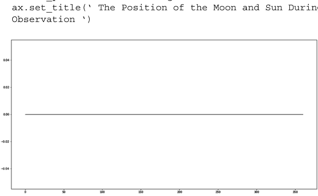

图 11.1 观测者地平线。

至此，高度角和方位角已被标注，便于解读。通常，我们观测太阳和中央参考线在中点对齐。为确保黑色地平线和太阳居中，进行了以下调整（图11.2）：

```python
xlim_max = max(sun_az - (daz * 2), sun_az + (daz * 2))
xlim_min = min(sun_az - (daz * 2), sun_az + (daz * 2))

ax.set_xlim((xlim_min, xlim_max))
ax.set_ylim((sun_alt - 2), (moon_alt + 5))
```

#### C. 接下来是显示月亮的位置。

月亮的形状使用新月图像。请从Google图片搜索下载具有透明背景的新月位置文件。将新月图像上传到具有公开访问权限的Google Drive。确定新月位置的编程如下：

```python
from PIL import Image
import requests
import io  # 导入io以处理内存中的图像数据
from matplotlib.offsetbox import OffsetImage, AnnotationBbox
# 添加新月图像作为标记
opposite = moon_alt - sun_alt
adjacent = (moon_az - sun_az)
```

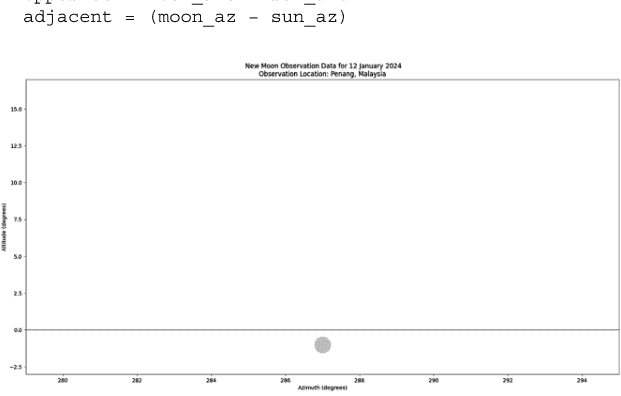

图 11.2 带有太阳的观测者地平线。

## 使用正切函数计算角度（TOA）
angle_rad = math.atan2(opposite, adjacent)

# 将角度转换为度数
angle_degrees = (math.degrees(angle_rad))

# 加载新月图像
# 修改了 Google Drive URL 以获取直接下载链接
image_url = "https://drive.google.com/uc?export=download&id=1ZFbJ5pWYv3ZE4SY50Rme7w8ieJzKRik4"

# 从 URL 下载图像内容
response = requests.get(image_url)
response.raise_for_status() # 对错误状态码抛出异常
# 从下载的内容中打开图像
crescent_img = Image.open(io.BytesIO(response.content))

# 根据计算出的角度旋转新月图像
rotated_img = crescent_img.rotate(angle_degrees)

# 将新月图像添加为标记
imagebox = OffsetImage(rotated_img, zoom=0.03) # 根据需要调整缩放比例
# 使用正确的月亮位置变量 moon_az 和 moon_alt
ab = AnnotationBbox(imagebox, (moon_az, moon_alt), frameon=False)
ax.add_artist(ab)

plt.show() # 添加此行以显示绘图

这样，就可以清晰地展示新月相对于太阳的位置（图 11.3）。

#### D. 天空背景生成

下一步涉及创建天体背景。实现需要以下步骤：

```
from matplotlib.colors import LinearSegmentedColormap
# 导入 LinearSegmentedColormap
```

# 172 伊斯兰天文学的 Python 实现

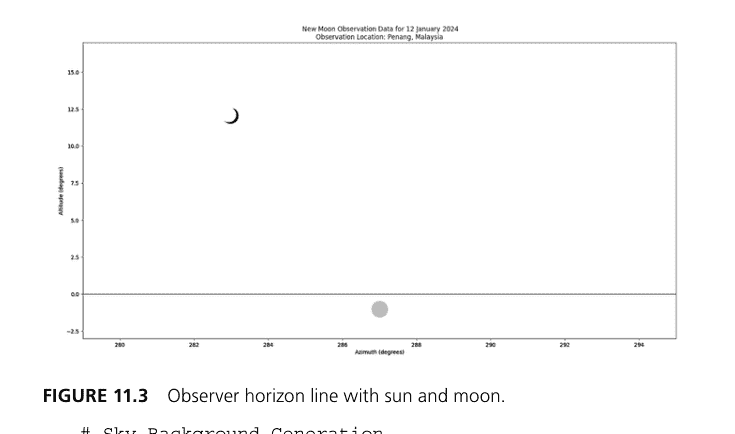

**图 11.3** 包含太阳和月亮的观测者地平线。

```
# 天空背景生成
sky = LinearSegmentedColormap.from_list('sky',
    ['blue','white', 'yellow', 'orange'])
extent = ax.get_xlim() + ax.get_ylim() # 调整为使用当前的 xlim 和 ylim
ax.imshow([[0, 0], [1, 1]], cmap=sky,
interpolation='bicubic', extent=extent)
```

#### E. 接下来是在可视化中显示 MABIMS 标准。首先，我们将可视化离角标准。在此图上，离角表示为从太阳中心出发的径向距离。实现代码如下（图 11.4）：

```
from matplotlib.patches import Arc # 导入 Arc 类
# 离角标准的可视化
sun_az_degrees = sun_az
sun_alt_degrees = sun_alt
moon_az_degrees = moon_az
moon_alt_degrees = moon_alt

kriteria_elongasi = 6.4
circle_radius = kriteria_elongasi

# 太阳中心坐标
sun_center_x = sun_az
sun_center_y = sun_alt
```

2024年1月12日新月观测数据
观测地点：马来西亚槟城

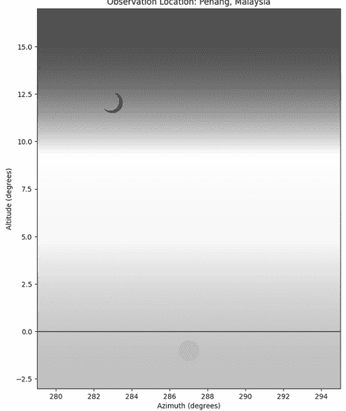

**图 11.4** 包含太阳和月亮位置的观测者地平线可视化。

```
# 半圆参数
radius = kriteria_elongasi
x1 = sun_az-kriteria_elongasi
x2 = sun_az+kriteria_elongasi

# 计算半圆的起始和结束角度
arccos_value_start_angle = np.arccos(((x1 - sun_center_x) / radius))
arccos_value_end_angle = np.arccos(((x2 - sun_center_x) / radius))
```

174 伊斯兰天文学的 Python 实现

```
if np.isnan(np.arccos((arccos_value_start_angle))):
    start_angle = 0.000001
else:
    start_angle = 180 - np.degrees(arccos_value_start_angle)

if np.isnan(np.arccos((arccos_value_end_angle))):
    end_angle = 180+0.000001
else:
    end_angle = 180 - np.degrees(arccos_value_end_angle)

print(start_angle,end_angle)
# 创建半圆补丁
semicircle_patch = Arc((sun_center_x, sun_center_y), 2 * radius, 2 * radius, theta1=start_angle,
theta2=end_angle,
fill=False, color='blue', linestyle='--')
# 将半圆补丁添加到绘图中
ax.add_patch(semicircle_patch)
```

#### F. 接下来是高度标准的可视化。高度标准是相对于地平线（0° 高度）计算的。实现将如图 11.5–11.8 所示显示：

```
# 高度标准的可视化
kriteria_altitude = 3
horizontal_line_y = kriteria_altitude
x1 = 0
x2 = sun_az-kriteria_elongasi
ax.hlines(y=horizontal_line_y,xmin=x1,
xmax=x2,color='red', linestyle='--')

x11 = sun_az+kriteria_elongasi
x22 = 360
ax.hlines(y=horizontal_line_y,xmin=x11,
xmax=x22,color='red', linestyle='--')
```

#### G. 添加 Logo

```
# 加载 Logo
# 修改了 Google Drive URL 以获取直接下载链接
logo_url = "https://drive.google.com/uc?export=download&id=1_HBq0C3bv33i54HlbrJKD4Zmdxap8Q8a"
```

2024年1月12日新月观测数据
观测地点：马来西亚槟城

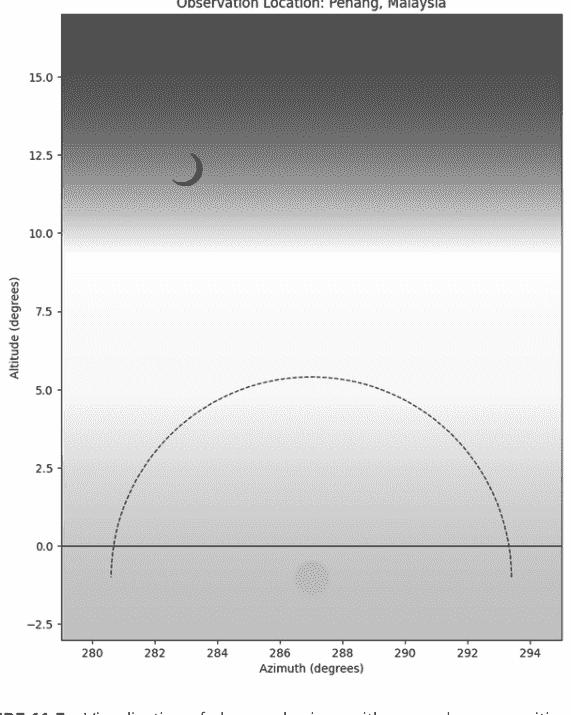

**图 11.5** 包含太阳和月亮位置及离角标准的观测者地平线可视化。

```
# 从 URL 下载图像内容
response = requests.get(logo_url)
response.raise_for_status() # 对错误状态码抛出异常
# 从下载的内容中打开图像
logo_img = Image.open(io.BytesIO(response.content))

# 将 logo 添加到绘图中（右下角）
logo_box = OffsetImage(logo_img, zoom=0.1) # 根据需要调整缩放比例
```

176 伊斯兰天文学的 Python 实现

2024年1月12日新月观测数据
观测地点：马来西亚槟城


**图 11.6** 包含太阳和月亮位置及离角和高度标准的观测者地平线可视化。

```
logo_ab = AnnotationBbox(logo_box, (xlim_max - 2.5,
sun_alt - 1), frameon=False) # 根据绘图限制调整位置
ax.add_artist(logo_ab)
```

#### H. 绘制月亮的高度线和离角

```
# 高度线
ax.vlines(x=moon_az, ymin=0, ymax=moon_alt,
color='blue', linestyle='--')
```

2024年1月12日新月观测数据
观测地点：马来西亚槟城

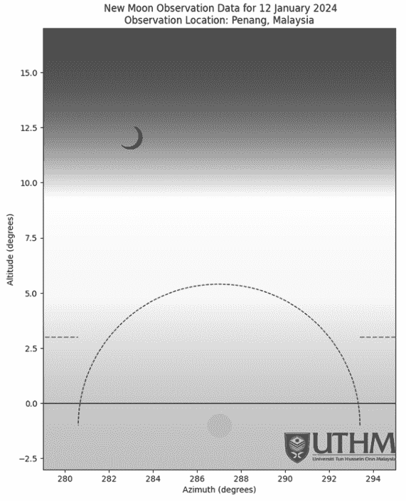

**图 11.7** 包含太阳和月亮位置及离角和高度标准的观测者地平线可视化，并添加了 logo。

```
ax.text(moon_az+0.3, moon_alt/2, f'Moon Altitude : {moon_alt:.2f}', color='blue', fontsize=10, ha='left')

# 离角线
ax.plot([moon_az, sun_az], [moon_alt, sun_alt], color='green', linestyle='--')
ax.text(sun_az-2, arcl/2-1, f'Elongation: {arcl:.2f}', color='green', fontsize=10, ha='left')

plt.show() # 添加此行以显示绘图
```

2024年1月12日新月观测数据
观测地点：马来西亚槟城

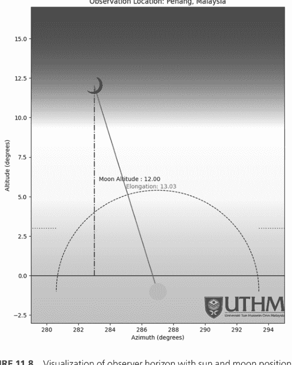

**图 11.8** 包含太阳和月亮位置及离角和高度标准的观测者地平线可视化，并添加了 logo 和虚线。

### 第二个练习：印度尼西亚班达亚齐

#### 练习 1

可视化 2025年5月27日的新月观测数据，观测地点：印度尼西亚班达亚齐，纬度：5.548290 N，经度：95.323753 East，UTC+7。

```
# 安装所需的库
!pip install skyfield # 天文计算
!pip install numpy # 数值运算
!pip install scipy # 科学计算
!pip install matplotlib # 绘图库
!pip install tabulate # 美化打印表格

# 导入必要的模块
from skyfield import almanac
from skyfield.api import Topos,load
from skyfield import api
import numpy as np
from skyfield.api import N, S, E, W, load, wgs84
from skyfield.api import Topos, load, Angle, GREGORIAN_START
import math
from scipy.ndimage import rotate
import calendar
from tabulate import tabulate
from matplotlib.patches import Arc
import matplotlib.pyplot as plt
from matplotlib.colors import LinearSegmentedColormap
import matplotlib.image as mpimg
from matplotlib.offsetbox import OffsetImage, AnnotationBbox
from PIL import Image
import requests
import io # 导入 io 以处理内存中的图像数据

# 加载行星星历数据
planets = load('de421.bsp')
earth = planets['earth']
sun = planets['sun']
moon = planets['moon']
h_maghrib = 0 # 日落小时
m_maghrib = 0 # 日落分钟

# 初始化时间尺度和星历
ts = load.timescale()
eph = api.load('de421.bsp')

# 设置观测地点和时间参数
Lokasi = "Banda Aceh, Indonesia"
lat_titik1 = 5.548290 # 观测点的纬度
```

## 180 用于伊斯兰天文学的 Python

```python
lon_titik1 = 95.323753 # 观测点经度
tz = 7 # 时区偏移量 (UTC+7)
year = 2025 # 观测年份
month = 5 # 观测月份
day = 27 # 观测日期

# 创建观测者位置对象
location_titik1 = wgs84.latlon(lat_titik1 * N, lon_titik1 * E)
observer_titik1 = eph['Earth'] + location_titik1
print(observer_titik1)

def settime(year, month, day, observer_titik, x):
    """计算天体的落下时间，并进行时区调整"""
    # 设置搜索时间范围（当天到次日）
    t0 = ts.utc(year,month,day)
    t1 = ts.utc(year, month,day+1)

    # 查找天体 x 的落下时间
    t,y = almanac.find_settings(observer_titik, x, t0, t1)

    # 提取 UTC 时间分量
    h_set_transit_notz,m_set_transit_notz,s_set_transit_notz = (int(t.utc.hour)),(int(t.utc.minute)),(int(t.utc.second))

    # 转换为十进制小时并加上时区偏移量
    time_set = (h_set_transit_notz + ((m_set_transit_notz) / 60 + s_set_transit_notz / 3600))+tz

    # 转换回小时、分钟、秒
    h_set, d = divmod(time_set, 1)
    h_set = int(h_set)
    m_set, s = divmod(d * 60, 1)
    m_set = int(m_set+1+4/60) # 添加微小调整
    s_set = int(s * 60)
    # 处理秒数溢出
    if s_set >= 60:
        m_set += s_set // 60
        s_set = s_set % 60

    # 处理分钟数溢出
    if m_set >= 60:
        h_set += m_set // 60
        m_set = m_set % 60

    # 确保小时数在 24 小时制内循环
    h_set = h_set % 24
    waktu_terbenam = f"{h_set}:{m_set:02}:{s_set:02}"

    return waktu_terbenam

# 计算日落时间
Objek = 'Matahari'
sun_set = settime(year, month, day, observer_titik1, sun)

# 计算月落时间
Objek = 'Bulan'
moon_set = settime(year, month, day, observer_titik1, moon)

# 设置历史日期的儒略历截止点
ts.julian_calendar_cutoff = GREGORIAN_START
location = Topos(latitude_degrees=lat_titik1, longitude_degrees=lon_titik1, elevation_m=1)

def settime(year, month, day, observer_titik, x):
    """返回小时和分钟的替代版本"""
    # 与前一个函数类似，但返回数值
    t0 = ts.utc(year,month,day)
    t1 = ts.utc(year, month,day+1)
    t,y = almanac.find_settings(observer_titik, x, t0, t1)
    h_set_transit_notz,m_set_transit_notz,s_set_transit_notz = (int(t.utc.hour)),(int(t.utc.minute)),(int(t.utc.second))
    time_set = (h_set_transit_notz + ((m_set_transit_notz) / 60 + s_set_transit_notz / 3600))

    h_set, d = divmod(time_set, 1)
    h_set = int(h_set)
    m_set, s = divmod(d * 60, 1)
    m_set = int(m_set+1+4/60)
    s_set = int(s * 60)
    if s_set >= 60:
        m_set += s_set // 60
        s_set = s_set % 60

    if m_set >= 60:
        h_set += m_set // 60
        m_set = m_set % 60

    h_set = h_set % 24
    waktu_terbenam = f"{h_set}:{m_set:02}:{s_set:02}"

    return h_set,m_set

# 获取数值格式的日落时间
hsunset,msunset = settime(year, month, day, observer_titik1, sun)

# 创建观测位置对象
boston = earth + Topos(latitude_degrees=lat_titik1, longitude_degrees=lon_titik1, elevation_m=0)

# 计算日落时的太阳位置
sun_astro = boston.at(ts.utc((year), (month), (day), (hsunset), (msunset))).observe(sun)
sun_app = sun_astro.apparent()
sun_alt, sun_az, sun_distance = sun_app.altaz()

# 计算日落时的月球位置
moon_astro = boston.at(ts.utc((year), (month), (day), (hsunset), (msunset))).observe(moon)
moon_app = moon_astro.apparent()
moon_alt, moon_az, moon_distance = moon_app.altaz()

# 计算月球与太阳位置之间的差异
beza_altitud_bulan_matahari = abs(moon_alt.degrees-sun_alt.degrees)
daz = abs(moon_az.degrees-sun_az.degrees)
str_date = f'{day}/{month}/{year}'

# 存储观测数据
altitud_bulan = moon_alt.degrees
elongasi = sun_app.separation_from(moon_app).degrees

# 准备表格显示数据
data = [["Date", str_date],
        ["Location", Lokasi],
        ["Sunset Time", sun_set],
        ["Moonset Time", moon_set],
        ["Moon Altitude", altitud_bulan],
        ["Elongation", elongasi],
]

col_names = ["Moon-Sun Data", "Value"]

# 创建格式化表格
data_table = (tabulate(data, headers=col_names))

# 创建可视化图形
fig, ax = plt.subplots(figsize=(20,10))

# 绘制地平线
horizon_angles = np.linspace(0, 360, 720)
horizon_altitudes = np.zeros_like(horizon_angles)
ax.plot(horizon_angles, horizon_altitudes, color='black', linestyle='-', linewidth=1)

# 获取太阳和月球的度数位置
sun_az = sun_az.degrees
sun_alt = sun_alt.degrees
moon_az = moon_az.degrees
moon_alt = moon_alt.degrees

arcl = elongasi
Location = Lokasi
month_name = calendar.month_name[month]

# 绘制太阳位置
ax.scatter(sun_az, sun_alt, color='orange', label='Sun', zorder=10, s=900)
ax.set_xlabel('Azimuth (degrees)')
ax.set_ylabel('Altitude (degrees)')
ax.set_title(f'New Moon Observation Data for {day} {month_name} {year}\nObservation Location: {Location}')

# 根据日月位置设置绘图范围
xlim_max = max(sun_az - (daz * 2), sun_az + (daz * 2))
xlim_min = min(sun_az - (daz * 2), sun_az + (daz * 2))
ax.set_xlim((xlim_min, xlim_max))
ax.set_ylim((sun_alt - 2), (moon_alt + 5))

# 计算月牙朝向角度
opposite = moon_alt - sun_alt
adjacent = (moon_az - sun_az)
angle_rad = math.atan2(opposite, adjacent)
angle_degrees = (math.degrees(angle_rad))

# 加载并旋转月牙图像
image_url = "https://drive.google.com/uc?export=download&id=1ZFbJ5pWYv3ZE4SY50Rme7w8ieJzKRik4"
response = requests.get(image_url)
response.raise_for_status()
crescent_img = Image.open(io.BytesIO(response.content))
rotated_img = crescent_img.rotate(angle_degrees)

# 将旋转后的月球图像添加到绘图中
imagebox = OffsetImage(rotated_img, zoom=0.03)
ab = AnnotationBbox(imagebox, (moon_az, moon_alt), frameon=False)
ax.add_artist(ab)

# 创建天空背景渐变
sky = LinearSegmentedColormap.from_list('sky', ['blue','white', 'yellow', 'orange'])
extent = ax.get_xlim() + ax.get_ylim()
ax.imshow([[0, 0], [1, 1]], cmap=sky, interpolation='bicubic', extent=extent)

# 可视化离角标准（6.4° 半圆）
kriteria_elongasi = 6.4
circle_radius = kriteria_elongasi
sun_center_x = sun_az
sun_center_y = sun_alt
radius = kriteria_elongasi
x1 = sun_az-kriteria_elongasi
x2 = sun_az+kriteria_elongasi

# 计算半圆的角度
arccos_value_start_angle = np.arccos(((x1 - sun_center_x) / radius))
arccos_value_end_angle = np.arccos(((x2 - sun_center_x) / radius))

if np.isnan(np.arccos((arccos_value_start_angle))):
    start_angle = 0.000001
else:
    start_angle = 180 - np.degrees(arccos_value_start_angle)

if np.isnan(np.arccos((arccos_value_end_angle))):
    end_angle = 180+0.000001
else:
    end_angle = 180 - np.degrees(arccos_value_end_angle)

# 在太阳位置周围绘制半圆
semicircle_patch = Arc((sun_center_x, sun_center_y), 2 * radius, 2 * radius,
                    theta1=start_angle, theta2=end_angle,
                    fill=False, color='blue',
                    linestyle='--')
ax.add_patch(semicircle_patch)

# 可视化高度标准（3° 线）
kriteria_altitude = 3
horizontal_line_y = kriteria_altitude
x1 = 0
x2 = sun_az-kriteria_elongasi
ax.hlines(y=horizontal_line_y, xmin=x1, xmax=x2,
          color='red', linestyle='--')

x11 = sun_az+kriteria_elongasi
x22 = 360
ax.hlines(y=horizontal_line_y, xmin=x11, xmax=x22,
          color='red', linestyle='--')

# 加载并添加标志
logo_url = "https://drive.google.com/uc?export=download&id=1_HEq0C3bv33i54HlbrJKD4Zmdxap8Q8a"
response = requests.get(logo_url)
response.raise_for_status()
logo_img = Image.open(io.BytesIO(response.content))
logo_box = OffsetImage(logo_img, zoom=0.1)
logo_ab = AnnotationBbox(logo_box, (xlim_max - 2.5, sun_alt - 1), frameon=False)
ax.add_artist(logo_ab)

# 绘制月球高度线和标签
ax.vlines(x=moon_az, ymin=0, ymax=moon_alt,
          color='blue', linestyle='--')
```

## 186 用于伊斯兰天文学的Python

```python
ax.text(moon_az+0.3, moon_alt/2, f'Moon Altitude: {moon_alt:.2f}°', color='blue', fontsize=10, ha='left')
```

```python
# 绘制距角线并添加标签
ax.plot([moon_az, sun_az], [moon_alt, sun_alt], color='green', linestyle='--')
ax.text(sun_az+2, arcl/2-1, f'Moon Elongation: {arcl:.2f}°', color='green', fontsize=10, ha='left')
```

```python
# 根据MABIMS标准确定可见性
if moon_alt >= kriteria_altitude and arcl >= kriteria_elongasi:
    kenampakan = "Visible"
    nama_kriteria = "MABIMS Criteria Met"
else:
    kenampakan = "Not Visible"
    nama_kriteria = "MABIMS Criteria Not Met"
```

```python
# 添加信息框
info_text = (f'Moon Data:\n'
             f'Altitude: {moon_alt:.2f}°\n'
             f'Elongation: {arcl:.2f}°\n'
             f'Visibility: {kenampakan}\n'
             f'Criteria: {nama_kriteria}')
ax.text(xlim_max-7, moon_alt+3.5, info_text, fontsize=12, ha='left', va='top',
        bbox=dict(facecolor='white', alpha=0.8))
```

```python
# 添加地平线和标准标签
ax.text(xlim_min+1, 0.1, "Horizon", fontsize=10, ha='left')
ax.text(xlim_min+1, kriteria_altitude+0.1, "MABIMS 2021 Criteria", fontsize=10, ha='left')
```

```python
plt.show()
```

```python
# 打印数据表
print('\n')
print(data_table)
```

上述代码的结果如图11.9所示。

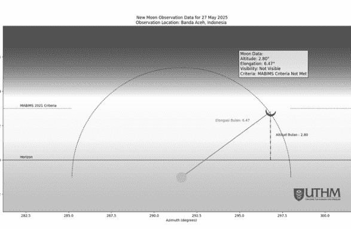

图11.9 印度尼西亚班达亚齐的太阳位置可视化。

#### 练习2

可视化2025年6月25日的新月观测数据，观测地点：新加坡，纬度：1.290270 N，经度：103.851959 E，时区：UTC+8。

#### 练习3

可视化2025年9月22日的新月观测数据，观测地点：马来西亚吉隆坡，纬度：3.140853 N，经度：101.693207 E，时区：UTC+8。

#### 练习4

可视化2025年10月21日的新月观测数据，观测地点：文莱斯里巴加湾市，纬度：4.890278 N，经度：114.942222 E，时区：UTC+8。

#### 练习5

可视化2025年12月20日的新月观测数据，观测地点：缅甸内比都，纬度：19.7475 N，经度：96.115 E，时区：UTC+6.5。

## 结论

本书所呈现的Python编程与伊斯兰天文学的融合，不仅仅是科学与信仰的交汇；它反映了伊斯兰教长期以来重视精确、观测和知识的传统。伊斯兰天文学（Ilmu Falak）在历史上一直是确定礼拜时间、朝向（Qibla）方向和伊斯兰历（Hijri calendar）等宗教活动的关键领域。在现代，使用Python等计算工具增强了这些确定的准确性、可重复性和清晰度。

在本书中，我们系统地探讨了如何利用Python来建模和计算与伊斯兰实践相关的关键天文现象。从基础的编程技能开始，我们逐步深入到包括太阳中天、影长分析和新月可见性预测在内的高级计算。我们介绍了Skyfield库作为核心工具，强调了其直接与天文数据接口并高精度模拟天体运动的能力。

在第5至7章中，我们演示了如何计算朝向（Qibla）的方向以及确定诸如祖赫尔（Zuhur）、阿萨尔（Asar）、麦格里布（Maghrib）、尔沙（Isya’）、晨曦（Syuruk）和法吉尔（Subh）等礼拜时间。这些计算基于真实的天文参数，如太阳高度角、时差方程和观测者位置。我们强调了考虑海拔、大气折射和太阳赤纬的重要性，这些因素在手动估算中常被忽视。我们还提供了可视化，以帮助学习者理解太阳相对于地球表面的底层逻辑和运动。

在第8章中，我们转向了观月（moonsighting），这是穆斯林世界中一个兼具科学和社会学意义的主题。在这里，读者被介绍了确定月亮高度、月龄、距角和方位角的方法，所有这些在验证新月（hilal）可见性方面都起着至关重要的作用。通过案例研究和现实世界的例子，读者学习了如何提取有助于新月可见性报告和伊斯兰历制定的有意义数据。

第9章和第10章重点介绍了支持理解和教授天文学（Falak）的可视化技术。利用Python的图形功能，学习者可以绘制朝向（Qibla）方向、太阳方位角以及不同礼拜时间的太阳位置。这些可视化输出不仅服务于教学目的，还有助于有效验证和传达数据，特别是在官方或社区层面的天文学（Falak）判定中。

最后，在第11章中，我们利用来自马来西亚和印度尼西亚的真实观测场景，探讨了新月观测数据的可视化。这些实际例子将数据、可见性和伊斯兰历准确性等主题联系在一起，表明观测和计算必须齐头并进。

通过将现代计算技能与经典的伊斯兰天文学知识相结合，本教材旨在培养新一代的穆斯林学者、学生和专业人士，使他们能够自信地将科学方法应用于宗教义务。这种跨学科技能不仅增强了对伊斯兰仪式的理解，还有助于提高更广泛的科学素养和批判性思维能力。

我们希望本书能成为更多穆斯林，特别是高等教育和宗教机构的学生，探索伊斯兰天文学作为学术和精神追求的门户。当我们拥抱现代科学的工具时，我们延续了伟大的穆斯林天文学家如比鲁尼（Al-Biruni）、花拉子密（Al-Khwarizmi）和图西（Al-Tusi）的遗产，他们体现了理性、启示和观测之间的和谐。

愿本书激发对知识更深的热爱，对宗教仪式精确性的重新承诺，以及技术在服务我们的信仰和社区方面更强大的整合。

**真主至知**


## Taylor & Francis

Taylor & Francis集团

http://taylorandfrancis.com

## 参考文献

Abas, A.-M., Safiai, M. H., Hasan, S. A., Azam, A. I., & Hussaini, R. (2022). Penentuan Waktu Ibadah Solat dan Puasa di Bangunan Pencakar Langit [Determining the times for prayer and fasting on skyscraper building]. *BITARA International Journal of Civilizational Studies and Human Sciences*, 6(1), 53–59.

Adegoke, K. A. (2013). Ikhtilaf on moon sighting among Nigerian Muslims within the framework of Shari'ah. *Journal of Arabic and Islamic Studies*, 7(2), 140–156.

Adegoke, K. A. (2017). Adam al-Ilrī and neo-ijtihād: An examination of his legal views on Ramadān fasting in Nigeria. *Journal of Arabic And Islamic Studies*, 20(1), 11–25.

Ali, M. (2015). Is the British weather anti-Islamic? Prayer times, the ulama and application of the shari'a. *Contemporary Islam*, 9(2), 171–187. https://doi.org/10.1007/s11562-014-0318-7

Al-Rajab, M., Loucif, S., & Al Risheh, Y. (2023). Predicting new crescent moon visibility applying machine learning algorithms. *Scientific Reports*, 13(1), 6674. https://doi.org/10.1038/s41598-023-32807-x

Amin, M. F. (2018). Global Rasdhul Qibla: The probability of four times in a year study. *Jurnal Penelitian*, 15(2) 175–188.

Asrın, A., Hapsari, G. I., & Mutiara, G. A. (2018). Development of Qibla direction cane for blind using interactive voice command. *2018 6th International Conference on Information and Communication Technology (ICoICT)*, 216–221. https://doi.org/10.1109/ICoICT.2018.8528769

Blank, J., & Deb, K. (2020). Pymoo: Multi-objective optimization in Python. *IEEE Access*, 8(1), 89497–89509. https://doi.org/10.1109/ACCESS.2020.2990567

Elmhamdi, A., Roman, M. T., Peñaloza-Murillo, M. A., Pasachoff, J. M., Liu, Y., Al-Mostafa, Z. A., Maghrabi, A. H., Oloketuyi, J., & Al-Trabulsy, H. A. (2024). Impact of the eclipsed sun on terrestrial atmospheric parameters in desert locations: A comprehensive overview and two events case study in Saudi Arabia. *Atmosphere*, 15(1), 62. https://doi.org/10.3390/atmos15010062

Faid, M. S., Husien, N., Shariff, N. N. M., Ali, M. O., Hamidi, Z. S., Zainol, N. H., & Sabri, S. N. U. (2016). Monitoring the level of light pollution and its impact on astronomical bodies naked-eye visibility range in selected areas in Malaysia using the sky quality meter. *2016 International Conference on Industrial Engineering, Management Science and Application (ICIMSA)*, 1–6. https://doi.org/10.1109/ICIMSA.2016.7504020

Faid, M. S., Md Shariff, N. N., & Hamidi, Z. S. (2019). The risk of light pollution on sustainability. *ASM Science Journal*, 12(Special Issue 2), 134–142.

Faid, M. S., Mohd Nawawi, M. S. A., & Mohd Saadon, M. H. (2023). HilalPy: Analysis tool for lunar crescent visibility criterion. ascl:2307.031-ascl:2307.031.

Faid, M. S., Mohd Nawawi, M. S. A., & Mohd Saadon, M. H. (2024). *Design, development and analysis of lunar crescent visibility criterion with Python*. CRC Press.

## 参考文献

Faid, M. S., Mohd Nawawi, M. S. A., & Norman, M. P. (2021). 从马卡西德·沙里亚视角看光污染的可持续性问题。*《法特瓦管理与研究杂志》*, 26(2), 1–9. https://doi.org/10.33102/jfatwa.vol26no2.390

Faid, M. S., Nawawi, M. M., & Saadon, M. M. (2023). 基于集成月牙数据库的月牙可见性标准分析工具。*《天文学与计算》*, 45(1), 100752.

Faid, M. S., Nawawi, M. S. A. M., Wahab, R. A., & Ahmad, N. (2023). HilalPy：用于分析月牙观测标准的软件。*《软件影响》*, 18, 100593.

Faid, M. S., Mohd Nawawi, M. S. A., Mohd Saadon, M. H., Wahid, K., & Norman, P. (2025). 确定新希吉拉月的方法：伊斯兰教法视角的主题综述。*《马来西亚沙里亚与法律杂志》*, 13(1), 75–99. https://doi.org/10.33102/mjsl.vol13no1.687

Faid, M. S., Nahwandi, M. S., Nawawi, M. S. A. B. M., Zaki, N. B. A., & Saadon, M. H. (2022). 利用日影确定朝向方向的开发。*《伊斯兰研究在线杂志》*, 9(1), 89–102.

Faid, M. S., Nawawi, M. S. A. M., Saadon, M. H. M., Ahmad, N., & Ali @ Mat Zin, A. (2022). 中世纪月牙可见性标准的伊斯兰历史回顾。*《Al-Tamaddun杂志》*, 17(1). https://doi.org/10.22452/JAT.vol17no1.9

Faid, M. S., Shariff, N. N. M., Hamidi, Z. S., Kadir, N., Ahmad, N., & Wahab, R. A. (2018). 受光污染影响的暮光天空亮度的半经验建模。*《马来西亚物理杂志》*, 39(2), 30059–30067.

Faid, M. S., Shariff, N. N. M., Hamidi, Z. S., Sabri, S. N. U., Zainol, N. H., Husien, N. H., & Ali, M. O. (2016). 使用天空质量计监测马来西亚选定地区的光污染水平及其对天体肉眼可见范围的影响。*《工业工程与管理科学杂志》*, 2016(1), 1–18. https://doi.org/10.13052/jiem2446-1822.2016.007

Faid, M. S., Shariff, N. N. M., Hamidi, Z. S., Wahab, R. A., Ahmad, N., Mohd Nawawi, M. S. A., & Nahwandi, M. S. (2024). 光污染对暮光天空亮度剖面的改变。*《科学报告》*, 14(1), 26682.

Faid, M. S., Nawawi, M. S. A. M., Saadon, M. H. M., Wahab, R. A., Ahmad, N., Nahwandi, M. S., Ahmed, I., & Mohamed, I. (2024). 现代月牙可见性标准的评估与回顾。*《伊卡洛斯》*, 412, 115970.

Faid, M. S., Nawawi, M. S. A. M., Saadon, M. H. M., Nahwandi, M. S., Shariff, N. N. M., Hamidi, Z. S., Wahab, R. A., Norman, M. P., & Ahmad, N. (2023). 月牙观测报告的确认方法。*《新天文学》*, 103, 102063–102063. https://doi.org/10.1016/j.newast.2023.102063

Gharaybeh, M. (2025). 在确定希吉拉月开始时对天文计算的教法依赖。载于 H. M. K. Al Naimiy, H. M. Elmehdi, & I. A. Shehadi (编), *《第14届阿拉伯天文学与空间科学联盟阿拉伯会议论文集》* (第420卷, 第160–177页). Springer Nature Singapore. https://doi.org/10.1007/978-981-96-3276-3_13

Holwerda, B. W., Trenti, M., Clarkson, W., Sahu, K., Bradley, L., Stiavelli, M., Pirzkal, N., Marchi, G. D., Andersen, M., Bouwens, R., Ryan, R., Vledder, I. V., & Vlugt, D. V. D. (2016). 勘误：“银河系红矮星在BoRG调查中；银河系尺度高度与WFC3成像中矮星分布”（2014, ApJ, 788, 77）。*《天体物理学杂志》*, 825(1), 82. https://doi.org/10.3847/0004-637X/825/1/82

Huda, N., Zaki, A., Ali, A. K., Wahab, R. A., & Niri, M. A. (2014). 使用Rubu' Mujayyab确定马来西亚的晨礼时间：The determination of Subuh prayer time by using Rubu' Mujayyab in Malaysia。*《Fiqh杂志》*, *11*(1), 97–118.

Ilyas, M. (1984). 伊斯兰历法、时间和朝向天文计算的现代指南。载于 *《伊斯兰历法天文计算的现代指南》*. https://ui.adsabs.harvard.edu/abs/1984mgta.book.....I

Ilyas, M. (1997). *《伊斯兰历法天文学》* (第1版). A. S. Nordeen.

Izzuddin, A., Imroni, M. A., Imron, A., & Mahsun, M. (2022). 中爪哇村庄的日食文化神话：伊斯兰认同与地方传统之间。*《HTS神学研究》*, *78*(4). https://doi.org/10.4102/hts.v78i4.7282

Junaidi, A. (2022). 使用天文数字成像的月牙观测见证：从主观到客观。*《De Jure：法律与沙里亚杂志》*, *14*(1), 58–74. https://doi.org/10.18860/j-fsh.v14i1.15062

King, D. A. (1993). *《服务于伊斯兰的天文学》*. Routledge.

Lairgi, Y. (2025). 当天文学遇见人工智能：摩洛哥月牙可见性预测的Manazel（版本1）。arXiv. https://doi.org/10.48550/ARXIV.2503.21634

Loucif, S., Al-Rajab, M., Abu Zitar, R., & Rezk, M. (2024). 迈向全球月历：基于机器学习的月牙可见性预测方法。*《大数据杂志》*, *11*(1), 114. https://doi.org/10.1186/s40537-024-00979-6

Meeus, J. (1991). *《天文算法》*. Willmann-Bell.

Mehare, H. B., Anilkumar, J. P., & Usmani, N. A. (2023). Python编程语言。载于 M. "Sufian" Badar (编), *《生物学家应用机器学习指南》* (第27–60页). Springer International Publishing. https://doi.org/10.1007/978-3-031-22206-1_2

Mohd Nawawi, M. S. A., Faid, M. S., Saadon, M. H. M., Wahab, R. A., & Ahmad, N. (2024). 东南亚的希吉拉月确定：宗教、科学与文化背景之间的例证。*《Heliyon》*, *10*(20). Scopus. https://doi.org/10.1016/j.heliyon.2024.e38668

Mustapha, A. S., Zainol, N. Z. N., Mohammad, C. A., Khalim, M. A., Muhammed, N. K. W., & Faid, M. S. (2024). Al-Fatani对伊斯兰家庭法的观点：来自《Hidayah Al-Muta'allim Wa'Umdah Al-Muta'allim》的见解。*《伊斯兰思想与文明杂志》*, *14*(1), 247–265. https://doi.org/10.32350/jitc.141.15

Muztaba, R., Malasan, H. L., & Djamal, M. (2023). 用于月牙检测与识别的深度学习：将Mask R-CNN应用于使用机器人月球望远镜系统收集的观测月球数据集。*《天文学与计算》*, *45*, 100757. https://doi.org/10.1016/j.ascom.2023.100757

Niri, M. A., Jamaludin, M. H., Nawawi, M. S. A. M., Zaki, N. A., & Wahab, R. A. (2023). 从伊斯兰史学角度看自古代至伊斯兰文明的天文学发展。*《Al-Tamaddun杂志》*, *18*(1), 169–177. Scopus. https://doi.org/10.22452/JAT.vol18no1.14

Ozgur, C., Colliau, T., Rogers, G., & Hughes, Z. (2021). MatLab vs. Python vs. R。*《数据科学杂志》*, *15*(3), 355–372. https://doi.org/10.6339/JDS.201707_15(3).0001

Rabbat, N. (1996). 爱资哈尔清真寺：开罗历史的建筑编年史。*《穆卡纳斯》*, *13*, 45. https://doi.org/10.2307/1523251

Rasyid, M., Aseri, M., Izzuddin, A., Faid, M. S., Aseri, A. F., & Sukarni, S. (2024). 印度尼西亚乌里玛委员会法特瓦研究。*《法律与治理杂志》*, *7*(1), 45–62.

Rasyid, M., Aseri, M., Sukarni, Akh. Fauzi Aseri, & Faid, M. S. (2023). 科学及其在伊斯兰法律思想变革中的作用（印度尼西亚乌里玛委员会法特瓦因近期科学发现而变化的分析）。*《Syariah：法律与思想杂志》*, *23*(2), 120–137.

Razzak, A. (2024). 通过Python程序进行地球物理分析以预测日出、日落和祈祷时间。*《马来西亚物理杂志》*, *45*(1), 10019–10027.

Rhodes, B. C. (2011). *《PyEphem：Python天文历表》*. 天体物理学源代码库，记录 Ascl:1112.014.

Rubin, U. (2017). 早期伊斯兰的晨祷与昏祷。载于 G. Hawting (编), *《伊斯兰仪式的发展》* (第1版, 第105–129页). Routledge. https://doi.org/10.4324/9781315240312-9

Schumm, W. R. (2020). 早期（公元622-900年）穆斯林确定祈祷方向（朝向）的准确度如何？*《宗教》*, *11*(3), 102. https://doi.org/10.3390/rel11030102

Shariff, N. N. M., Faid, M. S., & Hamidi, Z. S. (2016). 伊斯兰新月软件：现状。载于 K. J. Kim & N. Joukov (编), *《信息科学与应用（ICISA）2016》* (第376卷, 第1069–1079页). Springer Singapore. https://doi.org/10.1007/978-981-10-0557-2_102

Shariff, N. N. M., Hamidi, Z. S., & Faid, M. S. (2017). 光污染对伊斯兰新月（月牙）观测的影响。*《国际可持续照明杂志》*, *19*(1), 10–14. https://doi.org/10.26607/ijsl.v19i1.61

Syazwan Faid, M., Mohd Nawawi, M. S. A., Saadon, M. H. M., & Ahmad, N. (2025). 现代月牙可见性标准综述。*《马来西亚科学杂志》*, *44*(1), 101–120. https://doi.org/10.22452/mjs.vol44no1.12

Wahidi, A., Yasin, N., & Kadarisman, A. (2019). 印度尼西亚和马来西亚伊斯兰月开始的确定：程序与社会状况。*《ULUL ALBAB伊斯兰研究杂志》*, *20*(2), 322–345. https://doi.org/10.18860/ua.v20i2.5913

Wahyuni, S., Samsuddin, S., & Hamzah, E. (2022). 基于天文学（Google Earth）的朝向方向准确性分析，伊斯兰法视角。*《伊斯兰与科学杂志》*, *9*(1), 39–45. https://doi.org/10.24252/jis.v9i1.30111

Yildirim, F., Kadi, F., & Sahin, S. L. (2024). 基于MATLAB GUI开发新的朝向方向应用界面。*《测量评论》*, 1–15. https://doi.org/10.1080/00396265.2024.2411186

Yusuf, H. (2010). *《剖腹产月子：计算、月牙观测与先知之道》*. Zaytuna Institute.

# 索引

**A**

爱资哈尔清真寺，3
Asar，6，53–68，142–148，166
Astropy，6

**B**

伊斯兰历月份的开始，6

**C**

天文事件，2，3
Python中的条件语句
- 基本控制结构，16
- else语句，15
- if语句，15
- print()函数，17
- 在条件中使用'or'，15

**D**

Datetime模块，21–22
DE440s星历表，24–25
度、分、秒（DMS），18，101
马来西亚伊斯兰发展署（JAKIM），1，2
DMS，*参见* 度、分、秒

**E**

开斋节，2，8
星历表，24，34
时差方程，35
- 计算，36–38
- 定义，36
- 太阳时与钟表时间，35
ESO，*参见* 欧洲南方天文台
欧洲南方天文台（ESO），5

**F**

每日五次礼拜（*Salah*），1

**G**

Google Colab仓库（Google Colab），1，11，32
- 礼拜时间计算，12
- 二维码，1，2
Google Earth朝向服务，3

**H**

朝觐，2
伊斯兰历，2，7，188
*Hisab*（天文计算），2

**I**

IAU 1980模型，24
伊斯兰历，8，189
Istiwa' A'zam，33，34
昏礼（Isya'），6，72–83，153–159，167

**J**

JAKIM，*参见* 马来西亚伊斯兰发展署
喷气推进实验室（JPL），25
JPL，*参见* 喷气推进实验室

**K**

克尔白，2，3，27，28，33
*Kamal*，3

**L**

循环，22–23
新月观测，168
- 使用Matplotlib进行可视化，168
- 印度尼西亚班达亚齐，178–187
- 马来西亚槟城，168–175
- 朝向方向与太阳方位角，121–128
- 带有朝向位置，110，111
- 太阳方位角计算，114–118，121
北极星（Polaris），3
礼拜时间计算，6，10，48
- 昏礼（Asar），53–68
- 昏礼（Isya'），72–83
- 晡礼（Maghrib），68–72
- 晨礼（Subh'），87–98
- 礼拜时间的太阳位置，*参见* 礼拜时间的太阳位置
- 晨礼（Syuruk），83–87
- 晌礼（Zuhr/Dhuhr），48–53
礼拜时间表，7
PyEphem，24
PyPI，*参见* Python包索引
Python，4
- datetime模块，21–22
- 循环
  - 'for'循环，22
  - 'while'循环，23
- Pip安装包（PIP），19–20
- Skyfield，24–26
Python基本操作
- 加法，12
- 将度转换为弧度，14
- 除法，13
- 求幂，13
- 导入math模块，14
- 整数除法，13
- 取模，13
- 乘法，13
- 减法，12
- 三角函数，14
Python包索引（PyPI），20，24
Python软件基金会，4

**M**

晡礼（Maghrib），6，68–72，148–153，167
麦加，2，3，33，72，126
Matplotlib，107，168
观月，99，106，188
- 方位角差异，104
- 月球的几何位置，99–101，103，105
- 滞后时间，102
- 月球合，104
- 月落时间，101–102
- 日落时间，101
清真寺礼拜场所，2
英国穆斯林理事会，2

**N**

新月（hilal），2，6，7，9，105，168，170
新伊斯兰历月份的确定，7，99
- 开始，6
- 计算，8
- 复杂性，9
- 新月位置，9
- 礼拜时间，10
- 朝向方向，10
- 现代技术，8
- 观月，99
  - 方位角差异，104
  - 月球的几何位置，99–101，103，105
  - 滞后时间，102
  - 月球合，104
  - 月落时间，101–102
  - 日落时间，101
- 社会和经济影响，8
NumPy，5，6，24，130，168

**P**

PIP，*参见* Pip安装包
Pip安装包（PIP），19–20，36
极坐标图，107
- 通用极坐标图，108，109
- 带有朝向方向，113，114

**Q**

朝向方向（Qibla direction），2，3，5，7，107
- 计算，10
- 确定，6
朝向计算（Qiblah calculation），27
- 槟城的方向，29–32
- 公式，27–29
- Rashdul Qibla，*参见* Rashdul Qibla
- 位置的三个点，27
朝向罗盘可视化，107
- 极坐标图，107
  - 通用极坐标图，108，109
  - 带有朝向方向，113，114
- 朝向方向与太阳方位角，121–128
  - 带有朝向位置，110，111
  - 太阳方位角计算，114–118，121

**R**

斋月，2，8，9，105
Rashdul Kiblat，41–47，107
Rashdul Qibla，33
- 时差方程，35
  - 计算，36–38
  - 定义，36
  - 太阳时与钟表时间，35
- 太阳位置，34
- Rashdul Kiblat，41–47
- 太阳赤纬，38–40
Rukyah，2

**S**

日食祈祷（Salat al-Khusuf），3
Skyfield Python库，24–26，99
太阳俯角，72，80，87
太阳中天，48，56，62
州法拉克委员会，7
晨礼（Subh），6，160–166
晨礼（Subh'），87–98
太阳赤纬，38–40
礼拜时间的太阳位置，129
- 昏礼（Asar）时间，142–148，166
- 昏礼（Isya'）时间，153–159，167
- 晡礼（Maghrib）时间，148–153，167
- 晨礼（Subh）时间，160–166
- 太阳高度角计算，133–137
- 可视化，129–133
- 晌礼（Zuhur）时间，137–142，166
晨礼（Syuruk），83–87

**U**

乌姆库拉历，2
副朝，2
美国海军天文台，68
协调世界时（UTC），139
通用朝向方向计算，28
UTC，*参见* 协调世界时

**V**

甚大望远镜（VLT），5
VLT，*参见* 甚大望远镜
VSOP87行星理论，24

**Z**

晌礼（Zuhur/Dhuhr），6，48–53，137–142，166