# 面向儿童的Python编程

趣味编程入门

杰森·R·布里格斯

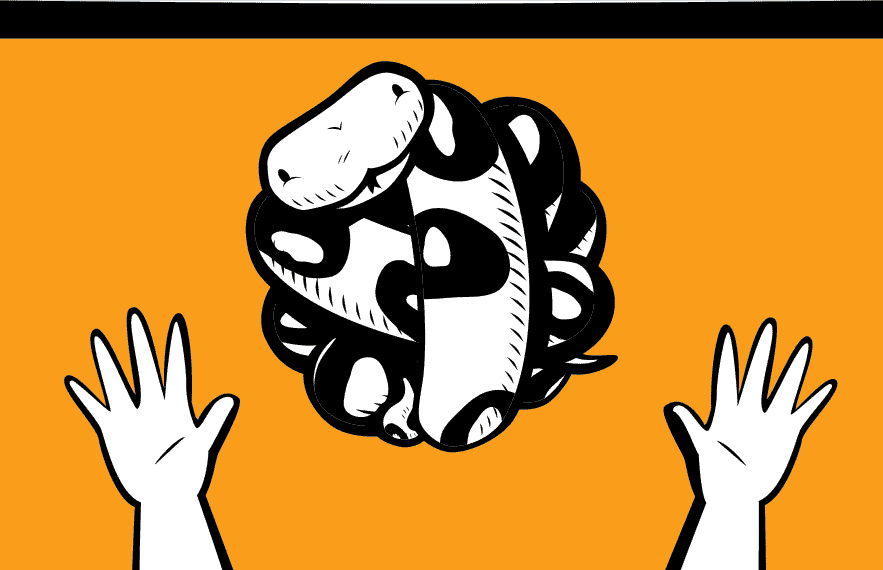


# 面向儿童的Python编程

趣味编程入门

作者：杰森·R·布里格斯


No Starch Press

旧金山

**《面向儿童的Python编程》** 版权所有 © 2013 杰森·R·布里格斯。

保留所有权利。未经版权所有者和出版商事先书面许可，不得以任何形式或任何方式（电子或机械，包括影印、录制或任何信息存储或检索系统）复制或传播本作品的任何部分。

第一版

16 15 14 13 12 1 2 3 4 5 6 7 8 9

ISBN-10: 1-59327-407-6
ISBN-13: 978-1-59327-407-8

出版人：威廉·波洛克
制作编辑：塞雷娜·杨
封面与内页设计：章鱼工作室
插画师：米兰·利波瓦查
策划编辑：威廉·波洛克
技术审校：乔什·波洛克和玛丽亚·费尔南德斯
文字编辑：玛丽莲·史密斯
排版：塞雷娜·杨
校对：格雷格·蒂格

有关图书发行或翻译事宜，请直接联系No Starch Press, Inc.：

No Starch Press, Inc.
38 Ringold Street, San Francisco, CA 94103
电话：415.863.9900；传真：415.863.9950；info@nostarch.com；http://www.nostarch.com/

美国国会图书馆编目出版数据
本书的编目记录可从美国国会图书馆获取。

No Starch Press和No Starch Press标志是No Starch Press, Inc.的注册商标。本文提及的其他产品和公司名称可能是其各自所有者的商标。我们并非在每次使用商标名称时都使用商标符号，而是仅以编辑方式使用这些名称，旨在为商标所有者带来利益，并无侵犯商标的意图。

本书中的信息按“原样”分发，不附带任何保证。虽然在准备本作品时已采取一切预防措施，但作者和No Starch Press, Inc.均不对任何个人或实体因其中包含的信息直接或间接造成的或据称造成的任何损失或损害承担责任。

## 简要目录

关于作者、插画师和技术审校者 . . . . . . . . . . . . . . . . . . . . . . . . . . . . . . . . . . . . . . . . . . . . . . . . . . . . . . . . . . . . . . . . . . . . . . . . . . . . . . . . . . . . . . . . . . . . . . . . . . . . . . . . . . . . . . . . . . . . . . . . . . . . . . . . . . . . . . . . . . . . . . . . . . . . . . . . . . . . . . . . . . . . . . . . . . . . . . . . . . . . . . . . . . . . . . . . . . . . . . . . . . . . . . . . . . . . . . . . . . . . . . . . . . . . . . . . . . . . . . . . . . . . . . . . . . . . . . . . . . . . . . . . . . . . . . . . . . . . . . . . . . . . . . . . . . . . . . . . . . . . . . . . . . . . . . . . . . . . . . . . . . . . . . . . . . . . . . . . . . . . . . . . . . . . . . . . . . . . . . . . . . . . . . . . . . . . . . . . . . . . . . . . . . . . . . . . . . . . . . . . . . . . . . . . . . . . . . . . . . . . . . . . . . . . . . . . . . . . . . . . . . . . . . . . . . . . . . . . . . . . . . . . . . . . . . . . . . . . . . . . . . . . . . . . . . . . . . . . . . . . . . . . . . . . . . . . . . . . . . . . . . . . . . . . . . . . . . . . . . . . . . . . . . . . . . . . . . . . . . . . . . . . . . . . . . . . . . . . . . . . . . . . . . . . . . . . . . . . . . . . . . . . . . . . . . . . . . . . . . . . . . . . . . . . . . . . . . . . . . . . . . . . . . . . . . . . . . . . . . . . . . . . . . . . . . . . . . . . . . . . . . . . . . . . . . . . . . . . . . . . . . . . . . . . . . . . . . . . . . . . . . . . . . . . . . . . . . . . . . . . . . . . . . . . . . . . . . . . . . . . . . . . . . . . . . . . . . . . . . . . . . . . . . . . . . . . . . . . . . . . . . . . . . . . . . . . . . . . . . . . . . . . . . . . . . . . . . . . . . . . . . . . . . . . . . . . . . . . . . . . . . . . . . . . . . . . . . . . . . . . . . . . . . . . . . . . . . . . . . . . . . . . . . . . . . . . . . . . . . . . . . . . . . . . . . . . . . . . . . . . . . . . . . . . . . . . . . . . . . . . . . . . . . . . . . . . . . . . . . . . . . . . . . . . . . . . . . . . . . . . . . . . . . . . . . . . . . . . . . . . . . . . . . . . . . . . . . . . . . . . . . . . . . . . . . . . . . . . . . . . . . . . . . . . . . . . . . . . . . . . . . . . . . . . . . . . . . . . . . . . . . . . . . . . . . . . . . . . . . . . . . . . . . . . . . . . . . . . . . . . . . . . . . . . . . . . . . . . . . . . . . . . . . . . . . . . . . . . . . . . . . . . . . . . . . . . . . . . . . . . . . . . . . . . . . . . . . . . . . . . . . . . . . . . . . . . . . . . . . . . . . . . . . . . . . . . . . . . . . . . . . . . . . . . . . . . . . . . . . . . . . . . . . . . . . . . . . . . . . . . . . . . . . . . . . . . . . . . . . . . . . . . . . . . . . . . . . . . . . . . . . . . . . . . . . . . . . . . . . . . . . . . . . . . . . . . . . . . . . . . . . . . . . . . . . . . . . . . . . . . . . . . . . . . . . . . . . . . . . . . . . . . . . . . . . . . . . . . . . . . . . . . . . . . . . . . . . . . . . . . . . . . . . . . . . . . . . . . . . . . . . . . . . . . . . . . . . . . . . . . . . . . . . . . . . . . . . . . . . . . . . . . . . . . . . . . . . . . . . . . . . . . . . . . . . . . . . . . . . . . . . . . . . . . . . . . . . . . . . . . . . . . . . . . . . . . . . . . . . . . . . . . . . . . . . . . . . . . . . . . . . . . . . . . . . . . . . . . . . . . . . . . . . . . . . . . . . . . . . . . . . . . . . . . . . . . . . . . . . . . . . . . . . . . . . . . . . . . . . . . . . . . . . . . . . . . . . . . . . . . . . . . . . . . . . . . . . . . . . . . . . . . . . . . . . . . . . . . . . . . . . . . . . . . . . . . . . . . . . . . . . . . . . . . . . . . . . . . . . . . . . . . . . . . . . . . . . . . . . . . . . . . . . . . . . . . . . . . . . . . . . . . . . . . . . . . . . . . . . . . . . . . . . . . . . . . . . . . . . . . . . . . . . . . . . . . . . . . . . . . . . . . . . . . . . . . . . . . . . . . . . . . . . . . . . . . . . . . . . . . . . . . . . . . . . . . . . . . . . . . . . . . . . . . . . . . . . . . . . . . . . . . . . . . . . . . . . . . . . . . . . . . . . . . . . . . . . . . . . . . . . . . . . . . . . . . . . . . . . . . . . . . . . . . . . . . . . . . . . . . . . . . . . . . . . . . . . . . . . . . . . . . . . . . . . . . . . . . . . . . . . . . . . . . . . . . . . . . . . . . . . . . . . . . . . . . . . . . . . . . . . . . . . . . . . . . . . . . . . . . . . . . . . . . . . . . . . . . . . . . . . . . . . . . . . . . . . . . . . . . . . . . . . . . . . . . . . . . . . . . . . . . . . . . . . . . . . . . . . . . . . . . . . . . . . . . . . . . . . . . . . . . . . . . . . . . . . . . . . . . . . . . . . . . . . . . . . . . . . . . . . . . . . . . . . . . . . . . . . . . . . . . . . . . . . . . . . . . . . . . . . . . . . . . . . . . . . . . . . . . . . . . . . . . . . . . . . . . . . . . . . . . . . . . . . . . . . . . . . . . . . . . . . . . . . . . . . . . . . . . . . . . . . . . . . . . . . . . . . . . . . . . . . . . . . . . . . . . . . . . . . . . . . . . . . . . . . . . . . . . . . . . . . . . . . . . . . . . . . . . . . . . . . . . . . . . . . . . . . . . . . . . . . . . . . . . . . . . . . . . . . . . . . . . . . . . . . . . . . . . . . . . . . . . . . . . . . . . . . . . . . . . . . . . . . . . . . . . . . . . . . . . . . . . . . . . . . . . . . . . . . . . . . . . . . . . . . . . . . . . . . . . . . . . . . . . . . . . . . . . . . . . . . . . . . . . . . . . . . . . . . . . . . . . . . . . . . . . . . . . . . . . . . . . . . . . . . . . . . . . . . . . . . . . . . . . . . . . . . . . . . . . . . . . . . . . . . . . . . . . . . . . . . . . . . . . . . . . . . . . . . . . . . . . . . . . . . . . . . . . . . . . . . . . . . . . . . . . . . . . . . . . . . . . . . . . . . . . . . . . . . . . . . . . . . . . . . . . . . . . . . . . . . . . . . . . . . . . . . . . . . . . . . . . . . . . . . . . . . . . . . . . . . . . . . . . . . . . . . . . . . . . . . . . . . . . . . . . . . . . . . . . . . . . . . . . . . . . . . . . . . . . . . . . . . . . . . . . . . . . . . . . . . . . . . . . . . . . . . . . . . . . . . . . . . . . . . . . . . . . . . . . . . . . . . . . . . . . . . . . . . . . . . . . . . . . . . . . . . . . . . . . . . . . . . . . . . . . . . . . . . . . . . . . . . . . . . . . . . . . . . . . . . . . . . . . . . . . . . . . . . . . . . . . . . . . . . . . . . . . . . . . . . . . . . . . . . . . . . . . . . . . . . . . . . . . . . . . . . . . . . . . . . . . . . . . . . . . . . . . . . . . . . . . . . . . . . . . . . . . . . . . . . . . . . . . . . . . . . . . . . . . . . . . . . . . . . . . . . . . . . . . . . . . . . . . . . . . . . . . . . . . . . . . . . . . . . . . . . . . . . . . . . . . . . . . . . . . . . . . . . . . . . . . . . . . . . . . . . . . . . . . . . . . . . . . . . . . . . . . . . . . . . . . . . . . . . . . . . . . . . . . . . . . . . . . . . . . . . . . . . . . . . . . . . . . . . . . . . . . . . . . . . . . . . . . . . . . . . . . . . . . . . . . . . . . . . . . . . . . . . . . . . . . . . . . . . . . . . . . . . . . . . . . . . . . . . . . . . . . . . . . . . . . . . . . . . . . . . . . . . . . . . . . . . . . . . . . . . . . . . . . . . . . . . . . . . . . . . . . . . . . . . . . . . . . . . . . . . . . . . . . . . . . . . . . . . . . . . . . . . . . . . . . . . . . . . . . . . . . . . . . . . . . . . . . . . . . . . . . . . . . . . . . . . . . . . . . . . . . . . . . . . . . . . . . . . . . . . . . . . . . . . . . . . . . . . . . . . . . . . . . . . . . . . . . . . . . . . . . . . . . . . . . . . . . . . . . . . . . . . . . . . . . . . . . . . . . . . . . . . . . . . . . . . . . . . . . . . . . . . . . . . . . . . . . . . . . . . . . . . . . . . . . . . . . . . . . . . . . . . . . . . . . . . . . . . . . . . . . . . . . . . . . . . . . . . . . . . . . . . . . . . . . . . . . . . . . . . . . . . . . . . . . . . . . . . . . . . . . . . . . . . . . . . . . . . . . . . . . . . . . . . . . . . . . . . . . . . . . . . . . . . . . . . . . . . . . . . . . . . . . . . . . . . . . . . . . . . . . . . . . . . . . . . . . . . . . . . . . . . . . . . . . . . . . . . . . . . . . . . . . . . . . . . . . . . . . . . . . . . . . . . . . . . . . . . . . . . . . . . . . . . . . . . . . . . . . . . . . . . . . . . . . . . . . . . . . . . . . . . . . . . . . . . . . . . . . . . . . . . . . . . . . . . . . . . . . . . . . . . . . . . . . . . . . . . . . . . . . . . . . . . . . . . . . . . . . . . . . . . . . . . . . . . . . . . . . . . . . . . . . . . . . . . . . . . . . . . . . . . . . . . . . . . . . . . . . . . . . . . . . . . . . . . . . . . . . . . . . . . . . . . . . . . . . . . . . . . . . . . . . . . . . . . . . . . . . . . . . . . . . . . . . . . . . . . . . . . . . . . . . . . . . . . . . . . . . . . . . . . . . . . . . . . . . . . . . . . . . . . . . . . . . . . . . . . . . . . . . . . . . . . . . . . . . . . . . . . . . . . . . . . . . . . . . . . . . . . . . . . . . . . . . . . . . . . . . . . . . . . . . . . . . . . . . . . . . . . . . . . . . . . . . . . . . . . . . . . . . . . . . . . . . . . . . . . . . . . . . . . . . . . . . . . . . . . . . . . . . . . . . . . . . . . . . . . . . . . . . . . . . . . . . . . . . . . . . . . . . . . . . . . . . . . . . . . . . . . . . . . . . . . . . . . . . . . . . . . . . . . . . . . . . . . . . . . . . . . . . . . . . . . . . . . . . . . . . . . . . . . . . . . . . . . . . . . . . . . . . . . . . . . . . . . . . . . . . . . . . . . . . . . . . . . . . . . . . . . . . . . . . . . . . . . . . . . . . . . . . . . . . . . . . . . . . . . . . . . . . . . . . . . . . . . . . . . . . . . . . . . . . . . . . . . . . . . . . . . . . . . . . . . . . . . . . . . . . . . . . . . . . . . . . . . . . . . . . . . . . . . . . . . . . . . . . . . . . . . . . . . . . . . . . . . . . . . . . . . . . . . . . . . . . . . . . . . . . . . . . . . . . . . . . . . . . . . . . . . . . . . . . . . . . . . . . . . . . . . . . . . . . . . . . . . . . . . . . . . . . . . . . . . . . . . . . . . . . . . . . . . . . . . . . . . . . . . . . . . . . . . . . . . . . . . . . . . . . . . . . . . . . . . . . . . . . . . . . . . . . . . . . . . . . . . . . . . . . . . . . . . . . . . . . . . . . . . . . . . . . . . . . . . . . . . . . . . . . . . . . . . . . . . . . . . . . . . . . . . . . . . . . . . . . . . . . . . . . . . . . . . . . . . . . . . . . . . . . . . . . . . . . . . . . . . . . . . . . . . . . . . . . . . . . . . . . . . . . . . . . . . . . . . . . . . . . . . . . . . . . . . . . . . . . . . . . . . . . . . . . . . . . . . . . . . . . . . . . . . . . . . . . . . . . . . . . . . . . . . . . . . . . . . . . . . . . . . . . . . . . . . . . . . . . . . . . . . . . . . . . . . . . . . . . . . . . . . . . . . . . . . . . . . . . . . . . . . . . . . . . . . . . . . . . . . . . . . . . . . . . . . . . . . . . . . . . . . . . . . . . . . . . . . . . . . . . . . . . . . . . . . . . . . . . . . . . . . . . . . . . . . . . . . . . . . . . . . . . . . . . . . . . . . . . . . . . . . . . . . . . . . . . . . . . . . . . . . . . . . . . . . . . . . . . . . . . . . . . . . . . . . . . . . . . . . . . . . . . . . . . . . . . . . . . . . . . . . . . . . . . . . . . . . . . . . . . . . . . . . . . . . . . . . . . . . . . . . . . . . . . . . . . . . . . . . . . . . . . . . . . . . . . . . . . . . . . . . . . . . . . . . . . . . . . . . . . . . . . . . . . . . . . . . . . . . . . . . . . . . . . . . . . . . . . . . . . . . . . . . . . . . . . . . . . . . . . . . . . . . . . . . . . . . . . . . . . . . . . . . . . . . . . . . . . . . . . . . . . . . . . . . . . . . . . . . . . . . . . . . . . . . . . . . . . . . . . . . . . . . . . . . . . . . . . . . . . . . . . . . . . . . . . . . . . . . . . . . . . . . . . . . . . . . . . . . . . . . . . . . . . . . . . . . . . . . . . . . . . . . . . . . . . . . . . . . . . . . . . . . . . . . . . . . . . . . . . . . . . . . . . . . . . . . . . . . . . . . . . . . . . . . . . . . . . . . . . . . . . . . . . . . . . . . . . . . . . . . . . . . . . . . . . . . . . . . . . . . . . . . . . . . . . . . . . . . . . . . . . . . . . . . . . . . . . . . . . . . . . . . . . . . . . . . . . . . . . . . . . . . . . . . . . . . . . . . . . . . . . . . . . . . . . . . . . . . . . . . . . . . . . . . . . . . . . . . . . . . . . . . . . . . . . . . . . . . . . . . . . . . . . . . . . . . . . . . . . . . . . . . . . . . . . . . . . . . . . . . . . . . . . . . . . . . . . . . . . . . . . . . . . . . . . . . . . . . . . . . . . . . . . . . . . . . . . . . . . . . . . . . . . . . . . . . . . . . . . . . . . . . . . . . . . . . . . . . . . . . . . . . . . . . . . . . . . . . . . . . . . . . . . . . . . . . . . . . . . . . . . . . . . . . . . . . . . . . . . . . . . . . . . . . . . . . . . . . . . . . . . . . . . . . . . . . . . . . . . . . . . . . . . . . . . . . . . . . . . . . . . . . . . . . . . . . . . . . . . . . . . . . . . . . . . . . . . . . . . . . . . . . . . . . . . . . . . . . . . . . . . . . . . . . . . . . . . . . . . . . . . . . . . . . . . . . . . . . . . . . . . . . . . . . . . . . . . . . . . . . . . . . . . . . . . . . . . . . . . . . . . . . . . . . . . . . . . . . . . . . . . . . . . . . . . . . . . . . . . . . . . . . . . . . . . . . . . . . . . . . . . . . . . . . . . . . . . . . . . . . . . . . . . . . . . . . . . . . . . . . . . . . . . . . . . . . . . . . . . . . . . . . . . . . . . . . . . . . . . . . . . . . . . . . . . . . . . . . . . . . . . . . . . . . . . . . . . . . . . . . . . . . . . . . . . . . . . . . . . . . . . . . . . . . . . . . . . . . . . . . . . . . . . . . . . . . . . . . . . . . . . . . . . . . . . . . . . . . . . . . . . . . . . . . . . . . . . . . . . . . . . . . . . . . . . . . . . . . . . . . . . . . . . . . . . . . . . . . . . . . . . . . . . . . . . . . . . . . . . . . . . . . . . . . . . . . . . . . . . . . . . . . . . . . . . . . . . . . . . . . . . . . . . . . . . . . . . . . . . . . . . . . . . . . . . . . . . . . . . . . . . . . . . . . . . . . . . . . . . . . . . . . . . . . . . . . . . . . . . . . . . . . . . . . . . . . . . . . . . . . . . . . . . . . . . . . . . . . . . . . . . . . . . . . . . . . . . . . . . . . . . . . . . . . . . . . . . . . . . . . . . . . . . . . . . . . . . . . . . . . . . . . . . . . . . . . . . . . . . . . . . . . . . . . . . . . . . . . . . . . . . . . . . . . . . . . . . . . . . . . . . . . . . . . . . . . . . . . . . . . . . . . . . . . . . . . . . . . . . . . . . . . . . . . . . . . . . . . . . . . . . . . . . . . . . . . . . . . . . . . . . . . . . . . . . . . . . . . . . . . . . . . . . . . . . . . . . . . . . . . . . . . . . . . . . . . . . . . . . . . . . . . . . . . . . . . . . . . . . . . . . . . . . . . . . . . . . . . . . . . . . . . . . . . . . . . . . . . . . . . . . . . . . . . . . . . . . . . . . . . . . . . . . . . . . . . . . . . . . . . . . . . . . . . . . . . . . . . . . . . . . . . . . . . . . . . . . . . . . . . . . . . . . . . . . . . . . . . . . . . . . . . . . . . . . . . . . . . . . . . . . . . . . . . . . . . . . . . . . . . . . . . . . . . . . . . . . . . . . . . . . . . . . . . . . . . . . . . . . . . . . . . . . . . . . . . . . . . . . . . . . . . . . . . . . . . . . . . . . . . . . . . . . . . . . . . . . . . . . . . . . . . . . . . . . . . . . . . . . . . . . . . . . . . . . . . . . . . . . . . . . . . . . . . . . . . . . . . . . . . . . . . . . . . . . . . . . . . . . . . . . . . . . . . . . . . . . . . . . . . . . . . . . . . . . . . . . . . . . . . . . . . . . . . . . . . . . . . . . . . . . . . . . . . . . . . . . . . . . . . . . . . . . . . . . . . . . . . . . . . . . . . . . . . . . . . . . . . . . . . . . . . . . . . . . . . . . . . . . . . . . . . . . . . . . . . . . . . . . . . . . . . . . . . . . . . . . . . . . . . . . . . . . . . . . . . . . . . . . . . . . . . . . . . . . . . . . . . . . . . . . . . . . . . . . . . . . . . . . . . . . . . . . . . . . . . . . . . . . . . . . . . . . . . . . . . . . . . . . . . . . . . . . . . . . . . . . . . . . . . . . . . . . . . . . . . . . . . . . . . . . . . . . . . . . . . . . . . . . . . . . . . . . . . . . . . . . . . . . . . . . . . . . . . . . . . . . . . . . . . . . . . . . . . . . . . . . . . . . . . . . . . . . . . . . . . . . . . . . . . . . . . . . . . . . . . . . . . . . . . . . . . . . . . . . . . . . . . . . . . . . . . . . . . . . . . . . . . . . . . . . . . . . . . . . . . . . . . . . . . . . . . . . . . . . . . . . . . . . . . . . . . . . . . . . . . . . . . . . . . . . . . . . . . . . . . . . . . . . . . . . . . . . . . . . . . . . . . . . . . . . . . . . . . . . . . . . . . . . . . . . . . . . . . . . . . . . . . . . . . . . . . . . . . . . . . . . . . . . . . . . . . . . . . . . . . . . . . . . . . . . . . . . . . . . . . . . . . . . . . . . . . . . . . . . . . . . . . . . . . . . . . . . . . . . . . . . . . . . . . . . . . . . . . . . . . . . . . . . . . . . . . . . . . . . . . . . . . . . . . . . . . . . . . . . . . . . . . . . . . . . . . . . . . . . . . . . . . . . . . . . . . . . . . . . . . . . . . . . . . . . . . . . . . . . . . . . . . . . . . . . . . . . . . . . . . . . . . . . . . . . . . . . . . . . . . . . . . . . . . . . . . . . . . . . . . . . . . . . . . . . . . . . . . . . . . . . . . . . . . . . . . . . . . . . . . . . . . . . . . . . . . . . . . . . . . . . . . . . . . . . . . . . . . . . . . . . . . . . . . . . . . . . . . . . . . . . . . . . . . . . . . . . . . . . . . . . . . . . . . . . . . . . . . . . . . . . . . . . . . . . . . . . . . . . . . . . . . . . . . . . . . . . . . . . . . . . . . . . . . . . . . . . . . . . . . . . . . . . . . . . . . . . . . . . . . . . . . . . . . . . . . . . . . . . . . . . . . . . . . . . . . . . . . . . . . . . . . . . . . . . . . . . . . . . . . . . . . . . . . . . . . . . . . . . . . . . . . . . . . . . . . . . . . . . . . . . . . . . . . . . . . . . . . . . . . . . . . . . . . . . . . . . . . . . . . . . . . . . . . . . . . . . . . . . . . . . . . . . . . . . . . . . . . . . . . . . . . . . . . . . . . . . . . . . . . . . . . . . . . . . . . . . . . . . . . . . . . . . . . . . . . . . . . . . . . . . . . . . . . . . . . . . . . . . . . . . . . . . . . . . . . . . . . . . . . . . . . . . . . . . . . . . . . . . . . . . . . . . . . . . . . . . . . . . . . . . . . . . . . . . . . . . . . . . . . . . . . . . . . . . . . . . . . . . . . . . . . . . . . . . . . . . . . . . . . . . . . . . . . . . . . . . . . . . . . . . . . . . . . . . . . . . . . . . . . . . . . . . . . . . . . . . . . . . . . . . . . . . . . . . . . . . . . . . . . . . . . . . . . . . . . . . . . . . . . . . . . . . . . . . . . . . . . . . . . . . . . . . . . . . . . . . . . . . . . . . . . . . . . . . . . . . . . . . . . . . . . . . . . . . . . . . . . . . . . . . . . . . . . . . . . . . . . . . . . . . . . . . . . . . . . . . . . . . . . . . . . . . . . . . . . . . . . . . . . . . . . . . . . . . . . . . . . . . . . . . . . . . . . . . . . . . . . . . . . . . . . . . . . . . . . . . . . . . . . . . . . . . . . . . . . . . . . . . . . . . . . . . . . . . . . . . . . . . . . . . . . . . . . . . . . . . . . . . . . . . . . . . . . . . . . . . . . . . . . . . . . . . . . . . . . . . . . . . . . . . . . . . . . . . . . . . . . . . . . . . . . . . . . . . . . . . . . . . . . . . . . . . . . . . . . . . . . . . . . . . . . . . . . . . . . . . . . . . . . . . . . . . . . . . . . . . . . . . . . . . . . . . . . . . . . . . . . . . . . . . . . . . . . . . . . . . . . . . . . . . . . . . . . . . . . . . . . . . . . . . . . . . . . . . . . . . . . . . . . . . . . . . . . . . . . . . . . . . . . . . . . . . . . . . . . . . . . . . . . . . . . . . . . . . . . . . . . . . . . . . . . . . . . . . . . . . . . . . . . . . . . . . . . . . . . . . . . . . . . . . . . . . . . . . . . . . . . . . . . . . . . . . . . . . . . . . . . . . . . . . . . . . . . . . . . . . . . . . . . . . . . . . . . . . . . . . . . . . . . . . . . . . . . . . . . . . . . . . . . . . . . . . . . . . . . . . . . . . . . . . . . . . . . . . . . . . . . . . . . . . . . . . . . . . . . . . . . . . . . . . . . . . . . . . . . . . . . . . . . . . . . . . . . . . . . . . . . . . . . . . . . . . . . . . . . . . . . . . . . . . . . . . . . . . . . . . . . . . . . . . . . . . . . . . . . . . . . . . . . . . . . . . . . . . . . . . . . . . . . . . . . . . . . . . . . . . . . . . . . . . . . . . . . . . . . . . . . . . . . . . . . . . . . . . . . . . . . . . . . . . . . . . . . . . . . . . . . . . . . . . . . . . . . . . . . . . . . . . . . . . . . . . . . . . . . . . . . . . . . . . . . . . . . . . . . . . . . . . . . . . . . . . . . . . . . . . . . . . . . . . . . . . . . . . . . . . . . . . . . . . . . . . . . . . . . . . . . . . . . . . . . . . . . . . . . . . . . . . . . . . . . . . . . . . . . . . . . . . . . . . . . . . . . . . . . . . . . . . . . . . . . . . . . . . . . . . . . . . . . . . . . . . . . . . . . . . . . . . . . . . . . . . . . . . . . . . . . . . . . . . . . . . . . . . . . . . . . . . . . . . . . . . . . . . . . . . . . . . . . . . . . . . . . . . . . . . . . . . . . . . . . . . . . . . . . . . . . . . . . . . . . . . . . . . . . . . . . . . . . . . . . . . . . . . . . . . . . . . . . . . . . . . . . . . . . . . . . . . . . . . . . . . . . . . . . . . . . . . . . . . . . . . . . . . . . . . . . . . . . . . . . . . . . . . . . . . . . . . . . . . . . . . . . . . . . . . . . . . . . . . . . . . . . . . . . . . . . . . . . . . . . . . . . . . . . . . . . . . . . . . . . . . . . . . . . . . . . . . . . . . . . . . . . . . . . . . . . . . . . . . . . . . . . . . . . . . . . . . . . . . . . . . . . . . . . . . . . . . . . . . . . . . . . . . . . . . . . . . . . . . . . . . . . . . . . . . . . . . . . . . . . . . . . . . . . . . . . . . . . . . . . . . . . . . . . . . . . . . . . . . . . . . . . . . . . . . . . . . . . . . . . . . . . . . . . . . . . . . . . . . . . . . . . . . . . . . . . . . . . . . . . . . . . . . . . . . . . . . . . . . . . . . . . . . . . . . . . . . . . . . . . . . . . . . . . . . . . . . . . . . . . . . . . . . . . . . . . . . . . . . . . . . . . . . . . . . . . . . . . . . . . . . . . . . . . . . . . . . . . . . . . . . . . . . . . . . . . . . . . . . . . . . . . . . . . . . . . . . . . . . . . . . . . . . . . . . . . . . . . . . . . . . . . . . . . . . . . . . . . . . . . . . . . . . . . . . . . . . . . . . . . . . . . . . . . . . . . . . . . . . . . . . . . . . . . . . . . . . . . . . . . . . . . . . . . . . . . . . . . . . . . . . . . . . . . . . . . . . . . . . . . . . . . . . . . . . . . . . . . . . . . . . . . . . . . . . . . . . . . . . . . . . . . . . . . . . . . . . . . . . . . . . . . . . . . . . . . . . . . . . . . . . . . . . . . . . . . . . . . . . . . . . . . . . . . . . . . . . . . . . . . . . . . . . . . . . . . . . . . . . . . . . . . . . . . . . . . . . . . . . . . . . . . . . . . . . . . . . . . . . . . . . . . . . . . . . . . . . . . . . . . . . . . . . . . . . . . . . . . . . . . . . . . . . . . . . . . . . . . . . . . . . . . . . . . . . . . . . . . . . . . . . . . . . . . . . . . . . . . . . . . . . . . . . . . . . . . . . . . . . . . . . . . . . . . . . . . . . . . . . . . . . . . . . . . . . . . . . . . . . . . . . . . . . . . . . . . . . . . . . . . . . . . . . . . . . . . . . . . . . . . . . . . . . . . . . . . . . . . . . . . . . . . . . . . . . . . . . . . . . . . . . . . . . . . . . . . . . . . . . . . . . . . . . . . . . . . . . . . . . . . . . . . . . . . . . . . . . . . . . . . . . . . . . . . . . . . . . . . . . . . . . . . . . . . . . . . . . . . . . . . . . . . . . . . . . . . . . . . . . . . . . . . . . . . . . . . . . . . . . . . . . . . . . . . . . . . . . . . . . . . . . . . . . . . . . . . . . . . . . . . . . . . . . . . . . . . . . . . . . . . . . . . . . . . . . . . . . . . . . . . . . . . . . . . . . . . . . . . . . . . . . . . . . . . . . . . . . . . . . . . . . . . . . . . . . . . . . . . . . . . . . . . . . . . . . . . . . . . . . . . . . . . . . . . . . . . . . . . . . . . . . . . . . . . . . . . . . . . . . . . . . . . . . . . . . . . . . . . . . . . . . . . . . . . . . . . . . . . . . . . . . . . . . . . . . . . . . . . . . . . . . . . . . . . . . . . . . . . . . . . . . . . . . . . . . . . . . . . . . . . . . . . . . . . . . . . . . . . . . . . . . . . . . . . . . . . . . . . . . . . . . . . . . . . . . . . . . . . . . . . . . . . . . . . . . . . . . . . . . . . . . . . . . . . . . . . . . . . . . . . . . . . . . . . . . . . . . . . . . . . . . . . . . . . . . . . . . . . . . . . . . . . . . . . . . . . . . . . . . . . . . . . . . . . . . . . . . . . . . . . . . . . . . . . . . . . . . . . . . . . . . . . . . . . . . . . . . . . . . . . . . . . . . . . . . . . . . . . . . . . . . . . . . . . . . . . . . . . . . . . . . . . . . . . . . . . . . . . . . . . . . . . . . . . . . . . . . . . . . . . . . . . . . . . . . . . . . . . . . . . . . . . . . . . . . . . . . . . . . . . . . . . . . . . . . . . . . . . . . . . . . . . . . . . . . . . . . . . . . . . . . . . . . . . . . . . . . . . . . . . . . . . . . . . . . . . . . . . . . . . . . . . . . . . . . . . . . . . . . . . . . . . . . . . . . . . . . . . . . . . . . . . . . . . . . . . . . . . . . . . . . . . . . . . . . . . . . . . . . . . . . . . . . . . . . . . . . . . . . . . . . . . . . . . . . . . . . . . . . . . . . . . . . . . . . . . . . . . . . . . . . . . . . . . . . . . . . . . . . . . . . . . . . . . . . . . . . . . . . . . . . . . . . . . . . . . . . . . . . . . . . . . . . . . . . . . . . . . . . . . . . . . . . . . . . . . . . . . . . . . . . . . . . . . . . . . . . . . . . . . . . . . . . . . . . . . . . . . . . . . . . . . . . . . . . . . . . . . . . . . . . . . . . . . . . . . . . . . . . . . . . . . . . . . . . . . . . . . . . . . . . . . . . . . . . . . . . . . . . . . . . . . . . . . . . . . . . . . . . . . . . . . . . . . . . . . . . . . . . . . . . . . . . . . . . . . . . . . . . . . . . . . . . . . . . . . . . . . . . . . . . . . . . . . . . . . . . . . . . . . . . . . . . . . . . . . . . . . . . . . . . . . . . . . . . . . . . . . . . . . . . . . . . . . . . . . . . . . . . . . . . . . . . . . . . . . . . . . . . . . . . . . . . . . . . . . . . . . . . . . . . . . . . . . . . . . . . . . . . . . . . . . . . . . . . . . . . . . . . . . . . . . . . . . . . . . . . . . . . . . . . . . . . . . . . . . . . . . . . . . . . . . . . . . . . . . . . . . . . . . . . . . . . . . . . . . . . . . . . . . . . . . . . . . . . . . . . . . . . . . . . . . . . . . . . . . . . . . . . . . . . . . . . . . . . . . . . . . . . . . . . . . . . . . . . . . . . . . . . . . . . . . . . . . . . . . . . . . . . . . . . . . . . . . . . . . . . . . . . . . . . . . . . . . . . . . . . . . . . . . . . . . . . . . . . . . . . . . . . . . . . . . . . . . . . . . . . . . . . . . . . . . . . . . . . . . . . . . . . . . . . . . . . . . . . . . . . . . . . . . . . . . . . . . . . . . . . . . . . . . . . . . . . . . . . . . . . . . . . . . . . . . . . . . . . . . . . . . . . . . . . . . . . . . . . . . . . . . . . . . . . . . . . . . . . . . . . . . . . . . . . . . . . . . . . . . . . . . . . . . . . . . . . . . . . . . . . . . . . . . . . . . . . . . . . . . . . . . . . . . . . . . . . . . . . . . . . . . . . . . . . . . . . . . . . . . . . . . . . . . . . . . . . . . . . . . . . . . . . . . . . . . . . . . . . . . . . . . . . . . . . . . . . . . . . . . . . . . . . . . . . . . . . . . . . . . . . . . . . . . . . . . . . . . . . . . . . . . . . . . . . . . . . . . . . . . . . . . . . . . . . . . . . . . . . . . . . . . . . . . . . . . . . . . . . . . . . . . . . . . . . . . . . . . . . . . . . . . . . . . . . . . . . . . . . . . . . . . . . . . . . . . . . . . . . . . . . . . . . . . . . . . . . . . . . . . . . . . . . . . . . . . . . . . . . . . . . . . . . . . . . . . . . . . . . . . . . . . . . . . . . . . . . . . . . . . . . . . . . . . . . . . . . . . . . . . . . . . . . . . . . . . . . . . . . . . . . . . . . . . . . . . . . . . . . . . . . . . . . . . . . . . . . . . . . . . . . . . . . . . . . . . . . . . . . . . . . . . . . . . . . . . . . . . . . . . . . . . . . . . . . . . . . . . . . . . . . . . . . . . . . . . . . . . . . . . . . . . . . . . . . . . . . . . . . . . . . . . . . . . . . . . . . . . . . . . . . . . . . . . . . . . . . . . . . . . . . . . . . . . . . . . . . . . . . . . . . . . . . . . . . . . . . . . . . . . . . . . . . . . . . . . . . . . . . . . . . . . . . . . . . . . . . . . . . . . . . . . . . . . . . . . . . . . . . . . . . . . . . . . . . . . . . . . . . . . . . . . . . . . . . . . . . . . . . . . . . . . . . . . . . . . . . . . . . . . . . . . . . . . . . . . . . . . . . . . . . . . . . . . . . . . . . . . . . . . . . . . . . . . . . . . . . . . . . . . . . . . . . . . . . . . . . . . . . . . . . . . . . . . . . . . . . . . . . . . . . . . . . . . . . . . . . . . . . . . . . . . . . . . . . . . . . . . . . . . . . . . . . . . . . . . . . . . . . . . . . . . . . . . . . . . . . . . . . . . . . . . . . . . . . . . . . . . . . . . . . . . . . . . . . . . . . . . . . . . . . . . . . . . . . . . . . . . . . . . . . . . . . . . . . . . . . . . . . . . . . . . . . . . . . . . . . . . . . . . . . . . . . . . . . . . . . . . . . . . . . . . . . . . . . . . . . . . . . . . . . . . . . . . . . . . . . . . . . . . . . . . . . . . . . . . . . . . . . . . . . . . . . . . . . . . . . . . . . . . . . . . . . . . . . . . . . . . . . . . . . . . . . . . . . . . . . . . . . . . . . . . . . . . . . . . . . . . . . . . . . . . . . . . . . . . . . . . . . . . . . . . . . . . . . . . . . . . . . . . . . . . . . . . . . . . . . . . . . . . . . . . . . . . . . . . . . . . . . . . . . . . . . . . . . . . . . . . . . . . . . . . . . . . . . . . . . . . . . . . . . . . . . . . . . . . . . . . . . . . . . . . . . . . . . . . . . . . . . . . . . . . . . . . . . . . . . . . . . . . . . . . . . . . . . . . . . . . . . . . . . . . . . . . . . . . . . . . . . . . . . . . . . . . . . . . . . . . . . . . . . . . . . . . . . . . . . . . . . . . . . . . . . . . . . . . . . . . . . . . . . . . . . . . . . . . . . . . . . . . . . . . . . . . . . . . . . . . . . . . . . . . . . . . . . . . . . . . . . . . . . . . . . . . . . . . . . . . . . . . . . . . . . . . . . . . . . . . . . . . . . . . . . . . . . . . . . . . . . . . . . . . . . . . . . . . . . . . . . . . . . . . . . . . . . . . . . . . . . . . . . . . . . . . . . . . . . . . . . . . . . . . . . . . . . . . . . . . . . . . . . . . . . . . . . . . . . . . . . . . . . . . . . . . . . . . . . . . . . . . . . . . . . . . . . . . . . . . . . . . . . . . . . . . . . . . . . . . . . . . . . . . . . . . . . . . . . . . . . . . . . . . . . . . . . . . . . . . . . . . . . . . . . . . . . . . . . . . . . . . . . . . . . . . . . . . . . . . . . . . . . . . . . . . . . . . . . . . . . . . . . . . . . . . . . . . . . . . . . . . . . . . . . . . . . . . . . . . . . . . . . . . . . . . . . . . . . . . . . . . . . . . . . . . . . . . . . . . . . . . . . . . . . . . . . . . . . . . . . . . . . . . . . . . . . . . . . . . . . . . . . . . . . . . . . . . . . . . . . . . . . . . . . . . . . . . . . . . . . . . . . . . . . . . . . . . . . . . . . . . . . . . . . . . . . . . . . . . . . . . . . . . . . . . . . . . . . . . . . . . . . . . . . . . . . . . . . . . . . . . . . . . . . . . . . . . . . . . . . . . . . . . . . . . . . . . . . . . . . . . . . . . . . . . . . . . . . . . . . . . . . . . . . . . . . . . . . . . . . . . . . . . . . . . . . . . . . . . . . . . . . . . . . . . . . . . . . . . . . . . . . . . . . . . . . . . . . . . . . . . . . . . . . . . . . . . . . . . . . . . . . . . . . . . . . . . . . . . . . . . . . . . . . . . . . . . . . . . . . . . . . . . . . . . . . . . . . . . . . . . . . . . . . . . . . . . . . . . . . . . . . . . . . . . . . . . . . . . . . . . . . . . . . . . . . . . . . . . . . . . . . . . . . . . . . . . . . . . . . . . . . . . . . . . . . . . . . . . . . . . . . . . . . . . . . . . . . . . . . . . . . . . . . . . . . . . . . . . . . . . . . . . . . . . . . . . . . . . . . . . . . . . . . . . . . . . . . . . . . . . . . . . . . . . . . . . . . . . . . . . . . . . . . . . . . . . . . . . . . . . . . . . . . . . . . . . . . . . . . . . . . . . . . . . . . . . . . . . . . . . . . . . . . . . . . . . . . . . . . . . . . . . . . . . . . . . . . . . . . . . . . . . . . . . . . . . . . . . . . . . . . . . . . . . . . . . . . . . . . . . . . . . . . . . . . . . . . . . . . . . . . . . . . . . . . . . . . . . . . . . . . . . . . . . . . . . . . . . . . . . . . . . . . . . . . . . . . . . . . . . . . . . . . . . . . . . . . . . . . . . . . . . . . . . . . . . . . . . . . . . . . . . . . . . . . . . . . . . . . . . . . . . . . . . . . . . . . . . . . . . . . . . . . . . . . . . . . . . . . . . . . . . . . . . . . . . . . . . . . . . . . . . . . . . . . . . . . . . . . . . . . . . . . . . . . . . . . . . . . . . . . . . . . . . . . . . . . . . . . . . . . . . . . . . . . . . . . . . . . . . . . . . . . . . . . . . . . . . . . . . . . . . . . . . . . . . . . . . . . . . . . . . . . . . . . . . . . . . . . . . . . . . . . . . . . . . . . . . . . . . . . . . . . . . . . . . . . . . . . . . . . . . . . . . . . . . . . . . . . . . . . . . . . . . . . . . . . . . . . . . . . . . . . . . . . . . . . . . . . . . . . . . . . . . . . . . . . . . . . . . . . . . . . . . . . . . . . . . . . . . . . . . . . . . . . . . . . . . . . . . . . . . . . . . . . . . . . . . . . . . . . . . . . . . . . . . . . . . . . . . . . . . . . . . . . . . . . . . . . . . . . . . . . . . . . . . . . . . . . . . . . . . . . . . . . . . . . . . . . . . . . . . . . . . . . . . . . . . . . . . . . . . . . . . . . . . . . . . . . . . . . . . . . . . . . . . . . . . . . . . . . . . . . . . . . . . . . . . . . . . . . . . . . . . . . . . . . . . . . . . . . . . . . . . . . . . . . . . . . . . . . . . . . . . . . . . . . . . . . . . . . . . . . . . . . . . . . . . . . . . . . . . . . . . . . . . . . . . . . . . . . . . . . . . . . . . . . . . . . . . . . . . . . . . . . . . . . . . . . . . . . . . . . . . . . . . . . . . . . . . . . . . . . . . . . . . . . . . . . . . . . . . . . . . . . . . . . . . . . . . . . . . . . . . . . . . . . . . . . . . . . . . . . . . . . . . . . . . . . . . . . . . . . . . . . . . . . . . . . . . . . . . . . . . . . . . . . . . . . . . . . . . . . . . . . . . . . . . . . . . . . . . . . . . . . . . . . . . . . . . . . . . . . . . . . . . . . . . . . . . . . . . . . . . . . . . . . . . . . . . . . . . . . . . . . . . . . . . . . . . . . . . . . . . . . . . . . . . . . . . . . . . . . . . . . . . . . . . . . . . . . . . . . . . . . . . . . . . . . . . . . . . . . . . . . . . . . . . . . . . . . . . . . . . . . . . . . . . . . . . . . . . . . . . . . . . . . . . . . . . . . . . . . . . . . . . . . . . . . . . . . . . . . . . . . . . . . . . . . . . . . . . . . . . . . . . . . . . . . . . . . . . . . . . . . . . . . . . . . . . . . . . . . . . . . . . . . . . . . . . . . . . . . . . . . . . . . . . . . . . . . . . . . . . . . . . . . . . . . . . . . . . . . . . . . . . . . . . . . . . . . . . . . . . . . . . . . . . . . . . . . . . . . . . . . . . . . . . . . . . . . . . . . . . . . . . . . . . . . . . . . . . . . . . . . . . . . . . . . . . . . . . . . . . . . . . . . . . . . . . . . . . . . . . . . . . . . . . . . . . . . . . . . . . . . . . . . . . . . . . . . . . . . . . . . . . . . . . . . . . . . . . . . . . . . . . . . . . . . . . . . . . . . . . . . . . . . . . . . . . . . . . . . . . . . . . . . . . . . . . . . . . . . . . . . . . . . . . . . . . . . . . . . . . . . . . . . . . . . . . . . . . . . . . . . . . . . . . . . . . . . . . . . . . . . . . . . . . . . . . . . . . . . . . . . . . . . . . . . . . . . . . . . . . . . . . . . . . . . . . . . . . . . . . . . . . . . . . . . . . . . . . . . . . . . . . . . . . . . . . . . . . . . . . . . . . . . . . . . . . . . . . . . . . . . . . . . . . . . . . . . . . . . . . . . . . . . . . . . . . . . . . . . . . . . . . . . . . . . . . . . . . . . . . . . . . . . . . . . . . . . . . . . . . . . . . . . . . . . . . . . . . . . . . . . . . . . . . . . . . . . . . . . . . . . . . . . . . . . . . . . . . . . . . . . . . . . . . . . . . . . . . . . . . . . . . . . . . . . . . . . . . . . . . . . . . . . . . . . . . . . . . . . . . . . . . . . . . . . . . . . . . . . . . . . . . . . . . . . . . . . . . . . . . . . . . . . . . . . . . . . . . . . . . . . . . . . . . . . . . . . . . . . . . . . . . . . . . . . . . . . . . . . . . . . . . . . . . . . . . . . . . . . . . . . . . . . . . . . . . . . . . . . . . . . . . . . . . . . . . . . . . . . . . . . . . . . . . . . . . . . . . . . . . . . . . . . . . . . . . . . . . . . . . . . . . . . . . . . . . . . . . . . . . . . . . . . . . . . . . . . . . . . . . . . . . . . . . . . . . . . . . . . . . . . . . . . . . . . . . . . . . . . . . . . . . . . . . . . . . . . . . . . . . . . . . . . . . . . . . . . . . . . . . . . . . . . . . . . . . . . . . . . . . . . . . . . . . . . . . . . . . . . . . . . . . . . . . . . . . . . . . . . . . . . . . . . . . . . . . . . . . . . . . . . . . . . . . . . . . . . . . . . . . . . . . . . . . . . . . . . . . . . . . . . . . . . . . . . . . . . . . . . . . . . . . . . . . . . . . . . . . . . . . . . . . . . . . . . . . . . . . . . . . . . . . . . . . . . . . . . . . . . . . . . . . . . . . . . . . . . . . . . . . . . . . . . . . . . . . . . . . . . . . . . . . . . . . . . . . . . . . . . . . . . . . . . . . . . . . . . . . . . . . . . . . . . . . . . . . . . . . . . . . . . . . . . . . . . . . . . . . . . . . . . . . . . . . . . . . . . . . . . . . . . . . . . . . . . . . . . . . . . . . . . . . . . . . . . . . . . . . . . . . . . . . . . . . . . . . . . . . . . . . . . . . . . . . . . . . . . . . . . . . . . . . . . . . . . . . . . . . . . . . . . . . . . . . . . . . . . . . . . . . . . . . . . . . . . . . . . . . . . . . . . . . . . . . . . . . . . . . . . . . . . . . . . . . . . . . . . . . . . . . . . . . . . . . . . . . . . . . . . . . . . . . . . . . . . . . . . . . . . . . . . . . . . . . . . . . . . . . . . . . . . . . . . . . . . . . . . . . . . . . . . . . . . . . . . . . . . . . . . . . . . . . . . . . . . . . . . . . . . . . . . . . . . . . . . . . . . . . . . . . . . . . . . . . . . . . . . . . . . . . . . . . . . . . . . . . . . . . . . . . . . . . . . . . . . . . . . . . . . . . . . . . . . . . . . . . . . . . . . . . . . . . . . . . . . . . . . . . . . . . . . . . . . . . . . . . . . . . . . . . . . . . . . . . . . . . . . . . . . . . . . . . . . . . . . . . . . . . . . . . . . . . . . . . . . . . . . . . . . . . . . . . . . . . . . . . . . . . . . . . . . . . . . . . . . . . . . . . . . . . . . . . . . . . . . . . . . . . . . . . . . . . . . . . . . . . . . . . . . . . . . . . . . . . . . . . . . . . . . . . . . . . . . . . . . . . . . . . . . . . . . . . . . . . . . . . . . . . . . . . . . . . . . . . . . . . . . . . . . . . . . . . . . . . . . . . . . . . . . . . . . . . . . . . . . . . . . . . . . . . . . . . . . . . . . . . . . . . . . . . . . . . . . . . . . . . . . . . . . . . . . . . . . . . . . . . . . . . . . . . . . . . . . . . . . . . . . . . . . . . . . . . . . . . . . . . . . . . . . . . . . . . . . . . . . . . . . . . . . . . . . . . . . . . . . . . . . . . . . . . . . . . . . . . . . . . . . . . . . . . . . . . . . . . . . . . . . . . . . . . . . . . . . . . . . . . . . . . . . . . . . . . . . . . . . . . . . . . . . . . . . . . . . . . . . . . . . . . . . . . . . . . . . . . . . . . . . . . . . . . . . . . . . . . . . . . . . . . . . . . . . . . . . . . . . . . . . . . . . . . . . . . . . . . . . . . . . . . . . . . . . . . . . . . . . . . . . . . . . . . . . . . . . . . . . . . . . . . . . . . . . . . . . . . . . . . . . . . . . . . . . . . . . . . . . . . . . . . . . . . . . . . . . . . . . . . . . . . . . . . . . . . . . . . . . . . . . . . . . . . . . . . . . . . . . . . . . . . . . . . . . . . . . . . . . . . . . . . . . . . . . . . . . . . . . . . . . . . . . . . . . . . . . . . . . . . . . . . . . . . . . . . . . . . . . . . . . . . . . . . . . . . . . . . . . . . . . . . . . . . . . . . . . . . . . . . . . . . . . . . . . . . . . . . . . . . . . . . . . . . . . . . . . . . . . . . . . . . . . . . . . . . . . . . . . . . . . . . . . . . . . . . . . . . . . . . . . . . . . . . . . . . . . . . . . . . . . . . . . . . . . . . . . . . . . . . . . . . . . . . . . . . . . . . . . . . . . . . . . . . . . . . . . . . . . . . . . . . . . . . . . . . . . . . . . . . . . . . . . . . . . . . . . . . . . . . . . . . . . . . . . . . . . . . . . . . . . . . . . . . . . . . . . . . . . . . . . . . . . . . . . . . . . . . . . . . . . . . . . . . . . . . . . . . . . . . . . . . . . . . . . . . . . . . . . . . . . . . . . . . . . . . . . . . . . . . . . . . . . . . . . . . . . . . . . . . . . . . . . . . . . . . . . . . . . . . . . . . . . . . . . . . . . . . . . . . . . . . . . . . . . . . . . . . . . . . . . . . . . . . . . . . . . . . . . . . . . . . . . . . . . . . . . . . . . . . . . . . . . . . . . . . . . . . . . . . . . . . . . . . . . . . . . . . . . . . . . . . . . . . . . . . . . . . . . . . . . . . . . . . . . . . . . . . . . . . . . . . . . . . . . . . . . . . . . . . . . . . . . . . . . . . . . . . . . . . . . . . . . . . . . . . . . . . . . . . . . . . . . . . . . . . . . . . . . . . . . . . . . . . . . . . . . . . . . . . . . . . . . . . . . . . . . . . . . . . . . . . . . . . . . . . . . . . . . . . . . . . . . . . . . . . . . . . . . . . . . . . . . . . . . . . . . . . . . . . . . . . . . . . . . . . . . . . . . . . . . . . . . . . . . . . . . . . . . . . . . . . . . . . . . . . . . . . . . . . . . . . . . . . . . . . . . . . . . . . . . . . . . . . . . . . . . . . . . . . . . . . . . . . . . . . . . . . . . . . . . . . . . . . . . . . . . . . . . . . . . . . . . . . . . . . . . . . . . . . . . . . . . . . . . . . . . . . . . . . . . . . . . . . . . . . . . . . . . . . . . . . . . . . . . . . . . . . . . . . . . . . . . . . . . . . . . . . . . . . . . . . . . . . . . . . . . . . . . . . . . . . . . . . . . . . . . . . . . . . . . . . . . . . . . . . . . . . . . . . . . . . . . . . . . . . . . . . . . . . . . . . . . . . . . . . . . . . . . . . . . . . . . . . . . . . . . . . . . . . . . . . . . . . . . . . . . . . . . . . . . . . . . . . . . . . . . . . . . . . . . . . . . . . . . . . . . . . . . . . . . . . . . . . . . . . . . . . . . . . . . . . . . . . . . . . . . . . . . . . . . . . . . . . . . . . . . . . . . . . . . . . . . . . . . . . . . . . . . . . . . . . . . . . . . . . . . . . . . . . . . . . . . . . . . . . . . . . . . . . . . . . . . . . . . . . . . . . . . . . . . . . . . . . . . . . . . . . . . . . . . . . . . . . . . . . . . . . . . . . . . . . . . . . . . . . . . . . . . . . . . . . . . . . . . . . . . . . . . . . . . . . . . . . . . . . . . . . . . . . . . . . . . . . . . . . . . . . . . . . . . . . . . . . . . . . . . . . . . . . . . . . . . . . . . . . . . . . . . . . . . . . . . . . . . . . . . . . . . . . . . . . . . . . . . . . . . . . . . . . . . . . . . . . . . . . . . . . . . . . . . . . . . . . . . . . . . . . . . . . . . . . . . . . . . . . . . . . . . . . . . . . . . . . . . . . . . . . . . . . . . . . . . . . . . . . . . . . . . . . . . . . . . . . . . . . . . . . . . . . . . . . . . . . . . . . . . . . . . . . . . . . . . . . . . . . . . . . . . . . . . . . . . . . . . . . . . . . . . . . . . . . . . . . . . . . . . . . . . . . . . . . . . . . . . . . . . . . . . . . . . . . . . . . . . . . . . . . . . . . . . . . . . . . . . . . . . . . . . . . . . . . . . . . . . . . . . . . . . . . . . . . . . . . . . . . . . . . . . . . . . . . . . . . . . . . . . . . . . . . . . . . . . . . . . . . . . . . . . . . . . . . . . . . . . . . . . . . . . . . . . . . . . . . . . . . . . . . . . . . . . . . . . . . . . . . . . . . . . . . . . . . . . . . . . . . . . . . . . . . . . . . . . . . . . . . . . . . . . . . . . . . . . . . . . . . . . . . . . . . . . . . . . . . . . . . . . . . . . . . . . . . . . . . . . . . . . . . . . . . . . . . . . . . . . . . . . . . . . . . . . . . . . . . . . . . . . . . . . . . . . . . . . . . . . . . . . . . . . . . . . . . . . . . . . . . . . . . . . . . . . . . . . . . . . . . . . . . . . . . . . . . . . . . . . . . . . . . . . . . . . . . . . . . . . . . . . . . . . . . . . . . . . . . . . . . . . . . . . . . . . . . . . . . . . . . . . . . . . . . . . . . . . . . . . . . . . . . . . . . . . . . . . . . . . . . . . . . . . . . . . . . . . . . . . . . . . . . . . . . . . . . . . . . . . . . . . . . . . . . . . . . . . . . . . . . . . . . . . . . . . . . . . . . . . . . . . . . . . . . . . . . . . . . . . . . . . . . . . . . . . . . . . . . . . . . . . . . . . . . . . . . . . . . . . . . . . . . . . . . . . . . . . . . . . . . . . . . . . . . . . . . . . . . . . . . . . . . . . . . . . . . . . . . . . . . . . . . . . . . . . . . . . . . . . . . . . . . . . . . . . . . . . . . . . . . . . . . . . . . . . . . . . . . . . . . . . . . . . . . . . . . . . . . . . . . . . . . . . . . . . . . . . . . . . . . . . . . . . . . . . . . . . . . . . . . . . . . . . . . . . . . . . . . . . . . . . . . . . . . . . . . . . . . . . . . . . . . . . . . . . . . . . . . . . . . . . . . . . . . . . . . . . . . . . . . . . . . . . . . . . . . . . . . . . . . . . . . . . . . . . . . . . . . . . . . . . . . . . . . . . . . . . . . . . . . . . . . . . . . . . . . . . . . . . . . . . . . . . . . . . . . . . . . . . . . . . . . . . . . . . . . . . . . . . . . . . . . . . . . . . . . . . . . . . . . . . . . . . . . . . . . . . . . . . . . . . . . . . . . . . . . . . . . . . . . . . . . . . . . . . . . . . . . . . . . . . . . . . . . . . . . . . . . . . . . . . . . . . . . . . . . . . . . . . . . . . . . . . . . . . . . . . . . . . . . . . . . . . . . . . . . . . . . . . . . . . . . . . . . . . . . . . . . . . . . . . . . . . . . . . . . . . . . . . . . . . . . . . . . . . . . . . . . . . . . . . . . . . . . . . . . . . . . . . . . . . . . . . . . . . . . . . . . . . . . . . . . . . . . . . . . . . . . . . . . . . . . . . . . . . . . . . . . . . . . . . . . . . . . . . . . . . . . . . . . . . . . . . . . . . . . . . . . . . . . . . . . . . . . . . . . . . . . . . . . . . . . . . . . . . . . . . . . . . . . . . . . . . . . . . . . . . . . . . . . . . . . . . . . . . . . . . . . . . . . . . . . . . . . . . . . . . . . . . . . . . . . . . . . . . . . . . . . . . . . . . . . . . . . . . . . . . . . . . . . . . . . . . . . . . . . . . . . . . . . . . . . . . . . . . . . . . . . . . . . . . . . . . . . . . . . . . . . . . . . . . . . . . . . . . . . . . . . . . . . . . . . . . . . . . . . . . . . . . . . . . . . . . . . . . . . . . . . . . . . . . . . . . . . . . . . . . . . . . . . . . . . . . . . . . . . . . . . . . . . . . . . . . . . . . . . . . . . . . . . . . . . . . . . . . . . . . . . . . . . . . . . . . . . . . . . . . . . . . . . . . . . . . . . . . . . . . . . . . . . . . . . . . . . . . . . . . . . . . . . . . . . . . . . . . . . . . . . . . . . . . . . . . . . . . . . . . . . . . . . . . . . . . . . . . . . . . . . . . . . . . . . . . . . . . . . . . . . . . . . . . . . . . . . . . . . . . . . . . . . . . . . . . . . . . . . . . . . . . . . . . . . . . . . . . . . . . . . . . . . . . . . . . . . . . . . . . . . . . . . . . . . . . . . . . . . . . . . . . . . . . . . . . . . . . . . . . . . . . . . . . . . . . . . . . . . . . . . . . . . . . . . . . . . . . . . . . . . . . . . . . . . . . . . . . . . . . . . . . . . . . . . . . . . . . . . . . . . . . . . . . . . . . . . . . . . . . . . . . . . . . . . . . . . . . . . . . . . . . . . . . . . . . . . . . . . . . . . . . . . . . . . . . . . . . . . . . . . . . . . . . . . . . . . . . . . . . . . . . . . . . . . . . . . . . . . . . . . . . . . . . . . . . . . . . . . . . . . . . . . . . . . . . . . . . . . . . . . . . . . . . . . . . . . . . . . . . . . . . . . . . . . . . . . . . . . . . . . . . . . . . . . . . . . . . . . . . . . . . . . . . . . . . . . . . . . . . . . . . . . . . . . . . . . . . . . . . . . . . . . . . . . . . . . . . . . . . . . . . . . . . . . . . . . . . . . . . . . . . . . . . . . . . . . . . . . . . . . . . . . . . . . . . . . . . . . . . . . . . . . . . . . . . . . . . . . . . . . . . . . . . . . . . . . . . . . . . . . . . . . . . . . . . . . . . . . . . . . . . . . . . . . . . . . . . . . . . . . . . . . . . . . . . . . . . . . . . . . . . . . . . . . . . . . . . . . . . . . . . . . . . . . . . . . . . . . . . . . . . . . . . . . . . . . . . . . . . . . . . . . . . . . . . . . . . . . . . . . . . . . . . . . . . . . . . . . . . . . . . . . . . . . . . . . . . . . . . . . . . . . . . . . . . . . . . . . . . . . . . . . . . . . . . . . . . . . . . . . . . . . . . . . . . . . . . . . . . . . . . . . . . . . . . . . . . . . . . . . . . . . . . . . . . . . . . . . . . . . . . . . . . . . . . . . . . . . . . . . . . . . . . . . . . . . . . . . . . . . . . . . . . . . . . . . . . . . . . . . . . . . . . . . . . . . . . . . . . . . . . . . . . . . . . . . . . . . . . . . . . . . . . . . . . . . . . . . . . . . . . . . . . . . . . . . . . . . . . . . . . . . . . . . . . . . . . . . . . . . . . . . . . . . . . . . . . . . . . . . . . . . . . . . . . . . . . . . . . . . . . . . . . . . . . . . . . . . . . . . . . . . . . . . . . . . . . . . . . . . . . . . . . . . . . . . . . . . . . . . . . . . . . . . . . . . . . . . . . . . . . . . . . . . . . . . . . . . . . . . . . . . . . . . . . . . . . . . . . . . . . . . . . . . . . . . . . . . . . . . . . . . . . . . . . . . . . . . . . . . . . . . . . . . . . . . . . . . . . . . . . . . . . . . . . . . . . . . . . . . . . . . . . . . . . . . . . . . . . . . . . . . . . . . . . . . . . . . . . . . . . . . . . . . . . . . . . . . . . . . . . . . . . . . . . . . . . . . . . . . . . . . . . . . . . . . . . . . . . . . . . . . . . . . . . . . . . . . . . . . . . . . . . . . . . . . . . . . . . . . . . . . . . . . . . . . . . . . . . . . . . . . . . . . . . . . . . . . . . . . . . . . . . . . . . . . . . . . . . . . . . . . . . . . . . . . . . . . . . . . . . . . . . . . . . . . . . . . . . . . . . . . . . . . . . . . . . . . . . . . . . . . . . . . . . . . . . . . . . . . . . . . . . . . . . . . . . . . . . . . . . . . . . . . . . . . . . . . . . . . . . . . . . . . . . . . . . . . . . . . . . . . . . . . . . . . . . . . . . . . . . . . . . . . . . . . . . . . . . . . . . . . . . . . . . . . . . . . . . . . . . . . . . . . . . . . . . . . . . . . . . . . . . . . . . . . . . . . . . . . . . . . . . . . . . . . . . . . . . . . . . . . . . . . . . . . . . . . . . . . . . . . . . . . . . . . . . . . . . . . . . . . . . . . . . . . . . . . . . . . . . . . . . . . . . . . . . . . . . . . . . . . . . . . . . . . . . . . . . . . . . . . . . . . . . . . . . . . . . . . . . . . . . . . . . . . . . . . . . . . . . . . . . . . . . . . . . . . . . . . . . . . . . . . . . . . . . . . . . . . . . . . . . . . . . . . . . . . . . . . . . . . . . . . . . . . . . . . . . . . . . . . . . . . . . . . . . . . . . . . . . . . . . . . . . . . . . . . . . . . . . . . . . . . . . . . . . . . . . . . . . . . . . . . . . . . . . . . . . . . . . . . . . . . . . . . . . . . . . . . . . . . . . . . . . . . . . . . . . . . . . . . . . . . . . . . . . . . . . . . . . . . . . . . . . . . . . . . . . . . . . . . . . . . . . . . . . . . . . . . . . . . . . . . . . . . . . . . . . . . . . . . . . . . . . . . . . . . . . . . . . . . . . . . . . . . . . . . . . . . . . . . . . . . . . . . . . . . . . . . . . . . . . . . . . . . . . . . . . . . . . . . . . . . . . . . . . . . . . . . . . . . . . . . . . . . . . . . . . . . . . . . . . . . . . . . . . . . . . . . . . . . . . . . . . . . . . . . . . . . . . . . . . . . . . . . . . . . . . . . . . . . . . . . . . . . . . . . . . . . . . . . . . . . . . . . . . . . . . . . . . . . . . . . . . . . . . . . . . . . . . . . . . . . . . . . . . . . . . . . . . . . . . . . . . . . . . . . . . . . . . . . . . . . . . . . . . . . . . . . . . . . . . . . . . . . . . . . . . . . . . . . . . . . . . . . . . . . . . . . . . . . . . . . . . . . . . . . . . . . . . . . . . . . . . . . . . . . . . . . . . . . . . . . . . . . . . . . . . . . . . . . . . . . . . . . . . . . . . . . . . . . . . . . . . . . . . . . . . . . . . . . . . . . . . . . . . . . . . . . . . . . . . . . . . . . . . . . . . . . . . . . . . . . . . . . . . . . . . . . . . . . . . . . . . . . . . . . . . . . . . . . . . . . . . . . . . . . . . . . . . . . . . . . . . . . . . . . . . . . . . . . . . . . . . . . . . . . . . . . . . . . . . . . . . . . . . . . . . . . . . . . . . . . . . . . . . . . . . . . . . . . . . . . . . . . . . . . . . . . . . . . . . . . . . . . . . . . . . . . . . . . . . . . . . . . . . . . . . . . . . . . . . . . . . . . . . . . . . . . . . . . . . . . . . . . . . . . . . . . . . . . . . . . . . . . . . . . . . . . . . . . . . . . . . . . . . . . . . . . . . . . . . . . . . . . . . . . . . . . . . . . . . . . . . . . . . . . . . . . . . . . . . . . . . . . . . . . . . . . . . . . . . . . . . . . . . . . . . . . . . . . . . . . . . . . . . . . . . . . . . . . . . . . . . . . . . . . . . . . . . . . . . . . . . . . . . . . . . . . . . . . . . . . . . . . . . . . . . . . . . . . . . . . . . . . . . . . . . . . . . . . . . . . . . . . . . . . . . . . . . . . . . . . . . . . . . . . . . . . . . . . . . . . . . . . . . . . . . . . . . . . . . . . . . . . . . . . . . . . . . . . . . . . . . . . . . . . . . . . . . . . . . . . . . . . . . . . . . . . . . . . . . . . . . . . . . . . . . . . . . . . . . . . . . . . . . . . . . . . . . . . . . . . . . . . . . . . . . . . . . . . . . . . . . . . . . . . . . . . . . . . . . . . . . . . . . . . . . . . . . . . . . . . . . . . . . . . . . . . . . . . . . . . . . . . . . . . . . . . . . . . . . . . . . . . . . . . . . . . . . . . . . . . . . . . . . . . . . . . . . . . . . . . . . . . . . . . . . . . . . . . . . . . . . . . . . . . . . . . . . . . . . . . . . . . . . . . . . . . . . . . . . . . . . . . . . . . . . . . . . . . . . . . . . . . . . . . . . . . . . . . . . . . . . . . . . . . . . . . . . . . . . . . . . . . . . . . . . . . . . . . . . . . . . . . . . . . . . . . . . . . . . . . . . . . . . . . . . . . . . . . . . . . . . . . . . . . . . . . . . . . . . . . . . . . . . . . . . . . . . . . . . . . . . . . . . . . . . . . . . . . . . . . . . . . . . . . . . . . . . . . . . . . . . . . . . . . . . . . . . . . . . . . . . . . . . . . . . . . . . . . . . . . . . . . . . . . . . . . . . . . . . . . . . . . . . . . . . . . . . . . . . . . . . . . . . . . . . . . . . . . . . . . . . . . . . . . . . . . . . . . . . . . . . . . . . . . . . . . . . . . . . . . . . . . . . . . . . . . . . . . . . . . . . . . . . . . . . . . . . . . . . . . . . . . . . . . . . . . . . . . . . . . . . . . . . . . . . . . . . . . . . . . . . . . . . . . . . . . . . . . . . . . . . . . . . . . . . . . . . . . . . . . . . . . . . . . . . . . . . . . . . . . . . . . . . . . . . . . . . . . . . . . . . . . . . . . . . . . . . . . . . . . . . . . . . . . . . . . . . . . . . . . . . . . . . . . . . . . . . . . . . . . . . . . . . . . . . . . . . . . . . . . . . . . . . . . . . . . . . . . . . . . . . . . . . . . . . . . . . . . . . . . . . . . . . . . . . . . . . . . . . . . . . . . . . . . . . . . . . . . . . . . . . . . . . . . . . . . . . . . . . . . . . . . . . . . . . . . . . . . . . . . . . . . . . . . . . . . . . . . . . . . . . . . . . . . . . . . . . . . . . . . . . . . . . . . . . . . . . . . . . . . . . . . . . . . . . . . . . . . . . . . . . . . . . . . . . . . . . . . . . . . . . . . . . . . . . . . . . . . . . . . . . . . . . . . . . . . . . . . . . . . . . . . . . . . . . . . . . . . . . . . . . . . . . . . . . . . . . . . . . . . . . . . . . . . . . . . . . . . . . . . . . . . . . . . . . . . . . . . . . . . . . . . . . . . . . . . . . . . . . . . . . . . . . . . . . . . . . . . . . . . . . . . . . . . . . . . . . . . . . . . . . . . . . . . . . . . . . . . . . . . . . . . . . . . . . . . . . . . . . . . . . . . . . . . . . . . . . . . . . . . . . . . . . . . . . . . . . . . . . . . . . . . . . . . . . . . . . . . . . . . . . . . . . . . . . . . . . . . . . . . . . . . . . . . . . . . . . . . . . . . . . . . . . . . . . . . . . . . . . . . . . . . . . . . . . . . . . . . . . . . . . . . . . . . . . . . . . . . . . . . . . . . . . . . . . . . . . . . . . . . . . . . . . . . . . . . . . . . . . . . . . . . . . . . . . . . . . . . . . . . . . . . . . . . . . . . . . . . . . . . . . . . . . . . . . . . . . . . . . . . . . . . . . . . . . . . . . . . . . . . . . . . . . . . . . . . . . . . . . . . . . . . . . . . . . . . . . . . . . . . . . . . . . . . . . . . . . . . . . . . . . . . . . . . . . . . . . . . . . . . . . . . . . . . . . . . . . . . . . . . . . . . . . . . . . . . . . . . . . . . . . . . . . . . . . . . . . . . . . . . . . . . . . . . . . . . . . . . . . . . . . . . . . . . . . . . . . . . . . . . . . . . . . . . . . . . . . . . . . . . . . . . . . . . . . . . . . . . . . . . . . . . . . . . . . . . . . . . . . . . . . . . . . . . . . . . . . . . . . . . . . . . . . . . . . . . . . . . . . . . . . . . . . . . . . . . . . . . . . . . . . . . . . . . . . . . . . . . . . . . . . . . . . . . . . . . . . . . . . . . . . . . . . . . . . . . . . . . . . . . . . . . . . . . . . . . . . . . . . . . . . . . . . . . . . . . . . . . . . . . . . . . . . . . . . . . . . . . . . . . . . . . . . . . . . . . . . . . . . . . . . . . . . . . . . . . . . . . . . . . . . . . . . . . . . . . . . . . . . . . . . . . . . . . . . . . . . . . . . . . . . . . . . . . . . . . . . . . . . . . . . . . . . . . . . . . . . . . . . . . . . . . . . . . . . . . . . . . . . . . . . . . . . . . . . . . . . . . . . . . . . . . . . . . . . . . . . . . . . . . . . . . . . . . . . . . . . . . . . . . . . . . . . . . . . . . . . . . . . . . . . . . . . . . . . . . . . . . . . . . . . . . . . . . . . . . . . . . . . . . . . . . . . . . . . . . . . . . . . . . . . . . . . . . . . . . . . . . . . . . . . . . . . . . . . . . . . . . . . . . . . . . . . . . . . . . . . . . . . . . . . . . . . . . . . . . . . . . . . . . . . . . . . . . . . . . . . . . . . . . . . . . . . . . . . . . . . . . . . . . . . . . . . . . . . . . . . . . . . . . . . . . . . . . . . . . . . . . . . . . . . . . . . . . . . . . . . . . . . . . . . . . . . . . . . . . . . . . . . . . . . . . . . . . . . . . . . . . . . . . . . . . . . . . . . . . . . . . . . . . . . . . . . . . . . . . . . . . . . . . . . . . . . . . . . . . . . . . . . . . . . . . . . . . . . . . . . . . . . . . . . . . . . . . . . . . . . . . . . . . . . . . . . . . . . . . . . . . . . . . . . . . . . . . . . . . . . . . . . . . . . . . . . . . . . . . . . . . . . . . . . . . . . . . . . . . . . . . . . . . . . . . . . . . . . . . . . . . . . . . . . . . . . . . . . . . . . . . . . . . . . . . . . . . . . . . . . . . . . . . . . . . . . . . . . . . . . . . . . . . . . . . . . . . . . . . . . . . . . . . . . . . . . . . . . . . . . . . . . . . . . . . . . . . . . . . . . . . . . . . . . . . . . . . . . . . . . . . . . . . . . . . . . . . . . . . . . . . . . . . . . . . . . . . . . . . . . . . . . . . . . . . . . . . . . . . . . . . . . . . . . . . . . . . . . . . . . . . . . . . . . . . . . . . . . . . . . . . . . . . . . . . . . . . . . . . . . . . . . . . . . . . . . . . . . . . . . . . . . . . . . . . . . . . . . . . . . . . . . . . . . . . . . . . . . . . . . . . . . . . . . . . . . . . . . . . . . . . . . . . . . . . . . . . . . . . . . . . . . . . . . . . . . . . . . . . . . . . . . . . . . . . . . . . . . . . . . . . . . . . . . . . . . . . . . . . . . . . . . . . . . . . . . . . . . . . . . . . . . . . . . . . . . . . . . . . . . . . . . . . . . . . . . . . . . . . . . . . . . . . . . . . . . . . . . . . . . . . . . . . . . . . . . . . . . . . . . . . . . . . . . . . . . . . . . . . . . . . . . . . . . . . . . . . . . . . . . . . . . . . . . . . . . . . . . . . . . . . . . . . . . . . . . . . . . . . . . . . . . . . . . . . . . . . . . . . . . . . . . . . . . . . . . . . . . . . . . . . . . . . . . . . . . . . . . . . . . . . . . . . . . . . . . . . . . . . . . . . . . . . . . . . . . . . . . . . . . . . . . . . . . . . . . . . . . . . . . . . . . . . . . . . . . . . . . . . . . . . . . . . . . . . . . . . . . . . . . . . . . . . . . . . . . . . . . . . . . . . . . . . . . . . . . . . . . . . . . . . . . . . . . . . . . . . . . . . . . . . . . . . . . . . . . . . . . . . . . . . . . . . . . . . . . . . . . . . . . . . . . . . . . . . . . . . . . . . . . . . . . . . . . . . . . . . . . . . . . . . . . . . . . . . . . . . . . . . . . . . . . . . . . . . . . . . . . . . . . . . . . . . . . . . . . . . . . . . . . . . . . . . . . . . . . . . . . . . . . . . . . . . . . . . . . . . . . . . . . . . . . . . . . . . . . . . . . . . . . . . . . . . . . . . . . . . . . . . . . . . . . . . . . . . . . . . . . . . . . . . . . . . . . . . . . . . . . . . . . . . . . . . . . . . . . . . . . . . . . . . . . . . . . . . . . . . . . . . . . . . . . . . . . . . . . . . . . . . . . . . . . . . . . . . . . . . . . . . . . . . . . . . . . . . . . . . . . . . . . . . . . . . . . . . . . . . . . . . . . . . . . . . . . . . . . . . . . . . . . . . . . . . . . . . . . . . . . . . . . . . . . . . . . . . . . . . . . . . . . . . . . . . . . . . . . . . . . . . . . . . . . . . . . . . . . . . . . . . . . . . . . . . . . . . . . . . . . . . . . . . . . . . . . . . . . . . . . . . . . . . . . . . . . . . . . . . . . . . . . . . . . . . . . . . . . . . . . . . . . . . . . . . . . . . . . . . . . . . . . . . . . . . . . . . . . . . . . . . . . . . . . . . . . . . . . . . . . . . . . . . . . . . . . . . . . . . . . . . . . . . . . . . . . . . . . . . . . . . . . . . . . . . . . . . . . . . . . . . . . . . . . . . . . . . . . . . . . . . . . . . . . . . . . . . . . . . . . . . . . . . . . . . . . . . . . . . . . . . . . . . . . . . . . . . . . . . . . . . . . . . . . . . . . . . . . . . . . . . . . . . . . . . . . . . . . . . . . . . . . . . . . . . . . . . . . . . . . . . . . . . . . . . . . . . . . . . . . . . . . . . . . . . . . . . . . . . . . . . . . . . . . . . . . . . . . . . . . . . . . . . . . . . . . . . . . . . . . . . . . . . . . . . . . . . . . . . . . . . . . . . . . . . . . . . . . . . . . . . . . . . . . . . . . . . . . . . . . . . . . . . . . . . . . . . . . . . . . . . . . . . . . . . . . . . . . . . . . . . . . . . . . . . . . . . . . . . . . . . . . . . . . . . . . . . . . . . . . . . . . . . . . . . . . . . . . . . . . . . . . . . . . . . . . . . . . . . . . . . . . . . . . . . . . . . . . . . . . . . . . . . . . . . . . . . . . . . . . . . . . . . . . . . . . . . . . . . . . . . . . . . . . . . . . . . . . . . . . . . . . . . . . . . . . . . . . . . . . . . . . . . . . . . . . . . . . . . . . . . . . . . . . . . . . . . . . . . . . . . . . . . . . . . . . . . . . . . . . . . . . . . . . . . . . . . . . . . . . . . . . . . . . . . . . . . . . . . . . . . . . . . . . . . . . . . . . . . . . . . . . . . . . . . . . . . . . . . . . . . . . . . . . . . . . . . . . . . . . . . . . . . . . . . . . . . . . . . . . . . . . . . . . . . . . . . . . . . . . . . . . . . . . . . . . . . . . . . . . . . . . . . . . . . . . . . . . . . . . . . . . . . . . . . . . . . . . . . . . . . . . . . . . . . . . . . . . . . . . . . . . . . . . . . . . . . . . . . . . . . . . . . . . . . . . . . . . . . . . . . . . . . . . . . . . . . . . . . . . . . . . . . . . . . . . . . . . . . . . . . . . . . . . . . . . . . . . . . . . . . . . . . . . . . . . . . . . . . . . . . . . . . . . . . . . . . . . . . . . . . . . . . . . . . . . . . . . . . . . . . . . . . . . . . . . . . . . . . . . . . . . . . . . . . . . . . . . . . . . . . . . . . . . . . . . . . . . . . . . . . . . . . . . . . . . . . . . . . . . . . . . . . . . . . . . . . . . . . . . . . . . . . . . . . . . . . . . . . . . . . . . . . . . . . . . . . . . . . . . . . . . . . . . . . . . . . . . . . . . . . . . . . . . . . . . . . . . . . . . . . . . . . . . . . . . . . . . . . . . . . . . . . . . . . . . . . . . . . . . . . . . . . . . . . . . . . . . . . . . . . . . . . . . . . . . . . . . . . . . . . . . . . . . . . . . . . . . . . . . . . . . . . . . . . . . . . . . . . . . . . . . . . . . . . . . . . . . . . . . . . . . . . . . . . . . . . . . . . . . . . . . . . . . . . . . . . . . . . . . . . . . . . . . . . . . . . . . . . . . . . . . . . . . . . . . . . . . . . . . . . . . . . . . . . . . . . . . . . . . . . . . . . . . . . . . . . . . . . . . . . . . . . . . . . . . . . . . . . . . . . . . . . . . . . . . . . . . . . . . . . . . . . . . . . . . . . . . . . . . . . . . . . . . . . . . . . . . . . . . . . . . . . . . . . . . . . . . . . . . . . . . . . . . . . . . . . . . . . . . . . . . . . . . . . . . . . . . . . . . . . . . . . . . . . . . . . . . . . . . . . . . . . . . . . . . . . . . . . . . . . . . . . . . . . . . . . . . . . . . . . . . . . . . . . . . . . . . . . . . . . . . . . . . . . . . . . . . . . . . . . . . . . . . . . . . . . . . . . . . . . . . . . . . . . . . . . . . . . . . . . . . . . . . . . . . . . . . . . . . . . . . . . . . . . . . . . . . . . . . . . . . . . . . . . . . . . . . . . . . . . . . . . . . . . . . . . . . . . . . . . . . . . . . . . . . . . . . . . . . . . . . . . . . . . . . . . . . . . . . . . . . . . . . . . . . . . . . . . . . . . . . . . . . . . . . . . . . . . . . . . . . . . . . . . . . . . . . . . . . . . . . . . . . . . . . . . . . . . . . . . . . . . . . . . . . . . . . . . . . . . . . . . . . . . . . . . . . . . . . . . . . . . . . . . . . . . . . . . . . . . . . . . . . . . . . . . . . . . . . . . . . . . . . . . . . . . . . . . . . . . . . . . . . . . . . . . . . . . . . . . . . . . . . . . . . . . . . . . . . . . . . . . . . . . . . . . . . . . . . . . . . . . . . . . . . . . . . . . . . . . . . . . . . . . . . . . . . . . . . . . . . . . . . . . . . . . . . . . . . . . . . . . . . . . . . . . . . . . . . . . . . . . . . . . . . . . . . . . . . . . . . . . . . . . . . . . . . . . . . . . . . . . . . . . . . . . . . . . . . . . . . . . . . . . . . . . . . . . . . . . . . . . . . . . . . . . . . . . . . . . . . . . . . . . . . . . . . . . . . . . . . . . . . . . . . . . . . . . . . . . . . . . . . . . . . . . . . . . . . . . . . . . . . . . . . . . . . . . . . . . . . . . . . . . . . . . . . . . . . . . . . . . . . . . . . . . . . . . . . . . . . . . . . . . . . . . . . . . . . . . . . . . . . . . . . . . . . . . . . . . . . . . . . . . . . . . . . . . . . . . . . . . . . . . . . . . . . . . . . . . . . . . . . . . . . . . . . . . . . . . . . . . . . . . . . . . . . . . . . . . . . . . . . . . . . . . . . . . . . . . . . . . . . . . . . . . . . . . . . . . . . . . . . . . . . . . . . . . . . . . . . . . . . . . . . . . . . . . . . . . . . . . . . . . . . . . . . . . . . . . . . . . . . . . . . . . . . . . . . . . . . . . . . . . . . . . . . . . . . . . . . . . . . . . . . . . . . . . . . . . . . . . . . . . . . . . . . . . . . . . . . . . . . . . . . . . . . . . . . . . . . . . . . . . . . . . . . . . . . . . . . . . . . . . . . . . . . . . . . . . . . . . . . . . . . . . . . . . . . . . . . . . . . . . . . . . . . . . . . . . . . . . . . . . . . . . . . . . . . . . . . . . . . . . . . . . . . . . . . . . . . . . . . . . . . . . . . . . . . . . . . . . . . . . . . . . . . . . . . . . . . . . . . . . . . . . . . . . . . . . . . . . . . . . . . . . . . . . . . . . . . . . . . . . . . . . . . . . . . . . . . . . . . . . . . . . . . . . . . . . . . . . . . . . . . . . . . . . . . . . . . . . . . . . . . . . . . . . . . . . . . . . . . . . . . . . . . . . . . . . . . . . . . . . . . . . . . . . . . . . . . . . . . . . . . . . . . . . . . . . . . . . . . . . . . . . . . . . . . . . . . . . . . . . . . . . . . . . . . . . . . . . . . . . . . . . . . . . . . . . . . . . . . . . . . . . . . . . . . . . . . . . . . . . . . . . . . . . . . . . . . . . . . . . . . . . . . . . . . . . . . . . . . . . . . . . . . . . . . . . . . . . . . . . . . . . . . . . . . . . . . . . . . . . . . . . . . . . . . . . . . . . . . . . . . . . . . . . . . . . . . . . . . . . . . . . . . . . . . . . . . . . . . . . . . . . . . . . . . . . . . . . . . . . . . . . . . . . . . . . . . . . . . . . . . . . . . . . . . . . . . . . . . . . . . . . . . . . . . . . . . . . . . . . . . . . . . . . . . . . . . . . . . . . . . . . . . . . . . . . . . . . . . . . . . . . . . . . . . . . . . . . . . . . . . . . . . . . . . . . . . . . . . . . . . . . . . . . . . . . . . . . . . . . . . . . . . . . . . . . . . . . . . . . . . . . .

# 详细目录

关于作者、插画师和技术审校者 XV

致谢 XVII

引言 XIX

- 为什么选择 Python？

## 3 字符串、列表、元组与映射

- 字符串
    - 创建字符串
    - 处理字符串相关问题
    - 在字符串中嵌入值
    - 字符串乘法
- 列表比字符串更强大
    - 向列表中添加元素
    - 从列表中移除元素
    - 列表运算
- 元组
- Python的映射不会帮你指路
- 你学到了什么
- 编程谜题
    - #1：最爱
    - #2：统计战斗人员
    - #3：问候！

## 4 用海龟绘图

- 使用Python的turtle模块
    - 创建画布
    - 移动海龟
- 你学到了什么
- 编程谜题
    - #1：一个矩形
    - #2：一个三角形
    - #3：一个没有角的盒子

## 5 用if和else提问

- if语句
    - 代码块是一组编程语句
    - 条件帮助我们比较事物
- if-then-else语句
- if和elif语句
- 组合条件
- 没有值的变量——None
- 字符串与数字的区别
- 你学到了什么
- 编程谜题

## 初始化对象

初始化对象 . . . . . . . . . . . . . . . . . . . . . . . . . . . . . . . . . . . . . . . . . . . . . . . . . . . . . . . . . . . . . . . . . . . . . . . . . . . . . . . . . . . . . . . . . . . . . . . . . . . . . . . . . . . . . . . . . . . . . . . . . . . . . . . . . . . . . . . . . . . . . . . . . . . . . . . . . . . . . . . . . . . . . . . . . . . . . . . . . . . . . . . . . . . . . . . . . . . . . . . . . . . . . . . . . . . . . . . . . . . . . . . . . . . . . . . . . . . . . . . . . . . . . . . . . . . . . . . . . . . . . . . . . . . . . . . . . . . . . . . . . . . . . . . . . . . . . . . . . . . . . . . . . . . . . . . . . . . . . . . . . . . . . . . . . . . . . . . . . . . . . . . . . . . . . . . . . . . . . . . . . . . . . . . . . . . . . . . . . . . . . . . . . . . . . . . . . . . . . . . . . . . . . . . . . . . . . . . . . . . . . . . . . . . . . . . . . . . . . . . . . . . . . . . . . . . . . . . . . . . . . . . . . . . . . . . . . . . . . . . . . . . . . . . . . . . . . . . . . . . . . . . . . . . . . . . . . . . . . . . . . . . . . . . . . . . . . . . . . . . . . . . . . . . . . . . . . . . . . . . . . . . . . . . . . . . . . . . . . . . . . . . . . . . . . . . . . . . . . . . . . . . . . . . . . . . . . . . . . . . . . . . . . . . . . . . . . . . . . . . . . . . . . . . . . . . . . . . . . . . . . . . . . . . . . . . . . . . . . . . . . . . . . . . . . . . . . . . . . . . . . . . . . . . . . . . . . . . . . . . . . . . . . . . . . . . . . . . . . . . . . . . . . . . . . . . . . . . . . . . . . . . . . . . . . . . . . . . . . . . . . . . . . . . . . . . . . . . . . . . . . . . . . . . . . . . . . . . . . . . . . . . . . . . . . . . . . . . . . . . . . . . . . . . . . . . . . . . . . . . . . . . . . . . . . . . . . . . . . . . . . . . . . . . . . . . . . . . . . . . . . . . . . . . . . . . . . . . . . . . . . . . . . . . . . . . . . . . . . . . . . . . . . . . . . . . . . . . . . . . . . . . . . . . . . . . . . . . . . . . . . . . . . . . . . . . . . . . . . . . . . . . . . . . . . . . . . . . . . . . . . . . . . . . . . . . . . . . . . . . . . . . . . . . . . . . . . . . . . . . . . . . . . . . . . . . . . . . . . . . . . . . . . . . . . . . . . . . . . . . . . . . . . . . . . . . . . . . . . . . . . . . . . . . . . . . . . . . . . . . . . . . . . . . . . . . . . . . . . . . . . . . . . . . . . . . . . . . . . . . . . . . . . . . . . . . . . . . . . . . . . . . . . . . . . . . . . . . . . . . . . . . . . . . . . . . . . . . . . . . . . . . . . . . . . . . . . . . . . . . . . . . . . . . . . . . . . . . . . . . . . . . . . . . . . . . . . . . . . . . . . . . . . . . . . . . . . . . . . . . . . . . . . . . . . . . . . . . . . . . . . . . . . . . . . . . . . . . . . . . . . . . . . . . . . . . . . . . . . . . . . . . . . . . . . . . . . . . . . . . . . . . . . . . . . . . . . . . . . . . . . . . . . . . . . . . . . . . . . . . . . . . . . . . . . . . . . . . . . . . . . . . . . . . . . . . . . . . . . . . . . . . . . . . . . . . . . . . . . . . . . . . . . . . . . . . . . . . . . . . . . . . . . . . . . . . . . . . . . . . . . . . . . . . . . . . . . . . . . . . . . . . . . . . . . . . . . . . . . . . . . . . . . . . . . . . . . . . . . . . . . . . . . . . . . . . . . . . . . . . . . . . . . . . . . . . . . . . . . . . . . . . . . . . . . . . . . . . . . . . . . . . . . . . . . . . . . . . . . . . . . . . . . . . . . . . . . . . . . . . . . . . . . . . . . . . . . . . . . . . . . . . . . . . . . . . . . . . . . . . . . . . . . . . . . . . . . . . . . . . . . . . . . . . . . . . . . . . . . . . . . . . . . . . . . . . . . . . . . . . . . . . . . . . . . . . . . . . . . . . . . . . . . . . . . . . . . . . . . . . . . . . . . . . . . . . . . . . . . . . . . . . . . . . . . . . . . . . . . . . . . . . . . . . . . . . . . . . . . . . . . . . . . . . . . . . . . . . . . . . . . . . . . . . . . . . . . . . . . . . . . . . . . . . . . . . . . . . . . . . . . . . . . . . . . . . . . . . . . . . . . . . . . . . . . . . . . . . . . . . . . . . . . . . . . . . . . . . . . . . . . . . . . . . . . . . . . . . . . . . . . . . . . . . . . . . . . . . . . . . . . . . . . . . . . . . . . . . . . . . . . . . . . . . . . . . . . . . . . . . . . . . . . . . . . . . . . . . . . . . . . . . . . . . . . . . . . . . . . . . . . . . . . . . . . . . . . . . . . . . . . . . . . . . . . . . . . . . . . . . . . . . . . . . . . . . . . . . . . . . . . . . . . . . . . . . . . . . . . . . . . . . . . . . . . . . . . . . . . . . . . . . . . . . . . . . . . . . . . . . . . . . . . . . . . . . . . . . . . . . . . . . . . . . . . . . . . . . . . . . . . . . . . . . . . . . . . . . . . . . . . . . . . . . . . . . . . . . . . . . . . . . . . . . . . . . . . . . . . . . . . . . . . . . . . . . . . . . . . . . . . . . . . . . . . . . . . . . . . . . . . . . . . . . . . . . . . . . . . . . . . . . . . . . . . . . . . . . . . . . . . . . . . . . . . . . . . . . . . . . . . . . . . . . . . . . . . . . . . . . . . . . . . . . . . . . . . . . . . . . . . . . . . . . . . . . . . . . . . . . . . . . . . . . . . . . . . . . . . . . . . . . . . . . . . . . . . . . . . . . . . . . . . . . . . . . . . . . . . . . . . . . . . . . . . . . . . . . . . . . . . . . . . . . . . . . . . . . . . . . . . . . . . . . . . . . . . . . . . . . . . . . . . . . . . . . . . . . . . . . . . . . . . . . . . . . . . . . . . . . . . . . . . . . . . . . . . . . . . . . . . . . . . . . . . . . . . . . . . . . . . . . . . . . . . . . . . . . . . . . . . . . . . . . . . . . . . . . . . . . . . . . . . . . . . . . . . . . . . . . . . . . . . . . . . . . . . . . . . . . . . . . . . . . . . . . . . . . . . . . . . . . . . . . . . . . . . . . . . . . . . . . . . . . . . . . . . . . . . . . . . . . . . . . . . . . . . . . . . . . . . . . . . . . . . . . . . . . . . . . . . . . . . . . . . . . . . . . . . . . . . . . . . . . . . . . . . . . . . . . . . . . . . . . . . . . . . . . . . . . . . . . . . . . . . . . . . . . . . . . . . . . . . . . . . . . . . . . . . . . . . . . . . . . . . . . . . . . . . . . . . . . . . . . . . . . . . . . . . . . . . . . . . . . . . . . . . . . . . . . . . . . . . . . . . . . . . . . . . . . . . . . . . . . . . . . . . . . . . . . . . . . . . . . . . . . . . . . . . . . . . . . . . . . . . . . . . . . . . . . . . . . . . . . . . . . . . . . . . . . . . . . . . . . . . . . . . . . . . . . . . . . . . . . . . . . . . . . . . . . . . . . . . . . . . . . . . . . . . . . . . . . . . . . . . . . . . . . . . . . . . . . . . . . . . . . . . . . . . . . . . . . . . . . . . . . . . . . . . . . . . . . . . . . . . . . . . . . . . . . . . . . . . . . . . . . . . . . . . . . . . . . . . . . . . . . . . . . . . . . . . . . . . . . . . . . . . . . . . . . . . . . . . . . . . . . . . . . . . . . . . . . . . . . . . . . . . . . . . . . . . . . . . . . . . . . . . . . . . . . . . . . . . . . . . . . . . . . . . . . . . . . . . . . . . . . . . . . . . . . . . . . . . . . . . . . . . . . . . . . . . . . . . . . . . . . . . . . . . . . . . . . . . . . . . . . . . . . . . . . . . . . . . . . . . . . . . . . . . . . . . . . . . . . . . . . . . . . . . . . . . . . . . . . . . . . . . . . . . . . . . . . . . . . . . . . . . . . . . . . . . . . . . . . . . . . . . . . . . . . . . . . . . . . . . . . . . . . . . . . . . . . . . . . . . . . . . . . . . . . . . . . . . . . . . . . . . . . . . . . . . . . . . . . . . . . . . . . . . . . . . . . . . . . . . . . . . . . . . . . . . . . . . . . . . . . . . . . . . . . . . . . . . . . . . . . . . . . . . . . . . . . . . . . . . . . . . . . . . . . . . . . . . . . . . . . . . . . . . . . . . . . . . . . . . . . . . . . . . . . . . . . . . . . . . . . . . . . . . . . . . . . . . . . . . . . . . . . . . . . . . . . . . . . . . . . . . . . . . . . . . . . . . . . . . . . . . . . . . . . . . . . . . . . . . . . . . . . . . . . . . . . . . . . . . . . . . . . . . . . . . . . . . . . . . . . . . . . . . . . . . . . . . . . . . . . . . . . . . . . . . . . . . . . . . . . . . . . . . . . . . . . . . . . . . . . . . . . . . . . . . . . . . . . . . . . . . . . . . . . . . . . . . . . . . . . . . . . . . . . . . . . . . . . . . . . . . . . . . . . . . . . . . . . . . . . . . . . . . . . . . . . . . . . . . . . . . . . . . . . . . . . . . . . . . . . . . . . . . . . . . . . . . . . . . . . . . . . . . . . . . . . . . . . . . . . . . . . . . . . . . . . . . . . . . . . . . . . . . . . . . . . . . . . . . . . . . . . . . . . . . . . . . . . . . . . . . . . . . . . . . . . . . . . . . . . . . . . . . . . . . . . . . . . . . . . . . . . . . . . . . . . . . . . . . . . . . . . . . . . . . . . . . . . . . . . . . . . . . . . . . . . . . . . . . . . . . . . . . . . . . . . . . . . . . . . . . . . . . . . . . . . . . . . . . . . . . . . . . . . . . . . . . . . . . . . . . . . . . . . . . . . . . . . . . . . . . . . . . . . . . . . . . . . . . . . . . . . . . . . . . . . . . . . . . . . . . . . . . . . . . . . . . . . . . . . . . . . . . . . . . . . . . . . . . . . . . . . . . . . . . . . . . . . . . . . . . . . . . . . . . . . . . . . . . . . . . . . . . . . . . . . . . . . . . . . . . . . . . . . . . . . . . . . . . . . . . . . . . . . . . . . . . . . . . . . . . . . . . . . . . . . . . . . . . . . . . . . . . . . . . . . . . . . . . . . . . . . . . . . . . . . . . . . . . . . . . . . . . . . . . . . . . . . . . . . . . . . . . . . . . . . . . . . . . . . . . . . . . . . . . . . . . . . . . . . . . . . . . . . . . . . . . . . . . . . . . . . . . . . . . . . . . . . . . . . . . . . . . . . . . . . . . . . . . . . . . . . . . . . . . . . . . . . . . . . . . . . . . . . . . . . . . . . . . . . . . . . . . . . . . . . . . . . . . . . . . . . . . . . . . . . . . . . . . . . . . . . . . . . . . . . . . . . . . . . . . . . . . . . . . . . . . . . . . . . . . . . . . . . . . . . . . . . . . . . . . . . . . . . . . . . . . . . . . . . . . . . . . . . . . . . . . . . . . . . . . . . . . . . . . . . . . . . . . . . . . . . . . . . . . . . . . . . . . . . . . . . . . . . . . . . . . . . . . . . . . . . . . . . . . . . . . . . . . . . . . . . . . . . . . . . . . . . . . . . . . . . . . . . . . . . . . . . . . . . . . . . . . . . . . . . . . . . . . . . . . . . . . . . . . . . . . . . . . . . . . . . . . . . . . . . . . . . . . . . . . . . . . . . . . . . . . . . . . . . . . . . . . . . . . . . . . . . . . . . . . . . . . . . . . . . . . . . . . . . . . . . . . . . . . . . . . . . . . . . . . . . . . . . . . . . . . . . . . . . . . . . . . . . . . . . . . . . . . . . . . . . . . . . . . . . . . . . . . . . . . . . . . . . . . . . . . . . . . . . . . . . . . . . . . . . . . . . . . . . . . . . . . . . . . . . . . . . . . . . . . . . . . . . . . . . . . . . . . . . . . . . . . . . . . . . . . . . . . . . . . . . . . . . . . . . . . . . . . . . . . . . . . . . . . . . . . . . . . . . . . . . . . . . . . . . . . . . . . . . . . . . . . . . . . . . . . . . . . . . . . . . . . . . . . . . . . . . . . . . . . . . . . . . . . . . . . . . . . . . . . . . . . . . . . . . . . . . . . . . . . . . . . . . . . . . . . . . . . . . . . . . . . . . . . . . . . . . . . . . . . . . . . . . . . . . . . . . . . . . . . . . . . . . . . . . . . . . . . . . . . . . . . . . . . . . . . . . . . . . . . . . . . . . . . . . . . . . . . . . . . . . . . . . . . . . . . . . . . . . . . . . . . . . . . . . . . . . . . . . . . . . . . . . . . . . . . . . . . . . . . . . . . . . . . . . . . . . . . . . . . . . . . . . . . . . . . . . . . . . . . . . . . . . . . . . . . . . . . . . . . . . . . . . . . . . . . . . . . . . . . . . . . . . . . . . . . . . . . . . . . . . . . . . . . . . . . . . . . . . . . . . . . . . . . . . . . . . . . . . . . . . . . . . . . . . . . . . . . . . . . . . . . . . . . . . . . . . . . . . . . . . . . . . . . . . . . . . . . . . . . . . . . . . . . . . . . . . . . . . . . . . . . . . . . . . . . . . . . . . . . . . . . . . . . . . . . . . . . . . . . . . . . . . . . . . . . . . . . . . . . . . . . . . . . . . . . . . . . . . . . . . . . . . . . . . . . . . . . . . . . . . . . . . . . . . . . . . . . . . . . . . . . . . . . . . . . . . . . . . . . . . . . . . . . . . . . . . . . . . . . . . . . . . . . . . . . . . . . . . . . . . . . . . . . . . . . . . . . . . . . . . . . . . . . . . . . . . . . . . . . . . . . . . . . . . . . . . . . . . . . . . . . . . . . . . . . . . . . . . . . . . . . . . . . . . . . . . . . . . . . . . . . . . . . . . . . . . . . . . . . . . . . . . . . . . . . . . . . . . . . . . . . . . . . . . . . . . . . . . . . . . . . . . . . . . . . . . . . . . . . . . . . . . . . . . . . . . . . . . . . . . . . . . . . . . . . . . . . . . . . . . . . . . . . . . . . . . . . . . . . . . . . . . . . . . . . . . . . . . . . . . . . . . . . . . . . . . . . . . . . . . . . . . . . . . . . . . . . . . . . . . . . . . . . . . . . . . . . . . . . . . . . . . . . . . . . . . . . . . . . . . . . . . . . . . . . . . . . . . . . . . . . . . . . . . . . . . . . . . . . . . . . . . . . . . . . . . . . . . . . . . . . . . . . . . . . . . . . . . . . . . . . . . . . . . . . . . . . . . . . . . . . . . . . . . . . . . . . . . . . . . . . . . . . . . . . . . . . . . . . . . . . . . . . . . . . . . . . . . . . . . . . . . . . . . . . . . . . . . . . . . . . . . . . . . . . . . . . . . . . . . . . . . . . . . . . . . . . . . . . . . . . . . . . . . . . . . . . . . . . . . . . . . . . . . . . . . . . . . . . . . . . . . . . . . . . . . . . . . . . . . . . . . . . . . . . . . . . . . . . . . . . . . . . . . . . . . . . . . . . . . . . . . . . . . . . . . . . . . . . . . . . . . . . . . . . . . . . . . . . . . . . . . . . . . . . . . . . . . . . . . . . . . . . . . . . . . . . . . . . . . . . . . . . . . . . . . . . . . . . . . . . . . . . . . . . . . . . . . . . . . . . . . . . . . . . . . . . . . . . . . . . . . . . . . . . . . . . . . . . . . . . . . . . . . . . . . . . . . . . . . . . . . . . . . . . . . . . . . . . . . . . . . . . . . . . . . . . . . . . . . . . . . . . . . . . . . . . . . . . . . . . . . . . . . . . . . . . . . . . . . . . . . . . . . . . . . . . . . . . . . . . . . . . . . . . . . . . . . . . . . . . . . . . . . . . . . . . . . . . . . . . . . . . . . . . . . . . . . . . . . . . . . . . . . . . . . . . . . . . . . . . . . . . . . . . . . . . . . . . . . . . . . . . . . . . . . . . . . . . . . . . . . . . . . . . . . . . . . . . . . . . . . . . . . . . . . . . . . . . . . . . . . . . . . . . . . . . . . . . . . . . . . . . . . . . . . . . . . . . . . . . . . . . . . . . . . . . . . . . . . . . . . . . . . . . . . . . . . . . . . . . . . . . . . . . . . . . . . . . . . . . . . . . . . . . . . . . . . . . . . . . . . . . . . . . . . . . . . . . . . . . . . . . . . . . . . . . . . . . . . . . . . . . . . . . . . . . . . . . . . . . . . . . . . . . . . . . . . . . . . . . . . . . . . . . . . . . . . . . . . . . . . . . . . . . . . . . . . . . . . . . . . . . . . . . . . . . . . . . . . . . . . . . . . . . . . . . . . . . . . . . . . . . . . . . . . . . . . . . . . . . . . . . . . . . . . . . . . . . . . . . . . . . . . . . . . . . . . . . . . . . . . . . . . . . . . . . . . . . . . . . . . . . . . . . . . . . . . . . . . . . . . . . . . . . . . . . . . . . . . . . . . . . . . . . . . . . . . . . . . . . . . . . . . . . . . . . . . . . . . . . . . . . . . . . . . . . . . . . . . . . . . . . . . . . . . . . . . . . . . . . . . . . . . . . . . . . . . . . . . . . . . . . . . . . . . . . . . . . . . . . . . . . . . . . . . . . . . . . . . . . . . . . . . . . . . . . . . . . . . . . . . . . . . . . . . . . . . . . . . . . . . . . . . . . . . . . . . . . . . . . . . . . . . . . . . . . . . . . . . . . . . . . . . . . . . . . . . . . . . . . . . . . . . . . . . . . . . . . . . . . . . . . . . . . . . . . . . . . . . . . . . . . . . . . . . . . . . . . . . . . . . . . . . . . . . . . . . . . . . . . . . . . . . . . . . . . . . . . . . . . . . . . . . . . . . . . . . . . . . . . . . . . . . . . . . . . . . . . . . . . . . . . . . . . . . . . . . . . . . . . . . . . . . . . . . . . . . . . . . . . . . . . . . . . . . . . . . . . . . . . . . . . . . . . . . . . . . . . . . . . . . . . . . . . . . . . . . . . . . . . . . . . . . . . . . . . . . . . . . . . . . . . . . . . . . . . . . . . . . . . . . . . . . . . . . . . . . . . . . . . . . . . . . . . . . . . . . . . . . . . . . . . . . . . . . . . . . . . . . . . . . . . . . . . . . . . . . . . . . . . . . . . . . . . . . . . . . . . . . . . . . . . . . . . . . . . . . . . . . . . . . . . . . . . . . . . . . . . . . . . . . . . . . . . . . . . . . . . . . . . . . . . . . . . . . . . . . . . . . . . . . . . . . . . . . . . . . . . . . . . . . . . . . . . . . . . . . . . . . . . . . . . . . . . . . . . . . . . . . . . . . . . . . . . . . . . . . . . . . . . . . . . . . . . . . . . . . . . . . . . . . . . . . . . . . . . . . . . . . . . . . . . . . . . . . . . . . . . . . . . . . . . . . . . . . . . . . . . . . . . . . . . . . . . . . . . . . . . . . . . . . . . . . . . . . . . . . . . . . . . . . . . . . . . . . . . . . . . . . . . . . . . . . . . . . . . . . . . . . . . . . . . . . . . . . . . . . . . . . . . . . . . . . . . . . . . . . . . . . . . . . . . . . . . . . . . . . . . . . . . . . . . . . . . . . . . . . . . . . . . . . . . . . . . . . . . . . . . . . . . . . . . . . . . . . . . . . . . . . . . . . . . . . . . . . . . . . . . . . . . . . . . . . . . . . . . . . . . . . . . . . . . . . . . . . . . . . . . . . . . . . . . . . . . . . . . . . . . . . . . . . . . . . . . . . . . . . . . . . . . . . . . . . . . . . . . . . . . . . . . . . . . . . . . . . . . . . . . . . . . . . . . . . . . . . . . . . . . . . . . . . . . . . . . . . . . . . . . . . . . . . . . . . . . . . . . . . . . . . . . . . . . . . . . . . . . . . . . . . . . . . . . . . . . . . . . . . . . . . . . . . . . . . . . . . . . . . . . . . . . . . . . . . . . . . . . . . . . . . . . . . . . . . . . . . . . . . . . . . . . . . . . . . . . . . . . . . . . . . . . . . . . . . . . . . . . . . . . . . . . . . . . . . . . . . . . . . . . . . . . . . . . . . . . . . . . . . . . . . . . . . . . . . . . . . . . . . . . . . . . . . . . . . . . . . . . . . . . . . . . . . . . . . . . . . . . . . . . . . . . . . . . . . . . . . . . . . . . . . . . . . . . . . . . . . . . . . . . . . . . . . . . . . . . . . . . . . . . . . . . . . . . . . . . . . . . . . . . . . . . . . . . . . . . . . . . . . . . . . . . . . . . . . . . . . . . . . . . . . . . . . . . . . . . . . . . . . . . . . . . . . . . . . . . . . . . . . . . . . . . . . . . . . . . . . . . . . . . . . . . . . . . . . . . . . . . . . . . . . . . . . . . . . . . . . . . . . . . . . . . . . . . . . . . . . . . . . . . . . . . . . . . . . . . . . . . . . . . . . . . . . . . . . . . . . . . . . . . . . . . . . . . . . . . . . . . . . . . . . . . . . . . . . . . . . . . . . . . . . . . . . . . . . . . . . . . . . . . . . . . . . . . . . . . . . . . . . . . . . . . . . . . . . . . . . . . . . . . . . . . . . . . . . . . . . . . . . . . . . . . . . . . . . . . . . . . . . . . . . . . . . . . . . . . . . . . . . . . . . . . . . . . . . . . . . . . . . . . . . . . . . . . . . . . . . . . . . . . . . . . . . . . . . . . . . . . . . . . . . . . . . . . . . . . . . . . . . . . . . . . . . . . . . . . . . . . . . . . . . . . . . . . . . . . . . . . . . . . . . . . . . . . . . . . . . . . . . . . . . . . . . . . . . . . . . . . . . . . . . . . . . . . . . . . . . . . . . . . . . . . . . . . . . . . . . . . . . . . . . . . . . . . . . . . . . . . . . . . . . . . . . . . . . . . . . . . . . . . . . . . . . . . . . . . . . . . . . . . . . . . . . . . . . . . . . . . . . . . . . . . . . . . . . . . . . . . . . . . . . . . . . . . . . . . . . . . . . . . . . . . . . . . . . . . . . . . . . . . . . . . . . . . . . . . . . . . . . . . . . . . . . . . . . . . . . . . . . . . . . . . . . . . . . . . . . . . . . . . . . . . . . . . . . . . . . . . . . . . . . . . . . . . . . . . . . . . . . . . . . . . . . . . . . . . . . . . . . . . . . . . . . . . . . . . . . . . . . . . . . . . . . . . . . . . . . . . . . . . . . . . . . . . . . . . . . . . . . . . . . . . . . . . . . . . . . . . . . . . . . . . . . . . . . . . . . . . . . . . . . . . . . . . . . . . . . . . . . . . . . . . . . . . . . . . . . . . . . . . . . . . . . . . . . . . . . . . . . . . . . . . . . . . . . . . . . . . . . . . . . . . . . . . . . . . . . . . . . . . . . . . . . . . . . . . . . . . . . . . . . . . . . . . . . . . . . . . . . . . . . . . . . . . . . . . . . . . . . . . . . . . . . . . . . . . . . . . . . . . . . . . . . . . . . . . . . . . . . . . . . . . . . . . . . . . . . . . . . . . . . . . . . . . . . . . . . . . . . . . . . . . . . . . . . . . . . . . . . . . . . . . . . . . . . . . . . . . . . . . . . . . . . . . . . . . . . . . . . . . . . . . . . . . . . . . . . . . . . . . . . . . . . . . . . . . . . . . . . . . . . . . . . . . . . . . . . . . . . . . . . . . . . . . . . . . . . . . . . . . . . . . . . . . . . . . . . . . . . . . . . . . . . . . . . . . . . . . . . . . . . . . . . . . . . . . . . . . . . . . . . . . . . . . . . . . . . . . . . . . . . . . . . . . . . . . . . . . . . . . . . . . . . . . . . . . . . . . . . . . . . . . . . . . . . . . . . . . . . . . . . . . . . . . . . . . . . . . . . . . . . . . . . . . . . . . . . . . . . . . . . . . . . . . . . . . . . . . . . . . . . . . . . . . . . . . . . . . . . . . . . . . . . . . . . . . . . . . . . . . . . . . . . . . . . . . . . . . . . . . . . . . . . . . . . . . . . . . . . . . . . . . . . . . . . . . . . . . . . . . . . . . . . . . . . . . . . . . . . . . . . . . . . . . . . . . . . . . . . . . . . . . . . . . . . . . . . . . . . . . . . . . . . . . . . . . . . . . . . . . . . . . . . . . . . . . . . . . . . . . . . . . . . . . . . . . . . . . . . . . . . . . . . . . . . . . . . . . . . . . . . . . . . . . . . . . . . . . . . . . . . . . . . . . . . . . . . . . . . . . . . . . . . . . . . . . . . . . . . . . . . . . . . . . . . . . . . . . . . . . . . . . . . . . . . . . . . . . . . . . . . . . . . . . . . . . . . . . . . . . . . . . . . . . . . . . . . . . . . . . . . . . . . . . . . . . . . . . . . . . . . . . . . . . . . . . . . . . . . . . . . . . . . . . . . . . . . . . . . . . . . . . . . . . . . . . . . . . . . . . . . . . . . . . . . . . . . . . . . . . . . . . . . . . . . . . . . . . . . . . . . . . . . . . . . . . . . . . . . . . . . . . . . . . . . . . . . . . . . . . . . . . . . . . . . . . . . . . . . . . . . . . . . . . . . . . . . . . . . . . . . . . . . . . . . . . . . . . . . . . . . . . . . . . . . . . . . . . . . . . . . . . . . . . . . . . . . . . . . . . . . . . . . . . . . . . . . . . . . . . . . . . . . . . . . . . . . . . . . . . . . . . . . . . . . . . . . . . . . . . . . . . . . . . . . . . . . . . . . . . . . . . . . . . . . . . . . . . . . . . . . . . . . . . . . . . . . . . . . . . . . . . . . . . . . . . . . . . . . . . . . . . . . . . . . . . . . . . . . . . . . . . . . . . . . . . . . . . . . . . . . . . . . . . . . . . . . . . . . . . . . . . . . . . . . . . . . . . . . . . . . . . . . . . . . . . . . . . . . . . . . . . . . . . . . . . . . . . . . . . . . . . . . . . . . . . . . . . . . . . . . . . . . . . . . . . . . . . . . . . . . . . . . . . . . . . . . . . . . . . . . . . . . . . . . . . . . . . . . . . . . . . . . . . . . . . . . . . . . . . . . . . . . . . . . . . . . . . . . . . . . . . . . . . . . . . . . . . . . . . . . . . . . . . . . . . . . . . . . . . . . . . . . . . . . . . . . . . . . . . . . . . . . . . . . . . . . . . . . . . . . . . . . . . . . . . . . . . . . . . . . . . . . . . . . . . . . . . . . . . . . . . . . . . . . . . . . . . . . . . . . . . . . . . . . . . . . . . . . . . . . . . . . . . . . . . . . . . . . . . . . . . . . . . . . . . . . . . . . . . . . . . . . . . . . . . . . . . . . . . . . . . . . . . . . . . . . . . . . . . . . . . . . . . . . . . . . . . . . . . . . . . . . . . . . . . . . . . . . . . . . . . . . . . . . . . . . . . . . . . . . . . . . . . . . . . . . . . . . . . . . . . . . . . . . . . . . . . . . . . . . . . . . . . . . . . . . . . . . . . . . . . . . . . . . . . . . . . . . . . . . . . . . . . . . . . . . . . . . . . . . . . . . . . . . . . . . . . . . . . . . . . . . . . . . . . . . . . . . . . . . . . . . . . . . . . . . . . . . . . . . . . . . . . . . . . . . . . . . . . . . . . . . . . . . . . . . . . . . . . . . . . . . . . . . . . . . . . . . . . . . . . . . . . . . . . . . . . . . . . . . . . . . . . . . . . . . . . . . . . . . . . . . . . . . . . . . . . . . . . . . . . . . . . . . . . . . . . . . . . . . . . . . . . . . . . . . . . . . . . . . . . . . . . . . . . . . . . . . . . . . . . . . . . . . . . . . . . . . . . . . . . . . . . . . . . . . . . . . . . . . . . . . . . . . . . . . . . . . . . . . . . . . . . . . . . . . . . . . . . . . . . . . . . . . . . . . . . . . . . . . . . . . . . . . . . . . . . . . . . . . . . . . . . . . . . . . . . . . . . . . . . . . . . . . . . . . . . . . . . . . . . . . . . . . . . . . . . . . . . . . . . . . . . . . . . . . . . . . . . . . . . . . . . . . . . . . . . . . . . . . . . . . . . . . . . . . . . . . . . . . . . . . . . . . . . . . . . . . . . . . . . . . . . . . . . . . . . . . . . . . . . . . . . . . . . . . . . . . . . . . . . . . . . . . . . . . . . . . . . . . . . . . . . . . . . . . . . . . . . . . . . . . . . . . . . . . . . . . . . . . . . . . . . . . . . . . . . . . . . . . . . . . . . . . . . . . . . . . . . . . . . . . . . . . . . . . . . . . . . . . . . . . . . . . . . . . . . . . . . . . . . . . . . . . . . . . . . . . . . . . . . . . . . . . . . . . . . . . . . . . . . . . . . . . . . . . . . . . . . . . . . . . . . . . . . . . . . . . . . . . . . . . . . . . . . . . . . . . . . . . . . . . . . . . . . . . . . . . . . . . . . . . . . . . . . . . . . . . . . . . . . . . . . . . . . . . . . . . . . . . . . . . . . . . . . . . . . . . . . . . . . . . . . . . . . . . . . . . . . . . . . . . . . . . . . . . . . . . . . . . . . . . . . . . . . . . . . . . . . . . . . . . . . . . . . . . . . . . . . . . . . . . . . . . . . . . . . . . . . . . . . . . . . . . . . . . . . . . . . . . . . . . . . . . . . . . . . . . . . . . . . . . . . . . . . . . . . . . . . . . . . . . . . . . . . . . . . . . . . . . . . . . . . . . . . . . . . . . . . . . . . . . . . . . . . . . . . . . . . . . . . . . . . . . . . . . . . . . . . . . . . . . . . . . . . . . . . . . . . . . . . . . . . . . . . . . . . . . . . . . . . . . . . . . . . . . . . . . . . . . . . . . . . . . . . . . . . . . . . . . . . . . . . . . . . . . . . . . . . . . . . . . . . . . . . . . . . . . . . . . . . . . . . . . . . . . . . . . . . . . . . . . . . . . . . . . . . . . . . . . . . . . . . . . . . . . . . . . . . . . . . . . . . . . . . . . . . . . . . . . . . . . . . . . . . . . . . . . . . . . . . . . . . . . . . . . . . . . . . . . . . . . . . . . . . . . . . . . . . . . . . . . . . . . . . . . . . . . . . . . . . . . . . . . . . . . . . . . . . . . . . . . . . . . . . . . . . . . . . . . . . . . . . . . . . . . . . . . . . . . . . . . . . . . . . . . . . . . . . . . . . . . . . . . . . . . . . . . . . . . . . . . . . . . . . . . . . . . . . . . . . . . . . . . . . . . . . . . . . . . . . . . . . . . . . . . . . . . . . . . . . . . . . . . . . . . . . . . . . . . . . . . . . . . . . . . . . . . . . . . . . . . . . . . . . . . . . . . . . . . . . . . . . . . . . . . . . . . . . . . . . . . . . . . . . . . . . . . . . . . . . . . . . . . . . . . . . . . . . . . . . . . . . . . . . . . . . . . . . . . . . . . . . . . . . . . . . . . . . . . . . . . . . . . . . . . . . . . . . . . . . . . . . . . . . . . . . . . . . . . . . . . . . . . . . . . . . . . . . . . . . . . . . . . . . . . . . . . . . . . . . . . . . . . . . . . . . . . . . . . . . . . . . . . . . . . . . . . . . . . . . . . . . . . . . . . . . . . . . . . . . . . . . . . . . . . . . . . . . . . . . . . . . . . . . . . . . . . . . . . . . . . . . . . . . . . . . . . . . . . . . . . . . . . . . . . . . . . . . . . . . . . . . . . . . . . . . . . . . . . . . . . . . . . . . . . . . . . . . . . . . . . . . . . . . . . . . . . . . . . . . . . . . . . . . . . . . . . . . . . . . . . . . . . . . . . . . . . . . . . . . . . . . . . . . . . . . . . . . . . . . . . . . . . . . . . . . . . . . . . . . . . . . . . . . . . . . . . . . . . . . . . . . . . . . . . . . . . . . . . . . . . . . . . . . . . . . . . . . . . . . . . . . . . . . . . . . . . . . . . . . . . . . . . . . . . . . . . . . . . . . . . . . . . . . . . . . . . . . . . . . . . . . . . . . . . . . . . . . . . . . . . . . . . . . . . . . . . . . . . . . . . . . . . . . . . . . . . . . . . . . . . . . . . . . . . . . . . . . . . . . . . . . . . . . . . . . . . . . . . . . . . . . . . . . . . . . . . . . . . . . . . . . . . . . . . . . . . . . . . . . . . . . . . . . . . . . . . . . . . . . . . . . . . . . . . . . . . . . . . . . . . . . . . . . . . . . . . . . . . . . . . . . . . . . . . . . . . . . . . . . . . . . . . . . . . . . . . . . . . . . . . . . . . . . . . . . . . . . . . . . . . . . . . . . . . . . . . . . . . . . . . . . . . . . . . . . . . . . . . . . . . . . . . . . . . . . . . . . . . . . . . . . . . . . . . . . . . . . . . . . . . . . . . . . . . . . . . . . . . . . . . . . . . . . . . . . . . . . . . . . . . . . . . . . . . . . . . . . . . . . . . . . . . . . . . . . . . . . . . . . . . . . . . . . . . . . . . . . . . . . . . . . . . . . . . . . . . . . . . . . . . . . . . . . . . . . . . . . . . . . . . . . . . . . . . . . . . . . . . . . . . . . . . . . . . . . . . . . . . . . . . . . . . . . . . . . . . . . . . . . . . . . . . . . . . . . . . . . . . . . . . . . . . . . . . . . . . . . . . . . . . . . . . . . . . . . . . . . . . . . . . . . . . . . . . . . . . . . . . . . . . . . . . . . . . . . . . . . . . . . . . . . . . . . . . . . . . . . . . . . . . . . . . . . . . . . . . . . . . . . . . . . . . . . . . . . . . . . . . . . . . . . . . . . . . . . . . . . . . . . . . . . . . . . . . . . . . . . . . . . . . . . . . . . . . . . . . . . . . . . . . . . . . . . . . . . . . . . . . . . . . . . . . . . . . . . . . . . . . . . . . . . . . . . . . . . . . . . . . . . . . . . . . . . . . . . . . . . . . . . . . . . . . . . . . . . . . . . . . . . . . . . . . . . . . . . . . . . . . . . . . . . . . . . . . . . . . . . . . . . . . . . . . . . . . . . . . . . . . . . . . . . . . . . . . . . . . . . . . . . . . . . . . . . . . . . . . . . . . . . . . . . . . . . . . . . . . . . . . . . . . . . . . . . . . . . . . . . . . . . . . . . . . . . . . . . . . . . . . . . . . . . . . . . . . . . . . . . . . . . . . . . . . . . . . . . . . . . . . . . . . . . . . . . . . . . . . . . . . . . . . . . . . . . . . . . . . . . . . . . . . . . . . . . . . . . . . . . . . . . . . . . . . . . . . . . . . . . . . . . . . . . . . . . . . . . . . . . . . . . . . . . . . . . . . . . . . . . . . . . . . . . . . . . . . . . . . . . . . . . . . . . . . . . . . . . . . . . . . . . . . . . . . . . . . . . . . . . . . . . . . . . . . . . . . . . . . . . . . . . . . . . . . . . . . . . . . . . . . . . . . . . . . . . . . . . . . . . . . . . . . . . . . . . . . . . . . . . . . . . . . . . . . . . . . . . . . . . . . . . . . . . . . . . . . . . . . . . . . . . . . . . . . . . . . . . . . . . . . . . . . . . . . . . . . . . . . . . . . . . . . . . . . . . . . . . . . . . . . . . . . . . . . . . . . . . . . . . . . . . . . . . . . . . . . . . . . . . . . . . . . . . . . . . . . . . . . . . . . . . . . . . . . . . . . . . . . . . . . . . . . . . . . . . . . . . . . . . . . . . . . . . . . . . . . . . . . . . . . . . . . . . . . . . . . . . . . . . . . . . . . . . . . . . . . . . . . . . . . . . . . . . . . . . . . . . . . . . . . . . . . . . . . . . . . . . . . . . . . . . . . . . . . . . . . . . . . . . . . . . . . . . . . . . . . . . . . . . . . . . . . . . . . . . . . . . . . . . . . . . . . . . . . . . . . . . . . . . . . . . . . . . . . . . . . . . . . . . . . . . . . . . . . . . . . . . . . . . . . . . . . . . . . . . . . . . . . . . . . . . . . . . . . . . . . . . . . . . . . . . . . . . . . . . . . . . . . . . . . . . . . . . . . . . . . . . . . . . . . . . . . . . . . . . . . . . . . . . . . . . . . . . . . . . . . . . . . . . . . . . . . . . . . . . . . . . . . . . . . . . . . . . . . . . . . . . . . . . . . . . . . . . . . . . . . . . . . . . . . . . . . . . . . . . . . . . . . . . . . . . . . . . . . . . . . . . . . . . . . . . . . . . . . . . . . . . . . . . . . . . . . . . . . . . . . . . . . . . . . . . . . . . . . . . . . . . . . . . . . . . . . . . . . . . . . . . . . . . . . . . . . . . . . . . . . . . . . . . . . . . . . . . . . . . . . . . . . . . . . . . . . . . . . . . . . . . . . . . . . . . . . . . . . . . . . . . . . . . . . . . . . . . . . . . . . . . . . . . . . . . . . . . . . . . . . . . . . . . . . . . . . . . . . . . . . . . . . . . . . . . . . . . . . . . . . . . . . . . . . . . . . . . . . . . . . . . . . . . . . . . . . . . . . . . . . . . . . . . . . . . . . . . . . . . . . . . . . . . . . . . . . . . . . . . . . . . . . . . . . . . . . . . . . . . . . . . . . . . . . . . . . . . . . . . . . . . . . . . . . . . . . . . . . . . . . . . . . . . . . . . . . . . . . . . . . . . . . . . . . . . . . . . . . . . . . . . . . . . . . . . . . . . . . . . . . . . . . . . . . . . . . . . . . . . . . . . . . . . . . . . . . . . . . . . . . . . . . . . . . . . . . . . . . . . . . . . . . . . . . . . . . . . . . . . . . . . . . . . . . . . . . . . . . . . . . . . . . . . . . . . . . . . . . . . . . . . . . . . . . . . . . . . . . . . . . . . . . . . . . . . . . . . . . . . . . . . . . . . . . . . . . . . . . . . . . . . . . . . . . . . . . . . . . . . . . . . . . . . . . . . . . . . . . . . . . . . . . . . . . . . . . . . . . . . . . . . . . . . . . . . . . . . . . . . . . . . . . . . . . . . . . . . . . . . . . . . . . . . . . . . . . . . . . . . . . . . . . . . . . . . . . . . . . . . . . . . . . . . . . . . . . . . . . . . . . . . . . . . . . . . . . . . . . . . . . . . . . . . . . . . . . . . . . . . . . . . . . . . . . . . . . . . . . . . . . . . . . . . . . . . . . . . . . . . . . . . . . . . . . . . . . . . . . . . . . . . . . . . . . . . . . . . . . . . . . . . . . . . . . . . . . . . . . . . . . . . . . . . . . . . . . . . . . . . . . . . . . . . . . . . . . . . . . . . . . . . . . . . . . . . . . . . . . . . . . . . . . . . . . . . . . . . . . . . . . . . . . . . . . . . . . . . . . . . . . . . . . . . . . . . . . . . . . . . . . . . . . . . . . . . . . . . . . . . . . . . . . . . . . . . . . . . . . . . . . . . . . . . . . . . . . . . . . . . . . . . . . . . . . . . . . . . . . . . . . . . . . . . . . . . . . . . . . . . . . . . . . . . . . . . . . . . . . . . . . . . . . . . . . . . . . . . . . . . . . . . . . . . . . . . . . . . . . . . . . . . . . . . . . . . . . . . . . . . . . . . . . . . . . . . . . . . . . . . . . . . . . . . . . . . . . . . . . . . . . . . . . . . . . . . . . . . . . . . . . . . . . . . . . . . . . . . . . . . . . . . . . . . . . . . . . . . . . . . . . . . . . . . . . . . . . . . . . . . . . . . . . . . . . . . . . . . . . . . . . . . . . . . . . . . . . . . . . . . . . . . . . . . . . . . . . . . . . . . . . . . . . . . . . . . . . . . . . . . . . . . . . . . . . . . . . . . . . . . . . . . . . . . . . . . . . . . . . . . . . . . . . . . . . . . . . . . . . . . . . . . . . . . . . . . . . . . . . . . . . . . . . . . . . . . . . . . . . . . . . . . . . . . . . . . . . . . . . . . . . . . . . . . . . . . . . . . . . . . . . . . . . . . . . . . . . . . . . . . . . . . . . . . . . . . . . . . . . . . . . . . . . . . . . . . . . . . . . . . . . . . . . . . . . . . . . . . . . . . . . . . . . . . . . . . . . . . . . . . . . . . . . . . . . . . . . . . . . . . . . . . . . . . . . . . . . . . . . . . . . . . . . . . . . . . . . . . . . . . . . . . . . . . . . . . . . . . . . . . . . . . . . . . . . . . . . . . . . . . . . . . . . . . . . . . . . . . . . . . . . . . . . . . . . . . . . . . . . . . . . . . . . . . . . . . . . . . . . . . . . . . . . . . . . . . . . . . . . . . . . . . . . . . . . . . . . . . . . . . . . . . . . . . . . . . . . . . . . . . . . . . . . . . . . . . . . . . . . . . . . . . . . . . . . . . . . . . . . . . . . . . . . . . . . . . . . . . . . . . . . . . . . . . . . . . . . . . . . . . . . . . . . . . . . . . . . . . . . . . . . . . . . . . . . . . . . . . . . . . . . . . . . . . . . . . . . . . . . . . . . . . . . . . . . . . . . . . . . . . . . . . . . . . . . . . . . . . . . . . . . . . . . . . . . . . . . . . . . . . . . . . . . . . . . . . . . . . . . . . . . . . . . . . . . . . . . . . . . . . . . . . . . . . . . . . . . . . . . . . . . . . . . . . . . . . . . . . . . . . . . . . . . . . . . . . . . . . . . . . . . . . . . . . . . . . . . . . . . . . . . . . . . . . . . . . . . . . . . . . . . . . . . . . . . . . . . . . . . . . . . . . . . . . . . . . . . . . . . . . . . . . . . . . . . . . . . . . . . . . . . . . . . . . . . . . . . . . . . . . . . . . . . . . . . . . . . . . . . . . . . . . . . . . . . . . . . . . . . . . . . . . . . . . . . . . . . . . . . . . . . . . . . . . . . . . . . . . . . . . . . . . . . . . . . . . . . . . . . . . . . . . . . . . . . . . . . . . . . . . . . . . . . . . . . . . . . . . . . . . . . . . . . . . . . . . . . . . . . . . . . . . . . . . . . . . . . . . . . . . . . . . . . . . . . . . . . . . . . . . . . . . . . . . . . . . . . . . . . . . . . . . . . . . . . . . . . . . . . . . . . . . . . . . . . . . . . . . . . . . . . . . . . . . . . . . . . . . . . . . . . . . . . . . . . . . . . . . . . . . . . . . . . . . . . . . . . . . . . . . . . . . . . . . . . . . . . . . . . . . . . . . . . . . . . . . . . . . . . . . . . . . . . . . . . . . . . . . . . . . . . . . . . . . . . . . . . . . . . . . . . . . . . . . . . . . . . . . . . . . . . . . . . . . . . . . . . . . . . . . . . . . . . . . . . . . . . . . . . . . . . . . . . . . . . . . . . . . . . . . . . . . . . . . . . . . . . . . . . . . . . . . . . . . . . . . . . . . . . . . . . . . . . . . . . . . . . . . . . . . . . . . . . . . . . . . . . . . . . . . . . . . . . . . . . . . . . . . . . . . . . . . . . . . . . . . . . . . . . . . . . . . . . . . . . . . . . . . . . . . . . . . . . . . . . . . . . . . . . . . . . . . . . . . . . . . . . . . . . . . . . . . . . . . . . . . . . . . . . . . . . . . . . . . . . . . . . . . . . . . . . . . . . . . . . . . . . . . . . . . . . . . . . . . . . . . . . . . . . . . . . . . . . . . . . . . . . . . . . . . . . . . . . . . . . . . . . . . . . . . . . . . . . . . . . . . . . . . . . . . . . . . . . . . . . . . . . . . . . . . . . . . . . . . . . . . . . . . . . . . . . . . . . . . . . . . . . . . . . . . . . . . . . . . . . . . . . . . . . . . . . . . . . . . . . . . . . . . . . . . . . . . . . . . . . . . . . . . . . . . . . . . . . . . . . . . . . . . . . . . . . . . . . . . . . . . . . . . . . . . . . . . . . . . . . . . . . . . . . . . . . . . . . . . . . . . . . . . . . . . . . . . . . . . . . . . . . . . . . . . . . . . . . . . . . . . . . . . . . . . . . . . . . . . . . . . . . . . . . . . . . . . . . . . . . . . . . . . . . . . . . . . . . . . . . . . . . . . . . . . . . . . . . . . . . . . . . . . . . . . . . . . . . . . . . . . . . . . . . . . . . . . . . . . . . . . . . . . . . . . . . . . . . . . . . . . . . . . . . . . . . . . . . . . . . . . . . . . . . . . . . . . . . . . . . . . . . . . . . . . . . . . . . . . . . . . . . . . . . . . . . . . . . . . . . . . . . . . . . . . . . . . . . . . . . . . . . . . . . . . . . . . . . . . . . . . . . . . . . . . . . . . . . . . . . . . . . . . . . . . . . . . . . . . . . . . . . . . . . . . . . . . . . . . . . . . . . . . . . . . . . . . . . . . . . . . . . . . . . . . . . . . . . . . . . . . . . . . . . . . . . . . . . . . . . . . . . . . . . . . . . . . . . . . . . . . . . . . . . . . . . . . . . . . . . . . . . . . . . . . . . . . . . . . . . . . . . . . . . . . . . . . . . . . . . . . . . . . . . . . . . . . . . . . . . . . . . . . . . . . . . . . . . . . . . . . . . . . . . . . . . . . . . . . . . . . . . . . . . . . . . . . . . . . . . . . . . . . . . . . . . . . . . . . . . . . . . . . . . . . . . . . . . . . . . . . . . . . . . . . . . . . . . . . . . . . . . . . . . . . . . . . . . . . . . . . . . . . . . . . . . . . . . . . . . . . . . . . . . . . . . . . . . . . . . . . . . . . . . . . . . . . . . . . . . . . . . . . . . . . . . . . . . . . . . . . . . . . . . . . . . . . . . . . . . . . . . . . . . . . . . . . . . . . . . . . . . . . . . . . . . . . . . . . . . . . . . . . . . . . . . . . . . . . . . . . . . . . . . . . . . . . . . . . . . . . . . . . . . . . . . . . . . . . . . . . . . . . . . . . . . . . . . . . . . . . . . . . . . . . . . . . . . . . . . . . . . . . . . . . . . . . . . . . . . . . . . . . . . . . . . . . . . . . . . . . . . . . . . . . . . . . . . . . . . . . . . . . . . . . . . . . . . . . . . . . . . . . . . . . . . . . . . . . . . . . . . . . . . . . . . . . . . . . . . . . . . . . . . . . . . . . . . . . . . . . . . . . . . . . . . . . . . . . . . . . . . . . . . . . . . . . . . . . . . . . . . . . . . . . . . . . . . . . . . . . . . . . . . . . . . . . . . . . . . . . . . . . . . . . . . . . . . . . . . . . . . . . . . . . . . . . . . . . . . . . . . . . . . . . . . . . . . . . . . . . . . . . . . . . . . . . . . . . . . . . . . . . . . . . . . . . . . . . . . . . . . . . . . . . . . . . . . . . . . . . . . . . . . . . . . . . . . . . . . . . . . . . . . . . . . . . . . . . . . . . . . . . . . . . . . . . . . . . . . . . . . . . . . . . . . . . . . . . . . . . . . . . . . . . . . . . . . . . . . . . . . . . . . . . . . . . . . . . . . . . . . . . . . . . . . . . . . . . . . . . . . . . . . . . . . . . . . . . . . . . . . . . . . . . . . . . . . . . . . . . . . . . . . . . . . . . . . . . . . . . . . . . . . . . . . . . . . . . . . . . . . . . . . . . . . . . . . . . . . . . . . . . . . . . . . . . . . . . . . . . . . . . . . . . . . . . . . . . . . . . . . . . . . . . . . . . . . . . . . . . . . . . . . . . . . . . . . . . . . . . . . . . . . . . . . . . . . . . . . . . . . . . . . . . . . . . . . . . . . . . . . . . . . . . . . . . . . . . . . . . . . . . . . . . . . . . . . . . . . . . . . . . . . . . . . . . . . . . . . . . . . . . . . . . . . . . . . . . . . . . . . . . . . . . . . . . . . . . . . . . . . . . . . . . . . . . . . . . . . . . . . . . . . . . . . . . . . . . . . . . . . . . . . . . . . . . . . . . . . . . . . . . . . . . . . . . . . . . . . . . . . . . . . . . . . . . . . . . . . . . . . . . . . . . . . . . . . . . . . . . . . . . . . . . . . . . . . . . . . . . . . . . . . . . . . . . . . . . . . . . . . . . . . . . . . . . . . . . . . . . . . . . . . . . . . . . . . . . . . . . . . . . . . . . . . . . . . . . . . . . . . . . . . . . . . . . . . . . . . . . . . . . . . . . . . . . . . . . . . . . . . . . . . . . . . . . . . . . . . . . . . . . . . . . . . . . . . . . . . . . . . . . . . . . . . . . . . . . . . . . . . . . . . . . . . . . . . . . . . . . . . . . . . . . . . . . . . . . . . . . . . . . . . . . . . . . . . . . . . . . . . . . . . . . . . . . . . . . . . . . . . . . . . . . . . . . . . . . . . . . . . . . . . . . . . . . . . . . . . . . . . . . . . . . . . . . . . . . . . . . . . . . . . . . . . . . . . . . . . . . . . . . . . . . . . . . . . . . . . . . . . . . . . . . . . . . . . . . . . . . . . . . . . . . . . . . . . . . . . . . . . . . . . . . . . . . . . . . . . . . . . . . . . . . . . . . . . . . . . . . . . . . . . . . . . . . . . . . . . . . . . . . . . . . . . . . . . . . . . . . . . . . . . . . . . . . . . . . . . . . . . . . . . . . . . . . . . . . . . . . . . . . . . . . . . . . . . . . . . . . . . . . . . . . . . . . . . . . . . . . . . . . . . . . . . . . . . . . . . . . . . . . . . . . . . . . . . . . . . . . . . . . . . . . . . . . . . . . . . . . . . . . . . . . . . . . . . . . . . . . . . . . . . . . . . . . . . . . . . . . . . . . . . . . . . . . . . . . . . . . . . . . . . . . . . . . . . . . . . . . . . . . . . . . . . . . . . . . . . . . . . . . . . . . . . . . . . . . . . . . . . . . . . . . . . . . . . . . . . . . . . . . . . . . . . . . . . . . . . . . . . . . . . . . . . . . . . . . . . . . . . . . . . . . . . . . . . . . . . . . . . . . . . . . . . . . . . . . . . . . . . . . . . . . . . . . . . . . . . . . . . . . . . . . . . . . . . . . . . . . . . . . . . . . . . . . . . . . . . . . . . . . . . . . . . . . . . . . . . . . . . . . . . . . . . . . . . . . . . . . . . . . . . . . . . . . . . . . . . . . . . . . . . . . . . . . . . . . . . . . . . . . . . . . . . . . . . . . . . . . . . . . . . . . . . . . . . . . . . . . . . . . . . . . . . . . . . . . . . . . . . . . . . . . . . . . . . . . . . . . . . . . . . . . . . . . . . . . . . . . . . . . . . . . . . . . . . . . . . . . . . . . . . . . . . . . . . . . . . . . . . . . . . . . . . . . . . . . . . . . . . . . . . . . . . . . . . . . . . . . . . . . . . . . . . . . . . . . . . . . . . . . . . . . . . . . . . . . . . . . . . . . . . . . . . . . . . . . . . . . . . . . . . . . . . . . . . . . . . . . . . . . . . . . . . . . . . . . . . . . . . . . . . . . . . . . . . . . . . . . . . . . . . . . . . . . . . . . . . . . . . . . . . . . . . . . . . . . . . . . . . . . . . . . . . . . . . . . . . . . . . . . . . . . . . . . . . . . . . . . . . . . . . . . . . . . . . . . . . . . . . . . . . . . . . . . . . . . . . . . . . . . . . . . . . . . . . . . . . . . . . . . . . . . . . . . . . . . . . . . . . . . . . . . . . . . . . . . . . . . . . . . . . . . . . . . . . . . . . . . . . . . . . . . . . . . . . . . . . . . . . . . . . . . . . . . . . . . . . . . . . . . . . . . . . . . . . . . . . . . . . . . . . . . . . . . . . . . . . . . . . . . . . . . . . . . . . . . . . . . . . . . . . . . . . . . . . . . . . . . . . . . . . . . . . . . . . . . . . . . . . . . . . . . . . . . . . . . . . . . . . . . . . . . . . . . . . . . . . . . . . . . . . . . . . . . . . . . . . . . . . . . . . . . . . . . . . . . . . . . . . . . . . . . . . . . . . . . . . . . . . . . . . . . . . . . . . . . . . . . . . . . . . . . . . . . . . . . . . . . . . . . . . . . . . . . . . . . . . . . . . . . . . . . . . . . . . . . . . . . . . . . . . . . . . . . . . . . . . . . . . . . . . . . . . . . . . . . . . . . . . . . . . . . . . . . . . . . . . . . . . . . . . . . . . . . . . . . . . . . . . . . . . . . . . . . . . . . . . . . . . . . . . . . . . . . . . . . . . . . . . . . . . . . . . . . . . . . . . . . . . . . . . . . . . . . . . . . . . . . . . . . . . . . . . . . . . . . . . . . . . . . . . . . . . . . . . . . . . . . . . . . . . . . . . . . . . . . . . . . . . . . . . . . . . . . . . . . . . . . . . . . . . . . . . . . . . . . . . . . . . . . . . . . . . . . . . . . . . . . . . . . . . . . . . . . . . . . . . . . . . . . . . . . . . . . . . . . . . . . . . . . . . . . . . . . . . . . . . . . . . . . . . . . . . . . . . . . . . . . . . . . . . . . . . . . . . . . . . . . . . . . . . . . . . . . . . . . . . . . . . . . . . . . . . . . . . . . . . . . . . . . . . . . . . . . . . . . . . . . . . . . . . . . . . . . . . . . . . . . . . . . . . . . . . . . . . . . . . . . . . . . . . . . . . . . . . . . . . . . . . . . . . . . . . . . . . . . . . . . . . . . . . . . . . . . . . . . . . . . . . . . . . . . . . . . . . . . . . . . . . . . . . . . . . . . . . . . . . . . . . . . . . . . . . . . . . . . . . . . . . . . . . . . . . . . . . . . . . . . . . . . . . . . . . . . . . . . . . . . . . . . . . . . . . . . . . . . . . . . . . . . . . . . . . . . . . . . . . . . . . . . . . . . . . . . . . . . . . . . . . . . . . . . . . . . . . . . . . . . . . . . . . . . . . . . . . . . . . . . . . . . . . . . . . . . . . . . . . . . . . . . . . . . . . . . . . . . . . . . . . . . . . . . . . . . . . . . . . . . . . . . . . . . . . . . . . . . . . . . . . . . . . . . . . . . . . . . . . . . . . . . . . . . . . . . . . . . . . . . . . . . . . . . . . . . . . . . . . . . . . . . . . . . . . . . . . . . . . . . . . . . . . . . . . . . . . . . . . . . . . . . . . . . . . . . . . . . . . . . . . . . . . . . . . . . . . . . . . . . . . . . . . . . . . . . . . . . . . . . . . . . . . . . . . . . . . . . . . . . . . . . . . . . . . . . . . . . . . . . . . . . . . . . . . . . . . . . . . . . . . . . . . . . . . . . . . . . . . . . . . . . . . . . . . . . . . . . . . . . . . . . . . . . . . . . . . . . . . . . . . . . . . . . . . . . . . . . . . . . . . . . . . . . . . . . . . . . . . . . . . . . . . . . . . . . . . . . . . . . . . . . . . . . . . . . . . . . . . . . . . . . . . . . . . . . . . . . . . . . . . . . . . . . . . . . . . . . . . . . . . . . . . . . . . . . . . . . . . . . . . . . . . . . . . . . . . . . . . . . . . . . . . . . . . . . . . . . . . . . . . . . . . . . . . . . . . . . . . . . . . . . . . . . . . . . . . . . . . . . . . . . . . . . . . . . . . . . . . . . . . . . . . . . . . . . . . . . . . . . . . . . . . . . . . . . . . . . . . . . . . . . . . . . . . . . . . . . . . . . . . . . . . . . . . . . . . . . . . . . . . . . . . . . . . . . . . . . . . . . . . . . . . . . . . . . . . . . . . . . . . . . . . . . . . . . . . . . . . . . . . . . . . . . . . . . . . . . . . . . . . . . . . . . . . . . . . . . . . . . . . . . . . . . . . . . . . . . . . . . . . . . . . . . . . . . . . . . . . . . . . . . . . . . . . . . . . . . . . . . . . . . . . . . . . . . . . . . . . . . . . . . . . . . . . . . . . . . . . . . . . . . . . . . . . . . . . . . . . . . . . . . . . . . . . . . . . . . . . . . . . . . . . . . . . . . . . . . . . . . . . . . . . . . . . . . . . . . . . . . . . . . . . . . . . . . . . . . . . . . . . . . . . . . . . . . . . . . . . . . . . . . . . . . . . . . . . . . . . . . . . . . . . . . . . . . . . . . . . . . . . . . . . . . . . . . . . . . . . . . . . . . . . . . . . . . . . . . . . . . . . . . . . . . . . . . . . . . . . . . . . . . . . . . . . . . . . . . . . . . . . . . . . . . . . . . . . . . . . . . . . . . . . . . . . . . . . . . . . . . . . . . . . . . . . . . . . . . . . . . . . . . . . . . . . . . . . . . . . . . . . . . . . . . . . . . . . . . . . . . . . . . . . . . . . . . . . . . . . . . . . . . . . . . . . . . . . . . . . . . . . . . . . . . . . . . . . . . . . . . . . . . . . . . . . . . . . . . . . . . . . . . . . . . . . . . . . . . . . . . . . . . . . . . . . . . . . . . . . . . . . . . . . . . . . . . . . . . . . . . . . . . . . . . . . . . . . . . . . . . . . . . . . . . . . . . . . . . . . . . . . . . . . . . . . . . . . . . . . . . . . . . . . . . . . . . . . . . . . . . . . . . . . . . . . . . . . . . . . . . . . . . . . . . . . . . . . . . . . . . . . . . . . . . . . . . . . . . . . . . . . . . . . . . . . . . . . . . . . . . . . . . . . . . . . . . . . . . . . . . . . . . . . . . . . . . . . . . . . . . . . . . . . . . . . . . . . . . . . . . . . . . . . . . . . . . . . . . . . . . . . . . . . . . . . . . . . . . . . . . . . . . . . . . . . . . . . . . . . . . . . . . . . . . . . . . . . . . . . . . . . . . . . . . . . . . . . . . . . . . . . . . . . . . . . . . . . . . . . . . . . . . . . . . . . . . . . . . . . . . . . . . . . . . . . . . . . . . . . . . . . . . . . . . . . . . . . . . . . . . . . . . . . . . . . . . . . . . . . . . . . . . . . . . . . . . . . . . . . . . . . . . . . . . . . . . . . . . . . . . . . . . . . . . . . . . . . . . . . . . . . . . . . . . . . . . . . . . . . . . . . . . . . . . . . . . . . . . . . . . . . . . . . . . . . . . . . . . . . . . . . . . . . . . . . . . . . . . . . . . . . . . . . . . . . . . . . . . . . . . . . . . . . . . . . . . . . . . . . . . . . . . . . . . . . . . . . . . . . . . . . . . . . . . . . . . . . . . . . . . . . . . . . . . . . . . . . . . . . . . . . . . . . . . . . . . . . . . . . . . . . . . . . . . . . . . . . . . . . . . . . . . . . . . . . . . . . . . . . . . . . . . . . . . . . . . . . . . . . . . . . . . . . . . . . . . . . . . . . . . . . . . . . . . . . . . . . . . . . . . . . . . . . . . . . . . . . . . . . . . . . . . . . . . . . . . . . . . . . . . . . . . . . . . . . . . . . . . . . . . . . . . . . . . . . . . . . . . . . . . . . . . . . . . . . . . . . . . . . . . . . . . . . . . . . . . . . . . . . . . . . . . . . . . . . . . . . . . . . . . . . . . . . . . . . . . . . . . . . . . . . . . . . . . . . . . . . . . . . . . . . . . . . . . . . . . . . . . . . . . . . . . . . . . . . . . . . . . . . . . . . . . . . . . . . . . . . . . . . . . . . . . . . . . . . . . . . . . . . . . . . . . . . . . . . . . . . . . . . . . . . . . . . . . . . . . . . . . . . . . . . . . . . . . . . . . . . . . . . . . . . . . . . . . . . . . . . . . . . . . . . . . . . . . . . . . . . . . . . . . . . . . . . . . . . . . . . . . . . . . . . . . . . . . . . . . . . . . . . . . . . . . . . . . . . . . . . . . . . . . . . . . . . . . . . . . . . . . . . . . . . . . . . . . . . . . . . . . . . . . . . . . . . . . . . . . . . . . . . . . . . . . . . . . . . . . . . . . . . . . . . . . . . . . . . . . . . . . . . . . . . . . . . . . . . . . . . . . . . . . . . . . . . . . . . . . . . . . . . . . . . . . . . . . . . . . . . . . . . . . . . . . . . . . . . . . . . . . . . . . . . . . . . . . . . . . . . . . . . . . . . . . . . . . . . . . . . . . . . . . . . . . . . . . . . . . . . . . . . . . . . . . . . . . . . . . . . . . . . . . . . . . . . . . . . . . . . . . . . . . . . . . . . . . . . . . . . . . . . . . . . . . . . . . . . . . . . . . . . . . . . . . . . . . . . . . . . . . . . . . . . . . . . . . . . . . . . . . . . . . . . . . . . . . . . . . . . . . . . . . . . . . . . . . . . . . . . . . . . . . . . . . . . . . . . . . . . . . . . . . . . . . . . . . . . . . . . . . . . . . . . . . . . . . . . . . . . . . . . . . . . . . . . . . . . . . . . . . . . . . . . . . . . . . . . . . . . . . . . . . . . . . . . . . . . . . . . . . . . . . . . . . . . . . . . . . . . . . . . . . . . . . . . . . . . . . . . . . . . . . . . . . . . . . . . . . . . . . . . . . . . . . . . . . . . . . . . . . . . . . . . . . . . . . . . . . . . . . . . . . . . . . . . . . . . . . . . . . . . . . . . . . . . . . . . . . . . . . . . . . . . . . . . . . . . . . . . . . . . . . . . . . . . . . . . . . . . . . . . . . . . . . . . . . . . . . . . . . . . . . . . . . . . . . . . . . . . . . . . . . . . . . . . . . . . . . . . . . . . . . . . . . . . . . . . . . . . . . . . . . . . . . . . . . . . . . . . . . . . . . . . . . . . . . . . . . . . . . . . . . . . . . . . . . . . . . . . . . . . . . . . . . . . . . . . . . . . . . . . . . . . . . . . . . . . . . . . . . . . . . . . . . . . . . . . . . . . . . . . . . . . . . . . . . . . . . . . . . . . . . . . . . . . . . . . . . . . . . . . . . . . . . . . . . . . . . . . . . . . . . . . . . . . . . . . . . . . . . . . . . . . . . . . . . . . . . . . . . . . . . . . . . . . . . . . . . . . . . . . . . . . . . . . . . . . . . . . . . . . . . . . . . . . . . . . . . . . . . . . . . . . . . . . . . . . . . . . . . . . . . . . . . . . . . . . . . . . . . . . . . . . . . . . . . . . . . . . . . . . . . . . . . . . . . . . . . . . . . . . . . . . . . . . . . . . . . . . . . . . . . . . . . . . . . . . . . . . . . . . . . . . . . . . . . . . . . . . . . . . . . . . . . . . . . . . . . . . . . . . . . . . . . . . . . . . . . . . . . . . . . . . . . . . . . . . . . . . . . . . . . . . . . . . . . . . . . . . . . . . . . . . . . . . . . . . . . . . . . . . . . . . . . . . . . . . . . . . . . . . . . . . . . . . . . . . . . . . . . . . . . . . . . . . . . . . . . . . . . . . . . . . . . . . . . . . . . . . . . . . . . . . . . . . . . . . . . . . . . . . . . . . . . . . . . . . . . . . . . . . . . . . . . . . . . . . . . . . . . . . . . . . . . . . . . . . . . . . . . . . . . . . . . . . . . . . . . . . . . . . . . . . . . . . . . . . . . . . . . . . . . . . . . . . . . . . . . . . . . . . . . . . . . . . . . . . . . . . . . . . . . . . . . . . . . . . . . . . . . . . . . . . . . . . . . . . . . . . . . . . . . . . . . . . . . . . . . . . . . . . . . . . . . . . . . . . . . . . . . . . . . . . . . . . . . . . . . . . . . . . . . . . . . . . . . . . . . . . . . . . . . . . . . . . . . . . . . . . . . . . . . . . . . . . . . . . . . . . . . . . . . . . . . . . . . . . . . . . . . . . . . . . . . . . . . . . . . . . . . . . . . . . . . . . . . . . . . . . . . . . . . . . . . . . . . . . . . . . . . . . . . . . . . . . . . . . . . . . . . . . . . . . . . . . . . . . . . . . . . . . . . . . . . . . . . . . . . . . . . . . . . . . . . . . . . . . . . . . . . . . . . . . . . . . . . . . . . . . . . . . . . . . . . . . . . . . . . . . . . . . . . . . . . . . . . . . . . . . . . . . . . . . . . . . . . . . . . . . . . . . . . . . . . . . . . . . . . . . . . . . . . . . . . . . . . . . . . . . . . . . . . . . . . . . . . . . . . . . . . . . . . . . . . . . . . . . . . . . . . . . . . . . . . . . . . . . . . . . . . . . . . . . . . . . . . . . . . . . . . . . . . . . . . . . . . . . . . . . . . . . . . . . . . . . . . . . . . . . . . . . . . . . . . . . . . . . . . . . . . . . . . . . . . . . . . . . . . . . . . . . . . . . . . . . . . . . . . . . . . . . . . . . . . . . . . . . . . . . . . . . . . . . . . . . . . . . . . . . . . . . . . . . . . . . . . . . . . . . . . . . . . . . . . . . . . . . . . . . . . . . . . . . . . . . . . . . . . . . . . . . . . . . . . . . . . . . . . . . . . . . . . . . . . . . . . . . . . . . . . . . . . . . . . . . . . . . . . . . . . . . . . . . . . . . . . . . . . . . . . . . . . . . . . . . . . . . . . . . . . . . . . . . . . . . . . . . . . . . . . . . . . . . . . . . . . . . . . . . . . . . . . . . . . . . . . . . . . . . . . . . . . . . . . . . . . . . . . . . . . . . . . . . . . . . . . . . . . . . . . . . . . . . . . . . . . . . . . . . . . . . . . . . . . . . . . . . . . . . . . . . . . . . . . . . . . . . . . . . . . . . . . . . . . . . . . . . . . . . . . . . . . . . . . . . . . . . . . . . . . . . . . . . . . . . . . . . . . . . . . . . . . . . . . . . . . . . . . . . . . . . . . . . . . . . . . . . . . . . . . . . . . . . . . . . . . . . . . . . . . . . . . . . . . . . . . . . . . . . . . . . . . . . . . . . . . . . . . . . . . . . . . . . . . . . . . . . . . . . . . . . . . . . . . . . . . . . . . . . . . . . . . . . . . . . . . . . . . . . . . . . . . . . . . . . . . . . . . . . . . . . . . . . . . . . . . . . . . . . . . . . . . . . . . . . . . . . . . . . . . . . . . . . . . . . . . . . . . . . . . . . . . . . . . . . . . . . . . . . . . . . . . . . . . . . . . . . . . . . . . . . . . . . . . . . . . . . . . . . . . . . . . . . . . . . . . . . . . . . . . . . . . . . . . . . . . . . . . . . . . . . . . . . . . . . . . . . . . . . . . . . . . . . . . . . . . . . . . . . . . . . . . . . . . . . . . . . . . . . . . . . . . . . . . . . . . . . . . . . . . . . . . . . . . . . . . . . . . . . . . . . . . . . . . . . . . . . . . . . . . . . . . . . . . . . . . . . . . . . . . . . . . . . . . . . . . . . . . . . . . . . . . . . . . . . . . . . . . . . . . . . . . . . . . . . . . . . . . . . . . . . . . . . . . . . . . . . . . . . . . . . . . . . . . . . . . . . . . . . . . . . . . . . . . . . . . . . . . . . . . . . . . . . . . . . . . . . . . . . . . . . . . . . . . . . . . . . . . . . . . . . . . . . . . . . . . . . . . . . . . . . . . . . . . . . . . . . . . . . . . . . . . . . . . . . . . . . . . . . . . . . . . . . . . . . . . . . . . . . . . . . . . . . . . . . . . . . . . . . . . . . . . . . . . . . . . . . . . . . . . . . . . . . . . . . . . . . . . . . . . . . . . . . . . . . . . . . . . . . . . . . . . . . . . . . . . . . . . . . . . . . . . . . . . . . . . . . . . . . . . . . . . . . . . . . . . . . . . . . . . . . . . . . . . . . . . . . . . . . . . . . . . . . . . . . . . . . . . . . . . . . . . . . . . . . . . . . . . . . . . . . . . . . . . . . . . . . . . . . . . . . . . . . . . . . . . . . . . . . . . . . . . . . . . . . . . . . . . . . . . . . . . . . . . . . . . . . . . . . . . . . . . . . . . . . . . . . . . . . . . . . . . . . . . . . . . . . . . . . . . . . . . . . . . . . . . . . . . . . . . . . . . . . . . . . . . . . . . . . . . . . . . . . . . . . . . . . . . . . . . . . . . . . . . . . . . . . . . . . . . . . . . . . . . . . . . . . . . . . . . . . . . . . . . . . . . . . . . . . . . . . . . . . . . . . . . . . . . . . . . . . . . . . . . . . . . . . . . . . . . . . . . . . . . . . . . . . . . . . . . . . . . . . . . . . . . . . . . . . . . . . . . . . . . . . . . . . . . . . . . . . . . . . . . . . . . . . . . . . . . . . . . . . . . . . . . . . . . . . . . . . . . . . . . . . . . . . . . . . . . . . . . . . . . . . . . . . . . . . . . . . . . . . . . . . . . . . . . . . . . . . . . . . . . . . . . . . . . . . . . . . . . . . . . . . . . . . . . . . . . . . . . . . . . . . . . . . . . . . . . . . . . . . . . . . . . . . . . . . . . . . . . . . . . . . . . . . . . . . . . . . . . . . . . . . . . . . . . . . . . . . . . . . . . . . . . . . . . . . . . . . . . . . . . . . . . . . . . . . . . . . . . . . . . . . . . . . . . . . . . . . . . . . . . . . . . . . . . . . . . . . . . . . . . . . . . . . . . . . . . . . . . . . . . . . . . . . . . . . . . . . . . . . . . . . . . . . . . . . . . . . . . . . . . . . . . . . . . . . . . . . . . . . . . . . . . . . . . . . . . . . . . . . . . . . . . . . . . . . . . . . . . . . . . . . . . . . . . . . . . . . . . . . . . . . . . . . . . . . . . . . . . . . . . . . . . . . . . . . . . . . . . . . . . . . . . . . . . . . . . . . . . . . . . . . . . . . . . . . . . . . . . . . . . . . . . . . . . . . . . . . . . . . . . . . . . . . . . . . . . . . . . . . . . . . . . . . . . . . . . . . . . . . . . . . . . . . . . . . . . . . . . . . . . . . . . . . . . . . . . . . . . . . . . . . . . . . . . . . . . . . . . . . . . . . . . . . . . . . . . . . . . . . . . . . . . . . . . . . . . . . . . . . . . . . . . . . . . . . . . . . . . . . . . . . . . . . . . . . . . . . . . . . . . . . . . . . . . . . . . . . . . . . . . . . . . . . . . . . . . . . . . . . . . . . . . . . . . . . . . . . . . . . . . . . . . . . . . . . . . . . . . . . . . . . . . . . . . . . . . . . . . . . . . . . . . . . . . . . . . . . . . . . . . . . . . . . . . . . . . . . . . . . . . . . . . . . . . . . . . . . . . . . . . . . . . . . . . . . . . . . . . . . . . . . . . . . . . . . . . . . . . . . . . . . . . . . . . . . . . . . . . . . . . . . . . . . . . . . . . . . . . . . . . . . . . . . . . . . . . . . . . . . . . . . . . . . . . . . . . . . . . . . . . . . . . . . . . . . . . . . . . . . . . . . . . . . . . . . . . . . . . . . . . . . . . . . . . . . . . . . . . . . . . . . . . . . . . . . . . . . . . . . . . . . . . . . . . . . . . . . . . . . . . . . . . . . . . . . . . . . . . . . . . . . . . . . . . . . . . . . . . . . . . . . . . . . . . . . . . . . . . . . . . . . . . . . . . . . . . . . . . . . . . . . . . . . . . . . . . . . . . . . . . . . . . . . . . . . . . . . . . . . . . . . . . . . . . . . . . . . . . . . . . . . . . . . . . . . . . . . . . . . . . . . . . . . . . . . . . . . . . . . . . . . . . . . . . . . . . . . . . . . . . . . . . . . . . . . . . . . . . . . . . . . . . . . . . . . . . . . . . . . . . . . . . . . . . . . . . . . . . . . . . . . . . . . . . . . . . . . . . . . . . . . . . . . . . . . . . . . . . . . . . . . . . . . . . . . . . . . . . . . . . . . . . . . . . . . . . . . . . . . . . . . . . . . . . . . . . . . . . . . . . . . . . . . . . . . . . . . . . . . . . . . . . . . . . . . . . . . . . . . . . . . . . . . . . . . . . . . . . . . . . . . . . . . . . . . . . . . . . . . . . . . . . . . . . . . . . . . . . . . . . . . . . . . . . . . . . . . . . . . . . . . . . . . . . . . . . . . . . . . . . . . . . . . . . . . . . . . . . . . . . . . . . . . . . . . . . . . . . . . . . . . . . . . . . . . . . . . . . . . . . . . . . . . . . . . . . . . . . . . . . . . . . . . . . . . . . . . . . . . . . . . . . . . . . . . . . . . . . . . . . . . . . . . . . . . . . . . . . . . . . . . . . . . . . . . . . . . . . . . . . . . . . . . . . . . . . . . . . . . . . . . . . . . . . . . . . . . . . . . . . . . . . . . . . . . . . . . . . . . . . . . . . . . . . . . . . . . . . . . . . . . . . . . . . . . . . . . . . . . . . . . . . . . . . . . . . . . . . . . . . . . . . . . . . . . . . . . . . . . . . . . . . . . . . . . . . . . . . . . . . . . . . . . . . . . . . . . . . . . . . . . . . . . . . . . . . . . . . . . . . . . . . . . . . . . . . . . . . . . . . . . . . . . . . . . . . . . . . . . . . . . . . . . . . . . . . . . . . . . . . . . . . . . . . . . . . . . . . . . . . . . . . . . . . . . . . . . . . . . . . . . . . . . . . . . . . . . . . . . . . . . . . . . . . . . . . . . . . . . . . . . . . . . . . . . . . . . . . . . . . . . . . . . . . . . . . . . . . . . . . . . . . . . . . . . . . . . . . . . . . . . . . . . . . . . . . . . . . . . . . . . . . . . . . . . . . . . . . . . . . . . . . . . . . . . . . . . . . . . . . . . . . . . . . . . . . . . . . . . . . . . . . . . . . . . . . . . . . . . . . . . . . . . . . . . . . . . . . . . . . . . . . . . . . . . . . . . . . . . . . . . . . . . . . . . . . . . . . . . . . . . . . . . . . . . . . . . . . . . . . . . . . . . . . . . . . . . . . . . . . . . . . . . . . . . . . . . . . . . . . . . . . . . . . . . . . . . . . . . . . . . . . . . . . . . . . . . . . . . . . . . . . . . . . . . . . . . . . . . . . . . . . . . . . . . . . . . . . . . . . . . . . . . . . . . . . . . . . . . . . . . . . . . . . . . . . . . . . . . . . . . . . . . . . . . . . . . . . . . . . . . . . . . . . . . . . . . . . . . . . . . . . . . . . . . . . . . . . . . . . . . . . . . . . . . . . . . . . . . . . . . . . . . . . . . . . . . . . . . . . . . . . . . . . . . . . . . . . . . . . . . . . . . . . . . . . . . . . . . . . . . . . . . . . . . . . . . . . . . . . . . . . . . . . . . . . . . . . . . . . . . . . . . . . . . . . . . . . . . . . . . . . . . . . . . . . . . . . . . . . . . . . . . . . . . . . . . . . . . . . . . . . . . . . . . . . . . . . . . . . . . . . . . . . . . . . . . . . . . . . . . . . . . . . . . . . . . . . . . . . . . . . . . . . . . . . . . . . . . . . . . . . . . . . . . . . . . . . . . . . . . . . . . . . . . . . . . . . . . . . . . . . . . . . . . . . . . . . . . . . . . . . . . . . . . . . . . . . . . . . . . . . . . . . . . . . . . . . . . . . . . . . . . . . . . . . . . . . . . . . . . . . . . . . . . . . . . . . . . . . . . . . . . . . . . . . . . . . . . . . . . . . . . . . . . . . . . . . . . . . . . . . . . . . . . . . . . . . . . . . . . . . . . . . . . . . . . . . . . . . . . . . . . . . . . . . . . . . . . . . . . . . . . . . . . . . . . . . . . . . . . . . . . . . . . . . . . . . . . . . . . . . . . . . . . . . . . . . . . . . . . . . . . . . . . . . . . . . . . . . . . . . . . . . . . . . . . . . . . . . . . . . . . . . . . . . . . . . . . . . . . . . . . . . . . . . . . . . . . . . . . . . . . . . . . . . . . . . . . . . . . . . . . . . . . . . . . . . . . . . . . . . . . . . . . . . . . . . . . . . . . . . . . . . . . . . . . . . . . . . . . . . . . . . . . . . . . . . . . . . . . . . . . . . . . . . . . . . . . . . . . . . . . . . . . . . . . . . . . . . . . . . . . . . . . . . . . . . . . . . . . . . . . . . . . . . . . . . . . . . . . . . . . . . . . . . . . . . . . . . . . . . . . . . . . . . . . . . . . . . . . . . . . . . . . . . . . . . . . . . . . . . . . . . . . . . . . . . . . . . . . . . . . . . . . . . . . . . . . . . . . . . . . . . . . . . . . . . . . . . . . . . . . . . . . . . . . . . . . . . . . . . . . . . . . . . . . . . . . . . . . . . . . . . . . . . . . . . . . . . . . . . . . . . . . . . . . . . . . . . . . . . . . . . . . . . . . . . . . . . . . . . . . . . . . . . . . . . . . . . . . . . . . . . . . . . . . . . . . . . . . . . . . . . . . . . . . . . . . . . . . . . . . . . . . . . . . . . . . . . . . . . . . . . . . . . . . . . . . . . . . . . . . . . . . . . . . . . . . . . . . . . . . . . . . . . . . . . . . . . . . . . . . . . . . . . . . . . . . . . . . . . . . . . . . . . . . . . . . . . . . . . . . . . . . . . . . . . . . . . . . . . . . . . . . . . . . . . . . . . . . . . . . . . . . . . . . . . . . . . . . . . . . . . . . . . . . . . . . . . . . . . . . . . . . . . . . . . . . . . . . . . . . . . . . . . . . . . . . . . . . . . . . . . . . . . . . . . . . . . . . . . . . . . . . . . . . . . . . . . . . . . . . . . . . . . . . . . . . . . . . . . . . . . . . . . . . . . . . . . . . . . . . . . . . . . . . . . . . . . . . . . . . . . . . . . . . . . . . . . . . . . . . . . . . . . . . . . . . . . . . . . . . . . . . . . . . . . . . . . . . . . . . . . . . . . . . . . . . . . . . . . . . . . . . . . . . . . . . . . . . . . . . . . . . . . . . . . . . . . . . . . . . . . . . . . . . . . . . . . . . . . . . . . . . . . . . . . . . . . . . . . . . . . . . . . . . . . . . . . . . . . . . . . . . . . . . . . . . . . . . . . . . . . . . . . . . . . . . . . . . . . . . . . . . . . . . . . . . . . . . . . . . . . . . . . . . . . . . . . . . . . . . . . . . . . . . . . . . . . . . . . . . . . . . . . . . . . . . . . . . . . . . . . . . . . . . . . . . . . . . . . . . . . . . . . . . . . . . . . . . . . . . . . . . . . . . . . . . . . . . . . . . . . . . . . . . . . . . . . . . . . . . . . . . . . . . . . . . . . . . . . . . . . . . . . . . . . . . . . . . . . . . . . . . . . . . . . . . . . . . . . . . . . . . . . . . . . . . . . . . . . . . . . . . . . . . . . . . . . . . . . . . . . . . . . . . . . . . . . . . . . . . . . . . . . . . . . . . . . . . . . . . . . . . . . . . . . . . . . . . . . . . . . . . . . . . . . . . . . . . . . . . . . . . . . . . . . . . . . . . . . . . . . . . . . . . . . . . . . . . . . . . . . . . . . . . . . . . . . . . . . . . . . . . . . . . . . . . . . . . . . . . . . . . . . . . . . . . . . . . . . . . . . . . . . . . . . . . . . . . . . . . . . . .

## 使用 time 模块处理时间

使用 time 模块处理时间 . . . . . . . . . . . . . . . . . . . . . . . . . . . . . . . . . . . . . . . . . . . . . . . . . . . . . . . . . . . . . . . . . . . . . . . . . . . . . . . . . . . . . . . . . . . . . . . . . . . . . . . . . . . . . . . . . . . . . . . . . . . . . . . . . . . . . . . . . . . . . . . . . . . . . . . . . . . . . . . . . . . . . . . . . . . . . . . . . . . . . . . . . . . . . . . . . . . . . . . . . . . . . . . . . . . . . . . . . . . . . . . . . . . . . . . . . . . . . . . . . . . . . . . . . . . . . . . . . . . . . . . . . . . . . . . . . . . . . . . . . . . . . . . . . . . . . . . . . . . . . . . . . . . . . . . . . . . . . . . . . . . . . . . . . . . . . . . . . . . . . . . . . . . . . . . . . . . . . . . . . . . . . . . . . . . . . . . . . . . . . . . . . . . . . . . . . . . . . . . . . . . . . . . . . . . . . . . . . . . . . . . . . . . . . . . . . . . . . . . . . . . . . . . . . . . . . . . . . . . . . . . . . . . . . . . . . . . . . . . . . . . . . . . . . . . . . . . . . . . . . . . . . . . . . . . . . . . . . . . . . . . . . . . . . . . . . . . . . . . . . . . . . . . . . . . . . . . . . . . . . . . . . . . . . . . . . . . . . . . . . . . . . . . . . . . . . . . . . . . . . . . . . . . . . . . . . . . . . . . . . . . . . . . . . . . . . . . . . . . . . . . . . . . . . . . . . . . . . . . . . . . . . . . . . . . . . . . . . . . . . . . . . . . . . . . . . . . . . . . . . . . . . . . . . . . . . . . . . . . . . . . . . . . . . . . . . . . . . . . . . . . . . . . . . . . . . . . . . . . . . . . . . . . . . . . . . . . . . . . . . . . . . . . . . . . . . . . . . . . . . . . . . . . . . . . . . . . . . . . . . . . . . . . . . . . . . . . . . . . . . . . . . . . . . . . . . . . . . . . . . . . . . . . . . . . . . . . . . . . . . . . . . . . . . . . . . . . . . . . . . . . . . . . . . . . . . . . . . . . . . . . . . . . . . . . . . . . . . . . . . . . . . . . . . . . . . . . . . . . . . . . . . . . . . . . . . . . . . . . . . . . . . . . . . . . . . . . . . . . . . . . . . . . . . . . . . . . . . . . . . . . . . . . . . . . . . . . . . . . . . . . . . . . . . . . . . . . . . . . . . . . . . . . . . . . . . . . . . . . . . . . . . . . . . . . . . . . . . . . . . . . . . . . . . . . . . . . . . . . . . . . . . . . . . . . . . . . . . . . . . . . . . . . . . . . . . . . . . . . . . . . . . . . . . . . . . . . . . . . . . . . . . . . . . . . . . . . . . . . . . . . . . . . . . . . . . . . . . . . . . . . . . . . . . . . . . . . . . . . . . . . . . . . . . . . . . . . . . . . . . . . . . . . . . . . . . . . . . . . . . . . . . . . . . . . . . . . . . . . . . . . . . . . . . . . . . . . . . . . . . . . . . . . . . . . . . . . . . . . . . . . . . . . . . . . . . . . . . . . . . . . . . . . . . . . . . . . . . . . . . . . . . . . . . . . . . . . . . . . . . . . . . . . . . . . . . . . . . . . . . . . . . . . . . . . . . . . . . . . . . . . . . . . . . . . . . . . . . . . . . . . . . . . . . . . . . . . . . . . . . . . . . . . . . . . . . . . . . . . . . . . . . . . . . . . . . . . . . . . . . . . . . . . . . . . . . . . . . . . . . . . . . . . . . . . . . . . . . . . . . . . . . . . . . . . . . . . . . . . . . . . . . . . . . . . . . . . . . . . . . . . . . . . . . . . . . . . . . . . . . . . . . . . . . . . . . . . . . . . . . . . . . . . . . . . . . . . . . . . . . . . . . . . . . . . . . . . . . . . . . . . . . . . . . . . . . . . . . . . . . . . . . . . . . . . . . . . . . . . . . . . . . . . . . . . . . . . . . . . . . . . . . . . . . . . . . . . . . . . . . . . . . . . . . . . . . . . . . . . . . . . . . . . . . . . . . . . . . . . . . . . . . . . . . . . . . . . . . . . . . . . . . . . . . . . . . . . . . . . . . . . . . . . . . . . . . . . . . . . . . . . . . . . . . . . . . . . . . . . . . . . . . . . . . . . . . . . . . . . . . . . . . . . . . . . . . . . . . . . . . . . . . . . . . . . . . . . . . . . . . . . . . . . . . . . . . . . . . . . . . . . . . . . . . . . . . . . . . . . . . . . . . . . . . . . . . . . . . . . . . . . . . . . . . . . . . . . . . . . . . . . . . . . . . . . . . . . . . . . . . . . . . . . . . . . . . . . . . . . . . . . . . . . . . . . . . . . . . . . . . . . . . . . . . . . . . . . . . . . . . . . . . . . . . . . . . . . . . . . . . . . . . . . . . . . . . . . . . . . . . . . . . . . . . . . . . . . . . . . . . . . . . . . . . . . . . . . . . . . . . . . . . . . . . . . . . . . . . . . . . . . . . . . . . . . . . . . . . . . . . . . . . . . . . . . . . . . . . . . . . . . . . . . . . . . . . . . . . . . . . . . . . . . . . . . . . . . . . . . . . . . . . . . . . . . . . . . . . . . . . . . . . . . . . . . . . . . . . . . . . . . . . . . . . . . . . . . . . . . . . . . . . . . . . . . . . . . . . . . . . . . . . . . . . . . . . . . . . . . . . . . . . . . . . . . . . . . . . . . . . . . . . . . . . . . . . . . . . . . . . . . . . . . . . . . . . . . . . . . . . . . . . . . . . . . . . . . . . . . . . . . . . . . . . . . . . . . . . . . . . . . . . . . . . . . . . . . . . . . . . . . . . . . . . . . . . . . . . . . . . . . . . . . . . . . . . . . . . . . . . . . . . . . . . . . . . . . . . . . . . . . . . . . . . . . . . . . . . . . . . . . . . . . . . . . . . . . . . . . . . . . . . . . . . . . . . . . . . . . . . . . . . . . . . . . . . . . . . . . . . . . . . . . . . . . . . . . . . . . . . . . . . . . . . . . . . . . . . . . . . . . . . . . . . . . . . . . . . . . . . . . . . . . . . . . . . . . . . . . . . . . . . . . . . . . . . . . . . . . . . . . . . . . . . . . . . . . . . . . . . . . . . . . . . . . . . . . . . . . . . . . . . . . . . . . . . . . . . . . . . . . . . . . . . . . . . . . . . . . . . . . . . . . . . . . . . . . . . . . . . . . . . . . . . . . . . . . . . . . . . . . . . . . . . . . . . . . . . . . . . . . . . . . . . . . . . . . . . . . . . . . . . . . . . . . . . . . . . . . . . . . . . . . . . . . . . . . . . . . . . . . . . . . . . . . . . . . . . . . . . . . . . . . . . . . . . . . . . . . . . . . . . . . . . . . . . . . . . . . . . . . . . . . . . . . . . . . . . . . . . . . . . . . . . . . . . . . . . . . . . . . . . . . . . . . . . . . . . . . . . . . . . . . . . . . . . . . . . . . . . . . . . . . . . . . . . . . . . . . . . . . . . . . . . . . . . . . . . . . . . . . . . . . . . . . . . . . . . . . . . . . . . . . . . . . . . . . . . . . . . . . . . . . . . . . . . . . . . . . . . . . . . . . . . . . . . . . . . . . . . . . . . . . . . . . . . . . . . . . . . . . . . . . . . . . . . . . . . . . . . . . . . . . . . . . . . . . . . . . . . . . . . . . . . . . . . . . . . . . . . . . . . . . . . . . . . . . . . . . . . . . . . . . . . . . . . . . . . . . . . . . . . . . . . . . . . . . . . . . . . . . . . . . . . . . . . . . . . . . . . . . . . . . . . . . . . . . . . . . . . . . . . . . . . . . . . . . . . . . . . . . . . . . . . . . . . . . . . . . . . . . . . . . . . . . . . . . . . . . . . . . . . . . . . . . . . . . . . . . . . . . . . . . . . . . . . . . . . . . . . . . . . . . . . . . . . . . . . . . . . . . . . . . . . . . . . . . . . . . . . . . . . . . . . . . . . . . . . . . . . . . . . . . . . . . . . . . . . . . . . . . . . . . . . . . . . . . . . . . . . . . . . . . . . . . . . . . . . . . . . . . . . . . . . . . . . . . . . . . . . . . . . . . . . . . . . . . . . . . . . . . . . . . . . . . . . . . . . . . . . . . . . . . . . . . . . . . . . . . . . . . . . . . . . . . . . . . . . . . . . . . . . . . . . . . . . . . . . . . . . . . . . . . . . . . . . . . . . . . . . . . . . . . . . . . . . . . . . . . . . . . . . . . . . . . . . . . . . . . . . . . . . . . . . . . . . . . . . . . . . . . . . . . . . . . . . . . . . . . . . . . . . . . . . . . . . . . . . . . . . . . . . . . . . . . . . . . . . . . . . . . . . . . . . . . . . . . . . . . . . . . . . . . . . . . . . . . . . . . . . . . . . . . . . . . . . . . . . . . . . . . . . . . . . . . . . . . . . . . . . . . . . . . . . . . . . . . . . . . . . . . . . . . . . . . . . . . . . . . . . . . . . . . . . . . . . . . . . . . . . . . . . . . . . . . . . . . . . . . . . . . . . . . . . . . . . . . . . . . . . . . . . . . . . . . . . . . . . . . . . . . . . . . . . . . . . . . . . . . . . . . . . . . . . . . . . . . . . . . . . . . . . . . . . . . . . . . . . . . . . . . . . . . . . . . . . . . . . . . . . . . . . . . . . . . . . . . . . . . . . . . . . . . . . . . . . . . . . . . . . . . . . . . . . . . . . . . . . . . . . . . . . . . . . . . . . . . . . . . . . . . . . . . . . . . . . . . . . . . . . . . . . . . . . . . . . . . . . . . . . . . . . . . . . . . . . . . . . . . . . . . . . . . . . . . . . . . . . . . . . . . . . . . . . . . . . . . . . . . . . . . . . . . . . . . . . . . . . . . . . . . . . . . . . . . . . . . . . . . . . . . . . . . . . . . . . . . . . . . . . . . . . . . . . . . . . . . . . . . . . . . . . . . . . . . . . . . . . . . . . . . . . . . . . . . . . . . . . . . . . . . . . . . . . . . . . . . . . . . . . . . . . . . . . . . . . . . . . . . . . . . . . . . . . . . . . . . . . . . . . . . . . . . . . . . . . . . . . . . . . . . . . . . . . . . . . . . . . . . . . . . . . . . . . . . . . . . . . . . . . . . . . . . . . . . . . . . . . . . . . . . . . . . . . . . . . . . . . . . . . . . . . . . . . . . . . . . . . . . . . . . . . . . . . . . . . . . . . . . . . . . . . . . . . . . . . . . . . . . . . . . . . . . . . . . . . . . . . . . . . . . . . . . . . . . . . . . . . . . . . . . . . . . . . . . . . . . . . . . . . . . . . . . . . . . . . . . . . . . . . . . . . . . . . . . . . . . . . . . . . . . . . . . . . . . . . . . . . . . . . . . . . . . . . . . . . . . . . . . . . . . . . . . . . . . . . . . . . . . . . . . . . . . . . . . . . . . . . . . . . . . . . . . . . . . . . . . . . . . . . . . . . . . . . . . . . . . . . . . . . . . . . . . . . . . . . . . . . . . . . . . . . . . . . . . . . . . . . . . . . . . . . . . . . . . . . . . . . . . . . . . . . . . . . . . . . . . . . . . . . . . . . . . . . . . . . . . . . . . . . . . . . . . . . . . . . . . . . . . . . . . . . . . . . . . . . . . . . . . . . . . . . . . . . . . . . . . . . . . . . . . . . . . . . . . . . . . . . . . . . . . . . . . . . . . . . . . . . . . . . . . . . . . . . . . . . . . . . . . . . . . . . . . . . . . . . . . . . . . . . . . . . . . . . . . . . . . . . . . . . . . . . . . . . . . . . . . . . . . . . . . . . . . . . . . . . . . . . . . . . . . . . . . . . . . . . . . . . . . . . . . . . . . . . . . . . . . . . . . . . . . . . . . . . . . . . . . . . . . . . . . . . . . . . . . . . . . . . . . . . . . . . . . . . . . . . . . . . . . . . . . . . . . . . . . . . . . . . . . . . . . . . . . . . . . . . . . . . . . . . . . . . . . . . . . . . . . . . . . . . . . . . . . . . . . . . . . . . . . . . . . . . . . . . . . . . . . . . . . . . . . . . . . . . . . . . . . . . . . . . . . . . . . . . . . . . . . . . . . . . . . . . . . . . . . . . . . . . . . . . . . . . . . . . . . . . . . . . . . . . . . . . . . . . . . . . . . . . . . . . . . . . . . . . . . . . . . . . . . . . . . . . . . . . . . . . . . . . . . . . . . . . . . . . . . . . . . . . . . . . . . . . . . . . . . . . . . . . . . . . . . . . . . . . . . . . . . . . . . . . . . . . . . . . . . . . . . . . . . . . . . . . . . . . . . . . . . . . . . . . . . . . . . . . . . . . . . . . . . . . . . . . . . . . . . . . . . . . . . . . . . . . . . . . . . . . . . . . . . . . . . . . . . . . . . . . . . . . . . . . . . . . . . . . . . . . . . . . . . . . . . . . . . . . . . . . . . . . . . . . . . . . . . . . . . . . . . . . . . . . . . . . . . . . . . . . . . . . . . . . . . . . . . . . . . . . . . . . . . . . . . . . . . . . . . . . . . . . . . . . . . . . . . . . . . . . . . . . . . . . . . . . . . . . . . . . . . . . . . . . . . . . . . . . . . . . . . . . . . . . . . . . . . . . . . . . . . . . . . . . . . . . . . . . . . . . . . . . . . . . . . . . . . . . . . . . . . . . . . . . . . . . . . . . . . . . . . . . . . . . . . . . . . . . . . . . . . . . . . . . . . . . . . . . . . . . . . . . . . . . . . . . . . . . . . . . . . . . . . . . . . . . . . . . . . . . . . . . . . . . . . . . . . . . . . . . . . . . . . . . . . . . . . . . . . . . . . . . . . . . . . . . . . . . . . . . . . . . . . . . . . . . . . . . . . . . . . . . . . . . . . . . . . . . . . . . . . . . . . . . . . . . . . . . . . . . . . . . . . . . . . . . . . . . . . . . . . . . . . . . . . . . . . . . . . . . . . . . . . . . . . . . . . . . . . . . . . . . . . . . . . . . . . . . . . . . . . . . . . . . . . . . . . . . . . . . . . . . . . . . . . . . . . . . . . . . . . . . . . . . . . . . . . . . . . . . . . . . . . . . . . . . . . . . . . . . . . . . . . . . . . . . . . . . . . . . . . . . . . . . . . . . . . . . . . . . . . . . . . . . . . . . . . . . . . . . . . . . . . . . . . . . . . . . . . . . . . . . . . . . . . . . . . . . . . . . . . . . . . . . . . . . . . . . . . . . . . . . . . . . . . . . . . . . . . . . . . . . . . . . . . . . . . . . . . . . . . . . . . . . . . . . . . . . . . . . . . . . . . . . . . . . . . . . . . . . . . . . . . . . . . . . . . . . . . . . . . . . . . . . . . . . . . . . . . . . . . . . . . . . . . . . . . . . . . . . . . . . . . . . . . . . . . . . . . . . . . . . . . . . . . . . . . . . . . . . . . . . . . . . . . . . . . . . . . . . . . . . . . . . . . . . . . . . . . . . . . . . . . . . . . . . . . . . . . . . . . . . . . . . . . . . . . . . . . . . . . . . . . . . . . . . . . . . . . . . . . . . . . . . . . . . . . . . . . . . . . . . . . . . . . . . . . . . . . . . . . . . . . . . . . . . . . . . . . . . . . . . . . . . . . . . . . . . . . . . . . . . . . . . . . . . . . . . . . . . . . . . . . . . . . . . . . . . . . . . . . . . . . . . . . . . . . . . . . . . . . . . . . . . . . . . . . . . . . . . . . . . . . . . . . . . . . . . . . . . . . . . . . . . . . . . . . . . . . . . . . . . . . . . . . . . . . . . . . . . . . . . . . . . . . . . . . . . . . . . . . . . . . . . . . . . . . . . . . . . . . . . . . . . . . . . . . . . . . . . . . . . . . . . . . . . . . . . . . . . . . . . . . . . . . . . . . . . . . . . . . . . . . . . . . . . . . . . . . . . . . . . . . . . . . . . . . . . . . . . . . . . . . . . . . . . . . . . . . . . . . . . . . . . . . . . . . . . . . . . . . . . . . . . . . . . . . . . . . . . . . . . . . . . . . . . . . . . . . . . . . . . . . . . . . . . . . . . . . . . . . . . . . . . . . . . . . . . . . . . . . . . . . . . . . . . . . . . . . . . . . . . . . . . . . . . . . . . . . . . . . . . . . . . . . . . . . . . . . . . . . . . . . . . . . . . . . . . . . . . . . . . . . . . . . . . . . . . . . . . . . . . . . . . . . . . . . . . . . . . . . . . . . . . . . . . . . . . . . . . . . . . . . . . . . . . . . . . . . . . . . . . . . . . . . . . . . . . . . . . . . . . . . . . . . . . . . . . . . . . . . . . . . . . . . . . . . . . . . . . . . . . . . . . . . . . . . . . . . . . . . . . . . . . . . . . . . . . . . . . . . . . . . . . . . . . . . . . . . . . . . . . . . . . . . . . . . . . . . . . . . . . . . . . . . . . . . . . . . . . . . . . . . . . . . . . . . . . . . . . . . . . . . . . . . . . . . . . . . . . . . . . . . . . . . . . . . . . . . . . . . . . . . . . . . . . . . . . . . . . . . . . . . . . . . . . . . . . . . . . . . . . . . . . . . . . . . . . . . . . . . . . . . . . . . . . . . . . . . . . . . . . . . . . . . . . . . . . . . . . . . . . . . . . . . . . . . . . . . . . . . . . . . . . . . . . . . . . . . . . . . . . . . . . . . . . . . . . . . . . . . . . . . . . . . . . . . . . . . . . . . . . . . . . . . . . . . . . . . . . . . . . . . . . . . . . . . . . . . . . . . . . . . . . . . . . . . . . . . . . . . . . . . . . . . . . . . . . . . . . . . . . . . . . . . . . . . . . . . . . . . . . . . . . . . . . . . . . . . . . . . . . . . . . . . . . . . . . . . . . . . . . . . . . . . . . . . . . . . . . . . . . . . . . . . . . . . . . . . . . . . . . . . . . . . . . . . . . . . . . . . . . . . . . . . . . . . . . . . . . . . . . . . . . . . . . . . . . . . . . . . . . . . . . . . . . . . . . . . . . . . . . . . . . . . . . . . . . . . . . . . . . . . . . . . . . . . . . . . . . . . . . . . . . . . . . . . . . . . . . . . . . . . . . . . . . . . . . . . . . . . . . . . . . . . . . . . . . . . . . . . . . . . . . . . . . . . . . . . . . . . . . . . . . . . . . . . . . . . . . . . . . . . . . . . . . . . . . . . . . . . . . . . . . . . . . . . . . . . . . . . . . . . . . . . . . . . . . . . . . . . . . . . . . . . . . . . . . . . . . . . . . . . . . . . . . . . . . . . . . . . . . . . . . . . . . . . . . . . . . . . . . . . . . . . . . . . . . . . . . . . . . . . . . . . . . . . . . . . . . . . . . . . . . . . . . . . . . . . . . . . . . . . . . . . . . . . . . . . . . . . . . . . . . . . . . . . . . . . . . . . . . . . . . . . . . . . . . . . . . . . . . . . . . . . . . . . . . . . . . . . . . . . . . . . . . . . . . . . . . . . . . . . . . . . . . . . . . . . . . . . . . . . . . . . . . . . . . . . . . . . . . . . . . . . . . . . . . . . . . . . . . . . . . . . . . . . . . . . . . . . . . . . . . . . . . . . . . . . . . . . . . . . . . . . . . . . . . . . . . . . . . . . . . . . . . . . . . . . . . . . . . . . . . . . . . . . . . . . . . . . . . . . . . . . . . . . . . . . . . . . . . . . . . . . . . . . . . . . . . . . . . . . . . . . . . . . . . . . . . . . . . . . . . . . . . . . . . . . . . . . . . . . . . . . . . . . . . . . . . . . . . . . . . . . . . . . . . . . . . . . . . . . . . . . . . . . . . . . . . . . . . . . . . . . . . . . . . . . . . . . . . . . . . . . . . . . . . . . . . . . . . . . . . . . . . . . . . . . . . . . . . . . . . . . . . . . . . . . . . . . . . . . . . . . . . . . . . . . . . . . . . . . . . . . . . . . . . . . . . . . . . . . . . . . . . . . . . . . . . . . . . . . . . . . . . . . . . . . . . . . . . . . . . . . . . . . . . . . . . . . . . . . . . . . . . . . . . . . . . . . . . . . . . . . . . . . . . . . . . . . . . . . . . . . . . . . . . . . . . . . . . . . . . . . . . . . . . . . . . . . . . . . . . . . . . . . . . . . . . . . . . . . . . . . . . . . . . . . . . . . . . . . . . . . . . . . . . . . . . . . . . . . . . . . . . . . . . . . . . . . . . . . . . . . . . . . . . . . . . . . . . . . . . . . . . . . . . . . . . . . . . . . . . . . . . . . . . . . . . . . . . . . . . . . . . . . . . . . . . . . . . . . . . . . . . . . . . . . . . . . . . . . . . . . . . . . . . . . . . . . . . . . . . . . . . . . . . . . . . . . . . . . . . . . . . . . . . . . . . . . . . . . . . . . . . . . . . . . . . . . . . . . . . . . . . . . . . . . . . . . . . . . . . . . . . . . . . . . . . . . . . . . . . . . . . . . . . . . . . . . . . . . . . . . . . . . . . . . . . . . . . . . . . . . . . . . . . . . . . . . . . . . . . . . . . . . . . . . . . . . . . . . . . . . . . . . . . . . . . . . . . . . . . . . . . . . . . . . . . . . . . . . . . . . . . . . . . . . . . . . . . . . . . . . . . . . . . . . . . . . . . . . . . . . . . . . . . . . . . . . . . . . . . . . . . . . . . . . . . . . . . . . . . . . . . . . . . . . . . . . . . . . . . . . . . . . . . . . . . . . . . . . . . . . . . . . . . . . . . . . . . . . . . . . . . . . . . . . . . . . . . . . . . . . . . . . . . . . . . . . . . . . . . . . . . . . . . . . . . . . . . . . . . . . . . . . . . . . . . . . . . . . . . . . . . . . . . . . . . . . . . . . . . . . . . . . . . . . . . . . . . . . . . . . . . . . . . . . . . . . . . . . . . . . . . . . . . . . . . . . . . . . . . . . . . . . . . . . . . . . . . . . . . . . . . . . . . . . . . . . . . . . . . . . . . . . . . . . . . . . . . . . . . . . . . . . . . . . . . . . . . . . . . . . . . . . . . . . . . . . . . . . . . . . . . . . . . . . . . . . . . . . . . . . . . . . . . . . . . . . . . . . . . . . . . . . . . . . . . . . . . . . . . . . . . . . . . . . . . . . . . . . . . . . . . . . . . . . . . . . . . . . . . . . . . . . . . . . . . . . . . . . . . . . . . . . . . . . . . . . . . . . . . . . . . . . . . . . . . . . . . . . . . . . . . . . . . . . . . . . . . . . . . . . . . . . . . . . . . . . . . . . . . . . . . . . . . . . . . . . . . . . . . . . . . . . . . . . . . . . . . . . . . . . . . . . . . . . . . . . . . . . . . . . . . . . . . . . . . . . . . . . . . . . . . . . . . . . . . . . . . . . . . . . . . . . . . . . . . . . . . . . . . . . . . . . . . . . . . . . . . . . . . . . . . . . . . . . . . . . . . . . . . . . . . . . . . . . . . . . . . . . . . . . . . . . . . . . . . . . . . . . . . . . . . . . . . . . . . . . . . . . . . . . . . . . . . . . . . . . . . . . . . . . . . . . . . . . . . . . . . . . . . . . . . . . . . . . . . . . . . . . . . . . . . . . . . . . . . . . . . . . . . . . . . . . . . . . . . . . . . . . . . . . . . . . . . . . . . . . . . . . . . . . . . . . . . . . . . . . . . . . . . . . . . . . . . . . . . . . . . . . . . . . . . . . . . . . . . . . . . . . . . . . . . . . . . . . . . . . . . . . . . . . . . . . . . . . . . . . . . . . . . . . . . . . . . . . . . . . . . . . . . . . . . . . . . . . . . . . . . . . . . . . . . . . . . . . . . . . . . . . . . . . . . . . . . . . . . . . . . . . . . . . . . . . . . . . . . . . . . . . . . . . . . . . . . . . . . . . . . . . . . . . . . . . . . . . . . . . . . . . . . . . . . . . . . . . . . . . . . . . . . . . . . . . . . . . . . . . . . . . . . . . . . . . . . . . . . . . . . . . . . . . . . . . . . . . . . . . . . . . . . . . . . . . . . . . . . . . . . . . . . . . . . . . . . . . . . . . . . . . . . . . . . . . . . . . . . . . . . . . . . . . . . . . . . . . . . . . . . . . . . . . . . . . . . . . . . . . . . . . . . . . . . . . . . . . . . . . . . . . . . . . . . . . . . . . . . . . . . . . . . . . . . . . . . . . . . . . . . . . . . . . . . . . . . . . . . . . . . . . . . . . . . . . . . . . . . . . . . . . . . . . . . . . . . . . . . . . . . . . . . . . . . . . . . . . . . . . . . . . . . . . . . . . . . . . . . . . . . . . . . . . . . . . . . . . . . . . . . . . . . . . . . . . . . . . . . . . . . . . . . . . . . . . . . . . . . . . . . . . . . . . . . . . . . . . . . . . . . . . . . . . . . . . . . . . . . . . . . . . . . . . . . . . . . . . . . . . . . . . . . . . . . . . . . . . . . . . . . . . . . . . . . . . . . . . . . . . . . . . . . . . . . . . . . . . . . . . . . . . . . . . . . . . . . . . . . . . . . . . . . . . . . . . . . . . . . . . . . . . . . . . . . . . . . . . . . . . . . . . . . . . . . . . . . . . . . . . . . . . . . . . . . . . . . . . . . . . . . . . . . . . . . . . . . . . . . . . . . . . . . . . . . . . . . . . . . . . . . . . . . . . . . . . . . . . . . . . . . . . . . . . . . . . . . . . . . . . . . . . . . . . . . . . . . . . . . . . . . . . . . . . . . . . . . . . . . . . . . . . . . . . . . . . . . . . . . . . . . . . . . . . . . . . . . . . . . . . . . . . . . . . . . . . . . . . . . . . . . . . . . . . . . . . . . . . . . . . . . . . . . . . . . . . . . . . . . . . . . . . . . . . . . . . . . . . . . . . . . . . . . . . . . . . . . . . . . . . . . . . . . . . . . . . . . . . . . . . . . . . . . . . . . . . . . . . . . . . . . . . . . . . . . . . . . . . . . . . . . . . . . . . . . . . . . . . . . . . . . . . . . . . . . . . . . . . . . . . . . . . . . . . . . . . . . . . . . . . . . . . . . . . . . . . . . . . . . . . . . . . . . . . . . . . . . . . . . . . . . . . . . . . . . . . . . . . . . . . . . . . . . . . . . . . . . . . . . . . . . . . . . . . . . . . . . . . . . . . . . . . . . . . . . . . . . . . . . . . . . . . . . . . . . . . . . . . . . . . . . . . . . . . . . . . . . . . . . . . . . . . . . . . . . . . . . . . . . . . . . . . . . . . . . . . . . . . . . . . . . . . . . . . . . . . . . . . . . . . . . . . . . . . . . . . . . . . . . . . . . . . . . . . . . . . . . . . . . . . . . . . . . . . . . . . . . . . . . . . . . . . . . . . . . . . . . . . . . . . . . . . . . . . . . . . . . . . . . . . . . . . . . . . . . . . . . . . . . . . . . . . . . . . . . . . . . . . . . . . . . . . . . . . . . . . . . . . . . . . . . . . . . . . . . . . . . . . . . . . . . . . . . . . . . . . . . . . . . . . . . . . . . . . . . . . . . . . . . . . . . . . . . . . . . . . . . . . . . . . . . . . . . . . . . . . . . . . . . . . . . . . . . . . . . . . . . . . . . . . . . . . . . . . . . . . . . . . . . . . . . . . . . . . . . . . . . . . . . . . . . . . . . . . . . . . . . . . . . . . . . . . . . . . . . . . . . . . . . . . . . . . . . . . . . . . . . . . . . . . . . . . . . . . . . . . . . . . . . . . . . . . . . . . . . . . . . . . . . . . . . . . . . . . . . . . . . . . . . . . . . . . . . . . . . . . . . . . . . . . . . . . . . . . . . . . . . . . . . . . . . . . . . . . . . . . . . . . . . . . . . . . . . . . . . . . . . . . . . . . . . . . . . . . . . . . . . . . . . . . . . . . . . . . . . . . . . . . . . . . . . . . . . . . . . . . . . . . . . . . . . . . . . . . . . . . . . . . . . . . . . . . . . . . . . . . . . . . . . . . . . . . . . . . . . . . . . . . . . . . . . . . . . . . . . . . . . . . . . . . . . . . . . . . . . . . . . . . . . . . . . . . . . . . . . . . . . . . . . . . . . . . . . . . . . . . . . . . . . . . . . . . . . . . . . . . . . . . . . . . . . . . . . . . . . . . . . . . . . . . . . . . . . . . . . . . . . . . . . . . . . . . . . . . . . . . . . . . . . . . . . . . . . . . . . . . . . . . . . . . . . . . . . . . . . . . . . . . . . . . . . . . . . . . . . . . . . . . . . . . . . . . . . . . . . . . . . . . . . . . . . . . . . . . . . . . . . . . . . . . . . . . . . . . . . . . . . . . . . . . . . . . . . . . . . . . . . . . . . . . . . . . . . . . . . . . . . . . . . . . . . . . . . . . . . . . . . . . . . . . . . . . . . . . . . . . . . . . . . . . . . . . . . . . . . . . . . . . . . . . . . . . . . . . . . . . . . . . . . . . . . . . . . . . . . . . . . . . . . . . . . . . . . . . . . . . . . . . . . . . . . . . . . . . . . . . . . . . . . . . . . . . . . . . . . . . . . . . . . . . . . . . . . . . . . . . . . . . . . . . . . . . . . . . . . . . . . . . . . . . . . . . . . . . . . . . . . . . . . . . . . . . . . . . . . . . . . . . . . . . . . . . . . . . . . . . . . . . . . . . . . . . . . . . . . . . . . . . . . . . . . . . . . . . . . . . . . . . . . . . . . . . . . . . . . . . . . . . . . . . . . . . . . . . . . . . . . . . . . . . . . . . . . . . . . . . . . . . . . . . . . . . . . . . . . . . . . . . . . . . . . . . . . . . . . . . . . . . . . . . . . . . . . . . . . . . . . . . . . . . . . . . . . . . . . . . . . . . . . . . . . . . . . . . . . . . . . . . . . . . . . . . . . . . . . . . . . . . . . . . . . . . . . . . . . . . . . . . . . . . . . . . . . . . . . . . . . . . . . . . . . . . . . . . . . . . . . . . . . . . . . . . . . . . . . . . . . . . . . . . . . . . . . . . . . . . . . . . . . . . . . . . . . . . . . . . . . . . . . . . . . . . . . . . . . . . . . . . . . . . . . . . . . . . . . . . . . . . . . . . . . . . . . . . . . . . . . . . . . . . . . . . . . . . . . . . . . . . . . . . . . . . . . . . . . . . . . . . . . . . . . . . . . . . . . . . . . . . . . . . . . . . . . . . . . . . . . . . . . . . . . . . . . . . . . . . . . . . . . . . . . . . . . . . . . . . . . . . . . . . . . . . . . . . . . . . . . . . . . . . . . . . . . . . . . . . . . . . . . . . . . . . . . . . . . . . . . . . . . . . . . . . . . . . . . . . . . . . . . . . . . . . . . . . . . . . . . . . . . . . . . . . . . . . . . . . . . . . . . . . . . . . . . . . . . . . . . . . . . . . . . . . . . . . . . . . . . . . . . . . . . . . . . . . . . . . . . . . . . . . . . . . . . . . . . . . . . . . . . . . . . . . . . . . . . . . . . . . . . . . . . . . . . . . . . . . . . . . . . . . . . . . . . . . . . . . . . . . . . . . . . . . . . . . . . . . . . . . . . . . . . . . . . . . . . . . . . . . . . . . . . . . . . . . . . . . . . . . . . . . . . . . . . . . . . . . . . . . . . . . . . . . . . . . . . . . . . . . . . . . . . . . . . . . . . . . . . . . . . . . . . . . . . . . . . . . . . . . . . . . . . . . . . . . . . . . . . . . . . . . . . . . . . . . . . . . . . . . . . . . . . . . . . . . . . . . . . . . . . . . . . . . . . . . . . . . . . . . . . . . . . . . . . . . . . . . . . . . . . . . . . . . . . . . . . . . . . . . . . . . . . . . . . . . . . . . . . . . . . . . . . . . . . . . . . . . . . . . . . . . . . . . . . . . . . . . . . . . . . . . . . . . . . . . . . . . . . . . . . . . . . . . . . . . . . . . . . . . . . . . . . . . . . . . . . . . . . . . . . . . . . . . . . . . . . . . . . . . . . . . . . . . . . . . . . . . . . . . . . . . . . . . . . . . . . . . . . . . . . . . . . . . . . . . . . . . . . . . . . . . . . . . . . . . . . . . . . . . . . . . . . . . . . . . . . . . . . . . . . . . . . . . . . . . . . . . . . . . . . . . . . . . . . . . . . . . . . . . . . . . . . . . . . . . . . . . . . . . . . . . . . . . . . . . . . . . . . . . . . . . . . . . . . . . . . . . . . . . . . . . . . . . . . . . . . . . . . . . . . . . . . . . . . . . . . . . . . . . . . . . . . . . . . . . . . . . . . . . . . . . . . . . . . . . . . . . . . . . . . . . . . . . . . . . . . . . . . . . . . . . . . . . . . . . . . . . . . . . . . . . . . . . . . . . . . . . . . . . . . . . . . . . . . . . . . . . . . . . . . . . . . . . . . . . . . . . . . . . . . . . . . . . . . . . . . . . . . . . . . . . . . . . . . . . . . . . . . . . . . . . . . . . . . . . . . . . . . . . . . . . . . . . . . . . . . . . . . . . . . . . . . . . . . . . . . . . . . . . . . . . . . . . . . . . . . . . . . . . . . . . . . . . . . . . . . . . . . . . . . . . . . . . . . . . . . . . . . . . . . . . . . . . . . . . . . . . . . . . . . . . . . . . . . . . . . . . . . . . . . . . . . . . . . . . . . . . . . . . . . . . . . . . . . . . . . . . . . . . . . . . . . . . . . . . . . . . . . . . . . . . . . . . . . . . . . . . . . . . . . . . . . . . . . . . . . . . . . . . . . . . . . . . . . . . . . . . . . . . . . . . . . . . . . . . . . . . . . . . . . . . . . . . . . . . . . . . . . . . . . . . . . . . . . . . . . . . . . . . . . . . . . . . . . . . . . . . . . . . . . . . . . . . . . . . . . . . . . . . . . . . . . . . . . . . . . . . . . . . . . . . . . . . . . . . . . . . . . . . . . . . . . . . . . . . . . . . . . . . . . . . . . . . . . . . . . . . . . . . . . . . . . . . . . . . . . . . . . . . . . . . . . . . . . . . . . . . . . . . . . . . . . . . . . . . . . . . . . . . . . . . . . . . . . . . . . . . . . . . . . . . . . . . . . . . . . . . . . . . . . . . . . . . . . . . . . . . . . . . . . . . . . . . . . . . . . . . . . . . . . . . . . . . . . . . . . . . . . . . . . . . . . . . . . . . . . . . . . . . . . . . . . . . . . . . . . . . . . . . . . . . . . . . . . . . . . . . . . . . . . . . . . . . . . . . . . . . . . . . . . . . . . . . . . . . . . . . . . . . . . . . . . . . . . . . . . . . . . . . . . . . . . . . . . . . . . . . . . . . . . . . . . . . . . . . . . . . . . . . . . . . . . . . . . . . . . . . . . . . . . . . . . . . . . . . . . . . . . . . . . . . . . . . . . . . . . . . . . . . . . . . . . . . . . . . . . . . . . . . . . . . . . . . . . . . . . . . . . . . . . . . . . . . . . . . . . . . . . . . . . . . . . . . . . . . . . . . . . . . . . . . . . . . . . . . . . . . . . . . . . . . . . . . . . . . . . . . . . . . . . . . . . . . . . . . . . . . . . . . . . . . . . . . . . . . . . . . . . . . . . . . . . . . . . . . . . . . . . . . . . . . . . . . . . . . . . . . . . . . . . . . . . . . . . . . . . . . . . . . . . . . . . . . . . . . . . . . . . . . . . . . . . . . . . . . . . . . . . . . . . . . . . . . . . . . . . . . . . . . . . . . . . . . . . . . . . . . . . . . . . . . . . . . . . . . . . . . . . . . . . . . . . . . . . . . . . . . . . . . . . . . . . . . . . . . . . . . . . . . . . . . . . . . . . . . . . . . . . . . . . . . . . . . . . . . . . . . . . . . . . . . . . . . . . . . . . . . . . . . . . . . . . . . . . . . . . . . . . . . . . . . . . . . . . . . . . . . . . . . . . . . . . . . . . . . . . . . . . . . . . . . . . . . . . . . . . . . . . . . . . . . . . . . . . . . . . . . . . . . . . . . . . . . . . . . . . . . . . . . . . . . . . . . . . . . . . . . . . . . . . . . . . . . . . . . . . . . . . . . . . . . . . . . . . . . . . . . . . . . . . . . . . . . . . . . . . . . . . . . . . . . . . . . . . . . . . . . . . . . . . . . . . . . . . . . . . . . . . . . . . . . . . . . . . . . . . . . . . . . . . . . . . . . . . . . . . . . . . . . . . . . . . . . . . . . . . . . . . . . . . . . . . . . . . . . . . . . . . . . . . . . . . . . . . . . . . . . . . . . . . . . . . . . . . . . . . . . . . . . . . . . . . . . . . . . . . . . . . . . . . . . . . . . . . . . . . . . . . . . . . . . . . . . . . . . . . . . . . . . . . . . . . . . . . . . . . . . . . . . . . . . . . . . . . . . . . . . . . . . . . . . . . . . . . . . . . . . . . . . . . . . . . . . . . . . . . . . . . . . . . . . . . . . . . . . . . . . . . . . . . . . . . . . . . . . . . . . . . . . . . . . . . . . . . . . . . . . . . . . . . . . . . . . . . . . . . . . . . . . . . . . . . . . . . . . . . . . . . . . . . . . . . . . . . . . . . . . . . . . . . . . . . . . . . . . . . . . . . . . . . . . . . . . . . . . . . . . . . . . . . . . . . . . . . . . . . . . . . . . . . . . . . . . . . . . . . . . . . . . . . . . . . . . . . . . . . . . . . . . . . . . . . . . . . . . . . . . . . . . . . . . . . . . . . . . . . . . . . . . . . . . . . . . . . . . . . . . . . . . . . . . . . . . . . . . . . . . . . . . . . . . . . . . . . . . . . . . . . . . . . . . . . . . . . . . . . . . . . . . . . . . . . . . . . . . . . . . . . . . . . . . . . . . . . . . . . . . . . . . . . . . . . . . . . . . . . . . . . . . . . . . . . . . . . . . . . . . . . . . . . . . . . . . . . . . . . . . . . . . . . . . . . . . . . . . . . . . . . . . . . . . . . . . . . . . . . . . . . . . . . . . . . . . . . . . . . . . . . . . . . . . . . . . . . . . . . . . . . . . . . . . . . . . . . . . . . . . . . . . . . . . . . . . . . . . . . . . . . . . . . . . . . . . . . . . . . . . . . . . . . . . . . . . . . . . . . . . . . . . . . . . . . . . . . . . . . . . . . . . . . . . . . . . . . . . . . . . . . . . . . . . . . . . . . . . . . . . . . . . . . . . . . . . . . . . . . . . . . . . . . . . . . . . . . . . . . . . . . . . . . . . . . . . . . . . . . . . . . . . . . . . . . . . . . . . . . . . . . . . . . . . . . . . . . . . . . . . . . . . . . . . . . . . . . . . . . . . . . . . . . . . . . . . . . . . . . . . . . . . . . . . . . . . . . . . . . . . . . . . . . . . . . . . . . . . . . . . . . . . . . . . . . . . . . . . . . . . . . . . . . . . . . . . . . . . . . . . . . . . . . . . . . . . . . . . . . . . . . . . . . . . . . . . . . . . . . . . . . . . . . . . . . . . . . . . . . . . . . . . . . . . . . . . . . . . . . . . . . . . . . . . . . . . . . . . . . . . . . . . . . . . . . . . . . . . . . . . . . . . . . . . . . . . . . . . . . . . . . . . . . . . . . . . . . . . . . . . . . . . . . . . . . . . . . . . . . . . . . . . . . . . . . . . . . . . . . . . . . . . . . . . . . . . . . . . . . . . . . . . . . . . . . . . . . . . . . . . . . . . . . . . . . . . . . . . . . . . . . . . . . . . . . . . . . . . . . . . . . . . . . . . . . . . . . . . . . . . . . . . . . . . . . . . . . . . . . . . . . . . . . . . . . . . . . . . . . . . . . . . . . . . . . . . . . . . . . . . . . . . . . . . . . . . . . . . . . . . . . . . . . . . . . . . . . . . . . . . . . . . . . . . . . . . . . . . . . . . . . . . . . . . . . . . . . . . . . . . . . . . . . . . . . . . . . . . . . . . . . . . . . . . . . . . . . . . . . . . . . . . . . . . . . . . . . . . . . . . . . . . . . . . . . . . . . . . . . . . . . . . . . . . . . . . . . . . . . . . . . . . . . . . . . . . . . . . . . . . . . . . . . . . . . . . . . . . . . . . . . . . . . . . . . . . . . . . . . . . . . . . . . . . . . . . . . . . . . . . . . . . . . . . . . . . . . . . . . . . . . . . . . . . . . . . . . . . . . . . . . . . . . . . . . . . . . . . . . . . . . . . . . . . . . . . . . . . . . . . . . . . . . . . . . . . . . . . . . . . . . . . . . . . . . . . . . . . . . . . . . . . . . . . . . . . . . . . . . . . . . . . . . . . . . . . . . . . . . . . . . . . . . . . . . . . . . . . . . . . . . . . . . . . . . . . . . . . . . . . . . . . . . . . . . . . . . . . . . . . . . . . . . . . . . . . . . . . . . . . . . . . . . . . . . . . . . . . . . . . . . . . . . . . . . . . . . . . . . . . . . . . . . . . . . . . . . . . . . . . . . . . . . . . . . . . . . . . . . . . . . . . . . . . . . . . . . . . . . . . . . . . . . . . . . . . . . . . . . . . . . . . . . . . . . . . . . . . . . . . . . . . . . . . . . . . . . . . . . . . . . . . . . . . . . . . . . . . . . . . . . . . . . . . . . . . . . . . . . . . . . . . . . . . . . . . . . . . . . . . . . . . . . . . . . . . . . . . . . . . . . . . . . . . . . . . . . . . . . . . . . . . . . . . . . . . . . . . . . . . . . . . . . . . . . . . . . . . . . . . . . . . . . . . . . . . . . . . . . . . . . . . . . . . . . . . . . . . . . . . . . . . . . . . . . . . . . . . . . . . . . . . . . . . . . . . . . . . . . . . . . . . . . . . . . . . . . . . . . . . . . . . . . . . . . . . . . . . . . . . . . . . . . . . . . . . . . . . . . . . . . . . . . . . . . . . . . . . . . . . . . . . . . . . . . . . . . . . . . . . . . . . . . . . . . . . . . . . . . . . . . . . . . . . . . . . . . . . . . . . . . . . . . . . . . . . . . . . . . . . . . . . . . . . . . . . . . . . . . . . . . . . . . . . . . . . . . . . . . . . . . . . . . . . . . . . . . . . . . . . . . . . . . . . . . . . . . . . . . . . . . . . . . . . . . . . . . . . . . . . . . . . . . . . . . . . . . . . . . . . . . . . . . . . . . . . . . . . . . . . . . . . . . . . . . . . . . . . . . . . . . . . . . . . . . . . . . . . . . . . . . . . . . . . . . . . . . . . . . . . . . . . . . . . . . . . . . . . . . . . . . . . . . . . . . . . . . . . . . . . . . . . . . . . . . . . . . . . . . . . . . . . . . . . . . . . . . . . . . . . . . . . . . . . . . . . . . . . . . . . . . . . . . . . . . . . . . . . . . . . . . . . . . . . . . . . . . . . . . . . . . . . . . . . . . . . . . . . . . . . . . . . . . . . . . . . . . . . . . . . . . . . . . . . . . . . . . . . . . . . . . . . . . . . . . . . . . . . . . . . . . . . . . . . . . . . . . . . . . . . . . . . . . . . . . . . . . . . . . . . . . . . . . . . . . . . . . . . . . . . . . . . . . . . . . . . . . . . . . . . . . . . . . . . . . . . . . . . . . . . . . . . . . . . . . . . . . . . . . . . . . . . . . . . . . . . . . . . . . . . . . . . . . . . . . . . . . . . . . . . . . . . . . . . . . . . . . . . . . . . . . . . . . . . . . . . . . . . . . . . . . . . . . . . . . . . . . . . . . . . . . . . . . . . . . . . . . . . . . . . . . . . . . . . . . . . . . . . . . . . . . . . . . . . . . . . . . . . . . . . . . . . . . . . . . . . . . . . . . . . . . . . . . . . . . . . . . . . . . . . . . . . . . . . . . . . . . . . . . . . . . . . . . . . . . . . . . . . . . . . . . . . . . . . . . . . . . . . . . . . . . . . . . . . . . . . . . . . . . . . . . . . . . . . . . . . . . . . . . . . . . . . . . . . . . . . . . . . . . . . . . . . . . . . . . . . . . . . . . . . . . . . . . . . . . . . . . . . . . . . . . . . . . . . . . . . . . . . . . . . . . . . . . . . . . . . . . . . . . . . . . . . . . . . . . . . . . . . . . . . . . . . . . . . . . . . . . . . . . . . . . . . . . . . . . . . . . . . . . . . . . . . . . . . . . . . . . . . . . . . . . . . . . . . . . . . . . . . . . . . . . . . . . . . . . . . . . . . . . . . . . . . . . . . . . . . . . . . . . . . . . . . . . . . . . . . . . . . . . . . . . . . . . . . . . . . . . . . . . . . . . . . . . . . . . . . . . . . . . . . . . . . . . . . . . . . . . . . . . . . . . . . . . . . . . . . . . . . . . . . . . . . . . . . . . . . . . . . . . . . . . . . . . . . . . . . . . . . . . . . . . . . . . . . . . . . . . . . . . . . . . . . . . . . . . . . . . . . . . . . . . . . . . . . . . . . . . . . . . . . . . . . . . . . . . . . . . . . . . . . . . . . . . . . . . . . . . . . . . . . . . . . . . . . . . . . . . . . . . . . . . . . . . . . . . . . . . . . . . . . . . . . . . . . . . . . . . . . . . . . . . . . . . . . . . . . . . . . . . . . . . . . . . . . . . . . . . . . . . . . . . . . . . . . . . . . . . . . . . . . . . . . . . . . . . . . . . . . . . . . . . . . . . . . . . . . . . . . . . . . . . . . . . . . . . . . . . . . . . . . . . . . . . . . . . . . . . . . . . . . . . . . . . . . . . . . . . . . . . . . . . . . . . . . . . . . . . . . . . . . . . . . . . . . . . . . . . . . . . . . . . . . . . . . . . . . . . . . . . . . . . . . . . . . . . . . . . . . . . . . . . . . . . . . . . . . . . . . . . . . . . . . . . . . . . . . . . . . . . . . . . . . . . . . . . . . . . . . . . . . . . . . . . . . . . . . . . . . . . . . . . . . . . . . . . . . . . . . . . . . . . . . . . . . . . . . . . . . . . . . . . . . . . . . . . . . . . . . . . . . . . . . . . . . . . . . . . . . . . . . . . . . . . . . . . . . . . . . . . . . . . . . . . . . . . . . . . . . . . . . . . . . . . . . . . . . . . . . . . . . . . . . . . . . . . . . . . . . . . . . . . . . . . . . . . . . . . . . . . . . . . . . . . . . . . . . . . . . . . . . . . . . . . . . . . . . . . . . . . . . . . . . . . . . . . . . . . . . . . . . . . . . . . . . . . . . . . . . . . . . . . . . . . . . . . . . . . . . . . . . . . . . . . . . . . . . . . . . . . . . . . . . . . . . . . . . . . . . . . . . . . . . . . . . . . . . . . . . . . . . . . . . . . . . . . . . . . . . . . . . . . . . . . . . . . . . . . . . . . . . . . . . . . . . . . . . . . . . . . . . . . . . . . . . . . . . . . . . . . . . . . . . . . . . . . . . . . . . . . . . . . . . . . . . . . . . . . . . . . . . . . . . . . . . . . . . . . . . . . . . . . . . . . . . . . . . . . . . . . . . . . . . . . . . . . . . . . . . . . . . . . . . . . . . . . . . . . . . . . . . . . . . . . . . . . . . . . . . . . . . . . . . . . . . . . . . . . . . . . . . . . . . . . . . . . . . . . . . . . . . . . . . . . . . . . . . . . . . . . . . . . . . . . . . . . . . . . . . . . . . . . . . . . . . . . . . . . . . . . . . . . . . . . . . . . . . . . . . . . . . . . . . . . . . . . . . . . . . . . . . . . . . . . . . . . . . . . . . . . . . . . . . . . . . . . . . . . . . . . . . . . . . . . . . . . . . . . . . . . . . . . . . . . . . . . . . . . . . . . . . . . . . . . . . . . . . . . . . . . . . . . . . . . . . . . . . . . . . . . . . . . . . . . . . . . . . . . . . . . . . . . . . . . . . . . . . . . . . . . . . . . . . . . . . . . . . . . . . . . . . . . . . . . . . . . . . . . . . . . . . . . . . . . . . . . . . . . . . . . . . . . . . . . . . . . . . . . . . . . . . . . . . . . . . . . . . . . . . . . . . . . . . . . . . . . . . . . . . . . . . . . . . . . . . . . . . . . . . . . . . . . . . . . . . . . . . . . . . . . . . . . . . . . . . . . . . . . . . . . . . . . . . . . . . . . . . . . . . . . . . . . . . . . . . . . . . . . . . . . . . . . . . . . . . . . . . . . . . . . . . . . . . . . . . . . . . . . . . . . . . . . . . . . . . . . . . . . . . . . . . . . . . . . . . . . . . . . . . . . . . . . . . . . . . . . . . . . . . . . . . . . . . . . . . . . . . . . . . . . . . . . . . . . . . . . . . . . . . . . . . . . . . . . . . . . . . . . . . . . . . . . . . . . . . . . . . . . . . . . . . . . . . . . . . . . . . . . . . . . . . . . . . . . . . . . . . . . . . . . . . . . . . . . . . . . . . . . . . . . . . . . . . . . . . . . . . . . . . . . . . . . . . . . . . . . . . . . . . . . . . . . . . . . . . . . . . . . . . . . . . . . . . . . . . . . . . . . . . . . . . . . . . . . . . . . . . . . . . . . . . . . . . . . . . . . . . . . . . . . . . . . . . . . . . . . . . . . . . . . . . . . . . . . . . . . . . . . . . . . . . . . . . . . . . . . . . . . . . . . . . . . . . . . . . . . . . . . . . . . . . . . . . . . . . . . . . . . . . . . . . . . . . . . . . . . . . . . . . . . . . . . . . . . . . . . . . . . . . . . . . . . . . . . . . . . . . . . . . . . . . . . . . . . . . . . . . . . . . . . . . . . . . . . . . . . . . . . . . . . . . . . . . . . . . . . . . . . . . . . . . . . . . . . . . . . . . . . . . . . . . . . . . . . . . . . . . . . . . . . . . . . . . . . . . . . . . . . . . . . . . . . . . . . . . . . . . . . . . . . . . . . . . . . . . . . . . . . . . . . . . . . . . . . . . . . . . . . . . . . . . . . . . . . . . . . . . . . . . . . . . . . . . . . . . . . . . . . . . . . . . . . . . . . . . . . . . . . . . . . . . . . . . . . . . . . . . . . . . . . . . . . . . . . . . . . . . . . . . . . . . . . . . . . . . . . . . . . . . . . . . . . . . . . . . . . . . . . . . . . . . . . . . . . . . . . . . . . . . . . . . . . . . . . . . . . . . . . . . . . . . . . . . . . . . . . . . . . . . . . . . . . . . . . . . . . . . . . . . . . . . . . . . . . . . . . . . . . . . . . . . . . . . . . . . . . . . . . . . . . . . . . . . . . . . . . . . . . . . . . . . . . . . . . . . . . . . . . . . . . . . . . . . . . . . . . . . . . . . . . . . . . . . . . . . . . . . . . . . . . . . . . . . . . . . . . . . . . . . . . . . . . . . . . . . . . . . . . . . . . . . . . . . . . . . . . . . . . . . . . . . . . . . . . . . . . . . . . . . . . . . . . . . . . . . . . . . . . . . . . . . . . . . . . . . . . . . . . . . . . . . . . . . . . . . . . . . . . . . . . . . . . . . . . . . . . . . . . . . . . . . . . . . . . . . . . . . . . . . . . . . . . . . . . . . . . . . . . . . . . . . . . . . . . . . . . . . . . . . . . . . . . . . . . . . . . . . . . . . . . . . . . . . . . . . . . . . . . . . . . . . . . . . . . . . . . . . . . . . . . . . . . . . . . . . . . . . . . . . . . . . . . . . . . . . . . . . . . . . . . . . . . . . . . . . . . . . . . . . . . . . . . . . . . . . . . . . . . . . . . . . . . . . . . . . . . . . . . . . . . . . . . . . . . . . . . . . . . . . . . . . . . . . . . . . . . . . . . . . . . . . . . . . . . . . . . . . . . . . . . . . . . . . . . . . . . . . . . . . . . . . . . . . . . . . . . . . . . . . . . . . . . . . . . . . . . . . . . . . . . . . . . . . . . . . . . . . . . . . . . . . . . . . . . . . . . . . . . . . . . . . . . . . . . . . . . . . . . . . . . . . . . . . . . . . . . . . . . . . . . . . . . . . . . . . . . . . . . . . . . . . . . . . . . . . . . . . . . . . . . . . . . . . . . . . . . . . . . . . . . . . . . . . . . . . . . . . . . . . . . . . . . . . . . . . . . . . . . . . . . . . . . . . . . . . . . . . . . . . . . . . . . . . . . . . . . . . . . . . . . . . . . . . . . . . . . . . . . . . . . . . . . . . . . . . . . . . . . . . . . . . . . . . . . . . . . . . . . . . . . . . . . . . . . . . . . . . . . . . . . . . . . . . . . . . . . . . . . . . . . . . . . . . . . . . . . . . . . . . . . . . . . . . . . . . . . . . . . . . . . . . . . . . . . . . . . . . . . . . . . . . . . . . . . . . . . . . . . . . . . . . . . . . . . . . . . . . . . . . . . . . . . . . . . . . . . . . . . . . . . . . . . . . . . . . . . . . . . . . . . . . . . . . . . . . . . . . . . . . . . . . . . . . . . . . . . . . . . . . . . . . . . . . . . . . . . . . . . . . . . . . . . . . . . . . . . . . . . . . . . . . . . . . . . . . . . . . . . . . . . . . . . . . . . . . . . . . . . . . . . . . . . . . . . . . . . . . . . . . . . . . . . . . . . . . . . . . . . . . . . . . . . . . . . . . . . . . . . . . . . . . . . . . . . . . . . . . . . . . . . . . . . . . . . . . . . . . . . . . . . . . . . . . . . . . . . . . . . . . . . . . . . . . . . . . . . . . . . . . . . . . . . . . . . . . . . . . . . . . . . . . . . . . . . . . . . . . . . . . . . . . . . . . . . . . . . . . . . . . . . . . . . . . . . . . . . . . . . . . . . . . . . . . . . . . . . . . . . . . . . . . . . . . . . . . . . . . . . . . . . . . . . . . . . . . . . . . . . . . . . . . . . . . . . . . . . . . . . . . . . . . . . . . . . . . . . . . . . . . . . . . . . . . . . . . . . . . . . . . . . . . . . . . . . . . . . . . . . . . . . . . . . . . . . . . . . . . . . . . . . . . . . . . . . . . . . . . . . . . . . . . . . . . . . . . . . . . . . . . . . . . . . . . . . . . . . . . . . . . . . . . . . . . . . . . . . . . . . . . . . . . . . . . . . . . . . . . . . . . . . . . . . . . . . . . . . . . . . . . . . . . . . . . . . . . . . . . . . . . . . . . . . . . . . . . . . . . . . . . . . . . . . . . . . . . . . . . . . . . . . . . . . . . . . . . . . . . . . . . . . . . . . . . . . . . . . . . . . . . . . . . . . . . . . . . . . . . . . . . . . . . . . . . . . . . . . . . . . . . . . . . . . . . . . . . . . . . . . . . . . . . . . . . . . . . . . . . . . . . . . . . . . . . . . . . . . . . . . . . . . . . . . . . . . . . . . . . . . . . . . . . . . . . . . . . . . . . . . . . . . . . . . . . . . . . . . . . . . . . . . . . . . . . . . . . . . . . . . . . . . . . . . . . . . . . . . . . . . . . . . . . . . . . . . . . . . . . . . . . . . . . . . . . . . . . . . . . . . . . . . . . . . . . . . . . . . . . . . . . . . . . . . . . . . . . . . . . . . . . . . . . . . . . . . . . . . . . . . . . . . . . . . . . . . . . . . . . . . . . . . . . . . . . . . . . . . . . . . . . . . . . . . . . . . . . . . . . . . . . . . . . . . . . . . . . . . . . . . . . . . . . . . . . . . . . . . . . . . . . . . . . . . . . . . . . . . . . . . . . . . . . . . . . . . . . . . . . . . . . . . . . . . . . . . . . . . . . . . . . . . . . . . . . . . . . . . . . . . . . . . . . . . . . . . . . . . . . . . . . . . . . . . . . . . . . . . . . . . . . . . . . . . . . . . . . . . . . . . . . . . . . . . . . . . . . . . . . . . . . . . . . . . . . . . . . . . . . . . . . . . . . . . . . . . . . . . . . . . . . . . . . . . . . . . . . . . . . . . . . . . . . . . . . . . . . . . . . . . . . . . . . . . . . . . . . . . . . . . . . . . . . . . . . . . . . . . . . . . . . . . . . . . . . . . . . . . . . . . . . . . . . . . . . . . . . . . . . . . . . . . . . . . . . . . . . . . . . . . . . . . . . . . . . . . . . . . . . . . . . . . . . . . . . . . . . . . . . . . . . . . . . . . . . . . . . . . . . . . . . . . . . . . . . . . . . . . . . . . . . . . . . . . . . . . . . . . . . . . . . . . . . . . . . . . . . . . . . . . . . . . . . . . . . . . . . . . . . . . . . . . . . . . . . . . . . . . . . . . . . . . . . . . . . . . . . . . . . . . . . . . . . . . . . . . . . . . . . . . . . . . . . . . . . . . . . . . . . . . . . . . . . . . . . . . . . . . . . . . . . . . . . . . . . . . . . . . . . . . . . . . . . . . . . . . . . . . . . . . . . . . . . . . . . . . . . . . . . . . . . . . . . . . . . . . . . . . . . . . . . . . . . . . . . . . . . . . . . . . . . . . . . . . . . . . . . . . . . . . . . . . . . . . . . . . . . . . . . . . . . . . . . . . . . . . . . . . . . . . . . . . . . . . . . . . . . . . . . . . . . . . . . . . . . . . . . . . . . . . . . . . . . . . . . . . . . . . . . . . . . . . . . . . . . . . . . . . . . . . . . . . . . . . . . . . . . . . . . . . . . . . . . . . . . . . . . . . . . . . . . . . . . . . . . . . . . . . . . . . . . . . . . . . . . . . . . . . . . . . . . . . . . . . . . . . . . . . . . . . . . . . . . . . . . . . . . . . . . . . . . . . . . . . . . . . . . . . . . . . . . . . . . . . . . . . . . . . . . . . . . . . . . . . . . . . . . . . . . . . . . . . . . . . . . . . . . . . . . . . . . . . . . . . . . . . . . . . . . . . . . . . . . . . . . . . . . . . . . . . . . . . . . . . . . . . . . . . . . . . . . . . . . . . . . . . . . . . . . . . . . . . . . . . . . . . . . . . . . . . . . . . . . . . . . . . . . . . . . . . . . . . . . . . . . . . . . . . . . . . . . . . . . . . . . . . . . . . . . . . . . . . . . . . . . . . . . . . . . . . . . . . . . . . . . . . . . . . . . . . . . . . . . . . . . . . . . . . . . . . . . . . . . . . . . . . . . . . . . . . . . . . . . . . . . . . . . . . . . . . . . . . . . . . . . . . . . . . . . . . . . . . . . . . . . . . . . . . . . . . . . . . . . . . . . . . . . . . . . . . . . . . . . . . . . . . . . . . . . . . . . . . . . . . . . . . . . . . . . . . . . . . . . . . . . . . . . . . . . . . . . . . . . . . . . . . . . . . . . . . . . . . . . . . . . . . . . . . . . . . . . . . . . . . . . . . . . . . . . . . . . . . . . . . . . . . . . . . . . . . . . . . . . . . . . . . . . . . . . . . . . . . . . . . . . . . . . . . . . . . . . . . . . . . . . . . . . . . . . . . . . . . . . . . . . . . . . . . . . . . . . . . . . . . . . . . . . . . . . . . . . . . . . . . . . . . . . . . . . . . . . . . . . . . . . . . . . . . . . . . . . . . . . . . . . . . . . . . . . . . . . . . . . . . . . . . . . . . . . . . . . . . . . . . . . . . . . . . . . . . . . . . . . . . . . . . . . . . . . . . . . . . . . . . . . . . . . . . . . . . . . . . . . . . . . . . . . . . . . . . . . . . . . . . . . . . . . . . . . . . . . . . . . . . . . . . . . . . . . . . . . . . . . . . . . . . . . . . . . . . . . . . . . . . . . . . . . . . . . . . . . . . . . . . . . . . . . . . . . . . . . . . . . . . . . . . . . . . . . . . . . . . . . . . . . . . . . . . . . . . . . . . . . . . . . . . . . . . . . . . . . . . . . . . . . . . . . . . . . . . . . . . . . . . . . . . . . . . . . . . . . . . . . . . . . . . . . . . . . . . . . . . . . . . . . . . . . . . . . . . . . . . . . . . . . . . . . . . . . . . . . . . . . . . . . . . . . . . . . . . . . . . . . . . . . . . . . . . . . . . . . . . . . . . . . . . . . . . . . . . . . . . . . . . . . . . . . . . . . . . . . . . . . . . . . . . . . . . . . . . . . . . . . . . . . . . . . . . . . . . . . . . . . . . . . . . . . . . . . . . . . . . . . . . . . . . . . . . . . . . . . . . . . . . . . . . . . . . . . . . . . . . . . . . . . . . . . . . . . . . . . . . . . . . . . . . . . . . . . . . . . . . . . . . . . . . . . . . . . . . . . . . . . . . . . . . . . . . . . . . . . . . . . . . . . . . . . . . . . . . . . . . . . . . . . . . . . . . . . . . . . . . . . . . . . . . . . . . . . . . . . . . . . . . . . . . . . . . . . . . . . . . . . . . . . . . . . . . . . . . . . . . . . . . . . . . . . . . . . . . . . . . . . . . . . . . . . . . . . . . . . . . . . . . . . . . . . . . . . . . . . . . . . . . . . . . . . . . . . . . . . . . . . . . . . . . . . . . . . . . . . . . . . . . . . . . . . . . . . . . . . . . . . . . . . . . . . . . . . . . . . . . . . . . . . . . . . . . . . . . . . . . . . . . . . . . . . . . . . . . . . . . . . . . . . . . . . . . . . . . . . . . . . . . . . . . . . . . . . . . . . . . . . . . . . . . . . . . . . . . . . . . . . . . . . . . . . . . . . . . . . . . . . . . . . . . . . . . . . . . . . . . . . . . . . . . . . . . . . . . . . . . . . . . . . . . . . . . . . . . . . . . . . . . . . . . . . . . . . . . . . . . . . . . . . . . . . . . . . . . . . . . . . . . . . . . . . . . . . . . . . . . . . . . . . . . . . . . . . . . . . . . . . . . . . . . . . . . . . . . . . . . . . . . . . . . . . . . . . . . . . . . . . . . . . . . . . . . . . . . . . . . . . . . . . . . . . . . . . . . . . . . . . . . . . . . . . . . . . . . . . . . . . . . . . . . . . . . . . . . . . . . . . . . . . . . . . . . . . . . . . . . . . . . . . . . . . . . . . . . . . . . . . . . . . . . . . . . . . . . . . . . . . . . . . . . . . . . . . . . . . . . . . . . . . . . . . . . . . . . . . . . . . . . . . . . . . . . . . . . . . . . . . . . . . . . . . . . . . . . . . . . . . . . . . . . . . . . . . . . . . . . . . . . . . . . . . . . . . . . . . . . . . . . . . . . . . . . . . . . . . . . . . . . . . . . . . . . . . . . . . . . . . . . . . . . . . . . . . . . . . . . . . . . . . . . . . . . . . . . . . . . . . . . . . . . . . . . . . . . . . . . . . . . . . . . . . . . . . . . . . . . . . . . . . . . . . . . . . . . . . . . . . . . . . . . . . . . . . . . . . . . . . . . . . . . . . . . . . . . . . . . . . . . . . . . . . . . . . . . . . . . . . . . . . . . . . . . . . . . . . . . . . . . . . . . . . . . . . . . . . . . . . . . . . . . . . . . . . . . . . . . . . . . . . . . . . . . . . . . . . . . . . . . . . . . . . . . . . . . . . . . . . . . . . . . . . . . . . . . . . . . . . . . . . . . . . . . . . . . . . . . . . . . . . . . . . . . . . . . . . . . . . . . . . . . . . . . . . . . . . . . . . . . . . . . . . . . . . . . . . . . . . . . . . . . . . . . . . . . . . . . . . . . . . . . . . . . . . . . . . . . . . . . . . . . . . . . . . . . . . . . . . . . . . . . . . . . . . . . . . . . . . . . . . . . . . . . . . . . . . . . . . . . . . . . . . . . . . . . . . . . . . . . . . . . . . . . . . . . . . . . . . . . . . . . . . . . . . . . . . . . . . . . . . . . . . . . . . . . . . . . . . . . . . . . . . . . . . . . . . . . . . . . . . . . . . . . . . . . . . . . . . . . . . . . . . . . . . . . . . . . . . . . . . . . . . . . . . . . . . . . . . . . . . . . . . . . . . . . . . . . . . . . . . . . . . . . . . . . . . . . . . . . . . . . . . . . . . . . . . . . . . . . . . . . . . . . . . . . . . . . . . . . . . . . . . . . . . . . . . . . . . . . . . . . . . . . . . . . . . . . . . . . . . . . . . . . . . . . . . . . . . . . . . . . . . . . . . . . . . . . . . . . . . . . . . . . . . . . . . . . . . . . . . . . . . . . . . . . . . . . . . . . . . . . . . . . . . . . . . . . . . . . . . . . . . . . . . . . . . . . . . . . . . . . . . . . . . . . . . . . . . . . . . . . . . . . . . . . . . . . . . . . . . . . . . . . . . . . . . . . . . . . . . . . . . . . . . . . . . . . . . . . . . . . . . . . . . . . . . . . . . . . . . . . . . . . . . . . . . . . . . . . . . . . . . . . . . . . . . . . . . . . . . . . . . . . . . . . . . . . . . . . . . . . . . . . . . . . . . . . . . . . . . . . . . . . . . . . . . . . . . . . . . . . . . . . . . . . . . . . . . . . . . . . . . . . . . . . . . . . . . . . . . . . . . . . . . . . . . . . . . . . . . . . . . . . . . . . . . . . . . . . . . . . . . . . . . . . . . . . . . . . . . . . . . . . . . . . . . . . . . . . . . . . . . . . . . . . . . . . . . . . . . . . . . . . . . . . . . . . . . . . . . . . . . . . . . . . . . . . . . . . . . . . . . . . . . . . . . . . . . . . . . . . . . . . . . . . . . . . . . . . . . . . . . . . . . . . . . . . . . . . . . . . . . . . . . . . . . . . . . . . . . . . . . . . . . . . . . . . . . . . . . . . . . . . . . . . . . . . . . . . . . . . . . . . . . . . . . . . . . . . . . . . . . . . . . . . . . . . . . . . . . . . . . . . . . . . . . . . . . . . . . . . . . . . . . . . . . . . . . . . . . . . . . . . . . . . . . . . . . . . . . . . . . . . . . . . . . . . . . . . . . . . . . . . . . . . . . . . . . . . . . . . . . . . . . . . . . . . . . . . . . . . . . . . . . . . . . . . . . . . . . . . . . . . . . . . . . . . . . . . . . . . . . . . . . . . . . . . . . . . . . . . . . . . . . . . . . . . . . . . . . . . . . . . . . . . . . . . . . . . . . . . . . . . . . . . . . . . . . . . . . . . . . . . . . . . . . . . . . . . . . . . . . . . . . . . . . . . . . . . . . . . . . . . . . . . . . . . . . . . . . . . . . . . . . . . . . . . . . . . . . . . . . . . . . . . . . . . . . . . . . . . . . . . . . . . . . . . . . . . . . . . . . . . . . . . . . . . . . . . . . . . . . . . . . . . . . . . . . . . . . . . . . . . . . . . . . . . . . . . . . . . . . . . . . . . . . . . . . . . . . . . . . . . . . . . . . . . . . . . . . . . . . . . . . . . . . . . . . . . . . . . . . . . . . . . . . . . . . . . . . . . . . . . . . . . . . . . . . . . . . . . . . . . . . . . . . . . . . . . . . . . . . . . . . . . . . . . . . . . . . . . . . . . . . . . . . . . . . . . . . . . . . . . . . . . . . . . . . . . . . . . . . . . . . . . . . . . . . . . . . . . . . . . . . . . . . . . . . . . . . . . . . . . . . . . . . . . . . . . . . . . . . . . . . . . . . . . . . . . . . . . . . . . . . . . . . . . . . . . . . . . . . . . . . . . . . . . . . . . . . . . . . . . . . . . . . . . . . . . . . . . . . . . . . . . . . . . . . . . . . . . . . . . . . . . . . . . . . . . . . . . . . . . . . . . . . . . . . . . . . . . . . . . . . . . . . . . . . . . . . . . . . . . . . . . . . . . . . . . . . . . . . . . . . . . . . . . . . . . . . . . . . . . . . . . . . . . . . . . . . . . . . . . . . . . . . . . . . . . . . . . . . . . . . . . . . . . . . . . . . . . . . . . . . . . . . . . . . . . . . . . . . . . . . . . . . . . . . . . . . . . . . . . . . . . . . . . . . . . . . . . . . . . . . . . . . . . . . . . . . . . . . . . . . . . . . . . . . . . . . . . . . . . . . . . . . . . . . . . . . . . . . . . . . . . . . . . . . . . . . . . . . . . . . . . . . . . . . . . . . . . . . . . . . . . . . . . . . . . . . . . . . . . . . . . . . . . . . . . . . . . . . . . . . . . . . . . . . . . . . . . . . . . . . . . . . . . . . . . . . . . . . . . . . . . . . . . . . . . . . . . . . . . . . . . . . . . . . . . . . . . . . . . . . . . . . . . . . . . . . . . . . . . . . . . . . . . . . . . . . . . . . . . . . . . . . . . . . . . . . . . . . . . . . . . . . . . . . . . . . . . . . . . . . . . . . . . . . . . . . . . . . . . . . . . . . . . . . . . . . . . . . . . . . . . . . . . . . . . . . . . . . . . . . . . . . . . . . . . . . . . . . . . . . . . . . . . . . . . . . . . . . . . . . . . . . . . . . . . . . . . . . . . . . . . . . . . . . . . . . . . . . . . . . . . . . . . . . . . . . . . . . . . . . . . . . . . . . . . . . . . . . . . . . . . . . . . . . . . . . . . . . . . . . . . . . . . . . . . . . . . . . . . . . . . . . . . . . . . . . . . . . . . . . . . . . . . . . . . . . . . . . . . . . . . . . . . . . . . . . . . . . . . . . . . . . . . . . . . . . . . . . . . . . . . . . . . . . . . . . . . . . . . . . . . . . . . . . . . . . . . . . . . . . . . . . . . . . . . . . . . . . . . . . . . . . . . . . . . . . . . . . . . . . . . . . . . . . . . . . . . . . . . . . . . . . . . . . . . . . . . . . . . . . . . . . . . . . . . . . . . . . . . . . . . . . . . . . . . . . . . . . . . . . . . . . . . . . . . . . . . . . . . . . . . . . . . . . . . . . . . . . . . . . . . . . . . . . . . . . . . . . . . . . . . . . . . . . . . . . . . . . . . . . . . . . . . . . . . . . . . . . . . . . . . . . . . . . . . . . . . . . . . . . . . . . . . . . . . . . . . . . . . . . . . . . . . . . . . . . . . . . . . . . . . . . . . . . . . . . . . . . . . . . . . . . . . . . . . . . . . . . . . . . . . . . . . . . . . . . . . . . . . . . . . . . . . . . . . . . . . . . . . . . . . . . . . . . . . . . . . . . . . . . . . . . . . . . . . . . . . . . . . . . . . . . . . . . . . . . . . . . . . . . . . . . . . . . . . . . . . . . . . . . . . . . . . . . . . . . . . . . . . . . . . . . . . . . . . . . . . . . . . . . . . . . . . . . . . . . . . . . . . . . . . . . . . . . . . . . . . . . . . . . . . . . . . . . . . . . . . . . . . . . . . . . . . . . . . . . . . . . . . . . . . . . . . . . . . . . . . . . . . . . . . . . . . . . . . . . . . . . . . . . . . . . . . . . . . . . . . . . . . . . . . . . . . . . . . . . . . . . . . . . . . . . . . . . . . . . . . . . . . . . . . . . . . . . . . . . . . . . . . . . . . . . . . . . . . . . . . . . . . . . . . . . . . . . . . . . . . . . . . . . . . . . . . . . . . . . . . . . . . . . . . . . . . . . . . . . . . . . . . . . . . . . . . . . . . . . . . . . . . . . . . . . . . . . . . . . . . . . . . . . . . . . . . . . . . . . . . . . . . . . . . . . . . . . . . . . . . . . . . . . . . . . . . . . . . . . . . . . . . . . . . . . . . . . . . . . . . . . . . . . . . . . . . . . . . . . . . . . . . . . . . . . . . . . . . . . . . . . . . . . . . . . . . . . . . . . . . . . . . . . . . . . . . . . . . . . . . . . . . . . . . . . . . . . . . . . . . . . . . . . . . . . . . . . . . . . . . . . . . . . . . . . . . . . . . . . . . . . . . . . . . . . . . . . . . . . . . . . . . . . . . . . . . . . . . . . . . . . . . . . . . . . . . . . . . . . . . . . . . . . . . . . . . . . . . . . . . . . . . . . . . . . . . . . . . . . . . . . . . . . . . . . . . . . . . . . . . . . . . . . . . . . . . . . . . . . . . . . . . . . . . . . . . . . . . . . . . . . . . . . . . . . . . . . . . . . . . . . . . . . . . . . . . . . . . . . . . . . . . . . . . . . . . . . . . . . . . . . . . . . . . . . . . . . . . . . . . . . . . . . . . . . . . . . . . . . . . . . . . . . . . . . . . . . . . . . . . . . . . . . . . . . . . . . . . . . . . . . . . . . . . . . . . . . . . . . . . . . . . . . . . . . . . . . . . . . . . . . . . . . . . . . . . . . . . . . . . . . . . . . . . . . . . . . . . . . . . . . . . . . . . . . . . . . . . . . . . . . . . . . . . . . . . . . . . . . . . . . . . . . . . . . . . . . . . . . . . . . . . . . . . . . . . . . . . . . . . . . . . . . . . . . . . . . . . . . . . . . . . . . . . . . . . . . . . . . . . . . . . . . . . . . . . . . . . . . . . . . . . . . . . . . . . . . . . . . . . . . . . . . . . . . . . . . . . . . . . . . . . . . . . . . . . . . . . . . . . . . . . . . . . . . . . . . . . . . . . . . . . . . . . . . . . . . . . . . . . . . . . . . . . . . . . . . . . . . . . . . . . . . . . . . . . . . . . . . . . . . . . . . . . . . . . . . . . . . . . . . . . . . . . . . . . . . . . . . . . . . . . . . . . . . . . . . . . . . . . . . . . . . . . . . . . . . . . . . . . . . . . . . . . . . . . . . . . . . . . . . . . . . . . . . . . . . . . . . . . . . . . . . . . . . . . . . . . . . . . . . . . . . . . . . . . . . . . . . . . . . . . . . . . . . . . . . . . . . . . . . . . . . . . . . . . . . . . . . . . . . . . . . . . . . . . . . . . . . . . . . . . . . . . . . . . . . . . . . . . . . . . . . . . . . . . . . . . . . . . . . . . . . . . . . . . . . . . . . . . . . . . . . . . . . . . . . . . . . . . . . . . . . . . . . . . . . . . . . . . . . . . . . . . . . . . . . . . . . . . . . . . . . . . . . . . . . . . . . . . . . . . . . . . . . . . . . . . . . . . . . . . . . . . . . . . . . . . . . . . . . . . . . . . . . . . . . . . . . . . . . . . . . . . . . . . . . . . . . . . . . . . . . . . . . . . . . . . . . . . . . . . . . . . . . . . . . . . . . . . . . . . . . . . . . . . . . . . . . . . . . . . . . . . . . . . . . . . . . . . . . . . . . . . . . . . . . . . . . . . . . . . . . . . . . . . . . . . . . . . . . . . . . . . . . . . . . . . . . . . . . . . . . . . . . . . . . . . . . . . . . . . . . . . . . . . . . . . . . . . . . . . . . . . . . . . . . . . . . . . . . . . . . . . . . . . . . . . . . . . . . . . . . . . . . . . . . . . . . . . . . . . . . . . . . . . . . . . . . . . . . . . . . . . . . . . . . . . . . . . . . . . . . . . . . . . . . . . . . . . . . . . . . . . . . . . . . . . . . . . . . . . . . . . . . . . . . . . . . . . . . . . . . . . . . . . . . . . . . . . . . . . . . . . . . . . . . . . . . . . . . . . . . . . . . . . . . . . . . . . . . . . . . . . . . . . . . . . . . . . . . . . . . . . . . . . . . . . . . . . . . . . . . . . . . . . . . . . . . . . . . . . . . . . . . . . . . . . . . . . . . . . . . . . . . . . . . . . . . . . . . . . . . . . . . . . . . . . . . . . . . . . . . . . . . . . . . . . . . . . . . . . . . . . . . . . . . . . . . . . . . . . . . . . . . . . . . . . . . . . . . . . . . . . . . . . . . . . . . . . . . . . . . . . . . . . . . . . . . . . . . . . . . . . . . . . . . . . . . . . . . . . . . . . . . . . . . . . . . . . . . . . . . . . . . . . . . . . . . . . . . . . . . . . . . . . . . . . . . . . . . . . . . . . . . . . . . . . . . . . . . . . . . . . . . . . . . . . . . . . . . . . . . . . . . . . . . . . . . . . . . . . . . . . . . . . . . . . . . . . . . . . . . . . . . . . . . . . . . . . . . . . . . . . . . . . . . . . . . . . . . . . . . . . . . . . . . . . . . . . . . . . . . . . . . . . . . . . . . . . . . . . . . . . . . . . . . . . . . . . . . . . . . . . . . . . . . . . . . . . . . . . . . . . . . . . . . . . . . . . . . . . . . . . . . . . . . . . . . . . . . . . . . . . . . . . . . . . . . . . . . . . . . . . . . . . . . . . . . . . . . . . . . . . . . . . . . . . . . . . . . . . . . . . . . . . . . . . . . . . . . . . . . . . . . . . . . . . . . . . . . . . . . . . . . . . . . . . . . . . . . . . . . . . . . . . . . . . . . . . . . . . . . . . . . . . . . . . . . . . . . . . . . . . . . . . . . . . . . . . . . . . . . . . . . . . . . . . . . . . . . . . . . . . . . . . . . . . . . . . . . . . . . . . . . . . . . . . . . . . . . . . . . . . . . . . . . . . . . . . . . . . . . . . . . . . . . . . . . . . . . . . . . . . . . . . . . . . . . . . . . . . . . . . . . . . . . . . . . . . . . . . . . . . . . . . . . . . . . . . . . . . . . . . . . . . . . . . . . . . . . . . . . . . . . . . . . . . . . . . . . . . . . . . . . . . . . . . . . . . . . . . . . . . . . . . . . . . . . . . . . . . . . . . . . . . . . . . . . . . . . . . . . . . . . . . . . . . . . . . . . . . . . . . . . . . . . . . . . . . . . . . . . . . . . . . . . . . . . . . . . . . . . . . . . . . . . . . . . . . . . . . . . . . . . . . . . . . . . . . . . . . . . . . . . . . . . . . . . . . . . . . . . . . . . . . . . . . . . . . . . . . . . . . . . . . . . . . . . . . . . . . . . . . . . . . . . . . . . . . . . . . . . . . . . . . . . . . . . . . . . . . . . . . . . . . . . . . . . . . . . . . . . . . . . . . . . . . . . . . . . . . . . . . . . . . . . . . . . . . . . . . . . . . . . . . . . . . . . . . . . . . . . . . . . . . . . . . . . . . . . . . . . . . . . . . . . . . . . . . . . . . . . . . . . . . . . . . . . . . . . . . . . . . . . . . . . . . . . . . . . . . . . . . . . . . . . . . . . . . . . . . . . . . . . . . . . . . . . . . . . . . . . . . . . . . . . . . . . . . . . . . . . . . . . . . . . . . . . . . . . . . . . . . . . . . . . . . . . . . . . . . . . . . . . . . . . . . . . . . . . . . . . . . . . . . . . . . . . . . . . . . . . . . . . . . . . . . . . . . . . . . . . . . . . . . . . . . . . . . . . . . . . . . . . . . . . . . . . . . . . . . . . . . . . . . . . . . . . . . . . . . . . . . . . . . . . . . . . . . . . . . . . . . . . . . . . . . . . . . . . . . . . . . . . . . . . . . . . . . . . . . . . . . . . . . . . . . . . . . . . . . . . . . . . . . . . . . . . . . . . . . . . . . . . . . . . . . . . . . . . . . . . . . . . . . . . . . . . . . . . . . . . . . . . . . . . . . . . . . . . . . . . . . . . . . . . . . . . . . . . . . . . . . . . . . . . . . . . . . . . . . . . . .

## 你学到了什么

你学到了什么 . . . . . . . . . . . . . . . . . . . . . . . . . . . . . . . . . . . . . . . . . . . . . . . . . . . . . . . . . . . . . . . . . . . . . . . . . . . . . . . . . . . . . . . . . . . . . . . . . . . . . . . . . . . . . . . . . . . . . . . . . . . . . . . . . . . . . . . . . . . . . . . . . . . . . . . . . . . . . . . . . . . . . . . . . . . . . . . . . . . . . . . . . . . . . . . . . . . . . . . . . . . . . . . . . . . . . . . . . . . . . . . . . . . . . . . . . . . . . . . . . . . . . . . . . . . . . . . . . . . . . . . . . . . . . . . . . . . . . . . . . . . . . . . . . . . . . . . . . . . . . . . . . . . . . . . . . . . . . . . . . . . . . . . . . . . . . . . . . . . . . . . . . . . . . . . . . . . . . . . . . . . . . . . . . . . . . . . . . . . . . . . . . . . . . . . . . . . . . . . . . . . . . . . . . . . . . . . . . . . . . . . . . . . . . . . . . . . . . . . . . . . . . . . . . . . . . . . . . . . . . . . . . . . . . . . . . . . . . . . . . . . . . . . . . . . . . . . . . . . . . . . . . . . . . . . . . . . . . . . . . . . . . . . . . . . . . . . . . . . . . . . . . . . . . . . . . . . . . . . . . . . . . . . . . . . . . . . . . . . . . . . . . . . . . . . . . . . . . . . . . . . . . . . . . . . . . . . . . . . . . . . . . . . . . . . . . . . . . . . . . . . . . . . . . . . . . . . . . . . . . . . . . . . . . . . . . . . . . . . . . . . . . . . . . . . . . . . . . . . . . . . . . . . . . . . . . . . . . . . . . . . . . . . . . . . . . . . . . . . . . . . . . . . . . . . . . . . . . . . . . . . . . . . . . . . . . . . . . . . . . . . . . . . . . . . . . . . . . . . . . . . . . . . . . . . . . . . . . . . . . . . . . . . . . . . . . . . . . . . . . . . . . . . . . . . . . . . . . . . . . . . . . . . . . . . . . . . . . . . . . . . . . . . . . . . . . . . . . . . . . . . . . . . . . . . . . . . . . . . . . . . . . . . . . . . . . . . . . . . . . . . . . . . . . . . . . . . . . . . . . . . . . . . . . . . . . . . . . . . . . . . . . . . . . . . . . . . . . . . . . . . . . . . . . . . . . . . . . . . . . . . . . . . . . . . . . . . . . . . . . . . . . . . . . . . . . . . . . . . . . . . . . . . . . . . . . . . . . . . . . . . . . . . . . . . . . . . . . . . . . . . . . . . . . . . . . . . . . . . . . . . . . . . . . . . . . . . . . . . . . . . . . . . . . . . . . . . . . . . . . . . . . . . . . . . . . . . . . . . . . . . . . . . . . . . . . . . . . . . . . . . . . . . . . . . . . . . . . . . . . . . . . . . . . . . . . . . . . . . . . . . . . . . . . . . . . . . . . . . . . . . . . . . . . . . . . . . . . . . . . . . . . . . . . . . . . . . . . . . . . . . . . . . . . . . . . . . . . . . . . . . . . . . . . . . . . . . . . . . . . . . . . . . . . . . . . . . . . . . . . . . . . . . . . . . . . . . . . . . . . . . . . . . . . . . . . . . . . . . . . . . . . . . . . . . . . . . . . . . . . . . . . . . . . . . . . . . . . . . . . . . . . . . . . . . . . . . . . . . . . . . . . . . . . . . . . . . . . . . . . . . . . . . . . . . . . . . . . . . . . . . . . . . . . . . . . . . . . . . . . . . . . . . . . . . . . . . . . . . . . . . . . . . . . . . . . . . . . . . . . . . . . . . . . . . . . . . . . . . . . . . . . . . . . . . . . . . . . . . . . . . . . . . . . . . . . . . . . . . . . . . . . . . . . . . . . . . . . . . . . . . . . . . . . . . . . . . . . . . . . . . . . . . . . . . . . . . . . . . . . . . . . . . . . . . . . . . . . . . . . . . . . . . . . . . . . . . . . . . . . . . . . . . . . . . . . . . . . . . . . . . . . . . . . . . . . . . . . . . . . . . . . . . . . . . . . . . . . . . . . . . . . . . . . . . . . . . . . . . . . . . . . . . . . . . . . . . . . . . . . . . . . . . . . . . . . . . . . . . . . . . . . . . . . . . . . . . . . . . . . . . . . . . . . . . . . . . . . . . . . . . . . . . . . . . . . . . . . . . . . . . . . . . . . . . . . . . . . . . . . . . . . . . . . . . . . . . . . . . . . . . . . . . . . . . . . . . . . . . . . . . . . . . . . . . . . . . . . . . . . . . . . . . . . . . . . . . . . . . . . . . . . . . . . . . . . . . . . . . . . . . . . . . . . . . . . . . . . . . . . . . . . . . . . . . . . . . . . . . . . . . . . . . . . . . . . . . . . . . . . . . . . . . . . . . . . . . . . . . . . . . . . . . . . . . . . . . . . . . . . . . . . . . . . . . . . . . . . . . . . . . . . . . . . . . . . . . . . . . . . . . . . . . . . . . . . . . . . . . . . . . . . . . . . . . . . . . . . . . . . . . . . . . . . . . . . . . . . . . . . . . . . . . . . . . . . . . . . . . . . . . . . . . . . . . . . . . . . . . . . . . . . . . . . . . . . . . . . . . . . . . . . . . . . . . . . . . . . . . . . . . . . . . . . . . . . . . . . . . . . . . . . . . . . . . . . . . . . . . . . . . . . . . . . . . . . . . . . . . . . . . . . . . . . . . . . . . . . . . . . . . . . . . . . . . . . . . . . . . . . . . . . . . . . . . . . . . . . . . . . . . . . . . . . . . . . . . . . . . . . . . . . . . . . . . . . . . . . . . . . . . . . . . . . . . . . . . . . . . . . . . . . . . . . . . . . . . . . . . . . . . . . . . . . . . . . . . . . . . . . . . . . . . . . . . . . . . . . . . . . . . . . . . . . . . . . . . . . . . . . . . . . . . . . . . . . . . . . . . . . . . . . . . . . . . . . . . . . . . . . . . . . . . . . . . . . . . . . . . . . . . . . . . . . . . . . . . . . . . . . . . . . . . . . . . . . . . . . . . . . . . . . . . . . . . . . . . . . . . . . . . . . . . . . . . . . . . . . . . . . . . . . . . . . . . . . . . . . . . . . . . . . . . . . . . . . . . . . . . . . . . . . . . . . . . . . . . . . . . . . . . . . . . . . . . . . . . . . . . . . . . . . . . . . . . . . . . . . . . . . . . . . . . . . . . . . . . . . . . . . . . . . . . . . . . . . . . . . . . . . . . . . . . . . . . . . . . . . . . . . . . . . . . . . . . . . . . . . . . . . . . . . . . . . . . . . . . . . . . . . . . . . . . . . . . . . . . . . . . . . . . . . . . . . . . . . . . . . . . . . . . . . . . . . . . . . . . . . . . . . . . . . . . . . . . . . . . . . . . . . . . . . . . . . . . . . . . . . . . . . . . . . . . . . . . . . . . . . . . . . . . . . . . . . . . . . . . . . . . . . . . . . . . . . . . . . . . . . . . . . . . . . . . . . . . . . . . . . . . . . . . . . . . . . . . . . . . . . . . . . . . . . . . . . . . . . . . . . . . . . . . . . . . . . . . . . . . . . . . . . . . . . . . . . . . . . . . . . . . . . . . . . . . . . . . . . . . . . . . . . . . . . . . . . . . . . . . . . . . . . . . . . . . . . . . . . . . . . . . . . . . . . . . . . . . . . . . . . . . . . . . . . . . . . . . . . . . . . . . . . . . . . . . . . . . . . . . . . . . . . . . . . . . . . . . . . . . . . . . . . . . . . . . . . . . . . . . . . . . . . . . . . . . . . . . . . . . . . . . . . . . . . . . . . . . . . . . . . . . . . . . . . . . . . . . . . . . . . . . . . . . . . . . . . . . . . . . . . . . . . . . . . . . . . . . . . . . . . . . . . . . . . . . . . . . . . . . . . . . . . . . . . . . . . . . . . . . . . . . . . . . . . . . . . . . . . . . . . . . . . . . . . . . . . . . . . . . . . . . . . . . . . . . . . . . . . . . . . . . . . . . . . . . . . . . . . . . . . . . . . . . . . . . . . . . . . . . . . . . . . . . . . . . . . . . . . . . . . . . . . . . . . . . . . . . . . . . . . . . . . . . . . . . . . . . . . . . . . . . . . . . . . . . . . . . . . . . . . . . . . . . . . . . . . . . . . . . . . . . . . . . . . . . . . . . . . . . . . . . . . . . . . . . . . . . . . . . . . . . . . . . . . . . . . . . . . . . . . . . . . . . . . . . . . . . . . . . . . . . . . . . . . . . . . . . . . . . . . . . . . . . . . . . . . . . . . . . . . . . . . . . . . . . . . . . . . . . . . . . . . . . . . . . . . . . . . . . . . . . . . . . . . . . . . . . . . . . . . . . . . . . . . . . . . . . . . . . . . . . . . . . . . . . . . . . . . . . . . . . . . . . . . . . . . . . . . . . . . . . . . . . . . . . . . . . . . . . . . . . . . . . . . . . . . . . . . . . . . . . . . . . . . . . . . . . . . . . . . . . . . . . . . . . . . . . . . . . . . . . . . . . . . . . . . . . . . . . . . . . . . . . . . . . . . . . . . . . . . . . . . . . . . . . . . . . . . . . . . . . . . . . . . . . . . . . . . . . . . . . . . . . . . . . . . . . . . . . . . . . . . . . . . . . . . . . . . . . . . . . . . . . . . . . . . . . . . . . . . . . . . . . . . . . . . . . . . . . . . . . . . . . . . . . . . . . . . . . . . . . . . . . . . . . . . . . . . . . . . . . . . . . . . . . . . . . . . . . . . . . . . . . . . . . . . . . . . . . . . . . . . . . . . . . . . . . . . . . . . . . . . . . . . . . . . . . . . . . . . . . . . . . . . . . . . . . . . . . . . . . . . . . . . . . . . . . . . . . . . . . . . . . . . . . . . . . . . . . . . . . . . . . . . . . . . . . . . . . . . . . . . . . . . . . . . . . . . . . . . . . . . . . . . . . . . . . . . . . . . . . . . . . . . . . . . . . . . . . . . . . . . . . . . . . . . . . . . . . . . . . . . . . . . . . . . . . . . . . . . . . . . . . . . . . . . . . . . . . . . . . . . . . . . . . . . . . . . . . . . . . . . . . . . . . . . . . . . . . . . . . . . . . . . . . . . . . . . . . . . . . . . . . . . . . . . . . . . . . . . . . . . . . . . . . . . . . . . . . . . . . . . . . . . . . . . . . . . . . . . . . . . . . . . . . . . . . . . . . . . . . . . . . . . . . . . . . . . . . . . . . . . . . . . . . . . . . . . . . . . . . . . . . . . . . . . . . . . . . . . . . . . . . . . . . . . . . . . . . . . . . . . . . . . . . . . . . . . . . . . . . . . . . . . . . . . . . . . . . . . . . . . . . . . . . . . . . . . . . . . . . . . . . . . . . . . . . . . . . . . . . . . . . . . . . . . . . . . . . . . . . . . . . . . . . . . . . . . . . . . . . . . . . . . . . . . . . . . . . . . . . . . . . . . . . . . . . . . . . . . . . . . . . . . . . . . . . . . . . . . . . . . . . . . . . . . . . . . . . . . . . . . . . . . . . . . . . . . . . . . . . . . . . . . . . . . . . . . . . . . . . . . . . . . . . . . . . . . . . . . . . . . . . . . . . . . . . . . . . . . . . . . . . . . . . . . . . . . . . . . . . . . . . . . . . . . . . . . . . . . . . . . . . . . . . . . . . . . . . . . . . . . . . . . . . . . . . . . . . . . . . . . . . . . . . . . . . . . . . . . . . . . . . . . . . . . . . . . . . . . . . . . . . . . . . . . . . . . . . . . . . . . . . . . . . . . . . . . . . . . . . . . . . . . . . . . . . . . . . . . . . . . . . . . . . . . . . . . . . . . . . . . . . . . . . . . . . . . . . . . . . . . . . . . . . . . . . . . . . . . . . . . . . . . . . . . . . . . . . . . . . . . . . . . . . . . . . . . . . . . . . . . . . . . . . . . . . . . . . . . . . . . . . . . . . . . . . . . . . . . . . . . . . . . . . . . . . . . . . . . . . . . . . . . . . . . . . . . . . . . . . . . . . . . . . . . . . . . . . . . . . . . . . . . . . . . . . . . . . . . . . . . . . . . . . . . . . . . . . . . . . . . . . . . . . . . . . . . . . . . . . . . . . . . . . . . . . . . . . . . . . . . . . . . . . . . . . . . . . . . . . . . . . . . . . . . . . . . . . . . . . . . . . . . . . . . . . . . . . . . . . . . . . . . . . . . . . . . . . . . . . . . . . . . . . . . . . . . . . . . . . . . . . . . . . . . . . . . . . . . . . . . . . . . . . . . . . . . . . . . . . . . . . . . . . . . . . . . . . . . . . . . . . . . . . . . . . . . . . . . . . . . . . . . . . . . . . . . . . . . . . . . . . . . . . . . . . . . . . . . . . . . . . . . . . . . . . . . . . . . . . . . . . . . . . . . . . . . . . . . . . . . . . . . . . . . . . . . . . . . . . . . . . . . . . . . . . . . . . . . . . . . . . . . . . . . . . . . . . . . . . . . . . . . . . . . . . . . . . . . . . . . . . . . . . . . . . . . . . . . . . . . . . . . . . . . . . . . . . . . . . . . . . . . . . . . . . . . . . . . . . . . . . . . . . . . . . . . . . . . . . . . . . . . . . . . . . . . . . . . . . . . . . . . . . . . . . . . . . . . . . . . . . . . . . . . . . . . . . . . . . . . . . . . . . . . . . . . . . . . . . . . . . . . . . . . . . . . . . . . . . . . . . . . . . . . . . . . . . . . . . . . . . . . . . . . . . . . . . . . . . . . . . . . . . . . . . . . . . . . . . . . . . . . . . . . . . . . . . . . . . . . . . . . . . . . . . . . . . . . . . . . . . . . . . . . . . . . . . . . . . . . . . . . . . . . . . . . . . . . . . . . . . . . . . . . . . . . . . . . . . . . . . . . . . . . . . . . . . . . . . . . . . . . . . . . . . . . . . . . . . . . . . . . . . . . . . . . . . . . . . . . . . . . . . . . . . . . . . . . . . . . . . . . . . . . . . . . . . . . . . . . . . . . . . . . . . . . . . . . . . . . . . . . . . . . . . . . . . . . . . . . . . . . . . . . . . . . . . . . . . . . . . . . . . . . . . . . . . . . . . . . . . . . . . . . . . . . . . . . . . . . . . . . . . . . . . . . . . . . . . . . . . . . . . . . . . . . . . . . . . . . . . . . . . . . . . . . . . . . . . . . . . . . . . . . . . . . . . . . . . . . . . . . . . . . . . . . . . . . . . . . . . . . . . . . . . . . . . . . . . . . . . . . . . . . . . . . . . . . . . . . . . . . . . . . . . . . . . . . . . . . . . . . . . . . . . . . . . . . . . . . . . . . . . . . . . . . . . . . . . . . . . . . . . . . . . . . . . . . . . . . . . . . . . . . . . . . . . . . . . . . . . . . . . . . . . . . . . . . . . . . . . . . . . . . . . . . . . . . . . . . . . . . . . . . . . . . . . . . . . . . . . . . . . . . . . . . . . . . . . . . . . . . . . . . . . . . . . . . . . . . . . . . . . . . . . . . . . . . . . . . . . . . . . . . . . . . . . . . . . . . . . . . . . . . . . . . . . . . . . . . . . . . . . . . . . . . . . . . . . . . . . . . . . . . . . . . . . . . . . . . . . . . . . . . . . . . . . . . . . . . . . . . . . . . . . . . . . . . . . . . . . . . . . . . . . . . . . . . . . . . . . . . . . . . . . . . . . . . . . . . . . . . . . . . . . . . . . . . . . . . . . . . . . . . . . . . . . . . . . . . . . . . . . . . . . . . . . . . . . . . . . . . . . . . . . . . . . . . . . . . . . . . . . . . . . . . . . . . . . . . . . . . . . . . . . . . . . . . . . . . . . . . . . . . . . . . . . . . . . . . . . . . . . . . . . . . . . . . . . . . . . . . . . . . . . . . . . . . . . . . . . . . . . . . . . . . . . . . . . . . . . . . . . . . . . . . . . . . . . . . . . . . . . . . . . . . . . . . . . . . . . . . . . . . . . . . . . . . . . . . . . . . . . . . . . . . . . . . . . . . . . . . . . . . . . . . . . . . . . . . . . . . . . . . . . . . . . . . . . . . . . . . . . . . . . . . . . . . . . . . . . . . . . . . . . . . . . . . . . . . . . . . . . . . . . . . . . . . . . . . . . . . . . . . . . . . . . . . . . . . . . . . . . . . . . . . . . . . . . . . . . . . . . . . . . . . . . . . . . . . . . . . . . . . . . . . . . . . . . . . . . . . . . . . . . . . . . . . . . . . . . . . . . . . . . . . . . . . . . . . . . . . . . . . . . . . . . . . . . . . . . . . . . . . . . . . . . . . . . . . . . . . . . . . . . . . . . . . . . . . . . . . . . . . . . . . . . . . . . . . . . . . . . . . . . . . . . . . . . . . . . . . . . . . . . . . . . . . . . . . . . . . . . . . . . . . . . . . . . . . . . . . . . . . . . . . . . . . . . . . . . . . . . . . . . . . . . . . . . . . . . . . . . . . . . . . . . . . . . . . . . . . . . . . . . . . . . . . . . . . . . . . . . . . . . . . . . . . . . . . . . . . . . . . . . . . . . . . . . . . . . . . . . . . . . . . . . . . . . . . . . . . . . . . . . . . . . . . . . . . . . . . . . . . . . . . . . . . . . . . . . . . . . . . . . . . . . . . . . . . . . . . . . . . . . . . . . . . . . . . . . . . . . . . . . . . . . . . . . . . . . . . . . . . . . . . . . . . . . . . . . . . . . . . . . . . . . . . . . . . . . . . . . . . . . . . . . . . . . . . . . . . . . . . . . . . . . . . . . . . . . . . . . . . . . . . . . . . . . . . . . . . . . . . . . . . . . . . . . . . . . . . . . . . . . . . . . . . . . . . . . . . . . . . . . . . . . . . . . . . . . . . . . . . . . . . . . . . . . . . . . . . . . . . . . . . . . . . . . . . . . . . . . . . . . . . . . . . . . . . . . . . . . . . . . . . . . . . . . . . . . . . . . . . . . . . . . . . . . . . . . . . . . . . . . . . . . . . . . . . . . . . . . . . . . . . . . . . . . . . . . . . . . . . . . . . . . . . . . . . . . . . . . . . . . . . . . . . . . . . . . . . . . . . . . . . . . . . . . . . . . . . . . . . . . . . . . . . . . . . . . . . . . . . . . . . . . . . . . . . . . . . . . . . . . . . . . . . . . . . . . . . . . . . . . . . . . . . . . . . . . . . . . . . . . . . . . . . . . . . . . . . . . . . . . . . . . . . . . . . . . . . . . . . . . . . . . . . . . . . . . . . . . . . . . . . . . . . . . . . . . . . . . . . . . . . . . . . . . . . . . . . . . . . . . . . . . . . . . . . . . . . . . . . . . . . . . . . . . . . . . . . . . . . . . . . . . . . . . . . . . . . . . . . . . . . . . . . . . . . . . . . . . . . . . . . . . . . . . . . . . . . . . . . . . . . . . . . . . . . . . . . . . . . . . . . . . . . . . . . . . . . . . . . . . . . . . . . . . . . . . . . . . . . . . . . . . . . . . . . . . . . . . . . . . . . . . . . . . . . . . . . . . . . . . . . . . . . . . . . . . . . . . . . . . . . . . . . . . . . . . . . . . . . . . . . . . . . . . . . . . . . . . . . . . . . . . . . . . . . . . . . . . . . . . . . . . . . . . . . . . . . . . . . . . . . . . . . . . . . . . . . . . . . . . . . . . . . . . . . . . . . . . . . . . . . . . . . . . . . . . . . . . . . . . . . . . . . . . . . . . . . . . . . . . . . . . . . . . . . . . . . . . . . . . . . . . . . . . . . . . . . . . . . . . . . . . . . . . . . . . . . . . . . . . . . . . . . . . . . . . . . . . . . . . . . . . . . . . . . . . . . . . . . . . . . . . . . . . . . . . . . . . . . . . . . . . . . . . . . . . . . . . . . . . . . . . . . . . . . . . . . . . . . . . . . . . . . . . . . . . . . . . . . . . . . . . . . . . . . . . . . . . . . . . . . . . . . . . . . . . . . . . . . . . . . . . . . . . . . . . . . . . . . . . . . . . . . . . . . . . . . . . . . . . . . . . . . . . . . . . . . . . . . . . . . . . . . . . . . . . . . . . . . . . . . . . . . . . . . . . . . . . . . . . . . . . . . . . . . . . . . . . . . . . . . . . . . . . . . . . . . . . . . . . . . . . . . . . . . . . . . . . . . . . . . . . . . . . . . . . . . . . . . . . . . . . . . . . . . . . . . . . . . . . . . . . . . . . . . . . . . . . . . . . . . . . . . . . . . . . . . . . . . . . . . . . . . . . . . . . . . . . . . . . . . . . . . . . . . . . . . . . . . . . . . . . . . . . . . . . . . . . . . . . . . . . . . . . . . . . . . . . . . . . . . . . . . . . . . . . . . . . . . . . . . . . . . . . . . . . . . . . . . . . . . . . . . . . . . . . . . . . . . . . . . . . . . . . . . . . . . . . . . . . . . . . . . . . . . . . . . . . . . . . . . . . . . . . . . . . . . . . . . . . . . . . . . . . . . . . . . . . . . . . . . . . . . . . . . . . . . . . . . . . . . . . . . . . . . . . . . . . . . . . . . . . . . . . . . . . . . . . . . . . . . . . . . . . . . . . . . . . . . . . . . . . . . . . . . . . . . . . . . . . . . . . . . . . . . . . . . . . . . . . . . . . . . . . . . . . . . . . . . . . . . . . . . . . . . . . . . . . . . . . . . . . . . . . . . . . . . . . . . . . . . . . . . . . . . . . . . . . . . . . . . . . . . . . . . . . . . . . . . . . . . . . . . . . . . . . . . . . . . . . . . . . . . . . . . . . . . . . . . . . . . . . . . . . . . . . . . . . . . . . . . . . . . . . . . . . . . . . . . . . . . . . . . . . . . . . . . . . . . . . . . . . . . . . . . . . . . . . . . . . . . . . . . . . . . . . . . . . . . . . . . . . . . . . . . . . . . . . . . . . . . . . . . . . . . . . . . . . . . . . . . . . . . . . . . . . . . . . . . . . . . . . . . . . . . . . . . . . . . . . . . . . . . . . . . . . . . . . . . . . . . . . . . . . . . . . . . . . . . . . . . . . . . . . . . . . . . . . . . . . . . . . . . . . . . . . . . . . . . . . . . . . . . . . . . . . . . . . . . . . . . . . . . . . . . . . . . . . . . . . . . . . . . . . . . . . . . . . . . . . . . . . . . . . . . . . . . . . . . . . . . . . . . . . . . . . . . . . . . . . . . . . . . . . . . . . . . . . . . . . . . . . . . . . . . . . . . . . . . . . . . . . . . . . . . . . . . . . . . . . . . . . . . . . . . . . . . . . . . . . . . . . . . . . . . . . . . . . . . . . . . . . . . . . . . . . . . . . . . . . . . . . . . . . . . . . . . . . . . . . . . . . . . . . . . . . . . . . . . . . . . . . . . . . . . . . . . . . . . . . . . . . . . . . . . . . . . . . . . . . . . . . . . . . . . . . . . . . . . . . . . . . . . . . . . . . . . . . . . . . . . . . . . . . . . . . . . . . . . . . . . . . . . . . . . . . . . . . . . . . . . . . . . . . . . . . . . . . . . . . . . . . . . . . . . . . . . . . . . . . . . . . . . . . . . . . . . . . . . . . . . . . . . . . . . . . . . . . . . . . . . . . . . . . . . . . . . . . . . . . . . . . . . . . . . . . . . . . . . . . . . . . . . . . . . . . . . . . . . . . . . . . . . . . . . . . . . . . . . . . . . . . . . . . . . . . . . . . . . . . . . . . . . . . . . . . . . . . . . . . . . . . . . . . . . . . . . . . . . . . . . . . . . . . . . . . . . . . . . . . . . . . . . . . . . . . . . . . . . . . . . . . . . . . . . . . . . . . . . . . . . . . . . . . . . . . . . . . . . . . . . . . . . . . . . . . . . . . . . . . . . . . . . . . . . . . . . . . . . . . . . . . . . . . . . . . . . . . . . . . . . . . . . . . . . . . . . . . . . . . . . . . . . . . . . . . . . . . . . . . . . . . . . . . . . . . . . . . . . . . . . . . . . . . . . . . . . . . . . . . . . . . . . . . . . . . . . . . . . . . . . . . . . . . . . . . . . . . . . . . . . . . . . . . . . . . . . . . . . . . . . . . . . . . . . . . . . . . . . . . . . . . . . . . . . . . . . . . . . . . . . . . . . . . . . . . . . . . . . . . . . . . . . . . . . . . . . . . . . . . . . . . . . . . . . . . . . . . . . . . . . . . . . . . . . . . . . . . . . . . . . . . . . . . . . . . . . . . . . . . . . . . . . . . . . . . . . . . . . . . . . . . . . . . . . . . . . . . . . . . . . . . . . . . . . . . . . . . . . . . . . . . . . . . . . . . . . . . . . . . . . . . . . . . . . . . . . . . . . . . . . . . . . . . . . . . . . . . . . . . . . . . . . . . . . . . . . . . . . . . . . . . . . . . . . . . . . . . . . . . . . . . . . . . . . . . . . . . . . . . . . . . . . . . . . . . . . . . . . . . . . . . . . . . . . . . . . . . . . . . . . . . . . . . . . . . . . . . . . . . . . . . . . . . . . . . . . . . . . . . . . . . . . . . . . . . . . . . . . . . . . . . . . . . . . . . . . . . . . . . . . . . . . . . . . . . . . . . . . . . . . . . . . . . . . . . . . . . . . . . . . . . . . . . . . . . . . . . . . . . . . . . . . . . . . . . . . . . . . . . . . . . . . . . . . . . . . . . . . . . . . . . . . . . . . . . . . . . . . . . . . . . . . . . . . . . . . . . . . . . . . . . . . . . . . . . . . . . . . . . . . . . . . . . . . . . . . . . . . . . . . . . . . . . . . . . . . . . . . . . . . . . . . . . . . . . . . . . . . . . . . . . . . . . . . . . . . . . . . . . . . . . . . . . . . . . . . . . . . . . . . . . . . . . . . . . . . . . . . . . . . . . . . . . . . . . . . . . . . . . . . . . . . . . . . . . . . . . . . . . . . . . . . . . . . . . . . . . . . . . . . . . . . . . . . . . . . . . . . . . . . . . . . . . . . . . . . . . . . . . . . . . . . . . . . . . . . . . . . . . . . . . . . . . . . . . . . . . . . . . . . . . . . . . . . . . . . . . . . . . . . . . . . . . . . . . . . . . . . . . . . . . . . . . . . . . . . . . . . . . . . . . . . . . . . . . . . . . . . . . . . . . . . . . . . . . . . . . . . . . . . . . . . . . . . . . . . . . . . . . . . . . . . . . . . . . . . . . . . . . . . . . . . . . . . . . . . . . . . . . . . . . . . . . . . . . . . . . . . . . . . . . . . . . . . . . . . . . . . . . . . . . . . . . . . . . . . . . . . . . . . . . . . . . . . . . . . . . . . . . . . . . . . . . . . . . . . . . . . . . . . . . . . . . . . . . . . . . . . . . . . . . . . . . . . . . . . . . . . . . . . . . . . . . . . . . . . . . . . . . . . . . . . . . . . . . . . . . . . . . . . . . . . . . . . . . . . . . . . . . . . . . . . . . . . . . . . . . . . . . . . . . . . . . . . . . . . . . . . . . . . . . . . . . . . . . . . . . . . . . . . . . . . . . . . . . . . . . . . . . . . . . . . . . . . . . . . . . . . . . . . . . . . . . . . . . . . . . . . . . . . . . . . . . . . . . . . . . . . . . . . . . . . . . . . . . . . . . . . . . . . . . . . . . . . . . . . . . . . . . . . . . . . . . . . . . . . . . . . . . . . . . . . . . . . . . . . . . . . . . . . . . . . . . . . . . . . . . . . . . . . . . . . . . . . . . . . . . . . . . . . . . . . . . . . . . . . . . . . . . . . . . . . . . . . . . . . . . . . . . . . . . . . . . . . . . . . . . . . . . . . . . . . . . . . . . . . . . . . . . . . . . . . . . . . . . . . . . . . . . . . . . . . . . . . . . . . . . . . . . . . . . . . . . . . . . . . . . . . . . . . . . . . . . . . . . . . . . . . . . . . . . . . . . . . . . . . . . . . . . . . . . . . . . . . . . . . . . . . . . . . . . . . . . . . . . . . . . . . . . . . . . . . . . . . . . . . . . . . . . . . . . . . . . . . . . . . . . . . . . . . . . . . . . . . . . . . . . . . . . . . . . . . . . . . . . . . . . . . . . . . . . . . . . . . . . . . . . . . . . . . . . . . . . . . . . . . . . . . . . . . . . . . . . . . . . . . . . . . . . . . . . . . . . . . . . . . . . . . . . . . . . . . . . . . . . . . . . . . . . . . . . . . . . . . . . . . . . . . . . . . . . . . . . . . . . . . . . . . . . . . . . . . . . . . . . . . . . . . . . . . . . . . . . . . . . . . . . . . . . . . . . . . . . . . . . . . . . . . . . . . . . . . . . . . . . . . . . . . . . . . . . . . . . . . . . . . . . . . . . . . . . . . . . . . . . . . . . . . . . . . . . . . . . . . . . . . . . . . . . . . . . . . . . . . . . . . . . . . . . . . . . . . . . . . . . . . . . . . . . . . . . . . . . . . . . . . . . . . . . . . . . . . . . . . . . . . . . . . . . . . . . . . . . . . . . . . . . . . . . . . . . . . . . . . . . . . . . . . . . . . . . . . . . . . . . . . . . . . . . . . . . . . . . . . . . . . . . . . . . . . . . . . . . . . . . . . . . . . . . . . . . . . . . . . . . . . . . . . . . . . . . . . . . . . . . . . . . . . . . . . . . . . . . . . . . . . . . . . . . . . . . . . . . . . . . . . . . . . . . . . . . . . . . . . . . . . . . . . . . . . . . . . . . . . . . . . . . . . . . . . . . . . . . . . . . . . . . . . . . . . . . . . . . . . . . . . . . . . . . . . . . . . . . . . . . . . . . . . . . . . . . . . . . . . . . . . . . . . . . . . . . . . . . . . . . . . . . . . . . . . . . . . . . . . . . . . . . . . . . . . . . . . . . . . . . . . . . . . . . . . . . . . . . . . . . . . . . . . . . . . . . . . . . . . . . . . . . . . . . . . . . . . . . . . . . . . . . . . . . . . . . . . . . . . . . . . . . . . . . . . . . . . . . . . . . . . . . . . . . . . . . . . . . . . . . . . . . . . . . . . . . . . . . . . . . . . . . . . . . . . . . . . . . . . . . . . . . . . . . . . . . . . . . . . . . . . . . . . . . . . . . . . . . . . . . . . . . . . . . . . . . . . . . . . . . . . . . . . . . . . . . . . . . . . . . . . . . . . . . . . . . . . . . . . . . . . . . . . . . . . . . . . . . . . . . . . . . . . . . . . . . . . . . . . . . . . . . . . . . . . . . . . . . . . . . . . . . . . . . . . . . . . . . . . . . . . . . . . . . . . . . . . . . . . . . . . . . . . . . . . . . . . . . . . . . . . . . . . . . . . . . . . . . . . . . . . . . . . . . . . . . . . . . . . . . . . . . . . . . . . . . . . . . . . . . . . . . . . . . . . . . . . . . . . . . . . . . . . . . . . . . . . . . . . . . . . . . . . . . . . . . . . . . . . . . . . . . . . . . . . . . . . . . . . . . . . . . . . . . . . . . . . . . . . . . . . . . . . . . . . . . . . . . . . . . . . . . . . . . . . . . . . . . . . . . . . . . . . . . . . . . . . . . . . . . . . . . . . . . . . . . . . . . . . . . . . . . . . . . . . . . . . . . . . . . . . . . . . . . . . . . . . . . . . . . . . . . . . . . . . . . . . . . . . . . . . . . . . . . . . . . . . . . . . . . . . . . . . . . . . . . . . . . . . . . . . . . . . . . . . . . . . . . . . . . . . . . . . . . . . . . . . . . . . . . . . . . . . . . . . . . . . . . . . . . . . . . . . . . . . . . . . . . . . . . . . . . . . . . . . . . . . . . . . . . . . . . . . . . . . . . . . . . . . . . . . . . . . . . . . . . . . . . . . . . . . . . . . . . . . . . . . . . . . . . . . . . . . . . . . . . . . . . . . . . . . . . . . . . . . . . . . . . . . . . . . . . . . . . . . . . . . . . . . . . . . . . . . . . . . . . . . . . . . . . . . . . . . . . . . . . . . . . . . . . . . . . . . . . . . . . . . . . . . . . . . . . . . . . . . . . . . . . . . . . . . . . . . . . . . . . . . . . . . . . . . . . . . . . . . . . . . . . . . . . . . . . . . . . . . . . . . . . . . . . . . . . . . . . . . . . . . . . . . . . . . . . . . . . . . . . . . . . . . . . . . . . . . . . . . . . . . . . . . . . . . . . . . . . . . . . . . . . . . . . . . . . . . . . . . . . . . . . . . . . . . . . . . . . . . . . . . . . . . . . . . . . . . . . . . . . . . . . . . . . . . . . . . . . . . . . . . . . . . . . . . . . . . . . . . . . . . . . . . . . . . . . . . . . . . . . . . . . . . . . . . . . . . . . . . . . . . . . . . . . . . . . . . . . . . . . . . . . . . . . . . . . . . . . . . . . . . . . . . . . . . . . . . . . . . . . . . . . . . . . . . . . . . . . . . . . . . . . . . . . . . . . . . . . . . . . . . . . . . . . . . . . . . . . . . . . . . . . . . . . . . . . . . . . . . . . . . . . . . . . . . . . . . . . . . . . . . . . . . . . . . . . . . . . . . . . . . . . . . . . . . . . . . . . . . . . . . . . . . . . . . . . . . . . . . . . . . . . . . . . . . . . . . . . . . . . . . . . . . . . . . . . . . . . . . . . . . . . . . . . . . . . . . . . . . . . . . . . . . . . . . . . . . . . . . . . . . . . . . . . . . . . . . . . . . . . . . . . . . . . . . . . . . . . . . . . . . . . . . . . . . . . . . . . . . . . . . . . . . . . . . . . . . . . . . . . . . . . . . . . . . . . . . . . . . . . . . . . . . . . . . . . . . . . . . . . . . . . . . . . . . . . . . . . . . . . . . . . . . . . . . . . . . . . . . . . . . . . . . . . . . . . . . . . . . . . . . . . . . . . . . . . . . . . . . . . . . . . . . . . . . . . . . . . . . . . . . . . . . . . . . . . . . . . . . . . . . . . . . . . . . . . . . . . . . . . . . . . . . . . . . . . . . . . . . . . . . . . . . . . . . . . . . . . . . . . . . . . . . . . . . . . . . . . . . . . . . . . . . . . . . . . . . . . . . . . . . . . . . . . . . . . . . . . . . . . . . . . . . . . . . . . . . . . . . . . . . . . . . . . . . . . . . . . . . . . . . . . . . . . . . . . . . . . . . . . . . . . . . . . . . . . . . . . . . . . . . . . . . . . . . . . . . . . . . . . . . . . . . . . . . . . . . . . . . . . . . . . . . . . . . . . . . . . . . . . . . . . . . . . . . . . . . . . . . . . . . . . . . . . . . . . . . . . . . . . . . . . . . . . . . . . . . . . . . . . . . . . . . . . . . . . . . . . . . . . . . . . . . . . . . . . . . . . . . . . . . . . . . . . . . . . . . . . . . . . . . . . . . . . . . . . . . . . . . . . . . . . . . . . . . . . . . . . . . . . . . . . . . . . . . . . . . . . . . . . . . . . . . . . . . . . . . . . . . . . . . . . . . . . . . . . . . . . . . . . . . . . . . . . . . . . . . . . . . . . . . . . . . . . . . . . . . . . . . . . . . . . . . . . . . . . . . . . . . . . . . . . . . . . . . . . . . . . . . . . . . . . . . . . . . . . . . . . . . . . . . . . . . . . . . . . . . . . . . . . . . . . . . . . . . . . . . . . . . . . . . . . . . . . . . . . . . . . . . . . . . . . . . . . . . . . . . . . . . . . . . . . . . . . . . . . . . . . . . . . . . . . . . . . . . . . . . . . . . . . . . . . . . . . . . . . . . . . . . . . . . . . . . . . . . . . . . . . . . . . . . . . . . . . . . . . . . . . . . . . . . . . . . . . . . . . . . . . . . . . . . . . . . . . . . . . . . . . . . . . . . . . . . . . . . . . . . . . . . . . . . . . . . . . . . . . . . . . . . . . . . . . . . . . . . . . . . . . . . . . . . . . . . . . . . . . . . . . . . . . . . . . . . . . . . . . . . . . . . . . . . . . . . . . . . . . . . . . . . . . . . . . . . . . . . . . . . . . . . . . . . . . . . . . . . . . . . . . . . . . . . . . . . . . . . . . . . . . . . . . . . . . . . . . . . . . . . . . . . . . . . . . . . . . . . . . . . . . . . . . . . . . . . . . . . . . . . . . . . . . . . . . . . . . . . . . . . . . . . . . . . . . . . . . . . . . . . . . . . . . . . . . . . . . . . . . . . . . . . . . . . . . . . . . . . . . . . . . . . . . . . . . . . . . . . . . . . . . . . . . . . . . . . . . . . . . . . . . . . . . . . . . . . . . . . . . . . . . . . . . . . . . . . . . . . . . . . . . . . . . . . . . . . . . . . . . . . . . . . . . . . . . . . . . . . . . . . . . . . . . . . . . . . . . . . . . . . . . . . . . . . . . . . . . . . . . . . . . . . . . . . . . . . . . . . . . . . . . . . . . . . . . . . . . . . . . . . . . . . . . . . . . . . . . . . . . . . . . . . . . . . . . . . . . . . . . . . . . . . . . . . . . . . . . . . . . . . . . . . . . . . . . . . . . . . . . . . . . . . . . . . . . . . . . . . . . . . . . . . . . . . . . . . . . . . . . . . . . . . . . . . . . . . . . . . . . . . . . . . . . . . . . . . . . . . . . . . . . . . . . . . . . . . . . . . . . . . . . . . . . . . . . . . . . . . . . . . . . . . . . . . . . . . . . . . . . . . . . . . . . . . . . . . . . . . . . . . . . . . . . . . . . . . . . . . . . . . . . . . . . . . . . . . . . . . . . . . . . . . . . . . . . . . . . . . . . . . . . . . . . . . . . . . . . . . . . . . . . . . . . . . . . . . . . . . . . . . . . . . . . . . . . . . . . . . . . . . . . . . . . . . . . . . . . . . . . . . . . . . . . . . . . . . . . . . . . . . . . . . . . . . . . . . . . . . . . . . . . . . . . . . . . . . . . . . . . . . . . . . . . . . . . . . . . . . . . . . . . . . . . . . . . . . . . . . . . . . . . . . . . . . . . . . . . . . . . . . . . . . . . . . . . . . . . . . . . . . . . . . . . . . . . . . . . . . . . . . . . . . . . . . . . . . . . . . . . . . . . . . . . . . . . . . . . . . . . . . . . . . . . . . . . . . . . . . . . . . . . . . . . . . . . . . . . . . . . . . . . . . . . . . . . . . . . . . . . . . . . . . . . . . . . . . . . . . . . . . . . . . . . . . . . . . . . . . . . . . . . . . . . . . . . . . . . . . . . . . . . . . . . . . . . . . . . . . . . . . . . . . . . . . . . . . . . . . . . . . . . . . . . . . . . . . . . . . . . . . . . . . . . . . . . . . . . . . . . . . . . . . . . . . . . . . . . . . . . . . . . . . . . . . . . . . . . . . . . . . . . . . . . . . . . . . . . . . . . . . . . . . . . . . . . . . . . . . . . . . . . . . . . . . . . . . . . . . . . . . . . . . . . . . . . . . . . . . . . . . . . . . . . . . . . . . . . . . . . . . . . . . . . . . . . . . . . . . . . . . . . . . . . . . . . . . . . . . . . . . . . . . . . . . . . . . . . . . . . . . . . . . . . . . . . . . . . . . . . . . . . . . . . . . . . . . . . . . . . . . . . . . . . . . . . . . . . . . . . . . . . . . . . . . . . . . . . . . . . . . . . . . . . . . . . . . . . . . . . . . . . . . . . . . . . . . . . . . . . . . . . . . . . . . . . . . . . . . . . . . . . . . . . . . . . . . . . . . . . . . . . . . . . . . . . . . . . . . . . . . . . . . . . . . . . . . . . . . . . . . . . . . . . . . . . . . . . . . . . . . . . . . . . . . . . . . . . . . . . . . . . . . . . . . . . . . . . . . . . . . . . . . . . . . . . . . . . . . . . . . . . . . . . . . . . . . . . . . . . . . . . . . . . . . . . . . . . . . . . . . . . . . . . . . . . . . . . . . . . . . . . . . . . . . . . . . . . . . . . . . . . . . . . . . . . . . . . . . . . . . . . . . . . . . . . . . . . . . . . . . . . . . . . . . . . . . . . . . . . . . . . . . . . . . . . . . . . . . . . . . . . . . . . . . . . . . . . . . . . . . . . . . . . . . . . . . . . . . . . . . . . . . . . . . . . . . . . . . . . . . . . . . . . . . . . . . . . . . . . . . . . . . . . . . . . . . . . . . . . . . . . . . . . . . . . . . . . . . . . . . . . . . . . . . . . . . . . . . . . . . . . . . . . . . . . . . . . . . . . . . . . . . . . . . . . . . . . . . . . . . . . . . . . . . . . . . . . . . . . . . . . . . . . . . . . . . . . . . . . . . . . . . . . . . . . . . . . . . . . . . . . . . . . . . . . . . . . . . . . . . . . . . . . . . . . . . . . . . . . . . . . . . . . . . . . . . . . . . . . . . . . . . . . . . . . . . . . . . . . . . . . . . . . . . . . . . . . . . . . . . . . . . . . . . . . . . . . . . . . . . . . . . . . . . . . . . . . . . . . . . . . . . . . . . . . . . . . . . . . . . . . . . . . . . . . . . . . . . . . . . . . . . . . . . . . . . . . . . . . . . . . . . . . . . . . . . . . . . . . . . . . . . . . . . . . . . . . . . . . . . . . . . . . . . . . . . . . . . . . . . . . . . . . . . . . . . . . . . . . . . . . . . . . . . . . . . . . . . . . . . . . . . . . . . . . . . . . . . . . . . . . . . . . . . . . . . . . . . . . . . . . . . . . . . . . . . . . . . . . . . . . . . . . . . . . . . . . . . . . . . . . . . . . . . . . . . . . . . . . . . . . . . . . . . . . . . . . . . . . . . . . . . . . . . . . . . . . . . . . . . . . . . . . . . . . . . . . . . . . . . . . . . . . . . . . . . . . . . . . . . . . . . . . . . . . . . . . . . . . . . . . . . . . . . . . . . . . . . . . . . . . . . . . . . . . . . . . . . . . . . . . . . . . . . . . . . . . . . . . . . . . . . . . . . . . . . . . . . . . . . . . . . . . . . . . . . . . . . . . . . . . . . . . . . . . . . . . . . . . . . . . . . . . . . . . . . . . . . . . . . . . . . . . . . . . . . . . . . . . . . . . . . . . . . . . . . . . . . . . . . . . . . . . . . . . . . . . . . . . . . . . . . . . . . . . . . . . . . . . . . . . . . . . . . . . . . . . . . . . . . . . . . . . . . . . . . . . . . . . . . . . . . . . . . . . . . . . . . . . . . . . . . . . . . . . . . . . . . . . . . . . . . . . . . . . . . . . . . . . . . . . . . . . . . . . . . . . . . . . . . . . . . . . . . . . . . . . . . . . . . . . . . . . . . . . . . . . . . . . . . . . . . . . . . . . . . . . . . . . . . . . . . . . . . . . . . . . . . . . . . . . . . . . . . . . . . . . . . . . . . . . . . . . . . . . . . . . . . . . . . . . . . . . . . . . . . . . . . . . . . . . . . . . . . . . . . . . . . . . . . . . . . . . . . . . . . . . . . . . . . . . . . . . . . . . . . . . . . . . . . . . . . . . . . . . . . . . . . . . . . . . . . . . . . . . . . . . . . . . . . . . . . . . . . . . . . . . . . . . . . . . . . . . . . . . . . . . . . . . . . . . . . . . . . . . . . . . . . . . . . . . . . . . . . . . . . . . . . . . . . . . . . . . . . . . . . . . . . . . . . . . . . . . . . . . . . . . . . . . . . . . . . . . . . . . . . . . . . . . . . . . . . . . . . . . . . . . . . . . . . . . . . . . . . . . . . . . . . . . . . . . . . . . . . . . . . . . . . . . . . . . . . . . . . . . . . . . . . . . . . . . . . . . . . . . . . . . . . . . . . . . . . . . . . . . . . . . . . . . . . . . . . . . . . . . . . . . . . . . . . . . . . . . . . . . . . . . . . . . . . . . . . . . . . . . . . . . . . . . . . . . . . . . . . . . . . . . . . . . . . . . . . . . . . . . . . . . . . . . . . . . . . . . . . . . . . . . . . . . . . . . . . . . . . . . . . . . . . . . . . . . . . . . . . . . . . . . . . . . . . . . . . . . . . . . . . . . . . . . . . . . . . . . . . . . . . . . . . . . . . . . . . . . . . . . . . . . . . . . . . . . . . . . . . . . . . . . . . . . . . . . . . . . . . . . . . . . . . . . . . . . . . . . . . . . . . . . . . . . . . . . . . . . . . . . . . . . . . . . . . . . . . . . . . . . . . . . . . . . . . . . . . . . . . . . . . . . . . . . . . . . . . . . . . . . . . . . . . . . . . . . . . . . . . . . . . . . . . . . . . . . . . . . . . . . . . . . . . . . . . . . . . . . . . . . . . . . . . . . . . . . . . . . . . . . . . . . . . . . . . . . . . . . . . . . . . . . . . . . . . . . . . . . . . . . . . . . . . . . . . . . . . . . . . . . . . . . . . . . . . . . . . . . . . . . . . . . . . . . . . . . . . . . . . . . . . . . . . . . . . . . . . . . . . . . . . . . . . . . . . . . . . . . . . . . . . . . . . . . . . . . . . . . . . . . . . . . . . . . . . . . . . . . . . . . . . . . . . . . . . . . . . . . . . . . . . . . . . . . . . . . . . . . . . . . . . . . . . . . . . . . . . . . . . . . . . . . . . . . . . . . . . . . . . . . . . . . . . . . . . . . . . . . . . . . . . . . . . . . . . . . . . . . . . . . . . . . . . . . . . . . . . . . . . . . . . . . . . . . . . . . . . . . . . . . . . . . . . . . . . . . . . . . . . . . . . . . . . . . . . . . . . . . . . . . . . . . . . . . . . . . . . . . . . . . . . . . . . . . . . . . . . . . . . . . . . . . . . . . . . . . . . . . . . . . . . . . . . . . . . . . . . . . . . . . . . . . . . . . . . . . . . . . . . . . . . . . . . . . . . . . . . . . . . . . . . . . . . . . . . . . . . . . . . . . . . . . . . . . . . . . . . . . . . . . . . . . . . . . . . . . . . . . . . . . . . . . . . . . . . . . . . . . . . . . . . . . . . . . . . . . . . . . . . . . . . . . . . . . . . . . . . . . . . . . . . . . . . . . . . . . . . . . . . . . . . . . . . . . . . . . . . . . . . . . . . . . . . . . . . . . . . . . . . . . . . . . . . . . . . . . . . . . . . . . . . . . . . . . . . . . . . . . . . . . . . . . . . . . . . . . . . . . . . . . . . . . . . . . . . . . . . . . . . . . . . . . . . . . . . . . . . . . . . . . . . . . . . . . . . . . . . . . . . . . . . . . . . . . . . . . . . . . . . . . . . . . . . . . . . . . . . . . . . . . . . . . . . . . . . . . . . . . . . . . . . . . . . . . . . . . . . . . . . . . . . . . . . . . . . . . . . . . . . . . . . . . . . . . . . . . . . . . . . . . . . . . . . . . . . . . . . . . . . . . . . . . . . . . . . . . . . . . . . . . . . . . . . . . . . . . . . . . . . . . . . . . . . . . . . . . . . . . . . . . . . . . . . . . . . . . . . . . . . . . . . . . . . . . . . . . . . . . . . . . . . . . . . . . . . . . . . . . . . . . . . . . . . . . . . . . . . . . . . . . . . . . . . . . . . . . . . . . . . . . . . . . . . . . . . . . . . . . . . . . . . . . . . . . . . . . . . . . . . . . . . . . . . . . . . . . . . . . . . . . . . . . . . . . . . . . . . . . . . . . . . . . . . . . . . . . . . . . . . . . . . . . . . . . . . . . . . . . . . . . . . . . . . . . . . . . . . . . . . . . . . . . . . . . . . . . . . . . . . . . . . . . . . . . . . . . . . . . . . . . . . . . . . . . . . . . . . . . . . . . . . . . . . . . . . . . . . . . . . . . . . . . . . . . . . . . . . . . . . . . . . . . . . . . . . . . . . . . . . . . . . . . . . . . . . . . . . . . . . . . . . . . . . . . . . . . . . . . . . . . . . . . . . . . . . . . . . . . . . . . . . . . . . . . . . . . . . . . . . . . . . . . . . . . . . . . . . . . . . . . . . . . . . . . . . . . . . . . . . . . . . . . . . . . . . . . . . . . . . . . . . . . . . . . . . . . . . . . . . . . . . . . . . . . . . . . . . . . . . . . . . . . . . . . . . . . . . . . . . . . . . . . . . . . . . . . . . . . . . . . . . . . . . . . . . . . . . . . . . . . . . . . . . . . . . . . . . . . . . . . . . . . . . . . . . . . . . . . . . . . . . . . . . . . . . . . . . . . . . . . . . . . . . . . . . . . . . . . . . . . . . . . . . . . . . . . . . . . . . . . . . . . . . . . . . . . . . . . . . . . . . . . . . . . . . . . . . . . . . . . . . . . . . . . . . . . . . . . . . . . . . . . . . . . . . . . . . . . . . . . . . . . . . . . . . . . . . . . . . . . . . . . . . . . . . . . . . . . . . . . . . . . . . . . . . . . . . . . . . . . . . . . . . . . . . . . . . . . . . . . . . . . . . . . . . . . . . . . . . . . . . . . . . . . . . . . . . . . . . . . . . . . . . . . . . . . . . . . . . . . . . . . . . . . . . . . . . . . . . . . . . . . . . . . . . . . . . . . . . . . . . . . . . . . . . . . . . . . . . . . . . . . . . . . . . . . . . . . . . . . . . . . . . . . . . . . . . . . . . . . . . . . . . . . . . . . . . . . . . . . . . . . . . . . . . . . . . . . . . . . . . . . . . . . . . . . . . . . . . . . . . . . . . . . . . . . . . . . . . . . . . . . . . . . . . . . . . . . . . . . . . . . . . . . . . . . . . . . . . . . . . . . . . . . . . . . . . . . . . . . . . . . . . . . . . . . . . . . . . . . . . . . . . . . . . . . . . . . . . . . . . . . . . . . . . . . . . . . . . . . . . . . . . . . . . . . . . . . . . . . . . . . . . . . . . . . . . . . . . . . . . . . . . . . . . . . . . . . . . . . . . . . . . . . . . . . . . . . . . . . . . . . . . . . . . . . . . . . . . . . . . . . . . . . . . . . . . . . . . . . . . . . . . . . . . . . . . . . . . . . . . . . . . . . . . . . . . . . . . . . . . . . . . . . . . . . . . . . . . . . . . . . . . . . . . . . . . . . . . . . . . . . . . . . . . . . . . . . . . . . . . . . . . . . . . . . . . . . . . . . . . . . . . . . . . . . . . . . . . . . . . . . . . . . . . . . . . . . . . . . . . . . . . . . . . . . . . . . . . . . . . . . . . . . . . . . . . . . . . . . . . . . . . . . . . . . . . . . . . . . . . . . . . . . . . . . . . . . . . . . . . . . . . . . . . . . . . . . . . . . . . . . . . . . . . . . . . . . . . . . . . . . . . . . . . . . . . . . . . . . . . . . . . . . . . . . . . . . . . . . . . . . . . . . . . . . . . . . . . . . . . . . . . . . . . . . . . . . . . . . . . . . . . . . . . . . . . . . . . . . . . . . . . . . . . . . . . . . . . . . . . . . . . . . . . . . . . . . . . . . . . . . . . . . . . . . . . . . . . . . . . . . . . . . . . . . . . . . . . . . . . . . . . . . . . . . . . . . . . . . . . . . . . . . . . . . . . . . . . . . . . . . . . . . . . . . . . . . . . . . . . . . . . . . . . . . . . . . . . . . . . . . . . . . . . . . . . . . . . . . . . . . . . . . . . . . . . . . . . . . . . . . . . . . . . . . . . . . . . . . . . . . . . . . . . . . . . . . . . . . . . . . . . . . . . . . . . . . . . . . . . . . . . . . . . . . . . . . . . . . . . . . . . . . . . . . . . . . . . . . . . . . . . . . . . . . . . . . . . . . . . . . . . . . . . . . . . . . . . . . . . . . . . . . . . . . . . . . . . . . . . . . . . . . . . . . . . . . . . . . . . . . . . . . . . . . . . . . . . . . . . . . . . . . . . . . . . . . . . . . . . . . . . . . . . . . . . . . . . . . . . . . . . . . . . . . . . . . . . . . . . . . . . . . . . . . . . . . . . . . . . . . . . . . . . . . . . . . . . . . . . . . . . . . . . . . . . . . . . . . . . . . . . . . . . . . . . . . . . . . . . . . . . . . . . . . . . . . . . . . . . . . . . . . . . . . . . . . . . . . . . . . . . . . . . . . . . . . . . . . . . . . . . . . . . . . . . . . . . . . . . . . . . . . . . . . . . . . . . . . . . . . . . . . . . . . . . . . . . . . . . . . . . . . . . . . . . . . . . . . . . . . . . . . . . . . . . . . . . . . . . . . . . . . . . . . . . . . . . . . . . . . . . . . . . . . . . . . . . . . . . . . . . . . . . . . . . . . . . . . . . . . . . . . . . . . . . . . . . . . . . . . . . . . . . . . . . . . . . . . . . . . . . . . . . . . . . . . . . . . . . . . . . . . . . . . . . . . . . . . . . . . . . . . . . . . . . . . . . . . . . . . . . . . . . . . . . . . . . . . . . . . . . . . . . . . . . . . . . . . . . . . . . . . . . . . . . . . . . . . . . . . . . . . . . . . . . . . . . . . . . . . . . . . . . . . . . . . . . . . . . . . . . . . . . . . . . . . . . . . . . . . . . . . . . . . . . . . . . . . . . . . . . . . . . . . . . . . . . . . . . . . . . . . . . . . . . . . . . . . . . . . . . . . . . . . . . . . . . . . . . . . . . . . . . . . . . . . . . . . . . . . . . . . . . . . . . . . . . . . . . . . . . . . . . . . . . . . . . . . . . . . . . . . . . . . . . . . . . . . . . . . . . . . . . . . . . . . . . . . . . . . . . . . . . . . . . . . . . . . . . . . . . . . . . . . . . . . . . . . . . . . . . . . . . . . . . . . . . . . . . . . . . . . . . . . . . . . . . . . . . . . . . . . . . . . . . . . . . . . . . . . . . . . . . . . . . . . . . . . . . . . . . . . . . . . . . . . . . . . . . . . . . . . . . . . . . . . . . . . . . . . . . . . . . . . . . . . . . . . . . . . . . . . . . . . . . . . . . . . . . . . . . . . . . . . . . . . . . . . . . . . . . . . . . . . . . . . . . . . . . . . . . . . . . . . . . . . . . . . . . . . . . . . . . . . . . . . . . . . . . . . . . . . . . . . . . . . . . . . . . . . . . . . . . . . . . . . . . . . . . . . . . . . . . . . . . . . . . . . . . . . . . . . . . . . . . . . . . . . . . . . . . . . . . . . . . . . . . . . . . . . . . . . . . . . . . . . . . . . . . . . . . . . . . . . . . . . . . . . . . . . . . . . . . . . . . . . . . . . . . . . . . . . . . . . . . . . . . . . . . . . . . . . . . . . . . . . . . . . . . . . . . . . . . . . . . . . . . . . . . . . . . . . . . . . . . . . . . . . . . . . . . . . . . . . . . . . . . . . . . . . . . . . . . . . . . . . . . . . . . . . . . . . . . . . . . . . . . . . . . . . . . . . . . . . . . . . . . . . . . . . . . . . . . . . . . . . . . . . . . . . . . . . . . . . . . . . . . . . . . . . . . . . . . . . . . . . . . . . . . . . . . . . . . . . . . . . . . . . . . . . . . . . . . . . . . . . . . . . . . . . . . . . . . . . . . . . . . . . . . . . . . . . . . . . . . . . . . . . . . . . . . . . . . . . . . . . . . . . . . . . . . . . . . . . . . . . . . . . . . . . . . . . . . . . . . . . . . . . . . . . . . . . . . . . . . . . . . . . . . . . . . . . . . . . . . . . . . . . . . . . . . . . . . . . . . . . . . . . . . . . . . . . . . . . . . . . . . . . . . . . . . . . . . . . . . . . . . . . . . . . . . . . . . . . . . . . . . . . . . . . . . . . . . . . . . . . . . . . . . . . . . . . . . . . . . . . . . . . . . . . . . . . . . . . . . . . . . . . . . . . . . . . . . . . . . . . . . . . . . . . . . . . . . . . . . . . . . . . . . . . . . . . . . . . . . . . . . . . . . . . . . . . . . . . . . . . . . . . . . . . . . . . . . . . . . . . . . . . . . . . . . . . . . . . . . . . . . . . . . . . . . . . . . . . . . . . . . . . . . . . . . . . . . . . . . . . . . . . . . . . . . . . . . . . . . . . . . . . . . . . . . . . . . . . . . . . . . . . . . . . . . . . . . . . . . . . . . . . . . . . . . . . . . . . . . . . . . . . . . . . . . . . . . . . . . . . . . . . . . . . . . . . . . . . . . . . . . . . . . . . . . . . . . . . . . . . . . . . . . . . . . . . . . . . . . . . . . . . . . . . . . . . . . . . . . . . . . . . . . . . . . . . . . . . . . . . . . . . . . . . . . . . . . . . . . . . . . . . . . . . . . . . . . . . . . . . . . . . . . . . . . . . . . . . . . . . . . . . . . . . . . . . . . . . . . . . . . . . . . . . . . . . . . . . . . . . . . . . . . . . . . . . . . . . . . . . . . . . . . . . . . . . . . . . . . . . . . . . . . . . . . . . . . . . . . . . . . . . . . . . . . . . . . . . . . . . . . . . . . . . . . . . . . . . . . . . . . . . . . . . . . . . . . . . . . . . . . . . . . . . . . . . . . . . . . . . . . . . . . . . . . . . . . . . . . . . . . . . . . . . . . . . . . . . . . . . . . . . . . . . . . . . . . . . . . . . . . . . . . . . . . . . . . . . . . . . . . . . . . . . . . . . . . . . . . . . . . . . . . . . . . . . . . . . . . . . . . . . . . . . . . . . . . . . . . . . . . . . . . . . . . . . . . . . . . . . . . . . . . . . . . . . . . . . . . . . . . . . . . . . . . . . . . . . . . . . . . . . . . . . . . . . . . . . . . . . . . . . . . . . . . . . . . . . . . . . . . . . . . . . . . . . . . . . . . . . . . . . . . . . . . . . . . . . . . . . . . . . . . . . . . . . . . . . . . . . . . . . . . . . . . . . . . . . . . . . . . . . . . . . . . . . . . . . . . . . . . . . . . . . . . . . . . . . . . . . . . . . . . . . . . . . . . . . . . . . . . . . . . . . . . . . . . . . . . . . . . . . . . . . . . . . . . . . . . . . . . . . . . . . . . . . . . . . . . . . . . . . . . . . . . . . . . . . . . . . . . . . . . . . . . . . . . . . . . . . . . . . . . . . . . . . . . . . . . . . . . . . . . . . . . . . . . . . . . . . . . . . . . . . . . . . . . . . . . . . . . . . . . . . . . . . . . . . . . . . . . . . . . . . . . . . . . . . . . . . . . . . . . . . . . . . . . . . . . . . . . . . . . . . . . . . . . . . . . . . . . . . . . . . . . . . . . . . . . . . . . . . . . . . . . . . . . . . . . . . . . . . . . . . . . . . . . . . . . . . . . . . . . . . . . . . . . . . . . . . . . . . . . . . . . . . . . . . . . . . . . . . . . . . . . . . . . . . . . . . . . . . . . . . . . . . . . . . . . . . . . . . . . . . . . . . . . . . . . . . . . . . . . . . . . . . . . . . . . . . . . . . . . . . . . . . . . . . . . . . . . . . . . . . . . . . . . . . . . . . . . . . . . . . . . . . . . . . . . . . . . . . . . . . . . . . . . . . . . . . . . . . . . . . . . . . . . . . . . . . . . . . . . . . . . . . . . . . . . . . . . . . . . . . . . . . . . . . . . . . . . . . . . . . . . . . . . . . . . . . . . . . . . . . . . . . . . . . . . . . . . . . . . . . . . . . . . . . . . . . . . . . . . . . . . . . . . . . . . . . . . . . . . . . . . . . . . . . . . . . . . . . . . . . . . . . . . . . . . . . . . . . . . . . . . . . . . . . . . . . . . . . . . . . . . . . . . . . . . . . . . . . . . . . . . . . . . . . . . . . . . . . . . . . . . . . . . . . . . . . . . . . . . . . . . . . . . . . . . . . . . . . . . . . . . . . . . . . . . . . . . . . . . . . . . . . . . . . . . . . . . . . . . . . . . . . . . . . . . . . . . . . . . . . . . . . . . . . . . . . . . . . . . . . . . . . . . . . . . . . . . . . . . . . . . . . . . . . . . . . . . . . . . . . . . . . . . . . . . . . . . . . . . . . . . . . . . . . . . . . . . . . . . . . . . . . . . . . . . . . . . . . . . . . . . . . . . . . . . . . . . . . . . . . . . . . . . . . . . . . . . . . . . . . . . . . . . . . . . . . . . . . . . . . . . . . . . . . . . . . . . . . . . . . . . . . . . . . . . . . . . . . . . . . . . . . . . . . . . . . . . . . . . . . . . . . . . . . . . . . . . . . . . . . . . . . . . . . . . . . . . . . . . . . . . . . . . . . . . . . . . . . . . . . . . . . . . . . . . . . . . . . . . . . . . . . . . . . . . . . . . . . . . . . . . . . . . . . . . . . . . . . . . . . . . . . . . . . . . . . . . . . . . . . . . . . . . . . . . . . . . . . . . . . . . . . . . . . . . . . . . . . . . . . . . . . . . . . . . . . . . . . . . . . . . . . . . . . . . . . . . . . . . . . . . . . . . . . . . . . . . . . . . . . . . . . . . . . . . . . . . . . . . . . . . . . . . . . . . . . . . . . . . . . . . . . . . . . . . . . . . . . . . . . . . . . . . . . . . . . . . . . . . . . . . . . . . . . . . . . . . . . . . . . . . . . . . . . . . . . . . . . . . . . . . . . . . . . . . . . . . . . . . . . . . . . . . . . . . . . . . . . . . . . . . . . . . . . . . . . . . . . . . . . . . . . . . . . . . . . . . . . . . . . . . . . . . . . . . . . . . . . . . . . . . . . . . . . . . . . . . . . . . . . . . . . . . . . . . . . . . . . . . . . . . . . . . . . . . . . . . . . . . . . . . . . . . . . . . . . . . . . . . . . . . . . . . . . . . . . . . . . . . . . . . . . . . . . . . . . . . . . . . . . . . . . . . . . . . . . . . . . . . . . . . . . . . . . . . . . . . . . . . . . . . . . . . . . . . . . . . . . . . . . . . . . . . . . . . . . . . . . . . . . . . . . . . . . . . . . . . . . . . . . . . . . . . . . . . . . . . . . . . . . . . . . . . . . . . . . . . . . . . . . . . . . . . . . . . . . . . . . . . . . . . . . . . . . . . . . . . . . . . . . . . . . . . . . . . . . . . . . . . . . . . . . . . . . . . . . . . . . . . . . . . . . . . . . . . . . . . . . . . . . . . . . . . . . . . . . . . . . . . . . . . . . . . . . . . . . . . . . . . . . . . . . . . . . . . . . . . . . . . . . . . . . . . . . . . . . . . . . . . . . . . . . . . . . . . . . . . . . . . . . . . . . . . . . . . . . . . . . . . . . . . . . . . . . . . . . . . . . . . . . . . . . . . . . . . . . . . . . . . . . . . . . . . . . . . . . . . . . . . . . . . . . . . . . . . . . . . . . . . . . . . . . . . . . . . . . . . . . . . . . . . . . . . . . . . . . . . . . . . . . . . . . . . . . . . . . . . . . . . . . . . . . . . . . . . . . . . . . . . . . . . . . . . . . . . . . . . . . . . . . . . . . . . . . . . . . . . . . . . . . . . . . . . . . . . . . . . . . . . . . . . . . . . . . . . . . . . . . . . . . . . . . . . . . . . . . . . . . . . . . . . . . . . . . . . . . . . . . . . . . . . . . . . . . . . . . . . . . . . . . . . . . . . . . . . . . . . . . . . . . . . . . . . . . . . . . . . . . . . . . . . . . . . . . . . . . . . . . . . . . . . . . . . . . . . . . . . . . . . . . . . . . . . . . . . . . . . . . . . . . . . . . . . . . . . . . . . . . . . . . . . . . . . . . . . . . . . . . . . . . . . . . . . . . . . . . . . . . . . . . . . . . . . . . . . . . . . . . . . . . . . . . . . . . . . . . . . . . . . . . . . . . . . . . . . . . . . . . . . . . . . . . . . . . . . . . . . . . . . . . . . . . . . . . . . . . . . . . . . . . . . . . . . . . . . . . . . . . . . . . . . . . . . . . . . . . . . . . . . . . . . . . . . . . . . . . . . . . . . . . . . . . . . . . . . . . . . . . . . . . . . . . . . . . . . . . . . . . . . . . . . . . . . . . . . . . . . . . . . . . . . . . . . . . . . . . . . . . . . . . . . . . . . . . . . . . . . . . . . . . . . . . . . . . . . . . . . . . . . . . . . . . . . . . . . . . . . . . . . . . . . . . . . . . . . . . . . . . . . . . . . . . . . . . . . . . . . . . . . . . . . . . . . . . . . . . . . . . . . . . . . . . . . . . . . . . . . . . . . . . . . . . . . . . . . . . . . . . . . . . . . . . . . . . . . . . . . . . . . . . . . . . . . . . . . . . . . . . . . . . . . . . . . . . . . . . . . . . . . . . . . . . . . . . . . . . . . . . . . . . . . . . . . . . . . . . . . . . . . . . . . . . . . . . . . . . . . . . . . . . . . . . . . . . . . . . . . . . . . . . . . . . . . . . . . . . . . . . . . . . . . . . . . . . . . . . . . . . . . . . . . . . . . . . . . . . . . . . . . . . . . . . . . . . . . . . . . . . . . . . . . . . . . . . . . . . . . . . . . . . . . . . . . . . . . . . . . . . . . . . . . . . . . . . . . . . . . . . . . . . . . . . . . . . . . . . . . . . . . . . . . . . . . . . . . . . . . . . . . . . . . . . . . . . . . . . . . . . . . . . . . . . . . . . . . . . . . . . . . . . . . . . . . . . . . . . . . . . . . . . . . . . . . . . . . . . . . . . . . . . . . . . . . . . . . . . . . . . . . . . . . . . . . . . . . . . . . . . . . . . . . . . . . . . . . . . . . . . . . . . . . . . . . . . . . . . . . . . . . . . . . . . . . . . . . . . . . . . . . . . . . . . . . . . . . . . . . . . . . . . . . . . . . . . . . . . . . . . . . . . . . . . . . . . . . . . . . . . . . . . . . . . . . . . . . . . . . . . . . . . . . . . . . . . . . . . . . . . . . . . . . . . . . . . . . . . . . . . . . . . . . . . . . . . . . . . . . . . . . . . . . . . . . . . . . . . . . . . . . . . . . . . . . . . . . . . . . . . . . . . . . . . . . . . . . . . . . . . . . . . . . . . . . . . . . . . . . . . . . . . . . . . . . . . . . . . . . . . . . . . . . . . . . . . . . . . . . . . . . . . . . . . . . . . . . . . . . . . . . . . . . . . . . . . . . . . . . . . . . . . . . . . . . . . . . . . . . . . . . . . . . . . . . . . . . . . . . . . . . . . . . . . . . . . . . . . . . . . . . . . . . . . . . . . . . . . . . . . . . . . . . . . . . . . . . . . . . . . . . . . . . . . . . . . . . . . . . . . . . . . . . . . . . . . . . . . . . . . . . . . . . . . . . . . . . . . . . . . . . . . . . . . . . . . . . . . . . . . . . . . . . . . . . . . . . . . . . . . . . . . . . . . . . . . . . . . . . . . . . . . . . . . . . . . . . . . . . . . . . . . . . . . . . . . . . . . . . . . . . . . . . . . . . . . . . . . . . . . . . . . . . . . . . . . . . . . . . . . . . . . . . . . . . . . . . . . . . . . . . . . . . . . . . . . . . . . . . . . . . . . . . . . . . . . . . . . . . . . . . . . . . . . . . . . . . . . . . . . . . . . . . . . . . . . . . . . . . . . . . . . . . . . . . . . . . . . . . . . . . . . . . . . . . . . . . . . . . . . . . . . . . . . . . . . . . . . . . . . . . . . . . . . . . . . . . . . . . . . . . . . . . . . . . . . . . . . . . . . . . . . . . . . . . . . . . . . . . . . . . . . . . . . . . . . . . . . . . . . . . . . . . . . . . . . . . . . . . . . . . . . . . . . . . . . . . . . . . . . . . . . . . . . . . . . . . . . . . . . . . . . . . . . . . . . . . . . . . . . . . . . . . . . . . . . . . . . . . . . . . . . . . . . . . . . . . . . . . . . . . . . . . . . . . . . . . . . . . . . . . . . . . . . . . . . . . . . . . . . . . . . . . . . . . . . . . . . . . . . . . . . . . . . . . . . . . . . . . . . . . . . . . . . . . . . . . . . . . . . . . . . . . . . . . . . . . . . . . . . . . . . . . . . . . . . . . . . . . . . . . . . . . . . . . . . . . . . . . . . . . . . . . . . . . . . . . . . . . . . . . . . . . . . . . . . . . . . . . . . . . . . . . . . . . . . . . . . . . . . . . . . . . . . . . . . . . . . . . . . . . . . . . . . . . . . . . . . . . . . . . . . . . . . . . . . . . . . . . . . . . . . . . . . . . . . . . . . . . . . . . . . . . . . . . . . . . . . . . . . . . . . . . . . . . . . . . . . . . . . . . . . . . . . . . . . . . . . . . . . . . . . . . . . . . . . . . . . . . . . . . . . . . . . . . . . . . . . . . . . . . . . . . . . . . . . . . . . . . . . . . . . . . . . . . . . . . . . . . . . . . . . . . . . . . . . . . . . . . . . . . . . . . . . . . . . . . . . . . . . . . . . . . . . . . . . . . . . . . . . . . . . . . . . . . . . . . . . . . . . . . . . . . . . . . . . . . . . . . . . . . . . . . . . . . . . . . . . . . . . . . . . . . . . . . . . . . . . . . . . . . . . . . . . . . . . . . . . . . . . . . . . . . . . . . . . . . . . . . . . . . . . . . . . . . . . . . . . . . . . . . . . . . . . . . . . . . . . . . . . . . . . . . . . . . . . . . . . . . . . . . . . . . . . . . . . . . . . . . . . . . . . . . . . . . . . . . . . . . . . . . . . . . . . . . . . . . . . . . . . . . . . . . . . . . . . . . . . . . . . . . . . . . . . . . . . . . . . . . . . . . . . . . . . . . . . . . . . . . . . . . . . . . . . . . . . . . . . . . . . . . . . . . . . . . . . . . . . . . . . . . . . . . . . . . . . . . . . . . . . . . . . . . . . . . . . . . . . . . . . . . . . . . . . . . . . . . . . . . . . . . . . . . . . . . . . . . . . . . . . . . . . . . . . . . . . . . . . . . . . . . . . . . . . . . . . . . . . . . . . . . . . . . . . . . . . . . . . . . . . . . . . . . . . . . . . . . . . . . . . . . . . . . . . . . . . . . . . . . . . . . . . . . . . . . . . . . . . . . . . . . . . . . . . . . . . . . . . . . . . . . . . . . . . . . . . . . . . . . . . . . . . . . . . . . . . . . . . . . . . . . . . . . . . . . . . . . . . . . . . . . . . . . . . . . . . . . . . . . . . . . . . . . . . . . . . . . . . . . . . . . . . . . . . . . . . . . . . . . . . . . . . . . . . . . . . . . . . . . . . . . . . . . . . . . . . . . . . . . . . . . . . . . . . . . . . . . . . . . . . . . . . . . . . . . . . . . . . . . . . . . . . . . . . . . . . . . . . . . . . . . . . . . . . . . . . . . . . . . . . . . . . . . . . . . . . . . . . . . . . . . . . . . . . . . . . . . . . . . . . . . . . . . . . . . . . . . . . . . . . . . . . . . . . . . . . . . . . . . . . . . . . . . . . . . . . . . . . . . . . . . . . . . . . . . . . . . . . . . . . . . . . . . . . . . . . . . . . . . . . . . . . . . . . . . . . . . . . . . . . . . . . . . . . . . . . . . . . . . . . . . . . . . . . . . . . . . . . . . . . . . . . . . . . . . . . . . . . . . . . . . . . . . . . . . . . . . . . . . . . . . . . . . . . . . . . . . . . . . . . . . . . . . . . . . . . . . . . . . . . . . . . . . . . . . . . . . . . . . . . . . . . . . . . . . . . . . . . . . . . . . . . . . . . . . . . . . . . . . . . . . . . . . . . . . . . . . . . . . . . . . . . . . . . . . . . . . . . . . . . . . . . . . . . . . . . . . . . . . . . . . . . . . . . . . . . . . . . . . . . . . . . . . . . . . . . . . . . . . . . . . . . . . . . . . . . . . . . . . . . . . . . . . . . . . . . . . . . . . . . . . . . . . . . . . . . . . . . . . . . . . . . . . . . . . . . . . . . . . . . . . . . . . . . . . . . . . . . . . . . . . . . . . . . . . . . . . . . . . . . . . . . . . . . . . . . . . . . . . . . . . . . . . . . . . . . . . . . . . . . . . . . . . . . . . . . . . . . . . . . . . . . . . . . . . . . . . . . . . . . . . . . . . . . . . . . . . . . . . . . . . . . . . . . . . . . . . . . . . . . . . . . . . . . . . . . . . . . . . . . . . . . . . . . . . . . . . . . . . . . . . . . . . . . . . . . . . . . . . . . . . . . . . . . . . . . . . . . . . . . . . . . . . . . . . . . . . . . . . . . . . . . . . . . . . . . . . . . . . . . . . . . . . . . . . . . . . . . . . . . . . . . . . . . . . . . . . . . . . . . . . . . . . . . . . . . . . . . . . . . . . . . . . . . . . . . . . . . . . . . . . . . . . . . . . . . . . . . . . . . . . . . . . . . . . . . . . . . . . . . . . . . . . . . . . . . . . . . . . . . . . . . . . . . . . . . . . . . . . . . . . . . . . . . . . . . . . . . . . . . . . . . . . . . . . . . . . . . . . . . . . . . . . . . . . . . . . . . . . . . . . . . . . . . . . . . . . . . . . . . . . . . . . . . . . . . . . . . . . . . . . . . . . . . . . . . . . . . . . . . . . . . . . . . . . . . . . . . . . . . . . . . . . . . . . . . . . . . . . . . . . . . . . . . . . . . . . . . . . . . . . . . . . . . . . . . . . . . . . . . . . . . . . . . . . . . . . . . . . . . . . . . . . . . . . . . . . . . . . . . . . . . . . . . . . . . . . . . . . . . . . . . . . . . . . . . . . . . . . . . . . . . . . . . . . . . . . . . . . . . . . . . . . . . . . . . . . . . . . . . . . . . . . . . . . . . . . . . . . . . . . . . . . . . . . . . . . . . . . . . . . . . . . . . . . . . . . . . . . . . . . . . . . . . . . . . . . . . . . . . . . . . . . . . . . . . . . . . . . . . . . . . . . . . . . . . . . . . . . . . . . . . . . . . . . . . . . . . . . . . . . . . . . . . . . . . . . . . . . . . . . . . . . . . . . . . . . . . . . . . . . . . . . . . . . . . . . . . . . . . . . . . . . . . . . . . . . . . . . . . . . . . . . . . . . . . . . . . . . . . . . . . . . . . . . . . . . . . . . . . . . . . . . . . . . . . . . . . . . . . . . . . . . . . . . . . . . . . . . . . . . . . . . . . . . . . . . . . . . . . . . . . . . . . . . . . . . . . . . . . . . . . . . . . . . . . . . . . . . . . . . . . . . . . . . . . . . . . . . . . . . . . . . . . . . . . . . . . . . . . . . . . . . . . . . . . . . . . . . . . . . . . . . . . . . . . . . . . . . . . . . . . . . . . . . . . . . . . . . . . . . . . . . . . . . . . . . . . . . . . . . . . . . . . . . . . . . . . . . . . . . . . . . . . . . . . . . . . . . . . . . . . . . . . . . . . . . . . . . . . . . . . . . . . . . . . . . . . . . . . . . . . . . . . . . . . . . . . . . . . . . . . . . . . . . . . . . . . . . . . . . . . . . . . . . . . . . . . . . . . . . . . . . . . . . . . . . . . . . . . . . . . . . . . . . . . . . . . . . . . . . . . . . . . . . . . . . . . . . . . . . . . . . . . . . . . . . . . . . . . . . . . . . . . . . . . . . . . . . . . . . . . . . . . . . . . . . . . . . . . . . . . . . . . . . . . . . . . . . . . . . . . . . . . . . . . . . . . . . . . . . . . . . . . . . . . . . . . . . . . . . . . . . . . . . . . . . . . . . . . . . . . . . . . . . . . . . . . . . . . . . . . . . . . . . . . . . . . . . . . . . . . . . . . . . . . . . . . . . . . . . . . . . . . . . . . . . . . . . . . . . . . . . . . . . . . . . . . . . . . . . . . . . . . . . . . . . . . . . . . . . . . . . . . . . . . . . . . . . . . . . . . . . . . . . . . . . . . . . . . . . . . . . . . . . . . . . . . . . . . . . . . . . . . . . . . . . . . . . . . . . . . . . . . . . . . . . . . . . . . . . . . . . . . . . . . . . . . . . . . . . . . . . . . . . . . . . . . . . . . . . . . . . . . . . . . . . . . . . . . . . . . . . . . . . . . . . . . . . . . . . . . . . . . . . . . . . . . . . . . . . . . . . . . . . . . . . . . . . . . . . . . . . . . . . . . . . . . . . . . . . . . . . . . . . . . . . . . . . . . . . . . . . . . . . . . . . . . . . . . . . . . . . . . . . . . . . . . . . . . . . . . . . . . . . . . . . . . . . . . . . . . . . . . . . . . . . . . . . . . . . . . . . . . . . . . . . . . . . . . . . . . . . . . . . . . . . . . . . . . . . . . . . . . . . . . . . . . . . . . . . . . . . . . . . . . . . . . . . . . . . . . . . . . . . . . . . . . . . . . . . . . . . . . . . . . . . . . . . . . . . . . . . . . . . . . . . . . . . . . . . . . . . . . . . . . . . . . . . . . . . . . . . . . . . . . . . . . . . . . . . . . . . . . . . . . . . . . . . . . . . . . . . . . . . . . . . . . . . . . . . . . . . . . . . . . . . . . . . . . . . . . . . . . . . . . . . . . . . . . . . . . . . . . . . . . . . . . . . . . . . . . . . . . . . . . . . . . . . . . . . . . . . . . . . . . . . . . . . . . . . . . . . . . . . . . . . . . . . . . . . . . . . . . . . . . . . . . . . . . . . . . . . . . . . . . . . . . . . . . . . . . . . . . . . . . . . . . . . . . . . . . . . . . . . . . . . . . . . . . . . . . . . . . . . . . . . . . . . . . . . . . . . . . . . . . . . . . . . . . . . . . . . . . . . . . . . . . . . . . . . . . . . . . . . . . . . . . . . . . . . . . . . . . . . . . . . . . . . . . . . . . . . . . . . . . . . . . . . . . . . . . . . . . . . . . . . . . . . . . . . . . . . . . . . . . . . . . . . . . . . . . . . . . . . . . . . . . . . . . . . . . . . . . . . . . . . . . . . . . . . . . . . . . . . . . . . . . . . . . . . . . . . . . . . . . . . . . . . . . . . . . . . . . . . . . . . . . . . . . . . . . . . . . . . . . . . . . . . . . . . . . . . . . . . . . . . . . . . . . . . . . . . . . . . . . . . . . . . . . . . . . . . . . . . . . . . . . . . . . . . . . . . . . . . . . . . . . . . . . . . . . . . . . . . . . . . . . . . . . . . . . . . . . . . . . . . . . . . . . . . . . . . . . . . . . . . . . . . . . . . . . . . . . . . . . . . . . . . . . . . . . . . . . . . . . . . . . . . . . . . . . . . . . . . . . . . . . . . . . . . . . . . . . . . . . . . . . . . . . . . . . . . . . . . . . . . . . . . . . . . . . . . . . . . . . . . . . . . . . . . . . . . . . . . . . . . . . . . . . . . . . . . . . . . . . . . . . . . . . . . . . . . . . . . . . . . . . . . . . . . . . . . . . . . . . . . . . . . . . . . . . . . . . . . . . . . . . . . . . . . . . . . . . . . . . . . . . . . . . . . . . . . . . . . . . . . . . . . . . . . . . . . . . . . . . . . . . . . . . . . . . . . . . . . . . . . . . . . . . . . . . . . . . . . . . . . . . . . . . . . . . . . .

## 创建游戏元素

创建游戏元素 . . . . . . . . . . . . . . . . . . . . . . . . . . . . . . . . . . . . . . . . . . . . . . . . . . . . . . . . . . . . . . . . . . . . . . . . . . . . . . . . . . . . . . . . . . . . . . . . . . . . . . . . . . . . . . . . . . . . . . . . . . . . . . . . . . . . . . . . . . . . . . . . . . . . . . . . . . . . . . . . . . . . . . . . . . . . . . . . . . . . . . . . . . . . . . . . . . . . . . . . . . . . . . . . . . . . . . . . . . . . . . . . . . . . . . . . . . . . . . . . . . . . . . . . . . . . . . . . . . . . . . . . . . . . . . . . . . . . . . . . . . . . . . . . . . . . . . . . . . . . . . . . . . . . . . . . . . . . . . . . . . . . . . . . . . . . . . . . . . . . . . . . . . . . . . . . . . . . . . . . . . . . . . . . . . . . . . . . . . . . . . . . . . . . . . . . . . . . . . . . . . . . . . . . . . . . . . . . . . . . . . . . . . . . . . . . . . . . . . . . . . . . . . . . . . . . . . . . . . . . . . . . . . . . . . . . . . . . . . . . . . . . . . . . . . . . . . . . . . . . . . . . . . . . . . . . . . . . . . . . . . . . . . . . . . . . . . . . . . . . . . . . . . . . . . . . . . . . . . . . . . . . . . . . . . . . . . . . . . . . . . . . . . . . . . . . . . . . . . . . . . . . . . . . . . . . . . . . . . . . . . . . . . . . . . . . . . . . . . . . . . . . . . . . . . . . . . . . . . . . . . . . . . . . . . . . . . . . . . . . . . . . . . . . . . . . . . . . . . . . . . . . . . . . . . . . . . . . . . . . . . . . . . . . . . . . . . . . . . . . . . . . . . . . . . . . . . . . . . . . . . . . . . . . . . . . . . . . . . . . . . . . . . . . . . . . . . . . . . . . . . . . . . . . . . . . . . . . . . . . . . . . . . . . . . . . . . . . . . . . . . . . . . . . . . . . . . . . . . . . . . . . . . . . . . . . . . . . . . . . . . . . . . . . . . . . . . . . . . . . . . . . . . . . . . . . . . . . . . . . . . . . . . . . . . . . . . . . . . . . . . . . . . . . . . . . . . . . . . . . . . . . . . . . . . . . . . . . . . . . . . . . . . . . . . . . . . . . . . . . . . . . . . . . . . . . . . . . . . . . . . . . . . . . . . . . . . . . . . . . . . . . . . . . . . . . . . . . . . . . . . . . . . . . . . . . . . . . . . . . . . . . . . . . . . . . . . . . . . . . . . . . . . . . . . . . . . . . . . . . . . . . . . . . . . . . . . . . . . . . . . . . . . . . . . . . . . . . . . . . . . . . . . . . . . . . . . . . . . . . . . . . . . . . . . . . . . . . . . . . . . . . . . . . . . . . . . . . . . . . . . . . . . . . . . . . . . . . . . . . . . . . . . . . . . . . . . . . . . . . . . . . . . . . . . . . . . . . . . . . . . . . . . . . . . . . . . . . . . . . . . . . . . . . . . . . . . . . . . . . . . . . . . . . . . . . . . . . . . . . . . . . . . . . . . . . . . . . . . . . . . . . . . . . . . . . . . . . . . . . . . . . . . . . . . . . . . . . . . . . . . . . . . . . . . . . . . . . . . . . . . . . . . . . . . . . . . . . . . . . . . . . . . . . . . . . . . . . . . . . . . . . . . . . . . . . . . . . . . . . . . . . . . . . . . . . . . . . . . . . . . . . . . . . . . . . . . . . . . . . . . . . . . . . . . . . . . . . . . . . . . . . . . . . . . . . . . . . . . . . . . . . . . . . . . . . . . . . . . . . . . . . . . . . . . . . . . . . . . . . . . . . . . . . . . . . . . . . . . . . . . . . . . . . . . . . . . . . . . . . . . . . . . . . . . . . . . . . . . . . . . . . . . . . . . . . . . . . . . . . . . . . . . . . . . . . . . . . . . . . . . . . . . . . . . . . . . . . . . . . . . . . . . . . . . . . . . . . . . . . . . . . . . . . . . . . . . . . . . . . . . . . . . . . . . . . . . . . . . . . . . . . . . . . . . . . . . . . . . . . . . . . . . . . . . . . . . . . . . . . . . . . . . . . . . . . . . . . . . . . . . . . . . . . . . . . . . . . . . . . . . . . . . . . . . . . . . . . . . . . . . . . . . . . . . . . . . . . . . . . . . . . . . . . . . . . . . . . . . . . . . . . . . . . . . . . . . . . . . . . . . . . . . . . . . . . . . . . . . . . . . . . . . . . . . . . . . . . . . . . . . . . . . . . . . . . . . . . . . . . . . . . . . . . . . . . . . . . . . . . . . . . . . . . . . . . . . . . . . . . . . . . . . . . . . . . . . . . . . . . . . . . . . . . . . . . . . . . . . . . . . . . . . . . . . . . . . . . . . . . . . . . . . . . . . . . . . . . . . . . . . . . . . . . . . . . . . . . . . . . . . . . . . . . . . . . . . . . . . . . . . . . . . . . . . . . . . . . . . . . . . . . . . . . . . . . . . . . . . . . . . . . . . . . . . . . . . . . . . . . . . . . . . . . . . . . . . . . . . . . . . . . . . . . . . . . . . . . . . . . . . . . . . . . . . . . . . . . . . . . . . . . . . . . . . . . . . . . . . . . . . . . . . . . . . . . . . . . . . . . . . . . . . . . . . . . . . . . . . . . . . . . . . . . . . . . . . . . . . . . . . . . . . . . . . . . . . . . . . . . . . . . . . . . . . . . . . . . . . . . . . . . . . . . . . . . . . . . . . . . . . . . . . . . . . . . . . . . . . . . . . . . . . . . . . . . . . . . . . . . . . . . . . . . . . . . . . . . . . . . . . . . . . . . . . . . . . . . . . . . . . . . . . . . . . . . . . . . . . . . . . . . . . . . . . . . . . . . . . . . . . . . . . . . . . . . . . . . . . . . . . . . . . . . . . . . . . . . . . . . . . . . . . . . . . . . . . . . . . . . . . . . . . . . . . . . . . . . . . . . . . . . . . . . . . . . . . . . . . . . . . . . . . . . . . . . . . . . . . . . . . . . . . . . . . . . . . . . . . . . . . . . . . . . . . . . . . . . . . . . . . . . . . . . . . . . . . . . . . . . . . . . . . . . . . . . . . . . . . . . . . . . . . . . . . . . . . . . . . . . . . . . . . . . . . . . . . . . . . . . . . . . . . . . . . . . . . . . . . . . . . . . . . . . . . . . . . . . . . . . . . . . . . . . . . . . . . . . . . . . . . . . . . . . . . . . . . . . . . . . . . . . . . . . . . . . . . . . . . . . . . . . . . . . . . . . . . . . . . . . . . . . . . . . . . . . . . . . . . . . . . . . . . . . . . . . . . . . . . . . . . . . . . . . . . . . . . . . . . . . . . . . . . . . . . . . . . . . . . . . . . . . . . . . . . . . . . . . . . . . . . . . . . . . . . . . . . . . . . . . . . . . . . . . . . . . . . . . . . . . . . . . . . . . . . . . . . . . . . . . . . . . . . . . . . . . . . . . . . . . . . . . . . . . . . . . . . . . . . . . . . . . . . . . . . . . . . . . . . . . . . . . . . . . . . . . . . . . . . . . . . . . . . . . . . . . . . . . . . . . . . . . . . . . . . . . . . . . . . . . . . . . . . . . . . . . . . . . . . . . . . . . . . . . . . . . . . . . . . . . . . . . . . . . . . . . . . . . . . . . . . . . . . . . . . . . . . . . . . . . . . . . . . . . . . . . . . . . . . . . . . . . . . . . . . . . . . . . . . . . . . . . . . . . . . . . . . . . . . . . . . . . . . . . . . . . . . . . . . . . . . . . . . . . . . . . . . . . . . . . . . . . . . . . . . . . . . . . . . . . . . . . . . . . . . . . . . . . . . . . . . . . . . . . . . . . . . . . . . . . . . . . . . . . . . . . . . . . . . . . . . . . . . . . . . . . . . . . . . . . . . . . . . . . . . . . . . . . . . . . . . . . . . . . . . . . . . . . . . . . . . . . . . . . . . . . . . . . . . . . . . . . . . . . . . . . . . . . . . . . . . . . . . . . . . . . . . . . . . . . . . . . . . . . . . . . . . . . . . . . . . . . . . . . . . . . . . . . . . . . . . . . . . . . . . . . . . . . . . . . . . . . . . . . . . . . . . . . . . . . . . . . . . . . . . . . . . . . . . . . . . . . . . . . . . . . . . . . . . . . . . . . . . . . . . . . . . . . . . . . . . . . . . . . . . . . . . . . . . . . . . . . . . . . . . . . . . . . . . . . . . . . . . . . . . . . . . . . . . . . . . . . . . . . . . . . . . . . . . . . . . . . . . . . . . . . . . . . . . . . . . . . . . . . . . . . . . . . . . . . . . . . . . . . . . . . . . . . . . . . . . . . . . . . . . . . . . . . . . . . . . . . . . . . . . . . . . . . . . . . . . . . . . . . . . . . . . . . . . . . . . . . . . . . . . . . . . . . . . . . . . . . . . . . . . . . . . . . . . . . . . . . . . . . . . . . . . . . . . . . . . . . . . . . . . . . . . . . . . . . . . . . . . . . . . . . . . . . . . . . . . . . . . . . . . . . . . . . . . . . . . . . . . . . . . . . . . . . . . . . . . . . . . . . . . . . . . . . . . . . . . . . . . . . . . . . . . . . . . . . . . . . . . . . . . . . . . . . . . . . . . . . . . . . . . . . . . . . . . . . . . . . . . . . . . . . . . . . . . . . . . . . . . . . . . . . . . . . . . . . . . . . . . . . . . . . . . . . . . . . . . . . . . . . . . . . . . . . . . . . . . . . . . . . . . . . . . . . . . . . . . . . . . . . . . . . . . . . . . . . . . . . . . . . . . . . . . . . . . . . . . . . . . . . . . . . . . . . . . . . . . . . . . . . . . . . . . . . . . . . . . . . . . . . . . . . . . . . . . . . . . . . . . . . . . . . . . . . . . . . . . . . . . . . . . . . . . . . . . . . . . . . . . . . . . . . . . . . . . . . . . . . . . . . . . . . . . . . . . . . . . . . . . . . . . . . . . . . . . . . . . . . . . . . . . . . . . . . . . . . . . . . . . . . . . . . . . . . . . . . . . . . . . . . . . . . . . . . . . . . . . . . . . . . . . . . . . . . . . . . . . . . . . . . . . . . . . . . . . . . . . . . . . . . . . . . . . . . . . . . . . . . . . . . . . . . . . . . . . . . . . . . . . . . . . . . . . . . . . . . . . . . . . . . . . . . . . . . . . . . . . . . . . . . . . . . . . . . . . . . . . . . . . . . . . . . . . . . . . . . . . . . . . . . . . . . . . . . . . . . . . . . . . . . . . . . . . . . . . . . . . . . . . . . . . . . . . . . . . . . . . . . . . . . . . . . . . . . . . . . . . . . . . . . . . . . . . . . . . . . . . . . . . . . . . . . . . . . . . . . . . . . . . . . . . . . . . . . . . . . . . . . . . . . . . . . . . . . . . . . . . . . . . . . . . . . . . . . . . . . . . . . . . . . . . . . . . . . . . . . . . . . . . . . . . . . . . . . . . . . . . . . . . . . . . . . . . . . . . . . . . . . . . . . . . . . . . . . . . . . . . . . . . . . . . . . . . . . . . . . . . . . . . . . . . . . . . . . . . . . . . . . . . . . . . . . . . . . . . . . . . . . . . . . . . . . . . . . . . . . . . . . . . . . . . . . . . . . . . . . . . . . . . . . . . . . . . . . . . . . . . . . . . . . . . . . . . . . . . . . . . . . . . . . . . . . . . . . . . . . . . . . . . . . . . . . . . . . . . . . . . . . . . . . . . . . . . . . . . . . . . . . . . . . . . . . . . . . . . . . . . . . . . . . . . . . . . . . . . . . . . . . . . . . . . . . . . . . . . . . . . . . . . . . . . . . . . . . . . . . . . . . . . . . . . . . . . . . . . . . . . . . . . . . . . . . . . . . . . . . . . . . . . . . . . . . . . . . . . . . . . . . . . . . . . . . . . . . . . . . . . . . . . . . . . . . . . . . . . . . . . . . . . . . . . . . . . . . . . . . . . . . . . . . . . . . . . . . . . . . . . . . . . . . . . . . . . . . . . . . . . . . . . . . . . . . . . . . . . . . . . . . . . . . . . . . . . . . . . . . . . . . . . . . . . . . . . . . . . . . . . . . . . . . . . . . . . . . . . . . . . . . . . . . . . . . . . . . . . . . . . . . . . . . . . . . . . . . . . . . . . . . . . . . . . . . . . . . . . . . . . . . . . . . . . . . . . . . . . . . . . . . . . . . . . . . . . . . . . . . . . . . . . . . . . . . . . . . . . . . . . . . . . . . . . . . . . . . . . . . . . . . . . . . . . . . . . . . . . . . . . . . . . . . . . . . . . . . . . . . . . . . . . . . . . . . . . . . . . . . . . . . . . . . . . . . . . . . . . . . . . . . . . . . . . . . . . . . . . . . . . . . . . . . . . . . . . . . . . . . . . . . . . . . . . . . . . . . . . . . . . . . . . . . . . . . . . . . . . . . . . . . . . . . . . . . . . . . . . . . . . . . . . . . . . . . . . . . . . . . . . . . . . . . . . . . . . . . . . . . . . . . . . . . . . . . . . . . . . . . . . . . . . . . . . . . . . . . . . . . . . . . . . . . . . . . . . . . . . . . . . . . . . . . . . . . . . . . . . . . . . . . . . . . . . . . . . . . . . . . . . . . . . . . . . . . . . . . . . . . . . . . . . . . . . . . . . . . . . . . . . . . . . . . . . . . . . . . . . . . . . . . . . . . . . . . . . . . . . . . . . . . . . . . . . . . . . . . . . . . . . . . . . . . . . . . . . . . . . . . . . . . . . . . . . . . . . . . . . . . . . . . . . . . . . . . . . . . . . . . . . . . . . . . . . . . . . . . . . . . . . . . . . . . . . . . . . . . . . . . . . . . . . . . . . . . . . . . . . . . . . . . . . . . . . . . . . . . . . . . . . . . . . . . . . . . . . . . . . . . . . . . . . . . . . . . . . . . . . . . . . . . . . . . . . . . . . . . . . . . . . . . . . . . . . . . . . . . . . . . . . . . . . . . . . . . . . . . . . . . . . . . . . . . . . . . . . . . . . . . . . . . . . . . . . . . . . . . . . . . . . . . . . . . . . . . . . . . . . . . . . . . . . . . . . . . . . . . . . . . . . . . . . . . . . . . . . . . . . . . . . . . . . . . . . . . . . . . . . . . . . . . . . . . . . . . . . . . . . . . . . . . . . . . . . . . . . . . . . . . . . . . . . . . . . . . . . . . . . . . . . . . . . . . . . . . . . . . . . . . . . . . . . . . . . . . . . . . . . . . . . . . . . . . . . . . . . . . . . . . . . . . . . . . . . . . . . . . . . . . . . . . . . . . . . . . . . . . . . . . . . . . . . . . . . . . . . . . . . . . . . . . . . . . . . . . . . . . . . . . . . . . . . . . . . . . . . . . . . . . . . . . . . . . . . . . . . . . . . . . . . . . . . . . . . . . . . . . . . . . . . . . . . . . . . . . . . . . . . . . . . . . . . . . . . . . . . . . . . . . . . . . . . . . . . . . . . . . . . . . . . . . . . . . . . . . . . . . . . . . . . . . . . . . . . . . . . . . . . . . . . . . . . . . . . . . . . . . . . . . . . . . . . . . . . . . . . . . . . . . . . . . . . . . . . . . . . . . . . . . . . . . . . . . . . . . . . . . . . . . . . . . . . . . . . . . . . . . . . . . . . . . . . . . . . . . . . . . . . . . . . . . . . . . . . . . . . . . . . . . . . . . . . . . . . . . . . . . . . . . . . . . . . . . . . . . . . . . . . . . . . . . . . . . . . . . . . . . . . . . . . . . . . . . . . . . . . . . . . . . . . . . . . . . . . . . . . . . . . . . . . . . . . . . . . . . . . . . . . . . . . . . . . . . . . . . . . . . . . . . . . . . . . . . . . . . . . . . . . . . . . . . . . . . . . . . . . . . . . . . . . . . . . . . . . . . . . . . . . . . . . . . . . . . . . . . . . . . . . . . . . . . . . . . . . . . . . . . . . . . . . . . . . . . . . . . . . . . . . . . . . . . . . . . . . . . . . . . . . . . . . . . . . . . . . . . . . . . . . . . . . . . . . . . . . . . . . . . . . . . . . . . . . . . . . . . . . . . . . . . . . . . . . . . . . . . . . . . . . . . . . . . . . . . . . . . . . . . . . . . . . . . . . . . . . . . . . . . . . . . . . . . . . . . . . . . . . . . . . . . . . . . . . . . . . . . . . . . . . . . . . . . . . . . . . . . . . . . . . . . . . . . . . . . . . . . . . . . . . . . . . . . . . . . . . . . . . . . . . . . . . . . . . . . . . . . . . . . . . . . . . . . . . . . . . . . . . . . . . . . . . . . . . . . . . . . . . . . . . . . . . . . . . . . . . . . . . . . . . . . . . . . . . . . . . . . . . . . . . . . . . . . . . . . . . . . . . . . . . . . . . . . . . . . . . . . . . . . . . . . . . . . . . . . . . . . . . . . . . . . . . . . . . . . . . . . . . . . . . . . . . . . . . . . . . . . . . . . . . . . . . . . . . . . . . . . . . . . . . . . . . . . . . . . . . . . . . . . . . . . . . . . . . . . . . . . . . . . . . . . . . . . . . . . . . . . . . . . . . . . . . . . . . . . . . . . . . . . . . . . . . . . . . . . . . . . . . . . . . . . . . . . . . . . . . . . . . . . . . . . . . . . . . . . . . . . . . . . . . . . . . . . . . . . . . . . . . . . . . . . . . . . . . . . . . . . . . . . . . . . . . . . . . . . . . . . . . . . . . . . . . . . . . . . . . . . . . . . . . . . . . . . . . . . . . . . . . . . . . . . . . . . . . . . . . . . . . . . . . . . . . . . . . . . . . . . . . . . . . . . . . . . . . . . . . . . . . . . . . . . . . . . . . . . . . . . . . . . . . . . . . . . . . . . . . . . . . . . . . . . . . . . . . . . . . . . . . . . . . . . . . . . . . . . . . . . . . . . . . . . . . . . . . . . . . . . . . . . . . . . . . . . . . . . . . . . . . . . . . . . . . . . . . . . . . . . . . . . . . . . . . . . . . . . . . . . . . . . . . . . . . . . . . . . . . . . . . . . . . . . . . . . . . . . . . . . . . . . . . . . . . . . . . . . . . . . . . . . . . . . . . . . . . . . . . . . . . . . . . . . . . . . . . . . . . . . . . . . . . . . . . . . . . . . . . . . . . . . . . . . . . . . . . . . . . . . . . . . . . . . . . . . . . . . . . . . . . . . . . . . . . . . . . . . . . . . . . . . . . . . . . . . . . . . . . . . . . . . . . . . . . . . . . . . . . . . . . . . . . . . . . . . . . . . . . . . . . . . . . . . . . . . . . . . . . . . . . . . . . . . . . . . . . . . . . . . . . . . . . . . . . . . . . . . . . . . . . . . . . . . . . . . . . . . . . . . . . . . . . . . . . . . . . . . . . . . . . . . . . . . . . . . . . . . . . . . . . . . . . . . . . . . . . . . . . . . . . . . . . . . . . . . . . . . . . . . . . . . . . . . . . . . . . . . . . . . . . . . . . . . . . . . . . . . . . . . . . . . . . . . . . . . . . . . . . . . . . . . . . . . . . . . . . . . . . . . . . . . . . . . . . . . . . . . . . . . . . . . . . . . . . . . . . . . . . . . . . . . . . . . . . . . . . . . . . . . . . . . . . . . . . . . . . . . . . . . . . . . . . . . . . . . . . . . . . . . . . . . . . . . . . . . . . . . . . . . . . . . . . . . . . . . . . . . . . . . . . . . . . . . . . . . . . . . . . . . . . . . . . . . . . . . . . . . . . . . . . . . . . . . . . . . . . . . . . . . . . . . . . . . . . . . . . . . . . . . . . . . . . . . . . . . . . . . . . . . . . . . . . . . . . . . . . . . . . . . . . . . . . . . . . . . . . . . . . . . . . . . . . . . . . . . . . . . . . . . . . . . . . . . . . . . . . . . . . . . . . . . . . . . . . . . . . . . . . . . . . . . . . . . . . . . . . . . . . . . . . . . . . . . . . . . . . . . . . . . . . . . . . . . . . . . . . . . . . . . . . . . . . . . . . . . . . . . . . . . . . . . . . . . . . . . . . . . . . . . . . . . . . . . . . . . . . . . . . . . . . . . . . . . . . . . . . . . . . . . . . . . . . . . . . . . . . . . . . . . . . . . . . . . . . . . . . . . . . . . . . . . . . . . . . . . . . . . . . . . . . . . . . . . . . . . . . . . . . . . . . . . . . . . . . . . . . . . . . . . . . . . . . . . . . . . . . . . . . . . . . . . . . . . . . . . . . . . . . . . . . . . . . . . . . . . . . . . . . . . . . . . . . . . . . . . . . . . . . . . . . . . . . . . . . . . . . . . . . . . . . . . . . . . . . . . . . . . . . . . . . . . . . . . . . . . . . . . . . . . . . . . . . . . . . . . . . . . . . . . . . . . . . . . . . . . . . . . . . . . . . . . . . . . . . . . . . . . . . . . . . . . . . . . . . . . . . . . . . . . . . . . . . . . . . . . . . . . . . . . . . . . . . . . . . . . . . . . . . . . . . . . . . . . . . . . . . . . . . . . . . . . . . . . . . . . . . . . . . . . . . . . . . . . . . . . . . . . . . . . . . . . . . . . . . . . . . . . . . . . . . . . . . . . . . . . . . . . . . . . . . . . . . . . . . . . . . . . . . . . . . . . . . . . . . . . . . . . . . . . . . . . . . . . . . . . . . . . . . . . . . . . . . . . . . . . . . . . . . . . . . . . . . . . . . . . . . . . . . . . . . . . . . . . . . . . . . . . . . . . . . . . . . . . . . . . . . . . . . . . . . . . . . . . . . . . . . . . . . . . . . . . . . . . . . . . . . . . . . . . . . . . . . . . . . . . . . . . . . . . . . . . . . . . . . . . . . . . . . . . . . . . . . . . . . . . . . . . . . . . . . . . . . . . . . . . . . . . . . . . . . . . . . . . . . . . . . . . . . . . . . . . . . . . . . . . . . . . . . . . . . . . . . . . . . . . . . . . . . . . . . . . . . . . . . . . . . . . . . . . . . . . . . . . . . . . . . . . . . . . . . . . . . . . . . . . . . . . . . . . . . . . . . . . . . . . . . . . . . . . . . . . . . . . . . . . . . . . . . . . . . . . . . . . . . . . . . . . . . . . . . . . . . . . . . . . . . . . . . . . . . . . . . . . . . . . . . . . . . . . . . . . . . . . . . . . . . . . . . . . . . . . . . . . . . . . . . . . . . . . . . . . . . . . . . . . . . . . . . . . . . . . . . . . . . . . . . . . . . . . . . . . . . . . . . . . . . . . . . . . . . . . . . . . . . . . . . . . . . . . . . . . . . . . . . . . . . . . . . . . . . . . . . . . . . . . . . . . . . . . . . . . . . . . . . . . . . . . . . . . . . . . . . . . . . . . . . . . . . . . . . . . . . . . . . . . . . . . . . . . . . . . . . . . . . . . . . . . . . . . . . . . . . . . . . . . . . . . . . . . . . . . . . . . . . . . . . . . . . . . . . . . . . . . . . . . . . . . . . . . . . . . . . . . . . . . . . . . . . . . . . . . . . . . . . . . . . . . . . . . . . . . . . . . . . . . . . . . . . . . . . . . . . . . . . . . . . . . . . . . . . . . . . . . . . . . . . . . . . . . . . . . . . . . . . . . . . . . . . . . . . . . . . . . . . . . . . . . . . . . . . . . . . . . . . . . . . . . . . . . . . . . . . . . . . . . . . . . . . . . . . . . . . . . . . . . . . . . . . . . . . . . . . . . . . . . . . . . . . . . . . . . . . . . . . . . . . . . . . . . . . . . . . . . . . . . . . . . . . . . . . . . . . . . . . . . . . . . . . . . . . . . . . . . . . . . . . . . . . . . . . . . . . . . . . . . . . . . . . . . . . . . . . . . . . . . . . . . . . . . . . . . . . . . . . . . . . . . . . . . . . . . . . . . . . . . . . . . . . . . . . . . . . . . . . . . . . . . . . . . . . . . . . . . . . . . . . . . . . . . . . . . . . . . . . . . . . . . . . . . . . . . . . . . . . . . . . . . . . . . . . . . . . . . . . . . . . . . . . . . . . . . . . . . . . . . . . . . . . . . . . . . . . . . . . . . . . . . . . . . . . . . . . . . . . . . . . . . . . . . . . . . . . . . . . . . . . . . . . . . . . . . . . . . . . . . . . . . . . . . . . . . . . . . . . . . . . . . . . . . . . . . . . . . . . . . . . . . . . . . . . . . . . . . . . . . . . . . . . . . . . . . . . . . . . . . . . . . . . . . . . . . . . . . . . . . . . . . . . . . . . . . . . . . . . . . . . . . . . . . . . . . . . . . . . . . . . . . . . . . . . . . . . . . . . . . . . . . . . . . . . . . . . . . . . . . . . . . . . . . . . . . . . . . . . . . . . . . . . . . . . . . . . . . . . . . . . . . . . . . . . . . . . . . . . . . . . . . . . . . . . . . . . . . . . . . . . . . . . . . . . . . . . . . . . . . . . . . . . . . . . . . . . . . . . . . . . . . . . . . . . . . . . . . . . . . . . . . . . . . . . . . . . . . . . . . . . . . . . . . . . . . . . . . . . . . . . . . . . . . . . . . . . . . . . . . . . . . . . . . . . . . . . . . . . . . . . . . . . . . . . . . . . . . . . . . . . . . . . . . . . . . . . . . . . . . . . . . . . . . . . . . . . . . . . . . . . . . . . . . . . . . . . . . . . . . . . . . . . . . . . . . . . . . . . . . . . . . . . . . . . . . . . . . . . . . . . . . . . . . . . . . . . . . . . . . . . . . . . . . . . . . . . . . . . . . . . . . . . . . . . . . . . . . . . . . . . . . . . . . . . . . . . . . . . . . . . . . . . . . . . . . . . . . . . . . . . . . . . . . . . . . . . . . . . . . . . . . . . . . . . . . . . . . . . . . . . . . . . . . . . . . . . . . . . . . . . . . . . . . . . . . . . . . . . . . . . . . . . . . . . . . . . . . . . . . . . . . . . . . . . . . . . . . . . . . . . . . . . . . . . . . . . . . . . . . . . . . . . . . . . . . . . . . . . . . . . . . . . . . . . . . . . . . . . . . . . . . . . . . . . . . . . . . . . . . . . . . . . . . . . . . . . . . . . . . . . . . . . . . . . . . . . . . . . . . . . . . . . . . . . . . . . . . . . . . . . . . . . . . . . . . . . . . . . . . . . . . . . . . . . . . . . . . . . . . . . . . . . . . . . . . . . . . . . . . . . . . . . . . . . . . . . . . . . . . . . . . . . . . . . . . . . . . . . . . . . . . . . . . . . . . . . . . . . . . . . . . . . . . . . . . . . . . . . . . . . . . . . . . . . . . . . . . . . . . . . . . . . . . . . . . . . . . . . . . . . . . . . . . . . . . . . . . . . . . . . . . . . . . . . . . . . . . . . . . . . . . . . . . . . . . . . . . . . . . . . . . . . . . . . . . . . . . . . . . . . . . . . . . . . . . . . . . . . . . . . . . . . . . . . . . . . . . . . . . . . . . . . . . . . . . . . . . . . . . . . . . . . . . . . . . . . . . . . . . . . . . . . . . . . . . . . . . . . . . . . . . . . . . . . . . . . . . . . . . . . . . . . . . . . . . . . . . . . . . . . . . . . . . . . . . . . . . . . . . . . . . . . . . . . . . . . . . . . . . . . . . . . . . . . . . . . . . . . . . . . . . . . . . . . . . . . . . . . . . . . . . . . . . . . . . . . . . . . . . . . . . . . . . . . . . . . . . . . . . . . . . . . . . . . . . . . . . . . . . . . . . . . . . . . . . . . . . . . . . . . . . . . . . . . . . . . . . . . . . . . . . . . . . . . . . . . . . . . . . . . . . . . . . . . . . . . . . . . . . . . . . . . . . . . . . . . . . . . . . . . . . . . . . . . . . . . . . . . . . . . . . . . . . . . . . . . . . . . . . . . . . . . . . . . . . . . . . . . . . . . . . . . . . . . . . . . . . . . . . . . . . . . . . . . . . . . . . . . . . . . . . . . . . . . . . . . . . . . . . . . . . . . . . . . . . . . . . . . . . . . . . . . . . . . . . . . . . . . . . . . . . . . . . . . . . . . . . . . . . . . . . . . . . . . . . . . . . . . . . . . . . . . . . . . . . . . . . . . . . . . . . . . . . . . . . . . . . . . . . . . . . . . . . . . . . . . . . . . . . . . . . . . . . . . . . . . . . . . . . . . . . . . . . . . . . . . . . . . . . . . . . . . . . . . . . . . . . . . . . . . . . . . . . . . . . . . . . . . . . . . . . . . . . . . . . . . . . . . . . . . . . . . . . . . . . . . . . . . . . . . . . . . . . . . . . . . . . . . . . . . . . . . . . . . . . . . . . . . . . . . . . . . . . . . . . . . . . . . . . . . . . . . . . . . . . . . . . . . . . . . . . . . . . . . . . . . . . . . . . . . . . . . . . . . . . . . . . . . . . . . . . . . . . . . . . . . . . . . . . . . . . . . . . . . . . . . . . . . . . . . . . . . . . . . . . . . . . . . . . . . . . . . . . . . . . . . . . . . . . . . . . . . . . . . . . . . . . . . . . . . . . . . . . . . . . . . . . . . . . . . . . . . . . . . . . . . . . . . . . . . . . . . . . . . . . . . . . . . . . . . . . . . . . . . . . . . . . . . . . . . . . . . . . . . . . . . . . . . . . . . . . . . . . . . . . . . . . . . . . . . . . . . . . . . . . . . . . . . . . . . . . . . . . . . . . . . . . . . . . . . . . . . . . . . . . . . . . . . . . . . . . . . . . . . . . . . . . . . . . . . . . . . . . . . . . . . . . . . . . . . . . . . . . . . . . . . . . . . . . . . . . . . . . . . . . . . . . . . . . . . . . . . . . . . . . . . . . . . . . . . . . . . . . . . . . . . . . . . . . . . . . . . . . . . . . . . . . . . . . . . . . . . . . . . . . . . . . . . . . . . . . . . . . . . . . . . . . . . . . . . . . . . . . . . . . . . . . . . . . . . . . . . . . . . . . . . . . . . . . . . . . . . . . . . . . . . . . . . . . . . . . . . . . . . . . . . . . . . . . . . . . . . . . . . . . . . . . . . . . . . . . . . . . . . . . . . . . . . . . . . . . . . . . . . . . . . . . . . . . . . . . . . . . . . . . . . . . . . . . . . . . . . . . . . . . . . . . . . . . . . . . . . . . . . . . . . . . . . . . . . . . . . . . . . . . . . . . . . . . . . . . . . . . . . . . . . . . . . . . . . . . . . . . . . . . . . . . . . . . . . . . . . . . . . . . . . . . . . . . . . . . . . . . . . . . . . . . . . . . . . . . . . . . . . . . . . . . . . . . . . . . . . . . . . . . . . . . . . . . . . . . . . . . . . . . . . . . . . . . . . . . . . . . . . . . . . . . . . . . . . . . . . . . . . . . . . . . . . . . . . . . . . . . . . . . . . . . . . . . . . . . . . . . . . . . . . . . . . . . . . . . . . . . . . . . . . . . . . . . . . . . . . . . . . . . . . . . . . . . . . . . . . . . . . . . . . . . . . . . . . . . . . . . . . . . . . . . . . . . . . . . . . . . . . . . . . . . . . . . . . . . . . . . . . . . . . . . . . . . . . . . . . . . . . . . . . . . . . . . . . . . . . . . . . . . . . . . . . . . . . . . . . . . . . . . . . . . . . . . . . . . . . . . . . . . . . . . . . . . . . . . . . . . . . . . . . . . . . . . . . . . . . . . . . . . . . . . . . . . . . . . . . . . . . . . . . . . . . . . . . . . . . . . . . . . . . . . . . . . . . . . . . . . . . . . . . . . . . . . . . . . . . . . . . . . . . . . . . . . . . . . . . . . . . . . . . . . . . . . . . . . . . . . . . . . . . . . . . . . . . . . . . . . . . . . . . . . . . . . . . . . . . . . . . . . . . . . . . . . . . . . . . . . . . . . . . . . . . . . . . . . . . . . . . . . . . . . . . . . . . . . . . . . . . . . . . . . . . . . . . . . . . . . . . . . . . . . . . . . . . . . . . . . . . . . . . . . . . . . . . . . . . . . . . . . . . . . . . . . . . . . . . . . . . . . . . . . . . . . . . . . . . . . . . . . . . . . . . . . . . . . . . . . . . . . . . . . . . . . . . . . . . . . . . . . . . . . . . . . . . . . . . . . . . . . . . . . . . . . . . . . . . . . . . . . . . . . . . . . . . . . . . . . . . . . . . . . . . . . . . . . . . . . . . . . . . . . . . . . . . . . . . . . . . . . . . . . . . . . . . . . . . . . . . . . . . . . . . . . . . . . . . . . . . . . . . . . . . . . . . . . . . . . . . . . . . . . . . . . . . . . . . . . . . . . . . . . . . . . . . . . . . . . . . . . . . . . . . . . . . . . . . . . . . . . . . . . . . . . . . . . . . . . . . . . . . . . . . . . . . . . . . . . . . . . . . . . . . . . . . . . . . . . . . . . . . . . . . . . . . . . . . . . . . . . . . . . . . . . . . . . . . . . . . . . . . . . . . . . . . . . . . . . . . . . . . . . . . . . . . . . . . . . . . . . . . . . . . . . . . . . . . . . . . . . . . . . . . . . . . . . . . . . . . . . . . . . . . . . . . . . . . . . . . . . . . . . . . . . . . . . . . . . . . . . . . . . . . . . . . . . . . . . . . . . . . . . . . . . . . . . . . . . . . . . . . . . . . . . . . . . . . . . . . . . . . . . . . . . . . . . . . . . . . . . . . . . . . . . . . . . . . . . . . . . . . . . . . . . . . . . . . . . . . . . . . . . . . . . . . . . . . . . . . . . . . . . . . . . . . . . . . . . . . . . . . . . . . . . . . . . . . . . . . . . . . . . . . . . . . . . . . . . . . . . . . . . . . . . . . . . . . . . . . . . . . . . . . . . . . . . . . . . . . . . . . . . . . . . . . . . . . . . . . . . . . . . . . . . . . . . . . . . . . . . . . . . . . . . . . . . . . . . . . . . . . . . . . . . . . . . . . . . . . . . . . . . . . . . . . . . . . . . . . . . . . . . . . . . . . . . . . . . . . . . . . . . . . . . . . . . . . . . . . . . . . . . . . . . . . . . . . . . . . . . . . . . . . . . . . . . . . . . . . . . . . . . . . . . . . . . . . . . . . . . . . . . . . . . . . . . . . . . . . . . . . . . . . . . . . . . . . . . . . . . . . . . . . . . . . . . . . . . . . . . . . . . . . . . . . . . . . . . . . . . . . . . . . . . . . . . . . . . . . . . . . . . . . . . . . . . . . . . . . . . . . . . . . . . . . . . . . . . . . . . . . . . . . . . . . . . . . . . . . . . . . . . . . . . . . . . . . . . . . . . . . . . . . . . . . . . . . . . . . . . . . . . . . . . . . . . . . . . . . . . . . . . . . . . . . . . . . . . . . . . . . . . . . . . . . . . . . . . . . . . . . . . . . . . . . . . . . . . . . . . . . . . . . . . . . . . . . . . . . . . . . . . . . . . . . . . . . . . . . . . . . . . . . . . . . . . . . . . . . . . . . . . . . . . . . . . . . . . . . . . . . . . . . . . . . . . . . . . . . . . . . . . . . . . . . . . . . . . . . . . . . . . . . . . . . . . . . . . . . . . . . . . . . . . . . . . . . . . . . . . . . . . . . . . . . . . . . . . . . . . . . . . . . . . . . . . . . . . . . . . . . . . . . . . . . . . . . . . . . . . . . . . . . . . . . . . . . . . . . . . . . . . . . . . . . . . . . . . . . . . . . . . . . . . . . . . . . . . . . . . . . . . . . . . . . . . . . . . . . . . . . . . . . . . . . . . . . . . . . . . . . . . . . . . . . . . . . . . . . . . . . . . . . . . . . . . . . . . . . . . . . . . . . . . . . . . . . . . . . . . . . . . . . . . . . . . . . . . . . . . . . . . . . . . . . . . . . . . . . . . . . . . . . . . . . . . . . . . . . . . . . . . . . . . . . . . . . . . . . . . . . . . . . . . . . . . . . . . . . . . . . . . . . . . . . . . . . . . . . . . . . . . . . . . . . . . . . . . . . . . . . . . . . . . . . . . . . . . . . . . . . . . . . . . . . . . . . . . . . . . . . . . . . . . . . . . . . . . . . . . . . . . . . . . . . . . . . . . . . . . . . . . . . . . . . . . . . . . . . . . . . . . . . . . . . . . . . . . . . . . . . . . . . . . . . . . . . . . . . . . . . . . . . . . . . . . . . . . . . . . . . . . . . . . . . . . . . . . . . . . . . . . . . . . . . . . . . . . . . . . . . . . . . . . . . . . . . . . . . . . . . . . . . . . . . . . . . . . . . . . . . . . . . . . . . . . . . . . . . . . . . . . . . . . . . . . . . . . . . . . . . . . . . . . . . . . . . . . . . . . . . . . . . . . . . . . . . . . . . . . . . . . . . . . . . . . . . . . . . . . . . . . . . . . . . . . . . . . . . . . . . . . . . . . . . . . . . . . . . . . . . . . . . . . . . . . . . . . . . . . . . . . . . . . . . . . . . . . . . . . . . . . . . . . . . . . . . . . . . . . . . . . . . . . . . . . . . . . . . . . . . . . . . . . . . . . . . . . . . . . . . . . . . . . . . . . . . . . . . . . . . . . . . . . . . . . . . . . . . . . . . . . . . . . . . . . . . . . . . . . . . . . . . . . . . . . . . . . . . . . . . . . . . . . . . . . . . . . . . . . . . . . . . . . . . . . . . . . . . . . . . . . . . . . . . . . . . . . . . . . . . . . . . . . . . . . . . . . . . . . . . . . . . . . . . . . . . . . . . . . . . . . . . . . . . . . . . . . . . . . . . . . . . . . . . . . . . . . . . . . . . . . . . . . . . . . . . . . . . . . . . . . . . . . . . . . . . . . . . . . . . . . . . . . . . . . . . . . . . . . . . . . . . . . . . . . . . . . . . . . . . . . . . . . . . . . . . . . . . . . . . . . . . . . . . . . . . . . . . . . . . . . . . . . . . . . . . . . . . . . . . . . . . . . . . . . . . . . . . . . . . . . . . . . . . . . . . . . . . . . . . . . . . . . . . . . . . . . . . . . . . . . . . . . . . . . . . . . . . . . . . . . . . . . . . . . . . . . . . . . . . . . . . . . . . . . . . . . . . . . . . . . . . . . . . . . . . . . . . . . . . . . . . . . . . . . . . . . . . . . . . . . . . . . . . . . . . . . . . . . . . . . . . . . . . . . . . . . . . . . . . . . . . . . . . . . . . . . . . . . . . . . . . . . . . . . . . . . . . . . . . . . . . . . . . . . . . . . . . . . . . . . . . . . . . . . . . . . . . . . . . . . . . . . . . . . . . . . . . . . . . . . . . . . . . . . . . . . . . . . . . . . . . . . . . . . . . . . . . . . . . . . . . . . . . . . . . . . . . . . . . . . . . . . . . . . . . . . . . . . . . . . . . . . . . . . . . . . . . . . . . . . . . . . . . . . . . . . . . . . . . . . . . . . . . . . . . . . . . . . . . . . . . . . . . . . . . . . . . . . . . . . . . . . . . . . . . . . . . . . . . . . . . . . . . . . . . . . . . . . . . . . . . . . . . . . . . . . . . . . . . . . . . . . . . . . . . . . . . . . . . . . . . . . . . . . . . . . . . . . . . . . . . . . . . . . . . . . . . . . . . . . . . . . . . . . . . . . . . . . . . . . . . . . . . . . . . . . . . . . . . . . . . . . . . . . . . . . . . . . . . . . . . . . . . . . . . . . . . . . . . . . . . . . . . . . . . . . . . . . . . . . . . . . . . . . . . . . . . . . . . . . . . . . . . . . . . . . . . . . . . . . . . . . . . . . . . . . . . . . . . . . . . . . . . . . . . . . . . . . . . . . . . . . . . . . . . . . . . . . . . . . . . . . . . . . . . . . . . . . . . . . . . . . . . . . . . . . . . . . . . . . . . . . . . . . . . . . . . . . . . . . . . . . . . . . . . . . . . . . . . . . . . . . . . . . . . . . . . . . . . . . . . . . . . . . . . . . . . . . . . . . . . . . . . . . . . . . . . . . . . . . . . . . . . . . . . . . . . . . . . . . . . . . . . . . . . . . . . . . . . . . . . . . . . . . . . . . . . . . . . . . . . . . . . . . . . . . . . . . . . . . . . . . . . . . . . . . . . . . . . . . . . . . . . . . . . . . . . . . . . . . . . . . . . . . . . . . . . . . . . . . . . . . . . . . . . . . . . . . . . . . . . . . . . . . . . . . . . . . . . . . . . . . . . . . . . . . . . . . . . . . . . . . . . . . . . . . . . . . . . . . . . . . . . . . . . . . . . . . . . . . . . . . . . . . . . . . . . . . . . . . . . . . . . . . . . . . . . . . . . . . . . . . . . . . . . . . . . . . . . . . . . . . . . . . . . . . . . . . . . . . . . . . . . . . . . . . . . . . . . . . . . . . . . . . . . . . . . . . . . . . . . . . . . . . . . . . . . . . . . . . . . . . . . . . . . . . . . . . . . . . . . . . . . . . . . . . . . . . . . . . . . . . . . . . . . . . . . . . . . . . . . . . . . . . . . . . . . . . . . . . . . . . . . . . . . . . . . . . . . . . . . . . . . . . . . . . . . . . . . . . . . . . . . . . . . . . . . . . . . . . . . . . . . . . . . . . . . . . . . . . . . . . . . . . . . . . . . . . . . . . . . . . . . . . . . . . . . . . . . . . . . . . . . . . . . . . . . . . . . . . . . . . . . . . . . . . . . . . . . . . . . . . . . . . . . . . . . . . . . . . . . . . . . . . . . . . . . . . . . . . . . . . . . . . . . . . . . . . . . . . . . . . . . . . . . . . . . . . . . . . . . . . . . . . . . . . . . . . . . . . . . . . . . . . . . . . . . . . . . . . . . . . . . . . . . . . . . . . . . . . . . . . . . . . . . . . . . . . . . . . . . . . . . . . . . . . . . . . . . . . . . . . . . . . . . . . . . . . . . . . . . . . . . . . . . . . . . . . . . . . . . . . . . . . . . . . . . . . . . . . . . . . . . . . . . . . . . . . . . . . . . . . . . . . . . . . . . . . . . . . . . . . . . . . . . . . . . . . . . . . . . . . . . . . . . . . . . . . . . . . . . . . . . . . . . . . . . . . . . . . . . . . . . . . . . . . . . . . . . . . . . . . . . . . . . . . . . . . . . . . . . . . . . . . . . . . . . . . . . . . . . . . . . . . . . . . . . . . . . . . . . . . . . . . . . . . . . . . . . . . . . . . . . . . . . . . . . . . . . . . . . . . . . . . . . . . . . . . . . . . . . . . . . . . . . . . . . . . . . . . . . . . . . . . . . . . . . . . . . . . . . . . . . . . . . . . . . . . . . . . . . . . . . . . . . . . . . . . . . . . . . . . . . . . . . . . . . . . . . . . . . . . . . . . . . . . . . . . . . . . . . . . . . . . . . . . . . . . . . . . . . . . . . . . . . . . . . . . . . . . . . . . . . . . . . . . . . . . . . . . . . . . . . . . . . . . . . . . . . . . . . . . . . . . . . . . . . . . . . . . . . . . . . . . . . . . . . . . . . . . . . . . . . . . . . . . . . . . . . . . . . . . . . . . . . . . . . . . . . . . . . . . . . . . . . . . . . . . . . . . . . . . . . . . . . . . . . . . . . . . . . . . . . . . . . . . . . . . . . . . . . . . . . . . . . . . . . . . . . . . . . . . . . . . . . . . . . . . . . . . . . . . . . . . . . . . . . . . . . . . . . . . . . . . . . . . . . . . . . . . . . . . . . . . . . . . . . . . . . . . . . . . . . . . . . . . . . . . . . . . . . . . . . . . . . . . . . . . . . . . . . . . . . . . . . . . . . . . . . . . . . . . . . . . . . . . . . . . . . . . . . . . . . . . . . . . . . . . . . . . . . . . . . . . . . . . . . . . . . . . . . . . . . . . . . . . . . . . . . . . . . . . . . . . . . . . . . . . . . . . . . . . . . . . . . . . . . . . . . . . . . . . . . . . . . . . . . . . . . . . . . . . . . . . . . . . . . . . . . . . . . . . . . . . . . . . . . . . . . . . . . . . . . . . . . . . . . . . . . . . . . . . . . . . . . . . . . . . . . . . . . . . . . . . . . . . . . . . . . . . . . . . . . . . . . . . . . . . . . . . . . . . . . . . . . . . . . . . . . . . . . . . . . . . . . . . . . . . . . . . . . . . . . . . . . . . . . . . . . . . . . . . . . . . . . . . . . . . . . . . . . . . . . . . . . . . . . . . . . . . . . . . . . . . . . . . . . . . . . . . . . . . . . . . . . . . . . . . . . . . . . . . . . . . . . . . . . . . . . . . . . . . . . . . . . . . . . . . . . . . . . . . . . . . . . . . . . . . . . . . . . . . . . . . . . . . . . . . . . . . . . . . . . . . . . . . . . . . . . . . . . . . . . . . . . . . . . . . . . . . . . . . . . . . . . . . . . . . . . . . . . . . . . . . . . . . . . . . . . . . . . . . . . . . . . . . . . . . . . . . . . . . . . . . . . . . . . . . . . . . . . . . . . . . . . . . . . . . . . . . . . . . . . . . . . . . . . . . . . . . . . . . . . . . . . . . . . . . . . . . . . . . . . . . . . . . . . . . . . . . . . . . . . . . . . . . . . . . . . . . . . . . . . . . . . . . . . . . . . . . . . . . . . . . . . . . . . . . . . . . . . . . . . . . . . . . . . . . . . . . . . . . . . . . . . . . . . . . . . . . . . . . . . . . . . . . . . . . . . . . . . . . . . . . . . . . . . . . . . . . . . . . . . . . . . . . . . . . . . . . . . . . . . . . . . . . . . . . . . . . . . . . . . . . . . . . . . . . . . . . . . . . . . . . . . . . . . . . . . . . . . . . . . . . . . . . . . . . . . . . . . . . . . . . . . . . . . . . . . . . . . . . . . . . . . . . . . . . . . . . . . . . . . . . . . . . . . . . . . . . . . . . . . . . . . . . . . . . . . . . . . . . . . . . . . . . . . . . . . . . . . . . . . . . . . . . . . . . . . . . . . . . . . . . . . . . . . . . . . . . . . . . . . . . . . . . . . . . . . . . . . . . . . . . . . . . . . . . . . . . . . . . . . . . . . . . . . . . . . . . . . . . . . . . . . . . . . . . . . . . . . . . . . . . . . . . . . . . . . . . . . . . . . . . . . . . . . . . . . . . . . . . . . . . . . . . . . . . . . . . . . . . . . . . . . . . . . . . . . . . . . . . . . . . . . . . . . . . . . . . . . . . . . . . . . . . . . . . . . . . . . . . . . . . . . . . . . . . . . . . . . . . . . . . . . . . . . . . . . . . . . . . . . . . . . . . . . . . . . . . . . . . . . . . . . . . . . . . . . . . . . . . . . . . . . . . . . . . . . . . . . . . . . . . . . . . . . . . . . . . . . . . . . . . . . . . . . . . . . . . . . . . . . . . . . . . . . . . . . . . . . . . . . . . . . . . . . . . . . . . . . . . . . . . . . . . . . . . . . . . . . . . . . . . . . . . . . . . . . . . . . . . . . . . . . . . . . . . . . . . . . . . . . . . . . . . . . . . . . . . . . . . . . . . . . . . . . . . . . . . . . . . . . . . . . . . . . . . . . . . . . . . . . . . . . . . . . . . . . . . . . . . . . . . . . . . . . . . . . . . . . . . . . . . . . . . . . . . . . . . . . . . . . . . . . . . . . . . . . . . . . . . . . . . . . . . . . . . . . . . . . . . . . . . . . . . . . . . . . . . . . . . . . . . . . . . . . . . . . . . . . . . . . . . . . . . . . . . . . . . . . . . . . . . . . . . . . . . . . . . . . . . . . . . . . . . . . . . . . . . . . . . . . . . . . . . . . . . . . . . . . . . . . . . . . . . . . . . . . . . . . . . . . . . . . . . . . . . . . . . . . . . . . . . . . . . . . . . . . . . . . . . . . . . . . . . . . . . . . . . . . . . . . . . . . . . . . . . . . . . . . . . . . . . . . . . . . . . . . . . . . . . . . . . . . . . . . . . . . . . . . . . . . . . . . . . . . . . . . . . . . . . . . . . . . . . . . . . . . . . . . . . . . . . . . . . . . . . . . . . . . . . . . . . . . . . . . . . . . . . . . . . . . . . . . . . . . . . . . . . . . . . . . . . . . . . . . . . . . . . . . . . . . . . . . . . . . . . . . . . . . . . . . . . . . . . . . . . . . . . . . . . . . . . . . . . . . . . . . . . . . . . . . . . . . . . . . . . . . . . . . . . . . . . . . . . . . . . . . . . . . . . . . . . . . . . . . . . . . . . . . . . . . . . . . . . . . . . . . . . . . . . . . . . . . . . . . . . . . . . . . . . . . . . . . . . . . . . . . . . . . . . . . . . . . . . . . . . . . . . . . . . . . . . . . . . . . . . . . . . . . . . . . . . . . . . . . . . . . . . . . . . . . . . . . . . . . . . . . . . . . . . . . . . . . . . . . . . . . . . . . . . . . . . . . . . . . . . . . . . . . . . . . . . . . . . . . . . . . . . . . . . . . . . . . . . . . . . . . . . . . . . . . . . . . . . . . . . . . . . . . . . . . . . . . . . . . . . . . . . . . . . . . . . . . . . . . . . . . . . . . . . . . . . . . . . . . . . . . . . . . . . . . . . . . . . . . . . . . . . . . . . . . . . . . . . . . . . . . . . . . . . . . . . . . . . . . . . . . . . . . . . . . . . . . . . . . . . . . . . . . . . . . . . . . . . . . . . . . . . . . . . . . . . . . . . . . . . . . . . . . . . . . . . . . . . . . . . . . . . . . . . . . . . . . . . . . . . . . . . . . . . . . . . . . . . . . . . . . . . . . . . . . . . . . . . . . . . . . . . . . . . . . . . . . . . . . . . . . . . . . . . . . . . . . . . . . . . . . . . . . . . . . . . . . . . . . . . . . . . . . . . . . . . . . . . . . . . . . . . . . . . . . . . . . . . . . . . . . . . . . . . . . . . . . . . . . . . . . . . . . . . . . . . . . . . . . . . . . . . . . . . . . . . . . . . . . . . . . . . . . . . . . . . . . . . . . . . . . . . . . . . . . . . . . . . . . . . . . . . . . . . . . . . . . . . . . . . . . . . . . . . . . . . . . . . . . . . . . . . . . . . . . . . . . . . . . . . . . . . . . . . . . . . . . . . . . . . . . . . . . . . . . . . . . . . . . . . . . . . . . . . . . . . . . . . . . . . . . . . . . . . . . . . . . . . . . . . . . . . . . . . . . . . . . . . . . . . . . . . . . . . . . . . . . . . . . . . . . . . . . . . . . . . . . . . . . . . . . . . . . . . . . . . . . . . . . . . . . . . . . . . . . . . . . . . . . . . . . . . . . . . . . . . . . . . . . . . . . . . . . . . . . . . . . . . . . . . . . . . . . . . . . . . . . . . . . . . . . . . . . . . . . . . . . . . . . . . . . . . . . . . . . . . . . . . . . . . . . . . . . . . . . . . . . . . . . . . . . . . . . . . . . . . . . . . . . . . . . . . . . . . . . . . . . . . . . . . . . . . . . . . . . . . . . . . . . . . . . . . . . . . . . . . . . . . . . . . . . . . . . . . . . . . . . . . . . . . . . . . . . . . . . . . . . . . . . . . . . . . . . . . . . . . . . . . . . . . . . . . . . . . . . . . . . . . . . . . . . . . . . . . . . . . . . . . . . . . . . . . . . . . . . . . . . . . . . . . . . . . . . . . . . . . . . . . . . . . . . . . . . . . . . . . . . . . . . . . . . . . . . . . . . . . . . . . . . . . . . . . . . . . . . . . . . . . . . . . . . . . . . . . . . . . . . . . . . . . . . . . . . . . . . . . . . . . . . . . . . . . . . . . . . . . . . . . . . . . . . . . . . . . . . . . . . . . . . . . . . . . . . . . . . . . . . . . . . . . . . . . . . . . . . . . . . . . . . . . . . . . . . . . . . . . . . . . . . . . . . . . . . . . . . . . . . . . . . . . . . . . . . . . . . . . . . . . . . . . . . . . . . . . . . . . . . . . . . . . . . . . . . . . . . . . . . . . . . . . . . . . . . . . . . . . . . . . . . . . . . . . . . . . . . . . . . . . . . . . . . . . . . . . . . . . . . . . . . . . . . . . . . . . . . . . . . . . . . . . . . . . . . . . . . . . . . . . . . . . . . . . . . . . . . . . . . . . . . . . . . . . . . . . . . . . . . . . . . . . . . . . . . . . . . . . . . . . . . . . . . . . . . . . . . . . . . . . . . . . . . . . . . . . . . . . . . . . . . . . . . . . . . . . . . . . . . . . . . . . . . . . . . . . . . . . . . . . . . . . . . . . . . . . . . . . . . . . . . . . . . . . . . . . . . . . . . . . . . . . . . . . . . . . . . . . . . . . . . . . . . . . . . . . . . . . . . . . . . . . . . . . . . . . . . . . . . . . . . . . . . . . . . . . . . . . . . . . . . . . . . . . . . . . . . . . . . . . . . . . . . . . . . . . . . . . . . . . . . . . . . . . . . . . . . . . . . . . . . . . . . . . . . . . . . . . . . . . . . . . . . . . . . . . . . . . . . . . . . . . . . . . . . . . . . . . . . . . . . . . . . . . . . . . . . . . . . . . . . . . . . . . . . . . . . . . . . . . . . . . . . . . . . . . . . . . . . . . . . . . . . . . . . . . . . . . . . . . . . . . . . . . . . . . . . . . . . . . . . . . . . . . . . . . . . . . . . . . . . . . . . . . . . . . . . . . . . . . . . . . . . . . . . . . . . . . . . . . . . . . . . . . . . . . . . . . . . . . . . . . . . . . . . . . . . . . . . . . . . . . . . . . . . . . . . . . . . . . . . . . . . . . . . . . . . . . . . . . . . . . . . . . . . . . . . . . . . . . . . . . . . . . . . . . . . . . . . . . . . . . . . . . . . . . . . . . . . . . . . . . . . . . . . . . . . . . . . . . . . . . . . . . . . . . . . . . . . . . . . . . . . . . . . . . . . . . . . . . . . . . . . . . . . . . . . . . . . . . . . . . . . . . . . . . . . . . . . . . . . . . . . . . . . . . . . . . . . . . . . . . . . . . . . . . . . . . . . . . . . . . . . . . . . . . . . . . . . . . . . . . . . . . . . . . . . . . . . . . . . . . . . . . . . . . . . . . . . . . . . . . . . . . . . . . . . . . . . . . . . . . . . . . . . . . . . . . . . . . . . . . . . . . . . . . . . . . . . . . . . . . . . . . . . . . . . . . . . . . . . . . . . . . . . . . . . . . . . . . . . . . . . . . . . . . . . . . . . . . . . . . . . . . . . . . . . . . . . . . . . . . . . . . . . . . . . . . . . . . . . . . . . . . . . . . . . . . . . . . . . . . . . . . . . . . . . . . . . . . . . . . . . . . . . . . . . . . . . . . . . . . . . . . . . . . . . . . . . . . . . . . . . . . . . . . . . . . . . . . . . . . . . . . . . . . . . . . . . . . . . . . . . . . . . . . . . . . . . . . . . . . . . . . . . . . . . . . . . . . . . . . . . . . . . . . . . . . . . . . . . . . . . . . . . . . . . . . . . . . . . . . . . . . . . . . . . . . . . . . . . . . . . . . . . . . . . . . . . . . . . . . . . . . . . . . . . . . . . . . . . . . . . . . . . . . . . . . . . . . . . . . . . . . . . . . . . . . . . . . . . . . . . . . . . . . . . . . . . . . . . . . . . . . . . . . . . . . . . . . . . . . . . . . . . . . . . . . . . . . . . . . . . . . . . . . . . . . . . . . . . . . . . . . . . . . . . . . . . . . . . . . . . . . . . . . . . . . . . . . . . . . . . . . . . . . . . . . . . . . . . . . . . . . . . . . . . . . . . . . . . . . . . . . . . . . . . . . . . . . . . . . . . . . . . . . . . . . . . . . . . . . . . . . . . . . . . . . . . . . . . . . . . . . . . . . . . . . . . . . . . . . . . . . . . . . . . . . . . . . . . . . . . . . . . . . . . . . . . . . . . . . . . . . . . . . . . . . . . . . . . . . . . . . . . . . . . . . . . . . . . . . . . . . . . . . . . . . . . . . . . . . . . . . . . . . . . . . . . . . . . . . . . . . . . . . . . . . . . . . . . . . . . . . . . . . . . . . . . . . . . . . . . . . . . . . . . . . . . . . . . . . . . . . . . . . . . . . . . . . . . . . . . . . . . . . . . . . . . . . . . . . . . . . . . . . . . . . . . . . . . . . . . . . . . . . . . . . . . . . . . . . . . . . . . . . . . . . . . . . . . . . . . . . . . . . . . . . . . . . . . . . . . . . . . . . . . . . . . . . . . . . . . . . . . . . . . . . . . . . . . . . . . . . . . . . . . . . . . . . . . . . . . . . . . . . . . . . . . . . . . . . . . . . . . . . . . . . . . . . . . . . . . . . . . . . . . . . . . . . . . . . . . . . . . . . . . . . . . . . . . . . . . . . . . . . . . . . . . . . . . . . . . . . . . . . . . . . . . . . . . . . . . . . . . . . . . . . . . . . . . . . . . . . . . . . . . . . . . . . . . . . . . . . . . . . . . . . . . . . . . . . . . . . . . . . . . . . . . . . . . . . . . . . . . . . . . . . . . . . . . . . . . . . . . . . . . . . . . . . . . . . . . . . . . . . . . . . . . . . . . . . . . . . . . . . . . . . . . . . . . . . . . . . . . . . . . . . . . . . . . . . . . . . . . . . . . . . . . . . . . . . . . . . . . . . . . . . . . . . . . . . . . . . . . . . . . . . . . . . . . . . . . . . . . . . . . . . . . . . . . . . . . . . . . . . . . . . . . . . . . . . . . . . . . . . . . . . . . . . . . . . . . . . . . . . . . . . . . . . . . . . . . . . . . . . . . . . . . . . . . . . . . . . . . . . . . . . . . . . . . . . . . . . . . . . . . . . . . . . . . . . . . . . . . . . . . . . . . . . . . . . . . . . . . . . . . . . . . . . . . . . . . . . . . . . . . . . . . . . . . . . . . . . . . . . . . . . . . . . . . . . . . . . . . . . . . . . . . . . . . . . . . . . . . . . . . . . . . . . . . . . . . . . . . . . . . . . . . . . . . . . . . . . . . . . . . . . . . . . . . . . . . . . . . . . . . . . . . . . . . . . . . . . . . . . . . . . . . . . . . . . . . . . . . . . . . . . . . . . . . . . . . . . . . . . . . . . . . . . . . . . . . . . . . . . . . . . . . . . . . . . . . . . . . . . . . . . . . . . . . . . . . . . . . . . . . . . . . . . . . . . . . . . . . . . . . . . . . . . . . . . . . . . . . . . . . . . . . . . . . . . . . . . . . . . . . . . . . . . . . . . . . . . . . . . . . . . . . . . . . . . . . . . . . . . . . . . . . . . . . . . . . . . . . . . . . . . . . . . . . . . . . . . . . . . . . . . . . . . . . . . . . . . . . . . . . . . . . . . . . . . . . . . . . . . . . . . . . . . . . . . . . . . . . . . . . . . . . . . . . . . . . . . . . . . . . . . . . . . . . . . . . . . . . . . . . . . . . . . . . . . . . . . . . . . . . . . . . . . . . . . . . . . . . . . . . . . . . . . . . . . . . . . . . . . . . . . . . . . . . . . . . . . . . . . . . . . . . . . . . . . . . . . . . . . . . . . . . . . . . . . . . . . . . . . . . . . . . . . . . . . . . . . . . . . . . . . . . . . . . . . . . . . . . . . . . . . . . . . . . . . . . . . . . . . . . . . . . . . . . . . . . . . . . . . . . . . . . . . . . . . . . . . . . . . . . . . . . . . . . . . . . . . . . . . . . . . . . . . . . . . . . . . . . . . . . . . . . . . . . . . . . . . . . . . . . . . . . . . . . . . . . . . . . . . . . . . . . . . . . . . . . . . . . . . . . . . . . . . . . . . . . . . . . . . . . . . . . . . . . . . . . . . . . . . . . . . . . . . . . . . . . . . . . . . . . . . . . . . . . . . . . . . . . . . . . . . . . . . . . . . . . . . . . . . . . . . . . . . . . . . . . . . . . . . . . . . . . . . . . . . . . . . . . . . . . . . . . . . . . . . . . . . . . . . . . . . . . . . . . . . . . . . . . . . . . . . . . . . . . . . . . . . . . . . . . . . . . . . . . . . . . . . . . . . . . . . . . . . . . . . . . . . . . . . . . . . . . . . . . . . . . . . . . . . . . . . . . . . . . . . . . . . . . . . . . . . . . . . . . . . . . . . . . . . . . . . . . . . . . . . . . . . . . . . . . . . . . . . . . . . . . . . . . . . . . . . . . . . . . . . . . . . . . . . . . . . . . . . . . . . . . . . . . . . . . . . . . . . . . . . . . . . . . . . . . . . . . . . . . . . . . . . . . . . . . . . . . . . . . . . . . . . . . . . . . . . . . . . . . . . . . . . . . . . . . . . . . . . . . . . . . . . . . . . . . . . . . . . . . . . . . . . . . . . . . . . . . . . . . . . . . . . . . . . . . . . . . . . . . . . . . . . . . . . . . . . . . . . . . . . . . . . . . . . . . . . . . . . . . . . . . . . . . . . . . . . . . . . . . . . . . . . . . . . . . . . . . . . . . . . . . . . . . . . . . . . . . . . . . . . . . . . . . . . . . . . . . . . . . . . . . . . . . . . . . . . . . . . . . . . . . . . . . . . . . . . . . . . . . . . . . . . . . . . . . . . . . . . . . . . . . . . . . . . . . . . . . . . . . . . . . . . . . . . . . . . . . . . . . . . . . . . . . . . . . . . . . . . . . . . . . . . . . . . . . . . . . . . . . . . . . . . . . . . . . . . . . . . . . . . . . . . . . . . . . . . . . . . . . . . . . . . . . . . . . . . . . . . . . . . . . . . . . . . . . . . . . . . . . . . . . . . . . . . . . . . . . . . . . . . . . . . . . . . . . . . . . . . . . . . . . . . . . . . . . . . . . . . . . . . . . . . . . . . . . . . . . . . . . . . . . . . . . . . . . . . . . . . . . . . . . . . . . . . . . . . . . . . . . . . . . . . . . . . . . . . . . . . . . . . . . . . . . . . . . . . . . . . . . . . . . . . . . . . . . . . . . . . . . . . . . . . . . . . . . . . . . . . . . . . . . . . . . . . . . . . . . . . . . . . . . . . . . . . . . . . . . . . . . . . . . . . . . . . . . . . . . . . . . . . . . . . . . . . . . . . . . . . . . . . . . . . . . . . . . . . . . . . . . . . . . . . . . . . . . . . . . . . . . . . . . . . . . . . . . . . . . . . . . . . . . . . . . . . . . . . . . . . . . . . . . . . . . . . . . . . . . . . . . . . . . . . . . . . . . . . . . . . . . . . . . . . . . . . . . . . . . . . . . . . . . . . . . . . . . . . . . . . . . . . . . . . . . . . . . . . . . . . . . . . . . . . . . . . . . . . . . . . . . . . . . . . . . . . . . . . . . . . . . . . . . . . . . . . . . . . . . . . . . . . . . . . . . . . . . . . . . . . . . . . . . . . . . . . . . . . . . . . . . . . . . . . . . . . . . . . . . . . . . . . . . . . . . . . . . . . . . . . . . . . . . . . . . . . . . . . . . . . . . . . . . . . . . . . . . . . . . . . . . . . . . . . . . . . . . . . . . . . . . . . . . . . . . . . . . . . . . . . . . . . . . . . . . . . . . . . . . . . . . . . . . . . . . . . . . . . . . . . . . . . . . . . . . . . . . . . . . . . . . . . . . . . . . . . . . . . . . . . . . . . . . . . . . . . . . . . . . . . . . . . . . . . . . . . . . . . . . . . . . . . . . . . . . . . . . . . . . . . . . . . . . . . . . . . . . . . . . . . . . . . . . . . . . . . . . . . . . . . . . . . . . . . . . . . . . . . . . . . . . . . . . . . . . . . . . . . . . . . . . . . . . . . . . . . . . . . . . . . . . . . . . . . . . . . . . . . . . . . . . . . . . . . . . . . . . . . . . . . . . . . . . . . . . . . . . . . . . . . . . . . . . . . . . . . . . . . . . . . . . . . . . . . . . . . . . . . . . . . . . . . . . . . . . . . . . . . . . . . . . . . . . . . . . . . . . . . . . . . . . . . . . . . . . . . . . . . . . . . . . . . . . . . . . . . . . . . . . . . . . . . . . . . . . . . . . . . . . . . . . . . . . . . . . . . . . . . . . . . . . . . . . . . . . . . . . . . . . . . . . . . . . . . . . . . . . . . . . . . . . . . . . . . . . . . . . . . . . . . . . . . . . . . . . . . . . . . . . . . . . . . . . . . . . . . . . . . . . . . . . . . . . . . . . . . . . . . . . . . . . . . . . . . . . . . . . . . . . . . . . . . . . . . . . . . . . . . . . . . . . . . . . . . . . . . . . . . . . . . . . . . . . . . . . . . . . . . . . . . . . . . . . . . . . . . . . . . . . . . . . . . . . . . . . . . . . . . . . . . . . . . . . . . . . . . . . . . . . . . . . . . . . . . . . . . . . . . . . . . . . . . . . . . . . . . . . . . . . . . . . . . . . . . . . . . . . . . . . . . . . . . . . . . . . . . . . . . . . . . . . . . . . . . . . . . . . . . . . . . . . . . . . . . . . . . . . . . . . . . . . . . . . . . . . . . . . . . . . . . . . . . . . . . . . . . . . . . . . . . . . . . . . . . . . . . . . . . . . . . . . . . . . . . . . . . . . . . . . . . . . . . . . . . . . . . . . . . . . . . . . . . . . . . . . . . . . . . . . . . . . . . . . . . . . . . . . . . . . . . . . . . . . . . . . . . . . . . . . . . . . . . . . . . . . . . . . . . . . . . . . . . . . . . . . . . . . . . . . . . . . . . . . . . . . . . . . . . . . . . . . . . . . . . . . . . . . . . . . . . . . . . . . . . . . . . . . . . . . . . . . . . . . . . . . . . . . . . . . . . . . . . . . . . . . . . . . . . . . . . . . . . . . . . . . . . . . . . . . . . . . . . . . . . . . . . . . . . . . . . . . . . . . . . . . . . . . . . . . . . . . . . . . . . . . . . . . . . . . . . . . . . . . . . . . . . . . . . . . . . . . . . . . . . . . . . . . . . . . . . . . . . . . . . . . . . . . . . . . . . . . . . . . . . . . . . . . . . . . . . . . . . . . . . . . . . . . . . . . . . . . . . . . . . . . . . . . . . . . . . . . . . . . . . . . . . . . . . . . . . . . . . . . . . . . . . . . . . . . . . . . . . . . . . . . . . . . . . . . . . . . . . . . . . . . . . . . . . . . . . . . . . . . . . . . . . . . . . . . . . . . . . . . . . . . . . . . . . . . . . . . . . . . . . . . . . . . . . . . . . . . . . . . . . . . . . . . . . . . . . . . . . . . . . . . . . . . . . . . . . . . . . . . . . . . . . . . . . . . . . . . . . . . . . . . . . . . . . . . . . . . . . . . . . . . . . . . . . . . . . . . . . . . . . . . . . . . . . . . . . . . . . . . . . . . . . . . . . . . . . . . . . . . . . . . . . . . . . . . . . . . . . . . . . . . . . . . . . . . . . . . . . . . . . . . . . . . . . . . . . . . . . . . . . . . . . . . . . . . . . . . . . . . . . . . . . . . . . . . . . . . . . . . . . . . . . . . . . . . . . . . . . . . . . . . . . . . . . . . . . . . . . . . . . . . . . . . . . . . . . . . . . . . . . . . . . . . . . . . . . . . . . . . . . . . . . . . . . . . . . . . . . . . . . . . . . . . . . . . . . . . . . . . . . . . . . . . . . . . . . . . . . . . . . . . . . . . . . . . . . . . . . . . . . . . . . . . . . . . . . . . . . . . . . . . . . . . . . . . . . . . . . . . . . . . . . . . . . . . . . . . . . . . . . . . . . . . . . . . . . . . . . . . . . . . . . . . . . . . . . . . . . . . . . . . . . . . . . . . . . . . . . . . . . . . . . . . . . . . . . . . . . . . . . . . . . . . . . . . . . . . . . . . . . . . . . . . . . . . . . . . . . . . . . . . . . . . . . . . . . . . . . . . . . . . . . . . . . . . . . . . . . . . . . . . . . . . . . . . . . . . . . . . . . . . . . . . . . . . . . . . . . . . . . . . . . . . . . . . . . . . . . . . . . . . . . . . . . . . . . . . . . . . . . . . . . . . . . . . . . . . . . . . . . . . . . . . . . . . . . . . . . . . . . . . . . . . . . . . . . . . . . . . . . . . . . . . . . . . . . . . . . . . . . . . . . . . . . . . . . . . . . . . . . . . . . . . . . . . . . . . . . . . . . . . . . . . . . . . . . . . . . . . . . . . . . . . . . . . . . . . . . . . . . . . . . . . . . . . . . . . . . . . . . . . . . . . . . . . . . . . . . . . . . . . . . . . . . . . . . . . . . . . . . . . . . . . . . . . . . . . . . . . . . . . . . . . . . . . . . . . . . . . . . . . . . . . . . . . . . . . . . . . . . . . . . . . . . . . . . . . . . . . . . . . . . . . . . . . . . . . . . . . . . . . . . . . . . . . . . . . . . . . . . . . . . . . . . . . . . . . . . . . . . . . . . . . . . . . . . . . . . . . . . . . . . . . . . . . . . . . . . . . . . . . . . . . . . . . . . . . . . . . . . . . . . . . . . . . . . . . . . . . . . . . . . . . . . . . . . . . . . . . . . . . . . . . . . . . . . . . . . . . . . . . . . . . . . . . . . . . . . . . . . . . . . . . . . . . . . . . . . . . . . . . . . . . . . . . . . . . . . . . . . . . . . . . . . . . . . . . . . . . . . . . . . . . . . . . . . . . . . . . . . . . . . . . . . . . . . . . . . . . . . . . . . . . . . . . . . . . . . . . . . . . . . . . . . . . . . . . . . . . . . . . . . . . . . . . . . . . . . . . . . . . . . . . . . . . . . . . . . . . . . . . . . . . . . . . . . . . . . . . . . . . . . . . . . . . . . . . . . . . . . . . . . . . . . . . . . . . . . . . . . . . . . . . . . . . . . . . . . . . . . . . . . . . . . . . . . . . . . . . . . . . . . . . . . . . . . . . . . . . . . . . . . . . . . . . . . . . . . . . . . . . . . . . . . . . . . . . . . . . . . . . . . . . . . . . . . . . . . . . . . . . . . . . . . . . . . . . . . . . . . . . . . . . . . . . . . . . . . . . . . . . . . . . . . . . . . . . . . . . . . . . . . . . . . . . . . . . . . . . . . . . . . . . . . . . . . . . . . . . . . . . . . . . . . . . . . . . . . . . . . . . . . . . . . . . . . . . . . . . . . . . . . . . . . . . . . . . . . . . . . . . . . . . . . . . . . . . . . . . . . . . . . . . . . . . . . . . . . . . . . . . . . . . . . . . . . . . . . . . . . . . . . . . . . . . . . . . . . . . . . . . . . . . . . . . . . . . . . . . . . . . . . . . . . . . . . . . . . . . . . . . . . . . . . . . . . . . . . . . . . . . . . . . . . . . . . . . . . . . . . . . . . . . . . . . . . . . . . . . . . . . . . . . . . . . . . . . . . . . . . . . . . . . . . . . . . . . . . . . . . . . . . . . . . . . . . . . . . . . . . . . . . . . . . . . . . . . . . . . . . . . . . . . . . . . . . . . . . . . . . . . . . . . . . . . . . . . . . . . . . . . . . . . . . . . . . . . . . . . . . . . . . . . . . . . . . . . . . . . . . . . . . . . . . . . . . . . . . . . . . . . . . . . . . . . . . . . . . . . . . . . . . . . . . . . . . . . . . . . . . . . . . . . . . . . . . . . . . . . . . . . . . . . . . . . . . . . . . . . . . . . . . . . . . . . . . . . . . . . . . . . . . . . . . . . . . . . . . . . . . . . . . . . . . . . . . . . . . . . . . . . . . . . . . . . . . . . . . . . . . . . . . . . . . . . . . . . . . . . . . . . . . . . . . . . . . . . . . . . . . . . . . . . . . . . . . . . . . . . . . . . . . . . . . . . . . . . . . . . . . . . . . . . . . . . . . . . . . . . . . . . . . . . . . . . . . . . . . . . . . . . . . . . . . . . . . . . . . . . . . . . . . . . . . . . . . . . . . . . . . . . . . . . . . . . . . . . . . . . . . . . . . . . . . . . . . . . . . . . . . . . . . . . . . . . . . . . . . . . . . . . . . . . . . . . . . . . . . . . . . . . . . . . . . . . . . . . . . . . . . . . . . . . . . . . . . . . . . . . . . . . . . . . . . . . . . . . . . . . . . . . . . . . . . . . . . . . . . . . . . . . . . . . . . . . . . . . . . . . . . . . . . . . . . . . . . . . . . . . . . . . . . . . . . . . . . . . . . . . . . . . . . . . . . . . . . . . . . . . . . . . . . . . . . . . . . . . . . . . . . . . . . . . . . . . . . . . . . . . . . . . . . . . . . . . . . . . . . . . . . . . . . . . . . . . . . . . . . . . . . . . . . . . . . . . . . . . . . . . . . . . . . . . . . . . . . . . . . . . . . . . . . . . . . . . . . . . . . . . . . . . . . . . . . . . . . . . . . . . . . . . . . . . . . . . . . . . . . . . . . . . . . . . . . . . . . . . . . . . . . . . . . . . . . . . . . . . . . . . . . . . . . . . . . . . . . . . . . . . . . . . . . . . . . . . . . . . . . . . . . . . . . . . . . . . . . . . . . . . . . . . . . . . . . . . . . . . . . . . . . . . . . . . . . . . . . . . . . . . . . . . . . . . . . . . . . . . . . . . . . . . . . . . . . . . . . . . . . . . . . . . . . . . . . . . . . . . . . . . . . . . . . . . . . . . . . . . . . . . . . . . . . . . . . . . . . . . . . . . . . . . . . . . . . . . . . . . . . . . . . . . . . . . . . . . . . . . . . . . . . . . . . . . . . . . . . . . . . . . . . . . . . . . . . . . . . . . . . . . . . . . . . . . . . . . . . . . . . . . . . . . . . . . . . . . . . . . . . . . . . . . . . . . . . . . . . . . . . . . . . . . . . . . . . . . . . . . . . . . . . . . . . . . . . . . . . . . . . . . . . . . . . . . . . . . . . . . . . . . . . . . . . . . . . . . . . . . . . . . . . . . . . . . . . . . . . . . . . . . . . . . . . . . . . . . . . . . . . . . . . . . . . . . . . . . . . . . . . . . . . . . . . . . . . . . . . . . . . . . . . . . . . . . . . . . . . . . . . . . . . . . . . . . . . . . . . . . . . . . . . . . . . . . . . . . . . . . . . . . . . . . . . . . . . . . . . . . . . . . . . . . . . . . . . . . . . . . . . . . . . . . . . . . . . . . . . . . . . . . . . . . . . . . . . . . . . . . . . . . . . . . . . . . . . . . . . . . . . . . . . . . . . . . . . . . . . . . . . . . . . . . . . . . . . . . . . . . . . . . . . . . . . . . . . . . . . . . . . . . . . . . . . . . . . . . . . . . . . . . . . . . . . . . . . . . . . . . . . . . . . . . . . . . . . . . . . . . . . . . . . . . . . . . . . . . . . . . . . . . . . . . . . . . . . . . . . . . . . . . . . . . . . . . . . . . . . . . . . . . . . . . . . . . . . . . . . . . . . . . . . . . . . . . . . . . . . . . . . . . . . . . . . . . . . . . . . . . . . . . . . . . . . . . . . . . . . . . . . . . . . . . . . . . . . . . . . . . . . . . . . . . . . . . . . . . . . . . . . . . . . . . . . . . . . . . . . . . . . . . . . . . . . . . . . . . . . . . . . . . . . . . . . . . . . . . . . . . . . . . . . . . . . . . . . . . . . . . . . . . . . . . . . . . . . . . . . . . . . . . . . . . . . . . . . . . . . . . . . . . . . . . . . . . . . . . . . . . . . . . . . . . . . . . . . . . . . . . . . . . . . . . . . . . . . . . . . . . . . . . . . . . . . . . . . . . . . . . . . . . . . . . . . . . . . . . . . . . . . . . . . . . . . . . . . . . . . . . . . . . . . . . . . . . . . . . . . . . . . . . . . . . . . . . . . . . . . . . . . . . . . . . . . . . . . . . . . . . . . . . . . . . . . . . . . . . . . . . . . . . . . . . . . . . . . . . . . . . . . . . . . . . . . . . . . . . . . . . . . . . . . . . . . . . . . . . . . . . . . . . . . . . . . . . . . . . . . . . . . . . . . . . . . . . . . . . . . . . . . . . . . . . . . . . . . . . . . . . . . . . . . . . . . . . . . . . . . . . . . . . . . . . . . . . . . . . . . . . . . . . . . . . . . . . . . . . . . . . . . . . . . . . . . . . . . . . . . . . . . . . . . . . . . . . . . . . . . . . . . . . . . . . . . . . . . . . . . . . . . . . . . . . . . . . . . . . . . . . . . . . . . . . . . . . . . . . . . . . . . . . . . . . . . . . . . . . . . . . . . . . . . . . . . . . . . . . . . . . . . . . . . . . . . . . . . . . . . . . . . . . . . . . . . . . . . . . . . . . . . . . . . . . . . . . . . . . . . . . . . . . . . . . . . . . . . . . . . . . . . . . . . . . . . . . . . . . . . . . . . . . . . . . . . . . . . . . . . . . . . . . . . . . . . . . . . . . . . . . . . . . . . . . . . . . . . . . . . . . . . . . . . . . . . . . . . . . . . . . . . . . . . . . . . . . . . . . . . . . . . . . . . . . . . . . . . . . . . . . . . . . . . . . . . . . . . . . . . . . . . . . . . . . . . . . . . . . . . . . . . . . . . . . . . . . . . . . . . . . . . . . . . . . . . . . . . . . . . . . . . . . . . . . . . . . . . . . . . . . . . . . . . . . . . . . . . . . . . . . . . . . . . . . . . . . . . . . . . . . . . . . . . . . . . . . . . . . . . . . . . . . . . . . . . . . . . . . . . . . . . . . . . . . . . . . . . . . . . . . . . . . . . . . . . . . . . . . . . . . . . . . . . . . . . . . . . . . . . . . . . . . . . . . . . . . . . . . . . . . . . . . . . . . . . . . . . . . . . . . . . . . . . . . . . . . . . . . . . . . . . . . . . . . . . . . . . . . . . . . . . . . . . . . . . . . . . . . . . . . . . . . . . . . . . . . . . . . . . . . . . . . . . . . . . . . . . . . . . . . . . . . . . . . . . . . . . . . . . . . . . . . . . . . . . . . . . . . . . . . . . . . . . . . . . . . . . . . . . . . . . . . . . . . . . . . . . . . . . . . . . . . . . . . . . . . . . . . . . . . . . . . . . . . . . . . . . . . . . . . . . . . . . . . . . . . . . . . . . . . . . . . . . . . . . . . . . . . . . . . . . . . . . . . . . . . . . . . . . . . . . . . . . . . . . . . . . . . . . . . . . . . . . . . . . . . . . . . . . . . . . . . . . . . . . . . . . . . . . . . . . . . . . . . . . . . . . . . . . . . . . . . . . . . . . . . . . . . . . . . . . . . . . . . . . . . . . . . . . . . . . . . . . . . . . . . . . . . . . . . . . . . . . . . . . . . . . . . . . . . . . . . . . . . . . . . . . . . . . . . . . . . . . . . . . . . . . . . . . . . . . . . . . . . . . . . . . . . . . . . . . . . . . . . . . . . . . . . . . . . . . . . . . . . . . . . . . . . . . . . . . . . . . . . . . . . . . .

# 18 完成火柴人先生游戏

为火柴人角色制作动画

# 18 完成火柴人先生游戏

为火柴人角色制作动画

## 关于作者

杰森·R·布里格斯从八岁起就成为一名程序员，当时他在Radio Shack TRS-80上第一次学习了BASIC。他作为开发者和系统架构师专业编写软件，并曾担任*Java开发者期刊*的特约编辑。他的文章曾发表在*JavaWorld*、*ONJava*和*ONLamp*上。*Python for Kids*是他的第一本书。

可以通过http://jasonrbrigs.com/或发送电子邮件至mail@jasonrbriggs.com联系杰森。

## 关于插画师

米兰·利波瓦察是*Learn You a Haskell for Great Good!*一书的作者。他喜欢拳击、弹奏贝斯吉他，当然还有绘画。他对跳舞的骷髅和数字71着迷，当他走过自动门时，他会假装自己实际上是用意念打开了它们。

## 关于技术审阅者

15岁的乔什·波洛克是新近毕业的The Nueva School学生，目前是旧金山Lick-Wilmerding高中的新生。他9岁时开始在Scratch中编程，六年级时开始使用TI-BASIC，七年级转向Java和Python，八年级学习UnityScript。除了编程，他还喜欢吹小号、开发计算机游戏，并向人们教授有趣的STEM主题。

玛丽亚·费尔南德斯拥有应用语言学硕士学位，对计算机和技术的兴趣已超过20年。她曾在佐治亚州的全球村项目中教授年轻难民女性英语，目前居住在北加州，与ETS（教育考试服务中心）合作。

## 致谢

这一定就像你上台领奖时，却意识到你把需要感谢的人的名单落在另一条裤子里了：你肯定会忘记某个人，而且那音乐很快就会响起，迅速把你请下台。

话虽如此，以下是（毫无疑问）不完整的名单，我欠他们巨大的感激之情，感谢他们帮助使这本书达到我认为它现在所达到的水平。

感谢No Starch团队，特别是比尔·波洛克，在编辑过程中大量运用了“孩子会怎么想”的视角。当你编程很长时间后，很容易忘记这些东西对学习者来说有多难，而比尔在指出那些经常被忽视、过于复杂的部分方面非常宝贵。还要感谢杰出的制作经理塞雷娜·杨；希望你在为300多页代码正确着色时没有拔掉太多头发。

非常感谢米兰·利波瓦察，他绘制了极其出色的插图。不仅仅是出色。真的！如果是我来画插图，我们能偶尔看到一个模糊不清、不像任何东西的图形就算幸运了。那是熊吗……？是狗吗……？不，等等……那应该是一棵树吗？

感谢审阅者。如果你们的一些建议最终没有被采纳，我表示歉意。你们可能是对的，对于任何可能的错误，我只能归咎于个人性格缺陷。特别感谢乔什提出的一些好建议和一些非常好的发现。并向玛丽亚道歉，因为她不得不处理偶尔格式混乱的代码。

感谢我的妻子和女儿，容忍了一个比平时更埋头于电脑屏幕的丈夫和父亲。

感谢妈妈，多年来给予的无尽鼓励。

最后，感谢我的父亲，在20世纪70年代买了一台电脑，并容忍了一个和他一样想使用它的人。没有他，这一切都不可能实现。

## 引言

为什么要学习计算机编程？
编程培养创造力、推理能力和解决问题的能力。程序员有机会从无到有地创造东西，使用逻辑将编程结构转化为计算机可以运行的形式，当事情没有像预期那样顺利时，使用问题解决能力来找出哪里出了问题。编程是一项有趣的、有时具有挑战性（偶尔令人沮丧）的活动，从中学习到的技能在学校和工作中都很有用……即使你的职业与计算机无关。
而且，如果没别的事可做，编程是度过一个阴沉下午的好方法。

## 为什么选择Python？

Python是一种易于学习的编程语言，具有一些对初学者非常有用的功能。与其他编程语言相比，代码相当容易阅读，并且它有一个交互式shell，你可以在其中输入程序并查看它们运行。除了其简单的语言结构和可供实验的交互式shell外，Python还有一些功能极大地增强了学习过程，并允许你组合简单的动画来创建自己的游戏。一个是turtle模块，灵感来源于Turtle图形（20世纪60年代由Logo编程语言使用），专为教育用途设计。另一个是tkinter模块，它是Tk GUI工具包的接口，提供了一种创建具有稍高级图形和动画的程序的简单方法。

## 如何学习编码

就像你第一次尝试任何事情一样，最好从基础开始，所以从第一章开始，并抵制跳到后面章节的冲动。没有人第一次拿起乐器就能演奏管弦乐交响曲。学生飞行员在理解基本控制之前不会开始驾驶飞机。体操运动员（通常）第一次尝试时无法完成后空翻。如果你跳得太快，不仅基本概念不会留在你的脑海中，而且你还会发现后面章节的内容比实际更复杂。
在阅读本书时，尝试每个示例，以便了解它们是如何工作的。大多数章节末尾还有编程谜题供你尝试，这将有助于提高你的编程技能。请记住，你对基础知识理解得越好，以后理解更复杂的概念就越容易。

当你发现某些内容令人沮丧或太具挑战性时，以下是一些我发现有帮助的方法：

1. 将问题分解成更小的部分。尝试理解一小段代码在做什么，或者只思考一个困难想法的一小部分（专注于一小段代码，而不是试图一次理解整个内容）。
2. 如果这仍然没有帮助，有时最好暂时放下它。睡一觉，改天再回来。这是解决许多问题的好方法，对于计算机程序员来说尤其有帮助。

## 谁应该读这本书

这本书适合任何对计算机编程感兴趣的人，无论是第一次接触编程的儿童还是成人。如果你想学习如何编写自己的软件，而不仅仅是使用别人开发的程序，*Python for Kids*是一个很好的起点。
在接下来的章节中，你将找到帮助你安装Python、启动Python shell并执行基本计算、在屏幕上打印文本和创建列表、以及使用if语句和for循环执行简单控制流操作（并学习if语句和for循环是什么！）的信息。你将学习如何使用函数重用代码、类和对象的基础知识，以及一些Python内置函数和模块的描述。
你将找到关于简单和高级turtle图形的章节，以及关于使用tkinter模块在计算机屏幕上绘图的章节。许多章节末尾有不同复杂程度的编程谜题，这将帮助读者通过自己编写小程序来巩固他们新获得的知识。
一旦你建立了基本的编程知识，你将学习如何编写自己的游戏。你将开发两个图形游戏，并学习碰撞检测、事件和不同的动画技术。
本书中的大多数示例都使用Python的IDLE（集成开发环境）shell。IDLE提供语法高亮、复制和粘贴功能（类似于你（在其他应用程序中使用），以及一个可以保存代码以供后续使用的编辑器窗口，这意味着 IDLE 既可以作为实验的交互式环境，又有点像一个文本编辑器。这些示例在使用标准控制台和常规文本编辑器时同样有效，但 IDLE 的语法高亮和稍微更用户友好的环境有助于理解，因此第一章会向你展示如何设置它。

## 本书内容

以下是每章内容的简要概述。
**第 1 章**是编程入门，包含首次安装 Python 的说明。
**第 2 章**介绍基本计算和变量，**第 3 章**描述一些基本的 Python 类型，如字符串、列表和元组。
**第 4 章**是 turtle 模块的初次体验。我们将从基础编程跳转到在屏幕上移动一个（箭头形状的）海龟。
**第 5 章**涵盖条件语句和 if 语句的各种变体，**第 6 章**则继续讲解 for 循环和 while 循环。
**第 7 章**我们开始使用和创建函数，然后在**第 8 章**中介绍类和对象。我们涵盖了足够的基础知识，以支持本书后面游戏开发章节中所需的一些编程技巧。此时，内容开始变得稍微复杂一些。
**第 9 章**介绍 Python 中的大部分内置函数，**第 10 章**继续介绍一些默认随 Python 安装的模块（基本上是一些有用的功能集合）。
**第 11 章**回到 turtle 模块，让读者尝试更复杂的形状。**第 12 章**则转向使用 tkinter 模块进行更高级的图形创建。
在**第 13 章和第 14 章**中，我们创建第一个游戏“弹球！”，它建立在前面章节所学知识的基础上；在**第 15-18 章**中，我们创建另一个游戏“火柴人冲向出口”。游戏开发章节是可能开始出现严重问题的地方。如果一切都不顺利，可以从配套网站（*http://python-for-kids.com/*）下载代码，并将你的代码与这些可运行的示例进行比较。

在**后记**中，我们将以 PyGame 和其他一些流行的编程语言作为结束。
最后，在**附录**中，你将详细了解 Python 的关键字，在**术语表**中，你将找到本书中使用的编程术语的定义。

## 配套网站

如果你在阅读过程中发现需要帮助，请尝试访问配套网站 *http://python-for-kids.com/*，在那里你可以找到本书所有示例的下载以及更多编程谜题。你还可以在配套网站上找到书中所有编程谜题的解决方案，以防你被难住或想检查自己的作品。

## 玩得开心！

请记住，在你阅读本书的过程中，编程可以很有趣。不要把这当作工作。把编程看作是创造一些有趣的游戏或应用程序的方式，你可以与朋友或其他人分享。
学习编程是一种极好的思维锻炼，结果可能非常有回报。但最重要的是，无论你做什么，都要玩得开心！

# 第一部分
学习编程

## 并非所有的蛇都爬行

计算机程序是一组指令，使计算机执行某种动作。它不是计算机的物理部件——如电线、微芯片、卡、硬盘等——而是运行在该硬件上的隐藏内容。计算机程序，我通常简称为*程序*，是告诉那些笨硬件该做什么的命令集合。*软件*是计算机程序的集合。

没有计算机程序，你日常使用的几乎每个设备要么会停止工作，要么会比现在有用得多。计算机程序，以这种或那种形式，不仅控制你的个人电脑，还控制视频游戏系统、手机和汽车中的 GPS 设备。软件还控制不太明显的物品，如 LCD 电视及其遥控器，以及一些最新的收音机、DVD 播放器、烤箱和一些冰箱。甚至汽车发动机、交通灯、路灯、火车信号、电子广告牌和电梯都由程序控制。

程序有点像思想。如果你没有思想，你可能只会坐在地板上，茫然地盯着前方，口水流到衬衫前襟上。你的思想“从地板上站起来”是一个指令或命令，告诉你的身体站起来。同样，计算机程序告诉计算机该做什么。

如果你知道如何编写计算机程序，你可以做各种有用的事情。当然，你可能还不能编写程序来控制汽车、交通灯或你的冰箱（嗯，至少一开始不行），但你可以创建网页、编写自己的游戏，甚至制作一个程序来帮助你做作业。

## 关于语言的几句话

像人类一样，计算机使用多种语言进行交流——在这种情况下，是编程语言。*编程语言*只是与计算机交谈的一种特定方式——一种使用人类和计算机都能理解的指令的方式。

有以人名命名的编程语言（如 Ada 和 Pascal），有使用简单首字母缩写命名的（如 BASIC 和 FORTRAN），甚至还有几个以电视节目命名的，比如 Python。是的，Python 编程语言是以*蒙提·派森的飞行马戏团*电视节目命名的，而不是以蟒蛇命名的。

> 注意
蒙提·派森的飞行马戏团*是一部另类的英国喜剧节目，于 1970 年代首次播出，至今在某些观众中仍然非常受欢迎。该节目有像“傻瓜部”、“拍鱼舞”和“奶酪店”（里面不卖任何奶酪）这样的小品。

Python 编程语言的许多特点使其对初学者极其有用。最重要的是，你可以使用 Python 非常快速地编写简单、高效的程序。Python 没有很多复杂的符号，如花括号（{ }）、井号（#）和美元符号（$），这些符号使其他编程语言更难阅读，因此对初学者不太友好。

## 安装 Python

安装 Python 相当简单。在这里，我们将介绍在 Windows 7、Mac OS X 和 Ubuntu 上安装的步骤。安装 Python 时，你还将设置 IDLE 程序的快捷方式，IDLE 是*集成开发环境*，允许你为 Python 编写程序。如果 Python 已经安装在你的计算机上，请跳到第 10 页的“安装 Python 之后”。

## 在 Windows 7 上安装 Python

要为 Microsoft Windows 7 安装 Python，请将网页浏览器指向 *http://www.python.org/* 并下载最新的 Python 3 Windows 安装程序。在菜单中查找标题为 **Quick Links** 的部分，如下所示：

> **注意** 你下载的 Python 的确切版本并不重要，只要它以数字 3 开头即可。

下载 Windows 安装程序后，双击其图标，然后按照说明将 Python 安装在默认位置，如下所示：

1. 选择 **Install for All Users**，然后单击 **Next**。
2. 保持默认目录不变，但记下安装目录的名称（可能是 *C:\Python31* 或 *C:\Python32*）。单击 **Next**。
3. 忽略安装的 Customize Python 部分，单击 **Next**。

在此过程结束时，你应该在“开始”菜单中有一个 Python 3 条目：

接下来，按照以下步骤将 Python 3 快捷方式添加到桌面：

1. 右键单击桌面，从弹出菜单中选择 **New ▸ Shortcut**。
2. 在显示 **Type the location of the item** 的框中输入以下内容（确保输入的目录与你之前记下的相同）：

```
c:\Python32\Lib\idlelib\idle.pyw -n
```

你的对话框应如下所示：

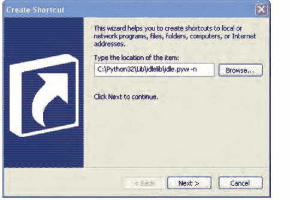

3.  点击 **下一步** 进入下一个对话框。
4.  输入名称为 *IDLE*，然后点击 **完成** 以创建快捷方式。

现在你可以跳转到第10页的“安装Python之后”部分，开始使用Python。

## 在Mac OS X上安装Python

如果你使用的是Mac，你应该会发现系统预装了Python，但可能是一个较旧的版本。为确保你运行的是最新版本，请将浏览器指向 *http://www.python.org/getit/* 以下载适用于Mac的最新安装程序。

有两种不同的安装程序。你应该下载哪一个取决于你安装的Mac OS X版本。（要查看版本，请点击顶部菜单栏中的 **Apple** 图标，然后选择 **关于本机**。）按如下方式选择安装程序：

- 如果你运行的是10.3到10.6之间的Mac OS X版本，请下载适用于i386/PPC的32位Python 3版本。
- 如果你运行的是10.6或更高版本的Mac OS X，请下载适用于x86-64的64位/32位Python 3版本。

文件下载完成后（文件扩展名为.dmg），双击它。你会看到一个显示文件内容的窗口。

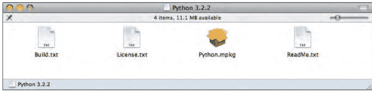

在此窗口中，双击 *Python.mpkg*，然后按照说明安装软件。在Python安装之前，系统会提示你输入Mac的管理员密码。（没有管理员密码？可能需要你的家长输入。）

接下来，你需要在桌面上添加一个用于启动Python IDLE应用程序的脚本，步骤如下：

1.  点击 **Spotlight** 图标，即屏幕右上角的小放大镜。
2.  在出现的框中，输入 *Automator*。
3.  当菜单中出现看起来像机器人的应用程序时，点击它。它可能位于标记为“Top Hit”的部分，也可能在“Applications”中。
4.  Automator启动后，选择 **Application** 模板：


5.  点击 **Choose** 继续。
6.  在操作列表中，找到 **Run Shell Script**，并将其拖到右侧的空面板中。你会看到类似这样的内容：


7.  在文本框中，你会看到单词 *cat*。选中该单词并将其替换为以下文本（从open到-n的所有内容）：

```
open -a "/Applications/Python 3.2/IDLE.app" --args -n
```

你可能需要根据安装的Python版本更改目录。
8.  选择 **File ▸ Save**，并输入 *IDLE* 作为名称。
9.  在“Where”对话框中选择 **Desktop**，然后点击 **Save**。

现在你可以跳转到第10页的“安装Python之后”部分，开始使用Python。

## 在Ubuntu上安装Python

Python预装在Ubuntu Linux发行版中，但可能是一个较旧的版本。请按照以下步骤在Ubuntu 12.x上安装Python 3：

1.  点击侧边栏中的Ubuntu软件中心按钮（它是一个看起来像橙色袋子的图标——如果没看到，你可以点击Dash Home图标并在对话框中输入 *Software*）。
2.  在软件中心右上角的搜索框中输入 *Python*。
3.  在显示的软件列表中，选择最新版本的IDLE，在本例中是 *IDLE (using Python 3.2)*：

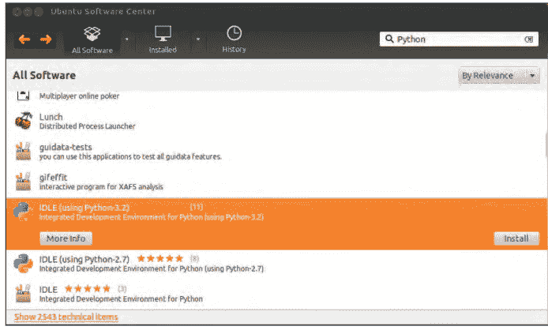

4.  点击 **Install**。
5.  输入你的管理员密码以安装软件，然后点击 **Authenticate**。（没有管理员密码？可能需要你的家长输入。）

> **注意**
> *在某些版本的Ubuntu上，你可能只会在主菜单中看到Python (v3.2)（而不是IDLE）——你可以安装这个。*

现在你已经安装了最新版本的Python，让我们来试一试。

## 安装Python之后

现在你的Windows或Mac OS X桌面上应该有一个标记为 **IDLE** 的图标。如果你使用的是Ubuntu，在 **Applications** 菜单中，你应该会看到一个名为 **Programming** 的新组，其中包含应用程序 **IDLE (using Python 3.2)**（或更高版本）。


双击图标或选择菜单选项，你应该会看到这个窗口：

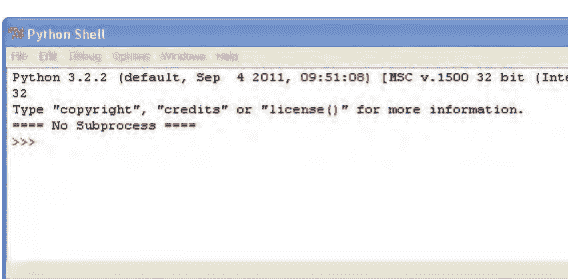

这是 *Python shell*，它是Python集成开发环境的一部分。三个大于号（>>>）被称为 *提示符*。

让我们在提示符下输入一些命令，从以下开始：

```
>>> print("Hello World")
```

确保包含双引号（" "）。输入完该行后，按键盘上的ENTER键。如果输入正确，你应该会看到类似这样的内容：

```
>>> print("Hello World")
Hello World
>>>
```

提示符应该会重新出现，让你知道Python shell已准备好接受更多命令。

恭喜！你刚刚创建了你的第一个Python程序。单词print是一种称为 *函数* 的Python命令，它会将括号内的任何内容打印到屏幕上。本质上，你给了计算机一个显示“Hello World”这个词的指令——一个你和计算机都能理解的指令。


## 保存你的Python程序

如果你每次想使用Python程序时都需要重写它们，那么它们就不会非常有用，更不用说打印出来以便参考了。当然，重写短程序可能没问题，但像文字处理器这样的大型程序可能包含数百万行代码。全部打印出来，你可能会有超过10万页。想象一下试图把那一大摞纸带回家。最好祈祷你不会遇到大风。

幸运的是，我们可以保存程序以备将来使用。要保存新程序，请打开IDLE并选择 **File ▸ New Window**。将出现一个空窗口，菜单栏中显示 **\*Untitled\***。在新的shell窗口中输入以下代码：

```
print("Hello World")
```

现在，选择 **File ▸ Save**。当提示输入文件名时，输入 *hello.py*，并将文件保存到桌面。然后选择 **Run ▸ Run Module**。运气好的话，你保存的程序应该会运行，像这样：

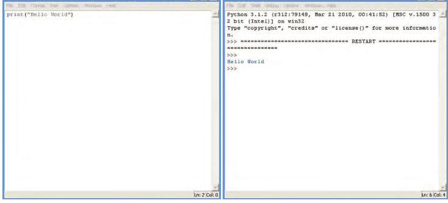

现在，如果你关闭shell窗口但保持 *hello.py* 窗口打开，然后选择 **Run ▸ Run Module**，Python shell应该会重新出现，你的程序应该会再次运行。（要重新打开Python shell而不运行程序，请选择 **Run ▸ Python Shell**。）

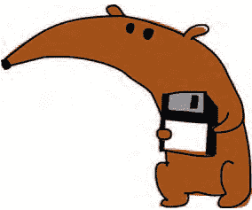

运行代码后，你会发现桌面上有一个标记为 *hello.py* 的新图标。如果你双击该图标，一个黑色窗口会短暂出现然后消失。发生了什么？

你看到的是Python命令行控制台（类似于shell）启动，打印“Hello World”，然后退出。如果你有超人般的快速视觉，能在窗口关闭前看到它，这就是会出现的内容：

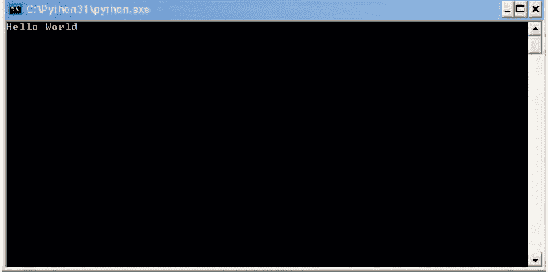

除了菜单，你还可以使用键盘快捷键来创建新的shell窗口、保存文件和运行程序：

- 在Windows和Ubuntu上，使用CTRL-N创建新的shell窗口，使用CTRL-S在编辑完成后保存文件，按F5运行程序。
- 在Mac OS X上，使用⌘-N创建新的shell窗口，使用⌘-S保存文件，按住功能（FN）键并按F5运行程序。

## 你学到了什么

本章我们从一个简单的Hello World应用程序开始——这是几乎每个人学习计算机编程时都从它开始的程序。在下一章中，我们将使用Python shell做一些更有用的事情。

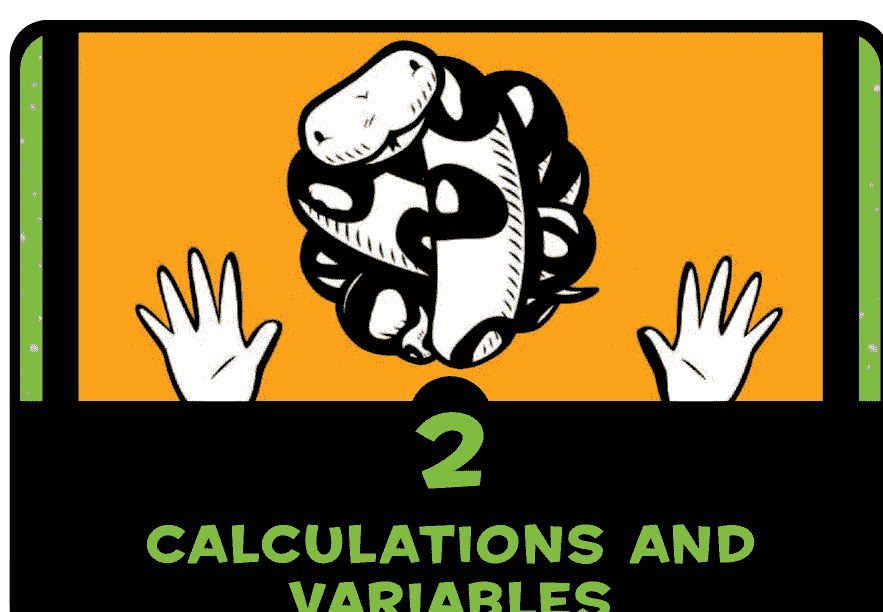

# 2 计算和变量

现在你已经安装了Python，并且知道如何启动Python shell，你准备好用它做点什么了。我们将从一些简单的计算开始，然后转向变量。*变量*是在计算机程序中存储事物的一种方式，它们可以帮助你编写有用的程序。

## 使用 Python 进行计算

通常，当被要求计算两个数的乘积，比如 8 × 3.57 时，你会使用计算器或纸笔。那么，使用 Python shell 来进行计算怎么样？我们来试试。

通过双击桌面上的 IDLE 图标，或者（如果你使用的是 Ubuntu）点击应用程序菜单中的 IDLE 图标来启动 Python shell。在提示符下，输入这个等式：

```
>>> 8 * 3.57
28.56
```

请注意，在 Python 中输入乘法计算时，使用的是星号符号 (*) 而不是乘号 (×)。

如果我们尝试一个更有用的等式会怎样？

假设你在后院挖掘，发现了一袋 20 枚金币。第二天，你偷偷溜到地下室，把这些硬币放进你祖父那台蒸汽动力的复制发明里（幸运的是，你刚好能把这 20 枚硬币放进去）。你听到一阵呼啸声和爆裂声，几个小时后，又射出了另外 10 枚闪闪发光的硬币。

如果你每天都这样做，一年后你的宝箱里会有多少枚硬币？在纸上，等式可能看起来像这样：

10 × 365 = 3650
20 + 3650 = 3670

当然，在计算器或纸上做这些计算很容易，但我们也可以用 Python shell 来完成所有这些计算。首先，我们将 10 枚硬币乘以一年中的 365 天，得到 3650。然后，加上最初的 20 枚硬币，得到 3670。

```
>>> 10 * 365
3650
>>> 20 + 3650
3670
```

现在，如果一只乌鸦发现了你卧室里闪闪发光的金币，并且每周都飞进来偷走三枚硬币会怎样？

一年后你还剩下多少枚硬币？以下是 shell 中的计算过程：

```
>>> 3 * 52
156
>>> 3670 - 156
3514
```

首先，我们将 3 枚硬币乘以一年中的 52 周。结果是 156。我们从硬币总数（3670）中减去这个数字，这告诉我们一年后我们将剩下 3514 枚硬币。

这是一个非常简单的程序。在本书中，你将学习如何扩展这些想法，编写更有用的程序。

## Python 运算符

你可以在 Python shell 中进行乘法、加法、减法和除法，以及其他我们目前不会深入讨论的数学运算。Python 用于执行数学运算的基本符号称为 *运算符*，如表 2-1 所列。

**表 2-1：基本 Python 运算符**

| 符号 | 运算 |
| :--- | :--- |
| + | 加法 |
| - | 减法 |
| * | 乘法 |
| / | 除法 |

*正斜杠* (/) 用于除法，因为它类似于书写分数时使用的除号线。例如，如果你有 100 个海盗和 20 个大桶，你想计算每个桶里可以藏多少个海盗，你可以通过在 Python shell 中输入 100 / 20 来将 100 个海盗除以 20 个桶（100 ÷ 20）。只需记住，正斜杠是顶部向右倾斜的那个。


## 运算顺序

我们在编程语言中使用括号来控制运算顺序。*运算*是指任何使用运算符的操作。乘法和除法的优先级高于加法和减法，这意味着它们会先执行。换句话说，如果你在 Python 中输入一个等式，乘法或除法会在加法或减法之前执行。

例如，在下面的等式中，数字 30 和 20 首先相乘，然后将数字 5 加到它们的乘积上。

```
>>> 5 + 30 * 20
605
```

这个等式是“将 30 乘以 20，然后将结果加上 5”的另一种说法。结果是 605。我们可以通过在前两个数字周围添加括号来改变运算顺序，如下所示：

```
>>> (5 + 30) * 20
700
```

这个等式的结果是 700（而不是 605），因为括号告诉 Python 先执行括号内的运算，然后再执行括号外的运算。这个例子说的是“将 5 加到 30 上，然后将结果乘以 20”。

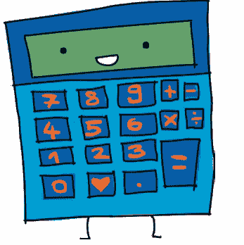

括号可以 *嵌套*，这意味着括号里面可以有括号，像这样：

```
>>> ((5 + 30) * 20) / 10
70.0
```

在这种情况下，Python 会先计算最内层的括号，然后是外层的括号，最后是最终的除法运算符。

换句话说，这个等式说的是：“将 5 加到 30 上，然后将结果乘以 20，再将结果除以 10。”以下是发生的过程：

- 将 5 加到 30 上得到 35。
- 将 35 乘以 20 得到 700。
- 将 700 除以 10 得到最终答案 70。

如果我们没有使用括号，结果会略有不同：

```
>>> 5 + 30 * 20 / 10
65.0
```

在这种情况下，30 首先乘以 20（得到 600），然后 600 除以 10（得到 60）。最后，加上 5 得到结果 65。

> **警告** 请记住，除非使用括号来控制运算顺序，否则乘法和除法总是优先于加法和减法。

## 变量就像标签

编程中的 *变量* 一词描述的是存储信息的地方，例如数字、文本、数字和文本的列表等等。看待变量的另一种方式是，它就像某样东西的标签。

例如，要创建一个名为 fred 的变量，我们使用一个等号 (=)，然后告诉 Python 这个变量应该标记什么信息。这里，我们创建变量 fred 并告诉 Python 它标记数字 100（注意这并不意味着另一个变量不能有相同的值）：

```
>>> fred = 100
```

要找出一个变量标记的值，在 shell 中输入 print，后跟括号中的变量名，像这样：

```
>>> print(fred)
100
```

我们也可以告诉 Python 更改变量 fred，使其标记其他内容。例如，以下是将 fred 更改为数字 200 的方法：

```
>>> fred = 200
>>> print(fred)
200
```

在第一行，我们说 fred 标记数字 200。在第二行，我们询问 fred 标记的是什么，只是为了确认更改。Python 在最后一行打印结果。

我们也可以为同一个项目使用多个标签（多个变量）：

```
>>> fred = 200
>>> john = fred
>>> print(john)
200
```

在这个例子中，我们告诉 Python 我们希望名称（或变量）john 标记与 fred 相同的东西，方法是在 john 和 fred 之间使用等号。

当然，fred 可能不是一个非常有用的变量名，因为它很可能没有告诉我们任何关于变量用途的信息。让我们将变量命名为 number_of_coins 而不是 fred，像这样：

```
>>> number_of_coins = 200
>>> print(number_of_coins)
200
```

这清楚地表明我们谈论的是 200 枚硬币。

变量名可以由字母、数字和下划线字符 (_) 组成，但不能以数字开头。你可以使用从单个字母（如 a）到长句子的任何内容作为变量名。（变量不能包含空格，因此请使用下划线分隔单词。）有时，如果你正在做一些快速的事情，短变量名是最好的。你选择的名称应该取决于你需要变量名具有多大的意义。

现在你知道如何创建变量了，让我们看看如何使用它们。

## 使用变量

还记得我们用来计算一年后你会有多少枚硬币的等式吗？如果你能用你祖父在地下室的疯狂发明神奇地创造新硬币的话？我们有这个等式：

```
>>> 20 + 10 * 365
3670
>>> 3 * 52
156
>>> 3670 - 156
3514
```

我们可以将其转换为一行代码：

```
>>> 20 + 10 * 365 - 3 * 52
3514
```

现在，如果我们把这些数字变成变量会怎样？尝试输入以下内容：

```
>>> found_coins = 20
>>> magic_coins = 10
>>> stolen_coins = 3
```

这些条目创建了变量 found_coins、magic_coins 和 stolen_coins。

现在，我们可以像这样重新输入等式：

```
>>> found_coins + magic_coins * 365 - stolen_coins * 52
3514
```

你可以看到这给出了相同的答案。那又怎样，对吧？啊，但这就是变量的魔力。如果你在窗户上放一个稻草人，乌鸦只偷两枚硬币会怎样？

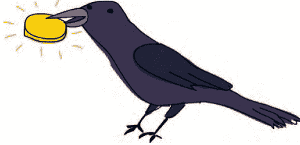

而不是三个？当我们使用变量时，只需简单地将变量更改为新的数字，它就会在方程式中所有使用的地方自动更新。我们可以通过输入以下内容将 `stolen_coins` 变量更改为 2：

```
>>> stolen_coins = 2
```

然后，我们可以复制并粘贴方程式来重新计算答案，如下所示：

1.  通过鼠标点击并从行首拖动到行尾来选择要复制的文本，如下所示：

    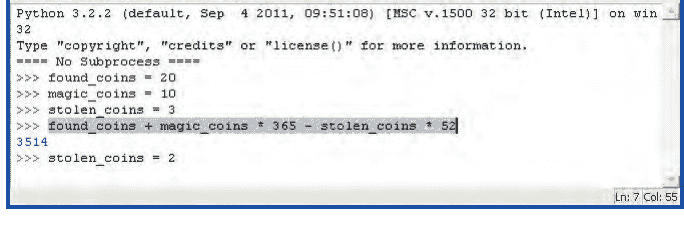

2.  按住 CTRL 键（如果你使用的是 Mac，则按 ⌘ 键）并按 C 键复制选中的文本。（从现在起，我们将此操作表示为 CTRL-C。）

3.  点击最后一行提示符（在 `stolen_coins = 2` 之后）。

4.  按住 CTRL 键并按 V 键粘贴选中的文本。（从现在起，我们将此操作表示为 CTRL-V。）

5.  按 ENTER 键查看新结果：

    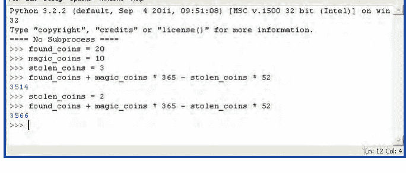

这难道不比重新输入整个方程式容易得多吗？确实如此。

你可以尝试更改其他变量，然后复制（CTRL-C）并粘贴（CTRL-V）计算过程，以查看更改的效果。例如，如果你在正确的时机敲击你祖父发明的装置的两侧，它每次会额外吐出 3 枚硬币，你会发现一年结束时你最终会拥有 4661 枚硬币：

```
>>> magic_coins = 13
>>> found_coins + magic_coins * 365 - stolen_coins * 52
4661
```

当然，对于像这样简单的方程式使用变量仍然只是*略微*有用。我们还没有达到*真正*有用的程度。目前，只需记住变量是一种标记事物的方式，以便你以后可以使用它们。

## 你学到了什么

在本章中，你学习了如何使用 Python 运算符进行简单的方程式计算，以及如何使用括号来控制运算顺序（Python 计算方程式各部分的顺序）。然后，我们创建了变量来标记值，并在计算中使用了这些变量。

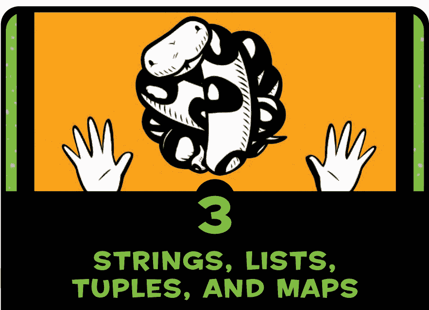

## 3 字符串、列表、元组和映射

在第 2 章中，我们使用 Python 进行了一些基本计算，你了解了变量。在本章中，我们将使用 Python 程序中的其他一些项目：字符串、列表、元组和映射。你将使用字符串在程序中显示消息（例如游戏中的“准备开始”和“游戏结束”消息）。你还将了解列表、元组和映射如何用于存储事物的集合。

## 字符串

在编程术语中，我们通常将文本称为*字符串*。当你将字符串视为字母的集合时，这个术语就说得通了。本书中的所有字母、数字和符号都可以是一个字符串。就此而言，你的名字可以是一个字符串，你的地址也可以是一个字符串。事实上，我们在第 1 章中创建的第一个 Python 程序就使用了一个字符串：“Hello World。”

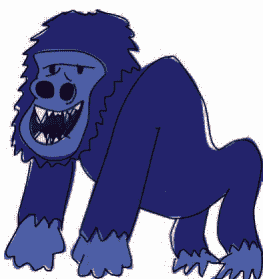

### 创建字符串

在 Python 中，我们通过在文本周围加上引号来创建字符串。例如，我们可以使用第 2 章中那个原本无用的 `fred` 变量来标记一个字符串，如下所示：

```
fred = "Why do gorillas have big nostrils? Big fingers!!"
```

然后，要查看 `fred` 中的内容，我们可以输入 `print(fred)`，如下所示：

```
>>> print(fred)
Why do gorillas have big nostrils? Big fingers!!
```

你也可以使用单引号来创建字符串，如下所示：

```
>>> fred = 'What is pink and fluffy? Pink fluff!!'
>>> print(fred)
What is pink and fluffy? Pink fluff!!
```

但是，如果你尝试仅使用单引号（'）或双引号（"）为字符串输入多行文本，或者你以一种引号开始并尝试用另一种引号结束，你将在 Python shell 中收到错误消息。例如，输入以下行：

```
>>> fred = "How do dinosaurs pay their bills?
```

你将看到以下结果：

```
SyntaxError: EOL while scanning string literal
```

这是一个抱怨语法的错误消息，因为你没有遵循使用单引号或双引号结束字符串的规则。

*语法*是指句子中单词的排列和顺序，或者在这种情况下，是指程序中单词和符号的排列和顺序。因此，*SyntaxError* 意味着你以 Python 未预期的顺序执行了某些操作，或者 Python 预期某些内容而你遗漏了。*EOL* 意味着*行尾*，因此错误消息的其余部分告诉你 Python 到达了行尾，但没有找到双引号来关闭字符串。

要在字符串中使用多行文本（称为*多行字符串*），请使用三个单引号（'''），然后在行之间按 ENTER，如下所示：

```
>>> fred = '''How do dinosaurs pay their bills?
With tyrannosaurus checks!'''
```

现在让我们打印出 `fred` 的内容，看看这是否有效：

```
>>> print(fred)
How do dinosaurs pay their bills?
With tyrannosaurus checks!
```

### 处理字符串问题

现在考虑这个疯狂的字符串示例，它导致 Python 显示错误消息：

```
>>> silly_string = 'He said, "Aren't can't shouldn't wouldn't."'
SyntaxError: invalid syntax
```

在第一行中，我们尝试创建一个由单引号括起来的字符串（定义为变量 `silly_string`），但其中也包含单词 `can't`、`shouldn't` 和 `wouldn't` 中的单引号，以及双引号。真是一团糟！

请记住，Python 本身并不像人类那样聪明，因此它看到的只是一个包含 `He said, "Aren` 的字符串，后面跟着一堆它不期望的其他字符。当 Python 看到引号（单引号或双引号）时，它期望字符串在第一个引号之后开始，并在该行上下一个匹配的引号（单引号或双引号）之后结束。在这种情况下，字符串的开始是 `He` 之前的单引号，而就 Python 而言，字符串的结束是 `Aren` 中 `n` 之后的单引号。IDLE 高亮显示了出错的位置：

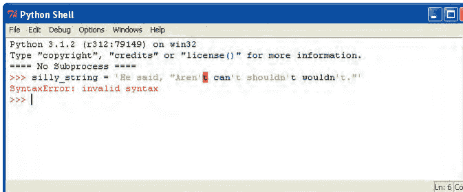

IDLE 的最后一行告诉我们发生了哪种错误——在这种情况下，是语法错误。
使用双引号而不是单引号仍然会产生错误：

```
>>> silly_string = "He said, "Aren't can't shouldn't wouldn't.""
SyntaxError: invalid syntax
```

在这里，Python 看到一个由双引号界定的字符串，包含字母 `He said,`（和一个空格）。该字符串之后的所有内容（从 `Aren't` 开始）都会导致错误：

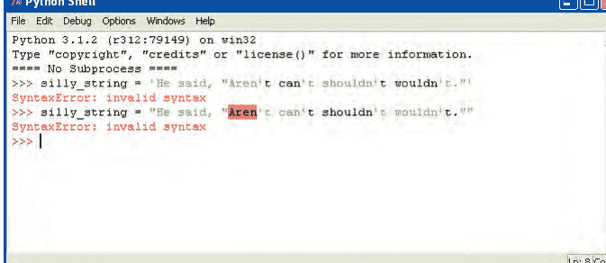

这是因为，从 Python 的角度来看，所有这些额外的东西根本就不应该在那里。Python 查找下一个匹配的引号，并且不知道你希望它如何处理该行上该引号之后的任何内容。

这个问题的解决方案是多行字符串，我们之前学过，使用*三个*单引号（'''），这允许我们在字符串中组合双引号和单引号而不会导致错误。事实上，如果我们使用三个单引号，我们可以在字符串中放入任何单引号和双引号的组合（只要我们不尝试在那里放入三个单引号）。这就是我们无错误版本的字符串的样子：

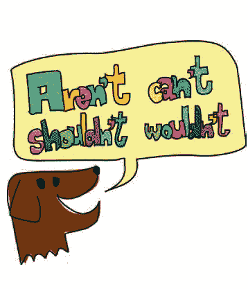

```
silly_string = '''He said, "Aren't can't shouldn't wouldn't."'''
```

但是等等，还有更多。如果你真的想在 Python 中使用单引号或双引号来包围字符串，而不是使用三个单引号，你可以在字符串中的每个引号前添加一个反斜杠（\）。这称为*转义*。这是一种告诉 Python 的方式：“是的，我知道我的字符串里面有引号，我希望你忽略它们，直到你看到结束引号。”

转义字符串可能使它们更难阅读，因此最好使用多行字符串。不过，你可能会遇到使用转义的代码片段，因此了解反斜杠为何存在是很有好处的。

以下是转义如何工作的几个示例：

```
>>> single_quote_str = 'He said, "Aren\'t can\'t shouldn\'t wouldn\'t."'
>>> double_quote_str = "He said, \"Aren't can't shouldn't wouldn't.\""
>>> print(single_quote_str)
He said, "Aren't can't shouldn't wouldn't."
>>> print(double_quote_str)
He said, "Aren't can't shouldn't wouldn't."
```

首先，在 ❶ 处，我们使用单引号创建一个字符串，并在该字符串内的单引号前使用反斜杠。在 ❷ 处，我们使用双引号创建一个字符串，并在字符串中的这些引号前使用反斜杠。在接下来的几行中，我们打印刚刚创建的变量。请注意，当我们打印字符串时，反斜杠字符不会出现在字符串中。

## 在字符串中嵌入值

如果你想使用变量的内容来显示消息，可以使用 `%s` 将值嵌入字符串中，这就像一个占位符，用于你稍后要添加的值。（*嵌入值*是程序员的说法，意思是“插入值”。）例如，要让 Python 计算或存储你在游戏中获得的分数，然后将其添加到像“我得了 ___ 分”这样的句子中，可以在句子中使用 `%s` 代替该值，然后告诉 Python 这个值，如下所示：

```
>>> myscore = 1000
>>> message = 'I scored %s points'
>>> print(message % myscore)
I scored 1000 points
```

这里，我们创建了变量 `myscore`，其值为 1000，以及变量 `message`，其字符串包含“I scored %s points”，其中 `%s` 是分数的占位符。在下一行，我们使用 `%` 符号调用 `print(message)`，告诉 Python 用存储在变量 `myscore` 中的值替换 `%s`。打印此消息的结果是 `I scored 1000 points`。我们不需要为该值使用变量。我们也可以做同样的例子，直接使用 `print(message % 1000)`。

我们还可以为 `%s` 占位符传递不同的值，使用不同的变量，如本例所示：

```
>>> joke_text = '%s: a device for finding furniture in the dark'
>>> bodypart1 = 'Knee'
>>> bodypart2 = 'Shin'
>>> print(joke_text % bodypart1)
Knee: a device for finding furniture in the dark
>>> print(joke_text % bodypart2)
Shin: a device for finding furniture in the dark
```

这里，我们创建了三个变量。第一个 `joke_text` 包含带有 `%s` 标记的字符串。其他变量是 `bodypart1` 和 `bodypart2`。我们可以打印变量 `joke_text`，并再次使用 `%` 运算符将其替换为变量 `bodypart1` 和 `bodypart2` 的内容，以产生不同的消息。

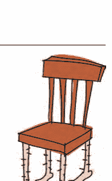

你也可以在字符串中使用多个占位符，如下所示：

```
>>> nums = 'What did the number %s say to the number %s? Nice belt!!'
>>> print(nums % (0, 8))
What did the number 0 say to the number 8? Nice belt!!
```

使用多个占位符时，请务必将替换值用括号括起来，如示例所示。值的顺序就是它们在字符串中使用的顺序。

## 字符串乘法

10 乘以 5 是多少？答案当然是 50。但 10 乘以 *a* 是多少？这是 Python 的答案：

```
>>> print(10 * 'a')
aaaaaaaaaa
```

Python 程序员可能会使用这种方法在 shell 中显示消息时，将字符串与特定数量的空格对齐。例如，在 shell 中打印一封信（选择 **File ▸ New Window**，并输入以下代码）：

```
spaces = ' ' * 25
print('%s 12 Butts Wynd' % spaces)
print('%s Twinklebottom Heath' % spaces)
print('%s West Snoring' % spaces)
print()
print()
print('Dear Sir')
print()
print('I wish to report that tiles are missing from the')
print('outside toilet roof.')
print('I think it was bad wind the other night that blew them away.')
print()
print('Regards')
print('Malcolm Dithering')
```

在 shell 窗口中输入代码后，选择 **File ▸ Save As**。将文件命名为 *myletter.py*。

从现在起，当你看到代码块上方有“Save As: somefilename.py”时，你就知道需要选择 **File ▸ New Window**，在出现的窗口中输入代码，然后像本例中那样保存它。

在本例的第一行，我们通过将一个空格字符乘以 25 来创建变量 `spaces`。然后我们在接下来的三行中使用该变量将文本与 shell 的右侧对齐。你可以看到这些 print 语句的结果如下：

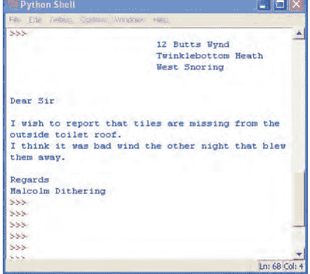

除了使用乘法进行对齐，我们还可以用它来用烦人的消息填满屏幕。自己试试这个例子：

```
>>> print(1000 * 'snirt')
```

## 列表比字符串更强大

“蜘蛛腿、青蛙脚趾、蝾螈眼睛、蝙蝠翅膀、蛞蝓黄油和蛇头皮屑”这不太像一个正常的购物清单（除非你碰巧是个巫师），但我们将用它作为字符串和列表之间区别的第一个例子。


我们可以使用字符串将这个物品列表存储在变量 `wizard_list` 中，如下所示：

```
>>> wizard_list = 'spider legs, toe of frog, eye of newt, bat wing, slug butter, snake dandruff'
>>> print(wizard_list)
spider legs, toe of frog, eye of newt, bat wing, slug butter, snake dandruff
```

但我们也可以创建一个列表，这是一种有点神奇的 Python 对象，我们可以对其进行操作。这些物品写成列表的样子如下：

```
>>> wizard_list = ['spider legs', 'toe of frog', 'eye of newt',
                   'bat wing', 'slug butter', 'snake dandruff']
>>> print(wizard_list)
['spider legs', 'toe of frog', 'eye of newt', 'bat wing', 'slug butter', 'snake dandruff']
```

创建列表比创建字符串需要多打一些字，但列表比字符串更有用，因为它可以被操作。例如，我们可以通过在方括号（`[]`）内输入其在列表中的位置（称为索引位置）来打印 `wizard_list` 中的第三项（蝾螈眼睛），如下所示：

```
>>> print(wizard_list[2])
eye of newt
```

嗯？它不是列表中的第三项吗？是的，但列表从索引位置 0 开始，所以列表中的第一项是 0，第二项是 1，第三项是 2。这对人类来说可能不太合理，但对计算机来说确实如此。

我们也可以比在字符串中更容易地更改列表中的项目。也许我们需要蜗牛舌头而不是蝾螈眼睛。以下是我们如何用列表做到这一点：

```
>>> wizard_list[2] = 'snail tongue'
>>> print(wizard_list)
['spider legs', 'toe of frog', 'snail tongue', 'bat wing', 'slug butter', 'snake dandruff']
```

这将索引位置 2（之前是蝾螈眼睛）的项目设置为蜗牛舌头。

另一个选项是显示列表中项目的一个子集。我们通过在方括号内使用冒号（`:`）来实现这一点。例如，输入以下内容以查看列表中的第三到第五项（一组制作美味三明治的绝佳配料）：

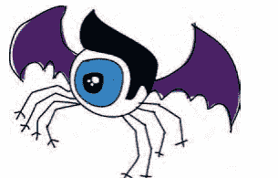

```
>>> print(wizard_list[2:5])
['snail tongue', 'bat wing', 'slug butter']
```

写 `[2:5]` 等同于说，“显示从索引位置 2 到（但不包括）索引位置 5 的项目”——或者换句话说，项目 2、3 和 4。

列表可用于存储各种项目，例如数字：

```
>>> some_numbers = [1, 2, 5, 10, 20]
```

它们也可以包含字符串：

```
>>> some_strings = ['Which', 'Witch', 'Is', 'Which']
```

它们可能包含数字和字符串的混合：

```
>>> numbers_and_strings = ['Why', 'was', 6, 'afraid', 'of', 7,
                            'because', 7, 8, 9]
>>> print(numbers_and_strings)
['Why', 'was', 6, 'afraid', 'of', 7, 'because', 7, 8, 9]
```

列表甚至可以存储其他列表：

```
>>> numbers = [1, 2, 3, 4]
>>> strings = ['I', 'kicked', 'my', 'toe', 'and', 'it', 'is', 'sore']
>>> mylist = [numbers, strings]
>>> print(mylist)
[[1, 2, 3, 4], ['I', 'kicked', 'my', 'toe', 'and', 'it', 'is', 'sore']]
```

这个列表中的列表示例创建了三个变量：`numbers` 包含四个数字，`strings` 包含八个字符串，`mylist` 使用 `numbers` 和 `strings`。第三个列表（`mylist`）只有两个元素，因为它是一个变量名的列表，而不是变量的内容。

## 向列表中添加项目

要向列表中添加项目，我们使用 `append` 函数。*函数*是一段代码，告诉 Python 做某事。在这种情况下，`append` 将一个项目添加到列表的末尾。

例如，要将熊打嗝（我确信有这种东西）添加到巫师的购物清单中，请执行以下操作：

```
>>> wizard_list.append('bear burp')
>>> print(wizard_list)
['spider legs', 'toe of frog', 'snail tongue', 'bat wing', 'slug butter', 'snake dandruff', 'bear burp']
```

你可以用同样的方式继续向巫师的列表中添加更多神奇的物品，如下所示：

```
>>> wizard_list.append('mandrake')
>>> wizard_list.append('hemlock')
>>> wizard_list.append('swamp gas')
```

现在巫师的列表看起来像这样：

```
>>> print(wizard_list)
['spider legs', 'toe of frog', 'snail tongue', 'bat wing', 'slug butter', 'snake dandruff', 'bear burp', 'mandrake', 'hemlock', 'swamp gas']
```

巫师显然已经准备好施展一些真正的魔法了！

## 从列表中删除项目

要从列表中删除项目，请使用 `del` 命令（*delete* 的缩写）。例如，要从巫师的列表中删除第六个项目（蛇头皮屑），请执行以下操作：

```
>>> del wizard_list[5]
>>> print(wizard_list)
['spider legs', 'toe of frog', 'snail tongue', 'bat wing', 'slug butter', 'bear burp', 'mandrake', 'hemlock', 'swamp gas']
```

> 请记住，位置从零开始，因此 `wizard_list[5]` 实际上指的是列表中的第六个项目。

以下是如何删除我们刚刚添加的项目（曼德拉草、毒芹和沼气）：

```
>>> del wizard_list[8]
>>> del wizard_list[7]
>>> del wizard_list[6]
>>> print(wizard_list)
['spider legs', 'toe of frog', 'snail tongue', 'bat wing', 'slug butter', 'bear burp']
```

## 列表运算

我们可以通过相加来连接列表，就像数字相加一样，使用加号（+）。例如，假设我们有两个列表：list1 包含数字 1 到 4，list2 包含一些单词。我们可以使用 print 和加号将它们相加，如下所示：

```
>>> list1 = [1, 2, 3, 4]
>>> list2 = ['I', 'tripped', 'over', 'and', 'hit', 'the', 'floor']
>>> print(list1 + list2)
[1, 2, 3, 4, 'I', 'tripped', 'over', 'and', 'hit', 'the', 'floor']
```

我们也可以将两个列表相加，并将结果赋值给另一个变量。

```
>>> list1 = [1, 2, 3, 4]
>>> list2 = ['I', 'ate', 'chocolate', 'and', 'I', 'want', 'more']
>>> list3 = list1 + list2
>>> print(list3)
[1, 2, 3, 4, 'I', 'ate', 'chocolate', 'and', 'I', 'want', 'more']
```

我们还可以将一个列表乘以一个数字。例如，要将 list1 乘以 5，我们写 list1 * 5：

```
>>> list1 = [1, 2]
>>> print(list1 * 5)
[1, 2, 1, 2, 1, 2, 1, 2, 1, 2]
```

这实际上是告诉 Python 将 list1 重复五次，结果是 1, 2, 1, 2, 1, 2, 1, 2, 1, 2。

另一方面，除法（/）和减法（-）只会产生错误，如以下示例所示：

```
>>> list1 / 20
Traceback (most recent call last):
  File "<pyshell>", line 1, in <module>
    list1 / 20
TypeError: unsupported operand type(s) for /: 'list' and 'int'

>>> list1 - 20
Traceback (most recent call last):
  File "<pyshell>", line 1, in <module>
    list1 - 20
TypeError: unsupported operand type(s) for -: 'list' and 'int'
```

但是为什么呢？嗯，用 + 连接列表和用 * 重复列表是足够直接的操作。这些概念在现实世界中也有意义。例如，如果我递给你两张纸质购物清单并说：“把这两个列表加起来”，你可能会在另一张纸上按顺序、首尾相接地写下所有项目。如果我说：“把这个列表乘以 3”，情况可能也类似。你可以想象在另一张纸上写下这个列表的所有项目三次。

但是，你如何除以一个列表呢？例如，考虑如何将一个包含六个数字（1 到 6）的列表除以二。这里只是三种不同的方式：

```
[1, 2, 3]          [4, 5, 6]
[1]                [2, 3, 4, 5, 6]
[1, 2, 3, 4]       [5, 6]
```

我们是应该从中间分割列表，在第一个项目后分割，还是随便找个地方分割？没有简单的答案，当你要求 Python 除以一个列表时，它也不知道该怎么做。这就是它返回错误的原因。


将列表与列表以外的任何东西相加也是如此。你也做不到。例如，当我们尝试将数字 50 加到 list1 时，会发生以下情况：

```
>>> list1 + 50
Traceback (most recent call last):
  File "<pyshell>", line 1, in <module>
    list1 + 50
TypeError: can only concatenate list (not "int") to list
```

为什么我们在这里会得到错误？嗯，将 50 加到一个列表意味着什么？它意味着将 50 加到每个项目上吗？但如果项目不是数字呢？它意味着将数字 50 添加到列表的末尾或开头吗？
在计算机编程中，命令每次输入时都应该以完全相同的方式工作。那台笨拙的计算机只看到非黑即白的东西。要求它做出复杂的决定，它就会举手投降并报错。

## 元组

*元组*就像一个使用圆括号的列表，如本例所示：

```
>>> fibs = (0, 1, 1, 2, 3)
>>> print(fibs[3])
2
```

这里我们将变量 fibs 定义为数字 0, 1, 1, 2 和 3。然后，与列表一样，我们使用 print(fibs[3]) 打印元组中索引位置 3 的项目。
元组和列表的主要区别在于，元组一旦创建就不能更改。例如，如果我们尝试将元组 fibs 中的第一个值替换为数字 4（就像我们替换 wizard_list 中的值一样），我们会得到一条错误消息：

```
>>> fibs[0] = 4
Traceback (most recent call last):
  File "<pyshell>", line 1, in <module>
    fibs[0] = 4
TypeError: 'tuple' object does not support item assignment
```

为什么你会使用元组而不是列表？基本上是因为有时使用你知道永远不会改变的东西是有用的。如果你创建一个包含两个元素的元组，它将始终包含那两个元素。

## PYTHON 地图不会帮你找到路

在 Python 中，*map*（也称为 *dict*，*dictionary* 的缩写）是一个项目的集合，类似于列表和元组。地图与列表或元组的区别在于，地图中的每个项目都有一个*键*和一个对应的*值*。

例如，假设我们有一个包含人员及其最喜爱运动的列表。我们可以将这些信息放入一个 Python 列表中，先是人名，然后是他们的运动，如下所示：

```
>>> favorite_sports = ['Ralph Williams, Football',
                      'Michael Tippett, Basketball',
                      'Edward Elgar, Baseball',
                      'Rebecca Clarke, Netball',
                      'Ethel Smyth, Badminton',
                      'Frank Bridge, Rugby']
```

如果我问你 Rebecca Clarke 最喜欢的运动是什么，你可以浏览那个列表并找到答案是无挡板篮球。但如果列表包含 100（或更多）人呢？

现在，如果我们以人名为键、他们最喜爱的运动为值，将相同的信息存储在地图中，Python 代码将如下所示：


```
>>> favorite_sports = {'Ralph Williams' : 'Football',
                      'Michael Tippett' : 'Basketball',
                      'Edward Elgar' : 'Baseball',
                      'Rebecca Clarke' : 'Netball',
                      'Ethel Smyth' : 'Badminton',
                      'Frank Bridge' : 'Rugby'}
```

我们使用冒号将每个键与其值分开，并且每个键和值都用单引号括起来。还要注意，地图中的项目包含在花括号（{}）中，而不是圆括号或方括号。

结果是一个地图（每个键映射到一个特定的值），如表 3-1 所示。

**表 3-1：** 最喜爱运动地图中指向值的键

| 键 | 值 |
| :--- | :--- |
| Ralph Williams | Football |
| Michael Tippett | Basketball |
| Edward Elgar | Baseball |
| Rebecca Clarke | Netball |
| Ethel Smyth | Badminton |
| Frank Bridge | Rugby |

现在，要获取 Rebecca Clarke 最喜欢的运动，我们使用她的名字作为键来访问我们的地图 favorite_sports，如下所示：

```
>>> print(favorite_sports['Rebecca Clarke'])
Netball
```

答案是无挡板篮球。
要删除地图中的一个值，请使用其键。例如，以下是删除 Ethel Smyth 的方法：

```
>>> del favorite_sports['Ethel Smyth']
>>> print(favorite_sports)
{'Rebecca Clarke': 'Netball', 'Michael Tippett': 'Basketball', 'Ralph Williams': 'Football', 'Edward Elgar': 'Baseball', 'Frank Bridge': 'Rugby'}
```

要替换地图中的一个值，我们也使用其键：

```
>>> favorite_sports['Ralph Williams'] = 'Ice Hockey'
>>> print(favorite_sports)
{'Rebecca Clarke': 'Netball', 'Michael Tippett': 'Basketball', 'Ralph Williams': 'Ice Hockey', 'Edward Elgar': 'Baseball', 'Frank Bridge': 'Rugby'}
```

我们使用键 Ralph Williams 将最喜爱的运动 Football 替换为 Ice Hockey。

如你所见，使用地图有点像使用列表和元组，只是你不能用加号运算符（+）连接地图。如果你尝试这样做，你会得到一条错误消息：

```
>>> favorite_sports = {'Rebecca Clarke': 'Netball',
    'Michael Tippett': 'Basketball',
    'Ralph Williams': 'Ice Hockey',
    'Edward Elgar': 'Baseball',
    'Frank Bridge': 'Rugby'}
>>> favorite_colors = {'Malcolm Warner' : 'Pink polka dots',
    'James Baxter' : 'Orange stripes',
    'Sue Lee' : 'Purple paisley'}
>>> favorite_sports + favorite_colors
Traceback (most recent call last):
  File "<stdin>", line 1, in <module>
TypeError: unsupported operand type(s) for +: 'dict' and 'dict'
```

连接地图对 Python 来说没有意义，所以它只是举手投降。

## 你学到了什么

在本章中，你学习了 Python 如何使用字符串存储文本，以及如何使用列表和元组处理多个项目。你看到列表中的项目可以更改，并且你可以将一个列表连接到另一个列表，但元组中的值不能更改。你还学习了如何使用地图来存储带有标识它们的键的值。

## 编程谜题

以下是一些你可以自己尝试的实验。答案可以在 http://python-for-kids.com/ 找到。

### #1：最爱

列出你最喜欢的爱好，并将该列表命名为 games。现在列出你最喜欢的食物，并将变量命名为 foods。连接这两个列表，并将结果命名为 favorites。最后，打印变量 favorites。

### #2：计算战斗人员

假设有3栋建筑，每栋屋顶上隐藏着25名忍者，还有2条隧道，每条隧道内潜伏着40名武士，那么即将投入战斗的忍者和武士共有多少人？（你可以用Python shell中的一个等式来解决这个问题。）

### #3：问候语！

创建两个变量：一个指向你的名字，另一个指向你的姓氏。现在创建一个字符串，并使用占位符，利用这两个变量打印出带有问候语的你的全名，例如“你好，布兰多·伊克特！”

### #4 用海龟绘图

Python中的*海龟*有点像现实世界中的乌龟。我们知道乌龟是一种爬行动物，行动非常缓慢，并且背着自己的房子。在Python的世界里，海龟是一个在屏幕上缓慢移动的小黑箭头。实际上，考虑到Python海龟在屏幕上移动时会留下轨迹，它其实更像一只蜗牛或蛞蝓。

海龟是学习计算机图形学基础知识的好方法，所以在本章中，我们将使用Python海龟来绘制一些简单的形状和线条。

## 使用Python的turtle模块

Python中的*模块*是一种提供有用代码供其他程序使用的方式（除此之外，模块还可以包含我们可以使用的函数）。我们将在第7章中更详细地学习模块。Python有一个名为turtle的特殊模块，我们可以用它来学习计算机如何在屏幕上绘制图像。turtle模块是一种编程矢量图形的方式，本质上就是用简单的线条、点和曲线进行绘制。

让我们看看海龟是如何工作的。首先，通过点击桌面图标启动Python shell（如果你使用Ubuntu，请选择**应用程序 ▸ 编程 ▸ IDLE**）。接下来，通过导入turtle模块来告诉Python使用海龟，如下所示：

```
>>> import turtle
```

导入模块告诉Python你想要使用它。

> **注意**
>
> *如果你使用Ubuntu并且在此时遇到错误，你可能需要安装tkinter。为此，请打开Ubuntu软件中心，并在搜索框中输入python-tk。窗口中应出现“Tkinter – 使用Python编写Tk应用程序”。点击**安装**以安装此软件包。*

## 创建画布

现在我们已经导入了turtle模块，我们需要创建一个画布——一个用于绘制的空白区域，就像艺术家的画布一样。为此，我们调用turtle模块中的Pen函数，它会自动创建一个画布。在Python shell中输入以下内容：

```
>>> t = turtle.Pen()
```

你应该会看到一个空白框（画布），中心有一个箭头，大致如下：

屏幕中央的箭头就是海龟，你说得对——它看起来不太像海龟。
如果海龟窗口出现在Python Shell窗口后面，你可能会发现它似乎无法正常工作。当你将鼠标移到海龟窗口上时，光标会变成沙漏形状，如下所示：

这可能是由几个原因造成的：你没有从桌面图标启动shell（如果你使用Windows或Mac），你在Windows开始菜单中点击了IDLE（Python GUI），或者IDLE没有正确安装。尝试退出并从桌面图标重新启动shell。如果失败，请尝试使用Python控制台而不是shell，方法如下：

- 在Windows中，选择**开始 ▸ 所有程序**，然后在**Python 3.2**组中，点击**Python（命令行）**。
- 在Mac OS X中，点击屏幕右上角的Spotlight图标，并在输入框中输入*Terminal*。然后在终端打开时输入*python*。
- 在Ubuntu中，从**应用程序**菜单打开终端，并输入*python*。

## 移动海龟

你通过使用我们刚刚创建的变量`t`上可用的函数来向海龟发送指令，类似于使用turtle模块中的Pen函数。例如，forward指令告诉海龟向前移动。要告诉海龟前进50像素，请输入以下命令：

```
>>> t.forward(50)
```

你应该会看到类似这样的内容：

海龟向前移动了50像素。*像素*是屏幕上的一个点——可以表示的最小元素。你在计算机显示器上看到的一切都是由像素组成的，它们是微小的方形点。如果你能放大画布和海龟绘制的线条，你将能够看到代表海龟路径的箭头只是一堆像素。这就是简单的计算机图形学。

现在我们将告诉海龟向左转90度，使用以下命令：

```
>>> t.left(90)
```

如果你还没有学过角度，这里有一个思考方法。想象你站在一个圆的中心。

- 你面对的方向是0度。
- 如果你伸出左臂，那是向左90度。
- 如果你伸出右臂，那是向右90度。

你可以在这里看到向左或向右的90度转弯：

如果你从右臂指向的方向继续向右绕圆，180度在你正后方，270度是你左臂指向的方向，360度回到你开始的地方；角度从0到360。向右转时，一个完整圆的角度可以在这里以45度为增量看到：

当Python的海龟向左转时，它会旋转以面向新方向（就像你转身面向左臂指向90度的方向一样）。
`t.left(90)`命令将箭头指向上方（因为它开始时指向右方）：

> 当你调用`t.left(90)`时，这与调用`t.right(270)`相同。调用`t.right(90)`也是如此，它与`t.left(270)`相同。只需想象那个圆并跟随角度即可。

现在我们将绘制一个正方形。将以下代码添加到你已经输入的行中：

```
>>> t.forward(50)
>>> t.left(90)
>>> t.forward(50)
>>> t.left(90)
>>> t.forward(50)
>>> t.left(90)
```

你的海龟应该已经绘制了一个正方形，并且现在应该面向与开始时相同的方向：

要擦除画布，请输入reset。这会清除画布并将海龟放回其起始位置。

```
>>> t.reset()
```

你也可以使用clear，它只清除屏幕并让海龟留在原地。

```
>>> t.clear()
```

我们也可以让海龟向右转或向后移动。我们可以使用up将笔从页面上抬起（换句话说，告诉海龟停止绘制），使用down开始绘制。这些函数的编写方式与我们使用过的其他函数相同。
让我们尝试使用其中一些命令进行另一个绘图。这次，我们将让海龟绘制两条线。输入以下代码：

```
>>> t.reset()
>>> t.backward(100)
>>> t.up()
>>> t.right(90)
>>> t.forward(20)
>>> t.left(90)
>>> t.down()
>>> t.forward(100)
```

首先，我们使用`t.reset()`重置画布并将海龟移回其起始位置。接下来，我们使用`t.backward(100)`将海龟向后移动100像素，然后使用`t.up()`抬起笔并停止绘制。

然后，使用命令`t.right(90)`，我们将海龟向右转90度，使其指向下方，朝向屏幕底部，并使用`t.forward(20)`向前移动20像素。由于第三行使用了up命令，所以没有绘制任何东西。我们使用`t.left(90)`将海龟向左转90度以面向右方，然后使用down命令，我们告诉海龟将笔放回并重新开始绘制。最后，我们使用`t.forward(100)`向前绘制一条线，与我们绘制的第一条线平行。我们绘制的两条平行线最终看起来像这样：

## 你学到了什么

在本章中，你学习了如何使用 Python 的 turtle 模块。我们绘制了一些简单的线条，使用了左转、右转、前进和后退命令。你发现了如何使用 up 命令让海龟停止绘图，以及如何使用 down 命令重新开始绘图。你还了解到海龟是按度数旋转的。

## 编程谜题

尝试用海龟绘制以下一些图形。答案可以在 http://python-for-kids.com/ 找到。

### #1：一个矩形

使用 turtle 模块的 Pen 函数创建一个新的画布，然后绘制一个矩形。

### #2：一个三角形

创建另一个画布，这次绘制一个三角形。回顾一下带有度数的圆形图示（第 46 页的“移动海龟”），提醒自己应该使用度数向哪个方向旋转海龟。

### #3：一个没有角的盒子

编写一个程序来绘制这里显示的四条线（尺寸不重要，只要形状对就行）：

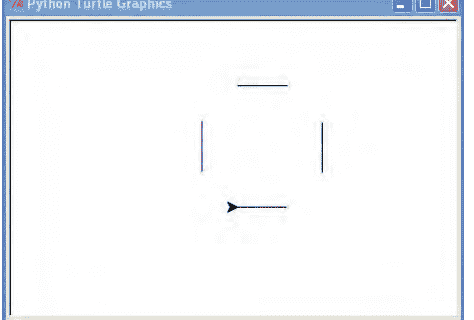

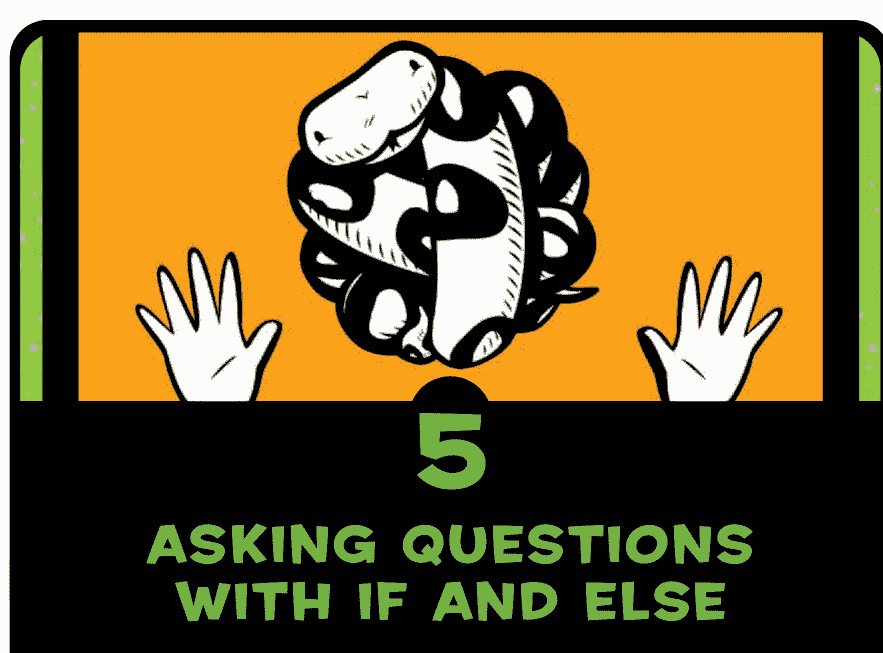

### #5 使用 IF 和 ELSE 提问

在编程中，我们经常问是或否的问题，并根据答案决定做什么。例如，我们可能会问：“你超过 20 岁了吗？”如果答案是肯定的，就回应：“你太老了！”

这类问题被称为*条件*，我们将这些条件和响应组合成 *if 语句*。条件可以比单个问题更复杂，if 语句也可以与多个问题组合，并根据每个问题的答案给出不同的响应。

在本章中，你将学习如何使用 if 语句来构建程序。

## IF 语句

一个 if 语句在 Python 中可能这样写：

```
>>> age = 13
>>> if age > 20:
        print('You are too old!')
```

if 语句由 if 关键字、一个条件和一个冒号 (:) 组成，例如 `if age > 20:`。冒号后面的行必须在一个代码块中，如果问题的答案是肯定的（或者用 Python 编程的术语说是“真”），代码块中的命令就会运行。现在，让我们探索如何编写代码块和条件。

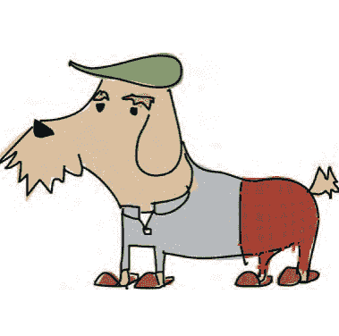

## 代码块是一组编程语句

代码块是一组分组的编程语句。例如，当 `if age > 20:` 为真时，你可能想做的不仅仅是打印“You are too old!”。也许你想打印出其他几句精选的话，像这样：

```
>>> age = 25
>>> if age > 20:
        print('You are too old!')
        print('Why are you here?')
        print('Why aren\'t you mowing a lawn or sorting papers?')
```

这个代码块由三个 print 语句组成，只有当条件 `age > 20` 被判定为真时才会运行。与上面的 if 语句相比，代码块中的每一行开头都有四个空格。让我们再看一下那段代码，这次显示空格：

```
>>> age = 25
>>> if age > 20:
    print('You are too old!')
    print('Why are you here?')
    print('Why aren\'t you mowing a lawn or sorting papers?')
```

在 Python 中，*空白字符*，例如制表符（按 TAB 键插入）或空格（按空格键插入），是有意义的。处于相同位置（从左边距缩进相同空格数）的代码被分组到一个代码块中，每当你以比前一行更多的空格开始一个新行时，你就开始了一个新的代码块，它是前一个代码块的一部分，像这样：

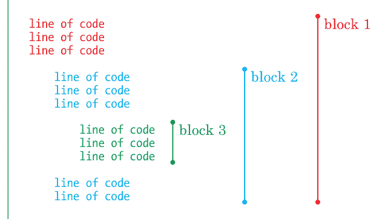

我们将语句分组到代码块中，因为它们是相关的。这些语句需要一起运行。
当你改变缩进时，你通常是在创建新的代码块。下面的例子展示了仅通过改变缩进就创建的三个独立的代码块。

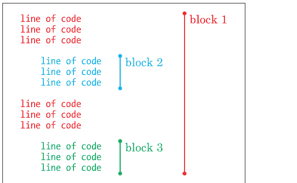

在这里，即使代码块 2 和 3 具有相同的缩进，它们也被认为是不同的代码块，因为它们之间有一个缩进较少（空格较少）的代码块。

就此而言，如果一个代码块中一行有四个空格，下一行有六个空格，运行时会产生*缩进错误*，因为 Python 期望你对代码块中的所有行使用相同数量的空格。所以，如果你以四个空格开始一个代码块，你应该始终对该代码块使用四个空格。这里有一个例子：

```
>>> if age > 20:
    print('You are too old!')
      print('Why are you here?')
```

我让空格可见，这样你就能看到差异。注意第三行有六个空格而不是四个。

当我们尝试运行这段代码时，IDLE 会用红色块高亮显示它发现问题的行，并显示解释性的 SyntaxError 消息：

```
>>> age = 25
>>> if age > 20:
    print('You are too old!')
      print('Why are you here?')
SyntaxError: unexpected indent
```

Python 没有预料到在第二个 print 行的开头会看到两个额外的空格。

> 使用一致的间距使你的代码更易于阅读。如果你开始编写程序并在代码块开头放了四个空格，请在程序中其他代码块的开头也继续使用四个空格。另外，确保同一代码块中的每一行都使用相同数量的空格进行缩进。

## 条件帮助我们比较事物

*条件*是一个编程语句，它比较事物并告诉我们比较设定的标准是真（True，是）还是假（False，否）。例如，`age > 10` 是一个条件，是“age 变量的值是否大于 10？”的另一种说法。这也是一个条件：`hair_color == 'mauve'`，是“hair_color 变量的值是否是淡紫色？”的另一种说法。

我们在 Python 中使用符号（称为*运算符*）来创建条件，例如等于、大于和小于。表 5-1 列出了一些条件符号。

表 5-1：条件符号

| 符号 | 定义 |
| :--- | :--- |
| == | 等于 |
| != | 不等于 |
| > | 大于 |
| < | 小于 |
| >= | 大于或等于 |
| <= | 小于或等于 |

例如，如果你 10 岁，条件 `your_age == 10` 将返回 True；否则，它将返回 False。如果你 12 岁，条件 `your_age > 10` 将返回 True。

> 定义等于条件时，请务必使用双等号 (==)。

让我们再试几个例子。在这里，我们将年龄设置为等于 10，然后编写一个条件语句，如果年龄大于 10，则打印“You are too old for my jokes!”：

```
>>> age = 10
>>> if age > 10:
        print('You are too old for my jokes!')
```

当我们将其输入 IDLE 并按 ENTER 键时会发生什么？
什么也不会发生。
因为 age 返回的值不大于 10，Python 不会执行（运行）print 代码块。但是，如果我们把变量 age 设置为 20，消息就会被打印出来。
现在让我们将前面的例子改为使用大于或等于 (>=) 条件：

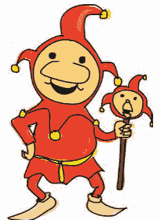

```
>>> age = 10
>>> if age >= 10:
        print('You are too old for my jokes!')
```

你应该会看到“You are too old for my jokes!”打印到屏幕上，因为 age 的值等于 10。
接下来，让我们尝试使用等于 (==) 条件：

```
>>> age = 10
>>> if age == 10:
        print('What\'s brown and sticky? A stick!!')
```

你应该会看到消息“What's brown and sticky? A stick!!”打印到屏幕上。

## IF-THEN-ELSE 语句

除了使用 if 语句在条件满足（True）时执行某些操作外，我们还可以使用 if 语句在条件不为真时执行某些操作。例如，如果你的年龄是 12，我们可能在屏幕上打印一条消息，如果不是 12（False），则打印另一条消息。
这里的诀窍是使用 if-then-else 语句，它本质上表示“*如果*某事为真，那么做这个；*否则*，做那个。”
让我们创建一个 if-then-else 语句。在 shell 中输入以下内容：

```
>>> print("Want to hear a dirty joke?")
Want to hear a dirty joke?
```

## IF 和 ELIF 语句

我们可以使用 `elif`（即 `else-if` 的缩写）进一步扩展 `if` 语句。例如，我们可以检查一个人的年龄是 10 岁、11 岁还是 12 岁（以此类推），并根据答案让程序执行不同的操作。这些语句与 `if-then-else` 语句的不同之处在于，同一个语句中可以有多个 `elif`：

```python
>>> age = 12
>>> if age == 10:
        print("What do you call an unhappy cranberry?")
        print("A blueberry!")
    elif age == 11:
        print("What did the green grape say to the blue grape?")
        print("Breathe! Breathe!")
    elif age == 12:
        print("What did 0 say to 8?")
        print("Hi guys!")
    elif age == 13:
        print("Why wasn't 10 afraid of 7?")
        print("Because rather than eating 9, 7 8 pi.")
    else:
        print("Huh?")
```

0 对 8 说了什么？嗨，伙计们！

在这个例子中，第二行的 `if` 语句在 ① 处检查 `age` 变量的值是否等于 10。如果 `age` 等于 10，则会运行 ② 处的 `print` 语句。然而，由于我们将 `age` 设置为 12，计算机跳转到 ③ 处的下一个 `if` 语句，并检查 `age` 的值是否等于 11。它不等于，所以计算机跳转到 ④ 处的下一个 `if` 语句，查看 `age` 是否等于 12。它等于，因此这次计算机执行 ⑤ 处的 `print` 命令。

当你在 IDLE 中输入此代码时，它会自动缩进，因此在输入每个 `print` 语句后，请务必按一次 `BACKSPACE` 或 `DELETE` 键，以便你的 `if`、`elif` 和 `else` 语句从最左边的边距开始。这与没有提示符（`>>>`）时 `if` 语句所在的位置相同。

## 组合条件

你可以使用关键字 `and` 和 `or` 来组合条件，从而产生更短、更简单的代码。以下是使用 `or` 的一个例子：

```python
>>> if age == 10 or age == 11 or age == 12 or age == 13:
        print('What is 13 + 49 + 84 + 155 + 97? A headache!')
    else:
        print('Huh?')
```

在这段代码中，如果第一行中的任何条件为真（换句话说，如果 `age` 是 10、11、12 或 13），则下一行以 `print` 开头的代码块将运行。
如果第一行中的条件不为真（`else`），Python 将移动到最后一行的代码块，在屏幕上显示 `Huh?`。
为了进一步简化这个例子，我们可以使用 `and` 关键字，以及大于或等于运算符（`>=`）和小于或等于运算符（`<=`），如下所示：

```python
>>> if age >= 10 and age <= 13:
        print('What is 13 + 49 + 84 + 155 + 97? A headache!')
    else:
        print('Huh?')
```

这里，如果 `age` 大于或等于 10 且小于或等于 13，如第一行 `if age >= 10 and age <= 13:` 所定义，则下一行以 `print` 开头的代码块将运行。例如，如果 `age` 的值为 12，则 `What is 13 + 49 + 84 + 155 + 97? A headache!` 将被打印到屏幕上，因为 12 大于 10 且小于 13。

## 没有值的变量——`None`

正如我们可以将数字、字符串和列表赋值给变量一样，我们也可以将“无”或空值赋值给变量。在 Python 中，空值被称为 `None`，它表示值的缺失。重要的是要注意，值 `None` 与值 `0` 不同，因为它是值的缺失，而不是一个值为 0 的数字。当我们给变量赋予空值 `None` 时，该变量拥有的唯一值就是“无”。以下是一个例子：

```python
>>> myval = None
>>> print(myval)
None
```

将值 `None` 赋给变量是将其重置为原始空状态的一种方法。将变量设置为 `None` 也是在不设置其值的情况下定义变量的一种方式。当你知道稍后在程序中需要某个变量，但又想在开头定义所有变量时，你可能会这样做。程序员通常在程序开头定义变量，因为将它们放在那里可以很容易地看到一段代码使用的所有变量名称。
你也可以在 `if` 语句中检查 `None`，如下例所示：

```python
>>> myval = None
>>> if myval == None:
        print("The variable myval doesn't have a value")
```

变量 `myval` 没有值

当你只想在变量尚未计算值时才为其计算值时，这很有用。

## 字符串和数字的区别

用户输入是人在键盘上输入的内容——无论是字符、按下的箭头键或 `ENTER` 键，还是其他任何东西。用户输入作为字符串进入 Python，这意味着当你在键盘上输入数字 10 时，Python 将数字 10 作为字符串而不是数字保存到变量中。
数字 10 和字符串 `'10'` 有什么区别？对我们来说，它们看起来一样，唯一的区别是一个被引号包围。但对计算机来说，这两者非常不同。

例如，假设我们在一个 `if` 语句中将变量 `age` 的值与一个数字进行比较，如下所示：

```python
>>> if age == 10:
        print("What's the best way to speak to a monster?")
        print("From as far away as possible!")
```

然后我们将变量 `age` 设置为数字 10：

```python
>>> age = 10
>>> if age == 10:
        print("What's the best way to speak to a monster?")
        print("From as far away as possible!")
```

与怪物交谈的最佳方式是什么？
尽可能远地！

如你所见，`print` 语句执行了。
接下来，我们将 `age` 设置为字符串 `'10'`（带引号），如下所示：

```python
>>> age = '10'
>>> if age == 10:
        print("What's the best way to speak to a monster?")
        print("From as far away as possible!")
```

这里，`print` 语句中的代码没有运行，因为 Python 不会将带引号的数字（字符串）视为数字。
幸运的是，Python 有神奇的函数可以将字符串转换为数字，将数字转换为字符串。例如，你可以使用 `int` 将字符串 `'10'` 转换为数字：

```python
>>> age = '10'
>>> converted_age = int(age)
```

变量 `converted_age` 现在将保存数字 10。

要将数字转换为字符串，请使用 `str`：

```python
>>> age = 10
>>> converted_age = str(age)
```

在这种情况下，`converted_age` 将保存字符串 `10` 而不是数字 `10`。
还记得当变量设置为字符串（`age = '10'`）时，`if age == 10` 语句没有打印任何内容吗？如果我们先转换变量，我们会得到完全不同的结果：

```python
>>> age = '10'
>>> converted_age = int(age)
>>> if converted_age == 10:
        print("What's the best way to speak to a monster?")
        print("From as far away as possible!")
```

与怪物交谈的最佳方式是什么？
尽可能远地！

但请注意：如果你尝试转换一个带小数点的数字，你会得到一个错误，因为 `int` 函数期望一个整数。

```python
>>> age = '10.5'
>>> converted_age = int(age)
Traceback (most recent call last):
  File "<pyshell#35>", line 1, in <module>
    converted_age = int(age)
ValueError: invalid literal for int() with base 10: '10.5'
```

`ValueError` 是 Python 用来告诉你你尝试使用的值不合适的方式。要解决这个问题，请使用 `float` 函数而不是 `int`。`float` 函数可以处理非整数的数字。

```python
>>> age = '10.5'
>>> converted_age = float(age)
>>> print(converted_age)
10.5
```

如果你尝试转换一个不包含数字的字符串，你也会得到一个 `ValueError`：

```python
>>> age = 'ten'
>>> converted_age = int(age)
Traceback (most recent call last):
  File "<pyshell#1>", line 1, in <module>
```

## 你学到了什么

在本章中，你学习了如何使用 `if` 语句来创建仅在特定条件为真时执行的代码块。你看到了如何使用 `elif` 扩展 `if` 语句，以便根据不同的条件执行不同的代码段，以及如何使用 `else` 关键字在没有任何条件为真时执行代码。你还学习了如何使用 `and` 和 `or` 关键字组合条件，以便检查数字是否在某个范围内，以及如何使用 `int`、`str` 和 `float` 将字符串转换为数字。你发现 `None` 在 Python 中具有意义，并可用于将变量重置为其初始的空状态。

## 编程谜题

尝试使用 `if` 语句和条件来解决以下谜题。答案可在 http://python-for-kids.com/ 找到。

### #1: 你富有吗？

你认为下面的代码会做什么？尝试在不输入到解释器的情况下找出答案，然后检查你的答案。

```
>>> money = 2000
>>> if money > 1000:
        print("I'm rich!!")
else:
        print("I'm not rich!!")
        print("But I might be later...")
```

### #2: 奶油夹心饼！

创建一个 `if` 语句，检查变量 `twinkies` 中的奶油夹心饼数量是否小于 100 或大于 500。如果条件为真，你的程序应打印消息“Too few or too many”。

### #3: 刚刚好的数字

创建一个 `if` 语句，检查变量 `money` 中的金额是否在 100 到 500 *之间*，或者在 1,000 到 5,000 之间。

### #4: 我能对付那些忍者

创建一个 `if` 语句，如果变量 `ninjas` 包含一个小于 50 的数字，则打印字符串“That's too many”；如果小于 30，则打印“It'll be a struggle, but I can take 'em”；如果小于 10，则打印“I can fight those ninjas!”。你可以尝试用以下代码测试：

```
>>> ninjas = 5
```

没有什么比不得不一遍又一遍地做同样的事情更糟糕的了。有些人在难以入睡时数羊是有原因的，这与毛茸茸哺乳动物惊人的催眠能力无关。这是因为无休止地重复某件事很无聊，如果你不专注于有趣的事情，你的大脑更容易入睡。

程序员也不特别喜欢重复自己，除非他们也想入睡。幸运的是，大多数编程语言都有所谓的 `for` 循环，它可以像其他编程语句和代码块一样自动重复事物。在本章中，我们将研究 `for` 循环，以及 Python 提供的另一种循环类型：`while` 循环。

## 使用 for 循环

要在 Python 中打印五次 hello，你*可以*这样做：

```
>>> print("hello")
hello
>>> print("hello")
hello
>>> print("hello")
hello
>>> print("hello")
hello
>>> print("hello")
hello
```

但这相当繁琐。相反，你可以使用 `for` 循环来减少打字和重复，像这样：

```
>>> for x in range(0, 5):
        print('hello')
```

hello
hello
hello
hello
hello

❶ 处的 `range` 函数可用于创建一个数字列表，范围从起始数字到结束数字之前的那个数字。这听起来可能有点令人困惑。让我们将 `range` 函数与 `list` 函数结合起来，看看它是如何工作的。`range` 函数实际上并不创建数字列表；它返回一个*迭代器*，这是一种专门设计用于与循环配合使用的 Python 对象类型。然而，如果我们把 `range` 和 `list` 结合起来，就会得到一个数字列表。

```
>>> print(list(range(10, 20)))
[10, 11, 12, 13, 14, 15, 16, 17, 18, 19]
```

在 `for` 循环的情况下，❶ 处的代码实际上是在告诉 Python 执行以下操作：

-   从 0 开始计数，在达到 5 之前停止。
-   对于我们计数的每个数字，将其值存储在变量 `x` 中。

然后 Python 执行 ❷ 处的代码块。注意，第 ❷ 行开头有四个额外的空格（与第 ❶ 行相比）。IDLE 会自动为你缩进。

当我们在第二行后按 ENTER 时，Python 会打印五次“hello”。

我们也可以在打印语句中使用 `x` 来计数 hello：

```
>>> for x in range(0, 5):
        print('hello %s' % x)
hello 0
hello 1
hello 2
hello 3
hello 4
```

如果我们再次去掉 `for` 循环，我们的代码可能看起来像这样：

```
>>> x = 0
>>> print('hello %s' % x)
hello 0
>>> x = 1
>>> print('hello %s' % x)
hello 1
>>> x = 2
>>> print('hello %s' % x)
hello 2
>>> x = 3
>>> print('hello %s' % x)
hello 3
>>> x = 4
>>> print('hello %s' % x)
hello 4
```

因此，使用循环实际上为我们节省了编写八行额外代码的工作。优秀的程序员讨厌做重复的事情，所以 `for` 循环是编程语言中比较流行的语句之一。在创建 `for` 循环时，你不必局限于使用 `range` 和 `list` 函数。你也可以使用已经创建的列表，例如第 3 章的购物清单，如下所示：

```
>>> wizard_list = ['spider legs', 'toe of frog', 'snail tongue',
                   'bat wing', 'slug butter', 'bear burp']
>>> for i in wizard_list:
        print(i)
spider legs
toe of frog
snail tongue
bat wing
slug butter
bear burp
```

这段代码的意思是：“对于 `wizard_list` 中的每个项目，将其值存储在变量 `i` 中，然后打印该变量的内容。”同样，如果我们去掉 `for` 循环，我们将需要做类似这样的事情：

```
>>> wizard_list = ['spider legs', 'toe of frog', 'snail tongue',
                   'bat wing', 'slug butter', 'bear burp']
>>> print(wizard_list[0])
spider legs
>>> print(wizard_list[1])
toe of frog
>>> print(wizard_list[2])
snail tongue
>>> print(wizard_list[3])
bat wing
>>> print(wizard_list[4])
slug butter
>>> print(wizard_list[5])
bear burp
```

所以再一次，循环为我们节省了大量的打字工作。让我们创建另一个循环。将以下代码输入到解释器中。它应该会自动为你缩进代码。

```
>>> hugehairypants = ['huge', 'hairy', 'pants']
>>> for i in hugehairypants:
        print(i)
        print(i)

huge
huge
hairy
hairy
pants
pants
```

在第一行 ❶ 中，我们创建了一个包含 'huge'、'hairy' 和 'pants' 的列表。在下一行 ❷ 中，我们遍历该列表中的项目，每个项目随后被分配给变量 `i`。我们在接下来的两行（❸ 和 ❹）中打印该变量的内容两次。在下一个空行 ❺ 按下 ENTER 告诉 Python 结束代码块，然后它运行代码并打印列表的每个元素两次 ❻。请记住，如果你输入了错误的空格数，最终会得到错误消息。如果你在第四行 ❹ 输入了前面的代码时多了一个空格，Python 会显示缩进错误：

```
>>> hugehairypants = ['huge', 'hairy', 'pants']
>>> for i in hugehairypants:
        print(i)
        print(i)

SyntaxError: unexpected indent
```

正如你在第 5 章学到的，Python 期望代码块中的空格数保持一致。插入多少空格并不重要，只要你在每个新行使用相同的数量即可（而且它使代码更易于人类阅读）。这是一个更复杂的 `for` 循环示例，包含两个代码块：

```
>>> hugehairypants = ['huge', 'hairy', 'pants']
>>> for i in hugehairypants:
        print(i)
        for j in hugehairypants:
            print(j)
```

这段代码中的代码块在哪里？第一个块是第一个 `for` 循环：

```
hugehairypants = ['huge', 'hairy', 'pants']
for i in hugehairypants:
    print(i)                    #
    for j in hugehairypants:  # 这些行是第一个代码块。
        print(j)                #
```

第二个块是第二个 `for` 循环中的单个打印行：

```
❶ hugehairypants = ['huge', 'hairy', 'pants']
for i in hugehairypants:
    print(i)
❷     for j in hugehairypants:
❸         print(j)            # 这一行也是第二个代码块。
```

你能弄清楚这段小代码要做什么吗？在 ❶ 处创建了一个名为 `hugehairypants` 的列表后，我们可以从接下来的两行看出，它将遍历列表中的项目并打印出每一个。然而，在 ❷ 处，它将再次遍历列表，这次将值分配给变量 `j`，然后在 ❸ 处再次打印每个项目。❷ 和 ❸ 处的代码仍然是 `for` 循环的一部分，这意味着当 `for` 循环遍历列表时，它们将为每个项目执行。因此，当这段代码运行时，我们应该看到 huge 后跟 huge、hairy、pants，然后是 hairy 后跟 huge、hairy、pants，依此类推。

将代码输入Python shell，亲自看看效果：

```python
>>> hugehairypants = ['huge', 'hairy', 'pants']
>>> for i in hugehairypants:
        print(i)
        for j in hugehairypants:
                print(j)
```

huge
huge
hairy
pants
hairy
huge
hairy
pants
pants
huge
hairy
pants

Python进入第一个循环，在❶处打印列表中的一项。接着，它进入第二个循环，在❷处打印列表中的所有项目。然后它继续执行`print(i)`命令，打印列表中的下一项，再用`print(j)`打印完整的列表。在输出中，标记为◇的行由`print(i)`语句打印。未标记的行由`print(j)`打印。

比起打印这些无意义的词，有没有更实际点的例子？还记得我们在第2章中设计的那个计算吗？用来算出如果你用祖父的疯狂发明复制金币，年底会有多少金币？它看起来像这样：

```python
>>> 20 + 10 * 365 - 3 * 52
```

这代表20枚找到的金币，加上每天10枚魔法金币乘以一年365天，再减去乌鸦每周偷走的3枚金币。

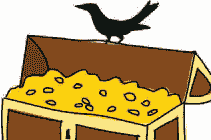

看看你的金币堆每周如何增长可能会很有用。我们可以用另一个`for`循环来实现，但首先，我们需要改变`magic_coins`变量的值，使其代表每周的魔法金币总数。那是每天10枚魔法金币乘以一周7天，所以`magic_coins`应该是70：

```python
>>> found_coins = 20
>>> magic_coins = 70
>>> stolen_coins = 3
```

我们可以通过创建另一个名为`coins`的变量并使用一个循环来查看我们的财富每周增长：

```python
>>> found_coins = 20
>>> magic_coins = 70
>>> stolen_coins = 3
>>> coins = found_coins
>>> for week in range(1, 53):
        coins = coins + magic_coins - stolen_coins
        print('Week %s = %s' % (week, coins))
```

在❶处，变量`coins`被赋予变量`found_coins`的值；这是我们的起始数量。下一行❷设置了`for`循环，它将运行代码块中的命令（该代码块由❸和❹处的行组成）。每次循环时，变量`week`被赋予1到52范围内的下一个数字。

❸处的行稍微复杂一些。基本上，我们希望每周加上我们神奇创造的金币数量，并减去被乌鸦偷走的金币数量。把变量`coins`想象成一个类似宝箱的东西。每周，新的金币都被堆进箱子里。所以这行代码的意思是，“用我当前的金币数量，加上我本周创造的数量，来替换变量`coins`的内容。”基本上，等号（`=`）是一段霸道的代码，它说：“先计算右边的一些东西，然后用左边的名字保存它以备后用。”

❹处的行是一个使用占位符的`print`语句，它将周数和（到目前为止的）金币总数打印到屏幕上。（如果这对你来说不清楚，请重读第30页的“在字符串中嵌入值”。）所以，如果你运行这个程序，你会看到类似这样的输出：

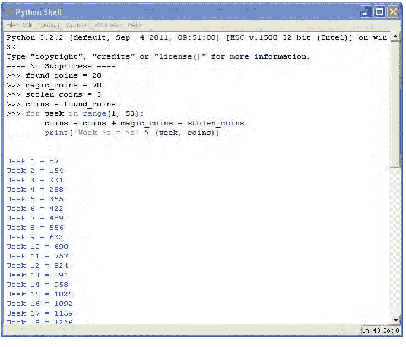

## 既然我们谈到了循环……

`for`循环并不是你在Python中能创建的唯一循环。还有`while`循环。`for`循环是特定长度的循环，而`while`循环用于你事先不知道何时需要停止循环的情况。

想象一个有20级台阶的楼梯。楼梯在室内，你知道你可以轻松爬上20级台阶。`for`循环就像这样。

```python
>>> for step in range(0, 20):
        print(step)
```

现在想象一个通往山坡上的楼梯。山非常高，你可能在到达山顶之前就耗尽了体力，或者天气可能变坏，迫使你停止。这就是`while`循环的样子。

```python
step = 0
while step < 10000:
    print(step)
    if tired == True:
        break
    elif badweather == True:
        break
    else:
        step = step + 1
```

如果你尝试输入并运行这段代码，你会得到一个错误。为什么？错误发生是因为我们还没有创建变量`tired`和`badweather`。虽然这里的代码不足以构成一个可运行的程序，但它确实演示了`while`循环的基本示例。

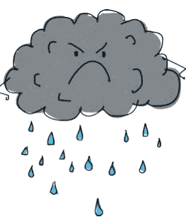

我们首先创建一个名为`step`的变量，`step = 0`。接下来，我们创建一个`while`循环，检查变量`step`的值是否小于10,000（`step < 10000`），这是从山脚到山顶的总台阶数。只要`step`小于10,000，Python就会执行其余的代码。

通过`print(step)`，我们打印变量的值，然后用`if tired == True:`检查变量`tired`的值是否为`True`。（`True`被称为布尔值，我们将在第8章学习。）如果是，我们使用`break`关键字立即退出循环。`break`关键字是立即跳出循环（换句话说，停止它）的一种方式，它适用于`while`和`for`循环。在这里，它的效果是跳出代码块，进入`step = step + 1`这一行。

`elif badweather == True:`这一行检查变量`badweather`是否被设置为`True`。如果是，`break`关键字退出循环。如果`tired`和`badweather`都不是`True`（`else`），我们用`step = step + 1`给`step`变量加1，循环继续。

所以`while`循环的步骤如下：

1.  检查条件。
2.  执行代码块中的代码。
3.  重复。

更常见的是，`while`循环可能会用几个条件来创建，而不是只有一个，像这样：

```python
>>> x = 45
>>> y = 80
>>> while x < 50 and y < 100:
        x = x + 1
        y = y + 1
        print(x, y)
```

这里，我们在❶处创建一个值为45的变量`x`，在❷处创建一个值为80的变量`y`。循环在❸处检查两个条件：`x`是否小于50，以及`y`是否小于100。当两个条件都为真时，执行后面的行，给两个变量各加1，然后打印它们。这段代码的输出如下：

```
46 81
47 82
48 83
49 84
50 85
```

你能弄清楚这是如何工作的吗？

我们从变量`x`的45和变量`y`的80开始计数，然后每次运行循环中的代码时递增（给每个变量加1）。只要`x`小于50且`y`小于100，循环就会运行。循环五次后（每次给每个变量加1），`x`的值达到50。现在第一个条件（`x < 50`）不再为真，所以Python知道要停止循环。

`while`循环的另一个常见用途是创建半永久循环。这是一种可能永远运行下去的循环，但实际上会持续到代码中发生某些事情来打破它。这里有一个例子：

```python
while True:
    lots of code here
    lots of code here
    lots of code here
    if some_value == True:
        break
```

`while`循环的条件只是`True`，它总是为真，所以代码块中的代码将始终运行（因此，循环是永久的）。只有当变量`some_value`为真时，Python才会跳出循环。你可以在第134页的“使用randint选择随机数”中看到一个更好的例子，但你可能想等到读完第7章再看。

## 你学到了什么

在本章中，我们使用循环来执行重复性任务，而无需所有重复操作。我们通过将任务写在代码块中来告诉Python我们想要重复什么，我们将这些代码块放在循环中。我们使用了两种类型的循环：`for`循环和`while`循环，它们相似但可以用于不同的方式。我们还使用了`break`关键字来停止循环——也就是说，跳出循环。

## 编程谜题

这里有一些你可以自己尝试的循环示例。答案可以在 http://python-for-kids.com/ 找到。

### #1：你好循环

你认为下面的代码会做什么？首先，猜测会发生什么，然后在Python中运行代码，看看你是否正确。

```python
>>> for x in range(0, 20):
        print('hello %s' % x)
        if x < 9:
            break
```

### #2：偶数

创建一个循环，打印偶数直到达到你的年龄，或者如果年龄是奇数，则打印奇数直到达到你的年龄。例如，它可能输出如下内容：

```
2
4
6
8
10
12
14
```

### #3：我最喜欢的五种配料

创建一个包含五种不同三明治配料的列表，例如：

```
>>> ingredients = ['snails', 'leeches', 'gorilla belly-button lint',
                  'caterpillar eyebrows', 'centipede toes']
```

现在创建一个循环，打印出列表（包括编号）：

```
1 snails
2 leeches
3 gorilla belly-button lint
4 caterpillar eyebrows
5 centipede toes
```

### #4：你在月球上的体重

如果你现在站在月球上，你的体重将是地球上的16.5%。你可以通过将地球体重乘以0.165来计算。
如果未来15年你每年体重增加一公斤，那么每年访问月球时以及15年结束时你的体重会是多少？编写一个使用for循环的程序，打印每年你在月球上的体重。

## 7 使用函数和模块重用你的代码

想想你每天扔掉多少东西：水瓶、苏打水罐、薯片袋、塑料三明治包装纸、装胡萝卜条或苹果片的袋子、购物袋、报纸、杂志等等。现在想象一下，如果所有这些垃圾只是堆在你家车道尽头，而不把纸张、塑料和锡罐分开，会发生什么。

当然，你可能尽可能地回收利用，这是好事，因为没人喜欢在上学路上爬过一堆垃圾。你回收的那些玻璃瓶不会坐在一大堆恶心的垃圾里，而是被熔化并制成新的罐子和瓶子；纸张被制成纸浆，变成再生纸；塑料则被制成更重的塑料制品。因此，我们重用了那些本来会被扔掉的东西。

在编程世界中，重用同样重要。显然，你的程序不会消失在垃圾堆下，但如果你不重用你正在做的一些事情，最终你会因为过度输入而把手指磨得生疼。重用还能使你的代码更短、更易读。

正如你将在本章中学到的，Python提供了多种不同的代码重用方式。

## 使用函数

你已经看到了一种重用Python代码的方法。在上一章中，我们使用了`range`和`list`函数让Python计数。

```
>>> list(range(0, 5))
[0,1,2,3,4]
```

如果你知道如何计数，通过自己输入来创建一个连续数字列表并不太难，但列表越大，你需要输入的就越多。然而，如果你使用函数，你可以同样轻松地创建一个包含一千个数字的列表。

这是一个使用`list`和`range`函数生成数字列表的例子：

```
>>> list(range(0, 1000))
[0,1,2,3,4,5,6,7,8,9,10,11,12,13,14,15,16...,997,998,999]
```

*函数*是告诉Python执行某些操作的代码块。它们是重用代码的一种方式——你可以在程序中反复使用函数。

当你编写简单程序时，函数很方便。一旦你开始编写更长、更复杂的程序，比如游戏，函数就变得*至关重要*（假设你想在这个世纪内完成你的程序）。

## 函数的组成部分

一个函数有三个部分：*名称*、*参数*和*函数体*。这是一个简单函数的例子：

```
>>> def testfunc(myname):
        print('hello %s' % myname)
```

这个函数的名称是`testfunc`。它有一个参数`myname`，它的函数体是紧跟在以`def`（`define`的缩写）开头的行之后的代码块。*参数*是一个只在函数被使用时才存在的变量。
你可以通过调用函数名称并在参数值周围使用括号来运行该函数：

```
>>> testfunc('Mary')
hello Mary
```

函数可以接受两个、三个或任意数量的参数，而不仅仅是一个：

```
>>> def testfunc(fname, lname):
        print('Hello %s %s' % (fname, lname))
```

这两个参数的值用逗号分隔：

```
>>> testfunc('Mary', 'Smith')
Hello Mary Smith
```

我们也可以先创建一些变量，然后用它们调用函数：

```
>>> firstname = 'Joe'
>>> lastname = 'Robertson'
>>> testfunc(firstname, lastname)
Hello Joe Robertson
```

函数通常用于返回一个值，使用`return`语句。例如，你可以编写一个函数来计算你节省了多少钱：

```
>>> def savings(pocket_money, paper_route, spending):
        return pocket_money + paper_route - spending
```

这个函数接受三个参数。它将前两个（`pocket_money`和`paper_route`）相加，并减去最后一个（`spending`）。结果被返回，可以赋值给一个变量（就像我们给其他值赋值给变量一样）或打印出来：

```
>>> print(savings(10, 10, 5))
15
```

## 变量和作用域

函数体内部的变量在函数运行结束后不能再次使用，因为它只存在于函数内部。在编程世界中，这被称为作用域。
让我们看一个使用了几个变量但没有任何参数的简单函数：

```
❶ >>> def variable_test():
        first_variable = 10
        second_variable = 20
❷     return first_variable * second_variable
```

在这个例子中，我们在❶处创建了名为`variable_test`的函数，它将两个变量（`first_variable`和`second_variable`）相乘，并在❷处返回结果。

```
>>> print(variable_test())
200
```

如果我们使用`print`调用这个函数，我们得到结果：200。然而，如果我们尝试在函数代码块之外打印`first_variable`（或`second_variable`）的内容，我们会得到一个错误消息：

```
>>> print(first_variable)
Traceback (most recent call last):
  File "<pyshell#50>", line 1, in <module>
    print(first_variable)
NameError: name 'first_variable' is not defined
```

如果一个变量在函数外部定义，它具有不同的作用域。例如，让我们在创建函数之前定义一个变量，然后尝试在函数内部使用它：

```
>>> another_variable = 100
>>> def variable_test2():
        first_variable = 10
        second_variable = 20
        return first_variable * second_variable * another_variable
```

在这段代码中，即使变量`first_variable`和`second_variable`不能在函数外部使用，变量`another_variable`（在❶处函数外部创建）可以在❷处函数内部使用。
这是调用此函数的结果：

```
>>> print(variable_test2())
20000
```

现在，假设你正在用一些经济的东西，比如用过的锡罐，建造一艘飞船。你认为每周可以压扁2个罐子来制作飞船的弯曲墙壁，但你需要大约500个罐子才能完成机身。如果我们每周压扁2个罐子，我们可以轻松地编写一个函数来帮助计算压扁500个罐子需要多长时间。

让我们创建一个函数来显示我们每周压扁了多少个罐子，直到一年。我们的函数将罐子数量作为参数：

```
>>> def spaceship_building(cans):
    total_cans = 0
    for week in range(1, 53):
        total_cans = total_cans + cans
        print('Week %s = %s cans' % (week, total_cans))
```

在函数的第一行，我们创建了一个名为`total_cans`的变量，并将其值设置为0。然后我们为一年中的周数创建一个循环，并添加每周压扁的罐子数量。这个代码块构成了我们函数的内容。但这个函数中还有另一个代码块：它的最后两行，构成了`for`循环的代码块。
让我们尝试在shell中输入该函数，并用不同的罐子数量值调用它：

```
>>> spaceship_building(2)
Week 1 = 2 cans
Week 2 = 4 cans
Week 3 = 6 cans
Week 4 = 8 cans
Week 5 = 10 cans
Week 6 = 12 cans
Week 7 = 14 cans
Week 8 = 16 cans
Week 9 = 18 cans
Week 10 = 20 cans
(continues on...)

>>> spaceship_building(13)
Week 1 = 13 cans
Week 2 = 26 cans
Week 3 = 39 cans
Week 4 = 52 cans
Week 5 = 65 cans
(continues on...)
```

这个函数可以重用于不同的每周罐子数量值，这比每次尝试不同数字时都重新输入`for`循环要高效一些。

函数也可以被组合成模块，这正是Python变得真正有用的地方，而不仅仅是稍微有点用。

## 使用模块

模块用于将函数、变量和其他内容组合成更大、更强大的程序。有些模块是Python内置的，而其他模块可以单独下载。你会发现有帮助你编写游戏的模块（例如内置的tkinter和非内置的PyGame），有用于处理图像的模块（例如PIL，Python Imaging Library），以及有用于绘制三维图形的模块（例如Panda3D）。

模块可以用来做各种有用的事情。例如，如果你正在设计一个模拟游戏，并且希望游戏世界能真实地变化，你可以使用一个名为`time`的内置模块来计算当前日期和时间：

```
>>> import time
```

这里，`import`命令用于告诉Python我们想要使用`time`模块。
然后，我们可以使用点号符号调用该模块中可用的函数。（记住我们在第4章中使用过类似这样的函数来操作turtle模块，例如`t.forward(50)`。）例如，以下是我们如何使用`time`模块调用`asctime`函数的方式：

```
>>> print(time.asctime())
'Mon Nov 5 12:40:27 2012'
```

`asctime`函数是`time`模块的一部分，它以字符串形式返回当前日期和时间。

现在假设你想让使用你程序的人输入一个值，也许是他们的出生日期或年龄。你可以使用`print`语句来显示消息，并使用`sys`（*system*的缩写）模块，该模块包含与Python系统本身交互的实用工具。首先，我们导入`sys`模块：

```
>>> import sys
```

在`sys`模块内部，有一个特殊的*对象*叫做`stdin`（*standard input*的缩写），它提供了一个非常有用的函数叫做`readline`。`readline`函数用于读取在键盘上输入的一行文本，直到你按下ENTER键。（我们将在第8章中了解对象是如何工作的。）要测试`readline`，请在shell中输入以下代码：

```
>>> import sys
>>> print(sys.stdin.readline())
```

如果你然后输入一些单词并按ENTER键，这些单词将被打印在shell中。
回想一下我们在第5章中编写的代码，使用了`if`语句：

```
>>> if age >= 10 and age <= 13:
        print('What is 13 + 49 + 84 + 155 + 97? A headache!')
else:
        print('Huh?')
```

我们现在可以要求某人输入值，而不是在`if`语句之前创建变量`age`并赋予它一个特定的值。但首先，让我们将代码转换成一个函数：

```
>>> def silly_age_joke(age):
        if age >= 10 and age <= 13:
                print('What is 13 + 49 + 84 + 155 + 97? A headache!')
        else:
                print('Huh?')
```

现在你可以通过输入函数名来调用该函数，然后通过在括号中输入数字来告诉它使用哪个数字。它有效吗？

```
>>> silly_age_joke(9)
Huh?
>>> silly_age_joke(10)
What is 13 + 49 + 84 + 155 + 97? A headache!
```

它有效！现在让我们让函数询问一个人的年龄。（你可以根据需要多次添加或更改函数。）

```
>>> def silly_age_joke():
    print('How old are you?')
    age = int(sys.stdin.readline())
    if age >= 10 and age <= 13:
        print('What is 13 + 49 + 84 + 155 + 97? A headache!')
    else:
        print('Huh?')
```

你认出❶处的函数`int`了吗，它将字符串转换为数字？我们包含该函数是因为`readline()`返回的是字符串形式的输入，但我们想要一个数字，以便在❷处与数字10和13进行比较。要自己尝试这个，请在不带任何参数的情况下调用该函数，然后在出现`How old are you?`时输入一个数字：

```
>>> silly_age_joke()
How old are you?
10
What is 13 + 49 + 84 + 155 + 97? A headache!
>>> silly_age_joke()
How old are you?
15
Huh?
```

## 你学到了什么

在本章中，你已经了解了如何在Python中使用函数创建可重用的代码块，以及如何使用模块提供的函数。你学习了变量的作用域如何控制它们在函数内部或外部是否可见，以及如何使用`def`关键字创建函数。你还了解了如何导入模块以便使用它们的内容。

## 编程谜题

尝试以下示例，以实验创建自己的函数。答案可以在 http://python-for-kids.com/ 找到。

### #1：基本月球重量函数

在第6章中，一个编程谜题是创建一个`for`循环来确定你在15年期间在月球上的体重。那个`for`循环可以很容易地转换成一个函数。尝试创建一个函数，它接受一个起始重量，并每年增加重量。你可以使用如下代码调用新函数：

```
>>> moon_weight(30, 0.25)
```

### #2：月球重量函数和年数

获取你刚刚创建的函数，并将其更改为计算不同时间段的重量，例如5年或20年。确保更改函数，使其接受三个参数：初始重量、每年增加的重量和年数：

```
>>> moon_weight(90, 0.25, 5)
```

### #3：月球重量程序

与其创建一个简单的函数，你传递值作为参数，不如创建一个使用`sys.stdin.readline()`提示输入值的小程序。在这种情况下，你完全不带任何参数调用函数：

```
>>> moon_weight()
```

该函数将显示一条消息询问起始重量，然后显示第二条消息询问每年增加的重量，最后显示一条消息询问年数。你会看到类似以下的内容：

```
Please enter your current Earth weight
45
Please enter the amount your weight might increase each year
0.4
Please enter the number of years
12
```

记住在创建函数之前先导入`sys`模块：

```
>>> import sys
```

## # 8 如何使用类和对象

为什么长颈鹿像人行道？因为长颈鹿和人行道都是*事物*，在英语中称为*名词*，在Python中称为*对象*。

*对象*的概念在计算机世界中很重要。对象是在程序中组织代码并分解事物以更容易思考复杂想法的一种方式。（我们在第4章中使用turtle——Pen时使用了一个对象。）

要真正理解对象在Python中是如何工作的，我们需要考虑对象的类型。让我们从长颈鹿和人行道开始。
长颈鹿是一种哺乳动物，哺乳动物是一种动物。长颈鹿也是一种有生命的物体——它是活的。
现在考虑一下人行道。除了它不是生物之外，关于人行道没有太多可说的。我们称它为无生命的物体（换句话说，它不是活的）。
术语*哺乳动物*、*动物*、*有生命的*和*无生命的*都是对事物进行分类的方式。

## 将事物分解为类

在Python中，对象由*类*定义，我们可以将其视为将对象分类为组的一种方式。以下是根据我们前面的定义，长颈鹿和人行道将适合的类的树状图：

主要的类是Things。在Things类下面，我们有Inanimate和Animate。这些进一步分解为Inanimate下的Sidewalks，以及Animate下的Animals、Mammals和Giraffes。

我们可以使用类来组织Python代码片段。例如，考虑turtle模块。Python的turtle模块能做的所有事情——比如向前移动、向后移动、向左转和向右转——都是Pen类中的函数。对象可以被视为类的成员，我们可以为一个类创建任意数量的对象——我们很快就会讲到。

现在让我们创建与树状图中显示的相同的类集，从顶部开始。我们使用`class`关键字后跟一个名称来定义类。由于Things是最广泛的类，我们将首先创建它：

```
>>> class Things:
    pass
```

我们将类命名为Things，并使用`pass`语句让Python知道我们不会提供更多信息。`pass`在我们想要提供一个类或函数但不想立即填写细节时使用。

接下来，我们将添加其他类并在它们之间建立一些关系。

## 子类和父类

如果一个类是另一个类的一部分，那么它是该类的*子类*，而另一个类是它的*父类*。类既可以是其他类的子类，也可以是其他类的父类。在我们的树状图中，另一个类上面的类是其父类，下面的类是其子类。例如，Inanimate和Animate都是Things类的子类，这意味着Things是它们的父类。

要告诉Python一个类是另一个类的子类，我们在新类的名称后在括号中添加父类的名称，像这样：

```
>>> class Inanimate(Things):
    pass

>>> class Animate(Things):
    pass
```

这里，我们创建了一个名为Inanimate的类，并通过代码`class Inanimate(Things)`告诉Python其父类是Things。接下来，我们创建了一个名为Animate的类，并通过`class Animate(Things)`告诉Python其父类也是Things。

## 将对象添加到类中

我们现在有了一堆类，但如何将一些东西放入这些类中呢？假设我们有一只名叫雷金纳德的长颈鹿。我们知道它属于长颈鹿类，但在编程术语中，我们用什么来描述这只名叫雷金纳德的长颈鹿呢？我们称雷金纳德为长颈鹿类的*对象*（你可能也会看到*实例*这个术语）。为了向Python“介绍”雷金纳德，我们使用这段小代码：

```
>>> reginald = Giraffes()
```

这段代码告诉Python在长颈鹿类中创建一个对象，并将其赋值给变量reginald。与函数类似，类名后面跟着括号。在本章后面，我们将看到如何创建对象以及如何在括号中使用参数。

但reginald对象能做什么呢？嗯，目前什么也做不了。为了让我们的对象有用，在创建类时，我们还需要定义可以与该类对象一起使用的函数。我们不必在类定义后立即使用pass关键字，而是可以添加函数定义。

## 定义类的函数

第7章介绍了函数作为重用代码的一种方式。当我们定义一个与类关联的函数时，其定义方式与定义任何其他函数相同，只是需要将其缩进到类定义之下。例如，这是一个不与任何类关联的普通函数：

```
>>> def this_is_a_normal_function():
        print('I am a normal function')
```

而这里有几个属于某个类的函数：

```
>>> class ThisIsMySillyClass:
        def this_is_a_class_function():
            print('I am a class function')
        def this_is_also_a_class_function():
            print('I am also a class function. See?')
```

## 将类特征添加为函数

考虑一下我们在第95页定义的Animate类的子类。我们可以为每个类添加*特征*来描述它是什么以及它能做什么。特征是该类（及其子类）所有成员都具有的一个特性。

例如，所有动物有什么共同点？首先，它们都会呼吸。它们也会移动和进食。那么哺乳动物呢？哺乳动物都用乳汁喂养幼崽。它们也会呼吸、移动和进食。我们知道长颈鹿吃高处的树叶，并且像所有哺乳动物一样，它们用乳汁喂养幼崽，呼吸，移动，进食。当我们将这些特征添加到我们的树状图中时，我们得到类似这样的内容：

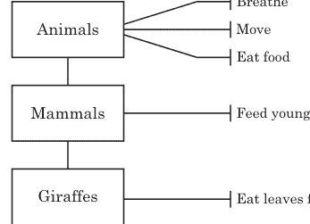

这些特征可以被视为动作，或者*函数*——该类对象可以执行的操作。
要向类添加函数，我们使用def关键字。因此，Animals类将如下所示：

```
>>> class Animals(Animate):
        def breathe(self):
            pass
        def move(self):
            pass
        def eat_food(self):
            pass
```

在此代码清单的第一行，我们像之前一样定义了类，但在下一行没有使用pass关键字，而是定义了一个名为breathe的函数，并给它一个参数：self。self参数是类中的一个函数调用类中另一个函数（以及父类中的函数）的一种方式。我们稍后会看到这个参数的使用。
在下一行，pass关键字告诉Python我们不会提供关于breathe函数的更多信息，因为它现在什么都不做。然后我们添加了move和eat_food函数，它们现在也什么都不做。我们很快将重新创建我们的类，并在函数中放入一些适当的代码。这是开发程序的一种常见方式。通常，程序员会创建带有空函数的类，以此来弄清楚类应该做什么，然后再深入各个函数的细节。
我们还可以向另外两个类Mammals和Giraffes添加函数。每个类都将能够使用其父类的特征（函数）。这意味着你不需要创建一个非常复杂的类；你可以将函数放在特征适用的最高父类中。（这是使你的类更简单、更易于理解的好方法。）


```
>>> class Mammals(Animals):
        def feed_young_with_milk(self):
            pass

>>> class Giraffes(Mammals):
        def eat_leaves_from_trees(self):
            pass
```

## 为什么使用类和对象？

我们现在已经向类中添加了函数，但为什么要使用类和对象呢？你完全可以只编写普通的函数，比如breathe、move、eat_food等等。

为了回答这个问题，我们将使用我们之前创建的名为雷金纳德的长颈鹿，它是长颈鹿类的一个对象，如下所示：

```
>>> reginald = Giraffes()
```

因为reginald是一个对象，我们可以调用（或运行）其类（长颈鹿类）及其父类提供的函数。我们通过使用点运算符和函数名来调用对象上的函数。要告诉长颈鹿雷金纳德移动或进食，我们可以这样调用函数：

```
>>> reginald = Giraffes()
>>> reginald.move()
>>> reginald.eat_leaves_from_trees()
```

假设雷金纳德有一个名叫哈罗德的长颈鹿朋友。让我们创建另一个名为harold的长颈鹿对象：

```
>>> harold = Giraffes()
```

因为我们在使用对象和类，所以当我们想要运行move函数时，我们可以确切地告诉Python我们在谈论哪只长颈鹿。例如，如果我们想让哈罗德移动而让雷金纳德留在原地，我们可以使用我们的harold对象调用move函数，如下所示：

```
>>> harold.move()
```

在这种情况下，只有哈罗德会移动。
让我们稍微修改一下我们的类，使这一点更明显。我们将在每个函数中添加一个print语句，而不是使用pass：

```
>>> class Animals(Animate):
        def breathe(self):
            print('breathing')
        def move(self):
            print('moving')
        def eat_food(self):
            print('eating food')
```

```
>>> class Mammals(Animals):
        def feed_young_with_milk(self):
            print('feeding young')

>>> class Giraffes(Mammals):
        def eat_leaves_from_trees(self):
            print('eating leaves')
```

现在，当我们创建reginald和harold对象并在它们上调用函数时，我们可以看到实际发生了一些事情：

```
>>> reginald = Giraffes()
>>> harold = Giraffes()
>>> reginald.move()
moving
>>> harold.eat_leaves_from_trees()
eating leaves
```

在前两行，我们创建了变量reginald和harold，它们是长颈鹿类的对象。接下来，我们在reginald上调用move函数，Python在下一行打印moving。同样，我们在harold上调用eat_leaves_from_trees函数，Python打印eating leaves。如果这些是真正的长颈鹿，而不是计算机中的对象，那么一只长颈鹿会走动，另一只会吃东西。


## 用图片表示对象和类

如何用更图形化的方式来表示对象和类呢？
让我们回到第4章中我们尝试过的turtle模块。当我们使用turtle.Pen()时，Python创建一个由turtle模块提供的Pen类的对象（类似于我们上一节中的reginald和harold对象）。我们可以创建两个turtle对象（命名为Avery和Kate），就像我们创建两只长颈鹿一样：

```
>>> import turtle
>>> avery = turtle.Pen()
>>> kate = turtle.Pen()
```

每个turtle对象（avery和kate）都是Pen类的一个成员。

现在，对象开始展现其强大之处。我们已经创建了海龟对象，现在可以对每个对象调用函数，它们将独立绘制。试试看：

```
>>> avery.forward(50)
>>> avery.right(90)
>>> avery.forward(20)
```

通过这一系列指令，我们告诉 Avery 向前移动 50 像素，向右转 90 度，然后向前移动 20 像素，这样她最终会朝下。记住，海龟总是从朝右开始。

现在轮到移动 Kate 了。

```
>>> kate.left(90)
>>> kate.forward(100)
```

我们告诉 Kate 向左转 90 度，然后向前移动 100 像素，这样她最终会朝上。

到目前为止，我们有一条带有箭头的线，箭头朝向两个不同的方向，每个箭头的头部代表一个不同的海龟对象：Avery 朝下，Kate 朝上。

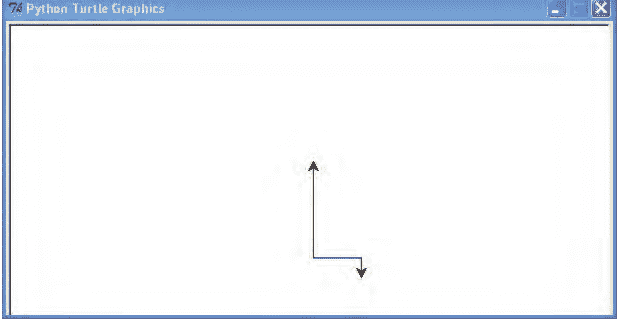

现在让我们添加另一个海龟 Jacob，并移动他，同时不干扰 Kate 或 Avery。

```
>>> jacob = turtle.Pen()
>>> jacob.left(180)
>>> jacob.forward(80)
```

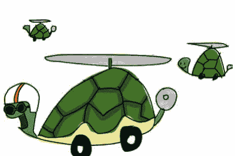

首先，我们创建一个名为 jacob 的新 Pen 对象，然后让他向左转 180 度，接着向前移动 80 像素。我们的绘图现在看起来像这样，有三个海龟：

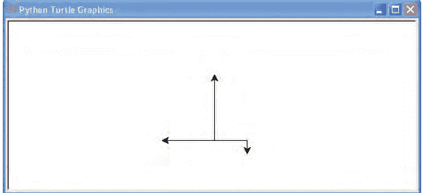

记住，每次我们调用 `turtle.Pen()` 创建一个海龟时，我们都会添加一个新的、独立的对象。每个对象仍然是 Pen 类的一个实例，我们可以在每个对象上使用相同的函数，但因为我们使用的是对象，所以我们可以独立地移动每个海龟。就像我们独立的长颈鹿对象（Reginald 和 Harold）一样，Avery、Kate 和 Jacob 是独立的海龟对象。如果我们用与已创建对象相同的变量名创建一个新对象，旧对象不一定会消失。自己试试看：创建另一个 Kate 海龟并尝试移动它。

## 对象和类的其他有用特性

类和对象使分组函数变得容易。当我们想以更小的块来思考程序时，它们也非常有用。

例如，考虑一个非常大的软件应用程序，比如文字处理器或 3D 电脑游戏。大多数人几乎不可能将像这样的大型程序作为一个整体来理解，因为代码实在太多了。但是，将这些庞大的程序分解成更小的部分，每个部分就开始变得有意义了——当然，前提是你懂这门语言！

编写大型程序时，将其分解也允许你将工作分配给其他程序员。你使用的最复杂的程序（比如你的网页浏览器）是由许多人或团队在世界各地同时处理不同部分编写的。

现在想象一下，我们想扩展本章中创建的一些类（动物、哺乳动物和长颈鹿），但我们有太多工作要做，我们希望我们的朋友帮忙。我们可以将编写代码的工作分开，让一个人负责动物类，另一个人负责哺乳动物类，还有一个人负责长颈鹿类。

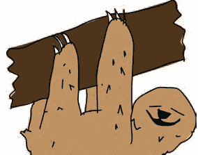

## 继承的函数

那些一直注意听的人可能意识到，最终负责长颈鹿类的人是幸运的，因为由负责动物类和哺乳动物类的人创建的任何函数也可以被长颈鹿类使用。长颈鹿类从哺乳动物类*继承*函数，而哺乳动物类又从动物类继承。换句话说，当我们创建一个长颈鹿对象时，我们可以使用在长颈鹿类中定义的函数，以及在哺乳动物类和动物类中定义的函数。同样，如果我们创建一个哺乳动物对象，我们可以使用在哺乳动物类中定义的函数，以及其父类动物类中的函数。

再次看看动物类、哺乳动物类和长颈鹿类之间的关系。动物类是哺乳动物类的父类，哺乳动物类是长颈鹿类的父类。

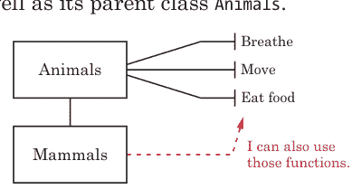

尽管 Reginald 是长颈鹿类的一个对象，我们仍然可以调用我们在动物类中定义的 move 函数，因为任何父类中定义的函数对其子类都是可用的：

```
>>> reginald = Giraffes()
>>> reginald.move()
moving
```

事实上，我们在动物类和哺乳动物类中定义的所有函数都可以从我们的 reginald 对象调用，因为这些函数是继承的：

```
>>> reginald = Giraffes()
>>> reginald.breathe()
breathing
>>> reginald.eat_food()
eating food
>>> reginald.feed_young_with_milk()
feeding young
```

## 函数调用其他函数

当我们对一个对象调用函数时，我们使用对象的变量名。例如，以下是如何在长颈鹿 Reginald 上调用 move 函数：

```
>>> reginald.move()
```

要让长颈鹿类中的一个函数调用 move 函数，我们将使用 self 参数。self 参数是类中一个函数调用另一个函数的方式。例如，假设我们向长颈鹿类添加一个名为 find_food 的函数：

```
>>> class Giraffes(Mammals):
        def find_food(self):
            self.move()
            print("I've found food!")
            self.eat_food()
```

我们现在创建了一个结合了另外两个函数的函数，这在编程中很常见。通常，你会编写一个执行有用操作的函数，然后可以在另一个函数中使用它。（我们将在第 13 章中这样做，届时我们将编写更复杂的函数来创建一个游戏。）

让我们使用 self 向长颈鹿类添加一些函数：

```
>>> class Giraffes(Mammals):
        def find_food(self):
            self.move()
            print("I've found food!")
            self.eat_food()
        def eat_leaves_from_trees(self):
            self.eat_food()
        def dance_a_jig(self):
            self.move()
            self.move()
            self.move()
            self.move()
```

我们使用父类动物类中的 eat_food 和 move 函数来为长颈鹿类定义 eat_leaves_from_trees 和 dance_a_jig，因为这些是继承的函数。通过以这种方式添加调用其他函数的函数，当我们创建这些类的对象时，我们可以调用一个函数，它不仅仅做一件事。你可以看到当我们调用 dance_a_jig 函数时会发生什么——我们的长颈鹿移动了 4 次（也就是说，文本 "moving" 被打印了 4 次）：

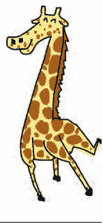

```
>>> reginald = Giraffes()
>>> reginald.dance_a_jig()
moving
moving
moving
moving
```

## 初始化对象

有时在创建对象时，我们想设置一些值（也称为*属性*）以供以后使用。当我们*初始化*一个对象时，我们是在为使用它做准备。

例如，假设我们想在创建长颈鹿对象时设置它们身上的斑点数量——也就是说，在它们初始化时。为此，我们创建一个 `__init__` 函数（注意两边各有两个下划线字符，总共四个）。

这是 Python 类中一种特殊类型的函数，必须具有此名称。init 函数是在对象首次创建时设置其属性的方式，Python 会在我们创建新对象时自动调用此函数。以下是使用方法：

```
>>> class Giraffes:
        def __init__(self, spots):
            self.giraffe_spots = spots
```

首先，我们使用两个参数 self 和 spots 定义 init 函数，代码为 `def __init__(self, spots):`。就像我们在类中定义的其他函数一样，init 函数也需要将 self 作为第一个参数。接下来，我们使用 self 参数将参数 spots 设置为一个名为 giraffe_spots 的对象变量（其属性），代码为 `self.giraffe_spots = spots`。你可以将这行代码理解为：“获取参数 spots 的值并保存以供以后使用（使用对象变量 giraffe_spots）。”就像类中的一个函数可以使用 self 参数调用另一个函数一样，类中的变量也是通过 self 访问的。

接下来，如果我们创建几个新的长颈鹿对象（Ozwald 和 Gertrude）并显示它们的斑点数量，你可以看到初始化函数在起作用：

```
>>> ozwald = Giraffes(100)
>>> gertrude = Giraffes(150)
>>> print(ozwald.giraffe_spots)
100
>>> print(gertrude.giraffe_spots)
150
```

首先，我们使用参数值 100 创建一个 Giraffes 类的实例。这具有调用 `__init__` 函数并使用 100 作为 spots 参数值的效果。接下来，我们创建另一个 Giraffes 类的实例，这次使用 150。最后，我们打印每个长颈鹿对象的对象变量 giraffe_spots，我们看到结果是 100 和 150。成功了！

记住，当我们创建一个类的对象时，比如上面的 ozwald，我们可以使用点运算符和我们想要使用的变量或函数的名称来引用它的变量或函数（例如例如，ozwald.giraffe_spots）。但当我们在类内部创建函数时，我们使用 self 参数（self.giraffe_spots）来引用这些相同的变量（以及其他函数）。

## 你学到了什么

在本章中，我们使用类来创建事物的类别，并创建了这些类的对象（实例）。你学习了类的子类如何继承其父类的函数，以及即使两个对象属于同一个类，它们也不一定是克隆体。例如，一个长颈鹿对象可以有自己独特的斑点数量。你学习了如何在对象上调用（或运行）函数，以及对象变量是如何在这些对象中保存值的。最后，我们在函数中使用了 self 参数来引用其他函数和变量。这些概念是 Python 的基础，在你阅读本书的其余部分时，你会一次又一次地看到它们。

## 编程谜题

本章中的一些想法会随着你使用它们的次数增多而变得更有意义。尝试用下面的例子来实践，然后在 http://python-for-kids.com/ 找到答案。

### #1：长颈鹿舞步

为 Giraffes 类添加函数，使长颈鹿的左脚和右脚向前和向后移动。一个移动左脚向前的函数可能看起来像这样：

```
>>> def left_Foot_Forward(self):
        print('left foot forward')
```

然后创建一个名为 dance 的函数来教 Reginald 跳舞（这个函数将调用你刚刚创建的四个脚部函数）。调用这个新函数的结果将是一个简单的舞蹈：

```
>>> reginald = Giraffes()
>>> reginald.dance()
left foot forward
left foot back
right foot forward
right foot back
left foot back
right foot back
right foot forward
left foot forward
```

### #2：海龟干草叉

使用四个海龟 Pen 对象创建以下侧向干草叉的图片（线条的确切长度并不重要）。记得先导入 turtle 模块！

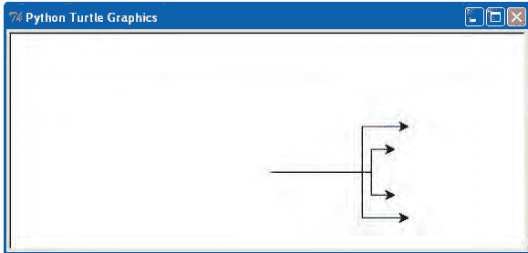

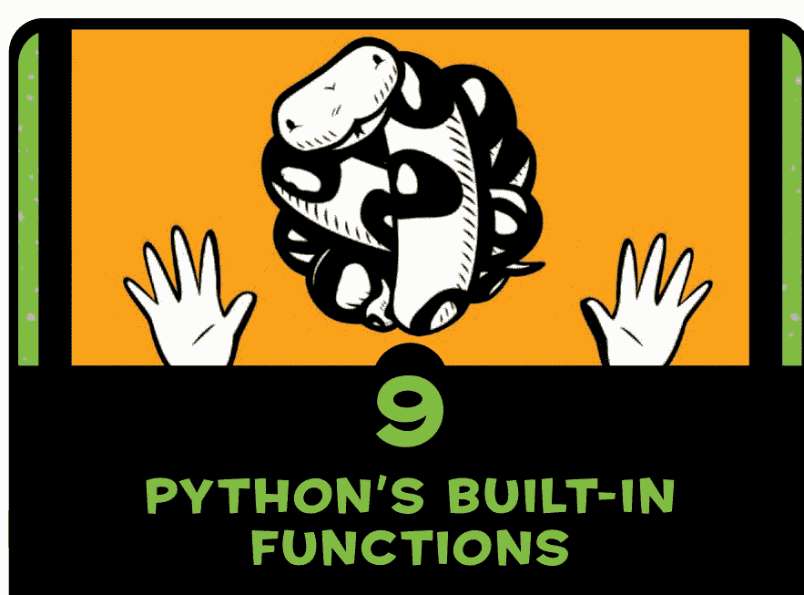

## # 9 Python 的内置函数

Python 拥有一个装备精良的编程工具箱，包括大量现成的函数和模块供你使用。就像一把可靠的锤子或自行车扳手一样，这些内置工具——实际上是代码块——可以让编写程序变得容易得多。

正如你在第 7 章学到的，模块在使用前需要被导入。Python 的*内置函数*不需要先导入；它们在 Python shell 启动时就可用了。在本章中，我们将看一些更有用的内置函数，然后重点介绍其中一个：open 函数，它允许你打开文件以便从中读取和写入。

## 使用内置函数

我们将介绍 Python 程序员常用的 12 个内置函数。我会描述它们的功能和使用方法，然后展示它们如何在你的程序中提供帮助的示例。

## ABS 函数

abs 函数返回一个数字的*绝对值*，即不考虑符号的数值。例如，10 的绝对值是 10，-10 的绝对值也是 10。
要使用 abs 函数，只需用一个数字或变量作为其参数调用它，如下所示：

```
>>> print(abs(10))
10
>>> print(abs(-10))
10
```

你可能会使用 abs 函数来执行诸如计算游戏角色绝对移动量的操作，无论该角色朝哪个方向移动。例如，假设角色向右走了三步（正 3），然后向左走了十步（负 10，或 -10）。如果我们不关心方向（正或负），这些数字的绝对值将是 3 和 10。你可能会在棋盘游戏中使用这个，你掷两个骰子，然后根据骰子的总和，让你的角色在任何方向上移动最多步数。现在，如果我们把步数存储在一个变量中，我们可以通过下面的代码来确定角色是否在移动

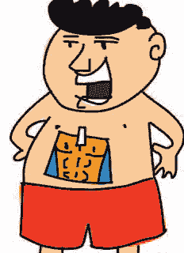

。当玩家决定移动时，我们可能想显示一些信息（在这种情况下，我们只显示“角色正在移动”）：

```
>>> steps = -3
>>> if abs(steps) > 0:
        print('Character is moving')
```

如果我们没有使用 abs，if 语句可能看起来像这样：

```
>>> steps = -3
>>> if steps < 0 or steps > 0:
        print('Character is moving')
```

如你所见，使用 abs 使 if 语句稍微短一点，也更容易理解。

## BOOL 函数

bool 是 *Boolean*（布尔）的缩写，程序员用这个词来描述一种可以有两个可能值之一的数据类型，通常是 true 或 false。

bool 函数接受一个参数，并根据其值返回 True 或 False。当对数字使用 bool 时，0 返回 False，而任何其他数字返回 True。以下是你可能如何对各种数字使用 bool 的示例：

```
>>> print(bool(0))
False
>>> print(bool(1))
True
>>> print(bool(1123.23))
True
>>> print(bool(-500))
True
```

当你对其他值（如字符串）使用 bool 时，如果字符串没有值（换句话说，是关键字 None 或空字符串），它返回 False。否则，它将返回 True，如下所示：

```
>>> print(bool(None))
False
>>> print(bool('a'))
True
>>> print(bool(' '))
True
>>> print(bool('What do you call a pig doing karate? Pork Chop!'))
True
```

bool 函数对于不包含任何值的列表、元组和映射也会返回 False，当它们包含值时则返回 True：

```
>>> my_silly_list = []
>>> print(bool(my_silly_list))
False
>>> my_silly_list = ['s', 'i', 'l', 'l', 'y']
>>> print(bool(my_silly_list))
True
```

当你需要决定一个值是否已被设置时，你可能会使用 bool。例如，如果我们要求使用我们程序的人输入他们的出生年份，我们的 if 语句可以使用 bool 来测试他们输入的值：

```
>>> year = input('Year of birth: ')
Year of birth:
>>> if not bool(year.rstrip()):
        print('You need to enter a value for your year of birth')
You need to enter a value for your year of birth
```

这个例子的第一行使用 input 将某人在键盘上输入的内容存储为变量 year。在下一行按 ENTER 键（不输入任何其他内容）会将 ENTER 键的值存储在变量中。（我们在第 7 章使用了 sys.stdin.readline()，这是另一种实现相同功能的方法。）

在下面一行，if 语句在使用 rstrip 函数（该函数删除字符串末尾的任何空格和 ENTER 字符）后检查变量的布尔值。因为在这个例子中用户没有输入任何内容，bool 函数返回 false。因为这个 if 语句使用了 not 关键字，这是一种表达“如果函数不返回 true，则执行此操作”的方式，所以代码在下一行打印 You need to enter a value for your year of birth。

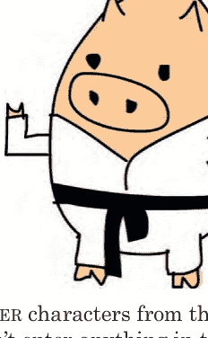

## DIR 函数

dir 函数（*directory* 的缩写）返回关于任何值的信息。基本上，它按字母顺序告诉你该值可以使用的函数。

例如，要显示列表值可用的函数，请输入以下内容：

```
>>> dir(['a', 'short', 'list'])
['__add__', '__class__', '__contains__', '__delattr__',
'__delitem__', '__doc__', '__eq__', '__format__', '__ge__',
'__getattribute__', '__getitem__', '__gt__', '__hash__', '__iadd__',
'__imul__', '__init__', '__iter__', '__le__', '__len__', '__lt__',
'__mul__', '__ne__', '__new__', '__reduce__', '__reduce_ex__',
'__repr__', '__reversed__', '__rmul__', '__setattr__', '__setitem__',
'__sizeof__', '__str__', '__subclasshook__', 'append', 'count',
'extend', 'index', 'insert', 'pop', 'remove', 'reverse', 'sort']
```

dir 函数几乎适用于任何东西，包括字符串、数字、函数、模块、对象和类。但有时它返回的信息可能不是很有用。例如，如果你对数字 1 调用 dir，它会显示许多 Python 本身使用的特殊函数（那些以和下划线开头和结尾的函数），这实际上没什么用（你通常可以忽略其中的大部分）：

```
>>> dir(1)
['__abs__', '__add__', '__and__', '__bool__', '__ceil__',
'__class__', '__delattr__', '__divmod__', '__doc__', '__eq__',
'__float__', '__floor__', '__floordiv__', '__format__', '__ge__',
'__getattribute__', '__getnewargs__', '__gt__', '__hash__',
'__index__', '__init__', '__int__', '__invert__', '__le__',
'__lshift__', '__lt__', '__mod__', '__mul__', '__ne__', '__neg__',
'__new__', '__or__', '__pos__', '__pow__', '__radd__', '__rand__',
'__rdivmod__', '__reduce__', '__reduce_ex__', '__repr__',
'__rfloordiv__', '__rlshift__', '__rmod__', '__rmul__', '__ror__',
'__round__', '__rpow__', '__rrshift__', '__rshift__', '__rsub__',
'__rtruediv__', '__rxor__', '__setattr__', '__sizeof__', '__str__',
'__sub__', '__subclasshook__', '__truediv__', '__trunc__',
'__xor__', 'bit_length', 'conjugate', 'denominator', 'imag',
'numerator', 'real']
```

当你有一个变量并想快速了解可以对它做什么时，dir 函数会很有用。例如，运行使用包含字符串值的变量 `popcorn` 来调用 `dir`，你将获得字符串类提供的函数列表（所有字符串都是字符串类的成员）：

```
>>> popcorn = 'I love popcorn!'
>>> dir(popcorn)
['__add__', '__class__', '__contains__', '__delattr__', '__doc__',
'__eq__', '__format__', '__ge__', '__getattribute__', '__getitem__',
'__getnewargs__', '__gt__', '__hash__', '__init__', '__iter__',
'__le__', '__len__', '__lt__', '__mod__', '__mul__', '__ne__',
'__new__', '__reduce__', '__reduce_ex__', '__repr__', '__rmod__',
'__rmul__', '__setattr__', '__sizeof__', '__str__',
'__subclasshook__', 'capitalize', 'center', 'count', 'encode',
'endswith', 'expandtabs', 'find', 'format', 'format_map', 'index',
'isalnum', 'isalpha', 'isdecimal', 'isdigit', 'isidentifier',
'islower', 'isnumeric', 'isprintable', 'isspace', 'istitle',
'isupper', 'join', 'ljust', 'lower', 'lstrip', 'maketrans', 'partition',
'replace', 'rfind', 'rindex', 'rjust', 'rpartition',
'rsplit', 'rstrip', 'split', 'splitlines', 'startswith', 'strip',
'swapcase', 'title', 'translate', 'upper', 'zfill']
```

此时，你可以使用 `help` 来获取列表中任何函数的简短描述。以下是对 `upper` 函数运行 `help` 的示例：

```
>>> help(popcorn.upper)
Help on built-in function upper:

upper(...)
    S.upper() -> str
    Return a copy of S converted to uppercase.
```

返回的信息可能有点令人困惑，所以让我们仔细看看。省略号 (...) 表示 `upper` 是字符串类的内置函数，并且在这种情况下不接受参数。下一行的箭头 (->) 表示此函数返回一个字符串 (str)。最后一行简要描述了该函数的功能。

## EVAL 函数

`eval` 函数（*evaluate* 的缩写）接受一个字符串作为参数，并像运行 Python 表达式一样执行它。例如，`eval('print("wow")')` 实际上会运行语句 `print("wow")`。

`eval` 函数仅适用于简单表达式，例如以下情况：

```
>>> eval('10*5')
50
```

跨多行的表达式（例如 `if` 语句）通常无法求值，如下例所示：

```
>>> eval('''if True:
        print("this won't work at all")''')
Traceback (most recent call last):
  File "<stdin>", line 1, in <module>
  File "<string>", line 1
    if True: print("this won't work at all")
      ^
SyntaxError: invalid syntax
```

`eval` 函数通常用于将用户输入转换为 Python 表达式。例如，你可以编写一个简单的计算器程序，读取输入到 Python 中的等式，然后计算（求值）答案。
由于用户输入是以字符串形式读入的，Python 需要在进行任何计算之前将其转换为数字和运算符。`eval` 函数使这种转换变得简单：

```
>>> your_calculation = input('Enter a calculation: ')
Enter a calculation: 12*52
>>> eval(your_calculation)
624
```

在这个例子中，我们使用 `input` 将用户输入的内容读入变量 `your_calculation`。在下一行，我们输入表达式 `12*52`（可能是你的年龄乘以一年中的周数）。我们使用 `eval` 来运行这个计算，结果打印在最后一行。

## EXEC 函数

`exec` 函数类似于 `eval`，但你可以用它来运行更复杂的程序。两者之间的区别在于 `eval` 返回一个值（你可以保存在变量中的东西），而 `exec` 不返回。以下是一个例子：

```
>>> my_small_program = '''print('ham')
print('sandwich')'''
>>> exec(my_small_program)
ham
sandwich
```

在前两行中，我们创建了一个包含两个 `print` 语句的多行字符串变量，然后使用 `exec` 来运行该字符串。
你可以使用 `exec` 来运行你的 Python 程序从文件中读入的小程序——实际上是程序中的程序！在编写冗长、复杂的应用程序时，这非常有用。例如，你可以创建一个“决斗机器人”游戏，其中两个机器人在屏幕上移动并试图互相攻击。游戏的玩家将为他们的机器人提供作为小型 Python 程序的指令。“决斗机器人”游戏将读取这些脚本并使用 `exec` 来运行。

## FLOAT 函数

`float` 函数将字符串或数字转换为浮点数，即带有小数点的数字（也称为实数）。例如，数字 `10` 是一个整数（也称为整数），但 `10.0`、`10.1` 和 `10.253` 都是浮点数（也称为浮点数）。

你可以通过简单地调用 `float` 将字符串转换为浮点数，如下所示：

```
>>> float('12')
12.0
```

你也可以在字符串中使用小数点：

```
>>> float('123.456789')
123.456789
```

你可能会使用 `float` 将输入到程序中的值转换为适当的数字，这在你需要将一个人输入的值与其他值进行比较时特别有用。例如，要检查一个人的年龄是否大于某个数字，我们可以这样做：

```
>>> your_age = input('Enter your age: ')
Enter your age: 20
>>> age = float(your_age)
>>> if age > 13:
        print('You are %s years too old' % (age - 13))
You are 7.0 years too old
```

## INT 函数

`int` 函数将字符串或数字转换为整数（或整数），这基本上意味着小数点后的所有内容都被丢弃。例如，以下是如何将浮点数转换为普通整数：

```
>>> int(123.456)
123
```

此示例将字符串转换为整数：

```
>>> int('123')
123
```

但是尝试将包含浮点数的字符串转换为整数，你会得到一条错误消息。例如，这里我们尝试使用 `int` 函数转换包含浮点数的字符串：

```
>>> int('123.456')
Traceback (most recent call last):
  File "<pyshell>", line 1, in <module>
    int('123.456')
ValueError: invalid literal for int() with base 10: '123.456'
```

如你所见，结果是一条 `ValueError` 消息。

## LEN 函数

`len` 函数返回对象的长度，或者在字符串的情况下，返回字符串中的字符数。例如，要获取 `this is a test string` 的长度，你可以这样做：

```
>>> len('this is a test string')
21
```

当与列表或元组一起使用时，`len` 返回该列表或元组中的项目数：

```
>>> creature_list = ['unicorn', 'cyclops', 'fairy', 'elf', 'dragon', 'troll']
>>> print(len(creature_list))
6
```

与映射一起使用时，`len` 也返回映射中的项目数：

```
>>> enemies_map = {'Batman' : 'Joker',
                   'Superman' : 'Lex Luthor',
                   'Spiderman' : 'Green Goblin'}
>>> print(len(enemies_map))
3
```

`len` 函数在使用循环时特别有用。例如，我们可以用它来显示列表中元素的索引位置，如下所示：

```
>>> fruit = ['apple', 'banana', 'clementine', 'dragon fruit']
>>> length = len(fruit)
>>> for x in range(0, length):
        print('the fruit at index %s is %s' % (x, fruit[x]))
```

```
the fruit at index 0 is apple
the fruit at index 1 is banana
the fruit at index 2 is clementine
the fruit at index 3 is dragon fruit
```

在这里，我们在 ❶ 处将列表的长度存储在变量 `length` 中，然后在 ❷ 处使用该变量在 `range` 函数中创建我们的循环。在 ❸ 处，当我们遍历列表中的每个项目时，我们打印一条消息，显示该项目的索引位置和值。如果你有一个字符串列表并想打印列表中的每隔第二个或第三个项目，你也可以使用 `len` 函数。

## MAX 和 MIN 函数

`max` 函数返回列表、元组或字符串中的最大项目。例如，以下是如何将其与数字列表一起使用：

```
>>> numbers = [5, 4, 10, 30, 22]
>>> print(max(numbers))
30
```

字符用逗号或空格分隔的字符串也可以：

```
>>> strings = 's,t,r,i,n,g,S,T,R,I,N,G'
>>> print(max(strings))
t
```

正如这个例子所示，字母按字母顺序排列，小写字母排在大写字母之后，因此 $t$ 大于 $T$。
但你不必使用列表、元组或字符串。你也可以直接调用 `max` 函数，并将要比较的项目作为参数输入括号中：

```
>>> print(max(10, 300, 450, 50, 90))
450
```

`min` 函数的工作方式与 `max` 类似，只是它返回列表、元组或字符串中的最小项。以下是我们使用 `min` 代替 `max` 的数字列表示例：

```
>>> numbers = [5, 4, 10, 30, 22]
>>> print(min(numbers))
4
```

假设你正在和一个四人团队玩猜数字游戏，每个人都必须猜一个比你的数字小的数字。如果任何玩家猜的数字高于你的数字，所有玩家都输；但如果他们都猜得更低，他们就赢。我们可以使用 `max` 来快速检查所有猜测是否都低于你的数字，如下所示：

```
>>> guess_this_number = 61
>>> player_guesses = [12, 15, 70, 45]
>>> if max(player_guesses) > guess_this_number:
        print('Boom! You all lose')
else:
        print('You win')

Boom! You all lose
```

在这个例子中，我们使用变量 `guess_this_number` 存储要猜的数字。团队成员的猜测存储在列表 `player_guesses` 中。`if` 语句检查最大猜测值与 `guess_this_number` 中的数字，如果任何玩家猜的数字超过该数字，我们就打印消息“Boom! You all lose”。

## RANGE 函数

正如我们之前所见，range 函数主要用于 for 循环，以特定次数循环执行一段代码。传递给 range 的前两个参数称为 *start* 和 *stop*。你在之前使用 len 函数与循环配合的示例中已经见过带有这两个参数的 range。

range 生成的数字从作为第一个参数给出的数字开始，到比第二个参数小 1 的数字结束。例如，以下展示了当我们打印 range 在 0 和 5 之间创建的数字时会发生什么：

```
>>> for x in range(0, 5):
        print(x)

0
1
2
3
4
```

range 函数实际上返回一个称为 *iterator* 的特殊对象，该对象会重复执行一个动作多次。在这种情况下，它每次被调用时返回下一个最大的数字。
你可以将迭代器转换为列表（使用 list 函数）。如果你然后打印调用 range 时返回的值，你也会看到它包含的数字：

```
>>> print(list(range(0, 5)))
[0, 1, 2, 3, 4]
```

你还可以向 range 添加第三个参数，称为 *step*。如果未包含 step 值，则默认使用数字 1 作为步长。但当我们传入数字 2 作为步长时会发生什么？结果如下：

```
>>> count_by_twos = list(range(0, 30, 2))
>>> print(count_by_twos)
[0, 2, 4, 6, 8, 10, 12, 14, 16, 18, 20, 22, 24, 26, 28]
```

列表中的每个数字都比前一个数字增加 2，列表以数字 28 结束，比 30 小 2。你也可以使用负步长：

```
>>> count_down_by_twos = list(range(40, 10, -2))
>>> print(count_down_by_twos)
[40, 38, 36, 34, 32, 30, 28, 26, 24, 22, 20, 18, 16, 14, 12]
```

## SUM 函数

sum 函数将列表中的项目相加并返回总和。以下是一个示例：

```
>>> my_list_of_numbers = list(range(0, 500, 50))
>>> print(my_list_of_numbers)
[0, 50, 100, 150, 200, 250, 300, 350, 400, 450]
>>> print(sum(my_list_of_numbers))
2250
```

在第一行，我们使用步长为 50 的 range 创建一个介于 0 和 500 之间的数字列表。接下来，我们打印列表以查看结果。最后，通过 `print(sum(my_list_of_numbers))` 将变量 `my_list_of_numbers` 传递给 sum 函数，将列表中的所有项目相加，得到总和 2250。

## 处理文件

Python 文件与计算机上的其他文件相同：文档、图片、音乐、游戏……实际上，计算机上的所有内容都以文件形式存储。
让我们看看如何使用内置函数 open 在 Python 中打开和处理文件。但首先我们需要创建一个新文件来操作。

## 创建测试文件

我们将使用一个名为 *test.txt* 的文本文件进行实验。请按照你所使用的操作系统的步骤操作。

### 在 WINDOWS 中创建新文件

如果你使用的是 Windows，请按照以下步骤创建 *test.txt*：

- 1. 选择 **开始** ▸ **所有程序** ▸ **附件** ▸ **记事本**。
- 2. 在空文件中输入几行内容。
- 3. 选择 **文件** ▸ **保存**。
- 4. 当对话框出现时，通过双击 **我的电脑** 然后双击 **本地磁盘 (C:)** 选择 C: 驱动器。
- 5. 在对话框底部的 **文件名** 框中输入 *test.txt*。
- 6. 最后，单击 **保存** 按钮。

### 在 MAC OS X 中创建新文件

如果你使用的是 Mac，请按照以下步骤创建 *test.txt*：

- 1. 单击屏幕顶部菜单栏中的 **Spotlight** 图标。
- 2. 在出现的搜索框中输入 *TextEdit*。
- 3. TextEdit 应出现在应用程序部分。单击它以打开编辑器（你也可以在 Finder 的应用程序文件夹中找到 TextEdit）。
- 4. 在空文件中输入几行文本。
- 5. 选择 **格式 ▸ 制作纯文本**。
- 6. 选择 **文件 ▸ 保存**。
- 7. 在 **存储为** 框中，输入 *test.txt*。
- 8. 在位置列表中，单击你的用户名——你登录时使用的名称或你正在使用的计算机所有者的名称。
- 9. 最后，单击 **保存** 按钮。

### 在 UBUNTU 中创建新文件

如果你使用的是 Ubuntu，请按照以下步骤创建 *test.txt*：

- 1. 打开你的编辑器，通常称为文本编辑器。如果你以前没有使用过，请在 **应用程序** 菜单中搜索它。
- 2. 在编辑器中输入几行文本。
- 3. 选择 **文件 ▸ 保存**。
- 4. 在 **名称** 框中，输入 *test.txt* 作为文件名。你的主目录可能已在标记为 **保存到文件夹** 的框中被选中，但如果没有，请在位置列表中单击它。（你的主目录是你登录时使用的用户名。）
- 5. 单击 **保存** 按钮。

## 在 PYTHON 中打开文件

Python 的内置 open 函数在 Python shell 中打开一个文件并显示其内容。你如何告诉函数要打开哪个文件取决于你的操作系统。查看 Windows 文件的示例，如果你使用的是 Mac 或 Ubuntu 系统，请阅读相应的部分。

### 打开 WINDOWS 文件

如果你使用的是 Windows，请输入以下代码打开 *test.txt*：

```
>>> test_file = open('c:\test.txt')
>>> text = test_file.read()
>>> print(text)
There once was a boy named Marcelo
Who dreamed he ate a marshmallow
He awoke with a start
As his bed fell apart
And he found he was a much rounder fellow
```

在第一行，我们使用 open，它返回一个带有用于处理文件的函数的文件对象。我们与 open 函数一起使用的参数是一个字符串，告诉 Python 在哪里可以找到该文件。如果你使用的是 Windows，你将 *test.txt* 保存到 C: 驱动器的本地磁盘上，因此你将文件的位置指定为 c:\test.txt。
Windows 文件名中的两个反斜杠告诉 Python 反斜杠就是反斜杠，而不是某种命令。（正如你在第 3 章学到的，反斜杠本身在 Python 中具有特殊含义，尤其是在字符串中。）我们将文件对象保存到变量 test_file。

在第二行，我们使用文件对象提供的 read 函数读取文件内容并将其存储在变量 text 中。我们在最后一行打印变量以显示文件的内容。

### 打开 MAC OS X 文件

如果你使用的是 Mac OS X，你需要在 Windows 示例的第一行输入不同的位置来打开 *test.txt*。在字符串中使用你保存文本文件时单击的用户名。例如，如果用户名是 *sarahwinters*，open 参数应如下所示：

```
>>> test_file = open('/Users/sarahwinters/test.txt')
```

### 打开 UBUNTU 文件

如果你使用的是 Ubuntu，你需要在 Windows 示例的第一行输入不同的位置来打开 *test.txt*。使用你保存文本文件时单击的用户名。例如，如果用户名是 *jacob*，open 参数应如下所示：

```
>>> test_file = open('/home/jacob/test.txt')
```

## 写入文件

open 返回的文件对象除了 read 之外还有其他函数。我们可以通过在调用函数时使用第二个参数，即字符串 'w'，来创建一个新的空文件：

```
>>> test_file = open('c:\myfile.txt', 'w')
```

参数 'w' 告诉 Python 我们想要写入文件对象，而不是从中读取。

我们现在可以使用写入函数向这个新文件添加信息：

```
>>> test_file = open('c:\myfile.txt', 'w')
>>> test_file.write('this is my test file')
```

最后，我们需要使用关闭函数告诉 Python 何时完成文件写入：

```
>>> test_file = open('c:\myfile.txt', 'w')
>>> test_file.write('What is green and loud? A froghorn!')
>>> test_file.close()
```

现在，如果你用文本编辑器打开该文件，你应该会看到它包含文本“What is green and loud? A froghorn!”。或者，你可以使用 Python 再次读取它：

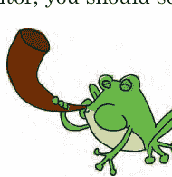

```
>>> test_file = open('myfile.txt')
>>> print(test_file.read())
What is green and loud? A froghorn!
```

## 你学到了什么

在本章中，你学习了 Python 的内置函数，例如 `float` 和 `int`，它们可以将带小数点的数字转换为整数，反之亦然。你还看到了 `len` 函数如何使循环更容易，以及如何使用 Python 打开文件以从中读取和写入。

## 编程谜题

尝试以下示例，以实验 Python 的一些内置函数。在 http://python-for-kids.com/ 找到答案。

### #1: 神秘代码

运行以下代码的结果会是什么？先猜测，然后运行代码看看你是否正确。

```
>>> a = abs(10) + abs(-10)
>>> print(a)
>>> b = abs(-10) + -10
>>> print(b)
```

### #2: 隐藏信息

尝试使用 `dir` 和 `help` 来找出如何将字符串分解成单词，然后创建一个小程序来打印以下字符串中每隔一个单词，从第一个单词（this）开始：

> "this if is you not are a reading very this good then way you to have hide done a it message wrong"

### #3: 复制文件

创建一个 Python 程序来复制文件。（提示：你需要打开要复制的文件，读取它，然后创建一个新文件——副本。）通过在屏幕上打印新文件的内容来检查你的程序是否有效。

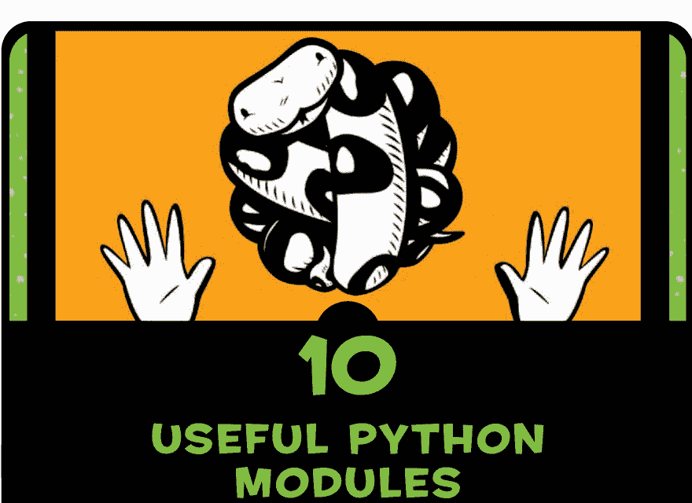

正如你在第 7 章学到的，Python 模块是函数、类和变量的任意组合。Python 使用模块来对函数和类进行分组，以便于使用。例如，我们在前面章节中使用的 `turtle` 模块，将用于创建供海龟在屏幕上绘制的画布的函数和类分组在一起。

当你将模块导入程序时，你可以使用其所有内容。例如，当我们在第 4 章导入 `turtle` 模块时，我们可以访问 `Pen` 类，我们用它来创建一个代表海龟画布的对象：

```
>>> import turtle
>>> t = turtle.Pen()
```

Python 有很多模块用于执行各种不同的任务。在本章中，我们将看一些最有用的模块，并尝试它们的一些函数。

## 使用 copy 模块进行复制

`copy` 模块包含用于创建对象副本的函数。通常，在编写程序时，你会创建新对象，但有时创建对象的副本，然后使用该副本创建新对象是有用的，特别是当创建对象的过程需要几个步骤时。

例如，假设我们有一个 `Animal` 类，其中有一个 `__init__` 函数，它接受参数 `name`、`number_of_legs` 和 `color`。

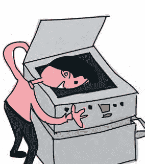

```
>>> class Animal:
        def __init__(self, species, number_of_legs, color):
            self.species = species
            self.number_of_legs = number_of_legs
            self.color = color
```

我们可以使用以下代码在 `Animal` 类中创建一个新对象。让我们创建一个名为 harry 的六条腿的粉色鹰马兽。

```
>>> harry = Animal('hippogriff', 6, 'pink')
```

假设我们想要一群六条腿的粉色鹰马兽？我们可以一遍又一遍地重复前面的代码，或者使用 `copy`，它可以在 `copy` 模块中找到：

```
>>> import copy
>>> harry = Animal('hippogriff', 6, 'pink')
>>> harriet = copy.copy(harry)
>>> print(harry.species)
hippogriff
>>> print(harriet.species)
hippogriff
```

在这个例子中，我们创建一个对象并用变量 `harry` 标记它，然后我们创建该对象的副本并用 `harriet` 标记它。这是两个完全不同的对象，即使它们具有相同的物种。这节省的输入量不多，但当对象复杂得多时，能够复制它们会很有用。

我们还可以创建和复制一个 `Animal` 对象列表。

```
>>> harry = Animal('hippogriff', 6, 'pink')
>>> carrie = Animal('chimera', 4, 'green polka dots')
>>> billy = Animal('bogill', 0, 'paisley')
>>> my_animals = [harry, carrie, billy]
>>> more_animals = copy.copy(my_animals)
>>> print(more_animals[0].species)
hippogriff
>>> print(more_animals[1].species)
chimera
```

在前三行中，我们创建了三个 `Animal` 对象并将它们存储在 `harry`、`carrie` 和 `billy` 中。在第四行，我们将这些对象添加到列表 `my_animals` 中。接下来，我们使用 `copy` 创建一个新列表 `more_animals`。最后，我们打印 `more_animals` 列表中前两个对象（[0] 和 [1]）的物种，并看到它们与原始列表中的相同：`hippogriff` 和 `chimera`。我们无需重新创建对象就制作了列表的副本。

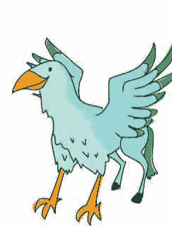

但是看看如果我们更改原始 `my_animals` 列表中一个 `Animal` 对象的物种（从 `hippogriff` 改为 `ghoul`）会发生什么。Python 也会更改 `more_animals` 中的物种。

```
>>> my_animals[0].species = 'ghoul'
>>> print(my_animals[0].species)
ghoul
>>> print(more_animals[0].species)
ghoul
```

这很奇怪。我们不是只更改了 `my_animals` 中的物种吗？为什么两个列表中的物种都改变了？
物种改变是因为 `copy` 实际上创建的是浅拷贝，这意味着它不会复制我们复制的对象内部的对象。在这里，它复制了主列表对象，但没有复制列表内的单个对象。因此，我们最终得到一个没有自己新对象的新列表——列表 `more_animals` 内部有相同的三个对象。
同样，如果我们向第一个列表（`my_animals`）添加一个新动物，它不会出现在副本（`more_animals`）中。作为证明，在添加另一个动物后打印每个列表的长度，如下所示：

```
>>> sally = Animal('sphinx', 4, 'sand')
>>> my_animals.append(sally)
>>> print(len(my_animals))
4
>>> print(len(more_animals))
3
```

如你所见，当我们向第一个列表 `my_animals` 添加一个新动物时，它并没有被添加到该列表的副本 `more_animals` 中。当我们使用 `len` 并打印结果时，第一个列表有四个元素，第二个有三个。
`copy` 模块中的另一个函数 `deepcopy` 实际上会复制被复制对象内部的所有对象。当我们使用 `deepcopy` 复制 `my_animals` 时，我们得到一个新列表，其中包含其所有对象的副本。因此，对原始 `Animal` 对象之一的更改不会影响新列表中的对象。这是一个例子：

```
>>> more_animals = copy.deepcopy(my_animals)
>>> my_animals[0].species = 'wyrm'
>>> print(my_animals[0].species)
wyrm
>>> print(more_animals[0].species)
ghoul
```

当我们把原始列表中第一个对象的物种从 `ghoul` 改为 `wyrm` 时，复制的列表没有改变，正如我们打印每个列表中第一个对象的物种时所看到的。

## 使用 keyword 模块跟踪关键字

Python *关键字* 是 Python 语言本身的一部分的任何单词，例如 `if`、`else` 和 `for`。`keyword` 模块包含一个名为 `iskeyword` 的函数和一个名为 `kwlist` 的变量。函数 `iskeyword` 如果任何字符串是 Python 关键字则返回 true。变量 `kwlist` 返回所有 Python 关键字的列表。

注意在以下代码中，函数 `iskeyword` 对于字符串 `if` 返回 true，对于字符串 `ozwald` 返回 false。当我们打印变量的内容时，你可以看到完整的关键字列表，这很有用，因为关键字并不总是保持不变。Python 的新版本（或旧版本）可能有不同的关键字。

```
>>> import keyword
>>> print(keyword.iskeyword('if'))
True
>>> print(keyword.iskeyword('ozwald'))
False
>>> print(keyword.kwlist)
['False', 'None', 'True', 'and', 'as', 'assert', 'break', 'class', 'continue', 'def', 'del', 'elif', 'else', 'except', 'finally', 'for', 'from', 'global', 'if', 'import', 'in', 'is', 'lambda', 'nonlocal', 'not', 'or', 'pass', 'raise', 'return', 'try', 'while', 'with', 'yield']
```

你可以在附录中找到每个关键字的描述。

## 使用 random 模块获取随机数

`random` 模块包含许多对生成随机数有用的函数——有点像让计算机“选一个数字”。`random` 模块中最有用的函数是 `randint`、`choice` 和 `shuffle`。

## 使用 RANDINT 选取随机数

`randint` 函数用于在指定数字范围内选取一个随机数，例如在 1 到 100 之间、100 到 1000 之间，或 1000 到 5000 之间。以下是一个示例：

```python
>>> import random
>>> print(random.randint(1, 100))
58
>>> print(random.randint(100, 1000))
861
>>> print(random.randint(1000, 5000))
3795
```

你可以使用 `randint` 来做一些事情，比如创建一个简单（且烦人）的猜数字游戏，使用 `while` 循环，如下所示：

```python
>>> import random
>>> num = random.randint(1, 100)
>>> while True:
        print('Guess a number between 1 and 100')
        guess = input()
        i = int(guess)
        if i == num:
            print('You guessed right')
            break
        elif i < num:
            print('Try higher')
        elif i > num:
            print('Try lower')
```

首先，我们导入 `random` 模块，然后使用 `randint` 将变量 `num` 设置为 1 到 100 范围内的一个随机数。接着，我们在 ❶ 处创建一个 `while` 循环，该循环将无限运行（或者至少持续到玩家猜中数字为止）。
然后，我们在 ❷ 处打印一条消息，接着使用 `input` 从用户那里获取输入，并将其存储在 ❸ 处的变量 `guess` 中。我们使用 `int` 将输入转换为数字，并将其保存在 ❹ 处的变量 `i` 中。然后我们在 ❺ 处将其与随机选择的数字进行比较。
如果输入与随机生成的数字相等，我们打印“You guessed right”，然后在 ❻ 处退出循环。如果数字不相等，我们检查玩家猜测的数字是否高于随机数字（在 ⑦ 处）或低于随机数字（在 ⑧ 处），并相应地打印提示信息。
这段代码有点长，所以你可能想将其输入到一个新的 shell 窗口或创建一个文本文档，保存它，然后在 IDLE 中运行它。以下是打开和运行已保存程序的提醒：

1.  启动 IDLE 并选择 **File ▸ Open**。
2.  浏览到保存文件的目录，然后单击文件名以选择它。
3.  单击 **Open**。
4.  新窗口打开后，选择 **Run ▸ Run Module**。

运行程序时会发生以下情况：

## 使用 CHOICE 从列表中选取随机项

如果你想从列表中选取一个随机项，而不是从给定范围中选取一个随机数，可以使用 `choice`。例如，你可能希望 Python 为你选择甜点。

```python
>>> import random
>>> desserts = ['ice cream', 'pancakes', 'brownies', 'cookies', 'candy']
>>> print(random.choice(desserts))
brownies
```

看起来你要吃布朗尼了——这选择还不错。

## 使用 SHUFFLE 打乱列表

`shuffle` 函数用于打乱列表，混合其中的项目。如果你正在 IDLE 中操作，并且刚刚在上一个示例中导入了 `random` 并创建了 `desserts` 列表，你可以直接跳到以下代码中的 `random.shuffle` 命令。

```python
>>> import random
>>> desserts = ['ice cream', 'pancakes', 'brownies', 'cookies',
              'candy']
>>> random.shuffle(desserts)
>>> print(desserts)
['pancakes', 'ice cream', 'candy', 'brownies', 'cookies']
```

打印列表时，你可以看到打乱的结果——顺序完全不同。如果你正在编写一个纸牌游戏，你可能会使用这个功能来打乱代表一副牌的列表。

## 使用 SYS 模块控制 SHELL

`sys` 模块包含系统函数，你可以使用它们来控制 Python shell 本身。在这里，我们将了解如何使用 `exit` 函数、`stdin` 和 `stdout` 对象以及 `version` 变量。

## 使用 EXIT 函数退出 SHELL

`exit` 函数是停止 Python shell 或控制台的一种方式。输入以下代码，你将看到一个对话框提示你是否要退出。单击 **Yes**，shell 将关闭。

```python
>>> import sys
>>> sys.exit()
```

如果你没有使用我们在第 1 章中设置的修改版 IDLE，这将不起作用。相反，你会得到一个错误，如下所示：

```python
>>> import sys
>>> sys.exit()
Traceback (most recent call last):
  File "<pyshell#1>", line 1, in <module>
    sys.exit()
SystemExit
```

## 使用 STDIN 对象读取

`sys` 模块中的 `stdin` 对象（*standard input* 的缩写）提示用户输入信息，以便读取到 shell 中并由程序使用。正如你在第 7 章所学，该对象有一个 `readline` 函数，用于读取键盘上输入的一行文本，直到用户按下 ENTER 键。它的工作方式类似于本章前面在随机数猜数字游戏中使用的 `input` 函数。例如，输入以下内容：

```python
>>> import sys
>>> v = sys.stdin.readline()
He who laughs last thinks slowest
```

Python 将字符串 `He who laughs last thinks slowest` 存储在变量 `v` 中。要确认这一点，请打印 `v` 的内容：

```python
>>> print(v)
He who laughs last thinks slowest
```

`input` 和 `readline` 函数的一个区别在于，使用 `readline` 时，你可以指定要读取的字符数作为参数。例如：

```python
>>> v = sys.stdin.readline(13)
He who laughs last thinks slowest
>>> print(v)
He who laughs
```

## 使用 STDOUT 对象写入

与 `stdin` 不同，`stdout` 对象（*standard output* 的缩写）可用于向 shell（或控制台）写入消息，而不是读取消息。在某些方面，它与 `print` 相同，但 `stdout` 是一个文件对象，因此它具有我们在第 9 章中使用的相同函数，例如 `write`。以下是一个示例：

```python
>>> import sys
>>> sys.stdout.write("What does a fish say when it swims into a wall? Dam.")
What does a fish say when it swims into a wall? Dam.52
```

请注意，当 `write` 完成时，它会返回写入的字符数。你可以看到消息末尾打印的 52。我们可以将此值保存到一个变量中，以便随着时间的推移记录我们向屏幕写入了多少字符。

## 我正在使用哪个版本的 PYTHON？

变量 `version` 显示你的 Python 版本，如果你想确保自己是最新的，这会很有用。一些程序员喜欢在程序启动时打印信息。例如，你可能会将 Python 版本放入程序的“关于”窗口中，如下所示：

```python
>>> import sys
>>> print(sys.version)
3.1.2 (r312:79149, Mar 21 2013, 00:41:52) [MSC v.1500 32 bit (Intel)]
```

## 使用 TIME 模块处理时间

Python 的 `time` 模块包含用于显示时间的函数，尽管不一定像你可能期望的那样。试试这个：

```python
>>> import time
>>> print(time.time())
1300139149.34
```

调用 `time()` 返回的数字实际上是自 1970 年 1 月 1 日 00:00:00 AM 以来的秒数。就其本身而言，这个不寻常的参考点可能看起来并不立即有用，但它可以发挥作用。例如，要了解程序的某些部分运行了多长时间，你可以在开始和结束时记录时间，并比较这些值。让我们尝试一下，看看打印从 0 到 999 的所有数字需要多长时间。

首先，创建一个如下函数：

```python
>>> def lots_of_numbers(max):
        for x in range(0, max):
            print(x)
```

接下来，将 `max` 设置为 1000 来调用该函数：

```python
>>> lots_of_numbers(1000)
```

然后，通过使用 `time` 模块修改我们的程序来计算函数运行所需的时间。

```python
>>> def lots_of_numbers(max):
    t1 = time.time()
    for x in range(0, max):
        print(x)
    t2 = time.time()
    print('it took %s seconds' % (t2-t1))
```

再次调用程序，我们得到以下结果（具体时间取决于你的系统速度）：

```python
>>> lots_of_numbers(1000)
0
1
2
3
.
.
.
997
998
999
it took 50.159196853637695 seconds
```

工作原理如下：第一次调用 `time()` 函数时，我们将返回的值赋给 ❶ 处的变量 `t1`。然后我们在第三行和第四行循环并打印所有数字（在 ❷ 处）。循环结束后，我们再次调用 `time()`，并将返回的值赋给 ❸ 处的变量 `t2`。由于循环完成需要几秒钟，`t2` 中的值将高于 `t1`，因为自 1970 年 1 月 1 日以来经过了更多秒数。如 ❹ 处所示，用 `t2` 减去 `t1`，我们就得到了打印所有这些数字所花费的秒数。

## 使用 ASCTIME 转换日期

`asctime` 函数接受一个日期元组并将其转换为更易读的形式。（记住，元组就像一个列表，但其中的项目不能更改。）正如你在第 7 章所看到的，不带任何参数调用 `asctime` 将以可读形式显示当前日期和时间。

```python
>>> import time
>>> print(time.asctime())
Mon Mar 11 22:03:41 2013
```

要带参数调用 `asctime`，我们首先创建一个包含日期和时间值的元组。例如，这里我们将元组赋给变量 `t`：

```python
>>> t = (2007, 5, 27, 10, 30, 48, 6, 0, 0)
```

序列中的值依次是年、月、日、小时、分钟、秒、星期几（0 是星期一，1 是星期二，依此类推）、一年中的第几天（我们放 0 作为占位符）以及是否是夏令时（如果不是则为 0；如果是则为 1）。使用类似的元组调用 `asctime`，我们得到：

```python
>>> import time
>>> t = (2020, 2, 23, 10, 30, 48, 6, 0, 0)
>>> print(time.asctime(t))
Sun Feb 23 10:30:48 2020
```

## 使用 LOCALTIME 获取日期和时间

与 `asctime` 不同，`localtime` 函数返回当前日期和时间作为一个对象，其中的值顺序大致相同作为 `asctime` 的输入。如果你打印这个对象，你会看到类的名称，以及每个值的标签，如 `tm_year`、`tm_mon`（代表月份）、`tm_mday`（代表当月的第几天）、`tm_hour` 等等。

```
>>> import time
>>> print(time.localtime())
time.struct_time(tm_year=2020, tm_mon=2, tm_mday=23, tm_hour=22, tm_min=18, tm_sec=39, tm_wday=0, tm_yday=73, tm_isdst=0)
```

要打印当前的年份和月份，你可以使用它们的索引位置（就像我们之前使用 `asctime` 时的元组一样）。根据我们的例子，我们知道年份在第一个位置（位置 0），月份在第二个位置（位置 1）。因此，我们使用 `year = t[0]` 和 `month = t[1]`，像这样：

```
>>> t = time.localtime()
>>> year = t[0]
>>> month = t[1]
>>> print(year)
2020
>>> print(month)
2
```

我们看到，现在是 2020 年的第二个月。

## 用 SLEEP 休息一下

当你想要延迟或减慢程序运行时，`sleep` 函数非常有用。例如，要从 1 到 61 每秒打印一个数字，我们可以使用以下循环：


```
>>> for x in range(1, 61):
        print(x)
```

这段代码会快速打印从 1 到 60 的所有数字。然而，我们可以让 Python 在每个打印语句之间暂停一秒，像这样：

```
>>> for x in range(1, 61):
        print(x)
        time.sleep(1)
```

这会在每个数字的显示之间增加一个延迟。在第 12 章，我们将使用 `sleep` 函数让动画看起来更真实一些。

## 使用 PICKLE 模块保存信息

`pickle` 模块用于将 Python 对象转换成可以写入文件并随后轻松读回的内容。如果你正在编写一个游戏并想保存玩家的进度信息，你可能会发现 `pickle` 很有用。例如，以下是我们如何为游戏添加保存功能的方法：

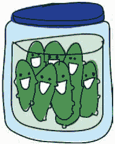

```
>>> game_data = {
    'player-position' : 'N23 E45',
    'pockets' : ['keys', 'pocket knife', 'polished stone'],
    'backpack' : ['rope', 'hammer', 'apple'],
    'money' : 158.50
}
```

这里，我们创建了一个 Python 字典，其中包含玩家在我们虚构游戏中的当前位置、玩家口袋和背包中物品的列表，以及玩家携带的金钱数量。我们可以通过以写入模式打开文件，然后调用 `pickle` 的 `dump` 函数来将这个字典保存到文件中，像这样：

```
1 >>> import pickle
2 >>> game_data = {
    'player-position' : 'N23 E45',
    'pockets' : ['keys', 'pocket knife', 'polished stone'],
    'backpack' : ['rope', 'hammer', 'apple'],
    'money' : 158.50
    }
3 >>> save_file = open('save.dat', 'wb')
4 >>> pickle.dump(game_data, save_file)
5 >>> save_file.close()
```

我们在 ❶ 处首先导入 `pickle` 模块，并在 ❷ 处创建我们的游戏数据字典。在 ❸ 处，我们使用参数 *wb* 打开文件 *save.dat*，这告诉 Python 以二进制模式写入文件（你可能需要像我们在第 9 章那样，将其保存到像 */Users/malcolmozwald*、*/home/susanb/* 或 *C:\Users\JimmyIpswich* 这样的目录中）。在 ❹ 处，我们使用 `dump` 函数，将字典和文件变量作为两个参数传入。最后，在 ❺ 处，我们关闭文件，因为我们已经完成了操作。

> **注意** 纯文本文件只包含人类可读的字符。图像、音乐文件、电影和经过 pickle 处理的 Python 对象包含的信息并不总是人类可读的，因此它们被称为二进制文件。如果你打开 *save.dat* 文件，你会看到它看起来不像一个文本文件；它看起来像是普通文本和特殊字符的混乱混合体。

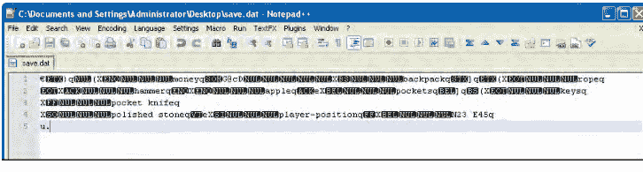

我们可以使用 `pickle` 的 `load` 函数来反序列化（unpickle）我们写入文件的对象。当我们反序列化某物时，我们逆转了 pickle 过程：我们将写入文件的信息转换回我们的程序可以使用的值。这个过程类似于使用 `dump` 函数。

```
>>> load_file = open('save.dat', 'rb')
>>> loaded_game_data = pickle.load(load_file)
>>> load_file.close()
```

首先，我们使用参数 *rb* 打开文件，这表示读取二进制文件。然后，我们将文件传递给 `load` 函数，并将返回值赋给变量 *loaded_game_data*。最后，我们关闭文件。

为了证明我们的保存数据已被正确加载，打印该变量：

```
>>> print(loaded_game_data)
{'money': 158.5, 'backpack': ['rope', 'hammer', 'apple'],
'player-position': 'N23 E45', 'pockets': ['keys', 'pocket knife',
'polished stone']}
```

## 你学到了什么

在本章中，你学习了 Python 模块如何组织函数、类和变量，以及如何通过导入模块来使用这些函数。你已经了解了如何复制对象、生成随机数以及随机打乱对象列表，还学习了如何在 Python 中处理时间。最后，你学习了如何使用 `pickle` 从文件中保存和加载信息。

## 编程谜题

尝试以下练习来实践使用 Python 的模块。在 http://python-for-kids.com/ 查看你的答案。

### #1：复制的汽车

以下代码会打印什么？

```
>>> import copy
>>> class Car:
    pass

>>> car1 = Car()
>>> car1.wheels = 4
>>> car2 = car1
>>> car2.wheels = 3
>>> print(car1.wheels)
>>> car3 = copy.copy(car1)
>>> car3.wheels = 6
>>> print(car1.wheels)
```


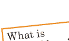

### #2：腌制的最爱

创建一个包含你最喜欢事物的列表，然后使用 `pickle` 将它们保存到名为 `favorites.dat` 的文件中。关闭 Python shell，然后重新打开它，并通过加载文件来显示你最喜欢的列表。

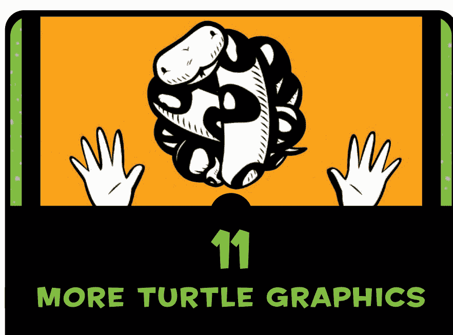

## 11 更多海龟图形

让我们再次看看我们在第 4 章开始使用的 `turtle` 模块。正如你将在本章中看到的，在 Python 中，海龟能做的远不止画简单的黑线。例如，你可以用它们来绘制更复杂的几何图形、创建不同的颜色，甚至用颜色填充你的图形。

## 从基本正方形开始

我们已经学习了如何让海龟绘制简单的形状。在使用海龟之前，我们需要导入 `turtle` 模块并创建 `Pen` 对象：

```
>>> import turtle
>>> t = turtle.Pen()
```

以下是我们第 4 章中用来创建正方形的代码：

```
>>> t.forward(50)
>>> t.left(90)
>>> t.forward(50)
>>> t.left(90)
>>> t.forward(50)
>>> t.left(90)
>>> t.forward(50)
```

在第 6 章，你学习了 `for` 循环。利用我们新学到的知识，我们可以使用 `for` 循环来简化这段绘制正方形的、有些繁琐的代码：

```
>>> t.reset()
>>> for x in range(1, 5):
        t.forward(50)
        t.left(90)
```

在第一行，我们告诉 `Pen` 对象重置自身。接下来，我们开始一个 `for` 循环，它将使用代码 `range(1, 5)` 从 1 计数到 4。然后，在接下来的几行中，在循环的每次运行中，我们向前移动 50 像素并向左转 90 度。因为我们使用了 `for` 循环，这段代码比之前的版本更短——忽略重置行，我们从六行减少到了三行。

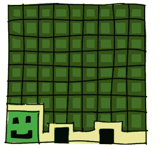

## 绘制星星

现在，通过对我们的 `for` 循环进行一些简单的修改，我们可以创造出更有趣的东西。输入以下内容：

```
>>> t.reset()
>>> for x in range(1, 9):
        t.forward(100)
        t.left(225)
```

这段代码会产生一个八角星：


代码本身与我们用来绘制正方形的代码非常相似，但有几个例外：

-   我们不是用 `range(1, 5)` 循环四次，而是用 `range(1, 9)` 循环八次。
-   我们不是向前移动 50 像素，而是向前移动 100 像素。
-   我们不是转 90 度，而是向左转 225 度。

现在让我们把我们的星星再发展一点。通过使用 175 度角并循环 37 次，我们可以用以下代码制作一个角更多的星星：

```
>>> t.reset()
>>> for x in range(1, 38):
        t.forward(100)
        t.left(175)
```

以下是运行此代码的结果：


在我们玩转星形的同时，这里有一段可以绘制螺旋星形的代码：

```
>>> t.reset()
>>> for x in range(1, 20):
        t.forward(100)
        t.left(95)
```

通过改变转弯的角度并减少循环次数，海龟最终会绘制出风格截然不同的星形：


使用类似的代码，我们可以创建各种形状，从基本的正方形到螺旋星形。如你所见，通过使用 `for` 循环，我们绘制这些形状变得简单多了。如果没有 `for` 循环，我们的代码将需要大量繁琐的输入。

现在，让我们使用 `if` 语句来控制海龟的转向，并绘制另一种星形变体。在这个例子中，我们希望海龟第一次转一个角度，下一次转另一个角度。


```
>>> t.reset()
>>> for x in range(1, 19):
        t.forward(100)
        if x % 2 == 0:
            t.left(175)
        else:
            t.left(225)
```

这里，我们创建了一个将运行 18 次的循环（`range(1, 19)`），并告诉海龟向前移动 100 像素（`t.forward(100)`）。这里的新内容是 `if` 语句（`if x % 2 == 0:`）。该语句使用取模运算符（表达式 `x % 2 == 0` 中的 `%`）来检查变量 `x` 是否包含偶数，这是一种表示“x 模 2”等于 0 的方式。

表达式 `x % 2` 本质上是在问：“将变量 `x` 中的数字分成两个相等的部分后，剩下多少？”例如，如果我们把 5 个球分成两部分，我们会得到两组各 2 个球（总共 4 个球），余数（剩下的数量）将是 1 个球，如下所示。


如果我们把 13 个球分成两部分，我们会得到两组各 6 个球，还剩 1 个球：


当我们检查 `x` 除以 2 后的余数是否等于零时，我们实际上是在问它是否可以被分成两个没有余数的部分。这种方法是检查变量中的数字是否为偶数的好方法，因为偶数总是可以被分成两个相等的部分。

在代码的第五行，我们告诉海龟，如果 `x` 中的数字是偶数（`if x % 2 == 0:`），则向左转 175 度（`t.left(175)`）；否则（`else`），在最后一行，我们告诉它向右转 225 度（`t.left(225)`）。

以下是运行此代码的结果：


## 绘制一辆汽车

海龟能做的远不止绘制星形和简单的几何图形。在下一个例子中，我们将绘制一辆看起来相当原始的汽车。首先，我们绘制车身。在 IDLE 中，选择 **File ▸ New Window**，然后在窗口中输入以下代码。

```
t.reset()
t.color(1,0,0)
t.begin_fill()
t.forward(100)
t.left(90)
t.forward(20)
t.left(90)
t.forward(20)
t.right(90)
t.forward(20)
t.left(90)
t.forward(60)
t.left(90)
t.forward(20)
t.right(90)
t.forward(20)
t.left(90)
t.forward(20)
t.end_fill()
```

接下来，我们绘制第一个轮子。

```
t.color(0,0,0)
t.up()
t.forward(10)
t.down()
t.begin_fill()
t.circle(10)
t.end_fill()
```

最后，我们绘制第二个轮子。

```
t.setheading(0)
t.up()
t.forward(90)
t.right(90)
t.forward(10)
t.setheading(0)
t.begin_fill()
t.down()
t.circle(10)
t.end_fill()
```

选择 **File** ▸ **Save As**。给文件起个名字，比如 *car.py*。选择 **Run** ▸ **Run Module** 来试运行代码。这就是我们的汽车：


你可能已经注意到，这段代码中悄悄引入了一些新的海龟函数：

- `color` 用于改变画笔的颜色。
- `begin_fill` 和 `end_fill` 用于用颜色填充画布上的一个区域。
- `circle` 绘制一个特定大小的圆形。
- `setheading` 将海龟转向特定的方向。

让我们看看如何使用这些函数为我们的绘图添加颜色。

## 为事物着色

`color` 函数接受三个参数。第一个指定红色的量，第二个指定绿色的量，第三个指定蓝色的量。例如，为了得到汽车的亮红色，我们使用了 `color(1,0,0)`，这告诉海龟使用 100% 红色的画笔。

这种红、绿、蓝的颜色配方被称为 *RGB*。这是你的电脑显示器上表示颜色的方式，这些原色的相对混合会产生其他颜色，就像你混合蓝色和红色颜料得到紫色，或者混合黄色和红色得到橙色一样。红色、绿色和蓝色被称为 *原色*，因为你无法混合其他色调来产生它们。


虽然我们在电脑显示器上创建颜色时并不使用颜料（我们使用的是光），但通过想象三罐颜料——一罐红色、一罐绿色和一罐蓝色——可能有助于理解这个 RGB 配方。每罐都是满的，我们给每个满罐的值为 1（或 100%）。然后我们将所有的红色颜料和所有的绿色颜料在一个大桶里混合，产生黄色（即每种颜色各 1，或每种颜色 100%）。

现在让我们回到代码的世界。要用海龟绘制一个黄色的圆形，我们需要使用 100% 的红色和绿色颜料，但不使用蓝色，像这样：

```
>>> t.color(1,1,0)
>>> t.begin_fill()
>>> t.circle(50)
>>> t.end_fill()
```

第一行中的 `1,1,0` 代表 100% 红色、100% 绿色和 0% 蓝色。在下一行，我们告诉海龟用这种 RGB 颜色填充它绘制的形状（`t.begin_fill`），然后我们告诉它绘制一个圆形（`t.circle`）。在最后一行，`end_fill` 告诉海龟用 RGB 颜色填充圆形。

## 绘制填充圆形的函数

为了更容易地尝试不同的颜色，让我们从绘制填充圆形的代码中创建一个函数。

```
>>> def mycircle(red, green, blue):
        t.color(red, green, blue)
        t.begin_fill()
        t.circle(50)
        t.end_fill()
```

我们可以只使用绿色颜料来绘制一个亮绿色的圆形，使用这段代码：

```
>>> mycircle(0, 1, 0)
```

或者我们可以只使用一半的绿色颜料（0.5）来绘制一个深绿色的圆形：

```
>>> mycircle(0, 0.5, 0)
```

要在你的屏幕上尝试 RGB 颜色，可以先尝试绘制一个全红色的圆形，然后是半红色（1 和 0.5），接着是全蓝色，最后是半蓝色，像这样：

```
>>> mycircle(1, 0, 0)
>>> mycircle(0.5, 0, 0)
>>> mycircle(0, 0, 1)
>>> mycircle(0, 0, 0.5)
```

> 注意：如果你的画布开始变得杂乱，可以使用 `t.reset()` 来删除你之前的绘图。还要记住，你可以通过使用 `t.up()` 抬起画笔来移动海龟而不绘制线条（使用 `t.down()` 再次放下画笔）。

红色、绿色和蓝色的各种组合会产生各种各样的颜色，比如金色：

```
>>> mycircle(0.9, 0.75, 0)
```

这是浅粉色：

```
>>> mycircle(1, 0.7, 0.75)
```

这是两种不同色调的橙色：

```
>>> mycircle(1, 0.5, 0)
>>> mycircle(0.9, 0.5, 0.15)
```

自己尝试混合一些颜色吧！

## 创建纯黑色和纯白色

晚上关掉所有灯会发生什么？一切都变黑了。电脑上的颜色也是如此。没有光意味着没有颜色，所以一个所有原色都为 0 的圆形会创建黑色：


```
>>> mycircle(0, 0, 0)
```

结果如下：


如果你使用 100% 的所有三种颜色，情况正好相反。在这种情况下，你会得到白色。输入以下内容来覆盖你的黑色圆形：

```
>>> mycircle(1, 1, 1)
```

## 绘制正方形的函数

你已经看到，我们通过告诉海龟使用 `begin_fill` 开始填充来为形状着色，并且只有在使用 `end_fill` 函数时形状才会被填充。现在我们将尝试更多关于形状和填充的实验。让我们使用本章开头的绘制正方形的函数，并将正方形的大小作为参数传递给它。

## 绘制填充正方形

要绘制一个填充正方形，首先我们需要重置画布、开始填充，然后再次调用正方形函数，使用以下代码：

```
>>> t.reset()
>>> t.begin_fill()
>>> mysquare(50)
```

在结束填充之前，你应该会看到一个空心正方形：

```
>>> t.end_fill()
```

你的正方形应该看起来像这样：


让我们修改这个函数，以便我们可以绘制填充或未填充的正方形。为此，我们需要另一个参数和稍微复杂一点的代码。

```
>>> def mysquare(size, filled):
        if filled == True:
            t.begin_fill()
        for x in range(1, 5):
            t.forward(size)
            t.left(90)
        if filled == True:
            t.end_fill()
```

在第一行，我们修改了函数的定义，使其接受两个参数：`size` 和 `filled`。接下来，我们使用 `if filled == True` 检查 `filled` 的值是否设置为 `True`。如果是，我们调用 `begin_fill`，告诉海龟填充我们绘制的形状。然后我们循环四次（`for x in range(0, 4)`）来绘制矩形的四条边（向前移动并向左转），之后再次使用 `if filled == True` 检查 `filled` 是否为 `True`。如果是，我们再次使用 `t.end_fill` 关闭填充，海龟就会用颜色填充正方形。

现在我们可以用这行代码绘制一个填充正方形：

```
>>> mysquare(50, True)
```

或者我们可以用这行代码创建一个未填充的正方形：

```
>>> mysquare(150, False)
```

在两次调用 `mysquare` 函数后，我们得到下面的图像，看起来有点像一只方形的眼睛。


但停在这里没有意义。你可以绘制各种形状并用颜色填充它们。

## 绘制填充星星

在我们的最后一个例子中，我们将为之前绘制的星星添加一些颜色。原始代码如下所示：

```
for x in range(1, 19):
    t.forward(100)
    if x % 2 == 0:
        t.left(175)
    else:
        t.left(225)
```

现在我们将创建一个 `mystar` 函数。我们将使用 `mysquare` 函数中的 `if` 语句，并添加 `size` 参数。

```
>>> def mystar(size, filled):
        if filled == True:
            t.begin_fill()
        for x in range(1, 19):
            t.forward(size)
            if x % 2 == 0:
                t.left(175)
            else:
                t.left(225)
        if filled == True:
            t.end_fill()
```

在这个函数的前两行，我们检查 `filled` 是否为 `True`，如果是，我们开始填充。在最后两行我们再次检查，如果 `filled` 为 `True`，我们停止填充。此外，与 `mysquare` 函数一样，我们通过参数 `size` 传递星星的大小，并在调用 `t.forward` 时使用该值。

现在让我们将颜色设置为金色（90% 红色，75% 绿色，0% 蓝色），然后再次调用该函数。

```
>>> t.color(0.9, 0.75, 0)
>>> mystar(120, True)
```

海龟将绘制这个填充的星星：


要为星星添加轮廓，将颜色更改为黑色并重新绘制未填充的星星：

```
>>> t.color(0,0,0)
>>> mystar(120, False)
```

现在星星是金色的，带有黑色轮廓，像这样：


## 你学到了什么

在本章中，你学习了如何使用 `turtle` 模块绘制一些基本的几何形状，使用 `for` 循环和 `if` 语句来控制海龟在屏幕上的行为。我们更改了海龟画笔的颜色，并填充了它绘制的形状。我们还在一些函数中重用了绘图代码，以便通过一次函数调用就能轻松绘制不同颜色的形状。


## 编程谜题

在接下来的实验中，你将用海龟绘制自己的形状。一如既往，解决方案可以在 http://python-for-kids.com/ 找到。

### #1：绘制八边形

我们在本章中绘制了星星、正方形和矩形。创建一个函数来绘制像八边形这样的八边形状怎么样？（提示：尝试将海龟旋转 45 度。）


### #2：绘制填充八边形

既然你有了一个绘制八边形的函数，修改它以绘制一个填充的八边形。尝试绘制一个带轮廓的八边形，就像我们绘制星星那样。


### #3：另一个绘制星星的函数

创建一个绘制星星的函数，它将接受两个参数：大小和点数。函数的开头应该像这样：

```
def draw_star(size, points):
```


## #12 使用 Tkinter 实现更好的图形

使用海龟绘图的问题是……海龟……真的……很……慢。即使海龟以最高速度移动，它仍然不是很快。这对海龟来说不是真正的问题，但对计算机图形学来说是个问题。

计算机图形学，尤其是在游戏中，通常需要快速移动。如果你有游戏机或在电脑上玩游戏，想一想你在屏幕上看到的图形。二维（2D）图形是平面的——角色通常只上下或左右移动——就像许多任天堂 DS、PlayStation Portable（PSP）和手机游戏一样。在伪三维（3D）游戏——几乎是 3D 的游戏——中，图像看起来更真实一些，但角色通常只相对于一个平面移动（这也称为*等距图形*）。最后，我们有 3D 游戏，其中屏幕上绘制的图像试图模仿现实。无论游戏使用 2D、伪 3D 还是 3D 图形，它们都有一个共同点：需要在计算机屏幕上非常快速地绘制。


如果你从未尝试过创建自己的动画，试试这个简单的项目：

1.  拿一本空白的便签本，在第一页的底角画点东西（也许是一个火柴人）。
2.  在下一页的底角，画同样的火柴人，但稍微移动它的腿。
3.  在下一页，再次画火柴人，腿再移动一点。
4.  逐渐翻阅每一页，在底角画一个修改过的火柴人。

完成后，快速翻动书页，你应该会看到你的火柴人在移动。这是所有动画使用的基本方法，无论是电视上的卡通还是游戏机或电脑上的游戏。绘制一个图像，然后再次绘制并稍作改变以创造运动的错觉。要使图像看起来在移动，你需要非常快速地显示每个*帧*，或动画的每一部分。

Python 提供了创建图形的不同方式。除了 `turtle` 模块，你还可以使用外部模块（需要单独安装），以及 `tkinter` 模块，它应该已经包含在你的标准 Python 安装中。`tkinter` 可用于创建完整的应用程序，如简单的文字处理器，也可用于简单的绘图。在本章中，我们将探索如何使用 `tkinter` 创建图形。

## 创建可点击按钮

在我们的第一个例子中，我们将使用 `tkinter` 创建一个带有按钮的基本应用程序。输入以下代码：

```
>>> from tkinter import *
>>> tk = Tk()
>>> btn = Button(tk, text="click me")
>>> btn.pack()
```

在第一行，我们导入 `tkinter` 模块的内容。使用 `from module-name import *` 允许我们使用模块的内容而无需使用其名称。相比之下，在前面的例子中使用 `import turtle` 时，我们需要包含模块名称来访问其内容：


```
import turtle
t = turtle.Pen()
```

当我们使用 `import *` 时，我们不需要像在第 4 章和第 11 章中那样调用 `turtle.Pen`。这对 `turtle` 模块来说不太有用，但当你使用包含大量类和函数的模块时，它很有用，因为它减少了你需要输入的内容。

```
from turtle import *
t = Pen()
```

在我们的按钮示例的下一行，我们使用 `tk = Tk()` 创建一个包含 `Tk` 类对象的变量，就像我们为海龟创建 `Pen` 对象一样。`tk` 对象创建一个基本窗口，然后我们可以向其中添加其他东西，如按钮、输入框或用于绘图的画布。这是 `tkinter` 模块提供的主要类——如果不创建 `Tk` 类的对象，你将无法进行任何图形或动画。

在第三行，我们创建一个按钮，使用 `btn = Button` 并将 `tk` 变量作为第一个参数传递，将 "click me" 作为按钮将显示的文本，使用 `(tk, text="click me")`。虽然我们已经将此按钮添加到窗口中，但直到你输入 `btn.pack()` 这一行，它才会显示，该行告诉按钮出现。如果屏幕上还有其他按钮或对象需要显示，它也会将所有内容正确对齐。结果应该类似于这样：


*点击我*按钮并没有太多功能。你可以整天点击它，但除非我们稍微修改一下代码，否则什么也不会发生。（请务必关闭你之前创建的窗口！）

首先，我们创建一个函数来打印一些文本：

```
>>> def hello():
        print('hello there')
```

然后我们修改示例以使用这个新函数：

```
>>> from tkinter import *
>>> tk = Tk()
>>> btn = Button(tk, text="click me", command=hello)
>>> btn.pack()
```

请注意，我们只对之前的代码版本做了轻微的更改：我们添加了参数 `command`，它告诉 Python 在按钮被点击时使用 `hello` 函数。

现在当你点击按钮时，你会在 shell 中看到 "hello there" 被打印出来。每次点击按钮时都会出现这个。在下面的示例中，我点击了按钮五次。


这是我们第一次在代码示例中使用命名参数，所以在继续绘图之前，让我们先讨论一下它们。

## 使用命名参数

命名参数与普通参数类似，不同之处在于，我们不是使用提供给函数的值的特定顺序来确定哪个值属于哪个参数（第一个值是第一个参数，第二个值是第二个参数，第三个值是第三个参数，依此类推），而是显式地命名这些值，因此它们可以以任何顺序出现。

有时函数有很多参数，我们可能并不总是需要为每个参数提供值。命名参数是一种我们可以只为需要赋值的参数提供值的方式。

例如，假设我们有一个名为 `person` 的函数，它接受两个参数：`width` 和 `height`。

```
>>> def person(width, height):
    print('I am %s feet wide, %s feet high' % (width, height))
```

通常，我们可能会这样调用这个函数：

```
>>> person(4, 3)
I am 4 feet wide, 3 feet high
```

使用命名参数，我们可以调用这个函数并为每个值指定参数名：

```
>>> person(height=3, width=4)
I am 4 feet wide, 3 feet high
```

随着我们更多地使用 tkinter 模块，命名参数将变得特别有用。

## 创建用于绘图的画布

按钮是不错的工具，但当我们想在屏幕上绘制东西时，它们并不是特别有用。当需要真正绘制某些东西时，我们需要一个不同的组件：一个画布对象，它是 `Canvas` 类（由 tkinter 模块提供）的一个对象。

创建画布时，我们将画布的宽度和高度（以像素为单位）传递给 Python。否则，代码与按钮代码类似。这里有一个例子：

```
>>> from tkinter import *
>>> tk = Tk()
>>> canvas = Canvas(tk, width=500, height=500)
>>> canvas.pack()
```

与按钮示例一样，当你输入 `tk = Tk()` 时，一个窗口将会出现。在最后一行，我们使用 `canvas.pack()` 来放置画布，这会将画布的大小更改为代码第三行指定的宽度 500 像素和高度 500 像素。

同样与按钮示例一样，`pack` 函数告诉画布在窗口内的正确位置显示自身。如果未调用该函数，任何内容都无法正确显示。


## 绘制线条

要在画布上绘制一条线，我们使用像素坐标。*坐标*确定了表面上像素的位置。在 tkinter 画布上，坐标描述了在画布上从左到右移动多远以及从上到下移动多远来放置像素。

例如，由于我们的画布是 500 像素宽乘以 500 像素高，屏幕右下角的坐标是 (500, 500)。要绘制下图所示的线，我们将使用起始坐标 (0, 0) 和结束坐标 (500, 500)。


我们使用 `create_line` 函数来指定坐标，如下所示：

```
>>> from tkinter import *
>>> tk = Tk()
>>> canvas = Canvas(tk, width=500, height=500)
>>> canvas.pack()
>>> canvas.create_line(0, 0, 500, 500)
1
```

`create_line` 函数返回 1，这是一个标识符——我们稍后会了解更多。如果我们使用 turtle 模块做同样的事情，我们将需要以下代码：

```
>>> import turtle
>>> turtle.setup(width=500, height=500)
>>> t = turtle.Pen()
>>> t.up()
>>> t.goto(-250, 250)
>>> t.down()
>>> t.goto(500, -500)
```

所以 tkinter 代码已经是一个改进。它稍微短一点，也简单一点。

现在让我们看看画布对象上可用的一些函数，我们可以用它们来进行一些更有趣的绘图。

## 绘制方框

使用 turtle 模块，我们通过向前移动、转弯、再次向前移动、再次转弯等方式来绘制方框。最终，我们能够通过改变向前移动的距离来绘制矩形或正方形方框。

tkinter 模块使得绘制正方形或矩形变得容易得多。你只需要知道角的坐标。这里有一个例子（你现在可以关闭其他窗口了）：


```
>>> from tkinter import *
>>> tk = Tk()
>>> canvas = Canvas(tk, width=400, height=400)
>>> canvas.pack()
>>> canvas.create_rectangle(10, 10, 50, 50)
```

在这段代码中，我们使用 tkinter 创建一个宽度为 400 像素、高度为 400 像素的画布，然后在窗口的左上角绘制一个正方形，如下所示：


我们在代码最后一行传递给 `canvas.create_rectangle` 的参数是正方形左上角和右下角的坐标。我们提供这些坐标作为距离画布左侧和距离画布顶部的距离。在这种情况下，前两个坐标（左上角）是距离左侧 10 像素和距离顶部 10 像素（这些是第一个数字：10, 10）。正方形的右下角距离左侧 50 像素，距离顶部 50 像素（第二个数字：50, 50）。

我们将这两组坐标称为 *x1*、*y1* 和 *x2*、*y2*。要绘制一个矩形，我们可以通过增加第二个角距离画布边的距离（增加 *x2* 参数的值）来实现，如下所示：

```
>>> from tkinter import *
>>> tk = Tk()
>>> canvas = Canvas(tk, width=400, height=400)
>>> canvas.pack()
>>> canvas.create_rectangle(10, 10, 300, 50)
```

在这个例子中，矩形的左上角坐标（它在屏幕上的位置）是 (10, 10)，右下角坐标是 (300, 50)。结果是一个与我们原始正方形高度相同（50 像素）但宽度大得多的矩形。


我们也可以通过增加第二个角距离画布顶部的距离（增加 *y2* 参数的值）来绘制矩形，如下所示：

```
>>> from tkinter import *
>>> tk = Tk()
>>> canvas = Canvas(tk, width=400, height=400)
>>> canvas.pack()
>>> canvas.create_rectangle(10, 10, 50, 300)
```

在这个对 `create_rectangle` 函数的调用中，我们基本上是按顺序说：

- 从画布左上角向右移动 10 像素。
- 向下移动 10 像素。这是矩形的起始角。
- 向右绘制矩形到 50 像素处。
- 向下绘制到 300 像素处。

最终结果应该看起来像这样：


## 绘制大量矩形

用不同大小的矩形填充画布怎么样？我们可以通过导入 `random` 模块，然后创建一个函数来实现，该函数使用随机数作为矩形左上角和右下角的坐标。

我们将使用 `random` 模块提供的 `randrange` 函数。当我们给这个函数一个数字时，它会返回一个介于 0 和我们给定的数字之间的随机整数。例如，调用 `randrange(10)` 将返回一个介于 0 和 9 之间的数字，`randrange(100)` 将返回一个介于 0 和 99 之间的数字，依此类推。

以下是我们如何在函数中使用 `randrange`。通过选择 **文件 ▶ 新建窗口** 创建一个新窗口，并输入以下代码：

```
from tkinter import *
import random
tk = Tk()
canvas = Canvas(tk, width=400, height=400)
canvas.pack()
```

def random_rectangle(width, height):
    x1 = random.randrange(width)
    y1 = random.randrange(height)
    x2 = x1 + random.randrange(width)
    y2 = y1 + random.randrange(height)
    canvas.create_rectangle(x1, y1, x2, y2)

我们首先定义函数（`def random_rectangle`），它接受两个参数：`width` 和 `height`。接下来，我们使用 `randrange` 函数为矩形的左上角创建变量，分别将 `width` 和 `height` 作为参数传递给 `x1 = random.randrange(width)` 和 `y1 = random.randrange(height)`。实际上，通过这个函数的第二行，我们是在说：“创建一个名为 `x1` 的变量，并将其值设置为 0 到参数 `width` 值之间的一个随机数。”

接下来的两行代码为矩形的右下角创建变量，考虑左上角坐标（`x1` 或 `y1`），并在这些值上添加一个随机数。函数的第三行实际上是在说：“通过将一个随机数加到我们已经计算出的 `x1` 值上，来创建变量 `x2`。”

最后，通过 `canvas.create_rectangle`，我们使用变量 `x1`、`y1`、`x2` 和 `y2` 在画布上绘制矩形。

要尝试我们的 `random_rectangle` 函数，我们将把画布的宽度和高度传递给它。在你刚刚输入的函数下方添加以下代码：

```
random_rectangle(400, 400)
```

保存你输入的代码（选择 File ▸ Save 并输入文件名，例如 `randomrect.py`），然后选择 Run ▸ Run Module。一旦你看到函数正常工作，就可以通过创建一个循环来多次调用 `random_rectangle`，从而用矩形填满屏幕。让我们尝试一个包含 100 个随机矩形的 `for` 循环。添加以下代码，保存你的工作，然后再次尝试运行它：

```
for x in range(0, 100):
    random_rectangle(400, 400)
```

这段代码会产生一点混乱，但它有点像现代艺术：


## 设置颜色

当然，我们想为图形添加颜色。让我们修改 `random_rectangle` 函数，将矩形的颜色作为额外参数（`fill_color`）传入。在一个新窗口中输入此代码，保存时将文件命名为 `colorrect.py`：

```
from tkinter import *
import random
tk = Tk()
canvas = Canvas(tk, width=400, height=400)
canvas.pack()

def random_rectangle(width, height, fill_color):
    x1 = random.randrange(width)
    y1 = random.randrange(height)
    x2 = random.randrange(x1 + random.randrange(width))
    y2 = random.randrange(y1 + random.randrange(height))
    canvas.create_rectangle(x1, y1, x2, y2, fill=fill_color)
```

`create_rectangle` 函数现在接受一个参数 `fill_color`，它指定了绘制矩形时要使用的颜色。
我们可以像这样将命名颜色传递给函数（使用一个 400 像素宽、400 像素高的画布），以创建一堆不同颜色的矩形。如果你尝试这个例子，你可能想复制粘贴以节省输入时间。为此，选择要复制的文本，按 CTRL-C 复制，单击空白行，然后按 CTRL-V 粘贴。将此代码添加到 *colorrect.py* 中，就在函数下方：


```
random_rectangle(400, 400, 'green')
random_rectangle(400, 400, 'red')
random_rectangle(400, 400, 'blue')
random_rectangle(400, 400, 'orange')
random_rectangle(400, 400, 'yellow')
random_rectangle(400, 400, 'pink')
random_rectangle(400, 400, 'purple')
random_rectangle(400, 400, 'violet')
random_rectangle(400, 400, 'magenta')
random_rectangle(400, 400, 'cyan')
```

许多命名颜色会显示你期望看到的颜色，但其他颜色可能会产生错误消息（取决于你使用的是 Windows、Mac OS X 还是 Linux）。

但是，对于不完全与命名颜色相同的自定义颜色呢？回想一下第 11 章，我们使用红色、绿色和蓝色的百分比来设置海龟画笔的颜色。在 tkinter 中设置颜色组合中每种原色（红、绿、蓝）的使用量稍微复杂一些，但我们会逐步讲解。

在使用 `turtle` 模块时，我们使用 90% 的红色、75% 的绿色和没有蓝色来创建金色。在 tkinter 中，我们可以使用以下代码行创建相同的金色：

```
random_rectangle(400, 400, '#ffd800')
```

值 `ffd800` 前面的井号（#）告诉 Python 我们提供的是一个*十六进制*数。十六进制是计算机编程中常用的一种数字表示方式。它使用 16 进制（0 到 9，然后 A 到 F），而不是使用 10 进制的十进制（0 到 9）。如果你还没有学过数学中的进制，只需知道你可以使用字符串中的*格式占位符* `%x`（参见第 30 页的“在字符串中嵌入值”）将普通的十进制数转换为十六进制。例如，要将十进制数 15 转换为十六进制，你可以这样做：

```
>>> print('%x' % 15)
f
```

为了确保我们的数字至少有两位数，我们可以稍微修改格式占位符，改为这样：

```
>>> print('%02x' % 15)
0f
```

`tkinter` 模块提供了一种获取十六进制颜色值的简便方法。尝试将以下代码添加到 *colorrect.py*（你可以删除其他对 `random_rectangle` 函数的调用）。

```
from tkinter import *
colorchooser.askcolor()
```

这会显示一个颜色选择器：


当你选择一种颜色并单击 **OK** 时，将显示一个元组。这个元组包含另一个包含三个数字和一个字符串的元组：

```
>>> colorchooser.askcolor()
((235.91796875, 86.3359375, 153.59765625), '#eb5699')
```

这三个数字代表红色、绿色和蓝色的量。在 tkinter 中，颜色组合中每种原色的使用量由 0 到 255 之间的数字表示（这与在 `turtle` 模块中使用每种原色的百分比不同）。元组中的字符串包含这三个数字的十六进制版本。

你可以复制粘贴字符串值来使用，或者将元组存储为一个变量，然后使用十六进制值的索引位置。

让我们使用 `random_rectangle` 函数来看看这是如何工作的。

```
>>> c = colorchooser.askcolor()
>>> random_rectangle(400, 400, c[1])
```

结果如下：


## 绘制弧线

弧线是圆或其他曲线周长的一部分，但为了在 tkinter 中绘制它，你需要使用 `create_arc` 函数将其绘制在一个矩形内，代码如下：


```
canvas.create_arc(10, 10, 200, 100, extent=180, style=ARC)
```


如果你已经关闭了所有 tkinter 窗口，或者重启了 IDLE，请确保重新导入 tkinter，然后使用此代码重新创建画布：

```
>>> from tkinter import *
>>> tk = Tk()
>>> canvas = Canvas(tk, width=400, height=400)
>>> canvas.pack()
>>> canvas.create_arc(10, 10, 200, 100, extent=180, style=ARC)
```

此代码将包含弧线的矩形的左上角放置在坐标 (10, 10)，即向右 10 像素，向下 10 像素，其右下角位于坐标 (200, 100)，即向右 200 像素，向下 100 像素。下一个参数 `extent` 用于指定弧线的角度度数。回想一下第 4 章，度数是测量绕圆行进距离的一种方式。以下是两个弧线的示例，我们分别绕圆行进了 45 度和 270 度：


以下代码在页面上绘制了几个不同的弧线，以便你可以看到在 `create_arc` 函数中使用不同度数时会发生什么。

```
>>> from tkinter import *
>>> tk = Tk()
>>> canvas = Canvas(tk, width=400, height=400)
>>> canvas.pack()
>>> canvas.create_arc(10, 10, 200, 80, extent=45, style=ARC)
>>> canvas.create_arc(10, 80, 200, 160, extent=90, style=ARC)
>>> canvas.create_arc(10, 160, 200, 240, extent=135, style=ARC)
>>> canvas.create_arc(10, 240, 200, 320, extent=180, style=ARC)
>>> canvas.create_arc(10, 320, 200, 400, extent=359, style=ARC)
```

我们在最终圆圈中使用359度，而不是360度，因为tkinter将360度视为与0度相同，如果使用360度将不会绘制任何内容。

## 绘制多边形

多边形是指具有三条或更多边的任何形状。有规则形状的多边形，如三角形、正方形、矩形、五边形、六边形等，也有不规则的多边形，其边角不均匀、边数更多且形状奇特。

使用tkinter绘制多边形时，你需要提供多边形每个点的坐标。以下是我们如何绘制一个三角形的方法：

```
from tkinter import *
tk = Tk()
canvas = Canvas(tk, width=400, height=400)
canvas.pack()
canvas.create_polygon(10, 10, 100, 10, 100, 110, fill="", outline="black")
```

这个示例通过从x和y坐标(10, 10)开始，然后移动到(100, 10)，最后结束于(100, 110)来绘制一个三角形。结果如下：


我们可以使用以下代码添加另一个不规则多边形（一个角度或边不均匀的形状）：

```
canvas.create_polygon(200, 10, 240, 30, 120, 100, 140, 120, fill="", outline="black")
```

这段代码从坐标(200, 10)开始，移动到(240, 30)，然后到(120, 100)，最后到(100, 140)。tkinter会自动将线条连接回第一个坐标。运行代码的结果如下：


## 显示文本

除了绘制形状，你还可以使用create_text在画布上书写。此函数仅接受两个坐标（文本的x和y位置），以及一个用于显示文本的命名参数。在以下代码中，我们像之前一样创建画布，然后在坐标(150, 100)处显示一个句子。将此代码保存为*text.py*。

```
from tkinter import *
tk = Tk()
canvas = Canvas(tk, width=400, height=400)
canvas.pack()
canvas.create_text(150, 100, text='There once was a man from Toulouse,')
```

create_text函数还接受其他一些有用的参数，例如文本填充颜色。在以下代码中，我们使用坐标(130, 120)、要显示的文本和红色填充颜色来调用create_text函数。

```
canvas.create_text(130, 120, text='Who rode around on a moose.', fill='red')
```

你还可以将字体（用于显示文本的字体）指定为一个包含字体名称和文本大小的元组。例如，大小为20的Times字体的元组是('Times', 20)。在以下代码中，我们使用大小为15的Times字体、大小为20的Helvetica字体以及大小为22和30的Courier字体来显示文本。


```
python
canvas.create_text(150, 150, text='He said, "It\'s my curse,',
    font=('Times', 15))
canvas.create_text(200, 200, text='But it could be worse,',
    font=('Helvetica', 20))
canvas.create_text(220, 250, text='My cousin rides round',
    font=('Courier', 22))
canvas.create_text(220, 300, text='on a goose."', font=('Courier', 30))
```

以下是使用三种指定字体和五种不同大小的这些函数的结果：


## 显示图像

要使用tkinter在画布上显示图像，首先加载图像，然后在画布对象上使用create_image函数。
你加载的任何图像都必须位于Python可访问的目录中。在此示例中，我们将图像*test.gif*放在C:\目录中，这是C:驱动器的根目录（基础目录），但你也可以将其放在任何位置。


如果你使用的是Mac或Linux系统，可以将图像放在你的主目录中。如果你无法将文件放在C:驱动器上，可以将图像放在桌面上。

> **注意** 使用tkinter，你只能加载GIF图像，即扩展名为.gif的图像文件。你可以显示其他类型的图像，如PNG (.png) 和 JPG (.jpg)，但你需要使用不同的模块，例如Python Imaging Library (http://www.pythonware.com/products/pil/)。

我们可以这样显示*test.gif*图像：

```
python
from tkinter import *
tk = Tk()
canvas = Canvas(tk, width=400, height=400)
canvas.pack()
my_image = PhotoImage(file='c:\test.gif')
canvas.create_image(0, 0, anchor=NW, image=myimage)
```

在前四行中，我们像之前的示例一样设置画布。在第五行，图像被加载到变量my_image中。我们使用目录'c:\test.gif'创建PhotoImage。如果你将图像保存到桌面，你应该使用该目录创建PhotoImage，如下所示：

```
python
my_image = PhotoImage(file='C:\Users\Joe Smith\Desktop\test.gif')
```

一旦图像被加载到变量中，`canvas.create_image(0, 0, anchor=NW, image=myimage)`就会使用`create_image`函数显示它。坐标(0, 0)是图像将被显示的位置，`anchor=NW`告诉函数在绘制时使用图像的左上角（NW，西北）作为起点（否则，默认使用图像的中心作为起点）。最后一个命名参数`image`指向已加载图像的变量。结果如下：


## 创建基本动画

我们已经介绍了如何创建静态绘图——不会移动的图片。那么创建动画呢？

动画不一定是tkinter模块的专长，但它可以处理基础动画。例如，我们可以创建一个填充的三角形，然后使用以下代码使其在屏幕上移动（别忘了，选择**文件 ▸ 新建窗口**，保存你的工作，然后使用**运行 ▸ 运行模块**运行代码）：

```
python
import time
from tkinter import *
tk = Tk()
canvas = Canvas(tk, width=400, height=200)
canvas.pack()
canvas.create_polygon(10, 10, 10, 60, 50, 35)
```

```
for x in range(0, 60):
    canvas.move(1, 5, 0)
    tk.update()
    time.sleep(0.05)
```

当你运行此代码时，三角形将开始在屏幕上移动，直到路径结束：


这是如何工作的？和之前一样，我们在导入tkinter后使用前三行进行基本设置以显示画布。在第四行，我们使用此函数创建三角形：

```
canvas.create_polygon(10, 10, 10, 60, 50, 35)
```

> **注意**

*当你输入这一行时，屏幕上会打印一个数字。这是多边形的标识符。我们可以在后面的示例中使用它来引用该形状。*

接下来，我们创建一个简单的for循环，从0计数到59，以`for x in range(0, 60):`开始。循环内的代码块将三角形在屏幕上移动。`canvas.move`函数通过向其x和y坐标添加值来移动任何绘制的对象。例如，使用`canvas.move(1, 5, 0)`，我们将ID为1（三角形的标识符）的对象向右移动5像素，向下移动0像素。要将其移回，我们可以使用函数调用`canvas.move(1, -5, 0)`。

函数`tk.update()`强制tkinter更新屏幕（重绘它）。如果我们不使用update，tkinter会等到循环结束才移动三角形，这意味着你会看到


它跳到最后的位置，而不是在画布上平滑移动。循环的最后一行`time.sleep(0.05)`告诉Python在继续之前休眠二十分之一秒（0.05秒）。

要使三角形沿屏幕对角线向下移动，我们可以通过调用`move(1, 5, 5)`来修改此代码。要尝试此操作，请关闭画布，并为以下代码创建一个新文件（**文件 ▸ 新建窗口**）：

```
import time
from tkinter import *
tk = Tk()
canvas = Canvas(tk, width=400, height=400)
canvas.pack()
canvas.create_polygon(10, 10, 10, 60, 50, 35)
for x in range(0, 60):
    canvas.move(1, 5, 5)
    tk.update()
    time.sleep(0.05)
```

此代码与原始代码在两个方面有所不同：

- 我们使用`canvas = Canvas(tk, width=400, height=400)`将画布的高度设置为400，而不是200。
- 我们使用`canvas.move(1, 5, 5)`将三角形的x和y坐标各增加5。

一旦你保存代码并运行它，以下是循环结束时三角形的位置：


要将三角形沿对角线移回屏幕的起始位置，请使用 -5, -5（将此代码添加到文件底部）：

```
for x in range(0, 60):
    canvas.move(1, -5, -5)
    tk.update()
    time.sleep(0.05)
```

## 让对象对某事做出反应

我们可以通过使用*事件绑定*来让三角形在有人按键时做出反应。*事件*是程序运行时发生的事情，例如有人移动鼠标、按下按键或关闭窗口。你可以告诉 tkinter 监视这些事件，然后做出响应。

要开始处理事件（让 Python 在事件发生时执行某些操作），我们首先创建一个函数。绑定部分发生在我们告诉 tkinter 某个特定函数被绑定（或关联）到特定事件时；换句话说，它将被 tkinter 自动调用来处理该事件。

例如，要让三角形在按下 ENTER 键时移动，我们可以定义这个函数：

```
def movetriangle(event):
    canvas.move(1, 5, 0)
```

该函数接受一个参数（event），tkinter 使用它向函数发送有关事件的信息。我们现在告诉 tkinter，这个函数应该用于特定事件，使用画布上的 bind_all 函数。完整的代码现在如下所示：

```
from tkinter import *
tk = Tk()
canvas = Canvas(tk, width=400, height=400)
canvas.pack()
canvas.create_polygon(10, 10, 10, 60, 50, 35)
def movetriangle(event):
    canvas.move(1, 5, 0)
canvas.bind_all('<KeyPress-Return>', movetriangle)
```

此函数中的第一个参数描述了我们希望 tkinter 监视的事件。在本例中，它被称为 <KeyPress-Return>，即按下 ENTER 或 RETURN 键。我们告诉 tkinter，每当发生此 KeyPress 事件时，就应调用 movetriangle 函数。运行此代码，用鼠标点击画布，然后尝试按下键盘上的 ENTER 键。


如何根据不同的按键（例如方向键）改变三角形的方向呢？这没问题。我们只需要将 movetriangle 函数更改为以下内容：

```
def movetriangle(event):
    if event.keysym == 'Up':
        canvas.move(1, 0, -3)
    elif event.keysym == 'Down':
        canvas.move(1, 0, 3)
    elif event.keysym == 'Left':
        canvas.move(1, -3, 0)
    else:
        canvas.move(1, 3, 0)
```

传递给 movetriangle 的事件对象包含几个变量。其中一个变量称为 keysym（键符号），它是一个字符串，包含实际按键的值。行 `if event.keysym == 'Up':` 表示如果 keysym 变量包含字符串 'Up'，我们应该使用参数 (1, 0, -3) 调用 canvas.move，就像我们在下一行所做的那样。如果 keysym 包含 'Down'，如 `elif event.keysym == 'Down':` 所示，我们使用参数 (1, 0, 3) 调用它，依此类推。

请记住，第一个参数是画布上绘制形状的标识号，第二个是添加到 x（水平）坐标的值，第三个是添加到 y（垂直）坐标的值。

然后我们告诉 tkinter，movetriangle 函数应该用于处理来自四个不同按键（上、下、左、右）的事件。以下显示了此时代码的样子。当你输入此代码时，通过选择 **File ▸ New Window** 创建一个新的 shell 窗口会再次容易得多。在运行代码之前，用有意义的文件名保存它，例如 *movingtriangle.py*。

```
from tkinter import *
tk = Tk()
canvas = Canvas(tk, width=400, height=400)
canvas.pack()
canvas.create_polygon(10, 10, 10, 60, 50, 35)
def movetriangle(event):
    if event.keysym == 'Up':
        canvas.move(1, 0, -3)
    elif event.keysym == 'Down':
        canvas.move(1, 0, 3)
    elif event.keysym == 'Left':
        canvas.move(1, -3, 0)
    else:
        canvas.move(1, 3, 0)
canvas.bind_all('<KeyPress-Up>', movetriangle)
canvas.bind_all('<KeyPress-Down>', movetriangle)
canvas.bind_all('<KeyPress-Left>', movetriangle)
canvas.bind_all('<KeyPress-Right>', movetriangle)
```

在 movetriangle 函数的第一行，我们在 ❶ 处检查 keysym 变量是否包含 'Up'。如果是，我们使用参数 1, 0, -3 在 ❷ 处调用 move 函数将三角形向上移动。第一个参数是三角形的标识符，第二个是向右移动的量（我们不想水平移动，所以值为 0），第三个是向下移动的量（-3 像素）。

然后我们在 ❸ 处检查 keysym 是否包含 'Down'，如果是，我们在 ❹ 处将三角形向下移动（3 像素）。最后的检查是在 ❺ 处值是否为 'Left'，如果是，我们在 ❻ 处将三角形向左移动（-3 像素）。如果没有任何值匹配，最后的 else 在 ❼ 处在 ❽ 处将三角形向右移动。

现在三角形应该向按下方向键的方向移动。

## 使用标识符的更多方法

每当我们使用画布的 create_ 函数（如 create_polygon 或 create_rectangle）时，都会返回一个标识符。这个标识号可以与其他画布函数一起使用，就像我们之前使用 move 函数一样：

```
>>> from tkinter import *
>>> tk = Tk()
>>> canvas = Canvas(tk, width=400, height=400)
>>> canvas.pack()
>>> canvas.create_polygon(10, 10, 10, 60, 50, 35)
1
>>> canvas.move(1, 5, 0)
```

这个例子的问题在于 create_polygon 并不总是返回 1。例如，如果你已经创建了其他形状，它可能返回 2、3，甚至 100（取决于已创建形状的数量）。如果我们更改代码以将返回的值存储为一个变量，然后使用该变量（而不是仅仅引用数字 1），那么无论返回什么数字，代码都能工作：

```
>>> mytriangle = canvas.create_polygon(10, 10, 10, 60, 50, 35)
>>> canvas.move(mytriangle, 5, 0)
```

move 函数允许我们使用对象的标识符在屏幕上移动对象。但还有其他画布函数也可以改变我们绘制的内容。例如，画布的 itemconfig 函数可用于更改形状的一些参数，例如其填充和轮廓颜色。

假设我们创建一个红色三角形：

```
>>> from tkinter import *
>>> tk = Tk()
>>> canvas = Canvas(tk, width=400, height=400)
>>> canvas.pack()
>>> mytriangle = canvas.create_polygon(10, 10, 10, 60, 50, 35,
fill='red')
```

我们可以使用 itemconfig 将三角形更改为另一种颜色，并使用标识符作为第一个参数。以下代码表示：“将变量 mytriangle 中数字标识的对象的填充颜色更改为蓝色。”

```
>>> canvas.itemconfig(mytriangle, fill='blue')
```

我们也可以给三角形一个不同颜色的轮廓，同样使用标识符作为第一个参数：

```
>>> canvas.itemconfig(mytriangle, outline='red')
```

稍后，我们将学习如何对绘图进行其他更改，例如隐藏它并使其再次可见。当你在下一章开始编写游戏时，你会发现能够在绘图显示在屏幕上后更改它非常有用。


## 你学到了什么

在本章中，你使用了 tkinter 模块在画布上绘制简单的几何形状、显示图像并执行基本动画。你学习了如何使用事件绑定使绘图对某人按键做出反应，这在我们开始编程游戏时将非常有用。你了解了 tkinter 中的 create 函数如何返回一个标识号，该标识号可用于在绘制形状后修改它们，例如在屏幕上移动它们或更改它们的颜色。

## 编程谜题

尝试以下操作以玩转 tkinter 模块和基本动画。访问 http://python-for-kids.com/ 获取解决方案。

### #1：用三角形填满屏幕

使用 tkinter 创建一个程序，用三角形填满屏幕。然后更改代码，改为用不同颜色（填充）的三角形填满屏幕。

### #2：移动的三角形

修改移动三角形的代码（第 183 页的“创建基本动画”），使其在屏幕上向右移动，然后向下，再向左，最后回到起始位置。

### #3：移动的照片

尝试使用 tkinter 在画布上显示你自己的照片。确保它是 GIF 图像！你能让它在屏幕上移动吗？

## 第二部分
弹球！

## 13 开始你的第一个游戏：弹球！

到目前为止，我们已经介绍了计算机编程的基础知识。你已经学会了如何使用变量存储信息，如何使用 `if` 语句进行条件判断，以及如何使用 `for` 循环重复执行代码。你知道如何创建函数来重用代码，以及如何使用类和对象将代码分解成更小、更易于理解的部分。你已经学会了如何使用 `turtle` 和 `tkinter` 模块在屏幕上绘制图形。现在，是时候运用这些知识来创建你的第一个游戏了。

## 击打弹跳球

我们将开发一个包含弹跳球和挡板的游戏。球会在屏幕上飞来飞去，玩家需要用挡板将球弹回去。如果球撞到屏幕底部，游戏就结束了。以下是完成后的游戏预览：


我们的游戏看起来可能很简单，但代码会比我们之前写的稍微复杂一些，因为它需要处理很多事情。例如，它需要让挡板和球动起来，并检测球何时撞到挡板或墙壁。

在本章中，我们将通过添加游戏画布和弹跳球来开始创建游戏。在下一章中，我们将通过添加挡板来完成游戏。

## 创建游戏画布

要创建你的游戏，首先在 Python Shell 中打开一个新文件（选择 **File ▸ New Window**）。然后导入 `tkinter` 并创建一个用于绘制的画布：

```
from tkinter import *
import random
import time

tk = Tk()
tk.title("Game")
tk.resizable(0, 0)
tk.wm_attributes("-topmost", 1)
canvas = Canvas(tk, width=500, height=400, bd=0, highlightthickness=0)
canvas.pack()
tk.update()
```

这与之前的示例略有不同。首先，我们使用 `import random` 和 `import time` 导入 `time` 和 `random` 模块，以便稍后在代码中使用。

通过 `tk.title("Game")`，我们使用 `tk = Tk()` 创建的 `tk` 对象的 `title` 函数为窗口设置标题。然后我们使用 `resizable` 使窗口大小固定。参数 `0, 0` 表示“窗口的大小在水平和垂直方向上都不能改变”。接下来，我们调用 `wm_attributes` 告诉 `tkinter` 将包含我们画布的窗口置于所有其他窗口之前（`"-topmost"`）。

请注意，当我们使用 `canvas =` 创建画布对象时，我们传递的命名参数比之前的示例多。例如，`bd=0` 和 `highlightthickness=0` 都确保画布外部没有边框，这使它在我们的游戏屏幕上看起来更好。

`canvas.pack()` 这一行告诉画布根据前一行给出的宽度和高度参数调整自身大小。最后，`tk.update()` 告诉 `tkinter` 为游戏中的动画初始化自身。没有这最后一行，任何东西都无法按预期工作。


确保在编写代码时随时保存。第一次保存时，请使用有意义的文件名，例如 `paddleball.py`。

## 创建球类

现在我们将创建球的类。我们将从球在画布上绘制自身所需的代码开始。以下是我们需要做的：

-   创建一个名为 `Ball` 的类，它接受画布和我们要绘制的球的颜色作为参数。
-   将画布保存为一个对象变量，因为我们将在这个画布上绘制我们的球。
-   使用颜色参数的值作为填充颜色，在画布上绘制一个填充圆。
-   保存 `tkinter` 在绘制圆（椭圆）时返回的标识符，因为我们将使用它来在屏幕上移动球。
-   将椭圆移动到画布的中间。

这段代码应添加在文件的前两行之后（在 `import time` 之后）：

```
from tkinter import *
import random
import time

class Ball:
    def __init__(self, canvas, color):
        self.canvas = canvas
        self.id = canvas.create_oval(10, 10, 25, 25, fill=color)
        self.canvas.move(self.id, 245, 100)

    def draw(self):
        pass
```

首先，我们在 ❶ 处将我们的类命名为 `Ball`。然后我们创建一个初始化函数（如第 8 章所述），它在 ❷ 处接受 `canvas` 和 `color` 参数。在 ❸ 处，我们将对象变量 `canvas` 设置为参数 `canvas` 的值。
在 ❹ 处，我们使用五个参数调用 `create_oval` 函数：左上角的 x 和 y 坐标（10 和 10），右下角的 x 和 y 坐标（25 和 25），最后是椭圆的填充颜色。

`create_oval` 函数返回所绘制形状的标识符，我们将其存储在对象变量 `id` 中。在 ❻ 处，我们将椭圆移动到画布的中间（位置 245, 100），画布知道要移动什么，因为我们使用存储的形状标识符（对象变量 `id`）来标识它。


在 `Ball` 类的最后两行，我们使用 `def draw(self)` 创建了 `draw` 函数，函数体就是 `pass` 关键字。目前它什么也不做。我们很快会向这个函数添加更多内容。

现在我们已经创建了 `Ball` 类，我们需要创建这个类的一个对象（记住，类描述了它能做什么，而对象是实际执行它的那个东西）。在程序底部添加以下代码来创建一个红色的球对象：

```
ball = Ball(canvas, 'red')
```

如果你现在使用 **Run ▶ Run Module** 运行这个程序，画布会闪现一下然后消失。为了防止窗口立即关闭，我们需要添加一个动画循环，这被称为我们游戏的*主循环*。

主循环是程序的核心部分，通常控制着它的大部分行为。我们的主循环目前只是告诉 `tkinter` 重绘屏幕。这个循环会永远运行下去（或者至少直到我们关闭窗口），不断地告诉 `tkinter` 重绘屏幕，然后休眠百分之一秒。我们将把这段代码添加到程序的末尾：

```
ball = Ball(canvas, 'red')

while 1:
    tk.update_idletasks()
    tk.update()
    time.sleep(0.01)
```

现在如果你运行代码，球应该会出现在画布的中心附近：


## 添加一些动作

既然我们已经设置好了 `Ball` 类，是时候让球动起来了。我们将让它移动、弹跳并改变方向。


## 让球移动

要移动球，请按如下方式修改 `draw` 函数：

```
class Ball:
    def __init__(self, canvas, color):
        self.canvas = canvas
        self.id = canvas.create_oval(10, 10, 25, 25, fill=color)
        self.canvas.move(self.id, 245, 100)

    def draw(self):
        self.canvas.move(self.id, 0, -1)
```

由于 `__init__` 将 `canvas` 参数保存为对象变量 `canvas`，我们使用 `self.canvas` 这个变量，并在画布上调用 `move` 函数。

我们向 `move` 传递三个参数：椭圆的 `id`，以及数字 `0` 和 `-1`。`0` 表示不水平移动，`-1` 表示在屏幕上向上移动 1 像素。

我们做这个小改动是因为边做边尝试是个好主意。想象一下，如果我们一次性写完游戏的所有代码，然后发现它不能工作。我们该从哪里开始查找原因呢？

另一个改动是在程序底部的主循环中。在 `while` 循环的代码块中（那就是我们的主循环！），我们添加了对球对象 `draw` 函数的调用，如下所示：

```
while 1:
    ball.draw()
    tk.update_idletasks()
    tk.update()
    time.sleep(0.01)
```

如果你现在运行这段代码，球应该会向上移动并消失，因为代码强制 `tkinter` 快速重绘屏幕——命令 `update_idletasks` 和 `update` 告诉 `tkinter` 赶紧绘制画布上的内容。

`time.sleep` 命令是对 `time` 模块的 `sleep` 函数的调用，它告诉 Python 休眠百分之一秒（0.01）。这是为了确保我们的程序不会运行得太快，以至于球在你看到它之前就消失了。

所以这个循环基本上是在说：移动球一点，用新位置重绘屏幕，休眠片刻，然后重新开始。

> 当你关闭游戏窗口时，可能会在 Shell 中看到错误信息。这是因为当你关闭窗口时，代码正在跳出 `while` 循环，Python 对此提出了抱怨。

你的游戏现在应该看起来像这样：

```
from tkinter import *
import random
import time

class Ball:
    def __init__(self, canvas, color):
        self.canvas = canvas
        self.id = canvas.create_oval(10, 10, 25, 25, fill=color)
        self.canvas.move(self.id, 245, 100)
```

def draw(self):
    self.canvas.move(self.id, 0, -1)

tk = Tk()
tk.title("Game")
tk.resizable(0, 0)
tk.wm_attributes("-topmost", 1)
canvas = Canvas(tk, width=500, height=400, bd=0, highlightthickness=0)
canvas.pack()
tk.update()

ball = Ball(canvas, 'red')

while 1:
    ball.draw()
    tk.update_idletasks()
    tk.update()
    time.sleep(0.01)

## 让球弹跳

一个会从屏幕顶部消失的球对于游戏来说没什么用，所以让我们让它弹跳起来。首先，我们在 `Ball` 类的初始化函数中保存一些额外的对象变量，像这样：

```
def __init__(self, canvas, color):
    self.canvas = canvas
    self.id = canvas.create_oval(10, 10, 25, 25, fill=color)
    self.canvas.move(self.id, 245, 100)
    self.x = 0
    self.y = -1
    self.canvas_height = self.canvas.winfo_height()
```

我们向程序中添加了三行新代码。通过 `self.x = 0`，我们将对象变量 `x` 设置为 0；然后通过 `self.y = -1`，我们将变量 `y` 设置为 -1。最后，我们通过调用画布函数 `winfo_height` 来设置对象变量 `canvas_height`。这个函数返回画布的当前高度。

接下来，我们再次修改 `draw` 函数：

```
def draw(self):
    self.canvas.move(self.id, self.x, self.y)
    pos = self.canvas.coords(self.id)
    if pos[1] <= 0:
        self.y = 1
    if pos[3] >= self.canvas_height:
        self.y = -1
```

在 ❶ 处，我们通过传递对象变量 `x` 和 `y` 来改变对画布 `move` 函数的调用。接下来，我们在 ❷ 处创建一个名为 `pos` 的变量，通过调用画布函数 `coords`。这个函数返回画布上任何绘制对象的当前 x 和 y 坐标，前提是你知道它的标识号。在这个例子中，我们向 `coords` 传递了包含椭圆标识符的对象变量 `id`。

`coords` 函数以四个数字的列表形式返回坐标。如果我们打印调用这个函数的结果，会看到类似这样的内容：

```
print(self.canvas.coords(self.id))
[255.0, 29.0, 270.0, 44.0]
```

列表中的前两个数字（255.0 和 29.0）包含椭圆的左上角坐标（x1 和 y1）；后两个数字（270.0 和 44.0）是右下角的 x2 和 y2 坐标。我们将在接下来的几行代码中使用这些值。

在 ❸ 处，我们检查 y1 坐标（那是球的顶部！）是否小于或等于 0。如果是，我们将 `y` 对象变量设置为 1。实际上，这意味着如果你碰到了屏幕顶部，就停止从垂直位置减去一，从而停止向上移动。

在 ❹ 处，我们检查 y2 坐标（那是球的底部！）是否大于或等于变量 `canvas_height`。如果是，我们将 `y` 对象变量重新设置为 -1。

现在运行这段代码，球应该会在画布上上下弹跳，直到你关闭窗口。


## 改变球的起始方向

让球缓慢地上下弹跳算不上什么游戏，所以让我们通过改变球的起始方向——游戏开始时它飞出的角度——来增强一点效果。在 `__init__` 函数中，将这几行：


```
self.x = 0
self.y = -1
```

改为以下内容（确保每行开头有正确的空格数——八个）：

```
starts = [-3, -2, -1, 1, 2, 3]
random.shuffle(starts)
self.x = starts[0]
self.y = -3
```

在 ❶ 处，我们创建了一个包含六个数字的列表变量 `starts`，然后在 ❷ 处通过调用 `random.shuffle` 打乱列表。在 ❸ 处，我们将 `x` 的值设置为列表中的第一项，这样 `x` 可以是列表中的任何数字，从 -3 到 3。
如果我们在 ❹ 处将 `y` 改为 -3（以加快球的速度），我们需要再添加一些内容以确保球不会从屏幕侧面消失。在 `__init__` 函数末尾添加以下行，将画布宽度保存到一个新的对象变量 `canvas_width`：

```
self.canvas_width = self.canvas.winfo_width()
```

我们将在 `draw` 函数中使用这个新的对象变量来检查球是否碰到了画布的顶部或底部：

```
if pos[0] <= 0:
    self.x = 3
if pos[2] >= self.canvas_width:
    self.x = -3
```

由于我们将 `x` 设置为 3 和 -3，我们对 `y` 也做同样的处理，这样球在所有方向上的移动速度就相同了。你的 `draw` 函数现在应该看起来像这样：

```
def draw(self):
    self.canvas.move(self.id, self.x, self.y)
    pos = self.canvas.coords(self.id)
    if pos[1] <= 0:
        self.y = 3
    if pos[3] >= self.canvas_height:
        self.y = -3
    if pos[0] <= 0:
        self.x = 3
    if pos[2] >= self.canvas_width:
        self.x = -3
```

保存并运行代码，球应该会在屏幕上弹跳而不会消失。以下是完整程序现在应该呈现的样子：

```
from tkinter import *
import random
import time

class Ball:
    def __init__(self, canvas, color):
        self.canvas = canvas
        self.id = canvas.create_oval(10, 10, 25, 25, fill=color)
        self.canvas.move(self.id, 245, 100)
        starts = [-3, -2, -1, 1, 2, 3]
        random.shuffle(starts)
        self.x = starts[0]
        self.y = -3
        self.canvas_height = self.canvas.winfo_height()
        self.canvas_width = self.canvas.winfo_width()

    def draw(self):
        self.canvas.move(self.id, self.x, self.y)
        pos = self.canvas.coords(self.id)
        if pos[1] <= 0:
            self.y = 3
        if pos[3] >= self.canvas_height:
            self.y = -3
        if pos[0] <= 0:
            self.x = 3
        if pos[2] >= self.canvas_width:
            self.x = -3
```

```
tk = Tk()
tk.title("Game")
tk.resizable(0, 0)
tk.wm_attributes("-topmost", 1)
canvas = Canvas(tk, width=500, height=400, bd=0, highlightthickness=0)
canvas.pack()
tk.update()

ball = Ball(canvas, 'red')

while 1:
    ball.draw()
    tk.update_idletasks()
    tk.update()
    time.sleep(0.01)
```

## 你学到了什么

在本章中，我们开始使用 tkinter 模块创建我们的第一个游戏。我们为球创建了一个类，并使其动画化，以便它在屏幕上移动。我们使用坐标来检查球何时碰到画布的边缘，以便让它弹跳。我们还使用了 random 模块中的 shuffle 函数，这样我们的球就不会总是以完全相同的方向开始移动。在下一章中，我们将通过添加挡板来完成这个游戏。


# 14 完成你的第一个游戏：弹球！

在上一章中，我们开始创建我们的第一个游戏：弹球！我们创建了一个画布，并在游戏代码中添加了一个弹跳的球。但我们的球会在屏幕上永远弹跳（或者至少直到你关闭电脑），这算不上什么游戏。现在我们将添加一个供玩家使用的挡板。我们还将为游戏添加一些随机元素，这将使其更具挑战性和趣味性。

## 添加挡板

当没有什么东西可以击打时，一个弹跳的球没什么乐趣。是时候创建一个挡板了！

首先，在 `Ball` 类之后添加以下代码来创建一个挡板（你将把它放在 `Ball` 的 `draw` 函数下方的新行中）：

```
class Paddle:
    def __init__(self, canvas, color):
        self.canvas = canvas
        self.id = canvas.create_rectangle(0, 0, 100, 10, fill=color)
        self.canvas.move(self.id, 200, 300)

    def draw(self):
        pass
```

这段添加的代码与 `Ball` 类的代码几乎完全相同，只是我们调用的是 `create_rectangle`（而不是 `create_oval`），并且我们将矩形移动到位置 200, 300（横向 200 像素，纵向 300 像素）。

接下来，在你的代码清单底部，创建一个 `Paddle` 类的对象，然后修改主循环以调用挡板的 `draw` 函数，如下所示：

```
paddle = Paddle(canvas, 'blue')
ball = Ball(canvas, 'red')

while 1:
    ball.draw()
    paddle.draw()
```

## 让挡板移动起来

为了让挡板左右移动，我们将使用事件绑定，将左右方向键绑定到挡板类中的新函数。当玩家按下左方向键时，x变量将被设置为-2（向左移动）。按下右方向键则将x变量设置为2（向右移动）。

第一步是在挡板类的`__init__`函数中添加x对象变量，以及一个画布宽度变量，就像我们之前在球类中所做的那样：

```python
def __init__(self, canvas, color):
    self.canvas = canvas
    self.id = canvas.create_rectangle(0, 0, 100, 10, fill=color)
    self.canvas.move(self.id, 200, 300)
    self.x = 0
    self.canvas_width = self.canvas.winfo_width()
```

现在我们需要用于改变方向的函数，包括向左（`turn_left`）和向右（`turn_right`）。我们将在`draw`函数之后添加这些函数：

```python
def turn_left(self, evt):
    self.x = -2

def turn_right(self, evt):
    self.x = 2
```

我们可以在类的`__init`函数中用以下两行代码将这些函数绑定到正确的按键上。我们在第187页的“让对象对某事做出反应”中使用了绑定，以便在按键时让Python调用一个函数。在这个例子中，我们使用事件名称`'<KeyPress-Left>'`将挡板类的`turn_left`函数绑定到左方向键。然后，我们使用事件名称`'<KeyPress-Right>'`将`turn_right`函数绑定到右方向键。我们的`__init__`函数现在看起来像这样：

```python
def __init__(self, canvas, color):
    self.canvas = canvas
    self.id = canvas.create_rectangle(0, 0, 100, 10, fill=color)
    self.canvas.move(self.id, 200, 300)
    self.x = 0
    self.canvas_width = self.canvas.winfo_width()
    self.canvas.bind_all('<KeyPress-Left>', self.turn_left)
    self.canvas.bind_all('<KeyPress-Right>', self.turn_right)
```

挡板类的`draw`函数与球类的类似：

```python
def draw(self):
    self.canvas.move(self.id, self.x, 0)
    pos = self.canvas.coords(self.id)
    if pos[0] <= 0:
        self.x = 0
    elif pos[2] >= self.canvas_width:
        self.x = 0
```

我们使用画布的`move`函数，通过`self.canvas.move(self.id, self.x, 0)`将挡板沿x变量的方向移动。然后我们获取挡板的坐标，使用`pos`中的值来判断它是否碰到了屏幕的左侧或右侧。

与球的反弹不同，挡板应该停止移动。因此，当左侧x坐标（`pos[0]`）小于或等于0（`<= 0`）时，我们使用`self.x = 0`将x变量设置为0。同样，当右侧x坐标（`pos[2]`）大于或等于画布宽度（`>= self.canvas_width`）时，我们也使用`self.x = 0`将x变量设置为0。

> **注意：** 如果你现在运行程序，你需要先点击画布，游戏才会识别左右方向键的操作。点击画布使其获得焦点，这意味着它知道当有人按下键盘上的键时该负责处理。

## 找出球何时击中挡板

在我们代码的这个阶段，球不会击中挡板；事实上，球会直接穿过挡板。球需要知道它何时击中了挡板，就像球需要知道它何时击中了墙壁一样。

我们可以通过在`draw`函数（那里有检查墙壁的代码）中添加代码来解决这个问题，但更好的做法是将这类代码移到新函数中，将事情分解成更小的块。如果我们在一个地方（例如，在一个函数内部）放置太多代码，会使代码更难理解。让我们进行必要的更改。

首先，我们更改球的`__init__`函数，以便可以将挡板对象作为参数传入：

```python
class Ball:
    def __init__(self, canvas, paddle, color):
        self.canvas = canvas
        self.paddle = paddle
        self.id = canvas.create_oval(10, 10, 25, 25, fill=color)
        self.canvas.move(self.id, 245, 100)
        starts = [-3, -2, -1, 1, 2, 3]
        random.shuffle(starts)
        self.x = starts[0]
        self.y = -3
        self.canvas_height = self.canvas.winfo_height()
        self.canvas_width = self.canvas.winfo_width()
```

注意在❶处，我们更改了`__init__`的参数以包含挡板。然后在❷处，我们将挡板参数赋值给对象变量`paddle`。

保存了挡板对象后，我们需要更改创建球对象的代码。这个更改位于程序的底部，就在主循环之前：

```python
paddle = Paddle(canvas, 'blue')
ball = Ball(canvas, paddle, 'red')

while 1:
    ball.draw()
    paddle.draw()
    tk.update_idletasks()
    tk.update()
    time.sleep(0.01)
```

检查球是否击中挡板的代码比检查墙壁的代码稍微复杂一些。我们将这个函数命名为`hit_paddle`，并将其添加到球类的`draw`函数中，在那里我们检查球是否击中了屏幕底部：

```python
def draw(self):
    self.canvas.move(self.id, self.x, self.y)
    pos = self.canvas.coords(self.id)
    if pos[1] <= 0:
        self.y = 3
    if pos[3] >= self.canvas_height:
        self.y = -3
    if self.hit_paddle(pos) == True:
        self.y = -3
    if pos[0] <= 0:
        self.x = 3
    if pos[2] >= self.canvas_width:
        self.x = -3
```

正如你在我们添加的新代码中看到的，如果`hit_paddle`返回`True`，我们通过使用`self.y = -3`将y对象变量设置为-3来改变球的方向。但现在不要尝试运行游戏——我们还没有创建`hit_paddle`函数。我们现在就来创建它。

在`draw`函数之前添加`hit_paddle`函数。

```python
def hit_paddle(self, pos):
    paddle_pos = self.canvas.coords(self.paddle.id)
    if pos[2] >= paddle_pos[0] and pos[0] <= paddle_pos[2]:
        if pos[3] >= paddle_pos[1] and pos[3] <= paddle_pos[3]:
            return True
    return False
```

首先，我们在❶处定义带有参数`pos`的函数。这一行包含球的当前坐标。然后，在❷处，我们获取挡板的坐标并将其存储在变量`paddle_pos`中。

在❸处，我们有if-then语句的第一部分，我们说：“如果球的右侧大于挡板的左侧，并且球的左侧小于挡板的右侧……”这里，`pos[2]`包含球右侧的x坐标，`pos[0]`包含其左侧的x坐标。变量`paddle_pos[0]`包含挡板左侧的x坐标，`paddle_pos[2]`包含其右侧的x坐标。下图显示了当球即将击中挡板时这些坐标的外观。

球正向挡板落下，但在这种情况下，你看到球的右侧（`pos[2]`）尚未越过挡板的左侧（即`paddle_pos[0]`）。

在❹处，我们检查球的底部（`pos[3]`）是否在挡板的顶部（`paddle_pos[1]`）和底部（`paddle_pos[3]`）之间。在下一张图中，你可以看到球的底部（`pos[3]`）尚未击中挡板的顶部（`paddle_pos[1]`）。

因此，根据球的当前位置，`hit_paddle`函数将返回`false`。

> **注意：** 为什么我们需要检查球的底部是否在挡板的顶部和底部之间？为什么不直接检查球的底部是否击中了挡板的顶部？因为每次我们在画布上移动球时，都是以3像素的跳跃移动。如果我们只检查球是否到达了挡板的顶部（`pos[1]`），我们可能已经跳过了那个位置。在这种情况下，球将继续移动，并穿过挡板而不停止。

## 添加随机元素

现在是时候将我们的程序变成一个游戏，而不仅仅是一个弹跳的球和一个挡板。游戏需要一个随机元素——某种让玩家输掉的方式。在我们当前的游戏中，球会永远弹跳，所以没有什么可输的。

我们将通过添加代码来完成我们的游戏，代码规定如果球击中画布底部（换句话说，一旦它击中地面），游戏就结束。

首先，我们在Ball类的`__init__`函数底部添加`hit_bottom`对象变量：

```
self.canvas_height = self.canvas.winfo_height()
self.canvas_width = self.canvas.winfo_width()
self.hit_bottom = False
```

然后我们修改程序底部的主循环，如下所示：

```
while 1:
    if ball.hit_bottom == False:
        ball.draw()
        paddle.draw()
    tk.update_idletasks()
    tk.update()
    time.sleep(0.01)
```

现在循环会持续检查`hit_bottom`，以确认球是否确实碰到了屏幕底部。正如我们在`if`语句中所见，只有当球没有触底时，代码才会继续移动球和挡板。当球和挡板停止移动时，游戏结束。（我们不再对它们进行动画处理。）

最后的修改是针对Ball类的`draw`函数：

```
def draw(self):
    self.canvas.move(self.id, self.x, self.y)
    pos = self.canvas.coords(self.id)
    if pos[1] <= 0:
        self.y = 3
    if pos[3] >= self.canvas_height:
        self.hit_bottom = True
    if self.hit_paddle(pos) == True:
        self.y = -3
    if pos[0] <= 0:
        self.x = 3
    if pos[2] >= self.canvas_width:
        self.x = -3
```

我们修改了`if`语句，以检测球是否碰到了屏幕底部（即其坐标是否大于或等于`canvas_height`）。如果是，我们在下一行将`hit_bottom`设置为`True`，而不是改变`y`变量的值，因为一旦球触底，就没有必要让它反弹了。

现在当你运行游戏并错过用挡板击球时，屏幕上所有的运动都应该停止，并且一旦球触碰到画布底部，游戏就会结束：


你的程序现在应该看起来像下面的代码。如果你的游戏运行有问题，请对照这段代码检查你输入的内容。

```
python
from tkinter import *
import random
import time

class Ball:
    def __init__(self, canvas, paddle, color):
        self.canvas = canvas
        self.paddle = paddle
        self.id = canvas.create_oval(10, 10, 25, 25, fill=color)
        self.canvas.move(self.id, 245, 100)
        starts = [-3, -2, -1, 1, 2, 3]
        random.shuffle(starts)
        self.x = starts[0]
        self.y = -3
        self.canvas_height = self.canvas.winfo_height()
        self.canvas_width = self.canvas.winfo_width()
        self.hit_bottom = False

    def hit_paddle(self, pos):
        paddle_pos = self.canvas.coords(self.paddle.id)
        if pos[2] >= paddle_pos[0] and pos[0] <= paddle_pos[2]:
            if pos[3] >= paddle_pos[1] and pos[3] <= paddle_pos[3]:
                return True
        return False

    def draw(self):
        self.canvas.move(self.id, self.x, self.y)
        pos = self.canvas.coords(self.id)
        if pos[1] <= 0:
            self.y = 3
        if pos[3] >= self.canvas_height:
            self.hit_bottom = True
        if self.hit_paddle(pos) == True:
            self.y = -3
        if pos[0] <= 0:
            self.x = 3
        if pos[2] >= self.canvas_width:
            self.x = -3

class Paddle:
    def __init__(self, canvas, color):
        self.canvas = canvas
        self.id = canvas.create_rectangle(0, 0, 100, 10, fill=color)
        self.canvas.move(self.id, 200, 300)
        self.x = 0
        self.canvas_width = self.canvas.winfo_width()
        self.canvas.bind_all('<KeyPress-Left>', self.turn_left)
        self.canvas.bind_all('<KeyPress-Right>', self.turn_right)

    def draw(self):
        self.canvas.move(self.id, self.x, 0)
        pos = self.canvas.coords(self.id)
        if pos[0] <= 0:
            self.x = 0
        elif pos[2] >= self.canvas_width:
            self.x = 0

    def turn_left(self, evt):
        self.x = -2

    def turn_right(self, evt):
        self.x = 2

tk = Tk()
tk.title("Game")
tk.resizable(0, 0)
tk.wm_attributes("-topmost", 1)
canvas = Canvas(tk, width=500, height=400, bd=0, highlightthickness=0)
canvas.pack()
tk.update()

paddle = Paddle(canvas, 'blue')
ball = Ball(canvas, paddle, 'red')

while 1:
    if ball.hit_bottom == False:
        ball.draw()
        paddle.draw()
    tk.update_idletasks()
    tk.update()
    time.sleep(0.01)
```

## 你学到了什么

在本章中，我们完成了使用`tkinter`模块创建第一个游戏。我们为游戏中使用的挡板创建了类，并使用坐标来检测球何时碰到挡板或游戏画布的墙壁。我们使用事件绑定将左右箭头键绑定到挡板的移动上，并使用主循环调用`draw`函数来使其动画化。最后，我们修改了代码，为游戏增加了一个随机元素，这样当玩家错过球时，游戏会在球触碰到画布底部时结束。


## 编程谜题

目前，我们的游戏有点简单。你可以做很多改动来创建一个更专业的游戏。尝试通过以下方式增强你的代码，使其更有趣，然后在 http://python-for-kids.com/ 上查看答案。

### #1：延迟游戏开始

我们的游戏开始得有点快，你需要点击画布，它才会识别键盘上的左右箭头键。你能为游戏开始添加一个延迟，以便给玩家足够的时间点击画布吗？或者更好的是，你能添加一个鼠标点击的事件绑定，只有在那时才开始游戏吗？

提示1：你已经为`Paddle`类添加了事件绑定，所以这可能是一个好的起点。

提示2：鼠标左键的事件绑定是字符串`'<Button-1>'`。

### #2：一个合适的“游戏结束”

游戏结束时，一切都只是冻结了，这对玩家不太友好。尝试在球碰到屏幕底部时添加“游戏结束”文本。你可以使用`create_text`函数，但你可能也会发现命名参数`state`很有用（它接受`normal`和`hidden`等值）。查看第188页“更多使用标识符的方法”中的`itemconfig`。作为额外的挑战，添加一个延迟，使文本不会立即出现。

### #3：加速球

如果你打网球，你就知道当球击中你的球拍时，它有时会飞得比来时更快，这取决于你挥拍的力度。我们游戏中的球无论挡板是否移动，都以相同的速度运动。尝试修改程序，使挡板的速度传递给球的速度。

### #4：记录玩家得分

记录得分怎么样？每次球击中挡板，得分就应该增加。尝试在画布的右上角显示得分。你可能想回顾一下第188页“更多使用标识符的方法”中的`itemconfig`作为提示。

# 第三部分
火柴人先生
奔向
出口


## # 15 为火柴人先生游戏创建图形

在创建游戏（或任何程序）时，制定一个计划是个好主意。你的计划应该包括游戏内容的描述，以及游戏主要元素和角色的描述。当开始编程时，你的描述将帮助你专注于你试图开发的内容。你的游戏可能不会完全像最初的描述那样——这也没关系。

在本章中，我们将开始开发一个有趣的游戏，名为“火柴人先生奔向出口”。

## 火柴人先生游戏计划

以下是我们新游戏的描述：

- 秘密特工火柴人先生被困在无害博士的巢穴中，你想帮助他通过顶层的出口逃脱。
- 游戏中有一个火柴人，可以左右奔跑和向上跳跃。每层楼都有他必须跳上去的平台。
- 游戏的目标是在为时已晚、游戏结束之前，到达通往出口的门。


根据这个描述，我们知道我们需要几张图片，包括火柴人先生、平台和门的图片。显然，我们需要代码将所有这些整合在一起，但在我们开始之前，我们将在本章中创建游戏的图形。这样，在下一章中我们就有东西可以使用了。

我们将如何绘制游戏中的元素呢？我们可以使用像前几章中为弹跳球和挡板创建的图形，但那些对于这个游戏来说太简单了。相反，我们将创建精灵。

*精灵*是游戏中的事物——通常是某种角色。精灵通常是*预渲染的*，这意味着它们是提前绘制的（在程序运行之前），而不是像我们的“弹球！”游戏那样由程序本身使用多边形创建。火柴人先生将是一个精灵，平台也将是精灵。为了创建这些图像，你需要安装一个图形程序。

## 获取GIMP

有几种图形程序可用，但对于这个游戏，我们需要一个支持*透明度*（有时称为*alpha通道*）的程序，它允许图像有部分区域不绘制颜色在屏幕上。我们需要带有透明部分的图像因为当一个图像在屏幕上移动时，经过或靠近另一个图像时，我们不希望一个图像的背景擦除掉另一个图像的一部分。例如，在这张图片中，背景中的棋盘格图案代表透明区域：


因此，如果我们复制整个图像并将其粘贴到另一个图像的顶部，背景就不会擦除任何内容：


GIMP (http://www.gimp.org/)，全称GNU图像处理程序，是一款适用于Linux、Mac OS X和Windows的免费图形程序，支持透明图像。请按以下步骤下载并安装：

- 如果你使用的是Windows，可以在GIMP-WIN项目页面 http://gimp-win.sourceforge.net/stable.html 找到Windows安装程序。
- 如果你使用的是Ubuntu，可以通过打开Ubuntu软件中心并在搜索框中输入 *gimp* 来安装GIMP。当GIMP图像编辑器出现在结果中时，点击安装按钮。
- 如果你使用的是Mac OS X，可以从 http://gimp.lisanet.de/Website/Download.html 下载应用程序包。

你还应该为你的游戏创建一个目录。为此，请在桌面上任意空白处右键单击，然后选择 **新建 ▸ 文件夹**（在Ubuntu上，该选项是 **创建新文件夹**；在Mac OS X上，是 **新建文件夹**）。在对话框中，输入 *stickman* 作为文件夹名称。

## 创建游戏元素

安装好图形程序后，你就可以开始绘制了。我们将为游戏元素创建这些图像：

- 一个可以左右奔跑和跳跃的火柴人图像
- 平台图像，三种不同尺寸
- 门的图像：一扇开着的和一扇关着的
- 游戏背景图像（因为纯白色或灰色的背景会让游戏变得无聊）

在开始绘制之前，我们需要为图像准备透明背景。

## 准备透明图像

要设置带有透明度（alpha通道）的图像，请启动GIMP，然后按照以下步骤操作：

1. 选择 **文件 ▸ 新建**。
2. 在对话框中，输入图像宽度为27像素，高度为30像素。
3. 选择 **图层 ▸ 透明度 ▸ 添加Alpha通道**。
4. 选择 **选择 ▸ 全选**。
5. 选择 **编辑 ▸ 剪切**。

最终结果应该是一个填充了深灰色和浅灰色棋盘格的图像，如下所示（放大后）：


现在我们可以开始创建我们的特工：火柴人先生。

## 绘制火柴人先生

要绘制我们的第一个火柴人图像，请点击GIMP工具箱中的画笔工具，然后在画笔工具栏（通常在屏幕右下角）中选择看起来像小点的画笔，如右侧所示。


我们将为火柴人绘制三张不同的图像（或*帧*），以展示他向右奔跑和跳跃的动作。我们将使用这些帧来为火柴人先生制作动画，就像我们在第12章中为动画所做的那样。

如果你放大查看这些图像，它们可能看起来像这样：


你的图像不需要完全相同，但它们应该包含处于三个不同运动位置的火柴人。请记住，每个图像的尺寸是27像素宽，30像素高。

### 火柴人先生向右奔跑

首先，我们将绘制一系列火柴人先生向右奔跑的帧。按如下方式创建第一张图像：

1. 绘制第一张图像（上图中最左边的图像）。
2. 选择 **文件 ▸ 另存为**。
3. 在对话框中，输入 *figure-R1.gif* 作为文件名。然后点击标有 **选择文件类型** 的小加号（+）按钮。
4. 在出现的列表中选择 **GIF图像**。
5. 将文件保存到你之前创建的 *stickman* 目录（点击 **浏览其他文件夹** 以找到正确的目录）。

按照相同的步骤创建一个新的27像素乘30像素的图像，然后绘制下一张火柴人先生的图像。将此图像保存为 *figure-R2.gif*。对最后一张图像重复此过程，并将其保存为 *figure-R3.gif*。


### 火柴人先生向左奔跑

我们不必重新绘制火柴人向左移动的图像，而是可以使用GIMP来翻转我们绘制的火柴人先生向右移动的帧。

在GIMP中，依次打开每张图像，然后选择 **工具 ▸ 变换工具 ▸ 翻转**。当你点击图像时，你应该会看到它左右翻转。将这些图像保存为 *figure-L1.gif*、*figure-L2.gif* 和 *figure-L3.gif*。


现在我们已经为火柴人先生创建了六张图像，但我们仍然需要平台和出口门的图像。

## 绘制平台

我们将创建三种不同尺寸的平台：100像素宽乘10像素高，60像素宽乘10像素高，以及30像素宽乘10像素高。你可以用任何你喜欢的方式绘制平台，但要确保它们的背景是透明的，就像火柴人图像一样。


以下是三张平台图像放大后的样子：


与火柴人图像一样，将这些保存在 *stickman* 目录中。将最小的平台命名为 *platform1.gif*，中等大小的命名为 *platform2.gif*，最大的命名为 *platform3.gif*。

## 绘制门

门的尺寸应与火柴人先生（27像素宽，30像素高）的尺寸成比例，我们需要两张图像：一张是关着的门，另一张是开着的门。门可能看起来像这样（再次放大后）：


要创建这些图像，请按照以下步骤操作：

1. 点击前景色框（在GIMP工具箱底部）以显示颜色选择器。选择你想要的门的颜色。右侧是一个选择黄色的示例。
2. 选择油漆桶工具（在工具箱中显示为选中状态），并用你选择的颜色填充屏幕。
3. 将前景色更改为黑色。


4. 选择铅笔或画笔工具（在油漆桶工具的右侧），绘制门的黑色轮廓和门把手。
5. 将这些保存在 *stickman* 目录中，并命名为 *door1.gif* 和 *door2.gif*。

## 绘制背景

我们需要创建的最后一张图像是背景。我们将制作一张100像素宽、100像素高的图像。它不需要透明背景，因为我们将用单一颜色填充它，作为游戏所有其他元素背后的背景“壁纸”。

要创建背景，请选择 **文件 ▸ 新建**，并将图像尺寸设置为100像素宽、100像素高。为反派巢穴的壁纸选择一个合适的邪恶颜色。我选择了一种较深的粉红色。

你可以用花朵、条纹、星星等装饰你的壁纸——任何你认为适合游戏的东西。例如，如果你想在壁纸上添加星星，请选择另一种颜色，选择铅笔工具，绘制你的第一颗星星。然后使用选择工具在星星周围选择一个框，并将其复制粘贴到图像周围（选择 **编辑 ▸ 复制**，然后 **编辑 ▸ 粘贴**）。你应该能够通过点击来拖动粘贴的图像在屏幕上移动。这是一个带有星星的示例，工具箱中选择了选择工具：


一旦你对绘图感到满意，请将图像保存为 *stickman* 目录中的 *background.gif*。

## 透明度

创建好图形后，你可以更好地理解为什么我们的图像（除了背景）需要透明度。如果我们将火柴人先生放在我们的背景壁纸前面，而他没有透明背景，会发生什么？答案如下：


火柴人先生的白色背景擦除了壁纸的一部分。但如果我们使用透明图像，我们会得到这个：


除了他自己覆盖的部分，背景中的任何东西都没有被火柴人图像遮挡。这专业多了！

## 你学到了什么

在本章中，你学习了如何为游戏（本例中是“火柴人冲出出口”）编写一个基本计划，并确定了从何处着手。由于在制作游戏之前我们需要图形元素，因此我们使用图形程序为游戏创建了基本图形。在此过程中，你学会了如何使这些图像的背景透明，这样它们就不会遮挡屏幕上的其他图像。

在下一章中，我们将为游戏创建一些类。


# 16 开发火柴人游戏

既然我们已经为“火柴人冲出出口”游戏创建了图像，我们就可以开始开发代码了。上一章对游戏的描述让我们对所需内容有了基本概念：一个可以奔跑和跳跃的火柴人，以及他必须跳上去的平台。

我们需要代码来显示火柴人并使其在屏幕上移动，以及绘制平台。但在编写这些代码之前，我们需要创建画布来显示背景图像。

## 创建游戏类

首先，我们将创建一个名为 `Game` 的类，它将作为我们程序的主控制器。`Game` 类将有一个用于初始化游戏的 `__init__` 函数和一个用于执行动画的 `mainloop` 函数。

## 设置窗口标题并创建画布

在 `__init__ 函数的第一部分，我们将设置窗口标题并创建画布。你会看到，这部分代码与我们在第13章为“弹球”游戏编写的代码类似。打开你的编辑器，输入以下代码，然后将文件保存为 `stickmangame.py`。确保将其保存在我们在第15章创建的目录（名为 `stickman`）中。

```
from tkinter import *
import random
import time

class Game:
    def __init__(self):
        self.tk = Tk()
        self.tk.title("Mr. Stick Man Races for the Exit")
        self.tk.resizable(0, 0)
        self.tk.wm_attributes("-topmost", 1)
        self.canvas = Canvas(self.tk, width=500, height=500, \n                            highlightthickness=0)
        self.canvas.pack()
        self.tk.update()
        self.canvas_height = 500
        self.canvas_width = 500
```

在这个程序的前半部分（从 `from tkinter import *` 到 `self.tk.wm_attributes`），我们创建了 `tk` 对象，然后使用 `self.tk.title` 将窗口标题设置为（“Mr. Stick Man Races for the Exit”）。我们通过调用 `resizable` 函数使窗口固定（这样就不能调整大小），然后使用 `wm_attributes` 函数将窗口移动到所有其他窗口的前面。

接下来，我们使用 `self.canvas = Canvas` 这一行创建画布，并调用 `tk` 对象的 `pack` 和 `update` 函数。最后，我们为 `Game` 类创建了两个变量 `height` 和 `width`，用于存储画布的高度和宽度。

`self.canvas = Canvas` 这一行中的反斜杠（\）仅用于分隔长行代码。它不是必需的，但为了可读性我将其包含在此，因为整行代码无法在页面上完全显示。

## 完成 __init__ 函数

现在，将 `__init__` 函数的其余部分输入到你刚刚创建的 `stickfiguregame.py` 文件中。这段代码将加载背景图像并将其显示在画布上：

```
self.tk.update()
self.canvas_height = 500
self.canvas_width = 500
self.bg = PhotoImage(file="background.gif")
w = self.bg.width()
h = self.bg.height()
for x in range(0, 5):
    for y in range(0, 5):
        self.canvas.create_image(x * w, y * h, \n                                image=self.bg, anchor='nw')
self.sprites = []
self.running = True
```

在❶处，我们创建了变量 `bg`，它包含一个 `PhotoImage` 对象——即我们在第15章创建的名为 `background.gif` 的背景图像文件。接下来，从❷开始，我们将图像的宽度和高度存储在变量 `w` 和 `h` 中。`PhotoImage` 类的 `width` 和 `height` 函数在图像加载后返回其尺寸。

接下来是这个函数内的两个循环。要理解它们的作用，想象一下你有一个小方形橡皮图章、一个印泥和一大张纸。你将如何用图章在纸上填满彩色方块？嗯，你可以随机地在纸上盖章直到填满。结果会是一团糟，而且需要一段时间才能完成，但它会填满纸张。或者，你可以开始沿着纸张的一列向下盖章，然后回到顶部，在下一列开始向下盖章，如右图所示。


我们在上一章创建的背景图像就是我们的图章。我们知道画布宽500像素，高500像素，并且我们创建了一个100像素见方的背景图像。这告诉我们，我们需要五列和五行来用图像填满屏幕。我们使用③处的循环来计算列数，使用④处的循环来计算行数。

在⑤处，我们将第一个循环变量 `x` 乘以图像的宽度（`x * w`）来确定我们绘制的水平位置，然后将第二个循环变量 `y` 乘以图像的高度（`y * h`）来计算绘制的垂直位置。我们使用画布对象的 `create_image` 函数（`self.canvas.create_image`）使用这些坐标在屏幕上绘制图像。

最后，从⑥开始，我们创建了变量 `sprites`，它持有一个空列表，以及 `running`，它包含布尔值 `True`。我们将在游戏代码中稍后使用这些变量。

## 创建 mainloop 函数

我们将使用 `Game` 类中的 `mainloop` 函数来为游戏制作动画。这个函数看起来很像我们在第13章为“弹球”游戏创建的主循环（或动画循环）。代码如下：

```
def mainloop(self):
    while 1:
        if self.running == True:
            for sprite in self.sprites:
                sprite.move()
        self.tk.update_idletasks()
        self.tk.update()
        time.sleep(0.01)
```

在①处，我们创建了一个 `while` 循环，它将一直运行直到游戏窗口关闭。接下来，在②处，我们检查变量 `running` 是否等于 `True`。如果是，我们在③处遍历精灵列表（`self.sprites`）中的任何精灵，并在④处为每个精灵调用 `move` 函数。（当然，我们还没有创建任何精灵，所以如果你现在运行程序，这段代码不会做任何事情，但它以后会很有用。）

函数的最后三行，从⑤开始，强制 `tk` 对象重绘屏幕并休眠一小段时间，就像我们在第13章的“弹球”游戏中所做的那样。

为了让你能够运行这段代码，请添加以下两行（注意这两行不需要缩进）并保存文件。


```
g = Game()
g.mainloop()
```

> 请务必将此代码添加到游戏文件的底部。同时，确保你的图像与 Python 文件位于同一目录中。如果你在第15章创建了 `stickman` 目录并将所有图像保存在那里，那么这个游戏的 Python 文件也应该在那里。

这段代码创建了一个 `Game` 类的对象，并将其保存为变量 `g`。然后我们调用新对象的 `mainloop` 函数来绘制屏幕。

保存程序后，在 IDLE 中通过选择 **Run ▸ Run Module** 来运行它。你将看到一个窗口出现，背景图像填满了画布。


我们为游戏添加了一个漂亮的背景，并创建了一个动画循环，它将为我们绘制精灵（一旦我们创建了它们）。

## 创建 Coords 类

现在我们将创建一个类，用于指定游戏屏幕上某个物体的位置。这个类将存储我们游戏中任何组件的左上角（x1 和 y1）和右下角（x2 和 y2）坐标。

以下是你如何使用这些坐标记录火柴人图像位置的方法：


我们将新类命名为 `Coords`，它只包含一个 `__init__` 函数，我们在其中传递四个参数（x1、y1、x2 和 y2）。以下是需要添加的代码（将其放在 `stickmangame.py` 文件的开头）：

```
class Coords:
    def __init__(self, x1=0, y1=0, x2=0, y2=0):
        self.x1 = x1
        self.y1 = y1
        self.x2 = x2
        self.y2 = y2
```

请注意，每个参数都保存为同名的对象变量（x1、y1、x2 和 y2）。我们很快就会使用这个类的对象。

## 碰撞检测

一旦我们知道了如何存储游戏精灵的位置，就需要一种方法来判断一个精灵是否与另一个精灵发生了碰撞，比如当火柴人先生在屏幕上跳跃并撞到某个平台时。为了简化这个问题，我们可以将其分解为两个更小的问题：检查精灵是否在垂直方向上碰撞，以及检查精灵是否在水平方向上碰撞。然后，我们可以将这两个较小的解决方案结合起来，轻松地判断两个精灵是否在任意方向上发生了碰撞！

## 精灵的水平碰撞

首先，我们将创建 `within_x` 函数，用于判断一组 x 坐标（x1 和 x2）是否与另一组 x 坐标（同样是 x1 和 x2）发生了交叉。实现方法不止一种，但这里提供一个简单的方法，你可以将其添加到 `Coords` 类的下方：

```python
class Coords:
    def __init__(self, x1=0, y1=0, x2=0, y2=0):
        self.x1 = x1
        self.y1 = y1
        self.x2 = x2
        self.y2 = y2

def within_x(co1, co2):
    if co1.x1 > co2.x1 and co1.x1 < co2.x2:
        return True
    elif co1.x2 > co2.x1 and co1.x2 < co2.x2:
        return True
    elif co2.x1 > co1.x1 and co2.x1 < co1.x2:
        return True
    elif co2.x2 > co1.x1 and co2.x2 < co1.x1:
        return True
    else:
        return False
```

`within_x` 函数接受两个参数 `co1` 和 `co2`，它们都是 `Coords` 对象。在 ❶ 处，我们检查第一个坐标对象的最左位置（`co1.x1`）是否位于第二个坐标对象的最左位置（`co2.x1`）和最右位置（`co2.x2`）之间。如果条件成立，我们在 ❷ 处返回 `True`。

让我们通过两条 x 坐标重叠的线来理解其工作原理。每条线都从 x1 开始，到 x2 结束。

在此图中，第一条线（`co1`）从像素位置 50（x1）开始，到 100（x2）结束。第二条线（`co2`）从位置 40 开始，到 150 结束。在这种情况下，由于第一条线的 x1 位置位于第二条线的 x1 和 x2 位置之间，因此对于这两组坐标，函数中的第一个 `if` 语句将为真。

在 ③ 处的 `elif` 中，我们检查第一条线的最右位置（`co1.x2`）是否位于第二条线的最左位置（`co2.x1`）和最右位置（`co2.x2`）之间。如果成立，我们在 ④ 处返回 `True`。在 ⑤ 和 ⑥ 处的两个 `elif` 语句执行几乎相同的操作：它们检查第二条线（`co2`）的最左和最右位置是否与第一条线（`co1`）交叉。

如果没有任何 `if` 语句匹配，我们将执行到 ⑦ 处的 `else`，并在 ⑧ 处返回 `False`。这实际上意味着：“不，这两个坐标对象在水平方向上没有相互交叉。”

要查看函数运行的示例，请回顾显示第一条和第二条线的图表。第一个坐标对象的 x1 和 x2 位置分别是 40 和 100，第二个坐标对象的 x1 和 x2 位置分别是 50 和 150。当我们调用编写的 `within_x` 函数时，会发生以下情况：

```python
>>> c1 = Coords(40, 40, 100, 100)
>>> c2 = Coords(50, 50, 150, 150)
>>> print(within_x(c1, c2))
True
```

函数返回 `True`。这是判断一个精灵是否撞到另一个精灵的第一步。例如，当我们为火柴人先生和平台创建类时，我们将能够判断它们的 x 坐标是否发生了交叉。

拥有大量返回相同值的 `if` 或 `elif` 语句并不是良好的编程实践。为了解决这个问题，我们可以通过用括号将每个条件括起来，并用 `or` 关键字分隔，来缩短 `within_x` 函数。如果你想要一个稍微整洁一些、代码行数更少的函数，可以将函数修改为如下形式：

```python
def within_x(co1, co2):
    if (co1.x1 > co2.x1 and co1.x1 < co2.x2) \
            or (co1.x2 > co2.x1 and co1.x2 < co2.x2) \
            or (co2.x1 > co1.x1 and co2.x1 < co1.x2) \
            or (co2.x2 > co1.x1 and co2.x2 < co1.x1):
        return True
    else:
        return False
```

为了将 `if` 语句扩展到多行，以避免产生一行包含所有条件的超长代码，我们使用反斜杠（`\`），如上所示。

## 精灵的垂直碰撞

我们还需要知道精灵是否在垂直方向上碰撞。`within_y` 函数与 `within_x` 函数非常相似。要创建它，我们检查第一个坐标的 y1 位置是否与第二个坐标的 y1 和 y2 位置交叉，反之亦然。以下是需要添加的函数（将其放在 `within_x` 函数下方）——这次我们将使用更简洁的代码版本（而不是大量的 `if` 语句）来编写：

```python
def within_y(co1, co2):
    if (co1.y1 > co2.y1 and co1.y1 < co2.y2) \
            or (co1.y2 > co2.y1 and co1.y2 < co2.y2) \
            or (co2.y1 > co1.y1 and co2.y1 < co1.y2) \
            or (co2.y2 > co1.y1 and co2.y2 < co1.y1):
        return True
    else:
        return False
```

## 整合：最终的碰撞检测代码

一旦我们确定了一组 x 坐标是否与另一组交叉，并对 y 坐标进行了同样的操作，我们就可以编写函数来判断一个精灵是否撞到了另一个精灵，以及撞到了哪一侧。我们将通过 `collided_left`、`collided_right`、`collided_top` 和 `collided_bottom` 函数来实现这一点。

## COLLIDED_LEFT 函数

以下是 `collided_left` 函数的代码，你可以将其添加到我们刚刚创建的两个 `within` 函数下方：

```python
def collided_left(co1, co2):
    if within_y(co1, co2):
        if co1.x1 <= co2.x2 and co1.x1 >= co2.x1:
            return True
    return False
```

此函数告诉我们第一个坐标对象的左侧（x1 值）是否撞到了另一个坐标对象。
该函数接受两个参数：`co1`（第一个坐标对象）和 `co2`（第二个坐标对象）。如 ❶ 所示，我们使用 ❷ 处的 `within_y` 函数检查两个坐标对象是否在垂直方向上交叉。毕竟，如果火柴人先生像这样漂浮在平台上方很远的地方，检查他是否撞到了平台是没有意义的：

在 ❸ 处，我们检查第一个坐标对象的最左位置（`co1.x1`）的值是否撞到了第二个坐标对象的 x2 位置（`co2.x2`）——即它是否小于或等于 x2 位置。我们还检查它是否没有超过 x1 位置。如果它撞到了侧面，我们在 ❹ 处返回 `True`。如果没有任何 `if` 语句为真，我们在 ❺ 处返回 `False`。

## COLLIDED_RIGHT 函数

`collided_right` 函数看起来与 `collided_left` 非常相似：

```python
def collided_right(co1, co2):
    if within_y(co1, co2):
        if co1.x2 >= co2.x1 and co1.x2 <= co2.x2:
            return True
    return False
```

与 `collided_left` 一样，我们在 ❶ 处使用 `within_y` 函数检查 y 坐标是否相互交叉。然后在 ❷ 处检查 x2 值是否位于第二个坐标对象的 x1 和 x2 位置之间，如果成立，则在 ❸ 处返回 `True`。否则，我们在 ❹ 处返回 `False`。

## COLLIDED_TOP 函数

`collided_top` 函数与我们刚刚添加的两个函数非常相似。

```python
def collided_top(co1, co2):
    if within_x(co1, co2):
        if co1.y1 <= co2.y2 and co1.y1 >= co2.y1:
            return True
    return False
```

不同之处在于，这次我们使用 ❶ 处的 `within_x` 函数检查坐标是否在水平方向上交叉。接下来，在 ❷ 处，我们检查第一个坐标的最上位置（`co1.y1`）是否与第二个坐标的 y2 位置交叉，但没有与其 y1 位置交叉。如果成立，我们返回 `True`（意味着是的，第一个坐标的顶部撞到了第二个坐标）。

## COLLIDED_BOTTOM 函数

当然，你知道这四个函数中总有一个会稍有不同，确实如此。以下是 collided_bottom 函数：

```python
def collided_bottom(y, co1, co2):
    if within_x(co1, co2):
        y_calc = co1.y2 + y
        if y_calc >= co2.y1 and y_calc <= co2.y2:
            return True
    return False
```

此函数接受一个额外的参数 `y`，这是一个我们加到第一个坐标 y 位置的值。在 ❶ 处，我们检查坐标是否在水平方向上交叉（就像我们处理 collided_top 时一样）。接下来，我们将 `y` 参数的值加到第一个坐标的 `y2` 位置，并将结果存储在变量 `y_calc` 中（在 ❷ 处）。如果在 ❸ 处，新计算出的值介于第二个坐标的 `y1` 和 `y2` 值之间，我们就在 ❹ 处返回 `True`，因为坐标 `co1` 的底部已经碰到了坐标 `co2` 的顶部。然而，如果所有 `if` 语句都不为真，我们就在 ❺ 处返回 `False`。

我们需要这个额外的 `y` 参数，因为火柴人先生可能会从平台上掉下来。与其他 `collided` 函数不同，我们需要能够测试他*是否*会在底部碰撞，而不是他是否已经碰撞。如果他走出平台并继续漂浮在半空中，我们的游戏就不会很真实；所以当他行走时，我们检查他是否与左侧或右侧的物体碰撞。然而，当我们检查他下方时，我们查看他是否会与平台碰撞；如果不会，他就需要坠落下去！

## 创建精灵类

我们将游戏物品的父类称为 `Sprite`。这个类将提供两个函数：`move` 用于移动精灵，`coords` 用于返回精灵在屏幕上的当前位置。以下是 `Sprite` 类的代码。

```python
class Sprite:
    def __init__(self, game):
        self.game = game
        self.endgame = False
        self.coordinates = None
    def move(self):
        pass
    def coords(self):
        return self.coordinates
```

在 ❶ 处定义的 `Sprite` 类的 `__init__` 函数接受一个参数：`game`。这个参数将是游戏对象。我们需要它，这样我们创建的任何精灵都能够访问游戏中其他精灵的列表。我们在 ❷ 处将 `game` 参数存储为一个对象变量。

在 ❸ 处，我们存储对象变量 `endgame`，我们将用它来表示游戏的结束。（目前，它被设置为 `False`。）最后一个对象变量 `coordinates`（在 ❹ 处）被设置为无（`None`）。

在 ❺ 处定义的 `move` 函数在这个父类中什么也不做，所以我们在这个函数的主体中使用 `pass` 关键字（在 ❻ 处）。在 ❼ 处的 `coords` 函数只是返回对象变量 `coordinates`（在 ❽ 处）。

所以我们的 `Sprite` 类有一个什么也不做的 `move` 函数和一个不返回任何坐标的 `coords` 函数。听起来不太有用，是吗？然而，我们知道任何以 `Sprite` 为父类的类都将始终拥有 `move` 和 `coords` 函数。因此，在游戏的主循环中，当我们遍历精灵列表时，我们可以调用 `move` 函数，而不会导致任何错误。为什么不会？因为每个精灵都有那个函数。


> **注意**

*在编程中，拥有功能不多的函数的类实际上相当常见。在某种程度上，它们是一种协议或契约，确保一个类的所有子类都提供相同类型的功能，即使在某些情况下子类中的函数什么也不做。*

## 添加平台

现在我们将添加平台。我们将平台对象的类称为 `PlatformSprite`，它将是 `Sprite` 的子类。这个类的 `__init__` 函数将接受一个 `game` 参数（就像 `Sprite` 父类一样），以及一个图像、x 和 y 位置，以及图像的宽度和高度。以下是 `PlatformSprite` 类的代码：

```python
class PlatformSprite(Sprite):
    def __init__(self, game, photo_image, x, y, width, height):
        Sprite.__init__(self, game)
        self.photo_image = photo_image
        self.image = game.canvas.create_image(x, y,
            image=self.photo_image, anchor='nw')
        self.coordinates = Coords(x, y, x + width, y + height)
```

当我们在 ❶ 处定义 `PlatformSprite` 类时，我们给它一个参数：父类的名称（`Sprite`）。在 ❷ 处的 `__init__` 函数有七个参数：`self`、`game`、`photo_image`、`x`、`y`、`width` 和 `height`。

在 ❸ 处，我们使用 `self` 和 `game` 作为参数值调用父类 `Sprite` 的 `__init__` 函数，因为除了 `self` 关键字外，`Sprite` 类的 `__init__` 函数只接受一个参数：`game`。

此时，如果我们创建一个 `PlatformSprite` 对象，它将拥有其父类的所有对象变量（`game`、`endgame` 和 `coordinates`），仅仅因为我们调用了 `Sprite` 中的 `__init__` 函数。

在 ❹ 处，我们将 `photo_image` 参数保存为一个对象变量，在 ❺ 处，我们使用游戏对象的 `canvas` 变量通过 `create_image` 在屏幕上绘制图像。

最后，我们创建一个 `Coords` 对象，将 `x` 和 `y` 参数作为前两个参数。然后我们在 ❻ 处将 `width` 和 `height` 参数加到这些参数上作为后两个参数。

即使 `coordinates` 变量在 `Sprite` 父类中被设置为 `None`，我们已经在我们的 `PlatformSprite` 子类中将其更改为一个真实的 `Coords` 对象，其中包含平台图像在屏幕上的真实位置。


## 添加一个平台对象

让我们在游戏中添加一个平台，看看它是什么样子。将游戏文件（`stickmangame.py`）的最后两行更改为如下：

```python
g = Game()
platform1 = PlatformSprite(g, PhotoImage(file="platform1.gif"),
    0, 480, 100, 10)
g.sprites.append(platform1)
g.mainloop()
```

如你所见，第 ① 行和第 ④ 行没有变化，但在第 ② 行，我们创建了一个 `PlatformSprite` 类的对象，传递了我们的游戏变量（`g`），以及一个 `PhotoImage` 对象（它使用我们的第一个平台图像 `platform1.gif`）。我们还传递了我们想要绘制平台的位置（水平 0 像素，垂直 480 像素，靠近画布底部），以及我们图像的宽度和高度（水平 100 像素，高度 10 像素）。我们在第 ③ 行将这个精灵添加到我们游戏对象的精灵列表中。

如果你现在运行游戏，你应该会在屏幕左下角看到一个绘制的平台，像这样：


## 添加一堆平台

让我们添加一大堆平台。每个平台将有不同的 x 和 y 位置，这样它们就会分散绘制在屏幕上。以下是使用的代码：

```python
g = Game()
platform1 = PlatformSprite(g, PhotoImage(file="platform1.gif"),
    0, 480, 100, 10)
platform2 = PlatformSprite(g, PhotoImage(file="platform1.gif"),
    150, 440, 100, 10)
platform3 = PlatformSprite(g, PhotoImage(file="platform1.gif"),
    300, 400, 100, 10)
platform4 = PlatformSprite(g, PhotoImage(file="platform1.gif"),
    300, 160, 100, 10)
platform5 = PlatformSprite(g, PhotoImage(file="platform2.gif"),
    175, 350, 66, 10)
platform6 = PlatformSprite(g, PhotoImage(file="platform2.gif"),
    50, 300, 66, 10)
platform7 = PlatformSprite(g, PhotoImage(file="platform2.gif"),
    170, 120, 66, 10)
platform8 = PlatformSprite(g, PhotoImage(file="platform2.gif"),
    45, 60, 66, 10)
platform9 = PlatformSprite(g, PhotoImage(file="platform3.gif"),
    170, 250, 32, 10)
platform10 = PlatformSprite(g, PhotoImage(file="platform3.gif"),
    230, 200, 32, 10)
g.sprites.append(platform1)
g.sprites.append(platform2)
g.sprites.append(platform3)
g.sprites.append(platform4)
g.sprites.append(platform5)
g.sprites.append(platform6)
g.sprites.append(platform7)
g.sprites.append(platform8)
g.sprites.append(platform9)
g.sprites.append(platform10)
g.mainloop()
```

我们创建了许多 `PlatformSprite` 对象，将它们保存为变量 `platform1`、`platform2`、`platform3`，依此类推，直到 `platform10`。然后我们将每个平台添加到我们在 `Game` 类中创建的变量 `sprites` 中。如果你现在运行游戏，它应该看起来像这样：


我们已经创建了游戏的基础！现在，我们准备添加我们的主角——棍子先生。

## 你学到了什么

在本章中，你创建了 `Game` 类，并将背景图像像壁纸一样绘制到屏幕上。你学习了如何通过创建 `within_x` 和 `within_y` 函数来判断一个水平或垂直位置是否在另外两个水平或垂直位置的范围内。然后，你使用这些函数创建了新的函数，用于判断一个坐标对象是否与另一个发生了碰撞。在接下来的章节中，当我们为棍子先生添加动画并需要检测他在画布上移动时是否与平台发生碰撞时，我们将使用这些函数。

我们还创建了一个父类 `Sprite` 及其第一个子类 `PlatformSprite`，并用它将平台绘制到画布上。

## 编程谜题

以下编码谜题是一些你可以用来尝试游戏背景图像的方法。请在 http://python-for-kids.com/ 查看你的答案。

### #1: 棋盘格

尝试修改 `Game` 类，使背景图像像棋盘格一样绘制：


### #2: 双图像棋盘格

一旦你弄清楚了如何创建棋盘格效果，尝试使用两个交替的图像。再想出一个壁纸图像（使用你的图形程序），然后修改 `Game` 类，使其显示一个由两个交替图像组成的棋盘格，而不是一个图像和空白背景。

### #3: 书架和台灯

你可以创建不同的壁纸图像，使游戏背景看起来更有趣。复制背景图像，然后在上面画一个简单的书架。或者你可以画一张带台灯或窗户的桌子。然后通过修改 `Game` 类，将这些图像点缀在屏幕上，使其加载（并显示）三到四张不同的壁纸图像。


## #17 创建棍子先生

在本章中，我们将创建《棍子先生冲向出口》游戏的主角。这将需要我们迄今为止最复杂的编码，因为棍子先生需要左右奔跑、跳跃、在撞到平台时停下，以及在跑出平台边缘时下落。我们将使用左右箭头键的事件绑定来让火柴人左右奔跑，并在玩家按下空格键时让他跳跃。

### 初始化火柴人

我们新的火柴人类的 `__init` 函数看起来会很像我们游戏中其他类的函数。我们首先给新类起个名字：`StickFigureSprite`。和之前的类一样，这个类有一个父类：`Sprite`。

```
class StickFigureSprite(Sprite):
    def __init__(self, game):
        Sprite.__init__(self, game)
```

这段代码看起来像我们在第16章为 `PlatformSprite` 类编写的代码，只是我们没有使用任何额外的参数（除了 `self` 和 `game`）。原因是，与 `PlatformSprite` 类不同，游戏中只会使用一个 `StickFigureSprite` 对象。

### 加载火柴人图像

因为屏幕上有许多平台对象，每个都可以使用不同大小的图像，所以我们把平台图像作为 `PlatformSprite` 的 `__init` 函数的参数传递（有点像说：“给，平台精灵，当你在屏幕上绘制自己时使用这个图像。”）。但既然屏幕上只有一个火柴人，在精灵外部加载图像然后作为参数传递进来就没有意义了。`StickFigureSprite` 类将知道如何加载自己的图像。


`__init` 函数的接下来几行正是做这个工作：它们加载三张向左的图像（我们将用于动画化火柴人向左奔跑）和三张向右的图像（用于动画化火柴人向右奔跑）。我们现在需要加载这些图像，因为我们不想每次在屏幕上显示火柴人时都重新加载它们（那样会花费太长时间，导致游戏运行缓慢）。

```
class StickFigureSprite(Sprite):
    def __init__(self, game):
        Sprite.__init__(self, game)
        self.images_left = [
            PhotoImage(file="figure-L1.gif"),
            PhotoImage(file="figure-L2.gif"),
            PhotoImage(file="figure-L3.gif")
        ]
        self.images_right = [
            PhotoImage(file="figure-R1.gif"),
            PhotoImage(file="figure-R2.gif"),
            PhotoImage(file="figure-R3.gif")
        ]
        self.image = game.canvas.create_image(200, 470, \
            image=self.images_left[0], anchor='nw')
```

这段代码加载了三张向左的图像（我们将用于动画化火柴人向左奔跑）和三张向右的图像（用于动画化火柴人向右奔跑）。

在❶和❷处，我们创建了对象变量 `images_left` 和 `images_right`。每个变量都包含一个我们在第15章创建的 `PhotoImage` 对象列表，显示火柴人面向左和右。

我们在❸处使用 `images_left[0]` 和画布的 `create_image` 函数在位置 (200, 470) 绘制第一张图像，这将把火柴人放在游戏屏幕的中间，画布的底部。`create_image` 函数返回一个标识画布上图像的数字。我们将这个标识符存储在对象变量 `image` 中以备后用。

### 设置变量

`__init` 函数的下一部分设置了一些我们稍后将在代码中使用的变量。

```
self.images_right = [
    PhotoImage(file="figure-R1.gif"),
    PhotoImage(file="figure-R2.gif"),
    PhotoImage(file="figure-R3.gif")
]
self.image = game.canvas.create_image(200, 470, \
    image=self.images_left[0], anchor='nw')
self.x = -2
self.y = 0
self.current_image = 0
self.current_image_add = 1
self.jump_count = 0
self.last_time = time.time()
self.coordinates = Coords()
```

在①和②处，对象变量 `x` 和 `y` 将存储当火柴人在屏幕上移动时，我们将要添加到其水平（x1 和 x2）或垂直（y1 和 y2）坐标的量。

正如你在第13章学到的，为了使用 tkinter 模块制作动画，我们需要向对象的 x 或 y 位置添加值以使其在画布上移动。通过将 `x` 设置为 -2，`y` 设置为 0，我们在代码后面将 x 位置减去 2，垂直位置不添加任何值，以使火柴人向左奔跑。

> 请记住，负的 x 数字表示在画布上向左移动，正的 x 数字表示向右移动。负的 y 数字表示向上移动，正的 y 数字表示向下移动。

在③处，我们创建了对象变量 `current_image` 来存储当前在屏幕上显示的图像的索引位置。我们的向左图像列表 `images_left` 包含 figure-L1.gif、figure-L2.gif 和 figure-L3.gif。它们的索引位置分别是 0、1 和 2。

在④处，变量 `current_image_add` 将包含我们将要添加到存储在 `current_image` 中的索引位置的数字，以获取下一个索引位置。例如，如果显示的是索引位置 0 的图像，我们加 1 得到索引位置 1 的下一张图像，然后再加 1 得到列表中最后一张索引位置为 2 的图像。（你将在下一章看到我们如何使用这个变量进行动画制作。）

⑤处的变量 `jump_count` 是一个计数器，我们将在火柴人跳跃时使用。变量 `last_time` 将记录我们在动画化火柴人时上次更改图像的时间。我们在⑥处使用 `time` 模块的 `time` 函数存储当前时间。

在⑦处，我们将 `coordinates` 对象变量设置为一个 `Coords` 类的对象，没有设置初始化参数（x1、y1、x2 和 y2 都是 0）。与平台不同，火柴人的坐标将会改变，所以我们稍后再设置这些值。

## 绑定按键

在 `__init__` 函数的最后部分，绑定函数将一个按键与我们代码中需要在按键被按下时运行的部分关联起来。

```python
self.jump_count = 0
self.last_time = time.time()
self.coordinates = Coords()
game.canvas.bind_all('<KeyPress-Left>', self.turn_left)
game.canvas.bind_all('<KeyPress-Right>', self.turn_right)
game.canvas.bind_all('<space>', self.jump)
```

我们将 `<KeyPress-Left>` 绑定到 `turn_left` 函数，将 `<KeyPress-Right>` 绑定到 `turn_right` 函数，将 `<space>` 绑定到 `jump` 函数。现在我们需要创建这些函数来让火柴人移动。

## 让火柴人左右转向

`turn_left` 和 `turn_right` 函数确保火柴人没有在跳跃，然后设置对象变量 `x` 的值来让他左右移动。（如果我们的角色正在跳跃，游戏不允许我们在半空中改变他的方向。）


```python
game.canvas.bind_all('<KeyPress-Left>', self.turn_left)
game.canvas.bind_all('<KeyPress-Right>', self.turn_right)
game.canvas.bind_all('<space>', self.jump)

def turn_left(self, evt):
    if self.y == 0:
        self.x = -2

def turn_right(self, evt):
    if self.y == 0:
        self.x = 2
```

当玩家按下左箭头键时，Python 会调用 `turn_left` 函数，并将一个包含玩家操作信息的对象作为参数传递。这个对象被称为事件对象，我们给它的参数名是 `evt`。

事件对象对我们的目的来说并不重要，但我们需要将其作为函数的参数包含在内（在 ❶ 和 ❹ 处），否则会出错，因为 Python 期望它在那里。事件对象包含诸如鼠标位置（鼠标事件）、标识特定按键的代码（键盘事件）以及其他信息。对于这个游戏，这些信息都没有用，所以我们可以安全地忽略它。

要查看火柴人是否在跳跃，我们在 ❷ 和 ❺ 处检查 `y` 对象变量的值。如果值不为 0，则火柴人正在跳跃。在这个例子中，如果 `y` 的值为 0，我们将 `x` 设置为 –2 以向左跑（❸），或者设置为 2 以向右跑（❻），因为将值设置为 –1 或 1 不足以让火柴人快速移动穿过屏幕。（一旦你的火柴人动画运行起来，可以尝试更改这个值，看看会有什么不同。）

## 让火柴人跳跃

`jump` 函数与 `turn_left` 和 `turn_right` 函数非常相似。

```python
def turn_right(self, evt):
    if self.y == 0:
        self.x = 2

def jump(self, evt):
    if self.y == 0:
        self.y = -4
        self.jump_count = 0
```

这个函数接受一个参数 `evt`（事件对象），我们可以忽略它，因为我们不需要关于事件的更多信息。如果这个函数被调用，我们知道是因为空格键被按下了。
因为我们希望火柴人只在没有跳跃时才跳跃，所以在 ❶ 处我们检查 `y` 是否等于 0。如果火柴人没有跳跃，在 ❷ 处我们将 `y` 设置为 –4（让他在屏幕上垂直向上移动），并在 ❸ 处将 `jump_count` 设置为 0。我们将使用 `jump_count` 来确保火柴人不会永远跳下去。相反，我们会让他跳特定的次数，然后让他下来，就像重力在拉他一样。我们将在下一章添加这段代码。


## 目前我们已有的内容

让我们回顾一下我们游戏中现在拥有的类和函数的定义，以及它们在文件中的位置。

在程序的顶部，你应该有导入语句，然后是 `Game` 和 `Coords` 类。`Game` 类将用于创建一个对象，该对象将作为我们游戏的主控制器，而 `Coords` 类的对象用于保存游戏中事物的位置（如平台和火柴人先生）：

```python
from tkinter import *
import random
import time

class Game:
    ...
class Coords:
    ...
```

接下来，你应该有 `within` 函数（用于判断一个精灵的坐标是否在另一个精灵的“相同区域内”）、`Sprite` 父类（我们游戏中所有精灵的父类）、`PlatformSprite` 类，以及 `StickFigureSprite` 类的开头。`PlatformSprite` 用于创建平台对象，我们的火柴人将跳过这些平台，我们创建了一个 `StickFigureSprite` 类的对象来代表游戏中的主角：

```python
def within_x(co1, co2):
    ...
def within_y(co1, co2):
    ...
class Sprite:
    ...
class PlatformSprite(Sprite):
    ...
class StickFigureSprite(Sprite):
    ...
```

最后，在程序的末尾，你应该有创建到目前为止游戏中所有对象的代码：游戏对象本身和平台。最后一行是我们调用 `mainloop` 函数的地方。

```python
g = Game()
platform1 = PlatformSprite(g, PhotoImage(file="platform1.gif"), 0, 480, 100, 10)
...
g.sprites.append(platform1)
...
g.mainloop()
```

如果你的代码看起来有点不同，或者你遇到困难无法运行，你可以随时跳到第 18 章的末尾，在那里你会找到整个游戏的完整代码清单。

## 你学到了什么

在本章中，我们开始为我们的火柴人编写类。目前，如果我们创建这个类的一个对象，除了加载动画所需的图像和设置一些稍后在代码中使用的对象变量外，它不会做太多事情。这个类包含几个函数，用于根据键盘事件（当玩家按下左、右箭头或空格键时）更改这些对象变量的值。

在下一章中，我们将完成我们的游戏。我们将为 `StickFigureSprite` 类编写函数来显示和动画化火柴人，并让他在屏幕上移动。我们还将添加火柴人先生试图到达的出口（门）。


# 18
## 完成火柴人先生游戏

在前三章中，我们一直在开发我们的游戏：火柴人先生冲向出口。我们创建了图形，然后编写代码添加背景图像、平台和火柴人。在本章中，我们将填补缺失的部分，为火柴人添加动画并添加门。

你将在本章末尾找到完整游戏的完整代码清单。如果你在编写某些代码时迷失或困惑，可以将你的代码与该清单进行比较，看看可能在哪里出错了。

## 为火柴人添加动画

到目前为止，我们为火柴人创建了一个基本类，加载了我们将使用的图像，并将按键绑定到一些函数。但如果你现在运行我们的游戏，我们的代码不会做任何特别有趣的事情。

现在我们将为第 17 章创建的 `StickFigureSprite` 类添加剩余的函数：`animate`、`move` 和 `coords`。`animate` 函数将绘制不同的火柴人图像，`move` 将确定角色需要移动到哪里，`coords` 将返回火柴人的当前位置。（与平台精灵不同，我们需要在火柴人在屏幕上移动时重新计算他的位置。）


## 创建 animate 函数

首先，我们将添加 `animate` 函数，它需要检查移动并相应地更改图像。

### 检查移动

我们不希望在动画中过快地更改火柴人图像，否则其移动看起来不真实。想想在记事本角落画的翻页动画——如果你翻页太快，可能无法完全展现你所画内容的效果。

`animate` 函数的前半部分检查火柴人是否在向左或向右跑，然后使用 `last_time` 变量来决定是否更改当前图像。这个变量将帮助我们控制动画的速度。该函数将放在 `jump` 函数之后，我们在第 17 章将其添加到了 `StickFigureSprite` 类中。

```python
def jump(self, evt):
    if self.y == 0:
        self.y = -4
        self.jump_count = 0

def animate(self):
    if self.x != 0 and self.y == 0:
        if time.time() - self.last_time > 0.1:
```

## 更改图像

在 `animate` 函数的后半部分，我们使用计算出的索引位置来更改当前显示的图像。

```python
def animate(self):
    if self.x != 0 and self.y == 0:
        if time.time() - self.last_time > 0.1:
            self.last_time = time.time()
            self.current_image += self.current_image_add
            if self.current_image >= 2:
                self.current_image_add = -1
            if self.current_image <= 0:
                self.current_image_add = 1
    if self.x < 0:
        if self.y != 0:
            self.game.canvas.itemconfig(self.image,
                image=self.images_left[2])
        else:
            self.game.canvas.itemconfig(self.image,
                image=self.images_left[self.current_image])
    elif self.x > 0:
        if self.y != 0:
            self.game.canvas.itemconfig(self.image,
                image=self.images_right[2])
        else:
            self.game.canvas.itemconfig(self.image,
                image=self.images_right[self.current_image])
```

在 ① 处的 `if` 语句中，我们检查 `x` 是否不为 0，以确定火柴人是否在移动（向左或向右），并检查 `y` 是否为 0，以确定火柴人没有在跳跃。如果这个 `if` 语句为真，我们需要为火柴人制作动画；否则，他就是静止站立的，因此无需继续绘制。如果火柴人没有移动，我们就退出函数，忽略此代码清单中的其余代码。

在 ② 处，我们通过使用 `time.time()` 从当前时间中减去 `last_time` 变量的值，来计算自上次调用 `animate` 函数以来经过的时间。此计算用于决定是否绘制序列中的下一张图像，如果结果大于十分之一秒（0.1），我们继续执行 ③ 处的代码块。我们将 `last_time` 变量设置为当前时间，基本上是重置秒表，为下一次图像更改重新开始计时。

在 ④ 处，我们将对象变量 `current_image_add` 的值加到变量 `current_image` 上，该变量存储当前显示图像的索引位置。请记住，我们在第 17 章的火柴人 `__init__` 函数中创建了 `current_image_add` 变量，因此当 `animate` 函数首次被调用时，该变量的值已被设置为 1。

在 ⑤ 处，我们检查 `current_image` 中的索引位置值是否大于或等于 2，如果是，我们在 ⑥ 处将 `current_image_add` 的值更改为 -1。在 ⑦ 处的过程类似——一旦我们达到 0，就需要开始再次向上计数，我们在 ⑧ 处执行此操作。

> 注意：如果你在弄清楚如何缩进这段代码时遇到困难，这里有一个提示：① 开头有 8 个空格，⑧ 开头有 20 个空格。

为了帮助你理解函数中目前发生的情况，想象一下你在地板上有一排彩色积木。你将手指从一个积木移到下一个，你的手指指向的每个积木（1、2、3、4 等）都有一个数字（`current_image` 变量）。你的手指移动到的积木编号（一次指向一个积木）就是存储在变量 `current_image_add` 中的数字。当你的手指沿着积木线向一个方向移动时，你每次加 1，当它到达线的末端并移回时，你减去 1（即加上 -1）。

我们添加到 `animate` 函数中的代码执行了这个过程，但不是彩色积木，而是将每个方向的三张火柴人图像存储在一个列表中。这些图像的索引位置是 0、1 和 2。当我们为火柴人制作动画时，一旦到达最后一张图像，我们就开始倒数，一旦到达第一张图像，我们就需要开始再次向上计数。因此，我们创建了人物奔跑的效果。

下图展示了我们如何使用在 `animate` 函数中计算的索引位置在图像列表中移动。

| 位置 0 | 位置 1 | 位置 2 | 位置 1 | 位置 0 | 位置 1 |
| :--- | :--- | :--- | :--- | :--- | :--- |
| 向上计数 | 向上计数 | 向上计数 | 向下计数 | 向下计数 | 向上计数 |


在 ① 处，如果 `x` 小于 0，火柴人正在向左移动，因此 Python 进入 ② 到 ⑤ 所示的代码块，该代码块检查 `y` 是否不等于 0（意味着火柴人正在跳跃）。如果 `y` 不等于 0（火柴人正在向上或向下移动——换句话说，正在跳跃），我们使用画布的 `itemconfig` 函数将显示的图像更改为我们左向图像列表中的最后一张图像，即 ③ 处的 `images_left[2]`。因为火柴人正在跳跃，我们将使用显示他全速奔跑的图像，以使动画看起来更真实一些：


如果火柴人没有跳跃（即 `y` 等于 0），从 ④ 开始的 `else` 语句使用 `itemconfig` 将显示的图像更改为变量 `current_image` 中的任何索引位置，如 ⑤ 处的代码所示。

在 ⑥ 处，我们查看火柴人是否正在向右跑（`x` 大于 0），Python 进入 ⑦ 到 ⑩ 所示的代码块。这段代码与第一个代码块非常相似，再次检查火柴人是否正在跳跃，如果是，则绘制正确的图像，不同之处在于它使用 `images_right` 列表。

## 获取火柴人的位置

因为我们需要确定火柴人在屏幕上的位置（因为他正在四处移动），`coords` 函数将与其他 Sprite 类函数不同。我们将使用画布的 `coords` 函数来确定火柴人的位置，然后使用这些值来设置我们在第 17 章开头创建的 `coordinates` 变量的 `x1`、`y1` 和 `x2`、`y2` 值。以下是代码，可以添加在 `animate` 函数之后：

```python
def coords(self):
    xy = self.game.canvas.coords(self.image)
    self.coordinates.x1 = xy[0]
    self.coordinates.y1 = xy[1]
    self.coordinates.x2 = xy[0] + 27
    self.coordinates.y2 = xy[1] + 30
    return self.coordinates
```

当我们在第 16 章创建 `Game` 类时，其中一个对象变量是画布。在 ❶ 处，我们使用这个画布变量的 `coords` 函数，即 `self.game.canvas.coords`，来返回当前图像的 x 和 y 位置。此函数使用存储在对象变量 `image` 中的数字，即绘制在画布上的图像的标识符。

我们将结果列表存储在变量 `xy` 中，该变量现在包含两个值：存储在 ❷ 处 `coordinates` 的 `x1` 变量中的左上角 x 位置，以及存储在 ❸ 处 `coordinates` 的 `y1` 变量中的左上角 y 位置。

因为我们创建的所有火柴人图像都是 27 像素宽、30 像素高，我们可以通过在 ❹ 处加上宽度、在 ❺ 处加上高度来确定 `x2` 和 `y2` 变量的值。

最后，在函数的最后一行，我们返回对象变量 `coordinates`。

## 使火柴人移动

`StickFigureSprite` 类的最后一个函数 `move` 负责实际移动我们的游戏角色在屏幕上。它还需要能够告诉我们角色何时撞到了东西。

### 启动 move 函数

以下是 `move` 函数第一部分的代码——这将放在 `coords` 之后：

```python
def move(self):
    self.animate()
    if self.y < 0:
        self.jump_count += 1
        if self.jump_count > 20:
            self.y = 4
    if self.y > 0:
        self.jump_count -= 1
```

在 ❶ 处，函数的这一部分调用了我们在本章前面创建的 `animate` 函数，该函数在必要时更改当前显示的图像。在 ❷ 处，我们查看 `y` 的值是否小于 0。如果是，我们知道火柴人正在跳跃，因为负值会将他向上移动到屏幕上。（记住，0 在画布的顶部，画布的底部是像素位置 500。）

在 ❸ 处，我们将 `jump_count` 加 1，在 ❹ 处，我们说如果 `jump_count` 的值达到 20，我们应该将 `y` 更改为 4 以开始让火柴人再次下落（❺）。

在 ❻ 处，我们查看 `y` 的值是否大于 0（意味着角色一定在下落），如果是，我们将 `jump_count` 减 1，因为一旦我们数到 20，就需要再次倒数。（将你的手慢慢举到空中，同时数到 20，然后从20开始倒数，同时将其向下移动，你就能体会到计算火柴人上下跳跃的原理了。）

在`move`函数的接下来几行中，我们调用了`coords`函数，它告诉我们角色在屏幕上的位置，并将其结果存储在变量`co`中。然后我们创建了变量`left`、`right`、`top`、`bottom`和`falling`。我们将在本函数的剩余部分使用它们。

```
if self.y > 0:
    self.jump_count -= 1
co = self.coords()
left = True
right = True
top = True
bottom = True
falling = True
```

请注意，每个变量都被设置为布尔值`True`。我们将用它们作为指示器，来检查角色是否撞到了屏幕上的某物或正在下落。

## 火柴人是否撞到了画布的底部或顶部？

`move`函数的下一部分检查我们的角色是否撞到了画布的底部或顶部。代码如下：

```
bottom = True
falling = True
if self.y > 0 and co.y2 >= self.game.canvas_height:
    self.y = 0
    bottom = False
elif self.y < 0 and co.y1 <= 0:
    self.y = 0
    top = False
```

如果角色正在下落，`y`将大于0，所以我们需要确保它尚未撞到画布底部（否则它会从屏幕底部消失）。为此，在❶处，我们检查其`y2`位置（火柴人的底部）是否大于或等于游戏对象的`canvas_height`变量。如果是，我们在❷处将`y`的值设置为0，以停止火柴人下落，然后在❸处将`bottom`变量设置为`False`，这告诉剩余代码我们不再需要检查火柴人是否撞到了底部。

确定火柴人是否撞到屏幕顶部的过程与我们确定他是否撞到底部的方式非常相似。为此，在❹处，我们首先检查火柴人是否在跳跃（`y`小于0），然后检查他的`y1`位置是否小于或等于0，这意味着他撞到了画布顶部。如果两个条件都为真，我们在❺处将`y`设置为0以停止移动。我们还在❻处将`top`变量设置为`False`，以告诉剩余代码我们不再需要检查火柴人是否撞到了顶部。

## 火柴人是否撞到了画布的侧面？

我们遵循与前面代码几乎完全相同的过程来确定火柴人是否撞到了画布的左右两侧，如下所示：

```
elif self.y < 0 and co.y1 <= 0:
    self.y = 0
    top = False
if self.x > 0 and co.x2 >= self.game.canvas_width:
    self.x = 0
    right = False
elif self.x < 0 and co.x1 <= 0:
    self.x = 0
    left = False
```

❶处的代码基于这样一个事实：如果`x`大于0，我们知道火柴人正在向右奔跑。我们还通过检查`x2`位置（`co.x2`）是否大于或等于存储在`game_width`中的画布宽度，来判断他是否撞到了屏幕右侧。如果两个条件都为真，我们将`x`设置为0（以停止火柴人奔跑），并在❸处将`right`变量设置为`False`。

## 与其他精灵碰撞

一旦我们确定了人物是否撞到了屏幕的两侧，我们需要看看他是否撞到了屏幕上的其他东西。我们使用以下代码来遍历存储在游戏对象中的精灵对象列表，以查看火柴人是否撞到了其中任何一个。

```
elif self.x < 0 and co.x1 <= 0:
    self.x = 0
    left = False
for sprite in self.game.sprites:
    if sprite == self:
        continue
    sprite_co = sprite.coords()
    if top and self.y < 0 and collided_top(co, sprite_co):
        self.y = -self.y
        top = False
```

在❶处，我们遍历精灵列表，依次将每个精灵赋值给变量`sprite`。在❷处，我们说如果精灵等于`self`（这是“如果这个精灵和我一样”的另一种说法），我们就不需要确定火柴人是否发生了碰撞，因为他只会撞到自己。如果`sprite`变量等于`self`，我们使用`continue`跳到列表中的下一个精灵。接下来，我们在❹处通过调用其`coords`函数获取新精灵的坐标，并将结果存储在变量`sprite_co`中。然后❺处的代码检查以下内容：

- 火柴人尚未撞到画布顶部（`top`变量仍为`true`）。
- 火柴人正在跳跃（`y`的值小于0）。
- 火柴人的顶部与列表中的精灵发生了碰撞（使用我们在第16章创建的`collided_top`函数）。

如果所有这些条件都为真，我们希望精灵开始再次下落，所以在❻处，我们使用减号（`-`）反转`y`的值。`top`变量在❼处被设置为`False`，因为一旦火柴人撞到了顶部，我们就不需要继续检查碰撞了。

## 底部碰撞

循环的下一部分检查我们角色的底部是否撞到了东西：

```
if top and self.y < 0 and collided_top(co, sprite_co):
    self.y = -self.y
    top = False
❶ if bottom and self.y > 0 and collided_bottom(self.y, \n        co, sprite_co):
❷     self.y = sprite_co.y1 - co.y2
❸     if self.y < 0:
❹         self.y = 0
❺     bottom = False
❻     top = False
```

在❶处有三个类似的检查：`bottom`变量是否仍然被设置、角色是否正在下落（`y`大于0）、以及我们角色的底部是否撞到了精灵。如果这三个检查都为真，我们在❷处从精灵的顶部`y`值（`y1`）中减去火柴人的底部`y`值（`y2`）。这可能看起来很奇怪，所以让我们看看为什么我们要这样做。

想象一下，我们的游戏角色从一个平台上掉了下来。每次`mainloop`函数运行时，他向下移动4个像素，而火柴人的脚距离另一个平台有3个像素。假设火柴人的底部（`y2`）在位置57，平台的顶部（`y1`）在位置60。在这种情况下，`collided_bottom`函数将返回`true`，因为它的代码会将`y`的值（即4）加到火柴人的`y2`变量上，结果为61。

然而，我们不希望火柴人先生一看起来就要撞到平台或屏幕底部就停止下落，因为那就像从台阶上跳了一大步却停在半空中，离地面只有一英寸。这可能是个不错的技巧，但在我们的游戏中看起来不对。相反，如果我们从平台的`y1`值（60）中减去角色的`y2`值（57），我们得到3，这是火柴人为了正确降落在平台顶部应该下落的距离。

在❸处，我们确保计算结果不会是负数；如果是，我们在❹处将`y`设置为0。（如果我们让数字为负，火柴人会再次向上飞，我们不希望这种情况在游戏中发生。）
最后，我们将`top`❻和`bottom`❺标志设置为`False`，这样我们就不再需要检查火柴人是否在顶部或底部与另一个精灵发生了碰撞。
我们将再进行一次底部检查，看看火柴人是否跑出了平台的边缘。这个`if`语句的代码如下：

```
if self.y < 0:
    self.y = 0
    bottom = False
    top = False
if bottom and falling and self.y == 0 \n        and co.y2 < self.game.canvas_height \n        and collided_bottom(1, co, sprite_co):
    falling = False
```

这里的五个检查必须全部为真，`falling`变量才会被设置为`False`：

- 我们仍然需要检查`bottom`标志是否设置为`True`。
- 我们需要检查火柴人是否应该下落（`falling`标志仍然设置为`True`）。
- 火柴人尚未在下落（`y`为0）。
- 精灵的底部尚未撞到屏幕底部（它小于画布高度）。
- 火柴人撞到了一个平台的顶部（`collided_bottom`返回`True`）。

然后我们将`falling`变量设置为`False`。

## 检查左右两侧

我们已经检查了火柴人是否在底部或顶部撞到了精灵。现在我们需要检查他是否撞到了左侧或右侧，使用以下代码：

```
if bottom and falling and self.y == 0 \n        and co.y2 < self.game.canvas_height \n        and collided_bottom(1, co, sprite_co):
    falling = False
```

## 测试我们的火柴人精灵

创建了 `StickFigureSprite` 类后，让我们在调用 `mainloop` 函数之前添加以下两行代码来测试它。

```
sf = StickFigureSprite(g)
g.sprites.append(sf)
g.mainloop()
```

在❶处，我们创建了一个 `StickFigureSprite` 对象并将其赋值给变量 `sf`。就像处理平台一样，我们在❷处将这个新变量添加到游戏对象存储的精灵列表中。
现在运行程序。你会发现火柴人先生可以奔跑、在平台间跳跃，还能掉落！


## 门！

我们的游戏唯一缺少的就是出口的门。我们将通过创建门的精灵、添加检测门的代码，并为程序添加一个门对象来完成它。

## 创建 DoorSprite 类

你猜对了——我们需要再创建一个类：`DoorSprite`。以下是代码的开头：

```
class DoorSprite(Sprite):
    def __init__(self, game, photo_image, x, y, width, height):
        Sprite.__init__(self, game)
        self.photo_image = photo_image
        self.image = game.canvas.create_image(x, y,
            image=self.photo_image, anchor='nw')
        self.coordinates = Coords(x, y, x + (width / 2), y + height)
        self.endgame = True
```

如❶所示，`DoorSprite` 类的 `__init__` 函数包含 `self`、一个 `game` 对象、一个 `photo_image` 对象、x 和 y 坐标以及图像的宽度和高度等参数。在❷处，我们像调用其他精灵类一样调用 `__init__`。


在❸处，我们使用同名的对象变量保存参数 `photo_image`，就像处理 `PlatformSprite` 一样。我们使用画布的 `create_image` 函数创建一个显示图像，并在❹处使用对象变量 `image` 保存该函数返回的标识号。

在❺处，我们将 `DoorSprite` 的坐标设置为 x 和 y 参数（它们成为门的 x1 和 y1 位置），然后计算 x2 和 y2 位置。我们通过将宽度的一半（`width` 变量除以 2）加到 x 参数上来计算 x2 位置。例如，如果 x 是 10（x1 坐标也是 10），宽度是 40，那么 x2 坐标将是 30（10 加上 40 的一半）。

为什么要使用这个令人困惑的小计算？因为，与平台不同——我们希望火柴人先生一碰到平台侧面就停止奔跑——我们希望他停在门前。（如果火柴人先生停在门旁边，看起来会很奇怪！）当你玩游戏并到达门时，你会看到实际效果。

与 x1 位置不同，y1 位置很容易计算。我们只需将 `height` 变量的值加到 y 参数上，就这样。

最后，在❻处，我们将 `endgame` 对象变量设置为 `True`。这表示当火柴人到达门时，游戏应该结束。

## 检测门

现在我们需要修改 `StickFigureSprite` 类中 `move` 函数的代码，该函数用于确定火柴人何时与左侧或右侧的精灵发生碰撞。以下是第一处更改：

```
if left and self.x < 0 and collided_left(co, sprite_co):
    self.x = 0
    left = False
    if sprite.endgame:
        self.game.running = False
```

我们检查火柴人碰撞的精灵是否有一个设置为 `True` 的 `endgame` 变量。如果有，我们将 `running` 变量设置为 `False`，一切停止——我们已经到达游戏的终点。
我们将把这些相同的行添加到检查右侧碰撞的代码中。代码如下：

```
if right and self.x > 0 and collided_right(co, sprite_co):
    self.x = 0
    right = False
    if sprite.endgame:
        self.game.running = False
```

## 添加门对象

我们对游戏代码的最后添加是一个门对象。我们将在主循环之前添加它。就在创建火柴人对象之前，我们将创建一个门对象，然后将其添加到精灵列表中。代码如下：

```
g.sprites.append(platform7)
g.sprites.append(platform8)
g.sprites.append(platform9)
g.sprites.append(platform10)
door = DoorSprite(g, PhotoImage(file="door1.gif"), 45, 30, 40, 35)
g.sprites.append(door)
sf = StickFigureSprite(g)
g.sprites.append(sf)
g.mainloop()
```

我们使用游戏对象变量 `g` 创建一个门对象，后跟一个 `PhotoImage`（我们在第 15 章创建的门图像）。我们将 x 和 y 参数设置为 45 和 30，将门放在屏幕顶部附近的一个平台上，并将宽度和高度设置为 40 和 35。我们将门对象添加到精灵列表中，就像游戏中的所有其他精灵一样。

当火柴人先生到达门时，你可以看到结果。他停在门前，而不是旁边，如下所示：


## 最终游戏

我们游戏的完整代码现在有 200 多行。以下是游戏的完整代码。如果你的游戏运行有问题，请将每个函数（和每个类）与此列表进行比较，看看哪里出错了。

```
from tkinter import *
import random
import time

class Game:
    def __init__(self):
        self.tk = Tk()
        self.tk.title("Mr. Stick Man Races for the Exit")
        self.tk.resizable(0, 0)
```

```python
self.tk.wm_attributes("-topmost", 1)
self.canvas = Canvas(self.tk, width=500, height=500, highlightthickness=0)
self.canvas.pack()
self.tk.update()
self.canvas_height = 500
self.canvas_width = 500
self.bg = PhotoImage(file="background.gif")
w = self.bg.width()
h = self.bg.height()
for x in range(0, 5):
    for y in range(0, 5):
        self.canvas.create_image(x * w, y * h, image=self.bg, anchor='nw')
self.sprites = []
self.running = True

def mainloop(self):
    while 1:
        if self.running == True:
            for sprite in self.sprites:
                sprite.move()
        self.tk.update_idletasks()
        self.tk.update()
        time.sleep(0.01)

class Coords:
    def __init__(self, x1=0, y1=0, x2=0, y2=0):
        self.x1 = x1
        self.y1 = y1
        self.x2 = x2
        self.y2 = y2

def within_x(co1, co2):
    if (co1.x1 > co2.x1 and co1.x1 < co2.x2) \
            or (co1.x2 > co2.x1 and co1.x2 < co2.x2) \
            or (co2.x1 > co1.x1 and co2.x1 < co1.x2) \
            or (co2.x2 > co1.x1 and co2.x2 < co1.x2):
        return True
    else:
        return False

def within_y(co1, co2):
    if (co1.y1 > co2.y1 and co1.y1 < co2.y2) \
            or (co1.y2 > co2.y1 and co1.y2 < co2.y2) \
            or (co2.y1 > co1.y1 and co2.y1 < co1.y2) \
            or (co2.y2 > co1.y1 and co2.y2 < co1.y2):
        return True
    else:
        return False

def collided_left(co1, co2):
    if within_y(co1, co2):
        if co1.x1 <= co2.x2 and co1.x1 >= co2.x1:
            return True
    return False

def collided_right(co1, co2):
    if within_y(co1, co2):
        if co1.x2 >= co2.x1 and co1.x2 <= co2.x2:
            return True
    return False

def collided_top(co1, co2):
    if within_x(co1, co2):
        if co1.y1 <= co2.y2 and co1.y1 >= co2.y1:
            return True
    return False

def collided_bottom(y, co1, co2):
    if within_x(co1, co2):
        y_calc = co1.y2 + y
        if y_calc >= co2.y1 and y_calc <= co2.y2:
            return True
    return False

class Sprite:
    def __init__(self, game):
        self.game = game
        self.endgame = False
        self.coordinates = None
    def move(self):
        pass
    def coords(self):
        return self.coordinates

class PlatformSprite(Sprite):
    def __init__(self, game, photo_image, x, y, width, height):
        Sprite.__init__(self, game)
        self.photo_image = photo_image
        self.image = game.canvas.create_image(x, y, image=self.photo_image, anchor='nw')
        self.coordinates = Coords(x, y, x + width, y + height)

class StickFigureSprite(Sprite):
    def __init__(self, game):
        Sprite.__init__(self, game)
        self.images_left = [
            PhotoImage(file="figure-L1.gif"),
            PhotoImage(file="figure-L2.gif"),
            PhotoImage(file="figure-L3.gif")
        ]
        self.images_right = [
            PhotoImage(file="figure-R1.gif"),
            PhotoImage(file="figure-R2.gif"),
            PhotoImage(file="figure-R3.gif")
        ]
        self.image = game.canvas.create_image(200, 470, image=self.images_left[0], anchor='nw')
        self.x = -2
        self.y = 0
        self.current_image = 0
        self.current_image_add = 1
        self.jump_count = 0
        self.last_time = time.time()
        self.coordinates = Coords()
        game.canvas.bind_all('<KeyPress-Left>', self.turn_left)
        game.canvas.bind_all('<KeyPress-Right>', self.turn_right)
        game.canvas.bind_all('<space>', self.jump)

    def turn_left(self, evt):
        if self.y == 0:
            self.x = -2

    def turn_right(self, evt):
        if self.y == 0:
            self.x = 2

    def jump(self, evt):
        if self.y == 0:
            self.y = -4
            self.jump_count = 0

    def animate(self):
        if self.x != 0 and self.y == 0:
            if time.time() - self.last_time > 0.1:
                self.last_time = time.time()
                self.current_image += self.current_image_add
                if self.current_image >= 2:
                    self.current_image_add = -1
                if self.current_image <= 0:
                    self.current_image_add = 1
                if self.x < 0:
                    if self.y != 0:
                        self.game.canvas.itemconfig(self.image, image=self.images_left[2])
                    else:
                        self.game.canvas.itemconfig(self.image, image=self.images_left[self.current_image])
                elif self.x > 0:
                    if self.y != 0:
                        self.game.canvas.itemconfig(self.image, image=self.images_right[2])
                    else:
                        self.game.canvas.itemconfig(self.image, image=self.images_right[self.current_image])

    def coords(self):
        xy = self.game.canvas.coords(self.image)
        self.coordinates.x1 = xy[0]
        self.coordinates.y1 = xy[1]
        self.coordinates.x2 = xy[0] + 27
        self.coordinates.y2 = xy[1] + 30
        return self.coordinates

    def move(self):
        self.animate()
        if self.y < 0:
            self.jump_count += 1
            if self.jump_count > 20:
                self.y = 4
        if self.y > 0:
            self.jump_count -= 1
        co = self.coords()
        left = True
        right = True
        top = True
        bottom = True
        falling = True
        if self.y > 0 and co.y2 >= self.game.canvas_height:
            self.y = 0
            bottom = False
        elif self.y < 0 and co.y1 <= 0:
            self.y = 0
            top = False
        if self.x > 0 and co.x2 >= self.game.canvas_width:
            self.x = 0
            right = False
        elif self.x < 0 and co.x1 <= 0:
            self.x = 0
            left = False
        for sprite in self.game.sprites:
            if sprite == self:
                continue
            sprite_co = sprite.coords()
            if top and self.y < 0 and collided_top(co, sprite_co):
                self.y = -self.y
                top = False
            if bottom and self.y > 0 and collided_bottom(self.y, co, sprite_co):
                self.y = sprite_co.y1 - co.y2
                if self.y < 0:
                    self.y = 0
                bottom = False
                top = False
            if bottom and falling and self.y == 0 \
                    and co.y2 < self.game.canvas_height \
                    and collided_bottom(1, co, sprite_co):
                falling = False
            if left and self.x < 0 and collided_left(co, sprite_co):
                self.x = 0
                left = False
                if sprite.endgame:
                    self.game.running = False
            if right and self.x > 0 and collided_right(co, sprite_co):
                self.x = 0
                right = False
                if sprite.endgame:
                    self.game.running = False
        if falling and bottom and self.y == 0 \
                and co.y2 < self.game.canvas_height:
            self.y = 4
        self.game.canvas.move(self.image, self.x, self.y)

class DoorSprite(Sprite):
    def __init__(self, game, photo_image, x, y, width, height):
        Sprite.__init__(self, game)
        self.photo_image = photo_image
        self.image = game.canvas.create_image(x, y, image=self.photo_image, anchor='nw')
        self.coordinates = Coords(x, y, x + (width / 2), y + height)
        self.endgame = True

g = Game()
platform1 = PlatformSprite(g, PhotoImage(file="platform1.gif"), 0, 480, 100, 10)
platform2 = PlatformSprite(g, PhotoImage(file="platform1.gif"), 150, 440, 100, 10)
platform3 = PlatformSprite(g, PhotoImage(file="platform1.gif"), 300, 400, 100, 10)
platform4 = PlatformSprite(g, PhotoImage(file="platform1.gif"), 300, 160, 100, 10)
platform5 = PlatformSprite(g, PhotoImage(file="platform2.gif"), 175, 350, 66, 10)
platform6 = PlatformSprite(g, PhotoImage(file="platform2.gif"), 50, 300, 66, 10)
platform7 = PlatformSprite(g, PhotoImage(file="platform2.gif"), 170, 120, 66, 10)
platform8 = PlatformSprite(g, PhotoImage(file="platform2.gif"), 45, 60, 66, 10)
platform9 = PlatformSprite(g, PhotoImage(file="platform3.gif"), 170, 250, 32, 10)
platform10 = PlatformSprite(g, PhotoImage(file="platform3.gif"), 230, 200, 32, 10)
g.sprites.append(platform1)
g.sprites.append(platform2)
g.sprites.append(platform3)
g.sprites.append(platform4)
g.sprites.append(platform5)
g.sprites.append(platform6)
g.sprites.append(platform7)
g.sprites.append(platform8)
g.sprites.append(platform9)
g.sprites.append(platform10)
door = DoorSprite(g, PhotoImage(file="door1.gif"), 45, 30, 40, 35)
g.sprites.append(door)
sf = StickFigureSprite(g)
g.sprites.append(sf)
g.mainloop()

## 你学到了什么

在本章中，我们完成了游戏《火柴人冲向出口》。我们为动画火柴人创建了一个类，并编写了函数来控制他在屏幕上移动以及在移动时播放动画（通过切换不同的图像来模拟奔跑的效果）。我们使用了基本的碰撞检测来判断他何时撞到了画布的左侧或右侧，以及何时撞到了
```

另一个精灵，比如平台或门。我们还添加了碰撞代码，用于检测他是否碰到屏幕顶部或底部，并确保当他跑出平台边缘时，会相应地向下坠落。我们添加了代码来检测火柴人先生是否到达门口，从而结束游戏。


## 编程谜题

我们还有很多可以改进游戏的地方。目前，它非常简单，因此我们可以添加代码使其看起来更专业、玩起来更有趣。尝试添加以下功能，然后在 http://python-for-kids.com/ 检查你的代码。

### #1: "你赢了！"

就像我们在第14章完成的 Bounce! 游戏中的 "Game Over" 文本一样，当火柴人到达门口时，添加 "You Win!" 文本，这样玩家就能看到他们赢了。

### #2: 动画门

在第15章，我们为门创建了两张图片：一张是打开的，一张是关闭的。当火柴人先生到达门口时，门的图片应切换为打开的门，火柴人先生应消失，然后门的图片应恢复为关闭的门。这将营造出火柴人先生离开并关门的错觉。你可以通过修改 DoorSprite 类和 StickFigureSprite 类来实现这一点。


### #3: 移动平台

尝试添加一个名为 `MovingPlatformSprite` 的新类。这个平台应该左右移动，使火柴人先生更难到达顶部的门口。


在你的 Python 学习之旅中，你已经学到了一些基本的编程概念，现在你会发现使用其他编程语言要容易得多。虽然 Python 非常有用，但一种语言并不总是完成所有任务的最佳工具，所以不要害怕尝试其他方式来为你的计算机编程。在这里，我们将看看一些用于游戏和图形编程的替代方案，然后了解一下一些最常用的编程语言。

## 游戏和图形编程

如果你想在游戏或图形编程方面做更多事情，你会发现有很多选择。以下只是其中一些：

- BlitzBasic (http://www.blitzbasic.com/)，它使用一种专门为游戏设计的特殊版本的 BASIC 编程语言
- Adobe Flash，一种设计用于在浏览器中运行的动画软件，它有自己的编程语言叫做 ActionScript (http://www.adobe.com/devnet/actionscript.html)
- Alice (http://www.alice.org/)，一个 3D 编程环境（仅适用于 Microsoft Windows 和 Mac OS X）
- Scratch (http://scratch.mit.edu/)，一个用于开发游戏的工具
- Unity3D (http://unity3d.com/)，另一个用于创建游戏的工具

在线搜索将发现大量资源，帮助你开始使用这些选项中的任何一个。

另一方面，如果你想继续使用 Python，你可以使用 PyGame，这是为游戏开发设计的 Python 模块。让我们探索一下这个选项。

## PYGAME

PyGame Reloaded (pgreloaded 或 pygame2) 是适用于 Python 3 的 PyGame 版本（早期版本仅适用于 Python 2）。一个好的起点是阅读 pgreloaded 教程，地址为 http://code.google.com/p/pgreloaded/。

> 注意：在撰写本文时，Mac OS X 或 Linux 上没有 pgreloaded 的安装程序，因此没有直接的方法在这些操作系统上使用它。

使用 PyGame 编写游戏比使用 tkinter 稍微复杂一些。例如，在第12章，我们使用 tkinter 显示图像的代码如下：

```
from tkinter import *
tk = Tk()
canvas = Canvas(tk, width=400, height=400)
canvas.pack()
myimage = PhotoImage(file='c:\test.gif')
canvas.create_image(0, 0, anchor=NW, image=myimage)
```

使用 PyGame 的相同代码（加载 .bmp 文件而不是 .gif 文件）将如下所示：

```
import sys
import time
import pygame2
import pygame2.sdl.constants as constants
import pygame2.sdl.image as image
import pygame2.sdl.video as video
video.init()
img = image.load_bmp("c:\test.bmp")
screen = video.set_mode(img.width, img.height)
screen.fill(pygame2.Color(255, 255, 255))
screen.blit(img, (0, 0))
screen.flip()
time.sleep(10)
video.quit()
```

导入 pygame2 模块后，我们在 ❶ 处调用 PyGame 视频模块的 init 函数，这有点像在 tkinter 示例中创建画布然后 pack 的调用。我们在 ❷ 处使用 load_bmp 函数加载 BMP 图像，然后在 ❸ 处使用 set_mode 函数创建一个屏幕对象，将加载图像的宽度和高度作为参数传入。接下来的（可选）行在 ❹ 处通过用白色填充屏幕来擦除屏幕，然后在 ❺ 处使用屏幕对象的 blit 函数来显示图像。此函数的参数是 img 对象和一个包含我们想要显示图像位置（水平 0 像素，垂直 0 像素）的元组。

PyGame 使用一个离屏缓冲区（也称为双缓冲）。离屏缓冲区是一种技术，用于在计算机内存中一个不可见的区域绘制图形，然后将该整个区域一次性复制到可见显示区域（你的屏幕上）。如果你碰巧在显示上绘制大量不同的对象，离屏缓冲可以减少闪烁效果。从离屏缓冲区复制到可见显示区域是使用 ❻ 处的 flip 函数执行的。

最后，我们在 ❼ 处休眠 10 秒，因为与 tkinter 的画布不同，如果我们不阻止屏幕关闭，它会立即关闭。在 ❽ 处，我们使用 video.init 进行清理，以便 PyGame 能够正确关闭。PyGame 还有很多内容，但这个简短的例子让你了解了它的样子。

## 编程语言

如果你对其他编程语言感兴趣，目前流行的一些语言有 Java、C/C++、C#、PHP、Objective-C、Perl、Ruby 和 JavaScript。我们将简要介绍这些语言，并看看一个 Hello World 程序（就像我们在第1章开始的 Python 版本）在每种语言中会是什么样子。请注意，这些语言都不是专门为初学者设计的，而且大多数与 Python 有很大不同。

## JAVA

Java (http://www.oracle.com/technetwork/java/index.html) 是一种中等复杂度的编程语言，拥有一个大型的内置模块库（称为包）。网上有很多免费的文档。你可以在大多数操作系统上使用 Java。Java 也是 Android 手机上使用的语言。

以下是 Java 中 Hello World 的示例：

```
public class HelloWorld {
    public static final void main(String[] args) {
        System.out.println("Hello World");
    }
}
```

## C/C++

C (http://www.cprogramming.com/) 和 C++ (http://www.stroustrup/C++.html) 是复杂的编程语言，用于所有操作系统。你会发现有免费和商业版本可用。这两种语言（尽管 C++ 可能比 C 更甚）都有陡峭的学习曲线。例如，你会发现你需要手动编写一些 Python 提供的功能（比如告诉计算机你需要使用一块内存来存储对象）。许多商业游戏和游戏机都是用某种形式的 C 或 C++ 编程的。

以下是 C 中 Hello World 的示例：

```
#include <stdio.h>
int main ()
{
    printf ("Hello World\n");
}
```

C++ 中的示例可能如下所示：

```
#include <iostream>
int main()
{
    std::cout << "Hello World\n";
    return 0;
}
```

## C#

C# (http://msdn.microsoft.com/en-us/vstudio/hh388566/)，读作 "C sharp"，是一种用于 Windows 的中等复杂度的编程语言，与 Java 非常相似。它比 C 和 C++ 稍微容易一些。

以下是 C# 中 Hello World 的示例：

```
public class Hello
{
    public static void Main()
    {
        System.Console.WriteLine("Hello World");
    }
}
```

## PHP

PHP (http://www.php.net/) 是一种用于构建网站的编程语言。你需要一个安装了 PHP 的 Web 服务器（用于将网页传递给 Web 浏览器的软件），但所有主要操作系统都可以免费获得所需的软件。为了使用 PHP，你需要学习 HTML（一种用于构建网页的简单语言）。你可以在 http://php.net/manual/en/tutorial.php 找到免费的 PHP 教程，在 http://www.w3schools.com/html 找到 HTML 教程。

一个在浏览器中显示 "Hello World" 的 HTML 页面可能如下所示：

```
<html>
    <body>
        <p>Hello World</p>
    </body>
</html>
```

一个实现相同功能的PHP页面可能看起来像这样：

```php
<?php
echo "Hello World\n";
?>
```

## OBJECTIVE-C

Objective-C (http://classroomm.com/objective-c/) 与C语言非常相似（事实上，它是C编程语言的扩展），最常用于苹果电脑。它是iPhone和iPad的编程语言。
以下是Objective-C中“Hello World”的示例：

```objective-c
#import <Foundation/Foundation.h>
int main (int argc, const char * argv[]) {
    NSAutoreleasePool * pool = [[NSAutoreleasePool alloc] init];
    NSLog (@"Hello World");

    [pool drain];
    return 0;
}
```

## PERL

Perl编程语言 (http://www.perl.org/) 可免费用于所有主要操作系统。它通常用于开发网站（类似于PHP）。
以下是Perl中“Hello World”的示例：

```perl
print("Hello World\n");
```

## RUBY

Ruby (http://www.ruby-lang.org/) 是一种免费的编程语言，可在所有主要操作系统上使用。它主要用于创建网站，特别是使用Ruby on Rails框架。（*框架*是一组支持开发特定类型应用程序的库。）
以下是Ruby中“Hello World”的示例：

```ruby
puts "Hello World"
```

## JAVASCRIPT

JavaScript (https://developer.mozilla.org/en/javascript/) 是一种通常在网页内部使用的编程语言，但越来越多地用于游戏编程。其语法基本上与Java相似，但JavaScript可能更容易上手。（你可以创建一个包含JavaScript程序的简单HTML页面，并在浏览器中运行它，而无需shell、命令行或其他任何东西。）学习JavaScript的一个好起点可能是Codecademy，网址为http://www.codecademy.com/。

JavaScript的“Hello World”示例会根据你是在浏览器中运行还是在shell中运行而有所不同。在shell中，示例如下：

```
print('Hello World');
```

在浏览器中，它可能看起来像这样：

```html
<html>
    <body>
        <script type="text/javascript">
            alert("Hello World");
        </script>
    </body>
</html>
```

## 最后的话

无论你是坚持使用Python还是决定尝试另一种编程语言（而且远不止这里列出的这些），你仍然会发现本书中发现的概念很有用。即使你不继续学习计算机编程，理解一些基本思想也能帮助你在学校或以后工作中的各种活动。

祝你好运，编程愉快！

Python（以及大多数编程语言）中的*关键字*是具有特殊含义的词语。它们是编程语言本身的一部分，因此不能用于其他任何目的。例如，如果你尝试将关键字用作变量，或以错误的方式使用它们，你会从Python控制台收到奇怪（有时有趣，有时令人困惑）的错误消息。

本附录描述了每个Python关键字。随着你继续编程，你会发现这是一个方便的参考。

## AND

关键字and用于在语句（如if语句）中将两个表达式连接起来，表示两个表达式都必须为真。以下是一个示例：

```python
if age > 10 and age < 20:
    print('Beware the teenager!!!!')
```

这段代码意味着变量age的值必须大于10*且*小于20，消息才会被打印出来。

## AS

关键字as可用于为导入的模块赋予另一个名称。例如，假设你有一个名称很长的模块：

```
i_am_a_python_module_that_is_not_very_useful
```

每次使用时都需要输入这个模块名会非常烦人：

```python
import i_am_a_python_module_that_is_not_very_useful
i_am_a_python_module_that_is_not_very_useful.do_something()
I have done something that is not useful.
i_am_a_python_module_that_is_not_very_useful.do_something_else()
I have done something else that is not useful!!
```

相反，你可以在导入模块时给它一个新的、更短的名称，然后只需使用这个新名称（有点像昵称），如下所示：

```python
import i_am_a_python_module_that_is_not_very_useful as notuseful
notuseful.do_something()
I have done something that is not useful.
notuseful.do_something_else()
I have done something else that is not useful!!
```

## ASSERT

assert是一个关键字，用于表示某些代码必须为真。这是在代码中捕获错误和问题的另一种方式，通常用于更高级的程序中（这就是为什么我们在本书中不使用assert）。以下是一个简单的assert语句：

```python
>>> mynumber = 10
>>> assert mynumber < 5
Traceback (most recent call last):
  File "<pyshell#1>", line 1, in <module>
    assert a < 5
AssertionError
```

在这个例子中，我们断言变量mynumber的值小于5。它不是，所以Python显示一个错误（称为AssertionError）。

## BREAK

break关键字用于停止某些代码的运行。你可能会在for循环中使用break，像这样：

```python
age = 10
for x in range(1, 100):
    print('counting %s' % x)
    if x == age:
        print('end counting')
        break
```

由于变量age在这里被设置为10，这段代码将打印出以下内容：

```
counting 1
counting 2
counting 3
counting 4
counting 5
counting 6
counting 7
counting 8
counting 9
counting 10
end counting
```

一旦变量x的值达到10，代码打印文本“end counting”，然后跳出循环。

## CLASS

关键字class用于定义一种对象类型，如车辆、动物或人。类可以有一个名为__init__的函数，用于在创建类的对象时执行该对象需要的所有任务。例如，Car类的对象在创建时可能需要一个color变量：

```python
class Car:
    def __init__(self, color):
        self.color = color

car1 = Car('red')
car2 = Car('blue')
print(car1.color)
red
print(car2.color)
blue
```

## CONTINUE

continue关键字是一种“跳转”到循环中下一个项目的方式——这样循环块中剩余的代码就不会被执行。与break不同，我们不是跳出循环，而是继续处理下一个项目。例如，如果我们有一个项目列表，并且想跳过以b开头的项目，我们可以使用以下代码：

```python
>>> my_items = ['apple', 'aardvark', 'banana', 'badger', 'clementine',
                'camel']
>>> for item in my_items:
        if item.startswith('b'):
            continue
        print(item)

apple
aardvark
clementine
camel
```

我们在❶创建项目列表，然后使用for循环遍历项目，并在❷为每个项目运行一段代码块。如果项目以字母b开头❸，我们继续到下一个项目❹。否则，在❺我们打印出该项目。

## DEF

def关键字用于定义函数。例如，创建一个将年数转换为等效分钟数的函数：

```python
>>> def minutes(years):
        return years * 365 * 24 * 60
>>> minutes(10)
5256000
```

## DEL

del函数用于删除某些内容。例如，如果你在日记中有一个生日愿望清单，但后来改变了主意，你可能会将其从列表中划掉并添加新内容：

- 遥控汽车
- 新自行车
- ~~电脑游戏~~
- 机器爬行动物

在Python中，原始列表看起来像这样：

```python
what_i_want = ['remote controlled car', 'new bike', 'computer game']
```

你可以使用del和要删除项目的索引来删除电脑游戏。然后你可以使用append函数添加新项目：

```python
del what_i_want[2]
what_i_want.append('roboreptile')
```

然后打印新列表：

```python
print(what_i_want)
['remote controlled car', 'new bike', 'roboreptile']
```

## ELIF

关键字elif是if语句的一部分。有关示例，请参阅if关键字的描述。

## ELSE

关键字 `else` 用作 `if` 语句的一部分。有关示例，请参阅 `if` 关键字的描述。

## EXCEPT

关键字 `except` 用于捕获代码中的问题。它通常用于相当复杂的程序中，因此本书不使用它。

## FINALLY

关键字 `finally` 用于确保在发生错误时，某些代码会运行（通常是为了清理代码留下的任何混乱）。本书不使用此关键字，因为它属于更高级的编程范畴。

## FOR

关键字 `for` 用于创建一个运行特定次数的代码循环。以下是一个示例：

```
for x in range(0, 5):
    print('x is %s' % x)
```

这个 `for` 循环执行代码块（`print` 语句）五次，产生以下输出：

```
x is 0
x is 1
x is 2
x is 3
x is 4
```

## FROM

导入模块时，你可以使用 `from` 关键字仅导入你需要的部分。例如，第 4 章介绍的 `turtle` 模块有一个名为 `Pen` 的类，我们用它来创建一个 `Pen` 对象（海龟移动的画布）。以下是如何导入整个 `turtle` 模块然后使用 `Pen` 类：

```
import turtle
t = turtle.Pen()
```

你也可以只导入 `Pen` 类本身，然后直接使用它（完全不需要引用 `turtle` 模块）：

```
from turtle import Pen
t = Pen()
```

你可能这样做是为了下次查看程序顶部时，可以看到你使用的所有函数和类（这在导入大量模块的较大程序中特别有用）。但是，如果你选择这样做，你将无法使用模块中未导入的部分。例如，`time` 模块有名为 `localtime` 和 `gmtime` 的函数，但如果你只导入 `localtime` 然后尝试使用 `gmtime`，你会得到一个错误：

```
>>> from time import localtime
>>> print(localtime())
(2007, 1, 30, 20, 53, 42, 1, 30, 0)
>>> print(gmtime())
Traceback (most recent call last):
  File "<stdin>", line 1, in <module>
NameError: name 'gmtime' is not defined
```

错误消息 `name 'gmtime' is not defined` 意味着 Python 不知道 `gmtime` 函数，因为你没有导入它。

如果某个特定模块中有多个函数你想使用，并且你不想通过使用模块名（例如 `time.localtime` 或 `time.gmtime`）来引用它们，你可以使用星号 (`*`) 导入模块中的所有内容，如下所示：

```
>>> from time import *
>>> print(localtime())
(2007, 1, 30, 20, 57, 7, 1, 30, 0)
>>> print(gmtime())
(2007, 1, 30, 13, 57, 9, 1, 30, 0)
```

这种形式从 `time` 模块导入所有内容，你现在可以通过名称引用各个函数。

## GLOBAL

程序中作用域的概念在第 7 章介绍。作用域指的是变量的*可见性*。如果一个变量在函数外部定义，通常可以在函数内部看到（换句话说，它是可见的）。另一方面，如果变量在函数内部定义，通常在该函数外部是不可见的。`global` 关键字是此规则的一个例外。定义为 `global` 的变量可以在任何地方看到。以下是一个示例：

```
>>> def test():
    global a
    a = 1
    b = 2
```

你认为在运行 `test` 函数后，调用 `print(a)` 然后 `print(b)` 会发生什么？第一个会正常工作，但第二个会显示错误消息：

```
>>> test()
>>> print(a)
1
>>> print(b)
Traceback (most recent call last):
  File "<stdin>", line 1, in <module>
NameError: name 'b' is not defined
```

变量 `a` 在函数内部被更改为 `global`，因此即使在函数完成后它也是可见的，但 `b` 仍然只在函数内部可见。（在设置变量值之前，你必须使用 `global` 关键字。）

## IF

关键字 `if` 用于对某事做出决定。它也可以与关键字 `else` 和 `elif`（else if）一起使用。`if` 语句是一种表达方式：“如果某事为真，那么执行某种操作。”以下是一个示例：

```
1 if toy_price > 1000:
2     print('That toy is overpriced')
3 elif toy_price > 100:
4     print('That toy is expensive')
5 else:
6     print('I can afford that toy')
```

这个 `if` 语句表示，如果玩具价格超过 1000 美元（如 1 所示），则在 2 处显示消息表明其定价过高；否则，如果玩具价格超过 100 美元（如 ❸ 所示），则在 ❹ 处显示消息表明其价格昂贵。如果这两个条件都不成立（如 ❺ 所示），则应在 ❻ 处显示消息“I can afford that toy”。

## IMPORT

关键字 `import` 用于告诉 Python 加载一个模块以便使用。例如，以下代码告诉 Python 使用 `sys` 模块：

```
import sys
```

## IN

关键字 `in` 用于表达式中，以查看某个项目是否在一组项目中。例如，数字 1 是否可以在数字列表（一个集合）中找到？

```
>>> if 1 in [1,2,3,4]:
>>>     print('number is in list')
number is in list
```

以下是如何找出字符串 `'pants'` 是否在服装项目列表中：

```
>>> clothing_list = ['shorts', 'undies', 'boxers', 'long johns',
                    'knickers']
>>> if 'pants' in clothing_list:
        print('pants is in the list')
else:
        print('pants is not in the list')
pants is not in the list
```

## IS

关键字 `is` 有点像等于运算符 (`==`)，用于判断两个事物是否相等（例如 `10 == 10` 为真，`10 == 11` 为假）。然而，`is` 和 `==` 之间存在根本区别。如果你比较两个事物，`==` 可能返回真，而 `is` 可能不会（即使你认为这两个事物是相同的）。这是一个高级编程概念，本书中我们坚持使用 `==`。

## LAMBDA

关键字 `lambda` 用于创建匿名或内联函数。此关键字用于更高级的程序中，本书不讨论它。

## NOT

如果某事为真，关键字 `not` 会使其为假。例如，如果我们创建一个变量 `x` 并将其设置为值 `True`，然后使用 `not` 打印此变量的值，我们得到以下结果：

```
>>> x = True
>>> print(not x)
False
```

这看起来似乎没什么用，直到你开始在 `if` 语句中使用此关键字。例如，要找出某个项目是否不在列表中，我们可以这样写：

```
>>> clothing_list = ['shorts', 'undies', 'boxers', 'long johns',
                    'knickers']
>>> if 'pants' not in clothing_list:
        print('You really need to buy some pants')
You really need to buy some pants
```

## OR

关键字 `or` 用于在语句（如 `if` 语句）中连接两个条件，表示至少其中一个条件应为真。以下是一个示例：

```
if dino == 'Tyrannosaurus' or dino == 'Allosaurus':
    print('Carnivores')
elif dino == 'Ankylosaurus' or dino == 'Apatosaurus':
    print('Herbivores')
```

在这种情况下，如果变量 `dino` 包含 `Tyrannosaurus` 或 `Allosaurus`，程序将打印“Carnivores”。如果它包含 `Ankylosaurus` 或 `Apatosaurus`，程序将打印“Herbivores”。

## PASS

有时在开发程序时，你只想编写一小部分来尝试某些东西。这样做的问题是，你不能有一个 `if` 语句而没有在 `if` 语句表达式为真时应运行的代码块。你也不能有一个 `for` 循环而没有在循环中应运行的代码块。例如，以下代码可以正常工作：

```
>>> age = 15
>>> if age > 10:
        print('older than 10')
```

older than 10

但如果你不为 `if` 语句填写代码块（主体），你会得到一个错误消息：

```
>>> age = 15
>>> if age > 10:
```

```
File "<stdin>", line 2
    ^
IndentationError: expected an indented block
```

这是当你应该在某种语句后有一个代码块时 Python 显示的错误消息（如果你使用 IDLE，它甚至不会让你输入这种代码）。在这种情况下，你可以使用 `pass` 关键字来编写语句，但不提供与之配套的代码块。

例如，假设你想创建一个包含 `if` 语句的 `for` 循环。也许你还没有决定在 `if` 语句中放什么——也许你会使用 `print` 函数，放入一个 `break`，或其他东西。你可以使用 `pass`，代码仍然可以工作（即使它还没有完全做你想做的事）。

以下是我们再次使用 `pass` 关键字的 `if` 语句：

```
>>> age = 15
>>> if age > 10:
        pass
```

以下代码展示了 `pass` 关键字的另一种用法：

```
>>> for x in range(0, 7):
...     print('x is %s' % x)
...     if x == 4:
...         pass
```

```
x is 0
x is 1
x is 2
x is 3
x is 4
x is 5
x is 6
```

Python 在每次执行循环体时，仍然会检查变量 `x` 是否包含值 4，但不会执行任何操作，因此它会打印 0 到 7 范围内的每个数字。

之后，你可以向 `if` 语句的代码块中添加代码，用其他内容替换 `pass` 关键字，例如 `break`：

```
>>> for x in range(1, 7):
...     print('x is %s' % x)
...     if x == 5:
...         break
```

```
x is 1
x is 2
x is 3
x is 4
x is 5
```

`pass` 关键字最常用于当你创建一个函数但还不想为其编写代码的时候。

## RAISE

`raise` 关键字可用于引发一个错误。这听起来可能有些奇怪，但在高级编程中，它实际上非常有用。（本书中不使用此关键字。）

## RETURN

`return` 关键字用于从函数返回一个值。例如，你可以创建一个函数来计算你到上一个生日为止存活了多少秒：

```
def age_in_seconds(age_in_years):
    return age_in_years * 365 * 24 * 60 * 60
```

当你调用此函数时，返回值可以被赋给另一个变量或打印出来：

```
>>> seconds = age_in_seconds(9)
>>> print(seconds)
283824000
>>> print(age_in_seconds())
378432000
```

## TRY

`try` 关键字开始一个代码块，该代码块以 `except` 和 `finally` 关键字结束。这些 `try/except/finally` 代码块一起用于处理程序中的错误，例如确保程序向用户显示有用的信息，而不是不友好的 Python 错误。本书中不使用这些关键字。

## WHILE

`while` 关键字有点像 `for`，不同之处在于 `for` 循环遍历一个范围（数字），而 `while` 循环在表达式为真时持续运行。使用 `while` 循环时要小心，因为如果表达式始终为真，循环将永远不会结束（这称为无限循环）。以下是一个示例：

```
>>> x = 1
>>> while x == 1:
        print('hello')
```

如果你运行此代码，它将永远循环，或者至少持续到你关闭 Python shell 或按 CTRL-C 中断它。然而，以下代码将打印 "hello" 九次（每次将变量 `x` 加 1，直到 `x` 不再小于 10）。

```
>>> x = 1
>>> while x < 10:
        print('hello')
        x = x + 1
```

## WITH

`with` 关键字与对象一起使用，以类似于 `try` 和 `finally` 关键字的方式创建一个代码块。本书中不使用此关键字。

## YIELD

`yield` 关键字有点像 `return`，不同之处在于它与一类称为生成器的特定对象一起使用。生成器动态创建值（这是按需创建值的另一种说法），因此从这个角度看，`range` 函数的行为类似于生成器。本书中不使用此关键字。

有时，当你第一次编程时，你会遇到一个不太理解的新术语。这种理解上的缺乏可能会阻碍你取得任何真正的进展。但这个问题有一个简单的解决方案！

我创建了这个术语表，以帮助你度过那些被新单词或术语困住的时刻。你会发现本书中使用的许多编程术语的定义，所以如果你遇到一个不理解的单词，请在这里查找。

**animation** 快速显示一系列图像，使其看起来像有东西在移动的过程。

**block** 程序中的一组计算机语句。

**Boolean** 一种可以是真或假的值类型。（在 Python 中，它是 `True` 或 `False`，首字母大写。）

**call** 运行函数中的代码。当我们使用一个函数时，我们说我们正在“调用”它。

**canvas** 屏幕上用于绘图的区域。`canvas` 是 `tkinter` 模块提供的一个类。

**child** 当我们谈论类时，我们将类之间的关系描述为父子关系。子类继承其父类的特征。

**class** 对一种事物的描述或定义。在编程术语中，类是函数和变量的集合。

**click** 按下鼠标按钮之一以按下屏幕上的按钮、选择菜单选项等。

**collision** 在计算机游戏中，当游戏中的一个角色与屏幕上的另一个角色或对象碰撞时。

**condition** 程序中有点像问题的表达式。条件求值为真或假。

**coordinates** 屏幕上像素的位置。这通常描述为屏幕横向的像素数（x）和纵向的像素数（y）。

**degrees** 角度的度量单位。

**data** 通常指计算机存储和处理的信息。

**dialog** 对话框通常是应用程序中的一个小窗口，显示一些上下文信息，例如警报或错误消息，或要求你回答问题。例如，当你选择打开文件时，出现的窗口通常是“文件”对话框。

**dimensions** 在图形编程的上下文中，*二维* 或 *三维* 指的是图像在计算机显示器上的显示方式。二维（2D）图形是屏幕上具有宽度和高度的平面图像——就像你可能在电视上看到的旧卡通片。三维（3D）图形是屏幕上具有宽度、高度和深度外观的图像——你可能在更逼真的计算机游戏中看到的那种图形。

**directory** 你计算机硬盘上一组文件的位置。

**embed** 替换字符串内的值。被替换的值有时称为 *占位符*。

**error** 当你计算机上的程序出现问题时，这就是一个错误。在使用 Python 编程时，你可能会看到各种错误响应消息。例如，如果你输入代码不正确，你可能会看到 `IndentationError`。

**event** 程序运行时发生的事情。例如，事件可能是有人移动鼠标、点击鼠标按钮或在键盘上打字。

**exception** 运行程序时可能发生的一种错误类型。

**execute** 运行一些代码，比如一个程序、一小段代码片段或一个函数。

**frame** 构成动画的一系列图像中的一帧。

**function** 编程语言中的一个命令，通常是执行某些操作的语句集合。

**hexadecimal** 一种表示数字的方式，特别是在计算机编程中。十六进制数是基数为 16 的，这意味着数字从 0 到 9，然后是 A、B、C、D、E 和 F。

**horizontal** 屏幕上的左右方向（由 x 表示）。

**identifier** 在程序中唯一命名某物的数字。例如，在 Python 的 `tkinter` 模块中，标识符用于引用在画布上绘制的形状。

**image** 计算机屏幕上的图片。

**import** 在 Python 术语中，导入使模块可供你的程序使用。

**initialize** 指设置对象的初始状态（即在对象首次创建时设置其中的变量）。

**installation** 将软件应用程序的文件复制到你的计算机上，以便该应用程序可供使用的过程。

**instance** 类的实例——换句话说，就是对象。

**keyword** 编程语言使用的特殊单词。关键字也称为 *保留字*，这基本上意味着你不能将它们用于其他任何用途（例如，你不能将关键字用作变量名）。

**loop** 重复的命令或一组命令。

**memory** 你计算机中用于临时存储信息的设备或组件。

**module** 一组函数和变量。

**null** 值的缺失（在 Python 中，也称为 *None*）。

**object** 类的特定实例。当你创建一个类的对象时，Python 会分配你计算机内存的一部分来存储该类成员的信息。

**operator** 计算机程序中用于数学运算或比较值的元素。

**parameter** 在调用函数或创建对象时使用的值（例如，在调用 Python `__init__` 函数时）。参数有时称为 *实参*。

**parent** 当指类和对象时，类的父类是另一个类，函数和变量从该类继承。换句话说，子类继承其父类的特征。当我们不谈论 Python 时，父母是那个告诉你晚上睡觉前要刷牙的人。

**pixel** 你计算机屏幕上的一个点——计算机能够绘制的最小点。

**program** 一组告诉计算机做什么的命令。

**scope** 程序中变量可以被“看到”（或使用）的部分或区域。（函数内部的变量可能对函数外部的代码不可见。）

## 索引

## 符号与数字

- +（加法运算符），17
- \（反斜杠）
    - 用于分隔代码行，235
    - 在字符串中，29，126
- {}（花括号），用于创建映射，39
- []（方括号），用于创建列表，33
- :（冒号）
    - 在 if 语句中，54
    - 在列表中，34
    - 在映射中，39
- /（除法运算符），17–18
- .（点运算符），106–107
- *（乘法运算符），16–18
- ()（圆括号）
    - 与类和对象一起使用，96
    - 用于创建元组，38
- %（百分号）
    - 作为取模运算符，149
    - 作为占位符运算符，30–31，175
- -（减法运算符），17
- 2D（二维）图形，163
- 3D（三维）图形，164

## A

- abs 函数，109–111
- 向列表添加项目，35
- 向类添加对象，96
- 加法运算符（+），17
- Adobe Flash，286
- Alice，286
- alpha 通道，222，224
- and 关键字，61，294
- Android 手机，288
- 动画，164，183，198
    - 定义，308
    - 在《棍子先生冲出出口》中，225，260–264
    - 使用精灵，222
- 动画帧，
    - 定义，309
- append 函数，35
- as 关键字，294
- assert 关键字，294
- AssertionError，295

## B

- 反斜杠（\）
    - 用于分隔代码行，235
    - 在字符串中，29，126
- BASIC，4
- BlitzBasic，286
- 代码块，54–55，72
    - 定义，308
- 函数体，83
- bool 函数，111
- 布尔值，111
    - 定义，308
- 《弹球！》（游戏），193–216
    - 添加变化元素，212–213
    - 球，196–198
        - 改变方向，202
        - 击中挡板，209–212
        - 制造弹跳，200
        - 移动，198
    - 画布，194
    - 挡板，206
        - 移动，207–208
- 花括号（{}），用于创建映射，39
- 方括号（[]），用于创建列表，33
- break 关键字，78，295
- 内置函数，109
    - abs，109–111
    - bool，111
    - dir，113
    - eval，114
    - exec，116
    - float，64，116
    - int，63，117
    - len，118
    - max，119
    - min，120
    - open，125
    - range 函数，121–122
        - 在 for 循环中，68–69，119
        - 与 list 函数一起使用，82
    - sum，122

## C

- C 编程语言，288
- C++ 编程语言，289
- C# 编程语言，289
- 计算，16，115
- 调用函数，83
    - 定义，308
- 画布
    - 使用 tkinter 模块创建，167–168
    - 使用 turtle 模块创建，44
    - 定义，308
- 特征，类的，97–98
- 子类，95
    - 定义，308
- class 关键字，94，296
- 类，94
    - 向类添加对象，96
    - 类函数调用
        - 其他函数，104
    - 子类，95，308
    - 定义函数，97
    - 使用 turtle 模块描述
        - 100
    - 继承函数，
        - 103–104
    - 父类，95
- 使用类和对象对事物进行分类
    - 94
- 点击按钮，308
- 碰撞检测，209，
    - 239–244
    - 在《弹球！》中，209–212
    - 在《棍子先生冲出出口》中，
        - 266–272
- 碰撞，定义，308
- 冒号（:）
    - 在 if 语句中，54
    - 在列表中，34
    - 在映射中，39
- 颜色
    - 使用 itemconfig 函数更改
        - 189
    - 设置
        - 使用 tkinter 模块，
            - 174–175
        - 使用 turtle 模块，
            - 152–155，159
    - 在 tkinter 模块中使用颜色选择器
        - 176
- 命令行控制台，13
- 条件，57–58
    - and 关键字，61
    - 组合，61
    - 定义，308
    - 运算符，57
    - or 关键字，61
- continue 关键字，296
- 转换
    - 日期，140
    - 字符串中的数字，63
    - 数字为字符串，64
- 坐标，168
- Coords 类，238
- copy 模块，130
    - 深拷贝，132
    - 浅拷贝，132
- 复制和粘贴，
    - 在 IDLE 中，22
- 创建文件
    - 在 Mac OS X 上，123–124
    - 在 Ubuntu Linux 上，
        - 124–125
    - 在 Windows 上，123
- 创建数字列表，
    - 48，82
- 创建变量，19

## D

- 数据，定义，308
- 数据类型
    - 布尔值，111
    - 浮点数
        - 116
    - 整数，64，116
    - 字符串，26–32
- 日期
    - 转换，140
    - 作为对象，140–141
- def 关键字，98，297
- 度数，47–48
    - 在弧线中，178–179
    - 定义，308
    - 在星星中，147–148
- del 关键字，35，297
- 延迟程序，141
- 删除项目
    - 从列表中，35
    - 从映射中，40
- 对话框，定义，308
- dict。参见映射
- 维度，定义，308
- dir 函数，113
- 目录，定义，309
- 除法运算符（/），
    - 17–18
- 点运算符（.），106–107
- 绘图
    - 为《棍子先生冲出出口》绘制
        - 背景，229
        - 门，228
        - 棍子先生，225
        - 平台，227
    - 使用 tkinter 模块，
        - 163–190
            - 弧线，177–179
            - 矩形，170–174，206
            - 线条，168–169
            - 椭圆（圆形），196–197
            - 多边形，179–180
    - 使用 turtle 模块，
        - 43–50，145–160
            - 8 点星，147
            - 矩形，146，206
            - 小汽车，151
            - 填充圆形，153
            - 填充正方形，157
            - 填充星星，158
            - 线条，169
            - 螺旋星，148

## E

- elif 关键字，59，297。另请参阅
    - if 语句
- else 关键字，58，298。另请参阅
    - if 语句
- 在字符串中嵌入值，
    - 30，175
- EOL（行尾），27
- 错误
    - AssertionError，295
    - 定义，309
    - 缩进错误，56，71，303
    - 在 IDLE 中高亮显示，
        - 56，71
    - NameError，85，299，300
    - SyntaxError，27，28，56，71
    - SystemExit，137
    - TypeError，37，38，41
    - ValueError，64，118
- 转义字符串，29
- eval 函数，114
- 事件绑定，使用 tkinter 模块，186，208
- 事件对象，255–256
- 事件，定义，309
- except 关键字，298
- 异常，定义，309
- exec 函数，116
- 执行，定义，309
- 表达式，115，149

## F

- 文件位置，126
- 文件对象
    - close 函数，127
    - 创建文件
        - 在 Mac OS X 上，123–124
        - 在 Ubuntu Linux 上，124–125
        - 在 Windows 上，123
    - 打开文件
        - 在 Mac OS X 上，126
        - 在 Ubuntu Linux 上，126
        - 在 Windows 上，125
    - read 函数，126
    - write 函数，127
- 文件
    - 创建，123–125
    - 打开，125–126
    - 读取，125，127
    - 写入，126
- finally 关键字，298
- float 函数，64，116
- 浮点数，116
- for 关键字，298
- for 循环，68
    - 比较不使用循环的代码，69
    - 循环内部，73
    - 与列表，70
    - 与 range 函数，68
    - 与 turtle 模块，147
- 格式占位符，30–31，175
- 帧，动画，309
- from 关键字，298

## G

- 游戏。参见《弹球！》；《棍子先生冲出出口》
- GIF 图像，182，226
- GIMP（GNU 图像处理程序），222
- global 关键字，299
- 图形
    - 等距，164
    - 三维（3D），164
    - 二维（2D），163

## H

- help 函数，114
- 十六进制数，175
    - 定义，309
- 水平，定义，309
- HTML，289

## I

- 标识符，169，184，188
    - 定义，309
- IDLE（集成开发环境），10
    - 复制和粘贴，22
    - 错误高亮显示，56，71
    - 在 Mac OS X 上设置，8
    - 在 Windows 上设置，6
    - 启动，11

## J

- Java 编程语言，288
- JavaScript 编程语言，291
- 连接列表，36

## K

关键字模块，133

关键字，293–306

- and，294
- as，294
- assert，294
- break，78，295
- class，94，296
- continue，296
- def，98，297
- defined，310
- del，35，297
- elif，59，297。*另请参阅* if 语句
- else，58，298。*另请参阅* if 语句
- except，298
- finally，298
- for，298
- from，298
- global，299
- if，300
- import，301
- in，301
- is，301
- lambda，302
- not，302
- or，61，302
- pass，95，303
- raise，304
- return，305
- try，305
- while，305
- with，306
- yield，306

## L

lambda 关键字，302

len 函数，118

Linux。*参见* Ubuntu Linux

列表，33

- 向列表添加项目，35
- 修改列表，33
- 从列表删除项目，35
- 与 for 循环，70
- 索引位置，33
- 连接列表，36
- 列表长度，118
- 列表的最小值，120
- 创建数字列表，48，82
- 打印列表内容，33
- 与 range 函数，82
- 列表的子集，34
- 类型错误，37，38

循环

- 定义，310
- for 循环。*参见* for 循环
- while 循环，75–78

## M

Mac OS X

- 在 Mac OS X 上创建文件，123–124
- Mac OS X 上的文件位置，126
- 在 Mac OS X 上安装 Python，7
- 在 Mac OS X 上打开文件，126
- 在 Mac OS X 上设置 IDLE，8

主循环，197，236

映射，39

- 从映射中删除值，40
- 映射长度，118
- 获取映射的值，40
- 替换映射中的值，40
- 类型错误，41

数学运算

- 加法，17
- 除法，17–18
- 取模，149
- 乘法，16–18
  - 与字符串，31
  - 与变量，84
- 减法，17

max 函数，119

内存，定义，310

min 函数，120

模块，87

- copy，130
  - 深拷贝，132
  - 浅拷贝，132
- 定义，310
- 导入模块，44，87
- keyword，133
- pickle，142
  - dump 函数，142
  - load 函数，143
- random。*参见* random 模块
- sys。*参见* sys 模块
- time。*参见* time 模块
- tkinter。*参见* tkinter 模块
- turtle。*参见* turtle 模块

取模运算符（%），149

*蒙提·派森的飞行马戏团*，4

火柴人冲出重围（游戏）

- 背景绘制，229–230
- 碰撞检测，239–244
- Coords 类，238
- 门绘制，228–229
- DoorSprite 类，274–275
- Game 类，234–238
- 平台
  - 添加平台，245–248
  - 绘制平台，227–228
- 创建精灵，244–245

火柴人，252–256

- 动画制作，260–272
- 绑定到按键，255
- 绘制，225–227
- 加载图像，252–253
- 移动，255–257

多行字符串，27，116

乘法，16–18

- 与字符串，31
- 与变量，84

## N

NameError，85，299，300

None，61–62

not 关键字，302

null，定义，310

数字，

- 从字符串转换，63
- 转换为字符串，64
- 浮点数，116
- 整数，64，116
- 与字符串对比，62
- 与 ValueError，64，118

## O

Objective-C 编程语言，290

对象，88，95–96

- 添加到类，96
- 定义，310
- 标识符，188
- 初始化，105
- 从文件读取，143
- 标准输入，88
- 标准输出，138
- 写入文件，142

打开文件

- 在 Mac OS X 上，126
- 在 Ubuntu Linux 上，126
- 在 Windows 上，125

运算符，17

- 定义，310
- 取模（%），149
- 运算顺序，19
- 占位符（%），30

or 关键字，61，302

运算顺序，18

OS X。*参见* Mac OS X

## P

参数，83

- 定义，310
- 命名参数，167

父类，95

- 定义，310

圆括号（），18

- 用于类和对象，96
- 用于创建元组，38

pass 关键字，95，303

百分号（%）

- 作为取模运算符，149
- 作为占位符运算符，30–31，175

PERL 编程语言，290

PHP 编程语言，289–290

pickle 模块，142

- dump 函数，142
- load 函数，143

像素，47

- 定义，310

占位符，30，175

打印

- 列表内容，33
- 变量内容，20

编程语言，4，288–291

- 用于手机开发，288，290
- 用于网站开发，289，290，291

程序

- 定义，310
- 延迟程序，141
- 运行程序，13
- 保存程序，12

提示符，11

PyGame2，286–287

Python，4

- 使用控制台，46
- 安装 Python，5
  - 在 Mac OS X 上，7
  - 在 Ubuntu Linux 上，9
  - 在 Windows 上，5
- 保存程序，12
- shell。*参见* shell

## R

random 模块，133

- choice 函数，135
- 创建随机矩形，172
- randint 函数，134
- shuffle 函数，136，202

range 函数，121–122

- 在 for 循环中，68–69，119
- 与 list 函数，82

raise 关键字，304

读取输入，89

从文件读取对象，143

替换映射值，40

重置变量，62

return 关键字，305

Ruby 编程语言，290

运行程序，13

## S

保存程序，12

作用域

- 定义，310
- 变量的作用域，84，85

Scratch，286

shell，11。*另请参阅* IDLE

- 创建新窗口，13
- 定义，311

sleep 函数，141

软件，3

- 定义，311

精灵，定义，222，311。*另请参阅* 弹球！（游戏）；火柴人冲出重围（游戏）

标准输入（stdin），88

标准输出（stdout），138

str 函数，64

字符串，26

- 定义，311
- 在字符串中嵌入值，30，175
- 转义字符，29
- 多行字符串，27，116
- 字符串乘法，31
- 与数字对比，62
- 字符串中的语法错误，27，28
- 与空白字符，112
- 列表的子集，34

减法，17

sum 函数，122

语法，27

- 定义，311

SyntaxError，27，28，56，71

sys 模块，88，136

- exit 函数，136
- stdin 对象，137
- stdout 对象，138
- version 函数，138

SystemExit，137

## T

time 模块，87，138

- asctime 函数，140
- localtime 函数，140–141
- sleep 函数，141
- time 函数，139

三维（3D）图形，164

tkinter 模块，163

- 动画，183–186，198
- askcolor 函数，176
- Canvas 对象
  - coords 函数，200–201
  - winfo_height 函数，200
  - winfo_width 函数，202
- 与颜色，174–177
- coords 函数，201
- 创建
  - 按钮，165–166
  - 画布，167–168
- 显示
  - 图像，181–183
  - 文本，180–181
- 绘制
  - 弧线，177–179
  - 矩形，170–174，206
  - 线条，168–169
  - 椭圆（圆形），196–197
  - 多边形，179–180
- 事件绑定，186，208
  - 与标识符，169，184，188
  - 画布的 itemconfig 函数，189
  - keysym 变量，187
  - move 函数，207
  - pack 函数，168，195
- PhotoImage，182
- tk 对象
  - title 函数，195
  - update 函数，197
  - update_idletasks 函数，197
  - wm_attributes 函数，195
- 图像中的透明度，222–223，230
  - 使用 GIMP 创建，224
  - 定义，311

try 关键字，305

元组，38，176，181

turtle 模块，44–50，145–160

- begin_fill 函数，153
- clear 函数，49
- color 函数，152
- 创建画布，44
- 绘制
  - 八角星，147
  - 矩形，146，206
  - 汽车，151
  - 填充圆形，153
  - 填充正方形，157
  - 填充星星，158
  - 线条，169
  - 螺旋星，148
- end_fill 函数，153
- 导入模块，44
- 移动
  - 后退，49
  - 前进，46
- Pen 类，44
- reset 函数，49
- 转向
  - 向左，47
  - 向右，49
  - 与 for 循环一起使用，147

二维（2D）图形，163

TypeError，37，38，41

## U

Ubuntu Linux

- 在 Ubuntu Linux 上创建文件，124–125
- Ubuntu Linux 上的文件位置，126
- 在 Ubuntu Linux 上安装 Python，10
- 在 Ubuntu Linux 上打开文件，126

Unity3D，286

用户输入，62

## V

ValueError，64，118

变量

- 创建变量，19
- 定义，311
- 打印变量内容，20
- 重置变量，62
- 变量的作用域，84
- 使用变量，21
- 垂直变量，定义，311

## W

while 关键字，305

while 循环，75–78

空白字符，55

整数，116

Windows

- 在 Windows 上创建文件，123
- Windows 上的文件位置，126
- 在 Windows 上安装 Python，5
- 在 Windows 上打开文件，125
- 在 Windows 上设置 IDLE，6

with 关键字，306

将对象写入文件，142

## Y

yield 关键字，306

## 更新

访问 http://python-for-kids.com/ 获取更新、勘误和其他信息。

NO STARCH PRESS 出版的更多实用书籍

**《超级 Scratch 编程大冒险！》**
通过制作酷炫游戏学习编程
作者：THE LEAD PROJECT
2012年8月，160页，24.95美元
ISBN 978-1-59327-409-2
全彩

**《流畅的 JavaScript》**
现代编程入门
作者：MARIJN HAVERBEKE
2011年1月，224页，29.95美元
ISBN 978-1-59327-282-1

**《像程序员一样思考》**
创造性问题解决入门
作者：V. ANTON SPRAUL
2012年8月，256页，34.95美元
ISBN 978-1-59327-424-5

**《非官方 LEGO® Technic 搭建指南》**
作者：PAWEL "SARIEL" KMIEC
2012年11月，352页，29.95美元
ISBN 978-1-59327-434-4
全彩

**《元素的奇妙生活》**
拟人化的元素周期表
作者：BUNPEI YORIFUJI
2012年9月，208页，17.95美元
ISBN 978-1-59327-423-8
精装本附带可拉出海报

**《漫画图解物理》**
作者：HIDEO NITTA, KEITA TAKATSU, and TREND-PRO CO., LTD.
2009年5月，248页，19.95美元
ISBN 978-1-59327-196-1

电话：
800.420.7240 或
415.863.9900

邮箱：
SALES@NOSTARCH.COM

网站：
WWW.NOSTARCH.COM

**适合10岁以上儿童（及他们的父母）**

## 真正的编程。真正的简单。

插图：米兰·利波瓦察


Python 是一种功能强大、富有表现力的编程语言，易于学习且使用起来充满乐趣！但关于学习 Python 编程的书籍可能有些枯燥、单调、乏味，这对任何人都没有意思。

*Python for Kids* 让 Python 变得生动活泼，并将你（和你的父母）带入编程的世界。永远耐心的杰森·R·布里格斯将引导你学习基础知识，同时你将尝试独特（且常常令人捧腹）的示例程序，这些程序以贪婪的怪物、秘密特工、偷东西的乌鸦等为特色。新术语会得到定义；代码会被着色、剖析和解释；而古怪的全彩插图则让一切保持轻松。

每章都以旨在拓展你思维、加深你理解的编程谜题结束。读完本书，你将能编写两个完整的游戏：一个著名的 Pong 游戏克隆版，以及“火柴人先生冲向出口”——一个包含跳跃、动画等元素的平台游戏。

当你踏上编程冒险之旅时，你将学习如何：

- 使用基本数据结构，如列表、元组和映射
- 使用函数和模块来组织和重用你的代码
- 使用控制结构，如循环和条件语句
- 使用 Python 的 turtle 模块绘制形状和图案
- 使用 tkinter 创建游戏、动画和其他图形奇观

为什么只有严肃的成年人能享受所有乐趣？*Python for Kids* 是你进入神奇计算机编程世界的门票。

## 关于作者

杰森·R·布里格斯从八岁起就成为一名程序员，当时他第一次在 Radio Shack TRS-80 上学习 BASIC。他曾作为开发人员和系统架构师专业编写软件，并担任 *Java Developer's Journal* 的特约编辑。他的文章曾发表在 *JavaWorld*、*ONJava* 和 *ONLamp* 上。*Python for Kids* 是他的第一本书。


www.nostarch.com
极客娱乐精品™

ISBN: 978-1-59327-407-8

$34.95 ($36.95 CDN)


书架分类：编程语言/PYTHON