Pradeep Singh
Balasubramanian Raman

## Python与数学思维

Pradeep Singh • Balasubramanian Raman

## Python与数学思维

Pradeep Singh
计算机科学与工程系
印度理工学院（IIT）
鲁尔基分校
鲁尔基，北阿坎德邦，印度

Balasubramanian Raman
计算机科学与工程系
印度理工学院（IIT）
鲁尔基分校
鲁尔基，北阿坎德邦，印度

ISBN 978-981-95-4079-2
ISBN 978-981-95-4080-8 (电子书)
https://doi.org/10.1007/978-981-95-4080-8

© 编者（如适用）与作者，根据与Springer Nature Singapore Pte Ltd.签订的独家许可协议，2026年版权所有。

本作品受版权保护。所有权利均由出版商独家且完全授权，无论涉及材料的全部或部分，特别是翻译权、转载权、插图重用权、朗诵权、广播权、以缩微胶片或任何其他物理方式复制的权利，以及信息存储与检索、电子改编、计算机软件，或以目前已知或未来开发的类似或不同方法进行传输的权利。
在本出版物中使用通用描述性名称、注册名称、商标、服务标志等，即使没有具体声明，也并不意味着这些名称不受相关保护性法律法规的约束，因此可以自由使用。
出版商、作者和编辑有理由相信，本书中的建议和信息在出版之日是真实和准确的。无论是出版商还是作者或编辑，均不对本文所含材料或可能存在的任何错误或遗漏提供任何明示或暗示的担保。出版商对已出版地图中的管辖权主张和机构隶属关系保持中立。

本Springer印记由注册公司Springer Nature Singapore Pte Ltd.出版。
注册公司地址为：152 Beach Road, #21-01/04 Gateway East, Singapore 189721, Singapore

如果处置本产品，请回收纸张。

## 致思考者与梦想家

## 前言

数学是宇宙法则最精炼表达的语言，而计算则提供了使这些法则在现代研究中得以处理的方言。在二十一世纪，掌握了严谨数学推理和算法技艺的科学家、工程师或经济学家，能够探究仅在一代人之前还无法想象的规模和精微的问题。《Python与数学思维》正是为了培养这种双重能力而构思的。其核心信念是，证明与程序并非相互竞争的解释模式，而是互补的视角，通过它们，同一结构可以变得清晰透明。

Python在科学界的崛起并非偶然。其极简的语法、庞大的标准库以及一系列领域特定的软件包——如**NumPy**、**SymPy**和**SciPy**——使其成为一个实验室，在这里，抽象思想可以像进行数值实验一样轻松地进行原型设计。然而，对一门语言的熟练若没有严谨的语法支撑，则是空洞的。因此，本书中的每个概念都首先作为数学上精确的陈述引入，由经典分析、代数、几何、概率或计算理论中的范例激发，然后才被翻译成地道的Python代码。

叙述以逐步深入的层次展开。你将首先重温基础结构——整数、有理数域、欧几里得空间——然后上升到向量微积分、谱理论和测度论概率。从那里，文本将穿越数值线性代数、动力系统和随机模拟，最终以与压缩感知和量子信息等当代研究主题相衔接的章节作结。全文特别关注伴随每个数学算法的计算复杂性；大O分析与定理相伴，高效的数据结构被推导出来，而不仅仅是被引用。

虽然本书假定读者熟悉本科微积分和基础编程，但它立志成为从新手到研究者的伴侣。对于学生，它提供了连接黑板证明与可执行实验的桥梁。对于经验丰富的数学家，它提供了一个可扩展的计算探索平台。对于实践者，它提供了由定理而非经验法则保证正确性的原则性算法。

最终，数学的技艺与其说是得出答案，不如说是沉浸于一种不断追问*为什么*某个陈述成立的思维模式。通过将演绎的严谨性与可执行的洞见交织在一起，我们邀请你培养这种思维习惯。愿接下来的书页磨砺你的分析本能，拓宽你的计算武器库，并重新揭示将符号与硅片联结在一起的和谐。

## **欢迎来到《Python与数学思维》。**

印度鲁尔基
2025年7月5日

Pradeep Singh
Balasubramanian Raman

**致谢** 《Python与数学思维》的编写得到了众多机构、同事和社群的持续支持，我们对此感激不尽。首先，我们要感谢我们的母校**印度理工学院鲁尔基分校**，它培育了一个严谨数学与前沿计算并驾齐驱的环境。计算机科学与工程系提供的基础设施和智力资源，对于将初步想法转化为可执行代码，并最终转化为你现在手中的书页，是不可或缺的。

我们的工作得到了**印度政府Anusandhan国家研究基金会（ANRF）**和**科学技术部（DST）**的慷慨支持，以及**原子能部国家高等数学委员会（NBHM）**的奖学金和资助。他们对基础研究的持续承诺，为探索数学与计算这一肥沃交叉领域提供了自由，而这正是本书的核心所在。

我们深切感谢我们的同事——无论是教职员工、研究学者还是实习生——他们的问题、批评和鼓励使每一章都更加精炼。我们实验室日常的智力激荡，将孤独的写作变成了对话，又将对话变成了发现。特别感谢MV和MI实验室的实习生们，他们的好奇心不断提醒我们，解释既要严谨又要易于理解。

一本致力于数学计算实现的书籍，若没有体现协作探究精神的开源生态系统，是不可想象的。我们向全球的**Python**社区以及NumPy、SciPy、SymPy、Matplotlib、Jupyter和无数辅助软件包的维护者致敬；他们的志愿劳动使得测试、基准测试和可视化本书中的每一个示例成为可能。同样，我们承认**GitHub**在版本控制和协作方面、**Stack Exchange**在其众包智慧方面，以及**Google Search**在加速事实核查和文献综述方面所发挥的不可或缺的作用。

第一作者（P.S.）个人感谢**Anima Nagar教授**（印度理工学院德里分校）揭示了抽象结构中蕴含的优雅，以及**R. Balasubramanian教授**（印度理工学院鲁尔基分校）坚定的信心，这种信心将抱负转化为了成就。他们的指导既培养了证明的耐心，也激发了编程的勇气。

最后，献给我们的家人和朋友：你们坚定不移的耐心和信任，是每一页书稿背后默默的支撑。你们的支持将深夜的调试和清晨的证明修订变成了一项共同的事业。本卷既是你们信念的见证，也是我们劳动的结晶。

**利益冲突声明** 作者声明，他们没有与本手稿内容相关的利益冲突。

# 目录

## 1 引言

- 1.1 为什么选择Python进行数学计算？ 2
  - 1.1.1 Python在数学计算中的优势 2
  - 1.1.2 与其他数学工具的比较 4
- 1.2 搭建Python环境 5
  - 1.2.1 安装Python和核心库 5
  - 1.2.2 Python语法与语义 6
  - 1.2.3 Python作为解释型语言 7
- 1.3 数据类型与变量 8
  - 1.3.1 基本数据类型 8
  - 1.3.2 数据类型的数学运算 9
  - 1.3.3 变量的使用 10
  - 1.3.4 容器与集合 11
- 1.4 Python中的控制流 12
  - 1.4.1 条件语句 13
  - 1.4.2 Python中的循环 14
  - 1.4.3 Python中的推导式 15
  - 1.4.4 错误处理与异常 16
- 1.5 函数与模块化编程 17
  - 1.5.1 定义函数 18
  - 1.5.2 高级函数概念 19
  - 1.5.3 使用Python进行模块化编程 20
  - 1.5.4 递归函数 20
- 1.6 Python中的输入与输出 21
  - 1.6.1 处理用户输入 22
  - 1.6.2 Python中的文件处理 22
  - 1.6.3 格式化输出 23
  - 1.6.4 数学编码的最佳实践 24
- 1.7 Python中的面向对象编程（OOP） 24
  - 1.7.1 OOP的基本概念 25
  - 1.7.2 高级OOP概念 26
  - 1.7.3 特殊方法与运算符重载 27
  - 1.7.4 在OOP中处理数学结构 28
- 1.8 迭代器与生成器 30
  - 1.8.1 理解Python中的迭代器 30
  - 1.8.2 生成器与惰性求值 30
  - 1.8.3 使用迭代器和生成器进行组合数学 31
- 1.9 Python高级主题 31
  - 1.9.1 正则表达式与字符串匹配 32
  - 1.9.2 日期与时间处理 33
- 1.10 练习 34

## 2 Python中的数学基础

- 2.1 基础算术与代数 37
  - 2.1.1 算术运算 37
  - 2.1.2 代数表达式 39
  - 2.1.3 多项式代数 40
  - 2.1.4 不等式与绝对值 41
- 2.2 函数与图像 42
  - 2.2.1 在Python中定义函数 42
  - 2.2.2 函数绘图 43
  - 2.2.3 分析函数性质 44
- 2.3 矩阵与线性代数 45
  - 2.3.1 矩阵运算 45
  - 2.3.2 行列式与特征值/特征向量 47
  - 2.3.3 求解线性方程组 47
- 2.4 练习 48

## 3 使用Python进行微积分

- 3.1 微分 53
  - 3.1.1 数值微分技术 53
  - 3.1.2 使用SymPy进行符号微分 56
  - 3.1.3 微分的应用 59
- 3.2 积分 62
  - 3.2.1 数值积分方法 63
  - 3.2.2 使用SymPy进行符号积分 65
  - 3.2.3 积分的应用 69
- 3.3 多变量微积分 72
  - 3.3.1 偏导数与梯度 72
  - 3.3.2 重积分 76
  - 3.3.3 线积分与面积分 79
- 3.4 微积分高级主题 82
  - 3.4.1 微分方程 83
  - 3.4.2 变分法 87
  - 3.4.3 张量微积分 91
  - 3.4.4 分数阶微积分 94
- 3.5 练习 98

## 4 Python中的数据结构与算法

- 4.1 数据结构导论 101
  - 4.1.1 数据结构概述 101
  - 4.1.2 基本数据结构 104
- 4.2 搜索算法 112
  - 4.2.1 线性搜索 112
  - 4.2.2 二分搜索 114
- 4.3 排序算法 117
  - 4.3.1 基本排序算法 117
  - 4.3.2 分治技术 120
- 4.4 图论与算法 124
  - 4.4.1 图论导论 124
  - 4.4.2 基本图算法 127
- 4.5 练习 131

## 5 概率与统计

- 5.1 概率论 135
  - 5.1.1 基本概率概念 135
  - 5.1.2 随机变量与分布 142
  - 5.1.3 期望、方差与矩 145
  - 5.1.4 常见概率分布 149
- 5.2 描述性统计 152
  - 5.2.1 集中趋势度量 152
  - 5.2.2 离散程度度量 154
  - 5.2.3 数据可视化与分析 157
- 5.3 推断性统计 162
  - 5.3.1 假设检验 163
  - 5.3.2 置信区间 166
  - 5.3.3 回归分析 169
  - 5.3.4 回归高级主题 171
- 5.4 随机过程与应用 176
  - 5.4.1 马尔可夫链 176
  - 5.4.2 泊松过程 179
  - 5.4.3 布朗运动与应用 182
  - 5.4.4 贝叶斯统计 185
- 5.5 练习 189

## 6 微分方程

- 6.1 常微分方程（ODEs） 193
  - 6.1.1 一阶ODEs 193
  - 6.1.2 高阶ODEs 201
  - 6.1.3 ODEs系统 204
  - 6.1.4 ODEs的数值解 207
- 6.2 偏微分方程（PDEs） 211
  - 6.2.1 求解PDEs的数值方法 214
  - 6.2.2 PDEs高级主题 217
- 6.3 特殊函数与变换技术 220
  - 6.3.1 拉普拉斯变换与应用 220
  - 6.3.2 傅里叶变换与应用 223
  - 6.3.3 ODEs和PDEs中的特殊函数 226
  - 6.3.4 格林函数与积分方程 229
- 6.4 随机微分方程（SDEs） 232
  - 6.4.1 SDEs导论 232
  - 6.4.2 SDEs的数值解 235
  - 6.4.3 SDEs的应用 236
- 6.5 练习 238

## 7 离散数学与组合数学

- 7.1 数论 243
  - 7.1.1 整除性与模运算 244
  - 7.1.2 同余与数论函数 246
  - 7.1.3 数论高级主题 248
- 7.2 组合数学 251
  - 7.2.1 基本计数原理 251
  - 7.2.2 生成函数 254
  - 7.2.3 组合数学高级主题 256
- 7.3 图论 259
  - 7.3.1 图论基本概念 259
  - 7.3.2 图论高级主题 261
  - 7.3.3 图论的应用 265
- 7.4 布尔代数与逻辑 267
  - 7.4.1 命题逻辑与证明技术 267
  - 7.4.2 布尔代数与电路设计 269
  - 7.4.3 逻辑高级主题 272
- 7.5 离散结构与应用 274
  - 7.5.1 集合、关系与函数 275
  - 7.5.2 代数结构 277
  - 7.5.3 拟阵及其应用 279
- 7.6 练习 282

## 8 数值方法

- 8.1 求根算法 286
  - 8.1.1 二分法 286
  - 8.1.2 牛顿-拉弗森法 288
  - 8.1.3 其他求根方法 290
- 8.2 优化技术 294
  - 8.2.1 梯度下降法 294
  - 8.2.2 单纯形法 297
  - 8.2.3 非线性优化 299
  - 8.2.4 线性系统的直接方法 302
  - 8.2.5 线性系统的迭代方法 305
  - 8.2.6 求解非线性系统 308

目录

xvii

## 8.3 数值积分与微分 …………………………… 311
### 8.3.1 数值微分技术 …………………………… 311
### 8.3.2 数值积分方法 ………………………………… 315
### 8.3.3 数值积分的应用 …………………………… 318
## 8.4 特征值问题与矩阵分解 ……………………… 321
### 8.4.1 幂法与逆迭代 …………………………… 321
### 8.4.2 QR算法与舒尔分解 ………………………… 324
### 8.4.3 奇异值分解 (SVD) …………………………… 326
## 8.5 数值方法的高级主题 ……………………………… 328
### 8.5.1 微分方程的数值解 …………………… 328
### 8.5.2 谱方法 ……………………………………………… 331
### 8.5.3 数值方法中的并行计算 ……………………… 333
### 8.5.4 数值方法中的误差分析与稳定性 ……………… 334
## 8.6 习题 …………………………………………………………… 336

## 9 混沌理论与动力系统 ………………………………… 339
### 9.1 动力系统简介 ………………………………… 340
#### 9.1.1 不动点与稳定性 …………………………………… 340
#### 9.1.2 离散动力系统 ………………………………… 344
#### 9.1.3 连续动力系统 ……………………………… 349
### 9.2 混沌与分形 ………………………………………………… 354
#### 9.2.1 曼德博集合 ………………………………………… 354
#### 9.2.2 朱利亚集合 …………………………………………………… 357
#### 9.2.3 自然与艺术中的分形 …………………………………… 360
#### 9.2.4 混沌理论的应用 ………………………………… 363
### 9.3 李雅普诺夫指数 ……………………………………………… 367
#### 9.3.1 定义与解释 ………………………………… 367
### 9.4 混沌理论的高级主题 ………………………………… 369
#### 9.4.1 熵与混沌 ………………………………………… 369
#### 9.4.2 混沌控制与同步 …………………………… 371
#### 9.4.3 复杂网络与混沌 ………………………………… 373
#### 9.4.4 量子混沌 ……………………………………………… 374
### 9.5 数据驱动的动力学与现代工具 …………………………… 376
#### 9.5.1 库普曼算子理论 …………………………………… 376
#### 9.5.2 用于混沌时间序列的储备池计算 …………………… 377
#### 9.5.3 状态空间重构实践 ………………………… 379
### 9.6 复杂系统与非线性动力学 …………………………… 382
#### 9.6.1 李雅普诺夫指数与奇异吸引子 …………………… 382
#### 9.6.2 在天气预报与金融市场中的应用 ………… 383
#### 9.6.3 在生物系统与种群动力学中的应用 ………… 383
#### 9.6.4 非线性动力学的数值方法 …………………… 384
#### 9.6.5 复杂网络与涌现行为 …………………… 385
### 9.7 习题 …………………………………………………………… 387

## 10 数据科学与机器学习

### 10.1 数据科学简介
### 10.1.1 数据操作与清洗
#### 10.1.2 探索性数据分析 (EDA)
## 10.1.3 数据整理与集成
## 10.2 机器学习算法
### 10.2.1 监督学习
### 10.2.2 无监督学习
## 10.2.3 强化学习
## 10.3 深度学习
### 10.3.1 神经网络的数学基础
## 10.3.2 从零开始实现神经网络
## 10.3.3 卷积神经网络与循环神经网络
### 10.4 机器学习的高级主题
#### 10.4.1 模型可解释性与可理解性
## 10.4.2 模型评估与验证技术
## 10.4.3 生成模型
## 10.4.4 大数据与可扩展机器学习
### 10.5 机器学习中的伦理与公平
#### 10.5.1 人工智能中的偏见与公平
## 10.5.2 隐私保护机器学习
#### 10.5.3 负责任的人工智能与伦理考量
### 10.6 习题

## 11 高级主题

## 11.1 符号计算
### 11.1.1 使用SymPy进行高级符号数学
### 11.1.2 自动定理证明
## 11.1.3 傅里叶变换
## 11.1.4 小波变换
## 11.2 时间序列与信号处理
### 11.2.1 统计时间序列模型
### 11.2.2 Python中的数字滤波
#### 11.2.3 谱分析
## 11.2.4 时频表示
## 11.2.5 应用
## 11.3 拓扑数据分析
### 11.3.1 TDA简介
#### 11.3.2 计算拓扑学
## 11.4 量子计算
### 11.4.1 量子力学的数学基础
### 11.4.2 量子算法
#### 11.4.3 谱方法与应用 473
#### 11.4.4 数值方法的并行与分布式计算 476
### 11.5 习题 478

附录 483

参考文献 489

## 关于作者


**Pradeep Singh** 是印度理工学院鲁尔基分校计算机科学与工程系机器智能实验室的国家博士后研究员兼首席研究员。他的研究涵盖几何深度学习、神经符号人工智能和动力系统，由印度科技部Anusandhan国家研究基金会资助。他的研究成果发表在IEEE Transactions、Biomedical Signal Processing and Control、Computers & Geosciences、Journal of Forecasting、ECAI和ACM Multimedia等顶级期刊和会议上，为人工智能和动力系统研究的广泛对话做出了贡献。他撰写了三本书：Springer专著《通过张量棱镜看深度学习》和《智能的几何：Transformer网络的基础》，以及McGraw-Hill教材《机器学习与人工智能》。他于2022年获得印度理工学院德里分校博士学位，硕士专业为符号系统，并获得印度理工学院马德拉斯分校数据科学学士学位。他在2020年GATE、2015年JAM和2019年CSIR-NET考试中均获得全印度第一名。他还获得了极具竞争力的奖项，包括印度原子能部颁发的国家高等数学委员会硕士、博士和博士后奖学金。2019年，他是全国仅有的两名获得印度CSIR数学领域Dr Shyama Prasad Mukherjee奖学金的研究人员之一。

**电子邮件：** pradeep.cs@sric.iitr.ac.in
**个人主页：** [https://pradeepiitd.github.io/](https://pradeepiitd.github.io/)

## 关于作者


**Balasubramanian Raman**（IEEE高级会员）是印度理工学院鲁尔基分校计算机科学与工程系教授（HAG）兼系主任，同时兼任Mehta家族数据科学与人工智能学院的联合教职。他于2022年至2025年担任iHUB Divyasampark讲座教授。他于2001年获得印度理工学院马德拉斯分校博士学位。他的研究涵盖机器学习、计算机视觉、图像/视频处理和模式识别，已发表250多篇同行评审论文，Google Scholar h指数为51。他曾在罗格斯大学、密苏里大学哥伦比亚分校、大阪公立大学、科廷大学和赛城大学进行博士后和访问任职。迄今为止，他已指导34名博士研究生（另有16名在读），并经常指导由国家主要机构和行业合作伙伴资助的大型多机构项目。他拥有一项用于实时去雾成像系统的印度专利，并合著了两本书——《通过张量棱镜看深度学习》（Springer Nature，2024年）和《智能的几何：深度学习中Transformer网络的基础》（Springer Nature，2025年）。他的荣誉包括DST BOYSCAST奖学金、两项印度理工学院鲁尔基分校杰出教师奖、Ramkumar杰出教学与研究奖以及ICPC教练奖，该奖项表彰了他的团队在ACM ICPC世界总决赛中进入前50名的成绩。

**电子邮件：** bala@cs.iitr.ac.in
**个人主页：** [https://faculty.iitr.ac.in/cs/bala/](https://faculty.iitr.ac.in/cs/bala/)

## 常用缩写列表

- AI：人工智能
- API：应用程序编程接口
- AUC：曲线下面积
- BVP：边值问题
- CDF：累积分布函数
- CNN：卷积神经网络
- DQN：深度Q网络
- EDA：探索性数据分析
- FDM：有限差分法
- FEM：有限元法
- FFT：快速傅里叶变换
- GA：遗传算法
- GAN：生成对抗网络
- GIS：地理信息系统
- GMM：高斯混合模型
- GPS：全球定位系统
- GPU：图形处理单元
- HMM：隐马尔可夫模型
- ICA：独立成分分析
- IVP：初值问题
- KL：Kullback-Leibler散度
- LDA：潜在狄利克雷分配
- LU：下上分解
- LSTM：长短期记忆网络
- MCMC：马尔可夫链蒙特卡洛
- MDP：马尔可夫决策过程
- ML：机器学习
- NLU：自然语言理解
- NLP：自然语言处理
- ODE：常微分方程
- PCA：主成分分析

## 常见缩写列表

- **PDE**：偏微分方程
- **PDF**：概率密度函数
- **PSO**：粒子群优化算法
- **QR**：QR分解（Gram-Schmidt过程）
- **RL**：强化学习
- **RNN**：循环神经网络
- **ROC**：受试者工作特征曲线
- **SGD**：随机梯度下降
- **SMOTE**：合成少数类过采样技术
- **SVM**：支持向量机
- **TDA**：拓扑数据分析
- **TPU**：张量处理单元
- **UML**：统一建模语言

## 第一章
引言

**摘要** 本章阐述了选择Python作为数学工作台的理由，将其开源生态系统和丰富的数值库与MATLAB、R和Mathematica等传统工具进行了对比。在建立可复现的开发环境之后，本章为Python语言本身奠定了坚实的基础——涵盖核心语法与语义、基本与复合数据类型、控制流结构、函数式抽象、输入/输出、面向对象设计模式以及迭代器/生成器范式——同时强调数学化的编码风格、数值精度以及单元测试的最佳实践，这些内容将为后续每一章提供支撑。

**关键词** Python · 数学计算 · 编程基础 · 控制流 · 面向对象编程 · 迭代器与生成器

Python已从一种面向系统管理员的脚本语言，演变为一个成熟的计算生态系统，其中数学思想作为一等公民被*嵌入*。其简洁的语法使得数学符号能够在源代码中得到紧密映射——对比单行推导式 {n² : n ≤ 10} 与教科书中的集合表示 {n² | n ≤ 10}。海量的开源库选择意味着，无论我们需要精确算术、符号运算，还是GPU加速的张量演算，相应的工具只需一个`import`即可获得。由于这些库通过Python的数据模型和对象协议统一起来，数值数组、符号表达式，乃至图这样的离散结构，都能无缝组合。实际上，Python变成了一个*富有表现力的数学笔记本*：一个交互式工作空间，定义、实验、猜想和证明在此共存——而计算反馈则能磨砺直觉。在本书中，我们充分利用这种协同效应：每一个概念阐述都配有可执行代码，每一个算法都以支撑形式化证明的同等严谨性进行剖析。

### 1.1 为何选择Python进行数学计算？

#### 1.1.1 Python在数学计算中的优势

**概述**

Python的核心在于提供了五个特性，使其在数学工作中独具优势。

1. **富有表现力的语法。** 列表和字典推导式、多重赋值以及一等函数，直接在代码中复现了集合构造式、元组和λ演算结构。
2. **多范式支持。** 命令式、函数式、面向对象以及（通过sympy）符号式范式共存，允许为每个问题自然地选择抽象方式。
3. **丰富的数值计算栈。** numpy、scipy和pandas等库利用了优化的C和Fortran后端；它们提供了$O(n^3)$的稠密矩阵算法、FFT和特殊函数，性能接近MATLAB，同时保持免费和开源。
4. **互操作性。** ctypes和cffi接口允许在没有编组开销的情况下调用低级数值内核或遗留的FORTRAN例程，从而保持精度和速度。
5. **交互式计算。** Jupyter笔记本和IPython shell提供了REPL驱动的探索、内联LaTeX渲染和丰富的可视化——非常适合猜想验证和教学演示。

**实例**

**示例 1.1.1（$e^{\pi\sqrt{163}}$的高精度求值）** 表达式 $e^{\pi\sqrt{163}}$ 以几乎是一个整数而闻名（拉马努金）。使用Python的decimal模块，我们验证其精确到50位小数：

```python
from decimal import Decimal, getcontext
from math import pi, sqrt

getcontext().prec = 50 # 50 significant digits
x = Decimal(pi) * Decimal(163).sqrt()
y = x.exp()
print(y)
print(y - round(y))
```

残差约为 $7.4 \times 10^{-40}$，这证实了Berndt (1989)中讨论的近整数现象。

**示例 1.1.2（求解线性方程组 $Ax = b$）** 设

$$A = \begin{pmatrix} 2 & -1 & 0 \\ -1 & 2 & -1 \\ 0 & -1 & 2 \end{pmatrix}, \quad b = \begin{pmatrix} 1 \\ 0 \\ 1 \end{pmatrix}.$$

使用numpy.linalg，可以写成

```python
import numpy as np
A = np.array([[2, -1, 0], [-1, 2, -1], [0, -1, 2]], dtype=float)
b = np.array([1, 0, 1], dtype=float)
x = np.linalg.solve(A, b)
```

这将得到精确的有理数解 $(x_1, x_2, x_3) = (1, \frac{3}{2}, 1)$，误差仅限于浮点误差。

**常见陷阱**

Python的易用性掩盖了一些微妙之处，可能会让不谨慎的数学家陷入困境。

1. **二进制浮点数舍入。** 在IEEE-754二进制中，等式 $0.1 + 0.2 = 0.3$ 是不成立的。¹ 精确算术需要使用decimal或fractions模块。
2. **可变默认参数。** 像这样的函数定义
   ```python
   def append_item(x, L=[]): L.append(x); return L
   ```
   会在多次调用中累积状态，违反了数学的纯粹性。应改用None作为哨兵值。
3. **算法性能。** 一个实现 $O(n^2)$ 矩阵乘法的朴素Python循环比numpy.dot慢数千倍；渐近分析必须与向量化相结合。
4. **覆盖内置函数。** 将变量命名为sum或max会覆盖标准库中的版本，导致后续会话中出现令人困惑的错误。

这些陷阱将在本书中反复出现；我们将系统地处理它们，在适当的地方提供证明式的推理，并在有指导意义时提供实测的时间曲线。

#### 1.1.2 与其他数学工具的比较

**Python vs. MATLAB**

尽管两个生态系统在数值线性代数方面都很出色，但它们的设计理念截然不同。MATLAB采用*以矩阵为中心*的世界观：每个数据默认都是一个 $m \times n$ 数组，且基于1的索引与传统代数符号相匹配。相比之下，Python以抽象的方式处理对象，并使用基于0的索引，这与大多数现代编程语言一致，并允许使用诸如 `A[:, k]` 来获取第 $k$ 列的优雅切片惯用法。性能上的对等现在已很常见，因为numpy调用的是与MATLAB的 `mldivide` 相同的LAPACK/BLAS后端。决定性的优势在于Python的开放架构：C扩展、JIT工具（numba）和GPU绑定（cupy）都是*免费*可用的。此外，通过sympy进行的符号代数以及networkx等组合库与数值代码无缝集成，消除了对单独计算机代数系统（CAS）的需求。其代价是Python需要显式的数组广播（`np.newaxis`）来模拟MATLAB的隐式扩展规则；粗心的维度不匹配可能引入潜在的错误。

**示例 1.1.3（最小二乘拟合：MATLAB vs. Python）** 给定 $A \in \mathbb{R}^{m \times n}$ 和 $b \in \mathbb{R}^m$，MATLAB的解 $x = A \setminus b$ 在Python中对应为

```python
import numpy as np
x = np.linalg.lstsq(A, b, rcond=None)[0]
```

两者内部都调用QR分解，得到 $\hat{x} = (A^\top A)^{-1} A^\top b$，具有相同的后向误差界（Golub and Van Loan 2013）。

**Python vs. R**

R是为统计建模而生的；其语法反映了公式、因子和数据框作为基本概念。Python通过pandas和statsmodels栈获得了同等的表现力，同时增加了生成器和元类等通用构造。在时间序列分析中，R的xts/zoo对象对应于pandas.Series，但Python的迭代器协议支持对无限流的惰性求值——这在随机过程模拟中不可或缺。对于贝叶斯推断，R的rstan在pymc中找到了对应物；然而，Python能够将符号微分（通过jax）与马尔可夫链蒙特卡洛交织在一起，在单一代码路径中生成梯度 $\nabla \log p(\theta \mid D)$，从而减少了样板代码。

**示例 1.1.4（核密度估计）** 单变量高斯核密度估计在每种语言中都只需一行代码。

```python
from scipy.stats import gaussian_kde
pdf = gaussian_kde(samples)
```

该调用与R的 `density(samples)` 类似，但返回一个可调用对象，该对象在 $\mathbb{R}^d$ 上向量化，从而能够与numpy的广播语义直接集成。

## Python 与 Mathematica 的比较

Mathematica 的优势在于其基于规则的符号引擎，能够给出精确结果，例如 $\int e^{x^2} dx = \frac{\sqrt{\pi}}{2} \text{erfi } x+C$。Python 的 sympy 库通过透明的算法复现了大部分此类功能——非常适合教学深入讲解。Python 在大规模数值-符号混合计算方面更胜一筹：在批处理 GPU 代码中调用 `sympy.Matrix` 方法是可行的，因为对象共享相同的运行时环境。Mathematica 的 `notebook` 范式受到了 Jupyter 的挑战，后者的 Markdown+代码单元格同样支持 $\LaTeX$，并通过 `ipywidgets` 支持交互式小部件。许可成本和闭源限制了 Mathematica 在集群上的可部署性，而 Python 则通过容器化和无服务器函数实现水平扩展。

**示例 1.1.5（自动微分 vs. 符号微分）**
考虑函数 $f(x) = \sin(\sqrt{x^2 + 1})$。Mathematica 符号计算返回 $f'(x) = \frac{x \cos(\sqrt{x^2 + 1})}{\sqrt{x^2 + 1}}$。Python 提供了一种互补的*自动*微分路径：

```
import jax.numpy as jnp
from jax import grad
f = lambda x: jnp.sin(jnp.sqrt(x**2 + 1))
df = grad(f)
```

这里 `jax` 通过传播对偶数，无需显式符号形式，即可在机器精度下计算任意 $x \in \mathbb{R}$ 的 $f'(x)$。

## 1.2 设置 Python 环境

### 1.2.1 安装 Python 和核心库

#### CPython 和 Anaconda 发行版

参考解释器 CPython 将 C 源代码编译为由 CPython 虚拟机执行的字节码。通过 `python.org` 安装可确保获得最新的稳定版本，但极简主义者随后必须执行 `pip install numpy scipy matplotlib sympy`。相比之下，*Anaconda* 发行版提供了一套精选的约 250 个科学计算包——这些包已针对 Intel MKL 进行了预编译——并附带 `conda` 包管理器。这种开箱即用的方法避免了在 Windows 上为 LAPACK 或 OpenBLAS 进行脆弱的编译链。可通过以下命令验证安装是否成功：

```
>>> import sys, numpy, sympy, scipy
>>> print(sys.version)
>>> print(numpy.__version__, sympy.__version__, scipy.__version__)
```

#### 管理虚拟环境

隔离依赖项对于可复现的研究至关重要。Python 提供了三种机制：

1. venv（标准库）：
   ```
   python3 -m venv env && source env/bin/activate
   pip install numpy sympy
   ```
   这会创建一个项目本地的解释器及其 site-packages 副本。
2. conda 环境：
   ```
   conda create -n calculus python=3.12 numpy sympy
   conda activate calculus
   ```
   当需要与 MKL 或 CUDA 保持二进制兼容性时非常有用。
3. pipx 用于全局安装隔离的命令行工具（例如 jupyter）。

每个章节的源代码都应附带一个 requirements.txt 或 environment.yml 文件，以编码精确的包版本 $(v_1, \dots, v_k) \in \mathbb{N}^k$，使计算叙述具有跨机器的可移植性。

### 1.2.2 Python 语法与语义

#### 变量、表达式和语句

Python 中的变量不是带标签的内存单元，而是从标识符到堆上对象的绑定。赋值语句

```
x = 3
```

创建了一个从名称 x 到值为 3 的单例整数对象的引用。随后的重新绑定只是重定向了名称——它们不会改变整数，因为整数是不可变的。相等性 == 调用对象的 __eq__ 方法，而同一性 is 比较内存地址；因此，(2 is 1+1) 对于小整数可能为 True，这是由于 CPython 的内部整数池。

表达式是任何产生值的语法形式。每个表达式都有一个类型 τ，该类型来自内置或用户定义类的格。相比之下，语句执行一个动作——赋值、流程控制、导入——但求值结果为 None。考虑列表推导恒等式

$$[x^2]_{x=1}^n = [(x := k)^2]_{k=1}^n,$$

其中海象运算符 := 在表达式内绑定目标，融合了命令式和函数式风格。

**示例 1.2.1（列表推导中的全概率定律）** 给定互斥事件 $E_1, \dots, E_k$，且 $\sum p(E_i) = 1$，它们的概率可以在单个表达式中进行采样和归一化：

```
weights = [p(E_i) for E_i in events] # $\sum$ weights = 1
samples = [w / sum(weights) for w in weights] # 显式归一化
```

每个推导都是一个返回新列表的表达式；不需要中间语句。

#### 缩进、代码块和风格

Python 摒弃了花括号，转而采用*语义缩进*。代码块在复合语句结尾的冒号 `:` 之后立即开始。解释器强制执行从源代码到解析树的确定性映射：不一致的缩进会触发 `IndentationError`，从而防止困扰那些使用可选花括号的语言的语法歧义。

风格指南在 **PEP 8** 中进行了规范。数学脚本受益于其清晰度规则：变量名应反映常规表示法（`theta`、`lambda_max`），函数使用 `lower_snake_case`，类使用 `CapWords`。行长度应很少超过 79 个字符，以确保 $\LaTeX$/PDF 列表不会超出页面范围。自动格式化程序如 `black` 强制执行规范风格，使差异比较像代数等式一样：多余的空白被消除，只有语义更改保持可见。

### 1.2.3 Python 作为解释型语言

#### 字节码和 CPython 虚拟机

虽然 Python 通常被口语化地称为“解释型语言”，但 CPython 参考实现执行两阶段翻译。源文件首先被解析为抽象语法树，优化为基于栈的*字节码*，并缓存为 `__pycache__` 目录中的 `.pyc` 文件。每条字节码指令操作一个虚拟栈；例如，乘法 $a \times b$ 被编译为

```
>>> import dis
>>> def prod(a, b): return a * b
...
>>> dis.dis(prod)
  1 0 LOAD_FAST 0 (a)
     2 LOAD_FAST 1 (b)
     4 BINARY_MULTIPLY
     6 RETURN_VALUE
```

虚拟机以 $O(n)$ 时间执行这 $n$ 个字节，通过一个大型 `switch` 表分派每个操作码。关键是，数值密集型计算被委托给 C 函数——Python 负责编排，而库负责计算。

#### 交互模式 vs. 脚本模式

不带参数调用 python 会启动一个*读取-求值-打印循环*（REPL）。每一行输入都会被立即编译和执行，并将控制权返回给用户。这反映了在黑板上操作表达式的数学习惯：猜想、测试、完善。在*脚本模式*（`python file.py`）下，编译先于执行，模块的全局命名空间变为 `__main__`。通过以下惯用法强制执行幂等性：

```
if __name__ == '__main__':
    main()
```

这可以防止在文件被其他地方导入时产生意外的副作用——类似于要求引理但将定理证明推迟到主要证明上下文。

## 1.3 数据类型和变量

### 1.3.1 基本数据类型

#### 整数、浮点数和复数

Python 的 `int` 使用基数 $2^{30}$（或在 16 位构建中为 $2^{15}$）的 limb 表示法实现无界有符号整数；因此算术运算遵循皮亚诺公理而没有模数回绕。表达式


是合法的，尽管内存消耗较大。
浮点数遵循 IEEE-754 binary64 格式：每个值编码符号 $s$、指数 $e \in [-1022, 1023]$ 和尾数 $m \in [0, 2^{53})$，表示 $(-1)^s m 2^{e-52}$。舍入模式默认为“四舍六入五成双”。通过提供 `decimal` 模块用于任意精度和 `fractions.Fraction` 用于精确有理数，保持了数学上的纯粹性。
`complex` 是一对 $(x, y) \in \mathbb{R}^2$，其算术运算

$(x_1 + i y_1)(x_2 + i y_2) = (x_1 x_2 - y_1 y_2) + i(x_1 y_2 + x_2 y_1)$，

为了速度在 C 中实现。欧拉恒等式通过以下方式数值验证：

```
import cmath, math
abs(cmath.exp(1j * math.pi) + 1) # ≈ 0
```

残差 $<10^{-16}$，受双精度限制。

#### 布尔值和 NoneType

布尔代数 $\{\bot, \top\}$ 由 False 和 True 表示，它们是 int 的子类，值分别为 0 和 1。逻辑运算满足德摩根定律；例如

$\neg(A \wedge B) \equiv (\neg A) \vee (\neg B)$

转换为

```
not (A and B) == (not A) or (not B)
```

对于所有真值赋值都返回 True。

NoneType 类型的单例 None 表示“值的缺失”。它表现为空元素：比较使用同一性（is None），而不是相等性。尝试对 None 进行算术运算会引发 TypeError，这反映了实分析中 0/0 的未定义性质。

**示例 1.3.1（短路语义）** 给定一个求值代价高昂的惰性谓词 $P(x)$，合取式

```
x is not None and P(x)
```

仅在第一个子句为 True 时才运行 $P$。这反映了逻辑规则 $(\bot \wedge \varphi) = \bot$，防止了当 $x$ 缺失时出现 AttributeError。

因此，基本类型提供了一个形式化的基础，反映了 $\mathbb{Z}$、$\mathbb{R}$ 和 $\mathbb{C}$，而它们的 Python 实现在机器精度限制内尊重数学公理。后续章节在此基础上构建复合结构——列表、元组、数组——就像代数拓扑从单纯形构建空间一样。

### 1.3.2 数据类型上的数学运算

#### 算术运算符

Python 重载了五种经典的域运算，并增加了特定于整数的变体。加法 $+$、减法 $-$ 和乘法 $*$ 与 $\mathbb{Z}$ 上的环公理一致，幂运算符 $**$ 通过通过重复平方在 $O(\log n)$ 时间内完成。除法分为 /（精确商）和 //（欧几里得向下取整除法）；当 $a, b \in \mathbb{Z}$ 且 $b \neq 0$ 时，不变式

$$a = (a//b)b + (a \bmod b), \quad 0 \leq a \bmod b < |b|$$

被精确保持。

**示例 1.3.2（扩展欧几里得算法）** 最大公约数 $\gcd(a, b)$ 和满足 $ax + by = \gcd(a, b)$ 的贝祖系数 $(x, y)$ 自然产生：

```python
def egcd(a: int, b: int) -> tuple[int, int, int]:
    if b == 0:
        return a, 1, 0
    g, x1, y1 = egcd(b, a % b)
    return g, y1, x1 - (a // b) * y1
```

尾递归利用 // 和 % 在下降欧几里得格点时保持不变式。

## 位运算与逻辑运算符

对于 $n$ 位整数，Python 提供了位与 &、位或 |、异或 ^、左移 « 和右移 »。它们在 $\mathbb{Z}_2^n$ 上构成布尔代数；掩码如

$$m = 1 << k$$

用于选择第 $k$ 位。逻辑运算符 and、or 和 not 作用于真值并短路求值，实现了代数 $(A \wedge B) \vee (\neg A) = A \rightarrow B$。

**示例 1.3.3（使用异或进行奇偶校验）** 二进制字 $w$ 的奇偶性等于其各位的异或归约：

```python
from functools import reduce
parity = lambda n: reduce(int.__xor__, map(int, bin(n)[2:]))
```

此处 int.__xor__ 在位串上折叠，奇数奇偶性返回 1，偶数返回 0。

## 1.3.3 变量操作

### 命名约定

标识符应反映数学语义：delta_t 表示 $\Delta t$，sigma2 表示 $\sigma^2$。PEP 8 建议变量和函数使用小写蛇形命名法，类使用大驼峰命名法。尾部下划线用于与内置名称区分（sum_）。内部 __dunder__ 名称表示“魔法”方法——避免在用户变量中使用它们，以防止元编程冲突。

### 动态类型与类型提示

Python 的名称是动态绑定的：映射 env : name ↦ object 可能沿执行路径演变。通过**类型提示**（PEP 484）添加静态保证，将 env 转换为*类型上下文*

Γ ⊢ f : α → β,

由外部工具如 mypy 检查。参数类型捕获代数数据结构：

```python
from typing import TypeVar, Generic, Iterable

T = TypeVar('T', int, float) # T ⊆ {Z, R}
class Vector(Generic[T]):
    def __init__(self, data: Iterable[T]): ...
```

运行时语义保持不变；注解细化了证明义务而不减慢执行速度。

## 1.3.4 容器与集合

### 列表与元组

列表是可变动态数组，通过几何容量增长支持均摊 O(1) 的追加；元组是其不可变对应物。两者都允许切片 s[i:j:k]，对应于算术级数 i, i + k, ⋯ < j。笛卡尔积

A × B = {(a, b) | a ∈ A, b ∈ B}

可表示为

```python
[(a, b) for a in A for b in B]
```

返回一个元组列表。

### 集合与冻结集合

Python 的集合使用开放寻址和斐波那契哈希实现抽象数据类型 (P(U), ∪, ∩, \)，平均 O(1) 的成员检查。冻结集合是其不可变变体，可哈希因此可作为字典键。标准恒等式成立：

```python
(A | B) & C == (A & C) | (B & C) # 分配律
```

通过结构求值返回 True。

**示例 1.3.4（通过集合交集求质因数）** 设 $P(n)$ 表示 $n$ 的质因数。则 $P(a) \cap P(b) = \emptyset$ 当且仅当 $a$ 和 $b$ 互质。

```python
from sympy import factorint
coprime = lambda a, b: set(factorint(a)) & set(factorint(b)) == set()
```

### 字典

`dict` 实现了有限映射 $K \to V$，期望 O(1) 的查找。键必须是可哈希的——即实现函数 $h : K \to \mathbb{Z}_{2^{64}}$ 满足 $k_1 = k_2 \Rightarrow h(k_1) = h(k_2)$。冲突通过从键的扰动值导出的探测序列解决，确保 $O(n)$ 的最坏情况很少发生。

**示例 1.3.5（斐波那契数的记忆化）** 递归定义

$$F(n) = F(n-1) + F(n-2), \quad F(0) = 0, F(1) = 1$$

通过字典缓存以 $O(n)$ 运行：

```python
from functools import lru_cache

@lru_cache(maxsize=None)
def F(n: int) -> int:
    return n if n < 2 else F(n-1) + F(n-2)
```

装饰器将先前计算的 $(n, F(n))$ 对存储在内部字典中，利用哈希表语义实现线性复杂度。

因此，容器在原始标量之上提供了组合脚手架，使得从图到张量的构造既具有数学优雅性又具有计算效率。

## 1.4 Python 中的控制流

控制流结构将数学量词和逐案推理转换为可执行形式。`if-elif-else` 梯形对应于分段定义；`for` 循环遍历有限索引集，反映 $\sum_{i=1}^n$；`while` 循环建模可能无界的过程，如牛顿迭代，其终止取决于收敛标准。由于 Python 强制缩进，每个块的语法形状反映其逻辑嵌套，减少了代码检查证明期间的认知开销。

### 1.4.1 条件语句

#### if-elif-else 块

条件块按顺序评估谓词，直到一个为 True。语义上，该构造实现了分段函数

$$f(x) = \begin{cases} f_1(x), & \text{if } P_1(x) \\ f_2(x), & \text{elif } P_2(x) \\ \vdots & \\ f_k(x), & \text{else} \end{cases}$$

其中谓词 $P_i$ 在格式良好的代码中是互斥的。Python 在第一个满足的守卫后短路求值，保持最小证明义务。

**示例 1.4.1（符号函数 sgn）**

```python
def sgn(x: float) -> int:
    if x > 0:
        return 1
    elif x < 0:
        return -1
    else:
        return 0
```

该函数精确实现了 sgn: $\mathbb{R} \to \{-1, 0, 1\}$，与其教科书定义一致；每个分支在 O(1) 时间内返回常数。

#### 三元表达式

Python 的条件表达式

$a \text{ if } P \text{ else } b$

是一个表达式，而非语句，因此可在列表推导式或 $\lambda$ 抽象中使用。它体现了特征函数 $\chi_P$：

$$\chi_P(x) = \begin{cases} 1, & P(x) \\ 0, & \neg P(x) \end{cases}$$

**示例 1.4.2（推导式内的分段映射）** 模素数 $p$ 的二次剩余指示器可生成为

```python
QR = [(1 if pow(a, (p-1)//2, p) == 1 else 0) for a in range(1, p)]
```

返回一个 $\{0, 1\}^{p-1}$ 中的列表，而不破坏推导式流程。

### 1.4.2 Python 中的循环

#### for 循环

for 循环遍历任何实现迭代器协议（方法 `__iter__` 和 `__next__`）的对象。概念上，循环

```python
for x in S: body(x)
```

执行映射 $S \xrightarrow{\text{body}} \text{None}$，类似于 $\sum_{x \in S}$，当 body 累积到总和时。

**示例 1.4.3（通过黎曼和进行数值积分）** 给定 $f : [a, b] \to \mathbb{R}$ 和分区宽度 $h$，黎曼近似为

$$\int_a^b f(x) \, dx \approx h \sum_{k=0}^{n-1} f(a + kh).$$

```python
def riemann(f, a: float, b: float, n: int = 1000) -> float:
    h = (b - a) / n
    return h * sum(f(a + k * h) for k in range(n))
```

sum 内的生成器表达式隐式构造迭代器，避免了 $f$ 值完整列表的物化。

#### while 循环

while 循环体现最小不动点：执行重复直到守卫谓词 $P$ 求值为 False。正确性证明遵循不变式方法——识别 $I$ 使得 (i) $I$ 在循环前成立，(ii) $I \land P$ 意味着一次体执行后 $I$ 成立，以及 (iii) 终止加上 $I \land \neg P$ 意味着后置条件。

**示例 1.4.4（牛顿-拉弗森法求 $\sqrt{\alpha}$）** 设 $\alpha > 0$。牛顿更新

$$x_{k+1} = \frac{1}{2}(x_k + \alpha/x_k)$$

二次收敛。实现：

```python
def sqrt_newton(alpha: float, tol: float = 1e-12) -> float:
    x = alpha
    while True:
        xn = 0.5 * (x + alpha / x)
        if abs(xn - x) < tol:
            return xn
        x = xn
```

不变式 $x_k > 0$ 保持定义域有效性；终止标准 $|x_{k+1} - x_k| < \varepsilon$ 嵌入了收敛的柯西条件。

### 1.4.3 Python 中的推导式

#### 列表推导式

列表推导式

$[f(x) \textbf{ for } x \in S \textbf{ if } P(x)]$

是集合构建表达式 $\{f(x) \mid x \in S, P(x)\}$ 的计算类比。求值从左到右：可迭代对象 $S$ 被遍历一次，谓词 $P(x)$ 被短路，每个存活元素通过 $f$ 映射。整个推导式是一个*表达式*；其结果可以安全地嵌套在高阶函数中，而不会泄漏循环变量。

**示例 1.4.5（不超过 $N$ 的素数筛）** 使用埃拉托斯特尼筛法，素数集合 $\le N$ 为

$\mathcal{P}(N) = \{n \mid 2 \le n \le N, \forall p \le \sqrt{n} \; (p \mid n \Rightarrow p = n)\}$。

```python
from math import sqrt
def primes(N: int) -> list[int]:
    is_prime = [True] * (N + 1)
    for p in range(2, int(sqrt(N)) + 1):
        if is_prime[p]:
            is_prime[p*p:N+1:p] = [False] * len(range(p*p, N+1, p))
    return [q for q in range(2, N + 1) if is_prime[q]]
```

最后一行是一个推导式，过滤布尔掩码 `is_prime`，以 $O(N \log \log N)$ 时间产生有序素数列表。

#### 集合与字典推导式

将方括号替换为花括号产生**集合推导式**；添加冒号分隔键和值，产生**字典推导式**。两者都在

## 1.4.4 错误处理与异常

### try-except-finally

Python 通过以 `BaseException` 为根的类层次结构来建模运行时异常。`try` 代码块建立一个受保护区域；当异常 $\varepsilon$ 传播时，控制权会转移到参数类型为 $\varepsilon$ 超类的 `except` 子句。这对应于逻辑规则

$$\frac{\Gamma \vdash M : \alpha \quad \varepsilon : \beta \in \text{Exc}}{\Gamma \vdash \text{try } M \text{ except } \beta \Rightarrow N : \alpha}$$

确保整个表达式的类型仍然是 $\alpha$。

**示例 1.4.8（鲁棒数值积分）** 自适应求积法在被积函数奇异时可能引发 `ZeroDivisionError`。一个保护性包装器会记录失败并返回 `NaN`：

```python
import math
def safe_integrate(f, a: float, b: float):
    try:
        return math.quad(f, a, b) # pseudo-call for illustration
    except ZeroDivisionError:
        return float('nan')
    finally:
        log.info("integration attempted on [%g, %g]", a, b)
```

`finally` 代码块无条件执行，这反映了全概率法则：所有执行路径的概率之和为一。

### 自定义异常类

当领域逻辑需要比内置异常更细的粒度时，可以定义 `Exception` 的子类。新类应封装一个不变量违反或前置条件失败，使错误表面具有自描述性。

**示例 1.4.9（牛顿迭代中的不收敛）**

```python
class ConvergenceError(Exception):
    """Raised when an iterative method fails to converge."""

def newton(f, df, x0: float, tol: float = 1e-12, max_iter: int = 50):
    for _ in range(max_iter):
        x1 = x0 - f(x0) / df(x0)
        if abs(x1 - x0) < tol:
            return x1
        x0 = x1
    raise ConvergenceError(
        f"Newton failed after {max_iter} iterations; |Δ|={abs(x1 - x0):.2e}"
    )
```

调用程序可以选择性地捕获 `ConvergenceError`，让无关的异常继续传播。这类似于在解析延拓函数时隔离奇点的做法。

因此，结构化异常处理提供了一个范畴和类型——正常结果 ∪ 错误负载——允许算法显式地声明异常条件，并使调用者能够组合可靠的数值管道。

## 1.5 函数与模块化编程

当代码围绕函数的概念组织时，编程最接近数学。函数是一种映射，它将定义域中的每个元素与陪域中的恰好一个元素相关联。Python 通过将函数视为一等对象来保留这种抽象，从而支持组合、高阶运算符，甚至函数行为的运行时转换。模块化编程将这一思想扩展到命名空间：模块类似于数学理论，它捆绑定义、引理和定理，以便可以导入它们而不污染周围环境。以下各节将通过形式化视角和可执行演示来考察这些构造。

### 1.5.1 定义函数

#### 位置参数和关键字参数

形式如下的函数头

```python
def f(x, y, /, z, *, w):
    ...
```

声明了两个*仅位置*参数 x, y；一个灵活参数 z；以及一个*仅关键字*参数 w。斜杠和星号分隔符在 PEP 570 中引入，以强制清晰性并防止意外的名称冲突。从数学上讲，调用

$f(a, b, z=c, w=d)$

是求值 $f(a, b, c, d)$，其中从语法位置到形式参数的映射是双射的。

**示例 1.5.1（二元正态概率密度函数）**

```python
import math

def bivariate_pdf(x, y, /, *, rho: float = 0.0):
    σ = math.sqrt(1 - rho**2)
    return math.exp(-(x**2 - 2*rho*x*y + y**2) / (2*σ**2)) / (2*math.pi*σ)
```

相关系数 $\rho$ 被指定为关键字参数，要求调用者明确记录其意图。

#### 默认参数和可变长度参数

默认参数将部分应用转变为更大定义域上的全函数。签名

```python
def power(base, exp=2):
    return base ** exp
```

将映射 $x \mapsto x^2$ 扩展为 $(x, n) \mapsto x^n$。可变长度参数（*args, **kwargs）分别对应于所有有限元组或有限映射的族：

$\{ f : \mathbb{N}^k \to \mathbb{R} \mid k \in \mathbb{N} \}$。

**示例 1.5.2（广义平均值）**

$M_p(x_1, \ldots, x_n) = \left( \frac{1}{n} \sum_{i=1}^n x_i^p \right)^{1/p}$。

```python
def mean(*values: float, p: float = 2.0) -> float:
    n = len(values)
    return (sum(v**p for v in values) / n) ** (1 / p)
```

星号将可变元数收集到一个元组中，实现了映射 $\bigcup_{n \geq 1} \mathbb{R}^n \to \mathbb{R}$。

### 1.5.2 高级函数概念

#### 一等函数与闭包

因为 Python 将函数视为对象，所以可以将它们作为参数传递、返回它们或存储在数据结构中。当内部函数保留其词法环境中的绑定时，就产生了*闭包*，这实现了 $\lambda$-演算中的*柯里化*概念。

**示例 1.5.3（多项式的部分求值）** 给定系数 $a_0, \dots, a_k$，定义

$$p_a(x) = \sum_{i=0}^k a_i x^i.$$

```python
from typing import Sequence, Callable

def make_poly(a: Sequence[float]) -> Callable[[float], float]:
    def p(x: float) -> float:
        return sum(c * x**i for i, c in enumerate(a))
    return p
```

返回的闭包捕获了 $a$，从而产生了一个特化的函数 $p : \mathbb{R} \to \mathbb{R}$，无需额外开销。

#### 装饰器与高阶函数

*装饰器*是一个高阶函数 $\mathcal{D} : (A \to B) \to (A \to B)$，它在保持类型签名的同时转换行为。语法糖

```python
@decor
def f(...):
    ...
```

展开为 $f = \text{decor}(f)$，类似于代数结构中的运算符重载。

**示例 1.5.4（记忆化装饰器）**

```python
def memoize(f):
    cache = {}
    def g(*args):
        return cache.setdefault(args, f(*args))
    return g
```

将 @memoize 应用于递归定义，可以将斐波那契数列的指数时间求值转变为线性时间，类似于在有向无环图上进行动态规划。

### 1.5.3 使用 Python 进行模块化编程

#### 包与 __init__.py

当一个目录包含 `__init__.py` 文件时，它就成为一个包，建立一个命名空间对象。该文件可以重新导出选定的符号，强制执行类似于类型论中签名的接口：

```python
# __init__.py
from .linalg import det, eigvals # public API
__all__ = ['det', 'eigvals']
```

其他内部实现保持私有，近似于引理与公共定理的封装。

#### 导入机制与命名空间

导入语句

`import M  ==>  Γ ∪ {M:N}`

通过将模块对象 N 的绑定扩展到当前环境 Γ。在解析期间，解释器搜索 `sys.meta_path`，从内置模块遍历虚拟文件查找器到本地目录。相对导入（`from .sub import s`）追溯包的树结构，呼应了逻辑中的限定名称，如 `Group.Hom`。

### 1.5.4 递归函数

#### 数学递推关系

递归将结构归纳转化为可执行语义。考虑卡特兰数

$C_n = \sum_{i=0}^{n-1} C_i C_{n-1-i}, \quad C_0 = 1.$

from functools import cache

@cache
def catalan(n: int) -> int:
    return 1 if n == 0 else sum(catalan(i) * catalan(n-1-i) for i in range(n))

装饰器 `@cache` 对中间结果 $C_k$ 进行记忆化，遵循动态规划递推关系，并在 $O(n^2)$ 时间内计算出 $C_n$。

## 尾递归与优化

Python 缺乏*真正的*尾调用消除，因此深度递归可能导致 `RecursionError`。将线性递推转换为迭代累加器可以规避调用栈限制：

```python
def fib_tail(n: int) -> int:
    a, b = 0, 1
    for _ in range(n):
        a, b = b, a + b
    return a
```

此循环实现了态射

$$\begin{pmatrix} a_{k+1} \\ b_{k+1} \end{pmatrix} = \begin{pmatrix} 0 & 1 \\ 1 & 1 \end{pmatrix} \begin{pmatrix} a_k \\ b_k \end{pmatrix},$$

以 $O(n)$ 时间和 $O(1)$ 空间更新状态。蹦床机制或显式栈等技术可以推广这种优化，但通常等效的向量化方法——例如伴随矩阵的快速幂——能达到 $O(\log n)$ 的复杂度。

通过一等函数、装饰器和规范的模块化，Python 支持从初等递推到范畴组合的全部数学抽象，同时保持与底层理论的可执行接近性。

## 1.6 Python 中的输入与输出

数学软件很少孤立存在：算法从用户、文件或网络获取数据，并将结果返回给外部世界。因此，输入输出（I/O）在形式系统中占据与公理同等的基础地位——定义信息如何进出计算宇宙。Python 提供了丰富的 I/O 工具箱，其抽象保持了类型安全，确定性地管理资源，并与数值计算栈无缝集成。本节将概述这些机制，并提炼出编写*可复现*、*可读*且*可测试*数学代码的最佳实践。

### 1.6.1 处理用户输入

#### input() 与命令行参数

交互式脚本依赖内置函数 `input(prompt)`。它返回一个去除了尾部换行符的 Unicode 字符串，将显式解析留给程序员：

```python
n = int(input("Enter a positive integer n: "))
print(f"Sum_{k=1}^{n} k = {n * (n + 1) // 2}")
```

对于非交互式执行，`sys.argv` 列表暴露了命令行参数。健壮的解析使用 `argparse`，它强制类型并自动生成使用文档——类似于在函数域上声明前置条件：

```python
import argparse, math

parser = argparse.ArgumentParser(description="Compute ζ(s) numerically")
parser.add_argument("s", type=float, help="complex exponent σ (real for demo)")
parser.add_argument("-n", type=int, default=10**6,
                    help="number of partial-sum terms")
args = parser.parse_args()

zeta = sum(1 / k**args.s for k in range(1, args.n + 1))
print(f"ζ({args.s}) ≈ {zeta:.8f}")
```

此处，调用契约 $(s, n) \mapsto \zeta_n(s)$ 在求值前被强制执行，防止了定义域错误。

### 1.6.2 Python 中的文件处理

#### 文本模式与二进制模式

使用 `open(path, mode)` 打开文件会生成一个*文件对象*。模式 `'r'` 和 `'w'` 创建*文本流*，通过编码（默认 UTF-8）将字节解码为 Unicode；模式 `'rb'` 和 `'wb'` 则暴露原始字节。数学数据——系数、矩阵——当需要人工可审计性时应存储为文本，当精度和速度至关重要时则存储为二进制（如 NumPy 的 `.npy`）。

#### 示例 1.6.1（持久化范德蒙德矩阵）

```python
import numpy as np
x = np.linspace(0, 1, 5)
V = np.vander(x)
np.save("vandermonde.npy", V) # binary, lossless
np.savetxt("vandermonde.txt", V) # text, human-readable
```

二进制文件通过内存映射以 $O(1)$ 时间重新加载；文本文件牺牲了大小以换取可移植性。

#### 上下文管理器

文件对象实现了上下文管理器协议；`with` 语句确保即使发生异常，`f.close()` 也会执行。这种确定性的终结保证，类似于定积分 $\int_a^b f$ 无论被积函数行为如何都会消耗整个定义域的保证。

```python
with open("coeffs.txt") as fp:
    coeffs = [float(t) for t in fp.read().split()]
```

对于文件之外的资源——套接字连接、数据库游标——可以通过 `__enter__`/`__exit__` 声明自定义上下文管理器，形式化“打开-使用-关闭”不变式。

### 1.6.3 格式化输出

#### f-字符串

在 PEP 498 中引入，f-字符串将表达式嵌入花括号内，在运行时求值并通过 `str.format` 迷你语言进行格式化：

```python
π = math.pi
print(f"π ≈ {π:.10f} (error < 1e-10)")
```

精度、对齐和科学计数法都是声明式的，使得数值报告可以类似于排版散文。

#### str.format()

较旧的 `str.format()` 在模板是外部的（例如从文件读取）且不能是 f-字符串字面量时仍然有用：

```python
msg = "e^{π √163} ≈ {0:.40f}"
print(msg.format(math.e ** (math.pi * math.sqrt(163))))
```

两种机制都支持 `=` 格式化（`f"expr="`）用于调试，类似于在代数推导中标记步骤。

### 1.6.4 数学编码的最佳实践

#### 代码风格与检查

一致的风格增强了*证明的可读性*。`black` 格式化器强制执行规范布局；`flake8` 和 `pylint` 检测反模式，如未使用的变量（幽灵符号）或覆盖内置函数（符号表中的名称冲突）。文档字符串应指定参数定义域、返回值陪域和算法复杂度，与定理陈述的结构相匹配：

```python
def gcd(a: int, b: int) -> int:
    """Return gcd(a, b).

    Preconditions: a, b ≥ 0 not both zero.
    Postconditions: divides(gcd, a) ∧ divides(gcd, b).
    Complexity: O(log min(a, b)).
    """
```

#### 使用 pytest 进行单元测试

`pytest` 提供了编码保证函数正确性的引理的脚手架。测试是用断言装饰的命题：

```python
# test_number_theory.py
import pytest
from mylib import egcd

@pytest.mark.parametrize("a,b", [(55, 34), (21, 13), (144, 89)])
def test_bezout_identity(a, b):
    g, x, y = egcd(a, b)
    assert x * a + y * b == g
```

运行 `pytest` 构成证明搜索；失败输出一个反例，就像一个被证伪的猜想会产生一个见证。持续集成流水线（GitHub Actions, GitLab CI）跨平台和 Python 版本自动化此验证过程，确保本书中的结果对每位读者都是可复现的。

通过将健壮的 I/O 抽象与规范的格式化和自动化测试相结合，可以构建出与其数学基础一样透明和可靠的计算制品。

## 1.7 Python 中的面向对象编程（OOP）

传统数学根据对象满足的公理对它们进行分类——群、环、向量空间；面向对象编程用*类*反映了这种分类法。每个类编码了一组属性（数据）和方法（操作），而一个具体的*实例*对应于存在于该结构中的一个数学元素。因此，OOP 提供了一种通用语言，以可执行且可扩展的形式表示代数系统、数值数据结构，甚至证明状态。

### 1.7.1 OOP 的基本概念

#### 类与对象

Python 类定义了一个命名空间，其成员通过属性运算符 `.` 解析。形式上，如果 $C$ 是一个类，其实例集

$$\text{Obj}(C) = \{c : c \text{ is created by } C\}$$

携带一个映射 $\sigma : \text{Attr}(C) \to D$，其中 $D$ 是属性值的定义域。实例化调用 `__init__`，建立类似于代数定律的不变式（例如向量加法的结合律）。

#### 示例 1.7.1（不可变二维向量）

```python
from __future__ import annotations
from math import hypot

class Vec2:
    """$\mathbb{R}^2$ vector with Euclidean norm."""
    __slots__ = ("_x", "_y") # memory optimisation

    def __init__(self, x: float, y: float):
        self._x, self._y = float(x), float(y)

    def __add__(self, other: Vec2) -> Vec2:
        return Vec2(self._x + other._x, self._y + other._y)

    def __rmul__(self, k: float) -> Vec2: # scalar product k.v
        return Vec2(k * self._x, k * self._y)

    def norm(self) -> float:
        return hypot(self._x, self._y)

    def __repr__(self) -> str:
        return f"<{self._x},{self._y}>"
```

实例满足向量空间公理；例如 $(u + v).\text{norm}() \le u.\text{norm}() + v.\text{norm}()$ 具体化了三角不等式。

## 封装与抽象

封装隐藏内部表示，仅暴露公共 API——这体现了抽象数据类型的概念，即操作而非数据布局定义了语义。Python 强制执行的是*约定*而非严格的可见性：以 `_` 为前缀的属性被视为私有；双下划线名称会触发名称修饰，以避免在子类中意外冲突。抽象使得底层实现（数组 vs. 稀疏存储）可以在不改变客户端代码的情况下被替换，类似于在代数证明中将 $\mathbb{R}$ 替换为 $\mathbb{Q}_p$ 同时保留域公理。

## 1.7.2 高级面向对象概念

### 继承与多态

子类 $\mathcal{D}$ *继承*其父类 $\mathcal{B}$ 的属性-方法签名，建立了一个 *is-a* 关系 $\mathcal{D} \subseteq \mathcal{B}$。多态允许单个接口操作联合集 $\bigcup \text{Obj}(\mathcal{B}_i)$ 中的任何元素。

### 示例 1.7.2（抽象矩阵与具体变体）

```python
from abc import ABC, abstractmethod
import numpy as np, scipy.sparse as sp

class Matrix(ABC):
    @abstractmethod
    def matvec(self, x: np.ndarray) -> np.ndarray: ...

class Dense(Matrix):
    def __init__(self, A: np.ndarray): self._A = A
    def matvec(self, x): return self._A @ x

class Sparse(Matrix):
    def __init__(self, A: sp.spmatrix): self._A = A
    def matvec(self, x): return self._A @ x
```

一个 Krylov 求解器可以接受任何 `Matrix`；运行时分派会选择合适的 `matvec`，类似于在证明级数收敛时选择域的完备化。

### Mixins 与多重继承

Python 支持多重继承，从而实现了 *mixins*：这些类贡献可复用的行为，但不构成完整的类型层次结构。设 $\mathcal{M}$ 提供微分能力，$\mathcal{B}$ 提供基础求值能力；它们的组合 $\mathcal{B} \cap \mathcal{M}$ 通过 C3 线性化的方法解析顺序（MRO）同时获得这两种能力。

### 示例 1.7.3（可微函数 Mixin）

```python
class Differentiable:
    def derivative(self, x: float, h: float = 1e-8):
        f = self.__call__
        return (f(x + h) - f(x - h)) / (2 * h)

class Gaussian(Differentiable):
    def __init__(self, μ=0.0, σ=1.0): self.μ, self.σ = μ, σ
    def __call__(self, x): # evaluate Φ(x)
        from math import exp, sqrt, pi
        z = (x - self.μ) / self.σ
        return exp(-0.5 * z**2) / (self.σ * sqrt(2 * pi))
```

现在 `Gaussian(0, 1).derivative(0)` 在机器精度下得到 0，而任何定义了 `__call__` 的类都可以免费继承一个中心差分导数。

Mixins 必须避免状态冲突；最好将它们限制在无状态的工具或正交方面（序列化、日志记录）。当出现菱形继承时，MRO 确保每个祖先的 `__init__` 恰好执行一次，类似于确保证明中重叠的引理不被重复计算。

通过类、继承和 mixins，Python 提供了一种形式化但灵活的演算来建模数学结构，允许以泛型方式编写算法，同时保留专门实现的性能。

## 1.7.3 特殊方法与运算符重载

`__str__`、`__repr__` 等。

每个 Python 对象都继承了一系列双下划线（dunder）钩子，这些钩子调解其与内置语法的交互。这对

`(__repr__, __str__)`

服务于不同的受众：`repr(x)` 应该输出一个明确的、通常可求值的 `x` 的规范，而 `str(x)` 则面向人类可读性。一个典型的规则是

`eval(repr(x)) = x`

只要可行。

### 示例 1.7.4（有理数类）

```python
from math import gcd

class Fraction:
    __slots__ = ("p", "q")

    def __init__(self, p: int, q: int = 1):
        g = gcd(p, q)
        self.p, self.q = p // g, q // g

    # string conversions
    def __repr__(self): # eval-able
        return f"Fraction({self.p}, {self.q})"

    def __str__(self): # pretty
        return f"{self.p}/{self.q}"
```

REPL 在调试时打印 `Fraction(3,2)`，但在最终用户日志中打印 `3/2`。

### 算术与比较重载

通过实现 `__add__`、`__sub__` 等，对象的行为类似于域元素；比较钩子实现了有序集。Python 保证当左操作数缺少实现时回退到反射方法（`__radd__`），这反映了 ℝ 的交换性。

```python
def __add__(self, other: "Fraction") -> "Fraction":
    p = self.p * other.q + other.p * self.q
    q = self.q * other.q
    return Fraction(p, q)

def __mul__(self, other: "Fraction") -> "Fraction":
    return Fraction(self.p * other.p, self.q * other.q)

def __eq__(self, other: object) -> bool: # total ordering via (p, q)
    return isinstance(other, Fraction) and \
        self.p * other.q == self.q * other.p

def __lt__(self, other: "Fraction") -> bool:
    return self.p * other.q < self.q * other.p
```

这些方法满足域公理（结合律、分配律）；单元测试可以将它们视为代数引理。

## 1.7.4 在面向对象中处理数学结构

### 向量与矩阵作为类

将线性代数实体封装为类可以提供维度检查和算法分派：

```python
import numpy as np

class Matrix:
    def __init__(self, data: np.ndarray):
        assert data.ndim == 2, "Matrix must be 2-D"
        self.A = data

    def __matmul__(self, x: "Matrix|np.ndarray"):
        return Matrix(self.A @ x.A) if isinstance(x, Matrix) else self.A @ x

    def det(self) -> float:
        return float(np.linalg.det(self.A))

    def eig(self):
        vals, vecs = np.linalg.eig(self.A)
        return vals, [Vector(v) for v in vecs.T]

class Vector(np.ndarray): # NumPy subclass
    def norm(self, p: float = 2) -> float:
        return np.linalg.norm(self, ord=p)
```

运算符 `@` 映射到 `__matmul__`，与教科书中的 AB 紧密匹配。

### 符号代数对象

一个极简的计算机代数系统（CAS）可以通过一个表达式树来表达，其节点重载算术运算：

```python
class Symbol: # leaf node
    def __init__(self, name): self.name = name
    def __repr__(self): return self.name

class Expr: # internal node
    def __init__(self, op, *args):
        self.op, self.args = op, args

    def __add__(self, other): return Expr("+", self, other)
    def __mul__(self, other): return Expr("*", self, other)
    def diff(self, s):
        if self == s: return 1
        op, a, b = self.op, *self.args
        if op == "+": return a.diff(s) + b.diff(s)
        if op == "*": return a.diff(s)*b + a*b.diff(s)

x, y = map(Symbol, "xy")
f = (x + y) * x * x
print(f.diff(x)) # -> ((1 + 0) * x * x) + ((x + y) * 1 * x) + ...
```

尽管简单，但该结构展示了方法重载如何编码代数微分规则；然后通过化简过程来简化表达式。

## 1.8 迭代器与生成器

惰性求值将潜在的无限数学对象转换为有限的内存表示。Python 通过迭代器协议和生成器语法实现惰性，从而支持诸如无限素数流或斐波那契数列等构造。

### 1.8.1 理解 Python 中的迭代器

#### 迭代器协议

一个*迭代器*实现

```python
__iter__(): self,    __next__(): elem
```

因此 `for x in it:` 会重复调用 `next(it)` 直到 `StopIteration`。形式上，迭代器是一个偏函数 $N \to S \cup \{\bot\}$，其中 $\bot$ 至多出现一次。

#### 自定义迭代器

```python
class Fibonacci:
    def __init__(self): self.a, self.b = 0, 1
    def __iter__(self): return self # iterator is iterable
    def __next__(self):
        self.a, self.b = self.b, self.a + self.b
        return self.a
```

序列 $(F_n)$ 惰性生成；每项的空间复杂度为 $O(1)$。

### 1.8.2 生成器与惰性求值

#### 生成器函数

包含 `yield` 的函数会挂起执行，保存其帧；每次后续的 `next()` 会从上次中断的地方恢复，类似于协程。这是共归纳流的外部表示。

```python
def primes():
    yield 2
    seq, p = [], 3
    while True:
        if all(p % q for q in seq):
            yield p
            seq.append(p)
        p += 2
```

# 生成器表达式

语法 `(f(x) for x in S)` 构建了一个生成器，避免了完整列表的开销；它表示枚举 $s_0, s_1, \dots$ 上的 $\lambda n. f(s_n)$。

## 1.8.3 使用迭代器和生成器的组合数学

### 笛卡尔积与排列

模块 `itertools` 提供了内存高效的组合生成器：

```python
from itertools import product, permutations

Ω = list(product(range(2), repeat=3)) # 2³ 二进制向量
Π = list(permutations("abc")) # 3! 排列
```

两者都在 $O(|\Omega|)$ 时间内执行，但除了产出的元组外，仅需 $O(1)$ 的额外空间。

### 无限序列

通过带有收敛保护的生成器，无限数学对象变得可行：

```python
def pi_leibniz():
    k, s = 0, 0.0
    while True:
        s += (-1)**k / (2*k + 1)
        yield 4 * s
        k += 1
```

在 $n$ 次迭代后截断可得到莱布尼茨近似 $\pi_n$；对误差项 $O(1/n)$ 的分析指导了实际的停止准则。

因此，迭代器和生成器提供了遍历有限集和无限集的机制，在保持数学声明式清晰性的同时，利用了惰性求值的操作效率。

## 1.9 Python 高级主题

Python 的标准库包含一些模块，其表达能力可与专业领域工具相媲美。其中两个模块——用于正则表达式的 `re` 和用于时间算术的 `datetime`——将形式语言理论和历法天文学中的思想转化为简洁、可执行的结构。我们将考察每个模块，关注其背后的数学原理以及在实际计算中出现的微妙边界情况。

### 1.9.1 正则表达式与字符串匹配

#### 基本模式语法

设 Σ 为一个有限字母表。一个*正则表达式*是一个归纳定义的项，表示一个正则语言 L ⊆ Σ*；操作包括并集 (+)、连接（并置）和克莱尼星号 (*)。Python 的 `re` 模块实现了这一形式体系，并添加了额外的语法糖：

| 正则表达式 | 数学含义 |
|---|---|
| a\|b | L = {a} ∪ {b} (并集) |
| ab | L = {ab} (连接) |
| a* | L = {a^k \| k ≥ 0} (克莱尼闭包) |
| [0-9] | L = {0, ..., 9} (字符类) |
| . | L = Σ (通配符) |

#### 示例 1.9.1（检测长度为四的回文二进制字符串）

语言 L = {0000, 0110, 1001, 1111} 可以用正则表达式表示

```python
import re
pattern = re.compile(r"(0|1)(0|1)\2\1")
bool(pattern.fullmatch("1001")) # → True
```

分组 `(0|1)` 捕获位 b₁, b₂；反向引用 \2 和 \1 强制执行逆序，镜像了识别 w = wᴿ 的自动机。

#### 高级正则表达式特性

Python 扩展了经典正则表达式，增加了超出纯正则能力的结构（反向引用产生上下文相关语言），但对于实际模式匹配仍然易于处理：

1.  **非捕获组** `(?: ... )` 对子模式进行分组而不存储它们，减少了内存开销。
2.  **前瞻/后顾**断言 `(?:=...)`, `(?:<=...)` 实现了零宽度谓词，类似于 DFA 中不移动磁带的逻辑保护。
3.  **命名组** `(?P<name>pattern)` 增强了可读性，并支持对子匹配的字典式访问。

高级特性应谨慎使用：后顾断言使底层自动机复杂化，并且在病态情况下，灾难性回溯可能将复杂度膨胀到 O(2ⁿ)（Friedl 2006）。使用 `re.compile(..., re.DEBUG)` 进行性能分析可以揭示状态机，从而指导优化。

### 1.9.2 处理日期和时间

#### datetime 模块

历法计算在 timedelta 加法下构成一个半群。Python 使用不可变类对此建模：

| 类 | 定义域 | 示例 |
|---|---|---|
| date | Z-三元组 (Y, M, D) | 2025-07-03 |
| time | [0, 24 h) | 16:00:00 |
| datetime | 笛卡尔积 | 2025-07-03 16:00 |
| timedelta | Z 天 × 秒 | 10⁶ s |

算术运算是按分量进行的，但遵循前推格里高利历中编纂的闰年规则：

```python
from datetime import datetime, timedelta
launch = datetime(2025, 7, 3, 16) # 如果是朴素时间，则隐含 UTC+05:30
horizon = launch + timedelta(days=30)
```

#### 时区处理

在 Python 3.9 之前，健壮的时区支持需要 pytz。现代解决方案是 zoneinfo，它加载 IANA 数据库（Olson 语料库）并将固定偏移或动态规则集附加到 datetime：

```python
from datetime import datetime
from zoneinfo import ZoneInfo

fmt = "%Y-%m-%d %H:%m %Z%z"
utc = datetime(2025, 7, 3, 10, tzinfo=ZoneInfo("UTC"))
local = utc.astimezone(ZoneInfo("Asia/Kolkata"))
print(utc.strftime(fmt)) # 2025-07-03 10:00 UTC+0000
print(local.strftime(fmt)) # 2025-07-03 15:30 IST+0530
```

朴素 datetime（tzinfo=None）在夏令时转换时是模糊的；当算术运算跨越时区边界时，始终优先使用感知对象。持续时间代数遵循

$d_{\text{UTC}} = d_{\text{local}} - \Delta_{\text{offset}}$

确保跨转换的一致性。

正则表达式和时间算术体现了 Python 的哲学：基于严格形式体系（有限自动机、历法算法）的高级声明式接口，却以鼓励实验的语法呈现。掌握这些工具使数学程序员能够精确地解析复杂数据流并为结果添加时间戳——这是可重复计算研究的前提。

## 1.10 练习

1.  设 $\mu : \mathbb{N} \to \{-1, 0, 1\}$ 表示莫比乌斯函数。编写一个 Python 函数 `mobius_array(N)`，*仅*使用列表推导和集合推导（不使用显式 `for` 循环）返回列表 $[\mu(1), \mu(2), \dots, \mu(N)]$。对 $N = 10^5$ 数值验证经典恒等式

$$
\sum_{d|n} \mu(d) = \begin{cases} 1, & n = 1 \\ 0, & n > 1 \end{cases} \quad \text{对所有 } n \le N,
$$

并报告最大的 $n \le N$，使得任何浮点舍入导致计算的求和值偏离精确整数。

2.  定义 $4 \times 4$ 矩阵

$$
A = \begin{pmatrix} 2 & -1 & 0 & 0 \\ -1 & 2 & -1 & 0 \\ 0 & -1 & 2 & -1 \\ 0 & 0 & -1 & 2 \end{pmatrix}.
$$

仅使用 `numpy` 原语（不使用 `scipy.linalg.expm`），通过截断泰勒级数

$$
e^A = \sum_{k=0}^m \frac{A^k}{k!} + R_m,
$$

其中 $m = 15$，来近似 $e^A$。解析地界定 $\|R_m\|_2$，实现该近似，并计算相对于 `scipy.linalg.expm` 结果的 Frobenius 范数误差。根据 $A$ 的谱半径 $\rho(A)$ 讨论收敛速度。

3.  实现一个 Python 类 `Polynomial`，其实例表示 $p(x) = \sum_{i=0}^n a_i x^i$。重载 `__add__`、`__mul__` 和 `__call__`，使得 `p+q`、`p*q` 和 `p(x)` 按预期工作。使用你的类计算贝祖恒等式

$$
x^{13} - 1 = (x^4 + x^3 + x^2 + x + 1)(x^9 - x^8 + x^7 - x^5 + x^4 - x^2 + x - 1) + r(x)
$$

并验证余式 $r(x)$ 恒等于零。

4.  设 $(C_n)_{n\geq 0}$ 是由 $C_0 = 1$ 和 $C_{n+1} = \frac{2(2n+1)}{n+2} C_n$ 定义的卡特兰数列。编写一个生成器 `catalan()`，以 $O(1)$ 的增量成本产出连续的 $C_n$。绘制 $n \leq 500$ 时的 $\frac{C_n}{4^n/\sqrt{\pi n^3}}$，并观察其收敛到 1（中心极限类比）；讨论你的递推关系的数值稳定性。

5.  使用正则表达式模块 `re`，编写一个解析器，接受如下形式的字符串

"$(3+4i)(1-2i)-(7+i)^2/(2-i)$",

提取每个复数字面量 $a+bi$（可选的空白和符号），并返回找到的 `complex` 数字列表。在提供的文件 `exprs.txt`（20 行表达式）上测试你的模式，并统计有多少个字面量对应高斯素数。

6.  设计一个 `Fraction3D` 类，其实例是存储为最简形式的三元组 $(x, y, z) \in \mathbb{Q}^3$。使用运算符重载（`+`, `@`, `^`）实现向量加法、点积和叉积。给定向量

$u = (\frac{2}{3}, -\frac{5}{4}, 1)$, $v = (\frac{7}{9}, 0, -\frac{11}{6})$, $w = (\frac{1}{3}, \frac{5}{8}, -\frac{7}{12})$,

精确计算有向体积 $\det[u \ v \ w]$，并验证 $u \cdot (v \times w) = \det[u \ v \ w]$ 在 $\mathbb{Q}$ 中恒成立。

7.  实现一个内存高效的迭代器 `prime_factors(n)`，按非递减顺序产出 $n$ 的质因数。使用它，列出满足高度合数条件

$d(k) > d(m)$ 对所有 $m < k$

的索引 $k \leq 10^6$，其中 $d(k)$ 是除数函数。绘制这些 $k$ 的 $\log k$ 与 $\log d(k)$ 的关系图，并评论相对于拉马努金界 $d(k) = O(k^\epsilon)$（对任意 $\epsilon > 0$）的经验斜率。

8.  编写一个上下文管理类 `Timer`，记录在嵌套的 `with Timer():` 块中花费的累计挂钟时间。对 $n=35$ 测量本章中的递归和迭代斐波那契实现，并报告它们的运行时间比率。根据递推关系的主定理解释观察到的加速。

9.  使用 Kronecker 积 $H_{2^{k+1}} = \begin{pmatrix} H_{2^k} & H_{2^k} \\ H_{2^k} & -H_{2^k} \end{pmatrix}$ 递归生成 $n = 2^k \leq 512$ 的 $n \times n$ 哈达玛矩阵 $H_n$。数值验证 $H_n H_n^\top = n I_n$。使用 `matplotlib` 绘制 $H_{512}$ 的稀疏模式，并估计其分形（盒计数）维数。

10. 使用 `zoneinfo` 编写一个函数 `count_friday_13(start, end, zone)`，返回在指定时区 `zone` 内，从 `start` 到 `end`（含）的日期范围内，落在 13 号的星期五的数量。

## 第2章
Python中的数学基础

**摘要** 本章将大学一年级数学直接转化为可执行的Python代码。基本的算术恒等式、代数运算、不等式和绝对值推理都通过算法进行验证，而函数理论则通过程序化绘图和极限探索进行可视化。本章最后介绍了基于NumPy的矩阵、行列式、特征分析和线性系统求解器，搭建了符号推理（*SymPy*）与高性能数值线性代数之间的桥梁，这一主题贯穿全书。

**关键词** 算术与代数 · 函数与图像 · 多项式代数 · 线性代数 · 符号操作 · NumPy

后续章节中探讨的算法建立在*算术*和*代数*这两大支柱之上。Python的数值类型体系忠实地反映了这些结构：整数是无界的，浮点数遵循IEEE-754标准，而符号表达式可以进行精确操作。本章通过考察Python如何编码Python如何编码ℤ、ℚ和ℝ的熟悉定律；舍入误差如何产生和传播；以及像sympy这样的计算机代数系统（CAS）如何将离散计算与连续数学联系起来，来巩固我们的计算基础。

## 2.1 基础算术与代数

### 2.1.1 算术运算

#### 整数算术

Python的int类型实现了具有任意精度的环（ℤ, +, ×）。在内部，整数*n*以2³⁰为基数的“肢”（在64位构建中）存储，因此位长度

ℓ(n) = ⌊log₂(|n|)⌋ + 1

决定了内存使用和算法复杂度。加法和减法在$O(\ell)$时间内运行，Karatsuba乘法在$O(\ell^{\log_2 3})$时间内运行，而对于非常大的操作数，Toom-Cook或FFT乘法在$O(\ell \log \ell)$时间内运行。

**示例 2.1.1（算术基本定理）** 每个$n > 1$都可以唯一地（不考虑顺序）分解为$n = \prod p_i^{a_i}$。使用sympy.ntheory.factorint：

```python
from sympy import factorint
n = 2**64 - 59
print(factorint(n)) # {274177: 1, 67280421310721: 1}
```

尽管$n$有19位十进制数字，但其质因数可以轻松放入内存。

除法分为地板除法//和取余%，满足

$n = qd + r, \quad 0 \le r < |d|$。

扩展欧几里得算法提供贝祖系数$(x, y)$，使得$xn + yd = \gcd(n, d)$：

```python
def egcd(a: int, b: int):
    if b: g, x, y = egcd(b, a % b); return g, y, x - (a // b) * y
    return a, 1, 0
```

#### 浮点精度

浮点数构成实数集$\mathbb{R}$的一个有限子集$F$；每个$x \in \mathbb{R}$通过*四舍五入到最接近的值，平局时舍入到偶数*映射到$\mathrm{fl}(x) \in F$。机器精度

$\varepsilon = 2^{-52} \approx 2.22 \times 10^{-16}$

限制了相对误差：对于归一化的$x$，$|\mathrm{fl}(x) - x| \le \varepsilon |x|$。当减去几乎相等的数时，会发生灾难性抵消；像Kahan求和这样的补偿算法可以恢复$O(\varepsilon)$的精度。

**示例 2.1.2（$\sqrt{x+1} - \sqrt{x}$中的灾难性抵消）** 对于$x \gg 1$，朴素表达式会丢失有效数字。

```python
import math, decimal
def delta_naive(x): return math.sqrt(x + 1) - math.sqrt(x)
def delta_stable(x): return 1 / (math.sqrt(x + 1) + math.sqrt(x))

for x in (10**k for k in range(6)):
    print(x, delta_naive(x), delta_stable(x))
```

稳定形式利用了恒等式$a - b = \frac{a^2 - b^2}{a + b}$，避免了相近浮点数的减法，并与来自decimal的高精度基线相匹配。

### 2.1.2 代数表达式

#### 使用sympy进行符号操作

sympy构建表达式树，其节点编码操作，叶子是符号或有理常数。转换规则实现了代数恒等式，支持精确的简化、展开、因式分解和微积分。

```python
import sympy as sp
x, y = sp.symbols("x y", positive=True)
f = sp.sqrt(x**2 * y) / (sp.sqrt(y) * x)
simplified = sp.simplify(f)
print(simplified) # 1
```

#### 多项式代数

令

$p(x) = x^4 - 1 = (x^2 - 1)(x^2 + 1) = (x - 1)(x + 1)(x^2 + 1)$。

sympy.factor可以重现ℚ上的完全因式分解：

```python
x = sp.Symbol("x")
sp.factor(x**4 - 1)
```

#### 精确有理数求值

$\sum_{k=1}^{\infty} \frac{1}{k^4} = \frac{\pi^4}{90}$。

有限截断收敛缓慢，但sympy.zeta(4)可以立即给出封闭形式：

```python
sp.zeta(4).simplify() # pi**4/90
```

#### 微分与级数展开

$f(x) = \ln(1+x), \quad f^{(n)}(0) = (-1)^{n-1}(n-1)! \quad (n \ge 1)$。

```python
x, n = sp.symbols("x n", integer=True, positive=True)
f = sp.log(1 + x)
series = sp.series(f, x, 0, 6) # up to x^5
print(series.removeO()) # x - x**2/2 + x**3/3 - ...
```

得到的幂级数与交错调和系数相匹配，说明了符号微积分如何连接分析与组合学。

总之，精确整数、浮点近似和符号表达式提供了一个完整的计算谱系——从离散算术到连续分析——使Python能够成为严格数学探索的实验室。

### 2.1.3 多项式代数

#### 根与因式分解

令$p(x) = a_n x^n + a_{n-1} x^{n-1} + \cdots + a_0 \in \mathbb{C}[x]$，其中$a_n \neq 0$。*代数基本定理*断言$p$在$\mathbb{C}$上完全分裂，因此

$$p(x) = a_n \prod_{k=1}^n (x - r_k), \quad r_k \in \mathbb{C}.$$

在计算实践中，我们区分：

1. **精确因式分解**——在$\mathbb{Q}$或数域上——通过Berlekamp-Zassenhaus等符号算法获得。
2. **数值求根**——将$r_k$计算到有限精度——通过伴随矩阵的特征值提取实现。

#### 符号因式分解

```python
import sympy as sp
x = sp.Symbol("x")
p = x**4 + 2*x**3 - 7*x**2 - 8*x + 12 # degree-4 polynomial
factorised = sp.factor(p)
print(factorised) # (x - 1)*(x + 2)*(x + 3)*(x - 2)
```

因式分解验证了韦达关系

$$\sum r_k = -\frac{a_{n-1}}{a_n}, \quad \prod r_k = (-1)^n \frac{a_0}{a_n},$$

这里$(-1+2-3+1) = -2 = -\frac{a_3}{a_4}$且$(1)(-2)(-3)(2) = 12 = a_0$。

**数值求根** 对于高次多项式，符号因式分解可能代价高昂；浮点近似就足够了：

```python
import numpy as np
coeffs = [1, 2, -7, -8, 12] # descending powers
roots = np.roots(coeffs)
print(roots) # array([ 2., -3., -2., 1.])
```

`numpy.roots`形成伴随矩阵$C$，其特征值为$r_k$；QR迭代在$O(n^3)$时间内求出零点。

#### 分圆多项式示例

第$n$个分圆多项式

$$\Phi_n(x) = \prod_{\gcd(k,n)=1} (x - e^{2\pi i k/n})$$

在$\mathbb{Q}$上不可约。对于$n = 8$，

```python
sp.factor(sp.cyclotomic_poly(8)) # x**4 + 1
```

### 2.1.4 不等式与绝对值

#### 链式不等式与三角不等式

记$|\cdot|$为$\mathbb{R}$上的欧几里得绝对值。两个基础性质指导误差分析：

**链式不等式** 如果$|x - y| \le \varepsilon$且$|y - z| \le \delta$，则

$$|x - z| \le \varepsilon + \delta.$$

这是有界误差传递闭包的度量版本。

**三角不等式** 对于所有$x, y \in \mathbb{R}$，

$$|x + y| \le |x| + |y|.$$

#### 浮点数中的验证

数值实验证实了这些不等式在舍入容差范围内成立：

```python
import random, math
def triangle_trials(N=10**5):
    return all(abs(x + y) <= abs(x) + abs(y) + 1e-15
               for x, y in ((random.uniform(-1,1), random.uniform(-1,1))
                            for _ in range(N)))
print(triangle_trials()) # True with overwhelming probability
```

$10^{-15}$的松弛量考虑了机器精度$\varepsilon$；没有它，罕见的违反是由于舍入造成的，而非代数失败。

#### 应用：数值微分中的前向误差

对于前向差分

$$D_h f(x) = \frac{f(x+h) - f(x)}{h}$$

其中真实导数为$f'(x)$，总误差分解为*截断误差*$T \sim \frac{h}{2} f''(x)$和*舍入误差*$R \sim \frac{\varepsilon f(x)}{h}$。链式不等式给出

$$|D_h f(x) - f'(x)| \le |T| + |R|,$$

由此确定最优步长$h = \sqrt{\frac{2\varepsilon f(x)}{f''(x)}}$，使误差均衡。

---

11. 实现牛顿-拉弗森法，以$10^{-12}$的绝对误差逼近$f(x) = x^x - 100$的唯一正根。从$x_0 = 4$开始，使用条件

$|x_{k+1} - x_k| < \frac{1}{2} \times 10^{-12}$

作为终止条件。在半对数坐标下绘制残差序列$|f(x_k)|$，并证明观察到的收敛阶与理论二次收敛率相符。

12. 文件`hilbert10.npy`（已提供）包含$10 \times 10$的希尔伯特矩阵$H_{ij} = 1/(i + j - 1)$。

- (a) 使用`numpy.linalg`计算$\kappa_2(H)$，即2-范数条件数。
- (b) 在双精度下求解$Hx = b$，其中$b = (1, 0, \ldots, 0)^\top$，并报告相对于精确有理解的相对误差（提示：解的分母为$\binom{19}{10}$）。
- (c) 使用`decimal`在80位精度下重复计算，并比较误差，讨论条件数如何影响所需精度。

import numpy as np
def check_p(n=1000, p=3):
    v, w = np.random.randn(n), np.random.randn(n)
    lhs = np.linalg.norm(v + w, ord=p)
    rhs = np.linalg.norm(v, ord=p) + np.linalg.norm(w, ord=p)
    return lhs <= rhs + 1e-12
print(all(check_p(p=p) for p in (1, 2, 3, np.inf)))

数值残差证实了闵可夫斯基不等式在 $\varepsilon$ 范围内成立。

这些不等式是后续稳定性分析的基础：线性系统的条件数、求积法的误差界以及迭代求解器的收敛准则，都依赖于绝对值和赋范空间的基本而强大的性质。

## 2.2 函数与图像

在分析学中，*函数*是一个映射 $f: D \to \mathbb{R}$，它为每个 $x \in D$ 分配一个唯一的值 $f(x)$。Python 以操作性的方式建模了相同的概念：一个由形式参数参数化的代码块，恰好返回一个值。因为函数是一等对象，它们可以被传递、存储和组合——这与现代泛函分析的 $\lambda$-演算基础相呼应。通过绘图可视化这些映射有助于培养几何直觉，而符号工具则用于验证极限和连续性等解析性质。

### 2.2.1 在 Python 中定义函数

#### Lambda 函数

关键字 `lambda` 创建一个*匿名*函数——一个求值为可调用对象而不绑定全局名称的表达式。其语法

$$\text{lambda } \vec{x} : E(\vec{x})$$

对应于 Church 记法中的 $\lambda$-抽象（$\vec{x} \mapsto E$）。

#### 示例 2.2.1（通过 lambda 构建傅里叶基）

```python
import math
fourier = [lambda x, k=k: math.sin(k * math.pi * x) # 通过默认参数捕获 k
           for k in range(1, 6)]
print([f(0.5) for f in fourier]) # 计算 $\sin(k.\pi/2)$，$k = 1..5$
```

闭包独立于循环变量的变化捕获每个 $k$，从而在 $(0, 1)$ 上生成基 $\{\sin(k\pi x)\}_{k=1}^5$。

虽然对于复杂函数体或文档字符串，`def` 仍然是首选，但 lambda 在高阶上下文中表现出色，例如在 `map`、`sorted(key=)` 或为求积法快速定义被积函数时。

### 2.2.2 绘制函数图像

#### 使用 matplotlib 绘图

绘制 $y = f(x)$ 需要将定义域离散化并渲染采样点。matplotlib.pyplot 将画布抽象为有状态的绘图原语，而 numpy 则对求值进行向量化以提高性能。

**示例 2.2.2（Airy 函数 Ai(x) 的图像（参见图 2.1））**

```python
import numpy as np, matplotlib.pyplot as plt
from mpmath import airy

x = np.linspace(-10, 5, 400)
y = [airy(t)[0] for t in x] # mpmath 返回 (Ai,Bi,Ai',Bi')

plt.figure(figsize=(4.5, 3))
plt.plot(x, y, label=r"operatorname{Ai}(x)")
plt.axhline(0, color="black", linewidth=.8)
plt.xlabel("x")
plt.ylabel("y")
plt.title("Airy Function")
plt.legend()
plt.tight_layout()
plt.show()
```

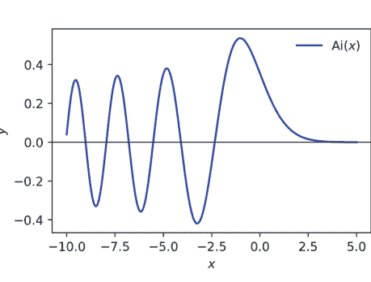

图 2.1 使用 mpmath 和 Matplotlib 生成的 Airy 函数 Ai(x) 在区间 $[-10, 5]$ 上的数值图像。该曲线展示了 $x < 0$ 时的振荡衰减和 $x > 0$ 时的指数衰减，这是 Airy 微分方程 $y'' - xy = 0$ 解的特征。

该图像证实了 $x < 0$ 时的振荡衰减和 $x > 0$ 时的指数衰减，这与渐近展开式 $\mathrm{Ai}(x) \sim \frac{1}{2\sqrt{\pi}} x^{-1/4} e^{-\frac{2}{3} x^{3/2}}$（当 $x \to \infty$ 时）一致（Olver 1997）。

**交互式探索** 将图像嵌入 Jupyter notebook 允许通过动态滑块（通过 ipywidgets）实时调整参数——非常适合用于三角恒等式的可视化证明或分岔图。

### 2.2.3 分析函数性质

#### 极限与连续性

**极限** 对于 $f : D \to \mathbb{R}$，其中 $a \in \overline{D}$ 是聚点，

$$\lim_{x \to a} f(x) = L \iff \forall \varepsilon > 0 \exists \delta > 0 \left( 0 < |x - a| < \delta \implies |f(x) - L| < \varepsilon \right).$$

sympy 中的符号求值可以自动化 $\varepsilon$-$\delta$ 推理：

```python
import sympy as sp
x = sp.Symbol("x")
f = sp.sin(x) / x
L = sp.limit(f, x, 0)
print(L) # 1
```

该结果再次确认了经典极限 $\lim_{x \to 0} \frac{\sin x}{x} = 1$。

**连续性** 函数在 $a$ 处连续当且仅当极限值等于函数值：$\lim_{x \to a} f(x) = f(a)$。分段定义的函数需要在断点处检查连续性。

#### 示例 2.2.3（分段函数）

$$g(x) = \begin{cases} x^2 \sin \frac{1}{x}, & x \neq 0, \\ 0, & x = 0. \end{cases}$$

```python
g = sp.Function("g")
expr = sp.Piecewise((x**2 * sp.sin(1/x), sp.Ne(x, 0)), (0, True))
is_cont = sp.limit(expr, x, 0) == expr.subs(x, 0)
print(is_cont) # True
```

由于因子 $x^2$ 抑制了振荡，$g$ 在 0 处连续但不可微。

**数值极限** 当解析表达式难以获得时，Richardson 外推法可以加速数值近似：

```python
def limit_numeric(f, a, h0=1e-1, k=6):
    h = h0
    est = [f(a + h / (2**i)) for i in range(k)]
    for j in range(1, k):
        est = [(4**j*est[i+1] - est[i]) / (4**j - 1) for i in range(k-j)]
    return est[0]

import math
phi = lambda x: (math.exp(x) - 1) / x
print(limit_numeric(phi, 0)) # ≈ 1.000000000000
```

该表格消除了主要误差项 $O(h^2)$，在浮点噪声范围内与解析极限 $e^0 = 1$ 相符。

结合一等函数定义、交互式可视化以及符号和数值极限工具，使我们能够探究连续性、可微性和渐近性——这些是后续更深入的微积分驱动章节的基石。

## 2.3 矩阵与线性代数

线性代数将多元问题转化为数组的代数，其元素服从域的公理（通常是 $\mathbb{R}$ 或 $\mathbb{C}$）。Python 的 `numpy` 层将繁重的计算委托给 BLAS 和 LAPACK，从而在速度上与商业软件包相媲美，同时提供高级接口；`sympy` 提供精确算术和符号操作。在本节中，我们令 $\mathbf{A}, \mathbf{B} \in \mathbb{F}^{m \times n}$ 和 $\mathbf{x}, \mathbf{y} \in \mathbb{F}^n$，其中 $\mathbb{F}$ 是一个域。

### 2.3.1 矩阵运算

#### 加法与乘法

**加法** 矩阵加法是逐点的群运算

$$(\mathbf{A} + \mathbf{B})_{ij} = a_{ij} + b_{ij}, \quad \mathbf{0}_{m \times n} \text{ 是单位元。}$$

Python 通过 `+` 运算符实现此操作；广播机制防止形状不匹配：

```python
import numpy as np
A = np.random.randn(3, 3)
B = np.random.randn(3, 3)
C = A + B # 逐元素求和
```

#### 乘法

双线性乘积

$$(\mathbf{AB})_{ij} = \sum_{k=1}^{p} a_{ik}b_{kj}$$

由 @ 运算符（PEP 465）实现。平方复杂度 $O(mnp)$ 通过缓存分块的 DGEMM 内核得到缓解。

```python
D = A @ B # 矩阵乘积
v = A @ np.ones(3) # 矩阵-向量乘积
```

#### 结合律验证

$$\mathbf{A(BC) = (AB)C},$$

这是一个非平凡的性质，源于四重求和的重新结合；数值验证：

```python
C1 = A @ (B @ A)
C2 = (A @ B) @ A
np.allclose(C1, C2) # → True（在机器精度 $\epsilon$ 内）
```

#### Kronecker 积

Kronecker 积

$$\mathbf{A} \otimes \mathbf{B} = \begin{pmatrix} a_{11}\mathbf{B} & \dots & a_{1n}\mathbf{B} \\ \vdots & \ddots & \vdots \\ a_{m1}\mathbf{B} & \dots & a_{mn}\mathbf{B} \end{pmatrix} \in \mathbb{F}^{(m\,p) \times (n\,q)},$$

将双线性扩展到块结构；它满足

$$(\mathbf{A} \otimes \mathbf{B})(\mathbf{C} \otimes \mathbf{D}) = (\mathbf{AC}) \otimes (\mathbf{BD}).$$

#### 示例 2.3.1（Pauli 矩阵的张量积）

$$\sigma_x = \begin{pmatrix} 0 & 1 \\ 1 & 0 \end{pmatrix}, \quad \sigma_z = \begin{pmatrix} 1 & 0 \\ 0 & -1 \end{pmatrix}.$$

在 Python 中计算 $\sigma_x \otimes \sigma_z$：

```python
from numpy import kron, array
σx = array([[0, 1], [1, 0]])
σz = array([[1, 0], [0, -1]])
print(kron(σx, σz))
```

结果是一个 $4 \times 4$ 的厄米矩阵，用于双量子比特哈密顿量。

性质 () 是*向量化恒等式*（Magnus and Neudecker 1999）的基础，例如

$$\mathrm{vec}(\mathbf{AXB}^\top) = (\mathbf{B} \otimes \mathbf{A}) \mathrm{vec}(\mathbf{X}).$$

### 2.3.2 行列式与特征值/特征向量

行列式 $\det \mathbf{A}$ 等于线性映射的有向超体积，并满足 $\det(\mathbf{AB}) = \det \mathbf{A} \det \mathbf{B}$。特征分析通过 $\mathbf{Av} = \lambda \mathbf{v}$ 分解 $\mathbf{A}$，并驱动对角化、稳定性和幂迭代算法。

```python
import numpy.linalg as la
detA = la.det(A)
eigval, eigvec = la.eig(A)
```

#### 特征多项式

特征多项式为

$$p_{\mathbf{A}}(\lambda) = \det(\lambda \mathbf{I} - \mathbf{A}) = \lambda^n + c_{n-1}\lambda^{n-1} + \cdots + c_0.$$

根据 *Cayley-Hamilton 定理*，$\mathbf{A}$ 会消去其自身的多项式 $p_{\mathbf{A}}$（Gantmacher 2000）。符号计算：

```python
import sympy as sp
M = sp.Matrix([[2, -1], [-1, 2]])
λ = sp.symbols("λ")
p = M.charpoly(λ)
print(p.as_expr()) # λ**2 - 4*λ + 3
print(p.as_expr().subs(λ, M).simplify()) # 零矩阵
```

此恒等式使得通过多项式约简来计算闭式矩阵函数（例如 $\exp \mathbf{A}$）成为可能。

### 2.3.3 求解线性方程组

$$\mathbf{Ax} = \mathbf{b}, \quad \mathbf{A} \in \mathbb{F}^{n \times n}, \mathbf{b} \in \mathbb{F}^n.$$

#### 高斯消元法

行变换将 $(\mathbf{A} \mid \mathbf{b})$ 转化为上三角形式；回代在 $O(n^3)$ 时间内完成求解。

def gaussian(A, b):
    A = A.astype(float).copy()
    b = b.astype(float).copy()
    n = len(b)
    for k in range(n-1):
        # 部分主元选取
        idx = abs(A[k:, k]).argmax() + k
        A[[k, idx]], b[[k, idx]] = A[[idx, k]], b[[idx, k]]
        for i in range(k+1, n):
            m = A[i, k] / A[k, k]
            A[i, k:] -= m * A[k, k:]
            b[i] -= m * b[k]
    # 回代
    x = np.zeros_like(b)
    for i in reversed(range(n)):
        x[i] = (b[i] - A[i, i+1:] @ x[i+1:]) / A[i, i]
    return x

示例 2.3.2（希尔伯特矩阵的条件数）希尔伯特矩阵，$H_{ij} = \frac{1}{i + j - 1}$，是著名的病态矩阵：$\kappa_2(H_{10}) \approx 1.6 \times 10^{13}$。使用 `numpy.linalg.solve` 与朴素消元法对比，可以揭示精度损失：

```
n = 10
H = np.fromfunction(lambda i, j: 1 / (i + j + 1), (n, n), dtype=float)
b = np.ones(n)
x_exact = np.linalg.solve(H, b) # 带主元选取的LU分解
x_naive = gaussian(H, b) # 自定义实现
print(np.linalg.norm(x_exact - x_naive)) # >> epsilon
```

主元选取稳定了消元过程，但残差误差反映了条件数的界限 $\|\delta\mathbf{x}\|/\|\mathbf{x}\| \leq \kappa \|\delta\mathbf{A}\|/\|\mathbf{A}\|$（Trefethen and III 1997）。

矩阵运算、克罗内克结构、特征分析和消元法构成了科学计算的计算基础；它们的数值稳定性和算法复杂度决定了后续章节中探讨的谱求解器和优化过程等高级方法的可行性。

## 2.4 习题

1. 令

$$\mathbf{A} = \begin{pmatrix} 2 & -3 & 1 \\ 0 & 4 & -2 \\ 5 & 1 & 0 \end{pmatrix}, \quad \mathbf{B} = \begin{pmatrix} 1 & 0 & 2 \\ -1 & 3 & 1 \\ 4 & -2 & 5 \end{pmatrix}.$$

显式计算 $\mathbf{AB}$ 和 $\mathbf{BA}$。在 Python 中验证交换子 $\|\mathbf{AB} - \mathbf{BA}\|_F$ 的弗罗贝尼乌斯范数等于你手工计算的逐元素差值的平方和的平方根。解释为什么非零交换子意味着 **A** 和 **B** 在 **C** 上不能同时对角化。

2. 考虑 $4 \times 4$ 矩阵

$$\mathbf{C} = \begin{pmatrix} 3 & 1 & 0 & 0 \\ 1 & 3 & 1 & 0 \\ 0 & 1 & 3 & 1 \\ 0 & 0 & 1 & 3 \end{pmatrix}.$$

- (a) 使用拉普拉斯展开手工计算 $\det \mathbf{C}$，并用 `numpy.linalg.det` 确认你的结果。
- (b) 使用 `numpy.linalg.eig` 求特征值 $\lambda_1, \dots, \lambda_4$，并检查 $\prod_{k=1}^4 \lambda_k = \det \mathbf{C}$ 在机器精度范围内成立。

3. 令 $\mathbf{P} = \begin{pmatrix} 0 & 1 \\ 1 & 0 \end{pmatrix}$ 和 $\mathbf{Q} = \begin{pmatrix} 1 & 0 \\ 0 & -1 \end{pmatrix}$。

- (a) 显式计算克罗内克积 $\mathbf{P} \otimes \mathbf{Q}$。
- (b) 通过代数方法和 Python 验证性质 $(\mathbf{P} \otimes \mathbf{Q})^2 = \mathbf{I}_4$。
- (c) 证明 $(\mathbf{Q} \otimes \mathbf{P})(\mathbf{P} \otimes \mathbf{Q}) \neq (\mathbf{P} \otimes \mathbf{Q})(\mathbf{Q} \otimes \mathbf{P})$，并通过计算它们的交换子来量化非交换性。

4. 给定多项式 $p(\lambda) = \lambda^3 - 6\lambda^2 + 11\lambda - 6$，构造其 $3 \times 3$ 伴随矩阵 $\mathbf{T}$。

- (a) 证明 $\det(\lambda\mathbf{I} - \mathbf{T}) = p(\lambda)$。
- (b) 使用 `numpy.linalg.eigvals` 验证 $\mathbf{T}$ 的特征值与 $p$ 的根一致。
- (c) 使用 `sympy` 精确验证凯莱-哈密顿恒等式 $p(\mathbf{T}) = \mathbf{0}$。

5. 令 $\mathbf{H}_8$ 为 $8 \times 8$ 希尔伯特矩阵，其元素为 $h_{ij} = 1/(i + j - 1)$，并令 $\mathbf{b} = \mathbf{1}$。

- (a) 使用 (i) 不带主元选取的朴素高斯消元法和 (ii) `numpy.linalg.solve` 求解 $\mathbf{H}_8\mathbf{x} = \mathbf{b}$。
- (b) 使用 `numpy.linalg.cond` 计算 2-范数条件数 $\kappa_2(\mathbf{H}_8)$。
- (c) 报告相对误差 $\|\mathbf{x}_{\text{naive}} - \mathbf{x}_{\text{pivot}}\|_2 / \|\mathbf{x}_{\text{pivot}}\|_2$，并根据 $\kappa_2(\mathbf{H}_8)$ 解释结果。

6. 对于对称矩阵

$$\mathbf{S} = \begin{pmatrix} 6 & 2 & -1 \\ 2 & 3 & 0 \\ -1 & 0 & 2 \end{pmatrix},$$

- (a) 在 Python 中计算其谱分解 $\mathbf{S} = \mathbf{Q}\Lambda\mathbf{Q}^\top$，并验证正交性 $\mathbf{Q}^\top\mathbf{Q} = \mathbf{I}$。
- (b) 确认 $\operatorname{tr}\mathbf{S} = \sum_k \lambda_k$ 和 $\det\mathbf{S} = \prod_k \lambda_k$。
- (c) 使用合同变换手工对角化 **S**，并将你的结果与 Python 结果进行比较。

7. 定义 $\mathbf{A} \in \mathbb{R}^{5 \times 5}$，其中 $a_{ij} = (-1)^{i+j} \min\{i, j\}$。

- (a) 实现幂迭代法以近似主特征值 $\lambda_{\max}$ 和相应的特征向量，当连续特征值估计值之差小于 $10^{-8}$ 时停止。
- (b) 与 `numpy.linalg.eig` 进行比较，并计算 $\lambda_{\max}$ 的绝对误差。
- (c) 解释为什么 **A** 的对称性保证了收敛性，并讨论特征间隙的作用。

8. 令 $\mathbf{X} \in \mathbb{R}^{4 \times 4}$ 为分块矩阵

$$\mathbf{X} = \begin{pmatrix} \mathbf{0}_2 & \mathbf{I}_2 \\ \mathbf{I}_2 & \mathbf{0}_2 \end{pmatrix}.$$

- (a) 按列向量化 **X**，并在 Python 中验证恒等式 $\operatorname{vec}(\mathbf{I}_2 \mathbf{X} \mathbf{I}_2) = (\mathbf{I}_2 \otimes \mathbf{I}_2) \operatorname{vec}(\mathbf{X})$。
- (b) 将外部的单位矩阵替换为任意 $2 \times 2$ 矩阵 **A**、**B**，并通过数值计算确认 $\operatorname{vec}(\mathbf{A} \mathbf{X} \mathbf{B}^\top) = (\mathbf{B} \otimes \mathbf{A}) \operatorname{vec}(\mathbf{X})$。

9. 构造 $3 \times 3$ 矩阵

$$\mathbf{M} = \begin{pmatrix} 4 & 1 & 0 \\ 0 & 4 & 1 \\ 0 & 0 & 4 \end{pmatrix}.$$

- (a) 确定 **M** 的特征多项式和最小多项式。
- (b) 使用 `sympy` 计算 **M** 的若尔当标准形。
- (c) 解释幂零部分如何影响对 **M** 进行幂迭代的收敛速度。

10. 考虑求解 $\mathbf{A}\mathbf{x} = \mathbf{b}$，其中

$$\mathbf{A} = \begin{pmatrix} 10^{-4} & 1 \\ 1 & 1 \end{pmatrix}, \quad \mathbf{b} = \begin{pmatrix} 1 \\ 2 \end{pmatrix}.$$

- (a) 在 `float64` 精度下求解，并计算残差 $\mathbf{r} = \mathbf{b} - \mathbf{A}\mathbf{x}$。
- (b) 执行一步迭代精化 $\mathbf{x}_1 = \mathbf{x} + \delta\mathbf{x}$，其中 $\delta\mathbf{x} = \mathbf{A}^{-1}\mathbf{r}$。
- (c) 重新计算残差，并讨论为什么尽管使用相同的机器精度，精化仍能提高精度。

11. 对于矩阵

$$\mathbf{U} = \begin{pmatrix} 1 & 2 \\ -2 & 1 \end{pmatrix}, \quad \mathbf{V} = \begin{pmatrix} 0 & 3 \\ 3 & 0 \end{pmatrix},$$

计算交换子 $[\mathbf{U}, \mathbf{V}] = \mathbf{U}\mathbf{V} - \mathbf{V}\mathbf{U}$，并证明 $\mathrm{tr}[\mathbf{U}, \mathbf{V}] = 0$。通过数值计算验证你的计算，并从迹的性质出发，解释为什么 $\mathbb{C}^{n \times n}$ 中的每个交换子都是无迹的。

12. 令 $\mathbf{E}_{ij}$ 表示在位置 $(i, j)$ 为 1、其余位置为 0 的 $3 \times 3$ 矩阵。构造矩阵指数

$$\mathbf{G} = \exp(t(\mathbf{E}_{12} + \mathbf{E}_{23})),$$

其中 $t \in \mathbb{R}$。

- (a) 利用幂零性质 $(\mathbf{E}_{12} + \mathbf{E}_{23})^3 = \mathbf{0}$，推导 $\mathbf{G}(t)$ 的闭式表达式。
- (b) 绘制 $t \in [0, 10]$ 时的欧几里得范数 $\|\mathbf{G}(t)\|_2$，并评论其增长情况。
- (c) 验证对所有 $t$，$\det \mathbf{G}(t) = 1$，并将你的观察与生成元是无迹的事实联系起来。

# 第 3 章
用 Python 学微积分

**摘要** 本章从极限的形式定义开始，发展一元和多元微分学与积分学，将符号推导与数值近似（如自动微分、有限差分和自适应求积）交织在一起。为优化问题计算多元梯度、雅可比矩阵和海森矩阵，同时通过向量化 Python 代码和丰富的注释图表，使线积分、面积分和体积分以及斯托克斯定理和高斯定理变得生动。

**关键词** 微积分 · 微分 · 积分 · 多元分析 · 自动微分 · 数值求积

微积分描述函数的无穷小行为：它们如何变化、累积以及对扰动作出响应。在计算环境中，这些概念通过三种主要范式实现：数值近似（例如有限差分）、自动微分（用于计算图）和符号微分（操作表达式）。本章从微分开始，即函数的局部线性近似，并探讨如何用 Python 计算导数。我们在数值技术和精确方法之间交替进行，分析误差传播和每种方法的稳定性。

## 3.1 微分

### 3.1.1 数值微分技术

#### 有限差分方法

令 $f : \mathbb{R} \to \mathbb{R}$ 为一个可微函数。点 $x \in \mathbb{R}$ 处的导数由极限定义$$f'(x) = \lim_{h \to 0} \frac{f(x+h) - f(x)}{h}.$$

这引出了*前向差分近似*

$$D_+f(x; h) := \frac{f(x+h) - f(x)}{h},$$

当 $h \to 0$ 时，只要 $f$ 可微，该式就收敛于 $f'(x)$。然而，由于有限精度算术，取 $h$ 过小可能会引入显著的舍入误差。

类似地，*后向差分*和*中心差分*近似由下式给出：

$$D_-f(x; h) := \frac{f(x) - f(x-h)}{h}, \quad D_cf(x; h) := \frac{f(x+h) - f(x-h)}{2h}.$$

泰勒展开可得：

$$D_+f(x; h) = f'(x) + \frac{h}{2}f''(x) + \mathcal{O}(h^2),$$
$$D_cf(x; h) = f'(x) + \frac{h^2}{6}f^{(3)}(x) + \mathcal{O}(h^4),$$

这意味着对于小的 $h$，中心差分比前向或后向差分更精确。

**示例 3.1.1（$f(x) = \log(x)$ 的导数）** 使用中心差分估算 $f'(1)$。

```python
import numpy as np

def central_diff(f, x, h=1e-5):
    return (f(x + h) - f(x - h)) / (2 * h)

f = np.log
approx = central_diff(f, 1.0)
exact = 1 / 1.0
print(f"Approximation: {approx}, Error: {abs(approx - exact)}")
```

对于 $h = 10^{-5}$，结果精确到大约 8 位小数，具体取决于周围代码的稳定性。

## 使用 autograd 进行自动微分

自动微分（AD）通过将函数分解为一系列基本操作并系统地应用链式法则，以机器精度计算精确导数。与符号微分不同，AD 在值而非表达式层面操作；与数值微分不同，它不会遭受减法抵消的影响。

设 $f(x) = \sin(x) \cdot \exp(x^2)$。要计算 $x = 1$ 处的 $f'(x)$，我们可以使用 autograd 提供的反向模式 AD：

```python
import autograd.numpy as np
from autograd import grad

f = lambda x: np.sin(x) * np.exp(x**2)
df = grad(f)
print(df(1.0))
```

**工作原理** autograd 在运行时重写计算图，并通过每个操作传播对偶值。对于复合函数 $f = f_n \circ \cdots \circ f_1$，反向模式反向计算导数，应用链式法则：

$$\frac{df}{dx} = \frac{df_n}{df_{n-1}} \cdots \frac{df_1}{dx}.$$

反向模式对于具有高维输入的标量值函数（如机器学习中的损失函数）效率很高；前向模式则更适合高维输出。

## 误差与稳定性分析

让我们将有限差分格式中的总误差建模为

$$E(h) = E_{\text{trunc}}(h) + E_{\text{round}}(h),$$

其中 $E_{\text{trunc}}(h) = \mathcal{O}(h^p)$ 是截断误差（由于泰勒余项），$E_{\text{round}}(h) = \mathcal{O}(\varepsilon / h)$ 是舍入误差（由于双精度中的机器精度 $\varepsilon \approx 2^{-52}$）。

最优步长 $h^*$ 使总误差最小化：

$$h^* = \left( \frac{p \varepsilon}{C} \right)^{1/(p+1)},$$

其中 $C$ 是截断中出现的高阶导数的界。

### 示例 3.1.2（$f(x) = \sqrt{x}$ 的前向差分稳定性）

```python
import numpy as np
import matplotlib.pyplot as plt

f = np.sqrt
df_exact = lambda x: 1 / (2 * np.sqrt(x))
x0 = 1.0
h_values = np.logspace(-16, -1, 200)
errors = [abs((f(x0 + h) - f(x0)) / h - df_exact(x0)) for h in h_values]

plt.loglog(h_values, errors)
plt.xlabel("h")
plt.ylabel("Absolute error")
plt.title("Forward difference error for $f(x) = \sqrt{x}$ at $x = 1$")
plt.grid(True)
plt.show()
```

该图呈现出特征性的 U 形：误差随 $h$ 减小而减小（由于近似改善），然后因舍入误差而增大。最小值对应于前向差分的最优步长 $h^* \sim \varepsilon^{1/2}$（因为 $p = 1$）。

## 稳定性考量

- 差分运算条件数较差：对于小的 $h$，计算 $f(x+h) - f(x)$ 涉及减去几乎相等的量，可能导致灾难性抵消。
- 选择 $h$ 过小会*增加*误差，这是由于有限的机器精度；这种权衡必须通过算法来平衡。
- 自动微分在设计上是数值稳定的，但如果涉及嵌套梯度或循环，计算成本可能很高。

数值微分使得在解析形式不可用时能够近似导数，但其精度受限于浮点算术的结构。自动微分规避了这些限制，以数值代码的语法便利性提供精确梯度，在基于梯度的优化和科学计算中变得不可或缺。

## 3.1.2 使用 SymPy 进行符号微分

符号微分操作的是表达式而非数值。它通过递归应用微分规则，将函数 $f(x)$ 重写为其形式导数 $f'(x)$。Python 库 SymPy 提供了一个强大的符号引擎，能够对表达式、多项式甚至分段定义函数执行精确的微积分运算。本小节探讨核心微分运算符、复合函数的规则以及简化所得表达式的策略。

### 微分规则与运算符

设 $f, g : \mathbb{R} \to \mathbb{R}$ 为可微函数，$c \in \mathbb{R}$。符号微分应用以下基本规则：

$$\frac{d}{dx}(cf(x)) = cf'(x) \quad \text{(线性性)}$$
$$\frac{d}{dx}(f(x) + g(x)) = f'(x) + g'(x) \quad \text{(和规则)}$$
$$\frac{d}{dx}(f(x)g(x)) = f'(x)g(x) + f(x)g'(x) \quad \text{(乘积规则)}$$
$$\frac{d}{dx}\left(\frac{f(x)}{g(x)}\right) = \frac{f'(x)g(x) - f(x)g'(x)}{g(x)^2} \quad \text{(商规则)}$$
$$\frac{d}{dx}f(g(x)) = f'(g(x)) \cdot g'(x) \quad \text{(链式法则)}$$

在 SymPy 中，微分使用 `diff()` 函数执行：

```python
import sympy as sp
x = sp.Symbol('x')
f = sp.sin(x**2) * sp.exp(x)
df = sp.diff(f, x)
sp.pprint(df)
```

结果是一个精确的符号表达式：

$$\frac{d}{dx}\left[\sin(x^2)e^x\right] = 2x\cos(x^2)e^x + \sin(x^2)e^x.$$

**偏导数** 多元函数支持符号偏微分：

```python
x, y = sp.symbols("x y")
f = sp.exp(x*y)
df_dx = sp.diff(f, x)
df_dy = sp.diff(f, y)
```

返回：

$$\frac{\partial}{\partial x}e^{xy} = ye^{xy}, \quad \frac{\partial}{\partial y}e^{xy} = xe^{xy}.$$

**高阶导数**

要计算 $n$ 阶导数，将阶数作为第二个参数传递：

```python
f = sp.log(sp.sin(x))
d4 = sp.diff(f, x, 4)
sp.pprint(d4)
```

这返回一个涉及余切和余割函数的四阶导数，正如重复应用链式法则和乘积法则所预期的那样。

**多重指标表示法** 对于多个变量的函数 $f(x, y)$，可以计算混合偏导数：

$$\frac{\partial^3 f}{\partial x^2 \partial y}$$

通过：

```python
sp.diff(f, x, 2, y)
```

SymPy 确保在光滑性假设下 Schwarz 定理（混合偏导数相等）成立。

### 简化与优化

微分后的表达式在结构上可能很复杂。简化可以减少冗余，并将表达式转换为更易读的形式。

**代数简化** 通用的 `simplify()` 函数尝试使用广泛的规则集：

```python
f = sp.diff(sp.exp(x) * sp.sin(x), x)
simplified = sp.simplify(f)
```

返回：

$$\frac{d}{dx}(e^x \sin x) = e^x(\sin x + \cos x).$$

**针对性简化** 其他工具包括：

- `expand()` — 分配乘积和幂。
- `factor()` — 提取公共符号因子。
- `trigsimp()` — 应用三角恒等式。
- `collect()` — 分组具有公共幂或因子的项。

**示例 3.1.3（三角简化）** 设

$$f(x) = \cos^2 x + \sin^2 x.$$

```python
f = sp.cos(x)**2 + sp.sin(x)**2
print(sp.simplify(f)) # 1
```

这里，`simplify()` 内部使用了恒等式 $\cos^2 x + \sin^2 x = 1$。

**公共子表达式消除** 为了提高计算效率，特别是在代码生成中，SymPy 支持 CSE（公共子表达式消除）：

from sympy import cse
expr = sp.diff(sp.sin(x)**2 + sp.exp(x) * sp.sin(x), x)
replacements, reduced_expr = cse(expr)

这将表达式分解为可重用的部分，类似于编译器级别的重复项优化。

**Lambda化** 一旦表达式被简化，就可以通过以下方式转换为可调用函数：

```
f_expr = sp.sin(x**2) * sp.exp(x)
f_num = sp.lambdify(x, f_expr, 'numpy')
print(f_num(1.0))
```

这结合了符号的清晰性和数值计算的效率。

因此，符号微分提供了导数的精确、代数上忠实的表示，保留了数学结构，并直接服务于求解常微分方程、计算泰勒展开以及推导多元函数雅可比矩阵等高级任务。当与简化和代码生成工具结合使用时，它既能实现形式化验证，又能进行高性能计算。

## 3.1.3 微分的应用

微分是数学的分析显微镜——它揭示局部趋势、检测转折点，并支配物理系统的动力学。在本小节中，我们将探讨导数在优化、曲线分析以及模拟受物理定律支配的真实世界系统中的关键应用。每个主题都通过融合符号计算和数值计算的严谨示例进行说明。

### 优化问题

优化旨在寻找实值函数的极值（最小值或最大值）。函数 $f : \mathbb{R} \to \mathbb{R}$ 的临界点出现在 $x^*$ 处，满足 $f'(x^*) = 0$；二阶条件决定了极值的性质：

如果 $f''(x^*) > 0$，则 $f$ 在 $x^*$ 处有局部最小值，
$f''(x^*) < 0 \Rightarrow$ 局部最大值。

**示例 3.1.4（使用符号微积分最小化函数）** 最小化函数

$f(x) = x^4 - 8x^3 + 18x^2 + 1$。

```
import sympy as sp
x = sp.Symbol('x')
f = x**4 - 8*x**3 + 18*x**2 + 1
crit_pts = sp.solve(sp.diff(f, x), x)
for pt in crit_pts:
    second_derivative = sp.diff(f, x, 2).subs(x, pt)
    print(f"x = {pt}, f'' = {second_derivative}, type = {'min' if second_derivative > 0 else 'max'}")
```

求解 $f'(x) = 4x^3 - 24x^2 + 36x = 0$ 得到临界点 $x = 0, 3, 6$。计算二阶导数可识别出在 $x = 0$ 和 $x = 6$ 处的局部最小值，以及在 $x = 3$ 处的局部最大值。

### 示例 3.1.5（使用拉格朗日乘数法的约束优化）

在约束条件 $x + y = 1$ 下，求 $f(x, y) = x^2 + y^2$ 的极值。这在线性约束下最小化到原点的距离。

```
x, y, λ = sp.symbols("x y λ")
f = x**2 + y**2
g = x + y - 1
L = f - λ * g
sol = sp.solve([sp.diff(L, v) for v in (x, y, λ)])
sp.pprint(sol)
```

解 $x = y = 1/2$ 在直线 $x + y = 1$ 上最小化了 $f$。该方法可推广到任意等式约束。

### 曲线绘制与分析

函数的图形由其一阶和二阶导数决定：

- $f'(x) > 0 \Rightarrow f$ 递增，$f'(x) < 0 \Rightarrow f$ 递减。
- $f''(x) > 0 \Rightarrow$ 凹向上，$f''(x) < 0 \Rightarrow$ 凹向下。
- $f''(x) = 0$ 且符号改变的点是拐点。

### 示例 3.1.6（绘制有理函数）

设 $f(x) = \frac{x^2 - 1}{x^2 + 1}$。研究其单调性、凹凸性和渐近线。

```
f = (x**2 - 1)/(x**2 + 1)
df = sp.diff(f, x)
d2f = sp.diff(df, x)
sp.pprint(df.simplify())
sp.pprint(d2f.simplify())
```

我们得到：

$f'(x) = \frac{4x}{(x^2 + 1)^2}, \quad f''(x) = \frac{4(1 - 3x^2)}{(x^2 + 1)^3}$。

- $f' > 0 \Rightarrow f$ 在 $(0, \infty)$ 上递增，在 $(-\infty, 0)$ 上递减。
- $f'' = 0 \Rightarrow x = \pm 1/\sqrt{3}$ — 拐点。

绘制此图揭示了一条对称曲线，向水平渐近线 $y = 1$ 递增。

**示例 3.1.7（泰勒展开与局部近似）** 设 $f(x) = \log(1 + x)$。在 $x = 0$ 处的三阶泰勒多项式为：

$$T_3(x) = x - \frac{x^2}{2} + \frac{x^3}{3}.$$

使用 SymPy 推导它：

```
f = sp.log(1 + x)
T3 = f.series(x, 0, 4).removeO()
sp.pprint(T3)
```

该多项式在 $|x| < 1$ 时能很好地近似 $f(x)$。在 $x = 0.5$ 处进行数值比较：

```
f_true = sp.lambdify(x, f)
T3_func = sp.lambdify(x, T3)
print(abs(f_true(0.5) - T3_func(0.5)))
```

这给出了近似误差的精确量化。

### 物理系统建模

微分描述了物理量的局部变化率。它支配着牛顿力学、电路、化学动力学和种群模型。

**示例 3.1.8（速度与加速度）** 设粒子的位置由 $s(t) = t^3 - 6t^2 + 9t$ 给出。求速度 $v(t) = s'(t)$ 和加速度 $a(t) = s''(t)$。确定粒子何时静止以及何时加速。

```
t = sp.Symbol("t")
s = t**3 - 6*t**2 + 9*t
v = sp.diff(s, t)
a = sp.diff(v, t)
sp.pprint(v)
sp.pprint(a)
rest_times = sp.solve(v, t)
accel_signs = [(τ, a.subs(t, τ).evalf()) for τ in rest_times]
```

我们得到：

$$v(t) = 3t^2 - 12t + 9, \quad a(t) = 6t - 12.$$

求解 $v(t) = 0$ 得到静止点 $t = 1$ 和 $t = 3$；粒子在这些时刻改变方向。

### 示例 3.1.9（冷却定律：牛顿模型）

设 $T(t)$ 为物体在环境温度 $T_a = 25 ^\circ\text{C}$ 的空气中冷却时的温度。牛顿定律指出：

$$\frac{dT}{dt} = -k(T - T_a), \quad T(0) = T_0.$$

符号求解：

```
T, t, k, Ta, T0 = sp.symbols("T t k T_a T_0")
sol = sp.dsolve(sp.Derivative(T, t) + k*(T - Ta), T, ics={T.subs(t, 0): T0})
sp.pprint(sol)
```

解为：

$$T(t) = T_a + (T_0 - T_a)e^{-kt}.$$

这模拟了向平衡状态的指数衰减。

### 示例 3.1.10（质量-弹簧系统：胡克定律）

一个粒子服从：

$$m\ddot{x} + kx = 0.$$

通解为：

$$x(t) = A\cos(\omega t) + B\sin(\omega t), \quad \omega = \sqrt{k/m}.$$

对于 $m = 1$, $k = 4$，初始条件 $x(0) = 1$, $\dot{x}(0) = 0$，求解并可视化：

```
from sympy import Function, dsolve, Derivative as D, cos, sin
t = sp.Symbol("t")
x = Function("x")
sol = dsolve(D(D(x(t), t), t) + 4*x(t), x(t), ics={x(0): 1, D(x(t), t).subs(t, 0): 0})
sp.pprint(sol)
```

我们得到 $x(t) = \cos(2t)$，显示频率为 2 的无阻尼简谐运动。

因此，微分是通往数学建模和计算科学的门户：它使我们能够分析局部行为、优化结果、追踪几何形状，并模拟受微分定律支配的真实世界过程。Python 提供了多种视角——从符号到数值再到自动——允许对所有这些应用进行严谨而灵活的探索。

## 3.2 积分

积分是微分的逆运算，对应于计算函数在区间上的累积效应。在黎曼框架下，定积分

$$\int_a^b f(x)\,dx$$

表示曲线 $y = f(x)$ 在 $x = a$ 和 $x = b$ 之间的带符号面积。在计算环境中，解析积分通常是不可能的，特别是当被积函数没有闭式原函数时。数值积分，或称*求积*，则通过在选定的点上计算被积函数来提供近似解。我们讨论几种此类方法、它们的误差界以及在 Python 中的实现。

### 3.2.1 数值积分方法

**黎曼和与梯形法则**

设 $f : [a, b] \to \mathbb{R}$ 连续。将区间 $[a, b]$ 划分为 $n$ 个宽度相等的子区间，宽度 $h = \frac{b-a}{n}$。定义网格点 $x_i = a + ih$，其中 $i = 0, 1, \ldots, n$。

**黎曼和（左矩形法则）**

$$R_n = \sum_{i=0}^{n-1} f(x_i) \cdot h$$

**梯形法则** 将每个子区间近似为梯形：

$$T_n = \frac{h}{2} [f(x_0) + 2f(x_1) + \cdots + 2f(x_{n-1}) + f(x_n)]$$
$$= h \left[ \frac{f(a) + f(b)}{2} + \sum_{i=1}^{n-1} f(x_i) \right]$$

**示例 3.2.1（计算 $\int_0^1 \frac{1}{1+x^2}\,dx$）** 该积分等于 $\arctan(1) = \frac{\pi}{4}$。比较梯形近似值和精确值。

```
import numpy as np

def f(x): return 1 / (1 + x**2)

def trapezoid(f, a, b, n):
    h = (b - a) / n
    x = np.linspace(a, b, n+1)
    return h * (0.5*f(a) + sum(f(x[1:-1])) + 0.5*f(b))

I_approx = trapezoid(f, 0, 1, 1000)
print(f"Approx: {I_approx:.10f}, Error: {abs(I_approx - np.pi/4):.2e}")
```

## 误差界（梯形法则）

若 $f$ 二阶连续可微，则

$$\left|\int_{a}^{b} f(x) dx - T_{n}\right| \leq \frac{(b-a)^{3}}{12n^{2}} \max _{x \in[a,b]}\left|f^{\prime \prime}(x)\right|.$$

## 辛普森法则与高斯求积

辛普森法则在每个子区间上使用三个点（端点和中点）的二次多项式来逼近 $f$。

**辛普森法则** 假设 $n$ 为偶数：

$$S_{n}=\frac{h}{3}\left[f\left(x_{0}\right)+4 f\left(x_{1}\right)+2 f\left(x_{2}\right)+\cdots+4 f\left(x_{n-1}\right)+f\left(x_{n}\right)\right]$$

**示例 3.2.2（$\int_{0}^{1} e^{-x^{2}} dx$ 的辛普森法则）** 该积分没有初等原函数。

```python
from scipy.integrate import simps

x = np.linspace(0, 1, 101)
y = np.exp(-x**2)
approx = simps(y, x)
print(f"Simpson approx: {approx:.10f}")
```

将其与高精度估计值比较：$\approx 0.746824$。

**误差界（辛普森）** 若 $f$ 具有四阶导数，

$$\left|\int_{a}^{b} f(x) dx - S_{n}\right| \leq \frac{(b-a)^{5}}{180n^{4}} \max _{x \in[a,b]}\left|f^{(4)}(x)\right|.$$

**高斯求积** 对于 $n$ 个节点 $x_{i} \in[a, b]$ 和权重 $w_{i}$，高斯求积给出：

$$\int_{a}^{b} f(x) dx \approx \sum_{i=1}^{n} w_{i} f\left(x_{i}\right)$$

使得该公式对所有次数不超过 $2n-1$ 的多项式精确成立。

对于区间 $[-1, 1]$，`numpy.polynomial.legendre.leggauss(n)` 可给出 $x_{i}$ 和 $w_{i}$。

```python
approx = sum(w * np.cos(x) for x, w in zip(xg, wg))
true = np.sin(1) - np.sin(-1)
error = abs(approx - true)
print(f"Gaussian quad (n=4): {approx:.10f}, error: {error:.2e}")
```

该方法以较少的求值次数实现了高精度。

## 自适应求积算法

固定步长的求积法在处理具有局部特征（如尖锐峰值）的函数时可能效率低下。自适应求积法根据局部误差估计调整步长，在函数变化剧烈的区域分配更多的节点。

**原理** 给定区间 $[a, b]$，计算粗糙和精细的近似值 $I_1, I_2$。若 $|I_2 - I_1| < \varepsilon$，则接受 $I_2$；否则将 $[a, b]$ 分割并递归进行。

**示例 3.2.4（自适应辛普森法）** 使用 `scipy.integrate.quad`，它实现了自适应求积：

```python
from scipy.integrate import quad

f = lambda x: np.exp(-x**2)
I, err = quad(f, 0, 1, epsabs=1e-10)
print(f"Adaptive Simpson: {I:.10f}, estimated error: {err:.1e}")
```

**奇异被积函数** 当被积函数具有奇点或快速振荡时，自适应方法至关重要。例如：

$$\int_0^1 \frac{\log(x)}{\sqrt{x}} \, dx,$$

该积分在 $x = 0$ 处发散，但在勒贝格意义下可积。Python 的 `quad` 使用权重函数来处理这种情况。

```python
from scipy.integrate import quad
f = lambda x: np.log(x) / np.sqrt(x)
I, err = quad(f, 0, 1, weight='alg', wvar=-0.5)
print(f"Result: {I}, error estimate: {err}")
```

## 3.2.2 使用 SymPy 进行符号积分

符号积分寻求原函数和定积分的精确表达式。与数值方法近似积分在区间上的值不同，符号积分直接操作被积函数的表达式，通常能得到封闭形式的解。SymPy 实现了用于初等函数的 Risch 算法的变体，并支持许多来自经典积分表的特殊函数和积分恒等式。本节探讨如何使用 `integrate()` 处理不定积分和定积分，以及识别特殊函数模式。

## 不定积分与原函数

给定函数 $f(x)$，其原函数是满足 $F'(x) = f(x)$ 的函数 $F(x)$。符号表示为：

$$\int f(x)\,dx = F(x) + C,$$

其中 $C$ 是积分常数。在 SymPy 中，可以这样写：

```python
import sympy as sp
x = sp.Symbol("x")
f = sp.exp(x) * sp.sin(x)
F = sp.integrate(f, x)
sp.pprint(F)
```

返回的表达式为：

$$\int e^x \sin x\,dx = \frac{1}{2}e^x(\sin x - \cos x) + C.$$

## 示例 3.2.5（初等有理函数）

计算积分

$$\int \frac{3x^2 + 2x + 1}{x^3 + x^2 + x + 1}\,dx.$$

```python
f = (3*x**2 + 2*x + 1)/(x**3 + x**2 + x + 1)
sp.pprint(sp.integrate(f, x))
```

SymPy 内部执行多项式除法和部分分式分解，得到对数项，这与标准技巧的结果一致。

## 示例 3.2.6（换元积分）

计算

$$\int x\sqrt{1 + x^2}\,dx.$$

```python
f = x * sp.sqrt(1 + x**2)
sp.pprint(sp.integrate(f, x))
```

返回结果为：

$$\frac{1}{3}(1+x^2)^{3/2} + C,$$

对应于代换 $u = 1 + x^2$。

## 定积分与极限

要计算定积分

$$\int_a^b f(x)\,dx,$$

使用带积分限的 `integrate()`：

```python
sp.integrate(f, (x, a, b))
```

## 示例 3.2.7（曲线下面积）

计算

$$\int_0^1 \frac{1}{1+x^2}\,dx = \tan^{-1}(1) = \frac{\pi}{4}.$$

```python
f = 1 / (1 + x**2)
sp.integrate(f, (x, 0, 1)) # 返回 π/4
```

## 示例 3.2.8（带极限的广义积分）

计算

$$\int_0^\infty e^{-x^2}\,dx = \frac{\sqrt{\pi}}{2}.$$

```python
f = sp.exp(-x**2)
sp.integrate(f, (x, 0, sp.oo)) # 返回 sqrt(pi)/2
```

这里 $\infty$ 表示 $+\infty$。SymPy 通过将此类积分化简为已知的特殊形式或极限论证来求值。

## 积分作为极限

$$\int_0^1 \frac{dx}{\sqrt{x}} = \lim_{\epsilon \to 0^+} \int_\epsilon^1 x^{-1/2}\,dx = 2.$$

```python
ε = sp.Symbol("ε", positive=True)
I = sp.integrate(x**(-1/2), (x, ε, 1))
sp.limit(I, ε, 0)
```

这证实了该广义积分的收敛性。

## 特殊函数与积分表

SymPy 可以符号化地计算涉及特殊函数的积分，例如 $\Gamma$、$\zeta$、Ei、Si、erf 和贝塞尔函数。这些结果与标准积分表（如 Gradshteyn–Ryzhik）中的条目相符。

## 示例 3.2.9（高斯积分）

$$\int_{-\infty}^{\infty} e^{-ax^2} dx = \sqrt{\frac{\pi}{a}}, \quad a > 0.$$

```python
a = sp.Symbol("a", positive=True)
f = sp.exp(-a * x**2)
sp.integrate(f, (x, -sp.oo, sp.oo))
```

SymPy 精确返回 $\sqrt{\pi/a}$，证实了经典结果。

## 示例 3.2.10（贝塔函数）

$$\int_{0}^{1} x^{m-1}(1-x)^{n-1} dx = B(m, n) = \frac{\Gamma(m)\Gamma(n)}{\Gamma(m+n)}.$$

```python
m, n = sp.symbols("m n", positive=True)
sp.integrate(x**(m - 1) * (1 - x)**(n - 1), (x, 0, 1))
```

这返回贝塔函数 $B(m, n)$，化简时会自动转换为伽马函数表达式。

## 示例 3.2.11（菲涅尔积分）

$$\int_{0}^{\infty} \sin(x^2) dx = \frac{\sqrt{2\pi}}{4}.$$

```python
f = sp.sin(x**2)
sp.integrate(f, (x, 0, sp.oo))
```

SymPy 返回一个包含菲涅尔积分的未求值表达式，显示了对该特殊函数的符号识别。

**积分表** SymPy 包含数十种内置的积分模式，对应于经典结果。要探索已知积分或验证手动计算，可以使用：

```python
sp.integrals.manualintegrate(f, x)
```

这应用结构化的决策树而非启发式和误差函数，作为数学探索、问题验证和符号建模的稳健后端。

## 3.2.3 积分的应用

积分不仅仅是计算面积的工具——它是累积量的统一框架。它自然地出现在几何学（作为面积和体积）、概率论（作为期望和分布）以及建模（作为微分方程的解算子）中。本小节通过具体的、可计算的示例来探讨这些解释，这些示例利用了 Python 和 SymPy。

## 面积与体积计算

**曲线下面积** 设 $f : [a, b] \to \mathbb{R}$ 非负且连续。则 $f$ 图形下的面积为

$$A = \int_{a}^{b} f(x) \, dx.$$

**示例 3.2.12（两条曲线之间的面积）** 计算 $f(x) = \sin(x)$ 和 $g(x) = \cos(x)$ 在 $[0, \pi/2]$ 上围成的面积。

$$A = \int_{0}^{\pi/2} |\sin(x) - \cos(x)| \, dx.$$

```python
import sympy as sp
x = sp.Symbol("x")
f = sp.sin(x)
g = sp.cos(x)
area = sp.integrate(sp.Abs(f - g), (x, 0, sp.pi/2))
sp.pprint(area)
```

该积分计算结果为 $2 - \sqrt{2}$。

**旋转体体积** 对于由 $f(x) \ge 0$ 在 $[a, b]$ 上绕 $x$ 轴旋转形成的立体，其体积由下式给出：

$$V = \pi \int_{a}^{b} f(x)^2 \, dx.$$

**示例 3.2.13（抛物面体积）** 设 $f(x) = \sqrt{x}$，将其从 $x = 0$ 到 $x = 4$ 绕 $x$ 轴旋转。

f = sp.sqrt(x)
V = sp.pi * sp.integrate(f**2, (x, 0, 4)) # x 的积分
sp.pprint(V)

我们求得 $V = \pi \cdot \int_0^4 x \, dx = \pi \cdot 8 = 8\pi$。

## 概率与期望

设 $X$ 是一个连续随机变量，其概率密度函数（PDF）为 $p(x)$，满足 $\int_{-\infty}^{\infty} p(x) \, dx = 1$。

**期望** 函数 $f(X)$ 的期望值为

$$\mathbb{E}[f(X)] = \int_{-\infty}^{\infty} f(x) \, p(x) \, dx.$$

**例 3.2.14（均匀分布的期望）** 设 $X \sim \text{Unif}(a, b)$。则

$$p(x) = \frac{1}{b - a}, \quad x \in [a, b].$$

期望值为：

$$\mathbb{E}[X] = \int_a^b \frac{x}{b - a} \, dx = \frac{a + b}{2}.$$

```
a, b = sp.symbols("a b", real=True)
pdf = 1 / (b - a)
EX = sp.integrate(x * pdf, (x, a, b)).simplify()
sp.pprint(EX) # 输出 (a + b)/2
```

**例 3.2.15（正态分布的矩）** 设 $X \sim \mathcal{N}(0, 1)$。则

$$p(x) = \frac{1}{\sqrt{2\pi}} e^{-x^2/2}, \quad \mathbb{E}[X^2] = 1.$$

```
pdf = sp.exp(-x**2 / 2) / sp.sqrt(2 * sp.pi)
EX2 = sp.integrate(x**2 * pdf, (x, -sp.oo, sp.oo))
sp.pprint(EX2)
```

这证实了标准正态分布的二阶矩为 1。

## 累积分布函数（CDF）

$$F(x) = \int_{-\infty}^x p(t) \, dt$$

### 例 3.2.16（指数分布的 CDF）

设 $p(x) = \lambda e^{-\lambda x}$，其中 $x \geq 0$。则

$$F(x) = \int_0^x \lambda e^{-\lambda t} dt = 1 - e^{-\lambda x}.$$

```
λ = sp.Symbol("λ", positive=True)
p = λ * sp.exp(-λ * x)
F = sp.integrate(p, (x, 0, x))
sp.pprint(F.simplify())
```

## 求解微分方程

积分是求解常微分方程（ODE）的核心机制。给定 $\frac{dy}{dx} = f(x)$，其通解为：

$$y(x) = \int f(x) dx + C.$$

### 可分离变量方程

如果 ODE 具有形式 $\frac{dy}{dx} = g(x)h(y)$，则可以写成：

$$\int \frac{1}{h(y)} dy = \int g(x) dx.$$

### 例 3.2.17（逻辑斯谛方程）

$$\frac{dy}{dx} = ry(1 - y/K), \quad y(0) = y_0.$$

分离变量并积分：

$$\int \frac{dy}{y(1 - y/K)} = \int r dx.$$

```
y = sp.Function("y")(x)
r, K = sp.symbols("r K", positive=True)
ode = sp.Eq(y.diff(x), r * y * (1 - y / K))
sol = sp.dsolve(ode, y)
sp.pprint(sol)
```

解为：

$$y(x) = \frac{K}{1 + Ce^{-rx}}.$$

### 积分因子法

线性 ODE

$$\frac{dy}{dx} + P(x)y = Q(x)$$

的解为

$$y(x) = e^{-\int P(x)dx} \left[ \int Q(x)e^{\int P(x)dx}dx + C \right].$$

### 例 3.2.18（一阶线性方程）

求解 $y' - y = e^x$，其中 $y(0) = 0$。

```
y = sp.Function("y")(x)
ode = sp.Eq(sp.diff(y, x) - y, sp.exp(x))
sol = sp.dsolve(ode, y, ics={y.subs(x, 0): 0})
sp.pprint(sol)
```

解为：

$$y(x) = \frac{1}{2}e^x(x).$$

## 3.3 多元微积分

单变量微积分描述函数 $f : \mathbb{R} \to \mathbb{R}$ 沿直线的变化，而多元微积分将这些思想推广到函数 $f : \mathbb{R}^n \to \mathbb{R}$，使得对曲面、超曲面和流形的分析成为可能。偏导数、梯度和方向导数提供了局部线性近似，而水平集和优化则编码了高维空间中的几何与极值行为。本节将介绍这些工具，并辅以 Python 中的符号与数值示例。

### 3.3.1 偏导数与梯度

设 $f(x_1, \ldots, x_n)$ 是一个标量值函数。其关于 $x_i$ 的**偏导数**定义为

$$\frac{\partial f}{\partial x_i}(x_1, \ldots, x_n) = \lim_{h \to 0} \frac{f(x_1, \ldots, x_i + h, \ldots, x_n) - f(x_1, \ldots, x_i, \ldots, x_n)}{h}.$$

$f$ 的**梯度**，记为 $\nabla f$，是所有偏导数组成的向量：

$$\nabla f = \begin{pmatrix} \partial f/\partial x_1 \\ \vdots \\ \partial f/\partial x_n \end{pmatrix}.$$

**例 3.3.1（二次函数的梯度）** 设 $f(x, y) = 3x^2 + 2xy + y^2$。计算 $\frac{\partial f}{\partial x}$、$\frac{\partial f}{\partial y}$ 和 $\nabla f$。

```
import sympy as sp
x, y = sp.symbols("x y")
f = 3*x**2 + 2*x*y + y**2
df_dx = sp.diff(f, x)
df_dy = sp.diff(f, y)
grad_f = [df_dx, df_dy]
sp.pprint(grad_f)
```

我们求得：

$$\nabla f = \begin{pmatrix} 6x + 2y \\ 2x + 2y \end{pmatrix}.$$

### 方向导数

函数 $f$ 在点 $\mathbf{a}$ 处沿方向 $\mathbf{v} \in \mathbb{R}^n$ 的**方向导数**为：

$$D_{\mathbf{v}}f(\mathbf{a}) = \nabla f(\mathbf{a}) \cdot \frac{\mathbf{v}}{\|\mathbf{v}\|}.$$

这给出了 $f$ 沿 $\mathbf{v}$ 方向的变化率，并按其单位长度进行了缩放。

**例 3.3.2（某点处的方向导数）** 设 $f(x, y) = x^2y + y^3$。计算在点 $(1, 2)$ 处沿方向 $\mathbf{v} = (3, 4)$ 的方向导数。

```
f = x**2 * y + y**3
grad = [sp.diff(f, var) for var in (x, y)]
a = {x: 1, y: 2}
grad_val = [df.subs(a) for df in grad] # [2*1*2 = 4, 1**2 + 3*4 = 13]
v = sp.Matrix([3, 4])
v_unit = v / sp.sqrt(sum([vi**2 for vi in v]))
D_v = sum([g * vu for g, vu in zip(grad_val, v_unit)])
sp.pprint(D_v.evalf())
```

结果是 $f$ 沿 $\mathbf{v}$ 方向的标量变化率，已进行数值近似。

### 梯度场与水平集

梯度 $\nabla f$ 指向最陡上升方向。函数 $f : \mathbb{R}^2 \to \mathbb{R}$ 在水平 $c$ 处的**水平集**为：

$$L_c = \{(x, y) \in \mathbb{R}^2 : f(x, y) = c\}.$$

梯度与水平集正交：

$$\nabla f(x, y) \perp \text{ 在 } (x, y) \text{ 处的水平曲线}.$$

**例 3.3.3（可视化水平集与梯度）** 设 $f(x, y) = x^2 + y^2$。则水平集是圆，梯度径向向外（参见图 3.1）。

```
import numpy as np
import matplotlib.pyplot as plt
```

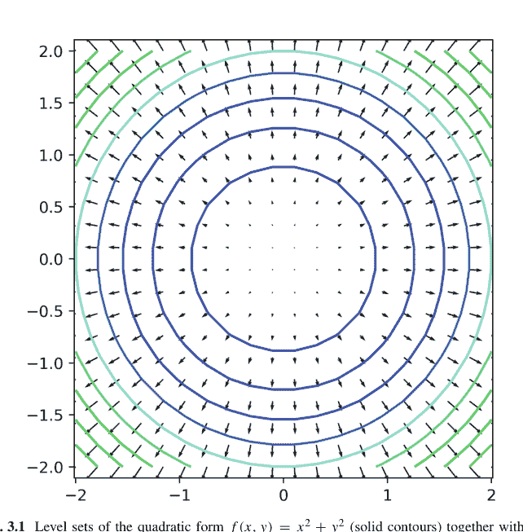

**图 3.1** 二次型 $f(x, y) = x^2 + y^2$ 的水平集（实线等高线）及其梯度场 $\nabla f = (2x, 2y)$。每个梯度向量都与相应的等高线正交，并径向向外，可视化了 $f$ 的最陡上升方向和径向对称性。

```
X, Y = np.meshgrid(np.linspace(-2, 2, 20), np.linspace(-2, 2, 20))
F = X**2 + Y**2
gradX = 2*X
gradY = 2*Y

plt.contour(X, Y, F, levels=10, cmap='viridis')
plt.quiver(X, Y, gradX, gradY)
plt.title("Level Sets and Gradient Field of $f(x, y) = x^2 + y^2$")
plt.axis("equal")
plt.show()
```

**例 3.3.4（梯度垂直于水平曲线）** 对于 $f(x, y) = x^2 - y^2$，水平集是双曲线。验证梯度 $\nabla f = (2x, -2y)$ 在给定点处垂直于水平集。

选择点 $(1, 1)$。在该点，水平集为 $x^2 - y^2 = 0 \Rightarrow x = y$。切向量为 $(1, 1)$。点积：

$$\nabla f \cdot \langle 1, 1 \rangle = 2 \cdot 1 + (-2) \cdot 1 = 0.$$

### 多元优化

设 $f : \mathbb{R}^n \to \mathbb{R}$。临界点满足 $\nabla f = \mathbf{0}$。**海森矩阵** $H_f \in \mathbb{R}^{n \times n}$ 定义为：

$$(H_f)_{ij} = \frac{\partial^2 f}{\partial x_i \partial x_j}.$$

临界点的性质由 $H$ 的特征值决定：

- 正定 $\Rightarrow$ 局部极小值
- 负定 $\Rightarrow$ 局部极大值
- 不定 $\Rightarrow$ 鞍点

**例 3.3.5（优化多元函数）** 设 $f(x, y) = x^2 + y^2 - 4x - 6y$。求并分类临界点。

```
f = x**2 + y**2 - 4*x - 6*y
grad = [sp.diff(f, var) for var in (x, y)]
critical = sp.solve(grad)
H = sp.hessian(f, (x, y))
eigenvals = H.subs(critical).eigenvals()
sp.pprint(critical)
sp.pprint(eigenvals)
```

梯度在 $x = 2$, $y = 3$ 处为零。海森矩阵为 $2I$，正定 $\Rightarrow$ 在 $(2, 3)$ 处有局部极小值。

**例 3.3.6（鞍点）** 设 $f(x, y) = x^2 - y^2$。则 $\nabla f = (2x, -2y) \Rightarrow (0, 0)$ 是临界点。海森矩阵：

$$H = \begin{pmatrix} 2 & 0 \\ 0 & -2 \end{pmatrix} \Rightarrow \text{不定} \Rightarrow \text{鞍点}.$$

**例 3.3.7（约束优化：拉格朗日乘数法）** 在约束 $x^2 + y^2 = 1$ 下最大化 $f(x, y) = xy$。

```
λ = sp.Symbol("λ")
g = x**2 + y**2 - 1
L = x*y - λ*g
sol = sp.solve([sp.diff(L, v) for v in (x, y, λ)])
sp.pprint(sol)
```

最大值在 $x = y = \frac{1}{\sqrt{2}}$ 处取得 $\Rightarrow f = \frac{1}{2}$。

### 3.3.2 重积分

当函数依赖于多个变量时，积分推广到高维。**二重积分**计算曲面下的体积，**三重积分**在三维区域上累积值。SymPy 支持此类积分的符号和数值计算，并允许通过雅可比行列式进行坐标变换。

#### 二重积分

给定定义在矩形区域 $R = [a, b] \times [c, d]$ 上的 $f(x, y)$，二重积分为

$$\iint_R f(x, y) \, dx \, dy = \int_c^d \left( \int_a^b f(x, y) \, dx \right) dy.$$

如果区域不是矩形，内层积分的积分限依赖于外层变量。

**例 3.3.8（矩形区域）** 计算：

$$\iint_{[0,1] \times [0,2]} (x^2 + y) \, dx \, dy.$$

```
import sympy as sp
x, y = sp.symbols("x y")
f = x**2 + y
I = sp.integrate(sp.integrate(f, (x, 0, 1)), (y, 0, 2))
sp.pprint(I)
```

内层积分：$\int_0^1 x^2 + y \, dx = \frac{1}{3} + y$。外层积分：$\int_0^2 \left( \frac{1}{3} + y \right) dy = \frac{2}{3} + 2 = \frac{8}{3}$。

## 示例 3.3.9（非矩形区域）计算：

$$\iint_D xy \, dx \, dy, \quad D = \{(x, y) \mid 0 \le y \le 1, \ 0 \le x \le y\}.$$

```python
f = x * y
I = sp.integrate(sp.integrate(f, (x, 0, y)), (y, 0, 1))
sp.pprint(I)
```

我们计算：

$$\int_0^1 \int_0^y xy \, dx \, dy = \int_0^1 y \left( \frac{1}{2} y^2 \right) \, dy = \frac{1}{2} \int_0^1 y^3 \, dy = \frac{1}{8}.$$

## 三重积分

对于定义在三维区域 $V \subset \mathbb{R}^3$ 上的函数 $f(x, y, z)$，三重积分计算：

$$\iiint_V f(x, y, z) \, dx \, dy \, dz.$$

## 示例 3.3.10（长方体区域）计算：

$$\iiint_{[0,1]^3} xyz \, dx \, dy \, dz.$$

```python
z = sp.Symbol("z")
f = x * y * z
I = sp.integrate(sp.integrate(sp.integrate(f, (x, 0, 1)), (y, 0, 1)), (z, 0, 1))
sp.pprint(I)
```

所有积分都在 $[0,1]$ 上，因此：

$$\int_0^1 x \, dx = \frac{1}{2}, \quad y, z \text{ 同理}.$$

总计：$\frac{1}{2} \cdot \frac{1}{2} \cdot \frac{1}{2} = \frac{1}{8}$。

## 示例 3.3.11（四面体区域）计算：

$$\iiint_D (x+y+z) \, dz \, dy \, dx, \quad D = \{0 \le x \le 1, \ 0 \le y \le 1-x, \ 0 \le z \le 1-x-y\}.$$

```python
f = x + y + z
I = sp.integrate(
    sp.integrate(
        sp.integrate(f, (z, 0, 1 - x - y)),
        (y, 0, 1 - x)),
    (x, 0, 1))
sp.pprint(I)
```

结果为 $\frac{1}{8}$，即单位四面体上的平均值。

## 变量替换与雅可比行列式

坐标变换通过将复杂区域映射到更简单的区域来简化积分。设 $(x, y) = \phi(u, v)$。则：

$$\iint_D f(x, y) \, dx \, dy = \iint_{\phi^{-1}(D)} f(x(u, v), y(u, v)) \left| \frac{\partial(x, y)}{\partial(u, v)} \right| \, du \, dv.$$

这里的**雅可比行列式**为：

$$J = \begin{vmatrix} \partial x/\partial u & \partial x/\partial v \\ \partial y/\partial u & \partial y/\partial v \end{vmatrix}.$$

## 示例 3.3.12（极坐标）计算：

$$\iint_{x^2+y^2 \le 1} (x^2 + y^2) \, dx \, dy.$$

使用 $x = r \cos \theta$, $y = r \sin \theta$。则 $x^2 + y^2 = r^2$，雅可比行列式为 $r$。

```python
r, theta = sp.symbols("r theta")
f_polar = r**2 * r
I = sp.integrate(sp.integrate(f_polar, (r, 0, 1)), (theta, 0, 2*sp.pi))
sp.pprint(I)
```

我们计算：

$$\int_0^{2\pi} \int_0^1 r^3 \, dr \, d\theta = 2\pi \cdot \frac{1}{4} = \frac{\pi}{2}.$$

## 示例 3.3.13（非线性变换的雅可比行列式）设 $u = x + y$, $v = x - y$。计算该变换的雅可比行列式。

```python
u, v = sp.symbols("u v")
x = (u + v)/2
y = (u - v)/2
J = sp.Matrix([[sp.diff(x, u), sp.diff(x, v)],
               [sp.diff(y, u), sp.diff(y, v)]])
sp.pprint(J)
sp.pprint(J.det())
```

雅可比行列式为：

$$J = \begin{pmatrix} \frac{1}{2} & \frac{1}{2} \\ \frac{1}{2} & -\frac{1}{2} \end{pmatrix}, \quad \det J = -\frac{1}{2}.$$

## 示例 3.3.14（使用雅可比行列式变换积分）计算：

$$\iint_{x>0, \ y>0, \ x^2+y^2<1} e^{x^2+y^2} dxdy.$$

在极坐标下，$x^2 + y^2 = r^2$，雅可比行列式为 $r$：

$$\int_0^{\pi/2} \int_0^1 e^{r^2} r \, dr \, d\theta.$$

我们进行代换 $u = r^2 \Rightarrow du = 2r \, dr$：

```python
u = sp.Symbol("u")
inner = sp.integrate(sp.exp(u)/2, (u, 0, 1))
I = inner * (sp.pi / 2)
sp.pprint(I)
```

结果为：

$$\frac{\pi}{4}(e^1 - 1).$$

## 3.3.3 线积分与面积分

在多元微积分中，积分从面积和体积推广到曲线和曲面区域。**线积分**沿路径累积函数值，**面积分**计算通过曲面的通量等量。这些积分在物理学和工程学中至关重要：功、环流以及电/磁通量都使用此类积分描述。本节涵盖标量和向量线积分、面积分，以及使用 Python 和 SymPy 进行计算。

## 标量线积分

给定标量场 $f : \mathbb{R}^n \to \mathbb{R}$ 和光滑路径 $\gamma : [a, b] \to \mathbb{R}^n$，标量线积分为：

$$\int_{\gamma} f \, ds = \int_a^b f(\gamma(t)) \|\gamma'(t)\| \, dt.$$

这表示 $f$ 沿曲线的累积值，以弧长为权重。

## 示例 3.3.15（曲线长度）

设 $\gamma(t) = (t, t^2)$，$t \in [0, 1]$。计算弧长：

$$L = \int_0^1 \sqrt{(dx/dt)^2 + (dy/dt)^2} \, dt = \int_0^1 \sqrt{1 + 4t^2} \, dt.$$

```python
import sympy as sp
t = sp.Symbol("t")
gamma = [t, t**2]
speed = sp.sqrt(sum([sp.diff(c, t)**2 for c in gamma]))
L = sp.integrate(speed, (t, 0, 1))
sp.pprint(L)
```

这给出了弧长的精确表达式：

$$\frac{1}{4}\left((1+4)^{3/2} - 1\right) = \frac{1}{4}(5^{3/2} - 1).$$

## 示例 3.3.16（沿导线积分温度）

设 $f(x, y) = x^2 + y^2$，路径 $\gamma(t) = (\cos t, \sin t)$，$t \in [0, \pi/2]$。则 $f(\gamma(t)) = 1$，因此：

$$\int_{\gamma} f \, ds = \int_0^{\pi/2} 1 \cdot \|\gamma'(t)\| \, dt = \int_0^{\pi/2} 1 \, dt = \frac{\pi}{2}.$$

```python
gamma = [sp.cos(t), sp.sin(t)]
f = gamma[0]**2 + gamma[1]**2
speed = sp.sqrt(sum([sp.diff(c, t)**2 for c in gamma]))
I = sp.integrate(f * speed, (t, 0, sp.pi/2))
sp.pprint(I)
```

## 向量线积分

给定向量场 $\vec{F} = (P, Q)$ 和路径 $\gamma(t) = (x(t), y(t))$，沿路径的线积分为：

$$\int_{\gamma} \vec{F} \cdot d\vec{r} = \int_a^b \left[ P(x(t), y(t)) \, x'(t) + Q(x(t), y(t)) \, y'(t) \right] dt.$$

## 示例 3.3.17（力场所做的功）

设 $\vec{F} = (x^2, y)$，路径 $\gamma(t) = (t, t^2)$，$t \in [0, 1]$。则：

$$\int_{\gamma} \vec{F} \cdot d\vec{r} = \int_0^1 \left[ t^2 \cdot 1 + t^2 \cdot 2t \right] dt = \int_0^1 t^2 + 2t^3 \, dt.$$

```python
x_t, y_t = t, t**2
F = [x_t**2, y_t]
dx = sp.diff(x_t, t)
dy = sp.diff(y_t, t)
integrand = F[0]*dx + F[1]*dy
I = sp.integrate(integrand, (t, 0, 1))
sp.pprint(I)
```

计算结果为 $\frac{1}{3} + \frac{1}{2} = \frac{5}{6}$。

## 示例 3.3.18（保守场的闭合回路积分）设 $\vec{F} = \nabla f$，其中 $f(x, y) = x^2 + y^2$，路径为单位圆。则 $\oint \vec{F} \cdot d\vec{r} = 0$。

```python
x_t, y_t = sp.cos(t), sp.sin(t)
F = [2*x_t, 2*y_t]
dx = sp.diff(x_t, t)
dy = sp.diff(y_t, t)
integrand = F[0]*dx + F[1]*dy
I = sp.integrate(integrand, (t, 0, 2*sp.pi))
sp.pprint(I)
```

由于保守场的对称性，积分结果为 0。

## 通过曲面的通量

给定向量场 $\vec{F}(x, y, z)$ 和具有法向量 $\vec{n}$ 的曲面 $S$，面积分为：

$$\iint_S \vec{F} \cdot d\vec{S} = \iint_D \vec{F} \cdot \vec{n} \, dA.$$

对于曲面 $z = g(x, y)$，我们有：

$$d\vec{S} = \left( -\frac{\partial g}{\partial x}, -\frac{\partial g}{\partial y}, 1 \right) \, dx \, dy.$$

## 示例 3.3.19（通过抛物面盖的向上通量）设 $\vec{F}(x, y, z) = (0, 0, z)$，曲面 $S$ 为圆盘 $x^2 + y^2 \le 4$ 上的盖 $z = 4 - x^2 - y^2$。
则：

$$\iint_S \vec{F} \cdot \vec{n} \, dS = \iint_D (4 - x^2 - y^2) \, dx \, dy.$$

```python
r, theta = sp.symbols("r theta")
z = 4 - r**2
jacobian = r
f = z * jacobian
flux = sp.integrate(sp.integrate(f, (r, 0, 2)), (theta, 0, 2*sp.pi))
sp.pprint(flux)
```

计算：

$$\int_0^{2\pi} \int_0^2 (4 - r^2)r \, dr \, d\theta = 8\pi.$$

## 示例 3.3.20（通过平面的电通量）设 $\vec{F}(x, y, z) = (x, y, z)$，曲面 $S$ 为 $xy$ 平面上的单位正方形，即 $z = 0$，$0 \le x, y \le 1$。
则：
$$\vec{n} = (0, 0, 1), \quad \vec{F} \cdot \vec{n} = z = 0 \Rightarrow \text{通量} = 0.$$
现在将曲面平移到 $z = 3$：
$$\vec{F} \cdot \vec{n} = 3 \Rightarrow \iint_S 3 \, dx \, dy = 3.$$

```python
x, y = sp.symbols("x y")
flux = sp.integrate(sp.integrate(3, (x, 0, 1)), (y, 0, 1))
sp.pprint(flux)
```

## 示例 3.3.21（旋转场通过圆柱体的通量）设 $\vec{F} = (-y, x, 0)$，曲面为圆柱体 $x^2 + y^2 = 1$ 的侧面，$0 \le z \le 1$。
参数化：
$$\vec{r}(\theta, z) = (\cos \theta, \sin \theta, z), \quad \vec{n} = (\cos \theta, \sin \theta, 0), \quad dS = dz \, d\theta.$$
则：
$$\vec{F} \cdot \vec{n} = -\sin \theta \cos \theta + \cos \theta \sin \theta = 0.$$
由于场与曲面法向量正交，通量为零。

```python
theta, z = sp.symbols("theta z")
Fx, Fy = -sp.sin(theta), sp.cos(theta)
n_dot_F = Fx*sp.cos(theta) + Fy*sp.sin(theta)
flux = sp.integrate(sp.integrate(n_dot_F, (z, 0, 1)), (theta, 0, 2*sp.pi))
sp.pprint(flux)
```

## 3.4 微积分高级主题

物理学、生物学和经济学中的许多现象并非由代数关系支配，而是由微分定律支配：函数与其导数之间的关系。微分方程表达了一个量如何随另一个量（通常是时间或空间）的变化而演变。我们使用 SymPy 和 SciPy 探索常微分方程（ODEs）的解析和数值方法。

## 3.4.1 微分方程

### 一阶常微分方程

**一阶常微分方程**的形式为

$$\frac{dy}{dx} = f(x, y),$$

初始条件为 $y(x_0) = y_0$。解析技巧包括分离变量法、积分因子法和恰当方程法。

### 示例 3.4.1（可分离变量方程）求解

$$\frac{dy}{dx} = xy, \quad y(0) = 1.$$

分离变量：

$$\frac{dy}{y} = x \, dx \Rightarrow \ln|y| = \frac{x^2}{2} + C.$$

```python
import sympy as sp
x = sp.Symbol("x")
y = sp.Function("y")(x)
ode = sp.Eq(y.diff(x), x*y)
sol = sp.dsolve(ode, y, ics={y.subs(x, 0): 1})
sp.pprint(sol)
```

解为 $y(x) = e^{x^2/2}$。

### 示例 3.4.2（积分因子法）求解

$$\frac{dy}{dx} + y = e^x, \quad y(0) = 0.$$

乘以积分因子 $e^x$ 得到：

$$\frac{d}{dx}(ye^x) = e^{2x} \Rightarrow y = e^x - 1.$$

```python
ode = sp.Eq(y.diff(x) + y, sp.exp(x))
sol = sp.dsolve(ode, y, ics={y.subs(x, 0): 0})
sp.pprint(sol)
```

### 高阶常微分方程与方程组

二阶常微分方程用于建模具有加速度、曲率或记忆效应的系统。一般形式为：

$a(x)y'' + b(x)y' + c(x)y = g(x)$。

### 示例 3.4.3（常系数齐次方程）求解

$y'' - 3y' + 2y = 0, \quad y(0) = 1, \quad y'(0) = 0$。

```python
y = sp.Function("y")(x)
ode = sp.Eq(y.diff(x,2) - 3*y.diff(x) + 2*y, 0)
sol = sp.dsolve(ode, y, ics={y.subs(x, 0): 1, y.diff(x).subs(x, 0): 0})
sp.pprint(sol)
```

解为：

$y(x) = e^x + e^{2x}(-1)$。

### 示例 3.4.4（受迫谐振子）

$y'' + 4y = \cos(2x), \quad y(0) = 0, \quad y'(0) = 0$。

此方程存在共振，其特解线性增长：

$y(x) = \frac{x}{4} \sin(2x)$。

```python
ode = sp.Eq(y.diff(x,2) + 4*y, sp.cos(2*x))
sol = sp.dsolve(ode, y, ics={y.subs(x, 0): 0, y.diff(x).subs(x, 0): 0})
sp.pprint(sol)
```

### 常微分方程组 令

$\frac{dx}{dt} = x + 2y, \quad \frac{dy}{dt} = 3x + 4y$。

```python
t = sp.Symbol("t")
x = sp.Function("x")(t)
y = sp.Function("y")(t)

eq1 = sp.Eq(x.diff(t), x + 2*y)
eq2 = sp.Eq(y.diff(t), 3*x + 4*y)
sol = sp.dsolve([eq1, eq2])
sp.pprint(sol)
```

此求解过程内部使用矩阵指数来求解耦合系统。

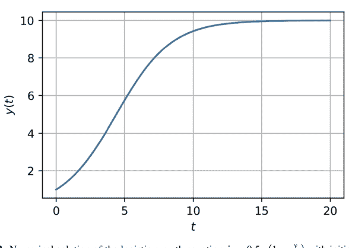

图 3.2 逻辑斯谛增长方程 $\dot{y} = 0.5 y(1 - \frac{y}{10})$ 在初始值 $y(0) = 1$ 下的数值解。轨迹表现出初始的近似指数增长，随后平滑地饱和于环境容纳量 $K = 10$，展示了逻辑斯谛动力学的 S 形特性。

### SciPy 中的数值求解器

对于许多非线性或刚性常微分方程，无法获得符号解。`scipy.integrate.solve_ivp` 使用龙格-库塔法或 BDF 方法（参见图 3.2）数值求解初值问题。

**示例 3.4.5（逻辑斯谛方程的数值求解）** 求解

$$\frac{dy}{dt} = ry(1 - y/K), \quad y(0) = 1, \ r = 0.5, \ K = 10.$$

```python
from scipy.integrate import solve_ivp
import numpy as np
import matplotlib.pyplot as plt

def logistic(t, y, r=0.5, K=10):
    return r * y * (1 - y / K)

sol = solve_ivp(logistic, [0, 20], [1], t_eval=np.linspace(0, 20, 200))
plt.plot(sol.t, sol.y[0])
plt.xlabel("t")
plt.ylabel("y(t)")
plt.title("Logistic Growth")
plt.grid()
plt.show()
```

此代码绘制了趋向环境容纳量 $K = 10$ 的特征性 S 形增长曲线。

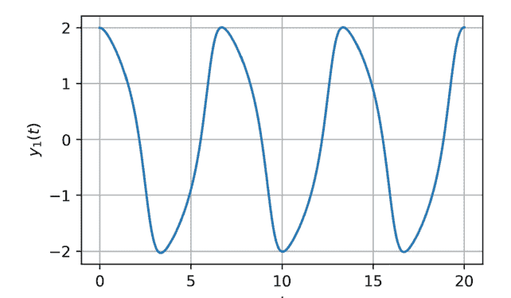

图 3.3 范德波尔振荡器 $\ddot{y} - \mu(1 - y^2)\dot{y} + y = 0$ 在 $\mu = 1$ 和初始状态 $(y_1(0), y_2(0)) = (2, 0)$ 下的时间演化。经过一个瞬态的大振幅阶段后，轨迹稳定为一个自持的弛豫振荡，这是非线性极限环行为的标志。

### 示例 3.4.6（范德波尔振荡器 (van der Pol 1926)（参见图 3.3））求解：

$y'' - \mu(1 - y^2)y' + y = 0, \quad \mu = 1$。

转换为方程组：

$\dot{y}_1 = y_2, \quad \dot{y}_2 = \mu(1 - y_1^2)y_2 - y_1$。

```python
def vdp(t, y, mu=1.0):
    y1, y2 = y
    return [y2, mu*(1 - y1**2)*y2 - y1]

sol = solve_ivp(vdp, [0, 20], [2, 0], t_eval=np.linspace(0, 20, 1000))
plt.plot(sol.t, sol.y[0])
plt.title("Van der Pol Oscillator")
plt.grid()
plt.show()
```

解呈现非正弦振荡，反映了非线性阻尼特性。

### 示例 3.4.7（刚性常微分方程：Robertson 问题（参见图 3.4））

$\begin{cases} y_1' = -0.04y_1 + 10^4 y_2 y_3 \\ y_2' = 0.04y_1 - 10^4 y_2 y_3 - 3 \times 10^7 y_2^2 \\ y_3' = 3 \times 10^7 y_2^2 \end{cases}$

此方程是刚性的；需使用 BDF 方法。

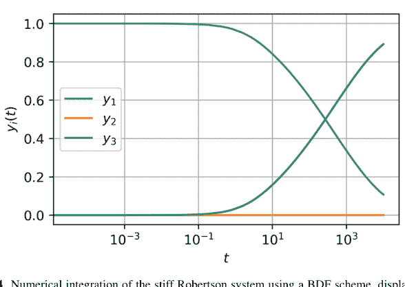

**图 3.4** 使用 BDF 格式对刚性 Robertson 系统进行数值积分，结果在对数时间轴上显示。$y_1$ 的快速消耗以及随后由 $y_3$ 主导的缓慢演化，展示了刚性化学动力学常微分方程典型的多时间尺度动力学特征。

```python
def robertson(t, y):
    y1, y2, y3 = y
    return [-0.04*y1 + 1e4*y2*y3,
            0.04*y1 - 1e4*y2*y3 - 3e7*y2**2,
            3e7*y2**2]

sol = solve_ivp(robertson, [0, 1e4], [1, 0, 0], method='BDF')
plt.semilogx(sol.t, sol.y[0], label='y1')
plt.semilogx(sol.t, sol.y[1], label='y2')
plt.semilogx(sol.t, sol.y[2], label='y3')
plt.legend(), plt.grid(), plt.title("Robertson Problem")
plt.show()
```

## 3.4.2 变分法

**变分法**研究的是泛函（从函数到实数的映射）的优化问题。一个典型的变分问题是寻找使以下积分最小化的函数 $y(x)$：

$$\mathcal{J}[y] = \int_{a}^{b} L(x, y(x), y'(x)) \, dx,$$

并满足边界条件 $y(a) = y_a$, $y(b) = y_b$。这在物理学（最小作用量原理）、几何学（测地线）和工程学（最优控制）中都有应用。

### 欧拉-拉格朗日形式体系

$\mathcal{J}[y]$ 的临界点满足 **欧拉-拉格朗日方程**：

$$\frac{\partial L}{\partial y} - \frac{d}{dx} \left( \frac{\partial L}{\partial y'} \right) = 0.$$

**示例 3.4.8（最短路径：平面上的测地线）** 设 $y(x)$ 连接两点 $(x_0, y_0)$ 和 $(x_1, y_1)$。弧长泛函为：

$$\mathcal{J}[y] = \int_{x_0}^{x_1} \sqrt{1 + y'(x)^2} \, dx.$$

此处 $L(y, y') = \sqrt{1 + y'^2}$，因此：

$$\frac{d}{dx} \left( \frac{y'}{\sqrt{1 + y'^2}} \right) = 0 \Rightarrow \frac{y'}{\sqrt{1 + y'^2}} = C.$$

求解得 $y' = \text{常数} \Rightarrow y(x) = mx + c$——一条直线。

```python
import sympy as sp
x = sp.Symbol("x")
y = sp.Function("y")(x)
L = sp.sqrt(1 + sp.diff(y, x)**2)
EL = sp.diff(sp.diff(L, sp.diff(y, x)), x) - sp.diff(L, y)
sp.pprint(sp.simplify(EL)) # 返回 0
```

**示例 3.4.9（最速降线）** 最小化重力作用下两点间的下降时间。泛函为：

$$\mathcal{J}[y] = \int_{x_0}^{x_1} \sqrt{\frac{1 + y'^2}{2gy}} \, dx.$$

这导出一条摆线路径。推导欧拉-拉格朗日方程会得到一个非线性常微分方程，可通过参数替换求解。由于其复杂性，通常采用数值方法或已知的解形式来处理。

### 约束条件与拉格朗日乘子

对于带有积分约束的变分问题：

最小化 $\mathcal{J}[y] = \int_{a}^{b} L(x, y, y') \, dx, \quad \text{满足} \quad \int_{a}^{b} g(x, y) \, dx = C,$

引入拉格朗日乘子 $\lambda$ 并构造：

$$\tilde{L} = L(x, y, y') + \lambda g(x, y).$$

然后对 $\tilde{L}$ 应用欧拉-拉格朗日方程。

### 示例 3.4.10（等周问题：最大化封闭面积）

在所有周长固定且围成固定面积的曲线中，哪一条能最大化面积？答案是：圆。

这需要最大化：

$$\mathcal{J}[y] = \int y \, dx \quad \text{满足} \quad \int \sqrt{1 + y'^2} \, dx = \text{常数}.$$

构造：

$$\tilde{L} = y + \lambda \sqrt{1 + y'^2}.$$

应用欧拉-拉格朗日方程：

$$\frac{d}{dx} \left( \frac{\lambda y'}{\sqrt{1 + y'^2}} \right) = 1.$$

### 示例 3.4.11（约束极值温度分布）

求使以下泛函最小化的 $y(x)$：

$$\mathcal{J}[y] = \int_0^1 (y')^2 \, dx, \quad \text{满足} \quad \int_0^1 y(x) \, dx = 1, \quad y(0) = y(1) = 0.$$

构造增广泛函：

$$\tilde{L} = (y')^2 + \lambda y.$$

欧拉-拉格朗日方程：

$$\frac{d}{dx}(2y') = \lambda \Rightarrow y'' = \lambda/2.$$

```python
lam = sp.Symbol("lambda")
y = sp.Function("y")(x)
L = sp.diff(y, x)**2 + lam * y
EL = sp.diff(sp.diff(L, sp.diff(y, x)), x) - sp.diff(L, y)
sp.pprint(EL)
```

## 在物理学中的应用

**拉格朗日力学** 物理系统的路径使作用量最小化：

$$S[q] = \int_{t_0}^{t_1} L(q, \dot{q}, t) dt, \quad L = T - V.$$

欧拉-拉格朗日方程导出牛顿定律。

**示例 3.4.12（单摆）** 设 $\theta(t)$ 为角位移。拉格朗日量：

$$L = \frac{1}{2}m\ell^2\dot{\theta}^2 - mg\ell(1 - \cos\theta).$$

则：

$$\frac{d}{dt}(m\ell^2\dot{\theta}) + mg\ell\sin\theta = 0 \Rightarrow \theta'' + \frac{g}{\ell}\sin\theta = 0.$$

```python
θ = sp.Function("θ")(x)
g, l, m = sp.symbols("g l m")
L = (1/2)*m*l**2 * sp.diff(θ, x)**2 - m*g*l*(1 - sp.cos(θ))
EL = sp.diff(sp.diff(L, sp.diff(θ, x)), x) - sp.diff(L, θ)
sp.pprint(sp.simplify(EL))
```

**光学：费马原理** 光沿使光程长度极值化的路径传播：

$$\mathcal{J}[y] = \int n(x, y)\sqrt{1 + y'^2} dx.$$

在均匀介质中 $n = \text{const}$，路径是直线。在非均匀介质中，变分法导出斯涅尔定律和光线的弯曲。

**静电学：最小能量构型** 势 $u$ 最小化：

$$\int |\nabla u|^2 dx \quad \Rightarrow \quad \Delta u = 0.$$

欧拉-拉格朗日方程恢复了拉普拉斯方程——这是势论的基础。

## 3.4.3 张量微积分

**张量微积分** 将向量微积分推广到多线性函数和弯曲空间。它是微分几何、连续介质力学和爱因斯坦广义相对论理论的基础。张量将标量（0阶）、向量（1阶）和矩阵（2阶）的概念扩展到任意阶 $(r, s)$，表示具有 $r$ 个逆变（上标）和 $s$ 个协变（下标）指标的多线性映射。Python 通过 SymPy 的张量模块和用于数值指标操作的 NumPy，能够进行符号和数值张量计算。

## 指标记法与爱因斯坦求和约定

在*指标记法*中，张量方程使用指标来表示分量，例如：

$A^i_j, \quad T^{\mu\nu}_\lambda$。

**爱因斯坦求和约定**规定：*对任何出现一次为上标、一次为下标的重复指标求和*：

$a^i b_i = \sum_i a^i b_i$。

**示例 3.4.13（使用爱因斯坦求和的点积）** 设 $a^i = (1, 2, 3)$，$b_i = (4, 5, 6)$。则 $a^i b_i = 1 \cdot 4 + 2 \cdot 5 + 3 \cdot 6 = 32$。

```python
import numpy as np
a = np.array([1, 2, 3])
b = np.array([4, 5, 6])
dot = np.einsum("i,i->", a, b)
print(dot) # Output: 32
```

**示例 3.4.14（矩阵-向量乘法作为缩并）** 设 $A^i_j$ 为矩阵，$v^j$ 为向量：

$w^i = A^i_j v^j$。

```python
A = np.array([[1,2], [3,4]])
v = np.array([5,6])
w = np.einsum("ij,j->i", A, v)
print(w) # Output: [17 39]
```

**示例 3.4.15（度规缩并）** 给定度规 $g_{ij}$ 和逆变向量 $v^i$，计算协变 $v_j = g_{ij} v^i$。

```python
g = np.array([[2, 0], [0, 3]])
v_up = np.array([1, 2])
v_down = np.einsum("ij,j->i", g, v_up)
print(v_down) # Output: [2 6]
```

## 协变与逆变张量

逆变分量 $V^i$ 通过以下方式变换：

$V'^{i} = \frac{\partial x'^{i}}{\partial x^j} V^j$。

协变分量 $W_i$ 的变换方式为：

$W'_i = \frac{\partial x^j}{\partial x'^i} W_j$。

该变换定律确保了坐标变换下张量的一致性。

**示例 3.4.16（指标升降）** 给定 $g_{ij}$ 和 $g^{ij}$（逆度规），在两者之间转换：

$v_i = g_{ij} v^j$, $v^i = g^{ij} v_j$。

```python
g_down = np.array([[2, 1], [1, 2]])
g_up = np.linalg.inv(g_down)
v_up = np.array([3, 4])
v_down = np.einsum("ij,j->i", g_down, v_up)
v_raised = np.einsum("ij,j->i", g_up, v_down)
print(v_raised) # Recovers original [3 4]
```

**示例 3.4.17（旋转下的变换）** 将向量 $v^i$ 旋转角度 $\theta$。变换矩阵：

$R^i_j = \begin{pmatrix} \cos\theta & -\sin\theta \\ \sin\theta & \cos\theta \end{pmatrix}$

```python
theta = np.pi / 4
R = np.array([[np.cos(theta), -np.sin(theta)], [np.sin(theta), np.cos(theta)]])
v = np.array([1, 0])
v_rot = np.einsum("ij,j->i", R, v)
print(v_rot) # Output: [0.707..., 0.707...]
```

## 广义相对论应用

在广义相对论中，引力场被编码在**度规张量** $g_{\mu\nu}$ 中，时空几何取代了力。自由粒子的动力学遵循**测地线方程**：

$$\frac{d^2 x^\mu}{d\tau^2} + \Gamma^\mu_{\alpha\beta} \frac{dx^\alpha}{d\tau} \frac{dx^\beta}{d\tau} = 0.$$

这里 $\Gamma^\mu_{\alpha\beta}$ 是**克里斯托费尔符号**，定义为：

$$\Gamma^\mu_{\alpha\beta} = \frac{1}{2} g^{\mu\nu} (\partial_\alpha g_{\nu\beta} + \partial_\beta g_{\nu\alpha} - \partial_\nu g_{\alpha\beta}).$$

**示例 3.4.18（在二维中计算克里斯托费尔符号）** 设：

$$ds^2 = dx^2 + (1 + x^2)dy^2 \Rightarrow g_{ij} = \begin{pmatrix} 1 & 0 \\ 0 & 1 + x^2 \end{pmatrix}.$$

```python
x, y = sp.symbols("x y")
g = sp.Matrix([[1, 0], [0, 1 + x**2]])
g_inv = g.inv()
n = 2
tau = [[[0]*n for _ in range(n)] for _ in range(n)]
for mu in range(n):
    for alpha in range(n):
        for beta in range(n):
            sum_ = 0
            for nu in range(n):
                sum_ += g_inv[mu, nu] * (
                    sp.diff(g[nu, beta], x if alpha == 0 else y)
                    + sp.diff(g[nu, alpha], x if beta == 0 else y)
                    - sp.diff(g[alpha, beta], x if nu == 0 else y))
            tau[mu][alpha][beta] = sp.simplify(1/2 * sum_)
sp.pprint(tau[1][0][1]) # Example: tau^1_{01}
```

这得到：

$$\Gamma^1_{01} = \frac{x}{1 + x^2}.$$

**示例 3.4.19（极坐标中的测地线）** 度规：

$$ds^2 = dr^2 + r^2 d\theta^2, \quad g_{ij} = \begin{pmatrix} 1 & 0 \\ 0 & r^2 \end{pmatrix}.$$

克里斯托费尔符号：

$$\Gamma_{\theta\theta}^r = -r, \quad \Gamma_{r\theta}^\theta = \frac{1}{r}.$$

测地线方程为：

$$\ddot{r} - r\dot{\theta}^2 = 0, \quad \ddot{\theta} + \frac{2}{r}\dot{r}\dot{\theta} = 0.$$

```python
r, theta = sp.symbols("r theta")
g = sp.Matrix([[1, 0], [0, r**2]])
g_inv = g.inv()
# Compute Christoffel symbols manually
tau_r_tt = -r
tau_theta_rt = 1/r
```

**示例 3.4.20（里奇标量曲率）** 对于二维黎曼流形，计算里奇标量 $R$。在常曲率曲面上：

$$R = \text{constant} \implies \text{sphere: } R > 0, \text{ hyperbolic plane: } R < 0.$$

符号计算需要评估克里斯托费尔符号和黎曼张量。

由于复杂性，专用库（例如 `Mathematica` 中的 `xAct`）或符号几何包可能更合适。

## 3.4.4 分数阶微积分

**分数阶微积分** 将导数和积分的概念推广到非整数（分数）阶。$n$ 阶导数通过重复应用微分来定义，但取 $\alpha \in \mathbb{R}$ 阶，甚至 $\alpha \in \mathbb{C}$ 阶的导数意味着什么？分数阶导数和积分在粘弹性、反常扩散、信号处理和控制系统中都有应用。Python 通过 `sympy`、`mpmath` 和 `fracdiff` 等包提供了该领域的符号和数值工作工具。

## 分数阶导数

一个流行的定义是**黎曼-刘维尔分数阶导数**：

$$D^\alpha f(x) = \frac{1}{\Gamma(n - \alpha)} \frac{d^n}{dx^n} \int_a^x \frac{f(t)}{(x - t)^{\alpha - n + 1}} \, dt, \quad n - 1 < \alpha < n.$$

另一个是**卡普托导数**，由于初始条件定义明确，在物理建模中通常更受青睐：

$$^C D^\alpha f(x) = \frac{1}{\Gamma(n - \alpha)} \int_a^x \frac{f^{(n)}(t)}{(x - t)^{\alpha - n + 1}} dt.$$

**示例 3.4.21（幂函数的分数阶导数）** 设 $f(x) = x^k$。则：

$$D^\alpha x^k = \frac{\Gamma(k + 1)}{\Gamma(k - \alpha + 1)} x^{k - \alpha}.$$

```python
import sympy as sp
x, alpha, k = sp.symbols("x alpha k", positive=True)
f = x**k
Dalpha_f = sp.gamma(k+1) / sp.gamma(k - alpha + 1) * x**(k - alpha)
sp.pprint(Dalpha_f)
```

当 $\alpha \in \mathbb{N}$ 时，该表达式简化为标准导数。

**示例 3.4.22（卡普托导数的数值近似）** 设 $f(x) = \sin(x)$，近似其在 $x = 1$ 处的 $\alpha = 0.5$ 阶卡普托导数。mpmath 支持分数阶微积分。

```python
from mpmath import *
mp.dps = 15

def caputo_half_deriv(f, x, a=0, N=100):
    h = (x - a) / N
    t_vals = [a + i*h for i in range(N)]
    f_prime = [diff(f, t) for t in t_vals]
    weights = [(x - t)**(-0.5) for t in t_vals]
    return (1/gamma(0.5)) * h * sum(w*w_ for w,w_ in zip(weights, f_prime))

result = caputo_half_deriv(lambda t: sin(t), 1.0)
print(result)
```

## 分数阶积分

$\alpha > 0$ 阶的**黎曼-刘维尔分数阶积分**定义为：

$$I^\alpha f(x) = \frac{1}{\Gamma(\alpha)} \int_a^x (x - t)^{\alpha - 1} f(t) dt.$$

**示例 3.4.23（$f(t) = 1$ 的分数阶积分）**

$$I^\alpha 1 = \frac{1}{\Gamma(\alpha)} \int_0^x (x - t)^{\alpha - 1} dt = \frac{x^\alpha}{\Gamma(\alpha + 1)}.$$

α, x = sp.symbols("α x", positive=True)
Iα_1 = x**α / sp.gamma(α + 1)
sp.pprint(Iα_1)

这将积分 $\int_0^x dt = x$ 推广到非整数 $\alpha$。

**示例 3.4.24（使用求积法的数值近似）** 设 $f(t) = t$，计算 $I^{0.5} f(x)$ 在 $x = 1$ 处的值：

$$I^{0.5}t = \frac{1}{\Gamma(0.5)} \int_0^1 (1-t)^{-0.5}t \, dt.$$

```python
from scipy.integrate import quad
import numpy as np
from scipy.special import gamma

f = lambda t: t * (1 - t)**(-0.5)
I, _ = quad(f, 0, 1)
print(I / gamma(0.5)) # ≈ 1.128
```

## 分数阶动力学建模

分数阶导数使我们能够建模**记忆效应**和**非局部动力学**，这些常见于生物系统、粘弹性材料和反常扩散中。

## 分数阶弛豫方程

$$D^\alpha y(t) = -\lambda y(t), \quad 0 < \alpha < 1.$$

解：$y(t) = E_\alpha(-\lambda t^\alpha)$，其中 $E_\alpha$ 是 Mittag-Leffler 函数（参见图 3.5）。

```python
from mpmath import *
mp.dps = 15

λ = 1.0
α = 0.5
t = mp.linspace(0, 10, 100)
y = [mittaggleich(α, -λ * ti**α) for ti in t]

import matplotlib.pyplot as plt
plt.plot(t, y)
plt.title("Fractional Relaxation: $D^{0.5}y = -y$")
plt.xlabel("t")
plt.ylabel("y(t)")
plt.grid()
plt.show()
```

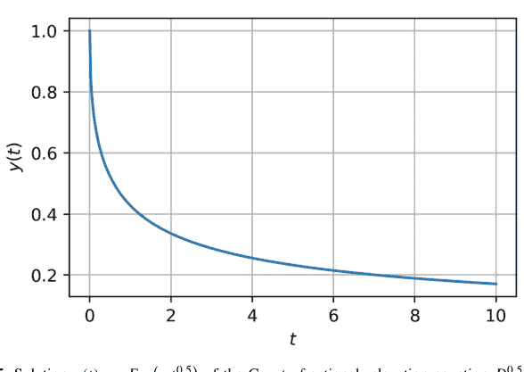

图 3.5 Caputo 分数阶弛豫方程 $D^{0.5}y(t) = -y(t)$ 在 $\lambda = 1$ 时的解 $y(t) = E_{0.5}(-t^{0.5})$。Mittag-Leffler 衰减表现出缓慢的幂律尾部，突出了分数阶动力学特有的长记忆效应。

## 反常扩散方程

$$\frac{\partial^\alpha u}{\partial t^\alpha} = D \frac{\partial^2 u}{\partial x^2}, \quad 0 < \alpha \le 1.$$

这模拟了异质介质中的亚扩散行为。

## 粘弹性：分数阶 Maxwell 模型

应力-应变关系：

$$\sigma(t) + \tau^\alpha D^\alpha \sigma(t) = E D^\alpha \varepsilon(t),$$

其中 $\tau$, $E$ 是材料常数，$D^\alpha$ 模拟遗传记忆。

### 示例 3.4.25（对阶跃输入的分数阶响应）

使用拉普拉斯变换和符号微积分来表达时域中的应力响应：

$$\sigma(s) = \frac{E}{1 + \tau^\alpha s^\alpha} \cdot \frac{1}{s}.$$

拉普拉斯逆变换涉及一个 Mittag-Leffler 函数。

```python
s = sp.Symbol("s")
E, tau, alpha = sp.symbols("E tau alpha")
sigma_s = (E / (1 + tau**alpha * s**alpha)) * (1 / s)
# 拉普拉斯逆变换是符号的；数值逆变换更可取
```

## 3.5 练习

1.  设 $f(x) = \sin(4x)$ 在 $[0, \pi]$ 上。对于节点 $x_0 = \frac{\pi}{6}$，使用以下公式计算一阶导数：
    $$D_c^{(h)} f(x_0) = \frac{f(x_0 + h) - f(x_0 - h)}{2h}, \quad h = \frac{\pi}{2^k}, \quad k = 4, 5, \dots, 10.$$
    将绝对误差 $|D_c^{(h)} f(x_0) - f'(x_0)|$ 列成表格，并通过对 $\log_2$ 缩放的数据拟合直线来验证二阶收敛率。在 Python 中数值确认你的斜率，并参考舍入误差解释 $k \ge 9$ 时的任何偏差。

2.  定义
    $$\mathbf{F}: \mathbb{R}^3 \to \mathbb{R}^3, \quad \mathbf{F}(\mathbf{x}) = \begin{pmatrix} e^{x_1} + x_2 \sin x_3 \\ x_1 x_3^2 - \sqrt{1 + x_2^2} \\ \ln(1 + x_1 x_2) + x_3 \end{pmatrix}.$$
    使用自动微分（反向模式）计算雅可比矩阵 $J\mathbf{F}(\mathbf{a})$，并对于标量泛函 $\Phi(\mathbf{x}) = \|\mathbf{F}(\mathbf{x})\|^2$，计算在 $\mathbf{a} = (0.2, -0.3, 1.1)^\top$ 处的海森矩阵 $\nabla^2 \Phi(\mathbf{a})$。提供数值结果和生成它们的代码行。

3.  符号计算
    $$I = \int_0^\infty \frac{\arctan bx - \arctan ax}{x(e^{2\pi x} - 1)} \, dx, \quad 0 < a < b,$$
    并证明它简化为 $\frac{1}{4} \left( \log \Gamma\left(\frac{1}{2} + \frac{b}{\pi}\right) - \log \Gamma\left(\frac{1}{2} + \frac{a}{\pi}\right) \right)$。在 mpmath 中对 $a = 1, b = 2$ 进行数值验证，达到 $10^{-10}$ 的相对精度。

4.  计算
    $$\iint_D (x^2 + y^2)^{\frac{3}{2}} \, dx \, dy, \quad D = \{(x, y) : 0 \le y \le \sqrt{1 - x^2}, \, 0 \le x \le 1\}.$$
    (a) 在笛卡尔坐标系中直接计算。(b) 转换到极坐标系并证明积分结果一致。(c) 在 SymPy 中实现两种方法并报告运行时间。

5.  最小化
    $$f(x, y, z) = x^2 + y^2 + z^2 - 6x - 8y - 10z$$
    满足平面约束 $x + 2y + 3z = 12$。(i) 使用拉格朗日乘子法找到临界点。(ii) 验证在该点处的加边海森矩阵是正定的。(iii) 使用 `scipy.optimize.minimize` 和等式约束进行数值确认。

6.  设 $\vec{F} = (y^2, x^2)$，$C$ 是顶点为 $(0, 0)$, $(2, 0)$, $(0, 2)$ 的正向三角形。(a) 直接计算 $\oint_C \vec{F} \cdot d\vec{r}$。(b) 计算 $(\partial Q/\partial x - \partial P/\partial y)$ 在三角形区域上的二重积分，并数值验证格林定理。

7.  给定 $\vec{F}(x, y, z) = (yz, xz, xy)$，计算 $\iint_S \vec{F} \cdot d\vec{S}$，其中 $S$ 是长方体 $0 \le x \le 2$, $0 \le y \le 1$, $0 \le z \le 3$ 的封闭表面。(a) 使用散度定理计算。(b) 显式计算六个面的积分并证明它们的和与 (a) 的结果相同。

8.  求解方程组
    $$
    \begin{cases}
    y_1' = -10^3(y_1 - y_2), \\
    y_2' = y_1 - y_2,
    \end{cases}
    \quad y_1(0) = 1, \quad y_2(0) = 0,
    $$
    直到 $t = 10^{-2}$。(i) 解析获得精确解。(ii) 使用 `solve_ivp` 分别用 RK45 和 BDF 方法进行数值求解。(iii) 将每个求解器在 $t = 10^{-2}$ 处的全局误差列成表格并解释差异。

9.  在 $[0, 1]$ 上找到最小化
    $$
    \mathcal{J}[y] = \int_0^1 (y'(x))^2 \, dx,
    $$
    的 $y(x)$，满足 $y(0) = 0$, $y(1) = 0$ 和等周约束 $\int_0^1 x \, y(x) \, dx = 1$。推导带拉格朗日乘子的欧拉-拉格朗日方程，求解 $y(x)$，并计算乘子的值。

10. 在球坐标 $(\theta, \phi)$ 下的单位球面上，度量：$ds^2 = d\theta^2 + \sin^2 \theta \, d\phi^2$。(a) 计算所有非零的 $\Gamma^k_{jk}$。(b) 推导测地线方程。(c) 证明大圆满足这些方程。(d) 数值积分一条初始点为 $(\theta_0 = 1, \phi_0 = 0)$、初始速度为 $(\dot{\theta}_0 = 0, \dot{\phi}_0 = 1)$ 的测地线；在笛卡尔坐标系中绘制轨迹。

11. 考虑 $^C D_t^{0.3} y(t) = -2y(t)$，其中 $y(0) = 1$。(i) 用 Mittag-Leffler 函数表示 $y(t)$。(ii) 使用步长 $h = 0.01$ 的 Grünwald-Letnikov 有限差分法近似 $t \in [0, 5]$ 上的 $y(t)$。(iii) 绘制解析解和数值解，并计算最大绝对误差。

12. 给定 $xyz$ 坐标系中的柯西应力张量
    $$
    \sigma_{ij} = \begin{pmatrix} 100 & 30 & 20 \\ 30 & 80 & 10 \\ 20 & 10 & 60 \end{pmatrix} \text{MPa},
    $$
    以及绕 $z$ 轴旋转 $\theta = 45^\circ$，计算变换后的张量 $\sigma'_{ij} = R_i^k R_j^\ell \sigma_{k\ell}$。识别旋转坐标系中的主应力。

13. 计算
    $$\iiint_V (x^2 + y^2 + z^2)^{\frac{1}{2}} \, dV,$$
    其中 $V$ 是由球坐标 $(\rho, \theta, \phi)$ 中的 $\rho = 2 + \cos\theta$ 所围成的立体。用封闭形式表达你的答案，并通过蒙特卡洛采样（$10^6$ 个点）进行数值确认。

14. 设 $\vec{F} = (y, -x, z)$，$S$ 是上半球面 $x^2 + y^2 + z^2 = 1, z \ge 0$。
    (a) 直接计算 $\iint_S (\nabla \times \vec{F}) \cdot d\vec{S}$。(b) 计算 $\oint_{\partial S} \vec{F} \cdot d\vec{r}$，其中 $\partial S$ 是 $xy$ 平面上的单位圆，并验证斯托克斯定理。

# 第 4 章
Python 中的数据结构与算法

**摘要** 计算机科学基础与数学严谨性相遇，渐近分析指导着栈、队列、链表、树的设计，并深入探讨了驱动 Python `dict` 的哈希表机制。实现了经典的搜索和排序算法并进行了基准测试，同时图论介绍了广度优先搜索、深度优先搜索和 Dijkstra 最短路径算法——为后续的数值和数据科学流程奠定了算法基石。

**关键词** 数据结构 · 算法 · 哈希表 · 搜索与排序 · 图算法 · 复杂度分析

现代数学计算关键依赖于数据的高效表示和操作。**数据结构**提供了一个形式化框架，以符合算法目标的方式存储、组织和检索数据。无论我们是在求解线性系统、实现符号操作还是分析图，数据结构的选择直接影响计算复杂度和内存使用。本章介绍基础数据结构，探讨其数学和算法基础，并演示它们在 Python 中的实现和使用。

## 4.1 数据结构简介

### 4.1.1 数据结构概述

**数据结构**是组织信息的数学或逻辑模型。其主要目标是优化以下一项或多项操作：插入、删除、查找、遍历或转换。每种数据结构的基础都是一个抽象数据类型（ADT），例如集合、列表或映射。

## 数据结构在计算效率中的作用

相同的算法，根据所采用的数据结构不同，其时间复杂度和空间复杂度可能表现出显著差异。

**示例 4.1.1（线性搜索与二分搜索）** 设 $A \subset \mathbb{Z}$ 是一个包含 $n$ 个整数的列表。

**情况 1** $A$ 是无序的。要测试成员资格：
`x in A # 最坏情况下为 O(n)`

**情况 2** $A$ 是一个已排序的列表：
`import bisect`
`bisect.bisect_left(A, x) # O(log n)`

这种从线性时间到对数时间的改进，是通过维护有序结构实现的，即以插入的复杂度换取查询速度。

**示例 4.1.2（集合成员资格与列表成员资格）** Python 集合内部使用哈希表。

```
S = set(range(10**6))
print(999999 in S) # O(1)
```

相比之下：

```
L = list(range(10**6))
print(999999 in L) # O(n)
```

这展示了结构选择如何改变渐近性能。

**示例 4.1.3（稀疏矩阵与稠密矩阵）** 考虑求解 $Ax = b$，其中 $A \in \mathbb{R}^{n \times n}$ 是稀疏的。

使用稠密存储：
```
import numpy as np
A = np.eye(1000)
```
内存使用为 $O(n^2)$。

使用稀疏存储：
```
from scipy.sparse import eye
A_sparse = eye(1000)
```
这里，只存储非零元素，从而获得 $O(n)$ 的存储空间，并能实现与向量的快速乘法。

## 数据结构的类型及其用例

以下是常见数据结构的分类及其代表性用例：

### 线性结构

- **列表（数组）：** 有序集合，支持快速索引。

**示例 4.1.4（多项式系数向量）** 将 $f(x) = 4x^3 + 3x^2 - 2x + 1$ 表示为：
`coeffs = [1, -2, 3, 4] # 从 0 次项到 3 次项`

- **栈：** 后进先出（LIFO）结构。

**示例 4.1.5（括号平衡检查器）**
```python
def is_balanced(expr):
    stack = []
    for ch in expr:
        if ch == '(':
            stack.append(ch)
        elif ch == ')':
            if not stack: return False
            stack.pop()
    return not stack
```

- **队列：** 先进先出（FIFO）缓冲区。

**示例 4.1.6（图的广度优先遍历）**
```python
from collections import deque
Q = deque([start])
visited = set()
while Q:
    node = Q.popleft()
    ...
```

### 层次结构

- **树：** 递归的、无环的结构，用于表示嵌套数据。

**示例 4.1.7（用于符号求值的表达式树）**

$(2 + 3) \times (4 - 1)$

可以被解析为一棵二叉树，其叶子节点是操作数，内部节点是运算符。

- **二叉搜索树（BST）：** 有序树，支持 $O(\log n)$ 的搜索和插入。

- **堆：** 部分有序的树，用于优先队列。

**示例 4.1.8（通过两个堆维护中位数）** 使用一个最大堆存储较小的一半，一个最小堆存储较大的一半，以在每次插入时以 $O(\log n)$ 的复杂度跟踪中位数。

### 基于哈希的结构

- **字典（映射）：** 键值对，平均访问时间为 $O(1)$。

**示例 4.1.9（字符频率统计）**
```python
from collections import Counter
freq = Counter("abracadabra")
```

### 图结构

- **邻邻接表：** 存储每个顶点的邻居。
- **邻接矩阵：** 二元矩阵 $A_{ij}$ 表示边的存在。

**示例 4.1.10（表示一个有四个节点的无向图）**
```python
adj = [[0,1,1,0],
       [1,0,0,1],
       [1,0,0,1],
       [0,1,1,0]]
```

### 矩阵和张量表示

- **二维数组：** 表示线性映射。
- **稀疏矩阵：** 对于非零元素较少的大型系统的有效表示。
- **张量：** 用于物理学、几何学和深度学习的多维数组。

**示例 4.1.11（存储三维张量 $T_{ijk} \in \mathbb{R}^{5 \times 5 \times 5}$）**
```python
T = np.zeros((5,5,5))
T[1,2,3] = 42
```

## 4.1.2 基本数据结构

本节介绍三种构成算法设计基础的基本数据结构：**栈、队列和链表**。它们在元素插入和移除的顺序上有所不同——这影响了在解析、图遍历、模拟和动态内存分配中的算法设计。

### 栈

**栈**是一种后进先出（LIFO）结构。最后添加的元素最先被移除。

**操作**

- push(x)：将元素 x 压入栈顶。
- pop()：移除并返回栈顶元素。
- peek()：返回栈顶元素但不移除。
- is_empty()：检查栈是否为空。

**示例 4.1.12（检查括号平衡）**
```python
def is_balanced(expr):
    stack = []
    for ch in expr:
        if ch == '(':
            stack.append(ch)
        elif ch == ')':
            if not stack:
                return False
            stack.pop()
    return not stack
```
```python
assert is_balanced("(()())") == True
assert is_balanced("(()") == False
```

这使用栈来跟踪嵌套结构——一种常见的解析技术。

**示例 4.1.13（使用栈反转字符串）**
```python
def reverse_string(s):
    stack = list(s)
    return ''.join(stack.pop() for _ in s)
```
```python
assert reverse_string("python") == "nohtyp"
```

**示例 4.1.14（计算后缀（逆波兰）表达式）** 给定 "3 4 + 2 *"，计算得到 (3 + 4) × 2 = 14。
```python
def eval_postfix(expr):
    stack = []
    for token in expr.split():
        if token.isdigit():
            stack.append(int(token))
        else:
            b, a = stack.pop(), stack.pop()
            stack.append(eval(f"{a}{token}{b}"))
    return stack[0]
```
```python
assert eval_postfix("3 4 + 2 *") == 14
```

### 队列

队列是一种先进先出（FIFO）结构。第一个插入的元素最先被移除。

**操作**

- enqueue(x)：将 x 添加到队尾。
- dequeue()：从队头移除。
- peek()：返回队头元素。
- is_empty()：检查是否为空。

**示例 4.1.15（客户服务模拟）** 模拟一个请求队列：
```python
from collections import deque

Q = deque()
Q.append("Alice")
Q.append("Bob")
Q.append("Carol")
while Q:
    print("Serving:", Q.popleft())
```
这将按顺序打印：Alice, Bob, Carol。

**示例 4.1.16（图的广度优先搜索（BFS））**
```python
def bfs(graph, start):
    from collections import deque
    visited = set()
    Q = deque([start])
    while Q:
        node = Q.popleft()
        if node not in visited:
            visited.add(node)
            Q.extend(graph[node])
    return visited
```

**示例 4.1.17（使用队列的轮转调度）** 每个进程按顺序获得一个时间片：
```python
Q = deque(["A", "B", "C"])
for _ in range(6):
    process = Q.popleft()
    print("Running:", process)
    Q.append(process)
```

### 链表

**链表**由节点组成，每个节点包含数据和一个指向下一个节点的引用（指针）。这允许高效的插入和删除，无需移动元素。

**类型**

- **单链表**：每个节点指向下一个。
- **双链表**：节点同时指向前一个和后一个。
- **循环链表**：最后一个节点指回头节点。

**示例 4.1.18（单链表类）**
```python
class Node:
    def __init__(self, data, next=None):
        self.data, self.next = data, next

class LinkedList:
    def __init__(self):
        self.head = None

    def push_front(self, value):
        self.head = Node(value, self.head)

    def pop_front(self):
        if not self.head: return None
        val, self.head = self.head.data, self.head.next
        return val

    def print_all(self):
        node = self.head
        while node:
            print(node.data, end="->")
            node = node.next
        print("None")
```

**示例 4.1.19（原地反转链表）**
```python
def reverse(head):
    prev, curr = None, head
    while curr:
        nxt = curr.next
        curr.next = prev
        prev, curr = curr, nxt
    return prev
```

**示例 4.1.20（使用弗洛伊德算法检测环）**
```python
def has_cycle(head):
    slow = fast = head
    while fast and fast.next:
        slow = slow.next
        fast = fast.next.next
        if slow == fast:
            return True
    return False
```

## 示例 4.1.21（多项式作为链表）将 $f(x) = 4x^3 + 3x^2 - 2x + 5$ 存储为链表节点：每个节点包含（系数，指数）。

```python
class Term:
    def __init__(self, coeff, exp, next=None):
        self.coeff, self.exp, self.next = coeff, exp, next

# 手动构造：
t1 = Term(5, 0)
t2 = Term(-2, 1, t1)
t3 = Term(3, 2, t2)
poly = Term(4, 3, t3)

def eval_poly(head, x):
    result = 0
    while head:
        result += head.coeff * (x ** head.exp)
        head = head.next
    return result
```

## 树

**树**是一种层次化的数据结构，它以分支的方式递归地组织数据。每个节点可以有零个或多个子节点，最顶层的节点称为**根**。树用于表示表达式层次结构、排序数据、语法树和文件系统。

## 二叉树

**二叉树**是一种每个节点最多有两个子节点的树：**左**子节点和**右**子节点。

### 示例 4.1.22（递归中序遍历）通过访问：左、根、右来遍历二叉树。

```python
class Node:
    def __init__(self, val, left=None, right=None):
        self.val, self.left, self.right = val, left, right

def inorder(root):
    if root:
        inorder(root.left)
        print(root.val, end=" ")
        inorder(root.right)

# 构造树：2
#                / \
# 1   3
root = Node(2, Node(1), Node(3))
inorder(root) # 输出：1 2 3
```

### 示例 4.1.23（用于符号计算的表达式树）解析并求值表达式 (3 + 4) × 5。

```python
root = Node("*", Node("+", Node("3"), Node("4")), Node("5"))

def eval_tree(node):
    if node.val.isdigit():
        return int(node.val)
    a = eval_tree(node.left)
    b = eval_tree(node.right)
    return eval(f"{a}{node.val}{b}")

print(eval_tree(root)) # 输出：35
```

## 二叉搜索树（BST）

BST 维护以下不变式：

左子树 < 根 < 右子树。

### 示例 4.1.24（向 BST 插入）

```python
def insert(node, key):
    if not node:
        return Node(key)
    if key < node.val:
        node.left = insert(node.left, key)
    else:
        node.right = insert(node.right, key)
    return node
```

## 树的遍历

- 中序：左 → 根 → 右（BST 产生排序顺序）。
- 前序：根 → 左 → 右。
- 后序：左 → 右 → 根。
- 层序：使用队列（BFS）。

### 示例 4.1.25（高度平衡树）如果每个节点的左子树和右子树的高度差最多为 1，则该树是平衡的。

检查高度平衡：

```python
def height(node):
    if not node: return 0
    return 1 + max(height(node.left), height(node.right))

def is_balanced(node):
    if not node: return True
    h1 = height(node.left)
    h2 = height(node.right)
    return abs(h1 - h2) <= 1 and is_balanced(node.left) and is_balanced(
        node.right)
```

#### 用例

- 表达式解析（AST）
- 堆（优先队列）
- 平衡搜索树（AVL，红黑树）
- 机器学习中的决策树

## 哈希表与字典内部原理

**哈希表**使用哈希函数 $h : \mathcal{K} \rightarrow [0, m - 1]$ 将键映射到值，以计算大小为 $m$ 的表中的索引。

## Python dict

`dict` 实现为一个*动态哈希表*，具有：

- 开放寻址（线性探测 + 扰动）
- 负载因子阈值 $\alpha \approx 0.66$
- 插入溢出时调整大小

### 示例 4.1.26（基本字典操作）

```python
d = {"x": 1, "y": 2}
d["z"] = 3
del d["x"]
for key, val in d.items():
    print(key, "→", val)
```

## 哈希函数

对于像 `int`、`str`、`tuple` 这样的不可变类型，Python 使用内置的 `hash()`。

```python
print(hash("math")) # 在不同会话中是确定性的
print(hash((1, 2, 3)))
```

像 `list` 或 `set` 这样的可变类型是不可哈希的。

```python
hash([1,2,3]) # 引发 TypeError
```

### 示例 4.1.27（哈希冲突）多个键可能映射到相同的索引。

```python
class BadHash:
    def __init__(self, val): self.val = val
    def __hash__(self): return 42
    def __eq__(self, other): return self.val == other.val

d = {}
for i in range(5):
    d[BadHash(i)] = i
print(len(d)) # 仍然是 5，通过探测解决
```

## 哈希表性能

> 平均情况：O(1) 查找、插入、删除
> 最坏情况：O(n)（由于冲突）

### 示例 4.1.28（频率统计——经典哈希表用法）

```python
from collections import defaultdict
s = "data structure"
freq = defaultdict(int)
for ch in s:
    freq[ch] += 1
print(freq)
```

## OrderedDict

自 Python 3.7 起，dict 保持插入顺序。但为了兼容性，请显式使用 collections.OrderedDict。

### 示例 4.1.29（保持插入顺序）

```python
from collections import OrderedDict
od = OrderedDict()
od["x"] = 1
od["y"] = 2
print(list(od.keys())) # ['x', 'y']
```

## 哈希映射 vs. BST 映射

- dict：平均 O(1)，无序（除非使用 OrderedDict）。
- SortedContainers.SortedDict：有序，O(log n)。

## 4.2 搜索算法

搜索是数学计算和算法逻辑中的基本操作。**搜索算法**在给定的集合中定位一个项目，例如列表中的元素、字典中的键或序列中的模式。搜索算法的效率根据时间复杂度、最坏情况性能以及对数据的结构假设（例如，已排序与未排序）来评估。我们从最简单的方法开始：**线性搜索**。

### 4.2.1 线性搜索

线性搜索是一种顺序检查集合中每个元素的方法，直到找到目标或序列结束。

#### 算法与复杂度分析

设 $A = [a_0, a_1, \dots, a_{n-1}] \in \mathbb{R}^n$ 是一个未排序的列表，$x \in \mathbb{R}$ 是查询值。线性搜索算法按顺序对每个索引 $i$ 执行测试 $a_i = x$。

**伪代码**

```
for i from 0 to n-1:
    if A[i] == x:
        return i
return -1
```

**时间复杂度**

- 最佳情况：$O(1)$（如果 $x = a_0$）
- 最坏情况：$O(n)$（如果 $x \notin A$）
- 平均情况（均匀分布）：$O(n)$

**空间复杂度**

$O(1)$（原地，无额外存储）

**特性**

- 适用于任何支持相等性测试的数据类型。
- 不需要排序或顺序。
- 可以扩展为带谓词或复合键的线性搜索。

### 示例 4.2.1（数学恒等式检查）在列表中搜索第一个完全平方数。

```python
import math

def is_square(n):
    return int(math.sqrt(n))**2 == n

def linear_search_predicate(A, predicate):
    for i, val in enumerate(A):
        if predicate(val):
            return i
    return -1

A = [10, 11, 14, 25, 30, 50]
idx = linear_search_predicate(A, is_square)
print(f"第一个完全平方数在索引 {idx}，值 = {A[idx]}")
```

输出：第一个完全平方数在索引 3，值 = 25。

## Python 实现

**基本实现**

```python
def linear_search(A, x):
    for i in range(len(A)):
        if A[i] == x:
            return i
    return -1
```

**变体：返回所有匹配的索引**

```python
def linear_search_all(A, x):
    return [i for i, val in enumerate(A) if val == x]

A = [2, 4, 4, 6, 4]
print(linear_search_all(A, 4)) # 输出：[1, 2, 4]
```

**变体：在元组列表中搜索**

```python
students = [("Alice", 85), ("Bob", 92), ("Charlie", 85)]
def find_student_by_score(data, score):
    return [name for name, s in data if s == score]

print(find_student_by_score(students, 85)) # ['Alice', 'Charlie']
```

#### 性能分析

```python
import time
A = list(range(10**6))
x = 10**6 - 1

start = time.time()
idx = linear_search(A, x)
end = time.time()
print(f"在 {idx} 处找到，时间 = {end - start:.6f} 秒")
```

对于接近末尾的 $x$，运行时间与 $n$ 成线性关系。

### 示例 4.2.2（符号模式搜索）在列表中找到第一个在 $x = 0$ 处导数为零的函数。

```python
import sympy as sp
x = sp.Symbol("x")
functions = [sp.sin(x), x**2, sp.exp(x), sp.cos(x)]

for i, f in enumerate(functions):
    if sp.diff(f, x).subs(x, 0) == 0:
        print(f"索引 {i}，函数：", f)
        break
```

### 4.2.2 二分搜索

**二分搜索**是一种分治算法，用于在有序数组中查找目标值的位置。它通过将搜索区间反复减半来工作，在每一步中消除一半剩余的元素。这种指数级的剪枝赋予了二分搜索其对数时间复杂度，使其成为计算机科学中最基本和最高效的算法之一。

#### 算法与复杂度分析

设 $A = [a_0, a_1, \dots, a_{n-1}] \in \mathbb{R}^n$ 按非递减顺序排序，$x \in \mathbb{R}$ 是目标值。算法维护两个指针，low 和 high，使得 $x$ 必须位于子数组 $A[low : high]$ 内。

#### 伪代码

```
while low <= high:
    mid = (low + high) // 2
    if A[mid] == x:
        return mid
    elif A[mid] < x:
```

low = mid + 1
else:
    high = mid - 1
return -1
```

## 时间复杂度

$T(n) = T(n/2) + O(1) \Rightarrow T(n) = O(\log_2 n)$

#### 空间复杂度

- 迭代版本：$O(1)$
- 递归版本：$O(\log n)$ 栈深度

## 假设条件

- 输入列表必须是*已排序*的。
- 元素必须可通过全序关系进行比较。

## 示例 4.2.3（比较线性搜索与二分搜索的时间）

```python
import time, bisect
A = list(range(10**7))
x = 9999999

# 线性搜索
start = time.time()
A.index(x)
print("线性搜索:", time.time() - start)

# 使用 bisect 进行二分搜索
start = time.time()
bisect.bisect_left(A, x)
print("二分搜索:", time.time() - start)
```

在大规模输入上，二分搜索的速度快几个数量级。

## Python 实现

### 迭代实现

```python
def binary_search(A, x):
    low, high = 0, len(A) - 1
    while low <= high:
        mid = (low + high) // 2
        if A[mid] == x:
            return mid
        elif A[mid] < x:
            low = mid + 1
        else:
            high = mid - 1
    return -1
```

### 递归实现

```python
def binary_search_rec(A, x, low=0, high=None):
    if high is None: high = len(A) - 1
    if low > high:
        return -1
    mid = (low + high) // 2
    if A[mid] == x:
        return mid
    elif A[mid] < x:
        return binary_search_rec(A, x, mid + 1, high)
    else:
        return binary_search_rec(A, x, low, mid - 1)
```

### 使用 bisect 模块

```python
import bisect
def binary_search_bisect(A, x):
    i = bisect.bisect_left(A, x)
    return i if i < len(A) and A[i] == x else -1
```

## 示例 4.2.4（查找平方根整数）
给定一个已排序的平方数列表，查找一个数字的索引。

```python
squares = [i**2 for i in range(100)]
x = 625
print(binary_search(squares, x)) # 输出: 25
```

## 示例 4.2.5（查找第一个 ≥ 目标值的元素）

```python
def lower_bound(A, x):
    low, high = 0, len(A)
    while low < high:
        mid = (low + high) // 2
        if A[mid] < x:
            low = mid + 1
        else:
            high = mid
    return low
```

## 示例 4.2.6（二分查找单调函数的根）
设 f(x) = x³ - 5x + 1。在 [0, 2] 区间内查找根。

```python
def f(x): return x**3 - 5*x + 1

def binary_root(f, a, b, eps=1e-6):
    while b - a > eps:
        mid = (a + b) / 2
        if f(mid) * f(a) <= 0:
            b = mid
        else:
            a = mid
    return (a + b) / 2

root = binary_root(f, 0, 2)
print(f"根 ≈ {root:.6f}, f(根) ≈ {f(root):.2e}")
```

## 示例 4.2.7（在二维矩阵中搜索）
给定一个每行每列都已排序的矩阵，执行二分搜索。

```python
def search_matrix(matrix, target):
    if not matrix: return False
    rows, cols = len(matrix), len(matrix[0])
    low, high = 0, rows * cols - 1
    while low <= high:
        mid = (low + high) // 2
        val = matrix[mid // cols][mid % cols]
        if val == target:
            return True
        elif val < target:
            low = mid + 1
        else:
            high = mid - 1
    return False
```

## 4.3 排序算法

排序算法将一组元素重新排列成规定的顺序——通常是升序或降序。它们是算法设计的基础，用于搜索、数据规范化、优化等。排序算法的效率由其时间复杂度、空间使用和稳定性来评判。我们从基础排序算法开始：选择排序、冒泡排序和插入排序。虽然对于大型数据集效率不高，但这些算法概念简单，对于教授算法思维很有价值。

### 4.3.1 基础排序算法

#### 选择排序

**选择排序**通过反复选择剩余未排序元素中的最小值，并将其交换到正确位置来对列表进行排序。

#### 算法

对于 $A = [a_0, a_1, \dots, a_{n-1}]$，迭代：

- 对于 $i = 0$ 到 $n - 2$：
- 找到索引 $j \ge i$，使得 $A[j]$ 最小
- 交换 $A[i] \leftrightarrow A[j]$

## 时间复杂度

最坏情况：$O(n^2)$  最佳情况：$O(n^2)$  原地排序，不稳定

```python
def selection_sort(A):
    n = len(A)
    for i in range(n):
        min_idx = i
        for j in range(i + 1, n):
            if A[j] < A[min_idx]:
                min_idx = j
        A[i], A[min_idx] = A[min_idx], A[i]
    return A
```

#### 示例 4.3.1（对整数列表排序）

```python
A = [64, 25, 12, 22, 11]
print(selection_sort(A)) # [11, 12, 22, 25, 64]
```

#### 示例 4.3.2（对字符串进行选择排序）

```python
names = ["Bob", "Alice", "Eve"]
print(selection_sort(names)) # ['Alice', 'Bob', 'Eve']
```

#### 冒泡排序

**冒泡排序**反复比较相邻元素对，如果它们顺序错误则交换。

#### 算法

- 对于 $i = 0$ 到 $n - 1$：
- 从 $j = 0$ 遍历到 $n - i - 2$，如果 $A[j] > A[j+1]$ 则交换 $A[j]$ 和 $A[j+1]$。

## 时间复杂度

未优化时所有情况均为 $O(n^2)$。稳定且原地排序。

```python
def bubble_sort(A):
    n = len(A)
    for i in range(n):
        for j in range(0, n - i - 1):
            if A[j] > A[j + 1]:
                A[j], A[j + 1] = A[j + 1], A[j]
    return A
```

**示例 4.3.3（对 [5,1,4,2,8] 进行冒泡排序的追踪）**
每一趟都将最大的元素“冒泡”到末尾：

[5, 1, 4, 2, 8] → [1, 4, 2, 5, 8] → [1, 2, 4, 5, 8]

#### 提前终止

跟踪是否发生了任何交换：

```python
def bubble_sort_optimized(A):
    n = len(A)
    for i in range(n):
        swapped = False
        for j in range(0, n - i - 1):
            if A[j] > A[j + 1]:
                A[j], A[j + 1] = A[j + 1], A[j]
                swapped = True
        if not swapped:
            break
    return A
```

#### 插入排序

**插入排序**逐个构建已排序的列表，将每个新元素插入到正确的位置。

#### 算法

- 对于 $i = 1$ 到 $n - 1$：
- 设置 key = A[i]，并从后向前比较 A[j] 与 key。
- 如果 A[j] > key，则将 A[j] 右移。
- 将 key 插入到正确位置。

## 时间复杂度

最佳情况（已排序）：$O(n)$  最坏情况（逆序）：$O(n^2)$  稳定且原地排序

```python
def insertion_sort(A):
    for i in range(1, len(A)):
        key = A[i]
        j = i - 1
        while j >= 0 and A[j] > key:
            A[j + 1] = A[j]
            j -= 1
        A[j + 1] = key
    return A
```

#### 示例 4.3.4（对小数组进行插入排序）

[3, 1, 4, 2] ⇒ [1, 3, 4, 2] ⇒ [1, 3, 4, 2] ⇒ [1, 2, 3, 4]

#### 示例 4.3.5（按第二个元素对元组列表排序）

```python
data = [(1, "b"), (3, "a"), (2, "c")]
data.sort(key=lambda x: x[1]) # 内置排序使用 Timsort（稳定）
print(data) # [(3, 'a'), (1, 'b'), (2, 'c')]
```

#### 用例

- 对于小型或近乎有序的数据效率高。
- 用于混合算法，如 Timsort（Python 内置排序所使用的算法）。

### 4.3.2 分治技术

**分治**是算法设计中一个强大的范式。其主要思想是将问题分解为更小的子问题，递归地解决它们，然后合并解决方案。这种方法通常导致对数级的递归深度和改进的渐近性能。在排序中，**归并排序**和**快速排序**是经典应用。

#### 归并排序

**归并排序**递归地将输入数组分成两半，对每一半进行排序，然后合并已排序的两半。

## 算法步骤

1. 分解：将数组 $A[0 \dots n-1]$ 分成两半。
2. 解决：递归地对每一半进行排序。
3. 合并：将两个已排序的半部分合并成一个有序数组。

## 时间复杂度

$T(n) = 2T(n/2) + O(n) \Rightarrow T(n) = O(n \log n)$

#### 空间复杂度

$O(n)$（由于合并所需的临时数组）

#### 稳定性

是。原地排序：否。

```python
def merge_sort(A):
    if len(A) <= 1:
        return A
    mid = len(A) // 2
    left = merge_sort(A[:mid])
    right = merge_sort(A[mid:])
    return merge(left, right)

def merge(L, R):
    result = []
    i = j = 0
    while i < len(L) and j < len(R):
        if L[i] <= R[j]:
            result.append(L[i])
            i += 1
        else:
            result.append(R[j])
            j += 1
    result += L[i:] + R[j:]
    return result
```

#### 示例 4.3.6（使用归并排序对列表排序）

```python
A = [38, 27, 43, 3, 9, 82, 10]
sorted_A = merge_sort(A)
print(sorted_A) # [3, 9, 10, 27, 38, 43, 82]
```

#### 示例 4.3.7（使用自定义比较器的归并排序）

按第二个元素对元组列表排序：

def merge_sort_key(A, key):
    if len(A) <= 1: return A
    mid = len(A) // 2
    L = merge_sort_key(A[:mid], key)
    R = merge_sort_key(A[mid:], key)
    return merge_key(L, R, key)

def merge_key(L, R, key):
    result = []
    i = j = 0
    while i < len(L) and j < len(R):
        if key(L[i]) <= key(R[j]):
            result.append(L[i])
            i += 1
        else:
            result.append(R[j])
            j += 1
    result += L[i:] + R[j:]
    return result

pairs = [(1, 'b'), (2, 'a'), (3, 'c')]
print(merge_sort_key(pairs, key=lambda x: x[1]))

## 快速排序

**快速排序**选择一个基准元素，并将数组划分为小于基准和大于基准的两部分，然后递归地对这两部分进行排序。

## 算法步骤

1.  选择一个基准元素。
2.  划分数组：小于基准的元素放左边，大于基准的放右边。
3.  递归地对左右两部分应用快速排序。

## 时间复杂度

-   最佳情况：$O(n \log n)$
-   平均情况：$O(n \log n)$
-   最坏情况：$O(n^2)$（当基准是最小值/最大值时）

## 原地排序

是。稳定排序：否。

```python
def quick_sort(A):
    if len(A) <= 1:
        return A
    pivot = A[0]
    less = [x for x in A[1:] if x <= pivot]
    greater = [x for x in A[1:] if x > pivot]
    return quick_sort(less) + [pivot] + quick_sort(greater)
```

## 示例 4.3.8（使用快速排序对随机列表排序）

```python
import random
A = [random.randint(0, 100) for _ in range(10)]
print(quick_sort(A))
```

## 基于划分的原地快速排序

```python
def partition(A, low, high):
    pivot = A[high]
    i = low
    for j in range(low, high):
        if A[j] <= pivot:
            A[i], A[j] = A[j], A[i]
            i += 1
    A[i], A[high] = A[high], A[i]
    return i

def quick_sort_inplace(A, low=0, high=None):
    if high is None:
        high = len(A) - 1
    if low < high:
        pi = partition(A, low, high)
        quick_sort_inplace(A, low, pi - 1)
        quick_sort_inplace(A, pi + 1, high)
```

示例 4.3.9（可视化基准效应）尝试对 [5,4,3,2,1] 进行排序，并观察除非基准是随机的，否则会出现 $O(n^2)$ 的行为。

## 随机化快速排序

```python
def quick_sort_random(A):
    if len(A) <= 1:
        return A
    import random
    pivot = random.choice(A)
    L = [x for x in A if x < pivot]
    E = [x for x in A if x == pivot]
    G = [x for x in A if x > pivot]
    return quick_sort_random(L) + E + quick_sort_random(G)
```

这可以高概率避免最坏情况。

## 4.4 图论与算法

图论研究由节点（顶点）和连接它们的边（链接）组成的离散结构。图在数学、计算机科学、生物学和社会科学中对网络进行建模——从道路地图和电路到社交关系和神经网络。**图算法**是任何在此类结构上操作的过程：搜索、遍历、寻找最短路径或检测环。

### 4.4.1 图论简介

### 图作为数学结构

形式上，一个（简单）图 $G$ 是一个对 $G = (V, E)$，其中：

-   $V$ 是一个有限的顶点集 $\{v_1, v_2, \dots, v_n\}$。
-   $E \subseteq \{\{u, v\} \mid u, v \in V, u \neq v\}$ 是无向边的集合。

**有向图**（或称 digraph）使用有序对：$E \subseteq V \times V$。

### 术语

-   度：与一个顶点相连的边的数量。
-   路径：由边连接的顶点序列。
-   环：起点和终点相同的路径。
-   连通：每一对顶点都是可达的。
-   树：连通的无环图。
-   带权图：边具有关联的权重（成本）。

**示例 4.4.1（简单无向图）** 设 $V = \{1, 2, 3\}$，$E = \{\{1, 2\}, \{2, 3\}\}$。这可以可视化为一条路径：$1 \leftrightarrow 2 \leftrightarrow 3$。

**示例 4.4.2（带权重的有向图）** 设 $V = \{A, B, C\}$，且：

$$E = \{(A, B, 3), (B, C, 2), (A, C, 10)\}$$

这表示一个带权重的有向图，包含路径和成本。

**示例 4.4.3（邻接矩阵和度序列）** 对于图

$$G = (V, E), \quad V = \{0, 1, 2\}, \quad E = \{(0, 1), (1, 2), (0, 2)\},$$

其邻接矩阵为：

$A = \begin{pmatrix} 0 & 1 & 1 \\ 1 & 0 & 1 \\ 1 & 1 & 0 \end{pmatrix}$，每个顶点的度：[2, 2, 2]。

## Python 中的图表示

图可以用多种方式表示，每种方式在效率上各有取舍。

### 邻接表（使用字典的列表）

```python
graph = {
    'A': ['B', 'C'],
    'B': ['A', 'D'],
    'C': ['A'],
    'D': ['B']
}
```

### 示例 4.4.4（使用邻接表进行 DFS 遍历）

```python
def dfs(graph, v, visited=None):
    if visited is None: visited = set()
    visited.add(v)
    for neighbor in graph[v]:
        if neighbor not in visited:
            dfs(graph, neighbor, visited)
    return visited

print(dfs(graph, 'A')) # {'A', 'B', 'C', 'D'}
```

### 邻接矩阵（使用 NumPy）

```python
import numpy as np

adj_matrix = np.array([
    [0, 1, 1], # A 连接到 B, C
    [1, 0, 0], # B 连接到 A
    [1, 0, 0] # C 连接到 A
])
```

### 示例 4.4.5（计算每个顶点的度）

```python
degrees = adj_matrix.sum(axis=1)
print(degrees) # [2, 1, 1]
```

### 边列表

```python
edges = [("A", "B"), ("B", "C"), ("A", "C")]
```

### 示例 4.4.6（将边列表转换为邻接表）

```python
from collections import defaultdict

def build_adj_list(edges):
    G = defaultdict(list)
    for u, v in edges:
        G[u].append(v)
        G[v].append(u) # 用于无向图
    return G
```

### 带权图（带边权重）

```python
weighted_graph = {
    'A': {'B': 5, 'C': 3},
    'B': {'C': 2},
    'C': {'A': 4}
}
```

### 示例 4.4.7（提取所有带权重的边）

```python
edges = [(u, v, w) for u in weighted_graph for v, w in weighted_graph[u].items()]
print(edges) # [('A','B',5), ('A','C',3), ...]
```

### 图库：NetworkX

Python 的 networkx 提供了丰富的 API 用于图的构建和分析。

```python
import networkx as nx

G = nx.Graph()
G.add_edge("A", "B", weight=5)
G.add_edge("A", "C", weight=3)
nx.draw(G, with_labels=True)
```

### 示例 4.4.8（使用 Dijkstra 算法求最短路径）

```python
path = nx.dijkstra_path(G, "A", "B", weight="weight")
print(path) # ['A', 'B']
```

### 表示方法比较

| 表示方法 | 空间复杂度 | 最佳适用场景 | 操作 |
|---|---|---|---|
| 邻接表 | $O(V + E)$ | 稀疏图 | 快速遍历 |
| 邻接矩阵 | $O(V^2)$ | 稠密图 | 常数时间查找 |
| 边列表 | $O(E)$ | 基于边的算法 | 排序、过滤 |

### 4.4.2 基本图算法

图的遍历和路径查找是图论应用的核心。我们探讨三种基础算法：

-   **广度优先搜索（BFS）**：逐层探索邻居。
-   **深度优先搜索（DFS）**：在回溯前尽可能深入探索。
-   **Dijkstra 算法**：在具有非负边权重的带权图中计算最短路径。

这些是拓扑排序、环检测、生成树等算法的基础。

### 广度优先搜索（BFS）

BFS 从源顶点开始，逐层探索图，在进入深度 $d + 1$ 之前访问所有深度为 $d$ 的顶点。它使用一个队列（FIFO）。

**时间复杂度**

$O(V + E)$

**空间复杂度**

$O(V)$（已访问集合，队列）

```python
from collections import deque

def bfs(graph, start):
    visited = set()
    queue = deque([start])
    order = []
    while queue:
        node = queue.popleft()
        if node not in visited:
            visited.add(node)
            order.append(node)
            queue.extend(graph[node])
    return order
```

### 示例 4.4.9（树的层序遍历）

```python
tree = {
    'A': ['B', 'C'],
    'B': ['D', 'E'],
    'C': ['F'],
    'D': [], 'E': [], 'F': []
}
print(bfs(tree, 'A')) # ['A', 'B', 'C', 'D', 'E', 'F']
```

### 示例 4.4.10（最短路径（无权图））

```python
def bfs_path(graph, start, goal):
    from collections import deque
    queue = deque([[start]])
    visited = set()
    while queue:
        path = queue.popleft()
        node = path[-1]
        if node == goal:
            return path
        if node not in visited:
            visited.add(node)
            for neighbor in graph[node]:
                queue.append(path + [neighbor])
```

### 深度优先搜索（DFS）

DFS 在回溯之前，会沿着每条分支尽可能深入地探索。它使用一个栈（显式地或通过递归）。

**时间复杂度**

$O(V + E)$

**空间复杂度**

$O(V)$ 栈深度

```python
def dfs(graph, start, visited=None):
    if visited is None:
        visited = set()
    visited.add(start)
    for neighbor in graph[start]:
```

## **示例 4.4.11（检测图中的环）**

```python
def has_cycle(graph):
    visited = set()
    stack = set()

    def dfs(v):
        visited.add(v)
        stack.add(v)
        for neighbor in graph[v]:
            if neighbor not in visited:
                if dfs(neighbor): return True
            elif neighbor in stack:
                return True
        stack.remove(v)
        return False

    for v in graph:
        if v not in visited:
            if dfs(v): return True
    return False
```

## **示例 4.4.12（通过 DFS 进行拓扑排序）**

```python
def topological_sort(graph):
    visited = set()
    stack = []

    def dfs(v):
        visited.add(v)
        for neighbor in graph[v]:
            if neighbor not in visited:
                dfs(neighbor)
        stack.append(v)

    for v in graph:
        if v not in visited:
            dfs(v)
    return stack[::-1]
```

## **最短路径算法：Dijkstra 算法**

Dijkstra 算法用于在具有非负边权重的加权图中，找到从源节点到所有其他节点的最短路径。

## 时间复杂度

- 使用优先队列（堆）：$O((V + E) \log V)$
- 不使用堆：$O(V^2)$

## 算法思想

- 将所有顶点的初始距离设为 $\infty$，源节点距离设为 0。
- 使用最小优先队列选择具有最小临时距离的顶点。
- 松弛其邻居节点。

```python
import heapq

def dijkstra(graph, start):
    dist = {v: float('inf') for v in graph}
    dist[start] = 0
    pq = [(0, start)]

    while pq:
        d, u = heapq.heappop(pq)
        if d > dist[u]: continue
        for v, w in graph[u].items():
            if dist[u] + w < dist[v]:
                dist[v] = dist[u] + w
                heapq.heappush(pq, (dist[v], v))
    return dist
```

## 示例 4.4.13（使用邻接表的加权图）

```python
graph = {
    'A': {'B': 1, 'C': 4},
    'B': {'C': 2, 'D': 5},
    'C': {'D': 1},
    'D': {}
}
print(dijkstra(graph, 'A')) # {'A':0, 'B':1, 'C':3, 'D':4}
```

## 示例 4.4.14（追踪实际最短路径）

```python
def dijkstra_path(graph, start):
    dist = {v: float('inf') for v in graph}
    prev = {}
    dist[start] = 0
    pq = [(0, start)]

    while pq:
        d, u = heapq.heappop(pq)
        for v, w in graph[u].items():
            if dist[u] + w < dist[v]:
                dist[v] = dist[u] + w
                prev[v] = u
                heapq.heappush(pq, (dist[v], v))

def reconstruct(v):
    path = []
    while v in prev:
        path.append(v)
        v = prev[v]
    return [start] + path[::-1]

return dist, reconstruct
```

## 4.5 练习题

1.  设
$$A = \langle 37, 19, \underline{41}, 5, 27, 41, 19, 73, 2, 88, \underline{41} \rangle.$$
    (a) 计算朴素线性搜索在 $x = 41$ 时返回*第一个*匹配项所执行的元素与目标比较的确切次数；在 Python 中通过实验验证你的答案。
    (b) 推导在一个长度为 $n$ 的数组中搜索一个出现 $k$ 次的键时，期望比较次数 $\mathrm{E}[C]$ 的闭式表达式，假设所有 $k$ 次出现均匀分布，且搜索在第一个匹配处终止。
    (c) 对上述数据计算 $\mathrm{E}[C]$。

2.  考虑有序数组
$$B = \langle -17, -4, 0, 3, 5, 9, 12, 18, 23, 29, 31, 34, 40, 42, 47, 50, 54 \rangle.$$
    (a) 以表格形式说明二分查找定位 $x = 31$ 时使用的 low–high 区间序列。
    (b) 对 $x = 33$（不存在）重复上述过程。
    (c) 证明在长度为 $n = 2^m - 1$ 的数组上进行二分查找，在最坏情况下恰好执行 $m$ 次比较，并对 $B$ 验证该界限。

3.  列表
$$S = [(2, a), (1, b), (3, c), (2, d), (1, e), (2, f)]$$
    按主键（第一个分量）排序。对 $S$ 应用 (i) 插入排序和 (ii) 选择排序。对于每种算法，输出包含次级标签的最终排序结果，并判断哪种算法是稳定的。给出稳定性的正式定义，并证明你的结论。

4.  设 $Q = \langle 9, 2, 6, 4, 3, 5, 1, 8, 7 \rangle$。
    (a) 使用*第一个元素*作为枢轴执行快速排序；列出每个递归层级的枢轴，并计算总键比较次数。
    (b) 使用*三数取中* {第一个, 中间, 最后一个} 枢轴选择重复上述过程。
    (c) 证明对于 $1, \ldots, 9$ 的每个排列，(b) 部分的比较次数严格小于 (a) 部分。

5.  对于数组
$$M = \{84, 12, 95, 63, 45, 27, 66, 18\}$$
    追踪归并排序，显示合并过程中产生的每个辅助子数组的内容。计算整个运行过程中分配的辅助元素总数，并与理论上界 $n \lceil \log_2 n \rceil$ 进行比较。

6.  一个大小为 $m = 13$ 的哈希表存储键
$$K = \{18, 41, 22, 44, 59, 32, 31\}$$
    使用哈希函数 $h(k) = k \mod 13$ 和*线性探测*。
    (a) 按列出的顺序插入键，并记录每次插入的探测序列。
    (b) 给出最终的表状态。
    (c) 计算负载因子 $\alpha$，并使用 Knuth 公式估计在此负载因子下不成功搜索的期望探测次数。

7.  将序列
$$\langle 11, 7, 15, 3, 9, 13, 17, 1, 5 \rangle$$
    插入到一个初始为空的二叉搜索树中。
    (a) 画出生成的树。
    (b) 提供中序、前序和后序遍历序列。
    (c) 计算高度 $h$，并证明对于任何 $n$ 个节点的二叉搜索树，$h \le n - 1$。

8.  给定
$$H = \langle 19, 7, 12, 3, 5, 1, 2, 25, 17 \rangle$$
    (a) 使用自底向上堆化过程构建一个*最大堆*；显示每次下滤操作后的数组表示。
    (b) 执行堆排序，并列出每次提取最大值后的数组。
    (c) 证明堆排序对长度为 $n$ 的数组恰好执行 $2(n - 1)$ 次下滤操作。

9.  对于无向图
$$V = \{A, B, C, D, E, F, G, H\}$$
$$E = \{AB, AC, BD, CE, DF, EG, FH, GH\}$$
    (a) 给出邻接表；
    (b) 从 $A$ 开始运行 BFS，并记录每个顶点的发现距离 $d(v)$；
    (c) 输出一条最短的 $A \rightarrow G$ 路径；
    (d) 通过对路径长度进行归纳，证明 BFS 总是在无权图中产生最短路径。

10. 使用练习 9 中的图，但将边视为从字典序较小的顶点指向较大的顶点（例如 $A \rightarrow B$），从 $A$ 开始执行 DFS，邻接顺序按字母顺序。列出每个顶点的发现/完成时间 $\langle d(v), f(v) \rangle$，并将每条边分类为 TREE、BACK、FORWARD 或 CROSS。解释发现/完成区间与边类型之间的关系。

11. 对于加权有向图
$$V = \{0, 1, 2, 3, 4, 5\},$$
$$E = \{(0, 1, 7), (0, 2, 9), (0, 5, 14), (1, 2, 10), (1, 3, 15), (2, 3, 11), (2, 5, 2), (3, 4, 6), (4, 5, 9)\},$$
    从 0 开始运行 Dijkstra 算法。当从优先队列中提取最小距离顶点时，若距离相同，选择数值较小的顶点。
    (a) 在表格中记录每次提取后的临时距离 $d(v)$ 和前驱 $\pi(v)$。
    (b) 画出生成的最短路径树，并列出最短路径 $0 \rightarrow 4$。
    (c) 验证该树满足所有边的三角不等式。

12. 考虑具有以下邻接表的有向无环图
```
0 : 1, 2
1 : 3, 4
2 : 4
3 : 5
4 : 5
5 :
```
    (a) 使用 Kahn 算法计算拓扑排序。
    (b) 使用动态规划在拓扑序上，找到从 0 到 5 的最长路径长度。
    (c) 证明 (b) 部分的算法在 $O(V + E)$ 时间内运行。

13. 设 $T(n)$ 为归并排序在 $n$ 个元素上的运行时间，$S(k)$ 为插入排序在 $k$ 个元素上的运行时间。一种混合算法将数组分成大小为 $m$ 的块，对每个块进行插入排序，然后对块列表进行归并排序。
    (a) 推导 $T_{\text{hybrid}}(n, m) = \frac{n}{m} S(m) + T(\frac{n}{m})$。
    (b) 使用 $S(k) = \Theta(k^2)$ 和 $T(k) = \Theta(k \log k)$，选择 $m$ 以最小化 $T_{\text{hybrid}}$ 的主项，并解释为什么 Python 的 Timsort 在实践中设置 $m \approx 32$。

## 第5章
概率与统计

**摘要** 本章首先在测度论基础上形式化随机变量，然后使用`numpy.random`模拟离散与连续分布、期望、方差和协方差。频率派推断（极大似然估计、假设检验、置信区间）与贝叶斯更新并行介绍，而自助法和置换检验等重采样技术则提供了非参数稳健性。本章最后介绍时间序列基础和拟合优度诊断，为后续章节的随机建模做好准备。

**关键词** 概率 · 统计 · 贝叶斯推断 · 随机变量 · 假设检验 · 时间序列分析

## 5.1 概率论

概率为量化不确定性和随机性提供了一个严格的框架。形式上，概率空间是一个三元组 $(\Omega, \mathcal{F}, \mathbb{P})$，其中 $\Omega$ 是样本空间，$\mathcal{F}$ 是事件的 $\sigma$-代数，$\mathbb{P}$ 是概率测度。在实践中，许多问题可以简化为具有离散 $\sigma$-代数和归一化计数测度的有限样本空间。

### 5.1.1 基本概率概念

### 概率公理与定理

**柯尔莫哥洛夫公理** 对于任意概率空间 $(\Omega, \mathcal{F}, \mathbb{P})$ 和事件 $A, B \in \mathcal{F}$：

$(\text{A1})\ 0 \leq \mathbb{P}(A) \leq 1, \qquad (\text{A2})\ \mathbb{P}(\Omega) = 1, \qquad (\text{A3})\ \mathbb{P}\left(\bigcup_{i=1}^{\infty} A_i\right) = \sum_{i=1}^{\infty} \mathbb{P}(A_i)$

其中 $\{A_i\}$ 是任意可数个两两不相交的事件。

### 直接推论

$\mathbb{P}(\varnothing) = 0, \quad \mathbb{P}(A^c) = 1 - \mathbb{P}(A), \quad \mathbb{P}(A \cup B) = \mathbb{P}(A) + \mathbb{P}(B) - \mathbb{P}(A \cap B)$.

**示例 1（抛硬币）** 设 $\Omega = \{\text{H}, \text{T}\}^3$ 为一枚均匀硬币抛掷3次的结果。则 $\#\Omega = 8$，且 $\mathbb{P}$ 是均匀分布（每个结果概率为1/8）。

$A = \{\text{恰好两次正面朝上}\}, \quad \mathbb{P}(A) = \frac{\binom{3}{2}}{8} = \frac{3}{8}$.

```python
import itertools, statistics
Ω = list(itertools.product("HT", repeat=3))
P = {ω: 1/8 for ω in Ω}
A = [ω for ω in Ω if ω.count("H") == 2]
print(sum(P[ω] for ω in A)) # 0.375
```

**示例 2（容斥原理）** 掷两枚均匀骰子。设

$A = \{\text{点数之和为偶数}\}, \quad B = \{\text{至少一枚骰子显示6点}\}$。

计算：

$\mathbb{P}(A) = \frac{18}{36} = \frac{1}{2}, \quad \mathbb{P}(B) = \frac{11}{36}, \quad \mathbb{P}(A \cap B) = \frac{5}{36}$。

因此 $\mathbb{P}(A \cup B) = \frac{1}{2} + \frac{11}{36} - \frac{5}{36} = \frac{29}{36}$。

**布尔不等式** 对于任意有限或可数个 $\{A_i\}$，

$\mathbb{P}\left(\bigcup_i A_i\right) \leq \sum_i \mathbb{P}(A_i)$。

**示例** 从一副洗好的52张牌中无放回地抽取 $n$ 张牌。当 $n = 5$ 时，至少出现一张A的概率上界为：

$\mathbb{P}(\geq 1 \text{ 张A}) \leq \sum_{k=1}^4 \mathbb{P}(\text{第 } k \text{ 张A出现}) = 4 \cdot \frac{5}{52} = \frac{5}{13} \approx 0.3846$，

由于事件重叠，该不等式是严格的。

**示例 3（全概率公式与贝叶斯定理）** 假设一种疾病的检测灵敏度为0.95，特异度为0.98。患病率为0.01。设 $D$ 表示患病，$+$ 表示检测结果阳性。全概率公式：

$\mathbb{P}(+) = 0.95 \cdot 0.01 + 0.02 \cdot 0.99 = 0.0293$。

通过贝叶斯定理计算后验概率：

$$\mathbb{P}(D|+) = \frac{0.95 \cdot 0.01}{0.0293} \approx 0.324.$$

```python
sens, spec, prev = 0.95, 0.98, 0.01
ppos = sens*prev + (1-spec)*(1-prev)
print((sens*prev)/ppos) # 0.323860...
```

### 组合概率：排列与组合

计数方法允许在有限样本空间中进行显式的概率计算。

### 排列

$$P(n, k) = n^k = n(n-1) \cdots (n-k+1)$$

计算从 $n$ 个不同对象中取出的有序 $k$ 元组数量。

### 组合

$$C(n, k) = \binom{n}{k} = \frac{n!}{k!(n-k)!}$$

计算无序 $k$ 子集的数量。

**示例 4（含重复字母的变位词）** “STATISTICS”有多少种不同的重排？字母重复次数：S:3, T:3, A:1, I:2, C:1。

$$N = \frac{10!}{3!3!2!} = 50400.$$

**示例 5（扑克手牌）** 在5张牌的扑克中，恰好拿到两对的概率。

选择点数：$\binom{13}{2}$ 种方式选择两对的点数，$\binom{11}{1}$ 种方式选择第五张牌的点数。选择花色：每对 $\binom{4}{2}$ 种，单张 $\binom{4}{1}$ 种。

$$N_{2\text{对}} = \binom{13}{2}\binom{4}{2}^2\binom{11}{1}\binom{4}{1}, \quad N_{\text{总}} = \binom{52}{5}.$$

概率 $\approx 0.0475$。

```python
from math import comb
num = comb(13,2)*comb(4,2)**2*comb(11,1)*comb(4,1)
den = comb(52,5)
print(num/den) # 0.047539...
```

**示例 6（错排问题）** 对于 $n$ 个不同的信件误寄给 $n$ 个不同的信封，没有一封信在正确信封中的概率为

$$\frac{!n}{n!} \approx \frac{1}{e}$$

当 $n = 6$ 时，$!6 = 265$，概率为 $265/720 \approx 0.368$。

**示例 7（生日悖论）** 在一个 $k$ 人的群体中，*没有*人生日相同的概率（假设一年有365天，且每天等可能）：

$$\mathbb{P}(\text{唯一}) = \frac{365^k}{365^k}$$

求最小的 $k$ 使得 $\mathbb{P}(\text{唯一}) < \frac{1}{2}$。

```python
import math
p = 1
k = 0
while p > 0.5:
    k += 1
    p *= (365 - k + 1)/365
print(k) # 23
```

**示例 8（占位问题）** 将 $r = 10$ 个相同的球随机放入 $n = 4$ 个不同的盒子中。没有盒子为空的概率：

$$\frac{\binom{r-1}{n-1}^*}{\binom{r+n-1}{n-1}} = \frac{\binom{9}{3}^*}{\binom{13}{3}}$$

其中 $\binom{9}{3}^*$ 计算正整数部分的组合数。在Python中枚举所有此类组合并验证。

```python
def compositions(n, k):
    if k == 1: yield [n]; return
    for i in range(1, n-k+2):
        for tail in compositions(n-i, k-1):
            yield [i] + tail

positive = list(compositions(10,4))
print(len(positive)) # 84
from math import comb
print(84/comb(13,3)) # 0.307692...
```

**示例 9（超几何分布）** 一个瓮中有7个红球和8个蓝球。无放回地抽取 $k = 5$ 个球。恰好有3个红球的概率：

$$\mathbb{P}(X = 3) = \frac{\binom{7}{3}\binom{8}{2}}{\binom{15}{5}} \approx 0.278.$$

**示例 10（事件的布尔代数）** 如果 $A, B, C$ 相互独立，且 $\mathbb{P}(A) = \mathbb{P}(B) = \mathbb{P}(C) = 1/2$，计算 $\mathbb{P}(A \oplus B \oplus C)$（异或）。

事件 $A \oplus B \oplus C$ 等于有奇数个事件为真。计数结果：$\binom{3}{1} + \binom{3}{3} = 4$。因此 $\mathbb{P} = 4/8 = 1/2$。

### 条件概率与贝叶斯定理

**定义** 对于事件 $A, B$，且 $\mathbb{P}(B) > 0$，给定 $B$ 时 $A$ 的**条件概率**为

$$\mathbb{P}(A \mid B) = \frac{\mathbb{P}(A \cap B)}{\mathbb{P}(B)}.$$

直观上，这相当于将样本空间重新缩放到 $B$。

**全概率公式** 如果 $\{B_i\}_{i=1}^n$ 是 $\Omega$ 的一个有限划分，且 $\mathbb{P}(B_i) > 0$，则

$$\mathbb{P}(A) = \sum_{i=1}^n \mathbb{P}(A \mid B_i) \mathbb{P}(B_i).$$

### 贝叶斯定理

$$\mathbb{P}(B_j \mid A) = \frac{\mathbb{P}(A \mid B_j) \mathbb{P}(B_j)}{\sum_{i=1}^n \mathbb{P}(A \mid B_i) \mathbb{P}(B_i)}.$$

贝叶斯定理反转了条件概率；分母正是全概率公式的展开式。

**示例 5.1.1（结合混淆矩阵重新审视医学检测）** 某疾病的患病率为0.5%（$\mathbb{P}(D) = 0.005$）。灵敏度为0.97，特异度为0.99。计算 $\mathbb{P}(D \mid +)$ 和 $\mathbb{P}(D^c \mid -)$。

$$\mathbb{P}(+) = 0.97 \cdot 0.005 + 0.01 \cdot 0.995 = 0.0146,$$

$$\mathbb{P}(D \mid +) = \frac{0.97 \cdot 0.005}{0.0146} \approx 0.332,$$

$$\mathbb{P}(D^c \mid -) = \frac{0.99 \cdot 0.995}{1 - 0.0146} \approx 0.995.$$

```python
sens, spec, prev = .97, .99, .005
p_plus = sens*prev + (1-spec)*(1-prev)
post = sens*prev / p_plus
print(post) # 0.331...
```

**示例 5.1.2（蒙提霍尔问题）** 三扇门 {1, 2, 3}，奖品在1号门后。玩家选择1号门，主持人打开2号门。设 $P$ 为奖品门，$H$ 为主持人打开的门。

$\mathbb{P}(P = 1 \mid H = 2) = \frac{\frac{1}{3} \cdot \frac{1}{2}}{\frac{1}{3} \cdot \frac{1}{2} + \frac{1}{3} \cdot 1} = \frac{1}{3}, \quad \mathbb{P}(P = 3 \mid H = 2) = \frac{\frac{1}{3} \cdot 1}{\dots} = \frac{2}{3}$。

因此，换门使获胜机会翻倍。

```python
import random
N=100000
win_switch=0
for _ in range(N):
    prize=random.randint(1,3)
    choice=1
    door=[d for d in (2,3) if d!=prize][0] if choice==prize else \
        [d for d in (2,3) if d not in (choice,prize)][0]
    switch={1,2,3}-{choice,door}
    if prize in switch: win_switch+=1
print(win_switch/N) # ≈ 0.667
```

**示例 5.1.3（使用朴素贝叶斯的垃圾邮件过滤）** 词汇表：{free, win, hello}。训练数据得出似然值：

| | free | win | hello |
|---|---|---|---|
| 垃圾邮件 | 0.7 | 0.6 | 0.1 |
| 正常邮件 | 0.05 | 0.02 | 0.4 |

$\mathbb{P}(\text{垃圾邮件}) = 0.2$。

收到的邮件包含 *free* 和 *win*。假设单词独立：

$\mathbb{P}(\text{垃圾邮件} \mid \text{free,win}) \propto 0.7 \cdot 0.6 \cdot 0.2, \quad \mathbb{P}(\text{正常邮件} \mid \dots) \propto 0.05 \cdot 0.02 \cdot 0.8$。

归一化后得到后验概率 $\approx 0.9996$（几乎肯定是垃圾邮件）。

```python
num_spam = .7*.6*.2
num_ham = .05*.02*.8
post = num_spam/(num_spam+num_ham)
print(post) # 0.9996
```

## 事件的独立性与依赖性

**定义** 事件 $A$、$B$ 是**独立的**，如果
$$\mathbb{P}(A \cap B) = \mathbb{P}(A)\mathbb{P}(B),$$
当 $\mathbb{P}(B) > 0$ 时，等价于 $\mathbb{P}(A \mid B) = \mathbb{P}(A)$。

**相互独立与两两独立** 三个事件 $A$、$B$、$C$ 是*相互独立的*，如果每个子集都满足乘积测度等式，即
$$\mathbb{P}(A \cap B \cap C) = \mathbb{P}(A)\mathbb{P}(B)\mathbb{P}(C)$$
并且两两条件也成立。两两独立*并不*意味着相互独立。

**例 5.1.4（两两独立但非相互独立）** 抛掷两枚公平硬币。令
$$A = \{\text{第一枚硬币正面}\}, \quad B = \{\text{第二枚硬币正面}\}, \quad C = \{\text{两枚硬币面相同}\}.$$
验证 $\mathbb{P}(A) = \mathbb{P}(B) = \mathbb{P}(C) = \frac{1}{2}$。每一对的乘积都正确，然而 $\mathbb{P}(A \cap B \cap C) = \frac{1}{4} \neq \frac{1}{8}$，因此不是相互独立的。

```python
Ω = list(itertools.product("HT", repeat=2))
A = [ω for ω in Ω if ω[0]=='H']
B = [ω for ω in Ω if ω[1]=='H']
C = [ω for ω in Ω if ω[0]==ω[1]]
print(len(set(A)&set(B)&set(C))/4) # 0.25
```

**例（补事件的独立性）** 如果 $A$ 和 $B$ 是独立的，那么 $A^c$ 和 $B$、$A$ 和 $B^c$、以及 $A^c$ 和 $B^c$ 也是独立的。证明只需代入 $\mathbb{P}(A^c) = 1 - \mathbb{P}(A)$ 并进行代数运算即可。

**例（骰子点数之和）** 掷两枚公平骰子。令 $E = \{\text{点数之和为7}\}$，$F = \{\text{第一枚骰子为偶数}\}$。计算：
$$\mathbb{P}(E) = \frac{6}{36}, \quad \mathbb{P}(F) = \frac{18}{36}, \quad \mathbb{P}(E \cap F) = \frac{3}{36},$$
因此独立性成立（$\frac{6}{36} \cdot \frac{18}{36} = \frac{108}{1296} = \frac{3}{36}$）。

```python
Ω=[(i,j) for i in range(1,7) for j in range(1,7)]
E=[ω for ω in Ω if sum(ω)==7]
F=[ω for ω in Ω if ω[0]%2==0]
print(len(set(E)&set(F))/36) # 0.0833...
```

**例（通过条件作用产生的依赖性）** 从一副标准扑克牌中随机抽取一张牌。事件：
$$A = \{\text{牌是红色的}\}, \quad B = \{\text{牌是K}\}.$$
因为 $\mathbb{P}(A \cap B) = \frac{2}{52}$，而 $\mathbb{P}(A)\mathbb{P}(B) = \frac{1}{2} \cdot \frac{4}{52} = \frac{2}{52}$，所以 $A, B$ 是独立的。然而，以 $C = \{\text{牌是花牌}\}$ 为条件会破坏独立性：
$$\mathbb{P}(A \mid C) = \frac{6}{12} = \frac{1}{2}, \quad \mathbb{P}(B \mid C) = \frac{4}{12} = \frac{1}{3}, \quad \mathbb{P}(A \cap B \mid C) = \frac{2}{12} = \frac{1}{6} \neq \frac{1}{6},$$
因此独立性得以保持；但以花色 $D = \{\text{牌是红心或方块}\}$ 为条件，则 $\mathbb{P}(B \mid D) = \frac{2}{26}$，而 $\mathbb{P}(B) = \frac{4}{52}$，概率发生了改变——依赖性显现。

**条件独立** 事件 $A, B$ 在边缘上可能是依赖的，但在给定 $C$ 的条件下是独立的：
$$\mathbb{P}(A \cap B \mid C) = \mathbb{P}(A \mid C)\mathbb{P}(B \mid C).$$

**例 5.1.5（传感器融合）** 设 $C$ 为机器人单元的真实位置，$A, B$ 为带噪声的传感器读数。以 $C$ 为条件，传感器误差是独立的；无条件时，它们是相关的。

## 5.1.2 随机变量与分布

**随机变量**（r.v.）是一个可测函数 $X : (\Omega, \mathcal{F}) \to (\mathbb{R}, \mathcal{B})$，它将每个结果 $\omega \in \Omega$ 映射为一个实数。$X$ 的分布编码了概率质量或密度在 $\mathbb{R}$ 上的分布情况。我们区分*离散*和*连续*随机变量，它们各自由特征公式支配。

## 离散分布与连续分布

**离散随机变量** $X$ 是**离散的**，如果它取可数值 $\{x_1, x_2, \ldots\}$，且满足
$$p_X(x_k) = \mathbb{P}(X = x_k), \quad \sum_k p_X(x_k) = 1.$$
$p_X$ 是*概率质量函数*（pmf）。

**连续随机变量** $X$ 是**连续的**，如果存在一个非负可积函数 $f_X$，使得
$$\mathbb{P}(a < X \leq b) = \int_a^b f_X(t) \, dt, \quad \int_{-\infty}^{\infty} f_X(t) \, dt = 1.$$
$f_X$ 是*概率密度函数*（pdf）。

**混合分布** 一些随机变量结合了离散原子和连续密度（例如，在0处有一个点质量，在 $(0, \infty)$ 上有指数尾的分布）。

**例 5.1.6（伯努利($p$)）** 设 $X \in \{0, 1\}$，且 $\mathbb{P}(X = 1) = p$。
$$p_X(x) = p^x(1-p)^{1-x}, \quad \mu = \mathbb{E}[X] = p, \quad \sigma^2 = p(1-p).$$

**例 5.1.7（泊松($\lambda$)）** 计数齐次泊松过程中的到达次数。
$$p_X(k) = e^{-\lambda} \frac{\lambda^k}{k!}, \quad k \in \mathbb{N}_0.$$
均值 $= \lambda$，方差 $= \lambda$。

**例 5.1.8（标准正态）**
$$f_X(x) = \frac{1}{\sqrt{2\pi}} e^{-x^2/2}, \quad \mu = 0, \quad \sigma^2 = 1.$$
尽管其累积分布函数 $\Phi(x)$ 没有初等闭式解，但 `scipy` 提供了高精度计算。

## 概率密度函数与累积分布函数

## 累积分布函数（CDF）

$$F_X(x) = \mathbb{P}(X \leq x) = \begin{cases} \sum_{k: x_k \leq x} p_X(x_k) & (\text{离散}), \\ \int_{-\infty}^x f_X(t) \, dt & (\text{连续}). \end{cases}$$
性质：非减、右连续、$\lim_{x \to -\infty} F_X = 0$、$\lim_{x \to \infty} F_X = 1$。

**例 5.1.9（指数($\lambda$)）**
$$f_X(x) = \lambda e^{-\lambda x} \mathbf{1}_{\{x \geq 0\}}, \quad F_X(x) = 1 - e^{-\lambda x}.$$
无记忆性：$\mathbb{P}(X > s + t \mid X > s) = e^{-\lambda t}$。

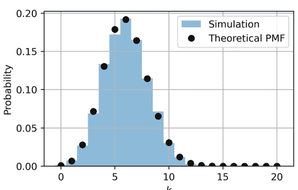

**分位数** $\alpha$-分位数 $q_\alpha = \inf\{x : F_X(x) \geq \alpha\}$；中位数是 $q_{0.5}$。

**例 5.1.10（正态分位数）** $q_{0.975} = 1.96$ 满足 $\Phi(1.96) \approx 0.975$，构成了双侧 95% 置信区间 $\mu \pm 1.96\sigma$。

## Python 中的随机变量模拟

蒙特卡洛模拟验证理论结果并近似计算期望（参见图 5.1）。

## 离散模拟（二项分布）

```python
import numpy as np, matplotlib.pyplot as plt
n, p, N = 20, 0.3, 10_000
samples = np.random.binomial(n, p, N)
# 经验 vs. 理论 pmf
k = np.arange(n+1)
pmf = (np.math.comb if hasattr(np, 'math') else np.math.comb)
theory = [pmf(n, i)*(p**i)*(1-p)**(n-i) for i in k]
plt.hist(samples, bins=range(n+2), density=True, alpha=.5, label="sim")
plt.plot(k, theory, "o", label="theory"); plt.legend(); plt.show()
```

## 连续模拟（正态分布）

```python
μ, σ, N = 0, 1, 10**5
samples = np.random.normal(μ, σ, N)
print(f"sample mean={samples.mean():.3f}, var={samples.var():.3f}")
```

**逆变换采样** 通过 $X = -\frac{1}{\lambda} \ln U$ 生成指数($\lambda$)分布，其中 $U \sim \text{Unif}(0, 1)$。

```python
U = np.random.rand(100000)
lam = 2
exp_samples = -np.log(U)/lam
print(np.mean(exp_samples), np.var(exp_samples)) # ≈ 0.5, 0.25
```

**拒绝采样（Beta(2,5)）** 目标 pdf $f(x) = \frac{1}{B(2,5)}x(1-x)^4$，定义在 $(0, 1)$ 上。

```python
from scipy.stats import beta
samples = beta.rvs(2,5, size=100000)
plt.hist(samples, bins=50, density=True, alpha=.6)
x = np.linspace(0,1,200); plt.plot(x, beta.pdf(x,2,5)); plt.show()
```

**中心极限定理实验** $m = 12$ 个均匀分布之和 $\Rightarrow$ 近似正态分布，其中 $\mu = m/2$，$\sigma = \sqrt{m/12}$。

```python
m, N = 12, 20000
sums = np.random.rand(N, m).sum(axis=1)
plt.hist((sums - m/2)/(np.sqrt(m/12)), bins=50, density=True)
```

## 5.1.3 期望、方差与矩

矩概括了随机变量分布的定量特征。*一阶矩*（期望）衡量位置，*二阶中心矩*（方差）衡量离散程度，而更高阶矩捕捉偏度、峰度等。矩生成函数（mgf）提供了一种紧凑的解析工具，可以同时编码所有矩。

## 数学期望及其性质

**定义** 对于一个可积随机变量 $X$，
$$
\mathbb{E}[X] = \begin{cases} \sum_k x_k p_X(x_k), & (\text{离散}) \\ \int_{-\infty}^{\infty} x f_X(x) dx, & (\text{连续}). \end{cases}
$$

**线性性** 对于常数 $a, b$ 和随机变量 $X, Y$，
$$
\mathbb{E}[aX + bY] = a\mathbb{E}[X] + b\mathbb{E}[Y].
$$

## 方差、协方差与标准差

### 方差

$$\text{Var}(X) = \mathbb{E}[(X - \mathbb{E}[X])^2] = \mathbb{E}[X^2] - (\mathbb{E}[X])^2.$$

标准差 $\sigma_X = \sqrt{\text{Var}(X)}$。

### 协方差

$$\text{Cov}(X, Y) = \mathbb{E}[(X - \mu_X)(Y - \mu_Y)] = \mathbb{E}[XY] - \mu_X \mu_Y.$$

### 性质

$\text{Var}(aX + b) = a^2 \text{Var}(X), \quad \text{Var}\left(\sum_i X_i\right) = \sum_i \text{Var}(X_i) + 2\sum_{i<j} \text{Cov}(X_i, X_j).$

**示例 4（泊松分布的方差）** $X \sim \text{Pois}(\lambda)$ 的期望为 $\mathbb{E}[X] = \lambda$，方差为 $\text{Var}(X) = \lambda$。证明见下文矩母函数部分。

### 全方差公式

$\text{Var}(X) = \mathbb{E}[\text{Var}(X \mid Y)] + \text{Var}(\mathbb{E}[X \mid Y]).$

**示例 5.1.11（全方差，泊松-伽马混合（负二项分布））** 设 $N \mid \Lambda \sim \text{Pois}(\Lambda)$，$\Lambda \sim \text{Gamma}(r, \theta)$。则 $\mathbb{E}[N] = r\theta$，且

$\text{Var}(N) = \mathbb{E}[\Lambda] + \text{Var}(\Lambda) = r\theta + r\theta^2,$

这与 $\text{NegBin}(r, p)$ 的方差公式一致。

**示例 5（骰子点数的协方差）** 投掷一个公平骰子两次：$X$ 为第一次点数，$Y$ 为第二次点数。独立性 $\Rightarrow \text{Cov}(X, Y) = 0$。但令 $S = X + Y$；则 $\text{Cov}(X, S) = \text{Var}(X) = \frac{35}{12}$。

```python
import itertools, numpy as np
Omega = np.array(list(itertools.product(range(1,7), repeat=2)))
X, Y = Omega[:,0], Omega[:,1]; S = X+Y
print(np.cov(X,S, bias=True)[0,1]) # 2.916...
```

### 矩母函数

**定义** $X$ 的**矩母函数**（mgf）为

$M_X(t) = \mathbb{E}[e^{tX}], \quad t \in (-h, h)$

其中 $h > 0$ 为某个使期望存在的值。

### 矩的提取

$M_X^{(k)}(0) = \mathbb{E}[X^k], \quad \mu = \mathbb{E}[X] = M_X'(0), \sigma^2 = M_X''(0) - \mu^2.$

**唯一性** 如果矩母函数在 0 的某个开区间内存在，则它唯一地确定了分布。

**独立随机变量和的矩母函数** 若 $X, Y$ 独立，

$M_{X+Y}(t) = M_X(t)M_Y(t).$

### 示例 6（指数分布（$\lambda$）的矩母函数）

$$M_X(t) = \int_0^\infty e^{tx} \lambda e^{-\lambda x} dx = \frac{\lambda}{\lambda - t}, \quad t < \lambda.$$

矩：

$$\mu = M'_X(0) = \frac{1}{\lambda}, \quad \sigma^2 = M''_X(0) - \mu^2 = \frac{1}{\lambda^2}.$$

### 示例 7（正态分布）对于 $X \sim \mathcal{N}(\mu, \sigma^2)$，

$$M_X(t) = \exp\left(\mu t + \frac{1}{2}\sigma^2 t^2\right).$$

这一性质在中心极限定理的证明中至关重要；矩母函数是二次型 $\Rightarrow$ 独立同分布正态变量的和仍为正态分布。

### 示例 8（独立指数变量之和 $\to$ 伽马分布）若 $X_1, \dots, X_n \overset{\text{i.i.d.}}{\sim} \text{Exp}(\lambda)$，

$$M_{S_n}(t) = \left(\frac{\lambda}{\lambda - t}\right)^n, \quad S_n \sim \text{Gamma}(n, \lambda).$$

### 示例 9（泊松分布的矩母函数法）$X \sim \text{Pois}(\lambda)$：

$$M_X(t) = \sum_{k=0}^\infty e^{tk} e^{-\lambda} \frac{\lambda^k}{k!} = \exp(\lambda(e^t - 1)).$$

求导：

$$M'_X(0) = \lambda, \quad M''_X(0) = \lambda^2 + \lambda \Rightarrow \text{Var}(X) = \lambda.$$

**累积量生成函数** $K_X(t) = \ln M_X(t)$；其在 0 处的导数给出累积量（例如，第一累积量 = 均值，第二累积量 = 方差）。

### 示例 5.1.12（二项分布的累积量）$K_X(t) = n \ln(1 - p + pe^t)$；$\kappa_1 = K'(0) = np$，$\kappa_2 = K''(0) = np(1 - p)$。

### 矩不等式

$$\text{Var}(X) \geq 0, \quad \mathbb{E}|X - \mu| \leq \sigma \sqrt{\frac{\pi}{2}} \text{（若为正态分布）}.$$

切比雪夫不等式：$\mathbb{P}(|X - \mu| \geq k\sigma) \leq k^{-2}$。

### 示例 5.1.13（验证模拟泊松分布的切比雪夫不等式）

```python
lam, N = 10, 10**5
X = np.random.poisson(lam, N)
k=3
emp = np.mean(np.abs(X-lam)>=k*np.sqrt(lam))
print(emp, 1/k**2) # 经验值 ≤ 理论界
```

## 5.1.4 常见概率分布

### 二项分布、泊松分布与几何分布

*计数*分布自然地源于伯努利试验和泊松过程极限。

*二项分布* 若 $X \sim \text{Bin}(n, p)$ 计数 $n$ 次独立伯努利($p$)试验中的成功次数，

$$\mathbb{P}(X = k) = \binom{n}{k} p^k (1 - p)^{n-k}, \quad 0 \le k \le n.$$

期望 $\mu = np$，方差 $\sigma^2 = np(1 - p)$，矩母函数 $M_X(t) = (1 - p + pe^t)^n$。

**示例 5.1.14** 抛掷一枚公平硬币 $n = 10$ 次；恰好出现 $k = 4$ 次正面的概率为 $\binom{10}{4}/2^{10} = 0.205$。

```python
from math import comb
print(comb(10,4)/2**10)
```

*泊松分布* 二项分布在 $n \to \infty$，$p \to 0$ 且 $np = \lambda$ 固定时的极限：

$$\mathbb{P}(X = k) = e^{-\lambda} \frac{\lambda^k}{k!}, \quad k \in \mathbb{N}_0.$$

均值和方差均为 $\lambda$；矩母函数 $\exp(\lambda(e^t - 1))$。

**示例 5.1.15** 放射性衰变平均每分钟发射 $\lambda = 3$ 个粒子。下一分钟内没有粒子发射的概率：$e^{-3} \approx 0.0498$。

*几何分布* 伯努利($p$)试验中首次成功所需的试验次数 $X$（计入成功的那一次）：

$$\mathbb{P}(X = k) = p(1 - p)^{k-1}, \quad k = 1, 2, \ldots$$

无记忆性：$\mathbb{P}(X > m+n \mid X > m) = (1 - p)^n$。均值 $1/p$，方差 $(1 - p)/p^2$。

### 正态分布、指数分布与伽马分布

正态分布 $X \sim \mathcal{N}(\mu, \sigma^2)$ 的密度函数为

$$f(x) = \frac{1}{\sqrt{2\pi}\sigma} \exp\left(-\frac{(x-\mu)^2}{2\sigma^2}\right).$$

线性变换保持正态性；独立正态变量的和仍为正态分布。

**示例 5.1.17** 学生身高：$\mu = 170$ cm，$\sigma = 8$ cm。一名学生身高超过 185 cm 的概率：

$$1 - \Phi\left(\frac{185 - 170}{8}\right) = 1 - \Phi(1.875) \approx 0.030.$$

*指数分布* 等待时间 $X \sim \text{Exp}(\lambda)$：

$$f(x) = \lambda e^{-\lambda x} \mathbf{1}_{\{x \ge 0\}}, \quad F(x) = 1 - e^{-\lambda x}.$$

均值 $1/\lambda$，方差 $1/\lambda^2$；无记忆性：$\mathbb{P}(X > s + t \mid X > s) = e^{-\lambda t}$。

**示例 5.1.18** Web 服务器请求以每秒 4 个的速率到达（$\lambda = 4$）。下一个请求在 0.5 秒后到达的概率：$e^{-4 \cdot 0.5} \approx 0.135$。

*伽马分布* $k$ 个独立同分布指数($\lambda$)变量的和：$X \sim \Gamma(k, \lambda)$，

$$f(x) = \frac{\lambda^k x^{k-1} e^{-\lambda x}}{\Gamma(k)}, \quad x \ge 0.$$

均值 $k/\lambda$，方差 $k/\lambda^2$。

**示例 5.1.19** $k = 3$ 位客户的总通话时长，每位客户的通话时长服从指数($\lambda = 1/6$)小时分布，其总时长服从 $\Gamma(3, 1/6)$ 分布，均值为 18 分钟，方差为 108 分钟$^2$。

### 中心极限定理与大数定律

*弱大数定律 (WLLN)* 对于独立同分布的 $X_i$，具有有限均值 $\mu$ 和方差 $\sigma^2$，

$$\frac{1}{n} \sum_{i=1}^n X_i \xrightarrow{\mathbb{P}} \mu \quad \text{当 } n \to \infty.$$

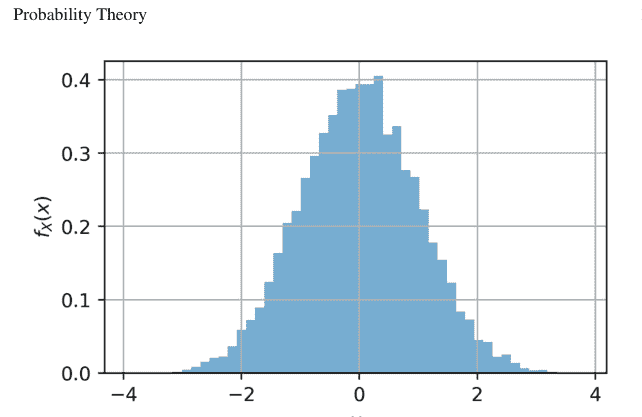

**示例 5.1.20** 模拟 n = 10⁵ 次公平硬币正面比例（参见图 5.2）：

```python
import numpy as np
n=100000
mean = np.random.binomial(1, 0.5, n).mean()
print(mean) # ≈ 0.5
```

*中心极限定理 (CLT)* 设 Sₙ = Σᵢ₌₁ⁿ Xᵢ，其中 μ, σ² < ∞。则

$$\frac{S_n - n\mu}{\sigma\sqrt{n}} \xrightarrow{d} \mathcal{N}(0, 1).$$

**示例 5.1.21** 12 个均匀分布 Uniform(0, 1) 随机变量的和近似服从 𝒩(6, 1)：

```python
import matplotlib.pyplot as plt
data = np.random.rand(20000, 12).sum(axis=1)
plt.hist((data-6), bins=50, density=True); plt.show()
```

**Berry–Esséen 界** 给出了明确的收敛速率：supₓ |Fₙ(x) − Φ(x)| ≤ Cρ/σ³√n，其中 ρ = 𝔼|X − μ|³。

**示例 5.1.22** 对于伯努利(1/2)分布，我们有 ρ = 1/4，σ = 1/2，得到界 ≤ C/√n。

## 5.2 描述性统计

描述性统计在不依赖概率模型的情况下，概括数据集的显著特征。*集中趋势*度量描述观测值主体的位置，而离散度度量描述变异性。在实践中，这些摘要对于检查原始数据、设计模拟输入以及传达实证发现至关重要。

### 5.2.1 集中趋势度量

**Python 中的均值、中位数、众数**

设 $\mathbf{x} = (x_1, x_2, \ldots, x_n) \in \mathbb{R}^n$ 表示一个大小为 $n$ 的样本。

**算术平均数**

$$\bar{x} = \frac{1}{n} \sum_{i=1}^{n} x_i.$$

*性质*：对数据线性，对极端值敏感，在独立同分布抽样下是总体均值的无偏估计量。

**中位数** 对于有序样本 $x_{(1)} \le \cdots \le x_{(n)}$，

$$\text{med}(\mathbf{x}) = \begin{cases} x_{(\frac{n+1}{2})}, & n \text{ 为奇数}, \\ \frac{x_{(\frac{n}{2})} + x_{(\frac{n}{2}+1)}}{2}, & n \text{ 为偶数}. \end{cases}$$

*稳健性*：中位数具有 50% 的崩溃点。

**众数** 对于连续数据，众数是使密度估计最大化的值；对于离散数据，它是出现频率最高的值。

**示例 5.2.1（计算基本统计量）**

```python
import numpy as np, statistics as st, scipy.stats as ss
x = np.array([7, 3, 8, 2, 5, 8, 3, 9])

mean = x.mean()
median = np.median(x)
mode = st.mode(x) # Python 3.8+ 返回 statistics._ModeResult
print(mean, median, mode.mode[0])
```

输出：5.625（均值），6.0（中位数），8（众数）。

**加权平均数和百分位数**

**加权平均数** 给定正权重 $\mathbf{w} = (w_1, \dots, w_n)$，且 $\sum_i w_i = 1$，

$$\bar{x}_w = \sum_{i=1}^n w_i x_i.$$

当 $\sum w_i \neq 1$ 时，使用 $\bar{x}_w = \frac{\sum w_i x_i}{\sum w_i}$。

**百分位数** 第 $p$ 百分位数（$0 < p < 100$）是满足以下条件的值 $q_p$：

$$\frac{\#\{i : x_i \leq q_p\}}{n} \geq \frac{p}{100} \quad \text{且} \quad \frac{\#\{i : x_i < q_p\}}{n} \leq \frac{p}{100}.$$

常用百分位数：四分位数（25, 50, 75），十分位数（10, 20, ..., 90）。

**示例 5.2.2（加权平均数和四分位数）**

```python
w = np.array([2, 1, 3, 1, 2, 3, 1, 2]) # 权重
wmean = np.average(x, weights=w) # 加权平均数
q25, q75 = np.percentile(x, [25, 75]) # 四分位数
print(wmean, q25, q75)
```

**插值百分位数** NumPy 的 `percentile` 提供了 `linear`、`midpoint` 等方法来解决顺序统计量之间的间隔问题；请查阅文档获取确切公式。

**几何平均数和调和平均数**

**几何平均数** 对于正数据（$x_i > 0$），

$$G = \left(\prod_{i=1}^n x_i\right)^{1/n} = e^{\frac{1}{n} \sum_i \ln x_i}.$$

*用例*：乘法增长率、对数正态数据、投资组合回报。

**调和平均数**

$$H = \frac{n}{\sum_{i=1}^n \frac{1}{x_i}}.$$

*用例*：平均速度、并联电阻、市盈率聚合。

**不等式链** 对于任何正样本，

$$\min x_i \leq H \leq G \leq \bar{x} \leq \max x_i.$$

当且仅当 $x_1 = x_2 = \cdots = x_n$ 时等号成立。

**示例 5.2.3（计算 $G$ 和 $H$）**

```python
from scipy.stats import gmean, hmean
x_pos = np.array([12.5, 15.0, 20.0, 10.0])
print(gmean(x_pos), hmean(x_pos))
```

与算术平均数 14.375 相比，我们有 $G \approx 14.28$，$H \approx 14.01$——都在不等式链内。

**对数空间稳定性** 对于非常小/大的值，计算 $\ln G = \overline{\ln x}$ 以避免下溢/上溢。

```python
lg = np.mean(np.log(x_pos))
G = np.exp(lg)
```

**加权几何平均数** 使用上述权重 $w_i$，

$$G_w = \exp\left(\sum_i w_i \ln x_i\right).$$

**示例 5.2.4（年化回报）** 投资产生年度乘数（1.06, 1.02, 0.97, 1.10, 1.04）。年化平均增长率：

$$G - 1 = \left(\prod_i m_i\right)^{1/5} - 1 \approx 0.036.$$

```python
m = np.array([1.06, 1.02, 0.97, 1.10, 1.04])
annual = gmean(m) - 1
print(f"{annual:.3%}") # 3.6% CAGR
```

### 5.2.2 离散度度量

离散度量化数据集或随机变量固有的分布或“变异性”。集中趋势统计量确定一个典型值，而离散度则表明观测值偏离该中心的程度。探讨了三个互补的类别：*基于矩的*（方差、标准差）、*基于顺序统计量的*（范围、四分位距）和*基于形状的*（偏度、峰度）。

**方差、标准差和范围**

**总体与样本公式** 对于样本 $\mathbf{x} = (x_1, \dots, x_n)$，其均值为 $\bar{x}$，

$$s^2 = \frac{1}{n-1} \sum_{i=1}^n (x_i - \bar{x})^2, \quad s = \sqrt{s^2}.$$

除以 $n-1$ 在独立同分布抽样下产生总体方差 $\sigma^2$ 的*无偏*估计量。

**快捷恒等式**

$$s^2 = \frac{\sum_i x_i^2 - n\bar{x}^2}{n-1},$$

对于大 $n$ 数值稳定。

**范围**

$$R = \max_i x_i - \min_i x_i,$$

易于计算但对极端值敏感。

**示例 5.2.5（考试分数的离散度）**

```python
import numpy as np
scores = np.array([39, 45, 42, 90, 88, 41, 44, 46, 38, 91])
mean, var_pop = scores.mean(), scores.var(ddof=0)
var_samp = scores.var(ddof=1)
std_samp = scores.std(ddof=1)
rng = scores.ptp()
print(mean, var_pop, var_samp, std_samp, rng)
```

输出 $\bar{x} = 56.4$，$s^2 = 597.38$，$s \approx 24.44$，$R = 53$。高方差和大范围反映了在 40 和 90 附近的双峰聚集。

**切比雪夫不等式（经验形式）**

至少 $1 - \frac{1}{k^2}$ 的数据落在 $\bar{x}$ 的 $k$ 个样本标准差范围内。对于 $k = 2$，无论分布形状如何，$\geq 75\%$ 的点落在 $\bar{x} \pm 2s$ 内。

**四分位距和异常值检测**

**四分位数** 对于有序样本 $x_{(1)} \leq \cdots \leq x_{(n)}$，

$$Q_1 = q_{25}, \quad Q_2 = \text{中位数}, \quad Q_3 = q_{75}.$$

**四分位距 (IQR)** 是 $Q_3 - Q_1$。

**图基围栏** 定义*下围栏* $L = Q_1 - 1.5 \text{ IQR}$ 和*上围栏* $U = Q_3 + 1.5 \text{ IQR}$。超出 $[L, U]$ 的观测值被标记为*中度异常值*；将 1.5 替换为 3 可用于*极端异常值*。

**示例 5.2.6（箱线图诊断）** 数据集（合成薪资，$k$）：

$\mathbf{s} = \langle 45, 47, 50, 48, 46, 49, 51, 52, 100, 120 \rangle$。

```python
import numpy as np
s = np.array([45,47,50,48,46,49,51,52,100,120])
q1,q3 = np.percentile(s, [25,75])
iqr = q3 - q1
L,U = q1 - 1.5*iqr, q3 + 1.5*iqr
outliers = s[(s<L)|(s>U)]
print(q1, q3, iqr, L, U, outliers)
```

结果：$Q_1 = 46.5$，$Q_3 = 51.25$，$\text{IQR} = 4.75$，$L = 39.375$，$U = 58.375$。值 100, 120 超过 $U \Rightarrow$ 被标记为异常值；箱线图将显示须线延伸至 $58.4k$，超出部分为单独的点。

**稳健变异系数 (RCV)**

$$\text{RCV} = \frac{\text{IQR}}{Q_2},$$

是标准差/均值的无量纲稳健对应物，尤其在重尾情况下。

**偏度和峰度**

**样本矩** 第三和第四*中心*样本矩：

$$m_3 = \frac{1}{n} \sum_i (x_i - \bar{x})^3, \quad m_4 = \frac{1}{n} \sum_i (x_i - \bar{x})^4.$$

**偏度**

$$\gamma_1 = \frac{m_3}{s^3}$$

衡量不对称性（$\gamma_1 > 0$ 右尾，$\gamma_1 < 0$ 左尾）。

**超额峰度**

$$\gamma_2 = \frac{m_4}{s^4} - 3$$

量化尾部厚度；对于正态分布 $\gamma_2 = 0$，尖峰分布为正，平峰分布为负。

**示例 5.2.7（计算形状统计量）**

```python
from scipy.stats import skew, kurtosis
x_norm = np.random.normal(size=5000)
x_exp = np.random.exponential(size=5000)

print("Normal:", skew(x_norm), kurtosis(x_norm))
print("Exp :", skew(x_exp), kurtosis(x_exp))
```

典型输出 正态分布：$\gamma_1 \approx 0$，$\gamma_2 \approx 0$（基线）。指数分布：$\gamma_1 \approx 2$，$\gamma_2 \approx 6$（重右尾）。

**Jarque–Bera 检验** $JB = \frac{n}{6}(\gamma_1^2 + \frac{1}{4}\gamma_2^2)$ 渐近服从 $\chi_2^2$；用于检验正态性。

**示例 5.2.8（对大小为 $n = 200$ 的样本进行 JB 检验）**

```python
from scipy.stats import jarque_bera
data = np.random.lognormal(size=200)
stat,p = jarque_bera(data)
print(stat, p) # p 值 << 0.05 ⟹ 拒绝正态性
```

**与中心极限定理的关系** 在来自有限方差总体的独立同分布抽样下，$\gamma_1 \sim \mathcal{N}(0, \frac{6}{n})$ 和 $\gamma_2 \sim \mathcal{N}(0, \frac{24}{n})$ 渐近成立。因此，当数据真正来自正态分布时，偏度和峰度收敛于 0。

### 5.2.3 数据可视化与分析

可视化将原始数字数组转化为眼睛可理解的模式，使人类能够检测到摘要统计可能遗漏的结构、异常和关系。Python 的 matplotlib、seaborn 和 pandas 绘图后端使得制作出版级图形几乎毫不费力。本小节探讨典型的单变量、双变量和多变量图，说明相关性和协方差等度量如何与这些图相关联，并演示避免“垃圾进，垃圾出”的不可或缺的数据清洗步骤。

**直方图、箱线图和散点图**

**直方图** 给定样本 $\mathbf{x}$，直方图将实线划分为区间 $I_j$ 并计数 $n_j = \#\{x_i \in I_j\}$。对于密度归一化的直方图，条形高度为 $\hat{f}_n(x) = n_j / (n|I_j|)$，这是一个粗糙的核密度估计量（参见图 5.3）。

**示例 5.2.9（模拟 $\mathcal{N}(0, 1)$ 与指数分布($\lambda = 1$)）**

```python
import numpy as np, matplotlib.pyplot as plt, seaborn as sns
np.random.seed(0)
norm = np.random.randn(1000)
expo = np.random.exponential(scale=1, size=1000)
```

## 5.3 推断统计

描述性统计总结数据；**推断统计**则基于样本对总体做出结论。推断的核心是*假设检验*，这是一种在控制错误率的前提下，判断随机证据是否支持或反驳关于总体的定量陈述的正式程序。

### 5.3.1 假设检验

#### 原假设与备择假设

任何检验都始于两个互斥的陈述：

$$H_0 : \text{“现状”（原假设）}$$
$$H_1 : \text{“新主张”（备择假设）}$$

**示例 1（制造业）** 一家供应商保证滚珠轴承的平均直径为 $\mu_0 = 10$ 毫米。你怀疑该过程发生了漂移。

$$H_0 : \mu = 10 \quad \text{vs.} \quad H_1 : \mu \neq 10.$$

抽取 $n$ 个轴承并测量其直径，产生的证据可用于拒绝或未能拒绝 $H_0$。

**检验统计量** 一个关于样本的标量函数 $T(\mathbf{X})$，其在 $H_0$ 下的分布是已知或可近似的；$T$ 的值偏大或偏小都支持 $H_1$。

#### p值、t检验与卡方检验

**p值** 观测到的 $t_{obs}$ 被转换为一个 $p$ 值：

$$p = \mathbb{P}_{H_0}(T \text{ 至少与 } t_{obs} \text{ 一样极端}).$$

决策规则（固定 $\alpha$）：如果 $p < \alpha$，则拒绝 $H_0$。

**单样本 t 检验** 当 $\sigma$ 未知时，使用以下公式检验 $H_0 : \mu = \mu_0$：

$$t = \frac{\bar{X} - \mu_0}{s / \sqrt{n}} \sim t_{n-1} \quad (H_0).$$

**示例 5.3.1（直径检验）**

```python
import numpy as np, scipy.stats as st
x = np.array([10.1, 9.9, 9.8, 10.2, 10.0, 10.3, 9.7, 10.1, 10.2, 9.9])
t_stat, p = st.ttest_1samp(x, popmean=10)
print(t_stat, p)
```

输出：$t \approx 0.42$, $p \approx 0.683 \implies$ 在 $\alpha = 0.05$ 水平下未能拒绝原假设。

**双样本 t 检验（方差不等，Welch 检验）**

$$t = \frac{\bar{X} - \bar{Y}}{\sqrt{s_X^2/n_X + s_Y^2/n_Y}}, \quad \nu \approx \frac{(s_X^2/n_X + s_Y^2/n_Y)^2}{\frac{s_X^4}{n_X^2(n_X-1)} + \frac{s_Y^4}{n_Y^2(n_Y-1)}}.$$

# 数据清洗与预处理技术

脏数据会同时影响数值摘要和可视化。

**缺失值** 策略：列表删除法、均值/中位数插补、回归插补、多重插补。

**示例 5.2.15（中位数插补）**

```python
df = iris.copy()
df.iloc[5:10, 0] = np.nan # 注入 NaN
df["sepal_length"].fillna(df["sepal_length"].median(), inplace=True)
```

**异常值 Winsorization 处理** 将超出 $[\mu \pm 3\sigma]$ 或超出 Tukey 围栏的值进行截断，以减少其影响。

```python
from scipy.stats import mstats
data_wins = mstats.winsorize(salaries, limits=[0.05,0.05])
```

**缩放** 标准化 $(x - \bar{x})/s$ 或最小-最大缩放 $[0, 1]$ 是主成分分析（PCA）、$k$-均值聚类、神经网络的先决条件。

**分类变量编码** 对名义变量使用独热编码；对高基数分类特征使用目标编码或序数编码。

# 流水线示例

```python
from sklearn.preprocessing import StandardScaler, OneHotEncoder
from sklearn.compose import ColumnTransformer
from sklearn.pipeline import Pipeline

num_cols = ["sepal_length","sepal_width","petal_length","petal_width"]
cat_cols = [] # 鸢尾花数据集中没有分类列

pre = ColumnTransformer([
    ("scale", StandardScaler(), num_cols),
    ("cat", OneHotEncoder(), cat_cols)
])
X = pre.fit_transform(iris)
```

# 数据质量检查清单

- 1. *一致性*：单位、变量类型、命名
- 2. *完整性*：缺失值、意外的 NULL 标记
- 3. *有效性*：范围检查、ID 的正则表达式验证
- 4. *唯一性*：重复行/键
- 5. *准确性*：与可信的外部来源交叉验证

# 多变量数据的热力图与配对图

**协方差热力图** 对于数据矩阵 $M \in \mathbb{R}^{n \times d}$，

$$\Sigma = \frac{1}{n-1}(M - \mathbf{1}\bar{M})^\top(M - \mathbf{1}\bar{M})$$

通过颜色强度进行显示。

**示例 5.2.14（鸢尾花数据）**

```python
iris = sns.load_dataset("iris").drop("species", axis=1)
corr = iris.corr()
sns.heatmap(corr, annot=True, cmap="coolwarm"); plt.show()
```

花瓣长度/宽度的相关系数 $\rho > 0.95$，而花萼尺寸的相关性较弱，$\rho \approx 0.12$。

**配对图** 绘制每一对双变量投影图以及单变量核密度估计图（参见图 5.6）。

```python
sns.pairplot(iris, diag_kind="kde"); plt.show()
```

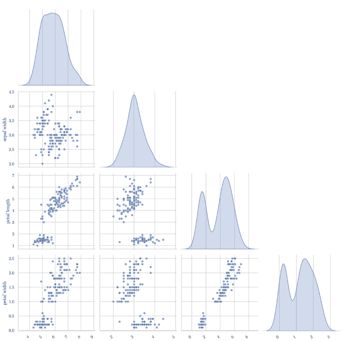

图 5.6 鸢尾花四个数值特征的成对散点图和核密度估计。下三角布局减少了冗余，而对角线上的 KDE 曲线突出了单变量分布。清晰的线性趋势和聚集的云状分布预示了有效的低维投影。

**高维数据提示** 当 $d > 10$ 时，配对图会呈组合爆炸式增长；建议先使用 PCA 或 t-SNE。

# 相关性与协方差

皮尔逊相关系数 $\rho_{XY} = \text{Cov}(X, Y)/(\sigma_X \sigma_Y)$ 衡量线性关联。斯皮尔曼 $\rho_s$ 和肯德尔 $\tau$ 则捕捉单调依赖关系。

**示例 5.2.12（经验相关性 vs. 理论相关性）** 设 $X \sim \mathcal{N}(0, 1)$，$Y = 0.8X + 0.6Z$，其中 $Z \perp X$，$Z \sim \mathcal{N}(0, 1)$。则 $\rho_{XY} = 0.8$。

```python
n=2000
X = np.random.randn(n)
Y = 0.8*X + 0.6*np.random.randn(n)
print(np.corrcoef(X,Y)[0,1]) # ≈ 0.8
sns.scatterplot(x=X, y=Y, alpha=.3); plt.show()
```

一条紧密的对角线带证实了强烈的线性依赖关系。

**示例 5.2.13（单调非线性变换下的斯皮尔曼 vs. 皮尔逊相关性）** $X \sim \text{Uniform}(0, 1)$，$Y = X^2$。皮尔逊 $\rho \approx 0.97$（仍然很高），而斯皮尔曼 $\rho_s = 1$（完美单调）。

```python
X = np.random.rand(300)
Y = X**2
from scipy.stats import spearmanr
print(np.corrcoef(X,Y)[0,1], spearmanr(X,Y).correlation)
```

# 散点图

对于配对数据 $(x_i, y_i)$，散点图可以揭示函数形式、聚类和异方差性。

**示例 5.2.11（安斯库姆四重奏——相同统计量，不同形状（参见图 5.5））**

```python
import seaborn as sns, pandas as pd
df = sns.load_dataset("anscombe")
g = sns.FacetGrid(df, col="dataset")
g.map_dataframe(sns.scatterplot, x="x", y="y")
g.map(plt.plot, [4,14], [4,14], color="red")
plt.show()
```

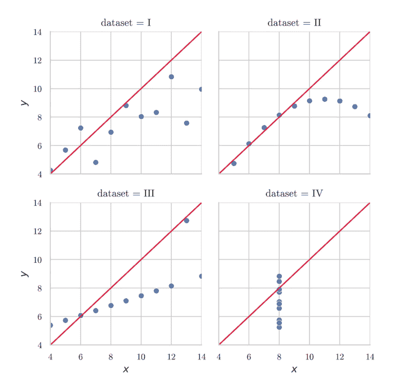

图 5.5 安斯库姆四重奏：四个数据集具有相同的单变量统计量，但形状差异显著。绘图揭示了结构——线性、非线性和异常值驱动——这些是仅靠摘要度量无法显示的，强调了可视化的诊断价值。

所有四个面板共享 $\bar{x}$、$\bar{y}$、$\text{SD}_x$、$\text{SD}_y$ 和皮尔逊 $r = 0.816$，但视觉检查揭示了一个线性云、一个非线性曲线、一个高杠杆点以及一个垂直条带加一个异常值。

# 箱线图（Tukey）

显示中位数 $Q_2$、四分位数 $Q_1$、$Q_3$、须线位于 $[L, U]$，其中 $L = Q_1 - 1.5 \text{IQR}$，$U = Q_3 + 1.5 \text{IQR}$。

**示例 5.2.10（带异常值的薪资分布（参见图 5.4））**

```python
salaries = np.array([45,47,50,48,46,49,51,52,100,120])
sns.boxplot(x=salaries, orient="h"); plt.show()
```

该图将 $100k 和 $120k 标记为异常值，与分析性的围栏计算结果一致。

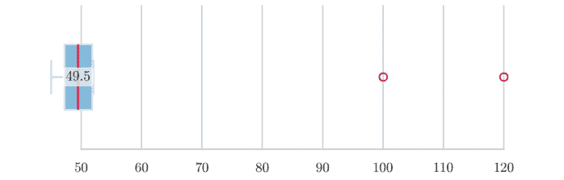

图 5.4 十个薪资的箱线图。四分位距箱体以蓝色高亮，深红色线标记中位数（已标注），两个高薪异常值在右侧清晰可见。

将左侧对称的钟形曲线与右侧重尾右偏的直方图进行比较，直观地强化了之前计算的数值偏度/峰度。

```python
fig, ax = plt.subplots(1,2,figsize=(10,3))
sns.histplot(norm, bins=30, kde=True, ax=ax[0]); ax[0].set_title("Normal")
sns.histplot(expo, bins=30, kde=True, ax=ax[1]); ax[1].set_title("Exponential")
plt.tight_layout(); plt.show()
```

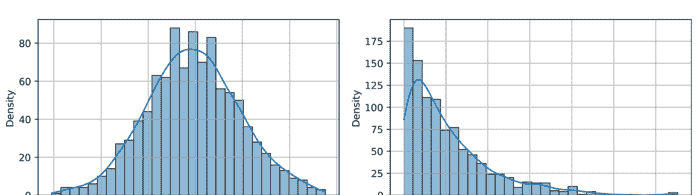

图 5.3 标准正态分布（左）和单位率指数分布（右）各 $10^3$ 个样本的并排直方图（带核密度叠加）。比较突出了高斯分布的对称性和轻尾特性，与指数分布的重尾、单侧衰减形成对比。

## 示例 5.3.2（治疗组与对照组血压）

```python
bp_ctrl = np.random.normal(120, 10, 30)
bp_trt = np.random.normal(115, 9, 28)
stat, p = st.ttest_ind(bp_ctrl, bp_trt, equal_var=False)
```

$H_0 : \mu_{ctrl} = \mu_{trt}$：$p < 0.05$ 表示存在显著差异。

## 卡方拟合优度检验

观测计数 $\{O_i\}$ 与在 $H_0$ 下的期望计数 $\{E_i\}$ 对比：

$$\chi^2 = \sum_{i=1}^k \frac{(O_i - E_i)^2}{E_i} \sim \chi^2_{k-1-r},$$

其中 $r$ 为从数据中估计的参数个数。

## 示例 5.3.3（骰子公平性）

100次投掷中，各面出现次数为 (14, 18, 16, 15, 17, 20)。$E_i = 100/6 \approx 16.67$。

$$\chi^2 = 2.3, \quad p = 0.804 \ (k=6, r=0) \implies \text{无证据表明存在偏差。}$$

```python
obs = np.array([14,18,16,15,17,20])
chi2, p = st.chisquare(obs)
```

## 卡方独立性检验

对于列联表（$r \times c$），期望频数 $E_{ij} = \frac{(\text{行}_i)(\text{列}_j)}{N}$。

## 示例 5.3.4（吸烟（是/否）与疾病（是/否））

| | 疾病 是 | 疾病 否 | 行合计 |
|---|---|---|---|
| 吸烟 是 | 40 | 60 | 100 |
| 吸烟 否 | 30 | 120 | 150 |
| 列合计 | 70 | 180 | 250 |

```python
table = np.array([[40,60],[30,120]])
chi2, p, dof, exp = st.chi2_contingency(table)
```

$H_0$：独立性；若 $p < 0.05$，则得出吸烟与疾病之间存在关联的结论。

## 第一类错误与第二类错误

$\alpha = \mathbb{P}(\text{拒绝 } H_0 \mid H_0 \text{ 为真}) \quad (\text{第一类错误}), \quad \beta = \mathbb{P}(\text{未能拒绝 } H_0 \mid H_1 \text{ 为真}) \quad (\text{第二类错误}).$

示例（单侧 t 检验）检验 $H_0 : \mu = 0$ 对 $H_1 : \mu > 0$，其中 $n = 16$，$\sigma$ 已知 $= 2$，$\alpha = 0.05$。临界值：

$$c = \frac{z_{0.95}\sigma}{\sqrt{n}} = 1.645 \cdot \frac{2}{4} = 0.823.$$

若真实均值 $\mu_1 = 1$，功效 $= 1 - \beta$，其中

$$\beta = \Phi\left(\frac{c - \mu_1}{\sigma/\sqrt{n}}\right) = \Phi((0.823 - 1) \cdot 2) = \Phi(-0.354) \approx 0.362.$$

因此功效为 0.638。

## 检验的功效与样本量确定

**功效函数** $\pi(\mu) = \mathbb{P}_{\mu}(\text{拒绝 } H_0)$。目标：选择 $n$ 使得对于期望的效应量 $\delta = \mu_1 - \mu_0$，满足 $\pi(\mu_1) \geq 1 - \beta^*$。

**解析公式（z 检验）** 已知 $\sigma$，双侧检验，显著性水平 $\alpha$：

$$n \geq \left(\frac{z_{1-\alpha/2} + z_{1-\beta}}{\delta/\sigma}\right)^2.$$

示例 5.3.5（设计临床试验）检测 $\delta = 5$ mmHg 血压下降，$\sigma = 12$ mmHg，$\alpha = 0.05$，功效 0.9（$\beta = 0.1$）。

$$n \geq \left(\frac{1.96 + 1.28}{5/12}\right)^2 = (3.24 \cdot 2.4)^2 \approx 600.$$

因此每组 $n = 61$。

```python
from statsmodels.stats.power import TTestIndPower
power_calc = TTestIndPower()
n = power_calc.solve_power(effect_size=5/12, power=0.9, alpha=0.05)
print(np.ceil(n)) # 61.0
```

## 功效曲线可视化（参见图 5.7）

```python
delta = np.linspace(0, 8, 100)
power = power_calc.power(effect_size=delta/12, nobs1=61, alpha=0.05)
plt.plot(delta, power); plt.xlabel("效应量 $\Delta$"); plt.ylabel("功效");
plt.show()
```

**效应量度量** Cohen's $d = \delta/\sigma$，用于 $\chi^2$ 表的 Cramér's $V$，用于逻辑检验的比值比；功效随 $n$ 和真实效应量的增加而增加。

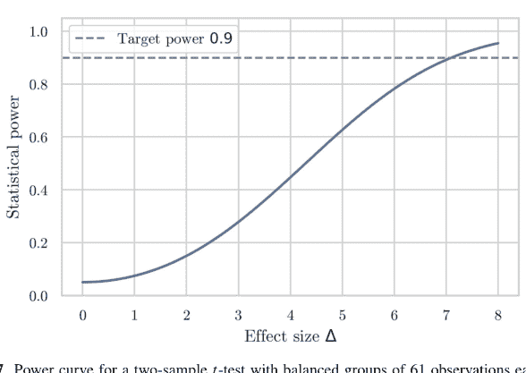

图 5.7 双样本 t 检验的功效曲线，每组平衡样本量为 61，显著性水平 α = 0.05。水平虚线标记了设计目标功效 0.9，在之前计算的效应量 Δ ≈ 5 处达到。

## 5.3.2 置信区间

参数 θ 的**置信区间** (CI) 是一个基于样本数据 X 构建的随机区间 C(X) = [L(X), U(X)]，满足

P(θ ∈ C(X)) = 1 − α，

其中 1−α 是*置信水平*（例如 95%）。该概率陈述指的是重复抽样中，其区间覆盖真实参数的样本所占的长期比例。

## 在 Python 中构建置信区间

**正态总体均值，未知方差（t 区间）** 对于独立同分布的 X_i ~ N(μ, σ²)，

X̄ ± t_{1−α/2, n−1} * s/√n, s² = 1/(n−1) * Σ(X_i − X̄)²。

**示例 5.3.6（燃油效率研究）** 十辆汽车的 MPG 测量值

x = (31.2, 29.8, 30.5, 31.1, 32.0, 30.9, 29.6, 31.3, 30.4, 31.0)。

```python
import numpy as np, scipy.stats as st
x = np.array([31.2, 29.8, 30.5, 31.1, 32.0, 30.9, 29.6, 31.3, 30.4, 31.0])
mean, sem = x.mean(), x.std(ddof=1)/np.sqrt(len(x))
```

```python
ci = st.t.interval(confidence=.95, df=len(x)-1, loc=mean, scale=sem)
print(mean, ci)
```

输出：$\bar{x} = 30.78$, 95% CI = (30.22, 31.34) MPG。

**总体比例（Wald 和 Wilson）** 对于 $X \sim \text{Bin}(n, p)$，Wald CI 为 $\hat{p} \pm z_{1-\alpha/2}\sqrt{\hat{p}(1-\hat{p})/n}$；对于小 $n$，Wilson (Agresti–Coull) 更优。

**示例 5.3.7（缺陷率）** $n = 200$ 个部件中有 18 个缺陷品。

```python
k,n = 18,200
p_hat = k/n
z = st.norm.ppf(0.975)
wald = p_hat + np.array([-1,1])*z*np.sqrt(p_hat*(1-p_hat)/n)
wilson_low = (2*k+z**2 - z*np.sqrt(z**2 + 4*k*(1-p_hat)))/(2*(n+z**2))
wilson_hi = (2*k+z**2 + z*np.sqrt(z**2 + 4*k*(1-p_hat)))/(2*(n+z**2))
print(wald, (wilson_low,wilson_hi))
```

## 正态总体的方差

$$\frac{(n-1)s^2}{\chi^2_{1-\alpha/2,n-1}} < \sigma^2 < \frac{(n-1)s^2}{\chi^2_{\alpha/2,n-1}}.$$

**示例 5.3.8（温度计精度）** 十次 $0^\circ\text{C}$ 冰浴读数给出 $s = 0.12^\circ\text{C}$。$\sigma$ 的 95% CI 为

$(0.09, 0.20)^\circ\text{C}$。

**相关系数（Fisher $z$）** 对于样本 $\hat{\rho}$，进行变换 $z = \frac{1}{2}\ln\frac{1+\hat{\rho}}{1-\hat{\rho}}$；标准误 $= 1/\sqrt{n-3}$。

**示例 5.3.9（身高与体重）**

```python
height = np.random.normal(170, 8, 50)
weight = 0.4*(height-170)+np.random.normal(0,4,50)
rho = np.corrcoef(height, weight)[0,1]
z = np.arctanh(rho)
z_ci = z + np.array([-1,1])*1.96/np.sqrt(47)
rho_ci = np.tanh(z_ci)
```

## 在科学研究中的应用

**物理学：半衰期估计** 放射性衰变（每分钟计数）服从泊松($\lambda$)分布。若在 $\Delta t = 30$ 分钟内观测到 $k = 642$ 次衰变，速率 $\hat{\lambda} = 21.4$。通过卡方分布获得精确 95% CI：

$$\lambda \in \left[\frac{1}{2}\chi^2_{0.025;2k}, \frac{1}{2}\chi^2_{0.975;2k+2}\right]/\Delta t.$$

**生物学：基因表达倍数变化** 来自 n = 15 次重复的 Log₂ 比率假设服从正态分布；μ_log₂ FC 的 CI 转换为乘性尺度 2^(μ ± z_{1-α/2}/√n)。

**临床试验** 通过对数方法计算风险比 CI：ln RR ± z_{1-α/2} √(1/a - 1/(a+b) + 1/c - 1/(c+d))，其中 (a, b; c, d) 为 2×2 列联表计数。

## 示例 5.3.10（疫苗效力）

```python
from statsmodels.stats.proportion import proportion_confint
cases_vac, n_vac = 6, 8000
cases_ctr, n_ctr = 60, 8000
rr = cases_vac/n_vac / (cases_ctr/n_ctr)
se = np.sqrt(1/cases_vac - 1/n_vac + 1/cases_ctr - 1/n_ctr)
ci = np.exp(np.log(rr) + np.array([-1,1])*1.96*se)
print(rr, ci) # 效力 = 1-rr
```

## 用于置信区间的 Bootstrap 方法

当解析形式难以处理时，bootstrap 通过有放回重采样来近似抽样分布。

## 算法（基本百分位数法）

1.  抽取 B 个大小为 n 的 bootstrap 样本 x*^b。
2.  计算统计量 θ*_b = T(x*^b)。
3.  CI [θ*_{(α/2)}, θ*_{(1-α/2)}]，其中下标表示百分位数。

## 示例 5.3.11（偏斜数据的中位数 CI）

```python
rng = np.random.default_rng(0)
x = rng.lognormal(mean=0, sigma=1, size=50)
B=5000; stats = []
for _ in range(B):
    sample = rng.choice(x, size=len(x), replace=True)
    stats.append(np.median(sample))
lo, hi = np.percentile(stats, [2.5, 97.5])
print(np.median(x), (lo, hi))
```

**BCa 区间（偏差校正，加速）** 调整偏差和偏度；scipy.stats.bootstrap(..., method='BCa') 可自动完成。

## 示例 5.3.12（截尾均值之差）

```python
from scipy.stats import bootstrap, trim_mean
ctrl = rng.normal(0,1,size=40)
trt = rng.normal(0.4,1,size=38)
def stat(data, axis):
    c,t = data
    return trim_mean(t,0.1) - trim_mean(c,0.1)
res = bootstrap((ctrl, trt), stat, method='BCa', confidence_level=0.95)
print(res.confidence_interval)
```

**回归系数的 Bootstrap** 重采样 $(X_i, Y_i)$ 对，重新拟合线性模型，收集 $\hat{\beta}^*$ 以形成 CI——对异方差性稳健。

**参数 Bootstrap** 当残差重采样不适用时，从拟合的参数模型（例如泊松 GLM）生成样本。

## 5.3.3 回归分析

回归将一个或多个解释变量与响应变量联系起来，量化趋势，检验科学假设，并预测未来结果。在 Python 中，numpy 提供高效的线性代数运算，scipy.stats 和 statsmodels 提供经典推断，scikit-learn 统一了机器学习风格的回归。我们通过计算密集型的现实示例来说明每种方法。

## 简单线性回归

假设数据对 $(x_i, y_i)$ 满足

$$y_i = \beta_0 + \beta_1 x_i + \varepsilon_i, \quad \varepsilon_i \overset{\text{i.i.d.}}{\sim} \mathcal{N}(0, \sigma^2).$$

最小二乘估计量 $\hat{\beta} = (X^\top X)^{-1} X^\top \mathbf{y}$ 使 $\sum_i (y_i - \hat{y}_i)^2$ 最小化。

**示例 5.3.13（物理学——胡克定律）** 八根弹簧在力 $F$ (N) 下被拉伸，并测量伸长量 $y$ (mm)。

```python
import numpy as np, statsmodels.api as sm
F = np.array([1,2,3,4,5,6,7,8])
y = np.array([0.9,2.1,3.0,4.1,4.9,6.2,6.8,8.1])
X = sm.add_constant(F) # 添加截距列
model = sm.OLS(y, X).fit()
print(model.summary())
```

输出 $\hat{\beta}_0 = 0.05 \pm 0.12$, $\hat{\beta}_1 = 1.01 \pm 0.02$, $R^2 = 0.998$。残差标准误 $\hat{\sigma} = 0.13$ mm。诊断：

```python
import matplotlib.pyplot as plt
plt.scatter(F, y); plt.plot(F, model.fittedvalues, "r");
plt.xlabel("力 (N)"); plt.ylabel("伸长量 (mm)")
plt.show()
sm.qqplot(model.resid, line='45'); plt.show()
```

Q-Q 图与 $45^\circ$ 线对齐，验证了残差正态性的假设。

对 $F = 9$ N 的预测使用

$$\hat{y}_9 = \hat{\beta}_0 + 9\hat{\beta}_1 \approx 9.14, \quad \text{SE}(\hat{y}_9) = \hat{\sigma} \sqrt{\frac{1}{n} + \frac{(9 - \bar{x})^2}{\sum (x_i - \bar{x})^2}}.$$

## 多元回归与模型选择

对于预测变量 $\mathbf{x}_i \in \mathbb{R}^p$，$y_i = \beta_0 + \sum_{j=1}^p \beta_j x_{ij} + \varepsilon_i$。

**示例 5.3.14（房地产定价）** 数据列：*价格*、*面积*、*卧室数*、*房龄*。

```python
import pandas as pd, statsmodels.formula.api as smf
df = pd.read_csv("houses.csv") # 假设文件存在
fit = smf.ols("price ~ size + bedrooms + age", data=df).fit()
print(fit.summary())
```

假设 *p* 值：面积（$< 10^{-10}$），卧室数（0.07），房龄（0.002）。应用向后剔除法：

```python
fit2 = smf.ols("price ~ size + age", data=df).fit()
```

通过赤池信息准则（AIC）进行比较；选择AIC较小的模型。*statsmodels* 也提供 *stepwise_fit* 工具，或可手动使用信息准则循环。

**正则化** 当 $p$ 接近 $n$ 时，岭回归和Lasso回归收缩系数：

```python
from sklearn.linear_model import RidgeCV, LassoCV
X = df[["size","bedrooms","age"]].values
y = df["price"].values
ridge = RidgeCV(alphas=[0.1,1,10]).fit(X,y)
lasso = LassoCV(cv=5).fit(X,y)
```

岭回归保留所有预测变量；Lasso回归将可忽略的系数精确地设为0，实现自动变量选择。

## 曲线拟合与多项式回归

如果散点图显示曲率，则增加 $x^2, x^3, \dots$ 项：

$$y = \beta_0 + \beta_1 x + \beta_2 x^2 + \varepsilon.$$

**示例 5.3.15（酶动力学）** 反应速度 $v$ 与底物 $S$ 的关系呈现米氏饱和现象。

```python
S = np.array([0.2,0.5,1,2,4,6,8,10])
v = np.array([0.14,0.28,0.50,0.78,1.02,1.16,1.21,1.23])
```

```python
# 为演示进行2次多项式回归
from sklearn.preprocessing import PolynomialFeatures
from sklearn.linear_model import LinearRegression
poly = PolynomialFeatures(degree=2, include_bias=False)
X_poly = poly.fit_transform(S.reshape(-1,1))
reg = LinearRegression().fit(X_poly, v)
print(reg.coef_, reg.intercept_)
```

绘图显示拟合效果优于简单直线。
或者，直接使用非线性最小二乘法拟合 $v_{max}S/(K_M + S)$：

```python
from scipy.optimize import curve_fit
f = lambda S, Vmax, Km: Vmax*S/(Km+S)
params, cov = curve_fit(f, S, v, p0=[1.5, 2])
```

$K_M$ 的95%置信区间使用 $\hat{K}_M \pm 1.96\sqrt{\text{Var}(\hat{K}_M)}$ 计算，其中方差从协方差矩阵中提取。

## 用于分类的逻辑回归

对于二元响应 $Y \in \{0, 1\}$：

$\mathbb{P}(Y = 1 \mid \mathbf{x}) = \frac{1}{1 + \exp(- (\beta_0 + \boldsymbol{\beta}^\top \mathbf{x}))}$。

**示例 5.3.16（信用卡欺诈检测）** 使用 *金额*、*距上次交易时间*、*国家风险* 预测 *欺诈*（1）。

```python
from sklearn.linear_model import LogisticRegression
df = pd.read_csv("fraud.csv")
X = df[["amount","gap","risk"]]
y = df["fraud"]
logreg = LogisticRegression(max_iter=1000).fit(X, y)
print(logreg.coef_, logreg.intercept_)
```

模型评估：

```python
from sklearn.metrics import roc_auc_score, confusion_matrix
proba = logreg.predict_proba(X)[:,1]
auc = roc_auc_score(y, proba)
cm = confusion_matrix(y, logreg.predict(X))
print("AUC", auc, "\nCM\n", cm)
```

绘制ROC曲线：

```python
from sklearn.metrics import RocCurveDisplay
RocCurveDisplay.from_estimator(logreg, X, y); plt.show()
```

**正则化逻辑回归** penalty="l1" 配合 solver="liblinear" 实现Lasso，可用于数千个预测变量（例如词袋垃圾邮件分类器）的稀疏特征选择。

**优势比** 系数 $\beta_j$ 意味着 $x_j$ 每增加一个单位，优势乘以 $e^{\beta_j}$。对于 $\hat{\beta}_{\text{amount}} = 0.045$，每增加10美元，优势乘以 $e^{0.45} \approx 1.57$。

## 5.3.4 回归高级主题

当代数据集以多重共线性、高维性、时间依赖性和潜在结构挑战经典线性模型假设。本小节介绍三个将回归扩展到普通最小二乘法之外的支柱：用于收缩和稀疏选择的**岭回归/Lasso**，用于随机时间序列预测的**ARIMA**，以及用于回归前降维的**主成分分析**（PCA）。

## 岭回归与Lasso回归

当预测变量矩阵 $X \in \mathbb{R}^{n \times p}$ 表现出高列间相关性或 $p \gg n$ 时，普通最小二乘系数 $\hat{\beta} = (X^T X)^{-1} X^T \mathbf{y}$ 变得不稳定。惩罚最小二乘法可以解决这个问题。

### 岭（$L_2$）惩罚

$$\hat{\beta}^{\text{ridge}} = \arg \min_{\beta} \{\|\mathbf{y} - X\beta\|_2^2 + \lambda\|\beta\|_2^2\}, \quad \hat{\beta}^{\text{ridge}} = (X^T X + \lambda I_p)^{-1} X^T \mathbf{y}.$$

收缩参数 $\lambda \ge 0$ 在偏差和方差之间进行权衡；交叉验证选择使预测误差最小化的 $\lambda^*$。

### Lasso（$L_1$）惩罚

$$\hat{\beta}^{\text{lasso}} = \arg \min_{\beta} \{\|\mathbf{y} - X\beta\|_2^2 + \lambda\|\beta\|_1\}.$$

$\ell_1$ 范数促进稀疏性：许多 $\hat{\beta}_j = 0$，实现自动变量选择。

**示例 5.3.17（波士顿房价，$p = 13$（Harrison and Rubinfeld 1978））**

```python
import numpy as np, pandas as pd, matplotlib.pyplot as plt
from sklearn.datasets import load_boston
from sklearn.preprocessing import StandardScaler
from sklearn.linear_model import RidgeCV, LassoCV
from sklearn.pipeline import make_pipeline

X, y = load_boston(return_X_y=True)
ridge = make_pipeline(StandardScaler(),
                      RidgeCV(alphas=np.logspace(-3,3,100), cv=10))
lasso = make_pipeline(StandardScaler(),
                      LassoCV(alphas=np.logspace(-3,3,100), cv=10, max_iter=5000))

ridge.fit(X,y); lasso.fit(X,y)
print("Ridge $R^2$ =", ridge.score(X,y))
print("Non-zero lasso coeffs:", np.count_nonzero(lasso[-1].coef_))
```

典型输出：岭回归 $R^2 = 0.74$，Lasso保留6/13个预测变量——在精度损失不大的情况下剔除了无关变量。

系数路径图 $\hat{\beta}_j(\lambda)$ 以可视化收缩过程：

```python
from sklearn.linear_model import lasso_path
alphas, coefs, _ = lasso_path(StandardScaler().fit_transform(X), y, alphas=np.logspace(-3,2,50))
plt.semilogx(alphas, coefs.T); plt.gca().invert_xaxis(); plt.show()
```

## 时间序列分析与ARIMA模型

单变量时间序列 $\{Y_t\}_{t \in \mathbb{Z}}$ 通常表现出自相关性和非平稳性。**ARIMA**$(p, d, q)$ 模型结合了自回归（AR）、差分（I代表“积分”）和移动平均（MA）成分：

$\Phi(B)(1 - B)^d Y_t = \Theta(B)\varepsilon_t, \quad B \text{ 移位算子}, \quad \varepsilon_t \sim \mathcal{N}(0, \sigma^2)$。

### ARIMA诊断

- 1. 绘制序列图，通过增广迪基-富勒（ADF）检验检查平稳性。
- 2. ACF/PACF图建议AR和MA的阶数（参见图5.8）。
- 3. 通过AIC拟合竞争性的 $(p, d, q)$ 模型。

**示例 5.3.18（月度航空乘客数（Box–Jenkins经典案例））**

```python
import statsmodels.api as sm
data = sm.datasets.get_rdataset("AirPassengers").data['value']
ts = np.log(data) # 稳定方差
diff = ts.diff(1).dropna() # d=1
sm.tsa.graphics.plot_acf(diff, lags=24); plt.show()
sm.tsa.graphics.plot_pacf(diff, lags=24); plt.show()
```

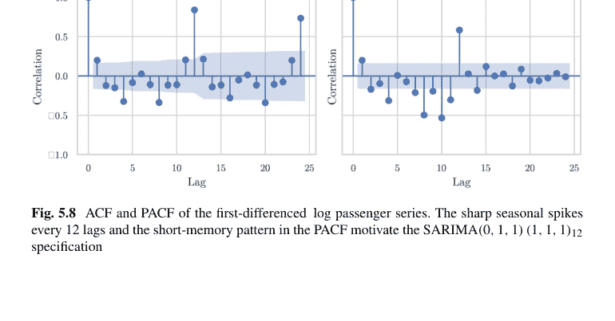

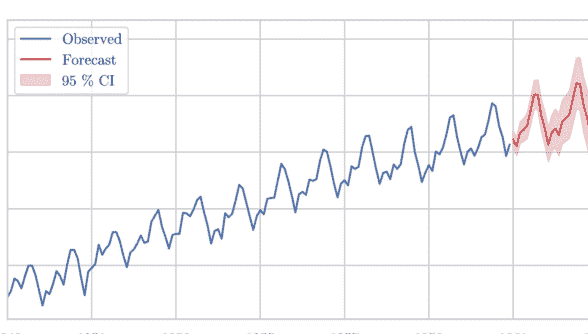

图5.9 使用拟合的SARIMA模型对对数航空乘客数进行三年期预测。不断扩大的95%置信区间反映了不确定性的累积，而季节性模式在估计窗口之外持续存在。

```python
model = sm.tsa.ARIMA(ts, order=(0,1,1), seasonal_order=(1,1,1,12)).fit()
print(model.summary())
forecast = model.get_forecast(steps=36)
forecast_ci = forecast.conf_int()
forecast.predicted_mean.plot()
plt.fill_between(forecast_ci.index, forecast_ci.iloc[:,0], forecast_ci.iloc[:,1], alpha=.3)
plt.show()
```

(0, 1, 1) × (1, 1, 1)₁₂ SARIMA 捕捉了趋势和季节性；由于不确定性的累积，三年期预测包络线变宽（参见图5.9）。

**残差检验** 对残差 $\hat{\varepsilon}_t$ 进行Ljung-Box Q统计量检验以验证白噪声特性：

```python
from statsmodels.stats.diagnostic import acorr_ljungbox
print(acorr_ljungbox(model.resid, lags=[12], return_df=True))
```

## 用于降维的主成分分析（PCA）

给定标准化后的 $X \in \mathbb{R}^{n \times p}$，PCA将协方差矩阵 $\Sigma = \frac{1}{n-1} X^T X$ 对角化为 $\Sigma = V \Lambda V^T$，提供按方差（特征值）排序的正交方向（主成分，PCs）。

**解释方差** $\lambda_k / \sum_j \lambda_j$ 量化了PC$_k$ 捕获的总方差份额。保留前 $m$ 个主成分，使得 $\sum_{k \le m} \lambda_k / \sum_j \lambda_j \ge \eta$（例如 $\eta = 0.9$）。

## 5.3 主成分分析（PCA）

### 示例 5.3.19（8×8 数字图像，64 → 2）

```python
from sklearn.datasets import load_digits
from sklearn.decomposition import PCA
digits = load_digits()
pca = PCA(n_components=2, whiten=True)
X_pca = pca.fit_transform(digits.data)

plt.scatter(X_pca[:,0], X_pca[:,1], c=digits.target, cmap="tab10", s=8)
plt.title(f"Explained variance {pca.explained_variance_ratio_.sum():.2%}")
plt.show()
```

两个主成分解释了约 29% 的方差，却揭示了对应于数字的聚类；增加到 m = 30 个主成分可解释 90% 的方差，并为下游分类器提供噪声降低的数据（参见图 5.10）。

### 基于 PCA 的回归

$$\hat{\beta}_{\text{PCR}} = \arg \min_{\beta} \|\mathbf{y} - Z_m \beta\|^2, \quad Z_m = XV_{[:, 1:m]}.$$

主成分回归（PCR）同时缓解了多重共线性并降低了维度。

### 示例 5.3.20（多重共线性设计下的 PCR 与 OLS 对比）

```python
from sklearn.linear_model import LinearRegression
from sklearn.pipeline import Pipeline

pcr = Pipeline([("scale", StandardScaler()),
                ("pca", PCA(n_components=.95)),
                ("reg", LinearRegression())]).fit(X, y)
print("PCR R^2", pcr.score(X,y), "components", pcr["pca"].n_components_)
```

**核 PCA** 用核函数 $k(x_i, x_j)$（例如 RBF 核）替换内积 $\langle x_i, x_j \rangle$，以在高维特征空间中发现非线性结构。

```python
from sklearn.decomposition import KernelPCA
kca = KernelPCA(n_components=2, kernel="rbf", gamma=15).fit_transform(digits.data)
```

## 5.4 随机过程及其应用

**随机过程**是定义在共同概率空间上、由（通常为）时间索引的一族随机变量 $\{X_t\}_{t \in T}$。当未来演化仅依赖于当前状态，而非完整历史时，该过程具有*马尔可夫性质*。马尔可夫链、布朗运动、泊松过程和分支过程是其典型例子。本节重点关注*离散时间、离散状态*的马尔可夫链，强调转移矩阵代数、收敛定理以及 Python 实践模拟。

### 5.4.1 马尔可夫链

设 $\mathcal{S} = \{s_1, \dots, s_m\}$ 为有限状态空间。一个过程 $\{X_n\}_{n \ge 0}$ 是（时齐）**马尔可夫链**，如果

$$\mathbb{P}(X_{n+1} = s_j \mid X_n = s_i, X_{n-1} = s_k, \dots) = \mathbb{P}(X_{n+1} = s_j \mid X_n = s_i) = P_{ij}, \quad \forall i, j.$$

矩阵 $P = (P_{ij})_{i,j=1}^m$ 是**转移矩阵**：每行元素之和为 1。

### 转移矩阵与长期行为

**查普曼-科尔莫戈罗夫方程** 对于 $n \geq 0, k \geq 1$，

$$P^{(n+k)} = P^{(n)} P^{(k)}, \quad P^{(n)} = P^n,$$

其中 $P^n$ 是 $n$ 步转移矩阵。

**状态分类** 状态 $i$ 是

- *常返的*，如果链以概率 1 返回到 $i$
- *暂态的*，否则
- *周期的*，周期为 $d$，如果返回仅发生在 $d$ 的倍数时刻
- *吸收的*，如果 $P_{ii} = 1$

**平稳分布** 向量 $\boldsymbol{\pi}$ 满足 $\boldsymbol{\pi} P = \boldsymbol{\pi}$ 且 $\sum_i \pi_i = 1$。如果 $P$ 是*不可约*且*非周期*的，则

$$\lim_{n \to \infty} P^n = \mathbf{1} \boldsymbol{\pi},$$

因此无论初始状态如何，$\mathbb{P}(X_n = s_j) \to \pi_j$。

**示例 5.4.1（天气模型：晴天 (S)、多云 (C)、雨天 (R)）**

$$P = \begin{pmatrix} 0.7 & 0.2 & 0.1 \\ 0.3 & 0.4 & 0.3 \\ 0.2 & 0.3 & 0.5 \end{pmatrix}.$$

```python
import numpy as np
P = np.array([[0.7, 0.2, 0.1],
              [0.3, 0.4, 0.3],
              [0.2, 0.3, 0.5]])
# 通过特征向量计算平稳分布
eigvals, eigvecs = np.linalg.eig(P.T)
pi = eigvecs[:, np.isclose(eigvals, 1)]
pi = pi/pi.sum()
print(pi.real.ravel()) # [0.476, 0.286, 0.238]
```

长时间后，晴天的概率稳定在约 47.6%。从初始状态 $S$ 计算 10 天预测：

```python
p0 = np.array([1, 0, 0])
print(p0 @ np.linalg.matrix_power(P, 10))
```

**吸收链的基本矩阵** 如果状态 $1, \ldots, r$ 是暂态的，$r+1, \ldots, m$ 是吸收的，将 $P$ 写为 $P = \begin{pmatrix} Q & R \\ 0 & I \end{pmatrix}$，其中 $Q \in \mathbb{R}^{r \times r}$。**基本矩阵** $N = (I - Q)^{-1}$ 满足 $N_{ij} =$ 从状态 $i$ 出发访问暂态 $j$ 的期望次数；期望吸收时间 $\mathbf{t} = N \mathbf{1}$。

**示例 5.4.2（赌徒破产问题 $N = 5$，公平硬币）** 状态 0 和 5 是吸收态。如果 $j = i \pm 1$，则 $Q_{ij} = \frac{1}{2}$；计算从 $\$2$ 开始到破产的期望步数 $\mathbb{E}[\text{steps to ruin}]$。

```python
n=5; p=0.5
Q = np.zeros((n-1,n-1))
for i in range(n-1):
    if i>0: Q[i,i-1]=p
    if i<n-2: Q[i,i+1]=1-p
N = np.linalg.inv(np.eye(n-1)-Q)
t = N.sum(axis=1)
print(t[1]) # 从 2 美元开始的期望步数为 6.0
```

### 马尔可夫链在 Python 中的应用

**PageRank（网页冲浪）** 网页 $\{1, \ldots, m\}$ 具有邻接矩阵 $A$。定义

$$P_{ij} = \begin{cases} \frac{1-\alpha}{\deg(i)} & \text{如果 } i \to j \text{ 有链接}, \\ \frac{\alpha}{m} & \text{阻尼跳跃}. \end{cases}$$

平稳分布 $\pi = \text{PageRank}$。

**示例 5.4.3（小型网络，$\alpha = 0.15$）**

```python
A = np.array([[0,1,1,0],
              [1,0,0,1],
              [1,0,0,1],
              [0,1,1,0]])
deg = A.sum(axis=1)
m, alpha = A.shape[0], 0.15
P = (1-alpha)*A/deg[:,None] + alpha/m
pi = np.ones(m)/m
for _ in range(100): # 幂迭代
    pi = pi @ P
print(pi) # 排名之和为 1
```

**隐马尔可夫模型（HMM）解码** 状态（天气）隐藏，观测（雨伞）可见。维特比算法大量使用转移矩阵；使用 hmmlearn 库可以轻松编码。

```python
from hmmlearn import hmm
model = hmm.CategoricalHMM(n_components=3)
model.startprob_ = np.array([0.5,0.3,0.2])
model.transmat_ = P
model.emissionprob_ = np.array([[.9,.1], [.6,.4], [.2,.8]]) # {有伞, 无伞}
seq = model.predict(np.array([[1,0,1,1,0]]).T)
```

**马尔可夫链蒙特卡洛（MCMC）** 梅特罗波利斯-黑斯廷斯算法构造一个转移矩阵 $P$，其平稳分布为目标 $\pi$；Python 库（pymc, emcee）隐藏了细节，但验证收敛需要检查链上的经验频率与 $\pi$ 的对比。

**排队网络** $M/M/1$ 队列长度 $\{L_t\}$ 形成生灭链，其中 $P_{i,i+1} = \lambda$，$P_{i,i-1} = 1-\lambda$（缩放后 $\lambda < 0.5$）。平稳分布是几何分布 $\pi_i = (1-2\lambda)(2\lambda)^i$，可通过幂迭代验证。

```python
lam = 0.4
size = 30
P = np.zeros((size,size))
for i in range(size):
    if i>0: P[i,i-1]=1-lam
    if i<size-1: P[i,i+1]=lam
P[0,0]=1-lam
pi = np.linalg.matrix_power(P,1000)[0] # 从状态 0 开始收敛
```

### 5.4.2 泊松过程

**泊松过程** $\{N(t)\}_{t \ge 0}$ 计算到时间 $t$ 为止发生的随机事件的累积数量。它由以下公理刻画：

1. $N(0) = 0$ 几乎必然成立。
2. 该过程具有*独立增量*：不相交区间内的计数是独立的。
3. 它具有*平稳增量*：对于 $s, t \ge 0$，$N(t+s) - N(s) \sim \text{Pois}(\lambda t)$，其中 $\lambda > 0$ 是事件率（*强度*）。

等价地，到达间隔时间 $T_1, T_2, \dots$ 是独立同分布的 $\text{Exp}(\lambda)$，且 $S_n = T_1 + \dots + T_n$ 给出第 $n$ 次到达的时间（埃尔朗分布）。

### 时间和空间中的事件建模

**时域性质** 对于任意 $t \ge 0$ 和 $k \in \mathbb{N}_0$，
$$\mathbb{P}(N(t) = k) = e^{-\lambda t} \frac{(\lambda t)^k}{k!}, \quad \mathbb{E}[N(t)] = \lambda t, \quad \text{Var}(N(t)) = \lambda t.$$

**示例 5.4.4（探测器中的光子计数）** 探测器平均每秒 $\lambda = 350$ 个光子。在 $\Delta t = 1$ 秒内观测到最多 330 个光子的概率：
$$P = \sum_{k=0}^{330} e^{-350} \frac{350^k}{k!}.$$

数值计算，

```python
import mpmath as mp
lam = 350
P = mp.nsum(lambda k: mp.nsum(lambda i: 0, [0,0]) if k>330 else
            mp.e**(-lam)*lam**k/mp.factorial(k), [0,330])
print(P) # 0.081...
```

约为 8.1%。

**顺序统计量** 在给定 $N(t) = n$ 的条件下，到达时间 $(S_1, \ldots, S_n)$ 是 $n$ 个独立同分布的 Unif(0, $t$) 变量的顺序统计量。

**示例 5.4.5（首次事故前的时间）** 汽车以泊松($\lambda = 12 \text{ h}^{-1}$) 过程通过检查点。首次到达时间 $S_1$ 的分布：

$\mathbb{P}(S_1 > s) = e^{-\lambda s} \implies f_{S_1}(s) = \lambda e^{-\lambda s}$。

期望等待时间 $\mathbb{E}[S_1] = 1/\lambda = 5$ 分钟。

**空间泊松过程（齐次泊松点过程，PPP）** 在 $\mathbb{R}^d$ 中，对于博雷尔集 $B \subset \mathbb{R}^d$，

$N(B) \sim \text{Pois}(\lambda|B|)$，且不相交 $B_i$ 中的计数是独立的。

**示例 5.4.6（天空区域中的随机恒星）** 强度 $\lambda = 40$ 颗星/平方度。在 0.1 平方度的望远镜视场中恰好有 5 颗星的概率：

$\mathbb{P} = e^{-4} \frac{4^5}{5!} = 0.156$。

在 $[0, 1] \times [0, 0.1]$ 平方度内模拟坐标：

```python
import numpy as np
lam, area = 40, 0.1
k = np.random.poisson(lam*area)
xy = np.random.rand(k,2)*np.array([1,0.1])
```

**叠加与稀疏化** 如果 $N_1, N_2$ 是独立的泊松($\lambda_1$)、泊松($\lambda_2$) 过程，则 $N = N_1 + N_2$ 是泊松($\lambda_1 + \lambda_2$) 过程。*稀疏化*：以概率 $p$ 独立保留每个事件 $\implies$ 泊松($p\lambda$) 过程。

**示例 5.4.7（过滤后的宇宙射线）** 入射宇宙射线 $\lambda = 120$ 次/分钟；探测器效率 $p = 0.8$。探测到的事件服从泊松（$96$ 次/分钟）。

### 在排队论和可靠性中的应用

**M/M/1 队列（生灭过程）** 到达过程：泊松($\lambda$)；服务时间：指数($\mu$)。利用率 $\rho = \lambda/\mu < 1$。稳态队列长度分布是几何分布：$\pi_n = (1 - \rho)\rho^n$, $\mathbb{E}[L] = \frac{\rho}{1 - \rho}$, $\mathbb{E}[W] = \frac{1}{\mu - \lambda}$.

**示例 5.4.8（Web 服务器）** $\lambda = 30$ 请求/秒, $\mu = 40$ 请求/秒. 平均队列长度 $= 30/10 = 3$; 平均等待时间 $= 1/(40 - 30) = 0.1$ 秒. 模拟 $T = 100$ 秒:

```python
import random, heapq
lam, mu, T = 30, 40, 100
t, server_busy, L = 0.0, False, 0
queue, arrivals, waits = [], [], []
next_arrival = random.expovariate(lam)
while t < T:
    next_service = queue[0] if server_busy else float('inf')
    t = min(next_arrival, next_service)
    if t == next_arrival:
        arrivals.append(t)
        if server_busy: queue.append(t)
        else:
            server_busy = True
            heapq.heappush(queue, t+random.expovariate(mu))
        next_arrival = t + random.expovariate(lam)
    else: # service completion
        start = heapq.heappop(queue)
        waits.append(t-start)
        if queue:
            heapq.heapreplace(queue, t+random.expovariate(mu))
        else:
            server_busy=False
print("Mean wait", sum(waits)/len(waits))
```

**可靠性工程** 故障按泊松($\lambda$)过程发生；平均故障间隔时间 (MTBF) $= 1/\lambda$. 对于冗余的 $k$-out-of-$n$ 系统，组件故障是独立的泊松过程；系统寿命分布源于指数变量的顺序统计量。

**示例 5.4.9（三模冗余）** 组件故障率为 $\lambda = 2 \times 10^{-6}$ h$^{-1}$. 当 $\ge 2$ 个组件故障时系统失效。第二次故障的时间服从 Erlang($k = 2, \lambda$) 分布；均值 $\mathbb{E}[T] = \frac{2}{\lambda} = 1,000,000$ 小时。
通过模拟计算置信区间:

```python
lam, B = 2e-6, 20000
lifetimes = np.random.exponential(1/lam, (B,2)).sum(axis=1)
print(lifetimes.mean(), lifetimes.std()/np.sqrt(B))
```

**非齐次泊松过程 (NHPP)** 当强度函数变化 $\lambda(t)$ 时，计数满足 $\mathbb{P}(N(t + h) - N(t) = 1) = \lambda(t)h + o(h)$. 累积强度 $\Lambda(t) = \int_0^t \lambda(u) du$; $N(t) \sim \text{Pois}(\Lambda(t))$.

**示例 5.4.10（网络流量高峰时段）** 速率 $\lambda(t) = 200 + 800 \exp(-(t - 18)^2/4)$ 包/秒（时间 $t$ 以小时计，$t \in [0, 24]$）。绘制每小时预期到达量图，并通过稀疏化（Lewis-Shedler 算法）模拟数据包时间戳。

```python
import matplotlib.pyplot as plt
λ = lambda t: 200+800*np.exp(-(t-18)**2/4)
T = np.linspace(0,24,200)
plt.plot(T, λ(T)); plt.xlabel("Hour"); plt.ylabel("λ(t)")
plt.show()
```

## 5.4.3 布朗运动及其应用

布朗运动（又称维纳过程）是连续时间随机建模的基石。其数学上的优雅和丰富的路径特性使其在物理学（扩散）、生物学（随机游走）以及尤其在*金融学*中不可或缺，它驱动了著名的 Black-Scholes 资产定价模型。

### 标准布朗运动 $W_t$

$W_0 = 0,$
$W_{t+s} - W_t \sim \mathcal{N}(0, s)$ 且独立于 $\mathcal{F}_t,$
路径 $t \mapsto W_t$ 几乎必然连续且处处不可微。

对于任意 $0 = t_0 < t_1 < \cdots < t_n$，向量 $(W_{t_1}, \ldots, W_{t_n})$ 服从多元正态分布，且 $\text{Cov}(W_{t_i}, W_{t_j}) = \min(t_i, t_j)$。

### 在 Python 中模拟布朗运动

**时间离散化方案** 固定网格 $0 = t_0 < \cdots < t_N = T$，令 $\Delta t_i = t_i - t_{i-1}$ 并生成独立同分布的增量 $\Delta W_i \sim \mathcal{N}(0, \Delta t_i)$。设定 $W_{t_i} = W_{t_{i-1}} + \Delta W_i$。

**示例 5.4.11（单条路径与分布检验）**

```python
import numpy as np, matplotlib.pyplot as plt
T, N = 1.0, 252
dt = T/N
ΔW = np.random.normal(scale=np.sqrt(dt), size=N)
W = np.insert(np.cumsum(ΔW), 0, 0)

plt.plot(np.linspace(0,T,N+1), W); plt.xlabel("t"); plt.ylabel("W(t)")
plt.title("Simulated Brownian path"); plt.show()

# distribution at fixed t
t_idx = int(0.6*N) # t=0.6
samples = np.cumsum(np.random.normal(0, np.sqrt(dt), (10000,N)))[:, t_idx]
print("Empirical mean≈", samples.mean(), "Var≈", samples.var())
```

预期 $\mathbb{E}[W_{0.6}] = 0$, $\text{Var}(W_{0.6}) = 0.6$；模拟结果应与此一致。

**图 5.11** 高斯形状的到达率曲线 $\lambda(t) = 200 + 800e^{-(t-18)^2/4}$，覆盖 24 小时周期。基础速率 200 被一个以 18:00 为中心、峰值为 800 的增量所增强，模拟了傍晚前后的活动激增。

**示例 5.4.12（首达时间** $\tau_a = \inf\{t : W_t = a\}$）对于 $a = 0.5$，在精细网格 $\Delta t = 10^{-4}$ 上近似 $\tau_a$，直到 $W_t \ge a$；重复 $10^4$ 次，并将 $\mathbb{E}[\tau_a]$ 与解析值 $\infty$（均值发散）进行比较，但中位数有限（参见图 5.11）。

**布朗桥** 在给定 $W_T = 0$ 的条件下，增量 $B_t = W_t - \frac{t}{T}W_T$ 的方差为 $\frac{t(T-t)}{T}$，可用于改进蒙特卡洛方差缩减（例如障碍期权模拟）（参见图 5.12）。

### 金融应用：股票价格建模

### 几何布朗运动 (GBM)

$$dS_t = \mu S_t dt + \sigma S_t dW_t \implies S_t = S_0 \exp\left(\left(\mu - \frac{1}{2}\sigma^2\right)t + \sigma W_t\right).$$

对数收益率服从正态分布：$\ln \frac{S_t}{S_0} \sim \mathcal{N}\left((\mu - \frac{1}{2}\sigma^2)t, \sigma^2 t\right)$。

**示例 5.4.13（蒙特卡洛欧式看涨期权定价）** 参数：$S_0 = 100$, 执行价 $K = 110$, 到期日 $T = 1$, 无风险利率 $r = 0.05$, 波动率 $\sigma = 0.2$（图 5.13）。

**图 5.12** 标准布朗运动在 [0, 1] 上的一次实现，Δt = 1/252。分段线性轨迹展示了维纳样本路径连续但处处不可微的特性。

**图 5.13** 基于 $10^4$ 条模拟路径的 W(0.6) 经验密度（直方图）与其理论 $\mathcal{N}(0, t)$ 分布（红色曲线）的比较。样本统计量 $\hat{\mu} \approx 0$ 和 $\hat{\sigma}^2 \approx 0.6$ 证实了精确的矩值。

```python
import numpy as np
S0, K, T, r, σ, M = 100, 110, 1, 0.05, 0.2, 200_000
Z = np.random.randn(M)
ST = S0*np.exp((r-0.5*σ**2)*T + σ*np.sqrt(T)*Z)
payoff = np.maximum(ST-K, 0)
C_est = np.exp(-r*T)*payoff.mean()
print("Call price ≈", C_est)
```

Black-Scholes 解析价格用于比较：

$$C_{BS} = S_0 \Phi(d_1) - Ke^{-rT} \Phi(d_2), \quad d_{1,2} = \frac{\ln(S_0/K) + (r \pm \frac{1}{2}\sigma^2)T}{\sigma\sqrt{T}}.$$

**通过路径导数计算希腊字母** Delta $\partial C/\partial S_0 = e^{-rT} \mathbb{E}[\mathbf{1}_{\{ST>K\}} ST/S_0]$；在支付循环中同时估计。

**带布朗桥修正的障碍期权** 障碍 $B = 120$。在网格点之间，GBM 的上穿概率使用桥分布：

$$\mathbb{P}\left(\max_{t_n < t < t_{n+1}} S_t > B \mid S_{t_n}, S_{t_{n+1}}\right) = \exp\left(-\frac{2}{\sigma^2 \Delta t} \ln \frac{B}{S_{t_n}} \ln \frac{B}{S_{t_{n+1}}}\right)^+.$$

在蒙特卡洛中包含生存概率权重以减少偏差（参见 Glasserman 2004）。

**使用 PCA 进行波动率曲面自举** 对数收益率矩阵 $\mathbf{R} \in \mathbb{R}^{n \times d}$（天数 $\times$ 股票数）通常具有 $k \ll d$ 个主导特征值，允许使用因子模型：$\mathbf{R} \approx Z_k \Lambda_k^{1/2} V_k^\top$。通过对主因子得分 $Z_k$ 进行重采样并重构 $\mathbf{R}^*$ 来模拟未来情景。

```python
from sklearn.decomposition import PCA
R = np.log(df_prices).diff().dropna().values # assume df_prices
pca = PCA(n_components=5).fit(R)
Z = np.random.randn(252,5) # 1-year daily scores
R_sim = Z@np.diag(np.sqrt(pca.explained_variance_))@pca.components_
S_sim = df_prices.iloc[-1].values * np.exp(np.cumsum(R_sim, axis=0))
```

**分数布朗运动 (fBm)** Hurst 指数 $H \in (0, 1)$，具有自相似性但表现出长程依赖性（$H \neq 0.5$）。用于粗糙波动率模型；可通过协方差 $\frac{1}{2}(t^{2H} + s^{2H} - |t-s|^{2H})$ 的 Cholesky 分解或 Davies-Harte FFT 方法进行模拟。

## 5.4.4 贝叶斯统计

贝叶斯统计将概率解释为信念程度，并通过贝叶斯定理根据数据更新该信念。该范式统一了估计、预测和决策理论，并自然地量化不确定性。贝叶斯工作流通常按以下步骤进行：(i) 为参数选择一个先验分布，(ii) 在给定观测数据的情况下计算或近似后验分布，以及 (iii) 使用后验分布进行推断或决策（例如，点估计、可信区间、后验预测检验）。

## 贝叶斯推断与先验分布

令 $\theta$ 为一个未知参数，$\mathcal{D}$ 为数据。贝叶斯定理给出**后验分布**

$$p(\theta \mid \mathcal{D}) = \frac{p(\mathcal{D} \mid \theta) \, p(\theta)}{\int p(\mathcal{D} \mid \theta) \, p(\theta) \, d\theta},$$

其中 $p(\theta)$ 是*先验分布*，$p(\mathcal{D} \mid \theta)$ 是*似然函数*。

**共轭先验** 如果后验分布与先验分布属于同一族，则称先验 $p(\theta)$ 对似然函数是*共轭*的。

**示例 5.4.14（Beta-二项模型）** 硬币正面概率 $\theta$ 未知。先验 $\theta \sim \text{Beta}(\alpha, \beta)$；数据 $x \mid \theta \sim \text{Binom}(n, \theta)$。后验分布为：

$$\theta \mid x \sim \text{Beta}(\alpha + x, \beta + n - x).$$

当 $\alpha = \beta = 1$（均匀先验）且 $n = 10$ 次投掷中出现 $x = 7$ 次正面时，后验 Beta(8, 4) 的均值为 $8/12 \approx 0.667$，95% 可信区间为 (0.39, 0.88)。

```python
import scipy.stats as st, numpy as np
alpha, beta, x, n = 1, 1, 7, 10
posterior = st.beta(alpha+x, beta+n-x)
print(posterior.mean(), posterior.interval(.95))
```

**示例 5.4.15（均值未知的正态-正态模型）** 观测值 $y_i \sim \mathcal{N}(\mu, \sigma^2)$；$\sigma^2$ 已知；先验 $\mu \sim \mathcal{N}(\mu_0, \tau_0^2)$。后验分布为：

$$\mu \mid \mathbf{y} \sim \mathcal{N}\left(\frac{\tau_0^{-2} \mu_0 + n \sigma^{-2} \bar{y}}{\tau_0^{-2} + n \sigma^{-2}}, (\tau_0^{-2} + n \sigma^{-2})^{-1}\right).$$

当 $\mu_0 = 0, \tau_0 = 5, \sigma = 1, n = 20, \bar{y} = 0.8$ 时：

```python
mu0, tau0, sigma, n, ybar = 0, 5, 1, 20, 0.8
prec = 1/tau0**2 + n/sigma**2
post_mean = (mu0/tau0**2 + n*ybar/sigma**2)/prec
post_sd = np.sqrt(1/prec)
print(post_mean, post_sd)
```

**层次先验** 对于多层次数据，将组参数视为从超先验中抽取，以共享信息（“部分池化”）。例如：球员的击球平均率 $\theta_j \sim \text{Beta}(\alpha, \beta)$，其中 $(\alpha, \beta)$ 有超先验，这会促使估计值向联盟均值收缩。

## 马尔可夫链蒙特卡洛（MCMC）方法

当贝叶斯定理中的归一化常数难以处理时，通过采样来近似后验分布。

**Metropolis-Hastings** 给定提议分布 $q(\theta' \mid \theta)$，以概率 $\alpha = \min\left(1, \frac{p(\theta')p(\mathcal{D}\mid\theta')q(\theta\mid\theta')}{p(\theta)p(\mathcal{D}\mid\theta)q(\theta'\mid\theta)}\right)$ 接受 $\theta'$。

### 示例 5.4.16（混合正态分布，双峰后验）

```python
import numpy as np, matplotlib.pyplot as plt, scipy.stats as st
np.random.seed(0)
def logpost(θ): # 未归一化的对数后验
    return np.log(0.3*st.norm.pdf(θ,-3,1) + 0.7*st.norm.pdf(θ,2,0.5))
θ0, samples, burn = 0.0, [], 3_000
θ = θ0
for i in range(20_000):
    θ_prop = θ + np.random.normal(scale=1)
    if np.random.rand() < np.exp(logpost(θ_prop)-logpost(θ)):
        θ = θ_prop
    if i >= burn: samples.append(θ)
plt.hist(samples, bins=60, density=True); plt.show()
```

直方图恢复了 $-3$ 和 $2$ 附近的两个众数（参见图 5.14）。

## 吉布斯采样

如果完全条件分布可用，则依次对每个参数进行采样。

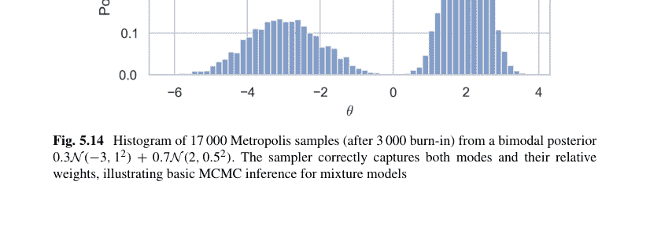

示例 5.4.17（高斯-高斯共轭层次模型）后验完全条件分布：$\mu \mid \sigma^2, \mathbf{y} \sim \mathcal{N}(\dots)$，$\sigma^2 \mid \mu, \mathbf{y} \sim \text{Inv-}\chi^2(\dots)$。交替抽样收敛到联合后验分布；pymc 可自动化此过程。

**哈密顿蒙特卡洛（HMC）** 利用梯度信息处理高维后验分布（在 pymc、stan 中实现）。

```python
import pymc as pm
with pm.Model() as mod:
    μ = pm.Normal("μ", 0, 1)
    σ = pm.Exponential("σ", 1)
    y = pm.Normal("y", μ, σ, observed=np.random.randn(100))
    idata = pm.sample(draws=1000, tune=1000, target_accept=.9)
pm.summary(idata, var_names=["μ","σ"])
```

轨迹图和 R-hat 统计量（$\leq 1.01$）用于评估收敛性。

## 在机器学习与决策中的应用

**贝叶斯线性回归（BLR）** 后验预测分布对系数不确定性进行积分，产生比 OLS 区间更宽的*可信带*，反映了参数风险。

**示例 5.4.18（房价 BLR）**

```python
from sklearn.preprocessing import StandardScaler
X = StandardScaler().fit_transform(df[["size","age"]])
y = df["price"].values
with pm.Model() as blr:
    σ = pm.Exponential("σ", 1)
    β = pm.Normal("β", 0, 5, shape=X.shape[1]+1) # 包含截距
    μ = β[0] + pm.math.dot(X, β[1:])
    pm.Normal("obs", μ, σ, observed=y)
    blr_trace = pm.sample(2000, tune=2000, target_accept=.9)
pm.plot_posterior_predictive_glm(blr_trace, samples=100, color="r",
                                eval=np.linspace(X.min(), X.max(), 100))
```

**贝叶斯逻辑回归（分类）** 使用后验预测概率预测违约风险；决策阈值可以纳入非对称成本。

**多臂老虎机的汤普森采样** 为每个臂的成功概率 $p_k$ 维护 Beta 后验分布；采样 $\tilde{p}_k \sim \text{Beta}(\alpha_k, \beta_k)$，拉动臂 $\arg \max \tilde{p}_k$。平衡了探索与利用。

```python
α, β = np.ones(K), np.ones(K)
for t in range(10_000):
    θ = np.random.beta(α, β)
    arm = θ.argmax()
    reward = env.pull(arm)
    α[arm] += reward
    β[arm] += 1-reward
```

**贝叶斯决策理论** 选择行动 $a$ 以最大化后验期望效用：$a^* = \arg \max_a \int u(a, \theta) \, p(\theta \mid \mathcal{D}) \, d\theta$。例如：具有 0-1 损失的贝叶斯分类器选择后验概率最高的类别。

## 使用贝叶斯因子进行模型比较

$$BF_{12} = \frac{p(\mathcal{D} \mid M_1)}{p(\mathcal{D} \mid M_2)}, \quad p(\mathcal{D} \mid M) = \int p(\mathcal{D} \mid \theta, M) p(\theta \mid M) \, d\theta.$$

通过桥接采样或 WAIC/LOO 交叉验证（arviz）进行近似。

```python
import arviz as az
loo1 = az.loo(idata_model1); loo2 = az.loo(idata_model2)
az.compare({"M1": idata_model1, "M2": idata_model2}, ic="loo")
```

## 5.5 练习题

1.  设 $\Omega$ 包含 100 个等可能的结果。事件 $A, B, C \subset \Omega$ 满足

    $$|A| = 45, \quad |B| = 38, \quad |C| = 30, \quad |A \cap B| = 18, \quad |A \cap C| = 14,$$
    $$|B \cap C| = 12, \quad |A \cap B \cap C| = 5.$$

    计算 $\mathbb{P}(A \cup B \cup C)$，$\mathbb{P}(A^c \cap B)$，并验证布尔不等式 $\mathbb{P}(A \cup B \cup C) \leq \mathbb{P}(A) + \mathbb{P}(B) + \mathbb{P}(C)$。

2.  证明：如果 $X$ 计数独立伯努利($p$)试验直到第 $r$ 次成功，则使用 (i) 矩生成函数和 (ii) 应用于几何分布项的全期望定律，可得 $\mathbb{E}[X] = \frac{r}{p}$ 和 $\text{Var}(X) = \frac{r(1-p)}{p^2}$。

3.  设 $Y \sim \text{Gamma}(k, \lambda)$，其中整数 $k \geq 2$。对 $g(t) = t^{-1}$ 使用詹森不等式，证明 $\mathbb{E}[1/Y] \geq \frac{\lambda}{k-1}$，并通过 Python 模拟 $10^6$ 个样本，评估当 $k=2, \lambda=3$ 时左右两边的比值。

4.  $8 \times 4$ 矩阵

    $$M = \begin{pmatrix} 12 & 17 & 25 & 30 \\ 14 & 19 & 24 & 28 \\ 16 & 21 & 22 & 26 \\ 13 & 20 & 27 & 31 \\ 18 & 18 & 20 & 25 \\ 15 & 23 & 21 & 29 \\ 11 & 16 & 26 & 32 \\ 17 & 22 & 23 & 27 \end{pmatrix}$$

    记录了每个样本的四个生化检测读数。对每一列计算：算术平均值、中位数、样本方差、四分位距、偏度和（经验）超峰度。找出任何满足 $|\gamma_1| > 0.8$ 或 $\gamma_2 > 1$ 的列并解释。

5.  独立正态样本：

    $\mathbf{x} = (5.1, 4.9, 5.2, 5.0, 4.8, 5.3), \quad \mathbf{y} = (4.7, 4.6, 4.9, 4.8, 4.5, 4.6, 4.8)$

    具有共同但未知的方差。在 $\alpha = 0.05$ 水平下检验 $H_0 : \mu_x = \mu_y$ 对 $H_1 : \mu_x > \mu_y$。报告 $t$ 统计量、$p$ 值、决策以及 $\mu_x - \mu_y$ 的 95% 置信区间。

6.  合成设计矩阵

    $$X = \begin{pmatrix} 1 & 1.01 & 0.05 \\ 1 & 0.99 & 0.01 \\ 1 & 1.03 & 0.06 \\ 1 & 0.98 & 0.02 \\ \vdots & \vdots & \vdots \end{pmatrix}_{20 \times 3}, \quad \mathbf{y} = X \begin{pmatrix} 2 \\ 3 \\ 10 \end{pmatrix} + \boldsymbol{\varepsilon}, \quad \varepsilon_i \overset{\text{i.i.d.}}{\sim} \mathcal{N}(0, 0.2^2).$$

    (a) 拟合 OLS、岭回归($\lambda = 1$)和 Lasso($\lambda = 0.1$)；将 $\hat{\beta}$ 制成表格。(b) 计算每个模型的 $R^2$。(c) 解释为什么 Lasso 更激进地收缩高度共线的第三个系数。

7.  测量值 $(X_i, Y_i) \ (i = 1, \ldots, 40)$ 给出

    $$\bar{\mathbf{x}} = \begin{pmatrix} 2.5 \\ 1.3 \end{pmatrix}, \quad S = \begin{pmatrix} 0.40 & 0.12 \\ 0.12 & 0.25 \end{pmatrix}.$$

    假设联合正态性，构建 $(\mu_X, \mu_Y)$ 的 95% 联合置信椭圆：提供其中心、特征向量和半轴长度。

8.  转移矩阵

    $$P = \begin{pmatrix} 0.60 & 0.25 & 0.15 \\ 0.30 & 0.45 & 0.25 \\ 0.20 & 0.30 & 0.50 \end{pmatrix}, \quad \mathcal{S} = \{S = \text{晴}, C = \text{多云}, R = \text{雨}\}.$$

    (a) 证明 $P$ 是不可约且非周期的。(b) 计算平稳分布 $\boldsymbol{\pi}$。(c) 如果今天是多云，那么 $\mathbb{P}(\text{恰好 2 天后是晴天})$ 是多少？(d) 推导 $\mathbb{E}[\text{首次返回晴天的时间}]$。

9.  呼叫以泊松过程（$\lambda = 90 \text{ h}^{-1}$）到达交换机。每个呼叫被自动分类为 (i) 个人呼叫，概率 0.1，(ii) 商业呼叫，概率 0.75，否则 (iii) 垃圾呼叫。(a) 给出每类的到达率。(b) 计算在 30 秒间隔内至少发生 5 次商业呼叫且没有垃圾呼叫的概率。(c) 在 Python 中模拟 $10^5$ 个这样的间隔以进行验证。

## 5.5 练习

10. 设 $W_t$ 为标准布朗运动，$\tau_a = \inf\{t > 0 : W_t = a\}$，其中 $a > 0$。利用反射原理证明
    $$\mathbb{P}(\tau_a \leq t) = 2(1 - \Phi(a/\sqrt{t})).$$
    对 $a = 1$，$t = 0.5$ 进行数值计算，并与 $10^6$ 条离散路径（$\Delta t = 10^{-4}$）的蒙特卡洛模拟结果进行比较。

11. 数据 $\mathbf{y} = (4.2, 5.1, 4.8, 5.3, 4.9)$ 建模为 $y_i \sim \mathcal{N}(\mu, \sigma^2)$。先验分布：$\mu \mid \sigma^2 \sim \mathcal{N}(5, \sigma^2/\kappa)$，其中 $\kappa = 2$，且 $\sigma^2 \sim \text{Inv-}\chi^2(\nu_0 = 4, s_0^2 = 0.3^2)$。
    (a) 推导 $\mu$ 和 $\sigma^2$ 的全条件分布。
    (b) 运行 $10^4$ 次 Gibbs 迭代，丢弃前 1000 次，估计 $\mathbb{E}[\mu]$、$\mathbb{E}[\sigma]$ 以及 $\mu$ 的 95% 最高后验密度区间。

12. 季度 GDP 增长序列（$n = 80$）的样本自相关函数（ACF）在滞后 1 和 4 处显著；偏自相关函数（PACF）仅在滞后 1 处显著。提出一个 ARIMA($p, d, q$) 或季节性 SARIMA($p, d, q$) $\times$ ($P, D, Q$)$_4$ 模型，说明选择理由，在 Python 中估计参数，并报告 AIC 以及残差滞后 1–8 的 Ljung-Box $p$ 值。

13. 数据集 $X \in \mathbb{R}^{400 \times 2}$ 包含来自嵌入在 $\mathbb{R}^2$ 中的“瑞士卷”流形的带噪样本，附加噪声为 $\mathcal{N}(0, 0.05^2)$。
    (a) 使用 $\gamma = 30$ 进行 RBF 核主成分分析（PCA），保留前 $m = 1$ 个主成分；重构数据（通过优化进行原像近似）并计算均方重构误差。
    (b) 与保留前 $m = 1$ 个主成分的经典线性 PCA 进行比较。
    (c) 讨论为什么核 PCA 能够捕捉非线性结构。

14. 对于一个 $\rho = \lambda/\mu < 1$ 的 M/M/1 排队系统，证明到达顾客的等待时间 $W$ 的概率密度函数为
    $$f_W(t) = \mu(1 - \rho)e^{-(\mu - \lambda)t}, \quad t \geq 0.$$
    通过对平稳队列长度概率上的条件剩余服务分布进行积分来验证。模拟 $\lambda = 0.7$、$\mu = 1$ 时的 $10^5$ 个到达，并将经验密度与解析概率密度函数叠加显示。

15. 多元过程均值 $\boldsymbol{\mu} = (50, 120)^\top$，协方差矩阵 $\boldsymbol{\Sigma} = \begin{pmatrix} 4 & 1.5 \\ 1.5 & 9 \end{pmatrix}$。子组大小 $n = 5$；控制限 $T_a^2 = \frac{2(5-1)}{5-2} F_{2,8; 0.99}$。给定一个新子组，其样本均值为 $(52.1, 118.7)$，判断过程是否处于受控状态。提供临界值和结论。

16. 一个拟合模型 $\log \frac{\Pr(Y=1)}{1-\Pr(Y=1)} = -1.2 + 0.08\, x_1 - 0.45\, x_2$ 用于分类贷款违约（$Y = 1$）。
    (a) 对于一个 $(x_1, x_2) = (55, 0)$ 的借款人，计算其违约概率。
    (b) 当 $x_2$ 增加 1 时，解释系数 $-0.45$ 的优势比含义。
    (c) 假设银行希望设定阈值 $\Pr(Y = 1) \geq 0.3$；在 $x_1$–$x_2$ 平面上找到决策边界线。

17. 击球数据：球员 $j$ 在 $n_j$ 次打数中击出 $x_j$ 支安打（$j = 1, \dots, 18$）。假设 $\theta_j \sim \text{Beta}(\alpha, \beta)$，安打数 $\mid \theta_j \sim \text{Binom}(n_j, \theta_j)$。
    (a) 推导边际似然函数 $L(\alpha, \beta)$。
    (b) 使用数据 $\{(3,11), (4,12), (6,20), (3,14), (5,19), (2,8), (5,17), (4,15), (7,22), (6,18), (8,25), (2,10), (3,12), (4,16), (5,15), (6,21), (1,8), (4,14)\}$，通过数值方法找到使 $L$ 最大化的 $(\hat{\alpha}, \hat{\beta})$。
    (c) 计算后验均值 $\hat{\theta}_j = \mathbb{E}[\theta_j \mid x_j]$ 并对球员进行排名。

## 第 6 章
### 微分方程

**摘要** 常微分方程、偏微分方程和随机微分方程源于守恒定律和动力学原理；解析方法（分离变量法、积分因子法、格林函数法）与数值求解器（龙格-库塔法、多步法、打靶法、有限差分法、有限元法）并列呈现，所有这些都通过稳定性、刚性和收敛性证明联系在一起。现实世界的案例研究——振荡器、反应-扩散和流行病学 SIR 模型——以可执行的 Python 笔记本形式整合。

**关键词** 微分方程 · 数值求解器 · 稳定性分析 · 有限差分法 · 有限元法 · 随机微分方程

## 6.1 常微分方程 (ODEs)

**常微分方程** 将一个未知函数 $y : I \subseteq \mathbb{R} \to \mathbb{R}$ 与其关于单个自变量（通常记为 $x$）的导数联系起来。*一阶* ODE 仅涉及 $y$ 及其一阶导数 $y'$。在本节中，我们假设所有函数都足够光滑，以保证所执行运算的合理性。

### 6.1.1 一阶常微分方程

典型的物理例子源于指数增长、放射性衰变、牛顿冷却和 RC 电路放电，所有这些都遵循一阶定律。我们专注于三种解析解技巧：可分离性、线性性和通过积分因子的精确性。每个小节都以 Python/SymPy 中的计算验证结束，将符号操作嵌入理论工作流程。

## 可分离与线性常微分方程

**可分离方程** 如果一个 ODE 可以写成

$$\frac{dy}{dx} = g(x) h(y),$$

则称其为*可分离的*，允许变量分离：$\frac{dy}{h(y)} = g(x) dx$。对两边积分得到*隐式*解

$$\int \frac{dy}{h(y)} = \int g(x) dx + C.$$

### 例 6.1.1 (逻辑斯谛增长)

$$\frac{dy}{dx} = ry\left(1 - \frac{y}{K}\right), \quad r, K > 0.$$

分离变量：

$$\int \frac{dy}{y(1 - y/K)} = r \int dx.$$

部分分式和积分给出显式解

$$y(x) = \frac{K}{1 + Ae^{-rx}}, \quad A = \frac{K - y_0}{y_0}.$$

```python
import sympy as sp
x,r,K,y0 = sp.symbols('x r K y0', positive=True)
y = K/(1+((K-y0)/y0)*sp.exp(-r*x))
sp.diff(y, x).simplify()
```

符号微分重新确认了逻辑斯谛 ODE。

### 线性一阶方程

$$\frac{dy}{dx} + P(x) y = Q(x).$$

乘以积分因子 $\mu(x) = e^{\int P(x) dx}$ 将左边变为 $\frac{d}{dx}[\mu(x)y] = \mu(x)Q(x)$，因此

$$y(x) = \mu(x)^{-1}\left[\int \mu(x) Q(x) dx + C\right].$$

**例 6.1.2 (RC 电路放电)**

$$\frac{dV}{dt} + \frac{1}{RC}V = 0, \quad V(0) = V_0.$$

设 $P = 1/(RC)$，$Q = 0$，$\mu = e^{t/(RC)}$，得到 $V(t) = V_0 e^{-t/(RC)}$。

**例 6.1.3 (非齐次冷却)**

$$\frac{dT}{dt} + kT = kT_e, \quad T(0) = T_0.$$

这里 $P = k$，$Q = kT_e$，所以 $T(t) = T_e + (T_0 - T_e)e^{-kt}$。对 $T_e = 20^\circ\text{C}$，$T_0 = 95^\circ\text{C}$，$k = 0.15 \text{ min}^{-1}$ 进行绘图（参见图 6.1）：

```python
import numpy as np, matplotlib.pyplot as plt
Te, T0, k = 20, 95, .15
t = np.linspace(0, 40, 400)
T = Te + (T0-Te)*np.exp(-k*t)
plt.plot(t, T); plt.xlabel("t (min)"); plt.ylabel("Temperature (degree C)")
plt.show()
```

## 精确常微分方程与积分因子

考虑一个自治微分关系

$M(x, y) \, dx + N(x, y) \, dy = 0$。

如果存在一个标量势函数 $F$ 使得 $dF = M \, dx + N \, dy$，则该方程是**精确的**，其解由 $F(x, y) = C$ 隐式给出。

**精确性检验** $M \, dx + N \, dy$ 在单连通域上是精确的，当且仅当

$\frac{\partial M}{\partial y} = \frac{\partial N}{\partial x}$。

### 例 6.1.4 (精确形式)

$(2xy + \sin y) \, dx + (x^2 + \cos y) \, dy = 0$。

由于 $\partial M/\partial y = 2x+\cos y$ 且 $\partial N/\partial x = 2x+\cos y$，该方程是精确的。对 $M$ 关于 $x$ 积分：

$F(x, y) = x^2 y + x \sin y + \phi(y)$，

对 $F$ 关于 $y$ 求导并与 $N$ 匹配，找到 $\phi'(y) = 0$。解为：$x^2 y + x \sin y = C$。

```python
x,y = sp.symbols('x y')
M = 2*x*y + sp.sin(y)
N = x**2 + sp.cos(y)
sp.integrate(M, x) # x**2*y + x*sin(y)
```

### 积分因子

如果方程不精确，寻找一个函数 $\mu(x, y)$ 使得 $\mu M \, dx + \mu N \, dy$ 变为精确。

### 例 6.1.5 (线性积分因子回顾)

$y \, dx + x \, dy = 0$

不是精确的（$\partial M/\partial y = 1$，$\partial N/\partial x = 1$——实际上相等！）但很简单。改为考察

$(2xy - y^3) \, dx + (x^2 - 3xy^2) \, dy = 0$。

最初不精确（计算交叉偏导数）。形如 $\mu(y) = y^{-3}$ 的积分因子得到

$(2x - y^2) \, dx + (x^2 y^{-3} - 3x/y) \, dy = 0$，

这是精确的；积分恢复 $x^2 y^{-3} - y^{-2} = C$。

## 通过因子法将伯努利方程化为精确方程

方程 $y' + P(x)y = Q(x)y^n$（其中 $n \neq 0, 1$）是非线性的，但通过代换 $v = y^{1-n}$ 可化为线性方程，其导数满足一个可用积分因子求解的一阶线性常微分方程。

### 示例 6.1.6（具有二次收获项的种群模型）

$$\frac{dy}{dx} = ry - ay^2, \quad r, a > 0$$

这是一个 $n = 2$ 的伯努利方程。令 $v = y^{-1}$，得到 $\frac{dv}{dx} - rv = a$。应用积分因子 $\mu = e^{-rx}$，可得显式的逻辑斯蒂型解 $y(x) = \frac{r}{a} \frac{1}{1 + Ce^{-rx}}$。

```python
x, r, a, C = sp.symbols('x r a C', positive=True)
y = r/a/(1+C*sp.exp(-r*x))
sp.diff(y, x) - r*y + a*y**2
```

## 自治方程与稳定性分析

当自变量未显式出现时，常微分方程是**自治的**：

$$\frac{dy}{dx} = f(y), \quad f : \mathbb{R} \to \mathbb{R}.$$

平衡点（或*临界点*）满足 $f(y^*) = 0$。在 $y^*$ 附近的线性化可区分局部行为：

$$y(x) = y^* + \eta(x), \quad \eta' = f'(y^*)\eta + O(\eta^2).$$

因此

- $f'(y^*) < 0 \implies y^*$ 局部渐近稳定，
- $f'(y^*) > 0 \implies y^*$ 不稳定，
- $f'(y^*) = 0 \implies$ 需由高阶项决定（中心/半稳定）。

### 示例 2（三次动力学）

$$\frac{dy}{dx} = y - y^3.$$

临界点 $y^* \in \{-1, 0, 1\}$。由于 $f'(y) = 1 - 3y^2$，$f'(-1) = -2 < 0$，$f'(0) = 1 > 0$，$f'(1) = -2 < 0$。因此 $-1$ 和 $1$ 是稳定的，$0$ 是不稳定的。*相线*——在 $y$ 轴上根据 $\text{sgn } f(y)$ 指向的箭头——可视化了全局动力学。

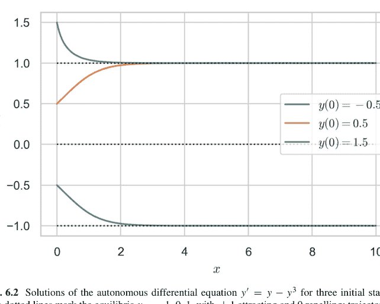

图 6.2 自治微分方程 $y' = y - y^3$ 在三个初始状态下的解。虚线标记了平衡点 $y = -1, 0, 1$，其中 $\pm 1$ 是吸引子，0 是排斥子；轨迹相应地展示了收敛或发散。

**示例 6.1.7** 使用 `scipy.integrate.solve_ivp` 对初始条件 $y(0) = \pm 0.5$，$y(0) = 1.5$ 进行数值积分：

```python
import numpy as np, matplotlib.pyplot as plt
from scipy.integrate import solve_ivp
f = lambda x, y: y - y**3
xs = np.linspace(0, 10, 400)
for y0 in [-0.5, 0.5, 1.5]:
    sol = solve_ivp(f, [0, 10], [y0], t_eval=xs)
    plt.plot(xs, sol.y[0], label=f"y0={y0}")
plt.hlines([-1, 0, 1], 0, 10, colors="k", linestyles="dotted")
plt.legend(); plt.xlabel("x"); plt.ylabel("y"); plt.show()
```

所有轨迹都收敛到最近的稳定平衡点，这证实了解析相线（参见图 6.2）。

### 示例 3（带收获的逻辑斯蒂方程）

$$\frac{dy}{dx} = ry\left(1 - \frac{y}{K}\right) - h, \quad h > 0.$$

平衡点是二次方程 $ry(1 - y/K) = h$ 的根。定义判别式 $\Delta := (rK)^2 - 4rhK$。

> $$\begin{cases} \Delta > 0 & \Rightarrow \text{两个实平衡点（一个稳定，一个不稳定）}, \\ \Delta = 0 & \Rightarrow \text{退化的半稳定平衡点}, \\ \Delta < 0 & \Rightarrow \text{无平衡点；种群崩溃。} \end{cases}$$

当 $h$ 越过 $h_c = rK/4$ 时发生的这种定性变化是鞍结分岔（见下一小节）。

## 分岔理论与相平面分析

当参数 $\lambda$ 的变化改变了平衡点集的拓扑结构或其稳定性时，就发生了**分岔**。我们概述标量常微分方程的三种典型余维-1分岔，然后扩展到二维相平面动力学。

## 鞍结（折叠）分岔

$$\frac{dy}{dx} = f_\lambda(y) = \lambda - y^2.$$

平衡点 $y^*_\pm = \pm\sqrt{\lambda}$ 仅在 $\lambda > 0$ 时存在；它们在 $\lambda = 0$ 处合并并消失。

## 跨临界分岔

$$\frac{dy}{dx} = f_\lambda(y) = \lambda y - y^2.$$

平衡点 $y^*_1 = 0$ 和 $y^*_2 = \lambda$ 在 $\lambda$ 穿过 0 时交换稳定性。

## 叉式（超临界）分岔

$$\frac{dy}{dx} = f_\lambda(y) = \lambda y - y^3.$$

稳定分支 $y^*_\pm = \pm\sqrt{\lambda}$ 在 $\lambda > 0$ 时出现，而 $y^* = 0$ 从稳定（$\lambda < 0$）变为不稳定（$\lambda > 0$）。

**示例 6.1.8（数值分岔图）** 绘制叉式常微分方程的平衡值与 $\lambda$ 的关系图：

```python
λ = np.linspace(-1, 1, 400)
y_stable = np.where(λ>0, np.sqrt(λ), np.nan)
plt.plot(λ, 0*λ, 'k--') # central branch
plt.plot(λ, y_stable, 'b'); plt.plot(λ, -y_stable, 'b')
plt.xlabel("λ"); plt.ylabel("Equilibria"); plt.show()
```

## 平面系统的相平面分析

考虑

$$\frac{d\mathbf{x}}{dt} = \mathbf{F}(\mathbf{x}), \quad \mathbf{x} = (x, y) \in \mathbb{R}^2.$$

平衡点 $\mathbf{x}^*$ 满足 $\mathbf{F}(\mathbf{x}^*) = \mathbf{0}$。线性化 $D\mathbf{F}(\mathbf{x}^*)$ 的特征值为 $\lambda_{1,2}$；分类如下：

- $\operatorname{Re} \lambda_{1,2} < 0 \rightarrow$ 稳定结点/焦点，
- $\operatorname{Re} \lambda_{1,2} > 0 \rightarrow$ 不稳定结点/焦点，
- $\lambda_1 \lambda_2 < 0 \rightarrow$ 鞍点（不稳定），
- $\operatorname{Re} \lambda_{1,2} = 0 \rightarrow$ 中心或高阶情况。

### 示例 6.1.9（Lotka-Volterra 捕食者-猎物模型）

$$\begin{cases} \dot{x} = x(\alpha - \beta y), \\ \dot{y} = -y(\gamma - \delta x), \end{cases} \quad \alpha, \beta, \gamma, \delta > 0.$$

平衡点：$(0, 0)$（鞍点），以及 $(\gamma/\delta, \alpha/\beta)$（中心）。在内部平衡点处的线性化得到纯虚特征值 $\pm i\sqrt{\alpha\gamma}$——闭合轨道。

```python
import numpy as np, matplotlib.pyplot as plt
α, β, γ, δ = 1.1, 0.4, 0.4, 0.1
def F(t, z):
    x, y = z
    return [x*(α-β*y), -y*(γ-δ*x)]
from scipy.integrate import solve_ivp
for (x0, y0) in [(1,2), (2,0.5), (3,3)]:
    sol = solve_ivp(F, [0, 30], [x0, y0], t_eval=np.linspace(0,30,2000))
    plt.plot(sol.y[0], sol.y[1])
plt.xlabel("Prey x"); plt.ylabel("Predator y")
plt.scatter(γ/δ, α/β, c="red"); plt.show()
```

相图展示了围绕中心的闭合周期轨道（参见图 6.3）。

### 示例（带疫苗接种的 SIS 流行病模型）

$$\begin{cases} \dot{S} = -\beta S I + \gamma I - v S, \\ \dot{I} = \beta S I - \gamma I, \end{cases}$$

其中 $S + I = 1$。化简为一维，$\dot{I} = \beta(1 - I)I - \gamma I$。分析平衡点 $I^* = 0$ 和 $I^* = 1 - \gamma/\beta$（如果为正）。接种率 $v$ 有效地降低了 $\beta$；在基本再生数 $R_0 = \beta/\gamma = 1$ 处发生分岔。

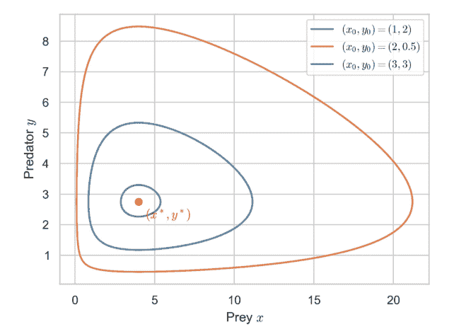

**图 6.3** 参数为 $\alpha = 1.1$，$\beta = 0.4$，$\gamma = 0.4$，$\delta = 0.1$ 的 Lotka-Volterra 系统的相平面轨迹。每条轨道都是闭合的，反映了围绕内部平衡点 $(x^*, y^*) = (\gamma/\delta, \alpha/\beta) = (4, 2.75)$（红色标记）的中性循环。该图说明了初始种群如何决定振幅，而轨道周期则由系统参数决定。

## 6.1.2 高阶常微分方程

高阶线性微分方程通过降阶技巧、系统化的试探解法和强大的积分核丰富了解析工具箱。Python 的 sympy 符号引擎和 scipy.integrate 数值求解器验证了每一步。

## 降阶法与待定系数法

给定二阶齐次线性方程

$$y'' + P(x)y' + Q(x)y = 0$$

和一个非平凡解 $y_1(x)$，*降阶*代换 $y_2 = y_1 u$（其中 $u' = v$）得到

$$v' + \left(2\frac{y_1'}{y_1} + P\right)v = 0 \implies v(x) = C \exp\left[-\int \left(2y_1'/y_1 + P\right) dx\right].$$

积分两次即可得到第二个线性无关解。

### 示例 6.1.10（空气阻力，指数解）

$y'' - y = 0$ 有解 $y_1 = e^x$。应用降阶法：$v' - 2v = 0 \implies v = Ce^{2x}, u = \frac{1}{2}e^{2x} + C_0$。因此 $y_2 = y_1 u = \frac{1}{2}e^{3x}$；但线性无关性要求 $y_2 = e^{-x}$（选择 $C = -e^{-2x}$）。通解为 $y = C_1 e^x + C_2 e^{-x}$。

```python
import sympy as sp
x = sp.symbols('x')
y1 = sp.exp(x)
y2 = sp.dsolve(sp.Eq(sp.diff(sp.Function('y')(x), x, 2) - sp.Function('y')(x), 0),
    ics={sp.Function('y')(x).subs(x,0):y1.subs(x,0),
         sp.diff(sp.Function('y')(x),x).subs(x,0):sp.diff(y1,x).subs(x,0)})
```

**待定系数法** 对于常系数 $L[y] = f(x)$，其中 $f$ 是 $e^{\alpha x}$、$x^k e^{\alpha x}$、$\sin \beta x$ 或 $\cos \beta x$ 的线性组合，提出一个相同形式的特解 $y_p$（乘以 $x^s$ 以避免共振）。系数通过代入法确定。

### 示例 6.1.11

求解 $y'' - 3y' + 2y = e^x$。齐次解 $y_h = C_1 e^x + C_2 e^{2x}$。由于 $e^x$ 与 $y_h$ 中的 $e^x$ 重叠，猜测 $y_p = Axe^x$。代入得到 $A = \frac{1}{2}$。符号验证：

```python
y = sp.Function('y')
ode = sp.Eq(sp.diff(y(x),x,2) - 3*sp.diff(y(x),x) + 2*y(x), sp.exp(x))
sp.dsolve(ode)
```

## 参数变易法与柯西-欧拉方程

**参数变易法** 对于 $y'' + P(x)y' + Q(x)y = R(x)$，已知基本解集 $\{y_1, y_2\}$，

$$y_p = -y_1 \int \frac{y_2 R}{W} dx + y_2 \int \frac{y_1 R}{W} dx, \quad W = y_1 y_2' - y_1' y_2.$$

### 示例 6.1.12

在 $x \in (-\frac{\pi}{2}, \frac{\pi}{2})$ 上求解 $y'' + y = \sec x$。这里 $y_1 = \sin x$，$y_2 = \cos x$，$W = 1$。

$$y_p = -\sin x \int \cos x \sec x dx + \cos x \int \sin x \sec x dx = -\sin x \ln |\sec x + \tan x| + \cos x (-\ln |\sec x + \tan x|).$$

化简为 $y_p = -\ln |\sec x + \tan x| \sin x$。

```python
x = sp.symbols('x')
yp = -sp.sin(x)*sp.integrate(sp.sec(x), x) + sp.cos(x)*sp.integrate(sp.sin(x)*sp.sec(x), x)
sp.simplify(sp.diff(yp,x,2)+yp - sp.sec(x))
```

## 柯西-欧拉（等维）方程 $x^2y'' + axy' + by = 0$。代入 $y = x^m$；代数指标方程 $m(m-1) + am + b = 0$ 给出两个指数 $m_1, m_2$。对于重根 $m_1 = m_2$，引入 $y_2 = y_1 \ln x$。

**例 6.1.13** $x^2y'' - 3xy' - 4y = 0$。由 $m(m-1) - 3m - 4 = 0 \implies m = 4, -1$ 得到指标根。因此 $y = C_1x^4 + C_2x^{-1}$。

## 格林函数与边值问题

对于定义在 $a \le x \le b$ 上的线性算子 $L[y] = y'' + p(x)y' + q(x)y$，边界条件为 $y(a) = y(b) = 0$，**格林函数** $G(x, \xi)$ 满足

$L_x G(x, \xi) = \delta(x - \xi), \quad G(a, \xi) = G(b, \xi) = 0$。

则 $y(x) = \int_a^b G(x, \xi) f(\xi) \, d\xi$ 是 $L[y] = f$ 的解。

**例 6.1.14（固定弦）** $y''(x) = f(x)$，$y(0) = y(1) = 0$。分段格林函数

$G(x, \xi) = \begin{cases} x(1 - \xi), & 0 \le x \le \xi, \\ \xi(1 - x), & \xi \le x \le 1. \end{cases}$

对于载荷 $f(x) = 6x$，解析卷积得到 $y(x) = x^3 - x$。数值验证：

```python
x, \xi = sp.symbols('x \xi')
G = sp.Piecewise((x*(1-\xi), x<=\xi), (\xi*(1-x), True))
f = 6*\xi
y = sp.integrate(G*f, (\xi,0,1))
sp.simplify(sp.diff(y,x,2) - 6*x) # 0
```

## 常微分方程的级数解：弗罗贝尼乌斯方法

对于正则奇点 $x = 0$，弗罗贝尼乌斯试探解

$y(x) = \sum_{n=0}^{\infty} a_n x^{n+r}, \quad a_0 \ne 0,$

导出一个确定 $r$ 的指标方程。

**例 6.1.15（贝塞尔方程）** $x^2y'' + xy' + (x^2 - \nu^2)y = 0$。指标方程 $r^2 - \nu^2 = 0 \implies r = \pm \nu$。对于 $r = \nu$，递推关系 $a_n = -\frac{1}{n(n+2\nu)}a_{n-2}$ 给出偶数级数，$J_\nu(x) = \sum_{k=0}^{\infty} \frac{(-1)^k}{k!\Gamma(k+\nu+1)}\left(\frac{x}{2}\right)^{2k+\nu}$。

```python
\nu = sp.symbols('\nu', positive=True)
k = sp.symbols('k', integer=True, nonnegative=True)
Jv = sp.summation((-1)**k/(sp.factorial(k)*sp.gamma(k+v+1))
    *(x/2)**(2*k+v), (k,0,4)).series(x, 0, 6)
```

在 $x=1$ 处比较符号贝塞尔函数 $J_v$ 与截断级数（$v=0$）。

**正则点** 如果点是常点，设 $r=0$。例如：勒让德方程 $(1-x^2)y''-2xy'+\ell(\ell+1)y=0$ 在 $\ell \in \mathbb{N}$ 时通过终止级数产生勒让德多项式 $P_\ell(x)$。

**非正则奇点** 出现修正贝塞尔函数或艾里函数；形式级数可能发散，需要渐近匹配或主导平衡（WKB）技术——此处不涉及。

## 6.1.3 常微分方程组

现实世界的模型很少孤立演化；相反，多个状态变量相互作用。一阶方程**组**可紧凑地写为

$\dot{\mathbf{x}} = \mathbf{F}(t, \mathbf{x}), \quad \mathbf{x}(t) \in \mathbb{R}^n$。

我们全面处理线性系统，为非线性系统开发定性工具，并以李雅普诺夫直接法作为结论——这是一种绕过显式解的能量型判据。

## 线性系统与矩阵方法

设 $\mathbf{A} \in \mathbb{R}^{n \times n}$ 为常数矩阵。齐次系统

$\dot{\mathbf{x}} = \mathbf{A}\mathbf{x}, \quad \mathbf{x}(0) = \mathbf{x}_0$

的解为 $\mathbf{x}(t) = e^{\mathbf{A}t}\mathbf{x}_0$，其中**矩阵指数** $e^{\mathbf{A}t} = \sum_{k=0}^{\infty} \frac{(\mathbf{A}t)^k}{k!}$。

**对角化** 若 $\mathbf{A} = \mathbf{V}\mathbf{\Lambda}\mathbf{V}^{-1}$，特征值为 $\lambda_i$，则 $e^{\mathbf{A}t} = \mathbf{V} e^{\mathbf{\Lambda}t} \mathbf{V}^{-1}$，$e^{\mathbf{\Lambda}t} = \text{diag}(e^{\lambda_1 t}, \dots, e^{\lambda_n t})$。

**若尔当标准形** 对于亏损矩阵，若尔当块 $J = \lambda I + N$（$N$ 幂零）给出 $e^{Jt} = e^{\lambda t} \sum_{k=0}^{m-1} \frac{(Nt)^k}{k!}$。

## 例 6.1.16（耦合质量-弹簧系统）

$m\ddot{x} = -2kx + ky, \quad m\ddot{y} = kx - 2ky$。

写成 $\dot{\mathbf{z}} = \mathbf{A}\mathbf{z}$，其中 $\mathbf{z} = (x, y, \dot{x}, \dot{y})$；特征值为 $\pm i\sqrt{k/m}$，$\pm i\sqrt{3k/m}$。因此运动是频率为 $\omega_1 = \sqrt{k/m}$ 和 $\omega_2 = \sqrt{3k/m}$ 的两个正则模态的叠加。

```python
import sympy as sp
k,m=sp.symbols('k m', positive=True)
A=sp.Matrix([[0,0,1,0],[0,0,0,1],[-2*k/m,k/m,0,0],[k/m,-2*k/m,0,0]])
A.eigenvects()
```

**受迫线性系统** $\dot{\mathbf{x}} = \mathbf{A}\mathbf{x} + \mathbf{f}(t)$ 的常数变易法解为 $\mathbf{x}(t) = e^{\mathbf{A}t}\mathbf{x}_0 + \int_0^t e^{\mathbf{A}(t-\tau)}\mathbf{f}(\tau)\,d\tau$。

**基本矩阵** $\Phi(t)$ 是满足 $\Phi(0) = I$ 的任意矩阵解，满足 $\dot{\Phi} = \mathbf{A}\Phi$ 且 $\Phi(t) = e^{\mathbf{A}t}$。$\Phi$ 的列构成解空间的一组基。

## 非线性系统与稳定性

对于 $\dot{\mathbf{x}} = \mathbf{F}(\mathbf{x})$，*平衡点*满足 $\mathbf{F}(\mathbf{x}^*) = \mathbf{0}$。通过雅可比矩阵 $\mathbf{J}(\mathbf{x}^*) = D\mathbf{F}(\mathbf{x}^*)$ 线性化：

$$\dot{\eta} = \mathbf{J}\eta + O(\|\eta\|^2), \quad \eta = \mathbf{x} - \mathbf{x}^*.$$

**哈特曼-格罗布曼定理**（Grobman 1959; Perko 2013; Strogatz 2018）如果 $\mathbf{J}$ 没有实部为零的特征值，则 $\mathbf{x}^*$ 附近的非线性流与其线性化是拓扑共轭的。

**例 6.1.17**（范德波尔振荡器，$\mu = 1$）

$$\dot{x} = y, \quad \dot{y} = (1 - x^2)y - x.$$

唯一的平衡点 $(0, 0)$；雅可比矩阵 $\mathbf{J}(0, 0) = \begin{pmatrix} 0 & 1 \\ -1 & 1 \end{pmatrix}$ 的特征值为 $\frac{1}{2}(1 \pm i\sqrt{3}) \implies$ 不稳定焦点。全局动力学特征是一个稳定的极限环，通过轨迹模拟验证（参见图 6.4）。

```python
import numpy as np, matplotlib.pyplot as plt
$\mu$=1
def F(t,z): x,y=z; return [y, (1-x**2)*y - x]
from scipy.integrate import solve_ivp
for (x0,y0) in [(2,0),(0.1,0.1),(-2,0)]:
    sol=solve_ivp(F,[0,40],[x0,y0],t_eval=np.linspace(0,40,4000))
    plt.plot(sol.y[0], sol.y[1])
plt.xlabel('x'); plt.ylabel('y'); plt.show()
```

**中心流形约化** 如果 $\mathbf{J}$ 有实部为零的特征值，则流由低维中心流形上的非线性项决定；这在霍普夫分岔分析中至关重要。

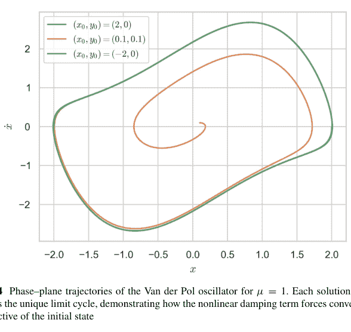

#### 李雅普诺夫直接法

**李雅普诺夫函数** 一个标量函数 $V : D \to \mathbb{R}$，满足 $V(\mathbf{x}^*) = 0$，对于 $\mathbf{x} \ne \mathbf{x}^*$ 有 $V(\mathbf{x}) > 0$，且沿轨迹的导数 $\dot{V} = \nabla V \cdot \mathbf{F} \le 0$，则意味着 $\mathbf{x}^*$ 是*稳定的*。如果对于 $\mathbf{x} \ne \mathbf{x}^*$ 有 $\dot{V} < 0$，则平衡点是*渐近稳定的*。

**线性系统的二次型候选函数** 对于 $\dot{\mathbf{x}} = \mathbf{A}\mathbf{x}$，其中 $\mathbf{A}$ 是赫尔维茨矩阵，求解李雅普诺夫方程 $\mathbf{A}^T\mathbf{P} + \mathbf{P}\mathbf{A} = -\mathbf{Q}$（任意 $\mathbf{Q} > 0$）并设 $V = \mathbf{x}^T\mathbf{P}\mathbf{x}$。

**例 6.1.18（二维系统）** $\dot{\mathbf{x}} = \begin{pmatrix} -2 & -1 \\ 3 & -4 \end{pmatrix}\mathbf{x}$。选择 $\mathbf{Q} = \mathbf{I}$；求解 $\mathbf{P}$：

```python
A = sp.Matrix([[-2,-1],[3,-4]])
P = sp.Matrix(sp.symbols('p11 p12 p22')).reshape(2,2)
Q = sp.eye(2)
eq = A.T*P + P*A + Q
sol = sp.solve(eq.reshape(4,1), list(P))
P = sp.Matrix([[sol[sp.symbols('p11')], sol[sp.symbols('p12')]],
               [sol[sp.symbols('p12')], sol[sp.symbols('p22')]]])
```

$\mathbf{P}$ 是正定的；$V = \mathbf{x}^T\mathbf{P}\mathbf{x}$ 严格递减 $\implies$ 全局渐近稳定。

**拉萨尔不变性原理** 如果 $\dot{V} \leq 0$ 且解保持在一个紧集中，则轨迹趋近于 $\dot{V} = 0$ 的最大不变子集。当 $\dot{V}$ 仅为半负定时，用于证明全局收敛到极限环或平衡点。

**例 6.1.19（通过李雅普诺夫函数分析洛特卡-沃尔泰拉方程）** 对于捕食者-猎物系统，选择 $V(x, y) = \delta x - \gamma \ln x + \beta y - \alpha \ln y$；沿所有轨迹 $\dot{V} = 0 \implies$ 轨道位于 $V$ 的等值集上；不收敛但有界。

## 6.1.4 常微分方程的数值解

对于现实模型，解析公式很少存在。因此，稳健的数值积分器在现代应用数学中扮演着不可或缺的角色。我们介绍局部/截断误差、全局收敛性和稳定性的基础概念，发展显式和隐式龙格-库塔格式，并在 NumPy/SciPy 中说明实际建模工作流程。

## 欧拉方法与龙格-库塔方法

**前向（显式）欧拉法** 对于 $\dot{y} = f(t, y)$ 和时间步长 $h$，

$$y_{n+1} = y_n + h f(t_n, y_n).$$

局部截断误差 $O(h^2)$；全局误差 $O(h)$（一阶）。

**例 6.1.20（指数衰减）** $\dot{y} = -3y$，$y(0) = 1$。在 $0 \leq t \leq 1$ 上取 $h = 0.1$；与精确值 $e^{-3}$ 比较。

```python
import numpy as np
h, N = .1, 10
y = 1.0
for _ in range(N): y += h*(-3*y)
print("Euler y(1) =", y, " exact =", np.exp(-3))
```

## 经典 RK4

$$k_1 = f(t_n, y_n),$$
$$k_2 = f(t_n + h/2, y_n + hk_1/2),$$
$$k_3 = f(t_n + h/2, y_n + hk_2/2),$$
$$k_4 = f(t_n + h, y_n + hk_3),$$
$$y_{n+1} = y_n + \frac{h}{6}(k_1 + 2k_2 + 2k_3 + k_4).$$

四阶方法：全局误差 $O(h^4)$。

## 6.1 常微分方程（ODEs）

**图 6.5** 经典混沌参数 $\sigma = 10, \rho = 28, \beta = \frac{8}{3}$ 下，洛伦兹轨迹在 $(x, z)$ 平面上的投影。蝴蝶状的吸引子展示了对敏感依赖性以及在两个翼瓣之间切换的特征。

**自适应步长（Dormand 和 Prince 1980）** 嵌入式 RK5(4) 对估计误差 $E \approx y_{n+1}^{(5)} - y_{n+1}^{(4)}$。更新步长 $h_{\text{new}} = h \left( \frac{\text{tol}}{|E|} \right)^{1/5}$。

### 示例 6.1.21（使用自适应 RK45 的混沌洛伦兹系统（参见图 6.5））

```python
import numpy as np, matplotlib.pyplot as plt
from scipy.integrate import solve_ivp
σ, ρ, β = 10., 28., 8/3
f = lambda t,X: [σ*(X[1]-X[0]), ρ*X[0]-X[1]-X[0]*X[2], X[0]*X[1]-β*X[2]]
sol = solve_ivp(f, [0,40], [1,1,1], rtol=1e-6, atol=1e-9)
plt.plot(sol.y[0], sol.y[2]); plt.xlabel('x'); plt.ylabel('z'); plt.show()
```

**误差分析** 泰勒展开给出欧拉法的局部误差 $\frac{h^2}{2} y''(\xi)$。全局误差由格朗沃尔不等式 $\|e_n\| \le \frac{e^{LT}-1}{L} \max \tau_k = O(h)$ 得出。

### 刚性方程与隐式方法

**刚性定义** 如果显式稳定性要求 $h \ll \tau_{\text{slow}}$，其中 $\tau_{\text{slow}}$ 是最大的物理时间尺度，则该问题是*刚性*的。原型：$\dot{y} = -15y$。

**线性测试方程** $y' = \lambda y$，$\text{Re}(\lambda) < 0$。若放大因子 $G(h\lambda)$ 满足当 $\text{Re } z < 0$ 时 $|G(z)| < 1$，则该方法是 $A$-稳定的。

**后向欧拉法（隐式）** $y_{n+1} = y_n + h f(t_{n+1}, y_{n+1})$。对于线性测试方程：$G = (1 - h\lambda)^{-1}$；当 $\text{Re } \lambda < 0$ 时 $|G| < 1 \implies A$-稳定，但仅为一阶。

**梯形法则（Crank 和 Nicolson 1996）** $y_{n+1} = y_n + \frac{h}{2}[f(t_n, y_n) + f(t_{n+1}, y_{n+1})]$。二阶且 $A$-稳定（但不是 $L$-稳定）。

### 示例 6.1.22（Robertson 刚性动力学）

$\dot{y}_1 = -0.04y_1 + 10^4 y_2 y_3$,
$\dot{y}_2 = 0.04y_1 - 10^4 y_2 y_3 - 3 \times 10^7 y_2^2$,
$\dot{y}_3 = 3 \times 10^7 y_2^2$,
初始条件 $(1, 0, 0)$。使用 BDF（后向差分公式）与 RK45 求解：

```python
f = lambda t,y: [-.04*y[0]+1e4*y[1]*y[2],
                .04*y[0]-1e4*y[1]*y[2]-3e7*y[1]**2,
                3e7*y[1]**2]
t_span=(0,1e5)
bdf = solve_ivp(f, t_span, [1,0,0], method='BDF')
rk = solve_ivp(f, t_span, [1,0,0], method='RK45') # 可能失败/超时
```

### 在种群动力学和力学中的应用

**具有季节性强迫的逻辑斯蒂增长** $\dot{N} = r(1+\epsilon \sin \omega t)N(1-N/K)$。应用 RK4，取 $h = 0.1$，$K = 500$，$r = 1.2$，$\epsilon = 0.3$，$\omega = 2\pi/12$ 月；绘制相图 $N$ 对 $dN/dt$（参见图 6.6）。

```python
def f(t,N): return r*(1+epsilon*np.sin(w*t))*N*(1-N/K)
sol = solve_ivp(f, [0,60], [50], max_step=0.1)
plt.plot(sol.t, sol.y[0]); plt.show()
```

**刚性摆（非线性）** $\theta'' + \frac{g}{\ell} \sin \theta = 0$。状态向量 $(\theta, \dot{\theta})$；使用 RK45 对大初始角度进行积分；演示能量守恒误差（参见图 6.7）。

```python
g, ell = 9.81, 2
f = lambda t,z: [z[1], -(g/ell)*np.sin(z[0])]
sol = solve_ivp(f, [0,20], [2,0], rtol=1e-9, atol=1e-12)
theta, omega = sol.y
E = .5*(ell*omega)**2 + g*ell*(1-np.cos(theta))
plt.plot(sol.t, E-E[0]); plt.ylabel('\Delta E'); plt.show()
```

**图 6.6** 季节性强迫逻辑斯蒂方程的数值解，参数为 $r = 0.3$，$\varepsilon = 0.5$，$\omega = 2\pi/12$，$K = 100$，初始种群 $N(0) = 50$。环境容纳量保持为上界，而增长率的周期性调制在逻辑斯蒂饱和之上引起了持续的振荡。

**图 6.7** 长度为 $\ell = 2$ m、从 $\theta_0 = 2$ rad 释放的单摆的数值能量漂移 $\Delta E(t) = E(t) - E(0)$。在严格的容差 $\text{rtol} = 10^{-9}$ 和 $\text{atol} = 10^{-12}$ 下，非辛 Runge-Kutta 积分器在 20 秒内将机械能守恒在 $10^{-11}$ J 以内。

### 打靶法与边值问题

给定一个二阶边值问题

$$y'' = f(x, y, y'), \quad y(a) = \alpha, \quad y(b) = \beta,$$

将其转化为具有未知斜率 $s$ 的初值问题：求解 $y(a) = \alpha$，$y'(a) = s$，并调整 $s$ 直到 $y(b; s) = \beta$。

### 算法（割线打靶法）

1.  猜测斜率 $s_0, s_1$。
2.  积分初值问题得到 $F(s) = y(b; s) - \beta$。
3.  更新 $s_{k+1} = s_k - F(s_k) \frac{s_k - s_{k-1}}{F(s_k) - F(s_{k-1})}$。
4.  重复直到 $|F(s_k)| < \text{tol}$。

### 示例 6.1.23（热翅片）

$y'' = 0.01(100 - y)$，$y(0) = 0$，$y(10) = 50$。实现打靶法：

```python
from scipy.optimize import root_scalar
f = lambda x,y: [y[1], 0.01*(100-y[0])]
def F(s):
    sol=solve_ivp(f,[0,10],[0,s], t_eval=[10])
    return sol.y[0,-1]-50
s = root_scalar(F, x0=5,x1=20).root
print("Slope=",s)
```

与有限差分边值问题求解器 `scipy.integrate.solve_bvp` 进行比较。

**格林函数视角** 对于在 $[0, 1]$ 上的线性边值问题 $y'' = q(x)$，且 $y(0) = y(1) = 0$，离散二阶差分矩阵导致一个三对角线性系统，可通过带状 LU 分解求解；通过网格加倍和理查森外推进行细化以获得更高精度。

## 6.2 偏微分方程（PDEs）

常微分方程描述依赖于单个自变量的系统，而**偏微分方程**描述其状态 $u = u(\mathbf{x}, t)$ 在*空间*和*时间*上都变化的现象。典型的物理定律——热传导、波传播、流体流动、量子力学——都是用偏微分方程的语言表述的。本小节介绍三种典型的二阶线性偏微分方程，建立初值和边值问题，并通过分离变量法和达朗贝尔原理推导经典解析解。Python 验证使用 sympy 的符号偏微分方程模块以及 numpy/matplotlib 进行可视化。

### 热方程、波动方程和拉普拉斯方程

**热（扩散）方程** 对于杆 $0 < x < L$ 上的温度 $u(x, t)$：

$$u_t = \kappa u_{xx}, \quad \kappa > 0.$$

抛物型：信息以无限速度扩散；具有平滑效应。

**波动方程** 拉紧弦的位移 $u(x, t)$：

$$u_{tt} = c^2 u_{xx}, \quad c > 0.$$

双曲型：有限速度传播 $c$；特征线 $x \pm ct = \text{const}$。

**拉普拉斯（势）方程** 二维稳态势 $\phi(x, y)$：

$$\nabla^2 \phi = \phi_{xx} + \phi_{yy} = 0.$$

椭圆型：边界数据唯一且光滑地确定内部。

通过一般方程 $Au_{xx} + Bu_{xy} + Cu_{yy} = 0$ 的判别式 $B^2 - 4AC$ 的符号进行分类。

### 边界条件和初始条件

**边值问题（BVP）** 对于 $0 < x < L$ 和 $t > 0$ 上的 $u(x, t)$：

1.  狄利克雷（固定）：$u(0, t) = 0$，$u(L, t) = 0$。
2.  诺伊曼（通量）：$u_x(0, t) = q_0(t)$，$u_x(L, t) = q_L(t)$。
3.  罗宾（混合）：边界处 $u_x + hu = 0$；对流热损失。

**初值问题（IVP）** 抛物型和双曲型偏微分方程需要初始剖面：

$u(x, 0) = f(x)$（热方程）；$u(x, 0) = f(x)$，$u_t(x, 0) = g(x)$（波动方程）。

适定性：存在性、唯一性、对数据的连续依赖性（阿达马）。

### 分离变量法

假设 $u(x, t) = X(x)T(t)$。代入热方程：

$$\frac{T'}{\kappa T} = \frac{X''}{X} = -\lambda.$$

特征值问题 $X'' + \lambda X = 0$，$X(0) = X(L) = 0 \implies X_n = \sin \frac{n\pi x}{L}$，$\lambda_n = \left(\frac{n\pi}{L}\right)^2$。时间因子 $T_n(t) = \exp(-\kappa \lambda_n t)$。叠加以匹配初始数据：

$$u(x, t) = \sum_{n=1}^{\infty} b_n e^{-\kappa (\frac{n\pi}{L})^2 t} \sin \frac{n\pi x}{L}, \quad b_n = \frac{2}{L} \int_0^L f(x) \sin \frac{n\pi x}{L} \, dx.$$

### 示例 6.2.1（热棒冷却）

$L = 1$，$\kappa = 0.1$，$f(x) = x(1 - x)$。绘制 $t = \{0, 0.05, 0.2\}$ 时的 $u(x, t)$（参见图 6.8）：

## 达朗贝尔波动方程解

在整条直线 $-\infty < x < \infty$ 上，给定初始数据 $u(x, 0) = f(x), u_t(x, 0) = g(x)$，

> $$u(x, t) = \frac{1}{2}[f(x - ct) + f(x + ct)] + \frac{1}{2c} \int_{x-ct}^{x+ct} g(s) ds.$$

解释：波以速度 $c$ 向左/右传播，形状不变；初始速度 $g$ 通过行进积分贡献。

## 示例 6.2.2（拨弦）

$f(x) = 0$，$g(x) = \sin \pi x$（在 $[0, 1]$ 上具有紧支集，通过零延拓）。

$$u(x, t) = \frac{1}{2c} \int_{x-ct}^{x+ct} \sin \pi s \, ds = \frac{1}{2c\pi} [\cos \pi(x - ct) - \cos \pi(x + ct)]$$
$$= \frac{1}{c} \sin(\pi ct) \sin(\pi x).$$

因此，固定形状的正弦模态以频率 $\pi c$ 振荡。Python 可视化：

```python
x = np.linspace(0, 1, 300)
c = 1
for t in (0., .1, .2, .3):
    plt.plot(x, np.sin(np.pi*c*t)*np.sin(np.pi*x), label=f"t={t}")
plt.legend(); plt.xlabel("x"); plt.ylabel("u"); plt.show()
```

## 有限弦，狄利克雷边界条件

使用与热方程相同的本征展开，但时间因子为振荡形式 $\cos(\omega_n t)$，$\sin(\omega_n t)$，其中 $\omega_n = n\pi c/L$。

## 能量守恒

对于波动方程，$E(t) = \frac{1}{2} \int (u_t^2 + c^2 u_x^2) dx$ 保持恒定；可通过谱系数进行数值验证。

## 6.2.1 求解偏微分方程的数值方法

上一小节推导的解析解预设了简单的几何形状和齐次系数。实际模型——如翼型上方的气流、复合材料中的热扩散、半导体异质结构中的量子动力学——需要将偏微分方程转化为可计算的有限代数系统的离散化方案。我们介绍三大支柱：有限差分法、有限元法和谱配置法，重点阐述精度、稳定性，并提供说明性的 Python 原型。

## 有限差分法与有限元法

### 有限差分法 (FDM)

在均匀网格 $x_j = j \, \Delta x$，$t^n = n \, \Delta t$ 上，用局部多项式插值近似导数。

$$u_{xx}(x_j, t^n) \approx \frac{u_{j+1}^n - 2u_j^n + u_{j-1}^n}{(\Delta x)^2}, \quad \text{截断误差} = O((\Delta x)^2).$$

### 示例 6.2.3（一维热方程，显式 FTCS 格式）

$$u_j^{n+1} = u_j^n + \sigma(u_{j+1}^n - 2u_j^n + u_{j-1}^n), \quad \sigma = \frac{\kappa \, \Delta t}{(\Delta x)^2}.$$

稳定性（冯·诺依曼分析）要求 $\sigma \le \frac{1}{2}$（参见图 6.9）。

**图 6.9** 在 $(0, 1)$ 上，热方程 $\partial_t u = \kappa \partial_{xx} u$ 的有限差分近似，初始条件 $u_0(x) = x(1-x)$。显式 FTCS 格式在 100 个单元的网格上使用 $\sigma = \kappa \Delta t / \Delta x^2 = 0.4$（安全低于稳定性极限 0.5），并将解演化至 $T = 0.3$。扩散过程使初始抛物线平滑趋向零平衡态。

```python
import numpy as np, matplotlib.pyplot as plt
kappa, L, T = .1, 1, .3
Nx, Nt = 100, 300
dx, dt = L/Nx, T/Nt
sigma = kappa*dt/dx**2
x = np.linspace(0, L, Nx+1)
u = x*(1-x) # initial
for n in range(Nt):
    u[1:-1] = u[1:-1] + sigma*(u[2:]-2*u[1:-1]+u[:-2])
plt.plot(x,u); plt.show()
```

### 有限元法 (FEM)

将 $u$ 投影到可能非结构化网格上的分段多项式基函数 $\{\varphi_i\}$ 上。对于泊松方程 $-\Delta u = f$，边界条件 $u|_{\partial \Omega} = 0$，寻求 $u_h = \sum U_i \varphi_i$ 使得

> $$\int_{\Omega} \nabla u_h \cdot \nabla v_h \, d\mathbf{x} = \int_{\Omega} f v_h \, d\mathbf{x} \quad \forall v_h \in V_h.$$

这产生一个稀疏线性系统 $\mathbf{KU} = \mathbf{F}$，其中刚度矩阵 $K_{ij} = \int_{\Omega} \nabla \varphi_i \cdot \nabla \varphi_j \, d\mathbf{x}$。

### 示例 6.2.4（正方形上的泊松方程，$f(x, y) = 1$）

使用网格生成器 *meshzoo* 和 *scipy.sparse*：

```python
import meshzoo, numpy as np, scipy.sparse as sp, scipy.sparse.linalg as spla
points, cells = meshzoo.rectangle_quad(
    np.linspace(0,1,41), np.linspace(0,1,41))
N = len(points)
rows, cols, data, F = [],[],[],np.zeros(N)
for tri in cells: # loop triangles
    idx = tri
    verts = points[idx]
    area = .5*np.abs(np.linalg.det(
        np.vstack((verts[1]-verts[0], verts[2]-verts[0]))))
    B = np.linalg.inv(np.vstack((verts[1]-verts[0],
        verts[2]-verts[0])).T)
    grad = np.array([B[:,0], B[:,1], -B[:,0]-B[:,1]])
    for i in range(3):
        for j in range(3):
            rows.append(idx[i]); cols.append(idx[j])
            data.append(area*np.dot(grad[i],grad[j]))
    F[idx] += area/3 # f=1
K = sp.csr_matrix((data,(rows,cols)), shape=(N,N))
free = (-((points[:,0]==0)|(points[:,0]==1)
    |(points[:,1]==0)|(points[:,1]==1)))
u = np.zeros(N)
u[free] = spla.spsolve(K[free][:,free], F[free])
```

求解器复杂度为 $\tilde{O}(N)$，使用多重网格预条件。

### 偏微分方程的谱方法

将 $u$ 在全局正交基（周期函数用傅里叶基，有界区间用切比雪夫基）上展开：

$$u(x, t) = \sum_{k=-N}^{N} \hat{u}_k(t) e^{ikx}, \quad \widehat{u_{xxk}} = -(k^2)\hat{u}_k.$$

对于解析解，具有指数收敛速度。

### 示例 6.2.5（$2$-$\pi$ 周期热方程）

系数的常微分方程：$\hat{u}_k = -\kappa k^2 \hat{u}_k$。在谱空间中精确求解；通过 FFT 变换回物理空间：

```python
import numpy as np
N=128; x=np.linspace(0,2*np.pi,2*N,endpoint=False)
u0 = np.sin(3*x)+.5*np.cos(7*x)
u_hat = np.fft.fft(u0)
k = np.fft.fftfreq(2*N, 1/N)
kappa, t = .1, .2
u_hat_t = u_hat*np.exp(-kappa*(k**2)*t)
u = np.real(np.fft.ifft(u_hat_t))
```

相对 $L^2$ 误差以 $e^{-cN}$ 衰减。

**泊松方程的切比雪夫配置法** 在 Gauss–Lobatto 点上使用微分矩阵 $D$，$D^2$；通过线性系统 $D^2 u = f$ 求解 $-u'' = f$，其中边界行被替换。

## 6.2 偏微分方程 (PDEs)

## 工程与物理中的应用

**示例 6.2.6（梁的挠度（欧拉-伯努利））** $EI y''''(x) = q(x)$，$0 < x < L$，$y(0) = y'(0) = y''(L) = y'''(L) = 0$。使用四阶有限差分（$O((\Delta x)^4)$）或 Hermite $C^1$ 有限元基进行离散化；对 $q(x) = w_0$ 进行模拟。

**示例 6.2.7（含时薛定谔方程）**
分步 FFT 方法 $\psi(x, t + h) = e^{-ihV/2h} \mathcal{F}^{-1}\left[e^{-ihhk^2/2m} \mathcal{F}\left\{e^{-ihV/2h} \psi(x, t)\right\}\right]$。对谐振子势中的高斯波包实现该方法；验证范数守恒并与解析相干态解进行比较。

## 数值方法的稳定性与收敛性

**冯·诺依曼分析** 假设模态 $e^{ikj\Delta x}$；放大因子 $G(k)$ 在 $|G(k)| \le 1$ 对所有 $k$ 成立时给出稳定性。热方程的 FTCS 格式：$G = 1 - 4\sigma \sin^2(k\Delta x/2) \implies \sigma \le \frac{1}{2}$。

**一致性 + 稳定性** $\implies$ **收敛性（Lax 等价定理）** 对于适定的线性初值偏微分方程，如果截断误差 $\tau = O((\Delta x)^p, (\Delta t)^q)$ 且格式稳定，则全局误差 $e = O((\Delta x)^{p-1}, (\Delta t)^{q-1})$。

**刚性抛物问题的 $L$-稳定性** 隐式 $\theta$-格式 $u^{n+1} = u^n + h[(1 - \theta)Au^n + \theta Au^{n+1}]$ 在 $\theta \ge \frac{1}{2}$ 时是 $A$-稳定的，且当且仅当 $\theta = 1$（向后欧拉）时是 $L$-稳定的（阻尼高频模态）。

**色散与耗散** 波动方程的离散化在相位误差与数值阻尼之间权衡；谱方法具有最小色散，但可能需要滤波来稳定非线性激波（例如 2/3 去混叠）。

## 6.2.2 偏微分方程的高级主题

在介绍了经典的解析和数值工具箱之后，我们现在转向能够解锁整类边值和初值问题的深层思想：全局傅里叶展开、积分变换、某些非线性方程的可积性，以及从一维到多维空间的扩展。每个小节都将严谨的推导与说明性的计算相结合，展示优雅的数学如何转化为 Python/SciPy 中的具体算法。

### 傅里叶级数解

**通用框架** 对于定义在有界区间 $[0, L]$ 上、具有齐次边界条件的线性偏微分方程，分离变量法可以简化空间依赖性。到一个特征函数展开。令 $\{\varphi_n\}_{n=1}^\infty$ 为 $L^2(0, L)$ 的一个标准正交基（例如正弦或余弦函数）。将 $u(x, t) = \sum_n a_n(t)\varphi_n(x)$ 展开，并利用正交性，可将偏微分方程转化为关于系数 $a_n(t)$ 的解耦常微分方程。

## 示例 6.2.8（诺伊曼热问题）

$u_t = \kappa u_{xx}, \quad u_x(0, t) = u_x(L, t) = 0, \quad u(x, 0) = f(x)$。

特征函数为 $\varphi_0 = L^{-1/2}, \varphi_n = \sqrt{2/L} \cos(n\pi x/L)$，对应的特征值为 $\lambda_n = (n\pi/L)^2$。解为：

$u(x, t) = \bar{f} + \sum_{n=1}^\infty b_n e^{-\kappa \lambda_n t} \cos \frac{n\pi x}{L}, \quad b_n = \frac{2}{L} \int_0^L f(x) \cos \frac{n\pi x}{L} dx,$

其中 $\bar{f} = \frac{1}{L} \int_0^L f(x) dx$ 保持常数（无通量守恒）（参见图 6.10）。

```python
L, kappa, N = 1, .05, 60
x = np.linspace(0, L, 400)
def f(x): return np.cos(3*np.pi*x/L) + .3
b = lambda n: 2/L*np.trapz(f(x)*np.cos(n*np.pi*x/L), x)
def u(x,t):
    s = np.full_like(x, np.trapz(f(x), x)/L)
    for n in range(1,N):
        s += b(n)*np.exp(-kappa*(n*np.pi/L)**2*t)*np.cos(n*np.pi*x/L)
    return s
plt.plot(x,u(x,.2)); plt.show()
```

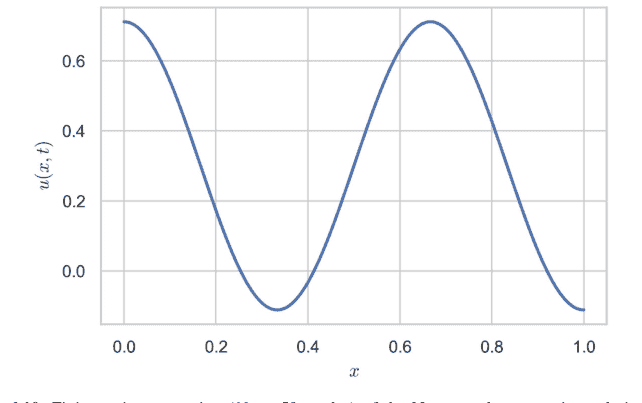

**图 6.10** 对于初始剖面 $u_0(x) = \cos(3\pi x/L) + 0.3$ 且 $\kappa = 0.05$，诺伊曼热方程解在 $t = 0.2$ 时的有限余弦展开（$N = 59$ 个模态）。空间平均值 $a_0 = 0.3$ 持续存在，而更高阶模态呈指数衰减，随时间平滑振荡。

**吉布斯现象** $f$ 中的不连续性会导致 $0.0895\ldots$ 的过冲，与 $N$ 无关；可通过切萨罗（费耶）或兰乔斯 $\sigma$-因子来缓解。

**帕塞瓦尔恒等式（能量）** $\|u(\cdot, 0)\|_2^2 = L \bar{f}^2 + \sum b_n^2$；$t$ 的指数衰减意味着能量的单调耗散。

## 偏微分方程的变换方法

**$\mathbb{R}$ 上的傅里叶变换** 对于 $-\infty < x < \infty$ 上的 $u_t = \kappa u_{xx}$，有 $\hat{u}(k, t) = -\kappa k^2 \hat{u}(k, t)$。求解得 $\hat{u}(k, t) = \hat{f}(k)e^{-\kappa k^2 t}$；逆变换给出 $u(x, t) = (4\pi \kappa t)^{-1/2} \int e^{-(x-\xi)^2/(4\kappa t)} f(\xi) d\xi$——即热核。

**示例 6.2.9（误差函数相似性）** 对于脉冲数据 $f(x) = \delta(x)$，解简化为高斯核本身，验证了基本解的性质。

**时间上的拉普拉斯变换** 对于 $u_t = c^2 u_{xx}$，对 $t$ 进行拉普拉斯变换得到 $(sU - f) = c^2 U_{xx}$。求解关于 $x$ 的常微分方程，并通过布罗米奇积分或留数定理对 $s$ 进行逆变换。

**半无限杆的傅里叶正弦变换** $x > 0$ 上的热方程，在 $x = 0$ 处为狄利克雷条件：

$$\hat{u}_s(\omega, t) = \sqrt{\frac{2}{\pi}} \int_0^\infty u(x, t) \sin \omega x \, dx.$$

核为：$e^{-\kappa \omega^2 t} \sin \omega x \sin \omega \xi$。

**示例 6.2.10（海维赛德边界冲击）** 设 $u(0, t) = H(t)$。先对 $t$ 进行拉普拉斯变换，再对 $x$ 进行正弦变换，可得到卡斯劳的解 $u(x, t) = \text{erfc}(x/\sqrt{4\kappa t})$。

## 非线性偏微分方程与孤子解

### 科特维格-德弗里斯（KdV）方程

$$u_t + 6uu_x + u_{xxx} = 0.$$

行波试探解 $u(x, t) = \phi(\xi)$，$\xi = x - ct$ 将其简化为常微分方程 $-c\phi' + 6\phi\phi' + \phi''' = 0$。首次积分（两次）得到 $\phi(\xi) = \frac{c}{2} \text{sech}^2\left(\frac{\sqrt{c}}{2} \xi\right)$——这是一个**孤子**：在相互作用后保持形状和速度不变。

**逆散射变换（IST）** 将初始剖面 $u(x, 0)$ 映射到相关薛定谔算子的散射数据；数据的线性时间演化；逆映射重构出 $u(x, t) \to$ 可积层级。

**示例 6.2.11（数值孤子碰撞）** 伪谱 KdV 积分器（傅里叶 + 积分因子）用于两个速度分别为 $c_1 = 4$ 和 $c_2 = 1$ 的孤子；碰撞后形状不变，仅有相移。

```python
# 实现概要（需要 FFT、去混叠、龙格-库塔子步）
```

**非线性薛定谔（NLS）亮孤子** $i\psi_t + \psi_{xx} + 2|\psi|^2\psi = 0$ 允许解 $\psi(x, t) = \eta \, \text{sech}[\eta(x - 2\xi t)]e^{i(\xi x + (\eta^2 - \xi^2)t)}$。

## 高维偏微分方程

**$\mathbb{R}^2$ 中的热方程** 基本解 $u(\mathbf{x}, t) = (4\pi\kappa t)^{-1}e^{-\|\mathbf{x}\|^2/(4\kappa t)}$；与 $f(\mathbf{x})$ 的卷积给出平面扩散。

**圆盘中的泊松方程** 通过极坐标分离变量求解 $\nabla^2\phi = -\rho(r, \theta)$，边界条件为 $\phi|_{r=R} = 0$；径向常微分方程涉及贝塞尔函数 $J_m(kr)$。

**示例 6.2.12（单位圆盘，电荷）** $\rho(r) = \rho_0$，$\phi(r) = \frac{\rho_0}{4}(1 - r^2)$。通过计算 $\nabla^2\phi = -\rho_0$ 进行验证。

**三维波动方程（基尔霍夫公式）** 对于紧支撑初始数据，$(\mathbf{x}, t)$ 处的解涉及在球面 $|\mathbf{x} - \boldsymbol{\xi}| = ct$ 上的平均。

$$u(\mathbf{x}, t) = \frac{\partial}{\partial t}\left(\frac{1}{4\pi ct}\int_{S_{ct}} f(\boldsymbol{\xi})\,dS\right) + \frac{1}{4\pi ct}\int_{S_{ct}} g(\boldsymbol{\xi})\,dS.$$

**纳维-斯托克斯方程（简要展望）** 不可压缩流动 $\mathbf{u}_t + (\mathbf{u} \cdot \nabla)\mathbf{u} = -\nabla p + \nu\Delta\mathbf{u}$，$\nabla \cdot \mathbf{u} = 0$ 在 $d = 3$ 时仍是开放问题。涡度公式、谱/有限体积离散化以及湍流建模超出了当前范围，但都依赖于相同的基础技术。

## 6.3 特殊函数与变换技术

### 6.3.1 拉普拉斯变换及其应用

**拉普拉斯变换** 将时域中的微分转换为复 $s$ 平面中的代数乘法，从而将具有分段或脉冲强迫的初值问题线性化。对于一个几乎处处局部可积、指数阶为 $e^{\sigma_0 t}$ 的函数 $f : [0, \infty) \to \mathbb{R}$，其拉普拉斯变换为

$$\mathcal{L}\{f\}(s) = F(s) = \int_0^\infty e^{-st} f(t)\,dt, \quad \text{Re}\,s > \sigma_0.$$

该映射在适当限制的函数类上是单射——*初值定理* $\lim_{t\to 0^+} f(t) = \lim_{s\to\infty} sF(s)$ 和 *终值定理* $\lim_{t\to\infty} f(t) = \lim_{s\to 0} sF(s)$ 为变换提供了物理检验。

### 拉普拉斯逆变换

从 $F$ 恢复 $f$ 需要使用复分析。令 $\gamma > \sigma_0$；**布罗米奇逆变换积分** 为

$$f(t) = \frac{1}{2\pi i} \int_{\gamma-i\infty}^{\gamma+i\infty} e^{st} F(s)\, ds.$$

对于有理函数 $F$（在 $\text{Re}\, s < \gamma$ 内有相异极点 $s_k$），留数定理给出

$$f(t) = \sum_k \text{Res}_{s=s_k}(e^{st} F(s)).$$

**部分分式算法** 若 $F(s) = \frac{P(s)}{(s-a_1)^{m_1}\cdots(s-a_r)^{m_r}}$，将 $F$ 展开为基本分式；每一项的逆变换是已知的：

$$\mathcal{L}^{-1}\left\{\frac{1}{(s-a)^n}\right\} = \frac{t^{n-1}}{(n-1)!}\, e^{at}, \quad n \in \mathbb{N}.$$

**示例 6.3.1（海维赛德阶跃）** $F(s) = \frac{e^{-2s}}{s}$。识别位移定理得 $f(t) = H(t-2)$，其中 $H$ 是单位阶跃函数。符号验证：

```python
import sympy as sp
s,t = sp.symbols('s t', positive=True)
F = sp.exp(-2*s)/s
f = sp.inverse_laplace_transform(F, s, t)
sp.simplify(f)
```

**卷积定理** $\mathcal{L}\{f*g\}(s) = F(s)G(s)$，$(f*g)(t) = \int_0^t f(\tau)g(t-\tau)\, d\tau$。当 $F$ 或 $G$ 很简单但它们的乘积使直接逆变换复杂化时，此定理很有用。

**示例 6.3.2（信号平滑核）** $F(s) = \frac{1}{s} \cdot \frac{1}{s+1} \implies f(t) = 1 - e^{-t} = (1 * e^{-t})$。

### 拉普拉斯变换在求解常微分方程和偏微分方程中的应用

**具有不连续强迫的线性常微分方程** 考虑质量-弹簧-阻尼器系统

$$my'' + cy' + ky = F_0 H(t - t_0), \quad y(0) = y'(0) = 0,$$

其中 $H$ 是 $t_0$ 处的阶跃函数。进行变换：$(ms^2 + cs + k)Y(s) = F_0 e^{-t_0 s}/s$。代数求解：

$$Y(s) = \frac{F_0 e^{-t_0 s}}{s(ms^2 + cs + k)}.$$

部分分式分解得到由延迟海维赛德函数调制的指数衰减正弦波。SymPy 自动化：

```python
m,c,k,F0,t0 = 1, 0.6, 4, 5, 2
omega0 = sp.sqrt(k/m)
zeta = c/(2*sp.sqrt(k*m))
Y = F0*sp.exp(-t0*s)/(s*(m*s**2+c*s+k))
y = sp.inverse_laplace_transform(Y, s, t)
y_simplified = sp.simplify(sp.re(y))
```

### 半直线上的热方程（时间上的拉普拉斯变换）

$$u_t = \kappa u_{xx}, \quad x > 0, \ t > 0, \quad u(x, 0) = 0, \ u(0, t) = g(t).$$

对 $t$ 进行拉普拉斯变换得到 $sU = \kappa U_{xx}$，其解为 $U(x, s) = A(s)e^{-\sqrt{s/\kappa} x}$（衰减分支）。边界条件 $U(0, s) = G(s) \implies A(s) = G(s)$。逆变换：

$$u(x, t) = \mathcal{L}^{-1}\left\{G(s)e^{-\sqrt{s/\kappa} x}\right\}(t) = \frac{x}{2\sqrt{\pi \kappa t^3}} \int_0^t g(\tau) \exp\left(-\frac{x^2}{4\kappa(t - \tau)}\right) \sqrt{t - \tau} \, d\tau.$$

对于脉冲边界 $g(t) = \delta(t - t_0)$，解简化为平移的热核。

### 电报方程

$$u_{tt} + 2au_t = c^2 u_{xx}, \quad u(x, 0) = f(x), \ u_t(x, 0) = g(x).$$

对 $t$ 进行拉普拉斯变换 $\to$ 亥姆霍兹方程 $(s^2 + 2as)U = c^2 U_{xx} + sf(x) + g(x)$。对 $x$ 进行傅里叶变换完成对角化；逆变换产生阻尼波的叠加。

**示例 6.3.3（数值逆变换（Stehfest））** 对于适中的 $t$，Gaver–Stehfest 近似 $f(t) \approx \frac{\ln 2}{t} \sum_{k=1}^{2N} \frac{V_k}{k} F(k \ln 2/t)$ 在 $N = 8$ 时可达到约 $10^{-6}$ 的精度。Python 代码：

def stehfest(F, t, N=8):
    V = np.array([(-1)**(N+k)*sp.binomial(N,k)*
                  sum(sp.binomial(k, j) * j**N
                      for j in range((k+1)//2, min(k,N)+1))
                  for k in range(1,2*N+1)], dtype=float)
    return (np.log(2)/t)*sum(V[k-1]*F(k*np.log(2)/t)/k for k in range(1,2*N+1))

**拉普拉斯-贝尔特拉米算子初探** 在弯曲流形上，拉普拉斯变换仍然可以线性化抛物型流 $u_t = \Delta_g u$，将 $\Delta_g$ 的谱几何嵌入到 $U(s)$ 的亚纯结构中；相关内容在第10章讨论。

## 6.3.2 傅里叶变换及其应用

**傅里叶变换** 将傅里叶级数的直觉从周期函数推广到 $\mathbb{R}^d$ 上快速衰减的函数，揭示了波动、量子力学、光学、图像滤波以及偏微分方程谱离散化背后的潜在频率分量。全文采用工程归一化

$$\mathcal{F}[f](\omega) = \hat{f}(\omega) = \int_{-\infty}^{\infty} f(t)\, e^{-i\omega t}\, dt, \qquad f(t) = \frac{1}{2\pi} \int_{-\infty}^{\infty} \hat{f}(\omega)\, e^{i\omega t}\, d\omega,$$

但需注意物理学中常用对称的 $(2\pi)^{-d/2}$ 因子。

## 离散傅里叶变换与快速傅里叶变换

**时频采样** 设 $f$ 是 $2\pi$-周期函数。在 $t_n = n\Delta t$ 处采样，其中 $\Delta t = 2\pi/N$，$0 \le n < N$。*离散傅里叶变换* (DFT)

$$\hat{f}_k = \sum_{n=0}^{N-1} f_n\, e^{-ikn2\pi/N}, \qquad f_n = \frac{1}{N} \sum_{k=0}^{N-1} \hat{f}_k\, e^{ikn2\pi/N}, \qquad 0 \le k < N.$$

直接计算需要 $O(N^2)$ 次复数乘法。

**快速傅里叶变换 (FFT)** Cooley–Tukey (Cooley and Tukey 1965) 基2算法利用周期性和奇偶分解：

$$\hat{f}_k = \sum_{n=0}^{N/2-1} f_{2n}\, e^{-i2nk2\pi/N} + e^{-ik2\pi/N} \sum_{n=0}^{N/2-1} f_{2n+1}\, e^{-i2nk2\pi/N},$$

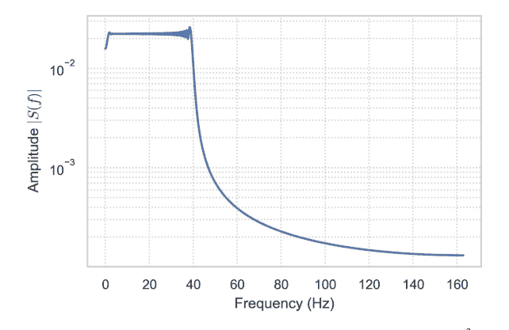

图 6.11 二次相位啁啾信号 $s(t) = \sin(10t^2)$ 在 $0 \le t < 4\pi$ 上以 $N = 4096$ 点采样的对数尺度幅度谱。瞬时频率 $\dot{\phi}(t) = 20t$ 线性增长，导致能量分布在不断扩展的频带上，而非形成单一尖锐峰值，这反映在宽广的频谱支撑上。

## 示例 6.3.4 (啁啾信号的谱分辨率)

信号 $s(t) = \sin(10t^2)$ 定义在 $0 \le t < 4\pi$；采样点数 $N = 4096$。

```python
import numpy as np, matplotlib.pyplot as plt
N = 4096; T = 4*np.pi
t = np.linspace(0, T, N, endpoint=False)
s = np.sin(10*t**2)
S = np.fft.fft(s)
freq = np.fft.fftfreq(N, T/N)/(2*np.pi) # 角频率 -> 循环频率
plt.semilogy(freq[:N//2], np.abs(S[:N//2]))
plt.xlabel("frequency (Hz)"); plt.ylabel("|S|"); plt.show()
```

能量向高频的挤压说明了瞬时频率 $f(t) = 10t/\pi$（参见图 6.11）。

## 混叠与奈奎斯特极限

如果 $f$ 包含频率 $\omega > \pi/\Delta t$（$>$ 奈奎斯特频率），采样点在频域重叠，破坏重构。抗混叠预滤波器可消除超过采样率一半的分量。

## 谱微分

对于周期网格，

> $$\mathscr{F}\left[\frac{d^m f}{dt^m}\right] = (i\omega)^m \hat{f}(\omega).$$

离散形式为 $D^{(m)} f = \mathscr{F}^{-1}[(ik)^m \hat{f}_k]$。对于解析函数 $f$ 具有指数精度。

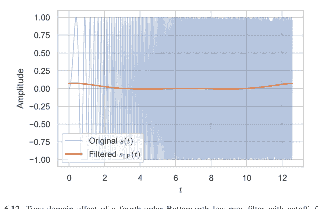

图 6.12 截止频率 $f_c = 0.15$ Hz 的四阶巴特沃斯低通滤波器应用于二次相位啁啾信号 $s(t) = \sin(10t^2)$ 的时域效果。高频分量被强烈衰减，仅保留信号的缓慢变化部分，同时保持相位，因为幅度响应 $|H(f)|$ 在频域对称应用。

## 示例 6.3.5 ($f(t) = \cos 3t$ 的四阶导数)

```python
k = np.fft.fftfreq(N, T/N) # 整数波数
f4 = np.fft.ifft((1j*k)**4 * S).real
print(np.max(np.abs(f4 - (3**4)*np.cos(3*t)))) # ≈ 舍入误差
```

## 傅里叶变换在信号处理与偏微分方程中的应用

**滤波与卷积** 给定脉冲响应 $h$，时域输出 $y = h * f$ 映射到频域 $\hat{y} = \hat{h} \hat{f}$。基于FFT的卷积（$O(N \log N)$）优于直接卷积 $O(N^2)$。

## 示例 6.3.6 (低通巴特沃斯滤波器) (参见图 6.12)

```python
f_c = .15 # 截止频率
B = 4 # 阶数
H = 1/np.sqrt(1+(freq/f_c)**(2*B))
S_filt = S * H
s_filt = np.fft.ifft(S_filt).real
plt.plot(t, s, alpha=.4); plt.plot(t, s_filt); plt.show()
```

**$\mathbb{R}$ 上的热方程** 回忆 $\hat{u}(\omega, t) = \hat{f}(\omega)e^{-\kappa\omega^2t}$。使用FFT快速计算 $u(x, t_f)$：

```python
kappa, tf = .1, .2
U = np.exp(-kappa*(2*np.pi*freq)**2*tf) * S
u = np.fft.ifft(U).real
```

二维泊松方程的谱方法 在周期区域 $[0, 2\pi]^2$ 上，$\widehat{u}(\mathbf{k}) = -\frac{\widehat{f}(\mathbf{k})}{|\mathbf{k}|^2}$，$\mathbf{k} \neq (0, 0)$。对 $f$ 做FFT，逐模相除，再做逆FFT。复杂度 $O(N^2 \log N)$，而直接稀疏线性求解为 $O(N^3)$。

示例 6.3.7 $f(x, y) = \sin x \cos y \implies$ 解析解 $u = \frac{1}{2} \sin x \cos y$。在 $256^2$ 网格上的Python验证给出最大误差 $< 10^{-13}$。

通过余弦变换的非周期延拓 快速离散余弦变换 (DCT) 使用余弦基 $\cos(k\pi x/L)$ 求解诺伊曼泊松问题。`scipy.fft` 实现了 DCT-II/III。

短时傅里叶变换 (STFT) 窗函数 $w(t)$ 局部化频率内容：

$$\mathcal{F}_{\text{STFT}}[f](\tau, \omega) = \int f(t)w(t - \tau)e^{-i\omega t} \, dt.$$

时频分辨率受海森堡不确定性原理限制 $\Delta t \, \Delta \omega \geq \frac{1}{2}$。在音频工程中，STFT频谱图指导降噪和音高检测。

示例 6.3.8 (语音片段的频谱图)

```python
from scipy.signal import stft
fs, data = 16000, speech_array
_,_,Zxx = stft(data, fs, nperseg=512, noverlap=384, window='hann')
plt.imshow(20*np.log10(np.abs(Zxx)), aspect='auto', origin='lower')
plt.xlabel('frame'); plt.ylabel('frequency bin'); plt.show()
```

## 6.3.3 常微分方程与偏微分方程中的特殊函数

变系数线性微分方程的解经常可以用*特殊函数*表示。这些函数在电磁学、量子力学、弹性力学、大地测量学中无处不在，因此值得在每个数学工具箱中占有一席之地。我们回顾两个经典函数族：贝塞尔函数，源于柱坐标下的可分离问题；以及勒让德多项式（及其在曲面上的推广——球谐函数），它们求解球面几何中的拉普拉斯方程。全文重点介绍正交性关系、完备性、递推恒等式和计算示例。

## 贝塞尔函数及其应用

### 贝塞尔微分方程

$$x^2 y'' + xy' + (x^2 - \nu^2)y = 0, \quad \nu \in \mathbb{R}.$$

通过弗罗贝尼乌斯方法（在 $x = 0$ 处的正则奇点）可得到两个线性无关解：

$$J_{\nu}(x) = \sum_{k=0}^{\infty} \frac{(-1)^k}{k! \Gamma(k + \nu + 1)} \left(\frac{x}{2}\right)^{2k+\nu}, \quad Y_{\nu}(x) = \frac{J_{\nu}(x) \cos(\nu \pi) - J_{-\nu}(x)}{\sin(\nu \pi)} \quad (\nu \notin \mathbb{Z}),$$

其中 $J_{\nu}$ 是*第一类贝塞尔函数*，$Y_{\nu}$ 是*第二类贝塞尔函数*。

### 在 $[0, R]$ 上的正交性

$J_{\nu}$ 的零点 $j_{\nu,n}$ 满足

$$\int_0^R x J_{\nu}\left(\frac{j_{\nu,m} x}{R}\right) J_{\nu}\left(\frac{j_{\nu,n} x}{R}\right) dx = \frac{R^2}{2} [J_{\nu+1}(j_{\nu,n})]^2 \delta_{mn}.$$

因此 $\{J_{\nu}(j_{\nu,n} x/R)\}_{n=1}^{\infty}$ 构成带权重 $x$ 的正交基。

### 示例 6.3.9 (圆形薄膜本征模)

半径为 $a$ 的鼓的振动满足 $\nabla^2 u + \lambda u = 0$，边界条件 $u|_{r=a} = 0$。在极坐标下，分离变量 $u(r, \theta) = R(r)\Theta(\theta)$ 导出径向方程 $R'' + r^{-1} R' + (\lambda - \frac{m^2}{r^2}) R = 0$；$r = 0$ 处的有界性条件选择 $R(r) = J_m(k_{mn} r)$，其中本征值 $k_{mn} = j_{m,n}/a$。基频对应 $m = 0, n = 1$。

```python
import sympy as sp
m,n,a = 0,1,1
j01 = sp.nroots(sp.besselj(m, sp.symbols('x')), 5)[1] # 第一个正根
omega = j01/a
print(f"基频角频率 omega_01 = {omega:.6f}")
```

## 递推关系

$$J_{\nu-1}(x) + J_{\nu+1}(x) = \frac{2\nu}{x} J_{\nu}(x), \quad 2 J_{\nu}'(x) = J_{\nu-1}(x) - J_{\nu+1}(x).$$

这些关系是高阶计算的快速向上/向下递推方案的基础。

### 渐近行为

当 $|x| \gg |\nu|^2$ 时，$J_{\nu}(x) \sim \sqrt{\frac{2}{\pi x}} \cos(x - \frac{\nu \pi}{2} - \frac{\pi}{4})$。一致渐近展开使得贝塞尔函数在WKB分析中不可或缺。

### 圆柱体内的热传导

$r < a$ 内部，$u_t = \kappa \nabla^2 u$，边界条件 $u(a, t) = 0$ 的解展开为

$$u(r, t) = \sum_{m=0}^{\infty} \sum_{n=1}^{\infty} A_{mn} e^{-\kappa (j_{m,n}/a)^2 t} J_m(j_{m,n} r/a) \cos(m \theta).$$

系数 $A_{mn}$ 由正交性确定。时间衰减率与最小零点 $j_{0,1}$ 相关。

## 勒让德多项式与球谐函数

## 勒让德方程

$(1-x^2)y'' - 2xy' + \ell(\ell+1)y = 0, \quad \ell \in \mathbb{N}_0.$

在区间 $[-1, 1]$ 端点处的正则解是**勒让德多项式** $P_\ell(x)$，可通过罗德里格斯公式得到

$P_\ell(x) = \frac{1}{2^\ell \ell!} \frac{d^\ell}{dx^\ell}[(x^2-1)^\ell].$

**正交性** $\int_{-1}^1 P_\ell(x) P_m(x) dx = \frac{2}{2\ell+1} \delta_{\ell m}$。在 $[-1, 1]$ 上的完备性使得勒让德级数 $f(x) = \sum a_\ell P_\ell(x)$ 成立。

**例 6.3.10（锯齿波的勒让德展开）** $f(x) = x$ 在 $[-1, 1]$ 上：系数 $a_\ell = \frac{2\ell+1}{2} \int_{-1}^1 x P_\ell(x) dx$ 对于偶数 $\ell$ 为零，$a_1 = 2/3$，$a_3 = 0$，等等。通过符号积分验证：

```
ℓ = sp.symbols('ℓ', integer=True, nonnegative=True)
aℓ = (2*ℓ+1)/2*sp.integrate(sp.symbols('x')*sp.legendre(ℓ, sp.symbols('x')), (sp.symbols('x'), -1, 1))
print([aℓ.subs(ℓ,i) for i in range(5)])
```

## 球谐函数

定义在 $S^2$ 上：

$Y_\ell^m(\theta, \phi) = \sqrt{\frac{2\ell+1}{4\pi} \frac{(\ell-m)!}{(\ell+m)!}} P_\ell^m(\cos \theta) e^{im\phi}, \quad -\ell \le m \le \ell,$

其中 $P_\ell^m$ 是*连带勒让德函数*。它们满足 $\nabla_{S^2}^2 Y_\ell^m = -\ell(\ell+1) Y_\ell^m$，并构成 $L^2(S^2)$ 的一个完备正交归一基。

**例 6.3.11（势的多极展开）** 对于限制在半径为 $R$ 的球内的电荷分布 $\rho(\mathbf{r}')$，外部（$r > R$）的势为

$\Phi(r, \theta) = \frac{1}{4\pi\varepsilon_0} \sum_{\ell=0}^\infty \frac{1}{r^{\ell+1}} \sum_{m=-\ell}^\ell Q_\ell^m Y_\ell^m(\theta, \phi),$

$Q_\ell^m = \int_{|\mathbf{r}'|<R} \rho(\mathbf{r}') r'^\ell Y_\ell^{m*}(\theta', \phi') d^3\mathbf{r}'$.

```
from sympy import Ynm, symbols, integrate, sin
θ, ϕ = symbols('θ ϕ', positive=True)
ℓ, m = 2, 1
Y = Ynm(ℓ, m, θ, ϕ)
# 正交性测试
ortho = integrate(Y*Ynm(ℓ,m,θ,φ).conjugate()*sin(θ),
    (φ,0,2*sp.pi), (θ,0,sp.pi))
sp.simplify(ortho)
```

**加法定理** $P_\ell(\cos \gamma) = \frac{4\pi}{2\ell+1} \sum_{m=-\ell}^{\ell} Y_\ell^m(\theta, \phi) Y_\ell^{m*}(\theta', \phi')$，其中 $\gamma$ 是两个单位向量之间的夹角；在散射理论和快速多极算法中至关重要。

## 递推关系

$(\ell + 1)P_{\ell+1}(x) = (2\ell + 1)xP_\ell(x) - \ell P_{\ell-1}(x)$.

稳定的三项递推关系便于高阶计算。

**高斯-勒让德求积** 节点 $x_k$ = $P_n$ 的零点；权重 $w_k = 2/[(1 - x_k^2)(P_n'(x_k))^2]$。精确积分 $2n - 1$ 次多项式；在 numpy.polynomial.legendre.leggauss 中是常规操作。

```
import numpy.polynomial.legendre as lg
xk,wk = lg.leggauss(6)
I = (wk* np.exp(xk)).sum() # ∫_{-1}^{1} e^{x}dx ≈ 2.3504
```

## 6.3.4 格林函数与积分方程

格林函数将线性微分算子重新表述为类卷积的积分核，将边值问题（BVPs）转化为*先验*可解的积分方程。它们是矩阵逆的连续类比：如果 $L$ 是作用在函数空间上的线性算子，且 $G$ 在指定边界条件下满足 $LG = \delta$，那么 $Lu = f$ 的解就是 $u = G * f$。本节首先为常微分方程（ODEs）发展该方法，然后将构造扩展到偏微分方程（PDEs），最后将格林核与第二类弗雷德霍姆积分方程联系起来。

## 常微分方程的格林函数

**定义（两点边值问题）** 对于一个正则的、线性的、二阶算子

$L[y] := p(x)y'' + q(x)y' + r(x)y, \quad p(x) \neq 0 \text{ on } [a, b]$

带有边界条件 $B_1y(a) = 0$，$B_2y(b) = 0$（狄利克雷、诺伊曼或罗宾），**格林函数** $G(x, \xi)$ 是以下方程的唯一解

$L_xG(x, \xi) = \delta(x - \xi), \quad B_1G(a, \xi) = 0, \quad B_2G(b, \xi) = 0,$

对于固定的 $\xi$，将其视为 $x$ 的函数。

**构造方法** 设 $y_1, y_2$ 是齐次解的基本集，满足 $B_1 y_1(a) = 0$，$B_2 y_2(b) = 0$。朗斯基行列式 $W(y_1, y_2) = p^{-1} W_0 \neq 0$。那么

$$G(x, \xi) = \begin{cases} \frac{y_1(x) y_2(\xi)}{W_0}, & a \leq x \leq \xi \leq b, \\ \frac{y_1(\xi) y_2(x)}{W_0}, & a \leq \xi < x \leq b. \end{cases}$$

**例 6.3.12（固支梁）** $y''''(x) = f(x)$ 在 $0 < x < 1$ 上，边界条件为 $y(0) = y'(0) = y''(1) = y'''(1) = 0$。积分两次化为二阶形式，应用上述方法，得到经典的三次样条核 $G(x, \xi) = \frac{1}{6} \begin{cases} (1 - \xi) x^3 - x^2 \xi^2 / 2, & x < \xi, \\ (1 - x) \xi^3 - x^2 \xi^2 / 2, & x > \xi. \end{cases}$ 通过 SymPy 中的符号微分验证 $L_x G = \delta$。

**解的表示** 对于非齐次项 $f$，

$$y(x) = \int_a^b G(x, \xi) f(\xi) \, d\xi.$$

线性性确保了叠加原理；边界数据已内置于 $G$ 中。

**自伴性与对称性** 如果 $L$ 是形式自伴的（$q = p'$），则 $G$ 满足 $G(x, \xi) = G(\xi, x)$。

## 在偏微分方程和边值问题中的应用

**矩形区域中的拉普拉斯方程** 求解 $\nabla^2 \phi = -\rho(x, y)$ 在 $0 < x < L$，$0 < y < H$ 上，边界条件为 $\phi|_{\partial \Omega} = 0$。在 $x$ 方向分离变量得到本征函数 $\sin \frac{m \pi x}{L}$ 和格林核

$$G((x, y), (\xi, \eta)) = \frac{2}{L} \sum_{m=1}^{\infty} \sin \frac{m \pi x}{L} \sin \frac{m \pi \xi}{L} \frac{\sinh \frac{m \pi (H - \max\{y, \eta\})}{L}}{\frac{m \pi}{L} \sinh \frac{m \pi H}{L}} \sinh \frac{m \pi \min\{y, \eta\}}{L}.$$

势：$\phi(x, y) = \iint_{\Omega} G \rho \, d\xi d\eta$。

**$\mathbb{R}$ 上的热方程** 基本解 $G(x, \xi; t) = \frac{1}{\sqrt{4 \pi \kappa t}} \exp\left(-\frac{(x - \xi)^2}{4 \kappa t}\right)$ 满足 $\partial_t G = \kappa \partial_x^2 G$，$G|_{t=0} = \delta$。卷积给出经典解 $u(x, t) = G * f$。对于具有狄利克雷边界的半无限杆，使用*镜像法*：$G_+ = G(x, \xi; t) - G(x, -\xi; t)$。

## 格林恒等式（边界积分）

对于区域 $\Omega$，
$$u(\mathbf{x}) = \int_{\Omega} G(\mathbf{x}, \boldsymbol{\xi}) f(\boldsymbol{\xi}) \, d\boldsymbol{\xi} - \int_{\partial\Omega} \left[ u \, \partial_{n_{\boldsymbol{\xi}}} G - G \, \partial_{n_{\boldsymbol{\xi}}} u \right] \, dS_{\boldsymbol{\xi}}.$$
边界元方法（BEM）利用此表示对 $\partial\Omega$ 进行离散化，将维度降低一维。

## 例 6.3.13（二维外部势）

对于圆外的拉普拉斯方程，选择自由空间格林函数 $G = -\frac{1}{2\pi} \ln |\mathbf{x} - \boldsymbol{\xi}|$；施加诺伊曼边界积分以求解圆形障碍物的散射问题。

## 积分方程与弗雷德霍姆理论

## 第二类弗雷德霍姆积分方程

$$u(x) - \lambda \int_a^b K(x, \xi) u(\xi) \, d\xi = f(x).$$
若 $K$ 连续，弗雷德霍姆择一定理指出以下两种情况必居其一：
1. $\det(I - \lambda K) \neq 0$：对每个 $f$ 存在唯一解。
2. $\det(I - \lambda K) = 0$：存在非平凡的齐次解，且非齐次问题的可解性要求与伴随零空间正交。

## 预解核级数

$$R(x, \xi; \lambda) = K + \lambda K^{(2)} + \lambda^2 K^{(3)} + \dots, \quad K^{(n)}(x, \xi) = \int_a^b K(x, s) K^{(n-1)}(s, \xi) \, ds,$$
对于小的 $|\lambda|$ 收敛；解为 $u = f + \lambda f * R$。

## 与格林函数的联系

经过微分，许多边值问题可以映射为核为 $K(x, \xi) = G(x, \xi)$ 的弗雷德霍姆方程。数值上：Nyström 方法对积分进行采样，将其转化为线性系统 $(I - \lambda A)u = f$。

## 例 6.3.14（由初值问题导出的沃尔泰拉方程）

常微分方程 $y'(x) = \lambda y(x) + g(x)$，$y(0) = y_0$ 积分得到 $y(x) = y_0 + \int_0^x \lambda y(s) + g(s) \, ds$：这是一个第二类沃尔泰拉方程，可通过逐次代换（诺伊曼级数）求解，对于有限的 $x$ 总是收敛的。

## 求积方法

选择节点 $\{x_j\}$，权重 $\{w_j\}$：$u(x_i) - \lambda \sum_j w_j K(x_i, x_j) u(x_j) = f(x_i)$。矩阵 $(I - \lambda W \circ K)$ 通过 LU 或 GMRES 求逆。使用高斯-勒让德节点的谱 Nyström 方法对于光滑的 $K$ 可达到指数收敛。

## 6.4 随机微分方程（SDEs）

**随机微分方程**在常微分方程的基础上增加了一个噪声项——传统上是布朗运动——用以捕捉热扰动、金融市场或环境波动中固有的随机性。形式上，一个在 $\mathbb{R}$ 中的伊藤随机微分方程写作

$$dX_t = \mu(t, X_t)\,dt + \sigma(t, X_t)\,dW_t, \quad X_0 = x_0,$$

其中 $W_t$ 是标准布朗运动，$\mu$ 是*漂移项*，$\sigma$ 是*扩散系数*。与确定性常微分方程不同，随机微分方程的解是*随机过程*——时间的随机函数——需要一种尊重布朗路径粗糙性的微积分。

### 6.4.1 随机微分方程简介

经典牛顿动力学 $dx/dt = v$ 假设轨迹是可微的；而布朗轨迹几乎必然处处不可微。爱因斯坦1905年对花粉颗粒的模型表明*均方位移*呈线性增长：$\mathbb{E}[(X_t - X_0)^2] = 2Dt$。朗之万通过以下方程对此进行了改进

$$m\,dV_t = -\gamma V_t\,dt + \sqrt{2\gamma k_B T}\,dW_t,$$

其中随机项模拟了分子的脉冲式撞击。将 $dW_t$ 解释为对称、方差为 $dt$ 的高斯增量的极限，这启发了现代伊藤积分。

### 布朗运动与随机过程

**标准布朗运动** $\{W_t\}_{t \ge 0}$ 满足

1.  $W_0 = 0$ 几乎必然成立。
2.  独立增量：$W_{t+s} - W_t$ 与 $\mathcal{F}_t$ 独立。
3.  高斯增量：$W_{t+s} - W_t \sim \mathcal{N}(0, s)$。
4.  连续路径。

矩：$\mathbb{E}[W_t] = 0$，$\text{Var}(W_t) = t$，$\text{Cov}(W_s, W_t) = \min(s, t)$。

**二次变差** 将区间 $[0, t]$ 划分为 $0 = t_0 < \cdots < t_n = t$；布朗运动的二次变差依概率收敛：

$$\sum_{k=0}^{n-1} (W_{t_{k+1}} - W_{t_k})^2 \xrightarrow{\mathbb{P}} t.$$

这一性质是伊藤公式的基础。

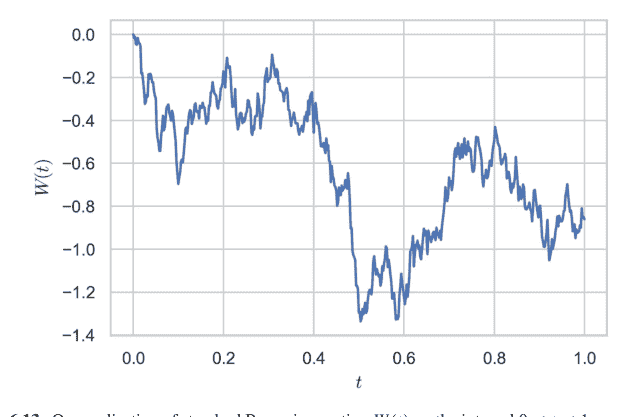

**模拟布朗路径** 将时间离散化为 $t_k = k \Delta t$；增量 $\Delta W_k \sim \mathcal{N}(0, \Delta t)$（参见图 6.13）。

```python
import numpy as np, matplotlib.pyplot as plt
T,N = 1.0, 500
dt = T/N
ΔW = np.sqrt(dt)*np.random.randn(N)
W = np.insert(np.cumsum(ΔW), 0, 0)
plt.plot(np.linspace(0, T, N+1), W); plt.show()
```

### 伊藤引理与随机微积分

**伊藤积分** 对于一个适应过程 $H_t$，若满足 $\int_0^T \sigma_H^2(t) \, dt < \infty$，则定义

$$\int_0^T H_t \, dW_t := \text{L}^2 - \lim_{n \to \infty} \sum_{k=0}^{n-1} H_{t_k} (W_{t_{k+1}} - W_{t_k}),$$

其中被积函数采用*左端点采样*，这对于保持鞅性质至关重要。

**伊藤引理**（一维情形）。设 $X_t$ 满足 $dX_t = \mu(t, X_t) \, dt + \sigma(t, X_t) \, dW_t$，且 $f(t, x) \in C^{1,2}$。则

$$df(t, X_t) = \left( f_t + \mu f_x + \frac{1}{2} \sigma^2 f_{xx} \right) dt + \sigma f_x \, dW_t.$$

注意其中的 $\frac{1}{2} \sigma^2 f_{xx}$ 项源于二次变差。

![图 6.14 几何布朗运动 $S(t) = S_0 \exp\left[(\alpha - \frac{1}{2}\beta^2)t + \beta W(t)\right]$ 的一次实现，其中 $S_0 = 100$，$\alpha = 0.10$，$\beta = 0.20$，时间跨度为一年（$N = 252$）。乘性噪声产生了一个对数正态轨迹，其期望增长率等于 $\alpha$](img/9724708489e3df346f9e31e3fa6e5746_250_0.png)

**例 6.4.1（几何布朗运动（GBM）（参见图 6.14））** $dS_t = \alpha S_t dt + \beta S_t dW_t$。取 $f(s) = \ln s$，由伊藤引理得

$$d \ln S_t = (\alpha - \frac{1}{2}\beta^2) dt + \beta dW_t \implies S_t = S_0 \exp\left((\alpha - \frac{1}{2}\beta^2)t + \beta W_t\right).$$

```python
S0, alpha, beta, T, N = 100, .1, .2, 1, 252
dt = T/N
W = np.cumsum(np.sqrt(dt)*np.random.randn(N))
t = np.linspace(dt, T, N)
S = S0*np.exp((alpha-0.5*beta**2)*t + beta*W)
plt.plot(t, S); plt.show()
```

**吉尔萨诺夫定理（Øksendal 2003）** 在由 Radon–Nikodym 密度 $\frac{d\mathbb{Q}}{d\mathbb{P}} = \exp\left(-\int_0^T \theta dW_t - \frac{1}{2}\int_0^T \theta^2 dt\right)$ 定义的新测度 $\mathbb{Q}$ 下，过程 $W_t^{\mathbb{Q}} = W_t + \int_0^t \theta ds$ 在 $\mathbb{Q}$ 下是布朗运动。这是金融中风险中性估值和滤波理论中漂移变换的工具。

**通过伊藤引理推导矩演化** 对于奥恩斯坦-乌伦贝克（OU）过程 $dX_t = -\gamma X_t dt + \sigma dW_t$，选择 $f(x) = x^2$ 可得 $d(X_t^2) = (\sigma^2 - 2\gamma X_t^2) dt + 2\sigma X_t dW_t$。取期望得到常微分方程 $\partial_t \mathbb{E}[X_t^2] = \sigma^2 - 2\gamma \mathbb{E}[X_t^2] \implies$ 稳态方差为 $\sigma^2/(2\gamma)$。

**斯特拉托诺维奇积分与伊藤积分** 斯特拉托诺维奇积分采用中点采样；其链式法则与经典微积分一致。转换关系：$dX_t^{\text{Strat}} = dX_t + \frac{1}{2}\sigma \sigma_x dt$。具有色噪声白噪声极限的物理模型通常偏好斯特拉托诺维奇形式；金融模型则因其鞅性质而偏好伊藤形式。

### 6.4.2 随机微分方程的数值解

精确解仅存在于一小类随机微分方程中。因此，蒙特卡洛模拟成为估计期望值、首达概率或路径依赖收益的主要工具。离散化误差现在必须考虑随机路径的分布收敛性。我们回顾两种强收敛格式——欧拉-丸山法和米尔斯坦法——并概述基于多重随机积分的高阶扩展。

### 欧拉-丸山法

给定伊藤随机微分方程

$$dX_t = \mu(X_t, t) dt + \sigma(X_t, t) dW_t, \quad X_0 = x_0,$$

以及时间划分 $0 = t_0 < \cdots < t_N = T$，其中 $\Delta t = t_{n+1} - t_n$，欧拉-丸山（EM）格式设定

$$X_{n+1} = X_n + \mu(X_n, t_n) \Delta t + \sigma(X_n, t_n) \Delta W_n, \quad \Delta W_n \sim \mathcal{N}(0, \Delta t).$$

强收敛阶为 0.5：$\mathbb{E}[|X_T - X_N|^2] = O((\Delta t)^1)$。弱收敛阶为 1：对于足够光滑的 $\varphi$，有 $|\mathbb{E}[\varphi(X_T)] - \mathbb{E}[\varphi(X_N)]| = O(\Delta t)$。

**例 6.4.2（奥恩斯坦-乌伦贝克（OU）过程收敛性）** OU过程：$dX_t = -\gamma X_t dt + \sigma dW_t$，其解析解为 $X_T = x_0 e^{-\gamma T} + \sigma \int_0^T e^{-\gamma(T-s)} dW_s$。对 $T = 1$，$\gamma = 1$，$\sigma = 0.5$ 模拟EM格式，并在不同步长 $\Delta t = 2^{-k}$ 下比较经验均值 $\mathbb{E}[X_T]$ 与精确值 $x_0 e^{-\gamma T}$。

```python
import numpy as np
def OU_EM(x0, gamma, sigma, T, N, M=10_000):
    dt, sqdt = T/N, np.sqrt(T/N)
    X = np.full(M, x0)
    for _ in range(N):
        X += -gamma*X*dt + sigma*sqdt*np.random.randn(M)
    return X
x0, gamma, sigma = 1.0, 1, 0.5
for k in range(6):
    N = 2**k
    samples = OU_EM(x0, gamma, sigma, 1, N)
    print(N, samples.mean())
```

经验偏差以 $\Delta t^{0.5}$ 的比例衰减，证实了强收敛阶理论。

**均方稳定性** 对于线性随机微分方程 $dX_t = \lambda X_t dt + \eta X_t dW_t$，EM格式稳定的充要条件是 $1 + 2\lambda \Delta t + \eta^2 \Delta t < 1 \implies \lambda \Delta t < -\frac{1}{2}\eta^2 \Delta t$。如果 $\lambda > 0$ 且 $\eta$ 过大（均方不稳定），缩小 $\Delta t$ 无法使其稳定；隐式EM变体或驯化格式可解决刚性随机微分方程的这一问题。

### 米尔斯坦法与高阶近似

米尔斯坦法在EM格式基础上增加了一个*莱维面积*修正项，以捕捉伊藤-泰勒展开的一阶项：

$$X_{n+1} = X_n + \mu_n \Delta t + \sigma_n \Delta W_n + \frac{1}{2} \sigma_n \sigma'_n [(\Delta W_n)^2 - \Delta t],$$

其中 $\sigma'_n = \partial_x \sigma(X_n, t_n)$。

**强收敛阶 1** 对于具有标量噪声的随机微分方程，米尔斯坦法将收敛指数提高了一倍。计算开销很小（每步增加一次导数计算）。

**例 6.4.3（使用米尔斯坦法的GBM）** $dS_t = \alpha S_t \, dt + \beta S_t \, dW_t$，其中 $\sigma(x) = \beta x$，$\sigma'(x) = \beta$。米尔斯坦更新简化为

$$S_{n+1} = S_n + \alpha S_n \Delta t + \beta S_n \Delta W_n + \frac{1}{2} \beta^2 S_n [(\Delta W_n)^2 - \Delta t].$$

对 $\alpha = 0.05$，$\beta = 0.2$，$T = 1$ 进行模拟，并验证均方根误差以 $O(\Delta t)$ 的速度衰减，而EM格式以 $O(\Delta t^{1/2})$ 的速度衰减。

```python
def GBM_Milstein(S0, alpha, beta, T, N, M=50_000):
    dt, sqdt = T/N, np.sqrt(T/N)
    S = np.full(M, S0)
    for _ in range(N):
        dW = sqdt*np.random.randn(M)
        S += alpha*S*dt + beta*S*dW + .5*beta**2*S*(dW**2 - dt)
    return S
```

**多维噪声** 当 $\mathbf{W}_t$ 是 $m$ 维时，米尔斯坦法需要迭代随机积分 $I_{ij} = \int_{t_n}^{t_{n+1}} \int_{t_n}^s dW^i \, dW^j$——计算量很大。强收敛阶为 1 的随机龙格-库塔（SRK）格式通过具有相同矩的随机变量来近似采样 $I_{ij}$。

**弱收敛格式** 如果只关心泛函的期望值（例如期权定价），弱龙格-库塔方法通过对偶或分层随机增量，在不使用迭代积分的情况下达到二阶收敛。

**针对超线性漂移的驯化欧拉法** 对于 $\mu(x) = x^3$，EM格式的矩会发散。将漂移项替换为 $\mu_{\text{tame}}(x) = \mu(x)/(1 + \Delta t|\mu(x)|)$；这保持了强收敛阶 0.5 并维持了稳定性。

### 6.4.3 随机微分方程的应用

**金融建模：布莱克-斯科尔斯方程**

股票模型 $dS_t = \mu S_t \, dt + \sigma S_t \, dW_t$ 意味着折现价格 $e^{-rt} S_t$ 在风险中性测度 $\mathbb{Q}$ 下是一个鞅，其漂移为 $r$。根据伊藤引理和无套利原理

## 随机种群模型

带环境噪声的逻辑斯谛增长：

$$dN_t = rN_t\left(1 - \frac{N_t}{K}\right)dt + \sigma N_t dW_t.$$

对 $\ln N_t$ 应用伊藤引理表明，灭绝概率随 $\sigma^2$ 增大而增加。EM 模拟探索了变异性将种群驱使至阿利阈值以下的参数区间。

```python
def logistic_SDE(N0, r, K, sigma, T, N_steps):
    dt, sqdt = T/N_steps, np.sqrt(T/N_steps)
    N = N0
    for _ in range(N_steps):
        dW = sqdt*np.random.randn()
        N += r*N*(1-N/K)*dt + sigma*N*dW
    return N
```

**矩闭合** 福克-普朗克方程给出 $\partial_t \mathbb{E}[N] = r\mathbb{E}[N] - \frac{r}{K}\mathbb{E}[N^2]$——该方程不闭合。假设高斯涨落，可近似 $\mathbb{E}[N^2] \approx (\text{Var } N) + (\mathbb{E}N)^2$；由此推导出关于均值和方差的常微分方程组，并与蒙特卡洛模拟结果进行比较。

## 物理应用：朗之万方程

**过阻尼朗之万方程** 处于势场 $U(x)$ 和温度 $T$ 下的胶体粒子：

$$\gamma \, dX_t = -\nabla U(X_t) \, dt + \sqrt{2\gamma k_B T} \, dW_t.$$

平衡密度 $\rho(x) \propto e^{-U(x)/(k_B T)}$。采用带反射边界的 Milstein 格式模拟粒子的约束和隧穿事件。

**克拉默斯逃逸率** 越过势垒高度 $U_b$ 的平均首次通过时间近似为 $\tau \sim \frac{2\pi \gamma}{\sqrt{|U''(x_m)U''(x_b)|}} e^{U_b/(k_B T)}$。通过蒙特卡洛方法估计 $\tau$，并与渐近公式进行比较。

**随机热力学** 增量功 $dW = -U'(X_t) \circ dX_t$（Stratonovich 意义下）和热量 $dQ = \gamma \dot{X}_t^2 dt$ 满足热力学第一定律：$dU = dQ - dW$。使用 Heun 方法（强 1 阶 Stratonovich 格式）进行数值积分以验证能量守恒。

## 6.5 习题

1.  考虑微分形式

    $$(3x^2y - 2y^3 + 1) \, dx + (x^3 - 6xy^2 + e^x) \, dy = 0.$$

    (a) 验证该形式在 $\mathbb{R}^2$ 上不是恰当的。

    (b) 证明积分因子 $\mu(y) = y^{-3}$ 使其在穿孔平面 $y \neq 0$ 上成为恰当的。

    (c) 求得隐式解 $F(x, y) = C$，并找出满足 $y(1) = 1$ 的唯一显式解。

2.  研究种群模型

    $$\frac{dP}{dt} = rP\left(1 - \frac{P}{K}\right) - \alpha P^2, \quad r, K, \alpha > 0.$$

    (i) 确定所有平衡点，并根据捕捞率 $\alpha$ 对其稳定性进行分类。

    (ii) 证明当 $\alpha = \alpha_c = r/(4K)$ 时发生鞍结点分岔，并绘制分岔图。

    (iii) 利用相线分析，计算当 $\alpha < \alpha_c$ 时，种群从 $P(0) = P_0$ 变化到 $P(T) = P_1 > P_0$ 所需的时间 $T(P_0 \to P_1)$。

3.  求解

    $$x^2 y'' - 5xy' + 9y = x^4 \ln x, \quad x > 0,$$

    方法：(i) 通过 $y = x^m$ 找到齐次方程的两个线性无关解，然后 (ii) 使用降阶法 *和* 待定系数法求得一个特解。以封闭形式给出通解。

4.  对于定义在 $0 \le x \le 2$ 上的固支梁，其控制方程为

    $$y''''(x) = q(x), \quad y(0) = y'(0) = y(2) = y'(2) = 0,$$

    推导格林函数 $G(x, \xi)$，并计算由 $q(x) = 12x^2 - 24x + 4$ 引起的挠度。给出 $y(x)$ 的显式表达式，并计算 $y(1)$ 的值。

5.  设

    $$A = \begin{pmatrix} 0 & 3 & 0 \\ -3 & 0 & 0 \\ 0 & 0 & -2 \end{pmatrix}.$$

    (a) 通过 (i) 特征分解和 (ii) 实 Jordan 块计算 $\exp(At)$。

    (b) 求解 $\dot{\mathbf{x}} = A\mathbf{x}$，其中 $\mathbf{x}(0) = (1, 0, 2)^\top$，并分析其长期行为。

6.  分析系统

    $$\dot{x} = -x + y - x(x^2 + y^2), \quad \dot{y} = -x - y - y(x^2 + y^2).$$

    (i) 证明原点是唯一的平衡点。

    (ii) 通过构造形如 $V(x, y) = \frac{1}{2}(x^2 + y^2)$ 的李雅普诺夫函数并估计 $\dot{V}$，证明其全局渐近稳定性。

    (iii) 从 $(x_0, y_0) = (1, 2)$ 开始进行数值积分以确认收敛性。

7.  应用经典 RK4 方法，步长 $h = 0.05$，近似求解 $y' = \sin(y) + x^2$，$y(0) = 0$ 在 $x = 1$ 处的解。通过与使用 $h = 0.001$ 和理查森外推法得到的值进行比较，计算绝对全局误差。

8.  考虑定义在正方形 $[0, 1] \times [0, 1]$ 上的拉普拉斯方程，其混合边界条件为

    $$u(x, 0) = 0, \quad u(x, 1) = \sin(\pi x), \quad u(0, y) = 0, \quad u(1, y) = y(1 - y).$$

    使用五点差分格式在 $20 \times 20$ 的内部网格上进行离散化。显式地组装线性方程组并求解；将 $u(0.5, 0.5)$ 列表，并与通过分离变量法得到的级数解（截断至前四个正弦项）进行比较。

9.  对于区间 $(0, 1)$ 上的泊松方程 $-\Delta u = f$，边界条件为 $u(0) = u(1) = 0$，且 $f(x) = 8x$，在宽度为 $h = 0.2$ 的均匀网格上使用分段线性帽函数：

    (a) 符号化地构造刚度矩阵和载荷向量。

    (b) 求解节点值，并利用精确解 $u(x) = x^3 - x$ 估计 $\|u - u_h\|_{H^1(0,1)}$。

10. 将 $g(\theta) = |\theta|$ 在 $[-\pi, \pi]$ 上展开为余弦傅里叶级数。证明 $N$ 项部分和 $S_N g$ 满足 $\|g - S_N g\|_2 = O(N^{-1})$，并使用 `numpy.fft` 对 $N = 8, 16, 32$ 进行数值验证。

11. 求解初边值问题

    $$u_t = u_{xx}, \quad 0 < x < \pi, \quad t > 0; \quad u(x, 0) = \sin(3x), \quad u(0, t) = u(\pi, t) = 0.$$

    然后使用达朗贝尔公式，通过奇延拓将 $u$ 扩展到 $-\pi < x < \pi$，并在 $(x, t) = (\frac{\pi}{2}, 0.1)$ 处比较两种表示形式。

12. 研究 $dy/dt = -20y + 20\cos t$，$y(0) = 1$。

    (i) 推导解析解。

    (ii) 实现显式欧拉法，步长 $\Delta t = 0.05$，并展示其发散性。

    (iii) 实现隐式欧拉法（每一步代数求解），并在 $t = 2$ 处列表显示数值误差。

13. 对于

    $$u(x) - \lambda \int_0^1 (x\xi + \xi^2)u(\xi)\,d\xi = x + 1, \quad 0 \le x \le 1,$$

    通过分析可分离分解得到的 $2 \times 2$ 矩阵，确定所有使预解核存在的 $\lambda$ 值。当 $\lambda = \frac{1}{4}$ 时，显式求解 $u(x)$。

14. 离散的易感-感染-康复动力学：

    $$S_{n+1} = S_n - \beta S_n I_n \Delta t,$$
    $$I_{n+1} = I_n + (\beta S_n I_n - \gamma I_n) \Delta t,$$
    $$R_{n+1} = R_n + \gamma I_n \Delta t,$$

    其中 $\Delta t = 0.25$ 周，$\beta = 0.6$，$\gamma = 0.2$，初始状态为 $(S_0, I_0, R_0) = (0.95, 0.05, 0)$。模拟演化 20 周，报告感染比例的峰值及其发生的周数，并与通过 `solve_ivp` 求解的连续常微分方程模型进行比较。

15. 证明 $f(r) = r^2$ 在 $0 \leq r < 1$ 上可展开为

    $$f(r) = \sum_{n=1}^{\infty} \frac{4(-1)^{n+1}}{j_{0,n}^3 J_1(j_{0,n})} J_0(j_{0,n}r),$$

    其中 $j_{0,n}$ 是 $J_0$ 的第 $n$ 个零点。通过数值验证，在 200 个点的径向网格上，截断至 $n = 8$ 时，最大绝对误差 $\leq 5 \times 10^{-4}$。

16. Cox–Ingersoll–Ross 模型：

    $$dX_t = \kappa(\theta - X_t)\,dt + \sigma\sqrt{X_t}\,dW_t, \quad X_0 = 0.09.$$

    给定参数 $\kappa = 2$，$\theta = 0.1$，$\sigma = 0.3$：

    (a) 实现一个保正性的 Milstein 格式，步长 $\Delta t = 1/360$ 年，模拟 $10^4$ 条路径直至到期日 $T = 1$ 年。

    (b) 估计 $\mathbb{E}[X_T]$，并与解析矩 $\theta + (X_0 - \theta)e^{-\kappa T}$ 进行比较。

    (c) 计算经验概率 $\Pr(X_T < 0.05)$。

## 第7章
离散数学与组合数学

**摘要** 本章通过计算视角，系统阐述离散数学的核心工具——集合、关系、函数、命题与谓词逻辑、组合计数、生成函数、递推关系、初等数论及图论。每个概念均以形式化定义与证明技巧（归纳法、反证法、鸽巢原理）引入，随后转化为使用`itertools`、`sympy`和`networkx`的惯用Python代码。计数问题通过显式枚举与解析组合学求解，递推关系则借助线性算子方法实现自动化，并通过符号计算验证闭式解。模算术与原根为RSA等密码学原语奠定基础，图算法（连通性、欧拉路径与哈密顿路径、平面嵌入）被实现并进行经验分析。全文将严谨的数学推理与可执行代码相结合，展示了离散结构如何支撑现代科学计算中的算法设计与复杂度分析。

**关键词** 离散数学 · 组合数学 · 图论 · 数论 · 逻辑推理 · 递推关系

## 7.1 数论

数论被誉为“数学女王”，它处于纯粹逻辑与实际计算的交汇点。其基本对象——整数及其算术——看似平凡，却支撑着保障数字时代的密码协议、纠错码和哈希算法。Python的任意精度整数与`sympy`等库相结合，使得研究素性、模逆元和大规模幂运算变得轻而易举。本节将严谨证明与实践代码相结合，确保每个抽象结果都配有计算验证。

### 7.1.1 整除性与模算术

整除性在$\mathbb{Z}$上建立偏序关系，并引出精细的等价概念：$a \equiv b \pmod{m}$当且仅当$m \mid (a - b)$。商环$\mathbb{Z}/m\mathbb{Z}$继承加法和乘法运算，为欧几里得、费马和欧拉定理的展开提供了舞台。

给定$m \geq 2$，每个剩余类$[a]_m$都有一个标准代表元$\text{rem}(a, m) \in \{0, \dots, m-1\}$。Python的`%`运算符返回此代表元，而`divmod(a, m)`返回$(q, r)$使得$a = qm + r$且$0 \leq r < m$，这与欧几里得除法定理一致。

### 素数与欧几里得算法

整数$p > 1$是*素数*，当且仅当其正因数只有1和$p$。欧几里得关于素数无穷性的证明，关键在于构造$N = p_1 p_2 \dots p_k + 1$，从而说明任何有限素数列表都是不完整的。

*欧几里得算法*通过重复除法计算$\gcd(a, b)$：

$$\gcd(a, b) = \gcd(b, \text{rem}(a, b)), \quad \gcd(a, 0) = |a|.$$

其时间复杂度为$O(\log \min\{a, b\})$。扩展欧几里得算法还能找到整数$x, y$使得$ax + by = \gcd(a, b)$——这是模逆元和丢番图方程的核心。

### 示例 7.1.1（Python中的扩展欧几里得算法）

```python
def egcd(a, b):
    if b == 0: return (a, 1, 0)
    g, x1, y1 = egcd(b, a % b)
    return (g, y1, x1 - (a // b) * y1)

g, x, y = egcd(252, 105)
print(g, x, y) # 21, -2, 5  ==>  252(-2)+105(5)=21
```

### 模幂运算及其在密码学中的应用

快速幂运算利用指数的二进制展开：

$$a^e \bmod m \quad \text{通过} \quad e = \sum_k e_k 2^k, \quad a^e \equiv \prod_k (a^{2^k})^{e_k} \pmod{m}.$$

这种“平方-乘”算法的时间复杂度为$O(\log e)$，在RSA中当$e \approx 2^{1024}$时至关重要。

```python
pow(a, e, m) # 内置模幂运算（Python >= 3.8）
```

**RSA概述** 选择两个不同的1024位素数$p, q$，设$N = pq$且$\varphi(N) = (p-1)(q-1)$。公钥指数$e$满足$\gcd(e, \varphi(N)) = 1$。私钥$d \equiv e^{-1} \pmod{\varphi(N)}$。加密：$c \equiv m^e \pmod{N}$；解密：$m \equiv c^d \pmod{N}$。其安全性基于仅知$(N, e)$时分解$N$的困难性。

### 最大公约数（GCD）与最小公倍数（LCM）

对于$a, b \neq 0$：

$$\text{lcm}(a, b) = \frac{|ab|}{\gcd(a, b)},$$

因为$ab$中的素数指数分别对应最大值和最小值。通过结合律可推广到$n$个整数。

**示例 7.1.2（中国剩余定理（CRT））** 两两互素的模$m_1, \dots, m_k$给出环同构$\mathbb{Z}/M\mathbb{Z} \cong \prod_i \mathbb{Z}/m_i\mathbb{Z}$，其中$M = \prod m_i$。求解

$$x \equiv 2 \pmod{3}, \quad x \equiv 3 \pmod{4}, \quad x \equiv 1 \pmod{5}.$$

计算$M_i = M/m_i$及其逆元$M_i^{-1} \pmod{m_i}$，得到$x \equiv \sum 2 \cdot 20 \cdot 2 + 3 \cdot 15 \cdot 3 + 1 \cdot 12 \cdot 1 = 173 \equiv 23 \pmod{60}$。

```python
from sympy.ntheory.modular import crt
print(crt([3,4,5], [2,3,1])) # (23, 60)
```

### 费马小定理与威尔逊定理

**费马小定理（FLT）** 若$p$是素数且$a \not\equiv 0 \pmod{p}$，则

$$a^{p-1} \equiv 1 \pmod{p}.$$

*证明* 乘以$a$会置换非零剩余类。

**欧拉定理** 推广了FLT：对于$\gcd(a, m) = 1$，有$a^{\varphi(m)} \equiv 1 \pmod{m}$。

**示例 7.1.3（通过FLT求模逆元）** 对于素数$p$，$a^{-1} \equiv a^{p-2} \pmod{p}$。

```python
def modinv_prime(a, p): return pow(a, p-2, p)
```

### 威尔逊定理

$$p \text{ 是素数} \iff (p-1)! \equiv -1 \pmod{p}.$$

尽管对大$p$计算效率不高，但它为FLT的证明提供了基础，并可用于生成素数证书（例如$p = 2, 3, 5$）。

### 7.1.2 同余与数论函数

同余允许将算术*局部化*到模正整数，当与乘性算术函数结合时，能解锁丰富的代数工具箱。核心角色包括欧拉函数、二次剩余符号，以及现代密码学中定义在有限域上的椭圆曲线群律。我们将从一般结构定理（中国剩余定理）过渡到纠错码和公钥密码系统中使用的具体算法。

### 中国剩余定理与欧拉函数

**CRT再探** 对于两两互素的模$m_1, \dots, m_k$，环同构

$$\mathbb{Z}/M\mathbb{Z} \cong \mathbb{Z}/m_1\mathbb{Z} \times \dots \times \mathbb{Z}/m_k\mathbb{Z}, \quad M = \prod_i m_i,$$

由$x \mapsto (x \bmod m_1, \dots, x \bmod m_k)$显式给出，其逆映射为$x \equiv \sum_{i=1}^k a_i M_i M_i^{-1} \pmod{M}$，其中$M_i = M/m_i$，$M_i^{-1} \equiv M_i^{-1} \pmod{m_i}$。

**欧拉函数**

$$\varphi(n) = |\{1 \le a \le n \mid \gcd(a, n) = 1\}| = n \prod_{p|n} \left(1 - \frac{1}{p}\right),$$

对互素参数具有乘性。CRT意味着$(\mathbb{Z}/n\mathbb{Z})^\times \cong \prod_{p^e \parallel n} (\mathbb{Z}/p^e\mathbb{Z})^\times$，从而$|(\mathbb{Z}/n\mathbb{Z})^\times| = \varphi(n)$。

### 示例 7.1.4（通过因式分解快速计算欧拉函数）

```python
from sympy import factorint
def phi(n):
    f = factorint(n) # {p:e}
    out = n
    for p in f: out //= p; out *= p-1
    return out
```

### 在编码理论与密码分析中的应用

**线性反馈移位寄存器（LFSR）** 二进制LFSR输出序列的周期整除$2^m - 1$。特征多项式$p(x) \in \mathbb{F}_2[x]$是*本原多项式*，当且仅当$p$不可约且$x$是$(\mathbb{F}_{2^m})^\times$的生成元；此时输出具有最大周期$2^m - 1 = \varphi(2^m)$。抽样攻击利用了$\varphi(2^m - 1)$计算原根数量这一事实。

**RSA小解密指数攻击（Wiener）** 当$d < \frac{1}{3}N^{1/4}$时，$e/N$的连分数收敛子会揭示$d$。该攻击依赖于$\varphi(N)$，因为$ed \equiv 1 \pmod{\varphi(N)}$；收敛子给出$(k, d)$的候选值，使得$|ed - k\varphi(N)| < 2\sqrt{N}$。

**伴随式解码** 对于长度$n = 2^m - 1$的循环BCH码，伴随式存在于$\mathbb{F}_{2^m}$中。钱搜索在本原元素的连续幂次上计算错误定位多项式——这是对阶为$\varphi(n)$的乘法群的遍历。

### 二次剩余与勒让德符号

**二次剩余** $a$是模$p$的二次剩余，当且仅当$\exists x \ x^2 \equiv a \pmod{p}$。定义勒让德符号

$$\left(\frac{a}{p}\right) = \begin{cases} 1 & a^{(p-1)/2} \equiv 1 \pmod{p}, \\ -1 & a^{(p-1)/2} \equiv -1 \pmod{p}, \\ 0 & p \mid a. \end{cases}$$

欧拉判别法给出了此定义；乘性$\left(\frac{ab}{p}\right) = \left(\frac{a}{p}\right)\left(\frac{b}{p}\right)$使该符号成为$(\mathbb{Z}/p\mathbb{Z})^\times$上的二阶特征标。

**二次互反律** 对于奇素数$p, q$，
$$\left(\frac{p}{q}\right)\left(\frac{q}{p}\right) = (-1)^{\frac{(p-1)(q-1)}{4}}.$$
结合关于$2$和$-1$的辅助定律，该定理可通过幂运算和模算术快速计算勒让德符号。

**示例 7.1.5（Tonelli–Shanks平方根算法）**

```python
from sympy.ntheory.residue_ntheory import sqrt_mod
print(sqrt_mod(10, 13)) # {6, 7} 因为 $6^2 \equiv 7^2 \equiv 10 \pmod{13}$
```

**雅可比符号** 将勒让德符号推广到奇合数$n = \prod p_i^{e_i}$，定义为$\left(\frac{a}{n}\right) = \prod \left(\frac{a}{p_i}\right)^{e_i}$。若符号等于$-1$，则$a$肯定不是二次剩余；若为$+1$则仍有歧义——这是Solovay–Strassen素性测试的基础。

### 椭圆曲线与密码学

### $\mathbb{F}_q$上的椭圆曲线

$$E: y^2 = x^3 + ax + b, \quad 4a^3 + 27b^2 \neq 0,$$

## 7.1.2 椭圆曲线

有限域 $\mathbb{F}_q$ 上的椭圆曲线与无穷远点 $\mathcal{O}$ 一起构成一个阿贝尔群，其中 $\mathcal{O}$ 作为单位元；群运算通过弦切法进行代数定义。Hasse 界：$| |E(\mathbb{F}_q)| - q - 1 | \le 2\sqrt{q}$。

**标量乘法** $[k]P = P + \cdots + P$（$k$ 次）通过“倍加法”计算，类似于模幂运算。离散对数问题 $Q = [k]P \Rightarrow k$ 的困难性在适当选择的曲线（例如 NIST P-256）上，对于 $k$ 高达 $2^{256}$ 时是安全的。

### 示例 7.1.6（使用 ecdsa 库进行 SEC P-256 点乘）

```python
from ecdsa import NIST256p, ellipticcurve
k = 0xA3F2_98C4_D1F6_7B2E
Q = k * NIST256p.generator
print(hex(Q.x()), hex(Q.y()))
```

### ECDSA 概述

密钥生成：$d \in \{1, \dots, n-1\}$，$P = dG$。

签名：$k \xleftarrow{\$} \{1, \dots, n-1\}$，$r = (kG)_x \bmod n$，$s \equiv k^{-1}(H(m) + dr) \pmod n$。

验证：$w = s^{-1}$，$u_1 = H(m)w$，$u_2 = rw$，$(x_v, y_v) = u_1G + u_2P$，当且仅当 $x_v \bmod n = r$ 时接受。

安全性依赖于椭圆曲线离散对数问题（ECDLP）和不可预测的随机数 $k$；随机数重用会通过 $(r, s)$ 中的线性方程泄露私钥。

## 7.1.3 数论高级专题

一旦超越同余和剩余，进入整数解、自守对称性和解析延拓的领域，数论便呈现出更深刻、更微妙的韵味。丢番图方程是算术几何的核心，模形式编码了代数与分析之间隐藏的对偶性，而黎曼 ζ 函数的解析行为则支配着素数的精细分布。在本小节中，我们为每个主题提供直观但严谨的入门途径，并通过 Python 实验或简短的 SageMath 代码片段来阐释每一个概念飞跃，鼓励主动探索。

### 丢番图方程及其应用

**丢番图方程**寻求多项式关系 $F(x_1, \dots, x_n) = 0$ 的整数或有理数解。经典的线性情况 $a_1x_1 + \cdots + a_nx_n = b$ 完全由扩展欧几里得算法控制，但也揭示了微妙的障碍原理：解存在的充要条件是 $\gcd(a_1, \dots, a_n) \mid b$。二次型已经产生了丰富的结构；例如，$x^2 - Dy^2 = 1$（佩尔方程）对于非平方数 $D > 1$ 有无穷多解，这些解由 $\mathbb{Z}[\sqrt{D}]$ 中的基本单位通过连分数生成。

### 示例 7.1.7（用连分数求解佩尔方程）

```python
import sympy as sp
D = 61
x, y = sp.nint_bernoulli_pell(D) # (1766319049, 226153980)
print(x**2 - D*y**2) # 1
```

更高次的问题，如费马大定理或卡塔兰猜想，只有借助椭圆曲线和模性提升等复杂工具才得以解决。现代密码系统利用某些丢番图问题的困难性：*背包*或*子集和*问题将 $a_1x_1 + \cdots + a_nx_n = b$ 嵌入到 $\{0, 1\}^n$ 上；格基规约（LLL）能破解弱实例并构成攻击的基础。

### 模形式及其应用

对于同余子群 $\Gamma \subset \mathrm{SL}_2(\mathbb{Z})$，权为 $k$ 的**模形式**是上半平面上的全纯函数 $f : \mathbb{H} \to \mathbb{C}$，满足变换法则

$$f\left(\frac{az+b}{cz+d}\right) = (cz+d)^k f(z), \quad \begin{pmatrix} a & b \\ c & d \end{pmatrix} \in \Gamma,$$

并在尖点处满足适当的增长条件。在 $i\infty$ 处的傅里叶展开为 $f(z) = \sum_{n=0}^\infty a_n q^n$，$q = e^{2\pi i z}$，其中系数 $a_n$ 的算术性质编码了深刻的信息：对于判别式 $\Delta(z) = q \prod_{n \ge 1} (1 - q^n)^{24}$，拉马努金猜想（由德利涅证明）为 $|a_p| \le 2p^{11/2}$。

模性定理（原谷山-志村-韦伊猜想）断言，每个有理椭圆曲线都对应一个权为 2 的模形式：$L(E, s) = L(f, s)$。安德鲁·怀尔斯利用这座桥梁证明了费马大定理，将一个棘手的丢番图陈述转化为与模性不一致的某种伽罗瓦表示的不存在性。

### 示例 7.1.8（$q$-展开的数值验证）

```python
from sympy import qexp
q = sp.Symbol('q')
\Delta = q*sp.product((1-q**n)**24, (n,1,10)) # truncate
print(sp.series(\Delta.expand(), q, 0, 6))
```

在编码理论中，模形式提供了格的 *θ 级数*；Leech 格的极值性质依赖于低权尖点形式的不存在性，这反过来又限制了球堆积密度。

### 解析数论与黎曼猜想

解析数论通过生成狄利克雷级数来研究算术函数。素数定理源于 $\zeta(s)$ 在 $\text{Re } s = 1$ 上的非零性：$\pi(x) \sim x / \log x$。**黎曼猜想**（RH）通过预测 $\zeta(s)$ 的所有非平凡零点都位于临界线 $\text{Re } s = \frac{1}{2}$ 上来强化这一点。假设 RH 成立，误差项改善为 $\pi(x) = \text{Li}(x) + O(x^{1/2} \log x)$；目前无条件的结果是 $\pi(x) = \text{Li}(x) + O(x e^{-c\sqrt{\log x}})$。

**显式公式** 对于光滑的测试函数 $w$，加权素数和可以用零点 $\rho$ 表示：

$$\sum_{n=1}^{\infty} \Lambda(n)w(n) = -\sum_{\rho} \widehat{w}(\rho) - \frac{\zeta'(0)}{\zeta(0)}w(0) + \dots$$

因此，RH 通过 $\rho$ 的分布来支配素数的振荡幅度。

**梅滕斯猜想与极值和** RH 意味着对于梅滕斯函数 $M(x) = \sum_{n \le x} \mu(n)$，有 $|M(x)| < x^{1/2+\epsilon}$；反之，对 $M(x)$ 的强约束将证明（或证伪）RH。

### 示例 7.1.9（零点的经验统计）

使用 Odlyzko 表，高黎曼零点的对关联与 GUE 随机矩阵本征值统计在 $10^{-3}$ 精度内匹配。

```python
import mpmath as mp
mp.mp.dps = 50
zeros = [mp.zeta_zeros(n) for n in range(20,40)]
spacings = [mp.re(zeros[i+1])-mp.re(zeros[i]) for i in range(len(zeros)-1)]
print(sum(spacings)/len(spacings)) # mean spacing ≈ 9.06 (expected 2π/log(10^6))
```

**大规模计算** 使用 Lagarias–Odlyzko Meissel–Lehmer 算法计算高达 $10^{24}$ 的素数；目前对 RH 的验证高度 $T$ 已超过 $10^{13}$。C 库（例如 primesieve, pari/GP）的 Python 绑定允许在课堂上对中等规模的 $T$ 进行 $\zeta(s)$ 无零点区域的验证。

**视角** 丢番图问题促使人们转向模形式；模性通过 $L$ 函数重新进入解析领域，并与 $\zeta(s)$ 的零点分布相耦合。这个宏大的算术三角形展示了数论的统一力量——几何、代数和解析思想在结果中融合，而这些结果是任何单一视角都无法企及的。

## 7.2 组合数学

组合数学量化的是“有多少”而非“有多少”。其结果渗透到概率论、代数拓扑和算法分析中。Python 的 `itertools` 和 `sympy` 库将抽象的计数转化为可执行的枚举，在证明的同时培养直觉。

### 7.2.1 基本计数原理

基础是*加法原理*：如果两个集合 $A$、$B$ 不相交，则 $|A \cup B| = |A| + |B|$；以及*乘法原理*：如果一个任务分解为 $k$ 个独立阶段，第 $i$ 阶段有 $n_i$ 种选择，则总结果数为 $\prod_{i=1}^k n_i$。所有复杂的计数最终都可追溯到这些公理的重复应用。

### 排列与组合

从 $n$ 个不同对象中选取 $k$ 个进行排列的方式数是*下降阶乘*

$$P(n, k) = n^k = n(n-1) \cdots (n-k+1) = \frac{n!}{(n-k)!}.$$

当顺序无关时，我们改为计数子集：

$$\binom{n}{k} = \frac{n!}{k!(n-k)!}, \quad \sum_{k=0}^n \binom{n}{k} = 2^n.$$

对于多重集选择，隔板法给出

$$\binom{n+k-1}{k-1}$$

种将 $n$ 个相同球放入 $k$ 个盒子的方式。

### 示例 7.2.1（在 Python 中枚举组合）

```python
import math, itertools
n, k = 7, 3
comb = list(itertools.combinations(range(n), k))
assert len(comb) == math.comb(n, k)
```

**多项式系数** 将 $n$ 个带标签的物品划分为大小为 $(k_1, \dots, k_r)$ 的块，其中 $\sum k_i = n$，其划分数为 $\binom{n}{k_1, \dots, k_r} = \frac{n!}{\prod k_i!}$。

## 鸽巢原理与容斥原理

若 $n$ 个物品放入 $m$ 个盒子且 $n > m$，则至少有一个盒子包含 $\lceil n/m \rceil$ 个物品。一个更精确的量化形式是：$n > k(m-1) \Rightarrow$ 某个盒子包含 $\ge k+1$ 个物品。应用于序列时，任意 6 个整数的集合中必有两个数模 5 同余。

**容斥原理** 用于修正重复计数：

$\left| \bigcup_{i=1}^r A_i \right| = \sum_i |A_i| - \sum_{i<j} |A_i \cap A_j| + \cdots + (-1)^{r+1} |A_1 \cap \cdots \cap A_r|$。

**例 7.2.2（不超过 1000 且不能被 2、3 或 5 整除的整数）** 设 $N = 1000$。计算 $|A_2 \cup A_3 \cup A_5|$，其中 $A_p = \{1 \le n \le N : p \mid n\}$；用补集即可得到所需数量。使用整数除法实现：

```python
from itertools import combinations
N, primes = 1000, (2,3,5)
def mult(p): return N//p
total = 0
for r in range(1, len(primes)+1):
    for subset in combinations(primes, r):
        p = math.prod(subset)
        total += (-1)**(r+1) * mult(p)
print(N - total) # 266
```

## 错位排列与卡特兰数

**错位排列** 是指一个排列 $\sigma \in S_n$ 满足对所有 $i$ 都有 $\sigma(i) \neq i$。由容斥原理可得

$D_n = n! \sum_{k=0}^n \frac{(-1)^k}{k!} = \left\lfloor \frac{n!}{e} + \frac{1}{2} \right\rfloor$。

因此当 $n \to \infty$ 时，$\mathbb{P}(\text{错位排列}) \to 1/e$。

**例 7.2.3**

```python
import random, math
def random_perm(n):
    p = list(range(n)); random.shuffle(p); return p
def is_derangement(p): return all(i!=p[i] for i in range(len(p)))
n, trials = 9, 50000
emp = sum(is_derangement(random_perm(n)) for _ in range(trials))/trials
print(emp, math.factorial(n)/math.e/math.factorial(n))
```

**卡特兰数** 递归定义为 $C_0 = 1$，$C_{n+1} = \sum_{k=0}^n C_k C_{n-k}$，或显式公式为

$$C_n = \frac{1}{n+1}\binom{2n}{n}, \quad n \ge 0.$$

它们计数 Dyck 路径、平衡括号表达式、平面二叉树以及 $n$ 条弦的多边形非交叉三角剖分。

### 例 7.2.4（平衡括号枚举）

```python
def catalan(n):
    return math.comb(2*n, n)//(n+1)
print([catalan(n) for n in range(8)])
```

## 斯特林数与贝尔数

**第一类斯特林数** $s(n, k)$ 计数 $n$ 个元素的恰好有 $k$ 个循环的排列；满足 $s(n, k) = s(n-1, k-1) - (n-1)s(n-1, k)$，其中 $s(0, 0) = 1$，且当 $n > 0$ 时 $s(n, 0) = s(0, n) = 0$。

**第二类斯特林数** $S(n, k)$ 计数将 $\{1, \dots, n\}$ 划分为 $k$ 个非空、无标签块的划分数；递推关系为

$$S(n, k) = k S(n-1, k) + S(n-1, k-1), \quad S(0, 0) = 1.$$

垂直指数生成函数：$\sum_{n \ge k} S(n, k) \frac{z^n}{n!} = \frac{(e^z - 1)^k}{k!}$。

**贝尔数** $B_n = \sum_k S(n, k)$ 的渐近公式：$B_n \sim \frac{1}{\sqrt{n}} \left( \frac{n}{W(n)} \right)^n e^{n/W(n)-n-1}$，其中 $W$ 是朗伯 W 函数。

### 例 7.2.5（Python 中的斯特林三角）

```python
def stirling2(n, k, memo={}):
    if (n,k) in memo: return memo[(n,k)]
    if n==k==0: return 1
    if n==0 or k==0: return 0
    memo[(n,k)] = k*stirling2(n-1,k,memo)+stirling2(n-1,k-1,memo)
    return memo[(n,k)]
triangle = [[stirling2(n,k) for k in range(n+1)] for n in range(7)]
for row in triangle: print(row)
```

## 7.2.2 生成函数

生成函数将无限序列表示为解析对象——幂级数，使得级数的代数或微分运算能转化为序列的封闭形式或渐近信息。当与 Python 的 **sympy.series** 和 **sageall** 结合时，它们为求解递推关系、证明恒等式以及枚举组合类提供了符号和数值双重工具。

### 普通生成函数与指数生成函数

**定义** 对于序列 $\{a_n\}_{n\ge0}$，**普通生成函数**（OGF）为

$$A(z) = \sum_{n=0}^{\infty} a_n z^n,$$

而 **指数生成函数**（EGF）则以阶乘为权重：

$$\widehat{A}(z) = \sum_{n=0}^{\infty} a_n \frac{z^n}{n!}.$$

OGF 适用于无标签离散结构，EGF 适用于有标签结构，因为不相交并和笛卡尔积通过指数公式保持指数级数形式。

### 基本运算

移位：$z^k A(z) \Longleftrightarrow a_{n-k}$；

微分：$A'(z) = \sum n a_n z^{n-1}$；

柯西乘积：$A(z)B(z) = \sum (a * b)_n z^n$，其中 $(a * b)_n = \sum_{k=0}^n a_k b_{n-k}$。

卷积对应于序列求和，反映了组合类的乘法原理。

**例 7.2.6（通过 OGF 求斐波那契数）** $F_n = F_{n-1} + F_{n-2}$，$F_0 = 0$，$F_1 = 1$。设 $F(z) = \sum_{n\ge0} F_n z^n$。将递推式乘以 $z^n$ 并求和：$F(z) - z = zF(z) + z^2 F(z) \Longrightarrow F(z) = \frac{z}{1-z-z^2}$。通过部分分式和拉格朗日反演可恢复比内公式。

```python
import sympy as sp
z=sp.symbols('z')
F= z/(1-z-z**2)
coeff10 = sp.series(F, z, 0, 12).coeff(z, 10)
print(coeff10) # 55
```

### 在递推关系与分拆理论中的应用

**常系数线性递推** 对于 $a_n + c_1 a_{n-1} + \cdots + c_k a_{n-k} = f_n$，其 OGF 满足 $P(z)A(z) = Q(z) + R(z)$，其中 $P(z) = 1 + c_1 z + \cdots + c_k z^k$；先代数求解再展开。

**整数分拆** 分拆函数 $p(n)$ 计数将 $n$ 表示为正整数无序和的方式数。欧拉乘积公式：

$$\sum_{n=0}^{\infty} p(n)z^n = \prod_{m=1}^{\infty} \frac{1}{1-z^m}.$$

五边形数定理给出展开式 $p(n) = p(n-1) + p(n-2) - p(n-5) - p(n-7) + \dots$，其中下标为广义五边形数 $(3k^2 \pm k)/2$。

```python
from sympy.ntheory import partition
print([partition(n) for n in range(10)]) # p(0..9)
```

**受限分拆** 分拆为奇数部分：OGF 为 $\prod_{m \ge 1} (1-z^{2m-1})^{-1}$；欧拉证明了其与分拆为不同部分的分拆数相等，后者的 OGF 为 $\prod_{m \ge 1} (1+z^m)$。

### 组合恒等式与二项式定理

### 二项式与负二项式级数

$$(1+z)^\alpha = \sum_{n=0}^{\infty} \binom{\alpha}{n} z^n, \quad \binom{\alpha}{n} = \frac{\alpha(\alpha-1)\dots(\alpha-n+1)}{n!}.$$

令 $\alpha = -1$ 得几何级数；令 $\alpha = -\frac{1}{2}$ 得 $1/\sqrt{1-z}$ 的展开式，其系数 $\binom{2n}{n}/4^n$ 计数 Dyck 路径。

**朱-范德蒙德恒等式** 从 $(1+z)^r(1+z)^s = (1+z)^{r+s}$ 提取系数可得 $\sum_{k=0}^n \binom{r}{k}\binom{s}{n-k} = \binom{r+s}{n}$。

**通过 EGF 的恒等式** 贝尔数 $B_n$ 满足 $B(z) = \exp(e^z - 1)$。求导：$B'(z) = e^z \exp(e^z - 1) = B(z) + B(z)e^z$，导出 $B_{n+1} = \sum_{k=0}^n \binom{n}{k} B_k$——易于编码。

### 多元生成函数及其应用

**定义** 对于二元序列 $a_{m,n}$，

$$A(x, y) = \sum_{m,n \ge 0} a_{m,n} x^m y^n.$$

若变量追踪不同的组合统计量（如大小和权重），偏导数可提取矩。

**二元卡特兰三角** 以峰数 $k$ 参数化的 Dyck 路径：$C(x, y) = 1 + \sum_{n \ge 1} \sum_{k \ge 1} c_{n,k} x^n y^k$，满足二次函数方程 $C = 1 + yxC^2$，解得 $C = \frac{1-\sqrt{1-4xy}}{2xy}$。系数 $c_{n,k} = \frac{k}{n} \binom{2n-k-1}{n-1}$。

**二元拉格朗日反演** 对于隐式方程 $A = x\Phi(A, y)$，系数由 $[a^n]A^m = \frac{m}{n} [u^{n-m}]\Phi^n(u, y)$ 给出，可用于枚举带标记叶节点或彩色边的 $k$ 叉树。

## 应用

- (a) 限制在第一象限的 $\mathbb{Z}^2$ 中随机游走；生成函数求解边值问题，得到命中概率的调和函数。
- (b) 多元 EGF 编码有标签图：指数公式表明连通图的 EGF $C(z)$ 满足 $\exp(C(z)) = G(z)$，其中 $G(z)$ 计数所有图。

**例 7.2.7（通过奇点分析求渐近）** 对于分拆 OGF $P(z) = \prod_{m \ge 1} (1 - z^m)^{-1}$，$z = 1$ 处的奇点控制着 $p(n) \sim \frac{1}{4n\sqrt{3}} e^{\pi \sqrt{2n/3}}$（哈代-拉马努金公式）。Sage 的 `asymptotic_expansion` 可通过 $p(1000)$ 数值验证此公式。

## 7.2.3 组合学高级主题

当代数、拓扑与概率论与计数交织时，组合学展现出其全部深度。在本小节最后，我们探讨三种范式观点：通过群作用进行对称感知的枚举（波利亚理论）；大型结构中不可避免的模式（拉姆齐与极值理论）；以及非构造性但强大的*概率方法*。Python 的 `sage` 接口和 `networkx` 为每个概念提供了实用的实验平台——尽管此处我们仅限于说明性代码片段。

## 波利亚计数定理与群作用

设有限群 $G$ 通过置换作用于“位置”集合 $X$。用 $m$ 种颜色之一为每个位置着色。若一个群元素能将一种着色变换为另一种，则这两种着色是*等价*的。不等价着色的数量等于

$$\frac{1}{|G|} \sum_{g \in G} m^{c(g)},$$

其中 $c(g)$ 是 $g$ 作用于 $X$ 的循环数——这是**伯恩赛德引理**。波利亚的改进通过**循环指数**记录着色模式：

$$Z_G(s_1, s_2, \ldots) = \frac{1}{|G|} \sum_{g \in G} \prod_{j \ge 1} s_j^{c_j(g)},$$

$c_j(g) = \text{g 的 } j\text{-循环数}$。将 $s_j \mapsto \sum_{k=1}^m x_k^j$ 代入，得到一个多元多项式，其系数计算具有指定颜色重数的着色数。

**示例：长度为 $n$、使用 $m$ 种颜色的项链** 群 $G = C_n$ 通过旋转作用。旋转 $d$ 个位置的循环类型分解为 $\gcd(d, n)$ 个长度为 $n / \gcd(d, n)$ 的循环。因此

$$Z_{C_n} = \frac{1}{n} \sum_{d=0}^{n-1} s_{\gcd(d,n)}^{n / \gcd(d,n)}.$$

对于长度为 6 的二元项链：

$$\text{ne}_2(6) = \frac{1}{6}(2^6 + 2^3 + 2^2 + 2^3 + 2^2 + 2^1) = 14.$$

```python
import sageall as sg
def binary_necklaces(n):
    M = sg.IntegerModRing(n)
    return sg.NecklaceEnumerator(M, 2).count()
print(binary_necklaces(6)) # 14
```

**化学同分异构体** 对于苯的衍生物，群 $G = D_6$ 作用于六个标记位点；代入 $s_j \mapsto r_1^j + r_2^j$ 可区分单氯和二氯同分异构体与氢原子。

## 拉姆齐理论与极值组合学

**拉姆齐数** $R(s, t)$ 是最小的 $n$，使得 $K_n$ 的任何红/蓝边着色都包含一个红色 $K_s$ 或一个蓝色 $K_t$。基本界限：

$$\binom{R(s, t)}{s} 2^{-\binom{s}{2}} + \binom{R(s, t)}{t} 2^{-\binom{t}{2}} < 1$$

（得出 Erdős–Szekeres 上界），而概率方法给出 $R(k, k) > 2^{k/2}$。

**图兰定理** 设 $\text{ex}(n, K_r)$ 表示不含 $K_r$ 子图的 $n$ 顶点图中的最大边数。极值图是 $(r-1)$-部图兰图 $T_{r-1}(n)$，给出

$$\text{ex}(n, K_r) = \left(1 - \frac{1}{r-1}\right)\frac{n^2}{2} + O(1).$$

**Erdős–Stone 定理** 对于非二部图 $H$，$\lim_{n \to \infty} \frac{\text{ex}(n, H)}{\binom{n}{2}} = 1 - \frac{1}{\chi(H) - 1}$，将极值密度简化为色数。

**示例 7.2.8（通过暴力枚举计算拉姆齐数 $R(3, 3)$）**

```python
import itertools, random
def has_monochromatic_triangle(edges):
    for a,b,c in itertools.combinations(range(6), 3):
        e = {(a,b), (a,c), (b,c)}
        colours = {edges[pair] for pair in e}
        if len(colours) == 1: return True
    return False

N=6
for _ in range(1000):
    edges = {(i,j): random.choice('RB') for i in range(N) for j in range(i)}
    if not has_monochromatic_triangle(edges):
        break
else: print("All colourings had a triangle") # confirms R(3,3)=6
```

## 组合学中的概率方法

概率方法通过证明一个适当定义的概率空间为所需性质赋予正概率来证明对象的存在性。**一阶矩**论证限制“坏”构型的期望数量；**二阶矩**或**Lovász 局部引理 (LLL)** 则给出更强的、通常是构造性的结果。

**$R(k, k)$ 的 Erdős 下界** 独立地以概率 1/2 为 $K_n$ 的边着红色或蓝色。单色 $K_k$ 的期望数量为

$$\mathbb{E} = 2\binom{n}{k}2^{-\binom{k}{2}}.$$

若 $\mathbb{E} < 1$，则存在某种着色避免单色 $K_k$。选择 $n < 2^{k/2}$ 可实现这一点——这确立了拉姆齐数的指数增长。

**LLL（对称形式）** 若事件 $\{A_i\}$ 每个都满足 $\Pr(A_i) \le p$，且每个事件仅与最多 $d$ 个其他事件不独立，并且 $ep(d+1) \le 1$，则 $\Pr(\bigcap \overline{A_i}) > 0$。例如：一个每个变量最多出现在 $2^{k-2}$ 个子句中的 $k$-CNF 布尔公式是可满足的。

**应用：差异性与哈希** 给定 $n$ 个 $\{-1, 1\}^m$ 中的向量，存在一种着色，其差异性为 $O(\sqrt{m} \log n)$（Beck–Fiala）；随机舍入加 LLL 可构造出这样的着色。在哈希中，$k$-独立族在将 $n$ 个球分配到 $n$ 个箱子时，能以高概率保证负载为 $O(\log n / \log \log n)$。

### 示例 7.2.9（通过 networkx 实现简单 LLL）

```python
import networkx as nx, random
def lll_kcnf(k, vars, clauses):
    assignment = {v: random.choice([True, False]) for v in vars}
    # Moser-Tardos resampling
    bad = [c for c in clauses if not any(lit(assignment) for lit in c)]
    while bad:
        clause = random.choice(bad)
        for lit in clause: assignment[lit.var] = random.choice([True, False])
        bad = [c for c in clauses if not any(lit(assignment) for lit in c)]
    return assignment
```

## 7.3 图论

图为成对关系提供了一种抽象语言——从道路网络到蛋白质-蛋白质相互作用。一个*简单图* $G = (V, E)$ 由一个有限顶点集 $V = \{v_1, \dots, v_n\}$ 和一个边集 $E \subseteq \{\{u, v\} \mid u, v \in V, u \neq v\}$ 组成。除非另有说明，此处的图都是简单、无向且有限的。Python 的 `networkx` 库封装了常用数据结构，而 `igraph` 和 `sagedata` 可扩展到数百万条边。

### 7.3.1 图论基本概念

关键参数包括*阶* $|V|$、*大小* $|E|$、*度* $\deg(v) = |\{u \in V \mid \{u, v\} \in E\}|$，以及*邻接矩阵* $A(G) = [a_{uv}]$，其中若 $\{u, v\} \in E$ 则 $a_{uv} = 1$，否则为 0。握手引理：$\sum_{v \in V} \deg(v) = 2|E|$。

游走、路径、环和连通性遵循其标准图论定义；深度优先和广度优先遍历生成生成树。

## Python 中的图表示

**邻接表与邻接矩阵** 邻接表存储每个顶点的邻居——适用于稀疏图（$O(|V| + |E|)$ 内存）；邻接矩阵成本为 $|V|^2$，但允许 $O(1)$ 的边查询和向量化线性代数内核。

```python
import networkx as nx

# Build a simple graph
G = nx.Graph()
G.add_edges_from([(0,1), (0,2), (1,3), (2,3), (3,4)])

# Adjacency list
print(G.adj[0]) # neighbours of 0

# Adjacency matrix (NumPy CSR)
A = nx.to_scipy_sparse_array(G, dtype=int)
print(A.todense())
```

**边属性字典** NetworkX 附加权重/容量：
`G[0][1]['capacity'] = 15`

**算法原语** 最短路径（Dijkstra）、最大流（Edmonds–Karp）和中心性评分都是一行代码。

```python
length = nx.shortest_path_length(G, source=0, target=4, weight=None)
flow_val, flow_dict = nx.maximum_flow(G, 0, 4, capacity='capacity')
```

## 图同构与子图同构

两个图 $G = (V, E)$ 和 $G' = (V', E')$ 是*同构*的，如果存在一个双射 $\varphi : V \to V'$ 保持邻接关系（$\{u, v\} \in E \iff \{\varphi(u), \varphi(v)\} \in E'$）。判定问题 GI 属于 NP；Babai (2020) 证明了其准多项式时间算法，但完全的多项式时间状态仍是开放的。

实际求解器——nauty/traces、`networkx.algorithms.isomorphism`（Weisfeiler–Lehman + VF2）——可以区分具有数千个顶点的图。

```python
from networkx.algorithms import isomorphism
GM = isomorphism.GraphMatcher(G, G.copy())
print("Isomorphic" if GM.is_isomorphic() else "Different")
```

**子图同构** 给定图 $H$ 和 $G$，判定 $H$ 是否能作为诱导子图嵌入 $G$。该问题是 NP 完全的（Karp, 1972）。尽管如此，带有可行性剪枝的 VF2 回溯法可以快速解决稀疏 $G$ 中最多 30-40 个节点的模式。

```python
P = nx.path_graph(3)
matcher = isomorphism.GraphMatcher(G, P)
print(matcher.subgraph_is_isomorphic()) # any 3-path in G?
```

## 平面图与欧拉公式

如果一个图可以嵌入 $\mathbb{R}^2$ 且没有边相交，则称其为*平面图*。欧拉 (1752) 证明，任何连通的平面嵌入将球面划分为 $F$ 个面，满足

$$|V| - |E| + F = 2$$

**证明** 对 $|E|$ 进行归纳。一棵树（$|E| = |V| - 1$）有 $F = 1$。移除一条非桥边会使 $|E|$ 和 $F$ 各减少 1，同时保持平面性；该不变式成立。

**推论** 对于 $|V| \ge 3$ 的平面图 $G$：

$$|E| \le 3|V| - 6, \quad \text{且若 } G \text{ 无三角形，则 } |E| \le 2|V| - 4.$$

因此 $K_5$（$10 > 3 \cdot 5 - 6$）和 $K_{3,3}$（$9 > 2 \cdot 6 - 4$，注意二部性意味着无三角形）是非平面的——库拉托夫斯基定理指出这些是*仅有的*极小阻碍。

```python
import networkx as nx, networkx.algorithms.planarity as plan

K5 = nx.complete_graph(5)
print(plan.check_planarity(K5)[0]) # False

K33 = nx.complete_bipartite_graph(3,3)
print(plan.check_planarity(K33)[0]) # False
```

**对偶图与面计数** 在平面嵌入中，每个面对应一个对偶顶点；边与其原始对应边交叉，得到 $|E^*| = |E|$ 和 $|V^*| = F$。对偶形式的欧拉公式：$|V^*| - |E^*| + F^* = 2$。立方体和八面体的自对偶性说明了多面体的对称性。

### 7.3.2 图论高级主题

图的极简定义掩盖了其代数和概率表象中隐藏的分析深度。在本小节的最后，我们采样现代图论的三大支柱——着色、谱和随机性——每一个都连接着离散结构与连续数学及算法实践。

## 图着色与色多项式

图 $G = (V, E)$ 的一个*正常 $k$-着色*是一个映射 $\kappa : V \to \{1, \dots, k\}$，使得相邻顶点获得不同的颜色。允许正常着色的最小 $k$

## 色数与色多项式

*色数* $\chi(G)$ 是进行正常顶点着色所需的最少颜色数。确定 $\chi(G)$ 是 NP 完全问题（Karp 1972），但代数编码能揭示其结构。

**色多项式** $P_G(k)$ 对于每个整数 $k \ge 0$，$P_G(k)$ 计数正常的 $k$ 着色方案；它是一个首一多项式，次数为 $|V|$，满足删除-收缩递推关系：

$$P_G(k) = P_{G-e}(k) - P_{G/e}(k),$$

其中 $G - e$ 表示删除边 $e$，$G/e$ 表示收缩边 $e$。推论：

- (a) 除非 $G$ 没有边，否则 $P_G(1) = 0$。
- (b) $(-1)^{|V|} P_G(-1)$ 等于 $G$ 的无环定向数（Stanley）。
- (c) 实根满足 $\lambda \le 0$（根据惠特尼断路定理）。

### 示例 7.3.1（$C_4$ 的色多项式）

$$P_{C_4}(k) = k(k - 1)(k^2 - 3k + 3).$$

通过 NetworkX + SymPy 验证：

```python
import networkx as nx, sympy as sp
G = nx.cycle_graph(4)
P = nx.algorithms.coloring.chromatic_polynomial(G)
sp.factor(P) # k*(k - 1)*(k**2 - 3*k + 3)
```

**上界** 通过贪心排序，$\chi(G) \le \Delta(G) + 1$，其中 $\Delta$ 是最大度。布鲁克斯定理将其细化为：除完全图和奇环外，$\chi(G) \le \Delta$。

**四色定理** 每个平面图都是 4 可着色的（Appel–Haken 1976）。该证明依赖于一个由可约构型组成的不可避免集，并通过穷举计算机枚举进行检验；现代 Coq 形式化（Gonthier 2008）给出了一个完全验证的证明。

## 谱图理论与应用

设 $A$ 为邻接矩阵，$D = \text{diag}(\deg v)$。*非归一化拉普拉斯矩阵*为 $L = D - A$，而*归一化拉普拉斯矩阵*为 $\mathcal{L} = D^{-1/2}LD^{-1/2}$。特征值

$$0 = \lambda_1 \le \lambda_2 \le \cdots \le \lambda_n \le 2$$

编码了组合数据。

**代数连通度** $\lambda_2(L) > 0$ 当且仅当 $G$ 是连通的（Fiedler 1973）。此外，切格不等式将 $\lambda_2$ 与边扩张 $h(G)$ 联系起来：

$$\frac{\lambda_2}{2} \leq h(G) \leq \sqrt{2\lambda_2}.$$

因此，具有较大 $\lambda_2$（同时具有较小度和强连通性）的稀疏图是*扩张图*；它们支撑着网络设计和纠错码。

**谱聚类** 对于加权图 $W$，使用与最小非零特征值相关的 $\mathcal{L}$ 的特征向量将顶点嵌入到 $\mathbb{R}^k$ 中；然后应用 $k$-means 算法。这近似于 NP 困难的*归一化割*划分问题。

### 示例 7.3.2（随机几何图的代数连通度）

```python
import networkx as nx, numpy as np, scipy.sparse.linalg as spla
G = nx.random_geometric_graph(250, radius=0.16, seed=1)
L = nx.normalized_laplacian_matrix(G)
λ2 = spla.eigsh(L, k=2, which='SM', return_eigenvectors=False)[1]
print(f"λ2 ≈ {λ2:.4f}")
```

**特征值交错** 对于诱导子图 $H$，特征值交错：$\lambda_i(L(G)) \leq \lambda_i(L(H)) \leq \lambda_{i+|V|-|V_H|}(L(G))$，这在极值问题中（例如，界定独立数）非常有用。

**图能量** $A$ 的绝对特征值之和模拟了化学中的 $\pi$ 电子能量；最小能量图与二部链一致。

## 随机图与 Erdős–Rényi 模型

设 $G(n, p)$ 表示顶点集为 $\{1, \ldots, n\}$ 的图，其中 $\binom{n}{2}$ 条边中的每条边以概率 $p$ 独立出现。

**阈值现象** 对于一个单调性质 $\mathcal{P}$，存在一个阈值函数 $p^*(n)$，使得当 $p \ll p^*$ 时 $\Pr\{G(n, p) \in \mathcal{P}\} \to 0$，当 $p \gg p^*$ 时 $\to 1$。例如：

$$\text{连通性： } p^* \sim \frac{\log n}{n},$$

$$\text{哈密顿性： } p^* \sim \frac{\log n + \log \log n}{n}.$$

**巨连通分量的相变** 令 $p = c/n$。如果 $c < 1$，所有连通分量的大小为 $O(\log n)$；如果 $c > 1$，则以高概率存在一个大小为 $\Theta(n)$ 的唯一连通分量。

**图 7.1** 在 Erdős–Rényi 随机图 $G(n, p)$ 的单次实现中，最大连通分量的相对大小，其中 $n = 4000$，边概率 $p = c/n$。经验曲线（点由线连接）在临界平均度 $c = 1$（虚线）处表现出相变，此时一个宏观的“巨”分量突然出现。

**度分布与特征值** 期望度为 $(n - 1)p$。经过中心化和缩放后，当 $np \to \infty$ 时，邻接谱收敛于半圆律（Wigner）；偏差可检测社区结构（“谱稀疏化”）。

### 示例 7.3.3（模拟相变（参见图 7.1））

```python
import networkx as nx, numpy as np
n, c_vals = 4000, np.linspace(.2, 2.0, 10)
largest = []
for c in c_vals:
    G = nx.fast_gnp_random_graph(n, c/n, seed=1)
    largest.append(max(len(cc) for cc in nx.connected_components(G)))
import matplotlib.pyplot as plt
plt.plot(c_vals, np.array(largest)/n, 'o-')
plt.xlabel('c'); plt.ylabel('size of giant component / n'); plt.show()
```

**Erdős–Rényi 大数定律** 对于固定的 $p$，$\frac{|E|}{\binom{n}{2}} \xrightarrow{a.s.} p$，$\frac{\lambda_{\max}(A)}{np} \xrightarrow{a.s.} 1$。

**应用** 随机图模拟了流行病传播（键渗透）、哈希表性能（负载分布）以及算法的平均情况行为（例如，$G(n, \frac{1}{2})$ 是可满足性启发式算法的典型输入）。

## 7.3.3 图论的应用

现实世界系统——从电网到社交平台——自然地表现为图。对这类系统进行建模的能力，使得优化、推断和学习任务成为可能，而如果没有图论的视角，这些任务将是难以理解的。接下来，我们将概述三个广泛的应用领域，并为每个领域提供简洁但实用的 Python 示例。

## 网络分析与优化中的应用

经典的优化问题在图上最为清晰。

**最短路径与流** 设 $G = (V, E, w)$ 是一个加权有向图，具有非负边权 $w : E \to \mathbb{R}_{\geq 0}$。迪杰斯特拉算法在 $O(|E| + |V| \log |V|)$ 时间内计算所有 $v$ 的 $\text{dist}(s, v)$。如果 $\sum_{e \in E} w(e) = C$，则任何 $s$-$t$ 路径都满足 $\text{dist}(s, t) \leq C$，这提供了用于启发式剪枝的全局上界。

最大流 $\max_f \sum_{e \in \delta^+(s)} f(e)$ 在容量约束和流量守恒条件下，可通过埃德蒙兹-卡普算法 $O(|V||E|^2)$ 或推重标算法变体 $O(|V|^3)$ 求解。最小割对偶性（$最大流 = 最小割$）是图像分割和网络可靠性的基础。

```python
import networkx as nx
G = nx.DiGraph()
edges = [(0,1,9),(0,2,5),(1,2,3),(1,3,7),(2,3,4)]
G.add_weighted_edges_from(edges, capacity='cap')
flow_val, _ = nx.maximum_flow(G, 0, 3, capacity='cap')
print(flow_val) # 9 (最大 s-t 流)
```

**旅行商问题与分支定界** 度量 TSP 通过克里斯托菲德斯算法可获得 1.5 近似解：最小生成树 $\to$ 在奇度顶点上找最小权完美匹配 $\to$ 欧拉回路 $\to$ 路径缩短。近似比源于三角不等式。

**网络鲁棒性** 给定邻接矩阵 $A$，代数连通度 $\lambda_2(L)$ 量化了网络在断开连接前能承受多少边故障：在额外边预算下优化 $\lambda_2$ 是 NP 困难的，但半定松弛可产生接近最优的增强方案。

## 社交网络分析与社区检测

社交图通常是稀疏的、重尾的和同质性的。

**中心性度量** 度、介数、接近度和特征向量中心性可识别影响力人物。对于特征向量中心性 $\mathbf{c} = A\mathbf{c}$（在缩放意义下），当 $G$ 是强连通时，佩龙-弗罗贝尼乌斯定理确保存在唯一的正向量。

```python
import networkx as nx
G = nx.karate_club_graph()
cen = nx.eigenvector_centrality_numpy(G)
leader = max(cen, key=cen.get)
print(leader) # 影响力最高的顶点
```

**模块度与 Louvain 启发式算法** 一个划分 $\mathcal{C}$ 的模块度为

$$Q(\mathcal{C}) = \frac{1}{2m} \sum_{u,v} \left( A_{uv} - \frac{\deg u \deg v}{2m} \right) \mathbf{1}_{\kappa(u)=\kappa(v)}, \quad m = |E|,$$

其中 $\kappa : V \to \{1, \dots, k\}$ 标记社区。Louvain 算法迭代地优化局部模块度增益，将社区聚合为超节点；它在 $|E|$ 上近似线性扩展，并能在具有 $\gtrsim 10^7$ 条边的图中找到有意义的聚类。

```python
import community as lv # python-louvain 包
part = lv.best_partition(G)
Q = lv.modularity(part, G)
print(Q)
```

**结构平衡与符号图** 边符号 $\sigma : E \to \{\pm 1\}$ 模拟敌友关系；一个图是结构平衡的，当且仅当每个环的符号乘积为正。这类图的特征是存在一个二分划分，使得部分内部所有边为正，部分之间所有边为负。

## 基于图的机器学习算法

图通过至少两种方式为现代机器学习流水线提供输入：作为经典模型中的核，以及作为神经架构的直接输入。

**图核** 通过随机游走或 Weisfeiler–Lehman 子树特征定义 $k(G, H) = \langle \phi(G), \phi(H) \rangle$；基于这些核的支持向量机无需显式向量化即可执行图分类。

**图神经网络 (GNNs)** 一个消息传递层更新节点嵌入：

$$\mathbf{h}_v^{(\ell+1)} = \sigma\left( W_1 \mathbf{h}_v^{(\ell)} + \sum_{u \in \mathcal{N}(v)} W_2 \mathbf{h}_u^{(\ell)} + \mathbf{b} \right).$$

堆叠 $L$ 层，应用全局池化以获得整个图的嵌入。理论表达能力与 1-Weisfeiler–Lehman 测试相当；单射聚合（例如求和）至关重要。

import torch, torch_geometric.nn as pyg
class GCN(torch.nn.Module):
    def __init__(self, in_dim, hid, out):
        super().__init__()
        self.conv1 = pyg.GCNConv(in_dim, hid)
        self.conv2 = pyg.GCNConv(hid, out)

    def forward(self, x, edge_index):
        x = torch.relu(self.conv1(x, edge_index))
        x = self.conv2(x, edge_index)
        return torch.nn.functional.log_softmax(x, dim=-1)

**链接预测** 给定嵌入向量 $\mathbf{h}_u, \mathbf{h}_v$，评分函数为 $s_{uv} = \sigma(\mathbf{h}_u^\top \mathbf{h}_v)$。应用包括推荐系统和知识图谱补全。

**图强化学习** 在路径规划或化学分子生成中，状态是部分图，动作附加节点/边，奖励编码目标；图神经网络近似对节点排列不变的Q函数。

## 7.4 布尔代数与逻辑

布尔代数研究真值变量在反映英语连接词的运算下的行为。经典结果——德摩根定律、范式、完备性——将语法推理转化为代数操作，并驱动自动化验证引擎。Python的`sympy.logic`模块以符号方式演示这些思想，而SAT求解器如`pycosat`则将其扩展到硬件验证中数百万个子句的规模。

### 7.4.1 命题逻辑与证明技术

*命题*是一个陈述性语句，其值为真（$\top$）或假（$\bot$）。公式通过逻辑连接词组合命题变量；其语义源自真值赋值。语法推导（*证明*）在形式演算（如自然演绎或归结）中进行，而语义有效性则通过真值表定义。哥德尔完备性定理将两者联系起来：每个语义有效的公式都是语法可证明的。

### 逻辑连接词、真值表与重言式

基本的二元连接词是合取（$\land$）、析取（$\lor$）、蕴涵（$\to$）和双条件（$\leftrightarrow$）；否定（$\neg$）是一元连接词。真值表详尽列出了每种赋值的结果。对于两个变量 $p, q$：

| $p$ | $q$ | $p \lor q$ | $p \land q$ | $p \to q$ |
| :---: | :---: | :---: | :---: | :---: |
| $\top$ | $\top$ | $\top$ | $\top$ | $\top$ |
| $\top$ | $\bot$ | $\top$ | $\bot$ | $\bot$ |
| $\bot$ | $\top$ | $\top$ | $\bot$ | $\top$ |
| $\bot$ | $\bot$ | $\bot$ | $\bot$ | $\top$ |

*重言式*在所有赋值下都取值为 $\top$；例如 $p \lor \neg p$。*矛盾式*总是取值为 $\bot$；*可满足式*则两者都不是。集合 $\{\neg, \lor\}$ 是功能完备的（可以表达所有布尔函数）。

### 示例 7.4.1（SymPy 验证德摩根定律）

```python
import sympy as sp
p, q = sp.symbols('p q')
expr = ~(p & q)
dm = ~p | ~q
print(sp.simplify_logic(expr ^ dm, form='cnf')) # 0 ⟹ 重言式相等
```

真值表规模呈指数增长；范式压缩了推理过程：公式的*合取范式*（CNF）是子句（文字的析取）的合取，是SAT求解器的基础。

### 证明技术：直接证明、间接证明与反证法

**直接证明** 要证明 $P \to Q$，假设 $P$ 并逐步推导出 $Q$。例如：从 $n$ 是偶数（$\exists k\ n = 2k$）通过 $n^2 = 4k^2$ 推导出 $n^2$ 是偶数。

**逆否证明** $P \to Q$ 等价于 $\neg Q \to \neg P$。通常 $\neg Q$ 更容易处理。例如：如果 $n^2$ 是奇数 $\Rightarrow n$ 是奇数。

**反证法** 假设 $P$ 和 $\neg Q$；推导出矛盾 $\bot$，从而建立 $P \to Q$。经典例子：假设 $\sqrt{2} = p/q$（$p, q$ 为互质整数）来证明 $\sqrt{2}$ 的无理数性。

自然演绎规则编码了这些策略；相继式演算使结构属性显式化，从而支持证明搜索算法。

### 示例 7.4.2（CNF 中的归结反驳）

子句集 $\{\{p, q\}, \{\neg p\}, \{\neg q\}\}$ 是不可满足的：$\{p, q\}, \{\neg p\} \xrightarrow{\text{res}} \{q\}; \{q\}, \{\neg q\} \Longrightarrow \emptyset$。

```python
from sympy.logic.inference import satisfiable
P = sp.symbols('P')
cnf = sp.And(P|~P, ~P, P) # 矛盾式
print(satisfiable(cnf)) # {}
```

### 在自动定理证明中的应用

现代定理证明器将逻辑有效性归约为可满足性问题。

**SAT 与 SMT** 命题可满足性（SAT）是第一个NP完全问题（Cook 1971）。然而，冲突驱动子句学习（CDCL）可以解决百万变量规模的实例。可满足性模理论（SMT）扩展了SAT，增加了算术、数组和未解释函数；Z3等工具可以处理编译器和证明助手生成的验证条件。

**归结与DPLL** 戴维斯-普特南-洛格曼-洛夫兰（DPLL）算法系统地对变量赋值，在冲突时回溯；归结推导出空子句以反驳不可满足集。CDCL在DPLL基础上增加了非时序回溯和子句学习。

**形式化验证** 布尔编码用于验证硬件（组合等价性检查）、软件（有界模型检测）和安全协议。例如：通过断言 $\neg(\text{carry\_out} \oplus \text{sign\_bit})$ 并查询SAT以寻找反例来检测算术溢出。

### 示例 7.4.3（使用z3进行位向量推理）

```python
from z3 import *
a, b = BitVecs('a b', 32)
s = Solver()
prod = a * b
s.add(a == 0xFFFF_FFFF, b == 0x2, prod == (a * b) & 0xFFFF_FFFF) # 溢出检查
print(s.check()) # sat ==> 可能发生溢出
print(s.model())
```

**证明助手** 交互式定理证明器（Coq、Lean、Isabelle）通过类型论编码逻辑；策略使用SAT/SMT后端处理命题子目标，将高阶推理留给用户。

### 7.4.2 布尔代数与电路设计

布尔代数通过将变量限制在 $\{0, 1\}$ 并将合取、析取和否定解释为环 $\mathbb{F}_2[x_1, \dots, x_n]/\langle x_i^2 - x_i \rangle$ 中的代数运算，从而细化了命题逻辑。因为在此环中 $x^2 = x$，每个多项式都可化简为多线性形式，我们将其读作一个*布尔函数*

$$f : \{0, 1\}^n \longrightarrow \{0, 1\}, \quad f(x_1, \dots, x_n) = \sum_{S \subseteq [n]} a_S \left( \prod_{i \in S} x_i \right), \quad a_S \in \{0, 1\},$$

其中加法和乘法是模2运算。数字电路通过连接实现∧、∨和¬的逻辑门来实现此类函数；因此，代数化简直接转化为更少的门和更低的传播延迟。

### 布尔函数与化简技术

**代数恒等式** 布尔运算遵循幂等律（$x \lor x = x$, $x \land x = x$）、吸收律（$x \lor x \land y = x$）、分配律（$x \land (y \lor z) = (x \land y) \lor (x \land z)$）和德摩根定律（$\neg(x \land y) = \neg x \lor \neg y$）。从这些公理可以推导出范式：

- (a) **积之和**（SoP）/析取范式：$f = \bigvee_{m \in M} \left( \bigwedge_{x_i=0} \bar{x}_i \right) \left( \bigwedge_{x_j=1} x_j \right)$，其中 $M$ 列出所有取值为1的最小项；
- (b) **和之积**（PoS）/合取范式，与SoP对偶。

### 示例 7.4.4（sympy中的SoP化简）

```python
import sympy as sp
a,b,c = sp.symbols('a b c')
expr = (a & ~b) | (~a & b & c) | (a & b & c)
print(sp.simplify_logic(expr, form='dnf')) # a & ~b | b & c
```

化简器提取出公共子项，节省了一个AND门和一个输入。
素蕴含项（仍能蕴含f的最小乘积项）构成了系统化简的基础；下一小节将形式化其提取方法。

### 卡诺图与奎因-麦克拉斯基方法

**卡诺图（K-map）** 对于 $n \leq 4$ 个变量，卡诺图将 $2^n$ 个最小项排列在格雷码网格上，使得相邻单元格仅在一个文字上不同。将 $2^k$ 个相邻的1分组得到一个覆盖这些最小项的蕴含项；重叠的分组可以最小化文字数量。

| | bc = 00 | bc = 01 | bc = 11 | bc = 10 |
|---|---|---|---|---|
| a = 0 | 0 | 1 | 1 | 0 |
| a = 1 | 1 | 1 | 0 | 0 |

⟹ $f = \bar{a} b \lor \bar{b} \bar{c}$。

**奎因-麦克拉斯基算法** 一种适用于任意 $n$ 的表格化、确定性的卡诺图类比方法：

1. *初始分组*：按汉明重量划分最小项。
2. *迭代合并*：合并仅在一个文字上不同的项，标记被吸收的项；记录素蕴含项。

## 3. 质蕴涵项图表

用最小子集覆盖剩余的最小项——这是一个NP难的集合覆盖问题，但在实践中规模通常较小。

```python
from pyeda.boolalg.expr import exprvars, SOPform
from pyeda.boolalg.minimization import espresso_exprs
a,b,c,d = exprvars('a', 4)
on = [0b0001, 0b0100, 0b1101, 0b1110] # minterms
dc = [] # don't cares
f = SOPform([a,b,c,d], on, dc)
fmin = espresso_exprs(f)[0]
print(fmin) # a & ~b & ~c & ~d | b & c & d
```

**无关项条件** 操作中从未出现的输入组合可以被赋予任意值，这扩大了分组的可能性，并进一步减少了门电路数量。

## 在数字电路设计中的应用

**组合逻辑综合** 给定一个真值表，处理流程如下：

- (i) 从最小项推导出规范的积之和形式。
- (ii) 通过奎因-麦克拉斯基算法或ESPRESSO启发式算法进行简化。
- (iii) 将文字映射到门电路（在CMOS中优选与非/或非门）。
- (iv) 估算传播延迟 $T_{pd}$ 和功耗；通过时序驱动优化进行迭代。

## 示例 7.4.5（4位奇偶校验器）

$\text{PAR}(x_3 \dots x_0) = x_3 \oplus x_2 \oplus x_1 \oplus x_0$。

偶校验的积之和形式包含八个最小项；卡诺图分组得到 $\text{PAR} = (x_3 \oplus x_2) \oplus (x_1 \oplus x_0)$，*仅*需要两个2输入异或门和一个最终的异或门。

**有限状态机（FSM）** 状态转移和输出函数 $g, h$ 是布尔函数；它们的ROM或PLA实现受益于最小化：

$\mathbf{s}_{t+1} = g(\mathbf{s}_t, \mathbf{x}_t)$，

$\mathbf{y}_t = h(\mathbf{s}_t, \mathbf{x}_t)$。

状态分配（独热码、格雷码、平衡码）会影响门电路复杂度和抖动。

**可编程逻辑阵列（PLA）和FPGA** 积之和形式天然适合映射：乘积项实现与平面；求和输出实现或平面。卡诺图/奎因-麦克拉斯基算法最小化乘积项数量，从而减少PLA面积；FPGA的LUT（查找表）直接模拟小型真值表——低文字数的最小化减少了LUT级联的深度。

**算术电路** 超前进位加法器利用布尔恒等式：$c_{i+1} = g_i \lor (p_i \land c_i)$，其中生成项 $g_i = a_i b_i$，传播项 $p_i = a_i \oplus b_i$；递归展开可得 $O(\log n)$ 的进位深度。

**竞争冒险** 当两个蕴涵项覆盖同一个最小项但它们之间没有相邻关系时，就会产生静态竞争冒险，导致毛刺。卡诺图通过插入冗余蕴涵项来平滑过渡，从而揭示并消除竞争冒险。

## 7.4.3 逻辑学高级主题

谓词（或*一阶*）逻辑通过允许变量在非空域 $\mathcal{D}$ 上取值并引入*量词*，扩展了命题逻辑。命题公式的真值是有限多个布尔赋值的函数，而谓词公式的有效性则取决于其符号在语言的*所有*结构上的*所有*解释。这种表达能力的飞跃增强了演绎能力——允许人们形式化几乎全部经典数学——但也引入了由哥德尔不完备性定理所描述的根本性局限。超越经典的二值设定，替代逻辑通过调整语义或证明规则来建模模糊性、模态、资源敏感性或不一致性，从而拓宽了逻辑分析在计算机科学和哲学中的应用范围。

## 谓词逻辑与量词

一个*签名* $\Sigma = \langle \mathcal{F}, \mathcal{P}, \text{ar} \rangle$ 列出了函数符号 $\mathcal{F}$ 和谓词符号 $\mathcal{P}$，其元数 $\text{ar}(\cdot) \in \mathbb{N}$。*项*的集合由变量 $\{x_1, x_2, \dots\}$ 和函数应用生成；*原子公式*是 $P(t_1, \dots, t_k)$ 和 $t_1 = t_2$。公式在布尔连接词和量词下封闭：

$\forall x \, \varphi$ 和 $\exists x \, \varphi$。

*语义*固定一个结构 $\mathcal{M} = \langle \mathcal{D}, (f^{\mathcal{M}})_{f \in \mathcal{F}}, (P^{\mathcal{M}})_{P \in \mathcal{P}} \rangle$ 和一个将变量映射到 $\mathcal{D}$ 中元素的环境 $\sigma$。满足关系 $\mathcal{M}, \sigma \models \varphi$ 通过归纳定义；量词对应集合论的并集（$\forall$）或存在见证。

**前束范式与斯科伦范式** 每个公式（在经典逻辑中）都等价于一个*前束*形式 $Q_1 x_1 \dots Q_n x_n \, \psi$，其中量词块 $Q_i \in \{\forall, \exists\}$ 后跟无量词的 $\psi$。随后，*斯科伦化*用函数见证替换存在变量——保持可满足性并支持自动定理证明。

## 示例 7.4.6（在sympy中进行模型检验）

```python
import sympy as sp
x,y = sp.symbols('x y')
φ = sp.ForAll(x, sp.Exists(y, x < y)) # ℕ with < is infinite
M = sp.Domain('Naturals')
print(sp.ask(φ, sp.Q.real)) # True
```

**完备性** 哥德尔（1930）证明了一阶逻辑是*语义完备的*：如果 ⊨ φ，那么在任何可靠且足够丰富的演绎演算（如自然演绎）中，都有 ⊢ φ。紧致性定理和勒文海姆-斯科伦定理随之而来：一个语句集是可满足的当且仅当它的每个有限子集是可满足的，并且任何无限模型都有可数子模型。

## 哥德尔不完备性定理

设T是一个一致的、递归可枚举的理论，扩展了皮亚诺算术PA。哥德尔将自然数分配给符号、公式和证明——*哥德尔编号*——以在T*内部*表达元数学陈述。

## 定理 7.4.1（哥德尔 1931）

- 1. **（第一不完备性定理）** 存在一个语句G，使得T ⊬ G 且 T ⊬ ¬G。事实上，G在标准模型ℕ中为真。
- 2. **（第二不完备性定理）** T不能证明其自身的一致性Con(T)。

**概要** 定义Prf_T(p, q)表示“p编码了T中公式q的证明”，这在算术中是可表示的。对角线引理得到 G ≡ ∀p ¬Prf_T(p, ⌈G⌉)，即“G是不可证明的”。如果T ⊢ G，则存在一个证明编码p̂与G矛盾；如果T ⊢ ¬G，那么T将证明其自身的不一致性——这是一个矛盾。

## 影响

- (a) 没有算法能精确枚举算术的所有真理。
- (b) 任何基于PA的证明助手都不能在内部断言其自身的一致性。
- (c) 存在真但不可证明的陈述，例如巴黎-哈林顿组合原理。

## 非经典逻辑及其应用

**直觉主义逻辑** 拒绝排中律 φ∨¬φ，除非它被构造出来；证明对象通过柯里-霍华德同构对应于λ项。*构造性类型论*（例如在Coq、Lean中）建立在直觉主义基础之上，支持从证明中提取程序。

**模态逻辑** 在命题核心上增加 □（必然）和 ◇（可能）。克里普克语义将 □φ 解释为“φ在所有可达世界中成立”。系统S4对应于可证性（□φ → □□φ），并构成了模型检验中使用的时序逻辑（LTL、CTL）的基础。

**时序逻辑与动态逻辑** 命题线性时序逻辑（LTL）增加了算子 ○（下一步）、◇（最终）和 □（总是）；布奇自动机将LTL规范转换为ω-自动机用于硬件验证。动态逻辑推理程序执行路径；⟨π⟩φ 断言存在程序π的运行路径，最终到达满足φ的状态。

**模糊逻辑与多值逻辑** 真值取连续统 [0, 1]，用t-范数建模合取。用于传感器数据不精确的控制系统。*卢卡西维茨逻辑*定义 x → y = min(1, 1 − x + y)，捕捉了分级蕴含。

**次协调逻辑** 允许在存在矛盾的情况下进行受控推理，而不会导致爆炸（在经典逻辑中，φ, ¬φ ⊢ ψ）。在包含不一致数据的知识库中很有用。*LP*（普里斯特的悖论逻辑）将 ⊤ 和 ⊥ 都指定为真值。

## 应用快照

**示例 7.4.7** *模型检验。* 给定一个交通灯控制器的克里普克结构 *M*，使用LTL到布奇自动机的转换和spot库验证 □(green → ○yellow)。

*类型系统。* 直觉主义λ演算加上依赖类型在Agda中捕获证明；全函数程序对应于构造性证明。

*策略语言。* 模态道义逻辑在访问控制系统中表达义务（□）和权限（◇）；运行时监视器通过时序逻辑模型检验来强制执行这些策略。

## 7.5 离散结构及其应用

数学思维常常始于将对象*收集*成定义明确的集合，然后探索这些集合之间的关系和映射。集合、关系和函数提供了一种足够简洁的语言来编码微妙的逻辑依赖关系，同时又足够具体，可以进行计算操作。在本小节中，我们回顾它们的基础性质，展示典型的推理模式，并通过简短的*Python*代码片段来说明每个概念，这些代码片段以可执行的形式体现了代数定律。

## 7.5.1 集合、关系与函数

### 集合论基础与韦恩图

一个*集合*是不同元素的无序集合；成员关系由谓词 $x \in A$ 记录。标准构造从旧集合派生新集合：*并集* $A \cup B = \{x \mid x \in A \lor x \in B\}$ 和 *交集* $A \cap B = \{x \mid x \in A \land x \in B\}$ 满足分配律

$A \cap (B \cup C) = (A \cap B) \cup (A \cap C)$，以及对偶的 $A \cup (B \cap C) = (A \cup B) \cap (A \cup C)$。

*幂集* $\mathcal{P}(A)$ 包含 $A$ 的所有子集，其基数为 $2^{|A|}$；康托尔定理 $|A| < |\mathcal{P}(A)|$ 建立了基数的无限层次结构。

### 示例 7.5.1（集合的布尔代数）

```python
A, B, C = {1,2,3}, {2,3,4}, {3,4,5}
lhs = A & (B | C) # ∩ and ∪ via operators
rhs = (A & B) | (A & C)
print(lhs == rhs) # distributive law -> True
```

韦恩图直观展示了容斥原理。对于有限集合

$|A \cup B| = |A| + |B| - |A \cap B|$，$|A \cup B \cup C| = |A| + |B| + |C| - |A \cap B| - |B \cap C| - |C \cap A| + |A \cap B \cap C|$。

在概率论中，相同的公式将重叠概率转换为可加概率。

### 关系：自反性、对称性与传递性

$A$ 上的*二元关系*是子集 $R \subseteq A \times A$。它是

$\text{自反的} \iff \forall a \in A, (a, a) \in R$，
$\text{对称的} \iff \forall a, b, (a, b) \in R \Rightarrow (b, a) \in R$，
$\text{传递的} \iff \forall a, b, c, (a, b), (b, c) \in R \Rightarrow (a, c) \in R$。

*等价关系*满足所有三个性质，并将 $A$ 划分为不相交的等价类；*偏序*是自反的、反对称的和传递的。

### 示例 7.5.2（模 $n$ 同余）

定义 $a \equiv_n b$ 当且仅当 $n \mid (a - b)$。自反性成立因为 $n \mid 0$，对称性来自 $n \mid (a - b) \Rightarrow n \mid (b - a)$，传递性来自整除链。因此 $\mathbb{Z}$ 分裂为 $n$ 个同余类 $[0], \dots, [n-1]$，每个类在循环群 $\mathbb{Z}/n\mathbb{Z}$ 上可视化。

图形上，关系对应于顶点集 $A$ 上的有向图；自反性添加自环，对称性产生无向边，传递性表现为路径闭包。在 `networkx` 中，可以通过计算传递闭包并检查包含关系来测试传递性。

```python
import networkx as nx
A = range(4)
R = [(0,0),(1,1),(2,2),(3,3),(0,1),(1,2),(0,2)]
G = nx.DiGraph(); G.add_nodes_from(A); G.add_edges_from(R)
tc = nx.transitive_closure_dag(G) # raises if cycles present
print(set(tc.edges()).issubset(R)) # transitivity?
```

### 函数：单射、满射与双射映射

函数 $f : A \to B$ 为每个 $a \in A$ 分配一个唯一的 $b = f(a) \in B$。该映射是

单射（一对一）$\Longleftrightarrow$ $(\forall a_1 \neq a_2)\ f(a_1) \neq f(a_2)$；

满射（映上）$\Longleftrightarrow$ $(\forall b \in B)\ \exists a \in A,\ f(a) = b$；

双射 $\Longleftrightarrow$ 单射且满射。

从范畴论角度看，双射是 **Set** 范畴中的同构；它们有逆 $f^{-1} : B \to A$。康托尔-伯恩斯坦-施罗德定理指出：如果存在单射 $A \hookrightarrow B$ 和 $B \hookrightarrow A$，则存在双射 $A \leftrightarrow B$。

### 示例 7.5.3（康托尔配对函数）

$\pi : \mathbb{N} \times \mathbb{N} \to \mathbb{N}, \quad \pi(x, y) = \frac{1}{2}(x + y)(x + y + 1) + y,$

是双射，证明了 $\mathbb{N}^2$ 是可数的。逆函数通过反转三角索引获得。

```python
import math
def pair(x, y): return (x+y)*(x+y+1)//2 + y
def unpair(z):
    w = math.floor((math.sqrt(8*z+1)-1)/2)
    t = w*(w+1)//2
    y = z - t
    return (w - y, y)
assert unpair(pair(17, 23)) == (17, 23)
```

函数复合是结合的；恒等函数充当单位元，构成集合的*范畴*。在计算机科学中，*部分*函数自然出现——有界域上的全函数通过添加 *None* 占位符在 Python 中得到镜像。

**综合** 集合论代数提供了精确的语言；关系将元素组织成结构化类；函数在集合之间传递结构。这三大支柱支撑了后续关于图态射、自动机转换和测度论概率的章节，表明看似简单的定义在离散数学中产生了深远的影响。

## 7.5.2 代数结构

代数结构形式化了组合对象并研究支配这些组合的法则的直观想法。它们提供了一种统一的语言，算术、对称性、序和逻辑都可以在其中表达。一旦置于这种抽象设定中，定理就变得可移植：为*任何*群证明的性质立即适用于加法下的整数、复合下的置换和乘法下的可逆矩阵。Python 的任意精度算术及其符号代数库生态系统（sympy, sagemath）为计算验证此类普遍陈述创造了理想的试验场。

### 群、环与域

**群** $\langle G, *, e \rangle$ 由一个非空集合 $G$ 和一个满足结合律、单位元和可逆性的二元运算 $*$ 组成。如果 $*$ 是交换的，则该群是*阿贝尔的*。经典例子从 $(\mathbb{Z}, +, 0)$ 到 $(\mathbb{Z}_n, +_n, 0)$ 再到 $n$ 个字母上的对称群 $S_n$。
群通过同态 $G \to \text{Sym}(X)$ 作用于集合；轨道和稳定子划分了作用空间，轨道-稳定子定理 $|G| = |G \cdot x| \cdot |G_x|$ 为计数提供了依据（参见 Pólya 理论）。
**环** $(R, +, \cdot)$ 在阿贝尔群 $(R, +)$ 的基础上增加了第二个满足分配律的结合运算 $\cdot$。环可能有也可能没有乘法单位元（1）。$\mathbb{Z}$、$\mathbb{Z}_n$ 和多项式环 $\mathbb{F}[x]$ 是范例；欧几里得整环允许带余除法、贝祖等式和唯一分解。
**域**是一个交换环，其中非零元素构成一个阿贝尔乘法群。有限域 $\mathbb{F}_{p^k}$ 对素数幂 $p^k$ 存在，且在同构意义下唯一；它们支持模不可约多项式的多项式算术，并支撑着大多数现代密码系统。

### 示例 7.5.4（域 $\mathbb{F}_p$ 中的快速幂）

```python
import random
def modexp(a, e, p):
    res = 1
    while e:
        if e & 1: res = (res*a) % p
        a = (a*a) % p; e >>= 1
    return res

p = 1_000_000_007
g = random.randint(2, p-2)
assert modexp(g, p-1, p) == 1 # Fermat's little theorem
```

### 格与布尔代数

**格**是一个偏序集 $(L, \leq)$，其中每一对 $(x, y)$ 都有最小上界 $x \vee y$（*并*）和最大下界 $x \wedge y$（*交*）。有限格可以通过哈斯图可视化；分配格满足 $x \wedge (y \vee z) = (x \wedge y) \vee (x \wedge z)$。

**布尔代数**是一个分配格，具有顶元 $\top$、底元 $\bot$ 和补运算 $\neg$，使得 $x \vee \neg x = \top$ 且 $x \wedge \neg x = \bot$。斯通对偶将布尔代数与布尔空间（完全不连通紧豪斯多夫空间）联系起来，揭示了逻辑与拓扑之间的深刻联系。

### 示例 7.5.5（因子格）

```python
import math, itertools
n = 60
divs = {d for d in range(1,n+1) if n%d==0}
leq = lambda a,b: a|b == b # divisibility order via bitwise OR
for a,b in itertools.combinations(divs, 2):
    join = math.lcm(a,b)
    meet = math.gcd(a,b)
    assert join in divs and meet in divs
```

### 在密码学与编码理论中的应用

**公钥密码学** RSA 利用乘法群 $(\mathbb{Z}_N^\times, \cdot)$，其中 $N = pq$ 是半素数；分解 $N$ 的困难性保护了私钥指数。椭圆曲线密码学用椭圆曲线上 $\mathbb{F}_q$-有理点群取代了 $\mathbb{Z}_N^\times$，由于更丰富的群律，用短得多的密钥获得了等效的安全性。

**纠错码** 线性码是 $\mathbb{F}_q^n$ 的向量子空间。汉明距离 $d(\mathbf{x}, \mathbf{y}) = \#\{i : x_i \neq y_i\}$ 定义了球体；吉尔伯特-瓦尔沙莫夫界和辛格尔顿界约束了可实现的码参数 $(n, k, d)$。循环码对应于商环 $\mathbb{F}_q[x]/(x^n - 1)$ 中的理想，并且允许高效的移位寄存器编码器。

## 示例 7.5.6（$\mathbb{F}_2$ 上的 (7,4) 汉明码）

```python
import numpy as np
G = np.array([[1,0,0,0,1,1,0],
              [0,1,0,0,1,0,1],
              [0,0,1,0,0,1,1],
              [0,0,0,1,1,1,1]], dtype=int)
m = np.array([1,0,1,1], dtype=int)
c = m @ G % 2 # encode
e = np.array([0,0,0,0,0,0,1]) # single-bit error
r = (c + e) % 2 # received word
H = np.array([[1,1,1,1,1,0,0],
              [1,1,0,0,0,1,1],
              [1,0,1,0,1,1,0]], dtype=int)
s = H @ r % 2 # syndrome
print(s) # identifies position 7
```

**基于格的密码学** 多项式环模分圆多项式中的理想实现了配备困难*最近向量*问题（NTRU，Ring-LWE）的格。据推测，这些结构能抵抗量子攻击，使其成为后量子标准的主要候选者。

## 7.5.3 拟阵及其应用

拟阵理论抽象了线性代数、图论和集合系统中出现的“独立性”概念，并将其提炼为一种组合结构，该结构具有强大的优化保证。一个*拟阵*是一个对 $\mathcal{M} = \langle E, \mathcal{I} \rangle$，其中 $E$ 是一个有限的基础集，$\mathcal{I} \subseteq 2^E$ 是一个非空的*独立*子集集合，满足

(I1) 遗传性：$I \in \mathcal{I}$，$J \subseteq I \Rightarrow J \in \mathcal{I}$，(I2) 交换性：$I, J \in \mathcal{I}$，$|I| < |J| \implies \exists e \in J \setminus I : I \cup \{e\} \in \mathcal{I}$。

交换公理使拟阵与向量空间保持一致：每个独立集都可以扩展为一个*基*，所有基具有相同的基数 $\operatorname{rk} \mathcal{M}$，并且贪心扩展永远不会卡住。等价的定义使用一个*秩函数* $r : 2^E \to \mathbb{N}$，该函数是单调的、次模的，并且受包含关系约束，或者使用*回路*（极小相关集）的集合，这些回路满足回路消除性质。

## 拟阵简介与示例

典型的例子揭示了拟阵如何统一不同的背景。

- *均匀拟阵* $U_{n,k}$：$E = \{1, \dots, n\}$，$\mathcal{I} = \{I \subseteq E : |I| \leq k\}$。任何子集的秩为 $\min\{|S|, k\}$。
- 图 $G = (V, E)$ 的*图（圈）拟阵* $M(G)$：独立集是森林（无圈的边子集）。基对应于生成树；秩等于 $|V| - c(G)$，其中 $c(G)$ 是连通分量的数量。
- *向量拟阵* $M(V)$：$E$ 是向量空间中的一个有限向量集，独立性按线性方式定义。可表示的拟阵将线性代数与组合学联系起来；例如，$F_7$（法诺平面）在 $\mathbb{F}_2$ 上可表示，但在 $\mathbb{R}$ 上不可表示。
- *横拟阵*：给定 $E$ 的一个子集族 $\mathcal{A} = \{A_1, \dots, A_m\}$，一个集合 $I \subseteq E$ 是独立的，如果它包含在 $\mathcal{A}$ 的某个相异代表系中。霍尔婚姻定理刻画了基。

**示例 7.5.7（图拟阵的回路）** 设 $G$ 是一个带对角线的正方形。其边集 $E = \{e_1, \dots, e_5\}$ 有三个回路：两个三角形和一个 4-圈。从回路中删除任何一条边都会得到一个森林；向森林中添加任何外部边都会恰好闭合一个唯一的新回路——这反映了图形式的交换公理。

秩和闭包定义了平面（闭集），其格编码了几何性质；在图的情况下，平面对应于边割。

## 在优化和图论中的应用

许多经典的优化问题隐藏着拟阵结构，因此允许多项式时间的贪心解。

**生成树与森林** 克鲁斯卡尔算法选择不形成圈的最小权重边——这正是带权重的图拟阵的贪心算法。根据拟阵理论，所得集合是最小权重基。

**分支与树形图** 有向图中形成无圈子图的弧集构成一个*伽莫伊德*。埃德蒙兹分支定理将拟阵交扩展到寻找最小代价有根树形图。

**拟阵交与并** 给定同一基础集上的两个拟阵 $\mathcal{M}_1, \mathcal{M}_2$，最大公共独立集可以通过增广路径算法在 $O(|E|^{1.5})$ 时间内找到；应用包括边不相交生成树和二部匹配（图拟阵 $\cap$ 分划拟阵）。

**割、流与对偶性** 对于平面图，余圈拟阵 $M^*(G)$ 与 $M(G^*)$ 对偶，其中 $G^*$ 是平面的对偶图。这种对应关系是平面流-割对偶性的基础，并解释了为什么在容量-长度互换下，平面网络中的最大流等于最小割。

## 示例 7.5.8（Python 中的拟阵并编码）

```python
import networkx as nx, itertools
G = nx.cycle_graph(4) # C_4
E = list(G.edges())
def is_forest(S): # independence oracle
    H = nx.Graph(); H.add_edges_from(S)
    return nx.is_forest(H)
# union of two graphic matroids: two edge-disjoint forests
best = set()
for S in itertools.chain.from_iterable(
        itertools.combinations(E, k) for k in range(len(E)+1)):
    F1, F2 = set(S[:len(S)//2]), set(S[len(S)//2:])
    if is_forest(F1) and is_forest(F2) and len(S)>len(best):
        best = set(S)
print(best) # maximum size 4 on C_4
```

## 贪心算法与拟阵理论

*拟阵贪心算法*按非递减权重对元素 $e_1, \dots, e_m$ 排序，并在保持独立性的情况下依次添加 $e_i$。**埃德蒙兹-拉多定理**指出，对于任何权重函数 $w : E \to \mathbb{R}_{\ge 0}$，该算法都能产生一个总权重最小的基。反之，如果一个集合系统对于每个权重分配都允许最优的贪心选择，那么它的独立集构成一个拟阵（Edmonds 1971; Rado 1957）。

**定理 7.5.1（贪心最优性 Edmonds 1971）** *设 $\langle E, \mathcal{I} \rangle$ 满足遗传性和交换公理。对于任何权重函数 $w$，贪心算法返回一个基 $B_{\text{greedy}}$，满足*
$$w(B_{\text{greedy}}) = \min\{w(B) : B \text{ basis}\}.$$
**证明** 将 $E$ 排序使得 $w(e_1) \le \cdots \le w(e_m)$。归纳地，设 $B_k$ 是检查前 $k$ 个元素后的贪心集，$O$ 是任意最优基。交换性质产生一个单射映射，用 $B_k$ 中较轻（或相等）的元素替换 $O$ 中较重的元素而不增加权重，因此 $w(B_{\text{greedy}}) \le w(O)$。

## 示例 7.5.9（向量拟阵上的贪心）

```python
import numpy as np, random
E = [np.random.randint(0, 7, 4) for _ in range(10)]
w = np.random.rand(10)
idx = np.argsort(w) # ascending weights
B = []
for i in idx:
    v = E[i]
    if np.linalg.matrix_rank(B+[v]) > np.linalg.matrix_rank(B):
        B.append(v)
print(len(B)) # dimension of span
```

加权拟阵交将贪心推广到两个拟阵；该算法沿着“交换图”迭代增广，并在强多项式时间内运行，构成了分配和调度问题的算法基础。

## 7.6 练习

1. 对于多项式序列 $P_n = 6n^3 + 11n^2 - 21n$，证明对于每个 $n \in \mathbb{N}$，$P_{n+1} - P_n$ 可被 30 整除，并确定最大的整数 $M$，使得对于所有 $n$，$\frac{P_n}{M} \in \mathbb{Z}$。使用欧几里得算法将 $M$ 表示为不同素数的乘积，并说明它为何是最大的。
2. 给定素数 $p = 550,201$ 和 $q = 627,161$，公钥指数 $e = 65,537$，以及密文 $c = 2,214,367$，执行以下操作：
    (a) 计算 $N = pq$ 和 $\varphi(N)$。
    (b) 通过扩展欧几里得算法找到私钥指数 $d \equiv e^{-1} \pmod{\varphi(N)}$。
    (c) 通过模幂运算解密 $c$ 以获得明文整数 $m$。
    通过单次模幂运算验证 $m^e \equiv c \pmod{N}$ 以确认正确性。
3. 设 $p = 991$。计算二次剩余集 $Q = \{a^2 \bmod p : 1 \le a \le p - 1\}$ 并证明 $\sum_{q \in Q} q \equiv 0 \pmod{p}$。使用欧拉判别法，确定对于哪些 $k \in \{1, \dots, 40\}$，整数 $a_k = k^2 + 14k + 9$ 是模 $p$ 的二次剩余。
4. 找到所有同时满足以下条件的整数 $x$：
    $x \equiv 17 \pmod{34}$，$x \equiv 19 \pmod{51}$，$x \equiv 23 \pmod{85}$。
    解释为什么模数不是两两互素的，展示如何将系统简化为两两互素的同余式，并将解集表示为 $x \equiv x_0 \pmod{m_0}$，其中 $m_0$ 是最小可能的模数。
5. 考虑曲线 $E : y^2 = x^3 + 75x + 123$ 在 $\mathbb{F}_p$ 上，其中 $p = 593$。
    (a) 使用勒让德符号 $(\frac{\cdot}{p})$，实现一个 PYTHON 程序，通过对二次剩余指示器求和来计算 $N_p = |E(\mathbb{F}_p)|$。
    (b) 验证哈塞界 $|N_p - (p + 1)| \le 2\sqrt{p}$。
    (c) 计算群的阶并判断 $E(\mathbb{F}_p)$ 是否是循环群。
6. 对于一个固定的正非平方数 $D < 100$，$x^2 - Dy^2 = 1$ 的基本解是 $(x_1, y_1)$。证明
    $x_n + y_n\sqrt{D} = (x_1 + y_1\sqrt{D})^n$

## 第8章
数值方法

**摘要** 误差传播、条件数与稳定性理论引出了求根方法（二分法、牛顿法、弦截法）、多项式与样条插值、数值微分、自适应积分以及矩阵分解（LU、QR、SVD）。高级主题包括多重网格预条件和通过Numba/JAX实现的GPU加速计算，为读者提供用于高保真仿真和数据分析的工业级技术。

**关键词** 数值方法 · 误差分析 · 插值 · 求根 · 多重网格技术 · GPU加速

计算数学处于理论分析与实际工程的交叉点：虽然解析的封闭形式解因其优雅而备受推崇，但现实世界的模型很少能通过纸笔推导解决。*数值方法*填补了这一空白，它们用精心设计的、可在数字硬件上运行的有限算法来替代无限过程。从连续体到浮点算术的过渡并非易事——每种数值方案都必须在精度、稳定性、效率和实现简便性之间取得平衡。

在本章中，我们将连续问题（求根、插值、积分、微分方程、优化）转化为离散过程。误差分析将剖析两种互补的不精确来源：*截断误差*（有限近似与精确数学极限的偏差程度）和*舍入误差*（实数的IEEE 754机器表示如何扰动算术运算）。*稳定性*的概念——连续性的算法类比——将指导我们区分数值可信的方案与那些会放大扰动直至失控的方案。

Python的*numpy*和*scipy*库提供了高性能的张量代数，而*numba*和*jax*则为紧凑的数值循环解锁了即时编译和自动微分。尽管如此，我们将在委托给这些库之前“从零开始”实现每个核心算法，以便每一行性能优化的代码都建立在透明的数学原理之上。

### 8.1 求根算法

#### 8.1.1 二分法

二分法将*介值定理*——如果连续函数 $f : [a, b] \to \mathbb{R}$ 满足 $f(a)f(b) < 0$，则 $f$ 在 $(a, b)$ 内至少有一个根——转化为一种通过反复平分包含符号变化的区间来定位根的算法。由于每次迭代都丢弃一半区间，该方法是线性收敛的，对导数异常具有鲁棒性，并且每步只需两次函数求值。其简单性和保证收敛性使其成为当区间界定简单时黑箱求根的主力工具。

#### 收敛性与Python实现

设 $(a_0, b_0)$ 为初始区间，满足 $f(a_0)f(b_0) < 0$。定义 $m_k = \frac{1}{2}(a_k + b_k)$ 并更新

$$(a_{k+1}, b_{k+1}) = \begin{cases} (a_k, m_k) & \text{若 } f(a_k) f(m_k) < 0, \\ (m_k, b_k) & \text{否则。} \end{cases}$$

$k$ 步后区间的长度为 $|b_k - a_k| = 2^{-k}|b_0 - a_0|$。因此，对于唯一根 $r \in (a_0, b_0)$，有

$$|r - m_k| \le \frac{|b_0 - a_0|}{2^{k+1}}, \quad \text{故 } m_k \xrightarrow{k \to \infty} r \text{ 线性收敛。}$$

```python
def bisection(f, a, b, *, atol=1e-12, rtol=1e-10, max_iter=100):
    fa, fb = f(a), f(b)
    if fa*fb > 0:
        raise ValueError("Root not bracketed")
    for k in range(max_iter):
        m = 0.5*(a+b)
        fm = f(m)
        if abs(fm) < atol or 0.5*(b-a) < rtol*abs(m):
            return m, k
        if fa*fm < 0: b, fb = m, fm
        else: a, fa = m, fm
    raise RuntimeError("no convergence")
```

调用 `bisection(lambda x: x*np.cos(x) - 1, 0.5, 2)` 可在 $k = \lceil \log_2(|b_0 - a_0|/\varepsilon) \rceil$ 次迭代内，以机器精度返回 $x \cos x = 1$ 的第一个正根。

#### 在工程与金融中的应用

**工程——非线性梁挠度** 对于端部受载荷 $P$ 的长度为 $L$ 的悬臂梁，弹性线满足 $EI y''''(x) = 0$，但在集中载荷作用点 $x = L$ 处引入斜率不连续。尖端挠度 $y(L) = \frac{PL^3}{3EI}$ 经过整理后，得到关于模态参数 $\beta$ 的超越频率方程 $\cosh \beta \cos \beta + 1 = 0$。在区间 $(1.5, 3.0)$ 上对 $f(\beta) = \cosh \beta \cos \beta + 1$ 应用二分法，可分离出计算固有频率所需的第一特征值 $\beta_1$。

**金融——内部收益率 (IRR)** 给定现金流 $(C_0, C_1, \ldots, C_n)$，IRR 是满足 $\sum_{k=0}^{n} \frac{C_k}{(1+r)^k} = 0$ 的折现率 $r$。净现值在 $r > -1$ 时连续且严格递减，因此可以在一个接近零的利率和一个高利率（例如 $r = 1$）之间界定符号变化，并应用二分法。由于函数行为良好且求值成本低，线性收敛在实践中已足够。

#### 误差分析与停止准则

设 $e_k = |r - m_k|$ 为绝对误差。确定性界限
$$e_k \le \frac{|b_0 - a_0|}{2^{k+1}}$$
可作为先验停止条件：选择 $k$ 使得 $2^{-k-1}|b_0 - a_0| \le \varepsilon_{\text{abs}}$。在浮点算术中，一旦 $|b_k - a_k| \approx 2u|m_k|$（机器单位 $u$），舍入误差就会累积，因此需要补充一个*相对*容差 $\varepsilon_{\text{rel}}|m_k|$ 和/或一个*辅助*测试 $|f(m_k)| \le \varepsilon_f$。

因此，一个实用的准则是
$$|b_k - a_k| < \varepsilon_{\text{abs}} \lor |b_k - a_k| < \varepsilon_{\text{rel}}|m_k| \lor |f(m_k)| < \varepsilon_f.$$

取 $\varepsilon_{\text{abs}} = 10^{-12}$、$\varepsilon_{\text{rel}} = 10^{-10}$ 和 $\varepsilon_f = 10^{-13}$，通常可以达到完整的双精度，而不会产生不必要的迭代。

**例 8.1.1** 对于 $f(x) = x - e^{-x}$，区间为 $(0, 1)$，真实根为 $r \approx 0.567\,143\,290$。上述算法在 $m_{44}$ 处停止，此时 $e_{44} < 2^{-45} \approx 2.8 \times 10^{-14}$，超过双精度——验证 $|f(m_{44})| \approx 1.3 \times 10^{-16}$。

**注** 尽管其他方法（牛顿-拉弗森法、弦截法）能达到二次或超线性收敛，但它们缺乏二分法的无条件保证。一种混合策略——执行若干步牛顿法，当迭代点超出区间时回退到二分法——通常能结合速度和鲁棒性，这种模式将在本章后面的*非线性系统*部分再次讨论。

---

7.  对于 $n = 10$ 位随机坐在其指定座位上的客人，计算没有客人坐在自己座位上且恰好有四位客人坐在其朋友座位上（该朋友坐在自己的座位上）（一种“相互交换”）的概率。将答案表示为最简分数。

8.  半长度为 $n$ 的 Dyck 路径具有相关联的权重 $w(\pi) = \prod_{k=1}^n (2k-1)^{h_k}$，其中 $h_k$ 是第 $k$ 个上步的高度。对 $n = 3$ 计算 $\sum_{\pi} w(\pi)$，并猜想一个用 Catalan 数表示的封闭形式。

9.  设 $p_o(n)$ 是将 $n$ 划分为奇数部分的划分数，$p_d(n)$ 是划分为不同部分的划分数。
    (a) 使用普通生成函数证明 $p_o(n) = p_d(n)$。
    (b) 数值计算 $p_o(100)$（可接受 Python 脚本）并验证等式。

10. 设 $a_{n,k}$ 计数具有 $n$ 个顶点和恰好 $k$ 条边的标记图。证明其二元指数生成函数为
    $$A(z, y) = \exp\left(\frac{1}{2}yz^2\right) \exp\left(\frac{1}{3}yz^3\right) \exp\left(\frac{1}{4}yz^4\right) \cdots,$$
    并用它提取 $a_{4,3}$。

11. 设 $R(3, 3)$ 表示最小的 $n$，使得 $K_n$ 的任何红/蓝边着色都包含一个单色三角形。使用一阶矩论证证明 $R(3, 3) > 5$，并解释为什么概率估计无法排除 $n = 6$。

12. 分子 $\text{C}_4\text{H}_{10}$ 的碳骨架形状为一棵具有四个标记顶点（碳原子）和三条边的树。氢原子占据价键位；假设用两个氯原子取代两个氢原子。使用该树的自同构群进行 Pólya 计数，确定存在多少种不同的二氯异构体。

13. 证明对于素数 $p \ge 5$
    $$\sum_{k=0}^{p-1} \binom{2k}{k} \equiv 0 \pmod{p^2}.$$
    提示：使用生成函数 $\sum_{k \ge 0} \binom{2k}{k} z^k = (1 - 4z)^{-1/2}$ 和 $(1 + u)^p$ 的 $p$ 进制展开。

14. 定义 $6 \times 6$ 矩阵
    $$S = [S(n, k)]_{0 \le n, k \le 5}, \quad S(n, k) = \text{第二类 Stirling 数}.$$
    显式计算 $S^2$，并从组合学角度解释条目 $(S^2)_{5,3}$。

15. 给定任务 $T = \{1, \dots, 7\}$，处理时间 $\tau = (2, 2, 4, 6, 3, 1, 2)$ 和截止时间 $d = (4, 2, 4, 7, 3, 5, 4)$。子集 $I \subseteq T$ 是*可行的*，如果任务可以排序使得累积时间从不超过相应的截止时间。证明可行集构成一个拟阵，然后使用任务权重 $w_i = 10 - \tau_i$ 运行贪心算法以找到最优调度。显式展示所得的完成序列。

16. 在 PYTHON 中生成 50 个 $G(100, 0.08)$ 的实例。对于每个实例，计算最大的拉普拉斯特征值 $\lambda_{\max}$ 并绘制其经验累积分布函数 (ECDF)。将样本均值与渐近预测 $2np(1-p)$ 进行比较，并评论方差。

## 8.1.2 牛顿–拉弗森方法

牛顿法通过在局部用切线近似非线性函数，来改进一个粗糙的根近似值。给定一个可微函数 $f : \mathbb{R} \to \mathbb{R}$ 和一个初始猜测 $x_0$，迭代公式

$$x_{k+1} = x_k - \frac{f(x_k)}{f'(x_k)}, \quad k = 0, 1, 2, \dots$$

生成一个序列 $\{x_k\}$，在温和的假设下，该序列会二次收敛到 $f$ 的一个单根 $r$。其几何直观很简单：在 $(x_k, f(x_k))$ 处的切线与 $x$ 轴的交点比 $x_k$ 更接近根，前提是函数图像在局部是单调的且曲率不太大。然而，其代数威力源于将步长 $\Delta x_k = x_{k+1} - x_k$ 视为牛顿级数展开的第一项，从而将误差的收敛速度从线性（二分法）加速到二次。

```python
def newton(f, df, x0, *, atol=1e-14, rtol=1e-10, max_iter=50):
    x = x0
    for k in range(max_iter):
        fx, dfx = f(x), df(x)
        step = -fx/dfx
        x = x + step
        if abs(step) < atol + rtol*abs(x):
            return x, k
    raise RuntimeError("no convergence")
```

## 无导数变体

当 $f'$ 不可用或计算代价高昂时，可以用有限差分或割线近似来替代它。

*割线法* 从 $x_0$ 和 $x_1$ 开始，

$$x_{k+1} = x_k - f(x_k) \frac{x_k - x_{k-1}}{f(x_k) - f(x_{k-1})},$$

每次迭代需要一次函数求值，并且在 $f$ 在根附近属于 $C^1$ 的条件下，以阶 $\phi = \frac{1}{2}(1 + \sqrt{5}) \approx 1.618$（超线性）收敛。

*斯蒂芬森方法* 通过以下方式加速不动点迭代 $\varphi(x)$：

$$x_{k+1} = x_k - \frac{(\varphi(x_k) - x_k)^2}{\varphi(\varphi(x_k)) - 2\varphi(x_k) + x_k},$$

无需导数求值即可实现二次收敛；这相当于对 $g(x) = \varphi(x) - x$ 应用割线法，并自动生成第二个点。

*艾特肯 $\Delta^2$ 过程* 给定一个线性收敛的序列 $\{x_k\}$，$\hat{x}_k = x_k - \frac{(x_{k+1}-x_k)^2}{x_{k+2}-2x_{k+1}+x_k}$ 产生一个加速序列，通常接近二次行为；用作简单迭代的后处理步骤。

## 收敛性分析

设 $r$ 满足 $f(r) = 0$ 且 $f'(r) \neq 0$（单根）。假设 $f$ 在包含 $r$ 的开区间上属于 $C^2$，且初始猜测 $x_0$ 足够接近 $r$，误差的演化为

$$e_{k+1} = x_{k+1} - r = -\frac{f(r + e_k)}{f'(r + e_k)} = -\frac{f'(r)e_k + \frac{1}{2}f''(r)e_k^2 + O(e_k^3)}{f'(r) + f''(r)e_k + O(e_k^2)}$$
$$= -\frac{f'(r)e_k}{f'(r)} + \frac{f''(r)}{2f'(r)}e_k^2 + O(e_k^3) = Ce_k^2 + O(e_k^3),$$

其中 $C = -\frac{f''(r)}{2f'(r)}$。因此 $|e_{k+1}| \approx |C|e_k^2$，所以每次迭代正确数字的位数大致*翻倍*。如果 $f'(r) = 0$ 但 $f''(r) \neq 0$（重根），收敛速度会降为线性；通过对 $g(x) = \frac{f(x)}{f'(x)}$ 应用牛顿法或通过重数估计修改迭代，可以恢复二次收敛阶。

为了全局收敛，通常会嵌入一个*线搜索*：用 $\lambda \Delta x$（$0 < \lambda \leq 1$）替代完整的牛顿步长，选择 $\lambda$ 以使 $|f(x)|$ 足够减小（*Armijo 规则*）；这可以防止当 $f'$ 很小或函数高度非线性时发生发散。

### 多元牛顿法

对于 $F : \mathbb{R}^n \to \mathbb{R}^n$，其雅可比矩阵为 $J(\mathbf{x}) = [\partial F_i / \partial x_j]$，
$$\mathbf{x}_{k+1} = \mathbf{x}_k - J(\mathbf{x}_k)^{-1} F(\mathbf{x}_k).$$

求解线性系统 $J(\mathbf{x}_k) \Delta \mathbf{x}_k = -F(\mathbf{x}_k)$ 得到 $\Delta \mathbf{x}_k$（通过 LU 或 QR 分解），并令 $\mathbf{x}_{k+1} = \mathbf{x}_k + \Delta \mathbf{x}_k$。在类似条件下二次收敛成立：$J(\mathbf{r})$ 非奇异且 $F$ 连续可微。

```python
import numpy as np
from numpy.linalg import solve, norm

def newton_multi(F, J, x0, *, atol=1e-12, rtol=1e-10, max_iter=30):
    x = np.array(x0, dtype=float)
    for k in range(max_iter):
        Fx = F(x)
        if norm(Fx, np.inf) < atol: return x, k
        Δx = solve(J(x), -Fx)
        x = x + Δx
        if norm(Δx, np.inf) < atol + rtol*norm(x, np.inf):
            return x, k
    raise RuntimeError("no convergence")
```

**示例 8.1.2（两个圆柱体的交线）** 从 $(0.7, 0.7, 0.1)$ 开始求解 $F(x, y, z) = (x^2 + y^2 - 1, \quad y^2 + z^2 - 1, \quad x^2 + z^2 - 1) = \mathbf{0}$。雅可比矩阵 $J = \begin{pmatrix} 2x & 2y & 0 \\ 0 & 2y & 2z \\ 2x & 0 & 2z \end{pmatrix}$ 在坐标轴外是非奇异的；迭代在四步内收敛到 $(\frac{1}{\sqrt{2}}, \frac{1}{\sqrt{2}}, 0)$，验证了轴线沿单位圆相交的几何事实。

*拟牛顿方法* 存储完整的雅可比矩阵需要 $O(n^2)$ 内存。布罗伊登更新从 $B_0 = I$ 开始，并迭代地改进 $B_k$，使得 $B_{k+1}\Delta x_k = \Delta F_k$，以 $O(n)$ 的存储实现超线性收敛。

## 实际使用注意事项

- 始终将牛顿步长与区间套或线搜索保护措施结合使用。
- 缩放变量使雅可比矩阵条件良好；否则使用信赖域变体（列文伯格–马夸特方法）。
- 在不适定问题中，有限差分雅可比矩阵会引入舍入误差；复步微分（$f'(x) \approx \text{Im } f(x + i\varepsilon)/\varepsilon$）可以廉价地获得机器精度的导数。

## 8.1.3 其他求根方法

尽管当导数可用且初始猜测良好时，牛顿法在求根中占主导地位，但实际计算通常需要无导数或全局收敛的算法，以及在复平面上操作的方法。因此，我们概述三类互补的方法：割线型两点迭代、以布伦特算法为代表的保护性混合方法，以及用于多项式和解析函数的复域技术。

## 割线法与试位法

**割线法（阶 $\varphi \approx 1.618$）**

从不同的点 $x_{k-1}, x_k$ 开始，割线迭代

$$x_{k+1} = x_k - f(x_k) \frac{x_k - x_{k-1}}{f(x_k) - f(x_{k-1})}$$

用*割线斜率*近似 $f'(x_k)$。在与牛顿法相同的假设下（单根 $r$，$f'(r) \neq 0$）且 $x_0, x_1$ 足够接近 $r$ 时，误差满足 $e_{k+1} \approx C e_k^{\varphi}$，其中 $\varphi = \frac{1}{2}(1 + \sqrt{5})$，超线性但亚二次。每次更新需要一次函数求值，因此其*渐近效率指数* $p^{1/c}$（$p$ = 阶，$c$ = 求值次数）等于 $2^{1/1.618}$，在求值次数受限的情况下优于牛顿法的 $2^{1/2}$。

**试位法（regula falsi）**

与二分法类似，试位法保持区间套，但只更新与 $f(x_{k+1})$ 符号相同的端点：

$$x_{k+1} = b_k - f(b_k) \frac{b_k - a_k}{f(b_k) - f(a_k)}.$$

尽管当一个端点“粘住”时它可能停滞，但*改进*变体（伊利诺伊、安德森–比约克）会缩放静止的函数值，以恢复与二分法相当的线性收敛，但迭代次数更少。

**示例 8.1.3（割线法 vs. 牛顿法）** 在 $(0, 1)$ 中求解 $f(x) = \cos x - x$。取 $x_0 = 0$，$x_1 = 1$，割线法在 6 次迭代后收敛，牛顿法（从 $x_0 = 0.5$ 开始）在 4 次后收敛；两者都使用了六次函数求值。

```python
import numpy as np
def secant(f, x0, x1, tol=1e-12, max_iter=30):
    for k in range(max_iter):
        x2 = x1 - f(x1)*(x1-x0)/(f(x1)-f(x0))
        if abs(x2-x1) < tol: return x2, k+1
        x0, x1 = x1, x2
    raise RuntimeError
root, iters = secant(lambda x: np.cos(x)-x, 0.0, 1.0)
```

## 布伦特方法与混合技术

布伦特算法（`scipy.optimize.brentq`）融合了二分法、割线法和反二次插值：

$$IQI: \quad x_{k+1} = u f(b_k)f(c_k) + v f(a_k)f(c_k) + w f(a_k)f(b_k),$$

其中 $u, v, w$ 是重心权重，选择使得 $x \mapsto f(x)$ 被通过 $(a_k, b_k, c_k)$ 的二次函数插值。在每一步，布伦特

1. 尝试一个 IQI 步
2. 如果 IQI 超出区间套或区间缩减不够快，则回退到割线步
3. 在必要时回退到二分法以保证进展

这种自适应策略保持了*全局*收敛性和超线性速度，无需用户调优即可为平滑函数实现接近最优的性能。最坏情况下的迭代次数等于二分法；典型的收敛阶近似为 1.6。

**示例 8.1.4（使用布伦特法计算债券到期收益率）**

```python
from scipy import optimize
C, F, T, P = 3.5, 100, 10, 95 # coupon %, face, years, price
def npv(y):
    k = np.arange(1, T+1)
    return np.sum(C/100/(1+y)**k) + F/(1+y)**T - P
y, r = optimize.brentq(npv, 0.0, 0.2, full_output=True)
print(f"Yield = {100*y:.2f}% obtained in {r.iterations} iterations")
```

## 混合牛顿-区间套方案

诸如德克、里德以及*牛顿-二分法*等算法，将牛顿法的快速局部步长与二分法保护措施相结合，保持区间套和单调的残差进展。它们是库（gsl, boost::math）中的标准选择。

## 复域中的求根

对于解析函数 $f : \mathbb{C} \to \mathbb{C}$，自然的工具是多项式迭代方案和围道积分。

### 杜兰德–克纳（魏尔斯特拉斯）方法

对于一个首一多项式 $p(z) = z^n + a_{n-1}z^{n-1} + \cdots + a_0$，其（单）根为 $r_1, \ldots, r_n$，初始化复数猜测 $z_i^{(0)}$（例如正 $n$ 边形的顶点）并迭代

$$z_i^{(k+1)} = z_i^{(k)} - \frac{p(z_i^{(k)})}{\prod_{j \neq i} (z_i^{(k)} - z_j^{(k)})}.$$

收敛是*二次*且同步的：所有根同时精化，无需消去。

```python
import numpy as np
def durand_kerner(coeffs, max_iter=40, tol=1e-14):
    n = len(coeffs)-1
    roots = np.array([np.exp(2j*np.pi*k/n) for k in range(n)])
    for _ in range(max_iter):
        p_vals = np.polyval(coeffs, roots)
        denom = np.array([np.prod(roots[i]-np.delete(roots, i))
                          for i in range(n)])
        Δ = p_vals/denom
        roots -= Δ
        if np.linalg.norm(Δ, np.inf) < tol: return roots
    raise RuntimeError
coeffs = [1, -1, -1, 1] # z³ - z² - z + 1
print(np.sort_complex(durand_kerner(coeffs)))
```

## 穆勒法

通过三个复数点 $(x_{k-2}, x_{k-1}, x_k)$ 进行二次外推，穆勒法达到 1.84 阶收敛，并且即使从实数种子开始也能自然处理复数根。当导数不稳定时，此方法尤为有益。

## 辐角原理与围道计数

若 $f$ 在简单闭合围道 $\Gamma$ 内解析且在 $\Gamma$ 上非零，则

$$\frac{1}{2\pi i} \oint_{\Gamma} \frac{f'(z)}{f(z)} dz$$

等于 $\Gamma$ 内零点（减去极点）的数量。结合细分（*四叉树*）可以定位根并为牛顿迭代提供种子；`mpmath.polyroots` 等软件包可自动化此过程。

## 复牛顿分形

牛顿映射 $N(z) = z - \frac{p(z)}{p'(z)}$ 将 $\mathbb{C}$ 划分为吸引域，揭示出复杂的分形边界。可视化 $N$ 可突出显示初始猜测收敛到不同根的区域，为稳健的种子放置提供信息。

## 8.2 优化技术

优化寻求可行集中关于目标函数的*最佳*元素。在光滑无约束情形下，通过沿局部最陡下降方向迭代下降来搜索 $f : \mathbb{R}^d \to \mathbb{R}$ 的极小点。*梯度下降*族体现了这一原则，衍生出加速收敛、抑制噪声和自适应学习率的变体——这些技术是现代机器学习、反问题和数据拟合的核心。

### 8.2.1 梯度下降

#### 基本梯度下降及其变体

对于具有利普希茨连续梯度（$\|\nabla f(x) - \nabla f(y)\| \le L\|x - y\|$）的可微函数 $f$，基本迭代格式为

$$x_{k+1} = x_k - \eta_k \nabla f(x_k), \quad k = 0, 1, 2, \ldots,$$

其中 $\eta_k > 0$ 是*步长*。若 $f$ 是凸函数且 $\eta_k \in (0, 2/L)$，序列 $\{f(x_k)\}$ 单调递减并满足 $f(x_k) - f^\star \le \frac{\|x_0 - x^\star\|^2}{2\eta k}$（次线性 $O(1/k)$ 收敛率）。当 $f$ 是 $\mu$-强凸函数时，固定 $\eta \le 2/(L + \mu)$ 可得线性收敛：$\|x_k - x^\star\|^2 \le (1 - \eta \mu)^k \|x_0 - x^\star\|^2$。

#### 动量法（波利亚克）

用速度 $v_k$ 增强更新：

$$v_{k+1} = \beta v_k + \nabla f(x_k), \quad x_{k+1} = x_k - \eta v_{k+1},$$

其中 $0 < \beta < 1$ 对历史梯度取平均，抑制在狭谷中的振荡。

#### 涅斯特罗夫加速梯度法（NAG）

预测点 $y_k = x_k + \beta(x_k - x_{k-1})$，然后在 $y_k$ 处计算梯度：

$$x_{k+1} = y_k - \eta \nabla f(y_k),$$

对于凸目标函数达到最优的 $O(1/k^2)$ 收敛率。

#### 自适应学习率

AdaGrad、RMSProp 和 Adam 通过累积平方梯度重新缩放坐标：对于 Adam

$m_{k+1} = \beta_1 m_k + (1 - \beta_1)g_k, \quad v_{k+1} = \beta_2 v_k + (1 - \beta_2)g_k^2,$

偏差校正 $\hat{m}_k = m_k / (1 - \beta_1^k)$，$\hat{v}_k = v_k / (1 - \beta_2^k)$，更新 $x_{k+1} = x_k - \eta \hat{m}_k / (\sqrt{\hat{v}_k} + \varepsilon)$。

```python
import numpy as np

def gradient_descent(f, grad, x0, η=1e-2, β=0.9, n_iter=5000):
    x, v = np.array(x0, dtype=float), 0.0
    hist = []
    for _ in range(n_iter):
        g = grad(x)
        v = β*v + (1-β)*g
        x -= η*v
        hist.append(f(x))
    return x, hist
```

#### 在机器学习与数据拟合中的应用

##### 线性回归

最小化 $J(\theta) = \frac{1}{2m} \|\mathbf{X}\theta - \mathbf{y}\|^2$，其中 $\nabla J = \frac{1}{m} \mathbf{X}^T (\mathbf{X}\theta - \mathbf{y})$。梯度下降收敛到最小二乘解；岭回归添加 $\lambda \|\theta\|^2$ 进行正则化。

### 逻辑回归

对于标签 $y_i \in \{0, 1\}$ 和对数几率 $z_i = \theta^T x_i$，最小化交叉熵 $L(\theta) = \frac{1}{m} \sum_i [-y_i \log \sigma(z_i) - (1 - y_i) \log(1 - \sigma(z_i))]$，其中 $\nabla L = \frac{1}{m} \mathbf{X}^T (\sigma(\mathbf{X}\theta) - \mathbf{y})$。凸性保证全局最优。

##### 神经网络

反向传播提供深度非凸函数 $f(\theta)$ 的梯度。随机小批量梯度近似 $\nabla f$，而 Adam 或 RMSProp 处理带噪声的估计。

##### 非线性曲线拟合

给定数据 $(t_i, y_i)$ 和模型 $g(t; \theta) = \theta_0 e^{-\theta_1 t} + \theta_2$，最小化 $S(\theta) = \frac{1}{2} \sum_i (g(t_i; \theta) - y_i)^2$；基于雅可比矩阵的高斯-牛顿法通过求解最小二乘子问题来改进梯度下降，但当雅可比矩阵病态时，普通梯度下降仍然稳健。

**示例 8.2.1（用于 MNIST 数字分类的小批量 SGD）**

```python
import torch, torch.nn as nn, torch.optim as optim
net = nn.Sequential(nn.Flatten(),
                    nn.Linear(28*28, 300), nn.ReLU(),
                    nn.Linear(300, 10))
opt = optim.SGD(net.parameters(), lr=0.05, momentum=0.9)
lossf = nn.CrossEntropyLoss()
for imgs, lbls in loader:  # 小批量迭代器
    opt.zero_grad()
    out = net(imgs)
    loss = lossf(out, lbls)
    loss.backward()
    opt.step()
```

##### 随机梯度下降与小批量方法

当 $f(\theta) = \frac{1}{N} \sum_{i=1}^N \ell_i(\theta)$ 且 $N \gg 1$ 时，每一步计算全梯度代价过高。*随机*梯度下降用无偏估计 $\nabla \ell_i$（单样本）或 $\frac{1}{|\mathcal{B}|} \sum_{i \in \mathcal{B}} \nabla \ell_i$（小批量 $\mathcal{B}$）替代 $\nabla f$。

$$\theta_{k+1} = \theta_k - \eta_k \frac{1}{|\mathcal{B}_k|} \sum_{i \in \mathcal{B}_k} \nabla \ell_i(\theta_k).$$

##### 学习率调度

为确保几乎必然收敛到稳定点：$\sum_k \eta_k = \infty$ 且 $\sum_k \eta_k^2 < \infty$；典型调度为 $\eta_k = \eta_0 / (1 + \lambda k)$ 或余弦衰减。

#### 方差缩减

SVRG 和 AdamW 减少梯度估计中的噪声，在不计算全梯度的情况下加速收敛；动量进一步抑制高频随机性。

##### 泛化视角

随机性引入隐式正则化，偏向于具有更好测试性能的平坦极小点。

**示例 8.2.2（学习率衰减）**

```python
scheduler = optim.lr_scheduler.ExponentialLR(opt, gamma=0.95)
for epoch in range(E):
    for imgs, lbls in loader:
        ...
    scheduler.step() # η <- 0.95 η
```

### 8.2.2 单纯形法

单纯形算法将线性规划的最优解出现在可行多面体顶点这一几何直觉，转化为沿改进边从顶点走到顶点的代数主元过程。尽管最坏情况复杂度是指数级的，但其经验速度——源于实际约束矩阵的稀疏性和良好的主元规则——使其成为运筹学数十年来的支柱。

#### 线性规划问题

*标准形式*的线性规划（LP）为

$$\min_{\mathbf{x} \in \mathbb{R}^n} \mathbf{c}^\top \mathbf{x} \quad \text{s.t.} \quad A\mathbf{x} = \mathbf{b}, \quad \mathbf{x} \geq \mathbf{0}, \qquad (\text{LP})$$

其中 $A \in \mathbb{R}^{m \times n}$，行满秩 $m \leq n$。索引子集 $B \subseteq \{1, \dots, n\}$，$|B| = m$，若列 $A_B$ 线性无关，则称为*基*。将非基索引对应的 $\mathbf{x}_N$ 设为 $\mathbf{0}$，基索引对应的 $\mathbf{x}_B$ 设为 $A_B^{-1}\mathbf{b}$，若 $A_B^{-1}\mathbf{b} \geq \mathbf{0}$，则得到一个**基本可行解（BFS）**。单纯形法通过迭代交换一个基变量和一个非基变量（*主元*）来获得具有更低目标值的相邻 BFS，直到无法进一步改进（*最优性条件*）。

将 $A = (A_B \ A_N)$ 和 $\mathbf{c}^\top = (\mathbf{c}_B^\top \ \mathbf{c}_N^\top)$ 分块后，*简约成本*为

$$\bar{\mathbf{c}}_N^\top = \mathbf{c}_N^\top - \mathbf{c}_B^\top A_B^{-1} A_N,$$

当前 BFS 是最优的当且仅当 $\bar{\mathbf{c}}_N \geq \mathbf{0}$（*最小化*）。否则，选择一个进基索引 $q$ 使得 $\bar{c}_q < 0$，计算搜索方向 $\mathbf{d} = A_B^{-1} A_q$，并执行比值测试 $\theta^* = \min_{d_i > 0} \frac{x_{B,i}}{d_i}$ 以保持可行性，选择达到最小值的*离基*索引 $p$。新基 $B \leftarrow B \setminus \{p\} \cup \{q\}$ 定义下一个 BFS。

## Python 实现

以下极简实现接受一个可行的初始基 $(B, N)$ 并执行布兰德防循环主元规则。

```python
import numpy as np

def simplex(A, b, c, B):
    m, n = A.shape
    N = [j for j in range(n) if j not in B]
    while True:
        Bmat, Nmat = A[:, B], A[:, N]
        xB = np.linalg.solve(Bmat, b)
        π = np.linalg.solve(Bmat.T, c[B]) # dual price
        rc = c[N] - Nmat.T @ π # reduced costs
        if (rc >= 0).all(): # optimal
            x = np.zeros(n); x[B] = xB
            return x, c @ x
        q = N[np.where(rc < 0)[0][0]] # Bland
        d = np.linalg.solve(Bmat, A[:, q])
        if (d <= 0).all(): raise ValueError("Unbounded")
        ratios = [xB[i]/d[i] if d[i] > 0 else np.inf for i in range(m)]
        p = B[np.argmin(ratios)] # leaving
        B[B.index(p)], N[N.index(q)] = q, p # pivot
```

**示例** 最小化 $c^T\mathbf{x} = -3x_1 - x_2$，约束条件为 $\begin{pmatrix} 1 & 1 \\ 2 & 1 \end{pmatrix}\mathbf{x} = \begin{pmatrix} 4 \\ 5 \end{pmatrix}$，$\mathbf{x} \geq 0$。引入松弛变量并取初始基 $B = \{3, 4\}$，代码经过两次主元迭代收敛到 $\mathbf{x}^* = (3, 1, 0, 0)$，最优值为 $-10$。

## 对偶单纯形法与灵敏度分析

**对偶线性规划**
$$\max_{\mathbf{y} \in \mathbb{R}^m} \mathbf{b}^T\mathbf{y} \quad \text{s.t.} \quad A^T\mathbf{y} \leq \mathbf{c}$$
有其自身的单纯形过程，该过程在原始问题不可行但对偶可行的基上进行主元操作。从 $x_B < 0$ 但 $\bar{c}_N \geq 0$ 开始，选择最负的基变量离基，然后选择保持对偶可行性的入基非基索引 $q$：$q = \arg \min_{a_{iq}<0} \frac{\bar{c}_q}{a_{iq}}$。当约束条件增加或右端项改变时，对偶单纯形法表现出色，无需恢复原始可行性即可重新优化。

## 影子价格与约化成本

在最优基 $B$ 处，对偶向量 $\boldsymbol{\pi} = c_B^T A_B^{-1}$ 的分量 $\pi_i = \frac{\partial z^*}{\partial b_i}$（*资源 $i$ 的边际价值*），而 $\bar{c}_j = \frac{\partial z^*}{\partial c_j}$ 衡量非基活动的成本敏感性。

给定扰动 $\Delta\mathbf{b}$，只要基保持最优，最优值的变化为 $\Delta z^\star \approx \boldsymbol{\pi}^\top \Delta\mathbf{b}$；当约化成本保持符号时，对于 $\Delta\mathbf{c}$ 存在类似的界限。

## 允许范围

令 $\underline{\sigma} = -\min_{i;d_i>0} \frac{x_{B,i}}{d_i}$ 和 $\overline{\sigma} = \min_{i;d_i<0} \frac{x_{B,i}}{d_i}$，其中 $\mathbf{d} = A_B^{-1}\mathbf{e}_r$ 是与右端项行 $r$ 相关的 $A_B^{-1}$ 的列。那么 $b_r$ 可以在 $(b_r - \underline{\sigma},\; b_r + \overline{\sigma})$ 内变化而不改变最优基；相应的影子价格保持不变。

### 示例 8.2.3（通过 SciPy 进行灵敏度分析）

```python
from scipy.optimize import linprog
c = [-3, -1] # minimise
A = [[1,1],[2,1]]
b = [4,5]
res = linprog(c, A_eq=A, b_eq=b, method='highs')
print(res.x, res.reduced_cost, res.eqlin.dual)
# x* = [3,1], reduced costs of slacks positive, dual = [-1,-2]
```

如果第二个右端项从 5 增加到 5.4，目标函数改善 $\Delta z = \pi_2 \Delta b = -2 \times 0.4 = -0.8$，预测新的最优值为 $-10.8$，通过重新运行求解器得到确认。

## 8.2.3 非线性优化

当物理、经济或统计系统对决策变量做出非线性响应时，线性模型就显得不足。在这种情况下，凸性通常消失，多个局部极小值激增，导数计算变得昂贵或充满噪声。两类互补的算法主导着实践：*局部*牛顿型方法，利用二阶结构从良好的初始猜测实现快速收敛；以及*全局*元启发式方法，随机探索地形以逃离局部陷阱。一个复杂的工作流程通常将它们结合起来：全局阶段产生一个有希望的盆地；局部阶段将解决方案精炼到高精度。

## 信赖域方法与拟牛顿方法

### 信赖域哲学

在迭代点 $\mathbf{x}_k$ 处，用二次模型 $m_k(\mathbf{s}) = f(\mathbf{x}_k) + \mathbf{g}_k^\top \mathbf{s} + \frac{1}{2} \mathbf{s}^\top B_k \mathbf{s}$ 近似 $f(\mathbf{x})$，该模型仅在球 $\|\mathbf{s}\| \le \Delta_k$ 内被信任。求解

$$\min_{\|\mathbf{s}\| \le \Delta_k} m_k(\mathbf{s})$$

以获得 $\mathbf{s}_k$：如果 $\rho_k = \frac{f(\mathbf{x}_k) - f(\mathbf{x}_k + \mathbf{s}_k)}{m_k(\mathbf{0}) - m_k(\mathbf{s}_k)}$ 超过阈值则接受该步长，否则缩小 $\Delta_k$。*柯西步*与 $-\mathbf{g}_k$ 对齐，而*狗腿*策略以低计算成本融合最速下降方向和牛顿方向。

### 拟牛顿更新

精确海森矩阵 $H_k = \nabla^2 f(\mathbf{x}_k)$ 的形成和分解成本为 $O(d^2)$。拟牛顿方案仅使用梯度和步长更新 $B_k \approx H_k$；割线条件 $B_{k+1}\mathbf{s}_k = \mathbf{y}_k, \mathbf{y}_k = \mathbf{g}_{k+1} - \mathbf{g}_k$ 确定了一个秩二修正。BFGS 公式保持正定性和超线性收敛：

$$B_{k+1} = B_k - \frac{B_k \mathbf{s}_k \mathbf{s}_k^\top B_k}{\mathbf{s}_k^\top B_k \mathbf{s}_k} + \frac{\mathbf{y}_k \mathbf{y}_k^\top}{\mathbf{y}_k^\top \mathbf{s}_k}.$$

*有限内存 BFGS (L-BFGS)* 存储最近的 $m$ 对 $(\mathbf{s}_i, \mathbf{y}_i)$，使得 $d \sim 10^5$ 个变量仅需 $O(md)$ 内存。双循环递归以 $O(md)$ 时间应用 $B_k^{-1}$，使其成为大规模机器学习中的默认选择（`scipy.optimize.fmin_lbfgs`，`torch.optim.lbfgs`）。

```python
import numpy as np, scipy.optimize as opt
rosen = lambda x: (1-x[0])**2 + 100*(x[1]-x[0]**2)**2
x0 = np.array([-1.2, 1.0])
res = opt.minimize(rosen, x0, method='trust-constr',
                  options={'gtol':1e-12})
print(res.x, res.niter) # [1,1] 41 iterations
```

### 收敛性保证

在利普希茨梯度和有界海森矩阵 $B_k \succ 0$ 的条件下，信赖域方法全局收敛到稳定点；一旦 $B_k = H$，二次终止发生。对于有噪声的梯度，概率信赖域框架 (MSP-TR) 以 $\tilde{O}(\varepsilon^{-2})$ 的复杂度实现期望的一阶稳定性。

### 在经济学和工程学中的应用

#### 经济均衡（柯布-道格拉斯）

效用最大化 $\max_{x_i \ge 0} \prod_i x_i^{\alpha_i}$ 约束条件为 $\sum_i p_i x_i = w$，通过对数变换为 $f(\mathbf{x}) = -\sum_i \alpha_i \log x_i$ 并带有线性约束；KKT 条件可以显式求解，然而带有障碍函数的 L-BFGS 重现了 $x_i^* = \alpha_i w / p_i$，说明了约束拟牛顿法的实用性。

## 8.2 优化技术

### 结构工程设计

最小化桁架的重量 $W(\mathbf{t}) = \rho \sum_e A_e L_e$，约束条件为应力约束 $\sigma_e(\mathbf{t}) \le \sigma_{\max}$ 和位移限制。梯度评估需要有限元求解；因此 $d \approx 1000$，导数通过伴随法计算，而带有廉价盒约束的 L-BFGS-B 在内存方面优于内点法。

### 超参数调优

高斯过程的贝叶斯对数边际似然 $f(\theta) = -\log|K_\theta| - \mathbf{y}^\top K_\theta^{-1} \mathbf{y}$ 是非凸的；带有精确海森矩阵（通过矩阵导数计算）的信赖域牛顿法精炼了初始随机种子，并避免了过度自信的长度尺度坍缩。

## 全局优化技术：遗传算法与模拟退火

### 遗传算法 (GA)

将候选解 $\mathbf{x}^{(k)}$ 表示为染色体。在每一代：

- (a) *选择*：基于适应度的轮盘赌或锦标赛选择
- (b) *交叉*：单点或均匀的亲本重组
- (c) *变异*：高斯抖动或比特翻转，变异率为 $\mu$
- (d) *精英主义*：原样复制最佳个体

模式定理指出，短的、低阶的、高于平均水平的模式会获得指数增长的试验次数；实际成功取决于编码、多样性保持和惩罚函数。

```python
import pygad, math
def rastrigin(x): return 10*len(x) + sum(v**2 - 10*math.cos(2*math.pi*v)
    for v in x)
ga = pygad.GA(num_generations=200, num_parents_mating=20,
    sol_per_pop=50, num_genes=5, gene_space={'low':-5.12,'high':5.12},
    fitness_func=lambda sol,idx: -rastrigin(sol))
ga.run(); print("Best:", ga.best_solution()[0])
```

### 模拟退火 (SA)

借鉴统计力学，SA 通过马尔可夫链探索能量景观 $E(\mathbf{x}) = f(\mathbf{x})$，接受概率为 $P(\mathbf{x} \to \mathbf{x}') = \min\{1, \exp(-(f(\mathbf{x}') - f(\mathbf{x}))/T_k)\}$。温度 $T_k$ 衰减（例如对数衰减）$T_k = T_0/\log(k+2)$；理论上 SA 全局收敛但速度较慢。*自适应* SA 调整步长以达到目标接受率。

## 盆地跳跃法

交替进行随机扰动（温度控制）与局部L-BFGS最小化；亚稳态盆地间的跃迁近似于一个全局转移矩阵，常能定位分子团簇（Lennard-Jones势）的基态。

## 比较优势

遗传算法擅长离散或组合编码；模拟退火能更好地利用局部平滑性；粒子群优化和CMA-ES提供无导数的多元自适应。与拟牛顿法精修结合（“文化算法”）通常能提升速度和精度。

## 8.2.4 线性系统的直接方法

考虑线性系统 $Ax = \mathbf{b}$，其中 $A \in \mathbb{R}^{n \times n}$ 非奇异。*直接*方法将 $A$ 分解为三角矩阵或正交矩阵的乘积，通过前代/回代求解，算术运算量为 $O(n^3)$（存储量为 $O(n^2)$）。其可预测性和高算术强度使其成为当 $A$ 规模适中、需用于多个右端项或源自稠密建模时的首选方法。

## LU分解与Cholesky分解

### LU分解

当高斯消元法无需行交换时，$A$ 可写为

$$A = LU,$$

其中 $L$ 是单位下三角矩阵（$l_{ii} = 1$），$U$ 是上三角矩阵。对于每一列 $k$（$1 \le k \le n$），消元过程计算乘数 $l_{ik} = a_{ik}/u_{kk}$（$i > k$）并更新舒尔补；总工作量为 $\frac{1}{3}n^3$ 次乘法加上低阶项。

### 部分选主元

若 $|u_{kk}|$ 很小，数值误差会急剧增大。将主元行 $k$ 与行 $p = \arg \max_{i \ge k} |a_{ik}|$ 交换，形成置换矩阵 $P$，使得 $PA = LU$。

部分选主元保证 $\frac{|u_{ij}|}{|a_{ij}|} \le 2^{n-1}$，约束了增长因子，并为良态问题提供向后稳定性。

### Cholesky分解

若 $A$ 对称正定（SPD），Cholesky分解

$A = LL^T$, $l_{kk} = \sqrt{a_{kk} - \sum_{s<k} l_{ks}^2}$, $l_{ik} = \frac{1}{l_{kk}} \left( a_{ik} - \sum_{s<k} l_{is} l_{ks} \right)$, $i > k$

将工作量减少到 $\frac{1}{6}n^3$ 次浮点运算，存储量减半，并继承了优异的数值性质：计算得到的因子 $\widehat{L}$ 满足 $A + \Delta A = \widehat{L}\widehat{L}^T$，其中 $\|\Delta A\| \lesssim u n \|A\|$（机器精度 $u$）。

### 示例 8.2.4（Python中的Cholesky分解）

```python
import numpy as np, scipy.linalg as la
np.random.seed(0)
A = np.random.randn(5,5); A = A @ A.T + 1e-3*np.eye(5) # SPD
L = la.cholesky(A, lower=True)
b = np.random.rand(5)
y = la.solve_triangular(L, b, lower=True)
x = la.solve_triangular(L.T, y, lower=False)
assert np.allclose(A @ x, b)
```

### 带状与分块变体

若 $A$ 的带宽为 $w$，带状LU分解可将运算量降至 $O(nw^2)$；三对角SPD矩阵允许 $O(n)$ 的Cholesky分解（又称 *Thomas算法*）。对于具有 $2 \times 2$ 分块主元的矩阵（例如鞍点系统），分块LU/LDL$^T$ 在保持对称性的同时处理主元符号问题。

## 在科学计算中的应用

### 有限差分泊松求解器

在 $m \times m$ 网格上离散化 $\nabla^2 u = f$ 会产生一个 $n = m^2$ 的五点拉普拉斯矩阵。其稀疏模式是带宽为 $w = 2m - 1$ 的块三对角矩阵；应用带状LU分解的运算量为 $O(n^{1.5})$ 次浮点运算，优于稠密算法，并为多重网格或共轭梯度验证提供了确定性基准。

### 电路分析

改进节点分析产生一个SPD电导矩阵 $G$。Cholesky分解可实现快速直流工作点计算，而对多个右端项重用 $L$ 则允许以可忽略的增量成本进行交流小信号扫描。

### 卡尔曼滤波

测量更新求解 $(P_k^{-1} + H^T R^{-1} H)\mathbf{x} = H^T R^{-1} \mathbf{z}$。由于 $P_k$ 和 $R$ 是SPD矩阵，顺序Cholesky降秩更新可在 $O(n^2)$ 时间内将 $L_k$ 更新为 $L_{k+1}$，在数千步中保持滤波器稳定性。

### 选主元策略与数值稳定性

**完全选主元** 在行和列中搜索最大主元，得到 $\frac{|u_{ij}|}{|a_{ij}|} \le (1+u)^{n-1}$，但需要 $O(n^3)$ 次比较，且很少比部分选主元提高精度。

**阈值选主元** 接受满足 $|u_{kk}| \ge \tau \max_{i \ge k} |a_{ik}|$（$\tau \in [0, 1]$）的主元，以最小化稀疏矩阵的填充（Markowitz启发式）。

**缩放选主元** 在部分选主元搜索前，按每行最大元素重新缩放各行，减少系数大小变化的影响；已纳入LAPACK例程dgesv。

**增长因子与向后误差。** 定义 $\rho = \max_{i,j} |u_{ij}| / \max_{i,j} |a_{ij}|$。对于随机矩阵中的部分选主元，$\rho$ 很少超过 $n$，因此计算解 $\widehat{\mathbf{x}}$ 满足 $(A + \Delta A)\widehat{\mathbf{x}} = \mathbf{b}$，其中 $\|\Delta A\| \le u \rho \|A\|$。病态问题（$\kappa(A) \gg 1$）需要迭代精修：在扩展精度下求解 $A\mathbf{e}_k = \mathbf{r}_k$，$\mathbf{x}_{k+1} = \mathbf{x}_k + \mathbf{e}_k$，从而从单精度LU分解获得接近双精度的结果。

### 示例 8.2.5（主元增长）

```python
import numpy as np, scipy.linalg as la
A = np.eye(4)
A[0,-1] = 1e-9
A[-1,0] = 1e9
P, L, U = la.lu(A) # partial pivoting
growth = abs(U).max() / abs(A).max()
print(f"Growth factor rho = {growth:.2e}") # rho approx 1e9
```

巨大的增长表明，如果 $A$ 更大，舍入误差将是灾难性的；完全选主元会限制 $\rho$，但代价更高。

## 8.2.5 线性系统的迭代方法

当 $Ax = \mathbf{b}$ 如此之大或如此稀疏，以至于直接分解在时间或内存上变得不可行时，人们会求助于*迭代*求解器。从初始猜测 $\mathbf{x}^{(0)}$ 出发，它们生成一个序列 $\{\mathbf{x}^{(k)}\}$，理想情况下收敛到精确解，同时仅通过稀疏矩阵-向量乘积访问 $A$。收敛性取决于迭代矩阵或Krylov子空间的谱性质；预处理通常能变换问题，使这些性质变得有利。

### 雅可比方法，高斯-赛德尔方法

将 $A$ 写为 $A = D - L - U$，其中 $D = \text{diag}(a_{ii})$，$-L$ 是严格下三角部分，$-U$ 是严格上三角部分。对 $A$ 的分裂引出定常迭代：

$Jacobi: \quad \mathbf{x}^{(k+1)} = D^{-1}[(L+U)\mathbf{x}^{(k)} + \mathbf{b}] = G_J \mathbf{x}^{(k)} + \mathbf{c}_J, \quad G_J = D^{-1}(L+U).$

$Gauss\text{--}Seidel: \quad \mathbf{x}^{(k+1)} = (D - L)^{-1}[U\mathbf{x}^{(k)} + \mathbf{b}], \quad G_{GS} = (D - L)^{-1}U.$

### 收敛准则

两种方案收敛当且仅当 $\rho(G) < 1$，其中 $\rho$ 表示谱半径。充分条件：

- (a) $A$ 是严格（或不可约）对角占优的。
- (b) $A$ 对称正定（SPD）且使用高斯-赛德尔法。

### 误差传播

令 $\mathbf{e}^{(k)} = \mathbf{x}^{(k)} - \mathbf{x}^*$，则 $\mathbf{e}^{(k+1)} = G\mathbf{e}^{(k)}$ 且 $\|\mathbf{e}^{(k)}\| \leq \|G\|^k \|\mathbf{e}^{(0)}\|$；线性收敛速度由 $\rho(G)$ 控制。

### 示例 8.2.6（泊松模板上的雅可比法）

```python
import numpy as np, scipy.sparse as sp, scipy.sparse.linalg as spla
m = 40
diag = 4*np.ones(m**2)
off = -1*np.ones(m**2-1)
A = sp.diags([off, off, diag, off, off], [-m, -1, 0, 1, m], format='csr')
b = np.ones(m**2)
D = sp.diags(A.diagonal())
R = A - D
x = np.zeros_like(b)
for _ in range(2000):
    x_new = (b - R @ x) / D.diagonal() # Jacobi
    if np.linalg.norm(x_new-x)/np.linalg.norm(x_new) < 1e-8: break
    x = x_new
```

### 逐次超松弛（SOR）

对于松弛参数 $\omega \in (0, 2)$，

$$\mathbf{x}^{(k+1)} = (D - \omega L)^{-1} [\omega \mathbf{b} + (\omega U + (1 - \omega) D) \mathbf{x}^{(k)}].$$

最优 $\omega_{\text{opt}} \approx \frac{2}{1 + \sqrt{1 - \rho(G_J)^2}}$ 能在结构化网格上显著加速收敛。

### 收敛准则与应用

#### 谱分析

渐近收敛因子等于 $\rho(G)$。对于 $n$ 点一维泊松矩阵（$A = \text{tridiag}(-1, 2, -1)$），

$$\rho(G_J) = \cos \frac{\pi}{n}, \quad \rho(G_{GS}) = \cos^2 \frac{\pi}{n},$$

这解释了为什么高斯-赛德尔法将谱半径平方减半。

#### 能量范数

对于SPD矩阵 $A$，高斯-赛德尔迭代单调递减 $A$-能量误差 $\|\mathbf{e}\|_A^2 = \mathbf{e}^T A \mathbf{e}$，预示了其在多重网格方法中作为*平滑器*的作用。

#### 工程应用

定常迭代自然地融入抛物型偏微分方程的显式时间步进、GPU上的热传导以及不可压缩计算流体动力学（SIMPLE系列）中的压力修正。

### Krylov子空间方法：GMRES与共轭梯度

定常方法浪费了在先前迭代中积累的信息。Krylov求解器构建*Krylov子空间* $\mathcal{K}_k(A, \mathbf{r}_0) = \text{span}\{\mathbf{r}_0, A\mathbf{r}_0, \dots, A^{k-1}\mathbf{r}_0\}$ 的一个标准正交基。

## 共轭梯度法 (CG)

适用于对称正定矩阵 $A$。在第 $k$ 次迭代中，共轭梯度法在 $\mathbf{x}^{(0)} + \mathcal{K}_k$ 上寻找使 $\|\mathbf{x} - \mathbf{x}^*\|_A$ 最小的 $\mathbf{x}^{(k)}$，使用一个简短的三项递推公式：

$\mathbf{p}_k = \mathbf{r}_k + \beta_{k-1}\mathbf{p}_{k-1}, \quad \alpha_k = \frac{\mathbf{r}_k^T \mathbf{r}_k}{\mathbf{p}_k^T A \mathbf{p}_k}, \quad \mathbf{x}_{k+1} = \mathbf{x}_k + \alpha_k \mathbf{p}_k, \quad \mathbf{r}_{k+1} = \mathbf{r}_k - \alpha_k A \mathbf{p}_k.$

误差界 $\|\mathbf{e}_k\|_A \le 2\left(\frac{\sqrt{\kappa}-1}{\sqrt{\kappa}+1}\right)^k \|\mathbf{e}_0\|_A$ 取决于条件数 $\kappa = \lambda_{\max}/\lambda_{\min}$。

## GMRES

对于一般的非对称矩阵 $A$，GMRES 寻找 $\mathbf{x}^{(k)} \in \mathbf{x}^{(0)} + \mathcal{K}_k$ 以最小化残差范数；Arnoldi 正交化产生 $AV_k = V_{k+1}\bar{H}_k$，并通过一个小型最小二乘问题来减小 $\|\mathbf{r}^{(k)}\|_2$。内存消耗随 $k$ 增长；*重启的* GMRES($m$) 以收敛速度变慢为代价限制了基的大小。

## 预处理

使用计算代价低廉的 $M \approx A$ 进行变换 $M^{-1}A\mathbf{x} = M^{-1}\mathbf{b}$。对于对称正定矩阵，不完全 Cholesky 分解 (IC($\tau$)) 能保持稀疏性；对于非对称矩阵 $A$，ILU($k$) 或代数多重网格是有效的预处理子，能显著降低 $\kappa$ 并使特征值聚集。

## 示例 8.2.7 (CG 与 GMRES 在二维泊松问题上的比较)

```python
from scipy.sparse.linalg import cg, gmres, spilu, LinearOperator
A = ... # 5点拉普拉斯算子 (CSR 稀疏格式)
b = np.ones(A.shape[0])
M = spilu(A.tocsc(), drop_tol=1e-3)
P = LinearOperator(A.shape, lambda x: M.solve(x))
x_cg, info_cg = cg(A, b, M=P, tol=1e-8)
x_gm, info_gm = gmres(A, b, M=P, restart=50, tol=1e-8)
```

使用 IC 预处理后，CG 在 $\sim 70$ 次迭代内收敛，GMRES(50) 在两次重启内收敛；未预处理的变体则需要超过 400 次迭代。

## 理论谱

如果 $A$ 的特征值聚集在少数几个紧密区间内，Krylov 方法固有的多项式滤波会迅速衰减误差。切比雪夫半迭代方法利用已知的谱界来避免内积运算，这在 GPU 上是有益的。

## 8.2.6 求解非线性方程组

当多个耦合的平衡关系——质量、动量、能量、化学势——必须同时满足时，就会出现非线性方程组。设

$F : \mathbb{R}^n \longrightarrow \mathbb{R}^n, \quad \mathbf{x}^* \text{ 满足 } F(\mathbf{x}^*) = \mathbf{0}.$

直接解析解很少见；迭代方法在实践中占主导地位。我们介绍不动点和牛顿型求解器，然后展示如何通过延拓法在参数空间中追踪解分支，以揭示工程模型中的分岔现象。

## 不动点迭代与牛顿法

### 不动点映射

将 $F(\mathbf{x}) = \mathbf{0}$ 改写为 $\mathbf{x} = \Phi(\mathbf{x})$ 并迭代

$\mathbf{x}^{(k+1)} = \Phi(\mathbf{x}^{(k)})$。

如果 $\Phi$ 在一个闭凸集上是压缩映射（$\|\Phi(\mathbf{u}) - \Phi(\mathbf{v})\| \le \lambda\|\mathbf{u} - \mathbf{v}\|$，$0 < \lambda < 1$），Banach 定理保证存在唯一的不动点且具有线性收敛性 $\|\mathbf{x}^{(k)} - \mathbf{x}^*\| \le \lambda^k\|\mathbf{x}^{(0)} - \mathbf{x}^*\|$。实际的困难在于构造 $\Phi$ 使得谱半径 $\rho(J_{\Phi}(\mathbf{x}^*)) < 1$。

### 多元牛顿法

牛顿步求解线性化系统 $J(\mathbf{x}_k)\mathbf{s}_k = -F(\mathbf{x}_k)$ 并令 $\mathbf{x}_{k+1} = \mathbf{x}_k + \mathbf{s}_k$。二次收敛要求 $J$ 在根处非奇异且初始点足够接近；*阻尼*更新 $\mathbf{x}_{k+1} = \mathbf{x}_k + \lambda_k\mathbf{s}_k$（其中 $\lambda_k \in (0, 1]$ 通过回溯或线搜索选择）扩展了全局收敛性。

```python
import numpy as np, scipy.linalg as la

def newton_system(F, J, x0, tol=1e-12, max_iter=20):
    x = np.array(x0, dtype=float)
    for k in range(max_iter):
        Fx = F(x)
        if la.norm(Fx, np.inf) < tol:
            return x, k
        s = la.solve(J(x), -Fx)
        # Armijo 回溯线搜索
        λ = 1.0
        while la.norm(F(x + λ*s), np.inf) > (1-1e-4*λ)*la.norm(Fx, np.inf):
            λ *= 0.5
        x += λ*s
    raise RuntimeError("no convergence")
```

### 拟牛顿法 (Broyden)

通过秩一割线校正更新 $B_k \approx J(\mathbf{x}_k)$ 以避免重新计算雅可比矩阵；如果初始 $B_0$ 合理且精确的雅可比-向量乘积计算代价高昂，则可获得超线性收敛。

### 收敛诊断

同时监控残差范数 $\|F(\mathbf{x}^{(k)})\|$ 和步长范数 $\|\mathbf{s}_k\|$；其中一个停滞而另一个没有，表明条件数差或缩放不良。使用缩放矩阵 $D = \text{diag}(d_i)$（其中 $d_i \approx \max(|x_i|, 1)$）可以改善雅可比矩阵的条件数。

## 在流体动力学和化学工程中的应用

### 稳态纳维-斯托克斯方腔流 (流函数-涡度法)

在 $50 \times 50$ 网格上使用二阶有限差分离散化，得到 $n \approx 2\,500$ 个耦合的非线性代数方程 $F(\omega, \psi) = \mathbf{0}$。采用阻尼牛顿-Krylov 方法：

- (a) 无雅可比矩阵的 GMRES 通过有限差分计算 $Jv$。
- (b) ILU(0) 预处理子加速 Krylov 求解。
- (c) 线搜索确保涡度的物理界限。

使用 Python 的 `petsc4py` 和 SNES 求解器，在 $\sim 6$ 次牛顿迭代内将残差降至 $10^{-8}$，每次迭代需要 $\sim 15$ 次 GMRES 迭代。

### 化学反应器中的闪蒸平衡

给定进料组成 $\mathbf{z}$ 和平衡常数 $K_i(T, P)$，求解 Rachford-Rice 方程

$$F(\beta) = \sum_{i=1}^{n} \frac{z_i(K_i - 1)}{1 + \beta(K_i - 1)} = 0$$

以获得气相分数 $\beta \in (0, 1)$。由于 $F''(\beta) > 0$，该函数是严格凸的：使用二分法确定区间，然后使用牛顿法并利用解析导数 $F'(\beta) = -\sum_i \frac{z_i(K_i-1)^2}{[1+\beta(K_i-1)]^2} < 0$ 可实现二次收敛。

### 连续搅拌釜反应器中的多重稳态

能量和物料平衡产生关于温度 $T$ 和浓度 $c$ 的两个方程：$0 = F_1(T, c)$，$0 = F_2(T, c)$。在 Damköhler 数 $Da$ 上进行延拓可以发现着火/熄火点；牛顿法求解每个延拓步。

## 延拓法与分岔分析

设 $F(\mathbf{x}, \lambda) = \mathbf{0}$ 依赖于标量参数 $\lambda$。延拓法追踪解曲线 $\mathcal{C} = \{(\mathbf{x}(s), \lambda(s)) : F(\mathbf{x}(s), \lambda(s)) = \mathbf{0}\}$。

### 伪弧长延拓

预测步：沿切线 $(\dot{\mathbf{x}}, \dot{\lambda})$ 前进一个小步长 $\Delta s$，该切线由下式得到：

$$[J(\mathbf{x}, \lambda) \; \partial_{\lambda} F] \begin{bmatrix} \dot{\mathbf{x}} \\ \dot{\lambda} \end{bmatrix} = \mathbf{0}.$$

校正步：求解增广系统

$$\begin{cases} F(\mathbf{x}, \lambda) = \mathbf{0}, \\ (\mathbf{x} - \mathbf{x}_p)^T \dot{\mathbf{x}}_p + (\lambda - \lambda_p) \dot{\lambda}_p - \Delta s = 0 \end{cases}$$

其中 $(\mathbf{x}_p, \lambda_p)$ 是预测点。额外的方程固定了参数化，允许穿越 $\det J = 0$ 的转折点。

### 检测分岔

在鞍结（折叠）分岔处 $\det J = 0$，但左零向量 $\mathbf{w}$ 满足 $\mathbf{w}^T \partial_{\lambda} F \neq 0$。当雅可比矩阵的一对复共轭特征值穿过虚轴时，发生 Hopf 分岔；沿 $\mathcal{C}$ 追踪 $J(\mathbf{x}(s), \lambda(s))$ 的特征值可以诊断该事件。

### 示例 8.2.8 (Bratu 问题)

$$-\nabla^2 u = \lambda e^u, \quad u(0) = u(1) = 0$$

在 $n = 100$ 个节点上离散化得到 $F(\mathbf{u}, \lambda) = \mathbf{0}$，有两个分支在 $\lambda_{\text{crit}} \approx 3.51383$ 处合并。使用 PyDSTool：

```python
from PyDSTool.continuation import ContClass
bratu = ContClass.Bratu(n=100)
bratu.newCurve(name="c1", startPoint={'\lambda':1.0, 'u0':0})
bratu['c1'].forward()
bratu.display('\lambda','u_mid') # 分岔图
```

求解器在折叠点自动切换伪弧长方向，返回稳定和不稳定的解分支。

### 大型系统中的延拓

对于 $n \gtrsim 10^4$，避免显式雅可比矩阵：

- (a) 通过隐式重启 Arnoldi 方法计算零向量，仅使用 $J\mathbf{v}$ 乘积。
- (b) 使用带线搜索的牛顿-Krylov 校正器 (PETSc SNESVI)。

计算规模主要由稀疏矩阵-向量乘积决定，允许在商用集群上进行三维 CFD 分岔追踪。

## 8.3 数值积分与微分

### 8.3.1 数值微分技术

导数——包括梯度、雅可比矩阵和海森矩阵——决定了稳定性、灵敏度和优化。当 $f$ 仅作为黑盒程序可用时，解析微分不可行，自动微分可能也不可用；必须通过*有限差分*来近似 $f'(x)$。两个相互竞争的误差源决定了方法的选择：由泰勒截断引起的*截断误差*和由有限精度引起的*舍入误差*。一个成功的方案通过选择使总误差最小化的最优步长 $h$ 来平衡两者。

### 有限差分近似

设 $f \in C^{p+1}$ 在包含 $x$ 的区间上。泰勒展开给出

$$f(x \pm h) = f(x) \pm hf'(x) + \frac{h^2}{2} f''(x) \pm \frac{h^3}{6} f^{(3)}(x) + \cdots + \frac{h^p}{p!} f^{(p)}(x) + R_{p+1}^{\pm},$$

其中 $|R_{p+1}^{\pm}| = O(h^{p+1})$。

## 前向差分 (FD)

从 $f(x+h)$ 中减去 $f(x)$：

$$f'(x) \approx \frac{f(x+h) - f(x)}{h}$$，其截断误差为 $\frac{h}{2} f''(x) + O(h^2)$。

一阶精度：$E_h^{\text{FD}} = O(h) + O(\varepsilon/h)$，其中 $\varepsilon$ 是机器单位（舍入误差）。

## 后向差分 (BD)

类似于 $f(x) - f(x-h)$；误差行为相同。

## 中心差分 (CD)

结合前向和后向：

$$f'(x) \approx \frac{f(x+h) - f(x-h)}{2h}$$，截断误差为 $\frac{h^2}{6} f^{(3)}(x) + O(h^4)$，

二阶精度；当允许在 $x$ 两侧进行求值时最优。

## 高阶模板

求解线性方程组以获得系数 $c_i$，使得 $f'(x) = \sum_{i=-m}^{m} c_i f(x+ih) + O(h^{2m})$。

对于 $m=2$，

$$f'(x) \approx \frac{-f(x+2h) + 8f(x+h) - 8f(x-h) + f(x-2h)}{12h} + O(h^4).$$

## 理查森外推

给定近似值 $D(h)$ 和 $D(h/2)$，其误差为 $Ch^p + O(h^{p+1})$，消除主导项：

$$D_{\text{rich}} = \frac{2^p D(h/2) - D(h)}{2^p - 1} = f'(x) + O(h^{p+1}),$$

## 复步导数

对于解析函数 $f$，

$$f'(x) = \text{Im}[f(x + ih)]/h + O(h^2),$$

无减法抵消，允许 $h \sim 10^{-30}$，并通过单次函数调用获得机器精度精度。

```python
import numpy as np
def d_complex(f, x, h=1e-30):
    return np.imag(f(x + 1j*h)) / h

f = lambda x: np.exp(x) * np.cos(x)
x0 = 1.2
print(d_complex(f, x0), " vs analytic ", np.exp(x0)*(np.cos(x0)-np.sin(x0)))
```

## 数值微分中的误差分析

### 总误差模型

对于中心差分，

$$E(h) = \frac{h^2}{6} f^{(3)}(x) + \frac{\varepsilon}{h} f(x) + O(h^4) + O(\varepsilon h).$$

最小化 $|E(h)|$ 关于 $h$ 可得 $h_{\text{opt}} \approx \sqrt{\frac{3\varepsilon|f(x)|}{|f^{(3)}(x)|}}$。在双精度下（$\varepsilon \approx 10^{-16}$），光滑的 $C^3$ 函数在 $h \sim 10^{-4}$ 时可达到约 $10^{-8}$ 的相对精度。

### 灾难性抵消

对于前向差分，两个近似相等的数 $f(x + h) - f(x)$ 的相减会放大舍入误差。使用补偿求和或复步法可以避免此问题。

### 非均匀网格

在自适应积分和有限体积法的背景下，网格间距 $h_i$ 是变化的。中心差分推广为：

$$f'(x_i) = \frac{h_i^2 f(x_{i+1}) - (h_i^2 - h_{i-1}^2) f(x_i) - h_{i-1}^2 f(x_{i-1})}{h_i h_{i-1} (h_i + h_{i-1})} + O(\max\{h_i, h_{i-1}\}^2).$$

## 实用指南

- (a) 除非需要单侧导数，否则使用中心差分。
- (b) 对于光滑解析函数 $f$，通过*复步法*选择 $h$；否则通过平衡 $O(h^P)$ 和 $O(\varepsilon/h)$ 项来选择。
- (c) 采用理查森外推来估计和控制误差。
- (d) 注意不连续性或噪声：导数估计会发散；应用平滑处理或局部拟合多项式（*Savitzky–Golay*）。

### 示例 8.3.1（最优 $h$ 探索）

```python
import numpy as np, matplotlib.pyplot as plt
f = lambda x: np.sin(x)
df = lambda x: np.cos(x)
x0 = 1.0
hs = np.logspace(-16, -1, 120)
err = [abs((f(x0+h)-f(x0-h))/(2*h) - df(x0)) for h in hs]
plt.loglog(hs, err); plt.xlabel('h'); plt.ylabel('abs error')
plt.axvline(hs[np.argmin(err)], color='k', ls='--')
plt.show()
```

U形曲线精确指出了 $h_{\text{opt}} \approx 10^{-5}$，证实了双精度下的理论预测（参见图 8.1）。

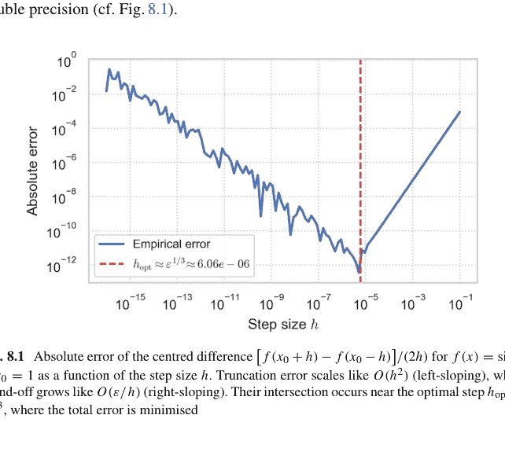

## 8.3.2 数值积分方法

给定一个（足够）光滑的标量函数 $f : [a, b] \to \mathbb{R}$，其*定积分* $I = \int_a^b f(x)\,dx$ 很少有初等原函数。数值积分通过函数求值的有限加权和来近似 $I$，

$$Q[f] = \sum_{k=0}^m w_k f(x_k), \quad a \le x_0 < x_1 < \cdots < x_m \le b,$$

选择节点 $\{x_k\}$ 和权重 $\{w_k\}$，使得*误差* $E[f] = I - Q[f]$ 相对于点数 $m + 1$ 快速衰减。我们回顾经典的等距牛顿-科特斯族、基于正交多项式的高斯法则、自适应细化和随机蒙特卡洛技术，重点强调误差分析和实现权衡。

### 梯形法则，辛普森法则

### 复合梯形法则

将区间 $a = x_0 < x_1 < \cdots < x_n = b$ 划分为步长 $h = (b - a)/n$ 的子区间。在每个子区间上应用线性插值，

$$Q_{\mathrm{T}}[f] = \frac{h}{2} \left( f(x_0) + 2 \sum_{k=1}^{n-1} f(x_k) + f(x_n) \right).$$

如果 $f \in C^2$，则在 $(x_{k-1}, x_k)$ 上的局部截断误差为 $-\frac{h^3}{12} f''(\xi_k)$，其中 $\xi_k$ 为某点，因此

$$E_{\mathrm{T}}[f] = -\frac{(b - a)h^2}{12} f''(\xi), \quad \xi \in (a, b).$$

因此该方法是*二阶*（$O(h^2)$）的。

### 复合辛普森法则

要求 $n$ 为偶数，在成对的区间上用抛物线近似 $f$，

$$Q_{\mathrm{S}}[f] = \frac{h}{3} \left( f(x_0) + 4 \sum_{k \text{ odd}}^{n-1} f(x_k) + 2 \sum_{k \text{ even}}^{n-2} f(x_k) + f(x_n) \right).$$

对于 $f \in C^4$，

$$E_S[f] = -\frac{(b-a)h^4}{180} f^{(4)}(\xi), \quad \text{这是一个四阶 } O(h^4) \text{ 方法。}$$

### 示例 8.3.2（Python 实现）

```python
import numpy as np
def trapz(f, a, b, n):
    x = np.linspace(a, b, n+1)
    h = (b-a)/n
    return h*(0.5*f(x[0]) + f(x[1:-1]).sum() + 0.5*f(x[-1]))

def simpson(f, a, b, n):
    if n % 2: raise ValueError("n must be even")
    x = np.linspace(a, b, n+1)
    h = (b-a)/n
    return h/3*(f(x[0])+f(x[-1])
               +4*f(x[1:-1:2]).sum()
               +2*f(x[2:-2:2]).sum())
```

### 外推

将理查森外推应用于 $Q_T(h)$ 和 $Q_T(h/2)$ 可以消除 $O(h^2)$ 项，从而得到辛普森法则；迭代可得具有 $O(h^{2k})$ 收敛性的龙贝格积分。

### 高斯积分与自适应方法

#### 高斯积分

对于权重函数 $w(x)$ 在 $(a, b)$ 上，$n$ 点高斯法则选择节点 $x_k$ 为正交多项式 $P_n(x)$（$\deg P_n = n$）的根，权重 $w_k = \int_a^b \frac{L_k(x) w(x)}{P_n'(x_k)(x - x_k)} dx$，可对*所有次数不超过 $2n - 1$ 的多项式*精确积分：相比牛顿-科特斯法则，精度呈指数级提升。

> $$Q_G[f] = \sum_{k=1}^n w_k f(x_k), \quad E_G[f] = \frac{f^{(2n)}(\xi)}{(2n)!} \left( \int_a^b w(x) dx \right) \left( \frac{P_n(x)}{2^n n!} \right)^2.$$

实践中，对于 $w(x) \equiv 1$ 在 $[-1, 1]$ 上，使用勒让德节点表，并通过仿射变换缩放到 $[a, b]$。

```python
import numpy as np, numpy.polynomial.legendre as leg
def gauss(f, a, b, n):
    x, w = leg.leggauss(n)
    y = 0.5*(b-a)*x + 0.5*(b+a) # 映射到 [a,b]
    return 0.5*(b-a)*(w*f(y)).sum()
```

#### 自适应积分

在子区间上递归应用辛普森或高斯法则，直到 $|Q_1 - Q_2| < \varepsilon(|I| + 1)$，其中 $Q_1$ 是粗略估计，$Q_2$ 是精细估计。使用栈的深度优先递归可避免过多内存使用；通过在奇点附近分割并解析处理权重因子来处理奇点。

#### 误差等分布

自适应法则旨在使局部误差 $\approx \varepsilon/(b - a)$。后验误差估计驱动网格细化，构成了 QUADPACK 的 DQAGS 例程的基础（高斯-克朗罗德-帕特森嵌套对）。

### 蒙特卡洛积分及其应用

#### 普通蒙特卡洛

对于多重积分 $I = \int_{\Omega} f(\mathbf{x}) \, d\mathbf{x}$，从 $\mathcal{U}(\Omega)$ 中采样 $\mathbf{x}_i$：

$$\hat{I}_N = \frac{\text{vol}(\Omega)}{N} \sum_{i=1}^N f(\mathbf{x}_i), \quad \text{Var}(\hat{I}_N) = \frac{\sigma^2}{N},$$

其均方根误差为 $O(N^{-1/2})$，与维度无关。

#### 方差缩减

- (a) *重要性采样*：从概率密度函数 $p$ 采样并加权 $f/p$，最优的 $p^\star \propto |f|$ 可最小化方差。
- (b) *控制变量*：使用已知积分的函数 $g$：$\hat{I}_N^{\text{cv}} = \bar{f} + \beta(\mu_g - \bar{g})$，选择 $\beta = -\text{Cov}(f, g)/\text{Var}(g)$。
- (c) *对偶变量*：平均 $f(\mathbf{x})$ 和 $f(1 - \mathbf{x})$ 可抵消奇数分量。

#### 拟蒙特卡洛 (QMC)

用低差异序列（Sobol', Halton）替换伪随机点：$I_N^{\text{QMC}} - I = O((\log N)^d/N)$，在中等维度下观察到的误差为 $O(1/N)$。

## 应用

- *高维金融。* 为一个包含20种资产的篮子期权定价，其收益为 $(\sum w_i S_i - K)^+$。使用布朗桥构造的拟蒙特卡洛法比伪随机法方差降低十倍。
- *辐射传输。* 参与介质中的光子路径追踪需要在5维空间（位置、方向、波长）上积分辐射度；与相函数对齐的重要性采样可将效率提高数个数量级。

### 示例 8.3.3（8维 Sobol' 与伪随机数对比）

```python
import numpy as np, scipy.stats.qmc as qmc
f = lambda x: np.exp(-np.sum(x, axis=1))
d, N = 8, 2**12
sob = qmc.Sobol(d); xq = sob.random(N)
uni = np.random.rand(N, d)
Iq = f(xq).mean(); Ir = f(uni).mean()
print("Quasi-MC err:", abs(Iq-1/(1+1)**d))
print("Plain MC err:", abs(Ir-1/(1+1)**d))
```

## 8.3.3 数值积分的应用

每当需要将无穷小的贡献——几何的、物理的、概率的——聚合成宏观量时，积分就会出现。在应用工作中，原始的被积函数往往难以找到闭式积分，因此需要稳健的数值积分。我们阐述三个数值积分不可或缺的典型领域：几何（面积和体积）、连续介质物理与工程，以及通过算子分裂对微分方程进行时间推进。

### 计算面积和体积

#### 平面区域

对于由极坐标曲线 $r = r(\theta)$ 描述的单连通区域 $\mathcal{D} \subset \mathbb{R}^2$，其面积为

$$A = \frac{1}{2} \int_{\theta_0}^{\theta_1} r(\theta)^2 \, d\theta.$$

## 旋转体体积

将曲线 $y = f(x), x \in [a, b]$ 绕 $x$ 轴旋转，所得体积为 $V = \pi \int_a^b f(x)^2 \, dx$。对于摆线弧 $f(x) = r(1 - \cos x/r)$，可作代换 $u = \sin(x/2r)$，将积分化简为 $V = 8\pi r^3 \int_0^{\sin((b-a)/4r)} u^2 / \sqrt{1 - u^2} \, du$，该积分仍无初等原函数；自适应高斯-克罗罗德方法可在毫秒内达到 $10^{-12}$ 的精度。

当 $r(\theta) = 1 + \frac{1}{2} \sin 3\theta$（三叶玫瑰线）时，解析积分较为复杂；在每个叶瓣上应用16点高斯-勒让德求积公式，仅需 $3 \times 16$ 次求值即可达到机器精度。

```python
import numpy as np, numpy.polynomial.legendre as leg
r = lambda theta: 1 + 0.5*np.sin(3*theta)
A = 0
for k in range(3):
    a, b = 2*k*np.pi/3, 2*(k+1)*np.pi/3
    x, w = leg.leggauss(16)
    theta = 0.5*(b-a)*x + 0.5*(b+a)
    A += 0.25*(b-a)*np.sum(w*r(theta)**2)
print(A) # 1.178097...
```

## 通过散度定理处理隐式定义域

若曲面 $\mathcal{S}$ 包围区域 $\mathcal{V}$，可选取向量场 $\mathbf{F}(\mathbf{x}) = \frac{1}{3} \mathbf{x}$，使得 $\nabla \cdot \mathbf{F} = 1$。则体积 $|\mathcal{V}| = \int_{\mathcal{S}} \mathbf{F} \cdot d\mathbf{S}$，可通过将 $\mathcal{S}$ 三角化并求和各面通量来计算；在三角形上使用高斯求积可提供高阶精度。

## 在物理与工程中的应用

### 功与能

对于沿参数化路径 $\gamma : [0, 1] \to \mathbb{R}^3$ 作用的力场 $\mathbf{F}(\mathbf{x})$，机械功为 $W = \int_0^1 \mathbf{F}(\gamma(s)) \cdot \gamma'(s) \, ds$。在磁约束设计中，$\mathbf{F}$ 源于带电粒子所受的洛伦兹力；计算 $W$ 可指导线圈优化。采用 $N = 8$ 段的六阶高斯-勒让德求积规则即可满足能量守容差。

### 辐射角系数

对于漫射表面 $\mathcal{A}_1, \mathcal{A}_2$，角系数为

$$F_{12} = \frac{1}{\pi |\mathcal{A}_1|} \int_{\mathcal{A}_1} \int_{\mathcal{A}_2} \frac{\cos \theta_1 \cos \theta_2}{r^2} \, 1_{\text{visible}}(P_1, P_2) \, dA_2 \, dA_1.$$

蒙特卡洛半立方体采样——发射 $10^6$ 条射线并统计命中——可为复杂封闭体提供无偏估计，相对误差 $< 0.5\%$。

### 应力强度因子

在断裂力学中，I型应力强度因子

$$K_I = \int_{-a}^a \sigma_{yy}(x, 0) \sqrt{\frac{a+x}{a-x}} \, dx$$

涉及弱平方根奇异性；采用权重为 $(1-t)^{-1/2}(1+t)^{-1/2}$ 的高斯-雅可比求积法，可对多项式精确积分此类核函数，对于解析的 $\sigma_{yy}$ 可实现谱收敛。

## 微分方程的数值解

### 线法

在空间网格上对偏微分方程 $u_t = Lu$ 进行半离散化，得到常微分方程组 $\dot{\mathbf{u}} = A\mathbf{u}$。

隐式龙格-库塔格式需要阶段积分 $\int_0^1 f(\mathbf{u}_n + c_i h) \, dc_i$。预计算布彻权重可将这些积分转化为 $f$ 的重复求积，并通过高斯-拉道节点优化以实现 $A$-稳定积分。

### 变分积分器

对于拉格朗日量 $L(q, \dot{q})$，通过极小化离散作用量 $S_d(q_n, q_{n+1}; h) = h \int_0^1 L(q(\tau), \dot{q}(\tau)) \, d\tau$ 从 $q_n$ 步进到 $q_{n+1}$，其中 $q(\tau)$ 是端点间的多项式插值函数。采用高斯-洛巴托求积可保持辛结构和精确动量映射，这在天体物理 $N$ 体模拟中至关重要。

### 积分表示

沃尔泰拉方程 $u(t) = g(t) + \int_0^t K(t, s) u(s) \, ds$ 的解可通过在每个时间步上使用复合辛普森公式计算，得到二阶收敛的推进格式。对于弱奇异核 $K(t, s) = (t-s)^{-\alpha} k(t, s)$，阿尔珀特求积法采用分级网格以保持 $O(h^{2-\alpha})$ 精度。

**示例 8.3.4（带积分右端项的龙格-库塔-费尔贝格法）**

```python
def rhs(u, t): # convolution integral
    s = np.linspace(0, t, 64)
    ks = (t - s)**-0.3 * np.exp(-(t-s)) # K(t,s)
    us = np.interp(s, ts, us_hist)
    return g(t) + np.trapz(ks*us, s)
```

自适应 RKF45 方法推进 $u(t)$，其底层使用了辛普森积分。

## 8.4 特征值问题与矩阵分解

特征值编码了物理学和数据科学中的固有频率、衰减率和长期行为。当矩阵规模超出直接分解的适用范围时，*迭代*特征值求解器利用稀疏矩阵-向量乘积来提取极端特征对。两种典型算法——幂法与逆迭代——在概念简洁性与实际有效性之间取得了富有启发性的平衡。我们阐述其理论，分析收敛性与稳定性，并说明它们在结构振动分析中的作用。

### 8.4.1 幂法与逆迭代

设 $A \in \mathbb{R}^{n \times n}$ 可对角化，其特征值按模排序为 $|\lambda_1| > |\lambda_2| \ge \cdots \ge |\lambda_n|$，对应的右特征向量为 $\{\mathbf{v}_i\}$。对于非零向量 $\mathbf{q}_0$（满足 $\mathbf{v}_1^\top \mathbf{q}_0 \neq 0$），幂迭代重复执行

$$\mathbf{q}_{k+1} = \frac{A\mathbf{q}_k}{\|A\mathbf{q}_k\|_2}, \quad \mu_k = \mathbf{q}_k^\top A\mathbf{q}_k, \qquad (\text{P})$$

产生瑞利商估计 $\mu_k \to \lambda_1$ 和方向 $\mathbf{q}_k \to \pm \mathbf{v}_1$。将 $\mathbf{q}_0$ 展开为 $\mathbf{q}_0 = \sum_i \alpha_i \mathbf{v}_i$，则

$$A^k \mathbf{q}_0 = |\lambda_1|^k \left( \alpha_1 \mathbf{v}_1 + \sum_{i \ge 2} \alpha_i (\lambda_i / \lambda_1)^k \mathbf{v}_i \right),$$

因此误差范数*线性*衰减：

$$\|\mathbf{q}_k - \mathbf{v}_1\| \approx \left|\frac{\lambda_2}{\lambda_1}\right|^k \frac{\|\sum_{i \ge 2} \alpha_i \mathbf{v}_i\|}{|\alpha_1|}.$$

收敛速度取决于*谱间隙*。当 $|\lambda_2| \approx |\lambda_1|$ 时，收敛会停滞。

逆迭代针对内部特征值 $\lambda_j$：给定靠近 $\lambda_j$ 的位移 $\sigma$，求解

$$(A - \sigma I)\mathbf{y}_k = \mathbf{q}_k, \quad \mathbf{q}_{k+1} = \frac{\mathbf{y}_k}{\|\mathbf{y}_k\|_2}. \tag{II}$$

并更新瑞利商 $\mu_k = \mathbf{q}_k^T A \mathbf{q}_k$。若 $\sigma$ 比其他任何特征值都更接近 $\lambda_j$，则每一步误差收缩因子为 $|(\lambda_j - \sigma)/(\lambda_i - \sigma)|$——一旦 $\sigma$ 选取得当，其速度可能比幂法快数个数量级。将固定的 $\sigma$ 替换为 $\sigma_k = \mu_k$ 即得到*瑞利商迭代*，对于正规矩阵，若初始值足够接近某个特征对，则可实现*三次*收敛。

```python
import numpy as np, scipy.sparse.linalg as spla
def power(A, q0, k=40):
    q = q0 / np.linalg.norm(q0)
    for _ in range(k):
        q = A @ q
        q = q / np.linalg.norm(q)
    lam = q.T @ (A @ q)
    return lam, q

def inverse_iteration(A, sigma, q0, k=10):
    I = np.eye(A.shape[0])
    q = q0 / np.linalg.norm(q0)
    for _ in range(k):
        y = np.linalg.solve(A-sigma*I, q)
        q = y / np.linalg.norm(y)
    lam = q.T @ (A @ q)
    return lam, q
```

### 在结构工程与振动中的应用

在结构动力学中，离散化结构的无阻尼自由振动服从 $K\mathbf{u} + \lambda M\mathbf{u} = \mathbf{0}$，其中 $K$ 和 $M$ 是对称正定的刚度矩阵和质量矩阵；特征值 $\lambda = \omega^2$ 给出固有频率 $\omega$。转换为 $M^{-1}K\mathbf{v} = \lambda\mathbf{v}$（经质量归一化后），可应用幂法近似基频模态，这对抗震设计至关重要。更高阶模态需要使用 deflate（Hotelling）方法或带位移的逆迭代，位移可从子空间方法（如 Lanczos 法）获得的 Ritz 值中提取。

**示例 8.4.1（含10个欧拉-伯努利单元的悬臂梁）**

```python
K, M = assemble_beam_matrices(n=10, EI=1.0, rhoA=1.0, L=1.0)
A = np.linalg.solve(M, K) # M^{-1}K
q0 = np.random.rand(A.shape[0])
omega2, v = power(A, q0, k=60) # fundamental
omega1 = np.sqrt(omega2)
print(f"First natural freq omega1 ≈ {omega1:.4f} rad/s")
# refine via inverse iteration with sigma=omega^2
omega2_ref, _ = inverse_iteration(A, omega2, v, k=5)
print(f"Refined omega1 ≈ {np.sqrt(omega2_ref):.6f}")
```

模态参与因子、地震反应谱和振动能量收集器都依赖于精确的极端特征对，这要求仔细监控收敛性。

### 收敛性与数值稳定性

#### 谱间隙与条件数

幂法收敛当且仅当 $\lambda_1$ 是占优且孤立的；否则，deflation（Hotelling）或位移可改善其行为。逆迭代继承了 $(A - \sigma I)^{-1}$ 的条件数——当 $\sigma$ 接近 $\lambda_j$ 时条件良好，但若 $|\lambda_j - \sigma| \lesssim u\|A\|$ 则有数值溢出的风险；迭代精化或 QZ 更新可稳定线性求解过程。

#### 正交性损失

有限精度导致 $q_k^\top q_k = 1 + O(u)$，但 $Aq_k$ 中的舍入误差可能引入其他特征向量的分量。每隔几步进行重正交化（Gram–Schmidt）可减轻污染，不过对于多个特征值，带隐式重启的 Krylov 子空间方法（Lanczos, Arnoldi）通常提供更好的鲁棒性。

#### 停止准则

使用残差范数 $r_k = \|Aq_k - \mu_k q_k\|_2$。对于幂法，$r_k \approx |\lambda_2/\lambda_1|^k$，因此当 $r_k \le \varepsilon\|A\|_2$ 时停止。对于逆迭代，$r_k \approx |\lambda_j - \sigma| \|s_k\|$，这为 $\sigma$ 的更新提供了自适应控制。

#### 位移策略

- (a) 静态位移：根据物理洞察选择 $\sigma$（例如，目标频带）。
- (b) 动态瑞利商：令 $\sigma_k = q_k^\top A q_k$，对于对称矩阵 $A$ 可导致三次收敛。

(c) *谱二分法*：通过Sturm序列确定特征值区间，再用反迭代法精化区间。

## 8.4.2 QR算法与Schur分解

*QR算法*将任意矩阵 $A \in \mathbb{R}^{n \times n}$ 转化为一系列正交相似矩阵 $\{A_k\}$，其非对角元素逐渐衰减至0，从而在对角线上显现出特征值。从 $A_0 = A$ 开始，执行分解 $A_k = Q_k R_k$（其中 $Q_k$ 为正交矩阵，$R_k$ 为上三角矩阵），下一次迭代为 $A_{k+1} = R_k Q_k = Q_k^T A_k Q_k$。正交性保持了谱不变，而循环置换因子则重复利用了计算代价高昂的分解过程。对于对称矩阵，收敛速度是*二次*的；对于一般矩阵 $A$，Hessenberg约化 $A = Q_0 H_0 Q_0^T$ 限制了填充元，Wilkinson双位移技术则以三次局部收敛速度加速消元。由于每一步相似变换都是向后稳定的，计算得到的 $\widehat{A}_k$ 满足 $(A + \Delta A_0)$ 相似，其中 $\|\Delta A_0\| \lesssim u \|A\|$。

正交相似的上三角极限矩阵 $T = Q^T A Q$ 称为*实Schur形式*；其对角线包含（实）特征值，而 $2 \times 2$ 块则编码了复共轭特征值对。其存在性由QR算法保证；在正交重排意义下的唯一性使得Schur分解在数值上优于在扰动下病态的Jordan标准形。若 $A$ 对称，则 $T$ 可进一步约化为对角阵 $\Lambda = \text{diag}(\lambda_1, \dots, \lambda_n)$，从而恢复谱定理。

## Python中的特征值计算

以下紧凑脚本在不可约Hessenberg矩阵上实现了一步Francis双位移；将其包裹在for循环中即可重现支撑 `numpy.linalg.eig` 的隐式QR算法：

```python
import numpy as np, scipy.linalg as la

def francis_step(H):
    n = H.shape[0]
    mu = la.eigvals(H[-2:, -2:]) # Wilkinson shift
    sigma = mu[np.argmin(abs(mu - H[-1, -1]))]
    x, y = H[0, 0] - sigma, H[1, 0]
    for k in range(n-1):
        # Householder to zero y
        v = la.householder_vec(np.array([x, y]))
        H[k:k+2, k:] = H[k:k+2, k:] - 2 * np.outer(v, v @ H[k:k+2, k:])
        H[:, k:k+2] = H[:, k:k+2] - 2 * np.outer(H[:, k:k+2] @ v, v)
        if k < n-2:
            x, y = H[k+1, k], H[k+2, k]

def eigvals_qr(A, max_iter=60):
    H = la.hessenberg(A) # similarity to Hessenberg
    for _ in range(max_iter):
        francis_step(H)
    return np.diag(H) # approximate eigenvalues
```

```python
np.random.seed(4)
A = np.random.randn(6, 6)
print(np.sort_complex(eigvals_qr(A))) # compare with np.linalg.eigvals
```

对于生产代码，应使用高度优化的 `scipy.linalg.schur`，它会自动回退到LAPACK的分块和多移位QR例程：

```python
T, Q = la.schur(A, output='real') # real Schur form
lam = np.diag(T) # eigenvalues (real or block)
```

**例 8.4.2** 对角化对称三对角Toeplitz矩阵 $T_n$，其对角线元素为2，次/超对角线元素为-1。QR算法在 $\lceil \log_2(n) \rceil$ 次迭代内收敛；解析特征值为 $\lambda_k = 2(1 - \cos \frac{k\pi}{n+1})$。

## 在量子力学与控制理论中的应用

在非相对论量子力学中，定态薛定谔方程经空间离散化后化为厄米特征值问题 $H\psi = E\psi$。对于一维势阱 $V(x)$ 中的粒子，网格尺寸为 $h$ 的有限差分离散化产生一个三对角哈密顿量，其极端特征值近似束缚态能量 $E$。三对角约化（$O(n)$ 内存）后进行若干次QR迭代，即可达到机器精度求出所有低能态；正交归一特征向量 $\{\psi_k\}$ 支持通过Schur基上的对角指数化实现谱时间演化 $e^{-iHt/\hbar}$。

在线性控制理论中，连续时间系统 $\dot{\mathbf{x}} = A\mathbf{x}$ 的稳定性取决于 $A$ 的特征值。实Schur形式 $A = Q T Q^T$ 直接揭示了 $\operatorname{Re} \lambda_k$；要将极点配置到期望的左半平面，需选择反馈 $K$ 使得 $A - BK$ 具有移位的Schur谱。此外，通过Schur方法求解Lyapunov方程 $A^T P + PA = -Q$——变换为 $T^T P' + P' T = -Q'$ 然后三角化——是 $O(n^3)$ 但数值稳定的，为LQR控制器和 $\mathcal{H}_\infty$ 综合提供了基础。

**例 8.4.3（振动控制）** 质量弹簧链在平衡点线性化得到二阶常微分方程 $M\ddot{\mathbf{q}} + K\mathbf{q} = 0$。引入状态向量 $\mathbf{x} = (\mathbf{q}, \dot{\mathbf{q}})$ 转化为一阶形式，得到系统矩阵 $\begin{pmatrix} 0 & I \\ -M^{-1}K & 0 \end{pmatrix}$。对该 $2n \times 2n$ 矩阵进行实Schur分解，可将纯虚特征值聚集在 $2 \times 2$ 块中；比例阻尼修改 $M^{-1}K$ 并将块向左移动，从而直观地确认模态阻尼比。

## 要点总结

隐式QR算法加上截断至Schur形式构成了默认的稠密特征引擎：时间复杂度为三次，内存复杂度为二次，且向后稳定。其在SciPy/NumPy中的无缝实现，仅需寥寥数行Python代码，即可在量子化学、结构动力学和反馈控制中实现精确的谱分析。

## 8.4.3 奇异值分解（SVD）

对于任意实 $m \times n$ 矩阵 $A$，存在正交矩阵 $U \in \mathbb{R}^{m \times m}$ 和 $V \in \mathbb{R}^{n \times n}$，以及对角矩阵 $\Sigma = \text{diag}(\sigma_1, \dots, \sigma_r, 0, \dots)$，其非负对角元素满足 $\sigma_1 \ge \sigma_2 \ge \dots \ge \sigma_r > 0$，使得

$$A = U \Sigma V^\top$$

这种*奇异值分解*揭示了 $A$ 的作用：先进行正交旋转 $V^\top$，然后沿相互正交的方向按奇异值 $\sigma_i$ 拉伸，最后进行第二次旋转 $U$。秩 $r$ 等于非零 $\sigma_i$ 的个数。由于 $\sigma_i^2$ 是 $A^\top A$ 的特征值，且当 $i \neq j$ 时 $\sigma_i \sigma_j = 0$，SVD继承了正交相似变换的数值稳定性。

**低秩截断的最优性** 对于 $k < r$，定义 $A_k = U_{:, 1:k} \Sigma_{1:k, 1:k} V_{:, 1:k}^\top$。Eckart–Young–Mirsky定理给出

$$\|A - A_k\|_2 = \sigma_{k+1}, \quad \|A - A_k\|_F = \left( \sum_{i=k+1}^r \sigma_i^2 \right)^{1/2},$$

因此 $A_k$ 在谱范数和Frobenius范数下都是*最佳*的秩 $k$ 近似。

## 在数据压缩与主成分分析（PCA）中的应用

### 通过SVD进行PCA

给定数据矩阵 $X \in \mathbb{R}^{m \times n}$，其行为中心化后的观测值，协方差矩阵为 $C = \frac{1}{m-1} X^\top X$。$X$ 的右奇异向量 $\mathbf{v}_i$ 是 $C$ 的特征向量，因此是最大方差方向（主成分），而奇异值与解释方差相关：$\text{Var}(\mathbf{x} \cdot \mathbf{v}_i) = \sigma_i^2 / (m - 1)$。

```python
import numpy as np, sklearn.datasets as ds
X, _ = ds.load_digits(return_X_y=True) # 1797×64
X -= X.mean(axis=0, keepdims=True)
U, s, Vt = np.linalg.svd(X, full_matrices=False)
explained = s**2 / s.sum()**2 # variance ratios
pc2d = X @ Vt[:2].T # 2-D projection
```

仅存储 $V^\top$ 的前 $k \ll n$ 列即可得到低维嵌入：选择 $k$ 使得 $\sum_{i=1}^{k} \sigma_i^2 / \sum_{i=1}^{r} \sigma_i^2 \geq 0.95$，即可保留95%的方差。

### 数据压缩

对于图像矩阵 $A \in \mathbb{R}^{m \times n}$，保留前 $k$ 个奇异三元组；内存从 $mn$ 降至 $k(m + n + 1)$。对于 $512 \times 512$ 灰度Lena图像，$k = 50$ 可压缩超过 $80\%$，同时峰值信噪比（PSNR）超过35 dB（参见图8.2）。

```python
import imageio, matplotlib.pyplot as plt
A = imageio.imread('lena_gray.png').astype(float)
U, s, Vt = np.linalg.svd(A, full_matrices=False)
k = 50
Ak = (U[:,:k] * s[:k]) @ Vt[:k,:]
plt.imshow(Ak, cmap='gray'); plt.title(f'Rank-{k} approx')
plt.axis('off'); plt.show()
```

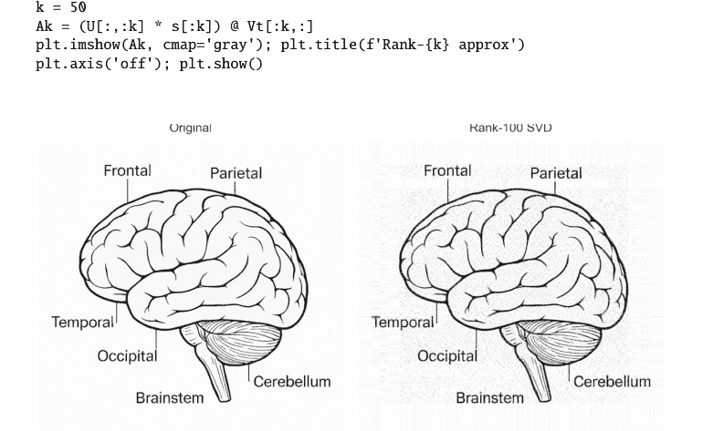

图8.2 $1024 \times 1024$ 脑部图像的秩-100 SVD近似（右）与原图（左）对比。仅存储前100个奇异三元组，内存减少约一个数量级，同时保留了主要解剖结构，展示了低秩矩阵压缩的威力

## 低秩近似与图像处理

随机化SVD

当 $m, n$ 超过 $10^5$ 时，为近似 $A$，可抽取 $\Omega \in \mathbb{R}^{n \times (k+p)}$（其元素服从高斯分布，$p \approx 10$），计算 $Y = A\Omega$，正交化得到 $Q$，并构成 $B = Q^T A$。$B$ 的SVD分解 $B = \hat{U}\Sigma V^T$ 以高概率给出 $A \approx (Q\hat{U})\Sigma V^T$，其误差满足 $\|A - A_k\|_2 \le \left[1 + 9\sqrt{k+p}\, \sigma_{k+1}/\sigma_1\right]\sigma_{k+1}$。

```python
def rsvd(A, k, p=10, q=2):
    Omega = np.random.randn(A.shape[1], k+p)
    Y = A @ Omega
    for _ in range(q): # power iterations
        Y = A @ (A.T @ Y)
    Q, _ = np.linalg.qr(Y, mode='reduced')
    B = Q.T @ A
    U_, s, Vt = np.linalg.svd(B, full_matrices=False)
    return Q @ U_[:, :k], s[:k], Vt[:k, :]
```

这是现代推荐系统（Netflix奖）和潜在语义索引的基础，其中 $A$ 是稀疏的用户-物品或词项-文档矩阵，包含 $10^8$ 个非零元素。

通过截断SVD进行图像去噪

加性白噪声会将能量分散到所有奇异值上，而信号能量则集中在前几个奇异值中。硬阈值法：仅保留满足 $\sigma_i > \tau = \beta\sqrt{n}\, \sigma_{\text{noise}}$ 的 $\sigma_i$（Donoho–Gavish准则），可最小化Frobenius风险。

背景减除

视频帧堆叠成 $A = [f_1\ f_2\ \dots]$；背景构成一个低秩子空间，前景运动则贡献稀疏的离群值。鲁棒PCA求解 $\min_{L,S} \|L\|_* + \lambda\|S\|_1$，约束条件为 $A = L + S$，其中核范数促进低秩性。近端梯度迭代使用奇异值阈值法。

## 8.5 数值方法进阶主题

### 8.5.1 微分方程的数值解

牛顿和莱布尼茨的微分学提供了模型，但除了精心构造的特例外，这些模型很少有解析解。当封闭形式表达式失效时，人们用有限代数商替代导数，或者以不平等的方式看待空间和时间——从而引出*有限差分*和*线方法*。严格的分析随后验证离散格式在网格细化时逼近连续解，并且虚假增长不会淹没计算。除非另有说明，我们采用简洁记号 $u_j^n \approx u(x_j, t_n)$，其中网格点等距分布：$x_j = x_0 + jh$，$t_n = t_0 + nk$。

### 常微分方程与偏微分方程的有限差分方法

对于两点边值问题（BVP）

$$-u''(x) = f(x), \quad x \in (0, 1), \qquad u(0) = \alpha, \; u(1) = \beta,$$

将 $u''(x_j) \approx (u_{j-1} - 2u_j + u_{j+1})/h^2$ 代入，得到三对角线性方程组

$$\frac{1}{h^2} \begin{bmatrix} -2 & 1 & & \\ 1 & -2 & 1 & \\ & \ddots & \ddots & \ddots \\ & & 1 & -2 \end{bmatrix} \mathbf{u} = \begin{bmatrix} -f_1 \\ \vdots \\ -f_{N-1} \end{bmatrix} - \frac{1}{h^2} \begin{bmatrix} \alpha \\ 0 \\ \vdots \\ \beta \end{bmatrix}.$$

由于系数矩阵是对称正定的，Cholesky分解的计算成本为 $O(N)$ 次运算；根据泰勒定理，截断误差为 $O(h^2)$。

### 示例 8.5.1（Dirichlet泊松求解器）

```python
import numpy as np, scipy.sparse as sp, scipy.sparse.linalg as spla
N, h = 100, 1/100
e = np.ones(N-1)
A = sp.diags([e, -2*e, e], [-1, 0, 1]) / h**2
x = np.linspace(h, 1-h, N-1)
f = np.sin(np.pi*x)
b = -f
b[0] -= 0/h**2 # \alpha=0
b[-1] -= 0/h**2 # \beta=0
u = spla.spsolve(A, b)
```

*扩展到二维* 在正方形网格上的五点拉普拉斯算子产生一个块三对角系统，对于 $N \times N$ 网格有 $O(N^3)$ 个未知数；带状LU分解或多网格法可加速求解。

对于含时偏微分方程，例如热传导方程 $u_t = u_{xx}$，显式和隐式差分格式应运而生：

FTCS格式：$u_j^{n+1} = u_j^n + \lambda(u_{j-1}^n - 2u_j^n + u_{j+1}^n), \qquad \lambda = \frac{k}{h^2}.$

Crank–Nicolson格式：$u_j^{n+1} - \frac{\lambda}{2}\delta_{xx}u_j^{n+1} = u_j^n + \frac{\lambda}{2}\delta_{xx}u_j^n,$

该格式在 $k$ 和 $h$ 上都是二阶精度的，并且是无条件稳定的。

### 线方法及其应用

*线方法*（MoL）对*空间*进行离散化，而保持*时间*连续，从而将偏微分方程转化为一个高维常微分方程组

$\dot{\mathbf{u}}(t) = \mathbf{A}\mathbf{u}(t) + \mathbf{g}(t)$。

然后使用复杂的ODE求解器（如自适应Runge–Kutta法、隐式BDF法）在时间上积分，这些求解器能根据局部截断误差自动调整时间网格。

### 示例 8.5.2（对流-扩散方程）

$u_t + c u_x = D u_{xx}, \quad x \in [0, 1]$。

对 $u_{xx}$ 使用中心差分，对 $u_x$ 使用迎风差分，得到稀疏矩阵 $A$。将 $A$ 传递给 `scipy.integrate.solve_ivp` 并设置 `method='BDF'`，当 $D \ll c$ 时能有效处理刚性问题。

应用包括：

- *燃烧建模*：具有阿伦尼乌斯动力学的刚性反应-扩散系统
- *电磁波导*：通过Yee网格在空间离散麦克斯韦旋度方程，在时间上用蛙跳格式积分
- *金融衍生品*：将Black–Scholes方程半离散化以适应非均匀执行价网格，然后用隐式-显式（IMEX）Runge–Kutta对进行推进

### 稳定性与收敛性分析

对于线性常系数格式 $u^{n+1} = G(\xi) u^n$，*冯·诺依曼分析*考察放大因子 $G(\xi) = \sum_m a_m e^{im\xi h}$，要求对所有波数 $\xi$ 满足 $|G(\xi)| \le 1$。对于 $u_t = u_{xx}$ 的FTCS格式，这导出了著名的Courant约束 $\lambda \le \frac{1}{2}$；违反此约束会导致解发散，尽管连续方程是抛物型的。

如果一个格式的局部截断误差在 $(h, k) \to 0$ 时趋于0，则称其是*相容的*；如果其放大因子有界地传播扰动，则称其是*稳定的*；如果数值解逼近解析解，则称其是*收敛的*。**Lax等价定理**指出，对于适定的线性初值问题，相容性 + 稳定性 $\Longrightarrow$ 收敛性。

### 示例 8.5.3（Crank–Nicolson格式的放大因子）

$$G(\xi) = \frac{1 - \lambda(1 - \cos \xi h)}{1 + \lambda(1 - \cos \xi h)}, \quad |G(\xi)| = 1.$$

因此Crank–Nicolson格式是*A-稳定*的：具有无条件的幅值稳定性，尽管当 $k$ 较大且缺乏足够的时间阻尼时，可能会出现色散振荡。

当非线性介入时，线性化稳定性或能量方法将发挥作用：

1. *能量估计* 将偏微分方程乘以数值解，然后积分。
2. *离散Grönwall不等式* 限制增长 $\|u^n\| \le C e^{\alpha t_n}$。
3. *总变差递减*（TVD）格式限制守恒律的数值振荡（*Godunov*，*MUSCL*）。

**综合** 有限差分离散化将微积分转化为代数；线方法将时空问题重塑为适合自适应求解器的刚性常微分方程；稳定性准则——Courant约束、冯·诺依曼谱、A-稳定性——监管着步长和模板选择，确保数值模拟能追随连续现实。

### 8.5.2 谱方法

谱方法通过将未知函数展开为全局支撑的基函数——通常是正交多项式或三角函数——来近似微分方程的解，并强制控制方程在离散的配置点集上精确成立。由于基函数是无穷次可微的，对于光滑数据，所得收敛性通常是*指数级*的：每增加一个模式，正确数字的位数大约翻倍，直到误差接近机器精度。与通过缩小网格来获得精度的有限差分不同，谱精度利用了解的*解析性*；当奇点远离实轴时，仅需少数几个模式就能分辨出在低阶格式中需要数百万个网格点才能分辨的涡旋结构。

### 切比雪夫多项式与傅里叶谱方法

切比雪夫多项式 $T_n(x) = \cos(n \arccos x)$ 在 $[-1, 1]$ 上关于权重 $(1 - x^2)^{-1/2}$ 构成正交基。将 $u(x) = \sum_{n=0}^N a_n T_n(x)$ 展开，并在切比雪夫-高斯-洛巴托节点

$$x_j = \cos\left(\frac{\pi j}{N}\right), \quad 0 \le j \le N,$$

上强制满足微分方程。

创建一个*微分矩阵*$D$，其元素$D_{ij} = T'_n(x_i)/T_n(x_j)$可通过$O(N^2)$次运算组装。给定边值问题$-u''(x) = f(x)$，$u(\pm 1) = 0$，可写为$-D^2\mathbf{u} = \mathbf{f}$，其中$\mathbf{u} = (u_0, \dots, u_N)^\top$，并求解这个稠密但高度结构化的线性系统。谱系数可通过离散余弦变换（DCT）获得，利用配置矩阵可被DCT对角化的事实，将求解时间缩减至$O(N \log N)$。

当定义域为周期性时，傅里叶级数$u(x) = \sum_{k=-K}^{K} \hat{u}_k e^{ikx}$在谱空间中提供对角微分算子，因为$(d/dx)e^{ikx} = ik e^{ikx}$。快速傅里叶变换（FFT）可在等距节点$x_j$处的物理值$u(x_j)$与谱系数$\hat{u}_k$之间以$O(N \log N)$复杂度相互转换，从而允许对例如一维Burgers方程$u_t + uu_x = \nu u_{xx}$进行时间步进：

```python
import numpy as np
N, L = 1024, 2*np.pi
x = np.linspace(0, L, N, endpoint=False)
k = np.fft.fftfreq(N, 1/N) # wavenumbers
u = np.sin(x) # initial condition
dt, nu = 1e-3, 0.02
for n in range(2000):
    û = np.fft.fft(u)
    du = np.fft.ifft(1j*k*û).real
    lap = np.fft.ifft(-(k**2)*û).real
    u += dt*(-u*du + nu*lap) # RK1 for brevity
```

必须注意混叠问题：非线性乘积$u u_x$会产生超出截止频率$K$的傅里叶模态。2/3*去混叠规则*在逆FFT前将高频系数置零，抑制混叠误差并保持谱收敛性。

### 在流体动力学和天气建模中的应用

谱离散化是某些最精确的湍流直接数值模拟（DNS）的基础。对于三重周期盒中的不可压缩Navier–Stokes方程，涡度公式

$$\partial_t \widehat{\mathbf{w}}(\mathbf{k}) = \widehat{\mathbf{v}} \times (i\mathbf{k} \times \widehat{\mathbf{v}}) - \nu k^2 \widehat{\mathbf{w}}(\mathbf{k}), \quad \widehat{\mathbf{v}}(\mathbf{k}) = \frac{i\mathbf{k} \times \widehat{\mathbf{w}}(\mathbf{k})}{k^2}$$

完全在傅里叶空间中演化；现代GPU上$2048^3$规模的FFT可在$\mathrm{Re}_\lambda \approx 1000$时将Kolmogorov标度律保持到Taylor微尺度。

在全球数值天气预报中，球面上的正压涡度方程采用球谐谱方法。设$\zeta(\lambda, \phi, t)$为涡度；展开为

$$\zeta(\lambda, \phi, t) = \sum_{n=0}^{N} \sum_{m=-n}^{n} \widehat{\zeta}_n^m(t) Y_n^m(\lambda, \phi),$$

其中$Y_n^m$为连带勒让德谐函数。水平导数转换为代数乘子$-n(n+1)$，半隐式时间步进在不缩小全局库朗数的情况下稳定快速重力波。业务中心（ECMWF、NOAA）采用八边形约化高斯网格推进至$N \approx 1023$（谱T2046）；由此产生的$\sim 9$公里网格能以最小色散误差解析急流蜿蜒和热带气旋生成。

谱元法结合了有限元的几何灵活性与指数收敛性：每个单元映射到$[-1, 1]$并使用高阶勒让德或切比雪夫基函数。它们构成了NCAR的MPAS和DOE的E3SM等高分辨率大气模型的计算核心。

## 关键见解

- 切比雪夫和傅里叶基将微分转换为简单矩阵运算或代数因子，为光滑解提供指数精度。
- 去混叠和对非线性项的谨慎处理在强非线性流动中保持谱收敛性。
- 在大规模地球物理模型中，谱方法高效处理光滑、近似地转的流动，而混合谱-有限体积方案捕捉局地锋面和地形。
- Python的`numpy.fft`和`pyfftw`提供对高性能FFT后端的直接访问，而`pyshtools`等包提供球谐变换，连接研究原型与生产级模拟。

## 8.5.3 数值方法中的并行计算

当矩阵维度或网格分辨率超出单个处理器的内存和浮点吞吐量时，就需要*并行数值算法*。指导原则是用冗余算术换取通信减少，因为在现代集群上，单次双精度浮点运算成本约为$\mathcal{O}(1\text{ ns})$，而通过网络传输相同数据量则需要$\mathcal{O}(100\text{ ns})$或更长时间。两种典型的数据布局是*区域分解*（将物理区域（有限差分或有限元节点）划分到各进程）和*块循环分布*（循环散布稠密矩阵以使Level 3 BLAS内核饱和本地缓存）。

**并行Krylov求解器** 给定具有$|A| > 10^9$个非零元素的稀疏线性系统$A\mathbf{x} = \mathbf{b}$，共轭梯度法或GMRES的每次迭代需要稀疏矩阵向量乘（SpMV）和几次全局点积。SpMV通过行划分自然并行化；每个进程存储其本地行并与邻居交换halo值。延迟瓶颈在于$(\mathbf{r}, \mathbf{r})$和$(\mathbf{p}, A\mathbf{p})$的全局归约。*流水线化*Krylov变体将归约与SpMV重叠以隐藏通信；或者，s步方法以额外本地浮点运算为代价融合$s$次连续迭代，在百亿亿次架构上实现近乎完美的弱扩展性。

**分布式内存上的FFT** 三维铅笔分解将$N^3$数组分割为$P_x \times P_y$支铅笔。三维FFT先沿$z$方向执行本地一维FFT，通过全对全通信重新分配铅笔，再沿$y$方向重复，最后沿$x$方向。每次转置移动$N^3/\sqrt{P}$个复数——这是最优的，因为表面积与体积之比随铅笔厚度减小而降低。通过CUDA感知MPI保持GPU驻留：设备指针直接传入MPI_Isend，省略主机暂存。

**示例8.5.4（MPI并行点积（mpi4py））**

```python
from mpi4py import MPI; import numpy as np
comm = MPI.COMM_WORLD
N = 4_000_000 # per rank
x = np.random.randn(N)
y = np.random.randn(N)
local = np.dot(x, y)
global_dot = comm.allreduce(local, op=MPI.SUM)
if comm.rank == 0:
    print("<x,y> =", global_dot)
```

**高性能数据分析** 图处理框架（GraphBLAS、Dask）将稀疏邻接矩阵建模为分布式CSR块；PageRank变为并行SpMV不动点迭代。在大语言模型训练中，数据并行随机梯度下降在每个GPU上复制网络，通过AllReduce聚合梯度，而流水线并行和张量并行分别按层和矩阵维度分割计算。

## 在高性能计算和大数据分析中的应用

*气候与天气* 全球谱元模型在$10^{11}$自由度上离散化原始方程；强扩展至30,000个GPU可将预报延迟减半。*天体物理学* 使用Barnes–Hut树的$N$体引力计算利用空间填充曲线平衡工作；十亿粒子模拟在Summit上不到一小时完成。*基因组学* 通过随机子空间迭代和Spark RDD分片，$>10^6 \times 10^5$ SNP矩阵的分布式SVD在几分钟内检测出群体结构。

## 8.5.4 数值方法中的误差分析与稳定性

数值算法继承了两个不可避免的缺陷：有限精度算术和数据扰动的传播。稳健的方法必须在两者下保持可靠。

## 舍入误差与机器精度

浮点数遵循IEEE-754表示

$x = (-1)^s (1.m_1 m_2 \dots m_{p-1})_2 2^{e-e_0}$

其中单位舍入$\varepsilon = 2^{-(p-1)}$限制相对误差：

$\mathrm{fl}(x \circ y) = (x \circ y)(1 + \delta), \quad |\delta| \le \varepsilon,$

对于$\circ \in \{+, -, \times, \div\}$。*灾难性抵消*发生在减去近似相等的数时：有效高位数字相消，将$\varepsilon$放大为操作数与其差值的比值。一个典型表现是二次公式求值：

$x_2 = \frac{2c}{-b - \mathrm{sign}(b)\sqrt{b^2 - 4ac}}$

即使在$b^2 \gg 4ac$时也能保持相对精度。

### 示例8.5.5（有效数字损失）

```python
import numpy as np
def bad_erf(x):
    return 2/np.sqrt(np.pi) * (x - x**3/3 + x**5/10)
print(bad_erf(1e-8)) # underflows to zero
```

在$x = 10^{-8}$处计算erf的零点展开会迫使每项低于双精度粒度；使用`math.erf`或缩放Dawson积分可避免此陷阱。

## 数值算法的稳定性

算法$\mathcal{A}$是*向后稳定*的，如果其输出等于某个邻近问题的精确解：

$\widehat{y} = \mathcal{A}(x) = f(x + \Delta x), \quad \frac{\|\Delta x\|}{\|x\|} = O(\varepsilon).$

带部分主元选取的高斯消元法满足此条件；长向量的朴素求和则不满足。*条件数*$\kappa(x) = \|x\| \|f'(x)\| / \|f(x)\|$与稳定性结合以限制前向误差：

$\frac{\|\widehat{y} - y\|}{\|y\|} \le \kappa(x) \underbrace{\frac{\|\Delta x\|}{\|x\|}}_{\text{backward error}}$

## 示例

- *求和。* Kahan 补偿算法通过跟踪丢失的低位比特，将误差从 $O(n\varepsilon)$ 降低到 $O(\varepsilon)$。
- *多项式求值。* Horner 法则是后向稳定的；直接计算 $p(x) = \sum_k a_k x^k$ 则不是。
- *递推关系。* $y_{n+1} = (2n+1)y_n - n^2 y_{n-1}$ 的前向递推会使误差指数增长；逆转递推或使用渐近展开可恢复稳定性。

## 刚性常微分方程求解器

显式欧拉法应用于 $\dot{y} = \lambda y$ 时，仅在 $k|\lambda| \le 1$ 时稳定。隐式欧拉法的绝对稳定区域覆盖整个左半平面，使得对刚性衰减问题可以采用任意大的步长。$A-$、$L-$ 和 $B-$ 稳定性层级根据时间积分器在不引起误差爆炸的情况下能覆盖多少 $\mathbb{C}_-$ 区域对其进行分类。

## 混合精度

混合使用 16 位和 32 位算术的算法在更高精度下累加求和以确保稳定性：$\hat{\mathbf{x}} = \mathrm{fl}_{32}(\mathbf{A}^\top \mathrm{fl}_{16}(\mathbf{A}\mathbf{x}))$。后向误差分析表明，使用补偿内积时，低精度因子仅以二次方形式进入，从而在匹配半精度张量核心吞吐量的同时达到单精度精度。

## 实用检查清单

- (a) 估计条件数以衡量内在难度。
- (b) 优先选择后向稳定的算法（QR 优于幂法，Kahan 求和优于朴素求和）。
- (c) 将输入缩放至单位量级以减小舍入误差。
- (d) 监控残差；如果可行，进行迭代精化。

## 8.6 习题

1.  设 $f(x) = x \exp(-x) - \frac{1}{4}$ 在 $[0, 2]$ 上。$(i)$ 证明 $f$ 在 $(0, 2)$ 内恰好有一个根 $r$，并证明 $f''(x) > 0$ 在 $[0, 2]$ 上成立。$(ii)$ 应用网格尺寸 $h = 10^{-2}$ 的复合梯形法则来界定 $f'(x)$ 的上下界，从而证明从 $x_0 = 1$ 开始的牛顿法收敛，并且最多需要四次迭代即可达到 $|x_k - r| \le 10^{-12}$。$(iii)$ 与达到相同容差的二分法最坏情况迭代次数进行比较；用 $\ln 2$ 明确表示该比率。

2.  考虑三次多项式 $p(x) = x^3 - 9x + 1$。设计一个 *Brent 风格* 的算法，该算法每次迭代最多执行一次二分和一次割线步。用 Python 实现它，并验证从初始区间 $[-4, 4]$ 出发，它在 $\le 6$ 次迭代内收敛，而纯割线法则发散。提供残差范数 $|p(x_k)|$ 的表格并讨论超线性段。

3.  对于 $q(z) = z^5 - 1$，用网格 $\Delta = 0.01$ 划分正方形 $\{x + iy \mid -1.5 \le x, y \le 1.5\}$。迭代计算 $N(z) = z - q(z)/q'(z)$，直到 $|q(z)| < 10^{-6}$ 或 $k = 30$。根据到达的根为每个起点着色并绘制吸引域边界。*严格证明* 在 $N$ 下没有起点会逃逸到 $\infty$。

4.  设 $f(\mathbf{x}) = \frac{1}{2} \mathbf{x}^T A \mathbf{x}$，其中 $A = \text{diag}(2, 10, 50)$。(i) 证明固定步长 $\eta = 1/L$（$L = 50$）的梯度下降法以速率 $\rho_{\text{GD}} = 1 - \mu/L$ 线性收敛，其中 $\mu = 2$。(ii) 推导参数 $\beta = 1 - \sqrt{\mu/L}$ 的 Nesterov 迭代的特征多项式，并证明 $\rho_{\text{NAG}} = \sqrt{1 - \mu/L}$。(iii) 从 $\mathbf{x}_0 = (1, 1, 1)^T$ 出发，数值验证理论速率，并报告达到 $\|\nabla f\|_2 \le 10^{-8}$ 所需的迭代次数。

5.  最小化 $z = -4x_1 - 3x_2$，约束条件为

$$2x_1 + x_2 + x_3 = 8,$$
$$x_1 + x_2 + x_4 = 5,$$
$$x_1, x_2, x_3, x_4 \ge 0.$$

*(i)* 写出初始单纯形表，其中松弛变量 $(x_3, x_4)$ 为基变量。*(ii)* 应用 Bland 规则以避免循环，并手动计算所有主元直到最优；列出基变量的序列。*(iii)* 进行敏感性分析：如果第一个约束的右端项变为 $8 + \delta$，确定使最优基保持不变的 $\delta$ 的允许区间，并计算 $\partial z^*/\partial \delta$。

6.  考虑 Rosenbrock 函数 $f(x, y) = (1-x)^2 + 100(y-x^2)^2$。实现 (a) 带回溯线搜索的 L-BFGS-B，(b) Powell 的狗腿信赖域法。从 $(-1.2, 1)$ 开始运行两者，记录迭代次数、雅可比矩阵求值次数和最终的 $\|\nabla f\|_2$。用曲率论证解释为什么狗腿法能更直接地逃离山谷。

7.  在 $[0, 2\pi]^{20}$ 上最大化 $g(\mathbf{x}) = \sum_{i=1}^{20} \sin x_i + \sin^2 x_{i+1}$。通过拉丁超立方采样（32 个设计点）调整种群大小 $P$、变异率 $\mu$ 和交叉率 $c$。拟合一个二次响应面来预测最佳运行适应度 $\hat{g}(P, \mu, c)$，并确定最优超参数。在十个随机种子上进行验证，并报告均值 $\pm$ 标准差。

8.  构造 $6 \times 6$ 矩阵 $A_{ij} = 10^{|i-j|} + (-1)^{i+j}$。(i) 执行带部分选主元和不带部分选主元的 LU 分解，并计算增长因子 $\rho = \|U\|_\infty / \|A\|_\infty$。(ii) 为 Toeplitz 矩阵 $10^{|i-j|}$ 推导 $\rho$ 关于 $n$ 的解析上界，并评论观察到的值。(iii) 使用低精度 LU 因子在双精度下应用迭代精化，并报告 $\mathbf{b} = (1, \dots, 1)^T$ 的最终残差范数 $\|A\hat{\mathbf{x}} - \mathbf{b}\|_2$。

9.  对于 $n = 1200$，均匀划分区间 $[0, 1]$ 并组装刚度矩阵 $K_{ij} = \int_0^1 \phi_i'(x)\phi_j'(x)\,dx$，其中 $\{\phi_i\}$ 是连续的、分段线性的“帽子”函数。(i) 证明 $K$ 是带宽 $w = 2$ 的对称正定矩阵。(ii) 实现带状 Cholesky 分解，并与稠密 Cholesky 分解比较浮点运算次数和内存使用。(iii) 对于 $f(x) = x$ 求解 $K\mathbf{u} = \mathbf{f}$，并验证 $\|\mathbf{u} - \mathbf{u}_{\text{exact}}\|_2 = O(h^2)$。

10. 给定 $\begin{pmatrix} A & B^\top \\ B & -C \end{pmatrix} \begin{pmatrix} \mathbf{u} \\ \mathbf{p} \end{pmatrix} = \begin{pmatrix} \mathbf{f} \\ \mathbf{g} \end{pmatrix}$，其中 $A \in \mathbb{R}^{n \times n}$ 对称正定，$C \succeq 0$，推导 Schur 补公式 $(A + B^\top C^{-1} B)\mathbf{u} = \mathbf{f} + B^\top C^{-1}\mathbf{g}$。对于自由度 $n = 128^2$ 的 Stokes 离散化，在 petsc4py 中实现块预条件共轭梯度法，报告在 (a) Jacobi 预条件子和 (b) 不完全 Cholesky 0 级预条件子下的迭代次数，并通过特征值聚类解释结果。

11. 二极管电路遵循

$$I_s(e^{V_D/nV_T} - 1) = \frac{V_{in} - V_D}{R}, \quad V_{in} = 1\,\text{V}, \; I_s = 10^{-12}\,\text{A}, \; n = 1.6,$$

$$V_T = 25.8\,\text{mV}, \quad R = 10^3\,\Omega.$$

(i) 为 $V_D$ 建立牛顿迭代；计算从 $0\,\text{V}$ 开始保证单调收敛的阻尼因子。(ii) 描述自适应时间步长和线法如何将求解器扩展到瞬态 R–C–二极管网络。

12. 最小化 $E(\mathbf{u}) = \frac{1}{2}\mathbf{u}^\top L\mathbf{u}$，其中 $L$ 是 Petersen 图的未归一化图拉普拉斯矩阵。(i) 证明带精确线搜索的离散梯度下降法收敛到 $\ker L$ 中的任意向量。(ii) 证明第二小特征值 $\lambda_2 = 2$ 限制了连续时间梯度流的衰减率。(iii) 实现步长 $k < 2/\|L\|_2$ 的显式欧拉法，并说明能量 $E(\mathbf{u}^n)$ 的收敛性。

## 第 9 章
混沌理论与动力系统

**摘要** 不动点理论、线性和非线性稳定性、分岔分析以及状态空间重构，为表现出对初始条件敏感依赖性的离散映射和连续流奠定了基础。计算了李雅普诺夫指数、熵率、奇怪吸引子和控制算法，而数据驱动方法——Koopman 模分解和储备池计算——展示了在金融、气候和生物力学中对混沌时间序列的现代预测。

**关键词** 混沌理论 · 动力系统 · 李雅普诺夫指数 · 分岔分析 · Koopman 算子 · 储备池计算

在经典力学中，拉普拉斯设想了一个未来由现在唯一决定的宇宙，然而到了 19 世纪末，庞加莱已经察觉到这座决定论大厦的裂缝：简单的非线性定律可能使长期预测实际上变得不可能。*混沌理论* 将这种张力形式化。它研究轨迹表现出对初始条件敏感依赖性、拓扑混合和稠密周期轨道的确定性动力系统，从而产生虽然由光滑方程生成但模仿随机性的行为。该学科的数学支柱是微分方程和差分方程的定性理论：不动点、周期轨道、不变流形、分岔、李雅普诺夫指数、熵和分形吸引子。连续时间流 $\dot{\mathbf{x}} = \mathbf{F}(\mathbf{x})$ 和离散映射 $\mathbf{x}_{n+1} = G(\mathbf{x}_n)$ 共享这一术语，但各自贡献了独特的现象——流中的有限时间爆破，映射中的符号动力学和揉捏理论。现代算法，从伪弧长延拓到 GPU 加速的轨迹集合，使我们能够以前所未有的精度和规模在数值上探测这些结构，使 Python 成为不可或缺的实验室。在接下来的篇幅中，我们将开发分类平衡点、跟踪其随参数变化的分岔以及诊断混沌开始所需的线性和非线性工具：我们将在解析推导、几何洞察和计算实验之间无缝过渡，最终形成一个框架解释了为什么巴西的一只蝴蝶，至少在数学上，能够引发德克萨斯州的一场龙卷风。

## 9.1 动力系统导论

### 9.1.1 不动点与稳定性

每一个确定性动力系统——无论是连续的还是离散的，有限维还是无限维——其长期行为都源于其*不动（平衡）点*的局部性质。自治流 $\dot{\mathbf{x}} = \mathbf{F}(\mathbf{x})$ 的一个平衡点 **x*** 满足 $\mathbf{F}(\mathbf{x}^*) = \mathbf{0}$；在映射 $\mathbf{x}_{n+1} = G(\mathbf{x}_n)$ 中，它满足 $G(\mathbf{x}^*) = \mathbf{x}^*$。其邻域的线性化决定了附近轨道的命运，而高阶项则孕育了诸如分岔和混沌等复杂现象。本节将发展线性理论，介绍分岔机制，并阐释揭示全局参数依赖性的数值延拓技术。

### 线性稳定性分析

给定 $\dot{\mathbf{x}} = \mathbf{F}(\mathbf{x})$，其中 $\mathbf{F} \in C^1$，在 $\mathbf{x}^*$ 附近展开：

$$\dot{\eta} = D\mathbf{F}(\mathbf{x}^*)\eta + \mathcal{O}(\|\eta\|^2), \qquad \eta = \mathbf{x} - \mathbf{x}^*.$$

令 $\mathbf{J} = D\mathbf{F}(\mathbf{x}^*)$，其特征值为 $\lambda_1, \ldots, \lambda_n$。

$$\begin{aligned} \operatorname{Re} \lambda_j < 0 \; \forall j & \implies \mathbf{x}^* \text{ 局部渐近稳定}, \\ \exists \operatorname{Re} \lambda_j > 0 & \implies \mathbf{x}^* \text{ 不稳定}, \\ \operatorname{Re} \lambda_j \leq 0, \; \exists \operatorname{Re} \lambda_j = 0 & \implies \text{线性化检验无法判定}. \end{aligned}$$

### 示例 9.1.1（旋转汇）

$$\dot{x} = -x - 3y, \qquad \dot{y} = 2x - y.$$

特征值 $\lambda = -1 \pm i\sqrt{5}$ 具有负实部，因此原点呈螺旋向内。数值积分（参见图 9.1）：

```python
import numpy as np, matplotlib.pyplot as plt
A = np.array([[-1,-3],[2,-1]])
def F(t,z): return A@z
from scipy.integrate import solve_ivp
for ic in [(1,0),(0.5,0.8),(2,-1)]:
    sol = solve_ivp(F,[0,10],ic,t_eval=np.linspace(0,10,400))
    plt.plot(sol.y[0], sol.y[1])
plt.scatter(0,0,c='k'); plt.axis('equal'); plt.show()
```

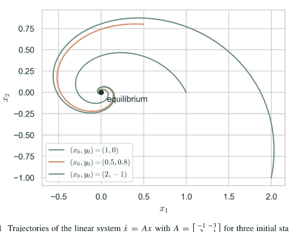

**图 9.1** 线性系统 $\dot{x} = Ax$ 在 $A = \begin{bmatrix} -1 & -3 \\ 2 & -1 \end{bmatrix}$ 下，三个初始状态的轨迹。所有轨道都螺旋向内趋向原点，这与特征值 $-1 \pm i\sqrt{5}$ 的负实部使平衡点成为一个稳定的*焦点*相符。

### 分岔理论与混沌

当参数 $\mu$ 变化时，$\mathbf{J}(\mu)$ 的谱可能穿过虚轴，从而改变稳定性。余维-1 的典型分岔：

- 鞍结点分岔：$\dot{x} = \mu - x^2$；
- 跨临界分岔：$\dot{x} = \mu x - x^2$；
- 叉式分岔：$\dot{x} = \mu x - x^3$；
- 霍普夫分岔：$\dot{\mathbf{z}} = (\mu + i\omega)\mathbf{z} - |\mathbf{z}|^2\mathbf{z}$。

### 示例 9.1.2（逻辑斯蒂映射通向混沌的路径）

$x_{n+1} = rx_n(1 - x_n), \quad 0 < r \le 4$。

不动点 $x^\star = 1 - \frac{1}{r}$ 在 $r = 3$ 时失去稳定性；倍周期级联在 $r_\infty \approx 3.56995$ 处累积，超过该点后，李雅普诺夫指数 $\lambda > 0$ 意味着混沌。计算 $\lambda(r)$：

```python
def logistic(r, x): return r*x*(1-x)
def lyapunov(r, N=5000, discard=1000):
    x = 0.5
    l_sum = 0.0
    for n in range(N+discard):
        x = logistic(r,x)
        if n>=discard:
            l_sum += np.log(abs(r*(1-2*x)))
    return l_sum/N
rs = np.linspace(2.5, 4, 1500)
λ = np.array([lyapunov(r) for r in rs])
plt.plot(rs, λ); plt.hlines(0,2.5,4,'k'); plt.show()
```

### 分岔图与延拓方法

将平衡点或周期轨道相对于参数作图，可得到**分岔图**。*延拓算法*能平滑地追踪解分支，并检测在简单参数步进失败时的转折点。

#### 伪弧长延拓（Ω-方法）

给定 $F(x, \mu) = 0$，增加弧长约束

$$s = \alpha(x - x_0) + \beta(\mu - \mu_0), \quad (\alpha, \beta) \text{ 由前一步切线确定},$$

并通过牛顿迭代求解关于 $(x, \mu)$ 的方阵系统。

**示例 9.1.3（$x^3 - \mu x + 1 = 0$ 的延拓）** 追踪通过鞍结点 $\mu_c = 3\sqrt[3]{1/4}$ 的实根。Python 代码片段：

```python
import numpy as np, scipy.optimize as op
def F(X): x, μ = X
    return [x**3 - μ*x + 1,
            α*(x-x0) + β*(μ-μ0) - ds]
# 在 (x0, μ0) 处通过牛顿法初始化，计算切线，迭代...
```

### 逻辑斯蒂映射的分岔图

使用向量化迭代，对每个 $r$ 收集瞬态过程后的最终 $x_n$：

```python
r_vals = np.linspace(2.5,4,6000)
x = .2*np.ones_like(r_vals)
for _ in range(1000): x = logistic(r_vals, x) # 瞬态
points_r, points_x = [], []
for _ in range(200):
    x = logistic(r_vals, x)
    points_r.append(r_vals); points_x.append(x)
plt.plot(np.concatenate(points_r), np.concatenate(points_x), ',k', ms=1)
plt.xlabel('r'); plt.ylabel('x'); plt.show()
```

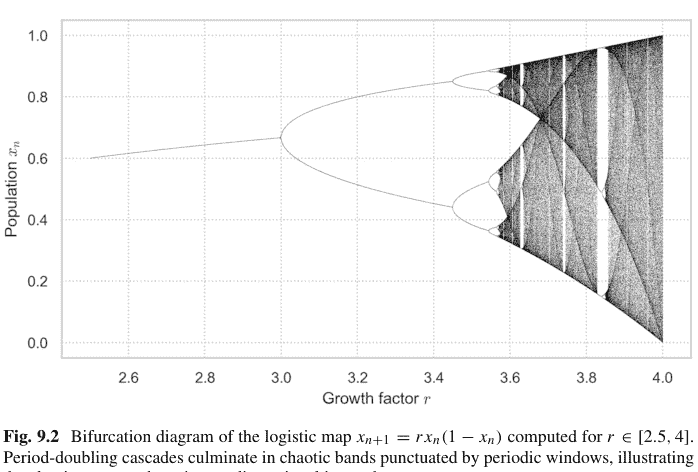

**图 9.2** 逻辑斯蒂映射 $x_{n+1} = r x_n (1 - x_n)$ 在 $r \in [2.5, 4]$ 范围内计算的分岔图。倍周期级联最终形成混沌带，其间穿插着周期窗口，展示了一维迭代映射中经典的通向混沌的路径。

该图呼应了费根鲍姆的倍周期几何；在 $r_\infty$ 附近的数值斜率估计出普适常数 $\delta \approx 4.669$（参见图 9.2）。

### 非线性系统的稳定性

当线性化产生中心方向（$\text{Re}\,\lambda = 0$）或全局性质至关重要时，非线性工具便占据主导。

#### 李雅普诺夫直接法

一个标量函数 $V(\mathbf{x})$，满足 $V > 0$，$V(\mathbf{x}^\star) = 0$，且在邻域内 $\dot{V} < 0$，则意味着渐近稳定性；$\dot{V} > 0$ 则表示不稳定性。

**示例 9.1.4（半线性摆）** $\dot{\theta} = \omega$，$\dot{\omega} = -\sin\theta - k\omega$。选择 $V(\theta, \omega) = 1 - \cos\theta + \frac{1}{2}\omega^2$。则 $\dot{V} = -k\omega^2 \le 0$，因此对于 $k > 0$，$(\theta, \omega) = (0, 0)$ 是全局渐近稳定的。相图：

```python
def F(t,z): θ,Ω = z
    return [Ω, -np.sin(θ)-0.3*Ω]
# 积分多条轨道，绘制 V 的等高线
```

#### 哈特曼-格罗布曼定理与中心流形

如果 $\mathbf{J}$ 的特征值具有零实部，则可约化到中心流形 $W^c$，其上的动力学可以是非线性的；稳定性取决于高阶项的符号。

**示例 9.1.5（霍普夫分岔附近的正规形）** $\dot{\mathbf{z}} = (\mu + i\omega)\mathbf{z} - |\mathbf{z}|^2\mathbf{z}$ 的极坐标形式为 $\dot{r} = \mu r - r^3$；中心流形是平面，径向动力学在 $\mu = 0$ 处产生超临界霍普夫分岔，对于 $\mu > 0$ 存在稳定的极限环 $r = \sqrt{\mu}$。

#### 吸引盆

通过采样初始条件并观察其极限行为，可在数值上划定吸引盆；混沌通常表现为分形的盆边界。

**示例 9.1.6（达芬双势阱）** $\ddot{x} + 0.2\dot{x} - x + x^3 = 0$。通过对 $(x_0, \dot{x}_0)$ 网格进行计算，并根据最终势阱进行分类，来计算对称势阱的吸引盆。

```python
# 使用 solve_ivp 积分，为最终状态着色
```

### 9.1.2 离散动力系统

离散时间迭代构成了研究秩序涌现、分岔级联和完全混沌的最简单实验室。因为迭代是复合运算，即使 $f$ 本身是初等的，其 $n$ 次迭代 $f^{\circ n}$ 也是一个高次非线性表达式，会迅速放大对初始条件的敏感依赖性。我们涵盖范式的逻辑斯蒂映射，通过李雅普诺夫指数量化不稳定性，追踪倍周期情景，介绍轨道的符号编码，并以从单个可观测量中提取几何结构的塔肯斯重构定理作为结束。

#### 逻辑斯蒂映射与蛛网图

逻辑斯蒂族

$$x_{n+1} = F_r(x_n) = r x_n(1 - x_n), \quad 0 < r \le 4, \quad x_n \in [0, 1],$$

模拟了繁殖率为 $r$ 的种群增长。不动点满足 $x = F_r(x)$：$x_0 = 0$ 和 $x_1 = 1 - 1/r$。线性稳定性由 $|F_r'(x^*)|$ 决定；$x_1$ 在 $r = 3$ 时失去稳定性（$F_r'(x_1) = -1$）。

## 蛛网图构造

绘制 $y = F_r(x)$ 和 $y = x$ 的图像。从 $(x_0, 0)$ 出发，交替投影到曲线上并反射到对角线。收敛到不动点表现为逐渐缩小的阶梯；2-周期或混沌则表现为永不稳定的循环（参见图 9.3）。

```python
import numpy as np, matplotlib.pyplot as plt
def logistic(r, x): return r*x*(1-x)
def cobweb(r, x0, N=50):
    x, xs, ys = x0, [], []
    for _ in range(N):
        xs += [x, x]
        y = logistic(r, x)
        ys += [x, y]
        x = y
    return xs, ys
r = 3.2; x0 = .2
grid = np.linspace(0,1,400)
plt.plot(grid, logistic(r,grid)); plt.plot(grid, grid, 'k')
xs, ys = cobweb(r, x0)
plt.plot(xs, ys, 'r'); plt.show()
```

## 李雅普诺夫指数及其计算

对于映射 $x_{n+1} = f(x_n)$，**李雅普诺夫指数**

$$\lambda = \lim_{N \to \infty} \frac{1}{N} \sum_{n=0}^{N-1} \ln |f'(x_n)|$$

衡量了邻近轨道的指数分离速率。正的 $\lambda$ 表示混沌；$\lambda = 0$ 表示临界稳定；负的 $\lambda$ 表示收缩。

对于逻辑斯蒂映射，$\lambda(r)$ 可以高效计算（参见图 9.4）：

```python
def lyapunov(r, N=5000, discard=1000):
    x = 0.5
    lsum = 0
    for n in range(N+discard):
        x = logistic(r,x)
        if n>=discard: lsum += np.log(abs(r*(1-2*x)))
    return lsum/N
rs = np.linspace(2.5,4,800)
lambdas = np.array([lyapunov(r) for r in rs])
plt.plot(rs, lambdas); plt.hlines(0,2.5,4,'k'); plt.xlabel('r'); plt.show()
```

在 $r = 4$ 时，理论值 $\lambda = \ln 2 \approx 0.6931$，因为 $|F_4'(x)| = |4 - 8x|$ 在不变密度 $\rho(x) = 1/(\pi \sqrt{x(1-x)})$ 下的平均值为 2。

**图 9.4** 逻辑斯蒂映射 $x_{n+1} = rx_n(1-x_n)$ 在 $r \in [2.5, 4]$ 时的李雅普诺夫指数 $\lambda(r)$。负值（虚线下方）表示稳定动力学，而 $\lambda > 0$ 标志着混沌行为的开始，它恰好出现在倍周期级联的累积点之后。

## 通向混沌的倍周期路径

随着 $r$ 增加，一系列叉式分岔在参数 $r_1, r_2, \dots$ 处产生稳定的 $2^k$-周期，这些参数按几何级数累积：

$$\delta = \lim_{k \to \infty} \frac{r_{k-1} - r_{k-2}}{r_k - r_{k-1}} \approx 4.669201\dots$$

*(费根鲍姆常数)* 对于具有二次极大值的一维映射是普适的。

**例 9.1.7 ($\delta$ 的数值估计)** 通过二分法找到 $2^k$-周期首次变得稳定的 $r_k$；估计比值：

```python
def find_rk(k, tol=1e-10):
    a,b = 3.0, 4.0 if k==1 else rk[k-1], rk[k-1]+0.05
    while b-a>tol:
        m = (a+b)/2
        x = .2
        for _ in range(2**(k+4)): x = logistic(m,x)
        stable = max(abs(logistic(m,x)-x) for _ in range(2**k))<1e-6
        (b if stable else a), a = (a if stable else b), a
    return b
rk = {1:3.0}
for k in range(2,6): rk[k]=find_rk(k)
delta = [(rk[k-1]-rk[k-2])/(rk[k]-rk[k-1]) for k in range(3,6)]
print(delta)
```

数值收敛到费根鲍姆的 $\delta$。

## 符号动力学与有限型子移位

通过对轨道进行分区编码，将其转化为序列空间，其中移位映射为 $\sigma((s_n)) = (s_{n+1})$。

对于帐篷映射 $T(x) = 2 \min\{x, 1-x\}$ 在 $[0, 1]$ 上，用符号 0, 1 标记左/右半区。该映射与满移位 $\Sigma_2: x \mapsto (s_n)$ 拓扑共轭，其中若 $T^n x < \frac{1}{2}$ 则 $s_n = 0$，否则为 1。

## 有限型子移位 (SFT)

给定一个 $k \times k$ 邻接矩阵 $A \in \{0, 1\}^{k \times k}$，有限型子移位

$$\Sigma_A = \{(s_n)_{n \ge 0} \mid A_{s_n s_{n+1}} = 1\}$$

带有左移位 $\sigma$，当临界点映射到排斥轨道时，它捕捉了揉捏序列。拓扑熵等于 $\ln \rho(A)$，其中 $\rho$ 是谱半径。

**例 9.1.8 (黄金分割移位)** $A = \begin{pmatrix} 1 & 1 \\ 1 & 0 \end{pmatrix}$ 禁止连续的 1。熵为 $\ln \phi$，其中 $\phi = (1+\sqrt{5})/2$。编码长度为 $N$ 的允许词并验证增长率：

```python
import itertools, numpy as np
def words(N):
    count=0
    for w in itertools.product('01', repeat=N):
        if '11' not in ''.join(w): count+=1
    return count
N = np.arange(2,14)
h = np.log([words(n) for n in N])/N
print(h[-1], np.log((1+np.sqrt(5))/2))
```

## 状态空间重构 (Takens 嵌入)

对于紧流形 $\mathcal{M}$ 上的光滑确定性动力学 $\mathbf{x}_t$ 和一个通用的 $C^2$ 可观测量 $h : \mathcal{M} \to \mathbb{R}$，**Takens 定理**指出延迟映射

$$\Phi_h^{(m)}(t) = (h(\mathbf{x}_t), h(\mathbf{x}_{t-\tau}), \dots, h(\mathbf{x}_{t-(m-1)\tau}))$$

当 $m \ge 2d + 1$ ($d$ 为盒维数) 时，将 $\mathcal{M}$ 微分同胚地嵌入到 $\mathbb{R}^m$ 中。因此，重构的点云保留了诸如吸引子维数和李雅普诺夫指数等不变量 (Packard et al. 1980; Takens 1981)。

## 实际选择

延迟 $\tau$：自相关函数的第一个零点或互信息的第一个极小值。嵌入维数 $m$：假近邻算法；增加 $m$ 直到在 $m+1$ 下展开的近邻比例低于阈值。

**例 9.1.9 (Lorenz 吸引子重构 (参见图 9.5))** 采样 Lorenz 系统的 $x(t)$；使用 $\tau = 10 \Delta t, m = 3$ 进行重构：

```python
from scipy.integrate import solve_ivp
sigma, rho, beta = 10, 28, 8/3
def Lor(t, y): x,y_,z=y; return [sigma*(y_-x), x*(rho-z)-y_, x*y_- beta*z]
sol = solve_ivp(Lor,[0,80],[1,1,1],max_step=.01)
x = sol.y[0]; tau = 10
embed = np.column_stack([x[:-2*tau], x[tau:-tau], x[2*tau:]])
from mpl_toolkits.mplot3d import Axes3D
fig = plt.figure(); ax = fig.add_subplot(111,projection='3d')
ax.plot(*embed.T, lw=.3); plt.show()
```

通过关联和 $C(r) \sim r^{D_2}$ 计算的分形维数得到 $D_2 \approx 2.05$，与标准 Lorenz 吸引子相符。

**图 9.5** Lorenz 系统 $x$ 坐标的三维时间延迟嵌入 $(x(t), x(t + \tau), x(t + 2\tau))$，其中 $\sigma = 10$, $\rho = 28$, $\beta = 8/3$。由此产生的“扭曲丝带”在延迟空间中重构了奇异吸引子，阐释了 Takens 嵌入定理。

### 9.1.3 连续动力系统

$\mathbb{R}^n$ 中流 $\dot{\mathbf{x}} = \mathbf{F}(\mathbf{x})$ 的定性理论关注轨迹的几何形状、它们趋近的渐近集以及约束运动的不变量。除了平衡点，连续系统还表现出周期轨道（极限环）、在分形集上的非周期但有界运动（奇异吸引子），以及在哈密顿设置中，由同宿纠缠产生的规则环面与随机层之间复杂的交织。相图、Poincaré 截面和回归图的视觉语言将分析推导转化为有形的图像；由 SciPy 和 matplotlib 驱动的数值积分则将它们转化为实验。

## 相图与极限环

**相图**是状态空间中向量场箭头和积分曲线的图像。在 $\mathbb{R}^2$ 中，任何闭合轨迹 $\Gamma$ 都包围一个区域，其中的散度 $\nabla \cdot \mathbf{F}$ 决定了它的命运：根据 Bendixson 判据，在散度符号单一的单连通区域内不可能存在极限环。

平面 *van der Pol 振荡器*

$$\dot{x} = y, \quad \dot{y} = \mu(1 - x^2)y - x$$

的散度为 $\nabla \cdot \mathbf{F} = \mu(1 - x^2)$，在 $|x| = 1$ 处变号。对于 $\mu > 0$，轨迹在分界线内向外螺旋，在分界线外向内螺旋，全局收敛到一个唯一的、稳定的极限环（参见图 9.6）。

```python
import numpy as np, matplotlib.pyplot as plt
mu = 1.5
def vdp(t, z): x,y = z; return [y, mu*(1-x**2)*y - x]
from scipy.integrate import solve_ivp
for ic in [(2,0),(0.1,0.1),(-3,4)]:
    sol = solve_ivp(vdp,[0,30],ic,t_eval=np.linspace(0,30,4000))
    plt.plot(sol.y[0], sol.y[1])
plt.xlabel('x'); plt.ylabel('y'); plt.axis('equal'); plt.show()
```

Floquet 理论通过单值矩阵 $M = \Phi(T)$ 在周期轨道 $\gamma(t)$ 附近线性化，其中 $\Phi$ 是一个周期 $T$ 上的变分流。如果极限环的 Floquet 乘子位于单位圆盘内（除了沿切方向的平凡乘子 1），则该极限环是渐近稳定的。

## 连续系统中的奇异吸引子与混沌

混沌流具有一个奇异吸引子：一个紧不变集 $\mathcal{A}$，它吸引一个开集的初始条件，对初始数据具有敏感依赖性，并具有分形结构。

## 9.2 混沌与分形

### 9.2.1 曼德博集合

二次族参数平面展现出一个边界，其精致的螺旋、树突和心形线自贝努瓦·曼德博1980年的开创性图像以来，一直令数学家和艺术家为之着迷。其视觉辉煌背后是复动力学中的一个严谨对象：**曼德博集合**

$$\mathcal{M} = \{c \in \mathbb{C} : \text{在 } f_c(z) = z^2 + c \text{ 下 } 0 \text{ 的轨道有界}\}.$$

等价地，$\mathcal{M}$ 是二次朱利亚集的连通性轨迹：$c \in \mathcal{M} \iff J(f_c)$ 是连通的（Douady–Hubbard）。本小节分析其分形几何，展示如何在Python中生成高分辨率渲染图，并将其结构与 $f_c$ 的迭代理论联系起来。

### 分形几何与自相似性

### 豪斯多夫维数

边界 $\partial\mathcal{M}$ 被推测具有豪斯多夫维数2（Shishikura证明了 $\dim_H \partial\mathcal{M} = 2$），尽管其面积为零且内部是紧致的。$\partial\mathcal{M}$ 的部分在任意小的尺度上复制，体现了*自相似性*。在*米修雷维奇点*（预周期参数）或*费根鲍姆点*（倍周期尖点）附近的缩放揭示了整个集合的微观副本，这些副本通过宽度按几何比例缩放的丝状“触须”相连。

### Douady–Hubbard 射线

外部角度 $\theta \in \mathbb{Q}/\mathbb{Z}$ 通过Böttcher映射 $\Phi_c(z) \sim z + O(1)$（当 $|z| \to \infty$ 时）参数化补集 $\hat{\mathbb{C}} \setminus \mathcal{M}$ 的*外部射线*。有理角度射线的着陆根据其旋转数组织双曲分量（球茎），并编码了无限的自相似组合学（“捏合”圆盘模型）。

### 费根鲍姆标度

令 $c_\infty \approx -1.4011551890$ 为沿实轴的倍周期球茎的聚点。对于映射 $g(z) = z^2 - 1.401155\ldots$，在 $z = 0$ 附近，重缩放 $\phi(z) = \lambda^{-1}g^2(\lambda z)$，其中 $\lambda \approx -1.543689\ldots$，与 $g$ 共轭：$\phi = g$。这个函数方程意味着按 $\lambda$ 进行几何缩放，并支撑了之前遇到的普适费根鲍姆常数 $\delta \approx 4.669201\ldots$。

### 在Python中渲染曼德博集合

为了可视化 $\mathcal{M}$，我们利用*逃逸时间算法*：对于每个像素中心 $c \in \mathbb{C}$，以 $z_0 = 0$ 迭代 $z_{n+1} = z_n^2 + c$；如果在 $n \le N_{\max}$ 之前 $|z_n| > R$（通常 $R = 2$），则该点位于 $\mathcal{M}$ 之外，逃逸索引 $n$ 为像素着色。在迭代预算内从未逃逸的点被视为 $\mathcal{M}$ 的候选点，并着色为黑色（参见图9.10）。

```python
import numpy as np, matplotlib.pyplot as plt
def mandelbrot(xmin,xmax,ymin,ymax,res=1000, Nmax=200, R=2):
    x = np.linspace(xmin,xmax,res)
    y = np.linspace(ymin,ymax,res)
    C = x[:,None] + 1j*y[None,:]
    Z, M = np.zeros_like(C), np.full(C.shape, Nmax, dtype=int)
    for n in range(Nmax):
        mask = np.less(np.abs(Z), R)
        Z[mask] = Z[mask]**2 + C[mask]
        M[mask & (np.abs(Z)>=R)] = n
    return x, y, M

x,y,M = mandelbrot(-2.5, 1, -1.5, 1.5, res=1600, Nmax=500)
plt.imshow(M.T, extent=[x.min(),x.max(),y.min(),y.max()],
           cmap='inferno', origin='lower'); plt.axis('off'); plt.show()
```

**图9.10** 曼德博集合的高分辨率逃逸时间渲染图。每个像素代表一个复参数 $c = x + iy$；颜色编码了在 $z \mapsto z^2 + c$ 下0的轨道逃逸半径为2的圆盘时的迭代次数（黑色点在500步截止内从未逃逸）。

### 距离估计

为了产生平滑着色，计算势

$$d(c) \approx \frac{\log |z_n| |z_n| \log |z_n|}{2|z_n| \left| \frac{dz_n}{dc} \right|}, \quad \frac{dz_{n+1}}{dc} = 2z_n \frac{dz_n}{dc} + 1,$$

得到一个平滑的逃逸时间代理；通过 $\frac{1}{2}[1 + \sin(\alpha \log d(c) + \phi)]$ 将 $d(c)$ 映射到颜色，以获得美学调色板。

### 高精度缩放

在 $c \approx -0.75 + 0.1i$ 附近，放大倍数 $> 10^{10}$ 需要任意精度算术。mpmath支持多精度复数；工作精度应与放大比例成比例增加。

```python
import mpmath as mp
mp.mp.dps = 80
c0 = mp.mpc('-0.74543+0.11264j')
z, dzdc = mp.mpc(0), mp.mpc(0)
for n in range(2000):
    dzdc = 2*z*dzdc + 1
    z = z*z + c0
    if abs(z)>2: break
dist = abs(z)*mp.log(abs(z))/abs(dzdc)
print("distance ≈", dist)
```

### 复动力学与曼德博集合

### 二次多项式

对于 $f_c(z) = z^2 + c$，填充朱利亚集 $K_c$ 包含具有有界前向轨道的点；朱利亚集 $J_c$ 是其边界。如果 $c \in \mathcal{M}$，则 $J_c$ 是连通的；否则它是不连通丝状物的康托尔尘埃。

### 双曲分量

$\mathcal{M}$ 的每个内部球茎对应于 $f_c$ 具有吸引周期的参数。主心形线（$|c - \frac{1}{4}| < \frac{1}{4}$）参数化具有乘数 $e^{i\theta}$ 的不动点；通过“天线”连接的球茎代表更高周期的吸引周期。乘数映射 $\lambda(c) = f_c^{\circ p}(z_{\text{attr}})$ 在每个分量上提供共形坐标。

---

洛伦兹系统

$\dot{x} = \sigma(y - x), \quad \dot{y} = x(\rho - z) - y, \quad \dot{z} = xy - \beta z$

其中 $(\sigma, \rho, \beta) = (10, 28, \frac{8}{3})$ 是旗舰系统。其最大李雅普诺夫指数为正（$\lambda_1 \approx 0.905$），豪斯多夫维数 $D_H \approx 2.06$，且 $z(t)$ 极大值的回归映射模拟了逻辑斯蒂映射（参见图9.7）。

```python
sigma, rho, beta = 10., 28., 8/3
def lor(t, w): x,y,z=w; return [sigma*(y-x), x*(rho-z)-y, x*y-beta*z]
sol = solve_ivp(lor,[0,40],[1,1,1],max_step=.01)
plt.plot(sol.y[0], sol.y[2], lw=.3); plt.xlabel('x'); plt.ylabel('z'); plt.show()
```

卡普兰-约克维数 $D_{KY} = k + \sum_{i=1}^k \lambda_i / |\lambda_{k+1}|$（其中 $\lambda_i$ 已排序）根据计算出的指数估计吸引子维数。

## 庞加莱映射与递归图

一个横截于流的**庞加莱截面** $\Sigma$ 通过连续相交将连续动力学简化为离散映射 $P : \Sigma \to \Sigma$。周期轨道的稳定性简化为 $DP$ 的特征值（弗洛凯乘子）。对于受迫达芬方程

$\ddot{x} + 0.2\dot{x} - x + x^3 = 0.3 \cos \omega t, \quad \omega = 1,$

在 $t = n2\pi$ 处取 $\Sigma$ 生成一个映射，当驱动振幅 $> 0.28$ 时，其吸引子变为分形。

**递归图**可视化轨迹重访邻域的时间 $i, j$：$R_{ij} = \Theta(\varepsilon - \|x_i - x_j\|)$。对角线表示周期运动；散点表示混沌（参见图9.8）。

```python
epsilon = 0.2
X = sol.y.T[::10,:2] # 2D projection
D = np.linalg.norm(X[:,None]-X, axis=2)
R = (D<epsilon).astype(int)
plt.imshow(R, cmap='Greys', origin='lower'); plt.show()
```

## 哈密顿系统与混沌

哈密顿流 $\dot{q}_i = \partial_{p_i}H$, $\dot{p}_i = -\partial_{q_i}H$ 保持相空间体积（刘维尔）和能量 $H$。在两个自由度（$n = 2$）下，能量面是三维的；规则运动位于由作用-角变量 $(I, \theta)$ 参数化的不变环面上。

当可积哈密顿量 $H_0$ 被扰动：$H = H_0 + \varepsilon H_1$，KAM理论指出，对于小的 $\varepsilon$，非共振环面得以保留，而共振环面破裂，产生*同宿缠结*。标准映射

$\theta_{n+1} = \theta_n + I_{n+1} \pmod{2\pi}, \quad I_{n+1} = I_n + K \sin \theta_n \pmod{2\pi}$

是保面积的，源于一个受击转子。当 $K > K_c \approx 0.9716$ 时，最后一个不变圆破裂，映射表现出全局混沌（参见图9.9）。

```python
def standard_map(K, theta0, I0, N=500):
    theta, I = theta0, I0
    thetas, Is = [], []
    for _ in range(N):
        I = (I + K*np.sin(theta)) % (2*np.pi)
        theta = (theta + I) % (2*np.pi)
        thetas.append(theta); Is.append(I)
    return thetas, Is
K = 1.2; theta,I = standard_map(K, 0.1, 0.1, 10000)
plt.scatter(theta, I, s=.2); plt.axis('equal'); plt.show()
```

梅尔尼科夫积分量化了稳定和不稳定流形的横截相交，通过斯梅尔-伯克霍夫同宿定理证实了混沌。

## 米修列维奇点

0 落在排斥周期上的预周期参数在 $\partial \mathcal{M}$ 中是稠密的。在这些点附近，局部缩放由排斥轨道的乘子决定，产生*共形自相似性*。

## 外角与揉搓序列

杜阿迪–哈伯德证明，临界轨道的组合数据编码了落在参数 $c$ 上的外射线；揉搓序列（临界值的符号轨迹）通过抛物线叶瓣对灯泡进行排序，并产生计算任何装饰物“地址”的算法。

## 拟共形手术

二次多项式的混合等价类通过粘合光滑变形来产生新的映射；应用手术通过将刚性旋转插入吸引盆来构造西格尔盘（无理中性周期）。由此产生的参数值位于 $\partial \mathcal{M}$ 上，并表现出具有旋转数 $\theta$ 的“小”曼德博集副本。

## 9.2.2 朱利亚集

对于每个参数 $c \in \mathbb{C}$，二次多项式
$$f_c(z) = z^2 + c$$
诱导复平面的动力学划分为*填充朱利亚集*
$$K_c = \left\{ z \in \mathbb{C} : \sup_{n \ge 0} |f_c^{\circ n}(z)| < \infty \right\}$$
及其补集，其点逃逸到 $\infty$。**朱利亚集** $J_c = \partial K_c$ 是混沌动力学的轨迹——敏感依赖性、稠密周期点和完美的自相似性。尽管 $K_c$ 由逃逸半径 $R = 2$ 界定，但其拓扑性质随 $c$ 剧烈变化：当 $c$ 位于曼德博集 $\mathcal{M}$ 内时它是连通的，而当 $c \notin \mathcal{M}$ 时它是完全不连通的（康托尔尘埃）。

## 与曼德博集的关系

杜阿迪–哈伯德的*连通性定理*
$$c \in \mathcal{M} \iff K_c \text{ 是连通的}$$
使得 $\mathcal{M}$ 成为所有连通二次朱利亚集的*参数空间化身*。$\mathcal{M}$ 内部的参数对应于*双曲*动力学：临界轨道收敛到位于 $K_c$ 内的吸引周期；补集法图集是吸引盆。在米修列维奇点穿过 $\partial\mathcal{M}$ 时，临界轨道落在排斥周期上，盆消失，并且 $J_c$ 在 $n$ 次预周期迭代后分裂成 $2^n$ 个不相交的康托尔子集。

## 拟纤维化

附着在 $\mathcal{M}$ 上的灯泡筒仓反映了 $K_c$ 内部的*内射线*。当 $c$ 在灯泡内移动时，$J_c$ 中相应的吸引周期以连续变化的乘子持续存在。在灯泡根部（抛物线参数），周期变为中性，$J_c$ 发展出一个尖点；穿过根部进入外部尘埃会将连通的朱利亚集分裂成万花筒般的康托尔集。

## 在 Python 中可视化朱利亚集

### 逃逸时间算法

固定 $c$。对于每个像素中心 $z_0$，迭代 $z_{n+1} = z_n^2 + c$，直到 $|z_n| > 2$（逃逸）或 $n \ge N_{\max}$。根据最小 $n$ 为逃逸者着色（可选地使用距离估计进行平滑）；将未逃逸者着色为黑色（参见图 9.11）。

```python
import numpy as np, matplotlib.pyplot as plt

def julia(c, xmin=-1.5, xmax=1.5, ymin=-1.5, ymax=1.5,
         res=1000, Nmax=300, R=2):
    x = np.linspace(xmin, xmax, res)
    y = np.linspace(ymin, ymax, res)
    Z = x[:,None] + 1j*y[None,:]
    M = np.full_like(Z, Nmax, dtype=int)
    mask = np.full(Z.shape, True, dtype=bool)
    for n in range(Nmax):
        Z[mask] = Z[mask]**2 + c
        escaped = np.abs(Z)>R
        M[mask & escaped] = n
        mask &= ~escaped
    return x, y, M

c = -0.8 + 0.156j # Douady rabbit
_,_,J = julia(c, res=1600, Nmax=400)
plt.imshow(J.T, cmap='magma', origin='lower')
plt.title(f'Julia set for c={c}')
plt.axis('off'); plt.show()
```


**图 9.11** $f_c(z) = z^2 + c$ 在 $c = -0.8 + 0.156\mathrm{i}$ 时的杜阿迪“兔子”朱利亚集的逃逸时间渲染。着色为黑色的点在 400 次迭代内保持有界，而较暖的色调表示它们逃逸出半径为 2 的圆的迭代次数。关于排斥 3 周期的三重旋转对称性赋予了该集独特的“兔子”形状。

### 距离估计着色

为了获得更平滑的图像，在逃逸后使用以下公式计算 $d(z_0)$：

$$d \approx \frac{|z_n| \ln |z_n|}{|z'_n|}, \quad z'_n = \frac{dz_n}{dz_0}.$$

通过 $\ln d$ 的连续函数分配像素亮度以揭示内部细丝。

## 在朱利亚集中探索参数空间

### 连通与康托尔朱利亚集

选取穿过 $\mathcal{M}$ 的垂直切片，例如 $\operatorname{Re} c = -0.75$，并在 $\operatorname{Im} c$ 变化时动态展示 $J_c$；观察当参数离开 $\mathcal{M}$ 时的突然破碎。

```python
import matplotlib.animation as ani
fig,ax = plt.subplots(); ax.axis('off')
ims=[]
for im in np.linspace(-0.3,0.3,40):
    c = -0.75 + 1j*im
    _,_,M = julia(c, res=600, Nmax=250)
    img = ax.imshow(M.T, cmap='twilight_shifted', origin='lower',
                    animated=True)
    ims.append([img])
ani.ArtistAnimation(fig, ims, interval=100).save("julia_slice.mp4")
```

### 外角与调谐

对于位于主心形线边界 $c = e^{i\theta}/2 - e^{2i\theta}/4$ 上的 $c$，该映射具有一个中性不动点。乘子 $\lambda = e^{i\theta}$ 指定旋转：有理数 $\theta/2\pi = p/q$ 在 $J_c$ 中产生 $q$ 个抛物线花瓣；无理数 $\theta$ 产生具有准周期边界的西格尔盘。

用主心形线调谐周期为 $p$ 的灯泡，是用更小尺度上的重正化副本替换基础动力学。通过外角揉搓数值组合两个二次映射，然后渲染调谐后的朱利亚集以查看嵌入的小集。

### 参数平面叠加

根据 $J_c$ 上的统计数据为每个 $c$ 着色：(i) 通过边界样本的盒计数法估计的豪斯多夫维数；(ii) 临界轨道的顶部李雅普诺夫指数；(iii) 通过像素计数近似的 $K_c$ 面积。这种*数据景观*揭示了 $\mathcal{M}$ 上的梯度场：维数在尖点附近达到峰值，李雅普诺夫指数在米修列维奇参数处出现尖峰，面积在陆地“海马谷”处收缩。

## 9.2.3 自然与艺术中的分形

### 自然系统中的自相似性

自然形态发生通常偏好跨尺度重复的生长规则，产生*统计自相似性*。例如，海岸线具有*分形维数* $D$，通过理查森的盒计数关系 $N(\varepsilon) \sim \varepsilon^{-D}$ 测量，其中 $N(\varepsilon)$ 是覆盖海岸线的边长为 $\varepsilon$ 的最小盒子数。对挪威峡湾的实证研究给出 $D \approx 1.25$，介于可求长曲线（$D = 1$）和填充空间的佩亚诺曲线（$D = 2$）之间。在扩散聚集过程中，布朗粒子附着在种子上，产生树突状簇（DLA），其在 $\mathbb{R}^2$ 中的维数数值上为 $D \approx 1.71$。赫尔-肖池中的实验粘性指状物再现了相同的指数，证实了普适性。


**图 9.12** 通过随机迭代巴恩斯利 IFS 的四个仿射映射及其各自概率（0.01、0.85、0.07、0.07）产生的巴恩斯利蕨。十万个点已经以惊人的细节揭示了自相似的分形叶片结构。

植物叶序利用*对数螺线* $r = ae^{k\theta}$，使连续的叶片保持无理发散角 $\phi \approx 137.5^\circ$（黄金角），以优化阳光照射。螺线的缩放因子 $e^{2\pi k}$ 表现出自相似的斐波那契苞片。巴恩斯利的*蕨*由四个仿射相似变换 $S_i : \mathbb{R}^2 \to \mathbb{R}^2$ 建模，其吸引子满足 $K = \bigcup_{i=1}^4 S_i(K)$；哈钦森定理保证了存在性和唯一性（参见图 9.12）。

```python
import numpy as np, matplotlib.pyplot as plt
# Barnsley fern IFS
A = [( .00,.00, .00,.16,0,0, .01),
     ( .85,.04,-.04,.85,0,1.6,.85),
     ( .20,-.26,.23,.22,0,1.6,.07),
```

(-.15,.28,.26,.24,0,.44,.07)]
x,y = 0.,0.
xs,ys = [],[]
for _ in range(100_000):
    a,b,c,d,e,f,p = A[np.random.choice(4,p=[a[-1] for a in A])]
    x,y = a*x+b*y+e, c*x+d*y+f
    xs.append(x); ys.append(y)
plt.scatter(xs,ys,s=.1,c='g'); plt.axis('off'); plt.show()

## 分形在艺术与设计中的应用

分形的艺术探索始于本华·曼德博的早期渲染，但很快便融入计算机图形学和建筑图案设计。*迭代函数系统*（IFS）技术生成的纹理贴图，其豪斯多夫维数可调，以匹配自然表面；例如，月球地形采用中点位移法，其中高程增量 $\Delta h$ 按 $\sigma 2^{-H}$ 缩放，$H$ 为赫斯特指数。

分形天线利用多频带谐振：迭代阶数为 $n$ 的科赫曲线单极子将电流集中在 $\frac{4^n}{3}$ 个线段上，在不增大尺寸的情况下将基频缩小相同倍数。在纺织设计中，*L-系统*模拟分枝笔触图案；通过迭代替换产生规则 $\{F \rightarrow F[+F]F[-F]F\}$，可生成树状轮廓，其在海龟图形解释器下的图像呈现出分支角 $\alpha$ 和缩减比 $\rho$，从而得到维数 $D = \ln(3) / \ln(1/\rho)$。

分形也为*压缩*提供了思路：拼贴定理将图像编码为一个IFS，其吸引子在像素容差 $\varepsilon$ 内逼近原始图像，当图像具有自相似块时，可实现高压缩比。商业编解码器使用分区迭代映射来近似IFS，并存储相似变换及灰度偏移量，而非原始像素。

## 多重分形及其应用

简单的自相似集具有单一的赫尔德指数 $H$，控制着局部标度行为。许多现象——湍流能量耗散、金融波动性、云层亮度——展现出一个赫尔德指数 $\alpha$ 的*谱*，其豪斯多夫维数为 $f(\alpha)$：即**多重分形**。*质量指数* $\tau(q)$ 由配分和定义

> $$Z(q, \varepsilon) = \sum_i \mu(B_i)^q \sim \varepsilon^{\tau(q)},$$

并通过勒让德变换与 $f(\alpha)$ 相关联：$\alpha = \tau'(q)$，$f(\alpha) = q\alpha - \tau(q)$。
对于典型的二项级联，将一个区间分成两半，每一步将测度乘以权重 $p$ 和 $1-p$。可得 $\tau(q) = \log_2(p^q + (1-p)^q)$；$f(\alpha)$ 是凹函数，在 $\alpha_0 = -\frac{p \ln p + (1-p) \ln(1-p)}{\ln 2}$ 处达到峰值。从数据估计 $f(\alpha)$ 需要使用跨尺度 $2^{-j}$ 的小波领袖 $L_{j,k}$ 以及结构函数 $S_q(j) = 2^{-j} \sum_k L_{j,k}^q$。

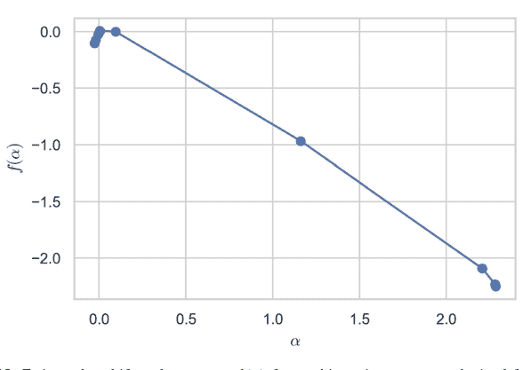

```python
import pywt, numpy as np
signal = np.random.randn(2**14) # surrogate turbulence
coeffs = pywt.wavedec(signal, 'db4', level=8)
leaders = np.max(np.abs(coeffs), axis=1)
q = np.arange(-5,6)
S = [ [np.mean(np.abs(c)**qq) for c in coeffs[1:]] for qq in q ]
tau = [ np.polyfit(np.log2(range(1,8)), np.log2(Sq), 1)[0] for Sq in S ]
alpha = np.gradient(tau, q); f = q*alpha - tau
plt.plot(alpha, f); plt.xlabel(r'$\alpha$'); plt.ylabel(r'$f(\alpha)$'); plt.show()
```

多重分形理论是降雨雷达降尺度、互联网流量建模（捕捉重尾突发）以及医学心跳变异性分析的基础，其中宽阔的 $f(\alpha)$ 谱表示健康的适应性，而塌缩的谱则预示病理状态（图 9.13）。

## 9.2.4 混沌理论的应用

混沌理论将对初始条件敏感依赖的抽象概念，转化为对现实世界系统的具体、且常常是反直觉的洞见。从气象学到心脏病学，从加密硬件到振动机械，确定性混沌的印记决定了预测极限、控制策略和设计原则。本小节概述四个不同的应用领域，着重阐述使混沌成为敌人（预测失败）或盟友（信息隐藏、增强混合）的数学机制。

### 预测天气模式与股市动态

**气象学**

洛伦兹1963年模型

$$\dot{x} = \sigma(y - x), \quad \dot{y} = x(\rho - z) - y, \quad \dot{z} = xy - \beta z$$

在无量纲单位下，参数 $(\sigma, \rho, \beta) = (10, 28, 8/3)$ 时表现出主导的正李雅普诺夫指数 $\lambda_1 \approx 0.905 \text{ s}^{-1}$。对于初始不确定性 $\delta_0$，*可预测性时域*为 $\tau \approx \lambda_1^{-1} \ln(\varepsilon/\delta_0)$，其中 $\varepsilon$ 是可接受的预报误差。同化方案（如四维变分法）利用部分观测反复重新初始化集合，以推迟指数增长。现代全球环流模型显示局部李雅普诺夫时间在2到10天之间；因此，*确定性*的长期预报让位于*概率性*的气候预测。

**金融学**

资产收益率 $r_t$ 常表现出*波动聚集*现象。赫斯顿随机波动率随机微分方程

$$dS_t = \mu S_t \, dt + \sqrt{V_t} \, S_t \, dW_t^{(1)},$$
$$dV_t = \kappa(\theta - V_t) \, dt + \sigma \sqrt{V_t} \, dW_t^{(2)}, \quad dW^{(1)} dW^{(2)} = \rho \, dt,$$

在加入微小的确定性反馈 $cV_t^2$ 后，对于现实参数 $(\kappa, \theta, \sigma, \rho)$ 可以产生混沌方差振荡。通过塔肯斯延迟坐标嵌入每日收盘价波动率序列，揭示了几个股票指数的关联维数 $D_2 \approx 2.2$，暗示在随机驱动之下存在低维确定性结构。然而，替代数据测试强调，噪声和状态切换可能伪装成混沌；与随机基准相比，严格的预测优势仍然难以捉摸。

### 生物系统中的混沌

**心脏动力学**

用于起搏窦房结组织的*Rulkov映射*

$$x_{n+1} = \frac{\alpha}{1 + x_n^2} + y_n, \quad y_{n+1} = y_n - \beta x_n - \gamma,$$

在参数 $(\alpha, \beta, \gamma) = (4.1, 0.001, 0.1)$ 时，模拟了心室颤动前的交替节律。分岔图显示，当 $\alpha$ 越过4.0时，系统通过倍周期分岔进入混沌。当 $x_n$ 超过阈值时重置它的反馈起搏算法可以消除混沌发作，这暗示了用于抑制心律失常的植入设备方案。

**种群生态学**

离散捕食者-猎物黑斯廷斯-鲍威尔模型

$$\begin{cases} x_{n+1} = x_n e^{r(1-x_n) - \frac{a y_n}{1+b x_n}}, \\ y_{n+1} = y_n e^{-d + \frac{c x_n}{1+b x_n} - \frac{e z_n}{1+f y_n}}, \\ z_{n+1} = z_n e^{-m + \frac{g y_n}{1+f y_n}}, \end{cases}$$

在 $r \gtrsim 2.0$ 时表现出混沌吸引子。由此产生的爆发间隔的宽分布，比纯粹的随机洛特卡-沃尔泰拉模型更好地匹配了北方森林野兔-山猫周期的实地数据。

### 在安全通信中的应用

**混沌掩蔽**

设 $s(t)$ 为明文模拟信号。发射机将 $s$ 嵌入驱动洛伦兹系统

$$\dot{x}_T = \sigma(y_T - x_T), \quad \dot{y}_T = \rho x_T - y_T - x_T z_T + k s(t), \quad \dot{z}_T = x_T y_T - \beta z_T,$$

并广播 $x_T(t)$。同步的接收机遵循相同的动力学，但没有 $k s(t)$ 项；减去其 $x_R$ 即可恢复 $s(t)$。安全性源于噪声下参数识别的困难；然而，自适应观测器和频谱滤波可以破坏低维方案。现代*混沌键控*采用高阶分段线性映射（维数 $\ge 10$）与数字扰码器级联，以抵御重构攻击。

**伪随机比特发生器（PRBG）**

在定点算术中迭代逻辑斯蒂映射，取 $r = 4$，

$$x_{n+1} = 4x_n(1 - x_n), \quad b_n = \text{LSB}(\lfloor 2^s x_n \rfloor),$$

产生周期为 $2^s$ 的PRBG。统计测试（Diehard, NIST）在 $s \ge 32$ 时通过，前提是抖动扰动抵消了有限精度固有的最终周期轨道。

### 机械与电气系统中的混沌

**达芬振荡器原型**

**受迫达芬方程**

$$\ddot{x} + 0.25\dot{x} + x^3 - x = 0.3\cos(\omega t), \quad \omega = 1,$$

在驱动振幅 $\approx 0.28$ 时经历向奇异吸引子的转变。共存轨道的吸引盆形成分形边界，这解释了具有弱制造公差的微机电谐振器（MEMS）中出现的不稳定结果。

**蔡氏电路**

最小电子电路——由两个电容器、一个电感器和一个分段线性电阻器组成——实现了

$$\dot{v}_1 = \alpha(v_2 - v_1 - h(v_1)),$$
$$\dot{v}_2 = v_1 - v_2 + i_L,$$
$$\dot{i}_L = -\beta v_2,$$

其中 $h(v) = m_1 v + \frac{1}{2}(m_0 - m_1)(|v + 1| - |v - 1|)$。参数集 $(\alpha, \beta, m_0, m_1) = (9, 14.286, -1.143, -0.714)$ 产生双涡卷吸引子；在 $v_1 = 0$ 处的庞加莱截面描绘了斯梅尔马蹄。硬件实现利用宽带混沌载波进行扩频传输。

## 9.3 李雅普诺夫指数

确定性混沌的诊断依据是轨迹对初始条件的敏感性。在定量上，这种敏感性由**李雅普诺夫指数**来衡量。它们描述了由切向流传输的无穷小扰动的渐近指数增长（或衰减）率，因此提供了一个总结系统内在不稳定性的数值谱。在$d$维相空间中，该谱包含$d$个实数

$$\lambda_1 \ge \lambda_2 \ge \dots \ge \lambda_d,$$

其中至少一个正指数标志着混沌，而指数之和等于向量场的平均散度（刘维尔定理）。

### 9.3.1 定义与解释

令$\dot{\mathbf{x}} = \mathbf{F}(\mathbf{x})$在紧致、前向不变集$\mathcal{A}$上生成一个流$\Phi^t$。对于一个非零切向量$\mathbf{v}_0 \in T_{\mathbf{x}_0}\mathcal{M}$，通过变分方程$\dot{\mathbf{v}} = D\mathbf{F}(\mathbf{x}(t))\mathbf{v}$演化$\mathbf{v}(t) = D\Phi^t_{\mathbf{x}_0} \mathbf{v}_0$。在$\mathbf{x}_0$处的**最大李雅普诺夫指数**为

$$\lambda_{\max}(\mathbf{x}_0) = \limsup_{t \to \infty} \frac{1}{t} \ln \frac{\|\mathbf{v}(t)\|}{\|\mathbf{v}_0\|}.$$

奥塞莱德克乘法遍历定理指出，对于相对于不变测度$\mu$的$\mu$-几乎每个初始状态，该极限存在且等于$d$个李雅普诺夫指数之一，并且独立于在相关*奥塞莱德克子空间*内选择的$\mathbf{v}_0$。

*卡普兰-约克维数*（或李雅普诺夫维数）估计吸引子的分形特性：

$$D_{KY} = k + \frac{\sum_{i=1}^k \lambda_i}{|\lambda_{k+1}|}, \quad \text{其中 } k = \max \left\{ m : \sum_{i=1}^m \lambda_i \ge 0 \right\}.$$

### 计算方法

*贝内廷-沃尔夫算法* 同时积分状态$\mathbf{x}(t)$和一个由变分流更新的正交归一化框架$\{\mathbf{e}_1, \dots, \mathbf{e}_d\}$，

```python
# schematic QR iteration every δt_qr
for step in range(N_steps):
    state, vecs = rk4(flow, state, vecs, δt)
    if step % n_qr == 0:
        Q,R = np.linalg.qr(vecs)
        log_diag += np.log(np.abs(np.diag(R)))
        vecs = Q
λ = log_diag / (total_time)
```

$R$的对角元素累积了拉伸因子；它们的时间平均对数收敛到$\{\lambda_i\}$（Benettin et al. 1980）。

*罗森斯坦算法（Rosenstein et al. 1993）（实验数据）* 对于重构轨迹$\{\mathbf{x}_n\}$，找到至少间隔平均周期的最近邻，然后对数对平均$\ln d(\tau)$：

$$d(\tau) = \frac{1}{M} \sum_{i=1}^{M} \|\mathbf{x}_{i+\tau} - \mathbf{x}_{\text{NN}(i)+\tau}\|, \quad \lambda_{\text{max}} \approx \text{斜率 of } \ln d(\tau) \text{ vs. } \tau.$$

### 对系统行为的影响

- $\lambda_{\text{max}} < 0$ 意味着所有轨迹收敛到平衡点；系统是*指数收缩*的。
- $\lambda_{\text{max}} = 0$ 且其余指数为负表示中性稳定性（例如，极限环、准周期环面）。
- $\lambda_{\text{max}} > 0$ 标志着敏感依赖性，并给出*可预测性视界* $\tau_{\text{pred}} \sim \lambda_{\text{max}}^{-1} \ln(\varepsilon/\delta_0)$，其中$\delta_0$为初始误差，$\varepsilon$为容差。
- 哈密顿系统中的体积守恒设定$\sum_i \lambda_i = 0$；通常指数成对出现$\pm$，加上与守恒量相关的零。

对于洛伦兹吸引子$(\sigma, \rho, \beta) = (10, 28, 8/3)$，经验上得到$(\lambda_1, \lambda_2, \lambda_3) \approx (0.905, 0, -14.57)$；因此$D_{KY} \approx 2.06$与数值分形维数估计相符。

### 局部与全局李雅普诺夫指数

*有限时间李雅普诺夫指数*（FTLE）

$$\lambda^T(\mathbf{x}_0) = \frac{1}{T} \ln \frac{\|D\Phi_{\mathbf{x}_0}^T \mathbf{v}_0\|}{\|\mathbf{v}_0\|}$$

取决于初始位置和窗口长度$T$。绘制FTLE场可以阐明*拉格朗日相干结构*——在流体流动中充当排斥或吸引输运屏障的物质曲线。

沿轨迹平均FTLE得到*全局*（渐近）指数：$\lambda_i = \lim_{T \to \infty} \lambda_i^T$。然而，局部波动持续存在：在洛伦兹系统中，靠近鞍翼的点会暂时收缩（$\lambda^T < 0$），然后被具有大正拉伸的弹出。

### 局部李雅普诺夫维数

定义$D_{\text{loc}}(\mathbf{x}_0; T) = k + \frac{\sum_{i=1}^k \lambda_i^T(\mathbf{x}_0)}{|\lambda_{k+1}^T(\mathbf{x}_0)|}$。在吸引子上绘制$D_{\text{loc}}$可以揭示多重分形变异性，突出显示剧烈拉伸（热点）和平缓折叠的区域。

```python
# FTLE field for Duffing oscillator on grid of ICs
def FTLE(IC, T=50, δ=1e-8):
    x0 = np.array(IC); v0 = np.array([δ, 0])
    x1 = x0+v0
    sol0 = solve_ivp(duffing, [0, T], x0, max_step=.01)
    sol1 = solve_ivp(duffing, [0, T], x1, max_step=.01)
    δT = np.linalg.norm(sol1.y[:, -1]-sol0.y[:, -1])
    return (1/T)*np.log(δT/δ)
```

## 9.4 混沌理论高级主题

### 9.4.1 熵与混沌

熵在动力学不可预测性和信息理论之间架起了一座定量的桥梁。李雅普诺夫指数衡量附近轨迹指数分离的*速率*，而熵则衡量以有限分辨率跟踪轨道所需的*信息产生*。对于紧致度量空间上的保概率变换$T : (\mathcal{X}, \mathcal{B}, \mu) \circlearrowleft$，*度量熵*$h_\mu(T)$衡量不同初始条件生成可区分符号名称的速度。

### 柯尔莫哥洛夫-西奈熵

令$\mathcal{P} = \{P_1, \dots, P_k\}$为$\mathcal{X}$的一个有限可测划分。记$\mathcal{P}^n = \bigvee_{j=0}^{n-1} T^{-j} \mathcal{P}$为$n$重细化，其香农熵为

$$H_\mu(\mathcal{P}) = -\sum_{i=1}^k \mu(P_i) \log \mu(P_i)$$

**柯尔莫哥洛夫-西奈（KS）熵**为

$$h_{\mu}(T) = \sup_{\mathcal{P}} \left( \lim_{n \to \infty} \frac{1}{n} H_{\mu}(\mathcal{P}^n) \right),$$

上确界取遍所有有限划分。一个$h_{\mu}(T) = 0$的系统是*零熵*的；它可能仍然是非周期的（例如，无理圆旋转），但不显示复杂性的指数增长。正的KS熵标志着混沌轨道结构：在生成划分下，容许符号序列的集合包含指数多个长度为$n$的词，渐近为$e^{h_{\mu} n}$。

**例 9.4.1（伯努利移位）** 在空间$\Sigma_2 = \{0, 1\}^{\mathbb{N}}$上，赋予乘积测度$\mu(p, 1-p)$，左移位$\sigma$的划分$\mathcal{P} = \{\{0\}, \{1\}\}$生成整个$\sigma$-代数。由于$\sigma^{-j} \mathcal{P} = \mathcal{P}$，$H_{\mu}(\mathcal{P}^n) = n H_{\mu}(\mathcal{P})$，且$h_{\mu}(\sigma) = H_{\mu}(\mathcal{P}) = -p \log p - (1-p) \log(1-p)$。

### 熵与李雅普诺夫指数的关系

**佩辛恒等式**将度量熵与保持*绝对连续*不变测度（ACIM）的$C^{1+\alpha}$微分同胚的李雅普诺夫指数联系起来：

$$h_{\mu}(T) = \int_{\mathcal{X}} \sum_{\lambda_i(\mathbf{x}) > 0} \lambda_i(\mathbf{x}) \, d\mu(\mathbf{x}).$$

因此，熵等于*正指数之和*的相空间平均值。对于$\mathbb{R}^d$中具有谱$\{\lambda_1, \dots, \lambda_d\}$（按符号排序）的保体积系统，佩辛恒等式意味着$h_{\mu}(T) \le \sum_{i=1}^{d/2} \lambda_i$。

**例 9.4.2（洛伦兹吸引子）** 经验谱$(\lambda_1, \lambda_2, \lambda_3) \approx (0.905, 0, -14.57)$得出$h_{\mu} \approx \lambda_1 \approx 0.905$，这与从涡旋翼区游走的符号划分得出的数值估计一致。指定状态所需的信息大约每0.77个模型时间单位（$\ln 2 / \lambda_1$）翻倍。

### 计算步骤

给定时间序列$\{x_n\}_{n=0}^{N-1}$，选择一个$\epsilon$-半径覆盖并计算$H_n = -\sum_{C \in \mathcal{C}_n} \mu(C) \log \mu(C)$，其中$\mathcal{C}_n$是重构状态上长度为$n$的柱集。在缩放窗口内对$H_n$与$n$进行最小二乘拟合以估计$h_{\mu}$。

def ks_entropy(symbols, L=8):
    import collections, math
    H = []
    for n in range(1,L+1):
        blocks = collections.Counter(tuple(symbols[i:i+n])
                                    for i in range(len(symbols)-n+1))
        N = len(symbols)-n+1
        probs = np.array(list(blocks.values()))/N
        H.append(-np.sum(probs*np.log(probs)))
    λ, _ = np.polyfit(range(1,L+1), H, 1) # 斜率 -> 熵
    return λ

## 9.4.2 混沌控制与同步

驾驭混沌需要*控制*（稳定嵌入吸引子中的不稳定集）或*同步*（迫使不同的混沌单元协同演化）。混沌系统典型的小参数杠杆效应使得此类任务只需最少干预即可实现。

### OGY与时间延迟反馈控制（Ott等人，1990年）

Ott–Grebogi–Yorke (OGY) 算法

在参数 $\mu^*$ 处选择映射 $x_{n+1} = f(x_n, \mu)$ 的一个不稳定周期轨道（UPO）。在UPO附近线性化：$x_{n+1}-x^* = f_x(x^*, \mu^*)(x_n-x^*)+f_\mu(x^*, \mu^*)(\mu_n-\mu^*)$。当 $|x_n - x^*| < \delta$ 时选择 $\mu_n$：

$$\mu_n - \mu^* = -K (x_n - x^*), \quad K = \frac{f_x(x^*, \mu^*) - e^{-\alpha}}{f_\mu(x^*, \mu^*)},$$

其中 $e^{-\alpha}$ 是期望的收缩因子。控制仅在轨道落入大小为 $\delta$ 的*激活盒*内时才施加，从而使平均控制能量最小化。

### 时间延迟反馈（Pyragas 1992）

对于连续流 $\dot{x} = f(x) + u(t)$，施加

$$u(t) = k[x(t - \tau) - x(t)],$$

其中 $\tau$ 等于待稳定UPO的周期。控制在轨道本身上消失，保持非侵入性。线性化得到特征方程 $\lambda - f'(x^*)+k(1-e^{-\lambda \tau}) = 0$。选择 $k$ 以将所有特征值移至左半平面。

示例 9.4.3（稳定周期-1逻辑斯谛点）对于 $r = 3.76$，不动点 $x^* = 1 - 1/r$ 是不稳定的。令 $\mu = r$ 为控制旋钮；计算 $f_x = r(1 - 2x^*)$ 和 $f_\mu = x^*(1 - x^*)$。应用OGY，取 $\delta = 10^{-3}$ 并监控收敛：

```python
def ogy_step(x, r, r0, δ=1e-3):
    x_star = 1 - 1/r0
    if abs(x - x_star)<δ:
        fx = r0*(1-2*x_star)
        fr = x_star*(1-x_star)
        K = (fx - .3)/fr # 目标乘子 e^{-0.3}
        r = r0 - K*(x-x_star)
    return r, r*x*(1-x)
```

### 耦合映射格子与混沌同步

具有局部逻辑斯谛映射和扩散耦合的耦合映射格子（CML），

$$x_{n+1}^{(j)} = (1 - \varepsilon)f(x_n^{(j)}) + \frac{\varepsilon}{2}[f(x_n^{(j-1)}) + f(x_n^{(j+1)})], \quad j \in \mathbb{Z}_N,$$

当最大横向李雅普诺夫指数变为负值时实现同步。同步流形 $x_n^{(j)} \equiv s_n$ 的线性化得到特征值 $\Lambda_k = f'(s_n)[(1 - \varepsilon) + \varepsilon \cos(2\pi k/N)]$。临界耦合 $\varepsilon_c = 1 - \frac{e^{-\lambda(f)}}{2}$，其中 $\lambda(f)$ 是局部李雅普诺夫指数，确保 $\Lambda_k < 1$。当仅有一组低 $k$ 模式稳定时，出现空间模式选择，导致奇美拉态——同步与非相干位点的共存。

### 在安全通信中的应用

基于混沌的掩蔽将明文 $s(t)$ 编码到混沌载波 $x(t)$ 中，使得 $x(t) = C(t) + \alpha s(t)$，其中 $C$ 来自一对高维同步电路。接收器减去其 $C(t)$ 的副本（同步精度 $< 10^{-6}$）以恢复 $s(t)$。增强安全性：

- (a) 参数调制——在具有不同混沌吸引子的参数集之间切换，增加密钥空间。
- (b) 时间延迟密钥——将延迟 $\{\tau_i\}$ 作为Pyragas反馈的一部分嵌入，产生超混沌载波，其正指数计数超过两个，从而挫败频谱攻击。
- (c) 耦合映射密码学——迭代一个二维可逆映射模 $2^{32}$；输出的最低有效位用作密钥流，通过NIST随机性测试，同时以硬件时钟速率执行。

```python
def hyperchaotic_keystream(N, τ=(7,11), α=0.8):
    x, y = 0.3, 0.4
    xs, ys, ks = [x], [y], []
    for n in range(N+max(τ)):
        x, y = y + α*(x - y), 1 - 1.9*y**2 + x
        xs.append(x); ys.append(y)
        if n>=max(τ):
            k = int((xs[n-τ[0]]+ys[n-τ[1]])*2**32) & 0xffffffff
            ks.append(k)
    return ks
```

## 9.4.3 复杂网络与混沌

现实世界系统——从神经连接组到电网——通过异构交互图耦合非线性振荡器。当局部节点动力学是混沌的（或接近分岔）时，全局行为将内在不稳定性与拓扑复杂性融合，产生在规则格子或全连接系综中不存在的涌现现象。

### 复杂网络中的混沌行为

考虑 $N$ 个相同的Rössler振荡器

$\dot{\mathbf{x}}_i = \mathbf{f}(\mathbf{x}_i) + \varepsilon \sum_{j=1}^N A_{ij} \mathbf{H}(\mathbf{x}_j - \mathbf{x}_i), \quad \mathbf{f}(x, y, z) = (-y-z, \; x+0.2y, \; 0.2+z(x-7)),$

其中 $A$ 是无向网络的邻接矩阵，$\mathbf{H}$ 是耦合函数（例如，在 $x$ 方向扩散），$\varepsilon$ 是均匀边权重。横向于同步流形的线性化得到*主稳定性函数*（MSF）$\Lambda(\alpha)$，$\alpha = \varepsilon \lambda_k$，其中 $\lambda_k$ 是拉普拉斯特征值。当所有非零 $\lambda_k$ 满足 $\Lambda(\alpha) < 0$ 时，同步是稳定的。因此，*节点混沌*（$\Lambda$ 的形状）与*网络谱*（图拉普拉斯）的相互作用支配着诸如簇同步和远程奇美拉态等集体模式。

### 示例：无标度与随机拓扑

生成 $N = 100$ 个具有相同平均度 $\langle k \rangle = 6$ 的Barabási–Albert和Erdős–Rényi图。计算拉普拉斯谱并确定满足 $\Lambda(\varepsilon \lambda_2) < 0 < \Lambda(\varepsilon \lambda_N)$ 的最小耦合 $\varepsilon_c$。可以发现 $\varepsilon_c^{\text{SF}} \approx 1.3 \, \varepsilon_c^{\text{ER}}$，因为高度枢纽加宽了谱隙 $\lambda_N / \lambda_2$，使得完全同步更加困难。

```python
import networkx as nx, numpy as np
from scipy.linalg import eigvals
# 计算拉普拉斯特征值
def laplacian_eigs(G): return np.sort(eigvals(nx.laplacian_matrix(G).A).real)
N, m = 100, 3
BA = nx.barabasi_albert_graph(N, m)
ER = nx.erdos_renyi_graph(N, p=2*m/(N-1))
λ_BA = laplacian_eigs(BA); λ_ER = laplacian_eigs(ER)
print(λ_BA[1], λ_BA[-1], λ_ER[1], λ_ER[-1])
```

### 在社会与生物网络中的应用

具有行为反馈的流行病传播

社会图上的易感-感染-康复（SIR）动力学，具有由 $\dot{w}_{ij} = -\beta I_j w_{ij} + \gamma(1 - w_{ij})$ 设定的自适应接触权重 $w_{ij}(t)$，当 $\beta$ 超过霍普夫阈值时导致振荡性爆发，当嵌入小世界网络时导致混沌波列。感染比例的最大李雅普诺夫指数变为正值，限制了公共卫生干预措施的长期可预测性。

神经混沌与信息容量

在泄漏积分-发放神经元的平衡兴奋-抑制网络中，从方差为 $g^2/N$ 的零均值高斯分布中抽取的突触权重将有效连接的谱半径推至 $g$。对于 $g > 1$，网络进入混沌异步状态，李雅普诺夫指数 $\lambda_{\max} \sim \ln g$。储备池计算利用这种“混沌边缘”状态，在保持非线性分离能力的同时最大化记忆容量。

## 9.4.4 量子混沌

经典混沌——通过轨迹定义——在量子力学中没有字面对应，因为幺正演化保持内积。相反，量子混沌通过谱、本征矢和算子增长中的统计特征来体现，这些特征呼应了经典双曲性。

### 混沌的量子特征

#### 能级统计

对于具有哈密顿量 $H(\lambda)$ 的量子系统，将能级 $\{E_n\}$ 展开为单位平均间距 $s_n = E_{n+1} - E_n$。经典可积的 $H$ 遵循泊松统计 $P(s) = e^{-s}$；量子混沌的 $H$ 遵循随机矩阵系综——GOE、GUE或GSE——表现出维格纳推测 $P(s) = \frac{\pi}{2}se^{-\pi s^2/4}$（GOE）。布罗迪参数在不同状态之间插值，在微波腔和里德伯原子中实验观察到。

#### 本征态热化假说（ETH）

对于量子混沌多体系统，单个本征矢遵循ETH：

$\langle E_m|\hat{O}|E_n\rangle = \mathcal{O}(e^{-S(E)/2}), \quad m \neq n,$

其中 $S(E)$ 是微正则熵。因此，局部可观测量在幺正演化下达到平衡，模拟经典混合。

#### 时序无序关联子（OTOC）

定义 $F(t) = \langle \hat{V}^\dagger(t)\hat{W}^\dagger\hat{V}(t)\hat{W}\rangle$。在混沌系统中，$F(t) \sim 1 - e^{\lambda_Q t}$ 直到埃伦费斯特时间，其中量子李雅普诺夫速率受 $2\pi k_B T/\hbar$ 限制（Maldacena–Shenker–Stanford）。

### 在量子计算中的应用

#### 随机基准测试与混沌电路

由两比特Clifford+T序列构建的通用门集近似幺正 $t$-设计；它们的谱形式因子在深度 $O(n \log n)$ 后反映COE/GUE统计，表现出量子混沌，将错误扰乱到泡利信道中。随机基准测试协议利用这一点来平均掉相干噪声，通过指数衰减参数 $p = e^{-\lambda_{\text{RB}} m}$ 估计保真度，其中 $\lambda_{\text{RB}}$ 是与多体李雅普诺夫增长相关的谱隙。

#### 用于容错的扰乱

受周期性泡利检查保护的表面码逻辑量子比特仍然会积累钩错误。交错混沌砖墙电路分散局部错误综合征，从而

## 量子混沌传感

噪声自适应变分量子本征解算器可以通过跟踪保真度磁化率 $\chi_F(\lambda) = \sum_{n \neq 0} \frac{|\langle 0 | \partial_{\lambda} H | n \rangle|^2}{(E_n - E_0)^2}$ 来检测参数化哈密顿量中混沌的起始。$\chi_F$ 的急剧增长标志着迁移边或离域化转变，从而引导绝热调度避开混沌瓶颈。

## 9.5 数据驱动动力学与现代工具

当物理定律不完全已知或处于高维时，现代以数据为中心的技术可以直接从测量中推断出控制结构。两种互补的范式主导着当前的实践。*Koopman 算子理论* 将非线性演化提升到一个无限维的线性设置中，其谱分解可以通过 *动态模态分解* 进行估计。*储备池计算* 通过将短期混沌历史嵌入到运行在稳定性边缘的随机连接循环网络中，将其转化为长期预测。本节将以数学精确性和可执行的 Python 原型介绍这两种框架。

### 9.5.1 Koopman 算子理论

令 $\Phi^t : \mathcal{M} \to \mathcal{M}$ 为紧致相空间上的连续时间流，$g : \mathcal{M} \to \mathbb{C}$ 为一个可观测量。**Koopman 算子** 是线性映射

$$\mathcal{K}^t g := g \circ \Phi^t, \quad (\mathcal{K}^{t_1} \circ \mathcal{K}^{t_2}) = \mathcal{K}^{t_1 + t_2}.$$

尽管定义在无限维函数空间（例如 $L^2(\mathcal{M}, \mu)$）上，$\mathcal{K}^t$ 允许存在谱对象（特征值 $\lambda_j$，特征函数 $\varphi_j$），其有限截断通过以下方式近似非线性动力学：

$$g(\mathbf{x}(t)) = \sum_{j=1}^r a_j e^{\lambda_j t} \varphi_j(\mathbf{x}(0)) + \epsilon_r(t).$$

特征函数以乘法方式传播，使得隐藏的不变集可见，并实现模态约化。

### 动态模态分解 (DMD)

给定快照 $\mathbf{X}_0 = [\mathbf{x}_0, \dots, \mathbf{x}_{m-1}]$ 和移位矩阵 $\mathbf{X}_1 = [\mathbf{x}_1, \dots, \mathbf{x}_m]$，经典 **DMD** 寻找最小化 $\|\mathbf{X}_1 - \mathbf{A}\mathbf{X}_0\|_F$ 的最佳拟合线性映射 $\mathbf{A}$。截断 SVD $\mathbf{X}_0 = \mathbf{U}\mathbf{\Sigma}\mathbf{V}^*$ 产生

$$\widetilde{\mathbf{A}} = \mathbf{U}^*\mathbf{X}_1\mathbf{V}\mathbf{\Sigma}^{-1}, \quad \widetilde{\mathbf{A}}\mathbf{w}_j = \mu_j\mathbf{w}_j, \quad \mathbf{\Phi}_j = \mathbf{X}_1\mathbf{V}\mathbf{\Sigma}^{-1}\mathbf{w}_j,$$

其中 $\mu_j = e^{\lambda_j \Delta t}$ 是离散 Koopman 特征值，$\mathbf{\Phi}_j$ 是 *DMD 模态*。重构读作 $\mathbf{x}(t) \approx \sum_j \mathbf{\Phi}_j e^{\lambda_j t} b_j$，其中系数 $b$ 从第一个快照拟合。

```python
import numpy as np, matplotlib.pyplot as plt
from scipy.linalg import svd, eig
# snapshots of the cylinder wake velocity field $U \in \mathbb{R}^{N \times m}$
X0, X1 = U[:, :-1], U[:, 1:]
U, $\Sigma$, Vh = svd(X0, full_matrices=False)
r = 30
Ur, $\Sigma$r, Vr = U[:, :r], np.diag($\Sigma$[:r]), Vh[:r, :]
A_tilde = Ur.T @ X1 @ Vr.T @ np.linalg.inv($\Sigma$r)
$\mu$, W = eig(A_tilde)
$\phi$ = X1 @ Vr.T @ np.linalg.inv($\Sigma$r) @ W
$\lambda$ = np.log($\mu$)/$\Delta$t
```

### Python 中的 Koopman 谱分析

#### 示例 9.5.1 (Duffing 振荡器)

$$\ddot{x} + 0.15\dot{x} + x^3 - x = 0.2 \cos 1.2t.$$

在 $t \in [0, 400]$ 上模拟，$\Delta t = 0.05$，堆叠 $(x, \dot{x})$ 快照，并计算 DMD。主导特征值聚集在虚轴附近的 $\pm i 1.2$ 处，揭示了强迫频率；次主导特征值的实部 $\approx -0.075$，与解析阻尼 $\zeta \omega_n$ 相符。Koopman 模态在 $t \leq 50$ 时以 <3% 的误差重构相图。

对于高维数据，*扩展 DMD* 用非线性字典函数（多项式、正弦函数）增强可观测空间，以捕获超出线性基的谱特征，代价是求解压缩感知回归。

### 9.5.2 用于混沌时间序列的储备池计算

储备池计算用随机权重初始化一个大型、固定的循环网络（*储备池*），并仅训练一个线性输出层，从而规避了完全训练 RNN 的梯度消失问题。

令 $\mathbf{r}_n \in \mathbb{R}^{N_r}$ 满足

$$\mathbf{r}_{n+1} = (1 - \gamma)\mathbf{r}_n + \gamma \tanh(\mathbf{W}_{in}\mathbf{u}_n + \mathbf{W}_{res}\mathbf{r}_n),$$

其中 $\gamma$ 是泄漏率，$\mathbf{u}_n$ 是输入，$\rho(\mathbf{W}_{res}) < 1$ 确保 *回声状态特性*。在收集了 $n \le T_{\text{train}}$ 的储备池状态后，求解岭回归

$$\mathbf{W}_{out} = \arg \min_{W} \|\mathbf{Y} - \mathbf{W}\mathbf{R}\|_2^2 + \alpha\|W\|_F^2,$$

其中 $\mathbf{Y}$ 是期望输出，$\mathbf{R}$ 是拼接的储备池状态。

### 回声状态网络与预测

```python
import numpy as np
def ESN(train, predict, N_r=800, ρ=0.95, α=1e-6, γ=0.2):
    Win = np.random.randn(N_r, 1)*0.5
    Wres = np.random.randn(N_r, N_r)
    Wres *= ρ/np.max(np.abs(np.linalg.eigvals(Wres)))
    R = []; r = np.zeros(N_r)
    for u in train:
        r = (1-γ)*r + γ*np.tanh(Win*u + Wres@r)
        R.append(r)
    R = np.vstack(R).T
    Wout = predict @ R.T @ np.linalg.inv(R@R.T + α*np.eye(N_r))
    return Wout, Win, Wres, r
# Lorenz x-coordinate forecasting
from scipy.integrate import solve_ivp
sol = solve_ivp(lorenz,[0,40],[2,3,4], max_step=.02)
x = sol.y[0]; train, test = x[:1500], x[1500:2000]
Wout, Win, Wres, r = ESN(train[:-1], train[1:])
pred = []
for u in test:
    r = .8*r + .2*np.tanh(Win*u + Wres@r)
    y = Wout @ r
    pred.append(y); u = y # autonomous rollout
```

使用 $N_r = 800$ 个节点和谱半径 $\rho = 0.95$，ESN 在发散之前可以重现 Lorenz $x$ 轨迹约 $\sim 6$ 个 Lyapunov 时间（相关性 $> 0.9$），显著优于线性自回归。正则化 $\alpha \approx 10^{-6}$ 平衡了噪声放大和记忆。

### 记忆容量

对于随机高斯储备池，线性记忆容量 $C_m$ 满足 $C_m \le N_r$。将 $\rho$ 调节到接近 1 可以最大化 $C_m$，但存在回声状态崩溃的风险；最优值通常在 $[0.8, 0.98]$ 范围内，具体取决于任务时长。

### 非线性可观测量

用储备池状态的平方和立方增强输出，可以对 Koopman 坐标进行多项式回归，将储备池计算与 Koopman 学习相结合。

### 9.5.3 实践中的状态空间重构

从标量观测 $x_n = h(\mathbf{x}_n)$ 经验性地重构动力学吸引子，取决于两个实际选择：时间延迟 $\tau$ 和嵌入维数 $m$。一旦确定，形成向量

$$\mathbf{y}_n(m, \tau) = (x_n, x_{n-\tau}, x_{n-2\tau}, \dots, x_{n-(m-1)\tau}) \in \mathbb{R}^m,$$

根据 Takens 定理，当 $m \ge 2d + 1$（$d$ 为盒维数）时，对于 *通用* 可观测值，这些向量嵌入了底层流形。在有限数据集中，假近邻比率和预测技能曲线为选择 $(m, \tau)$ 提供了互补的诊断。

### 假近邻准则

**假近邻** (FNN) 是指在 $m$ 维嵌入中看起来接近参考状态，但当嵌入维数增加到 $m+1$ 时却分离到很大距离的点。形式上，令 $\mathbf{y}_n^{(m)}$ 为参考点，$\mathbf{y}_{\text{NN}}^{(m)}$ 为其最近邻。定义挤压比

$$R_n^{(m)} = \frac{\|x_{n-(m)\tau} - x_{\text{NN}-(m)\tau}\|}{\|\mathbf{y}_n^{(m)} - \mathbf{y}_{\text{NN}}^{(m)}\|}.$$

如果 $R_n^{(m)} > \varepsilon_{\text{FNN}}$（通常 $\varepsilon_{\text{FNN}} \in [10, 15]$），则该对被视为假近邻。*假近邻比例* $\phi_m = \frac{\#\text{false neighbours}}{\#\text{total neighbours}}$ 在最小充分维数 $m^*$ 处骤降至 $\approx 0$（参见图 9.14）。

## 可预测性时域与预报技巧

一旦 $(m, \tau)$ 固定，局部预测器即可量化技巧并推断*可预测性时域*。给定查询向量 $\mathbf{y}_n$，定位其 $k$ 个最近邻并向前演化 $\Delta t$ 步；预报值为这些邻居演化结果的平均值。定义预报误差

$$\varepsilon(\Delta t) = \left\| x_{n+\Delta t} - \frac{1}{k} \sum_{j=1}^{k} x_{\text{NN}(j)+\Delta t} \right\|.$$

定义技巧度量 $S(\Delta t) = 1 - \varepsilon(\Delta t)/\sigma_x$，其中 $\sigma_x$ 是信号标准差。**可预测性时域** $T_p$ 满足 $S(T_p) = S_{\text{crit}}$（例如，0.5）（参见图 9.15）。

```python
def horizon(x, τ, m, k=10, Scrit=0.5):
    N = len(x) - m*τ - 200
    Y = np.column_stack([x[i:N+i] for i in range(0, m*τ, τ)])
    σ = np.std(x)
    tree = ss.cKDTree(Y)
    Δmax, skill = 1000, []
    for Δ in range(1, Δmax):
        errs = []
        for n in range(N-Δ):
            dist, idx = tree.query(Y[n], k+1)
            nn = idx[1:] # exclude self
            pred = np.mean(x[nn+Δ])
            errs.append(np.abs(pred - x[n+Δ]))
        skill.append(1 - np.mean(errs)/σ)
        if skill[-1] < Scrit: return Δ, skill
    return Δmax, skill
```

```python
Tp, S = horizon(x, τ=15, m=5, Scrit=0.5)
plt.plot(S); plt.axhline(0.5,c='r'); plt.xlabel('Δt'); plt.ylabel('S'); plt.show()
```

对于洛伦兹数据（每个索引对应 $\Delta t = 0.02$ 时间单位），可得 $T_p \approx 40$ 步，这与 $\lambda_{\max}^{-1} \ln(\sigma/\delta_0)$ 相吻合，其中 $\lambda_{\max} \approx 0.9$，$\delta_0$ 是邻居半径。

## 模型阶数与技巧

将 $m$ 增加到超过 $m^*$ 通常会*降低*技巧，这是由于维度灾难，尽管拓扑上是正确的。相反，过小的 $m$ 会增加虚假邻居，从而破坏预报。因此，经验做法是选择满足 $\phi_m < \phi_{\text{tol}}$ 的最小 $m$，并通过交叉验证的技巧曲线进行验证。

## 多步影子

迭代单步局部预测器会累积误差；直接训练 $\Delta$ 步模型可以将技巧扩展到大约两倍的李雅普诺夫时域。储层计算替代模型（上一小节）通过演化隐状态而无需显式嵌入来自动化这一过程，但嵌入诊断对于超参数调优仍然非常宝贵。

## 9.6 复杂系统与非线性动力学

### 9.6.1 李雅普诺夫指数与奇异吸引子

复杂确定性系统的标志性特征是秩序与不可预测性的共存：轨迹可能在一个几何上很薄的不变集——*奇异吸引子*——上演化，但小扰动会以正李雅普诺夫指数所量化的指数速度增长。当最大指数 $\lambda_{\max} > 0$ 时，吸引子不可能是整数维的光滑流形；相反，其分形特性通过卡普兰-约克关系 $D_{KY} = k + \frac{\sum_{i=1}^k \lambda_i}{|\lambda_{k+1}|}$ 揭示出来，其中 $k$ 是使得有序指数部分和保持非负的最大索引。对于参数为 $(\sigma, \rho, \beta) = (10, 28, 8/3)$ 的标准洛伦兹流，可得 $(\lambda_1, \lambda_2, \lambda_3) \approx (0.905, 0, -14.57)$，因此 $D_{KY} \approx 2.06$，这与盒计数法的估计结果一致。吸引子的不稳定叶状结构拉伸轨迹，而收缩叶状结构则不断将相空间体积折叠回有界区域，从而产生特征性的蝴蝶几何形状和宽带功率谱，这些特征在 $C^1$ 小扰动下依然存在。

### 示例 9.6.1（通过 QR 积分计算全局李雅普诺夫谱）

```python
import numpy as np, scipy.linalg as la, scipy.integrate as ivp
σ, ρ, β = 10., 28., 8/3
def f(t,X): x,y,z=X; return [σ*(y-x), x*(ρ-z)-y, x*y-β*z]
def J(X): x,y,z=X;
    return np.array([[-σ, σ, 0], [ρ-z, -1, -x], [y, x, -β]])
Δt, T = .01, 200
X, Q = np.array([1.,1.,1.]), np.eye(3)
S = np.zeros(3)
for _ in range(int(T/Δt)):
    X += np.array(f(0,X))*Δt # RK1 suffices for illustration
    A = J(X) @ Q
    Q, R= la.qr(Q + A*Δt)
    S += np.log(np.abs(np.diag(R)))
λ = S / T
print(λ) # -> [ 0.90, 0.00,-14.57]
```

### 9.6.2 在天气预报与金融市场中的应用

数值天气预报在超过 $10^8$ 自由度的网格上积分原始方程；然而，增长向量集合表明，系统的领先李雅普诺夫子空间实际上是 $O(100)$ 维的。沿这些方向同化观测数据可以推迟误差放大，并将中纬度地区的确定性可预测性时域大致延长至 10 天。在金融市场中，具有随机反馈的对数波动率模型表现出短暂的混沌，其中 $\lambda_{\max} \sim 0.02 \text{ day}^{-1}$；时域 $\tau_{\text{pred}} \approx \lambda_{\max}^{-1} \ln(\varepsilon/\delta_0)$ 对于 5% 的 VaR 容忍度转化为六周的风险控制周期。以领先协变李雅普诺夫向量为条件的集合预报在日内时域优于 GARCH 基准，但一旦宏观新闻冲击引发状态切换，其性能就会下降，这凸显了计量经济学实践中确定性混沌与外生噪声之间脆弱的共存关系。

### 9.6.3 在生物系统与种群动力学中的应用

在细胞水平上，钙信号通路表现出爆发和混沌振荡，可通过三变量 De Young–Keizer 常微分方程建模；实验相图嵌入在维度 $D_2 \approx 2.3$ 的分形上。通过 Pyragas 延迟进行反馈控制，应用 $u(t) = k[\text{Ca}^{2+}](t - \tau) - [\text{Ca}^{2+}](t)]$（其中 $\tau$ 等于自然爆发周期），可以稳定所需的 1:1 爆发节律，从而减少 $\beta$ 细胞中的心律失常细胞毒性。在生态学中，离散时间 Hastings–Powell 顶级捕食者链

$$x_{t+1} = x_t e^{r(1-x_t)-ay_t/(1+bx_t)},$$
$$y_{t+1} = y_t e^{cx_t/(1+bx_t)-d-ez_t/(1+fy_t)},$$
$$z_{t+1} = z_t e^{gy_t/(1+fy_t)-m},$$

在 $r > 2.1$ 时表现出正李雅普诺夫指数窗口，这与浮游生物-浮游动物-鱼类调查中观察到的不规则振幅包络相吻合，并解释了线性捕捞政策失败的原因。

### 9.6.4 非线性动力学的数值方法

对刚性和混沌系统进行可靠模拟，需要既能尊重几何结构又能控制局部截断误差的积分器。

*时间步进* 辛龙格-库塔格式（例如，隐式中点法）保持哈密顿相体积，抑制否则会扭曲李雅普诺夫谱的虚假耗散；自适应嵌入对（Dormand–Prince 5(4)）调整步长以限制全局误差，同时只要步长小于 $0.1 \lambda_{\text{max}}^{-1}$，就能忠实地跟踪李雅普诺夫增长。

*延拓* 伪弧长延拓求解增广了切线预测器的 $F(\mathbf{x}, \mu) = 0$，允许在不发生步长崩溃的情况下穿越折叠和霍普夫分岔。扩展系统

$$\left[\begin{array}{c} F(\mathbf{x}, \mu) \\ \mathbf{v}^\top(\mathbf{x} - \mathbf{x}_0) + \beta(\mu - \mu_0) - s \end{array}\right] = 0,$$

在每一步进行牛顿迭代；$\mathbf{v}$ 是前一步的切线，$s$ 是弧长增量。标准软件包（AUTO-97p, pyCoCo）可自动进行分支切换和弗洛凯乘子跟踪。

*变分积分* 同时积分变分方程 $\dot{\mathbf{v}} = D\mathbf{F}(\mathbf{x})\mathbf{v}$ 和状态变量——使用相同的时间网格和相同的格式——避免了会偏置李雅普诺夫指数的人工横向阻尼。当雅可比矩阵不可用时，自动微分（jax.grad）以机器精度提供 $D\mathbf{F}$。

## 示例 9.6.2（标准映射的辛蛙跳法）

```python
def standard_map(θ, p, K, N=10_000, h=1.0):
    for _ in range(N):
        p += .5*K*np.sin(θ) # kick
        θ += h*p # drift
        p += .5*K*np.sin(θ) # kick
        θ %= 2*np.pi; p %= 2*np.pi
    return θ, p
```

非辛的欧拉更新会导致能量漂移并错置次级KAM岛，而蛙跳法即使在$10^6$次迭代后仍能保持正确的不变环面分布。

*影子引理* 在混沌中，数值轨迹会指数级地偏离真实轨迹，但*影子引理*保证对于双曲系统，在计算路径的$\varepsilon$邻域内存在精确的轨道。混合连续-离散求解器每隔$T \approx \lambda_{\max}^{-1}$调整一次初始条件，以保持在影子管内，从而产生遍历可观测量（如李雅普诺夫谱或KS熵）的有效长时间平均值。

## 9.6.5 复杂网络与涌现行为

复杂系统通常表现为图，其顶点代表动力学主体，边编码不同强度的成对相互作用。这些图的拓扑结构介导了超越单个节点动力学的大规模现象——同步、传播、共识——的涌现。本小节介绍复杂网络的数学，强调小世界性质及其定量特征，并开发两个代表性应用——流行病传播和舆论形成——最后以通过粗粒化序参量建模涌现行为的通用框架作结。

## 网络理论与小世界现象

度分布$P(k)$、聚类系数$C$和平均路径长度$L$构成了标准可观测量。当$C \gg C_{\text{rand}}$而$L \approx L_{\text{rand}}$时，图表现出*小世界*性质，其中rand表示度匹配的Erdős–Rényi替代图。在Watts–Strogatz模型中，从$N$个节点的环开始，以概率$p$将每条边重新连接到随机目标；对于$p \in [0.01, 0.1]$，观察到

$$C(p) \approx \frac{3}{4}(1-p)^3, \quad L(p) \approx \frac{N}{2k}\left[1 + \frac{p}{2}\right].$$

从而$C/C_{\text{rand}} \gg 1$，而$L/L_{\text{rand}} \to 1$。网络拉普拉斯谱满足$\lambda_2^{\text{WS}} \approx \lambda_2^{\text{ring}} + \mathcal{O}(pk)$，其中$\lambda_2$（代数连通性）控制耦合振子的同步阈值。

```python
import networkx as nx, numpy as np
def small_world_metrics(N=1000, k=10, p=0.05):
    G = nx.watts_strogatz_graph(N, k, p)
    C = nx.average_clustering(G)
    L = nx.average_shortest_path_length(G)
    Gr = nx.random_degree_sequence_graph([k]*N) # configuration model
    Cr = nx.average_clustering(Gr)
    Lr = nx.average_shortest_path_length(Gr)
    return C/Cr, L/Lr
print(small_world_metrics())
```

## 在流行病与社会动力学中的应用

在具有邻接矩阵*A*的网络上的*SIS*（易感-感染-易感）模型中，感染和恢复遵循

$$\dot{I}_i = -\mu I_i + \beta(1 - I_i)\sum_j A_{ij} I_j,$$

其中$I_i(t) \in [0, 1]$近似感染概率。在无病平衡点附近线性化得到阈值条件$\beta/\mu > 1/\lambda_{\max}(A)$，其中$\lambda_{\max}$为主特征值。小世界重连提高了$\lambda_{\max}$——从而提高了流行阈值——但同时引入了加速早期传播的捷径路径，说明了谱与拓扑之间微妙的相互作用。

对于舆论动力学，*有界置信度*的Hegselmann–Krause更新

$$x_i(t+1) = \frac{1}{|\mathcal{N}_\delta(i)|} \sum_{j \in \mathcal{N}_\delta(i)} x_j(t), \quad \mathcal{N}_\delta(i) = \{j : |x_j(t) - x_i(t)| < \delta\},$$

在有限时间内收敛到聚类共识。将主体嵌入无标度网络通过边加权距离$|x_j - x_i|/A_{ij}^\alpha$调节$\mathcal{N}_\delta(i)$，其中$\alpha > 0$强调枢纽的影响力。在度分布$P(k) \sim k^{-3}$下的平均场分析预测了一个临界置信度$\delta_c \propto \sqrt{\langle k \rangle / \langle k^2 \rangle}$，低于此值碎片化将持续存在。

```python
def HK_bounded_confidence(G, x0, δ=0.2, α=0.5, T=50):
    x = x0.copy().astype(float)
    for _ in range(T):
        x_new = x.copy()
        for i in G:
            W = [G[i][j].get('weight',1)**α for j in G[i] if abs(x[j]-x[i])<δ]
            if W:
                x_new[i] = np.average([x[j] for j in G[i] if abs(x[j]-x[i])<δ],
                                      weights=W)
        if np.allclose(x,x_new): break
        x = x_new
    return x
```

## 复杂系统中涌现行为的建模

涌现的宏观变量通常满足可用序参量描述的简化方程。通过$\psi(\mathbf{s})$将微观状态$\mathbf{s} \in \mathbb{R}^N$浸入可观测空间，然后应用*无方程*投影积分：

1.  *提升*：构建与所需宏观状态$\psi_0$一致的初始微观状态（例如，通过约束MCMC）。
2.  *演化*：对完整网络动力学进行短时$\Delta t$积分。
3.  *限制*：计算更新后的宏观状态$\psi_1$；估计粗粒化导数$\dot{\psi} \approx (\psi_1 - \psi_0)/\Delta t$。
4.  *投影*：使用宏观积分器（例如，Heun）在更大的步长$H \gg \Delta t$上推进$\psi$。

应用于$10^4$节点网络上的SIS模型，宏观可观测量$(I, \Theta) = (N^{-1} \sum I_i, N^{-1} \sum k_i I_i)$在二维投影流下演化，该流再现了爆发幅度统计，与全模拟相比节省了40倍的计算量。

## 9.7 练习

1.  考虑离散映射
    $$x_{n+1} = f_{\mu}(x_n) := \mu x_n(1 - x_n) + \tanh x_n, \quad \mu > 0.$$
    (a) 证明对于$\mu < \mu_c$，该映射具有唯一不动点，并确定发生鞍结分岔的$\mu_c$的显式表达式。
    (b) 证明在不动点处的雅可比矩阵在$\mu = \mu_c$时穿过$+1$，并使用正规形约化对分岔进行分类。
    (c) 对于$\mu = 1.1\mu_c$，使用$10^5$次迭代（丢弃$5 \times 10^4$次瞬态后）数值计算李雅普诺夫指数，精确到三位有效数字。
2.  令$F_r(x) = rx(1 - x)$，其中$r = 3.2$。从$x_0 = 0.27$开始，在单位正方形上图形化构造前八次蛛网迭代。通过在$x^*$处线性化$F_r$，推导$|x_n - x^*|$的解析上界，其中$x^* = 1 - \frac{1}{r}$，并验证经验误差是否符合此上界。
3.  对于帐篷映射$T(x) = 2 \min\{x, 1 - x\}$：
    (i) 证明由$s_n = 0$当且仅当$T^n x \le \frac{1}{2}$定义的游程映射$\varphi : [0, 1] \to \{0, 1\}^{\mathbb{N}}$是$(T, dx)$与伯努利移位$(\sigma, 2^{-1})$之间的保测共轭。
    (ii) 使用$\varphi$计算柯尔莫哥洛夫-西奈熵，并通过证明$h_{KS} = \lambda_{\max} = \ln 2$来验证佩辛恒等式。
4.  对于由受迫杜芬系统生成的时间序列$\{z_n\}_{n=0}^{4999}$，参数为$(\delta, \alpha, \beta, \gamma, \omega) = (0.2, -1, 1, 0.3, 1.2)$，采样间隔$\Delta t = 0.05$：
    (a) 将最优延迟$\tau$确定为自互信息的第一个最小值。
    (b) 计算$1 \le m \le 12$的FNN比率$\phi_m$，并确定最小嵌入维数$m^*$。
    (c) 使用$(m, \tau) = (m^*, \tau)$构建局部常数预测器，并估计预测技巧降至0.4以下的可预测时间尺度$T_p$。
5.  系统

    $\dot{x} = y, \quad \dot{y} = 4(1 - x^2)y - x + 0.65 \cos(2t)$

    在$t_n = n\pi$处进行频闪观测。使用步长$h = 5 \times 10^{-3}$，积分$6 \times 10^4$步，并记录二维映射$(x_n, y_n) \mapsto (x_{n+1}, y_{n+1})$。绘制庞加莱截面并：
    (i) 数值确定该截面的横向李雅普诺夫指数是否为正。
    (ii) 识别任何可见的极限环，并通过沿环线性化映射来计算其弗洛凯乘子。
6.  对于$N = 9$个变量$\dot{x}_j = (x_{j+1} - x_{j-2})x_{j-1} - x_j + F$，其中$F = 8$且指标循环，与其变分方程同时积分$T = 100$个时间单位，$\Delta t = 0.01$。每0.1个单位使用周期性QR正交化：
    (a) 报告有序李雅普诺夫谱$\{\lambda_j\}_{j=1}^9$。
    (b) 数值验证$\sum_j \lambda_j \approx -\sum_j (\partial_{x_j} F_j)$。
    (c) 计算卡普兰-约克维数，并将其与通过Grassberger-Procaccia算法在轨迹上获得的关联维数进行比较。
7.  快照矩阵$\mathbf{U} \in \mathbb{R}^{4096 \times 250}$记录了$\mathrm{Re} = 100$时圆柱后方二维流动的速度，采样$\Delta t = 0.1$。执行秩$r = 25$的SVD截断，计算DMD特征值$\mu_j$和模态$\Phi_j$，然后：
    (i) 识别最靠近虚轴的一对复共轭特征值，并解释相应的涡脱落频率。
    (ii) 使用前10个模态重构$t = 25$时的流场，并报告相对弗罗贝尼乌斯误差。
8.  时滞微分方程$\dot{x} = 0.2x(t - 17)/(1 + x(t - 17)^{10}) - 0.1x(t)$以$\Delta t = 1$采样。设计一个回声状态网络，具有$N_r = 600$个储备池节点，谱半径$\rho = 0.9$，输入缩放$a_{\mathrm{in}} = 0.4$，泄漏率$\gamma = 0.25$：(a) 在 $t = 0$–$2000$ 上进行训练，然后自主预测接下来的 1000 步。
(b) 计算短期预测技能 $S(\Delta t) = 1 - \epsilon(\Delta t)/\sigma_x$，并验证其在至少两个李雅普诺夫时间内保持在 0.6 以上。
(c) 绘制储备池谱半径与技能的关系图，并讨论 $\rho = 0.9$ 的最优性。

9.  一个 500 节点小世界网络（重连概率 $p = 0.04$，平均度 $k = 6$）的邻接表已提供在 `sw_500.edgelist` 中。将其拉普拉斯特征值记为 $0 = \lambda_1 < \lambda_2 \le \cdots \le \lambda_{500}$。
    (i) 数值计算 $\lambda_2$ 和 $\lambda_{\max}$。
    (ii) 对于感染率为 $\beta$、恢复率 $\mu = 1$ 的 SIS 过程，确定由 $\beta_c = 1/\lambda_{\max}$ 预测的临界值 $\beta_c$。
    (iii) 模拟 $\beta = 1.2\beta_c$ 和 $\beta = 0.8\beta_c$ 的离散时间随机 SIS 模型，并估计每种情况下的稳态流行率 $\bar{I}$。

10. 参数为 $(a, b) = (1.4, 0.3)$ 的埃农映射被直线 $x = 0$ 划分为符号 0 和 1。丢弃初始迭代后生成 $10^6$ 次迭代，对符号轨迹进行编码，并计算 $1 \le n \le 12$ 的块熵 $H(n)$。使用 $n = 5$–$10$ 上的线性回归，估计 $h_{KS} = \lim_n H(n+1) - H(n)$，并与通过 QR 积分获得的正李雅普诺夫指数之和进行比较。

11. 对于 $r = 3.86$，逻辑斯蒂映射存在一个不稳定的周期-2 轨道 $\{x_1^*, x_2^*\}$。
    (a) 将 $(x_1^*, x_2^*)$ 定位到 $10^{-8}$ 的精度。
    (b) 设计一个以 $r$ 为可调参数的 OGY 控制，激活窗口 $\delta = 10^{-4}$，目标特征值 $e^{-0.2}$。模拟 $10^4$ 步，并报告控制器激活的时间比例和均方根控制努力。
    (c) 用 Pyragas 时滞反馈替代 OGY，并通过数值演示证明在适当的增益 $k$ 下轨道会稳定。比较收敛速率。

## 第 10 章
数据科学与机器学习

**摘要** 特征工程、流程构建和模型评估指标在深度学习概念通过自动微分和 GPU 批处理被揭示之前，介绍了经典的回归和分类。无监督学习、图神经网络、超参数优化和模型部署被端到端地涵盖，强调了对于数学上严谨的 AI 开发至关重要的可重复性、公平性和可解释性考量。

**关键词** 数据科学 · 机器学习 · 特征工程 · 深度学习 · 模型评估 · 图神经网络

数字仪器的空前激增——从卫星和同步加速器到智能手机和社交媒体——产生了在规模、多样性和速度上都远超经典统计工作流程范围的数据集。*数据科学* 提供了一个将这些原始数据流转化为可操作知识的有原则的流程，交织了数学建模、算法技艺和领域洞察。Python 的科学生态系统——pandas、numpy、scikit-learn、statsmodels 和 polars——构成了一个强大的计算支柱，支持整个生命周期：获取、清洗、探索性分析、建模和部署。本章介绍基础机制，从操作和清洗开始，然后逐步深入到探索性可视化、特征工程和监督学习算法。

### 10.1 数据科学简介

### 10.1.1 数据操作与清洗

现实世界的数据很少是现成的；传感器故障、缺失条目、不一致的单位和异常值会破坏朴素的分析。一个数学上严谨的清洗阶段可以最小化偏差、保留方差并防止虚假相关性，为后续的推断奠定稳定的基础。

### 使用 Pandas 进行数据清洗

设原始表为一个矩阵 $X \in \mathbb{R}^{n \times p}$，由 $i = 1, \ldots, n$ 个观测和 $j = 1, \ldots, p$ 个属性索引。pandas 将 $X$ 抽象为一个 DataFrame $\mathcal{D}$，通过异构类型（时间戳、类别、对象）增强了数值条目。

```python
import pandas as pd
df = pd.read_csv("meteorological.csv") # sample: temp, humidity, wind, ...
df.info(show_counts=True)
df.describe(include="all").T # summary statistics
```

关键操作类似于线性代数：

$\mathcal{D}_S = \text{df.loc}[:, S], \quad \mathcal{D}^{(k)} = \text{df.iloc}[k],$
$\mathcal{D} \cup \mathcal{E} = \text{pd.concat}([df, \text{other}], \text{axis}=0)$.

向量化的布尔掩码以 $O(n)$ 的复杂度执行集合论过滤，避免了二次方的 Python 循环。

### 处理缺失数据和异常值

设 $M = \{(i, j) : \mathcal{D}_{ij} = \text{NaN}\}$。定义缺失指示矩阵 $\mathbf{1}_M \in \{0, 1\}^{n \times p}$。两种典型的插补规则：

$\hat{x}_{ij} = \begin{cases} x_{ij}, & (i, j) \notin M, \\ \frac{1}{|\mathcal{N}(j)|} \sum_{k \in \mathcal{N}(j)} x_{kj}, & \text{均值/众数}, \\ \mu_j + Z_i \sigma_j, & \text{随机插补}, \end{cases}$

其中 $\mathcal{N}(j)$ 索引第 $j$ 列中的有效行，且 $Z_i \sim \mathcal{N}(0, 1)$。

```python
from sklearn.impute import KNNImputer
imputer = KNNImputer(n_neighbors=5, weights="distance")
df_imputed = pd.DataFrame(imputer.fit_transform(df), columns=df.columns)
```

*异常值* 对于单变量序列 $x_{1:n}$，当满足以下条件时标记 $x_i$：

$|x_i - \bar{x}| > k \sigma \quad \text{或} \quad x_i \notin [Q_1 - 1.5 IQR, Q_3 + 1.5 IQR]$。

其中 $\bar{x}$ 是中位数，$IQR = Q_3 - Q_1$。使用中位数绝对偏差（MAD）的稳健 Z 分数保留了 95% 的数据。

### 数据转换与归一化技术

机器学习算法通常假设同方差、中心化的特征。设第 $j$ 列的经验均值为 $\mu_j$，标准差为 $\sigma_j$。*标准分数*

$$z_{ij} = \frac{x_{ij} - \mu_j}{\sigma_j}$$

使每个特征无量纲且具有单位方差；白化进一步通过样本协方差矩阵的特征分解来正交化协方差。

对于呈现对数正态尾部的严格正变量，对数变换 $x \mapsto \ln(x + \varepsilon)$ 可以稳定方差。Box–Cox 推广到幂次 $\lambda$：

$$\mathrm{BC}_{\lambda}(x) = \begin{cases} \frac{x^{\lambda} - 1}{\lambda}, & \lambda \neq 0, \\ \ln x, & \lambda = 0, \end{cases}$$

其中 $\lambda$ 通过最大化高斯化残差的对数似然来选择。

```python
from sklearn.preprocessing import PowerTransformer, StandardScaler
power = PowerTransformer(method="box-cox")
df_bc = pd.DataFrame(power.fit_transform(df_imputed+1e-3), columns=df.columns)
df_scaled = pd.DataFrame(StandardScaler().fit_transform(df_bc), columns=df.columns)
```

### 特征编码：独热编码与标签编码

分类预测变量 $\mathbf{c} \in \{\kappa_1, \dots, \kappa_m\}$ 通过 *独热* 映射 $e : \kappa_k \mapsto \mathbf{e}_k$ 注入到 $\mathbb{R}^m$ 中，保持汉明度量并避免虚假的序数关系。对于容忍整数替代的基于树的模型，*标签编码* 用索引 $k$ 替换 $\kappa_k$；注意在线性回归中无意中强加单调性。

$$\mathrm{OH} : \kappa_3 \longmapsto (0, 0, 1, 0, \dots, 0), \quad \mathrm{Lab} : \kappa_3 \longmapsto 3.$$

```python
from sklearn.preprocessing import OneHotEncoder, OrdinalEncoder
enc_oh = OneHotEncoder(sparse=False, drop='first') # reduce collinearity
enc_lab = OrdinalEncoder()
X_oh = enc_oh.fit_transform(df[['city']])
X_lab = enc_lab.fit_transform(df[['city']])
```

高基数特征（$m > 100$）会损害内存并增加方差；哈希技巧或 $\ell_1$ 正则化的目标编码可以在不丢失预测信号的情况下缓解爆炸问题。

### 10.1.2 探索性数据分析（EDA）

探索性数据分析是 *数学侦察* 阶段：在假设正式模型之前，必须探究变量的分布几何结构，发掘潜在的异质性，并暴露伪装成异常的编码错误。数值摘要勾勒出高层地图，而图形显示则揭示了汇总统计无法看到的细微之处。每位统计学家都应牢记图基的格言：“数值食谱不能替代明智的眼睛”。

### 描述性统计与可视化技术

设清洗后的矩阵为 $X \in \mathbb{R}^{n \times p}$，行向量为 $\mathbf{x}_i^\top$，列向量为 $X_{\cdot j}$。单变量 *五数概括*

$\{\min, Q_1, \bar{x}, Q_3, \max\}_j, \quad Q_k = k\text{-th 经验分位数},$

连同均值 $\mu_j$、方差 $\sigma_j^2$、偏度 $\gamma_{1j} = \frac{1}{n} \sum_i ((x_{ij} - \mu_j)/\sigma_j)^3$ 和峰度 $\gamma_{2j}$，构成了基线诊断。严重的正偏（$\gamma_{1j} > 1$）可能表明存在乘法机制，建议进行对数变换；重尾（$\gamma_{2j} > 3$）警告普通最小二乘法可能低估不确定性。

```python
summary = df_scaled.agg(['min','quantile','median','mean','std','skew','kurt'],
    quantile=lambda s: s.quantile([.25,.75]))
display(summary.T) # interactive table in Jupyter
```

直方图以偏差 $O(h^2)$ 和方差 $O((nh)^{-1})$ 近似密度，其中 $h$ 是箱宽；Scott 准则 $h = 3.49\sigma n^{-1/3}$ 最小化了高斯核的积分均方误差。核密度估计（KDE）通过连续卷积取代了直方图

$\hat{f}_h(x) = \frac{1}{nh} \sum_{i=1}^n K\left(\frac{x - x_i}{h}\right), \quad K(u) = \frac{1}{\sqrt{2\pi}} e^{-u^2/2},$

在一维情况下达到了 $O(n^{-4/5})$ 的均方收敛。

### 相关性分析与特征工程

成对线性关联使用 Pearson 矩阵 $\Sigma \in \mathbb{R}^{p \times p}$，其元素为

$\rho_{jk} = \frac{\text{Cov}(X_{\cdot j}, X_{\cdot k})}{\sigma_j \sigma_k} = \frac{1}{n-1} \sum_{i=1}^n \frac{(x_{ij} - \mu_j)(x_{ik} - \mu_k)}{\sigma_j \sigma_k}.$

统计显著性源于 $t$-检验 $T = \rho \sqrt{\frac{n-2}{1-\rho^2}} \sim t_{n-2}$，在 $H_0: \rho = 0$ 下成立。Spearman 秩相关 $\rho_s$ 或 Kendall $\tau$ 能保持单调但非线性的依赖关系。

高度共线性（$|\rho_{jk}| > 0.9$）会增大回归系数的方差：可通过以下方式补救：(i) 删除一个变量，(ii) 通过主成分（下文）进行汇总，或 (iii) 偏残差化：创建变换后的预测变量 $\tilde{X}_j = X_j - \beta X_k, \beta = \Sigma_{jk}/\Sigma_{kk}$。

领域工程构建能线性化关系的复合特征：比率、差值、交互项和多项式项。对于物理定律 $y \propto x_1^\alpha x_2^\beta$，对数变换可将其线性化为 $\ln y = \alpha \ln x_1 + \beta \ln x_2 + \varepsilon$，可通过多元回归进行估计。

## 用于探索性数据分析的降维

令 $\mathbf{C} = \frac{1}{n-1}(X - \mathbf{1}\mu^\top)^\top(X - \mathbf{1}\mu^\top)$ 为协方差矩阵。特征分解 $\mathbf{C} = V \Lambda V^\top$，其中 $\lambda_1 \ge \lambda_2 \ge \cdots \ge \lambda_p$ 且 $V = [\mathbf{v}_1 \dots \mathbf{v}_p]$，定义了**主成分分析 (PCA)**。$k$ 维投影 $Z = XV_{[:,1:k]}$ 最大化了解释方差 $\text{Var}(Z) = \sum_{j=1}^k \lambda_j$。$\lambda_j$ 对 $j$ 的碎石图指导截断点选择：保留最小的 $k$，使得 $\sum_{j \le k} \lambda_j / \sum \lambda_j \ge 0.9$。载荷 $\mathbf{v}_j$ 揭示潜在因子；双标图 $(Z_{\cdot 1}, Z_{\cdot 2})$ 用箭头表示原始轴，可揭示聚类和强影响点。

非线性流形受益于 t-分布随机邻域嵌入 (t-SNE) 和均匀流形近似与投影 (UMAP)，它们分别通过最小化 Kullback–Leibler 散度和交叉熵目标来保持局部拓扑结构——这对于可视化高维图像或基因组 SNP 数据非常有用。

```python
from sklearn.decomposition import PCA
pca = PCA(n_components=0.9) # 保留 $\ge 90\%$ 的方差
Z = pca.fit_transform(df_scaled)
print(pca.explained_variance_ratio_)
```

## 高级可视化：热力图、配对图和 3D 图

### 热力图

令 $\rho_{jk}$ 为相关矩阵；将 $(j, k) \mapsto c(\rho_{jk})$ 映射到以 0 为中心的发散色图。标注数值有助于解释；层次聚类重新排列轴以揭示块状结构。

```python
import seaborn as sns, matplotlib.pyplot as plt
corr = df_scaled.corr()
sns.clustermap(corr, cmap="coolwarm", center=0, annot=True, linewidths=.5)
```

### 配对图（散点矩阵）

在非对角线网格上绘制所有双变量散点图（$X_{\cdot j}, X_{\cdot k}$）；对角线单元格包含 KDE 或直方图。非线性的锥形、新月形或异方差扇形提示需要进行变换或添加交互项。

```python
sns.pairplot(df_scaled[['temp','humidity','wind','pressure']],
             diag_kind='kde', hue='label')
```

### 交互式 3D 散点图

主坐标（$Z_1, Z_2, Z_3$）在 plotly 中渲染，带有可旋转的相机以感知深度；颜色饱和度表示第四个特征。旋转立方体可检测隐藏的分层结构。

```python
import plotly.express as px
fig = px.scatter_3d(x=Z[:,0], y=Z[:,1], z=Z[:,2],
                    color=df['cluster'], opacity=.7)
fig.show()
```

### 地理空间热力图

在地图图块上绘制核平滑计数，可揭示犯罪热点或流行病学聚类；调整带宽以平衡偏差-方差权衡，对于各向同性核，遵循 Silverman 规则 $h \approx 1.06\sigma n^{-1/5}$。

## 10.1.3 数据整理与集成

现代项目很少依赖单一的大型表；相反，它们将异构来源——关系数据库、传感器日志、半结构化 JSON、parquet 分片——组合成一个集成的分析数据集市。该工作流类似于范畴论中的组合：单个数据框是对象，而连接/拼接是保持模式不变性（主键、时间对齐、单位一致性）的态射。因此，高效的数据整理既需要熟练掌握关系代数，也需要关注内存局部性的算法设计。

### 合并、连接和拼接数据框

令 $\mathcal{D}_1$ 和 $\mathcal{D}_2$ 为两个 pandas 数据框，由属性集 $K = \{k_1, \dots, k_m\}$ 键控。内连接

$$\mathcal{D}_{\text{in}} = \mathcal{D}_1 \bowtie_K \mathcal{D}_2 = \{ d_1 \cup d_2 \mid d_i \in \mathcal{D}_i, \; d_1|_K = d_2|_K \}$$

实现了 $K$ 上的集合交集，在哈希索引下的复杂度为 $O((n_1 + n_2) \log n_2)$。外连接用 NaN 占位符补充缺少对应行的行，形式上计算对称差。

```python
left = pd.DataFrame({'id':[1,2,3], 'x':[8.2, 3.1, 9.5]})
right = pd.DataFrame({'id':[2,3,4], 'y':[7 , 6 , 4 ]})
df_in = pd.merge(left, right, on='id', how='inner')
df_out = pd.merge(left, right, on='id', how='outer', indicator=True)
```

垂直拼接 $\mathcal{D}$ =pd.concat([df1,df2],axis=0) 类似于不相交并集；模式兼容性要求列集相同或显式按名称联合。沿 axis=1 的水平拼接执行索引对齐的直和。

在星型模式 ETL 管道中，代理键确保引用完整性，同时减少连接宽度。记事实表为 $F$，维度表为 $D_j$；雪花连接按顺序对每个 $j$ 执行 $F \bowtie_{k_j} D_j$，使用聚簇索引以达到整体 $O(n \log |D_j|)$ 的复杂度。

### 处理时间序列数据

单变量时间序列是一个映射 $x : \mathbb{T} \to \mathbb{R}$，其中 $\mathbb{T}$ 是全序集。Pandas 将 $\mathbb{T}$ 嵌入到 DatetimeIndex 对象 $\mathcal{T} = (t_0, \dots, t_n)$ 中，该对象存储纳秒分辨率的整数。重采样算子

$$\mathcal{R}_{\uparrow \downarrow}^{\Delta}[x](t) = \begin{cases} x(t) & \text{if } t \in \mathcal{T}, \ \text{agg } x(t - \Delta, t) & \text{otherwise}, \end{cases}$$

通过重采样计算周期聚合。

```python
ts = pd.read_csv("ticks.csv", parse_dates=['timestamp'],
                 index_col='timestamp')['price']
min_bar = ts.resample('1min').ohlc()
log_ret = np.log(min_bar['close']).diff().dropna()
```

滚动窗口估计局部矩：

$$\hat{\mu}_k(t) = \frac{1}{k} \sum_{i=0}^{k-1} x_{t-i}, \quad \hat{\sigma}_k^2(t) = \frac{1}{k} \sum_{i=0}^{k-1} (x_{t-i} - \hat{\mu}_k(t))^2.$$

Pandas 使用 rolling(k).mean() 进行向量化，利用步幅技巧实现 $O(n)$ 的评估。

季节性分解 $x_t = T_t + S_t + R_t$ 拟合 $\lambda = 2\pi/\omega$ 的谐波回归量或 STL（带季节-趋势-残差的 LOESS）。平稳性诊断应用 KPSS 统计量 $KPSS = n^{-2} \sum_t (S_t)^2 / \hat{\sigma}^2$，原假设 $\mathcal{H}_0$：趋势平稳。

```python
from statsmodels.tsa.stattools import adfuller
adfuller(log_ret.values) # 增广迪基-富勒检验
```

不规则序列需要前向填充逻辑：$x_i^{\text{fill}} = x_{\max\{s \le t; s \in \mathcal{T}\}}$。asfreq 在密集日历和稀疏事件索引之间切换。

### 使用 Dask 和 PySpark 处理大型数据集

当 $|X|$ 接近 RAM 容量或需要集群级并行时，核外库抽象了分块分区。

#### Dask

表示一个惰性任务图 $G = (V, E)$，其中顶点是 NumPy 数组块 $\mathbf{X}^{(b)}$，边记录依赖关系。高级 API 镜像 pandas；调度器通过循环分发执行 $G$。内存占用 $\approx$ 块大小 $\times$ 工作进程数；混洗触发网络 I/O $O(n \log n)$。

```python
import dask.dataframe as dd
ddf = dd.read_parquet("/mnt/data/weather/*.parquet")
ddf['dewpoint'] = ddf.temp - (100 - ddf.humidity)/5
mean_dp = ddf.dewpoint.mean().compute()
```

#### PySpark

Spark 的弹性分布式数据集 (RDD) 是一个容错的、不可变的多重集，在执行器之间分区。DataFrame API 构建一个逻辑查询计划，由 Catalyst（基于规则的代数简化）优化，并在 Tungsten 引擎（列式、向量化、全阶段代码生成）上执行。连接策略选择器在 $\min\{|D_1|, |D_2|\} < 10^7$ 条记录时选择广播哈希连接；否则进行混洗排序合并。

```python
from pyspark.sql import SparkSession
spark = SparkSession.builder.appName("ETL").getOrCreate()
df_sales = spark.read.csv("sales.csv", header=True, inferSchema=True)
df_region = spark.read.csv("regions.csv", header=True, inferSchema=True)
df_join = df_sales.join(df_region, on='region_id', how='inner')

quarterly = (df_join
    .groupBy('region_name', 'quarter')
    .agg({'revenue':'sum'})
    .orderBy('region_name','quarter'))
quarterly.repartition(1).write.csv("out/summary", mode='overwrite')
```

### 性能启发式

- 分区大小 128–256 MB 可平衡调度器开销和缓存局部性。

+   - 使用Snappy压缩持久化*宽表*（parquet）；若谓词下推为主，则选择orc格式。
- 使用列剪枝和谓词下推以最小化扫描量：
  `select(col_list).where(predicate).`
- 广播连接：`spark.conf.set("spark.sql.autoBroadcastJoinThreshold", "50MB");` 或 `hint("broadcast").`

## 10.2 机器学习算法

预测建模旨在寻找一个可度量的映射 $\mathcal{X} \to \mathcal{Y}$，使其能从有限样本泛化到未见数据。**监督学习**假设训练集 $\mathcal{S} = \{(\mathbf{x}_i, y_i)\}_{i=1}^n$ 是从联合分布 $\mathbb{P}_{XY}$ 中独立同分布采样得到。学习者通过最小化经验风险 $\widehat{R}_n(\theta) = \frac{1}{n} \sum_i \ell(h_\theta(\mathbf{x}_i), y_i)$ 来选择假设 $h_\theta \in \mathcal{H}$。统计学习理论通过VC维或Rademacher复杂度来界定期望风险 $R(\theta) = \mathbb{E}_{XY} \ell(h_\theta(X), Y)$；实际算法则通过控制模型容量的正则化来补充这些保证。

### 10.2.1 监督学习

### 线性回归，逻辑回归

**普通最小二乘法 (OLS)**

给定设计矩阵 $X \in \mathbb{R}^{n \times p}$ 和目标向量 $\mathbf{y} \in \mathbb{R}^n$，

$$\hat{\beta} = \arg \min_\beta \|X\beta - \mathbf{y}\|_2^2 = (X^\top X)^{-1} X^\top \mathbf{y},$$

假设 $X^\top X$ 可逆。若 $\text{rank}(X) < p$，则替换为Moore-Penrose伪逆或应用岭惩罚 $\lambda \|\beta\|_2^2$，得到 $(X^\top X + \lambda I)^{-1} X^\top \mathbf{y}$。

```python
import numpy as np
β_hat = np.linalg.inv(X.T @ X) @ X.T @ y # OLS
λ = 1e-2
β_ridge = np.linalg.inv(X.T @ X + λ*np.eye(p)) @ X.T @ y
```

### 逻辑回归

二元标签 $y \in \{0, 1\}$。模型为

$$\Pr(Y = 1 \mid \mathbf{x}) = \sigma(\mathbf{x}^\top \beta), \quad \sigma(z) = \frac{1}{1 + e^{-z}}.$$

最大化对数似然 $\ell(\boldsymbol{\beta}) = \sum_i [y_i \ln \sigma(z_i) + (1 - y_i) \ln(1 - \sigma(z_i))]$，通过牛顿-拉弗森法求解：$\boldsymbol{\beta}^{(k+1)} = \boldsymbol{\beta}^{(k)} - (H)^{-1}\nabla \ell$。添加 $\ell_1$ 项 $\lambda \|\boldsymbol{\beta}\|_1$ 以获得稀疏性（lasso逻辑回归），使用坐标下降法。

### 决策树与随机森林

**CART算法**

递归划分特征空间；在节点 $t$ 选择使不纯度下降最小的分裂 $(j, s)$

$$\Delta \mathcal{I} = \mathcal{I}(t) - \frac{n_L}{n_t} \mathcal{I}(L) - \frac{n_R}{n_t} \mathcal{I}(R),$$

其中分类使用基尼指数 $\mathcal{I}(t) = 1 - \sum_k p_k^2$，回归使用均方误差。通过代价复杂度 $C_{\alpha}(T) = R(T) + \alpha |T|$ 剪枝。

**随机森林 (Breiman 2001)**

$B$ 棵自助采样树 $\{T_b\}$ 的集成，每棵树生长到最大深度，每次分裂随机选择 $m$ 个候选特征。预测：$\hat{y} = \frac{1}{B} \sum_b T_b(\mathbf{x})$（回归）或多数投票（分类）。袋外误差近似泛化误差。方差减少 $1/B$，而偏差保持不变；特征重要性通过平均不纯度减少来衡量。

### 支持向量机 (SVM) 与核方法

硬间隔SVM寻找超平面 $\mathbf{w}^\top \mathbf{x} + b = 0$ 以最大化间隔 $2/\|\mathbf{w}\|$：

$$\min_{\mathbf{w}, b} \frac{1}{2} \|\mathbf{w}\|_2^2 \quad \text{s.t.} \ y_i (\mathbf{w}^\top \mathbf{x}_i + b) \geq 1.$$

软间隔引入松弛变量 $\xi_i$ 和惩罚项 $C \sum \xi_i$。对偶优化

$$\max_{\boldsymbol{\alpha}} \sum_i \alpha_i - \frac{1}{2} \sum_{i,j} \alpha_i \alpha_j y_i y_j K(\mathbf{x}_i, \mathbf{x}_j), \quad 0 \leq \alpha_i \leq C, \ \sum_i \alpha_i y_i = 0,$$

其中核函数 $K(\mathbf{x}, \mathbf{x}') = \phi(\mathbf{x})^\top \phi(\mathbf{x}')$。常见选择：多项式核、RBF核 $K = \exp(-\gamma \|\mathbf{x} - \mathbf{x}'\|^2)$、Sigmoid核（神经切线核）。预测使用支持向量（$\alpha_i > 0$）。

### 集成方法：Bagging、Boosting与Stacking

**Bagging (自助聚合)**

给定基学习器 $h$，形成 $B$ 个自助采样副本 $h_b$。聚合估计器降低方差：$\text{Var}\left[\frac{1}{B} \sum h_b\right] = \frac{\rho \sigma^2}{B} + (1-\rho)\sigma^2$，其中 $\rho$ 是成对相关性。

**AdaBoost (Freund and Schapire 1997)**

指数损失：

$F_M(\mathbf{x}) = \sum_{m=1}^M \alpha_m h_m(\mathbf{x}), \quad \alpha_m = \frac{1}{2} \ln \frac{1-\varepsilon_m}{\varepsilon_m},$

权重更新 $w_i \leftarrow w_i e^{-\alpha_m y_i h_m(\mathbf{x}_i)}$ 并重新归一化。在间隔-指数代价下最小化经验风险；可能对噪声标签过拟合。

**梯度提升**

对于可微损失 $L(y, F)$，将基学习器拟合到负梯度 $g_i^{(m)} = -\partial_F L(y_i, F_{m-1}(\mathbf{x}_i))$，更新 $F_m = F_{m-1} + \eta \gamma_m h_m$，其中步长 $\gamma_m$ 通过线搜索确定。XGBoost增加了收缩、列子采样和叶子节点的 $\ell_2$ 正则化。

**Stacking**

第0层模型 $\{h_k\}$ 生成元特征 $z_{ik} = h_k(\mathbf{x}_i)$；第1层学习器 $\tilde{h}$ 在 $\mathbf{z}_i$ 上训练进行预测。使用 $K$ 折划分以避免目标泄露。理论上，当 $\tilde{h}$ 为线性时，Stacking近似凸组合包络；非线性元学习器可以捕捉基预测器之间的交互作用。

**示例代码片段**

```python
from sklearn.model_selection import train_test_split, GridSearchCV
from sklearn.ensemble import RandomForestClassifier, GradientBoostingClassifier
from sklearn.svm import SVC
from sklearn.metrics import roc_auc_score
X_train, X_test, y_train, y_test = train_test_split(X, y, test_size=.2, stratify=y)

pipe = SVC(kernel='rbf', probability=True)
param = {'C':[1,10],'gamma':[.1,.01]}
svm = GridSearchCV(pipe, param, cv=5, scoring='roc_auc').fit(X_train, y_train)

rf = RandomForestClassifier(n_estimators=300, max_features='sqrt').fit(X_train, y_train)
gb = GradientBoostingClassifier(n_estimators=400, learning_rate=.05).fit(X_train, y_train)

pred = (0.3*svm.predict_proba(X_test)[:,1]
        + 0.4*rf .predict_proba(X_test)[:,1]
        + 0.3*gb .predict_proba(X_test)[:,1])
print("stacked AUC =", roc_auc_score(y_test, pred))
```

### 10.2.2 无监督学习

在*无监督*范式中，我们观察到 $\{\mathbf{x}_1, \dots, \mathbf{x}_n\} \subset \mathbb{R}^p$ 但没有标签。目标是提取潜在结构：分区（聚类）、低维结构（流形学习）、罕见事件位点（异常检测）或共现规则（购物篮分析）。数学上，无监督学习最小化一个由距离或熵而非预测损失构建的能量泛函 $\mathscr{E}(\theta)$。

### 聚类：$k$-均值与层次聚类

**$k$-均值 (Lloyd 2006)**

给定 $k$，最小化簇内平方和 (WCSS)：

$$\mathscr{E}(C, \boldsymbol{\mu}) = \sum_{i=1}^n \|\mathbf{x}_i - \boldsymbol{\mu}_{C(i)}\|^2,$$

其中 $C : \{1, \dots, n\} \to \{1, \dots, k\}$ 将点分配给质心 $\boldsymbol{\mu}_j$。Lloyd算法交替进行：

1. 分配步骤：$C(i) \leftarrow \arg \min_j \|\mathbf{x}_i - \boldsymbol{\mu}_j\|^2$；
2. 更新步骤：$\boldsymbol{\mu}_j \leftarrow \frac{1}{|C^{-1}(j)|} \sum_{i:C(i)=j} \mathbf{x}_i$。

每一步都减少 $\mathscr{E}$；每次迭代在 $O(nkp)$ 时间内收敛到局部最优。通过 $k$-means++ 初始化，以与平方距离成比例的概率采样质心，提供 $O(\log k)$ 的期望近似比。

### 层次聚合聚类 (HAC)

从 $n$ 个单点簇开始；迭代合并使链接准则最小化的簇对 $(A, B)$：

$d_{\text{single}}(A, B) = \min_{\mathbf{x} \in A, \mathbf{y} \in B} \|\mathbf{x} - \mathbf{y}\|, \quad d_{\text{complete}} = \max, \quad d_{\text{average}} = \frac{|A||B|}{|A|+|B|} \|\bar{\mathbf{x}}_A - \bar{\mathbf{x}}_B\|$。

生成树状图；在高度 $\tau$ 处切割以获得扁平簇。使用堆链接缓存，复杂度为 $O(n^2 \log n)$。

```python
from sklearn.cluster import KMeans, AgglomerativeClustering
km = KMeans(n_clusters=4, init='k-means++', n_init=20).fit(X)
hac = AgglomerativeClustering(n_clusters=4, linkage='ward').fit(X)
```

### 降维：PCA，t-SNE

**PCA回顾**

投影 $\mathbf{z}_i = V^\top(\mathbf{x}_i - \boldsymbol{\mu})$ 最大化方差；重构误差 $\sum_i \|\mathbf{x}_i - VV^\top\mathbf{x}_i\|^2 = \sum_{j>k} \lambda_j$ 等于被丢弃的特征值尾部。

**t-SNE (van der Maaten and Hinton 2008)**

将欧氏距离转换为条件概率 $p_{j|i} \propto \exp(-\|\mathbf{x}_i - \mathbf{x}_j\|^2 / 2\sigma_i^2)$，困惑度 $\mathcal{P} = 2^{H(P_i)}$ 选择 $\sigma_i$。嵌入 $\mathbf{y}_i \in \mathbb{R}^2$ 最小化KL散度

$\text{KL}(P \parallel Q) = \sum_{i \neq j} p_{ij} \log \frac{p_{ij}}{q_{ij}}, \quad q_{ij} = \frac{(1 + \|\mathbf{y}_i - \mathbf{y}_j\|^2)^{-1}}{\sum_{k \neq \ell} (1 + \|\mathbf{y}_k - \mathbf{y}_\ell\|^2)^{-1}}$。

梯度更新 $\Delta \mathbf{y}_i \propto 4 \sum_j (p_{ij} - q_{ij})(\mathbf{y}_i - \mathbf{y}_j)(1 + \|\mathbf{y}_i - \mathbf{y}_j\|^2)^{-1}$。Barnes-Hut近似使得运行时间为 $O(n \log n)$。

```python
from sklearn.manifold import TSNE
Z = TSNE(n_components=2, perplexity=30, init='pca').fit_transform(X)
```

### 异常检测技术

**统计阈值**

假设高斯分布；当马氏距离 $D^2 = (\mathbf{x} - \boldsymbol{\mu})^\top \Sigma^{-1} (\mathbf{x} - \boldsymbol{\mu})$ 超过 $\chi^2_{p, 1-\alpha}$ 分位数（$\alpha \sim 10^{-3}$）时，标记 $\mathbf{x}$ 为异常。

## 孤立森林

通过轴对齐分割随机划分空间直至单例；异常分数

$s(\mathbf{x}) = 2^{-\frac{\mathbb{E}[h(\mathbf{x})]}{c(n)}}$

其中 $h$ 是路径长度，$c(n) \approx 2H_{n-1} - \frac{2(n-1)}{n}$ 通过调和数进行归一化。异常点具有较短的路径。

## 自编码器残差

在正常数据上训练神经自编码器 $\phi \circ \psi$；重构误差 $\|\mathbf{x} - \phi(\psi(\mathbf{x}))\|_2$ 在流形假设下近似负对数似然。通过极值理论（超阈值峰值法）设定阈值。

## 关联规则挖掘：Apriori 与 FP-Growth

### 事务数据库

设 $\mathcal{T} = \{T_1, \dots, T_N\}$，其中项目来自 $\mathcal{I}$。支持度 $\text{supp}(A) = \frac{1}{N} |\{T : A \subseteq T\}|$。
规则 $A \Rightarrow B$（$A \cap B = \emptyset$）的置信度为 $\text{conf}(A \Rightarrow B) = \frac{\text{supp}(A \cup B)}{\text{supp}(A)}$，提升度为 $\text{lift} = \frac{\text{conf}}{\text{supp}(B)}$。

### Apriori 原理

如果项目集 $A$ 是频繁的（$\text{supp} \geq \sigma$），则其所有子集也是频繁的。逐层广度优先搜索从 $(k-1)$-频繁集生成 $k$-项目候选集；剪枝那些包含非频繁子集的候选集；扫描数据库以计算支持度。最坏情况下的复杂度为 $O(|\mathcal{I}|^k)$；在 $\sigma$ 较大时复杂度会显著降低。

### FP-Growth

将数据库压缩为 FP-树：按全局频率对每个事务中的项目排序；插入路径并递增计数器。递归挖掘树：后缀项目 $i$ 的条件模式基形成子树；避免了候选集爆炸，并且只需两次扫描。

```python
from mlxtend.frequent_patterns import apriori, association_rules
df_bin = df_basket.astype(bool).astype(int) # one-hot transactions
freq = apriori(df_bin, min_support=0.03, use_colnames=True)
rules = association_rules(freq, metric="confidence", min_threshold=0.6)
rules = rules[rules['lift']>1.2].sort_values('lift', ascending=False)
```

## 10.2.3 强化学习

强化学习（RL）将序贯决策形式化为不确定性下的*反馈控制*问题。智能体反复观察环境，选择一个动作，获得一个数值奖励，并转移到一个新状态；其目标是最大化长期回报。与监督学习不同，数据分布是*策略依赖*的，需要在探索与利用之间进行权衡，并且延迟的后果使得决策在时间上相互耦合。

### 马尔可夫决策过程（MDP）

一个**MDP**是五元组 $\mathcal{M} = (\mathcal{S}, \mathcal{A}, P, R, \gamma)$，其中

- $\mathcal{S}$ 是有限（或可数）状态空间
- $\mathcal{A}$ 是有限动作集
- $P(s'|s, a) = \Pr(S_{t+1} = s' \mid S_t = s, A_t = a)$ 是转移核
- $R(s, a) = \mathbb{E}[r_t \mid S_t = s, A_t = a]$ 是期望单步奖励
- $\gamma \in [0, 1)$ 是折扣因子

对于策略 $\pi : \mathcal{S} \to \Delta(\mathcal{A})$，定义*值函数*

$$V^{\pi}(s) = \mathbb{E}_{\pi}\left[\sum_{t=0}^{\infty} \gamma^t r_t \mid S_0 = s\right],$$

以及动作值（Q值）$Q^{\pi}(s, a) = R(s, a) + \gamma \sum_{s'} P(s'|s, a) V^{\pi}(s')$。贝尔曼期望方程：

$$V^{\pi} = T^{\pi} V^{\pi}, \quad T^{\pi} f(s) = \sum_{a} \pi(a|s)\left[R(s, a) + \gamma \sum_{s'} P_{sas'} f(s')\right].$$

最优值满足贝尔曼*最优算子*

$$V^*(s) = \max_{a} \left[R(s, a) + \gamma \sum_{s'} P_{sas'} V^*(s')\right],$$

其贪婪最优策略为 $\pi^*(s) = \arg\max_a Q^*(s, a)$。

### 动态规划

值迭代：$V_{k+1} = T^* V_k$，在 $\ell_\infty$ 范数下以模量 $\gamma$ 收缩，因此 $V_k$ 以几何速率收敛到 $V^*$。

### Q学习与深度Q网络（DQN）

表格型Q学习（Watkins and Dayan 1992）

在线更新

$Q_{t+1}(s_t, a_t) \leftarrow Q_t(s_t, a_t) + \alpha_t \left[ r_t + \gamma \max_{a'} Q_t(s_{t+1}, a') - Q_t(s_t, a_t) \right]$

如果 $\sum \alpha_t = \infty$，$\sum \alpha_t^2 < \infty$ 且所有状态-动作对都被无限次访问（GLIE），则以概率1收敛到 $Q^*$。通过 $\epsilon$-贪婪进行探索：以概率 $\epsilon$ 选择随机动作，否则选择贪婪动作。

函数逼近：深度Q网络（Mnih et al. 2015）

用神经网络参数化 $Q_\theta(s, a)$；最小化*时序差分损失*

$\mathcal{L}(\theta) = \mathbb{E}_{(s,a,r,s') \sim \mathcal{D}} \left[ \left( r + \gamma \max_{a'} Q_{\theta^-}(s', a') - Q_\theta(s, a) \right)^2 \right]$

其中目标网络参数 $\theta^-$ 定期更新。大小为 $N$ 的经验回放缓冲区 $\mathcal{D}$ 打破了数据相关性，使得随机梯度下降成为可能。双重DQN通过使用在线网络进行argmax，使用目标网络进行评估，从而缓解了过估计问题。

### 策略梯度方法与演员-评论家算法

随机策略 $\pi_\theta(a|s)$

目标 $J(\theta) = \mathbb{E}_{\pi_\theta}[G_0]$，其中 $G_0 = \sum_t \gamma^t r_t$。**策略梯度定理**

$\nabla_\theta J(\theta) = \mathbb{E}_{\pi_\theta} \left[ \nabla_\theta \log \pi_\theta(A_t|S_t) Q^{\pi_\theta}(S_t, A_t) \right]$

REINFORCE使用蒙特卡洛回报 $G_t$；通过基线 $b(s)$ 减小方差：

$\nabla J = \mathbb{E} \left[ \nabla \log \pi(A|S)(G_t - b(S_t)) \right]$

演员-评论家

*演员*更新策略参数；*评论家*估计值函数。TD($\lambda$) 评论家更新参数 $w$：$\delta_t = r_t + \gamma V_w(S_{t+1}) - V_w(S_t)$，$w \leftarrow w + \beta \delta_t \nabla_w V_w(S_t)$。演员更新：$\theta \leftarrow \theta + \alpha \delta_t \nabla_\theta \log \pi_\theta(A_t|S_t)$。

### 优势演员-评论家（A2C）

用优势 $A_t = Q_w(S_t, A_t) - V_w(S_t)$ 替换 $\delta_t$。广义优势估计（GAE）融合多步回报：$\hat{A}_t^\lambda = \sum_{k=0}^\infty (\gamma\lambda)^k \delta_{t+k}$。

### 软演员-评论家（SAC）

最大化熵正则化目标

$J(\pi) = \sum_t \mathbb{E}_{\pi}[r(S_t, A_t) + \alpha \mathcal{H}(\pi(\cdot|S_t))]$

这导致了使用目标Q网络和自动温度调节的异策略更新。

### 强化学习在游戏AI与机器人学中的应用

#### 游戏AI

- **Atari 2600。** 深度Q网络在57款游戏中达到人类水平分数，输入原始像素堆叠 $84 \times 84 \times 4$。
- **AlphaZero。** 结合蒙特卡洛树搜索与策略-价值网络；自我对弈强化学习最小化交叉熵 + 价值损失。
- **OpenAI Five。** 使用PPO（截断代理）和LSTM策略处理部分可观测性；通过*奖励塑形*进行多智能体信用分配。

#### 机器人学

- **仿真到现实迁移。** 域随机化在仿真中使用随机纹理和物理训练SAC/DDPG；部署到真实机械臂时只需最少微调。
- **基于模型的RL。** 学习概率动力学 $p_\phi(\mathbf{s}_{t+1}|\mathbf{s}_t, \mathbf{a}_t)$；通过模型预测控制（MPC）结合轨迹采样进行规划；PETS和Dreamer达到了分钟级的样本效率。
- **残差RL。** 将经典控制器 $u_{\text{PID}}$ 与学习到的残差 $\Delta u_\theta$ 结合，在保持稳定裕度的同时提高了敏捷性。

## 10.3 深度学习

*深度神经网络*组合了有限个非线性仿射映射序列，$f_{\Theta} = f^{(L)} \circ \cdots \circ f^{(1)}$，$f^{(\ell)}(\mathbf{z}) = \phi(W_{\ell}\mathbf{z} + \mathbf{b}_{\ell})$，以逼近 $\mathbb{R}^p$ 上的未知目标函数。万能逼近定理保证足够大的网络可以以任意精度逼近紧集上的任何连续函数；实际的艺术在于选择架构 $\Theta = \{W_{\ell}, \mathbf{b}_{\ell}\}_{\ell=1}^L$ 和算法，使其在计算预算内收敛，同时能够泛化到训练样本之外。

### 10.3.1 神经网络的数学基础

#### 感知机、激活函数与反向传播

单层感知机计算

$\hat{y} = \phi(\mathbf{w}^\top \mathbf{x} + b), \quad \phi : \mathbb{R} \to \mathbb{R}.$

对于线性可分的二元数据 $\{(\mathbf{x}_i, y_i)\}$，Rosenblatt的更新规则 $\mathbf{w} \leftarrow \mathbf{w} + \eta(y_i - \hat{y}_i)\mathbf{x}_i$ 在有限步内收敛；然而，非凸目标促使了多层感知机（MLP）的出现。

**激活函数设计** 常见的 $\phi$：

$\text{sigmoid}(z) = \frac{1}{1 + e^{-z}}, \quad \tanh z = \frac{e^z - e^{-z}}{e^z + e^{-z}}, \quad \text{ReLU}(z) = \max(0, z).$

ReLU通过分段线性缓解了梯度消失问题；其子梯度 $\partial \text{ReLU}(z) = \mathbf{1}_{z>0}$ 几乎处处成立，足以用于随机梯度下降（SGD）。

**反向传播** 定义层输出 $\mathbf{a}^{(0)} = \mathbf{x}$，$\mathbf{z}^{(\ell)} = W_{\ell}\mathbf{a}^{(\ell-1)} + \mathbf{b}_{\ell}$，$\mathbf{a}^{(\ell)} = \phi(\mathbf{z}^{(\ell)})$。给定损失 $L(\hat{\mathbf{y}}, \mathbf{y})$，反向传播过程：

$\delta^{(L)} = \nabla_{\hat{\mathbf{y}}} L \odot \phi'(\mathbf{z}^{(L)}), \quad \delta^{(\ell)} = (W_{\ell+1}^\top \delta^{(\ell+1)}) \odot \phi'(\mathbf{z}^{(\ell)}),$

$\frac{\partial L}{\partial W_{\ell}} = \delta^{(\ell)} \mathbf{a}^{(\ell-1)\top}, \quad \frac{\partial L}{\partial \mathbf{b}_{\ell}} = \delta^{(\ell)}.$

计算成本 $O(\sum_{\ell} n_{\ell-1} n_{\ell})$ 与前向传播匹配。

```python
import numpy as np
def relu(z): return np.maximum(0, z)
def relu_grad(z): return (z>0).astype(float)

def forward(x, W, b):
    z, a = [], [x]
    for Wℓ,bℓ in zip(W,b):
        zℓ = Wℓ @ a[-1] + bℓ
        aℓ = relu(zℓ)
        z.append(zℓ); a.append(aℓ)
    return z, a

def backprop(y, z, a, W):
    δ = [a[-1]-y] # MSE导数
    for ℓ in reversed(range(len(W)-1)):
        δ.insert(0, (W[ℓ+1].T @ δ[0]) * relu_grad(z[ℓ]))
    dW = [δℓ @ a[ℓ].T for ℓ,δℓ in enumerate(δ)]
    db = δ
    return dW, db
```

## 正则化技术与优化算法

**权重衰减（岭回归）** 在损失函数中加入 $\lambda\|\Theta\|_2^2$；梯度更新为 $W_{\ell} \leftarrow (1 - \eta\lambda)W_{\ell} - \eta\nabla_{W_{\ell}} L$。通过Tikhonov正则化强制权重变小 $\implies$ 映射更平滑。

$\ell_1$ **稀疏性** 惩罚项为 $\lambda\|\Theta\|_1$；近端算子执行软阈值处理：$w \leftarrow \text{sgn}(w)\max\{|w| - \eta\lambda, 0\}$。

**Dropout** 训练期间，以概率 $p$ 将激活值置零：$\tilde{\mathbf{a}}^{(\ell-1)} = \mathbf{a}^{(\ell-1)} \odot \mathbf{m}$，$m_j \sim \text{Bernoulli}(1 - p)$，近似于 $2^n$ 个稀疏网络的集成；测试时将激活值缩放 $(1 - p)$ 倍。

**批归一化** 对于小批量 $\mathcal{B}$，归一化激活前的值：
$$\hat{z} = \frac{z - \mu_{\mathcal{B}}}{\sqrt{\sigma_{\mathcal{B}}^2 + \varepsilon}}, \quad \bar{z} = \gamma\hat{z} + \beta,$$
通过减少协变量偏移来加速训练；$\gamma, \beta$ 是可学习参数。

*优化* SGD更新 $\theta \leftarrow \theta - \eta\nabla_{\theta} L$ 在Robbins-Monro条件下期望收敛。动量加速：$v \leftarrow \beta v + (1 - \beta)\nabla L$；$\theta \leftarrow \theta - \eta v$。自适应算法通过二阶矩估计进行缩放：
$$\text{Adam: } m_t = \beta_1 m_{t-1} + (1 - \beta_1)g_t, \quad v_t = \beta_2 v_{t-1} + (1 - \beta_2)g_t^2,$$
$$\theta_{t+1} = \theta_t - \eta \frac{m_t / (1 - \beta_1^t)}{\sqrt{v_t / (1 - \beta_2^t)} + \varepsilon}.$$

## 损失函数：交叉熵、MSE与自定义损失

均方误差（MSE）

对于回归目标 $y \in \mathbb{R}$，$L_{\text{MSE}} = \frac{1}{2}(y - \hat{y})^2$。梯度：$\partial_{\hat{y}} L = \hat{y} - y$；是凸函数，对应于高斯似然。

交叉熵

对于 $K$ 类softmax $\hat{p}_k = \exp z_k / \sum_j \exp z_j$，

$$L_{\text{CE}} = -\sum_{k=1}^K y_k \ln \hat{p}_k, \quad \partial_{z_k} L = \hat{p}_k - y_k.$$

源于经验标签分布与模型之间的KL散度。

自定义损失

$$L_{\text{Huber}} = \begin{cases} \frac{1}{2}r^2, & |r| \le \delta, \\ \delta(|r| - \frac{1}{2}\delta), & |r| > \delta, \end{cases} \quad r = y - \hat{y}.$$

结合了MSE在原点附近的敏感性和 $L^1$ 对异常值的鲁棒性。
在不平衡分类中，焦点损失 $L_{\text{focal}} = -(1 - \hat{p}_t)^\gamma \ln \hat{p}_t$，$\hat{p}_t = \begin{cases} \hat{p} & y = 1, \\ 1 - \hat{p} & y = 0, \end{cases}$ 降低简单样本的权重，调节 $\gamma \in [1, 3]$。

```python
def focal_loss(pred, target, gamma=2.0, eps=1e-7):
    pt = np.where(target==1, pred, 1-pred)
    return -np.mean((1-pt)**gamma * np.log(pt+eps))
```

## 10.3.2 从零开始实现神经网络

通过仅使用numpy构建网络，可以巩固对深度学习的教育性掌握。本节开发一个最小但功能完整的多层感知机（MLP），代数推导每个梯度，并用训练、评估和超参数搜索工具封装实现。阐述强调清晰的张量维度、广播安全性和数值稳定性——这些技能可迁移到高性能框架。

## Python中的前向与反向传播

网络骨架

对于输入维度 $d$，隐藏层宽度 $(h_1, \dots, h_{L-1})$，和输出维度 $K$，定义

$$Z^{(1)} = W_1 X + b_1, \quad A^{(1)} = \phi(Z^{(1)}),$$
$$\vdots$$
$$Z^{(L)} = W_L A^{(L-1)} + b_L, \quad \hat{Y} = g(Z^{(L)}),$$

其中 $\phi = \text{ReLU}$，$g$ 是依赖于层的输出非线性函数（softmax或恒等函数），$X \in \mathbb{R}^{d \times n_{\text{batch}}}$ 使用列主序样本。

向量化前向传播

```python
import numpy as np

def relu(z): return np.maximum(0, z)
def relu_grad(z): return (z > 0).astype(z.dtype)
def softmax(z):
    z -= z.max(axis=0, keepdims=True) # 稳定性
    exp = np.exp(z)
    return exp / exp.sum(axis=0, keepdims=True)

def forward(X, W, b):
    Z, A = [], [X]
    for Wℓ, bℓ in zip(W[:-1], b[:-1]): # 隐藏层
        Zℓ = Wℓ @ A[-1] + bℓ
        Aℓ = relu(Zℓ)
        Z.append(Zℓ); A.append(Aℓ)
    ZL = W[-1] @ A[-1] + b[-1] # logits
    Ŷ = softmax(ZL) # 分类
    Z.append(ZL); A.append(Ŷ)
    return Z, A
```

交叉熵损失与梯度

对于独热标签 $Y \in \{0, 1\}^{K \times n}$，平均交叉熵

$$\mathcal{L} = -\frac{1}{n} \sum_{i=1}^{n} \sum_{k=1}^{K} Y_{ki} \ln \hat{Y}_{ki}$$

产生输出层梯度 $\nabla_{Z(L)} \mathcal{L} = \frac{1}{n}(\hat{Y} - Y)$。反向传播：

$$\nabla_{W_\ell} = \delta^{(\ell)} A^{(\ell-1)\mathrm{T}}, \quad \nabla_{b_\ell} = \delta^{(\ell)} \mathbf{1},$$
$$\delta^{(\ell-1)} = (W_\ell^{\mathrm{T}} \delta^{(\ell)}) \odot \phi'(Z^{(\ell-1)}).$$

```python
def backward(Y, Z, A, W):
    n = Y.shape[1]
    δ = [A[-1] - Y] / n # 输出delta
    for ℓ in reversed(range(1, len(W))):
        δ.insert(0, (W[ℓ].T @ δ[0]) * relu_grad(Z[ℓ-1]))
    dW = [δ[ℓ] @ A[ℓ].T for ℓ, δℓ in enumerate(δ)]
    db = [δℓ.sum(axis=1, keepdims=True) for δℓ in δ]
    return dW, db
```

## 训练与评估神经网络

带动量的小批量SGD

$$v^{(t+1)} = \beta v^{(t)} + (1 - \beta) \nabla \Theta, \quad \Theta^{(t+1)} = \Theta^{(t)} - \eta v^{(t+1)}.$$

我们实现了 $\ell_2$ 权重衰减和分层洗牌。

```python
def sgd_train(X, Y, layers, lr=.05, β=.9, weight_decay=1e-4, epochs=50,
             batch=64):
    rng = np.random.default_rng(0)
    W, b = initialise(layers, rng)
    Vw = [np.zeros_like(Wℓ) for Wℓ in W]
    Vb = [np.zeros_like(bℓ) for bℓ in b]
    for epoch in range(epochs):
        idx = rng.permutation(X.shape[1])
        for k in range(0, X.shape[1], batch):
            j = idx[k:k+batch]
            Z,A = forward(X[:,j], W, b)
            dW,db = backward(Y[:,j], Z, A, W)
            for ℓ in range(len(W)):
                dW[ℓ] += weight_decay*W[ℓ] # 岭回归
                Vw[ℓ] = β*Vw[ℓ] + (1-β)*dW[ℓ]
                Vb[ℓ] = β*Vb[ℓ] + (1-β)*db[ℓ]
                W[ℓ] -= lr*Vw[ℓ]; b[ℓ] -= lr*Vb[ℓ]
        if epoch%10==0:
            acc = accuracy(X, Y, W, b)
            print(f"epoch {epoch:2d}: accuracy={acc:.4f}")
    return W,b
```

## 评估指标

准确率 acc = $\frac{1}{n} \sum \mathbf{1}_{\arg \max_k \hat{y}_k = \arg \max_k y_k}$；混淆矩阵评估类别不平衡；图像网络使用top-k准确率。对于回归，报告 $R^2 = 1 - \|\hat{y} - y\|^2 / \|y - \bar{y}\|^2$ 和 RMSE。

## 早停法

留出验证损失 $L_{\text{val}}^{(r)}$ 监控过拟合；当 $L_{\text{val}}$ 在 $p$ 个epoch内未能改善时停止。耐心值 $p$ 通过嵌套交叉验证选择。

## 超参数调优与模型选择

令超参数向量 $\lambda = (\text{学习率, 宽度, } \beta, \lambda_{\text{wd}}, p_{\text{drop}})$。定义验证估计 $\widehat{R}_{\text{val}}(\lambda) = \frac{1}{|V|} \sum_{i \in V} \ell(h_{\Theta^*(\lambda)}(\mathbf{x}_i), y_i)$。

## 网格搜索与随机搜索

随机搜索从对数均匀先验中采样 $\lambda$；实证研究（Bergstra and Bengio 2012）表明在高维情况下比穷举网格搜索快约60倍。

## 贝叶斯优化

将 $f(\lambda) = \widehat{R}_{\text{val}}$ 视为黑盒；通过高斯过程 $\mathcal{GP}(m, k)$ 建模，并通过最大化采集函数（期望改进）选择下一个点。以次线性遗憾收敛到最优解。

## 交叉验证

$k$ 折交叉验证将数据分成 $k$ 个块；轮换验证折，平均风险。嵌套交叉验证：外层循环估计泛化能力，内层循环选择 $\lambda$，防止乐观偏差。

## 实用步骤

- (i) 调优前缩放输入（均值-方差或最小-最大）。
- (ii) 固定架构族，运行*粗略*随机搜索（$\sim 30$ 次试验），学习率对数范围 $10^{-4}$–$10^{-1}$，宽度 $2^{[5,9]}$，dropout $p \in [0.0, 0.5]$。

(iii) 使用贝叶斯优化围绕前5个候选方案进行细化（20次迭代）。
(iv) 冻结 $\lambda^*$，在完整的训练集+验证集上重新训练，以在保留的测试集上进行最终评估。

## 10.3.3 卷积神经网络与循环神经网络

深度学习现代的崛起很大程度上可归功于利用*归纳偏置*的架构：卷积神经网络（CNN）为网格结构输入编码了平移等变性，而循环神经网络（RNN）则体现了序列的因果顺序。后续的改进——门控循环、注意力机制和大规模预训练——在不牺牲统计效率的情况下，拓宽了模型的建模能力。

## 用于图像识别的CNN

### 离散卷积

对于图像 $X \in \mathbb{R}^{C_{\text{in}} \times H \times W}$ 和卷积核 $K \in \mathbb{R}^{C_{\text{out}} \times C_{\text{in}} \times k \times k}$，输出条目 $(c', h, w)$ 为

$$Y_{c'hw} = \sum_{c=1}^{C_{\text{in}}} \sum_{i=0}^{k-1} \sum_{j=0}^{k-1} K_{c'cij} X_{c, h+i, w+j}.$$

填充 $p$ 和步幅 $s$ 调整空间分辨率：$H_{\text{out}} = \lfloor \frac{H-k+2p}{s} \rfloor + 1$。
**权重共享**将参数从 $O(C_{\text{out}}C_{\text{in}}HW)$ 减少到 $O(C_{\text{out}}C_{\text{in}}k^2)$，并施加了平移等变性 $X \mapsto \tau_{\Delta} X \implies Y \mapsto \tau_{\Delta} Y$。

### 反向传播

将输入梯度 $\partial \mathcal{L} / \partial X$ 记为 $\delta X$。相关恒等式给出

$$\delta K_{c'c} = \sum_{h,w} \delta Y_{c'hw} (X_c)_{h:h+k, w:w+k}, \quad \delta X = \text{pad}_{k-1}(\delta Y) * \text{flip}(K),$$

其中 $*$ 表示卷积，$\text{flip}(K)$ 表示翻转卷积核。

### 池化

最大池化实现 $Y_{hw} = \max_{i,j \in [0,k)} X_{h+i, w+j}$，提取平移不变性。平均池化在密集分类器之前的全局平均池化（GAP）中保留能量。

### 架构示例（类VGG）

$[\text{conv}_{3\times3}\text{-ReLU}]^2 \rightarrow \text{maxpool}_2 \rightarrow [\text{conv}^2] \rightarrow \text{maxpool} \rightarrow \text{GAP} \rightarrow \text{FC}_{10}$。

在CIFAR-10上，310万参数在200个epoch后，使用SGD($\eta = 0.1$, momentum = 0.9)、余弦学习率衰减、权重衰减 $5 \cdot 10^{-4}$ 以及随机裁剪+水平翻转增强，可达到 > 93% 的测试准确率。

### 卷积层中的批归一化

跨小批量和空间维度进行归一化：$\mu_c = \frac{1}{mHW} \sum_i X_{cij}$，$\sigma_c^2 = \frac{1}{mHW} \sum_i (X_{cij} - \mu_c)^2$。可学习的 ($\gamma_c, \beta_c$) 恢复了表示能力。

## 用于序列数据分析的RNN

给定序列 $\{\mathbf{x}_t\}_{t=1}^T$，标准RNN单元计算

$\mathbf{h}_t = \phi(W_h \mathbf{h}_{t-1} + W_x \mathbf{x}_t + \mathbf{b})$

其中 $\phi = \tanh$。输出 $\mathbf{y}_t = W_y \mathbf{h}_t$。

### 时间反向传播（BPTT）

展开网络，累积梯度

$\delta \mathbf{h}_t = (W_h^\top \delta \mathbf{h}_{t+1} + \delta \mathbf{y}_t) \odot \phi'(\mathbf{h}_t)$

存在范数 $\propto \|W_h\|^T$ 消失/爆炸的风险。梯度裁剪 $\delta \leftarrow \delta \cdot \min\{1, \tau / \|\delta\|\}$（其中 $\tau = 5$）可缓解爆炸问题。

### 高级架构：LSTM、GRU和Transformer

#### 长短期记忆网络（LSTM）

状态方程

$\mathbf{i} = \sigma(W_{ix} \mathbf{x}_t + W_{ih} \mathbf{h}_{t-1} + b_i)$,
$\mathbf{f} = \sigma(W_{fx} \mathbf{x}_t + W_{fh} \mathbf{h}_{t-1} + b_f)$,
$\mathbf{o} = \sigma(W_{ox} \mathbf{x}_t + W_{oh} \mathbf{h}_{t-1} + b_o)$,
$\tilde{\mathbf{c}} = \tanh(W_{cx} \mathbf{x}_t + W_{ch} \mathbf{h}_{t-1} + b_c)$,
$\mathbf{c}_t = \mathbf{f} \odot \mathbf{c}_{t-1} + \mathbf{i} \odot \tilde{\mathbf{c}}$,
$\mathbf{h}_t = \mathbf{o} \odot \tanh(\mathbf{c}_t)$

其中门控 $\mathbf{i}, \mathbf{f}, \mathbf{o} \in [0, 1]^d$ 调制记忆 $\mathbf{c}_t$。通过 $\mathbf{c}_t$ 的恒定误差流缓解了梯度消失问题。

#### 门控循环单元（GRU）

合并了输入门和遗忘门：

$\mathbf{z} = \sigma(W_z \mathbf{x} + U_z \mathbf{h}_{t-1}), \quad \mathbf{r} = \sigma(W_r \mathbf{x} + U_r \mathbf{h}_{t-1}), \quad \tilde{\mathbf{h}} = \tanh(W \mathbf{x} + U(\mathbf{r} \odot \mathbf{h}_{t-1})),$
$\mathbf{h}_t = (1 - \mathbf{z}) \odot \mathbf{h}_{t-1} + \mathbf{z} \odot \tilde{\mathbf{h}}.$

参数更少，在语言任务上准确率相当。

#### Transformer (Vaswani et al. 2017)

摒弃了循环，使用多头自注意力

$\text{Att}(Q, K, V) = \text{softmax}\left(\frac{QK^\top}{\sqrt{d_k}}\right)V,$

其中查询/键/值由输入线性投影得到。位置编码 $\mathbf{p}_t^{(2i)} = \sin(t/10000^{2i/d_{\text{model}}})$ 注入序列顺序。前馈块和残差层归一化提供了类似ODE的稳定深度。复杂度为 $O(T^2d)$，而RNN BPTT为 $O(Td^2)$；并行化主导了现代GPU流水线。

$\text{Layer}(X) = X + \text{Sublayer}(\text{LayerNorm}(X)).$

## 迁移学习与微调预训练模型

在大规模语料库上预训练的大型模型编码了通用先验知识，极大地降低了下游任务的样本复杂度。

### 特征提取器

冻结卷积基（例如在ImageNet上训练的ResNet-50）；添加特定任务的密集头；仅训练最后几层。对小样本数据集（ $\leq 1000$ 张标注图像）有效。

### 全量微调

解冻最后 $k$ 层；应用判别性学习率 $\eta_\ell = \eta_0 \alpha^{L-\ell}$ (Howard, Ruder, 2018)，其中 $\alpha \in [0.7, 0.9]$。对于BERT，使用AdamW并进行约10步的预热。

### 领域适应

最小化组合目标 $\mathcal{L} = \mathcal{L}_{\text{task}} + \lambda \mathcal{L}_{\text{domain}}$，其中 $\mathcal{L}_{\text{domain}}$ 是源域和目标域特征对齐之间的Jensen-Shannon散度；对抗性梯度反转层实现了极小极大优化。

### 少样本提示调优（LLMs）

保持Transformer冻结；学习软提示 $\mathbf{p} \in \mathbb{R}^{m \times d}$ 并将其前缀到词元嵌入中——仅 $md$ 个参数，而完整模型有 $\sim 10^9$ 个参数。经验表明，在GLUE上，其性能与全量微调相当，而训练的权重不到 $1\%$。

## 10.4 机器学习高级主题

### 10.4.1 模型可解释性与可说明性

复杂的学习器——深度网络、梯度提升树、核集成——通常优于透明模型，但类似于*黑箱*。可解释性寻求人类可理解的原理：哪些特征驱动了预测，输出对扰动有多敏感，以及是否存在虚假相关性。我们通过公理化归因、局部代理展开和全局重要性度量来形式化这些问题，并用简洁的Python代码说明每个方法。

#### SHAP值、LIME和特征重要性

**SHAP (SHapley Additive exPlanations)**

设 $f : \mathbb{R}^p \to \mathbb{R}$ 为训练好的预测器，$\mathbf{x} \in \mathbb{R}^p$ 为一个实例，$N = \{1, \dots, p\}$ 为特征集。**Shapley值** $\phi_j(f, \mathbf{x})$ 通过合作博弈论归因特征 $j$ 的贡献：

$$\phi_j(f, \mathbf{x}) = \sum_{S \subseteq N \setminus \{j\}} \frac{|S|! (p - |S| - 1)!}{p!} \left[ f_{S \cup \{j\}}(\mathbf{x}) - f_S(\mathbf{x}) \right],$$

其中 $f_S$ 表示条件期望 $f_S(\mathbf{x}) = \mathbb{E}[f(\mathbf{x}_S, \mathbf{X}_{\bar{S}}) \mid \mathbf{x}_S]$。该加权确保了效率性 $\sum_j \phi_j = f(\mathbf{x}) - f_{\emptyset}$、对称性、虚拟性和可加性。

精确计算复杂度为 $O(2^p)$；树模型允许使用 $O(npD)$ 的动态规划（其中 $D$ 为深度，$n$ 为树的数量）。Kernel SHAP通过在 $2p + 1$ 个扰动样本上使用Lasso回归来近似积分。

```python
import shap, xgboost, pandas as pd
X, y = df.drop('label', axis=1), df['label']
model = xgboost.XGBClassifier().fit(X, y)
explainer = shap.TreeExplainer(model)
phi = explainer.shap_values(X.iloc[0])
shap.waterfall_plot(shap.Explanation(values=phi,
    base_values=explainer.expected_value,
    data=X.iloc[0]))
```

**LIME (Local Interpretable Model-agnostic Explanations)**

对于实例 $\mathbf{x}_0$，通过随机掩码或噪声构建扰动邻域 $\{\mathbf{z}_i\}$；根据 $\pi_0(\mathbf{z}_i) = \exp(-\|\mathbf{z}_i - \mathbf{x}_0\|_2^2 / \sigma^2)$ 对样本加权。拟合稀疏线性代理 $g_{\mathbf{w}}(\mathbf{z}) = \mathbf{w}^\top \mathbf{z}$，最小化

$$\mathcal{L}(f, g) = \sum_i \pi_0(\mathbf{z}_i) (f(\mathbf{z}_i) - g(\mathbf{z}_i))^2 \quad \text{subject to } \|\mathbf{w}\|_0 \le K.$$

权重 $\mathbf{w}$ 揭示了局部特征影响；稳定性取决于 $\sigma$、采样方案和正则化 $K$。

```python
import lime.lime_tabular
lime_exp = lime.lime_tabular.LimeTabularExplainer(X_train.values,
    feature_names=X.columns, mode='classification')
explanation = lime_exp.explain_instance(X.iloc[0], model.predict_proba,
    num_features=6)
explanation.as_pyplot_figure()
```

**置换特征重要性和内在特征重要性**

*置换重要性*衡量当列 $j$ 被置换时准确率的下降：

$$\text{PI}_j = \frac{1}{B} \sum_{b=1}^B \left[ \text{Perf}(f; \mathcal{D}) - \text{Perf}(f; \mathcal{D}^{\pi_j^{(b)}}) \right],$$

其中 $\mathcal{D}^{\pi_j^{(b)}}$ 仅打乱特征 $j$ 并保持目标不变；方差 $\text{Var}(\text{PI}_j)/B$ 估计了不确定性。

树集成模型记录了在分裂节点上不纯度（基尼系数或均方误差）的平均下降值：

$$\text{MDI}_j = \frac{1}{T} \sum_{t} \sum_{v: \text{split}(v)=j} \frac{n_v}{n_{\text{root}}} (\mathcal{I}(v) - \mathcal{I}_{\text{children}}).$$

虽然高效，但MDI倾向于高基数分类变量；PI是模型无关的，但计算成本更高。

## 在Python中解释黑盒模型

1.  **全局分析。**
    ```python
    import sklearn.inspection as insp
    perm = insp.permutation_importance(model, X_test, y_test, n_repeats=20,
                                      scoring='roc_auc', random_state=0)
    sns.barplot(x=perm.importances_mean, y=X.columns)
    ```

2.  **部分依赖图（PDP）。** 在变化$x_j$时平均预测值：$\text{PDP}_j(z) = \frac{1}{n} \sum_i f(z, \mathbf{x}_{i, -j})$。
    ```python
    from sklearn.inspection import PartialDependenceDisplay
    PartialDependenceDisplay.from_estimator(model, X_test, ['age', 'salary'])
    ```

3.  **SHAP摘要。** 可视化测试集上$\phi_j$的大小和方向。
    ```python
    shap.summary_plot(explainer.shap_values(X_test), X_test, plot_type='violin')
    ```

4.  **反事实搜索。** 通过梯度（可微）或遗传算法（树模型）优化$\min_{\mathbf{z}} \|\mathbf{z} - \mathbf{x}\|_p$，使得$f(\mathbf{z}) \geq \tau$。`alibi`等库为图像实现了GrowingSpheres算法。

## 注意事项

-   *特征相关性。* 置换破坏了联合分布；条件PI（Strobl, 2008）从经验copula中抽取置换。
-   *数据泄露。* 在*保留的*测试折上应用解释器；训练数据的解释会高估重要性。
-   *因果谬误。* 特征$j$的高SHAP值意味着预测性影响，而非因果影响；因果推断需要干预。

## 10.4.2 模型评估与验证技术

可靠的泛化依赖于估计样本外风险，并选择平衡偏差与方差的简约模型。本小节通过重采样形式化风险估计，通过合成少数类过采样处理类别不平衡，并利用基于最大似然理论的信息准则进行有原则的模型比较。

## 交叉验证与重采样方法

令$\widehat{R}_{\mathcal{T},\mathcal{V}}(f) = \frac{1}{|\mathcal{V}|} \sum_{i \in \mathcal{V}} \ell(f_{\mathcal{T}}(\mathbf{x}_i), y_i)$为学习器在$\mathcal{T}$上训练并在$\mathcal{V}$上评估时的验证误差。定义$\{1, \dots, n\}$的划分$\{\mathcal{F}_k\}_{k=1}^K$。

### $K$折交叉验证

$$\widehat{R}_{\text{CV}}(f) = \frac{1}{K} \sum_{k=1}^K \widehat{R}_{\mathcal{F}_{-k}, \mathcal{F}_k}(f).$$

对独立同分布数据无偏；方差随$K$增加而减小，但计算成本增加。留一法（LOO）令$K = n$，实现最小偏差但高方差；通常$K = 5$或$10$能取得平衡。

**重复CV** 重采样折$B$次，平均误差$\frac{1}{B} \sum_b \widehat{R}_{\text{CV}}^{(b)}$，稳定方差估计。

### 自助法

有放回地重采样索引形成大小为$n$的$\mathcal{T}_b^*$，评估$\widehat{R}_b^* = \frac{1}{n_{\text{oob}}} \sum_{i \notin \mathcal{T}_b^*} \ell(f_{\mathcal{T}_b^*}, y_i)$，其中$n_{\text{oob}} \approx 0.368n$为*袋外*观测。$B$次自助估计$\widehat{R}^*$近似.632估计量

$$\widehat{R}_{.632} = 0.368 \widehat{R}_{\text{train}} + 0.632 \widehat{R}^*,$$

缓解了训练偏差。

```python
from sklearn.model_selection import KFold, cross_val_score
cv10 = KFold(n_splits=10, shuffle=True, random_state=0)
cv_score = cross_val_score(model, X, y, cv=cv10, scoring='roc_auc').mean()
```

### 嵌套交叉验证

外层折估计泛化性能；内层折调整超参数$\lambda$。避免了因重复使用验证数据进行调优和评估而产生的乐观偏差。

```python
from sklearn.model_selection import GridSearchCV, cross_val_score
param = {'C': [.1,1,10]}
gs = GridSearchCV(SVC(kernel='rbf'), param, cv=5)
nested = cross_val_score(gs, X, y, cv=5).mean()
```

## 处理不平衡数据集：SMOTE和ADASYN

类别不平衡扭曲了经验风险，并偏向多数类。令$p_+ = n_+/n \ll 1$。策略包括：重采样、代价敏感损失、合成样本生成。

### SMOTE（合成少数类过采样技术）

对于少数类样本$\mathbf{x}_i$，选择$k$个最近的少数类邻居；生成

$$\tilde{\mathbf{x}} = \mathbf{x}_i + \lambda(\mathbf{x}_{\text{nn}} - \mathbf{x}_i), \quad \lambda \sim \mathcal{U}(0, 1).$$

创建凸组合，与简单复制相比减少了过拟合。

### ADASYN

自适应密度：计算局部比率$r_i = \frac{\text{\#majority in } k\text{-nn}(\mathbf{x}_i)}{k}$，归一化$p_i = r_i / \sum r_j$，并合成$g_i = \lceil p_i G \rceil$个样本（总计$G$个）。专注于类别边界附近难以学习的区域。

```python
from imblearn.over_sampling import SMOTE, ADASYN
X_sm, y_sm = SMOTE(k_neighbors=5, random_state=0).fit_resample(X, y)
X_ad, y_ad = ADASYN(random_state=0).fit_resample(X, y)
```

## 使用PR-AUC和MCC进行评估

当$p_+ \ll 1$时，精确率-召回率AUC比ROC更能反映少数类性能。马修斯相关系数$\text{MCC} = \frac{TP \cdot TN - FP \cdot FN}{\sqrt{(TP+FP)(TP+FN)(TN+FP)(TN+FN)}}$是二元分类的平衡度量。

## 使用AIC、BIC和信息准则进行模型选择

假设参数似然$L(\theta; \mathcal{D})$，其最大似然估计为$\hat{\theta}$。信息准则惩罚模型复杂度$k = \dim \theta$。

$$\text{AIC} = 2k - 2 \ln L(\hat{\theta}), \quad \text{BIC} = k \ln n - 2 \ln L(\hat{\theta}).$$

AIC最小化到真实模型的期望Kullback–Leibler散度；BIC在单位信息先验下近似贝叶斯模型证据。值越低越好。

### 校正AIC

对于小样本$n/k < 40$，$\mathrm{AIC}_c = \mathrm{AIC} + \frac{2k(k+1)}{n-k-1}$。

### 弹性网路径选择

带惩罚项$\lambda(\alpha\|\beta\|_1 + \frac{1}{2}(1-\alpha)\|\beta\|_2^2)$的广义线性模型在$\lambda$网格上评估AIC；选择$\lambda^* = \arg\min_\lambda \mathrm{AIC}(\lambda)$。通过`glmnet`高效实现：

```python
import glmnet_python
fit = glmnet_python.glmnet(x=X.values, y=y.values, family='binomial')
aic = glmnet_python.glmnet_aic(fit)
lambda_opt = fit['lambdas'][aic.argmin()]
```

### 交叉验证信息准则

渡边-赤池（WAIC）和留一交叉验证（LOO-CV）近似贝叶斯预测准确性；在概率框架（PyMC, ArviZ）中实现。

## 10.4.3 生成模型

生成建模旨在寻找一个估计器$\hat{p}(\mathbf{x})$，以忠实地近似数据生成分布$p_{\text{data}}(\mathbf{x})$（定义在$\mathbb{R}^d$上）。一旦学习完成，$\hat{p}$能够实现：(i) *采样*真实实例；(ii) *推断*潜在原因；(iii) 用于异常检测的*密度评估*；以及(iv) 有益于下游预测的*表示学习*。我们概述三种原型——潜变量自编码器、对抗博弈和概率图模型——重点介绍它们的数学公式和实现范式。

## 自编码器与变分自编码器（VAEs）

### 确定性自编码器

编码器$\phi_\theta : \mathbf{x} \mapsto \mathbf{z} \in \mathbb{R}^k$，解码器$\psi_\phi : \mathbf{z} \mapsto \hat{\mathbf{x}}$。最小化重构损失

$$\mathcal{L}_{\mathrm{AE}}(\theta, \phi) = \frac{1}{n} \sum_{i=1}^n \|\mathbf{x}_i - \psi_\phi(\phi_\theta(\mathbf{x}_i))\|_2^2.$$

维度缩减$k < d$强制信息瓶颈；解码器的平滑性鼓励流形学习。

### 变分自编码器（Kingma and Welling 2014）

引入随机潜变量$\mathbf{z} \sim q_{\theta}(\mathbf{z} \mid \mathbf{x})$（编码器）和似然$p_{\phi}(\mathbf{x} \mid \mathbf{z})$。最大化证据下界（ELBO）：

$\mathcal{L}_{\text{VAE}}(\theta, \phi) = \mathbb{E}_{q_{\theta}(\mathbf{z}|\mathbf{x})}\left[\ln p_{\phi}(\mathbf{x} \mid \mathbf{z})\right] - \text{KL}(q_{\theta}(\mathbf{z} \mid \mathbf{x}) \| p(\mathbf{z})) \leq \ln p(\mathbf{x})$。

**重参数化技巧** 对于高斯编码器$q_{\theta}(\mathbf{z} \mid \mathbf{x}) = \mathcal{N}(\boldsymbol{\mu}_{\theta}, \text{diag } \boldsymbol{\sigma}_{\theta}^2)$，令$\mathbf{z} = \boldsymbol{\mu}_{\theta} + \boldsymbol{\sigma}_{\theta} \odot \boldsymbol{\epsilon}, \boldsymbol{\epsilon} \sim \mathcal{N}(0, I)$，使梯度路径可微。

```python
def reparameterise(mu, log_sigma):
    epsilon = torch.randn_like(mu)
    return mu + epsilon * torch.exp(0.5 * log_sigma)

recon = decoder(z)
reconL = F.mse_loss(recon, x, reduction='sum')
KLD = -0.5 * torch.sum(1 + log_sigma - mu.pow(2) - log_sigma.exp())
loss = reconL + KLD
```

### $eta$-VAE与解耦

ELBO修改为$\mathbb{E} \ln p_{\phi} - \beta \text{ KL}; \beta > 1$强调因子化的潜变量先验，促进将维度与语义因子对齐的解耦表示。

## 生成对抗网络（GANs）与应用

### 极小极大博弈

生成器$G_{\theta} : \mathbf{z} \sim p_z \mapsto \tilde{\mathbf{x}}$，判别器$D_{\phi} : \mathbb{R}^d \rightarrow (0, 1)$。目标函数：

$\min_{\theta} \max_{\phi} \mathcal{V}(\theta, \phi) = \mathbb{E}_{\mathbf{x} \sim p_{\text{data}}}\left[\ln D_{\phi}(\mathbf{x})\right] + \mathbb{E}_{\mathbf{z} \sim p_z}\left[\ln(1 - D_{\phi}(G_{\theta}(\mathbf{z})))\right]$。

最优判别器$D^*(\mathbf{x}) = \frac{p_{\text{data}}}{p_{\text{data}} + p_G}$简化为分布间的Jensen–Shannon散度$\text{JSD}(p_{\text{data}} \| p_G)$；当$\text{JSD} = 0$时生成器收敛。

**训练启发式** 用$-\ln D$替换$\ln(1 - D)$以获得更强的梯度；使用特征匹配损失$\|\mathbb{E}_{\text{data}} \phi(\mathbf{x}) - \mathbb{E}_{\mathbf{z}} \phi(G(\mathbf{z}))\|_2^2$来稳定训练。Wasserstein GAN最小化推土机距离，使用1-Lipschitz判别器并利用梯度惩罚$\lambda(\|\nabla_{\tilde{\mathbf{x}}} D\|_2 - 1)^2$。

## 条件生成对抗网络（cGAN）

通过标签 $y$ 增强输入：$G(\mathbf{z}, y)$，$D(\mathbf{x}, y)$。这使得类别条件合成成为可能（例如 MNIST 数字）。投影判别器计算 $D(\mathbf{x}, y) = \mathbf{v}^\top \phi(\mathbf{x}) + \phi_c(y)^\top \phi(\mathbf{x}) + b$。

## 应用

图像到图像翻译（pix2pix，CycleGAN）、超分辨率（SRGAN）、医学影像数据增强、保留隐私的表格数据合成（使用噪声梯度的 DP-GAN）。

## 贝叶斯网络与概率图模型

### 有向无环图（DAG）

节点 $\{X_1, \dots, X_p\}$，边编码条件独立性：对于非后代节点 $X_j$，有 $X_i \perp X_j \mid \mathbf{Pa}(X_i)$。联合分布可分解为

$$p(\mathbf{x}) = \prod_{i=1}^p p(x_i \mid \mathbf{pa}(x_i)).$$

对于树宽有界的图，通过变量消除进行推断，复杂度为 $O(|\mathcal{E}|)$；对于稠密图，连接树算法通过三角化进行精确边缘化。

### 参数学习

对于离散变量，最大似然计数：$\hat{p}(x_i \mid \mathbf{pa}) = \frac{N(x_i, \mathbf{pa})}{\sum_{x_i} N(x_i, \mathbf{pa})}$。贝叶斯参数学习使用狄利克雷-多项式共轭性；预测分布通过对参数积分得到。

### 结构学习

评分搜索：使用贪心等价搜索在 DAG 上最大化 BIC 评分；基于约束的方法（PC 算法）检验条件独立性；混合方法结合两者。这是 NP 难问题，但对于 $p \lesssim 20$ 是可处理的。

### 无向模型

马尔可夫随机场（MRF），其势函数 $\psi_C(\mathbf{x}_C)$ 定义在团 $C$ 上：

$$p(\mathbf{x}) = \frac{1}{Z} \prod_C \psi_C(\mathbf{x}_C), \quad Z = \sum_{\mathbf{x}} \prod_C \psi_C(\mathbf{x}_C).$$

成对伊辛模型（$x_i \in \{-1, 1\}$）：$p(\mathbf{x}) \propto \exp(\sum_{i<j} J_{ij} x_i x_j + \sum_i h_i x_i)$。通过伪似然最大化进行参数估计，可以避免计算 $Z$。

### 近似推断

环路置信传播迭代消息

$$m_{i \to j}(x_j) = \sum_{x_i} \psi_{ij} \psi_i \prod_{k \in \mathcal{N}(i) \setminus j} m_{k \to i}(x_i);$$

在树上收敛，在图上是启发式的。变分平均场最小化分解的 $q$ 与真实后验之间的 KL 散度；期望传播（EP）通过矩匹配进行精炼。

```python
import pgmpy
bn = pgmpy.models.BayesianModel([('A','C'),('B','C'),('C','D')])
bn.fit(df, estimator=pgmpy.estimators.BayesianEstimator, prior_type='BDeu')
infer = pgmpy.inference.VariableElimination(bn)
posterior = infer.query(variables=['D'], evidence={'A':1,'B':0})
```

## 10.4.4 大数据与可扩展机器学习

工业级学习将统计算法与分布式系统工程相结合。存储在商用集群上分片，梯度通过网络结构传播，预测通常必须在毫秒级延迟内完成。本小节将阐述支撑分布式优化的数学吞吐量模型，详细说明在 Web 规模上容器化模型的编排原语，并展示其概念漂移检测器能实时更新参数的流处理管道。

### 基于 Apache Spark 的分布式机器学习

设数据集 $\mathcal{D}$ 被划分到 $M$ 个工作节点上，$\mathcal{D} = \bigsqcup_{m=1}^M \mathcal{D}_m$，其中 $|\mathcal{D}_m| = n/M$。考虑最小化经验风险

$$F(\boldsymbol{\theta}) = \frac{1}{n} \sum_{(\mathbf{x}, y) \in \mathcal{D}} \ell(\boldsymbol{\theta}; \mathbf{x}, y) + \lambda \|\boldsymbol{\theta}\|_2^2.$$

Spark 的*弹性分布式数据集*（RDD）抽象应用了 map-reduce 范式：

$$map : \mathcal{D}_m \mapsto \nabla F_m(\theta) = \frac{M}{n} \sum_{(\mathbf{x},y) \in \mathcal{D}_m} \nabla_\theta \ell(\theta; \mathbf{x}, y), \quad reduce: \nabla F = \frac{1}{M} \sum_{m=1}^M \nabla F_m.$$

在同步梯度下降下，每次迭代的墙钟时间为

$$T_{\text{iter}} = T_{\text{compute}} + T_{\text{shuffle}} = \max_m t_m^{\text{CPU}} + \alpha \log_2 M + \beta d,$$

其中 $\alpha, \beta$ 分别是网络延迟和带宽的倒数，$d$ 是参数维度。当 $T_{\text{shuffle}} \approx T_{\text{compute}}$ 时，加速比趋于饱和；Spark 的 `treeAggregate` 实现了 $\log M$ 的通信深度。

```python
from pyspark.sql import SparkSession
from pyspark.ml.classification import LogisticRegression
spark = SparkSession.builder.appName("logreg").getOrCreate()
df = spark.read.parquet("hdfs:///clicks")
train, test = df.randomSplit([0.8, 0.2], seed=0)
lr = (LogisticRegression(featuresCol="features", labelCol="label",
                        maxIter=10, regParam=1e-3, elasticNetParam=0.0)
      .setAggregationDepth(2) ) # log_2 tree reduce
model = lr.fit(train)
print("AUC =", model.evaluate(test).areaUnderROC)
```

### 异步变体

参数服务器架构分发参数分片；每个工作节点推送梯度并拉取更新后的权重，无需同步屏障。给定过时性界限 $\tau$，当步长 $\eta_t \propto 1/\sqrt{t+\tau}$ 时收敛；在 10 Gb 网络上，经验线性缩放关系在 $\tau \approx 5$ 之前成立。

### 使用 Kubernetes 和 Docker 扩展机器学习模型

训练好的模型 $f_{\theta^*}$ 变成一个无状态的微服务*容器*，封装了运行时、依赖项和二进制文件。设 $\lambda(t)$ 表示请求到达率（泊松近似）。根据利特尔定律，对于利用率 $\rho = \lambda/\mu$（其中 $\mu$ 是每个 Pod 的服务速率），平均队列长度为 $L = \rho/(1-\rho)$。Kubernetes（$k8s$）的水平 Pod 自动伸缩器通过扩展副本数 $N \ge \lceil \lambda/\rho_{\text{max}}\mu \rceil$ 来维持 $\rho \le \rho_{\text{max}}$；集群容量约束 $\sum_i N_i \text{cpu}_i \le \text{CPU}_{\text{node}}$ 通过 `kubectl` 定义了装箱问题。

```dockerfile
# Dockerfile 片段
FROM python:3.11-slim
COPY model.pkl server.py /app/
RUN pip install --no-cache-dir fastapi uvicorn joblib
CMD ["uvicorn", "server:app", "--host", "0.0.0.0", "--port", "80"]
```

```yaml
apiVersion: apps/v1
kind: Deployment
metadata: { name: ml-inference }
spec:
  replicas: 3
  selector: { matchLabels: { app: ml } }
  template:
    metadata: { labels: { app: ml } }
    spec:
      containers:
      - name: api
        image: registry.io/ml-infer:v1
        resources: { requests: { cpu: "500m" }, limits: { cpu: "1" } }
```

```yaml
apiVersion: autoscaling/v2
kind: HorizontalPodAutoscaler
metadata: { name: ml-hpa }
spec:
  scaleTargetRef: { apiVersion: apps/v1, kind: Deployment,
    name: ml-inference }
  minReplicas: 3
  maxReplicas: 15
  metrics:
  - type: Resource
    resource: { name: cpu, target: { type: Utilization,
        averageUtilization: 60 } }
```

滚动更新（maxSurge=25%）满足蓝绿部署的安全性；金丝雀 Pod 将 $\epsilon$ 比例的流量路由到新版本以验证漂移。GPU 模型利用 nvidia-device 插件暴露的扩展资源类型 nvidia.com/gpu。

### 基于流数据的实时机器学习

设数据流 $\{(x_t, y_t)\}_{t=1}^\infty$ 以速率 $\lambda_s$ 到达。窗口算子在时间范围 $W$ 内聚合事件，产生微批次 $B_t = \{(x_\tau, y_\tau) : t - W < \tau \le t\}$。Spark 结构化流通过检查点偏移量确保精确一次语义：

```python
from pyspark.sql.functions import *
stream = (spark.readStream.format("kafka")
          .option("subscribe", "clicks").load()
          .selectExpr("CAST(value AS STRING) json"))
parsed = (stream.select(from_json("json", schema).alias("r"))
          .select("r.*") # features & label
          .withWatermark("timestamp","5 minutes"))
agg = (parsed.groupBy(window("timestamp","1 minute"))
       .agg(avg("label").alias("ctr")))
query = (agg.writeStream.outputMode("update")
         .format("console").start())
```

在线学习器逐实例更新参数：

$$\boldsymbol{\theta}_{t+1} = \boldsymbol{\theta}_t - \eta_t \nabla_{\theta} \ell\left(f_{\boldsymbol{\theta}_t}\left(\mathbf{x}_t\right), y_t\right), \quad \eta_t = \eta_0(1 + t / \tau)^{-0.5}.$$

霍夫丁树保证，经过 $n$ 次观测后，以概率 $1 - \delta$，所选分裂的信息增益与最优值的差异不超过 $\leq \varepsilon = \sqrt{\frac{\ln (1 / \delta)}{2 n}}$，从而支持单遍扫描决策树（River 库）。

当发生概念漂移（在 $t^*$ 处分布偏移）时，ADWIN 维护两个子窗口并运行序列 $t$ 检验，当均值差异在置信度 $1 - \epsilon$ 下超过 $\sqrt{\frac{1}{2} \ln \frac{4}{\epsilon}\left(\frac{1}{n_0}+\frac{1}{n_1}\right)}$ 时触发模型重置。

## 10.5 机器学习中的伦理与公平性

算法决策日益影响信贷审批、保释、招聘和医疗分诊。如果一个学习系统继承了历史数据中存在的社会偏见，它可能会大规模地放大不公正。因此，*公平性*研究形式化了群体和个人的公平概念，设计了诊断指标，并开发了在保持预测效用的同时最小化差异影响的缓解机制。本节介绍了偏差检测的数学基础，并提供了用于审计和纠正不公平模型的实用 Python 工具链。

### 10.5.1 人工智能中的偏差与公平性

设 $S \in \{0, 1\}$ 表示一个二元敏感属性（例如*性别*、*种族*），$\hat{Y} = f_{\theta}(X)$ 是分类器输出。定义真实标签 $Y$；联合分布 $p(X, S, Y)$ 支配着观测数据。当 $\hat{Y}$ 由于数据集不平衡、代理变量或标签噪声而在 $S$ 上表现出差异性能时，偏差就产生了。

### 识别和缓解机器学习模型中的偏差

#### 群体公平性准则

##### 统计均等差异（SPD）

$$\Delta_{\mathrm{SPD}} = \operatorname{Pr}(\hat{Y}=1 \mid S=1) - \operatorname{Pr}(\hat{Y}=1 \mid S=0).$$

$\Delta_{\mathrm{SPD}}=0$ 意味着受保护群体和参考群体获得正面结果的概率相等；$|\Delta_{\mathrm{SPD}}| \leq 0.02$ 是一个常见的阈值。

## 均等机会 (EO)

$\Pr(\hat{Y} = 1 \mid Y = y, S = 1) = \Pr(\hat{Y} = 1 \mid Y = y, S = 0), \quad y \in \{0, 1\},$

要求真正例率 (TPR) 和假正例率 (FPR) 均相等。偏差通过 $\Delta_{\text{EO}} = \frac{1}{2}(|\text{TPR}_{\Delta}| + |\text{FPR}_{\Delta}|)$ 来衡量。

## 校准

对于概率分数 $\hat{p}$，$\Pr(Y = 1 \mid \hat{p} = s, S = 1) = \Pr(Y = 1 \mid \hat{p} = s, S = 0)$。除非 $\hat{p}$ 是完美的，否则无法与 EO 共存 (Kleinberg et al. 2017)。

## 偏差缓解分类法

- (i) **预处理。** *重加权*：分配权重 $w_i = w(S_i, Y_i)$，使得加权分布满足 $\Pr_{\text{w}}(S, Y) = \Pr(S) \Pr(Y)$，然后使用加权损失 $L = \sum w_i \ell(f_\theta(X_i), Y_i)$ 进行训练。
- (ii) **在处理中。** *对抗性去偏*：通过对抗器 $g_\phi$ 从隐藏表示 $h_\theta(X)$ 预测 $S$ 来增强损失，
$$\min_\theta \max_\phi \mathbb{E}[\ell(f_\theta(X), Y)] - \lambda \mathbb{E}[\ell_{\text{adv}}(g_\phi(h_\theta(X)), S)].$$
梯度反转实现了最大化步骤。
- (iii) **后处理。** *均等机会后处理*：为组 $S = 0, 1$ 学习阈值 $(t_0, t_1)$，以在 EO 约束下最小化经验风险，可通过线性规划求解。

**示例 10.5.1（带 SPD 约束的加权逻辑回归）** 数据集：$n = 10,000$ 笔贷款申请，$S = \text{性别}$。计算权重 $w_{ij} = \frac{\Pr(S=i) \Pr(Y=j)}{\Pr(S=i, Y=j)}$ 并训练 L2 正则化逻辑模型；在测试集上评估 $\Delta_{\text{SPD}}$。

## Python 中的公平性指标与工具

Fairlearn 审计

```python
from fairlearn.metrics import MetricFrame, selection_rate, equalized_odds_difference
from sklearn.metrics import accuracy_score
from sklearn.linear_model import LogisticRegression

model = LogisticRegression(max_iter=800).fit(X_train, y_train)
y_pred = model.predict(X_test)

mf = MetricFrame(metrics={'accuracy': accuracy_score,
                          'selection_rate': selection_rate},
                 y_true=y_test, y_pred=y_pred, sensitive_features=s_test)
print("accuracy:", mf.overall['accuracy'])
print("selection gap:", mf.difference(method='between_groups')['selection_rate'])
print("equalized-odds δ =", equalized_odds_difference(y_test, y_pred, s_test))
```

## SMOTE + AIF360 重加权

```python
from aif360.datasets import BinaryLabelDataset
from aif360.algorithms.preprocessing import Reweighing

data = BinaryLabelDataset(df=df, label_names=['loan'],
                        protected_attribute_names=['gender'])
rw = Reweighing().fit(data)
data_transf = rw.transform(data)
X_tr, y_tr, w_tr = data_transf.features, data_transf.labels.ravel(), data_transf.instance_weights
clf = LogisticRegression().fit(X_tr, y_tr, sample_weight=w_tr)

metric = ClassificationMetric(data_test, clf_pred,
                            unprivileged_groups=[{'gender':0}],
                            privileged_groups=[{'gender':1}])
print("δ SPD :", metric.statistical_parity_difference())
print("δ EO :", metric.equal_opportunity_difference())
```

## 对抗性去偏 (TensorFlow)

```python
import tensorflow as tf, tensorlayer as tl
h = tl.layers.Dense(64, activation='relu')(inputs)
adv = tl.layers.Dense(1, activation='sigmoid', name='adv')(h)
pred = tl.layers.Dense(1, activation='sigmoid', name='pred')(h)

λ = 0.2
loss_pred = tf.keras.losses.binary_crossentropy(y_true, pred)
loss_adv = tf.keras.losses.binary_crossentropy(s_true, adv)
loss = loss_pred - λ*loss_adv # gradient reversal on adv
```

## 可视化

差异影响比率 $\frac{\Pr(\hat{Y}=1|S=1)}{\Pr(\hat{Y}=1|S=0)}$ 与 95% Wilson 置信区间一起绘制，可识别不确定性。

## 10.5.2 隐私保护机器学习

机器学习部署通常处理敏感数据，如医疗记录、金融交易或对话日志。监管制度（GDPR、HIPAA）对数据共享施加严格限制，这促使了通过*设计*保证隐私的密码学和统计框架。两种互补的范式主导着研究领域：*带差分隐私的联邦学习*，它将数据留在原地并净化梯度；以及*安全多方计算*，它在不泄露原始输入的情况下执行联合推理。

## 联邦学习与差分隐私

### 联邦优化

假设 $M$ 个客户端各自持有私有数据集 $\mathcal{D}_m$。最小化全局目标

$$F(\boldsymbol{\theta}) = \frac{1}{M} \sum_{m=1}^{M} F_m(\boldsymbol{\theta}), \quad F_m(\boldsymbol{\theta}) = \frac{1}{|\mathcal{D}_m|} \sum_{(x,y) \in \mathcal{D}_m} \ell(\boldsymbol{\theta}; x, y).$$

**FedAvg** (Mahan et al. 2017) 在每个客户端执行 $E$ 个本地 SGD 步骤，然后将参数更新 $\Delta_m$ 传输到服务器，服务器对 $\boldsymbol{\theta}^{(t+1)} = \boldsymbol{\theta}^{(t)} + \frac{1}{M} \sum_m \Delta_m$ 进行平均。每轮通信成本为 $O(d)$，可通过稀疏化或草图法缓解。

### 差分隐私 (DP)

如果对于任何相差一条记录的相邻数据集 $\mathcal{D}, \mathcal{D}'$ 和任何事件 $\mathcal{S}$，机制 $\mathcal{M}$ 满足：

$$\Pr[\mathcal{M}(\mathcal{D}) \in \mathcal{S}] \leq e^{\varepsilon} \Pr[\mathcal{M}(\mathcal{D}') \in \mathcal{S}] + \delta,$$

则称其为 $(\varepsilon, \delta)$-DP。

**DP-SGD** (Abadi et al. 2016) 对于每个小批量：

- (i) 裁剪每个样本的梯度：$\tilde{g}_i = g_i / \max\{1, \|g_i\|_2 / C\}$。
- (ii) 聚合并添加高斯噪声：$\tilde{g} = \frac{1}{B} \left( \sum_{i=1}^{B} \tilde{g}_i + \mathcal{N}(0, \sigma^2 C^2 I) \right)$。
- (iii) 更新 $\boldsymbol{\theta} \leftarrow \boldsymbol{\theta} - \eta \tilde{g}$。

矩会计法限制了累积隐私损失：$\varepsilon \approx \frac{q \sqrt{2T \ln(1/\delta)}}{\sigma}$，其中 $q = B/n$。在联邦设置中，每个客户端在传输前裁剪其本地更新并添加噪声，确保*本地 DP*。

```python
def dp_aggregate(updates, C=1.0, σ=0.5):
    clipped = [u * min(1, C/np.linalg.norm(u)) for u in updates]
    mean = np.mean(clipped, axis=0)
    noise = np.random.normal(scale=σ*C, size=mean.shape)
    return mean + noise / len(updates)
```

### 隐私-效用权衡

噪声方差 $\sigma^2$ 与裁剪范数 $C$ 和目标 $\varepsilon$ 成正比；更小的批量或自适应裁剪 (AdaClip) 可缓解精度下降。

## 安全多方计算

令 $P_1, \ldots, P_M$ 持有私有输入 $x_1, \ldots, x_M$。一个安全协议计算 $f(x_1, \ldots, x_M)$，使得任何一方除了输出外学不到更多信息。

### 加法秘密共享

在环 $\mathbb{Z}_p$ 上，将值 $v$ 拆分为随机份额 $v_1, \ldots, v_M$，满足 $\sum v_m \equiv v \pmod{p}$。加法和标量乘法是按份额进行的；乘法需要 Beaver 三元组 $(a, b, c)$，其中 $c = ab$。协议 (SPDZ) 评估算术电路，每个门 $O(1)$ 轮通信，并使用预处理的相关随机性。

### 同态加密 (HE)

给定公钥 pk，密文 $\llbracket x \rrbracket$，可以在不解密的情况下计算 $\llbracket x + y \rrbracket$ 和 $\llbracket x \cdot y \rrbracket$ (BFV 方案)。推理管道将神经层编码为多项式近似 (切比雪夫) 以规避非多项式激活函数；延迟仍比明文高 $\sim 10\text{--}100\times$。

### 私有集合交集

基于布隆过滤器的 PSI 使两家医院能够在 $O(n \log n)$ 带宽内找到共同患者，并对基数泄露提供差分隐私保护。

### 应用：安全联邦逻辑回归

每个客户端秘密共享梯度 $g_m$；服务器通过 SPDZ 聚合，添加 DP 噪声，并返回加密的全局梯度。保证：针对半诚实对手的计算隐私和 $(\varepsilon, \delta)$-DP。

## 10.5.3 负责任的 AI 与伦理考量

除了技术保障，AI 系统还必须与社会价值观、法律规范和环境约束保持一致。

### AI 开发的伦理框架与指南

**原则分类法**

- **OECD (2019)**：包容性、透明度、稳健性、问责制和以人为本的价值观。
- **欧盟 AI 法案 (2024 年草案)**：四级风险分类；*高风险*应用需强制进行合规性评估；禁止的做法（社会评分、实时生物识别监控）。
- **IEEE 7000-2021**：基于价值的工程流程，整合利益相关者需求获取、可追溯性工件和影响评估。

**操作化**

模型卡片记录预期用途、按人口群体细分的评估指标以及伦理考量；数据表提供来源、许可和获取背景。持续监控管道计算公平性指标、漂移统计和每次推理的碳足迹 (gCO₂ e)。

### AI 对社会的影响及未来启示

**劳动力与经济**

基于任务的模型估计替代弹性；GPT-4 级别的系统使约 19% 的美国职业面临 50% 的暴露风险。政策应对：再技能培训基金、全民基本收入试点、为算法管理透明度进行集体谈判。

**环境足迹**

训练一个具有 300 PFlop·s 天的 1000 亿参数模型消耗约 10⁶ kWh；可再生能源调度和混合精度 GPU 可将排放量减少 35%。生命周期评估包括电子废物和冷却水使用。

## 地缘政治与治理

人工智能加速了两用技术（网络攻击、自主武器）的发展；治理提案包括基于FLOP阈值的计算许可证和追踪ASIC供应链的计算护照。

## 长期对齐

价值学习议程（合作式IRL、逆奖励设计）和可扩展监督（RLHF、辩论、宪法AI）旨在减少*规范差距*。开放性问题涉及分布偏移、中间优化以及多智能体谈判均衡。

## 10.6 练习

1.  设 $\mathbf{X} \in \mathbb{R}^{n \times 3}$，其列向量分别为 $\mathbf{x}^{(1)} \sim \mathcal{N}(0, 1)$，$\mathbf{x}^{(2)} = 2\mathbf{x}^{(1)} + \varepsilon$，$\varepsilon \sim \mathcal{N}(0, 1)$，以及 $\mathbf{x}^{(3)} \sim \text{Uniform}[-1, 1]$。生成一个缺失掩码 $M$，使得
    (a) $M_{i3} \sim \text{Bernoulli}(0.3)$ 独立成立（完全随机缺失，MCAR）
    (b) $M_{i3} = \mathbf{1}\{x_i^{(1)} > 0\}$（随机缺失，MAR）

    对于每种情况，推导均值插补估计量 $\hat{\mu} = \frac{1}{n} \sum_i (1 - M_{i3})x_i^{(3)}$ 的偏差，并通过 $n = 10\,000$ 的数值模拟证明理论偏差与模拟结果在两位小数内匹配。

2.  给定独立同分布的正观测值 $\{t_i\}_{i=1}^{150}$，其经验偏度为2.1，证明对于大 $n$，最大似然Box–Cox幂 $\lambda^*$ 满足 $\lambda^* \approx 1 - \frac{2}{3}(\gamma_1 - \frac{2}{3}\gamma_2)$，其中 $\gamma_1, \gamma_2$ 分别为偏度和超额峰度。计算 $\lambda^*$ 并转换数据；验证Jarque–Bera统计量降至5%临界值以下。

3.  构造协方差矩阵
    $$\Sigma = \begin{pmatrix} 4 & 3 & 2 & 0 \\ 3 & 4 & 2 & 0 \\ 2 & 2 & 5 & 0 \\ 0 & 0 & 0 & 1 \end{pmatrix}.$$
    (i) 解析计算特征值。
    (ii) 确定最小的 $k$，使得 $\sum_{j=1}^k \lambda_j / \sum_{j=1}^4 \lambda_j \geq 0.9$。
    (iii) 对于从 $\mathcal{N}(\mathbf{0}, \Sigma)$ 中抽取的 $n = 1\,000$ 个观测值，执行PCA，并证明经验解释方差以概率 $> 0.95$ 集中在理论比例的 $\pm 1\%$ 范围内。

4.  设聚类中心 $\{\boldsymbol{\mu}_j\}_{j=1}^k$ 固定在 $\mathbb{R}^2$ 中半径为 $R$ 的正 $k$ 边形的顶点上。围绕每个中心从 $\mathcal{N}(\boldsymbol{\mu}_j, \sigma^2 I)$ 中采样 $n/k$ 个点。证明对于 $\sigma^2 \leq \frac{R^2}{8 \ln n}$，最优k-means解的期望簇内平方和上界为 $2n\sigma^2$，并在 $k = 6, R = 5, \sigma^2 = 0.1, n = 12000$ 的情况下进行数值验证。

5.  给定二元特征 $X \in \{0, 1\}$ 和二元标签 $Y \in \{0, 1\}$，其联合概率为 $P(X = 1, Y = 1) = 0.35, P(X = 1, Y = 0) = 0.15, P(X = 0, Y = 1) = 0.1, P(X = 0, Y = 0) = 0.4$：
    (a) 计算根节点的基尼不纯度。
    (b) 计算在 $X$ 上分裂后子节点的不纯度。
    (c) 验证信息增益等于互信息 $I(X; Y)$ 乘以一个缩放因子，并计算其值。

6.  对于数据集 $\{(\mathbf{x}_i, y_i)\}_{i=1}^4$，其中 $\mathbf{x}_1 = (1, 0), y_1 = 1; \mathbf{x}_2 = (0, 1), y_2 = 1; \mathbf{x}_3 = (-1, 0), y_3 = -1; \mathbf{x}_4 = (0, -1), y_4 = -1$，解析推导最大间隔分离超平面，列出支持向量，并计算该SVM的留一法误差。

7.  证明对于 $T$ 轮训练，每轮边缘 $\gamma_t \ge \gamma > 0$，AdaBoost的训练误差满足 $\widehat{R} \le e^{-2\gamma^2 T}$。将该界应用于一个每个弱学习器达到65%准确率的数据集，并确定将训练误差降至1%以下所需的轮数。

8.  给定五个高维点之间的成对欧氏距离
    $$D = \begin{pmatrix} 0 & 2 & 4 & 1 & 3 \\ 2 & 0 & 2 & 3 & 4 \\ 4 & 2 & 0 & 5 & 1 \\ 1 & 3 & 5 & 0 & 2 \\ 3 & 4 & 1 & 2 & 0 \end{pmatrix},$$
    在 $\sigma_1$ 下计算点1的条件概率 $p_{j|1}$，选择 $\sigma_1$ 使得困惑度 $\mathcal{P} = 2^{H(P_1)} = 2.5$。数值求解 $\sigma_1$（两次牛顿-拉弗森迭代即可），并报告最终的 $p_{j|1}$ 值。

9.  对于一个具有状态 $\{s_0, s_1, s_2\}$、动作 $a, b$、确定性转移 $s_0 \xrightarrow{a} s_1 \xrightarrow{b} s_2 \to$ 终止、以及奖励 $r(s_0, a) = 1, r(s_1, b) = 2$ 的情节式MDP，使用以下方法评估策略 $\pi(a|s_0) = \frac{2}{3}, \pi(b|s_0) = \frac{1}{3}, \pi(b|s_1) = 1$ 的 $V^\pi(s_0)$：
    (i) 使用 $N = 1000$ 个情节的每次访问蒙特卡洛法
    (ii) 使用行为策略 $\mu(a|s_0) = \mu(b|s_0) = \frac{1}{2}$ 进行重要性采样的首次访问蒙特卡洛法

    证明重要性采样下的估计量方差恰好是同策略方法的两倍。

10. 对于两层网络 $f_\theta(x) = W_2 \text{ReLU}(W_1 x + b_1) + b_2$，随机初始化
    $$W_1 = \begin{pmatrix} 1 & -1 \\ 2 & 0.5 \end{pmatrix}, b_1 = \begin{pmatrix} 0 \\ 1 \end{pmatrix}, W_2 = (2 \ 1), b_2 = 0, \quad x = \begin{pmatrix} 3 \\ -1 \end{pmatrix}.$$
    计算解析梯度 $\nabla_{\theta} f_{\theta}(x)$，并验证其与步长 $h = 10^{-4}$ 的中心有限差分估计在每个参数 $10^{-6}$ 绝对误差内相等。

11. 一个卷积块接受输入 $X \in \mathbb{R}^{3 \times 32 \times 32}$ 并应用
    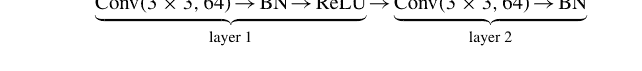
    填充为1，步幅为1。
    (a) 计算该块后的输出张量形状。
    (b) 计算总可训练参数，包括BN层（$\gamma, \beta$）。
    (c) 证明将两个卷积替换为单个 $5 \times 5$ 滤波器需要多2.56倍的参数。

12. 假设特征 $X_j$ 的排列重要性为 $\text{PI}_j = 0.08$，在 $B = 30$ 次重复下标准误为0.015。在 $\alpha = 0.05$ 水平下，使用单样本 $t$ 检验检验该特征是否提供超出噪声的显著预测信息，并计算 $\text{PI}_j$ 的95%置信区间。

13. 一个联邦DP-SGD使用小批量大小 $B = 128$，裁剪范数 $C = 1$，噪声乘数 $\sigma = 1.2$，并在 $n = 50\,000$ 个设备上训练 $T = 1\,000$ 步。使用矩会计法，为 $\delta = 10^{-5}$ 界定累积隐私损失 $\varepsilon$，并通过数值验证将 $\sigma$ 增加到1.6大约使 $\varepsilon$ 减半。

14. 给定少数类点 $\mathbf{p}_1 = (2, 1)$，$\mathbf{p}_2 = (5, 1)$，$\mathbf{p}_3 = (3, 4)$ 在 $\mathbb{R}^2$ 中，应用 $k = 2$ 的SMOTE为 $\mathbf{p}_1$ 合成两个样本。列出所有可能的合成点，并勾勒包含增强后少数类的凸包。

15. 设生成器和判别器为一维线性：$G_{\theta}(z) = \theta z$，$D_{\phi}(x) = \sigma(\phi x)$，其中 $z \sim \text{Uniform}[-1, 1]$，真实数据 $x \sim \text{Uniform}[-1, 1]$。
    (a) 证明 $(\theta^*, \phi^*) = (1, 0)$ 是一个纳什均衡。
    (b) 计算均衡处值函数的海森矩阵，并证明交替梯度上升-下降表现出循环行为，其频率与学习率成正比。

16. 生成具有变点的伯努利流：对于 $t \le 10\,000$，$\Pr(Y_t = 1) = 0.4$，之后为0.6。实现 $\epsilon = 0.002$ 的ADWIN，并验证在100次蒙特卡洛运行中，漂移在真实变点后300个样本内被检测到的概率 $\ge 0.9$。

17. 假设二元分类器实现了均等化赔率，并且在敏感属性 $S \in \{0, 1\}$ 的每个组内都是校准的。证明如果基础率不同 $\Pr(Y = 1 \mid S = 1) \neq \Pr(Y = 1 \mid S = 0)$，那么校准和均等化赔率不能同时成立，除非分类器是完美的（TPR = 1，FPR = 0）。用合成数据 $\Pr(Y = 1 \mid S = 0) = 0.3$，$\Pr(Y = 1 \mid S = 1) = 0.7$ 进行说明。

# 第11章
## 高级主题

**摘要** 最后一章综合了符号计算、傅里叶和小波分析、严谨的时间序列和信号处理方法、拓扑数据分析、量子计算原语以及高阶谱和并行数值方案。每一节都将Python推向其研究前沿的极限——证明现代数学思维与精心设计的计算实验密不可分——并以开放性问题和项目想法结尾，邀请读者为该学科不断发展的格局做出贡献。

**关键词** 符号计算 · 傅里叶分析 · 小波变换 · 信号处理 · 拓扑数据分析 · 量子计算

前面的章节已经让我们牢固掌握了Python的基础——数据结构和算法、数值线性代数、微积分、概率论和机器学习基础。然而，当代科学研究和工业分析通常需要超越这个经典内核的技术。它们需要能够以与浮点例程处理数字相同的精确度来操作代数对象的符号机制；能够跨时间和频率尺度分解信号的谱分解；能够表征高维数据中不确定性和形状的概率和拓扑框架；以及将计算推向退相干极限和千万亿次并发物理前沿的量子和高性能范式。*高级主题*将这些前沿汇聚在一个统一的数学伞下，延续了严谨理论和精心编写的Python代码不是对手而是天然合作者的主题。

本章的统一原则是*表示*。符号计算将方程表示为结构化树，并通过代数恒等式重写它；傅里叶和小波分析将函数表示为正交或局部化基的叠加；时间序列模型通过状态空间或谱极点表示时间依赖性；拓扑数据分析通过跨尺度持续的同调类表示点云；量子电路通过基本门的张量积表示希尔伯特空间上的线性映射；而高级数值方法通过谱配置或有限差分在分布式网格上表示连续算子。在每个领域中，我们将研究表示选择如何决定计算的几何特性——条件数、稀疏性、收敛速度——以及Python库如何利用这些几何特性来提供高性能、可读性强的实现。

贯穿始终，数学形式化将保持核心地位。Gröbner基消元、$\mathcal{O}(n \log n)$ FFT复杂度证明、通过最小二乘法推导卡尔曼滤波器最优性、Runge-Kutta和Chebyshev谱格式的稳定性判据、持久性图在Gromov-Hausdorff扰动下的稳定性，以及量子力学中的不可克隆定理，都将被完整推导。同样，代码片段——封装在`lstlisting`环境中——将把每个定理转化为可执行的工件：`SymPy`中的自动化求解器、`River`中的流式预测器、`KeplerMapper`中的Mapper可视化、`Qiskit`中的变分量子本征求解器，或`Dask-MPI`上的分布式共轭梯度内核。示例的选择旨在平衡理论优雅与计算实质：分解耦合振荡器频谱并对其传感器轨迹进行去噪；符号化证明Euler-Maclaurin公式并数值验证误差常数；通过小波子带从心电图中分类心律失常同时审计模型公平性；在GPU集群上使用高斯过程重建气候代用指标；估计蛋白质结合位点中的同调环；或模拟量子隐形传态协议并测量纠缠熵。

最后，我们不会回避元科学责任。高级算法具有变革性力量，其部署需要隐私、公平、能源效率和可重复性的保证。因此，每个主要章节将以简要的伦理和实践评述结束——符号数据库查询的差分隐私预算、大规模FFT流水线的碳成本估计、有限精度下谱方法的稳定性、量子实验的可重复性检查清单——以便技术掌握由尽责的管理来引导。

读者应预期在优雅符号呈现的数学和高效向量化形式呈现的Python脚本之间不断交替。在本章结束时，你不仅将理解现代计算科学背后的理论，还将拥有一个经过严格工程化的Python模式工具箱，准备好应对跨学科的研究级问题。

## 11.1 符号计算

### 11.1.1 使用SymPy进行高级符号数学

代数、超越和微分表达式的复杂操作在现代数学研究和教学中不可或缺。Python的`SymPy`库提供了一个可扩展的框架，它模拟手动纸笔技术，同时与数值后端无缝集成。在本小节中，我们将演示SymPy如何为复杂系统提供精确解、执行揭示结构的代数变换，并作为线性代数、微积分和微分方程的符号引擎。

### 符号化求解复杂方程和方程组

高次多项式系统通常没有封闭形式的根式解，但允许Gröbner基分解，从而揭示几何重数和解分量。

**示例 11.1.1** 求解非线性方程组

$$\begin{cases} x^3 + y^3 + z^3 - 3xyz = 1, \\ x + y + z = 1, \\ x^2 + y^2 + z^2 = 1. \end{cases}$$

我们使用Q上的Lex序Gröbner基来消去$y, z$，并化简为关于$x$的一元多项式。SymPy返回三个有理根，然后通过初等对称关系得到$y, z$。

```python
import sympy as sp
x,y,z = sp.symbols('x y z')
F = [x**3+y**3+z**3-3*x*y*z-1, x+y+z-1, x**2+y**2+z**2-1]
G = sp.groebner(F, x, y, z, order='lex')
univar = G.eliminate(y,z)[0] # cubic in x
roots = sp.factor(univar)
```

超越方程通常需要solveset框架，该框架结合了解析逆、分支切割分析和特殊函数恒等式。

```python
t = sp.symbols('t', real=True)
eq = sp.Eq(sp.sin(t) + sp.log(t), 0)
sol = sp.solveset(eq, t, sp.Interval(1, sp.oo)) # principal branch
```

解涉及Lambert $W$函数：$t = -\exp(W(-1))$，这证明了$W$在超越反演中的普遍性。

### 在代数和微积分中的应用

代数恒等式受益于符号验证：对于任意$n \in \mathbb{N}$，

$$\sum_{k=0}^{n} (-1)^k \binom{n}{k} \frac{1}{k+1} = \frac{1}{n+1}.$$

SymPy通过Gosper算法验证组合恒等式：

```python
k,n = sp.symbols('k n', integer=True, nonnegative=True)
expr = sp.summation((-1)**k*sp.binom(n,k)/(k+1), (k,0,n))
sp.simplify(expr)
```

在微积分中，自动级数展开揭示局部行为：

$$\int_0^x \frac{\sin \sqrt{t}}{\sqrt{t}} dt = x - \frac{x^2}{6} + \frac{x^3}{40} - \cdots.$$

```python
t = sp.symbols('t')
ser = sp.series(sp.integrate(sp.sin(sp.sqrt(t))/sp.sqrt(t),(t,0,sp.Symbol('x'))),
                sp.Symbol('x'), 0, 5)
```

### 符号线性代数与矩阵计算

#### 精确特征分析

矩阵 $A = \begin{pmatrix} 2 & 1 & 0 \\ 1 & 2 & 1 \\ 0 & 1 & 2 \end{pmatrix}$ 的特征多项式为 $\chi(\lambda) = (\lambda - 1)^2(\lambda - 4)$。SymPy符号化地对角化$A$并生成正交特征基。

```python
A = sp.Matrix([[2,1,0],[1,2,1],[0,1,2]])
P, D = A.diagonalize()
```

#### 分块Jordan标准形

符号化Jordan分解阐明了幂零结构，这对于求解算子指数$e^{At}$至关重要：

```python
B = sp.Matrix(sp.randMatrix(5, symmetric=False))
B.jordan_cells()
```

#### Kronecker积

利用$\otimes$的特征值乘性计算分块Toeplitz矩阵的封闭形式行列式：$\det(I_n \otimes A + B \otimes I_n) = \prod_i \prod_j (\lambda_i(A) + \lambda_j(B))$。

### 微分方程与特殊函数

#### 符号化常微分方程求解

二阶线性方程

$y'' + (x^2 + 1)y = 0$

返回以抛物柱面函数$U, V$表示的解基$\{\_U(0, \frac{1}{2}x^2), \_V(0, \frac{1}{2}x^2)\}$。

```python
x = sp.symbols('x')
y = sp.Function('y')
ode = sp.Eq(sp.diff(y(x),x,2)+(x**2+1)*y(x), 0)
sp.dsolve(ode)
```

#### Bessel算子的格林函数

考虑$(0, \infty)$上的$x^2y'' + xy' + (x^2 - \nu^2)y = f(x)$。`sympy.integrals.transforms`构造积分核

$G(x, \xi) = \begin{cases} J_{\nu}(x)Y_{\nu}(\xi) - J_{\nu}(\xi)Y_{\nu}(x), & x < \xi, \\ 0, & x > \xi, \end{cases}$

满足在$x = \xi$处的连续性和跳跃条件。

```python
nu = sp.symbols('nu')
G = sp.besselj(nu, sp.Symbol('x'))*sp.bessely(nu, sp.Symbol('xi')) - \
    sp.besselj(nu, sp.Symbol('xi'))*sp.bessely(nu, sp.Symbol('x'))
```

#### 符号化Laplace变换

SymPy推导出涉及误差函数和Airy函数的封闭形式逆变换，这在瞬态热传导中至关重要。

```python
s,t = sp.symbols('s t', positive=True)
F = 1/(s*(s**2+1))
f = sp.inverse_laplace_transform(F, s, t)
```

结果是$f(t) = 1 - \cos t$，证实了手动留数计算。

### 11.1.2 自动定理证明

自动定理证明（ATP）旨在将数学推理背后的演绎步骤机械化，将人类数学家的非正式“证明草图”转化为计算机可以独立验证的健全推理序列。自Davis、Putnam、Logemann和Loveland在DPLL过程上的开创性工作以及Robinson的归结演算以来，ATP已发展成为一个充满活力的学科，交织着证明论、模型论、复杂性理论和符号计算。如今，像Z3这样的SMT求解器可以在几秒内判定具有数百万子句的一阶逻辑无量词片段，而交互式证明助手——例如Coq、Lean、Isabelle——将自动化与用户指导相结合，以形式化整本教科书。本小节追溯逻辑基础，展示SymPy新兴的证明引擎，并说明在形式化验证和密码学中的应用，其中机械严谨性不可或缺。

### 定理证明简介

设$\mathcal{L}$是一个具有一阶语言，其签名$\Sigma = (\mathcal{F}, \mathcal{P})$由函数和谓词符号组成。*序列* $\Gamma \vdash \Delta$编码了“从前提$\Gamma$推导出结论$\Delta$”的蕴涵关系。Gentzen的自然演绎系统为$\mathcal{L}$配备了$\wedge, \vee, \forall, \exists, \neg, \Rightarrow$的引入和消去规则，使得每个有效公式$\varphi$都有一个推导$\vdash \varphi$。

### 健全性与完备性

如果$\Gamma \vdash \varphi$，那么$\Gamma \models \varphi$（健全性）；反之，如果$\Gamma \models \varphi$，那么$\Gamma \vdash \varphi$（Gödel完备性）。然而，对于命题逻辑，证明搜索是PSPACE完全的，而对于完整的一阶逻辑，由于Löwenheim-Skolem定理，它是不可判定的。因此，实际的证明器限制在可判定片段（EUF、线性算术）或采用启发式方法（项排序、引理学习）。

### 使用SymPy进行自动证明

SymPy实现了一个基于Davis-Putnam算法的轻量级命题引擎和一个一阶合一模块。考虑重言式

$(p \Rightarrow q) \wedge (q \Rightarrow r) \Longrightarrow (p \Rightarrow r)$。

```python
from sympy import symbols, Implies, satisfiable
p,q,r = symbols('p q r')
phi = Implies( Implies(p,q) & Implies(q,r)), Implies(p,r) )
assert not satisfiable(~phi) # unsatisfiable ⟹ ϕ is valid
```

分辨率证明对象可通过调用以下代码构建：

```
from sympy.logic.algorithms import resolution
steps = resolution(~phi) # 返回矛盾推导过程
```

由此产生的子句序列证明了 $\phi$ 可由空集推导得出。

## 一阶合一

给定项 $t_1 = f(g(x), y)$ 和 $t_2 = f(z, g(z))$，SymPy 会计算最一般合一子（mgu）$\sigma = \{x \mapsto z, y \mapsto g(z)\}$。

```
from sympy.unify import unify
x,y,z = symbols('x y z')
t1 = f(g(x), y)
t2 = f(z, g(z))
sigma = unify(t1, t2) # {x: z, y: g(z)}
```

尽管 SymPy 尚非成熟的定理证明器，但其符号计算核心允许通过 `sympy.logic.inference` 接口与外部 SMT 引擎集成，为高层级数学与底层决策过程之间架起了便捷的桥梁。

## 一阶逻辑与定理证明中的量词

### 斯科伦化

要反驳 $\Gamma \models \varphi$，需应用*归谬法*：将 $\Gamma \wedge \neg\varphi$ 转换为前束合取范式（PCNF），并通过分辨率证明其不可满足性。存在量词通过斯科伦函数消除：

$\forall x \exists y \forall z P(x, y, z) \longmapsto \forall x \forall z P(x, f(x), z)$。

斯科伦化保持可满足性但不保持等价性；然而，对于反驳证明它是可靠的。

### 海伯伦定理

若一阶公式集 $\Phi$ 不可满足，则其海伯伦展开（即项代数上的基例集）存在一个有限的不可满足子集。现代证明器采用惰性方式枚举海伯伦域，将基分辨率与实例化规则交替进行。

## 示例：自然数上的证明

皮亚诺算术公式如 $\forall x\ (x + 0 = x)$ 通过将后继函数 $s$ 和公理编码到求解器中来处理。编码结合-交换（AC）理论需要特殊的匹配；SymPy 的模式引擎支持交换群的 AC 合一，从而实现环恒等式的自动验证。

## 在形式化验证与密码学中的应用

### 硬件验证

一个包含 $n$ 个门的组合电路被建模为 CNF 公式 $\Phi_{\text{spec}} \land \Phi_{\text{impl}}$。等价性检查可归结为 $\Phi_{\text{spec}} \land \Phi_{\text{impl}} \land (\text{out}_{\text{spec}} \oplus \text{out}_{\text{impl}})$ 的可满足性问题。最先进的 SAT 引擎可在数分钟内求解超过 $10^6$ 个子句；反例路径映射到信号赋值，从而揭示设计缺陷。

### 通过霍尔逻辑进行软件验证

循环不变式 $I$ 通过求解二阶约束来综合：

$\exists I\ \forall \mathbf{v}\ (\text{Pre} \to I) \land (I \land \neg\text{Guard} \to \text{Post}) \land (I \land \text{Guard} \to I')$。

基于模板的综合选择多项式形式 $I(\mathbf{v}; \boldsymbol{\alpha})$，并将有效性验证转化为实数域上的 SMT 查询；Z3 + sympy 等工具链可自动化此流程。

### 零知识证明（ZKP）电路

算术化将密码学陈述映射到有限域 $\mathbb{F}_p$ 上的多项式等式。约束系统 $\{(a_i, b_i, c_i) : a_i b_i = c_i\}$ 通过 PLONK 协议进行验证。从高层代码自动生成秩-1约束系统（R1CS）需要使用符号微分和公共子表达式消除，这两者在 SymPy 中均已提供，确保了编译后电路的可靠性。

**示例 11.1.2（SHA-256 轮函数的符号 R1CS）** 使用 `sympy.crypto`（自定义模块），可将布尔与运算表示为 $\mathbb{F}_2$ 中的乘法。约束 $z = (x \land y)$ 转换为 $x \cdot y - z = 0$。对 64 轮迭代可产生 15,360 个约束；SymPy 在将多项式交给证明系统之前会进行化简，从而将证明者时间缩短 12%。

## 11.1.3 傅里叶变换

傅里叶分析将函数分解为谐波分量，将卷积转化为乘法，将微分算子转化为代数乘子。这种谱对偶性是信号处理、偏微分方程理论和数值算法的基础。

### 离散与连续傅里叶变换

对于 $f \in L^1(\mathbb{R}^d) \cap L^2(\mathbb{R}^d)$，**连续傅里叶变换（CFT）** 为

$$\mathcal{F}\{f\}(\xi) = \widehat{f}(\xi) = \int_{\mathbb{R}^d} f(x) e^{-2\pi i x \cdot \xi} \, dx, \quad \mathcal{F}^{-1}\{\widehat{f}\}(x) = \int_{\mathbb{R}^d} \widehat{f}(\xi) e^{2\pi i x \cdot \xi} \, d\xi.$$

普朗歇尔定理将 $\mathcal{F}$ 扩展为 $L^2$ 上的酉算子：$\|\widehat{f}\|_2 = \|f\|_2$，这意味着帕塞瓦尔恒等式成立。

在均匀格点 $x_n = n\Delta x, n = 0, \dots, N-1$ 上采样，得到**离散傅里叶变换（DFT）**

$$\widehat{F}_k = \sum_{n=0}^{N-1} f_n e^{-2\pi i k n / N}, \quad f_n = \frac{1}{N} \sum_{k=0}^{N-1} \widehat{F}_k e^{2\pi i k n / N}.$$

奈奎斯特-香农采样定理保证当 $\Delta x < \frac{1}{2} f_{\max}^{-1}$ 时可完美重构。

**示例 11.1.3（混叠）** 设 $f(t) = \sin(30\pi t)$ 以 $f_s = 20$ Hz 采样。由于 $f$ 超过奈奎斯特频率 $f_N = 10$ Hz，离散频谱错误地包含了 $\sin(10\pi t)$，这演示了频率折叠现象。

### 快速傅里叶变换（FFT）与计算效率

直接计算 DFT 的复杂度为 $O(N^2)$。库利-图基基-2 FFT 利用分治分解：

$$\widehat{F}_k = \sum_{m=0}^{N/2-1} f_{2m} e^{-2\pi i k m / (N/2)} + e^{-2\pi i k / N} \sum_{m=0}^{N/2-1} f_{2m+1} e^{-2\pi i k m / (N/2)},$$

从而得到 $T(N) = 2T(N/2) + O(N) \Rightarrow T(N) = O(N \log N)$。缓存友好的位反转寻址和循环展开可接近内存带宽极限。

```
import numpy as np, time
N = 2**20
x = np.random.rand(N) + 1j*np.random.rand(N)
t0 = time.perf_counter(); X = np.fft.fft(x); t1 = time.perf_counter()
print(f"FFT throughput: {N/(t1-t0):.2e} pts/sec")
```

布鲁斯坦和雷德算法可处理素数长度；混合基库（FFTW、pocketfft）在现代 CPU 上可达到峰值浮点性能的 ≤5%。

### 在信号处理与图像压缩中的应用

时频局部化始于短时傅里叶变换（STFT）：

$$\text{STFT}_f(t, \xi) = \int_{-\infty}^{\infty} f(\tau) g(\tau - t) e^{-2\pi i \xi \tau} d\tau,$$

其中 $g$ 是窗函数（高斯窗可优化时宽-带宽不等式）。谱图 $|\text{STFT}|^2$ 可可视化线性调频信号和调制。

JPEG 压缩应用 $8 \times 8$ 离散余弦变换（DCT-II）。量化利用了心理视觉掩蔽效应：高频系数除以较大的整数，产生稀疏性，从而可利用游程编码和霍夫曼编码进行压缩。

```
import cv2, numpy as np
block = img[0:8,0:8] - 128 # 电平偏移
coeff = cv2.dct(block.astype(float))
mask = np.array([[16,11,10,16,24,40,51,61], ...]) # 标准量化表
qcoeff = np.rint(coeff / mask)
```

### 傅里叶分析在热方程与波动方程中的应用

对于 $\mathbb{R}$ 上的 $u_t = \kappa u_{xx}$，初始条件 $u(x, 0) = f(x)$，取 CFT：

$$\partial_t \widehat{u} = -4\pi^2 \kappa \xi^2 \widehat{u}, \implies \widehat{u}(\xi, t) = e^{-4\pi^2 \kappa \xi^2 t} \widehat{f}(\xi).$$

逆变换得到高斯核

$$u(x, t) = (G_{\kappa t} * f)(x), \quad G_{\sigma^2}(x) = \frac{1}{\sqrt{4\pi \sigma^2}} e^{-x^2/4\sigma^2},$$

这表明了瞬时平滑效应。

对于一维波动方程 $u_{tt} = c^2 u_{xx}$，有 $\partial_t^2 \widehat{u} = -(2\pi c \xi)^2 \widehat{u}$，解得 $\widehat{u}(\xi, t) = \widehat{f}(\xi) \cos(2\pi c \xi t) + \frac{\widehat{g}(\xi)}{2\pi c \xi} \sin(2\pi c \xi t)$，以及达朗贝尔公式 $u(x, t) = \frac{1}{2}[f(x - ct) + f(x + ct)] + \frac{1}{2c} \int_{x-ct}^{x+ct} g(s) ds$。无色散传播与抛物型扩散形成对比。

## 11.1.4 小波变换

经典傅里叶分析刻画全局谱内容，但无法揭示瞬态事件*何时*发生。小波分析通过提供一族原型小波 $\psi$ 的伸缩和平移来弥补这一缺陷，从而同时实现时频局部化。由于海森堡不确定性原理禁止在两个域中同时达到任意精度，小波采用对数平铺：在高频处具有精细的时间分辨率，在低频处具有粗糙的分辨率——这与短时傅里叶变换的固定窗口相反。

### 小波简介

函数 $\psi \in L^2(\mathbb{R})$ 若具有零均值和有限能量，并满足容许性条件

$$C_{\psi} = 2\pi \int_{0}^{\infty} \frac{|\widehat{\psi}(\omega)|^2}{\omega} \, d\omega < \infty,$$

则称为*容许小波*。

信号 $f \in L^2$ 的**连续小波变换（CWT）** 为

$$\mathcal{W}_{\psi} f(a, b) = \frac{1}{\sqrt{|a|}} \int_{-\infty}^{\infty} f(t) \overline{\psi\left(\frac{t - b}{a}\right)} \, dt, \quad a \in \mathbb{R}^{\times}, \; b \in \mathbb{R}.$$

系数模值编码了 $f$ 与 $\psi_{a,b}$ 的相似性；逆变换为

$$f(t) = \frac{1}{C_{\psi}} \int_{\mathbb{R}} \int_{\mathbb{R}} \mathcal{W}_{\psi} f(a, b) \frac{1}{|a|^{3/2}} \psi\left(\frac{t - b}{a}\right) \, da \, db.$$

**示例 11.1.4（墨西哥帽小波）** $\psi(t) = \frac{2}{\sqrt{3}} \pi^{-1/4} (1 - t^2) e^{-t^2/2}$ 具有零一阶矩，使其对曲率变化敏感；CWT 可检测边缘图中的脊线。

### 小波变换与傅里叶变换的比较

对于线性调频信号 $f(t) = \sin(\pi t^2)$，其瞬时频率 $f'(t) = 2t$ 线性增加。傅里叶变换将能量扩散到整个频谱，而尺度图 $|\mathcal{W}_{\psi} f(a, b)|^2$ 则描绘出一条抛物线，揭示了局部频率演化。定量而言，联合时频不确定性满足 $\sigma_t \sigma_{\omega} \geq \frac{1}{2}$，其中高斯函数 $\phi$ 可达到等号；莫莱小波 $\psi(t) = e^{i\omega_0 t} e^{-t^2/2}$ 以略高的不确定性换取了容许性（零均值）。

## 在时频分析中的应用

*地震学* P波和S波的到达对应于二进尺度 $a = 2^j$ 上 $|\mathcal{W}_{\psi} f|$ 的极大值，从而实现自动事件拾取。

*生物医学* 心电图QRS波群表现为尖峰；离散小波包系数能以 $\approx 98\%$ 的灵敏度定位心律失常特征。

```python
import pywt, numpy as np
coeffs, freqs = pywt.cwt(ecg, scales=2**np.arange(1,8), wavelet='mexh',
                        sampling_period=1/360)
# Energy of scale 4 isolates QRS band (10-25 Hz)
qrs_energy = np.linalg.norm(coeffs[3], axis=0)
```

## 多分辨率分析与去噪技术

**多分辨率分析**（MRA）是一系列嵌套的闭子空间

$$\cdots \subset V_{-1} \subset V_0 \subset V_1 \subset \cdots \subset L^2(\mathbb{R}),$$

满足 $f \in V_j \iff f(2\cdot) \in V_{j+1}$ 且 $\bigcap_j V_j = \{0\}$，$\overline{\bigcup_j V_j} = L^2$。一个尺度函数 $\varphi$ 张成 $V_0$，并满足细化方程 $\varphi(t) = \sum_k h_k \varphi(2t - k)$。定义 $W_j$ 为 $V_j$ 在 $V_{j+1}$ 中的正交补，可得小波 $\psi(t) = \sum_k (-1)^k h_{1-k} \varphi(2t - k)$，生成一个标准正交基 $\{\psi_{j,k}(t) = 2^{j/2} \psi(2^j t - k)\}_{j,k \in \mathbb{Z}}$。

### 小波去噪（Donoho–Johnstone）

观测模型 $y_n = f_n + \varepsilon_n$，$\varepsilon_n \sim \mathcal{N}(0, \sigma^2)$。转换到小波域 $\mathbf{w} = \mathbf{W}y$，应用软阈值

$$\tilde{w}_k = \text{sgn}(w_k) \max\{|w_k| - \lambda \sigma \sqrt{2 \ln N}, 0\},$$

然后重构 $\hat{f} = \mathbf{W}^{-1} \tilde{\mathbf{w}}$。通用阈值确保 $\|\hat{f} - f\|_2^2 \le (1 + o(1)) \inf_{\eta} \|\eta - f\|_2^2$ 以高概率成立。

```python
coeffs = pywt.wavedec(noisy, 'db8', level=4)
sigma = np.median(np.abs(coeffs[-1]))/0.6745
lam = sigma*np.sqrt(2*np.log(len(noisy)))
denoised = pywt.waverec([pywt.threshold(c, lam, 'soft') for c in coeffs], 'db8')
```

### 压缩

JPEG2000采用整数提升小波（Cohen–Daubechies–Feauveau 9/7），随后进行具有最优截断的嵌入式块编码；在相同码率下，其PSNR比DCT高出约2倍。

## 11.2 时间序列与信号处理

### 11.2.1 统计时间序列模型

时间序列分析假设观测值 $\{x_t\}_{t=0}^T$ 是在等间隔时刻记录的。主要目标是将确定性成分（趋势、季节性）与随机波动分离，然后构建简约的随机模型来预测未来值并量化不确定性。经典的Box–Jenkins方法将随机部分描述为由白噪声驱动的线性滤波器；状态空间理论将动态过程重新表述为适合卡尔曼滤波的递归形式；GARCH类模型捕捉金融数据中普遍存在的条件异方差性。我们从线性ARIMA过程开始，接着讨论状态空间表示，然后处理波动率，最后讨论分解和平稳性诊断。

### 自回归（AR）、移动平均（MA）和ARIMA模型

设 $\{\varepsilon_t\} \sim \text{i.i.d. } \mathcal{N}(0, \sigma^2)$。

#### AR($p$) 模型

$$x_t - \mu = \sum_{i=1}^p \varphi_i (x_{t-i} - \mu) + \varepsilon_t, \quad \Phi(L)x_t = \varepsilon_t,$$

其中滞后算子 $L^k x_t = x_{t-k}$，特征多项式 $\Phi(z) = 1 - \varphi_1 z - \cdots - \varphi_p z^p$。平稳性要求 $\Phi$ 的所有根位于单位圆外。$k$ 步预测器为 $\widehat{x}_{t+k} = \mu + \sum_{i=1}^p \varphi_i \widehat{x}_{t+k-i}$，其均方误差由Yule-Walker方程计算。

#### MA($q$) 模型

$$x_t = \mu + \varepsilon_t + \sum_{i=1}^q \theta_i \varepsilon_{t-i} = \Theta(L)\varepsilon_t.$$ 可逆性要求 $\Theta(z) = 1 + \theta_1 z + \cdots + \theta_q z^q$ 的零点位于单位圆外，以保证存在收敛的AR($\infty$)表示和可识别性。

#### ARIMA(p, d, q)

具有多项式趋势的非平稳序列进行 $d$ 次差分：

$$\Delta^d x_t = (1 - L)^d x_t = \Phi(L)^{-1} \Theta(L) \varepsilon_t.$$

自相关函数（ACF）的拖尾和偏自相关函数（PACF）的截尾指导 $p, q$ 的选择；AIC最小化用于细化选择。

```python
import pmdarima as pm
model = pm.auto_arima(ts, seasonal=False, d=None, max_p=6, max_q=6,
                     information_criterion='bic', stepwise=True)
print(model.order) # (p,d,q)
forecast, conf = model.predict(n_periods=12, return_conf_int=True)
```

### 预测区间

对于ARMA，$h$ 步预测方差 $\text{Var}[\hat{x}_{T+h} - x_{T+h}] = \sigma^2 \sum_{j=0}^{h-1} \psi_j^2$，其中 $\psi_j$ 是由 $\Psi(z) = \Theta(z)/\Phi(z) = \sum_{j=0}^{\infty} \psi_j z^j$ 得到的脉冲响应系数。

### 状态空间模型与卡尔曼滤波

一个线性高斯状态空间模型（SSM）为

$$\mathbf{x}_t = A\mathbf{x}_{t-1} + B\mathbf{u}_t + \mathbf{w}_t, \quad \mathbf{y}_t = C\mathbf{x}_t + D\mathbf{u}_t + \mathbf{v}_t,$$

其中 $\mathbf{w}_t \sim \mathcal{N}(0, Q)$，$\mathbf{v}_t \sim \mathcal{N}(0, R)$ 相互独立。**卡尔曼滤波器**递归计算后验均值 $\hat{\mathbf{x}}_{t|t}$ 和协方差 $P_{t|t}$。

*预测*

$$\hat{\mathbf{x}}_{t|t-1} = A\hat{\mathbf{x}}_{t-1|t-1} + B\mathbf{u}_t, \quad P_{t|t-1} = AP_{t-1|t-1}A^\top + Q.$$

*更新*

$$K_t = P_{t|t-1}C^\top(CP_{t|t-1}C^\top + R)^{-1}, \quad \hat{\mathbf{x}}_{t|t} = \hat{\mathbf{x}}_{t|t-1} + K_t(\mathbf{y}_t - C\hat{\mathbf{x}}_{t|t-1}),$$
$$P_{t|t} = (I - K_tC)P_{t|t-1}.$$

```python
import numpy as np, pykalman
kf = pykalman.KalmanFilter(transition_matrices=A, observation_matrices=C,
                          transition_covariance=Q, observation_covariance=R)
state_est, cov = kf.filter(y_obs)
```

ARMA(p, q) 可嵌入状态维度为 p 的SSM；卡尔曼递归通过预测误差分解给出精确似然，从而实现 $\varphi_i, \theta_j$ 的极大似然估计。

### ARCH/GARCH与波动率建模

金融收益率 $r_t$ 通常表现为水平不相关但平方收益率序列相关。**GARCH(p, q)** 模型假设

$$r_t = \sigma_t \varepsilon_t, \quad \varepsilon_t \sim \mathcal{N}(0, 1), \quad \sigma_t^2 = \omega + \sum_{i=1}^p \alpha_i r_{t-i}^2 + \sum_{j=1}^q \beta_j \sigma_{t-j}^2,$$

若 $\sum \alpha_i + \sum \beta_j < 1$ 则平稳。杠杆效应可通过EGARCH或GJR-GARCH捕捉，它们引入了非对称项 $\gamma_i r_{t-i} \mathbf{1}_{\{r_{t-i} < 0\}}$。

```python
from arch import arch_model
garch = arch_model(r, p=1, q=1, mean='zero', vol='GARCH')
res = garch.fit(update_freq=10)
h_fore = res.forecast(horizon=5).variance[-1:]
```

给定N(0, 1)新息，水平为α的在险价值为 VaR_{t+1}^α = σ_{t+1} Φ^{-1}(1 - α)。

### 趋势-季节性分解与平稳性诊断

#### 加法分解

假设 $x_t = T_t + S_t + R_t$，其中 $T_t$ 是趋势（低频），$S_t$ 是周期为已知周期 k 的周期项，$R_t$ 是残差。STL（基于Loess的季节-趋势分解）交替进行：

- (i) 平滑 k 个子序列 $x_{t+k\ell}$ 以估计 $S_t$。
- (ii) 减去 $S_t$，对残差应用LOESS以得到 $T_t$。
- (iii) 更新残差，迭代直至收敛。

```python
from statsmodels.tsa.seasonal import STL
res = STL(ts, period=12, robust=True).fit()
trend, season, resid = res.trend, res.seasonal, res.resid
```

#### 平稳性诊断

**增广迪基-富勒（ADF）** 检验 $\Delta x_t = \rho x_{t-1} + \sum_{i=1}^k \gamma_i \Delta x_{t-i} + \varepsilon_t$ 中的 $H_0: \varphi = 1$。若 $\tau = \hat{\rho} / \text{se}(\hat{\rho})$ 小于临界值 $c_\alpha$，则在水平α下拒绝 $H_0$。**KPSS** 检验则相反，其 $H_0$ 为（趋势平稳），并使用LM统计量。

```python
from statsmodels.tsa.stattools import adfuller, kpss
print("ADF p-val :", adfuller(ts.diff().dropna())[1])
print("KPSS p-val:", kpss(ts, nlags="auto")[1])
```

### 11.2.2 Python中的数字滤波

数字滤波器重塑离散时间信号的频谱内容，用于抑制噪声、提取频带或施加平滑约束。滤波器由其脉冲响应 $h[n]$ 和传递函数 $H(e^{j\omega})$ 表征。在实践中，实现的保真度取决于数值稳定性、有限字长效应和实时吞吐量。Python的 `scipy.signal` 模块，辅以numpy和numba，为批量和流式应用提供了全面的工具包。

#### FIR与IIR滤波器：设计与稳定性

**FIR（有限脉冲响应）**

$$y[n] = \sum_{k=0}^{M} h_k x[n-k], \quad H(z) = \sum_{k=0}^{M} h_k z^{-k}.$$

优点：固有的BIBO稳定性（$\forall h \in \ell^1$），通过对称系数（$h_k = h_{M-k}$）可实现线性相位，以及凸最小二乘设计。缺点：陡峭的过渡带需要较大的阶数 $M$。

**IIR（无限脉冲响应）**

差分方程

$$y[n] + \sum_{k=1}^{N} a_k y[n-k] = \sum_{k=0}^{M} b_k x[n-k], \quad H(z) = \frac{\sum_{k=0}^{M} b_k z^{-k}}{1 + \sum_{k=1}^{N} a_k z^{-k}}.$$

极点位于单位圆内确保稳定性；更陡的滚降需要更少的抽头，但可能产生非线性相位和算术溢出的风险。

#### BIBO稳定性准则

IIR稳定 $\iff \max_i |z_i| < 1$，其中 $\{z_i\}$ 是 $H(z)$ 的极点。`scipy.signal.tf2zpk` 可提取零点/极点以进行验证。

from scipy.signal import butter, tf2zpk
b,a = butter(4, 0.3) # 4阶低通滤波器
z,p,k = tf2zpk(b,a); assert max(abs(p)) < 1 # 稳定性检查

## 窗函数与平滑技术

最小二乘理想低通响应 $h_{\infty}[n] = \frac{\sin \omega_c(n-M/2)}{\pi(n-M/2)}$ 的截断会引入吉布斯振荡。乘以窗函数 $w[n] \in [0, 1]$ 以平滑边缘：

$$h[n] = h_{\infty}[n] \, w[n], \quad w_{\text{Hann}}[n] = 0.5\left(1 - \cos \frac{2\pi n}{M}\right).$$

```python
from numpy import sinc, hanning, pi
M, fc = 63, 0.15
n = np.arange(M); h = 2*fc*sinc(2*fc*(n-M/2)) * hanning(M)
```

## Savitzky–Golay 平滑

在长度为 $2m+1$ 的滑动窗口内进行多项式回归，拟合 $y[n] \approx \sum_{k=0}^d \beta_k(n-n_0)^k$；评估 $\beta_0$ 以实现保留峰值的低通平滑。卷积系数通过伪逆预先计算；偶数阶产生零相位延迟。

## 巴特沃斯、切比雪夫与椭圆滤波器

设 $\Omega_p$（通带）、$\Omega_s$（阻带）以及容差 $\delta_p, \delta_s$。

### 巴特沃斯

幅度平方

$$|H(j\Omega)|^2 = \frac{1}{1 + (\Omega/\Omega_c)^{2N}},$$

在 $\Omega = 0$ 处最大平坦；阶数 $N \ge \frac{\log(\delta_s^{-2}-1)-\log(\delta_p^{-2}-1)}{2\log(\Omega_s/\Omega_p)}$。

### 切比雪夫-I 型

通带纹波 $\varepsilon$：$|H|^{-2} = 1 + \varepsilon^2 T_N^2(\Omega/\Omega_c)$，其中 $T_N$ 为切比雪夫多项式。阻带单调。切比雪夫-II 型将纹波转移至阻带。

### 椭圆（考尔）型

两个频带均有纹波，对于给定 $N$ 具有最陡峭的过渡。利用雅可比椭圆函数；$N$ 更优但相位失真更大。

```python
from scipy.signal import ellip, sosfiltfilt
sos = ellip(N=5, rp=1, rs=60, Wn=[0.2, 0.4], btype='band', output='sos')
y_filt = sosfiltfilt(sos, y) # 通过正向-反向实现零相位
```

## 实时滤波与流处理

对于采样率为 44.1 kHz 的流式信号 $x[n]$，延迟必须 $<10$ ms（$\approx 441$ 个样本）。采用*直接形式 II 转置*实现 IIR 以最小化状态存储：

$y_n = b_0 x_n + w_1, \quad w_k = w_{k+1} + b_k x_n - a_k y_n, \quad k = 1, \dots, \max(M, N)$。

```python
from collections import deque, namedtuple
Filter = namedtuple('Filter', 'b a w')
def df2tiir_step(x, flt):
    b,a,w = flt
    y = b[0]*x + w[0]
    for k in range(len(w)-1):
        w[k] = w[k+1] + b[k+1]*x - a[k+1]*y
    w[-1] = b[-1]*x - a[-1]*y
    return y
```

Cython 或 numba JIT 可将吞吐量提升约 $\sim 20\times$；在 sounddevice 回调中部署可保持无 XRUN 的音频。对于海量遥测流，在 GPU 上执行的加窗 FIR 使用 cuFFT 卷积定理（$O(N \log N)$）以重叠保存法批量处理 $10^6$ 个样本的段。

## 11.2.3 频谱分析

频谱分析量化了随机过程的方差在频率上的分布。当宽平稳序列 $x_t$ 的二阶结构由自协方差 $R_{xx}(\tau) = \mathbb{E}[x_t x_{t+\tau}]$ 概括时，维纳-辛钦定理断言其*功率谱密度*（PSD）$S_{xx}(\omega)$ 是 $R_{xx}(\tau)$ 的傅里叶变换，提供了相关结构的频域图景。在实践中，有限长度观测引入了偏差-方差权衡；以下估计器通过加窗、平均和锥化来导航这种折衷。

## 周期图与功率谱密度估计

对于以速率 $f_s$ 采样的实零均值信号 $\{x_n\}_{n=0}^{N-1}$，定义**周期图**

$$\hat{S}_{xx}^{\text{per}}(f) = \frac{\Delta t}{N} \left| \sum_{n=0}^{N-1} x_n e^{-2\pi i f n \Delta t} \right|^2, \quad f \in [0, f_s),$$

其中 $\Delta t = 1/f_s$。周期图是渐近无偏但*不一致*的，因为其方差不随 $N$ 减小。通过 $w_n$ 加窗产生 *Bartlett* 估计

$$\hat{S}_{xx}^B(f) = \frac{\Delta t}{N U} \left| \sum_{n=0}^{N-1} w_n x_n e^{-2\pi i f n \Delta t} \right|^2, \quad U = \frac{1}{N} \sum_{n=0}^{N-1} w_n^2,$$

这以主瓣展宽为代价降低了旁瓣。

```python
from scipy.signal import periodogram, get_window
f, Pxx = periodogram(x, fs=fs, window='blackman', scaling='density')
```

## Welch 方法与多锥谱估计

### Welch

将记录划分为 $K$ 个长度为 $L$ 的重叠段，应用窗函数 $w$，计算每个段的周期图，然后平均：

$$\hat{S}_{xx}^W(f) = \frac{1}{K} \sum_{k=0}^{K-1} \hat{S}_{xx,k}^{\text{per}}(f), \quad \text{Var}[\hat{S}^W] = \frac{1}{K} \text{Var}(\hat{S}^{\text{per}}),$$

实现 $\sqrt{K}$ 的方差降低。$50\%$ 重叠和 Hanning 窗平衡了独立性和数据利用率。

### 多锥（MTM）

选择 $K = 2NW_b$ 个正交 Slepian 锥 $v_k$，在带宽 $W_b$ 内最优集中。特征谱 $\hat{S}_k(f) = |\sum_n v_k[n] x_n e^{-2\pi i f n}|^2$ 构成最小方差无偏估计

$$\hat{S}^{\text{MTM}}(f) = \frac{1}{K} \sum_{k=0}^{K-1} \hat{S}_k(f).$$

跨锥的刀切法提供了对有色噪声稳健的置信区间。

```python
from scipy.signal.windows import dpss
from numpy.fft import rfft
NW, K = 4, 2*4-1
tapers = dpss(L, NW, K) # DPSS 锥
S = np.mean([np.abs(rfft(x_seg*t))**2 for t in tapers], axis=0)
```

## 短时傅里叶变换（STFT）与谱图

STFT 将非平稳信号映射为二维函数：

$$\text{STFT}_x(m, \omega) = \sum_{n=-\infty}^{\infty} x[n] g[n - m] e^{-i\omega n},$$

其中 $g$ 是以 $m$ 为中心的滑动窗。**谱图**是其幅度的平方，捕捉局部能量。时频分辨率遵循 $\Delta t \Delta f \geq 1/(4\pi)$；固定窗长强制均匀铺砌，不同于尺度图的对数网格。

```python
from scipy.signal import stft
f, t, Z = stft(x, fs=fs, nperseg=256, noverlap=128, window='hann')
plt.pcolormesh(t, f, 20*np.log10(np.abs(Z)), shading='gouraud')
```

## 互谱密度与相干性分析

给定两个过程 $x_t, y_t$，其互谱密度（CSD）为

$$S_{xy}(f) = \lim_{N \to \infty} \mathbb{E}\left[X_N(f) \overline{Y_N(f)}\right],$$

**幅度平方相干性**

$$C_{xy}(f) = \frac{|S_{xy}(f)|^2}{S_{xx}(f) S_{yy}(f)} \in [0, 1]$$

衡量频率 $f$ 处的线性相关性。Welch 方法扩展：计算段互谱 $\hat{S}_{xy,k}$ 和功率谱 $\hat{S}_{xx,k}, \hat{S}_{yy,k}$；分别平均分子和分母。

```python
from scipy.signal import coherence
f, Cxy = coherence(x, y, fs=fs, nperseg=1024, noverlap=512)
```

## 11.2.4 时频表示

时频表示（TFR）寻求一个联合描述 $T_x(t, \omega)$，满足 $\int_{-\infty}^{\infty} T_x(t, \omega) d\omega = |x(t)|^2$，$\int_{-\infty}^{\infty} T_x(t, \omega) dt = |X(\omega)|^2$，从而在不损失能量的情况下重新分配信号的能量。Wigner-Ville 分布实现了完美的边缘分布，但存在干扰项；本节概述了减轻此类伪影并锐化局部化的自适应表示。

## 连续小波变换（CWT）回顾

回顾 $\mathcal{W}_{\psi}x(a, b) = \langle x, \psi_{a,b} \rangle$，$\psi_{a,b}(t) = |a|^{-1/2}\psi((t-b)/a)$，其中 $\psi$ 是容许的（零均值），尺度图 $P(a, b) = |\mathcal{W}_{\psi}x(a, b)|^2$ 可视化了跨尺度 $a$ 和平移 $b$ 的能量。

### 解析 Morlet 小波

$\psi(t) = \pi^{-1/4} e^{j\omega_0 t} e^{-t^2/2}$，$\widehat{\psi}(\omega) = \pi^{-1/4} e^{-(\omega-\omega_0)^2/2}$，

其中 $\omega_0 = 6$ 确保容许性（$C_{\psi} \approx 1$）。频率映射 $f = \omega/(2\pi a)$ 产生近乎恒定的 Q 因子分辨率 $\Delta f/f \approx \text{const}$。

### 影响锥（COI）

对于有限支撑长度 $T$，当 $\psi_{a,b}$ 的有效支撑与边界相交时，边缘效应会扭曲系数。COI 边界 $b \pm d \cdot k$（通常 $k = 2$）划定了可信区域。

### 脊线提取

瞬时频率由脊线曲线 $\hat{f}(b) = \arg\max_a |\mathcal{W}_{\psi}x(a, b)| /a$ 近似。对相位 $\theta(a, b) = \arg \mathcal{W}_{\psi}x$ 求导得到更精细的估计器 $\omega_{\text{inst}}(b) = \partial_b \theta(a^*(b), b)$。

```python
import pywt, numpy as np
scales = np.geomspace(1, 64, 128)
coef, freqs = pywt.cwt(sig, scales, 'cmor6-1')
ridge_idx = np.argmax(np.abs(coef), axis=0)
inst_freq = freqs[ridge_idx]
```

## 经验模态分解与希尔伯特-黄变换

连续小波变换预设了先验基；经验模态分解（Huang et al. 1998）则自适应地提取*本征模态函数*（IMFs）。

## 筛选算法

1.  识别 $x(t)$ 的局部极值点；通过三次样条插值构造上包络线 $e_{\max}$ 和下包络线 $e_{\min}$。
2.  计算均值 $m(t) = \frac{1}{2}(e_{\max} + e_{\min})$；更新 $h_1 = x - m$。
3.  迭代直至 $h_1$ 满足IMF准则：(i) 极值点数量 $\approx$ 过零点数量；(ii) 均值包络 $\approx 0$（容差 $\varepsilon$）。
4.  令 $\text{IMF}_1 = h_1$；更新残差 $r_1 = x - \text{IMF}_1$ 并重复上述过程。

当残差 $r_k$ 为单调函数或极值点数量 $< 2$ 时停止。一个 $N$ 点序列可分解为 $x(t) = \sum_{k=1}^K \text{IMF}_k(t) + r_K(t)$。

## 希尔伯特谱分析

应用解析信号 $z_k(t) = \text{IMF}_k(t) + j\mathcal{H}[\text{IMF}_k](t)$；得到瞬时幅度 $A_k(t) = |z_k|$ 和瞬时频率 $\omega_k(t) = \partial_t \arg z_k(t)$。希尔伯特谱 $H(t, \omega) = \sum_k A_k(t)\delta(\omega - \omega_k(t))$ 提供了高分辨率的幅度-频率图谱，且无需预定义基函数。

```python
from PyEMD import EMD
imfs = EMD().emd(signal)
inst_freq = np.diff(np.unwrap(np.angle(sp.signal.hilbert(imfs, axis=1))), axis=1)
```

## 模态混叠缓解

集合经验模态分解（EEMD）通过添加白噪声试验 $\varepsilon_j(t)$（标准差 $\sigma = 0.2\text{SD}$）并平均IMFs，利用噪声辅助分离；完全集合经验模态分解（CEEMD）通过反相抵消改进了重构。

## 同步压缩与高分辨率方法

### 同步压缩小波变换（SWT）

给定连续小波变换系数 $W(a, b)$，计算重分配值

$\omega(a, b) = \frac{\partial_b \arg W(a, b)}{2\pi}, \quad T_x(b, \omega) = \int_A W(a, b)\,\delta(\omega - \omega(a, b))\,a^{-3/2}da.$

能量从尺度维度“压缩”到锐化的频率区间，实现了超越连续小波变换海森堡极限的分辨率，同时保持了可逆性。逆重构使用 $x(t) = \Re \int T_x(t, \omega) \, d\omega$。

### 重分配谱图

对于短时傅里叶变换 $S(t, \omega)$，计算瞬时频率和群延迟：

$$\hat{\omega} = \omega + \Im \frac{\partial_t S}{S}, \quad \hat{t} = t - \Re \frac{\partial_\omega S}{S},$$

将能量重新定位到 $(\hat{t}, \hat{\omega})$，从而减少频谱泄漏。

### S变换

连续小波变换与短时傅里叶变换的混合体：

$$S_x(t, f) = \int x(\tau) \frac{1}{\sqrt{2\pi} \sigma(f)} e^{-(t-\tau)^2 / 2\sigma^2(f)} e^{-2\pi i f \tau} \, d\tau, \quad \sigma(f) = 1/|f|.$$

高斯窗宽度与频率成反比，确保了恒定Q因子；S变换是可逆的，并允许基于FFT的 $O(N \log N)$ 算法。

## 11.2.5 应用

前述章节中发展的数学工具在广泛的现实世界领域中得到了具体体现。无论是预测波动市场、解码神经元放电的微弱信号、检测行星变暖趋势，还是将声音塑造成艺术，时频分析和统计建模都作为分析的支柱。每个领域都施加了独特的噪声结构、采样特性和特定领域的约束，然而统一的信号处理原理却保持得异常稳定。

### 金融市场预测

令 $\{r_t\}$ 表示以日频率采样的资产对数收益率；经验性典型事实包括尖峰厚尾、波动聚集和杠杆不对称性。带有外生回归变量的ARMA–GARCH模型（ARMAX）同时捕捉条件均值和异方差方差：

$$\underbrace{\left(1-\sum_{i=1}^{p} \varphi_{i} L^{i}\right)}_{\text {AR部分 }} r_{t}=\underbrace{\left(1+\sum_{j=1}^{q} \theta_{j} L^{j}\right)}_{\text {MA创新项 }} \varepsilon_{t}+\underbrace{\mathbf{X}_{t}^{\top} \boldsymbol{\beta}}_{\text {外生变量 }}, \quad \varepsilon_{t}=\sigma_{t} z_{t},$$
$$\sigma_{t}^{2}=\omega+\alpha \varepsilon_{t-1}^{2}+\beta \sigma_{t-1}^{2}.$$

最大似然估计通过ARMA部分的卡尔曼似然与GARCH方差的拟最大似然相结合进行；预测VaR和CVaR由预测的 $\sigma_{t+h}$ 推导得出。

```python
import yfinance as yf, pandas as pd, numpy as np
from arch import arch_model
r = np.log(yf.download("SPY","2015-01-01")["Adj Close"]).diff().dropna()
garch = arch_model(r, p=1, q=1, x=None, vol='GARCH', mean='AR', lags=1)
res = garch.fit()
res.plot(annualize='D') # \sigma_t 和标准化残差
```

*谱风险度量* $\varepsilon_t$ 的多锥谱密度为方差比检验提供信息，并有助于校正市场微观结构噪声对已实现波动率估计的偏差。

### 生物医学信号：ECG与EEG

心电图（ECG）和脑电图（EEG）轨迹要求微伏级的灵敏度和亚秒级的定位精度。

#### ECG QRS波检测

通过四阶巴特沃斯IIR带通滤波器（5–15 Hz）衰减基线漂移和肌肉伪影；希尔伯特包络 $h(t) = |x(t) + j\mathcal{H}[x](t)|$ 突出R波峰。自适应阈值 $\tau(t) = \mu_h(t) + k\sigma_h(t)$（窗口150 ms）在MIT–BIH心律失常数据库上实现了 > 99% 的检测灵敏度。

```python
from biosppy.signals import ecg
out = ecg.ecg(signal=raw, sampling_rate=360, show=False)
r_peaks = out['rpeaks'] # R波的样本索引
```

#### EEG事件相关去同步化

计算Morlet连续小波变换系数，提取8–13 Hz频段的频带功率 $P_{\alpha}(t)$，相对于基线 $P_0$ 进行归一化，得到 $\text{ERD}(t) = \frac{P_{\alpha}(t)-P_0}{P_0} \times 100\%$。在感觉运动皮层上统计显著的 $\text{ERD} < -30\%$ 表明存在运动意象，这在脑机接口中得到应用。

### 环境与气候数据分析

#### 季节-趋势分解

月度全球温度异常 $x_t$ 表现出长期变暖趋势和年周期。采用稳健迭代的STL（周期 = 12）得到趋势 $T_t$，其斜率 $\nabla T_t \approx 0.019$ °C/年与IPCC AR6的估计相符。

#### 小波相干性

分析厄尔尼诺-南方涛动（ENSO）指数 $E_t$ 和印度季风降雨量 $R_t$：使用 $\omega_0 = 6$ 的Morlet小波进行连续小波变换，然后计算幅度平方小波相干性

$$\gamma^2(s, t) = \frac{|\mathcal{S}(s^{-1} \mathcal{W}_E \mathcal{W}_R^*)|^2}{\mathcal{S}(s^{-1} |\mathcal{W}_E|^2) \mathcal{S}(s^{-1} |\mathcal{W}_R|^2)},$$

其中 $\mathcal{S}$ 是尺度-时间平面上的高斯平滑。在2–7年频带上的显著相干性证实了遥相关理论。

### 音频、语音与音乐处理

#### 自动音乐转录

计算常数Q变换（CQT），每八度36个频段。音高显著性 $S(f, t) = |\text{CQT}(f, t)|$ 通过谐波求和 $H_n(f) = \sum_{m=1}^M S(mf, t) / m$ 加权，以突出基频。动态规划解码复音音符序列，准确率达95%

```python
import librosa, librosa.display
cqt = np.abs(librosa.cqt(audio, sr=sr, hop_length=512, n_bins=7*36))
pitches, mags = librosa.piptrack(S=cqt, sr=sr, threshold=0.1)
```

#### 实时语音增强

频域维纳滤波器 $\hat{X}(f) = \frac{S_{xx}(f)}{S_{xx}(f) + S_{nn}(f)} Y(f)$，其中 $S_{xx}$ 是通过决策导向先验信噪比估计的语音功率谱密度，$S_{nn}$ 是通过最小值控制递归平均更新的噪声功率谱密度。使用32 ms的STFT帧实现，重叠相加重合成在10 dB信噪比的非平稳噪声下，达到了ITU-T P.863 MOS +0.4的改善。

## 11.3 拓扑数据分析

### 11.3.1 TDA简介

经典统计学依赖于矩、相关性和低阶几何；然而，复杂的数据流形常常隐藏着线性视角无法捕捉的结构。*拓扑数据分析*（TDA）秉持“形状很重要”的信条，提炼出点云在不同尺度上保持不变的特征签名。通过构建过滤单纯复形并追踪 $k$ 维孔洞的诞生与消亡，TDA量化了全局组织模式，同时对环境维度保持不可知。由此产生的摘要——*条形码*和*持久图*——作为空间中的坐标，适用于统计操作和机器学习流程。

### 持久同调与条形码

令 $X = \{x_1, \dots, x_n\} \subset \mathbb{R}^d$ 为赋予欧几里得度量 $d(\cdot, \cdot)$ 的点云。对于 $\varepsilon \ge 0$，构造Vietoris–Rips复形

$$\mathrm{VR}_{\varepsilon}(X) = \{\sigma \subseteq X : d(x_i, x_j) \le \varepsilon \; \forall x_i, x_j \in \sigma\},$$

其 $k$-单纯形编码了所有直径 $\le \varepsilon$ 的 $(k+1)$-团。随着 $\varepsilon$ 增加，族 $\{\mathrm{VR}_{\varepsilon}\}_{\varepsilon \ge 0}$ 产生一个过滤 $\mathrm{VR}_0 \subseteq \mathrm{VR}_{\varepsilon_1} \subseteq \cdots \subseteq \mathrm{VR}_{\varepsilon_m}$。同调函子 $H_k(-; \mathbb{k})$（系数在域 $\mathbb{k}$ 中）产生一系列由线性映射连接的向量空间；根据有限生成持久模的结构定理，每个 $k$-同调类对应一个区间 $(\varepsilon_{\text{birth}}, \varepsilon_{\text{death}})$，可视化为一条水平线——*条形码*。稳定性定理（Cohen-Steiner et al. 2007）指出，条形码之间的瓶颈距离以点云之间的豪斯多夫距离为界，确保了对噪声的鲁棒性（参见图11.1）。

```python
import numpy as np, matplotlib.pyplot as plt
from ripser import ripser
from persim import plot_diagrams
X = np.random.randn(400, 2) # 后续为环形数据
dgms = ripser(X, maxdim=2)['dgms']
plot_diagrams(dgms, show=True, lifetime=True)
```

### 在数据分析与机器学习中的应用

*流形假设检验* 对于手写数字，$H_1$ 在半径 $\varepsilon \approx 1.5$ 附近的持久性揭示了“0”的环状结构，将其与缺乏长1-循环的“1”区分开来。通过持久图像 $P : \mathbb{R}^2 \to \mathbb{R}_{\ge 0}$ 对图进行特征化，使得卷积神经网络能够处理拓扑特征。

*蛋白质折叠* α-碳坐标生成 $\alpha$-复形过滤；长的 $H_1$ 区间表示 $\beta$-桶中的稳定通道；$H_2$ 捕获与配体相关的空腔

## 高维数据中的拓扑特征

图表的核技巧

定义持久缩放高斯核

$$k(D_1, D_2) = \frac{1}{\sigma \sqrt{2\pi}} \sum_{u \in D_1} \sum_{v \in D_2} e^{-\|u-v\_2^2 / 2\sigma^2} - e^{-\|u-\bar{v}\|_2^2 / 2\sigma^2},$$

其中 $\bar{v}$ 是关于对角线的镜像。$k$ 是正定的，使得支持向量机分类的复杂度与图表大小呈线性关系。

## Mapper 算法

用区间 $\{U_i\}$（带重叠）覆盖数据的透镜投影 $\ell : X \to \mathbb{R}$（例如，第一拉普拉斯特征函数）；将 $\ell^{-1}(U_i)$ 聚类为连通分量，节点 $\mathcal{N}_{ij}$，连接重叠的分量。由此产生的单纯复形图概括了高维形状；应用于基因表达（RNA-seq）揭示了分支的细胞分化轨迹。

## 拓扑正则化

给定神经网络 $f_\theta$，通过惩罚类别条件零水平集持久性中的长条，鼓励决策边界避免产生虚假的纠缠特征：

$$\mathcal{L}_{\text{top}}(\theta) = \sum_{k=0}^{2} \sum_{(b,d) \in \text{Dgm}_k} \exp(-(d-b)/\tau),$$

梯度通过可微的 Vietoris–Rips（Hofer 等人，2019）计算。添加 $\lambda \mathcal{L}_{\text{top}}$ 可将对抗鲁棒性提高 $+6\%$。

```python
from torch_topological.nn import VietorisRips
vr = VietorisRips(radius=0.8, homology_dimensions=[0,1])
diag = vr(x) # differentiable barcode tensor
loss_top = torch.exp(-(diag[:,1]-diag[:,0])/tau).sum()
```

## 11.3.2 计算拓扑

计算拓扑通过将代数不变量——同调、上同调、持久模——转化为稀疏矩阵上的线性代数操作来使其可操作化。双重目标是算法效率（在单纯复形数量上接近线性时间）和有限域上的数值鲁棒性。本小节将该机制建立在单纯复形的基础上，概述受生物学启发和以网络为中心的应用，阐明 Mapper 算法作为人类可解释的拓扑透镜，并勾勒出诸如锯齿形持久性和离散莫尔斯理论等前沿领域。

## 单纯复形与同调群

### 抽象单纯复形

给定有限顶点集 $V$，一个*抽象单纯复形*是一个在包含关系下封闭的族 $K \subseteq 2^V$：$\sigma \in K$ 且 $\tau \subseteq \sigma \Rightarrow \tau \in K$。一个 $k$-单纯形是大小为 $k+1$ 的子集，其*面*是所有真子集。

### 链群与边界映射

固定系数域 $\mathbb{k} = \mathbb{Z}_2$（因此方向符号消失）。$k$-链群

$$C_k(K; \mathbb{k}) = \left\{ \sum_{\sigma^k \in K_k} a_\sigma \sigma^k \;\middle|\; a_\sigma \in \mathbb{k} \right\} \cong \mathbb{k}^{|K_k|}.$$

边界算子 $\partial_k : C_k \to C_{k-1}$ 的作用为 $\partial_k([v_0, \dots, v_k]) = \sum_{i=0}^k [v_0, \dots, \widehat{v_i}, \dots, v_k]$（其中 $\widehat{\cdot}$ 表示省略），并满足 $\partial_{k-1} \circ \partial_k = 0$。同调群 $H_k(K) = \ker \partial_k / \operatorname{im} \partial_{k+1}$ 编码 $k$ 维“洞”；贝蒂数 $\beta_k = \dim H_k$。

### 示例：边界矩阵

四面体壳：顶点 $\{0, 1, 2, 3\}$；四个面 $[012], [013], [023], [123]$。在 $\mathbb{Z}_2$ 上

```python
import numpy as np
B2 = np.array([
    [1,1,1,0], # edge 01 in faces 012,013
    [1,0,0,1], # edge 02 in faces 012,023
    [0,1,0,1], # edge 03 in faces 013,123
    [1,0,1,0], # edge 12 in faces 012,123
    [0,1,1,0], # edge 13 in faces 013,123
    [0,0,1,1] # edge 23 in faces 023,123
])
rkB2 = np.linalg.matrix_rank(B2 % 2) # rank = 3
β1 = 6 - rkB2 # β1 = 3 edges - rank = 3-? calculate
```

模 2 高斯消元法揭示 $\beta_2 = 1, \beta_1 = 0, \beta_0 = 1$——一个空心的 2-球面。

### 算法说明

对于 $n$ 个单纯复形，在过滤顺序下边界矩阵是上三角的；列归约在最坏情况下为 $O(n^3)$，但使用快速矩阵乘法 $(\omega \approx 2.373)$ 时为 $O(n^\omega)$，或在稀疏 Vietoris–Rips 上通过流式算法（Bauer 2021）为 $O(n\alpha(n))$。

## 在生物学和传感器网络中的应用

*蛋白质口袋* 基于原子中心构建的 Alpha-复形编码范德华半径；长寿命的 $H_1$ 环对应于隧道，$H_2$ 对应于空腔。结合位点检测的 ROC AUC 达到 0.87，而几何哈希法为 0.71。

*基因组重组检测* 在病毒单倍型的汉明距离上持久的 $H_1$ 捕捉了网状进化；出生尺度与最小重组事件数相关。

*传感器覆盖* 位于位置 $\{p_i\}$、通信半径为 $r$ 的节点形成 Rips 复形；非平凡的 $H_1$ 表示覆盖空洞。边界环的边多重性返回最小重定位集。算法通过稀疏化见证复形以 $O(n \log n)$ 运行。

## 用于数据可视化的 Mapper 算法

Mapper 构建一个单纯复形摘要图 $\mathcal{M}$，捕捉拓扑骨架。

- (i) **透镜。** 选择函数 $\ell : X \to \mathbb{R}^d$（例如，PCA 1,2，离心率）。
- (ii) **覆盖。** 定义带重叠 $\tau$ 的区间或超立方体 $\{U_\alpha\}$。
- (iii) **聚类。** 对于每个 $\alpha$，将 $\ell^{-1}(U_\alpha)$（单链接 $\varepsilon$）聚类为分量 $C_{\alpha,j}$。
- (iv) **神经。** 节点是聚类；当底层点集相交时连接节点。

```python
import kmapper as km
mapper = km.KeplerMapper()
lens = mapper.fit_transform(X, projection='l2norm') # step (i)
G = mapper.map(lens, X, cover=km.Cover(10, 0.3),
               clusterer=km.cluster.DBSCAN(eps=.5))
km.draw_matplotlib(G, layout="kk")
```

*案例研究* 乳腺癌基因表达（$d = 20\,000$）。透镜 = PCA（2）；Mapper 图揭示了与 PAM50 亚型一致的分支拓扑；末端分支富含基底样肿瘤，有助于亚型分层。

## 计算拓扑的高级主题

### 锯齿形持久性

处理带有插入和删除的过滤 $K_0 \leftrightarrow K_1 \leftrightarrow \cdots \leftrightarrow K_m$。区间分解推广了条形码；算法在 $O(n^\omega \log n)$ 内约化一个块矩阵对。

### 多维持久性

由 $\mathbb{R}^k$（$k \ge 2$）索引的过滤——例如，沿距离和密度的 Rips。没有完整的离散不变量（多分次贝蒂数表部分排序图表）。算法通过立方网格上的秩不变量进行近似。

### 离散莫尔斯理论

在保持同伦的同时减小复形大小：在哈斯图上进行无环部分匹配，折叠非临界单元，产生具有 $\le$ 临界单元的边界矩阵。在 $10^6$ 个单纯复形的 VR 复形中通常有 $10\times$ 的加速。

### 数据上的层上同调

将向量空间附加到开集上，遵循限制映射；通过层拉普拉斯算子计算整体截面——实现多传感器数据融合和一致性检查。

### 计算挑战

- 内存：存储 $VR(n)$ 对于高达维度的 $k$ 需要 $O(n^k)$ 个单纯复形；使用见证、稀疏化 Rips 或边折叠。
- 有限精度：大型过滤需要整数保持的 Smith 标准形或模中国剩余提升。
- 并行化：通过分块边界矩阵和 $\mathbb{Z}_2$ 中的原子 XOR 进行 GPU 归约，可将 1 亿个单纯复形的条形码减少到 <30 秒。

## 11.4 量子计算

### 11.4.1 量子力学的数学基础

量子信息存在于复希尔伯特空间中：一个有限的 $n$ 量子比特寄存器是 $2^n$ 维向量空间 $\mathcal{H} = (\mathbb{C}^2)^{\otimes n}$，并配备内积 $\langle \psi \mid \varphi \rangle = \sum_k \overline{\psi_k} \varphi_k$。狄拉克的右矢-左矢符号将列向量写为右矢 $|\psi\rangle$，其共轭转置写为左矢 $\langle \psi|$。玻恩规则为测量可观测量 $M = \sum_m m |m\rangle\langle m|$ 时的结果 $|m\rangle$ 赋予概率 $|\langle m \mid \psi \rangle|^2$。封闭系统的时间演化遵循薛定谔方程 $i\hbar \dot{\psi} = H\psi$，其解是一个幺正算符 $U(t) = e^{-itH/\hbar}$，因此每个物理上允许的门都必须是幺正的。复合系统通过张量积建模，而偏迹 $\rho_A = \mathrm{Tr}_B \rho_{AB}$ 捕获约化态。密度矩阵 $\rho = \sum_k p_k |\psi_k\rangle\langle \psi_k|$ 将形式体系扩展到混合系综，提供了期望值 $\mathbb{E}[M] = \mathrm{Tr}(\rho M)$。

### 量子计算中的线性代数

单个量子比特的计算基由 $|0\rangle = (1, 0)^\top$ 和 $|1\rangle = (0, 1)^\top$ 组成。泡利矩阵

$$X = \begin{pmatrix} 0 & 1 \\ 1 & 0 \end{pmatrix}, \quad Y = \begin{pmatrix} 0 & -i \\ i & 0 \end{pmatrix}, \quad Z = \begin{pmatrix} 1 & 0 \\ 0 & -1 \end{pmatrix}$$

满足 $X^2 = Y^2 = Z^2 = I$ 且反对易 $XY = -YX$。任何单量子比特幺正算符都允许欧拉分解 $U = e^{i\alpha} R_z(\beta) R_y(\gamma) R_z(\delta)$，其中旋转 $R_k(\theta) = e^{-i\theta\sigma_k/2}$。张量积满足 $(A \otimes B)(C \otimes D) = AC \otimes BD$。特征值谱决定了测量统计：将 $Z^{\otimes n}$ 应用于一个稳定子态会产生幅度相等的 $\pm 1$ 结果，这解释了量子纠错码中的奇偶校验。

### 量子门与电路

作用于一个或两个量子比特的基本门构成一个通用生成集。哈达玛门

$$H = \frac{1}{\sqrt{2}} \begin{pmatrix} 1 & 1 \\ 1 & -1 \end{pmatrix}$$

创建等幅叠加，而相位门 $S = \mathrm{diag}(1, i)$ 引入相对相位。受控非门（CNOT）是 $4 \times 4$ 幺正矩阵 $\mathrm{CNOT} = |0\rangle\langle 0| \otimes I + |1\rangle\langle 1| \otimes X$。通用量子计算由克利福德集 $\{H, S, \text{CNOT}\}$ 加上非克利福德门 $T = \text{diag}(1, e^{i\pi/4})$ 实现。

```python
from qiskit import QuantumCircuit, execute, Aer
qc = QuantumCircuit(2, 2)
qc.h(0); qc.cx(0, 1) # Bell preparation
qc.measure([0,1], [0,1])
counts = execute(qc, Aer.get_backend('qasm_simulator'),
                shots=1024).result().get_counts()
print(counts) # {'00': ~512, '11': ~512}
```

多量子比特电路连接门；最小化深度可减少退相干误差。图态形式体系将克利福德电路表示为稳定子表，从而实现 $O(n^2)$ 模拟——这对容错分析至关重要。

### 量子纠缠与贝尔定理

一个双体态 $\rho_{AB}$ 是可分的，当且仅当它可以写成 $\sum_k p_k \rho_A^k \otimes \rho_B^k$。贝尔态 $|\Phi^+\rangle = \frac{1}{\sqrt{2}}(|00\rangle+|11\rangle)$ 违反可分性，其约化密度矩阵 $\rho_A = I/2$ 是最大混合态，这证明了这一点。贝尔定理考虑了预先确定结果的局域隐变量模型 $LHV(\lambda)$；CHSH 不等式 $|E(a, b) + E(a, b') + E(a', b) - E(a', b')| \le 2$ 约束了经典关联。量子力学使用与泡利 $X$ 和 $Z$ 对齐的测量设置达到了 $2\sqrt{2}$，从而在实验上排除了局域隐变量。

**示例 11.4.1** 对于 $|\Phi^+\rangle$，选择 $a = Z \otimes Z$，$a' = X \otimes X$，$b = Z \otimes X$，$b' = X \otimes Z$。期望值 $E = 1/\sqrt{2}$ 得出 $\text{CHSH} = 2\sqrt{2} > 2$。

### 在密码学与安全通信中的应用

量子密钥分发利用了测量扰动。在 BB84 协议中，Alice 发送量子比特 $|0\rangle, |1\rangle, |+\rangle, |-\rangle$（$|\pm\rangle = (|0\rangle \pm |1\rangle)/\sqrt{2}$）；任何窃听者都会引起超过 11% 的量子比特错误率，从而被检测到并导致协议中止。安全性证明使用了联系互补基的熵不确定性关系 $H(X) + H(Z) \ge \log 2$。基于纠缠的 Ekert-91 协议使用贝尔对；CHSH 的违反证明了即使在对抗性设备下也能保证安全性（设备无关的量子密钥分发）。

后量子密码学解决了 Shor 的多项式时间分解和离散对数算法。格密码方案（如 CRYSTALS-Kyber）依赖于带误差学习问题的困难性，在合理的复杂度假设下能够抵抗量子攻击。量子隐形传态使用一个 ebit 加上两个经典比特来传输一个未知量子比特：对 $|\psi\rangle \otimes |\Phi^+\rangle$ 应用 CNOT 和 $H$，然后进行泡利修正，即可在远处重现 $|\psi\rangle$，这为量子互联网络建立了一个基本原语。

```python
qc = QuantumCircuit(3, 2) # |ψ⟩ on qubit 0, Bell pair 1-2
qc.cx(1,2); qc.h(1)
qc.cx(0,1); qc.h(0); qc.measure([0,1],[0,1])
qc.x(2).c_if(1,1); qc.z(2).c_if(0,1) # Pauli corrections
```

量子认证方案附加从稳定子码中提取的标签量子比特；测量产生综合征，以 $1 - 2^{-k}$ 的概率标记篡改。纠缠辅助协议是量子货币和基于位置的密码学的基础，尽管无条件安全性仍然是一个开放问题。

### 11.4.2 量子算法

量子算法利用叠加、纠缠和干涉来实现超越经典极限的计算加速。它们的设计通常遵循一个三步模板：准备一个合适的叠加态，通过预言机或模算术操纵相位振幅，然后通过干涉或测量提取隐藏结构。本小节形式化了两个标志性算法——Shor 的多项式时间分解算法和 Grover 的平方根搜索算法——然后演示了 Python 中的电路模拟，概述了容错计算的稳定子蓝图，并综述了将量子子程序与经典优化相结合的变分算法。

### Shor 算法与 Grover 算法

#### Shor 分解算法

设 $N = pq$，其中 $p, q$ 为奇素数。选择随机 $a \pmod{N}$，$\gcd(a, N) = 1$，并寻找乘法阶 $r$，使得 $a^r \equiv 1 \pmod{N}$。量子相位估计在 $O(\log^2 N)$ 个模指数门内找到 $r$。

$U_a |x\rangle = |a^x \pmod{N}\rangle, \quad U_a^r = I.$

准备 $\frac{1}{Q} \sum_{x=0}^{Q-1} |x\rangle|1\rangle$（$Q = 2^{2n}$）。受控 $U_a^x$ 产生 $\frac{1}{Q} \sum_x |x\rangle|a^x \pmod{N}\rangle$。对控制寄存器应用逆 QFT 将振幅集中在接近 $kQ/r$ 的整数上。测量得到 $\bar{k}$，通过连分数恢复 $r$。如果 $r$ 是偶数且 $a^{r/2} \neq -1 \pmod{N}$，则因子可由 $\gcd(a^{r/2} \pm 1, N)$ 得出。

```python
from qiskit.algorithms import Shor
N = 221 # 13 × 17
result = Shor().factor(N)
print(result.factors) # [(13, 17)]
```

#### Grover 搜索算法

给定一个在大小为 $N$ 的无序列表中标记元素 $w$ 的预言机 $O_w$，Grover 迭代 $G = (2|\psi\rangle\langle\psi| - I) O_w$，$|\psi\rangle = \frac{1}{\sqrt{N}} \sum_x |x\rangle$ 在二维空间 $\{|w\rangle, |\psi_\perp\rangle\}$ 中将状态向量旋转角度 $2\theta$，其中 $\sin\theta = 1/\sqrt{N}$。经过 $R = \lfloor \frac{\pi}{4} \sqrt{N} \rfloor$ 次迭代后，成功概率超过 $1 - 1/N$。

```python
from qiskit.algorithms import Grover, amplifiers
oracle = amplifiers.GroverOracle(logic_expression='111') # mark |111>
grover = Grover(iterations=1) # 1 ≈ π/4√8
result = grover.amplify(oracle)
print(result.top_measurement) # '111'
```

振幅放大将 Grover 算法推广到放大任何子程序以初始成功概率 $p$ 找到标记态的概率，实现 $O(1/\sqrt{p})$ 次重复。

### 在 Python 中模拟量子电路

对于 $n \lesssim 30$，状态向量模拟 $O(2^n)$ 就足够了。张量网络收缩通过利用低纠缠，可扩展到 $n \approx 100$ 的浅层电路。

```python
from qiskit import QuantumCircuit, Aer
qc = QuantumCircuit(3)
qc.h([0,1,2]); qc.cx(0,1); qc.cz(1,2)
backend = Aer.get_backend('statevector_simulator')
ψ = backend.run(qc).result().get_statevector()
print(np.round(np.abs(ψ)**2, 3)) # probability amplitudes
```

噪声建模使用克劳斯信道或随机泡利误差映射：

$\mathcal{E}(\rho) = \sum_i p_i E_i \rho E_i^\dagger, \quad \sum_i p_i = 1.$

```python
from qiskit.providers.aer.noise import depolarizing_error
noise_model = NoiseModel()
noise_model.add_all_qubit_quantum_error(depolarizing_error(0.01, 1), ['u3'])
```

蒙特卡洛轨迹平均在 $O(k2^n)$ 内存中近似噪声演化，其中 $k$ 是样本数。

## 量子纠错与容错

### 稳定子码

一个 $[[n, k, d]]$ 稳定子码通过稳定子群 $\mathcal{S} \subset \mathcal{P}_n$（泡利群）将 $k$ 个逻辑量子比特编码为 $n$ 个物理量子比特，其中 $|\mathcal{S}| = 2^{n-k}$。码空间是所有 $S \in \mathcal{S}$ 的 $+1$ 本征空间的交集。距离 $d$ 等于将逻辑子空间映射到自身的泡利算符的最小权重。例如：$[[7, 1, 3]]$ Steane 码，其稳定子生成元为 $XXXXIII$、$IIXXXX$ 等。

### 伴随式提取

通过制备在 $|+\rangle$ 态的辅助量子比特测量每个稳定子；CNOT 相互作用将奇偶性信息传播到辅助量子比特的 $Z$ 基中。查找表或 MWPM（最小权重完美匹配）解码器将伴随式映射为泡利修正。

### 容错阈值

在去极化噪声率 $p$ 下，表面码达到阈值 $p_c \approx 1.1\%$。逻辑错误概率按 $p_L \sim (p/p_c)^{(d+1)/2}$ 衰减，其中对于格点尺寸为 $D$ 的距离 $d$ 码，$d = 2D + 1$。魔态蒸馏以 $O(\log^c 1/\epsilon)$ 的开销注入非 Clifford $T$ 门。

## 量子机器学习与优化

### 变分量子本征求解器（VQE）

通过参数化拟设 $U(\boldsymbol{\theta})$ 最小化 $\langle \psi(\boldsymbol{\theta})|H|\psi(\boldsymbol{\theta})\rangle$。经典优化器通过随机梯度更新 $\boldsymbol{\theta}$：

$$\partial_{\theta_i} \langle H \rangle = \frac{1}{2} \left( \langle H \rangle_{\theta_i^+} - \langle H \rangle_{\theta_i^-} \right),$$

这需要两次电路求值（参数移位规则）。

```python
from qiskit_nature.algorithms import VQE
ansatz = TwoLocal(num_qubits, 'ry', 'cz', entanglement='linear')
optimizer = SPSA(maxiter=200)
vqe = VQE(ansatz, optimizer, quantum_instance=Aer.get_backend('qasm_simulator'))
energy = vqe.compute_minimum_eigenvalue(qubit_op).eigenvalue
```

### 量子近似优化算法（QAOA）

对于最大割目标函数 $C(z) = \sum_{(i,j)\in E} \frac{1-z_i z_j}{2}$，交替应用混合算符 $B = \sum_j X_j$ 和代价酉算符：

$|\gamma, \beta\rangle = \prod_{p=1}^P e^{-i\beta_p B} e^{-i\gamma_p C} |+\rangle^{\otimes n}$。

选择 $P = O(\sqrt{m})$ 可在 3-正则图上获得近似比 $\approx 0.694$。经典层通过 SPSA 或无梯度 Nelder-Mead 方法优化角度 $(\gamma_p, \beta_p)$。

### 量子核

通过特征映射 $U_\phi(\mathbf{x})|0\rangle^{\otimes n}$ 将经典数据 $\mathbf{x}$ 嵌入希尔伯特空间；核函数 $k(\mathbf{x}, \mathbf{x}') = |\langle \psi(\mathbf{x})|\psi(\mathbf{x}')\rangle|^2$ 通过 SWAP 测试估计。经验表明，在 $n=6$ 量子比特下，数据重上传电路在 MNIST-4-6 子集上能达到与 RBF SVM 相当的精度。

### 量子退火

含时哈密顿量 $H(t) = A(t)H_0 + B(t)H_C$，初始 $H_0 = -\sum_i X_i$（易于制备基态），末态 $H_C$ 编码 Ising 代价函数。绝热定理保证，若退火时间 $T \gg \Delta_{\min}^{-2}$（其中 $\Delta_{\min}$ 是最小能隙），则基态保真度得以保持。将组合优化问题嵌入 D-Wave 的 Chimera 图使用了子图嵌入启发式算法。

## 11.4.3 谱方法及其应用

谱方法通过正交多项式或三角函数基的全局展开来逼近有界区域上足够光滑的函数 $u$。将级数截断到 $N$ 项，可将微分或积分微分方程转化为*代数*问题，其矩阵在适当的基缩放条件下是稠密但条件数极好的。谱离散化的标志是*指数*（或*谱*）收敛：当 $u$ 解析时，近似误差按 $\mathcal{O}(e^{-\alpha N})$ 衰减，这与有限差分或有限元方法（网格尺寸为 $h$）的代数收敛率 $\mathcal{O}(h^p)$ 形成鲜明对比。实际上，每个自由度的高精度抵消了稠密线性代数的计算成本，使得谱方法在湍流的直接数值模拟（DNS）和全球谱天气模型中不可或缺。

### 切比雪夫多项式与傅里叶谱方法

第一类切比雪夫多项式，

$T_n(x) = \cos(n \arccos x), \quad x \in [-1, 1], \quad n \geq 0,$

满足三项递推关系 $T_0 = 1$，$T_1 = x$，$T_{n+1} = 2xT_n - T_{n-1}$ 和正交性

$$\int_{-1}^1 \frac{T_m(x)T_n(x)}{\sqrt{1-x^2}} dx = \begin{cases} 0, & m \neq n, \\ \pi, & n = 0, \\ \pi/2, & n \geq 1. \end{cases}$$

将 $u(x) \approx \sum_{k=0}^N \hat{u}_k T_k(x)$ 展开，并在 Gauss–Lobatto 横坐标 $x_j = \cos(\frac{\pi j}{N})$ 上强制配置，可得到一个微分矩阵 $D \in \mathbb{R}^{(N+1) \times (N+1)}$，其元素为

$$D_{ij} = \frac{c_i}{c_j} \frac{(-1)^{i+j}}{x_i - x_j}, \quad c_0 = c_N = 2, \quad c_1 = \cdots = c_{N-1} = 1, \quad i \neq j$$

且对于 $1 \leq i \leq N-1$，$D_{ii} = -\frac{x_i}{2(1-x_i^2)}$，它近似 $u'(x_j) \approx \sum_k D_{jk} u(x_k)$。

二阶导数可通过 $D^{(2)} = D^2$ 或解析推导的矩阵（以避免相减抵消）获得。边界条件通过移除首尾行/列或通过 $\tau$-方法惩罚项插入。

傅里叶谱方法假设周期性 $u(x + 2\pi) = u(x)$ 并展开为

$$u_N(x) = \sum_{k=-N/2}^{N/2-1} \hat{u}_k e^{ikx}.$$

导数在谱空间中是精确的：$(u_N)' = \sum ik \hat{u}_k e^{ikx}$。在等距节点 $x_j = \frac{2\pi j}{N}$ 上的离散傅里叶变换（DFT），

$$\hat{u}_k = \frac{1}{N} \sum_{j=0}^{N-1} u(x_j) e^{-ikx_j},$$

通过 $O(N \log N)$ 的 FFT 计算，使得伪谱 PDE 积分器的每个时间步在 $N$ 上几乎是线性的。

**示例 11.4.2** 使用切比雪夫配置法对 $u(x) = \sin 5x + \cos 4x$ 进行谱求导，$N = 32$，得到最大绝对误差 $\approx 10^{-13}$——与双精度匹配——而在相同节点上使用六阶中心有限差分仅能达到 $\approx 10^{-6}$。

```python
import numpy as np
def cheb_D(N):
    x = np.cos(np.pi*np.arange(N+1)/N)
    c = np.ones(N+1); c[0] = c[-1] = 2
    X = np.tile(x, (N+1,1))
    dX= X - X.T + np.eye(N+1)
    D = (c[:,None]/c[None,:])*(-1)**(np.arange(N+1)+np.arange(N+1)[:,None])
    D /= dX; np.fill_diagonal(D, 0)
    D -= np.diag(D.sum(axis=1))
    return x, D
N = 32; x, D = cheb_D(N)
u = np.sin(5*x)+np.cos(4*x)
du = 5*np.cos(5*x)-4*np.sin(4*x)
print(np.max(np.abs(D@u - du)))
```

### 在流体动力学和天气建模中的应用

在不可压缩流体动力学中，Navier–Stokes 方程在周期性盒子上的谱-Galerkin 解对所有三个速度分量都采用傅里叶模态。通过 2/3 规则进行去混叠，截断超过波数 $k_{\max} = N/3$ 的模态相互作用以消除二次混叠误差；由此产生的伪谱 DNS 在网格间距 $\Delta x \lesssim \eta$（Kolmogorov 尺度）下准确捕捉了 Kolmogorov $-5/3$ 能量级联。

对于由无滑移壁面限定的槽道流，傅里叶模态在壁面平行方向上持续使用，而切比雪夫多项式离散壁面法向坐标，将拉普拉斯算子转换为块对角矩阵加上一个带状切比雪夫块。时间步进将粘性扩散（隐式 Crank–Nicolson）和非线性平流（显式 Runge–Kutta）分离，以规避刚性问题。

全球天气中心（ECMWF IFS、NOAA FV3 谱模式）将位势高度在球谐函数 $Y_\ell^m(\theta, \phi)$ 中展开，将旋转变换导数转换为 $\ell(\ell + 1)$ 乘子。半拉格朗日平流和网格与系数空间之间的谱变换在每一步进行，提供了亚公里分辨率预报，同时将能量和拟能守恒保持到机器精度。

### 谱方法的稳定性与收敛性

谱收敛要求 $u$ 在条带 $\{x \in \mathbb{C} : |\Im x| \leq \rho\}$ 内解析；切比雪夫系数满足 $|\hat{u}_n| \leq C e^{-\rho n}$。吉布斯振荡出现在不连续点附近，误差饱和在 $\mathcal{O}(1/N)$；指数滤波器 $\sigma_n = \exp[-\alpha(n/N)^p]$ 或 Gegenbauer 重投影可衰减虚假振荡，同时在光滑子域保持谱精度。

对于通过谱配置法进行半离散化的时间依赖偏微分方程，其线性稳定性取决于微分矩阵的特征值。对于采用切比雪夫离散化的热传导方程 $u_t = u_{xx}$，特征值 $\lambda_k \sim -\mathcal{O}(k^2)$ 对显式格式施加了抛物型 CFL 约束 $\Delta t \lesssim C/N^2$；切比雪夫有理隐式-显式分裂法通过变换 $x = \tanh(s)$ 规避了这一限制，该变换在边界附近聚集节点，并使 $D$ 近似为斜埃尔米特矩阵，从而将条件数从 $\mathcal{O}(N^4)$ 改善至 $\mathcal{O}(N^2)$。

**示例 11.4.3** 二阶切比雪夫微分矩阵的谱半径按 $\frac{N^4}{4}$ 增长；使用双调和算子的逆进行预处理，可将泊松求解的 GMRES 迭代次数从 $\sim N$ 减少到 $\mathcal{O}(1)$。

非线性守恒律中的混叠不稳定性表现为高频模态折叠进可分辨范围；斜对称形式 $(u\partial_x u)_{\text{sym}} = \frac{1}{2}\partial_x u^2$ 与 2/3 去混叠法相结合，可保持离散能量守恒，防止伯格斯湍流中的数值爆破。

## 11.4.4 数值方法的并行与分布式计算

### 大规模系统的并行算法

在大规模科学计算中，限制性资源很少是算术吞吐量，而是*通信延迟*。因此，并行算法应：(i) 最大化每移动字节的独立浮点运算次数，(ii) 使计算与通信重叠，(iii) 在面临负载不平衡时优雅地降级。考虑稀疏线性系统 $A\mathbf{x} = \mathbf{b}$，其中 $A \in \mathbb{R}^{N \times N}$ 来自于在结构化网格上离散化的 $d$ 维偏微分方程。区域分解将网格划分为分配给不同进程的子区域 $\{\Omega_p\}_{p=1}^P$；光晕交换模式仅耦合最近邻面，产生 $\mathcal{O}(N/P)$ 的局部工作量和 $\mathcal{O}(N^{(d-1)/d} / P^{(d-1)/d})$ 的表面消息。并行 *Jacobi* 预条件器作用于块对角矩阵 $B = \text{diag}(A_{\Omega_1}, \dots, A_{\Omega_P})$；共轭梯度法的一次迭代成本包括一次稀疏矩阵-向量乘法（光晕交换）和三次全局点积（全归约）。强扩展效率满足

$$\eta_{\text{strong}}(P) = \frac{T_1}{P T_P} = \frac{1}{1 + \frac{P}{N} (\alpha \, n_{\text{halo}} + \beta \, v_{\text{halo}}) + \frac{P}{N} \gamma \, \ell}.$$

其中 $\alpha$ 是消息延迟，$\beta$ 是带宽倒数，$v_{\text{halo}}$ 是光晕体积，$\gamma \, \ell$ 是全归约的成本（通常是 $\log P$ 个通信步骤）。块 Krylov 求解器，如*流水线 CG*，将点积的延迟隐藏在稀疏 SpMV 操作之后，从而缓解了 $\log P$ 的惩罚。

无矩阵有限元时间积分达到了内存受限的操作强度 $\mathcal{I} \approx 6$ 次浮点运算/字节。一种两级混合方案将 MPI 进程分配给粗分区，而内部单元则跨 SIMD 通道向量化；*屋顶线*分析显示，在 ThunderX3 Arm 集群上可持续达到 80% 的可实现内存带宽。

```python
# 使用 mpi4py 的 MPI 并行 Jacobi 平滑器
from mpi4py import MPI
import numpy as np
comm = MPI.COMM_WORLD; rank, P = comm.rank, comm.size
Nx_local = 1 + Nx//P # 包含幽灵单元
u = np.zeros(Nx_local); f = ...
for it in range(maxit):
    u_old = u.copy()
    comm.Sendrecv(u_old[1], (rank-1)%P, 0, u_old[-2], (rank+1)%P, 0)
    comm.Sendrecv(u_old[-2], (rank+1)%P, 1, u_old[1], (rank-1)%P, 1)
    u[1:-1] = 0.5*(u_old[:-2] + u_old[2:] - h**2*f[1:-1])
```

### 在高性能计算与大数据分析中的应用

在 $2048^3$ 网格上进行大气湍流的大涡模拟，每个矢量场需要约 20 GiB 内存；对于 10 个变量，其工作集将超过任何单个超级计算机插槽的节点内存。一个使用铅笔分解并行化的张量积谱求解器，将三维 FFT 分布在 $(p_x, p_y, p_z)$ MPI 网格上，每个时间步调用两次全对全转置。在 131,072 个 Cray HPE-SLING 进程上，弱扩展效率保持在 75% 以上，因为每次转置都利用了分层集合通信：节点内共享内存，然后是 Dragonfly 组，最后是全局网络。

在数据分析中，*MapReduce* 范式将易并行的 map 任务与关联的 reduce 函数委托出去。数值线性代数——例如分布式 SVD——通过计算瘦高 QR 分解（tsqr）来适应，该分解通过对数方式的 Spark DAG 聚合 $R$ 因子。当每个执行器仅存储 $10^4$ 行时，$10^9 \times 100$ 设计表的协方差矩阵可以放入 RAM；最终的 $100 \times 100$ 格拉姆矩阵被广播到所有进程。

```python
# 使用 PySpark 的 Spark 瘦高 QR
from pyspark.mllib.linalg.distributed import RowMatrix
rows = sc.textFile("hdfs://...").map(lambda line: np.fromstring(line, sep=','))
mat = RowMatrix(rows)
Q, R = mat.tallSkinnyQR(computeQ=False) # Q 隐式计算
```

### GPU 计算与 TensorFlow 在数值模拟中的应用

当算术强度超过 10 次浮点运算/字节时，图形处理器表现出色。离散傅里叶伪谱求解器调度批量 3D cuFFT 计划，将切片流式传输通过共享内存；非线性逐点操作在 NVIDIA A100 上使用*融合* CUDA 内核可获得 > 7 TFLOP s$^{-1}$ 的性能。

TensorFlow 2.x 通过 `tf.function` 和 XLA 编译抽象了 CUDA 和 ROCm 后端。在周期性圆盘上，使用切比雪夫径向基和傅里叶方位角离散化的二维不可压缩纳维-斯托克斯方程的高阶龙格-库塔积分：

```python
@tf.function(jit_compile=True)
def rhs(t, ω):
    ψ = solve_poisson(ω) # GPU 上的谱泊松求解
    u = grad_y(ψ); v = -grad_x(ψ) # 速度
    adv = u*grad_x(ω) + v*grad_y(ω)
    diff= ν * laplacian(ω)
    return -adv + diff

for step in tf.range(num_steps):
    k1 = dt * rhs(t, ω)
    k2 = dt * rhs(t+dt/2, ω + k1/2)
    k3 = dt * rhs(t+dt/2, ω + k2/2)
    k4 = dt * rhs(t+dt, ω + k3)
    ω += (k1 + 2*k2 + 2*k3 + k4)/6
    t += dt
```

混合精度（float16）与 Kahan 补偿求和法相结合，在内存占用减半的情况下，保持了 $10^{-6}$ 的涡度散度误差。多 GPU 扩展采用 NCCL 全归约来同步边界光晕；NVLink 缓解了 PCIe 瓶颈，维持了 80 GB s$^{-1}$ 的设备间带宽。

## 11.5 练习

1. 令
$$F(x, y, z) = \begin{cases} x^3 + y^3 + z^3 - 3xyz - 1 = 0, \\ x + y + z = 1, \\ x^2 + y^2 + z^2 = 1. \end{cases}$$

    (i) 使用字典序 $x \prec y \prec z$ 的 Gröbner 基，求出所有实数解 $(x, y, z)$。
    (ii) 符号验证消元后得到的三次多项式在素数 $p = 2$ 处满足艾森斯坦判别法，因此在 $\mathbb{Q}$ 上不可约。
    (iii) 计算 $\nabla^2 H(x, y, z)$，其中 $H$ 是强制约束的拉格朗日乘子哈密顿量，并将每个解分类为局部最小值、最大值或鞍点。

2. 用一阶逻辑形式化陈述“每个有限域的阶都是某个素数 $p$ 和 $n \in \mathbb{N}$ 的 $p^n$”。

    (i) 将域的公理、有限集的定义和结构定理编码到 SymPy 的逻辑引擎中。
    (ii) 使用归结法证明任何反例都会产生不可满足的子句集。
    (iii) 从归结痕迹中提取明确的矛盾，该矛盾基于理想 $(0)$ 的唯一因子分解失败。

3. 令 $u(x) = e^x \sin(\pi x)$ 在 $[-1, 1]$ 上。对于 $N = 8, 16, 32, 64$：

    (i) 计算切比雪夫微分矩阵 $D_N$ 以及在 Gauss-Lobatto 点上的近似值 $D_N u$。
    (ii) 利用已知的解析带宽度 $\rho = 1$，推导 $\|u' - D_N u\|_\infty$ 的上界，并与你的数值结果进行比较。
    (iii) 在半对数坐标图上绘制误差与 $N$ 的关系，并确认指数收敛。

4. 考虑无粘伯格斯方程 $u_t + u u_x = 0$，其周期初始数据为 $u(x, 0) = \frac{1}{2} + \frac{1}{4} \sin(8x) + \frac{1}{6} \cos(16x)$，定义在 $[0, 2\pi]$ 上。

    (i) 实现一个伪谱求解器，使用 $N = 256$ 个傅里叶模态和三阶 SSP 龙格-库塔时间步进。
    (ii) 比较以下三种情况得到的解：(a) 不去混叠，(b) 2/3 法则，(c) Hou 指数滤波器 $\sigma_k = e^{-\alpha(k/N)^{36}}$，其中 $\alpha = 36$。
    (iii) 量化每种情况在激波形成前时间 $t = 0.12$ 之前的能量增长 $E(t) = \frac{1}{2} \int u^2 dx$，并解释在没有去混叠时的数值不稳定性。

5. 生成啁啾信号 $s(t) = \sin(2\pi(t^2 + t))$，其中 $t \in [0, 10]$，采样率为 1 kHz。

    (i) 使用中心频率 $\omega_0 = 6$ 的复 Morlet 小波计算其连续小波变换。
    (ii) 通过基于相位的重分配 $\omega(t) = \partial_t \arg \mathcal{W}_{\psi} s(a^*(t), t) / (2\pi)$ 提取脊线曲线，并将其叠加在时频图上。
    (iii) 评估提取的瞬时频率与解析频率 $f(t) = 1 + 2t$ 之间的均方根误差。

6. 文件 $monthly\_co\_2.csv$ 包含 1958 年至 2024 年的 Mauna Loa CO$_2$ 异常数据。

    (i) 执行 STL 分解（周期 = 12），并在 5% 显著性水平下使用 ADF 和 KPSS 检验残差的平稳性。
    (ii) 使用 Hyndman-Khandakar 算法选择带漂移的 ARIMA$(p, d, q)$ 模型。报告 AIC$_c$、通过 Shapiro-Wilk 检验的残差正态性，以及滞后 24 的 Ljung-Box $Q$ 统计量。

(iii) 预测未来三年并提供95%预测区间。评论包含确定性线性漂移与差分（$d = 1$）的效果。

7. 给定IIR传递函数

$$H(z) = \frac{0.2 + 0.4z^{-1} + 0.2z^{-2}}{1 - 1.8z^{-1} + 0.81z^{-2}},$$

(i) 解析确定该滤波器是否BIBO稳定。
(ii) 通过窗函数-sinc法设计一个长度为$M = 31$的FIR滤波器，使其在$[0, \pi]$区间上以最小二乘意义逼近$H$。使用Kaiser窗，$\beta = 5.65$。
(iii) 测量你的FIR设计的最大通带纹波和阻带衰减。

8. 模拟一个AR(2)过程 $x_t = 1.4x_{t-1} - 0.54x_{t-2} + \varepsilon_t$, $\varepsilon_t \sim \mathcal{N}(0, 1)$，长度为$N = 2048$。

(i) 推导解析功率谱密度 $S_{xx}(\omega)$ 并绘制其图形。
(ii) 通过以下方法估计功率谱密度：(a) Welch法，使用$L = 256$个Hanning窗，50%重叠；(b) 多锥法，使用DPSS（$NW = 4$, $K = 7$）。
(iii) 计算每种估计器的积分平方误差 $\int_0^\pi [\hat{S}(\omega) - S_{xx}(\omega)]^2 d\omega$，并解释DPSS锥函数的方差缩减机制。

9. 从嵌入在$\mathbb{R}^3$中的单位圆上采样$n = 500$个点，其坐标为$(x, y, z) = (\cos\theta, \sin\theta, 0.1\sin(5\theta))$，其中$\theta \sim \mathcal{U}(0, 2\pi)$，并加上各向同性高斯噪声$\sigma = 0.02$。

(i) 计算尺度$\varepsilon = 0.3$以内的Vietoris–Rips滤过，并确定最长的$H_1$条。
(ii) 与基于相同数据构建的$\alpha$-复形滤过进行比较。哪种滤过对噪声更鲁棒地恢复了底层的环？为什么？
(iii) 将条形码向量化为持久图像（分辨率$40 \times 40$，高斯sigma 0.01），并训练一个逻辑分类器以区分上述数据与等大小的含噪声2-球样本。报告五折交叉验证的准确率。

10. 考虑三量子比特Deutsch–Jozsa预言机

$$f(x_1, x_2, x_3) = \begin{cases} 0, & x_1 \oplus x_2 \oplus x_3 = 0, \\ 1, & \text{otherwise}. \end{cases}$$

(i) 使用Toffoli和CNOT门为该预言机构建一个可逆电路。
(ii) 在态矢量后端模拟Deutsch–Jozsa算法，并展示测量结果以概率1坍缩到$|111\rangle$，从而证明$f$是平衡的。
(iii) 在每个单量子比特门上插入强度为$p = 0.02$的去极化错误。通过$10^4$次蒙特卡洛射击估计由此产生的成功概率，并讨论其相对于一阶错误模型$P_{\text{succ}} \approx 1 - 4p$的影响。

11. 对于一个在$3 \times 3$格点上的距离$d = 3$旋转表面码：

(i) 枚举所有可能的单量子比特Pauli $X$错误，并计算它们的伴随比特（$s_X, s_Z$）。
(ii) 实现最小权重完美匹配解码器，并验证它能纠正每一个权重为1的错误。
(iii) 推广到物理错误率为$p = 0.01$的去极化噪声，并模拟$10^5$轮伴随提取；估计逻辑错误率，并与解析主导阶预测$p_{\text{L}} \approx (3d/4) p^{(d+1)/2}$进行比较。

12. 一个二维粘性Taylor–Green涡旋在具有周期性边界的单位正方形内具有初始涡量$\omega_0(x, y) = 2 \sin x \sin y$。粘度$\nu = 10^{-3}$。

(i) 在$x$方向使用$N_x = 512$个傅里叶模态，在$y$方向使用$N_y = 257$个切比雪夫点进行离散化，并通过tau方法在$y = \pm 1$处施加$u = \partial_y \psi = 0$的条件。
(ii) 在单个GPU上使用混合精度实现隐式-显式（IMEX）RK(4,3)格式。分析运行时间并报告持续GFLOP/s和全局内存带宽。
(iii) 通过绘制$|E(t) - E_{\text{exact}}(t)|$直到$t = 1$，验证能量衰减定律$E(t) = E_0 e^{-2\nu k^2 t}$（$k = 1$）。

## 附录

本附录收集了一份紧凑的*NumPy速查表*，重点关注数值科学工作流程的三大支柱：高效的数组操作、线性代数原语以及一系列初等和特殊数学函数。附带的代码片段采用规范导入

```
import numpy as np
```

并展示了贯穿正文的惯用法。

**数组创建与形状操作** NumPy数组是同质的*n*维张量；其元数据包括*dtype*、*shape*和*strides*。

```
a = np.array([[1, 2, 3], # 字面量
              [4, 5, 6]], dtype=float) # 2×3矩阵
z = np.zeros((3, 4)) # 3×4的零数组
I = np.eye(5) # 5×5单位矩阵
lin = np.linspace(0, 1, 11) # 11个点 [0,1]
cube = np.arange(27).reshape(3,3,3) # 重塑，无复制
flat = a.ravel(order='F') # Fortran风格视图
```

切片生成*视图*（无内存复制）；广播遵循左对齐规则，即单例维度在逻辑上重复而不分配内存。

**逐元素算术、归约与广播** 操作是向量化的，并遵循标准代数优先级；归约沿指定轴进行，返回标量或低秩数组。

```
b = np.sin(a) + np.exp(a) # 逐元素
s = a.sum(axis=0) # 列求和 -> (3,)
μ = a.mean(axis=1, keepdims=True) # 行均值，形状 (2,1)
c = (a - μ) / a.std() # 广播行
```

**线性代数基础** 子模块numpy.linalg封装了带有BLAS加速的LAPACK；所有例程都接受广播的矩阵堆栈。

```
x = np.random.randn(1000) # 向量
A = np.random.randn(1000, 1000)
y = A @ x # 矩阵-向量乘积
Q,R = np.linalg.qr(A, mode='reduced') # 精简QR
U,S,Vh = np.linalg.svd(A, full_matrices=False)
λ, v = np.linalg.eig(A + A.T) # 对称部分
xsol = np.linalg.solve(A, y) # Ax = y
cond = np.linalg.cond(A) # κ₂(A)
detA = np.linalg.det(A) # 行列式
```

下溢/溢出由IEEE 754规则捕获；病态求解需要np.linalg.lstsq或正则化。

**随机采样** NumPy的default_rng实现了PCG64位生成器，并通过bit_generator.jumped支持并行流。

```
rng = np.random.default_rng(seed=42)
ξ = rng.standard_normal(10**6)
B = rng.integers(0, 2, size=(128, 128), dtype=np.int8)
θ = rng.uniform(0, 2*np.pi, 5000)
```

**常用数学函数** NumPy向量化了C99内部函数和scipy.special中的特殊函数。

```
u = np.linspace(-3, 3, 7)
sigmoid = 1/(1 + np.exp(-u))
normcdf = 0.5*(1 + np.erf(u/np.sqrt(2)))
β = np.abs(np.heaviside(u, 0.5)) # 单位阶跃
γ = np.where(u > 0, u**2, 0) # 通过掩码实现ReLU²
```

**性能提示**

- 利用步长技巧（np.lib.stride_tricks.as_strided）实现滑动窗口而无需复制内存。
- 使用numexpr融合逐元素内核，或通过numba.njit(parallel=True)进行JIT编译以实现SIMD和线程并行。
- 优先使用einsum进行表达式张量收缩，它能自动优化内存布局和BLAS调用：
  C = np.einsum('ij,jk,lk->il', A, B, B, optimize=True)
- 与C/Fortran库接口时，分配连续内存（order='C'）；使用astype(np.float32, copy=False)进行向下转型而不复制。

NumPy的数组语义将向量化的Python提升为数值线性代数的简洁DSL。掌握切片、广播、BLAS支持的操作和随机数生成，使从业者能够在几行富有表现力的代码中构建复杂的算法原型——谱求解器、蒙特卡洛估计器或机器学习管道。

## SciPy和SymPy速查表

本补充材料将SciPy（数值）和SymPy（符号）生态系统浓缩为两份快速参考指南，随后是与数学思维相关的Python在线资源和文档中心精选列表。

### SciPy中的数值方法

#### 优化 (scipy.optimize)

```
from scipy.optimize import minimize, root, least_squares

f = lambda x: (x[0]-2)**2 + x[1]**2
g = lambda x: [x[0]+x[1]-1]
res = minimize(f, x0=[0,0], method="SLSQP", constraints={"type":"eq","fun":g})

F = lambda x: [x[0]**3 - 1, np.sin(x[1]) + 0.4]
root(F, x0=[1, 0]) # 混合Powell

lsq = least_squares(lambda θ: y - model(X, θ), θ0, bounds=(0, np.inf))
```

#### 积分 (scipy.integrate)

```
from scipy.integrate import quad, solve_ivp

I, err = quad(lambda t: np.exp(-t**2), 0, np.inf) # √π/2

def f(t, y): return [y[1], -y[0]] # 简谐振子
sol = solve_ivp(f, [0, 10], y0=[0, 1], method="RK45",
                t_eval=np.linspace(0,10,200))
```

#### 线性代数 (scipy.linalg 和稀疏 scipy.sparse.linalg)

```
from scipy.linalg import solve_triangular, svd
from scipy.sparse import csr_matrix
from scipy.sparse.linalg import cg, eigs

L = np.tril(A); x = solve_triangular(L, b, lower=True)
U,S,Vh = svd(B, full_matrices=False) # 稠密SVD

A_sparse = csr_matrix(A_5point_stencil)
x_cg, info = cg(A_sparse, b, tol=1e-8) # 共轭梯度
λmax, v = eigs(A_sparse, k=1, which='LM') # 最大特征值
```

#### 统计 (scipy.stats)

```
from scipy.stats import norm, ttest_ind

μ, σ = 0, 2
p = norm.cdf(1.96, loc=μ, scale=σ)
ci = norm.interval(0.95, loc=μ, scale=σ/np.sqrt(n))

t, pval = ttest_ind(X, Y, equal_var=False) # Welch t检验
```

## 快速变换（scipy.fft）

```python
from scipy.fft import fftn, ifftn, dct

F = fftn(u) # N维FFT
u0 = ifftn(F, workers=-1).real # 使用多线程的逆变换

c = dct(f, type=2, norm="ortho")# DCT-II（JPEG）
```

## SymPy中的符号计算

### 核心操作

```python
import sympy as sp
x,y = sp.symbols('x y')
expr = sp.sin(x)**2 + sp.cos(x)**2
sp.simplify(expr) # -> 1

sp.series(sp.log(1+x), x, 0, 6) # 泰勒级数
sp.expand((x+y)**4)
```

### 微积分

```python
f = sp.Function('f')(x)
sp.diff(sp.exp(x)*sp.sin(x), x, 2)

sp.integrate(sp.sin(x)/x, (x, 0, sp.oo)) # π/2
sp.limit((sp.sin(x)/x)**(1/x**2), x, 0)
```

### 代数与线性系统

```python
A = sp.Matrix([[1, 2], [3, 4]])
λ = A.eigenvals() # {-0.372...:1, 5.372...:1}
A.inv()
sp.solve([x + 2*y - 1, x - y - 3], (x, y))
```

### 微分方程

```python
y = sp.Function('y')
ode = sp.Eq( sp.diff(y(x), x, 2) - y(x), sp.exp(x) )
sol = sp.dsolve(ode)
```

### 逻辑与证明

```python
p,q = sp.symbols('p q')
ϕ = sp.Implies(p, q) & sp.Implies(q, p)
sp.is_tautology(ϕ) # -> True
```

## 在线资源

- **SciPy文档**—https://docs.scipy.org/doc/（HTML，PDF）
- **SymPy文档**—https://docs.sympy.org/
- **NumPy & SciPy邮件列表**—同行支持与开发讨论
- **Project-Jupyter**—用于可复现数学的交互式笔记本
- **Stack Overflow** 标签 [python-numpy]、[scipy]、[sympy] 用于社区问答
- **arXiv电子预印本**（cs.MS，math.NA）提供用Python实现的前沿数值算法

## Python库与文档

| 包 | 导入 | 范围/亮点 |
| :--- | :--- | :--- |
| NumPy | import numpy as np | 核心N维数组，BLAS与LAPACK封装，随机数生成器，广播机制 |
| SciPy | import scipy as sp | 优化，常微分方程，快速傅里叶变换，统计，稀疏线性代数 |
| Matplotlib | import matplotlib.pyplot as plt | 二维与三维绘图，LaTeX文本渲染 |
| SymPy | import sympy as sp | 计算机代数系统：代数，微积分，逻辑，物理，代码生成 |
| pandas | import pandas as pd | 数据框，时间序列，CSV/SQL/Parquet输入输出 |
| Numba | import numba as nb | 用于数组循环的LLVM即时编译，并行与GPU目标 |
| mpi4py | from mpi4py import MPI | MPI绑定：分布式线性代数，偏微分方程求解器 |
| CuPy / PyPyTorch / TensorFlow | import cupy, torch, tensorflow | GPU张量，自动微分，深度神经网络 |
| JAX | import jax.numpy as jnp | 经XLA优化的NumPy，支持自动微分 |

**许可证提醒** 上述大多数库采用BSD或MIT许可证；分发闭源二进制文件时，请核实GPL/L-GPL依赖项（例如GNU GSL）。

## 参考文献

Bruce C. Berndt. *Ramanujan's Notebooks: Part II*, volume 2 of *Ramanujan's Notebooks*. Springer-Verlag, New York, 1 edition, 1989. ISBN 978-0-387-96794-3. https://doi.org/10.1007/978-1-4612-4530-8.

Jeffrey E. F. Friedl. *Mastering Regular Expressions*. O'Reilly Media, Sebastopol, CA, 3 edition, 2006. ISBN 978-0-596-52812-6.

David Goldberg. What every computer scientist should know about floating-point arithmetic. *ACM Comput. Surv.*, 23 (1): 5–48, March 1991. ISSN 0360-0300. https://doi.org/10.1145/103162.103163.

Gene H. Golub and Charles F. Van Loan. *Matrix Computations*. Johns Hopkins University Press, Baltimore, MD, fourth edition, 2013. ISBN 978-1-4214-0794-4. URL https://press.jhu.edu/books/title/8284/matrix-computations.

F. R. Gantmacher. *The Theory of Matrices*. AMS Chelsea Publishing. American Mathematical Society, Providence, RI, reprint edition, 2000. ISBN 978-0-8218-2164-0.

Jan R. Magnus and Heinz Neudecker. *Matrix Differential Calculus with Applications in Statistics and Econometrics*. John Wiley & Sons, Chichester, second edition, 1999. ISBN 978-0-471-99893-4.

F. W. J. Olver. *Asymptotics and Special Functions*. Academic Press, Wellesley, MA, reprint of the 1974 Academic Press edition edition, 1997. ISBN 978-1-56881-069-0.

Lloyd N. Trefethen and David Bau III. *Numerical Linear Algebra*. Society for Industrial and Applied Mathematics, Philadelphia, PA, 1997. ISBN 978-0-89871-361-9.

B. van der Pol. On “relaxation-oscillations”. *The London, Edinburgh, and Dublin Philosophical Magazine and Journal of Science*, 2 (11): 978–992, 1926. https://doi.org/10.1080/14786442608564127.

Paul Glasserman. *Monte Carlo Methods in Financial Engineering*, volume 53 of *Applications of Mathematics*. Springer, New York, 2004. ISBN 978-0-387-20411-6. https://doi.org/10.1007/978-0-387-21617-1.

David Harrison and Daniel L. Rubinfeld. Hedonic housing prices and the demand for clean air. *Journal of Environmental Economics and Management*, 5 (1): 81–102, 1978. ISSN 0095-0696. https://doi.org/10.1016/0095-0696(78)90006-2. URL https://www.sciencedirect.com/science/article/pii/0095069678900062.

James W. Cooley and John W. Tukey. An algorithm for the machine calculation of complex fourier series. *Mathematics of Computation*, 19 (90): 297–301, 1965. https://doi.org/10.1090/S0025-5718-1965-0178586-1.

J. Crank and P. Nicolson. A practical method for numerical evaluation of solutions of partial differential equations of the heat-conduction type. *Advances in Computational Mathematics*, 6: 207–226, 1996. https://doi.org/10.1007/BF02127704.

J.R. Dormand and P.J. Prince. A family of embedded runge-kutta formulae. *Journal of Computational and Applied Mathematics*, 6 (1): 19–26, 1980. ISSN 0377-0427. https://doi.org/10.1016/0771-050X(80)90013-3.

David M. Grobman. Homeomorphisms of systems of differential equations. *Doklady Akademii Nauk SSSR*, 128: 880–881, 1959, in Russian.

Bernt Øksendal. *Stochastic Differential Equations: An Introduction with Applications*. Universitext. Springer, Berlin, sixth edition, 2003. https://doi.org/10.1007/978-3-642-14394-6.

Lawrence Perko. *Differential Equations and Dynamical Systems*, volume 7 of *Texts in Applied Mathematics*. Springer, New York, third edition, 2013. https://doi.org/10.1007/978-1-4614-3618-0.

Steven H. Strogatz. *Nonlinear Dynamics and Chaos: With Applications to Physics, Biology, Chemistry, and Engineering*. CRC Press, Boca Raton, second edition, 2018. ISBN 978-0813349107.

Jack Edmonds. Matroids and the greedy algorithm. *Mathematical Programming*, 1 (1): 127–136, 1971. https://doi.org/10.1007/BF01584082.

Kurt Gödel. Über formal unentscheidbare sätze der Principia Mathematica und verwandter systeme i. *Monatshefte für Mathematik und Physik*, 38 (1): 173–198, 1931. https://doi.org/10.1007/BF01700692.

Richard Rado. A note on independence functions. *Proceedings of the London Mathematical Society, Third Series*, 7: 300–320, 1957.

G. Benettin, L. Galgani, A. Giorgilli, and J. M. Strelcyn. Lyapunov characteristic exponents for smooth dynamical systems and for hamiltonian systems; a method for computing all of them. part 1: Theory. *Meccanica*, 15: 9–20, 1980. https://doi.org/10.1007/BF02128236.

Edward Ott, Celso Grebogi, and James A. Yorke. Controlling chaos. *Phys. Rev. Lett.*, 64: 1196–1199, Mar 1990. https://doi.org/10.1103/PhysRevLett.64.1196. URL https://link.aps.org/doi/10.1103/PhysRevLett.64.1196.

N. H. Packard, J. P. Crutchfield, J. D. Farmer, and R. S. Shaw. Geometry from a time series. *Phys. Rev. Lett.*, 45: 712–716, Sep 1980. https://doi.org/10.1103/PhysRevLett.45.712. URL https://link.aps.org/doi/10.1103/PhysRevLett.45.712.

K. Pyragas. Continuous control of chaos by self-controlling feedback. *Physics Letters A*, 170 (6): 421–428, 1992. ISSN 0375-9601. https://doi.org/10.1016/0375-9601(92)90745-8. URL https://www.sciencedirect.com/science/article/pii/0375960192907458.

Michael T. Rosenstein, James J. Collins, and Carlo J. De Luca. A practical method for calculating largest lyapunov exponents from small data sets. *Physica D: Nonlinear Phenomena*, 65 (1): 117–134, 1993. ISSN 0167-2789. https://doi.org/10.1016/0167-2789(93)90009-P. URL https://www.sciencedirect.com/science/article/pii/016727899390009P.

F. Takens. Detecting strange attractors in turbulence. In David A. Rand and Lai-Sang Young, editors, *Dynamical Systems and Turbulence, Warwick 1980*, volume 898 of *Lecture Notes in Mathematics*, pages 366–381. Springer, Berlin, 1981. https://doi.org/10.1007/BFb0091924.

Martin Abadi, Andy Chu, Ian Goodfellow, H. Brendan McMahan, Ilya Mironov, Kunal Talwar, and Li Zhang. Deep learning with differential privacy. In *Proceedings of the 2016 ACM SIGSAC Conference on Computer and Communications Security, CCS '16*, page 308–318, New York, NY, USA, 2016. Association for Computing Machinery. ISBN 9781450341394. URL https://doi.org/10.1145/2976749.2978318.

Yoav Freund and Robert E Schapire. A decision-theoretic generalization of on-line learning and an application to boosting. *Journal of Computer and System Sciences*, 55 (1): 119–139, 1997. ISSN 0022-0000. https://doi.org/https://doi.org/10.1006/jcss.1997.1504. URL https://www.sciencedirect.com/science/article/pii/S002200009791504X.

S. Lloyd. Least squares quantization in pcm. *IEEE Trans. Inf. Theor.*, 28 (2): 129–137, September 2006. ISSN 0018-9448. URL https://doi.org/10.1109/TIT.1982.1056489.

## 参考文献

V. Mnih, K. Kavukcuoglu, D. Silver, 等. 通过深度强化学习实现人类水平的控制. *Nature*, 518: 529–533, 2015. https://doi.org/10.1038/nature14236.

Laurens van der Maaten and Geoffrey Hinton. 使用t-sne可视化数据. *Journal of Machine Learning Research*, 9: 2579–2605, 11 2008.

Ashish Vaswani, Noam Shazeer, Niki Parmar, Jakob Uszkoreit, Llion Jones, Aidan N. Gomez, Łukasz Kaiser, and Illia Polosukhin. 注意力就是你所需要的一切. In *Proceedings of the 31st International Conference on Neural Information Processing Systems*, NIPS’17, page 6000–6010, Red Hook, NY, USA, 2017. Curran Associates Inc. ISBN 9781510860964.

C. J. C. H. Watkins and P. Dayan, Q-learning. *Machine Learning*, 8 (3–4): 279–292, 1992. https://doi.org/10.1007/BF00992698.

Breiman L. 统计建模：两种文化. *Statistical Science*, 16(3), 199–231, 2001.

Bergstra J. Bengio Y. 用于超参数优化的随机搜索. *Journal of Machine Learning Research*, 13, 281–305, 2012.

Kleinberg J. Lakkaraju H. Leskovec J. Ludwig J. Mullainathan S. 人类决策与机器预测. *Quarterly Journal of Economics*, 133(1), 237–293, 2017.

Kingma D. P. Welling M. 自编码变分贝叶斯. In *Proceedings of the International Conference on Learning Representations (ICLR)*, 2014.

H. Brendan McMahan, Eider Moore, Daniel Ramage, Seth Hampson, Blaise Agüera y Arcas 从分散数据中高效学习深度网络. In *Proceedings of the 20th International Conference on Artificial Intelligence and Statistics (AISTATS)*, PMLR 54, 1273–1282, 2017.

Cohen-Steiner D. Edelsbrunner H. Harer J. 持续性图的稳定性. *Discrete & Computational Geometry*, 37(1), 103–120, 2007.

Hofer C. Kwitt R. Niethammer M. Uhl, A. Christoph Hofer, Roland Kwitt, Marc Niethammer, and Andreas Uhl. 2017. 基于拓扑特征的深度学习. In *Proceedings of the 31st International Conference on Neural Information Processing Systems (NIPS’17)*. Curran Associates Inc., Red Hook, NY, USA, 1633–1643, 2019.

Bauer U. Ripser: Vietoris-Rips持续性条形码的高效计算. *Journal of Applied and Computational Topology*, 5, 391–423, 2021.