# 面向MBA的Python

马坦·格里菲尔和丹尼尔·盖塔

哥伦比亚大学出版社
*自1893年起的出版商*
纽约 奇切斯特，西萨塞克斯郡
cup.columbia.edu
版权所有 © 2021 马坦·格里菲尔和丹尼尔·盖塔
保留所有权利

美国国会图书馆编目出版数据
作者：格里菲尔，马坦，作者。 | 盖塔，丹尼尔，作者。
书名：面向MBA的Python / 马坦·格里菲尔和丹尼尔·盖塔。
描述：纽约：哥伦比亚大学出版社，[2021] | 包含索引。
标识符：LCCN 2020032750（印刷版） | LCCN 2020032751（电子书） | ISBN 9780231193924（精装本） | ISBN 9780231193931（平装本） | ISBN 9780231550574（电子书）
主题：LCSH：Python（计算机程序语言） | 商业--数据处理。
分类：LCC QA76.73.P98 G77 2021（印刷版） | LCC QA76.73.P98（电子书） | DDC 005.13/3—dc23
国会图书馆记录可在 https://lccn.loc.gov/2020032750 获取
国会图书馆电子书记录可在 https://lccn.loc.gov/2020032751 获取

哥伦比亚大学出版社的书籍印刷在永久耐用的无酸纸上。
印刷于美国

封面设计：诺亚·阿洛

## 目录

引言 1

## 第一部分

- 1 Python入门 9
    - 1.1 本章学习内容 9
    - 1.2 使用Python进行编程简介 9
    - 1.3 设置你的开发环境 17
    - 1.4 命令行基础 21
    - 1.5 是时候享受欢乐时光了 27
    - 1.6 总结 38

- 2 Python基础，第一部分 39
    - 2.1 本章学习内容 39
    - 2.2 运行Python代码的两种方式 39
    - 2.3 打印 42
    - 2.4 调试错误与使用Google搜索 44
    - 2.5 注释 50
    - 2.6 变量 52
    - 2.7 数字与数学运算 54
    - 2.8 字符串 60
    - 2.9 获取用户输入 66
    - 2.10 总结 70

- 3 Python基础，第二部分 71
    - 3.1 本章学习内容 71
    - 3.2 条件语句 71
    - 3.3 Python中的逻辑 78
    - 3.4 使if.py不区分大小写 83
    - 3.5 列表 88
    - 3.6 遍历列表 94
    - 3.7 FizzBuzz 101
    - 3.8 字典 107
    - 3.9 总结 115

- 4 Python基础，第三部分 116
    - 4.1 本章学习内容 116
    - 4.2 函数简介 117
    - 4.3 导入Python包 137
    - 4.4 总结 142
    - 4.5 第一部分结束 143

## 第二部分

- 5 Python中的数据简介 145
    - 5.1 本章学习内容 148
    - 5.2 本章所需准备 149
    - 5.3 Jupyter Notebook简介 149
    - 5.4 数据 170
    - 5.5 pandas库 172
    - 5.6 读取和写入数据 185
    - 5.7 列类型 189
    - 5.8 总结 192

- 6 在Python中探索、绘图和修改数据 193
    - 6.1 本章学习内容 193
    - 6.2 本章所需准备 194
    - 6.3 在pandas中排序数据 194
    - 6.4 在pandas中绘制数据 198
    - 6.5 在pandas中探索数据 200
    - 6.6 过滤DataFrame 213
    - 6.7 对列进行操作 215
    - 6.8 编辑DataFrame 237
    - 6.9 更多练习 241
    - 6.10 总结 251

- 7 合并数据集 252
    - 7.1 本章学习内容 252
    - 7.2 本章所需准备 253
    - 7.3 合并数据集：简介 253
    - 7.4 一些示例数据集 255
    - 7.5 五种连接类型 257
    - 7.6 pandas中的连接 262
    - 7.7 选择正确的连接类型 266
    - 7.8 主键与连接 270
    - 7.9 构建Dig订单数据集 272
    - 7.10 总结 278

- 8 聚合 280
    - 8.1 本章学习内容 281
    - 8.2 本章所需准备 281
    - 8.3 聚合基础 281
    - 8.4 多列计算 291
    - 8.5 更复杂的分组 293
    - 8.6 总结 301

- 9 实践 302
    - 9.1 本章学习内容 302
    - 9.2 本章所需准备 303
    - 9.3 新产品分析：为成功创造沃土 303
    - 9.4 下一个前沿：设计Dig的专属配送菜单 306
    - 9.5 为成功配备人员 313
    - 9.6 数据民主化：汇总订单数据集 316
    - 9.7 为新配送服务寻找沃土 320
    - 9.8 了解你的顾客：吃沙拉的人更健康吗？ 326
    - 9.9 订单与天气 331
    - 9.10 总结 338

- 下一步是什么？ 339
    - 注释 343
    - 索引 347

#### 引言

**你好！** 我们是马坦·格里菲尔和丹尼尔·盖塔，我们将教你关于Python的知识。在自我介绍之前，我们想先告诉你一点关于本书的目标读者、我们将一起学习的内容，以及一些关于如何从阅读本书中获得最大收益的建议。

本书专为从未编写过代码的人设计；所以如果你感到害怕，别担心。事实上，即使你听说过的唯一一种Python是蛇，或者你不确定编程*到底是什么*，你也会感觉像在家里一样——我们将在第1章讨论这两点。没有技术背景的商务人士决定开始学习编程有很多不同的原因。有些人想了解一种不同的思维方式——他们意识到世界是靠代码运行的，他们不想被排除在外。有些人正在寻找编写简单脚本以简化或自动化工作的方法。其他人则与程序员和技术团队日常合作，希望更好地理解这些团队的工作。有些人厌倦了依赖超负荷工作的商业智能团队从数据中获取答案，希望更加自给自足。

无论你属于哪一类——这本书就是为你准备的。这些材料基于我们在哥伦比亚商学院多年教授的课程，面向像你一样的专业人士。我们将向你展示如何使用Python来做各种有用的事情，比如自动化重复任务以节省时间和金钱，以及进行数据分析来回答重要的商业问题，处理那些太大、太复杂而无法在电子表格中处理的文件。

希望你会发现本书提供了关于使用技术的可能性的宝贵见解，并赋予你一项可以在商业环境中立即使用的新技能。

我们将本书分为两部分。在第一部分，我们将学习Python的基础知识（循环、变量、列表等等），在第二部分，我们将深入探讨如何在现实世界的商业环境中使用Python分析数据集。

除非你已经熟悉Python，否则你应该按顺序从头到尾阅读第一部分——抵制跳来跳去的诱惑。你将学习在Python中做任何事情所需的基础知识。本书的这一部分还包含许多练习，我们鼓励你花些时间去做。如果你只是阅读本书而不尝试这些问题，你仍然会学到一些东西，但你可能记得不那么牢。本书的配套网站包含每段代码的数字版本，但出于同样的原因，我们建议你手动输入代码，而不是仅仅复制粘贴。如果一些问题突然出现在你的脑海中，比如“当我做X时会发生什么？”，那就试着去做！最坏的情况是它不工作。然后，你可以重新审视我们向你展示的内容。无论哪种方式，你都会学到新东西。

第二部分是关于在商业环境中使用Python分析数据。你应该从阅读第5章开始，该章介绍了在Python中编写代码的另一种方式。本章还介绍了Dig的故事，这是一家总部位于纽约的连锁餐厅，我们将在本书的这一部分反复提及。我们发现许多Python书籍，即使是基础书籍，似乎都是为工程师编写的——它们关注功能，而不是该功能可能如何被*使用*。通过将第二部分植根于真实案例研究，我们向你展示Python能为*你*做什么，而不是在真空中教授它。在接下来的章节中，我们讨论如何使用数据来解决Dig面临的挑战。我们基于你在第一部分学到的Python基础知识，向你展示如何使用大型数据集来回答这些问题。

我们的目标是教你Python的基础知识，并为你提供一张地图，以便你可以决定自己想更深入地学习什么。因此，我们有时会使用非正式术语，并跳过一些更技术性的细节。这是我们有意为之的选择——这将防止我们过于纠结于非必要的细节，并帮助你尽快进入应用。在我们的结论中，如果你有兴趣，我们将为你指出可以将所学提升到更高水平的资源。

Python的一个关键优势是其发展速度。世界各地成千上万的开发者贡献他们的时间和精力来改进这门语言，使其更快、更丰富、更强大。Python的发展速度如此之快，以至于我们在第二部分涵盖的一些功能在我们开始写作时甚至还不存在。我们为本书创建了一个配套网站（可在 https://www.pythonformbas.com 获取），以确保它随着语言在不断演变。当我们意识到相关变化时，会尽力在网站上发布更新。此外，网站将包含书中所有代码的数字版本、我们在第二部分使用的数据集，以及本书未能涵盖的主题的附录。

在撰写本书的过程中，我们得到了许多人的帮助，对此我们感激不尽。首先，感谢那些在我们开发教材时坐在课堂上并给予宝贵反馈的学生们——如果我们能确保没有遗漏任何人，我们会在这里列出所有人的名字。我们特别感谢（按字母顺序排列）Joao Almeida、George Curtis、Nicholas Faville、Nicola Kornbluth、Royd Lim、Brett Martin、Veronica Miranda、Jason Prestinario和Saron Yitbarek，他们都花时间阅读了手稿的早期版本并给出了评论。在哥伦比亚商学院技术与分析领域创新蓬勃发展的时期，我们感到非常荣幸。学院鼓励我们突破“传统”MBA课程的界限，本书正是这些努力的成果。我们特别感谢Costis Maglaras院长以及决策、风险与运营系的成员们坚定不移的支持。最后但同样重要的是，我们永远感谢Shereen Asmat、Molly Fisher和Dig的领导团队，他们慷慨地抽出时间与我们交流他们的公司。应他们的要求并为保护其业务的专有信息，本书中的许多细节基于我们的对话但进行了虚构化处理，我们使用的数据集也是合成生成的。

我们两人都热爱编程，并乐于与他人分享这份热情——没有什么比看到学生运行他们的第一行代码或进行第一次数据分析更令人兴奋的了。将我们在课堂上的经验转化为一本供您阅读的书籍，真是一件乐事。我们期待与您一同踏上这段旅程！

*2020年4月于纽约，因冠状病毒自我隔离期间*

## 第一部分

**欢迎来到第一部分。** 我是Mattan Griffel，我将教您一些Python的基础知识。我会尽量让它有趣，并用（希望是）新颖有趣的方式解释一些枯燥的内容。让我先简单介绍一下自己。

我是一名两次获得Y Combinator支持的创业者。我之前创办了一家名为One Month的公司，这是一所在线编程学校，教人们在三十天内学会编程。目前，我是Ophelia的创始人兼首席运营官，这是一家专注于帮助人们克服阿片类药物成瘾的远程医疗公司。我也是哥伦比亚商学院的获奖教员，在那里我教MBA学生和高管编程。在我的职业生涯中，我已教会数万人编程。

但我必须坦白：我最初并不是程序员，也从未获得计算机科学学位。我二十出头时在纽约市，怀揣着一个创业想法。我大学毕业后第一份工作是市场营销，晚上我都在梦想着我的创业点子，但有个问题：我的想法需要开发软件，而我认识的人中没有能帮我做到这一点的。我努力寻找技术联合创始人——参加黑客马拉松和聚会，在喝酒时向人们推销我的想法——但都没有成功。

最终，我的几个朋友厌倦了听我抱怨找程序员有多难。其中一个朋友John在喝咖啡时对我说：

> “要么你得学会编程，这样你就能自己构建它，”他告诉我，“要么我需要你别再谈论这件事了，因为这很烦人。”

这个想法从未在我脑海中闪过。我为什么要学编程？那不是软件工程师和IT人员的工作吗？

John与我分享了一个个人故事。多年前，在高中暑假期间，John和一个朋友在停车场当管理员。当他们无聊时，经常分享前一晚发生的事情。其中一个朋友在喝了好几罐Four Loko后和朋友出去玩，度过了一个相当疯狂的夜晚（Four Loko是一种含咖啡因的酒精饮料，最终因极其危险而在几个州被禁）。他们开玩笑说，如果人们能在专门的网站上分享他们因Four Loko而放纵的故事会是什么样子。

John决定在那个夏天工作无聊的时候，自学编程。John找了几本书和一些在线指南，几个月后，fourlokostories.com诞生了。它一度变得相当流行——获得了数十万次页面浏览和数万个Facebook点赞。

我的朋友John后来转向了更大更好的项目。他实际上创办了其他几家公司，其中许多都是从一个随机的想法开始，然后John花一个周末写一些代码。那天在咖啡馆听到他的故事，我目瞪口呆。

“你一个夏天就自学了编程？”我问John。

“是的，只是不要在基础上花太多时间，”他说。“选一个项目，尽快开始做。然后学一门更新的语言，比如Python或Ruby。”

那次谈话永远改变了我的生活。我最终辞去了市场营销的工作，决定尝试自学编程。不过，我没有整个夏天的时间，所以我给自己一个月的时间，看看能学到什么程度。我从Lynda.com网站上的一系列视频开始，大约一周就看完了。尽管一开始我并不真正理解大部分内容，但我继续下去，因为这很令人兴奋，我喜欢用双手创造东西的感觉（尽管都是数字的，我实际上无法触摸）。

回顾那段时光，我记得有时非常沮丧，然后当最终让程序运行起来时又非常兴奋。有一天，我记得做了一些事情，破坏了我一直在写的所有代码，整整两天都无法运行任何代码。然后，当我终于修复它时，我完全不知道我是如何修复的，也不知道最初是如何破坏的。回想起来，这是相当普遍的经历，即使是专业软件工程师也会遇到。您在阅读本书时可能也会有这种感觉。

在每天花时间学习编程大约一个月后，我构建了创业想法的第一个版本。它很尴尬，大多数时候都不工作，但它是*我的*。

很难表达当您最终让代码运行起来时的感觉有多好。我一直钦佩艺术家，因为他们能够看到脑海中的东西（一幅画、一座雕塑、一个故事或其他什么），然后真正将其变为现实。我人生中第一次，通过编程，我感觉自己像个艺术家。

另一个坦白：我仍然不是一个优秀的程序员——许多专业软件工程师可以写出比我更好或更快的代码。但我在过程中发现的一件事是，我非常擅长教从未编程过的人编程，而且我也很享受这个过程。

大多数人认为，因为他们在高中时数学或科学成绩不好，所以永远学不会编程。这是不对的。学习编程更像是学习法语或西班牙语，而不是做数学。编写代码可能比您想象的更有趣和更有创意。

人们认为编程很难，因为它往往被教得很糟糕。我在学习编程时经历的一件事是，我找到的大多数在线指南和书籍要么进展太快，要么太慢。它们要么假设我已经有很多编程经验，要么从基础开始，在这些内容上花了太多时间，以至于我从未用它做过任何有用的事情，然后就感到无聊了。

相反，我希望这本书能成为一本有趣且有用的指南，教您如何使用Python学习编程。让我们在过程中享受一些乐趣。

## 1 开始学习Python

### 1.1 本章你将学到什么

学完本章，你将对Python有更深入的了解，包括它的起源和用途。你将在电脑上安装Python和一些其他工具，并对命令行有一个基本的认识——我们将从这里开始运行Python代码。最后，你将运行你的第一个Python脚本，初步体验用Python编程是什么感觉。

### 1.2 使用Python进行编程简介

初学者在刚开始学习Python这样的编程语言时，常常会感到不知所措。借用唐纳德·拉姆斯菲尔德的话来说，这里有“*已知的未知*，也有*未知的未知*”。你对Python这样的主题了解得越多，就越会意识到自己还有多少不懂。Python语言的范围*极其广阔*，但你其实只需要掌握其中很小一部分就能让它发挥作用。

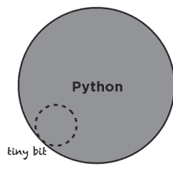

大多数经验丰富的程序员也只是触及了皮毛。Stack Overflow在2019年的一项调查发现，近90%的程序员是自学成才的，¹ 这意味着即使是专业程序员也会不断遇到他们不了解但必须想办法学习的新主题和概念。

打个比方，我们以英语这门语言为例。根据全球语言监测机构的数据，英语目前有1,057,379.6个单词。² （你有没有想过0.6个单词是什么？我们也没想过。我们至今也不知道。）然而，一个流利的成年人平均只掌握两万到三万五千个单词。³ 你会因为一个普通语言使用者不知道所有单词就说他们不“流利”吗？大概不会。

学习Python这样的编程语言与学习英语这样的语言非常相似。当然，当你不知道该用哪个词来表达一个想法，或者不知道该写什么代码来解决某个特定问题时，可能会感到沮丧。这正是我们在这里要帮助你的地方。在此过程中，我们还会指出一些初学者常犯的错误，以免你做出太尴尬的事情。

#### 1.2.1 编程简介

面对数量庞大的编程语言——C、Java、C++、PHP、JavaScript、Python、Perl、Ruby、Visual Basic、Go——很难知道从哪里开始。

当大多数人开始学习编程时，面对如此多的选择，往往会感到不知所措。这绝对足以让人感到焦虑，许多人告诉我们，他们害怕花太多时间学错了东西。想象一下，花了六个月学习Python，结果发现应该学JavaScript才对。

让我们花点时间来打消你的顾虑。无论你从哪里开始，你可能都没问题。当你刚开始学习一门编程语言时，你学到的很多东西其实并不特定于那门语言——它们是编程语言工作原理的基础。大多数编程语言都共享这些构建模块。然而，如果你以前从未写过代码，可能很难理解为什么是这样。

为了帮助你理解编程“黑盒子”背后的工作原理，我们首先带你了解如何使用Python这样的编程语言来构建一个我们可能每天都在使用的东西——一个网站。

在本书中，我们不会教你如何用Python构建网站——这是一个相当复杂的话题，本身就可以写成一整本书，而且构建网站并不在我们期望MBA学生用Python做的事情清单上。但这仍然是介绍编程主题的好方法，因为它涵盖了编程的许多主要领域，而且我们每天都与网站互动。

我们访问的大多数网站实际上是*Web应用程序*。应用程序就像你在手机或电脑上下载的应用（想想Microsoft Word或Excel），只不过Web应用程序不是下载的，而是位于某个地方的服务器上（在“云”中）。你通过打开浏览器并访问像facebook.com或twitter.com这样的网站来与Web应用程序交互。

Web应用程序是如何构建的？每个Web应用程序都有一个*前端*和一个*后端*。前端是你看到的部分。


前端和后端使用不同的编程语言编写。Web应用程序的前端通常使用三种编程语言构建：

1. HTML（超文本标记语言）
2. CSS（层叠样式表）
3. JavaScript

这三种语言共同协作，构成了网络上几乎所有的页面。HTML描述页面上的内容，CSS使其呈现特定的外观，而JavaScript则为页面增添一些特色和行为（比如弹出通知和实时页面更新）。

这就是前端，还有很多可以说的，但这超出了本书的范围。如果你感兴趣，我们留给你自己去深入探索。现在，我们将把重点转移到大多数人看不到的Web应用程序部分：后端。


后端是编程中隐喻的“黑盒子”。可以把它想象成Web应用程序的“大脑”；它执行大部分工作，然后将其交给前端，以便作为漂亮的网页显示给你。例如，如果你在facebook.com上搜索一个朋友，后端会搜索Facebook庞大的数据库来找到他们，然后将其呈现给前端，以便在你的浏览器中显示给你。

后端通常由两部分组成：一个数据库和一组规则。数据库存储你的Web应用程序所需的所有信息（例如，用户名和密码、照片、状态更新以及其他所有内容）。

数据库和网页之间的规则使得Web应用程序能够弄清楚每次用户在网站上执行操作时，应该从数据库获取什么信息以及如何处理这些信息。在数据库语言方面，有一种语言比其他任何语言都更受欢迎：SQL（通常发音为“sequel”或“S-Q-L”）。鉴于它超出了本书的范围，我们不会过多讨论SQL。

你听说过的大多数编程语言都位于数据库和网页之间。你可能听说过的包括Python、Ruby、PHP和Java。这绝不是语言的详尽列表，但它是我们提到的大多数语言所处的位置。

它们基本上都是相同的，只是略有不同。我们经常被问到：“我正在考虑构建X想法（一个遛狗应用、一个更好的找室友的方法、一个发现你所在地区酷炫活动的方法，等等）。我应该学习哪种编程语言？”一旦你了解了编程语言的工作原理，你就会意识到这是一个有点好笑的问题。这就像在说：“我有一个故事真的想讲，这是一个关于两个命运多舛的恋人的故事。我应该用什么语言来讲述它？英语？法语？西班牙语？”

你可能可以用这些语言中的任何一种来讲述那个故事，因为这就是语言的用途。当然，这些语言都是不同的。在一些语言中，如法语或西班牙语，有阳性词和阴性词。在其他语言中，如中文，你通过在句子末尾加一个词来表示过去时和将来时。编程语言的工作方式相同。你可以用大多数编程语言做同样的事情，尽管代码本身可能看起来有点不同。考虑这个例子：


这个图展示了来自三种不同语言的三段不同代码片段：PHP、Python和Ruby。你可以很容易地发现一些差异。每种情况下使用的单词都不同：echo、print和puts。PHP在句子末尾使用分号，但Python和Ruby不使用。Python使用括号，而PHP和Ruby不需要。但当你运行代码时（我们稍后会讨论“运行代码”是什么意思），你会得到相同的输出。

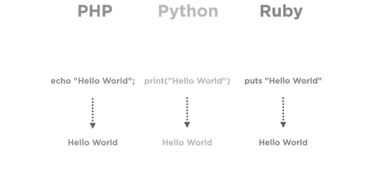

这三行代码都会打印出 Hello World。（顺便说一下，这通常是学习编程语言时的第一课——如何打印 Hello World——而且总是很无聊！）

是什么让某种东西成为编程语言？Python 以及所有其他编程语言，都是人类与计算机对话的语言。编程语言最初对计算机非常友好，但对人类并不友好。以下是一个例子，展示你可能会如何用二进制代码告诉计算机做一些简单的事情，比如打印出“Winter is coming.”：

```
00000000  7f 45 4c 46 01 01 01 00  00 00 00 00 00 00 00 00  |.ELF.............|
00000010  02 00 03 00 01 00 00 00  80 80 04 08 34 00 00 00  |............4...|
00000020  c8 00 00 00 00 00 00 00  34 00 20 00 02 00 28 00  |........4. ...(.|
00000030  04 00 03 00 01 00 00 00  00 00 00 00 00 80 04 08  |................|
00000040  00 80 04 08 9d 00 00 00  9d 00 00 00 05 00 00 00  |................|
00000050  00 10 00 00 01 00 00 00  a0 00 00 00 a0 90 04 08  |................|
00000060  a0 90 04 08 0e 00 00 00  0e 00 00 00 06 00 00 00  |................|
00000070  00 10 00 00 00 00 00 00  00 00 00 00 00 00 00 00  |................|
00000080  ba 0e 00 00 00 b9 a0 90  04 08 bb 01 00 00 00 b8  |................|
00000090  04 00 00 00 cd 80 b8 01  00 00 00 cd 80 00 00 00  |................|
000000a0  57 69 6e 74 65 72 20 69  73 20 63 6f 6d 69 6e 67  |Winter is coming|
000000b0  73 68 73 74 72 74 61 62  00 2e 74 65 78 74 00 2e  |shstrtab..text..|
000000c0  64 61 74 61 00 00 00 00  00 00 00 00 00 00 00 00  |data............|
000000d0  00 00 00 00 00 00 00 00  00 00 00 00 00 00 00 00  |................|
*
000000f0  0b 00 00 00 01 00 00 00  06 00 00 00 80 80 04 08  |................|
00000100  80 00 00 00 1d 00 00 00  00 00 00 00 00 00 00 00  |................|
00000110  10 00 00 00 00 00 00 00  11 00 00 00 01 00 00 00  |................|
00000120  03 00 00 00 a0 90 04 08  a0 00 00 00 0e 00 00 00  |................|
00000130  00 00 00 00 00 00 00 00  04 00 00 00 00 00 00 00  |................|
00000140  01 00 00 00 03 00 00 00  00 00 00 00 00 00 00 00  |................|
00000150  ae 00 00 00 17 00 00 00  00 00 00 00 00 00 00 00  |................|
00000160  01 00 00 00 00 00 00 00                           |........|
```

二进制是为计算机编写指令的最低级别。它对计算机最友好（速度非常快），但对人类最不友好（正如你所注意到的，它基本上无法阅读）。接下来，你可以提升一个级别，那就是汇编语言：

```
section .text
    global _start

_start:

    mov edx,len
    mov ecx,msg
    mov ebx,1
    mov eax,4
    int 0x80

    mov eax,1
    int 0x80

section .data

msg db 'Winter is coming.',0xa
len equ $ - msg
```

这个版本比二进制版本稍微易读一些。它包含一些熟悉的单词，但最终还是会被转换成二进制，以便计算机能够读取。以下是你如何用 Java 编写相同内容的示例：

```
public class WinterIsComing {
    public static void main(String[] args) {
        System.out.println("Winter is coming.");
    }
}
```

现在情况好多了，确实，在人类可读性方面，Java 比汇编语言有了巨大的改进。但我们仍然不建议初学者用 Java 学习编程，因为在能够做像打印文本这样简单的事情之前，你仍然需要学习太多东西。（例如，你必须先学习 `public`、`class`、`static`、`void`、`main` 的含义。）然后是 Python：

```
print("Winter is coming.")
```

多么清新的一口气。所有这些都浓缩在一行简单的代码中。Python 已经成为初学者和专家都喜爱的流行编程语言，因为它强调人类可读性。

#### 1.2.2 什么是 Python？

> Python 将计算机编程带给了广大的新受众。
—《经济学人》，2018年7月19日

> 忘掉华尔街的行话吧。花旗集团希望其新入职的投资银行分析师掌握的语言是 Python。
—《彭博社》，2018年6月14日

编程语言 Python 是以蒙提·派森（英国喜剧团体）命名的，而不是像许多人认为的那样以蛇命名。它由吉多·范罗苏姆于1991年创建。他在 Python 社区中被称为“终身仁慈独裁者”（BDFL）。

吉多在2005年至2012年间在谷歌工作，期间他花了一半时间开发 Python 语言。有趣的是，Python 的流行很大程度上源于这样一个事实：当谢尔盖·布林和拉里·佩奇在斯坦福大学首次构想谷歌时，他们使用吉多相对较新的 Python 编写了他们的第一个网络爬虫。⁴ 随着谷歌开始发展，他们做出了明智的商业决策，聘请了吉多。谷歌还投入大量资源用 Python 构建数据科学工具，并将其免费发布给开源社区。因此，许多渴望向最优秀、最聪明的人学习 Python 的有抱负的开发者被吸引到谷歌工作。这使谷歌在招聘最有才华的程序员方面获得了竞争优势。

我们经常被问到哪些大公司在使用 Python。答案是*大多数*大公司，当然几乎每家科技公司都在某种程度上使用 Python。例子包括谷歌、Facebook、YouTube、Spotify、Netflix、Dropbox、Yahoo、NASA、IBM、Instagram 和 Reddit。名单还在继续。Python 如此普及是因为它可以用于许多不同的事情，并且很容易与其他编程语言一起使用。例如，即使一家公司的主要产品不是用 Python 构建的，他们也可能在幕后使用 Python 进行机器学习、人工智能（AI）或数据分析。

因此，Python 目前是增长最快的主要编程语言。⁵ 根据面向开发者的在线社区 Stack Overflow 的数据，它也被认为是最受欢迎的编程语言。⁶

像花旗集团和高盛这样的公司已经开始培训他们的业务分析师使用 Python。“编程将会像我们上学时的写作一样，”抵押贷款巨头房利美的首席运营官金伯利·约翰逊说。金伯利将 Python 称为未来的语言，尤其是对于工商管理硕士（MBA）来说。⁷ 在我们两人任教的哥伦比亚商学院，Python 迄今为止是最受欢迎的语言，在 MBA 和工程专业的学生中都是如此。

### 1.3 设置你的开发环境

在编写和运行 Python 代码之前，我们需要做几件事。这就是我们所说的设置你的“开发环境”。它包括三个步骤：

1.  安装一个文本编辑器。
2.  安装 Python。
3.  设置命令行。

虽然这个过程对某些人来说可能很快，但其他人可能会遇到问题，这取决于他们特定计算机的设置。我们建议预留大约一个小时来正确设置所有内容，但你可能不需要这么多时间。

请注意，我们在本书中使用的软件应该可以在 Windows 电脑和 Mac 电脑上运行（但遗憾的是，截至撰写本文时，无法在大多数基于云的笔记本电脑如 Chromebook 上运行）。我们已经努力在两种环境下进行了测试。在适当的情况下，我们会为两者都包含截图，以确保没有人感到被遗漏。

#### 1.3.1 安装文本编辑器

你需要安装一个文本编辑器来编写代码。我们将使用一个名为 *Atom* 的流行文本编辑器。对于本书来说，你使用什么文本编辑器并不重要，所以如果你有偏好的文本编辑器，请随意使用。

即使是经验丰富的开发者有时也会遇到问题，并在计算机上安装所有正确的工具时感到沮丧。例如，加入一家新公司时，花上整整几天时间来正确安装所有软件并不少见。我们的建议是，如果你遇到问题，就坚持下去，练习你的故障排除技能（我们将在书中和网站上包含一些故障排除建议），并知道从现在开始应该会变得更容易。

**如何安装 *Atom*：**

1.  访问 https://atom.io 并点击下载按钮。
2.  安装 *Atom* 并确保它可以在你的计算机上访问。

第一次打开 *Atom* 时，你可能会看到一堆可以关闭的通知和公告。接下来，你会看到一个空白标签页，它应该看起来像这样：

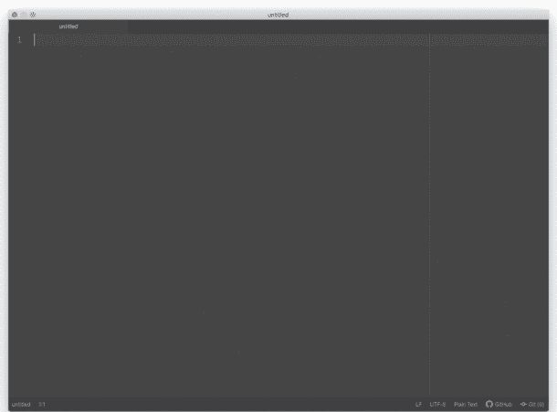

这就是我们将编写代码的地方，但现在我们不需要它，所以请随意暂时关闭 *Atom*。

#### 1.3.2 安装 Python

现在是安装 Python 的时候了。实际上，如果你使用的是 Mac，Python 默认是预装的（但根据你购买电脑的时间，它不太可能是最新版本）。Windows 默认不附带 Python。

无论哪种方式，请访问 https://www.pythonforbas.com/install 并按照步骤安装 Python，以确保我们使用的是最新版本。需要提醒的是，如果您以其他方式安装 Python，可能会遇到无法完全按照本书提供的具体说明进行操作的情况。

稍后我们将介绍一种检查所有组件是否安装成功的方法。不幸的是，这个过程可能会出现多种问题。我们在网站 https://www.pythonforbas.com/install 上提供了一套*常见问题解答*来帮助您。

#### 1.3.3 设置命令行

命令行是一个我们可以用来运行 Python 代码（以及许多其他功能）的应用程序。我们将设置命令行，以便快速访问并确保其正常工作。

**macOS：**
Mac 版本的命令行是一个名为 Terminal 的程序，它随您的计算机附带。要找到它：

1. 点击屏幕右上角的放大镜图标（或者直接按住 *command* 键并按下空格键）。应该会弹出一个搜索栏。
2. 输入“Terminal”。
3. 点击看起来像黑色方框的 Terminal 应用程序。这应该会打开 Terminal。
4. 转到屏幕底部的 Dock 栏，右键单击或按住 Ctrl 键单击 Terminal 图标以调出菜单。选择 *选项 > 保留在 Dock 中*。

现在您的 Terminal 已打开并出现在 Dock 栏中，您可以轻松访问它了。

**Windows：**
在 Windows 上，我们将使用一个名为 *Anaconda PowerShell Prompt* 的程序，它包含在 Anaconda 安装程序中：

1. 点击 *开始*。
2. 输入“Anaconda Powershell Prompt”。
3. 点击看起来像黑色方框的 *Anaconda Powershell Prompt* 应用程序。这应该会打开 *Anaconda PowerShell Prompt*。它看起来像一个带有白色文本的黑色窗口。（重要警告：Windows 附带其他外观相似但不同的应用程序；例如，*Anaconda Prompt, Windows PowerShell, Windows PowerShell ISE*。请确保不要意外使用其中之一。窗口标题应显示 *Anaconda Powershell Prompt*。）
4. 转到屏幕底部的任务栏，右键单击 *Anaconda PowerShell Prompt* 图标以调出菜单。选择 *将此程序固定到任务栏*。

现在您的 *Anaconda PowerShell Prompt* 已打开并出现在任务栏中，您可以轻松访问它了。

如果这些步骤中出现任何问题，请查看我们网站 https://www.pythonformbas.com/install 上的*常见问题解答*，您可能会找到解决方案。

#### 1.3.4 快速验证检查

为确保您正确安装了 Python，请打开一个新的命令行窗口（Terminal 或 *Anaconda PowerShell*，取决于您使用的是哪个），然后输入 `python --version`（那是两个连字符，也称为破折号），并按回车键：

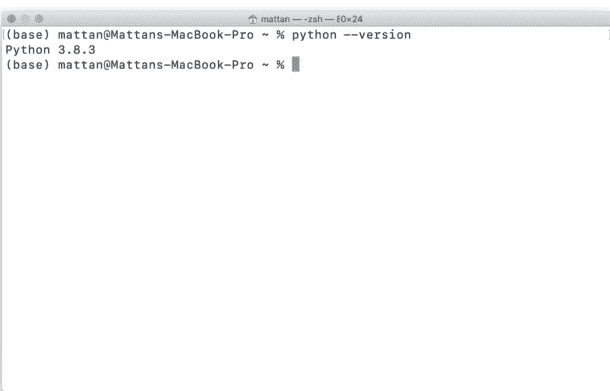

如果您的命令行看起来与我们的不完全一样，请不要担心。同样，如果您没有完全相同版本的 Python，也不必担心。只要您看到的版本高于 Python 3.8，您应该就能运行本书中的所有 Python 代码。

同时，输入 `pip --version` 并按回车键。只要您看到任何版本号（并且没有收到错误消息），就应该没问题了。此步骤确保 Python 包安装程序在您的计算机上正确设置。关键是，如果您做的一切都正确，您不应该收到错误消息。如果您确实看到错误消息，或者出现了其他问题（不幸的是，这种情况经常发生），请查看我们网站 https://www.pythonformbas.com/install 上的*常见问题解答*，您可能能够找到解决方案。

### 1.4 命令行基础

如果您使用的是 Mac，请打开 Terminal；如果您使用的是 PC，请打开 *Anaconda PowerShell*。这就是您的命令行。如果这是您第一次看到命令行，它可能会令人生畏。让我们为您分解一下。在 Mac 上（我们稍后会介绍 Windows 版本），您会看到类似这样的内容（您在命令行中看到的具体内容实际上并不那么重要；如果您打开命令行时看到的内容与我们显示的不同，那可能没问题）：

```
Last login: Wed Sep 19 13:24:00 on ttys001
(base) mattan@Mattans-Macbook-Pro ~ %
```

第一行告诉您上次登录的时间。您基本上可以忽略它。可以关闭此功能，但我们现在不讨论，如果您想弄清楚，可以将其作为一个挑战留给自己。第二行更有趣：

```
(base) mattan@Mattans-Macbook-Pro ~ %
```

这一行告诉您几件事。第一部分 (base) 与 Anaconda 安装程序的一个功能有关——您的计算机上可以同时安装不同版本的 Python——但我们在这里不会使用该功能，因此您同样可以安全地忽略它。⁸

然后是 mattan，这是我们在计算机上的用户名。之后是 @ 和 Mattans-Macbook-Pro，这是我们计算机的名称。然后是一个空格和一个 ~（波浪号），它实际上告诉您当前在计算机上的位置。没错，当您打开命令行时，您位于计算机上的*某个地方*。我们稍后会详细说明。最后，有一个 %、一个空格，然后是一个矩形（*光标*）。

到目前为止，我们展示的是 Mac 版本的命令行，但在 Windows 计算机上，您会看到类似这样的内容：

```
(base) PS C:\Users\mattan>
```

提示符以 (base) 开头，这与 Mac 上的含义相同。然后是 PS，它代表 *PowerShell*。之后是 C:\Users\mattan，它告诉您当前在计算机上的位置（我们稍后会解释这是什么意思），一个 >，一个空格，然后是一个闪烁的行（*光标*）。

闪烁光标后面的区域表示您可以输入的位置，称为 *Prompt*（即，它提示您输入内容）。在提示符处，您可以输入已记住或查找过的命令，按回车键，然后查看命令的输出。

#### 1.4.1 pwd 命令

例如，输入字母 pwd 并按回车键。在 Mac 上，您应该会看到类似这样的内容：

```
/Users/mattan
```

或者，在 PC 上，它可能看起来像这样：

```
Path
------
C:\Users\mattan
```

我们用 pwd 到底做了什么？命令 pwd 代表 *print working directory*（打印工作目录），运行它时，我们是在命令计算机告诉我们当前所在的文件夹。从现在起，当我们说“运行”一个命令时，我们的意思是打开命令行，在提示符中输入命令，然后按回车键。有时我们会这样表示：

```
% pwd
/Users/mattan
```

这里，% 是提示符的简写（我们省略了您在命令行中看到的所有其他信息）。当您在网上查看代码示例时，这非常常见。每当您在代码前看到 % 时，意味着您应该将其输入或复制粘贴到命令行中（但不要输入 % 本身）。有时您不会看到 %，需要您自己判断应该在命令行中运行它——是的，刚开始时这可能会令人困惑，但随着时间的推移会变得直观。请继续运行 pwd 三次，每次大声说出“print working directory”。这将帮助您记住它。

#### 1.4.2 open . 和 start . 命令

我们一直说当您打开命令行时，您位于计算机上的*某个地方*。我们这是什么意思呢？嗯，如果您使用的是 Mac，请尝试运行以下命令（记住不要实际输入 % 部分）：

```
% open .
```

（那是 open，一个空格，和一个句点。）如果您使用的是 Windows，请尝试以下命令：

```
% start .
```

（那是 start，一个空格，和一个句点。）应该会打开一个包含一些文件夹的新窗口。这恰好是您当前所在的文件夹。这是您打开命令行时默认进入的文件夹。它被称为您的*主目录*。（顺便说一句，我们知道我们向您抛出了很多新术语，但实际上您不需要记住它们。我们告诉您它们的名称是为了让您在以后再次使用时能够熟悉它们。但不要因为试图记下和

#### 1.4.3 `ls` 命令

现在尝试运行 `ls`，看看你能否弄清楚它的作用。我们得到的结果如下：

```
% ls
Applications
Movies
Music
Desktop
Documents
Pictures
Downloads
Public
anaconda3
Library
```

Windows 用户还会看到更多信息，包括最后写入时间和长度。如果这些信息让你感到困惑，可以放心地忽略它们。如果你将它与运行 `open .`（在 Mac 上）或 `start .`（在 Windows 上）时打开的窗口进行比较，你会注意到命令行输出中看到的文件夹与窗口中显示的相同：

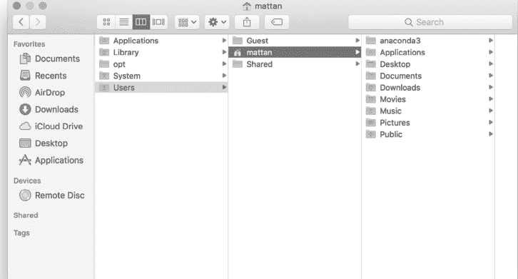

`ls` 命令代表 *list*（列表），它的基本意思是“告诉我当前所在的文件夹中有哪些文件夹和文件”。

#### 1.4.4 `cd` 命令

你需要了解的最后一个命令是 `cd`，它代表 *change directory*（更改目录）。`cd` 让你从当前文件夹移动到另一个文件夹，如下所示：

```
% cd Desktop
```

运行此命令不会产生任何输出，但你可以通过运行 `pwd` 来检查它是否生效：

```
% pwd
/Users/mattan/Desktop
```

`cd` 让你移动到当前文件夹内的任何子文件夹。（从技术上讲，`cd` 是命令，空格后面的部分，即文件夹名称，被称为 *参数*。）

如果你想进入一个名称中包含空格的文件夹，你需要将文件夹名称放在引号中。例如：

```
% cd "Work Documents"
```

因为命令行将每个空格解释为一个新的参数，所以它不知道你希望它是一个文件夹的名称。在实践中，开发者通常会在文件夹和文件名中使用 _（下划线）而不是空格，以避免此类混淆。

如果你发现自己在一个没有任何其他子文件夹的文件夹中，并且想返回上一级，可以运行以下命令：

```
% cd ..
```

`..` 代表比当前文件夹高一级的文件夹（有时称为 *父文件夹* 或 *外层文件夹*）。所以基本上，你使用 `cd ..` 就是在说“带我返回上一级”。

现在你知道了 `pwd`、`ls` 和 `cd`，你就拥有了在命令行中移动所需的三个命令。还有数百个其他命令，但目前运行 Python 代码只需要知道这三个。

现在花几分钟练习一下。尝试在你的电脑上随机选择一个文件夹，打开命令行，看看你能否弄清楚如何到达那里。如果在任何时候迷路了，你可以运行：

```
% cd ~
```

`cd` 后跟 `~`（波浪号）作为参数，总会将你带回家目录（你第一次打开命令行时所在的位置）。在最坏的情况下，你总是可以退出命令行并重新打开它。然后，你应该会回到起点。

#### 1.4.5 `clear` 命令

这个命令不是特别重要，但 `clear` 命令可以清除你之前运行过的所有命令。

```
% clear
```

如果你不喜欢每次使用命令行时看到一堆杂乱的文本，这会很有帮助。

#### 1.4.6 为我们的代码创建一个文件夹

既然我们已经学习了一些基本命令，让我们在你的桌面上创建一个新文件夹，用于保存我们在本书中编写的代码。我们建议将其放在桌面上，以便于查看和返回，但你也可以在任何你想要的地方创建这个新文件夹，只要你以后知道如何再次找到它。

通过打开一个新的命令行窗口或运行 `cd ~` 确保你在主目录中：

```
% cd ~
% pwd
/Users/mattan
```

现在 `cd` 到你的桌面：

```
% cd Desktop
% pwd
/Users/mattan/Desktop
```

然后运行以下命令：

```
% mkdir code
```

检查你的桌面。你应该会看到一个名为 `code` 的新空文件夹。我们之前没有教你 `mkdir` 命令，因为可能直接在桌面上右键单击并选择 *新建文件夹* 更容易，但我们现在展示给你看，因为它很有趣。

尽管你刚刚在命令行中创建了一个新文件夹，但你还没有 *进入* 它。你仍然需要 `cd` 进入它：

```
% cd code
% pwd
/Users/mattan/Desktop/code
```

你做到了。现在关闭你的命令行，打开一个新的，然后导航到你的新文件夹。为了练习，将这个任务再重复三次。

### 1.5 是时候享受快乐时光了

既然我们已经探索了命令行，让我们暂时离开它，运行我们的第一段 Python 代码。（如果“运行 Python 代码”这个词对你来说目前没有任何意义，没关系。先跟着做，很快就会更有意义。）

我们在 https://www.pythonformbas.com/code 提供了一个名为 `happy_hour.py` 的文件（现在就去那里下载这个文件）。在 Python 中，包含可运行代码的文件有时被称为 *脚本*。现在不用担心文件里面的内容。

首先，将它移动到你新创建的桌面 `code` 文件夹中。这样你以后可以轻松找到它。然后打开一个新的命令行窗口。使用 `cd` 命令导航到你的 `code` 文件夹。（还记得上一节关于命令行的内容吗？如果不记得，回去复习一下。）此时，通过运行 `pwd` 和 `ls` 检查确保你在正确的文件夹中。

```
% pwd
/Users/mattan/Desktop/code
% ls
happy_hour.py
```

你应该会看到你放入 `code` 文件夹的 `happy_hour.py` 文件。运行 `ls` 时确保看到它；否则，下一步将无法进行。如果你没有看到它，要么 (a) 你没有将文件移动到正确的文件夹，要么 (b) 你没有在命令行中导航到该文件夹。

既然你已经处理好了，现在在命令行中通过输入 `python happy_hour.py` 并按回车键来运行该文件：

```
% python happy_hour.py
How about you go to McSorley's Old Ale House with Mattan?
```

嗯……有趣。你得到相同的结果了吗？

首先，你尝试运行命令时可能遇到了错误。没关系。即使你没有遇到错误，了解可能出现的不同类型的错误也值得，因为你迟早会遇到它们。

你可能遇到的一个错误如下：

```
can't open file 'happy_hour.py': [Errno 2] No such file or directory.
```

如果你遇到这个错误，意味着它找不到你试图运行的文件。要么你在错误的文件夹中，要么你以为移动的文件实际上不在那里。回去确保文件在你认为的位置（在桌面的 `code` 文件夹中）。

你可能遇到的另一个错误看起来像这样：

```
% python
Python 3.8.3 (default, Jul 2 2019, 16:54:48)
[Clang 10.0.0 ] :: Anaconda, Inc. on darwin
Type "help", "copyright", "credits" or "license" for more information.
>>> happy_hour.py
NameError: name 'happy_hour' is not defined
>>> python happy_hour.py
SyntaxError: invalid syntax
```

你在这里看到的错误很有趣，但解释起来稍微复杂一些。如果你只输入了 `python` 这个词并按了回车，而没有加空格并在末尾加上 `happy_hour.py`，你意外地打开了一个叫做交互模式的东西。我们稍后会回到这个话题，但现在，只需输入 `exit()` 并按回车，或者在 Mac 上按 Ctrl 和 D，在 Windows 上按 Ctrl 和 Z 来退出它。你应该会回到命令行提示符。

但假设你确实成功运行了文件。即便如此，你可能也没有看到与我们示例中相同的输出。尝试再运行几次，看看你得到什么（注意，如果你按向上箭头键，你上次运行的代码将显示在终端中——无需多次重新输入）。

```
% python happy_hour.py
How about you go to The Back Room with Mattan?
% python happy_hour.py
How about you go to Death & Company with Samule L. Jackson?
% python happy_hour.py
How about you go to The Back Room with that person you forgot to text back?
```

注意输出每次都不一样。你认为发生了什么？

在告诉你之前，我们想让你尝试一些事情。在你的文本编辑器（Atom）中打开 `happy_hour.py`，自己阅读代码。你可以通过两种方式完成：

1.  打开 Atom，转到 File > Open . . . ，找到文件并点击 Open。
2.  右键单击 `happy_hour.py`，选择 Open With，然后在应用程序列表中找到 Atom。

不幸的是，直接双击 `happy_hour.py` 可能不会默认在 Atom 中打开文件（它会使用你电脑的默认文本编辑器打开，无论那是什么）。不过，让 Atom 成为默认文本编辑器相当容易。请参阅“更改你的默认文本编辑器”框中的说明。

#### 更改 .py 文件的默认文本编辑器

要在 Mac 上更改 .py 文件的默认文本编辑器，请右键单击任意一个扩展名为 .py 的文件，然后选择“显示简介”。在“打开方式”下找到 Atom，然后单击“全部更改...”按钮，将更改应用于所有 .py 文件。
在 Windows 上，转到“开始”菜单，搜索“默认应用”并单击它，向下滚动窗口并单击“按文件类型选择默认应用”，向下滚动到 .py 并选择 Atom 作为默认应用。
这些说明可能会随着操作系统更新而变化，因此你可能需要进行一些搜索才能使其正常工作。

一旦你打开了 `happy_hour.py`，你应该会看到以下内容：

```python
import random

bars = ["McSorley's Old Ale House",
        "Death & Company",
        "The Back Room",
        "PDT"]

people = ["Mattan",
          "Sarah",
          "that person you forgot to text back",
          "Samule L. Jackson"]
random_bar = random.choice(bars)
random_person = random.choice(people)

print(f"How about you go to {random_bar} with {random_person}?")
```

这是 Python 代码。不用担心我们还没有教你任何关于 Python 或代码的知识。只需花一两分钟逐行阅读这段代码，看看你是否能从高层次上理解发生了什么。
即使它看起来像乱码，也不要让你的眼睛一扫而过。研究它，并开始询问每个部分可能在做什么。你看到模式或重复了吗？寻找线索，即使目前对你来说没有任何意义。
准备好了，开始吧！

希望你已经自己阅读了代码。如果没有，请现在花点时间去做。编码技能的一部分是能够阅读你以前没见过的别人的代码，并弄清楚它为什么这样做。所以，我们现在需要开始锻炼这块肌肉。
以下是我们阅读文件的方式。我们将文件分解为三个部分：

1. 顶部
2. 中间
3. 底部

顶部部分似乎在做一些设置：

```python
import random

bars = ["McSorley's Old Ale House",
        "Death & Company",
        "The Back Room",
        "PDT"]

people = ["Mattan",
          "Sarah",
          "that person you forgot to text back",
          "Samule L. Jackson"]
```

首先，注意我们有一行 `import random` 代码。我们还不知道它是做什么的。
然后，似乎创建了两个列表：`bars` 和 `people`。我们可能还不理解确切的字符（为什么有方括号 `[]` 和引号 `""`？），但我们理解了大意。
代码的中间部分似乎在做一些工作：

```python
random_bar = random.choice(bars)
random_person = random.choice(people)
```

我们的猜测（好吧，我们知道，但让我们假装我们都是第一次看到这个）是这段代码从 `bars` 和 `people` 列表中随机选择一个酒吧和一个人。还记得我们之前看到的 `import random` 吗？也许这与我们这里的 `random.choice` 有关。

最后，底部部分看起来像我们在命令行中看到的：

```python
print(f"How about you go to {random_bar} with {random_person}?")
```

只是 `{random_bar}` 和 `{random_person}` 似乎被填充了中间部分选择的任何随机酒吧和随机人物。
无论你是否在心理上将文件分解为代码的顶部、中间和底部部分，这都无关紧要。我们与你分享的是我们可能如何阅读这个——在我们一生中见过数千个不同的代码文件之后。
除了学习理解代码之外，你将要学习的另一件事是如何分解问题、你的阅读和分析过程，以及哪些方法对你个人最有效。
通常，你会看到结构类似的代码文件。首先，你有一些做一点设置的代码（把这想象成为食谱准备食材）。接下来，你有一些实际执行工作的代码（实际遵循食谱的步骤），然后，你得到结果（希望你能端上桌的美味食物）。
你可能认为此时我们会开始教你一些关于 Python 的知识，但我们为你准备了一个挑战。

#### 1.5.1 挑战 1：欢乐时光修复

我们希望你做三件事：

1. 哎呀，我们把 Samuel L. Jackson 的名字拼错了。你能帮我们修正吗？
2. 向列表中添加一个朋友。你得到错误了吗？
3. 让它打印出两个随机的人，而不是一个。

花几分钟时间做这个，但不要超过五分钟左右。
如果你卡住了，坚持一会儿，但如果最终无法解决，也不要太沮丧。这些挑战的目的是测试你目前所知的极限，以便你的思维稍微扩展一点，并希望学到一些新东西。目的不是让你沮丧到放弃。对自己好一点。
你弄明白了吗？挑战的第一部分应该相当容易。只需移动第 11 行中的 `l` 和 `e`：

```python
"Samule L. Jackson"]
```

使其读作：

```python
"Samuel L. Jackson"]
```

恭喜！你刚刚编辑了你的第一段代码。
别忘了保存你的更改——这是许多初次编码者忘记的事情，然后他们想知道为什么运行代码时它仍然不起作用。
包含代码的文件就像 Microsoft Word 文件或 Excel 文件一样。如果你进行了更改但忘记保存，那么你的更改实际上不会生效。它会一直处于待定状态，直到你尝试关闭文件（在这种情况下，它会询问类似“是否要保存所做的更改？”的问题）。
想象一下，你对 Microsoft Word 文件进行了更改，但忘记保存，然后你将文件通过电子邮件发送给朋友或同事。他们会看到你所做的更改，还是会看到旧版本？除非你先保存，然后向他们发送文件的新版本，否则他们会看到旧版本。代码的工作方式相同。
换句话说，如果你想在命令行中运行文件时看到代码更改，请确保先保存代码。
巧合的是，在 *Atom* 中有一个小技巧可以用来检查文件中是否有待保存的更改。*Atom* 顶部的选项卡显示文件的名称。如果你在文件中进行了更改但尚未保存，你会看到一个蓝色的 •（例如，`happy_hour.py` •）。
当你保存文件时，• 会消失。现在，当你在命令行中运行代码时，它将完全运行你在 *Atom* 中看到的内容。
让我们回到我们的欢乐时光文件。向人物列表中添加一个朋友怎么样？如果你擅长小细节，你可能已经注意到人物列表中的每个条目都有引号括起来，后面有一个逗号（最后一个除外）。所以，如果我们想将 Daniel 添加到列表中，我们会让代码看起来像这样：

```python
people = ["Mattan",
    "Sarah",
    "that person you forgot to text back",
    "Samuel L. Jackson",
    "Daniel"]
```

一个常见的错误是这样做：

```python
people = ["Mattan",
    "Sarah",
    "that person you forgot to text back",
    "Samuel L. Jackson"
    "Daniel"]
```

你看到区别了吗？这很微妙。第二个示例在倒数第二行末尾缺少一个逗号：

```python
"Samuel L. Jackson"
```

这引入了一个特别棘手的错误，因为当你尝试运行文件时，它不会产生错误。而且问题不一定立即显现：

```
% python happy_hour.py
How about you go to Death & Company with that person you forgot to text back?
% python happy_hour.py
How about you go to PDT with Samuel L. JacksonDaniel?
```

你看到我们第二次运行文件时发生了什么吗？它将 Samuel L. Jackson 和 Daniel 挤在了一起，所以我们得到的是 Samuel L. JacksonDaniel。

为什么会发生这种情况，一旦我们讲到字符串和 `print()` 函数，你就会更清楚。现在，知道没有逗号它就不能正常工作就足够了。

在编程方面，经常让初学者绊倒的一件事是，像缺少逗号这样的小事情可能会使你的代码无法工作，或者至少不能正常工作。

在代码方面，计算机无法像人类那样解释文本。人类可以看到缺少逗号的文本，并假设你打算在那里放一个逗号。他们会理解你打算写什么。相比之下，计算机不会对你打算做什么做任何假设。如果你没有把它放在代码中，计算机就不会这样做。这是一件好事，因为这意味着你的计算机永远不会做你没有告诉它做的事情（你知道他们对假设怎么说），但这很烦人，因为这意味着你必须对所有事情都吹毛求疵。

我们最喜欢的英文例句是“Let’s eat Grandma!”（我们吃掉奶奶吧！），它与“Let’s eat, Grandma!”（奶奶，我们吃饭吧！）意思截然不同。记住：标点符号能救命。

如果这个想法让你感到害怕，因为你不是注重细节的人，那也没关系。这需要一点时间来适应，但最终你的眼睛会自然而然地开始注意到那些小细节，而无需你过多思考。

回到最后的挑战，即修改代码使其打印出两个随机姓名，而不是一个。

这是迄今为止最具挑战性的部分，所以如果你没想出来，也没关系。

关键在于看这一行代码：

```
random_person = random.choice(people)
```

你是否猜到，如果再添加一行类似的代码，就可以从人员列表中再抓取一个随机人员？像这样：

```
random_person2 = random.choice(people)
```

你也可能创建了第二个人员列表，但在这个例子中没有必要。你可以从同一个列表中提取。

要实际看到输出，唯一需要做的其他更改是修改最后的打印行：

```
print(f"How about you go to {random_bar} with {random_person}?")
```

添加第二个随机选择的人员：

```
print(f"How about you go to {random_bar} with {random_person} and {random_person2}?")
```

请注意，我们的代码行已经开始变长了。这里可能需要提一下，在Python中，换行很重要。虽然本书中将前一行代码打印为两行，但它需要全部在一行代码中，否则Python将无法运行它。我们稍后会回到这个话题。在可能的情况下，我们已尝试将长的Python代码行分解成较短的行，以便它们可以在本书中以与输入时相同的方式打印出来。

但在某些情况下，由于本书中一行可打印的字符数限制，这确实不太可能。

回到我们的文件，让我们运行几次更新后的代码：

```
% python happy_hour.py
How about you go to McSorley's Old Ale House with Mattan and Daniel?
% python happy_hour.py
How about you go to The Back Room with Samuel L. Jackson and Sarah?
```

此时，你可能很高兴，但如果你继续运行代码，你可能最终会意识到一个问题：

```
% python happy_hour.py
How about you go to McSorley's Old Ale House with Daniel and Daniel?
```

偶尔，两个随机选择的人会是同一个人。在计算机编程中，这种类型的错误有时被称为*bug*（错误）或*edge case*（边界情况）。边界情况发生在你的代码大部分时间正常工作，但偶尔会出错的时候。

你可能希望我们告诉你如何修复它。但这次，我们将反过来问你：你会如何修复它？

花点时间，至少从概念上思考一下如何解决这样的问题。我们可能还没有足够的Python知识来解决这个问题，但这将是我们很快就能回来处理的事情。

#### 1.5.2 挑战2：构建你自己的随机生成器脚本

我们有一个最终的挑战给你。你的挑战是花大约10分钟创建你自己的随机生成器脚本（记住，脚本只是一个包含Python代码的文件，你可以运行它）。

网上有很多随机生成器脚本的创意，其中一些相当受欢迎。为了获取灵感，接下来的两个例子展示了我们最喜欢的两个（我们提前为粗俗的语言道歉）：


**It's This for That** (http://itsthisforthat.com) 通过将一个创业流行词与一个利基市场相结合，生成一个随机的创业点子。


What the f*** is my social media strategy? (https://whatthefuckismysocialmediastrategy.com/) 生成一个随机的社交媒体策略，主要由营销流行词拼凑而成——尽管它们大多数读起来惊人地像真实的社交媒体策略。

花10分钟，以`happy_hour.py`为模板，创建你自己的随机生成器脚本，就像这些例子之一。如果你为自己的脚本感到自豪，请通过authors@pythonformbas.com发送给我们。我们很想看看你想出了什么。

### 1.6 总结

在本章中，我们向你介绍了Python编程语言，并开始初步了解你可以用它做什么。我们还搭建了开发环境——包括安装Python和文本编辑器——并探索了命令行。

最后，我们运行了第一个Python脚本——我们的欢乐时光生成器——并查看了其背后的代码。我们尝试修改了一些代码，并将其作为结构来创建我们自己的Python脚本。

在下一章中，我们将深入探讨Python的基础知识，并更好地理解我们接触到的一些新概念和工具。

# 2
## PYTHON基础，第一部分

**我们已经学习了**“运行”Python代码的含义，但还没有掌握Python脚本的基本构建块。在本章中，我们将开始学习我们可以用Python做的基础知识。

### 2.1 本章你将学到什么

在本章结束时，你将能够创建一个基本的Python脚本，该脚本从用户那里获取输入，对其进行一些处理，然后返回输出。你还将学习两种不同的运行Python代码的方式，如何使用`print()`函数，如何阅读和调试Python错误，注释和变量，一些Python数据类型（例如，浮点数、整数和字符串），以及如何获取用户输入。

### 2.2 运行Python代码的两种方式

有两种运行Python代码的方式。第一种，我们已经见过，是在命令行中运行脚本，像这样：

```
bash
% python script.py
```

40 第一部分

脚本是任何有效的Python代码，保存在具有.py文件扩展名的文件中。Python脚本可以从任何文本编辑器（包括但不限于Atom）下载或创建。

你可能想知道，“.py扩展名有什么特别之处？”答案是没什么特别的。

例如，如果我们愿意，我们可以将happy_hour.py重命名为happy_hour.txt或happy_hour.html。（许多操作系统现在隐藏文件扩展名，因为他们认为大多数人更愿意不看到它们，所以如果你想默认看到它们并能够更改它们，可能需要更改系统设置。）

文件名末尾的文件扩展名的目的是告诉你的计算机在双击时使用哪个应用程序打开它。例如，具有.txt文件扩展名的文件将使用计算机上默认安装的任何纯文本编辑器打开，而具有.html文件扩展名的文件将由你的默认浏览器打开。.py文件扩展名告诉你的计算机该文件是一个包含Python代码的文本文件，当你双击它时，你的计算机应该使用默认的文本编辑器打开它。可以覆盖用于特定文件类型的默认应用程序；我们在1.5节的“更改你的默认文本编辑器”框中讨论了这一点。

运行Python代码的第二种方式是使用一种称为交互模式的东西。你可以通过在命令行中输入python（后面不跟文件名）并按Enter键来访问Python的交互模式。

```
% python
Python 3.8.3 (default, Jul 2 2019, 16:54:48)
[Clang 10.0.0 ] :: Anaconda, Inc. on darwin
Type "help", "copyright", "credits" or "license" for more information.
>>>
```

如你所见，这些信息大多与安装的Python版本有关，一些额外的提醒告诉我们，我们可以输入help等获取更多信息。在本书中，为了节省空间，我们将跳过所有这些信息：

```
% python
>>>
```

请注意，提示符已更改为>>>。这表明你不再处于命令行中——你现在在Python内部。之前的任何

### 2.3 打印

我们希望你创建一个名为 `print.py` 的新文件，并将其保存到你的代码文件夹中。操作步骤如下：

1.  打开 *Atom*。它默认会打开一个空文件。如果没有，请点击 *File > New File*。
2.  点击 *File > Save*（在 Mac 上是 Command 和 S，在 Windows 上是 Ctrl 和 S）。
3.  导航到你桌面上的代码文件夹。
4.  将文件名更改为 `print.py`（不要忘记添加 `.py` 扩展名）。
5.  点击 *Save*。

请仔细检查你的代码文件夹，确保新文件已创建。确认后，在你的空 `print.py` 文件中输入以下内容：

```
print("Winter is coming.")
```

现在保存文件，并在命令行中运行它：

```
% python print.py
Winter is coming.
```

这对你有效吗？如果没有，请确保文件保存在正确的位置，并且你在命令行中处于正确的位置（记住你可以使用 `ls` 来检查是否能看到文件）。基本上，`print()` 是一个将内容打印到命令行的函数。我们将在接下来的几章中介绍更多函数，并在第 4.2 节“函数简介”中更深入地讨论函数。目前，请记住函数在括号内接收输入。当我们提到一个函数的名称时，我们总是在名称后加上括号——比如 `print()`——以区别于变量（我们稍后会介绍）。

接下来，向 print.py 添加另一行：

```
print("Winter is coming.")
print("You know nothing", "Mattan Griffel")
```

（请随意将第二部分替换为你自己的名字，使其更具个人特色。）然后再次运行该文件：

```
% python print.py
Winter is coming.
You know nothing Mattan Griffel
```

（如果你在输出中没有看到这行新内容，请确保在运行前保存了文件。）

尽管我们在第二个 `print()` 中添加了两段文本——“You know nothing”和“Mattan Griffel”，并用逗号分隔，但 Python 将逗号转换为空格，并将它们并排打印出来。

#### 2.3.1 打印挑战

更改 `print.py` 中的代码，使其打印出你最喜欢的歌曲或诗歌的歌词。现在花几分钟时间完成这个任务。

完成了吗？

这是我们想到的（其中一行以粗体打印，原因很快就会变得明显）：

```
print("since feeling is first")
print("who pays any attention")
print("to the syntax of things")
print("will never wholly kiss you;")
print("wholly to be a fool")
print("while Spring is in the world")

print("my blood approves")
print("and kisses are a better fate")
print("than wisdom")
```

#### PYTHON 2 中的打印

在 Python 2（Python 的早期版本）中，你可以写 `print "hi"`（不带括号），但这在 Python 3 中不起作用。如果你尝试从 Python 2 复制代码并在 Python 3 中运行，这可能是你遇到的第一个错误。如果你看到以下内容：

```
>>> print "hi"
File "<stdin>", line 1
    print "hi"
          ^
SyntaxError: Missing parentheses in call to 'print'
```

你就知道你正在 Python 3 中运行为 Python 2 编写的代码。最简单的修复方法是手动在 `print` 一词后的文本周围添加括号，如下所示：

```
>>> print("hi")
hi
```

```
print("lady i swear by all flowers. Don't cry")
print("-the best gesture of my brain is less than")
print("your eyelids' flutter which says")

print("we are for each other: then")
print("laugh, leaning back in my arms")
print("for life's not a paragraph")

print("and death i think is no parenthesis")
```

这首诗名为“Since Feeling is First”，作者是 e e cummings，是 Mattan 的最爱之一（Daniel 想让你知道，他最喜欢的是 W. H. Auden 的“Funeral Blues”。）当我们运行它时会得到什么？

```
% python print.py
    File "print.py", line 13
        print("your eyelids' flutter which says")
            ^
SyntaxError: invalid syntax
```

哦，哦！这不对。这是怎么回事？（请注意，这个错误是上面代码中的一个错误导致的，你可能在自己的挑战版本中没有犯这个错误——所以你可能不会收到这个错误消息。尽管如此，请耐心等待，我们将讨论调试 Python 代码的过程。）
第一次看到错误消息时，你可能想举手投降。不要这样。错误消息是你的朋友——让我们告诉你为什么。在编写 Python 代码时，我们会经常遇到错误消息，所以我们最好习惯它们并学会如何解决它们。
让我们更深入地了解一个 Python 错误。

### 2.4 调试错误与谷歌搜索

让我们再看看这个错误：

```
File "print.py", line 13
    print("your eyelids' flutter which says")
        ^
SyntaxError: invalid syntax
```

它想告诉我们什么？第一部分——`File "print.py"`——是 Python 在遇到错误时正在运行的文件。这看起来可能相当明显，因为那就是我们正在运行的文件。但让我们想象一下你正在编写大量代码。开发人员需要一种方法来构建和组织大量代码，一种方法是将其分成多个相互共享代码的文件（我们将在第 4.3 节“导入 Python 包”中看到如何操作）。当你有多个文件中的代码时，知道哪个文件出现了特定错误会很有帮助。

下一部分，`line 13`，告诉我们错误发生的行。
看看错误的下两行：

```
print("your eyelids' flutter which says")
    ^
```

这是 Python 在遇到错误时正在运行的代码行的实际打印输出，`^` 符号位于 Python 认为错误出现的位置下方。这并不总是正确的，但这是 Python 最好的猜测。

错误的最后一行，`SyntaxError: invalid syntax`，包含了错误的类别——你会遇到几种通用错误类型——以及特定的错误消息。

我们能从这个错误消息中学到什么？不幸的是，很少。有时 Python 错误比其他时候更有帮助。在这种情况下，即使仔细查看第 13 行（在我们之前的示例中以粗体打印），看起来也没有任何问题。那么现在我们该怎么办？

我们用谷歌搜索它。信不信由你，成为一名优秀程序员的一个重要部分就是通过谷歌搜索来找到你还不知道如何解决的问题的答案。重要的是你要学会如何自己解决问题和解决自己的问题，而不是让我们给你所有的答案。（有时我们也没有答案！）

几乎总是，当我们遇到一个不认识的 Python 错误时，我们做的第一件事就是用谷歌搜索错误消息加上“python”这个词。


通常，你会在谷歌搜索结果中看到一个名为 Stack Overflow (https://stackoverflow.com) 的网站：

> python - 'Syntax Error: invalid syntax' for no apparent reason ...
https://stackoverflow.com/.../syntax-error-invalid-syntax-for-no-apparent-reason
2 answers
Jun 16, 2014 - For problems where it seems to be an error on a line you think is correct, you can often remove/comment the line where the error appears to be ...

Stack Overflow 是一个受欢迎的网站，开发者在此提问，其他开发者免费回答。这多棒啊？免费的技术支持。因为 Python 是如此流行的编程语言，如果你遇到错误，很可能别人也遇到过并且已经解决了。

以下是我们在谷歌搜索结果中给出的第一个 Stack Overflow 页面的截图。²

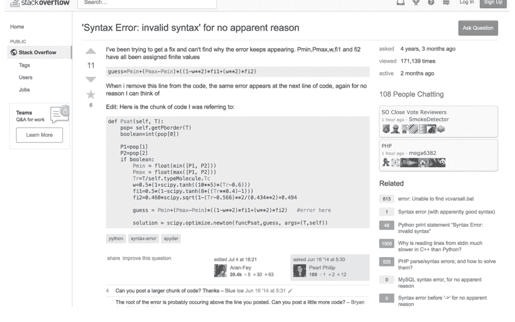

注意，问题标题‘Syntax Error: invalid syntax’ for no apparent reason 与我们的问题非常相似。
然后你会看到问题的描述，提问者包含了产生此错误的代码部分。在提出一个好问题时，以下几点可以帮助你快速获得有用的解答：

1.  简要介绍问题。你试图做什么？发生了什么？（包含实际的错误信息。）
2.  提供重现问题的步骤，以防其他人想亲自查看。理想情况下，这应该是一段他们可以直接复制粘贴到 Python 中重现错误的代码。
3.  任何与问题相关的代码片段。

我们强烈建议在发布问题前阅读 Stack Overflow 的文章“如何提出一个好问题？”³。
以‘Syntax Error: invalid syntax’ for no apparent reason 这个问题为例，注意提问者如何总结问题并包含了出错的代码行：

> I've been trying to get a fix and can't find why the error keeps appearing. Pmin,Pmax,w,fi1 and fi2 have all been assigned finite values

`guess=Pmin+(Pmax-Pmin)*((1-w**2)*fi1+(w**2)*fi2)`

When i remove this line from the code, the same error appears at the next line of code, again for no reason I can think of

别担心。这个问题包含了很多代码，你不必完全理解它在做什么。在 Stack Overflow 的每个问题下方，你经常会看到评论，人们在其中要求更多信息或澄清。如果有人提交了答案，你会在评论下方看到它们。在这个案例中，给出了几个答案。
截至撰写本文时，由用户 paxdiablo 于 2014 年 6 月 16 日发布的最高票答案旁边有一个绿色对勾，这意味着它被原始提问者选为接受的答案。让我们看看他们的回答：

2 Answers

active oldest votes

39

For problems where it seems to be an error on a line you think is correct, you can often remove/comment the line where the error appears to be and, if the error moves to the next line, there are two possibilities.

Either both lines have a problem or the previous line has a problem which is being carried forward. The most likely case is the second option (even more so if you remove another line and it moves again).

For example, the following Python program `twisty_passages.py`:

```
xyzzy = (1 +
plugh = 7
```

generates the error:

```
File "twisty_passages.py", line 2
    plugh = 7
    ^
SyntaxError: invalid syntax
```

despite the problem clearly being on line 1.

In your particular case, that is the problem. The parentheses in the line before your error line is unmatched, as per the following snippet:

```
# open parentheses: 1  2           3
#                  v  v           v
fi2=0.460*scipy.sqrt(1-(Tr-0.566)**2/(0.434**2)+0.494
#                  ^           ^
# close parentheses: 1           2
```

Depending on what you're trying to achieve, the solution may be as simple as just adding another closing parenthesis at the end, to close off the `sqrt` function.

I can't say for certain since I don't recognise the expression off the top of my head. Hardly surprising if (assuming PSAT is the enzyme, and the use of the typeMolecule identifier) it's to do with molecular biology - I seem to recall failing Biology consistently in my youth :-)

share edit flag

edited Jul 16 '16 at 4:22

answered Jun 16 '14 at 5:34

paxdiablo

612k 166 1218

1646

这个特定的答案提到，有时 Python 会告诉你某个错误出现在某一行，但如果你删除那一行，错误就会跳到下一行。他们举了一个例子：

```
xyzzy = (1 +
plugh = 7
```

果然，如果你运行这段代码，你会得到和我们之前看到的相同的错误信息——SyntaxError: invalid syntax。

为什么会这样？当我们运行一个 Python 文件时，它会从上到下、从左到右读取文件。在示例代码中，第一行是不完整的：xyzzy = (1 +。

Python 读到行尾，没有找到另一个要相加的数字，也没有找到右括号，于是继续到下一行去寻找。然后它读到 plugh = 7，意识到肯定出错了。于是，它给出了一个错误。
如果我们回头看看 print.py 文件的第 12 行（这是我们挑战的解决方案，所以你的代码可能不同），我们有以下内容：

```
print("-the best gesture of my brain is less than"
```

结果发现我们忘记了末尾的括号。我们可以快速修复：

```
print("-the best gesture of my brain is less than")
```

现在我们再次运行代码：

```
% python print.py
    File "print.py", line 17
        print("for life's not a paragraph")
            ^
SyntaxError: invalid syntax
```

这是怎么回事？我们不是刚修复了这个问题吗？这种情况经常发生，如果你不仔细观察，很容易感到沮丧。仔细看，你会发现这个错误实际上与我们之前遇到的错误不同。现在它说错误在第 17 行。
有时你在代码中犯了不止一个错误，其中一个错误最终掩盖了另一个。看到下一个错误的唯一方法是逐个修复它们。信不信由你，这就是进步。别灰心，坚持下去。
我们建议你在编写代码时逐行运行。这种做法可以帮助你在犯错时就发现它们，而不是在最后一次性发现（那时很难弄清楚你做错了什么以及错在哪里）。
果然，如果我们回到错误行的前一行（第 16 行），我们发现这里也缺少一个右括号：

```
print("laugh, leaning back in my arms"
```

一旦我们通过在末尾添加缺失的括号修复了它，文件就能正常打印了：

```
% python print.py
since feeling is first
who pays any attention
to the syntax of things
will never wholly kiss you;
wholly to be a fool
while Spring is in the world
my blood approves
and kisses are a better fate
than wisdom
lady i swear by all flowers. Don't cry
-the best gesture of my brain is less than
your eyelids' flutter which says
we are for each other: then
laugh, leaning back in my arms
for life's not a paragraph
and death i think is no parenthesis
```

关于这个例子的最后一点思考是，Python 代码中的空行实际上不会打印到命令行。Python 会完全跳过空行。你能想出如何在命令行中打印一个空行吗？我们把这个留给你自己去尝试。

### 2.5 注释

让我们在 print.py 文件的顶部添加一些署名（你可以将其替换为你选择的歌曲或诗歌的标题和作者）：

```
# "Since feeling is first" by e e cummings
...
```

（省略号 ... 代表代码文件的其余部分，这样我们就不必每次打印代码示例时都显示整个文件——我们会用完页面的。）

在 Python 中，以井号（#）——也称为哈希符号或数字键——开头的行被称为*注释*。Python 也会跳过注释（意味着它们实际上不会被执行），因此它们对于诸如归属说明、给可能阅读你代码的其他开发者写笔记，以及给自己留待办事项等场景非常有用。
你也可以将它们放在一行代码的末尾，像这样：

```
print("lady i swear by all flowers. Don't cry") # I love this line
```

注释对于故障排除也很有用。因为 Python 会跳过 # 之后的所有内容，你可以“注释掉”一堆代码行（而不是简单地删除它们），以查看代码在没有这些行的情况下将如何运行：

```
# "Since feeling is first" by e e cummings
print("since feeling is first")
print("who pays any attention")
print("to the syntax of things")
print("will never wholly kiss you;")
print("wholly to be a fool")
print("while Spring is in the world")

# print("my blood approves")
# print("and kisses are a better fate")
# print("than wisdom")
# print("lady i swear by all flowers. Don't cry") # I love this line
# print("--the best gesture of my brain is less than")
# print("your eyelids' flutter which says")

print("we are for each other: then")
print("laugh, leaning back in my arms")
print("for life's not a paragraph")

print("and death i think is no parenthesis")
```

现在注意当我们运行代码时，这些行是如何被跳过的：

```
% python print.py
since feeling is first
who pays any attention
to the syntax of things
will never wholly kiss you;
wholly to be a fool
while Spring is in the world
we are for each other: then
laugh, leaning back in my arms
for life's not a paragraph
and death i think is no parenthesis
```

在 *Atom* 中有一个方便的键盘快捷键可以注释掉代码，在 Mac 上是 Command 和 /，在 Windows 上是选择一行或多行代码后按 Ctrl 和 /。现在就试试吧。如果你忘记了这个键盘快捷键，可以在 *Atom* 的 *Edit* 下拉菜单中的 *Toggle Comments* 下再次找到它。

### 2.6 变量

现在我们将介绍一个重要的 Python 概念，即*变量*。如果你上过高中的代数课，你可能已经知道变量是如何工作的。这里有一个快速的小测验：

```
a = 1
b = 2
c = a + b
```

c 的值是多少？如果你说是 3，那么你是正确的，并且你知道变量是如何工作的。变量只是在代码中保存事物的方式。把它们想象成存储数字和文本等物品的小盒子。为了练习使用变量，让我们创建一个名为 `variables.py` 的新文件，并向其中添加以下内容：

```
# Variables are just nicknames
# they're plain, lowercase words

name = "Mattan Griffel"
orphan_fee = 200
teddy_bear_fee = 121.80
total = orphan_fee + teddy_bear_fee

print(name, "the total will be", total)
```

然后继续运行代码，看看你会得到什么：

```
% python variables.py
Mattan Griffel the total will be 321.8
```

思考变量的一个有用方式是盒子类比。当你从一个房子搬到另一个房子时，你可以把一堆东西放进一个盒子，并在盒子上贴上类似 *books* 的标签，这样你就记得里面是什么了。这使得移动这些东西变得更容易。在 Python 中，变量就像盒子，可以包含文本、数字，以及（正如我们稍后将看到的）其他东西，如列表。

创建一个新变量并给它赋值被称为*变量赋值*（我们将在本书中偶尔使用这个术语，所以你会熟悉它）。一旦你给一个变量赋值，你就可以在代码中的任何地方使用它，当代码运行时，变量盒子里的内容将被插入到那里。但是，如果你尝试使用一个实际上尚未创建的变量会发生什么？例如：

```
...
print(subtotal)
```

#### 变量与 Python 风格指南

官方的 Python 风格指南指出，变量应该是“小写的，单词之间用下划线分隔以提高可读性。”因此，这将是我们在本书中遵循的惯例。

当涉及到 Python（以及其他编程语言）时，有两种规则：那些你*必须*遵循的规则和那些你*应该*作为惯例遵循的规则。惯例是社区已经达成共识的，无论是隐式还是显式地，以标准化编写代码的不同方法。目标是使阅读、共享和理解他人的代码变得更容易。变量命名就是这些惯例之一。

多年前，远在 2001 年 Python 风格指南发布之前，如果你查看其他人的代码，你会发现他们使用各种不同的变量命名惯例，如 `camelCase` 或缩写（例如 `tbf`）。一旦你开始寻找，你仍然会到处发现这样的例子，但我们建议使用小写单词并用下划线分隔。

当你运行代码时，会发生以下类型的错误：

```
File "variables.py", line 9, in <module>
    print(subtotal)
NameError: name 'subtotal' is not defined
```

注意错误类（NameError）和错误消息（name 'subtotal' is not defined）。请注意，如果你不小心拼错了变量名，这也是最常见的错误。如果你想让 variables.py 再次运行而不出现错误，请确保要么定义 subtotal，要么删除 print(subtotal)，要么像这样将其注释掉：

```
...
# print(subtotal)
```

关于惯例的另一件事：等号周围的空格不是必需的，但它们是首选的，因为它使代码更容易阅读（例如，orphan_fee = 200 与 orphan_fee=200）。
如果你曾经有这样的问题，“如果我做 X 会发生什么？它还能工作吗？”我们的建议是自己尝试一下，看看会发生什么。你不太可能犯一个无法轻易纠正的错误，而且许多这类“如果……会发生什么？”问题的答案在某种程度上是任意的。为什么 Python 中的事情以一种方式工作而不是另一种方式？因为创建这种语言的人决定它应该以那种方式工作。
学习并熟悉像 Python 这样的编程语言意味着尝试足够多的东西，以便你能够开始预测在不同情况下会发生什么。换句话说，当你不确定时，试一试，看看会发生什么。

### 2.7 数字和数学

在 Python 中，你可以使用许多你可能已经熟悉的符号进行数学运算，这应该不足为奇。创建一个名为 math2.py 的新文件（Python 实际上有一个名为 math 的内置模块——我们将在第 4.3.1 节中了解更多关于这些的内容——因此将此文件命名为 math.py 可能会导致我们目前想要避免的问题。）在 math2.py 中编写以下代码：

```
# In Python you can do math using these symbols:
# + addition
# - subtraction
# * multiplication
# / division
# ** exponents (not ^)

print("What is the answer to life, the universe, and everything?",
      40 + 30 - 7 * 2 / 3)
print("Is it true that 5 * 2 > 3 * 4?")
print(5 * 2 > 3 * 4)
```

运行它应该给你以下结果：

```
% python math2.py
What is the answer to life, the universe, and everything?
65.33333333333333
Is it true that 5 * 2 > 3 * 4?
False
```

你可能注意到的一件事是，我们在 math2.py 中的第一行实际代码有点长：

```
print("What is the answer to life, the universe, and everything?",
      40 + 30 - 7 * 2 / 3)
```

如果你阅读 Python 风格指南，你会了解到所有代码行都应少于八十个字符的惯例。在本书中，长代码行需要跨多行打印出来，以便你能够阅读它们。然而，在 Python 中，将一行代码分成多行并不总是有效。
解决这个问题的一种方法是将多行 Python 代码包装在括号中。在我们之前的例子中，实际上可以将长行将代码分成多行，因为它已经在 `print()` 函数的括号内：

```
print("What is the answer to life, the universe, and everything?",
40 + 30 - 7 * 2 / 3)
```

不过，这只有在你不在引号内的文本中间添加换行符时才有效。当 Python 到达第一行的末尾时，它注意到你从未关闭在行首打开的括号，因此它假设下一行只是延续。

第二种方法是使用变量，在可能的情况下将代码分解成更小的部分。以下是我们所说的示例：

```
...
answer = 40 + 30 - 7 * 2 / 3
print("What is the answer to life, the universe, and everything?",
answer)
...
```

（同样，不要真的输入 ... 部分，这只是我们跳过之前编写的一些代码的方式，这样我们只需显示相关代码。）

这种方法通常还有一个额外的好处，就是让你的代码更易于阅读。好的变量名可以使你的代码更清晰，因为你本质上是在为代码的不同部分贴标签。

尝试每种方法后，再次运行文件，看看代码是否仍然像以前一样工作：

```
% python math2.py
What is the answer to life, the universe, and everything?
65.33333333333333
Is it true that 5 * 2 > 3 * 4?
False
```

任何读过 *《银河系漫游指南》* 的人都知道，生命、宇宙和一切的答案应该是 42，而不是 65.333。结果发现我们忘记了运算顺序。编辑 `math2.py`，在 `40 + 30 - 7` 周围添加括号：

```
...
answer = (40 + 30 - 7) * 2 / 3
...
```

现在再次运行 `math2.py`：

```
% python math2.py
What is the answer to life, the universe, and everything? 42.0
...
```

这下对了。但是，你注意到这里有什么奇怪的地方吗？它打印的是 42.0 而不是 42。这是怎么回事？

#### 2.7.1 整数与浮点数

要理解为什么我们的文件打印出 42.0 而不是 42，我们必须再剥开一层洋葱，谈论一些非常技术性的东西：整数和浮点数之间的区别。

让我们打开 Python 交互模式。

```
% python
>>> 1 * 1
1
```

为什么我们在交互式 shell 中向你展示这个？因为如果我们在文件中这样做，我们必须打印出来，并且每次都必须回到命令行来运行文件。这种方法为我们节省了两个步骤。

```
>>> 11 * 11
121
>>> 111 * 111
12321
>>> 1111 * 1111
1234321
>>> 111111111 * 111111111 # Nine 1s
12345678987654321
```

好吧，这与整数和浮点数无关（我们只是觉得它很有趣）。让我们回到我们正在讨论的内容，整数与浮点数：

```
>>> 42
42
>>> 42.0
42.0
>>> 42.000000
42.0
```

即使对人类来说，42 和 42.0 是同一个数字，但对计算机来说并非如此。要理解原因，请考虑存储一个十进制数时，Python 需要留出一些空间来存储数字的整数部分（42），以及单独的空间来存储数字的小数部分（在这种情况下是 0）。对于整数，Python 只需要存储整数。

回到我们的“盒子”类比，如果你要搬家，你可能会使用不同大小的盒子来运输一个大灯，而不是像餐具这样的小东西。这里也是一样：当你创建一个变量时，Python 会自动确定它需要什么类型的盒子大小来存储该变量，并相应地创建变量。（你可能感兴趣的是，在其他一些语言中，例如 C++，编程语言不会自动为你确定盒子类型；你必须指定它。）

在编程语言中，“盒子的类型”被称为 *数据类型*。Python 中的整数数据类型称为 *整数*，十进制数据类型称为 *浮点数*。我们将在后面学习其他数据类型——如字符串、列表和字典——但对于初学者来说，这个概念可能看起来很奇怪和抽象，直到我们在本书后面获得更多关于其他数据存储方式的经验。

总的来说，Python 在处理这种复杂性方面做得很好。例如，尝试以下两行：

```
>>> 2 + 2
4
>>> 2 + 2.0
4.0
>>> 4 / 2
2.0
```

在第一行中，我们正在添加两个整数，结果是一个整数。在第二行中，我们正在添加一个整数和一个浮点数，Python 给我们一个浮点数。在第三行中，我们正在除以两个整数，即使结果是一个整数，Python 仍然给我们一个浮点数。

冒着将我们的“搬家”类比延伸得有点过远的风险，如果你试图将一个装有灯的盒子和一个装有餐具的盒子组合在一起，你将不得不使用两个盒子中较大的那个来装组合后的包裹。同样，当你将一个整数和一个浮点数相加时，Python 意识到结果需要放在一个浮点数中。类似地，当你执行除法时，即使它可能不会产生小数，Python 知道它 *可能* 会，因此它确保给你一个浮点数，以防万一。⁵

在某些情况下，你想专门将浮点数转换为整数，反之亦然。你可以这样做：

```
>>> float(42)
42.0
>>> int(42.0)
42
>>> int(10.58)
10
```

请注意，`int()` 与四舍五入不同，你可以使用 `round()` 进行四舍五入：

```
>>> round(10.58)
11
```

`int()` 函数将简单地删除小数部分，而 `round()` 函数会四舍五入到最接近的整数。顺便说一句，`round()` 函数的一个方便特性是它还接受一个可选的第二个参数（我们将在第 4.2 节中更多地讨论函数参数），让你告诉它你想四舍五入到多少位小数：

```
>>> round(10.58, 1)
10.6
```

我们如何将我们对 `int()` 函数的新知识应用到我们的 `math2.py` 文件中，使其打印出 42 而不是 42.0？我们可以在打印之前将 `answer` 变量转换为整数：

```
...
answer = (40 + 30 - 7) * 2 / 3
print("What is the answer to life, the universe, and everything?",
      int(answer))
...
```

请注意，我们也可以在这里使用 `round()`。或者，我们可以在最初创建 `answer` 变量时就使用 `int()`，像这样：

```
...
answer = int((40 + 30 - 7) * 2 / 3)
print("What is the answer to life, and everything?",
      answer)
...
```

对于我们要完成的任务，这两种方法将产生相同的结果。唯一的区别是，在第一种情况下，`answer` 变量将包含一个浮点数，而在第二种情况下将包含一个整数。
让我们通过再次运行文件来检查它是否有效：

```
% python math2.py
What is the answer to life, the universe, and everything? 42
...
```

这正是我们想要的！

### 2.8 字符串

创建一个名为 `strings.py` 的新文件，并输入以下内容：

```
# Strings are text surrounded by quotes
# Both single (' ') and double (" ") can be used

kanye_quote = 'My greatest pain in life is that I will never be able
to see myself perform live.'
print(kanye_quote)
```

字符串只是 Python 中文本的花哨名称。到目前为止，我们一直在大多数字符串中使用双引号（" "），但正如你在 `strings.py` 中会注意到的，我们也可以使用单引号（' '）。两者基本上可以互换——只要你在两边使用相同的东西。

因为 `kanye_quote` 这一行已经很长了，所以将其分成两行是有意义的。我们已经注意到，我们可以通过将行分成两个字符串并将它们包装在括号中来做到这一点：

```
...
kanye_quote = ('My greatest pain in life is that I will never '
'be able to see myself perform live.')
print(kanye_quote)
```

为什么可以使用单引号或双引号创建字符串很有用？在某些时候，当你想在字符串中使用引号时，你可能会遇到问题，例如，在引用对话或使用撇号时。将以下内容添加到 `strings.py`：

```
...
hamilton_quote = "Well, the word got around, they said, "This kid is insane, man""
print(hamilton_quote)
```

你能弄清楚为什么我们添加的内容不起作用吗？这是因为 Python 会将 "Well, the word got around, they said, " 读作一个字符串。如果你以双引号（"）开始一个字符串，Python 不够聪明，无法知道你在字符串内部使用另一个双引号并不是要结束字符串。一个简单的解决方案是切换你用来开始和结束字符串的引号类型：

```
# Switch to single quotes if your string uses double-quotes
hamilton_quote = 'Well, the word got around, they said, "This kid is insane, man"'
print(hamilton_quote)
```

这应该产生以下输出：

```
% python strings.py
...
Well, the word got around, they said, "This kid is insane, man"
```

看到引号是如何打印出来的了吗？

#### 用字符串进行“数学”运算

Python 对两个字符串的加法处理非常直观，如下所示：

```
>>> "Hello" + "Mattan"
'HelloMattan'
```

Python 自动理解将两个字符串相加意味着将它们拼接在一起。但请注意，这两个单词之间没有空格。你会如何在那里插入一个空格呢？

如果我们尝试将一个字符串与一个整数相加会发生什么：

```
>>> "The meaning of life is " + 42
Traceback (most recent call last):
  File "<stdin>", line 1, in <module>
TypeError: can only concatenate str (not "int") to str
```

这行不通。

我们是在要求 Python 组合一个字符串和一个整数。用我们之前的搬家比喻来说，这相当于试图将两个装有哑铃和水晶花瓶的箱子组合在一起。这两个箱子差异太大，不清楚到底该如何组合，所以 Python 放弃了并抛出了一个错误。

结论是，在将它们相加之前，你需要使用 `str()` 函数将整数显式转换为字符串：

```
>>> "The meaning of life is " + str(42)
'The meaning of life is 42'
```

最后一点值得了解（因为它很快就会出现）：Python 也允许你将一个字符串乘以一个整数，如下所示：

```
>>> "candy" * 4
'candycandycandycandy'
```

好多糖果！字符串只是被重复了四次。

#### 2.8.1 字符串函数

尽管我们将在后面更深入地介绍函数，但值得注意的是，Python 有几个函数在处理字符串时特别有用。与我们目前见过的其他函数不同，我们必须通过在字符串本身后面加上一个点号（.）来*直接在*字符串上运行这些函数，如下所示：

```
# 一些字符串函数
print(kanye_quote.upper())
print(kanye_quote.lower())
print("ok fine".replace("fine", "great").upper())
```

如果你将这段代码添加到你的 strings.py 文件中，运行时你应该会看到以下输出：

```
% python strings.py
...
MY GREATEST PAIN IN LIFE IS THAT I WILL NEVER BE ABLE TO SEE MYSELF PERFORM LIVE.
my greatest pain in life is that i will never be able to see myself perform live.
OK GREAT
```

这里发生了什么？
在第一行，我们通过在末尾添加 `.upper()` 来以全大写形式打印 kanye_quote 的全部内容。在下一行，我们通过添加 `.lower()` 来以全小写形式打印它。最后，我们获取字符串 "ok fine" 并做了两件事：将文本 "fine" 替换为 "deal"，然后将整个字符串大写。
这些函数看起来与其余函数不同的主要原因是，我们可以通过在字符串或包含字符串的变量后面添加一个点号（.）和函数名（加括号）来直接在字符串上运行它们。在 Python 中，这类函数在技术上被称为方法。它们通常特定于你正在处理的数据类型（我们将在后面介绍列表和字典时看到其他一些方法），并且正如我们之前看到的，它们可以一个接一个地连接起来（这有时被称为“链式调用”）。
字符串函数可用于完成许多方便的事情，我们将在本书后面再讨论。在第 3.5.2 节中，我们将介绍其他字符串函数，如 `.split()` 和 `.join()`，它们将允许我们将一个字符串分离成一个称为列表的东西，并将列表转换回字符串。
还有更多的字符串函数（以及通常的其他函数）我们没有时间在本书中涵盖，但如果你感兴趣，我们鼓励你通过在线阅读 Python 文档来进一步探索它们。你可以访问 https://docs.python.org/3/library/stdtypes.html 并阅读关于字符串方法的部分来找到更多字符串函数。

#### 2.8.2 F-字符串

还记得我们在 happy_hour.py 中看到的类似这样的字符串吗？

```
print(f"How about you go to {random_bar} with {random_person}?")
```

字符串前面的 f 和里面的花括号（{ }）是怎么回事？
事实证明，Python 字符串具有让你直接在其中编写 Python 代码的能力。尝试将以下内容添加到 strings.py 的底部：

```
...
# F-字符串允许你直接在字符串内部编写 Python 代码
# 在花括号（{ }）内部
print(f"1 + 1 equals {1 + 1}")
```

这类字符串被称为 *f-字符串*。运行代码应该会给你以下输出：

```
% python strings.py
...
1 + 1 equals 2
```

如果你想知道为什么 f 字符是必要的，我们鼓励你做一个实验，看看如果去掉它会发生什么。

```
print("1 + 1 equals {1 + 1}")
```

当我们从字符串前面去掉 f 时，我们得到以下结果：

```
% python strings.py
...
1 + 1 equals {1 + 1}
```

字符串前面的 f 字符很重要，因为它告诉 Python 实际去运行花括号内的内容，而不是仅仅原样打印整个内容（包括括号）。
Python 开发者通常使用 f-字符串将变量直接插入字符串并以某种方式格式化它们。为了更深入地了解 f-字符串的可能性，尝试将以下内容添加到 strings.py：

> F-字符串中的 F
你可能此刻很好奇：f 代表什么？快速搜索一下会发现它代表 *format*（格式化），但这个答案可能并不令人满意。
对 Python 这个相对较新的特性进行更多调查，会发现开发者的以下说明：
“曾建议使用其他前缀，例如‘i’。没有哪个选项看起来比另一个更好，所以选择了‘f’。”
换句话说，经过一番思考，Python 的开发者想不出更好的选项——所以他们选择了 f。

```
...
name = "mattan griffel"
print(f"{name.title()}, the total will be ${200 + 121.80 :,.2f}")
```

当你运行这个时，你应该得到以下结果：

```
% python strings.py
...
Mattan Griffel, the total will be $321.80
```

可以想象，`{name.title()}` 会获取 name 变量中的任何内容，将其转换为标题大小写（即每个单词首字母大写），然后将其直接插入字符串中。在下一组花括号内——`{200 + 121.80 :,.2f}`——我们将 200 和 121.80 相加，并将结果也直接插入字符串中。

`:,.2f` 是怎么回事？
这实际上是 f-字符串的一个特性，它是我们告诉 Python 将数字格式化为带两位小数、并使用逗号作为千位分隔符的浮点数的方式。换句话说，我们将看到打印出的是 321.80 而不是 321.8。当我们想要显示像货币值这样的东西时，这很方便，即使第二位小数是 0，通常也会显示两位小数。

使用 f-字符串的全部功能以及何时应该使用它们可能还不清楚，我们将在其他几个示例中使用它们，然后你才会理解它们为什么有用。我们现在介绍它们是为了以后可以使用它们。

一个快速的经验法则是，无论何时你有一些文本，并且你想将一些变量直接放入该文本中，最好使用 f-字符串（并且不要忘记字符串内变量周围的花括号）。然而，既然我们已经介绍了 f-字符串，在没有理由的情况下不要过度使用它们。例如，以下代码是不必要的：

```
print(f"Winter is coming.")
```

#### 字符串与变量

让我们快速回顾一下：以下两者有什么区别：

'a string'

和这个？

a_string

它们看起来很相似，但它们是不同的。第一个是一个字符串。第二个是一个变量，它包含一个指令，让 Python 去标记为 a_string 的“盒子”并查看里面的内容。

这个字符串实际上没有任何变量或 Python 代码需要运行。它仍然可以工作，但只是没有必要。只有当字符串内部有 {} 并且其中包含一些 Python 代码时，你才需要使用 f-字符串。同样，你可以写：

```
print(f"{name}")
```

但以下方式简单得多：

```
print(name)
```

### 2.9 获取用户输入

到目前为止，我们只处理了我们手动输入的信息。但如果我们想获取用户输入并对其进行处理呢？这就是 `input()` 函数派上用场的地方。

创建一个名为 input.py 的新文件并输入以下内容：

```
name = input("What's your name? ")
print(f"Hi {name}!")
```

现在运行该文件：

```
% python input.py
What's your name?
```

你会注意到我们没有回到命令行提示符。Python 代码问了我们一个问题，暂停并等待我们回应。输入你的名字看看会发生什么：

```
% python input.py
What's your name? Mattan
Hi Mattan!
```

酷。所以我们这里有一种方法可以从用户那里获取一些输入，将其保存到一个变量中，然后我们可以用它做任何我们想做的事情。（顺便说一句，我们喜欢在 input() 问题中的问号后面加一个空格，这样它就不会显得太拥挤。）

当你向用户询问信息时，文本会挤在一起。试试不加空格，看看我们是什么意思。）

让我们尝试收集一些其他信息。编辑 `input.py`：

```
...
age = input("How old are you? ")
print(f "Hi {name}! You're {age} years old.")
```

然后运行它：

```
% python input.py
What's your name? Mattan
How old are you? 32
Hi Mattan! You're 32 years old.
```

这很有趣，但还不太实用。让我们让 `input.py` 为我们做些工作。我们希望它告诉我们以*狗年*计算的年龄，而不是人类年龄：

```
name = input("What's your name? ")
age = input("How old are you? ")
age_in_dog_years = age * 7

print(f"Hi {name}! You're {age_in_dog_years} in dog years. Woof!")
```

现在我们运行代码看看它是否有效：

```
% python input.py
What's your name? Mattan
How old are you? 30
Hi Mattan! You're 32323232323232 in dog years. Woof!
```

哎呀！你认为这里发生了什么？再看看你的代码，看看能否弄清楚。如果你有勇气，可以在继续之前尝试自己修复它。

这里发生的情况是，我们从 `input()` 获得的所有用户输入都是以字符串形式传入的。正如前面的框“用字符串做‘数学’”中所指出的，'30' 是一个字符串，它与整数 30 不同。但正如我们在 2.8 节中看到的，当我们用一个整数乘以一个字符串时，Python 会假设我们只是想重复该字符串多次（这就是这里发生的情况）。要实际进行数字乘法，我们首先必须将字符串转换为数字：

```
% python
>>> "32" * 7
'32323232323232'
>>> int("32") * 7
224
>>> float("32") * 7
224.0
```

我们可以使用 `int()` 或 `float()` 进行转换，具体取决于我们期望用户给出的输入类型。根据我们刚刚展示的内容，你认为你能使 `input.py` 正常工作吗？现在就试试吧。

我们至少能想到两种（好吧，其实更多）明显的修复方法。第一种是在获取用户输入时立即将其转换为整数：

```
age = int(input("How old are you? "))
```

第二种是在执行数学运算之前立即将 age 变量转换为整数：

```
age_in_dog_years = int(age) * 7
```

我们更倾向于第一种方法。在第二个例子中，age 变量仍然包含一个字符串。如果我们以后需要再次使用 age 变量，这可能会造成混淆——我们将不得不每次都将其转换为整数。我们可能会期望一个名为 age 的变量包含一个数字，因为年龄通常是一个数字。不太可能有人会以小于一年的间隔（例如 32.4）给出他们的年龄，但如果我们预期这种情况，那么我们可能会使用 `float()` 将用户输入转换为浮点数。

`input.py` 中的最终代码应该如下所示：

```
name = input("What's your name? ")
age = int(input("How old are you? "))
age_in_dog_years = age * 7

print(f"Hi {name}! You're {age_in_dog_years} in dog years. Woof!")
```

并且，当我们运行它时，它应该给出以下输出：

```
% python input.py
What's your name? Mattan
How old are you? 32
Hi Mattan! You're 224 in dog years. Woof!
```

它成功了！给自己一个奖励吧。

#### 2.9.1 小费计算器挑战

在继续之前，这里还有一个挑战，以便你回顾一下我们到目前为止所涵盖的内容：
编写一个名为 tip_calculator.py 的脚本，询问你的账单总额，并推荐三种标准小费金额（18%、20% 和 25%）。在你的代码中包含注释。大约花 10 分钟。

#### 2.9.2 小费计算器挑战解决方案

这是我们想到的：

```
# Tip Calculator

# Convert the user's input into a float
amount = float(input("How much was your bill? "))

# Calculate the tip amounts
print(f"15%: ${amount * .18 :,.2f}")
print(f"18%: ${amount * .20 :,.2f}")
print(f"20%: ${amount * .25 :,.2f}")
```

看看并将你的答案与我们的进行比较。我们的不一定是最好或最理想的解决方案；它只是一种可能的解决方案。

关于我们的解决方案需要注意的一点是，我们使用 `float()` 而不是 `int()` 来转换用户输入，因为我们预期用户给出的账单金额可能包含分。我们还使用了 `:,.2f` 来将小费金额显示为带有两位小数的货币。我们也可以使用 `round()` 来四舍五入到两位小数，但 `round()` 的缺点是，像 $1.90 这样的小费金额最终仍然只会显示一位小数（例如 $1.9），因为 Python 默认会隐藏不必要的数字。

如果你以不同的方式解决了这个挑战，并且你对自己的解决方案感到满意，那也没问题。

### 2.10 总结

到目前为止我们涵盖了哪些内容？花点时间看看下面的列表，试着回忆一下我们到目前为止一起讨论过的一些 Python 术语。尝试回忆某些东西的实际练习，即使感觉很吃力，也会使将来更容易记住它。到目前为止，我们已经学习了以下内容：

- 命令行基础知识（pwd、ls 和 cd）
- 运行 Python 代码的两种方式（运行脚本或在 Python 交互模式下）
- print()
- # 注释
- 变量
- 数字和数学
- 字符串
- 使用 input() 获取用户输入

希望到目前为止你玩得开心。如果你感到不知所措，请知道我们已经涵盖了对大多数人来说最难的部分，那就是真正开始。

在第 3 章中，我们将介绍一些新的数据类型，以及 Python 中一些更高级的概念，例如 if 语句和循环。这些新概念，加上我们到目前为止所学到的，将使我们能够用 Python 做更多的事情，并使我们更接近使用 Python 解决一些实际业务问题的目标。

# 3
## PYTHON 基础，第 2 部分

**我们现在知道得足够多**，可以编写一些基本的 Python 脚本了，但还有一些重要的部分缺失。当数字和字符串不够用时会发生什么？我们如何真正释放 Python 的力量，让它快速为我们做事？在本章中，我们将继续建立在上一章学到的概念之上，并将开始了解如何使用 Python 来解决更复杂的问题。

### 3.1 本章你将学到什么

在本章结束时，你将学到 Python 的大部分基本功能。你将学习如何在 Python 中运行检查、处理逻辑、创建列表、运行代码循环以及创建字典。在此过程中，你将有机会将新学到的知识应用到 FizzBuzz，一个常见的开发者挑战问题。

### 3.2 条件语句

到目前为止，我们编写的所有代码无论发生什么都会运行。但通常你会想编写考虑到可能发生的不同可能性的代码——不同的路径，如果你愿意的话。让我们演示一下。

#### 3.2.1 if 语句

我们将从创建一个名为 if.py 的新文件开始：

```
answer = input("Do you want to hear a joke? ")

if answer == "Yes":
    print("What's loud and sounds like an apple?")
    print("AN APPLE")
```

你需要使用 Tab 键缩进最后两行。这是我们第一次在 Python 中使用缩进，我们很快会再回到这个话题。如果你正确复制了所有内容，当你运行文件时，你应该看到以下内容：

```
% python if.py
Do you want to hear a joke?
```

你看到发生了什么吗？代码暂停，问我们一个问题，并等待我们回应。输入“No”然后按回车键。

```
% python if.py
Do you want to hear a joke? No
```

好的，所以什么也没发生。现在尝试再次运行它并输入 Yes（你可能注意到这是区分大小写的，我们稍后会讨论）。

```
% python if.py
Do you want to hear a joke? Yes
What's loud and sounds like an apple?
AN APPLE
```

所以现在我们看到了一些以前没有看到的打印内容。这一切似乎都由那个神奇的 `if answer == "Yes"` 控制。if 语句的一般结构如下：

```
if x:
    # Do something
```

其中 x 可以是任何可能为真的值。`==`（双等号）在 `answer == "Yes"` 中是如何工作的？它用于检查两个事物是否相同。如果相同则返回 True，否则返回 False。让我们打开 Python 交互模式，用一些示例来试试：

```
% python
>>> "Yes" == "Yes"
True
>>> "No" == "Yes"
False
```

重要的是要认识到，尽管它们看起来相似，但 `=` 和 `==` 是非常不同的。你能理解这个例子中发生了什么吗？

```
>>> answer == "Yes"
Traceback (most recent call last):
  File "<stdin>", line 1, in <module>
NameError: name 'answer' is not defined
>>> answer = "Yes"
>>> answer == "Yes"
True
>>> answer = "No"
>>> answer == "Yes"
False
```

首先，我们检查 `answer` 变量是否包含字符串 "Yes"，但得到一个错误，因为我们实际上还没有定义 `answer` 变量。一旦定义了，我们就可以检查它是否等于 "Yes"。如果我们后来覆盖 `answer` 变量并将其设置为字符串 "No"，那么我们可以看到 `answer == "Yes"` 返回 False。

总结一下，`=` 用于将值赋给变量，而 `==` 用于检查相等性。一些编程语言不区分这两者（例如，VBA，Excel 的脚本语言），但 Python 区分。

我们经常被问到的一个问题是：“`==` 区分大小写吗？”如果我们不知道怎么办？我们如何弄清楚？

```
>>> "Yes" == "yes"
False
```

啊哈！所以 `==` 是区分大小写的。我们稍后会学习如何处理这个问题。顺便说一下，我们可以使用 `!=`（这是一个感叹号和一个等号）来检查两个事物是否不同：

```
>>> "yes" != "Yes"
True
>>> answer != "Blue"
True
```

在 Python 中，还有很多其他符号可以用来比较两个事物（例如，我们之前已经见过 `>`），但我们稍后会回到这些。

现在一个更一般的问题：`if` 语句是如何工作的？它检查某件事是真还是假，如果是真的，那么它会运行 `:`（冒号）之后缩进的任何代码。

缩进部分非常重要。为了让 `if` 语句在 Python 中工作，它需要在行尾有一个冒号，并且之后需要有一些代码（一行或多行）缩进。为什么？因为否则 Python 不知道 `if` 之后的内容在哪里结束。

如果你忘记了这两件事中的任何一件（例如，你忘记在代码中放冒号或制表符）会发生什么？你会得到什么样的错误？值得尝试重现这一点，以便以后如果你犯了那个错误（当你犯那个错误时；相信我们，我们也忘记过不少冒号）能够识别该错误。

#### 3.2.2 else 和 elif 语句

让我们对 if.py 做另一个更改：

> PYTHON 中的空白
> 缩进在 Python 中非常重要。这是我们第一次在 Python 中看到制表符缩进的代码，但不会是最后一次（我们稍后在循环和函数中还会需要它）。
> 在 Python 中缩进代码时，你可以使用制表符（按 Tab 键）或四个空格（按空格键四次）。选择使用哪一个可能是一个有争议的问题，大多数开发者更喜欢其中一个而不是另一个。在 HBO 剧集《硅谷》的一集中，主角 Richard Hendricks 实际上威胁要和女友分手，因为她使用空格而不是制表符。
> Python 有点烦人的一点是，它强制你在文件中选择制表符或空格。如果你尝试运行一个同时使用制表符和空格进行缩进的 Python 脚本，你会得到以下错误：
> TabError: inconsistent use of tabs and spaces in indentation
> 这是一个相当直接的问题，但仍然很烦人。你最有可能在复制粘贴别人编写的代码时遇到这个问题，而他们恰好使用了与你不同的约定。
> 实际上，大多数开发者最终会在他们的文本编辑器中使用一个设置，自动将制表符转换为四个空格。幸运的是，Atom 应该默认为你自动执行此操作。

```
answer = input("Do you want to hear a joke? ")

if answer == "Yes":
    print("What's loud and sounds like an apple?")
    print("AN APPLE")
else:
    print("Fine.")
```

`else` 允许你指定如果 `if` 部分不成立时要运行的代码。现在当我们运行文件时，我们可以得到以下结果：

```
% python if.py
Do you want to hear a joke? No
Fine.
```

如果我们想检查第三个选项怎么办？让我们在 if.py 中添加一些内容：

```
answer = input("Do you want to hear a joke? ")

if answer == "Yes":
    print("What's loud and sounds like an apple?")
    print("AN APPLE")
elif answer == "No":
    print("Fine.")
else:
    print("I don't understand.")
```

添加 `elif` 让我们可以添加其他条件。它就像另一个 `if`（实际上，它是 `else` 和 `if` 的缩写）。所以现在我们可以运行我们的代码并得到以下结果：

```
% python if.py
Do you want to hear a joke? Yes
What's loud and sounds like an apple?
AN APPLE
% python if.py
Do you want to hear a joke? No
Fine.
% python if.py
Do you want to hear a joke? Blue
I don't understand.
```

我们可以放入任意多个 `elif`，但我们只能有一个 `if` 和一个 `else`。可以把它想象成一系列代码可以走过的路径：

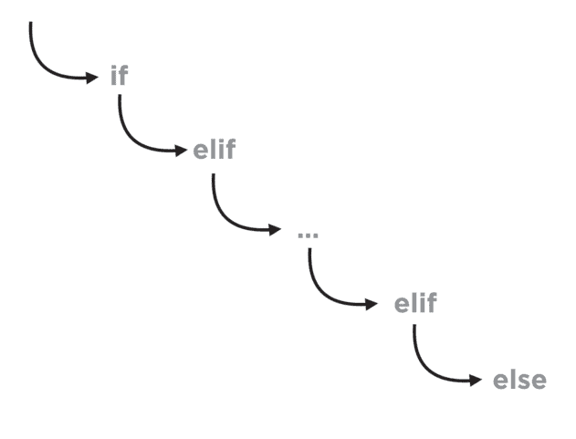

它的工作方式像瀑布，因为 Python 总是从 `if` 开始，然后只有当前一个不为真时才移动到下一个。一旦找到一个为真的 `if` 或 `elif`，Python 就不会检查它后面的任何一个。因此，`else` 下的代码只会在最后一种情况下运行。你可以把它看作是一个兜底或安全网。

到目前为止，这似乎很清楚，但现在我们要给你出个难题。让我们测试一下你的问题解决能力。如果你使用两个 `if` 而不是一个 `if` 和一个 `elif` 会发生什么？

```
answer = input("Do you want to hear a joke? ")

if answer == "Yes":
    print("What's loud and sounds like an apple?")
    print("AN APPLE")
if answer == "No":
    print("Fine.")
else:
    print("I don't understand.")
```

以防不清楚，这里的区别在于这一行：

```
if answer == "No":
```

这段代码会产生以下错误：

```
% python if.py
Do you want to hear a joke? Yes
What's loud and sounds like an apple?
AN APPLE
I don't understand.
```

第一个 `if` 下的代码和 `else` 下的代码都运行了！为什么？因为首先它检查第一个 `if`：

```
if answer == "Yes":
    print("What's loud and sounds like an apple?")
    print("AN APPLE")
```

因为 `answer` 是 "Yes"，所以运行。但它仍然检查第二个 `if`：

```
if answer == "No":
    print("Fine.")
else:
    print("I don't understand.")
```

第一部分 `answer == "No":` 是 False。因此，Python 然后运行 `else` 部分下面的内容。换句话说，使用两个 `if` 而不是一个 `if` 和一个 `elif` 会分割 Python 执行的检查链，因此每个都独立运行。

我们注意到你可以将一个 `if` 直接放在另一个 `if` 内部（甚至可以在那些 `if` 内部再放更多的 `if`，如果你愿意的话）。换句话说，你可以想出各种复杂的条件，比如 *如果 A 和 B 但不是 C 则执行 D*。请记住，一个 `if` 在另一个 `if` 内部需要你缩进两次（制表符很重要！），像这样：

```
if x:
    if y:
        # Do something
```

随着我们继续学习更多关于 Python 的概念，如循环和函数，我们将开始看到 `if` 语句在循环内部、在函数内部等等。这被称为*嵌套*，它相对常见，但如果你不习惯看到它，试图理解到底发生了什么可能会非常混乱。

### 3.3 PYTHON 中的逻辑

我们已经看到了 Python 中逻辑的一个例子，当我们介绍 `==` 运算符时，如果运算符两侧的事物相同则返回 True，否则返回 False。你可能想知道 Python 是否有其他方式来比较两个项目（进行逻辑运算），确实有。这些方式包括但不限于以下内容：

```
==, !=, >, >=, <, <=, not, and, or
```

理解这些符号如何工作的最好方法是在 Python 交互模式中实际操作它们。我们将从 `True` 和 `False` 开始。

```
% python
>>> True
True
>>> False
False
```

注意 `True` 和 `False`（大写 T 和 F）实际上是 Python 中的东西。你可能会问：“它们是变量吗？”答案是否定的，它们只是 `True` 和 `False`。它们与我们迄今为止学到的数据类型完全不同。从技术上讲，它们被称为*布尔值*（以乔治·布尔命名，他在十九世纪中叶首次定义了一个逻辑代数系统）。

#### 3.3.1 等于

运算符 `==` 检查两侧的事物是否相同，如果相同则返回 True，否则返回 False。

#### 3.3.2 不等于

运算符 `!=` 是 `==` 的反义。它告诉我们两个东西*是否不*相同。

```
>>> answer = "no"
>>> answer != "yes"
True
>>> answer != "no"
False
```

#### 3.3.3 大于、小于

实际上，我们在 Python 数学课程中已经见过 `>`（大于）和 `<`（小于）。它们的工作方式正如你所预期的：

```
>>> 10 > 12
False
>>> 10 < 12
True
```

也可以使用 `>=` 和 `<=` 来检查某个值是否大于或等于、小于或等于另一个值：

```
>>> 1 + 1 + 1 >= 3
True
>>> 1 + 1 + 1 <= 3
True
```

#### 3.3.4 not

运算符 `not` 可能是最容易解释的，因为它只是获取我们拥有的任何值（`True` 或 `False`）然后将其反转。

```
>>> not True
False
>>> not False
True
>>> not 1 + 1 + 1 >= 3
False
```

你可能注意到，与我们之前看过的其他运算符不同，`not` 只接受一个“东西”并反转它，不像 `==` 接受两个“东西”并检查它们是否相等，或者 `<` 接受两个“东西”并检查一个是否大于另一个。

注意最后一个例子。正如你可以想象的，一旦你开始组合符号，理解哪个先运行可能会变得有点复杂。在这种情况下，`not` 右侧的所有内容先运行，然后 `not` 被应用于结果。依赖这一点是不好的做法，因为如果你忘记了正确的顺序，可能会导致错误，所以我们建议使用括号来指定你想要运行的顺序——在这种情况下，最清晰的方式是写 `not (1 + 1 + 1 >= 3)`。

#### 3.3.5 and

我们可以使用 `and` 来组合我们之前学到的一些逻辑检查：

```
>>> username = "admin"
>>> password = "123456"
>>> username == "admin" and password == "123456"
True
```

运算符 `and` 只有在两边都为 `True` 时才返回 `True`。在这种情况下，`username == "admin"` 是 `True`，`password == "123456"` 是 `True`，所以当我们组合它们时，结果仍然是 `True`。但如果我们更改密码：

```
>>> password = "wrong password"
>>> username == "admin" and password == "123456"
False
```

第二部分不再是 `True`，所以 `and` 使整个表达式返回 `False`。再次注意，正如预期的那样，`==` 在 `and` 之前被求值。为了确保这一点，你可能想使用 `(username == "admin") and (password == "123456")` 代替。

#### 3.3.6 or

运算符 `or` 只要有一边为 `True` 就返回 `True`。只有当两边都为 `False` 时才返回 `False`。

```
>>> answer = "yes"
>>> answer == "Yes" or answer == "yes"
True
>>> answer == "No" or answer == "no"
False
```

#### 3.3.7 in

最后一个值得一提的运算符是 `in`，它检查一个变量是否在另一个变量中。你可以用它来检查一个字符串是否包含另一个字符串。例如，

```
>>> "d" in "hello"
False
>>> "d" in "goodbye"
True
>>> "d" in "GOODBYE"
False
```

注意 `in` 是区分大小写的，就像我们其他基于字符串的运算符一样。`in` 的另一个更有用的用法涉及列表，我们还没有介绍过。不过，让我们现在给你一个快速的例子。你可能能弄清楚它是如何工作的：

```
>>> people = ["Mattan", "Daniel", "Sarah"]
>>> "Mattan" in people
True
```

如果你想了解更多关于 Python 的真值术语，请查阅“Python 比较运算符”或“Python 逻辑运算符”。

#### 3.3.8 逻辑练习

Python 中的逻辑（以及通常情况下的逻辑）一旦你开始组合这些真值术语，就会变得相当复杂。我们创建了一个练习文件 `logic_practice.py`，你可以在 https://www.pythonforbasics.com/code 下载，我们建议你花接下来的十分钟逐行完成这个文件：

```
True and True
False and True
(1 == 1) and (2 == 1)
"love" == "love"
(1 == 1) or (2 != 1)
True and (1 == 1)
False and (0 != 0)
True or (1 == 1)
"time" == "money"
(1 != 0) and (2 == 1)
"I Can't Believe It's Not Butter!" != "butter"
"one" == 1
not (True and False)
not ((1 == 1) and (0 != 1))
not ((10 == 1) or (1000 == 1000))
not ((1 != 10) or (3 == 4))
not (("love" == "love") and ("time" == "money"))
(1 == 1) and (not (("one" == 1) or (1 == 0)))
("chunky" == "bacon") and (not ((3 == 4) or (3 == 3)))
(3 == 3) and (not (("love" == "love") or ("Python" == "Fun")))
```

这个例子的想法是，每一行要么是 `True`，要么是 `False`，由你来弄清楚是哪个。它开始很简单，随着向下进行变得越来越难。当涉及到括号时，确保你在做其他事情之前先解决括号内的内容。

一个想法是在行尾写下你认为的答案作为注释，像这样：

```
True and True # True
```

如果你想仔细检查你的答案，你可以将整行复制并粘贴到 Python 交互模式中：

```
% python
>>> True and True
True
```

或者你可以将该行放在 `print()` 中：

```
print(True and True)
```

然后运行文件查看输出：

```
% python logic_practice.py
True
```

### 3.4 使 IF.PY 不区分大小写

让我们将刚学到的东西应用到我们的 `if.py` 脚本中。你可能已经注意到以下行是区分大小写的：

```
...
if answer == "Yes":
    print("What's loud and sounds like an apple?")
    print("AN APPLE")
...
```

意思是，如果你输入“yes”（小写“y”），你会得到以下结果：

```
% python if.py
Do you want to hear a joke? yes
I don't understand.
```

我们可以通过添加一个 `or` 来修复这个问题：

```
...
if answer == "Yes" or answer == "yes":
    print("What's loud and sounds like an apple?")
    print("AN APPLE")
...
```

你也可以在 `elif` 中放入相同的内容，这样你最终的 `if.py` 看起来像这样：

```
answer = input("Do you want to hear a joke? ")
if answer == "Yes" or answer == "yes":
    print("What's loud and sounds like an apple?")
    print("AN APPLE")
elif answer == "No" or answer == "no":
    print("Fine.")
else:
    print("I don't understand.")
```

这样，它将接受“Yes”和“yes”（或“No”和“no”）作为选项：

```
% python if.py
Do you want to hear a joke? Yes
What's loud and sounds like an apple?
AN APPLE
% python if.py
Do you want to hear a joke? yes
What's loud and sounds like an apple?
AN APPLE
```

如果我们这样写会发生什么？

```
...
if answer == "Yes" or "yes":
    print("What's loud and sounds like an apple?")
    print("AN APPLE")
...
```

尽管这看起来与我们之前写的代码（`answer == "Yes" or answer == "yes"`）相似，但它实际上是错误的，并会引入一个特别棘手的错误。我们会得到以下结果：

```
% python if.py
Do you want to hear a joke? yes
What's loud and sounds like an apple? AN APPLE
% python if.py
Do you want to hear a joke? no
What's loud and sounds like an apple? AN APPLE
% python if.py
Do you want to hear a joke? blue
What's loud and sounds like an apple? AN APPLE
```

乍一看似乎没问题，但你很快就会意识到有些不对劲：无论你输入什么，你总是会得到相同的答案。为什么呢？
这与两件事有关：

1.  **Python 检查事物是 True 还是 False 的顺序。** 记住，如果一边为真，`or` 就为真。所以，它首先会检查 `answer == "Yes"` 是否为真，然后检查 `"yes"` 是否为真。
2.  **Python 中所有非空字符串都被解释为 True 这一事实。** 这很奇怪，但确实如此。当任何字符串本身需要被解释为 True/False 值时，Python 都认为其值为 True。

换句话说，尽管我们的大脑可能会将其读作：

```
if answer == ("Yes" or "yes"):
```

Python 实际上读作：

```
if (answer == "Yes") or ("yes"):
```

很奇怪吧？这突出了大量使用括号的重要性。如果我们想进一步扩展代码，将用户的答案与一组值进行比较呢？假设我们想接受“Yes”、“yes”、“Y”和“y”作为可能的答案。你能这样做吗？

```
if answer == "Yes" or answer == "yes" or answer == "Y"
or answer == "y":
    ...
```

这是可以的，而且它会工作，但一个更简单的解决方案可能是使用我们之前告诉你的 `in`。

```
if answer in ["Yes", "yes", "Y", "y"]:
    ...
```

这稍微短一些，可能更容易阅读。另一个潜在的改进可能是使用字符串函数。如第 2.8.1 节所述，字符串函数作用于字符串并对它们执行某些操作。记住 `lower()` 接受一个字符串并将其转换为小写。例如 `"Hello".lower()` 返回 `'hello'`。我们可以在 `if` 语句中使用它：

```
if answer.lower() in ["yes", "y"]:
    ...
```

这基本上允许我们使用户的输入不区分大小写：“Yes”、“YES”、“yeS”和“yEs”在小写时都会产生相同的结果。有趣的是，大多数网站如 facebook.com 和 twitter.com 在你使用电子邮件地址注册时都使用此功能。因为电子邮件地址不区分大小写，所以它们在将你提供的任何文本保存到数据库之前将其转换为小写，当你登录时，它们在将你输入的电子邮件地址与数据库中保存的内容进行比较之前，也会将其转换为小写。否则，两个人可能使用相同的电子邮件地址但不同的大小写进行注册，或者你可能无法登录，因为你输入的电子邮件地址与注册时的不完全相同。

为什么用小写而不是大写？其实这并不重要，只要它们始终执行相同的功能即可。我们最终的代码应该如下所示：

```
answer = input("Do you want to hear a joke? ")

if answer.lower() in ["yes", "y"]:
    print("What's loud and sounds like an apple?")
    print("AN APPLE")
elif answer.lower() in ["no", "n"]:
    print("Fine.")
else:
    print("I don't understand.")
```

如果愿意，我们可以将选项分离到各自的变量中：

```
...
affirmative_responses = ["yes", "y"]
negative_responses = ["no", "n"]
if answer.lower() in affirmative_responses:
    ...
elif answer.lower() in negative_responses:
    ...
```

一些开发者可能会认为这样更好，因为变量名本身就充当了一种注释，解释了["yes", "y"]和["no", "n"]实际代表什么。其他开发者可能会争辩说，之前已经很清楚了，你只是在没有充分理由的情况下让代码变得更长（并且可能更难阅读）。

我们将留给你思考你更喜欢哪种选项以及为什么。这类问题，即使乍看之下可能显得微不足道，却是围绕编码和软件开发的一些最有趣问题的核心。具体来说，你如何编写清晰且易于日后修改的代码？

整个企业都曾因此而倒闭，因为他们的开发者没有考虑这类问题——他们的代码变得漏洞百出，软件改进也变得越来越困难。例如，有人认为在20世纪90年代末，Netscape（一家上市公司）犯下了任何软件公司都可能犯下的最大战略错误，即决定从头开始重写所有代码，因为他们觉得代码运行缓慢且效率低下。¹ 重写最终耗时三年。

### 3.5 列表

我们想向你介绍的Python的下一个方面是*列表*。我们最早在`happy_hour.py`中遇到列表，最近在`if.py`中也遇到过，但现在是时候真正理解如何使用它们了。列表是Python中对事物进行分组的方式。

创建一个名为`lists.py`的新Python文件，并输入以下内容：

```
# Python, lists are a way of grouping
# (usually) similar things together
the_count = [1, 2, 3, 4, 5]
stocks = ["FB", "AAPL", "NFLX", "GOOG"]
random_things = [55, 1/2, "Puppies", stocks]
```

这里我们创建了三个列表，并将它们保存到三个不同的变量中——the_count、stocks和random_things。你会注意到，当将列表保存到变量中时，通常将其命名为复数形式是有意义的，这样你就能记住它包含一个列表。

在Python中创建列表非常简单，你以`[`开始，以`]`结束（一对方括号，用于“打开”和“关闭”列表），然后将你想要的任何项目放在方括号内，用逗号分隔。Python列表中的项目或事物通常被称为*元素*。

在最后一个例子（random_things）中，你可能注意到了两件事：

1.  在列表中，每个元素不一定必须是同一种类型的东西。
2.  一个列表可以包含另一个列表。

实际上，第二点可能并不那么明显。尽管random_things的最后一个元素看起来像是一个变量（stocks），但变量只是你用来存放其他东西的盒子。当你运行Python代码时，变量总是会被替换为它们内部的内容。换句话说，random_things列表的实际内容是：

[55, 0.5, 'Puppies', ['FB', 'AAPL', 'NFLX', 'GOOG']]

尝试在你的文件中打印`random_things`，你在命令行中看到的内容应该与之匹配。（还要注意，从技术上讲，1/2是一个数学表达式，会被替换为浮点数0.5。）

对于不习惯阅读代码的人来说，这可能会令人困惑。你可以在列表中放入列表，也可以在那些列表中再放入列表（以此类推）。这可能会变得混乱，因为很难跟踪逗号的位置以及一个列表在哪里结束、另一个列表在哪里开始。这是一项需要通过练习来掌握的技能。

#### 列表函数

Python中有很多有用的函数可以用于列表：

-   `len()` 给出列表中元素的数量
-   `sum()` 将列表中的数字相加
-   `min()` 给出列表中的最小值
-   `max()` 给出列表中的最大值

要运行这些函数中的任何一个，将列表（或包含列表的变量）直接放入括号中。例如，`len([1, 2, 3, 4, 5])`的结果是5，而`sum([1, 2, 3, 4, 5])`的结果是15。

请注意，`sum()`仅在列表包含数字时有效。相反，`min()`和`max()`适用于数字*或*字符串列表（在这种情况下，按字母顺序排列后，我们将得到第一个或最后一个值）。除了这四个列表函数之外，我们稍后还会提到其他一些函数。

#### 3.5.1 从零开始构建列表

创建列表时，你可以直接创建一个包含所有元素的列表（就像我们刚才做的那样），也可以从一个空列表开始，然后逐个添加内容。要理解我们的意思，请将以下代码添加到你的`lists.py`中：

```
...
# You can start with an empty list
# and append or remove
people = []

people.append("Mattan")
people.append("Sarah")
people.append("Daniel")
people.remove("Sarah")
print(people)
```

`[]`是Python中的一个空列表。我们将其保存到变量`people`中，然后可以向其中追加（添加）内容或从中移除内容。

#### 元组

在Python中，你偶尔会看到一种叫做*元组*的东西，它基本上是一个列表，但使用圆括号而不是方括号：

```
% python
>>> numbers = (1, 2, 3, 4, 5)
```

元组和列表可以做很多相同的事情，一个主要的区别是，一旦你创建了一个元组，你就不能改变它（用程序员的话说，这被称为“不可变”）。看看如果我们尝试向刚刚创建的元组`append()`另一个数字会发生什么：

```
>>> numbers.append(6)
Traceback (most recent call last):
  File "<stdin>", line 1,
    in <module>
AttributeError: 'tuple' object has no attribute 'append'
```

那么，如果元组基本上是功能更少的列表，为什么它们还存在呢？答案是它们更快，并且还有一个额外的好处，即有时开发者希望能够创建以后无法更改的列表。

我们的建议是暂时不要担心使用元组。我们提到它们只是因为你偶尔会在别人的代码中看到元组的使用（看起来像列表，但外面是`( )`而不是`[]`）。现在你知道它基本上只是一个列表。

让我们重新打开第1.5节中的旧`happy_hour.py`脚本。还记得我们遇到的那个可能两次选中同一个人的问题吗？

```
...
random_person = random.choice(people)
random_person2 = random.choice(people)
...
```

如何通过在选择第二个随机人物之前将第一个人从列表中移除来避免这个问题？一种方法是在随机选择第二个人之前，将第一个随机选择的人从列表中移除：

```
...
random_person = random.choice(people)
people.remove(random_person)
random_person2 = random.choice(people)
...
```

#### 3.5.2 从字符串创建列表

考虑以下代码片段：

```
"New York, San Francisco, London"
```

它是一个列表吗？不是。在Python中，这是一个字符串，即使它看起来像我们可能称之为列表的东西。因为它周围没有方括号，所以它不是列表。

```
["New York, San Francisco, London"]
```

从技术上讲，这是一个列表，但它并不是我们真正想要的。这个列表只有一个元素（注意逗号在字符串内部，这不算数）。在Python中，列表允许你做很多有用的事情，例如从列表中随机选择、打乱列表顺序以及检查某物是否在列表中，等等。

我们如何将字符串转换为列表？我们可以使用Python的`split()`函数：

```
% python
>>> "New York, San Francisco, London".split()
['New', 'York,', 'San', 'Francisco,', 'London']
```

#### 3.5.3 访问列表元素

默认情况下，`split()` 函数会在空格处分割字符串。如果我们想改变这一点，可以传入我们想要的分割符：

```python
>>> "New York, San Francisco, London".split(", ")
['New York', 'San Francisco', 'London']
```

这就是我们想要的列表！将以下内容添加到 `lists.py` 中以帮助记忆：

```python
# 使用 split() 将字符串转换为列表
cities = "New York, San Francisco, London".split(", ")
print(cities)
```

同样，你可能想知道是否有可能以更自然的方式打印列表（例如，不带方括号）。尝试将以下内容添加到 `lists.py`：

```python
# 使用 join() 将列表转换为字符串
groceries = ["Milk", "Eggs", "Cheese"]
print(" and ".join(groceries))
```

运行代码后，你应该看到以下输出：

```
% python lists.py
...
Milk and Eggs and Cheese
```

`join()` 函数将列表转换为字符串。你在一个字符串后面直接加一个点（例如，一个逗号加一个空格，像这样：`', '`），然后将列表作为参数传递给它。它会在列表的每个元素之间插入一个逗号和一个空格，并将结果作为字符串返回。

这个函数本身起初可能有点反直觉。它可以与任何类似列表的对象（如元组，甚至字符串）一起使用，因此将其设为字符串函数更有意义。如果你想看点有趣的东西，试试这个：`"-".join("hello")`。在本书中，列表是我们将考虑的唯一类似列表的对象，因此你可以放心地忽略这些复杂性。

你可以通过在列表后面使用另一组 `[]`（方括号）并在其中放入一个数字来获取列表中的单个元素。将以下内容添加到你的 `lists.py`：

```python
# 使用 [] 访问列表元素
first_city = cities[0]
second_city = cities[1]
last_city = cities[-1]
first_two_cities = cities[0:2]
print(first_two_cities)
```

值得注意的是，这里的列表是零索引的，这意味着列表中的第一个元素位于位置零，第二个元素位于位置一，依此类推。这对许多非程序员来说很困惑，但过一段时间你就会习惯。

在我们的例子中，`first_city` 将包含字符串 `"New York"`，`last_city` 将包含字符串 `"London"`，而 `first_two_cities` 将包含列表 `['New York', 'San Francisco']`。

我们刚刚向你展示了在 Python 中使用方括号可以做的另一件事，而不仅仅是创建列表。这也可能让很多初学者感到困惑，因为你基本上是在做这样的事情：

```python
first_city = ['New York', 'San Francisco', 'London'][0]
```

第一组方括号定义或创建了一个新列表，但第二组方括号（末尾的 `[0]`）告诉 Python 从列表中获取第一个元素。Python 中一个巧妙的地方是，你总是可以使用 `[-1]` 来获取列表的最后一个元素（或 `[-2]` 来获取倒数第二个元素，依此类推），因此你不必确切知道它在哪个位置。

请注意，我们能够使用 `cities[0:2]` 来仅获取前两个城市。这在 Python 中称为切片表示法，它允许你使用以下格式获取列表中的元素子集：

```
list[start:stop]
```

一个关键点是，切片表示法将从第一个数字指定的元素开始获取，直到但不包括第二个数字指定的元素。换句话说，`[0:2]` 给我们列表中的第一个和第二个元素，但不包括第三个（即 `[2]` 处的元素）。我们也可以在切片表示法中留空任一侧，这将给我们列表中直到某个元素编号的所有项目：

```
list[:stop]
```

或者它将给我们列表中从某个元素编号开始到列表末尾的所有项目：

```
list[start:]
```

如果这让你感到困惑，值得花些时间在 Python 交互模式下使用切片表示法以更好地理解：

```
% python
>>> cities = ['New York', 'San Francisco', 'London']
>>> cities[:1]
['New York']
>>> cities[1:]
['San Francisco', 'London']
```

#### 在字符串上使用切片表示法

Python 中一个有趣的特性是字符串在某些方面可以像列表一样处理。例如，取字符串 `"New York, NY"`。我们可以像处理列表一样，使用 `[0]` 获取字符串的第一个字符，或使用 `[0:3]` 获取前三个字符：

```
% python
>>> "New York, NY"[0]
'N'
>>> "New York, NY"[0:3]
'New'
```

但我们也可以像处理列表一样，通过以下方式获取此字符串的最后两个字符：

```
>>> "New York, NY"[-2:]
'NY'
```

这里，我们依赖于切片表示法*以及*我们可以使用 `-2` 作为倒数第二个字符的位置这一事实，基本上是说“给我们从倒数第二个字符到字符串末尾的所有内容”（换句话说，给我们最后两个字符）。相当方便，对吧？

如果你想找出列表中某个特定项目的位置怎么办？Python 有一个名为 `index()` 的函数，可以让你做到这一点：

```
>>> a = ["Mattan", "Daniel", "Priya"]
>>> a.index("Daniel")
1
```

这告诉我 `"Daniel"` 是列表中的第二个元素（记住 Python 从零开始编号列表）。

使用列表存储事物的缺点是，如果你想取出这些事物，你必须记住它们的位置（这就像每次想查字典中一个单词的定义时，都必须记住它的页码）。稍后，在第 3.8 节，我们将学习 Python 中的另一种数据类型，称为字典，它通过让我们使用字符串而不是数字来查找事物来解决这个问题，但首先，我们想展示列表最有用的功能之一：循环。

### 3.6 循环遍历列表

因为循环遍历列表这个主题非常重要，让我们创建一个全新的文件 `loops.py`：

```python
# 使用 for 循环遍历列表
numbers = [1, 2, 3]
for number in numbers:
    print(number)
```

运行时将产生以下输出：

```
% python loops.py
1
2
3
```

从高层次来看，`for` 循环的工作方式是它一次遍历列表中的每个元素，并对每个元素运行相同的代码。这是编写更少代码的快捷方式。在这种情况下，我们只是遍历了一个包含数字一、二、三的列表，并逐个打印每个数字。

我们说它是一种快捷方式，因为在 Python 中完成同样事情的更长方式如下：

```python
numbers = [1, 2, 3]

number = numbers[0]
print(number)
number = numbers[1]
print(number)
number = numbers[2]
print(number)
```

你看到这如何产生与我们使用循环时相同的输出了吗？（如果没有，请自己尝试一下。）

Python 中 `for` 循环的一般结构如下：

```python
y = [...]
for x in y:
    # 对 x 做一些事情
```

在这个例子中，`x` 和 `y` 是什么？`y` 是 `for` 循环正常运行所需的列表。它必须已经存在（比如一个数字列表、一个股票列表或一个人员列表）。

`x` 是我们在 `for` 循环中定义的东西。就像你为了 `for` 循环的目的创建了一个新变量，随着它的运行，`x` 的值会改变，直到它遍历列表中的每个元素（按顺序）。`x` 不需要在运行 `for` 循环之前就存在，如果它存在，它将被覆盖。

再次注意制表符缩进。这就是 Python 知道哪些内容需要作为 `for` 循环的一部分重复执行的方式。当它到达缩进部分的末尾时，它会回到循环的开头，处理列表中的下一个元素。

我们喜欢将 `for` 循环视为“全部应用”的快捷方式。

例如，假设我们有一个股票代码列表，但它们都是小写的：

```python
stocks = ["fb", "aapl", "nflx", "goog"]
```

我们如何使用 `for` 循环以全大写形式打印每个代码？在查看我们的答案之前，看看你是否可以自己尝试一下。

我们可能会这样做：

```python
stocks = ["fb", "aapl", "nflx", "goog"]
for stock in stocks:
    print(stock.upper())
```

注意这里我们有两个变量：`stock` 和 `stocks`。通常，当你创建一个变量来保存列表时，使用复数形式是有意义的（例如，`stocks`、`numbers`、`random_things` 或 `people`）。如果你正在循环遍历该列表，并想创建一个变量来泛指列表中的单个元素，使用单数形式是有意义的（例如，`stock`、`number`、`random_thing` 或 `person`）。这些变量只是 Python 在遍历列表时使用的索引。

通常，你会发现开发者为循环变量使用更短的名称，如 `i` 或 `j`。从积极的一面看，它使代码更加简洁。从消极的一面看，它使代码的可读性稍差，因为仅凭变量名很难知道它包含什么。随着你对 Python 的熟练程度提高，你会在这方面形成自己的偏好。

#### 3.6.1 循环挑战

使用 `for` 循环打印出数字一到十的平方。现在花五分钟时间完成这个。

#### 3.6.2 循环挑战解决方案

解决这个问题最简单的方法是从一个包含数字一到十的列表开始，然后循环遍历每个数字以打印其平方：

```python
numbers = [1, 2, 3, 4, 5, 6, 7, 8, 9, 10]
for number in numbers:
    print(number * number) # 等同于 number ** 2
```

这将产生以下输出：

```
1
4
9
16
25
36
49
64
81
100
```

如果你想花哨一点，可以添加一些修饰：

```
numbers = [1, 2, 3, 4, 5, 6, 7, 8, 9, 10]
for number in numbers:
    print(number, "squared is", number * number)
```

这将产生以下结果：

```
1 squared is 1
2 squared is 4
3 squared is 9
4 squared is 16
5 squared is 25
6 squared is 36
7 squared is 49
8 squared is 64
9 squared is 81
10 squared is 100
```

作为额外的挑战，你能想出一种更好的方法来循环一到十的数字吗？
为什么需要更好的方法？如果你需要循环一到一百的数字呢？你会创建一个包含每个数字的列表吗？那一到一百万呢？

快速在谷歌上搜索“Python 1 to 10”应该能找到`range()`函数，它的用法如下：

```
for x in range(10):
    print(x)
```

并产生：

```
0
1
2
3
4
5
6
7
8
9
```

`range()`函数有点奇怪，因为它生成一个从零开始到（但不包括）你给定数字的数字列表²。它还允许你指定起始数字，因此你可以用`range(1, 11)`获取一到十的数字：

```
for number in range(1, 11):
    print(number, "squared is", number * number)
```

这比我们自己创建列表的版本稍短一些，但也使得更改循环的数字范围变得容易得多。
为了好玩，试着打印出一到一百万的数字的平方。如果你不小心像我们第一次那样多打了一个零，而你的Python脚本持续运行了一段时间，你可以按Ctrl和C来中断它并提前停止。

#### 3.6.3 如何重复执行某事X次

顺便说一下，你可以使用`for`循环来运行相同的代码一定次数。

```
for _ in range(10):
    print("Hey ya!")
```

`range(10)`函数将生成十个东西（从零到九的数字）的列表，因此循环将为每个数字运行一次。`for`循环中的`_`字符是怎么回事？Python开发者喜欢在这种特定情况下使用`_`作为变量名，以表示它实际上不会在循环内使用（因为你仍然需要在那个位置放点东西）。你也可以在那个位置放`i`（或其他变量名）而不使用它，但`_`更整洁。

#### 3.6.4 创建一个新的平方列表

到目前为止，我们只在`for`循环中使用了`print()`，但我们能做的远不止这些。例如：

```
squares = []
for number in range(1, 11):
    squares.append(number * number)
print(squares)
```

这做了以下事情：

1.  创建一个名为`squares`的空列表
2.  循环一到十的数字
3.  计算每个数字的平方
4.  将每个平方值追加到`squares`列表中
5.  完成后打印出`squares`列表

当然，Python有很多方法可以做这样的事情（可以说更快），但这是一种方法。
以防你仍然困惑于什么应该放在循环内还是循环外，让我们向你展示两种错误的做法以及每种情况会发生什么：

错误1

```
for number in range(1, 11):
    squares = []
    squares.append(number * number)
print(squares)
```

这里我们把`squares = []`放在了`for`循环内部。你认为会发生什么？运行代码，你会看到以下输出：

```
[100]
```

这是因为你在每次循环中都覆盖了`squares`变量的值，并将其重置为空列表。最后你只剩下最终的值，它没有被覆盖，因为循环结束了。

错误2

```
squares = []
for number in range(1, 11):
    squares.append(number * number)
    print(squares)
```

这里我们把`print(squares)`放在了`for`循环内部。你认为会发生什么？这次你会得到以下输出：

```
[1]
[1, 4]
[1, 4, 9]
[1, 4, 9, 16]
[1, 4, 9, 16, 25]
[1, 4, 9, 16, 25, 36]
[1, 4, 9, 16, 25, 36, 49]
[1, 4, 9, 16, 25, 36, 49, 64]
[1, 4, 9, 16, 25, 36, 49, 64, 81]
[1, 4, 9, 16, 25, 36, 49, 64, 81, 100]
```

在这种情况下，因为你在每次循环结束时都打印出`squares`变量的值，所以你会得到这个漂亮的金字塔图案，这不一定是你想要的（尽管在`for`循环中使用`print()`可以是调试问题并弄清楚代码中到底发生了什么的有效方法）。

#### 列表推导式

Python有一种内置的、更快的方法来从一个列表生成另一个列表。它叫做列表推导式，形式如下：

```
[number * number for number in range(1, 10)]
```

这基本上和我们之前做的一样，但都在一行里。这种列表推导式结构对初学者来说可能有点令人困惑，但值得了解。列表推导式的优势不仅在于它更短，而且你不必先创建一个空列表来追加值。

### 3.7 FIZZBUZZ

你听说过*FizzBuzz*吗？这是一个常见的开发者面试问题。一些开发者讨厌这个面试问题，因为它迫使他们在时间压力下当场思考，并且不允许他们查阅可能在不知道如何做某事时习惯查阅的资源（比如Stack Overflow）。尽管如此，以下是挑战：

#### 3.7.1 FizzBuzz挑战

编写一个程序，打印从一到一百的数字。但对于三的倍数，打印“Fizz”而不是数字；对于五的倍数，打印“Buzz”。对于同时是三和五的倍数的数字，打印“FizzBuzz”。

我们需要一个额外的东西来解决这个问题，那就是如何检查一个数字是否能被三或五整除。我们可以使用Python中的`%`（取模）符号来做到这一点，它告诉我们一个数字除以另一个数字后剩下的余数。例如，`3 % 3`是0，`4 % 3`是1，`5 % 3`是2，`6 % 3`是0，依此类推。

换句话说，我们可以通过`number % 3 == 0`来检查`number`是否能被三整除。这将返回`True`或`False`。

现在花十分钟来尝试这个挑战！

感到卡住了？继续阅读一些提示。

首先，我们强烈建议在放弃并阅读我们的解决方案之前，至少花几分钟尝试这个挑战。我们保证，你撞墙（比喻义）十分钟会比直接跳到解决方案学得更快。从某种意义上说，这个问题代表了你在编码中会遇到的许多问题，你不能总是假设别人已经为你解决了。

其次，我们建议将较大的问题分解成更小的步骤。事实上，对于编码问题来说，这通常是个好主意。它给你一个更合理的起点，并允许你沿途测试，这样你就知道什么有效，什么无效。

例如，我们会将这个挑战分解为以下子挑战：

1.  打印从一到一百的数字。
2.  检查数字是否能被三整除，如果是，则打印“Fizz”。
3.  检查数字是否能被五整除，如果是，则打印“Buzz”。
4.  检查数字是否能被三和五整除，如果是，则打印“FizzBuzz”。

即使你不清楚如何完成步骤二到四，步骤一应该相当容易。几页前我们看到了如何打印一到十的数字，所以一到一百应该类似。

首先只解决第一个问题，然后继续下一个。其中的“if”这个词可能有助于你意识到你可能需要在某个地方使用`if`语句（也许在`for`循环内部？）

再次，设定十分钟左右的时间限制，但不要超过太多。当你准备好时，继续阅读我们的解决方案。

#### 3.7.2 FizzBuzz挑战解决方案

让我们分几步来解决这个问题。

1.  打印从一到一百的数字。

回顾3.6.2节中的循环挑战解决方案，看看如何做到这一点：

```
for number in range(1, 101):
    print(number)
```

这将产生以下输出：

### 3.8 字典

Python 中的列表很有用，因为它们能让你将不同的事物组合在一起。你也可以使用 for 循环来避免重复编写相同的代码。但你很快就会明白，为什么列表并不总是存储 Python 中某些类型数据的最佳方式。为了解决列表的一个局限性，我们将介绍一种新的数据类型，称为字典。

假设我们想在 Python 中存储大量与某只公开交易股票相关的信息，于是我们决定创建一个列表：

```
stock = ["Microsoft", "MSFT", "NASDAQ"]
```

我们还想跟踪该股票最近的开盘价和收盘价。我们也可以将这些信息添加到列表中：

```
stock.append(108.25) # 开盘价
stock.append(106.03) # 收盘价
```

现在，如果我们想访问某个特定信息，就必须记住所有信息的确切位置（或者打印整个列表然后数数）。例如，股票代码是列表中的第二个元素，收盘价是第五个。（还是第四个？很容易忘记。）类似这样的代码可以工作：

```
print(f"{stock[1]} is trading at {stock[4]}")
```

但这显然不是理想的方式。问题在于，即使这些信息应该被组合在一起，如果我们只是把它们扔进一个列表，就会丢失一些重要的东西。它们都是同一个事物的属性或特征——就像人有头发颜色、眼睛颜色、身高、体重以及许多其他属性一样——而在使用列表时，Python 并没有给我们提供一种方法来标记每个元素实际是什么。

但 Python 有另一种数据结构叫做 *字典*，它的工作方式类似于列表，但允许我们使用字符串⁴来标记事物，而不仅仅是为每个位置使用一个数字。这样，顺序就不重要了，我们可以使用字符串来访问数据的任何部分。

为了了解字典的工作原理，让我们创建一个名为 `dictionaries.py` 的文件，并编写以下代码：

```
# 字典允许你使用字符串来标记值
stock = {"name": "Microsoft", "ticker": "MSFT", "index": "NASDAQ"}
```

请注意，创建字典时，我们使用 `{}`（花括号）而不是用于列表的方括号。在 Python 中，当创建一个包含很多内容的字典时，将其分成多行写会更容易：

```
# 字典允许你使用字符串来标记值
stock = {"name": "Microsoft",
         "ticker": "MSFT",
         "index": "NASDAQ"}
```

通常，标签会全部对齐以便于阅读。确切的制表符或空格数量并不重要，因为 Python 会将整个内容解释为一行。此外，只要它们在花括号内，换行符也不重要（列表也是如此，正如我们在 `happy_hour.py` 中看到的那样）。

在字典内部，每个冒号左边的东西称为 *键*，冒号右边的东西称为 *值*。我们称这些为键/值对：

```
'key': value
```

在字典中，一个键 *总是* 对应一个值，反之亦然。键是一个字符串，但值基本上可以是任何东西——字符串、数字、列表，甚至是另一个字典。在每个字典中，每个键都是唯一的（意味着我们不能多次使用同一个键）。每个键和值之间总有一个冒号，并且不要忘记在每个键/值对之间加上逗号。

要从字典中获取某个东西，我们可以像使用列表一样使用 `[]`（方括号）。只不过在字典中，我们在方括号内放入一个键而不是一个数字。将以下内容添加到 `dictionaries.py`：

```
print(f"{stock['name']}'s stock ticker is {stock['ticker']}")
```

如果你忘记了如何指定 range(1, 101) 的起始和结束，没关系。你可以在线查找，或者通过试错来弄清楚。请注意，在 for 循环中你实际调用变量的名字（无论是 number 还是 x）并不重要，只要你一致地使用它即可。

2. 检查该数字是否能被三整除，如果是，则打印 “Fizz”。
这里的关键是弄清楚如何将 if 放在 for 循环内部。我们知道（因为我们告诉过你）可以通过执行 (number % 3) == 0 来检查 number 是否能被三整除。只需将其放在 if 语句中：

```
for number in range(1, 101):
    if (number % 3) == 0:
        print("Fizz")
```

这里的问题是，这只会产生以下输出：

```
Fizz
Fizz
Fizz
...
```

使用这段代码，我们只为每个能被三整除的数字看到 “Fizz”，而看不到任何其他数字被打印出来。这是因为我们的 if 没有 else。我们需要记住使用 else 来打印数字本身，以防它不能被三整除。

```
for number in range(1, 101):
    if (number % 3) == 0:
        print("Fizz")
    else:
        print(number)
```

这将给我们带来我们想要的输出：

```
1
2
Fizz
...
98
Fizz
100
```

通常，我们建议尽早并经常运行你的代码，以确保它确实在做你认为它在做的事情，这样你就可以在错误出现时捕获它们，而不是在最后当它们更难调试时。

3. 检查该数字是否能被五整除，如果是，则打印 “Buzz”。
如果你弄清楚了上一步，这个添加就相对简单了。只需添加一个额外的 elif 来检查 number 是否能被五整除：

```
for number in range(1, 101):
    if (number % 3) == 0:
        print("Fizz")
    elif (number % 5) == 0:
        print("Buzz")
    else:
        print(number)
```

这将给你以下输出：

```
1
2
Fizz
4
Buzz
...
98
Fizz
Buzz
```

4. 检查该数字是否能同时被三和五整除，如果是，则打印 “FizzBuzz”。
最后这一步有点棘手，因为它不像我们在第三步中那样简单地添加另一个 elif：

```
for number in range(1, 101):
    if (number % 3) == 0:
        print("Fizz")
    elif (number % 5) == 0:
        print("Buzz")
    elif ((number % 3) == 0) and ((number % 5) == 0):
        print("FizzBuzz")
    else:
        print(number)
```

如果你实际运行这段代码并检查输出，它会产生与我们在第三步修改后得到的相同输出。特别是对于能同时被三和五整除的数字（例如十五、三十），我们仍然只看到 “Fizz”：

```
...
13
14
Fizz
16
17
...
```

我们得到这个结果是因为 if、elif 和 else 是按顺序依次检查的。以十五为例，它能同时被三和五整除。当循环到达这个数字时会发生什么？第一行将检查这个数字是否能被三整除，它会发现可以，然后它将执行 print("Fizz") 这一行，跳过其他所有内容。
这个问题有多种可能的解决方案，但最简单的解决方案之一是调整你的 if 和 elif 的顺序，以便首先检查最具体的情况：

106 第一部分

```
for number in range(1, 101):
    if ((number % 3) == 0) and ((number % 5) == 0):
        print("FizzBuzz")
    elif (number % 3) == 0:
        print("Fizz")
    elif (number % 5) == 0:
        print("Buzz")
    else:
        print(number)
```

这将给我们带来我们想要的输出：

```
1
2
Fizz
...
14
FizzBuzz
16
...
98
Fizz
Buzz
```

很好！
现在，此时仍然有许多可能的优化。例如，你可能已经发现 ((number % 3) == 0 and (number % 5) == 0) 与 (number % 15) == 0 是相同的，这会使你的代码更短——尽管更短是否总是更好是有争议的。有些人可能会争辩说，第一种方法更明确，如果以后需要，更容易找到和更改条件。
程序员甚至会竞争谁能想出 FizzBuzz 和其他挑战的最短解决方案，例如在编码练习网站 HackerRank.com 上（如果你想尝试一些额外的练习题，我们推荐去看看）。
我们目前能够找到的 FizzBuzz 最短解决方案是以下单行代码：

```
for x in range(100):print(x%3//2*'Fizz'+x%5//4*'Buzz'or x+1)
```

同样，仅仅因为某样东西短并不意味着它好。我们会认为 FizzBuzz 的单行解决方案不必要地复杂，几乎无法阅读。³

通过 `stock['name']` 和 `stock['ticker']` 获取的值应该是 'Microsoft' 和 'MSFT'，因为这是我们创建股票字典时为这些键设置的初始值。

f-string 允许我们使用键从股票字典中查找值，并将该值直接插入字符串中。需要注意的一点是，在 f-string 内部使用单引号还是双引号作为键的引号。如果你的 f-string 外部使用双引号，那么你的键就需要使用单引号（例如，`f"{stock['name']}"`），否则 Python 会认为字符串在键开始的地方就结束了。

请记住，以下两段代码看起来很相似：

```
stock[1]
```

和

```
stock['ticker']
```

但第一段代码只能用于列表，而第二段代码只能用于字典。方括号 `[]` 内的内容提示了我们正在处理的是哪种数据结构。

理解列表和字典之间区别的一个方法是思考实际字典的工作原理。当你拿起一本字典查找一个单词的定义时，你会翻页直到找到那个单词（键），然后阅读定义（值）。如果实际字典的结构像列表一样，我们就必须记住每个单词定义所在的页码，这将使字典几乎无法使用。

#### 获取字典中的键列表

可以使用 `.keys()` 函数获取字典中的键列表：

```
>>> stock = {"name": "Microsoft",
...         "ticker": "MSFT",
...         "index": "NASDAQ"}
>>> stock.keys()
dict_keys(['name', 'ticker', 'index'])
```

当使用存储了大量内容的字典，并且我们已经忘记了可以使用哪些键时，这会很有帮助。

#### 3.8.1 字典挑战，第 1 部分

字典通常用于存储有关用户等事物的信息。在 `dictionaries.py` 中创建一个名为 `user` 的字典。给它以下键：'name'、'height'、'shoe size'、'hair' 和 'eyes'。用你自己的信息填充这些键的值。完成后，分别打印出字典中保存的每个值。

#### 3.8.2 字典挑战解决方案，第 1 部分

你的 `user` 字典应该看起来像这样：

```
user = {'name': 'Mattan',
        'height': 70,
        'shoe size': 10.5,
        'hair': 'Brown',
        'eyes': 'Brown'}
```

请记住，在这种情况下，制表符和换行符并不重要，它们只是为了使代码更易于阅读（如果你愿意，可以把整个字典放在一行上）。如何打印值取决于你。我们使用了 f-string：

```
print(f"Name: {user['name']}")
print(f"Height: {user['height']}")
print(f"Shoe Size: {user['shoe size']}")
print(f"Hair Color: {user['hair']}")
print(f"Eye Color: {user['eyes']}")
```

运行我们的代码后，结果应该是：

```
Name: Mattan
Height: 70
Shoe Size: 10.5
Hair Color: Brown
Eye Color: Brown
```

当然，如果我们愿意，可以用类似这样的方式将所有内容打印在一行中：

```
print(f"{user['name']}'s height is {user['height']}, shoe size is {user['shoe size']}, hair color is {user['hair']}, and eye color is {user['eyes']}")
```

但这对于一行代码来说开始变得相当长了。

#### 3.8.3 添加键/值对

鉴于我们已经创建了一个包含字典的 `stock` 变量，添加新的键/值对非常容易。将以下内容添加到 `dictionaries.py` 中：

```
...
stock["open price"] = 108.25
stock["close price"] = 106.03
print(stock)
```

你应该会看到以下内容作为 `stock` 的值被打印出来：

```
{'name': 'Microsoft', 'ticker': 'MSFT', 'index': 'NASDAQ', 'open price': 108.25, 'close price': 106.03}
```

添加新的键/值对使用的代码与使用键查找值（例如 `stock["open price"]`）基本相同，只是我们将其设置为等于某个值。因为键只是字符串，所以我们可以在键名中使用空格。

另一件需要注意的事情是键是区分大小写的。例如，尝试打印 `stock["Open Price"]` 将产生以下错误：

```
Traceback (most recent call last):
  File "dictionaries.py", line 26, in <module>
    print(stock["Open Price"])
KeyError: 'Open Price'
```

如果我们尝试使用字典中根本不存在的键，比如 `stock["volume"]`，也会出现同样的 `KeyError`。

#### 从字典中安全获取值的方法

当我们不知道字典是否包含特定键时，从字典中获取值的一种更安全的方法是使用字典的 `get()` 函数：

`stock.get('volume')`

如果键存在，这将返回该键的值。但如果键不存在，`get()` 不会给我们错误，它只是不会给我们任何输出。这很有帮助，因为它不会导致错误消息，从而阻止我们代码的其余部分运行。`get()` 函数还有另一个很酷的功能，那就是我们可以设置一个默认值，以便在字典中找不到该键时返回：

`stock.get('volume', 'Value not found')`

当你不知道字典里有什么时，使用 `get()` 可能更安全，但这是一把双刃剑，因为它也可能掩盖代码中的错误，而这些错误在代码出现问题时可能很有用。

#### 3.8.4 字典挑战，第 2 部分

向你在第 3.8.1 节字典挑战中创建的 `user` 字典添加一个 `favorite movies` 键，然后打印出来。

#### 3.8.5 字典挑战解决方案，第 2 部分

我们以以下方式解决了这个挑战：

```
...
user['favorite movies'] = ['Pulp Fiction', 'Magnolia', 'The Royal Tenenbaums']
print(f"Favorite Movies: {user['favorite movies']}")
```

我们运行这段代码，得到以下结果：

```
Favorite Movies: ['Pulp Fiction', 'Magnolia', 'The Royal Tenenbaums']
```

请注意，我们将 `user['favorite movies']` 的值设置为一个列表。如果我们这样做：

```
user['favorite movies'] = 'Pulp Fiction, Magnolia, The Royal Tenenbaums'
```

那么值将是一个字符串而不是一个列表；如果区别不清楚，请返回并重新阅读第 3.5.2 节。

现在，如果你像我们一样，对 Python 中打印列表的方式感到困扰，你可以将列表打印为字符串，使其看起来像这样：

```
Favorite Movies: Pulp Fiction, Magnolia, The Royal Tenenbaums
```

回顾第 3.5.2 节，我们可以使用 `join()` 将任何列表转换为字符串。我们可以在 `dictionaries.py` 中做同样的事情：

```
print(f"Favorite Movies: {', '.join(user['favorite movies'])}")
```

这应该会给我们一个稍微更易读的输出。

#### 3.8.6 字典的用途是什么？

字典可以用来表示从表（或数据库）中检索到的行，因为我们可以使用列名作为键，这允许我们标记我们的信息。考虑以下表格：

| 姓名 | 身高 | 鞋码 | 头发颜色 | 眼睛颜色 | 最喜欢的电影 |
|---|---|---|---|---|---|
| Mattan | 70 | 10.5 | 棕色 | 棕色 | ['Pulp Fiction', 'Magnolia', 'The Royal Tenenbaums'] |
| ... | ... | ... | ... | ... | ... |

如果我们想在 Python 中获取第一行并对其进行处理，我们可以将其表示为一个列表：

114 第一部分

```
user = ['Mattan', 70, 10.5, 'Brown', 'Brown', ['Pulp Fiction',
'Magnolia', 'The Royal Tenenbaums']]
```

但我们很快就会对列表中每个元素实际代表什么感到困惑。70 和 10.5 指的是什么？哪个 'Brown' 指的是头发颜色，哪个指的是眼睛颜色？使用字典本质上让我们也能跟踪列名：

```
user = {'name': 'Mattan',
        'height': 70,
        'shoe size': 10.5,
        'hair': 'Brown',
        'eyes': 'Brown',
        'favorite movies': ['Pulp Fiction',
                           'Magnolia',
                           'The Royal Tenenbaums']}
```

读起来可能有点令人困惑，但它包含了我们原本没有的关键信息。

作为一个快速练习，想象你有一个包含多个博客文章的博客。你已经使用 Python 连接到数据库并获取了最新的博客文章，该文章存储在一个名为 `blog_post` 的字典中。你期望在这个字典中找到哪些键和值？以下是我们可能期望看到的一些键：

- title
- body
- author
- created_at
- published_at

我们怎么知道 `blog_post` 可能会有 `created_at` 和 `published_at` 键？博客往往想要跟踪这些信息，而且我们已经见过足够多的数据库，知道这是保存的常见内容。

此时，你可能（非常正确地）也在想，这可能会很快变得非常复杂。许多真实的数据集包含数百列和数千行，如果我们必须为每个数据集创建像前面那样的字典，我们最终会得到难以处理的代码。此外，这并不是人们*思考*的方式关于数据——我们倾向于将数据集视为表格、列和行，并且倾向于将它们存储在 Excel 文件中，而不是代码文件中。在本书的第二部分，我们将重新审视这些问题，并了解 Python 如何提供一套强大的工具，以更直观的方式处理大型数据集。

### 3.9 总结

在本章中，我们通过学习 if 语句、Python 中的逻辑、列表、for 循环和字典，扩展了对 Python 的理解。我们还解决了编程面试中经常问到的特别棘手的 FizzBuzz 问题。虽然我们几乎已经准备好将所学知识应用于一些真正的数据分析，但首先我们需要学习 Python 中的两个重要主题：函数和导入。这些是本书第一部分最后一章的主题。

## 4 PYTHON 基础，第三部分

**我们把**函数留到第一部分的最后几个主题之一，所以你可能认为它们很难。一方面，Python 中的函数在概念上实际上相当简单；它们只是一种保存代码的方式，以便你以后可以反复运行它。另一方面，函数的许多细微之处可能很难理解。我们将先介绍简单的内容，然后在本章末尾讨论更复杂的方面。我们认为你会发现，付出的努力是值得的——尤其是当你进入第二部分时。

如果你曾经使用过 Excel，你可能已经熟悉了函数及其功能。Excel 有许多有用的内置函数，比如 `sum()`、`average()`、`count()`、`concatenate()`，甚至 `if()`。¹

在本书中，你已经接触过几个 Python 函数——例如，`print()`、`len()` 和 `lower()`。在本章中，你将学习更多关于释放函数威力的知识。

### 4.1 本章你将学到什么

在本章结束时，你将能够从头开始创建自己的函数。你将学习函数参数、输出、重构，以及使用函数时可能出错的几个问题——比如提供错误数量或类型的参数。最后，你将学习 Python 包，并了解如何导入其他人编写的函数，从而显著增强 Python 的能力。

### 4.2 函数简介

让我们从创建一个名为 `functions.py` 的新文件开始，并添加以下代码：

```
grades = [90, 85, 74]
prices = [12.99, 9.99, 5.49, 7.50]
print(sum(grades) / len(grades))
print(sum(prices) / len(prices))
```

回顾我们在列表部分（第 3.5 节）的内容，Python 有一个内置函数 `sum()` 用于计算数字列表的总和，以及一个函数 `len()` 用于计算列表中有多少个元素。我们在这里做的是创建两个数字列表，然后计算并打印出每个列表的*平均值*——其中平均值定义为列表中项目的总和除以列表中的项目数量（这种平均值称为*均值*）。结果应该是：

```
% python functions.py
83.0
8.9925
```

假设我们计划经常这样做——也就是说，计算数字的平均值。在这种情况下，将这个计算转换为一个函数可能是有意义的。我们可以通过将 `functions.py` 中的代码替换为以下内容来实现：

```
# 函数是我们可以反复重用的
# 小段代码
def average(numbers):
    return sum(numbers) / len(numbers)

grades = [90, 85, 74]
prices = [12.99, 9.99, 5.49, 7.50]

print(average(grades))
print(average(prices))
```

要在 Python 中创建一个新函数，我们使用以下步骤：

1. 以 def（代表定义）和一个空格开始。
2. 然后放置函数名（我们在命名变量时遇到的建议也适用——使用小写单词和下划线代替空格）。我们稍后将使用它来运行（或“调用”）函数。
3. 然后我们需要括号，这是我们可以放置任何输入（或参数）的地方，这些输入在函数实际运行时会被传入。这些最终将在函数内部像变量一样使用。
4. 我们用 :（冒号）结束函数定义行。不要忘记这一点。
5. 在命名函数并设置其参数之后，我们必须缩进所有要放入函数内部的代码。就像 if 和 for 循环一样，Python 通过缩进来判断哪些代码是函数的一部分，哪些不是。

函数的一般结构如下所示：

```
def function(input1, input2, ...):
    # 对输入做一些事情
    return ...
```

一旦创建了一个函数，就可以通过引用函数名称并传递函数所需的任何参数来运行（或“调用”）它。

在我们的例子中，average() 函数只有一个参数——numbers。即使它是一个列表，在 Python 中列表仍然被视为一个输入。我们将在本章后面更详细地讨论函数参数，但值得注意的是，我们在知道 numbers 实际会是什么之前就定义了 average() 函数。我们必须选择一个占位符词在函数内部使用，以指代我们稍后运行或调用函数时传入的任何内容。

这些占位符词，或参数，基本上是只存在于函数内部的变量。我们选择 numbers 这个词是因为，对于一个计算某物平均值的函数来说，输入是一堆数字是有意义的。但是当你创建一个函数时，你可以将你的输入命名为任何你想要的名字（就像创建一个新变量一样），只要你在函数内部使用相同的变量即可。

然后，当我们运行函数并传入一个像 grades 或 prices 这样的列表时，该列表*变成*函数内部的 numbers。我们不必传入一个变量——我们也可以直接传入一个列表：

```
print(average([0, 1, -1]))
```

而那个列表——[0, 1, -1]——变成了函数内部 numbers 被设置的值。然后，函数最终返回这个：

```
sum([0, 1, -1]) / len([0, 1, -1])
```

说到返回东西，你可能也注意到我们函数中的那一行代码前面有 return 这个词：

```
def average(numbers):
    return sum(numbers) / len(numbers)
```

return 是做什么的？它定义了函数的输出是什么，你几乎总是会在每个函数的最后一行看到它（稍后会详细介绍）。让我们看另一个例子。将以下内容添加到 functions.py：

```
address = "3022 Broadway, New York, NY 10027, USA"
city = address.split(', ')[1]
print(city)
```

当我们运行这段代码时，我们应该看到：

```
% python functions.py
...
New York
```

这里发生了什么？这个想法是，我们有一个变量，其中包含一个以特定形式表示的地址字符串：*街道地址，城市，州 邮编，国家*。第二行代码——address.split(', ')——在逗号和空格处将此地址拆分为一个列表，返回以下内容：

```
['3022 Broadway', 'New York', 'NY 10027', 'USA']
```

然后我们用 [1] 从该列表中获取第二个元素（记住列表的第一个元素从 [0] 开始），并将其保存到 city 变量中。
假设我们想，“嗯，我可能需要再做一次。让我们把它变成一个函数。”那个函数可能看起来像这样：

```
def get_city(address):
    return address.split(', ')[1]

address = "3022 Broadway, New York, NY 10027, USA"
city = get_city(address)
print(city)
```

这产生了与之前相同的输出，但我们把之前的 address.split(', ')[1] 包装在一个函数中，添加了 return，并确保函数参数与代码匹配。
请注意，我们在运行函数时传入函数的 address 变量与我们在定义 get_city() 函数时命名的函数参数完全不同。这是可以的，它之所以有效是因为一个叫做作用域的概念——在函数内部创建的变量（包括输入的名称）仅在该函数内部可用。
作用域很快就会变得复杂和混乱，但可以说，我们函数内部的 address（即运行函数时传入的任何内容）可以与我们在函数外部定义的 address 不同。我们可以通过向你展示以下内容也能工作来证明这一点：

```
...

columbia = "3022 Broadway, New York, NY 10027, USA"
city = get_city(columbia)
print(city)
```

这仍然会工作。认为你懂了吗？好的，让我们测试一下你的技能。

#### 4.2.1 函数挑战

创建一个名为 get_state() 的函数，它接受一个形式为 "3022 Broadway, New York, NY 10027, USA" 的字符串作为输入，并仅返回州（即 "NY"）。

#### 4.2.2 函数挑战解决方案

`get_state()` 函数需要比 `get_city()` 函数稍微复杂一些，因为它需要额外的步骤。其思路是，如果你有一个如下格式的地址：

```
address = "3022 Broadway, New York, NY 10027, USA"
```

你可以用逗号进行分割：

```
address.split(', ')
```

得到：

```
['3022 Broadway', 'New York', 'NY 10027', 'USA']
```

现在我们可以使用 `[2]` 来获取第三个元素：

```
address.split(', ')[2]
```

得到：

```
'NY 10027'
```

这个字符串同时包含了州名和邮政编码，但我们只需要州名。那么如何只获取州名呢？一种方法是这次用空格进行分割：

```
address.split(', ')[2].split()
```

我们不需要向第二个 `split()` 传递参数，因为它默认按空格分割。这会返回另一个列表：

```
['NY', '10027']
```

现在我们终于可以通过 `[0]` 获取这个第二个列表的第一个元素来得到州名。

```
address.split(', ')[2].split()[0]
```

现在将这个逻辑放入一个名为 `get_state()` 的函数中，你会得到以下代码：

```
def get_state(address):
    return address.split(', ')[2].split()[0]

state = get_state(columbia)
print(state)
```

这会产生以下输出：

```
% python functions.py
...
NY
```

当然，Python 还有其他几种方法可以解决这个问题。另一种方法是直接使用 `[0:2]` 从 'NY 10027' 中获取前两个字符（参见第 3.5.3 节中的“在字符串上使用切片表示法”框），而不是第二次使用 `split()`。如果你愿意，可以尝试这种替代技术。

请注意，我们在这个挑战中定义的 `get_state()` 函数以及之前创建的 `get_city()` 函数都依赖于输入字符串具有特定的形式。如果我们改变输入，这些函数可能就不再有效。例如，假设我们提供的地址还包含一个房间号：

> "3022 Broadway, Room 142, New York, NY 10027, USA"

突然之间，`get_city()` 和 `get_state()` 都不会产生我们期望的输出。具体来说，`get_city("3022 Broadway, Room 142, New York, NY 10027, USA")` 会返回 'Room 142'，而 `get_state("3022 Broadway, Room 142, New York, NY 10027, USA")` 会返回 'New'。

这突显了一个事实：函数通常高度依赖于它们所接收的输入类型。在创建函数时，我们必须仔细考虑输入可能采取的不同形式，并以能够处理不同类型输入的方式编写代码，或者至少确保我们始终传递正确类型的输入。我们将在第 4.2.10 节中回到这个话题。

#### 4.2.3 函数的作用

让我们退一步思考一下函数为何存在。思考函数的一种方式是，它们接收一个或多个输入，并给你一个输出。

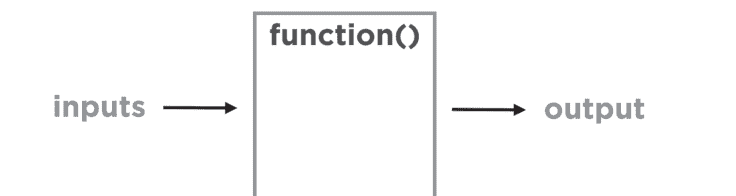

输入和输出几乎可以是任何东西。在函数内部，一系列步骤被反复执行，就像一条生产线，它接收不同的原材料——比如钢铁、铝、玻璃、橡胶和油漆——然后生产出某种输出——比如一辆汽车。

同样地，当你发现自己编写的代码可能会在不同地方被反复使用时，将其转换为函数可能是有意义的。`login()` 是大多数网站都有的一个常见函数，它以用户名和密码作为输入，检查它们是否正确，然后将用户登录到网站。

到目前为止，我们定义的两个函数——`get_city()` 和 `get_state()`——都以字符串作为输入并返回字符串作为输出，但一个函数可以做许多其他事情。例如，你可以定义一个执行以下任何操作的函数：

-   接收一个单词（一个字符串）并给你该单词的复数形式（一个字符串）；这可能是一个很难编码的函数，具体取决于语言。
-   接收大量文本（一个字符串）并给你该文本中最常用的单词（一个字符串列表）。
-   接收两个数字（两个整数或浮点数）并告诉你其中一个是否能被另一个整除（True 或 False）。

124 第一部分

还记得 FizzBuzz 挑战（第 3.7.1 节）中我们如何不断检查一个数字是否能被三或五整除吗？我们不得不多次重复相同类型的代码：

```
(number % 3) == 0
```

和

```
(number % 5) == 0
```

这两段代码看起来相似这一事实是一个很好的线索，表明将其转换为函数可能是有意义的。让我们通过向 `functions.py` 文件添加以下内容来实现这一点：

```
def divisible_by(number, divisor):
    if (number % divisor) == 0:
        return True
    else:
        return False
print(divisible_by(15, 3))
print(divisible_by(20, 3))
```

因为十五能被三整除而二十不能，当我们运行文件时，我们应该看到以下输出：

```
% python functions.py
...
True
False
```

> 标记函数参数

顺便说一下，函数的一个特点是，我们可以在调用函数时选择性地标记函数参数：

```
print(divisible_by(number=15, divisor=3))
print(divisible_by(number=20, divisor=3))
```

这两行将分别返回与 `divisible_by(15, 3)` 和 `divisible_by(20, 3)` 相同的结果。这可以帮助我们或以后阅读我们代码的其他人记住哪个参数是哪个，因为参数名称也充当了一种标签。标记函数参数的另一个好处是，它允许我们调换参数的顺序：

```
print(divisible_by(divisor=3, number=15))
```

这将返回与 `divisible_by(15, 3)` 相同的结果。有了标签，Python 会根据传入的顺序自动确定哪个输入对应哪个函数参数。

#### 4.2.4 重构与技术债务

“代码异味”这个术语有时用来指代你的代码存在某些问题的迹象。也许你的代码不够灵活、更难阅读，或者比必要的更容易出错。

代码异味的一个例子是代码重复——相同或相似的代码在一个文件或多个文件中重复出现多次。³ 代码重复是不好的，因为如果你想更新做事的方式，你必须回到代码重复的每个地方并记得更新它（就像“查找全部并替换”）。随着代码的增长，这并不总是像听起来那么容易，而且你可能会遗漏一个，这可能导致代码出现错误或故障。

解决这个问题的一个方法是将所有重复的代码提取到一个地方——比如一个函数——然后只重用该函数。优点是，如果你决定重新设计函数的工作方式，或以某种方式改进代码，你只需要在一个地方进行更改。

“重构”这个术语指的是重写代码以使其在某些方面变得更好的实践，即使它的功能完全相同。功能完全相同的代码怎么可能变好或变差呢？它可能更容易阅读、更短、更快，或者以后更容易更改。

当我们第一次编写 `divisible_by()` 函数时，它看起来完全没问题：

```
def divisible_by(number, divisor):
    if (number % divisor) == 0:
        return True
    else:
        return False
```

第二天我们看它时，意识到我们不小心使用了比需要多得多的代码。你能想出一种用更少行数来实现的方法吗？这样如何？

```
def divisible_by(number, divisor):
    return (number % divisor) == 0
```

这是可行的，因为无论何时我们使用 `==`，我们都会得到 `True` 或 `False`。第二种更短的方式是否比第一种好得多？一般来说，只要代码的功能仍然清晰，使用更少的代码比使用更多的代码更好。还记得那个几乎无法理解的 FizzBuzz 挑战的一行解决方案（第 3.8.2 节）吗？这是一个更短的代码可能并不更好的例子：

```
for x in range(100):print(x%3//2*'Fizz'+x%5//4*'Buzz'or x+1)
```

为什么它不是更好？首先，在 Python 中，更短的代码不一定运行得更快。但更重要的是，它更难阅读，这使得其他程序员更难理解（即使那个程序员是未来的你）。

在编码中有一个重要的概念叫做“技术债务”。技术债务是代码中微小（有时是重大）缺陷的积累——代码没有像可能的那样清晰或高效地编写，或者没有考虑到未来的灵活性。通常，某人第一次编写代码时，他们不会想出最好、最清晰的编写代码的方式。这没关系。你编写代码时的初始目标应该是编写能工作的代码，而不是试图编写完美的代码。当你刚开始时，了解什么使代码变好或变差可能特别困难，而且对编写糟糕代码的恐惧可能会如此令人瘫痪，以至于阻止你编写任何东西。

随着时间的推移，当你继续编写和处理相同的代码时，代码中的微小缺陷可能会累积成重大的技术债务，可以说，以后可能需要“偿还”。回顾你已经编写的代码并看看是否可以改进（或“重构”）它是一个好主意。

作为一个非技术人员，可能很难理解为什么重构是有价值的，特别是当它不改变代码的功能时——它只是以某种无形的方式使其变得更好。公司通常如此专注于通过向其产品发布新功能和功能来为客户创造商业价值，以至于他们忽视了那些似乎不能立即创造价值的事情，比如重构。

问题在于，如果你不回头改进代码，就会开始积累技术债务。技术债务会让你的产品开发团队慢如蜗牛。试想一下，由于代码重复等原因，一个微小的改动所需时间远超预期。随着时间推移，当你的代码变得越来越庞大（一些大公司的产品可能有数百万行代码；例如，微软Windows操作系统据称大约有五千万行代码⁴），整个代码库可能开始像一团乱麻，在一个地方的改动可能会对其他地方的代码产生意想不到的影响。最终，技术债务会让整个组织步履维艰。这只是一个警示故事。

#### 4.2.5 函数挑战，第二部分

创建一个名为 `uppercase_and_reverse()` 的函数，它接收一段文本，然后将其大写并反转后返回。实际使用时，它应该像这样工作：

```
>>> uppercase_and_reverse('banana')
'ANANAB'
```

现在花五分钟时间尝试解决这个挑战。

#### 4.2.6 函数挑战解答，第二部分

你解决出来了吗？让我们一起来看看。定义函数时，首先弄清楚输入和输出是什么总是有帮助的。在这个例子中，很简单：你的输入将是一个字符串，你的输出也将是一个字符串。

接下来，我们决定函数的名称以及参数的名称——也就是输入的名称。因为我们已经知道函数应该叫 `uppercase_and_reverse()`，所以我们只需要决定输入参数。我们选择 `text`（虽然几乎任何名字都可以，比如 `string` 或 `word`）：

```
def uppercase_and_reverse(text):
```

这是我们的起点。接下来应该做什么？我们应该先处理大写还是反转？在这个例子中，顺序无关紧要。我们可以按任意顺序进行，尽管对于其他一些函数，顺序可能很重要。让我们从大写开始：

```
def uppercase_and_reverse(text):
    text.upper()
```

我们在2.8.1节“字符串函数”中简要提到过 `upper()` 函数，但快速搜索一下“Python如何将字符串大写”也能很快找到答案。
我们还没完成，所以让我们将大写后的文本存储在一个新变量中（在函数内部创建的变量在函数执行后不会保留；它们只存在于函数内部）：

```
def uppercase_and_reverse(text):
    uppercased_text = text.upper()
```

现在我们想把它反转过来。我们还没讲过如何做，但即使不知道任何方法，你的第一个猜测可能是尝试 `uppercased_text.reverse()`。然而，这行不通，因为Python没有 `reverse()` 函数。要找出下一步该怎么做，可以尝试搜索一下。（说真的，要习惯通过搜索来解决Python问题。这是学习编程时需要练习的重要技能。）尝试搜索“Python反转字符串”。我们在Stack Overflow上找到了一个页面，展示了以下示例代码：

```
>>> 'hello world'[::-1]
'dlrow olleh'
```

`[::-1]` 是什么，它是如何工作的？答案是我们不知道，我们可能需要在将其用于任何重要应用之前研究一下，但就本练习而言，它似乎能完成任务。⁵ 让我们把它添加到我们的 `uppercase_and_reverse()` 函数中：

```
def uppercase_and_reverse(text):
    uppercased_text = text.upper()
    uppercased_reversed_text = uppercased_text[::-1]
```

但我们的函数仍然没有返回任何东西。如果我们现在尝试运行它，它将总是返回 `None`（更多内容见4.2.9节）。

为了确保我们的函数输出某些内容，我们必须添加另一行代码，在前面加上 `return`，并告诉它我们想要的输出是什么：

```
def uppercase_and_reverse(text):
    uppercased_text = text.upper()
    uppercased_reversed_text = uppercased_text[::-1]
    return uppercased_reversed_text
```

现在我们可以用类似这样的方式测试它：

```
print(uppercase_and_reverse('Banana'))
```

应该会得到：

```
ANANAB
```

这可以工作，但让我们看看我们的函数，看看可以进行什么样的重构。我们对 `uppercased_reversed_text` 变量做了什么？我们只是返回了它，所以也许这个变量并不是那么必要。我们如何完全去掉它？我们可以这样做：

```
def uppercase_and_reverse(text):
    uppercased_text = text.upper()
    return uppercased_text[::-1]
```

此时，你可能已经意识到我们实际上可以将 `upper()` 和 `[::-1]` 合并成一行，并完全去掉 `uppercased_text` 变量：

```
def uppercase_and_reverse(text):
    return text.upper()[::-1]
```

在修改代码的每一步都运行一下是个好主意，以确保它仍然有效。这可以帮助你更早而不是更晚地发现任何错误。

#### 4.2.7 函数挑战，第三部分

在一个名为 `finance_functions.py` 的新文件中，创建一个函数来根据以下公式计算货币的未来价值：

$$future\ value = present\ value \times (1 + rate)^{periods}$$

然后，使用这个公式计算1000美元在10%利率下五年后的未来价值。现在花十分钟时间完成这个任务。

#### 4.2.8 函数挑战解答，第三部分

创建一个名为 `finance_functions.py` 的新文件，并从定义一个新函数开始：

```
def future_value():
```

此时，我们必须决定函数的输入应该是什么以及如何命名它们。要计算未来的价值，我们需要三条信息：

- 1. 一个*现值*，在Python中将是整数或浮点数（例如，1000或10.58）
- 2. 一个*回报率*，必须是浮点数（例如，0.1），因为Python没有内置百分比数据类型
- 3. 一个*期数*，将是整数（例如，5）

让我们将这些输入命名为 `present_value`、`rate` 和 `periods`：

```
def future_value(present_value, rate, periods):
```

我们函数的输出将是未来价值，在Python中可以这样计算：

```
present_value * (1 + rate) ** periods
```

记住2.7节，Python使用 ** 表示指数。将所有这些放在一起，我们得到以下内容：

```
def future_value(present_value, rate, periods):
    return present_value * (1 + rate) ** periods
```

现在我们可以通过在文件中添加以下内容来测试它：

```
print(future_value(1000, .1, 5))
```

然后我们可以运行该文件：

```
% python finance_functions.py
1610.5100000000004
```

如果你好奇 .5100000000004 是怎么回事，请阅读“浮点数运算”框。

> ## 浮点数运算
>
> 有时当你用Python做数学运算时，你会得到一些奇怪的结果：
>
> ```
> >>> .1 * .1
> 0.010000000000000002
> >>> (.1 + .1 + .1) == .3
> False
> ```
>
> 这是怎么回事？计算机存储浮点数的方式可能导致一些奇怪的错误。以数字0.125为例。作为人类，我们实际上大部分数学运算都是在一种叫做十进制的系统中进行的。换句话说，我们将0.125读作1/10 + 2/100 + 5/1000 + 0/10000 + ... 以此类推。（还记得数学课上我们不得不学习十位、百位和千位吗？）
>
> 计算机使用二进制，即零或一，这需要一个二进制系统。换句话说，计算机将0.125视为0/2 + 0/4 + 1/8 + 0/16 + ... 以此类推。问题在于，大多数分数实际上无法用二进制精确表示。它们只是近似值。
>
> 这可能看起来很奇怪，但这实际上在十进制中也是一个问题。例如，十进制分数1/3无法用十进制精确表示。我们可以写0.3或0.33或0.3333来接近它，但没有办法在十进制中精确表示1/3。
>
> Python通过足够接近然后截断特定位数之后的所有内容（在Python 3中，是十七位）来处理大多数浮点数用二进制表示的问题。但偶尔，这些小数位中的某一位会在近似中被遗漏，并在你意想不到的时候出现，所以你会得到像0.010000000000000002这样的结果。
>
> 令人惊讶的是，这是所有计算机（不仅仅是Python语言）的问题，因为它们都必须用二进制进行数学运算（归根结底，所有计算机信号都简化为零和一）。处理这个问题的一种方法是进一步四舍五入：
>
> ```
> >>> round(.1 + .1 + .1, 15) == round(.3, 15)
> ```
>
> 你可能决定你只关心精确到小数点后十位。最终，即使是银行也必须决定他们想要计算多少位小数的利息。你知道吗，当NASA将火箭送入太空时，他们只使用大约十五位的圆周率？如果这对NASA来说足够好，对我们来说也足够好。有关此问题的更多信息，请查看Python文档《浮点数运算：问题与限制》。
>
> 这里一个简单的解决方案是在返回之前使用 `round()` 函数将答案四舍五入到小数点后两位：

```
def future_value(present_value, rate, periods):
    return round(present_value * (1 + rate) ** periods, 2)
```

现在我们应该得到一个看起来更合理的结果：

```
% python finance_functions.py
1610.51
```

这突出了函数的另一个优点。想象一下，如果我们正在代码中计算大量的未来价值，但我们没有将其转换为函数。一旦我们发现了浮点数运算问题并决定要修复它，我们就必须多次更新我们的代码。我们可能会漏掉一处，这可能导致代码中出现错误。如果我们将其转换为函数，那么我们只需要更新一次。

#### 4.2.9 函数陷阱：未使用 return

我们经常看到初学者在函数内部直接打印结果。例如，在 `finance_functions.py` 中，我们可能会这样写：

```python
def future_value(present_value, rate, periods):
    print(round(present_value * (1 + rate) ** periods, 2))

future_value(1000, .1, 5)
```

运行代码时，这会在命令行中显示正确答案：

```
% python finance_functions.py
1610.51
```

我们可能会想：“哦！我少了一步！”但事实证明这是个坏主意。问题出现在我们想将输出保存到变量时——这是我们经常想做的事情：

```python
def future_value(present_value, rate, periods):
    print(round(present_value * (1 + rate) ** periods, 2))

balance = future_value(1000, .1, 5)
print(f"Your account balance is: {balance}")
```

`balance` 的值会是多少？自己验证一下：

```
% python finance_functions.py
1610.51
Your account balance is: None
```

这里发生的情况是，当函数没有 `return` 时，它就没有输出。尽管它计算并打印了未来值到命令行，但当我们尝试基于函数输出创建 `balance` 变量时，Python 会将其值设为 `None`，这字面意思就是*无或空*。

当我们尝试对值为 `None` 的变量进行操作时，这会变成更大的问题，例如：

```python
...
balance = future_value(1000, .1, 5)
print(balance * 100)
```

这最终会产生以下错误：

```
% python finance_functions.py
1610.51
Traceback (most recent call last):
  File "finance_functions.py", line 6, in <module>
    print(balance * 100)
TypeError: unsupported operand type(s) for *: 'NoneType' and 'int'
```

Python 在这里告诉我们——`TypeError: unsupported operand type(s) for *: 'NoneType' and 'int'`——我们正试图将 `None` 和一个整数相乘，而它不知道如何执行此操作。几乎总是，如果你得到一个包含 `NoneType` 术语的错误，这意味着你有一个函数没有返回任何东西，因此你有一个值为 `None` 的变量。

几乎所有函数都应该返回一些东西。有趣的是，我们一直在使用的一个函数并不返回任何东西。你能猜到是什么吗？`print()` 函数不必返回任何东西，因为它执行非常特定的操作（将某些内容打印到命令行），因此将其输出保存到变量没有意义。

#### 4.2.10 函数陷阱：不接受输入

另一个坏主意是在函数内部直接使用 `input()` 获取输入：

```python
def future_value():
    present_value = float(input("What's the present value? "))
    rate = float(input("What's the rate of return? "))
    periods = int(input("Over how many periods? "))
    return round(present_value * (1 + rate) ** periods, 2)

print(future_value())
```

请注意，此函数不再接受任何显式参数。运行此代码将产生以下结果：

```
% python finance_functions.py
What's the present value? 1000
What's the rate of return? .1
Over how many periods? 5
1610.51
```

问题在于我们只能通过命令行手动获取输入。如果我们想计算的数据不是直接通过命令行获取的——例如，存储在我们的数据库中——该怎么办？我们将不得不创建另一个函数，或者必须更改这个函数，而这又会导致代码中的其他更改。

如果我们*确实*想通过命令行直接从用户获取输入，最好在函数外部获取输入，然后将这些变量作为输入传递给函数：

```python
def future_value(present_value, rate, periods):
    return round(present_value * (1 + rate) ** periods, 2)

present_value = float(input("What's the present value? "))
rate = float(input("What's the rate of return? "))
periods = int(input("How many periods? "))
print(future_value(present_value, rate, periods))
```

作为经验法则，函数不应该对输入的来源或输出的处理方式过于严格。

#### 4.2.11 函数参数

正如我们之前提到的，我们可以在将参数传递给函数时显式地标记它们：

```python
def future_value(present_value, rate, periods):
    return round(present_value * (1 + rate) ** periods, 2)
print(future_value(present_value=1000, rate=.1, periods=5))
```

这有助于澄清每个函数输入实际是什么。它还允许我们在需要时重新排列函数参数：

```python
...
print(future_value(rate=.1, present_value=1000, periods=5))
```

更重要的是，在函数参数具有*默认值*的情况下，标记函数参数有时是必要的。当我们定义函数时，我们可以像这样给其中一个参数一个默认值：

```python
def future_value(present_value, rate, periods=1):
    return round(present_value * (1 + rate) ** periods, 2)
```

注意这里添加了 `periods=1`。这意味着我们现在在运行函数时可以选择省略此参数：

```python
...
print(future_value(1000, .1))
```

在这种情况下，`present_value` 将被设置为 1000，`rate` 将被设置为 .1（因为我们显式传递了这些值），但 `periods` 将是 1（因为这是它的默认值）。

到目前为止，我们使用的许多函数实际上都有*可选参数*（设置为默认值的参数），可以通过阅读它们的文档来发现。例如，`print()` 函数文档（可在线获取）提到了几个可选参数——包括 `sep=' '`（`sep` 是 separator 的缩写）。换句话说，`print()` 函数输入的默认分隔符是空格。但可以覆盖 `sep` 的值。这意味着，如果我们愿意，我们可以做一些奇怪的事情，比如：

```
% python
>>> print("Dollar", "dollar", "bills", "y'all", sep='$')
Dollar$dollar$bills$y'all
```

因为 `print()` 函数有多个具有默认值的参数，如果我们想覆盖其中一个，我们必须显式传递参数名称（例如 `sep='$'`）。我们将使用的许多函数都有可选参数，特别是当我们稍后介绍有助于数据分析的函数时。了解这些函数的最佳方式是上网阅读文档。

在撰写本文时，Python `print()` 函数的文档如下所示：

```
print(*objects, sep=' ', end='\n', file=sys.stdout, flush=False)
Print objects to the text stream file, separated by sep and followed by end. sep, end, file
and flush, if present, must be given as keyword arguments.
All non-keyword arguments are converted to strings like str() does and written to the
stream, separated by sep and followed by end. Both sep and end must be strings;
they can also be None, which means to use the default values. If no objects are
given, print() will just write end.
...
```

阅读和理解文档并不总是那么容易，但值得尽早接触。在这种情况下，`*objects` 函数参数允许 `print()` 接受我们想要给它的任意数量的输入。看起来我们可以修改四个可选参数：`sep`、`end`、`file` 和 `flush`。

展望未来，当我们介绍一个新函数时，尝试查找文档并阅读不同的可能函数参数是什么。如果你这样做，你的 Python 知识将开始呈指数级增长。

### 4.3 导入 Python 包

Python 基础中要涵盖的最后一个主要主题是导入 Python 包。*包*（在 Python 中有时也称为*库*或*模块*⁶）是一个通用术语，用于描述一堆旨在供许多不同脚本或应用程序使用的代码。Python 的一个优点是它附带了许多内置包，可以轻松加载到任何 Python 文件中。当内置包不够用时，我们可以求助于 Python 包索引（pypi.org）上超过十万个在线 Python 包。

Python 最大的优势之一是该语言中可用的广泛多样的包。我们可以导入这些包来完成几乎任何事情。

我们希望代码能如我们所愿地运行。有一个著名的网络漫画系列叫 *xkcd*，作者是兰德尔·门罗，其中一幅名为“Python”的漫画很好地说明了这一点：

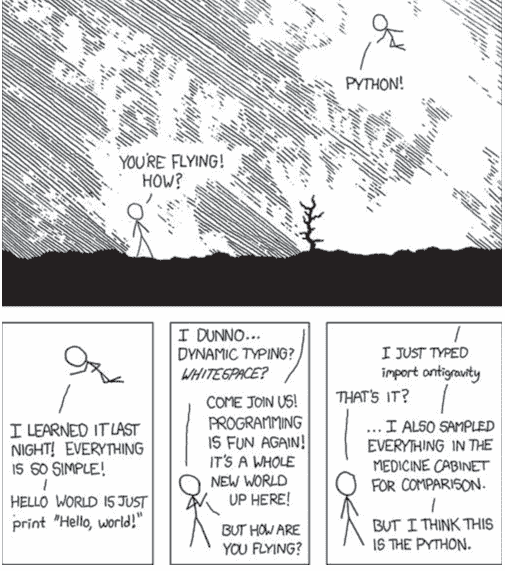

如果你没看懂也没关系，它并没有那么*好笑*。但它说明了一个看似神奇的事实：与其他编程语言相比，Python 让你能够轻松添加一些相当神奇的功能。⁷

我们已经导入了一个 Python 包。在 `happy_hour.py` 中，我们看到了以下代码：

```
import random
...

random_bar = random.choice(bars)
random_person = random.choice(people)
...
```

这里，我们用 `import random` 加载了 random 包，然后使用了 `choice()` 函数。导入包然后使用该包中某个函数的通用格式如下：

```
import package
package.function()
```

然而，直接运行这段代码会产生一个 `ModuleNotFoundError: No module named 'package'` 错误，因为名为 `package` 的包实际上并不存在。

当我们加载一个包时，我们使该包中的每个函数在我们的代码中都可用。为了探索这是如何工作的，让我们创建一个名为 `importing.py` 的新文件，并添加以下代码：

```
import statistics

print(statistics.mean([90, 85, 74]))
print(statistics.mean([12.99, 9.99, 5.49, 7.50]))
```

运行这个文件应该会得到以下结果：

```
% python importing.py
83
8.9925
```

还记得我们创建的 `average()` 函数吗？如果我告诉你 Python 自带一个名为 `mean()` 的平均值函数，作为其 `statistics` 包的一部分，你会感到惊讶吗？`statistics` 包包含了一大堆与统计相关的有用函数，包括 `median()`、`mode()`、`stdev()`、`variance()` 等等。当我们在文件顶部导入一个包时，我们可以通过在函数名前加上包名和一个点来访问该包中包含的所有函数——例如，`statistics.mean()`。

如果我们厌倦了每次使用其中一个函数时都必须输入整个包名，可以使用 `as` 导入包并给它一个更短的别名，像这样：

```
import statistics as st
print(st.mean([1, 2, 3]))
print(st.mean([12, 87, 10.5]))
```

在阅读关于如何使用某些数据分析包（如我们稍后将介绍的 pandas）的文档时，我们会偶尔看到这种技术。最后，如果我们知道只想使用包中的一个特定函数，可以使用 `from` 和 `import` *仅*导入该函数，如下所示：

```
from statistics import mean

print(mean([1, 2, 3]))
print(mean([12, 87, 10.5]))
```

注意，在 `from statistics import mean` 中，我们不必在 `mean` 后面加括号。这种技术允许我们在 `importing.py` 中调用该函数，而无需每次都加上整个包名作为前缀。还有其他原因使得这种方法优于导入整个包，我们在此不作讨论。但这确实要求我们事先知道将要使用哪些函数。

#### 4.3.1 Python 标准库

Python 自带的一组内置包统称为 *Python 标准库*。稍后我们将向您展示如何轻松地从网上下载其他包并导入它们。如果您按照我们使用 Anaconda 安装 Python 的说明操作，您会发现它捆绑了许多最受欢迎的包，这意味着您不必单独下载所有这些包。

如果您在谷歌上搜索“Python Standard Library”，您会找到一个页面，列出了许多像 `random`、`math` 和 `statistics` 这样的包。您不必学习所有可用的不同 Python 包——其中许多您永远不会用到，而重要的那些您会在适当的时候学到。

我们将更深入地探讨 `random` 包，因为我们已经在 `happy_hour.py` 文件中使用过它。在谷歌上搜索“Python Standard Library”后，我们应该能够导航到的一个页面包含了如何使用 `random` 包的文档（或者直接谷歌搜索“Python Random”，并确保点击 Python 3 的文档）。

在 `random` 包的文档中，您将能够阅读更多关于我们使用的 `choice()` 函数的信息，但您还会发现许多其他与随机性相关的有趣函数，例如：

- `shuffle()`——随机打乱列表
- `sample()`——从列表中随机抽取样本
- `random()`——生成一个介于零和一之间的随机数；就像您可能在 Excel 中熟悉的 `RAND()` 函数一样
- `uniform(a, b)`——生成一个介于任意两个数字之间的随机数

`random` 中还有更多函数可用，但我们只是想向您展示它们都有一个共同点，那就是它们都与随机性有关。

为什么所有这些标准包和函数默认情况下并非在每个 Python 文件中都可用？为什么我们必须手动导入每一个？首先，它们有很多。如果我们真的尝试导入 Python 标准库中包含的所有包，每次都需要几秒钟，这相当没有必要。

只是为了好玩，打开 Python 交互模式并运行以下命令：

```
% python
>>> import this
```

您将看到蒂姆·彼得斯创作的一首名为“Python 之禅”的小诗打印到您的命令行，开头是以下两行：

```
优美胜于丑陋。
明了胜于晦涩。
...
```

趁此机会，尝试运行以下命令：

```
>>> import antigravity
```

（不，我们没开玩笑。）如果您运行 `import antigravity`，您的网络浏览器应该会打开并跳转到我们之前向您展示的同一幅 *xkcd* 漫画。这不是很酷吗？（而且，超级书呆子气！）这幅网络漫画变得如此著名，以至于他们实际上将其内置到了 Python 本身中。

#### 4.3.2 导入 Python 包挑战

探索 Python 标准库文档，并从 statistics、math 和 datetime 包中各选择一个函数进行导入并学习如何使用。在每个函数上方写一条注释，解释其工作原理。现在花十分钟左右的时间自己完成这个（注意我们不提供此挑战的解决方案）。

#### 4.3.3 下载和导入第三方包

除了 Python 自带的内置包之外，还有成千上万的第三方包由其他程序员编写并在线提供。Python 有一个官方网站，其他开发者可以在 pypi.org 上传他们自己的包供您下载。Python 自带命令行命令 pip，这使得从网上获取新的 Python 包变得超级容易。

其中一个第三方包叫做 pandas，它让我们可以使用 Python 读取 Excel 和 CSV 文件。它非常受欢迎，以至于虽然它在技术上不属于 Python 的一部分，但它作为我们用于安装 Python 的 Anaconda 安装程序的一部分自动包含在内。如果我们没有安装 pandas，我们可以在命令行中运行以下代码来获取它：

```
% pip install pandas
```

这段代码会去 pypi.org 并将 pandas 包下载到我们计算机上的一个特定文件夹中，该文件夹可以从任何其他文件访问（这样，我们只需下载一次）。然后我们可以在文件中使用它。注意，这个 pip install 行应该直接在我们的命令行中运行，而不是在 Python 中。

在第二部分，我们将更详细地介绍 pandas 以及可用于 Python 的其他数据分析工具。许多这些第三方包可以通过谷歌搜索 Python 包在线找到，大多数可以使用 pip 安装。

#### GITHUB

当我们在谷歌上搜索一个 Python 包时，我们经常会访问 Github.com，这是一个流行的网站，开发者在那里上传代码和使用说明。Github 还具有使其对在同一代码上协作的程序员团队有用的功能（可以将其视为代码的 Dropbox）。

在探索一个第三方 Python 包时，通常最好在 Github 上查找它，看看是否有清晰的文档说明如何安装和使用它。有时当一个包是新的，或者不受欢迎时，您可能找不到任何文档，这可能使您难以弄清楚如何使用该包。随着时间的推移，当一个包发展、变得更受欢迎或有更多开发者参与时，文档通常也会变得更好。（例如，尝试在 Github 上搜索 pandas 包。）

关键点是，当决定在 Python 中使用哪个第三方包来完成特定任务时，请查看文档并了解其清晰度。我们在评估第三方包时经常查看的另一个指标是它在 Github 上的 *Stars* 数量（相当于 Facebook 上的 *Like*）。这可以帮助我们评估特定包相对于其他包的受欢迎程度。

### 4.4 总结

本章深入探讨了函数及其使用方法。我们介绍了如何使用函数来重构代码，并回顾了函数可能出现的一些问题，例如使用过多或过少的函数参数，或使用错误类型的函数参数。

最后，我们了解了如何使用 Python 的 `import` 从其他包获取函数，这将使我们能够在本书的后半部分涵盖 Python 数据分析主题时，访问大量的第三方工具。

### 4.5 第一部分结束

至此，本书的第一部分结束。恭喜您坚持到了这里！

我们大部分时间都在专注于学习 Python 的基础知识，以便我们能够继续学习本书后半部分的内容

这本书是Python在解决实际商业问题中的应用。希望你觉得这些内容还算有趣。接下来，你将学到的知识会变得更加实用和贴近实际。

我们接下来要讲的所有内容，都建立在本书前半部分介绍的概念之上。请记住，如果需要快速回顾某个概念，你可以——而且很可能需要——翻回到前面的章节。

## 第二部分

**欢迎来到第二部分。** 我是丹尼尔·盖塔，我将教你如何使用Python进行数据分析。既然你已经读到这里，我可能不需要再向你强调，在二十一世纪，MBA学生具备数据素养是多么重要。但请允许我简单介绍一下我的背景，以及我在Palantir和Amazon的工作经历如何让我意识到，第二部分的内容应该成为任何MBA课程的核心。

我曾在剑桥大学和麻省理工学院学习物理和数学，之后前往纽约攻读运筹学博士学位（这是一门将数据分析的力量应用于管理和商业的问题解决与决策方法论）。我的博士论文研究将我引向了亚马逊的供应链团队，在那里我目睹了数据每天驱动着成千上万的决策。我开始痴迷于数据让一切变得更好的能力，这促使我加入了Palantir Technologies，一家与全球私营企业和政府合作，帮助他们利用数据创造价值的公司。我在私营部门工作，与全球各行各业的组织合作，运用数据分析帮助他们做出关键决策，最初担任数据科学家，后来负责公司更具分析性的项目团队。

我花了大量时间与管理者们交谈——他们都是拥有深厚专业知识、通常也拥有MBA学位的优秀人才。他们帮助我理解他们的业务如何运作，而我则帮助他们编写和运行代码，将数据转化为洞察。我注意到，即使Palantir团队承担了大部分技术工作，与那些愿意真正参与并理解我们工作的客户合作，其帮助也是不可估量的。无论行业如何——从制药、快消品、法律到消费金融——我发现，一个积极参与的合作伙伴是项目能否成功最强有力的预测因素之一。

在当今这个日益数据驱动的世界，具备数据素养正成为常态，而非例外。我日复一日地看到这一点，无论是与哥伦比亚大学那些越来越渴望培养这些技能的学生合作，还是在我咨询过的几乎所有公司中。即使你有分析师来处理数据，了解他们在做什么也能帮助你提出更尖锐的问题，并更好地理解他们给出的答案。没有什么比能够亲自进行一些分析更棒的了。过去，精通Excel就足够了。但随着数据集（以及我们提出的问题）变得更大、更复杂，情况已不再如此。

在第二部分，我们将看到Python如何提供帮助。我们将使用一个关于Dig（一家总部位于纽约市的连锁餐厅）的案例研究，来说明数据分析的力量和重要性。我们将探讨如何利用数据解决Dig面临的挑战，并基于你在第一部分学到的Python基础知识，向你展示如何使用海量数据集来回答这些问题。

你会注意到，第二部分没有单独的练习章节。相反，我们将练习融入每一章，并在全文中使用菱形 ◆ 符号来标示可以暂停思考当前挑战的机会，然后再阅读我们的解答。其中一些挑战需要你亲自动手编写代码；另一些则更偏向概念性。我们为广泛的读者群体撰写了这本书——如果你是出于随意兴趣阅读，可以直接阅读解答部分。这样你就能很好地了解可能实现什么，而不会被细节困扰。然而，如果你从事的工作需要直接处理数据集，并希望培养独立进行分析所需的技能，那么花些时间在这些挑战上将会大有裨益。

我热衷于利用数据来改善事物的方式。没有什么比从驱动你业务的海量数据中，缓慢但稳定地提取出可操作的洞察更令人满足的了。我期待向你展示Python提供的工具，以实现这一目标。

## 5 Python中的数据入门

**你现在已经打下了坚实的Python基础。** 在本书的第二部分，我们将介绍Python在商业环境中最重要的应用之一——数据分析。

首先值得思考的是，为什么我们需要使用Python——为什么不继续使用Excel呢？使用Python有以下几个原因：

1.  **规模：** 最新版本的Excel最多只能处理1,048,576行和16,384列的数据集，即使数据集小得多，它也会变得迟钝。许多数据集（例如我们稍后将看到的Dig数据集）远远超出了这个容量。
2.  **健壮性：** 如果一个Excel电子表格变得足够复杂（特别是如果它涉及使用vlookup公式或类似函数组合不同的数据集），要理解整个工作簿在做什么可能会异常困难。计算分散在多个工作表的单元格中，要确切理解任何给定结果是如何得出的，可能需要花费大量工作。这可能导致灾难性的后果；有人认为，摩根大通亏损数十亿美元（你没看错——是数十亿）的著名“伦敦鲸”事件，实际上就是由一个简单的Excel电子表格错误引起的。¹
3.  **自动化：** 许多商业应用需要自动化，而Excel在这些情况下是一个糟糕的解决方案。例如，假设一家公司有数百个文件，每个文件列出了其一家门店的销售情况。在Excel中对这数百个文件中的每一个运行相同的分析，或者以某种方式将它们合并起来进行整体分析，其难度可能高到令人望而却步。
4.  **集成：** 在某些情况下，数据分析是在孤立环境中进行的——你需要回答一个单一的问题，并使用数据来回答它。然而，在其他情况下，这个问题是与其他公司部门交互的更大工作流的一部分。Excel通常不够健壮，无法成为运营框架的一部分，这类分析也不太可能“嵌入”到公司运营的其他部分。相比之下，Python功能齐全，足以处理诸如运行网站、执行数据分析和运行公司人事系统（以及其他任务）等多样化任务。

Python可以解决所有这四个问题以及更多问题。它可以快速高效地对大型数据集进行可重复、可自动化的分析。在本书的这一部分，我们将介绍这些操作的机制。也许更重要的是，我们将教你如何以数据驱动的方式*思考*——即，如何从识别一个商业问题，到弄清楚如何使用数据来回答它。

### 5.1 本章学习内容

在本章中，你将学习在Python中处理数据所需的基本工具。我们将首先介绍*Jupyter Notebook*，这是一种比你目前使用的控制台丰富得多的Python交互方式。然后，我们将介绍pandas，Python中最流行的数据分析包，并了解如何使用pandas将各种格式的文件读写到Python中，以及如何将它们导出回磁盘以进行保存和共享。如果你目前的主要数据经验来自Excel，这需要一点时间来适应，但当我们开始研究想要用数据回答的具体商业问题时，它将带来丰厚的回报。最后，我们将介绍Dig——一家位于美国东海岸、正准备扩张的连锁餐厅——它将作为本书这一部分许多示例的基础。

然后，你将准备好开始对Dig数据集进行一些实质性的、可操作的分析，我们将在第6章开始。

### 5.2 本章所需准备

在开始学习本章之前，请先创建一个名为“第二部分”的文件夹，用于存放本书第二部分的所有文件。在此文件夹内，再创建两个子文件夹：

-   一个名为“第5章”的文件夹，用于保存本章后续练习中的进行中作品。目前请保持此文件夹为空。
-   一个名为“原始数据”的文件夹，用于下载本部分将要加载和分析的数据。你可以在本书网站上找到这些数据。请将以下文件下载到此文件夹中：
    -   Students.xlsx
    -   Restaurants.csv
    -   Items.csv
    -   Simplified orders.zip
    -   Summarized orders.csv
    -   University.xlsx

总结一下，你应该有一个名为“第二部分”的文件夹，其中包含另外两个文件夹——“原始数据”（包含上述项目符号列表中的文件）和“第5章”（一个空文件夹）。

### 5.3 JUPYTER NOTEBOOK 简介

在第一部分中，你学习了使用终端进行Python编码的基础知识。在本部分，我们将改用一个名为 *Jupyter Notebook* 的不同工具。正如我们稍后将看到的，这个工具提供了一种运行Python代码的不同方式，并具有一些优势。其中，它使得可视化代码输出（包括表格和图形）变得容易得多。这使其非常适合处理数据。事实上，*Jupyter Notebook* 是迄今为止在数据分析领域编写Python代码最流行的方式。

你将使用 *Jupyter Notebook* 运行的Python代码与你在终端中运行的代码相同，但你将在一个类似网站的界面中输入它，该界面看起来像这样：

正如你很快会意识到的，这提供了一种用户友好的方式来进行最复杂的分析，并生成表格和图形等丰富内容。

#### 5.3.1 启动 Jupyter Notebook

让我们首先启动 Jupyter Notebook。首先，按照第1.4节（Mac上的终端，或Windows上的Anaconda Powershell Prompt）的讨论打开一个命令行提示符，并在终端中输入 `jupyter notebook`。²

一个看起来像这样的网页浏览器窗口将会出现：

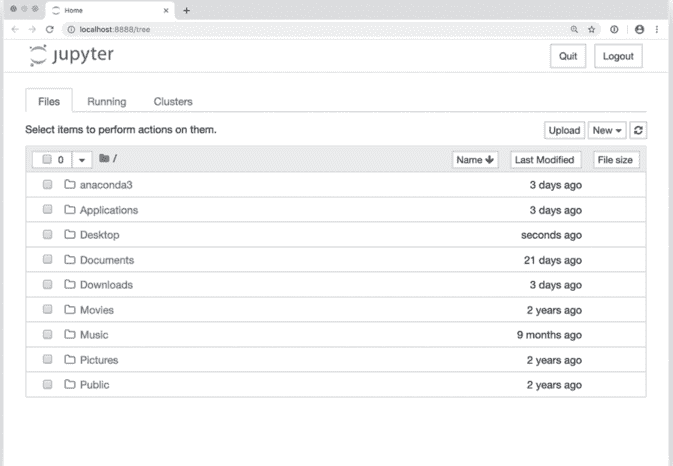

实际的文件夹可能有所不同，具体取决于你计算机上的内容。事实上，你在此屏幕上看到的文件和文件夹就是你运行 `jupyter notebook` 命令时所在文件夹中的内容。

需要快速说明一点——这些内容实际上并不在互联网上的任何地方，你也没有公开你的文件。*Jupyter Notebook* 只是使用你的网页浏览器作为界面来浏览你的计算机并与特定文件交互。我们稍后会对此有更多说明。

接下来，导航到你在第5.2节创建的名为“第二部分”的文件夹。点击右上角的“New”，然后选择“Python 3”：

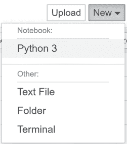

这将在一个新标签页中创建一个新的 *Jupyter Notebook* 文件，看起来像这样：

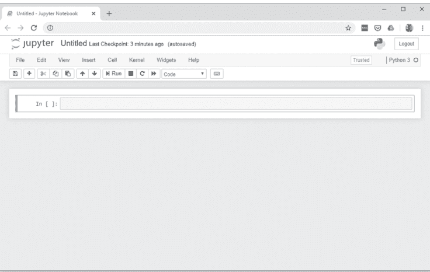

注意此文件顶部写着“Untitled”。如果你返回上一个标签页，你会发现该位置已创建了一个名为 `Untitled.ipynb` 的新文件。你上面看到的是在 *Jupyter Notebook* 中打开的文件。

现在，重命名此文件——点击写着“Untitled”的文本，将其替换为“My first notebook”。返回第一个标签页，你会看到文件已相应重命名。

#### 5.3.2 代码单元格

一个 *Jupyter Notebook* 由多个单元格组成。我们的笔记本目前只有一个单元格（你上面看到的左侧带有 `In []` 的矩形），但我们稍后会添加更多。每个单元格可以在两种模式之一下操作——*编辑模式* 和 *命令模式*。我们稍后将讨论它们的区别。

这些单元格的首要目的是包含代码。点击单元格内部（你会注意到当你这样做时，`In []` 左侧的条会变绿；这表示我们正在进入该单元格的 *编辑模式*），并在单元格中输入代码 `1 + 1`：

```
In [ ]: 1 + 1
```

输入代码后，按 Ctrl 和 Enter。这告诉Python运行单元格中的代码。你也可以点击工具栏中的“播放”按钮（小三角形）。注意发生了三件事：

```
In [1]: 1 + 1
Out[1]: 2
```

-   这段代码的输出（本例中为2）直接打印在单元格下方。
-   写着 `In []` 的文本会短暂地变为 `In [*]`（速度很快，你可能甚至看不到），然后变为 `In [1]`。前者表示单元格当前正在运行，后者表示这是该笔记本中运行的第一个单元格。
-   单元格左侧的条变为蓝色——这表示我们不再处于编辑模式。我们已进入该单元格的命令模式。我们稍后会对此有更多说明。

现在再次按 Ctrl 和 Enter，重新运行单元格。注意输出没有改变（因为代码没有改变），但单元格左侧的文本现在将显示 `In [2]`，因为这是笔记本中运行的第二个单元格（这个数字永远不会回到1，这也许是Jupyter提醒我们要珍惜每一刻的微妙方式，因为它一去不复返）。

到目前为止，一切顺利。但如果我们想在这个笔记本中添加更多单元格怎么办？我们需要做的第一件事是确保单元格左侧的条是蓝色的，从而进入该单元格的命令模式。如果你遵循了前面的说明，这应该已经是这种情况。如果条是绿色的（也许你点击了单元格并进入了编辑模式），按 Esc 进入命令模式——左侧的条将变为蓝色。

在命令模式下，我们现在可以使用各种命令：例如，输入字母 A 将在当前选定单元格上方添加一个空白单元格。输入字母 B 将在当前选定单元格下方添加一个空白单元格。尝试一下这两种操作。

154 第二部分

现在你已经创建了多个单元格，你可以通过进入该单元格的编辑模式来编辑任何给定的单元格。为此，只需点击单元格，或在单元格被选中时按 Enter（注意单元格左侧的条会变绿）。同样，你可以使用方向键在单元格之间导航——按 Esc 返回命令模式（单元格左侧的条将变为蓝色），然后使用方向键导航。

要删除单元格，只需点击单元格，按 Esc 进入命令模式，然后快速连续按两次 d。小心——这将删除该单元格。如果你想“撤销删除”最后一个删除的单元格，请确保你处于命令模式，然后按 Z。

关于 *Jupyter Notebook* 需要理解的关键点是，笔记本中的所有单元格都在 *同一个* Python工作空间中运行——称为 *Python内核*。要看到这一点，请在两个单元格中输入以下代码：

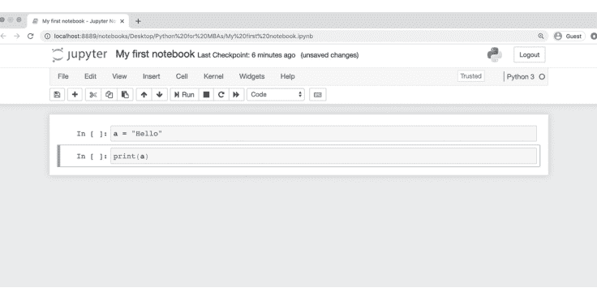

然后，先运行第一个单元格，再运行第二个单元格。注意，即使变量 `a` 只在第一个单元格中定义，它在第二个单元格中仍然存在。这使得 *Jupyter Notebook* 特别适合进行冗长的多步骤分析。然而，如果你创建一个完全独立的笔记本，它将在自己的独立内核中运行，因此你可以并行运行不同的分析。

回想一下，我们一直在使用 Ctrl 和 Enter 来运行单元格。你可能已经注意到，这会运行单元格并 *保持该单元格被选中*。还有另外两种运行单元格的方式——Shift 和 Enter 将运行单元格并选择下方的单元格，Alt 和 Enter 将运行单元格并在刚运行的单元格下方创建一个 *空白* 单元格。第一次阅读时要记住这么多信息，所以现在只需使用并记住其中一种快捷方式即可。随着你对 *Jupyter Notebook* 越来越熟悉，另外两种快捷方式也会派上用场。

#### 内核与前端

思考一下在第一部分中直接在终端运行代码与在 *Jupyter Notebook* 中运行代码的区别会很有帮助。当你使用终端运行代码时，一切都发生在一个地方——你在终端中输入Python命令，运行代码的Python“引擎”（*Python内核*）也存在于同一个终端中。

使用 *Jupyter Notebook* 时，情况略有不同。当你在第5.3.1节中运行 `jupyter notebook` 时，你是在一个命令行窗口中运行的。这个窗口在你使用浏览器时保持打开状态，它运行Python内核，就像在第一部分中一样。但现在，你不再直接在终端中输入代码，而是在浏览器中的 *Jupyter Notebook* 界面中输入。每次你运行一个单元格，代码都会被发送到Python内核，内核将运行代码并将结果发送回浏览器界面供你查看。

这解释了有时会让初学者感到困惑的行为。假设你去命令行窗口并在 *Jupyter* 在浏览器中运行时关闭它——会发生什么？你应该会在浏览器中看到以下弹出窗口：


*Jupyter* 告诉你它无法连接到Python内核——因为你刚刚关闭了它。你将无法再在笔记本中运行任何代码，因为没有内核可供连接并实际运行代码。如果发生这种情况，请关闭所有内容并重新启动 *Jupyter*。

你可能想知道为什么 *Jupyter* 要费心将Python内核与你输入代码和查看结果的界面分开。这样做的一个好处与许多工业应用相关，当涉及的数据集和算法过于庞大和复杂，无法在简单的台式机或笔记本电脑上运行时。相反，它们需要在高容量机器上运行，通常在云端。不幸的是，这些机器通常位于难以访问的数据中心。当你使用 *Jupyter Notebook* 时，Python内核（运行所有计算）可以位于其中一台云机器上，而你实际输入代码的界面（不需要太多计算能力）可以在你自己的计算机上。就本书而言，我们不会使用此功能——Python内核（在命令行窗口中）和界面（在你的浏览器中）都将位于你自己的计算机上。然而，如果你在公司与数据科学团队合作，你很可能会在不久的将来遇到这种更复杂的设置。

#### 5.3.3 Markdown 单元格

代码并非你能在 *Jupyter Notebook* 中放置的唯一内容。创建一个新单元格，按 Esc 进入命令模式，然后按 M。这会将该单元格转换为所谓的 *markdown 单元格*。如果你愿意，也可以选中该单元格，然后使用工具栏中的菜单选择“Markdown”：

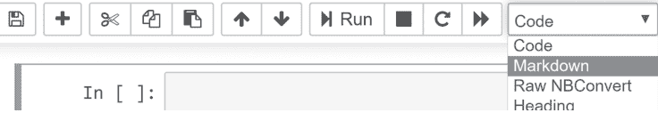

Markdown 单元格不包含代码——相反，它们包含注释——很像注释，但经过了格式化。

尝试在该单元格中输入一些文本，然后按 Ctrl 和 Enter 来“运行”它。注意生成的文本以不同的字体显示。这对于为笔记本添加注释很有用。

你不会惊讶地发现，markdown 单元格不仅包含纯文本，它们还可以使用一种名为 Markdown 的语言包含更丰富的格式化文本。返回编辑你的 markdown 单元格，在单元格中输入文本 # Section 1，然后运行它。单元格开头的 # 将其格式化为一级标题。使用 ## 将文本格式化为二级标题，使用 ### 格式化为三级标题。像这样：

# Chapter 5

# Section 5.5

# Section 5.5.1

使用 Markdown 还有更多格式化文本的方法，但它们超出了本书的范围。简单地在 Google 上搜索“Markdown cheatsheet”应该能找到相关资源。

#### 5.3.4 ipynb 文件

笔记本的内容保存在 ipynb 文件中，因此如果你关闭笔记本并将其发送给某人，他们将能够打开它并立即看到你上次运行文件时所有代码的结果。

这是一个非常方便的功能，但通常会让人们在第一次使用笔记本时感到困惑。

要理解原因，请将你的笔记本恢复到包含两个单元格的状态——一个包含 `a = "Hello"`，另一个包含 `print(a)`。依次运行这两个单元格——一切应该正常工作。

现在通过点击 File > Save and Checkpoint 来保存笔记本，或者在 Mac 上按 Command 和 S 或 Ctrl 和 S。然后，关闭标签页并返回文件夹列表。你应该会注意到，与此笔记本对应的文件在文件列表中会有一个绿色的书本图标。这意味着与此笔记本对应的 Python 内核仍在后台运行。如果你点击笔记本并返回其中，一切都会像笔记本从未关闭过一样。

有趣的地方在于当你重启底层的 Python 内核时会发生什么。为此，返回文件列表，点击文件夹列表标签中文件左侧的小复选框，然后点击顶部附近的 Shut down 按钮。这会告诉 *Jupyter* 你想要完全关闭此特定笔记本底层的 Python 内核。这相当于第一部分术语中的完全关闭控制台。它会清除 Python 存储在内存中的所有变量。

现在，重新打开笔记本。你可能期望它完全空白，但有趣的是——你会发现 print 语句的先前输出仍然存在。*Jupyter* 已将该输出保存在 ipynb 文件中。它这样做的原因很简单——有时你会想要关闭笔记本并将其发送给同事以分享你的分析，即使同事没有底层的 Python 内核，他们也需要能够看到输出。*Jupyter* 允许他们这样做。

缺点是，当内核实际上并未运行时，它会给你一种内核仍在运行的印象。要看到这一点，*不要*运行第一行，而是尝试直接运行第二行——`print(a)`。你应该会看到这个错误：

158 PART II

```
---------------------------------------------------------------------------
NameError                                 Traceback (most recent call last)
<ipython-input-1-f04e0af0ace6> in <module>
----> 1 print(a)

NameError: name 'a' is not defined
```

因为第一行没有运行，变量 a 尚未在此特定 Python 内核中创建。因此，当 Python 尝试打印它时找不到该变量，从而导致错误。

如果你遇到这个错误，简单的解决方法是从上到下运行整个笔记本，以根据需要重新创建每个变量。最简单的方法是点击 Kernel > Restart & Run All，并确认你想要重启内核。

不可避免的是，你可能在某个时候忘记这一点，并收到一个 NameError，告诉你某个变量未定义。帮自己一个忙，记住在那时只需点击 Restart & Run All，以节省很多挫败感。

Jupyter Notebook 的最后一个功能非常有用，但我们将在第 5.5.5 节讨论它，在我们介绍了 pandas DataFrame 之后。

#### DIG 案例研究：从直觉到数据驱动的分析

既然我们已经讨论了 Jupyter Notebook 的基础知识，我们就可以开始在 Python 中处理数据了。许多入门课程使用简单的玩具数据集，并专注于 Python 操作，而不是它们在更广泛业务背景下的目的。在本书中，我们想采取不同的方法。事实上，正如我们在引言中提到的，我们在第二部分的目标是教你如何以数据驱动的方式思考；如果没有一个真实的业务案例和一个更复杂的伴随数据集，这将很难做到。

出于这些原因，我们将使用一个基于 Dig 的案例研究来锚定我们的大部分工作。Dig 是一家连锁餐厅，在纽约市拥有门店，并准备扩张。本节的其余部分记录了 Dig 的故事，并介绍了 Dig 业务的许多方面，这些方面将激发我们的许多分析，特别是第 9 章中的分析。如果你等不及要深入本书的其余部分（非双关语），请随意直接跳到第 5.4 节，我们将在那里讨论我们将使用的数据，稍后再回到故事的其余部分。

#### 引言

*本案例研究基于与 Shereen Asmat、Molly Fisher 和 Dig 领导团队成员的对话。关于 Dig、其运营和数据的细节已为本案例研究的目的进行了虚构化处理，以保护 Dig 的专有信息。*

*本案例最初由哥伦比亚大学 Columbia CaseWorks (www8.gsb.columbia.edu/caseworks) 于 2019 年发布，案例编号为 200202，“From Intuition to Data-Driven Analytics: The Case of Dig”，作者为 C. Daniel Guetta，经许可使用。案例可通过 The Case Center (www.thecasecenter.org) 购买。*

Dig（前身为 Dig Inn¹）建立了一个成功的理念：提供直接从农场采购的美味蔬菜为主的菜单，每餐定价合理，并由一支熟练的厨师团队在现场准备一切，从烤鸡肉到烤红薯。在典型的一天里，看到 Dig 餐厅外排起长队并不罕见，幸好柜台后训练有素的员工让队伍快速移动。截至本案例撰写时，Dig 在纽约市、Rye Brook 和波士顿拥有近三十家餐厅，并获得了健康的风险投资支持，准备扩张。

Dig 成立于 2011 年，在其管理团队的指导下，从一家餐厅发展成为一个覆盖多个城市的品牌。这一演变不仅涉及 Dig 菜单的重大变化，还涉及其运营——例如，使其商品在配送应用上可用，推出餐饮服务，并在某些情况下开发专门的配送菜单。² 随着公司的成长，它收集了运营和管理各个方面的数据，但重点是完善产品和定义 Dig 的身份。使用数据的分析通常是一次性的，涉及费力地拼凑不同的数据集来回答特定问题，而不是依赖更强大的系统和报告工具，例如仪表板。

2019 年 6 月，当 Dig 准备进入下一阶段的扩张时，管理团队意识到它需要比过去更依赖其数据。随着新餐厅的开业，每家都与上一家不同，依靠管理直觉做决策变得越来越不可持续。高级经理、数据和运营产品负责人 Shereen Asmat 及其团队面临的首要挑战是如何支持 Dig 运营的三个城市之外的扩张。她意识到，随着 Dig 餐厅足迹和客户群的增长，需要仔细关注其供应链的每个环节。

> “我们希望以最好的方式建立我们的网络，”Asmat 说。“随着我们的成长，我们将面临日益增长的复杂性：需求的差异，当地

1. Adam Eskin, “Dig Inn Is Now Dig,” Medium, July 15, 2019, https://medium.com/@diginn/dig-inn-is-now-dig-bf6d8d5secdaa.
2. Natalie Kais, “Interview: How Dig Inn Is Bringing Quality and Sustainability to Food Delivery,” PSFK.com, April 2019, https://www.psfk.com/2019/04/dig-inn-interview-adam-eskin.html.

#### 从泵能量食品到 Dig Inn

从布朗大学毕业后，Dig 创始人亚当·埃斯金（Adam Eskin）在康涅狄格州格林威治的私募股权公司韦克斯福德资本（Wexford Capital）工作。在负责寻找商业概念时，埃斯金接触到了泵能量食品（The Pump）——这是一家由史蒂夫·卡佩洛尼斯（Steve Kapelonis）和埃琳娜·卡佩洛尼斯（Elena Kapelonis）于1997年创立的连锁餐厅，在曼哈顿共有五家门店。³ 泵能量食品以其针对健身爱好者的高蛋白菜单而闻名，菜单上包括蛋白卷、健康油和沙拉等菜品。作为韦克斯福德的助理，埃斯金说服公司收购了泵能量食品的多数股权，并于2006年12月随后负责该投资。他立即着手改进，设立办公室并聘请品牌专家来更新泵能量食品的标志、网站以及餐厅的外观和氛围。

为了简化运营，埃斯金将泵能量食品的菜单从150个项目精简为专注于健康食品的精选系列。⁴ 在接下来的四年里，他继续对泵能量食品进行调整，并看到了对该连锁品牌进行重大转型的机会。

他回忆道：“我很快意识到，对于我个人喜欢的饮食方式——新鲜、以蔬菜为主、可以每天食用的食物——存在一个尚未开发的市场。因此，在2011年，我将业务重新品牌化为 Dig Inn，并推出了全新的菜单，专注于本地、应季的农产品，且价格亲民。”⁵

埃斯金指出，虽然泵能量食品的高蛋白、低脂肪食品对健美人群有吸引力，但普遍认为这些健康食品对更广泛的受众来说“口味欠佳”。他的关键洞察是，健康食品也可以很美味。诸如用新鲜牛至和红酒醋炖牛肉、用芥末籽和意大利欧芹切丝的红卷心菜，以及用核桃炖瑞士甜菜等菜肴，都能美味地提供营养。“人们想要更多风味——享用美食是所有人都能享受的体验，”埃斯金说。

顾客对泵能量食品更名为 Dig 的反应非常热烈：“到目前为止，反响非常棒，”埃斯金说。“在过去十年里，人们对食物和健康的知识变得更加丰富，尤其是关于食物的来源和制作方式——他们似乎非常欣赏我们……理念背后所付出的努力。”⁶

3. “2019年顶级饮食：泵能量食品，”《饮食评论》，2019年，https://www.dietsinreview.com/diets/the-pump-energy-food/#6E5k0UBm8tRvUbFY.99。
4. 阿德里安娜·帕斯奎利，“餐厅高管正全力以赴，”《克兰纽约商业》，2008年5月14日，https://www.crainsnewyork.com/article/20080514/FREE/864604780/restaurant-exec-is-pumping-it-up。
5. “认识 Dig Inn 的亚当·埃斯金：后湾区、市中心十字路口和保德信中心，”《波士顿航海家》，2018年3月27日，http://bostonvoyager.com/interview/meet-adam-eskin-dig-inn-back-bay-downtown-crossing-prudential-center/。
6. 伊沃·辛，“泵能量食品更名但使命不变，为纽约人带来本地种植的食物，”WLNY电视台，2011年10月19日，https://newyork.cbslocal.com/2011/10/19/pump-energy-changes-name-not-mission-in-bringing-locally-grown-food-to-new-yorkers/。

#### DIG 的商业模式：以实惠的价格提供美味的本地食物

在传统全服务餐厅和快餐店之间，快餐休闲（fast-casual）领域规模虽小但增长迅速。它通常包括提供柜台服务的餐厅，但在装饰、服务和菜单方面比麦当劳或汉堡王等快餐连锁店更为高档。事实上，该领域中有相当一部分专注于比传统快餐更健康的食材，而快餐休闲的消费者通常也在寻找更健康的选择。⁷ 因此，典型的快餐休闲餐点价格为12美元，是快餐平均账单5美元的两倍多。⁸ 该领域仍然很小，仅占2016年7800亿美元餐厅销售额的7.7%，⁹ 但其增长势头迅猛。2018年，在美国前五百家连锁餐厅集团中，快餐休闲连锁店创造了422亿美元的收入，比上一年增长了8%。¹⁰

乍一看，Dig 与快餐休闲领域的许多餐厅相似，但存在一些关键差异。“我们不认为自己是一家快餐休闲连锁店，”阿斯马特（Asmat）评论道。事实上，Dig 的理念与其他快餐休闲餐厅在关键方面有所不同。该公司专注于有意识的采购——这一过程注重与小型和少数族裔拥有的农场建立真实关系，创建公平合同，并帮助这些农民变得更加可持续。

埃斯金描述了早期的挑战之一：“我们最初的挣扎之一是弄清楚菜单上应该提供什么样的菜肴——顾客想要什么，以及什么感觉像‘我们’。我们尝试了果汁、奶昔、汤、三明治。经过大量的试错，我们找到了一个非常适合 Dig 的菜单：由健康主菜和配菜组成的自选碗，比沙拉更能提供饱腹感。我们想提供你在家常菜中期望的那种食物——只是由我们的厨师制作！”¹¹

为了确保公司在保持这一使命的同时能提供吸引人的菜单，Dig 聘请了首席烹饪官马特·温加滕（Matt Weingarten），他设计了包括美食主菜和配菜在内的菜单，¹² 并决定将餐点价格定在10美元左右。图表1包含了 Dig 在2019年9月的菜单。在这个价格点上保持盈利是一个挑战，它需要一条精心调整的价值链，从食物被收获和加工的本地农场，到烹饪并为顾客提供服务的餐厅。

7. “2019年快餐休闲行业分析——成本与趋势，”《特许经营帮助》，2019年，https://www.franchisehelp.com/industry-reports/fast-casual-industry-analysis-2018-cost-trends/。
8. “2019年快餐休闲行业分析。”
9. “2019年快餐休闲行业分析。”
10. 乔纳森·梅兹，“快餐休闲连锁店仍在增长，”《餐厅商业》，2019年5月2日，https://www.restaurantbusinessonline.com/financing/fast-casual-chains-are-still-growing。
11. “认识 Dig Inn 的亚当·埃斯金。”原文引用的是“Dig Inn”，为反映新品牌已替换为“Dig”。
12. 米根·麦金尼斯，“一家总部位于纽约市的农场到柜台连锁店将于下周在波士顿开业，”《波士顿网》，2016年7月5日，https://www.boston.com/culture/restaurants/2016/07/05/nyc-farm-table-restaurant-chain-open-boston-month。

#### 图表1 Dig Inn 菜单

来源：https://www.diginn.com/menu/

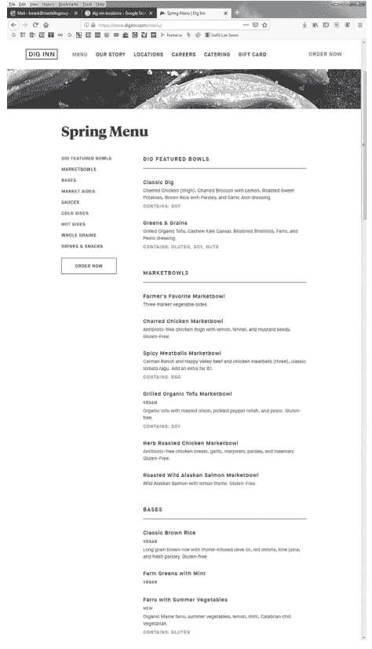

#### 价值链：从农民到厨师再到消费者

价值链的最顶端是 Dig 采购农产品的本地农民。Dig 通常采取协作方式与这些农民合作，并定期与他们坐下来规划年度需求，并按季节下达订单。这使得公司能够培育其合作伙伴，并尽可能高效地采购产品。每天，农民和合作伙伴将农产品运送到 Dig 的供应中心，然后分发到各餐厅。Dig 估计，从采摘、冷藏、运送到 Dig 餐厅，再到由厨师团队在餐厅内准备，整个过程最短可能只需三天。2019年，Dig 预计将从130多家农民、合作伙伴和牧场主那里购买九百万磅蔬菜，其中包括来自 Dig 自有农场 Dig Acres 的十万磅。

Dig 价值链的一个关键部分是其与这些合作伙伴合作并培育他们的能力，以及平衡顾客需求与每个季节不断变化的农产品供应。需要相当的技巧来把握顾客的喜好，并将这些口味转化为应季菜单。用亚当·埃斯金的话说：

> 我们的厨师在使用随季节变化的农产品烹饪时面临着挑战。在我们的餐厅里，烹饪并非一刀切——我们的厨师必须根据从农场收到的新鲜原料来调整食谱。这种类型的烹饪需要更多时间来教授，尤其是对于我们的实习厨师，他们中的许多人以前从未有过专业烹饪经验。我们认识到这一挑战，并致力于指导我们的实习生——从刀工课程到参观 Dig 农场。13 我们这样做不仅是为了保持食物的质量，也是为了帮助我们的团队成员发展他们的烹饪事业。14

在食物准备方面，Dig 也与众不同。“所有食物都在餐厅内烹饪，每位 Dig 员工都接受食物准备培训，特别注重刀工，”阿斯马特指出。这意味着每位员工都能并且确实在需要时参与食物准备。“对我们来说，每位员工都有与我们提供的食物相关的经验很重要，但这同时也意味着我们需要比竞争对手更谨慎地招聘。在 Dig 工作所需的技能组合比一般的快餐休闲餐厅更广泛。”

在每家餐厅新鲜准备每样食物，极大地增加了人员配置的复杂性。事实上，Dig 必须确保每家餐厅配备足够的员工，不仅要服务顾客，还要准备食物。由于 Dig 的需求变化很大，可能取决于一天中的时间、一年中的时间、天气、当地活动以及许多其他因素，这项任务变得更加艰巨。

人员配置并不是 Dig 餐厅唯一一个以食物为先理念构建的方面。每家 Dig 餐厅都经过独特设计，餐厅空间的很大一部分被设计用于确保新鲜食物的准备、储存和供应。成品被分装到大钢碗中，并摆放在长柜台后面的架子上，这种设计旨在展示食物并高效地服务顾客。

Dig 的大多数订单包括一个碗，包含一个底料（从三个选项中选择）、两个市场配菜（从大约八个选项中选择）和一个主菜（从大约六个选项中选择），但顾客也可以单独点其中任何一项。Dig 还销售各种饮料和零食。

食物订购和供应是 Dig 价值链中最后的关键环节。如前所述，Dig 的大部分订单发生在店内，但 Dig 很快意识到，来自店外订单也有很大的价值可以挖掘。具体来说，除了店内订购，顾客还可以通过三种方式在 Dig 订购食物。他们可以使用应用程序下单到店自取；他们可以下单外送；最后，Dig 还有一个针对大订单的餐饮菜单。

最初，这些模式严重依赖 Dig 现有的店内订单基础设施。Dig 与第三方服务签订合同来配送物品，而顾客

13. Dig 的农场名为 Dig Acres。
14. “认识 Dig Inn 的亚当·埃斯金。”原文引用的是“Dig Inn”，为反映新品牌已替换为“Dig”。

可以使用这些服务从Dig下单。这些选项立即取得了成功；开业七年后，东52街餐厅的销售额中，至少有30%来自外卖。15 然而，也存在一些问题：考虑到构建一个Dig碗的所有可能选项，顾客可能订购的Dig碗大约有1500种，这为错误留下了充足的空间，而一旦碗离开餐厅，错误就无法修复。温度也是一个问题；店内订单是直接食用的。其他订单可能在食用前需要十五到六十分钟的放置和运输时间。

随着Dig的快休闲业务迅速发展，团队渴望继续创新，并突破顾客体验Dig的界限。当他们仔细研究客户反馈和行业趋势时，很明显，外卖是一个主要的机遇领域。2018年，在线外卖是一个价值846亿美元的行业，16 但Dig的调查发现，顾客正在忍受低于标准的体验，从食物湿软到配送延迟且沟通极少。为了应对这一挑战，Dig在2019年测试推出了“客房服务”——一项全新的、重新构想的外卖服务，拥有全新的菜单和平台，专门为外卖而构建和优化。

2019年4月，Eskin和他的团队希望将Dig的业务扩展到目前三个城市之外。他们计划再开设24家门店，并获得了2000万美元的投资支持——其中1500万美元来自Danny Meyer的Enlightened Hospitality Investments股权基金。Dig此前已通过由AVALT领投、Monogram Capital Partners和OSI Restaurant Partners前首席执行官Bill Allen参与的D轮融资筹集了3000万美元。17

作为扩张战略的一部分，Dig团队希望确保其对价值链的各个方面都有清晰的了解。例如，进入费城等新市场，需要整合一条包含当地农民的新供应链、寻找门店位置、招聘员工以及设计菜单和工作时间表。

#### 转向数据驱动

尽管这些扩张计划令人兴奋，但它们也将带来一系列新的挑战。直觉、技能和经验是强大的工具。不幸的是，它们也有缺点：无法规模化。

> “我们历来对增长采取审慎的态度，”Asmat说。“在纽约拥有一家餐厅，让我们能够在食物和文化上保持一致性。在波士顿开业是我们首次尝试在城市之外能否保持我们的标准。我们需要找到能够代表品牌的本地领导层。我们也需要习惯于减少对地理邻近性的依赖，同时不牺牲我们对一致性的承诺。”

15. Elizabeth G. Dunn, “Dig Inn Wants to Optimize Your Sad Desk Lunch,” *Bloomberg Businessweek*, January 29, 2019, https://www.bloomberg.com/news/features/2019-01-29/dig-inn-wants-to-optimize-your-sad-desk-lunch.
16. “Online Food Delivery Market Report, Global Industry Overview, Growth, Trends, Opportunities and Forecast, 2019–2024,” Marketwatch.com, September 2019, https://www.marketwatch.com/press-release/online-food-delivery-market-report-global-industry-overview-growth-trends-opportunities-and-forecast-2019-2024-2019-09-09-2197408.
17. Danny Klein, “Danny Meyer’s Fund Invests $15M in Dig Inn,” *QSR*, April 2019, https://www.qsrmagazine.com/fast-casual/danny-meyer-s-fund-invests-15m-dig-inn.

在一个拥有更多餐厅的新世界里，Dig发现很难同时对每家餐厅的每个决策都依赖直觉。Dig将不得不开始更多地依赖其数据来辅助决策，而Asmat的团队则必须弄清楚如何利用数据来为价值链每个阶段的决策提供信息。

然而，在某种意义上，使用数据进行决策对Dig来说只是这段旅程的最后阶段。许多关于数据驱动决策的叙述都集中在最后一英里：例如，使用富有洞察力的仪表板和复杂的预测分析模型。但这些努力需要一个坚实的基础——一个可靠的、统一的、可信赖的数据资产，可以作为整个公司的事实来源。

Dig也不例外，Asmat对此非常清楚：

> 很容易自欺欺人地认为收集数据就等同于收集*有用*的数据，但一旦你开始分析数据，你很快就会意识到这有多痛苦。举个例子——我们的人力资源数据。出于必要，我们已经发展到使用多个系统来跟踪我们的员工及其工作时间。因此，问一个简单的问题，比如“平均每家餐厅有多少员工工作？”，可能需要我最优秀的一名分析师花上半天时间。他们首先需要查询每个数据集，合并结果，然后花费大量时间来确保结果正确。

对于试图更好地利用数据的公司来说，这通常是一个令人沮丧的境地，人们很容易认为通过从一开始就对数据更加严格，就可以避免这些成长的阵痛。但事情很少如此简单。“回顾过去，我认为我不会做太多不同的事情，”Asmat说。“在我们试图增长和寻找自身定位的时候，将宝贵的时间和资源花在这上面将是愚蠢的。坦率地说，我觉得我们在早期甚至收集了任何数据这一事实，就已经让我们领先于同行了！”事实上，如果Dig早些时候就想专注于此，目前尚不清楚公司是否有能力做到。在真空中建立坚实的数据基础是困难的，没有日常使用它并提出渐进式改进建议的人。人们很容易认为这些问题只影响拥有海量数据和庞大基础设施的大型传统公司，但没有人能幸免。

这仅仅是可能出现的问题之一。跨数据集比较简单指标可能是一个挑战。例如，考虑“净销售额”——这包括在线订单吗？退货、退款和信用额度呢？当然，当你开始比较完全不同的数据集时，事情会变得更加复杂，例如，在评估人员配置对销售的影响时。

在能够系统地利用数据辅助决策之前，Asmat的团队必须创建流程，将这些分散的数据资产整合到一个数据库中，以便快速高效地回答问题——一个“事实来源”。“到目前为止，我们的大部分工作都是围绕着让我们的基础设施准备好支持这些决策，”Asmat说，“我们已经投入了大量资源来实现这一点——包括一个与我的团队紧密合作的数据工程师团队。”

创建这样一个数据库的一个关键部分是决定使用哪些工具来托管它。当今大多数公司的数据规模使得简单的桌面工具（如Microsoft Excel或Microsoft Access）显得力不从心。值得庆幸的是，确实存在一个小型产业，专门提供基于云的解决方案来满足这一目的。Dig使用了Google BigQuery和Looker等工具。图表2和图表3提供了Asmat团队在Dig使用这些工具的截图。

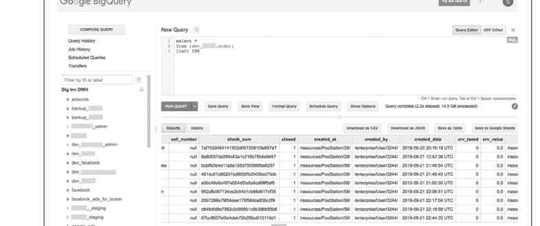

*注：机密细节已做模糊处理。来源：Dig*

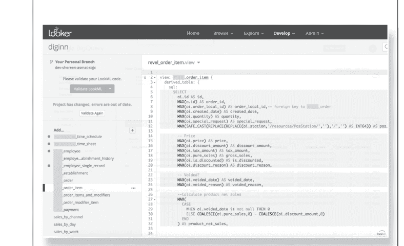

*注：机密细节已做模糊处理。来源：Dig*

除了技术障碍，文化也可能阻碍这些努力。过早启动项目，基于有缺陷的数据基础，如果遇到精通数据、了如指掌的高管，可能会适得其反。一旦他们发现初始结果存在问题，他们对整个项目的信任很可能会消失。

“我们在Dig非常幸运，”Asmat说，

因为整个公司都致力于让公司更加数据驱动，从我们的CEO Adam Eskin开始。每个人都明白这是一个渐进的过程，途中会有波折，他们非常支持我们首先建立坚实数据基础的努力。我个人发现，通过与整个公司保持完全透明，我们建立了很多善意。我们不是闭门造车，而是专注于小而可实现的目标，比如制作立即有用的仪表板，并让每个人都了解我们的进展。

这通常是一种成功的策略。从理论角度来看，人们很容易试图从一开始就进行雄心勃勃的、自上而下的系统和数据集重新设计。这种方法常常因为多种原因而失败。首先，很容易低估从一开始就所需的工作量，这可能导致多次代价高昂的延误。其次，自上而下的重新设计有时需要推翻现有系统并从头开始——这意味着在项目结束之前几乎没有什么可以展示的，这可能会加剧延误的影响。第三，公司的运营和相应的数据收集框架很少是静态的——采用耗时的自上而下方法，在项目完成之前，现实情况很可能已经发生变化，等到项目交付时，它很可能已经过时了。最后，在实施自上而下的方法时，在最初的项目规划阶段之后，很容易将工作与公司的其他部分隔离开来。这总是一个坏主意——即使是最周密的项目计划，也很难捕捉到业务中的每一个复杂性。

Dig的方法旨在避免这些陷阱。通过专注于具体、紧迫的目标，Asmat和她的团队将被迫与相关团队保持紧密联系，并在每一步都产出直接可操作的工作。当然，从开始到结束的整体项目可能需要更长时间，但结果保证能在每一步都产生价值。

当被问及例子时，Asmat的眼睛亮了起来。

首先，我们最重要的决策之一是菜单上放什么。我们喜欢顺应季节——我们每季度更换菜单，并经常根据农民的产出推出短期特色菜。历史上，我们一直依赖销售数据来发布每周报告，跟踪每个产品的表现。不幸的是，这些是由一次性分析产生的静态报告，多年来它们变成了一堆电子表格和*Google文档*的混乱局面。因此，当需要根据同比数据为未来做决策时，我们只能依赖直觉，而这可能受到我们个人偏好的影响。

例如，我们 Dig 公司的员工普遍相当健康，办公室里有个流传的笑话，说我们吃的通心粉和奶酪比全美平均水平要少得多！利用我们新的数据基础，我们可以调取历史产品表现数据，我已经记不清有多少次我们利用这些数据来做出更明智的决策，决定推出哪些特色菜品（有时会取消那些我们觉得有趣但数据显示表现不佳的菜品）。我甚至能想到一个例子，我们的发现影响了我们的营销策略——我们的顾客*非常喜爱*我们的感恩节特餐，所以我们真的在这一概念上加大了投入。

或者再举一个完全不同领域的例子。Dig 的一个优先事项是培训员工并帮助他们在职业生涯中成长。员工可能遇到困难的一个关键指标是他们经常未能按时上班。过去，计算缺勤次数是一个极其繁琐的过程，因为它需要合并来自两个来源的数据集——首先，来自我们排班系统的数据，以检查员工是否*应该*上班；然后，来自我们工资系统的数据，以查看他们是否*实际*上班了。现在，我们已经将这些系统整合到同一平台上，令人惊讶的是我们可以获得多么精细的数据。我们不仅能识别出需要关注的个别员工，还能将餐厅的表现作为其工作文化的指标，并在任何门店表现不佳时采取补救措施。最后，我们可以为我们的培训团队提供有价值的见解——如果某些特定岗位往往导致更多缺勤，也许我们需要重新定义该岗位或调整我们的培训方式。

哦，我怎么能忘了食物浪费呢？我们显然希望确保用掉我们订购的每一点食物，但计算一家餐厅浪费了多少食物过去真是令人头疼。我们必须合并来自每个订购系统——店内、外卖、餐饮等——的销售数据，用它来计算我们*应该*订购多少，然后将其与来自我们订购系统的数据进行比较，以计算我们*实际*订购了多少（你听到我们也有多个订购系统也不会感到惊讶）。更别提比较不同餐厅的这些指标有多难了。现在，我们可以快速按浪费程度对我们的餐厅进行排名，并帮助表现不佳的餐厅向高效的餐厅学习。

图表 4 展示了 Asmat 团队为跟踪 Dig 供应链随时间表现而构建的仪表板示例。在这次最新举措之前，制作这个仪表板可能需要分析师花费将近一周的时间。现在，团队已经统一了该仪表板所依赖的数据集，它能够持续更新，并为 Dig 的管理团队提供实时的宝贵见解。

#### 图表 4 Dig 每周供应链报告截图

注意：图片部分区域已模糊处理，单位已隐藏以保密信息。这些图表并非简单地代表物品需求。

来源：Dig。

> 随着 Dig 开始扩张，Asmat 的目光坚定地聚焦于赋能 Dig 的每一个人——从管理层到餐厅的团队成员——利用她和她的团队所拥有的丰富数据。还有很多工作要做，但鉴于目前的回报，她相信与业务部门携手合作的方法将产生值得付出的努力的成果。“明年再来，让我们再谈一次；仅仅三个例子之后，你就无法阻止我了！”

### 5.4 数据

你在 5.2 节下载的文件包含了 Dig 纽约市餐厅一年的模拟数据。请注意，为保护 Dig 的专有信息，这些数据是合成的——你可能会注意到其中的餐厅基于真实的 Dig 门店，但并非完全对应。让我们逐一了解每个数据集及其内容。其中一些数据集太大，无法在 Excel 中打开，因此你只能相信我们，它们确实包含我们所说的列；你将在 5.6.1 节亲眼看到这一点。

- Restaurants.csv 数据集包含与每家餐厅相关的数据。它包含以下列：
  - RESTAURANT_ID：餐厅的唯一 ID
  - NAME：餐厅名称
  - ADDRESS：餐厅地址
  - LAT：餐厅纬度
  - LONG：餐厅经度
  - OPENING_DATE：餐厅开业日期
  - DELIVERY_START：餐厅开始处理外卖订单的日期

- Items.csv 数据集列出了 Dig 销售的物品。这些包括可能出现在碗中的物品，以及可能单独购买的物品（如配菜和甜点）。请注意，所有可以作为碗的一部分订购的物品也可以作为配菜单独订购。此文件包含以下列：
  - ITEM_ID：物品的唯一 ID
  - ITEM_NAME：物品名称
  - ITEM_TYPE：物品类型（主菜/酱料/冷配菜/甜点/饮料）

Simplified orders.csv 文件是你下载的所有文件中最大的。它包含数据集涵盖的一年期间内每个订单的一行数据；可以想象，这个文件相当大；事实上，它大到难以确定包含多少行。你将不得不等到 5.6.1 节才能了解如何计算。

此文件中的大多数订单将包含一个碗（Dig 的主要产品）。每个碗包含以下组成部分：

- 一份基底（沙拉、法罗麦或米饭）
- 一份主菜（鸡肉、牛肉等）
- 两份配菜（通心粉和奶酪、胡萝卜等）

此外，每个订单可能还包含一块或多块饼干，以及一杯或多杯饮料。有时，如果未订购碗，订单将*只*包含饼干和饮料。

请注意，这是对 Dig 真实订单运作方式的极大简化描述（因此文件名中有“Simplified”）。实际上，一些碗可能包含多份给定物品，一些物品可以作为配菜单独订购，一些订单可能包含不止一个碗。出于本书目的，我们将不考虑这些复杂性。³

该数据集包含以下列：

- ORDER_ID：订单的唯一 ID
- DATETIME：订单下达的日期和时间
- RESTAURANT_ID：下达订单的餐厅的唯一 ID。对应 Restaurants.csv 表中的 RESTAURANT_ID。
- TYPE：订单类型（IN_STORE、PICKUP 或 DELIVERY）
- DRINKS：订单中的饮料数量
- COOKIES：订单中的饼干数量
- MAIN：此订单碗中主菜的 ITEM_ID。对应 Items.csv 表中的 ITEM_ID。如果碗包含两份主菜，此列将随机包含其中一份。如果订单不包含碗，此值将缺失。
- BASE：此订单碗中基底的 ITEM_ID。对应 Items.csv 表中的 ITEM_ID。如果碗包含两份基底，此列将随机包含其中一份。如果订单不包含碗，此值将缺失。
- SIDE_1 和 SIDE_2：此订单碗中的两份配菜。对应 Items.csv 表中的 ITEM_ID。如果订单不包含碗，这些值将缺失。

172 第二部分

- Summarized orders.csv 文件将大型订单文件汇总到每日级别。它包含餐厅营业期间每天每家餐厅的一行数据，并包含以下列：
  - location：相关门店的名称
  - day：此行数据对应的日期
  - number of orders：该餐厅当天的订单数量
  - percentage of deliveries：当天订单中外卖订单的百分比

正如你可能从案例研究中推测的那样，Dig（实际上，任何希望更充分利用其数据的组织）面临的关键数据挑战之一是让关键决策者能够以最有效的方式查询数据。一种方法是将大型数据集（如 Simplified orders.csv）汇总为更小的、更容易分析的数据集（如 Summarized orders.csv）。当你完成第二部分时，你将掌握自己完成此操作所需的所有技能（详见 9.6 节）。

### 5.5 PANDAS 库

Python 中主要的数据分析工具是一个名为 pandas 的库。它由 Wes McKinney 开发，现在拥有一个活跃的用户社区，他们不断改进和扩展该库的功能（并在 Stack Overflow 上回答问题）。

在本书的第二部分，我们将不再使用 Python 的命令行界面。相反，我们将为每一章创建一个 Jupyter Notebook 并在其中运行我们的代码。本书网站包含每一章的 Jupyter Notebook，其中包含该章的代码。正如我们在 5.3.4 节所学，后面单元格中的代码有时可能依赖于前面单元格中的代码，因此你应该按顺序运行每个笔记本中的代码。现在，在你下载本章文件的文件夹中（很可能是你在第一部分在桌面上创建的 code 文件夹）创建一个 Jupyter Notebook。

创建笔记本后，首先将 pandas 导入 Python，如下所示：

```
import pandas as pd
```

提醒一下，这个表达式的第二部分将使我们能够在以后将 pandas 引用为 pd，而不必每次都输入 pandas。
pandas 库为我们提供了两种新的数据类型，它们将构成我们处理数据的基础：

- Series，它可以存储*列*。
- DataFrame，它将多个 Series（列）及其列标题组合在一起，为我们提供一个完整的表格。

下图说明了 DataFrame 的结构：

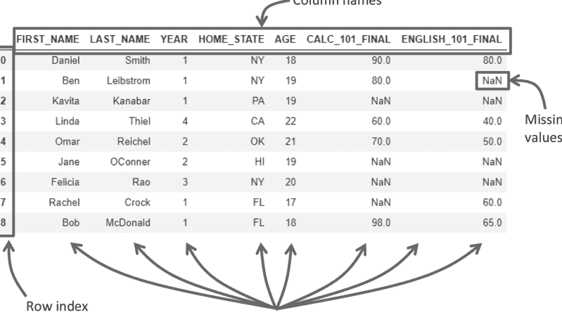

每一列都存储在一个 Series 中，并有一个关联的列标题。行索引（我们将在第 5.5.3 节更详细地讨论）包含每一行的名称；默认情况下，行索引从 0 开始，每行增加 1，但行也可以被赋予其他名称。NaN 表示 pandas 中的缺失值（这代表“非数字”）；我们稍后将讨论如何处理缺失数据。

#### 5.5.1 pandas DataFrames

我们通常会直接从文件（例如 Excel 文件或 CSV 文件）读取 DataFrames，我们将在第 5.6 节学习如何做到这一点。在我们深入探讨之前，让我们从一个更简单的例子开始——可以使用字典列表直接在 pandas 中创建一个 DataFrame，其中字典中的每个条目对应于一列，并包含一个条目列表。在 *Jupyter* 中创建一个新单元格，输入以下代码（这需要输入很多；你可以从 https://www.pythonformbas.com/df_students 复制这段文本），然后运行它：

```
students = (
    {'FIRST_NAME': ['Daniel', 'Ben', 'Kavita', 'Linda',
                    'Omar','Jane', 'Felicia', 'Rachel',
                    'Bob'],
     'LAST_NAME': ['Smith', 'Leibstrom', 'Kanabar', 'Thiel',
                   'Reichel', 'OConner', 'Rao', 'Crock',
                   'McDonald'],
     'YEAR': [1, 1, 1, 4, 2, 2, 3, 1, 1],
     'HOME_STATE': ['NY', 'NY', 'PA', 'CA', 'OK', 'HI',
                    'NY','FL', 'FL'],
     'AGE': [18, 19, 19, 22, 21, 19, 20, 17, 18],
     'CALC_101_FINAL': [90, 80, None, 60, 70, None, None,
                       None, 98],
     'ENGLISH_101_FINAL': [80, None, None, 40, 50, None,
                          None, 60, 65]} )
df_students = pd.DataFrame(students)
```

第一条语句创建了一个字典，其中每个条目对应于一列，并提供该列中的每个值。请注意，由于该语句很长，我们将其拆分到代码片段的前十五行。我们如何告诉 Python 这些行都是同一语句的一部分？我们只需在第一行末尾放一个左括号，在最后一行末尾放一个右括号。Python 然后会忽略这两个括号之间的任何换行符。

第二条语句进入 pandas 包（记住，我们可以将其引用为 pd），并从字典创建一个 DataFrame。然后它将结果存储在一个名为 `df_students` 的变量中。

最后，创建一个新单元格并在其中运行以下代码以显示 DataFrame：

```
df_students
```

| | FIRST_NAME | LAST_NAME | YEAR | HOME_STATE | AGE | CALC_101_FINAL | ENGLISH_101_FINAL |
|---|---|---|---|---|---|---|---|
| 0 | Daniel | Smith | 1 | NY | 18 | 90.0 | 80.0 |
| 1 | Ben | Leibstrom | 1 | NY | 19 | 80.0 | NaN |
| 2 | Kavita | Kanabar | 1 | PA | 19 | NaN | NaN |
| 3 | Linda | Thiel | 4 | CA | 22 | 60.0 | 40.0 |
| 4 | Omar | Reichel | 2 | OK | 21 | 70.0 | 50.0 |
| 5 | Jane | OConner | 2 | HI | 19 | NaN | NaN |
| 6 | Felicia | Rao | 3 | NY | 20 | NaN | 60.0 |
| 7 | Rachel | Crock | 1 | FL | 17 | NaN | 65.0 |
| 8 | Bob | McDonald | 1 | FL | 18 | 98.0 | 65.0 |

请注意，pandas 和 *Jupyter Notebook* 协同工作，以整洁美观的方式显示你的 DataFrame。

#### 5.5.2 将列作为 Series 访问

既然我们已经创建了一个 DataFrame，我们可以通过两种方式访问此 DataFrame 中的各个 Series。第一种是简单地将列名放在方括号中：

```
df_students['FIRST_NAME']
```

```
0      Daniel
1         Ben
2      Kavita
3       Linda
4        Omar
5        Jane
6     Felicia
7      Rachel
8         Bob
Name: FIRST_NAME, dtype: object
```

第二种是在 DataFrame 名称后放一个点，然后跟上列名。（请注意，为了简化格式，我们有时会打印代码而不显示在 *Jupyter Notebook* 单元格中。尽管如此，你仍应如前所示在 *Jupyter* 中运行代码。）

```
df_students.FIRST_NAME
```

你使用哪种方法主要取决于个人偏好。然而，在某些情况下，第一种方法效果更好。例如，假设我们想访问一个名称是另一个变量的列——我们可以这样做：

```
i = 'HOME_STATE'
df_students[i]
```

尝试使用 `df_students.i` 获得类似的结果将不起作用，因为 pandas 会查找名为 `i` 的列，而不是查看该变量内的字符串。同样，如果列名包含空格，则不能使用第二种方法。
请注意，当检索单个 Series 时，输出不会像我们打印整个 DataFrame 时那样格式化为漂亮的表格——相反，它以纯文本形式打印出来。这是你正在打印一个 Series（单列）而不是 DataFrame（多列）的明显标志。
话虽如此，请考虑以下代码：

```
df_students[['FIRST_NAME']]
```

| | FIRST_NAME |
|---|---|
| 0 | Daniel |
| 1 | Ben |
| 2 | Kavita |
| 3 | Linda |
| 4 | Omar |
| 5 | Jane |
| 6 | Felicia |
| 7 | Rachel |
| 8 | Bob |

请注意两种输出之间的关键区别。在第一种情况下，我们在方括号内放了一个字符串，并告诉 pandas “选择名称在字符串中的列并返回 Series。”因为结果是 Series，所以它以纯文本形式打印。在第二种情况下，我们在方括号内提供了一个*列表*，并告诉 pandas “给我另一个 DataFrame，它只包含列表中的列。”因为结果是 DataFrame（尽管只有一个列），所以它以漂亮的格式打印。

下图可能有助于阐明这两种模式。左边的表达式从 DataFrame 中选择单个列并将其提取为 Series。右边的表达式选择现有列的子集并将其作为 DataFrame 返回。pandas 如何知道你想要做什么？它查看你放在方括号之间的对象的*类型*——在左边，方括号之间的部分是一个字符串，pandas 可以识别你想要一个包含单列的 Series。在右边，方括号之间的部分是一个列表，pandas 可以识别你想要一个 DataFrame。

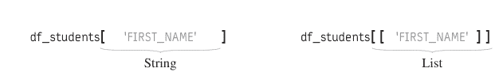

有了这个新知识，我们可以选择*两*列而不是一列。你能猜到怎么做吗？♦（记住，当你在本书的第二部分看到菱形符号时，放下书一会儿，看看你是否能在继续阅读之前想出该怎么做）：

```
df_students[['FIRST_NAME', 'LAST_NAME']]
```

| | FIRST_NAME | LAST_NAME |
|---|---|---|
| 0 | Daniel | Smith |
| 1 | Ben | Leibstrom |
| 2 | Kavita | Kanabar |
| 3 | Linda | Thiel |
| 4 | Omar | Reichel |
| 5 | Jane | OConner |
| 6 | Felicia | Rao |
| 7 | Rachel | Crock |
| 8 | Bob | McDonald |

178 第二部分

#### 一个常见错误

一个常见的 **pandas** 错误发生在你尝试在 **pandas** DataFrame 中选择多个列，但忘记在方括号内放入*列表*时。例如，考虑以下代码：

```
df_students['FIRST_NAME', 'LAST_NAME']
```

这段代码应该会给你一个错误。因为这是我们遇到的第一个 **pandas** 错误，值得指出的是 **pandas** 错误通常相当长且令人生畏。这是我们阅读它们的技巧——一直滚动到最底部。最相关的部分通常在最后。

在这种情况下，查看错误的末尾，我们看到以下内容：

```
KeyError: ('FIRST_NAME', 'LAST_NAME')
```

**pandas** 已识别出错误来自列名——方括号中的参数是一个*字符串*，因此 **pandas** 查找名为 ('FIRST_NAME', 'LAST_NAME') 的单列。当然，此列不存在，因此 **pandas** 抛出错误。正确的做法是包含*两个*方括号（即在方括号之间放入一个列表），以让 **pandas** 知道我们想要查找多个列。

#### 5.5.3 行索引和列名

**pandas** DataFrame 中的每一列都有一个关联的名称；这应该是一个熟悉的概念。也许不太熟悉的是，每个 **pandas** *行*也有一个关联的*行名*（统称为*行索引*）。默认情况下，行名等于行号，但有时使用不同的名称会很有用。

更改列名或行索引很容易。假设我们想将 ENGLISH_101_FINAL 列的名称更改为 ENGLISH_101_FINAL_SCORE——我们可以运行：

```
df_students.columns = ['FIRST_NAME', 'LAST_NAME', 'YEAR',
                      'HOME_STATE', 'AGE', 'CALC_101_FINAL',
                      'ENGLISH_101_FINAL_SCORE']
```

运行这行代码并查看 DataFrame。你会发现列名已相应更改。同样，假设我们希望行索引从 1 开始而不是 0 对行进行编号，我们可以运行：

```
df_students.index = [1,2,3,4,5,6,7,8,9]
```

现在查看 df_students DataFrame——你会看到行索引已经改变了。

要修改单个列名，却必须指定*所有*列名，这相当不方便。幸运的是，有一种方法可以只修改一个列名。假设我们想撤销上面所做的更改，可以运行以下代码：

```
df_students.rename(columns={'ENGLISH_101_FINAL_SCORE':'ENGLISH_101_FINAL'})
```

| LAST_NAME | YEAR | HOME_STATE | AGE | CALC_101_FINAL | ENGLISH_101_FINAL |
|---|---|---|---|---|---|
| Smith | 1 | NY | 18 | 90.0 | 80.0 |
| Leibstrom | 1 | NY | 19 | 80.0 | NaN |
| Kanabar | 1 | PA | 19 | NaN | NaN |

这是我们第一次对 DataFrame 应用函数，因此值得回顾一下我们做了什么。首先，我们输入 `df_students.rename` 来访问 `rename()` 函数，并将其应用于 `df_students`。（这类似于你输入 `a.upper()` 来对字符串 `a` 应用 `upper()` 函数的方式。）接下来，我们向该函数传递一个名为 `columns` 的参数。这个参数是一个字典，其中的键是你想要更改的旧列名，值是对应的新列名。输出反映了新的列名。

让我们再看一下 DataFrame：

```
df_students
```

| LAST_NAME | YEAR | HOME_STATE | AGE | CALC_101_FINAL | ENGLISH_101_FINAL_SCORE |
|---|---|---|---|---|---|
| Smith | 1 | NY | 18 | 90.0 | 80.0 |
| Leibstrom | 1 | NY | 19 | 80.0 | NaN |
| Kanabar | 1 | PA | 19 | NaN | NaN |

你可能想知道为什么旧列名又回来了。发生了什么？事实证明，`rename()` 函数（以及我们即将看到的大多数其他 pandas 函数）并不会更改底层的 DataFrame。这些函数只是返回 DataFrame 的一个*新*版本，而原始的底层 DataFrame 保持不变。这类似于以下代码中的行为：

```
name = 'Daniel'
name.upper()
```

'DANIEL'

```
name
```

'Daniel'

`name.upper()` 这一行返回大写的字符串，但它实际上并没有修改变量。
通常，你确实想要修改原始的 DataFrame。在本书中，我们将始终通过将函数的结果赋值回原始 DataFrame 来实现这一点：⁴

```
df_students = (
    df_students.rename(columns={'ENGLISH_101_FINAL_SCORE'
                               : 'ENGLISH_101_FINAL'}) )
```

`df_students` 现在将包含带有新列名的新 DataFrame。
最后一点——我们有时希望将行索引（行的名称）重置回默认值（从 0 开始）。我们可以使用以下代码来实现：

```
df_students = df_students.reset_index(drop = True)
```

同样，我们需要将函数的结果赋值给 `df_students`，以确保我们修改了原始 DataFrame。为什么需要 `drop = True`？如果没有这个参数，结果 DataFrame 中将创建一个新列，其中包含旧索引（即被替换的那个）。你可以尝试一下，看看实际效果。

#### 5.5.4 .head() 和 .shape

当大型数据集加载到 pandas 中时，通常只查看前几行会很有用。我们可以使用 `head()` 函数来实现：

```
df_students.head()
```

| | FIRST_NAME | LAST_NAME | YEAR | HOME_STATE | AGE | CALC_101_FINAL | En |
|---|---|---|---|---|---|---|---|
| 0 | Daniel | Smith | 1 | NY | 18 | 90.0 | |
| 1 | Ben | Leibstrom | 1 | NY | 19 | 80.0 | |
| 2 | Kavita | Kanabar | 1 | PA | 19 | NaN | |
| 3 | Linda | Thiel | 4 | CA | 22 | 60.0 | |
| 4 | Omar | Reichel | 2 | OK | 21 | 70.0 | |

了解 DataFrame 的大小也很有用。我们可以使用 `shape` 属性来实现：

```
df_students.shape
```

(9, 7)

这个表达式的结果是一个 Python 元组（你可以将其视为只读列表；详情请参见第 3.5.1 节中的“元组”框），其中第一个分量是行数，第二个分量是列数。例如，要仅访问行数，你可以使用 `df_students.shape[0]`。（你也可以简单地使用 `len(df_students)` 来查找行数。）

> ## 是否使用括号

你可能已经注意到我们讨论的功能中存在不一致之处。在某些情况下，比如 `head()` 和 `reset_index()`，我们需要包含括号（圆括号）。在其他情况下，比如 `shape`，或者当我们以序列形式检索列时，我们不包含括号。

这背后有其原因，但它们并不能真正帮助我们弄清楚何时使用括号，何时不使用。相反，我们想教你识别当你犯错时会发生什么，这样你就可以修复它。

尝试以下两行代码，其中*不需要*括号，但你包含了它们：

```
df_students.FIRST_NAME()
df_students.shape()
```

在这两种情况下，你都会得到一个错误。使用我们之前的提示，滚动到错误的末尾，你会在两种情况下都找到关键词“is not callable”。这些词是你在不需要括号时却包含了括号的关键指示。通过包含括号，你是在要求 Python *调用*一个函数，但 **df_students.FIRST_NAME** 和 **df_students.shape** 不是函数——它们分别是一个序列和一个元组。因此，Python 告诉你它们不是*可调用的*。

反过来呢？尝试以下代码：

```
df_students.reset_index
```

Python *不会*给你一个错误，但它也不会产生预期的结果（一个 DataFrame）。相反，你会得到一堆以“**bound method . . .**”开头的文本。在这种情况下，你可以将“method”视为“function”的另一个词，这是 Python 告诉你你有一个函数但没有包含括号的方式。

缺少括号可能以最后一种方式表现出来。假设你想先重置索引，然后访问 **FIRST_NAME** 列。正确的做法如下：

```
df_students.reset_index(drop = True).FIRST_NAME
```

我们首先在 DataFrame 上重置索引，这会产生一个 DataFrame，然后访问 **FIRST_NAME** 列。这被称为*链接 pandas* 命令，我们将一次又一次地使用这种策略。

如果我们在这个链接语句中忘记了括号会怎样？运行这段代码：

```
df_students.reset_index.FIRST_NAME
```

我们得到一个以如下内容开头的错误：

```
'function' object has no attribute . . .
```

这是你在链接语句中某处忘记括号的另一个明显迹象。

#### 5.5.5 Jupyter Notebook 中的代码补全

正如我们之前承诺的，我们现在将讨论 *Jupyter Notebook* 的最后一个功能——代码补全——它很快就会成为你最喜欢的功能之一。

要查看此功能的实际效果，创建一个新单元格，在单元格中输入字母 `df_s`，然后按键盘上的 Tab 键。注意 Jupyter Notebook 如何神奇地自动完成变量名，省去了你输入其余部分的麻烦。Jupyter 自动识别出 `df_students` 是唯一以字符 `df_s` 开头的变量，并自动完成变量名。

如果多个变量以这些字符开头会怎样？让我们创建一个名为 `df_surfboard` 的变量来测试一下：

```
df_surfboard = 1
```

然后，在新单元格中输入 `df_s` 并按 Tab：

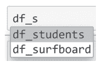

你会注意到 Jupyter Notebook 弹出一个下拉菜单，其中包含所有可能符合条件的变量。你可以使用箭头键浏览列表，找到所需变量后按 Enter 键。

如果你还没有高兴地搓着手唱起“Jupyter Notebook 万岁”的合唱，别担心——还有更多。

Jupyter 不仅会自动补全变量名，还会查看 pandas DataFrame 内部以自动补全代码。要查看实际效果，创建一个新单元格，输入 `df_students.E` 并按 Tab。注意 Jupyter 如何自动意识到你正在尝试访问 `ENGLISH_101_FINAL` 列并为你自动补全。如果多个列符合条件，将出现相同类型的下拉菜单。

还没唱起来？别担心，我们还没说完。

Jupyter Notebook 还会自动补全函数名。例如，假设你想重命名 `df_students` 中的列。创建一个新单元格，输入 `df_students.re` 并按 Tab。将出现以下内容：

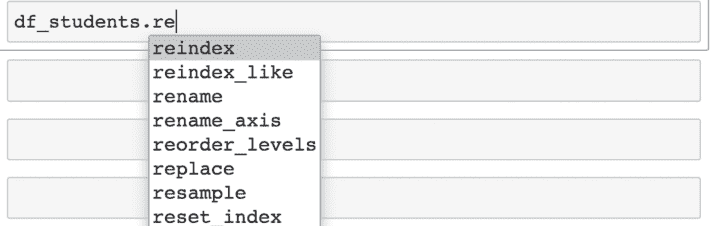

请注意，你可以对DataFrame应用许多以小写`re`开头的函数（如果存在以`re`开头的列名，它们也会出现在列表中）。

在结束之前，我们要提到最后一个特性。创建一个新单元格，输入`df_students.rename`，按住Shift键，然后快速连续按两次Tab键。将弹出以下对话框：

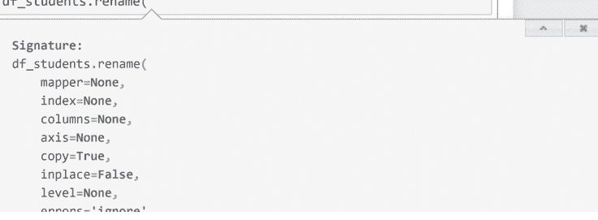

这包含了该函数的完整文档；事实证明，你可以对Python中的*任何*函数执行此操作，当你需要快速提醒时，这会非常方便。（请注意，完整的文档此时可能看起来有点令人生畏，所以我们不期望你从头到尾阅读全部内容；随着你对pandas越来越熟悉，你会理解得越来越多。）

#### 使用文档字符串记录你自己的函数

在第一部分中，我们讨论了如何创建自己的函数。你可能想知道，如果你使用*Jupyter*查看自己创建的函数的文档会发生什么。首先，创建以下简单函数，它只是将两个数字相加：

```python
def add_numbers(a, b):
    return a+b
```

现在，创建一个新单元格，输入`add_numbers`，然后按Shift、Tab、Tab。将出现以下内容：

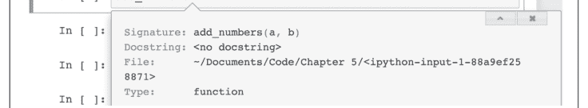

毫不奇怪，没有出现文档，因为你没有包含任何文档。包含文档相当容易；你只需要在函数开头的三引号之间包含它（这在Python中称为*文档字符串*）：

```python
def add_numbers(a, b):
    '''
    This function takes two numbers, a and b, and returns
    the sum
    '''
    return a+b
```

现在，再次运行该单元格以使用新注释重新定义函数，然后尝试再次调出文档——你会注意到你的文档字符串将出现在那里。

### 5.6 读取和写入数据

到目前为止，我们一直在使用`df_students` DataFrame，它是用字典创建的。有时以这种方式创建DataFrame很有用，但在大多数业务应用中，数据需要从文件中读取，并根据需要保存回可共享的文件。在本节中，我们将考虑如何在pandas中执行这些读写操作。

#### 5.6.1 读取数据

让我们从简单的开始——`Students.xlsx`文件包含我们在5.5节中创建的数据集的Excel版本。要将其加载到pandas中，我们可以使用`read_excel()`函数。请注意，这只有在你正确地在第二部分文件夹中创建了*Jupyter Notebook*时才有效。否则，你必须在引号中列出文件的完整路径：⁵

```python
df_students = pd.read_excel('raw data/Students.xlsx')
```

运行此行不会产生任何输出，但`df_students`现在将包含从文件中读取的DataFrame。如果一个Excel工作簿有多个工作表，pandas也允许你指定要读取哪个工作表。在这种情况下，工作簿中唯一的工作表是Sheet 1，所以我们不需要指定这一点。但我们可以这样写：

```python
df_students = pd.read_excel('raw data/Students.xlsx',
                          sheet_name='Sheet 1')
```

与许多其他pandas函数一样，`read_excel()`提供了令人眼花缭乱的选项数量，涵盖所有这些选项可能需要占用本书的整整一章。值得庆幸的是，pandas文档信息非常丰富。谷歌搜索“pandas read_excel”（或使用我们在5.5.5节中讨论的功能来显示文档）——你将找到有关从具有多个工作表、无标题等的Excel文件中读取数据的说明。

你可能遇到的另一种文件格式是CSV格式。例如，让我们转到Dig案例研究，考虑汇总的订单数据文件，该文件以CSV格式提供。我们可以使用`read_csv()`函数加载它，并使用`head()`查看几行：

```python
df_summarized_orders = pd.read_csv('raw data/Summarized orders.csv')
df_summarized_orders.head()
```

| | location | day | number of orders | percentage of deliveries |
|---|---|---|---|---|
| 0 | Bryant Park | 2018-01-01 | 373 | 0.0 |
| 1 | Bryant Park | 2018-01-02 | 789 | 0.0 |
| 2 | Bryant Park | 2018-01-03 | 818 | 0.0 |
| 3 | Bryant Park | 2018-01-04 | 782 | 0.0 |
| 4 | Bryant Park | 2018-01-05 | 719 | 0.0 |

你会注意到列名包含空格且相当长。每次你想引用其中一个列时，输入整个名称会很麻烦。因此，我们将它们重命名为更易于管理的名称：

```python
df_summarized_orders.columns = ['RESTAURANT_NAME',
                                'DATE', 'NUM_ORDERS',
                                'PERC_DELIVERY']
```

我们可以类似地加载餐厅和商品数据集，如下所示：

```python
df_items = pd.read_csv('raw data/items.csv')
df_restaurants = pd.read_csv('raw data/restaurants.csv')
```

最后，让我们加载Dig案例研究中的订单数据集。数据以CSV格式提供，但压缩在zip文件中。你可能会惊喜地发现，你甚至不需要解压文件——pandas可以直接从压缩文件中读取数据。尝试以下代码，它将加载文件并打印数据集的大小。

```python
df_orders = pd.read_csv('raw data/Simplified orders.zip')
df_orders.shape
```

这个数据集很大，可能需要长达三十秒才能加载。然而，我们看到它包含超过238万行。我们开始看到pandas的强大功能。

我们讨论了Excel和CSV文件，但pandas可以读取许多其他格式。如果你遇到需要读取的新文件类型，很可能pandas有一个函数可以让你读取它——有创意的谷歌搜索会帮助你找到它。事实上，我们将在下一节介绍第三种文件类型（*pickle*）。

#### 5.6.2 写入数据

在后面的章节中，我们将使用pandas来转换、修改和汇总我们的数据集。在pandas中执行此操作不会修改我们加载数据的底层文件。有时，我们希望将数据导出回文件，以便我们可以保留它们以供将来分析或与他人共享；pandas使这变得很容易。

让我们考虑将pandas DataFrame导出到CSV文件——如果你想与将在Excel中打开该文件的人共享文件，这很有用。让我们使用新的列名导出汇总的订单数据集：

```python
df_summarized_orders.to_csv('Chapter 5/Summarized orders new.csv')
```

函数中的字符串是文件路径，后跟DataFrame将保存到的文件名。请注意，我们将文件保存在“Chapter 5”文件夹中。如果你打开生成的Excel文件，你会注意到文件保存时行索引在第一列。这通常是不必要的，特别是如果行索引只是行号。要告诉pandas保存文件时不包含此行索引，请使用以下命令：

```python
df_summarized_orders.to_csv(
    'Chapter 5/Summarized orders new.csv', index=False)
```

将文件保存为CSV的缺点之一是它丢失了我们可能在Python中完成的大量工作。例如，在5.7节中，我们将讨论如何指定pandas DataFrame中每列的类型。如果我们这样做，然后将文件保存为CSV，我们将丢失所有这些工作，并在下次加载CSV时重新执行。

值得庆幸的是，Python提供了一种不同的文件类型——pickle——它允许我们保留任何Python变量，包括DataFrame，并完全按原样重新加载它。（明白了吗？就像泡菜是腌黄瓜一样。）要将DataFrame保存为pickle，我们只需使用`to_pickle()`函数，如下所示：

```python
df_students.to_pickle('Chapter 5/df_students.pickle')
```

你会注意到文件`df_students.pickle`将在你指定的函数位置创建——在本例中，是你的“Chapter 5”文件夹。此文件无法在Excel中打开。它只能使用`pd.read_pickle()`函数读回Python：

```python
pd.read_pickle('Chapter 5/df_students.pickle')
```

| | FIRST_NAME | LAST_NAME | YEAR | HOME_STATE | AGE | CALC_101_FINAL | EI |
|---|---|---|---|---|---|---|---|
| 0 | Daniel | Smith | 1 | NY | 18 | 90.0 | |
| 1 | Ben | Leibstrom | 1 | NY | 19 | 80.0 | |
| 2 | Kavita | Kanabar | 1 | PA | 19 | NaN | |
| 3 | Linda | Thiel | 4 | CA | 22 | 60.0 | |
| 4 | Omar | Reichel | 2 | OK | 21 | 70.0 | |
| 5 | Jane | OConner | 2 | HI | 19 | NaN | |
| 6 | Felicia | Rao | 3 | NY | 20 | NaN | |
| 7 | Rachel | Crock | 1 | FL | 17 | NaN | |
| 8 | Bob | McDonald | 1 | FL | 18 | 98.0 | |

生成的DataFrame将与保存到pickle中的DataFrame*完全*相同。

#### PICKLES 与 PANDAS 版本

如果你尝试用旧版 Excel 打开一个新版 Excel 文件，可能会遇到一些问题。Pickle 文件也是如此。如果你保存了一个 pickle 文件，然后尝试用新版 pandas 打开它，可能会遇到一些晦涩的错误。虽然有解决方法，但这些方法远超本书的讨论范围。就我们的目的而言，请确保在保存和加载 pickle 文件时，使用相同版本的 Python 和 pandas。如果你在本书网站上遇到任何 pickle 文件相关的问题，请告知我们。我们一定会提供适用于所有近期版本 pandas 的文件。

### 5.7 列类型

在 2.7.1 节中，你已经了解了数据类型的概念。Python 会跟踪每个变量所包含数据的*种类*，无论是浮点数、整数还是字符串。pandas 中也是如此——每一列都有一个类型，pandas 会跟踪它是什么。

要查看每一列的类型，我们可以使用 `info()` 函数：

```
df_orders.info()
```

```
<class 'pandas.core.frame.DataFrame'>
RangeIndex: 2387224 entries, 0 to 2387223
Data columns (total 10 columns):
 #   Column            Dtype 
---  ------            ----- 
 0   ORDER_ID          object
 1   DATETIME          object
 2   RESTAURANT_ID     object
 3   TYPE              object
 4   DRINKS            float64
 5   COOKIES           float64
 6   MAIN              object
 7   BASE              object
 8   SIDE_1            object
 9   SIDE_2            object
dtypes: float64(2), object(8)
memory usage: 182.1+ MB
```

每一列都有一个关联的类型——object 类型在 pandas 中是“我不知道这是什么”的简写。字符串会显示为 object 数据类型。

pandas 通常能很好地判断每一列的类型。你会注意到，在前面的例子中，pandas 自动识别出 DRINKS 和 COOKIES 列是数值型。理论上，它应该将这些列设为整数而不是浮点数（因为饼干和饮料的数量总是整数），但由于与缺失值相关的各种复杂原因，pandas 通常不喜欢将列存储为整数。相反，它使用浮点数，这对我们的目的来说完全没问题。

然而，有一列 pandas *没有*正确识别：DATETIME 列。根据前面的输出，该列被视为一个简单的字符串列，就像 TYPE 列一样。这肯定不对——日期肯定比简单的字符串列结构化得多。

当 pandas 错误地判断了列的类型时，我们需要帮助它。对于日期时间列，我们可以使用 `to_datetime()` 函数来完成，如下所示：

```
df_orders.DATETIME = pd.to_datetime(df_orders.DATETIME)
```

让我们解析一下这个语句。我们首先从 df_orders 数据集中提取 DATETIME 列作为一个序列，然后将其传递给 pd.to_datetime() 函数。这将把序列中的每个条目转换为日期时间（注意，这是我们在第一部分中没有遇到的新数据类型）。然后，该列被这个新的、格式化的列替换。我们还没有讨论过编辑列（我们将在 6.8.3 节正式介绍），但这个语法是不言自明的。

现在再次运行 `df_orders.info()`。你会注意到 DATETIME 列的类型现在是 datetime64[ns]。

然而，查看实际的 DataFrame（使用 `df_orders.head()`），你可能会注意到没有任何变化。那么，做这一切的意义何在？你必须等到 6.7.5 节才能找到答案。作为快速预览，请考虑以下代码行：

```
df_orders.DATETIME.dt.day_name().head()
```

```
0    Thursday
1    Thursday
2    Saturday
3    Saturday
4      Sunday
Name: DATETIME, dtype: object
```

现在 pandas 意识到 DATETIME 列是一个日期，它就能够提取关于该日期的信息，比如星期几。我们无法在原始的字符串列上做到这一点。我们很快会看到更多这样的例子。

这个讨论可能会让你产生许多疑问。pd.to_datetime() 可以接受什么样的日期和时间格式？在前面的 DataFrame 中，我们加载的原始字符串看起来像这样：2018-10-11 17:25:50。如果我们的日期是以下格式呢：11Oct18 05:25:00pm？我们将让你自己去研究这些其他格式，但你会发现 pd.to_datetime() 的通用性令人惊讶。

为了说明这种通用性，让我们将 df_summarized_orders 中的 DATE 列转换为日期。首先让我们回忆一下这个表的样子：

```
df_summarized_orders.head()
```

| RESTAURANT_NAME | DATE | NUM_ORDERS | PERC_DELIVERY |
|---|---|---|---|
| 0 | Bryant Park | 2018-01-01 | 373 | 0.0 |
| 1 | Bryant Park | 2018-01-02 | 789 | 0.0 |
| 2 | Bryant Park | 2018-01-03 | 818 | 0.0 |
| 3 | Bryant Park | 2018-01-04 | 782 | 0.0 |
| 4 | Bryant Park | 2018-01-05 | 719 | 0.0 |

注意日期格式不同——它不包含时间。尽管如此，pd.to_datetime() 函数可以轻松处理它（表格看起来不会有任何不同，但一个关键的变化已经发生——DATE 列现在将存储为日期时间，而不是字符串）：

```
df_summarized_orders.DATE = pd.to_datetime(df_summarized_orders.DATE)
df_summarized_orders.head()
```

| RESTAURANT_NAME | DATE | NUM_ORDERS | PERC_DELIVERY |
|---|---|---|---|
| 0 | Bryant Park | 2018-01-01 | 373 | 0.0 |
| 1 | Bryant Park | 2018-01-02 | 789 | 0.0 |
| 2 | Bryant Park | 2018-01-03 | 818 | 0.0 |
| 3 | Bryant Park | 2018-01-04 | 782 | 0.0 |
| 4 | Bryant Park | 2018-01-05 | 719 | 0.0 |

### 5.8 总结

在本章中，我们介绍了 pandas 作为 Python 的主要数据处理库。我们讨论了 pandas 的序列和 DataFrame，并查看了它们的结构。最后，我们讨论了如何从各种文件中读取和写入文件。

到目前为止一切顺利，但也许你觉得这有点平淡无奇。在这个阶段，我们使用 pandas 获得的唯一真正好处是能够打开大型数据集。除此之外，看起来费了很多周折和麻烦，却没得到多少好处。在下一章中，我们将开始收获 Python 数据分析的真正好处，你将看到 Dig 如何使用这些功能来回答一些关键的业务问题。

在结束之前，让我们将本章处理过的文件保存为 pickle 文件，以便在下一章中使用。

运行以下代码将这些文件保存到你的“第 5 章”文件夹：

```
df_students.to_pickle('Chapter 5/students.pickle')
df_orders.to_pickle('Chapter 5/orders.pickle')
df_summarized_orders.to_pickle(
    'Chapter 5/summarized_orders.pickle')
df_items.to_pickle('Chapter 5/items.pickle')
df_restaurants.to_pickle('Chapter 5/restaurants.pickle')
```

## 6 在 PYTHON 中探索、绘图和修改数据

**我们已经介绍了** pandas 并讨论了它如何存储、读取和写入数据。但我们还没有讨论一旦加载数据后如何处理它。你在第 5 章读到的 Dig 的故事充满了问题：既关于 Dig 的数据，也更广泛地关于 Dig 的业务。

在本章中，我们将最终收获使用 pandas 的回报。我们将用它来探索 Dig 的数据、绘制图表，并在需要时修改数据，我们将使用这些技术来回答使用 Dig 数据集的一系列问题。例如，我们将找出 Dig 的订单中有多少是外卖订单、自提订单还是店内订单；Dig 的哪些餐厅最受欢迎；订单量如何随星期几和一年中的时间而变化。请记住，我们将用来回答这些问题的数据集是巨大的。然而，我们将在短短几秒钟内获得大多数问题的答案。

为了确保我们能够专注于学习 pandas 的相关部分，本章我们将讨论的大多数问题都是简单的问题，直接根据 Dig 的数据来表述。在第 9 章中，我们将考虑根据 Dig 的业务来表述的更复杂的问题。

### 6.1 本章你将学到什么

在本章结束时，你将掌握 pandas 的大部分基本功能。我们首先讨论如何对 pandas DataFrame 进行排序以及如何绘制它们。

我们探讨了 pandas 提供的用于探索和筛选数据的功能。本章的下一部分将介绍如何操作列和编辑 pandas DataFrame。最后，我们将通过 Dig 故事中引入的具体业务问题，提供更多示例供你练习。

### 6.2 本章所需准备

在开始之前，请先在你在第 5.2 节创建的 part 2 文件夹中，为本章创建一个新的 *Jupyter Notebook*（如需回顾如何创建笔记本，请参见第 5.3.1 节）。我们要做的第一件事是加载第 5 章末尾保存的文件。为此，请将以下代码粘贴到第一个单元格中并运行（你可能还需要按第 5.3.3 节讨论的方式，为文件命名并添加标题）：

```python
import pandas as pd
df_students = pd.read_pickle('Chapter 5/students.pickle')
df_orders = pd.read_pickle('Chapter 5/orders.pickle')
df_summarized_orders = (
    pd.read_pickle('Chapter 5/summarized_orders.pickle') )
df_items = pd.read_pickle('Chapter 5/items.pickle')
df_restaurants = (
    pd.read_pickle('Chapter 5/restaurants.pickle') )
```

一如既往，本章的 *Jupyter Notebook* 以及上一章的文件均可在本书网站上获取。

### 6.3 PANDAS 中的数据排序

我们首先讨论一个简单但至关重要的操作：在 pandas 中对数据进行排序。
我们从最简单的排序形式开始。让我们回顾一下 `df_students` DataFrame 的样子：

```python
df_students.head()
```

| | FIRST_NAME | LAST_NAME | YEAR | HOME_STATE | AGE | CALC_101_FINAL |
|---|---|---|---|---|---|---|
| 0 | Daniel | Smith | 1 | NY | 18 | 90.0 |
| 1 | Ben | Leibstrom | 1 | NY | 19 | 80.0 |
| 2 | Kavita | Kanabar | 1 | PA | 19 | NaN |
| 3 | Linda | Thiel | 4 | CA | 22 | 60.0 |
| 4 | Omar | Reichel | 2 | OK | 21 | 70.0 |

假设我们想按 HOME_STATE 对 df_students 进行排序。我们可以这样写：

```python
df_students.sort_values('HOME_STATE')
```

| | FIRST_NAME | LAST_NAME | YEAR | HOME_STATE | AGE | CALC_101_FINAL |
|---|---|---|---|---|---|---|
| 3 | Linda | Thiel | 4 | CA | 22 | 60.0 |
| 7 | Rachel | Crock | 1 | FL | 17 | NaN |
| 8 | Bob | McDonald | 1 | FL | 18 | 98.0 |
| 5 | Jane | OConner | 2 | HI | 19 | NaN |
| 0 | Daniel | Smith | 1 | NY | 18 | 90.0 |

请注意，输出现在按字母升序排列。要反转此顺序，我们只需向 `sort_values()` 函数传递 `ascending=False` 参数，如下所示：

```python
df_students.sort_values('HOME_STATE', ascending=False)
```

| | FIRST_NAME | LAST_NAME | YEAR | HOME_STATE | AGE | CALC_101_FINAL |
|---|---|---|---|---|---|---|
| 2 | Kavita | Kanabar | 1 | PA | 19 | NaN |
| 4 | Omar | Reichel | 2 | OK | 21 | 70.0 |
| 0 | Daniel | Smith | 1 | NY | 18 | 90.0 |
| 1 | Ben | Leibstrom | 1 | NY | 19 | 80.0 |
| 6 | Felicia | Rao | 3 | NY | 20 | NaN |

关于输出，有几点重要说明：

- 数据排序时，行索引会被打乱。每一行*保留*其初始名称。通常，将新 DataFrame 的行重新标记为从零开始的编号会很有用。你可以使用 `reset_index()` 函数来实现，并设置 `drop=True` 以确保初始索引不会作为额外列添加（如需回顾，请参见第 5.5.3 节）：

```python
df_students.sort_values('HOME_STATE').reset_index(drop=True)
```

- 运行 `sort_values()` 函数*不会*更改底层 DataFrame。如果你在运行上述操作后查看 `df_students`，会发现它保持了原始顺序。要永久排序 DataFrame，你需要将结果赋值回 DataFrame，如下所示：

```python
df_students = ( df_students.sort_values('HOME_STATE')
                 .reset_index(drop=True) )
```

按两列排序同样简单；我们只需向 `sort_values()` 函数传递一个列名列表。

```python
df_students.sort_values(['HOME_STATE', 'LAST_NAME'])
```

| | FIRST_NAME | LAST_NAME | YEAR | HOME_STATE | AGE | CALC_101_FINAL |
|---|---|---|---|---|---|---|
| 3 | Linda | Thiel | 4 | CA | 22 | 60.0 |
| 7 | Rachel | Crock | 1 | FL | 17 | NaN |
| 8 | Bob | McDonald | 1 | FL | 18 | 98.0 |
| 5 | Jane | OConner | 2 | HI | 19 | NaN |
| 1 | Ben | Leibstrom | 1 | NY | 19 | 80.0 |

请注意，在每个 HOME_STATE 内部，行是按 LAST_NAME 排序的。当对序列（单列）进行排序时，无需指定列名——可以直接使用 `sort_values()`：

```python
df_students.CALC_101_FINAL.sort_values()
```

```
0    60.0
7    70.0
5    80.0
4    90.0
2    98.0
1     NaN
3     NaN
6     NaN
8     NaN
Name: CALC_101_FINAL, dtype: float64
```

最后一点——有时，你可能不想按某一列排序，而是想按行索引（行名）排序。你可以轻松地使用 `sort_index()` 函数来实现：

```python
df_students.sort_index()
```

| | FIRST_NAME | LAST_NAME | YEAR | HOME_STATE | AGE | CALC_101_FINAL |
|---|---|---|---|---|---|---|
| 0 | Daniel | Smith | 1 | NY | 18 | 90.0 |
| 1 | Ben | Leibstrom | 1 | NY | 19 | 80.0 |
| 2 | Kavita | Kanabar | 1 | PA | 19 | NaN |
| 3 | Linda | Thiel | 4 | CA | 22 | 60.0 |
| 4 | Omar | Reichel | 2 | OK | 21 | 70.0 |

此时，这对你来说可能看起来没什么用。我们为什么要按行号对 DataFrame 排序呢？我们稍后会考虑行索引包含远不止行号的情况，那时这个操作将变得非常有用。

### 6.4 PANDAS 中的数据绘图

在 Python 中绘图是一个庞大的主题。在本书中，我们将介绍构建一些令人印象深刻的图表所需的内容，而不会过多关注技术细节。请记住，我们在本书中涵盖的只是可用功能的一小部分。本节重点介绍创建图表的机制，但在我们能够将这些机制应用于本章剩余部分的 Dig 案例之前，它可能看起来有点枯燥。

首先，按如下方式加载 Python 的绘图库：

```python
import matplotlib.pyplot as plt
```

生成图表最简单的方法是直接从 pandas 序列开始。¹ 试试以下代码：

```python
df_students.CALC_101_FINAL.plot(kind='bar')
```

```
<matplotlib.axes._subplots.AxesSubplot at 0x1312c0350>
```

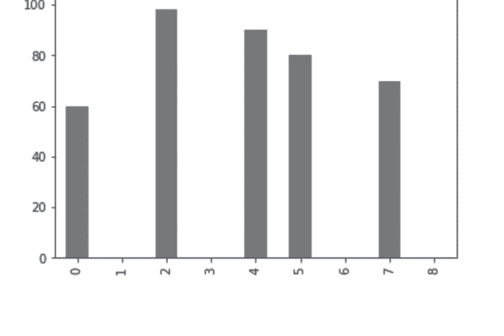

让我们理解一下发生了什么。首先，我们编写 `df_students.CALC_101_FINAL`，它返回一个包含 `CALC_101_FINAL` 列的*序列*。该序列的索引与其来源 DataFrame 的索引相同。最后，我们在这个序列上调用 `plot(kind='bar')`。Python 将绘制一个条形图，其中 *x* 轴是行索引，*y* 轴对应于值。请注意，缺失值会导致条形缺失。
当然，条形图并非唯一可用的图表，我们将在后续内容中介绍其他几种图表。
就其本身而言，这个图表的用途可能不大，因为索引没有太多意义。但是，请尝试以下代码：

```python
df_students.index = df_students.LAST_NAME
df_students.CALC_101_FINAL.plot(kind='bar')
df_students = df_students.reset_index(drop=True)
```

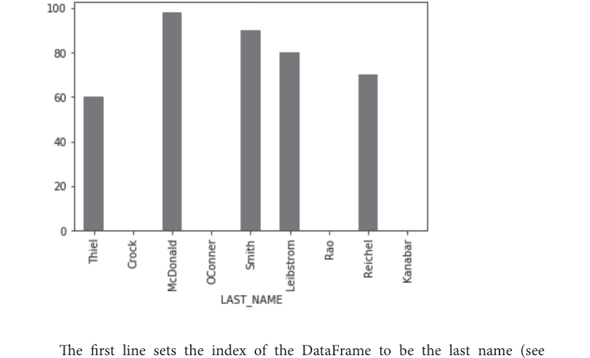

第一行将 DataFrame 的索引设置为姓氏（参见第 5.5.3 节）。第二行绘制 `CALC_101_FINAL` 列，使用新索引作为 *x* 轴。最后，我们使用 `reset_index()` 将索引重置回原始状态——行号。
每次想要生成具有有意义的 *x* 轴的图表时都必须更改索引，这似乎很麻烦。实际上，pandas 允许我们直接对 DataFrame 应用 `plot()`，使过程更加无缝：

```python
df_students.plot(x='LAST_NAME',
                 y='CALC_101_FINAL', kind='bar')
```

```
<matplotlib.axes._subplots.AxesSubplot at 0x124622250>
```

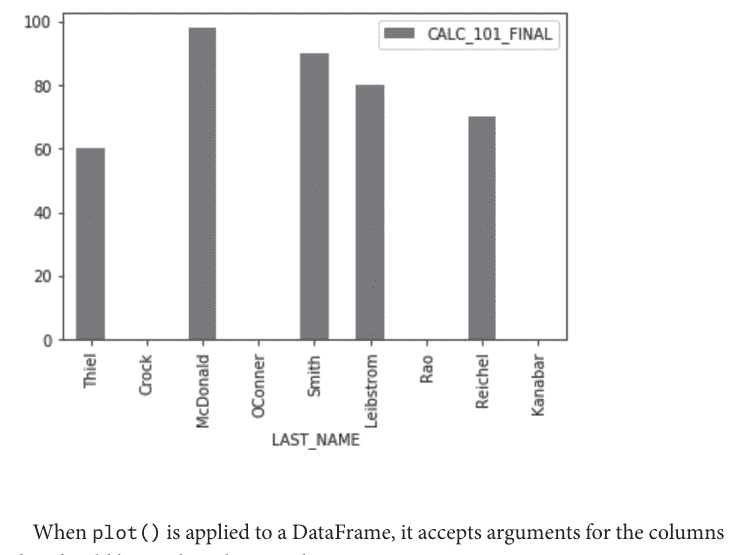

当 `plot()` 应用于 DataFrame 时，它接受用于指定应放在 x 轴和 y 轴上的列的参数。
这涵盖了 pandas 中绘图的基础知识——我们将在本章剩余部分反复回到这个主题。

### 6.5 PANDAS 中的数据探索

在介绍 Dig 时，我们花了大量时间讨论创建提供单一事实来源的数据集的重要性——这是我们分析的基础。在创建此数据集时，第一步是盘点我们的数据，对其进行探索，并彻底理解它。pandas 提供了许多工具来完成此操作。

#### 6.5.1 value_counts() 函数

我们将要探索的第一个函数——也是在 pandas 中最常用的函数之一——是 value_counts() 函数。它可以应用于任何 Series，并告诉你 Series 中每个值出现的频率。例如，让我们回到 Dig 案例中的订单表：

```
df_orders.head()
```

| ORDER_ID | DATETIME | RESTAURANT_ID | TYPE | DRINKS | COOKIES | M |
|---|---|---|---|---|---|---|
| 0 | O1820060 | 2018-10-11 17:25:50 | R10002 | IN_STORE | 1.0 | 2.0 | N |
| 1 | O1011112 | 2018-05-31 11:35:00 | R10003 | IN_STORE | 0.0 | 0.0 | N |
| 2 | O752854 | 2018-04-21 18:12:57 | R10001 | DELIVERY | 0.0 | 2.0 |

假设我们想找出 TYPE 列包含哪些值，以及每个值有多少个。我们可以使用以下代码：

```
df_orders.TYPE.value_counts()
```

```
IN_STORE    1713136
PICKUP       401440
DELIVERY     272648
Name: TYPE, dtype: int64
```

我们首先引用 df_orders DataFrame，然后访问 TYPE 列。最后，我们调用 value_counts() 函数。
这个结果告诉我们 TYPE 列中有三个值，并告诉我们每个值出现的频率。我们立刻看到大多数订单是店内订单，但也有相当数量的自提和外卖订单。
value_counts() 函数也可以将这些频率显示为比例。尝试添加 `normalize=True` 作为参数：◆

```
df_orders.TYPE.value_counts(normalize=True)
```

```
IN_STORE    0.717627
PICKUP      0.168162
DELIVERY    0.114211
Name: TYPE, dtype: float64
```

因此，我们看到 72% 的订单是店内订单。

#### 技术提醒

首先，回顾一下在 **pandas** 中访问列有两种方式（参见第 5.5.2 节）。这里我们使用了点表示法，但也可以使用以下替代表示法：

```
df_orders['TYPE'].value_counts()
```

结果是相同的。
其次，仔细查看 **value_counts()** 函数的输出。你可能已经注意到它没有格式化为漂亮的表格。这是输出为 Series 而非 DataFrame 的一个明显标志。该 Series 的行索引包含列中的唯一条目，每行的值是该唯一条目出现的次数。
为了巩固我们的理解，尝试对结果 Series 执行 **reset_index()**。在执行之前，先试着弄清楚输出会是什么。◆

```
df_orders.TYPE.value_counts(normalize=True).reset_index()
```

| index | TYPE | |
|---|---|---|
| 0 | IN_STORE | 0.717627 |
| 1 | PICKUP | 0.168162 |
| 2 | DELIVERY | 0.114211 |

现在结果是一个 DataFrame，索引被添加为该 DataFrame 中的一列。

使用我们在第 6.4 节学到的绘图功能，我们可以将这些数据可视化为图表：◆

```
( df_orders.TYPE.value_counts(normalize=True)
.plot(kind='bar') )
```

<matplotlib.axes._subplots.AxesSubplot at 0x131c07290>

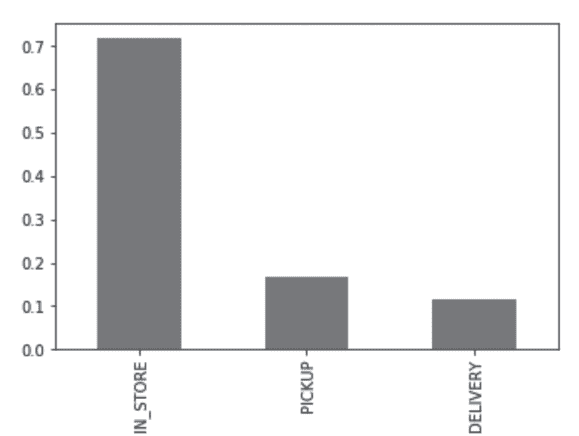

确保你理解这个表达式的每一步。我们首先将 TYPE 列作为 Series 访问；然后对其应用 value_counts()，它返回一个 Series，其行索引对应于该列中的唯一条目；最后，我们绘制这个 Series。行索引出现在 x 轴上，频率出现在 y 轴上。在运行整个链式命令之前，分别运行每个部分可能有助于理解每个部分的作用。

现在让我们转向另一个问题：我们的哪家餐厅销售额最高？哪家落后？在查看我们的解决方案之前，你能想出如何回答这个问题吗？◆

回答这个问题的一种方法是在 df_orders 数据集的 RESTAURANT_ID 列上运行 value_counts()。这将统计我们数据时间范围内每家餐厅的订单数量：◆

```
df_orders.RESTAURANT_ID.value_counts().plot(kind='bar')
```

```
<matplotlib.axes._subplots.AxesSubplot at 0x121484c10>
```

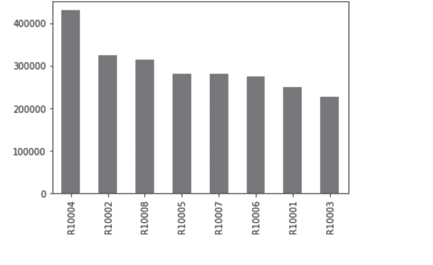

看起来餐厅 R10004 最活跃，而餐厅 R10003 最不活跃。查看 df_restaurants 表，我们发现它们分别是 NYU 和 Bryant Park 餐厅。在第 7 章，我们将看到如何自动获取这些餐厅名称，而无需手动查找。

作为最后的练习，让我们找出每家餐厅在 df_summarized_orders 表中出现的次数。◆ 让我们回顾一下这个表的样子：

```
df_summarized_orders.head()
```

| | RESTAURANT_NAME | DATE | NUM_ORDERS | PERC_DELIVERY |
|---|---|---|---|---|
| 0 | Bryant Park | 2018-01-01 | 373 | 0.0 |
| 1 | Bryant Park | 2018-01-02 | 789 | 0.0 |

幸运的是，我们看到表中已经包含了餐厅名称。现在让我们看看每家餐厅出现的频率：◆

```
df_summarized_orders.RESTAURANT_NAME.value_counts()
```

```
Upper West Side       365
NYU                   365
Flatiron              365
Midtown               365
Williamsburg          365
Columbia              365
Upper East Side       355
Bryant Park           261
Name: RESTAURANT_NAME, dtype: int64
```

大多数餐厅在这个表中出现了 365 次，这是我们预期的，因为该表应该包含每家餐厅一年中每一天的一行数据。那么，我们该如何解释 Upper East Side 和 Bryant Park 餐厅的行数呢？

对于 Bryant Park 餐厅，我们注意到行数是 365 – (52 × 2) = 261。因为每年有五十二个周末，每个周末两天，所以 Bryant Park 可能在周末关门。我们如何验证这是否确实是正在发生的情况？我们必须确保数据集中没有 Bryant Park 在周末的行。不幸的是，我们目前还没有工具来做到这一点，但我们很快就会有（第 6.7.5 节）。

值得回顾一下我们刚刚经历的过程——我们首先运行 value_counts() 来查看数据是否合理。在此过程中，我们发现了一个不一致之处。然后我们假设不一致可能来自哪里，最后，我们确定了另一个可以执行的选项来验证我们的假设是否正确。这个过程是处理数据的基本部分，我们鼓励你将这种方法应用于你遇到的任何新数据集。

在结束之前，我们如何解释 Upper East Side 餐厅的 355 行？我们可以假设这家餐厅在国家法定假日关门，我们稍后将看到如何验证这一点。

#### 6.5.2 描述数值列和绘制直方图

value_counts() 函数非常宝贵，但它对数值列不是特别有用。例如，考虑汇总订单数据中的 NUM_ORDERS 列，并对其运行 value_counts()：

```
df_summarized_orders.NUM_ORDERS.value_counts()
```

你应该会发现结果包含超过 797 行；事实上，我们可以使用 shape ◆ 找到行数：

```
df_summarized_orders.NUM_ORDERS.value_counts().shape
```

```
(797,)
```

为什么这么多？NUM_ORDERS 列可能包含许多不同的唯一值，因为任何商店在任何给定的一天都可能观察到许多可能的订单数，而这些唯一值中的每一个都在 value_counts() Series 中占据一行。
相反，pandas 提供了一个 describe() 函数，它为数值列计算一些摘要统计信息：

```
df_summarized_orders.NUM_ORDERS.describe()
```

```
count    2806.000000
mean      850.756949
std       195.490367
min       200.000000
25%       739.000000
50%       833.000000
75%       949.000000
max      1396.000000
Name: NUM_ORDERS, dtype: float64
```

因此，我们看到 NUM_ORDERS 列的平均值是每天 851 个订单，标准差为 195 个订单。如果你上过统计课，你知道大多数时候，值落在平均值的两个标准差范围内。这可以为 Dig 提供一个有用的机制，用来检查在给定餐厅的任何给定一天，订单是否异常高或低。如果订单低于每天 461 个或高于每天 1,241 个，警报可能会响起。²

如果我们想生成一个描述数值列的图表怎么办？
第一个，也许是最简单的图表是箱线图，你可以这样生成：`df_summarized_orders.NUM_ORDERS.plot(kind='box')`

对于不熟悉这类图表的人来说，中间的线代表该列的中位数（在本例中，略高于800）。盒子的上下部分代表数据的上下四分位数。两条须线从盒子两侧各延伸出盒子宽度的1.5倍。最后，须线之外的任何点都是*异常值*，它们会被单独绘制出来。

箱线图可能很有用，但我们可能还想寻找一个更详细的图表，以实际显示变量可能取值的分布情况。直方图正是如此——它将数值列的值绘制在x轴上，将这些值的频率绘制在y轴上。试试这个：

```
df_summarized_orders.NUM_ORDERS.plot(kind='hist')
```

我们看到，大多数日子每天大约有800笔销售，平均值两侧有一些异常值。我们稍后将对此进行探讨。
为了使直方图更精细，我们可以使用`bins`参数，它控制直方图中单个分箱或条形的数量：◆

```
df_summarized_orders.NUM_ORDERS.plot(kind='hist', bins=30)
```

这个更精细的直方图更清楚地表明，似乎存在三个“组”的日子：大约500笔订单的日子，大约800笔订单的日子，以及大约1300笔订单的日子。
你可能已经注意到这些直方图的一个特点，即它们的y轴刻度不同——第二个直方图的数字要低得多。这是因为每个条形的高度只是计算该分箱中的点数。理所当然地，当分箱变窄时（如第二个直方图所示），每个分箱中的观测值就会减少。
这似乎不是最优的。如果不同的直方图刻度差异很大，我们该如何比较它们呢？幸运的是，通过向`plot()`函数传递`density=True`，我们可以改变刻度，使所有条形的总和为1：

```
df_summarized_orders.NUM_ORDERS.plot(kind='hist', density=True)
```

这使得不同的直方图可以进行比较。
人们可能还会想知道，基于`PERC_DELIVERY`列（你可能还记得，它表示该天该门店订单中外卖订单的百分比）是否也能获得类似的见解。你可能会如何探索那一列？◆

```
df_summarized_orders.PERC_DELIVERY.hist(bins=40)
```

这个直方图意味着什么？首先，我们在零处发现一个高峰——这意味着在某些餐厅，有相当多的日子完全没有外卖订单。还有另一个聚类，大约10%的订单是外卖，最后还有一个聚类，大约17%的订单是外卖。

此时，你可能已经按捺不住许多疑问：所有“0外卖”的日子都是在同一家餐厅吗（即有些餐厅就是不做外卖）？外卖数量是否与天气有任何关系？别担心——我们将在后续内容中解答这些问题以及更多问题。

你可能还有一个最后的问题：这两个变量之间是否存在某种关系？也许订单更多的日子往往也是外卖更多的日子，或者这些日子是由更大的客流量驱动的。我们可以使用*成对图*来回答这些问题，如下所示：

```
import seaborn as sns
sns.jointplot(x='NUM_ORDERS', y='PERC_DELIVERY',
              data=df_summarized_orders, kind='kde')
```

请注意，为了生成此图，我们必须导入seaborn库，它为Python添加了高级绘图功能。边距中的图是*密度图*，你可以将其视为前两幅图中直方图的连续版本³，主图表示这两个变量的共同出现情况。图中任何点的深浅程度表示该区域有多少点。例如，图右上角非常浅的区域意味着几乎没有日子同时拥有大约1400笔订单和大约40%的外卖比例。

我们从这个图中学到了什么？坦率地说，很难判断。你当然可以看图上最深的点，并得出结论：这两个变量最常见的组合是每天大约九百笔订单，其中10%是外卖。但很难以任何可靠的程度得出更多结论——部分原因是那个非常深的点压倒了图的其余部分。

这个例子说明了我们引入这类成对图的原因之一——鼓励在使用更复杂的可视化技术时保持谨慎。冒着过度概括的风险，可视化越复杂，正确使用它所需的技能就越多。当你看前面的图时，你能准确描述Python是如何生成它的吗？是什么决定了密度图的高度和宽度？等高线之间的距离是如何计算的？如果你想要一个更精细的图呢？你不精确理解的细节越多，出错的可能性就越大。与之相比，我们迄今为止制作的简单条形图和直方图则直接得多。作为一个初学者，我建议你遵循韦斯莱先生在《哈利·波特与密室》中的建议：“如果看不到它的脑子在哪里，就永远不要相信任何能自己思考的东西。”如果你不确定自己知道一个图是如何生成的，在使用它之前请三思。

#### 6.5.3 聚合

到目前为止，我们在本节中考虑的每个函数都涉及以某种方式*聚合*数据——`value_counts()`和`describe()`函数都获取各自列中的每个值——并以某种方式将它们组合起来以产生结果。

当然，聚合数据的方法还有很多，pandas在允许我们做的事情上非常灵活。以下是pandas中一些最有用的聚合函数：⁴

- sum()：对列中的每个值求和
- max()：查找列中的最大值
- min()：查找列中的最小值
- mean()：查找列中值的平均值（均值）
- median()：查找列中的中位数
- std()：查找列中值的标准差
- unique().tolist()：返回一个包含该列中唯一元素的列表

例如，我们可以如下查找Dig数据中每笔订单的平均饮料数量：◆

```
df_orders.DRINKS.mean()
```

0.09649031678635939

同样，要查找`df_summarized_orders`表中所有唯一的餐厅，我们可以简单地运行以下命令：◆

```
df_summarized_orders.RESTAURANT_NAME.unique().tolist()
```

```
[ 'Bryant Park',
 'Columbia',
 'Flatiron',
 'Midtown',
 'NYU',
 'Upper East Side',
 'Upper West Side',
 'Williamsburg' ]
```

请注意，严格来说，我们不需要在此表达式末尾使用`tolist()`。`unique()`函数返回一个称为数组的东西，它在Python中的行为类似于列表。然而，为了避免引入一个全新的数据类型，我们将其转换为我们更熟悉的列表。

另一个有用的聚合函数值得一提——两个变量之间的相关性。（提醒一下，两个变量之间的相关性是一个介于-1和1之间的数字。0表示两个变量之间不存在关系。正数表示当一个变量高时，另一个变量也倾向于高。负数表示当一个变量高时，另一个变量倾向于低。）它与前面的函数略有不同，因为它使用*两*列（并找出它们之间的相关性）而不是一列。以下代码片段说明了如何使用此函数：

```
df_summarized_orders.NUM_ORDERS.corr(
    df_summarized_orders.PERC_DELIVERY)
```

-0.1966740921641795

你可能想知道是否可以只聚合DataFrame中的*部分*数据。例如，我们可能不想*总体上*查找每笔订单的平均饮料数量，而是想*按餐厅*查找这个平均值。pandas能够执行这类分组聚合，我们将在第8章中回到这个话题。

### 6.6 过滤数据框

既然我们已经探讨了数据框，让我们考虑另一个关键操作——*过滤*数据框。例如，我们可能只想对某个特定餐厅的订单应用`value_counts()`。这将需要首先将`df_orders`过滤到该餐厅的订单，然后运行`value_counts()`。

过滤实际上相当简单。你只需要创建一个与DataFrame行数相同的True/False值列表：对于你想要保留的行，值为True，否则为False。然后，你将此列表放在DataFrame名称后的方括号内。例如：

### 6.7 列操作

在6.5节中，我们学习了如何在pandas中探索数据。我们讨论的每种操作都涉及*聚合*——将列中的每个值组合起来以获得某种结果。在本节中，我们将考虑应用于列中每一行的操作。例如，我们如何给每一行加一，或者将每一行乘以五，或者在每一行中搜索特定的字符串？这些操作将是我们许多分析的基础。

#### 6.7.1 算术运算

算术运算是你可能想在pandas的数值列上执行的第一种，也是最简单的操作。在这方面，pandas几乎完全复制了Python的表示法——你可以将pandas的序列（列）视为单个数字，并相应地执行操作。例如，假设Dig购买用于餐饮服务的纸碗，每包一百个，你想计算每家餐厅每天使用了多少包。你可以运行以下代码行：◆

```python
(df_summarized_orders.NUM_ORDERS / 100).head()
```

```
0    3.73
1    7.89
2    8.18
3    7.82
4    7.19
Name: NUM_ORDERS, dtype: float64
```

（注意，我们对结果使用了`head()`，以确保结果不会占用太多屏幕空间。）

除了在列和像一百这样的数字之间执行算术运算外，我们还可以在列之间执行操作。例如，假设我们想找出每个订单的“附加品”（饼干或饮料）总数。我们可以这样做：◆

```python
(df_orders.COOKIES + df_orders.DRINKS).head()
```

```
0    3.0
1    0.0
2    2.0
3    1.0
4    0.0
dtype: float64
```

再举一个例子，假设我们想计算每个商店每天的非外卖订单数量，我们需要将订单数量乘以非外卖订单的比例，如下所示：◆

```python
(df_summarized_orders.NUM_ORDERS *
    (1 - df_summarized_orders.PERC_DELIVERY)).head()
```

```
0    373.0
1    789.0
2    818.0
3    782.0
4    719.0
dtype: float64
```

与标准Python的比较不仅限于数字。正如你可以在Python中“相加”两个字符串来组合它们一样，你也可以在pandas中做同样的事情。例如，假设我们想创建一个新的序列，其中包含每个订单的订单ID，后跟一个冒号，再后跟订单类型（例如，01279827:PICKUP）。我们可以这样做：◆

```python
(df_orders.ORDER_ID + ':' + df_orders.TYPE).head()
```

```
0    O1820060:IN_STORE
1    O1011112:IN_STORE
2     O752854:DELIVERY
3     O2076864:PICKUP
4    O1988898:IN_STORE
dtype: object
```

此操作获取`ORDER_ID`列，将其与包含冒号的单个字符串组合，然后将其与`TYPE`列组合。（请注意，如果你尝试使用来自两个*不同*数据集的列来执行此操作，事情可能会变得有点棘手；我们将在7.6.1节中讨论这一点。）

#### 6.7.2 缺失值

让我们回顾一下`df_students`的样子：

```python
df_students.head()
```

| | FIRST_NAME | LAST_NAME | YEAR | HOME_STATE | AGE | CALC_101_FINAL | EN |
|---|---|---|---|---|---|---|---|
| 0 | Linda | Thiel | 4 | CA | 22 | 60.0 | |
| 1 | Rachel | Crock | 1 | FL | 17 | NaN | |
| 2 | Bob | McDonald | 1 | FL | 18 | 98.0 | |
| 3 | Jane | OConner | 2 | HI | 19 | NaN | |
| 4 | Daniel | Smith | 1 | NY | 18 | 90.0 | |

查看`CALC_101_FINAL`列，我们注意到一些条目是`NaN`。这是pandas表示*缺失值*的方式。对于这些特定的学生，该列中没有值，大概是因为他们没有上这门课。当你尝试对包含缺失值的列执行算术运算时会发生什么？正如你可能预期的那样，如果*任何*条目缺失，结果也将缺失。考虑以下情况：

```python
df_students.CALC_101_FINAL + df_students.ENGLISH_101_FINAL
```

```
0    100.0
1      NaN
2    163.0
3      NaN
4    170.0
5      NaN
6      NaN
7    120.0
8      NaN
dtype: float64
```

第0、2、4和7行既有微积分成绩*也有*英语成绩；因此，它们在序列中有一个结果。其余行在一个序列、另一个序列或两个序列中都缺少条目；因此，它们在结果中显示为缺失。

如果我们想以不同的方式处理这些缺失值呢？例如，如果我们想将它们视为零呢？pandas中一个名为`fillna()`的函数允许我们填充缺失值。例如，回顾`CALC_101_FINAL`列的内容：

```python
df_students.CALC_101_FINAL
```

```
0    60.0
1     NaN
2    98.0
3     NaN
4    90.0
5    80.0
6     NaN
7    70.0
8     NaN
Name: CALC_101_FINAL, dtype: float64
```

现在，考虑这段代码：

```python
df_students.CALC_101_FINAL.fillna(0)
```

```
0    60.0
1     0.0
2    98.0
3     0.0
4    90.0
5    80.0
6     0.0
7    70.0
8     0.0
Name: CALC_101_FINAL, dtype: float64
```

每个缺失值都被简单地替换为零。因此，如果我们想执行之前的求和，但将每个缺失值替换为零，我们可以运行以下代码：

```python
df_students.CALC_101_FINAL.fillna(0) + (
    df_students.ENGLISH_101_FINAL.fillna(0) )
```

```
0    100.0
1     60.0
2    163.0
3      0.0
4    170.0
5     80.0
6      0.0
7    120.0
8      0.0
dtype: float64
```

最后，一个将很有用的函数是`isnull()`函数；它返回一个与原始序列长度相同的序列。当对应的值缺失时，它包含`True`，否则包含`False`。例如：

```python
df_students.CALC_101_FINAL.isnull()
```

```
0    False
1     True
2    False
3     True
4    False
5    False
6     True
7    False
8     True
Name: CALC_101_FINAL, dtype: bool
```

`notnull()`函数执行相反的操作：

```python
df_students.CALC_101_FINAL.notnull()
```

```
0     True
1    False
2     True
3    False
4     True
5     True
6    False
7     True
8    False
Name: CALC_101_FINAL, dtype: bool
```

你可能想这样做有两个原因。第一个是这个True/False值的序列可以用来过滤DataFrame，正如我们在6.6节中看到的。例如，如果我们只想保留那些`CALC_101_FINAL`值非空的行，我们可以这样做：◆

```python
df_students[df_students.CALC_101_FINAL.notnull()]
```

| FIRST_NAME | LAST_NAME | YEAR | HOME_STATE | AGE | CALC_101_FINAL | EN |
|---|---|---|---|---|---|---|
| 0 | Linda | Thiel | 4 | CA | 22 | 60.0 |
| 2 | Bob | McDonald | 1 | FL | 18 | 98.0 |
| 4 | Daniel | Smith | 1 | NY | 18 | 90.0 |
| 5 | Ben | Leibstrom | 1 | NY | 19 | 80.0 |
| 7 | Omar | Reichel | 2 | OK | 21 | 70.0 |

请注意，生成的DataFrame保留了原始索引，正如我们之前讨论的那样。这种序列的第二种使用方式是对其求和。当你对True/False值的序列求和时，pandas会将所有True值解释为1，所有False值解释为0。因此，例如，要找出`CALC_101_FINAL`列中非空条目的数量，你可以这样做：

```python
df_students.CALC_101_FINAL.notnull().sum()
```

```
5
```

你能想出如何使用这个来找出数据集中*有*碗的订单总数吗？你会记得，*有*碗的订单是那些在`MAIN`列中有非空值的订单。所以，我们可以尝试这个：◆

```python
df_orders.MAIN.notnull().value_counts()
```

```
True     2275639
False     111585
Name: MAIN, dtype: int64
```

超过两百万份订单*包含*碗，而大约十万份订单*不包含*碗。
请注意，我们也可以通过先筛选出DataFrame中*包含*碗的行，然后计算结果表中的行数来得到这个结果：◆

```
df_orders[df_orders.MAIN.notnull()].shape
```

(2275639, 10)

#### 6.7.3 逻辑运算

接下来我们要考虑的一组操作是*逻辑*运算。这些运算将返回一个与原始序列条目数相同的序列，如果满足特定条件则为True，否则为False。
我们已经见过这种操作——`isnull()`函数。你可以用第3.3节学到的每个比较运算来完成同样的事情。例如，假设我们想检查每个订单是否至少包含一份饮料。你可以这样做：

```
(df_orders.DRINKS >= 1).head()
```

```
0       True
1      False
2      False
3       True
4      False
Name: DRINKS, dtype: bool
```

回顾原始表格，你会发现第一行和第四行至少有一份饮料，而其他行则没有。
我们同样可以判断每个订单是否*恰好*有两份饮料：

```
(df_orders.DRINKS == 2).head()
```

```
0      False
1      False
2      False
3      False
4      False
Name: DRINKS, dtype: bool
```

查看原始表格（df_orders），我们确实发现前几行中没有订单恰好有两份饮料。
此时，你可能已经摩拳擦掌、跃跃欲试了。利用这些能力，我们可以开始对DataFrame进行更有趣的筛选。例如，如果我们想筛选出包含饼干的订单，可以这样做：◆

```
df_orders[df_orders.COOKIES > 0].head()
```

| ORDER_ID | DATETIME | RESTAURANT_ID | TYPE | DRINKS | COOKIES |
|---|---|---|---|---|---|
| 0 | O1820060 | 2018-10-11 17:25:50 | R10002 | IN_STORE | 1.0 | 2.0 |
| 2 | O752854 | 2018-04-21 18:12:57 | R10001 | DELIVERY | 0.0 | 2.0 |
| 27 | O1566571 | 2018-09-02 18:01:47 | R10006 | IN_STORE | 1.0 | 1.0 |
| 33 | O902238 | 2018-05-14 13:10:44 | R10008 | IN_STORE | 0.0 | 1.0 |
| 44 | O1085575 | 2018-06-11 21:11:04 | R10004 | IN_STORE | 0.0 | 1.0 |

同样，要找出包含饼干的订单*数量*，我们可以采用两种方法之一。我们可以计算筛选后DataFrame的形状，或者计算True/False序列的总和：◆

```
df_orders[df_orders.COOKIES > 0].shape
```

```
(476507, 10)
```

```
(df_orders.COOKIES > 0).sum()
```

```
476507
```

同样，要找出恰好有两份饮料的订单百分比，我们可以这样做：◆

```
(df_orders.DRINKS == 2).value_counts(normalize=True)
```

False    0.988726
True     0.011274
Name: DRINKS, dtype: float64

看起来只有1.1%的订单包含恰好两份饮料。
除了进行简单的比较，我们还可以将它们组合起来。例如，假设你想找出至少有一份饮料*且*恰好有两份饼干的订单百分比。要得到前者，你会使用`df_orders.DRINKS >= 1`，要得到后者，你会使用`df_orders.COOKIES == 2`。但如何将它们组合起来呢？你可能会想使用`and`运算符，这是你在第3.2.1节讨论`if`语句时遇到的。不幸的是，这是pandas与标准Python语法不同的一个地方；它不使用`and`，而是使用`&`符号。因此，在这种情况下，正确的代码行如下：

```
( ((df_orders.DRINKS >= 1) & (df_orders.COOKIES == 2))
    .value_counts(normalize=True) )
```

False    0.995318
True     0.004682
dtype: float64

换句话说，我们发现0.5%的订单满足我们的条件。（正如我们将在“一个常见错误”框中解释的，请注意语句的两个部分都必须用括号括起来。）
最后，我们如何找出所有*要么*饮料超过一份*要么*恰好有两份饼干的订单？类似地，你可能会想使用`if`语句中的`or`关键字，但这里pandas也略有不同——你需要使用`|`符号，它看起来像一条竖线。因此，这里正确的代码行如下：

```
( ((df_orders.DRINKS >= 1) | (df_orders.COOKIES == 2))
    .value_counts(normalize=True) )
```

False    0.866356
True     0.133644
dtype: float64

因此，13.36%的订单满足*至少*其中一个条件。

> ### 一个常见错误

一个经常困扰Python初学者的错误是忘记在多个逻辑语句周围加上正确数量的括号。例如，试试这个：

```python
( (df_orders.DRINKS >= 1 & df_orders.COOKIES == 2)
    .value_counts(normalize=True) )
```

仔细将其与正文中的代码进行比较——注意缺少了两组括号。该语句会给你一个错误，而且是一个完全难以理解的错误。实际发生的情况是，`&`符号被*首先*计算，因此Python将前一行理解为：

```python
( (df_orders.DRINKS >= (1 & df_orders.COOKIES) == 2)
    .value_counts(normalize=True) )
```

这当然没有意义，所以Python会报错。因此，如果你在使用`&`或`|`时遇到莫名其妙的错误，请检查确保每个单独的语句都用括号括起来了。

#### 6.7.4 `isin()`函数

在上一节中，我们看到了如何检查每个条目是否等于特定值。另一个常见操作是检查每个条目是否是*多个值中的一个*。当然，你可以使用多个`|`来完成，但这会变得相当繁琐。例如，假设你想检查每个餐厅是餐厅ID R10001还是餐厅ID R10002（分别是哥伦比亚餐厅和中城餐厅）。你可以这样做：

```
((df_orders.RESTAURANT_ID == 'R10001') |
    (df_orders.RESTAURANT_ID == 'R10002')).head()
```

```
0       True
1      False
2       True
3      False
4      False
Name: RESTAURANT_ID, dtype: bool
```

`isin()`函数允许你一步到位地完成所有这些操作，如下所示：

```
df_orders.RESTAURANT_ID.isin(['R10001', 'R10002']).head()
```

```
0       True
1      False
2       True
3      False
4      False
Name: RESTAURANT_ID, dtype: bool
```

你只需将一个列表传递给`isin()`函数，它就会检查序列中的每个条目是否包含在该列表中。这类似于你在第3.3.7节遇到的Python中的`in`关键字。

#### 6.7.5 日期时间列

在第5章中，我们不遗余力地确保数据集中包含日期和时间的列在Python中格式正确。我们即将从这项工作中获益。

在开始之前，值得一提的是，日期在数据工作者中名声不佳，而且理由充分——处理起来可能很麻烦。让数据科学家脸色发青的最快方法就是给他们一个包含多个不同时区日期的数据集。好消息是，pandas实际上让处理日期变得轻而易举。你需要记住的一点是，pandas中所有的日期时间功能都通过`dt`访问。

在本节中，我们将围绕一些具体的业务问题展开讨论会很有帮助。具体来说，我们将解决以下问题：

1.  在销售方面，某些工作日是否比其他日子更繁忙？我们是否倾向于在工作日观察到更多销售，而在周末较少，反之亦然？
2.  订单模式在一年中如何变化？我们是否发现夏季销售额较高，冬季较低，反之亦然？
3.  我们如何找出任何特定日期的销售数量？

让我们开始吧。在pandas中，我们可以对日期时间做的第一件（也是最简单的）事情是提取时间戳的特定部分。例如，假设我们想找出每个订单下单时的分钟数，我们可以这样做：

```
df_orders.DATETIME.dt.minute.head()
```

```
0    25
1    35
2    12
3    50
4    37
Name: DATETIME, dtype: int64
```

查看原始DataFrame，你会发现结果是正确的。时间戳的任何部分都可以用这种方式提取，包括年、月、日、小时、分钟和秒。到目前为止，这并没有什么特别突破性的地方——快速尝试一下这些。

pandas真正出色的地方在于它能够提取关于日期的更复杂信息。以下是一些更有用的示例：

-   `dt.weekday`返回星期几，从零（星期一）到六（星期日）。例如，尝试`df_orders.DATETIME.dt.weekday`。你也可以使用`day_name()`，它返回星期几的名称（注意，令人困惑的是，它需要括号，而`weekday`不需要）。
-   `weekofyear`和`dayofyear`分别返回自年初以来的周数和天数。
-   `quarter`返回日期所在的季度。
-   `normalize()`返回时间戳，但将时间设置为午夜。因此，例如，时间戳"2019年1月1日，下午1:20"将被转换为"2019年1月1日，上午12:00"。这在你想按天合并所有订单时很有用。

当你将这些函数与前面讨论的方法结合使用时，它们最为有用。为了说明这一点，让我们尝试回答第一个问题，找出按星期几划分的销售模式：◆

#### 6.7.6 字符串列

在第一部分中，我们讨论了可以对字符串执行的多种操作——例如，可以将它们转换为大写或小写，或提取其中的部分内容。这里，我们将讨论如何在 pandas Series 上执行这些操作，而不是针对单个值。首先需要了解的是，就像所有日期函数都隐藏在 `dt` 关键字后面一样，字符串函数则隐藏在 `str` 关键字后面。

让我们看一个简单的函数，它接受一个文本 Series 并将其转换为大写：

```
df_items.ITEM_NAME.str.upper().head()
```

```
0          FARRO WITH SUMMER VEGETABLES
1                    SPINDRIFT LEMON
2                  CLASSIC BROWN RICE
3                         KOMBUCHA
4    CAULIFLOWER WITH GARLIC AND PARMESAN
Name: ITEM_NAME, dtype: object
```

类似地，`lower()` 函数也可用。

现在，假设我们想找出菜单项中包含“lemon”这个词的数量。你可以这样做：

```
( df_items.ITEM_NAME.str.lower().str
    .contains('lemon').sum() )
```

```
3
```

仔细研究这个语句，其中包含很多操作。在第一行，我们获取 `ITEM_NAME` 列并将所有值转换为小写——这是为了确保我们能捕获每一个“lemon”实例，无论它是大写还是小写。请注意，此操作将返回一个 Series，因此要再次访问字符串函数，我们需要再次使用 `str` 关键字。然后我们调用 `contains()` 函数来查找“lemon”这个词（确保使用小写，因为我们已经将 Series 中的每个字符串都转换为小写）。这将返回一个 Series，如果该行的 `ITEM_NAME` 包含“lemon”，则对应值为 `True`，否则为 `False`。最后，我们将它们求和，以找出总共有三行包含这个词。

现在让我们考虑如何访问字符串的部分内容。在 3.5.3 节中，你看到可以像“Hello”[1:4] 这样来访问字符串中的第二、第三和第四个字符。你可以在 Series 的每一行上做同样的事情，只需在 `str` 关键字后使用方括号即可。例如：

```
df_items.ITEM_NAME.str[1:4].head()
```

```
0    arr
1    pin
2    las
3    omb
4    aul
Name: ITEM_NAME, dtype: object
```

这在什么时候真正有用呢？回想一下，每个订单 ID 都以字母“O”开头。在检查数据质量时，你可能想确保情况确实如此：

```
df_orders.ORDER_ID.str[0].value_counts()
```

```
O    2387224
Name: ORDER_ID, dtype: int64
```

首先，我们提取每个字符串的第一个字符，然后找出这个第一个字符可能取的所有值。值得庆幸的是，这里“O”是唯一的选择，因此每个 ID 都如我们所期望的那样工作。

我们在 3.5.2 节中研究的最后一个操作，我们可能想要复制的是分割字符串。假设出于某种原因，我们想要分隔每个项目名称中的每个单词；我们可以这样做：

```
df_items.ITEM_NAME.str.split(' ').head()
```

```
0 [Farro, with, Summer, Vegetables]
1 [Spindrift, Lemon]
2 [Classic, Brown, Rice]
3 [Kombucha]
4 [Cauliflower, with, Garlic, and, Parmesan]
Name: ITEM_NAME, dtype: object
```

然后我们可以再次使用 `str` 关键字访问每个单独的元素。例如，按如下方式查找每个项目名称中的第二个单词：

```
df_items.ITEM_NAME.str.split(' ').str[1].head()
```

```
0 with
1 Lemon
2 Brown
3 NaN
4 with
Name: ITEM_NAME, dtype: object
```

请注意，Series 中的第四个项目是 `NaN`（一个缺失值），因为该项目名称只包含一个单词。因此，查找该项目名称中的第二个单词会返回一个缺失值。

#### 6.7.7 apply() 函数

在结束之前，我们应该考虑最后一个操作。`apply()` 函数可以接受你定义的任何函数，并将其逐行、顺序地应用于整个 Series。

让我们考虑一个简单的例子，找出每个订单是否是在 Columbia 餐厅（餐厅 R10001）下的。我们已经知道如何做到这一点，如下所示：

```
(df_orders.RESTAURANT_ID == 'R10001').head()
```

```
0 False
1 False
2 True
3 False
4 False
Name: RESTAURANT_ID, dtype: bool
```

顺便说一下，我们意识到我们开始在一个 Python 语句中做很多事情。例如，这里我们正在访问 `DATETIME` 列，从中提取星期几，应用 `value_counts()`，对其进行排序以确保我们从星期一开始到星期天结束，并绘制它。能够在单个 Python 语句中完成如此多的功能，使得代码既强大又优雅，但如果你发现自己被这些较长的语句搞糊涂了，试着逐个评估语句的每个部分，看看它做了什么。在这种情况下，你可能首先运行 `df_orders.DATETIME`，然后是 `df_orders.DATETIME.dt.weekday`，接着是 `df_orders.DATETIME.dt.weekday.value_counts()`，直到你重新创建完整的语句。

这个图表应该清楚地表明，销售额在整个星期大致保持不变，但在周末显著降低。

作为第二个例子，让我们考虑第二个问题。订单是否倾向于在夏季达到高峰？或者也许人们在冬天被 Dig 的食物所吸引？你会怎么做？

```
( df_orders.DATETIME.dt.weekofyear.value_counts()
    .sort_index().plot(kind='bar') )
```

这段代码首先提取每个日期的年中周数，然后找出一年中每周的订单数量。同样，我们鼓励你逐个尝试每个语句，以理解它在做什么。我们清楚地看到，订单在第二十到三十周（夏季中期）最低，在冬季较高。⁵

虽然这个图表完成了任务，但它看起来确实有点尴尬——许多条形相互挤在一起，而且图表从零开始，这掩盖了变化。为了解决这个问题，我们可以使用不同类型的图表——折线图。要获得此图表，我们只需更改 `kind` 参数：

```
( df_orders.DATETIME.dt.weekofyear.value_counts()
    .sort_index().plot(kind='line') )
```

请注意，y 轴不再从零开始，这使得模式清晰得多。此外，使用线条而不是条形使得图表更容易阅读。

我们将考虑的最后一个特性是使用日期的逻辑，最好通过例子来说明。考虑以下语句：⁶

```
(df_orders.DATETIME >= '2018-06-01').head()
```

```
0       True
1      False
2      False
3       True
4       True
Name: DATETIME, dtype: bool
```

这会产生一个 Series，如果该行的日期在 2018 年 6 月 1 日之后，则为 `True`，否则为 `False`。

这个特性可能无法按你预期工作的一个地方是，如果你试图找出某个特定日期的所有订单。例如，要找出 2018 年 6 月 1 日下的订单数量，你可能会倾向于这样做：

```
(df_orders.DATETIME == '2018-06-01').sum()
```

```
0
```

为什么结果是零？当 pandas 将右侧的字符串转换为 DateTime 时，它需要确定使用什么时间。由于没有提供时间，它只是使用午夜。因此，前面的语句计算的是在 2018 年 6 月 1 日*恰好*午夜发生的订单数量。毫不奇怪，结果是零！

你能想出正确的做法吗？（提示：回头提醒自己 `dt.normalize()` 函数的作用。）

```
(df_orders.DATETIME.dt.normalize() == '2018-06-01').sum()
```

```
6748
```

`normalize` 函数将每个日期的时间设置为午夜，因此现在相等比较可以工作了。你也可以这样做：

```
( (df_orders.DATETIME >= '2018-06-01') &
    (df_orders.DATETIME < '2018-06-02') ).sum()
```

```
6748
```

这计算了 2018 年 6 月 1 日午夜到 2018 年 6 月 2 日午夜之间的订单数量——毫不奇怪，是相同的数字。

假设我们定义了一个名为 `is_columbia()` 的函数：

```python
def is_columbia(restaurant_id):
    return restaurant_id == 'R10001'

is_columbia('R10001')
```

True

最后一行只是测试我们的函数；如果餐厅是Columbia，它应该返回True，否则返回False。
然后，我们可以通过简单地将此函数应用于 `RESTAURANT_ID` 列的每一行来执行相同的操作：

```python
df_orders.RESTAURANT_ID.apply(is_columbia).head()
```

```
0    False
1    False
2     True
3    False
4    False
Name: RESTAURANT_ID, dtype: bool
```

神奇！我们已经自动将函数应用到了序列的每一行。顺便提一下，请注意，使用 `apply()` 时，我们不需要在函数名后加括号。
在这个阶段，你可能会想，为什么不总是使用 `apply()` 呢？既然我们可以简单地定义一个函数来完成我们想要的操作，然后使用 `apply()`，为什么还要担心我们在前面章节讨论的所有函数呢？
事实证明，`apply()` 几乎总是比等效的原生 pandas 操作慢得多。我们可以通过在单元格开头添加 `%%time` 指令来计时 Jupyter Notebook 中一个单元格的运行时间。在这种情况下，我们可以这样做：

```python
%%time
df_orders.RESTAURANT_ID.apply(is_columbia).head()
```

```
CPU times: user 378 ms, sys: 16.7 ms, total: 395 ms
Wall time: 395 ms

0    False
1    False
2     True
3    False
4    False
Name: RESTAURANT_ID, dtype: bool
```

我们发现运行需要395毫秒（或千分之395秒）（你运行时可能会得到略有不同的运行时间）。现在让我们尝试不使用 `apply()` 来做这件事：

```python
%%time
(df_orders.RESTAURANT_ID == 'R10001').head()
```

```
CPU times: user 161 ms, sys: 1.29 ms, total: 162 ms
Wall time: 164 ms

0    False
1    False
2     True
3    False
4    False
Name: RESTAURANT_ID, dtype: bool
```

我们现在发现运行只需要162毫秒。这几乎快了三倍。当操作时间在毫秒级别时，这并不重要——我们怀疑你甚至没有注意到这两条语句运行时间的差异。但如果你将这些语句嵌入循环中，或者在更大的数据集上运行它们，三倍的速度提升可能意味着立即得到答案和必须等待一整夜之间的区别。
除了在序列上使用 `apply()`，我们也可以在整个 DataFrame 上使用它。考虑这个例子（警告：这将需要超过一分钟才能运行）：

```python
%%time
def total_extras(row):
    return row.COOKIES + row.DRINKS

df_orders.apply(total_extras, axis=1).head()
```

```
CPU times: user 2min 13s, sys: 2.17 s, total: 2min 16s
Wall time: 2min 53s

0    3.0
1    0.0
2    2.0
3    1.0
4    0.0
dtype: float64
```

让我们先看最后一行。我们直接在 DataFrame 上使用 `apply()` 函数。注意，我们需要为函数提供一个 `axis` 参数：

- 如果 `axis=1`，函数将遍历每一行。然后它会获取每一行并将其传递给 `total_extras` 函数。这就是我们在这里所做的——每次调用函数时，它都会得到一行。
- 如果 `axis=0`，函数将遍历每一列。然后它会获取每一列并将其传递给函数。例如，如果我们想计算每列的平均值，我们可能会这样做。这显然不是我们在此实例中想要做的。

函数本身非常简单。对于每一行，它只是将该行中的饼干和饮料数量相加。请注意，此操作需要惊人的136秒才能完成。（事实上，这需要很长时间，你可能想在运行后注释掉这一行，在其前面加上 `#`，这样如果你重新运行笔记本，它就不会花费那么长时间。）
你可能想知道如果我们直接做需要多长时间。让我们看看：

```python
%%time
(df_orders.COOKIES + df_orders.DRINKS).head()
```

```
CPU times: user 12.9 ms, sys: 11.4 ms, total: 24.3 ms
Wall time: 16.4 ms

0    3.0
1    0.0
2    2.0
3    1.0
4    0.0
dtype: float64
```

这次只花了24毫秒！换句话说，它几乎快了*一万*倍！
长话短说——如果可以，总是使用内置函数。在少数不可能的情况下，`apply()` 是一个强大的工具。

#### LAMBDA 函数

定义函数的另一种方式，称为 *lambda 函数*，与 `apply()` 一起使用时特别有用。它不引入任何新功能——它只是提供了一种更短、更优雅的方式来定义单行函数。我们在这里介绍它，是为了确保你在别人的代码中看到这种技术时能够理解它。

回想一下我们用来定义 `total_extras()` 函数的代码：

```python
def total_extras(row):
    return row.COOKIES + row.DRINKS
```

以下将是定义此函数的相同方式：

```python
total_extras = lambda row : row.COOKIES + row.DRINKS
```

这确实与我们目前见过的任何东西都不匹配，所以让我们一步一步地剖析它：

- 首先，`lambda` 关键字告诉 Python 我们即将定义一个单行函数。
- 其次，是函数参数的名称（在本例中，只有 `row`）。如果有多个参数，它们需要用逗号分隔。
- 第三，这些参数后面跟着一个冒号。
- 第四，编写我们希望函数返回的表达式。

最令人费解的是，然后我们将整个内容赋值给变量 `total_extras`。完成此操作后，变量 `total_extras` 现在是一个函数，可以像使用第一种方法定义的函数一样使用。

这可能很有用，因为它允许我们在正文中用一行完成整个 `apply()` 序列，如下所示：

```python
df_orders.apply(lambda row: row.COOKIES
                + row.DRINKS, axis=1).head()
```

```
0    3.0
1    0.0
2    2.0
3    1.0
4    0.0
dtype: float64
```

我们不是定义函数，而是直接将 lambda 函数传递给 `apply()`。我们不指望你在快速介绍后就掌握 lambda 函数，但我们希望如果你在别人的代码中看到它，至少知道你在看什么。

### 6.8 编辑 DataFrame

你可能已经注意到，到目前为止，我们的讨论几乎完全集中在操作*现有*的 DataFrame 上。除了一两个例外，我们还没有提到编辑或以其他方式更改 DataFrame。如果你来自 Excel，这可能看起来很奇怪——编辑单元格是 Excel 中最自然的操作（你只需在单元格中输入），而我们甚至还没有触及它。

部分原因在于，当你使用 pandas 时，通常是在像 Dig 数据集这样的非常大的数据集的上下文中。在这些上下文中，编辑数据集并没有太大意义。数据集将从数据库中检索，而对数据集的*分析*才是更令人感兴趣的。

尽管如此，在某些情况下，你将需要编辑 DataFrame，我们在此讨论这一点。

#### 6.8.1 添加列

你可能想要对 DataFrame 执行的第一个也是最简单的操作是添加一列。例如，假设我们想向 `df_orders` 表添加一列，如果订单包含饮料则包含 `True`，否则包含 `False`。

首先，我们需要获取要放入新列的序列。使用我们在第 6.7.3 节的讨论，我们可以使用 `df_orders.DRINKS > 0` 来完成此操作。将其添加到 DataFrame 真的再简单不过了。我们只需这样做：

```python
df_orders['HAS_DRINK'] = (df_orders.DRINKS > 0)
```

我们只需引用左侧的列，并将其设置为等于我们希望它包含的序列。这类似于在字典中创建新的键/值对。

此时有一个关键警告——这*仅*适用于方括号表示法——如果你尝试使用点表示法添加列，例如使用 `df_orders.HAS_DRINK = (df_orders.DRINKS > 0)`，则不会添加该列。

#### 6.8.2 删除列

删除列同样简单。你只需使用 `drop()` 函数并指定列名即可。例如，如果我们想删除 `HAS_DRINK` 列，可以这样做：

```
df_orders = df_orders.drop(columns='HAS_DRINK')
```

有三点需要注意：

-   直接在右侧应用该函数本身并不会改变 DataFrame——它只是返回一个不包含该列的 DataFrame。你需要将 `df_orders` 设置为该结果以“保存”它。
-   `drop('HAS_DRINK')` 不起作用；你需要指定 `columns` 参数的名称。
-   如果你想删除多列，可以向函数的 `columns` 参数传递一个列表，而不是一个字符串。

#### 6.8.3 编辑整列

编辑整列非常简单，几乎不值得单独成节。例如，假设你想将 `df_summarized_orders` 中的 `NUM_ORDERS` 列替换为该数字除以十的结果。你可以这样做：

```
df_summarized_orders['NUM_ORDERS'] =(
    df_summarized_orders.NUM_ORDERS / 10 )
```

我们只需用新值“覆盖”现有列。然后，我们可以按如下方式撤销更改：

```
df_summarized_orders['NUM_ORDERS'] =(
    df_summarized_orders.NUM_ORDERS * 10 )
```

请注意，当编辑列（而不是添加列）时，点表示法在等号左侧是有效的。

#### 6.8.4 编辑 DataFrame 中的特定值；loc[]

我们将最复杂的主题留到最后：如何编辑 DataFrame 中的特定值（即，相当于在 Excel 中输入单元格）？

让我们从一个简单的例子开始。假设我们想向 `df_summarized_order` DataFrame 添加一个名为 `ORDER_VOLUME` 的列，其中包含：如果当天订单少于 600 个，则为“LOW”；如果在 600 到 1,200 个之间，则为“MEDIUM”；否则为“HIGH”。

一种方法如下：

1.  创建一个包含单词“HIGH”的列。
2.  将该列中所有订单少于 1,200 个的日期的值替换为单词“MEDIUM”。
3.  将该列中所有订单少于 600 个的日期的值替换为单词“LOW”。

第一步相对简单。我们可以直接这样做：

```
df_summarized_orders['ORDER_VOLUME'] = 'HIGH'
```

对于第二步，你可能会想这样做：

```
df_summarized_orders[df_summarized_orders.NUM_ORDERS <= 1200]['ORDER_VOLUME'] = 'MEDIUM'
```

这个语句背后的逻辑是先筛选出订单少于 1,200 个的日期，然后将这些行的 `ORDER_VOLUME` 列设置为“MEDIUM”。为什么这不起作用？

答案相当微妙。在底层，当你筛选 DataFrame 时，pandas 有时会在内存中创建 DataFrame 的副本，并将该副本返回给你——而不是原始 DataFrame。这个副本是一个完全独立的对象。因此，当你随后选择 `ORDER_VOLUME` 列并将其设置为“MEDIUM”时，该操作仅在副本上执行，而不在原始 DataFrame 上执行，原始 DataFrame 保持不变。⁷

尝试在 pandas 中运行前面的代码。值得庆幸的是，pandas 会给你一个又大又丑的错误。错误文本如下：

> A value is trying to be set on a copy of a slice from a DataFrame.

我们现在理解了这个错误——pandas 告诉你，你正试图在 DataFrame 的*副本*上设置一个值。我们如何解决这个问题？Pandas 提供了一个 `loc` 关键字，它允许你*同时*筛选和更改 DataFrame。前面语句的正确版本如下：

```
df_summarized_orders.loc[df_summarized_orders.NUM_ORDERS
                       <= 1200, 'ORDER_VOLUME'] = 'MEDIUM'
```

当你运行 `loc` 时，你使用方括号，指定要筛选的行（与筛选 DataFrame 的方式相同），输入一个逗号，然后指定要编辑的列名。因此，我们“待办事项”列表中的最后一条语句如下所示：

```
df_summarized_orders.loc[df_summarized_orders.NUM_ORDERS
                       <= 600, 'ORDER_VOLUME'] = 'LOW'
```

请注意，这个错误不仅出现在前面的上下文中。考虑以下代码：

```
df_new = df_summarized_orders[
    ['DATE', 'NUM_ORDERS', 'PERC_DELIVERY']]
df_new['NUM_DELIVERY'] = ( df_new.NUM_ORDERS *
                          df_new.PERC_DELIVERY )
```

第一行通过选择三列来简化 `df_summarized_orders` DataFrame。第二行创建一个新列，包含配送订单的总绝对数量（通过将订单数量乘以配送订单的百分比）。信不信由你，这会给你带来与之前相同的错误。发生了什么？你甚至没有筛选 DataFrame！错误发生是因为第一步从 DataFrame 中选择了一些列。返回的 DataFrame 可能是一个副本，但它可能引用原始 DataFrame，因此不清楚 `df_new` 是一个全新的（即独立的）DataFrame，还是仅仅引用原始 DataFrame。当你稍后通过添加列来编辑它时，pandas 不知道你是想编辑新的 DataFrame 还是原始的 DataFrame。幸运的是，避免这种情况很简单。当你选择原始 DataFrame 的子集，并且认为你稍后会想要编辑结果 DataFrame 时，你需要使用 `copy()` 函数创建一个*副本*，以明确让 pandas 知道你想要的是副本。正确的代码如下：

```
df_new = df_summarized_orders[
    ['DATE', 'NUM_ORDERS', 'PERC_DELIVERY']].copy()

df_new['NUM_DELIVERY'] = ( df_new.NUM_ORDERS *
                           df_new.PERC_DELIVERY )
```

我们意识到这一切看起来有点技术性，初次阅读时可能显得有些晦涩。至少，请记住，如果你看到错误消息“A value is trying to be set on a copy of a slice from a DataFrame”，解释就在本章中。

### 6.9 更多练习

我们已经涵盖了*很多*内容！然而，我们在本章中选择的例子可能显得有点刻意；我们选择它们是为了确保我们能专注于 Python 技术本身。在本节中，我们回到 Dig 的故事，将所学知识应用于回答一些更现实的问题。

#### 6.9.1 杂项分析

值得验证我们在 6.5.1 节中提出的假设。你会记得，我们注意到 Bryant Park 位置在 `df_summarized_orders` DataFrame 中只出现了 261 次，我们假设这是因为该餐厅在周末关闭。我们提到，要检查这一点，我们需要确保数据集中列出 Bryant Park 的日期都不是周末。在阅读解决方案之前，尝试自己弄清楚如何做到这一点；你可能需要复习 6.5.1 和 6.7.5 节。◆

这是我们的解决方案：

```
( df_summarized_orders
    [df_summarized_orders.RESTAURANT_NAME == 'Bryant Park']
    .DATE
    .dt.day_name()
    .value_counts() )
```

Monday 53
Wednesday 52
Thursday 52
Tuesday 52
Friday 52
Name: DATE, dtype: int64

让我们仔细梳理一下我们在这里做了什么（列表中的每个数字对应代码中的行号）：

1.  我们从 `df_summarized_orders` 开始（你可能想通过查看前几行来提醒自己 DataFrame 的结构）
2.  我们筛选出与 Bryant Park 相关的行
3.  我们提取 `DATE` 列
4.  我们使用 `dt` 关键字调用日期时间函数，并提取每行的工作日名称
5.  我们使用 `value_counts()` 来找出每个工作日在我们选定的行子集中出现的次数

结果相当确凿地证实了我们的假设——在我们的数据集中，Bryant Park 只有工作日（周一至周五）。这是另一个我们可以运行的杂项分析：假设我们想找出数据中销售额最高的日期。我们该怎么做？◆ 最简单的方法是按 `NUM_ORDERS` 列对 `df_summarized_orders` DataFrame 进行排序，并查看第一行。

```
df_summarized_orders.sort_values('NUM_ORDERS',
                                ascending=False).head()
```

| | RESTAURANT_NAME | DATE | NUM_ORDERS | PERC_DELIVERY | ORDE |
|---|---|---|---|---|---|
| 1530 | NYU | 2018-06-24 | 1396.0 | 0.063754 | |
| 1397 | NYU | 2018-02-11 | 1381.0 | 0.099203 | |
| 1406 | NYU | 2018-02-20 | 1371.0 | 0.068563 | |
| 1410 | NYU | 2018-02-24 | 1361.0 | 0.085966 | |
| 1683 | NYU | 2018-11-24 | 1353.0 | 0.105691 | |

我们发现，销量最高的五天全部出现在纽约大学门店，其中最火爆的一天是2018年6月24日。那天正值纽约骄傲游行的周末，游行路线经过纽约大学附近，所以这并不令人意外。

如何找出数据中*特定餐厅*销量最高的那一天？或者销量最高的工作日？我们将这些挑战留给你，尽管我们会在本章的*Jupyter Notebook*中提供解决方案。

#### 6.9.2 各餐厅的外卖占比

Dig增长中最令人兴奋的方面之一，是其业务从主要的堂食餐厅扩展到了外卖、自提订单和餐饮服务。我们将在第9章更详细地讨论这一点。目前请注意，在决定如何投资其外卖服务时，Dig必须准确了解其每家餐厅的服务使用情况。在接下来的分析中，我们将计算每家餐厅的销售额中来自外卖的比例。⁸

让我们先热身，计算*所有*餐厅的平均外卖订单数。你会怎么做？◆

你可能首先会尝试这样做：

```
df_summarized_orders.PERC_DELIVERY.mean()
```

0.11669955062317698

这*几乎*是正确的，但不完全对。你能找出原因吗？◆ 答案相当微妙，要理解它，请考虑两天：一天有一千个订单，其中20%是外卖；另一天有五百个订单，其中10%是外卖。平均外卖百分比是多少？上面的方法会说是(10 + 20)/2 = 15%。但这并不完全正确，因为第一天的订单更多，所以应该赋予更高的权重。

这里的正确计算方法是什么？◆ 我们需要找到外卖订单的总数（1,000 × 0.2）+（500 × 0.1）= 250，然后除以订单总数（1,500），得到16.7%的百分比。虽然差异不大，但仍然不同。

如何将其转换到我们的DataFrame中？◆

```
n_deliveries = (df_summarized_orders.NUM_ORDERS
                *df_summarized_orders.PERC_DELIVERY).sum()
n_deliveries / df_summarized_orders.NUM_ORDERS.sum()
```

0.11421131825082187

在前两行中，我们通过将每行的外卖百分比乘以订单数，然后对结果求和来计算外卖订单数。然后我们将其除以订单总数。结果非常相似，这很令人欣慰。

我们如何为特定餐厅做这件事？◆ 你最初可能会想到在代码中获取每个df_summarized_orders实例，并将其过滤到该餐厅。然而，与其这样做，为什么不创建一个函数来为我们完成这项工作呢？◆

```
def percent_delivery(df):
    n_deliveries = (df.NUM_ORDERS * df.PERC_DELIVERY).sum()
    return n_deliveries / df.NUM_ORDERS.sum()

percent_delivery(df_summarized_orders)
```

0.11421131825082187

给定一个DataFrame df，此函数将计算平均外卖百分比。在最后一行，我们将其应用于完整的DataFrame以检查函数是否正常工作，我们得到了与之前相同的结果。

我们现在可以将其应用于仅包含哥伦比亚大学订单的DataFrame：◆

```
columbia_orders = ( df_summarized_orders
                   [df_summarized_orders.RESTAURANT_NAME
                    == 'Columbia'] )
percent_delivery(columbia_orders)
```

0.10066185558789521

所以看起来哥伦比亚大学餐厅的外卖订单比其他餐厅*少*。

在本章的*Jupyter Notebook*中，我们向你展示如何使用循环为每家餐厅执行此操作并绘制结果。你会发现外卖在上东区和上西区明显更受欢迎。对于不熟悉曼哈顿的人来说，这些是住宅区，因此外卖订单比例较高是合理的。你还会发现布莱恩特公园和中城的外卖数量特别低。你能想到为什么吗？通常情况下，有一个简单的解释，但并不特别有洞察力——布莱恩特公园和中城直到2018年才开始提供外卖，因此这些餐厅在一年中的大部分时间里外卖百分比为零。

#### 6.9.3 人员配置分析

我们对这个数据集的最后一个分析将涉及人员配置。这是另一个我们将在第9章更详细讨论的话题，但你会记得这个问题在Dig的故事中至关重要。在决定如何在餐厅之间分配员工时，Dig需要了解其餐厅在工作日和周末所面临的各种需求。在继续阅读之前，你可能想停下来思考一下，你可能会制作哪些图表来帮助Dig规划这些时间表。◆

我们采用的解决方案是为每家餐厅绘制两个直方图——一个显示工作日的订单数量分布，另一个显示周末的订单数量分布。这些直方图将为我们提供每家餐厅可能面临的各种需求的丰富印象。

正如我们在上一节所做的那样，让我们首先绘制数据集中所有日期所有订单数量的直方图：

```
df_summarized_orders.NUM_ORDERS.plot(kind='hist', bins=30)
```

```
<matplotlib.axes._subplots.AxesSubplot at 0x1a693ae850>
```

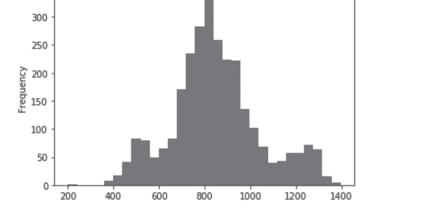

现在假设我们想为工作日生成一个直方图，为周末生成一个直方图，我们该怎么做？我们可以尝试这样：◆

```
( df_summarized_orders
    [df_summarized_orders.DATE.dt.weekday < 5]
    .NUM_ORDERS
    .plot(kind='hist', bins=30) )

( df_summarized_orders
    [df_summarized_orders.DATE.dt.weekday >= 5]
    .NUM_ORDERS
    .plot(kind='hist', bins=30) )
```

<matplotlib.axes._subplots.AxesSubplot at 0x1a9b2768d0>

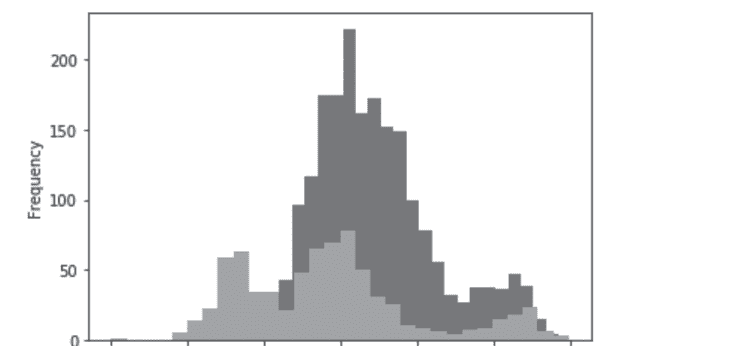

这两条语句与第一条完全相同，只有一个例外——第一条将订单过滤到工作日（数字小于五的天），第二条过滤到周末（数字大于或等于五的天）。注意我们如何使用dt.weekday来获取每个日期的工作日。

这几乎是我们想要的，但图表有三个问题。首先，它们的刻度明显不同，这使得它们难以比较。你能找出原因吗？◆ 这仅仅是因为周末天数远少于工作日，因此图表中每个“条形”的订单数量在周末较低。我们可以通过使用density=True参数来简单解决这个问题，我们在6.5.2节中讨论过。◆

第二个问题是第二个图表遮挡了第一个图表的部分内容。我们可以使用alpha参数（我们以前没见过）来解决这个问题；通过向plot()函数传递alpha=0.5，我们可以使图表略微透明。

最后一个问题是图表没有图例，因此很难知道哪个图表显示工作日，哪个显示周末。我们可以使用plt.legend(['Weekdays', 'Weekends'])添加一个图例；注意列表中项目的顺序与图表生成的顺序相匹配。最终代码如下：

```
( df_summarized_orders
    [df_summarized_orders.DATE.dt.weekday < 5]
    .NUM_ORDERS
    .plot(kind='hist', bins=30, density=True) )

( df_summarized_orders
    [df_summarized_orders.DATE.dt.weekday >= 5]
    .NUM_ORDERS
    .plot(kind='hist', bins=30, density=True, alpha=0.5) )

plt.legend(['Weekdays', 'Weekends'])
```

<matplotlib.legend.Legend at 0x1a6925dd50>

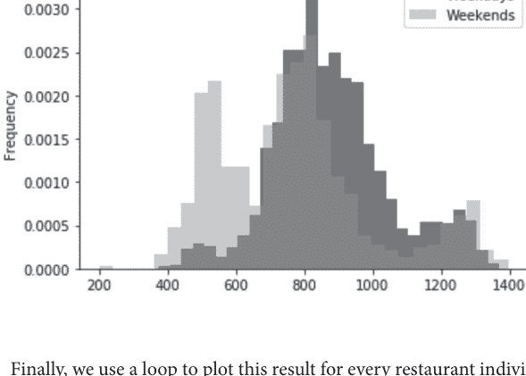

最后，我们使用循环为每家餐厅单独绘制此结果。如果你想挑战一下，请在继续阅读之前自己尝试：◆

248 第二部分

```
# 将df_summarized_order DataFrame重命名以缩短
# 我们的代码
df_so = df_summarized_orders

# 遍历每家餐厅
for r in df_so.RESTAURANT_NAME.unique().tolist():
    # 打印餐厅名称
    print(r)

    # 将订单过滤到这家餐厅
    df = df_so[df_so.RESTAURANT_NAME == r]

    # 绘制工作日和周末直方图
    ( df[df.DATE.dt.weekday < 5]
        .NUM_ORDERS.plot(kind='hist', bins=30,
                         density=True) )

    weekend_rows = (df.DATE.dt.weekday >= 5)
    if weekend_rows.sum() > 0:
        ( df[weekend_rows]
            .NUM_ORDERS.plot(kind='hist', bins=30,
                             density=True, alpha=0.5) )

    # 创建图例
    plt.legend(['Weekday', 'Weekend'])

    # 在循环的每个阶段显示图表
    plt.show()
```

让我们逐行分析（同样，以下数字指的是代码中的行号）：

- 3. `df_so = df_summarized_orders`
    这一行只是将`df_summarized_orders` DataFrame“重命名”为更短的名称，以缩短代码——这纯粹是为了美观。
- 6. `for r in df_so.RESTAURANT_NAME.unique().tolist():`
    这一行首先创建一个包含每个唯一餐厅的列表，并遍历它。我们将包含每家餐厅名称的变量称为`r`。因此`r`将首先包含Bryant Park，然后是Columbia，接着是Flatiron，依此类推。

## 8. print(r)
这行代码只是打印餐厅的名称，这样我们就能知道我们正在查看的是哪一家餐厅。

## 11. df = df_so[df_so.RESTAURANT_NAME == r]
这行代码从完整的汇总订单 DataFrame 中筛选出与餐厅 `r` 相关的行。我们后续的代码都将基于这个筛选后的 DataFrame `df` 进行。

## 14.
这行代码将 `df` 筛选为工作日的行——具体来说，是那些 `df.DATE.dt.weekday < 5`（周一至周五）的行，然后像之前一样绘制直方图。

## 18.
这行代码创建了一个名为 `weekend_rows` 的序列，其行数与 `df_so_filtered` 相同。如果某行对应的是周末，则该序列中该位置的值为 `True`，否则为 `False`。

## 19.
这行代码是我们之前不需要使用的。它检查该餐厅是否至少有一个周末行，并且仅在存在周末行时才绘制周末直方图。这是必需的，因为不幸的是，基于一个没有行的 DataFrame 绘制直方图会导致 pandas 错误。

## 20.
绘制周末直方图，如我们之前所见。

## 25.
显示图例。

## 28. plt.show()
最后，最后一行代码立即显示我们创建的图表。我们需要这行代码，因为如果不包含它，Python 会将*所有*这些直方图叠加绘制在一个图中，而不是逐个绘制。你可以尝试去掉最后一行语句，看看效果会是什么样。

由于篇幅限制，我们不会在这里重现每一个生成的直方图，但让我们看看生成的前三个直方图：

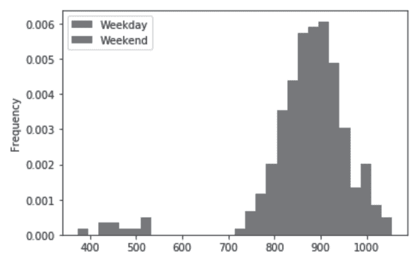

#### 哥伦比亚店

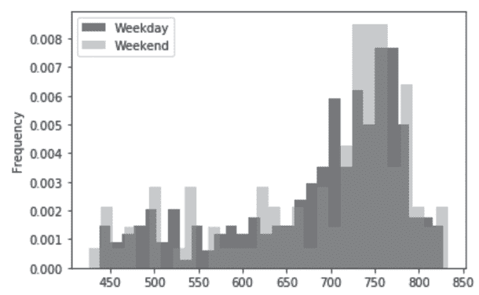

#### 平铁店

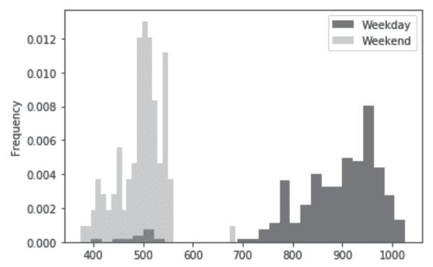

这些直方图提供了每家餐厅订单模式的丰富视图。花些时间详细审视它们，并弄清楚这些图表意味着什么。◆ 以下是一些让我们印象深刻的地方：

-   布莱恩特公园店只有一个直方图（工作日的），没有周末的——这很合理，因为我们之前发现布莱恩特公园店周末不营业。
-   对于某些门店（如哥伦比亚店），工作日和周末的分布是相同的——似乎该门店在工作日和周末接待的顾客数量一样多。而对于其他门店，如平铁店和中城店，分布则截然不同。工作日的订单量远多于周末。考虑到这两个社区位于商业区，周末客流量可能较小，这同样不足为奇。
-   对于平铁店，有趣的是注意到周末的分布比工作日的分布窄得多，而工作日的分布更宽、更平坦。这意味着周末的订单量比工作日更确定，这可能使得这些餐厅在周末更容易提前安排人手。

### 6.10 总结

本章涵盖了很多内容。我们介绍了本书中将要使用的大部分 pandas 基础功能，并且我们发现即使是这些基础工具也能带来重要的业务洞察。

然而，到目前为止，我们的分析只涉及了*一个*数据集。在实践中，你可能需要回答的许多问题将需要查询多个数据集并将其相互结合。在下一章中，我们将讨论如何使用 pandas 组合多个数据集以进行更复杂的分析。

# 7
## 组合数据集

**我们现在**已经全面了解了 pandas 中可以执行的各种操作。我们讨论了 pandas 如何存储、读取和写入数据，也讨论了你可以在 Python 中探索、操作和修改数据的各种方式。

然而，有些东西缺失了。回想一下第 5 章中 Dig 的案例研究——故事中反复出现的一个关键主题是能够组合*多个*数据集以进行有意义分析的重要性。例如，回想一下 Dig 使用多个系统来跟踪每组人力资源数据，而这些系统产生的数据集需要被组合起来才能进行有意义的分析。

在本章中，我们将讨论为什么以及如何组合多个数据集。然后，我们将探讨 pandas 提供的用于执行此类操作的方法。

### 7.1 本章学习目标

本章有两个目标。第一个是教你如何思考涉及多个数据集的操作。组合数据集有哪些不同的方式？何时应该选择哪种方式？第二个是向你介绍实际执行这些各种连接操作的 pandas 语法。在讨论完这两个主题后，我们将通过将它们应用于 Dig 订单数据集来结束本章。

### 7.2 本章所需准备

在开始之前，请为本章创建一个新的 *Jupyter Notebook*，以及一个名为“第 7 章”的文件夹，用于保存本章过程中的文件。你应该在第 5.2 节创建的第二部分章节文件夹中创建笔记本和文件夹。

我们要做的第一件事是导入一些需要的包。将以下代码粘贴到第一个单元格中并运行：

```
import pandas as pd
import matplotlib.pyplot as plt
```

接下来，我们将加载一些在第 5 章末尾保存的文件。为此，请将以下代码粘贴到下一个单元格中并运行（我们直到第 7.9 节才会使用这些文件）：

```
df_orders = pd.read_pickle('Chapter 5/orders.pickle')
df_items = pd.read_pickle('Chapter 5/items.pickle')
df_restaurants = (
    pd.read_pickle('Chapter 5/restaurants.pickle') )
```

一如既往，本章的 *Jupyter Notebook* 以及上一章的文件都可以在本书的网站上找到。

### 7.3 组合数据集：简介

在开始之前，值得问一下“组合数据集”是什么意思，以及为什么这个操作可能很重要。最好通过例子来说明，所以让我们考虑几个例子：

-   在 Dig 订单数据集中，每个订单包含订单中每个商品的 ID，但不包含商品的*名称*。一个单独的数据集包含 ID 及其对应的名称。要生成订单中每个商品的列表，就需要组合这两个数据集。
-   考虑一个大学数据库，包含以下三个表：
    -   一个表包含全日制学生的姓名及其详细信息（例如，他们的指导教师姓名）
    -   一个表包含非全日制学生的姓名及其详细信息（例如，他们的指导教师姓名）
    -   一个表包含学生在特定课程（例如，“Python 入门”）中的成绩
    这三个数据集本身都很有用，但许多问题的答案将需要*组合*这些数据集。例如，假设你想找出所有在“Python 入门”中获得 B 或以下成绩的学生及其指导教师？或者，如果你想给每位指导教师一份关于其指导的所有学生的报告？又或者，如果你想了解是否有指导教师负责了不成比例的低绩效学生？
-   考虑一家网约车公司，有三个数据集——一个列出所有司机，一个详细说明每位司机上个月的驾驶历史（针对有驾驶记录的司机），还有一个包含发送给司机设备的推送通知记录，鼓励他们使用应用并接载乘客（针对收到此类通知的司机）。我们可能对推送通知对司机驾驶频率的影响感兴趣——这些洞察将需要组合来自两个数据集的数据。
-   考虑一家电子商务公司，有多个表：
    -   一个列出公司网站上的所有订单
    -   一个列出所有客户及其详细信息
    -   一个列出所有产品及其特性
    公司可能想知道具有某些特性的产品是否比其他产品更受欢迎，或者客户特性如何与订单模式相关（例如，东海岸的客户是否比西海岸的客户下单更频繁？）。回答这些问题需要组合来自所有这些数据集的数据。
-   考虑一个呼叫中心，有多个表：
    -   一个包含呼叫中心每位员工的姓名
    -   一个包含工资详情，列出支付给每位员工的款项
    -   一个包含每次呼叫的记录以及呼叫时长

许多问题可能需要结合这些数据集。例如，将每位员工的通话次数与其薪资相关联。

能够以刚才描述的方式组合数据集是 pandas 最有用的功能之一，但要正确应用它可能有点棘手。要充分阐述这个主题，本身就需要一本书，或许可以叫做 *MBA的数据库*（敬请期待……）。在本章中，我们将提供基础知识让你入门，并解释如何在 pandas 中应用它们。

### 7.4 一些示例数据集

在我们“毕业”使用 Dig 数据集之前，我们将使用一些受之前大学示例启发的简单“示例”数据集来练习连接数据集的机制。这些数据集在一个 Excel 工作簿中，每个数据集占一个工作表。我们在第 5.2 节下载了这个工作簿，我们可以如下加载这些数据集：

```python
df_full_time = pd.read_excel('raw data/university.xlsx',
                            sheet_name='full_time')
df_part_time = pd.read_excel('raw data/university.xlsx',
                            sheet_name='part_time')
df_grades = pd.read_excel('raw data/university.xlsx',
                          sheet_name='grades')
```

让我们看看每个数据集。首先是 `df_full_time` 数据框，它包含全日制学生的详细信息（通常，我们会使用 `head()` 只打印前几行，但在接下来的内容中，拥有整个表格会很有用）：

```python
df_full_time
```

| | student_id | first_name | last_name | adviser |
|---|---|---|---|---|
| 0 | 1 | Melvin | Ware | Prof Duncan |
| 1 | 2 | Thomas | Moore | Prof Brown |
| 2 | 3 | Joseph | Paul | Prof Alvarez |
| 3 | 4 | Sarah | Cruz | Prof Duncan |

其次是 `df_part_time` 数据框，它包含兼职学生的详细信息：

| student_id | first_name | last_name | adviser |
|---|---|---|---|
| 0 | 5 | David | Freeman | Prof Duncan |
| 1 | 6 | Elizabeth | Brown | Prof Duncan |
| 2 | 7 | Amanda | Schultz | Prof Kennedy |
| 3 | 8 | Tanner | Perkins | Prof Alvarez |
| 4 | 9 | Ashley | Gonzales | Prof Kennedy |
| 5 | 10 | Latonya | Porter | Prof Alvarez |
| 6 | 11 | Jacinda | Peterson | Prof Alvarez |

最后是 `df_grades` 数据框，它包含所有参加了“Python 入门”课程的学生的成绩：

| student_id | final_grade |
|---|---|
| 0 | 1 | 95 |
| 1 | 3 | 71 |
| 2 | 6 | 76 |
| 3 | 7 | 91 |
| 4 | 8 | 75 |
| 5 | 11 | 59 |
| 6 | 15 | 86 |

目前，让我们专注于一个简单的任务——生成一个数据集，列出每位参加了“Python 入门”课程的学生的姓名、导师和最终成绩。你可能从一开始就注意到几个问题。首先，学生信息分布在两个文件中。其次，成绩在另一个单独的文件中。第三，成绩文件中包含的一名学生在学生信息文件中不存在（学生 ID 15）。

最后这个错误乍一看可能很奇怪——一个学生怎么可能在学生信息表中不存在却被分配了成绩呢？不幸的是，由于各种原因（例如，学生可能已经离校并从学生表中删除，或者有人在输入成绩时可能只是犯了个错误），这种错误在真实数据集中经常发生。我们不仅需要优雅地处理这种情况，还需要能够检测到这个问题，以便我们意识到数据中可能存在的错误。

### 7.5 五种连接类型

我们现在准备好开始组合表了。先快速说明一下：在 pandas 中组合表的方式多得令人眼花缭乱，它们在某种程度上做的都是差不多的事情（从某种意义上说，这证明了这些操作的重要性）。对于初学者来说，这些主题本身就足够复杂了，再加上许多相互竞争的替代方法带来的额外困惑。因此，在本节中，我们特意选择只介绍每种连接类型的一种方法——我们认为最通用的那种。随着你处理数据的经验越来越丰富，你会熟悉其他可用的方法。

#### 7.5.1 并集

组合两个表的第一种——也是最简单的方法——叫做 *并集*。当两个表基本上是一个被一分为二的表的两个部分时，这种方法很有用。这可能由多种原因造成——有时，表太大无法一次传输，需要分成几部分。在其他情况下——比如这里的例子——表被分成了逻辑部分：一个表是全日制学生，另一个是兼职学生。并集会将这些不同的部分简单地合并成一个大表。要在 pandas 中执行并集，只需使用 `pd.concat()` 函数，并将要连接的数据框的 *列表* 传递给该函数：

```python
df_students = pd.concat([df_full_time, df_part_time])
df_students
```

| | student_id | first_name | last_name | adviser |
|---|---|---|---|---|
| 0 | 1 | Melvin | Ware | Prof Duncan |
| 1 | 2 | Thomas | Moore | Prof Brown |
| 2 | 3 | Joseph | Paul | Prof Alvarez |
| 3 | 4 | Sarah | Cruz | Prof Duncan |
| 0 | 5 | David | Freeman | Prof Duncan |
| 1 | 6 | Elizabeth | Brown | Prof Duncan |
| 2 | 7 | Amanda | Schultz | Prof Kennedy |
| 3 | 8 | Tanner | Perkins | Prof Alvarez |

有几点值得注意：

- 一个常见的错误是忘记将数据框放入列表中，而是输入 `pd.concat(df_full_time, df_part_time)` 而不是这里显示的内容——这会导致错误。
- 每个被合并的原始数据框的行索引都会保留在最终的数据框中。这可能导致索引重复。例如，注意在前面的表格中，Daniel Smith 和 Linda Thiel 的行索引都是 0。我们在本书中不太使用行索引，所以理论上这没什么问题，但你可能想重置索引以确保索引是唯一的：

```python
df_students = ( pd.concat([df_full_time, df_part_time])
                .reset_index(drop=True) )
df_students
```

| | student_id | first_name | last_name | adviser |
|---|---|---|---|---|
| 0 | 1 | Melvin | Ware | Prof Duncan |
| 1 | 2 | Thomas | Moore | Prof Brown |
| 2 | 3 | Joseph | Paul | Prof Alvarez |
| 3 | 4 | Sarah | Cruz | Prof Duncan |
| 4 | 5 | David | Freeman | Prof Duncan |
| 5 | 6 | Elizabeth | Brown | Prof Duncan |
| 6 | 7 | Amanda | Schultz | Prof Kennedy |

你可能希望最终的表能追踪原始行的来源。我们可以通过在连接表之前向每个组成表添加一个指示列来实现这一点：

```python
df_full_time['student_type'] = 'full_time'
df_part_time['student_type'] = 'part_time'
pd.concat([df_full_time, df_part_time]).reset_index(drop=True)
```

| student_id | first_name | last_name | adviser | student_type |
|---|---|---|---|---|
| 0 | 1 | Melvin | Ware | Prof Duncan | full_time |
| 1 | 2 | Thomas | Moore | Prof Brown | full_time |
| 2 | 3 | Joseph | Paul | Prof Alvarez | full_time |
| 3 | 4 | Sarah | Cruz | Prof Duncan | full_time |

要使用并集组合的表需要具有相同的列。

#### 7.5.2 内连接、外连接、左连接和右连接

我们现在来看第二个问题。假设我们想组合 `df_grades` 和 `df_students` 来生成类似这样的内容：

| student_id | final_grade | first_name | last_name |
|---|---|---|---|
| 0 | 1 | 95 | Melvin | Ware |
| 1 | 3 | 71 | Joseph | Paul |
| 2 | 6 | 76 | Elizabeth | Brown |
| 3 | 7 | 91 | Amanda | Schultz |
| 4 | 8 | 75 | Tanner | Perkins |
| 5 | 11 | 59 | Jacinda | Peterson |

这看起来很简单，对吧？唉，说到连接，细节决定成败！我们需要的第一件事是一种告诉 pandas 如何将一个表的行与另一个表的行匹配的方法。这通过例子最容易说明。pandas 如何知道 `df_students` 中的一行与 `df_grades` 中的一行匹配？在这个例子中，这很简单——它会查找 `student_id` 值相同的行。这个列是这个特定连接的连接键，也是每个连接的第一个要素。通常，连接键将是一个唯一标识每一行的列——有时甚至是两个列，正如我们稍后将看到的。一旦我们弄清楚了这一点，唉，还有一个复杂情况——如果一个 `student_id` 出现在一个表中但不在第二个表中，或者反过来，会发生什么？在这种情况下，正如我们刚刚看到的，`student_id` 15 出现在 `df_grades` 中但不在 `df_students` 中，而 `student_id` 2 没有选修“Python 入门”课程，因此该学生没有出现在 `df_grades` 中。当这种情况发生时，我们可以做三件事：

-   只包含出现在*两个*表中的行——如果某行在一个表或另一个表中缺失，则丢弃它。这被称为*内连接*，对于我们这两个表，它看起来像这样：

| student_id | final_grade | first_name | last_name |
|---|---|---|---|
| 0 | 1 | 95 | Melvin | Ware |
| 1 | 3 | 71 | Joseph | Paul |
| 2 | 6 | 76 | Elizabeth | Brown |
| 3 | 7 | 91 | Amanda | Schultz |
| 4 | 8 | 75 | Tanner | Perkins |
| 5 | 11 | 59 | Jacinda | Peterson |

-   包含*所有行*，无论它们是否出现在一个表、另一个表或两个表中。这被称为*外连接*。结果看起来像这样：

| student_id | final_grade | first_name | last_name | adviser |
|---|---|---|---|---|
| 0 | 1 | 95.0 | Melvin | Ware | Prof Duncan |
| 1 | 3 | 71.0 | Joseph | Paul | Prof Alvarez |
| 2 | 6 | 76.0 | Elizabeth | Brown | Prof Duncan |
| 3 | 7 | 91.0 | Amanda | Schultz | Prof Kennedy |
| 4 | 8 | 75.0 | Tanner | Perkins | Prof Alvarez |
| 5 | 11 | 59.0 | Jacinda | Peterson | Prof Alvarez |
| 6 | 15 | 86.0 | NaN | NaN | NaN |
| 7 | 2 | NaN | Thomas | Moore | Prof Brown |
| 8 | 4 | NaN | Sarah | Cruz | Prof Duncan |
| 9 | 5 | NaN | David | Freeman | Prof Duncan |
| 10 | 9 | NaN | Ashley | Gonzales | Prof Kennedy |
| 11 | 10 | NaN | Latonya | Porter | Prof Alvarez |

请注意，当某个条目在一个表中缺失时，pandas 会简单地用特殊值 `NaN` 填充相应的条目，`NaN` 表示缺失值（请参阅第 6.7.2 节以作提醒）。例如，学生 ID 15 的姓名和学生 ID 2 的最终成绩就是这种情况。

-   包含一个表或另一个表中的所有行。例如，我们可以保留 `df_grades` 表中的所有行并得到这个：

| student_id | final_grade | first_name | last_name |
|---|---|---|---|
| 0 | 1 | 95 | Melvin | Ware |
| 1 | 3 | 71 | Joseph | Paul |
| 2 | 6 | 76 | Elizabeth | Brown |
| 3 | 7 | 91 | Amanda | Schultz |
| 4 | 8 | 75 | Tanner | Perkins |
| 5 | 11 | 59 | Jacinda | Peterson |
| 6 | 15 | 86 | NaN | NaN |

或者保留 `df_students` 表中的所有行并得到这个：

| student_id | final_grade | first_name | last_name |
|---|---|---|---|
| 0 | 1 | 95.0 | Melvin | Ware |
| 1 | 2 | NaN | Thomas | Moore |
| 2 | 3 | 71.0 | Joseph | Paul |
| 3 | 4 | NaN | Sarah | Cruz |
| 4 | 5 | NaN | David | Freeman |
| 5 | 6 | 76.0 | Elizabeth | Brown |
| 6 | 7 | 91.0 | Amanda | Schultz |
| 7 | 8 | 75.0 | Tanner | Perkins |
| 8 | 9 | NaN | Ashley | Gonzales |
| 9 | 10 | NaN | Latonya | Porter |
| 10 | 11 | 59.0 | Jacinda | Peterson |

在进行这种连接时，我们通常将一个表称为“左表”，另一个表称为“右表”。哪个是哪个并不重要，但在本例中，让我们将 `df_grades` 称为“左表”，将 `df_students` 称为“右表”。左连接是保留“左表”中所有行的连接。右连接是保留“右表”中所有行的连接。

### 7.6 PANDAS 中的连接

总结一下，我们已经看到了在 Python 中组合表的五种方式。第一种是并集，它只是将一个表的两个部分组合在一起。
接下来的四种使用连接键组合表。这类连接有五个“要素”：

-   左表 (`df_grades`)
-   右表 (`df_students`)
-   左表中包含要连接的值的列 (`student_id`)
-   右表中包含要连接的值的列 (`student_id`)
-   连接类型

下表总结了这四种连接类型，以及这些连接的维恩图表示，其中每个圆圈代表一个表：

| 连接类型 | 描述 |
| :--- | :--- |
| 左连接 | 保留左侧数据集中的所有行。如果右侧数据集中的行存在，则将其带入。 |
| 右连接 | 保留右侧数据集中的所有行。如果左侧数据集中的行存在，则将其带入。 |
| 内连接 | 仅保留在左侧和右侧数据集中都存在的行。 |
| 外连接 | 保留所有行。 |

在第 7.7 节中，我们将回到如何选择正确连接类型的主题，这有时可能很棘手。在本节中，我们将重点介绍在 Python 中执行连接的机制。
并集使用 `concat()` 函数完成，正如我们在第 7.5.1 节中讨论的那样。其余的连接使用 `pd.merge()` 完成。运行以下代码：

```
pd.merge(df_grades,
         df_students,
         left_on='student_id',
         right_on='student_id',
         how='left',
         validate='one_to_one')
```

| student_id | final_grade | first_name | last_name | adviser |
|---|---|---|---|---|
| 0 | 1 | 95 | Melvin | Ware | Prof Duncan |
| 1 | 3 | 71 | Joseph | Paul | Prof Alvarez |
| 2 | 6 | 76 | Elizabeth | Brown | Prof Duncan |
| 3 | 7 | 91 | Amanda | Schultz | Prof Kennedy |
| 4 | 8 | 75 | Tanner | Perkins | Prof Alvarez |
| 5 | 11 | 59 | Jacinda | Peterson | Prof Alvarez |

下图说明了如何在函数中指定连接的每个要素：

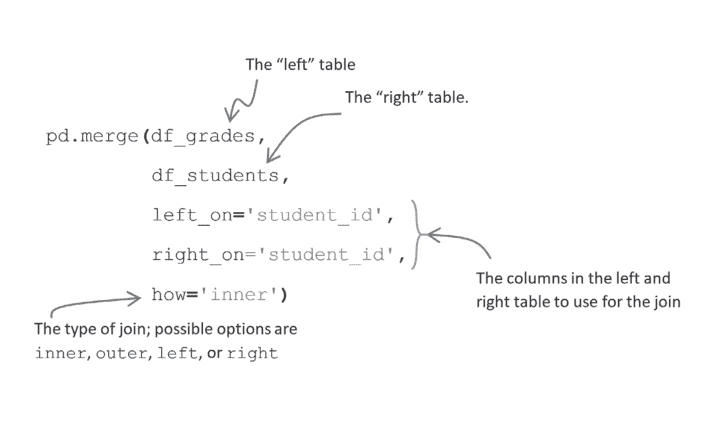

这里有几个要点值得说明：

-   `pd.merge()` 会包含两个表中的每一列。没有办法告诉它只包含某些列，但你可以通过在组合表之前选择表中的列来轻松实现这一点。例如：

```
python
df_result = pd.merge(df_grades,
    df_students[['student_id', 'first_name', 'last_name']],
    left_on='student_id',
    right_on='student_id',
    how='left')
```

| student_id | final_grade | first_name | last_name |
|---|---|---|---|
| 0 | 1 | 95 | Melvin | Ware |
| 1 | 3 | 71 | Joseph | Paul |
| 2 | 6 | 76 | Elizabeth | Brown |
| 3 | 7 | 91 | Amanda | Schultz |
| 4 | 8 | 75 | Tanner | Perkins |
| 5 | 11 | 59 | Jacinda | Peterson |
| 6 | 15 | 86 | NaN | NaN |

-   如果左右表都有同名列，你可能会遇到麻烦——结果表中有两个同名列是没有意义的。如果 pandas 检测到这一点，它会尝试通过在左表和右表的列名后分别添加后缀 `_x` 和 `_y` 来解决冲突。然而，我们强烈建议你不要依赖此功能；一个函数可能会根据调用上下文更改或不更改列名，这可能导致代码混乱。相反，请尝试在执行连接之前使用 `rename()` 函数（第 5.5.3 节）。

-   在前面的示例中，连接键仅包含*一*列。在某些情况下，可能需要使用*两*列或更多列。例如，假设全职学生和兼职学生各有自己的用户 ID 集（即全职学生编号为 1、2、3、...，兼职学生编号为 1、2、3、...）。那么我们需要*同时*使用学生 ID *和*他们的全职或兼职状态来唯一标识学生并执行连接。`pd.merge()` 使这变得简单——你只需将列表而不是字符串传递给 `left_on` 和 `right_on`。我们稍后会看到这方面的示例。

-   如果既没有向 `pd.merge()` 提供 `left_on` 也没有提供 `right_on`，pandas 将自动查找*两个*表中存在的任何列，并使用这些列来执行连接。此外，如果包含连接键的列在两个表中的名称相同，我们可以使用 `on` 参数而不是同时指定 `left_on` 和 `right_on`。在本书中，为了清晰起见，我们将始终指定这两个参数。

#### 7.6.1 索引对齐

最后，一种完全不同的在 pandas 中快速执行左连接的方法有时可以作为快捷方式使用，那就是*索引对齐*。要使此方法有效，连接键必须是两个表的行索引。
首先创建 `df_grades` 和 `df_students` 的副本，将两个表的索引设置为 `student_id`，并提醒自己每个表包含什么：

```
df_grades_2 = df_grades.copy().set_index('student_id')
df_grades_2.head()
```

| student_id | final_grade |
|---|---|
| 1 | 95 |
| 3 | 71 |
| 6 | 76 |
| 7 | 91 |
| 8 | 75 |

```
df_students_2 = df_students.copy().set_index('student_id')
df_students_2.head()
```

| student_id | first_name | last_name | adviser |
|---|---|---|---|
| 1 | Melvin | Ware | Prof Duncan |
| 2 | Thomas | Moore | Prof Brown |
| 3 | Joseph | Paul | Prof Alvarez |
| 4 | Sarah | Cruz | Prof Duncan |
| 5 | David | Freeman | Prof Duncan |

现在运行以下代码行，并查看 `df_students_2`：

```python
df_students_2['python_grade'] = df_grades_2.final_grade
df_students_2
```

| student_id | first_name | last_name | adviser | python_grade |
|---|---|---|---|---|
| 1 | Melvin | Ware | Prof Duncan | 95.0 |
| 2 | Thomas | Moore | Prof Brown | NaN |
| 3 | Joseph | Paul | Prof Alvarez | 71.0 |
| 4 | Sarah | Cruz | Prof Duncan | NaN |
| 5 | David | Freeman | Prof Duncan | NaN |
| 6 | Elizabeth | Brown | Prof Duncan | 76.0 |
| 7 | Amanda | Schultz | Prof Kennedy | 91.0 |
| 8 | Tanner | Perkins | Prof Alvarez | 75.0 |
| 9 | Ashley | Gonzales | Prof Kennedy | NaN |
| 10 | Latonya | Porter | Prof Alvarez | NaN |
| 11 | Jacinda | Peterson | Prof Alvarez | 59.0 |

发生了什么？pandas 自动*对齐*了两个表中的行索引。它实际上以行索引为连接键执行了一次*左连接*，并引入了我们赋值的序列。`df_students_2` 中任何在 `df_grades` 中没有匹配行的行，其值都会被填充为 NaN，而 `df_grades` 中任何在 `df_students_2` 中没有匹配行的行则会被忽略。

这是 pandas 在你尝试执行涉及两个不同索引的序列的操作时总会做的事情，但我们在此不再深入探讨。

### 7.7 选择正确的连接类型

通常，判断何时需要联合（union）很简单——明显的标志是表被分成了两部分。然而，当需要其他类型的连接时，判断正确的连接是内连接、外连接、左连接还是右连接就有点困难了。在本节中，我们将首先回顾前面的例子，然后看几个其他例子，并讨论在每种情况下哪种类型的连接最合适。

#### 7.7.1 回顾我们的第一个例子

让我们首先考虑前面的例子（`df_grades` 作为左表，`df_students` 作为右表）。要生成一个包含学生姓名及其 Python 成绩的列表，哪种连接是正确的？◆

你最初可能倾向于使用内连接，只包含那些存在于我们的数据库中*并且*选修了 Python 入门课程的学生。你或多或少是对的——内连接在这个例子中确实有效。

然而，也有理由进行*左连接*，这将保留 `df_grades` 中的每一行，无论 `df_students` 中是否存在对应的学生。为什么？仅仅因为如果一个学生选修了“Python 入门”（因此出现在 `df_grades` 中）但*不在* `df_students` 中，你可能想知道——这可能反映了某些数据库错误。进行内连接会完全掩盖这些数据问题。

如果我们进行左连接，任何在 `df_students` 中缺失的学生，其 `first_name` 和 `last_name` 的值都将被引入为 NaN。我们可以统计这些行并打印警告，然后删除这些行：◆

```python
df_result = pd.merge(df_grades,
    df_students[['student_id', 'first_name', 'last_name']],
    left_on='student_id',
    right_on='student_id',
    how='left')

if df_result.first_name.isnull().sum() > 0:
    print('Warning! df_students is missing some students.')

df_result = df_result[df_result.first_name.notnull()]
df_result
```

Warning! df_students is missing some students.

| student_id | final_grade | first_name | last_name |
|---|---|---|---|
| 0 | 1 | 95 | Melvin | Ware |
| 1 | 3 | 71 | Joseph | Paul |
| 2 | 6 | 76 | Elizabeth | Brown |
| 3 | 7 | 91 | Amanda | Schultz |
| 4 | 8 | 75 | Tanner | Perkins |
| 5 | 11 | 59 | Jacinda | Peterson |

#### 7.7.2 更多练习

选择正确的连接类型是一个重要——有时也很棘手——的话题，所以让我们用我们在 7.3 节开头简要提到的拼车例子来多加练习。假设我们有以下数据集：

- `df_drivers` 列出了所有司机及其 `driver_id`、`driver_name` 和 `driver_age`。
- `df_driving` 列出了上个月所有开车的司机、他们的 `driver_id` 以及他们上个月开车的 `num_hours`。
- `df_notifications` 列出了上个月收到推送通知的所有司机、他们的 `driver_id` 和 `num_notifications`（即他们收到的通知数量）。

我们应该使用哪种连接取决于我们想要问的问题。让我们考虑几个例子；一如既往，我们鼓励你在急于阅读答案之前，先对每个问题进行一些思考：

- “司机们上个月平均开车多少小时？” ◆ 这个问题可以有两种解释：
  - 如果我们想找出*上个月开过车的司机*的平均开车小时数，我们只需要 ◆ `df_driving.num_hours.mean()`——我们不需要任何连接，因为该表包含了所有开过车的司机。
  - 如果我们想找出*所有司机*的平均开车小时数，我们可以使用多种方法，但既然我们在讨论连接，那就用这种方法。我们将执行以下操作：◆

```python
df_res = pd.merge(df_drivers, df_driving,
                  left_on='driver_id',
                  right_on='driver_id',
                  how='left')
df_res.num_hours = df_res.num_hours.fillna(0)
df_res.num_hours.mean()
```

第一行在 `df_drivers` 和 `df_driving` 之间执行左连接。左连接是合适的，因为我们想要获得一个包含*所有司机*的表，无论他们是否开过车。这将生成一个表，其中每个司机占一行，对于上个月没有开车的司机，`num_hours` 列的值为 NaN。第二行将这些 NaN 值填充为零，因为这些司机没有开车。最后，最后一行计算平均值。

- “有多少司机既收到了通知*又*在上个月开车了？” 要回答这个问题，我们将执行以下操作：◆

```python
df_res = pd.merge(df_driving, df_notifications,
                  left_on='driver_id',
                  right_on='driver_id',
                  how='inner')
len(df_res)
```

第一行在 `df_driving` 和 `df_notifications` 之间执行内连接。在这种情况下，内连接是合适的，因为我们想要的是*同时*出现在两个表中的司机，即那些既开车*又*收到通知的司机。结果表将只包含同时在两个表中的司机，因此查看该表的行数就能得到我们想要的结果。

- “有多少司机收到了通知*或*在上个月开车了？” 要正确回答这个问题，我们将执行以下操作：◆

```python
df_res = pd.merge(df_driving, df_notifications,
                  left_on='driver_id',
                  right_on='driver_id',
                  how='outer')
len(df_res)
```

第一行在 `df_driving` 和 `df_notifications` 之间执行外连接。在这种情况下，外连接是合适的，因为我们想要的是出现在*任一*表中的司机——无论是他们开过车，还是收到过通知。结果表将包含我们关心的那些司机，因此该表的行数就是我们想要的结果。

连接这个话题很复杂，仅用一章的篇幅是无法详尽阐述的。这些例子应该提供了一个良好的起点，你可以在尝试自己的数据集时在此基础上进行扩展。

### 7.8 主键与连接

在结束我们对连接的介绍之前，我们需要讨论最后一个我们迄今为止一直视为理所当然的话题——*主键*。本节内容相当技术性，可以跳过而不会影响内容的连贯性。然而，这是一个关键话题，我们鼓励你至少略读一下。

主键是唯一标识表中一行的列（或列组）。每一行必须有自己的主键，并且它可以用于在另一个表中标识该行。

例如，在 7.5 节的 `df_full_time` 表中，主键是 `student_id`——每个学生都由其 ID 唯一标识。然后，这个 ID 可以在其他表（例如 `df_grades` 表）中用于引用特定的学生。

主键的主要要求是它应该是*唯一的*——不能有两行具有相同的主键，否则该键将不再唯一地代表该行。我们可以使用 pandas 的 `duplicated()` 函数来检查一列是否唯一：

```python
df_full_time_student_id.duplicated().sum()
```

0

`duplicated()` 函数返回一个序列，如果该行的值在 DataFrame 中是第一次出现，则为 `False`，如果该值之前出现过，则为 `True`。如果该列是唯一的且不包含重复项，我们期望该序列的总和为零。

在某些情况下，表的主键有*两*列。例如，考虑一家在每个国家都有多个独立网站的在线零售商。在这种情况下，订单 ID “1” 可能无法唯一标识一个订单，因为美国可能有一个订单 ID “1”，加拿大也可能有一个订单 ID “1”，等等。在这种情况下，一个有效的主键将是订单 ID *和*国家。值得庆幸的是，`duplicated()` 函数也适用于 DataFrame，因此你可以使用 `df_orders[['ORDER_ID', 'COUNTRY']].duplicated().sum()` 来检查这两列是否构成一个有效的主键。

为什么我们在连接（join）的上下文中引入主键？原因很简单，因为在本书中遇到的每一个连接操作里，两个连接键（分别位于左表或右表）中至少*有一个*是主键。例如：

- 当我们通过 `student_id` 连接 `df_grades` 和 `df_students` 时，该列是 `df_students` 的主键，因为它唯一标识了每个学生（同样，它也是 `df_grades` 的主键）。
- 在我们的网约车示例中，我们总是通过 `driver_id` 进行连接，而该列是相关两个表的主键。

这个主题之所以至关重要，是因为如果你使用 `pd.merge()` 且*两个*连接列都不是主键，pandas 不会报错（因为在某些超出本书范围的情况下，这样做是正确的）。然而，结果可能会与你的预期大相径庭。

因此，在每次连接之前，问自己一个问题至关重要：你的连接列中哪个应该是主键？你可以使用 `duplicated()` 方法来检查你的预期是否得到满足，但 `pd.merge()` 提供了一种更简单的方法。它允许你向函数传递一个 `validate` 参数。如果提供了该参数，函数将在执行合并之前自动检查主键。该参数可以取以下三个值之一：

- `one_to_one` 将确保*两个*表中的连接键都是唯一的
- `one_to_many` 将确保*左*表中的连接键是唯一的
- `many_to_one` 将确保*右*表中的连接键是唯一的

例如，在大学示例中，`student_id` 在两个表中都是唯一的，你可以运行以下代码：

```
pd.merge(df_grades,
         df_students,
         left_on='student_id',
         right_on='student_id',
         how='left',
         validate='one_to_one')
```

如果你指定的唯一性条件未得到满足，函数将抛出一个错误。

### 7.9 构建 DIG 订单数据集

正如我们在前一章中所做的，我们使用两个玩具数据集——df_grades 和 df_students——介绍了连接的概念。现在，我们准备回到 Dig 案例研究，并将所学知识应用于生产一个更有用的 df_orders 数据集版本。

让我们先回顾一下它的样子：

```
df_orders.head()
```

| RESTAURANT_ID | TYPE | DRINKS | COOKIES | MAIN | BASE | SIDE_1 | SIDE_2 |
|---|---|---|---|---|---|---|---|
| R10002 | IN_STORE | 1.0 | 2.0 | NaN | NaN | NaN | NaN |
| R10003 | IN_STORE | 0.0 | 0.0 | NaN | NaN | NaN | NaN |
| R10001 | DELIVERY | 0.0 | 2.0 | I0 | I7 | I15 | I14 |
| R10005 | PICKUP | 1.0 | 0.0 | I0 | I5 | I9 | I12 |

请注意，列出碗中物品的列（MAIN、BASE、SIDE_1 和 SIDE_2）只列出了物品的 ID，而不是其名称。这使得阅读订单变得困难。我们可能希望使用 df_items 表来引入物品名称，而不是它们的 ID：

```
df_items.head()
```

| ITEM_ID | ITEM_NAME | ITEM_TYPE |
|---|---|---|
| 0 | I7 | Farro with Summer Vegetables | Bases |
| 1 | I39 | Spindrift Lemon | Drinks |
| 2 | I5 | Classic Brown Rice | Bases |
| 3 | I36 | Kombucha | Drinks |
| 4 | I8 | Cauliflower with Garlic and Parmesan | Market Sides |

特别是，我们可能希望创建名为 MAIN_NAME、BASE_NAME、SIDE_1_NAME 和 SIDE_2_NAME 的列，包含这些名称而不是 ID。

在深入探讨之前，让我们先问自己，这里正确的连接类型是什么。暂停一下，看看你是否能想出来。◆ 答案是左连接，df_orders 在左侧。为什么？原因很简单，因为我们希望将订单列表作为我们的“基础数据集”（无意双关），保留所有这些订单，并引入物品名称。在这种情况下，依次讨论其他每种连接类型并理解它们为何不合适，是很有启发性的。

- 只要 df_orders 中的每个物品都存在于 df_items 中，内连接应该与左连接相同。为什么可能不是这样？除了数据错误，df_orders 可能引用了一个旧物品，该物品曾在旧菜单上销售，但后来因某种原因被停用并从数据库中移除。在这种情况下，执行内连接会删除任何涉及这些物品的订单。这几乎肯定是错误的做法，因为它会人为地使我们的订单看起来比实际少。即使这些订单中的物品已停用，订单仍然发生过，应该被计入。
- 外连接肯定会保留每个订单，但考虑一下如果 df_items 中存在从未被订购过的物品会发生什么。外连接会为这些物品创建额外的行，从而产生并不存在的“幽灵订单”。
- 右连接将是最糟糕的选择。它会人为地为从未被订购过的物品创建订单，并丢弃任何包含不在 df_items 中的物品的订单。

同样，订单表只包含餐厅 ID，而不是餐厅名称。我们可能希望使用 df_restaurants 表将餐厅名称引入一个名为 restaurant_name 的列：

```
df_restaurants.head()
```

| | RESTAURANT_ID | NAME | ADDRESS | LAT | LONG | OPENING_ |
|---|---|---|---|---|---|---|
| 0 | R10001 | Columbia | 2884 Broadway, New York, NY 10025 | 40.811470 | -73.961230 | 8/9. |
| 1 | R10002 | Midtown | 1379 6th Ave, New York, NY 10019 | 40.763640 | -73.977960 | 3/19. |
| 2 | R10005 | Flatiron | 40 W 25th St, New York, NY 10010 | 40.743600 | -73.991070 | 11/14. |

这里应该使用哪种连接？◆ 同样，出于相同的原因，我们希望使用左连接，df_orders 在左侧。

我们现在准备好深入探讨了。让我们从两个问题中较简单的一个开始——引入餐厅名称。回顾第 7.6 节并问自己这次连接的关键“要素”是什么，以及它们如何融入 `pd.merge()` 函数，可能会有所帮助。◆ 以下代码行应该能解决问题：

```
df_res = ( pd.merge(df_orders,
    df_restaurants[['RESTAURANT_ID', 'NAME']],
    left_on='RESTAURANT_ID',
    right_on='RESTAURANT_ID',
    how='left')
    .rename(columns={'NAME': 'RESTAURANT_NAME'}) )
```

如果你的答案与此不同，请花点时间看看在我们解释我们在做什么之前，你是否能理解我们的答案。◆

- 首先，我们指定 `df_orders` 为左表，`df_restaurants` 为右表。我们小心地只选择 `df_restaurants` 中的 `RESTAURANT_ID` 和 `NAME` 列，因为我们不想引入其他列（试着看看如果你忘记这样做会发生什么）。
- 其次，我们指定连接键在两个表中都位于名为 `RESTAURANT_ID` 的列中。
- 第三，我们指定我们想要一个左连接，正如我们刚才讨论的那样。
- 第四，我们将引入的 `NAME` 列重命名为 `RESTAURANT_NAME`（试着运行不带 `rename()` 函数的语句以理解其效果）。
- 第五，我们将结果保存在 `df_res` 中。我们将把它作为我们最终的“结果”DataFrame，我们将逐列向其添加内容。

让我们看看我们目前的劳动成果：

```
df_res.head()
```

| TYPE | DRINKS | COOKIES | MAIN | BASE | SIDE_1 | SIDE_2 | RESTAURANT_NAME |
|---|---|---|---|---|---|---|---|
| STORE | 1.0 | 2.0 | NaN | NaN | NaN | NaN | Midtown |
| STORE | 0.0 | 0.0 | NaN | NaN | NaN | NaN | Bryant Park |
| DELIVERY | 0.0 | 2.0 | I0 | I7 | I15 | I14 | Columbia |

请注意，我们已成功添加了一个包含餐厅名称的列。
现在让我们转向第二个任务——查找每个订单中物品的名称。让我们从 MAIN 列开始，创建一个名为 MAIN_NAME 的列。再次花点时间，看看你是否能想出这里连接的要素是什么。◆

- 左表现在将是 `df_res`，它只是我们原始的 `df_orders`，但带有我们新的 `RESTAURANT_NAME` 列。右表将是 `df_items`（如上所述，我们将选择我们关心的列——`ITEM_ID` 和 `ITEM_NAME`）。
- 我们第一次遇到连接键在两个表中不相同的连接。在左表中，包含我们关心的物品 ID 的列是 `MAIN`。在右表中，它是 `ITEM_ID`。
- 连接的类型是左连接，如前所述。

使用这些要素，我们的连接如下所示。◆ 请注意，我们尚未将结果保存到 `df_res` 中，而只是查看它。在完成之前，我们将对连接进行一些最终更改：

276 第二部分

```python
pd.merge(df_res,
         df_items[['ITEM_ID', 'ITEM_NAME']],
         left_on='MAIN',
         right_on='ITEM_ID',
         how='left')
.rename(columns={'ITEM_NAME':'MAIN_NAME'}).head()
```

| IES | MAIN | BASE | SIDE_1 | SIDE_2 | RESTAURANT_NAME | ITEM_ID | MAIN_NAME |
|---|---|---|---|---|---|---|---|
| 2.0 | NaN | NaN | NaN | NaN | Midtown | NaN | NaN |
| 0.0 | NaN | NaN | NaN | NaN | Bryant Park | NaN | NaN |
| 2.0 | I0 | I7 | I15 | I14 | Columbia | I0 | Charred Chicken Marketbowl |
| 0.0 | I0 | I5 | I9 | I12 | Flatiron | I0 | Charred Chicken Marketbowl |
| 0.0 | I1 | I7 | I9 | I9 | Williamsburg | I1 | Spicy Meatballs Marketbowl |

这个表格看起来基本符合预期。不过，还有一个小麻烦。结果中还包含一个名为`ITEM_ID`的列。要理解它的来源，让我们回顾一下我们正在连接的每个表中的列，并用一条线显示每个表中的连接键：

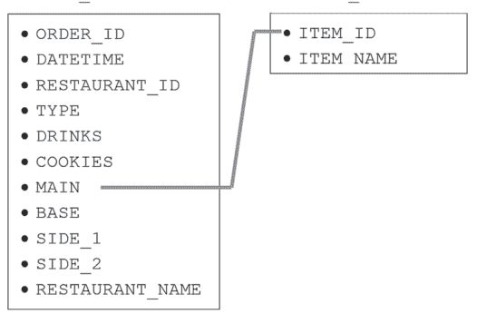

正如我们提到的，pandas总是会引入第二个表中的*所有*列——在这种情况下，这包括`ITEM_ID`列。当它正是我们用于连接的列时，我们几乎无法在连接之前删除该列！处理这个问题最简单的方法就是在最后直接删除该列：

```python
df_res = ( pd.merge(df_res,
                   df_items[['ITEM_ID', 'ITEM_NAME']],
                   left_on='MAIN',
                   right_on='ITEM_ID',
                   how='left')
          .rename(columns={'ITEM_NAME': 'MAIN_NAME'})
          .drop(columns='ITEM_ID') )
```

我们的最后一步是对其他列（`BASE`、`SIDE_1`和`SIDE_2`）执行相同的操作。一个简单的方法是直接复制粘贴上面的代码行并进行适当的修改。你能找出代码中哪些部分需要修改吗？◆ 只有两个简短的部分需要更改：第一个是`left_on`参数（例如，你需要将其更改为`BASE`以指定这是你想要引入的基础列），第二个是你在最后一行将列重命名*为什么*（新名称将是`BASE_NAME`）。最后，我们对`SIDE_1`和`SIDE_2`重复此过程（代码请参见本章的*Jupyter Notebook*）。

你可能已经想到，这种重复的代码复制粘贴正是循环的用途，确实，有一种方法可以使用循环来完成。为了节省篇幅，我们不会在这里打印它，但它作为可选单元格包含在本章的*Jupyter Notebook*中。我们强烈建议你在查看之前自己尝试一下。这里有一个提示：要找出你应该循环的变量，问问自己你在这里复制粘贴的是什么。◆

我们终于可以享受辛勤工作的成果了：

```python
df_res.head()
```

| RESTAURANT_NAME | MAIN_NAME | BASE_NAME | SIDE_1_NAME | SIDE_2_NAME |
| :--- | :--- | :--- | :--- | :--- |
| Midtown | NaN | NaN | NaN | NaN |
| Bryant Park | NaN | NaN | NaN | NaN |
| Columbia | Charred Chicken | Farro with Summer | Snap Peas | Green Goddess Beans with |

我们现在可以生成更有意义的图表。例如，假设我们想找出Dig销售的碗中最受欢迎的主菜：

```python
df_res.MAIN_NAME.value_counts().plot(kind='bar')
```

```
<matplotlib.axes._subplots.AxesSubplot at 0x109323750>
```

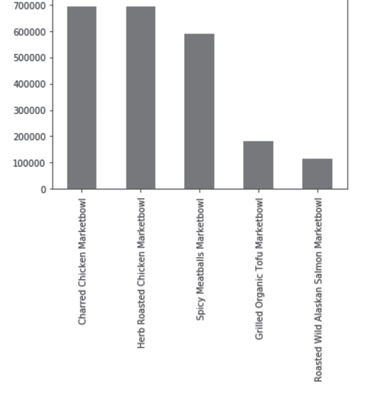

这个图表比使用ID时更容易解释。

### 7.10 总结

我们从讨论需要合并数据集的情况示例开始本章，并回顾了这些情况下可以使用的各种连接方式。

然后，我们将所学知识应用于创建Dig的`df_orders`数据集的一个更有用的版本。这个组合数据集将构成我们未来章节中大部分工作的基础。因此，让我们保存它，以确保我们以后可以重新加载它。

运行以下代码行：

```python
df_res.to_pickle('Chapter 7/orders.pickle')
```

本章涵盖的概念很复杂——实际上，它们可以构成一本关于数据库的完整书籍的基础。然而，我们的讨论应该为你提供坚实的基础，并为你在Python中处理多个数据集做好准备。我们将在本书的其余部分使用这些概念来进行涉及多个数据集的有用分析。

# 8
## 聚合

**我们现在准备好**学习最后一个主要主题——聚合。与连接一样，聚合是pandas提供的最有用的操作之一。聚合在任何需要合并pandas中的多行并计算一些汇总统计信息的情况下都很有用。你可以将聚合视为Excel数据透视表的增强版。

我们在6.5.3节介绍`mean()`函数时已经遇到了聚合的简单示例。例如，在Dig的`df_summarized_orders`数据集中，运行以下代码：

```python
df_summarized_orders.NUM_ORDERS.mean()
```

通过计算`NUM_ORDERS`列的平均值，将数据集中的每一行进行合并（*聚合*）。

在本章中，我们将对聚合的研究扩展到更复杂的情况，即我们希望对数据集的某些切片进行聚合。我们将在本章后面讨论几个这样的例子，但举一个例子，假设我们想找出*按餐厅*划分的平均订单数。当然，我们可以通过循环遍历每个餐厅的名称，将DataFrame过滤到该餐厅，然后分别计算剩余数据中的平均订单数来做到这一点。在本章中，我们将研究更高效的技术。

### 8.1 本章学习内容

我们从介绍聚合的基础知识开始本章——大致相当于在Excel中创建一个简单的数据透视表。然后我们考虑一些更高级的主题，例如使用多列进行聚合以及对日期和时间列进行聚合。

### 8.2 本章所需内容

在开始之前，请先为本章创建一个新的*Jupyter Notebook*，并放入你在5.2节创建的“第二部分”文件夹中。我们将首先导入一些需要的包。将以下代码粘贴到第一个单元格中并运行：

```python
import pandas as pd
import matplotlib.pyplot as plt
```

接下来，我们将加载一些在前面章节中保存的文件。为此，请将以下代码粘贴到下一个单元格中并运行：

```python
df_students = pd.read_pickle('Chapter 5/students.pickle')
df_summarized_orders = pd.read_pickle(
    'Chapter 5/summarized_orders.pickle')
df_orders = pd.read_pickle('Chapter 7/orders.pickle')
```

一如既往，本章的*Jupyter Notebook*以及前面章节的文件都可以在本书的网站上找到。

### 8.3 聚合基础

我们将从`df_students`数据集开始研究聚合，这个数据集足够小，可以清楚地看到每个聚合操作在做什么，并理解它是如何工作的。一旦我们掌握了这些基础知识，我们将转向更大、更真实的Dig数据集。

让我们先回顾一下数据集的样子：

```python
df_students.head()
```

| | FIRST_NAME | LAST_NAME | YEAR | HOME_STATE | AGE | CALC_101_FINAL | EN |
|---|---|---|---|---|---|---|---|
| 0 | Daniel | Smith | 1 | NY | 18 | 90.0 | |
| 1 | Ben | Leibstrom | 1 | NY | 19 | 80.0 | |
| 2 | Kavita | Kanabar | 1 | PA | 19 | NaN | |
| 3 | Linda | Thiel | 4 | CA | 22 | 60.0 | |
| 4 | Omar | Reichel | 2 | OK | 21 | 70.0 | |

对于我们的第一个基本操作，假设我们想找出每个学年学生的平均年龄。在这个阶段，我们已经知道足够多的知识来手动完成——你可以查看每个学年，将DataFrame过滤到该学年，然后找出平均年龄。但这太麻烦了。

幸运的是，有一个更简单的方法。pandas的`groupby()`函数允许我们用一行代码完成上述操作：

```python
df_students.groupby('YEAR').AGE.mean()
```

```
YEAR
1    18.2
2    20.0
3    20.0
4    22.0
Name: AGE, dtype: float64
```

让我们理解这个语句的每个部分——我们首先对`df_students`应用`groupby()`函数。我们传递`YEAR`列的名称，以指定我们希望按该列将数据集分成多个表。接下来，我们选择`AGE`列作为我们要进行计算的列。最后，我们应用`mean()`函数来找出该列的平均值。

几点说明：

-   观察结果的结构，注意它并未格式化为表格。正如我们之前所见，这表明输出是一个序列（Series），而非数据框（DataFrame）。该序列的结构是：索引给出特定的分组类别，值给出聚合函数的结果。通常，我们总是可以使用 `reset_index()` 将其转换为 DataFrame：

```python
df_students.groupby('YEAR').AGE.mean().reset_index()
```

| YEAR | AGE |
|---|---|
| 1 | 18.2 |
| 2 | 20.0 |
| 3 | 20.0 |
| 4 | 22.0 |

请注意，这是我们*不*希望在 `reset_index()` 中使用 `drop=True` 的情况之一。在这种情况下，我们*希望*保留索引，因为它包含了有价值的信息。

-   在前面的例子中，我们只按单列（YEAR 列）进行了分组。`groupby()` 函数的强大之处在于，它还允许我们按多列进行分组。例如，假设我们想按 YEAR *和* HOME_STATE 查找平均年龄，可以这样做：

```python
df_students.groupby(['YEAR', 'HOME_STATE']).AGE.mean()
```

| YEAR | HOME_STATE | AGE |
|---|---|---|
| 1 | FL | 17.5 |
| 1 | NY | 18.5 |
| 1 | PA | 19.0 |
| 2 | HI | 19.0 |
| 2 | OK | 21.0 |
| 3 | NY | 20.0 |
| 4 | CA | 22.0 |

注意语法：我们不是将单个列名作为字符串传递给 `groupby()`，而是传递一个包含我们要分组的两个列名的列表。同样，结果是一个序列，索引包含我们分组的列，值包含平均年龄。由于我们现在按两列分组，索引的结构稍微复杂一些——这被称为*多级索引*，它超出了本书的范围。相反，我们将简单地重置索引，以获得我们更熟悉的结构：

```python
df_students.groupby(['YEAR', 'HOME_STATE']).AGE.mean().reset_index()
```

| YEAR | HOME_STATE | AGE |
|---|---|---|
| 1 | FL | 17.5 |
| 1 | NY | 18.5 |
| 1 | PA | 19.0 |
| 2 | HI | 19.0 |
| 2 | OK | 21.0 |
| 3 | NY | 20.0 |
| 4 | CA | 22.0 |

-   注意，我们在 `groupby()` 之后使用 `.AGE` 来访问 AGE 列。就像在 DataFrame 中一样，我们也可以使用 `['AGE']` 从 `groupby()` 中访问列：

```python
df_students.groupby('YEAR')['AGE'].mean()
```

```
YEAR
1    18.2
2    20.0
3    20.0
4    22.0
Name: AGE, dtype: float64
```

由于结果序列的结构，我们也可以轻松地绘制简单 groupby() 的结果，如下所示：

```python
df_students.groupby('YEAR').AGE.mean().plot(kind='bar')
```

```
<matplotlib.axes._subplots.AxesSubplot at 0x1222f0e50>
```

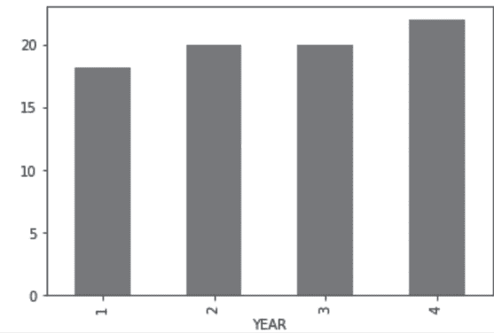

让我们在 `df_summarized_orders` 数据集上练习所学内容，以找出每家餐厅的日均订单数：

```python
( df_summarized_orders.groupby('RESTAURANT_NAME')
                    .NUM_ORDERS.mean() )
```

```
RESTAURANT_NAME
Bryant Park          871.436782
Columbia             687.150685
Flatiron             772.556164
Midtown              891.136986
NYU                 1180.438356
Upper East Side      774.650704
Upper West Side      770.372603
Williamsburg         862.120548
Name: NUM_ORDERS, dtype: float64
```

将这些数字与使用不同方法得到的数字进行比较是很有趣的。让我们使用完整的订单数据集（即逐条列出每个订单，而不是按天汇总的数据集）。为了找出我们一年数据中的订单总数，我们可以统计每家餐厅在该数据集中出现的次数。然后将其除以 365，即一年中的天数：

```python
df_orders.RESTAURANT_NAME.value_counts() / 365
```

```
NYU                     1180.438356
Midtown                  891.136986
Williamsburg             862.120548
Flatiron                 772.556164
Upper West Side          770.372603
Upper East Side          753.427397
Columbia                 687.150685
Bryant Park              623.136986
Name: RESTAURANT_NAME, dtype: float64
```

注意一个非常奇特的事实——对于某些餐厅（如 NYU 和 Columbia），使用两种方法得到的数字是相同的。然而，对于其他餐厅（如 Upper East Side 和 Bryant Park），使用两种方法得到的数字却不同。你能想到为什么会这样吗？暂停一下，看看你能否想明白。◆

这个谜题的关键在于，对于全年每天都有销售的餐厅（例如 NYU 和 Columbia），这两种方法是相同的。然而，对于某些日子关门的餐厅（例如周末或公共假日），这两种方法就不同了。要理解原因，请思考这些方法实际在做什么：

-   正如我们在第 6 章所看到的，`df_summarized_orders` 只列出了某家餐厅有订单发生的日期。如果某天*没有订单*发生（例如餐厅关门的那天），该日期甚至不会出现在该餐厅的数据集中。因此，当我们计算平均值时，它给出的是*餐厅营业日*的平均订单数，不包括没有销售发生的日期。
-   第二种方法将订单数除以 365，无论实际发生销售的天数是多少。

这两种方法都不一定正确或错误——每种方法都适用于回答不同类型的问题。例如：

-   第一种方法可能适用于决定每天向餐厅运送多少易腐物品（例如新鲜蔬菜）。因为送货只会在餐厅营业的日子进行，所以*餐厅营业日*的平均订单数是合适的。
-   第二种方法可能适用于会计和财务目的。在决定一家餐厅一年将收取多少钱时，每一天都很重要。

我们引入这个例子是为了说明，即使使用数据回答一个简单的问题，也可能需要相当多的微妙之处和对业务运作方式的真正理解。幸运的是，如果你一直坚持到现在，你对 pandas 的理解已经足够深入，足以让你真正理解每个操作在做什么，并弄清楚哪种方法在特定情况下是正确的。

#### 8.3.1. 聚合函数

前面的每个例子都使用了相同的聚合操作——计算列的平均值。pandas 还提供了许多其他可以这样使用的函数。其中包括：

-   统计
    -   `mean()`：计算每组的平均值
    -   `median()`：计算每组的中位数
    -   `sum()`：计算每组的总和
    -   `min()`：计算每组的最小值
    -   `max()`：计算每组的最大值
    -   `std()`, `sem()`：计算每组的标准差和组均值的标准误差——标准差和标准误差的确切定义超出了本书的范围，但我们将其包含在内，以供那些可能听说过这些概念并希望实现它们的人参考。

请注意，所有这些方法都会*忽略* NaN 缺失值。例如，在计算平均值时，该函数会将所有非缺失值求和，然后除以非缺失值的数量，就好像缺失值从未存在过一样。这通常是正确的做法，但并非总是如此。例如，如果缺失值代表零（例如没有销售的日期），你*必须*首先使用 `fillna(0)` 将它们替换为零（参见第 6.7.2 节）。这是在 Python 中进行聚合时最常见的错误来源之一。

-   计数变量
    -   `size()`：返回每组的行数，*包括* NaN 缺失值
    -   `count()`：返回每组的行数，*不包括* NaN 缺失值
    -   `nunique()`：返回每组中*唯一*值的数量，忽略任何 NaN 缺失值

让我们使用聚合来找出 `df_orders` DataFrame 中每家餐厅的订单数。我们已经使用 `value_counts()` 做过这个，但让我们尝试使用 `groupby()`：◆

```python
df_orders.groupby('RESTAURANT_NAME').TYPE.size()
```

```
RESTAURANT_NAME
Bryant Park        227445
Columbia           250810
Flatiron           281983
Midtown            325265
NYU                430860
Upper East Side    275001
Upper West Side    281186
Williamsburg       314674
Name: TYPE, dtype: int64
```

请注意，`size()` 不需要特定的列来操作——它只是统计行数。我们选择了 `TYPE`，但我们本可以选择任何其他列，或者实际上不选择任何列。¹

```python
df_orders.groupby('RESTAURANT_NAME').size()
```

```
RESTAURANT_NAME
Bryant Park        227445
Columbia           250810
Flatiron           281983
Midtown            325265
NYU                430860
Upper East Side    275001
Upper West Side    281186
Williamsburg       314674
dtype: int64
```

将这些结果与 `value_counts()` 的结果进行比较，我们发现结果是相同的：

```
df_orders.RESTAURANT_NAME.value_counts()
```

```
NYU                     430860
Midtown                 325265
Williamsburg            314674
Flatiron                281983
Upper West Side         281186
Upper East Side         275001
Columbia                250810
Bryant Park             227445
Name: RESTAURANT_NAME, dtype: int64
```

当然，`groupby()` 的好处在于它允许我们基于多个列进行分组。例如，让我们找出每个餐厅中*每种类型*的订单数量：

```
df_orders.groupby(['RESTAURANT_NAME', 'TYPE']).size()
```

```
RESTAURANT_NAME  TYPE
Bryant Park      DELIVERY      15613
                 IN_STORE     171494
                 PICKUP        40338
Columbia         DELIVERY      25247
                 IN_STORE     182603
                 PICKUP        42960
Flatiron         DELIVERY      28859
                 IN_STORE     204607
                 PICKUP        48517
Midtown          DELIVERY      22380
                 IN_STORE     244980
                 PICKUP        57905
NYU              DELIVERY      43310
                 IN_STORE     314832
                 PICKUP        72718
Upper East Side  DELIVERY      52080
                 IN_STORE     180605
                 PICKUP        42316
Upper West Side  DELIVERY      53337
                 IN_STORE     184588
                 PICKUP        43261
Williamsburg     DELIVERY      31822
                 IN_STORE     229427
                 PICKUP        53425
dtype: int64
```

希望这个例子能让你开始领略 `groupby()` 的强大之处。

#### 8.3.2 使用 unstack()

在对多个列进行聚合时，还有一个额外的功能非常方便，那就是 `unstack()` 函数。考虑上一节中的最后一个连接——因为我们对多个列进行了聚合，最终得到了一个具有两列索引的序列——一列是我们聚合的第一个列（`RESTAURANT_NAME`），另一列是第二个列（`TYPE`）。² 我们之前已经看到如何使用 `reset_index()` 将此序列转换为 DataFrame：

```
( df_orders.groupby(['RESTAURANT_NAME', 'TYPE'])
           .size().reset_index().head() )
```

| RESTAURANT_NAME | TYPE | 0 |
|---|---|---|
| 0 | Bryant Park | DELIVERY | 15613 |
| 1 | Bryant Park | IN_STORE | 171494 |
| 2 | Bryant Park | PICKUP | 40338 |
| 3 | Columbia | DELIVERY | 25247 |
| 4 | Columbia | IN_STORE | 182603 |

请注意索引的每一列是如何转换为 DataFrame 中的一列的。
`unstack()` 函数采用了不同的方法。它获取索引中的最后一列，并为该索引中的每个唯一值创建一列，从而“展开”表格：

```
df_orders.groupby(['RESTAURANT_NAME', 'TYPE']).size().unstack()
```

| TYPE | DELIVERY | IN_STORE | PICKUP |
|---|---|---|---|
| RESTAURANT_NAME | | | |
| Bryant Park | 15613 | 171494 | 40338 |
| Columbia | 25247 | 182603 | 42960 |
| Flatiron | 28859 | 204607 | 48517 |
| Midtown | 22380 | 244980 | 57905 |
| NYU | 43310 | 314832 | 72718 |
| Upper East Side | 52080 | 180605 | 42316 |
| Upper West Side | 53337 | 184588 | 43261 |
| Williamsburg | 31822 | 229427 | 53425 |

请注意，此表包含与序列相同的数字，但经过重塑，将订单类型作为列。在第 9 章处理更复杂的问题时，此操作将非常有用。

### 8.4 多列计算

到目前为止，我们展示的示例都只考虑了聚合单个列。通常，我们想要聚合*多个*列。举一个简单的例子，假设我们想找出每个餐厅每笔订单的平均饮料数量*和*每笔订单的平均饼干数量。

当所有列的聚合函数相同时（在本例中，我们对 `DRINKS` 列*和* `COOKIES` 列应用 `mean()` 聚合），我们可以通过在 `groupby()` 之后选择两个列来简单地完成此操作（注意这与在 DataFrame 中选择多个列非常相似）：

```
( df_orders.groupby('RESTAURANT_NAME')[['DRINKS', 'COOKIES']]
          .mean() )
```

| RESTAURANT_NAME | DRINKS | COOKIES |
| :--- | :--- | :--- |
| Bryant Park | 0.098138 | 0.261294 |
| Columbia | 0.066572 | 0.259049 |
| Flatiron | 0.097637 | 0.259161 |
| Midtown | 0.126128 | 0.260683 |
| NYU | 0.075769 | 0.258898 |
| Upper East Side | 0.118145 | 0.257603 |
| Upper West Side | 0.097032 | 0.260475 |
| Williamsburg | 0.096446 | 0.258750 |

请注意，如果你*不*指定要聚合的列，而只是使用 `df_orders.groupby('RESTAURANT_NAME').mean()`，你将计算数据集中每个数值列的平均值。

292 第二部分

当聚合涉及对每列使用*不同*的聚合函数时，情况会稍微复杂一些。
特别是，假设我们想为每个餐厅创建一个包含以下数据的 DataFrame：

- 每笔订单的平均饮料数量
- `MAIN` 列下非缺失值的订单数量（换句话说，有碗的订单）

第一列需要 `mean()` 转换。第二列需要 `count()`（排除缺失值的项目数量）。最简洁的方法是使用 pandas 中 `agg()` 函数提供的特殊语法：³

```
( df_orders.groupby('RESTAURANT_NAME')
    .agg(AV_DRINKS = ('DRINKS', 'mean'),
         N_W_MAIN = ('MAIN', 'count')) )
```

| RESTAURANT_NAME | AV_DRINKS | N_W_MAIN |
| :--- | :--- | :--- |
| **Bryant Park** | 0.098138 | 216767 |
| **Columbia** | 0.066572 | 239406 |
| **Flatiron** | 0.097637 | 268909 |
| **Midtown** | 0.126128 | 309502 |
| **NYU** | 0.075769 | 411253 |
| **Upper East Side** | 0.118145 | 261957 |
| **Upper West Side** | 0.097032 | 268023 |
| **Williamsburg** | 0.096446 | 299822 |

请注意此函数的工作原理：⁴

- 它可以直接应用于 `groupby()`；无需选择特定列。
- 该函数为输出中你想要生成的每一列接受一个参数。每个参数应该是输出列的名称（例如，`AV_DRINKS`），并且它应该等于 `()` 中的两个项——第一个应该是原始表中的*输入*列（例如，`'DRINKS'`），第二个应该是要应用的函数的名称，作为字符串（例如，`'mean'`）。

使用此函数，我们可以进行真正令人眼花缭乱的聚合，以回答极其复杂的业务问题；我们将在第 9 章看到更多示例。

最后一点：当我们在 6.7 节讨论转换列时，我们注意到有时 pandas 中没有内置函数来完成我们想要的操作。对于这些情况，我们介绍了 `apply()` 函数（参见 6.7.7 节）。也可以使用自定义函数进行聚合。我们将在本书网站上提供的附录中介绍此主题。

### 8.5 更复杂的分组

在本节中，我们考虑两种更高级的 DataFrame 分组方式：使用序列和使用日期时间列。

#### 8.5.1 使用序列进行分组

假设我们想确定点饮料的人是否更有可能在订单中添加饼干。

一种方法是在 `df_orders` 中添加一个名为 `HAS_DRINK` 的列，然后按该列分组：

```
df_orders['HAS_DRINK'] = (df_orders.DRINKS > 0)
df_orders.groupby('HAS_DRINK').COOKIES.mean()
```

```
HAS_DRINK
False    0.259543
True     0.258149
Name: COOKIES, dtype: float64
```

第一行创建了一个 `HAS_DRINK` 列，对于每一行，如果该行的订单包含饮料，则包含 `True`，否则包含 `False`。第二行获取所有 `HAS_DRINK=False` 的行，查看这些行的 `COOKIES` 列，并计算平均值（0.26）。然后对 `HAS_DRINK=True` 的行执行相同的操作。

看起来，不，购买饮料并不真正影响购买饼干的倾向，因为这两个数字相似。

然而，pandas 允许我们甚至无需创建新列即可执行此操作，如下所示：

```
df_orders.groupby(df_orders.DRINKS > 0).COOKIES.mean()
```

```
DRINKS
False    0.259543
True     0.258149
Name: COOKIES, dtype: float64
```

考虑这里发生了什么——`groupby()` 函数内的文本 `df_orders.DRINKS > 0` 只是一个序列，如果订单有饮料则包含 `True`，否则包含 `False`。我们只需将此序列传递给 `groupby()` 函数，pandas 将自动按该序列的结果进行分组。这导致相同的结果，但在实现复杂的 `groupby()` 操作时可能很方便。

#### 8.5.2 使用日期和时间进行分组

最后一种聚合值得讨论，那就是对日期和时间进行聚合。pandas 有一个名为 `resample()` 的函数，其工作方式与 `groupby()` 完全相同，但用于日期。然而，有一个关键区别——要能够使用 `resample()`，你需要确保日期时间列是 DataFrame 的索引，而不仅仅是其中一列。⁵ 让我们在 Dig 数据集上实际操作一下：

```
( df_orders.set_index('DATETIME')
    .resample('D')
    .DRINKS
    .mean()
    .reset_index()
    .head() )
```

| DATETIME | DRINKS |
|---|---|
| 0 | 2018-01-01 | 0.064363 |
| 1 | 2018-01-02 | 0.083897 |
| 2 | 2018-01-03 | 0.069347 |
| 3 | 2018-01-04 | 0.076179 |
| 4 | 2018-01-05 | 0.080892 |

我们首先将DataFrame的索引设置为DATETIME列。然后应用`resample()`函数，并指定使用`D`按天进行分组。最后，我们像执行了`groupby()`一样处理结果。在这种情况下，我们计算出每天的平均饮酒量。

您可能不会惊讶地发现，`D`并非唯一可用于此函数的频率选项。选项包括以下几种：

- T—分钟
- H—小时
- D—天
- W—周
- M—月
- Y—年
- B—工作日；这允许您生成仅列出工作日的时间序列，排除周末。任何发生在周末的数据点都会被归入周五。
- BM—工作月；与工作日类似，但按月计算。

完整的支持频率列表可以在pandas文档中找到。⁵

当然，我们现在可以自由地绘制分析结果，这可能会带来一些强大的效果。例如，让我们绘制Columbia餐厅每天的订单总数。◆ 如果您在弄清楚如何操作时遇到一点困难，将任务分解为步骤可能会有所帮助：

- 将订单筛选为仅在Columbia餐厅的订单。
- 将索引设置为DATETIME列。
- 进行重采样。
- 计算订单数量（如果记不清使用哪个函数，请回顾第8.3.1节）。
- 绘制图表。

以下是我们将如何操作：◆

```
(
    df_orders
    [df_orders.RESTAURANT_NAME == 'Columbia']
    .set_index('DATETIME')
    .resample('D')
    .size()
    .plot()
)
```

<matplotlib.axes._subplots.AxesSubplot at 0x10d8393d0>

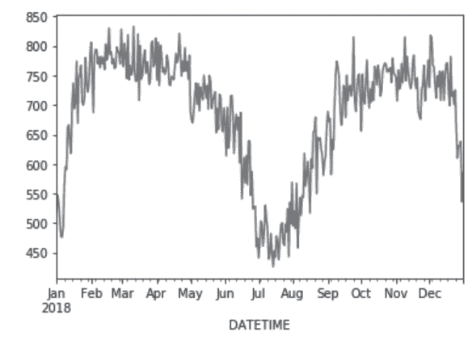

让我们逐步分析（每个数字对应代码中的行号）：

- 2. 将`df_orders`筛选为仅包含Columbia餐厅的订单。
- 3. 将DataFrame的索引设置为DATETIME列。
- 4. 将其重采样为每日频率。
- 5. 计算每天的订单数量。
- 6. 绘制结果，使用索引（在此例中为日期）作为x轴。

结果信息量很大。我们看到该餐厅存在明显的季节性：夏季和冬季的订单最少，而在学期期间订单最多。

我们可能会想，这种模式是否普遍成立？我们如何修改上面的语句来绘制*所有*餐厅合并后的结果？◆ 我们需要做的就是移除第2行，该行筛选了Columbia餐厅：

```
(
    df_orders
    .set_index('DATETIME')
    .resample('D')
    .size()
    .plot()
)
```

<matplotlib.axes._subplots.AxesSubplot at 0x11f974190>

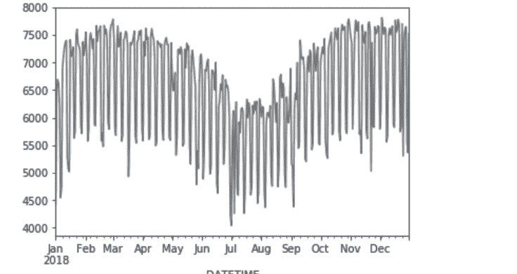

观察此图，即使查看多家餐厅，这种模式似乎仍然存在，但由于那些向下的尖峰，图表相当难以阅读。您认为是什么原因导致了这些尖峰？◆ 最可能的解释是许多餐厅在周末关闭。因此，每七天，订单数量就会大幅下降，因为只有少数餐厅在那些日子有订单。

我们如何修复这个图表？◆ 一种方法是简单地按周而不是按天绘图，并计算每个*周*的销售数量。您将如何在之前的代码中实现这一点？◆ 您只需将`D`替换为`W`。这种方法的一个问题是，它将导致图表只有五十二个点（对应一年中的五十二周），并且图表可能看起来有点参差不齐。

我们还能做什么？◆ 一种方法是绘制*移动平均线*，即在每一天，我们不绘制*当天*的销售额，而是绘制该日期*之前两周的平均销售额*。这将起到“平滑”销售额任何短期变化的效果。

我们可以使用pandas的`rolling()`函数来实现这一点，该函数的行为也类似于`groupby()`。要理解它的工作原理，查看之前`resample()`操作的结果会有所帮助（此代码与生成Columbia图表的代码相同，但末尾没有`plot()`）：

```
( df_orders
    [df_orders.RESTAURANT_NAME == 'Columbia']
    .set_index('DATETIME')
    .resample('D')
    .size()
    .head() )
```

DATETIME
2018-01-01    519
2018-01-02    547
2018-01-03    532
2018-01-04    502
2018-01-05    477
Freq: D, dtype: int64

现在考虑这段代码：

```
( df_orders
    [df_orders.RESTAURANT_NAME == 'Columbia']
    .set_index('DATETIME')
    .resample('D')
    .size()
    .rolling(3)
    .mean()
    .head() )
```

DATETIME
2018-01-01              NaN
2018-01-02              NaN
2018-01-03    532.666667
2018-01-04    527.000000
2018-01-05    503.666667
Freq: D, dtype: float64

在第6行，我们要求pandas创建一个以该日期结束的三周期滚动窗口，在第7行，我们计算该整个窗口内的平均销售额。请注意结果的性质——1月1日和2日的值缺失，因为原始数据不包含这两天之前的三天数据。在1月3日，我们取1月1日、2日和3日的数据，计算这些天的平均订单数，得到532.7（计算为(519 + 547 + 532) / 3）。其他每一天也是如此。pandas为您提供了多种自定义`rolling()`的方式——文档在这方面信息量很大。

我们现在终于可以绘制整体销售图表的更平滑版本了。我们将使用十四天移动平均线，但您可以尝试其他数字来改变图表的平滑度：◆

```
( df_orders
    .set_index('DATETIME')
    .resample('D')
    .size()
    .rolling(14)
    .mean()
    .plot() )
```

<matplotlib.axes._subplots.AxesSubplot at 0x1201b4e90>

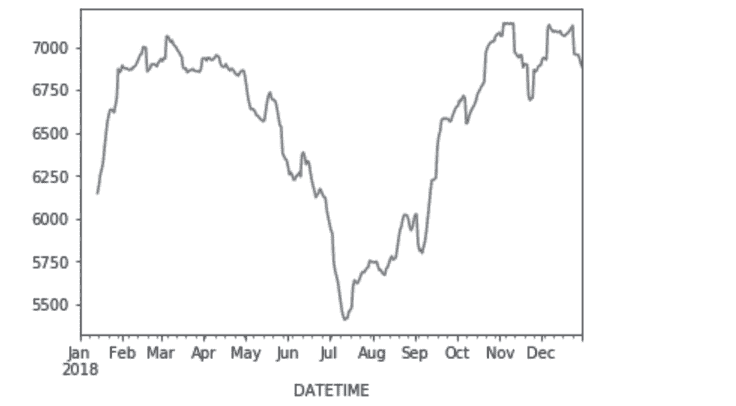

季节性变化模式现在在所有门店中都显而易见。

在结束本章之前，我们还有最后一点。`resample()`和`rolling()`都可以与`groupby()`结合使用，以进行强大的分析。例如，让我们找出每个门店每天的销售总数：◆

```
( df_orders.set_index(df_orders.DATETIME)
    .groupby('RESTAURANT_NAME')
    .resample('D')
    .size()
    .reset_index()
    .head() )
```

| RESTAURANT_NAME | DATETIME | 0 |
|---|---|---|
| 0 | Bryant Park | 2018-01-01 | 373 |
| 1 | Bryant Park | 2018-01-02 | 789 |
| 2 | Bryant Park | 2018-01-03 | 818 |
| 3 | Bryant Park | 2018-01-04 | 782 |
| 4 | Bryant Park | 2018-01-05 | 719 |

在这里，我们按餐厅分组，然后按天重采样，计算每个组中的行数。

我们还有最后一个例子来确保我们理解这个概念。假设我们想找出2018年每个餐厅每月购买的饮料总数。我们可以这样做：◆

```
( df_orders.set_index(df_orders.DATETIME)
    .groupby('RESTAURANT_NAME')
    .resample('M')
    .DRINKS
    .sum()
    .reset_index()
    .head() )
```

| RESTAURANT_NAME | DATETIME | DRINKS |
|---|---|---|
| 0 | Bryant Park | 2018-01-31 | 1414.0 |
| 1 | Bryant Park | 2018-02-28 | 1336.0 |
| 2 | Bryant Park | 2018-03-31 | 1427.0 |
| 3 | Bryant Park | 2018-04-30 | 1478.0 |
| 4 | Bryant Park | 2018-05-31 | 2340.0 |

观察这些数字，随着天气开始变热，五月份的订单似乎有所增加。我们将在第9章更详细地研究这一点。

最后一点注意事项：我们在第8.4节末尾讨论的`agg()`函数的使用是pandas相对较新的功能。不幸的是，它目前还不能与使用`resample()`或`rolling()`函数分组的DataFrame一起工作。因此，如果您尝试使用`resample()`对多个函数进行聚合，您将必须单独执行每个聚合，然后连接结果表。我们将在第9.9节看到一个这样的例子。

### 8.6 总结

在本章中，我们介绍了聚合的基础知识。我们看到了如何使用pandas来复制Excel中数据透视表的功能，但可以处理更大的数据集，并且具有更大的灵活性。特别是，我们研究了对生成列以及包含日期和时间的列进行聚合。

这或多或少结束了我们对pandas的学习。我们已经走了很长一段路。在最后一章，我们将回到第5章的Dig案例研究，并将我们所学的一切结合起来，回答一些与Dig业务相关的问题。

## 9 实践

**我们几乎已经到了**共同旅程的终点（我们深知这令人心碎……）。这最后一章算是一个总结。我们将回到 Dig 案例，并运用我们迄今所学的一切来回答一些综合性问题。

我们将探讨一系列问题，这些问题将汇集我们在第二部分讨论的许多主题。不过，我们提醒您，其中一些主题会比较复杂。话虽如此，企业在日常数据工作中面临的真实问题同样复杂，本节将为您提供解决此类问题的实践机会。即使您不逐行理解代码，通读这些问题的解决方案也能让您接触到一些分析数据集的有趣方法。

### 9.1 本章学习目标

我们将本节的问题按难度递增的顺序排列，以便您能逐步深入，最终完成最复杂的分析。

在第5章中，我们介绍了 Dig 公司及其数据与运营产品高级经理 Shereen Asmat。本章的问题基于我们当时讨论的 Dig 业务的三个部分：

- 新产品或新服务的推出（具体而言，是 Dig 的外卖优先服务）。我们将在 9.3、9.4、9.7 和 9.8 节中讨论。
- Dig 餐厅面临的人员配置流程，我们将在 9.5 和 9.9 节中讨论。
- 公司向更加数据驱动转型的过程，我们将在 9.6 节中讨论。

### 9.2 本章所需准备

开始之前，请先为本章创建一个新的 *Jupyter Notebook*。您要做的第一件事是导入一些需要的包。将以下代码粘贴到第一个单元格并运行：

```python
import pandas as pd
import matplotlib.pyplot as plt
```

接下来，您将加载一些在前面章节中创建的文件。为此，请将以下代码粘贴到下一个单元格并运行：

```python
df_summarized_orders = pd.read_pickle(
    'Chapter 5/summarized_orders.pickle')
df_orders = pd.read_pickle('Chapter 7/orders.pickle')
```

一如既往，本章的 *Jupyter Notebook* 以及所有前面章节的文件都可在本书网站上获取。如果您跳过了前面的章节，请确保下载上面代码中的每个文件，并将其放入一个命名恰当的文件夹中。

### 9.3 新产品分析：为成功奠定基础

正如您在 Dig 的故事中读到的，该公司最引以为豪的一点是每家餐厅都在现场准备所有食物。事实上，其所有员工都接受过培训，在餐厅内按照这一理念准备食物。然而，有一个例外——瓶装和罐装饮料。生产这些物品所需的基础设施通常成本过高。此外，许多生产这些产品的公司与 Dig 一样，都秉持负责任采购和高品质原料的理念。

因此，正如您所读到的，Dig 不生产自己的瓶装和罐装饮料，而是销售其他公司生产的多种产品，这或许并不令人意外。

在本节中，我们考虑一个假设的未来情景：Dig *确实*决定推出自己的新饮料产品线。当一家公司推出新产品时，通常会决定先在单一地点推出，然后扩展到整个连锁店。我们将探讨 Dig 如何利用其数据来决定在哪家餐厅推出这条新产品线，以及在一年中的何时推出。

请注意这个问题与我们之前考虑的问题之间的一个关键区别。在前面的章节中，问题大多是在数据的背景下提出的，并且如何使用数据来回答它们是明确的——唯一的问题是我们需要执行哪些 pandas 代码来完成每个步骤。这个问题则模糊得多，我们首先需要弄清楚如何在数据的背景下表述它。

在我们开始之前，花几分钟思考一下。您可能想向数据提出哪些问题？您可能想如何获得答案？我们将提供一个建议的解决方案，但请务必尝试使用数据进行探索。◆

我们的第一步可能是问我们想要实现什么。答案希望是明确的——我们希望尽可能多地销售新饮料。我们如何实现这一点？大概，我们希望找到饮料受欢迎的地方——在一家没人买任何饮料的餐厅推出产品线似乎适得其反。因此，也许我们的第一个问题是，某些餐厅的顾客是否倾向于比其他餐厅订购更多的饮料。如果是这种情况，那么我们可能会期望这些餐厅成为我们产品发布的更好候选者。我们可以通过以下方式查看情况：◆

```python
( df_orders.groupby('RESTAURANT_NAME').DRINKS
    .mean().sort_values().plot(kind='bar') )
```

```
<matplotlib.axes._subplots.AxesSubplot at 0x125abbbd0>
```

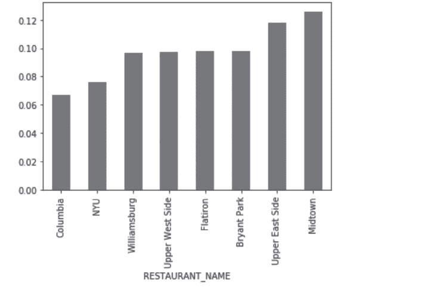

首先，我们按 RESTAURANT_NAME（我们在第7章中已将其添加到数据集中）进行分组，然后找到 DRINKS 列的平均值，以找出该餐厅每笔订单的平均饮料数量。最后，我们按值对结果系列进行排序，以便按升序绘制结果。根据此图，中城和上东区似乎是不错的发布地点。

现在让我们将注意力转向时间。作为负责此次发布的产品经理，我们如何决定在一年中的何时发布？遵循类似的逻辑，我们可能希望查看 Dig 餐厅每月售出的饮料总数。我们可以通过以下方式实现：◆

```python
( df_orders.set_index('DATETIME').resample('M')
            .DRINKS.sum().plot() )
```

```
<matplotlib.axes._subplots.AxesSubplot at 0x125d48890>
```

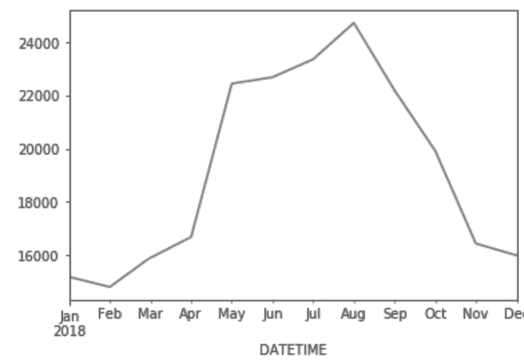

我们首先将 DataFrame 的索引设置为 DATETIME 列；然后按月重采样，并找出 Dig 在任何给定月份购买的饮料总和。也许并不令人意外的是，购买饮料的数量在夏季达到顶峰，这似乎是我们推出新产品线的好时机。

我们还能尝试什么？◆ 因为我们已经决定中城餐厅是推出产品线的好地方，我们可能想看看这种时间模式是否在该餐厅特别成立。您可以这样做：◆

```python
( df_orders[df_orders.RESTAURANT_NAME == 'Midtown']
    .set_index('DATETIME')
    .resample('M')
    .DRINKS.sum().plot() )
```

出于篇幅考虑，我们不会在此打印结果，但它们看起来相似。请注意，我们是如何从一个看似相当模糊的问题开始，将其提炼成一个更客观的问题，然后利用 pandas 的力量来回答这个问题的。

### 9.4 下一个前沿：设计 Dig 的专属外卖菜单

Dig 是一家年轻的公司，正进入指数级增长阶段。这种增长中更令人兴奋的一个方面是，公司正在将其核心餐厅业务扩展到外卖、自提订单和餐饮服务。当 Dig 推出这些新业务线时，它们立即受到欢迎，在某些门店，多达 30% 的订单来自外卖。然而，正如您在 Dig 的介绍中读到的，这种成功也带来了挑战。Dig 最初将外卖视为其主要餐厅服务的“附加”服务，允许客户使用店内菜单下单，并与第三方服务合作进行配送。这反映了 Dig 许多竞争对手的做法，但 Dig 的领导层很快意识到，这导致了低于标准的客户体验。除其他问题外，Dig 庞大的菜单意味着大约有 1,500 种不同的 Dig 碗，其中一些比其他碗更适合外卖。

Dig 一看到机会就抓住了，它决定大力专注于推动客户体验 Dig 的方式的边界。具体而言，它决定创建一个全新的、重新构想的外卖服务，拥有一个全新的菜单和平台，专门为外卖而构建和优化。这将使其成为行业的先驱，并使公司处于捕捉这一日益增长的市场细分领域的有利位置。

正如您所想象的，创建一个全新的外卖服务绝非易事。作为先行者有一些好处，但这也意味着没有现成的规则可循。在本节以及 9.7 和 9.8 节中，我们将讨论 Dig 可能使用其数据来回答哪些问题以支持这项工作。在我们开始之前，花几分钟时间思考一下您可能想要处理的问题类型。◆

我们面临的第一个挑战将围绕 Dig 新外卖菜单的设计。Dig 应该在菜单中包含哪些选项？部分答案将集中在哪些菜品“更适合配送”上，但仅凭我们现有的数据无法确定这一点。另一部分答案将集中在 Dig *当前*菜单中最受欢迎的选项上。这本身就是一个相当宽泛的问题。我们如何将其简化为一套简单的分析？◆ 我们或许首先需要记住，每个 Dig 碗都涉及四个主要选择——基底、主菜、第一配菜和第二配菜。因此，我们可能需要了解每个类别中各选项的受欢迎程度：

- 最受欢迎的主菜是什么？
- 最受欢迎的基底是什么？
- 哪种主菜与哪种基底搭配最受欢迎？
- 这些与配菜有何关联？

此外，我们可能会提出更普遍的问题——例如，“点沙拉作为基底的人是否可能在寻找更健康的选择？”如果答案是否定的（有些人就是喜欢生菜！），我们可能会在新菜单中包含以沙拉为基底的选项，但搭配不那么健康的配菜。我们将在第 9.8 节处理这个具体问题。

不过，目前让我们先确定哪些主菜和基底最受欢迎，以及哪些组合效果最佳。请稍作停顿，思考一下你会如何操作（提示：我们在第 7.9 节末尾已经开始了这项工作）。◆

首先，让我们查看订单数据集。你会记得在第 7 章中，我们将每家餐厅和每个菜品的名称引入了该数据集（这本身就需要使用一些连接操作）：◆

```
df_orders.head()
```

| | ORDER_ID | DATETIME | RESTAURANT_ID | TYPE | DRINKS | COOKIES | MA |
|---|---|---|---|---|---|---|---|
| 0 | O1820060 | 2018-10-11 17:25:50 | R10002 | IN_STORE | 1.0 | 2.0 | N |
| 1 | O1011112 | 2018-05-31 11:35:00 | R10003 | IN_STORE | 0.0 | 0.0 | N |
| 2 | O752854 | 2018-04-21 18:12:57 | R10001 | DELIVERY | 0.0 | 2.0 | |
| 3 | O2076864 | 2018-11-17 12:50:52 | R10005 | PICKUP | 1.0 | 0.0 | |

接下来，让我们看看哪些主菜和基底最受欢迎：◆

```
df_orders.MAIN_NAME.value_counts().plot(kind='bar')
```

```
<matplotlib.axes._subplots.AxesSubplot at 0x12314e490>
```

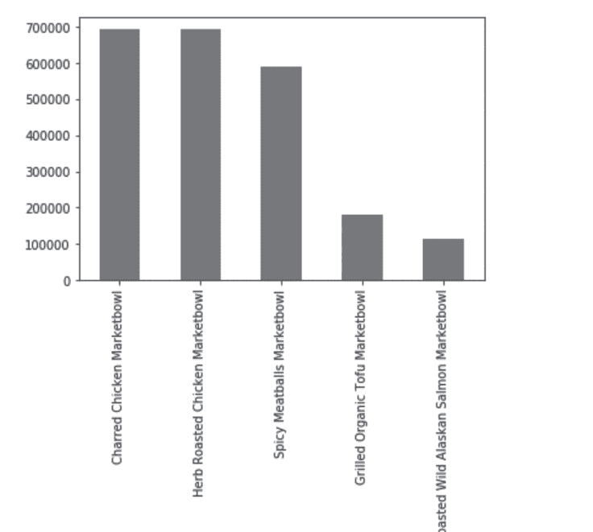

显然，鸡肉很受欢迎，其次是肉丸。豆腐和三文鱼似乎不太受青睐！
让我们看看基底：

```
df_orders.BASE_NAME.value_counts().plot(kind='bar')
```

```
<matplotlib.axes._subplots.AxesSubplot at 0x121d873d0>
```

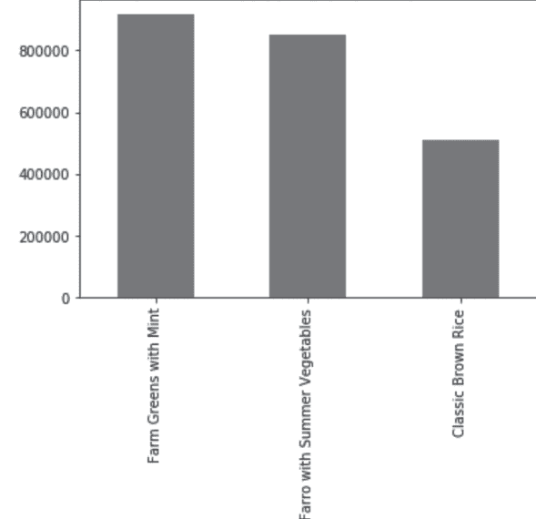

看起来 Dig 的顾客相当注重健康——沙拉在基底列表中占据首位。第二受欢迎的似乎是法罗麦，最后是米饭。

现在让我们进入一个稍微困难一点的挑战。我们如何找出哪些配菜与哪些主菜搭配最受欢迎？请稍作停顿，看看你能否想出来。◆

一个解决方案是简单地按主菜名称和基底名称对订单数据进行分组，并计算每种组合出现的次数：◆

```
( df_orders.groupby(['MAIN_NAME', 'BASE_NAME'])
    .size()
    .sort_values(ascending=False)
    .reset_index() )
```

| | MAIN_NAME | BASE_NAME | 0 |
|---|---|---|---|
| 0 | Herb Roasted Chicken Marketbowl | Farm Greens with Mint | 280243 |
| 1 | Charred Chicken Marketbowl | Farm Greens with Mint | 279591 |
| 2 | Herb Roasted Chicken Marketbowl | Farro with Summer Vegetables | 259056 |
| 3 | Charred Chicken Marketbowl | Farro with Summer Vegetables | 258945 |
| 4 | Spicy Meatballs Marketbowl | Farm Greens with Mint | 238509 |
| 5 | Spicy Meatballs Marketbowl | Farro with Summer Vegetables | 220116 |
| 6 | Charred Chicken Marketbowl | Classic Brown Rice | 155311 |
| 7 | Herb Roasted Chicken Marketbowl | Classic Brown Rice | 154203 |
| 8 | Spicy Meatballs Marketbowl | Classic Brown Rice | 132060 |
| 9 | Grilled Organic Tofu Marketbowl | Farm Greens with Mint | 73682 |
| 10 | Grilled Organic Tofu Marketbowl | Farro with Summer Vegetables | 68153 |
| 11 | Roasted Wild Alaskan Salmon Marketbowl | Farm Greens with Mint | 46052 |
| 12 | Roasted Wild Alaskan Salmon Marketbowl | Farro with Summer Vegetables | 42779 |
| 13 | Grilled Organic Tofu Marketbowl | Classic Brown Rice | 41323 |
| 14 | Roasted Wild Alaskan Salmon Marketbowl | Classic Brown Rice | 25616 |

第一行代码对 DataFrame 进行分组，下一行找出每种组合的行数，再下一行按降序排序（最受欢迎的在顶部），最后一行最终重置索引，将结果放入一个 DataFrame 中。

看起来鸡肉沙拉是赢家！这一切都很好，但这个表格有点难以解读。我们如何用图表来可视化这些信息，以实际显示每种配菜相对于每种主菜的受欢迎程度？◆ 我们可以首先使用第 8.3.2 节中的 `unstack()` 创建一个表格，其中每列对应一种基底：

```
( df_orders.groupby(['MAIN_NAME', 'BASE_NAME'])
    .size()
    .unstack() )
```

| BASE_NAME | Classic Brown Rice | Farm Greens with Mint | Farro with Summer Vegetables |
| :--- | :---: | :---: | :---: |
| **MAIN_NAME** | | | |
| Charred Chicken Marketbowl | 155311 | 279591 | 258945 |
| Grilled Organic Tofu Marketbowl | 41323 | 73682 | 68153 |
| Herb Roasted Chicken Marketbowl | 154203 | 280243 | 259056 |
| Roasted Wild Alaskan Salmon Marketbowl | 25616 | 46052 | 42779 |
| Spicy Meatballs Marketbowl | 132060 | 238509 | 220116 |

注意索引中的*第二*列（BASE_NAME）如何被转换为三列。最后，我们可以使用 `plot()` 将每列并排绘制：

312 第二部分

```
( df_orders.groupby(['MAIN_NAME', 'BASE_NAME'])
    .size()
    .unstack()
    .plot(kind='bar') )
```

<matplotlib.axes._subplots.AxesSubplot at 0x1236f84d0>

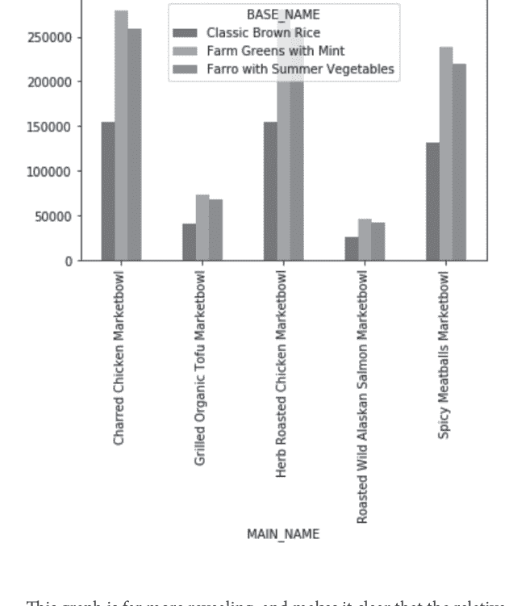

这张图表更具启发性，清楚地表明每种配菜的相对受欢迎程度并不取决于碗中的主菜。这个综合洞察很有用——它意味着我们不必过于担心配菜与主菜的确切组合，而可以专注于哪些组合最适合外卖配送。

为简洁起见，我们不会对配菜进行类似的分析，但你应该尝试一下。在本章后面，我们将探讨与 Dig 新菜单设计相关的其他问题。

### 9.5 为成功配备人员

我们的下一个问题集中在人员配备上，这是餐饮服务行业任何企业都面临的一大挑战。在 Asmat 描述 Dig 如何转向更加数据驱动的过程中，这个挑战尤为突出。她提到了利用数据来支持 Dig 员工的职业发展，以及将各种人力资源数据存储在独立系统中所带来的困难。Dig 完整的人员配备数据集超出了本书的范围，但我们仍然可以利用我们*确实*拥有的数据集来解决这个问题的某个特定方面。这种情况比你想象的更常见——我们经常*希望*能获得某些数据集，但必须利用手头现有的数据。请在此稍作停顿，尝试头脑风暴一下，你可能能够利用我们现有的数据处理这个问题的哪个方面。◆

我们处理的问题是 Asmat 在介绍 Dig 时提到的，当时她提到了“劳动力供应和美国不断变化的劳动力法律格局”。许多考虑因素都属于这个范畴。例如，美国越来越多的市政当局正在通过法律，禁止雇主在最后一刻更改员工的班次。这要求公司提前一段时间发布人员配备时间表，考虑到餐饮服务需求的高度可变性，这可能相当困难。对于 Dig 来说，这项任务甚至更加艰巨，因为它承诺在店内烹饪每一道菜，这意味着餐厅必须始终配备最低数量的受过培训的员工。

我们如何利用数据来促进这个排班过程？◆ 我的数据将使我们能够分析每家餐厅全天的订单分布情况。这将是编制人员配备时间表的关键第一步，以确保 Dig 能够满足其每家餐厅的需求。例如，如果我们发现哥伦比亚餐厅在午餐时间最忙，我们就会确保我们的长期时间表在那个时间段为该餐厅分配足够的团队成员。在我们深入研究之前，你可能想先问问自己，你预期的结果是什么，这样你就可以将你的预期与现实进行比较。

首先思考一下你想要生成什么样的图表来研究这个问题。◆ 也许最明显的第一步是生成一个图表——对于每家餐厅——显示订单量在一天中如何变化。这可以通过多种方式实现，所以花几秒钟思考一下你可能采取的方法。◆

我们可以使用 `groupby()` 和 `unstack()` 轻松完成此操作。让我们首先生成一个 DataFrame，它——对于每家餐厅和一天中的每个小时——给出该小时在全年发生的订单总数：◆

### 9.6 数据民主化：汇总订单数据集

当我们在第5章开始学习pandas时，我们加载了两个数据集：一个是完整记录每笔订单的订单数据集，另一个是按门店和日期汇总的汇总订单数据集。

对于任何与数据团队密切合作过的人来说，这都再熟悉不过了。真实的数据集总是复杂的，常常是脏乱的，而且很少能轻松获取；因此，公司内的商业智能团队通常不得不将公司的数据集处理成更易于分析的格式。

正如在“挖掘”部分所讨论的，真实数据集固有的复杂性可能源于多种原因。在一家规模较小的初创公司，数据的使用方式可能尚不明确。初创公司也不太可能拥有一个完全建成的、能轻松提取特定数据视图的数据基础设施。而在一家规模较大的传统公司，情况可能恰恰相反。经过多年的发展，公司的数据基础设施可能已经膨胀成一套笨重且互不兼容的系统，每个系统存储一种特定类型的数据，而这些数据单独来看可能并非特别有用。有时，需要极高的技巧（更不用说政治影响力）才能将这些数据集以一种能产生有用洞察的方式整合起来。

这可能会带来问题。根据我们的经验，公司难以利用数据获取洞察的最常见原因之一，是横亘在那些深谙业务并需要答案的人与数据之间的繁重技术障碍。因此，将数据处理成商业领袖能够分析的形式的能力，是我们实践中见过的最有用的技能之一。我们称之为*数据民主化*——让公司更广泛的部门能够获取数据并进行分析。

当然，能力越大，责任越大。创建更精简的关键数据集视图的风险在于，如果操作不当（例如，由于编码错误），可能会得出错误的结论，且无法调试。因此，正确地实现数据民主化是数据分析师工具包中最重要的技能之一，我们将通过自己创建`summarized_order`数据集来介绍这一概念。

首先，让我们看看`orders`数据集。你会记得在第7章中，我们将每家餐厅和每个商品的名称引入了该数据集（这需要使用一些连接操作）：

```python
df_orders.head()
```

| ORDER_ID | DATETIME | RESTAURANT_ID | TYPE | DRINKS | COOKIES | MA |
|---|---|---|---|---|---|---|
| 0 | O1820060 | 2018-10-11 17:25:50 | R10002 | IN_STORE | 1.0 | 2.0 | N |
| 1 | O1011112 | 2018-05-31 11:35:00 | R10003 | IN_STORE | 0.0 | 0.0 | N |
| 2 | O752854 | 2018-04-21 18:12:57 | R10001 | DELIVERY | 0.0 | 2.0 |

你会回忆起，汇总订单数据集包含每家餐厅每一天的一行数据，并列出了该餐厅当天的订单数量以及外卖订单的百分比。

为了创建这个数据集，让我们首先创建一个DataFrame，给出每家餐厅每天的*订单数量*。◆ 如果你有点卡住，可以先将索引设置为DATETIME，按RESTAURANT_NAME分组，然后按天进行重采样。然后问问自己，你会使用第8.3.1节中的哪个聚合函数来找出每家餐厅每天的行数。最后，将结果转换为具有正确列名的DataFrame。以下是我们如何操作：◆

```python
df_num_orders = ( df_orders.set_index('DATETIME')
                        .groupby('RESTAURANT_NAME')
                        .resample('D')
                        .size()
                        .reset_index()
                        .rename(columns={0:'NUM_ORDERS'}) )
print(len(df_num_orders))
df_num_orders.head()
```

2919

| RESTAURANT_NAME | DATETIME | NUM_ORDERS |
|---|---|---|
| 0 | Bryant Park | 2018-01-01 | 373 |
| 1 | Bryant Park | 2018-01-02 | 789 |

第一行将DataFrame的索引设置为DATETIME列，为resample()操作做好准备（如第8.5.2节所述）。然后我们按餐厅名称分组，并按索引进行重采样，这样输出就会按天列出每家餐厅的数据。接着我们应用size()操作来找出每个组中的行数。最后，我们重置索引以获得两列：一列是餐厅名称，一列是日期。正如我们之前看到的，当你对整个组而不是对某一特定列使用size()函数时，生成的列名最终会是零，因此我们需要将该列重命名为NUM_ORDERS，以表明该列包含的内容。

结果是一个DataFrame，包含每家餐厅每一天的一行数据，以及当天的订单数量。注意，我们还打印了数据集中的行数——在本例中是2919；我们稍后会用到这个数字。

我们的第二步是生成一个DataFrame，包含每家餐厅外卖订单的百分比。最简单的方法如下：◆

```python
df_orders['IS_DELIVERY'] = (df_orders.TYPE == 'DELIVERY')
df_pct_delivery = ( df_orders.set_index('DATETIME')
                    .groupby('RESTAURANT_NAME')
                    .resample('D')
                    .IS_DELIVERY
                    .mean()
                    .reset_index()
                    .rename(columns={'IS_DELIVERY':
                                    'PCT_DELIVERY'}) )
print(len(df_pct_delivery))
df_pct_delivery.head()
```

| | RESTAURANT_NAME | DATETIME | PCT_DELIVERY |
|---|---|---|---|
| 0 | Bryant Park | 2018-01-01 | 0.0 |
| 1 | Bryant Park | 2018-01-02 | 0.0 |
| 2 | Bryant Park | 2018-01-03 | 0.0 |
| 3 | Bryant Park | 2018-01-04 | 0.0 |
| 4 | Bryant Park | 2018-01-05 | 0.0 |

314 第二部分

```python
( df_orders.groupby([df_orders.DATETIME.dt.hour,
                   df_orders.RESTAURANT_NAME])
          .size() )
```

DATETIME RESTAURANT_NAME
9 Columbia 2
Flatiron 2
Midtown 3
NYU 5
Upper East Side 1
...
23 Midtown 97
NYU 149
Upper East Side 94
Upper West Side 96
Williamsburg 107
Length: 118, dtype: int64

注意，这个groupby()语句使用了我们在第8章学习的所有技巧：

- 我们通过向groupby()传递一个包含*两个*分组依据的列表，对多列进行聚合。
- 我们传递的是一系列值，而不是列名。这使我们能够按小时分组，即使它在DataFrame中并不存在为一列，也无需创建一个全新的列。

结果是一个序列，对于每家餐厅和每个小时，给出该餐厅在该小时的订单数量。我们如何将其转换为一个DataFrame，其中每家餐厅一列，每天每小时一行？

◆ 我们只需使用unstack()：

```python
( df_orders.groupby([df_orders.DATETIME.dt.hour,
                   df_orders.RESTAURANT_NAME])
          .size()
          .unstack() )
```

| RESTAURANT_NAME | Bryant Park | Columbia | Flatiron | Midtown | NYU | Upper East Side |
| :--- | :--- | :--- | :--- | :--- | :--- | :--- |
| **DATETIME** | | | | | | |
| 9 | NaN | 2.0 | 2.0 | 3.0 | 5.0 | 1.0 |
| 10 | 5581.0 | 7035.0 | 6927.0 | 8106.0 | 3756.0 | 2306.0 |
| 11 | 22289.0 | 9698.0 | 27094.0 | 31643.0 | 35330.0 | 22564.0 |
| 12 | 31444.0 | 10008.0 | 37918.0 | 44244.0 | 56872.0 | 36402.0 |

最后，剩下的就是绘制结果：

```python
( df_orders.groupby([df_orders.DATETIME.dt.hour,
                   df_orders.RESTAURANT_NAME])
         .size()
         .unstack()
         .plot() )
```

```
<matplotlib.axes._subplots.AxesSubplot at 0x122c76d90>
```

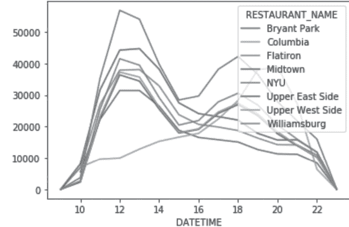

让我们看看我们生成的图表。这是你预期的吗？有什么突出的地方吗？如果你要向老板展示这些结果，你会用这些图表提出哪些要点？◆ 以下是我们注意到的几点：

- 大多数餐厅在午餐时间最忙，晚餐时间有一个次高峰。这将是决定如何为每家餐厅配备人员的关键信息。
- 午餐高峰时间在每家餐厅大致相同，但晚餐高峰时间似乎因餐厅而异。
- 一些餐厅的分布明显不同。例如，哥伦比亚餐厅午餐时段几乎没有业务量，但晚餐时段需求旺盛。这意味着哥伦比亚餐厅的人员安排时间表应与其他连锁餐厅有根本性的不同。

你还能想到其他点吗？这应该能让你体会到pandas在人员规划中有多么有用。我们将在第9.9节分析订单量与天气之间的关系时回到这个话题。

我们做的第一件事是在DataFrame中创建一个新列，其中如果订单是外卖订单，则该行的值为1，否则为0。我们为什么要这样做？原因很简单，因为这样我们就可以计算该列的平均值，从而得出外卖订单的百分比。其余代码的执行过程与之前的代码非常相似。请注意——令人欣慰的是——这个DataFrame的行数与前一个DataFrame的行数相同。

最后，我们需要将这两个数据集连接起来，以生成最终的汇总订单数据集。◆ 如果你遇到困难，可以先问问自己，应该基于每个数据集中的哪些列进行连接。然后问问自己，这应该是什么类型的连接——内连接、外连接、左连接还是右连接？以下是我们的解决方案：◆

```python
df_summarized_orders = (
    pd.merge(df_num_orders,
             df_pct_delivery,
             on=['RESTAURANT_NAME', 'DATETIME'],
             how='outer')
)
print(len(df_summarized_orders))
df_summarized_orders.head()
```

2919

| | RESTAURANT_NAME | DATETIME | NUM_ORDERS | PCT_DELIVERY |
|---|---|---|---|---|
| 0 | Bryant Park | 2018-01-01 | 373 | 0.0 |
| 1 | Bryant Park | 2018-01-02 | 789 | 0.0 |
| 2 | Bryant Park | 2018-01-03 | 818 | 0.0 |
| 3 | Bryant Park | 2018-01-04 | 782 | 0.0 |
| 4 | Bryant Park | 2018-01-05 | 719 | 0.0 |

这是一个如第7.5节所讨论的直接合并，但有几点需要解释。首先，我们为什么要做外连接？正如我们之前看到的，我们正在连接的两个表具有相同的行数，并且可以推测，餐厅名称和日期在这两个表中会完全匹配。那么，为什么不直接做内连接呢？关键点在于——通过做外连接，我们可以（“免费”）检查两个表中的键是否确实完全匹配。如果某些餐厅名称和日期的组合出现在一个表中而没有出现在另一个表中，会发生什么？在这种情况下，外连接会在输出中创建额外的行。外连接的结果包含与原始两个表相同数量的行这一事实，意味着键确实匹配。

最后一点：如果你查看我们在第5章探索过的原始summarized_orders DataFrame，你会注意到它有2,806行，而我们在这里创建的DataFrame有2,919行。为什么会有差异？第5章的DataFrame不包括没有订单的日期。如果我们筛选出这个DataFrame中*有*订单的日期，就会得到相同的行数：

```python
(df_summarized_orders.NUM_ORDERS > 0).sum()
```

2806

让我们总结一下我们已经完成的工作。我们从一个拥有超过两百万行的数据集——在Excel中无法打开，因此对业务分析师来说不太可能有用——转变为一个只有不到三千行的数据集。正如我们在第6章所看到的，这个较小的数据集包含足够的数据，可以得出关于每家餐厅业绩的有力见解，而且它足够小，可以由对业务日常运作有深入了解的人在Excel中处理。这体现了数据民主化的实践！

### 9.7 为新配送服务寻找肥沃土壤

在第9.4节中，我们开始讨论Dig历史上的一个激动人心的新阶段——着手创建一个以配送为先的服务，以提升客户体验。我们讨论了Dig如何分析其现有的订单模式来创建新菜单。

在本节中，我们将从一个不同的角度来考虑这项新服务。在我们对Dig的介绍中，我们了解到Dig的配送服务在其一些餐厅中变得多么受欢迎，但在扩展这项服务时，我们可能想知道哪些餐厅的配送最受欢迎。这可能有助于我们，例如，决定使用哪家餐厅作为新计划的试点。这也涉及到我们在第9.5节讨论的人员配置问题——以配送为主的餐厅的人员配置需求可能与大多数订单发生在店内的餐厅不同。

让我们首先从逐个餐厅的角度开始。例如，我们如何找出哥伦比亚餐厅的外卖订单比例？我们可以这样做：◆

```python
( df_orders[df_orders.RESTAURANT_NAME == 'Columbia']
    .TYPE.value_counts(normalize=True).reset_index() )
```

| index | TYPE | |
|---|---|---|
| 0 | IN_STORE | 0.728053 |
| 1 | PICKUP | 0.171285 |
| 2 | DELIVERY | 0.100662 |

（回想一下，代码中的normalize=True给出的是总和为一的比例，而不是计数。）这很有帮助，但我们如何为每家餐厅都这样做呢？更重要的是，我们如何以一种有用且可操作的方式来可视化结果？在继续阅读之前，请花几秒钟思考一下。让这项任务变得有点困难（并证明本节在本章中位置合理）的原因是，我们不太清楚到底应该如何可视化结果。值得先自己尝试一下。◆

我们的解决方案将首先生成一个类似这样的表格：

| RESTAURANT_NAME | IN_STORE | DELIVERY | PICKUP |
|---|---|---|---|
| Bryant Park | 0.754002 | 0.068645 | 0.177353 |
| Columbia | 0.728053 | 0.100662 | 0.171285 |
| Flatiron | 0.725600 | 0.102343 | 0.172056 |
| Midtown | 0.753170 | 0.068805 | 0.178024 |
| NYU | 0.730706 | 0.100520 | 0.168774 |
| Upper East Side | 0.656743 | 0.189381 | 0.153876 |
| Upper West Side | 0.656462 | 0.189686 | 0.153852 |
| Williamsburg | 0.729094 | 0.101127 | 0.169779 |

每个条目列出了该餐厅使用该种方式完成的订单比例。例如，正如我们在前面的单独计算中看到的，哥伦比亚餐厅10%的订单是外卖订单。

我们如何生成这样的表格？我们可以使用基于我们已经学过的材料的多种方法（我们在本章相关的*Jupyter Notebook*中提供了一个示例），但让我们借此机会介绍一种更优雅的方法，它不使用任何新技术，而是以一种新的（我敢说，令人兴奋的）方式使用我们已经见过的方法。

让我们首先运行以下代码：

```python
( df_orders.groupby('RESTAURANT_NAME')
          .TYPE
          .value_counts(normalize=True) )
```

我们只需按RESTAURANT_NAME分组，然后对每家餐厅的TYPE列应用value_counts()。

这与我们目前所做的聚合有何不同？原因很简单，因为我们使用的聚合函数——value_counts()——不返回单个数字，而是一个完整的序列。让我们分解一下。考虑像df_orders.groupby('RESTAURANT_NAME').DRINKS.mean()这样的语句。对于每个RESTAURANT_NAME，我们计算DRINKS列的平均值。这是一个*单个*数字，我们可以轻松地将其放入一个每行对应一家餐厅的表格中。

然而，当我们使用value_counts()进行聚合时，每家餐厅都会得到一个完整的序列。pandas应该如何将这个结果放入一个每行对应一家餐厅的表格中呢？让我们试试看：

```python
( df_orders.groupby('RESTAURANT_NAME')
          .TYPE
          .value_counts(normalize=True)
          .head(10) )
```

RESTAURANT_NAME TYPE
Bryant Park IN_STORE 0.754002
PICKUP 0.177353
DELIVERY 0.068645
Columbia IN_STORE 0.728053
PICKUP 0.171285
DELIVERY 0.100662
Flatiron IN_STORE 0.725600
PICKUP 0.172056
DELIVERY 0.102343
Midtown IN_STORE 0.753170
Name: TYPE, dtype: float64

pandas做了聪明的事情！它获取`value_counts()`函数输出的索引，并将其与`groupby()`的索引*组合*，创建一个两列索引。最后，我们可以使用第8.3.2节的`unstack()`来创建我们需要的表格：

```python
( df_orders.groupby('RESTAURANT_NAME')
    .TYPE
    .value_counts(normalize=True)
    .unstack() )
```

| RESTAURANT_NAME | DELIVERY | IN_STORE | PICKUP |
| :--- | :--- | :--- | :--- |
| **Bryant Park** | 0.068645 | 0.754002 | 0.177353 |
| **Columbia** | 0.100662 | 0.728053 | 0.171285 |
| **Flatiron** | 0.102343 | 0.725600 | 0.172056 |
| **Midtown** | 0.068805 | 0.753170 | 0.178024 |
| **NYU** | 0.100520 | 0.730706 | 0.168774 |
| **Upper East Side** | 0.189381 | 0.656743 | 0.153876 |
| **Upper West Side** | 0.189686 | 0.656462 | 0.153852 |
| **Williamsburg** | 0.101127 | 0.729094 | 0.169779 |

最后一步是绘制它（请注意，我们按外卖百分比升序对餐厅进行排序，因为我们分析的目的是找出在哪里推出新的外卖服务）：

对于每家餐厅，我们现在都有一个图表来显示每种订单类型的比例。在解读图表之前，我们还有最后一步：你能想到有什么方法可以让这个图表更有用吗？◆ 这些柱状图并排放置，使得比较起来有些困难——将它们堆叠起来将允许我们直接比较。我们可以通过向`plot()`函数传递一个简单的额外参数`stacked=True`来轻松实现这一点：

```python
( df_orders.groupby('RESTAURANT_NAME')
    .TYPE
    .value_counts(normalize=True)
    .unstack()
    .sort_values('DELIVERY')
    .plot(kind='bar', stacked=True) )
```

这是一个更容易分析的图表，因为现在我们可以比较不同餐厅之间的每个比例。还要注意，在`value_counts()`中使用`normalize=True`意味着图表中的每个柱子都具有相同的高度，即使某些餐厅的销售额远高于其他餐厅。这使得比较这些比例变得容易得多。看看图表：你能从中得出什么见解？◆ 以下是我们观察到的情况：

-   外卖量在所有门店似乎大致恒定，略低于20%。
-   店内消费和配送在不同餐厅之间差异很大。从配送量最少的布莱恩特公园店，到配送量最多的上东区和上西区店。对于熟悉纽约的人来说，这并不奇怪。上东区和上西区是人口密集的住宅区，可能更倾向于在家点外卖。相比之下，布莱恩特公园靠近一个有许多办公楼的区域。

这些见解将是Dig在考虑可能推出其新配送服务地点时的重要思考部分。

### 9.8 了解你的顾客：吃沙拉的人更健康吗？

在第9.4节中，我们讨论了为Dig的配送优先服务设计新菜单，并对Dig的订单模式进行了一些基础分析以帮助做出决策。

在本节中，我们从不同的角度来考虑这个问题。正如我们在Dig的介绍中读到的，每个Dig碗中都有三种可能的基底，其中一种是沙拉（另外两种是法罗麦和米饭）。我们最初可能会假设，选择沙拉作为基底的顾客是在寻找饮食中更健康、热量更低的选择。但这是真的吗，还是那些人只是碰巧喜欢生菜？

这个问题很重要，因为它让我们能更好地了解顾客，进而设计出更好地服务于他们的配送菜单。如果我们确实发现吃沙拉的人倾向于选择更健康的选择，我们就会希望在菜单上包含许多以沙拉为基础的碗，搭配健康的配菜和主菜。相反，如果我们发现这些选择之间几乎没有关联，我们可能会转而专注于设计我们认为最美味且最适合配送的碗（例如，将沙拉与健康但滚烫的鸡肉主菜混合可能会导致沙拉变蔫）。

同样，这个问题是模糊的。我们如何定义一个“健康”的顾客？没有一列数据能定义这一点。◆ 然而，另外两列数据可能可以作为代理指标。首先，每个订单中的饼干数量；其次，碗中点的配菜（有些配菜，如芝士通心粉和帕尔马干酪花椰菜，芝士味更浓，可能不太可能被注重健康的顾客点单）。

那么，让我们重新表述一下我们的问题：首先，点沙拉基底碗的人是否倾向于点更少的饼干；其次，点沙拉基底碗的人所点的配菜组合是否不同？

让我们先考虑关于饼干的第一个问题。◆ 思考一下数据集中沙拉是如何表示的：

```python
df_orders.BASE_NAME.value_counts()
```

```
Farm Greens with Mint          918077
Farro with Summer Vegetables   849049
Classic Brown Rice             508513
Name: BASE_NAME, dtype: int64
```

看起来“Farm Greens with Mint”就是我们正在寻找的菜单项。与其一遍又一遍地重新输入这个字符串，不如将其保存在一个变量中：

```python
salad = 'Farm Greens with Mint'
```

现在让我们来解决我们的问题：

```python
print(df_orders[df_orders.BASE_NAME != salad].COOKIES.mean())
print(df_orders[df_orders.BASE_NAME == salad].COOKIES.mean())
```

```
0.3664534590480054
0.08817561054247083
```

第一行将`df_orders`筛选为基底*不是*沙拉的订单，然后计算每个订单的平均饼干数量。第二行在基底*是*沙拉时计算相同的平均值。正如我们所料，我们看到没有沙拉的顾客平均每个订单点0.37块饼干，而*有*沙拉的顾客平均点0.09块饼干。
当然，你也可以使用`groupby()`得到相同的结果，如下所示：

```python
df_orders.groupby(df_orders.BASE_NAME == salad).COOKIES.mean()
```

```
BASE_NAME
False    0.366453
True     0.088176
Name: COOKIES, dtype: float64
```

值得庆幸的是，结果是相同的。

#### PYTHON中的T检验

你可能会想，当然，这个差异（每个订单0.37块饼干 vs 0.09块饼干）是显著差异还是仅仅是随机波动。如果你上过统计学入门课程，你知道解决这个问题的方法是使用t检验。t检验的理论超出了本书的范围，但对于那些熟悉它的人来说，以下是在Python中如何操作（注意，第一次运行此代码时，Python可能需要一些时间来准备scipy包）：

```python
from scipy import stats
stats.ttest_ind(df_orders[df_orders.BASE_NAME!=salad].COOKIES,
                df_orders[df_orders.BASE_NAME==salad].COOKIES)
```

```
Ttest_indResult(statistic=386.1313807565163, pvalue=0.0)
```

我们首先导入scipy包的stats部分。然后我们将两个列表传递给`stats.ttest_ind()`函数。第一个是*没有*沙拉的订单的饼干数量列表，第二个是*有*沙拉的订单的饼干数量列表。输出中的p值为0.0，意味着存在统计学上的显著差异。

现在让我们继续问题的第二部分：与其它基底相比，沙拉基底碗的配菜分布是否有任何不同？让我们从*有*沙拉的碗开始，并绘制该碗中*第一种*配菜的分布：

```python
( df_orders[df_orders.BASE_NAME == salad]
    .SIDE_1_NAME
    .value_counts(normalize=True)
    .sort_index()
    .plot(kind='bar') )
```

我们首先将订单DataFrame筛选为沙拉基底的碗，然后绘制这些碗中第一种配菜的归一化分布（回想一下，使用`normalize=True`可确保所有柱子总和为一）。最后，我们应用`sort_index()`以按字母顺序显示结果。看起来烤红薯和甜豆荚是目前最受欢迎的两种配菜。

现在让我们看看不吃沙拉的人的情况。你会如何修改前面的代码，为不吃沙拉的人生成相同的图表？◆ 你只需要将第一行中的`==`改为`!=`，即可为*不是*沙拉的基底生成图表。然而，与其这样做，你能想到一种比这个图表更简单的可视化方法吗？◆ 理想情况下，我们希望有一个图表并排显示吃沙拉的人和不吃沙拉的人每种配菜的比例。我们在第9.7节中已经做过类似的事情。在我们展示给你看之前，回去看看并尝试自己弄清楚。◆

```python
(
    df_orders
    .groupby( df_orders.BASE_NAME == salad )
    .SIDE_1_NAME
    .value_counts(normalize=True)
    .unstack(level=0)
    .plot(kind='bar') )
```

让我们逐行理解（同样，数字对应代码中的行号）：

2. 我们使用 `groupby()`，基于一个序列，如第 8.5.1 节所述。所有以沙拉为基底的行将被分到一组，所有不以沙拉为基底的行将被分到另一组。
3. 然后我们提取第一个配菜的名称。
4. 我们计算归一化的值计数——此时，输出将类似于：

```
( df_orders
    .groupby( df_orders.BASE_NAME == 'salad' )
    .SIDE_1_NAME
    .value_counts(normalize=True))
```

```
BASE_NAME  SIDE_1_NAME
False       Cauliflower with Garlic and Parmesan    0.208072
            Roasted Sweet Potatoes                   0.199584
            Snap Peas                                0.198432
            Jasper Hill Mac & Cheese                 0.130618
            Charred Broccoli with Lemon              0.082552
            Cashew Kale Caesar                       0.072204
```

5. 我们取索引的第二级，并使用 `unstack()` 将其转换为列，如第 8.3.2 节所述。
6. 我们绘制结果。

请注意，生成的图例有两个条目——True 和 False。这些对应于第 2 行中分组序列的值；True 表示那些以沙拉为基底的行，False 表示其他情况。

结果相当引人注目——我们发现，对于以沙拉为基底的碗，通心粉和奶酪以及花椰菜和帕尔马干酪的比例显著较低。相反，西兰花、甜豆和红薯则更受欢迎。这不应该太令人惊讶，但它确实证实了在我们的菜单设计工作中，应确保基于沙拉的选项包含更健康的成分。

最后一点：这些图表仅考虑了 `SIDE_1` 列中的*第一个*配菜。然而，顾客可以点*两个*配菜，第二个配菜包含在 `SIDE_2` 列中。由于“第一个”配菜与“第二个”配菜没有特殊区别（它们可能是收银员随机输入的），我们不认为这会有什么影响。但是，为了安心起见，我们在本章的 *Jupyter Notebook* 中包含了可选代码，该代码同时考虑了两个配菜。结果看起来非常相似。

### 9.9 订单与天气

我们的最终分析汇集了本章讨论的许多主题。特别是，我们研究了各种订单模式与天气之间的关系。这种关系可能涉及 Dig 运营的许多方面，从食品订购、人员配置水平、促销活动到公司的新配送服务。在开始之前，请花几秒钟问问自己，公司可能会问哪些关于这种关系的问题，以及这些问题可能如何有用。◆

我们脑海中浮现出许多问题，但其中，我们考虑以下问题：

- 我们可能预期外卖订单的比例在很大程度上取决于天气。特别是在严冬，我们可能预期外卖会更普遍。这是真的吗？这将强烈影响我们如何为这些时期规划人员配置。
- 外面的温度会影响顾客点的饮料数量吗？这可能会影响我们选择何时推出我们在第 9.3 节讨论的新饮料系列，或者帮助店员决定何时在店内展示饮料促销海报。

要回答这些问题中的任何一个，我们需要一个包含纽约市天气数据的数据集。从本书网站的“原始数据”文件夹下载 `weather.csv` 数据集，将其加载到 pandas 中，并将第一列转换为日期。然后，查看数据集的前几行：◆

```
df_weather = pd.read_csv('raw data/weather.csv')
df_weather.DATETIME = pd.to_datetime(df_weather.DATETIME)
df_weather.head()
```

| DATETIME | TEMPERATURE | PRECIP |
|---|---|---|
| 0 2018-01-01 00:00:00 | 9.66 | 0.0 |
| 1 2018-01-01 01:00:00 | 9.19 | 0.0 |
| 2 2018-01-01 02:00:00 | 9.04 | 0.0 |
| 3 2018-01-01 03:00:00 | 8.37 | 0.0 |
| 4 2018-01-01 04:00:00 | 8.14 | 0.0 |

我们的下一步是将此数据集与我们的订单数据集合并。这很困难，因为两个数据集的时间频率不同。请注意，在天气数据集中，我们有每天每小时的数据点。然而，我们的订单数据集包含每次下单时的一行记录。我们如何连接这两个数据集以进行前面描述的分析？这是一个棘手的问题，所以请花几分钟思考一下。◆

我们的解决方案是简单地使用我们在第 8.5.2 节介绍的方法对订单 DataFrame 进行重采样，以找到每小时的订单摘要。然后，我们可以将这个新的每小时表格与我们的天气数据连接起来。基于我们说想要进行的分析，我们需要在新的每小时订单表中包含以下列：◆

- 该小时的订单数量
- 该小时每笔订单的平均饮料数量
- 该小时中外卖订单的百分比

我们将创建三个表，每个表包含其中一个列，然后将它们连接起来以获得一个最终的表。

让我们从一个包含每小时一行并给出该小时订单数量的列开始。我们可以如下生成它：◆

```
df_num_orders = ( df_orders.set_index('DATETIME')
                  .resample('H')
                  .size()
                  .reset_index()
                  .rename(columns={0: 'NUM_ORDERS'}) )
```

第一行将 DataFrame 的索引设置为 `DATETIME` 列。然后我们按小时对 DataFrame 进行重采样，并应用 `size()` 函数来查找每小时的行数并重置索引。此时，我们得到一个 DataFrame，其中一列名为 `DATETIME`，包含该行所指的小时，另一列名为 `0`（你会记得这是因为我们将 `size()` 函数应用于整个 DataFrame 而不是特定列）。最后一行将该列重命名为 `NUM_ORDERS`。尝试此语句的每个部分以确保你理解它的作用。

现在让我们生成第二个 DataFrame，给出每小时购买的平均饮料数量：◆

```
df_av_drinks = ( df_orders.set_index('DATETIME')
                .resample('H')
                .DRINKS
                .mean()
                .reset_index() )
```

这与前面的代码完全相同，只是我们现在对 `DRINKS` 列使用 `mean()` 函数，因此我们不需要在最后重命名任何内容。

最后，我们需要第三个 DataFrame，列出该小时中外卖订单的平均数量。这稍微复杂一点；我们可以如下生成它：◆

```
df_orders['IS_DELIVERY'] = (df_orders.TYPE == 'DELIVERY')
df_pct_delivery = ( df_orders.set_index('DATETIME')
                    .resample('H')
                    .IS_DELIVERY
                    .mean()
                    .reset_index() )
```

我们首先创建一个列，如果订单是外卖订单则等于 True，否则等于 False。为什么这样做有意义？因为你会记得，当我们对 True/False 值的列求和或求平均值时，True 值被视为 1，False 值被视为 0。因此，通过计算每列的平均值，我们可以找到外卖订单的百分比，这正是我们在下一个语句中所做的。

最后，我们需要使用 `pd.merge()` 将这三个表合并成一个大表。暂停一下，问问自己正确的做法是什么。你应该基于哪一列进行连接？应该使用哪种连接？以及如何处理连接三个表而不是两个表的问题？这是我们的解决方案：◆

```
df_combined = pd.merge(df_num_orders, df_av_drinks,
                       on='DATETIME', how='outer')
df_combined = pd.merge(df_combined, df_pct_delivery,
                       on='DATETIME', how='outer')
```

首先，请注意我们基于 `DATETIME` 列进行连接，该列给出了每个表的小时。其次，请注意我们进行的是*外连接*。理论上，这应该与内连接相同，因为 `resample()` 函数应该在前面三个表中输出一年中的每个小时。但安全总比后悔好——外连接确保我们不会无意中丢弃任何行。最后，请注意我们通过连续进行两次连接，相当简单地处理了三个表的问题。

因为 `resample()` 为每个小时生成一行，所以此表还将包含对应于*没有订单*的小时的行。我们的最后一步是通过过滤 DataFrame 来删除这些行：◆

```
df_combined = df_combined[df_combined.NUM_ORDERS > 0]
```

让我们看看我们劳动的成果：

```
df_combined.head()
```

| DATETIME | NUM_ORDERS | DRINKS | IS_DELIVERY |
|---|---|---|---|
| 2018-01-01 10:00:00 | 80 | 0.037500 | 0.175000 |
| 2018-01-01 11:00:00 | 359 | 0.083565 | 0.178273 |
| 2018-01-01 12:00:00 | 526 | 0.043726 | 0.188213 |

完全符合我们的要求。
现在我们有了一个按*小时*统计订单的 DataFrame，剩下的就是将其与天气 DataFrame 连接起来。这里我们需要哪种连接？我们可以这样做：◆

```
df_combined = pd.merge(df_combined, df_weather,
                     on='DATETIME', how='left')
df_combined.head()
```

| DATETIME | NUM_ORDERS | DRINKS | IS_DELIVERY | TEMPERATURE | PRECIP |
|---|---|---|---|---|---|
| 2018-01-01 10:00:00 | 80 | 0.037500 | 0.175000 | 11.14 | 0.0 |
| 2018-01-01 11:00:00 | 359 | 0.083565 | 0.178273 | 13.05 | 0.0 |
| 2018-01-01 12:00:00 | 526 | 0.043726 | 0.188213 | 14.41 | 0.0 |

正确的连接方式是*左*连接，因为我们的“基础”表是订单表（df_combined），该表将包含每个小时的订单记录。对于这些小时中的每一个，我们都希望引入天气数据。在df_weather中，会有大量没有订单发生的小时（例如，午夜时段），我们不想费力引入这些时段。因此，左连接是合适的。

我们终于准备好解决第一个问题，并确定配送比例是否随温度变化。你将如何使用df_combined来回答这个问题？你的第一直觉可能是绘制一个图表，x轴为温度，y轴为配送比例，DataFrame中的每一行对应一个点。我们可以这样做：

```python
df_combined.plot(x='TEMPERATURE', y='IS_DELIVERY',
                  kind='scatter')
```

```
<matplotlib.axes._subplots.AxesSubplot at 0x1306d0bd0>
```

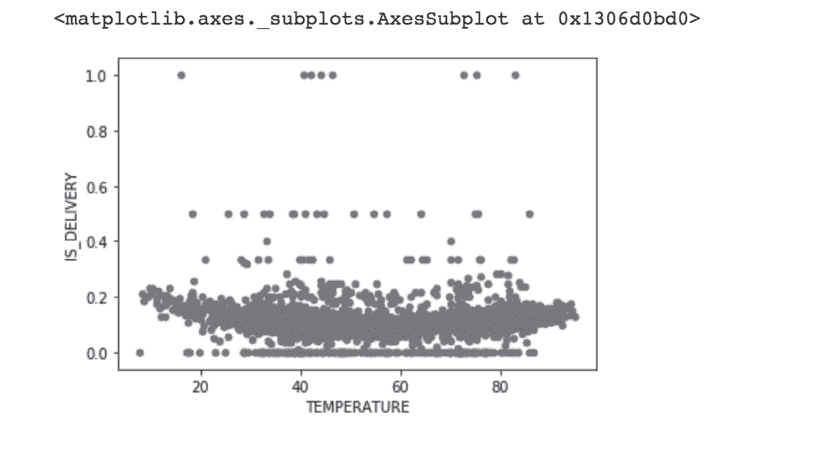

不幸的是，这似乎没什么特别的帮助。该表包含近九千行，因此我们的图表包含九千个点。在这堆点中很难确切看出发生了什么。

一个更好的方法可能是创建温度“桶”（例如从0°F到10°F，10°F到20°F，依此类推），并找出每个桶中的*平均*配送百分比。这个汇总结果可能比这堆点更有洞察力。

首先，我们需要弄清楚如何生成这些桶。pandas有一些专门的函数来完成这个任务，但我们现在可以使用一种快速而粗糙的方法。我们只需要将每个温度数字除以10，四舍五入，然后再乘以10。例如，23°F的温度首先除以10得到2.3。然后四舍五入到2。最后，乘以10得到20。同样，17°F的温度除以10得到1.7，四舍五入得到2，乘以10得到20。因此，从15°F到25°F的每个温度都将被放入“20”桶中。从25°F到35°F的任何温度都将被放入“30”桶中，依此类推。

要在pandas中执行这些操作，我们可以简单地这样做：

```python
((df_combined.TEMPERATURE/10).round()*10).head()
```

```
0    10.0
1    10.0
2    10.0
3    20.0
4    20.0
Name: TEMPERATURE, dtype: float64
```

有趣的是，pandas还允许你输入`df_combined.TEMPERATURE.round(-1)`来一步完成此操作。

剩下的就是对这些桶进行`groupby()`，并找出每个桶的平均配送百分比。当然，我们可以通过创建一个包含桶的新列来实现这一点，或者我们可以使用第8.5.1节中的技巧按系列分组：

```python
( df_combined
    .groupby((df_combined.TEMPERATURE/10).round()*10)
    .IS_DELIVERY
    .mean()
    .plot(kind='bar') )
```

```
<matplotlib.axes._subplots.AxesSubplot at 0x12844c0d0>
```

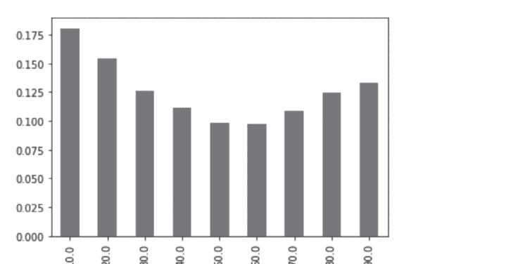

结果正如我们所料。在非常低的温度下，配送订单的百分比非常高，在最冷的温度下几乎达到20%。随着天气变暖，配送变得不那么受欢迎，直到温度变得*非常*热，此时配送比例又略有上升。对于Dig来说，这可能是至关重要的信息，因为它正在计划一个看起来可能特别寒冷的一周。

我们可以使用DRINKS列做完全相同的事情，看看每单的饮料数量如何随温度变化：

```python
( df_combined
    .groupby((df_combined.TEMPERATURE/10).round()*10)
    .DRINKS
    .mean()
    .plot(kind='bar') )
```

```
<matplotlib.axes._subplots.AxesSubplot at 0x1284edfd0>
```

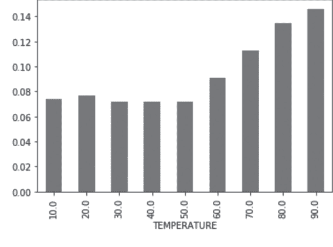

同样，结果很有启发性。当温度适中时，每单的饮料数量似乎徘徊在每百单八杯左右。当温度变得非常暖和时，数字上升到每百单超过十四杯的最大值。如果Dig正在寻找一个推广新饮料产品的好时机，这可能是无价的信息。

花点时间惊叹一下我们所做的事情。我们从超过两百万行数据开始——这是一个在Excel中打开都嫌太大的数据集。运用我们学到的几乎所有技巧，我们将其缩减为一个更小的数据集，按小时汇总了这些数百万订单。最后，我们将两个不同的数据源组合在一起，产生了有价值的商业洞察，如果没有Python为我们提供的工具，这些洞察将很难获得。

### 9.10 总结

这是本书的最后一章。如果你一直坚持到最后，我们表示热烈的祝贺！在本章中，我们希望向你展示了Python和pandas在分析真实规模数据集时的多功能性和强大功能。

信不信由你，我们只是触及了皮毛。我们甚至没有涉及大量的功能。然而，学习了本书的内容后，你现在拥有了自己探索这个编程世界所需的工具。在结论部分，我们将为你指出各种资源，你可以利用这些资源开始这段旅程，并找到让Python为你工作所需的工具。

## 接下来是什么？

**是时候结束这本书了。** 我们已经走了这么长的路！

正如斯蒂芬·科尔伯特所说，“欢迎来到书呆子地带，我的朋友。”我们喜欢编程的一点是，一旦你学会了它，你就无法*视而不见*。意思是，一旦你揭开了一层，探索了我们每天使用的一些工具的隐藏内部运作，就很难再以同样的方式看待世界了。也许很快，你就会在某个地方读到一些带有编程笑话的东西，你会停下来想，“哦！我明白了！”

那么我们是如何走到这里的？我们从基础开始——使用命令行、用Python编写和运行脚本，以及故障排除和调试错误。然后我们转向变量、数据类型和控制结构——从if语句到for循环。我们通过讨论函数结束了第一部分，函数是封装可重用小代码片段的强大方式。在第二部分，我们深入数据世界——我们讨论了pandas，并使用它来读取、写入和修改数据集。我们研究了如何组合多个数据集进行分析。最后，我们讨论了聚合，并使用这些技术回答了Dig案例中的许多业务问题。

还记得第一天吗？

```python
print("Winter is coming.")
```

这似乎已经是很久以前的事了。而那些看起来如此复杂的东西，现在看起来如此简单。

当然，在这一点上很容易感到不知所措。借用唐纳德·拉姆斯菲尔德的话，“有已知的已知，有已知的未知，然后还有未知的未知。”你可能比开始时感到更加不知所措，因为现在你意识到自己对Python还有多少不了解。

请记住，本书的目标不是让你读完后感觉已经掌握了Python，而是让你学到足够的知识，能够继续自己探索，而不会感到不知所措。Python的范围是*巨大的*，现在你知道了一点点（但希望它会派上用场）。

据说阿尔伯特·爱因斯坦曾被问及他的电话号码。他随即掏出了一本电话簿。

他的朋友说，“什么，你没记住自己的电话号码？”

据报道，爱因斯坦回答说，“永远不要记住任何你可以查到的东西。”

在这个谷歌时代，要知道你总是可以快速搜索一下，以防你需要记住如何在Python中做某事。

所以，坐下来，放松一下，记住懂得Python让你比99%的其他MBA、经理、分析师等等更有价值。¹

你接下来该去哪里？还记得那些“选择你自己的冒险”书吗？你会读到某个点，然后面临一个决定：是打开一扇门（翻到第17页）还是走下一条黑暗的走廊（翻到第48页）？学习编程有点像那样。我们选择本书的主题是为了向你介绍Python的许多不同方面。你现在处于一个很好的位置，可以理解你接下来想探索的任何主题——你想翻到哪一页。

如果你已经渴望更多，我们推荐以下优秀的后续书籍：

1. 如果你对Python通过自动化日常任务来让你的生活更轻松的能力感兴趣，那么Al Sweigart的《Python编程快速上手——让繁琐工作自动化》就是不二之选。这本书向你展示了如何用Python做诸如发送电子邮件和短信、读取PDF文档、访问Google电子表格等事情。
2. 如果你有兴趣更深入地学习第二部分的内容，Jake VanderPlas的《Python数据科学手册》非常出色。它涵盖了我们讨论的所有内容以及更多内容。
3. 如果你对机器学习以及Python如何帮助你构建自己的机器学习解决方案感兴趣，Andreas Müller和Sarah Guido的《Python机器学习基础教程》是一个很好的资源。²

幸运的是，在撰写本文时，前两本书的完整内容已可在网上免费获取。我们推荐的另一个优秀资源是 HackerRank.com，你可以在那里通过从基础到高级的挑战来练习你的 Python 技能。公司甚至已经开始使用像 HackerRank 这样的网站作为在招聘过程中评估程序员的一种方式。

自学过程中最困难的部分之一是故障排除过程。如果你独自一人遇到一个无法解决的问题，该怎么办？幸运的是，Python 拥有一个庞大的支持社区。最好的学习方法之一是参加 Python 线下聚会，向比你懂得多的人请教。如果你恰好住在美国的大城市，meetup.com 网站上几乎每天都有与 Python 相关的聚会。但如果你不住在大城市，仍然有大量的在线社区和论坛可供你使用。名为 PySlackers 的非官方 Python Slack 社区目前拥有超过两万五千名成员，他们通常很友好，愿意帮助初学者（只要你态度友好）。

我们俩都想借此机会感谢你与我们一同踏上这段旅程。我们希望你阅读本书的乐趣与我们写作时一样多。如果你心怀感激，或者有任何问题或反馈，请通过电子邮件 authors@pythonformbas.com 联系我们并保持联系。祝你好运。

## 注释

### 1. Python 入门

1. *Stack Overflow 开发者调查 2019*，Stack Overflow，2019，https://insights.stackoverflow.com/survey/2019/。
2. "英语中的单词数量"，Global Language Monitor，2020年1月1日，https://www.languagemonitor.com/global-english/no-of-words/。
3. Robert Lane Greene，"词汇事实"，*The Economist*，2013年5月29日，https://www.economist.com/johnson/2013/05/29/lexical-facts。
4. Sergey Brin 和 Larry Page，"大型超文本网络搜索引擎的剖析"（斯坦福大学计算机科学系，加利福尼亚州斯坦福，1998年），http://infolab.stanford.edu/~backrub/google.html。
5. David Robinson，"Python 的惊人增长"，*Stack Overflow*（博客），2017年9月6日，https://stackoverflow.blog/2017/09/06/incredible-growth-python/。
6. *Stack Overflow 开发者调查 2019*，Stack Overflow，2019，https://insights.stackoverflow.com/survey/2019/。
7. Stephen Kurczy，"会编程的 MBA"（Ideas at Work，哥伦比亚商学院，2018年9月12日），https://www8.gsb.columbia.edu/articles/ideas-work/mbas-who-code。
8. 如果这让你困扰，你实际上可以通过在命令行中运行以下代码来关闭此功能：

    conda config --set changeps1 False

    然后重启命令行。

### 2. Python 基础，第一部分

1. 或者 Bing、DuckDuckGo，或者你偏好的任何搜索引擎。
2. Pearl Philip，"语法错误：无明显原因的无效语法"，Stack Overflow 论坛，2014年6月16日，https://stackoverflow.com/questions/24237111/syntax-error-invalid-syntax-for-no-apparent-reason。
3. "如何提出一个好问题？"，Stack Overflow，帮助中心，https://stackoverflow.com/help/how-to-ask。
4. Guido van Rossum、Z Barry Warsaw 和 Nick Coghlan，*PEP 8—Python 代码风格指南*（弗吉尼亚州弗雷德里克斯堡：Python 软件基金会，2018年），https://www.python.org/dev/peps/pep-0008/#method-names-and-instance-variables。
5. 实际上，这仅在 Python 3 中成立。在 Python 2 中，你总是会得到一个整数，但运行 `1 / 2` 会返回 0，正如你可以想象的那样，这可能会引起混淆。在 Python 2 中，如果你想将两个数相除并得到一个浮点数，你必须明确告诉它这样做。这相当违反直觉，所以他们在 Python 3 中改变了这一点。
6. "字符串"一词的起源实际上比 Python 早得多。字符串被称为"字符串"是因为它们由一个字符序列或字符串组成。

### 3. Python 基础，第二部分

1. Joel Spolsky，"Netscape 疯了"，*Joel on Software*（博客），2000年11月20日，https://www.joelonsoftware.com/2000/11/20/netscape-goes-bonkers/。
2. 严格来说，`range()` 在 Python 3 中实际上产生一个称为 range 的东西（不是列表），但你可以像遍历列表一样遍历它。
3. 目前，HackerRank 上 FizzBuzz 的最短解决方案比我们包含的解决方案整整短了二十个字符，我们完全不知道他们是如何做到的（解决方案本身没有发布，只有分数）。我们相当佩服。
4. 也可以用数字标记字典中的元素，但本节我们将始终使用"字符串"来区分这些字典与列表。

### 4. Python 基础，第三部分

1. 有趣的是，`if()` 在 Excel 中是一个函数，但在 Python 中不是——这只是 Python 创建者做出的一个决定。他们本可以将其设为一个函数，但他们没有。
2. 调用 `split()` 和 `split(" ")` 之间实际上存在细微差别。尝试在以下字符串上操作："Once more unto the breach"（注意多个空格，并确保你输入它们，尽管复制空格的确切数量并不重要）。
3. 其他代码异味包括在 Python 中非常长且缩进层级过多的函数，但还有很多很多其他情况。
4. "Windows 10 包含多少行代码？"，Quora，https://www.quora.com/How-many-lines-of-code-does-Windows-10-contain。
5. 它使用了 Python 的扩展切片语法。如果你感兴趣，我们鼓励你自己探索这一点，但不值得在此处包含。
6. 在 Python 中，包、库和模块之间存在一些细微的技术差异，但就本书而言，将它们视为同一件事会很有帮助。
7. 还要注意 `print "Hello, world!"` 中缺少括号——这是该漫画为 Python 2 编写的一个明显标志。
8. 你有其他方式安装包，也有其他包仓库可用，但大多数 Python 程序员发现 `pip` 是迄今为止最容易使用的。

### 5. Python 数据入门

1. Linette Lopez，"伦敦鲸鱼事件部分源于使用 Excel 的错误"，*Business Insider*，2013年2月12日，https://www.businessinsider.com/excel-partly-to-blame-for-trading-loss-2013-2。
2. 你可以通过多种方式启动 *Jupyter*。例如，你可以启动一个名为 *Anaconda Navigator* 的应用程序（它在 PC 和 Mac 上都存在），然后从那里启动 *Jupyter Notebook*。我们发现前一种方法最容易。
3. 对于那些好奇的人，本书的网站也包含文件 `Orders.csv`，其中记录了每个订单的完整信息，包括所有提到的复杂性。
4. 另一种方法是使用参数 `inplace=True` 调用相关函数。由于各种原因，我们在本书中从未使用过这种方法，其中一个重要原因是它可能在未来的 pandas 版本中被移除；参见 https://github.com/pandas-dev/pandas/issues/16529。
5. 如果你操作不正确，你会得到一个 `FileNotFound` 错误。

### 6. Python 中的数据探索、绘图和修改

1. 当你学习更多关于 Python 绘图的知识时，你会发现 Python 中主要的绘图库叫做 `matplotlib`。我们不在本书中单独介绍 `matplotlib` 语法，而是依赖于一个允许直接从 pandas 生成图表的快捷方式。我们在这里讨论的所有选项和功能，如果你直接使用 `matplotlib` 绘图，也同样可用。
2. 当然，你可能想为每家餐厅建立不同的规则，这需要分别计算每家餐厅的均值和标准差。不幸的是，我们目前还没有工具来做到这一点，但我们将在第 9 章回到这个问题。
3. 这些"连续直方图"是使用一种称为*核密度估计器*的方法生成的；因此，函数参数中的"kde"。
4. 我们将在第 8.3.1 节回到这些函数，届时我们还将讨论它们如何处理缺失值。
5. 你可能注意到 x 轴有点挤，因为有许多数字需要绘制。调整图表的外观是一个庞大的主题，我们没有时间在本书中讨论，但调整大小实际上相当简单——你只需要在 `plot()` 函数中使用 `figsize` 参数。在这种情况下，尝试传递 `figsize=(10,5)`：第一个数字是宽度，第二个是高度。
6. 你们中更敏锐的人可能已经注意到，这个语句将一个 DateTime 类型的变量（`df_orders.DATETIME`）与一个字符串（'2018-06-01'）进行比较。通常，这会是一个问题，但在这种特定情况下，pandas 足够聪明，可以进行比较。
7. 事实上，让这个错误尤其令人恼火的是，这并非*总是*如此。有时，pandas 会返回对原始 DataFrame 的直接引用而不是副本，这个语句*会*起作用。然而，由于这种行为不可预测，你*永远不*应该使用这种方法来编辑 DataFrame 中的特定单元格。
8. 请注意，我们将在第 9 章介绍更有效的方法，并在第 9.7 节将这些方法应用于这个问题。我们在这里使用这个例子是为了更多地练习本章的概念。

### 7. 合并数据集

1. 理论上，外连接在这里也可以使用，只要没有数据错误——特别是，只要 `df_driving` 中没有同时不在 `df_drivers` 中的司机。

### 8. 聚合

1. 在应用 `size()` 时，不指定特定列的一个缺点是，生成的序列将没有名称。因此，如果你对结果执行 `reset_index()`，pandas 将没有名称可赋予该列，它会简单地将其命名为 0。要查看实际效果，请尝试执行以下操作：`df_orders.groupby('RESTAURANT_NAME').size().reset_index()`。
2. 在 pandas 中，多级索引的部分被称为“级别”，而不是“列”。由于我们在本书中不会深入探讨多级索引，为简单起见，我们将它们称为“列”。
3. 如果你自讨苦吃，也可以分别执行每个聚合，然后连接两个表；我们在本章的笔记本中为你提供了这样做的代码。不过，我们认为这种方法更简单！
4. 此时，我们应该注意，使用 `agg()` 还有许多其他方式；我们只介绍了我们认为最有用和最通用的一种，但我们鼓励你探索文档以及该函数的其他使用方式。
5. 理论上，你可以将 `resample()` 与 DataFrame 的某一列一起使用，但截至我们撰写本书时，此功能在与 `groupby()` 一起使用时有点问题，因此你应该避免这样做（有兴趣的读者，请参阅 GitHub 上的 pandas issue #30057，由本人报告）。如果此功能在后续版本中得到改进，我们将在本书网站上发布通知。
6. “偏移别名”，pandas 用户指南，https://pandas.pydata.org/pandas-docs/stable/user_guide/timeseries.html#offset-aliases。

## 下一步是什么？

1. 好吧，这完全是一个编造的统计数据……算是吧。Stack Overflow 开发者调查 2019 连续第三年将 Python 列为其“最想要”的编程语言榜首。Stack Overflow 开发者调查 2019，Stack Overflow，2019，https://insights.stackoverflow.com/survey/2019/。
2. Al Sweigart，《Python编程快速上手——让繁琐工作自动化》，https://automatetheboringstuff.com；Jake VanderPlas，《Python数据科学手册》（加利福尼亚州塞瓦斯托波尔：O'Reilly Media，2017），https://jakevdp.github.io/PythonDataScienceHandbook；Andreas Müller 和 Sarah Guido，《Python机器学习基础教程》（加利福尼亚州塞瓦斯托波尔：O'Reilly Media，2017）。

### 索引

- address.split (', '), 119
- age 变量, 68
- agg() 函数, 292–293, 347n4
- 聚合：基础知识, 281–287；代码, 281；数据, 211–213；在 DataFrame 中, 213；函数, 287–289；使用序列进行分组, 293–294；使用日期和时间进行分组, 294–301；包含缺失值, 287–288；多列, 291–293；pandas 函数, 212；餐厅订单信息, 317–318；理解, 281–286；unstack() 函数, 290–291；value_counts() 函数, 211–212, 322–323；变量相关性, 213
- AI. 参见 人工智能
- Allen, Bill, 164
- alpha 参数, 247
- & 符号, 223
- Anaconda Navigator, 346n2
- Anaconda PowerShell Prompt 程序, 19–20
- and 运算符, 82–83, 223
- apply() 函数, 293；与 DataFrame, 234–235；序列应用, 232–234
- 参数：alpha, 247；axis, 235；bins, 208；columns 和, 180, 238；命令后, 25–26；数据排序, 195–196, 200–201；作为字典, 179；错误, 178；函数中, 119–121, 128–131, 135–137, 292；带 bins 的直方图, 208；join() 函数, 93；连接中, 265, 267, 271；kind, 228–229；标签函数中, 124–125；lambda 函数中, 236；可选, 136；括号中, 119；plot() 函数中, 324–325；带 kind 的绘图, 228, 246；round() 函数, 61
- 算术：列上, 215–217；浮点数, 131–132；包含缺失值, 217–219；Python 2 中, 345n5
- 人工智能 (AI), 16
- Asmat, Shereen, 159, 165, 169–170, 302, 313
- 汇编语言, 14–15
- Atom 文本编辑器：代码更改保存在, 34–35；代码编写在, 17–18；开发环境, 17–18；文件打开在, 29；文件保存在, 44；键盘快捷键注释, 54；切换注释, 53
- Auden, W. H., 46
- authors@pythonformbas.com, 342
- 自动补全，变量, 183–184
- 《Python编程快速上手——让繁琐工作自动化》(Sweigart), 341
- 自动化, 147
- 平均值：配送订单, 333–334；列表, 118；移动平均, 297–299；订单与天气, 335–337；含饮料订单, 212–213
- axis 参数, 235
- 后端, 11–12
- 条形图, 199, 211
- 二进制代码, 14
- bins 参数, 208
- blog_post, 114
- 绑定方法, 182
- 碗，Dig 餐厅, 171
- 盒子类比, 58, 65
- 箱线图, 206–207
- 括号：agg() 函数中, 292；花括号, 65–67, 109；DataFrame 中, 175–178；列表使用, 91–92；使用, 82。另见方括号
- Brin, Sergey, 16
- 错误：代码中, 34, 44–45；DataFrame 在列表中, 258；导致错误的细节, 36；if 和 else 语句中, 77, 85–86；逻辑语句中, 224
- 内置函数, 235
- 商业智能团队, 316
- 商业模式，Dig 餐厅, 161
- 层叠样式表 (CSS), 11
- 区分大小写：else 语句中, 83–85；if.py 文件中, 83–87；if 语句, 72–74, 83–85；键/值对, 111–112；in 运算符, 81
- 案例研究，Dig 餐厅, 158–170
- C++ 计算机语言, 10, 21, 60
- cd 命令, 25–26
- 链式命令, 182
- 更改目录 (cd), 25–26
- 第 5 章, 156–170, 192
- 第 7 章, 253
- 字符长度，代码, 55
- clear 命令, 26
- 代码：编写建议, 21；聚合, 281；列上算术, 215–217；Atom 文本编辑器编写, 17–18；错误, 38, 46–47；内置函数, 235；单元格, 152–154；更改, 35；保存更改, 34–35；字符长度, 57；逗号使用, 35–36；注释, 53；DataFrame 输入, 174–180；DataFrame 分组, 310–312；字典, 108–115；重复, 126–127；elif 语句, 76–80；else 语句, 76–80；错误, 28–32, 75–76；文件加载, 303；函数, 118–137；help 命令, 42；if 语句, 74–76；缩进, 76, 119, 345n3；input.py 中, 70；交互模式运行, 42–44；JavaScript, 11–12, 15；连接, 263；Jupyter 输入, 149–150, 174, 182–184；键盘快捷键注释, 54；换行, 37；逐行运行, 51–52, 248–249；列表, 90–96；中间部分, 33；多个文件, 47；Netscape 重写, 89；括号使用, 57–58, 181–182；pd.merge() 函数, 274；print.py, 44–45；标点符号, 36；Python, 2, 32；随机脚本, 38–39；重构, 125–129；重复复制粘贴, 277；餐厅和, 224–225；运行, 41–42；更短的行, 58；气味, 125, 345n3；字符串使用, 62–67；结构, 34；小费计算器, 70–71；变量赋值, 55；变量相关性, 213
- 编程：汇编语言, 14–15；后端, 12；二进制代码, 14；不同部分, 32–34；输入, 2；并不难, 7；JavaScript, 15；学习, 5–7, 32–34；编程差异, 13–14；技术债务, 126；网站, 10–11
- Colbert, Stephen, 340
- 冒号, 118, 216–217, 236；字典使用, 108；if 语句中, 74
- Columbia 餐厅, 322；apply() 函数和, 232–234；配送订单, 244–245, 321；午餐业务, 313, 315；每日订单, 295–296
- 列：agg() 函数和, 292–293；apply() 函数, 232–236；参数和, 180, 238；算术, 215–217；DataFrame 访问, 175–178；DataFrame 添加, 237；DataFrame 名称, 178–180；DataFrame 移除, 238；DataFrame 类型, 190–192；数据集, 171；datetime, 191, 225–230；饮料, 305–306；编辑整列, 238；groupby() 和两列, 323；输入, 292–293；isin() 函数, 224–225；连接键, 259–260, 264–265, 275–277；逻辑, 221–224；缺失值, 217–221；多级索引和, 284–285, 347n2；名称, 115；操作之间, 216–217；餐厅名称, 305；方括号表示法, 237；方括号使用, 292；字符串, 230–232；表, 270–271
- 列类型, 189–191
- 命令行, 152–155；参数和, 25–26；基础知识, 21–27；clear 命令, 26；开发环境, 19–21；从主目录, 26–27；交互模式和, 42–43；Jupyter notebook 输入, 150–151；Mac 计算机上, 19, 21–22,

### 索引 349

-   mkdir 命令在，27；print.py 运行在，44–45；用于 Python，20–21，41–42；脚本运行在，41–42；在 Windows 计算机上，19–20，22，43
-   逗号，代码中的使用：在 address.split 中，119；join() 函数和，91；在键/值对中，108；loc 运行时使用，240；print() 函数和，34–35；在 print.py 文件中，43
-   注释，用井号表示，51
-   社区支持，对于 Python，342
-   比较运算符，72–82
-   复杂可视化，211
-   列表推导式，101
-   计算机友好的语言，14
-   计算机：汇编语言编码用于，14–15；二进制代码在，14；整数在，60
-   concat() 函数，263
-   条件语句：elif 语句作为，76–80；else 语句作为，76–80；if 语句作为，74–76；在 Python 语言中，73–80
-   条件，在订单中，223–224
-   copy() 函数，241
-   复制粘贴，代码的，277
-   count()，292
-   CSS。参见层叠样式表
-   CSV 文件格式，186–187
-   卡明斯，e e，44，50
-   花括号，65–67，109
-   光标，22
-   顾客，326–330
-   数据：可访问性，316；聚合，211–213；分析，16；排序参数，195–196，200–201；民主化，316，320；Dig 餐厅的收集，165；pandas 探索，200–213；pandas 绘图，198–200；pandas 排序，194–198；编程语言类型，60–62；要提出的问题，304；读取，185–187；员工排班设计来自，313；写入，187–188
-   数据库：带有规则的后端，12；创建，165–166；SQL 语言用于，12；策略，167；表，254–255
-   数据驱动分析，158–170
-   DataFrames，158–170；聚合在，213；apply() 与，234–235；方括号在，175–178；列表作为的错误，258；代码输入在，174–180；代码分组，310–312；列名在，178–180；列添加在，237；列系列访问在，175–178；列移除在，238；列类型在，190–192；数据写入在，187–188；日期时间列在，305–306，318；外卖订单平均在，333–334；df_full_time，255–256；df_orders，288；df_students 在，194–196；每小时饮品在，332–333；错误在，182，241；过滤在，213–215，222；函数使用在，179；head() 函数在，180–181；Jupyter 访问列在，175–178；按小时订单在，334–335；输出来自，177；pandas，174–175；pandas 错误在，178，346n7；圆括号在，172–182；pickle 文件类型在，189；绘图数据在，199；rename() 函数在，179；reset_index() 在，283；餐厅外卖在，243–245；行索引在，178–180；shape 属性在，181；特定值编辑在，239–241；带方括号，213–214；结构，173；时间戳在，226–227；True/False 值在，214–215，220，222–223；value_counts() 过滤在，213
-   数据集：列，171；合并，253–255，332；用于 df_orders，307–312；df_orders，groupby 的，291–292；df_students.head()，282；df_summarized_orders，285–286；Dig 餐厅分析，170–172，241–242；Dig 餐厅列，171；Dig 餐厅构建，272–278；错误在，257；Excel 工作簿的，115，146，255–257；假设，205；连接在，267–269，319–320；加载顺序，187；餐厅完整订单，286–287；规模，147；汇总订单，317；weather.csv，331
-   日期，225–226，229
-   日期时间列：在 DataFrames 中，305–306，318；日期信息来自，191；来自 df_orders，189–190；绘制工作日信息来自，228–230；resample() 函数在，295–297；时间戳在，225–226；to_datetime() 函数用于，190；value_counts() 函数和，227；工作日提取自，227
-   日常任务，341
-   小数点：在 f-strings 中，65；整数和，59–60；带小数点的数字，58–60
-   默认应用程序，42
-   外卖：顾客菜单用于，326；DataFrames 平均订单，333–334；df_orders 用于餐厅，321–326；Dig 餐厅分析，320–326；订单，210，323–326；按餐厅，210，243–245，321–326
-   外卖专用菜单，306–312
-   数据民主化，316，320
-   密度图，211
-   describe() 函数，211–212
-   桌面工具，165–166
-   开发环境：命令行用于，19–21；Python 安装在，17–21；文本编辑器用于，17–18
-   df_combined，334–337
-   df_full_time，255–256
-   df_orders，203，213–214，273；DataFrames，288；数据集用于，307–312；日期时间列来自，189–190；groupby() 函数在，291–292，304–305，313–315，327–330；分组，293–294；健康菜单，327；resample() 函数在，295–297；餐厅外卖，321–326；unstack() 函数在，313–315
-   df_orders.head()，307–308
-   df_orders.info()，190
-   df_restaurants，203–205，273–274
-   df_res.to_pickle，279
-   df_students，180–181，184–186；在 DataFrames 中，194–196；缺失值在，217–221；学生缺失自，267；表行，261–262
-   df_students.head()，282
-   df_summarized_orders，280，285–286
-   df_summarized_orders 表，212–213，244，248–249
-   df_weather，331–332
-   字典，94，345n4；参数作为，179；挑战在，111–114；代码用于，108–115；冒号使用在，109–110；列名在，114；花括号使用在，108；f-strings 使用在，110–111；get() 函数在，112；keys() 函数在，109；键/值对在，111–112；列表的，174；目的，113–114；在 Python 语言中，107–115；方括号在，108；字符串使用与，108–109；值来自，112
-   dictionaries.py 文件，109–113
-   数字版本，2–3
-   Dig 餐厅，2；碗，171；商业模式，161；案例研究，158–170；顾客分析，326–330；数据收集，165；数据集分析，241–242；数据集列，171；数据集构建，272–278；数据集，170–172；外卖服务分析，320–326；外卖专用菜单，306–312；桌面工具使用，165–166；扩张计划，164–165，170；食物准备，163；食物浪费，168；日期和时间分组，294–301；主菜与配菜受欢迎度，309–312；菜单，162–163；新产品分析，303–306；新产品线，303–304；场外订单，164；运营，159–160；orders.csv 文件，171–172；订单表，201–202；员工分析，245–251，313–315；员工培训，168；供应链，164，169；价值链，162–164
-   divisible_by() 函数，125–126
-   文档字符串，184–185
-   点表示法，237–238
-   双引号，62–63，110
-   下拉菜单，183
-   drop() 函数，238
-   duplicated() 函数，270
-   边缘情况，36
-   编辑模式，152–155
-   爱因斯坦，阿尔伯特，341
-   元素：连接键的，262–265；列表中的，90–91，94–96
-   elif 语句，76–80，105–107
-   else 语句，76；错误，79；大小写敏感在，85–87；在 FizzBuzz 中，104–107；函数和，125–126；大于，小于，81–82；在 if.py 中，77，86；圆括号在，88–89；作为安全网，78
-   电子邮件地址，88–89
-   包含文件夹，25
-   文件末尾 (EOF)，41
-   相等性，变量和，73
-   等于，80–81
-   错误类，54
-   错误：来自参数，178；代码带有，28–32，75–76；在 DataFrames 中，182，241；在数据集中，257；调试，46–52；错误类在，56；文件夹，28；来自函数，134；谷歌搜索，47–48；交互模式，28–29；无效语法，48–49；pandas DataFrame，178，346n7；带圆括号，50；Python 2 代码到 3，45；在 Python 语言中，46–52；搜索结果在，48–49；方括号和，178；‘Syntax Error: invalid syntax’，49–50；变量未找到，158。另见错误
-   埃斯金，亚当，160–161，163–164，167
-   Excel 工作簿：数据集下载自，255–257；数据集和，115，146；文件保存在，34；函数在，117；pandas 使用，186–188；Python 代替，147–148，166；Python 读取文件，142，188；random() 函数和，141；Students.xlsx 文件来自，185
-   扩张计划，Dig 餐厅的，164–165，170
-   快速休闲连锁店，161
-   文件：在 Atom 中，29，44；代码存储在，26–27；CSV 格式，186–187；dictionaries.py，109–113；EOF，43；Excel 保存，34；扩展名，42；finance_functions.py，130–132；格式，186–187；happy_hour.py，27–39，65，138–140；if.py，74–78，85–89；importing.py，139；ipynb，157–158；Jupyter Notebook，152；lists.py，90–91，93–94；加载，303；logic_practice.py，84；loops.py，96；pickle 类型，189；.py，32，42；运行，37–38；strings.py，62–66；students.xlsx 文件，185–186；txt 扩展名，42；类型，189–190；variables.py，54–56
-   fillna() 函数，218–219，288
-   过滤，在 DataFrames 中，213–215，222
-   finance_functions.py 文件，130–132
-   FizzBuzz，102–103，345n3；挑战，104–108；if 和 else 语句在，104–107
-   浮点运算，131–132
-   浮点数，59–62，69–71
-   文件夹：第 5 章文件在，192；第 7 章文件在，253；创建，26–27；dictionaries.py 文件在，109；错误来自，28；finance_functions.py 文件在，130–132；functions.py 文件在，118，124；happy_hour.py 文件在，27–39；if.py 文件在，74–77；importing.py 文件在，139；lists.py 文件在，90，93；logic_practice.py 文件在，84；loops.py 文件在，96；math2.py 保存在，56–57；父级，25；第 2 部分文件用于，149，151–152；引号用于名称，25；strings.py 文件在，62–63；students.xlsx 文件在，185–186；variables.py 文件在，54–56
-   食物准备，163
-   食物浪费，168
-   for 循环，97–98，100–102
-   格式，在 f-strings 中，66
-   分数，58–60
-   常见问题，21
-   前端，11–12
-   f-strings，65；小数点在，67；字典使用，111–112；带双引号，110；格式在，66；在 Google 上，66
-   函数：agg()，292–293，347n4；apply()，232–235，293；参数在，119–121，128–131，135–137，292；参数在标签中，124–125；自动补全，183；内置，235；挑战在，122–123，127–132；concat()，263；copy()，241；DataFrames 使用，179；describe()，211–212；divisible_by()，125–126；drop()，238；重复代码到，125；duplicated()，270；else 语句和，125–126；错误来自，134；在 Excel 工作簿中，117；fillna()，218–219，288；get()，113；get_city()，122–123；head()，180–181；带缩进，119；index()，95；.info()，189–190；input()，67–71，134–135；带输入，123–124，127–130，134–137；int()，61；is_columbia，233；isin()，224–225；isnull()，219，221；join()，91；Jupyter 的自动补全，183；keys()，109–110；标签，124–125；lambda，236；len()，118；列表，90，93–94，110；login()，123；lower()，230；mean()，280，333；模块带，139；无返回自，133–134；单行，236；panda 的统计，287–288；圆括号在，119，140；pd.concat()，257–258；pd.merge()，263–264，274；plot()，208–209，211，324–325；print()，35–36，136–137；打印在，120–121；目的，124–125；在 Python 语言中，118–137；Python 步骤在创建中，119；random()，141；range()，99–100，345n2；read_excel()，185–186；rename()，179，264；resample()，294–297，299–301，318，334，347n5；reset_index()，196，283，347n1；rolling()，297–299；size()，332；sort_index()，197；sort_values()，196–197；split()，93–94，120，345n2；在字符串上，64–65；sum()，118；to_datetime()，191；total_extras()，236；unstack()，290–291，313–315，323。另见 groupby() 函数；value_counts() 函数
-   functions.py 文件，118，124
-   “葬礼蓝调”（奥登），44
-   get_city() 函数，120–123
-   get() 函数，112

### 352 索引

`get_state()` 函数，120–123
Github，143
Google，341；BigQuery，167；错误信息，47–48；f-string，66；Python 入门，16；搜索结果，48–49；Stack Overflow，48，48–49
大于，小于，81
Griffel, Mattan，5
`groupby()` 函数：分析，299–301；数据集，291–292；在 `df_orders` 上，291–292，304–305，313–315，327–330；多列分组，288–289，291–294；订单量，313–315；pandas 的，282–285；绘图，285，327–330；双列索引，323；`value_counts()`，288–289
分组：DataFrame 和代码，310–312；日期和时间，294–301；`df_orders` 的，293–294；日期和时间绘图，295–297；使用的序列，293–294
Guetta, Daniel，145–146，159
Guido, Sarah，341
HackerRank，342
`happy_hour.py` 文件，27–37，63–64，138–139
《哈利·波特与密室》，211
标签，51
`head()` 函数，180–181
直方图：`bins` 参数，208；比较，209–210；逐行代码生成，248–251；数值列和绘图，205–211；绘图，246–247；不同刻度，208；绘制的值，207–208
《银河系漫游指南》，56
主目录，23，26–27
“如何提出一个好问题？”（Stack Overflow），47
HR。参见人力资源
HTML。参见超文本标记语言
人类可读性，Python 的，15–16
人力资源（HR），313
超文本标记语言（HTML），11
假设，数据集的，205
`if.py` 文件，74–78，85–89
`if` 语句，223；错误，79；大小写敏感，74–76，85–87；冒号，76；在 FizzBuzz 中，104–107；缩进，76，79–80；括号，88–89
`importing.py` 文件，139–140

`in`（运算符），81–82
缩进：代码中，119，345n3；带缩进的函数，119；`if` 语句的，76，79–80；重要性，76；Tab 键，74
索引对齐，265–266
`index()` 函数，94
单个序列，175
`.info()` 函数，189–190
内连接，260，273
`input()` 函数，66–70，134–135
`input.py`，66–69
输入：列，292–293；带输入的函数，123–124，127–130，134–137；到 `if.py`，74，77–78，86–89；括号内，44，119；用户，68–71
店内订单，163–164，201–202
整数：小数点，57–58；与浮点数比较，59–62，69–70；在 `math2.py` 中，59–62；字符串转换为，69–70
集成，148
交互模式：意外打开，29；代码实验，44；错误，28–29；`if` 语句，75；使用的逻辑，85；运行 Python 代码，42–44；节省的步骤，59–60
交互式 shell，57–58
`int()` 函数，60
《Python 机器学习入门》（Müller 和 Guido），341
无效语法错误，48–49
`ipynb` 文件，157–158
`is_columbia` 函数，233
`isin()` 函数，224–225
`isnull()` 函数，219，221
`Items.csv`，170–171
JavaScript，10–12，15
Johnson, Kimberly，16–17
`join()` 函数，91
连接键：列的，259–260，264–265，275–277；元素，262–265；主键，271
连接：参数，265，267，271；代码，263；数据集中，267–269，319–320；索引对齐，265–266；左连接，267–269；外连接，319–320；pandas 中，262–266；选择正确的，268–269；主键，270–271
Jupyter Notebook，148，150；输入代码，152–154，174，182–184；命令行，150–151；命令模式，152–155；创建新，194，281，303；数据驱动分析，158–170；访问 DataFrame 列，175–178；文档字符串，185；下拉菜单，183；编辑模式，152–155；创建文件，152；函数名自动补全，183；启动，150–152，346n2；循环绘图，244–248；Markdown 单元格，156；导入 pandas，172–173，175；Python 代码，149–156；Python 内核，154–155，157–158；`[%%]` 时间指令，233；变量自动补全，183

81；`not` 运算符，82；`and` 运算符，82–83；`in` 运算符，83–84；`or` 运算符，83；括号，224；练习，84；Python 语言中，80–85

`logic_practice.py` 文件，82

`login()` 函数，123

Looker 软件，166

循环：`for`，97–98，100–102；FizzBuzz，104–108；单个餐厅，247–251；Jupyter Notebook 绘图，244–248；练习，98–100；Python 语言中，96–102；`range()` 函数，99–100；重复复制粘贴，277；变量，97–98

`loops.py` 文件，94

小写值，231

`lower()` 函数，230

`ls`。参见列表

`ls` 命令，24–25

Kapelonis, Elena，160

Kapelonis, Steve，160

核密度估计器，346n3

键盘快捷键，52

`KeyError`，111–112

`keys()` 函数，109–110

键/值对，108–109，111–112

`kind` 参数，228–229

Mac 电脑：`cd` 命令，25–26；命令行，19，21–22，43；默认文本编辑器，32；退出交互模式，43；键盘快捷键，53；`ls` 命令，24–25；`open .` 命令，23–24；`pwd` 命令，22–23，28；预装 Python，18；终端程序，19

标签函数，124–125

`lambda` 函数，236

启动，Jupyter Notebook，150–152，346n2

左连接，261–262，265，267–269，273

`len()` 函数，117

库，345n6；导入，136；pandas，172–185；Python 的绘图库，198，211，346n1；Python 标准库，140–141；seaborn，211

换行符：代码中，35；花括号，108；括号，56，174；引号，56

机器学习，16，341

Markdown 语言，156

数学：整数与浮点数，59–62；模块，56–57；Python 语言用于，56–62；字符串用于，64；符号，57。另见算术

`math2.py`，56–57，59–62

`matplotlib` 语法，198，253，281，303，346n1

均值，117，206–207

`mean()` 函数，280，291–292，333

菜单：顾客和配送，326；特定配送，306–312；`df_orders` 和健康，327；Dig 餐厅，162–163；下拉，183；菜品受欢迎度，307–312；主要组成部分，171

方法，63

Meyer, Danny，164

缺失值：聚合，287–288；算术运算，217–219；列中，217–221；`df_students` 中，217–221；NaN 表示，232；pandas 表示，217–219

`mkdir` 命令，27

模块：带函数，139；数学，56–57；Python 导入，137–142

列表（`ls`）：平均值，118；使用的方括号，91–92；构建，91–92；来自代码，90–96；命令，24–25；推导式，102；DataFrame 错误，258；字典，174；元素，90–91，94–96；函数，90；`join()` 函数，93；`keys()` 函数，110；打印，93；Python 语言中，90–96；`split()` 函数，93–94；带方括号，33，90，92–93；方括号和元素，94；来自字符串，65，92–93；元组，91

`lists.py` 文件，89–90，92–93

本地农产品，160

`loc` 关键字，240

逻辑：语句中的错误，224；列中，221–224；使用的日期，229；等于，80–81；大于，小于，81；交互模式使用，85；不等于，81；`not` 运算符，82；`and` 运算符，82–83；`in` 运算符，83–84；`or` 运算符，83；括号，224；练习，84；Python 语言中，80–85

`logic_practice.py` 文件，82

`login()` 函数，123

Looker 软件，166

循环：`for`，97–98，100–102；FizzBuzz，104–108；单个餐厅，247–251；Jupyter Notebook 绘图，244–248；练习，98–100；Python 语言中，96–102；`range()` 函数，99–100；重复复制粘贴，277；变量，97–98

`loops.py` 文件，94

小写值，231

`lower()` 函数，230

`ls`。参见列表

`ls` 命令，24–25

Kapelonis, Elena，160

Kapelonis, Steve，160

核密度估计器，346n3

键盘快捷键，52

`KeyError`，111–112

`keys()` 函数，109–110

键/值对，108–109，111–112

`kind` 参数，228–229

Mac 电脑：`cd` 命令，25–26；命令行，19，21–22，43；默认文本编辑器，32；退出交互模式，43；键盘快捷键，53；`ls` 命令，24–25；`open .` 命令，23–24；`pwd` 命令，22–23，28；预装 Python，18；终端程序，19

标签函数，124–125

`lambda` 函数，236

启动，Jupyter Notebook，150–152，346n2

左连接，261–262，265，267–269，273

`len()` 函数，117

库，345n6；导入，136；pandas，172–185；Python 的绘图库，198，211，346n1；Python 标准库，140–141；seaborn，211

换行符：代码中，35；花括号，108；括号，56，174；引号，56

机器学习，16，341

Markdown 语言，156

数学：整数与浮点数，59–62；模块，56–57；Python 语言用于，56–62；字符串用于，64；符号，57。另见算术

`math2.py`，56–57，59–62

`matplotlib` 语法，198，253，281，303，346n1

均值，117，206–207

`mean()` 函数，280，291–292，333

菜单：顾客和配送，326；特定配送，306–312；`df_orders` 和健康，327；Dig 餐厅，162–163；下拉，183；菜品受欢迎度，307–312；主要组成部分，171

方法，63

Meyer, Danny，164

缺失值：聚合，287–288；算术运算，217–219；列中，217–221；`df_students` 中，217–221；NaN 表示，232；pandas 表示，217–219

`mkdir` 命令，27

模块：带函数，139；数学，56–57；Python 导入，137–142

列表（`ls`）：平均值，118；使用的方括号，91–92；构建，91–92；来自代码，90–96；命令，24–25；推导式，102；DataFrame 错误，258；字典，174；元素，90–91，94–96；函数，90；`join()` 函数，93；`keys()` 函数，110；打印，93；Python 语言中，90–96；`split()` 函数，93–94；带方括号，33，90，92–93；方括号和元素，94；来自字符串，65，92–93；元组，91

`lists.py` 文件，89–90，92–93

本地农产品，160

`loc` 关键字，240

逻辑：语句中的错误，224；列中，221–224；使用的日期，229；等于，80–81；大于，小于，81；交互模式使用，85；不等于，81；`not` 运算符，82；`and` 运算符，82–83；`in` 运算符，83–84；`or` 运算符，83；括号，224；练习，84；Python 语言中，80–85

`logic_practice.py` 文件，82

`login()` 函数，123

Looker 软件，166

循环：`for`，97–98，100–102；FizzBuzz，104–108；单个餐厅，247–251；Jupyter Notebook 绘图，244–248；练习，98–100；Python 语言中，96–102；`range()` 函数，99–100；重复复制粘贴，277；变量，97–98

`loops.py` 文件，94

小写值，231

`lower()` 函数，230

`ls`。参见列表

`ls` 命令，24–25

Kapelonis, Elena，160

Kapelonis, Steve，160

核密度估计器，346n3

键盘快捷键，52

`KeyError`，111–112

`keys()` 函数，109–110

键/值对，108–109，111–112

`kind` 参数，228–229

Mac 电脑：`cd` 命令，25–26；命令行，19，21–22，43；默认文本编辑器，32；退出交互模式，43；键盘快捷键，53；`ls` 命令，24–25；`open .` 命令，23–24；`pwd` 命令，22–23，28；预装 Python，18；终端程序，19

标签函数，124–125

`lambda` 函数，236

启动，Jupyter Notebook，150–152，346n2

左连接，261–262，265，267–269，273

`len()` 函数，117

库，345n6；导入，136；pandas，172–185；Python 的绘图库，198，211，346n1；Python 标准库，140–141；seaborn，211

换行符：代码中，35；花括号，108；括号，56，174；引号，56

机器学习，16，341

Markdown 语言，156

数学：整数与浮点数，59–62；模块，56–57；Python 语言用于，56–62；字符串用于，64；符号，57。另见算术

`math2.py`，56–57，59–62

`matplotlib` 语法，198，253，281，303，346n1

均值，117，206–207

`mean()` 函数，280，291–292，333

菜单：顾客和配送，326；特定配送，306–312；`df_orders` 和健康，327；Dig 餐厅，162–163；下拉，183；菜品受欢迎度，307–312；主要组成部分，171

方法，63

Meyer, Danny，164

缺失值：聚合，287–288；算术运算，217–219；列中，217–221；`df_students` 中，217–221；NaN 表示，232；pandas 表示，217–219

`mkdir` 命令，27

模块：带函数，139；数学，56–57；Python 导入，137–142

列表（`ls`）：平均值，118；使用的方括号，91–92；构建，91–92；来自代码，90–96；命令，24–25；推导式，102；DataFrame 错误，258；字典，174；元素，90–91，94–96；函数，90；`join()` 函数，93；`keys()` 函数，110；打印，93；Python 语言中，90–96；`split()` 函数，93–94；带方括号，33，90，92–93；方括号和元素，94；来自字符串，65，92–93；元组，91

`lists.py` 文件，89–90，92–93

本地农产品，160

`loc` 关键字，240

逻辑：语句中的错误，224；列中，221–224；使用的日期，229；等于，80–81；大于，小于，81；交互模式使用，85；不等于，81；`not` 运算符，82；`and` 运算符，82–83；`in` 运算符，83–84；`or` 运算符，83；括号，224；练习，84；Python 语言中，80–85

`logic_practice.py` 文件，82

`login()` 函数，123

Looker 软件，166

循环：`for`，97–98，100–102；FizzBuzz，104–108；单个餐厅，247–251；Jupyter Notebook 绘图，244–248；练习，98–100；Python 语言中，96–102；`range()` 函数，99–100；重复复制粘贴，277；变量，97–98

`loops.py` 文件，94

小写值，231

`lower()` 函数，230

`ls`。参见列表

`ls` 命令，24–25

Kapelonis, Elena，160

Kapelonis, Steve，160

核密度估计器，346n3

键盘快捷键，52

`KeyError`，111–112

`keys()` 函数，109–110

键/值对，108–109，111–112

`kind` 参数，228–229

Mac 电脑：`cd` 命令，25–26；命令行，19，21–22，43；默认文本编辑器，32；退出交互模式，43；键盘快捷键，53；`ls` 命令，24–25；`open .` 命令，23–24；`pwd` 命令，22–23，28；预装 Python，18；终端程序，19

标签函数，124–125

`lambda` 函数，236

启动，Jupyter Notebook，150–152，346n2

左连接，261–262，265，267–269，273

`len()` 函数，117

库，345n6；导入，136；pandas，172–185；Python 的绘图库，198，211，346n1；Python 标准库，140–141；seaborn，211

换行符：代码中，35；花括号，108；括号，56，174；引号，56

机器学习，16，341

Markdown 语言，156

数学：整数与浮点数，59–62；模块，56–57；Python 语言用于，56–62；字符串用于，64；符号，57。另见算术

`math2.py`，56–57，59–62

`matplotlib` 语法，198，253，281，303，346n1

均值，117，206–207

`mean()` 函数，280，291–292，333

菜单：顾客和配送，326；特定配送，306–312；`df_orders` 和健康，327；Dig 餐厅，162–163；下拉，183；菜品受欢迎度，307–312；主要组成部分，171

方法，63

Meyer, Danny，164

缺失值：聚合，287–288；算术运算，217–219；列中，217–221；`df_students` 中，217–221；NaN 表示，232；pandas 表示，217–219

`mkdir` 命令，27

模块：带函数，139；数学，56–57；Python 导入，137–142

列表（`ls`）：平均值，118；使用的方括号，91–92；构建，91–92；来自代码，90–96；命令，24–25；推导式，102；DataFrame 错误，258；字典，174；元素，90–91，94–96；函数，90；`join()` 函数，93；`keys()` 函数，110；打印，93；Python 语言中，90–96；`split()` 函数，93–94；带方括号，33，90，92–93；方括号和元素，94；来自字符串，65，92–93；元组，91

`lists.py` 文件，89–90，92–93

本地农产品，160

`loc` 关键字，240

逻辑：语句中的错误，224；列中，221–224；使用的日期，229；等于，80–81；大于，小于，81；交互模式使用，85；不等于，81；`not` 运算符，82；`and` 运算符，82–83；`in` 运算符，83–84；`or` 运算符，83；括号，224；练习，84；Python 语言中，80–85

`logic_practice.py` 文件，82

`login()` 函数，123

Looker 软件，166

循环：`for`，97–98，100–102；FizzBuzz，104–108；单个餐厅，247–251；Jupyter Notebook 绘图，244–248；练习，98–100；Python 语言中，96–102；`range()` 函数，99–100；重复复制粘贴，277；变量，97–98

`loops.py` 文件，94

小写值，231

`lower()` 函数，230

`ls`。参见列表

`ls` 命令，24–25

Kapelonis, Elena，160

Kapelonis, Steve，160

核密度估计器，346n3

键盘快捷键，52

`KeyError`，111–112

`keys()` 函数，109–110

键/值对，108–109，111–112

`kind` 参数，228–229

Mac 电脑：`cd` 命令，25–26；命令行，19，21–22，43；默认文本编辑器，32；退出交互模式，43；键盘快捷键，53；`ls` 命令，24–25；`open .` 命令，23–24；`pwd` 命令，22–23，28；预装 Python，18；终端程序，19

标签函数，124–125

`lambda` 函数，236

启动，Jupyter Notebook，150–152，346n2

左连接，261–262，265，267–269，273

`len()` 函数，117

库，345n6；导入，136；pandas，172–185；Python 的绘图库，198，211，346n1；Python 标准库，140–141；seaborn，211

换行符：代码中，35；花括号，108；括号，56，174；引号，56

机器学习，16，341

Markdown 语言，156

数学：整数与浮点数，59–62；模块，56–57；Python 语言用于，56–62；字符串用于，64；符号，57。另见算术

`math2.py`，56–57，59–62

`matplotlib` 语法，198，253，281，303，346n1

均值，117，206–207

`mean()` 函数，280，291–292，333

菜单：顾客和配送，326；特定配送，306–312；`df_orders` 和健康，327；Dig 餐厅，162–163；下拉，183；菜品受欢迎度，307–312；主要组成部分，171

方法，63

Meyer, Danny，164

缺失值：聚合，287–288；算术运算，217–219；列中，217–221；`df_students` 中，217–221；NaN 表示，232；pandas 表示，217–219

`mkdir` 命令，27

模块：带函数，139；数学，56–57；Python 导入，137–142

列表（`ls`）：平均值，118；使用的方括号，91–92；构建，91–92；来自代码，90–96；命令，24–25；推导式，102；DataFrame 错误，258；字典，174；元素，90–91，94–96；函数，90；`join()` 函数，93；`keys()` 函数，110；打印，93；Python 语言中，90–96；`split()` 函数，93–94；带方括号，33，90，92–93；方括号和元素，94；来自字符串，65，92–93；元组，91

`lists.py` 文件，89–90，92–93

本地农产品，160

`loc` 关键字，240

逻辑：语句中的错误，224；列中，221–224；使用的日期，229；等于，80–81；大于，小于，81；交互模式使用，85；不等于，81；`not` 运算符，82；`and` 运算符，82–83；`in` 运算符，83–84；`or` 运算符，83；括号，224；练习，84；Python 语言中，80–85

`logic_practice.py` 文件，82

`login()` 函数，123

Looker 软件，166

循环：`for`，97–98，100–102；FizzBuzz，104–108；单个餐厅，247–251；Jupyter Notebook 绘图，244–248；练习，98–100；Python 语言中，96–102；`range()` 函数，99–100；重复复制粘贴，277；变量，97–98

`loops.py` 文件，94

小写值，231

`lower()` 函数，230

`ls`。参见列表

`ls` 命令，24–25

Kapelonis, Elena，160

Kapelonis, Steve，160

核密度估计器，346n3

键盘快捷键，52

`KeyError`，111–112

`keys()` 函数，109–110

键/值对，108–109，111–112

`kind` 参数，228–229

Mac 电脑：`cd` 命令，25–26；命令行，19，21–22，43；默认文本编辑器，32；退出交互模式，43；键盘快捷键，53；`ls` 命令，24–25；`open .` 命令，23–24；`pwd` 命令，22–23，28；预装 Python，18；终端程序，19

标签函数，124–125

`lambda` 函数，236

启动，Jupyter Notebook，150–152，346n2

左连接，261–262，265，267–269，273

`len()` 函数，117

库，345n6；导入，136；pandas，172–185；Python 的绘图库，198，211，346n1；Python 标准库，140–141；seaborn，211

换行符：代码中，35；花括号，108；括号，56，174；引号，56

机器学习，16，341

Markdown 语言，156

数学：整数与浮点数，59–62；模块，56–57；Python 语言用于，56–62；字符串用于，64；符号，57。另见算术

`math2.py`，56–57，59–62

`matplotlib` 语法，198，253，281，303，346n1

均值，117，206–207

`mean()` 函数，280，291–292，333

菜单：顾客和配送，326；特定配送，306–312；`df_orders` 和健康，327；Dig 餐厅，162–163；下拉，183；菜品受欢迎度，307–312；主要组成部分，171

方法，63

Meyer, Danny，164

缺失值：聚合，287–288；算术运算，217–219；列中，217–221；`df_students` 中，217–221；NaN 表示，232；pandas 表示，217–219

`mkdir` 命令，27

模块：带函数，139；数学，56–57；Python 导入，137–142

列表（`ls`）：平均值，118；使用的方括号，91–92；构建，91–92；来自代码，90–96；命令，24–25；推导式，102；DataFrame 错误，258；字典，174；元素，90–91，94–96；函数，90；`join()` 函数，93；`keys()` 函数，110；打印，93；Python 语言中，90–96；`split()` 函数，93–94；带方括号，33，90，92–93；方括号和元素，94；来自字符串，65，92–93；元组，91

`lists.py` 文件，89–90，92–93

本地农产品，160

`loc` 关键字，240

逻辑：语句中的错误，224；列中，221–224；使用的日期，229；等于，80–81；大于，小于，81；交互模式使用，85；不等于，81；`not` 运算符，82；`and` 运算符，82–83；`in` 运算符，83–84；`or` 运算符，83；括号，224；练习，84；Python 语言中，80–85

`logic_practice.py` 文件，82

`login()` 函数，123

Looker 软件，166

循环：`for`，97–98，100–102；FizzBuzz，104–108；单个餐厅，247–251；Jupyter Notebook 绘图，244–248；练习，98–100；Python 语言中，96–102；`range()` 函数，99–100；重复复制粘贴，277；变量，97–98

`loops.py` 文件，94

小写值，231

`lower()` 函数，230

`ls`。参见列表

`ls` 命令，24–25

Kapelonis, Elena，160

Kapelonis, Steve，160

核密度估计器，346n3

键盘快捷键，52

`KeyError`，111–112

`keys()` 函数，109–110

键/值对，108–109，111–112

`kind` 参数，228–229

Mac 电脑：`cd` 命令，25–26；命令行，19，21–22，43；默认文本编辑器，32；退出交互模式，43；键盘快捷键，53；`ls` 命令，24–25；`open .` 命令，23–24；`pwd` 命令，22–23，28；预装 Python，18；终端程序，19

标签函数，124–125

`lambda` 函数，236

启动，Jupyter Notebook，150–152，346n2

左连接，261–262，265，267–269，273

`len()` 函数，117

库，345n6；导入，136；pandas，172–185；Python 的绘图库，198，211，346n1；Python 标准库，140–141；seaborn，211

换行符：代码中，35；花括号，108；括号，56，174；引号，56

机器学习，16，341

Markdown 语言，156

数学：整数与浮点数，59–62；模块，56–57；Python 语言用于，56–62；字符串用于，64；符号，57。另见算术

`math2.py`，56–57，59–62

`matplotlib` 语法，198，253，281，303，346n1

均值，117，206–207

`mean()` 函数，280，291–292，333

菜单：顾客和配送，326；特定配送，306–312；`df_orders` 和健康，327；Dig 餐厅，162–163；下拉，183；菜品受欢迎度，307–312；主要组成部分，171

方法，63

Meyer, Danny，164

缺失值：聚合，287–288；算术运算，217–219；列中，217–221；`df_students` 中，217–221；NaN 表示，232；pandas 表示，217–219

`mkdir` 命令，27

模块：带函数，139；数学，56–57；Python 导入，137–142

列表（`ls`）：平均值，118；使用的方括号，91–92；构建，91–92；来自代码，90–96；命令，24–25；推导式，102；DataFrame 错误，258；字典，174；元素，90–91，94–96；函数，90；`join()` 函数，93；`keys()` 函数，110；打印，93；Python 语言中，90–96；`split()` 函数，93–94；带方括号，33，90，92–93；方括号和元素，94；来自字符串，65，92–93；元组，91

`lists.py` 文件，89–90，92–93

本地农产品，160

`loc` 关键字，240

逻辑：语句中的错误，224；列中，221–224；使用的日期，229；等于，80–81；大于，小于，81；交互模式使用，85；不等于，81；`not` 运算符，82；`and` 运算符，82–83；`in` 运算符，83–84；`or` 运算符，83；括号，224；练习，84；Python 语言中，80–85

`logic_practice.py` 文件，82

`login()` 函数，123

Looker 软件，166

循环：`for`，97–98，100–102；FizzBuzz，104–108；单个餐厅，247–251；Jupyter Notebook 绘图，244–248；练习，98–100；Python 语言中，96–102；`range()` 函数，99–100；重复复制粘贴，277；变量，97–98

`loops.py` 文件，94

小写值，231

`lower()` 函数，230

`ls`。参见列表

`ls` 命令，24–25

Kapelonis, Elena，160

Kapelonis, Steve，160

核密度估计器，346n3

键盘快捷键，52

`KeyError`，111–112

`keys()` 函数，109–110

键/值对，108–109，111–112

`kind` 参数，228–229

Mac 电脑：`cd` 命令，25–26；命令行，19，21–22，43；默认文本编辑器，32；退出交互模式，43；键盘快捷键，53；`ls` 命令，24–25；`open .` 命令，23–24；`pwd` 命令，22–23，28；预装 Python，18；终端程序，19

标签函数，124–125

`lambda` 函数，236

启动，Jupyter Notebook，150–152，346n2

左连接，261–262，265，267–269，273

`len()` 函数，117

库，345n6；导入，136；pandas，172–185；Python 的绘图库，198，211，346n1；Python 标准库，140–141；seaborn，211

换行符：代码中，35；花括号，108；括号，56，174；引号，56

机器学习，16，341

Markdown 语言，156

数学：整数与浮点数，59–62；模块，56–57；Python 语言用于，56–62；字符串用于，64；符号，57。另见算术

`math2.py`，56–57，59–62

`matplotlib` 语法，198，253，281，303，346n1

均值，117，206–207

`mean()` 函数，280，291–292，333

菜单：顾客和配送，326；特定配送，306–312；`df_orders` 和健康，327；Dig 餐厅，162–163；下拉，183；菜品受欢迎度，307–312；主要组成部分，171

方法，63

Meyer, Danny，164

缺失值：聚合，287–288；算术运算，217–219；列中，217–221；`df_students` 中，217–221；NaN 表示，232；pandas 表示，217–219

`mkdir` 命令，27

模块：带函数，139；数学，56–57；Python 导入，137–142

列表（`ls`）：平均值，118；使用的方括号，91–92；构建，91–92；来自代码，90–96；命令，24–25；推导式，102；DataFrame 错误，258；字典，174；元素，90–91，94–96；函数，90；`join()` 函数，93；`keys()` 函数，110；打印，93；Python 语言中，90–96；`split()` 函数，93–94；带方括号，33，90，92–93；方括号和元素，94；来自字符串，65，92–93；元组，91

`lists.py` 文件，89–90，92–93

本地农产品，160

`loc` 关键字，240

逻辑：语句中的错误，224；列中，221–224；使用的日期，229；等于，80–81；大于，小于，81；交互模式使用，85；不等于，81；`not` 运算符，82；`and` 运算符，82–83；`in` 运算符，83–84；`or` 运算符，83；括号，224；练习，84；Python 语言中，80–85

`logic_practice.py` 文件，82

`login()` 函数，123

Looker 软件，166

循环：`for`，97–98，100–102；FizzBuzz，104–108；单个餐厅，247–251；Jupyter Notebook 绘图，244–248；练习，98–100；Python 语言中，96–102；`range()` 函数，99–100；重复复制粘贴，277；变量，97–98

`loops.py` 文件，94

小写值，231

`lower()` 函数，230

`ls`。参见列表

`ls` 命令，24–25

Kapelonis, Elena，160

Kapelonis, Steve，160

核密度估计器，346n3

键盘快捷键，52

`KeyError`，111–112

`keys()` 函数，109–110

键/值对，108–109，111–112

`kind` 参数，228–229

Mac 电脑：`cd` 命令，25–26；命令行，19，21–22，43；默认文本编辑器，32；退出交互模式，43；键盘快捷键，53；`ls` 命令，24–25；`open .` 命令，23–24；`pwd` 命令，22–23，28；预装 Python，18；终端程序，19

标签函数，124–125

`lambda` 函数，236

启动，Jupyter Notebook，150–152，346n2

左连接，261–262，265，267–269，273

`len()` 函数，117

库，345n6；导入，136；pandas，172–185；Python 的绘图库，198，211，346n1；Python 标准库，140–141；seaborn，211

换行符：代码中，35；花括号，108；括号，56，174；引号，56

机器学习，16，341

Markdown 语言，156

数学：整数与浮点数，59–62；模块，56–57；Python 语言用于，56–62；字符串用于，64；符号，57。另见算术

`math2.py`，56–57，59–62

`matplotlib` 语法，198，253，281，303，346n1

均值，117，206–207

`mean()` 函数，280，291–292，333

菜单：顾客和配送，326；特定配送，306–312；`df_orders` 和健康，327；Dig 餐厅，162–163；下拉，183；菜品受欢迎度，307–312；主要组成部分，171

方法，63

Meyer, Danny，164

缺失值：聚合，287–288；算术运算，217–219；列中，217–221；`df_students` 中，217–221；NaN 表示，232；pandas 表示，217–219

`mkdir` 命令，27

模块：带函数，139；数学，56–57；Python 导入，137–142

列表（`ls`）：平均值，118；使用的方括号，91–92；构建，91–92；来自代码，90–96；命令，24–25；推导式，102；DataFrame 错误，258；字典，174；元素，90–91，94–96；函数，90；`join()` 函数，93；`keys()` 函数，110；打印，93；Python 语言中，90–96；`split()` 函数，93–94；带方括号，33，90，92–93；方括号和元素，94；来自字符串，65，92–93；元组，91

`lists.py` 文件，89–90，92–93

本地农产品，160

`loc` 关键字，240

逻辑：语句中的错误，224；列中，221–224；使用的日期，229；等于，80–81；大于，小于，81；交互模式使用，85；不等于，81；`not` 运算符，82；`and` 运算符，82–83；`in` 运算符，83–84；`or` 运算符，83；括号，224；练习，84；Python 语言中，80–85

`logic_practice.py` 文件，82

`login()` 函数，123

Looker 软件，166

循环：`for`，97–98，100–102；FizzBuzz，104–108；单个餐厅，247–251；Jupyter Notebook 绘图，244–248；练习，98–100；Python 语言中，96–102；`range()` 函数，99–100；重复复制粘贴，277；变量，97–98

`loops.py` 文件，94

小写值，231

`lower()` 函数，230

`ls`。参见列表

`ls` 命令，24–25

Kapelonis, Elena，160

Kapelonis, Steve，160

核密度估计器，346n3

键盘快捷键，52

`KeyError`，111–112

`keys()` 函数，109–110

键/值对，108–109，111–112

`kind` 参数，228–229

Mac 电脑：`cd` 命令，25–26；命令行，19，21–22，43；默认文本编辑器，32；退出交互模式，43；键盘快捷键，53；`ls` 命令，24–25；`open .` 命令，23–24；`pwd` 命令，22–23，28；预装 Python，18；终端程序，19

标签函数，124–125

`lambda` 函数，236

启动，Jupyter Notebook，150–152，346n2

左连接，261–262，265，267–269，273

`len()` 函数，117

库，345n6；导入，136；pandas，172–185；Python 的绘图库，198，211，346n1；Python 标准库，140–141；seaborn，211

换行符：代码中，35；花括号，108；括号，56，174；引号，56

机器学习，16，341

Markdown 语言，156

数学：整数与浮点数，59–62；模块，56–57；Python 语言用于，56–62；字符串用于，64；符号，57。另见算术

`math2.py`，56–57，59–62

`matplotlib` 语法，198，253，281，303，346n1

均值，117，206–207

`mean()` 函数，280，291–292，333

菜单：顾客和配送，326；特定配送，306–312；`df_orders` 和健康，327；Dig 餐厅，162–163；下拉，183；菜品受欢迎度，307–312；主要组成部分，171

方法，63

Meyer, Danny，164

缺失值：聚合，287–288；算术运算，217–219；列中，217–221；`df_students` 中，217–221；NaN 表示，232；pandas 表示，217–219

`mkdir` 命令，27

模块：带函数，139；数学，56–57；Python 导入，137–142

列表（`ls`）：平均值，118；使用的方括号，91–92；构建，91–92；来自代码，90–96；命令，24–25；推导式，102；DataFrame 错误，258；字典，174；元素，90–91，94–96；函数，90；`join()` 函数，93；`keys()` 函数，110；打印，93；Python 语言中，90–96；`split()` 函数，93–94；带方括号，33，90，92–93；方括号和元素，94；来自字符串，65，92–93；元组，91

`lists.py` 文件，89–90，92–93

本地农产品，160

`loc` 关键字，240

逻辑：语句中的错误，224；列中，221–224；使用的日期，229；等于，80–81；大于，小于，81；交互模式使用，85；不等于，81；`not` 运算符，82；`and` 运算符，82–83；`in` 运算符，83–84；`or` 运算符，83；括号，224；练习，84；Python 语言中，80–85

`logic_practice.py` 文件，82

`login()` 函数，123

Looker 软件，166

循环：`for`，97–98，100–102；FizzBuzz，104–108；单个餐厅，247–251；Jupyter Notebook 绘图，244–248；练习，98–100；Python 语言中，96–102；`range()` 函数，99–100；重复复制粘贴，277；变量，97–98

`loops.py` 文件，94

小写值，231

`lower()` 函数，230

`ls`。参见列表

`ls` 命令，24–25

Kapelonis, Elena，160

Kapelonis, Steve，160

核密度估计器，346n3

键盘快捷键，52

`KeyError`，111–112

`keys()` 函数，109–110

键/值对，108–109，111–112

`kind` 参数，228–229

Mac 电脑：`cd` 命令，25–26；命令行，19，21–22，43；默认文本编辑器，32；退出交互模式，43；键盘快捷键，53；`ls` 命令，24–25；`open .` 命令，23–24；`pwd` 命令，22–23，28；预装 Python，18；终端程序，19

标签函数，124–125

`lambda` 函数，236

启动，Jupyter Notebook，150–152，346n2

左连接，261–262，265，267–269，273

`len()` 函数，117

库，345n6；导入，136；pandas，172–185；Python 的绘图库，198，211，346n1；Python 标准库，140–141；seaborn，211

换行符：代码中，35；花括号，108；括号，56，174；引号，56

机器学习，16，341

Markdown 语言，156

数学：整数与浮点数，59–62；模块，56–57；Python 语言用于，56–62；字符串用于，64；符号，57。另见算术

`math2.py`，56–57，59–62

`matplotlib` 语法，198，253，281，303，346n1

均值，117，206–207

`mean()` 函数，280，291–292，333

菜单：顾客和配送，326；特定配送，306–312；`df_orders` 和健康，327；Dig 餐厅，162–163；下拉，183；菜品受欢迎度，307–312；主要组成部分，171

方法，63

Meyer, Danny，164

缺失值：聚合，287–288；算术运算，217–219；列中，217–221；`df_students` 中，217–221；NaN 表示，232；pandas 表示，217–219

`mkdir` 命令，27

模块：带函数，139；数学，56–57；Python 导入，137–142

列表（`ls`）：平均值，118；使用的方括号，91–92；构建，91–92；来自代码，90–96；命令，24–25；推导式，102；DataFrame 错误，258；字典，174；元素，90–91，94–96；函数，90；`join()` 函数，93；`keys()` 函数，110；打印，93；Python 语言中，90–96；`split()` 函数，93–94；带方括号，33，90，92–93；方括号和元素，94；来自字符串，65，92–93；元组，91

`lists.py` 文件，89–90，92–93

本地农产品，160

`loc` 关键字，240

逻辑：语句中的错误，224；列中，221–224；使用的日期，229；等于，80–81；大于，小于，81；交互模式使用，85；不等于，81；`not` 运算符，82；`and` 运算符，82–83；`in` 运算符，83–84；`or` 运算符，83；括号，224；练习，84；Python 语言中，80–85

`logic_practice.py` 文件，82

`login()` 函数，123

Looker 软件，166

循环：`for`，97–98，100–102；FizzBuzz，104–108；单个餐厅，247–251；Jupyter Notebook 绘图，244–248；练习，98–100；Python 语言中，96–102；`range()` 函数，99–100；重复复制粘贴，277；变量，97–98

`loops.py` 文件，94

小写值，231

`lower()` 函数，230

`ls`。参见列表

`ls` 命令，24–25

Kapelonis, Elena，160

Kapelonis, Steve，160

核密度估计器，346n3

键盘快捷键，52

`KeyError`，111–112

`keys()` 函数，109–110

键/值对，108–109，111–112

`kind` 参数，228–229

Mac 电脑：`cd` 命令，25–26；命令行，19，21–22，43；默认文本编辑器，32；退出交互模式，43；键盘快捷键，53；`ls` 命令，24–25；`open .` 命令，23–24；`pwd` 命令，22–23，28；预装 Python，18；终端程序，19

标签函数，124–125

`lambda` 函数，236

启动，Jupyter Notebook，150–152，346n2

左连接，261–262，265，267–269，273

`len()` 函数，117

库，345n6；导入，136；pandas，172–185；Python 的绘图库，198，211，346n1；Python 标准库，140–141；seaborn，211

换行符：代码中，35；花括号，108；括号，56，174；引号，56

机器学习，16，341

Markdown 语言，156

数学：整数与浮点数，59–62；模块，56–57；Python 语言用于，56–62；字符串用于，64；符号，57。另见算术

`math2.py`，56–57，59–62

`matplotlib` 语法，198，253，281，303，346n1

均值，117，206–207

`mean()` 函数，280，291–292，333

菜单：顾客和配送，326；特定配送，306–312；`df_orders` 和健康，327；Dig 餐厅，162–163；下拉，183；菜品受欢迎度，307–312；主要组成部分，171

方法，63

Meyer, Danny，164

缺失值：聚合，287–288；算术运算，217–219；列中，217–221；`df_students` 中，217–221；NaN 表示，232；pandas 表示，217–219

`mkdir` 命令，27

模块：带函数，139；数学，56–57；Python 导入，137–142

列表（`ls`）：平均值，118；使用的方括号，91–92；构建，91–92；来自代码，90–96；命令，24–25；推导式，102；DataFrame 错误，258；字典，174；元素，90–91，94–96；函数，90；`join()` 函数，93；`keys()` 函数，110；打印，93；Python 语言中，90–96；`split()` 函数，93–94；带方括号，33，90，92–93；方括号和元素，94；来自字符串，65，92–93；元组，91

`lists.py` 文件，89–90，92–93

本地农产品，160

`loc` 关键字，240

逻辑：语句中的错误，224；列中，221–224；使用的日期，229；等于，80–81；大于，小于，81；交互模式使用，85；不等于，81；`not` 运算符，82；`and` 运算符，82–83；`in` 运算符，83–84；`or` 运算符，83；括号，224；练习，84；Python 语言中，80–85

`logic_practice.py` 文件，82

`login()` 函数，123

Looker 软件，166

循环：`for`，97–98，100–102；FizzBuzz，104–108；单个餐厅，247–251；Jupyter Notebook 绘图，244–248；练习，98–100；Python 语言中，96–102；`range()` 函数，99–100；重复复制粘贴，277；变量，97–98

`loops.py` 文件，94

小写值，231

`lower()` 函数，230

`ls`。参见列表

`ls` 命令，24–25

Kapelonis, Elena，160

Kapelonis, Steve，160

核密度估计器，346n3

键盘快捷键，52

`KeyError`，111–112

`keys()` 函数，109–110

键/值对，108–109，111–112

`kind` 参数，228–229

Mac 电脑：`cd` 命令，25–26；命令行，19，21–22，43；默认文本编辑器，32；退出交互模式，43；键盘快捷键，53；`ls` 命令，24–25；`open .` 命令，23–24；`pwd` 命令，22–23，28；预装 Python，18；终端程序，19

标签函数，124–125

`lambda` 函数，236

启动，Jupyter Notebook，150–152，346n2

左连接，261–262，265，267–269，273

`len()` 函数，117

库，345n6；导入，136；pandas，172–185；Python 的绘图库，198，211，346n1；Python 标准库，140–141；seaborn，211

换行符：代码中，35；花括号，108；括号，56，174；引号，56

机器学习，16，341

Markdown 语言，156

数学：整数与浮点数，59–62；模块，56–57；Python 语言用于，56–62；字符串用于，64；符号，57。另见算术

`math2.py`，56–57，59–62

`matplotlib` 语法，198，253，281，303，346n1

均值，117，206–207

`mean()` 函数，280，291–292，333

菜单：顾客和配送，326；特定配送，306–312；`df_orders` 和健康，327；Dig 餐厅，162–163；下拉，183；菜品受欢迎度，307–312；主要组成部分，171

方法，63

Meyer, Danny，164

缺失值：聚合，287–288；算术运算，217–219；列中，217–221；`df_students` 中，217–221；NaN 表示，232；pandas 表示，217–219

`mkdir` 命令，27

模块：带函数，139；数学，56–57；Python 导入，137–142

列表（`ls`）：平均值，118；使用的方括号，91–92；构建，91–92；来自代码，90–96；命令，24–25；推导式，102；DataFrame 错误，258；字典，174；元素，90–91，94–96；函数，90；`join()` 函数，93；`keys()` 函数，110；打印，93；Python 语言中，90–96；`split()` 函数，93–94；带方括号，33，90，92–93；方括号和元素，94；来自字符串，65，92–93；元组，91

`lists.py` 文件，89–90，92–93

本地农产品，160

`loc` 关键字，240

逻辑：语句中的错误，224；列中，221–224；使用的日期，229；等于，80–81；大于，小于，81；交互模式使用，85；不等于，81；`not` 运算符，82；`and` 运算符，82–83；`in` 运算符，83–84；`or` 运算符，83；括号，224；练习，84；Python 语言中，80–85

`logic_practice.py` 文件，82

`login()` 函数，123

Looker 软件，166

循环：`for`，97–98，100–102；FizzBuzz，104–108；单个餐厅，247–251；Jupyter Notebook 绘图，244–248；练习，98–100；Python 语言中，96–102；`range()` 函数，99–100；重复复制粘贴，277；变量，97–98

`loops.py` 文件，94

小写值，231

`lower()` 函数，230

`ls`。参见列表

`ls` 命令，24–25

Kapelonis, Elena，160

Kapelonis, Steve，160

核密度估计器，346n3

键盘快捷键，52

`KeyError`，111–112

`keys()` 函数，109–110

键/值对，108–109，111–112

`kind` 参数，228–229

Mac 电脑：`cd` 命令，25–26；命令行，19，21–22，43；默认文本编辑器，32；退出交互模式，43；键盘快捷键，53；`ls` 命令，24–25；`open .` 命令，23–24；`pwd` 命令，22–23，28；预装 Python，18；终端程序，19

标签函数，124–125

`lambda` 函数，236

启动，Jupyter Notebook，150–152，346n2

左连接，261–262，265，267–269，273

`len()` 函数，117

库，345n6；导入，136；pandas，172–185；Python 的绘图库，198，211，346n1；Python 标准库，140–141；seaborn，211

换行符：代码中，35；花括号，108；括号，56，174；引号，56

机器学习，16，341

Markdown 语言，156

数学：整数与浮点数，59–62；模块，56–57；Python 语言用于，56–62；字符串用于，64；符号，57。另见算术

`math2.py`，56–57，59–62

`matplotlib` 语法，198，253，281，303，346n1

均值，117，206–207

`mean()` 函数，280，291–292，333

菜单：顾客和配送，326；特定配送，306–312；`df_orders` 和健康，327；Dig 餐厅，162–163；下拉，183；菜品受欢迎度，307–312；主要组成部分，171

方法，63

Meyer, Danny，164

缺失值：聚合，287–288；算术运算，217–219；列中，217–221；`df_students` 中，217–221；NaN 表示，232；pandas 表示，217–219

`mkdir` 命令，27

模块：带函数，139；数学，56–57；Python 导入，137–142

列表（`ls`）：平均值，118；使用的方括号，91–92；构建，91–92；来自代码，90–96；命令，24–25；推导式，102；DataFrame 错误，258；字典，174；元素，90–91，94–96；函数，90；`join()` 函数，93；`keys()` 函数，110；打印，93；Python 语言中，90–96；`split()` 函数，93–94；带方括号，33，90，92–93；方括号和元素，94；来自字符串，65，92–93；元组，91

`lists.py` 文件，89–90，92–93

本地农产品，160

`loc` 关键字，240

逻辑：语句中的错误，224；列中，221–224；使用的日期，229；等于，80–81；大于，小于，81；交互模式使用，85；不等于，81；`not` 运算符，82；`and` 运算符，82–83；`in` 运算符，83–84；`or` 运算符，83；括号，224；练习，84；Python 语言中，80–85

`logic_practice.py` 文件，82

`login()` 函数，123

Looker 软件，166

循环：`for`，97–98，100–102；FizzBuzz，104–108；单个餐厅，247–251；Jupyter Notebook 绘图，244–248；练习，98–100；Python 语言中，96–102；`range()` 函数，99–100；重复复制粘贴，277；变量，97–98

`loops.py` 文件，94

小写值，231

`lower()` 函数，230

`ls`。参见列表

`ls` 命令，24–25

Kapelonis, Elena，160

Kapelonis, Steve，160

核密度估计器，346n3

键盘快捷键，52

`KeyError`，111–112

`keys()` 函数，109–110

键/值对，108–109，111–112

`kind` 参数，228–229

Mac 电脑：`cd` 命令，25–26；命令行，19，21–22，43；默认文本编辑器，32；退出交互模式，43；键盘快捷键，53；`ls` 命令，24–25；`open .` 命令，23–24；`pwd` 命令，22–23，28；预装 Python，18；终端程序，19

标签函数，124–125

`lambda` 函数，236

启动，Jupyter Notebook，150–152，346n2

左连接，261–262，265，267–269，273

`len()` 函数，117

库，345n6；导入，136；pandas，172–185；Python 的绘图库，198，211，346n1；Python 标准库，140–141；seaborn，211

换行符：代码中，35；花括号，108；括号，56，174；引号，56

机器学习，16，341

Markdown 语言，156

数学：整数与浮点数，59–62；模块，56–57；Python 语言用于，56–62；字符串用于，64；符号，57。另见算术

`math2.py`，56–57，59–62

`matplotlib` 语法，198，253，281，303，346n1

均值，117，206–207

`mean()` 函数，280，291–292，333

菜单：顾客和配送，326；特定配送，306–312；`df_orders` 和健康，327；Dig 餐厅，162–163；下拉，183；菜品受欢迎度，307–312；主要组成部分，171

方法，63

Meyer, Danny，164

缺失值：聚合，287–288；算术运算，217–219；列中，217–221；`df_students` 中，217–221；NaN 表示，232；pandas 表示，217–219

`mkdir` 命令，27

模块：带函数，139；数学，56–57；Python 导入，137–142

列表（`ls`）：平均值，118；使用的方括号，91–92；构建，91–92；来自代码，90–96；命令，24–25；推导式，102；DataFrame 错误，258；字典，174；元素，90–91，94–96；函数，90；`join()` 函数，93；`keys()` 函数，110；打印，93；Python 语言中，90–96；`split()` 函数，93–94；带方括号，33，90，92–93；方括号和元素，94；来自字符串，65，92–93；元组，91

`lists.py` 文件，89–90，92–93

本地农产品，160

`loc` 关键字，240

逻辑：语句中的错误，224；列中，221–224；使用的日期，229；等于，80–81；大于，小于，81；交互模式使用，85；不等于，81；`not` 运算符，82；`and` 运算符，82–83；`in` 运算符，83–84；`or` 运算符，83；括号，224；练习，84；Python 语言中，80–85

`logic_practice.py` 文件，82

`login()` 函数，123

Looker 软件，166

循环：`for`，97–98，100–102；FizzBuzz，104–108；单个餐厅，247–251；Jupyter Notebook 绘图，244–248；练习，98–100；Python 语言中，96–102；`range()` 函数，99–100；重复复制粘贴，277；变量，97–98

`loops.py` 文件，94

小写值，231

`lower()` 函数，230

`ls`。参见列表

`ls` 命令，24–25

Kapelonis, Elena，160

Kapelonis, Steve，160

核密度估计器，346n3

键盘快捷键，52

`KeyError`，111–112

`keys()` 函数，109–110

键/值对，108–109，111–112

`kind` 参数，228–229

Mac 电脑：`cd` 命令，25–26；命令行，19，21–22，43；默认文本编辑器，32；退出交互模式，43；键盘快捷键，53；`ls` 命令，24–25；`open .` 命令，23–24；`pwd` 命令，22–23，28；预装 Python，18；终端程序，19

标签函数，124–125

`lambda` 函数，236

启动，Jupyter Notebook，150–152，346n2

左连接，261–262，265，267–269，273

`len()` 函数，117

库，345n6；导入，136；pandas，172–185；Python 的绘图库，198，211，346n1；Python 标准库，140–141；seaborn，211

换行符：代码中，35；花括号，108；括号，56，174；引号，56

机器学习，16，341

Markdown 语言，156

数学：整数与浮点数，59–62；模块，56–57；Python 语言用于，56–62；字符串用于，64；符号，57。另见算术

`math2.py`，56–57，59–62

`matplotlib` 语法，198，253，281，303，346n1

均值，117，206–207

`mean()` 函数，280，291–292，333

菜单：顾客和配送，326；特定配送，306–312；`df_orders` 和健康，327；Dig 餐厅，162–163；下拉，183；菜品受欢迎度，307–312；主要组成部分，171

方法，63

Meyer, Danny，164

缺失值：聚合，287–288；算术运算，217–219；列中，217–221；`df_students` 中，217–221；NaN 表示，232；pandas 表示，217–219

`mkdir` 命令，27

模块：带函数，139；数学，56–57；Python 导入，137–142

列表（`ls`）：平均值，118；使用的方括号，91–92；构建，91–92；来自代码，90–96；命令，24–25；推导式，102；DataFrame 错误，258；字典，174；元素，90–91，94–96；函数，90；`join()` 函数，93；`keys()` 函数，110；打印，93；Python 语言中，90–96；`split()` 函数，93–94；带方括号，33，90，92–93；方括号和元素，94；来自字符串，65，92–93；元组，91

`lists.py` 文件，89–90，92–93

本地农产品，160

`loc` 关键字，240

逻辑：语句中的错误，224；列中，221–224；使用的日期，229；等于，80–81；大于，小于，81；交互模式使用，85；不等于，81；`not` 运算符，82；`and` 运算符，82–83；`in` 运算符，83–84；`or` 运算符，83；括号，224；练习，84；Python 语言中，80–85

`logic_practice.py` 文件，82

`login()` 函数，123

Looker 软件，166

循环：`for`，97–98，100–102；FizzBuzz，104–108；单个餐厅，247–251；Jupyter Notebook 绘图，244–248；练习，98–100；Python 语言中，96–102；`range()` 函数，99–100；重复复制粘贴，277；变量，97–98

`loops.py` 文件，94

小写值，231

`lower()` 函数，230

`ls`。参见列表

`ls` 命令，24–25

Kapelonis, Elena，160

Kapelonis, Steve，160

核密度估计器，346n3

键盘快捷键，52

`KeyError`，111–112

`keys()` 函数，109–110

键/值对，108–109，111–112

`kind` 参数，228–229

Mac 电脑：`cd` 命令，25–26；命令行，19，21–22，43；默认文本编辑器，32；退出交互模式，43；键盘快捷键，53；`ls` 命令，24–25；`open .` 命令，23–24；`pwd` 命令，22–23，28；预装 Python，18；终端程序，19

标签函数，124–125

`lambda` 函数，236

启动，Jupyter Notebook，150–152，346n2

左连接，261–262，265，267–269，273

`len()` 函数，117

库，345n6；导入，136；pandas，172–185；Python 的绘图库，198，211，346n1；Python 标准库，140–141；seaborn，211

换行符：代码中，35；花括号，108；括号，56，174；引号，56

机器学习，16，341

Markdown 语言，156

数学：整数与浮点数，59–62；模块，56–57；Python 语言用于，56–62；字符串用于，64；符号，57。另见算术

`math2.py`，56–57，59–62

`matplotlib` 语法，198，253，281，303，346n1

均值，117，206–207

`mean()` 函数，280，291–292，333

菜单：顾客和配送，326；特定配送，306–312；`df_orders` 和健康，327；Dig 餐厅，162–163；下拉，183；菜品受欢迎度，307–312；主要组成部分，171

方法，63

Meyer, Danny，164

缺失值：聚合，287–288；算术运算，217–219；列中，217–221；`df_students` 中，217–221；NaN 表示，232；pandas 表示，217–219

`mkdir` 命令，27

模块：带函数，139；数学，56–57；Python 导入，137–142

列表（`ls`）：平均值，118；使用的方括号，91–92；构建，91–92；来自代码，90–96；命令，24–25；推导式，102；DataFrame 错误，258；字典，174；元素，90–91，94–96；函数，90；`join()` 函数，93；`keys()` 函数，110；打印，93；Python 语言中，90–96；`split()` 函数，93–94；带方括号，33，90，92–93；方括号和元素，94；来自字符串，65，92–93；元组，91

`lists.py` 文件，89–90，92–93

本地农产品，160

`loc` 关键字，240

逻辑：语句中的错误，224；列中，221–224；使用的日期，229；等于，80–81；大于，小于，81；交互模式使用，85；不等于，81；`not` 运算符，82；`and` 运算符，82–83；`in` 运算符，83–84；`or` 运算符，83；括号，224；练习，84；Python 语言中，80–85

`logic_practice.py` 文件，82

`login()` 函数，123

Looker 软件，166

循环：`for`，97–98，100–102；FizzBuzz，104–108；单个餐厅，247–251；Jupyter Notebook 绘图，244–248；练习，98–100；Python 语言中，96–102；`range()` 函数，99–100；重复复制粘贴，277；变量，97–98

`loops.py` 文件，94

小写值，231

`lower()` 函数，230

`ls`。参见列表

`ls` 命令，24–25

Kapelonis, Elena，160

Kapelonis, Steve，160

核密度估计器，346n3

键盘快捷键，52

`KeyError`，111–112

`keys()` 函数，109–110

键/值对，108–109，111–112

`kind` 参数，228–229

Mac 电脑：`cd` 命令，25–26；命令行，19，21–22，43；默认文本编辑器，32；退出交互模式，43；键盘快捷键，53；`ls` 命令，24–25；`open .` 命令，23–24；`pwd` 命令，22–23，28；预装 Python，18；终端程序，19

标签函数，124–125

`lambda` 函数，236

启动，Jupyter Notebook，150–152，346n2

左连接，261–262，265，267–269，273

`len()` 函数，117

库，345n6；导入，136；pandas，172–185；Python 的绘图库，198，211，346n1；Python 标准库，140–141；seaborn，211

换行符：代码中，35；花括号，108；括号，56，174；引号，56

机器学习，16，341

Markdown 语言，156

数学：整数与浮点数，59–62；模块，56–57；Python 语言用于，56–62；字符串用于，64；符号，57。另见算术

`math2.py`，56–57，59–62

`matplotlib` 语法，198，253，281，303，346n1

均值，117，206–207

`mean()` 函数，280，291–292，333

菜单：顾客和配送，326；特定配送，306–312；`df_orders` 和健康，327；Dig 餐厅，162–163；下拉，183；菜品受欢迎度，307–312；主要组成部分，171

方法，63

Meyer, Danny，164

缺失值：聚合，287–288；算术运算，217–219；列中，217–221；`df_students` 中，217–221；NaN 表示，232；pandas 表示，217–219

`mkdir` 命令，27

模块：带函数，139；数学，56–57；Python 导入，137–142

列表（`ls`）：平均值，118；使用的方括号，91–92；构建，91–92；来自代码，90–96；命令，24–25；推导式，102；DataFrame 错误，258；字典，174；元素，90–91，94–96；函数，90；`join()` 函数，93；`keys()` 函数，110；打印，93；Python 语言中，90–96；`split()` 函数，93–94；带方括号，33，90，92–93；方括号和元素，94；来自字符串，65，92–93；元组，91

`lists.py` 文件，89–90，92–93

本地农产品，160

`loc` 关键字，240

逻辑：语句中的错误，224；列中，221–224；使用的日期，229；等于，80–81；大于，小于，81；交互模式使用，85；不等于，81；`not` 运算符，82；`and` 运算符，82–83；`in` 运算符，83–84；`or` 运算符，83；括号，224；练习，84；Python 语言中，80–85

`logic_practice.py` 文件，82

`login()` 函数，123

Looker 软件，166

循环：`for`，97–98，100–102；FizzBuzz，104–108；单个餐厅，247–251；Jupyter Notebook 绘图，244–248；练习，98–100；Python 语言中，96–102；`range()` 函数，99–100；重复复制粘贴，277；变量，97–98

`loops.py` 文件，94

小写值，231

`lower()` 函数，230

`ls`。参见列表

`ls` 命令，24–25

Kapelonis, Elena，160

Kapelonis, Steve，160

核密度估计器，346n3

键盘快捷键，52

`KeyError`，111–112

`keys()` 函数，109–110

键/值对，108–109，111–112

`kind` 参数，228–229

Mac 电脑：`cd` 命令，25–26；命令行，19，21–22，43；默认文本编辑器，32；退出交互模式，43；键盘快捷键，53；`ls` 命令，24–25；`open .` 命令，23–24；`pwd` 命令，22–23，28；预装 Python，18；终端程序，19

标签函数，124–125

`lambda` 函数，236

启动，Jupyter Notebook，150–152，346n2

左连接，261–262，265，267–269，273

`len()` 函数，117

库，345n6；导入，136；pandas，172–185；Python 的绘图库，198，211，346n1；Python 标准库，140–141；seaborn，211

换行符：代码中，35；花括号，108；括号，56，174；引号，56

机器学习，16，341

Markdown 语言，156

数学：整数与浮点数，59–62；模块，56–57；Python 语言用于，56–62；字符串用于，64；符号，57。另见算术

`math2.py`，56–57，59–62

`matplotlib` 语法，198，253，281，303，346n1

均值，117，206–207

`mean()` 函数，280，291–292，333

菜单：顾客和配送，326；特定配送，306–312；`df_orders` 和健康，327；Dig 餐厅，162–163；下拉，183；菜品受欢迎度，307–312；主要组成部分，171

方法，63

Meyer, Danny，164

缺失值：聚合，287–288；算术运算，217–219；列中，217–221；`df_students` 中，217–221；NaN 表示，232；pandas 表示，217–219

`mkdir` 命令，27

模块：带函数，139；数学，56–57；Python 导入，137–142

列表（`ls`）：平均值，118；使用的方括号，91–92；构建，91–92；来自代码，90–96；命令，24–25；推导式，102；DataFrame 错误，258；字典，174；元素，90–91，94–96；函数，90；`join()` 函数，93；`keys()` 函数，110；打印，93；Python 语言中，90–96；`split()` 函数，93–94；带方括号，33，90，92–93；方括号和元素，94；来自字符串，65，92–93；元组，91

`lists.py` 文件，89–90，92–93

本地农产品，160

`loc` 关键字，240

逻辑：语句中的错误，224；列中，221–224；使用的日期，229；等于，80–81；大于，小于，81；交互模式使用，85；不等于，81；`not` 运算符，82；`and` 运算符，82–83；`in` 运算符，83–84；`or` 运算符，83；括号，224；练习，84；Python 语言中，80–85

`logic_practice.py` 文件，82

`login()` 函数，123

Looker 软件，166

循环：`for`，97–98，100–102；FizzBuzz，104–108；单个餐厅，247–251；Jupyter Notebook 绘图，244–248；练习，98–100；Python 语言中，96–102；`range()` 函数，99–100；重复复制粘贴，277；变量，97–98

`loops.py` 文件，94

小写值，231

`lower()` 函数，230

`ls`。参见列表

`ls` 命令，24–25

Kapelonis, Elena，160

Kapelonis, Steve，160

核密度估计器，346n3

键盘快捷键，52

`KeyError`，111–112

`keys()` 函数，109–110

键/值对，108–109，111–112

`kind` 参数，228–229

Mac 电脑：`cd` 命令，25–26；命令行，19，21–22，43；默认文本编辑器，32；退出交互模式，43；键盘快捷键，53；`ls` 命令，24–25；`open .` 命令，23–24；`pwd` 命令，22–23，28；预装 Python，18；终端程序，19

标签函数，124–125

`lambda` 函数，236

启动，Jupyter Notebook，150–152，346n2

左连接，261–262，265，267–269，273

`len()` 函数，117

库，345n6；导入，136；pandas，172–185；Python 的绘图库，198，211，346n1；Python 标准库，140–141；seaborn，211

换行符：代码中，35；花括号，108；括号，56，174；引号，56

机器学习，16，341

Markdown 语言，156

数学：整数与浮点数，59–62；模块，56–57；Python 语言用于，56–62；字符串用于，64；符号，57。另见算术

`math2.py`，56–57，59–62

`matplotlib` 语法，198，253，281，303，346n1

均值，117，206–207

`mean()` 函数，280，291–292，333

菜单：顾客和配送，326；特定配送，306–312；`df_orders` 和健康，327；Dig 餐厅，162–163；下拉，183；菜品受欢迎度，307–312；主要组成部分，171

方法，63

Meyer, Danny，164

缺失值：聚合，287–288；算术运算，217–219；列中，217–221；`df_students` 中，217–221；NaN 表示，232；pandas 表示，217–219

`mkdir` 命令，27

模块：带函数，139；数学，56–57；Python 导入，137–142

列表（`ls`）：平均值，118；使用的方括号，91–92；构建，91–92；来自代码，90–96；命令，24–25；推导式，102；DataFrame 错误，258；字典，174；元素，90–91，94–96；函数，90；`join()` 函数，93；`keys()` 函数，110；打印，93；Python 语言中，90–96；`split()` 函数，93–94；带方括号，33，90，92–93；方括号和元素，94；来自字符串，65，92–93；元组，91

`lists.py` 文件，89–90，92–93

本地农产品，160

`loc` 关键字，240

逻辑：语句中的错误，224；列中，221–224；使用的日期，229；等于，80–81；大于，小于，81；交互模式使用，85；不等于，81；`not` 运算符，82；`and` 运算符，82–83；`in` 运算符，83–84；`or` 运算符，83；括号，224；练习，84；Python 语言中，80–85

`logic_practice.py` 文件，82

`login()` 函数，123

Looker 软件，166

循环：`for`，97–98，100–102；FizzBuzz，104–108；单个餐厅，247–251；Jupyter Notebook 绘图，244–248；练习，98–100；Python 语言中，96–102；`range()` 函数，99–100；重复复制粘贴，277；变量，97–98

`loops.py` 文件，94

小写值，231

`lower()` 函数，230

`ls`。参见列表

`ls` 命令，24–25

Kapelonis, Elena，160

Kapelonis, Steve，160

核密度估计器，346n3

键盘快捷键，52

`KeyError`，111–112

`keys()` 函数，109–110

键/值对，108–109，111–112

`kind` 参数，228–229

Mac 电脑：`cd` 命令，25–26；命令行，19，21–22，43；默认文本编辑器，32；退出交互模式，43；键盘快捷键，53；`ls` 命令，24–25；`open .` 命令，23–24；`pwd` 命令，22–23，28；预装 Python，18；终端程序，19

标签函数，124–125

`lambda` 函数，236

启动，Jupyter Notebook，150–152，346n2

左连接，261–262，265，267–269，273

`len()` 函数，117

库，345n6；导入，136；pandas，172–185；Python 的绘图库，198，211，346n1；Python 标准库，140–141；seaborn，211

换行符：代码中，35；花括号，108；括号，56，174；引号，56

机器学习，16，341

Markdown 语言，156

数学：整数与浮点数，59–62；模块，56–57；Python 语言用于，56–62；字符串用于，64；符号，57。另见算术

`math2.py`，56–57，59–62

`matplotlib` 语法，198，253，281，303，346n1

均值，117，206–207

`mean()` 函数，280，291–292，333

菜单：顾客和配送，326；特定配送，306–312；`df_orders` 和健康，327；Dig 餐厅，162–163；下拉，183；菜品受欢迎度，307–312；主要组成部分，171

方法，63

Meyer, Danny，164

缺失值：聚合，287–288；算术运算，217–219；列中，217–221；`df_students` 中，217–221；NaN 表示，232；pandas 表示，217–219

`mkdir` 命令，27

模块：带函数，139；数学，56–57；Python 导入，137–142

列表（`ls`）：平均值，118；使用的方括号，91–92；构建，91–92；来自代码，90–96；命令，24–25；推导式，102；DataFrame 错误，258；字典，174；元素，90–91，94–96；函数，90；`join()` 函数，93；`keys()` 函数，110；打印，93；Python 语言中，90–96；`split()` 函数，93–94；带方括号，33，90，92–93；方括号和元素，94；来自字符串，65，92–93；元组，91

`lists.py` 文件，89–90，92–93

本地农产品，160

`loc` 关键字，240

逻辑：语句中的错误，224；列中，221–224；使用的日期，229；等于，80–81；大于，小于，81；交互模式使用，85；不等于，81；`not` 运算符，82；`and` 运算符，82–83；`in` 运算符，83–84；`or` 运算符，83；括号，224；练习，84；Python 语言中，80–85

`logic_practice.py` 文件，82

`login()` 函数，123

Looker 软件，166

循环：`for`，97–98，100–102；FizzBuzz，104–108；单个餐厅，247–251；Jupyter Notebook 绘图，244–248；练习，98–100；Python 语言中，96–102；`range()` 函数，99–100；重复复制粘贴，277；变量，97–98

`loops.py` 文件，94

小写值，231

`lower()` 函数，230

`ls`。参见列表

`ls` 命令，24–25

Kapelonis, Elena，160

Kapelonis, Steve，160

核密度估计器，346n3

键盘快捷键，52

`KeyError`，111–112

`keys()` 函数，109–110

键/值对，108–109，111–112

`kind` 参数，228–229

Mac 电脑：`cd` 命令，25–26；命令行，19，21–22，43；默认文本编辑器，32；退出交互模式，43；键盘快捷键，53；`ls` 命令，24–25；`open .` 命令，23–24；`pwd` 命令，22–23，28；预装 Python，18；终端程序，19

标签函数，124–125

`lambda` 函数，236

启动，Jupyter Notebook，150–152，346n2

左连接，261–262，265，267–269，273

`len()` 函数，117

库，345n6；导入，136；pandas，172–185；Python 的绘图库，198，211，346n1；Python 标准库，140–141；seaborn，211

换行符：代码中，35；花括号，108；括号，56，174；引号，56

机器学习，16，341

Markdown 语言，156

数学：整数与浮点数，59–62；模块，56–57；Python 语言用于，56–62；字符串用于，64；符号，57。另见算术

`math2.py`，56–57，59–62

`matplotlib` 语法，198，253，281，303，346n1

均值，117，206–207

`mean()` 函数，280，291–292，333

菜单：顾客和配送，326；特定配送，306–312；`df_orders` 和健康，327；Dig 餐厅，162–163；下拉，183；菜品受欢迎度，307–312；主要组成部分，171

方法，63

Meyer, Danny，164

缺失值：聚合，287–288；算术运算，217–219；列中，217–221；`df_students` 中，217–221；NaN 表示，232；pandas 表示，217–219

`mkdir` 命令，27

模块：带函数，139；数学，56–57；Python 导入，137–142

列表（`ls`）：平均值，118；使用的方括号，91–92；构建，91–92；来自代码，90–96；命令，24–25；推导式，102；DataFrame 错误，258；字典，174；元素，90–91，94–96；函数，90；`join()` 函数，93；`keys()` 函数，110；打印，93；Python 语言中，90–96；`split()` 函数，93–94；带方括号，33，90，92–93；方括号和元素，94；来自字符串，65，92–93；元组，91

`lists.py` 文件，89–90，92–93

本地农产品，160

`loc` 关键字，240

逻辑：语句中的错误，224；列中，221–224；使用的日期，229；等于，80–81；大于，小于，81；交互模式使用，85；不等于，81；`not` 运算符，82；`and` 运算符，82–83；`in` 运算符，83–84；`or` 运算符，83；括号，224；练习，84；Python 语言中，80–85

`logic_practice.py` 文件，82

`login()` 函数，123

Looker 软件，166

循环：`for`，97–98，100–102；FizzBuzz，104–108；单个餐厅，247–251；Jupyter Notebook 绘图，244–248；练习，98–100；Python 语言中，96–102；`range()` 函数，99–100；重复复制粘贴，277；变量，97–98

`loops.py` 文件，94

小写值，231

`lower()` 函数，230

`ls`。参见列表

`ls` 命令，24–25

Kapelonis, Elena，160

Kapelonis, Steve，160

核密度估计器，346n3

键盘快捷键，52

`KeyError`，111–112

`keys()` 函数，109–110

键/值对，108–109，111–112

`kind` 参数，228–229

Mac 电脑：`cd` 命令，25–26；命令行，19，21–22，43；默认文本编辑器，32；退出交互模式，43；键盘快捷键，53；`ls` 命令，24–25；`open .` 命令，23–24；`pwd` 命令，22–23，28；预装 Python，18；终端程序，19

标签函数，124–125

`lambda` 函数，236

启动，Jupyter Notebook，150–152，346n2

左连接，261–262，265，267–269，273

`len()` 函数，117

库，345n6；导入，136；pandas，172–185；Python 的绘图库，198，211，346n1；Python 标准库，140–141；seaborn，211

换行符：代码中，35；花括号，108；括号，56，174；引号，56

机器学习，16，341

Markdown 语言，156

数学：整数与浮点数，59–62；模块，56–57；Python 语言用于，56–62；字符串用于，64；符号，57。另见算术

`math2.py`，56–57，59–62

`matplotlib` 语法，198，253，281，303，346n1

均值，117，206–207

`mean()` 函数，280，291–292，333

菜单：顾客和配送，326；特定配送，306–312；`df_orders` 和健康，327；Dig 餐厅，162–163；下拉，183；菜品受欢迎度，307–312；主要组成部分，171

方法，63

Meyer, Danny，164

缺失值：聚合，287–288；算术运算，217–219；列中，217–221；`df_students` 中，217–221；NaN 表示，232；pandas 表示，217–219

`mkdir` 命令，27

模块：带函数，139；数学，56–57；Python 导入，137–142

列表（`ls`）：平均值，118；使用的方括号，91–92；构建，91–92；来自代码，90–96；命令，24–25；推导式，102；DataFrame 错误，258；字典，174；元素，90–91，94–96；函数，90；`join()` 函数，93；`keys()` 函数，110；打印，93；Python 语言中，90–96；`split()` 函数，93–94；带方括号，33，90，92–93；方括号和元素，94；来自字符串，65，92–93；元组，91

`lists.py` 文件，89–90，92–93

本地农产品，160

`loc` 关键字，240

逻辑：语句中的错误，224；列中，221–224；使用的日期，229；等于，80–81；大于，小于，81；交互模式使用，85；不等于，81；`not` 运算符，82；`and` 运算符，82–83；`in` 运算符，83–84；`or` 运算符，83；括号，224；练习，84；Python 语言中，80–85

`logic_practice.py` 文件，82

`login()` 函数，123

Looker 软件，166

循环：`for`，97–98，100–102；FizzBuzz，104–108；单个餐厅，247–251；Jupyter Notebook 绘图，244–248；练习，98–100；Python 语言中，96–102；`range()` 函数，99–100；重复复制粘贴，277；变量，97–98

`loops.py` 文件，94

小写值，231

`lower()` 函数，230

`ls`。参见列表

`ls` 命令，24–25

Kapelonis, Elena，160

Kapelonis, Steve，160

核密度估计器，346n3

键盘快捷键，52

`KeyError`，111–112

`keys()` 函数，109–110

键/值对，108–109，111–112

`kind` 参数，228–229

Mac 电脑：`cd` 命令，25–26；命令行，19，21–22，43；默认文本编辑器，32；退出交互模式，43；键盘快捷键，53；`ls` 命令，24–25；`open .` 命令，23–24；`pwd` 命令，22–23，28；预装 Python，18；终端程序，19

标签函数，124–125

`lambda` 函数，236

启动，Jupyter Notebook，150–152，346n2

左连接，261–262，265，267–269，273

`len()` 函数，117

库，345n6；导入，136；pandas，172–185；Python 的绘图库，198，211，346n1；Python 标准库，140–141；seaborn，211

换行符：代码中，35；花括号，108；括号，56，174；引号，56

机器学习，16，341

Markdown 语言，156

数学：整数与浮点数，59–62；模块，56–57；Python 语言用于，56–62；字符串用于，64；符号，57。另见算术

`math2.py`，56–57，59–62

`matplotlib` 语法，198，253，281，303，346n1

均值，117，206–207

`mean()` 函数，280，291–292，333

菜单：顾客和配送，326；特定配送，306–312；`df_orders` 和健康，327；Dig 餐厅，162–163；下拉，183；菜品受欢迎度，307–312；主要组成部分，171

方法，63

Meyer, Danny，164

缺失值：聚合，287–288；算术运算，217–219；列中，217–221；`df_students` 中，217–221；NaN 表示，232；pandas 表示，217–219

`mkdir` 命令，27

模块：带函数，139；数学，56–57；Python 导入，137–142

列表（`ls`）：平均值，118；使用的方括号，91–92；构建，91–92；来自代码，90–96；命令，24–25；推导式，102；DataFrame 错误，258；字典，174；元素，90–91，94–96；函数，90；`join()` 函数，93；`keys()` 函数，110；打印，93；Python 语言中，90–96；`split()` 函数，93–94；带方括号，33，90，92–93；方括号和元素，94；来自字符串，65，92–93；元组，91

`lists.py` 文件，89–90，92–93

本地农产品，160

`loc` 关键字，240

逻辑：语句中的错误，224；列中，221–224；使用的日期，229；等于，80–81；大于，小于，81；交互模式使用，85；不等于，81；`not` 运算符，82；`and` 运算符，82–83；`in` 运算符，83–84；`or` 运算符，83；括号，224；练习，84；Python 语言中，80–85

`logic_practice.py` 文件，82

`login()` 函数，123

Looker 软件，166

循环：`for`，97–98，100–102；FizzBuzz，104–108；单个餐厅，247–251；Jupyter Notebook 绘图，244–248；练习，98–100；Python 语言中，96–102；`range()` 函数，99–100；重复复制粘贴，277；变量，97–98

`loops.py` 文件，94

小写值，231

`lower()` 函数，230

`ls`。参见列表

`ls` 命令，24–25

Kapelonis, Elena，160

Kapelonis, Steve，160

核密度估计器，346n3

键盘快捷键，52

`KeyError`，111–112

`keys()` 函数，109–110

键/值对，108–109，111–112

`kind` 参数，228–229

Mac 电脑：`cd` 命令，25–26；命令行，19，21–22，43；默认文本编辑器，32；退出交互模式，43；键盘快捷键，53；`ls` 命令，24–25；`open .` 命令，23–24；`pwd` 命令，22–23，28；预装 Python，18；终端程序，19

标签函数，124–125

`lambda` 函数，236

启动，Jupyter Notebook，150–152，346n2

左连接，261–262，265，267–269，273

`len()` 函数，117

库，345n6；导入，136；pandas，172–185；Python 的绘图库，198，211，346n1；Python 标准库，140–141；seaborn，211

换行符：代码中，35；花括号，108；括号，56，174；引号，56

机器学习，16，341

Markdown 语言，156

数学：整数与浮点数，59–62；模块，56–57；Python 语言用于，56–62；字符串用于，64；符号，57。另见算术

`math2.py`，56–57，59–62

`matplotlib` 语法，198，253，281，303，346n1

均值，117，206–207

`mean()` 函数，280，291–292，333

菜单：顾客和配送，326；特定配送，306–312；`df_orders` 和健康，327；Dig 餐厅，162–163；下拉，183；菜品受欢迎度，307–312；主要组成部分，171

方法，63

Meyer, Danny，164

缺失值：聚合，287–288；算术运算，217–219；列中，217–221；`df_students` 中，217–221；NaN 表示，232；pandas 表示，217–219

`mkdir` 命令，27

模块：带函数，139；数学，56–57；Python 导入，137–142

列表（`ls`）：平均值，118；使用的方括号，91–92；构建，91–92；来自代码，90–96；命令，24–25；推导式，102；DataFrame 错误，258；字典，174；元素，90–91，94–96；函数，90；`join()` 函数，93；`keys()` 函数，110；打印，93；Python 语言中，90–96；`split()` 函数，93–94；带方括号，33，90，92–93；方括号和元素，94；来自字符串，65，92–93；元组，91

`lists.py` 文件，89–90，92–93

本地农产品，160

`loc` 关键字，240

逻辑：语句中的错误，224；列中，221–224；使用的日期，229；等于，80–81；大于，小于，81；交互模式使用，85；不等于，81；`not` 运算符，82；`and` 运算符，82–83；`in` 运算符，83–84；`or` 运算符，83；括号，224；练习，84；Python 语言中，80–85

`logic_practice.py` 文件，82

`login()` 函数，123

Looker 软件，166

循环：`for`，97–98，100–102；FizzBuzz，104–108；单个餐厅，247–251；Jupyter Notebook 绘图，244–248；练习，98–100；Python 语言中，96–102；`range()` 函数，99–100；重复复制粘贴，277；变量，97–98

`loops.py` 文件，94

小写值，231

`lower()` 函数，230

`ls`。参见列表

`ls` 命令，24–25

Kapelonis, Elena，160

Kapelonis, Steve，160

核密度估计器，346n3

键盘快捷键，52

`KeyError`，111–112

`keys()` 函数，109–110

键/值对，108–109，111–112

`kind` 参数，228–229

Mac 电脑：`cd` 命令，25–26；命令行，19，21–22，43；默认文本编辑器，32；退出交互模式，43；键盘快捷键，53；`ls` 命令，24–25；`open .` 命令，23–24；`pwd` 命令，22–23，28；预装 Python，18；终端程序，19

标签函数，124–125

`lambda` 函数，236

启动，Jupyter Notebook，150–152，346n2

左连接，261–262，265，267–269，273

`len()` 函数，117

库，345n6；导入，136；pandas，172–185；Python 的绘图库，198，211，346n1；Python 标准库，140–141；seaborn，211

换行符：代码中，35；花括号，108；括号，56，174；引号，56

机器学习，16，341

Markdown 语言，156

数学：整数与浮点数，59–62；模块，56–57；Python 语言用于，56–62；字符串用于，64；符号，57。另见算术

`math2.py`，56–57，59–62

`matplotlib` 语法，198，253，281，303，346n1

均值，117，206–207

`mean()` 函数，280，291–292，333

菜单：顾客和配送，326；特定配送，306–312；`df_orders` 和健康，327；Dig 餐厅，162–163；下拉，183；菜品受欢迎度，307–312；主要组成部分，171

方法，63

Meyer, Danny，164

缺失值：聚合，287–288；算术运算，217–219；列中，217–221；`df_students` 中，217–221；NaN 表示，232；pandas 表示，217–219

`mkdir` 命令，27

模块：带函数，139；数学，56–57；Python 导入，137–142

列表（`ls`）：平均值，118；使用的方括号，91–92；构建，91–92；来自代码，90–96；命令，24–25；推导式，102；DataFrame 错误，258；字典，174；元素，90–91，94–96；函数，90；`join()` 函数，93；`keys()` 函数，110；打印，93；Python 语言中，90–96；`split()` 函数，93–94；带方括号，33，90，92–93；方括号和元素，94；来自字符串，65，92–93；元组，91

`lists.py` 文件，89–90，92–93

本地农产品，160

`loc` 关键字，240

逻辑：语句中的错误，224；列中，221–224；使用的

### 索引

密码，123
pd.concat() 函数，257–258
pd.merge() 函数，263–264，274
pd.to_datetime()，190–191
订单高峰时段，227–230
百分比：条件与，224；订单中的，222–223，240；餐厅配送按，243–245
字符串中的句点，64
Perl 计算机语言，10
Peters, Tim，141
PHP 计算机语言，10，13
pickle 文件类型，189
pip 条目，20
pandas 中的管道符号，223–224
plot() 函数，208–209，346n5；其中的参数，324–325；密度图，211
绘图：用于条形图，199；日期时间列信息，228–230；密度，211；groupby() 函数的，285，327–330；按日期和时间分组的，295–297；直方图中的，246–247；直方图值，207–208；Jupyter 循环，244–248；使用 kind 参数，228，246；订单配送，323–326；pandas 数据，198–200；热门主菜，278；Python 库，198，211，346n1；resample() 函数，295–297；其中的 x 轴，346n5
井号，51
PowerShell (PS)，22
主键，270–271
print() 函数，33–34，136–137
打印：命令，13–15，30–31，35，41–50；命令挑战，43–44；函数中的，119–120；列表的，91；诗歌或歌曲的，43–44；pwd 与，22–23，28；Python 2 中的，43
print.py，44–46，52–54
打印工作目录 (pwd)，22–23，28
产品分析，303–306
编程语言：建议，21；Anaconda PowerShell Prompt 与，19–20；C++，10，21，60；编码差异，13–14；熟悉，56；数据类型，60–62；人类友好，14；介绍，10–15；JavaScript，10–12，15；学习，21；Perl，10；PHP，10，13；Ruby，10，13；自学，10；SQL 作为，12；Visual Basic，10；用于 Web 应用程序，11–12
提示符，22
PS. 参见 PowerShell

Pump Energy Food，160
标点符号，35
pwd. 参见打印工作目录
pwd 命令，22–23，28
.py 文件，30，42
PySlackers，342
Python “2”，45，345n5，345n7
Python “3”，345n2
Python Data Science Handbook (VanderPlas)，341
pythonformbas.com，2–3，19–20，27
Python 内核，154–155
Python 语言，13；代码，2，30；命令行，20–21，39–40；注释，53；社区支持，342；条件语句，71–78；开发环境，17–21；发展，2–3，16–17；字典，108–115；错误消息，44–50；读取 Excel 文件，142，188–189；常见问题，21；函数创建步骤，118；函数，118–137；Google 起源，16；帮助命令，40；人类可读性，15–16；安装，18–19；替代 Excel，147–148，166；集成，148；交互模式，40–42；Jupyter Notebook 内核关闭，154–155，157–158；Jupyter Notebook 工具，149–156；学习编码，1–2；列表，88–95；逻辑，78–83；循环，94–101；Mac 预装，18；数学使用，54–60；导入模块，137–142；Monty Python 与，16；包，137–142，281；pandas 库，172–185；括号，174；pickle 文件类型，189；绘图库，198，211，346n1；流行度，16–17；编程语言，9–10；正确设置检查，20–21；Python 标准库，140–142；使用原因，147–148；范围，341；设置，17–21；字符串使用，60–65；风格指南，53，55；术语，2；文本编辑器，17–18；导入第三方包，142；t 检验，327–328；用途，16；变量，52–54；空白，76。另见编程语言
Python 标准库，140–142

问题，针对数据，304
引号：带引号的文档字符串，185；带引号的文件夹名，25；带双引号的 f-string，110；换行与，58；read_excel() 函数与，185–186；单引号和双引号，62–63，110；带引号的字符串，62–63

random() 函数，141
随机化脚本，36–38
random 包，140–141
random_things，88–90
range() 函数，97–98，345n2
read_excel() 函数，185–186
读取数据，185–187
重构代码，126–129
rename() 函数，179，264
resample() 函数，294，318，334，347n5；分析结果，299–301；在日期时间列上，295–297；选项，295；绘图，295–297
reset_index() 函数，196，283，347n1
餐厅：最繁忙时段，315；商业智能团队，316；检查代码，224–225；名称列，305；配送，210，243–245，321–326；df_orders 配送，321–326；完整订单数据集，286–287；单个循环，247–251；订单信息聚合，317–318；订单，213–214，232–233
restaurants.csv，170
反转，字符串的，128
右连接，261–262，273
稳健性，147
rolling() 函数，297–301
round() 函数，59–60
行索引，178–180，187
行：pandas 匹配行，259–262，270；主键，270；表中的，261–262，270
Ruby 计算机语言，10，13
规则，12
Rumsfeld, Donald，340

沙拉食用者，326–330
刻度，147，208
脚本，39–40
seaborn 库，211
搜索结果，Google，48–49
自学程序员，10
序列：apply() 函数的，232–234；列，175–178；使用分组，293–294；单个，175；单列，197；使用 value_counts() 函数，201–206

shape 属性，181
共享，笔记本内容，157
更短的代码行，56
硅谷（电视剧），74
“Since Feeling is First” (cummings)，43–44，50–51
单引号，60–61，109
size() 函数，332
切片表示法，字符串上的，95，123
社交媒体策略，38
sort_index() 函数，197，329
排序，数据，194–198
sort_values() 函数，196–197
split() 函数，90–91，345n2
SQL 语言，12
方括号：使用列，292；DataFrames 与，213–214；字典中的，110；错误与，178；单个序列与，175；列表元素与，94；列表与，33，90，92–93；表示法，237；pandas 与，177；运行 loc 使用，240；字符串在，177，231
Stack Overflow，46，46；错误消息答案，47–48；字符串反转，128
员工分析，245–251，313–315
员工排班，313
员工培训，168
标准差，206–207
start . 命令，23–24
统计，206，287–288
股票交易，108–111
字符串，345n4，345n6；使用字符串的代码，62–67；列，230–232；使用字符串的字典，109–110；文档字符串与，185；f-strings，65–67；函数，64–65；整数转换，69–70；从字符串创建列表，65，92–93；数学使用，64；对象数据类型，190；句点，64；Python 使用，62–67；使用的引号，62–63；反转，128；切片表示法，95，123；在方括号中，177，231；作为文本，62；变量比较，67；单词分隔，231–232
strings.py 文件，62–66
str 关键字，231–232
学生成绩，256–257
students.xlsx 文件，185–186
风格指南，Python 的，53，55
sum() 函数，117
供应链，Dig 餐厅的，164，169
Sweigart, Al，341
符号，55，223–224

语法，190
语法错误：无效语法，47，49–52

Tab 键，用于缩进，74
表：列，270–271；合并，257–262；数据库的，254–255；df_restaurants 的，203–205，273–274；df_students 行，261–262；df_summarized_orders，212–213，244，248–249；Dig 餐厅订单，201–202；索引对齐，265–266；内连接和外连接，260；连接，262，332；左连接和右连接，261–262；行匹配，259–262，270；并集，257–259；unstack() 创建，323
技术债务，126
温度，335–338
终端程序，19
文本，字符串作为，62
文本编辑器，17–18，29–32，156，170
第三方包，142
时间指令，233
时间戳，225–227
小费计算器，69–70
to_datetime() 函数，190–191
切换注释，52
total_extras() 函数，236
True/False 值，214–215，220，222–223
t 检验，Python 语言中的，327–328
元组，91
.txt 文件扩展名，40

并集，表的，257–259
unstack() 函数：用于聚合，290–291；在 df_orders 上，313–315；订单量，313–315；创建的表，323
大写，230
用户输入，67；浮点数，71；作为变量，68–70
用户名，22，123

价值链，162–164
value_counts() 函数：聚合中，211–212，322–323；数据框过滤，213；日期时间列与，227；频率，201；groupby() 与，288–289；不一致性，205；数值列与，205；订单运行，213–214；pandas 中，322–323；使用序列，201–206
值：DataFrames 编辑特定值，239–241；来自字典，113；直方图绘制，207–208；小写，231；缺失值，217–221，232，287–288；True/False，214–215，220，222–223；变量赋值，55
VanderPlas, Jake，341
Van Rossum, Guido，16
变量：年龄，70；赋值，55；自动补全，183；比较，346n6；相关性，213；计数，288；创建，327；相等性与，75；未找到错误，158；Jupyter 自动补全，183；循环中，97–98；输出保存为，132–133；配对图，210–211；Python 语言中，54–56；random_things 作为，90–91；更小的代码块，58；字符串比较，67；风格指南中，55；用户输入作为，68–70
variables.py，54–56
Visual Basic 计算机语言，10

天气，订单受其影响，331–338
weather.csv，331
Web 应用程序，11–12
网站，12；authors@pythonformbas.com，342；编码，10–11；pythonformbas.com，2–3，19–20，27；Stack Overflow，48；用户名和密码，123；作为 Web 应用程序，11
Weingarten, Matt，161
空白，Python 语言中的，74
整数，58–59
Windows 计算机：Anaconda PowerShell Prompt 程序，19–20；cd 命令，25–26；命令行，19–20，22，41；正确程序警告，20；默认文本编辑器，30；交互模式退出，41；键盘快捷键，51；ls 命令，24–25；open . 命令，23–24；pwd 命令，22–23，28
单词，字符串中的，231–232
写入数据，187–188

x 轴，绘图中的，203，346n5

马坦·格里费尔和丹尼尔·盖塔为专业人士教授两个项目——“管理者Python”——由哥伦比亚商学院高管教育提供，包含同步和异步两种形式。项目聚焦实际商业应用，包括阅读和编写脚本、处理来自案例研究的模拟数据，以及执行具有现实应用价值的最终项目。项目结束后，你将能够使用Python来组织、汇总和分析大量数据。更多信息，请访问Columbia.Business/python。