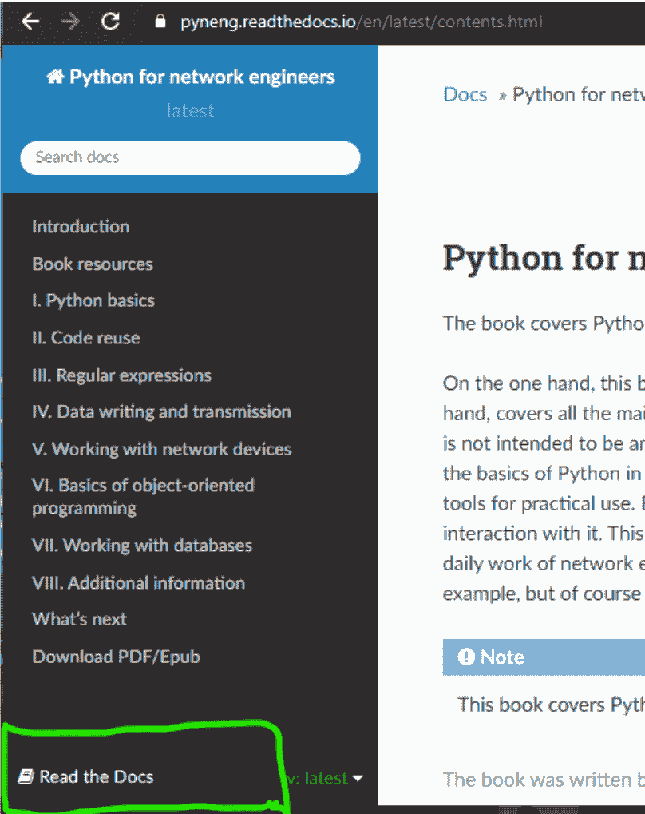
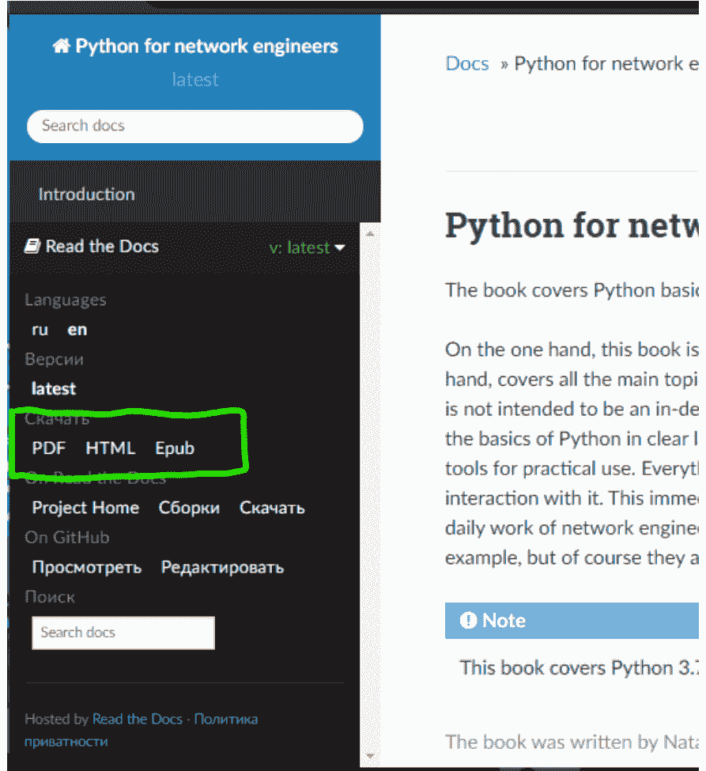
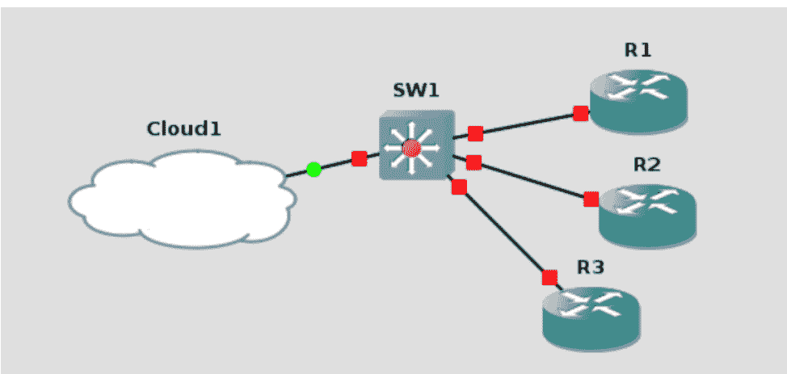
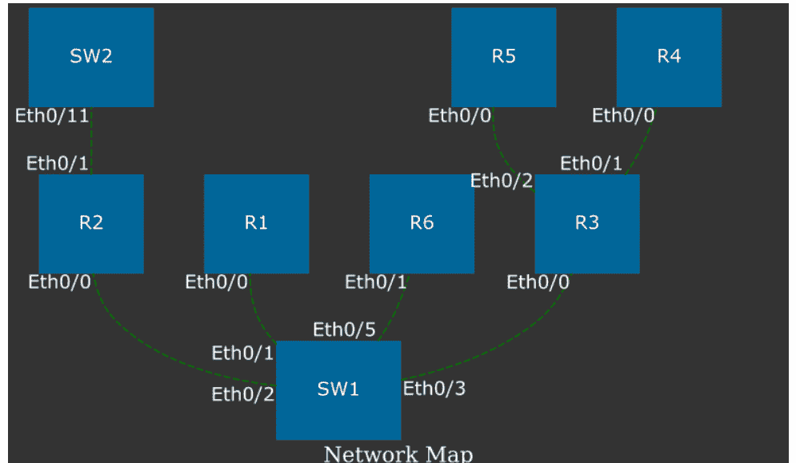
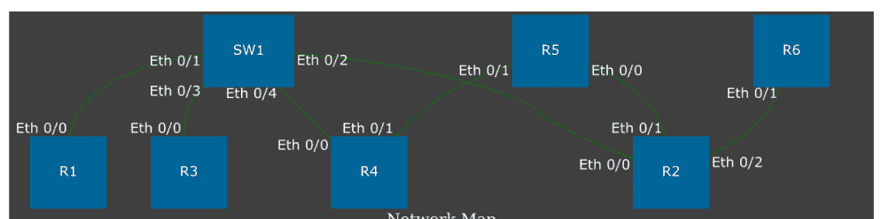
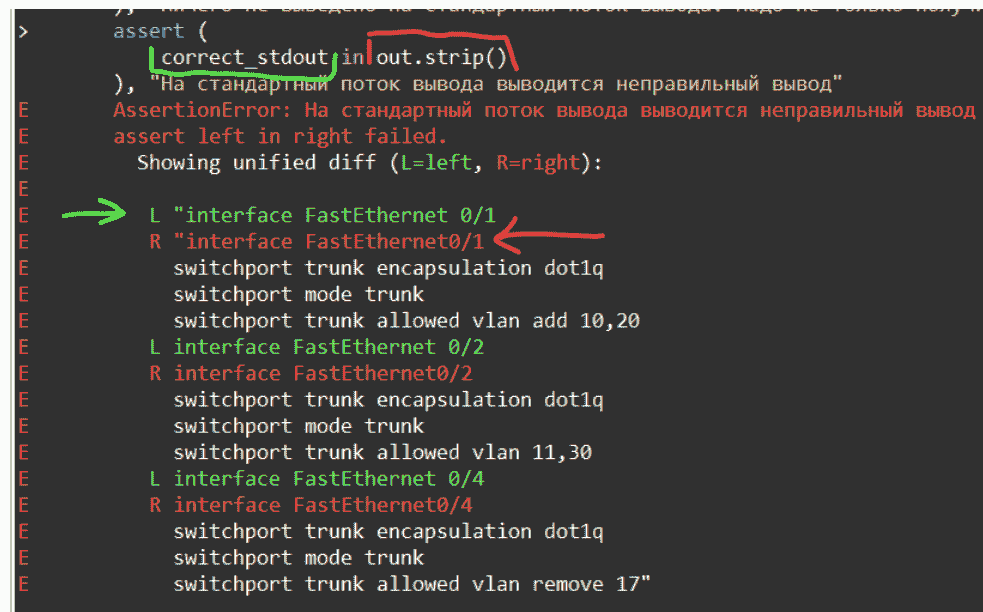

# 面向网络工程师的Python

版本 1.0

2022年1月16日

# 目录

- 1. 下载 PDF/Epub

## 延伸阅读

- 延伸阅读 . . . . . . . . . . . . . . . . . . . . . . . . . . . . . . . . . . . . . . . . . . . . . . . . . . . . . . . . . . . . . . . . . . . . . . . . . . . . . . . . . . . . . . . . . . . . . . . . . . . . . . . . . . . . . . . . . . . . . . . . . . . . . . . . . . . . . . . . . . . . . . . . . . . . . . . . . . . . . . . . . . . . . . . . . . . . . . . . . . . . . . . . . . . . . . . . . . . . . . . . . . . . . . . . . . . . . . . . . . . . . . . . . . . . . . . . . . . . . . . . . . . . . . . . . . . . . . . . . . . . . . . . . . . . . . . . . . . . . . . . . . . . . . . . . . . . . . . . . . . . . . . . . . . . . . . . . . . . . . . . . . . . . . . . . . . . . . . . . . . . . . . . . . . . . . . . . . . . . . . . . . . . . . . . . . . . . . . . . . . . . . . . . . . . . . . . . . . . . . . . . . . . . . . . . . . . . . . . . . . . . . . . . . . . . . . . . . . . . . . . . . . . . . . . . . . . . . . . . . . . . . . . . . . . . . . . . . . . . . . . . . . . . . . . . . . . . . . . . . . . . . . . . . . . . . . . . . . . . . . . . . . . . . . . . . . . . . . . . . . . . . . . . . . . . . . . . . . . . . . . . . . . . . . . . . . . . . . . . . . . . . . . . . . . . . . . . . . . . . . . . . . . . . . . . . . . . . . . . . . . . . . . . . . . . . . . . . . . . . . . . . . . . . . . . . . . . . . . . . . . . . . . . . . . . . . . . . . . . . . . . . . . . . . . . . . . . . . . . . . . . . . . . . . . . . . . . . . . . . . . . . . . . . . . . . . . . . . . . . . . . . . . . . . . . . . . . . . . . . . . . . . . . . . . . . . . . . . . . . . . . . . . . . . . . . . . . . . . . . . . . . . . . . . . . . . . . . . . . . . . . . . . . . . . . . . . . . . . . . . . . . . . . . . . . . . . . . . . . . . . . . . . . . . . . . . . . . . . . . . . . . . . . . . . . . . . . . . . . . . . . . . . . . . . . . . . . . . . . . . . . . . . . . . . . . . . . . . . . . . . . . . . . . . . . . . . . . . . . . . . . . . . . . . . . . . . . . . . . . . . . . . . . . . . . . . . . . . . . . . . . . . . . . . . . . . . . . . . . . . . . . . . . . . . . . . . . . . . . . . . . . . . . . . . . . . . . . . . . . . . . . . . . . . . . . . . . . . . . . . . . . . . . . . . . . . . . . . . . . . . . . . . . . . . . . . . . . . . . . . . . . . . . . . . . . . . . . . . . . . . . . . . . . . . . . . . . . . . . . . . . . . . . . . . . . . . . . . . . . . . . . . . . . . . . . . . . . . . . . . . . . . . . . . . . . . . . . . . . . . . . . . . . . . . . . . . . . . . . . . . . . . . . . . . . . . . . . . . . . . . . . . . . . . . . . . . . . . . . . . . . . . . . . . . . . . . . . . . . . . . . . . . . . . . . . . . . . . . . . . . . . . . . . . . . . . . . . . . . . . . . . . . . . . . . . . . . . . . . . . . . . . . . . . . . . . . . . . . . . . . . . . . . . . . . . . . . . . . . . . . . . . . . . . . . . . . . . . . . . . . . . . . . . . . . . . . . . . . . . . . . . . . . . . . . . . . . . . . . . . . . . . . . . . . . . . . . . . . . . . . . . . . . . . . . . . . . . . . . . . . . . . . . . . . . . . . . . . . . . . . . . . . . . . . . . . . . . . . . . . . . . . . . . . . . . . . . . . . . . . . . . . . . . . . . . . . . . . . . . . . . . . . . . . . . . . . . . . . . . . . . . . . . . . . . . . . . . . . . . . . . . . . . . . . . . . . . . . . . . . . . . . . . . . . . . . . . . . . . . . . . . . . . . . . . . . . . . . . . . . . . . . . . . . . . . . . . . . . . . . . . . . . . . . . . . . . . . . . . . . . . . . . . . . . . . . . . . . . . . . . . . . . . . . . . . . . . . . . . . . . . . . . . . . . . . . . . . . . . . . . . . . . . . . . . . . . . . . . . . . . . . . . . . . . . . . . . . . . . . . . . . . . . . . . . . . . . . . . . . . . . . . . . . . . . . . . . . . . . . . . . . . . . . . . . . . . . . . . . . . . . . . . . . . . . . . . . . . . . . . . . . . . . . . . . . . . . . . . . . . . . . . . . . . . . . . . . . . . . . . . . . . . . . . . . . . . . . . . . . . . . . . . . . . . . . . . . . . . . . . . . . . . . . . . . . . . . . . . . . . . . . . . . . . . . . . . . . . . . . . . . . . . . . . . . . . . . . . . . . . . . . . . . . . . . . . . . . . . . . . . . . . . . . . . . . . . . . . . . . . . . . . . . . . . . . . . . . . . . . . . . . . . . . . . . . . . . . . . . . . . . . . . . . . . . . . . . . . . . . . . . . . . . . . . . . . . . . . . . . . . . . . . . . . . . . . . . . . . . . . . . . . . . . . . . . . . . . . . . . . . . . . . . . . . . . . . . . . . . . . . . . . . . . . . . . . . . . . . . . . . . . . . . . . . . . . . . . . . . . . . . . . . . . . . . . . . . . . . . . . . . . . . . . . . . . . . . . . . . . . . . . . . . . . . . . . . . . . . . . . . . . . . . . . . . . . . . . . . . . . . . . . . . . . . . . . . . . . . . . . . . . . . . . . . . . . . . . . . . . . . . . . . . . . . . . . . . . . . . . . . . . . . . . . . . . . . . . . . . . . . . . . . . . . . . . . . . . . . . . . . . . . . . . . . . . . . . . . . . . . . . . . . . . . . . . . . . . . . . . . . . . . . . . . . . . . . . . . . . . . . . . . . . . . . . . . . . . . . . . . . . . . . . . . . . . . . . . . . . . . . . . . . . . . . . . . . . . . . . . . . . . . . . . . . . . . . . . . . . . . . . . . . . . . . . . . . . . . . . . . . . . . . . . . . . . . . . . . . . . . . . . . . . . . . . . . . . . . . . . . . . . . . . . . . . . . . . . . . . . . . . . . . . . . . . . . . . . . . . . . . . . . . . . . . . . . . . . . . . . . . . . . . . . . . . . . . . . . . . . . . . . . . . . . . . . . . . . . . . . . . . . . . . . . . . . . . . . . . . . . . . . . . . . . . . . . . . . . . . . . . . . . . . . . . . . . . . . . . . . . . . . . . . . . . . . . . . . . . . . . . . . . . . . . . . . . . . . . . . . . . . . . . . . . . . . . . . . . . . . . . . . . . . . . . . . . . . . . . . . . . . . . . . . . . . . . . . . . . . . . . . . . . . . . . . . . . . . . . . . . . . . . . . . . . . . . . . . . . . . . . . . . . . . . . . . . . . . . . . . . . . . . . . . . . . . . . . . . . . . . . . . . . . . . . . . . . . . . . . . . . . . . . . . . . . . . . . . . . . . . . . . . . . . . . . . . . . . . . . . . . . . . . . . . . . . . . . . . . . . . . . . . . . . . . . . . . . . . . . . . . . . . . . . . . . . . . . . . . . . . . . . . . . . . . . . . . . . . . . . . . . . . . . . . . . . . . . . . . . . . . . . . . . . . . . . . . . . . . . . . . . . . . . . . . . . . . . . . . . . . . . . . . . . . . . . . . . . . . . . . . . . . . . . . . . . . . . . . . . . . . . . . . . . . . . . . . . . . . . . . . . . . . . . . . . . . . . . . . . . . . . . . . . . . . . . . . . . . . . . . . . . . . . . . . . . . . . . . . . . . . . . . . . . . . . . . . . . . . . . . . . . . . . . . . . . . . . . . . . . . . . . . . . . . . . . . . . . . . . . . . . . . . . . . . . . . . . . . . . . . . . . . . . . . . . . . . . . . . . . . . . . . . . . . . . . . . . . . . . . . . . . . . . . . . . . . . . . . . . . . . . . . . . . . . . . . . . . . . . . . . . . . . . . . . . . . . . . . . . . . . . . . . . . . . . . . . . . . . . . . . . . . . . . . . . . . . . . . . . . . . . . . . . . . . . . . . . . . . . . . . . . . . . . . . . . . . . . . . . . . . . . . . . . . . . . . . . . . . . . . . . . . . . . . . . . . . . . . . . . . . . . . . . . . . . . . . . . . . . . . . . . . . . . . . . . . . . . . . . . . . . . . . . . . . . . . . . . . . . . . . . . . . . . . . . . . . . . . . . . . . . . . . . . . . . . . . . . . . . . . . . . . . . . . . . . . . . . . . . . . . . . . . . . . . . . . . . . . . . . . . . . . . . . . . . . . . . . . . . . . . . . . . . . . . . . . . . . . . . . . . . . . . . . . . . . . . . . . . . . . . . . . . . . . . . . . . . . . . . . . . . . . . . . . . . . . . . . . . . . . . . . . . . . . . . . . . . . . . . . . . . . . . . . . . . . . . . . . . . . . . . . . . . . . . . . . . . . . . . . . . . . . . . . . . . . . . . . . . . . . . . . . . . . . . . . . . . . . . . . . . . . . . . . . . . . . . . . . . . . . . . . . . . . . . . . . . . . . . . . . . . . . . . . . . . . . . . . . . . . . . . . . . . . . . . . . . . . . . . . . . . . . . . . . . . . . . . . . . . . . . . . . . . . . . . . . . . . . . . . . . . . . . . . . . . . . . . . . . . . . . . . . . . . . . . . . . . . . . . . . . . . . . . . . . . . . . . . . . . . . . . . . . . . . . . . . . . . . . . . . . . . . . . . . . . . . . . . . . . . . . . . . . . . . . . . . . . . . . . . . . . . . . . . . . . . . . . . . . . . . . . . . . . . . . . . . . . . . . . . . . . . . . . . . . . . . . . . . . . . . . . . . . . . . . . . . . . . . . . . . . . . . . . . . . . . . . . . . . . . . . . . . . . . . . . . . . . . . . . . . . . . . . . . . . . . . . . . . . . . . . . . . . . . . . . . . . . . . . . . . . . . . . . . . . . . . . . . . . . . . . . . . . . . . . . . . . . . . . . . . . . . . . . . . . . . . . . . . . . . . . . . . . . . . . . . . . . . . . . . . . . . . . . . . . . . . . . . . . . . . . . . . . . . . . . . . . . . . . . . . . . . . . . . . . . . . . . . . . . . . . . . . . . . . . . . . . . . . . . . . . . . . . . . . . . . . . . . . . . . . . . . . . . . . . . . . . . . . . . . . . . . . . . . . . . . . . . . . . . . . . . . . . . . . . . . . . . . . . . . . . . . . . . . . . . . . . . . . . . . . . . . . . . . . . . . . . . . . . . . . . . . . . . . . . . . . . . . . . . . . . . . . . . . . . . . . . . . . . . . . . . . . . . . . . . . . . . . . . . . . . . . . . . . . . . . . . . . . . . . . . . . . . . . . . . . . . . . . . . . . . . . . . . . . . . . . . . . . . . . . . . . . . . . . . . . . . . . . . . . . . . . . . . . . . . . . . . . . . . . . . . . . . . . . . . . . . . . . . . . . . . . . . . . . . . . . . . . . . . . . . . . . . . . . . . . . . . . . . . . . . . . . . . . . . . . . . . . . . . . . . . . . . . . . . . . . . . . . . . . . . . . . . . . . . . . . . . . . . . . . . . . . . . . . . . . . . . . . . . . . . . . . . . . . . . . . . . . . . . . . . . . . . . . . . . . . . . . . . . . . . . . . . . . . . . . . . . . . . . . . . . . . . . . . . . . . . . . . . . . . . . . . . . . . . . . . . . . . . . . . . . . . . . . . . . . . . . . . . . . . . . . . . . . . . . . . . . . . . . . . . . . . . . . . . . . . . . . . . . . . . . . . . . . . . . . . . . . . . . . . . . . . . . . . . . . . . . . . . . . . . . . . . . . . . . . . . . . . . . . . . . . . . . . . . . . . . . . . . . . . . . . . . . . . . . . . . . . . . . . . . . . . . . . . . . . . . . . . . . . . . . . . . . . . . . . . . . . . . . . . . . . . . . . . . . . . . . . . . . . . . . . . . . . . . . . . . . . . . . . . . . . . . . . . . . . . . . . . . . . . . . . . . . . . . . . . . . . . . . . . . . . . . . . . . . . . . . . . . . . . . . . . . . . . . . . . . . . . . . . . . . . . . . . . . . . . . . . . . . . . . . . . . . . . . . . . . . . . . . . . . . . . . . . . . . . . . . . . . . . . . . . . . . . . . . . . . . . . . . . . . . . . . . . . . . . . . . . . . . . . . . . . . . . . . . . . . . . . . . . . . . . . . . . . . . . . . . . . . . . . . . . . . . . . . . . . . . . . . . . . . . . . . . . . . . . . . . . . . . . . . . . . . . . . . . . . . . . . . . . . . . . . . . . . . . . . . . . . . . . . . . . . . . . . . . . . . . . . . . . . . . . . . . . . . . . . . . . . . . . . . . . . . . . . . . . . . . . . . . . . . . . . . . . . . . . . . . . . . . . . . . . . . . . . . . . . . . . . . . . . . . . . . . . . . . . . . . . . . . . . . . . . . . . . . . . . . . . . . . . . . . . . . . . . . . . . . . . . . . . . . . . . . . . . . . . . . . . . . . . . . . . . . . . . . . . . . . . . . . . . . . . . . . . . . . . . . . . . . . . . . . . . . . . . . . . . . . . . . . . . . . . . . . . . . . . . . . . . . . . . . . . . . . . . . . . . . . . . . . . . . . . . . . . . . . . . . . . . . . . . . . . . . . . . . . . . . . . . . . . . . . . . . . . . . . . . . . . . . . . . . . . . . . . . . . . . . . . . . . . . . . . . . . . . . . . . . . . . . . . . . . . . . . . . . . . . . . . . . . . . . . . . . . . . . . . . . . . . . . . . . . . . . . . . . . . . . . . . . . . . . . . . . . . . . . . . . . . . . . . . . . . . . . . . . . . . . . . . . . . . . . . . . . . . . . . . . . . . . . . . . . . . . . . . . . . . . . . . . . . . . . . . . . . . . . . . . . . . . . . . . . . . . . . . . . . . . . . . . . . . . . . . . . . . . . . . . . . . . . . . . . . . . . . . . . . . . . . . . . . . . . . . . . . . . . . . . . . . . . . . . . . . . . . . . . . . . . . . . . . . . . . . . . . . . . . . . . . . . . . . . . . . . . . . . . . . . . . . . . . . . . . . . . . . . . . . . . . . . . . . . . . . . . . . . . . . . . . . . . . . . . . . . . . . . . . . . . . . . . . . . . . . . . . . . . . . . . . . . . . . . . . . . . . . . . . . . . . . . . . . . . . . . . . . . . . . . . . . . . . . . . . . . . . . . . . . . . . . . . . . . . . . . . . . . . . . . . . . . . . . . . . . . . . . . . . . . . . . . . . . . . . . . . . . . . . . . . . . . . . . . . . . . . . . . . . . . . . . . . . . . . . . . . . . . . . . . . . . . . . . . . . . . . . . . . . . . . . . . . . . . . . . . . . . . . . . . . . . . . . . . . . . . . . . . . . . . . . . . . . . . . . . . . . . . . . . . . . . . . . . . . . . . . . . . . . . . . . . . . . . . . . . . . . . . . . . . . . . . . . . . . . . . . . . . . . . . . . . . . . . . . . . . . . . . . . . . . . . . . . . . . . . . . . . . . . . . . . . . . . . . . . . . . . . . . . . . . . . . . . . . . . . . . . . . . . . . . . . . . . . . . . . . . . . . . . . . . . . . . . . . . . . . . . . . . . . . . . . . . . . . . . . . . . . . . . . . . . . . . . . . . . . . . . . . . . . . . . . . . . . . . . . . . . . . . . . . . . . . . . . . . . . . . . . . . . . . . . . . . . . . . . . . . . . . . . . . . . . . . . . . . . . . . . . . . . . . . . . . . . . . . . . . . . . . . . . . . . . . . . . . . . . . . . . . . . . . . . . . . . . . . . . . . . . . . . . . . . . . . . . . . . . . . . . . . . . . . . . . . . . . . . . . . . . . . . . . . . . . . . . . . . . . . . . . . . . . . . . . . . . . . . . . . . . . . . . . . . . . . . . . . . . . . . . . . . . . . . . . . . . . . . . . . . . . . . . . . . . . . . . . . . . . . . . . . . . . . . . . . . . . . . . . . . . . . . . . . . . . . . . . . . . . . . . . . . . . . . . . . . . . . . . . . . . . . . . . . . . . . . . . . . . . . . . . . . . . . . . . . . . . . . . . . . . . . . . . . . . . . . . . . . . . . . . . . . . . . . . . . . . . . . . . . . . . . . . . . . . . . . . . . . . . . . . . . . . . . . . . . . . . . . . . . . . . . . . . . . . . . . . . . . . . . . . . . . . . . . . . . . . . . . . . . . . . . . . . . . . . . . . . . . . . . . . . . . . . . . . . . . . . . . . . . . . . . . . . . . . . . . . . . . . . . . . . . . . . . . . . . . . . . . . . . . . . . . . . . . . . . . . . . . . . . . . . . . . . . . . . . . . . . . . . . . . . . . . . . . . . . . . . . . . . . . . . . . . . . . . . . . . . . . . . . . . . . . . . . . . . . . . . . . . . . . . . . . . . . . . . . . . . . . . . . . . . . . . . . . . . . . . . . . . . . . . . . . . . . . . . . . . . . . . . . . . . . . . . . . . . . . . . . . . . . . . . . . . . . . . . . . . . . . . . . . . . . . . . . . . . . . . . . . . . . . . . . . . . . . . . . . . . . . . . . . . . . . . . . . . . . . . . . . . . . . . . . . . . . . . . . . . . . . . . . . . . . . . . . . . . . . . . . . . . . . . . . . . . . . . . . . . . . . . . . . . . . . . . . . . . . . . . . . . . . . . . . . . . . . . . . . . . . . . . . . . . . . . . . . . . . . . . . . . . . . . . . . . . . . . . . . . . . . . . . . . . . . . . . . . . . . . . . . . . . . . . . . . . . . . . . . . . . . . . . . . . . . . . . . . . . . . . . . . . . . . . . . . . . . . . . . . . . . . . . . . . . . . . . . . . . . . . . . . . . . . . . . . . . . . . . . . . . . . . . . . . . . . . . . . . . . . . . . . . . . . . . . . . . . . . . . . . . . . . . . . . . . . . . . . . . . . . . . . . . . . . . . . . . . . . . . . . . . . . . . . . . . . . . . . . . . . . . . . . . . . . . . . . . . . . . . . . . . . . . . . . . . . . . . . . . . . . . . . . . . . . . . . . . . . . . . . . . . . . . . . . . . . . . . . . . . . . . . . . . . . . . . . . . . . . . . . . . . . . . . . . . . . . . . . . . . . . . . . . . . . . . . . . . . . . . . . . . . . . . . . . . . . . . . . . . . . . . . . . . . . . . . . . . . . . . . . . . . . . . . . . . . . . . . . . . . . . . . . . . . . . . . . . . . . . . . . . . . . . . . . . . . . . . . . . . . . . . . . . . . . . . . . . . . . . . . . . . . . . . . . . . . . . . . . . . . . . . . . . . . . . . . . . . . . . . . . . . . . . . . . . . . . . . . . . . . . . . . . . . . . . . . . . . . . . . . . . . . . . . . . . . . . . . . . . . . . . . . . . . . . . . . . . . . . . . . . . . . . . . . . . . . . . . . . . . . . . . . . . . . . . . . . . . . . . . . . . . . . . . . . . . . . . . . . . . . . . . . . . . . . . . . . . . . . . . . . . . . . . . . . . . . . . . . . . . . . . . . . . . . . . . . . . . . . . . . . . . . . . . . . . . . . . . . . . . . . . . . . . . . . . . . . . . . . . . . . . . . . . . . . . . . . . . . . . . . . . . . . . . . . . . . . . . . . . . . . . . . . . . . . . . . . . . . . . . . . . . . . . . . . . . . . . . . . . . . . . . . . . . . . . . . . . . . . . . . . . . . . . . . . . . . . . . . . . . . . . . . . . . . . . . . . . . . . . . . . . . . . . . . . . . . . . . . . . . . . . . . . . . . . . . . . . . . . . . . . . . . . . . . . . . . . . . . . . . . . . . . . . . . . . . . . . . . . . . . . . . . . . . . . . . . . . . . . . . . . . . . . . . . . . . . . . . . . . . . . . . . . . . . . . . . . . . . . . . . . . . . . . . . . . . . . . . . . . . . . . . . . . . . . . . . . . . . . . . . . . . . . . . . . . . . . . . . . . . . . . . . . . . . . . . . . . . . . . . . . . . . . . . . . . . . . . . . . . . . . . . . . . . . . . . . . . . . . . . . . . . . . . . . . . . . . . . . . . . . . . . . . . . . . . . . . . . . . . . . . . . . . . . . . . . . . . . . . . . . . . . . . . . . . . . . . . . . . . . . . . . . . . . . . . . . . . . . . . . . . . . . . . . . . . . . . . . . . . . . . . . . . . . . . . . . . . . . . . . . . . . . . . . . . . . . . . . . . . . . . . . . . . . . . . . . . . . . . . . . . . . . . . . . . . . . . . . . . . . . . . . . . . . . . . . . . . . . . . . . . . . . . . . . . . . . . . . . . . . . . . . . . . . . . . . . . . . . . . . . . . . . . . . . . . . . . . . . . . . . . . . . . . . . . . . . . . . . . . . . . . . . . . . . . . . . . . . . . . . . . . . . . . . . . . . . . . . . . . . . . . . . . . . . . . . . . . . . . . . . . . . . . . . . . . . . . . . . . . . . . . . . . . . . . . . . . . . . . . . . . . . . . . . . . . . . . . . . . . . . . . . . . . . . . . . . . . . . . . . . . . . . . . . . . . . . . . . . . . . . . . . . . . . . . . . . . . . . . . . . . . . . . . . . . . . . . . . . . . . . . . . . . . . . . . . . . . . . . . . . . . . . . . . . . . . . . . . . . . . . . . . . . . . . . . . . . . . . . . . . . . . . . . . . . . . . . . . . . . . . . . . . . . . . . . . . . . . . . . . . . . . . . . . . . . . . . . . . . . . . . . . . . . . . . . . . . . . . . . . . . . . . . . . . . . . . . . . . . . . . . . . . . . . . . . . . . . . . . . . . . . . . . . . . . . . . . . . . . . . . . . . . . . . . . . . . . . . . . . . . . . . . . . . . . . . . . . . . . . . . . . . . . . . . . . . . . . . . . . . . . . . . . . . . . . . . . . . . . . . . . . . . . . . . . . . . . . . . . . . . . . . . . . . . . . . . . . . . . . . . . . . . . . . . . . . . . . . . . . . . . . . . . . . . . . . . . . . . . . . . . . . . . . . . . . . . . . . . . . . . . . . . . . . . . . . . . . . . . . . . . . . . . . . . . . . . . . . . . . . . . . . . . . . . . . . . . . . . . . . . . . . . . . . . . . . . . . . . . . . . . . . . . . . . . . . . . . . . . . . . . . . . . . . . . . . . . . . . . . . . . . . . . . . . . . . . . . . . . . . . . . . . . . . . . . . . . . . . . . . . . . . . . . . . . . . . . . . . . . . . . . . . . . . . . . . . . . . . . . . . . . . . . . . . . . . . . . . . . . . . . . . . . . . . . . . . . . . . . . . . . . . . . . . . . . . . . . . . . . . . . . . . . . . . . . . . . . . . . . . . . . . . . . . . . . . . . . . . . . . . . . . . . . . . . . . . . . . . . . . . . . . . . . . . . . . . . . . . . . . . . . . . . . . . . . . . . . . . . . . . . . . . . . . . . . . . . . . . . . . . . . . . . . . . . . . . . . . . . . . . . . . . . . . . . . . . . . . . . . . . . . . . . . . . . . . . . . . . . . . . . . . . . . . . . . . . . . . . . . . . . . . . . . . . . . . . . . . . . . . . . . . . . . . . . . . . . . . . . . . . . . . . . . . . . . . . . . . . . . . . . . . . . . . . . . . . . . . . . . . . . . . . . . . . . . . . . . . . . . . . . . . . . . . . . . . . . . . . . . . . . . . . . . . . . . . . . . . . . . . . . . . . . . . . . . . . . . . . . . . . . . . . . . . . . . . . . . . . . . . . . . . . . . . . . . . . . . . . . . . . . . . . . . . . . . . . . . . . . . . . . . . . . . . . . . . . . . . . . . . . . . . . . . . . . . . . . . . . . . . . . . . . . . . . . . . . . . . . . . . . . . . . . . . . . . . . . . . . . . . . . . . . . . . . . . . . . . . . . . . . . . . . . . . . . . . . . . . . . . . . . . . . . . . . . . . . . . . . . . . . . . . . . . . . . . . . . . . . . . . . . . . . . . . . . . . . . . . . . . . . . . . . . . . . . . . . . . . . . . . . . . . . . . . . . . . . . . . . . . . . . . . . . . . . . . . . . . . . . . . . . . . . . . . . . . . . . . . . . . . . . . . . . . . . . . . . . . . . . . . . . . . . . . . . . . . . . . . . . . . . . . . . . . . . . . . . . . . . . . . . . . . . . . . . . . . . . . . . . . . . . . . . . . . . . . . . . . . . . . . . . . . . . . . . . . . . . . . . . . . . . . . . . . . . . . . . . . . . . . . . . . . . . . . . . . . . . . . . . . . . . . . . . . . . . . . . . . . . . . . . . . . . . . . . . . . . . . . . . . . . . . . . . . . . . . . . . . . . . . . . . . . . . . . . . . . . . . . . . . . . . . . . . . . . . . . . . . . . . . . . . . . . . . . . . . . . . . . . . . . . . . . . . . . . . . . . . . . . . . . . . . . . . . . . . . . . . . . . . . . . . . . . . . . . . . . . . . . . . . . . . . . . . . . . . . . . . . . . . . . . . . . . . . . . . . . . . . . . . . . . . . . . . . . . . . . . . . . . . . . . . . . . . . . . . . . . . . . . . . . . . . . . . . . . . . . . . . . . . . . . . . . . . . . . . . . . . . . . . . . . . . . . . . . . . . . . . . . . . . . . . . . . . . . . . . . . . . . . . . . . . . . . . . . . . . . . . . . . . . . . . . . . . . . . . . . . . . . . . . . . . . . . . . . . . . . . . . . . . . . . . . . . . . . . . . . . . . . . . . . . . . . . . . . . . . . . . . . . . . . . . . . . . . . . . . . . . . . . . . . . . . . . . . . . . . . . . . . . . . . . . . . . . . . . . . . . . . . . . . . . . . . . . . . . . . . . . . . . . . . . . . . . . . . . . . . . . . . . . . . . . . . . . . . . . . . . . . . . . . . . . . . . . . . . . . . . . . . . . . . . . . . . . . . . . . . . . . . . . . . . . . . . . . . . . . . . . . . . . . . . . . . . . . . . . . . . . . . . . . . . . . . . . . . . . . . . . . . . . . . . . . . . . . . . . . . . . . . . . . . . . . . . . . . . . . . . . . . . . . . . . . . . . . . . . . . . . . . . . . . . . . . . . . . . . . . . . . . . . . . . . . . . . . . . . . . . . . . . . . . . . . . . . . . . . . . . . . . . . . . . . . . . . . . . . . . . . . . . . . . . . . . . . . . . . . . . . . . . . . . . . . . . . . . . . . . . . . . . . . . . . . . . . . . . . . . . . . . . . . . . . . . . . . . . . . . . . . . . . . . . . . . . . . . . . . . . . . . . . . . . . . . . . . . . . . . . . . . . . . . . . . . . . . . . . . . . . . . . . . . . . . . . . . . . . . . . . . . . . . . . . . . . . . . . . . . . . . . . . . . . . . . . . . . . . . . . . . . . . . . . . . . . . . . . . . . . . . . . . . . . . . . . . . . . . . . . . . . . . . . . . . . . . . . . . . . . . . . . . . . . . . . . . . . . . . . . . . . . . . . . . . . . . . . . . . . . . . . . . . . . . . . . . . . . . . . . . . . . . . . . . . . . . . . . . . . . . . . . . . . . . . . . . . . . . . . . . . . . . . . . . . . . . . . . . . . . . . . . . . . . . . . . . . . . . . . . . . . . . . . . . . . . . . . . . . . . . . . . . . . . . . . . . . . . . . . . . . . . . . . . . . . . . . . . . . . . . . . . . . . . . . . . . . . . . . . . . . . . . . . . . . . . . . . . . . . . . . . . . . . . . . . . . . . . . . . . . . . . . . . . . . . . . . . . . . . . . . . . . . . . . . . . . . . . . . . . . . . . . . . . . . . . . . . . . . . . . . . . . . . . . . . . . . . . . . . . . . . . . . . . . . . . . . . . . . . . . . . . . . . . . . . . . . . . . . . . . . . . . . . . . . . . . . . . . . . . . . . . . . . . . . . . . . . . . . . . . . . . . . . . . . . . . . . . . . . . . . . . . . . . . . . . . . . . . . . . . . . . . . . . . . . . . . . . . . . . . . . . . . . . . . . . . . . . . . . . . . . . . . . . . . . . . . . . . . . . . . . . . . . . . . . . . . . . . . . . . . . . . . . . . . . . . . . . . . . . . . . . . . . . . . . . . . . . . . . . . . . . . . . . . . . . . . . . . . . . . . . . . . . . . . . . . . . . . . . . . . . . . . . . . . . . . . . . . . . . . . . . . . . . . . . . . . . . . . . . . . . . . . . . . . . . . . . . . . . . . . . . . . . . . . . . . . . . . . . . . . . . . . . . . . . . . . . . . . . . . . . . . . . . . . . . . . . . . . . . . . . . . . . . . . . . . . . . . . . . . . . . . . . . . . . . . . . . . . . . . . . . . . . . . . . . . . . . . . . . . . . . . . . . . . . . . . . . . . . . . . . . . . . . . . . . . . . . . . . . . . . . . . . . . . . . . . . . . . . . . . . . . . . . . . . . . . . . . . . . . . . . . . . . . . . . . . . . . . . . . . . . . . . . . . . . . . . . . . . . . . . . . . . . . . . . . . . . . . . . . . . . . . . . . . . . . . . . . . . . . . . . . . . . . . . . . . . . . . . . . . . . . . . . . . . . . . . . . . . . . . . . . . . . . . . . . . . . . . . . . . . . . . . . . . . . . . . . . . . . . . . . . . . . . . . . . . . . . . . . . . . . . . . . . . . . . . . . . . . . . . . . . . . . . . . . . . . . . . . . . . . . . . . . . . . . . . . . . . . . . . . . . . . . . . . . . . . . . . . . . . . . . . . . . . . . . . . . . . . . . . . . . . . . . . . . . . . . . . . . . . . . . . . . . . . . . . . . . . . . . . . . . . . . . . . . . . . . . . . . . . . . . . . . . . . . . . . . . . . . . . . . . . . . . . . . . . . . . . . . . . . . . . . . . . . . . . . . . . . . . . . . . . . . . . . . . . . . . . . . . . . . . . . . . . . . . . . . . . . . . . . . . . . . . . . . . . . . . . . . . . . . . . . . . . . . . . . . . . . . . . . . . . . . . . . . . . . . . . . . . . . . . . . . . . . . . . . . . . . . . . . . . . . . . . . . . . . . . . . . . . . . . . . . . . . . . . . . . . . . . . . . . . . . . . . . . . . . . . . . . . . . . . . . . . . . . . . . . . . . . . . . . . . . . . . . . . . . . . . . . . . . . . . . . . . . . . . . . . . . . . . . . . . . . . . . . . . . . . . . . . . . . . . . . . . . . . . . . . . . . . . . . . . . . . . . . . . . . . . . . . . . . . . . . . . . . . . . . . . . . . . . . . . . . . . . . . . . . . . . . . . . . . . . . . . . . . . . . . . . . . . . . . . . . . . . . . . . . . . . . . . . . . . . . . . . . . . . . . . . . . . . . . . . . . . . . . . . . . . . . . . . . . . . . . . . . . . . . . . . . . . . . . . . . . . . . . . . . . . . . . . . . . . . . . . . . . . . . . . . . . . . . . . . . . . . . . . . . . . . . . . . . . . . . . . . . . . . . . . . . . . . . . . . . . . . . . . . . . . . . . . . . . . . . . . . . . . . . . . . . . . . . . . . . . . . . . . . . . . . . . . . . . . . . . . . . . . . . . . . . . . . . . . . . . . . . . . . . . . . . . . . . . . . . . . . . . . . . . . . . . . . . . . . . . . . . . . . . . . . . . . . . . . . . . . . . . . . . . . . . . . . . . . . . . . . . . . . . . . . . . . . . . . . . . . . . . . . . . . . . . . . . . . . . . . . . . . . . . . . . . . . . . . . . . . . . . . . . . . . . . . . . . . . . . . . . . . . . . . . . . . . . . . . . . . . . . . . . . . . . . . . . . . . . . . . . . . . . . . . . . . . . . . . . . . . . . . . . . . . . . . . . . . . . . . . . . . . . . . . . . . . . . . . . . . . . . . . . . . . . . . . . . . . . . . . . . . . . . . . . . . . . . . . . . . . . . . . . . . . . . . . . . . . . . . . . . . . . . . . . . . . . . . . . . . . . . . . . . . . . . . . . . . . . . . . . . . . . . . . . . . . . . . . . . . . . . . . . . . . . . . . . . . . . . . . . . . . . . . . . . . . . . . . . . . . . . . . . . . . . . . . . . . . . . . . . . . . . . . . . . . . . . . . . . . . . . . . . . . . . . . . . . . . . . . . . . . . . . . . . . . . . . . . . . . . . . . . . . . . . . . . . . . . . . . . . . . . . . . . . . . . . . . . . . . . . . . . . . . . . . . . . . . . . . . . . . . . . . . . . . . . . . . . . . . . . . . . . . . . . . . . . . . . . . . . . . . . . . . . . . . . . . . . . . . . . . . . . . . . . . . . . . . . . . . . . . . . . . . . . . . . . . . . . . . . . . . . . . . . . . . . . . . . . . . . . . . . . . . . . . . . . . . . . . . . . . . . . . . . . . . . . . . . . . . . . . . . . . . . . . . . . . . . . . . . . . . . . . . . . . . . . . . . . . . . . . . . . . . . . . . . . . . . . . . . . . . . . . . . . . . . . . . . . . . . . . . . . . . . . . . . . . . . . . . . . . . . . . . . . . . . . . . . . . . . . . . . . . . . . . . . . . . . . . . . . . . . . . . . . . . . . . . . . . . . . . . . . . . . . . . . . . . . . . . . . . . . . . . . . . . . . . . . . . . . . . . . . . . . . . . . . . . . . . . . . . . . . . . . . . . . . . . . . . . . . . . . . . . . . . . . . . . . . . . . . . . . . . . . . . . . . . . . . . . . . . . . . . . . . . . . . . . . . . . . . . . . . . . . . . . . . . . . . . . . . . . . . . . . . . . . . . . . . . . . . . . . . . . . . . . . . . . . . . . . . . . . . . . . . . . . . . . . . . . . . . . . . . . . . . . . . . . . . . . . . . . . . . . . . . . . . . . . . . . . . . . . . . . . . . . . . . . . . . . . . . . . . . . . . . . . . . . . . . . . . . . . . . . . . . . . . . . . . . . . . . . . . . . . . . . . . . . . . . . . . . . . . . . . . . . . . . . . . . . . . . . . . . . . . . . . . . . . . . . . . . . . . . . . . . . . . . . . . . . . . . . . . . . . . . . . . . . . . . . . . . . . . . . . . . . . . . . . . . . . . . . . . . . . . . . . . . . . . . . . . . . . . . . . . . . . . . . . . . . . . . . . . . . . . . . . . . . . . . . . . . . . . . . . . . . . . . . . . . . . . . . . . . . . . . . . . . . . . . . . . . . . . . . . . . . . . . . . . . . . . . . . . . . . . . . . . . . . . . . . . . . . . . . . . . . . . . . . . . . . . . . . . . . . . . . . . . . . . . . . . . . . . . . . . . . . . . . . . . . . . . . . . . . . . . . . . . . . . . . . . . . . . . . . . . . . . . . . . . . . . . . . . . . . . . . . . . . . . . . . . . . . . . . . . . . . . . . . . . . . . . . . . . . . . . . . . . . . . . . . . . . . . . . . . . . . . . . . . . . . . . . . . . . . . . . . . . . . . . . . . . . . . . . . . . . . . . . . . . . . . . . . . . . . . . . . . . . . . . . . . . . . . . . . . . . . . . . . . . . . . . . . . . . . . . . . . . . . . . . . . . . . . . . . . . . . . . . . . . . . . . . . . . . . . . . . . . . . . . . . . . . . . . . . . . . . . . . . . . . . . . . . . . . . . . . . . . . . . . . . . . . . . . . . . . . . . . . . . . . . . . . . . . . . . . . . . . . . . . . . . . . . . . . . . . . . . . . . . . . . . . . . . . . . . . . . . . . . . . . . . . . . . . . . . . . . . . . . . . . . . . . . . . . . . . . . . . . . . . . . . . . . . . . . . . . . . . . . . . . . . . . . . . . . . . . . . . . . . . . . . . . . . . . . . . . . . . . . . . . . . . . . . . . . . . . . . . . . . . . . . . . . . . . . . . . . . . . . . . . . . . . . . . . . . . . . . . . . . . . . . . . . . . . . . . . . . . . . . . . . . . . . . . . . . . . . . . . . . . . . . . . . . . . . . . . . . . . . . . . . . . . . . . . . . . . . . . . . . . . . . . . . . . . . . . . . . . . . . . . . . . . . . . . . . . . . . . . . . . . . . . . . . . . . . . . . . . . . . . . . . . . . . . . . . . . . . . . . . . . . . . . . . . . . . . . . . . . . . . . . . . . . . . . . . . . . . . . . . . . . . . . . . . . . . . . . . . . . . . . . . . . . . . . . . . . . . . . . . . . . . . . . . . . . . . . . . . . . . . . . . . . . . . . . . . . . . . . . . . . . . . . . . . . . . . . . . . . . . . . . . . . . . . . . . . . . . . . . . . . . . . . . . . . . . . . . . . . . . . . . . . . . . . . . . . . . . . . . . . . . . . . . . . . . . . . . . . . . . . . . . . . . . . . . . . . . . . . . . . . . . . . . . . . . . . . . . . . . . . . . . . . . . . . . . . . . . . . . . . . . . . . . . . . . . . . . . . . . . . . . . . . . . . . . . . . . . . . . . . . . . . . . . . . . . . . . . . . . . . . . . . . . . . . . . . . . . . . . . . . . . . . . . . . . . . . . . . . . . . . . . . . . . . . . . . . . . . . . . . . . . . . . . . . . . . . . . . . . . . . . . . . . . . . . . . . . . . . . . . . . . . . . . . . . . . . . . . . . . . . . . . . . . . . . . . . . . . . . . . . . . . . . . . . . . . . . . . . . . . . . . . . . . . . . . . . . . . . . . . . . . . . . . . . . . . . . . . . . . . . . . . . . . . . . . . . . . . . . . . . . . . . . . . . . . . . . . . . . . . . . . . . . . . . . . . . . . . . . . . . . . . . . . . . . . . . . . . . . . . . . . . . . . . . . . . . . . . . . . . . . . . . . . . . . . . . . . . . . . . . . . . . . . . . . . . . . . . . . . . . . . . . . . . . . . . . . . . . . . . . . . . . . . . . . . . . . . . . . . . . . . . . . . . . . . . . . . . . . . . . . . . . . . . . . . . . . . . . . . . . . . . . . . . . . . . . . . . . . . . . . . . . . . . . . . . . . . . . . . . . . . . . . . . . . . . . . . . . . . . . . . . . . . . . . . . . . . . . . . . . . . . . . . . . . . . . . . . . . . . . . . . . . . . . . . . . . . . . . . . . . . . . . . . . . . . . . . . . . . . . . . . . . . . . . . . . . . . . . . . . . . . . . . . . . . . . . . . . . . . . . . . . . . . . . . . . . . . . . . . . . . . . . . . . . . . . . . . . . . . . . . . . . . . . . . . . . . . . . . . . . . . . . . . . . . . . . . . . . . . . . . . . . . . . . . . . . . . . . . . . . . . . . . . . . . . . . . . . . . . . . . . . . . . . . . . . . . . . . . . . . . . . . . . . . . . . . . . . . . . . . . . . . . . . . . . . . . . . . . . . . . . . . . . . . . . . . . . . . . . . . . . . . . . . . . . . . . . . . . . . . . . . . . . . . . . . . . . . . . . . . . . . . . . . . . . . . . . . . . . . . . . . . . . . . . . . . . . . . . . . . . . . . . . . . . . . . . . . . . . . . . . . . . . . . . . . . . . . . . . . . . . . . . . . . . . . . . . . . . . . . . . . . . . . . . . . . . . . . . . . . . . . . . . . . . . . . . . . . . . . . . . . . . . . . . . . . . . . . . . . . . . . . . . . . . . . . . . . . . . . . . . . . . . . . . . . . . . . . . . . . . . . . . . . . . . . . . . . . . . . . . . . . . . . . . . . . . . . . . . . . . . . . . . . . . . . . . . . . . . . . . . . . . . . . . . . . . . . . . . . . . . . . . . . . . . . . . . . . . . . . . . . . . . . . . . . . . . . . . . . . . . . . . . . . . . . . . . . . . . . . . . . . . . . . . . . . . . . . . . . . . . . . . . . . . . . . . . . . . . . . . . . . . . . . . . . . . . . . . . . . . . . . . . . . . . . . . . . . . . . . . . . . . . . . . . . . . . . . . . . . . . . . . . . . . . . . . . . . . . . . . . . . . . . . . . . . . . . . . . . . . . . . . . . . . . . . . . . . . . . . . . . . . . . . . . . . . . . . . . . . . . . . . . . . . . . . . . . . . . . . . . . . . . . . . . . . . . . . . . . . . . . . . . . . . . . . . . . . . . . . . . . . . . . . . . . . . . . . . . . . . . . . . . . . . . . . . . . . . . . . . . . . . . . . . . . . . . . . . . . . . . . . . . . . . . . . . . . . . . . . . . . . . . . . . . . . . . . . . . . . . . . . . . . . . . . . . . . . . . . . . . . . . . . . . . . . . . . . . . . . . . . . . . . . . . . . . . . . . . . . . . . . . . . . . . . . . . . . . . . . . . . . . . . . . . . . . . . . . . . . . . . . . . . . . . . . . . . . . . . . . . . . . . . . . . . . . . . . . . . . . . . . . . . . . . . . . . . . . . . . . . . . . . . . . . . . . . . . . . . . . . . . . . . . . . . . . . . . . . . . . . . . . . . . . . . . . . . . . . . . . . . . . . . . . . . . . . . . . . . . . . . . . . . . . . . . . . . . . . . . . . . . . . . . . . . . . . . . . . . . . . . . . . . . . . . . . . . . . . . . . . . . . . . . . . . . . . . . . . . . . . . . . . . . . . . . . . . . . . . . . . . . . . . . . . . . . . . . . . . . . . . . . . . . . . . . . . . . . . . . . . . . . . . . . . . . . . . . . . . . . . . . . . . . . . . . . . . . . . . . . . . . . . . . . . . . . . . . . . . . . . . . . . . . . . . . . . . . . . . . . . . . . . . . . . . . . . . . . . . . . . . . . . . . . . . . . . . . . . . . . . . . . . . . . . . . . . . . . . . . . . . . . . . . . . . . . . . . . . . . . . . . . . . . . . . . . . . . . . . . . . . . . . . . . . . . . . . . . . . . . . . . . . . . . . . . . . . . . . . . . . . . . . . . . . . . . . . . . . . . . . . . . . . . . . . . . . . . . . . . . . . . . . . . . . . . . . . . . . . . . . . . . . . . . . . . . . . . . . . . . . . . . . . . . . . . . . . . . . . . . . . . . . . . . . . . . . . . . . . . . . . . . . . . . . . . . . . . . . . . . . . . . . . . . . . . . . . . . . . . . . . . . . . . . . . . . . . . . . . . . . . . . . . . . . . . . . . . . . . . . . . . . . . . . . . . . . . . . . . . . . . . . . . . . . . . . . . . . . . . . . . . . . . . . . . . . . . . . . . . . . . . . . . . . . . . . . . . . . . . . . . . . . . . . . . . . . . . . . . . . . . . . . . . . . . . . . . . . . . . . . . . . . . . . . . . . . . . . . . . . . . . . . . . . . . . . . . . . . . . . . . . . . . . . . . . . . . . . . . . . . . . . . . . . . . . . . . . . . . . . . . . . . . . . . . . . . . . . . . . . . . . . . . . . . . . . . . . . . . . . . . . . . . . . . . . . . . . . . . . . . . . . . . . . . . . . . . . . . . . . . . . . . . . . . . . . . . . . . . . . . . . . . . . . . . . . . . . . . . . . . . . . . . . . . . . . . . . . . . . . . . . . . . . . . . . . . . . . . . . . . . . . . . . . . . . . . . . . . . . . . . . . . . . . . . . . . . . . . . . . . . . . . . . . . . . . . . . . . . . . . . . . . . . . . . . . . . . . . . . . . . . . . . . . . . . . . . . . . . . . . . . . . . . . . . . . . . . . . . . . . . . . . . . . . . . . . . . . . . . . . . . . . . . . . . . . . . . . . . . . . . . . . . . . . . . . . . . . . . . . . . . . . . . . . . . . . . . . . . . . . . . . . . . . . . . . . . . . . . . . . . . . . . . . . . . . . . . . . . . . . . . . . . . . . . . . . . . . . . . . . . . . . . . . . . . . . . . . . . . . . . . . . . . . . . . . . . . . . . . . . . . . . . . . . . . . . . . . . . . . . . . . . . . . . . . . . . . . . . . . . . . . . . . . . . . . . . . . . . . . . . . . . . . . . . . . . . . . . . . . . . . . . . . . . . . . . . . . . . . . . . . . . . . . . . . . . . . . . . . . . . . . . . . . . . . . . . . . . . . . . . . . . . . . . . . . . . . . . . . . . . . . . . . . . . . . . . . . . . . . . . . . . . . . . . . . . . . . . . . . . . . . . . . . . . . . . . . . . . . . . . . . . . . . . . . . . . . . . . . . . . . . . . . . . . . . . . . . . . . . . . . . . . . . . . . . . . . . . . . . . . . . . . . . . . . . . . . . . . . . . . . . . . . . . . . . . . . . . . . . . . . . . . . . . . . . . . . . . . . . . . . . . . . . . . . . . . . . . . . . . . . . . . . . . . . . . . . . . . . . . . . . . . . . . . . . . . . . . . . . . . . . . . . . . . . . . . . . . . . . . . . . . . . . . . . . . . . . . . . . . . . . . . . . . . . . . . . . . . . . . . . . . . . . . . . . . . . . . . . . . . . . . . . . . . . . . . . . . . . . . . . . . . . . . . . . . . . . . . . . . . . . . . . . . . . . . . . . . . . . . . . . . . . . . . . . . . . . . . . . . . . . . . . . . . . . . . . . . . . . . . . . . . . . . . . . . . . . . . . . . . . . . . . . . . . . . . . . . . . . . . . . . . . . . . . . . . . . . . . . . . . . . . . . . . . . . . . . . . . . . . . . . . . . . . . . . . . . . . . . . . . . . . . . . . . . . . . . . . . . . . . . . . . . . . . . . . . . . . . . . . . . . . . . . . . . . . . . . . . . . . . . . . . . . . . . . . . . . . . . . . . . . . . . . . . . . . . . . . . . . . . . . . . . . . . . . . . . . . . . . . . . . . . . . . . . . . . . . . . . . . . . . . . . . . . . . . . . . . . . . . . . . . . . . . . . . . . . . . . . . . . . . . . . . . . . . . . . . . . . . . . . . . . . . . . . . . . . . . . . . . . . . . . . . . . . . . . . . . . . . . . . . . . . . . . . . . . . . . . . . . . . . . . . . . . . . . . . . . . . . . . . . . . . . . . . . . . . . . . . . . . . . . . . . . . . . . . . . . . . . . . . . . . . . . . . . . . . . . . . . . . . . . . . . . . . . . . . . . . . . . . . . . . . . . . . . . . . . . . . . . . . . . . . . . . . . . . . . . . . . . . . . . . . . . . . . . . . . . . . . . . . . . . . . . . . . . . . . . . . . . . . . . . . . . . . . . . . . . . . . . . . . . . . . . . . . . . . . . . . . . . . . . . . . . . . . . . . . . . . . . . . . . . . . . . . . . . . . . . . . . . . . . . . . . . . . . . . . . . . . . . . . . . . . . . . . . . . . . . . . . . . . . . . . . . . . . . . . . . . . . . . . . . . . . . . . . . . . . . . . . . . . . . . . . . . . . . . . . . . . . . . . . . . . . . . . . . . . . . . . . . . . . . . . . . . . . . . . . . . . . . . . . . . . . . . . . . . . . . . . . . . . . . . . . . . . . . . . . . . . . . . . . . . . . . . . . . . . . . . . . . . . . . . . . . . . . . . . . . . . . . . . . . . . . . . . . . . . . . . . . . . . . . . . . . . . . . . . . . . . . . . . . . . . . . . . . . . . . . . . . . . . . . . . . . . . . . . . . . . . . . . . . . . . . . . . . . . . . . . . . . . . . . . . . . . . . . . . . . . . . . . . . . . . . . . . . . . . . . . . . . . . . . . . . . . . . . . . . . . . . . . . . . . . . . . . . . . . . . . . . . . . . . . . . . . . . . . . . . . . . . . . . . . . . . . . . . . . . . . . . . . . . . . . . . . . . . . . . . . . . . . . . . . . . . . . . . . . . . . . . . . . . . . . . . . . . . . . . . . . . . . . . . . . . . . . . . . . . . . . . . . . . . . . . . . . . . . . . . . . . . . . . . . . . . . . . . . . . . . . . . . . . . . . . . . . . . . . . . . . . . . . . . . . . . . . . . . . . . . . . . . . . . . . . . . . . . . . . . . . . . . . . . . . . . . . . . . . . . . . . . . . . . . . . . . . . . . . . . . . . . . . . . . . . . . . . . . . . . . . . . . . . . . . . . . . . . . . . . . . . . . . . . . . . . . . . . . . . . . . . . . . . . . . . . . . . . . . . . . . . . . . . . . . . . . . . . . . . . . . . . . . . . . . . . . . . . . . . . . . . . . . . . . . . . . . . . . . . . . . . . . . . . . . . . . . . . . . . . . . . . . . . . . . . . . . . . . . . . . . . . . . . . . . . . . . . . . . . . . . . . . . . . . . . . . . . . . . . . . . . . . . . . . . . . . . . . . . . . . . . . . . . . . . . . . . . . . . . . . . . . . . . . . . . . . . . . . . . . . . . . . . . . . . . . . . . . . . . . . . . . . . . . . . . . . . . . . . . . . . . . . . . . . . . . . . . . . . . . . . . . . . . . . . . . . . . . . . . . . . . . . . . . . . . . . . . . . . . . . . . . . . . . . . . . . . . . . . . . . . . . . . . . . . . . . . . . . . . . . . . . . . . . . . . . . . . . . . . . . . . . . . . . . . . . . . . . . . . . . . . . . . . . . . . . . . . . . . . . . . . . . . . . . . . . . . . . . . . . . . . . . . . . . . . . . . . . . . . . . . . . . . . . . . . . . . . . . . . . . . . . . . . . . . . . . . . . . . . . . . . . . . . . . . . . . . . . . . . . . . . . . . . . . . . . . . . . . . . . . . . . . . . . . . . . . . . . . . . . . . . . . . . . . . . . . . . . . . . . . . . . . . . . . . . . . . . . . . . . . . . . . . . . . . . . . . . . . . . . . . . . . . . . . . . . . . . . . . . . . . . . . . . . . . . . . . . . . . . . . . . . . . . . . . . . . . . . . . . . . . . . . . . . . . . . . . . . . . . . . . . . . . . . . . . . . . . . . . . . . . . . . . . . . . . . . . . . . . . . . . . . . . . . . . . . . . . . . . . . . . . . . . . . . . . . . . . . . . . . . . . . . . . . . . . . . . . . . . . . . . . . . . . . . . . . . . . . . . . . . . . . . . . . . . . . . . . . . . . . . . . . . . . . . . . . . . . . . . . . . . . . . . . . . . . . . . . . . . . . . . . . . . . . . . . . . . . . . . . . . . . . . . . . . . . . . . . . . . . . . . . . . . . . . . . . . . . . . . . . . . . . . . . . . . . . . . . . . . . . . . . . . . . . . . . . . . . . . . . . . . . . . . . . . . . . . . . . . . . . . . . . . . . . . . . . . . . . . . . . . . . . . . . . . . . . . . . . . . . . . . . . . . . . . . . . . . . . . . . . . . . . . . . . . . . . . . . . . . . . . . . . . . . . . . . . . . . . . . . . . . . . . . . . . . . . . . . . . . . . . . . . . . . . . . . . . . . . . . . . . . . . . . . . . . . . . . . . . . . . . . . . . . . . . . . . . . . . . . . . . . . . . . . . . . . . . . . . . . . . . . . . . . . . . . . . . . . . . . . . . . . . . . . . . . . . . . . . . . . . . . . . . . . . . . . . . . . . . . . . . . . . . . . . . . . . . . . . . . . . . . . . . . . . . . . . . . . . . . . . . . . . . . . . . . . . . . . . . . . . . . . . . . . . . . . . . . . . . . . . . . . . . . . . . . . . . . . . . . . . . . . . . . . . . . . . . . . . . . . . . . . . . . . . . . . . . . . . . . . . . . . . . . . . . . . . . . . . . . . . . . . . . . . . . . . . . . . . . . . . . . . . . . . . . . . . . . . . . . . . . . . . . . . . . . . . . . . . . . . . . . . . . . . . . . . . . . . . . . . . . . . . . . . . . . . . . . . . . . . . . . . . . . . . . . . . . . . . . . . . . . . . . . . . . . . . . . . . . . . . . . . . . . . . . . . . . . . . . . . . . . . . . . . . . . . . . . . . . . . . . . . . . . . . . . . . . . . . . . . . . . . . . . . . . . . . . . . . . . . . . . . . . . . . . . . . . . . . . . . . . . . . . . . . . . . . . . . . . . . . . . . . . . . . . . . . . . . . . . . . . . . . . . . . . . . . . . . . . . . . . . . . . . . . . . . . . . . . . . . . . . . . . . . . . . . . . . . . . . . . . . . . . . . . . . . . . . . . . . . . . . . . . . . . . . . . . . . . . . . . . . . . . . . . . . . . . . . . . . . . . . . . . . . . . . . . . . . . . . . . . . . . . . . . . . . . . . . . . . . . . . . . . . . . . . . . . . . . . . . . . . . . . . . . . . . . . . . . . . . . . . . . . . . . . . . . . . . . . . . . . . . . . . . . . . . . . . . . . . . . . . . . . . . . . . . . . . . . . . . . . . . . . . . . . . . . . . . . . . . . . . . . . . . . . . . . . . . . . . . . . . . . . . . . . . . . . . . . . . . . . . . . . . . . . . . . . . . . . . . . . . . . . . . . . . . . . . . . . . . . . . . . . . . . . . . . . . . . . . . . . . . . . . . . . . . . . . . . . . . . . . . . . . . . . . . . . . . . . . . . . . . . . . . . . . . . . . . . . . . . . . . . . . . . . . . . . . . . . . . . . . . . . . . . . . . . . . . . . . . . . . . . . . . . . . . . . . . . . . . . . . . . . . . . . . . . . . . . . . . . . . . . . . . . . . . . . . . . . . . . . . . . . . . . . . . . . . . . . . . . . . . . . . . . . . . . . . . . . . . . . . . . . . . . . . . . . . . . . . . . . . . . . . . . . . . . . . . . . . . . . . . . . . . . . . . . . . . . . . . . . . . . . . . . . . . . . . . . . . . . . . . . . . . . . . . . . . . . . . . . . . . . . . . . . . . . . . . . . . . . . . . . . . . . . . . . . . . . . . . . . . . . . . . . . . . . . . . . . . . . . . . . . . . . . . . . . . . . . . . . . . . . . . . . . . . . . . . . . . . . . . . . . . . . . . . . . . . . . . . . . . . . . . . . . . . . . . . . . . . . . . . . . . . . . . . . . . . . . . . . . . . . . . . . . . . . . . . . . . . . . . . . . . . . . . . . . . . . . . . . . . . . . . . . . . . . . . . . . . . . . . . . . . . . . . . . . . . . . . . . . . . . . . . . . . . . . . . . . . . . . . . . . . . . . . . . . . . . . . . . . . . . . . . . . . . . . . . . . . . . . . . . . . . . . . . . . . . . . . . . . . . . . . . . . . . . . . . . . . . . . . . . . . . . . . . . . . . . . . . . . . . . . . . . . . . . . . . . . . . . . . . . . . . . . . . . . . . . . . . . . . . . . . . . . . . . . . . . . . . . . . . . . . . . . . . . . . . . . . . . . . . . . . . . . . . . . . . . . . . . . . . . . . . . . . . . . . . . . . . . . . . . . . . . . . . . . . . . . . . . . . . . . . . . . . . . . . . . . . . . . . . . . . . . . . . . . . . . . . . . . . . . . . . . . . . . . . . . . . . . . . . . . . . . . . . . . . . . . . . . . . . . . . . . . . . . . . . . . . . . . . . . . . . . . . . . . . . . . . . . . . . . . . . . . . . . . . . . . . . . . . . . . . . . . . . . . . . . . . . . . . . . . . . . . . . . . . . . . . . . . . . . . . . . . . . . . . . . . . . . . . . . . . . . . . . . . . . . . . . . . . . . . . . . . . . . . . . . . . . . . . . . . . . . . . . . . . . . . . . . . . . . . . . . . . . . . . . . . . . . . . . . . . . . . . . . . . . . . . . . . . . . . . . . . . . . . . . . . . . . . . . . . . . . . . . . . . . . . . . . . . . . . . . . . . . . . . . . . . . . . . . . . . . . . . . . . . . . . . . . . . . . . . . . . . . . . . . . . . . . . . . . . . . . . . . . . . . . . . . . . . . . . . . . . . . . . . . . . . . . . . . . . . . . . . . . . . . . . . . . . . . . . . . . . . . . . . . . . . . . . . . . . . . . . . . . . . . . . . . . . . . . . . . . . . . . . . . . . . . . . . . . . . . . . . . . . . . . . . . . . . . . . . . . . . . . . . . . . . . . . . . . . . . . . . . . . . . . . . . . . . . . . . . . . . . . . . . . . . . . . . . . . . . . . . . . . . . . . . . . . . . . . . . . . . . . . . . . . . . . . . . . . . . . . . . . . . . . . . . . . . . . . . . . . . . . . . . . . . . . . . . . . . . . . . . . . . . . . . . . . . . . . . . . . . . . . . . . . . . . . . . . . . . . . . . . . . . . . . . . . . . . . . . . . . . . . . . . . . . . . . . . . . . . . . . . . . . . . . . . . . . . . . . . . . . . . . . . . . . . . . . . . . . . . . . . . . . . . . . . . . . . . . . . . . . . . . . . . . . . . . . . . . . . . . . . . . . . . . . . . . . . . . . . . . . . . . . . . . . . . . . . . . . . . . . . . . . . . . . . . . . . . . . . . . . . . . . . . . . . . . . . . . . . . . . . . . . . . . . . . . . . . . . . . . . . . . . . . . . . . . . . . . . . . . . . . . . . . . . . . . . . . . . . . . . . . . . . . . . . . . . . . . . . . . . . . . . . . . . . . . . . . . . . . . . . . . . . . . . . . . . . . . . . . . . . . . . . . . . . . . . . . . . . . . . . . . . . . . . . . . . . . . . . . . . . . . . . . . . . . . . . . . . . . . . . . . . . . . . . . . . . . . . . . . . . . . . . . . . . . . . . . . . . . . . . . . . . . . . . . . . . . . . . . . . . . . . . . . . . . . . . . . . . . . . . . . . . . . . . . . . . . . . . . . . . . . . . . . . . . . . . . . . . . . . . . . . . . . . . . . . . . . . . . . . . . . . . . . . . . . . . . . . . . . . . . . . . . . . . . . . . . . . . . . . . . . . . . . . . . . . . . . . . . . . . . . . . . . . . . . . . . . . . . . . . . . . . . . . . . . . . . . . . . . . . . . . . . . . . . . . . . . . . . . . . . . . . . . . . . . . . . . . . . . . . . . . . . . . . . . . . . . . . . . . . . . . . . . . . . . . . . . . . . . . . . . . . . . . . . . . . . . . . . . . . . . . . . . . . . . . . . . . . . . . . . . . . . . . . . . . . . . . . . . . . . . . . . . . . . . . . . . . . . . . . . . . . . . . . . . . . . . . . . . . . . . . . . . . . . . . . . . . . . . . . . . . . . . . . . . . . . . . . . . . . . . . . . . . . . . . . . . . . . . . . . . . . . . . . . . . . . . . . . . . . . . . . . . . . . . . . . . . . . . . . . . . . . . . . . . . . . . . . . . . . . . . . . . . . . . . . . . . . . . . . . . . . . . . . . . . . . . . . . . . . . . . . . . . . . . . . . . . . . . . . . . . . . . . . . . . . . . . . . . . . . . . . . . . . . . . . . . . . . . . . . . . . . . . . . . . . . . . . . . . . . . . . . . . . . . . . . . . . . . . . . . . . . . . . . . . . . . . . . . . . . . . . . . . . . . . . . . . . . . . . . . . . . . . . . . . . . . . . . . . . . . . . . . . . . . . . . . . . . . . . . . . . . . . . . . . . . . . . . . . . . . . . . . . . . . . . . . . . . . . . . . . . . . . . . . . . . . . . . . . . . . . . . . . . . . . . . . . . . . . . . . . . . . . . . . . . . . . . . . . . . . . . . . . . . . . . . . . . . . . . . . . . . . . . . . . . . . . . . . . . . . . . . . . . . . . . . . . . . . . . . . . . . . . . . . . . . . . . . . . . . . . . . . . . . . . . . . . . . . . . . . . . . . . . . . . . . . . . . . . . . . . . . . . . . . . . . . . . . . . . . . . . . . . . . . . . . . . . . . . . . . . . . . . . . . . . . . . . . . . . . . . . . . . . . . . . . . . . . . . . . . . . . . . . . . . . . . . . . . . . . . . . . . . . . . . . . . . . . . . . . . . . . . . . . . . . . . . . . . . . . . . . . . . . . . . . . . . . . . . . . . . . . . . . . . . . . . . . . . . . . . . . . . . . . . . . . . . . . . . . . . . . . . . . . . . . . . . . . . . . . . . . . . . . . . . . . . . . . . . . . . . . . . . . . . . . . . . . . . . . . . . . . . . . . . . . . . . . . . . . . . . . . . . . . . . . . . . . . . . . . . . . . . . . . . . . . . . . . . . . . . . . . . . . . . . . . . . . . . . . . . . . . . . . . . . . . . . . . . . . . . . . . . . . . . . . . . . . . . . . . . . . . . . . . . . . . . . . . . . . . . . . . . . . . . . . . . . . . . . . . . . . . . . . . . . . . . . . . . . . . . . . . . . . . . . . . . . . . . . . . . . . . . . . . . . . . . . . . . . . . . . . . . . . . . . . . . . . . . . . . . . . . . . . . . . . . . . . . . . . . . . . . . . . . . . . . . . . . . . . . . . . . . . . . . . . . . . . . . . . . . . . . . . . . . . . . . . . . . . . . . . . . . . . . . . . . . . . . . . . . . . . . . . . . . . . . . . . . . . . . . . . . . . . . . . . . . . . . . . . . . . . . . . . . . . . . . . . . . . . . . . . . . . . . . . . . . . . . . . . . . . . . . . . . . . . . . . . . . . . . . . . . . . . . . . . . . . . . . . . . . . . . . . . . . . . . . . . . . . . . . . . . . . . . . . . . . . . . . . . . . . . . . . . . . . . . . . . . . . . . . . . . . . . . . . . . . . . . . . . . . . . . . . . . . . . . . . . . . . . . . . . . . . . . . . . . . . . . . . . . . . . . . . . . . . . . . . . . . . . . . . . . . . . . . . . . . . . . . . . . . . . . . . . . . . . . . . . . . . . . . . . . . . . . . . . . . . . . . . . . . . . . . . . . . . . . . . . . . . . . . . . . . . . . . . . . . . . . . . . . . . . . . . . . . . . . . . . . . . . . . . . . . . . . . . . . . . . . . . . . . . . . . . . . . . . . . . . . . . . . . . . . . . . . . . . . . . . . . . . . . . . . . . . . . . . . . . . . . . . . . . . . . . . . . . . . . . . . . . . . . . . . . . . . . . . . . . . . . . . . . . . . . . . . . . . . . . . . . . . . . . . . . . . . . . . . . . . . . . . . . . . . . . . . . . . . . . . . . . . . . . . . . . . . . . . . . . . . . . . . . . . . . . . . . . . . . . . . . . . . . . . . . . . . . . . . . . . . . . . . . . . . . . . . . . . . . . . . . . . . . . . . . . . . . . . . . . . . . . . . . . . . . . . . . . . . . . . . . . . . . . . . . . . . . . . . . . . . . . . . . . . . . . . . . . . . . . . . . . . . . . . . . . . . . . . . . . . . . . . . . . . . . . . . . . . . . . . . . . . . . . . . . . . . . . . . . . . . . . . . . . . . . . . . . . . . . . . . . . . . . . . . . . . . . . . . . . . . . . . . . . . . . . . . . . . . . . . . . . . . . . . . . . . . . . . . . . . . . . . . . . . . . . . . . . . . . . . . . . . . . . . . . . . . . . . . . . . . . . . . . . . . . . . . . . . . . . . . . . . . . . . . . . . . . . . . . . . . . . . . . . . . . . . . . . . . . . . . . . . . . . . . . . . . . . . . . . . . . . . . . . . . . . . . . . . . . . . . . . . . . . . . . . . . . . . . . . . . . . . . . . . . . . . . . . . . . . . . . . . . . . . . . . . . . . . . . . . . . . . . . . . . . . . . . . . . . . . . . . . . . . . . . . . . . . . . . . . . . . . . . . . . . . . . . . . . . . . . . . . . . . . . . . . . . . . . . . . . . . . . . . . . . . . . . . . . . . . . . . . . . . . . . . . . . . . . . . . . . . . . . . . . . . . . . . . . . . . . . . . . . . . . . . . . . . . . . . . . . . . . . . . . . . . . . . . . . . . . . . . . . . . . . . . . . . . . . . . . . . . . . . . . . . . . . . . . . . . . . . . . . . . . . . . . . . . . . . . . . . . . . . . . . . . . . . . . . . . . . . . . . . . . . . . . . . . . . . . . . . . . . . . . . . . . . . . . . . . . . . . . . . . . . . . . . . . . . . . . . . . . . . . . . . . . . . . . . . . . . . . . . . . . . . . . . . . . . . . . . . . . . . . . . . . . . . . . . . . . . . . . . . . . . . . . . . . . . . . . . . . . . . . . . . . . . . . . . . . . . . . . . . . . . . . . . . . . . . . . . . . . . . . . . . . . . . . . . . . . . . . . . . . . . . . . . . . . . . . . . . . . . . . . . . . . . . . . . . . . . . . . . . . . . . . . . . . . . . . . . . . . . . . . . . . . . . . . . . . . . . . . . . . . . . . . . . . . . . . . . . . . . . . . . . . . . . . . . . . . . . . . . . . . . . . . . . . . . . . . . . . . . . . . . . . . . . . . . . . . . . . . . . . . . . . . . . . . . . . . . . . . . . . . . . . . . . . . . . . . . . . . . . . . . . . . . . . . . . . . . . . . . . . . . . . . . . . . . . . . . . . . . . . . . . . . . . . . . . . . . . . . . . . . . . . . . . . . . . . . . . . . . . . . . . . . . . . . . . . . . . . . . . . . . . . . . . . . . . . . . . . . . . . . . . . . . . . . . . . . . . . . . . . . . . . . . . . . . . . . . . . . . . . . . . . . . . . . . . . . . . . . . . . . . . . . . . . . . . . . . . . . . . . . . . . . . . . . . . . . . . . . . . . . . . . . . . . . . . . . . . . . . . . . . . . . . . . . . . . . . . . . . . . . . . . . . . . . . . . . . . . . . . . . . . . . . . . . . . . . . . . . . . . . . . . . . . . . . . . . . . . . . . . . . . . . . . . . . . . . . . . . . . . . . . . . . . . . . . . . . . . . . . . . . . . . . . . . . . . . . . . . . . . . . . . . . . . . . . . . . . . . . . . . . . . . . . . . . . . . . . . . . . . . . . . . . . . . . . . . . . . . . . . . . . . . . . . . . . . . . . . . . . . . . . . . . . . . . . . . . . . . . . . . . . . . . . . . . . . . . . . . . . . . . . . . . . . . . . . . . . . . . . . . . . . . . . . . . . . . . . . . . . . . . . . . . . . . . . . . . . . . . . . . . . . . . . . . . . . . . . . . . . . . . . . . . . . . . . . . . . . . . . . . . . . . . . . . . . . . . . . . . . . . . . . . . . . . . . . . . . . . . . . . . . . . . . . . . . . . . . . . . . . . . . . . . . . . . . . . . . . . . . . . . . . . . . . . . . . . . . . . . . . . . . . . . . . . . . . . . . . . . . . . . . . . . . . . . . . . . . . . . . . . . . . . . . . . . . . . . . . . . . . . . . . . . . . . . . . . . . . . . . . . . . . . . . . . . . . . . . . . . . . . . . . . . . . . . . . . . . . . . . . . . . . . . . . . . . . . . . . . . . . . . . . . . . . . . . . . . . . . . . . . . . . . . . . . . . . . . . . . . . . . . . . . . . . . . . . . . . . . . . . . . . . . . . . . . . . . . . . . . . . . . . . . . . . . . . . . . . . . . . . . . . . . . . . . . . . . . . . . . . . . . . . . . . . . . . . . . . . . . . . . . . . . . . . . . . . . . . . . . . . . . . . . . . . . . . . . . . . . . . . . . . . . . . . . . . . . . . . . . . . . . . . . . . . . . . . . . . . . . . . . . . . . . . . . . . . . . . . . . . . . . . . . . . . . . . . . . . . . . . . . . . . . . . . . . . . . . . . . . . . . . . . . . . . . . . . . . . . . . . . . . . . . . . . . . . . . . . . . . . . . . . . . . . . . . . . . . . . . . . . . . . . . . . . . . . . . . . . . . . . . . . . . . . . . . . . . . . . . . . . . . . . . . . . . . . . . . . . . . . . . . . . . . . . . . . . . . . . . . . . . . . . . . . . . . . . . . . . . . . . . . . . . . . . . . . . . . . . . . . . . . . . . . . . . . . . . . . . . . . . . . . . . . . . . . . . . . . . . . . . . . . . . . . . . . . . . . . . . . . . . . . . . . . . . . . . . . . . . . . . . . . . . . . . . . . . . . . . . . . . . . . . . . . . . . . . . . . . . . . . . . . . . . . . . . . . . . . . . . . . . . . . . . . . . . . . . . . . . . . . . . . . . . . . . . . . . . . . . . . . . . . . . . . . . . . . . . . . . . . . . . . . . . . . . . . . . . . . . . . . . . . . . . . . . . . . . . . . . . . . . . . . . . . . . . . . . . . . . . . . . . . . . . . . . . . . . . . . . . . . . . . . . . . . . . . . . . . . . . . . . . . . . . . . . . . . . . . . . . . . . . . . . . . . . . . . . . . . . . . . . . . . . . . . . . . . . . . . . . . . . . . . . . . . . . . . . . . . . . . . . . . . . . . . . . . . . . . . . . . . . . . . . . . . . . . . . . . . . . . . . . . . . . . . . . . . . . . . . . . . . . . . . . . . . . . . . . . . . . . . . . . . . . . . . . . . . . . . . . . . . . . . . . . . . . . . . . . . . . . . . . . . . . . . . . . . . . . . . . . . . . . . . . . . . . . . . . . . . . . . . . . . . . . . . . . . . . . . . . . . . . . . . . . . . . . . . . . . . . . . . . . . . . . . . . . . . . . . . . . . . . . . . . . . . . . . . . . . . . . . . . . . . . . . . . . . . . . . . . . . . . . . . . . . . . . . . . . . . . . . . . . . . . . . . . . . . . . . . . . . . . . . . . . . . . . . . . . . . . . . . . . . . . . . . . . . . . . . . . . . . . . . . . . . . . . . . . . . . . . . . . . . . . . . . . . . . . . . . . . . . . . . . . . . . . . . . . . . . . . . . . . . . . . . . . . . . . . . . . . . . . . . . . . . . . . . . . . . . . . . . . . . . . . . . . . . . . . . . . . . . . . . . . . . . . . . . . . . . . . . . . . . . . . . . . . . . . . . . . . . . . . . . . . . . . . . . . . . . . . . . . . . . . . . . . . . . . . . . . . . . . . . . . . . . . . . . . . . . . . . . . . . . . . . . . . . . . . . . . . . . . . . . . . . . . . . . . . . . . . . . . . . . . . . . . . . . . . . . . . . . . . . . . . . . . . . . . . . . . . . . . . . . . . . . . . . . . . . . . . . . . . . . . . . . . . . . . . . . . . . . . . . . . . . . . . . . . . . . . . . . . . . . . . . . . . . . . . . . . . . . . . . . . . . . . . . . . . . . . . . . . . . . . . . . . . . . . . . . . . . . . . . . . . . . . . . . . . . . . . . . . . . . . . . . . . . . . . . . . . . . . . . . . . . . . . . . . . . . . . . . . . . . . . . . . . . . . . . . . . . . . . . . . . . . . . . . . . . . . . . . . . . . . . . . . . . . . . . . . . . . . . . . . . . . . . . . . . . . . . . . . . . . . . . . . . . . . . . . . . . . . . . . . . . . . . . . . . . . . . . . . . . . . . . . . . . . . . . . . . . . . . . . . . . . . . . . . . . . . . . . . . . . . . . . . . . . . . . . . . . . . . . . . . . . . . . . . . . . . . . . . . . . . . . . . . . . . . . . . . . . . . . . . . . . . . . . . . . . . . . . . . . . . . . . . . . . . . . . . . . . . . . . . . . . . . . . . . . . . . . . . . . . . . . . . . . . . . . . . . . . . . . . . . . . . . . . . . . . . . . . . . . . . . . . . . . . . . . . . . . . . . . . . . . . . . . . . . . . . . . . . . . . . . . . . . . . . . . . . . . . . . . . . . . . . . . . . . . . . . . . . . . . . . . . . . . . . . . . . . . . . . . . . . . . . . . . . . . . . . . . . . . . . . . . . . . . . . . . . . . . . . . . . . . . . . . . . . . . . . . . . . . . . . . . . . . . . . . . . . . . . . . . . . . . . . . . . . . . . . . . . . . . . . . . . . . . . . . . . . . . . . . . . . . . . . . . . . . . . . . . . . . . . . . . . . . . . . . . . . . . . . . . . . . . . . . . . . . . . . . . . . . . . . . . . . . . . . . . . . . . . . . . . . . . . . . . . . . . . . . . . . . . . . . . . . . . . . . . . . . . . . . . . . . . . . . . . . . . . . . . . . . . . . . . . . . . . . . . . . . . . . . . . . . . . . . . . . . . . . . . . . . . . . . . . . . . . . . . . . . . . . . . . . . . . . . . . . . . . . . . . . . . . . . . . . . . . . . . . . . . . . . . . . . . . . . . . . . . . . . . . . . . . . . . . . . . . . . . . . . . . . . . . . . . . . . . . . . . . . . . . . . . . . . . . . . . . . . . . . . . . . . . . . . . . . . . . . . . . . . . . . . . . . . . . . . . . . . . . . . . . . . . . . . . . . . . . . . . . . . . . . . . . . . . . . . . . . . . . . . . . . . . . . . . . . . . . . . . . . . . . . . . . . . . . . . . . . . . . . . . . . . . . . . . . . . . . . . . . . . . . . . . . . . . . . . . . . . . . . . . . . . . . . . . . . . . . . . . . . . . . . . . . . . . . . . . . . . . . . . . . . . . . . . . . . . . . . . . . . . . . . . . . . . . . . . . . . . . . . . . . . . . . . . . . . . . . . . . . . . . . . . . . . . . . . . . . . . . . . . . . . . . . . . . . . . . . . . . . . . . . . . . . . . . . . . . . . . . . . . . . . . . . . . . . . . . . . . . . . . . . . . . . . . . . . . . . . . . . . . . . . . . . . . . . . . . . . . . . . . . . . . . . . . . . . . . . . . . . . . . . . . . . . . . . . . . . . . . . . . . . . . . . . . . . . . . . . . . . . . . . . . . . . . . . . . . . . . . . . . . . . . . . . . . . . . . . . . . . . . . . . . . . . . . . . . . . . . . . . . . . . . . . . . . . . . . . . . . . . . . . . . . . . . . . . . . . . . . . . . . . . . . . . . . . . . . . . . . . . . . . . . . . . . . . . . . . . . . . . . . . . . . . . . . . . . . . . . . . . . . . . . . . . . . . . . . . . . . . . . . . . . . . . . . . . . . . . . . . . . . . . . . . . . . . . . . . . . . . . . . . . . . . . . . . . . . . . . . . . . . . . . . . . . . . . . . . . . . . . . . . . . . . . . . . . . . . . . . . . . . . . . . . . . . . . . . . . . . . . . . . . . . . . . . . . . . . . . . . . . . . . . . . . . . . . . . . . . . . . . . . . . . . . . . . . . . . . . . . . . . . . . . . . . . . . . . . . . . . . . . . . . . . . . . . . . . . . . . . . . . . . . . . . . . . . . . . . . . . . . . . . . . . . . . . . . . . . . . . . . . . . . . . . . . . . . . . . . . . . . . . . . . . . . . . . . . . . . . . . . . . . . . . . . . . . . . . . . . . . . . . . . . . . . . . . . . . . . . . . . . . . . . . . . . . . . . . . . . . . . . . . . . . . . . . . . . . . . . . . . . . . . . . . . . . . . . . . . . . . . . . . . . . . . . . . . . . . . . . . . . . . . . . . . . . . . . . . . . . . . . . . . . . . . . . . . . . . . . . . . . . . . . . . . . . . . . . . . . . . . . . . . . . . . . . . . . . . . . . . . . . . . . . . . . . . . . . . . . . . . . . . . . . . . . . . . . . . . . . . . . . . . . . . . . . . . . . . . . . . . . . . . . . . . . . . . . . . . . . . . . . . . . . . . . . . . . . . . . . . . . . . . . . . . . . . . . . . . . . . . . . . . . . . . . . . . . . . . . . . . . . . . . . . . . . . . . . . . . . . . . . . . . . . . . . . . . . . . . . . . . . . . . . . . . . . . . . . . . . . . . . . . . . . . . . . . . . . . . . . . . . . . . . . . . . . . . . . . . . . . . . . . . . . . . . . . . . . . . . . . . . . . . . . . . . . . . . . . . . . . . . . . . . . . . . . . . . . . . . . . . . . . . . . . . . . . . . . . . . . . . . . . . . . . . . . . . . . . . . . . . . . . . . . . . . . . . . . . . . . . . . . . . . . . . . . . . . . . . . . . . . . . . . . . . . . . . . . . . . . . . . . . . . . . . . . . . . . . . . . . . . . . . . . . . . . . . . . . . . . . . . . . . . . . . . . . . . . . . . . . . . . . . . . . . . . . . . . . . . . . . . . . . . . . . . . . . . . . . . . . . . . . . . . . . . . . . . . . . . . . . . . . . . . . . . . . . . . . . . . . . . . . . . . . . . . . . . . . . . . . . . . . . . . . . . . . . . . . . . . . . . . . . . . . . . . . . . . . . . . . . . . . . . . . . . . . . . . . . . . . . . . . . . . . . . . . . . . . . . . . . . . . . . . . . . . . . . . . . . . . . . . . . . . . . . . . . . . . . . . . . . . . . . . . . . . . . . . . . . . . . . . . . . . . . . . . . . . . . . . . . . . . . . . . . . . . . . . . . . . . . . . . . . . . . . . . . . . . . . . . . . . . . . . . . . . . . . . . . . . . . . . . . . . . . . . . . . . . . . . . . . . . . . . . . . . . . . . . . . . . . . . . . . . . . . . . . . . . . . . . . . . . . . . . . . . . . . . . . . . . . . . . . . . . . . . . . . . . . . . . . . . . . . . . . . . . . . . . . . . . . . . . . . . . . . . . . . . . . . . . . . . . . . . . . . . . . . . . . . . . . . . . . . . . . . . . . . . . . . . . . . . . . . . . . . . . . . . . . . . . . . . . . . . . . . . . . . . . . . . . . . . . . . . . . . . . . . . . . . . . . . . . . . . . . . . . . . . . . . . . . . . . . . . . . . . . . . . . . . . . . . . . . . . . . . . . . . . . . . . . . . . . . . . . . . . . . . . . . . . . . . . . . . . . . . . . . . . . . . . . . . . . . . . . . . . . . . . . . . . . . . . . . . . . . . . . . . . . . . . . . . . . . . . . . . . . . . . . . . . . . . . . . . . . . . . . . . . . . . . . . . . . . . . . . . . . . . . . . . . . . . . . . . . . . . . . . . . . . . . . . . . . . . . . . . . . . . . . . . . . . . . . . . . . . . . . . . . . . . . . . . . . . . . . . . . . . . . . . . . . . . . . . . . . . . . . . . . . . . . . . . . . . . . . . . . . . . . . . . . . . . . . . . . . . . . . . . . . . . . . . . . . . . . . . . . . . . . . . . . . . . . . . . . . . . . . . . . . . . . . . . . . . . . . . . . . . . . . . . . . . . . . . . . . . . . . . . . . . . . . . . . . . . . . . . . . . . . . . . . . . . . . . . . . . . . . . . . . . . . . . . . . . . . . . . . . . . . . . . . . . . . . . . . . . . . . . . . . . . . . . . . . . . . . . . . . . . . . . . . . . . . . . . . . . . . . . . . . . . . . . . . . . . . . . . . . . . . . . . . . . . . . . . . . . . . . . . . . . . . . . . . . . . . . . . . . . . . . . . . . . . . . . . . . . . . . . . . . . . . . . . . . . . . . . . . . . . . . . . . . . . . . . . . . . . . . . . . . . . . . . . . . . . . . . . . . . . . . . . . . . . . . . . . . . . . . . . . . . . . . . . . . . . . . . . . . . . . . . . . . . . . . . . . . . . . . . . . . . . . . . . . . . . . . . . . . . . . . . . . . . . . . . . . . . . . . . . . . . . . . . . . . . . . . . . . . . . . . . . . . . . . . . . . . . . . . . . . . . . . . . . . . . . . . . . . . . . . . . . . . . . . . . . . . . . . . . . . . . . . . . . . . . . . . . . . . . . . . . . . . . . . . . . . . . . . . . . . . . . . . . . . . . .

## 任务

- 任务 . . . . . . . . . . . . . . . . . . . . . . . . . . . . . . . . . . . . . . . . . . . . . . . . . . . . . . . . . . . . . . . . . . . . . . . . . . . . . . . . . . . . . . . . . . . . . . . . . . . . . . . . . . . . . . . . . . . . . . . . . . . . . . . . . . . . . . . . . . . . . . . . . . . . . . . . . . . . . . . . . . . . . . . . . . . . . . . . . . . . . . . . . . . . . . . . . . . . . . . . . . . . . . . . . . . . . . . . . . . . . . . . . . . . . . . . . . . . . . . . . . . . . . . . . . . . . . . . . . . . . . . . . . . . . . . . . . . . . . . . . . . . . . . . . . . . . . . . . . . . . . . . . . . . . . . . . . . . . . . . . . . . . . . . . . . . . . . . . . . . . . . . . . . . . . . . . . . . . . . . . . . . . . . . . . . . . . . . . . . . . . . . . . . . . . . . . . . . . . . . . . . . . . . . . . . . . . . . . . . . . . . . . . . . . . . . . . . . . . . . . . . . . . . . . . . . . . . . . . . . . . . . . . . . . . . . . . . . . . . . . . . . . . . . . . . . . . . . . . . . . . . . . . . . . . . . . . . . . . . . . . . . . . . . . . . . . . . . . . . . . . . . . . . . . . . . . . . . . . . . . . . . . . . . . . . . . . . . . . . . . . . . . . . . . . . . . . . . . . . . . . . . . . . . . . . . . . . . . . . . . . . . . . . . . . . . . . . . . . . . . . . . . . . . . . . . . . . . . . . . . . . . . . . . . . . . . . . . . . . . . . . . . . . . . . . . . . . . . . . . . . . . . . . . . . . . . . . . . . . . . . . . . . . . . . . . . . . . . . . . . . . . . . . . . . . . . . . . . . . . . . . . . . . . . . . . . . . . . . . . . . . . . . . . . . . . . . . . . . . . . . . . . . . . . . . . . . . . . . . . . . . . . . . . . . . . . . . . . . . . . . . . . . . . . . . . . . . . . . . . . . . . . . . . . . . . . . . . . . . . . . . . . . . . . . . . . . . . . . . . . . . . . . . . . . . . . . . . . . . . . . . . . . . . . . . . . . . . . . . . . . . . . . . . . . . . . . . . . . . . . . . . . . . . . . . . . . . . . . . . . . . . . . . . . . . . . . . . . . . . . . . . . . . . . . . . . . . . . . . . . . . . . . . . . . . . . . . . . . . . . . . . . . . . . . . . . . . . . . . . . . . . . . . . . . . . . . . . . . . . . . . . . . . . . . . . . . . . . . . . . . . . . . . . . . . . . . . . . . . . . . . . . . . . . . . . . . . . . . . . . . . . . . . . . . . . . . . . . . . . . . . . . . . . . . . . . . . . . . . . . . . . . . . . . . . . . . . . . . . . . . . . . . . . . . . . . . . . . . . . . . . . . . . . . . . . . . . . . . . . . . . . . . . . . . . . . . . . . . . . . . . . . . . . . . . . . . . . . . . . . . . . . . . . . . . . . . . . . . . . . . . . . . . . . . . . . . . . . . . . . . . . . . . . . . . . . . . . . . . . . . . . . . . . . . . . . . . . . . . . . . . . . . . . . . . . . . . . . . . . . . . . . . . . . . . . . . . . . . . . . . . . . . . . . . . . . . . . . . . . . . . . . . . . . . . . . . . . . . . . . . . . . . . . . . . . . . . . . . . . . . . . . . . . . . . . . . . . . . . . . . . . . . . . . . . . . . . . . . . . . . . . . . . . . . . . . . . . . . . . . . . . . . . . . . . . . . . . . . . . . . . . . . . . . . . . . . . . . . . . . . . . . . . . . . . . . . . . . . . . . . . . . . . . . . . . . . . . . . . . . . . . . . . . . . . . . . . . . . . . . . . . . . . . . . . . . . . . . . . . . . . . . . . . . . . . . . . . . . . . . . . . . . . . . . . . . . . . . . . . . . . . . . . . . . . . . . . . . . . . . . . . . . . . . . . . . . . . . . . . . . . . . . . . . . . . . . . . . . . . . . . . . . . . . . . . . . . . . . . . . . . . . . . . . . . . . . . . . . . . . . . . . . . . . . . . . . . . . . . . . . . . . . . . . . . . . . . . . . . . . . . . . . . . . . . . . . . . . . . . . . . . . . . . . . . . . . . . . . . . . . . . . . . . . . . . . . . . . . . . . . . . . . . . . . . . . . . . . . . . . . . . . . . . . . . . . . . . . . . . . . . . . . . . . . . . . . . . . . . . . . . . . . . . . . . . . . . . . . . . . . . . . . . . . . . . . . . . . . . . . . . . . . . . . . . . . . . . . . . . . . . . . . . . . . . . . . . . . . . . . . . . . . . . . . . . . . . . . . . . . . . . . . . . . . . . . . . . . . . . . . . . . . . . . . . . . . . . . . . . . . . . . . . . . . . . . . . . . . . . . . . . . . . . . . . . . . . . . . . . . . . . . . . . . . . . . . . . . . . . . . . . . . . . . . . . . . . . . . . . . . . . . . . . . . . . . . . . . . . . . . . . . . . . . . . . . . . . . . . . . . . . . . . . . . . . . . . . . . . . . . . . . . . . . . . . . . . . . . . . . . . . . . . . . . . . . . . . . . . . . . . . . . . . . . . . . . . . . . . . . . . . . . . . . . . . . . . . . . . . . . . . . . . . . . . . . . . . . . . . . . . . . . . . . . . . . . . . . . . . . . . . . . . . . . . . . . . . . . . . . . . . . . . . . . . . . . . . . . . . . . . . . . . . . . . . . . . . . . . . . . . . . . . . . . . . . . . . . . . . . . . . . . . . . . . . . . . . . . . . . . . . . . . . . . . . . . . . . . . . . . . . . . . . . . . . . . . . . . . . . . . . . . . . . . . . . . . . . . . . . . . . . . . . . . . . . . . . . . . . . . . . . . . . . . . . . . . . . . . . . . . . . . . . . . . . . . . . . . . . . . . . . . . . . . . . . . . . . . . . . . . . . . . . . . . . . . . . . . . . . . . . . . . . . . . . . . . . . . . . . . . . . . . . . . . . . . . . . . . . . . . . . . . . . . . . . . . . . . . . . . . . . . . . . . . . . . . . . . . . . . . . . . . . . . . . . . . . . . . . . . . . . . . . . . . . . . . . . . . . . . . . . . . . . . . . . . . . . . . . . . . . . . . . . . . . . . . . . . . . . . . . . . . . . . . . . . . . . . . . . . . . . . . . . . . . . . . . . . . . . . . . . . . . . . . . . . . . . . . . . . . . . . . . . . . . . . . . . . . . . . . . . . . . . . . . . . . . . . . . . . . . . . . . . . . . . . . . . . . . . . . . . . . . . . . . . . . . . . . . . . . . . . . . . . . . . . . . . . . . . . . . . . . . . . . . . . . . . . . . . . . . . . . . . . . . . . . . . . . . . . . . . . . . . . . . . . . . . . . . . . . . . . . . . . . . . . . . . . . . . . . . . . . . . . . . . . . . . . . . . . . . . . . . . . . . . . . . . . . . . . . . . . . . . . . . . . . . . . . . . . . . . . . . . . . . . . . . . . . . . . . . . . . . . . . . . . . . . . . . . . . . . . . . . . . . . . . . . . . . . . . . . . . . . . . . . . . . . . . . . . . . . . . . . . . . . . . . . . . . . . . . . . . . . . . . . . . . . . . . . . . . . . . . . . . . . . . . . . . . . . . . . . . . . . . . . . . . . . . . . . . . . . . . . . . . . . . . . . . . . . . . . . . . . . . . . . . . . . . . . . . . . . . . . . . . . . . . . . . . . . . . . . . . . . . . . . . . . . . . . . . . . . . . . . . . . . . . . . . . . . . . . . . . . . . . . . . . . . . . . . . . . . . . . . . . . . . . . . . . . . . . . . . . . . . . . . . . . . . . . . . . . . . . . . . . . . . . . . . . . . . . . . . . . . . . . . . . . . . . . . . . . . . . . . . . . . . . . . . . . . . . . . . . . . . . . . . . . . . . . . . . . . . . . . . . . . . . . . . . . . . . . . . . . . . . . . . . . . . . . . . . . . . . . . . . . . . . . . . . . . . . . . . . . . . . . . . . . . . . . . . . . . . . . . . . . . . . . . . . . . . . . . . . . . . . . . . . . . . . . . . . . . . . . . . . . . . . . . . . . . . . . . . . . . . . . . . . . . . . . . . . . . . . . . . . . . . . . . . . . . . . . . . . . . . . . . . . . . . . . . . . . . . . . . . . . . . . . . . . . . . . . . . . . . . . . . . . . . . . . . . . . . . . . . . . . . . . . . . . . . . . . . . . . . . . . . . . . . . . . . . . . . . . . . . . . . . . . . . . . . . . . . . . . . . . . . . . . . . . . . . . . . . . . . . . . . . . . . . . . . . . . . . . . . . . . . . . . . . . . . . . . . . . . . . . . . . . . . . . . . . . . . . . . . . . . . . . . . . . . . . . . . . . . . . . . . . . . . . . . . . . . . . . . . . . . . . . . . . . . . . . . . . . . . . . . . . . . . . . . . . . . . . . . . . . . . . . . . . . . . . . . . . . . . . . . . . . . . . . . . . . . . . . . . . . . . . . . . . . . . . . . . . . . . . . . . . . . . . . . . . . . . . . . . . . . . . . . . . . . . . . . . . . . . . . . . . . . . . . . . . . . . . . . . . . . . . . . . . . . . . . . . . . . . . . . . . . . . . . . . . . . . . . . . . . . . . . . . . . . . . . . . . . . . . . . . . . . . . . . . . . . . . . . . . . . . . . . . . . . . . . . . . . . . . . . . . . . . . . . . . . . . . . . . . . . . . . . . . . . . . . . . . . . . . . . . . . . . . . . . . . . . . . . . . . . . . . . . . . . . . . . . . . . . . . . . . . . . . . . . . . . . . . . . . . . . . . . . . . . . . . . . . . . . . . . . . . . . . . . . . . . . . . . . . . . . . . . . . . . . . . . . . . . . . . . . . . . . . . . . . . . . . . . . . . . . . . . . . . . . . . . . . . . . . . . . . . . . . . . . . . . . . . . . . . . . . . . . . . . . . . . . . . . . . . . . . . . . . . . . . . . . . . . . . . . . . . . . . . . . . . . . . . . . . . . . . . . . . . . . . . . . . . . . . . . . . . . . . . . . . . . . . . . . . . . . . . . . . . . . . . . . . . . . . . . . . . . . . . . . . . . . . . . . . . . . . . . . . . . . . . . . . . . . . . . . . . . . . . . . . . . . . . . . . . . . . . . . . . . . . . . . . . . . . . . . . . . . . . . . . . . . . . . . . . . . . . . . . . . . . . . . . . . . . . . . . . . . . . . . . . . . . . . . . . . . . . . . . . . . . . . . . . . . . . . . . . . . . . . . . . . . . . . . . . . . . . . . . . . . . . . . . . . . . . . . . . . . . . . . . . . . . . . . . . . . . . . . . . . . . . . . . . . . . . . . . . . . . . . . . . . . . . . . . . . . . . . . . . . . . . . . . . . . . . . . . . . . . . . . . . . . . . . . . . . . . . . . . . . . . . . . . . . . . . . . . . . . . . . . . . . . . . . . . . . . . . . . . . . . . . . . . . . . . . . . . . . . . . . . . . . . . . . . . . . . . . . . . . . . . . . . . . . . . . . . . . . . . . . . . . . . . . . . . . . . . . . . . . . . . . . . . . . . . . . . . . . . . . . . . . . . . . . . . . . . . . . . . . . . . . . . . . . . . . . . . . . . . . . . . . . . . . . . . . . . . . . . . . . . . . . . . . . . . . . . . . . . . . . . . . . . . . . . . . . . . . . . . . . . . . . . . . . . . . . . . . . . . . . . . . . . . . . . . . . . . . . . . . . . . . . . . . . . . . . . . . . . . . . . . . . . . . . . . . . . . . . . . . . . . . . . . . . . . . . . . . . . . . . . . . . . . . . . . . . . . . . . . . . . . . . . . . . . . . . . . . . . . . . . . . . . . . . . . . . . . . . . . . . . . . . . . . . . . . . . . . . . . . . . . . . . . . . . . . . . . . . . . . . . . . . . . . . . . . . . . . . . . . . . . . . . . . . . . . . . . . . . . . . . . . . . . . . . . . . . . . . . . . . . . . . . . . . . . . . . . . . . . . . . . . . . . . . . . . . . . . . . . . . . . . . . . . . . . . . . . . . . . . . . . . . . . . . . . . . . . . . . . . . . . . . . . . . . . . . . . . . . . . . . . . . . . . . . . . . . . . . . . . . . . . . . . . . . . . . . . . . . . . . . . . . . . . . . . . . . . . . . . . . . . . . . . . . . . . . . . . . . . . . . . . . . . . . . . . . . . . . . . . . . . . . . . . . . . . . . . . . . . . . . . . . . . . . . . . . . . . . . . . . . . . . . . . . . . . . . . . . . . . . . . . . . . . . . . . . . . . . . . . . . . . . . . . . . . . . . . . . . . . . . . . . . . . . . . . . . . . . . . . . . . . . . . . . . . . . . . . . . . . . . . . . . . . . . . . . . . . . . . . . . . . . . . . . . . . . . . . . . . . . . . . . . . . . . . . . . . . . . . . . . . . . . . . . . . . . . . . . . . . . . . . . . . . . . . . . . . . . . . . . . . . . . . . . . . . . . . . . . . . . . . . . . . . . . . . . . . . . . . . . . . . . . . . . . . . . . . . . . . . . . . . . . . . . . . . . . . . . . . . . . . . . . . . . . . . . . . . . . . . . . . . . . . . . . . . . . . . . . . . . . . . . . . . . . . . . . . . . . . . . . . . . . . . . . . . . . . . . . . . . . . . . . . . . . . . . . . . . . . . . . . . . . . . . . . . . . . . . . . . . . . . . . . . . . . . . . . . . . . . . . . . . . . . . . . . . . . . . . . . . . . . . . . . . . . . . . . . . . . . . . . . . . . . . . . . . . . . . . . . . . . . . . . . . . . . . . . . . . . . . . . . . . . . . . . . . . . . . . . . . . . . . . . . . . . . . . . . . . . . . . . . . . . . . . . . . . . . . . . . . . . . . . . . . . . . . . . . . . . . . . . . . . . . . . . . . . . . . . . . . . . . . . . . . . . . . . . . . . . . . . . . . . . . . . . . . . . . . . . . . . . . . . . . . . . . . . . . . . . . . . . . . . . . . . . . . . . . . . . . . . . . . . . . . . . . . . . . . . . . . . . . . . . . . . . . . . . . . . . . . . . . . . . . . . . . . . . . . . . . . . . . . . . . . . . . . . . . . . . . . . . . . . . . . . . . . . . . . . . . . . . . . . . . . . . . . . . . . . . . . . . . . . . . . . . . . . . . . . . . . . . . . . . . . . . . . . . . . . . . . . . . . . . . . . . . . . . . . . . . . . . . . . . . . . . . . . . . . . . . . . . . . . . . . . . . . . . . . . . . . . . . . . . . . . . . . . . . . . . . . . . . . . . . . . . . . . . . . . . . . . . . . . . . . . . . . . . . . . . . . . . . . . . . . . . . . . . . . . . . . . . . . . . . . . . . . . . . . . . . . . . . . . . . . . . . . . . . . . . . . . . . . . . . . . . . . . . . . . . . . . . . . . . . . . . . . . . . . . . . . . . . . . . . . . . . . . . . . . . . . . . . . . . . . . . . . . . . . . . . . . . . . . . . . . . . . . . . . . . . . . . . . . . . . . . . . . . . . . . . . . . . . . . . . . . . . . . . . . . . . . . . . . . . . . . . . . . . . . . . . . . . . . . . . . . . . . . . . . . . . . . . . . . . . . . . . . . . . . . . . . . . . . . . . . . . . . . . . . . . . . . . . . . . . . . . . . . . . . . . . . . . . . . . . . . . . . . . . . . . . . . . . . . . . . . . . . . . . . . . . . . . . . . . . . . . . . . . . . . . . . . . . . . . . . . . . . . . . . . . . . . . . . . . . . . . . . . . . . . . . . . . . . . . . . . . . . . . . . . . . . . . . . . . . . . . . . . . . . . . . . . . . . . . . . . . . . . . . . . . . . . . . . . . . . . . . . . . . . . . . . . . . . . . . . . . . . . . . . . . . . . . . . . . . . . . . . . . . . . . . . . . . . . . . . . . . . . . . . . . . . . . . . . . . . . . . . . . . . . . . . . . . . . . . . . . . . . . . . . . . . . . . . . . . . . . . . . . . . . . . . . . . . . . . . . . . . . . . . . . . . . . . . . . . . . . . . . . . . . . . . . . . . . . . . . . . . . . . . . . . . . . . . . . . . . . . . . . . . . . . . . . . . . . . . . . . . . . . . . . . . . . . . . . . . . . . . . . . . . . . . . . . . . . . . . . . . . . . . . . . . . . . . . . . . . . . . . . . . . . . . . . . . . . . . . . . . . . . . . . . . . . . . . . . . . . . . . . . . . . . . . . . . . . . . . . . . . . . . . . . . . . . . . . . . . . . . . . . . . . . . . . . . . . . . . . . . . . . . . . . . . . . . . . . . . . . . . . . . . . . . . . . . . . . . . . . . . . . . . . . . . . . . . . . . . . . . . . . . . . . . . . . . . . . . . . . . . . . . . . . . . . . . . . . . . . . . . . . . . . . . . . . . . . . . . . . . . . . . . . . . . . . . . . . . . . . . . . . . . . . . . . . . . . . . . . . . . . . . . . . . . . . . . . . . . . . . . . . . . . . . . . . . . . . . . . . . . . . . . . . . . . . . . . . . . . . . . . . . . . . . . . . . . . . . . . . . . . . . . . . . . . . . . . . . . . . . . . . . . . . . . . . . . . . . . . . . . . . . . . . . . . . . . . . . . . . . . . . . . . . . . . . . . . . . . . . . . . . . . . . . . . . . . . . . . . . . . . . . . . . . . . . . . . . . . . . . . . . . . . . . . . . . . . . . . . . . . . . . . . . . . . . . . . . . . . . . . . . . . . . . . . . . . . . . . . . . . . . . . . . . . . . . . . . . . . . . . . . . . . . . . . . . . . . . . . . . . . . . . . . . . . . . . . . . . . . . . . . . . . . . . . . . . . . . . . . . . . . . . . . . . . . . . . . . . . . . . . . . . . . . . . . . . . . . . . . . . . . . . . . . . . . . . . . . . . . . . . . . . . . . . . . . . . . . . . . . . . . . . . . . . . . . . . . . . . . . . . . . . . . . . . . . . . . . . . . . . . . . . . . . . . . . . . . . . . . . . . . . . . . . . . . . . . . . . . . . . . . . . . . . . . . . . . . . . . . . . . . . . . . . . . . . . . . . . . . . . . . . . . . . . . . . . . . . . . . . . . . . . . . . . . . . . . . . . . . . . . . . . . . . . . . . . . . . . . . . . . . . . . . . . . . . . . . . . . . . . . . . . . . . . . . . . . . . . . . . . . . . . . . . . . . . . . . . . . . . . . . . . . . . . . . . . . . . . . . . . . . . . . . . . . . . . . . . . . . . . . . . . . . . . . . . . . . . . . . . . . . . . . . . . . . . . . . . . . . . . . . . . . . . . . . . . . . . . . . . . . . . . . . . . . . . . . . . . . . . . . . . . . . . . . . . . . . . . . . . . . . . . . . . . . . . . . . . . . . . . . . . . . . . . . . . . . . . . . . . . . . . . . . . . . . . . . . . . . . . . . . . . . . . . . . . . . . . . . . . . . . . . . . . . . . . . . . . . . . . . . . . . . . . . . . . . . . . . . . . . . . . . . . . . . . . . . . . . . . . . . . . . . . . . . . . . . . . . . . . . . . . . . . . . . . . . . . . . . . . . . . . . . . . . . . . . . . . . . . . . . . . . . . . . . . . . . . . . . . . . . . . . . . . . . . . . . . . . . . . . . . . . . . . . . . . . . . . . . . . . . . . . . . . . . . . . . . . . . . . . . . . . . . . . . . . . . . . . . . . . . . . . . . . . . . . . . . . . . . . . . . . . . . . . . . . . . . . . . . . . . . . . . . . . . . . . . . . . . . . . . . . . . . . . . . . . . . . . . . . . . . . . . . . . . . . . . . . . . . . . . . . . . . . . . . . . . . . . . . . . . . . . . . . . . . . . . . . . . . . . . . . . . . . . . . . . . . . . . . . . . . . . . . . . . . . . . . . . . . . . . . . . . . . . . . . . . . . . . . . . . . . . . . . . . . . . . . . . . . . . . . . . . . . . . . . . . . . . . . . . . . . . . . . . . . . . . . . . . . . . . . . . . . . . . . . . . . . . . . . . . . . . . . . . . . . . . . . . . . . . . . . . . . . . . . . . . . . . . . . . . . . . . . . . . . . . . . . . . . . . . . . . . . . . . . . . . . . . . . . . . . . . . . . . . . . . . . . . . . . . . . . . . . . . . . . . . . . . . . . . . . . . . . . . . . . . . . . . . . . . . . . . . . . . . . . . . . . . . . . . . . . . . . . . . . . . . . . . . . . . . . . . . . . . . . . . . . . . . . . . . . . . . . . . . . . . . . . . . . . . . . . . . . . . . . . . . . . . . . . . . . . . . . . . . . . . . . . . . . . . . . . . . . . . . . . . . . . . . . . . . . . . . . . . . . . . . . . . . . . . . . . . . . . . . . . . . . . . . . . . . . . . . . . . . . . . . . . . . . . . . . . . . . . . . . . . . . . . . . . . . . . . . . . . . . . . . . . . . . . . . . . . . . . . . . . . . . . . . . . . . . . . . . . . . . . . . . . . . . . . . . . . . . . . . . . . . . . . . . . . . . . . . . . . . . . . . . . . . . . . . . . . . . . . . . . . . . . . . . . . . . . . . . . . . . . . . . . . . . . . . . . . . . . . . . . . . . . . . . . . . . . . . . . . . . . . . . . . . . . . . . . . . . . . . . . . . . . . . . . . . . . . . . . . . . . . . . . . . . . . . . . . . . . . . . . . . . . . . . . . . . . . . . . . . . . . . . . . . . . . . . . . . . . . . . . . . . . . . . . . . . . . . . . . . . . . . . . . . . . . . . . . . . . . . . . . . . . . . . . . . . . . . . . . . . . . . . . . . . . . . . . . . . . . . . . . . . . . . . . . . . . . . . . . . . . . . . . . . . . . . . . . . . . . . . . . . . . . . . . . . . . . . . . . . . . . . . . . . . . . . . . . . . . . . . . . . . . . . . . . . . . . . . . . . . . . . . . . . . . . . . . . . . . . . . . . . . . . . . . . . . . . . . . . . . . . . . . . . . . . . . . . . . . . . . . . . . . . . . . . . . . . . . . . . . . . . . . . . . . . . . . . . . . . . . . . . . . . . . . . . . . . . . . . . . . . . . . . . . . . . . . . . . . . . . . . . . . . . . . . . . . . . . . . . . . . . . . . . . . . . . . . . . . . . . . . . . . . . . . . . . . . . . . . . . . . . . . . . . . . . . . . . . . . . . . . . . . . . . . . . . . . . . . . . . . . . . . . . . . . . . . . . . . . . . . . . . . . . . . . . . . . . . . . . . . . . . . . . . . . . . . . . . . . . . . . . . . . . . . . . . . . . . . . . . . . . . . . . . . . . . . . . . . . . . . . . . . . . . . . . . . . . . . . . . . . . . . . . . . . . . . . . . . . . . . . . . . . . . . . . . . . . . . . . . . . . . . . . . . . . . . . . . . . . . . . . . . . . . . . . . . . . . . . . . . . . . . . . . . . . . . . . . . . . . . . . . . . . . . . . . . . . . . . . . . . . . . . . . . . . . . . . . . . . . . . . . . . . . . . . . . . . . . . . . . . . . . . . . . . . . . . . . . . . . . . . . . . . . . . . . . . . . . . . . . . . . . . . . . . . . . . . . . . . . . . . . . . . . . . . . . . . . . . . . . . . . . . . . . . . . . . . . . . . . . . . . . . . . . . . . . . . . . . . . . . . . . . . . . . . . . . . . . . . . . . . . . . . . . . . . . . . . . . . . . . . . . . . . . . . . . . . . . . . . . . . . . . . . . . . . . . . . . . . . . . . . . . . . . . . . . . . . . . . . . . . . . . . . . . . . . . . . . . . . . . . . . . . . . . . . . . . . . . . . . . . . . . . . . . . . . . . . . . . . . . . . . . . . . . . . . . . . . . . . . . . . . . . . . . . . . . . . . . . . . . . . . . . . . . . . . . . . . . . . . . . . . . . . . . . . . . . . . . . . . . . . . . . . . . . . . . . . . . . . . . . . . . . . . . . . . . . . . . . . . . . . . . . . . . . . . . . . . . . . . . . . . . . . . . . . . . . . . . . . . . . . . . . . . . . . . . . . . . . . . . . . . . . . . . . . . . . . . . . . . . . . . . . . . . . . . . . . . . . . . . . . . . . . . . . . . . . . . . . . . . . . . . . . . . . . . . . . . . . . . . . . . . . . . . . . . . . . . . . . . . . . . . . . . . . . . . . . . . . . . . . . . . . . . . . . . . . . . . . . . . . . . . . . . . . . . . . . . . . . . . . . . . . . . . . . . . . . . . . . . . . . . . . . . . . . . . . . . . . . . . . . . . . . . . . . . . . . . . . . . . . . . . . . . . . . . . . . . . . . . . . . . . . . . . . . . . . . . . . . . . . . . . . . . . . . . . . . . . . . . . . . . . . . . . . . . . . . . . . . . . . . . . . . . . . . . . . . . . . . . . . . . . . . . . . . . . . . . . . . . . . . . . . . . . . . . . . . . . . . . . . . . . . . . . . . . . . . . . . . . . . . . . . . . . . . . . . . . . . . . . . . . . . . . . . . . . . . . . . . . . . . . . . . . . . . . . . . . . . . . . . . . . . . . . . . . . . . . . . . . . . . . . . . . . . . . . . . . . . . . . . . . . . . . . . . . . . . . . . . . . . . . . . . . . . . . . . . . . . . . . . . . . . . . . . . . . . . . . . . . . . . . . . . . . . . . . . . . . . . . . . . . . . . . . . . . . . . . . . . . . . . . . . . . . . . . . . . . . . . . . . . . . . . . . . . . . . . . . . . . . . . . . . . . . . . . . . . . . . . . . . . . . . . . . . . . . . . . . . . . . . . . . . . . . . . . . . . . . . . . . . . . . . . . . . . . . . . . . . . . . . . . . . . . . . . . . . . . . . . . . . . . . . . . . . . . . . . . . . . . . . . . . . . . . . . . . . . . . . . . . . . . . . . . . . . . . . . . . . . . . . . . . . . . . . . . . . . . . . . . . . . . . . . . . . . . . . . . . . . . . . . . . . . . . . . . . . . . . . . . . . . . . . . . . . . . . . . . . . . . . . . . . . . . . . . . . . . . . . . . . . . . . . . . . . . . . . . . . . . . . . . . . . . . . . . . . . . . . . . . . . . . . . . . . . . . . . . . . . . . . . . . . . . . . . . . . . . . . . . . . . . . . . . . . . . . . . . . . . . . . . . . . . . . . . . . . . . . . . . . . . . . . . . . . . . . . . . . . . . . . . . . . . . . . . . . . . . . . . . . . . . . . . . . . . . . . . . . . . . . . . . . . . . . . . . . . . . . . . . . . . . . . . . . . . . . . . . . . . . . . . . . . . . . . . . . . . . . . . . . . . . . . . . . . . . . . . . . . . . . . . . . . . . . . . . . . . . . . . . . . . . . . . . . . . . . . . . . . . . . . . . . . . . . . . . . . . . . . . . . . . . . . . . . . . . . . . . . . . . . . . . . . . . . . . . . . . . . . . . . . . . . . . . . . . . . . . . . . . . . . . . . . . . . . . . . . . . . . . . . . . . . . . . . . . . . . . . . . . . . . . . . . . . . . . . . . . . . . . . . . . . . . . . . . . . . . . . . . . . . . . . . . . . . . . . . . . . . . . . . . . . . . . . . . . . . . . . . . . . . . . . . . . . . . . . . . . . . . . . . . . . . . . . . . . . . . . . . . . . . . . . . . . . . . . . . . . . . . . . . . . . . . . . . . . . . . . . . . . . . . . . . . . . . . . . . . . . . . . . . . . . . . . . . . . . . . . . . . . . . . . . . . . . . . . . . . . . . . . . . . . . . . . . . . . . . . . . . . . . . . . . . . . . . . . . . . . . . . . . . . . . . . . . . . . . . . . . . . . . . . . . . . . . . . . . . . . . . . . . . . . . . . . . . . . . . . . . . . . . . . . . . . . . . . . . . . . . . . . . . . . . . . . . . . . . . . . . . . . . . . . . . . . . . . . . . . . . . . . . . . . . . . . . . . . . . . . . . . . . . . . . . . . . . . . . . . . . . . . . . . . . . . . . . . . . . . . . . . . . . . . . . . . . . . . . . . . . . . . . . . . . . . . . . . . . . . . . . . . . . . . . . . . . . . . . . . . . . . . . . . . . . . . . . . . . . . . . . . . . . . . . . . . . . . . . . . . . . . . . . . . . . . . . . . . . . . . . . . . . . . . . . . . . . . . . . . . . . . . . . . . . . . . . . . . . . . . . . . . . . . . . . . . . . . . . . . . . . . . . . . . . . . . . . . . . . . . . . . . . . . . . . . . . . . . . . . . . . . . . . . . . . . . . . . . . . . . . . . . . . . . . . . . . . . . . . . . . . . . . . . . . . . . . . . . . . . . . . . . . . . . . . . . . . . . . . . . . . . . . . . . . . . . . . . . . . . . . . . . . . . . . . . . . . . . . . . . . . . . . . . . . . . . . . . . . . . . . . . . . . . . . . . . . . . . . . . . . . . . . . . . . . . . . . . . . . . . . . . . . . . . . . . . . . . . . . . . . . . . . . . . . . . . . . . . . . . . . . . . . . . . . . . . . . . . . . . . . . . . . . . . . . . . . . . . . . . . . . . . . . . . . . . . . . . . . . . . . . . . . . . . . . . . . . . . . . . . . . . . . . . . . . . . . . . . . . . . . . . . . . . . . . . . . . . . . . . . . . . . . . . . . . . . . . . . . . . . . . . . . . . . . . . . . . . . . . . . . . . . . . . . . . . . . . . . . . . . . . . . . . . . . . . . . . . . . . . . . . . . . . . . . . . . . . . . . . . . . . . . . . . . . . . . . . . . . . . . . . . . . . . . . . . . . . . . . . . . . . . . . . . . . . . . . . . . . . . . . . . . . . . . . . . . . . . . . . . . . . . . . . . . . . . . . . . . . . . . . . . . . . . . . . . . . . . . . . . . . . . . . . . . . . . . . . . . . . . . . . . . . . . . . . . . . . . . . . . . . . . . . . . . . . . . . . . . . . . . . . . . . . . . . . . . . . . . . . . . . . . . . . . . . . . . . . . . . . . . . . . . . . . . . . . . . . . . . . . . . . . . . . . . . . . . . . . . . . . . . . . . . . . . . . . . . . . . . . . . . . . . . . . . . . . . . . . . . . . . . . . . . . . . . . . . . . . . . . . . . . . . . . . . . . . . . . . . . . . . . . . . . . . . . . . . . . . . . . . . . . . . . . . . . . . . . . . . . . . . . . . . . . . . . . . . . . . . . . . . . . . . . . . . . . . . . . . . . . . . . . . . . . . . . . . . . . . . . . . . . . . . . . . . . . . . . . . . . . . . . . . . . . . . . . . . . . . . . . . . . . . . . . . . . . . . . . . . . . . . . . . . . . . . . . . . . . . . . . . . . . . . . . . . . . . . . . . . . . . . . . . . . . . . . . . . . . . . . . . . . . . . . . . . . . . . . . . . . . . . . . . . . . . . . . . . . . . . . . . . . . . . . . . . . . . . . . . . . . . . . . . . . . . . . . . . . . . . . . . . . . . . . . . . . . . . . . . . . . . . . . . . . . . . . . . . . . . . . . . . . . . . . . . . . . . . . . . . . . . . . . . . . . . . . . . . . . . . . . . . . . . . . . . . . . . . . . . . . . . . . . . . . . . . . . . . . . . . . . . . . . . . . . . . . . . . . . . . . . . . . . . . . . . . . . . . . . . . . . . . . . . . . . . . . . . . . . . . . . . . . . . . . . . . . . . . . . . . . . . . . . . . . . . . . . . . . . . . . . . . . . . . . . . . . . . . . . . . . . . . . . . . . . . . . . . . . . . . . . . . . . . . . . . . . . . . . . . . . . . . . . . . . . . . . . . . . . . . . . . . . . . . . . . . . . . . . . . . . . . . . . . . . . . . . . . . . . . . . . . . . . . . . . . . . . . . . . . . . . . . . . . . . . . . . . . . . . . . . . . . . . . . . . . . . . . . . . . . . . . . . . . . . . . . . . . . . . . . . . . . . . . . . . . . . . . . . . . . . . . . . . . . . . . . . . . . . . . . . . . . . . . . . . . . . . . . . . . . . . . . . . . . . . . . . . . . . . . . . . . . . . . . . . . . . . . . . . . . . . . . . . . . . . . . . . . . . . . . . . . . . . . . . . . . . . . . . . . . . . . . . . . . . . . . . . . . . . . . . . . . . . . . . . . . . . . . . . . . . . . . . . . . . . . . . . . . . . . . . . . . . . . . . . . . . . . . . . . . . . . . . . . . . . . . . . . . . . . . . . . . . . . . . . . . . . . . . . . . . . . . . . . . . . . . . . . . . . . . . . . . . . . . . . . . . . . . . . . . . . . . . . . . . . . . . . . . . . . . . . . . . . . . . . . . . . . . . . . . . . . . . . . . . . . . . . . . . . . . . . . . . . . . . . . . . . . . . . . . . . . . . . . . . . . . . . . . . . . . . . . . . . . . . . . . . . . . . . . . . . . . . . . . . . . . . . . . . . . . . . . . . . . . . . . . . . . . . . . . . . . . . . . . . . . . . . . . . . . . . . . . . . . . . . . . . . . . . . . . . . . . . . . . . . . . . . . . . . . . . . . . . . . . . . . . . . . . . . . . . . . . . . . . . . . . . . . . . . . . . . . . . . . . . . . . . . . . . . . . . . . . . . . . . . . . . . . . . . . . . . . . . . . . . . . . . . . . . . . . . . . . . . . . . . . . . . . . . . . . . . . . . . . . . . . . . . . . . . . . . . . . . . . . . . . . . . . . . . . . . . . . . . . . . . . . . . . . . . . . . . . . . . . . . . . . . . . . . . . . . . . . . . . . . . . . . . . . . . . . . . . . . . . . . . . . . . . . . . . . . . . . . . . . . . . . . . . . . . . . . . . . . . . . . . . . . . . . . . . . . . . . . . . . . . . . . . . . . . . . . . . . . . . . . . . . . . . . . . . . . . . . . . . . . . . . . . . . . . . . . . . . . . . . . . . . . . . . . . . . . . . . . . . . . . . . . . . . . . . . . . . . . . . . . . . . . . . . . . . . . . . . . . . . . . . . . . . . . . . . . . . . . . . . . . . . . . . . . . . . . . . . . . . . . . . . . . . . . . . . . . . . . . . . . . . . . . . . . . . . . . . . . . . . . . . . . . . . . . . . . . . . . . . . . . . . . . . . . . . . . . . . . . . . . . . . . . . . . . . . . . . . . . . . . . . . . . . . . . . . . . . . . . . . . . . . . . . . . . . . . . . . . . . . . . . . . . . . . . . . . . . . . . . . . . . . . . . . . . . . . . . . . . . . . . . . . . . . . . . . . . . . . . . . . . . . . . . . . . . . . . . . . . . . . . . . . . . . . . . . . . . . . . . . . . . . . . . . . . . . . . . . . . . . . . . . . . . . . . . . . . . . . . . . . . . . . . . . . . . . . . . . . . . . . . . . . . . . . . . . . . . . . . . . . . . . . . . . . . . . . . . . . . . . . . . . . . . . . . . . . . . . . . . . . . . . . . . . . . . . . . . . . . . . . . . . . . . . . . . . . . . . . . . . . . . . . . . . . . . . . . . . . . . . . . . . . . . . . . . . . . . . . . . . . . . . . . . . . . . . . . . . . . . . . . . . . . . . . . . . . . . . . . . . . . . . . . . . . . . . . . . . . . . . . . . . . . . . . . . . . . . . . . . . . . . . . . . . . . . . . . . . . . . . . . . . . . . . . . . . . . . . . . . . . . . . . . . . . . . . . . . . . . . . . . . . . . . . . . . . . . . . . . . . . . . . . . . . . . . . . . . . . . . . . . . . . . . . . . . . . . . . . . . . . . . . . . . . . . . . . . . . . . . . . . . . . . . . . . . . . . . . . . . . . . . . . . . . . . . . . . . . . . . . . . . . . . . . . . . . . . . . . . . . . . . . . . . . . . . . . . . . . . . . . . . . . . . . . . . . . . . . . . . . . . . . . . . . . . . . . . . . . . . . . . . . . . . . . . . . . . . . . . . . . . . . . . . . . . . . . . . . . . . . . . . . . . . . . . . . . . . . . . . . . . . . . . . . . . . . . . . . . . . . . . . . . . . . . . . . . . . . . . . . . . . . . . . . . . . . . . . . . . . . . . . . . . . . . . . . . . . . . . . . . . . . . . . . . . . . . . . . . . . . . . . . . . . . . . . . . . . . . . . . . . . . . . . . . . . . . . . . . . . . . . . . . . . . . . . . . . . . . . . . . . . . . . . . . . . . . . . . . . . . . . . . . . . . . . . . . . . . . . . . . . . . . . . . . . . . . . . . . . . . . . . . . . . . . . . . . . . . . . . . . . . . . . . . . . . . . . . . . . . . . . . . . . . . . . . . . . . . . . . . . . . . . . . . . . . . . . . . . . . . . . . . . . . . . . . . . . . . . . . . . . . . . . . . . . . . . . . . . . . . . . . . . . . . . . . . . . . . . . . . . . . . . . . . . . . . . . . . . . . . . . . . . . . . . . . . . . . . . . . . . . . . . . . . . . . . . . . . . . . . . . . . . . . . . . . . . . . . . . . . . . . . . . . . . . . . . . . . . . . . . . . . . . . . . . . . . . . . . . . . . . . . . . . . . . . . . . . . . . . . . . . . . . . . . . . . . . . . . . . . . . . . . . . . . . . . . . . . . . . . . . . . . . . . . . . . . . . . . . . . . . . . . . . . . . . . . . . . . . . . . . . . . . . . . . . . . . . . . . . . . . . . . . . . . . . . . . . . . . . . . . . . . . . . . . . . . . . . . . . . . . . . . . . . . . . . . . . . . . . . . . . . . . . . . . . . . . . . . . . . . . . . . . . . . . . . . . . . . . . . . . . . . . . . . . . . . . . . . . . . . . . . . . . . . . . . . . . . . . . . . . . . . . . . . . . . . . . . . . . . . . . . . . . . . . . . . . . . . . . . . . . . . . . . . . . . . . . . . . . . . . . . . . . . . . . . . . . . . . . . . . . . . . . . . . . . . . . . . . . . . . . . . . . . . . . . . . . . . . . . . . . . . . . . . . . . . . . . . . . . . . . . . . . . . . . . . . . . . . . . . . . . . . . . . . . . . . . . . . . . . . . . . . . . . . . . . . . . . . . . . . . . . . . . . . . . . . . . . . . . . . . . . . . . . . . . . . . . . . . . . . . . . . . . . . . . . . . . . . . . . . . . . . . . . . . . . . . . . . . . . . . . . . . . . . . . . . . . . . . . . . . . . . . . . . . . . . . . . . . . . . . . . . . . . . . . . . . . . . . . . . . . . . . . . . . . . . . . . . . . . . . . . . . . . . . . . . . . . . . . . . . . . . . . . . . . . . . . . . . . . . . . . . . . . . . . . . . . . . . . . . . . . . . . . . . . . . . . . . . . . . . . . . . . . . . . . . . . . . . . . . . . . . . . . . . . . . . . . . . . . . . . . . . . . . . . . . . . . . . . . . . . . . . . . . . . . . . . . . . . . . . . . . . . . . . . . . . . . . . . . . . . . . . . . . . . . . . . . . . . . . . . . . . . . . . . . . . . . . . . . . . . . . . . . . . . . . . . . . . . . . . . . . . . . . . . . . . . . . . . . . . . . . . . . . . . . . . . . . . . . . . . . . . . . . . . . . . . . . . . . . . . . . . . . . . . . . . . . . . . . . . . . . . . . . . . . . . . . . . . . . . . . . . . . . . . . . . . . . . . . . . . . . . . . . . . . . . . . . . . . . . . . . . . . . . . . . . . . . . . . . . . . . . . . . . . . . . . . . . . . . . . . . . . . . . . . . . . . . . . . . . . . . . . . . . . . . . . . . . . . . . . . . . . . . . . . . . . . . . . . . . . . . . . . . . . . . . . . . . . . . . . . . . . . . . . . . . . . . . . . . . . . . . . . . . . . . . . . . . . . . . . . . . . . . . . . . . . . . . . . . . . . . . . . . . . . . . . . . . . . . . . . . . . . . . . . . . . . . . . . . . . . . . . . . . . . . . . . . . . . . . . . . . . . . . . . . . . . . . . . . . . . . . . . . . . . . . . . . . . . . . . . . . . . . . . . . . . . . . . . . . . . . . . . . . . . . . . . . . . . . . . . . . . . . . . . . . . . . . . . . . . . . . . . . . . . . . . . . . . . . . . . . . . . . . . . . . . . . . . . . . . . . . . . . . . . . . . . . . . . . . . . . . . . . . . . . . . . . . . . . . . . . . . . . . . . . . . . . . . . . . . . . . . . . . . . . . . . . . . . . . . . . . . . . . . . . . . . . . . . . . . . . . . . . . . . . . . . . . . . . . . . . . . . . . . . . . . . . . . . . . . . . . . . . . . . . . . . . . . . . . . . . . . . . . . . . . . . . . . . . . . . . . . . . . . . . . . . . . . . . . . . . . . . . . . . . . . . . . . . . . . . . . . . . . . . . . . . . . . . . . . . . . . . . . . . . . . . . . . . . . . . . . . . . . . . . . . . . . . . . . . . . . . . . . . . . . . . . . . . . . . . . . . . . . . . . . . . . . . . . . . . . . . . . . . . . . . . . . . . . . . . . . . . . . . . . . . . . . . . . . . . . . . . . . . . . . . . . . . . . . . . . . . . . . . . . . . . . . . . . . . . . . . . . . . . . . . . . . . . . . . . . . . . . . . . . . . . . . . . . . . . . . . . . . . . . . . . . . . . . . . . . . . . . . . . . . . . . . . . . . . . . . . . . . . . . . . . . . . . . . . . . . . . . . . . . . . . . . . . . . . . . . . . . . . . . . . . . . . . . . . . . . . . . . . . . . . . . . . . . . . . . . . . . . . . . . . . . . . . . . . . . . . . . . . . . . . . . . . . . . . . . . . . . . . . . . . . . . . . . . . . . . . . . . . . . . . . . . . . . . . . . . . . . . . . . . . . . . . . . . . . . . . . . . . . . . . . . . . . . . . . . . . . . . . . . . . . . . . . . . . . . . . . . . . . . . . . . . . . . . . . . . . . . . . . . . . . . . . . . . . . . . . . . . . . . . . . . . . . . . . . . . . . . . . . . . . . . . . . . . . . . . . . . . . . . . . . . . . . . . . . . . . . . . . . . . . . . . . . . . . . . . . . . . . . . . . . . . . . . . . . . . . . . . . . . . . . . . . . . . . . . . . . . . . . . . . . . . . . . . . . . . . . . . . . . . . . . . . . . . . . . . . . . . . . . . . . . . . . . . . . . . . . . . . . . . . . . . . . . . . . . . . . . . . . . . . . . . . . . . . . . . . . . . . . . . . . . . . . . . . . . . . . . . . . . . . . . . . . . . . . . . . . . . . . . . . . . . . . . . . . . . . . . . . . . . . . . . . . . . . . . . . . . . . . . . . . . . . . . . . . . . . . . . . . . . . . . . . . . . . . . . . . . . . . . . . . . . . . . . . . . . . . . . . . . . . . . . . . . . . . . . . . . . . . . . . . . . . . . . . . . . . . . . . . . . . . . . . . . . . . . . . . . . . . . . . . . . . . . . . . . . . . . . . . . . . . . . . . . . . . . . . . . . . . . . . . . . . . . . . . . . . . . . . . . . . . . . . . . . . . . . . . . . . . . . . . . . . . . . . . . . . . . . . . . . . . . . . . . . . . . . . . . . . . . . . . . . . . . . . . . . . . . . . . . . . . . . . . . . . . . . . . . . . . . . . . . . . . . . . . . . . . . . . . . . . . . . . . . . . . . . . . . . . . . . . . . . . . . . . . . . . . . . . . . . . . . . . . . . . . . . . . . . . . . . . . . . . . . . . . . . . . . . . . . . . . . . . . . . . . . . . . . . . . . . . . . . . . . . . . . . . . . . . . . . . . . . . . . . . . . . . . . . . . . . . . . . . . . . . . . . . . . . . . . . . . . . . . . . . . . . . . . . . . . . . . . . . . . . . . . . . . . . . . . . . . . . . . . . . . . . . . . . . . . . . . . . . . . . . . . . . . . . . . . . . . . . . . . . . . . . . . . . . . . . . . . . . . . . . . . . . . . . . . . . . . . . . . . . . . . . . . . . . . . . . . . . . . . . . . . . . . . . . . . . . . . . . . . . . . . . . . . . . . . . . . . . . . . . . . . . . . . . . . . . . . . . . . . . . . . . . . . . . . . . . . . . . . . . . . . . . . . . . . . . . . . . . . . . . . . . . . . . . . . . . . . . . . . . . . . . . . . . . . . . . . . . . . . . . . . . . . . . . . . . . . . . . . . . . . . . . . . . . . . . . . . . . . . . . . . . . . . . . . . . . . . . . . . . . . . . . . . . . . . . . . . . . . . . . . . . . . . . . . . . . . . . . . . . . . . . . . . . . . . . . . . . . . . . . . . . . . . . . . . . . . . . . . . . . . . . . . . . . . . . . . . . . . . . . . . . . . . . . . . . . . . . . . . . . . . . . . . . . . . . . . . . . . . . . . . . . . . . . . . . . . . . . . . . . . . . . . . . . . . . . . . . . . . . . . . . . . . . . . . . . . . . . . . . . . . . . . . . . . . . . . . . . . . . . . . . . . . . . . . . . . . . . . . . . . . . . . . . . . . . . . . . . . . . . . . . . . . . . . . . . . . . . . . . . . . . . . . . . . . . . . . . . . . . . . . . . . . . . . . . . . . . . . . . . . . . . . . . . . . . . . . . . . . . . . . . . . . . . . . . . . . . . . . . . . . . . . . . . . . . . . . . . . . . . . . . . . . . . . . . . . . . . . . . . . . . . . . . . . . . . . . . . . . . . . . . . . . . . . . . . . . . . . . . . . . . . . . . . . . . . . . . . . . . . . . . . . . . . . . . . . . . . . . . . . . . . . . . . . . . . . . . . . . . . . . . . . . . . . . . . . . . . . . . . . . . . . . . . . . . . . . . . . . . . . . . . . . . . . . . . . . . . . . . . . . . . . . . . . . . . . . . . . . . . . . . . . . . . . . . . . . . . . . . . . . . . . . . . . . . . . . . . . . . . . . . . . . . . . . . . . . . . . . . . . . . . . . . . . . . . . . . . . . . . . . . . . . . . . . . . . . . . . . . . . . . . . . . . . . . . . . . . . . . . . . . . . . . . . . . . . . . . . . . . . . . . . . . . . . . . . . . . . . . . . . . . . . . . . . . . . . . . . . . . . . . . . . . . . . . . . . . . . . . . . . . . . . . . . . . . . . . . . . . . . . . . . . . . . . . . . . . . . . . . . . . . . . . . . . . . . . . . . . . . . . . . . . . . . . . . . . . . . . . . . . . . . . . . . . . . . . . . . . . . . . . . . . . . . . . . . . . . . . . . . . . . . . . . . . . . . . . . . . . . . . . . . . . . . . . . . . . . . . . . . . . . . . . . . . . . . . . . . . . . . . . . . . . . . . . . . . . . . . . . . . . . . . . . . . . . . . . . . . . . . . . . . . . . . . . . . . . . . . . . . . . . . . . . . . . . . . . . . . . . . . . . . . . . . . . . . . . . . . . . . . . . . . . . . . . . . . . . . . . . . . . . . . . . . . . . . . . . . . . . . . . . . . . . . . . . . . . . . . . . . . . . . . . . . . . . . . . . . . . . . . . . . . . . . . . . . . . . . . . . . . . . . . . . . . . . . . . . . . . . . . . . . . . . . . . . . . . . . . . . . . . . . . . . . . . . . . . . . . . . . . . . . . . . . . . . . . . . . . . . . . . . . . . . . . . . . . . . . . . . . . . . . . . . . . . . . . . . . . . . . . . . . . . . . . . . . . . . . . . . . . . . . . . . . . . . . . . . . . . . . . . . . . . . . . . . . . . . . . . . . . . . . . . . . . . . . . . . . . . . . . . . . . . . . . . . . . . . . . . . . . . . . . . . . . . . . . . . . . . . . . . . . . . . . . . . . . . . . . . . . . . . . . . . . . . . . . . . . . . . . . . . . . . . . . . . . . . . . . . . . . . . . . . . . . . . . . . . . . . . . . . . . . . . . . . . . . . . . . . . . . . . . . . . . . . . . . . . . . . . . . . . . . . . . . . . . . . . . . . . . . . . . . . . . . . . . . . . . . . . . . . . . . . . . . . . . . . . . . . . . . . . . . . . . . . . . . . . . . . . . . . . . . . . . . . . . . . . . . . . . . . . . . . . . . . . . . . . . . . . . . . . . . . . . . . . . . . . . . . . . . . . . . . . . . . . . . . . . . . . . . . . . . . . . . . . . . . . . . . . . . . . . . . . . . . . . . . . . . . . . . . . . . . . . . . . . . . . . . . . . . . . . . . . . . . . . . . . . . . . . . . . . . . . . . . . . . . . . . . . . . . . . . . . . . . . . . . . . . . . . . . . . . . . . . . . . . . . . . . . . . . . . . . . . . . . . . . . . . . . . . . . . . . . . . . . . . . . . . . . . . . . . . . . . . . . . . . . . . . . . . . . . . . . . . . . . . . . . . . . . . . . . . . . . . . . . . . . . . . . . . . . . . . . . . . . . . . . . . . . . . . . . . . . . . . . . . . . . . . . . . . . . . . . . . . . . . . . . . . . . . . . . . . . . . . . . . . . . . . . . . . . . . . . . . . . . . . . . . . . . . . . . . . . . . . . . . . . . . . . . . . . . . . . . . . . . . . . . . . . . . . . . . . . . . . . . . . . . . . . . . . . . . . . . . . . . . . . . . . . . . . . . . . . . . . . . . . . . . . . . . . . . . . . . . . . . . . . . . . . . . . . . . . . . . . . . . . . . . . . . . . . . . . . . . . . . . . . . . . . . . . . . . . . . . . . . . . . . . . . . . . . . . . . . . . . . . . . . . . . . . . . . . . . . . . . . . . . . . . . . . . . . . . . . . . . . . . . . . . . . . . . . . . . . . . . . . . . . . . . . . . . . . . . . . . . . . . . . . . . . . . . . . . . . . . . . . . . . . . . . . . . . . . . . . . . . . . . . . . . . . . . . . . . . . . . . . . . . . . . . . . . . . . . . . . . . . . . . . . . . . . . . . . . . . . . . . . . . . . . . . . . . . . . . . . . . . . . . . . . . . . . . . . . . . . . . . . . . . . . . . . . . . . . . . . . . . . . . . . . . . . . . . . . . . . . . . . . . . . . . . . . . . . . . . . . . . . . . . . . . . . . . . . . . . . . . . . . . . . . . . . . . . . . . . . . . . . . . . . . . . . . . . . . . . . . . . . . . . . . . . . . . . . . . . . . . . . . . . . . . . . . . . . . . . . . . . . . . . . . . . . . . . . . . . . . . . . . . . . . . . . . . . . . . . . . . . . . . . . . . . . . . . . . . . . . . . . . . . . . . . . . . . . . . . . . . . . . . . . . . . . . . . . . . . . . . . . . . . . . . . . . . . . . . . . . . . . . . . . . . . . . . . . . . . . . . . . . . . . . . . . . . . . . . . . . . . . . . . . . . . . . . . . . . . . . . . . . . . . . . . . . . . . . . . . . . . . . . . . . . . . . . . . . . . . . . . . . . . . . . . . . . . . . . . . . . . . . . . . . . . . . . . . . . . . . . . . . . . . . . . . . . . . . . . . . . . . . . . . . . . . . . . . . . . . . . . . . . . . . . . . . . . . . . . . . . . . . . . . . . . . . . . . . . . . . . . . . . . . . . . . . . . . . . . . . . . . . . . . . . . . . . . . . . . . . . . . . . . . . . . . . . . . . . . . . . . . . . . . . . . . . . . . . . . . . . . . . . . . . . . . . . . . . . . . . . . . . . . . . . . . . . . . . . . . . . . . . . . . . . . . . . . . . . . . . . . . . . . . . . . . . . . . . . . . . . . . . . . . . . . . . . . . . . . . . . . . . . . . . . . . . . . . . . . . . . . . . . . . . . . . . . . . . . . . . . . . . . . . . . . . . . . . . . . . . . . . . . . . . . . . . . . . . . . . . . . . . . . . . . . . . . . . . . . . . . . . . . . . . . . . . . . . . . . . . . . . . . . . . . . . . . . . . . . . . . . . . . . . . . . . . . . . . . . . . . . . . . . . . . . . . . . . . . . . . . . . . . . . . . . . . . . . . . . . . . . . . . . . . . . . . . . . . . . . . . . . . . . . . . . . . . . . . . . . . . . . . . . . . . . . . . . . . . . . . . . . . . . . . . . . . . . . . . . . . . . . . . . . . . . . . . . . . . . . . . . . . . . . . . . . . . . . . . . . . . . . . . . . . . . . . . . . . . . . . . . . . . . . . . . . . . . . . . . . . . . . . . . . . . . . . . . . . . . . . . . . . . . . . . . . . . . . . . . . . . . . . . . . . . . . . . . . . . . . . . . . . . . . . . . . . . . . . . . . . . . . . . . . . . . . . . . . . . . . . . . . . . . . . . . . . . . . . . . . . . . . . . . . . . . . . . . . . . . . . . . . . . . . . . . . . . . . . . . . . . . . . . . . . . . . . . . . . . . . . . . . . . . . . . . . . . . . . . . . . . . . . . . . . . . . . . . . . . . . . . . . . . . . . . . . . . . . . . . . . . . . . . . . . . . . . . . . . . . . . . . . . . . . . . . . . . . . . . . . . . . . . . . . . . . . . . . . . . . . . . . . . . . . . . . . . . . . . . . . . . . . . . . . . . . . . . . . . . . . . . . . . . . . . . . . . . . . . . . . . . . . . . . . . . . . . . . . . . . . . . . . . . . . . . . . . . . . . . . . . . . . . . . . . . . . . . . . . . . . . . . . . . . . . . . . . . . . . . . . . . . . . . . . . . . . . . . . . . . . . . . . . . . . . . . . . . . . . . . . . . . . . . . . . . . . . . . . . . . . . . . . . . . . . . . . . . . . . . . . . . . . . . . . . . . . . . . . . . . . . . . . . . . . . . . . . . . . . . . . . . . . . . . . . . . . . . . . . . . . . . . . . . . . . . . . . . . . . . . . . . . . . . . . . . . . . . . . . . . . . . . . . . . . . . . . . . . . . . . . . . . . . . . . . . . . . . . . . . . . . . . . . . . . . . . . . . . . . . . . . . . . . . . . . . . . . . . . . . . . . . . . . . . . . . . . . . . . . . . . . . . . . . . . . . . . . . . . . . . . . . . . . . . . . . . . . . . . . . . . . . . . . . . . . . . . . . . . . . . . . . . . . . . . . . . . . . . . . . . . . . . . . . . . . . . . . . . . . . . . . . . . . . . . . . . . . . . . . . . . . . . . . . . . . . . . . . . . . . . . . . . . . . . . . . . . . . . . . . . . . . . . . . . . . . . . . . . . . . . . . . . . . . . . . . . . . . . . . . . . . . . . . . . . . . . . . . . . . . . . . . . . . . . . . . . . . . . . . . . . . . . . . . . . . . . . . . . . . . . . . . . . . . . . . . . . . . . . . . . . . . . . . . . . . . . . . . . . . . . . . . . . . . . . . . . . . . . . . . . . . . . . . . . . . . . . . . . . . . . . . . . . . . . . . . . . . . . . . . . . . . . . . . . . . . . . . . . . . . . . . . . . . . . . . . . . . . . . . . . . . . . . . . . . . . . . . . . . . . . . . . . . . . . . . . . . . . . . . . . . . . . . . . . . . . . . . . . . . . . . . . . . . . . . . . . . . . . . . . . . . . . . . . . . . . . . . . . . . . . . . . . . . . . . . . . . . . . . . . . . . . . . . . . . . . . . . . . . . . . . . . . . . . . . . . . . . . . . . . . . . . . . . . . . . . . . . . . . . . . . . . . . . . . . . . . . . . . . . . . . . . . . . . . . . . . . . . . . . . . . . . . . . . . . . . . . . . . . . . . . . . . . . . . . . . . . . . . . . . . . . . . . . . . . . . . . . . . . . . . . . . . . . . . . . . . . . . . . . . . . . . . . . . . . . . . . . . . . . . . . . . . . . . . . . . . . . . . . . . . . . . . . . . . . . . . . . . . . . . . . . . . . . . . . . . . . . . . . . . . . . . . . . . . . . . . . . . . . . . . . . . . . . . . . . . . . . . . . . . . . . . . . . . . . . . . . . . . . . . . . . . . . . . . . . . . . . . . . . . . . . . . . . . . . . . . . . . . . . . . . . . . . . . . . . . . . . . . . . . . . . . . . . . . . . . . . . . . . . . . . . . . . . . . . . . . . . . . . . . . . . . . . . . . . . . . . . . . . . . . . . . . . . . . . . . . . . . . . . . . . . . . . . . . . . . . . . . . . . . . . . . . . . . . . . . . . . . . . . . . . . . . . . . . . . . . . . . . . . . . . . . . . . . . . . . . . . . . . . . . . . . . . . . . . . . . . . . . . . . . . . . . . . . . . . . . . . . . . . . . . . . . . . . . . . . . . . . . . . . . . . . . . . . . . . . . . . . . . . . . . . . . . . . . . . . . . . . . . . . . . . . . . . . . . . . . . . . . . . . . . . . . . . . . . . . . . . . . . . . . . . . . . . . . . . . . . . . . . . . . . . . . . . . . . . . . . . . . . . . . . . . . . . . . . . . . . . . . . . . . . . . . . . . . . . . . . . . . . . . . . . . . . . . . . . . . . . . . . . . . . . . . . . . . . . . . . . . . . . . . . . . . . . . . . . . . . . . . . . . . . . . . . . . . . . . . . . . . . . . . . . . . . . . . . . . . . . . . . . . . . . . . . . . . . . . . . . . . . . . . . . . . . . . . . . . . . . . . . . . . . . . . . . . . . . . . . . . . . . . . . . . . . . . . . . . . . . . . . . . . . . . . . . . . . . . . . . . . . . . . . . . . . . . . . . . . . . . . . . . . . . . . . . . . . . . . . . . . . . . . . . . . . . . . . . . . . . . . . . . . . . . . . . . . . . . . . . . . . . . . . . . . . . . . . . . . . . . . . . . . . . . . . . . . . . . . . . . . . . . . . . . . . . . . . . . . . . . . . . . . . . . . . . . . . . . . . . . . . . . . . . . . . . . . . . . . . . . . . . . . . . . . . . . . . . . . . . . . . . . . . . . . . . . . . . . . . . . . . . . . . . . . . . . . . . . . . . . . . . . . . . . . . . . . . . . . . . . . . . . . . . . . . . . . . . . . . . . . . . . . . . . . . . . . . . . . . . . . . . . . . . . . . . . . . . . . . . . . . . . . . . . . . . . . . . . . . . . . . . . . . . . . . . . . . . . . . . . . . . . . . . . . . . . . . . . . . . . . . . . . . . . . . . . . . . . . . . . . . . . . . . . . . . . . . . . . . . . . . . . . . . . . . . . . . . . . . . . . . . . . . . . . . . . . . . . . . . . . . . . . . . . . . . . . . . . . . . . . . . . . . . . . . . . . . . . . . . . . . . . . . . . . . . . . . . . . . . . . . . . . . . . . . . . . . . . . . . . . . . . . . . . . . . . . . . . . . . . . . . . . . . . . . . . . . . . . . . . . . . . . . . . . . . . . . . . . . . . . . . . . . . . . . . . . . . . . . . . . . . . . . . . . . . . . . . . . . . . . . . . . . . . . . . . . . . . . . . . . . . . . . . . . . . . . . . . . . . . . . . . . . . . . . . . . . . . . . . . . . . . . . . . . . . . . . . . . . . . . . . . . . . . . . . . . . . . . . . . . . . . . . . . . . . . . . . . . . . . . . . . . . . . . . . . . . . . . . . . . . . . . . . . . . . . . . . . . . . . . . . . . . . . . . . . . . . . . . . . . . . . . . . . . . . . . . . . . . . . . . . . . . . . . . . . . . . . . . . . . . . . . . . . . . . . . . . . . . . . . . . . . . . . . . . . . . . . . . . . . . . . . . . . . . . . . . . . . . . . . . . . . . . . . . . . . . . . . . . . . . . . . . . . . . . . . . . . . . . . . . . . . . . . . . . . . . . . . . . . . . . . . . . . . . . . . . . . . . . . . . . . . . . . . . . . . . . . . . . . . . . . . . . . . . . . . . . . . . . . . . . . . . . . . . . . . . . . . . . . . . . . . . . . . . . . . . . . . . . . . . . . . . . . . . . . . . . . . . . . . . . . . . . . . . . . . . . . . . . . . . . . . . . . . . . . . . . . . . . . . . . . . . . . . . . . . . . . . . . . . . . . . . . . . . . . . . . . . . . . . . . . . . . . . . . . . . . . . . . . . . . . . . . . . . . . . . . . . . . . . . . . . . . . . . . . . . . . . . . . . . . . . . . . . . . . . . . . . . . . . . . . . . . . . . . . . . . . . . . . . . . . . . . . . . . . . . . . . . . . . . . . . . . . . . . . . . . . . . . . . . . . . . . . . . . . . . . . . . . . . . . . . . . . . . . . . . . . . . . . . . . . . . . . . . . . . . . . . . . . . . . . . . . . . . . . . . . . . . . . . . . . . . . . . . . . . . . . . . . . . . . . . . . . . . . . . . . . . . . . . . . . . . . . . . . . . . . . . . . . . . . . . . . . . . . . . . . . . . . . . . . . . . . . . . . . . . . . . . . . . . . . . . . . . . . . . . . . . . . . . . . . . . . . . . . . . . . . . . . . . . . . . . . . . . . . . . . . . . . . . . . . . . . . . . . . . . . . . . . . . . . . . . . . . . . . . . . . . . . . . . . . . . . . . . . . . . . . . . . . . . . . . . . . . . . . . . . . . . . . . . . . . . . . . . . . . . . . . . . . . . . . . . . . . . . . . . . . . . . . . . . . . . . . . . . . . . . . . . . . . . . . . . . . . . . . . . . . . . . . . . . . . . . . . . . . . . . . . . . . . . . . . . . . . . . . . . . . . . . . . . . . . . . . . . . . . . . . . . . . . . . . . . . . . . . . . . . . . . . . . . . . . . . . . . . . . . . . . . . . . . . . . . . . . . . . . . . . . . . . . . . . . . . . . . . . . . . . . . . . . . . . . . . . . . . . . . . . . . . . . . . . . . . . . . . . . . . . . . . . . . . . . . . . . . . . . . . . . . . . . . . . . . . . . . . . . . . . . . . . . . . . . . . . . . . . . . . . . . . . . . . . . . . . . . . . . . . . . . . . . . . . . . . . . . . . . . . . . . . . . . . . . . . . . . . . . . . . . . . . . . . . . . . . . . . . . . . . . . . . . . . . . . . . . . . . . . . . . . . . . . . . . . . . . . . . . . . . . . . . . . . . . . . . . . . . . . . . . . . . . . . . . . . . . . . . . . . . . . . . . . . . . . . . . . . . . . . . . . . . . . . . . . . . . . . . . . . . . . . . . . . . . . . . . . . . . . . . . . . . . . . . . . . . . . . . . . . . . . . . . . . . . . . . . . . . . . . . . . . . . . . . . . . . . . . . . . . . . . . . . . . . . . . . . . . . . . . . . . . . . . . . . . . . . . . . . . . . . . . . . . . . . . . . . . . . . . . . . . . . . . . . . . . . . . . . . . . . . . . . . . . . . . . . . . . . . . . . . . . . . . . . . . . . . . . . . . . . . . . . . . . . . . . . . . . . . . . . . . . . . . . . . . . . . . . . . . . . . . . . . . . . . . . . . . . . . . . . . . . . . . . . . . . . . . . . . . . . . . . . . . . . . . . . . . . . . . . . . . . . . . . . . . . . . . . . . . . . . . . . . . . . . . . . . . . . . . . . . . . . . . . . . . . . . . . . . . . . . . . . . . . . . . . . . . . . . . . . . . . . . . . . . . . . . . . . . . . . . . . . . . . . . . . . . . . . . . . . . . . . . . . . . . . . . . . . . . . . . . . . . . . . . . . . . . . . . . . . . . . . . . . . . . . . . . . . . . . . . . . . . . . . . . . . . . . . . . . . . . . . . . . . . . . . . . . . . . . . . . . . . . . . . . . . . . . . . . . . . . . . . . . . . . . . . . . . . . . . . . . . . . . . . . . . . . . . . . . . . . . . . . . . . . . . . . . . . . . . . . . . . . . . . . . . . . . . . . . . . . . . . . . . . . . . . . . . . . . . . . . . . . . . . . . . . . . . . . . . . . . . . . . . . . . . . . . . . . . . . . . . . . . . . . . . . . . . . . . . . . . . . . . . . . . . . . . . . . . . . . . . . . . . . . . . . . . . . . . . . . . . . . . . . . . . . . . . . . . . . . . . . . . . . . . . . . . . . . . . . . . . . . . . . . . . . . . . . . . . . . . . . . . . . . . . . . . . . . . . . . . . . . . . . . . . . . . . . . . . . . . . . . . . . . . . . . . . . . . . . . . . . . . . . . . . . . . . . . . . . . . . . . . . . . . . . . . . . . . . . . . . . . . . . . . . . . . . . . . . . . . . . . . . . . . . . . . . . . . . . . . . . . . . . . . . . . . . . . . . . . . . . . . . . . . . . . . . . . . . . . . . . . . . . . . . . . . . . . . . . . . . . . . . . . . . . . . . . . . . . . . . . . . . . . . . . . . . . . . . . . . . . . . . . . . . . . . . . . . . . . . . . . . . . . . . . . . . . . . . . . . . . . . . . . . . . . . . . . . . . . . . . . . . . . . . . . . . . . . . . . . . . . . . . . . . . . . . . . . . . . . . . . . . . . . . . . . . . . . . . . . . . . . . . . . . . . . . . . . . . . . . . . . . . . . . . . . . . . . . . . . . . . . . . . . . . . . . . . . . . . . . . . . . . . . . . . . . . . . . . . . . . . . . . . . . . . . . . . . . . . . . . . . . . . . . . . . . . . . . . . . . . . . . . . . . . . . . . . . . . . . . . . . . . . . . . . . . . . . . . . . . . . . . . . . . . . . . . . . . . . . . . . . . . . . . . . . . . . . . . . . . . . . . . . . . . . . . . . . . . . . . . . . . . . . . . . . . . . . . . . . . . . . . . . . . . . . . . . . . . . . . . . . . . . . . . . . . . . . . . . . . . . . . . . . . . . . . . . . . . . . . . . . . . . . . . . . . . . . . . . . . . . . . . . . . . . . . . . . . . . . . . . . . . . . . . . . . . . . . . . . . . . . . . . . . . . . . . . . . . . . . . . . . . . . . . . . . . . . . . . . . . . . . . . . . . . . . . . . . . . . . . . . . . . . . . . . . . . . . . . . . . . . . . . . . . . . . . . . . . . . . . . . . . . . . . . . . . . . . . . . . . . . . . . . . . . . . . . . . . . . . . . . . . . . . . . . . . . . . . . . . . . . . . . . . . . . . . . . . . . . . . . . . . . . . . . . . . . . . . . . . . . . . . . . . . . . . . . . . . . . . . . . . . . . . . . . . . . . . . . . . . . . . . . . . . . . . . . . . . . . . . . . . . . . . . . . . . . . . . . . . . . . . . . . . . . . . . . . . . . . . . . . . . . . . . . . . . . . . . . . . . . . . . . . . . . . . . . . . . . . . . . . . . . . . . . . . . . . . . . . . . . . . . . . . . . . . . . . . . . . . . . . . . . . . . . . . . . . . . . . . . . . . . . . . . . . . . . . . . . . . . . . . . . . . . . . . . . . . . . . . . . . . . . . . . . . . . . . . . . . . . . . . . . . . . . . . . . . . . . . . . . . . . . . . . . . . . . . . . . . . . . . . . . . . . . . . . . . . . . . . . . . . . . . . . . . . . . . . . . . . . . . . . . . . . . . . . . . . . . . . . . . . . . . . . . . . . . . . . . . . . . . . . . . . . . . . . . . . . . . . . . . . . . . . . . . . . . . . . . . . . . . . . . . . . . . . . . . . . . . . . . . . . . . . . . . . . . . . . . . . . . . . . . . . . . . . . . . . . . . . . . . . . . . . . . . . . . . . . . . . . . . . . . . . . . . . . . . . . . . . . . . . . . . . . . . . . . . . . . . . . . . . . . . . . . . . . . . . . . . . . . . . . . . . . . . . . . . . . . . . . . . . . . . . . . . . . . . . . . . . . . . . . . . . . . . . . . . . . . . . . . . . . . . . . . . . . . . . . . . . . . . . . . . . . . . . . . . . . . . . . . . . . . . . . . . . . . . . . . . . . . . . . . . . . . . . . . . . . . . . . . . . . . . . . . . . . . . . . . . . . . . . . . . . . . . . . . . . . . . . . . . . . . . . . . . . . . . . . . . . . . . . . . . . . . . . . . . . . . . . . . . . . . . . . . . . . . . . . . . . . . . . . . . . . . . . . . . . . . . . . . . . . . . . . . . . . . . . . . . . . . . . . . . . . . . . . . . . . . . . . . . . . . . . . . . . . . . . . . . . . . . . . . . . . . . . . . . . . . . . . . . . . . . . . . . . . . . . . . . . . . . . . . . . . . . . . . . . . . . . . . . . . . . . . . . . . . . . . . . . . . . . . . . . . . . . . . . . . . . . . . . . . . . . . . . . . . . . . . . . . . . . . . . . . . . . . . . . . . . . . . . . . . . . . . . . . . . . . . . . . . . . . . . . . . . . . . . . . . . . . . . . . . . . . . . . . . . . . . . . . . . . . . . . . . . . . . . . . . . . . . . . . . . . . . . . . . . . . . . . . . . . . . . . . . . . . . . . . . . . . . . . . . . . . . . . . . . . . . . . . . . . . . . . . . . . . . . . . . . . . . . . . . . . . . . . . . . . . . . . . . . . . . . . . . . . . . . . . . . . . . . . . . . . . . . . . . . . . . . . . . . . . . . . . . . . . . . . . . . . . . . . . . . . . . . . . . . . . . . . . . . . . . . . . . . . . . . . . . . . . . . . . . . . . . . . . . . . . . . . . . . . . . . . . . . . . . . . . . . . . . . . . . . . . . . . . . . . . . . . . . . . . . . . . . . . . . . . . . . . . . . . . . . . . . . . . . . . . . . . . . . . . . . . . . . . . . . . . . . . . . . . . . . . . . . . . . . . . . . . . . . . . . . . . . . . . . . . . . . . . . . . . . . . . . . . . . . . . . . . . . . . . . . . . . . . . . . . . . . . . . . . . . . . . . . . . . . . . . . . . . . . . . . . . . . . . . . . . . . . . . . . . . . . . . . . . . . . . . . . . . . . . . . . . . . . . . . . . . . . . . . . . . . . . . . . . . . . . . . . . . . . . . . . . . . . . . . . . . . . . . . . . . . . . . . . . . . . . . . . . . . . . . . . . . . . . . . . . . . . . . . . . . . . . . . . . . . . . . . . . . . . . . . . . . . . . . . . . . . . . . . . . . . . . . . . . . . . . . . . . . . . . . . . . . . . . . . . . . . . . . . . . . . . . . . . . . . . . . . . . . . . . . . . . . . . . . . . . . . . . . . . . . . . . . . . . . . . . . . . . . . . . . . . . . . . . . . . . . . . . . . . . . . . . . . . . . . . . . . . . . . . . . . . . . . . . . . . . . . . . . . . . . . . . . . . . . . . . . . . . . . . . . . . . . . . . . . . . . . . . . . . . . . . . . . . . . . . . . . . . . . . . . . . . . . . . . . . . . . . . . . . . . . . . . . . . . . . . . . . . . . . . . . . . . . . . . . . . . . . . . . . . . . . . . . . . . . . . . . . . . . . . . . . . . . . . . . . . . . . . . . . . . . . . . . . . . . . . . . . . . . . . . . . . . . . . . . . . . . . . . . . . . . . . . . . . . . . . . . . . . . . . . . . . . . . . . . . . . . . . . . . . . . . . . . . . . . . . . . . . . . . . . . . . . . . . . . . . . . . . . . . . . . . . . . . . . . . . . . . . . . . . . . . . . . . . . . . . . . . . . . . . . . . . . . . . . . . . . . . . . . . . . . . . . . . . . . . . . . . . . . . . . . . . . . . . . . . . . . . . . . . . . . . . . . . . . . . . . . . . . . . . . . . . . . . . . . . . . . . . . . . . . . . . . . . . . . . . . . . . . . . . . . . . . . . . . . . . . . . . . . . . . . . . . . . . . . . . . . . . . . . . . . . . . . . . . . . . . . . . . . . . . . . . . . . . . . . . . . . . . . . . . . . . . . . . . . . . . . . . . . . . . . . . . . . . . . . . . . . . . . . . . . . . . . . . . . . . . . . . . . . . . . . . . . . . . . . . . . . . . . . . . . . . . . . . . . . . . . . . . . . . . . . . . . . . . . . . . . . . . . . . . . . . . . . . . . . . . . . . . . . . . . . . . . . . . . . . . . . . . . . . . . . . . . . . . . . . . . . . . . . . . . . . . . . . . . . . . . . . . . . . . . . . . . . . . . . . . . . . . . . . . . . . . . . . . . . . . . . . . . . . . . . . . . . . . . . . . . . . . . . . . . . . . . . . . . . . . . . . . . . . . . . . . . . . . . . . . . . . . . . . . . . . . . . . . . . . . . . . . . . . . . . . . . . . . . . . . . . . . . . . . . . . . . . . . . . . . . . . . . . . . . . . . . . . . . . . . . . . . . . . . . . . . . . . . . . . . . . . . . . . . . . . . . . . . . . . . . . . . . . . . . . . . . . . . . . . . . . . . . . . . . . . . . . . . . . . . . . . . . . . . . . . . . . . . . . . . . . . . . . . . . . . . . . . . . . . . . . . . . . . . . . . . . . . . . . . . . . . . . . . . . . . . . . . . . . . . . . . . . . . . . . . . . . . . . . . . . . . . . . . . . . . . . . . . . . . . . . . . . . . . . . . . . . . . . . . . . . . . . . . . . . . . . . . . . . . . . . . . . . . . . . . . . . . . . . . . . . . . . . . . . . . . . . . . . . . . . . . . . . . . . . . . . . . . . . . . . . . . . . . . . . . . . . . . . . . . . . . . . . . . . . . . . . . . . . . . . . . . . . . . . . . . . . . . . . . . . . . . . . . . . . . . . . . . . . . . . . . . . . . . . . . . . . . . . . . . . . . . . . . . . . . . . . . . . . . . . . . . . . . . . . . . . . . . . . . . . . . . . . . . . . . . . . . . . . . . . . . . . . . . . . . . . . . . . . . . . . . . . . . . . . . . . . . . . . . . . . . . . . . . . . . . . . . . . . . . . . . . . . . . . . . . . . . . . . . . . . . . . . . . . . . . . . . . . . . . . . . . . . . . . . . . . . . . . . . . . . . . . . . . . . . . . . . . . . . . . . . . . . . . . . . . . . . . . . . . . . . . . . . . . . . . . . . . . . . . . . . . . . . . . . . . . . . . . . . . . . . . . . . . . . . . . . . . . . . . . . . . . . . . . . . . . . . . . . . . . . . . . . . . . . . . . . . . . . . . . . . . . . . . . . . . . . . . . . . . . . . . . . . . . . . . . . . . . . . . . . . . . . . . . . . . . . . . . . . . . . . . . . . . . . . . . . . . . . . . . . . . . . . . . . . . . . . . . . . . . . . . . . . . . . . . . . . . . . . . . . . . . . . . . . . . . . . . . . . . . . . . . . . . . . . . . . . . . . . . . . . . . . . . . . . . . . . . . . . . . . . . . . . . . . . . . . . . . . . . . . . . . . . . . . . . . . . . . . . . . . . . . . . . . . . . . . . . . . . . . . . . . . . . . . . . . . . . . . . . . . . . . . . . . . . . . . . . . . . . . . . . . . . . . . . . . . . . . . . . . . . . . . . . . . . . . . . . . . . . . . . . . . . . . . . . . . . . . . . . . . . . . . . . . . . . . . . . . . . . . . . . . . . . . . . . . . . . . . . . . . . . . . . . . . . . . . . . . . . . . . . . . . . . . . . . . . . . . . . . . . . . . . . . . . . . . . . . . . . . . . . . . . . . . . . . . . . . . . . . . . . . . . . . . . . . . . . . . . . . . . . . . . . . . . . . . . . . . . . . . . . . . . . . . . . . . . . . . . . . . . . . . . . . . . . . . . . . . . . . . . . . . . . . . . . . . . . . . . . . . . . . . . . . . . . . . . . . . . . . . . . . . . . . . . . . . . . . . . . . . . . . . . . . . . . . . . . . . . . . . . . . . . . . . . . . . . . . . . . . . . . . . . . . . . . . . . . . . . . . . . . . . . . . . . . . . . . . . . . . . . . . . . . . . . . . . . . . . . . . . . . . . . . . . . . . . . . . . . . . . . . . . . . . . . . . . . . . . . . . . . . . . . . . . . . . . . . . . . . . . . . . . . . . . . . . . . . . . . . . . . . . . . . . . . . . . . . . . . . . . . . . . . . . . . . . . . . . . . . . . . . . . . . . . . . . . . . . . . . . . . . . . . . . . . . . . . . . . . . . . . . . . . . . . . . . . . . . . . . . . . . . . . . . . . . . . . . . . . . . . . . . . . . . . . . . . . . . . . . . . . . . . . . . . . . . . . . . . . . . . . . . . . . . . . . . . . . . . . . . . . . . . . . . . . . . . . . . . . . . . . . . . . . . . . . . . . . . . . . . . . . . . . . . . . . . . . . . . . . . . . . . . . . . . . . . . . . . . . . . . . . . . . . . . . . . . . . . . . . . . . . . . . . . . . . . . . . . . . . . . . . . . . . . . . . . . . . . . . . . . . . . . . . . . . . . . . . . . . . . . . . . . . . . . . . . . . . . . . . . . . . . . . . . . . . . . . . . . . . . . . . . . . . . . . . . . . . . . . . . . . . . . . . . . . . . . . . . . . . . . . . . . . . . . . . . . . . . . . . . . . . . . . . . . . . . . . . . . . . . . . . . . . . . . . . . . . . . . . . . . . . . . . . . . . . . . . . . . . . . . . . . . . . . . . . . . . . . . . . . . . . . . . . . . . . . . . . . . . . . . . . . . . . . . . . . . . . . . . . . . . . . . . . . . . . . . . . . . . . . . . . . . . . . . . . . . . . . . . . . . . . . . . . . . . . . . . . . . . . . . . . . . . . . . . . . . . . . . . . . . . . . . . . . . . . . . . . . . . . . . . . . . . . . . . . . . . . . . . . . . . . . . . . . . . . . . . . . . . . . . . . . . . . . . . . . . . . . . . . . . . . . . . . . . . . . . . . . . . . . . . . . . . . . . . . . . . . . . . . . . . . . . . . . . . . . . . . . . . . . . . . . . . . . . . . . . . . . . . . . . . . . . . . . . . . . . . . . . . . . . . . . . . . . . . . . . . . . . . . . . . . . . . . . . . . . . . . . . . . . . . . . . . . . . . . . . . . . . . . . . . . . . . . . . . . . . . . . . . . . . . . . . . . . . . . . . . . . . . . . . . . . . . . . . . . . . . . . . . . . . . . . . . . . . . . . . . . . . . . . . . . . . . . . . . . . . . . . . . . . . . . . . . . . . . . . . . . . . . . . . . . . . . . . . . . . . . . . . . . . . . . . . . . . . . . . . . . . . . . . . . . . . . . . . . . . . . . . . . . . . . . . . . . . . . . . . . . . . . . . . . . . . . . . . . . . . . . . . . . . . . . . . . . . . . . . . . . . . . . . . . . . . . . . . . . . . . . . . . . . . . . . . . . . . . . . . . . . . . . . . . . . . . . . . . . . . . . . . . . . . . . . . . . . . . . . . . . . . . . . . . . . . . . . . . . . . . . . . . . . . . . . . . . . . . . . . . . . . . . . . . . . . . . . . . . . . . . . . . . . . . . . . . . . . . . . . . . . . . . . . . . . . . . . . . . . . . . . . . . . . . . . . . . . . . . . . . . . . . . . . . . . . . . . . . . . . . . . . . . . . . . . . . . . . . . . . . . . . . . . . . . . . . . . . . . . . . . . . . . . . . . . . . . . . . . . . . . . . . . . . . . . . . . . . . . . . . . . . . . . . . . . . . . . . . . . . . . . . . . . . . . . . . . . . . . . . . . . . . . . . . . . . . . . . . . . . . . . . . . . . . . . . . . . . . . . . . . . . . . . . . . . . . . . . . . . . . . . . . .

制表

## 延伸阅读

- 延伸阅读 . . . . . . . . . . . . . . . . . . . . . . . . . . . . . . . . . . . . . . . . . . . . . . . . . . . . . . . . . . . . . . . . . . . . . . . . . . . . . . . . . . . . . . . . . . . . . . . . . . . . . . . . . . . . . . . . . . . . . . . . . . . . . . . . . . . . . . . . . . . . . . . . . . . . . . . . . . . . . . . . . . . . . . . . . . . . . . . . . . . . . . . . . . . . . . . . . . . . . . . . . . . . . . . . . . . . . . . . . . . . . . . . . . . . . . . . . . . . . . . . . . . . . . . . . . . . . . . . . . . . . . . . . . . . . . . . . . . . . . . . . . . . . . . . . . . . . . . . . . . . . . . . . . . . . . . . . . . . . . . . . . . . . . . . . . . . . . . . . . . . . . . . . . . . . . . . . . . . . . . . . . . . . . . . . . . . . . . . . . . . . . . . . . . . . . . . . . . . . . . . . . . . . . . . . . . . . . . . . . . . . . . . . . . . . . . . . . . . . . . . . . . . . . . . . . . . . . . . . . . . . . . . . . . . . . . . . . . . . . . . . . . . . . . . . . . . . . . . . . . . . . . . . . . . . . . . . . . . . . . . . . . . . . . . . . . . . . . . . . . . . . . . . . . . . . . . . . . . . . . . . . . . . . . . . . . . . . . . . . . . . . . . . . . . . . . . . . . . . . . . . . . . . . . . . . . . . . . . . . . . . . . . . . . . . . . . . . . . . . . . . . . . . . . . . . . . . . . . . . . . . . . . . . . . . . . . . . . . . . . . . . . . . . . . . . . . . . . . . . . . . . . . . . . . . . . . . . . . . . . . . . . . . . . . . . . . . . . . . . . . . . . . . . . . . . . . . . . . . . . . . . . . . . . . . . . . . . . . . . . . . . . . . . . . . . . . . . . . . . . . . . . . . . . . . . . . . . . . . . . . . . . . . . . . . . . . . . . . . . . . . . . . . . . . . . . . . . . . . . . . . . . . . . . . . . . . . . . . . . . . . . . . . . . . . . . . . . . . . . . . . . . . . . . . . . . . . . . . . . . . . . . . . . . . . . . . . . . . . . . . . . . . . . . . . . . . . . . . . . . . . . . . . . . . . . . . . . . . . . . . . . . . . . . . . . . . . . . . . . . . . . . . . . . . . . . . . . . . . . . . . . . . . . . . . . . . . . . . . . . . . . . . . . . . . . . . . . . . . . . . . . . . . . . . . . . . . . . . . . . . . . . . . . . . . . . . . . . . . . . . . . . . . . . . . . . . . . . . . . . . . . . . . . . . . . . . . . . . . . . . . . . . . . . . . . . . . . . . . . . . . . . . . . . . . . . . . . . . . . . . . . . . . . . . . . . . . . . . . . . . . . . . . . . . . . . . . . . . . . . . . . . . . . . . . . . . . . . . . . . . . . . . . . . . . . . . . . . . . . . . . . . . . . . . . . . . . . . . . . . . . . . . . . . . . . . . . . . . . . . . . . . . . . . . . . . . . . . . . . . . . . . . . . . . . . . . . . . . . . . . . . . . . . . . . . . . . . . . . . . . . . . . . . . . . . . . . . . . . . . . . . . . . . . . . . . . . . . . . . . . . . . . . . . . . . . . . . . . . . . . . . . . . . . . . . . . . . . . . . . . . . . . . . . . . . . . . . . . . . . . . . . . . . . . . . . . . . . . . . . . . . . . . . . . . . . . . . . . . . . . . . . . . . . . . . . . . . . . . . . . . . . . . . . . . . . . . . . . . . . . . . . . . . . . . . . . . . . . . . . . . . . . . . . . . . . . . . . . . . . . . . . . . . . . . . . . . . . . . . . . . . . . . . . . . . . . . . . . . . . . . . . . . . . . . . . . . . . . . . . . . . . . . . . . . . . . . . . . . . . . . . . . . . . . . . . . . . . . . . . . . . . . . . . . . . . . . . . . . . . . . . . . . . . . . . . . . . . . . . . . . . . . . . . . . . . . . . . . . . . . . . . . . . . . . . . . . . . . . . . . . . . . . . . . . . . . . . . . . . . . . . . . . . . . . . . . . . . . . . . . . . . . . . . . . . . . . . . . . . . . . . . . . . . . . . . . . . . . . . . . . . . . . . . . . . . . . . . . . . . . . . . . . . . . . . . . . . . . . . . . . . . . . . . . . . . . . . . . . . . . . . . . . . . . . . . . . . . . . . . . . . . . . . . . . . . . . . . . . . . . . . . . . . . . . . . . . . . . . . . . . . . . . . . . . . . . . . . . . . . . . . . . . . . . . . . . . . . . . . . . . . . . . . . . . . . . . . . . . . . . . . . . . . . . . . . . . . . . . . . . . . . . . . . . . . . . . . . . . . . . . . . . . . . . . . . . . . . . . . . . . . . . . . . . . . . . . . . . . . . . . . . . . . . . . . . . . . . . . . . . . . . . . . . . . . . . . . . . . . . . . . . . . . . . . . . . . . . . . . . . . . . . . . . . . . . . . . . . . . . . . . . . . . . . . . . . . . . . . . . . . . . . . . . . . . . . . . . . . . . . . . . . . . . . . . . . . . . . . . . . . . . . . . . . . . . . . . . . . . . . . . . . . . . . . . . . . . . . . . . . . . . . . . . . . . . . . . . . . . . . . . . . . . . . . . . . . . . . . . . . . . . . . . . . . . . . . . . . . . . . . . . . . . . . . . . . . . . . . . . . . . . . . . . . . . . . . . . . . . . . . . . . . . . . . . . . . . . . . . . . . . . . . . . . . . . . . . . . . . . . . . . . . . . . . . . . . . . . . . . . . . . . . . . . . . . . . . . . . . . . . . . . . . . . . . . . . . . . . . . . . . . . . . . . . . . . . . . . . . . . . . . . . . . . . . . . . . . . . . . . . . . . . . . . . . . . . . . . . . . . . . . . . . . . . . . . . . . . . . . . . . . . . . . . . . . . . . . . . . . . . . . . . . . . . . . . . . . . . . . . . . . . . . . . . . . . . . . . . . . . . . . . . . . . . . . . . . . . . . . . . . . . . . . . . . . . . . . . . . . . . . . . . . . . . . . . . . . . . . . . . . . . . . . . . . . . . . . . . . . . . . . . . . . . . . . . . . . . . . . . . . . . . . . . . . . . . . . . . . . . . . . . . . . . . . . . . . . . . . . . . . . . . . . . . . . . . . . . . . . . . . . . . . . . . . . . . . . . . . . . . . . . . . . . . . . . . . . . . . . . . . . . . . . . . . . . . . . . . . . . . . . . . . . . . . . . . . . . . . . . . . . . . . . . . . . . . . . . . . . . . . . . . . . . . . . . . . . . . . . . . . . . . . . . . . . . . . . . . . . . . . . . . . . . . . . . . . . . . . . . . . . . . . . . . . . . . . . . . . . . . . . . . . . . . . . . . . . . . . . . . . . . . . . . . . . . . . . . . . . . . . . . . . . . . . . . . . . . . . . . . . . . . . . . . . . . . . . . . . . . . . . . . . . . . . . . . . . . . . . . . . . . . . . . . . . . . . . . . . . . . . . . . . . . . . . . . . . . . . . . . . . . . . . . . . . . . . . . . . . . . . . . . . . . . . . . . . . . . . . . . . . . . . . . . . . . . . . . . . . . . . . . . . . . . . . . . . . . . . . . . . . . . . . . . . . . . . . . . . . . . . . . . . . . . . . . . . . . . . . . . . . . . . . . . . . . . . . . . . . . . . . . . . . . . . . . . . . . . . . . . . . . . . . . . . . . . . . . . . . . . . . . . . . . . . . . . . . . . . . . . . . . . . . . . . . . . . . . . . . . . . . . . . . . . . . . . . . . . . . . . . . . . . . . . . . . . . . . . . . . . . . . . . . . . . . . . . . . . . . . . . . . . . . . . . . . . . . . . . . . . . . . . . . . . . . . . . . . . . . . . . . . . . . . . . . . . . . . . . . . . . . . . . . . . . . . . . . . . . . . . . . . . . . . . . . . . . . . . . . . . . . . . . . . . . . . . . . . . . . . . . . . . . . . . . . . . . . . . . . . . . . . . . . . . . . . . . . . . . . . . . . . . . . . . . . . . . . . . . . . . . . . . . . . . . . . . . . . . . . . . . . . . . . . . . . . . . . . . . . . . . . . . . . . . . . . . . . . . . . . . . . . . . . . . . . . . . . . . . . . . . . . . . . . . . . . . . . . . . . . . . . . . . . . . . . . . . . . . . . . . . . . . . . . . . . . . . . . . . . . . . . . . . . . . . . . . . . . . . . . . . . . . . . . . . . . . . . . . . . . . . . . . . . . . . . . . . . . . . . . . . . . . . . . . . . . . . . . . . . . . . . . . . . . . . . . . . . . . . . . . . . . . . . . . . . . . . . . . . . . . . . . . . . . . . . . . . . . . . . . . . . . . . . . . . . . . . . . . . . . . . . . . . . . . . . . . . . . . . . . . . . . . . . . . . . . . . . . . . . . . . . . . . . . . . . . . . . . . . . . . . . . . . . . . . . . . . . . . . . . . . . . . . . . . . . . . . . . . . . . . . . . . . . . . . . . . . . . . . . . . . . . . . . . . . . . . . . . . . . . . . . . . . . . . . . . . . . . . . . . . . . . . . . . . . . . . . . . . . . . . . . . . . . . . . . . . . . . . . . . . . . . . . . . . . . . . . . . . . . . . . . . . . . . . . . . . . . . . . . . . . . . . . . . . . . . . . . . . . . . . . . . . . . . . . . . . . . . . . . . . . . . . . . . . . . . . . . . . . . . . . . . . . . . . . . . . . . . . . . . . . . . . . . . . . . . . . . . . . . . . . . . . . . . . . . . . . . . . . . . . . . . . . . . . . . . . . . . . . . . . . . . . . . . . . . . . . . . . . . . . . . . . . . . . . . . . . . . . . . . . . . . . . . . . . . . . . . . . . . . . . . . . . . . . . . . . . . . . . . . . . . . . . . . . . . . . . . . . . . . . . . . . . . . . . . . . . . . . . . . . . . . . . . . . . . . . . . . . . . . . . . . . . . . . . . . . . . . . . . . . . . . . . . . . . . . . . . . . . . . . . . . . . . . . . . . . . . . . . . . . . . . . . . . . . . . . . . . . . . . . . . . . . . . . . . . . . . . . . . . . . . . . . . . . . . . . . . . . . . . . . . . . . . . . . . . . . . . . . . . . . . . . . . . . . . . . . . . . . . . . . . . . . . . . . . . . . . . . . . . . . . . . . . . . . . . . . . . . . . . . . . . . . . . . . . . . . . . . . . . . . . . . . . . . . . . . . . . . . . . . . . . . . . . . . . . . . . . . . . . . . . . . . . . . . . . . . . . . . . . . . . . . . . . . . . . . . . . . . . . . . . . . . . . . . . . . . . . . . . . . . . . . . . . . . . . . . . . . . . . . . . . . . . . . . . . . . . . . . . . . . . . . . . . . . . . . . . . . . . . . . . . . . . . . . . . . . . . . . . . . . . . . . . . . . . . . . . . . . . . . . . . . . . . . . . . . . . . . . . . . . . . . . . . . . . . . . . . . . . . . . . . . . . . . . . . . . . . . . . . . . . . . . . . . . . . . . . . . . . . . . . . . . . . . . . . . . . . . . . . . . . . . . . . . . . . . . . . . . . . . . . . . . . . . . . . . . . . . . . . . . . . . . . . . . . . . . . . . . . . . . . . . . . . . . . . . . . . . . . . . . . . . . . . . . . . . . . . . . . . . . . . . . . . . . . . . . . . . . . . . . . . . . . . . . . . . . . . . . . . . . . . . . . . . . . . . . . . . . . . . . . . . . . . . . . . . . . . . . . . . . . . . . . . . . . . . . . . . . . . . . . . . . . . . . . . . . . . . . . . . . . . . . . . . . . . . . . . . . . . . . . . . . . . . . . . . . . . . . . . . . . . . . . . . . . . . . . . . . . . . . . . . . . . . . . . . . . . . . . . . . . . . . . . . . . . . . . . . . . . . . . . . . . . . . . . . . . . . . . . . . . . . . . . . . . . . . . . . . . . . . . . . . . . . . . . . . . . . . . . . . . . . . . . . . . . . . . . . . . . . . . . . . . . . . . . . . . . . . . . . . . . . . . . . . . . . . . . . . . . . . . . . . . . . . . . . . . . . . . . . . . . . . . . . . . . . . . . . . . . . . . . . . . . . . . . . . . . . . . . . . . . . . . . . . . . . . . . . . . . . . . . . . . . . . . . . . . . . . . . . . . . . . . . . . . . . . . . . . . . . . . . . . . . . . . . . . . . . . . . . . . . . . . . . . . . . . . . . . . . . . . . . . . . . . . . . . . . . . . . . . . . . . . . . . . . . . . . . . . . . . . . . . . . . . . . . . . . . . . . . . . . . . . . . . . . . . . . . . . . . . . . . . . . . . . . . . . . . . . . . . . . . . . . . . . . . . . . . . . . . . . . . . . . . . . . . . . . . . . . . . . . . . . . . . . . . . . . . . . . . . . . . . . . . . . . . . . . . . . . . . . . . . . . . . . . . . . . . . . . . . . . . . . . . . . . . . . . . . . . . . . . . . . . . . . . . . . . . . . . . . . . . . . . . . . . . . . . . . . . . . . . . . . . . . . . . . . . . . . . . . . . . . . . . . . . . . . . . . . . . . . . . . . . . . . . . . . . . . . . . . . . . . . . . . . . . . . . . . . . . . . . . . . . . . . . . . . . . . . . . . . . . . . . . . . . . . . . . . . . . . . . . . . . . . . . . . . . . . . . . . . . . . . . . . . . . . . . . . . . . . . . . . . . . . . . . . . . . . . . . . . . . . . . . . . . . . . . . . . . . . . . . . . . . . . . . . . . . . . . . . . . . . . . . . . . . . . . . . . . . . . . . . . . . . . . . . . . . . . . . . . . . . . . . . . . . . . . . . . . . . . . . . . . . . . . . . . . . . . . . . . . . . . . . . . . . . . . . . . . . . . . . . . . . . . . . . . . . . . . . . . . . . . . . . . . . . . . . . . . . . . . . . . . . . . . . . . . . . . . . . . . . . . . . . . . . . . . . . . . . . . . . . . . . . . . . . . . . . . . . . . . . . . . . . . . . . . . . . . . . . . . . . . . . . . . . . . . . . . . . . . . . . . . . . . . . . . . . . . . . . . . . . . . . . . . . . . . . . . . . . . . . . . . . . . . . . . . . . . . . . . . . . . . . . . . . . . . . . . . . . . . . . . . . . . . . . . . . . . . . . . . . . . . . . . . . . . . . . . . . . . . . . . . . . . . . . . . . . . . . . . . . . . . . . . . . . . . . . . . . . . . . . . . . . . . . . . . . . . . . . . . . . . . . . . . . . . . . . . . . . . . . . . . . . . . . . . . . . . . . . . . . . . . . . . . . . . . . . . . . . . . . . . . . . . . . . . . . . . . . . . . . . . . . . . . . . . . . . . . . . . . . . . . . . . . . . . . . . . . . . . . . . . . . . . . . . . . . . . . . . . . . . . . . . . . . . . . . . . . . . . . . . . . . . . . . . . . . . . . . . . . . . . . . . . . . . . . . . . . . . . . . . . . . . . . . . . . . . . . . . . . . . . . . . . . . . . . . . . . . . . . . . . . . . . . . . . . . . . . . . . . . . . . . . . . . . . . . . . . . . . . . . . . . . . . . . . . . . . . . . . . . . . . . . . . . . . . . . . . . . . . . . . . . . . . . . . . . . . . . . . . . . . . . . . . . . . . . . . . . . . . . . . . . . . . . . . . . . . . . . . . . . . . . . . . . . . . . . . . . . . . . . . . . . . . . . . . . . . . . . . . . . . . . . . . . . . . . . . . . . . . . . . . . . . . . . . . . . . . . . . . . . . . . . . . . . . . . . . . . . . . . . . . . . . . . . . . . . . . . . . . . . . . . . . . . . . . . . . . . . . . . . . . . . . . . . . . . . . . . . . . . . . . . . . . . . . . . . . . . . . . . . . . . . . . . . . . . . . . . . . . . . . . . . . . . . . . . . . . . . . . . . . . . . . . . . . . . . . . . . . . . . . . . . . . . . . . . . . . . . . . . . . . . . . . . . . . . . . . . . . . . . . . . . . . . . . . . . . . . . . . . . . . . . . . . . . . . . . . . . . . . . . . . . . . . . . . . . . . . . . . . . . . . . . . . . . . . . . . . . . . . . . . . . . . . . . . . . . . . . . . . . . . . . . . . . . . . . . . . . . . . . . . . . . . . . . . . . . . . . . . . . . . . . . . . . . . . . . . . . . . . . . . . . . . . . . . . . . . . . . . . . . . . . . . . . . . . . . . . . . . . . . . . . . . . . . . . . . . . . . . . . . . . . . . . . . . . . . . . . . . . . . . . . . . . . . . . . . . . . . . . . . . . . . . . . . . . . . . . . . . . . . . . . . . . . . . . . . . . . . . . . . . . . . . . . . . . . . . . . . . . . . . . . . . . . . . . . . . . . . . . . . . . . . . . . . . . . . . . . . . . . . . . . . . . . . . . . . . . . . . . . . . . . . . . . . . . . . . . . . . . . . . . . . . . . . . . . . . . . . . . . . . . . . . . . . . . . . . . . . . . . . . . . . . . . . . . . . . . . . . . . . . . . . . . . . . . . . . . . . . . . . . . . . . . . . . . . . . . . . . . . . . . . . . . . . . . . . . . . . . . . . . . . . . . . . . . . . . . . . . . . . . . . . . . . . . . . . . . . . . . . . . . . . . . . . . . . . . . . . . . . . . . . . . . . . . . . . . . . . . . . . . . . . . . . . . . . . . . . . . . . . . . . . . . . . . . . . . . . . . . . . . . . . . . . . . . . . . . . . . . . . . . . . . . . . . . . . . . . . . . . . . . . . . . . . . . . . . . . . . . . . . . . . . . . . . . . . . . . . . . . . . . . . . . . . . . . . . . . . . . . . . . . . . . . . . . . . . . . . . . . . . . . . . . . . . . . . . . . . . . . . . . . . . . . . . . . . . . . . . . . . . . . . . . . . . . . . . . . . . . . . . . . . . . . . . . . . . . . . . . . . . . . . . . . . . . . . . . . . . . . . . . . . . . . . . . . . . . . . . . . . . . . . . . . . . . . . . . . . . . . . . . . . . . . . . . . . . . . . . . . . . . . . . . . . . . . . . . . . . . . . . . . . . . . . . . . . . . . . . . . . . . . . . . . . . . . . . . . . . . . . . . . . . . . . . . . . . . . . . . . . . . . . . . . . . . . . . . . . . . . . . . . . . . . . . . . . . . . . . . . . . . . . . . . . . . . . . . . . . . . . . . . . . . . . . . . . . . . . . . . . . . . . . . . . . . . . . . . . . . . . . . . . . . . . . . . . . . . . . . . . . . . . . . . . . . . . . . . . . . . . . . . . . . . . . . . . . . . . . . . . . . . . . . . . . . . . . . . . . . . . . . . . . . . . . . . . . . . . . . . . . . . . . . . . . . . . . . . . . . . . . . . . . . . . . . . . . . . . . . . . . . . . . . . . . . . . . . . . . . . . . . . . . . . . . . . . . . . . . . . . . . . . . . . . . . . . . . . . . . . . . . . . . . . . . . . . . . . . . . . . . . . . . . . . . . . . . . . . . . . . . . . . . . . . . . . . . . . . . . . . . . . . . . . . . . . . . . . . . . . . . . . . . . . . . . . . . . . . . . . . . . . . . . . . . . . . . . . . . . . . . . . . . . . . . . . . . . . . . . . . . . . . . . . . . . . . . . . . . . . . . . . . . . . . . . . . . . . . . . . . . . . . . . . . . . . . . . . . . . . . . . . . . . . . . . . . . . . . . . . . . . . . . . . . . . . . . . . . . . . . . . . . . . . . . . . . . . . . . . . . . . . . . . . . . . . . . . . . . . . . . . . . . . . . . . . . . . . . . . . . . . . . . . . . . . . . . . . . . . . . . . . . . . . . . . . . . . . . . . . . . . . . . . . . . . . . . . . . . . . . . . . . . . . . . . . . . . . . . . . . . . . . . . . . . . . . . . . . . . . . . . . . . . . . . . . . . . . . . . . . . . . . . . . . . . . . . . . . . . . . . . . . . . . . . . . . . . . . . . . . . . . . . . . . . . . . . . . . . . . . . . . . . . . . . . . . . . . . . . . . . . . . . . . . . . . . . . . . . . . . . . . . . . . . . . . . . . . . . . . . . . . . . . . . . . . . . . . . . . . . . . . . . . . . . . . . . . . . . . . . . . . . . . . . . . . . . . . . . . . . . . . . . . . . . . . . . . . . . . . . . . . . . . . . . . . . . . . . . . . . . . . . . . . . . . . . . . . . . . . . . . . . . . . . . . . . . . . . . . . . . . . . . . . . . . . . . . . . . . . . . . . . . . . . . . . . . . . . . . . . . . . . . . . . . . . . . . . . . . . . . . . . . . . . . . . . . . . . . . . . . . . . . . . . . . . . . . . . . . . . . . . . . . . . . . . . . . . . . . . . . . . . . . . . . . . . . . . . . . . . . . . . . . . . . . . . . . . . . . . . . . . . . . . . . . . . . . . . . . . . . . . . . . . . . . . . . . . . . . . . . . . . . . . . . . . . . . . . . . . . . . . . . . . . . . . . . . . . . . . . . . . . . . . . . . . . . . . . . . . . . . . . . . . . . . . . . . . . . . . . . . . . . . . . . . . . . . . . . . . . . . . . . . . . . . . . . . . . . . . . . . . . . . . . . . . . . . . . . . . . . . . . . . . . . . . . . . . . . . . . . . . . . . . . . . . . . . . . . . . . . . . . . . . . . . . . . . . . . . . . . . . . . . . . . . . . . . . . . . . . . . . . . . . . . . . . . . . . . . . . . . . . . . . . . . . . . . . . . . . . . . . . . . . . . . . . . . . . . . . . . . . . . . . . . . . . . . . . . . . . . . . . . . . . . . . . . . . . . . . . . . . . . . . . . . . . . . . . . . . . . . . . . . . . . . . . . . . . . . . . . . . . . . . . . . . . . . . . . . . . . . . . . . . . . . . . . . . . . . . . . . . . . . . . . . . . . . . . . . . . . . . . . . . . . . . . . . . . . . . . . . . . . . . . . . . . . . . . . . . . . . . . . . . . . . . . . . . . . . . . . . . . . . . . . . . . . . . . . . . . . . . . . . . . . . . . . . . . . . . . . . . . . . . . . . . . . . . . . . . . . . . . . . . . . . . . . . . . . . . . . . . . . . . . . . . . . . . . . . . . . . . . . . . . . . . . . . . . . . . . . . . . . . . . . . . . . . . . . . . . . . . . . . . . . . . . . . . . . . . . . . . . . . . . . . . . . . . . . . . . . . . . . . . . . . . . . . . . . . . . . . . . . . . . . . . . . . . . . . . . . . . . . . . . . . . . . . . . . . . . . . . . . . . . . . . . . . . . . . . . . . . . . . . . . . . . . . . . . . . . . . . . . . . . . . . . . . . . . . . . . . . . . . . . . . . . . . . . . . . . . . . . . . . . . . . . . . . . . . . . . . . . . . . . . . . . . . . . . . . . . . . . . . . . . . . . . . . . . . . . . . . . . . . . . . . . . . . . . . . . . . . . . . . . . . . . . . . . . . . . . . . . . . . . . . . . . . . . . . . . . . . . . . . . . . . . . . . . . . . . . . . . . . . . . . . . . . . . . . . . . . . . . . . . . . . . . . . . . . . . . . . . . . . . . . . . . . . . . . . . . . . . . . . . . . . . . . . . . . . . . . . . . . . . . . . . . . . . . . . . . . . . . . . . . . . . . . . . . . . . . . . . . . . . . . . . . . . . . . . . . . . . . . . . . . . . . . . . . . . . . . . . . . . . . . . . . . . . . . . . . . . . . . . . . . . . . . . . . . . . . . . . . . . . . . . . . . . . . . . . . . . . . . . . . . . . . . . . . . . . . . . . . . . . . . . . . . . . . . . . . . . . . . . . . . . . . . . . . . . . . . . . . . . . . . . . . . . . . . . . . . . . . . . . . . . . . . . . . . . . . . . . . . . . . . . . . . . . . . . . . . . . . . . . . . . . . . . . . . . . . . . . . . . . . . . . . . . . . . . . . . . . . . . . . . . . . . . . . . . . . . . . . . . . . . . . . . . . . . . . . . . . . . . . . . . . . . . . . . . . . . . . . . . . . . . . . . . . . . . . . . . . . . . . . . . . . . . . . . . . . . . . . . . . . . . . . . . . . . . . . . . . . . . . . . . . . . . . . . . . . . . . . . . . . . . . . . . . . . . . . . . . . . . . . . . . . . . . . . . . . . . . . . . . . . . . . . . . . . . . . . . . . . . . . . . . . . . . . . . . . . . . . . . . . . . . . . . . . . . . . . . . . . . . . . . . . . . . . . . . . . . . . . . . . . . . . . . . . . . . . . . . . . . . . . . . . . . . . . . . . . . . . . . . . . . . . . . . . . . . . . . . . . . . . . . . . . . . . . . . . . . . . . . . . . . . . . . . . . . . . . . . . . . . . . . . . . . . . . . . . . . . . . . . . . . . . . . . . . . . . . . . . . . . . . . . . . . . . . . . . . . . . . . . . . . . . . . . . . . . . . . . . . . . . . . . . . . . . . . . . . . . . . . . . . . . . . . . . . . . . . . . . . . . . . . . . . . . . . . . . . . . . . . . . . . . . . . . . . . . . . . . . . . . . . . . . . . . . . . . . . . . . . . . . . . . . . . . . . . . . . . . . . . . . . . . . . . . . . . . . . . . . . . . . . . . . . . . . . . . . . . . . . . . . . . . . . . . . . . . . . . . . . . . . . . . . . . . . . . . . . . . . . . . . . . . . . . . . . . . . . . . . . . . . . . . . . . . . . . . . . . . . . . . . . . . . . . . . . . . . . . . . . . . . . . . . . . . . . . . . . . . . . . . . . . . . . . . . . . . . . . . . . . . . . . . . . . . . . . . . . . . . . . . . . . . . . . . . . . . . . . . . . . . . . . . . . . . . . . . . . . . . . . . . . . . . . . . . . . . . . . . . . . . . . . . . . . . . . . . . . . . . . . . . . . . . . . . . . . . . . . . . . . . . . . . . . . . . . . . . . . . . . . . . . . . . . . . . . . . . . . . . . . . . . . . . . . . . . . . . . . . . . . . . . . . . . . . . . . . . . . . . . . . . . . . . . . . . . . . . . . . . . . . . . . . . . . . . . . . . . . . . . . . . . . . . . . . . . . . . . . . . . . . . . . . . . . . . . . . . . . . . . . . . . . . . . . . . . . . . . . . . . . . . . . . . . . . . . . . . . . . . . . . . . . . . . . . . . . . . . . . . . . . . . . . . . . . . . . . . . . . . . . . . . . . . . . . . . . . . . . . . . . . . . . . . . . . . . . . . . . . . . . . . . . . . . . . . . . . . . . . . . . . . . . . . . . . . . . . . . . . . . . . . . . . . . . . . . . . . . . . . . . . . . . . . . . . . . . . . . . . . . . . . . . . . . . . . . . . . . . . . . . . . . . . . . . . . . . . . . . . . . . . . . . . . . . . . . . . . . . . . . . . . . . . . . . . . . . . . . . . . . . . . . . . . . . . . . . . . . . . . . . . . . . . . . . . . . . . . . . . . . . . . . . . . . . . . . . . . . . . . . . . . . . . . . . . . . . . . . . . . . . . . . . . . . . . . . . . . . . . . . . . . . . . . . . . . . . . . . . . . . . . . . . . . . . . . . . . . . . . . . . . . . . . . . . . . . . . . . . . . . . . . . . . . . . . . . . . . . . . . . . . . . . . . . . . . . . . . . . . . . . . . . . . . . . . . . . . . . . . . . . . . . . . . . . . . . . . . . . . . . . . . . . . . . . . . . . . . . . . . . . . . . . . . . . . . . . . . . . . . . . . . . . . . . . . . . . . . . . . . . . . . . . . . . . . . . . . . . . . . . . . . . . . . . . . . . . . . . . . . . . . . . . . . . . . . . . . . . . . . . . . . . . . . . . . . . . . . . . . . . . . . . . . . . . . . . . . . . . . . . . . . . . . . . . . . . . . . . . . . . . . . . . . . . . . . . . . . . . . . . . . . . . . . . . . . . . . . . . . . . . . . . . . . . . . . . . . . . . . . . . . . . . . . . . . . . . . . . . . . . . . . . . . . . . . . . . . . . . . . . . . . . . . . . . . . . . . . . . . . . . . . . . . . . . . . . . . . . . . . . . . . . . . . . . . . . . . . . . . . . . . . . . . . . . . . . . . . . . . . . . . . . . . . . . . . . . . . . . . . . . . . . . . . . . . . . . . . . . . . . . . . . . . . . . . . . . . . . . . . . . . . . . . . . . . . . . . . . . . . . . . . . . . . . . . . . . . . . . . . . . . . . . . . . . . . . . . . . . . . . . . . . . . . . . . . . . . . . . . . . . . . . . . . . . . . . . . . . . . . . . . . . . . . . . . . . . . . . . . . . . . . . . . . . . . . . . . . . . . . . . . . . . . . . . . . . . . . . . . . . . . . . . . . . . . . . . . . . . . . . . . . . . . . . . . . . . . . . . . . . . . . . . . . . . . . . . . . . . . . . . . . . . . . . . . . . . . . . . . . . . . . . . . . . . . . . . . . . . . . . . . . . . . . . . . . . . . . . . . . . . . . . . . . . . . . . . . . . . . . . . . . . . . . . . . . . . . . . . . . . . . . . . . . . . . . . . . . . . . . . . . . . . . . . . . . . . . . . . . . . . . . . . . . . . . . . . . . . . . . . . . . . . . . . . . . . . . . . . . . . . . . . . . . . . . . . . . . . . . . . . . . . . . . . . . . . . . . . . . . . . . . . . . . . . . . . . . . . . . . . . . . . . . . . . . . . . . . . . . . . . . . . . . . . . . . . . . . . . . . . . . . . . . . . . . . . . . . . . . . . . . . . . . . . . . . . . . . . . . . . . . . . . . . . . . . . . . . . . . . . . . . . . . . . . . . . . . . . . . . . . . . . . . . . . . . . . . . . . . . . . . . . . . . . . . . . . . . . . . . . . . . . . . . . . . . . . . . . . . . . . . . . . . . . . . . . . . . . . . . . . . . . . . . . . . . . . . . . . . . . . . . . . . . . . . . . . . . . . . . . . . . . . . . . . . . . . . . . . . . . . . . . . . . . . . . . . . . . . . . . . . . . . . . . . . . . . . . . . . . . . . . . . . . . . . . . . . . . . . . . . . . . . . . . . . . . . . . . . . . . . . . . . . . . . . . . . . . . . . . . . . . . . . . . . . . . . . . . . . . . . . . . . . . . . . . . . . . . . . . . . . . . . . . . . . . . . . . . . . . . . . . . . . . . . . . . . . . . . . . . . . . . . . . . . . . . . . . . . . . . . . . . . . . . . . . . . . . . . . . . . . . . . . . . . . . . . . . . . . . . . . . . . . . . . . . . . . . . . . . . . . . . . . . . . . . . . . . . . . . . . . . . . . . . . . . . . . . . . . . . . . . . . . . . . . . . . . . . . . . . . . . . . . . . . . . . . . . . . . . . . . . . . . . . . . . . . . . . . . . . . . . . . . . . . . . . . . . . . . . . . . . . . . . . . . . . . . . . . . . . . . . . . . . . . . . . . . . . . . . . . . . . . . . . . . . . . . . . . . . . . . . . . . . . . . . . . . . . . . . . . . . . . . . . . . . . . . . . . . . . . . . . . . . . . . . . . . . . . . . . . . . . . . . . . . . . . . . . . . . . . . . . . . . . . . . . . . . . . . . . . . . . . . . . . . . . . . . . . . . . . . . . . . . . . . . . . . . . . . . . . . . . . . . . . . . . . . . . . . . . . . . . . . . . . . . . . . . . . . . . . . . . . . . . . . . . . . . . . . . . . . . . . . . . . . . . . . . . . . . . . . . . . . . . . . . . . . . . . . . . . . . . . . . . . . . . . . . . . . . . . . . . . . . . . . . . . . . . . . . . . . . . . . . . . . . . . . . . . . . . . . . . . . . . . . . . . . . . . . . . . . . . . . . . . . . . . . . . . . . . . . . . . . . . . . . . . . . . . . . . . . . . . . . . . . . . . . . . . . . . . . . . . . . . . . . . . . . . . . . . . . . . . . . . . . . . . . . . . . . . . . . . . . . . . . . . . . . . . . . . . . . . . . . . . . . . . . . . . . . . . . . . . . . . . . . . . . . . . . . . . . . . . . . . . . . . . . . . . . . . . . . . . . . . . . . . . . . . . . . . . . . . . . . . . . . . . . . . . . . . . . . . . . . . . . . . . . . . . . . . . . . . . . . . . . . . . . . . . . . . . . . . . . . . . . . . . . . . . . . . . . . . . . . . . . . . . . . . . . . . . . . . . . . . . . . . . . . . . . . . . . . . . . . . . . . . . . . . . . . . . . . . . . . . . . . . . . . . . . . . . . . . . . . . . . . . . . . . . . . . . . . . . . . . . . . . . . . . . . . . . . . . . . . . . . . . . . . . . . . . . . . . . . . . . . . . . . . . . . . . . . . . . . . . . . . . . . . . . . . . . . . . . . . . . . . . . . . . . . . . . . . . . . . . . . . . . . . . . . . . . . . . . . . . . . . . . . . . . . . . . . . . . . . . . . . . . . . . . . . . . . . . . . . . . . . . . . . . . . . . . . . . . . . . . . . . . . . . . . . . . . . . . . . . . . . . . . . . . . . . . . . . . . . . . . . . . . . . . . . . . . . . . . . . . . . . . . . . . . . . . . . . . . . . . . . . . . . . . . . . . . . . . . . . . . . . . . . . . . . . . . . . . . . . . . . . . . . . . . . . . . . . . . . . . . . . . . . . . . . . . . . . . . . . . . . . . . . . . . . . . . . . . . . . . . . . . . . . . . . . . . . . . . . . . . . . . . . . . . . . . . . . . . . . . . . . . . . . . . . . . . . . . . . . . . . . . . . . . . . . . . . . . . . . . . . . . . . . . . . . . . . . . . . . . . . . . . . . . . . . . . . . . . . . . . . . . . . . . . . . . . . . . . . . . . . . . . . . . . . . . . . . . . . . . . . . . . . . . . . . . . . . . . . . . . . . . . . . . . . . . . . . . . . . . . . . . . . . . . . . . . . . . . . . . . . . . . . . . . . . . . . . . . . . . . . . . . . . . . . . . . . . . . . . . . . . . . . . . . . . . . . . . . . . . . . . . . . . . . . . . . . . . . . . . . . . . . . . . . . . . . . . . . . . . . . . . . . . . . . . . . . . . . . . . . . . . . . . . . . . . . . . . . . . . . . . . . . . . . . . . . . . . . . . . . . . . . . . . . . . . . . . . . . . . . . . . . . . . . . . . . . . . . . . . . . . . . . . . . . . . . . . . . . . . . . . . . . . . . . . . . . . . . . . . . . . . . . . . . . . . . . . . . . . . . . . . . . . . . . . . . . . . . . . . . . . . . . . . . . . . . . . . . . . . . . . . . . . . . . . . . . . . . . . . . . . . . . . . . . . . . . . . . . . . . . . . . . . . . . . . . . . . . . . . . . . . . . . . . . . . . . . . . . . . . . . . . . . . . . . . . . . . . . . . . . . . . . . . . . . . . . . . . . . . . . . . . . . . . . . . . . . . . . . . . . . . . . . . . . . . . . . . . . . . . . . . . . . . . . . . . . . . . . . . . . . . . . . . . . . . . . . . . . . . . . . . . . . . . . . . . . . . . . . . . . . . . . . . . . . . . . . . . . . . . . . . . . . . . . . . . . . . . . . . . . . . . . . . . . . . . . . . . . . . . . . . . . . . . . . . . . . . . . . . . . . . . . . . . . . . . . . . . . . . . . . . . . . . . . . . . . . . . . . . . . . . . . . . . . . . . . . . . . . . . . . . . . . . . . . . . . . . . . . . . . . . . . . . . . . . . . . . . . . . . . . . . . . . . . . . . . . . . . . . . . . . . . . . . . . . . . . . . . . . . . . . . . . . . . . . . . . . . . . . . . . . . . . . . . . . . . . . . . . . . . . . . . . . . . . . . . . . . . . . . . . . . . . . . . . . . . . . . . . . . . . . . . . . . . . . . . . . . . . . . . . . . . . . . . . . . . . . . . . . . . . . . . . . . . . . . . . . . . . . . . . . . . . . . . . . . . . . . . . . . . . . . . . . . . . . . . . . . . . . . . . . . . . . . . . . . . . . . . . . . . . . . . . . . . . . . . . . . . . . . . . . . . . . . . . . . . . . . . . . . . . . . . . . . . . . . . . . . . . . . . . . . . . . . . . . . . . . . . . . . . . . . . . . . . . . . . . . . . . . . . . . . . . . . . . . . . . . . . . . . . . . . . . . . . . . . . . . . . . . . . . . . . . . . . . . . . . . . . . . . . . . . . . . . . . . . . . . . . . . . . . . . . . . . . . . . . . . . . . . . . . . . . . . . . . . . . . . . . . . . . . . . . . . . . . . . . . . . . . . . . . . . . . . . . . . . . . . . . . . . . . . . . . . . . . . . . . . . . . . . . . . . . . . . . . . . . . . . . . . . . . . . . . . . . . . . . . . . . . . . . . . . . . . . . . . . . . . . . . . . . . . . . . . . . . . . . . . . . . . . . . . . . . . . . . . . . . . . . . . . . . . . . . . . . . . . . . . . . . . . . . . . . . . . . . . . . . . . . . . . . . . . . . . . . . . . . . . . . . . . . . . . . . . . . . . . . . . . . . . . . . . . . . . . . . . . . . . . . . . . . . . . . . . . . . . . . . . . . . . . . . . . . . . . . . . . . . . . . . . . . . . . . . . . . . . . . . . . . . . . . . . . . . . . . . . . . . . . . . . . . . . . . . . . . . . . . . . . . . . . . . . . . . . . . . . . . . . . . . . . . . . . . . . . . . . . . . . . . . . . . . . . . . . . . . . . . . . . . . . . . . . . . . . . . . . . . . . . . . . . . . . . . . . . . . . . . . . . . . . . . . . . . . . . . . . . . . . . . . . . . . . . . . . . . . . . . . . . . . . . . . . . . . . . . . . . . . . . . . . . . . . . . . . . . . . . . . . . . . . . . . . . . . . . . . . . . . . . . . . . . . . . . . . . . . . . . . . . . . . . . . . . . . . . . . . . . . . . . . . . . . . . . . . . . . . . . . . . . . . . . . . . . . . . . . . . . . . . . . . . . . . . . . . . . . . . . . . . . . . . . . . . . . . . . . . . . . . . . . . . . . . . . . . . . . . . . . . . . . . . . . . . . . . . . . . . . . . . . . . . . . . . . . . . . . . . . . . . . . . . . . . . . . . . . . . . . . . . . . . . . . . . . . . . . . . . . . . . . . . . . . . . . . . . . . . . . . . . . . . . . . . . . . . . . . . . . . . . . . . . . . . . . . . . . . . . . . . . . . . . . . . . . . . . . . . . . . . . . . . . . . . . . . . . . . . . . . . . . . . . . . . . . . . . . . . . . . . . . . . . . . . . . . . . . . . . . . . . . . . . . . . . . . . . . . . . . . . . . . . . . . . . . . . . . . . . . . . . . . . . . . . . . . . . . . . . . . . . . . . . . . . . . . . . . . . . . . . . . . . . . . . . . . . . . . . . . . . . . . . . . . . . . . . . . . . . . . . . . . . . . . . . . . . . . . . . . . . . . . . . . . . . . . . . . . . . . . . . . . . . . . . . . . . . . . . . . . . . . . . . . . . . . . . . . . . . . . . . . . . . . . . . . . . . . . . . . . . . . . . . . . . . . . . . . . . . . . . . . . . . . . . . . . . . . . . . . . . . . . . . . . . . . . . . . . . . . . . . . . . . . . . . . . . . . . . . . . . . . . . . . . . . . . . . . . . . . . . . . . . . . . . . . . . . . . . . . . . . . . . . . . . . . . . . . . . . . . . . . . . . . . . . . . . . . . . . . . . . . . . . . . . . . . . . . . . . . . . . . . . . . . . . . . . . . . . . . . . . . . . . . . . . . . . . . . . . . . . . . . . . . . . . . . . . . . . . . . . . . . . . . . . . . . . . . . . . . . . . . . . . . . . . . . . . . . . . . . . . . . . . . . . . . . . . . . . . . . . . . . . . . . . . . . . . . . . . . . . . . . . . . . . . . . . . . . . . . . . . . . . . . . . . . . . . . . . . . . . . . . . . . . . . . . . . . . . . . . . . . . . . . . . . . . . . . . . . . . . . . . . . . . . . . . . . . . . . . . . . . . . . . . . . . . . . . . . . . . . . . . . . . . . . . . . . . . . . . . . . . . . . . . . . . . . . . . . . . . . . . . . . . . . . . . . . . . . . . . . . . . . . . . . . . . . . . . . . . . . . . . . . . . . . . . . . . . . . . . . . . . . . . . . . . . . . . . . . . . . . . . . . . . . . . . . . . . . . . . . . . . . . . . . . . . . . . . . . . . . . . . . . . . . . . . . . . . . . . . . . . . . . . . . . . . . . . . . . . . . . . . . . . . . . . . . . . . . . . . . . . . . . . . . . . . . . . . . . . . . . . . . . . . . . . . . . . . . . . . . . . . . . . . . . . . . . . . . . . . . . . . . . . . . . . . . . . . . . . . . . . . . . . . . . . . . . . . . . . . . . . . . . . . . . . . . . . . . . . . . . . . . . . . . . . . . . . . . . . . . . . . . . . . . . . . . . . . . . . . . . . . . . . . . . . . . . . . . . . . . . . . . . . . . . . . . . . . . . . . . . . . . . . . . . . . . . . . . . . . . . . . . . . . . . . . . . . . . . . . . . . . . . . . . . . . . . . . . . . . . . . . . . . . . . . . . . . . . . . . . . . . . . . . . . . . . . . . . . . . . . . . . . . . . . . . . . . . . . . . . . . . . . . . . . . . . . . . . . . . . . . . . . . . . . . . . . . . . . . . . . . . . . . . . . . . . . . . . . . . . . . . . . . . . . . . . . . . . . . . . . . . . . . . . . . . . . . . . . . . . . . . . . . . . . . . . . . . . . . . . . . . . . . . . . . . . . . . . . . . . . . . . . . . . . . . . . . . . . . . . . . . . . . . . . . . . . . . . . . . . . . . . . . . . . . . . . . . . . . . . . . . . . . . . . . . . . . . . . . . . . . . . . . . . . . . . . . . . . . . . . . . . . . . . . . . . . . . . . . . . . . . . . . . . . . . . . . . . . . . . . . . . . . . . . . . . . . . . . . . . . . . . . . . . . . . . . . . . . . . . . . . . . . . . . . . . . . . . . . . . . . . . . . . . . . . . . . . . . . . . . . . . . . . . . . . . . . . . . . . . . . . . . . . . . . . . . . . . . . . . . . . . . . . . . . . . . . . . . . . . . . . . . . . . . . . . . . . . . . . . . . . . . . . . . . . . . . . . . . . . . . . . . . . . . . . . . . . . . . . . . . . . . . . . . . . . . . . . . . . . . . . . . . . . . . . . . . . . . . . . . . . . . . . . . . . . . . . . . . . . . . . . . . . . . . . . . . . . . . . . . . . . . . . . . . . . . . . . . . . . . . . . . . . . . . . . . . . . . . . . . . . . . . . . . . . . . . . . . . . . . . . . . . . . . . . . . . . . . . . . . . . . . . . . . . . . . . . . . . . . . . . . . . . . . . . . . . . . . . . . . . . . . . . . . . . . . . . . . . . . . . . . . . . . . . . . . . . . . . . . . . . . . . . . . . . . . . . . . . . . . . . . . . . . . . . . . . . . . . . . . . . . . . . . . . . . . . . . . . . . . . . . . . . . . . . . . . . . . . . . . . . . . . . . . . . . . . . . . . . . . . . . . . . . . . . . . . . . . . . . . . . . . . . . . . . . . . . . . . . . . . . . . . . . . . . . . . . . . . . . . . . . . . . . . . . . . . . . . . . . . . . . . . . . . . . . . . . . . . . . . . . . . . . . . . . . . . . . . . . . . . . . . . . . . . . . . . . . . . . . . . . . . . . . . . . . . . . . . . . . . . . . . . . . . . . . . . . . . . . . . . . . . . . . . . . . . . . . . . . . . . . . . . . . . . . . . . . . . . . . . . . . . . . . . . . . . . . . . . . . . . . . . . . . . . . . . . . . . . . . . . . . . . . . . . . . . . . . . . . . . . . . . . . . . . . . . . . . . . . . . . . . . . . . . . . . . . . . . . . . . . . . . . . . . . . . . . . . . . . . . . . . . . . . . . . . . . . . . . . . . . . . . . . . . . . . . . . . . . . . . . . . . . . . . . . . . . . . . . . . . . . . . . . . . . . . . . . . . . . . . . . . . . . . . . . . . . . . . . . . . . . . . . . . . . . . . . . . . . . . . . . . . . . . . . . . . . . . . . . . . . . . . . . . . . . . . . . . . . . . . . . . . . . . . . . . . . . . . . . . . . . . . . . . . . . . . . . . . . . . . . . . . . . . . . . . . . . . . . . . . . . . . . . . . . . . . . . . . . . . . . . . . . . . . . . . . . . . . . . . . . . . . . . . . . . . . . . . . . . . . . . . . . . . . . . . . . . . . . . . . . . . . . . . . . . . . . . . . . . . . . . . . . . . . . . . . . . . . . . . . . . . . . . . . . . . . . . . . . . . . . . . . . . . . . . . . . . . . . . . . . . . . . . . . . . . . . . . . . . . . . . . . . . . . . . . . . . . . . . . . . . . . . . . . . . . . . . . . . . . . . . . . . . . . . . . . . . . . . . . . . . . . . . . . . . . . . . . . . . . . . . . . . . . . . . . . . . . . . . . . . . . . . . . . . . . . . . . . . . . . . . . . . . . . . . . . . . . . . . . . . . . . . . . . . . . . . . . . . . . . . . . . . . . . . . . . . . . . . . . . . . . . . . . . . . . . . . . . . . . . . . . . . . . . . . . . . . . . . . . . . . . . . . . . . . . . . . . . . . . . . . . . . . . . . . . . . . . . . . . . . . . . . . . . . . . . . . . . . . . . . . . . . . . . . . . . . . . . . . . . . . . . . . . . . . . . . . . . . . . . . . . . . . . . . . . . . . . . . . . . . . . . . . . . . . . . . . . . . . . . . . . . . . . . . . . . . . . . . . . . . . . . . . . . . . . . . . . . . . . . . . . . . . . . . . . . . . . . . . . . . . . . . . . . . . . . . . . . . . . . . . . . . . . . . . . . . . . . . . . . . . . . . . . . . . . . . . . . . . . . . . . . . . . . . . . . . . . . . . . . . . . . . . . . . . . . . . . . . . . . . . . . . . . . . . . . . . . . . . . . . . . . . . . . . . . . . . . . . . . . . . . . . . . . . . . . . . . . . . . . . . . . . . . . . . . . . . . . . . . . . . . . . . . . . . . . . . . . . . . . . . . . . . . . . . . . . . . . . . . . . . . . . . . . . . . . . . . . . . . . . . . . . . . . . . . . . . . . . . . . . . . . . . . . . . . . . . . . . . . . . . . . . . . . . . . . . . . . . . . . . . . . . . . . . . . . . . . . . . . . . . . . . . . . . . . . . . . . . . . . . . . . . . . . . . . . . . . . . . . . . . . . . . . . . . . . . . . . . . . . . . . . . . . . . . . . . . . . . . . . . . . . . . . . . . . . . . . . . . . . . . . . . . . . . . . . . . . . . . . . . . . . . . . . . . . . . . . . . . . . . . . . . . . . . . . . . . . . . . . . . . . . . . . . . . . . . . . . . . . . . . . . . . . . . . . . . . . . . . . . . . . . . . . . . . . . . . . . . . . . . . . . . . . . . . . . . . . . . . . . . . . . . . . . . . . . . . . . . . . . . . . . . . . . . . . . . . . . . . . . . . . . . . . . . . . . . . . . . . . . . . . . . . . . . . . . . . . . . . . . . . . . . . . . . . . . . . . . . . . . . . . . . . . . . . . . . . . . . . . . . . . . . . . . . . . . . . . . . . . . . . . . . . . . . . . . . . . . . . . . . . . . . . . . . . . . . . . . . . . . . . . . . . . . . . . . . . . . . . . . . . . . . . . . . . . . . . . . . . . . . . . . . . . . . . . . . . . . . . . . . . . . . . . . . . . . . . . . . . . . . . . . . . . . . . . . . . . . . . . . . . . . . . . . . . . . . . . . . . . . . . . . . . . . . . . . . . . . . . . . . . . . . . . . . . . . . . . . . . . . . . . . . . . . . . . . . . . . . . . . . . . . . . . . . . . . . . . . . . . . . . . . . . . . . . . . . . . . . . . . . . . . . . . . . . . . . . . . . . . . . . . . . . . . . . . . . . . . . . . . . . . . . . . . . . . . . . . . . . . . . . . . . . . . . . . . . . . . . . . . . . . . . . . . . . . . . . . . . . . . . . . . . . . . . . . . . . . . . . . . . . . . . . . . . . . . . . . . . . . . . . . . . . . . . . . . . . . . . . . . . . . . . . . . . . . . . . . . . . . . . . . . . . . . . . . . . . . . . . . . . . . . . . . . . . . . . . . . . . . . . . . . . . . . . . . . . . . . . . . . . . . . . . . . . . . . . . . . . . . . . . . . . . . . . . . . . . . . . . . . . . . . . . . . . . . . . . . . . . . . . . . . . . . . . . . . . . . . . . . . . . . . . . . . . . . . . . . . . . . . . . . . . . . . . . . . . . . . . . . . . . . . . . . . . . . . . . . . . . . . . . . . . . . . . . . . . . . . . . . . . . . . . . . . . . . . . . . . . . . . . . . . . . . . . . . . . . . . . . . . . . . . . . . . . . . . . . . . . . . . . . . . . . . . . . . . . . . . . . . . . . . . . . . . . . . . . . . . . . . . . . . . . . . . . . . . . . . . . . . . . . . . . . . . . . . . . . . . . . . . . . . . . . . . . . . . . . . . . . . . . . . . . . . . . . . . . . . . . . . . . . . . . . . . . . . . . . . . . . . . . . . . . . . . . . . . . . . . . . . . . . . . . . . . . . . . . . . . . . . . . . . . . . . . . . . . . . . . . . . . . . . . . . . . . . . . . . . . . . . . . . . . . . . . . . . . . . . . . . . . . . . . . . . . . . . . . . . . . . . . . . . . . . . . . . . . . . . . . . . . . . . . . . . . . . . . . . . . . . . . . . . . . . . . . . . . . . . . . . . . . . . . . . . . . . . . . . . . . . . . . . . . . . . . . . . . . . . . . . . . . . . . . . . . . . . . . . . . . . . . . . . . . . . . . . . . . . . . . . . . . . . . . . . . . . . . . . . . . . . . . . . . . . . . . . . . . . . . . . . . . . . . . . . . . . . . . . . . . . . . . . . . . . . . . . . . . . . . . . . . . . . . . . . . . . . . . . . . . . . . . . . . . . . . . . . . . . . . . . . . . . . . . . . . . . . . . . . . . . . . . . . . . . . . . . . . . . . . . . . . . . . . . . . . . . . . . . . . . . . . . . . . . . . . . . . . . . . . . . . . . . . . . . . . . . . . . . . . . . . . . . . . . . . . . . . . . . . . . . . . . . . . . . . . . . . . . . . . . . . . . . . . . . . . . . . . . . . . . . . . . . . . . . . . . . . . . . . . . . . . . . . . . . . . . . . . . . . . . . . . . . . . . . . . . . . . . . . . . . . . . . . . . . . . . . . . . . . . . . . . . . . . . . . . . . . . . . . . . . . . . . . . . . . . . . . . . . . . . . . . . . . . . . . . . . . . . . . . . . . . . . . . . . . . . . . . . . . . . . . . . . . . . . . . . . . . . . . . . . . . . . . . . . . . . . . . . . . . . . . . . . . . . . . . . . . . . . . . . . . . . . . . . . . . . . . . . . . . . . . . . . . . . . . . . . . . . . . . . . . . . . . . . . . . . . . . . . . . . . . . . . . . . . . . . . . . . . . . . . . . . . . . . . . . . . . . . . . . . . . . . . . . . . . . . . . . . . . . . . . . . . . . . . . . . . . . . . . . . . . . . . . . . . . . . . . . . . . . . . . . . . . . . . . . . . . . . . . . . . . . . . . . . . . . . . . . . . . . . . . . . . . . . . . . . . . . . . . . . . . . . . . . . . . . . . . . . . . . . . . . . . . . . . . . . . . . . . . . . . . . . . . . . . . . . . . . . . . . . . . . . . . . . . . . . . . . . . . . . . . . . . . . . . . . . . . . . . . . . . . . . . . . . . . . . . . . . . . . . . . . . . . . . . . . . . . . . . . . . . . . . . . . . . . . . . . . . . . . . . . . . . . . . . . . . . . . . . . . . . . . . . . . . . . . . . . . . . . . . . . . . . . . . . . . . . . . . . . . . . . . . . . . . . . . . . . . . . . . . . . . . . . . . . . . . . . . . . . . . . . . . . . . . . . . . . . . . . . . . . . . . . . . . . . . . . . . . . . . . . . . . . . . . . . . . . . . . . . . . . . . . . . . . . . . . . . . . . . . . . . . . . . . . . . . . . . . . . . . . . . . . . . . . . . . . . . . . . . . . . . . . . . . . . . . . . . . . . . . . . . . . . . . . . . . . . . . . . . . . . . . . . . . . . . . . . . . . . . . . . . . . . . . . . . . . . . . . . . . . . . . . . . . . . . . . . . . . . . . . . . . . . . . . . . . . . . . . . . . . . . . . . . . . . . . . . . . . . . . . . . . . . . . . . . . . . . . . . . . . . . . . . . . . . . . . . . . . . . . . . . . . . . . . . . . . . . . . . . . . . . . . . . . . . . . . . . . . . . . . . . . . . . . . . . . . . . . . . . . . . . . . . . . . . . . . . . . . . . . . . . . . . . . . . . . . . . . . . . . . . . . . . . . . . . . . . . . . . . . . . . . . . . . . . . . . . . . . . . . . . . . . . . . . . . . . . . . . . . . . . . . . . . . . . . . . . . . . . . . . . . . . . . . . . . . . . . . . . . . . . . . . . . . . . . . . . . . . . . . . . . . . . . . . . . . . . . . . . . . . . . . . . . . . . . . . . . . . . . . . . . . . . . . . . . . . . . . . . . . . . . . . . . . . . . . . . . . . . . . . . . . . . . . . . . . . . . . . . . . . . . . . . . . . . . . . . . . . . . . . . . . . . . . . . . . . . . . . . . . . . . . . . . . . . . . . . . . . . . . . . . . . . . . . . . . . . . . . . . . . . . . . . . . . . . . . . . . . . . . . . . . . . . . . . . . . . . . . . . . . . . . . . . . . . . . . . . . . . . . . . . . . . . . . . . . . . . . . . . . . . . . . . . . . . . . . . . . . . . . . . . . . . . . . . . . . . . . . . . . . . . . . . . . . . . . . . . . . . . . . . . . . . . . . . . . . . . . . . . . . . . . . . . . . . . . . . . . . . . . . . . . . . . . . . . . . . . . . . . . . . . . . . . . . . . . . . . . . . . . . . . . . . . . . . . . . . . . . . . . . . . . . . . . . . . . . . . . . . . . . . . . . . . . . . . . . . . . . . . . . . . . . . . . . . . . . . . . . . . . . . . . . . . . . . . . . . . . . . . . . . . . . . . . . . . . . . . . . . . . . . . . . . . . . . . . . . . . . . . . . . . . . . . . . . . . . . . . . . . . . . . . . . . . . . . . . . . . . . . . . . . . . . . . . . . . . . . . . . . . . . . . . . . . . . . . . . . . . . . . . . . . . . . . . . . . . . . . . . . . . . . . . . . . . . . . . . . . . . . . . . . . . . . . . . . . . . . . . . . . . . . . . . . . . . . . . . . . . . . . . . . . . . . . . . . . . . . . . . . . . . . . . . . . . . . . . . . . . . . . . . . . . . . . . . . . . . . . . . . . . . . . . . . . . . . . . . . . . . . . . . . . . . . . . . . . . . . . . . . . . . . . . . . . . . . . . . . . . . . . . . . . . . . . . . . . . . . . . . . . . . . . . . . . . . . . . . . . . . . . . . . . . . . . . . . . . . . . . . . . . . . . . . . . . . . . . . . . . . . . . . . . . . . . . . . . . . . . . . . . . . . . . . . . . . . . . . . . . . . . . . . . . . . . . . . . . . . . . . . . . . . . . . . . . . . . . . . . . . . . . . . . . . . . . . . . . . . . . . . . . . . . . . . . . . . . . . . . . . . . . . . . . . . . . . . . . . . . . . . . . . . . . . . . . . . . . . . . . . . . . . . . . . . . . . . . . . . . . . . . . . . . . . . . . . . . . . . . . . . . . . . . . . . . . . . . . . . . . . . . . . . . . . . . . . . . . . . . . . . . . . . . . . . . . . . . . . . . . . . . . . . . . . . . . . . . . . . . . . . . . . . . . . . . . . . . . . . . . . . . . . . . . . . . . . . . . . . . . . . . . . . . . . . . . . . . . . . . . . . . . . . . . . . . . . . . . . . . . . . . . . . . . . . . . . . . . . . . . . . . . . . . . . . . . . . . . . . . . . . . . . . . . . . . . . . . . . . . . . . . . . . . . . . . . . . . . . . . . . . . . . . . . . . . . . . . . . . . . . . . . . . . . . . . . . . . . . . . . . . . . . . . . . . . . . . . . . . . . . . . . . . . . . . . . . . . . . . . . . . . . . . . . . . . . . . . . . . . . . . . . . . . . . . . . . . . . . . . . . . . . . . . . . . . . . . . . . . . . . . . . . . . . . . . . . . . . . . . . . . . . . . . . . . . . . . . . . . . . . . . . . . . . . . . . . . . . . . . . . . . . . . . . . . . . . . . . . . . . . . . . . . . . . . . . . . . . . . . . . . . . . . . . . . . . . . . . . . . . . . . . . . . . . . . . . . . . . . . . . . . . . . . . . . . . . . . . . . . . . . . . . . . . . . . . . . . . . . . . . . . . . . . . . . . . . . . . . . . . . . . . . . . . . . . . . . . . . . . . . . . . . . . . . . . . . . . . . . . . . . . . . . . . . . . . . . . . . . . . . . . . . . . . . . . . . . . . . . . . . . . . . . . . . . . . . . . . . . . . . . . . . . . . . . . . . . . . . . . . . . . . . . . . . . . . . . . . . . . . . . . . . . . . . . . . . . . . . . . . . . . . . . . . . . . . . . . . . . . . . . . . . . . . . . . . . . . . . . . . . . . . . . . . . . . . . . . . . . . . . . . . . . . . . . . . . . . . . . . . . . . . . . . . . . . . . . . . . . . . . . . . . . . . . . . . . . . . . . . . . . . . . . . . . . . . . . . . . . . . . . . . . . . . . . . . . . . . . . . . . . . . . . . . . . . . . . . . . . . . . . . . . . . . . . . . . . . . . . . . . . . . . . . . . . . . . . . . . . . . . . . . . . . . . . . . . . . . . . . . . . . . . . . . . . . . . . . . . . . . . . . . . . . . . . . . . . . . . . . . . . . . . . . . . . . . . . . . . . . . . . . . . . . . . . . . . . . . . . . . . . . . . . . . . . . . . . . . . . . . . . . . . . . . . . . . . . . . . . . . . . . . . . . . . . . . . . . . . . . . . . . . . . . . . . . . . . . . . . . . . . . . . . . . . . . . . . . . . . . . . . . . . . . . . . . . . . . . . . . . . . . . . . . . . . . . . . . . . . . . . . . . . . . . . . . . . . . . . . . . . . . . . . . . . . . . . . . . . . . . . . . . . . . . . . . . . . . . . . . . . . . . . . . . . . . . . . . . . . . . . . . . . . . . . . . . . . . . . . . . . . . . . . . . . . . . . . . . . . . . . . . . . . . . . . . . . . . . . . . . . . . . . . . . . . . . . . . . . . . . . . . . . . . . . . . . . . . . . . . . . . . . . . . . . . . . . . . . . . . . . . . . . . . . . . . . . . . . . . . . . . . . . . . . . . . . . . . . . . . . . . . . . . . . . . . . . . . . . . . . . . . . . . . . . . . . . . . . . . . . . . . . . . . . . . . . . . . . . . . . . . . . . . . . . . . . . . . . . . . . . . . . . . . . . . . . . . . . . . . . . . . . . . . . . . . . . . . . . . . . . . . . . . . . . . . . . . . . . . . . . . . . . . . . . . . . . . . . . . . . . . . . . . . . . . . . . . . . . . . . . . . . . . . . . . . . . . . . . . . . . . . . . . . . . . . . . . . . . . . . . . . . . . . . . . . . . . . . . . . . . . . . . . . . . . . . . . . . . . . . . . . . . . . . . . . . . . . . . . . . . . . . . . . . . . . . . . . . . . . . . . . . . . . . . . . . . . . . . . . . . . . . . . . . . . . . . . . . . . . . . . . . . . . . . . . . . . . . . . . . . . . . . . . . . . . . . . . . . . . . . . . . . . . . . . . . . . . . . . . . . . . . . . . . . . . . . . . . . . . . . . . . . . . . . . . . . . . . . . . . . . . . . . . . . . . . . . . . . . . . . . . . . . . . . . . . . . . . . . . . . . . . . . . . . . . . . . . . . . . . . . . . . . . . . . . . . . . . . . . . . . . . . . . . . . . . . . . . . . . . . . . . . . . . . . . . . . . . . . . . . . . . . . . . . . . . . . . . . . . . . . . . . . . . . . . . . . . . . . . . . . . . . . . . . . . . . . . . . . . . . . . . . . . . . . . . . . . . . . . . . . . . . . . . . . . . . . . . . . . . . . . . . . . . . . . . . . . . . . . . . . . . . . . . . . . . . . . . . . . . . . . . . . . . . . . . . . . . . . . . . . . . . . . . . . . . . . . . . . . . . . . . . . . . . . . . . . . . . . . . . . . . . . . . . . . . . . . . . . . . . . . . . . . . . . . . . . . . . . . . . . . . . . . . . . . . . . . . . . . . . . . . . . . . . . . . . . . . . . . . . . . . . . . . . . . . . . . . . . . . . . . . . . . . . . . . . . . . . . . . . . . . . . . . . . . . . . . . . . . . . . . . . . . . . . . . . . . . . . . . . . . . . . . . . . . . . . . . . . . . . . . . . . . . . . . . . . . . . . . . . . . . . . . . . . . . . . . . . . . . . . . . . . . . . . . . . . . . . . . . . . . . . . . . . . . . . . . . . . . . . . . . . . . . . . . . . . . . . . . . . . . . . . . . . . . . . . . . . . . . . . . . . . . . . . . . . . . . . . . . . . . . . . . . . . . . . . . . . . . . . . . . . . . . . . . . . . . . . . . . . . . . . . . . . . . . . . . . . . . . . . . . . . . . . . . . . . . . . . . . . . . . . . . . . . . . . . . . . . . . . . . . . . . . . . . . . . . . . . . . . . . . . . . . . . . . . . . . . . . . . . . . . . . . . . . . . . . . . . . . . . . . . . . . . . . . . . . . . . . . . . . . . . . . . . . . . . . . . . . . . . . . . . . . . . . . . . . . . . . . . . . . . . . . . . . . . . . . . . . . . . . . . . . . . . . . . . . . . . . . . . . . . . . . . . . . . . . . . . . . . . . . . . . . . . . . . . . . . . . . . . . . . . . . . . . . . . . . . . . . . . . . . . . . . . . . . . . . . . . . . . . . . . . . . . . . . . . . . . . . . . . . . . . . . . . . . . . . . . . . . . . . . . . . . . . . . . . . . . . . . . . . . . . . . . . . . . . . . . . . . . . . . . . . . . . . . . . . . . . . . . . . . . . . . . . . . . . . . . . . . . . . . . . . . . . . . . . . . . . . . . . . . . . . . . . . . . . . . . . . . . . . . . . . . . . . . . . . . . . . . . . . . . . . . . . . . . . . . . . . . . . . . . . . . . . . . . . . . . . . . . . . . . . . . . . . . . . . . . . . . . . . . . . . . . . . . . . . . . . . . . . . . . . . . . . . . . . . . . . . . . . . . . . . . . . . . . . . . . . . . . . . . . . . . . . . . . . . . . . . . . . . . . . . . . . . . . . . . . . . . . . . . . . . . . . . . . . . . . . . . . . . . . . . . . . . . . . . . . . . . . . . . . . . . . . . . . . . . . . . . . . . . . . . . . . . . . . . . . . . . . . . . . . . . . . . . . . . . . . . . . . . . . . . . . . . . . . . . . . . . . . . . . . . . . . . . . . . . . . . . . . . . . . . . . . . . . . . . . . . . . . . . . . . . . . . . . . . . . . . . . . . . . . . . . . . . . . . . . . . . . . . . . . . . . . . . . . . . . . . . . . . . . . . . . . . . . . . . . . . . . . . . . . . . . . . . . . . . . . . . . . . . . . . . . . . . . . . . . . . . . . . . . . . . . . . . . . . . . . . . . . . . . . . . . . . . . . . . . . . . . . . . . . . . . . . . . . . . . . . . . . . . . . . . . . . . . . . . . . . . . . . . . . . . . . . . . . . . . . . . . . . . . . . . . . . . . . . . . . . . . . . . . . . . . . . . . . . . . . . . . . . . . . . . . . . . . . . . . . . . . . . . . . . . . . . . . . . . . . . . . . . . . . . . . . . . . . . . . . . . . . . . . . . . . . . . . . . . . . . . . . . . . . . . . . . . . . . . . . . . . . . . . . . . . . . . . . . . . . . . . . . . . . . . . . . . . . . . . . . . . . . . . . . . . . . . . . . . . . . . . . . . . . . . . . . . . . . . . . . . . . . . . . . . . . . . . . . . . . . . . . . . . . . . . . . . . . . . . . . . . . . . . . . . . . . . . . . . . . . . . . . . . . . . . . . . . . . . . . . . . . . . . . . . . . . . . . . . . . . . . . . . . . . . . . . . . . . . . . . . . . . . . . . . . . . . . . . . . . . . . . . . . . . . . . . . . . . . . . . . . . . . . . . . . . . . . . . . . . . . . . . . . . . . . . . . . . . . . . . . . . . . . . . . . . . . . . . . . . . . . . . . . . . . . . . . . . . . . . . . . . . . . . . . . . . . . . . . . . . . . . . . . . . . . . . . . . . . . . . . . . . . . . . . . . . . . . . . . . . . . . . . . . . . . . . . . . . . . . . . . . . . . . . . . . . . . . . . . . . . . . . . . . . . . . . . . . . . . . . . . . . . . . . . . . . . . . . . . . . . . . . . . . . . . . . . . . . . . . . . . . . . . . . . . . . . . . . . . . . . . . . . . . . . . . . . . . . . . . . . . . . . . . . . . . . . . . . . . . . . . . . . . . . . . . . . . . . . . . . . . . . . . . . . . . . . . . . . . . . . . . . . . . . . . . . . . . . . . . . . . . . . . . . . . . . . . . . . . . . . . . . . . . . . . . . . . . . . . . . . . . . . . . . . . . . . . . . . . . . . . . . . . . . . . . . . . . . . . . . . . . . . . . . . . . . . . . . . . . . . . . . . . . . . . . . . . . . . . . . . . . . . . . . . . . . . . . . . . . . . . . . . . . . . . . . . . . . . . . . . . . . . . . . . . . . . . . . . . . . . . . . . . . . . . . . . . . . . . . . . . . . . . . . . . . . . . . . . . . . . . . . . . . . . . . . . . . . . . . . . . . . . . . . . . . . . . . . . . . . . . . . . . . . . . . . . . . . . . . . . . . . . . . . . . . . . . . . . . . . . . . . . . . . . . . . . . . . . . . . . . . . . . . . . . . . . . . . . . . . . . . . . . . . . . . . . . . . . . . . . . . . . . . . . . . . . . . . . . . . . . . . . . . . . . . . . . . . . . . . . . . . . . . . . . . . . . . . . . . . . . . . . . . . . . . . . . . . . . . . . . . . . . . . . . . . . . . . . . . . . . . . . . . . . . . . . . . . . . . . . . . . . . . . . . . . . . . . . . . . . . . . . . . . . . . . . . . . . . . . . . . . . . . . . . . . . . . . . . . . . . . . . . . . . . . . . . . . . . . . . . . . . . . . . . . . . . . . . . . . . . . . . . . . . . . . . . . . . . . . . . . . . . . . . . . . . . . . . . . . . . . . . . . . . . . . . . . . . . . . . . . . . . . . . . . . . . . . . . . . . . . . . . . . . . . . . . . . . . . . . . . . . . . . . . . . . . . . . . . . . . . . . . . . . . . . . . . . . . . . . . . . . . . . . . . . . . . . . . . . . . . . . . . . . . . . . . . . . . . . . . . . . . . . . . . . . . . . . . . . . . . . . . . . . . . . . . . . . . . . . . . . . . . . . . . . . . . . . . . . . . . . . . . . . . . . . . . . . . . . . . . . . . . . . . . . . . . . . . . . . . . . . . . . . . . . . . . . . . . . . . . . . . . . . . . . . . . . . . . . . . . . . . . . . . . . . . . . . . . . . . . . . . . . . . . . . . . . . . . . . . . . . . . . . . . . . . . . . . . . . . . . . . . . . . . . . . . . . . . . . . . . . . . . . . . . . . . . . . . . . . . . . . . . . . . . . . . . . . . . . . . . . . . . . . . . . . . . . . . . . . . . . . . . . . . . . . . . . . . . . . . . . . . . . . . . . . . . . . . . . . . . . . . . . . . . . . . . . . . . . . . . . . . . . . . . . . . . . . . . . . . . . . . . . . . . . . . . . . . . . . . . . . . . . . . . . . . . . . . . . . . . . . . . . . . . . . . . . . . . . . . . . . . . . . . . . . . . . . . . . . . . . . . . . . . . . . . . . . . . . . . . . . . . . . . . . . . . . . . . . . . . . . . . . . . . . . . . . . . . . . . . . . . . . . . . . . . . . . . . . . . . . . . . . . . . . . . . . . . . . . . . . . . . . . . . . . . . . . . . . . . . . . . . . . . . . . . . . . . . . . . . . . . . . . . . . . . . . . . . . . . . . . . . . . . . . . . . . . . . . . . . . . . . . . . . . . . . . . . . . . . . . . . . . . . . . . . . . . . . . . . . . . . . . . . . . . . . . . . . . . . . . . . . . . . . . . . . . . . . . . . . . . . . . . . . . . . . . . . . . . . . . . . . . . . . . . . . . . . . . . . . . . . . . . . . . . . . . . . . . . . . . . . . . . . . . . . . . . . . . . . . . . . . . . . . . . . . . . . . . . . . . . . . . . . . . . . . . . . . . . . . . . . . . . . . . . . . . . . . . . . . . . . . . . . . . . . . . . . . . . . . . . . . . . . . . . . . . . . . . . . . . . . . . . . . . . . . . . . . . . . . . . . . . . . . . . . . . . . . . . . . . . . . . . . . . . . . . . . . . . . . . . . . . . . . . . . . . . . . . . . . . . . . . . . . . . . . . . . . . . . . . . . . . . . . . . . . . . . . . . . . . . . . . . . . . . . . . . . . . . . . . . . . . . . . . . . . . . . . . . . . . . . . . . . . . . . . . . . . . . . . . . . . . . . . . . . . . . . . . . . . . . . . . . . . . . . . . . . . . . . . . . . . . . . . . . . . . . . . . . . . . . . . . . . . . . . . . . . . . . . . . . . . . . . . . . . . . . . . . . . . . . . . . . . . . . . . . . . . . . . . . . . . . . . . . . . . . . . . . . . . . . . . . . . . . . . . . . . . . . . . . . . . . . . . . . . . . . . . . . . . . . . . . . . . . . . . . . . . . . . . . . . . . . . . . . . . . . . . . . . . . . . . . . . . . . . . . . . . . . . . . . . . . . . . . . . . . . . . . . . . . . . . . . . . . . . . . . . . . . . . . . . . . . . . . . . . . . . . . . . . . . . . . . . . . . . . . . . . . . . . . . . . . . . . . . . . . . . . . . . . . . . . . . . . . . . . . . . . . . . . . . . . . . . . . . . . . . . . . . . . . . . . . . . . . . . . . . . . . . . . . . . . . . . . . . . . . . . . . . . . . . . . . . . . . . . . . . . . . . . . . . . . . . . . . . . . . . . . . . . . . . . . . . . . . . . . . . . . . . . . . . . . . . . . . . . . . . . . . . . . . . . . . . . . . . . . . . . . . . . . . . . . . . . . . . . . . . . . . . . . . . . . . . . . . . . . . . . . . . . . . . . . . . . . . . . . . . . . . . . . . . . . . . . . . . . . . . . . . . . . . . . . . . . . . . . . . . . . . . . . . . . . . . . . . . . . . . . . . . . . . . . . . . . . . . . . . . . . . . . . . . . . . . . . . . . . . . . . . . . . . . . . . . . . . . . . . . . . . . . . . . . . . . . . . . . . . . . . . . . . . . . . . . . . . . . . . . . . . . . . . . . . . . . . . . . . . . . . . . . . . . . . . . . . . . . . . . . . . . . . . . . . . . . . . . . . . . . . . . . . . . . . . . . . . . . . . . . . . . . . . . . . . . . . . . . . . . . . . . . . . . . . . . . . . . . . . . . . . . . . . . . . . . . . . . . . . . . . . . . . . . . . . . . . . . . . . . . . . . . . . . . . . . . . . . . . . . . . . . . . . . . . . . . . . . . . . . . . . . . . . . . . . . . . . . . . . . . . . . . . . . . . . . . . . . . . . . . . . . . . . . . . . . . . . . . . . . . . . . . . . . . . . . . . . . . . . . . . . . . . . . . . . . . . . . . . . . . . . . . . . . . . . . . . . . . . . . . . . . . . . . . . . . . . . . . . . . . . . . . . . . . . . . . . . . . . . . . . . . . . . . . . . . . . . . . . . . . . . . . . . . . . . . . . . . . . . . . . . . . . . . . . . . . . . . . . . . . . . . . . . . . . . . . . . . . . . . . . . . . . . . . . . . . . . . . . . . . . . . . . . . . . . . . . . . . . . . . . . . . . . . . . . . . . . . . . . . . . . . . . . . . . . . . . . . . . . . . . . . . . . . . . . . . . . . . . . . . . . . . . . . . . . . . . . . . . . . . . . . . . . . . . . . . . . . . . . . . . . . . . . . . . . . . . . . . . . . . . . . . . . . . . . . . . . . . . . . . . . . . . . . . . . . . . . . . . . . . . . . . . . . . . . . . . . . . . . . . . . . . . . . . . . . . . . . . . . . . . . . . . . . . . . . . . . . . . . . . . . . . . . . . . . . . . . . . . . . . . . . . . . . . . . . . . . . . . . . . . . . . . . . . . . . . . . . . . . . . . . . . . . . . . . . . . . . . . . . . . . . . . . . . . . . . . . . . . . . . . . . . . . . . . . . . . . . . . . . . . . . . . . . . . . . . . . . . . . . . . . . . . . . . . . . . . . . . . . . . . . . . . . . . . . . . . . . . . . . . . . . . . . . . . . . . . . . . . . . . . . . . . . . . . . . . . . . . . . . . . . . . . . . . . . . . . . . . . . . . . . . . . . . . . . . . . . . . . . . . . . . . . . . . . . . . . . . . . . . . . . . . . . . . . . . . . . . . . . . . . . . . . . . . . . . . . . . . . . . . . . . . . . . . . . . . . . . . . . . . . . . . . . . . . . . . . . . . . . . . . . . . . . . . . . . . . . . . . . . . . . . . . . . . . . . . . . . . . . . . . . . . . . . . . . . . . . . . . . . . . . . . . . . . . . . . . . . . . . . . . . . . . . . . . . . . . . . . . . . . . . . . . . . . . . . . . . . . . . . . . . . . . . . . . . . . . . . . . . . . . . . . . . . . . . . . . . . . . . . . . . . . . . . . . . . . . . . . . . . . . . . . . . . . . . . . . . . . . . . . . . . . . . . . . . . . . . . . . . . . . . . . . . . . . . . . . . . . . . . . . . . . . . . . . . . . . . . . . . . . . . . . . . . . . . . . . . . . . . . . . . . . . . . . . . . . . . . . . . . . . . . . . . . . . . . . . . . . . . . . . . . . . . . . . . . . . . . . . . . . . . . . . . . . . . . . . . . . . . . . . . . . . . . . . . . . . . . . . . . . . . . . . . . . . . . . . . . . . . . . . . . . . . . . . . . . . . . . . . . . . . . . . . . . . . . . . . . . . . . . . . . . . . . . . . . . . . . . . . . . . . . . . . . . . . . . . . . . . . . . . . . . . . . . . . . . . . . . . . . . . . . . . . . . . . . . . . . . . . . . . . . . . . . . . . . . . . . . . . . . . . . . . . . . . . . . . . . . . . . . . . . . . . . . . . . . . . . . . . . . . . . . . . . . . . . . . . . . . . . . . . . . . . . . . . . . . . . . . . . . . . . . . . . . . . . . . . . . . . . . . . . . . . . . . . . . . . . . . . . . . . . . . . . . . . . . . . . . . . . . . . . . . . . . . . . . . . . . . . . . . . . . . . . . . . . . . . . . . . . . . . . . . . . . . . . . . . . . . . . . . . . . . . . . . . . . . . . . . . . . . . . . . . . . . . . . . . . . . . . . . . . . . . . . . . . . . . . . . . . . . . . . . . . . . . . . . . . . . . . . . . . . . . . . . . . . . . . . . . . . . . . . . . . . . . . . . . . . . . . . . . . . . . . . . . . . . . . . . . . . . . . . . . . . . . . . . . . . . . . . . . . . . . . . . . . . . . . . . . . . . . . . . . . . . . . . . . . . . . . . . . . . . . . . . . . . . . . . . . . . . . . . . . . . . . . . . . . . . . . . . . . . . . . . . . . . . . . . . . . . . . . . . . . . . . . . . . . . . . . . . . . . . . . . . . . . . . . . . . . . . . . . . . . . . . . . . . . . . . . . . . . . . . . . . . . . . . . . . . . . . . . . . . . . . . . . . . . . . . . . . . . . . . . . . . . . . . . . . . . . . . . . . . . . . . . . . . . . . . . . . . . . . . . . . . . . . . . . . . . . . . . . . . . . . . . . . . . . . . . . . . . . . . . . . . . . . . . . . . . . . . . . . . . . . . . . . . . . . . . . . . . . . . . . . . . . . . . . . . . . . . . . . . . . . . . . . . . . . . . . . . . . . . . . . . . . . . . . . . . . . . . . . . . . . . . . . . . . . . . . . . . . . . . . . . . . . . . . . . . . . . . . . . . . . . . . . . . . . . . . . . . . . . . . . . . . . . . . . . . . . . . . . . . . . . . . . . . . . . . . . . . . . . . . . . . . . . . . . . . . . . . . . . . . . . . . . . . . . . . . . . . . . . . . . . . . . . . . . . . . . . . . . . . . . . . . . . . . . . . . . . . . . . . . . . . . . . . . . . . . . . . . . . . . . . . . . . . . . . . . . . . . . . . . . . . . . . . . . . . . . . . . . . . . . . . . . . . . . . . . . . . . . . . . . . . . . . . . . . . . . . . . . . . . . . . . . . . . . . . . . . . . . . . . . . . . . . . . . . . . . . . . . . . . . . . . . . . . . . . . . . . . . . . . . . . . . . . . . . . . . . . . . . . . . . . . . . . . . . . . . . . . . . . . . . . . . . . . . . . . . . . . . . . . . . . . . . . . . . . . . . . . . . . . . . . . . . . . . . . . . . . . . . . . . . . . . . . . . . . . . . . . . . . . . . . . . . . . . . . . . . . . . . . . . . . . . . . . . . . . . . . . . . . . . . . . . . . . . . . . . . . . . . . . . . . . . . . . . . . . . . . . . . . . . . . . . . . . . . . . . . . . . . . . . . . . . . . . . . . . . . . . . . . . . . . . . . . . . . . . . . . . . . . . . . . . . . . . . . . . . . . . . . . . . . . . . . . . . . . . . . . . . . . . . . . . . . . . . . . . . . . . . . . . . . . . . . . . . . . . . . . . . . . . . . . . . . . . . . . . . . . . . . . . . . . . . . . . . . . . . . . . . . . . . . . . . . . . . . . . . . . . . . . . . . . . . . . . . . . . . . . . . . . . . . . . . . . . . . . . . . . . . . . . . . . . . . . . . . . . . . . . . . . . . . . . . . . . . . . . . . . . . . . . . . . . . . . . . . . . . . . . . . . . . . . . . . . . . . . . . . . . . . . . . . . . . . . . . . . . . . . . . . . . . . . . . . . . . . . . . . . . . . . . . . . . . . . . . . . . . . . . . . . . . . . . . . . . . . . . . . . . . . . . . . . . . . . . . . . . . . . . . . . . . . . . . . . . . . . . . . . . . . . . . . . . . . . . . . . . . . . . . . . . . . . . . . . . . . . . . . . . . . . . . . . . . . . . . . . . . . . . . . . . . . . . . . . . . . . . . . . . . . . . . . . . . . . . . . . . . . . . . . . . . . . . . . . . . . . . . . . . . . . . . . . . .

## 方法 __init__

- 方法 __init__

## 1.1.1.1.1.1.1.1.1.1.1.1.1.1.1.1.1.1.1.1.1.1.1.1.1.1.1.1.1.1.1.1.1.1.1.1.1.1.1.1.1.1.1.1.1.1.1.1.1.1.1.1.1.1.1.1.1.1.1.1.1.1.1.1.1.1.1.1.1.1.1.1.1.1.1.1.1.1.1.1.1.1.1.1.1.1.1.1.1.1.1.1.1.1.1.1.1.1.1.1.1.1.1.1.1.1.1.1.1.1.1.1.1.1.1.1.1.1.1.1.1.1.1.1.1.1.1.1.1.1.1.1.1.1.1.1.1.1.1.1.1.1.1.1.1.1.1.1.1.1.1.1.1.1.1.1.1.1.1.1.1.1.1.1.1.1.1.1.1.1.1.1.1.1.1.1.1.1.1.1.1.1.1.1.1.1.1.1.1.1.1.1.1.1.1.1.1.1.1.1.1.1.1.1.1.1.1.1.1.1.1.1.1.1.1.1.1.1.1.1.1.1.1.1.1.1.1.1.1.1.1.1.1.1.1.1.1.1.1.1.1.1.1.1.1.1.1.1.1.1.1.1.1.1.1.1.1.1.1.1.1.1.1.1.1.1.1.1.1.1.1.1.1.1.1.1.1.1.1.1.1.1.1.1.1.1.1.1.1.1.1.1.1.1.1.1.1.1.1.1.1.1.1.1.1.1.1.1.1.1.1.1.1.1.1.1.1.1.1.1.1.1.1.1.1.1.1.1.1.1.1.1.1.1.1.1.1.1.1.1.1.1.1.1.1.1.1.1.1.1.1.1.1.1.1.1.1.1.1.1.1.1.1.1.1.1.1.1.1.1.1.1.1.1.1.1.1.1.1.1.1.1.1.1.1.1.1.1.1.1.1.1.1.1.1.1.1.1.1.1.1.1.1.1.1.1.1.1.1.1.1.1.1.1.1.1.1.1.1.1.1.1.1.1.1.1.1.1.1.1.1.1.1.1.1.1.1.1.1.1.1.1.1.1.1.1.1.1.1.1.1.1.1.1.1.1.1.1.1.1.1.1.1.1.1.1.1.1.1.1.1.1.1.1.1.1.1.1.1.1.1.1.1.1.1.1.1.1.1.1.1.1.1.1.1.1.1.1.1.1.1.1.1.1.1.1.1.1.1.1.1.1.1.1.1.1.1.1.1.1.1.1.1.1.1.1.1.1.1.1.1.1.1.1.1.1.1.1.1.1.1.1.1.1.1.1.1.1.1.1.1.1.1.1.1.1.1.1.1.1.1.1.1.1.1.1.1.1.1.1.1.1.1.1.1.1.1.1.1.1.1.1.1.1.1.1.1.1.1.1.1.1.1.1.1.1.1.1.1.1.1.1.1.1.1.1.1.1.1.1.1.1.1.1.1.1.1.1.1.1.1.1.1.1.1.1.1.1.1.1.1.1.1.1.1.1.1.1.1.1.1.1.1.1.1.1.1.1.1.1.1.1.1.1.1.1.1.1.1.1.1.1.1.1.1.1.1.1.1.1.1.1.1.1.1.1.1.1.1.1.1.1.1.1.1.1.1.1.1.1.1.1.1.1.1.1.1.1.1.1.1.1.1.1.1.1.1.1.1.1.1.1.1.1.1.1.1.1.1.1.1.1.1.1.1.1.1.1.1.1.1.1.1.1.1.1.1.1.1.1.1.1.1.1.1.1.1.1.1.1.1.1.1.1.1.1.1.1.1.1.1.1.1.1.1.1.1.1.1.1.1.1.1.1.1.1.1.1.1.1.1.1.1.1.1.1.1.1.1.1.1.1.1.1.1.1.1.1.1.1.1.1.1.1.1.1.1.1.1.1.1.1.1.1.1.1.1.1.1.1.1.1.1.1.1.1.1.1.1.1.1.1.1.1.1.1.1.1.1.1.1.1.1.1.1.1.1.1.1.1.1.1.1.1.1.1.1.1.1.1.1.1.1.1.1.1.1.1.1.1.1.1.1.1.1.1.1.1.1.1.1.1.1.1.1.1.1.1.1.1.1.1.1.1.1.1.1.1.1.1.1.1.1.1.1.1.1.1.1.1.1.1.1.1.1.1.1.1.1.1.1.1.1.1.1.1.1.1.1.1.1.1.1.1.1.1.1.1.1.1.1.1.1.1.1.1.1.1.1.1.1.1.1.1.1.1.1.1.1.1.1.1.1.1.1.1.1.1.1.1.1.1.1.1.1.1.1.1.1.1.1.1.1.1.1.1.1.1.1.1.1.1.1.1.1.1.1.1.1.1.1.1.1.1.1.1.1.1.1.1.1.1.1.1.1.1.1.1.1.1.1.1.1.1.1.1.1.1.1.1.1.1.1.1.1.1.1.1.1.1.1.1.1.1.1.1.1.1.1.1.1.1.1.1.1.1.1.1.1.1.1.1.1.1.1.1.1.1.1.1.1.1.1.1.1.1.1.1.1.1.1.1.1.1.1.1.1.1.1.1.1.1.1.1.1.1.1.1.1.1.1.1.1.1.1.1.1.1.1.1.1.1.1.1.1.1.1.1.1.1.1.1.1.1.1.1.1.1.1.1.1.1.1.1.1.1.1.1.1.1.1.1.1.1.1.1.1.1.1.1.1.1.1.1.1.1.1.1.1.1.1.1.1.1.1.1.1.1.1.1.1.1.1.1.1.1.1.1.1.1.1.1.1.1.1.1.1.1.1.1.1.1.1.1.1.1.1.1.1.1.1.1.1.1.1.1.1.1.1.1.1.1.1.1.1.1.1.1.1.1.1.1.1.1.1.1.1.1.1.1.1.1.1.1.1.1.1.1.1.1.1.1.1.1.1.1.1.1.1.1.1.1.1.1.1.1.1.1.1.1.1.1.1.1.1.1.1.1.1.1.1.1.1.1.1.1.1.1.1.1.1.1.1.1.1.1.1.1.1.1.1.1.1.1.1.1.1.1.1.1.1.1.1.1.1.1.1.1.1.1.1.1.1.1.1.1.1.1.1.1.1.1.1.1.1.1.1.1.1.1.1.1.1.1.1.1.1.1.1.1.1.1.1.1.1.1.1.1.1.1.1.1.1.1.1.1.1.1.1.1.1.1.1.1.1.1.1.1.1.1.1.1.1.1.1.1.1.1.1.1.1.1.1.1.1.1.1.1.1.1.1.1.1.1.1.1.1.1.1.1.1.1.1.1.1.1.1.1.1.1.1.1.1.1.1.1.1.1.1.1.1.1.1.1.1.1.1.1.1.1.1.1.1.1.1.1.1.1.1.1.1.1.1.1.1.1.1.1.1.1.1.1.1.1.1.1.1.1.1.1.1.1.1.1.1.1.1.1.1.1.1.1.1.1.1.1.1.1.1.1.1.1.1.1.1.1.1.1.1.1.1.1.1.1.1.1.1.1.1.1.1.1.1.1.1.1.1.1.1.1.1.1.1.1.1.1.1.1.1.1.1.1.1.1.1.1.1.1.1.1.1.1.1.1.1.1.1.1.1.1.1.1.1.1.1.1.1.1.1.1.1.1.1.1.1.1.1.1.1.1.1.1.1.1.1.1.1.1.1.1.1.1.1.1.1.1.1.1.1.1.1.1.1.1.1.1.1.1.1.1.1.1.1.1.1.1.1.1.1.1.1.1.1.1.1.1.1.1.1.1.1.1.1.1.1.1.1.1.1.1.1.1.1.1.1.1.1.1.1.1.1.1.1.1.1.1.1.1.1.1.1.1.1.1.1.1.1.1.1.1.1.1.1.1.1.1.1.1.1.1.1.1.1.1.1.1.1.1.1.1.1.1.1.1.1.1.1.1.1.1.1.1.1.1.1.1.1.1.1.1.1.1.1.1.1.1.1.1.1.1.1.1.1.1.1.1.1.1.1.1.1.1.1.1.1.1.1.1.1.1.1.1.1.1.1.1.1.1.1.1.1.1.1.1.1.1.1.1.1.1.1.1.1.1.1.1.1.1.1.1.1.1.1.1.1.1.1.1.1.1.1.1.1.1.1.1.1.1.1.1.1.1.1.1.1.1.1.1.1.1.1.1.1.1.1.1.1.1.1.1.1.1.1.1.1.1.1.1.1.1.1.1.1.1.1.1.1.1.1.1.1.1.1.1.1.1.1.1.1.1.1.1.1.1.1.1.1.1.1.1.1.1.1.1.1.1.1.1.1.1.1.1.1.1.1.1.1.1.1.1.1.1.1.1.1.1.1.1.1.1.1.1.1.1.1.1.1.1.1.1.1.1.1.1.1.1.1.1.1.1.1.1.1.1.1.1.1.1.1.1.1.1.1.1.1.1.1.1.1.1.1.1.1.1.1.1.1.1.1.1.1.1.1.1.1.1.1.1.1.1.1.1.1.1.1.1.1.1.1.1.1.1.1.1.1.1.1.1.1.1.1.1.1.1.1.1.1.1.1.1.1.1.1.1.1.1.1.1.1.1.1.1.1.1.1.1.1.1.1.1.1.1.1.1.1.1.1.1.1.1.1.1.1.1.1.1.1.1.1.1.1.1.1.1.1.1.1.1.1.1.1.1.1.1.1.1.1.1.1.1.1.1.1.1.1.1.1.1.1.1.1.1.1.1.1.1.1.1.1.1.1.1.1.1.1.1.1.1.1.1.1.1.1.1.1.1.1.1.1.1.1.1.1.1.1.1.1.1.1.1.1.1.1.1.1.1.1.1.1.1.1.1.1.1.1.1.1.1.1.1.1.1.1.1.1.1.1.1.1.1.1.1.1.1.1.1.1.1.1.1.1.1.1.1.1.1.1.1.1.1.1.1.1.1.1.1.1.1.1.1.1.1.1.1.1.1.1.1.1.1.1.1.1.1.1.1.1.1.1.1.1.1.1.1.1.1.1.1.1.1.1.1.1.1.1.1.1.1.1.1.1.1.1.1.1.1.1.1.1.1.1.1.1.1.1.1.1.1.1.1.1.1.1.1.1.1.1.1.1.1.1.1.1.1.1.1.1.1.1.1.1.1.1.1.1.1.1.1.1.1.1.1.1.1.1.1.1.1.1.1.1.1.1.1.1.1.1.1.1.1.1.1.1.1.1.1.1.1.1.1.1.1.1.1.1.1.1.1.1.1.1.1.1.1.1.1.1.1.1.1.1.1.1.1.1.1.1.1.1.1.1.1.1.1.1.1.1.1.1.1.1.1.1.1.1.1.1.1.1.1.1.1.1.1.1.1.1.1.1.1.1.1.1.1.1.1.1.1.1.1.1.1.1.1.1.1.1.1.1.1.1.1.1.1.1.1.1.1.1.1.1.1.1.1.1.1.1.1.1.1.1.1.1.1.1.1.1.1.1.1.1.1.1.1.1.1.1.1.1.1.1.1.1.1.1.1.1.1.1.1.1.1.1.1.1.1.1.1.1.1.1.1.1.1.1.1.1.1.1.1.1.1.1.1.1.1.1.1.1.1.1.1.1.1.1.1.1.1.1.1.1.1.1.1.1.1.1.1.1.1.1.1.1.1.1.1.1.1.1.1.1.1.1.1.1.1.1.1.1.1.1.1.1.1.1.1.1.1.1.1.1.1.1.1.1.1.1.1.1.1.1.1.1.1.1.1.1.1.1.1.1.1.1.1.1.1.1.1.1.1.1.1.1.1.1.1.1.1.1.1.1.1.1.1.1.1.1.1.1.1.1.1.1.1.1.1.1.1.1.1.1.1.1.1.1.1.1.1.1.1.1.1.1.1.1.1.1.1.1.1.1.1.1.1.1.1.1.1.1.1.1.1.1.1.1.1.1.1.1.1.1.1.1.1.1.1.1.1.1.1.1.1.1.1.1.1.1.1.1.1.1.1.1.1.1.1.1.1.1.1.1.1.1.1.1.1.1.1.1.1.1.1.1.1.1.1.1.1.1.1.1.1.1.1.1.1.1.1.1.1.1.1.1.1.1.1.1.1.1.1.1.1.1.1.1.1.1.1.1.1.1.1.1.1.1.1.1.1.1.1.1.1.1.1.1.1.1.1.1.1.1.1.1.1.1.1.1.1.1.1.1.1.1.1.1.1.1.1.1.1.1.1.1.1.1.1.1.1.1.1.1.1.1.1.1.1.1.1.1.1.1.1.1.1.1.1.1.1.1.1.1.1.1.1.1.1.1.1.1.1.1.1.1.1.1.1.1.1.1.1.1.1.1.1.1.1.1.1.1.1.1.1.1.1.1.1.1.1.1.1.1.1.1.1.1.1.1.1.1.1.1.1.1.1.1.1.1.1.1.1.1.1.1.1.1.1.1.1.1.1.1.1.1.1.1.1.1.1.1.1.1.1.1.1.1.1.1.1.1.1.1.1.1.1.1.1.1.1.1.1.1.1.1.1.1.1.1.1.1.1.1.1.1.1.1.1.1.1.1.1.1.1.1.1.1.1.1.1.1.1.1.1.1.1.1.1.1.1.1.1.1.1.1.1.1.1.1.1.1.1.1.1.1.1.1.1.1.1.1.1.1.1.1.1.1.1.1.1.1.1.1.1.1.1.1.1.1.1.1.1.1.1.1.1.1.1.1.1.1.1.1.1.1.1.1.1.1.1.1.1.1.1.1.1.1.1.1.1.1.1.1.1.1.1.1.1.1.1.1.1.1.1.1.1.1.1.1.1.1.1.1.1.1.1.1.1.1.1.1.1.1.1.1.1.1.1.1.1.1.1.1.1.1.1.1.1.1.1.1.1.1.1.1.1.1.1.1.1.1.1.1.1.1.1.1.1.1.1.1.1.1.1.1.1.1.1.1.1.1.1.1.1.1.1.1.1.1.1.1.1.1.1.1.1.1.1.1.1.1.1.1.1.1.1.1.1.1.1.1.1.1.1.1.1.1.1.1.1.1.1.1.1.1.1.1.1.1.1.1.1.1.1.1.1.1.1.1.1.1.1.1.1.1.1.1.1.1.1.1.1.1.1.1.1.1.1.1.1.1.1.1.1.1.1.1.1.1.1.1.1.1.1.1.1.1.1.1.1.1.1.1.1.1.1.1.1.1.1.1.1.1.1.1.1.1.1.1.1.1.1.1.1.1.1.1.1.1.1.1.1.1.1.1.1.1.1.1.1.1.1.1.1.1.1.1.1.1.1.1.1.1.1.1.1.1.1.1.1.1.1.1.1.1.1.1.1.1.1.1.1.1.1.1.1.1.1.1.1.1.1.1.1.1.1.1.1.1.1.1.1.1.1.1.1.1.1.1.1.1.1.1.1.1.1.1.1.1.1.1.1.1.1.1.1.1.1.1.1.1.1.1.1.1.1.1.1.1.1.1.1.1.1.1.1.1.1.1.1.1.1.1.1.1.1.1.1.1.1.1.1.1.1.1.1.1.1.1.1.1.1.1.1.1.1.1.1.1.1.1.1.1.1.1.1.1.1.1.1.1.1.1.1.1.1.1.1.1.1.1.1.1.1.1.1.1.1.1.1.1.1.1.1.1.1.1.1.1.1.1.1.1.1.1.1.1.1.1.1.1.1.1.1.1.1.1.1.1.1.1.1.1.1.1.1.1.1.1.1.1.1.1.1.1.1.1.1.1.1.1.1.1.1.1.1.1.1.1.1.1.1.1.1.1.1.1.1.1.1.1.1.1.1.1.1.1.1.1.1.1.1.1.1.1.1.1.1.1.1.1.1.1.1.1.1.1.1.1.1.1.1.1.1.1.1.1.1.1.1.1.1.1.1.1.1.1.1.1.1.1.1.1.1.1.1.1.1.1.1.1.1.1.1.1.1.1.1.1.1.1.1.1.1.1.1.1.1.1.1.1.1.1.1.1.1.1.1.1.1.1.1.1.1.1.1.1.1.1.1.1.1.1.1.1.1.1.1.1.1.1.1.1.1.1.1.1.1.1.1.1.1.1.1.1.1.1.1.1.1.1.1.1.1.1.1.1.1.1.1.1.1.1.1.1.1.1.1.1.1.1.1.1.1.1.1.1.1.1.1.1.1.1.1.1.1.1.1.1.1.1.1.1.1.1.1.1.1.1.1.1.1.1.1.1.1.1.1.1.1.1.1.1.1.1.1.1.1.1.1.1.1.1.1.1.1.1.1.1.1.1.1.1.1.1.1.1.1.1.1.1.1.1.1.1.1.1.1.1.1.1.1.1.1.1.1.1.1.1.1.1.1.1.1.1.1.1.1.1.1.1.1.1.1.1.1.1.1.1.1.1.1.1.1.1.1.1.1.1.1.1.1.1.1.1.1.1.1.1.1.1.1.1.1.1.1.1.1.1.1.1.1.1.1.1.1.1.1.1.1.1.1.1.1.1.1.1.1.1.1.1.1.1.1.1.1.1.1.1.1.1.1.1.1.1.1.1.1.1.1.1.1.1.1.1.1.1.1.1.1.1.1.1.1.1.1.1.1.1.1.1.1.1.1.1.1.1.1.1.1.1.1.1.1.1.1.1.1.1.1.1.1.1.1.1.1.1.1.1.1.1.1.1.1.1.1.1.1.1.1.1.1.1.1.1.1.1.1.1.1.1.1.1.1.1.1.1.1.1.1.1.1.1.1.1.1.1.1.1.1.1.1.1.1.1.1.1.1.1.1.1.1.1.1.1.1.1.1.1.1.1.1.1.1.1.1.1.1.1.1.1.1.1.1.1.1.1.1.1.1.1.1.1.1.1.1.1.1.1.1.1.1.1.1.1.1.1.1.1.1.1.1.1.1.1.1.1.1.1.1.1.1.1.1.1.1.1.1.1.1.1.1.1.1.1.1.1.1.1.1.1.1.1.1.1.1.1.1.1.1.1.1.1.1.1.1.1.1.1.1.1.1.1.1.1.1.1.1.1.1.1.1.1.1.1.1.1.1.1.1.1.1.1.1.1.1.1.1.1.1.1.1.1.1.1.1.1.1.1.1.1.1.1.1.1.1.1.1.1.1.1.1.1.1.1.1.1.1.1.1.1.1.1.1.1.1.1.1.1.1.1.1.1.1.1.1.1.1.1.1.1.1.1.1.1.1.1.1.1.1.1.1.1.1.1.1.1.1.1.1.1.1.1.1.1.1.1.1.1.1.1.1.1.1.1.1.1.1.1.1.1.1.1.1.1.1.1.1.1.1.1.1.1.1.1.1.1.1.1.1.1.1.1.1.1.1.1.1.1.1.1.1.1.1.1.1.1.1.1.1.1.1.1.1.1.1.1.1.1.1.1.1.1.1.1.1.1.1.1.1.1.1.1.1.1.1.1.1.1.1.1.1.1.1.1.1.1.1.1.1.1.1.1.1.1.1.1.1.1.1.1.1.1.1.1.1.1.1.1.1.1.1.1.1.1.1.1.1.1.1.1.1.1.1.1.1.1.1.1.1.1.1.1.1.1.1.1.1.1.1.1.1.1.1.1.1.1.1.1.1.1.1.1.1.1.1.1.1.1.1.1.1.1.1.1.1.1.1.1.1.1.1.1.1.1.1.1.1.1.1.1.1.1.1.1.1.1.1.1.1.1.1.1.1.1.1.1.1.1.1.1.1.1.1.1.1.1.1.1.1.1.1.1.1.1.1.1.1.1.1.1.1.1.1.1.1.1.1.1.1.1.1.1.1.1.1.1.1.1.1.1.1.1.1.1.1.1.1.1.1.1.1.1.1.1.1.1.1.1.1.1.1.1.1.1.1.1.1.1.1.1.1.1.1.1.1.1.1.1.1.1.1.1.1.1.1.1.1.1.1.1.1.1.1.1.1.1.1.1.1.1.1.1.1.1.1.1.1.1.1.1.1.1.1.1.1.1.1.1.1.1.1.1.1.1.1.1.1.1.1.1.1.1.1.1.1.1.1.1.1.1.1.1.1.1.1.1.1.1.1.1.1.1.1.1.1.1.1.1.1.1.1.1.1.1.1.1.1.1.1.1.1.1.1.1.1.1.1.1.1.1.1.1.1.1.1.1.1.1.1.1.1.1.1.1.1.1.1.1.1.1.1.1.1.1.1.1.1.1.1.1.1.1.1.1.1.1.1.1.1.1.1.1.1.1.1.1.1.1.1.1.1.1.1.1.1.1.1.1.1.1.1.1.1.1.1.1.1.1.1.1.1.1.1.1.1.1.1.1.1.1.1.1.1.1.1.1.1.1.1.1.1.1.1.1.1.1.1.1.1.1.1.1.1.1.1.1.1.1.1.1.1.1.1.1.1.1.1.1.1.1.1.1.1.1.1.1.1.1.1.1.1.1.1.1.1.1.1.1.1.1.1.1.1.1.1.1.1.1.1.1.1.1.1.1.1.1.1.1.1.1.1.1.1.1.1.1.1.1.1.1.1.1.1.1.1.1.1.1.1.1.1.1.1.1.1.1.1.1.1.1.1.1.1.1.1.1.1.1.1.1.1.1.1.1.1.1.1.1.1.1.1.1.1.1.1.1.1.1.1.1.1.1.1.1.1.1.1.1.1.1.1.1.1.1.1.1.1.1.1.1.1.1.1.1.1.1.1.1.1.1.1.1.1.1.1.1.1.1.1.1.1.1.1.1.1.1.1.1.1.1.1.1.1.1.1.1.1.1.1.1.1.1.1.1.1.1.1.1.1.1.1.1.1.1.1.1.1.1.1.1.1.1.1.1.1.1.1.1.1.1.1.1.1.1.1.1.1.1.1.1.1.1.1.1.1.1.1.1.1.1.1.1.1.1.1.1.1.1.1.1.1.1.1.1.1.1.1.1.1.1.1.1.1.1.1.1.1.1.1.1.1.1.1.1.1.1.1.1.1.1.1.1.1.1.1.1.1.1.1.1.1.1.1.1.1.1.1.1.1.1.1.1.1.1.1.1.1.1.1.1.1.1.1.1.1.1.1.1.1.1.1.1.1.1.1.1.1.1.1.1.1.1.1.1.1.1.1.1.1.1.1.1.1.1.1.1.1.1.1.1.1.1.1.1.1.1.1.1.1.1.1.1.1.1.1.1.1.1.1.1.1.1.1.1.1.1.1.1.1.1.1.1.1.1.1.1.1.1.1.1.1.1.1.1.1.1.1.1.1.1.1.1.1.1.1.1.1.1.1.1.1.1.1.1.1.1.1.1.1.1.1.1.1.1.1.1.1.1.1.1.1.1.1.1.1.1.1.1.1.1.1.1.1.1.1.1.1.1.1.1.1.1.1.1.1.1.1.1.1.1.1.1.1.1.1.1.1.1.1.1.1.1.1.1.1.1.1.1.1.1.1.1.1.1.1.1.1.1.1.1.1.1.1.1.1.1.1.1.1.1.1.1.1.1.1.1.1.1.1.1.1.1.1.1.1.1.1.1.1.1.1.1.1.1.1.1.1.1.1.1.1.1.1.1.1.1.1.1.1.1.1.1.1.1.1.1.1.1.1.1.1.1.1.1.1.1.1.1.1.1.1.1.1.1.1.1.1.1.1.1.1.1.1.1.1.1.1.1.1.1.1.1.1.1.1.1.1.1.1.1.1.1.1.1.1.1.1.1.1.1.1.1.1.1.1.1.1.1.1.1.1.1.1.1.1.1.1.1.1.1.1.1.1.1.1.1.1.1.1.1.1.1.1.1.1.1.1.1.1.1.1.1.1.1.1.1.1.1.1.1.1.1.1.1.1.1.1.1.1.1.1.1.1.1.1.1.1.1.1.1.1.1.1.1.1.1.1.1.1.1.1.1.1.1.1.1.1.1.1.1.1.1.1.1.1.1.1.1.1.1.1.1.1.1.1.1.1.1.1.1.1.1.1.1.1.1.1.1.1.1.1.1.1.1.1.1.1.1.1.1.1.1.1.1.1.1.1.1.1.1.1.1.1.1.1.1.1.1.1.1.1.1.1.1.1.1.1.1.1.1.1.1.1.1.1.1.1.1.1.1.1.1.1.1.1.1.1.1.1.1.1.1.1.1.1.1.1.1.1.1.1.1.1.1.1.1.1.1.1.1.1.1.1.1.1.1.1.1.1.1.1.1.1.1.1.1.1.1.1.1.1.1.1.1.1.1.1.1.1.1.1.1.1.1.1.1.1.1.1.1.1.1.1.1.1.1.1.1.1.1.1.1.1.1.1.1.1.1.1.1.1.1.1.1.1.1.1.1.1.1.1.1.1.1.1.1.1.1.1.1.1.1.1.1.1.1.1.1.1.1.1.1.1.1.1.1.1.1.1.1.1.1.1.1.1.1.1.1.1.1.1.1.1.1.1.1.1.1.1.1.1.1.1.1.1.1.1.1.1.1.1.1.1.1.1.1.1.1.1.1.1.1.1.1.1.1.1.1.1.1.1.1.1.1.1.1.1.1.1.1.1.1.1.1.1.1.1.1.1.1.1.1.1.1.1.1.1.1.1.1.1.1.1.1.1.1.1.1.1.1.1.1.1.1.1.1.1.1.1.1.1.1.1.1.1.1.1.1.1.1.1.1.1.1.1.1.1.1.1.1.1.1.1.1.1.1.1.1.1.1.1.1.1.1.1.1.1.1.1.1.1.1.1.1.1.1.1.1.1.1.1.1.1.1.1.1.1.1.1.1.1.1.1.1.1.1.1.1.1.1.1.1.1.1.1.1.1.1.1.1.1.1.1.1.1.1.1.1.1.1.1.1.1.1.1.1.1.1.1.1.1.1.1.1.1.1.1.1.1.1.1.1.1.1.1.1.1.1.1.1.1.1.1.1.1.1.1.1.1.1.1.1.1.1.1.1.1.1.1.1.1.1.1.1.1.1.1.1.1.1.1.1.1.1.1.1.1.1.1.1.1.1.1.1.1.1.1.1.1.1.1.1.1.1.1.1.1.1.1.1.1.1.1.1.1.1.1.1.1.1.1.1.1.1.1.1.1.1.1.1.1.1.1.1.1.1.1.1.1.1.1.1.1.1.1.1.1.1.1.1.1.1.1.1.1.1.1.1.1.1.1.1.1.1.1.1.1.1.1.1.1.1.1.1.1.1.1.1.1.1.1.1.1.1.1.1.1.1.1.1.1.1.1.1.1.1.1.1.1.1.1.1.1.1.1.1.1.1.1.1.1.1.1.1.1.1.1.1.1.1.1.1.1.1.1.1.1.1.1.1.1.1.1.1.1.1.1.1.1.1.1.1.1.1.1.1.1.1.1.1.1.1.1.1.1.1.1.1.1.1.1.1.1.1.1.1.1.1.1.1.1.1.1.1.1.1.1.1.1.1.1.1.1.1.1.1.1.1.1.1.1.1.1.1.1.1.1.1.1.1.1.1.1.1.1.1.1.1.1.1.1.1.1.1.1.1.1.1.1.1.1.1.1.1.1.1.1.1.1.1.1.1.1.1.1.1.1.1.1.1.1.1.1.1.1.1.1.1.1.1.1.1.1.1.1.1.1.1.1.1.1.1.1.1.1.1.1.1.1.1.1.1.1.1.1.1.1.1.1.1.1.1.1.1.1.1.1.1.1.1.1.1.1.1.1.1.1.1.1.1.1.1.1.1.1.1.1.1.1.1.1.1.1.1.1.1.1.1.1.1.1.1.1.1.1.1.1.1.1.1.1.1.1.1.1.1.1.1.1.1.1.1.1.1.1.1.1.1.1.1.1.1.1.1.1.1.1.1.1.1.1.1.1.1.1.1.1.1.1.1.1.1.1.1.1.1.1.1.1.1.1.1.1.1.1.1.1.1.1.1.1.1.1.1.1.1.1.1.1.1.1.1.1.1.1.1.1.1.1.1.1.1.1.1.1.1.1.1.1.1.1.1.1.1.1.1.1.1.1.1.1.1.1.1.1.1.1.1.1.1.1.1.1.1.1.1.1.1.1.1.1.1.1.1.1.1.1.1.1.1.1.1.1.1.1.1.1.1.1.1.1.1.1.1.1.1.1.1.1.1.1.1.1.1.1.1.1.1.1.1.1.1.1.1.1.1.1.1.1.1.1.1.1.1.1.1.1.1.1.1.1.1.1.1.1.1.1.1.1.1.1.1.1.1.1.1.1.1.1.1.1.1.1.1.1.1.1.1.1.1.1.1.1.1.1.1.1.1.1.1.1.1.1.1.1.1.1.1.1.1.1.1.1.1.1.1.1.1.1.1.1.1.1.1.1.1.1.1.1.1.1.1.1.1.1.1.1.1.1.1.1.1.1.1.1.1.1.1.1.1.1.1.1.1.1.1.1.1.1.1.1.1.1.1.1.1.1.1.1.1.1.1.1.1.1.1.1.1.1.1.1.1.1.1.1.1.1.1.1.1.1.1.1.1.1.1.1.1.1.1.1.1.1.1.1.1.1.1.1.1.1.1.1.1.1.1.1.1.1.1.1.1.1.1.1.1.1.1.1.1.1.1.1.1.1.1.1.1.1.1.1.1.1.1.1.1.1.1.1.1.1.1.1.1.1.1.1.1.1.1.1.1.1.1.1.1.1.1.1.1.1.1.1.1.1.1.1.1.1.1.1.1.1.1.1.1.1.1.1.1.1.1.1.1.1.1.1.1.1.1.1.1.1.1.1.1.1.1.1.1.1.1.1.1.1.1.1.1.1.1.1.1.1.1.1.1.1.1.1.1.1.1.1.1.1.1.1.1.1.1.1.1.1.1.1.1.1.1.1.1.1.1.1.1.1.1.1.1.1.1.1.1.1.1.1.1.1.1.1.1.1.1.1.1.1.1.1.1.1.1.1.1.1.1.1.1.1.1.1.1.1.1.1.1.1.1.1.1.1.1.1.1.1.1.1.1.1.1.1.1.1.1.1.1.1.1.1.1.1.1.1.1.1.1.1.1.1.1.1.1.1.1.1.1.1.1.1.1.1.1.1.1.1.1.1.1.1.1.1.1.1.1.1.1.1.1.1.1.1.1.1.1.1.1.1.1.1.1.1.1.1.1.1.1.1.1.1.1.1.1.1.1.1.1.1.1.1.1.1.1.1.1.1.1.1.1.1.1.1.1.1.1.1.1.1.1.1.1.1.1.1.1.1.1.1.1.1.1.1.1.1.1.1.1.1.1.1.1.1.1.1.1.1.1.1.1.1.1.1.1.1.1.1.1.1.1.1.1.1.1.1.1.1.1.1.1.1.1.1.1.1.1.1.1.1.1.1.1.1.1.1.1.1.1.1.1.1.1.1.1.1.1.1.1.1.1.1.1.1.1.1.1.1.1.1.1.1.1.1.1.1.1.1.1.1.1.1.1.1.1.1.1.1.1.1.1.1.1.1.1.1.1.1.1.1.1.1.1.1.1.1.1.1.1.1.1.1.1.1.1.1.1.1.1.1.1.1.1.1.1.1.1.1.1.1.1.1.1.1.1.1.1.1.1.1.1.1.1.1.1.1.1.1.1.1.1.1.1.1.1.1.1.1.1.1.1.1.1.1.1.1.1.1.1.1.1.1.1.1.1.1.1.1.1.1.1.1.1.1.1.1.1.1.1.1.1.1.1.1.1.1.1.1.1.1.1.1.1.1.1.1.1.1.1.1.1.1.1.1.1.1.1.1.1.1.1.1.1.1.1.1.1.1.1.1.1.1.1.1.1.1.1.1.1.1.1.1.1.1.1.1.1.1.1.1.1.1.1.1.1.1.1.1.1.1.1.1.1.1.1.1.1.1.1.1.1.1.1.1.1.1.1.1.1.1.1.1.1.1.1.1.1.1.1.1.1.1.1.1.1.1.1.1.1.1.1.1.1.1.1.1.1.1.1.1.1.1.1.1.1.1.1.1.1.1.1.1.1.1.1.1.1.1.1.1.1.1.1.1.1.1.1.1.1.1.1.1.1.1.1.1.1.1.1.1.1.1.1.1.1.1.1.1.1.1.1.1.1.1.1.1.1.1.1.1.1.1.1.1.1.1.1.1.1.1.1.1.1.1.1.1.1.1.1.1.1.1.1.1.1.1.1.1.1.1.1.1.1.1.1.1.1.1.1.1.1.1.1.1.1.1.1.1.1.1.1.1.1.1.1.1.1.1.1.1.1.1.1.1.1.1.1.1.1.1.1.1.1.1.1.1.1.1.1.1.1.1.1.1.1.1.1.1.1.1.1.1.1.1.1.1.1.1.1.1.1.1.1.1.1.1.1.1.1.1.1.1.1.1.1.1.1.1.1.1.1.1.1.1.1.1.1.1.1.1.1.1.1.1.1.1.1.1.1.1.1.1.1.1.1.1.1.1.1.1.1.1.1.1.1.1.1.1.1.1.1.1.1.1.1.1.1.1.1.1.1.1.1.1.1.1.1.1.1.1.1.1.1.1.1.1.1.1.1.1.1.1.1.1.1.1.1.1.1.1.1.1.1.1.1.1.1.1.1.1.1.1.1.1.1.1.1.1.1.1.1.1.1.1.1.1.1.1.1.1.1.1.1.1.1.1.1.1.1.1.1.1.1.1.1.1.1.1.1.1.1.1.1.1.1.1.1.1.1.1.1.1.1.1.1.1.1.1.1.1.1.1.1.1.1.1.1.1.1.1.1.1.1.1.1.1.1.1.1.1.1.1.1.1.1.1.1.1.1.1.1.1.1.1.1.1.1.1.1.1.1.1.1.1.1.1.1.1.1.1.1.1.1.1.1.1.1.1.1.1.1.1.1.1.1.1.1.1.1.1.1.1.1.1.1.1.1.1.1.1.1.1.1.1.1.1.1.1.1.1.1.1.1.1.1.1.1.1.1.1.1.1.1.1.1.1.1.1.1.1.1.1.1.1.1.1.1.1.1.1.1.1.1.1.1.1.1.1.1.1.1.1.1.1.1.1.1.1.1.1.1.1.1.1.1.1.1.1.1.1.1.1.1.1.1.1.1.1.1.1.1.1.1.1.1.1.1.1.1.1.1.1.1.1.1.1.1.1.1.1.1.1.1.1.1.1.1.1.1.1.1.1.1.1.1.1.1.1.1.1.1.1.1.1.1.1.1.1.1.1.1.1.1.1.1.1.1.1.1.1.1.1.1.1.1.1.1.1.1.1.1.1.1.1.1.1.1.1.1.1.1.1.1.1.1.1.1.1.1.1.1.1.1.1.1.1.1.1.1.1.1.1.1.1.1.1.1.1.1.1.1.1.1.1.1.1.1.1.1.1.1.1.1.1.1.1.1.1.1.1.1.1.1.1.1.1.1.1.1.1.1.1.1.1.1.1.1.1.1.1.1.1.1.1.1.1.1.1.1.1.1.1.1.1.1.1.1.1.1.1.1.1.1.1.1.1.1.1.1.1.1.1.1.1.1.1.1.1.1.1.1.1.1.1.1.1.1.1.1.1.1.1.1.1.1.1.1.1.1.1.1.1.1.1.1.1.1.1.1.1.1.1.1.1.1.1.1.1.1.1.1.1.1.1.1.1.1.1.1.1.1.1.1.1.1.1.1.1.1.1.1.1.1.1.1.1.1.1.1.1.1.1.1.1.1.1.1.1.1.1.1.1.1.1.1.1.1.1.1.1.1.1.1.1.1.1.1.1.1.1.1.1.1.1.1.1.1.1.1.1.1.1.1.1.1.1.1.1.1.1.1.1.1.1.1.1.1.1.1.1.1.1.1.1.1.1.1.1.1.1.1.1.1.1.1.1.1.1.1.1.1.1.1.1.1.1.1.1.1.1.1.1.1.1.1.1.1.1.1.1.1.1.1.1.1.1.1.1.1.1.1.1.1.1.1.1.1.1.1.1.1.1.1.1.1.1.1.1.1.1.1.1.1.1.1.1.1.1.1.1.1.1.1.1.1.1.1.1.1.1.1.1.1.1.1.1.1.1.1.1.1.1.1.1.1.1.1.1.1.1.1.1.1.1.1.1.1.1.1.1.1.1.1.1.1.1.1.1.1.1.1.1.1.1.1.1.1.1.1.1.1.1.1.1.1.1.1.1.1.1.1.1.1.1.1.1.1.1.1.1.1.1.1.1.1.1.1.1.1.1.1.1.1.1.1.1.1.1.1.1.1.1.1.1.1.1.1.1.1.1.1.1.1.1.1.1.1.1.1.1.1.1.1.1.1.1.1.1.1.1.1.1.1.1.1.1.1.1.1.1.1.1.1.1.1.1.1.1.1.1.1.1.1.1.1.1.1.1.1.1.1.1.1.1.1.1.1.1.1.1.1.1.1.1.1.1.1.1.1.1.1.1.1.1.1.1.1.1.1.1.1.1.1.1.1.1.1.1.1.1.1.1.1.1.1.1.1.1.1.1.1.1.1.1.1.1.1.1.1.1.1.1.1.1.1.1.1.1.1.1.1.1.1.1.1.1.1.1.1.1.1.1.1.1.1.1.1.1.1.1.1.1.1.1.1.1.1.1.1.1.1.1.1.1.1.1.1.1.1.1.1.1.1.1.1.1.1.1.1.1.1.1.1.1.1.1.1.1.1.1.1.1.1.1.1.1.1.1.1.1.1.1.1.1.1.1.1.1.1.1.1.1.1.1.1.1.1.1.1.1.1.1.1.1.1.1.1.1.1.1.1.1.1.1.1.1.1.1.1.1.1.1.1.1.1.1.1.1.1.1.1.1.1.1.1.1.1.1.1.1.1.1.1.1.1.1.1.1.1.1.1.1.1.1.1.1.1.1.1.1.1.1.1.1.1.1.1.1.1.1.1.1.1.1.1.1.1.1.1.1.1.1.1.1.1.1.1.1.1.1.1.1.1.1.1.1.1.1.1.1.1.1.1.1.1.1.1.1.1.1.1.1.1.1.1.1.1.1.1.1.1.1.1.1.1.1.1.1.1.1.1.1.1.1.1.1.1.1.1.1.1.1.1.1.1.1.1.1.1.1.1.1.1.1.1.1.1.1.1.1.1.1.1.1.1.1.1.1.1.1.1.1.1.1.1.1.1.1.1.1.1.1.1.1.1.1.1.1.1.1.1.1.1.1.1.1.1.1.1.1.1.1.1.1.1.1.1.1.1.1.1.1.1.1.1.1.1.1.1.1.1.1.1.1.1.1.1.1.1.1.1.1.1.1.1.1.1.1.1.1.1.1.1.1.1.1.1.1.1.1.1.1.1.1.1.1.1.1.1.1.1.1.1.1.1.1.1.1.1.1.1.1.1.1.1.1.1.1.1.1.1.1.1.1.1.1.1.1.1.1.1.1.1.1.1.1.1.1.1.1.1.1.1.1.1.1.1.1.1.1.1.1.1.1.1.1.1.1.1.1.1.1.1.1.1.1.1.1.1.1.1.1.1.1.1.1.1.1.1.1.1.1.1.1.1.1.1.1.1.1.1.1.1.1.1.1.1.1.1.1.1.1.1.1.1.1.1.1.1.1.1.1.1.1.1.1.1.1.1.1.1.1.1.1.1.1.1.1.1.1.1.1.1.1.1.1.1.1.1.1.1.1.1.1.1.1.1.1.1.1.1.1.1.1.1.1.1.1.1.1.1.1.1.1.1.1.1.1.1.1.1.1.1.1.1.1.1.1.1.1.1.1.1.1.1.1.1.1.1.1.1.1.1.1.1.1.1.1.1.1.1.1.1.1.1.1.1.1.1.1.1.1.1.1.1.1.1.1.1.1.1.1.1.1.1.1.1.1.1.1.1.1.1.1.1.1.1.1.1.1.1.1.1.1.1.1.1.1.1.1.1.1.1.1.1.1.1.1.1.1.1.1.1.1.1.1.1.1.1.1.1.1.1.1.1.1.1.1.1.1.1.1.1.1.1.1.1.1.1.1.1.1.1.1.1.1.1.1.1.1.1.1.1.1.1.1.1.1.1.1.1.1.1.1.1.1.1.1.1.1.1.1.1.1.1.1.1.1.1.1.1.1.1.1.1.1.1.1.1.1.1.1.1.1.1.1.1.1.1.1.1.1.1.1.1.1.1.1.1.1.1.1.1.1.1.1.1.1.1.1.1.1.1.1.1.1.1.1.1.1.1.1.1.1.1.1.1.1.1.1.1.1.1.1.1.1.1.1.1.1.1.1.1.1.1.1.1.1.1.1.1.1.1.1.1.1.1.1.1.1.1.1.1.1.1.1.1.1.1.1.1.1.1.1.1.1.1.1.1.1.1.1.1.1.1.1.1.1.1.1.1.1.1.1.1.1.1.1.1.1.1.1.1.1.1.1.1.1.1.1.1.1.1.1.1.1.1.1.1.1.1.1.1.1.1.1.1.1.1.1.1.1.1.1.1.1.1.1.1.1.1.1.1.1.1.1.1.1.1.1.1.1.1.1.1.1.1.1.1.1.1.1.1.1.1.1.1.1.1.1.1.1.1.1.1.1.1.1.1.1.1.1.1.1.1.1.1.1.1.1.1.1.1.1.1.1.1.1.1.1.1.1.1.1.1.1.1.1.1.1.1.1.1.1.1.1.1.1.1.1.1.1.1.1.1.1.1.1.1.1.1.1.1.1.1.1.1.1.1.1.1.1.1.1.1.1.1.1.1.1.1.1.1.1.1.1.1.1.1.1.1.1.1.1.1.1.1.1.1.1.1.1.1.1.1.1.1.1.1.1.1.1.1.1.1.1.1.1.1.1.1.1.1.1.1.1.1.1.1.1.1.1.1.1.1.1.1.1.1.1.1.1.1.1.1.1.1.1.1.1.1.1.1.1.1.1.1.1.1.1.1.1.1.1.1.1.1.1.1.1.1.1.1.1.1.1.1.1.1.1.1.1.1.1.1.1.1.1.1.1.1.1.1.1.1.1.1.1.1.1.1.1.1.1.1.1.1.1.1.1.1.1.1.1.1.1.1.1.1.1.1.1.1.1.1.1.1.1.1.1.1.1.1.1.1.1.1.1.1.1.1.1.1.1.1.1.1.1.1.1.1.1.1.1.1.1.1.1.1.1.1.1.1.1.1.1.1.1.1.1.1.1.1.1.1.1.1.1.1.1.1.1.1.1.1.1.1.1.1.1.1.1.1.1.1.1.1.1.1.1.1.1.1.1.1.1.1.1.1.1.1.1.1.1.1.1.1.1.1.1.1.1.1.1.1.1.1.1.1.1.1.1.1.1.1.1.1.1.1.1.1.1.1.1.1.1.1.1.1.1.1.1.1.1.1.1.1.1.1.1.1.1.1.1.1.1.1.1.1.1.1.1.1.1.1.1.1.1.1.1.1.1.1.1.1.1.1.1.1.1.1.1.1.1.1.1.1.1.1.1.1.1.1.1.1.1.1.1.1.1.1.1.1.1.1.1.1.1.1.1.1.1.1.1.1.1.1.1.1.1.1.1.1.1.1.1.1.1.1.1.1.1.1.1.1.1.1.1.1.1.1.1.1.1.1.1.1.1.1.1.1.1.1.1.1.1.1.1.1.1.1.1.1.1.1.1.1.1.1.1.1.1.1.1.1.1.1.1.1.1.1.1.1.1.1.1.1.1.1.1.1.1.1.1.1.1.1.1.1.1.1.1.1.1.1.1.1.1.1.1.1.1.1.1.1.1.1.1.1.1.1.1.1.1.1.1.1.1.1.1.1.1.1.1.1.1.1.1.1.1.1.1.1.1.1.1.1.1.1.1.1.1.1.1.1.1.1.1.1.1.1.1.1.1.1.1.1.1.1.1.1.1.1.1.1.1.1.1.1.1.1.1.1.1.1.1.1.1.1.1.1.1.1.1.1.1.1.1.1.1.1.1.1.1.1.1.1.1.1.1.1.1.1.1.1.1.1.1.1.1.1.1.1.1.1.1.1.1.1.1.1.1.1.1.1.1.1.1.1.1.1.1.1.1.1.1.1.1.1.1.1.1.1.1.1.1.1.1.1.1.1.1.1.1.1.1.1.1.1.1.1.1.1.1.1.1.1.1.1.1.1.1.1.1.1.1.1.1.1.1.1.1.1.1.1.1.1.1.1.1.1.1.1.1.1.1.1.1.1.1.1.1.1.1.1.1.1.1.1.1.1.1.1.1.1.1.1.1.1.1.1.1.1.1.1.1.1.1.1.1.1.1.1.1.1.1.1.1.1.1.1.1.1.1.1.1.1.1.1.1.1.1.1.1.1.1.1.1.1.1.1.1.1.1.1.1.1.1.1.1.1.1.1.1.1.1.1.1.1.1.1.1.1.1.1.1.1.1.1.1.1.1.1.1.1.1.1.1.1.1.1.1.1.1.1.1.1.1.1.1.1.1.1.1.1.1.1.1.1.1.1.1.1.1.1.1.1.1.1.1.1.1.1.1.1.1.1.1.1.1.1.1.1.1.1.1.1.1.1.1.1.1.1.1.1.1.1.1.1.1.1.1.1.1.1.1.1.1.1.1.1.1.1.1.1.1.1.1.1.1.1.1.1.1.1.1.1.1.1.1.1.1.1.1.1.1.1.1.1.1.1.1.1.1.1.1.1.1.1.1.1.1.1.1.1.1.1.1.1.1.1.1.1.1.1.1.1.1.1.1.1.1.1.1.1.1.1.1.1.1.1.1.1.1.1.1.1.1.1.1.1.1.1.1.1.1.1.1.1.1.1.1.1.1.1.1.1.1.1.1.1.1.1.1.1.1.1.1.1.1.1.1.1.1.1.1.1.1.1.1.1.1.1.1.1.1.1.1.1.1.1.1.1.1.1.1.1.1.1.1.1.1.1.1.1.1.1.1.1.1.1.1.1.1.1.1.1.1.1.1.1.1.1.1.1.1.1.1.1.1.1.1.1.1.1.1.1.1.1.1.1.1.1.1.1.1.1.1.1.1.1.1.1.1.1.1.1.1.1.1.1.1.1.1.1.1.1.1.1.1.1.1.1.1.1.1.1.1.1.1.1.1.1.1.1.1.1.1.1.1.1.1.1.1.1.1.1.1.1.1.1.1.1.1.1.1.1.1.1.1.1.1.1.1.1.1.1.1.1.1.1.1.1.1.1.1.1.1.1.1.1.1.1.1.1.1.1.1.1.1.1.1.1.1.1.1.1.1.1.1.1.1.1.1.1.1.1.1.1.1.1.1.1.1.1.1.1.1.1.1.1.1.1.1.1.1.1.1.1.1.1.1.1.1.1.1.1.1.1.1.1.1.1.1.1.1.1.1.1.1.1.1.1.1.1.1.1.1.1.1.1.1.1.1.1.1.1.1.1.1.1.1.1.1.1.1.1.1.1.1.1.1.1.1.1.1.1.1.1.1.1.1.1.1.1.1.1.1.1.1.1.1.1.1.1.1.1.1.1.1.1.1.1.1.1.1.1.1.1.1.1.1.1.1.1.1.1.1.1.1.1.1.1.1.1.1.1.1.1.1.1.1.1.1.1.1.1.1.1.1.1.1.1.1.1.1.1.1.1.1.1.1.1.1.1.1.1.1.1.1.1.1.1.1.1.1.1.1.1.1.1.1.1.1.1.1.1.1.1.1.1.1.1.1.1.1.1.1.1.1.1.1.1.1.1.1.1.1.1.1.1.1.1.1.1.1.1.1.1.1.1.1.1.1.1.1.1.1.1.1.1.1.1.1.1.1.1.1.1.1.1.1.1.1.1.1.1.1.1.1.1.1.1.1.1.1.1.1.1.1.1.1.1.1.1.1.1.1.1.1.1.1.1.1.1.1.1.1.1.1.1.1.1.1.1.1.1.1.1.1.1.1.1.1.1.1.1.1.1.1.1.1.1.1.1.1.1.1.1.1.1.1.1.1.1.1.1.1.1.1.1.1.1.1.1.1.1.1.1.1.1.1.1.1.1.1.1.1.1.1.1.1.1.1.1.1.1.1.1.1.1.1.1.1.1.1.1.1.1.1.1.1.1.1.1.1.1.1.1.1.1.1.1.1.1.1.1.1.1.1.1.1.1.1.1.1.1.1.1.1.1.1.1.1.1.1.1.1.1.1.1.1.1.1.1.1.1.1.1.1.1.1.1.1.1.1.1.1.1.1.1.1.1.1.1.1.1.1.1.1.1.1.1.1.1.1.1.1.1.1.1.1.1.1.1.1.1.1.1.1.1.1.1.1.1.1.1.1.1.1.1.1.1.1.1.1.1.1.1.1.1.1.1.1.1.1.1.1.1.1.1.1.1.1.1.1.1.1.1.1.1.1.1.1.1.1.1.1.1.1.1.1.1.1.1.1.1.1.1.1.1.1.1.1.1.1.1.1.1.1.1.1.1.1.1.1.1.1.1.1.1.1.1.1.1.1.1.1.1.1.1.1.1.1.1.1.1.1.1.1.1.1.1.1.1.1.1.1.1.1.1.1.1.1.1.1.1.1.1.1.1.1.1.1.1.1.1.1.1.1.1.1.1.1.1.1.1.1.1.1.1.1.1.1.1.1.1.1.1.1.1.1.1.1.1.1.1.1.1.1.1.1.1.1.1.1.1.1.1.1.1.1.1.1.1.1.1.1.1.1.1.1.1.1.1.1.1.1.1.1.1.1.1.1.1.1.1.1.1.1.1.1.1.1.1.1.1.1.1.1.1.1.1.1.1.1.1.1.1.1.1.1.1.1.1.1.1.1.1.1.1.1.1.1.1.1.1.1.1.1.1.1.1.1.1.1.1.1.1.1.1.1.1.1.1.1.1.1.1.1.1.1.1.1.1.1.1.1.1.1.1.1.1.1.1.1.1.1.1.1.1.1.1.1.1.1.1.1.1.1.1.1.1.1.1.1.1.1.1.1.1.1.1.1.1.1.1.1.1.1.1.1.1.1.1.1.1.1.1.1.1.1.1.1.1.1.1.1.1.1.1.1.1.1.1.1.1.1.1.1.1.1.1.1.1.1.1.1.1.1.1.1.1.1.1.1.1.1.1.1.1.1.1.1.1.1.1.1.1.1.1.1.1.1.1.1.1.1.1.1.1.1.1.1.1.1.1.1.1.1.1.1.1.1.1.1.1.1.1.1.1.1.1.1.1.1.1.1.1.1.1.1.1.1.1.1.1.1.1.1.1.1.1.1.1.1.1.1.1.1.1.1.1.1.1.1.1.1.1.1.1.1.1.1.1.1.1.1.1.1.1.1.1.1.1.1.1.1.1.1.1.1.1.1.1.1.1.1.1.1.1.1.1.1.1.1.1.1.1.1.1.1.1.1.1.1.1.1.1.1.1.1.1.1.1.1.1.1.1.1.1.1.1.1.1.1.1.1.1.1.1.1.1.1.1.1.1.1.1.1.1.1.1.1.1.1.1.1.1.1.1.1.1.1.1.1.1.1.1.1.1.1.1.1.1.1.1.1.1.1.1.1.1.1.1.1.1.1.1.1.1.1.1.1.1.1.1.1.1.1.1.1.1.1.1.1.1.1.1.1.1.1.1.1.1.1.1.1.1.1.1.1.1.1.1.1.1.1.1.1.1.1.1.1.1.1.1.1.1.1.1.1.1.1.1.1.1.1.1.1.1.1.1.1.1.1.1.1.1.1.1.1.1.1.1.1.1.1.1.1.1.1.1.1.1.1.1.1.1.1.1.1.1.1.1.1.1.1.1.1.1.1.1.1.1.1.1.1.1.1.1.1.1.1.1.1.1.1.1.1.1.1.1.1.1.1.1.1.1.1.1.1.1.1.1.1.1.1.1.1.1.1.1.1.1.1.1.1.1.1.1.1.1.1.1.1.1.1.1.1.1.1.1.1.1.1.1.1.1.1.1.1.1.1.1.1.1.1.1.1.1.1.1.1.1.1.1.1.1.1.1.1.1.1.1.1.1.1.1.1.1.1.1.1.1.1.1.1.1.1.1.1.1.1.1.1.1.1.1.1.1.1.1.1.1.1.1.1.1.1.1.1.1.1.1.1.1.1.1.1.1.1.1.1.1.1.1.1.1.1.1.1.1.1.1.1.1.1.1.1.1.1.1.1.1.1.1.1.1.1.1.1.1.1.1.1.1.1.1.1.1.1.1.1.1.1.1.1.1.1.1.1.1.1.1.1.1.1.1.1.1.1.1.1.1.1.1.1.1.1.1.1.1.1.1.1.1.1.1.1.1.1.1.1.1.1.1.1.1.1.1.1.1.1.1.1.1.1.1.1.1.1.1.1.1.1.1.1.1.1.1.1.1.1.1.1.1.1.1.1.1.1.1.1.1.1.1.1.1.1.1.1.1.1.1.1.1.1.1.1.1.1.1.1.1.1.1.1.1.1.1.1.1.1.1.1.1.1.1.1.1.1.1.1.1.1.1.1.1.1.1.1.1.1.1.1.1.1.1.1.1.1.1.1.1.1.1.1.1.1.1.1.1.1.1.1.1.1.1.1.1.1.1.1.1.1.1.1.1.1.1.1.1.1.1.1.1.1.1.1.1.1.1.1.1.1.1.1.1.1.1.1.1.1.1.1.1.1.1.1.1.1.1.1.1.1.1.1.1.1.1.1.1.1.1.1.1.1.1.1.1.1.1.1.1.1.1.1.1.1.1.1.1.1.1.1.1.1.1.1.1.1.1.1.1.1.1.1.1.1.1.1.1.1.1.1.1.1.1.1.1.1.1.1.1.1.1.1.1.1.1.1.1.1.1.1.1.1.1.1.1.1.1.1.1.1.1.1.1.1.1.1.1.1.1.1.1.1.1.1.1.1.1.1.1.1.1.1.1.1.1.1.1.1.1.1.1.1.1.1.1.1.1.1.1.1.1.1.1.1.1.1.1.1.1.1.1.1.1.1.1.1.1.1.1.1.1.1.1.1.1.1.1.1.1.1.1.1.1.1.1.1.1.1.1.1.1.1.1.1.1.1.1.1.1.1.1.1.1.1.1.1.1.1.1.1.1.1.1.1.1.1.1.1.1.1.1.1.1.1.1.1.1.1.1.1.1.1.1.1.1.1.1.1.1.1.1.1.1.1.1.1.1.1.1.1.1.1.1.1.1.1.1.1.1.1.1.1.1.1.1.1.1.1.1.1.1.1.1.1.1.1.1.1.1.1.1.1.1.1.1.1.1.1.1.1.1.1.1.1.1.1.1.1.1.1.1.1.1.1.1.1.1.1.1.1.1.1.1.1.1.1.1.1.1.1.1.1.1.1.1.1.1.1.1.1.1.1.1.1.1.1.1.1.1.1.1.1.1.1.1.1.1.1.1.1.1.1.1.1.1.1.1.1.1.1.1.1.1.1.1.1.1.1.1.1.1.1.1.1.1.1.1.1.1.1.1.1.1.1.1.1.1.1.1.1.1.1.1.1.1.1.1.1.1.1.1.1.1.1.1.1.1.1.1.1.1.1.1.1.1.1.1.1.1.1.1.1.1.1.1.1.1.1.1.1.1.1.1.1.1.1.1.1.1.1.1.1.1.1.1.1.1.1.1.1.1.1.1.1.1.1.1.1.1.1.1.1.1.1.1.1.1.1.1.1.1.1.1.1.1.1.1.1.1.1.1.1.1.1.1.1.1.1.1.1.1.1.1.1.1.1.1.1.1.1.1.1.1.1.1.1.1.1.1.1.1.1.1.1.1.1.1.1.1.1.1.1.1.1.1.1.1.1.1.1.1.1.1.1.1.1.1.1.1.1.1.1.1.1.1.1.1.1.1.1.1.1.1.1.1.1.1.1.1.1.1.1.1.1.1.1.1.1.1.1.1.1.1.1.1.1.1.1.1.1.1.1.1.1.1.1.1.1.1.1.1.1.1.1.1.1.1.1.1.1.1.1.1.1.1.1.1.1.1.1.1.1.1.1.1.1.1.1.1.1.1.1.1.1.1.1.1.1.1.1.1.1.1.1.1.1.1.1.1.1.1.1.1.1.1.1.1.1.1.1.1.1.1.1.1.1.1.1.1.1.1.1.1.1.1.1.1.1.1.1.1.1.1.1.1.1.1.1.1.1.1.1.1.1.1.1.1.1.1.1.1.1.1.1.1.1.1.1.1.1.1.1.1.1.1.1.1.1.1.1.1.1.1.1.1.1.1.1.1.1.1.1.1.1.1.1.1.1.1.1.1.1.1.1.1.1.1.1.1.1.1.1.1.1.1.1.1.1.1.1.1.1.1.1.1.1.1.1.1.1.1.1.1.1.1.1.1.1.1.1.1.1.1.1.1.1.1.1.1.1.1.1.1.1.1.1.1.1.1.1.1.1.1.1.1.1.1.1.1.1.1.1.1.1.1.1.1.1.1.1.1.1.1.1.1.1.1.1.1.1.1.1.1.1.1.1.1.1.1.1.1.1.1.1.1.1.1.1.1.1.1.1.1.1.1.1.1.1.1.1.1.1.1.1.1.1.1.1.1.1.1.1.1.1.1.1.1.1.1.1.1.1.1.1.1.1.1.1.1.1.1.1.1.1.1.1.1.1.1.1.1.1.1.1.1.1.1.1.1.1.1.1.1.1.1.1.1.1.1.1.1.1.1.1.1.1.1.1.1.1.1.1.1.1.1.1.1.1.1.1.1.1.1.1.1.1.1.1.1.1.1.1.1.1.1.1.1.1.1.1.1.1.1.1.1.1.1.1.1.1.1.1.1.1.1.1.1.1.1.1.1.1.1.1.1.1.1.1.1.1.1.1.1.1.1.1.1.1.1.1.1.1.1.1.1.1.1.1.1.1.1.1.1.1.1.1.1.1.1.1.1.1.1.1.1.1.1.1.1.1.1.1.1.1.1.1.1.1.1.1.1.1.1.1.1.1.1.1.1.1.1.1.1.1.1.1.1.1.1.1.1.1.1.1.1.1.1.1.1.1.1.1.1.1.1.1.1.1.1.1.1.1.1.1.1.1.1.1.1.1.1.1.1.1.1.1.1.1.1.1.1.1.1.1.1.1.1.1.1.1.1.1.1.1.1.1.1.1.1.1.1.1.1.1.1.1.1.1.1.1.1.1.1.1.1.1.1.1.1.1.1.1.1.1.1.1.1.1.1.1.1.1.1.1.1.1.1.1.1.1.1.1.1.1.1.1.1.1.1.1.1.1.1.1.1.1.1.1.1.1.1.1.1.1.1.1.1.1.1.1.1.1.1.1.1.1.1.1.1.1.1.1.1.1.1.1.1.1.1.1.1.1.1.1.1.1.1.1.1.1.1.1.1.1.1.1.1.1.1.1.1.1.1.1.1.1.1.1.1.1.1.1.1.1.1.1.1.1.1.1.1.1.1.1.1.1.1.1.1.1.1.1.1.1.1.1.1.1.1.1.1.1.1.1.1.1.1.1.1.1.1.1.1.1.1.1.1.1.1.1.1.1.1.1.1.1.1.1.1.1.1.1.1.1.1.1.1.1.1.1.1.1.1.1.1.1.1.1.1.1.1.1.1.1.1.1.1.1.1.1.1.1.1.1.1.1.1.1.1.1.1.1.1.1.1.1.1.1.1.1.1.1.1.1.1.1.1.1.1.1.1.1.1.1.1.1.1.1.1.1.1.1.1.1.1.1.1.1.1.1.1.1.1.1.1.1.1.1.1.1.1.1.1.1.1.1.1.1.1.1.1.1.1.1.1.1.1.1.1.1.1.1.1.1.1.1.1.1.1.1.1.1.1.1.1.1.1.1.1.1.1.1.1.1.1.1.1.1.1.1.1.1.1.1.1.1.1.1.1.1.1.1.1.1.1.1.1.1.1.1.1.1.1.1.1.1.1.1.1.1.1.1.1.1.1.1.1.1.1.1.1.1.1.1.1.1.1.1.1.1.1.1.1.1.1.1.1.1.1.1.1.1.1.1.1.1.1.1.1.1.1.1.1.1.1.1.1.1.1.1.1.1.1.1.1.1.1.1.1.1.1.1.1.1.1.1.1.1.1.1.1.1.1.1.1.1.1.1.1.1.1.1.1.1.1.1.1.1.1.1.1.1.1.1.1.1.1.1.1.1.1.1.1.1.1.1.1.1.1.1.1.1.1.1.1.1.1.1.1.1.1.1.1.1.1.1.1.1.1.1.1.1.1.1.1.1.1.1.1.1.1.1.1.1.1.1.1.1.1.1.1.1.1.1.1.1.1.1.1.1.1.1.1.1.1.1.1.1.1.1.1.1.1.1.1.1.1.1.1.1.1.1.1.1.1.1.1.1.1.1.1.1.1.1.1.1.1.1.1.1.1.1.1.1.1.1.1.1.1.1.1.1.1.1.1.1.1.1.1.1.1.1.1.1.1.1.1.1.1.1.1.1.1.1.1.1.1.1.1.1.1.1.1.1.1.1.1.1.1.1.1.1.1.1.1.1.1.1.1.1.1.1.1.1.1.1.1.1.1.1.1.1.1.1.1.1.1.1.1.1.1.1.1.1.1.1.1.1.1.1.1.1.1.1.1.1.1.1.1.1.1.1.1.1.1.1.1.1.1.1.1.1.1.1.1.1.1.1.1.1.1.1.1.1.1.1.1.1.1.1.1.1.1.1.1.1.1.1.1.1.1.1.1.1.1.1.1.1.1.1.1.1.1.1.1.1.1.1.1.1.1.1.1.1.1.1.1.1.1.1.1.1.1.1.1.1.1.1.1.1.1.1.1.1.1.1.1.1.1.1.1.1.1.1.1.1.1.1.1.1.1.1.1.1.1.1.1.1.1.1.1.1.1.1.1.1.1.1.1.1.1.1.1.1.1.1.1.1.1.1.1.1.1.1.1.1.1.1.1.1.1.1.1.1.1.1.1.1.1.1.1.1.1.1.1.1.1.1.1.1.1.1.1.1.1.1.1.1.1.1.1.1.1.1.1.1.1.1.1.1.1.1.1.1.1.1.1.1.1.1.1.1.1.1.1.1.1.1.1.1.1.1.1.1.1.1.1.1.1.1.1.1.1.1.1.1.1.1.1.1.1.1.1.1.1.1.1.1.1.1.1.1.1.1.1.1.1.1.1.1.1.1.1.1.1.1.1.1.1.1.1.1.1.1.1.1.1.1.1.1.1.1.1.1.1.1.1.1.1.1.1.1.1.1.1.1.1.1.1.1.1.1.1.1.1.1.1.1.1.1.1.1.1.1.1.1.1.1.1.1.1.1.1.1.1.1.1.1.1.1.1.1.1.1.1.1.1.1.1.1.1.1.1.1.1.1.1.1.1.1.1.1.1.1.1.1.1.1.1.1.1.1.1.1.1.1.1.1.1.1.1.1.1.1.1.1.1.1.1.1.1.1.1.1.1.1.1.1.1.1.1.1.1.1.1.1.1.1.1.1.1.1.1.1.1.1.1.1.1.1.1.1.1.1.1.1.1.1.1.1.1.1.1.1.1.1.1.1.1.1.1.1.1.1.1.1.1.1.1.1.1.1.1.1.1.1.1.1.1.1.1.1.1.1.1.1.1.1.1.1.1.1.1.1.1.1.1.1.1.1.1.1.1.1.1.1.1.1.1.1.1.1.1.1.1.1.1.1.1.1.1.1.1.1.1.1.1.1.1.1.1.1.1.1.1.1.1.1.1.1.1.1.1.1.1.1.1.1.1.1.1.1.1.1.1.1.1.1.1.1.1.1.1.1.1.1.1.1.1.1.1.1.1.1.1.1.1.1.1.1.1.1.1.1.1.1.1.1.1.1.1.1.1.1.1.1.1.1.1.1.1.1.1.1.1.1.1.1.1.1.1.1.1.1.1.1.1.1.1.1.1.1.1.1.1.1.1.1.1.1.1.1.1.1.1.1.1.1.1.1.1.1.1.1.1.1.1.1.1.1.1.1.1.1.1.1.1.1.1.1.1.1.1.1.1.1.1.1.1.1.1.1.1.1.1.1.1.1.1.1.1.1.1.1.1.1.1.1.1.1.1.1.1.1.1.1.1.1.1.1.1.1.1.1.1.1.1.1.1.1.1.1.1.1.1.1.1.1.1.1.1.1.1.1.1.1.1.1.1.1.1.1.1.1.1.1.1.1.1.1.1.1.1.1.1.1.1.1.1.1.1.1.1.1.1.1.1.1.1.1.1.1.1.1.1.1.1.1.1.1.1.1.1.1.1.1.1.1.1.1.1.1.1.1.1.1.1.1.1.1.1.1.1.1.1.1.1.1.1.1.1.1.1.1.1.1.1.1.1.1.1.1.1.1.1.1.1.1.1.1.1.1.1.1.1.1.1.1.1.1.1.1.1.1.1.1.1.1.1.1.1.1.1.1.1.1.1.1.1.1.1.1.1.1.1.1.1.1.1.1.1.1.1.1.1.1.1.1.1.1.1.1.1.1.1.1.1.1.1.1.1.1.1.1.1.1.1.1.1.1.1.1.1.1.1.1.1.1.1.1.1.1.1.1.1.1.1.1.1.1.1.1.1.1.1.1.1.1.1.1.1.1.1.1.1.1.1.1.1.1.1.1.1.1.1.1.1.1.1.1.1.1.1.1.1.1.1.1.1.1.1.1.1.1.1.1.1.1.1.1.1.1.1.1.1.1.1.1.1.1.1.1.1.1.1.1.1.1.1.1.1.1.1.1.1.1.1.1.1.1.1.1.1.1.1.1.1.1.1.1.1.1.1.1.1.1.1.1.1.1.1.1.1.1.1.1.1.1.1.1.1.1.1.1.1.1.1.1.1.1.1.1.1.1.1.1.1.1.1.1.1.1.1.1.1.1.1.1.1.1.1.1.1.1.1.1.1.1.1.1.1.1.1.1.1.1.1.1.1.1.1.1.1.1.1.1.1.1.1.1.1.1.1.1.1.1.1.1.1.1.1.1.1.1.1.1.1.1.1.1.1.1.1.1.1.1.1.1.1.1.1.1.1.1.1.1.1.1.1.1.1.1.1.1.1.1.1.1.1.1.1.1.1.1.1.1.1.1.1.1.1.1.1.1.1.1.1.1.1.1.1.1.1.1.1.1.1.1.1.1.1.1.1.1.1.1.1.1.1.1.1.1.1.1.1.1.1.1.1.1.1.1.1.1.1.1.1.1.1.1.1.1.1.1.1.1.1.1.1.1.1.1.1.1.1.1.1.1.1.1.1.1.1.1.1.1.1.1.1.1.1.1.1.1.1.1.1.1.1.1.1.1.1.1.1.1.1.1.1.1.1.1.1.1.1.1.1.1.1.1.1.1.1.1.1.1.1.1.1.1.1.1.1.1.1.1.1.1.1.1.1.1.1.1.1.1.1.1.1.1.1.1.1.1.1.1.1.1.1.1.1.1.1.1.1.1.1.1.1.1.1.1.1.1.1.1.1.1.1.1.1.1.1.1.1.1.1.1.1.1.1.1.1.1.1.1.1.1.1.1.1.1.1.1.1.1.1.1.1.1.1.1.1.1.1.1.1.1.1.1.1.1.1.1.1.1.1.1.1.1.1.1.1.1.1.1.1.1.1.1.1.1.1.1.1.1.1.1.1.1.1.1.1.1.1.1.1.1.1.1.1.1.1.1.1.1.1.1.1.1.1.1.1.1.1.1.1.1.1.1.1.1.1.1.1.1.1.1.1.1.1.1.1.1.1.1.1.1.1.1.1.1.1.1.1.1.1.1.1.1.1.1.1.1.1.1.1.1.1.1.1.1.1.1.1.1.1.1.1.1.1.1.1.1.1.1.1.1.1.1.1.1.1.1.1.1.1.1.1.1.1.1.1.1.1.1.1.1.1.1.1.1.1.1.1.1.1.1.1.1.1.1.1.1.1.1.1.1.1.1.1.1.1.1.1.1.1.1.1.1.1.1.1.1.1.1.1.1.1.1.1.1.1.1.1.1.1.1.1.1.1.1.1.1.1.1.1.1.1.1.1.1.1.1.1.1.1.1.1.1.1.1.1.1.1.1.1.1.1.1.1.1.1.1.1.1.1.1.1.1.1.1.1.1.1.1.1.1.1.1.1.1.1.1.1.1.1.1.1.1.1.1.1.1.1.1.1.1.1.1.1.1.1.1.1.1.1.1.1.1.1.1.1.1.1.1.1.1.1.1.1.1.1.1.1.1.1.1.1.1.1.1.1.1.1.1.1.1.1.1.1.1.1.1.1.1.1.1.1.1.1.1.1.1.1.1.1.1.1.1.1.1.1.1.1.1.1.1.1.1.1.1.1.1.1.1.1.1.1.1.1.1.1.1.1.1.1.1.1.1.1.1.1.1.1.1.1.1.1.1.1.1.1.1.1.1.1.1.1.1.1.1.1.1.1.1.1.1.1.1.1.1.1.1.1.1.1.1.1.1.1.1.1.1.1.1.1.1.1.1.1.1.1.1.1.1.1.1.1.1.1.1.1.1.1.1.1.1.1.1.1.1.1.1.1.1.1.1.1.1.1.1.1.1.1.1.1.1.1.1.1.1.1.1.1.1.1.1.1.1.1.1.1.1.1.1.1.1.1.1.1.1.1.1.1.1.1.1.1.1.1.1.1.1.1.1.1.1.1.1.1.1.1.1.1.1.1.1.1.1.1.1.1.1.1.1.1.1.1.1.1.1.1.1.1.1.1.1.1.1.1.1.1.1.1.1.1.1.1.1.1.1.1.1.1.1.1.1.1.1.1.1.1.1.1.1.1.1.1.1.1.1.1.1.1.1.1.1.1.1.1.1.1.1.1.1.1.1.1.1.1.1.1.1.1.1.1.1.1.1.1.1.1.1.1.1.1.1.1.1.1.1.1.1.1.1.1.1.1.1.1.1.1.1.1.1.1.1.1.1.1.1.1.1.1.1.1.1.1.1.1.1.1.1.1.1.1.1.1.1.1.1.1.1.1.1.1.1.1.1.1.1.1.1.1.1.1.1.1.1.1.1.1.1.1.1.1.1.1.1.1.1.1.1.1.1.1.1.1.1.1.1.1.1.1.1.1.1.1.1.1.1.1.1.1.1.1.1.1.1.1.1.1.1.1.1.1.1.1.1.1.1.1.1.1.1.1.1.1.1.1.1.1.1.1.1.1.1.1.1.1.1.1.1.1.1.1.1.1.1.1.1.1.1.1.1.1.1.1.1.1.1.1.1.1.1.1.1.1.1.1.1.1.1.1.1.1.1.1.1.1.1.1.1.1.1.1.1.1.1.1.1.1.1.1.1.1.1.1.1.1.1.1.1.1.1.1.1.1.1.1.1.1.1.1.1.1.1.1.1.1.1.1.1.1.1.1.1.1.1.1.1.1.1.1.1.1.1.1.1.1.1.1.1.1.1.1.1.1.1.1.1.1.1.1.1.1.1.1.1.1.1.1.1.1.1.1.1.1.1.1.1.1.1.1.1.1.1.1.1.1.1.1.1.1.1.1.1.1.1.1.1.1.1.1.1.1.1.1.1.1.1.1.1.1.1.1.1.1.1.1.1.1.1.1.1.1.1.1.1.1.1.1.1.1.1.1.1.1.1.1.1.1.1.1.1.1.1.1.1.1.1.1.1.1.1.1.1.1.1.1.1.1.1.1.1.1.1.1.1.1.1.1.1.1.1.1.1.1.1.1.1.1.1.1.1.1.1.1.1.1.1.1.1.1.1.1.1.1.1.1.1.1.1.1.1.1.1.1.1.1.1.1.1.1.1.1.1.1.1.1.1.1.1.1.1.1.1.1.1.1.1.1.1.1.1.1.1.1.1.1.1.1.1.1.1.1.1.1.1.1.1.1.1.1.1.1.1.1.1.1.1.1.1.1.1.1.1.1.1.1.1.1.1.1.1.1.1.1.1.1.1.1.1.1.1.1.1.1.1.1.1.1.1.1.1.1.1.1.1.1.1.1.1.1.1.1.1.1.1.1.1.1.1.1.1.1.1.1.1.1.1.1.1.1.1.1.1.1.1.1.1.1.1.1.1.1.1.1.1.1.1.1.1.1.1.1.1.1.1.1.1.1.1.1.1.1.1.1.1.1.1.1.1.1.1.1.1.1.1.1.1.1.1.1.1.1.1.1.1.1.1.1.1.1.1.1.1.1.1.1.1.1.1.1.1.1.1.1.1.1.1.1.1.1.1.1.1.1.1.1.1.1.1.1.1.1.1.1.1.1.1.1.1.1.1.1.1.1.1.1.1.1.1.1.1.1.1.1.1.1.1.1.1.1.1.1.1.1.1.1.1.1.1.1.1.1.1.1.1.1.1.1.1.1.1.1.1.1.1.1.1.1.1.1.1.1.1.1.1.1.1.1.1.1.1.1.1.1.1.1.1.1.1.1.1.1.1.1.1.1.1.1.1.1.1.1.1.1.1.1.1.1.1.1.1.1.1.1.1.1.1.1.1.1.1.1.1.1.1.1.1.1.1.1.1.1.1.1.1.1.1.1.1.1.1.1.1.1.1.1.1.1.1.1.1.1.1.1.1.1.1.1.1.1.1.1.1.1.1.1.1.1.1.1.1.1.1.1.1.1.1.1.1.1.1.1.1.1.1.1.1.1.1.1.1.1.1.1.1.1.1.1.1.1.1.1.1.1.1.1.1.1.1.1.1.1.1.1.1.1.1.1.1.1.1.1.1.1.1.1.1.1.1.1.1.1.1.1.1.1.1.1.1.1.1.1.1.1.1.1.1.1.1.1.1.1.1.1.1.1.1.1.1.1.1.1.1.1.1.1.1.1.1.1.1.1.1.1.1.1.1.1.1.1.1.1.1.1.1.1.1.1.1.1.1.1.1.1.1.1.1.1.1.1.1.1.1.1.1.1.1.1.1.1.1.1.1.1.1.1.1.1.1.1.1.1.1.1.1.1.1.1.1.1.1.1.1.1.1.1.1.1.1.1.1.1.1.1.1.1.1.1.1.1.1.1.1.1.1.1.1.1.1.1.1.1.1.1.1.1.1.1.1.1.1.1.1.1.1.1.1.1.1.1.1.1.1.1.1.1.1.1.1.1.1.1.1.1.1.1.1.1.1.1.1.1.1.1.1.1.1.1.1.1.1.1.1.1.1.1.1.1.1.1.1.1.1.1.1.1.1.1.1.1.1.1.1.1.1.1.1.1.1.1.1.1.1.1.1.1.1.1.1.1.1.1.1.1.1.1.1.1.1.1.1.1.1.1.1.1.1.1.1.1.1.1.1.1.1.1.1.1.1.1.1.1.1.1.1.1.1.1.1.1.1.1.1.1.1.1.1.1.1.1.1.1.1.1.1.1.1.1.1.1.1.1.1.1.1.1.1.1.1.1.1.1.1.1.1.1.1.1.1.1.1.1.1.1.1.1.1.1.1.1.1.1.1.1.1.1.1.1.1.1.1.1.1.1.1.1.1.1.1.1.1.1.1.1.1.1.1.1.1.1.1.1.1.1.1.1.1.1.1.1.1.1.1.1.1.1.1.1.1.1.1.1.1.1.1.1.1.1.1.1.1.1.1.1.1.1.1.1.1.1.1.1.1.1.1.1.1.1.1.1.1.1.1.1.1.1.1.1.1.1.1.1.1.1.1.1.1.1.1.1.1.1.1.1.1.1.1.1.1.1.1.1.1.1.1.1.1.1.1.1.1.1.1.1.1.1.1.1.1.1.1.1.1.1.1.1.1.1.1.1.1.1.1.1.1.1.1.1.1.1.1.1.1.1.1.1.1.1.1.1.1.1.1.1.1.1.1.1.1.1.1.1.1.1.1.1.1.1.1.1.1.1.1.1.1.1.1.1.1.1.1.1.1.1.1.1.1.1.1.1.1.1.1.1.1.1.1.1.1.1.1.1.1.1.1.1.1.1.1.1.1.1.1.1.1.1.1.1.1.1.1.1.1.1.1.1.1.1.1.1.1.1.1.1.1.1.1.1.1.1.1.1.1.1.1.1.1.1.1.1.1.1.1.1.1.1.1.1.1.1.1.1.1.1.1.1.1.1.1.1.1.1.1.1.1.1.1.1.1.1.1.1.1.1.1.1.1.1.1.1.1.1.1.1.1.1.1.1.1.1.1.1.1.1.1.1.1.1.1.1.1.1.1.1.1.1.1.1.1.1.1.1.1.1.1.1.1.1.1.1.1.1.1.1.1.1.1.1.1.1.1.1.1.1.1.1.1.1.1.1.1.1.1.1.1.1.1.1.1.1.1.1.1.1.1.1.1.1.1.1.1.1.1.1.1.1.1.1.1.1.1.1.1.1.1.1.1.1.1.1.1.1.1.1.1.1.1.1.1.1.1.1.1.1.1.1.1.1.1.1.1.1.1.1.1.1.1.1.1.1.1.1.1.1.1.1.1.1.1.1.1.1.1.1.1.1.1.1.1.1.1.1.1.1.1.1.1.1.1.1.1.1.1.1.1.1.1.1.1.1.1.1.1.1.1.1.1.1.1.1.1.1.1.1.1.1.1.1.1.1.1.1.1.1.1.1.1.1.1.1.1.1.1.1.1.1.1.1.1.1.1.1.1.1.1.1.1.1.1.1.1.1.1.1.1.1.1.1.1.1.1.1.1.1.1.1.1.1.1.1.1.1.1.1.1.1.1.1.1.1.1.1.1.1.1.1.1.1.1.1.1.1.1.1.1.1.1.1.1.1.1.1.1.1.1.1.1.1.1.1.1.1.1.1.1.1.1.1.1.1.1.1.1.1.1.1.1.1.1.1.1.1.1.1.1.1.1.1.1.1.1.1.1.1.1.1.1.1.1.1.1.1.1.1.1.1.1.1.1.1.1.1.1.1.1.1.1.1.1.1.1.1.1.1.1.1.1.1.1.1.1.1.1.1.1.1.1.1.1.1.1.1.1.1.1.1.1.1.1.1.1.1.1.1.1.1.1.1.1.1.1.1.1.1.1.1.1.1.1.1.1.1.1.1.1.1.1.1.1.1.1.1.1.1.1.1.1.1.1.1.1.1.1.1.1.1.1.1.1.1.1.1.1.1.1.1.1.1.1.1.1.1.1.1.1.1.1.1.1.1.1.1.1.1.1.1.1.1.1.1.1.1.1.1.1.1.1.1.1.1.1.1.1.1.1.1.1.1.1.1.1.1.1.1.1.1.1.1.1.1.1.1.1.1.1.1.1.1.1.1.1.1.1.1.1.1.1.1.1.1.1.1.1.1.1.1.1.1.1.1.1.1.1.1.1.1.1.1.1.1.1.1.1.1.1.1.1.1.1.1.1.1.1.1.1.1.1.1.1.1.1.1.1.1.1.1.1.1.1.1.1.1.1.1.1.1.1.1.1.1.1.1.1.1.1.1.1.1.1.1.1.1.1.1.1.1.1.1.1.1.1.1.1.1.1.1.1.1.1.1.1.1.1.1.1.1.1.1.1.1.1.1.1.1.1.1.1.1.1.1.1.1.1.1.1.1.1.1.1.1.1.1.1.1.1.1.1.1.1.1.1.1.1.1.1.1.1.1.1.1.1.1.1.1.1.1.1.1.1.1.1.1.1.1.1.1.1.1.1.1.1.1.1.1.1.1.1.1.1.1.1.1.1.1.1.1.1.1.1.1.1.1.1.1.1.1.1.1.1.1.1.1.1.1.1.1.1.1.1.1.1.1.1.1.1.1.1.1.1.1.1.1.1.1.1.1.1.1.1.1.1.1.1.1.1.1.1.1.1.1.1.1.1.1.1.1.1.1.1.1.1.1.1.1.1.1.1.1.1.1.1.1.1.1.1.1.1.1.1.1.1.1.1.1.1.1.1.1.1.1.1.1.1.1.1.1.1.1.1.1.1.1.1.1.1.1.1.1.1.1.1.1.1.1.1.1.1.1.1.1.1.1.1.1.1.1.1.1.1.1.1.1.1.1.1.1.1.1.1.1.1.1.1.1.1.1.1.1.1.1.1.1.1.1.1.1.1.1.1.1.1.1.1.1.1.1.1.1.1.1.1.1.1.1.1.1.1.1.1.1.1.1.1

本书通过围绕网络主题构建的示例和任务，涵盖了Python基础知识。

一方面，本书的基础性足以让任何人掌握；另一方面，它涵盖了所有主要主题，使你能够在未来独立深入学习。本书并非旨在深入探讨Python。其目的是用清晰的语言解释Python基础，并提供对实际应用所需工具的理解。书中所有内容都聚焦于网络设备及其交互。这使得所学知识能够立即应用于网络工程师的日常工作中。所有示例均以思科设备为例，但当然也适用于任何其他设备。

**注意：** 本书涵盖Python 3.7。

本书由娜塔莎·萨莫伊连科撰写。由艾达尔·海鲁林从俄语翻译。

## 下载PDF/Epub

点击页面左下角的“Read the Docs”标签。在面板中，“PDF”链接可导航至PDF文件。readthedocs的构建系统会自动保持此文件为最新版本。

## 面向网络工程师的Python，版本1.0





## 2 引言

### 关于本书

一方面，本书的基础性足以让每个人都能掌握；另一方面，它涵盖了所有主要主题，使你能够在未来独立发展技能。深入探讨Python并非本书的目标。目标是用平实的语言解释Python基础，并提供对实际应用所需工具的理解。书中所有内容都聚焦于网络设备及其交互。这使得所学知识能够立即应用于网络工程师的日常工作中。所有示例均基于思科设备，但当然也适用于任何其他设备。

### 本书适合谁？

适合有或无编程经验的网络工程师。所有示例和作业都将围绕网络设备设计。本书对那些希望自动化日常例行任务、想要开始编码但不知如何入手的网络工程师非常有用。还在犹豫是否值得阅读本书？请阅读反馈。

### 操作系统和Python要求

书中所有示例和终端输出均在Debian Linux上展示。本书使用Python 3.7，但对于大多数示例，Python 3.x就足够了。只有少数示例需要高于3.6的Python版本。这总是明确指出，并且通常涉及一些附加功能。

### 示例

书中所有示例都存放在代码仓库中。所有示例都具有教学目的。这意味着它们不一定展示最佳解决方案，因为它们基于前面章节涵盖的信息。此外，章节中的示例通常会在任务中进一步发展。换句话说，在任务中，你需要创建更好、更通用、总体上更合适的代码版本。最好自己编写书中的代码，或者至少下载示例并尝试修改它们。这样信息会记得更牢。如果你没有这个可能性，例如在旅途中阅读本书，最好稍后自己重复示例。无论如何，必须手动完成任务。

## 任务

所有任务和辅助文件都可以从存放代码示例的同一仓库下载。

### 本书格式

本书提供PDF和Epub格式。两者都会自动更新。

### 常见问题解答 (FAQ)

#### 本书会有印刷版吗？

不，不会有印刷版。本书自2015年底（俄语版）以来一直以某种形式存在。这段时间里，本书一直在变化。我喜欢这种可以改变本书、以不同方式写作的机会。

#### 为什么书中没有主题X？

仍然有大量有用的主题，不可能将它们全部纳入一本书中。当然，每位读者都有优先事项，似乎这个特定模块对每个人都非常必要，但这样的主题/模块有很多。从全局来看，本书不会发生重大变化，不会添加新主题。

#### 这与普通的Python入门书有何不同？

主要区别有三点：

- 基础部分相当简要
- 涵盖特定的知识领域（基于网络的设备）
- 所有示例都尽可能聚焦于网络设备

#### 为什么本书专门面向网络工程师？

有几个原因：

- 网络工程师已经有IT经验，其中一些概念对他们来说很熟悉，而且大多数编程基础知识可能也很熟悉。这意味着处理Python会容易得多
- 在CLI中工作和编写脚本不太可能吓到他们
- 网络工程师拥有熟悉的知识领域，可以在此基础上构建示例和任务

如果你用抽象的例子“关于猫和兔子”来讲述，那是一回事。但当你能够利用主题领域的想法来举例时，事情就变得更容易了，你会对如何改进程序、脚本有具体的想法。当一个人试图改进它时，他们开始接触新事物——这是前进的一种非常强大的方式。

#### 为什么选择Python？

原因如下：

- 在网络设备的背景下，Python现在经常被使用
- 一些设备内置了Python或拥有支持Python的API
- Python足够简单易学（当然，这是相对的，另一种语言可能看起来更简单，但这更多是因为对该语言的经验，而不是因为Python复杂）
- 使用Python，你不会很快达到语言能力的极限
- Python不仅可以用来编写脚本，还可以用来开发应用程序。当然，这不是本书的任务，但至少你将把时间花在一种能够让你超越简单脚本的语言上
- 例如，GNS3就是用Python编写的

还有一点——在本书的背景下，Python不应被视为唯一正确的选择，也不应被视为“正确”的语言。不，Python只是一个工具，就像螺丝刀一样，我们学习使用它来完成特定任务。也就是说，这里没有意识形态背景，没有“只有Python”，也没有特别的崇拜。崇拜螺丝刀很奇怪 :-) 一切都很简单——有一个好用且方便的工具，可以处理不同的任务。它根本不是最好的语言，也根本不是唯一的语言。从它开始，然后如果你愿意，你可以选择其他东西——那些知识仍然会存在。

### 致谢

感谢所有对课程首次公告表示兴趣的人——你们的兴趣证实了会有人需要它。

帕维尔·帕斯诺克，感谢你同意参与课程。与你合作很有趣，这给了我完成课程的动力，我特别高兴你从课程中学到的知识找到了实际应用。

阿列克谢·基里洛夫，非常感谢你 :-) 我一直能够与你讨论课程中的任何问题。你帮助我保持动力，没有陷入混乱。与你交流激励了我继续前进，尤其是在困难时刻。感谢你的灵感、积极情绪和支持！

感谢所有对本书提出评论的人——感谢你们，现在本书不仅减少了印刷错误和拼写错误，而且内容也得到了改进。

感谢所有在线课程的参与者——感谢你们的问题，本书变得更好了。

斯拉夫·斯科罗霍德，非常感谢你自愿担任编辑——错误数量现在正趋近于零 :-)

## 3 书籍资源

在学习过程中会派上用场的资源：

- 包含示例和任务的代码仓库
- 答案
- 反馈书籍中的错误/不准确之处
- 反馈任务中的错误/不准确之处

## 准备工作环境

要完成任务，你可以选择以下几种方式：

- 使用预先准备好的虚拟机（vmware 或 vagrant (virtualbox)）
- 自己准备虚拟机
- 使用云服务之一
- 无需创建虚拟机即可工作

更多关于这些选项的信息，请参阅 *工作环境*。

## 练习

包含示例和任务的代码仓库

所有任务和辅助文件都可以从代码仓库下载。任务在书中重复出现，仅为方便概览本节所有任务。由于所有支持文件、代码和测试都在仓库中，最好在仓库的副本中完成任务。如何创建副本在第 2 节“使用 Git 和 GitHub”中有描述。

有时，某个章节可能特别困难，在这种情况下，你可以只完成最低限度的任务。这将使你能够继续前进，而不会放弃学习。之后你可以回来完成任务。当然，一般来说，最好完成所有任务，因为实践是正确学习主题的唯一途径，但有时完成较少的任务并继续学习，比卡在一个主题上并放弃一切要好。

| 章节 | 最低要求 | 所有任务 |
|---|---|---|
| 04_data_structures | 4.1, 4.2, 4.3, 4.6 | 4.1, 4.2, 4.3, 4.4, 4.5, 4.6, 4.7, 4.8 |
| 05_basic_scripts | 5.1, 5.1a, 5.2, 5.2a | 5.1, 5.1a, 5.1b, 5.1c, 5.1d, 5.2, 5.2a, 5.3, 5.3a |
| 06_control_structures | 6.1, 6.2, 6.3 | 6.1, 6.2, 6.2a, 6.2b, 6.3 |
| 07_files | 7.1, 7.2, 7.3 | 7.1, 7.2, 7.2a, 7.2b, 7.2c, 7.3, 7.3a, 7.3b |
| 09_functions | 9.1, 9.1a, 9.2, 9.2a, 9.3 | 9.1, 9.1a, 9.2, 9.2a, 9.3, 9.3a, 9.4 |
| 11_modules | 11.1, 11.2 | 11.1, 11.2 |
| 12_useful_modules | 12.1, 12.2 | 12.1, 12.2, 12.3 |
| 15_module_re | 15.1, 15.2, 15.3, 15.4 | 15.1, 15.1a, 15.1b, 15.2, 15.2a, 15.3, 15.4, 15.5 |
| 17_serialization | 17.1, 17.2, 17.3 | 17.1, 17.2, 17.3, 17.3a, 17.3b, 17.4 |
| 18_ssh_telnet | 18.1, 18.1a, 18.2, 18.2a, 18.2b, 18.3 | 18.1, 18.1a, 18.1b, 18.2, 18.2a, 18.2b, 18.2c, 18.3 |
| 19_concurrent_connections | 19.1, 19.2, 19.3 | 19.1, 19.2, 19.3, 19.3a, 19.4 |
| 20_jinja2 | 20.1, 20.2, 20.3 | 20.1, 20.2, 20.3, 20.4, 20.5, 20.5a |
| 21_textfsm | 21.1, 21.1a, 21.2, 21.3, 21.4 | 21.1, 21.1a, 21.2, 21.3, 21.4, 21.5 |
| 22_oop_basics | 22.1, 22.1a, 22.1b, 22.2, 22.2a | 22.1, 22.1a, 22.1b, 22.1c, 22.1d, 22.2, 22.2a, 22.2b, 22.2c |
| 23_oop_special_methods | 23.1, 23.1a, 23.2 | 23.1, 23.1a, 23.2, 23.3, 23.3a |
| 24_oop_inheritance | 24.1, 24.2, 24.2a | 24.1, 24.1a, 24.2, 24.2a, 24.2b, 24.2c, 24.2d |
| 25_db | 25.1, 25.2, 25.3 | 25.1, 25.2, 25.3, 25.4, 25.5, 25.5a, 25.6 |

## 测试

包含示例和任务的代码仓库

仓库中有用于检查作业的自动化测试。它们有助于检查是否一切符合任务要求，并提供关于哪些内容不符合任务的反馈。通常，在适应测试的初期阶段之后，使用测试完成任务会变得更容易。

如何使用测试以及 pyneng 的基础知识。

## 延伸阅读

几乎每一章都有一个名为“延伸阅读”的小节，其中包含有关该主题的有用材料和参考文献，以及指向官方文档的链接。此外，我整理了一份关于“网络工程师的 Python”主题的资源集合，你可以在其中找到许多有用的文章、书籍、视频课程和播客。

## I. Python 基础

本书的第一部分专门介绍 Python 基础知识。它涵盖：

- Python 数据类型
- 如何创建基本脚本
- 控制结构
- 文件操作

## 1. 准备工作

为了开始使用 Python，你需要确定几件事：

- 操作系统
- 编辑器
- Python 版本

本书使用 Debian Linux（在其他操作系统上输出可能略有不同）和 Python 3.7。

## 工作环境

要完成任务，你可以选择以下几种方式：

- 准备虚拟机
- 使用云服务之一
- 无需创建虚拟机即可工作

## 准备虚拟机/主机

- *准备 Windows* 的提示
- *准备 Linux* 的提示

需要安装的模块列表：

```
pip install pytest pytest-clarity pyyaml tabulate jinja2 textfsm pexpect netmiko graphviz
```

你还需要安装 graphviz（以 debian 为例）：

```
apt-get install graphviz
```

## 云服务

另一个选择是使用以下服务之一：

- repl.it – 该服务提供在线 Python 解释器以及图形编辑器。
- PythonAnywhere - 一个独立的虚拟机。在免费版本中，你只能从命令行工作，即没有图形文本编辑器。

## 网络设备

对于本书的第 18 节，你需要准备虚拟或真实的网络设备。
所有使用网络设备的示例和任务都使用相同数量的设备：三台路由器，具有以下基本设置：

- 用户名：cisco
- 密码：cisco
- 启用模式密码：cisco
- SSH 版本 2（需要版本 2），Telnet

## 网络工程师的 Python，版本 1.0

- 路由器 IP：192.168.100.1, 192.168.100.2, 192.168.100.3
- IP 地址必须可以从你执行任务的虚拟机访问，并且可以分配在物理/逻辑/环回接口上

拓扑可以是任意的。示例拓扑：



基本配置：

```
hostname R1
!
no ip domain lookup
ip domain name pyneng
!
crypto key generate rsa modulus 1024
ip ssh version 2
!
username cisco password cisco
enable secret cisco
!
line vty 0 4
 logging synchronous
 login local
 transport input telnet ssh
```

在某个接口上，你需要配置 IP 地址

```
interface ...
 ip address 192.168.100.1 255.255.255.0
```

别名（可选）

```
!
alias configure sh do sh
alias exec ospf sh run | s ^router ospf
alias exec bri show ip int bri | exc unass
alias exec id show int desc
alias exec top sh proc cpu sorted | excl 0.00%__0.00%__0.00%
alias exec c conf t
alias exec diff sh archive config differences nvram:startup-config system:running-config
alias exec desc sh int desc | ex down
alias exec bgp sh run | s ^router bgp
```

可选地，你可以配置 EEM applet 来显示用户输入的命令：

```
!
event manager applet COMM_ACC
 event cli pattern ".*" sync no skip no occurs 1
 action 1 syslog msg "User $_cli_username entered $_cli_msg on device $_cli_host "
!
```

## 操作系统和编辑器

你可以选择任何操作系统和任何编辑器，但最好使用 Python 3.7 版本，因为本书使用此版本。书中的所有示例都在 Debian 上运行，其他操作系统的输出可能略有不同。你可以使用 Linux、macOS 或 Windows 来执行书中的任务。

你可以选择任何支持 Python 的文本编辑器或 IDE。通常，使用 Python 需要最少的编辑器设置，并且编辑器通常默认识别 Python。

## Mu 编辑器

Mu 编辑器是一个面向初学者程序员的简单 Python 编辑器。

Mu 具有简洁明了的用户界面。它具有重要的功能，例如根据 PEP 8 检查代码和调试器。此外，Mu 可以在不同的操作系统（macOS、Windows、Linux）上运行。

> **注意：** Mu 教程

## IDE PyCharm

PyCharm — 是一个 Python 集成开发环境。对于初学者来说，由于设置众多，它可能是一个困难的选择，但这取决于个人偏好。Pycharm 支持大量的功能，即使在免费版本中也是如此。

Pycharm 是一个很棒的 IDE，但我认为它对初学者来说有点困难。如果你不熟悉它并且刚开始学习 Python，我不建议使用它。你总可以在读完本书后切换到它，但现在最好尝试其他工具。

## Geany

Geany - 是一个支持多种编程语言（包括 Python）的文本编辑器。它也是一个跨平台编辑器，支持 Linux、macOS 和 Windows。

> **注意：** 以上编辑器变体仅供参考，可以替换为任何支持 Python 的文本编辑器。

## 包管理系统 Pip

Pip 将用于安装 Python 包。它是一个包管理系统，用于从 Python 包索引 (Pypi) 安装包。很可能，如果你已经安装了 Python，pip 也就安装好了。

检查 pip 版本：

```
$ pip --version
pip 19.1.1 from /home/vagrant/venv/pyneng-py3-7/lib/python3.7/site-packages/pip (python 3.7)
```

如果命令失败，则 pip 未安装。Pip 的安装在[文档](documentation)中有描述。

## 模块安装

安装模块的命令 pip install：

```
$ pip install tabulate
```

要删除包：

```
$ pip uninstall tabulate
```

此外，有时需要更新包：

## pip 或 pip3

根据系统中 Python 的安装和配置方式，可能需要使用 `pip3` 而非 `pip`。要检查使用的是哪个选项，应执行命令 `pip --version`。

`pip` 对应 Python 2.7 的版本：

```
$ pip --version
pip 9.0.1 from /usr/local/lib/python2.7/dist-packages (python 2.7)
```

`pip3` 对应 Python 3.7 的版本：

```
$ pip3 --version
pip 19.1.1 from /home/vagrant/venv/pyneng-py3-7/lib/python3.7/site-packages/pip (python 3.7)
```

如果系统使用 `pip3`，那么每次在本书中安装 Python 模块时，都需要将 `pip` 替换为 `pip3`。

或者，可以这样调用 `pip`：

```
$ python3.7 -m pip install tabulate
```

这样，就能始终清楚该包是为哪个版本的 Python 安装的。

## 虚拟环境

虚拟环境：

-   允许不同的项目彼此隔离
-   不同项目所需的包位于不同的位置——例如，如果一个项目需要 1.0 版本的包，而另一个项目需要同一包的 3.1 版本，它们不会相互干扰
-   安装在虚拟环境中的包不会影响全局包

> **注意：** Python 有多种创建虚拟环境的选项。你可以使用其中任何一种。一开始，你可以使用 `virtualenvwrapper`，最终你可以弄清楚自己更喜欢哪种选项。

## virtualenvwrapper

使用 `virtualenvwrapper` 创建虚拟环境。

使用 `pip` 安装 `virtualenvwrapper`：

```
$ sudo pip3.7 install virtualenvwrapper
```

安装后，需要在当前用户主目录的 `.bashrc` 文件中添加几行：

```
export VIRTUALENVWRAPPER_PYTHON=/usr/local/bin/python3.7
export WORKON_HOME=~/venv
. /usr/local/bin/virtualenvwrapper.sh
```

如果你使用的是 bash 以外的命令解释器，请查看 `virtualenvwrapper` 文档中是否支持它。环境变量 `VIRTUALENVWRAPPER_PYTHON` 指向 Python 命令行二进制文件，`WORKON_HOME` 指向虚拟环境的位置。第三行指出了随 `virtualenvwrapper` 包安装的脚本的位置。要使 `virtualenvwrapper.sh` 脚本开始与虚拟环境一起工作，必须重启 bash。

重启命令解释器：

```
$ exec bash
```

这可能并不总是正确的选项。更多内容请参阅 Stack Overflow。

## 使用虚拟环境

创建一个新的虚拟环境，其中默认使用 Python 3.7：

```
$ mkvirtualenv --python=/usr/local/bin/python3.7 pyneng
New python executable in PyNEng/bin/python
Installing distribute.......................done.
Installing pip................done.
(pyneng)$
```

虚拟环境的名称显示在标准提示符之前的括号中。这意味着你已进入其中。`virtualenvwrapper` 使用 Tab 键自动补全虚拟环境的名称。当存在许多虚拟环境时，这特别有用。现在，"pyneng" 目录已在环境变量 `WORKON_HOME` 指定的目录中创建：

```
(pyneng)$ ls -ls venv
total 52
....
4 -rwxr-xr-x 1 nata nata 99 Sep 30 16:41 preactivate
4 -rw-r--r-- 1 nata nata    76 Sep 30 16:41 predeactivate
4 -rwxr-xr-x 1 nata nata    91 Sep 30 16:41 premkproject
4 -rwxr-xr-x 1 nata nata   130 Sep 30 16:41 premkvirtualenv
4 -rwxr-xr-x 1 nata nata   111 Sep 30 16:41 prermvirtualenv
4 drwxr-xr-x 6 nata nata  4096 Sep 30 16:42 pyneng
```

退出虚拟环境：

```
(pyneng)$ deactivate
$
```

要进入已创建的虚拟环境，应运行 `workon` 命令：

```
$ workon pyneng
(pyneng)$
```

如果你想从一个虚拟环境切换到另一个，不需要先执行 `deactivate`，可以直接通过 `workon` 切换：

```
$ workon Test
(Test)$ workon pyneng
(pyneng)$
```

如果你想删除虚拟环境，应使用 `rmvirtualenv`：

```
$ rmvirtualenv Test
Removing Test...
$
```

使用 `lssitepackages` 查看虚拟环境中安装了哪些包：

```
(pyneng)$ lssitepackages
ANSI.py                     pexpect-3.3-py2.7.egg-info
ANSI.pyc                    pickleshare-0.5-py2.7.egg-info
decorator-4.0.4-py2.7.egg-info pickleshare.py
decorator.py                 pickleshare.pyc
decorator.pyc                pip-1.1-py2.7.egg
distribute-0.6.24-py2.7.egg  pxssh.py
easy-install.pth             pxssh.pyc
fdpexpect.py                 requests
fdpexpect.pyc                requests-2.7.0-py2.7.egg-info
FSM.py                       screen.py
FSM.pyc                      screen.pyc
IPython                      setuptools.pth
ipython-4.0.0-py2.7.egg-info          simplegeneric-0.8.1-py2.7.egg-info
ipython_genutils                      simplegeneric.py
ipython_genutils-0.1.0-py2.7.egg-info simplegeneric.pyc
path.py                               test_path.py
path.py-8.1.1-py2.7.egg-info          test_path.pyc
path.pyc                              traitlets
pexpect                               traitlets-4.0.0-py2.7.egg-info
```

## 内置的 venv 模块

从 3.5 版本开始，建议 Python 使用 `venv` 来创建虚拟环境：

```
$ python3.7 -m venv new/pyneng
```

根据 Python 3.7 的安装方式，可以使用 `python` 或 `python3` 代替 `python 3.7`。此命令会创建指定的目录，并在其中创建所有必要的子目录（如果尚未创建）。

该命令创建以下目录结构：

```
$ ls -ls new/pyneng
total 16
4 drwxr-xr-x 2 vagrant vagrant 4096 Aug 21 14:50 bin
4 drwxr-xr-x 2 vagrant vagrant 4096 Aug 21 14:50 include
4 drwxr-xr-x 3 vagrant vagrant 4096 Aug 21 14:50 lib
4 -rw-r--r-- 1 vagrant vagrant   75 Aug 21 14:50 pyvenv.cfg
```

要进入虚拟环境，应执行命令：

```
$ source new/pyneng/bin/activate
```

要退出虚拟环境，使用命令 `deactivate`：

```
$ deactivate
```

更多关于 `venv` 模块的信息，请参阅[文档](https://docs.python.org/3/library/venv.html)。

## 包安装

例如，让我们在虚拟环境中安装 `simplejson` 包。

```
(pyneng)$ pip install simplejson
...
Successfully installed simplejson
Cleaning up...
```

如果你打开 Python 解释器并导入 `simplejson`，它是可用的，并且没有错误：

```
(pyneng)$ python
>>> import simplejson
>>> simplejson
<module 'simplejson' from '/home/vagrant/venv/pyneng-py3-7/lib/python3.7/site-packages/simplejson/__init__.py'>
>>>
```

但如果你退出虚拟环境并尝试做同样的事情，则没有这个模块：

```
(pyneng)$ deactivate

$ python
>>> import simplejson
Traceback (most recent call last):
  File "<stdin>", line 1, in <module>
ModuleNotFoundError: No module named 'simplejson'
>>>
```

## Python 解释器

在开始之前，请检查当你调用 Python 解释器时，输出如下：

```
$ python
Python 3.7.3 (default, May 13 2019, 15:44:23)
[GCC 4.9.2] on linux
Type "help", "copyright", "credits" or "license" for more information.
```

输出显示已设置 Python 3.7。提示符 `>>>` 是 Python 解释器的标准提示符。通过 `python` 命令调用解释器，要退出需要输入 `quit()`，或按 `Ctrl+D`。

> **注意：** 本书将使用 `ipython` 代替标准的 Python 解释器。

## 延伸阅读

文档：

## 面向网络工程师的 Python，版本 1.0

-   Python 设置与使用
-   pip
-   venv
-   virtualenvwrapper

编辑器和 IDE：

-   PythonEditors
-   IntegratedDevelopmentEnvironments
-   VIM and Python - a Match Made in Heaven

## 练习

### 任务 1.1

本节唯一的任务是准备工作。

为此：

-   决定你想使用哪个操作系统：
-   安装 Python 3.7。验证 Python 和 pip 已安装
-   创建一个虚拟环境
-   选择一个编辑器

## 2. 使用 Git 和 Github

> **警告：** 这是一个难以理解的部分。尤其是因为这部分位于本书的最开头。你可以跳过它，但我强烈建议尝试理解 git/Github 的基础知识并用它来存储任务。

本书中有大量任务，你需要将它们存储在某个地方。一个选择是使用 Git 和 Github 来完成。当然，还有其他方法可以做到这一点，但 Github 未来可以用于其他事情。本书中的任务和示例位于 Github 上的一个单独仓库中。它们可以作为 zip 压缩包下载，但最好使用 Git 与仓库交互，这样你就能看到所做的更改并轻松更新仓库。如果这是你第一次使用 Git，特别是如果这是你第一次使用版本控制系统，信息量会很大，因此本章侧重于实际操作方面，内容包括：

- 如何开始使用 Git 和 Github
- 如何进行基本设置
- 如何查看信息和/或更改

本小节不会有太多理论，但列出了有用的资源参考。尝试完成任务的所有基本设置，然后继续阅读本书。最后，当 Git 和 Github 的基本操作已经成为日常习惯后，再深入了解它们。Git 可以用于：

- 存储配置和所有配置更改
- 存储文档及其所有版本
- 存储方案及其所有版本
- 存储代码及其版本

Github 允许你集中存储所有上述项目，但应考虑到这些资源也将对其他人可见。Github 也有私有仓库，但即使这些仓库可能也不应包含密码等信息。当然，Github 的主要用途是放置各种项目的代码。此外，Github 还可用于：

- 托管你的网站（GitHub Pages）
- 托管在线演示文稿和创建它们的工具（GitPitch）
- 与 GitBook 一起，它也是发布书籍、文档等的平台

## Git 基础知识

Git 是一个广泛使用的分布式版本控制系统（Version Control System, VCS），在 GNU GPL v2 许可证下发布。它可以：

- 跟踪文件更改；
- 存储同一文件的多个版本；
- 撤销所做的更改；
- 记录谁在何时做了更改。

Git 将更改存储为整个仓库的快照。此快照在每次执行“commit”命令后创建。

Git 安装：

```
$ sudo apt-get install git
```

## Git 初始设置

要开始使用 Git，你需要指定用户名和电子邮件，这些将用于将本地仓库与 Github 仓库同步：

```
$ git config --global user.name "username"
$ git config --global user.email "username.user@example.com"
```

查看 Git 设置：

```
$ git config --list
```

## 仓库初始化

使用“git init”命令初始化仓库：

```
[~/tools/first_repo]
$ git init
Initialized empty Git repository in /home/vagrant/tools/first_repo/.git/
```

执行此命令后，当前目录会创建一个 .git 文件夹，其中包含 Git 所需的服务文件。

## 在提示符中显示仓库状态

这是一个额外的功能，对于使用 Git 并非必需，但在这方面非常有帮助。使用 Git 时，能够立即确定你是在普通目录还是在 Git 仓库中会非常方便。此外，了解当前仓库的状态也是有益的。为此，你需要安装一个特殊的实用程序来显示仓库状态。要安装该实用程序，请将其仓库克隆到你工作的用户主目录下：

```
cd ~
git clone https://github.com/magicmonty/bash-git-prompt.git .bash-git-prompt --depth=1
```

然后将以下行添加到 ~/.bashrc 文件的末尾：

```
GIT_PROMPT_ONLY_IN_REPO=1
source ~/.bash-git-prompt/gitprompt.sh
```

要应用更改，请重启 bash：

```
exec bash
```

在我的配置中，命令行提示符分布在多行上，所以你的会有所不同。请注意，当你进入仓库时会出现额外信息。

现在，如果你在普通目录中，提示符如下：

```
[~]
vagrant@jessie-i386:
$
```

如果你进入 Git 仓库：


## 使用 Git

有几个基本命令你需要知道才能使用 Git。

## git status

使用 Git 时，了解仓库的当前状态很重要。为此，Git 有一个 git status 命令

```
[~/tools/first_repo]
vagrant@jessie-i386: [master L|✓]
13:02 $ git status
On branch master

Initial commit

nothing to commit (create/copy files and use "git add" to track)
```

Git 报告我们处于 master 分支（此分支是自动创建的，默认使用），并且没有可提交的内容。Git 还建议创建或复制文件，然后使用 git add 命令开始 Git 跟踪它们。

创建 README 文件并向其中添加“test”行

```
$ vi README
$ echo "test" >> README
```

之后，提示符看起来像这样

```
[~/tools/first_repo]
vagrant@jessie-i386: [master L|..2]
```

提示符显示有两个未跟踪的文件：

```
[~/tools/first_repo]
vagrant@jessie-i386: [master L|..2]
13:14 $ git status
On branch master

Initial commit

Untracked files:
  (use "git add <file>..." to include in what will be committed)

        .README.un~
        README

nothing added to commit but untracked files present (use "git add" to track)
```

出现两个文件是因为我为 Vim 配置了撤销文件。这些是特殊文件，允许你不仅在当前文件会话中撤销更改，还可以在之前的会话中撤销。请注意，Git 报告存在它未跟踪的文件，并告诉你使用哪个命令可以开始跟踪。

## 文件 .gitignore

撤销文件 .README.un~ 是一个特殊文件，不需要添加到仓库中。Git 有一个选项可以指定要忽略哪些文件或目录。为此，你需要在仓库目录中的 .gitignore 文件中创建相应的模板。

要让 Git 忽略 Vim 撤销文件，你可以在 .gitignore 文件中添加这样一行

```
*.un~
```

这意味着 Git 必须忽略所有以“.un~”结尾的文件。

之后，git status 显示

```
[~/tools/first_repo]
vagrant@jessie-i386: [master Ll...2]
13:33 $ git status
On branch master

Initial commit

Untracked files:
  (use "git add <file>..." to include in what will be committed)

        .gitignore
        README

nothing added to commit but untracked files present (use "git add" to track)
```

请注意，输出中没有 .README.un~ 文件。一旦文件被添加到仓库的 .gitignore 中，其中列出的文件就会被忽略。

## git add

命令 git add 用于开始 Git 跟踪文件。

你可以指定要跟踪特定文件

```
[~/tools/first_repo]
vagrant@jessie-i386: [master Ll...2]
13:33 $ git add README
```

或所有文件

```
[~/tools/first_repo]
vagrant@jessie-i386: [master L●1...1]
13:36 $ git add .
```

Git status 输出

```
[~/tools/first_repo]
vagrant@jessie-i386: [master L●2]
13:36 $ git status
On branch master

Initial commit

Changes to be committed:
  (use "git rm --cached <file>..." to unstage)

        new file:   .gitignore
        new file:   README
```

现在文件位于一个名为“Changes to be committed”的部分中。

## git commit

在将所有必要的文件添加到暂存区后，你可以提交更改。暂存区是将被添加到下一次提交的文件集合。命令 git commit 只有一个必需参数 - 标志“-m”。它允许你为这次提交指定一条消息。

```
[~/tools/first_repo]
vagrant@jessie-i386: [master L●2]
13:37 $ git commit -m "First commit. Add .gitignore and README files"
[master (root-commit) ef84733] First commit. Add .gitignore and README files
 2 files changed, 3 insertions(+)
 create mode 100644 .gitignore
 create mode 100644 README
```

之后，git status 显示

```
[~/tools/first_repo]
vagrant@jessie-i386: [master L✓]
13:47 $ git status
On branch master
nothing to commit, working directory clean
```

短语“nothing to commit, working directory clean”表示没有需要添加到 Git 或提交的更改。

## 附加功能

### git diff

命令 `git diff` 允许你查看不同状态之间的差异。例如，仓库中的 README 和 .gitignore 文件已被更改。

命令 `git status` 显示两个文件都已更改

```
[~/tools/first_repo]
vagrant@jessie-i386: [master L1+ 2]
13:53 $ git status
On branch master
Changes not staged for commit:
  (use "git add <file>..." to update what will be committed)
  (use "git checkout -- <file>..." to discard changes in working directory)

        modified:   .gitignore
        modified:   README

no changes added to commit (use "git add" and/or "git commit -a")
```

命令 `git diff` 显示自上次提交以来所做的更改

```
[~/tools/first_repo]
vagrant@jessie-i386: [master L1+ 2]
13:53 $ git diff
diff --git a/.gitignore b/.gitignore
index 8eee101..07aab05 100644
--- a/.gitignore
+++ b/.gitignore
@@ -1,2 +1,2 @@
 *.un~
-
+*.pyc
diff --git a/README b/README
index 2e7479e..79a508e 100644
--- a/README
+++ b/README
@@ -1 +1,3 @@
 First try
+
+Additional comment
```

如果你通过 `git add` 命令将更改添加到暂存区，然后再次运行 `git diff`，它将不会显示任何内容

```
[~/tools/first_repo]
vagrant@jessie-i386: [master L|+ 2]
13:54 $ git add .

[~/tools/first_repo]
vagrant@jessie-i386: [master L|●2]
13:57 $ git diff
```

要显示暂存区与上次提交之间的差异，请添加参数 `--staged`

```
[~/tools/first_repo]
vagrant@jessie-i386: [master L|●2]
13:57 $ git diff --staged
diff --git a/.gitignore b/.gitignore
index 8eee101..07aab05 100644
--- a/.gitignore
+++ b/.gitignore
@@ -1,2 +1,2 @@
 *.un~
-
+*.pyc
diff --git a/README b/README
index 2e7479e..79a508e 100644
--- a/README
+++ b/README
@@ -1 +1,3 @@
 First try
+
+Additional comment
```

提交更改

```
[~/tools/first_repo]
vagrant@jessie-i386: [master L|●2]
13:59 $ git commit -m "Update .gitignore and README"
[master 58bb8ce] Update .gitignore and README
 2 files changed, 3 insertions(+), 1 deletion(-)
```

### git log

命令 `git log` 显示上次更改的时间

```
[~/tools/first_repo]
vagrant@jessie-i386: [master L|✓]
14:00 $ git log
commit 58bb8cecbc08a8be76288e96b06d6a875f91a9b1
Author: pyneng <pyneng.course@gmail.com>
Date:   Fri May 26 14:00:53 2017 +0000

    Update .gitignore and README

commit ef8473307e0a119496ef154e0bcaff703b1f8a71
Author: pyneng <pyneng.course@gmail.com>
Date:   Fri May 26 13:47:30 2017 +0000

    First commit. Add .gitignore and README files
```

默认情况下，该命令显示从最近时间开始的所有提交。借助附加参数，不仅可以查看提交信息，还可以查看所做的更改。

标志 `-p` 允许你显示每次提交所做的差异

```
[~/tools/first_repo]
vagrant@jessie-i386: [master L|✓]
14:02 $ git log -p
commit 58bb8cecbc08a8be76288e96b06d6a875f91a9b1
Author: pyneng <pyneng.course@gmail.com>
Date:   Fri May 26 14:00:53 2017 +0000

    Update .gitignore and README

diff --git a/.gitignore b/.gitignore
index 8eee101..07aab05 100644
--- a/.gitignore
+++ b/.gitignore
@@ -1,2 +1,2 @@
 *.un~
-
+*.pyc
diff --git a/README b/README
index 2e7479e..79a508e 100644
--- a/README
+++ b/README
@@ -1 +1,3 @@
 First try
+
+Additional comment

commit ef8473307e0a119496ef154e0bcaff703b1f8a71
Author: pyneng <pyneng.course@gmail.com>
Date:   Fri May 26 13:47:30 2017 +0000

    First commit. Add .gitignore and README files

diff --git a/.gitignore b/.gitignore
new file mode 100644
index 0000000..8eee101
--- /dev/null
+++ b/.gitignore
@@ -0,0 +1,2 @@
+*.un~
+
diff --git a/README b/README
new file mode 100644
```

可以使用标志 `--stat` 显示更简短的输出选项

```
[~/tools/first_repo]
vagrant@jessie-i386: [master L!✓]
14:05 $ git log --stat
commit 58bb8cecbc08a8be76288e96b06d6a875f91a9b1
Author: pyneng <pyneng.course@gmail.com>
Date:   Fri May 26 14:00:53 2017 +0000

    Update .gitignore and README

 .gitignore | 2 +-
 README     | 2 ++
 2 files changed, 3 insertions(+), 1 deletion(-)

commit ef8473307e0a119496ef154e0bcaff703b1f8a71
Author: pyneng <pyneng.course@gmail.com>
Date:   Fri May 26 13:47:30 2017 +0000

    First commit. Add .gitignore and README files

 .gitignore | 2 ++
 README     | 1 +
 2 files changed, 3 insertions(+)
```

## Github 身份验证

为了开始使用 GitHub，你需要在其上注册。最好使用 SSH 密钥身份验证来安全地使用 Github。

生成新的 SSH 密钥（使用与 Github 关联的电子邮件）：

```
$ ssh-keygen -t rsa -b 4096 -C "github_email@gmail.com"
```

对于所有问题，只需按 Enter。使用密码短语更安全，但如果在询问时按 Enter，则在操作仓库期间将不会要求你提供密码短语。

启动 SSH 代理：

```
$ eval "$(ssh-agent -s)"
```

将密钥添加到 SSH 代理：

```
$ ssh-add ~/.ssh/id_rsa
```

### 将 SSH 密钥添加到 Github

要添加密钥，你必须复制它。例如，你可以使用 `cat` 显示密钥以复制它：

```
$ cat ~/.ssh/id_rsa.pub
```

复制后，转到 Github。当你在任何 Github 页面上时，在右上角单击你的个人资料图片，然后在下拉列表中选择“Settings”。在左侧列表中，选择“SSH and GPG keys”字段。然后按“New SSH key”，在“Title”字段中写入密钥名称（例如“Home”），在“Key”字段中插入从文件 `~/.ssh/id_rsa.pub` 复制的内容。

> **注意：** 如果 Github 要求密码，请输入你在 Github 上的帐户密码。

要检查一切是否成功，请尝试执行命令 `ssh -T git@github.com`。
输出应如下所示：

```
$ ssh -T git@github.com
Hi username! You've successfully authenticated, but GitHub does not provide shell access.
```

现在你已准备好使用 Git 和 Github。

## 使用自己的仓库

本章介绍如何在本地计算机上使用仓库。

### 创建 Github 仓库

要创建 Github 仓库，你需要：

- 登录到 GitHub
- 在右上角按加号，然后选择“New repository”以创建新仓库
- 应在出现的窗口中输入仓库名称

你可以勾选“Initialize this repository with a README”。这将创建一个仅包含仓库名称的 README.md 文件。

### 创建新仓库

仓库包含项目的所有文件，包括修订历史记录。


### 克隆 Github 仓库

要在本地使用仓库，应将其克隆。

使用 `git clone` 命令克隆仓库：

```
$ git clone ssh://git@github.com/pyneng/online-2-natasha-samoylenko.git
Cloning into 'online-2-natasha-samoylenko'...
remote: Counting objects: 241, done.
remote: Compressing objects: 100% (191/191), done.
remote: Total 241 (delta 43), reused 239 (delta 41), pack-reused 0
Receiving objects: 100% (241/241), 119.60 KiB | 0 bytes/s, done.
Resolving deltas: 100% (43/43), done.
Checking connectivity... done.
```

与该命令相比，你需要更改：

- pyneng 用户名为你自己的 Github 用户名
- online-2-natasha-samoylenko 仓库名称为你自己的 Github 仓库名称

结果，在执行 `git clone` 的当前目录中，将出现一个以仓库名称命名的目录，在我的情况下是“online-2-natasha-samoylenko”。此目录现在包含 Github 仓库的内容。

### 使用仓库

上一个命令不仅将仓库复制到本地使用，而且还相应地配置了 Git：

- 创建了 .git 文件夹
- 下载了所有仓库数据
- 下载了仓库中的所有更改
- Github 仓库被配置为本地仓库的远程仓库

现在你拥有一个完整的本地 Git 仓库，可以在其中工作。通常，步骤顺序如下：

- 开始前，使用 `git pull` 命令将本地内容与 Github 同步
- 修改仓库文件
- 使用“git add”命令将修改后的文件添加到暂存区
- 使用 `git commit` 命令提交更改
- 使用 `git push` 命令将本地更改传输到 Github 仓库

在工作和家中处理任务时，需要特别注意第一步和最后一步：

- 第一步是更新本地仓库
- 最后一步 - 将更改加载到 Github

### 将本地仓库与远程仓库同步

所有命令都在仓库目录内执行（在上面的示例中为 online-2-natasha-samoylenko）。

如果本地仓库的内容与远程仓库的内容相同，输出将是：

```
$ git pull
Already up-to-date.
```

如果有更改，输出将如下所示：

## 添加新文件或修改现有文件

如果你想添加一个特定文件（例如 `README.md`），你需要输入 `git add README.md` 命令。使用 `git add .` 命令可以添加当前目录下的所有文件。

## 提交

在执行提交时，你应该指定一条提交信息。信息最好是有意义的，而不仅仅是“更新”或类似的内容。可以通过类似 `git commit -m "Tasks 4.1-4.3 are completed"` 的命令来完成提交。

## 推送到 GitHub

命令 `git push` 用于将所有本地更改上传到 GitHub：

```
$ git push origin master
Counting objects: 5, done.
Compressing objects: 100% (5/5), done.
Writing objects: 100% (5/5), 426 bytes | 0 bytes/s, done.
Total 5 (delta 4), reused 0 (delta 0)
remote: Resolving deltas: 100% (4/4), completed with 4 local objects.
To ssh://git@github.com/pyneng/online-2-natasha-samoylenko.git
   fc4c721..edcf417  master -> master
```

在执行 `git push` 之前，你可以运行 `git log -p ..origin/` - 这将显示你即将添加到 GitHub 仓库中的更改。

## 使用任务和示例仓库

本书的所有示例和任务都发布在一个单独的[仓库](https://github.com/natenka/pyneng-examples-exercises)中。

## 从 GitHub 复制仓库

示例和任务有时会更新，因此将此仓库克隆到你的机器上并定期更新会更方便。

要从 GitHub 复制仓库，请运行 `git clone`：

```
$ git clone https://github.com/natenka/pyneng-examples-exercises
Cloning into 'pyneng-examples-exercises'...
remote: Counting objects: 1263, done.
remote: Compressing objects: 100% (504/504), done.
remote: Total 1263 (delta 735), reused 1263 (delta 735), pack-reused 0
Receiving objects: 100% (1263/1263), 267.10 KiB | 444.00 KiB/s, done.
Resolving deltas: 100% (735/735), done.
Checking connectivity... done.
```

## 更新本地仓库副本

如果你需要更新本地仓库以与 GitHub 版本同步，你需要在创建的 `pyneng-examples-exercises` 目录内执行 `git pull`。

如果没有更新，输出将是：

```
$ git pull
Already up-to-date.
```

如果有更新，输出将类似于这样：

```
$ git pull
remote: Counting objects: 3, done.
remote: Compressing objects: 100% (1/1), done.
remote: Total 3 (delta 2), reused 3 (delta 2), pack-reused 0
Unpacking objects: 100% (3/3), done.
From https://github.com/natenka/pyneng-examples-exercises
   49e9f1b..1eb82ad  master     -> origin/master
Updating 49e9f1b..1eb82ad
Fast-forward
 README.md | 2 +-
 1 file changed, 1 insertion(+), 1 deletion(-)
```

请注意，只有 README.md 文件被更改了。

## 查看更改

如果你想查看进行了哪些更改，可以使用 `git log`：

```
$ git log -p -1
commit 98e393c27e7aae4b41878d9d979c7587bfeb24b4
Author: Nataliya Samoylenko <nataliya.samoylenko@gmail.com>
Date:   Fri Aug 18 17:32:07 2017 +0300

    Update task_24_4.md
diff --git a/exercises/24_ansible_for_network/task_24_4.md b/exercises/24_ansible_for_network/task_24_4.md
index c4307fa..137a221 100644
--- a/exercises/24_ansible_for_network/task_24_4.md
+++ b/exercises/24_ansible_for_network/task_24_4.md
@@ -13,11 +13,12 @@
 * apply ACL to interface
 
 ACL should be like:
+
 ip access-list extended INET-to-LAN
  permit tcp 10.0.1.0 0.0.0.255 any eq www
  permit tcp 10.0.1.0 0.0.0.255 any eq 22
  permit icmp any any
-
+
 Check playbook execution on R1 router.
```

在此命令中，`-p` 标志表示应显示 Linux diff 工具的更改输出，而不仅仅是提交注释。而 `-1` 表示只显示最新的提交。

## 查看将要同步的更改

上一个版本的 `git log` 依赖于多个命令，但这并不总是方便的。在执行 `git pull` 之前，你可以查看自上次同步以来进行了哪些更改。

应使用以下命令：

```
$ git log -p ..origin/master
commit 4c1821030d20b3682b67caf362fd777d098d9126
Author: Nataliya Samoylenko <nataliya.samoylenko@gmail.com>
Date:   Mon May 29 07:53:45 2017 +0300

    Update README.md

diff --git a/tools/README.md b/tools/README.md
index 2b6f380..4f8d4af 100644
--- a/tools/README.md
+++ b/tools/README.md
@@ -1 +1,4 @@
+
+Here you can find PDF versions of configuration manuals of tools that are used
+on course.
```

在这种情况下，更改仅在一个文件中。此命令对于查看对哪些任务进行了哪些更改非常有用。这将使导航更容易，并理解是否与你已经完成的任务相关，如果是，是否应该进行更改。

> 注意：`git log -p ..origin/master` 中的 “..origin/master” 意味着显示存在于 origin/master（在这种情况下是 GitHub）但不在本地仓库副本中的所有提交。

如果更改是在你尚未完成的任务中，此输出将告诉你应该从课程仓库复制哪些文件到你的个人仓库（如果你尚未完成此部分的任务，可能需要复制整个部分）。

## 延伸阅读

文档：

- 为 bash 和 fish 提供信息丰富的 git 提示符
- 向 GitHub 进行身份验证
- 使用 SSH 连接到 GitHub

关于 Git/GitHub：

- git/github 指南。一个最小化教程 - 使用 Git 和 GitHub 所需的最少知识
- Pro Git 书籍
- 版本控制系统 (GIT) (Hexlet 上的课程)

## 任务

所有任务和附加文件都可以从[仓库](repository)下载。

> **警告：** 从 “4. Python 中的数据类型” 部分开始，有用于测试任务的自动化测试。它们有助于检查是否所有内容都符合任务要求，并提供关于哪些内容不符合任务的反馈。通常，在适应测试的初始阶段之后，使用测试完成任务会变得更容易。测试使用 pyneng 工具完成。*了解更多关于如何使用 pyneng 工具的信息。*

## 任务 2.1

基于包含任务和示例的[仓库模板](repository template)创建你自己的仓库。为此，请按 “Use this template”。

创建的仓库将是 pyneng-examples-exercises-en 仓库的副本，但与之没有关联。最好在 exercises 目录中的准备好的文件中执行任务，因为任务的测试依赖于创建的目录结构。

## 3. Python 入门

本节涵盖：

- Python 语法
- 在交互模式下工作
- Python 变量

## Python 语法

当谈到 Python 语法时，首先引起你注意的是缩进很重要：

- 它决定了哪些代码在代码块内
- 代码块何时开始和结束

Python 代码示例：

```
a = 10
b = 5

if a > b:
    print("A greater than B")
    print(a - b)
else:
    print("B is greater than or equal to A")
    print(b - a)

print("End")

def open_file(filename):
    print("Reading File", filename)
    with open(filename) as f:
        return f.read()
        print("Ready")
```

> **注意：** 此代码用于演示语法。虽然 if/else 语句尚未介绍，但代码的含义通常应该是清楚的。

Python 根据缩进来理解哪些行属于 “if”。当出现与 `if a > b` 行具有相同缩进的另一行时，`if a > b` 代码块的执行结束。`else` 代码块类似。

Python 的第二个特点是某些表达式后面必须跟冒号（例如，在 `if a > b` 之后和 `else` 之后）。

关于缩进的几条规则和建议：

- 可以使用制表符或空格作为缩进（最好使用空格，或者更准确地配置编辑器，使 Tab 为 4 个空格 - 这样当使用 Tab 键时，将放置 4 个空格而不是 1 个制表符）。
- 一个代码块中的空格数必须相同（最好在整个代码中使用相同数量的空格 - 常见的选择是使用 2-4 个空格，例如，本书使用 4 个空格）。

上述代码的另一个特点是空行。它使代码更易于阅读。其他语法特性将在熟悉 Python 数据结构的过程中展示。

> **注意：** Python 有一个特殊文档，描述了如何最好地编写 Python 代码 [PEP 8 - Python 代码风格指南](https://peps.python.org/pep-0008/)。

## 注释

编写代码时，你经常需要留下注释，例如，描述代码的功能。
Python 中的注释可以是单行的：

```
# A very important comment
a = 10
b = 5 # A much needed comment
```

单行注释以井号开头。请注意，注释可以在代码所在的行中，也可以在单独的行中。
如果需要写多行注释，而不想在每行前面都加井号，你可以使用多行注释：

```
"""
Very important
and long comment
"""
a = 10
b = 5
```

可以使用三个双引号或三个单引号进行多行注释。注释既可用于注释代码中发生的事情，也可用于排除特定行或代码块的执行（即，将其注释掉）。

## Python 解释器。IPython

解释器使得对执行操作的即时响应成为可能。可以说，解释器的工作方式类似于网络设备的 CLI（命令行界面）：每个命令在按下 Enter 键后都会立即执行。但是，有一个例外：更复杂的对象（如循环或函数）只有在两次按下 Enter 键后才会执行。

在上一节中，我们调用了标准解释器来验证 Python 的安装。还有一个改进的解释器 IPython。IPython 的功能远不止通过“python”命令调用的标准解释器。以下是一些示例（IPython 的功能要广泛得多）：

- Tab 自动补全命令，或在存在多个命令版本时提供提示
- 更结构化、更易于理解的命令输出
- 循环和其他对象中的自动缩进
- 你可以浏览命令执行历史，或使用 `%history` “魔法”命令查看它

你可以使用 pip 安装 IPython（如果配置了虚拟环境，安装将在虚拟环境中进行）：

```
pip install ipython
```

之后，你可以按如下方式进入 IPython：

```
$ ipython
Python 3.7.3 (default, May 13 2019, 15:44:23)
Type 'copyright', 'credits' or 'license' for more information
IPython 7.5.0 -- An enhanced Interactive Python. Type '?' for help.

In [1]:
```

使用 `quit` 命令退出。以下是如何使用 IPython。

要熟悉解释器，你可以将其用作计算器：

```
In [1]: 1 + 2
Out[1]: 3

In [2]: 22*45
Out[2]: 990

In [3]: 2**3
Out[3]: 8
```

在 IPython 中，输入和输出有标记：

- In - 用户输入的数据
- Out - 命令返回的结果（如果有）
- In 或 Out 后的数字是当前 IPython 会话中已执行命令的序号

使用 `print` 函数输出字符串的示例：

```
In [4]: print('Hello!')
Hello!
```

当在解释器中创建循环时，例如，提示符在循环内部会变为省略号。要完成循环并退出此快捷方式，双击 Enter 键：

```
In [5]: for i in range(5):
    ...:     print(i)
    ...:
0
1
2
3
4
```

## help()

在 IPython 中，你可以使用 `help` 查看任意对象、函数或方法的帮助信息：

```
In [1]: help(str)
Help on class str in module builtins:

class str(object)
 |  str(object='') -> str
 |  str(bytes_or_buffer[, encoding[, errors]]) -> str
 |
 |  Create a new string object from given object. If encoding or
 |  errors is specified, then object must expose a data buffer
 |  that will be decoded using given encoding and error handler.
...

In [2]: help(str.strip)
Help on method_descriptor:

strip(...)
    S.strip([chars]) -> str
```

> 返回字符串 S 的副本，**并**移除**前导和尾随**的空白字符。
如果指定了 chars **且不为 None**，则移除 chars **中**的字符。

第二种方式是：

```
In [3]: ?str
Init signature: str(self, /, *args, **kwargs)
Docstring:
str(object='') -> str
str(bytes_or_buffer[, encoding[, errors]]) -> str

Create a new string object from given object. If encoding or
errors is specified, then object must expose a data buffer
that will be decoded using given encoding and error handler.
Otherwise, returns the result of object.__str__() (if defined)
or repr(object).
encoding defaults to sys.getdefaultencoding().
errors defaults to 'strict'.
Type:        type

In [4]: ?str.strip
Docstring:
S.strip([chars]) -> str

Return a copy of string S with leading and trailing
whitespace removed.
If chars is given and not None, remove characters in chars instead.
Type:        method_descriptor
```

## print

`print` 函数在标准输出（当前终端屏幕）上显示信息。如果你想获取一个字符串，应该将其放在引号（双引号或单引号）中。如果你想获取，例如，计算结果或只是一个数字，则不需要引号：

```
In [6]: print('Hello!')
Hello!

In [7]: print(5*5)
25
```

如果你想通过空格连续获取多个值，必须用逗号将它们列举出来：

```
In [8]: print(1*5, 2*5, 3*5, 4*5)
5 10 15 20

In [9]: print('one', 'two', 'three')
one two three
```

默认情况下，在传递给 `print` 的每个表达式末尾，都会有一个换行符。如果需要在每个表达式输出后不换行，应在 `print` 中指定一个额外的 `end` 参数作为最后一个表达式。

**另请参阅：**

`print` 函数的附加参数 *print*

## dir()

`dir` 函数可用于查看对象有哪些属性（绑定到对象的变量）和方法（绑定到对象的函数）可用。

例如，对于数字，输出将是（注意允许算术运算的各种方法）：

```
In [10]: dir(5)
Out[10]:
['__abs__',
 '__add__',
 '__and__',
 ...
 'bit_length',
 'conjugate',
 'denominator',
 'imag',
 'numerator',
 'real']
```

对于字符串也是如此：

```
In [11]: dir('hello')
Out[11]:
['__add__',
 '__class__',
 '__contains__',
 ...
 'startswith',
 'strip',
 'swapcase',
 'title',
 'translate',
 'upper',
 'zfill']
```

如果你不带任何值调用 `dir`，它会显示当前解释器会话中定义的现有方法、属性和变量：

```
In [12]: dir()
Out[12]:
['__builtin__',
 '__builtins__',
 '__doc__',
 '__name__',
 '_dh',
 ...
 '_oh',
 '_sh',
 'exit',
 'get_ipython',
 'i',
 'quit']
```

例如，在创建变量 `a` 和 `test()` 之后：

```
In [13]: a = 'hello'

In [14]: def test():
    ....:     print('test')
    ....:

In [15]: dir()
Out[15]:
 ...
 'a',
 'exit',
 'get_ipython',
 'i',
 'quit',
 'test']
```

## IPython 特殊命令

IPython 有一些特殊命令，使与解释器的交互更容易。它们都以百分号开头。

## %history

例如，`%history` 命令允许查看用户在当前 IPython 会话中输入的命令历史。

```
In [1]: a = 10

In [2]: b = 5

In [3]: if a > b:
    ...:     print("A is bigger")
    ...:
A is bigger

In [4]: %history
a = 10
b = 5
if a > b:
    print("A is bigger")
%history
```

使用 `%history`，你可以复制所需的代码块。

## %time

`%time` 命令显示执行表达式花费了多少秒。

```
In [5]: import subprocess

In [6]: def ping_ip(ip_address):
    ..:     reply = subprocess.run(['ping', '-c', '3', '-n', ip_address],
    ..:                            stdout=subprocess.PIPE,
    ..:                            stderr=subprocess.PIPE,
    ..:                            encoding='utf-8')
    ..:     if reply.returncode == 0:
    ..:         return True
    ..:     else:
    ..:         return False

In [7]: %time ping_ip('8.8.8.8')
CPU times: user 0 ns, sys: 4 ms, total: 4 ms
Wall time: 2.03 s
Out[7]: True

In [8]: %time ping_ip('8.8.8')
CPU times: user 0 ns, sys: 8 ms, total: 8 ms
Wall time: 12 s
Out[8]: False

In [9]: items = [1, 3, 5, 7, 9, 1, 2, 3, 55, 77, 33]

In [10]: %time sorted(items)
CPU times: user 0 ns, sys: 0 ns, total: 0 ns
Wall time: 8.11 µs
Out[10]: [1, 1, 2, 3, 3, 5, 7, 9, 33, 55, 77]
```

关于 IPython 的更多信息，你可以在 IPython [文档](https://ipython.org/documentation.html)中找到。

简而言之，可以通过 `%quickref` 命令在 IPython 中查看信息：

```
IPython -- An enhanced Interactive Python - Quick Reference Card
=============================================================

obj?, obj??       : Get help, or more help for object (also works as
                    ?obj, ??obj).
?foo.*abc*        : List names in 'foo' containing 'abc' in them.
%magic            : Information about IPython's 'magic' % functions.

Magic functions are prefixed by % or %%, and typically take their arguments
without brackets, quotes or even commas for convenience.  Line magics take a
single % and cell magics are prefixed with two %%.

Example magic function calls:

%alias d ls -F   : 'd' is now an alias for 'ls -F'
alias d ls -F    : Works if 'alias' not a python name
alist = %alias   : Get list of aliases to 'alist'
cd /usr/share    : Obvious. cd -<tab> to choose from visited dirs.
%cd??             : See help AND source for magic %cd
%timeit x=10     : time 'x=10' statement with high precision.
```

## 变量

Python 中的变量不需要声明变量类型（因为 Python 是动态类型语言），它们是对内存区域的引用。变量命名规则：

-   变量名只能由字母、数字和下划线组成
-   变量名不能以数字开头
-   变量名不能包含特殊字符 @、$、%

Python 中创建变量的示例：

```
In [1]: a = 3

In [2]: b = 'Hello'

In [3]: c, d = 9, 'Test'

In [4]: print(a,b,c,d)
3 Hello 9 Test
```

请注意，Python 不需要指定“a”是数字，“b”是字符串。

变量是对内存区域的引用。这可以通过使用 `id()` 函数来演示，该函数显示对象的 ID：

```
In [5]: a = b = c = 33

In [6]: id(a)
Out[6]: 31671480

In [7]: id(b)
Out[7]: 31671480

In [8]: id(c)
Out[8]: 31671480
```

在这个例子中，你可以看到所有三个名称都指向同一个标识符，因此它们是同一个对象，三个引用“a”、“b”和“c”都指向它。Python 数字有一个特点，可能会有点误导性：从 -5 到 256 的数字是预先创建并存储在一个数组（列表）中的。因此，当你创建这个范围内的数字时，你实际上是创建了对生成数组中数字的引用。

> **注意：** 这个特性是 CPython 实现特有的，本书中会讨论。

这可以通过以下方式验证：

```
In [9]: a = 3

In [10]: b = 3

In [11]: id(a)
Out[11]: 4400936168

In [12]: id(b)
Out[12]: 4400936168

In [13]: id(3)
Out[13]: 4400936168
```

请注意，a、b 和数字 3 具有相同的标识符。它们都是对列表中现有数字的引用。

如果你对大于 256 的数字做同样的操作，所有标识符都会不同：

```
In [14]: a = 500

In [15]: b = 500

In [16]: id(a)
Out[16]: 140239990503056

In [17]: id(b)
Out[17]: 140239990503032

In [18]: id(500)
Out[18]: 140239990502960
```

但是，如果你将变量相互赋值，标识符都是相同的（在这个例子中，a、b 和 c 指向同一个对象）：

```
In [19]: a = b = c = 500

In [20]: id(a)
Out[20]: 140239990503080

In [21]: id(b)
Out[21]: 140239990503080

In [22]: id(c)
Out[22]: 140239990503080
```

## 变量名

变量名不应与运算符、模块名或其他保留字重叠。Python 对函数、类和变量的命名有建议：

-   变量名通常用小写或大写书写（例如，DB_NAME、db_name）
-   函数名用小写书写，单词之间用下划线分隔（例如 get_names）
-   类名用大写字母书写，不加空格，称为驼峰命名法（例如，CiscoSwitch）

## 任务

所有任务和附加文件可以从[仓库](repository)下载。

> **警告：** 从“4. Python 中的数据类型”一节开始，有用于测试任务的自动化测试。它们有助于检查是否一切符合任务要求，并提供关于哪些内容不符合任务的反馈。通常，在适应测试的第一阶段之后，使用测试完成任务会变得更容易。测试使用 pyneng 工具进行。[了解更多关于如何使用 pyneng 工具](Learn more about how to work with the pyneng utility)。

## 任务 3.1

在虚拟环境或操作系统全局安装 IPython。安装后，运行 `ipython` 命令应打开 IPython 解释器（输出可能略有不同）：

```
$ ipython
Python 3.7.3 (default, May 13 2019, 15:44:23)
Type 'copyright', 'credits' or 'license' for more information
IPython 7.5.0 -- An enhanced Interactive Python. Type '?' for help.

In [1]:
```

## 4. Python 数据类型

Python 有几种数据类型：

-   数字
-   字符串
-   列表
-   字典
-   元组
-   集合
-   布尔值

这些数据类型又可以根据几个标准进行分类：

-   可变（列表、字典和集合）
-   不可变（整数、字符串和元组）
-   有序（列表、元组、字符串和字典）
-   无序（集合）

## 数字

使用数字可以执行各种数学运算。

```
In [1]: 1 + 2
Out[1]: 3

In [2]: 1.0 + 2
Out[2]: 3.0

In [3]: 10 - 4
Out[3]: 6

In [4]: 2**3
Out[4]: 8
```

整数和浮点数除法：

```
In [5]: 10/3
Out[5]: 3.3333333333333335

In [6]: 10/3.0
Out[6]: 3.3333333333333335
```

`round()` 函数 - 将数字四舍五入到给定的小数位数：

```
In [9]: round(10/3.0, 2)
Out[9]: 3.33

In [10]: round(10/3.0, 4)
Out[10]: 3.3333
```

取余运算：

```
In [11]: 10 % 3
Out[11]: 1
```

比较运算符

```
In [12]: 10 > 3.0
Out[12]: True

In [13]: 10 < 3
Out[13]: False

In [14]: 10 == 3
Out[14]: False

In [15]: 10 == 10
Out[15]: True

In [16]: 10 <= 10
Out[16]: True

In [17]: 10.0 == 10
Out[17]: True
```

`int()` 函数允许转换为整数类型。第二个参数可以指定进制：

```
In [18]: a = '11'

In [19]: int(a)
Out[19]: 11
```

如果你指定字符串应作为二进制数读取，结果是：

```
In [20]: int(a, 2)
Out[20]: 3
```

从浮点数转换为整数：

```
In [21]: int(3.333)
Out[21]: 3

In [22]: int(3.9)
Out[22]: 3
```

`bin()` 函数生成数字的二进制表示（注意结果是字符串）：

```
In [23]: bin(8)
Out[23]: '0b1000'

In [24]: bin(255)
Out[24]: '0b11111111'
```

类似地，`hex()` 函数生成十六进制值：

```
In [25]: hex(10)
Out[25]: '0xa'
```

当然，你可以同时进行多次转换：

```
In [26]: int('ff', 16)
Out[26]: 255

In [27]: bin(int('ff', 16))
Out[27]: '0b11111111'
```

对于更复杂的数学函数，Python 有一个 math 模块：

```
In [28]: import math

In [29]: math.sqrt(9)
Out[29]: 3.0

In [30]: math.sqrt(10)
Out[30]: 3.1622776601683795

In [31]: math.factorial(3)
Out[31]: 6

In [32]: math.pi
Out[32]: 3.141592653589793
```

## 字符串

Python 中的字符串是：

-   用引号括起来的字符序列
-   不可变的有序数据类型

字符串示例：

```
In [9]: 'Hello'
Out[9]: 'Hello'
In [10]: "Hello"
Out[10]: 'Hello'

In [11]: tunnel = """
    ....: interface Tunnel0
    ....:  ip address 10.10.10.1 255.255.255.0
    ....:  ip mtu 1416
    ....:  ip ospf hello-interval 5
    ....:  tunnel source FastEthernet1/0
    ....:  tunnel protection ipsec profile DMVPN
    ....: """

In [12]: tunnel
Out[12]: '\ninterface Tunnel0\n ip address 10.10.10.1 255.255.255.0\n ip mtu 1416\n ip ospf hello-interval 5\n tunnel source FastEthernet1/0\n tunnel protection ipsec profile DMVPN\n'

In [13]: print(tunnel)

interface Tunnel0
 ip address 10.10.10.1 255.255.255.0
 ip mtu 1416
 ip ospf hello-interval 5
 tunnel source FastEthernet1/0
 tunnel protection ipsec profile DMVPN
```

字符串可以相加。然后它们会合并成一个字符串：

你可以将一个字符串乘以一个数字。在这种情况下，字符串会重复指定的次数：

```
In [18]: intf * 5
Out[18]: 'interfaceinterfaceinterfaceinterfaceinterface'

In [19]: '#' * 40
Out[19]: '########################################'
```

字符串是一种有序数据类型，这一事实允许我们通过从零开始的数字来引用字符串中的字符：

```
In [20]: string1 = 'interface FastEthernet1/0'

In [21]: string1[0]
Out[21]: 'i'
```

字符串中的所有字符都从零开始编号。但如果你需要从末尾引用一个字符，可以指定负值（这次从1开始）。

```
In [22]: string1[1]
Out[22]: 'n'

In [23]: string1[-1]
Out[23]: '0'
```

除了引用特定字符外，你还可以通过指定数字范围来创建字符串切片。切片从第一个数字（包含）开始，到第二个数字（不包含）结束：

```
In [24]: string1[0:9]
Out[24]: 'interface'

In [25]: string1[10:22]
Out[25]: 'FastEthernet'
```

如果未指定第二个数字，切片将一直持续到字符串末尾：

```
In [26]: string1[10:]
Out[26]: 'FastEthernet1/0'
```

切片字符串的最后三个字符：

```
In [27]: string1[-3:]
Out[27]: '1/0'
```

你还可以在切片中指定步长。例如，你可以获取奇数：

```
In [28]: a = '0123456789'

In [29]: a[1::2]
Out[29]: '13579'
```

或者你可以获取字符串 a 的所有偶数：

```
In [31]: a[::2]
Out[31]: '02468'
```

切片也可用于获取反向顺序的字符串：

```
In [28]: a = '0123456789'

In [29]: a[::]
Out[29]: '0123456789'

In [30]: a[::-1]
Out[30]: '9876543210'
```

> **注意：** 条目 `a[::]` 和 `a[:]` 给出相同的结果，但双冒号使得可以指定不取每个元素，而是例如每隔一个元素取一次。

`len` 函数允许你获取字符串中的字符数：

```
In [1]: line = 'interface Gi0/1'

In [2]: len(line)
Out[2]: 15
```

> **注意：** 函数和方法的区别在于，方法与特定类型的对象绑定，而函数通常更通用，可以应用于不同类型的对象。例如，`len` 函数可以应用于字符串、列表、字典等，但 `startswith` 方法仅适用于字符串。

## 字符串方法

在自动化过程中，经常需要处理字符串，因为配置文件、命令输出和发送的命令都是字符串。了解可以应用于字符串的各种方法（操作）有助于更高效地处理它们。

字符串是不可变数据类型，因此所有转换字符串的方法都返回一个新字符串，而原始字符串保持不变。

### 方法 upper、lower、swapcase、capitalize

方法 `upper`、`lower`、`swapcase`、`capitalize` 执行字符串大小写转换：

```
In [25]: string1 = 'FastEthernet'

In [26]: string1.upper()
Out[26]: 'FASTETHERNET'

In [27]: string1.lower()
Out[27]: 'fastethernet'

In [28]: string1.swapcase()
Out[28]: 'fASTeTHERNET'

In [29]: string2 = 'tunnel 0'

In [30]: string2.capitalize()
Out[30]: 'Tunnel 0'
```

非常重要的一点是要注意，方法通常返回转换后的字符串。因此，我们不能忘记将其赋值给某个变量（可以使用同一个变量）。

```
In [31]: string1 = string1.upper()

In [32]: print(string1)
FASTETHERNET
```

### 方法 count

方法 `count` 用于计算字符或子字符串在字符串中出现的次数：

```
In [33]: string1 = 'Hello, hello, hello, hello'

In [34]: string1.count('hello')
Out[34]: 3

In [35]: string1.count('ello')
Out[35]: 4

In [36]: string1.count('l')
Out[36]: 8
```

### 方法 find

你可以传递一个要查找的子字符串或字符，它将返回子字符串第一个字符首次出现的最低索引（对于第一次匹配）：

```
In [37]: string1 = 'interface FastEthernet0/1'

In [38]: string1.find('Fast')
Out[38]: 10

In [39]: string1[string1.find('Fast')::]
Out[39]: 'FastEthernet0/1'
```

如果未找到匹配项，`find` 方法返回 -1。

### 方法 startswith、 endswith

检查字符串是否以某些符号开头或结尾（方法 `startswith`、`endswith`）：

```
In [40]: string1 = 'FastEthernet0/1'

In [41]: string1.startswith('Fast')
Out[41]: True

In [42]: string1.startswith('fast')
Out[42]: False

In [43]: string1.endswith('0/1')
Out[43]: True

In [44]: string1.endswith('0/2')
Out[44]: False
```

### 方法 replace

将字符串中的字符序列替换为另一个序列（方法 `replace`）：

```
In [45]: string1 = 'FastEthernet0/1'

In [46]: string1.replace('Fast', 'Gigabit')
Out[46]: 'GigabitEthernet0/1'
```

### 方法 strip

在处理文件时，通常逐行打开文件。但每行末尾通常有一些特殊字符（开头也可能有）。例如，换行符。
要摆脱它们，使用 `strip` 方法非常方便：

```
In [47]: string1 = '\n\tinterface FastEthernet0/1\n'

In [48]: print(string1)

    interface FastEthernet0/1

In [49]: string1
Out[49]: '\n\tinterface FastEthernet0/1\n'

In [50]: string1.strip()
Out[50]: 'interface FastEthernet0/1'
```

默认情况下，`strip` 方法删除空白字符。此字符集包括：`\t\n\r\f\v`
可以将任何字符作为参数传递给 `strip` 方法。然后，行首和行尾所有在字符串中指定的字符都将被删除：

```
In [51]: ad_metric = '[110/1045]'

In [52]: ad_metric.strip('[]')
Out[52]: '110/1045'
```

`strip` 方法删除行首和行尾的特殊字符。如果你想只删除左侧或只删除右侧的字符，可以使用 `lstrip` 和 `rstrip`。

### 方法 split

方法 `split` 使用一个符号（或多个符号）作为分隔符分割字符串，并返回一个字符串列表：

```
In [53]: string1 = 'switchport trunk allowed vlan 10,20,30,100-200'

In [54]: commands = string1.split()

In [55]: print(commands)
['switchport', 'trunk', 'allowed', 'vlan', '10,20,30,100-200']
```

在上面的例子中，`string1.split` 按空格分割字符串，并返回一个字符串列表。该列表保存到 `commands` 变量中。

默认情况下，分隔符是空格符号（空格、制表符、换行符），但你可以在括号中指定任何分隔符：

```
In [56]: vlans = commands[-1].split(',')

In [57]: print(vlans)
['10', '20', '30', '100-200']
```

在 `commands` 列表中，最后一个元素是包含 VLAN 的字符串，因此使用索引 -1。然后使用 `commands[-1].split(',')` 将字符串分割成部分。由于分隔符是逗号，因此得到此列表 `['10', '20', '30', '100-200']`。

`split` 方法使用默认分隔符的一个有用特性是，字符串不仅按空白字符分割成字符串列表，而且行首和行尾的空白字符也会被删除：

```
In [58]: string1 = '  switchport trunk allowed vlan 10,20,30,100-200\n\n'

In [59]: string1.split()
Out[59]: ['switchport', 'trunk', 'allowed', 'vlan', '10,20,30,100-200']
```

`split` 方法还有另一个优点：默认情况下，该方法不是按一个空白字符分割字符串，而是按任意数量分割。例如，这在处理 `show` 命令时非常有用：

```
In [60]: sh_ip_int_br = "FastEthernet0/0        15.0.15.1       YES manual up                    up"

In [61]: sh_ip_int_br.split()
Out[61]: ['FastEthernet0/0', '15.0.15.1', 'YES', 'manual', 'up', 'up']
```

而使用一个空格作为分隔符的同一个字符串：

```
In [62]: sh_ip_int_br.split(' ')
Out[62]: ['FastEthernet0/0', '', '', '', '', '', '', '', '15.0.15.1', '', '', 'YES', 'manual', 'up', '', '', '', '', '', '', '', '', '', '', '', '', '', '', '', '', '', '', '', '', '', '', '', '', '', '', '', '', '', '', '', '', '', '', '', '', '', '', '', '', '', '', '', '', '', '', '', '', '', '', '', '', '', '', '', '', '', '', '', '', '', '', '', '', '', '', '', '', '', '', '', '', '', '', '', '', '', '', '', '', '', '', '', '', '', '', '', '', '', '', '', '', '', '', '', '', '', '', '', '', '', '', '', '', '', '', '', '', '', '', '', '', '', '', '', '', '', '', '', '', '', '', '', '', '', '', '', '', '', '', '', '', '', '', '', '', '', '', '', '', '', '', '', '', '', '', '', '', '', '', '', '', '', '', '', '', '', '', '', '', '', '', '', '', '', '', '', '', '', '', '', '', '', '', '', '', '', '', '', '', '', '', '', '', '', '', '', '', '', '', '', '', '', '', '', '', '', '', '', '', '', '', '', '', '', '', '', '', '', '', '', '', '', '', '', '', '', '', '', '', '', '', '', '', '', '', '', '', '', '', '', '', '', '', '', '', '', '', '', '', '', '', '', '', '', '', '', '', '', '', '', '', '', '', '', '', '', '', '', '', '', '', '', '', '', '', '', '', '', '', '', '', '', '', '', '', '', '', '', '', '', '', '', '', '', '', '', '', '', '', '', '', '', '', '', '', '', '', '', '', '', '', '', '', '', '', '', '', '', '', '', '', '', '', '', '', '', '', '', '', '', '', '', '', '', '', '', '', '', '', '', '', '', '', '', '', '', '', '', '', '', '', '', '', '', '', '', '', '', '', '', '', '', '', '', '', '', '', '', '', '', '', '', '', '', '', '', '', '', '', '', '', '', '', '', '', '', '', '', '', '', '', '', '', '', '', '', '', '', '', '', '', '', '', '', '', '', '', '', '', '', '', '', '', '', '', '', '', '', '', '', '', '', '', '', '', '', '', '', '', '', '', '', '', '', '', '', '', '', '', '', '', '', '', '', '', '', '', '', '', '', '', '', '', '', '', '', '', '', '', '', '', '', '', '', '', '', '', '', '', '', '', '', '', '', '', '', '', '', '', '', '', '', '', '', '', '', '', '', '', '', '', '', '', '', '', '', '', '', '', '', '', '', '', '', '', '', '', '', '', '', '', '', '', '', '', '', '', '', '', '', '', '', '', '', '', '', '', '', '', '', '', '', '', '', '', '', '', '', '', '', '', '', '', '', '', '', '', '', '', '', '', '', '', '', '', '', '', '', '', '', '', '', '', '', '', '', '', '', '', '', '', '', '', '', '', '', '', '', '', '', '', '', '', '', '', '', '', '', '', '', '', '', '', '', '', '', '', '', '', '', '', '', '', '', '', '', '', '', '', '', '', '', '', '', '', '', '', '', '', '', '', '', '', '', '', '', '', '', '', '', '', '', '', '', '', '', '', '', '', '', '', '', '', '', '', '', '', '', '', '', '', '', '', '', '', '', '', '', '', '', '', '', '', '', '', '', '', '', '', '', '', '', '', '', '', '', '', '', '', '', '', '', '', '', '', '', '', '', '', '', '', '', '', '', '', '', '', '', '', '', '', '', '', '', '', '', '', '', '', '', '', '', '', '', '', '', '', '', '', '', '', '', '', '', '', '', '', '', '', '', '', '', '', '', '', '', '', '', '', '', '', '', '', '', '', '', '', '', '', '', '', '', '', '', '', '', '', '', '', '', '', '', '', '', '', '', '', '', '', '', '', '', '', '', '', '', '', '', '', '', '', '', '', '', '', '', '', '', '', '', '', '', '', '', '', '', '', '', '', '', '', '', '', '', '', '', '', '', '', '', '', '', '', '', '', '', '', '', '', '', '', '', '', '', '', '', '', '', '', '', '', '', '', '', '', '', '', '', '', '', '', '', '', '', '', '', '', '', '', '', '', '', '', '', '', '', '', '', '', '', '', '', '', '', '', '', '', '', '', '', '', '', '', '', '', '', '', '', '', '', '', '', '', '', '', '', '', '', '', '', '', '', '', '', '', '', '', '', '', '', '', '', '', '', '', '', '', '', '', '', '', '', '', '', '', '', '', '', '', '', '', '', '', '', '', '', '', '', '', '', '', '', '', '', '', '', '', '', '', '', '', '', '', '', '', '', '', '', '', '', '', '', '', '', '', '', '', '', '', '', '', '', '', '', '', '', '', '', '', '', '', '', '', '', '', '', '', '', '', '', '', '', '', '', '', '', '', '', '', '', '', '', '', '', '', '', '', '', '', '', '', '', '', '', '', '', '', '', '', '', '', '', '', '', '', '', '', '', '', '', '', '', '', '', '', '', '', '', '', '', '', '', '', '', '', '', '', '', '', '', '', '', '', '', '', '', '', '', '', '', '', '', '', '', '', '', '', '', '', '', '', '', '', '', '', '', '', '', '', '', '', '', '', '', '', '', '', '', '', '', '', '', '', '', '', '', '', '', '', '', '', '', '', '', '', '', '', '', '', '', '', '', '', '', '', '', '', '', '', '', '', '', '', '', '', '', '', '', '', '', '', '', '', '', '', '', '', '', '', '', '', '', '', '', '', '', '', '', '', '', '', '', '', '', '', '', '', '', '', '', '', '', '', '', '', '', '', '', '', '', '', '', '', '', '', '', '', '', '', '', '', '', '', '', '', '', '', '', '', '', '', '', '', '', '', '', '', '', '', '', '', '', '', '', '', '', '', '', '', '', '', '', '', '', '', '', '', '', '', '', '', '', '', '', '', '', '', '', '', '', '', '', '', '', '', '', '', '', '', '', '', '', '', '', '', '', '', '', '', '', '', '', '', '', '', '', '', '', '', '', '', '', '', '', '', '', '', '', '', '', '', '', '', '', '', '', '', '', '', '', '', '', '', '', '', '', '', '', '', '', '', '', '', '', '', '', '', '', '', '', '', '', '', '', '', '', '', '', '', '', '', '', '', '', '', '', '', '', '', '', '', '', '', '', '', '', '', '', '', '', '', '', '', '', '', '', '', '', '', '', '', '', '', '', '', '', '', '', '', '', '', '', '', '', '', '', '', '', '', '', '', '', '', '', '', '', '', '', '', '', '', '', '', '', '', '', '', '', '', '', '', '', '', '', '', '', '', '', '', '', '', '', '', '', '', '', '', '', '', '', '', '', '', '', '', '', '', '', '', '', '', '', '', '', '', '', '', '', '', '', '', '', '', '', '', '', '', '', '', '', '', '', '', '', '', '', '', '', '', '', '', '', '', '', '', '', '', '', '', '', '', '', '', '', '', '', '', '', '', '', '', '', '', '', '', '', '', '', '', '', '', '', '', '', '', '', '', '', '', '', '', '', '', '', '', '', '', '', '', '', '', '', '', '', '', '', '', '', '', '', '', '', '', '', '', '', '', '', '', '', '', '', '', '', '', '', '', '', '', '', '', '', '', '', '', '', '', '', '', '', '', '', '', '', '', '', '', '', '', '', '', '', '', '', '', '', '', '', '', '', '', '', '', '', '', '', '', '', '', '', '', '', '', '', '', '', '', '', '', '', '', '', '', '', '', '', '', '', '', '', '', '', '', '', '', '', '', '', '', '', '', '', '', '', '', '', '', '', '', '', '', '', '', '', '', '', '', '', '', '', '', '', '', '', '', '', '', '', '', '', '', '', '', '', '', '', '', '', '', '', '', '', '', '', '', '', '', '', '', '', '', '', '', '', '', '', '', '', '', '', '', '', '', '', '', '', '', '', '', '', '', '', '', '', '', '', '', '', '', '', '', '', '', '', '', '', '', '', '', '', '', '', '', '', '', '', '', '', '', '', '', '', '', '', '', '', '', '', '', '', '', '', '', '', '', '', '', '', '', '', '', '', '', '', '', '', '', '', '', '', '', '', '', '', '', '', '', '', '', '', '', '', '', '', '', '', '', '', '', '', '', '', '', '', '', '', '', '', '', '', '', '', '', '', '', '', '', '', '', '', '', '', '', '', '', '', '', '', '', '', '', '', '', '', '', '', '', '', '', '', '', '', '', '', '', '', '', '', '', '', '', '', '', '', '', '', '', '', '', '', '', '', '', '', '', '', '', '', '', '', '', '', '', '', '', '', '', '', '', '', '', '', '', '', '', '', '', '', '', '', '', '', '', '', '', '', '', '', '', '', '', '', '', '', '', '', '', '', '', '', '', '', '', '', '', '', '', '', '', '', '', '', '', '', '', '', '', '', '', '', '', '', '', '', '', '', '', '', '', '', '', '', '', '', '', '', '', '', '', '', '', '', '', '', '', '', '', '', '', '', '', '', '', '', '', '', '', '', '', '', '', '', '', '', '', '', '', '', '', '', '', '', '', '', '', '', '', '', '', '', '', '', '', '', '', '', '', '', '', '', '', '', '', '', '', '', '', '', '', '', '', '', '', '', '', '', '', '', '', '', '', '', '', '', '', '', '', '', '', '', '', '', '', '', '', '', '', '', '', '', '', '', '', '', '', '', '', '', '', '', '', '', '', '', '', '', '', '', '', '', '', '', '', '', '', '', '', '', '', '', '', '', '', '', '', '', '', '', '', '', '', '', '', '', '', '', '', '', '', '', '', '', '', '', '', '', '', '', '', '', '', '', '', '', '', '', '', '', '', '', '', '', '', '', '', '', '', '', '', '', '', '', '', '', '', '', '', '', '', '', '', '', '', '', '', '', '', '', '', '', '', '', '', '', '', '', '', '', '', '', '', '', '', '', '', '', '', '', '', '', '', '', '', '', '', '', '', '', '', '', '', '', '', '', '', '', '', '', '', '', '', '', '', '', '', '', '', '', '', '', '', '', '', '', '', '', '', '', '', '', '', '', '', '', '', '', '', '', '', '', '', '', '', '', '', '', '', '', '', '', '', '', '', '', '', '', '', '', '', '', '', '', '', '', '', '', '', '', '', '', '', '', '', '', '', '', '', '', '', '', '', '', '', '', '', '', '', '', '', '', '', '', '', '', '', '', '', '', '', '', '', '', '', '', '', '', '', '', '', '', '', '', '', '', '', '', '', '', '', '', '', '', '', '', '', '', '', '', '', '', '', '', '', '', '', '', '', '', '', '', '', '', '', '', '', '', '', '', '', '', '', '', '', '', '', '', '', '', '', '', '', '', '', '', '', '', '', '', '', '', '', '', '', '', '', '', '', '', '', '', '', '', '', '', '', '', '', '', '', '', '', '', '', '', '', '', '', '', '', '', '', '', '', '', '', '', '', '', '', '', '', '', '', '', '', '', '', '', '', '', '', '', '', '', '', '', '', '', '', '', '', '', '', '', '', '', '', '', '', '', '', '', '', '', '', '', '', '', '', '', '', '', '', '', '', '', '', '', '', '', '', '', '', '', '', '', '', '', '', '', '', '', '', '', '', '', '', '', '', '', '', '', '', '', '', '', '', '', '', '', '', '', '', '', '', '', '', '', '', '', '', '', '', '', '', '', '', '', '', '', '', '', '', '', '', '', '', '', '', '', '', '', '', '', '', '', '', '', '', '', '', '', '', '', '', '', '', '', '', '', '', '', '', '', '', '', '', '', '', '', '', '', '', '', '', '', '', '', '', '', '', '', '', '', '', '', '', '', '', '', '', '', '', '', '', '', '', '', '', '', '', '', '', '', '', '', '', '', '', '', '', '', '', '', '', '', '', '', '', '', '', '', '', '', '', '', '', '', '', '', '', '', '', '', '', '', '', '', '', '', '', '', '', '', '', '', '', '', '', '', '', '', '', '', '', '', '', '', '', '', '', '', '', '', '', '', '', '', '', '', '', '', '', '', '', '', '', '', '', '', '', '', '', '', '', '', '', '', '', '', '', '', '', '', '', '', '', '', '', '', '', '', '', '', '', '', '', '', '', '', '', '', '', '', '', '', '', '', '', '', '', '', '', '', '', '', '', '', '', '', '', '', '', '', '', '', '', '', '', '', '', '', '', '', '', '', '', '', '', '', '', '', '', '', '', '', '', '', '', '', '', '', '', '', '', '', '', '', '', '', '', '', '', '', '', '', '', '', '', '', '', '', '', '', '', '', '', '', '', '', '', '', '', '', '', '', '', '', '', '', '', '', '', '', '', '', '', '', '', '', '', '', '', '', '', '', '', '', '', '', '', '', '', '', '', '', '', '', '', '', '', '', '', '', '', '', '', '', '', '', '', '', '', '', '', '', '', '', '', '', '', '', '', '', '', '', '', '', '', '', '', '', '', '', '', '', '', '', '', '', '', '', '', '', '', '', '', '', '', '', '', '', '', '', '', '', '', '', '', '', '', '', '', '', '', '', '', '', '', '', '', '', '', '', '', '', '', '', '', '', '', '', '', '', '', '', '', '', '', '', '', '', '', '', '', '', '', '', '', '', '', '', '', '', '', '', '', '', '', '', '', '', '', '', '', '', '', '', '', '', '', '', '', '', '', '', '', '', '', '', '', '', '', '', '', '', '', '', '', '', '', '', '', '', '', '', '', '', '', '', '', '', '', '', '', '', '', '', '', '', '', '', '', '', '', '', '', '', '', '', '', '', '', '', '', '', '', '', '', '', '', '', '', '', '', '', '', '', '', '', '', '', '', '', '', '', '', '', '', '', '', '', '', '', '', '', '', '', '', '', '', '', '', '', '', '', '', '', '', '', '', '', '', '', '', '', '', '', '', '', '', '', '', '', '', '', '', '', '', '', '', '', '', '', '', '', '', '', '', '', '', '', '', '', '', '', '', '', '', '', '', '', '', '', '', '', '', '', '', '', '', '', '', '', '', '', '', '', '', '', '', '', '', '', '', '', '', '', '', '', '', '', '', '', '', '', '', '', '', '', '', '', '', '', '', '', '', '', '', '', '', '', '', '', '', '', '', '', '', '', '', '', '', '', '', '', '', '', '', '', '', '', '', '', '', '', '', '', '', '', '', '', '', '', '', '', '', '', '', '', '', '', '', '', '', '', '', '', '', '', '', '', '', '', '', '', '', '', '', '', '', '', '', '', '', '', '', '', '', '', '', '', '', '', '', '', '', '', '', '', '', '', '', '', '', '', '', '', '', '', '', '', '', '', '', '', '', '', '', '', '', '', '', '', '', '', '', '', '', '', '', '', '', '', '', '', '', '', '', '', '', '', '', '', '', '', '', '', '', '', '', '', '', '', '', '', '', '', '', '', '', '', '', '', '', '', '', '', '', '', '', '', '', '', '', '', '', '', '', '', '', '', '', '', '', '', '', '', '', '', '', '', '', '', '', '', '', '', '', '', '', '', '', '', '', '', '', '', '', '', '', '', '', '', '', '', '', '', '', '', '', '', '', '', '', '', '', '', '', '', '', '', '', '', '', '', '', '', '', '', '', '', '', '', '', '', '', '', '', '', '', '', '', '', '', '', '', '', '', '', '', '', '', '', '', '', '', '', '', '', '', '', '', '', '', '', '', '', '', '', '', '', '', '', '', '', '', '', '', '', '', '', '', '', '', '', '', '', '', '', '', '', '', '', '', '', '', '', '', '', '', '', '', '', '', '', '', '', '', '', '', '', '', '', '', '', '', '', '', '', '', '', '', '', '', '', '', '', '', '', '', '', '', '', '', '', '', '', '', '', '', '', '', '', '', '', '', '', '', '', '', '', '', '', '', '', '', '', '', '', '', '', '', '', '', '', '', '', '', '', '', '', '', '', '', '', '', '', '', '', '', '', '', '', '', '', '', '', '', '', '', '', '', '', '', '', '', '', '', '', '', '', '', '', '', '', '', '', '', '', '', '', '', '', '', '', '', '', '', '', '', '', '', '', '', '', '', '', '', '', '', '', '', '', '', '', '', '', '', '', '', '', '', '', '', '', '', '', '', '', '', '', '', '', '', '', '', '', '', '', '', '', '', '', '', '', '', '', '', '', '', '', '', '', '', '', '', '', '', '', '', '', '', '', '', '', '', '', '', '', '', '', '', '', '', '', '', '', '', '', '', '', '', '', '', '', '', '', '', '', '', '', '', '', '', '', '', '', '', '', '', '', '', '', '', '', '', '', '', '', '', '', '', '', '', '', '', '', '', '', '', '', '', '', '', '', '', '', '', '', '', '', '', '', '', '', '', '', '', '', '', '', '', '', '', '', '', '', '', '', '', '', '', '', '', '', '', '', '', '', '', '', '', '', '', '', '', '', '', '', '', '', '', '', '', '', '', '', '', '', '', '', '', '', '', '', '', '', '', '', '', '', '', '', '', '', '', '', '', '', '', '', '', '', '', '', '', '', '', '', '', '', '', '', '', '', '', '', '', '', '', '', '', '', '', '', '', '', '', '', '', '', '', '', '', '', '', '', '', '', '', '', '', '', '', '', '', '', '', '', '', '', '', '', '', '', '', '', '', '', '', '', '', '', '', '', '', '', '', '', '', '', '', '', '', '', '', '', '', '', '', '', '', '', '', '', '', '', '', '', '', '', '', '', '', '', '', '', '', '', '', '', '', '', '', '', '', '', '', '', '', '', '', '', '', '', '', '', '', '', '', '', '', '', '', '', '', '', '', '', '', '', '', '', '', '', '', '', '', '', '', '', '', '', '', '', '', '', '', '', '', '', '', '', '', '', '', '', '', '', '', '', '', '', '', '', '', '', '', '', '', '', '', '', '', '', '', '', '', '', '', '', '', '', '', '', '', '', '', '', '', '', '', '', '', '', '', '', '', '', '', '', '', '', '', '', '', '', '', '', '', '', '', '', '', '', '', '', '', '', '', '', '', '', '', '', '', '', '', '', '', '', '', '', '', '', '', '', '', '', '', '', '', '', '', '', '', '', '', '', '', '', '', '', '', '', '', '', '', '', '', '', '', '', '', '', '', '', '', '', '', '', '', '', '', '', '', '', '', '', '', '', '', '', '', '', '', '', '', '', '', '', '', '', '', '', '', '', '', '', '', '', '', '', '', '', '', '', '', '', '', '', '', '', '', '', '', '', '', '', '', '', '', '', '', '', '', '', '', '', '', '', '', '', '', '', '', '', '', '', '', '', '', '', '', '', '', '', '', '', '', '', '', '', '', '', '', '', '', '', '', '', '', '', '', '', '', '', '', '', '', '', '', '', '', '', '', '', '', '', '', '', '', '', '', '', '', '', '', '', '', '', '', '', '', '', '', '', '', '', '', '', '', '', '', '', '', '', '', '', '', '', '', '', '', '', '', '', '', '', '', '', '', '', '', '', '', '', '', '', '', '', '', '', '', '', '', '', '', '', '', '', '', '', '', '', '', '', '', '', '', '', '', '', '', '', '', '', '', '', '', '', '', '', '', '', '', '', '', '', '', '', '', '', '', '', '', '', '', '', '', '', '', '', '', '', '', '', '', '', '', '', '', '', '', '', '', '', '', '', '', '', '', '', '', '', '', '', '', '', '', '', '', '', '', '', '', '', '', '', '', '', '', '', '', '', '', '', '', '', '', '', '', '', '', '', '', '', '', '', '', '', '', '', '', '', '', '', '', '', '', '', '', '', '', '', '', '', '', '', '', '', '', '', '', '', '', '', '', '', '', '', '', '', '', '', '', '', '', '', '', '', '', '', '', '', '', '', '', '', '', '', '', '', '', '', '', '', '', '', '', '', '', '', '', '', '', '', '', '', '', '', '', '', '', '', '', '', '', '', '', '', '', '', '', '', '', '', '', '', '', '', '', '', '', '', '', '', '', '', '', '', '', '', '', '', '', '', '', '', '', '', '', '', '', '', '', '', '', '', '', '', '', '', '', '', '', '', '', '', '', '', '', '', '', '', '', '', '', '', '', '', '', '', '', '', '', '', '', '', '', '', '', '', '', '', '', '', '', '', '', '', '', '', '', '', '', '', '', '', '', '', '', '', '', '', '', '', '', '', '', '', '', '', '', '', '', '', '', '', '', '', '', '', '', '', '', '', '', '', '', '', '', '', '', '', '', '', '', '', '', '', '', '', '', '', '', '', '', '', '', '', '', '', '', '', '', '', '', '', '', '', '', '', '', '', '', '', '', '', '', '', '', '', '', '', '', '', '', '', '', '', '', '', '', '', '', '', '', '', '', '', '', '', '', '', '', '', '', '', '', '', '', '', '', '', '', '', '', '', '', '', '', '', '', '', '', '', '', '', '', '', '', '', '', '', '', '', '', '', '', '', '', '', '', '', '', '', '', '', '', '', '', '', '', '', '', '', '', '', '', '', '', '', '', '', '', '', '', '', '', '', '', '', '', '', '', '', '', '', '', '', '', '', '', '', '', '', '', '', '', '', '', '', '', '', '', '', '', '', '', '', '', '', '', '', '', '', '', '', '', '', '', '', '', '', '', '', '', '', '', '', '', '', '', '', '', '', '', '', '', '', '', '', '', '', '', '', '', '', '', '', '', '', '', '', '', '', '', '', '', '', '', '', '', '', '', '', '', '', '', '', '', '', '', '', '', '', '', '', '', '', '', '', '', '', '', '', '', '', '', '', '', '', '', '', '', '', '', '', '', '', '', '', '', '', '', '', '', '', '', '', '', '', '', '', '', '', '', '', '', '', '', '', '', '', '', '', '', '', '', '', '', '', '', '', '', '', '', '', '', '', '', '', '', '', '', '', '', '', '', '', '', '', '', '', '', '', '', '', '', '', '', '', '', '', '', '', '', '', '', '', '', '', '', '', '', '', '', '', '', '', '', '', '', '', '', '', '', '', '', '', '', '', '', '', '', '', '', '', '', '', '', '', '', '', '', '', '', '', '', '', '', '', '', '', '', '', '', '', '', '', '', '', '', '', '', '', '', '', '', '', '', '', '', '', '', '', '', '', '', '', '', '', '', '', '', '', '', '', '', '', '', '', '', '', '', '', '', '', '', '', '', '', '', '', '', '', '', '', '', '', '', '', '', '', '', '', '', '', '', '', '', '', '', '', '', '', '', '', '', '', '', '', '', '', '', '', '', '', '', '', '', '', '', '', '', '', '', '', '', '', '', '', '', '', '', '', '', '', '', '', '', '', '', '', '', '', '', '', '', '', '', '', '', '', '', '', '', '', '', '', '', '', '', '', '', '', '', '', '', '', '', '', '', '', '', '', '', '', '', '', '', '', '', '', '', '', '', '', '', '', '', '', '', '', '', '', '', '', '', '', '', '', '', '', '', '', '', '', '', '', '', '', '', '', '', '', '', '', '', '', '', '', '', '', '', '', '', '', '', '', '', '', '', '', '', '', '', '', '', '', '', '', '', '', '', '', '', '', '', '', '', '', '', '', '', '', '', '', '', '', '', '', '', '', '', '', '', '', '', '', '', '', '', '', '', '', '', '', '', '', '', '', '', '', '', '', '', '', '', '', '', '', '', '', '', '', '', '', '', '', '', '', '', '', '', '', '', '', '', '', '', '', '', '', '', '', '', '', '', '', '', '', '', '', '', '', '', '', '', '', '', '', '', '', '', '', '', '', '', '', '', '', '', '', '', '', '', '', '', '', '', '', '', '', '', '', '', '', '', '', '', '', '', '', '', '', '', '', '', '', '', '', '', '', '', '', '', '', '', '', '', '', '', '', '', '', '', '', '', '', '', '', '', '', '', '', '', '', '', '', '', '', '', '', '', '', '', '', '', '', '', '', '', '', '', '', '', '', '', '', '', '', '', '', '', '', '', '', '', '', '', '', '', '', '', '', '', '', '', '', '', '', '', '', '', '', '', '', '', '', '', '', '', '', '', '', '', '', '', '', '', '', '', '', '', '', '', '', '', '', '', '', '', '', '', '', '', '', '', '', '', '', '', '', '', '', '', '', '', '', '', '', '', '', '', '', '', '', '', '', '', '', '', '', '', '', '', '', '', '', '', '', '', '', '', '', '', '', '', '', '', '', '', '', '', '', '', '', '', '', '', '', '', '', '', '', '', '', '', '', '', '', '', '', '', '', '', '', '', '', '', '', '', '', '', '', '', '', '', '', '', '', '', '', '', '', '', '', '', '', '', '', '', '', '', '', '', '', '', '', '', '', '', '', '', '', '', '', '', '', '', '', '', '', '', '', '', '', '', '', '', '', '', '', '', '', '', '', '', '', '', '', '', '', '', '', '', '', '', '', '', '', '', '', '', '', '', '', '', '', '', '', '', '', '', '', '', '', '', '', '', '', '', '', '', '', '', '', '', '', '', '', '', '', '', '', '', '', '', '', '', '', '', '', '', '', '', '', '', '', '', '', '', '', '', '', '', '', '', '', '', '', '', '', '', '', '', '', '', '', '', '', '', '', '', '', '', '', '', '', '', '', '', '', '', '', '', '', '', '', '', '', '', '', '', '', '', '', '', '', '', '', '', '', '', '', '', '', '', '', '', '', '', '', '', '', '', '', '', '', '', '', '', '', '', '', '', '', '', '', '', '', '', '', '', '', '', '', '', '', '', '', '', '', '', '', '', '', '', '', '', '', '', '', '', '', '', '', '', '', '', '', '', '', '', '', '', '', '', '', '', '', '', '', '', '', '', '', '', '', '', '', '', '', '', '', '', '', '', '', '', '', '', '', '', '', '', '', '', '', '', '', '', '', '', '', '', '', '', '', '', '', '', '', '', '', '', '', '', '', '', '', '', '', '', '', '', '', '', '', '', '', '', '', '', '', '', '', '', '', '', '', '', '', '', '', '', '', '', '', '', '', '', '', '', '', '', '', '', '', '', '', '', '', '', '', '', '', '', '', '', '', '', '', '', '', '', '', '', '', '', '', '', '', '', '', '', '', '', '', '', '', '', '', '', '', '', '', '', '', '', '', '', '', '', '', '', '', '', '', '', '', '', '', '', '', '', '', '', '', '', '', '', '', '', '', '', '', '', '', '', '', '', '', '', '', '', '', '', '', '', '', '', '', '', '', '', '', '', '', '', '', '', '', '', '', '', '', '', '', '', '', '', '', '', '', '', '', '', '', '', '', '', '', '', '', '', '', '', '', '', '', '', '', '', '', '', '', '', '', '', '', '', '', '', '', '', '', '', '', '', '', '', '', '', '', '', '', '', '', '', '', '', '', '', '', '', '', '', '', '', '', '', '', '', '', '', '', '', '', '', '', '', '', '', '', '', '', '', '', '', '', '', '', '', '', '', '', '', '', '', '', '', '', '', '', '', '', '', '', '', '', '', '', '', '', '', '', '', '', '', '', '', '', '', '', '', '', '', '', '', '', '', '', '', '', '', '', '', '', '', '', '', '', '', '', '', '', '', '', '', '', '', '', '', '', '', '', '', '', '', '', '', '', '', '', '', '', '', '', '', '', '', '', '', '', '', '', '', '', '', '', '', '', '', '', '', '', '', '', '', '', '', '', '', '', '', '', '', '', '', '', '', '', '', '', '', '', '', '', '', '', '', '', '', '', '', '', '', '', '', '', '', '', '', '', '', '', '', '', '', '', '', '', '', '', '', '', '', '', '', '', '', '', '', '', '', '', '', '', '', '', '', '', '', '', '', '', '', '', '', '', '', '', '', '', '', '', '', '', '', '', '', '', '', '', '', '', '', '', '', '', '', '', '', '', '', '', '', '', '', '', '', '', '', '', '', '', '', '', '', '', '', '', '', '', '', '', '', '', '', '', '', '', '', '', '', '', '', '', '', '', '', '', '', '', '', '', '', '', '', '', '', '', '', '', '', '', '', '', '', '', '', '', '', '', '', '', '', '', '', '', '', '', '', '', '', '', '', '', '', '', '', '', '', '', '', '', '', '', '', '', '', '', '', '', '', '', '', '', '', '', '', '', '', '', '', '', '', '', '', '', '', '', '', '', '', '', '', '', '', '', '', '', '', '', '', '', '', '', '', '', '', '', '', '', '', '', '', '', '', '', '', '', '', '', '', '', '', '', '', '', '', '', '', '', '', '', '', '', '', '', '', '', '', '', '', '', '', '', '', '', '', '', '', '', '', '', '', '', '', '', '', '', '', '', '', '', '', '', '', '', '', '', '', '', '', '', '', '', '', '', '', '', '', '', '', '', '', '', '', '', '', '', '', '', '', '', '', '', '', '', '', '', '', '', '', '', '', '', '', '', '', '', '', '', '', '', '', '', '', '', '', '', '', '', '', '', '', '', '', '', '', '', '', '', '', '', '', '', '', '', '', '', '', '', '', '', '', '', '', '', '', '', '', '', '', '', '', '', '', '', '', '', '', '', '', '', '', '', '', '', '', '', '', '', '', '', '', '', '', '', '', '', '', '', '', '', '', '', '', '', '', '', '', '', '', '', '', '', '', '', '', '', '', '', '', '', '', '', '', '', '', '', '', '', '', '', '', '', '', '', '', '', '', '', '', '', '', '', '', '', '', '', '', '', '', '', '', '', '', '', '', '', '', '', '', '', '', '', '', '', '', '', '', '', '', '', '', '', '', '', '', '', '', '', '', '', '', '', '', '', '', '', '', '', '', '', '', '', '', '', '', '', '', '', '', '', '', '', '', '', '', '', '', '', '', '', '', '', '', '', '', '', '', '', '', '', '', '', '', '', '', '', '', '', '', '', '', '', '', '', '', '', '', '', '', '', '', '', '', '', '', '', '', '', '', '', '', '', '', '', '', '', '', '', '', '', '', '', '', '', '', '', '', '', '', '', '', '', '', '', '', '', '', '', '', '', '', '', '', '', '', '', '', '', '', '', '', '', '', '', '', '', '', '', '', '', '', '', '', '', '', '', '', '', '', '', '', '', '', '', '', '', '', '', '', '', '', '', '', '', '', '', '', '', '', '', '', '', '', '', '', '', '', '', '', '', '', '', '', '', '', '', '', '', '', '', '', '', '', '', '', '', '', '', '', '', '', '', '', '', '', '', '', '', '', '', '', '', '', '', '', '', '', '', '', '', '', '', '', '', '', '', '', '', '', '', '', '', '', '', '', '', '', '', '', '', '', '', '', '', '', '', '', '', '', '', '', '', '', '', '', '', '', '', '', '', '', '', '', '', '', '', '', '', '', '', '', '', '', '', '', '', '', '', '', '', '', '', '', '', '', '', '', '', '', '', '', '', '', '', '', '', '', '', '', '', '', '', '', '', '', '', '', '', '', '', '', '', '', '', '', '', '', '', '', '', '', '', '', '', '', '', '', '', '', '', '', '', '', '', '', '', '', '', '', '', '', '', '', '', '', '', '', '', '', '', '', '', '', '', '', '', '', '', '', '', '', '', '', '', '', '', '', '', '', '', '', '', '', '', '', '', '', '', '', '', '', '', '', '', '', '', '', '', '', '', '', '', '', '', '', '', '', '', '', '', '', '', '', '', '', '', '', '', '', '', '', '', '', '', '', '', '', '', '', '', '', '', '', '', '', '', '', '', '', '', '', '', '', '', '', '', '', '', '', '', '', '', '', '', '', '', '', '', '', '', '', '', '', '', '', '', '', '', '', '', '', '', '', '', '', '', '', '', '', '', '', '', '', '', '', '', '', '', '', '', '', '', '', '', '', '', '', '', '', '', '', '', '', '', '', '', '', '', '', '', '', '', '', '', '', '', '', '', '', '', '', '', '', '', '', '', '', '', '', '', '', '', '', '', '', '', '', '', '', '', '', '', '', '', '', '', '', '', '', '', '', '', '', '', '', '', '', '', '', '', '', '', '', '', '', '', '', '', '', '', '', '', '', '', '', '', '', '', '', '', '', '', '', '', '', '', '', '', '', '', '', '', '', '', '', '', '', '', '', '', '', '', '', '', '', '', '', '', '', '', '', '', '', '', '', '', '', '', '', '', '', '', '', '', '', '', '', '', '', '', '', '', '', '', '', '', '', '', '', '', '', '', '', '', '', '', '', '', '', '', '', '', '', '', '', '', '', '', '', '', '', '', '', '', '', '', '', '', '', '', '', '', '', '', '', '', '', '', '', '', '', '', '', '', '', '', '', '', '', '', '', '', '', '', '', '', '', '', '', '', '', '', '', '', '', '', '', '', '', '', '', '', '', '', '', '', '', '', '', '', '', '', '', '', '', '', '', '', '', '', '', '', '', '', '', '', '', '', '', '', '', '', '', '', '', '', '', '', '', '', '', '', '', '', '', '', '', '', '', '', '', '', '', '', '', '', '', '', '', '', '', '', '', '', '', '', '', '', '', '', '', '', '', '', '', '', '', '', '', '', '', '', '', '', '', '', '', '', '', '', '', '', '', '', '', '', '', '', '', '', '', '', '', '', '', '', '', '', '', '', '', '', '', '', '', '', '', '', '', '', '', '', '', '', '', '', '', '', '', '', '', '', '', '', '', '', '', '', '', '', '', '', '', '', '', '', '', '', '', '', '', '', '', '', '', '', '', '', '', '', '', '', '', '', '', '', '', '', '', '', '', '', '', '', '', '', '', '', '', '', '', '', '', '', '', '', '', '', '', '', '', '', '', '', '', '', '', '', '', '', '', '', '', '', '', '', '', '', '', '', '', '', '', '', '', '', '', '', '', '', '', '', '', '', '', '', '', '', '', '', '', '', '', '', '', '', '', '', '', '', '', '', '', '', '', '', '', '', '', '', '', '', '', '', '', '', '', '', '', '', '', '', '', '', '', '', '', '', '', '', '', '', '', '', '', '', '', '', '', '', '', '', '', '', '', '', '', '', '', '', '', '', '', '', '', '', '', '', '', '', '', '', '', '', '', '', '', '', '', '', '', '', '', '', '', '', '', '', '', '', '', '', '', '', '', '', '', '', '', '', '', '', '', '', '', '', '', '', '', '', '', '', '', '', '', '', '', '', '', '', '', '', '', '', '', '', '', '', '', '', '', '', '', '', '', '', '', '', '', '', '', '', '', '', '', '', '', '', '', '', '', '', '', '', '', '', '', '', '', '', '', '', '', '', '', '', '', '', '', '', '', '', '', '', '', '', '', '', '', '', '', '', '', '', '', '', '', '', '', '', '', '', '', '', '', '', '', '', '', '', '', '', '', '', '', '', '', '', '', '', '', '', '', '', '', '', '', '', '', '', '', '', '', '', '', '', '', '', '', '', '', '', '', '', '', '', '', '', '', '', '', '', '', '', '', '', '', '', '', '', '', '', '', '', '', '', '', '', '', '', '', '', '', '', '', '', '', '', '', '', '', '', '', '', '', '', '', '', '', '', '', '', '', '', '', '', '', '', '', '', '', '', '', '', '', '', '', '', '', '', '', '', '', '', '', '', '', '', '', '', '', '', '', '', '', '', '', '', '', '', '', '', '', '', '', '', '', '', '', '', '', '', '', '', '', '', '', '', '', '', '', '', '', '', '', '', '', '', '', '', '', '', '', '', '', '', '', '', '', '', '', '', '', '', '', '', '', '', '', '', '', '', '', '', '', '', '', '', '', '', '', '', '', '', '', '', '', '', '', '', '', '', '', '', '', '', '', '', '', '', '', '', '', '', '', '', '', '', '', '', '', '', '', '', '', '', '', '', '', '', '', '', '', '', '', '', '', '', '', '', '', '', '', '', '', '', '', '', '', '', '', '', '', '', '', '', '', '', '', '', '', '', '', '', '', '', '', '', '', '', '', '', '', '', '', '', '', '', '', '', '', '', '', '', '', '', '', '', '', '', '', '', '', '', '', '', '', '', '', '', '', '', '', '', '', '', '', '', '', '', '', '', '', '', '', '', '', '', '', '', '', '', '', '', '', '', '', '', '', '', '', '', '', '', '', '', '', '', '', '', '', '', '', '', '', '', '', '', '', '', '', '', '', '', '', '', '', '', '', '', '', '', '', '', '', '', '', '', '', '', '', '', '', '', '', '', '', '', '', '', '', '', '', '', '', '', '', '', '', '', '', '', '', '', '', '', '', '', '', '', '', '', '', '', '', '', '', '', '', '', '', '', '', '', '', '', '', '', '', '', '', '', '', '', '', '', '', '', '', '', '', '', '', '', '', '', '', '', '', '', '', '', '', '', '', '', '', '', '', '', '', '', '', '', '', '', '', '', '', '', '', '', '', '', '', '', '', '', '', '', '', '', '', '', '', '', '', '', '', '', '', '', '', '', '', '', '', '', '', '', '', '', '', '', '', '', '', '', '', '', '', '', '', '', '', '', '', '', '', '', '', '', '', '', '', '', '', '', '', '', '', '', '', '', '', '', '', '', '', '', '', '', '', '', '', '', '', '', '', '', '', '', '', '', '', '', '', '', '', '', '', '', '', '', '', '', '', '', '', '', '', '', '', '', '', '', '', '', '', '', '', '', '', '', '', '', '', '', '', '', '', '', '', '', '', '', '', '', '', '', '', '', '', '', '', '', '', '', '', '', '', '', '', '', '', '', '', '', '', '', '', '', '', '', '', '', '', '', '', '', '', '', '', '', '', '', '', '', '', '', '', '', '', '', '', '', '', '', '', '', '', '', '', '', '', '', '', '', '', '', '', '', '', '', '', '', '', '', '', '', '', '', '', '', '', '', '', '', '', '', '', '', '', '', '', '', '', '', '', '', '', '', '', '', '', '', '', '', '', '', '', '', '', '', '', '', '', '', '', '', '', '', '', '', '', '', '', '', '', '', '', '', '', '', '', '', '', '', '', '', '', '', '', '', '', '', '', '', '', '', '', '', '', '', '', '', '', '', '', '', '', '', '', '', '', '', '', '', '', '', '', '', '', '', '', '', '', '', '', '', '', '', '', '', '', '', '', '', '', '', '', '', '', '', '', '', '', '', '', '', '', '', '', '', '', '', '', '', '', '', '', '', '', '', '', '', '', '', '', '', '', '', '', '', '', '', '', '', '', '', '', '', '', '', '', '', '', '', '', '', '', '', '', '', '', '', '', '', '', '', '', '', '', '', '', '', '', '', '', '', '', '', '', '', '', '', '', '', '', '', '', '', '', '', '', '', '', '', '', '', '', '', '', '', '', '', '', '', '', '', '', '', '', '', '', '', '', '', '', '', '', '', '', '', '', '', '', '', '', '', '', '', '', '', '', '', '', '', '', '', '', '', '', '', '', '', '', '', '', '', '', '', '', '', '', '', '', '', '', '', '', '', '', '', '', '', '', '', '', '', '', '', '', '', '', '', '', '', '', '', '', '', '', '', '', '', '', '', '', '', '', '', '', '', '', '', '', '', '', '', '', '', '', '', '', '', '', '', '', '', '', '', '', '', '', '', '', '', '', '', '', '', '', '', '', '', '', '', '', '', '', '', '', '', '', '', '', '', '', '', '', '', '', '', '', '', '', '', '', '', '', '', '', '', '', '', '', '', '', '', '', '', '', '', '', '', '', '', '', '', '', '', '', '', '', '', '', '', '', '', '', '', '', '', '', '', '', '', '', '', '', '', '', '', '', '', '', '', '', '', '', '', '', '', '', '', '', '', '', '', '', '', '', '', '', '', '', '', '', '', '', '', '', '', '', '', '', '', '', '', '', '', '', '', '', '', '', '', '', '', '', '', '', '', '', '', '', '', '', '', '', '', '', '', '', '', '', '', '', '', '', '', '', '', '', '', '', '', '', '', '', '', '', '', '', '', '', '', '', '', '', '', '', '', '', '', '', '', '', '', '', '', '', '', '', '', '', '', '', '', '', '', '', '', '', '', '', '', '', '', '', '', '', '', '', '', '', '', '', '', '', '', '', '', '', '', '', '', '', '', '', '', '', '', '', '', '', '', '', '', '', '', '', '', '', '', '', '', '', '', '', '', '', '', '', '', '', '', '', '', '', '', '', '', '', '', '', '', '', '', '', '', '', '', '', '', '', '', '', '', '', '', '', '', '', '', '', '', '', '', '', '', '', '', '', '', '', '', '', '', '', '', '', '', '', '', '', '', '', '', '', '', '', '', '', '', '', '', '', '', '', '', '', '', '', '', '', '', '', '', '', '', '', '', '', '', '', '', '', '', '', '', '', '', '', '', '', '', '', '', '', '', '', '', '', '', '', '', '', '', '', '', '', '', '', '', '', '', '', '', '', '', '', '', '', '', '', '', '', '', '', '', '', '', '', '', '', '', '', '', '', '', '', '', '', '', '', '', '', '', '', '', '', '', '', '', '', '', '', '', '', '', '', '', '', '', '', '', '', '', '', '', '', '', '', '', '', '', '', '', '', '', '', '', '', '', '', '', '', '', '', '', '', '', '', '', '', '', '', '', '', '', '', '', '', '', '', '', '', '', '', '', '', '', '', '', '', '', '', '', '', '', '', '', '', '', '', '', '', '', '', '', '', '', '', '', '', '', '', '', '', '', '', '', '', '', '', '', '', '', '', '', '', '', '', '', '', '', '', '', '', '', '', '', '', '', '', '', '', '', '', '', '', '', '', '', '', '', '', '', '', '', '', '', '', '', '', '', '', '', '', '', '', '', '', '', '', '', '', '', '', '', '', '', '', '', '', '', '', '', '', '', '', '', '', '', '', '', '', '', '', '', '', '', '', '', '', '', '', '', '', '', '', '', '', '', '', '', '', '', '', '', '', '', '', '', '', '', '', '', '', '', '', '', '', '', '', '', '', '', '', '', '', '', '', '', '', '', '', '', '', '', '', '', '', '', '', '', '', '', '', '', '', '', '', '', '', '', '', '', '', '', '', '', '', '', '', '', '', '', '', '', '', '', '', '', '', '', '', '', '', '', '', '', '', '', '', '', '', '', '', '', '', '', '', '', '', '', '', '', '', '', '', '', '', '', '', '', '', '', '', '', '', '', '', '', '', '', '', '', '', '', '', '', '', '', '', '', '', '', '', '', '', '', '', '', '', '', '', '', '', '', '', '', '', '', '', '', '', '', '', '', '', '', '', '', '', '', '', '', '', '', '', '', '', '', '', '', '', '', '', '', '', '', '', '', '', '', '', '', '', '', '', '', '', '', '', '', '', '', '', '', '', '', '', '', '', '', '', '', '', '', '', '', '', '', '', '', '', '', '', '', '', '', '', '', '', '', '', '', '', '', '', '', '', '', '', '', '', '', '', '', '', '', '', '', '', '', '', '', '', '', '', '', '', '', '', '', '', '', '', '', '', '', '', '', '', '', '', '', '', '', '', '', '', '', '', '', '', '', '', '', '', '', '', '', '', '', '', '', '', '', '', '', '', '', '', '', '', '', '', '', '', '', '', '', '', '', '', '', '', '', '', '', '', '', '', '', '', '', '', '', '', '', '', '', '', '', '', '', '', '', '', '', '', '', '', '', '', '', '', '', '', '', '', '', '', '', '', '', '', '', '', '', '', '', '', '', '', '', '', '', '', '', '', '', '', '', '', '', '', '', '', '', '', '', '', '', '', '', '', '', '', '', '', '', '', '', '', '', '', '', '', '', '', '', '', '', '', '', '', '', '', '', '', '', '', '', '', '', '', '', '', '', '', '', '', '', '', '', '', '', '', '', '', '', '', '', '', '', '', '', '', '', '', '', '', '', '', '', '', '', '', '', '', '', '', '', '', '', '', '', '', '', '', '', '', '', '', '', '', '', '', '', '', '', '', '', '', '', '', '', '', '', '', '', '', '', '', '', '', '', '', '', '', '', '', '', '', '', '', '', '', '', '', '', '', '', '', '', '', '', '', '', '', '', '', '', '', '', '', '', '', '', '', '', '', '', '', '', '', '', '', '', '', '', '', '', '', '', '', '', '', '', '', '', '', '', '', '', '', '', '', '', '', '', '', '', '', '', '', '', '', '', '', '', '', '', '', '', '', '', '', '', '', '', '', '', '', '', '', '', '', '', '', '', '', '', '', '', '', '', '', '', '', '', '', '', '', '', '', '', '', '', '', '', '', '', '', '', '', '', '', '', '', '', '', '', '', '', '', '', '', '', '', '', '', '', '', '', '', '', '', '', '', '', '', '', '', '', '', '', '', '', '', '', '', '', '', '', '', '', '', '', '', '', '', '', '', '', '', '', '', '', '', '', '', '', '', '', '', '', '', '', '', '', '', '', '', '', '', '', '', '', '', '', '', '', '', '', '', '', '', '', '', '', '', '', '', '', '', '', '', '', '', '', '', '', '', '', '', '', '', '', '', '', '', '', '', '', '', '', '', '', '', '', '', '', '', '', '', '', '', '', '', '', '', '', '', '', '', '', '', '', '', '', '', '', '', '', '', '', '', '', '', '', '', '', '', '', '', '', '', '', '', '', '', '', '', '', '', '', '', '', '', '', '', '', '', '', '', '', '', '', '', '', '', '', '', '', '', '', '', '', '', '', '', '', '', '', '', '', '', '', '', '', '', '', '', '', '', '', '', '', '', '', '', '', '', '', '', '', '', '', '', '', '', '', '', '', '', '', '', '', '', '', '', '', '', '', '', '', '', '', '', '', '', '', '', '', '', '', '', '', '', '', '', '', '', '', '', '', '', '', '', '', '', '', '', '', '', '', '', '', '', '', '', '', '', '', '', '', '', '', '', '', '', '', '', '', '', '', '', '', '', '', '', '', '', '', '', '', '', '', '', '', '', '', '', '', '', '', '', '', '', '', '', '', '', '', '', '', '', '', '', '', '', '', '', '', '', '', '', '', '', '', '', '', '', '', '', '', '', '', '', '', '', '', '', '', '', '', '', '', '', '', '', '', '', '', '', '', '', '', '', '', '', '', '', '', '', '', '', '', '', '', '', '', '', '', '', '', '', '', '', '', '', '', '', '', '', '', '', '', '', '', '', '', '', '', '', '', '', '', '', '', '', '', '', '', '', '', '', '', '', '', '', '', '', '', '', '', '', '', '', '', '', '', '', '', '', '', '', '', '', '', '', '', '', '', '', '', '', '', '', '', '', '', '', '', '', '', '', '', '', '', '', '', '', '', '', '', '', '', '', '', '', '', '', '', '', '', '', '', '', '', '', '', '', '', '', '', '', '', '', '', '', '', '', '', '', '', '', '', '', '', '', '', '', '', '', '', '', '', '', '', '', '', '', '', '', '', '', '', '', '', '', '', '', '', '', '', '', '', '', '', '', '', '', '', '', '', '', '', '', '', '', '', '', '', '', '', '', '', '', '', '', '', '', '', '', '', '', '', '', '', '', '', '', '', '', '', '', '', '', '', '', '', '', '', '', '', '', '', '', '', '', '', '', '', '', '', '', '', '', '', '', '', '', '', '', '', '', '', '', '', '', '', '', '', '', '', '', '', '', '', '', '', '', '', '', '', '', '', '', '', '', '', '', '', '', '', '', '', '', '', '', '', '', '', '', '', '', '', '', '', '', '', '', '', '', '', '', '', '', '', '', '', '', '', '', '', '', '', '', '', '', '', '', '', '', '', '', '', '', '', '', '', '', '', '', '', '', '', '', '', '', '', '', '', '', '', '', '', '', '', '', '', '', '', '', '', '', '', '', '', '', '', '', '', '', '', '', '', '', '', '', '', '', '', '', '', '', '', '', '', '', '', '', '', '', '', '', '', '', '', '', '', '', '', '', '', '', '', '', '', '', '', '', '', '', '', '', '', '', '', '', '', '', '', '', '', '', '', '', '', '', '', '', '', '', '', '', '', '', '', '', '', '', '', '', '', '', '', '', '', '', '', '', '', '', '', '', '', '', '', '', '', '', '', '', '', '', '', '', '', '', '', '', '', '', '', '', '', '', '', '', '', '', '', '', '', '', '', '', '', '', '', '', '', '', '', '', '', '', '', '', '', '', '', '', '', '', '', '', '', '', '', '', '', '', '', '', '', '', '', '', '', '', '', '', '', '', '', '', '', '', '', '', '', '', '', '', '', '', '', '', '', '', '', '', '', '', '', '', '', '', '', '', '', '', '', '', '', '', '', '', '', '', '', '', '', '', '', '', '', '', '', '', '', '', '', '', '', '', '', '', '', '', '', '', '', '', '', '', '', '', '', '', '', '', '', '', '', '', '', '', '', '', '', '', '', '', '', '', '', '', '', '', '', '', '', '', '', '', '', '', '', '', '', '', '', '', '', '', '', '', '', '', '', '', '', '', '', '', '', '', '', '', '', '', '', '', '', '', '', '', '', '', '', '', '', '', '', '', '', '', '', '', '', '', '', '', '', '', '', '', '', '', '', '', '', '', '', '', '', '', '', '', '', '', '', '', '', '', '', '', '', '', '', '', '', '', '', '', '', '', '', '', '', '', '', '', '', '', '', '', '', '', '', '', '', '', '', '', '', '', '', '', '', '', '', '', '', '', '', '', '', '', '', '', '', '', '', '', '', '', '', '', '', '', '', '', '', '', '', '', '', '', '', '', '', '', '', '', '', '', '', '', '', '', '', '', '', '', '', '', '', '', '', '', '', '', '', '', '', '', '', '', '', '', '', '', '', '', '', '', '', '', '', '', '', '', '', '', '', '', '', '', '', '', '', '', '', '', '', '', '', '', '', '', '', '', '', '', '', '', '', '', '', '', '', '', '', '', '', '', '', '', '', '', '', '', '', '', '', '', '', '', '', '', '', '', '', '', '', '', '', '', '', '', '', '', '', '', '', '', '', '', '', '', '', '', '', '', '', '', '', '', '', '', '', '', '', '', '', '', '', '', '', '', '', '', '', '', '', '', '', '', '', '', '', '', '', '', '', '', '', '', '', '', '', '', '', '', '', '', '', '', '', '', '', '', '', '', '', '', '', '', '', '', '', '', '', '', '', '', '', '', '', '', '', '', '', '', '', '', '', '', '', '', '', '', '', '', '', '', '', '', '', '', '', '', '', '', '', '', '', '', '', '', '', '', '', '', '', '', '', '', '', '', '', '', '', '', '', '', '', '', '', '', '', '', '', '', '', '', '', '', '', '', '', '', '', '', '', '', '', '', '', '', '', '', '', '', '', '', '', '', '', '', '', '', '', '', '', '', '', '', '', '', '', '', '', '', '', '', '', '', '', '', '', '', '', '', '', '', '', '', '', '', '', '', '', '', '', '', '', '', '', '', '', '', '', '', '', '', '', '', '', '', '', '', '', '', '', '', '', '', '', '', '', '', '', '', '', '', '', '', '', '', '', '', '', '', '', '', '', '', '', '', '', '', '', '', '', '', '', '', '', '', '', '', '', '', '', '', '', '', '', '', '', '', '', '', '', '', '', '', '', '', '', '', '', '', '', '', '', '', '', '', '', '', '', '', '', '', '', '', '', '', '', '', '', '', '', '', '', '', '', '', '', '', '', '', '', '', '', '', '', '', '', '', '', '', '', '', '', '', '', '', '', '', '', '', '', '', '', '', '', '', '', '', '', '', '', '', '', '', '', '', '', '', '', '', '', '', '', '', '', '', '', '', '', '', '', '', '', '', '', '', '', '', '', '', '', '', '', '', '', '', '', '', '', '', '', '', '', '', '', '', '', '', '', '', '', '', '', '', '', '', '', '', '', '', '', '', '', '', '', '', '', '', '', '', '', '', '', '', '', '', '', '', '', '', '', '', '', '', '', '', '', '', '', '', '', '', '', '', '', '', '', '', '', '', '', '', '', '', '', '', '', '', '', '', '', '', '', '', '', '', '', '', '', '', '', '', '', '', '', '', '', '', '', '', '', '', '', '', '', '', '', '', '', '', '', '', '', '', '', '', '', '', '', '', '', '', '', '', '', '', '', '', '', '', '', '', '', '', '', '', '', '', '', '', '', '', '', '', '', '', '', '', '', '', '', '', '', '', '', '', '', '', '', '', '', '', '', '', '', '', '', '', '', '', '', '', '', '', '', '', '', '', '', '', '', '', '', '', '', '', '', '', '', '', '', '', '', '', '', '', '', '', '', '', '', '', '', '', '', '', '', '', '', '', '', '', '', '', '', '', '', '', '', '', '', '', '', '', '', '', '', '', '', '', '', '', '', '', '', '', '', '', '', '', '', '', '', '', '', '', '', '', '', '', '', '', '', '', '', '', '', '', '', '', '', '', '', '', '', '', '', '', '', '', '', '', '', '', '', '', '', '', '', '', '', '', '', '', '', '', '', '', '', '', '', '', '', '', '', '', '', '', '', '', '', '', '', '', '', '', '', '', '', '', '', '', '', '', '', '', '', '', '', '', '', '', '', '', '', '', '', '', '', '', '', '', '', '', '', '', '', '', '', '', '', '', '', '', '', '', '', '', '', '', '', '', '', '', '', '', '', '', '', '', '', '', '', '', '', '', '', '', '', '', '', '', '', '', '', '', '', '', '', '', '', '', '', '', '', '', '', '', '', '', '', '', '', '', '', '', '', '', '', '', '', '', '', '', '', '', '', '', '', '', '', '', '', '', '', '', '', '', '', '', '', '', '', '', '', '', '', '', '', '', '', '', '', '', '', '', '', '', '', '', '', '', '', '', '', '', '', '', '', '', '', '', '', '', '', '', '', '', '', '', '', '', '', '', '', '', '', '', '', '', '', '', '', '', '', '', '', '', '', '', '', '', '', '', '', '', '', '', '', '', '', '', '', '', '', '', '', '', '', '', '', '', '', '', '', '', '', '', '', '', '', '', '', '', '', '', '', '', '', '', '', '', '', '', '', '', '', '', '', '', '', '', '', '', '', '', '', '', '', '', '', '', '', '', '', '', '', '', '', '', '', '', '', '', '', '', '', '', '', '', '', '', '', '', '', '', '', '', '', '', '', '', '', '', '', '', '', '', '', '', '', '', '', '', '', '', '', '', '', '', '', '', '', '', '', '', '', '', '', '', '', '', '', '', '', '', '', '', '', '', '', '', '', '', '', '', '', '', '', '', '', '', '', '', '', '', '', '', '', '', '', '', '', '', '', '', '', '', '', '', '', '', '', '', '', '', '', '', '', '', '', '', '', '', '', '', '', '', '', '', '', '', '', '', '', '', '', '', '', '', '', '', '', '', '', '', '', '', '', '', '', '', '', '', '', '', '', '', '', '', '', '', '', '', '', '', '', '', '', '', '', '', '', '', '', '', '', '', '', '', '', '', '', '', '', '', '', '', '', '', '', '', '', '', '', '', '', '', '', '', '', '', '', '', '', '', '', '', '', '', '', '', '', '', '', '', '', '', '', '', '', '', '', '', '', '', '', '', '', '', '', '', '', '', '', '', '', '', '', '', '', '', '', '', '', '', '', '', '', '', '', '', '', '', '', '', '', '', '', '', '', '', '', '', '', '', '', '', '', '', '', '', '', '', '', '', '', '', '', '', '', '', '', '', '', '', '', '', '', '', '', '', '', '', '', '', '', '', '', '', '', '', '', '', '', '', '', '', '', '', '', '', '', '', '', '', '', '', '', '', '', '', '', '', '', '', '', '', '', '', '', '', '', '', '', '', '', '', '', '', '', '', '', '', '', '', '', '', '', '', '', '', '', '', '', '', '', '', '', '', '', '', '', '', '', '', '', '', '', '', '', '', '', '', '', '', '', '', '', '', '', '', '', '', '', '', '', '', '', '', '', '', '', '', '', '', '', '', '', '', '', '', '', '', '', '', '', '', '', '', '', '', '', '', '', '', '', '', '', '', '', '', '', '', '', '', '', '', '', '', '', '', '', '', '', '', '', '', '', '', '', '', '', '', '', '', '', '', '', '', '', '', '', '', '', '', '', '', '', '', '', '', '', '', '', '', '', '', '', '', '', '', '', '', '', '', '', '', '', '', '', '', '', '', '', '', '', '', '', '', '', '', '', '', '', '', '', '', '', '', '', '', '', '', '', '', '', '', '', '', '', '', '', '', '', '', '', '', '', '', '', '', '', '', '', '', '', '', '', '', '', '', '', '', '', '', '', '', '', '', '', '', '', '', '', '', '', '', '', '', '', '', '', '', '', '', '', '', '', '', '', '', '', '', '', '', '', '', '', '', '', '', '', '', '', '', '', '', '', '', '', '', '', '', '', '', '', '', '', '', '', '', '', '', '', '', '', '', '', '', '', '', '', '', '', '', '', '', '', '', '', '', '', '', '', '', '', '', '', '', '', '', '', '', '', '', '', '', '', '', '', '', '', '', '', '', '', '', '', '', '', '', '', '', '', '', '', '', '', '', '', '', '', '', '', '', '', '', '', '', '', '', '', '', '', '', '', '', '', '', '', '', '', '', '', '', '', '', '', '', '', '', '', '', '', '', '', '', '', '', '', '', '', '', '', '', '', '', '', '', '', '', '', '', '', '', '', '', '', '', '', '', '', '', '', '', '', '', '', '', '', '', '', '', '', '', '', '', '', '', '', '', '', '', '', '', '', '', '', '', '', '', '', '', '', '', '', '', '', '', '', '', '', '', '', '', '', '', '', '', '', '', '', '', '', '', '', '', '', '', '', '', '', '', '', '', '', '', '', '', '', '', '', '', '', '', '', '', '', '', '', '', '', '', '', '', '', '', '', '', '', '', '', '', '', '', '', '', '', '', '', '', '', '', '', '', '', '', '', '', '', '', '', '', '', '', '', '', '', '', '', '', '', '', '', '', '', '', '', '', '', '', '', '', '', '', '', '', '', '', '', '', '', '', '', '', '', '', '', '', '', '', '', '', '', '', '', '', '', '', '', '', '', '', '', '', '', '', '', '', '', '', '', '', '', '', '', '', '', '', '', '', '', '', '', '', '', '', '', '', '', '', '', '', '', '', '', '', '', '', '', '', '', '', '', '', '', '', '', '', '', '', '', '', '', '', '', '', '', '', '', '', '', '', '', '', '', '', '', '', '', '', '', '', '', '', '', '', '', '', '', '', '', '', '', '', '', '', '', '', '', '', '', '', '', '', '', '', '', '', '', '', '', '', '', '', '', '', '', '', '', '', '', '', '', '', '', '', '', '', '', '', '', '', '', '', '', '', '', '', '', '', '', '', '', '', '', '', '', '', '', '', '', '', '', '', '', '', '', '', '', '', '', '', '', '', '', '', '', '', '', '', '', '', '', '', '', '', '', '', '', '', '', '', '', '', '', '', '', '', '', '', '', '', '', '', '', '', '', '', '', '', '', '', '', '', '', '', '', '', '', '', '', '', '', '', '', '', '', '', '', '', '', '', '', '', '', '', '', '', '', '', '', '', '', '', '', '', '', '', '', '', '', '', '', '', '', '', '', '', '', '', '', '', '', '', '', '', '', '', '', '', '', '', '', '', '', '', '', '', '', '', '', '', '', '', '', '', '', '', '', '', '', '', '', '', '', '', '', '', '', '', '', '', '', '', '', '', '', '', '', '', '', '', '', '', '', '', '', '', '', '', '', '', '', '', '', '', '', '', '', '', '', '', '', '', '', '', '', '', '', '', '', '', '', '', '', '', '', '', '', '', '', '', '', '', '', '', '', '', '', '', '', '', '', '', '', '', '', '', '', '', '', '', '', '', '', '', '', '', '', '', '', '', '', '', '', '', '', '', '', '', '', '', '', '', '', '', '', '', '', '', '', '', '', '', '', '', '', '', '', '', '', '', '', '', '', '', '', '', '', '', '', '', '', '', '', '', '', '', '', '', '', '', '', '', '', '', '', '', '', '', '', '', '', '', '', '', '', '', '', '', '', '', '', '', '', '', '', '', '', '', '', '', '', '', '', '', '', '', '', '', '', '', '', '', '', '', '', '', '', '', '', '', '', '', '', '', '', '', '', '', '', '', '', '', '', '', '', '', '', '', '', '', '', '', '', '', '', '', '', '', '', '', '', '', '', '', '', '', '', '', '', '', '', '', '', '', '', '', '', '', '', '', '', '', '', '', '', '', '', '', '', '', '', '', '', '', '', '', '', '', '', '', '', '', '', '', '', '', '', '', '', '', '', '', '', '', '', '', '', '', '', '', '', '', '', '', '', '', '', '', '', '', '', '', '', '', '', '', '', '', '', '', '', '', '', '', '', '', '', '', '', '', '', '', '', '', '', '', '', '', '', '', '', '', '', '', '', '', '', '', '', '', '', '', '', '', '', '', '', '', '', '', '', '', '', '', '', '', '', '', '', '', '', '', '', '', '', '', '', '', '', '', '', '', '', '', '', '', '', '', '', '', '', '', '', '', '', '', '', '', '', '', '', '', '', '', '', '', '', '', '', '', '', '', '', '', '', '', '', '', '', '', '', '', '', '', '', '', '', '', '', '', '', '', '', '', '', '', '', '', '', '', '', '', '', '', '', '', '', '', '', '', '', '', '', '', '', '', '', '', '', '', '', '', '', '', '', '', '', '', '', '', '', '', '', '', '', '', '', '', '', '', '', '', '', '', '', '', '', '', '', '', '', '', '', '', '', '', '', '', '', '', '', '', '', '', '', '', '', '', '', '', '', '', '', '', '', '', '', '', '', '', '', '', '', '', '', '', '', '', '', '', '', '', '', '', '', '', '', '', '', '', '', '', '', '', '', '', '', '', '', '', '', '', '', '', '', '', '', '', '', '', '', '', '', '', '', '', '', '', '', '', '', '', '', '', '', '', '', '', '', '', '', '', '', '', '', '', '', '', '', '', '', '', '', '', '', '', '', '', '', '', '', '', '', '', '', '', '', '', '', '', '', '', '', '', '', '', '', '', '', '', '', '', '', '', '', '', '', '', '', '', '', '', '', '', '', '', '', '', '', '', '', '', '', '', '', '', '', '', '', '', '', '', '', '', '', '', '', '', '', '', '', '', '', '', '', '', '', '', '', '', '', '', '', '', '', '', '', '', '', '', '', '', '', '', '', '', '', '', '', '', '', '', '', '', '', '', '', '', '', '', '', '', '', '', '', '', '', '', '', '', '', '', '', '', '', '', '', '', '', '', '', '', '', '', '', '', '', '', '', '', '', '', '', '', '', '', '', '', '', '', '', '', '', '', '', '', '', '', '', '', '', '', '', '', '', '', '', '', '', '', '', '', '', '', '', '', '', '', '', '', '', '', '', '', '', '', '', '', '', '', '', '', '', '', '', '', '', '', '', '', '', '', '', '', '', '', '', '', '', '', '', '', '', '', '', '', '', '', '', '', '', '', '', '', '', '', '', '', '', '', '', '', '', '', '', '', '', '', '', '', '', '', '', '', '', '', '', '', '', '', '', '', '', '', '', '', '', '', '', '', '', '', '', '', '', '', '', '', '', '', '', '', '', '', '', '', '', '', '', '', '', '', '', '', '', '', '', '', '', '', '', '', '', '', '', '', '', '', '', '', '', '', '', '', '', '', '', '', '', '', '', '', '', '', '', '', '', '', '', '', '', '', '', '', '', '', '', '', '', '', '', '', '', '', '', '', '', '', '', '', '', '', '', '', '', '', '', '', '', '', '', '', '', '', '', '', '', '', '', '', '', '', '', '', '', '', '', '', '', '', '', '', '', '', '', '', '', '', '', '', '', '', '', '', '', '', '', '', '', '', '', '', '', '', '', '', '', '', '', '', '', '', '', '', '', '', '', '', '', '', '', '', '', '', '', '', '', '', '', '', '', '', '', '', '', '', '', '', '', '', '', '', '', '', '', '', '', '', '', '', '', '', '', '', '', '', '', '', '', '', '', '', '', '', '', '', '', '', '', '', '', '', '', '', '', '', '', '', '', '', '', '', '', '', '', '', '', '', '', '', '', '', '', '', '', '', '', '', '', '', '', '', '', '', '', '', '', '', '', '', '', '', '', '', '', '', '', '', '', '', '', '', '', '', '', '', '', '', '', '', '', '', '', '', '', '', '', '', '', '', '', '', '', '', '', '', '', '', '', '', '', '', '', '', '', '', '', '', '', '', '', '', '', '', '', '', '', '', '', '', '', '', '', '', '', '', '', '', '', '', '', '', '', '', '', '', '', '', '', '', '', '', '', '', '', '', '', '', '', '', '', '', '', '', '', '', '', '', '', '', '', '', '', '', '', '', '', '', '', '', '', '', '', '', '', '', '', '', '', '', '', '', '', '', '', '', '', '', '', '', '', '', '', '', '', '', '', '', '', '', '', '', '', '', '', '', '', '', '', '', '', '', '', '', '', '', '', '', '', '', '', '', '', '', '', '', '', '', '', '', '', '', '', '', '', '', '', '', '', '', '', '', '', '', '', '', '', '', '', '', '', '', '', '', '', '', '', '', '', '', '', '', '', '', '', '', '', '', '', '', '', '', '', '', '', '', '', '', '', '', '', '', '', '', '', '', '', '', '', '', '', '', '', '', '', '', '', '', '', '', '', '', '', '', '', '', '', '', '', '', '', '', '', '', '', '', '', '', '', '', '', '', '', '', '', '', '', '', '', '', '', '', '', '', '', '', '', '', '', '', '', '', '', '', '', '', '', '', '', '', '', '', '', '', '', '', '', '', '', '', '', '', '', '', '', '', '', '', '', '', '', '', '', '', '', '', '', '', '', '', '', '', '', '', '', '', '', '', '', '', '', '', '', '', '', '', '', '', '', '', '', '', '', '', '', '', '', '', '', '', '', '', '', '', '', '', '', '', '', '', '', '', '', '', '', '', '', '', '', '', '', '', '', '', '', '', '', '', '', '', '', '', '', '', '', '', '', '', '', '', '', '', '', '', '', '', '', '', '', '', '', '', '', '', '', '', '', '', '', '', '', '', '', '', '', '', '', '', '', '', '', '', '', '', '', '', '', '', '', '', '', '', '', '', '', '', '', '', '', '', '', '', '', '', '', '', '', '', '', '', '', '', '', '', '', '', '', '', '', '', '', '', '', '', '', '', '', '', '', '', '', '', '', '', '', '', '', '', '', '', '', '', '', '', '', '', '', '', '', '', '', '', '', '', '', '', '', '', '', '', '', '', '', '', '', '', '', '', '', '', '', '', '', '', '', '', '', '', '', '', '', '', '', '', '', '', '', '', '', '', '', '', '', '', '', '', '', '', '', '', '', '', '', '', '', '', '', '', '', '', '', '', '', '', '', '', '', '', '', '', '', '', '', '', '', '', '', '', '', '', '', '', '', '', '', '', '', '', '', '', '', '', '', '', '', '', '', '', '', '', '', '', '', '', '', '', '', '', '', '', '', '', '', '', '', '', '', '', '', '', '', '', '', '', '', '', '', '', '', '', '', '', '', '', '', '', '', '', '', '', '', '', '', '', '', '', '', '', '', '', '', '', '', '', '', '', '', '', '', '', '', '', '', '', '', '', '', '', '', '', '', '', '', '', '', '', '', '', '', '', '', '', '', '', '', '', '', '', '', '', '', '', '', '', '', '', '', '', '', '', '', '', '', '', '', '', '', '', '', '', '', '', '', '', '', '', '', '', '', '', '', '', '', '', '', '', '', '', '', '', '', '', '', '', '', '', '', '', '', '', '', '', '', '', '', '', '', '', '', '', '', '', '', '', '', '', '', '', '', '', '', '', '', '', '', '', '', '', '', '', '', '', '', '', '', '', '', '', '', '', '', '', '', '', '', '', '', '', '', '', '', '', '', '', '', '', '', '', '', '', '', '', '', '', '', '', '', '', '', '', '', '', '', '', '', '', '', '', '', '', '', '', '', '', '', '', '', '', '', '', '', '', '', '', '', '', '', '', '', '', '', '', '', '', '', '', '', '', '', '', '', '', '', '', '', '', '', '', '', '', '', '', '', '', '', '', '', '', '', '', '', '', '', '', '', '', '', '', '', '', '', '', '', '', '', '', '', '', '', '', '', '', '', '', '', '', '', '', '', '', '', '', '', '', '', '', '', '', '', '', '', '', '', '', '', '', '', '', '', '', '', '', '', '', '', '', '', '', '', '', '', '', '', '', '', '', '', '', '', '', '', '', '', '', '', '', '', '', '', '', '', '', '', '', '', '', '', '', '', '', '', '', '', '', '', '', '', '', '', '', '', '', '', '', '', '', '', '', '', '', '', '', '', '', '', '', '', '', '', '', '', '', '', '', '', '', '', '', '', '', '', '', '', '', '', '', '', '', '', '', '', '', '', '', '', '', '', '', '', '', '', '', '', '', '', '', '', '', '', '', '', '', '', '', '', '', '', '', '', '', '', '', '', '', '', '', '', '', '', '', '', '', '', '', '', '', '', '', '', '', '', '', '', '', '', '', '', '', '', '', '', '', '', '', '', '', '', '', '', '', '', '', '', '', '', '', '', '', '', '', '', '', '', '', '', '', '', '', '', '', '', '', '', '', '', '', '', '', '', '', '', '', '', '', '', '', '', '', '', '', '', '', '', '', '', '', '', '', '', '', '', '', '', '', '', '', '', '', '', '', '', '', '', '', '', '', '', '', '', '', '', '', '', '', '', '', '', '', '', '', '', '', '', '', '', '', '', '', '', '', '', '', '', '', '', '', '', '', '', '', '', '', '', '', '', '', '', '', '', '', '', '', '', '', '', '', '', '', '', '', '', '', '', '', '', '', '', '', '', '', '', '', '', '', '', '', '', '', '', '', '', '', '', '', '', '', '', '', '', '', '', '', '', '', '', '', '', '', '', '', '', '', '', '', '', '', '', '', '', '', '', '', '', '', '', '', '', '', '', '', '', '', '', '', '', '', '', '', '', '', '', '', '', '', '', '', '', '', '', '', '', '', '', '', '', '', '', '', '', '', '', '', '', '', '', '', '', '', '', '', '', '', '', '', '', '', '', '', '', '', '', '', '', '', '', '', '', '', '', '', '', '', '', '', '', '', '', '', '', '', '', '', '', '', '', '', '', '', '', '', '', '', '', '', '', '', '', '', '', '', '', '', '', '', '', '', '', '', '', '', '', '', '', '', '', '', '', '', '', '', '', '', '', '', '', '', '', '', '', '', '', '', '', '', '', '', '', '', '', '', '', '', '', '', '', '', '', '', '', '', '', '', '', '', '', '', '', '', '', '', '', '', '', '', '', '', '', '', '', '', '', '', '', '', '', '', '', '', '', '', '', '', '', '', '', '', '', '', '', '', '', '', '', '', '', '', '', '', '', '', '', '', '', '', '', '', '', '', '', '', '', '', '', '', '', '', '', '', '', '', '', '', '', '', '', '', '', '', '', '', '', '', '', '', '', '', '', '', '', '', '', '', '', '', '', '', '', '', '', '', '', '', '', '', '', '', '', '', '', '', '', '', '', '', '', '', '', '', '', '', '', '', '', '', '', '', '', '', '', '', '', '', '', '', '', '', '', '', '', '', '', '', '', '', '', '', '', '', '', '', '', '', '', '', '', '', '', '', '', '', '', '', '', '', '', '', '', '', '', '', '', '', '', '', '', '', '', '', '', '', '', '', '', '', '', '', '', '', '', '', '', '', '', '', '', '', '', '', '', '', '', '', '', '', '', '', '', '', '', '', '', '', '', '', '', '', '', '', '', '', '', '', '', '', '', '', '', '', '', '', '', '', '', '', '', '', '', '', '', '', '', '', '', '', '', '', '', '', '', '', '', '', '', '', '', '', '', '', '', '', '', '', '', '', '', '', '', '', '', '', '', '', '', '', '', '', '', '', '', '', '', '', '', '', '', '', '', '', '', '', '', '', '', '', '', '', '', '', '', '', '', '', '', '', '', '', '', '', '', '', '', '', '', '', '', '', '', '', '', '', '', '', '', '', '', '', '', '', '', '', '', '', '', '', '', '', '', '', '', '', '', '', '', '', '', '', '', '', '', '', '', '', '', '', '', '', '', '', '', '', '', '', '', '', '', '', '', '', '', '', '', '', '', '', '', '', '', '', '', '', '', '', '', '', '', '', '', '', '', '', '', '', '', '', '', '', '', '', '', '', '', '', '', '', '', '', '', '', '', '', '', '', '', '', '', '', '', '', '', '', '', '', '', '', '', '', '', '', '', '', '', '', '', '', '', '', '', '', '', '', '', '', '', '', '', '', '', '', '', '', '', '', '', '', '', '', '', '', '', '', '', '', '', '', '', '', '', '', '', '', '', '', '', '', '', '', '', '', '', '', '', '', '', '', '', '', '', '', '', '', '', '', '', '', '', '', '', '', '', '', '', '', '', '', '', '', '', '', '', '', '', '', '', '', '', '', '', '', '', '', '', '', '', '', '', '', '', '', '', '', '', '', '', '', '', '', '', '', '', '', '', '', '', '', '', '', '', '', '', '', '', '', '', '', '', '', '', '', '', '', '', '', '', '', '', '', '', '', '', '', '', '', '', '', '', '', '', '', '', '', '', '', '', '', '', '', '', '', '', '', '', '', '', '', '', '', '', '', '', '', '', '', '', '', '', '', '', '', '', '', '', '', '', '', '', '', '', '', '', '', '', '', '', '', '', '', '', '', '', '', '', '', '', '', '', '', '', '', '', '', '', '', '', '', '', '', '', '', '', '', '', '', '', '', '', '', '', '', '', '', '', '', '', '', '', '', '', '', '', '', '', '', '', '', '', '', '', '', '', '', '', '', '', '', '', '', '', '', '', '', '', '', '', '', '', '', '', '', '', '', '', '', '', '', '', '', '', '', '', '', '', '', '', '', '', '', '', '', '', '', '', '', '', '', '', '', '', '', '', '', '', '', '', '', '', '', '', '', '', '', '', '', '', '', '', '', '', '', '', '', '', '', '', '', '', '', '', '', '', '', '', '', '', '', '', '', '', '', '', '', '', '', '', '', '', '', '', '', '', '', '', '', '', '', '', '', '', '', '', '', '', '', '', '', '', '', '', '', '', '', '', '', '', '', '', '', '', '', '', '', '', '', '', '', '', '', '', '', '', '', '', '', '', '', '', '', '', '', '', '', '', '', '', '', '', '', '', '', '', '', '', '', '', '', '', '', '', '', '', '', '', '', '', '', '', '', '', '', '', '', '', '', '', '', '', '', '', '', '', '', '', '', '', '', '', '', '', '', '', '', '', '', '', '', '', '', '', '', '', '', '', '', '', '', '', '', '', '', '', '', '', '', '', '', '', '', '', '', '', '', '', '', '', '', '', '', '', '', '', '', '', '', '', '', '', '', '', '', '', '', '', '', '', '', '', '', '', '', '', '', '', '', '', '', '', '', '', '', '', '', '', '', '', '', '', '', '', '', '', '', '', '', '', '', '', '', '', '', '', '', '', '', '', '', '', '', '', '', '', '', '', '', '', '', '', '', '', '', '', '', '', '', '', '', '', '', '', '', '', '', '', '', '', '', '', '', '', '', '', '', '', '', '', '', '', '', '', '', '', '', '', '', '', '', '', '', '', '', '', '', '', '', '', '', '', '', '', '', '', '', '', '', '', '', '', '', '', '', '', '', '', '', '', '', '', '', '', '', '', '', '', '', '', '', '', '', '', '', '', '', '', '', '', '', '', '', '', '', '', '', '', '', '', '', '', '', '', '', '', '', '', '', '', '', '', '', '', '', '', '', '', '', '', '', '', '', '', '', '', '', '', '', '', '', '', '', '', '', '', '', '', '', '', '', '', '', '', '', '', '', '', '', '', '', '', '', '', '', '', '', '', '', '', '', '', '', '', '', '', '', '', '', '', '', '', '', '', '', '', '', '', '', '', '', '', '', '', '', '', '', '', '', '', '', '', '', '', '', '', '', '', '', '', '', '', '', '', '', '', '', '', '', '', '', '', '', '', '', '', '', '', '', '', '', '', '', '', '', '', '', '', '', '', '', '', '', '', '', '', '', '', '', '', '', '', '', '', '', '', '', '', '', '', '', '', '', '', '', '', '', '', '', '', '', '', '', '', '', '', '', '', '', '', '', '', '', '', '', '', '', '', '', '', '', '', '', '', '', '', '', '', '', '', '', '', '', '', '', '', '', '', '', '', '', '', '', '', '', '', '', '', '', '', '', '', '', '', '', '', '', '', '', '', '', '', '', '', '', '', '', '', '', '', '', '', '', '', '', '', '', '', '', '', '', '', '', '', '', '', '', '', '', '', '', '', '', '', '', '', '', '', '', '', '', '', '', '', '', '', '', '', '', '', '', '', '', '', '', '', '', '', '', '', '', '', '', '', '', '', '', '', '', '', '', '', '', '', '', '', '', '', '', '', '', '', '', '', '', '', '', '', '', '', '', '', '', '', '', '', '', '', '', '', '', '', '', '', '', '', '', '', '', '', '', '', '', '', '', '', '', '', '', '', '', '', '', '', '', '', '', '', '', '', '', '', '', '', '', '', '', '', '', '', '', '', '', '', '', '', '', '', '', '', '', '', '', '', '', '', '', '', '', '', '', '', '', '', '', '', '', '', '', '', '', '', '', '', '', '', '', '', '', '', '', '', '', '', '', '', '', '', '', '', '', '', '', '', '', '', '', '', '', '', '', '', '', '', '', '', '', '', '', '', '', '', '', '', '', '', '', '', '', '', '', '', '', '', '', '', '', '', '', '', '', '', '', '', '', '', '', '', '', '', '', '', '', '', '', '', '', '', '', '', '', '', '', '', '', '', '', '', '', '', '', '', '', '', '', '', '', '', '', '', '', '', '', '', '', '', '', '', '', '', '', '', '', '', '', '', '', '', '', '', '', '', '', '', '', '', '', '', '', '', '', '', '', '', '', '', '', '', '', '', '', '', '', '', '', '', '', '', '', '', '', '', '', '', '', '', '', '', '', '', '', '', '', '', '', '', '', '', '', '', '', '', '', '', '', '', '', '', '', '', '', '', '', '', '', '', '', '', '', '', '', '', '', '', '', '', '', '', '', '', '', '', '', '', '', '', '', '', '', '', '', '', '', '', '', '', '', '', '', '', '', '', '', '', '', '', '', '', '', '', '', '', '', '', '', '', '', '', '', '', '', '', '', '', '', '', '', '', '', '', '', '', '', '', '', '', '', '', '', '', '', '', '', '', '', '', '', '', '', '', '', '', '', '', '', '', '', '', '', '', '', '', '', '', '', '', '', '', '', '', '', '', '', '', '', '', '', '', '', '', '', '', '', '', '', '', '', '', '', '', '', '', '', '', '', '', '', '', '', '', '', '', '', '', '', '', '', '', '', '', '', '', '', '', '', '', '', '', '', '', '', '', '', '', '', '', '', '', '', '', '', '', '', '', '', '', '', '', '', '', '', '', '', '', '', '', '', '', '', '', '', '', '', '', '', '', '', '', '', '', '', '', '', '', '', '', '', '', '', '', '', '', '', '', '', '', '', '', '', '', '', '', '', '', '', '', '', '', '', '', '', '', '', '', '', '', '', '', '', '', '', '', '', '', '', '', '', '', '', '', '', '', '', '', '', '', '', '', '', '', '', '', '', '', '', '', '', '', '', '', '', '', '', '', '', '', '', '', '', '', '', '', '', '', '', '', '', '', '', '', '', '', '', '', '', '', '', '', '', '', '', '', '', '', '', '', '', '', '', '', '', '', '', '', '', '', '', '', '', '', '', '', '', '', '', '', '', '', '', '', '', '', '', '', '', '', '', '', '', '', '', '', '', '', '', '', '', '', '', '', '', '', '', '', '', '', '', '', '', '', '', '', '', '', '', '', '', '', '', '', '', '', '', '', '', '', '', '', '', '', '', '', '', '', '', '', '', '', '', '', '', '', '', '', '', '', '', '', '', '', '', '', '', '', '', '', '', '', '', '', '', '', '', '', '', '', '', '', '', '', '', '', '', '', '', '', '', '', '', '', '', '', '', '', '', '', '', '', '', '', '', '', '', '', '', '', '', '', '', '', '', '', '', '', '', '', '', '', '', '', '', '', '', '', '', '', '', '', '', '', '', '', '', '', '', '', '', '', '', '', '', '', '', '', '', '', '', '', '', '', '', '', '', '', '', '', '', '', '', '', '', '', '', '', '', '', '', '', '', '', '', '', '', '', '', '', '', '', '', '', '', '', '', '', '', '', '', '', '', '', '', '', '', '', '', '', '', '', '', '', '', '', '', '', '', '', '', '', '', '', '', '', '', '', '', '', '', '', '', '', '', '', '', '', '', '', '', '', '', '', '', '', '', '', '', '', '', '', '', '', '', '', '', '', '', '', '', '', '', '', '', '', '', '', '', '', '', '', '', '', '', '', '', '', '', '', '', '', '', '', '', '', '', '', '', '', '', '', '', '', '', '', '', '', '', '', '', '', '', '', '', '', '', '', '', '', '', '', '', '', '', '', '', '', '', '', '', '', '', '', '', '', '', '', '', '', '', '', '', '', '', '', '', '', '', '', '', '', '', '', '', '', '', '', '', '', '', '', '', '', '', '', '', '', '', '', '', '', '', '', '', '', '', '', '', '', '', '', '', '', '', '', '', '', '', '', '', '', '', '', '', '', '', '', '', '', '', '', '', '', '', '', '', '', '', '', '', '', '', '', '', '', '', '', '', '', '', '', '', '', '', '', '', '', '', '', '', '', '', '', '', '', '', '', '', '', '', '', '', '', '', '', '', '', '', '', '', '', '', '', '', '', '', '', '', '', '', '', '', '', '', '', '', '', '', '', '', '', '', '', '', '', '', '', '', '', '', '', '', '', '', '', '', '', '', '', '', '', '', '', '', '', '', '', '', '', '', '', '', '', '', '', '', '', '', '', '', '', '', '', '', '', '', '', '', '', '', '', '', '', '', '', '', '', '', '', '', '', '', '', '', '', '', '', '', '', '', '', '', '', '', '', '', '', '', '', '', '', '', '', '', '', '', '', '', '', '', '', '', '', '', '', '', '', '', '', '', '', '', '', '', '', '', '', '', '', '', '', '', '', '', '', '', '', '', '', '', '', '', '', '', '', '', '', '', '', '', '', '', '', '', '', '', '', '', '', '', '', '', '', '', '', '', '', '', '', '', '', '', '', '', '', '', '', '', '', '', '', '', '', '', '', '', '', '', '', '', '', '', '', '', '', '', '', '', '', '', '', '', '', '', '', '', '', '', '', '', '', '', '', '', '', '', '', '', '', '', '', '', '', '', '', '', '', '', '', '', '', '', '', '', '', '', '', '', '', '', '', '', '', '', '', '', '', '', '', '', '', '', '', '', '', '', '', '', '', '', '', '', '', '', '', '', '', '', '', '', '', '', '', '', '', '', '', '', '', '', '', '', '', '', '', '', '', '', '', '', '', '', '', '', '', '', '', '', '', '', '', '', '', '', '', '', '', '', '', '', '', '', '', '', '', '', '', '', '', '', '', '', '', '', '', '', '', '', '', '', '', '', '', '', '', '', '', '', '', '', '', '', '', '', '', '', '', '', '', '', '', '', '', '', '', '', '', '', '', '', '', '', '', '', '', '', '', '', '', '', '', '', '', '', '', '', '', '', '', '', '', '', '', '', '', '', '', '', '', '', '', '', '', '', '', '', '', '', '', '', '', '', '', '', '', '', '', '', '', '', '', '', '', '', '', '', '', '', '', '', '', '', '', '', '', '', '', '', '', '', '', '', '', '', '', '', '', '', '', '', '', '', '', '', '', '', '', '', '', '', '', '', '', '', '', '', '', '', '', '', '', '', '', '', '', '', '', '', '', '', '', '', '', '', '', '', '', '', '', '', '', '', '', '', '', '', '', '', '', '', '', '', '', '', '', '', '', '', '', '', '', '', '', '', '', '', '', '', '', '', '', '', '', '', '', '', '', '', '', '', '', '', '', '', '', '', '', '', '', '', '', '', '', '', '', '', '', '', '', '', '', '', '', '', '', '', '', '', '', '', '', '', '', '', '', '', '', '', '', '', '', '', '', '', '', '', '', '', '', '', '', '', '', '', '', '', '', '', '', '', '', '', '', '', '', '', '', '', '', '', '', '', '', '', '', '', '', '', '', '', '', '', '', '', '', '', '', '', '', '', '', '', '', '', '', '', '', '', '', '', '', '', '', '', '', '', '', '', '', '', '', '', '', '', '', '', '', '', '', '', '', '', '', '', '', '', '', '', '', '', '', '', '', '', '', '', '', '', '', '', '', '', '', '', '', '', '', '', '', '', '', '', '', '', '', '', '', '', '', '', '', '', '', '', '', '', '', '', '', '', '', '', '', '', '', '', '', '', '', '', '', '', '', '', '', '', '', '', '', '', '', '', '', '', '', '', '', '', '', '', '', '', '', '', '', '', '', '', '', '', '', '', '', '', '', '', '', '', '', '', '', '', '', '', '', '', '', '', '', '', '', '', '', '', '', '', '', '', '', '', '', '', '', '', '', '', '', '', '', '', '', '', '', '', '', '', '', '', '', '', '', '', '', '', '', '', '', '', '', '', '', '', '', '', '', '', '', '', '', '', '', '', '', '', '', '', '', '', '', '', '', '', '', '', '', '', '', '', '', '', '', '', '', '', '', '', '', '', '', '', '', '', '', '', '', '', '', '', '', '', '', '', '', '', '', '', '', '', '', '', '', '', '', '', '', '', '', '', '', '', '', '', '', '', '', '', '', '', '', '', '', '', '', '', '', '', '', '', '', '', '', '', '', '', '', '', '', '', '', '', '', '', '', '', '', '', '', '', '', '', '', '', '', '', '', '', '', '', '', '', '', '', '', '', '', '', '', '', '', '', '', '', '', '', '', '', '', '', '', '', '', '', '', '', '', '', '', '', '', '', '', '', '', '', '', '', '', '', '', '', '', '', '', '', '', '', '', '', '', '', '', '', '', '', '', '', '', '', '', '', '', '', '', '', '', '', '', '', '', '', '', '', '', '', '', '', '', '', '', '', '', '', '', '', '', '', '', '', '', '', '', '', '', '', '', '', '', '', '', '', '', '', '', '', '', '', '', '', '', '', '', '', '', '', '', '', '', '', '', '', '', '', '', '', '', '', '', '', '', '', '', '', '', '', '', '', '', '', '', '', '', '', '', '', '', '', '', '', '', '', '', '', '', '', '', '', '', '', '', '', '', '', '', '', '', '', '', '', '', '', '', '', '', '', '', '', '', '', '', '', '', '', '', '', '', '', '', '', '', '', '', '', '', '', '', '', '', '', '', '', '', '', '', '', '', '', '', '', '', '', '', '', '', '', '', '', '', '', '', '', '', '', '', '', '', '', '', '', '', '', '', '', '', '', '', '', '', '', '', '', '', '', '', '', '', '', '', '', '', '', '', '', '', '', '', '', '', '', '', '', '', '', '', '', '', '', '', '', '', '', '', '', '', '', '', '', '', '', '', '', '', '', '', '', '', '', '', '', '', '', '', '', '', '', '', '', '', '', '', '', '', '', '', '', '', '', '', '', '', '', '', '', '', '', '', '', '', '', '', '', '', '', '', '', '', '', '', '', '', '', '', '', '', '', '', '', '', '', '', '', '', '', '', '', '', '', '', '', '', '', '', '', '', '', '', '', '', '', '', '', '', '', '', '', '', '', '', '', '', '', '', '', '', '', '', '', '', '', '', '', '', '', '', '', '', '', '', '', '', '', '', '', '', '', '', '', '', '', '', '', '', '', '', '', '', '', '', '', '', '', '', '', '', '', '', '', '', '', '', '', '', '', '', '', '', '', '', '', '', '', '', '', '', '', '', '', '', '', '', '', '', '', '', '', '', '', '', '', '', '', '', '', '', '', '', '', '', '', '', '', '', '', '', '', '', '', '', '', '', '', '', '', '', '', '', '', '', '', '', '', '', '', '', '', '', '', '', '', '', '', '', '', '', '', '', '', '', '', '', '', '', '', '', '', '', '', '', '', '', '', '', '', '', '', '', '', '', '', '', '', '', '', '', '', '', '', '', '', '', '', '', '', '', '', '', '', '', '', '', '', '', '', '', '', '', '', '', '', '', '', '', '', '', '', '', '', '', '', '', '', '', '', '', '', '', '', '', '', '', '', '', '', '', '', '', '', '', '', '', '', '', '', '', '', '', '', '', '', '', '', '', '', '', '', '', '', '', '', '', '', '', '', '', '', '', '', '', '', '', '', '', '', '', '', '', '', '', '', '', '', '', '', '', '', '', '', '', '', '', '', '', '', '', '', '', '', '', '', '', '', '', '', '', '', '', '', '', '', '', '', '', '', '', '', '', '', '', '', '', '', '', '', '', '', '', '', '', '', '', '', '', '', '', '', '', '', '', '', '', '', '', '', '', '', '', '', '', '', '', '', '', '', '', '', '', '', '', '', '', '', '', '', '', '', '', '', '', '', '', '', '', '', '', '', '', '', '', '', '', '', '', '', '', '', '', '', '', '', '', '', '', '', '', '', '', '', '', '', '', '', '', '', '', '', '', '', '', '', '', '', '', '', '', '', '', '', '', '', '', '', '', '', '', '', '', '', '', '', '', '', '', '', '', '', '', '', '', '', '', '', '', '', '', '', '', '', '', '', '', '', '', '', '', '', '', '', '', '', '', '', '', '', '', '', '', '', '', '', '', '', '', '', '', '', '', '', '', '', '', '', '', '', '', '', '', '', '', '', '', '', '', '', '', '', '', '', '', '', '', '', '', '', '', '', '', '', '', '', '', '', '', '', '', '', '', '', '', '', '', '', '', '', '', '', '', '', '', '', '', '', '', '', '', '', '', '', '', '', '', '', '', '', '', '', '', '', '', '', '', '', '', '', '', '', '', '', '', '', '', '', '', '', '', '', '', '', '', '', '', '', '', '', '', '', '', '', '', '', '', '', '', '', '', '', '', '', '', '', '', '', '', '', '', '', '', '', '', '', '', '', '', '', '', '', '', '', '', '', '', '', '', '', '', '', '', '', '', '', '', '', '', '', '', '', '', '', '', '', '', '', '', '', '', '', '', '', '', '', '', '', '', '', '', '', '', '', '', '', '', '', '', '', '', '', '', '', '', '', '', '', '', '', '', '', '', '', '', '', '', '', '', '', '', '', '', '', '', '', '', '', '', '', '', '', '', '', '', '', '', '', '', '', '', '', '', '', '', '', '', '', '', '', '', '', '', '', '', '', '', '', '', '', '', '', '', '', '', '', '', '', '', '', '', '', '', '', '', '', '', '', '', '', '', '', '', '', '', '', '', '', '', '', '', '', '', '', '', '', '', '', '', '', '', '', '', '', '', '', '', '', '', '', '', '', '', '', '', '', '', '', '', '', '', '', '', '', '', '', '', '', '', '', '', '', '', '', '', '', '', '', '', '', '', '', '', '', '', '', '', '', '', '', '', '', '', '', '', '', '', '', '', '', '', '', '', '', '', '', '', '', '', '', '', '', '', '', '', '', '', '', '', '', '', '', '', '', '', '', '', '', '', '', '', '', '', '', '', '', '', '', '', '', '', '', '', '', '', '', '', '', '', '', '', '', '', '', '', '', '', '', '', '', '', '', '', '', '', '', '', '', '', '', '', '', '', '', '', '', '', '', '', '', '', '', '', '', '', '', '', '', '', '', '', '', '', '', '', '', '', '', '', '', '', '', '', '', '', '', '', '', '', '', '', '', '', '', '', '', '', '', '', '', '', '', '', '', '', '', '', '', '', '', '', '', '', '', '', '', '', '', '', '', '', '', '', '', '', '', '', '', '', '', '', '', '', '', '', '', '', '', '', '', '', '', '', '', '', '', '', '', '', '', '', '', '', '', '', '', '', '', '', '', '', '', '', '', '', '', '', '', '', '', '', '', '', '', '', '', '', '', '', '', '', '', '', '', '', '', '', '', '', '', '', '', '', '', '', '', '', '', '', '', '', '', '', '', '', '', '', '', '', '', '', '', '', '', '', '', '', '', '', '', '', '', '', '', '', '', '', '', '', '', '', '', '', '', '', '', '', '', '', '', '', '', '', '', '', '', '', '', '', '', '', '', '', '', '', '', '', '', '', '', '', '', '', '', '', '', '', '', '', '', '', '', '', '', '', '', '', '', '', '', '', '', '', '', '', '', '', '', '', '', '', '', '', '', '', '', '', '', '', '', '', '', '', '', '', '', '', '', '', '', '', '', '', '', '', '', '', '', '', '', '', '', '', '', '', '', '', '', '', '', '', '', '', '', '', '', '', '', '', '', '', '', '', '', '', '', '', '', '', '', '', '', '', '', '', '', '', '', '', '', '', '', '', '', '', '', '', '', '', '', '', '', '', '', '', '', '', '', '', '', '', '', '', '', '', '', '', '', '', '', '', '', '', '', '', '', '', '', '', '', '', '', '', '', '', '', '', '', '', '', '', '', '', '', '', '', '', '', '', '', '', '', '', '', '', '', '', '', '', '', '', '', '', '', '', '', '', '', '', '', '', '', '', '', '', '', '', '', '', '', '', '', '', '', '', '', '', '', '', '', '', '', '', '', '', '', '', '', '', '', '', '', '', '', '', '', '', '', '', '', '', '', '', '', '', '', '', '', '', '', '', '', '', '', '', '', '', '', '', '', '', '', '', '', '', '', '', '', '', '', '', '', '', '', '', '', '', '', '', '', '', '', '', '', '', '', '', '', '', '', '', '', '', '', '', '', '', '', '', '', '', '', '', '', '', '', '', '', '', '', '', '', '', '', '', '', '', '', '', '', '', '', '', '', '', '', '', '', '', '', '', '', '', '', '', '', '', '', '', '', '', '', '', '', '', '', '', '', '', '', '', '', '', '', '', '', '', '', '', '', '', '', '', '', '', '', '', '', '', '', '', '', '', '', '', '', '', '', '', '', '', '', '', '', '', '', '', '', '', '', '', '', '', '', '', '', '', '', '', '', '', '', '', '', '', '', '', '', '', '', '', '', '', '', '', '', '', '', '', '', '', '', '', '', '', '', '', '', '', '', '', '', '', '', '', '', '', '', '', '', '', '', '', '', '', '', '', '', '', '', '', '', '', '', '', '', '', '', '', '', '', '', '', '', '', '', '', '', '', '', '', '', '', '', '', '', '', '', '', '', '', '', '', '', '', '', '', '', '', '', '', '', '', '', '', '', '', '', '', '', '', '', '', '', '', '', '', '', '', '', '', '', '', '', '', '', '', '', '', '', '', '', '', '', '', '', '', '', '', '', '', '', '', '', '', '', '', '', '', '', '', '', '', '', '', '', '', '', '', '', '', '', '', '', '', '', '', '', '', '', '', '', '', '', '', '', '', '', '', '', '', '', '', '', '', '', '', '', '', '', '', '', '', '', '', '', '', '', '', '', '', '', '', '', '', '', '', '', '', '', '', '', '', '', '', '', '', '', '', '', '', '', '', '', '', '', '', '', '', '', '', '', '', '', '', '', '', '', '', '', '', '', '', '', '', '', '', '', '', '', '', '', '', '', '', '', '', '', '', '', '', '', '', '', '', '', '', '', '', '', '', '', '', '', '', '', '', '', '', '', '', '', '', '', '', '', '', '', '', '', '', '', '', '', '', '', '', '', '', '', '', '', '', '', '', '', '', '', '', '', '', '', '', '', '', '', '', '', '', '', '', '', '', '', '', '', '', '', '', '', '', '', '', '', '', '', '', '', '', '', '', '', '', '', '', '', '', '', '', '', '', '', '', '', '', '', '', '', '', '', '', '', '', '', '', '', '', '', '', '', '', '', '', '', '', '', '', '', '', '', '', '', '', '', '', '', '', '', '', '', '', '', '', '', '', '', '', '', '', '', '', '', '', '', '', '', '', '', '', '', '', '', '', '', '', '', '', '', '', '', '', '', '', '', '', '', '', '', '', '', '', '', '', '', '', '', '', '', '', '', '', '', '', '', '', '', '', '', '', '', '', '', '', '', '', '', '', '', '', '', '', '', '', '', '', '', '', '', '', '', '', '', '', '', '', '', '', '', '', '', '', '', '', '', '', '', '', '', '', '', '', '', '', '', '', '', '', '', '', '', '', '', '', '', '', '', '', '', '', '', '', '', '', '', '', '', '', '', '', '', '', '', '', '', '', '', '', '', '', '', '', '', '', '', '', '', '', '', '', '', '', '', '', '', '', '', '', '', '', '', '', '', '', '', '', '', '', '', '', '', '', '', '', '', '', '', '', '', '', '', '', '', '', '', '', '', '', '', '', '', '', '', '', '', '', '', '', '', '', '', '', '', '', '', '', '', '', '', '', '', '', '', '', '', '', '', '', '', '', '', '', '', '', '', '', '', '', '', '', '', '', '', '', '', '', '', '', '', '', '', '', '', '', '', '', '', '', '', '', '', '', '', '', '', '', '', '', '', '', '', '', '', '', '', '', '', '', '', '', '', '', '', '', '', '', '', '', '', '', '', '', '', '', '', '', '', '', '', '', '', '', '', '', '', '', '', '', '', '', '', '', '', '', '', '', '', '', '', '', '', '', '', '', '', '', '', '', '', '', '', '', '', '', '', '', '', '', '', '', '', '', '', '', '', '', '', '', '', '', '', '', '', '', '', '', '', '', '', '', '', '', '', '', '', '', '', '', '', '', '', '', '', '', '', '', '', '', '', '', '', '', '', '', '', '', '', '', '', '', '', '', '', '', '', '', '', '', '', '', '', '', '', '', '', '', '', '', '', '', '', '', '', '', '', '', '', '', '', '', '', '', '', '', '', '', '', '', '', '', '', '', '', '', '', '', '', '', '', '', '', '', '', '', '', '', '', '', '', '', '', '', '', '', '', '', '', '', '', '', '', '', '', '', '', '', '', '', '', '', '', '', '', '', '', '', '', '', '', '', '', '', '', '', '', '', '', '', '', '', '', '', '', '', '', '', '', '', '', '', '', '', '', '', '', '', '', '', '', '', '', '', '', '', '', '', '', '', '', '', '', '', '', '', '', '', '', '', '', '', '', '', '', '', '', '', '', '', '', '', '', '', '', '', '', '', '', '', '', '', '', '', '', '', '', '', '', '', '', '', '', '', '', '', '', '', '', '', '', '', '', '', '', '', '', '', '', '', '', '', '', '', '', '', '', '', '', '', '', '', '', '', '', '', '', '', '', '', '', '', '', '', '', '', '', '', '', '', '', '', '', '', '', '', '', '', '', '', '', '', '', '', '', '', '', '', '', '', '', '', '', '', '', '', '', '', '', '', '', '', '', '', '', '', '', '', '', '', '', '', '', '', '', '', '', '', '', '', '', '', '', '', '', '', '', '', '', '', '', '', '', '', '', '', '', '', '', '', '', '', '', '', '', '', '', '', '', '', '', '', '', '', '', '', '', '', '', '', '', '', '', '', '', '', '', '', '', '', '', '', '', '', '', '', '', '', '', '', '', '', '', '', '', '', '', '', '', '', '', '', '', '', '', '', '', '', '', '', '', '', '', '', '', '', '', '', '', '', '', '', '', '', '', '', '', '', '', '', '', '', '', '', '', '', '', '', '', '', '', '', '', '', '', '', '', '', '', '', '', '', '', '', '', '', '', '', '', '', '', '', '', '', '', '', '', '', '', '', '', '', '', '', '', '', '', '', '', '', '', '', '', '', '', '', '', '', '', '', '', '', '', '', '', '', '', '', '', '', '', '', '', '', '', '', '', '', '', '', '', '', '', '', '', '', '', '', '', '', '', '', '', '', '', '', '', '', '', '', '', '', '', '', '', '', '', '', '', '', '', '', '', '', '', '', '', '', '', '', '', '', '', '', '', '', '', '', '', '', '', '', '', '', '', '', '', '', '', '', '', '', '', '', '', '', '', '', '', '', '', '', '', '', '', '', '', '', '', '', '', '', '', '', '', '', '', '', '', '', '', '', '', '', '', '', '', '', '', '', '', '', '', '', '', '', '', '', '', '', '', '', '', '', '', '', '', '', '', '', '', '', '', '', '', '', '', '', '', '', '', '', '', '', '', '', '', '', '', '', '', '', '', '', '', '', '', '', '', '', '', '', '', '', '', '', '', '', '', '', '', '', '', '', '', '', '', '', '', '', '', '', '', '', '', '', '', '', '', '', '', '', '', '', '', '', '', '', '', '', '', '', '', '', '', '', '', '', '', '', '', '', '', '', '', '', '', '', '', '', '', '', '', '', '', '', '', '', '', '', '', '', '', '', '', '', '', '', '', '', '', '', '', '', '', '', '', '', '', '', '', '', '', '', '', '', '', '', '', '', '', '', '', '', '', '', '', '', '', '', '', '', '', '', '', '', '', '', '', '', '', '', '', '', '', '', '', '', '', '', '', '', '', '', '', '', '', '', '', '', '', '', '', '', '', '', '', '', '', '', '', '', '', '', '', '', '', '', '', '', '', '', '', '', '', '', '', '', '', '', '', '', '', '', '', '', '', '', '', '', '', '', '', '', '', '', '', '', '', '', '', '', '', '', '', '', '', '', '', '', '', '', '', '', '', '', '', '', '', '', '', '', '', '', '', '', '', '', '', '', '', '', '', '', '', '', '', '', '', '', '', '', '', '', '', '', '', '', '', '', '', '', '', '', '', '', '', '', '', '', '', '', '', '', '', '', '', '', '', '', '', '', '', '', '', '', '', '', '', '', '', '', '', '', '', '', '', '', '', '', '', '', '', '', '', '', '', '', '', '', '', '', '', '', '', '', '', '', '', '', '', '', '', '', '', '', '', '', '', '', '', '', '', '', '', '', '', '', '', '', '', '', '', '', '', '', '', '', '', '', '', '', '', '', '', '', '', '', '', '', '', '', '', '', '', '', '', '', '', '', '', '', '', '', '', '', '', '', '', '', '', '', '', '', '', '', '', '', '', '', '', '', '', '', '', '', '', '', '', '', '', '', '', '', '', '', '', '', '', '', '', '', '', '', '', '', '', '', '', '', '', '', '', '', '', '', '', '', '', '', '', '', '', '', '', '', '', '', '', '', '', '', '', '', '', '', '', '', '', '', '', '', '', '', '', '', '', '', '', '', '', '', '', '', '', '', '', '', '', '', '', '', '', '', '', '', '', '', '', '', '', '', '', '', '', '', '', '', '', '', '', '', '', '', '', '', '', '', '', '', '', '', '', '', '', '', '', '', '', '', '', '', '', '', '', '', '', '', '', '', '', '', '', '', '', '', '', '', '', '', '', '', '', '', '', '', '', '', '', '', '', '', '', '', '', '', '', '', '', '', '', '', '', '', '', '', '', '', '', '', '', '', '', '', '', '', '', '', '', '', '', '', '', '', '', '', '', '', '', '', '', '', '', '', '', '', '', '', '', '', '', '', '', '', '', '', '', '', '', '', '', '', '', '', '', '', '', '', '', '', '', '', '', '', '', '', '', '', '', '', '', '', '', '', '', '', '', '', '', '', '', '', '', '', '', '', '', '', '', '', '', '', '', '', '', '', '', '', '', '', '', '', '', '', '', '', '', '', '', '', '', '', '', '', '', '', '', '', '', '', '', '', '', '', '', '', '', '', '', '', '', '', '', '', '', '', '', '', '', '', '', '', '', '', '', '', '', '', '', '', '', '', '', '', '', '', '', '', '', '', '', '', '', '', '', '', '', '', '', '', '', '', '', '', '', '', '', '', '', '', '', '', '', '', '', '', '', '', '', '', '', '', '', '', '', '', '', '', '', '', '', '', '', '', '', '', '', '', '', '', '', '', '', '', '', '', '', '', '', '', '', '', '', '', '', '', '', '', '', '', '', '', '', '', '', '', '', '', '', '', '', '', '', '', '', '', '', '', '', '', '', '', '', '', '', '', '', '', '', '', '', '', '', '', '', '', '', '', '', '', '', '', '', '', '', '', '', '', '', '', '', '', '', '', '', '', '', '', '', '', '', '', '', '', '', '', '', '', '', '', '', '', '', '', '', '', '', '', '', '', '', '', '', '', '', '', '', '', '', '', '', '', '', '', '', '', '', '', '', '', '', '', '', '', '', '', '', '', '', '', '', '', '', '', '', '', '', '', '', '', '', '', '', '', '', '', '', '', '', '', '', '', '', '', '', '', '', '', '', '', '', '', '', '', '', '', '', '', '', '', '', '', '', '', '', '', '', '', '', '', '', '', '', '', '', '', '', '', '', '', '', '', '', '', '', '', '', '', '', '', '', '', '', '', '', '', '', '', '', '', '', '', '', '', '', '', '', '', '', '', '', '', '', '', '', '', '', '', '', '', '', '', '', '', '', '', '', '', '', '', '', '', '', '', '', '', '', '', '', '', '', '', '', '', '', '', '', '', '', '', '', '', '', '', '', '', '', '', '', '', '', '', '', '', '', '', '', '', '', '', '', '', '', '', '', '', '', '', '', '', '', '', '', '', '', '', '', '', '', '', '', '', '', '', '', '', '', '', '', '', '', '', '', '', '', '', '', '', '', '', '', '', '', '', '', '', '', '', '', '', '', '', '', '', '', '', '', '', '', '', '', '', '', '', '', '', '', '', '', '', '', '', '', '', '', '', '', '', '', '', '', '', '', '', '', '', '', '', '', '', '', '', '', '', '', '', '', '', '', '', '', '', '', '', '', '', '', '', '', '', '', '', '', '', '', '', '', '', '', '', '', '', '', '', '', '', '', '', '', '', '', '', '', '', '', '', '', '', '', '', '', '', '', '', '', '', '', '', '', '', '', '', '', '', '', '', '', '', '', '', '', '', '', '', '', '', '', '', '', '', '', '', '', '', '', '', '', '', '', '', '', '', '', '', '', '', '', '', '', '', '', '', '', '', '', '', '', '', '', '', '', '', '', '', '', '', '', '', '', '', '', '', '', '', '', '', '', '', '', '', '', '', '', '', '', '', '', '', '', '', '', '', '', '', '', '', '', '', '', '', '', '', '', '', '', '', '', '', '', '', '', '', '', '', '', '', '', '', '', '', '', '', '', '', '', '', '', '', '', '', '', '', '', '', '', '', '', '', '', '', '', '', '', '', '', '', '', '', '', '', '', '', '', '', '', '', '', '', '', '', '', '', '', '', '', '', '', '', '', '', '', '', '', '', '', '', '', '', '', '', '', '', '', '', '', '', '', '', '', '', '', '', '', '', '', '', '', '', '', '', '', '', '', '', '', '', '', '', '', '', '', '', '', '', '', '', '', '', '', '', '', '', '', '', '', '', '', '', '', '', '', '', '', '', '', '', '', '', '', '', '', '', '', '', '', '', '', '', '', '', '', '', '', '', '', '', '', '', '', '', '', '', '', '', '', '', '', '', '', '', '', '', '', '', '', '', '', '', '', '', '', '', '', '', '', '', '', '', '', '', '', '', '', '', '', '', '', '', '', '', '', '', '', '', '', '', '', '', '', '', '', '', '', '', '', '', '', '', '', '', '', '', '', '', '', '', '', '', '', '', '', '', '', '', '', '', '', '', '', '', '', '', '', '', '', '', '', '', '', '', '', '', '', '', '', '', '', '', '', '', '', '', '', '', '', '', '', '', '', '', '', '', '', '', '', '', '', '', '', '', '', '', '', '', '', '', '', '', '', '', '', '', '', '', '', '', '', '', '', '', '', '', '', '', '', '', '', '', '', '', '', '', '', '', '', '', '', '', '', '', '', '', '', '', '', '', '', '', '', '', '', '', '', '', '', '', '', '', '', '', '', '', '', '', '', '', '', '', '', '', '', '', '', '', '', '', '', '', '', '', '', '', '', '', '', '', '', '', '', '', '', '', '', '', '', '', '', '', '', '', '', '', '', '', '', '', '', '', '', '', '', '', '', '', '', '', '', '', '', '', '', '', '', '', '', '', '', '', '', '', '', '', '', '', '', '', '', '', '', '', '', '', '', '', '', '', '', '', '', '', '', '', '', '', '', '', '', '', '', '', '', '', '', '', '', '', '', '', '', '', '', '', '', '', '', '', '', '', '', '', '', '', '', '', '', '', '', '', '', '', '', '', '', '', '', '', '', '', '', '', '', '', '', '', '', '', '', '', '', '', '', '', '', '', '', '', '', '', '', '', '', '', '', '', '', '', '', '', '', '', '', '', '', '', '', '', '', '', '', '', '', '', '', '', '', '', '', '', '', '', '', '', '', '', '', '', '', '', '', '', '', '', '', '', '', '', '', '', '', '', '', '', '', '', '', '', '', '', '', '', '', '', '', '', '', '', '', '', '', '', '', '', '', '', '', '', '', '', '', '', '', '', '', '', '', '', '', '', '', '', '', '', '', '', '', '', '', '', '', '', '', '', '', '', '', '', '', '', '', '', '', '', '', '', '', '', '', '', '', '', '', '', '', '', '', '', '', '', '', '', '', '', '', '', '', '', '', '', '', '', '', '', '', '', '', '', '', '', '', '', '', '', '', '', '', '', '', '', '', '', '', '', '', '', '', '', '', '', '', '', '', '', '', '', '', '', '', '', '', '', '', '', '', '', '', '', '', '', '', '', '', '', '', '', '', '', '', '', '', '', '', '', '', '', '', '', '', '', '', '', '', '', '', '', '', '', '', '', '', '', '', '', '', '', '', '', '', '', '', '', '', '', '', '', '', '', '', '', '', '', '', '', '', '', '', '', '', '', '', '', '', '', '', '', '', '', '', '', '', '', '', '', '', '', '', '', '', '', '', '', '', '', '', '', '', '', '', '', '', '', '', '', '', '', '', '', '', '', '', '', '', '', '', '', '', '', '', '', '', '', '', '', '', '', '', '', '', '', '', '', '', '', '', '', '', '', '', '', '', '', '', '', '', '', '', '', '', '', '', '', '', '', '', '', '', '', '', '', '', '', '', '', '', '', '', '', '', '', '', '', '', '', '', '', '', '', '', '', '', '', '', '', '', '', '', '', '', '', '', '', '', '', '', '', '', '', '', '', '', '', '', '', '', '', '', '', '', '', '', '', '', '', '', '', '', '', '', '', '', '', '', '', '', '', '', '', '', '', '', '', '', '', '', '', '', '', '', '', '', '', '', '', '', '', '', '', '', '', '', '', '', '', '', '', '', '', '', '', '', '', '', '', '', '', '', '', '', '', '', '', '', '', '', '', '', '', '', '', '', '', '', '', '', '', '', '', '', '', '', '', '', '', '', '', '', '', '', '', '', '', '', '', '', '', '', '', '', '', '', '', '', '', '', '', '', '', '', '', '', '', '', '', '', '', '', '', '', '', '', '', '', '', '', '', '', '', '', '', '', '', '', '', '', '', '', '', '', '', '', '', '', '', '', '', '', '', '', '', '', '', '', '', '', '', '', '', '', '', '', '', '', '', '', '', '', '', '', '', '', '', '', '', '', '', '', '', '', '', '', '', '', '', '', '', '', '', '', '', '', '', '', '', '', '', '', '', '', '', '', '', '', '', '', '', '', '', '', '', '', '', '', '', '', '', '', '', '', '', '', '', '', '', '', '', '', '', '', '', '', '', '', '', '', '', '', '', '', '', '', '', '', '', '', '', '', '', '', '', '', '', '', '', '', '', '', '', '', '', '', '', '', '', '', '', '', '', '', '', '', '', '', '', '', '', '', '', '', '', '', '', '', '', '', '', '', '', '', '', '', '', '', '', '', '', '', '', '', '', '', '', '', '', '', '', '', '', '', '', '', '', '', '', '', '', '', '', '', '', '', '', '', '', '', '', '', '', '', '', '', '', '', '', '', '', '', '', '', '', '', '', '', '', '', '', '', '', '', '', '', '', '', '', '', '', '', '', '', '', '', '', '', '', '', '', '', '', '', '', '', '', '', '', '', '', '', '', '', '', '', '', '', '', '', '', '', '', '', '', '', '', '', '', '', '', '', '', '', '', '', '', '', '', '', '', '', '', '', '', '', '', '', '', '', '', '', '', '', '', '', '', '', '', '', '', '', '', '', '', '', '', '', '', '', '', '', '', '', '', '', '', '', '', '', '', '', '', '', '', '', '', '', '', '', '', '', '', '', '', '', '', '', '', '', '', '', '', '', '', '', '', '', '', '', '', '', '', '', '', '', '', '', '', '', '', '', '', '', '', '', '', '', '', '', '', '', '', '', '', '', '', '', '', '', '', '', '', '', '', '', '', '', '', '', '', '', '', '', '', '', '', '', '', '', '', '', '', '', '', '', '', '', '', '', '', '', '', '', '', '', '', '', '', '', '', '', '', '', '', '', '', '', '', '', '', '', '', '', '', '', '', '', '', '', '', '', '', '', '', '', '', '', '', '', '', '', '', '', '', '', '', '', '', '', '', '', '', '', '', '', '', '', '', '', '', '', '', '', '', '', '', '', '', '', '', '', '', '', '', '', '', '', '', '', '', '', '', '', '', '', '', '', '', '', '', '', '', '', '', '', '', '', '', '', '', '', '', '', '', '', '', '', '', '', '', '', '', '', '', '', '', '', '', '', '', '', '', '', '', '', '', '', '', '', '', '', '', '', '', '', '', '', '', '', '', '', '', '', '', '', '', '', '', '', '', '', '', '', '', '', '', '', '', '', '', '', '', '', '', '', '', '', '', '', '', '', '', '', '', '', '', '', '', '', '', '', '', '', '', '', '', '', '', '', '', '', '', '', '', '', '', '', '', '', '', '', '', '', '', '', '', '', '', '', '', '', '', '', '', '', '', '', '', '', '', '', '', '', '', '', '', '', '', '', '', '', '', '', '', '', '', '', '', '', '', '', '', '', '', '', '', '', '', '', '', '', '', '', '', '', '', '', '', '', '', '', '', '', '', '', '', '', '', '', '', '', '', '', '', '', '', '', '', '', '', '', '', '', '', '', '', '', '', '', '', '', '', '', '', '', '', '', '', '', '', '', '', '', '', '', '', '', '', '', '', '', '', '', '', '', '', '', '', '', '', '', '', '', '', '', '', '', '', '', '', '', '', '', '', '', '', '', '', '', '', '', '', '', '', '', '', '', '', '', '', '', '', '', '', '', '', '', '', '', '', '', '', '', '', '', '', '', '', '', '', '', '', '', '', '', '', '', '', '', '', '', '', '', '', '', '', '', '', '', '', '', '', '', '', '', '', '', '', '', '', '', '', '', '', '', '', '', '', '', '', '', '', '', '', '', '', '', '', '', '', '', '', '', '', '', '', '', '', '', '', '', '', '', '', '', '', '', '', '', '', '', '', '', '', '', '', '', '', '', '', '', '', '', '', '', '', '', '', '', '', '', '', '', '', '', '', '', '', '', '', '', '', '', '', '', '', '', '', '', '', '', '', '', '', '', '', '', '', '', '', '', '', '', '', '', '', '', '', '', '', '', '', '', '', '', '', '', '', '', '', '', '', '', '', '', '', '', '', '', '', '', '', '', '', '', '', '', '', '', '', '', '', '', '', '', '', '', '', '', '', '', '', '', '', '', '', '', '', '', '', '', '', '', '', '', '', '', '', '', '', '', '', '', '', '', '', '', '', '', '', '', '', '', '', '', '', '', '', '', '', '', '', '', '', '', '', '', '', '', '', '', '', '', '', '', '', '', '', '', '', '', '', '', '', '', '', '', '', '', '', '', '', '', '', '', '', '', '', '', '', '', '', '', '', '', '', '', '', '', '', '', '', '', '', '', '', '', '', '', '', '', '', '', '', '', '', '', '', '', '', '', '', '', '', '', '', '', '', '', '', '', '', '', '', '', '', '', '', '', '', '', '', '', '', '', '', '', '', '', '', '', '', '', '', '', '', '', '', '', '', '', '', '', '', '', '', '', '', '', '', '', '', '', '', '', '', '', '', '', '', '', '', '', '', '', '', '', '', '', '', '', '', '', '', '', '', '', '', '', '', '', '', '', '', '', '', '', '', '', '', '', '', '', '', '', '', '', '', '', '', '', '', '', '', '', '', '', '', '', '', '', '', '', '', '', '', '', '', '', '', '', '', '', '', '', '', '', '', '', '', '', '', '', '', '', '', '', '', '', '', '', '', '', '', '', '', '', '', '', '', '', '', '', '', '', '', '', '', '', '', '', '', '', '', '', '', '', '', '', '', '', '', '', '', '', '', '', '', '', '', '', '', '', '', '', '', '', '', '', '', '', '', '', '', '', '', '', '', '', '', '', '', '', '', '', '', '', '', '', '', '', '', '', '', '', '', '', '', '', '', '', '', '', '', '', '', '', '', '', '', '', '', '', '', '', '', '', '', '', '', '', '', '', '', '', '', '', '', '', '', '', '', '', '', '', '', '', '', '', '', '', '', '', '', '', '', '', '', '', '', '', '', '', '', '', '', '', '', '', '', '', '', '', '', '', '', '', '', '', '', '', '', '', '', '', '', '', '', '', '', '', '', '', '', '', '', '', '', '', '', '', '', '', '', '', '', '', '', '', '', '', '', '', '', '', '', '', '', '', '', '', '', '', '', '', '', '', '', '', '', '', '', '', '', '', '', '', '', '', '', '', '', '', '', '', '', '', '', '', '', '', '', '', '', '', '', '', '', '', '', '', '', '', '', '', '', '', '', '', '', '', '', '', '', '', '', '', '', '', '', '', '', '', '', '', '', '', '', '', '', '', '', '', '', '', '', '', '', '', '', '', '', '', '', '', '', '', '', '', '', '', '', '', '', '', '', '', '', '', '', '', '', '', '', '', '', '', '', '', '', '', '', '', '', '', '', '', '', '', '', '', '', '', '', '', '', '', '', '', '', '', '', '', '', '', '', '', '', '', '', '', '', '', '', '', '', '', '', '', '', '', '', '', '', '', '', '', '', '', '', '', '', '', '', '', '', '', '', '', '', '', '', '', '', '', '', '', '', '', '', '', '', '', '', '', '', '', '', '', '', '', '', '', '', '', '', '', '', '', '', '', '', '', '', '', '', '', '', '', '', '', '', '', '', '', '', '', '', '', '', '', '', '', '', '', '', '', '', '', '', '', '', '', '', '', '', '', '', '', '', '', '', '', '', '', '', '', '', '', '', '', '', '', '', '', '', '', '', '', '', '', '', '', '', '', '', '', '', '', '', '', '', '', '', '', '', '', '', '', '', '', '', '', '', '', '', '', '', '', '', '', '', '', '', '', '', '', '', '', '', '', '', '', '', '', '', '', '', '', '', '', '', '', '', '', '', '', '', '', '', '', '', '', '', '', '', '', '', '', '', '', '', '', '', '', '', '', '', '', '', '', '', '', '', '', '', '', '', '', '', '', '', '', '', '', '', '', '', '', '', '', '', '', '', '', '', '', '', '', '', '', '', '', '', '', '', '', '', '', '', '', '', '', '', '', '', '', '', '', '', '', '', '', '', '', '', '', '', '', '', '', '', '', '', '', '', '', '', '', '', '', '', '', '', '', '', '', '', '', '', '', '', '', '', '', '', '', '', '', '', '', '', '', '', '', '', '', '', '', '', '', '', '', '', '', '', '', '', '', '', '', '', '', '', '', '', '', '', '', '', '', '', '', '', '', '', '', '', '', '', '', '', '', '', '', '', '', '', '', '', '', '', '', '', '', '', '', '', '', '', '', '', '', '', '', '', '', '', '', '', '', '', '', '', '', '', '', '', '', '', '', '', '', '', '', '', '', '', '', '', '', '', '', '', '', '', '', '', '', '', '', '', '', '', '', '', '', '', '', '', '', '', '', '', '', '', '', '', '', '', '', '', '', '', '', '', '', '', '', '', '', '', '', '', '', '', '', '', '', '', '', '', '', '', '', '', '', '', '', '', '', '', '', '', '', '', '', '', '', '', '', '', '', '', '', '', '', '', '', '', '', '', '', '', '', '', '', '', '', '', '', '', '', '', '', '', '', '', '', '', '', '', '', '', '', '', '', '', '', '', '', '', '', '', '', '', '', '', '', '', '', '', '', '', '', '', '', '', '', '', '', '', '', '', '', '', '', '', '', '', '', '', '', '', '', '', '', '', '', '', '', '', '', '', '', '', '', '', '', '', '', '', '', '', '', '', '', '', '', '', '', '', '', '', '', '', '', '', '', '', '', '', '', '', '', '', '', '', '', '', '', '', '', '', '', '', '', '', '', '', '', '', '', '', '', '', '', '', '', '', '', '', '', '', '', '', '', '', '', '', '', '', '', '', '', '', '', '', '', '', '', '', '', '', '', '', '', '', '', '', '', '', '', '', '', '', '', '', '', '', '', '', '', '', '', '', '', '', '', '', '', '', '', '', '', '', '', '', '', '', '', '', '', '', '', '', '', '', '', '', '', '', '', '', '', '', '', '', '', '', '', '', '', '', '', '', '', '', '', '', '', '', '', '', '', '', '', '', '', '', '', '', '', '', '', '', '', '', '', '', '', '', '', '', '', '', '', '', '', '', '', '', '', '', '', '', '', '', '', '', '', '', '', '', '', '', '', '', '', '', '', '', '', '', '', '', '', '', '', '', '', '', '', '', '', '', '', '', '', '', '', '', '', '', '', '', '', '', '', '', '', '', '', '', '', '', '', '', '', '', '', '', '', '', '', '', '', '', '', '', '', '', '', '', '', '', '', '', '', '', '', '', '', '', '', '', '', '', '', '', '', '', '', '', '', '', '', '', '', '', '', '', '', '', '', '', '', '', '', '', '', '', '', '', '', '', '', '', '', '', '', '', '', '', '', '', '', '', '', '', '', '', '', '', '', '', '', '', '', '', '', '', '', '', '', '', '', '', '', '', '', '', '', '', '', '', '', '', '', '', '', '', '', '', '', '', '', '', '', '', '', '', '', '', '', '', '', '', '', '', '', '', '', '', '', '', '', '', '', '', '', '', '', '', '', '', '', '', '', '', '', '', '', '', '', '', '', '', '', '', '', '', '', '', '', '', '', '', '', '', '', '', '', '', '', '', '', '', '', '', '', '', '', '', '', '', '', '', '', '', '', '', '', '', '', '', '', '', '', '', '', '', '', '', '', '', '', '', '', '', '', '', '', '', '', '', '', '', '', '', '', '', '', '', '', '', '', '', '', '', '', '', '', '', '', '', '', '', '', '', '', '', '', '', '', '', '', '', '', '', '', '', '', '', '', '', '', '', '', '', '', '', '', '', '', '', '', '', '', '', '', '', '', '', '', '', '', '', '', '', '', '', '', '', '', '', '', '', '', '', '', '', '', '', '', '', '', '', '', '', '', '', '', '', '', '', '', '', '', '', '', '', '', '', '', '', '', '', '', '', '', '', '', '', '', '', '', '', '', '', '', '', '', '', '', '', '', '', '', '', '', '', '', '', '', '', '', '', '', '', '', '', '', '', '', '', '', '', '', '', '', '', '', '', '', '', '', '', '', '', '', '', '', '', '', '', '', '', '', '', '', '', '', '', '', '', '', '', '', '', '', '', '', '', '', '', '', '', '', '', '', '', '', '', '', '', '', '', '', '', '', '', '', '', '', '', '', '', '', '', '', '', '', '', '', '', '', '', '', '', '', '', '', '', '', '', '', '', '', '', '', '', '', '', '', '', '', '', '', '', '', '', '', '', '', '', '', '', '', '', '', '', '', '', '', '', '', '', '', '', '', '', '', '', '', '', '', '', '', '', '', '', '', '', '', '', '', '', '', '', '', '', '', '', '', '', '', '', '', '', '', '', '', '', '', '', '', '', '', '', '', '', '', '', '', '', '', '', '', '', '', '', '', '', '', '', '', '', '', '', '', '', '', '', '', '', '', '', '', '', '', '', '', '', '', '', '', '', '', '', '', '', '', '', '', '', '', '', '', '', '', '', '', '', '', '', '', '', '', '', '', '', '', '', '', '', '', '', '', '', '', '', '', '', '', '', '', '', '', '', '', '', '', '', '', '', '', '', '', '', '', '', '', '', '', '', '', '', '', '', '', '', '', '', '', '', '', '', '', '', '', '', '', '', '', '', '', '', '', '', '', '', '', '', '', '', '', '', '', '', '', '', '', '', '', '', '', '', '', '', '', '', '', '', '', '', '', '', '', '', '', '', '', '', '', '', '', '', '', '', '', '', '', '', '', '', '', '', '', '', '', '', '', '', '', '', '', '', '', '', '', '', '', '', '', '', '', '', '', '', '', '', '', '', '', '', '', '', '', '', '', '', '', '', '', '', '', '', '', '', '', '', '', '', '', '', '', '', '', '', '', '', '', '', '', '', '', '', '', '', '', '', '', '', '', '', '', '', '', '', '', '', '', '', '', '', '', '', '', '', '', '', '', '', '', '', '', '', '', '', '', '', '', '', '', '', '', '', '', '', '', '', '', '', '', '', '', '', '', '', '', '', '', '', '', '', '', '', '', '', '', '', '', '', '', '', '', '', '', '', '', '', '', '', '', '', '', '', '', '', '', '', '', '', '', '', '', '', '', '', '', '', '', '', '', '', '', '', '', '', '', '', '', '', '', '', '', '', '', '', '', '', '', '', '', '', '', '', '', '', '', '', '', '', '', '', '', '', '', '', '', '', '', '', '', '', '', '', '', '', '', '', '', '', '', '', '', '', '', '', '', '', '', '', '', '', '', '', '', '', '', '', '', '', '', '', '', '', '', '', '', '', '', '', '', '', '', '', '', '', '', '', '', '', '', '', '', '', '', '', '', '', '', '', '', '', '', '', '', '', '', '', '', '', '', '', '', '', '', '', '', '', '', '', '', '', '', '', '', '', '', '', '', '', '', '', '', '', '', '', '', '', '', '', '', '', '', '', '', '', '', '', '', '', '', '', '', '', '', '', '', '', '', '', '', '', '', '', '', '', '', '', '', '', '', '', '', '', '', '', '', '', '', '', '', '', '', '', '', '', '', '', '', '', '', '', '', '', '', '', '', '', '', '', '', '', '', '', '', '', '', '', '', '', '', '', '', '', '', '', '', '', '', '', '', '', '', '', '', '', '', '', '', '', '', '', '', '', '', '', '', '', '', '', '', '', '', '', '', '', '', '', '', '', '', '', '', '', '', '', '', '', '', '', '', '', '', '', '', '', '', '', '', '', '', '', '', '', '', '', '', '', '', '', '', '', '', '', '', '', '', '', '', '', '', '', '', '', '', '', '', '', '', '', '', '', '', '', '', '', '', '', '', '', '', '', '', '', '', '', '', '', '', '', '', '', '', '', '', '', '', '', '', '', '', '', '', '', '', '', '', '', '', '', '', '', '', '', '', '', '', '', '', '', '', '', '', '', '', '', '', '', '', '', '', '', '', '', '', '', '', '', '', '', '', '', '', '', '', '', '', '', '', '', '', '', '', '', '', '', '', '', '', '', '', '', '', '', '', '', '', '', '', '', '', '', '', '', '', '', '', '', '', '', '', '', '', '', '', '', '', '', '', '', '', '', '', '', '', '', '', '', '', '', '', '', '', '', '', '', '', '', '', '', '', '', '', '', '', '', '', '', '', '', '', '', '', '', '', '', '', '', '', '', '', '', '', '', '', '', '', '', '', '', '', '', '', '', '', '', '', '', '', '', '', '', '', '', '', '', '', '', '', '', '', '', '', '', '', '', '', '', '', '', '', '', '', '', '', '', '', '', '', '', '', '', '', '', '', '', '', '', '', '', '', '', '', '', '', '', '', '', '', '', '', '', '', '', '', '', '', '', '', '', '', '', '', '', '', '', '', '', '', '', '', '', '', '', '', '', '', '', '', '', '', '', '', '', '', '', '', '', '', '', '', '', '', '', '', '', '', '', '', '', '', '', '', '', '', '', '', '', '', '', '', '', '', '', '', '', '', '', '', '', '', '', '', '', '', '', '', '', '', '', '', '', '', '', '', '', '', '', '', '', '', '', '', '', '', '', '', '', '', '', '', '', '', '', '', '', '', '', '', '', '', '', '', '', '', '', '', '', '', '', '', '', '', '', '', '', '', '', '', '', '', '', '', '', '', '', '', '', '', '', '', '', '', '', '', '', '', '', '', '', '', '', '', '', '', '', '', '', '', '', '', '', '', '', '', '', '', '', '', '', '', '', '', '', '', '', '', '', '', '', '', '', '', '', '', '', '', '', '', '', '', '', '', '', '', '', '', '', '', '', '', '', '', '', '', '', '', '', '', '', '', '', '', '', '', '', '', '', '', '', '', '', '', '', '', '', '', '', '', '', '', '', '', '', '', '', '', '', '', '', '', '', '', '', '', '', '', '', '', '', '', '', '', '', '', '', '', '', '', '', '', '', '', '', '', '', '', '', '', '', '', '', '', '', '', '', '', '', '', '', '', '', '', '', '', '', '', '', '', '', '', '', '', '', '', '', '', '', '', '', '', '', '', '', '', '', '', '', '', '', '', '', '', '', '', '', '', '', '', '', '', '', '', '', '', '', '', '', '', '', '', '', '', '', '', '', '', '', '', '', '', '', '', '', '', '', '', '', '', '', '', '', '', '', '', '', '', '', '', '', '', '', '', '', '', '', '', '', '', '', '', '', '', '', '', '', '', '', '', '', '', '', '', '', '', '', '', '', '', '', '', '', '', '', '', '', '', '', '', '', '', '', '', '', '', '', '', '', '', '', '', '', '', '', '', '', '', '', '', '', '', '', '', '', '', '', '', '', '', '', '', '', '', '', '', '', '', '', '', '', '', '', '', '', '', '', '', '', '', '', '', '', '', '', '', '', '', '', '', '', '', '', '', '', '', '', '', '', '', '', '', '', '', '', '', '', '', '', '', '', '', '', '', '', '', '', '', '', '', '', '', '', '', '', '', '', '', '', '', '', '', '', '', '', '', '', '', '', '', '', '', '', '', '', '', '', '', '', '', '', '', '', '', '', '', '', '', '', '', '', '', '', '', '', '', '', '', '', '', '', '', '', '', '', '', '', '', '', '', '', '', '', '', '', '', '', '', '', '', '', '', '', '', '', '', '', '', '', '', '', '', '', '', '', '', '', '', '', '', '', '', '', '', '', '', '', '', '', '', '', '', '', '', '', '', '', '', '', '', '', '', '', '', '', '', '', '', '', '', '', '', '', '', '', '', '', '', '', '', '', '', '', '', '', '', '', '', '', '', '', '', '', '', '', '', '', '', '', '', '', '', '', '', '', '', '', '', '', '', '', '', '', '', '', '', '', '', '', '', '', '', '', '', '', '', '', '', '', '', '', '', '', '', '', '', '', '', '', '', '', '', '', '', '', '', '', '', '', '', '', '', '', '', '', '', '', '', '', '', '', '', '', '', '', '', '', '', '', '', '', '', '', '', '', '', '', '', '', '', '', '', '', '', '', '', '', '', '', '', '', '', '', '', '', '', '', '', '', '', '', '', '', '', '', '', '', '', '', '', '', '', '', '', '', '', '', '', '', '', '', '', '', '', '', '', '', '', '', '', '', '', '', '', '', '', '', '', '', '', '', '', '', '', '', '', '', '', '', '', '', '', '', '', '', '', '', '', '', '', '', '', '', '', '', '', '', '', '', '', '', '', '', '', '', '', '', '', '', '', '', '', '', '', '', '', '', '', '', '', '', '', '', '', '', '', '', '', '', '', '', '', '', '', '', '', '', '', '', '', '', '', '', '', '', '', '', '', '', '', '', '', '', '', '', '', '', '', '', '', '', '', '', '', '', '', '', '', '', '', '', '', '', '', '', '', '', '', '', '', '', '', '', '', '', '', '', '', '', '', '', '', '', '', '', '', '', '', '', '', '', '', '', '', '', '', '', '', '', '', '', '', '', '', '', '', '', '', '', '', '', '', '', '', '', '', '', '', '', '', '', '', '', '', '', '', '', '', '', '', '', '', '', '', '', '', '', '', '', '', '', '', '', '', '', '', '', '', '', '', '', '', '', '', '', '', '', '', '', '', '', '', '', '', '', '', '', '', '', '', '', '', '', '', '', '', '', '', '', '', '', '', '', '', '', '', '', '', '', '', '', '', '', '', '', '', '', '', '', '', '', '', '', '', '', '', '', '', '', '', '', '', '', '', '', '', '', '', '', '', '', '', '', '', '', '', '', '', '', '', '', '', '', '', '', '', '', '', '', '', '', '', '', '', '', '', '', '', '', '', '', '', '', '', '', '', '', '', '', '', '', '', '', '', '', '', '', '', '', '', '', '', '', '', '', '', '', '', '', '', '', '', '', '', '', '', '', '', '', '', '', '', '', '', '', '', '', '', '', '', '', '', '', '', '', '', '', '', '', '', '', '', '', '', '', '', '', '', '', '', '', '', '', '', '', '', '', '', '', '', '', '', '', '', '', '', '', '', '', '', '', '', '', '', '', '', '', '', '', '', '', '', '', '', '', '', '', '', '', '', '', '', '', '', '', '', '', '', '', '', '', '', '', '', '', '', '', '', '', '', '', '', '', '', '', '', '', '', '', '', '', '', '', '', '', '', '', '', '', '', '', '', '', '', '', '', '', '', '', '', '', '', '', '', '', '', '', '', '', '', '', '', '', '', '', '', '', '', '', '', '', '', '', '', '', '', '', '', '', '', '', '', '', '', '', '', '', '', '', '', '', '', '', '', '', '', '', '', '', '', '', '', '', '', '', '', '', '', '', '', '', '', '', '', '', '', '', '', '', '', '', '', '', '', '', '', '', '', '', '', '', '', '', '', '', '', '', '', '', '', '', '', '', '', '', '', '', '', '', '', '', '', '', '', '', '', '', '', '', '', '', '', '', '', '', '', '', '', '', '', '', '', '', '', '', '', '', '', '', '', '', '', '', '', '', '', '', '', '', '', '', '', '', '', '', '', '', '', '', '', '', '', '', '', '', '', '', '', '', '', '', '', '', '', '', '', '', '', '', '', '', '', '', '', '', '', '', '', '', '', '', '', '', '', '', '', '', '', '', '', '', '', '', '', '', '', '', '', '', '', '', '', '', '', '', '', '', '', '', '', '', '', '', '', '', '', '', '', '', '', '', '', '', '', '', '', '', '', '', '', '', '', '', '', '', '', '', '', '', '', '', '', '', '', '', '', '', '', '', '', '', '', '', '', '', '', '', '', '', '', '', '', '', '', '', '', '', '', '', '', '', '', '', '', '', '', '', '', '', '', '', '', '', '', '', '', '', '', '', '', '', '', '', '', '', '', '', '', '', '', '', '', '', '', '', '', '', '', '', '', '', '', '', '', '', '', '', '', '', '', '', '', '', '', '', '', '', '', '', '', '', '', '', '', '', '', '', '', '', '', '', '', '', '', '', '', '', '', '', '', '', '', '', '', '', '', '', '', '', '', '', '', '', '', '', '', '', '', '', '', '', '', '', '', '', '', '', '', '', '', '', '', '', '', '', '', '', '', '', '', '', '', '', '', '', '', '', '', '', '', '', '', '', '', '', '', '', '', '', '', '', '', '', '', '', '', '', '', '', '', '', '', '', '', '', '', '', '', '', '', '', '', '', '', '', '', '', '', '', '', '', '', '', '', '', '', '', '', '', '', '', '', '', '', '', '', '', '', '', '', '', '', '', '', '', '', '', '', '', '', '', '', '', '', '', '', '', '', '', '', '', '', '', '', '', '', '', '', '', '', '', '', '', '', '', '', '', '', '', '', '', '', '', '', '', '', '', '', '', '', '', '', '', '', '', '', '', '', '', '', '', '', '', '', '', '', '', '', '', '', '', '', '', '', '', '', '', '', '', '', '', '', '', '', '', '', '', '', '', '', '', '', '', '', '', '', '', '', '', '', '', '', '', '', '', '', '', '', '', '', '', '', '', '', '', '', '', '', '', '', '', '', '', '', '', '', '', '', '', '', '', '', '', '', '', '', '', '', '', '', '', '', '', '', '', '', '', '', '', '', '', '', '', '', '', '', '', '', '', '', '', '', '', '', '', '', '', '', '', '', '', '', '', '', '', '', '', '', '', '', '', '', '', '', '', '', '', '', '', '', '', '', '', '', '', '', '', '', '', '', '', '', '', '', '', '', '', '', '', '', '', '', '', '', '', '', '', '', '', '', '', '', '', '', '', '', '', '', '', '', '', '', '', '', '', '', '', '', '', '', '', '', '', '', '', '', '', '', '', '', '', '', '', '', '', '', '', '', '', '', '', '', '', '', '', '', '', '', '', '', '', '', '', '', '', '', '', '', '', '', '', '', '', '', '', '', '', '', '', '', '', '', '', '', '', '', '', '', '', '', '', '', '', '', '', '', '', '', '', '', '', '', '', '', '', '', '', '', '', '', '', '', '', '', '', '', '', '', '', '', '', '', '', '', '', '', '', '', '', '', '', '', '', '', '', '', '', '', '', '', '', '', '', '', '', '', '', '', '', '', '', '', '', '', '', '', '', '', '', '', '', '', '', '', '', '', '', '', '', '', '', '', '', '', '', '', '', '', '', '', '', '', '', '', '', '', '', '', '', '', '', '', '', '', '', '', '', '', '', '', '', '', '', '', '', '', '', '', '', '', '', '', '', '', '', '', '', '', '', '', '', '', '', '', '', '', '', '', '', '', '', '', '', '', '', '', '', '', '', '', '', '', '', '', '', '', '', '', '', '', '', '', '', '', '', '', '', '', '', '', '', '', '', '', '', '', '', '', '', '', '', '', '', '', '', '', '', '', '', '', '', '', '', '', '', '', '', '', '', '', '', '', '', '', '', '', '', '', '', '', '', '', '', '', '', '', '', '', '', '', '', '', '', '', '', '', '', '', '', '', '', '', '', '', '', '', '', '', '', '', '', '', '', '', '', '', '', '', '', '', '', '', '', '', '', '', '', '', '', '', '', '', '', '', '', '', '', '', '', '', '', '', '', '', '', '', '', '', '', '', '', '', '', '', '', '', '', '', '', '', '', '', '', '', '', '', '', '', '', '', '', '', '', '', '', '', '', '', '', '', '', '', '', '', '', '', '', '', '', '', '', '', '', '', '', '', '', '', '', '', '', '', '', '', '', '', '', '', '', '', '', '', '', '', '', '', '', '', '', '', '', '', '', '', '', '', '', '', '', '', '', '', '', '', '', '', '', '', '', '', '', '', '', '', '', '', '', '', '', '', '', '', '', '', '', '', '', '', '', '', '', '', '', '', '', '', '', '', '', '', '', '', '', '', '', '', '', '', '', '', '', '', '', '', '', '', '', '', '', '', '', '', '', '', '', '', '', '', '', '', '', '', '', '', '', '', '', '', '', '', '', '', '', '', '', '', '', '', '', '', '', '', '', '', '', '', '', '', '', '', '', '', '', '', '', '', '', '', '', '', '', '', '', '', '', '', '', '', '', '', '', '', '', '', '', '', '', '', '', '', '', '', '', '', '', '', '', '', '', '', '', '', '', '', '', '', '', '', '', '', '', '', '', '', '', '', '', '', '', '', '', '', '', '', '', '', '', '', '', '', '', '', '', '', '', '', '', '', '', '', '', '', '', '', '', '', '', '', '', '', '', '', '', '', '', '', '', '', '', '', '', '', '', '', '', '', '', '', '', '', '', '', '', '', '', '', '', '', '', '', '', '', '', '', '', '', '', '', '', '', '', '', '', '', '', '', '', '', '', '', '', '', '', '', '', '', '', '', '', '', '', '', '', '', '', '', '', '', '', '', '', '', '', '', '', '', '', '', '', '', '', '', '', '', '', '', '', '', '', '', '', '', '', '', '', '', '', '', '', '', '', '', '', '', '', '', '', '', '', '', '', '', '', '', '', '', '', '', '', '', '', '', '', '', '', '', '', '', '', '', '', '', '', '', '', '', '', '', '', '', '', '', '', '', '', '', '', '', '', '', '', '', '', '', '', '', '', '', '', '', '', '', '', '', '', '', '', '', '', '', '', '', '', '', '', '', '', '', '', '', '', '', '', '', '', '', '', '', '', '', '', '', '', '', '', '', '', '', '', '', '', '', '', '', '', '', '', '', '', '', '', '', '', '', '', '', '', '', '', '', '', '', '', '', '', '', '', '', '', '', '', '', '', '', '', '', '', '', '', '', '', '', '', '', '', '', '', '', '', '', '', '', '', '', '', '', '', '', '', '', '', '', '', '', '', '', '', '', '', '', '', '', '', '', '', '', '', '', '', '', '', '', '', '', '', '', '', '', '', '', '', '', '', '', '', '', '', '', '', '', '', '', '', '', '', '', '', '', '', '', '', '', '', '', '', '', '', '', '', '', '', '', '', '', '', '', '', '', '', '', '', '', '', '', '', '', '', '', '', '', '', '', '', '', '', '', '', '', '', '', '', '', '', '', '', '', '', '', '', '', '', '', '', '', '', '', '', '', '', '', '', '', '', '', '', '', '', '', '', '', '', '', '', '', '', '', '', '', '', '', '', '', '', '', '', '', '', '', '', '', '', '', '', '', '', '', '', '', '', '', '', '', '', '', '', '', '', '', '', '', '', '', '', '', '', '', '', '', '', '', '', '', '', '', '', '', '', '', '', '', '', '', '', '', '', '', '', '', '', '', '', '', '', '', '', '', '', '', '', '', '', '', '', '', '', '', '', '', '', '', '', '', '', '', '', '', '', '', '', '', '', '', '', '', '', '', '', '', '', '', '', '', '', '', '', '', '', '', '', '', '', '', '', '', '', '', '', '', '', '', '', '', '', '', '', '', '', '', '', '', '', '', '', '', '', '', '', '', '', '', '', '', '', '', '', '', '', '', '', '', '', '', '', '', '', '', '', '', '', '', '', '', '', '', '', '', '', '', '', '', '', '', '', '', '', '', '', '', '', '', '', '', '', '', '', '', '', '', '', '', '', '', '', '', '', '', '', '', '', '', '', '', '', '', '', '', '', '', '', '', '', '', '', '', '', '', '', '', '', '', '', '', '', '', '', '', '', '', '', '', '', '', '', '', '', '', '', '', '', '', '', '', '', '', '', '', '', '', '', '', '', '', '', '', '', '', '', '', '', '', '', '', '', '', '', '', '', '', '', '', '', '', '', '', '', '', '', '', '', '', '', '', '', '', '', '', '', '', '', '', '', '', '', '', '', '', '', '', '', '', '', '', '', '', '', '', '', '', '', '', '', '', '', '', '', '', '', '', '', '', '', '', '', '', '', '', '', '', '', '', '', '', '', '', '', '', '', '', '', '', '', '', '', '', '', '', '', '', '', '', '', '', '', '', '', '', '', '', '', '', '', '', '', '', '', '', '', '', '', '', '', '', '', '', '', '', '', '', '', '', '', '', '', '', '', '', '', '', '', '', '', '', '', '', '', '', '', '', '', '', '', '', '', '', '', '', '', '', '', '', '', '', '', '', '', '', '', '', '', '', '', '', '', '', '', '', '', '', '', '', '', '', '', '', '', '', '', '', '', '', '', '', '', '', '', '', '', '', '', '', '', '', '', '', '', '', '', '', '', '', '', '', '', '', '', '', '', '', '', '', '', '', '', '', '', '', '', '', '', '', '', '', '', '', '', '', '', '', '', '', '', '', '', '', '', '', '', '', '', '', '', '', '', '', '', '', '', '', '', '', '', '', '', '', '', '', '', '', '', '', '', '', '', '', '', '', '', '', '', '', '', '', '', '', '', '', '', '', '', '', '', '', '', '', '', '', '', '', '', '', '', '', '', '', '', '', '', '', '', '', '', '', '', '', '', '', '', '', '', '', '', '', '', '', '', '', '', '', '', '', '', '', '', '', '', '', '', '', '', '', '', '', '', '', '', '', '', '', '', '', '', '', '', '', '', '', '', '', '', '', '', '', '', '', '', '', '', '', '', '', '', '', '', '', '', '', '', '', '', '', '', '', '', '', '', '', '', '', '', '', '', '', '', '', '', '', '', '', '', '', '', '', '', '', '', '', '', '', '', '', '', '', '', '', '', '', '', '', '', '', '', '', '', '', '', '', '', '', '', '', '', '', '', '', '', '', '', '', '', '', '', '', '', '', '', '', '', '', '', '', '', '', '', '', '', '', '', '', '', '', '', '', '', '', '', '', '', '', '', '', '', '', '', '', '', '', '', '', '', '', '', '', '', '', '', '', '', '', '', '', '', '', '', '', '', '', '', '', '', '', '', '', '', '', '', '', '', '', '', '', '', '', '', '', '', '', '', '', '', '', '', '', '', '', '', '', '', '', '', '', '', '', '', '', '', '', '', '', '', '', '', '', '', '', '', '', '', '', '', '', '', '', '', '', '', '', '', '', '', '', '', '', '', '', '', '', '', '', '', '', '', '', '', '', '', '', '', '', '', '', '', '', '', '', '', '', '', '', '', '', '', '', '', '', '', '', '', '', '', '', '', '', '', '', '', '', '', '', '', '', '', '', '', '', '', '', '', '', '', '', '', '', '', '', '', '', '', '', '', '', '', '', '', '', '', '', '', '', '', '', '', '', '', '', '', '', '', '', '', '', '', '', '', '', '', '', '', '', '', '', '', '', '', '', '', '', '', '', '', '', '', '', '', '', '', '', '', '', '', '', '', '', '', '', '', '', '', '', '', '', '', '', '', '', '', '', '', '', '', '', '', '', '', '', '', '', '', '', '', '', '', '', '', '', '', '', '', '', '', '', '', '', '', '', '', '', '', '', '', '', '', '', '', '', '', '', '', '', '', '', '', '', '', '', '', '', '', '', '', '', '', '', '', '', '', '', '', '', '', '', '', '', '', '', '', '', '', '', '', '', '', '', '', '', '', '', '', '', '', '', '', '', '', '', '', '', '', '', '', '', '', '', '', '', '', '', '', '', '', '', '', '', '', '', '', '', '', '', '', '', '', '', '', '', '', '', '', '', '', '', '', '', '', '', '', '', '', '', '', '', '', '', '', '', '', '', '', '', '', '', '', '', '', '', '', '', '', '', '', '', '', '', '', '', '', '', '', '', '', '', '', '', '', '', '', '', '', '', '', '', '', '', '', '', '', '', '', '', '', '', '', '', '', '', '', '', '', '', '', '', '', '', '', '', '', '', '', '', '', '', '', '', '', '', '', '', '', '', '', '', '', '', '', '', '', '', '', '', '', '', '', '', '', '', '', '', '', '', '', '', '', '', '', '', '', '', '', '', '', '', '', '', '', '', '', '', '', '', '', '', '', '', '', '', '', '', '', '', '', '', '', '', '', '', '', '', '', '', '', '', '', '', '', '', '', '', '', '', '', '', '', '', '', '', '', '', '', '', '', '', '', '', '', '', '', '', '', '', '', '', '', '', '', '', '', '', '', '', '', '', '', '', '', '', '', '', '', '', '', '', '', '', '', '', '', '', '', '', '', '', '', '', '', '', '', '', '', '', '', '', '', '', '', '', '', '', '', '', '', '', '', '', '', '', '', '', '', '', '', '', '', '', '', '', '', '', '', '', '', '', '', '', '', '', '', '', '', '', '', '', '', '', '', '', '', '', '', '', '', '', '', '', '', '', '', '', '', '', '', '', '', '', '', '', '', '', '', '', '', '', '', '', '', '', '', '', '', '', '', '', '', '', '', '', '', '', '', '', '', '', '', '', '', '', '', '', '', '', '', '', '', '', '', '', '', '', '', '', '', '', '', '', '', '', '', '', '', '', '', '', '', '', '', '', '', '', '', '', '', '', '', '', '', '', '', '', '', '', '', '', '', '', '', '', '', '', '', '', '', '', '', '', '', '', '', '', '', '', '', '', '', '', '', '', '', '', '', '', '', '', '', '', '', '', '', '', '', '', '', '', '', '', '', '', '', '', '', '', '', '', '', '', '', '', '', '', '', '', '', '', '', '', '', '', '', '', '', '', '', '', '', '', '', '', '', '', '', '', '', '', '', '', '', '', '', '', '', '', '', '', '', '', '', '', '', '', '', '', '', '', '', '', '', '', '', '', '', '', '', '', '', '', '', '', '', '', '', '', '', '', '', '', '', '', '', '', '', '', '', '', '', '', '', '', '', '', '', '', '', '', '', '', '', '', '', '', '', '', '', '', '', '', '', '', '', '', '', '', '', '', '', '', '', '', '', '', '', '', '', '', '', '', '', '', '', '', '', '', '', '', '', '', '', '', '', '', '', '', '', '', '', '', '', '', '', '', '', '', '', '', '', '', '', '', '', '', '', '', '', '', '', '', '', '', '', '', '', '', '', '', '', '', '', '', '', '', '', '', '', '', '', '', '', '', '', '', '', '', '', '', '', '', '', '', '', '', '', '', '', '', '', '', '', '', '', '', '', '', '', '', '', '', '', '', '', '', '', '', '', '', '', '', '', '', '', '', '', '', '', '', '', '', '', '', '', '', '', '', '', '', '', '', '', '', '', '', '', '', '', '', '', '', '', '', '', '', '', '', '', '', '', '', '', '', '', '', '', '', '', '', '', '', '', '', '', '', '', '', '', '', '', '', '', '', '', '', '', '', '', '', '', '', '', '', '', '', '', '', '', '', '', '', '', '', '', '', '', '', '', '', '', '', '', '', '', '', '', '', '', '', '', '', '', '', '', '', '', '', '', '', '', '', '', '', '', '', '', '', '', '', '', '', '', '', '', '', '', '', '', '', '', '', '', '', '', '', '', '', '', '', '', '', '', '', '', '', '', '', '', '', '', '', '', '', '', '', '', '', '', '', '', '', '', '', '', '', '', '', '', '', '', '', '', '', '', '', '', '', '', '', '', '', '', '', '', '', '', '', '', '', '', '', '', '', '', '', '', '', '', '', '', '', '', '', '', '', '', '', '', '', '', '', '', '', '', '', '', '', '', '', '', '', '', '', '', '', '', '', '', '', '', '', '', '', '', '', '', '', '', '', '', '', '', '', '', '', '', '', '', '', '', '', '', '', '', '', '', '', '', '', '', '', '', '', '', '', '', '', '', '', '', '', '', '', '', '', '', '', '', '', '', '', '', '', '', '', '', '', '', '', '', '', '', '', '', '', '', '', '', '', '', '', '', '', '', '', '', '', '', '', '', '', '', '', '', '', '', '', '', '', '', '', '', '', '', '', '', '', '', '', '', '', '', '', '', '', '', '', '', '', '', '', '', '', '', '', '', '', '', '', '', '', '', '', '', '', '', '', '', '', '', '', '', '', '', '', '', '', '', '', '', '', '', '', '', '', '', '', '', '', '', '', '', '', '', '', '', '', '', '', '', '', '', '', '', '', '', '', '', '', '', '', '', '', '', '', '', '', '', '', '', '', '', '', '', '', '', '', '', '', '', '', '', '', '', '', '', '', '', '', '', '', '', '', '', '', '', '', '', '', '', '', '',

## 面向网络工程师的 Python，版本 1.0

```
In [11]: '{:b} {:b} {:b} {:b}'.format(192, 100, 1, 1)
Out[11]: '11000000 1100100 1 1'
```

你仍然可以指定额外的参数，例如列宽：

```
In [12]: '{:8b} {:8b} {:8b} {:8b}'.format(192, 100, 1, 1)
Out[12]: '11000000  1100100         1         1'
```

你也可以指定数字应该用零而不是空格来填充：

```
In [13]: '{:08b} {:08b} {:08b} {:08b}'.format(192, 100, 1, 1)
Out[13]: '11000000 01100100 00000001 00000001'
```

你可以在花括号中输入名称。这使得可以按任意顺序传递参数，也使模板更易于理解：

```
In [15]: '{ip}/{mask}'.format(mask=24, ip='10.1.1.1')
Out[15]: '10.1.1.1/24'
```

字符串格式化的另一个有用特性是指定参数编号：

```
In [16]: '{1}/{0}'.format(24, '10.1.1.1')
Out[16]: '10.1.1.1/24'
```

例如，这可以防止重复传递相同的值：

```
In [19]: ip_template = '''
    ...: IP address:
    ...: {:<8} {:<8} {:<8} {:<8}
    ...: {:08b} {:08b} {:08b} {:08b}
    ...: '''

In [20]: print(ip_template.format(192, 100, 1, 1, 192, 100, 1, 1))

IP address:
192       100       1         1
11000000 01100100 00000001 00000001
```

在上面的例子中，八位字节地址必须传递两次——一次用于十进制格式，另一次用于二进制格式。

通过指定传递给 format 方法的值索引，可以避免重复：

```
In [21]: ip_template = '''
    ...: IP address:
    ...: {0:<8} {1:<8} {2:<8} {3:<8}
    ...: {0:08b} {1:08b} {2:08b} {3:08b}
    ...: '''

In [22]: print(ip_template.format(192, 100, 1, 1))

IP address:
192      100      1        1
11000000 01100100 00000001 00000001
```

## 使用 f-String 进行字符串格式化

Python 3.6 添加了新版本的字符串格式化——f-string 或字符串插值。f-string 不仅允许将值设置到模板中，还允许调用函数、方法等。

在许多情况下，f-string 比 format 更易于使用，并且 f-string 的运行速度比 format 和其他字符串格式化方法更快。

## 语法

F-string 是一个以字母 f 开头的字面量行。在 f-string 内部，花括号中是要被替换的变量名：

```
In [1]: ip = '10.1.1.1'

In [2]: mask = 24

In [3]: f"IP: {ip}, mask: {mask}"
Out[3]: 'IP: 10.1.1.1, mask: 24'
```

使用 format 方法可以达到相同的结果："IP: {ip}, mask: {mask}".format(ip=ip, mask=mask)。

f-string 和 format 之间一个非常重要的区别是：f-string 是被处理的表达式，而不仅仅是字符串。也就是说，在 ipython 的情况下，一旦我们输入表达式并按下 Enter，它就会被执行，并且表达式 {ip} 和 {mask} 会被变量的值所替换。

因此，例如，你不能先编写模板，然后定义模板中使用的变量：

```
In [1]: f"IP: {ip}, mask: {mask}"
---------------------------------------------------------------------------
NameError                                 Traceback (most recent call last)
<ipython-input-1-e6f8e01ac9c4> in <module>()
----> 1 f"IP: {ip}, mask: {mask}"

NameError: name 'ip' is not defined
```

除了替换变量值之外，你还可以在花括号中编写表达式：

```
In [5]: first_name = 'William'

In [6]: second_name = 'Shakespeare'

In [7]: f"{first_name.upper()} {second_name.upper()}"
Out[7]: 'WILLIAM SHAKESPEARE'
```

在 f-string 中冒号之后，你可以指定与 format 中相同的值：

```
In [9]: oct1, oct2, oct3, oct4 = [10, 1, 1, 1]

In [10]: print(f'''
   ...: IP address:
   ...: {oct1:<8} {oct2:<8} {oct3:<8} {oct4:<8}
   ...: {oct1:08b} {oct2:08b} {oct3:08b} {oct4:08b}''')

IP address:
10        1         1         1
00001010  00000001  00000001  00000001
```

> **警告：** 由于要完整解释 f-string，需要展示涉及循环和尚未涵盖的对象操作的示例，因此该主题也包含在 *使用 f-string 格式化行* 部分，并附有额外的示例和解释。

## 字面量字符串连接

Python 有一个非常方便的功能——字面量字符串连接

```
In [1]: s = ('Test' 'String')

In [2]: s
Out[2]: 'TestString'
```

```
In [3]: s = 'Test' 'String'

In [4]: s
Out[4]: 'TestString'
```

你甚至可以将一行的部分内容换行到不同的行，但前提是它们必须在括号内：

```
In [5]: s = ('Test'
    ...: 'String')

In [6]: s
Out[6]: 'TestString'
```

这在正则表达式中使用非常方便：

```
regex = (
    '(\S+) +(\S+) +'
    '\w+ +\w+ +'
    '(up|down|administratively down) +'
    '(\w+)'
)
```

这样，正则表达式可以被拆分，使其更易于理解。此外，你还可以在字符串中添加解释性注释。

```
regex = (
    '(\S+) +(\S+) +' # interface and IP
    '\w+ +\w+ +'
    '(up|down|administratively down) +' # Status
    '(\w+)' # Protocol
)
```

在编写长消息时，使用这种技术也很方便：

```
In [7]: message = ('During command execution "{}" '
    ...: 'such error occured "{}".\n'
    ...: 'Exclude this command from the list? [y/n]')

In [8]: message
Out[8]: 'During command execution "{}" such error occured "{}".\nExclude this command from the list? [y/n]'
```

## 列表

Python 中的列表是：

-   由逗号分隔并包含在方括号中的元素序列
-   可变的有序数据类型

列表示例：

```
In [1]: list1 = [10,20,30,77]
In [2]: list2 = ['one', 'dog', 'seven']
In [3]: list3 = [1, 20, 4.0, 'word']
```

使用字面量创建列表：

```
In [1]: vlans = [10, 20, 30, 50]
```

> **注意：** 字面量是创建对象的表达式。

使用 list 函数创建列表：

```
In [2]: list1 = list('router')

In [3]: print(list1)
['r', 'o', 'u', 't', 'e', 'r']
```

由于列表和字符串一样是有序的数据类型，因此在列表中你可以通过编号引用项目，进行切片：

```
In [4]: list3 = [1, 20, 4.0, 'word']

In [5]: list3[1]
Out[5]: 20

In [6]: list3[1::]
Out[6]: [20, 4.0, 'word']

In [7]: list3[-1]
Out[7]: 'word'

In [8]: list3[::-1]
Out[8]: ['word', 4.0, 20, 1]
```

你可以通过 reverse 方法反转列表：

```
In [10]: vlans = ['10', '15', '20', '30', '100-200']

In [11]: vlans.reverse()

In [12]: vlans
Out[12]: ['100-200', '30', '20', '15', '10']
```

由于列表是可变的，列表元素可以被更改：

```
In [13]: list3
Out[13]: [1, 20, 4.0, 'word']

In [14]: list3[0] = 'test'

In [15]: list3
Out[15]: ['test', 20, 4.0, 'word']
```

你也可以创建列表的列表。就像在普通列表中一样，你可以引用嵌套列表中的项目：

```
In [16]: interfaces = [['FastEthernet0/0', '15.0.15.1', 'YES', 'manual', 'up', 'up'],
    ....: ['FastEthernet0/1', '10.0.1.1', 'YES', 'manual', 'up', 'up'],
    ....: ['FastEthernet0/2', '10.0.2.1', 'YES', 'manual', 'up', 'down']]

In [17]: interfaces[0][0]
Out[17]: 'FastEthernet0/0'

In [18]: interfaces[2][0]
Out[18]: 'FastEthernet0/2'

In [19]: interfaces[2][1]
Out[19]: '10.0.2.1'
```

len 函数返回列表中的项目数量：

```
In [1]: items = [1, 2, 3]

In [2]: len(items)
Out[2]: 3
```

而 sorted 函数按升序对列表项目进行排序，并返回一个包含已排序项目的新列表：

```
In [1]: names = ['John', 'Michael', 'Antony']

In [2]: sorted(names)
Out[2]: ['Antony', 'John', 'Michael']
```

## 列表方法

列表是一种可变的数据类型，因此需要注意的是，大多数列表方法会就地更改列表而不返回任何内容。

## join

join 方法将字符串列表收集为一个字符串，分隔符在 join 之前指定：

```
In [16]: vlans = ['10', '20', '30']

In [17]: ','.join(vlans)
Out[17]: '10,20,30'
```

> **注意：** join 方法实际上是字符串方法，但由于必须将值作为列表传递给它，因此在此处介绍。

## append

append 方法将指定的项目添加到列表末尾：

```
In [18]: vlans = ['10', '20', '30', '100-200']

In [19]: vlans.append('300')

In [20]: vlans
Out[20]: ['10', '20', '30', '100-200', '300']
```

append 方法会就地更改列表，并且不返回任何内容。

## extend

如果你想组合两个列表，可以使用以下两种方法之一：extend 方法或加法操作。这些方法有一个重要的区别：extend 会更改应用该方法的列表，而加法会返回一个由两个列表组成的新列表。

## 方法 extend：

```
In [21]: vlans = ['10', '20', '30', '100-200']

In [22]: vlans2 = ['300', '400', '500']

In [23]: vlans.extend(vlans2)

In [24]: vlans
Out[24]: ['10', '20', '30', '100-200', '300', '400', '500']
```

## 加法操作：

```
In [27]: vlans = ['10', '20', '30', '100-200']

In [28]: vlans2 = ['300', '400', '500']

In [29]: vlans + vlans2
Out[29]: ['10', '20', '30', '100-200', '300', '400', '500']
```

请注意，在 IPython 中进行列表相加时出现了 'Out' 行。这意味着求和的结果可以赋值给一个变量：

```
In [30]: result = vlans + vlans2

In [31]: result
Out[31]: ['10', '20', '30', '100-200', '300', '400', '500']
```

## pop

pop 方法移除与指定编号对应的项。该方法返回此项：

```
In [28]: vlans = ['10', '20', '30', '100-200']

In [29]: vlans.pop(-1)
Out[29]: '100-200'

In [30]: vlans
Out[30]: ['10', '20', '30']
```

如果未指定编号，则删除列表中的最后一项。

## remove

remove 方法移除指定的项（remove 不返回被删除的项）：

```
In [31]: vlans = ['10', '20', '30', '100-200']

In [32]: vlans.remove('20')

In [33]: vlans
Out[33]: ['10', '30', '100-200']
```

在 remove 中，你必须指定要删除的项，而不是它的索引。如果指定了项的编号，则会发生错误：

```
In [34]: vlans.remove(-1)
--------------------------------------------------------------
ValueError Traceback (most recent call last)
<ipython-input-32-f4ee38810cb7> in <module>()
----> 1 vlans.remove(-1)

ValueError: list.remove(x): x not in list
```

## index

index 方法 - 返回传入值的第一个索引：

```
In [35]: vlans = ['10', '20', '30', '100-200']

In [36]: vlans.index('30')
Out[36]: 2
```

## insert

insert 方法允许将一个项插入到列表中的特定位置：

```
In [37]: vlans = ['10', '20', '30', '100-200']

In [38]: vlans.insert(1, '15')

In [39]: vlans
Out[39]: ['10', '15', '20', '30', '100-200']
```

## sort

sort 方法对列表进行原地排序：

```
In [40]: vlans = [1, 50, 10, 15]

In [41]: vlans.sort()

In [42]: vlans
Out[42]: [1, 10, 15, 50]
```

## 字典

字典是可变的有序数据类型：

- 字典中的数据是键:值对
- 值通过键来访问，而不是像列表中那样通过编号
- 字典中的条目按添加顺序存储
- 由于字典是可变的，字典项可以更改、添加、删除
- 键必须是不可变对象：数字、字符串、元组
- 值可以是任何类型的数据

> **注意：** 在其他编程语言中，类似的字典可能被称为关联数组、哈希或哈希表。

字典示例：

```
london = {'name': 'London1', 'location': 'London Str', 'vendor': 'Cisco'}
```

你可以这样写：

```
london = {
    'id': 1,
    'name': 'London',
    'it_vlan': 320,
    'user_vlan': 1010,
    'mngmt_vlan': 99,
    'to_name': None,
    'to_id': None,
    'port': 'G1/0/11'
}
```

为了从字典中获取一个值，你必须像在列表中一样引用键，只是这里使用键而不是编号：

```
In [1]: london = {'name': 'London1', 'location': 'London Str'}

In [2]: london['name']
Out[2]: 'London1'

In [3]: london['location']
Out[3]: 'London Str'
```

类似地，可以添加一个新的键值对：

```
In [4]: london['vendor'] = 'Cisco'

In [5]: print(london)
{'vendor': 'Cisco', 'name': 'London1', 'location': 'London Str'}
```

或者重写：

```
In [6]: london['vendor'] = 'cisco ios'

In [7]: print(london)
{'vendor': 'cisco ios', 'name': 'London1', 'location': 'London Str'}
```

在字典中，你可以使用一个字典作为值：

```
london_co = {
    'r1': {
        'hostname': 'london_r1',
        'location': '21 New Globe Walk',
        'vendor': 'Cisco',
        'model': '4451',
        'ios': '15.4',
        'ip': '10.255.0.1'
    },
    'r2': {
        'hostname': 'london_r2',
        'location': '21 New Globe Walk',
        'vendor': 'Cisco',
        'model': '4451',
        'ios': '15.4',
        'ip': '10.255.0.2'
    },
    'sw1': {
        'hostname': 'london_sw1',
        'location': '21 New Globe Walk',
        'vendor': 'Cisco',
        'model': '3850',
        'ios': '3.6.XE',
        'ip': '10.255.0.101'
    }
}
```

你可以通过以下方式从嵌套字典中获取值：

```
In [7]: london_co['r1']['ios']
Out[7]: '15.4'

In [8]: london_co['r1']['model']
Out[8]: '4451'

In [9]: london_co['sw1']['ip']
Out[9]: '10.255.0.101'
```

sorted 函数按升序对字典键进行排序，并返回一个包含排序后键的新列表：

```
In [1]: london = {'name': 'London1', 'location': 'London Str', 'vendor': 'Cisco'}

In [2]: sorted(london)
Out[2]: ['location', 'name', 'vendor']
```

## 字典方法

### clear

clear 方法允许清空字典：

```
In [1]: london = {'name': 'London1', 'location': 'London Str'}

In [2]: london.clear()

In [3]: london
Out[3]: {}
```

### copy

copy 方法允许创建字典的完整副本。

如果一个字典等于另一个：

```
In [4]: london = {'name': 'London1', 'location': 'London Str', 'vendor': 'Cisco'}

In [5]: london2 = london

In [6]: id(london)
Out[6]: 25489072

In [7]: id(london2)
Out[7]: 25489072

In [8]: london['vendor'] = 'Juniper'

In [9]: london2['vendor']
Out[9]: 'Juniper'
```

在这种情况下，london2 是引用字典 london 的另一个名称。当你更改 london 字典时，london2 字典也会更改，因为它是对同一个对象的引用。

因此，如果你想创建字典的副本，请使用 copy 方法：

```
In [10]: london = {'name': 'London1', 'location': 'London Str', 'vendor': 'Cisco'}

In [11]: london2 = london.copy()

In [12]: id(london)
Out[12]: 25524512

In [13]: id(london2)
Out[13]: 25563296

In [14]: london['vendor'] = 'Juniper'

In [15]: london2['vendor']
Out[15]: 'Cisco'
```

### get

如果你查询一个字典中不存在的键，会发生错误：

```
In [16]: london = {'name': 'London1', 'location': 'London Str', 'vendor': 'Cisco'}

In [17]: london['ios']
---------------------------------------------------------------------------
KeyError                                  Traceback (most recent call last)
<ipython-input-17-b4fae8480b21> in <module>()
----> 1 london['ios']

KeyError: 'ios'
```

get 方法查询键，如果键不存在，则返回 None。

```
In [18]: london = {'name': 'London1', 'location': 'London Str', 'vendor': 'Cisco'}

In [19]: print(london.get('ios'))
None
```

get() 方法还允许你指定另一个值来代替 None：

```
In [20]: print(london.get('ios', 'Ooops'))
Ooops
```

### setdefault

setdefault 方法搜索键，如果键不存在，它不会报错，而是创建一个值为 None 的键。

```
In [21]: london = {'name': 'London1', 'location': 'London Str', 'vendor': 'Cisco'}

In [22]: ios = london.setdefault('ios')

In [23]: print(ios)
None

In [24]: london
Out[24]: {'name': 'London1', 'location': 'London Str', 'vendor': 'Cisco', 'ios': None}
```

如果键存在，setdefault 返回其对应的值：

```
In [25]: london.setdefault('name')
Out[25]: 'London1'
```

第二个参数允许指定哪个值应该对应于该键：

```
In [26]: model = london.setdefault('model', 'Cisco3580')

In [27]: print(model)
Cisco3580

In [28]: london
Out[28]:
{'name': 'London1',
 'location': 'London Str',
 'vendor': 'Cisco',
 'ios': None,
 'model': 'Cisco3580'}
```

setdefault 方法替代了以下表达式：

```
In [30]: if key in london:
    ...:     value = london[key]
    ...: else:
    ...:     london[key] = 'somevalue'
    ...:     value = london[key]
    ...:
```

### keys, values, items

keys, values, items 方法：

```
In [24]: london = {'name': 'London1', 'location': 'London Str', 'vendor': 'Cisco'}

In [25]: london.keys()
Out[25]: dict_keys(['name', 'location', 'vendor'])

In [26]: london.values()
Out[26]: dict_values(['London1', 'London Str', 'Cisco'])

In [27]: london.items()
Out[27]: dict_items([('name', 'London1'), ('location', 'London Str'), ('vendor', 'Cisco')])
```

这三种方法分别返回包含字典的键、值和键值对的特殊视图对象。

视图的一个非常重要的特性是它们会随着字典的变化而变化。实际上，它们只是提供了一种查看对象的方式，并不会创建对象的副本。

使用键的示例：

```
In [28]: london = {'name': 'London1', 'location': 'London Str', 'vendor': 'Cisco'}

In [29]: keys = london.keys()

In [30]: print(keys)
dict_keys(['name', 'location', 'vendor'])
```

现在 `keys` 变量对应于视图 `dict_keys`，其中包含三个键：`name`、`location` 和 `vendor`。

但如果我们向字典添加另一个键值对，`keys` 对象也会随之改变：

```
In [31]: london['ip'] = '10.1.1.1'

In [32]: keys
Out[32]: dict_keys(['name', 'location', 'vendor', 'ip'])
```

如果你想获得一个不会随字典变化而改变的简单键列表，只需将视图转换为列表即可：

```
In [33]: list_keys = list(london.keys())

In [34]: list_keys
Out[34]: ['name', 'location', 'vendor', 'ip']
```

## del

删除键和值：

```
In [35]: london = {'name': 'London1', 'location': 'London Str', 'vendor': 'Cisco'}

In [36]: del london['name']

In [37]: london
Out[37]: {'location': 'London Str', 'vendor': 'Cisco'}
```

## update

`update` 方法允许你将一个字典的内容添加到另一个字典中：

```
In [38]: r1 = {'name': 'London1', 'location': 'London Str'}

In [39]: r1.update({'vendor': 'Cisco', 'ios':'15.2'})

In [40]: r1
Out[40]: {'name': 'London1', 'location': 'London Str', 'vendor': 'Cisco', 'ios': '15.2'}
```

值也可以用同样的方式更新：

```
In [41]: r1.update({'name': 'london-r1', 'ios':'15.4'})

In [42]: r1
Out[42]:
{'name': 'london-r1',
 'location': 'London Str',
 'vendor': 'Cisco',
 'ios': '15.4'}
```

## 字典创建选项

### 字面量

可以使用字面量来创建字典：

```
In [1]: r1 = {'model': '4451', 'ios': '15.4'}
```

### dict

`dict` 构造函数允许你以多种方式创建字典。
如果你使用字符串作为键，可以使用此选项来创建字典：

```
In [2]: r1 = dict(model='4451', ios='15.4')

In [3]: r1
Out[3]: {'model': '4451', 'ios': '15.4'}
```

使用 `dict()` 创建字典的第二种方式：

```
In [4]: r1 = dict([('model','4451'), ('ios','15.4')])

In [5]: r1
Out[5]: {'model': '4451', 'ios': '15.4'}
```

### dict.fromkeys

在需要创建一个具有已知键但值为空（或相同值）的字典的情况下，`fromkeys` 方法非常方便：

```
In [5]: d_keys = ['hostname', 'location', 'vendor', 'model', 'ios', 'ip']

In [6]: r1 = dict.fromkeys(d_keys)

In [7]: r1
Out[7]:
{'hostname': None,
 'location': None,
 'vendor': None,
 'model': None,
 'ios': None,
 'ip': None}
```

默认情况下，`fromkeys` 设置值为 `None`。但你也可以传递自己的值：

```
In [8]: router_models = ['ISR2811', 'ISR2911', 'ISR2921', 'ASR9002']

In [9]: models_count = dict.fromkeys(router_models, 0)

In [10]: models_count
Out[10]: {'ISR2811': 0, 'ISR2911': 0, 'ISR2921': 0, 'ASR9002': 0}
```

这种创建字典的方式并不适用于所有情况。例如，如果你在值中使用可变数据类型，将会创建对同一对象的引用：

```
In [10]: router_models = ['ISR2811', 'ISR2911', 'ISR2921', 'ASR9002']

In [11]: routers = dict.fromkeys(router_models, [])
    ...:

In [12]: routers
Out[12]: {'ISR2811': [], 'ISR2911': [], 'ISR2921': [], 'ASR9002': []}
```

```
In [13]: routers['ASR9002'].append('london_r1')

In [14]: routers
Out[14]:
{'ISR2811': ['london_r1'],
 'ISR2911': ['london_r1'],
 'ISR2921': ['london_r1'],
 'ASR9002': ['london_r1']}
```

在这种情况下，每个键都指向同一个列表。因此，当向其中一个列表添加值时，其他列表也会更新。

> **注意：** 字典推导式更适合此任务。请参阅 *列表、字典、集合推导式* 部分。

## 元组

Python 中的元组是：

- 由逗号分隔并括在括号中的元素序列
- 一种不可变的有序数据类型

粗略地说，元组是一个不能被更改的列表。我们可以说元组具有只读权限。它可以作为防止意外更改的一种保护。

创建一个空元组：

```
In [1]: tuple1 = tuple()

In [2]: print(tuple1)
()
```

包含一个元素的元组（注意逗号）：

```
In [3]: tuple2 = ('password',)
```

从列表创建元组：

```
In [4]: list_keys = ['hostname', 'location', 'vendor', 'model', 'ios', 'ip']

In [5]: tuple_keys = tuple(list_keys)
```

```
In [6]: tuple_keys
Out[6]: ('hostname', 'location', 'vendor', 'model', 'ios', 'ip')
```

元组中的对象可以像列表中的对象一样通过顺序号访问：

```
In [7]: tuple_keys[0]
Out[7]: 'hostname'
```

但由于元组是不可变的，你不能为其赋新值：

```
In [8]: tuple_keys[1] = 'test'
---------------------------------------------------------------------------
TypeError                                 Traceback (most recent call last)
<ipython-input-9-1c7162cdefa3> in <module>()
----> 1 tuple_keys[1] = 'test'

TypeError: 'tuple' object does not support item assignment
```

`sorted` 函数按升序对元组元素进行排序，并返回一个包含已排序元素的新列表：

```
In [2]: tuple_keys = ('hostname', 'location', 'vendor', 'model', 'ios', 'ip')

In [3]: sorted(tuple_keys)
Out[3]: ['hostname', 'ios', 'ip', 'location', 'model', 'vendor']
```

## 集合

集合是一种可变的无序数据类型。集合始终只包含唯一的元素。Python 中的集合是由逗号分隔并放在花括号中的元素序列。

集合可以轻松地移除重复元素：

```
In [1]: vlans = [10, 20, 30, 40, 100, 10]

In [2]: set(vlans)
Out[2]: {10, 20, 30, 40, 100}

In [3]: set1 = set(vlans)

In [4]: print(set1)
{40, 100, 10, 20, 30}
```

## 集合方法

### add

`add` 方法向集合中添加一个元素：

```
In [1]: set1 = {10,20,30,40}

In [2]: set1.add(50)

In [3]: set1
Out[3]: {10, 20, 30, 40, 50}
```

### discard

`discard` 方法允许删除元素，即使集合中没有该元素也不会报错：

```
In [3]: set1
Out[3]: {10, 20, 30, 40, 50}

In [4]: set1.discard(55)

In [5]: set1
Out[5]: {10, 20, 30, 40, 50}

In [6]: set1.discard(50)

In [7]: set1
Out[7]: {10, 20, 30, 40}
```

### clear

`clear` 方法清空集合：

```
In [8]: set1 = {10,20,30,40}

In [9]: set1.clear()

In [10]: set1
Out[10]: set()
```

## 集合操作

集合在执行不同操作时非常有用，例如查找集合的并集、交集等。

集合的并集可以通过 `union` 方法或 `|` 运算符获得：

```
In [1]: vlans1 = {10,20,30,50,100}
In [2]: vlans2 = {100,101,102,102,200}

In [3]: vlans1.union(vlans2)
Out[3]: {10, 20, 30, 50, 100, 101, 102, 200}

In [4]: vlans1 | vlans2
Out[4]: {10, 20, 30, 50, 100, 101, 102, 200}
```

集合的交集可以通过 `intersection` 方法或 `&` 运算符获得：

```
In [5]: vlans1 = {10,20,30,50,100}
In [6]: vlans2 = {100,101,102,102,200}

In [7]: vlans1.intersection(vlans2)
Out[7]: {100}

In [8]: vlans1 & vlans2
Out[8]: {100}
```

## 集合创建选项

你不能使用字面量集合来创建空集合（在这种情况下，它将不是集合而是字典）：

```
In [1]: set1 = {}

In [2]: type(set1)
Out[2]: dict
```

但空集合可以这样创建：

```
In [3]: set2 = set()

In [4]: type(set2)
Out[4]: set
```

从字符串创建集合：

```
In [5]: set('long long long long string')
Out[5]: {' ', 'g', 'i', 'l', 'n', 'o', 'r', 's', 't'}
```

从列表创建集合：

```
In [6]: set([10, 20, 30, 10, 10, 30])
Out[6]: {10, 20, 30}
```

## 布尔值

Python 中的布尔值是两个常量 `True` 和 `False`。

在 Python 中，不仅仅是 `True` 和 `False` 被视为 `True` 和 `False` 值。

- 真值：
    - 任何非零数字
    - 任何非空字符串
    - 任何非空对象
- 假值：
    - 0
    - None
    - 空字符串
    - 空对象

其他 `True` 和 `False` 值通常在逻辑上遵循此条件。

要检查对象的布尔值，可以使用 `bool`：

```
In [2]: items = [1, 2, 3]

In [3]: empty_list = []

In [4]: bool(empty_list)
Out[4]: False

In [5]: bool(items)
Out[5]: True

In [6]: bool(0)
Out[6]: False
```

## 类型转换

Python 提供了多个有用的内置功能，允许将数据从一种类型转换为另一种类型。

## int

int 将字符串转换为整数：

```
In [1]: int("10")
Out[1]: 10
```

使用 int 函数，你可以将二进制数转换为十进制数（二进制数必须以字符串形式书写）：

```
In [2]: int("11111111", 2)
Out[2]: 255
```

## bin

你可以使用 bin 将十进制数转换为二进制格式：

```
In [3]: bin(10)
Out[3]: '0b1010'

In [4]: bin(255)
Out[4]: '0b11111111'
```

## hex

存在一个类似的函数用于转换为十六进制格式：

```
In [5]: hex(10)
Out[5]: '0xa'

In [6]: hex(255)
Out[6]: '0xff'
```

## list

list 函数将参数转换为列表：

```
In [7]: list("string")
Out[7]: ['s', 't', 'r', 'i', 'n', 'g']

In [8]: list({1, 2, 3})
Out[8]: [1, 2, 3]

In [9]: list((1, 2, 3, 4))
Out[9]: [1, 2, 3, 4]
```

## set

set 函数将参数转换为集合：

```
In [10]: set([1, 2, 3, 3, 4, 4, 4, 4])
Out[10]: {1, 2, 3, 4}

In [11]: set((1, 2, 3, 3, 4, 4, 4, 4))
Out[11]: {1, 2, 3, 4}

In [12]: set("string string")
Out[12]: {' ', 'g', 'i', 'n', 'r', 's', 't'}
```

当你需要获取序列中的唯一元素时，这个函数非常有用。

## tuple

tuple 函数将参数转换为元组：

```
In [13]: tuple([1, 2, 3, 4])
Out[13]: (1, 2, 3, 4)

In [14]: tuple({1, 2, 3, 4})
Out[14]: (1, 2, 3, 4)

In [15]: tuple("string")
Out[15]: ('s', 't', 'r', 'i', 'n', 'g')
```

如果你想要一个不可变对象，这会很有用。

## str

str 函数将参数转换为字符串：

```
In [16]: str(10)
Out[16]: '10'
```

## 类型检查

在转换数据类型时，可能会发生此类错误：

```
In [1]: int('a')
--------------------------------------------------------------
ValueError                Traceback (most recent call last)
<ipython-input-42-b3c3f4515dd4> in <module>()
----> 1 int('a')

ValueError: invalid literal for int() with base 10: 'a'
```

这个错误完全合乎逻辑。我们试图将字符串 'a' 转换为十进制格式。例如，当你想要遍历一个字符串列表并将包含数字的字符串转换为数字时，你可能会遇到这个错误。为了避免错误，最好能够检查我们正在处理的内容。

## isdigit

Python 有这类方法。例如，isdigit 方法可用于检查字符串是否仅由数字组成：

```
In [2]: "a".isdigit()
Out[2]: False

In [3]: "a10".isdigit()
Out[3]: False

In [4]: "10".isdigit()
Out[4]: True
```

## isalpha

isalpha 方法可以检查字符串是否仅由字母组成：

```
In [7]: "a".isalpha()
Out[7]: True

In [8]: "a100".isalpha()
Out[8]: False

In [9]: "a-- ".isalpha()
Out[9]: False

In [10]: "a ".isalpha()
Out[10]: False
```

## isalnum

isalnum 方法可以检查字符串是否由字母或数字组成：

```
In [11]: "a".isalnum()
Out[11]: True

In [12]: "a10".isalnum()
Out[12]: True
```

## type

有时，根据结果，库或函数可以返回不同类型的对象。例如，如果只有一个对象，则返回字符串。如果有多个，则返回元组。我们必须根据返回的是字符串还是元组，以不同的方式构建程序。

type 函数方法可以提供帮助：

```
In [13]: type("string")
Out[13]: str

In [14]: type("string") == str
Out[14]: True
```

类似于元组（以及其他数据类型）：

```
In [15]: type((1, 2, 3))
Out[15]: tuple

In [16]: type((1, 2, 3)) == tuple
Out[16]: True

In [17]: type((1, 2, 3)) == list
Out[17]: False
```

## 方法链

通常，你需要对数据执行多个操作，例如：

```
In [1]: line = "switchport trunk allowed vlan 10,20,30"

In [2]: words = line.split()

In [3]: words
Out[3]: ['switchport', 'trunk', 'allowed', 'vlan', '10,20,30']

In [4]: vlans_str = words[-1]

In [5]: vlans_str
Out[5]: '10,20,30'

In [6]: vlans = vlans_str.split(",")

In [7]: vlans
Out[7]: ['10', '20', '30']
```

在脚本中：

```
line = "switchport trunk allowed vlan 10,20,30"
words = line.split()
vlans_str = words[-1]
vlans = vlans_str.split(",")
print(vlans)
```

在这种情况下，使用变量来存储中间结果，然后对变量执行后续的方法/操作。这是完全正常的代码版本，尤其是在刚开始难以理解更复杂的表达式时。

然而，在 Python 中，经常有在一个表达式中依次应用操作或方法的表达式。例如，前面的代码可以这样写：

```
line = "switchport trunk allowed vlan 10,20,30"
vlans = line.split()[-1].split(",")
print(vlans)
```

由于没有括号中的表达式来指示执行优先级，因此所有内容都从左到右执行。

首先，执行 line.split() - 我们得到列表，然后对结果列表应用 [-1] - 我们得到列表的最后一个元素，即字符串 10,20,30。然后对该字符串应用方法 split(",")，结果我们得到列表 ['10', '20', '30']。

编写此类链的主要细微之处在于，前一个方法/操作应该返回下一个方法/操作所期望的内容。并且必须返回某些内容，否则会出现错误。

## 排序基础

当对列表的列表或元组的列表等数据进行排序时，sorted 按嵌套列表（元组）的第一个元素排序，如果第一个元素相同，则按第二个元素排序：

```
In [1]: data = [[1, 100, 1000], [2, 2, 2], [1, 2, 3], [4, 100, 3]]

In [2]: sorted(data)
Out[2]: [[1, 2, 3], [1, 100, 1000], [2, 2, 2], [4, 100, 3]]
```

如果对以字符串形式书写的数字列表进行排序，排序将是字典序的，而不是自然的，顺序将是：

```
In [7]: vlans = ['1', '30', '11', '3', '10', '20', '30', '100']

In [8]: sorted(vlans)
Out[8]: ['1', '10', '100', '11', '20', '3', '30', '30']
```

为了使排序“正确”，需要将 vlans 转换为数字。

同样的问题也出现在 IP 地址上：

```
In [2]: ip_list = ["10.1.1.1", "10.1.10.1", "10.1.2.1", "10.1.11.1"]

In [3]: sorted(ip_list)
Out[3]: ['10.1.1.1', '10.1.10.1', '10.1.11.1', '10.1.2.1']
```

如何解决 IP 地址排序问题将在“10. 有用函数”一节中讨论。

## 延伸阅读

文档：

- 字符串。字符串方法
- 列表基础。更多关于列表
- 元组。更多关于元组
- 集合基础。更多关于集合
- 字典基础。更多关于字典
- 常用序列操作

字符串格式化：

- 字符串格式化使用示例
- 字符串格式化文档
- Python 3 的 f-Strings：改进的字符串格式化语法（指南）
- Python 字符串格式化最佳实践

## 任务

所有任务和附加文件可以从[仓库](repository)下载。

> **警告：** 从“4. Python 中的数据类型”一节开始，有用于测试任务的自动化测试。它们有助于检查是否所有内容都符合任务要求，并提供关于哪些内容不符合任务要求的反馈。通常，在适应测试的第一阶段之后，使用测试完成任务会变得更容易。测试使用 pyneng 工具进行。*了解更多关于如何使用 pyneng 工具的信息。*

> **注意：** 在第 4 节中，测试可以很容易地被“欺骗”，从而在不使用 Python 从初始数据获取结果的情况下产生正确的输出。这并不意味着任务完成得正确，只是在这个阶段很难以其他方式测试结果。

## 任务 4.1

使用准备好的 nat 字符串，获取一个新字符串，其中 FastEthernet 接口被替换为 GigabitEthernet。使用 print 将生成的新字符串打印到标准输出（stdout）。

限制：所有任务必须使用本章和前面章节涵盖的主题来完成。

```
nat = "ip nat inside source list ACL interface FastEthernet0/1 overload"
```

## 任务 4.2

将 mac 变量中的字符串从 XXXX:XXXX:XXXX 格式转换为 XXXX.XXXX.XXXX 格式。使用 print 将生成的新字符串打印到标准输出（stdout）。

限制：所有任务必须使用本章和前面章节涵盖的主题来完成。

```
mac = "AAAA:BBBB:CCCC"
```

## 任务 4.3

从配置字符串中获取以下 VLAN 列表：["1", "3", "10", "20", "30", "100"]

将结果列表写入 result 变量。（这是将在测试中检查的变量）

使用 print 将结果列表打印到标准输出（stdout）。

这里有一个非常重要的点：你需要获取的必须是列表（数据类型），而不是一个看起来像列表的字符串。

限制：所有任务必须使用本章及之前章节涵盖的主题来完成。

```
config = "switchport trunk allowed vlan 1,3,10,20,30,100"
```

## 任务 4.4

Vlans 列表是从网络中所有设备收集的 VLAN 列表，因此列表中存在重复的 VLAN 编号。

从 vlans 列表中获取一个新的唯一 VLAN 编号列表，并按数字升序排序。要获得最终列表，你不能手动删除特定的 vlan。

将结果列表写入 result 变量。（这是测试中将检查的变量）

使用 print 将结果列表打印到标准输出（stdout）。

限制：所有任务必须使用本章及之前章节涵盖的主题来完成。

```
vlans = [10, 20, 30, 1, 2, 100, 10, 30, 3, 4, 10]
```

## 任务 4.5

从字符串 command1 和 command2 中，获取同时存在于 command1 和 command2 中的 VLAN 列表（交集）。

在这种情况下，结果应该是一个列表：['1', '3', '8']。

将结果列表写入 result 变量。（这是测试中将检查的变量）

使用 print 将结果列表打印到标准输出（stdout）。

限制：所有任务必须使用本章及之前章节涵盖的主题来完成。

```
command1 = "switchport trunk allowed vlan 1,2,3,5,8"
command2 = "switchport trunk allowed vlan 1,3,8,9"
```

## 任务 4.6

处理 ospf_route 字符串，并按如下格式将信息打印到 stdout：

```
Prefix          10.0.24.0/24
AD/Metric       110/41
Next-Hop        10.0.13.3
Last update     3d18h
Outbound Interface FastEthernet0/0
```

限制：所有任务必须使用本章及之前章节涵盖的主题来完成。

```
ospf_route = "        10.0.24.0/24 [110/41] via 10.0.13.3, 3d18h, FastEthernet0/0"
```

## 任务 4.7

将 mac 字符串中的 MAC 地址转换为二进制字符串，如下所示：101010101010101010111011101110111100110011001100

使用 print 将生成的新字符串打印到标准输出（stdout）。

限制：所有任务必须使用本章及之前章节涵盖的主题来完成。

```
mac = "AAAA:BBBB:CCCC"
```

## 任务 4.8

将 ip 变量中的 IP 地址转换为二进制，并按列打印输出到 stdout：

- 第一行必须是十进制值
- 第二行是二进制值

输出应按以下示例输出的相同方式排序：

- 按列排列
- 列宽 10 个字符（在二进制中，你需要在列之间添加两个空格来分隔八位字节）

地址 10.1.1.1 的示例输出：

```
10         1          1          1
00001010   00000001   00000001   00000001
```

限制：所有任务必须使用本章及之前章节涵盖的主题来完成。

```
ip = "192.168.3.1"
```

## 5. 基本脚本

一般来说，脚本是一个常规文件。这个文件存储了你想要执行的命令序列。

让我们从基本脚本开始，在标准输出上打印几个字符串。为此，你需要创建一个 access_template.py 文件，内容如下：

```
access_template = ['switchport mode access',
                   'switchport access vlan {}',
                   'switchport nonegotiate',
                   'spanning-tree portfast',
                   'spanning-tree bpduguard enable']

print('\n'.join(access_template).format(5))
```

首先，列表中的项目被组合成一个由 \n 分隔的字符串，并使用字符串格式化将 VLAN 编号插入字符串中。之后，你应该保存文件并转到命令行。脚本执行如下所示：

```
$ python access_template.py
switchport mode access
switchport access vlan 5
switchport nonegotiate
spanning-tree portfast
spanning-tree bpduguard enable
```

本课程中创建的所有脚本都有扩展名 .py。可以说，使用 .py 扩展名创建 Python 脚本是一种“良好的习惯”。

### 可执行文件

为了使文件可执行，并且不必在每次调用文件前都写“python”，你需要：

- 使文件可执行（对于 Linux）
- 文件的第一行应包含 #!/usr/bin/env python 或 #!/usr/bin/env python3，具体取决于默认使用的 Python 版本

access_template_exec.py 文件示例：

```
#!/usr/bin/env python3

access_template = ['switchport mode access',
                   'switchport access vlan {}',
                   'switchport nonegotiate',
                   'spanning-tree portfast',
                   'spanning-tree bpduguard enable']

print('\n'.join(access_template).format(5))
```

之后：

```
chmod +x access_template_exec.py
```

现在你可以这样调用文件：

```
$ ./access_template_exec.py
```

### 向脚本传递参数（sys.argv）

脚本通常解决一些常见问题。例如，脚本处理一个配置文件。当然，在这种情况下，你不想每次都手动编辑脚本中的文件名。将文件名作为脚本参数传递，然后使用已指定的文件会好得多。sys 模块允许通过 argv 处理脚本参数。

access_template_argv.py 示例：

```
from sys import argv

interface = argv[1]
vlan = argv[2]

access_template = ['switchport mode access',
                   'switchport access vlan {}',
                   'switchport nonegotiate',
                   'spanning-tree portfast',
                   'spanning-tree bpduguard enable']

print('interface {}'.format(interface))
print('\n'.join(access_template).format(vlan))
```

脚本输出：

```
$ python access_template_argv.py Gi0/7 4
interface Gi0/7
switchport mode access
switchport access vlan 4
switchport nonegotiate
spanning-tree portfast
spanning-tree bpduguard enable
```

传递给脚本的参数作为值替换到模板中。需要澄清几点：

- argv 是一个列表
- 所有参数都在列表中，并表示为字符串
- argv 不仅包含传递给脚本的参数，还包含脚本本身的名称

在这种情况下，argv 列表包含以下元素：

```
['access_template_argv.py', 'Gi0/7', '4']
```

首先是脚本本身的名称，然后是按相同顺序排列的参数。

### 用户输入

有时需要从用户那里获取信息。例如，请求密码。input 函数用于从用户那里获取信息：

```
In [1]: print(input('What is your favorite routing protocol? '))
What is your favorite routing protocol? OSPF
OSPF
```

在这种情况下，信息会立即显示给用户，但此外，用户输入的信息可以存储在变量中，并在脚本中稍后使用。

```
In [2]: protocol = input('What is your favorite routing protocol? ')
What is your favorite routing protocol? OSPF

In [3]: print(protocol)
OSPF
```

在括号中，通常会写一个问题，指定需要输入什么信息。一个使用 input 向用户询问信息的脚本（文件 access_template_input.py）：

```
interface = input('Enter interface type and number: ')
vlan = input('Enter VLAN number: ')

access_template = ['switchport mode access',
                   'switchport access vlan {}',
                   'switchport nonegotiate',
                   'spanning-tree portfast',
                   'spanning-tree bpduguard enable']

print('\n' + '-' * 30)
print('interface {}'.format(interface))
print('\n'.join(access_template).format(vlan))
```

前两行从用户那里请求信息。行 print('\n' + '-' * 30) 用于在视觉上将信息请求与输出分开。

脚本输出：

```
$ python access_template_input.py
Enter interface type and number: Gi0/3
Enter VLAN number: 55

----------------------------------
interface Gi0/3
switchport mode access
switchport access vlan 55
switchport nonegotiate
spanning-tree portfast
spanning-tree bpduguard enable
```

## 任务

所有任务和附加文件均可从[仓库](repository)下载。

> **警告：** 从“4. Python中的数据类型”一节开始，有用于测试任务的自动化测试。它们有助于检查所有内容是否符合任务要求，并提供关于哪些内容不符合任务的反馈。通常，在适应测试的第一阶段之后，使用测试完成任务会变得更容易。测试使用pyneng工具进行。*了解更多关于如何使用pyneng工具的信息。*

## 任务 5.1

该任务包含一个包含不同设备信息的字典。

任务要求：询问用户输入设备名称（r1、r2或sw1）。将相应设备的信息打印到标准输出（信息将以字典形式呈现）。

脚本执行示例：

```
$ python task_5_1.py
Enter name of device: r1
{"location": "21 New Globe Walk", "vendor": "Cisco", "model": "4451", "ios": "15.4", "ip": "10.255.0.1"}
```

限制：不能修改london_co字典。

所有任务必须仅使用已涵盖的主题完成。也就是说，此任务可以在不使用if条件的情况下解决。限制：不能更改london_co字典。

```
london_co = {
    "r1": {
        "location": "21 New Globe Walk",
        "vendor": "Cisco",
        "model": "4451",
        "ios": "15.4",
        "ip": "10.255.0.1"
    },
    "r2": {
        "location": "21 New Globe Walk",
        "vendor": "Cisco",
        "model": "4451",
        "ios": "15.4",
        "ip": "10.255.0.2"
    },
    "sw1": {
        "location": "21 New Globe Walk",
        "vendor": "Cisco",
        "model": "3850",
        "ios": "3.6.XE",
        "ip": "10.255.0.101",
        "vlans": "10,20,30",
        "routing": True
    }
}
```

## 任务 5.1a

修改任务5.1的脚本，使脚本除了请求设备名称外，还请求并打印设备参数。

显示指定设备相应参数的信息。

脚本执行示例：

```
$ python task_5_1a.py
Enter device name : r1
Enter parameter name: ios
15.4
```

限制：不能修改london_co字典。

所有任务必须仅使用已涵盖的主题完成。也就是说，此任务可以在不使用if条件的情况下解决。

```
london_co = {
    "r1": {
        "location": "21 New Globe Walk",
        "vendor": "Cisco",
        "model": "4451",
        "ios": "15.4",
        "ip": "10.255.0.1"
    },
    "r2": {
        "location": "21 New Globe Walk",
        "vendor": "Cisco",
        "model": "4451",
        "ios": "15.4",
        "ip": "10.255.0.2"
    },
    "sw1": {
        "location": "21 New Globe Walk",
        "vendor": "Cisco",
        "model": "3850",
        "ios": "3.6.XE",
        "ip": "10.255.0.101",
        "vlans": "10,20,30",
        "routing": True
    }
}
```

## 任务 5.1b

修改任务5.1a的脚本，使在请求参数时显示可能的参数列表。参数列表必须从字典中获取，而不是手动编写。

显示指定设备相应参数的信息。

脚本执行示例：

```
$ python task_5_1b.py
Enter device name: r1
Enter parameter name (ios, model, vendor, location, ip): ip
10.255.0.1
```

限制：不能修改london_co字典。

所有任务必须仅使用已涵盖的主题完成。也就是说，此任务可以在不使用if条件的情况下解决。

```
london_co = {
    "r1": {
        "location": "21 New Globe Walk",
        "vendor": "Cisco",
        "model": "4451",
        "ios": "15.4",
        "ip": "10.255.0.1"
    },
    "r2": {
        "location": "21 New Globe Walk",
        "vendor": "Cisco",
        "model": "4451",
        "ios": "15.4",
        "ip": "10.255.0.2"
    },
    "sw1": {
        "location": "21 New Globe Walk",
        "vendor": "Cisco",
        "model": "3850",
        "ios": "3.6.XE",
        "ip": "10.255.0.101",
        "vlans": "10,20,30",
        "routing": True
    }
}
```

## 任务 5.1c

复制并修改任务5.1b的脚本，使当请求的参数不在设备字典中时，显示消息“没有此参数”。该任务仅适用于设备的参数，不适用于设备本身。

> **注意：** 尝试输入一个不存在的参数，看看结果会是什么。然后完成任务。

如果选择了现有参数，则打印相应参数的信息。

脚本执行示例：

```
$ python task_5_1c.py
Enter device name: r1
Enter parameter name (ios, model, vendor, location, ip): ips
No such parameter
```

限制：不能修改london_co字典。

所有任务必须仅使用已涵盖的主题完成。也就是说，此任务可以在不使用if条件的情况下解决。

```
london_co = {
    "r1": {
        "location": "21 New Globe Walk",
        "vendor": "Cisco",
        "model": "4451",
        "ios": "15.4",
        "ip": "10.255.0.1"
    },
    "r2": {
        "location": "21 New Globe Walk",
        "vendor": "Cisco",
        "model": "4451",
        "ios": "15.4",
        "ip": "10.255.0.2"
    },
    "sw1": {
        "location": "21 New Globe Walk",
        "vendor": "Cisco",
        "model": "3850",
        "ios": "3.6.XE",
        "ip": "10.255.0.101",
        "vlans": "10,20,30",
        "routing": True
    }
}
```

## 任务 5.1d

修改任务5.1c的脚本，使在请求参数时，用户可以以任何大小写形式输入参数名称。

脚本执行示例：

```
$ python task_5_1d.py
Enter device name: r1
Enter parameter name (ios, model, vendor, location, ip): IOS
15.4
```

限制：不能修改london_co字典。

所有任务必须仅使用已涵盖的主题完成。也就是说，此任务可以在不使用if条件的情况下解决。

```
london_co = {
    "r1": {
        "location": "21 New Globe Walk",
        "vendor": "Cisco",
        "model": "4451",
        "ios": "15.4",
        "ip": "10.255.0.1"
    },
    "r2": {
        "location": "21 New Globe Walk",
        "vendor": "Cisco",
        "model": "4451",
        "ios": "15.4",
        "ip": "10.255.0.2"
    },
    "sw1": {
        "location": "21 New Globe Walk",
        "vendor": "Cisco",
        "model": "3850",
        "ios": "3.6.XE",
        "ip": "10.255.0.101",
        "vlans": "10,20,30",
        "routing": True
    }
}
```

## 任务 5.2

要求用户以以下格式输入IP网络：10.1.1.0/24。

然后以以下格式打印网络和掩码信息：

```
Network:
10          1           1           0
00001010    00000001    00000001    00000000

Mask:
/24
255         255         255         0
11111111    11111111    11111111    00000000
```

在不同的网络/掩码组合上检查脚本工作。

提示：可以这样获取二进制格式的掩码：

```
In [1]: "1" * 28 + "0" * 4
Out[1]: "11111111111111111111111111110000"
```

然后可以使用切片获取二进制掩码的8位，并将其转换为十进制。

限制：所有任务必须使用本章和前面章节涵盖的主题完成。

## 任务 5.2a

复制并修改任务5.2的脚本，使如果用户输入的是主机地址而不是网络地址，则将主机地址转换为网络地址，并打印网络地址和掩码，如任务5.2所示。

网络地址示例（所有主机位等于零）：

- 10.0.1.0/24
- 190.1.0.0/16

主机地址示例：

- 10.0.1.1/24 - 来自网络10.0.1.0/24的主机
- 10.0.5.195/28 - 来自网络10.0.5.192/28的主机

如果用户输入地址10.0.1.1/24，输出应如下所示：

```
Network:
10          0           1           0
00001010    00000000    00000001    00000000

Mask:
/24
255         255         255         0
11111111    11111111    11111111    00000000
```

在不同的主机/掩码组合上检查脚本工作，例如：10.0.5.195/28、10.0.1.1/24

提示：

网络地址可以从二进制主机地址和网络掩码计算得出。如果掩码是28，则网络地址是主机地址的前28位 + 4个零。例如，主机地址10.1.1.195/28的二进制形式将是：

```
bin_ip = "00001010000000010000000111000011"
```

那么网络地址将是bin_ip的前28个字符 + 0000（4是因为地址中总共有32位，32 - 28 = 4）

```
00001010000000010000000111000000
```

限制：所有任务必须使用本章和前面章节涵盖的主题完成。

## 任务 5.3

该脚本应提示用户输入：

-   接口模式（access/trunk）
-   接口编号（Gi0/3）
-   VLAN 编号（对于 trunk 模式，将输入一个 VLAN 列表）

根据所选模式，在标准输出上打印相应的 access 或 trunk 配置（命令模板位于列表 `access_template` 和 `trunk_template` 中）。

输出应首先打印接口行和接口编号，然后打印插入了 VLAN 编号（或 VLAN 列表）的相应模板。

限制：所有任务必须使用本章及前面章节涵盖的主题来完成。此任务可以在不使用 `if` 条件和 `for`/`while` 循环的情况下解决。

提示：此任务的前置任务是任务 5.1。为了更容易解决此任务，你可以查看任务 5.1，并弄清楚根据用户输入，任务中如何显示不同的信息。

以下是脚本执行示例，以便更容易理解任务。

选择 access 模式时的脚本执行示例：

```
$ python task_5_3.py
Enter interface mode (access/trunk): access
Enter type and interface number: Fa0/6
Enter number of vlan (vlans): 3

interface Fa0/6
switchport mode access
switchport access vlan 3
switchport nonegotiate
spanning-tree portfast
spanning-tree bpduguard enable
```

选择 trunk 模式时的脚本执行示例：

```
$ python task_5_3.py
Enter interface mode (access/trunk): trunk
Enter type and interface number: Fa0/7
Enter number of vlan (vlans): 2,3,4,5

interface Fa0/7
switchport trunk encapsulation dot1q
switchport mode trunk
switchport trunk allowed vlan 2,3,4,5
```

```
access_template = [
    "switchport mode access", "switchport access vlan {}",
    "switchport nonegotiate", "spanning-tree portfast",
    "spanning-tree bpduguard enable"
]

trunk_template = [
    "switchport trunk encapsulation dot1q", "switchport mode trunk",
    "switchport trunk allowed vlan {}"
]
```

## 任务 5.3a

复制并修改任务 5.3 的脚本，使得根据所选模式，在请求 VLAN 编号或 VLAN 列表时提出不同的问题：

-   对于 access：‘Enter VLAN number:’
-   对于 trunk：‘Enter the allowed VLANs:’

限制：所有任务必须使用本章及前面章节涵盖的主题来完成。此任务可以在不使用 `if` 条件和 `for`/`while` 循环的情况下解决。

```
access_template = [
    "switchport mode access", "switchport access vlan {}",
    "switchport nonegotiate", "spanning-tree portfast",
    "spanning-tree bpduguard enable"
]

trunk_template = [
    "switchport trunk encapsulation dot1q", "switchport mode trunk",
    "switchport trunk allowed vlan {}"
]
```

## 6. 控制结构

到目前为止，所有代码都是顺序执行的——脚本的所有行都按照它们在文件中编写的顺序执行。本节涵盖程序流程控制：

-   使用 `if`/`elif`/`else` 进行分支
-   使用 `for` 和 `while` 循环重复操作
-   使用 `try`/`except` 进行异常处理

## if/elif/else

`if`/`elif`/`else` 语句允许在程序执行期间进行分支。当满足特定条件时，程序进入分支。

在此语句中，只有 `if` 是必需的，`elif` 和 `else` 是可选的：

-   `if` 条件总是首先被检查。
-   `if` 语句之后必须有一些条件：如果满足此条件（返回 `True`），则执行 `if` 块中的操作。
-   `elif` 可用于创建多个分支，即检查传入数据是否满足不同条件。
-   `elif` 块与 `if` 相同，但它是下一个被检查的。粗略地说，它是“否则如果……”
-   可以有多个 `elif` 块。
-   如果 `if` 或 `elif` 的条件都不为真，则执行 `else` 块。

`if` 语句示例：

```
In [1]: a = 9

In [2]: if a == 10:
    ...:     print('a equal to 10')
    ...: elif a < 10:
    ...:     print('a less than 10')
    ...: else:
    ...:     print('a greater than 10')
    ...:
a less than 10
```

## 条件

表达式基于条件：条件总是写在 `if` 和 `elif` 之后。只有当条件返回 `True` 时，`if`/`elif` 块才会执行，因此首先要处理的是 Python 中什么是真，什么是假。

## 真和假

在 Python 中，除了明显的 `True` 和 `False` 值外，所有其他对象也有假值或真值：

-   真值：
    -   任何非零数字
    -   任何非空字符串
    -   任何非空对象
-   假值：
    -   0
    -   `None`
    -   空字符串
    -   空对象

例如，由于空列表是假值，因此可以检查列表是否为空：

```
In [12]: list_to_test = [1, 2, 3]

In [13]: if list_to_test:
    ....:     print("The list has objects")
    ....: 
List has objects
```

也可以通过稍微不同的方式达到相同的结果：

```
In [14]: if len(list_to_test) != 0:
    ....:     print("The list has objects")
    ....: 
List has objects
```

## 比较运算符

比较运算符可用于条件中，例如：

```
In [3]: 5 > 6
Out[3]: False

In [4]: 5 > 2
Out[4]: True

In [5]: 5 < 2
Out[5]: False

In [6]: 5 == 2
Out[6]: False

In [7]: 5 == 5
Out[7]: True

In [8]: 5 >= 5
Out[8]: True

In [9]: 5 <= 10
Out[9]: True

In [10]: 8 != 10
Out[10]: True
```

> **注意：** 注意相等性是通过双等号 `==` 检查的。

比较运算符使用示例：

```
In [1]: a = 9

In [2]: if a == 10:
    ...:     print('a equal to 10')
    ...: elif a < 10:
    ...:     print('a less than 10')
    ...: else:
    ...:     print('a greater than 10')
    ...:
a less than 10
```

## 运算符 in

运算符 `in` 允许检查序列中是否存在元素（例如，列表中的元素或字符串中的子字符串）：

```
In [8]: 'Fast' in 'FastEthernet'
Out[8]: True

In [9]: 'Gigabit' in 'FastEthernet'
Out[9]: False

In [10]: vlan = [10, 20, 30, 40]

In [11]: 10 in vlan
Out[11]: True

In [12]: 50 in vlan
Out[12]: False
```

与字典一起使用时，`in` 条件按字典键进行检查：

```
In [15]: r1 = {
    ....:     'IOS': '15.4',
    ....:     'IP': '10.255.0.1',
    ....:     'hostname': 'london_r1',
    ....:     'location': '21 New Globe Walk',
    ....:     'model': '4451',
    ....:     'vendor': 'Cisco'}

In [16]: 'IOS' in r1
Out[16]: True

In [17]: '4451' in r1
Out[17]: False
```

## 运算符 and、or、not

条件也可以使用*逻辑运算符* `and`、`or`、`not`：

```
In [15]: r1 = {
    ....:     'IOS': '15.4',
    ....:     'IP': '10.255.0.1',
    ....:     'hostname': 'london_r1',
    ....:    'location': '21 New Globe Walk',
    ....:    'model': '4451',
    ....:    'vendor': 'Cisco'}

In [18]: vlan = [10, 20, 30, 40]

In [19]: 'IOS' in r1 and 10 in vlan
Out[19]: True

In [20]: '4451' in r1 and 10 in vlan
Out[20]: False

In [21]: '4451' in r1 or 10 in vlan
Out[21]: True

In [22]: not '4451' in r1
Out[22]: True

In [23]: '4451' not in r1
Out[23]: True
```

## 运算符 and

在 Python 中，`and` 运算符返回的不是布尔值，而是其中一个操作数的值。

如果两个操作数都为真，则结果是最后一个值：

```
In [24]: 'string1' and 'string2'
Out[24]: 'string2'

In [25]: 'string1' and 'string2' and 'string3'
Out[25]: 'string3'
```

如果其中一个操作数为假，则表达式的结果将是第一个假值：

```
In [26]: '' and 'string1'
Out[26]: ''

In [27]: '' and [] and 'string1'
Out[27]: ''
```

## 运算符 or

运算符 `or` 与运算符 `and` 类似，返回其中一个操作数的值。

检查操作数时，返回第一个真操作数：

```
In [28]: '' or 'string1'
Out[28]: 'string1'

In [29]: '' or [] or 'string1'
Out[29]: 'string1'

In [30]: 'string1' or 'string2'
Out[30]: 'string1'
```

如果所有值都为假，则返回最后一个值：

```
In [31]: '' or [] or {}
Out[31]: {}
```

`or` 运算符的一个重要特性是——真操作数之后的操作数不会被计算：

```
In [33]: '' or sorted([44, 1, 67])
Out[33]: [1, 44, 67]

In [34]: '' or 'string1' or sorted([44, 1, 67])
Out[34]: 'string1'
```

## if/elif/else 语句示例

一个检查密码长度以及密码是否包含用户名的 `check_password.py` 脚本示例：

```
# -*- coding: utf-8 -*-

username = input('Enter username: ')
password = input('Enter password: ')

if len(password) < 8:
    print('Password is too short')
elif username in password:
    print('Password contains username')
else:
    print('Password for user {} is set'.format(username))
```

脚本检查：

```
$ python check_password.py
Enter username: nata
Enter password: nata1234
Password contains username

$ python check_password.py
Enter username: nata
Enter password: 123nata123
Password contains username

$ python check_password.py
Enter username: nata
Enter password: 1234
Password is too short

$ python check_password.py
Enter username: nata
Enter password: 123456789
Password for user nata is set
```

## 三元表达式

有时使用三元运算符比使用扩展形式更方便：

```
s = [1, 2, 3, 4]
result = True if len(s) > 5 else False
```

最好不要滥用它，但在简单情况下，这种写法会很有用。

## for 循环

通常，需要对一组相同类型的数据执行相同的步骤。例如，将列表中的所有字符串转换为大写。Python 使用 for 循环来实现此类目的。

for 循环遍历指定序列的元素，并对每个元素执行指定的操作。

可以被 for 循环遍历的元素序列示例：

- 字符串
- 列表
- 字典
- *range*
- 任何 *Iterable*（可迭代对象）

一个不使用 for 循环将列表中的字符串转换为大写的示例：

```
In [1]: words = ['list', 'dict', 'tuple']

In [2]: upper_words = []

In [3]: words[0]
Out[3]: 'list'

In [4]: words[0].upper() # 将单词转换为大写
Out[4]: 'LIST'

In [5]: upper_words.append(words[0].upper()) # 转换并添加到新列表

In [6]: upper_words
Out[6]: ['LIST']

In [7]: upper_words.append(words[1].upper())

In [8]: upper_words.append(words[2].upper())

In [9]: upper_words
Out[9]: ['LIST', 'DICT', 'TUPLE']
```

这个解决方案有几个细微之处：

- 相同的操作需要重复多次
- 代码与 *words* 列表中特定数量的元素绑定

使用 for 循环执行相同的步骤：

```
In [10]: words = ['list', 'dict', 'tuple']

In [11]: upper_words = []

In [12]: for word in words:
    ...:     upper_words.append(word.upper())
    ...:

In [13]: upper_words
Out[13]: ['LIST', 'DICT', 'TUPLE']
```

表达式 `for word in words: upper_words.append(word.upper())` 的意思是“对于 words 列表中的每个单词，执行 for 块中的操作”。在这种情况下，word 是变量的名称，它在循环的每次迭代中引用不同的值。

> **注意：** pythontutor 项目对于理解循环非常有帮助。该项目可视化代码执行过程，允许你查看代码执行的每个阶段发生了什么，这在学习循环的初期阶段尤其有用。pythontutor 允许你上传你的代码，例如，查看上面的示例。

for 循环可以处理任何元素序列。例如，上面的代码使用了一个列表，循环遍历了列表的元素。for 循环以类似的方式处理元组。

当处理字符串时，for 循环遍历字符串的字符，例如：

```
In [1]: for letter in 'Test string':
   ...:     print(letter)
   ...:
T
e
s
t

s
t
r
i
n
g
```

> **注意：** 循环使用了一个名为 *letter* 的变量。虽然它可以是任何名称，但当名称能告诉你正在遍历哪些对象时，会更好。

有时需要在循环中使用数字序列。在这种情况下，最好使用 *range*

使用 range() 函数的 for 循环示例：

```
In [2]: for i in range(10):
   ...:     print('interface FastEthernet0/{}'.format(i))
   ...:
interface FastEthernet0/0
interface FastEthernet0/1
interface FastEthernet0/2
interface FastEthernet0/3
interface FastEthernet0/4
interface FastEthernet0/5
interface FastEthernet0/6
interface FastEthernet0/7
interface FastEthernet0/8
interface FastEthernet0/9
```

这个循环使用了 range(10)。函数 range() 生成从零到指定数字（在此示例中，到 10）范围内的数字，但不包括该数字。

在这个示例中，循环遍历 vlans 列表，因此变量可以称为 vlan：

```
In [3]: vlans = [10, 20, 30, 40, 100]
In [4]: for vlan in vlans:
    ...:     print('vlan {}'.format(vlan))
    ...:     print(' name VLAN_{}'.format(vlan))
    ...:
vlan 10
 name VLAN_10
vlan 20
 name VLAN_20
vlan 30
 name VLAN_30
vlan 40
 name VLAN_40
vlan 100
 name VLAN_100
```

当循环遍历字典时，它实际上遍历的是键：

```
In [34]: r1 = {
    ...:     'ios': '15.4',
    ...:     'ip': '10.255.0.1',
    ...:     'hostname': 'london_r1',
    ...:     'location': '21 New Globe Walk',
    ...:     'model': '4451',
    ...:     'vendor': 'Cisco'}
    ...:

In [35]: for k in r1:
    ...:     print(k)
    ...:
ios
ip
hostname
location
model
vendor
```

如果你想在循环中打印键值对，可以这样做：

```
In [36]: for key in r1:
   ...:     print(key + ' => ' + r1[key])
   ...:
ios => 15.4
ip => 10.255.0.1
hostname => london_r1
location => 21 New Globe Walk
model => 4451
vendor => Cisco
```

或者使用 items() 方法，它允许你遍历键值对：

```
In [37]: for key, value in r1.items():
   ...:     print(key + ' => ' + value)
   ...:
ios => 15.4
ip => 10.255.0.1
hostname => london_r1
location => 21 New Globe Walk
model => 4451
vendor => Cisco
```

items() 方法返回一个特殊的视图对象，显示键值对：

```
In [38]: r1.items()
Out[38]: dict_items([('ios', '15.4'), ('ip', '10.255.0.1'), ('hostname', 'london_r1'), ('location', '21 New Globe Walk'), ('model', '4451'), ('vendor', 'Cisco')])
```

## 嵌套 for 循环

for 循环可以相互嵌套。

在这个示例中，*commands* 是要在 *fast_int* 列表中的每个接口上执行的命令列表：

```
In [7]: commands = ['switchport mode access', 'spanning-tree portfast', 'spanning-tree bpduguard enable']

In [8]: fast_int = ['0/1', '0/3', '0/4', '0/7', '0/9', '0/10', '0/11']

In [9]: for intf in fast_int:
    ...:     print('interface FastEthernet {}'.format(intf))
    ...:     for command in commands:
    ...:         print(' {}'.format(command))
    ...:
interface FastEthernet 0/1
 switchport mode access
 spanning-tree portfast
 spanning-tree bpduguard enable
interface FastEthernet 0/3
 switchport mode access
 spanning-tree portfast
 spanning-tree bpduguard enable
interface FastEthernet 0/4
 switchport mode access
 spanning-tree portfast
 spanning-tree bpduguard enable
...
```

第一个 for 循环遍历 *fast_int* 列表中的接口，第二个 for 循环遍历 *commands* 列表中的命令。

## for 与 if 的组合

考虑一个结合 for 和 if 的示例。

Generate_access_port_config.py 文件：

```
1  access_template = ['switchport mode access',
2                      'switchport access vlan',
3                      'spanning-tree portfast',
4                      'spanning-tree bpduguard enable']
5
6  access = {'0/12': 10, '0/14': 11, '0/16': 17, '0/17': 150}
7
8  for intf, vlan in fast_int['access'].items():
9      print('interface FastEthernet' + intf)
10     for command in access_template:
11         if command.endswith('access vlan'):
12             print(' {} {}'.format(command, vlan))
13         else:
14             print(' {}'.format(command))
```

代码注释：

- 第一个 for 循环遍历嵌套字典 fast_int['access'] 中的键和值
- 在循环的这个时刻，当前键存储在 *intf* 变量中
- 在循环的这个时刻，当前值存储在 *vlan* 变量中
- 显示字符串 "interface Fastethernet" 并添加接口编号
- 第二个 for 循环遍历 *access_template* 列表中的命令
- 由于 *switchport access to vlan* 命令需要一个 VLAN 号：
    - 在第二个 for 循环内检查命令
    - 如果命令以 "access vlan" 结尾
        * 显示命令并在其后添加 VLAN 号
    - 在所有其他情况下，直接显示命令

脚本执行结果：

```
$ python generate_access_port_config.py
interface FastEthernet0/12
 switchport mode access
 switchport access vlan 10
 spanning-tree portfast
 spanning-tree bpduguard enable
interface FastEthernet0/14
 switchport mode access
 switchport access vlan 11
 spanning-tree portfast
 spanning-tree bpduguard enable
interface FastEthernet0/16
 switchport mode access
 switchport access vlan 17
 spanning-tree portfast
 spanning-tree bpduguard enable
interface FastEthernet0/17
 switchport mode access
 switchport access vlan 150
 spanning-tree portfast
 spanning-tree bpduguard enable
```

## while

`while` 循环是 Python 中的另一种循环类型。

在 `while` 循环中，与 `if` 语句类似，你需要编写一个条件。如果条件为真，则执行 `while` 块内的操作。在这种情况下，与 `if` 不同的是，在执行完块中的代码后，`while` 会返回到循环的开头。

使用 `while` 循环时，需要注意循环条件为假时的结果是否能达到。

考虑一个例子：

```
In [1]: a = 5

In [2]: while a > 0:
    ...:     print(a)
    ...:     a -= 1 # This record is equal to: a = a - 1
    ...:
5
4
3
2
1
```

首先，创建变量 `a`，其值为 5。

然后，在 `while` 循环中指定了条件 `a > 0`。也就是说，只要 `a` 的值大于 0，循环体中的操作就会被执行。在这种情况下，将显示变量 `a` 的值。

此外，在循环体中，每次循环时，`a` 的值都会减少一。

> **注意：** 语句 `a -= 1` 可能有点不寻常。Python 允许使用这种格式来代替 `a = a - 1`。

类似地，你可以写成：`a += 1`、`a *= 2`、`a /= 2`。

由于 `a` 的值在递减，循环不会是无限的，在某个时刻表达式 `a > 0` 将变为假。

以下示例基于描述 `if` 语句用法的章节中关于密码的示例 *if/elif/else 语句示例*。在那个示例中，如果密码不符合要求，你必须重新运行脚本。使用 `while` 循环，你可以让脚本在密码不符合要求时再次请求输入密码，而无需重新启动脚本 (check_password_with_while.py)：

```
# -*- coding: utf-8 -*-
username = input('Enter username: ')
password = input('Enter password: ')

password_correct = False

while not password_correct:
    if len(password) < 8:
        print('Password is too short\n')
        password = input('Enter password once again: ')
    elif username in password:
        print('Password contains username\n')
        password = input('Enter password once again: ' )
    else:
        print('Password for user {} is set'.format(username))
        password_correct = True
```

在这种情况下，`while` 循环很有用，因为它将脚本返回到检查的开头，并允许再次输入密码，而不需要重新启动脚本。

现在脚本的工作方式如下：

```
$ python check_password_with_while.py
Enter username: nata
Enter password: nata
Password is too short

Enter password once again: natanata
Password contains username

Enter password once again: 123345345345
Password for user nata is set
```

## break, continue, pass

Python 有几个运算符可以改变循环的默认行为。

## Break 运算符

`break` 运算符允许提前终止循环：

- `break` 中断当前循环并继续执行下一个表达式
- 如果使用了多个嵌套循环，`break` 会中断内部循环并继续执行块之后的表达式。`break` 可以在 `for` 和 `while` 循环中使用

`for` 循环示例：

```
In [1]: for num in range(10):
    ...:     if num < 7:
    ...:         print(num)
    ...:     else:
    ...:         break
    ...:
0
1
2
3
4
5
6
```

`while` 循环示例：

```
In [2]: i = 0
In [3]: while i < 10:
    ...:     if i == 5:
    ...:         break
    ...:     else:
    ...:         print(i)
    ...:         i += 1
    ...:
0
1
2
3
4
```

在密码请求示例中使用 `break` (check_password_with_while_break.py 文件)：

```
username = input('Enter username: ')
password = input('Enter password: ')

while True:
    if len(password) < 8:
        print('Password is too short\n')
    elif username in password:
        print('Password contains username\n')
    else:
        print('Password for user {} is set'.format(username))
        # exit while loop
        break
    password = input('Enter password once again: ')
```

现在不需要在每个分支中重复字符串 `password = input('Enter password once again: ')`，只需将其移动到循环末尾即可。

一旦输入了正确的密码，`break` 就会将程序从 `while` 循环中带出。

## Continue 运算符

`continue` 运算符将控制权返回到循环的开头。也就是说，`continue` 允许“跳过”循环中剩余的表达式，进入下一次迭代。

`for` 循环示例：

```
In [4]: for num in range(5):
   ...:     if num == 3:
   ...:         continue
   ...:     else:
   ...:         print(num)
   ...:
0
1
2
4
```

`while` 循环示例：

```
In [5]: i = 0
In [6]: while i < 6:
    ....:     i += 1
    ....:     if i == 3:
    ....:         print("Skip 3")
    ....:         continue
    ....:         print("No one will see it")
    ....:     else:
    ....:         print("Current value: ", i)
    ....:
Current value:  1
Current value:  2
Skip 3
Current value: 4
Current value: 5
Current value: 6
```

在密码请求示例中使用 `continue` (check_password_with_while_continue.py 文件)：

```
username = input('Enter username: ')
password = input('Enter password: ')

password_correct = False

while not password_correct:
    if len(password) < 8:
        print('Password is too short\n')
    elif username in password:
        print('Password contains username\n')
    else:
        print('Password for user {} is set'.format(username))
        password_correct = True
        continue
    password = input('Enter password once again: ')
```

在这里，你可以通过检查 `password_correct` 标志来退出循环。当输入正确的密码时，标志被设置为 `True`，并且通过 `continue` 跳过最后一行密码请求，跳转到循环的开头。

结果将是：

```
$ python check_password_with_while_continue.py
Enter username: nata
Enter password: nata12
Password is too short

Enter password once again: natalksdjflsdjf
Password contains username

Enter password once again: asdfsujljhdfflaskjdfh
Password for user nata is set
```

## Pass 运算符

`pass` 运算符什么都不做。基本上它是一个占位符。

例如，当你需要指定脚本结构时，`pass` 可以提供帮助。它可以设置在循环、函数、类中。并且它不会影响代码的执行。

使用 `pass` 的示例：

```
In [6]: for num in range(5):
    ...:     if num < 3:
    ...:         pass
    ...:     else:
    ...:         print(num)
    ...:
3
4
```

## for/else, while/else

在 `for` 和 `while` 循环中，你可以选择性地使用 `else` 块。

## for/else

在 `for` 循环中：

- 如果循环完成了列表的迭代，则执行 `else` 块
- 但如果在循环中使用了 `break`，则*不会执行*。

带有 `else` 的 `for` 循环示例（`else` 块在 `for` 循环之后执行）：

```
In [1]: for num in range(5):
    ...:     print(num)
    ...: else:
    ...:     print("Run out of numbers")
    ...:
0
1
2
3
4
Run out of numbers
```

带有 `else` 且循环中使用了 `break` 的 `for` 循环示例（由于 `break`，`else` 块未被应用）：

```
In [2]: for num in range(5):
    ...:     if num == 3:
    ...:         break
    ...:     else:
    ...:         print(num)
    ...: else:
    ...:     print("Run out of numbers")
    ...:
0
1
2
```

带有 `else` 且循环中使用了 `continue` 的 `for` 循环示例（`continue` 不影响 `else` 块）：

```
In [3]: for num in range(5):
....:     if num == 3:
....:         continue
....:     else:
....:         print(num)
....: else:
....:     print("Run out of numbers")
....:
0
1
2
4
Run out of numbers
```

## while/else

在 `while` 循环中：

- 如果循环完成了列表的迭代，则执行 `else` 块
- 但如果在循环中使用了 `break`，则*不会执行*。

带有 `else` 的 `while` 循环示例（`else` 块在 `while` 循环之后运行）：

```
In [4]: i = 0
In [5]: while i < 5:
....:     print(i)
....:     i += 1
....: else:
....:     print("The End")
....:
0
1
2
3
4
The End
```

带有 `else` 且循环中使用了 `break` 的 `while` 循环示例（由于 `break`，`else` 块未被应用）：

```
In [6]: i = 0

In [7]: while i < 5:
    ...:     if i == 3:
    ...:         break
    ...:     else:
    ...:         print(i)
    ...:         i += 1
    ...: else:
    ...:     print("The End")
    ...:
0
1
2
```

## 使用 try/except/else/finally

## try/except

如果你重复了之前使用的示例，可能会出现错误的情况。可能是语法错误，例如缺少冒号。Python 通常对这类错误的反应相当容易理解，并且可以轻松纠正。然而，即使代码在语法上是正确的，也可能发生错误。在 Python 中，这些错误被称为*异常*。

异常示例：

```
In [1]: 2/0
--------------------------------------------------------------
ZeroDivisionError: division by zero

In [2]: 'test' + 2
--------------------------------------------------------------
TypeError: must be str, not int
```

在这种情况下，引发了两个异常：`ZeroDivisionError` 和 `TypeError`。

通常情况下，可以预测程序执行过程中可能出现的异常类型。例如，如果程序期望输入两个数字并输出它们的和，而用户输入了一个字符串而不是其中一个数字，那么就会出现如上例所示的TypeError错误。

Python允许处理异常。如果发生异常，可以捕获并采取相应措施。

> **注意：** 当出现异常时，程序会立即中断。

为了处理异常，使用try/except语句：

```
In [3]: try:
   ...:     2/0
   ...: except ZeroDivisionError:
   ...:     print("You can't divide by zero")
   ...:
You can't divide by zero
```

try语句的工作原理如下：

- 首先执行写在try块中的表达式
- 如果在执行try块期间没有发生异常，则跳过except块，并执行后续代码
- 如果在try块内发生异常，则跳过try块的剩余部分
    - 如果except块包含已发生的异常，则执行except块中的代码
    - 如果引发的异常未在except块中指定，则程序执行中断并生成错误

请注意，try块中的字符串`Cool!`没有被显示：

```
In [4]: try:
   ...:     print("Let's divide some numbers")
   ...:     2/0
   ...:     print('Cool!')
   ...: except ZeroDivisionError:
   ...:     print("You can't divide by zero")
   ...:
Let's divide some numbers
You can't divide by zero
```

try/except语句可以有多个except块，如果需要根据错误类型执行不同的操作。

例如，divide.py脚本将用户输入的两个数字相除：

```
# -*- coding: utf-8 -*-

try:
    a = input("Enter first number: ")
    b = input("Enter second number: ")
    print("Result: ", int(a)/int(b))
except ValueError:
    print("Please enter only numbers")
except ZeroDivisionError:
    print("You can't divide by zero")
```

脚本执行示例：

```
$ python divide.py
Enter first number: 3
Enter second number: 1
Result:  3

$ python divide.py
Enter first number: 5
Enter second number: 0
You can't divide by zero

$ python divide.py
Enter first number: qewr
Enter second number: 3
Please enter only numbers
```

在这种情况下，当用户输入字符串而不是数字时，会引发ValueError异常。如果第二个数字是0，则会引发ZeroDivisionError异常。

如果不需要为ValueError和ZeroDivisionError打印不同的消息，可以这样做（divide_ver2.py文件）：

```
# -*- coding: utf-8 -*-

try:
    a = input("Enter first number: ")
    b = input("Enter second number: ")
    print("Result: ", int(a)/int(b))
except (ValueError, ZeroDivisionError):
    print("Something went wrong...")
```

验证：

```
$ python divide_ver2.py
Enter first number: wer
Enter second number: 4
Something went wrong...

$ python divide_ver2.py
Enter first number: 5
Enter second number: 0
Something went wrong...
```

**注意：** 在except块中，不必指定特定的异常或异常。在这种情况下，所有异常都会被捕获。

不推荐这样做！

## try/except/else

Try/except有一个可选的else块。如果没有异常，则执行该块。

例如，如果需要对用户输入的数据执行任何进一步的操作，可以将它们写在else块中（divide_ver3.py文件）：

```
# -*- coding: utf-8 -*-

try:
    a = input("Enter first number: ")
    b = input("Enter second number: ")
    result = int(a)/int(b)
except (ValueError, ZeroDivisionError):
    print("Something went wrong...")
else:
    print("Result is squared: ", result**2)
```

执行示例：

```
$ python divide_ver3.py
Enter first number: 10
Enter second number: 2
Result is squared:  25

$ python divide_ver3.py
Enter first number: werq
Enter second number: 3
Something went wrong...
```

## try/except/finally

finally块是try语句中的另一个可选块。无论是否引发异常，它*总是*被执行。它涉及无论如何都必须执行的操作。例如，可能是关闭文件。

带有finally块的文件divide_ver4.py：

```
# -*- coding: utf-8 -*-

try:
    a = input("Enter first number: ")
    b = input("Enter second number: ")
    result = int(a)/int(b)
except (ValueError, ZeroDivisionError):
    print("Something went wrong...")
else:
    print("Result is squared: ", result**2)
finally:
    print("And they lived happily ever after.")
```

验证：

```
$ python divide_ver4.py
Enter first number: 10
Enter second number: 2
Result is squared:  25
And they lived happily ever after.

$ python divide_ver4.py
Enter first number: qwerewr
Enter second number: 3
Something went wrong...
And they lived happily ever after.

$ python divide_ver4.py
Enter first number: 4
Enter second number: 0
Something went wrong...
And they lived happily ever after.
```

## 何时使用异常

通常，相同的代码可以使用或不使用异常来编写。

例如，这个版本的代码：

```
while True:
    a = input("Enter first number: ")
    b = input("Enter second number: ")
    try:
        result = int(a)/int(b)
    except ValueError:
        print("Only digits are supported")
    except ZeroDivisionError:
        print("You can't divide by zero")
    else:
        print(result)
        break
```

你可以不使用try/except重写这个（try_except_divide.py文件）：

```
while True:
    a = input("Enter first number: ")
    b = input("Enter second number: ")
    if a.isdigit() and b.isdigit():
        if int(b) == 0:
            print("You can't divide by zero")
        else:
            print(int(a)/int(b))
            break
    else:
        print("Only digits are supported")
```

但不使用异常的相同选项并不总是简单易懂。
重要的是在每种具体情况下评估哪个版本的代码更易于理解、更紧凑、更通用——使用异常还是不使用异常。
如果你以前使用过其他编程语言，可能认为使用异常是一种不好的做法。在Python中并非如此。要更深入地了解这个问题，请查看本节末尾的补充材料链接。

## 延伸阅读

文档：

- 复合语句（if, while, for, try）
- break, continue
- 错误和异常
- 内置异常

文章：

- 编写更简洁的Python：使用异常
- 健壮的异常处理
- Python异常处理技术

Stack Overflow：

- 为什么Python在for和while循环后使用‘else’？
- 在Python中使用try-except-else是好习惯吗？

## 任务

所有任务和附加文件可以从[仓库](repository)下载。

> **警告：** 从“4. Python中的数据类型”一节开始，有用于测试任务的自动化测试。它们有助于检查是否一切符合任务要求，并提供关于哪些内容不符合任务要求的反馈。通常，在适应测试的第一阶段之后，使用测试完成任务会变得更容易。测试使用pyneng工具进行。*了解更多关于如何使用pyneng工具的信息。*

### 任务6.1

mac列表包含格式为XXXX:XXXX:XXXX的MAC地址。然而，在Cisco设备中，MAC地址的格式是XXXX.XXXX.XXXX。

编写一个代码，将MAC地址转换为Cisco格式，并将它们添加到名为result的新列表中。使用print函数将结果列表打印到标准输出。

限制：所有任务必须使用本章和前面章节涵盖的主题来完成。

```
mac = ["aabb:cc80:7000", "aabb:dd80:7340", "aabb:ee80:7000", "aabb:ff80:7000"]
```

### 任务6.2

提示用户输入格式为10.0.1.1的IP地址。根据地址类型（如下所述），打印到标准输出：

- ‘unicast’ - 如果第一个字节在1-223范围内
- ‘multicast’ - 如果第一个字节在224-239范围内
- ‘local broadcast’ - 如果IP地址是255.255.255.255
- ‘unassigned’ - 如果IP地址是0.0.0.0
- ‘unused’ - 在所有其他情况下

限制：所有任务必须使用本章和前面章节涵盖的主题来完成。

### 任务6.2a

复制任务6.2中的代码。

添加对输入IP地址的验证。IP地址被认为是正确的，如果它：

- 由4个数字组成（不是字母或其他符号）

数字之间用点分隔

范围从0到255的每个数字

如果IP地址不正确，请打印消息：‘Invalid IP address’

即使多个条件不满足，消息“Invalid IP address”也应只打印一次。

限制：所有任务必须使用本章及之前章节涵盖的主题完成。

## 任务 6.2b

复制任务 6.2a 的代码。

添加此功能：如果地址输入错误，则再次请求地址。

限制：所有任务必须使用本章及之前章节涵盖的主题完成。

## 任务 6.3

脚本中制作了一个接入端口的配置生成器。为中继端口制作一个类似的配置生成器。

在中继端口中，情况更为复杂，因为可能存在多个VLAN，你需要理解如何处理它们（添加、删除、覆盖）。

因此，每个端口对应一个列表，列表的第一个（零索引）元素指定如何解释后续的VLAN编号。

字典值及对应的命令：

- [ 'add', '10', '20' ] - switchport trunk allowed vlan add 10,20
- [ 'del', '17' ] - switchport trunk allowed vlan remove 17
- [ 'only', '11', '30' ] - switchport trunk allowed vlan 11,30

端口 0/1、0/2、0/4 的任务：

- 基于 trunk_template 模板生成配置
- 考虑关键字 add、del、only

代码不应绑定到特定的端口号。即，如果 trunk 字典中有其他接口编号，代码也应能工作。

对于 trunk_template 字典中的数据，标准输出应如下所示：

```
interface FastEthernet 0/1
 switchport trunk encapsulation dot1q
 switchport mode trunk
 switchport trunk allowed vlan add 10,20
interface FastEthernet 0/2
 switchport trunk encapsulation dot1q
 switchport mode trunk
 switchport trunk allowed vlan 11,30
interface FastEthernet 0/4
 switchport trunk encapsulation dot1q
 switchport mode trunk
 switchport trunk allowed vlan remove 17
```

限制：所有任务必须使用本章及之前章节涵盖的主题完成。

```
access_template = [
    "switchport mode access",
    "switchport access vlan",
    "spanning-tree portfast",
    "spanning-tree bpduguard enable",
]

trunk_template = [
    "switchport trunk encapsulation dot1q",
    "switchport mode trunk",
    "switchport trunk allowed vlan",
]

access = {"0/12": "10", "0/14": "11", "0/16": "17", "0/17": "150"}
trunk = {"0/1": ["add", "10", "20"], "0/2": ["only", "11", "30"], "0/4": ["del", "17"]}

for intf, vlan in access.items():
    print("interface FastEthernet" + intf)
    for command in access_template:
        if command.endswith("access vlan"):
            print(f" {command} {vlan}")
        else:
            print(f" {command}")
```

## 7. 文件操作

在现实生活中，为了充分利用本节之前涵盖的所有内容，你需要了解如何操作文件。

在操作网络设备（以及其他设备）时，文件可以是：

- 配置文件（简单的、非结构化的文本文件）
  - 本节将讨论这些文件
- 配置模板
  - 通常是特殊的文件格式。
  - Jinja 配置模板部分讨论了使用 Jinja2 创建配置模板
- 连接选项文件
  - 通常是某种特定格式的结构化文件：YAML、JSON、CSV
    * 数据序列化部分讨论了如何处理此类文件
- 其他 Python 脚本
  - 模块部分讨论了如何操作模块（其他 Python 脚本）

本节涵盖简单的文本文件。例如，Cisco 配置文件。

操作文件有几个方面：

- 打开/关闭
- 读取
- 写入

本节仅涵盖操作文件所需的最基本内容。更多内容请参阅 Python 文档。

## 文件打开

要开始操作文件，你必须先打开它。

## open

函数 open 最常用于打开文件：

```
file = open('file_name.txt', 'r')
```

在 open() 函数中：

- 'file_name.txt' - 文件名
  - 你不仅可以指定名称，还可以指定路径（绝对路径或相对路径）
- 'r' - 文件打开模式

函数 open 创建一个 **file** 对象，然后可以对其应用不同的方法进行操作。

文件打开模式：

- r - 以只读模式打开文件（默认）
- r+ - 打开文件进行读写
- w - 仅以写入模式打开文件
  - 如果文件存在，其内容将被删除
  - 如果文件不存在，则创建一个新文件
- w+ - 打开文件进行读写
  - 如果文件存在，其内容将被删除
  - 如果文件不存在，则创建一个新文件
- a - 打开文件以添加数据。数据被添加到文件末尾
- a+ - 打开文件进行读写。数据被添加到文件末尾

> **注意：** r - 读取；a - 追加；w - 写入

## 文件读取

Python 有几种文件读取方法：

- read - 将文件内容读取到字符串中
- readline - 逐行读取文件
- readlines - 读取文件行并从这些行创建一个列表

让我们以 r1.txt 为例，看看如何读取文件内容：

```
!
service timestamps debug datetime msec localtime show-timezone year
service timestamps log datetime msec localtime show-timezone year
service password-encryption
service sequence-numbers
!
no ip domain lookup
!
ip ssh version 2
!
```

## read

方法 read 将整个文件读取到一个字符串中：

```
In [1]: f = open('r1.txt')

In [2]: f.read()
Out[2]: '!\nservice timestamps debug datetime msec localtime show-timezone,\n→year\nservice timestamps log datetime msec localtime show-timezone,\n→year\nservice password-encryption\nservice sequence-numbers\n!\nno ip domain\n→lookup\n!\nip ssh version 2\n!\n'

In [3]: f.read()
Out[3]: ''
```

再次读取文件时，第3行显示为空行。这是因为当调用 read 方法时，整个文件被读取。文件读取后，光标停留在文件末尾。光标位置可以通过 seek 方法控制。

## readline

可以使用 readline 方法逐行读取文件：

```
In [4]: f = open('r1.txt')

In [5]: f.readline()
Out[5]: '!\n'

In [6]: f.readline()
Out[6]: 'service timestamps debug datetime msec localtime show-timezone year\n'
```

但通常更简单的方法是在循环中遍历 **file** 对象，而不使用 read... 方法：

```
In [7]: f = open('r1.txt')

In [8]: for line in f:
    ...:     print(line)
    ...:
```

```
!
service timestamps debug datetime msec localtime show-timezone year
service timestamps log datetime msec localtime show-timezone year
service password-encryption
service sequence-numbers
!
no ip domain lookup
!
ip ssh version 2
!
```

## readlines

另一个有用的方法是 readlines。它将文件行读取到列表中：

```
In [9]: f = open('r1.txt')

In [10]: f.readlines()
Out[10]:
['!\n',
 'service timestamps debug datetime msec localtime show-timezone year\n',
 'service timestamps log datetime msec localtime show-timezone year\n',
 'service password-encryption\n',
 'service sequence-numbers\n',
 '!\n',
 'no ip domain lookup\n',
 '!\n',
 'ip ssh version 2\n',
 '!\n']
```

如果你想获取文件的行但不包含行尾的换行符，可以使用 split 方法并指定符号 \n 作为分隔符：

```
In [11]: f = open('r1.txt')

In [12]: f.read().split('\n')
Out[12]:
['!',
 'service timestamps debug datetime msec localtime show-timezone year',
 'service timestamps log datetime msec localtime show-timezone year',
 'service password-encryption',
 'service sequence-numbers',
 '!',
 'no ip domain lookup',
 '!',
 'ip ssh version 2',
 '!',
 '']
```

注意列表中的最后一项是空字符串。

如果你在 rstrip 之前使用 split，列表末尾将没有空字符串：

```
In [13]: f = open('r1.txt')

In [14]: f.read().rstrip().split('\n')
Out[14]:
['!',
 'service timestamps debug datetime msec localtime show-timezone year',
 'service timestamps log datetime msec localtime show-timezone year',
 'service password-encryption',
 'service sequence-numbers',
 '!',
 'no ip domain lookup',
 '!',
 'ip ssh version 2',
 '!']
```

## seek

到目前为止，必须重新打开文件才能再次读取它。这是因为读取方法之后，光标位于文件末尾。第二次读取返回空字符串。

要再次从文件读取信息，你需要使用 seek 方法，该方法将光标移动到所需位置。

文件打开和内容读取的示例：

## 文件写入

将信息写入文件时，指定正确的文件打开模式非常重要，以免意外删除文件：

-   - w - 以写入模式打开文件。如果文件已存在，其内容将被删除
-   - a - 以追加模式打开文件。数据将被添加到文件末尾

如果文件不存在，这两种模式都会创建一个新文件。

以下方法用于写入文件：

-   - write - 向文件写入一行
-   - writelines - 允许将字符串列表作为参数传递

### write

write 方法期望一个要写入的字符串。

例如，取一个包含配置的行列表：

```
In [1]: cfg_lines = ['!',
      ...:     'service timestamps debug datetime msec localtime show-timezone year',
      ...:     'service timestamps log datetime msec localtime show-timezone year',
      ...:     'service password-encryption',
      ...:     'service sequence-numbers',
      ...:     '!',
      ...:     'no ip domain lookup',
      ...:     '!',
      ...:     'ip ssh version 2',
      ...:     '!']
```

以写入模式打开 r2.txt 文件：

```
In [2]: f = open('r2.txt', 'w')
```

使用 join 将命令列表转换为一个大字符串：

```
In [3]: cfg_lines_as_string = '\n'.join(cfg_lines)

In [4]: cfg_lines_as_string
Out[4]: '!\nservice timestamps debug datetime msec localtime show-timezone year\nservice timestamps log datetime msec localtime show-timezone year\nservice password-encryption\nservice sequence-numbers\n!\nno ip domain lookup\n!\nip ssh version 2\n!'
```

将字符串写入文件：

```
In [5]: f.write(cfg_lines_as_string)
```

同样，你也可以手动添加一个字符串：

```
In [6]: f.write('\nhostname r2')
```

文件操作完成后，应该关闭它：

```
In [7]: f.close()
```

由于 ipython 支持 *cat* 命令，你可以轻松查看文件内容：

```
In [8]: cat r2.txt
!
service timestamps debug datetime msec localtime show-timezone year
service timestamps log datetime msec localtime show-timezone year
service password-encryption
service sequence-numbers
!
no ip domain lookup
!
ip ssh version 2
!
hostname r2
```

### writelines

writelines 方法期望一个字符串列表作为参数。

将 cfg_lines 列表写入文件：

```
In [1]: cfg_lines = ['!',
    ...:   'service timestamps debug datetime msec localtime show-timezone year',
    ...:   'service timestamps log datetime msec localtime show-timezone year',
    ...:   'service password-encryption',
    ...:   'service sequence-numbers',
    ...:   '!',
    ...:   'no ip domain lookup',
    ...:   '!',
    ...:   'ip ssh version 2',
    ...:   '!']

In [9]: f = open('r2.txt', 'w')

In [10]: f.writelines(cfg_lines)

In [11]: f.close()

In [12]: cat r2.txt
!service timestamps debug datetime msec localtime show-timezone yearservice timestamps log datetime msec localtime show-timezone yearservice password-encryptionservice sequence-numbers!no ip domain lookup!ip ssh version 2!
```

结果是，列表中的所有行都被写入了一行，因为行尾没有换行符 `\n`。你可以用不同的方式添加换行符。例如，你可以遍历列表：

```
In [13]: cfg_lines2 = []

In [14]: for line in cfg_lines:
    ....:     cfg_lines2.append(line + '\n')
    ....:

In [15]: cfg_lines2
Out[15]:
['!\n',
 'service timestamps debug datetime msec localtime show-timezone year\n',
 'service timestamps log datetime msec localtime show-timezone year\n',
 'service password-encryption\n',
 'service sequence-numbers\n',
 '!\n',
 'no ip domain lookup\n',
 '!\n',
 'ip ssh version 2\n',
```

如果将最终列表重新写入文件，那么它将已经包含换行符：

```
In [18]: f = open('r2.txt', 'w')

In [19]: f.writelines(cfg_lines2)

In [20]: f.close()

In [21]: cat r2.txt
!
service timestamps debug datetime msec localtime show-timezone year
service timestamps log datetime msec localtime show-timezone year
service password-encryption
service sequence-numbers
!
no ip domain lookup
!
ip ssh version 2
!
```

## 文件关闭

> **注意：** 在实际应用中，关闭文件最常用的方式是使用 with 语句。这比显式关闭文件要方便得多。但由于你也会遇到 close 方法，本节将讨论如何使用它。

完成文件操作后，你必须关闭它。在某些情况下，Python 可以自动关闭文件。但最好不要依赖这一点，而应显式关闭文件。

### close

close() 方法在“文件写入”部分已经遇到过。它的作用是确保文件内容被写入磁盘。

为此，Python 有一个单独的 flush 方法。但在文件写入的示例中，由于不需要执行更多操作，因此可以关闭文件。

打开 r1.txt 文件：

```
In [1]: f = open('r1.txt', 'r')
```

现在你可以读取内容：

```
In [2]: print(f.read())
!
service timestamps debug datetime msec localtime show-timezone year
service timestamps log datetime msec localtime show-timezone year
service password-encryption
service sequence-numbers
!
no ip domain lookup
!
ip ssh version 2
!
```

**file** 对象有一个特殊的 closed 属性，可以让你检查文件是否已关闭。如果文件是打开的，它返回 False：

```
In [3]: f.closed
Out[3]: False
```

现在关闭文件并再次检查 closed：

```
In [4]: f.close()

In [5]: f.closed
Out[5]: True
```

如果你尝试读取文件，将会引发一个异常：

```
In [6]: print(f.read())
---------------------------------------------------------------------------
ValueError                                Traceback (most recent call last)
<ipython-input-53-2c962247edc5> in <module>()
----> 1 print(f.read())

ValueError: I/O operation on closed file
```

### with 语句

with 语句被称为上下文管理器。

Python 有一种比目前使用的方法更方便的文件处理方式——with 语句：

```
In [1]: with open('r1.txt', 'r') as f:
    ....:     for line in f:
    ....:         print(line)
    ....: 
!
service timestamps debug datetime msec localtime show-timezone year

service timestamps log datetime msec localtime show-timezone year

service password-encryption

service sequence-numbers

!

no ip domain lookup

!

ip ssh version 2
!
```

此外，with 语句保证自动关闭文件。

注意文件行是如何被读取的：

```
for line in f:
    print(line)
```

当需要逐行处理文件时，最好使用此选项。

在之前的输出中，文件行之间有额外的空行，因为 print 添加了另一个换行符。

要消除这个问题，你可以使用 rstrip 方法：

```
In [2]: with open('r1.txt', 'r') as f:
   ....:     for line in f:
   ....:         print(line.rstrip())
   ....: 
!
service timestamps debug datetime msec localtime show-timezone year
service timestamps log datetime msec localtime show-timezone year
service password-encryption
service sequence-numbers
!
no ip domain lookup
!
ip ssh version 2
!
In [3]: f.closed
Out[3]: True
```

当然，with 语句不仅可以作为逐行读取器，之前介绍的所有方法也适用：

```
In [4]: with open('r1.txt', 'r') as f:
   ....:     print(f.read())
   ....: 
!
service timestamps debug datetime msec localtime show-timezone year
service timestamps log datetime msec localtime show-timezone year
service password-encryption
service sequence-numbers
!
no ip domain lookup
!
ip ssh version 2
!
```

# 同时打开两个文件

有时你需要同时处理两个文件。例如，将一个文件中的某些行写入另一个文件。

在这种情况下，你可以使用 `with` 语句块同时打开两个文件，如下所示：

```
In [5]: with open('r1.txt') as src, open('result.txt', 'w') as dest:
   ...:     for line in src:
   ...:         if line.startswith('service'):
   ...:             dest.write(line)
   ...:

In [6]: cat result.txt
service timestamps debug datetime msec localtime show-timezone year
service timestamps log datetime msec localtime show-timezone year
service password-encryption
service sequence-numbers
```

这等同于：

```
In [7]: with open('r1.txt') as src:
   ...:     with open('result.txt', 'w') as dest:
   ...:         for line in src:
   ...:             if line.startswith('service'):
   ...:                 dest.write(line)
   ...:
```

# 文件操作示例

本小节涵盖文件操作，并将以下主题综合起来：文件、循环和条件。

在处理命令输出或配置时，通常需要将摘要数据写入字典。如何处理命令输出以及如何总体上处理输出，这并不总是显而易见的。本小节讨论几个复杂度递增的示例。

# 解析列式输出

本示例将处理 `sh ip int br` 命令的输出。我们需要从命令输出中获取接口名称和 IP 地址。接口名称作为字典的键，IP 地址作为值。同时，匹配必须仅针对那些已分配了 IP 地址的接口。

`sh ip int br` 输出示例（`sh_ip_int_br.txt` 文件）：

```
R1#show ip interface brief
Interface            IP-Address      OK? Method Status                Protocol
FastEthernet0/0      15.0.15.1       YES manual up                    up
FastEthernet0/1      10.0.12.1       YES manual up                    up
FastEthernet0/2      10.0.13.1       YES manual up                    up
FastEthernet0/3      unassigned      YES unset  up                    down
Loopback0            10.1.1.1        YES manual up                    up
Loopback100          100.0.0.1       YES manual up                    up
```

`Working_with_dict_example_1.py` 文件：

```
result = {}

with open('sh_ip_int_br.txt') as f:
    for line in f:
        line = line.split()
        if line and line[1][0].isdigit():
            interface, address, *other = line
            result[interface] = address

print(result)
```

`sh ip int br` 命令以列的形式显示输出。因此，所需的字段位于同一行。脚本逐行处理输出，并使用 `split()` 方法分割每一行。

生成的列表包含输出列。因为我们只需要配置了 IP 地址的接口，所以检查第二列的第一个字符：如果第一个字符是数字，则表示该地址已分配给接口，需要处理该行。

在 `interface, address, *other = line` 中，变量被解包。变量 `interface` 将包含接口名称，`address` 将包含 IP 地址，而 `other` 包含所有其他字段。由于每一行都包含一个键值对，它们被赋值给字典：`result[interface] = address`。

脚本执行的结果将是一个字典（为方便起见，这里将其拆分为键值对显示；在实际脚本中，字典输出将显示在一行）：

```
{'FastEthernet0/0': '15.0.15.1',
 'FastEthernet0/1': '10.0.12.1',
 'FastEthernet0/2': '10.0.13.1',
 'Loopback0': '10.1.1.1',
 'Loopback100': '100.0.0.1'}
```

# 从不同输出行中获取键和值

命令的输出常常看起来键和值位于不同的行。你需要弄清楚如何处理输出以获得正确的匹配。例如，从 `sh ip int br` 命令的输出中，你需要获取 *接口名称 – MTU* 的匹配关系（`sh_ip_interface.txt` 文件）：

```
Ethernet0/0 is up, line protocol is up
  Internet address is 192.168.100.1/24
  Broadcast address is 255.255.255.255
  Address determined by non-volatile memory
  MTU is 1500 bytes
  Helper address is not set
  ...
Ethernet0/1 is up, line protocol is up
  Internet address is 192.168.200.1/24
  Broadcast address is 255.255.255.255
  Address determined by non-volatile memory
  MTU is 1500 bytes
  Helper address is not set
  ...
Ethernet0/2 is up, line protocol is up
  Internet address is 19.1.1.1/24
  Broadcast address is 255.255.255.255
  Address determined by non-volatile memory
  MTU is 1500 bytes
  Helper address is not set
  ...
```

接口名称位于 `Ethernet0/0 is up, line protocol is up` 行，而 MTU 位于 `MTU is 1500 bytes` 行。

例如，尝试每次记住接口名称，并在检测到 MTU 参数时打印其值以及 MTU 值：

```
In [2]: with open('sh_ip_interface.txt') as f:
   ...:     for line in f:
   ...:         if 'line protocol' in line:
   ...:             interface = line.split()[0]
   ...:         elif 'MTU is' in line:
   ...:             mtu = line.split()[-2]
   ...:             print('{:15}{}'.format(interface, mtu))
   ...:
Ethernet0/0    1500
Ethernet0/1    1500
Ethernet0/2    1500
Ethernet0/3    1500
Loopback0      1514
```

命令输出的组织方式是，总是先出现包含接口的行，然后在几行之后出现包含 MTU 的行。如果你每次出现接口时都记住其名称，并在行匹配 MTU 时使用它，那么最后记住的接口就是与该 MTU 匹配的接口。现在，如果你想创建一个匹配 *接口 - MTU* 的字典，只需在找到 MTU 时写入值即可。

`Working_with_dict_example_2.py` 文件：

```
result = {}

with open('sh_ip_interface.txt') as f:
    for line in f:
        if 'line protocol' in line:
            interface = line.split()[0]
        elif 'MTU is' in line:
            mtu = line.split()[-2]
            result[interface] = mtu

print(result)
```

脚本执行的结果将是一个字典（为方便起见，这里将其拆分为键值对显示；在实际脚本中，字典输出将显示在一行）：

```
{'Ethernet0/0': '1500',
 'Ethernet0/1': '1500',
 'Ethernet0/2': '1500',
 'Ethernet0/3': '1500',
 'Loopback0': '1514'}
```

这种技术将非常有用，因为命令输出通常以非常相似的方式组织。

# 嵌套字典

如果你想从输出中获取多个参数，使用带有嵌套字典的字典会非常方便。例如，从 `sh ip interface` 的输出中，你需要获取两个参数：IP 地址和 MTU。首先，信息输出：

```
Ethernet0/0 is up, line protocol is up
  Internet address is 192.168.100.1/24
  Broadcast address is 255.255.255.255
  Address determined by non-volatile memory
  MTU is 1500 bytes
  Helper address is not set
  ...
Ethernet0/1 is up, line protocol is up
  Internet address is 192.168.200.1/24
  Broadcast address is 255.255.255.255
  Address determined by non-volatile memory
  MTU is 1500 bytes
  Helper address is not set
  ...
Ethernet0/2 is up, line protocol is up
  Internet address is 19.1.1.1/24
  Broadcast address is 255.255.255.255
  Address determined by non-volatile memory
  MTU is 1500 bytes
  Helper address is not set
  ...
```

在第一步中，每个值都存储在一个变量中，然后显示所有三个值。当字符串包含 MTU 时显示值，因为它是最后一个字符串：

```
In [2]: with open('sh_ip_interface.txt') as f:
   ...:     for line in f:
   ...:         if 'line protocol' in line:
   ...:             interface = line.split()[0]
   ...:         elif 'Internet address' in line:
   ...:             ip_address = line.split()[-1]
   ...:         elif 'MTU' in line:
   ...:             mtu = line.split()[-2]
   ...:             print('{:15}{:17}{}'.format(interface, ip_address, mtu))
   ...:
Ethernet0/0    192.168.100.1/24 1500
Ethernet0/1    192.168.200.1/24 1500
Ethernet0/2    19.1.1.1/24      1500
Ethernet0/3    192.168.230.1/24 1500
Loopback0      4.4.4.4/32       1514
```

它使用了与前一个示例相同的技术，但添加了另一个嵌套字典：

result = {}

with open('sh_ip_interface.txt') as f:
    for line in f:
        if 'line protocol' in line:
            interface = line.split()[0]
            result[interface] = {}
        elif 'Internet address' in line:
            ip_address = line.split()[-1]
            result[interface]['ip'] = ip_address
        elif 'MTU' in line:
            mtu = line.split()[-2]
            result[interface]['mtu'] = mtu

print(result)

每次检测到一个接口时，`result`字典会创建一个以接口名称为键的条目，该键对应一个空字典。这个空字典的作用是，当检测到IP地址或MTU时，可以将参数写入相应接口的嵌套字典中。

脚本执行的结果将是一个字典（为方便起见，这里将其拆分为键值对显示；在实际脚本中，字典输出将显示在一行）：

```
{'Ethernet0/0': {'ip': '192.168.100.1/24', 'mtu': '1500'},
 'Ethernet0/1': {'ip': '192.168.200.1/24', 'mtu': '1500'},
 'Ethernet0/2': {'ip': '19.1.1.1/24', 'mtu': '1500'},
 'Ethernet0/3': {'ip': '192.168.230.1/24', 'mtu': '1500'},
 'Loopback0': {'ip': '4.4.4.4/32', 'mtu': '1514'}}
```

## 输出中包含空值的情况

有时，输出中会发现包含空值的部分。例如，在`sh ip interface`命令的输出中，接口可能如下所示：

```
Ethernet0/1 is up, line protocol is up
  Internet protocol processing disabled
Ethernet0/2 is administratively down, line protocol is down
  Internet protocol processing disabled
Ethernet0/3 is administratively down, line protocol is down
  Internet protocol processing disabled
```

因此，没有MTU或IP地址。如果你对包含此类接口的文件执行前面的脚本，结果如下（针对文件`sh_ip_interface2.txt`的输出）：

```
{'Ethernet0/0': {'ip': '192.168.100.2/24', 'mtu': '1500'},
 'Ethernet0/1': {},
 'Ethernet0/2': {},
 'Ethernet0/3': {},
 'Loopback0': {'ip': '2.2.2.2/32', 'mtu': '1514'}}
```

如果你需要仅在接口分配了IP地址时才将其添加到字典中，你需要将创建接口名称键的操作移到检测到包含IP地址的行时（`working_with_dict_example_4.py`文件）：

```
result = {}

with open('sh_ip_interface2.txt') as f:
    for line in f:
        if 'line protocol' in line:
            interface = line.split()[0]
        elif 'Internet address' in line:
            ip_address = line.split()[-1]
            result[interface] = {}
            result[interface]['ip'] = ip_address
        elif 'MTU' in line:
            mtu = line.split()[-2]
            result[interface]['mtu'] = mtu

print(result)
```

在这种情况下，结果将是一个字典：

```
{'Ethernet0/0': {'ip': '192.168.100.2/24', 'mtu': '1500'},
 'Loopback0': {'ip': '2.2.2.2/32', 'mtu': '1514'}}
```

## 延伸阅读

文档：

-   读写文件
-   `with`语句

文章：

-   通过示例讲解Python的`with`语句

Stack Overflow：

-   Python的`with`语句是为了解决什么问题而设计的？

## 任务

所有任务和附加文件可从[仓库](repository)下载。

> **警告：** 从“4. Python中的数据类型”一节开始，有用于测试任务的自动化测试。它们有助于检查所有内容是否符合任务要求，并提供关于哪些内容不符合任务要求的反馈。通常，在适应测试的第一阶段之后，使用测试完成任务会变得更容易。测试使用`pyneng`工具进行。[了解更多关于如何使用`pyneng`工具](了解更多关于如何使用`pyneng`工具)。

### 任务 7.1

处理`ospf.txt`文件中的行，并将每行的信息以如下格式打印到标准输出：

```
Prefix              10.0.24.0/24
AD/Metric           110/41
Next-Hop            10.0.13.3
Last update         3d18h
Outbound Interface  FastEthernet0/0
```

限制：所有任务必须使用本章及前面章节涵盖的主题来完成。

### 任务 7.2

创建一个脚本，用于处理`config_sw1.txt`配置文件。文件名作为参数传递给脚本。

脚本应将传递的配置文件中的命令输出到标准输出，排除以‘!’开头的行。输出中不应有空行。

限制：所有任务必须使用本章及前面章节涵盖的主题来完成。

输出示例：

```
$ python task_7_2.py config_sw1.txt
Current configuration : 2033 bytes
version 15.0
service timestamps debug datetime msec
service timestamps log datetime msec
no service password-encryption
hostname sw1
interface Ethernet0/0
duplex auto
interface Ethernet0/1
 switchport trunk encapsulation dot1q
 switchport trunk allowed vlan 100
 switchport mode trunk
 duplex auto
 spanning-tree portfast edge trunk
interface Ethernet0/2
 duplex auto
interface Ethernet0/3
 switchport trunk encapsulation dot1q
 switchport trunk allowed vlan 100
 duplex auto
 switchport mode trunk
 spanning-tree portfast edge trunk
 ...
```

### 任务 7.2a

复制任务7.2的代码。

添加此功能：脚本不应打印包含忽略列表中单词的命令到标准输出。脚本也不应打印以!开头的行。

在`config_sw1.txt`配置文件上检查脚本。文件名作为参数传递给脚本。

限制：所有任务必须使用本章及前面章节涵盖的主题来完成。

```
ignore = ["duplex", "alias", "Current configuration"]
```

### 任务 7.2b

复制任务7.2a的代码。添加此功能：脚本应将结果行写入文件，而不是打印到标准输出。

文件名必须作为参数传递给脚本：

1.  源配置文件的名称
2.  目标配置文件的名称

在这种情况下，必须过滤掉包含在忽略列表中的行以及以!开头的行。

限制：所有任务必须使用本章及前面章节涵盖的主题来完成。

```
ignore = ["duplex", "alias", "Current configuration"]
```

### 任务 7.3

脚本应处理`CAM_table.txt`文件中的行。每一行，只要包含MAC地址，就必须进行处理，以便在标准输出上打印如下表格：

```
100     01bb.c580.7000    Gi0/1
200     0a4b.c380.7000    Gi0/2
300     a2ab.c5a0.7000    Gi0/3
100     0a1b.1c80.7000    Gi0/4
500     02b1.3c80.7000    Gi0/5
200     1a4b.c580.7000    Gi0/6
300     0a1b.5c80.7000    Gi0/7
```

限制：所有任务必须使用本章及前面章节涵盖的主题来完成。

### 任务 7.3a

复制任务7.3的代码。

添加此功能：按VLAN号对输出进行排序

最终，你应该得到以下输出：

```
10      01ab.c5d0.70d0    Gi0/8
10      0a1b.1c80.7000    Gi0/4
100     01bb.c580.7000    Gi0/1
200     0a4b.c380.7c00    Gi0/2
200     1a4b.c580.7000    Gi0/6
300     0a1b.5c80.70f0    Gi0/7
300     a2ab.c5a0.700e    Gi0/3
500     02b1.3c80.7b00    Gi0/5
1000    0a4b.c380.7d00    Gi0/9
```

注意VLAN 1000 - 它应该最后显示。如果VLAN是数字而不是字符串，就可以实现正确的排序。

限制：所有任务必须使用本章及前面章节涵盖的主题来完成。

### 任务 7.3b

复制任务7.3a的代码。

添加此功能：

-   要求用户输入VLAN号。
-   仅打印指定VLAN的信息。

输出示例：

```
Enter VLAN number: 10
10      0a1b.1c80.7000    Gi0/4
10      01ab.c5d0.70d0    Gi0/8
```

限制：所有任务必须使用本章及前面章节涵盖的主题来完成。

## 8. Python基础示例

本节涵盖了前面章节未包含的主题，并提供了使用Python解决问题的示例。

虽然大多数示例是面向文件的，但相同的数据处理原理也可以应用于网络设备。只有从文件读取的部分将被替换为从硬件获取输出。

### 使用f-string格式化行

Python 3.6添加了新版本的字符串格式化 - f-string或字符串插值。f-string不仅允许将值设置到模板中，还允许调用函数、方法等。

在许多情况下，f-string比`format`更容易使用，并且f-string比`format`和其他字符串格式化方法运行得更快。

### 语法

F-string是一个以字母f开头的字符串字面量。在f-string内部，花括号中是要替换的变量名：

```
In [1]: ip = '10.1.1.1'

In [2]: mask = 24

In [3]: f"IP: {ip}, mask: {mask}"
Out[3]: 'IP: 10.1.1.1, mask: 24'

使用``format``方法可以达到相同的结果：
``"IP: {ip}, mask: {mask}".format(ip=ip, mask=mask)``。
```

f-string和`format`之间一个非常重要的区别是：f-string是被处理的表达式，而不仅仅是字符串。也就是说，在ipython的情况下，一旦我们写下表达式并按Enter键，它就会被执行，并且表达式`{ip}`和`{mask}`会被变量的值替换。

因此，例如，你不能先写一个模板，然后定义模板中使用的变量：

```
In [1]: f"IP: {ip}, mask: {mask}"
----------------------------------------------------------------------
NameError                                Traceback (most recent call last)
<ipython-input-1-e6f8e01ac9c4> in <module>()
```

## f-string 的特殊之处

使用 f-string 时，你不能像使用 format 方法那样先创建一个模板然后使用它。
f-string 是立即执行的，并且包含之前定义的变量值：

```
In [7]: ip = '10.1.1.1'

In [8]: mask = 24

In [9]: print(f"IP: {ip}, mask: {mask}")
IP: 10.1.1.1, mask: 24
```

如果你想设置其他值，你必须创建新的变量（使用相同的名称）并再次编写 f-string：

```
In [11]: ip = '10.2.2.2'

In [12]: mask = 24

In [13]: print(f"IP: {ip}, mask: {mask}")
IP: 10.2.2.2, mask: 24
```

在循环中使用 f-string 时，f-string 必须写在循环体内，以便在每次迭代中“捕获”新的变量值：

```
In [1]: ip_list = ['10.1.1.1/24', '10.2.2.2/24', '10.3.3.3/24']

In [2]: for ip_address in ip_list:
    ...:     ip, mask = ip_address.split('/')
    ...:     print(f"IP: {ip}, mask: {mask}")
    ...:
IP: 10.1.1.1, mask: 24
IP: 10.2.2.2, mask: 24
IP: 10.3.3.3, mask: 24
```

## f-string 使用示例

基本变量替换：

```
In [1]: intf_type = 'Gi'

In [2]: intf_name = '0/3'

In [3]: f'interface {intf_type}/{intf_name}'
Out[3]: 'interface Gi/0/3'
```

列对齐：

```
In [6]: topology = [['sw1', 'Gi0/1', 'r1', 'Gi0/2'],
    ...:             ['sw1', 'Gi0/2', 'r2', 'Gi0/1'],
    ...:             ['sw1', 'Gi0/3', 'r3', 'Gi0/0'],
    ...:             ['sw1', 'Gi0/5', 'sw4', 'Gi0/2']]
    ...:

In [7]: for connection in topology:
    ...:     l_device, l_port, r_device, r_port = connection
    ...:     print(f'{l_device:10} {l_port:7} {r_device:10} {r_port:7}')
    ...:
```

| sw1 | Gi0/1 | r1 | Gi0/2 |
| sw1 | Gi0/2 | r2 | Gi0/1 |
| sw1 | Gi0/3 | r3 | Gi0/0 |
| sw1 | Gi0/5 | sw4 | Gi0/2 |

列宽可以通过变量指定：

```
In [6]: topology = [['sw1', 'Gi0/1', 'r1', 'Gi0/2'],
   ...:             ['sw1', 'Gi0/2', 'r2', 'Gi0/1'],
   ...:             ['sw1', 'Gi0/3', 'r3', 'Gi0/0'],
   ...:             ['sw1', 'Gi0/5', 'sw4', 'Gi0/2']]
   ...:
In [7]: width = 10
In [8]: for connection in topology:
   ...:     l_device, l_port, r_device, r_port = connection
   ...:     print(f'{l_device:{width}} {l_port:{width}} {r_device:{width}} {r_port:{width}}')
   ...:
sw1        Gi0/1      r1         Gi0/2
sw1        Gi0/2      r2         Gi0/1
sw1        Gi0/3      r3         Gi0/0
sw1        Gi0/5      sw4        Gi0/2
```

访问字典键：

```
In [1]: session_stats = {'done': 10, 'todo': 5}
In [2]: if session_stats['todo']:
   ...:     print(f"Pomodoros done: {session_stats['done']}, TODO: {session_stats['todo']}")
   ...: else:
   ...:     print(f"Good job! All {session_stats['done']} pomodoros done!")
   ...:
Pomodoros done: 10, TODO: 5
```

在 f-string 中调用 len() 函数：

```
In [2]: topology = [['sw1', 'Gi0/1', 'r1', 'Gi0/2'],
   ...:             ['sw1', 'Gi0/2', 'r2', 'Gi0/1'],
   ...:             ['sw1', 'Gi0/3', 'r3', 'Gi0/0'],
   ...:             ['sw1', 'Gi0/5', 'sw4', 'Gi0/2']]
   ...:
In [3]: print(f'Number of connections in topology: {len(topology)}')
Number of connections in topology: 4
```

在 f-string 中调用 upper() 方法：

```
In [1]: name = 'python'

In [2]: print(f'Zen of {name.upper()}')
Zen of PYTHON
```

将数字转换为二进制格式：

```
In [7]: ip = '10.1.1.1'

In [8]: oct1, oct2, oct3, oct4 = ip.split('.')

In [9]: print(f'{int(oct1):08b} {int(oct2):08b} {int(oct3):08b} {int(oct4):08b}')
00001010 00000001 00000001 00000001
```

## 使用 format 还是 f-string

在许多情况下，f-string 更方便使用，因为模板看起来更易懂且更紧凑。然而，有些情况下 format 方法更方便。例如：

```
In [6]: ip = [10, 1, 1, 1]

In [7]: oct1, oct2, oct3, oct4 = ip
    ...: print(f'{oct1:08b} {oct2:08b} {oct3:08b} {oct4:08b}')
    ...:
00001010 00000001 00000001 00000001

In [8]: template = '{:08b} '*4

In [9]: template.format(*ip)
Out[9]: '00001010 00000001 00000001 00000001 '
```

另一种 format 通常更方便使用的情况是：需要在脚本中多次使用同一个模板。F-string 会在第一次执行时设置变量的当前值，要再次使用模板就必须重写它。这意味着脚本将包含同一行的多个副本。同时，format 允许在一个地方创建模板，然后根据需要替换变量再次使用。

这可以通过创建一个函数来避免，但为了基于模板打印字符串而创建一个函数并不总是合理的。创建函数的示例：

```
In [1]: def show_me_ip(ip, mask):
    ...:     return f"IP: {ip}, mask: {mask}"
    ...:

In [2]: show_me_ip('10.1.1.1', 24)
Out[2]: 'IP: 10.1.1.1, mask: 24'

In [3]: show_me_ip('192.16.10.192', 28)
Out[3]: 'IP: 192.16.10.192, mask: 28'
```

## 变量解包

变量解包是一种特殊的语法，允许将可迭代对象的元素赋值给变量。

> **注意：** 此功能通常被称为元组解包，但解包适用于任何可迭代对象，而不仅仅是元组。

变量解包示例：

```
In [1]: interface = ['FastEthernet0/1', '10.1.1.1', 'up', 'up']

In [2]: intf, ip, status, protocol = interface

In [3]: intf
Out[3]: 'FastEthernet0/1'

In [4]: ip
Out[4]: '10.1.1.1'
```

此选项比使用索引方便得多：

```
In [5]: intf, ip, status, protocol = interface[0], interface[1], interface[2], interface[3]
```

当你解包变量时，列表中的每个项目都会落入相应的变量中。重要的是要注意，左侧的变量数量必须与列表中的元素数量完全相同。

如果变量数量少于或多于元素数量，将会引发异常：

```
In [6]: intf, ip, status = interface
------------------------------------------------------------
ValueError                                Traceback (most recent call last)
<ipython-input-11-a304c4372b1a> in <module>()
----> 1 intf, ip, status = interface

ValueError: too many values to unpack (expected 3)

In [7]: intf, ip, status, protocol, other = interface
------------------------------------------------------------
ValueError                                Traceback (most recent call last)
<ipython-input-12-ac93e78b978c> in <module>()
----> 1 intf, ip, status, protocol, other = interface

ValueError: not enough values to unpack (expected 5, got 4)
```

## 替换不必要的元素 _

通常只需要可迭代对象的某些元素。解包语法要求指定的变量数量与被迭代对象中的元素数量完全相同。

例如，如果只想从行中获取 VLAN、MAC 和接口，你仍然需要为“DYNAMIC”指定一个变量：

```
In [8]: line = '100    01bb.c580.7000    DYNAMIC    Gi0/1'

In [9]: vlan, mac, item_type, intf = line.split()

In [10]: vlan
Out[10]: '100'

In [11]: intf
Out[11]: 'Gi0/1'
```

如果不再需要记录类型，你可以用下划线字符替换 item_type 变量：

```
In [12]: vlan, mac, _, intf = line.split()
```

这清楚地表明该元素不需要。

下划线字符可以多次使用：

## 使用 *

变量解包支持一种特殊语法，可以将多个元素解包到一个变量中。如果在变量名前放置 `*`，则除了显式赋值的元素外，所有其他元素都将被写入该变量。

例如，你可以将第一个元素放入 *first* 变量，其余元素放入 *rest* 变量：

```
In [18]: vlans = [10, 11, 13, 30]

In [19]: first, *rest = vlans

In [20]: first
Out[20]: 10

In [21]: rest
Out[21]: [11, 13, 30]
```

带星号的变量始终包含一个列表：

```
In [22]: vlans = (10, 11, 13, 30)

In [22]: first, *rest = vlans

In [23]: first
Out[23]: 10

In [24]: rest
Out[24]: [11, 13, 30]
```

如果只有一个元素，解包仍然有效：

```
In [25]: first, *rest = vlans

In [26]: first
Out[26]: 55

In [27]: rest
Out[27]: []
```

解包表达式中只能有一个带星号的变量。

```
In [28]: vlans = (10, 11, 13, 30)

In [29]: first, *rest, *others = vlans
  File "<ipython-input-37-dedf7a08933a>", line 1
    first, *rest, *others = vlans
          ^
SyntaxError: two starred expressions in assignment
```

这个变量不一定只能在表达式的末尾：

```
In [30]: vlans = (10, 11, 13, 30)

In [31]: *rest, last = vlans

In [32]: rest
Out[32]: [10, 11, 13]

In [33]: last
Out[33]: 30
```

因此，可以指定第一个、第二个和最后一个元素：

```
In [34]: cdp = 'SW1    Eth 0/0    140  S I  WS-C3750-  Eth 0/1'

In [35]: name, l_intf, *other, r_intf = cdp.split()

In [36]: name
Out[36]: 'SW1'

In [37]: l_intf
Out[37]: 'Eth'

In [38]: r_intf
Out[38]: '0/1'
```

## 解包示例

### 可迭代对象的解包

这些示例表明，你不仅可以解包列表、元组和字符串，还可以解包任何其他可迭代对象。

解包 range：

```
In [39]: first, *rest = range(1, 6)

In [40]: first
Out[40]: 1

In [41]: rest
Out[41]: [2, 3, 4, 5]
```

解包 zip：

```
In [42]: a = [1, 2, 3, 4, 5]

In [43]: b = [100, 200, 300, 400, 500]

In [44]: zip(a, b)
Out[44]: <zip at 0xb4df4fac>

In [45]: list(zip(a, b))
Out[45]: [(1, 100), (2, 200), (3, 300), (4, 400), (5, 500)]

In [46]: first, *rest, last = zip(a, b)

In [47]: first
Out[47]: (1, 100)

In [48]: rest
Out[48]: [(2, 200), (3, 300), (4, 400)]

In [49]: last
Out[49]: (5, 500)
```

### for 循环中的解包示例

遍历键的循环示例：

```
In [50]: access_template = ['switchport mode access',
    ...:                     'switchport access vlan',
    ...:                     'spanning-tree portfast',
    ...:                     'spanning-tree bpduguard enable']
    ...:
```

```
In [51]: access = {'0/12':10,
    ...:            '0/14':11,
    ...:            '0/16':17}
    ...:
```

```
In [52]: for intf in access:
    ...:     print('interface FastEthernet' + intf)
    ...:     for command in access_template:
    ...:         if command.endswith('access vlan'):
    ...:             print(' {} {}'.format(command, access[intf]))
    ...:         else:
    ...:             print(' {}'.format(command))
    ...:
```

```
interface FastEthernet0/12
 switchport mode access
 switchport access vlan 10
 spanning-tree portfast
 spanning-tree bpduguard enable
interface FastEthernet0/14
 switchport mode access
 switchport access vlan 11
 spanning-tree portfast
 spanning-tree bpduguard enable
interface FastEthernet0/16
 switchport mode access
 switchport access vlan 17
 spanning-tree portfast
 spanning-tree bpduguard enable
```

或者，你可以遍历键值对并立即将它们解包到不同的变量中：

```
In [53]: for intf, vlan in access.items():
    ...:     print('interface FastEthernet' + intf)
    ...:     for command in access_template:
    ...:         if command.endswith('access vlan'):
    ...:             print(' {} {}'.format(command, vlan))
    ...:         else:
    ...:             print(' {}'.format(command))
```

在循环中解包列表项的示例：

```
In [54]: table
Out[54]:
[['100', 'a1b2.ac10.7000', 'DYNAMIC', 'Gi0/1'],
 ['200', 'a0d4.cb20.7000', 'DYNAMIC', 'Gi0/2'],
 ['300', 'acb4.cd30.7000', 'DYNAMIC', 'Gi0/3'],
 ['100', 'a2bb.ec40.7000', 'DYNAMIC', 'Gi0/4'],
 ['500', 'aa4b.c550.7000', 'DYNAMIC', 'Gi0/5'],
 ['200', 'a1bb.1c60.7000', 'DYNAMIC', 'Gi0/6'],
 ['300', 'aa0b.cc70.7000', 'DYNAMIC', 'Gi0/7']]

In [55]: for line in table:
    ...:     vlan, mac, _, intf = line
    ...:     print(vlan, mac, intf)
    ...:
100 a1b2.ac10.7000 Gi0/1
200 a0d4.cb20.7000 Gi0/2
300 acb4.cd30.7000 Gi0/3
100 a2bb.ec40.7000 Gi0/4
500 aa4b.c550.7000 Gi0/5
200 a1bb.1c60.7000 Gi0/6
300 aa0b.cc70.7000 Gi0/7
```

但更好的做法是：

```
In [56]: for vlan, mac, _, intf in table:
    ...:     print(vlan, mac, intf)
    ...:
100 a1b2.ac10.7000 Gi0/1
200 a0d4.cb20.7000 Gi0/2
300 acb4.cd30.7000 Gi0/3
100 a2bb.ec40.7000 Gi0/4
500 aa4b.c550.7000 Gi0/5
200 a1bb.1c60.7000 Gi0/6
300 aa0b.cc70.7000 Gi0/7
```

## 列表、字典、集合推导式

Python 支持特殊的表达式，允许紧凑地创建列表、字典和集合：

- 列表推导式
- 字典推导式
- 集合推导式

这些表达式不仅能够创建更紧凑的对象，而且创建速度更快。尽管一开始需要一定的使用习惯和理解，但它们非常常用。

### 列表推导式

列表推导式是这样的表达式：

```
In [1]: vlans = [f'vlan {num}' for num in range(10, 16)]

In [2]: print(vlans)
['vlan 10', 'vlan 11', 'vlan 12', 'vlan 13', 'vlan 14', 'vlan 15']
```

通常，它是一个将可迭代对象转换为列表的表达式。也就是说，一个元素序列被转换并添加到一个新列表中。

上面的表达式类似于这个循环：

```
In [3]: vlans = []

In [4]: for num in range(10, 16):
    ...:     vlans.append(f'vlan {num}')
    ...:

In [5]: print(vlans)
['vlan 10', 'vlan 11', 'vlan 12', 'vlan 13', 'vlan 14', 'vlan 15']
```

在列表推导式中，你可以使用 **if**。这样，你就可以只将某些对象添加到列表中。例如，一个循环只选择那些是数字的元素，将它们转换并添加到结果列表 only_digits 中：

```
In [6]: items = ['10', '20', 'a', '30', 'b', '40']

In [7]: only_digits = []

In [8]: for item in items:
    ...:     if item.isdigit():
    ...:         only_digits.append(int(item))
    ...:
```

```
In [9]: print(only_digits)
[10, 20, 30, 40]
```

使用列表推导式的类似版本：

```
In [10]: items = ['10', '20', 'a', '30', 'b', '40']

In [11]: only_digits = [int(item) for item in items if item.isdigit()]

In [12]: print(only_digits)
[10, 20, 30, 40]
```

当然，并非所有的循环都可以重写为列表推导式，但当可以在不使表达式更复杂的情况下这样做时，最好使用列表推导式。

> **注意：** 在 Python 中，列表推导式也可以替代 filter 和 map 函数，并且被认为是更清晰的选择。

使用列表推导式也可以方便地从嵌套字典中获取元素：

```
In [13]: london_co = {
    ...:     'r1' : {
    ...:         'hostname': 'london_r1',
    ...:         'location': '21 New Globe Walk',
    ...:         'vendor': 'Cisco',
    ...:         'model': '4451',
    ...:         'IOS': '15.4',
    ...:         'IP': '10.255.0.1'
    ...:     },
    ...:     'r2' : {
    ...:         'hostname': 'london_r2',
    ...:         'location': '21 New Globe Walk',
    ...:         'vendor': 'Cisco',
    ...:         'model': '4451',
    ...:         'IOS': '15.4',
    ...:         'IP': '10.255.0.2'
    ...:     },
    ...:     'sw1' : {
    ...:         'hostname': 'london_sw1',
    ...:         'location': '21 New Globe Walk',
    ...:         'vendor': 'Cisco',
    ...:         'model': '3850',
```

## 字典推导式

字典推导式与列表推导式类似，但用于创建字典。例如，表达式：

```python
In [27]: d = {}

In [28]: for num in range(1, 11):
    ...:     d[num] = num**2
    ...:

In [29]: print(d)
{1: 1, 2: 4, 3: 9, 4: 16, 5: 25, 6: 36, 7: 49, 8: 64, 9: 81, 10: 100}
```

可以用字典推导式替换：

```python
In [30]: d = {num: num**2 for num in range(1, 11)}

In [31]: print(d)
{1: 1, 2: 4, 3: 9, 4: 16, 5: 25, 6: 36, 7: 49, 8: 64, 9: 81, 10: 100}
```

另一个例子，你需要修改现有字典并将所有键转换为小写。首先，一个不使用字典推导式的解决方案：

```python
In [32]: r1 = {'IOS': '15.4',
    ...:      'IP': '10.255.0.1',
    ...:         'hostname': 'london_r1',
    ...:         'location': '21 New Globe Walk',
    ...:         'model': '4451',
    ...:         'vendor': 'Cisco'}
    ...:

In [33]: lower_r1 = {}

In [34]: for key, value in r1.items():
    ...:     lower_r1[key.lower()] = value
    ...:

In [35]: lower_r1
Out[35]:
{'hostname': 'london_r1',
 'ios': '15.4',
 'ip': '10.255.0.1',
 'location': '21 New Globe Walk',
 'model': '4451',
 'vendor': 'Cisco'}
```

字典推导式版本：

```python
In [36]: r1 = {'IOS': '15.4',
    ...:     'IP': '10.255.0.1',
    ...:     'hostname': 'london_r1',
    ...:     'location': '21 New Globe Walk',
    ...:     'model': '4451',
    ...:     'vendor': 'Cisco'}
    ...:

In [37]: lower_r1 = {key.lower(): value for key, value in r1.items()}

In [38]: lower_r1
Out[38]:
{'hostname': 'london_r1',
 'ios': '15.4',
 'ip': '10.255.0.1',
 'location': '21 New Globe Walk',
 'model': '4451',
 'vendor': 'Cisco'}
```

与列表推导式类似，字典推导式也可以嵌套。尝试以相同方式转换嵌套字典中的键：

```python
In [39]: london_co = {
    ...:     'r1' : {
    ...:         'hostname': 'london_r1',
    ...:         'location': '21 New Globe Walk',
    ...:         'vendor': 'Cisco',
    ...:         'model': '4451',
    ...:         'IOS': '15.4',
    ...:         'IP': '10.255.0.1'
    ...:     },
    ...:     'r2' : {
    ...:         'hostname': 'london_r2',
    ...:         'location': '21 New Globe Walk',
    ...:         'vendor': 'Cisco',
    ...:         'model': '4451',
    ...:         'IOS': '15.4',
    ...:         'IP': '10.255.0.2'
    ...:     },
    ...:     'sw1' : {
    ...:         'hostname': 'london_sw1',
    ...:         'location': '21 New Globe Walk',
    ...:         'vendor': 'Cisco',
    ...:         'model': '3850',
    ...:         'IOS': '3.6.XE',
    ...:         'IP': '10.255.0.101'
    ...:     }
    ...: }
```

```python
In [40]: lower_london_co = {}
```

```python
In [41]: for device, params in london_co.items():
    ...:     lower_london_co[device] = {}
    ...:     for key, value in params.items():
    ...:         lower_london_co[device][key.lower()] = value
    ...:
```

```python
In [42]: lower_london_co
Out[42]:
{'r1': {'hostname': 'london_r1',
  'ios': '15.4',
  'ip': '10.255.0.1',
  'location': '21 New Globe Walk',
  'model': '4451',
  'vendor': 'Cisco'},
 'r2': {'hostname': 'london_r2',
  'ios': '15.4',
  'ip': '10.255.0.2',
  'location': '21 New Globe Walk',
  'model': '4451',
  'vendor': 'Cisco'},
 'sw1': {'hostname': 'london_sw1',
  'ios': '3.6.XE',
  'ip': '10.255.0.101',
  'location': '21 New Globe Walk',
  'model': '3850',
  'vendor': 'Cisco'}}
```

使用字典推导式的类似转换：

```python
In [43]: result = {device: {key.lower(): value for key, value in params.items()}
            for device, params in london_co.items()}

In [44]: result
Out[44]:
{'r1': {'hostname': 'london_r1',
  'ios': '15.4',
  'ip': '10.255.0.1',
  'location': '21 New Globe Walk',
  'model': '4451',
  'vendor': 'Cisco'},
 'r2': {'hostname': 'london_r2',
  'ios': '15.4',
  'ip': '10.255.0.2',
  'location': '21 New Globe Walk',
  'model': '4451',
  'vendor': 'Cisco'},
 'sw1': {'hostname': 'london_sw1',
  'ios': '3.6.XE',
  'ip': '10.255.0.101',
  'location': '21 New Globe Walk',
  'model': '3850',
  'vendor': 'Cisco'}}
```

## 集合推导式

集合推导式通常与列表推导式类似。例如，获取一个包含唯一 VLAN 编号的集合：

```python
In [45]: vlans = [10, '30', 30, 10, '56']

In [46]: unique_vlans = {int(vlan) for vlan in vlans}

In [47]: unique_vlans
Out[47]: {10, 30, 56}
```

不使用集合推导式的类似解决方案：

```python
In [48]: vlans = [10, '30', 30, 10, '56']

In [49]: unique_vlans = set()

In [50]: for vlan in vlans:
    ...:     unique_vlans.add(int(vlan))
    ...:

In [51]: unique_vlans
Out[51]: {10, 30, 56}
```

## 延伸阅读

文档：

- PEP 3132 – 扩展可迭代对象解包

文章：

- 通过示例学习列表、字典和集合推导式
- Python 列表推导式：可视化解释

Stack Overflow：

- 包含许多解包示例的答案

## II. 代码重用

编写代码时，某些步骤经常重复。它可能是一个 3-5 行的小代码块，也可能是一个相当大的步骤序列。复制代码是一个坏主意。因为如果你以后必须更新其中一个副本，你就必须更新其他副本。

相反，你创建一个带有名称的特殊代码块——函数。每次需要重复代码时，你只需调用一个函数。函数不仅允许为代码块命名，还允许通过参数使其更加抽象。参数使得可以向函数传递不同的数据。并根据输入参数获得不同的结果。

第 9 节 *函数* 涵盖了函数的创建，第 10 节 *实用函数* 讨论了有用的内置函数。

一旦代码被划分为函数，就会出现需要在另一个脚本中使用函数的情况。当然，复制函数与复制普通代码一样不方便。模块用于重用来自另一个 Python 脚本的代码。

第 11 节 *模块* 专门介绍如何创建自己的模块，第 12 节 *实用模块* 涵盖了 Python 标准库中的实用模块。

最后一节第 13 节 *迭代器、可迭代对象和生成器* 专门介绍可迭代对象、迭代器和生成器。

## 9. 函数

函数：

- 有一个名称，可以按需多次运行此代码块
- 函数代码的启动称为函数调用
- 函数参数通常在创建函数时定义。
  - 函数参数决定了函数可以接受哪些参数
  - 参数可以传递给函数
  - 函数代码将考虑指定的参数来执行

**函数有什么用？**

通常，代码解决的问题非常相似，并且经常有共同点。例如，处理配置文件时，每次都需要执行以下操作：

- 打开文件
- 删除（或跳过）以感叹号开头的行（针对 Cisco）
- 删除（或跳过）空行
- 删除行尾的换行符
- 将结果转换为列表

除此之外，操作可能会根据需要完成的任务而变化。

通常有一段代码会重复出现。当然，你可以将它从一个脚本复制到另一个脚本。但这非常不方便，因为当你更改代码时，你必须在所有复制了它的文件中更新它。

将此代码放入函数（也可以是多个函数）要容易和准确得多。然后你将调用此函数——在此文件或另一个文件中。本节讨论函数在同一文件中的情况。在 *11. 模块* 中，我们将看到如何重用其他脚本中的对象。

## 函数的创建

函数的创建：

- 函数使用保留字 `def` 创建
- `def` 后跟函数名和括号
- 函数接受的参数在括号内
- 括号后是冒号，从新行开始并缩进的是函数执行的代码块

## 函数调用

调用函数时，必须指定其名称，并在必要时传递参数。

**注意：** 参数是用于创建函数的变量。参数是在调用函数时传递给函数的实际值（数据）。

`configure_intf` 函数在调用时期望三个值，因为它创建时使用了三个参数：

```
In [2]: configure_intf('F0/0', '10.1.1.1', '255.255.255.0')
interface F0/0
ip address 10.1.1.1 255.255.255.0

In [3]: configure_intf('Fa0/1', '94.150.197.1', '255.255.255.248')
interface Fa0/1
ip address 94.150.197.1 255.255.255.248
```

当前版本的 `configure_intf` 函数将命令打印到标准输出，可以看到命令，但函数的结果无法保存到变量中。

例如，`sorted` 函数不仅仅是将排序结果打印到标准输出流，而是**返回**它，因此可以这样保存到变量中：

```
In [4]: items = [40, 2, 0, 22]

In [5]: sorted(items)
Out[5]: [0, 2, 22, 40]

In [6]: sorted_items = sorted(items)

In [7]: sorted_items
Out[7]: [0, 2, 22, 40]
```

> **注意：** 注意 ipython 中的字符串 `Out[5]`：这是 ipython 显示函数/方法返回内容并展示其返回值的方式。

如果你尝试将 `configure_intf` 函数的结果写入变量，该变量的值将是 `None`：

```
In [8]: result = configure_intf('Fa0/0', '10.1.1.1', '255.255.255.0')
interface Fa0/0
ip address 10.1.1.1 255.255.255.0

In [9]: print(result)
None
```

要使函数返回值，请使用 `return` 运算符。

## 运算符 return

`return` 运算符用于返回一个值，同时退出函数。函数可以返回任何 Python 对象。默认情况下，函数总是返回 `None`。

为了使 `configure_intf` 函数返回一个可以赋值给变量的值，你必须使用 `return` 运算符：

```
In [10]: def configure_intf(intf_name, ip, mask):
    ...:     config = f'interface {intf_name}\nip address {ip} {mask}'
    ...:     return config
    ...:
```

```
In [11]: result = configure_intf('Fa0/0', '10.1.1.1', '255.255.255.0')

In [12]: print(result)
interface Fa0/0
ip address 10.1.1.1 255.255.255.0

In [13]: result
Out[13]: 'interface Fa0/0\nip address 10.1.1.1 255.255.255.0'
```

现在 `result` 变量包含了一行配置接口的命令。在实际应用中，函数几乎总是会返回某个值。

`return` 运算符的另一个重要方面是，在 `return` 之后函数会关闭，这意味着 `return` 之后的表达式不会被执行。

例如，在下面的函数中，行 «Configuration is ready» 不会显示，因为它位于 `return` 之后：

```
In [14]: def configure_intf(intf_name, ip, mask):
    ...:     config = f'interface {intf_name}\nip address {ip} {mask}'
    ...:     return config
    ...:     print('Configuration is ready')
    ...:

In [15]: configure_intf('Fa0/0', '10.1.1.1', '255.255.255.0')
Out[15]: 'interface Fa0/0\nip address 10.1.1.1 255.255.255.0'
```

函数可以返回多个值。在这种情况下，它们在 `return` 运算符后用逗号分隔。实际上，函数返回的是一个元组：

```
In [16]: def configure_intf(intf_name, ip, mask):
    ...:     config_intf = f'interface {intf_name}\n'
    ...:     config_ip = f'ip address {ip} {mask}'
    ...:     return config_intf, config_ip
    ...:

In [17]: result = configure_intf('Fa0/0', '10.1.1.1', '255.255.255.0')

In [18]: result
Out[18]: ('interface Fa0/0\n', 'ip address 10.1.1.1 255.255.255.0')

In [19]: type(result)
Out[19]: tuple
```

```
In [20]: intf, ip_addr = configure_intf('Fa0/0', '10.1.1.1', '255.255.255.0')

In [21]: intf
Out[21]: 'interface Fa0/0\n'

In [22]: ip_addr
Out[22]: 'ip address 10.1.1.1 255.255.255.0'
```

## 文档字符串 (docstring)

函数定义中的第一行是文档字符串。这是一个用于描述函数的注释：

```
In [23]: def configure_intf(intf_name, ip, mask):
    ...:     '''
    ...:     Function generates interface configuration
    ...:     '''
    ...:     config_intf = f'interface {intf_name}\n'
    ...:     config_ip = f'ip address {ip} {mask}'
    ...:     return config_intf, config_ip
    ...:

In [24]: configure_intf?
Signature: configure_intf(intf_name, ip, mask)
Docstring: Function generates interface configuration
File:      ~/repos/pyneng-examples-exercises/examples/06_control_structures/<ipython-input-23-2b2bd970db8f>
Type:      function
```

最好编写简短的注释来描述函数。例如，描述函数期望的输入、参数的类型以及输出是什么。此外，最好写一两句话说明函数的功能。这将在一两个月后你试图理解自己编写的函数功能时有所帮助。

## 命名空间。变量的作用域

Python 中的变量具有作用域。根据变量在代码中定义的位置，作用域也随之确定，它决定了变量在何处可用。

在程序中使用变量名时，Python 每次都会在相应的命名空间中搜索、创建或更改这些名称。每个时刻可用的命名空间取决于代码所在的区域。

Python 使用 LEGB 规则来搜索变量。例如，在函数内访问变量时，Python 按以下顺序在作用域中搜索变量（直到找到第一个匹配项）：

- L (local) - 局部（在函数内）
- E (enclosing) - 外部函数的局部区域（即包含我们函数的函数）
- G (global) - 全局（在脚本中）
- B (built-in) - 内置（Python 保留值）

相应地，有局部变量和全局变量：

- 局部变量：
  - 在函数内部定义的变量
  - 这些变量在退出函数后变得不可用
- 全局变量：
  - 在函数外部定义的变量
  - 这些变量仅在模块内是“全局”的
  - 例如，要在另一个模块中可用，必须导入它们

局部变量 `intf_config` 的示例：

```
In [1]: def configure_intf(intf_name, ip, mask):
   ...:     intf_config = f'interface {intf_name}\nip address {ip} {mask}'
   ...:     return intf_config
   ...:

In [2]: intf_config
---------------------------------------------------------------------------
NameError                                 Traceback (most recent call last)
<ipython-input-2-5983e972fb1c> in <module>
----> 1 intf_config

NameError: name 'intf_config' is not defined
```

请注意，`intf_config` 变量在函数外部不可用。要获取函数的结果，必须调用函数并将结果赋值给变量：

```
In [3]: result = configure_intf('F0/0', '10.1.1.1', '255.255.255.0')

In [4]: result
Out[4]: 'interface F0/0\nip address 10.1.1.1 255.255.255.0'
```

## 函数参数与实参

创建函数的目的通常是将执行特定任务的代码段分离到一个独立的对象中。这允许你多次使用这段代码，而无需在程序中重新创建它。

通常，函数必须对输入值执行某些操作并产生输出。

使用函数时，重要的是要区分：

- **参数** - 创建函数时使用的变量。
- **实参** - 调用函数时传递给函数的实际值（数据）。

要使函数接收传入的值，必须使用参数创建它（`func_check_passwd.py` 文件）：

```
In [1]: def check_passwd(username, password):
    ...:     if len(password) < 8:
    ...:         print('Password is too short')
    ...:         return False
    ...:     elif username in password:
    ...:         print('Password contains username')
    ...:         return False
    ...:     else:
    ...:         print(f'Password for user {username} has passed all checks')
    ...:         return True
    ...:
```

在这种情况下，函数有两个参数：`username` 和 `password`。

函数检查密码，如果检查失败则返回 `False`，如果密码通过检查则返回 `True`：

```
In [2]: check_passwd('nata', '12345')
Password is too short
Out[2]: False

In [3]: check_passwd('nata', '12345lsdkjflskfdjsnata')
Password contains username
Out[3]: False

In [4]: check_passwd('nata', '12345lsdkjflskfdjs')
Password for user nata has passed all checks
Out[4]: True
```

以这种方式定义函数时，必须传递两个参数。如果只传递一个参数，则会出错：

In [5]: check_passwd('nata')
---------------------------------------------------------------------------
TypeError                                 Traceback (most recent call last)
<ipython-input-5-e07773bb4cc8> in <module>
----> 1 check_passwd('nata')

TypeError: check_passwd() missing 1 required positional argument: 'password'

同样，如果传递三个或更多参数，也会发生错误。

## 函数参数类型

创建函数时，你可以指定哪些参数必须传递，哪些可以不传递。因此，函数可以创建为：

- 必需参数
- 可选参数（带默认值）

## 必需参数

**必需参数** - 决定了必须传递给函数的参数。同时，传递的参数数量必须与函数定义的参数数量完全一致（不能多也不能少）

带有必需参数的函数（func_params_types.py 文件）：

```
In [1]: def check_passwd(username, password):
    ...:     if len(password) < 8:
    ...:         print('Password is too short')
    ...:         return False
    ...:     elif username in password:
    ...:         print('Password contains username')
    ...:         return False
    ...:     else:
    ...:         print(f'Password for user {username} has passed all checks')
    ...:         return True
    ...:
```

函数 check_passwd() 期望两个参数：username 和 password。

函数检查密码，如果检查失败则返回 False，如果密码通过所有检查则返回 True：

```
In [2]: check_passwd('nata', '12345')
Password is too short
Out[2]: False

In [3]: check_passwd('nata', '12345lsdkjflskfdjsnata')
Password contains username
Out[3]: False

In [4]: check_passwd('nata', '12345lsdkjflskfdjs')
Password for user nata has passed all checks
Out[4]: True
```

## 可选参数（默认参数）

创建函数时，你可以通过以下方式为参数指定默认值：`def check_passwd(username, password, min_length=8)`。在这种情况下，`min_length` 选项被指定为默认值，在调用函数时可以不传递。

带有默认参数的 check_passwd 函数示例（func_check_passwd_optional_param.py 文件）：

```
In [6]: def check_passwd(username, password, min_length=8):
    ...:     if len(password) < min_length:
    ...:         print('Password is too short')
    ...:         return False
    ...:     elif username in password:
    ...:         print('Password contains username')
    ...:         return False
    ...:     else:
    ...:         print(f'Password for user {username} has passed all checks')
    ...:         return True
    ...:
```

由于 `min_length` 参数有默认值，如果默认值适合你，在调用函数时可以省略相应的参数：

```
In [7]: check_passwd('nata', '12345')
Password is too short
Out[7]: False
```

如果你想更改默认值：

```
In [8]: check_passwd('nata', '12345', 3)
Password for user nata has passed all checks
Out[8]: True
```

## 函数参数类型

调用函数时，参数可以通过两种方式传递：

- 作为**位置参数** - 按照函数创建时定义的顺序传递。也就是说，传递参数的顺序决定了每个参数将接收什么值。
- 作为**关键字参数** - 带有参数名称及其值传递。在这种情况下，参数可以按任何顺序声明，因为它们的名称已明确指出。

调用函数时，位置参数和关键字参数可以混合使用。也就是说，在传递同一函数的参数时，可以同时使用这两种方法。在此过程中，位置参数必须在关键字参数之前指定。

查看使用 check_passwd 传递参数的不同方式（func_check_check_passwd_optional_param.py 文件）：

```
In [1]: def check_passwd(username, password):
    ...:     if len(password) < 8:
    ...:         print('Password is too short')
    ...:         return False
    ...:     elif username in password:
    ...:         print('Password contains username')
    ...:         return False
    ...:     else:
    ...:         print(f'Password for user {username} has passed all checks')
    ...:         return True
    ...:
```

### 位置参数

调用函数时，位置参数必须按正确的顺序传递（因此它们被称为位置参数）。

```
In [2]: check_passwd('nata', '12345')
Password is too short
Out[2]: False

In [3]: check_passwd('nata', '12345lsdkjflskfdjsnata')
Password contains username
Out[3]: False

In [4]: check_passwd('nata', '12345lsdkjflskfdjs')
Password for user nata has passed all checks
Out[4]: True
```

如果在调用函数时交换参数顺序，根据函数的不同，很可能会发生错误。

### 关键字参数

**关键字参数：**

- 带有参数名称传递
- 因此它们可以按任何顺序传递

如果两个参数都是关键字参数，它们可以按任何顺序传递：

```
In [9]: check_passwd(password='12345', username='nata', min_length=4)
Password for user nata has passed all checks
Out[9]: True
```

> **警告：** 请注意，首先应该是位置参数，然后才是关键字参数。

如果你做反了，会出现错误：

```
In [10]: check_passwd(password='12345', username='nata', 4)
File "<ipython-input-10-7e8246b6b402>", line 1
    check_passwd(password='12345', username='nata', 4)
          ^
SyntaxError: positional argument follows keyword argument
```

但这种组合是有效的：

```
In [11]: check_passwd('nata', '12345', min_length=3)
Password for user nata has passed all checks
Out[11]: True
```

在实际应用中，通常最好将标志（具有 True/False 值的参数）或数值指定为关键字参数。如果你为参数设置了一个好的名称，你就可以立即通过其名称知道它的作用。

例如，你可以添加一个标志来控制是否应在密码中检查用户名：

```
In [12]: def check_passwd(username, password, min_length=8, check_username=True):
    ...:     if len(password) < min_length:
    ...:         print('Password is too short')
    ...:         return False
    ...:     elif check_username and username in password:
    ...:         print('Password contains username')
    ...:         return False
    ...:     else:
    ...:         print(f'Password for user {username} has passed all checks')
    ...:         return True
    ...:
```

默认情况下，标志为 True，这意味着应进行检查：

```
In [14]: check_passwd('nata', '12345nata', min_length=3)
Password contains username
Out[14]: False

In [15]: check_passwd('nata', '12345nata', min_length=3, check_username=True)
Password contains username
Out[15]: False
```

如果你指定一个等于 False 的值，则不会执行验证：

```
In [16]: check_passwd('nata', '12345nata', min_length=3, check_username=False)
Password for user nata has passed all checks
Out[16]: True
```

## 可变长度参数

有时需要让函数接受的不是固定数量的参数，而是任意数量的参数。对于这种情况，在 Python 中可以创建一个带有特殊参数的函数，该参数接受可变长度的参数。这个参数可以是关键字参数，也可以是位置参数。

> 注意：即使你在脚本中不使用它，也很有可能在别人的代码中找到它。

### 可变长度位置参数

接受可变长度位置参数的参数是通过在参数名称前添加星号来创建的。参数可以有任何名称，但按照惯例，`*args` 是最常见的名称。

函数示例：

```
In [1]: def sum_arg(a, *args):
    ....:     print(a, args)
    ....:     return a + sum(args)
    ....:
```

函数 `sum_arg` 创建时带有两个参数：

- 参数 `a`
    - 如果作为位置参数传递，应该是第一个
    - 如果作为关键字参数传递，顺序无关紧要
- 参数 `*args` - 期望可变长度参数
    - 所有其他参数作为一个元组
    - 这些参数可以省略

使用不同数量的参数调用函数：

```
In [2]: sum_arg(1, 10, 20, 30)
1 (10, 20, 30)
Out[2]: 61

In [3]: sum_arg(1, 10)
1 (10,)
Out[3]: 11

In [4]: sum_arg(1)
1 ()
Out[4]: 1
```

你也可以创建这样的函数：

```
In [5]: def sum_arg(*args):
    ....:     print(args)
    ....:     return sum(args)
    ....:
```

## 关键字可变长度参数

接受关键字可变长度参数的参数通过在参数名前添加两个星号来创建。参数名可以是任意名称，但按照惯例最常用的是 **kwargs（来自 keyword arguments）。

函数示例：

```python
In [8]: def sum_arg(a, **kwargs):
    ....:     print(a, kwargs)
    ....:     return a + sum(kwargs.values())
    ....:
```

函数 `sum_arg` 创建时包含两个参数：

- 参数 `a`
    - 如果作为位置参数传递，它应该是第一个
    - 如果作为关键字参数传递，顺序无关紧要
- 参数 `**kwargs` - 期望接收关键字可变长度参数
    - 所有其他关键字参数以字典形式接收
    - 这些参数可以省略

使用不同数量的关键字参数调用函数：

```python
In [9]: sum_arg(a=10, b=10, c=20, d=30)
10 {'c': 20, 'b': 10, 'd': 30}
Out[9]: 70

In [10]: sum_arg(b=10, c=20, d=30, a=10)
10 {'c': 20, 'b': 10, 'd': 30}
Out[10]: 70
```

## 解包参数

在 Python 中，表达式 `*args` 和 `**kwargs` 允许完成另一项任务 - **解包参数**。
到目前为止，我们都是手动调用所有函数。因此，我们传递了所有相关参数。
实际上，通常需要以编程方式将数据传递给函数。而数据通常以 Python 对象的形式出现。

## 解包位置参数

例如，在格式化字符串时，你经常需要向 `format` 方法传递多个参数。而这些参数通常已经存在于列表或元组中。要将它们传递给 `format` 方法，你必须使用索引：

```python
In [1]: items = [1, 2, 3]

In [2]: print('One: {}, Two: {}, Three: {}'.format(items[0], items[1], items[2]))
One: 1, Two: 2, Three: 3
```

相反，你可以利用参数解包来完成：

```python
In [4]: items = [1, 2, 3]

In [5]: print('One: {}, Two: {}, Three: {}'.format(*items))
One: 1, Two: 2, Three: 3
```

另一个例子是 `config_interface` 函数（`func_config_interface_unpacking.py` 文件）：

```python
In [8]: def config_interface(intf_name, ip_address, mask):
    ...:     interface = f'interface {intf_name}'
    ...:     no_shut = 'no shutdown'
    ...:     ip_addr = f'ip address {ip_address} {mask}'
    ...:     result = [interface, no_shut, ip_addr]
    ...:     return result
    ...:
```

该函数期望以下参数：

- `intf_name` - 接口名称
- `ip_address` - IP 地址
- `mask` - 子网掩码

函数返回一个用于配置接口的字符串列表：

```python
In [9]: config_interface('Fa0/1', '10.0.1.1', '255.255.255.0')
Out[9]: ['interface Fa0/1', 'no shutdown', 'ip address 10.0.1.1 255.255.255.0']

In [11]: config_interface('Fa0/10', '10.255.4.1', '255.255.255.0')
Out[11]: ['interface Fa0/10', 'no shutdown', 'ip address 10.255.4.1 255.255.255.0']
```

假设你调用一个函数并传递从另一个来源（例如数据库）获取的信息。例如，`interfaces_info` 列表包含用于配置接口的参数：

```python
In [14]: interfaces_info = [['Fa0/1', '10.0.1.1', '255.255.255.0'],
    ...:                    ['Fa0/2', '10.0.2.1', '255.255.255.0'],
    ...:                    ['Fa0/3', '10.0.3.1', '255.255.255.0'],
    ...:                    ['Fa0/4', '10.0.4.1', '255.255.255.0'],
    ...:                    ['Lo0', '10.0.0.1', '255.255.255.255']]
    ...:
```

如果你在循环中遍历列表并将嵌套列表作为函数参数传递，将会发生错误：

```python
In [15]: for info in interfaces_info:
    ...:     print(config_interface(info))
    ...:
---------------------------------------------------------------------------
TypeError                                 Traceback (most recent call last)
<ipython-input-15-d34ced60c796> in <module>
      1 for info in interfaces_info:
----> 2     print(config_interface(info))
      3

TypeError: config_interface() missing 2 required positional arguments: 'ip_address' and 'mask'
```

这个错误很合乎逻辑：函数期望三个参数，但只给了一个参数——一个列表。在这种情况下，有必要解包参数。只需在将列表作为参数传递前添加 `*`，错误就消失了：

```python
In [16]: for info in interfaces_info:
    ...:     print(config_interface(*info))
    ...:
['interface Fa0/1', 'no shutdown', 'ip address 10.0.1.1 255.255.255.0']
['interface Fa0/2', 'no shutdown', 'ip address 10.0.2.1 255.255.255.0']
['interface Fa0/3', 'no shutdown', 'ip address 10.0.3.1 255.255.255.0']
['interface Fa0/4', 'no shutdown', 'ip address 10.0.4.1 255.255.255.0']
['interface Lo0', 'no shutdown', 'ip address 10.0.0.1 255.255.255.255']
```

Python 会自动解包 `info` 列表，并将列表元素作为参数传递给函数。

> **注意：** 元组也可以用这种方式解包。

## 解包关键字参数

类似地，你可以解包字典并将其作为关键字参数传递。
`check_passwd` 函数（`func_check_pass_optional_param_2.py` 文件）：

```python
In [19]: def check_passwd(username, password, min_length=8, check_username=True):
    ...:     if len(password) < min_length:
    ...:         print('Password is too short')
    ...:         return False
    ...:     elif check_username and username in password:
    ...:         print('Password contains username')
    ...:         return False
    ...:     else:
    ...:         print(f'Password for user {username} has passed all checks')
    ...:         return True
    ...:
```

一个字典列表 `username_passwd`，其中指定了用户名和密码：

```python
In [20]: username_passwd = [{'username': 'cisco', 'password': 'cisco'},
    ...:                     {'username': 'nata', 'password': 'natapass'},
    ...:                     {'username': 'user', 'password': '123456789'}]
```

如果你将字典传递给 `check_passwd` 函数，会出现错误：

```python
In [21]: for data in username_passwd:
    ...:     check_passwd(data)
    ...:
---------------------------------------------------------------------------
TypeError                                 Traceback (most recent call last)
<ipython-input-21-ad848f85c77f> in <module>
      1 for data in username_passwd:
----> 2     check_passwd(data)
      3

TypeError: check_passwd() missing 1 required positional argument: 'password'
```

错误的原因是函数将字典作为一个参数接收，并认为它只缺少 `password` 参数。

如果你在将字典传递给函数前添加 `**`，函数将正常工作：

```python
In [22]: for data in username_passwd:
    ...:     check_passwd(**data)
    ...:
Password is too short
Password contains username
Password for user user has passed all checks

In [23]: for data in username_passwd:
    ...:     print(data)
    ...:     check_passwd(**data)
    ...:
{'username': 'cisco', 'password': 'cisco'}
Password is too short
{'username': 'nata', 'password': 'natapass'}
Password contains username
{'username': 'user', 'password': '123456789'}
Password for user user has passed all checks
```

Python 解包字典并将其作为关键字参数传递给函数。`check_passwd(**data)` 被转换为 `check_passwd(username='cisco', password='cisco')`。

## 使用可变长度关键字参数和解包参数的示例

使用可变长度参数和解包参数，你可以在函数之间传递参数。让我给你一个例子。

函数 `check_passwd`（`func_add_user_kwargs_example.py` 文件）：

```python
In [1]: def check_passwd(username, password, min_length=8, check_username=True):
    ...:     if len(password) < min_length:
    ...:         print('Password is too short')
    ...:         return False
    ...:     elif check_username and username in password:
    ...:         print('Password contains username')
    ...:         return False
    ...:     else:
    ...:         print(f'Password for user {username} has passed all checks')
    ...:         return True
    ...:
```

该函数检查密码，如果密码通过验证则返回 `True`，否则返回 `False`。

在 ipython 中调用函数：

```python
In [3]: check_passwd('nata', '12345', min_length=3)
Password for user nata has passed all checks
Out[3]: True

In [4]: check_passwd('nata', '12345nata', min_length=3)
Password contains username
Out[4]: False

In [5]: check_passwd('nata', '12345nata', min_length=3, check_username=False)
Password for user nata has passed all checks
Out[5]: True

In [6]: check_passwd('nata', '12345nata', min_length=3, check_username=True)
Password contains username
Out[6]: False
```

我们将创建一个 `add_user_to_users_file` 函数，该函数请求指定用户的密码，检查它，如果密码未通过验证则再次请求，如果密码已验证则将用户和密码写入文件。

```python
In [7]: def add_user_to_users_file(user, users_filename='users.txt'):
....:     while True:
....:         passwd = input(f'Enter password for user {user}: ')
....:         if check_passwd(user, passwd):
....:             break
....:     with open(users_filename, 'a') as f:
....:         f.write(f'{user},{passwd}\n')
....:

In [8]: add_user_to_users_file('nata')
Enter password for user nata: natasda
Password is too short
Enter password for user nata: natasdlajsl;fjd
```

密码包含用户名
为用户 nata 输入密码：salkfdjsalkdjfsal;dfj
用户 nata 的密码已通过所有检查

In [9]: cat users.txt
nata,salkfdjsalkdjfsal;dfj

在此版本的 `add_user_to_users_file()` 函数中，无法调节最小密码长度以及是否验证密码中是否存在用户名。在以下版本的 `add_user_to_users_file()` 函数中，添加了这些功能：

```
In [5]: def add_user_to_users_file(user, users_filename='users.txt', min_length=8, check_username=True):
    ...:     while True:
    ...:         passwd = input(f'Enter password for user {user}: ')
    ...:         if check_passwd(user, passwd, min_length, check_username):
    ...:             break
    ...:     with open(users_filename, 'a') as f:
    ...:         f.write(f'{user},{passwd}\n')
    ...:

In [6]: add_user_to_users_file('nata', min_length=5)
Enter password for user nata: natas2342
Password contains username
Enter password for user nata: dlfjgkd
Password for user nata has passed all checks
```

现在你可以在调用函数时指定 `min_length` 或 `check_username`。然而，在定义 `add_user_to_users_file` 函数时，有必要重复 `check_passwd` 函数的参数。这不太好，当参数很多时尤其不方便，特别是考虑到 `check_passwd` 函数可能还有其他参数。

这种情况经常发生，Python 对此有一个通用的解决方案：内部函数（本例中为 `check_passwd`）的所有参数都将通过 **kwargs 接收。然后，在调用 `check_passwd()` 函数时，它们将通过相同的 **kwargs 语法解包为关键字参数。

```
In [7]: def add_user_to_users_file(user, users_filename='users.txt', **kwargs):
    ...:     while True:
    ...:         passwd = input(f'Enter password for user {user}: ')
    ...:         if check_passwd(user, passwd, **kwargs):
    ...:             break
    ...:     with open(users_filename, 'a') as f:
    ...:         f.write(f'{user},{passwd}\n')
    ...:

In [8]: add_user_to_users_file('nata', min_length=5)
Enter password for user nata: alskfdjlksadjf
Password for user nata has passed all checks

In [9]: add_user_to_users_file('nata', min_length=5)
Enter password for user nata: 345
Password is too short
Enter password for user nata: 309487538
Password for user nata has passed all checks
```

在此版本中，你可以向 `check_passwd()` 函数添加参数，而无需在 `add_user_to_users_file` 函数中重复它们。

## 延伸阅读

文档：

- 定义函数
- 内置函数
- 排序指南
- 函数式编程指南
- Range 函数

## 任务

所有任务和附加文件可从 [仓库](repository) 下载。

> **警告：** 从“4. Python 中的数据类型”一节开始，有用于测试任务的自动化测试。它们有助于检查一切是否符合任务要求，并提供关于哪些内容不符合任务要求的反馈。通常，在适应测试的第一阶段之后，使用测试完成任务会变得更容易。测试使用 pyneng 工具进行。[了解更多关于如何使用 pyneng 工具的信息。](了解更多关于如何使用 pyneng 工具的信息。)

## 任务 9.1

创建 `generate_access_config` 函数，该函数生成接入端口的配置。
该函数期望以下参数：

- 一个以接口为键、VLAN 为值的字典（`access_config` 或 `access_config_2` 字典）
- 接入端口配置模板，作为命令列表（`access_mode_template` 列表）

该函数应返回一个基于 `access_mode_template` 模板配置的所有接入模式端口的列表。
在此任务中，函数的开头已经写好，你只需要继续编写函数体本身。
最终列表的示例（为可读性，每个字符串写在新行上）：

```
[
"interface FastEthernet0/12",
"switchport mode access",
"switchport access vlan 10",
"switchport nonegotiate",
"spanning-tree portfast",
"spanning-tree bpduguard enable",
"interface FastEthernet0/17",
"switchport mode access",
"switchport access vlan 150",
"switchport nonegotiate",
"spanning-tree portfast",
"spanning-tree bpduguard enable",
...]
```

使用 `access_config` 字典和命令列表 `access_mode_template` 检查函数的操作。如果之前的检查成功，请使用字典 `access_config_2` 再次检查函数，并确保最终列表包含正确的接口编号和 VLAN。

限制：所有任务必须使用本章和前面章节涵盖的主题来完成。

```
access_mode_template = [
    "switchport mode access",
    "switchport access vlan",
    "switchport nonegotiate",
    "spanning-tree portfast",
    "spanning-tree bpduguard enable",
]

access_config = {"FastEthernet0/12": 10, "FastEthernet0/14": 11, "FastEthernet0/16": 17}

access_config_2 = {
    "FastEthernet0/3": 100,
    "FastEthernet0/7": 101,
    "FastEthernet0/9": 107,
}

def generate_access_config(intf_vlan_mapping, access_template):
    """
    intf_vlan_mapping is a dictionary with interface-VLAN mapping:
        {'FastEthernet0/12': 10,
         'FastEthernet0/14': 11,
         'FastEthernet0/16': 17}
    access_template - list of commands for the port in access mode

    Returns a list of commands.
    """
```

## 任务 9.1a

复制任务 9.1 的代码。

添加此功能：添加一个额外的参数来控制是否配置端口安全

- 参数名称 'psecurity'
- 默认值为 None
- 要配置端口安全，必须将命令列表作为端口安全（`port_security_template` 列表）的值传递

该函数应返回一个基于 `access_mode_template` 模板和 `port_security_template` 模板（如果传递）配置的所有接入模式端口的列表。列表中的行末不应有换行符。

使用 `access_config` 字典的示例检查函数的操作，包括生成端口安全配置和不生成的情况。

函数调用示例：

```
print(generate_access_config(access_config, access_mode_template))
print(generate_access_config(access_config, access_mode_template, port_security_template))
```

限制：所有任务必须使用本章和前面章节涵盖的主题来完成。

```
access_mode_template = [
    "switchport mode access",
    "switchport access vlan",
    "switchport nonegotiate",
    "spanning-tree portfast",
    "spanning-tree bpduguard enable",
]

port_security_template = [
    "switchport port-security maximum 2",
    "switchport port-security violation restrict",
    "switchport port-security"
]

access_config = {"FastEthernet0/12": 10, "FastEthernet0/14": 11, "FastEthernet0/16": 17}
```

## 任务 9.2

创建 `generate_trunk_config` 函数，该函数生成接入端口的配置。

该函数期望以下参数：

- `intf_vlan_mapping`：期望一个包含接口-VLAN 映射的字典（`trunk_config` 或 `trunk_config_2`）
- `trunk_template`：期望中继端口配置模板作为命令列表（`trunk_mode_template` 列表）

该函数应返回一个基于指定端口和 `trunk_mode_template` 配置的命令列表。

使用 `trunk_config` 字典和命令列表 `trunk_mode_template` 检查函数的操作。如果之前的检查成功，请在 `trunk_config_2` 字典上再次检查函数，并确保最终列表包含正确的接口编号和 VLAN。

最终列表的示例（为可读性，每个字符串写在新行上）：

```
[
"interface FastEthernet0/1",
"switchport mode trunk",
"switchport trunk native vlan 999",
"switchport trunk allowed vlan 10,20,30",
"interface FastEthernet0/2",
"switchport mode trunk",
"switchport trunk native vlan 999",
"switchport trunk allowed vlan 11,30",
...]
```

限制：所有任务必须使用本章和前面章节涵盖的主题来完成。

```
trunk_mode_template = [
    "switchport mode trunk",
    "switchport trunk native vlan 999",
    "switchport trunk allowed vlan",
]

trunk_config = {
    "FastEthernet0/1": [10, 20, 30],
    "FastEthernet0/2": [11, 30],
    "FastEthernet0/4": [17],
}

trunk_config_2 = {
    "FastEthernet0/11": [120, 131],
    "FastEthernet0/15": [111, 130],
    "FastEthernet0/14": [117],
}
```

## 任务 9.2a

复制任务 9.2 的代码。

修改函数，使其返回一个字典而不是命令列表：- 键：接口名称，如 'FastEthernet0/1' - 值：需要在该接口上执行的命令列表

使用 `trunk_config` 字典和 `trunk_mode_template` 模板的示例来检查函数的操作。

最终字典的示例（为便于阅读，每个字符串写在新行上）：

```
{
    "FastEthernet0/1": [
        "switchport mode trunk",
        "switchport trunk native vlan 999",
        "switchport trunk allowed vlan 10,20,30",
    ],
    "FastEthernet0/2": [
        "switchport mode trunk",
        "switchport trunk native vlan 999",
        "switchport trunk allowed vlan 11,30",
    ],
    "FastEthernet0/4": [
        "switchport mode trunk",
        "switchport trunk native vlan 999",
        "switchport trunk allowed vlan 17",
    ],
}
```

限制：所有任务必须使用本章和前面章节涵盖的主题来完成。

```
trunk_mode_template = [
    "switchport mode trunk", "switchport trunk native vlan 999",
    "switchport trunk allowed vlan"
]

trunk_config = {
    "FastEthernet0/1": [10, 20, 30],
    "FastEthernet0/2": [11, 30],
    "FastEthernet0/4": [17]
}
```

## 任务 9.3

创建一个 `get_int_vlan_map` 函数，该函数处理交换机配置文件并返回一个包含两个字典的元组：

1.  一个包含接入模式端口的字典，其中键是端口号，值是接入 VLAN 号（数字）：

```
{"FastEthernet0/12": 10,
 "FastEthernet0/14": 11,
 "FastEthernet0/16": 17}
```

2.  一个包含中继模式端口的字典，其中键是端口号，值是允许的 VLAN 列表（数字列表）：

```
{"FastEthernet0/1": [10, 20],
 "FastEthernet0/2": [11, 30],
 "FastEthernet0/4": [17]}
```

该函数必须有一个参数 `config_filename`，它期望接收配置文件的名称作为参数。

使用 `config_sw1.txt` 文件检查函数的操作。

限制：所有任务必须使用本章和前面章节涵盖的主题来完成。

## 任务 9.3a

复制任务 9.3 的代码。

添加此功能：增加对端口处于 VLAN 1 且接入端口设置如下情况的支持：

```
interface FastEthernet0/20
    switchport mode access
    duplex auto
```

在这种情况下，应将信息添加到字典中，表明该端口在 VLAN 1 中。字典示例：

```
{'FastEthernet0/12': 10,
 'FastEthernet0/14': 11,
 'FastEthernet0/20': 1 }
```

该函数必须有一个参数 `config_filename`，它期望接收配置文件的名称作为参数。

使用 `config_sw2.txt` 文件检查函数的操作。

限制：所有任务必须使用本章和前面章节涵盖的主题来完成。

## 任务 9.4

创建一个 `convert_config_to_dict` 函数，该函数处理交换机配置文件并返回一个字典：

-   所有顶级命令（全局配置模式）将作为键。
-   如果顶级命令有子命令，它们必须以列表形式出现在相应键的值中（行首的空格必须移除）。
-   如果顶级命令没有子命令，则值将是一个空列表。

该函数必须有一个参数 `config_filename`，它期望接收配置文件的名称作为参数。

使用 `config_sw1.txt` 文件检查函数的操作。

处理配置文件时，应忽略以 '!' 开头的行，以及包含忽略列表中单词的行。

要检查一行是否应被忽略，请使用 `ignore_command` 函数。

函数应返回的字典部分（完整输出可在 `test_task_9_4.py` 测试中看到）：

```
{
    "version 15.0": [],
    "service timestamps debug datetime msec": [],
    "service timestamps log datetime msec": [],
    "no service password-encryption": [],
    "hostname sw1": [],
    "interface FastEthernet0/0": [
        "switchport mode access",
        "switchport access vlan 10",
    ],
    "interface FastEthernet0/1": [
        "switchport trunk encapsulation dot1q",
        "switchport trunk allowed vlan 100,200",
        "switchport mode trunk",
    ],
    "interface FastEthernet0/2": [
        "switchport mode access",
        "switchport access vlan 20",
    ],
}
```

限制：所有任务必须使用本章和前面章节涵盖的主题来完成。

```
ignore = ["duplex", "alias", "Current configuration"]

def ignore_command(command, ignore):
    """
    该函数检查命令是否包含忽略列表中的单词。

    command 是一个字符串。要检查的命令
    ignore 是一个列表。单词列表

    返回
    * 如果命令包含忽略列表中的单词，则返回 True
    * 否则返回 False
    """
    ignore_status = False
    for word in ignore:
        if word in command:
            ignore_status = True
    return ignore_status
```

## 10. 有用的函数

本节讨论以下函数：

### print

函数 `print` 在书中已多次使用，但其完整语法尚未讨论：

```
print(*items, sep=' ', end='\n', file=sys.stdout, flush=False)
```

函数 `print` 输出所有元素，使用 `sep` 值分隔它们，并以 `end` 值结束输出。

作为参数传递的所有元素都会转换为字符串：

```
In [4]: def f(a):
   ...:     return a
   ...:

In [5]: print(1, 2, f, range(10))
1 2 <function f at 0xb4de926c> range(0, 10)
```

对于函数 `f` 和 `range`，结果等同于 `str`：

```
In [6]: str(f)
Out[6]: '<function f at 0xb4de926c>'

In [7]: str(range(10))
Out[7]: 'range(0, 10)'
```

### sep

参数 `sep` 控制元素之间使用的分隔符。

默认使用空格：

```
In [8]: print(1, 2, 3)
1 2 3
```

你可以将 `sep` 值更改为任何其他字符串：

```
In [9]: print(1, 2, 3, sep='|')
1|2|3
```

```
In [10]: print(1, 2, 3, sep='\n')
1
2
3

In [11]: print(1, 2, 3, sep=f"\n{'-' * 10}\n")
1
----------
2
----------
3
```

> **注意：** 请注意，所有管理 `print` 函数行为的参数都必须作为关键字参数传递，而不是位置参数。

在某些情况下，`print` 函数可以替代 `join` 方法：

```
In [12]: items = [1, 2, 3, 4, 5]

In [13]: print(*items, sep=', ')
1, 2, 3, 4, 5
```

### end

参数 `end` 控制在打印所有元素后显示的值。默认使用换行符：

```
In [19]: print(1, 2, 3)
1 2 3
```

你可以将 `end` 值更改为任何其他字符串：

```
In [20]: print(1, 2, 3, end='\n' + '-' * 10)
1 2 3
----------
```

### file

参数 `file` 控制 `print` 函数值的显示位置。默认输出是 `sys.stdout`。

Python 允许将任何具有 `write(string)` 方法的对象作为参数传递给 `file`。

```
In [1]: f = open('result.txt', 'w')

In [2]: for num in range(10):
    ...:     print('Item {}'.format(num), file=f)
    ...:

In [3]: f.close()

In [4]: cat result.txt
Item 0
Item 1
Item 2
Item 3
Item 4
Item 5
Item 6
Item 7
Item 8
Item 9
```

### flush

默认情况下，当写入文件或打印到标准输出流时，输出是缓冲的。函数 `print` 允许禁用缓冲。你可以在文件中控制它。

一个每秒显示一个从 0 到 10 的数字的示例脚本（`print_nums.py` 文件）：

```
import time

for num in range(10):
    print(num)
    time.sleep(1)
```

尝试运行脚本并确保数字每秒显示一次。
现在，一个类似的脚本，但数字将出现在一行中（`print_nums_oneline.py` 文件）：

```
import time

for num in range(10):
    print(num, end=' ')
    time.sleep(1)
```

尝试运行函数。数字不是每秒出现一个，而是在 10 秒后全部出现。
这是因为当输出显示在标准输出上时，刷新是在换行符之后执行的。
为了使脚本正常工作，应将 `flush` 设置为 `True`（`print_nums_oneline_fixed.py` 文件）：

```
import time

for num in range(10):
    print(num, end=' ', flush=True)
    time.sleep(1)
```

### range

函数 `range` 返回一个不可变的数字序列，作为一个 range 对象。
函数语法：

```
range(stop)
range(start, stop[, step])
```

函数的参数：

-   **start** - 序列从哪个数字开始。默认为 0
-   **stop** - 数字序列在哪个数字结束。提到的数字不包含在 range 中
-   **step** - 数字以什么步长增加。默认为 1

函数 `range` 只存储 **start**、**stop** 和 **step** 值，并在需要时计算值。这意味着无论 `range` 函数描述的范围有多大，它始终占用固定数量的内存。
最简单的 range 选项是只传递 **stop** 值：

```
In [1]: range(5)
Out[1]: range(0, 5)

In [2]: list(range(5))
Out[2]: [0, 1, 2, 3, 4]
```

如果传递两个参数，第一个用作 **start**，第二个用作 **stop**：

```
In [3]: list(range(1, 5))
Out[3]: [1, 2, 3, 4]
```

为了指定序列的步长，你必须传递三个参数：

```
In [4]: list(range(0, 10, 2))
Out[4]: [0, 2, 4, 6, 8]

In [5]: list(range(0, 10, 3))
Out[5]: [0, 3, 6, 9]
```

`range` 函数也可以生成递减的数字序列：

```
In [6]: list(range(10, 0, -1))
Out[6]: [10, 9, 8, 7, 6, 5, 4, 3, 2, 1]

In [7]: list(range(5, -1, -1))
Out[7]: [5, 4, 3, 2, 1, 0]
```

要获得递减序列，请使用负步长，并将 **start** 指定为较大的数字，将 **stop** 指定为较小的数字。

在递减序列中，步长也可以不同：

```
In [8]: list(range(10, 0, -2))
Out[8]: [10, 8, 6, 4, 2]
```

该函数支持负的 **start** 和 **stop** 值：

```
In [9]: list(range(-10, 0, 1))
Out[9]: [-10, -9, -8, -7, -6, -5, -4, -3, -2, -1]

In [10]: list(range(0, -10, -1))
Out[10]: [0, -1, -2, -3, -4, -5, -6, -7, -8, -9]
```

`range` 对象支持 Python 中所有支持序列的操作，除了加法和乘法。

检查一个数字是否在范围内：

```
In [11]: nums = range(5)

In [12]: nums
Out[12]: range(0, 5)

In [13]: 3 in nums
Out[13]: True

In [14]: 7 in nums
Out[14]: False
```

> **注意：** 从 Python 3.2 开始，此检查以常数时间 (O(1)) 执行。

你可以获取特定的 range 元素：

```
In [15]: nums = range(5)

In [16]: nums[0]
Out[16]: 0

In [17]: nums[-1]
Out[17]: 4
```

`range` 支持切片：

```
In [18]: nums = range(5)

In [19]: nums[1:]
Out[19]: range(1, 5)

In [20]: nums[:3]
Out[20]: range(0, 3)
```

你可以获取 range 的长度：

```
In [21]: nums = range(5)

In [22]: len(nums)
Out[22]: 5
```

以及最小和最大元素：

```
In [23]: nums = range(5)

In [24]: min(nums)
Out[24]: 0

In [25]: max(nums)
Out[25]: 4
```

此外，`range` 对象支持 `index` 方法：

```
In [26]: nums = range(1, 7)

In [27]: nums.index(3)
Out[27]: 2
```

## sorted

`sorted` 函数返回一个新的已排序列表，该列表从作为参数传递的可迭代对象中获得。该函数还支持附加选项，允许你控制排序。

需要注意的第一个重要方面是 - `sorted` 返回一个列表。如果你对一个项目列表进行排序，会返回一个新列表：

```
In [1]: list_of_words = ['one', 'two', 'list', '', 'dict']

In [2]: sorted(list_of_words)
Out[2]: ['', 'dict', 'list', 'one', 'two']
```

对元组排序时也会返回列表：

```
In [3]: tuple_of_words = ('one', 'two', 'list', '', 'dict')

In [4]: sorted(tuple_of_words)
Out[4]: ['', 'dict', 'list', 'one', 'two']
```

对集合排序：

```
In [5]: set_of_words = {'one', 'two', 'list', '', 'dict'}

In [6]: sorted(set_of_words)
Out[6]: ['', 'dict', 'list', 'one', 'two']
```

对字符串排序：

```
In [7]: string_to_sort = 'long string'

In [8]: sorted(string_to_sort)
Out[8]: [' ', 'g', 'g', 'i', 'l', 'n', 'n', 'o', 'r', 's', 't']
```

如果你将字典传递给 `sorted`，该函数将返回按键排序的列表：

```
In [9]: dict_for_sort = {
...:             'id': 1,
...:             'name': 'London',
...:         'it_vlan': 320,
...:         'user_vlan': 1010,
...:         'mngmt_vlan': 99,
...:         'to_name': None,
...:         'to_id': None,
...:         'port': 'G1/0/11'
...: }

In [10]: sorted(dict_for_sort)
Out[10]:
['id',
 'it_vlan',
 'mngmt_vlan',
 'name',
 'port',
 'to_id',
 'to_name',
 'user_vlan']
```

### reverse

`reverse` 标志允许你控制排序顺序。默认情况下，排序将按项目的升序进行：

```
In [11]: list_of_words = ['one', 'two', 'list', '', 'dict']

In [12]: sorted(list_of_words)
Out[12]: ['', 'dict', 'list', 'one', 'two']

In [13]: sorted(list_of_words, reverse=True)
Out[13]: ['two', 'one', 'list', 'dict', '']
```

### key

使用 `key` 选项，你可以指定如何执行排序。`key` 参数期望一个用于执行比较的函数。

例如，你可以按字符串长度对字符串列表进行排序：

```
In [14]: list_of_words = ['one', 'two', 'list', '', 'dict']

In [15]: sorted(list_of_words, key=len)
Out[15]: ['', 'one', 'two', 'list', 'dict']
```

如果你想对字典键进行排序但忽略字符串大小写：

```
In [16]: dict_for_sort = {
    ...:     'id': 1,
    ...:     'name': 'London',
    ...:     'IT_VLAN': 320,
    ...:     'User_VLAN': 1010,
    ...:     'Mngmt_VLAN': 99,
    ...:     'to_name': None,
    ...:     'to_id': None,
    ...:     'port': 'G1/0/11'
    ...: }

In [17]: sorted(dict_for_sort, key=str.lower)
Out[17]:
['id',
 'IT_VLAN',
 'Mngmt_VLAN',
 'name',
 'port',
 'to_id',
 'to_name',
 'User_VLAN']
```

`key` 选项可以接受任何函数，而不仅仅是内置函数。使用匿名 `lambda()` 函数也很方便。

使用 `key` 选项，你可以按任何元素对对象进行排序。然而，这需要 `lambda()` 或来自 **operator** 模块的特殊函数。

例如，为了对包含两个项目的元组列表按第二个元素进行排序，你应该使用这种技术：

```
In [18]: from operator import itemgetter

In [19]: list_of_tuples = [('IT_VLAN', 320),
    ...:     ('Mngmt_VLAN', 99),
    ...:     ('User_VLAN', 1010),
    ...:     ('DB_VLAN', 11)]

In [20]: sorted(list_of_tuples, key=itemgetter(1))
Out[20]: [('DB_VLAN', 11), ('Mngmt_VLAN', 99), ('IT_VLAN', 320), ('User_VLAN', 1010)]
```

## enumerate

有时，在 **for** 循环中迭代对象时，不仅需要获取对象本身，还需要获取其序列号。这可以通过创建一个额外的变量来实现，该变量在每次迭代时增加一。然而，使用迭代器 `enumerate` 来做这件事要方便得多。

基本示例：

```
In [15]: list1 = ['str1', 'str2', 'str3']

In [16]: for position, string in enumerate(list1):
    ...:     print(position, string)
    ...:
0 str1
1 str2
2 str3
```

`enumerate` 不仅可以从零开始计数，还可以从传递给它的对象之后的任何值开始计数：

```
In [17]: list1 = ['str1', 'str2', 'str3']

In [18]: for position, string in enumerate(list1, 100):
    ...:     print(position, string)
    ...:
100 str1
101 str2
102 str3
```

有时需要检查迭代器生成了什么。如果你想查看迭代器生成的完整内容，可以使用 `list()` 函数：

```
In [19]: list1 = ['str1', 'str2', 'str3']

In [20]: list(enumerate(list1, 100))
Out[20]: [(100, 'str1'), (101, 'str2'), (102, 'str3')]
```

### 在 EEM 中使用 enumerate 的示例

此示例使用 Cisco EEM。简而言之，EEM 允许你执行一些操作以响应事件。

EEM applet 如下所示：

```
event manager applet Fa0/1_no_shut
 event syslog pattern "Line protocol on Interface FastEthernet0/0, changed state to down"
 action 1 cli command "enable"
 action 2 cli command "conf t"
 action 3 cli command "interface fa0/1"
 action 4 cli command "no sh"
```

在 EEM 中，在需要执行许多操作的情况下，每次输入 `action x cli command` 很不方便。此外，大多数情况下，已经有一段必须由 EEM 执行的现成配置。

一个简单的 Python 脚本可以根据现有的命令列表生成 EEM 命令（`enumerate_eem.py` 文件）：

```
import sys

config = sys.argv[1]

with open(config, 'r') as f:
    for i, command in enumerate(f, 1):
        print('action {:04} cli command "{}"'.format(i, command.rstrip()))
```

在此示例中，命令从文件中读取，然后为每一行添加 EEM 前缀。

包含命令的文件如下所示（`r1_config.txt`）：

```
en
conf t
no int Gi0/0/0.300
no int Gi0/0/0.301
no int Gi0/0/0.302
int range gi0/0/0-2
 channel-group 1 mode active
interface Port-channel1.300
 encapsulation dot1Q 300
 vrf forwarding Management
 ip address 10.16.19.35 255.255.255.248
```

输出为：

```
$ python enumerate_eem.py r1_config.txt
action 0001 cli command "en"
action 0002 cli command "conf t"
action 0003 cli command "no int Gi0/0/0.300"
action 0004 cli command "no int Gi0/0/0.301"
action 0005 cli command "no int Gi0/0/0.302"
action 0006 cli command "int range gi0/0/0-2"
action 0007 cli command " channel-group 1 mode active"
action 0008 cli command "interface Port-channel1.300"
action 0009 cli command " encapsulation dot1Q 300"
action 0010 cli command " vrf forwarding Management"
action 0011 cli command " ip address 10.16.19.35 255.255.255.248"
```

## zip

`zip` 函数：

-   序列被传递给函数
-   `zip` 返回一个包含元组的迭代器，其中第 n 个元组由作为参数传递的序列的第 n 个元素组成
-   例如，第 10 个元组将包含每个传递序列的第 10 个元素
-   如果传递给输入的序列长度不同，它们都将被最短的序列截断
-   元素的顺序被保留

> **注意：** 由于 `zip` 是一个迭代器，因此使用 `list` 来显示其内容

使用 `zip` 的示例：

```
In [1]: a = [1, 2, 3]

In [2]: b = [100, 200, 300]

In [3]: list(zip(a, b))
Out[3]: [(1, 100), (2, 200), (3, 300)]
```

使用不同长度的列表进行 `zip`：

```
In [4]: a = [1, 2, 3, 4, 5]
```

## 使用 zip 创建字典

使用 zip 创建字典的示例：

```
In [4]: d_keys = ['hostname', 'location', 'vendor', 'model', 'IOS', 'IP']
In [5]: d_values = ['london_r1', '21 New Globe Walk', 'Cisco', '4451', '15.4',
    '10.255.0.1']

In [6]: list(zip(d_keys, d_values))
Out[6]:
[('hostname', 'london_r1'),
 ('location', '21 New Globe Walk'),
 ('vendor', 'Cisco'),
 ('model', '4451'),
 ('IOS', '15.4'),
 ('IP', '10.255.0.1')]

In [7]: dict(zip(d_keys, d_values))
Out[7]:
{'IOS': '15.4',
 'IP': '10.255.0.1',
 'hostname': 'london_r1',
 'location': '21 New Globe Walk',
 'model': '4451',
 'vendor': 'Cisco'}
In [8]: r1 = dict(zip(d_keys, d_values))

In [9]: r1
Out[9]:
{'IOS': '15.4',
 'IP': '10.255.0.1',
 'hostname': 'london_r1',
 'location': '21 New Globe Walk',
 'model': '4451',
 'vendor': 'Cisco'}
```

在下面的示例中，有一个单独的列表存储键，以及一个字典以列表形式存储每个设备的信息（以保持顺序）。

使用列表中的键和字典 *data* 中的信息将它们收集到字典中：

```
In [10]: d_keys = ['hostname', 'location', 'vendor', 'model', 'IOS', 'IP']

In [11]: data = {
    ....: 'r1': ['london_r1', '21 New Globe Walk', 'Cisco', '4451', '15.4', '10.255.0.1'],
    ....: 'r2': ['london_r2', '21 New Globe Walk', 'Cisco', '4451', '15.4', '10.255.0.2'],
    ....: 'sw1': ['london_sw1', '21 New Globe Walk', 'Cisco', '3850', '3.6.XE', '10.255.0.101']
    ....: }

In [12]: london_co = {}

In [13]: for k in data.keys():
    ....:     london_co[k] = dict(zip(d_keys, data[k]))
    ....:

In [14]: london_co
Out[14]:
{'r1': {'IOS': '15.4',
  'IP': '10.255.0.1',
  'hostname': 'london_r1',
  'location': '21 New Globe Walk',
  'model': '4451',
  'vendor': 'Cisco'},
 'r2': {'IOS': '15.4',
  'IP': '10.255.0.2',
  'hostname': 'london_r2',
  'location': '21 New Globe Walk',
  'model': '4451',
  'vendor': 'Cisco'},
 'sw1': {'IOS': '3.6.XE',
  'IP': '10.255.0.101',
  'hostname': 'london_sw1',
  'location': '21 New Globe Walk',
  'model': '3850',
  'vendor': 'Cisco'}}
```

## all

函数 all 在所有元素都为真（或对象为空）时返回 True。

```
In [1]: all([False, True, True])
Out[1]: False

In [2]: all([True, True, True])
Out[2]: True

In [3]: all([])
Out[3]: True
```

例如，可以检查 IP 地址的所有八位字节是否都是数字：

```
In [4]: ip = '10.0.1.1'

In [5]: all([i.isdigit() for i in ip.split('.')])
Out[5]: True

In [6]: all([i.isdigit() for i in '10.1.1.a'.split('.')])
Out[6]: False
```

## any

函数 any 在至少一个元素为真时返回 True。

```
In [7]: any([False, True, True])
Out[7]: True

In [8]: any([False, False, False])
Out[8]: False

In [9]: any([])
Out[9]: False

In [10]: any([i.isdigit() for i in '10.1.1.a'.split('.')])
Out[10]: True
```

例如，使用 any 可以替换 ignore_command 函数：

```
def ignore_command(command):
    '''
    函数检查命令是否包含忽略列表中的单词。
    * command 是一个字符串。需要检查的命令，如果包含忽略列表中的单词则返回 True，否则返回 False。
    '''
    ignore = ['duplex', 'alias', 'Current configuration']

    for word in ignore:
        if word in command:
            return True
    return False
```

改为以下选项：

```
def ignore_command(command):
    '''
    函数检查命令是否包含忽略列表中的单词。
    * command 是一个字符串。需要检查的命令，如果包含忽略列表中的单词则返回 True，否则返回 False。
    '''
    ignore = ['duplex', 'alias', 'Current configuration']

    return any([word in command for word in ignore])
```

## 匿名函数（lambda 表达式）

在 Python 中，lambda 表达式允许创建匿名函数——不绑定到名称的函数。

匿名函数：

-   只能包含一个表达式
-   可以传递任意数量的参数

标准函数：

```
In [1]: def sum_arg(a, b): return a + b

In [2]: sum_arg(1, 2)
Out[2]: 3
```

类似的匿名函数或 lambda 函数：

```
In [3]: sum_arg = lambda a, b: a + b

In [4]: sum_arg(1, 2)
Out[4]: 3
```

请注意，lambda 函数定义中没有 **return** 运算符，因为此函数中只能有一个表达式，该表达式始终返回一个值并结束函数。

函数 `lambda` 在需要编写小型数据处理函数的表达式中使用很方便。例如，在 sorted 函数中，可以使用 lambda 表达式指定排序键：

```
In [5]: list_of_tuples = [('IT_VLAN', 320),
    ...:     ('Mngmt_VLAN', 99),
    ...:     ('User_VLAN', 1010),
    ...:     ('DB_VLAN', 11)]

In [6]: sorted(list_of_tuples, key=lambda x: x[1])
Out[6]: [('DB_VLAN', 11), ('Mngmt_VLAN', 99), ('IT_VLAN', 320), ('User_VLAN', 1010)]
```

函数 `lambda` 在 map 和 filter 函数中也很有用，这些函数将在后续章节中讨论。

## map

函数 `map` 将函数应用于序列的每个元素，并返回一个包含结果的迭代器。

例如，`map` 可用于执行元素转换。将所有字符串转换为大写：

```
In [1]: list_of_words = ['one', 'two', 'list', '', 'dict']

In [2]: map(str.upper, list_of_words)
Out[2]: <map at 0xb45eb7ec>

In [3]: list(map(str.upper, list_of_words))
Out[3]: ['ONE', 'TWO', 'LIST', '', 'DICT']
```

转换为数字：

```
In [3]: list_of_str = ['1', '2', '5', '10']

In [4]: list(map(int, list_of_str))
Out[4]: [1, 2, 5, 10]
```

使用 map 时，lambda 表达式很方便：

```
In [5]: vlans = [100, 110, 150, 200, 201, 202]

In [6]: list(map(lambda x: 'vlan {}'.format(x), vlans))
Out[6]: ['vlan 100', 'vlan 110', 'vlan 150', 'vlan 200', 'vlan 201', 'vlan 202']
```

如果 map 函数需要两个参数，则传递两个列表：

```
In [7]: nums = [1, 2, 3, 4, 5]

In [8]: nums2 = [100, 200, 300, 400, 500]

In [9]: list(map(lambda x, y: x*y, nums, nums2))
Out[9]: [100, 400, 900, 1600, 2500]
```

## 使用列表推导式代替 map

通常，可以使用列表推导式代替 map。列表推导式选项通常更清晰，在某些情况下甚至更快。

> Alex Martelli 关于 map 和列表推导式比较的回复

但是，当需要生成大量元素时，map 可能更有效，因为 map 是一个迭代器，而列表推导式会生成一个列表。

与上面类似的示例，使用列表推导式版本。

将所有字符串转换为大写：

```
In [48]: list_of_words = ['one', 'two', 'list', '', 'dict']

In [49]: [str.upper(word) for word in list_of_words]
Out[49]: ['ONE', 'TWO', 'LIST', '', 'DICT']
```

转换为数字：

```
In [50]: list_of_str = ['1', '2', '5', '10']

In [51]: [int(i) for i in list_of_str]
Out[51]: [1, 2, 5, 10]
```

字符串格式化：

```
In [52]: vlans = [100, 110, 150, 200, 201, 202]

In [53]: ['vlan {}'.format(x) for x in vlans]
Out[53]: ['vlan 100', 'vlan 110', 'vlan 150', 'vlan 200', 'vlan 201', 'vlan 202']
```

使用 zip 获取元素对：

```
In [54]: nums = [1, 2, 3, 4, 5]

In [55]: nums2 = [100, 200, 300, 400, 500]

In [56]: [x * y for x, y in zip(nums, nums2)]
Out[56]: [100, 400, 900, 1600, 2500]
```

## filter

函数 filter() 将函数应用于所有序列元素，并返回一个迭代器，其中包含函数返回 True 的对象。

例如，只返回包含数字的字符串：

```
In [1]: list_of_strings = ['one', 'two', 'list', '', 'dict', '100', '1', '50']

In [2]: filter(str.isdigit, list_of_strings)
Out[2]: <filter at 0xb45eb1cc>

In [3]: list(filter(str.isdigit, list_of_strings))
Out[3]: ['100', '1', '50']
```

从数字列表中只保留奇数：

```
In [3]: list(filter(lambda x: x % 2, [10, 111, 102, 213, 314, 515]))
Out[3]: [111, 213, 515]
```

类似地，只保留偶数：

```
In [4]: list(filter(lambda x: not x % 2, [10, 111, 102, 213, 314, 515]))
Out[4]: [10, 102, 314]
```

从单词列表中只保留字母数超过两个的单词：

```
In [5]: list_of_words = ['one', 'two', 'list', '', 'dict']

In [6]: list(filter(lambda x: len(x) > 2, list_of_words))
Out[6]: ['one', 'two', 'list', 'dict']
```

## 使用列表推导式替代过滤器

通常，你可以使用列表推导式来替代过滤器。
以下是与上述示例类似的列表推导式版本。
仅返回包含数字的字符串：

```
In [7]: list_of_strings = ['one', 'two', 'list', '', 'dict', '100', '1', '50']

In [8]: [s for s in list_of_strings if s.isdigit()]
Out[8]: ['100', '1', '50']
```

奇数/偶数：

```
In [9]: nums = [10, 111, 102, 213, 314, 515]

In [10]: [n for n in nums if n % 2]
Out[10]: [111, 213, 515]

In [11]: [n for n in nums if not n % 2]
Out[11]: [10, 102, 314]
```

从单词列表中仅保留长度超过两个字母的单词：

```
In [12]: list_of_words = ['one', 'two', 'list', '', 'dict']

In [13]: [word for word in list_of_words if len(word) > 2]
Out[13]: ['one', 'two', 'list', 'dict']
```

## 11. 模块

Python 中的模块是一个包含 Python 代码且扩展名为 **.py** 的纯文本文件。它允许对代码进行逻辑排序和分组。模块的划分可以基于以下逻辑进行：

- 数据、格式化和代码逻辑的分离
- 按功能对函数和其他对象进行分组

模块的好处在于，它们允许你重用已编写的代码，而无需复制它（例如，不要复制先前编写的函数）。

## 模块导入

Python 有几种导入模块的方式：

- import module
- import module as
- from module import object
- from module import *

```
import module
```

**import module** 的示例：

```
In [1]: dir()
Out[1]:
['In',
 'Out',
 ...
 'exit',
 'get_ipython',
 'quit']

In [2]: import os

In [3]: dir()
Out[3]:
['In',
 'Out',
 ...
 'exit',
 'get_ipython',
 'os',
 'quit']
```

导入 **os** 模块后，它出现在了 dir 的输出中。这意味着它现在位于当前命名空间中。

要调用 **os** 模块中的某个函数或方法，你应该指定 os. 然后是对象名称：

```
In [4]: os.getlogin()
Out[4]: 'natasha'
```

这种导入方法很好，因为模块对象不会进入当前程序的命名空间。也就是说，如果你创建一个名为 getlogin 的函数，它不会与 **os** 模块中的同名函数冲突。

> **注意：** 如果文件名包含点号，标准导入方法将不起作用。在这种情况下，需要使用另一种方法。

## import module as

**import module as** 结构允许以不同的名称（通常更短）导入模块：

```
In [1]: import subprocess as sp

In [2]: sp.check_output('ping -c 2 -n 8.8.8.8', shell=True)
Out[2]: 'PING 8.8.8.8 (8.8.8.8): 56 data bytes\n64 bytes from 8.8.8.8: icmp_seq=0 ttl=48 time=49.880 ms\n64 bytes from 8.8.8.8: icmp_seq=1 ttl=48 time=46.875 ms\n\n--- 8.8.8.8 ping statistics ---\n2 packets transmitted, 2 packets received, 0.0% packet loss\nround-trip min/avg/max/stddev = 46.875/48.377/49.880/1.503 ms\n'
```

## from module import object

当只需要整个模块中的少数几个函数时，使用 **from module import object** 选项很方便：

```
In [1]: from os import getlogin, getcwd
```

这些函数现在可以在当前命名空间中使用：

```
In [2]: dir()
Out[2]:
['In',
 'Out',
 ...
 'exit',
 'get_ipython',
 'getcwd',
 'getlogin',
 'quit']
```

它们可以在不指定模块名称的情况下被调用：

```
In [3]: getlogin()
Out[3]: 'natasha'

In [4]: getcwd()
Out[4]: '/Users/natasha/Desktop/Py_net_eng/code_test'
```

```
from module import *
```

from module import * 选项将所有模块名称导入到当前命名空间：

```
In [1]: from os import *

In [2]: dir()
Out[2]:
['EX_CANTCREAT',
 'EX_CONFIG',
 ...
 'wait',
 'wait3',
 'wait4',
 'waitpid',
 'walk',
 'write']

In [3]: len(dir())
Out[3]: 218
```

**os** 模块中有很多对象，因此输出被缩短了。最后，指定了当前命名空间名称列表的长度。

最好不使用这种导入选项。使用这种代码导入时，不清楚函数是从哪个模块（例如 **os** 模块）中获取的。这使得理解代码变得更加困难。

## 创建你自己的模块

模块是一个扩展名为 .py 且包含 Python 代码的文件。

创建你自己的模块并从一个模块导入函数到另一个模块的示例。

文件 check_ip_function.py：

```
import ipaddress

def check_ip(ip):
    try:
        ipaddress.ip_address(ip)
        return True
    except ValueError as err:
        return False

ip1 = '10.1.1.1'
ip2 = '10.1.1'

print('Checking IP...')
print(ip1, check_ip(ip1))
print(ip2, check_ip(ip2))
```

文件 check_ip_function.py 创建了 check_ip 函数，该函数检查参数是否为 IP 地址。这是通过使用 **ipaddress** 模块完成的，该模块将在下一节中讨论。

函数 ipaddress.ip_address 检查 IP 地址的正确性，如果地址无效则生成 ValueError 异常。如果地址有效，函数 check_ip 返回 True，否则返回 False。

如果你运行 check_ip_function.py 脚本，输出为：

```
$ python check_ip_function.py
Checking IP...
10.1.1.1 True
10.1.1 False
```

第二个脚本导入 check_ip 函数，并使用它从地址列表中仅选择通过检查的地址（get_correct_ip.py 文件）：

```
from check_ip_function import check_ip

def return_correct_ip(ip_addresses):
    correct = []
    for ip in ip_addresses:
        if check_ip(ip):
            correct.append(ip)
    return correct

print('Checking list of IP addresses')
ip_list = ['10.1.1.1', '8.8.8.8', '2.2.2']
correct = return_correct_ip(ip_list)
print(correct)
```

第一行从 check_ip_function.py 模块导入 check_ip 函数。

脚本执行的结果：

```
$ python get_correct_ip.py
Checking IP...
10.1.1.1 True
10.1.1 False
Checking list of IP addresses
['10.1.1.1', '8.8.8.8']
```

请注意，不仅显示了来自 get_correct_ip.py 脚本的信息，还显示了来自 check_ip_function.py 的信息。这是因为任何类型的导入都会执行整个脚本。也就是说，即使导入看起来像 from check_ip_function import check_ip，也会执行整个 check_ip_function.py 脚本，而不仅仅是 check_ip 函数。结果，导入脚本的所有消息都将被显示。

来自导入脚本的消息并不可怕，它们只是令人困惑。更糟糕的是，如果脚本执行了某种设备连接，而当我们从中导入一个函数时，我们将不得不等待连接建立。

Python 可以指定在导入时某些行不应被执行。这将在下一小节中讨论。

> 注意：函数 return_correct_ip 可以用过滤器或列表推导式替代。上面使用的是较长但可能更容易理解的选项：

```
In [19]: list(filter(check_ip, ip_list))
Out[19]: ['10.1.1.1', '8.8.8.8']

In [20]: [ip for ip in ip_list if check_ip(ip)]
Out[20]: ['10.1.1.1', '8.8.8.8']

In [21]: def return_correct_ip(ip_addresses):
    ...:     return [ip for ip in ip_addresses if check_ip(ip)]
    ...:

In [22]: return_correct_ip(ip_list)
Out[22]: ['10.1.1.1', '8.8.8.8']
```

## if __name__ == "__main__"

通常，脚本可以独立执行，也可以作为模块被另一个脚本导入。由于导入脚本会运行该脚本，因此通常需要指定在导入时某些行不应被执行。

在前面的示例中有两个脚本：check_ip_function.py 和 get_correct_ip.py。当启动 get_correct_ip.py 时，check_ip_function.py 中的 print() 被显示出来。

Python 有一种特殊的技术，用于指定在导入时不应执行的代码：所有位于 if __name__ == '__main__' 块中的行在导入时都不会被执行。

变量 __name__ 是一个特殊变量，仅当文件作为主程序运行时才等于 "__main__"，而在导入模块时设置为等于模块名称。也就是说，if __name__ == '__main__' 条件检查文件是否被直接运行。

通常，if __name__ == '__main__' 块包含所有函数调用和标准输出流上的信息输出。也就是说，在 check_ip_function.py 脚本中，此块包含除 import 和 return_correct_ip 函数之外的所有内容：

```
import ipaddress

def check_ip(ip):
    try:
        ipaddress.ip_address(ip)
        return True
    except ValueError as err:
        return False

if __name__ == '__main__':
    ip1 = '10.1.1.1'
```

ip2 = '10.1.1'

print('Checking IP...')
print(ip1, check_ip(ip1))
print(ip2, check_ip(ip2))

脚本执行结果：

```
$ python check_ip_function.py
Checking IP...
10.1.1.1 True
10.1.1 False
```

当你直接运行 `check_ip_function.py` 脚本时，所有行都会被执行，因为此时 `__name__` 变量的值等于 `'__main__'`。

`get_correct_ip.py` 脚本保持不变

```
from check_ip_function import check_ip

def return_correct_ip(ip_addresses):
    correct = []
    for ip in ip_addresses:
        if check_ip(ip):
            correct.append(ip)
    return correct

print('Checking list of IP addresses')
ip_list = ['10.1.1.1', '8.8.8.8', '2.2.2']
correct = return_correct_ip(ip_list)
print(correct)
```

执行 `get_correct_ip.py` 脚本：

```
$ python get_correct_ip.py
Checking list of IP addresses
['10.1.1.1', '8.8.8.8']
```

现在输出只包含来自 `get_correct_ip.py` 脚本的信息。

通常，最好将所有调用函数并向标准输出流输出内容的代码都写在 `if __name__ == '__main__'` 代码块内。

> **警告：** 从第 11 节开始，为了使测试正常工作，你必须始终在任务文件中将函数调用写在 `if __name__ == '__main__'` 代码块内。缺少此代码块不会在所有任务中引起错误，但仍然可以避免问题。

## 延伸阅读

Python 标准库：

- Python 模块索引
- Python 3 模块每周精选

文档：

- Python 教程。模块
- os
- argparse
- subprocess
- ipaddress

视频：

- David Beazley - 模块与包：生存与消亡！ - PyCon 2015

## argparse

- Argparse 文档
- PyMOTW

## tabulate

- tabulate 文档
- Python 中的漂亮打印表格
- Tabulate 0.7.1 支持 LaTeX & MediaWiki 表格

Stack Overflow：

- 将列表打印为表格数据。

## pprint

- pprint — 数据漂亮打印器
- PyMOTW. pprint — 漂亮打印数据结构

## 任务

所有任务和附加文件可以从[仓库](repository)下载。

> **警告：** 从“4. Python 中的数据类型”一节开始，有用于测试任务的自动化测试。它们有助于检查是否所有内容都符合任务要求，并提供关于哪些内容不符合任务要求的反馈。通常，在适应测试的初始阶段之后，使用测试完成任务会变得更容易。测试使用 `pyneng` 工具进行。*了解更多关于如何使用 `pyneng` 工具的信息。*

### 任务 11.1

创建一个函数 `parse_cdp_neighbors`，用于处理 `show cdp neighbors` 命令的输出。

该函数必须有一个参数 `command_output`，它期望接收一个包含命令输出的单个字符串作为参数（而不是文件名）。为此，你需要将整个文件内容读入一个字符串，然后将该字符串作为参数传递给函数（如何传递命令输出如下所示）。

该函数应返回一个描述设备之间连接的字典。

例如，如果将以下输出作为参数传递：

```
R4>show cdp neighbors

Device ID    Local Intrfce   Holdtme    Capability    Platform    Port ID
R5            Fa 0/1          122        R S I         2811        Fa 0/1
R6            Fa 0/2          143        R S I         2811        Fa 0/0
```

函数应返回一个字典：

```
{("R4", "Fa0/1"): ("R5", "Fa0/1"),
 ("R4", "Fa0/2"): ("R6", "Fa0/0")}
```

在字典中，接口名称必须在类型和名称之间没有空格。即，写成 `Fa0/0`，而不是 `Fa 0/0`。

在 `sh_cdp_n_sw1.txt` 文件的内容上检查函数的操作。在这种情况下，该函数应能处理其他文件（测试检查函数在 `sh_cdp_n_sw1.txt` 和 `sh_cdp_n_r3.txt` 输出上的操作）。

限制：所有任务必须使用本章和前面章节涵盖的主题来完成。

```
def parse_cdp_neighbors(command_output):
    """
    这里我们将命令输出作为单个字符串传递，因为这是从设备接收到的命令输出的形式。将命令输出作为参数而不是文件名，使函数更具通用性：它既可以处理文件，也可以处理来自设备的输出。此外，我们学会了处理这样的输出。
    """

if __name__ == "__main__":
    with open("sh_cdp_n_sw1.txt") as f:
        print(parse_cdp_neighbors(f.read()))
```

### 任务 11.2

创建一个 `create_network_map` 函数，该函数处理来自多个文件的 `show cdp neighbors` 命令输出，并将其合并为一个通用的拓扑结构。

该函数必须有一个参数 `filenames`，它期望接收一个包含 `show cdp neighbors` 命令输出的文件名列表作为参数。

该函数应返回一个描述设备之间连接的字典。字典的结构与任务 11.1 相同：

```
{("R4", "Fa0/1"): ("R5", "Fa0/1"),
 ("R4", "Fa0/2"): ("R6", "Fa0/0")}
```

生成与以下文件输出匹配的拓扑结构：

- sh_cdp_n_sw1.txt
- sh_cdp_n_r1.txt
- sh_cdp_n_r2.txt
- sh_cdp_n_r3.txt

不要复制 `parse_cdp_neighbors` 和 `draw_topology` 函数的代码。如果 `parse_cdp_neighbors` 函数无法处理某个命令输出文件，你需要在任务 11.1 中修正函数代码。

限制：所有任务必须使用本章和前面章节涵盖的主题来完成。

```
infiles = [
    "sh_cdp_n_sw1.txt",
    "sh_cdp_n_r1.txt",
    "sh_cdp_n_r2.txt",
    "sh_cdp_n_r3.txt",
]
```

### 任务 11.2a

**注意：** 要完成此任务，必须安装 graphviz：`apt-get install graphviz`

以及一个用于与 graphviz 一起工作的 Python 模块：`pip install graphviz`

使用任务 11.2 中的 `create_network_map` 函数为以下文件创建拓扑字典：

- sh_cdp_n_sw1.txt
- sh_cdp_n_r1.txt
- sh_cdp_n_r2.txt
- sh_cdp_n_r3.txt

使用 `draw_network_graph.py` 文件中的 `draw_topology` 函数，为使用 `create_network_map` 函数获得的拓扑字典绘制示意图。你需要通过阅读 `draw_network_graph.py` 文件中的函数描述，自行弄清楚如何使用 `draw_topology` 函数。生成的示意图将写入 svg 文件 - 可以用浏览器打开。

对于当前的拓扑字典，示意图上绘制了额外的连接。这是因为一个 CDP 文件（`sh_cdp_n_r1.txt`）描述了连接 `("R1", "Eth0/0"): ("SW1", "Eth0/1")`，而另一个文件（`sh_cdp_n_sw1.txt`）描述了连接 `("SW1", "Eth0/1"): ("R1", "Eth0/0")`。

在此任务中，你需要创建一个新函数 `unique_network_map`，它将从这两个连接中只保留一个，以便正确绘制示意图。在这种情况下，保留哪个连接并不重要。

`unique_network_map` 函数必须有一个参数 `topology_dict`，它期望接收一个字典作为参数。它应该是调用 `create_network_map` 函数得到的字典。

字典示例：

```
{
    ("R1", "Eth0/0"): ("SW1", "Eth0/1"),
    ("R2", "Eth0/0"): ("SW1", "Eth0/2"),
    ("R2", "Eth0/1"): ("SW2", "Eth0/11"),
    ("R3", "Eth0/0"): ("SW1", "Eth0/3"),
    ("R3", "Eth0/1"): ("R4", "Eth0/0"),
    ("R3", "Eth0/2"): ("R5", "Eth0/0"),
    ("SW1", "Eth0/1"): ("R1", "Eth0/0"),
    ("SW1", "Eth0/2"): ("R2", "Eth0/0"),
    ("SW1", "Eth0/3"): ("R3", "Eth0/0"),
    ("SW1", "Eth0/5"): ("R6", "Eth0/1"),
}
```

该函数应返回一个描述设备之间连接的字典。在字典中，你需要消除“重复”的连接，只保留其中一个。

最终字典的结构与任务 11.2 相同：

```
{("R4", "Fa0/1"): ("R5", "Fa0/1"),
 ("R4", "Fa0/2"): ("R6", "Fa0/0")}
```

创建函数后，尝试再次绘制拓扑图，这次使用 `unique_network_map` 函数返回的字典。

结果应与任务 `task_11_2a_topology.svg` 中的示意图相同



其中：

- 设备在示意图上的布局可能不同

# 面向网络工程师的Python，版本 1.0

-   连接必须与图表匹配

不要复制 `create_network_map` 和 `draw_topology` 函数的代码。

限制：所有任务必须使用本章及前面章节涵盖的主题来完成。

```
infiles = [
    "sh_cdp_n_sw1.txt",
    "sh_cdp_n_r1.txt",
    "sh_cdp_n_r2.txt",
    "sh_cdp_n_r3.txt",
]
```

## 12. 实用模块

本节涵盖以下模块：

### subprocess

`subprocess` 模块允许你创建新的进程。然后，它可以连接到标准输入/输出/错误流并接收返回码。

例如，`subprocess` 可以从脚本中执行任何 Linux 命令。并根据情况，获取输出或仅检查命令是否已正确执行。

> **注意：** 在 Python 3.5 中，`subprocess` 模块的语法发生了变化。

### 函数 subprocess.run()

函数 `subprocess.run()` 是使用 `subprocess` 模块的主要方式。

使用该函数最简单的方式是这样调用它：

```
In [1]: import subprocess

In [2]: result = subprocess.run('ls')
ipython_as_mngmt_console.md  README.md          version_control.md
module_search.md             useful_functions
naming_conventions           useful_modules
```

**result** 变量现在包含一个特殊的 `CompletedProcess` 对象。从这个对象中，你可以获取有关进程执行的信息，例如返回码：

```
In [3]: result
Out[3]: CompletedProcess(args='ls', returncode=0)

In [4]: result.returncode
Out[4]: 0
```

代码 0 表示程序已成功执行。

如果需要调用带参数的命令，应以这种方式传递（作为列表）：

```
In [5]: result = subprocess.run(['ls', '-ls'])
total 28
4 -rw-r--r-- 1 vagrant vagrant    56 Jun  7 19:35 ipython_as_mngmt_console.md
4 -rw-r--r-- 1 vagrant vagrant  1638 Jun  7 19:35 module_search.md
4 drwxr-xr-x 2 vagrant vagrant  4096 Jun  7 19:35 naming_conventions
4 -rw-r--r-- 1 vagrant vagrant   277 Jun  7 19:35 README.md
4 drwxr-xr-x 2 vagrant vagrant  4096 Jun 16 05:11 useful_functions
4 drwxr-xr-x 2 vagrant vagrant  4096 Jun 17 16:28 useful_modules
4 -rw-r--r-- 1 vagrant vagrant    49 Jun  7 19:35 version_control.md
```

尝试使用通配符表达式（例如使用 `*`）执行命令将导致错误：

```
In [6]: result = subprocess.run(['ls', '-ls', '*md'])
ls: cannot access *md: No such file or directory
```

要调用使用了通配符表达式的命令，你需要添加 **shell** 参数并调用命令：

```
In [7]: result = subprocess.run('ls -ls *md', shell=True)
4 -rw-r--r-- 1 vagrant vagrant    56 Jun  7 19:35 ipython_as_mngmt_console.md
4 -rw-r--r-- 1 vagrant vagrant  1638 Jun  7 19:35 module_search.md
4 -rw-r--r-- 1 vagrant vagrant   277 Jun  7 19:35 README.md
4 -rw-r--r-- 1 vagrant vagrant    49 Jun  7 19:35 version_control.md
```

`run()` 的另一个特性：如果你尝试运行一个 ping 命令，例如，这个方面将变得可见：

```
In [8]: result = subprocess.run(['ping', '-c', '3', '-n', '8.8.8.8'])
PING 8.8.8.8 (8.8.8.8) 56(84) bytes of data.
64 bytes from 8.8.8.8: icmp_seq=1 ttl=43 time=55.1 ms
64 bytes from 8.8.8.8: icmp_seq=2 ttl=43 time=54.7 ms
64 bytes from 8.8.8.8: icmp_seq=3 ttl=43 time=54.4 ms

--- 8.8.8.8 ping statistics ---
3 packets transmitted, 3 received, 0% packet loss, time 2004ms
rtt min/avg/max/mdev = 54.498/54.798/55.116/0.252 ms
```

### 获取命令执行结果

默认情况下，`run()` 函数将命令执行结果返回到标准输出流。如果你想获取命令执行的结果，请添加 **stdout** 参数，其值为 **subprocess.PIPE**：

```
In [9]: result = subprocess.run(['ls', '-ls'], stdout=subprocess.PIPE)
```

现在你可以通过这种方式获取命令执行的结果：

```
In [10]: print(result.stdout)
b'total 28\n4 -rw-r--r-- 1 vagrant vagrant   56 Jun  7 19:35 ipython_as_mngmt_console.md\n4 -rw-r--r-- 1 vagrant vagrant 1638 Jun  7 19:35 module_search.md\n4 drwxr-xr-x 2 vagrant vagrant 4096 Jun  7 19:35 naming_conventions\n4 -rw-r--r-- 1 vagrant vagrant  277 Jun  7 19:35 README.md\n4 drwxr-xr-x 2 vagrant vagrant 4096 Jun 16 05:11 useful_functions\n4 drwxr-xr-x 2 vagrant vagrant 4096 Jun 17 16:30 useful_modules\n4 -rw-r--r-- 1 vagrant vagrant   49 Jun  7 19:35 version_control.md\n'
```

注意行首的字母 **b**。它表示模块将输出作为字节字符串返回。有两种方法可以将其转换为 unicode：

-   解码接收到的字符串
-   指定 `encoding` 参数

使用 `decode` 的示例：

```
In [11]: print(result.stdout.decode('utf-8'))
total 28
4 -rw-r--r-- 1 vagrant vagrant   56 Jun  7 19:35 ipython_as_mngmt_console.md
4 -rw-r--r-- 1 vagrant vagrant 1638 Jun  7 19:35 module_search.md
4 drwxr-xr-x 2 vagrant vagrant 4096 Jun  7 19:35 naming_conventions
4 -rw-r--r-- 1 vagrant vagrant  277 Jun  7 19:35 README.md
4 drwxr-xr-x 2 vagrant vagrant 4096 Jun 16 05:11 useful_functions
4 drwxr-xr-x 2 vagrant vagrant 4096 Jun 17 16:30 useful_modules
4 -rw-r--r-- 1 vagrant vagrant   49 Jun  7 19:35 version_control.md
```

使用 `encoding` 的示例：

```
In [12]: result = subprocess.run(['ls', '-ls'], stdout=subprocess.PIPE, encoding='utf-8')

In [13]: print(result.stdout)
total 28
4 -rw-r--r-- 1 vagrant vagrant   56 Jun  7 19:35 ipython_as_mngmt_console.md
4 -rw-r--r-- 1 vagrant vagrant 1638 Jun  7 19:35 module_search.md
4 drwxr-xr-x 2 vagrant vagrant 4096 Jun  7 19:35 naming_conventions
4 -rw-r--r-- 1 vagrant vagrant  277 Jun  7 19:35 README.md
4 drwxr-xr-x 2 vagrant vagrant 4096 Jun 16 05:11 useful_functions
4 drwxr-xr-x 2 vagrant vagrant 4096 Jun 17 16:31 useful_modules
4 -rw-r--r-- 1 vagrant vagrant   49 Jun  7 19:35 version_control.md
```

### 禁用输出

有时只需要获取返回码，而需要禁用执行结果在标准输出流上的输出。这可以通过向 `run()` 函数传递 **stdout** 参数，其值为 **subprocess.DEVNULL** 来实现：

```
In [14]: result = subprocess.run(['ls', '-ls'], stdout=subprocess.DEVNULL)

In [15]: print(result.stdout)
None

In [16]: print(result.returncode)
0
```

### 处理标准错误流

如果命令执行出错或失败，命令的输出将落入标准错误流。

可以使用与标准输出流相同的方式获取它：

```
In [17]: result = subprocess.run(['ping', '-c', '3', '-n', 'a'],
    stderr=subprocess.PIPE, encoding='utf-8')
```

现在 `result.stdout` 为空字符串，而 `result.stderr` 包含标准输出流：

```
In [18]: print(result.stdout)
None

In [19]: print(result.stderr)
ping: unknown host a

In [20]: print(result.returncode)
2
```

### 模块使用示例

`subprocess` 模块使用示例（`subprocess_run_basic.py` 文件）：

```
import subprocess

reply = subprocess.run(['ping', '-c', '3', '-n', '8.8.8.8'])

if reply.returncode == 0:
    print('Alive')
else:
    print('Unreachable')
```

结果将是：

```
$ python subprocess_run_basic.py
PING 8.8.8.8 (8.8.8.8) 56(84) bytes of data.
64 bytes from 8.8.8.8: icmp_seq=1 ttl=43 time=54.0 ms
64 bytes from 8.8.8.8: icmp_seq=2 ttl=43 time=54.4 ms
64 bytes from 8.8.8.8: icmp_seq=3 ttl=43 time=53.9 ms

--- 8.8.8.8 ping statistics ---
3 packets transmitted, 3 received, 0% packet loss, time 2005ms
rtt min/avg/max/mdev = 53.962/54.145/54.461/0.293 ms
Alive
```

也就是说，命令执行的结果被打印到标准输出流。

函数 `ping_ip()` 检查 IP 地址的可用性，如果地址可用则返回 `True` 和 **stdout**，如果地址不可用则返回 `False` 和 **stderr**（`subprocess_ping_function.py` 文件）：

```
import subprocess

def ping_ip(ip_address):
    """
    Ping IP address and return tuple:
    On success:
        * True
        * command output (stdout)
    On failure:
        * False
        * error output (stderr)
    """
    reply = subprocess.run(['ping', '-c', '3', '-n', ip_address],
                           stdout=subprocess.PIPE,
                           stderr=subprocess.PIPE,
                           encoding='utf-8')
    if reply.returncode == 0:
        return True, reply.stdout
    else:
```

return False, reply.stderr

print(ping_ip('8.8.8.8'))
print(ping_ip('a'))

结果如下：

```
$ python subprocess_ping_function.py
(True, 'PING 8.8.8.8 (8.8.8.8) 56(84) bytes of data.\n64 bytes from 8.8.8.8: icmp_seq=1 ttl=43 time=63.8 ms\n64 bytes from 8.8.8.8: icmp_seq=2 ttl=43 time=55.6 ms\n64 bytes from 8.8.8.8: icmp_seq=3 ttl=43 time=55.9 ms\n\n--- 8.8.8.8 ping statistics ---\n3 packets transmitted, 3 received, 0% packet loss, time 2003ms\nrtt min/avg/max/mdev = 55.643/58.492/63.852/3.802 ms\n')
(False, 'ping: unknown host a\n')
```

基于此函数，你可以创建一个函数来检查IP地址列表，并返回两个列表作为结果：可达地址和不可达地址。

> **注意：** 你将在相关章节的任务中找到它。

如果要检查的IP地址数量很多，可以使用`threading`或`multiprocessing`模块来加速验证过程。

## OS

`os`模块允许与文件系统、环境进行交互并管理进程。
本小节仅介绍几个实用功能。要更全面地了解该模块的功能，请参考[官方文档](https://docs.python.org/3/library/os.html)或[Pymotw上的文章](https://pymotw.com/3/os/)。
`os`模块允许你创建目录：

```
In [1]: import os

In [2]: os.mkdir('test')

In [3]: ls -ls
total 0
0 drwxr-xr-x 2 nata nata 68 Jan 23 18:58 test/
```

此外，该模块还包含相关的存在性检查。例如，如果你尝试重新创建一个目录，将会发生错误：

```
In [4]: os.mkdir('test')
----------------------------------------------------------------------
FileExistsError                     Traceback (most recent call last)
<ipython-input-4-cbf3b897c095> in <module>()
----> 1 os.mkdir('test')

FileExistsError: [Errno 17] File exists: 'test'
```

在这种情况下，使用`os.path.exists`进行测试很有用：

```
In [5]: os.path.exists('test')
Out[5]: True

In [6]: if not os.path.exists('test'):
   ...:     os.mkdir('test')
   ...:
```

`listdir`方法允许你查看目录的内容：

```
In [7]: os.listdir('.')
Out[7]: ['cover3.png', 'dir2', 'dir3', 'README.txt', 'test']
```

通过检查`os.path.isdir`和`os.path.isfile`，你可以分别获取文件列表和目录列表：

```
In [8]: dirs = [d for d in os.listdir('.') if os.path.isdir(d)]

In [9]: dirs
Out[9]: ['dir2', 'dir3', 'test']

In [10]: files = [f for f in os.listdir('.') if os.path.isfile(f)]

In [11]: files
Out[11]: ['cover3.png', 'README.txt']
```

该模块中还有用于处理路径的单独方法：

```
In [12]: file = 'Programming/PyNEng/book/25_additional_info/README.md'

In [13]: os.path.basename(file)
Out[13]: 'README.md'

In [14]: os.path.dirname(file)
Out[14]: 'Programming/PyNEng/book/25_additional_info'

In [15]: os.path.split(file)
Out[15]: ('Programming/PyNEng/book/25_additional_info', 'README.md')
```

## ipaddress

`ipaddress`模块简化了IP地址的处理工作。

> **注意：** 从Python 3.3开始，`ipaddress`模块是Python标准库的一部分。

### ipaddress.ip_address

`ipaddress.ip_address`函数允许分别创建`IPv4Address`或`IPv6Address`对象：

```
In [1]: import ipaddress

In [2]: ipv4 = ipaddress.ip_address('10.0.1.1')

In [3]: ipv4
Out[3]: IPv4Address('10.0.1.1')

In [4]: print(ipv4)
10.0.1.1
```

该对象具有多个方法和属性：

```
In [5]: ipv4.
ipv4.compressed      ipv4.is_loopback     ipv4.is_unspecified  ipv4.version
ipv4.exploded        ipv4.is_multicast    ipv4.max_prefixlen
ipv4.is_global       ipv4.is_private      ipv4.packed
ipv4.is_link_local   ipv4.is_reserved     ipv4.reverse_pointer
```

使用`is_`属性，你可以检查地址属于哪个范围：

```
In [6]: ipv4.is_loopback
Out[6]: False

In [7]: ipv4.is_multicast
Out[7]: False

In [8]: ipv4.is_reserved
Out[8]: False

In [9]: ipv4.is_private
Out[9]: True
```

可以对获取的对象执行不同的操作：

```
In [10]: ip1 = ipaddress.ip_address('10.0.1.1')

In [11]: ip2 = ipaddress.ip_address('10.0.2.1')

In [12]: ip1 > ip2
Out[12]: False

In [13]: ip2 > ip1
Out[13]: True

In [14]: ip1 == ip2
Out[14]: False

In [15]: ip1 != ip2
Out[15]: True

In [16]: str(ip1)
Out[16]: '10.0.1.1'

In [17]: int(ip1)
Out[17]: 167772417

In [18]: ip1 + 5
Out[18]: IPv4Address('10.0.1.6')

In [19]: ip1 - 5
Out[19]: IPv4Address('10.0.0.252')
```

### ipaddress.ip_network

`ipaddress.ip_network`函数允许你创建一个描述网络（IPv4或IPv6）的对象：

```
In [20]: subnet1 = ipaddress.ip_network('80.0.1.0/28')
```

与地址一样，网络也具有各种属性和方法：

```
In [21]: subnet1.broadcast_address
Out[21]: IPv4Address('80.0.1.15')

In [22]: subnet1.with_netmask
Out[22]: '80.0.1.0/255.255.255.240'

In [23]: subnet1.with_hostmask
Out[23]: '80.0.1.0/0.0.0.15'

In [24]: subnet1.prefixlen
Out[24]: 28

In [25]: subnet1.num_addresses
Out[25]: 16
```

`hosts`方法返回一个生成器，因此要查看所有主机，你需要应用`list()`函数：

```
In [26]: list(subnet1.hosts())
Out[26]:
[IPv4Address('80.0.1.1'),
 IPv4Address('80.0.1.2'),
 IPv4Address('80.0.1.3'),
 IPv4Address('80.0.1.4'),
 IPv4Address('80.0.1.5'),
 IPv4Address('80.0.1.6'),
 IPv4Address('80.0.1.7'),
 IPv4Address('80.0.1.8'),
 IPv4Address('80.0.1.9'),
 IPv4Address('80.0.1.10'),
 IPv4Address('80.0.1.11'),
 IPv4Address('80.0.1.12'),
 IPv4Address('80.0.1.13'),
 IPv4Address('80.0.1.14')]
```

`subnets`方法允许划分网络（子网划分）。默认情况下，它将网络分成两个子网：

```
In [27]: list(subnet1.subnets())
Out[27]: [IPv4Network('80.0.1.0/29'), IPv4Network(u'80.0.1.8/29')]
```

**`prefixlen_diff`** 参数允许你指定子网的位数：

```
In [28]: list(subnet1.subnets(prefixlen_diff=2))
Out[28]:
[IPv4Network('80.0.1.0/30'),
 IPv4Network('80.0.1.4/30'),
 IPv4Network('80.0.1.8/30'),
 IPv4Network('80.0.1.12/30')]
```

使用`new_prefix`参数，你可以指定应配置的掩码：

```
In [29]: list(subnet1.subnets(new_prefix=30))
Out[29]:
[IPv4Network('80.0.1.0/30'),
 IPv4Network('80.0.1.4/30'),
 IPv4Network('80.0.1.8/30'),
 IPv4Network('80.0.1.12/30')]

In [30]: list(subnet1.subnets(new_prefix=29))
Out[30]: [IPv4Network('80.0.1.0/29'), IPv4Network(u'80.0.1.8/29')]
```

可以在循环中迭代网络的IP地址：

```
In [31]: for ip in subnet1:
    ....:     print(ip)
    ....:
80.0.1.0
80.0.1.1
80.0.1.2
80.0.1.3
80.0.1.4
80.0.1.5
80.0.1.6
80.0.1.7
80.0.1.8
80.0.1.9
80.0.1.10
80.0.1.11
80.0.1.12
80.0.1.13
80.0.1.14
80.0.1.15
```

并且可以获取特定地址：

```
In [32]: subnet1[0]
Out[32]: IPv4Address('80.0.1.0')

In [33]: subnet1[5]
Out[33]: IPv4Address('80.0.1.5')
```

通过这种方式，你可以检查IP地址是否在网络中：

```
In [34]: ip1 = ipaddress.ip_address('80.0.1.3')

In [35]: ip1 in subnet1
Out[35]: True
```

### ipaddress.ip_interface

`ipaddress.ip_interface`函数允许你分别创建`IPv4Interface`或`IPv6Interface`对象：

```
In [36]: int1 = ipaddress.ip_interface('10.0.1.1/24')
```

使用`IPv4Interface`对象的方法，你可以获取地址、掩码或接口网络：

```
In [37]: int1.ip
Out[37]: IPv4Address('10.0.1.1')

In [38]: int1.network
Out[38]: IPv4Network('10.0.1.0/24')

In [39]: int1.netmask
Out[39]: IPv4Address('255.255.255.0')
```

### 模块使用示例

由于该模块内置了地址正确性检查，你可以使用它们，例如，检查地址是网络地址还是主机地址：

```
In [40]: IP1 = '10.0.1.1/24'

In [41]: IP2 = '10.0.1.0/24'

In [42]: def check_if_ip_is_network(ip_address):
    ....:     try:
    ....:         ipaddress.ip_network(ip_address)
    ....:         return True
```

除了 ValueError:
        return False

In [43]: check_if_ip_is_network(IP1)
Out[43]: False

In [44]: check_if_ip_is_network(IP2)
Out[44]: True

## tabulate

`tabulate` 是一个允许你美观地显示表格数据的模块。它不是标准 Python 库的一部分，因此需要安装 `tabulate`：

```
pip install tabulate
```

该模块支持以下表格数据类型：

-   列表的列表（通常是可迭代对象的可迭代对象）
-   字典列表（或任何其他包含字典的可迭代对象）。键用作列名
-   值为可迭代对象的字典。键用作列名

函数 `tabulate()` 用于生成表格：

```
In [1]: from tabulate import tabulate

In [2]: sh_ip_int_br = [('FastEthernet0/0', '15.0.15.1', 'up', 'up'),
   ...:     ('FastEthernet0/1', '10.0.12.1', 'up', 'up'),
   ...:     ('FastEthernet0/2', '10.0.13.1', 'up', 'up'),
   ...:     ('Loopback0', '10.1.1.1', 'up', 'up'),
   ...:     ('Loopback100', '100.0.0.1', 'up', 'up')]
   ...:

In [4]: print(tabulate(sh_ip_int_br))
--------------  ----------  --  --
FastEthernet0/0  15.0.15.1   up  up
FastEthernet0/1  10.0.12.1   up  up
FastEthernet0/2  10.0.13.1   up  up
Loopback0        10.1.1.1    up  up
Loopback100      100.0.0.1   up  up
--------------  ----------  --  --
```

### 表头

参数 **headers** 允许你传递一个额外的参数来指定列名：

```
In [8]: columns = ['Interface', 'IP', 'Status', 'Protocol']

In [9]: print(tabulate(sh_ip_int_br, headers=columns))
Interface           IP          Status    Protocol
------------------  ----------  --------  ----------
FastEthernet0/0     15.0.15.1   up        up
FastEthernet0/1     10.0.12.1   up        up
FastEthernet0/2     10.0.13.1   up        up
Loopback0           10.1.1.1    up        up
Loopback100         100.0.0.1   up        up
```

通常，第一组数据就是表头。这时只需将 `headers` 指定为 `"firstrow"` 即可：

```
In [18]: data
Out[18]:
[('Interface', 'IP', 'Status', 'Protocol'),
 ('FastEthernet0/0', '15.0.15.1', 'up', 'up'),
 ('FastEthernet0/1', '10.0.12.1', 'up', 'up'),
 ('FastEthernet0/2', '10.0.13.1', 'up', 'up'),
 ('Loopback0', '10.1.1.1', 'up', 'up'),
 ('Loopback100', '100.0.0.1', 'up', 'up')]

In [20]: print(tabulate(data, headers='firstrow'))
Interface           IP          Status    Protocol
------------------  ----------  --------  ----------
FastEthernet0/0     15.0.15.1   up        up
FastEthernet0/1     10.0.12.1   up        up
FastEthernet0/2     10.0.13.1   up        up
Loopback0           10.1.1.1    up        up
Loopback100         100.0.0.1   up        up
```

如果数据是字典列表的形式，你应该将 `headers` 指定为 `"keys"`：

```
In [22]: list_of_dict
Out[22]:
[{'IP': '15.0.15.1',
  'Interface': 'FastEthernet0/0',
  'Protocol': 'up',
  'Status': 'up'},
 {'IP': '10.0.12.1',
  'Interface': 'FastEthernet0/1',
  'Protocol': 'up',
  'Status': 'up'},
 {'IP': '10.0.13.1',
  'Interface': 'FastEthernet0/2',
  'Protocol': 'up',
  'Status': 'up'},
 {'IP': '10.1.1.1',
  'Interface': 'Loopback0',
  'Protocol': 'up',
  'Status': 'up'},
 {'IP': '100.0.0.1',
  'Interface': 'Loopback100',
  'Protocol': 'up',
  'Status': 'up'}]
```

```
In [23]: print(tabulate(list_of_dict, headers='keys'))
Interface        IP          Status  Protocol
-------------- ----------  ------  --------
FastEthernet0/0  15.0.15.1   up      up
FastEthernet0/1  10.0.12.1   up      up
FastEthernet0/2  10.0.13.1   up      up
Loopback0        10.1.1.1    up      up
Loopback100      100.0.0.1   up      up
```

值为列表的字典：

```
In [6]: vlans = {"sw1": [10, 20, 30, 40], "sw2": [1, 2, 10], "sw3": [1, 2, 3, 4,
       5, 10, 11, 12]}

In [7]: print(tabulate(vlans, headers="keys"))
  sw1    sw2    sw3
-----  -----  -----
   10      1      1
   20      2      2
   30     10      3
   40            4
                 5
                10
                11
                12
```

### 表格样式

`tabulate` 支持不同的表格样式。

网格格式的表格：

```
In [24]: print(tabulate(list_of_dict, headers='keys', tablefmt="grid"))
+----------------+-----------+---------+----------+
| Interface      | IP        | Status  | Protocol |
+================+===========+=========+==========+
| FastEthernet0/0 | 15.0.15.1 | up      | up       |
+----------------+-----------+---------+----------+
| FastEthernet0/1 | 10.0.12.1 | up      | up       |
+----------------+-----------+---------+----------+
| FastEthernet0/2 | 10.0.13.1 | up      | up       |
+----------------+-----------+---------+----------+
| Loopback0      | 10.1.1.1  | up      | up       |
+----------------+-----------+---------+----------+
| Loopback100    | 100.0.0.1 | up      | up       |
+----------------+-----------+---------+----------+
```

Markdown 格式的表格：

```
In [25]: print(tabulate(list_of_dict, headers='keys', tablefmt='pipe'))
| Interface      | IP        | Status  | Protocol |
|:---------------|:----------|:--------|:---------|
| FastEthernet0/0 | 15.0.15.1 | up      | up       |
| FastEthernet0/1 | 10.0.12.1 | up      | up       |
| FastEthernet0/2 | 10.0.13.1 | up      | up       |
| Loopback0      | 10.1.1.1  | up      | up       |
| Loopback100    | 100.0.0.1 | up      | up       |
```

HTML 格式的表格：

```
In [26]: print(tabulate(list_of_dict, headers='keys', tablefmt='html'))
<table>
<thead>
<tr><th>Interface      </th><th>IP        </th><th>Status  </th><th>Protocol </th></tr>
</thead>
<tbody>
<tr><td>FastEthernet0/0</td><td>15.0.15.1</td><td>up      </td><td>up       </td></tr>
<tr><td>FastEthernet0/1</td><td>10.0.12.1</td><td>up      </td><td>up       </td></tr>
<tr><td>FastEthernet0/2</td><td>10.0.13.1</td><td>up      </td><td>up       </td></tr>
<tr><td>Loopback0</td><td>10.1.1.1</td><td>up</td><td>up</td></tr>
<tr><td>Loopback100</td><td>100.0.0.1</td><td>up</td><td>up</td></tr>
</tbody>
</table>
```

### 列对齐

你可以为列指定对齐方式：

```
In [27]: print(tabulate(list_of_dict, headers='keys', tablefmt='pipe', stralign='center'))
| Interface | IP | Status | Protocol |
|:---:|:---:|:---:|:---:|
| FastEthernet0/0 | 15.0.15.1 | up | up |
| FastEthernet0/1 | 10.0.12.1 | up | up |
| FastEthernet0/2 | 10.0.13.1 | up | up |
| Loopback0 | 10.1.1.1 | up | up |
| Loopback100 | 100.0.0.1 | up | up |
```

请注意，不仅列居中显示，Markdown 语法也相应地发生了变化。

### 补充材料

-   tabulate 文档

tabulate 作者的文章：

-   在 Python 中漂亮地打印表格
-   Tabulate 0.7.1 支持 LaTeX 和 MediaWiki 表格

Stack Overflow：

-   将列表打印为表格数据。请注意那个答案——它包含了其他 `tabulate` 的替代方案。

## pprint

`pprint` 模块允许你美观地显示 Python 对象。它保留了对象的结构。你可以使用 `pprint` 生成的结果来创建对象。`pprint` 模块是标准 Python 库的一部分。

该模块最简单的用法是 `pprint` 函数。例如，一个包含嵌套字典的字典显示如下：

```
In [6]: london_co = {'r1': {'hostname': 'london_r1', 'location': '21 New Globe Walk', 'vendor': 'Cisco', 'model': '4451', 'IOS': '15.4', 'IP': '10.255.0.1'}, 'r2': {'hostname': 'london_r2', 'location': '21 New Globe Walk', 'vendor': 'Cisco', 'model': '4451', 'IOS': '15.4', 'IP': '10.255.0.2'}, 'sw1': {'hostname': 'london_sw1', 'location': '21 New Globe Walk', 'vendor': 'Cisco', 'model': '3850', 'IOS': '3.6.XE', 'IP': '10.255.0.101'}}
   ...:

In [7]: from pprint import pprint

In [8]: pprint(london_co)
{'r1': {'IOS': '15.4',
        'IP': '10.255.0.1',
        'hostname': 'london_r1',
        'location': '21 New Globe Walk',
        'model': '4451',
        'vendor': 'Cisco'},
 'r2': {'IOS': '15.4',
        'IP': '10.255.0.2',
        'hostname': 'london_r2',
        'location': '21 New Globe Walk',
        'model': '4451',
        'vendor': 'Cisco'},
 'sw1': {'IOS': '3.6.XE',
         'IP': '10.255.0.101',
         'hostname': 'london_sw1',
         'location': '21 New Globe Walk',
         'model': '3850',
         'vendor': 'Cisco'}}
```

列表的列表：

```
In [13]: interfaces = [['FastEthernet0/0', '15.0.15.1', 'YES', 'manual', 'up', 'up'], ['FastEthernet0/1', '10.0.1.1', 'YES', 'manual', 'up', 'up'], ['FastEthernet0/2', '10.0.2.1', 'YES', 'manual', 'up', 'down']]
   ...:

In [14]: pprint(interfaces)
[['FastEthernet0/0', '15.0.15.1', 'YES', 'manual', 'up', 'up'],
 ['FastEthernet0/1', '10.0.1.1', 'YES', 'manual', 'up', 'up'],
```

## 嵌套限制

函数 pprint 有一个额外的 **depth** 参数，可用于限制数据结构显示的深度。

例如，有一个字典：

```python
In [3]: result = {
...:     'interface Tunnel0': [' ip unnumbered Loopback0',
...:     ' tunnel mode mpls traffic-eng',
...:     ' tunnel destination 10.2.2.2',
...:     ' tunnel mpls traffic-eng priority 7 7',
...:     ' tunnel mpls traffic-eng bandwidth 5000',
...:     ' tunnel mpls traffic-eng path-option 10 dynamic',
...:     ' no routing dynamic'],
...:     'ip access-list standard LDP': [' deny 10.0.0.0 0.0.255.255',
...:     ' permit 10.0.0.0 0.255.255.255'],
...:     'router bgp 100': {' address-family vpnv4': [' neighbor 10.2.2.2 activate',
...:     ' neighbor 10.2.2.2 send-community both',
...:     ' exit-address-family'],
...:     ' bgp bestpath igp-metric ignore': [],
...:     ' bgp log-neighbor-changes': [],
...:     ' neighbor 10.2.2.2 next-hop-self': [],
...:     ' neighbor 10.2.2.2 remote-as 100': [],
...:     ' neighbor 10.2.2.2 update-source Loopback0': [],
...:     ' neighbor 10.4.4.4 remote-as 40': []},
...:     'router ospf 1': [' mpls ldp autoconfig area 0',
...:     ' mpls traffic-eng router-id Loopback0',
...:     ' mpls traffic-eng area 0',
...:     ' network 10.0.0.0 0.255.255.255 area 0']}
...:
```

你可以只显示深度等于 1 的键：

```python
In [5]: pprint(result, depth=1)
{'interface Tunnel0': [...],
 'ip access-list standard LDP': [...],
 'router bgp 100': {...},
 'router ospf 1': [...]}
```

被隐藏的嵌套层级会被替换为 ...

如果你指定深度为 2，则会显示下一层级：

```python
In [6]: pprint(result, depth=2)
{'interface Tunnel0': [' ip unnumbered Loopback0',
                      ' tunnel mode mpls traffic-eng',
                      ' tunnel destination 10.2.2.2',
                      ' tunnel mpls traffic-eng priority 7 7',
                      ' tunnel mpls traffic-eng bandwidth 5000',
                      ' tunnel mpls traffic-eng path-option 10 dynamic',
                      ' no routing dynamic'],
 'ip access-list standard LDP': [' deny   10.0.0.0 0.0.255.255',
                                 ' permit 10.0.0.0 0.255.255.255'],
 'router bgp 100': {' address-family vpnv4': [...],
                    ' bgp bestpath igp-metric ignore': [],
                    ' bgp log-neighbor-changes': [],
                    ' neighbor 10.2.2.2 next-hop-self': [],
                    ' neighbor 10.2.2.2 remote-as 100': [],
                    ' neighbor 10.2.2.2 update-source Loopback0': [],
                    ' neighbor 10.4.4.4 remote-as 40': []},
 'router ospf 1': [' mpls ldp autoconfig area 0',
                   ' mpls traffic-eng router-id Loopback0',
                   ' mpls traffic-eng area 0',
                   ' network 10.0.0.0 0.255.255.255 area 0']}
```

## pformat

pformat() 是一个将结果显示为字符串的函数。如果你想将数据结构写入文件，例如用于日志记录，使用它会很方便。

```python
In [15]: from pprint import pformat

In [16]: formatted_result = pformat(result)

In [17]: print(formatted_result)
{'interface Tunnel0': [' ip unnumbered Loopback0',
                      ' tunnel mode mpls traffic-eng',
                      ' tunnel destination 10.2.2.2',
                      ' tunnel mpls traffic-eng priority 7 7',
                      ' tunnel mpls traffic-eng bandwidth 5000',
                      ' tunnel mpls traffic-eng path-option 10 dynamic',
                      ' no routing dynamic'],
 'ip access-list standard LDP': [' deny   10.0.0.0 0.0.255.255',
                                 ' permit 10.0.0.0 0.255.255.255'],
 'router bgp 100': {' address-family vpnv4': ['  neighbor 10.2.2.2 activate',
                                               '  neighbor 10.2.2.2 '
                                               'send-community both',
                                               '  exit-address-family'],
                    ' bgp bestpath igp-metric ignore': [],
                    ' bgp log-neighbor-changes': [],
                    ' neighbor 10.2.2.2 next-hop-self': [],
                    ' neighbor 10.2.2.2 remote-as 100': [],
                    ' neighbor 10.2.2.2 update-source Loopback0': [],
                    ' neighbor 10.4.4.4 remote-as 40': []},
 'router ospf 1': [' mpls ldp autoconfig area 0',
                   ' mpls traffic-eng router-id Loopback0',
                   ' mpls traffic-eng area 0',
                   ' network 10.0.0.0 0.255.255.255 area 0']}
```

## 附加材料

文档：

- pprint — 数据美化打印器
- PyMOTW. pprint — 美化打印数据结构

## 任务

所有任务和附加文件可以从[仓库](repository)下载。

> **警告：** 从“4. Python 中的数据类型”一节开始，有用于测试任务的自动化测试。它们有助于检查是否所有内容都符合任务要求，并提供关于哪些内容不符合任务的反馈。通常，在适应测试的第一阶段之后，使用测试完成任务会变得更容易。测试使用 pyneng 工具进行。*了解更多关于如何使用 pyneng 工具的信息。*

### 任务 12.1

创建一个 `ping_ip_addresses` 函数，用于检查 IP 地址是否可 ping 通。

该函数接受一个 IP 地址列表作为参数。

函数必须返回一个包含两个列表的元组：

- 可用的 IP 地址列表
- 不可用的 IP 地址列表

要检查 IP 地址的可用性，请使用 ping 命令。

限制：所有任务必须使用本章和前面章节涵盖的主题来完成。

### 任务 12.2

任务 12.1 中的 `ping_ip_addresses` 函数只接受地址列表，但如果能使用范围指定地址（例如 192.168.100.1-10）会更方便。

在本任务中，你需要创建一个函数 `convert_ranges_to_ip_list`，将不同格式的 IP 地址列表转换为一个列表，其中每个 IP 地址单独列出。

该函数接受一个包含 IP 地址和/或 IP 地址范围的列表作为参数。

列表项可以是以下格式：

- 10.1.1.1
- 10.1.1.1-10.1.1.10
- 10.1.1.1-10

如果地址指定为范围，则必须将该范围扩展为单个地址，包括范围中的最后一个地址。为了简化任务，我们可以假设范围中只有地址的最后一个八位字节发生变化。

函数返回一个 IP 地址列表。

例如，如果你将以下列表传递给 convert_ranges_to_ip_list 函数：

```python
['8.8.4.4', '1.1.1.1-3', '172.21.41.128-172.21.41.132']
```

函数应返回如下列表：

```python
['8.8.4.4', '1.1.1.1', '1.1.1.2', '1.1.1.3', '172.21.41.128',
'172.21.41.129', '172.21.41.130', '172.21.41.131', '172.21.41.132']
```

### 任务 12.3

创建一个函数 print_ip_table，用于打印可用和不可用 IP 地址的表格。
该函数接受两个列表作为参数：

- 可用的 IP 地址列表
- 不可用的 IP 地址列表

函数的结果是将表格打印到标准输出：

| 可达 | 不可达 |
| --- | --- |
| 10.1.1.1 | 10.1.1.7 |
| 10.1.1.2 | 10.1.1.8 |
| | 10.1.1.9 |

## 13. 迭代器、可迭代对象和生成器

本节讨论：

- 可迭代对象
- 迭代器
- 生成器表达式

### 可迭代对象

迭代是一个通用术语，描述依次获取某物元素的过程。在更一般的意义上，它是重复一定次数或直到满足指定条件的指令序列。

可迭代对象是一个可以一次返回一个元素的对象。它也是一个可以从中派生出迭代器的对象。

可迭代对象的示例：

- 所有序列：列表、字符串、元组
- 字典
- 文件

在 Python 中，iter 函数负责获取迭代器：

```python
In [1]: lista = [1, 2, 3]

In [2]: iter(lista)
Out[2]: <list_iterator at 0xb4ede28c>
```

iter 函数将对任何具有 `__iter__` 或 `__getitem__` 方法的对象起作用。`__iter__` 方法返回一个迭代器。如果此方法不可用，iter 函数会检查是否存在 `__getitem__` 方法，该方法允许通过索引获取元素。

如果存在 `__getitem__` 方法，则返回一个迭代器，该迭代器使用索引（从 0 开始）遍历元素。实际上，使用 `__getitem__` 意味着所有序列元素都是可迭代对象。例如，列表、元组、字符串。尽管这些数据类型具有 `__iter__` 方法。

### 迭代器

迭代器是一个一次返回其元素的对象。

## 迭代器

从 Python 的角度来看，迭代器是任何具有 `__next__` 方法的对象。该方法返回下一个元素（如果存在），或者在元素耗尽时返回 `StopIteration` 异常。此外，迭代器会记住在上一次迭代中停止的位置。

在 Python 中，每个迭代器都有 `__iter__` 方法——也就是说，每个迭代器都是可迭代的。该方法简单地返回迭代器自身。

以下是从列表创建迭代器的示例：

```
In [3]: numbers = [1, 2, 3]

In [4]: i = iter(numbers)
```

现在你可以使用 `next` 函数（它调用 `__next__` 方法）来获取下一个元素：

```
In [5]: next(i)
Out[5]: 1

In [6]: next(i)
Out[6]: 2

In [7]: next(i)
Out[7]: 3

In [8]: next(i)
---------------------------------------------------------------------------
StopIteration                             Traceback (most recent call last)
<ipython-input-8-bed2471d02c1> in <module>()
----> 1 next(i)

StopIteration:
```

元素耗尽后，会引发 `StopIteration` 异常。

> **注意：** 要让迭代器再次返回元素，必须重新创建它。

当 **for** 循环处理列表时，会执行类似的操作：

```
In [9]: for item in numbers:
   ...:     print(item)
   ...:
1
2
3
```

当我们遍历列表项时，首先对列表应用 `iter` 函数以创建迭代器，然后调用其 `__next__` 方法，直到引发 `StopIteration` 异常。

迭代器很有用，因为它们一次只提供一个元素。例如，在处理文件时，内存中不会包含整个文件而只包含文件的一行，这很有用。

## 文件作为迭代器

迭代器最常见的例子之一是文件（`r1.txt`）：

```
!
service timestamps debug datetime msec localtime show-timezone year
service timestamps log datetime msec localtime show-timezone year
service password-encryption
service sequence-numbers
!
no ip domain lookup
!
ip ssh version 2
!
```

如果使用 `open` 函数打开文件，会返回一个表示该文件的对象：

```
In [10]: f = open('r1.txt')
```

这个对象是一个迭代器，可以通过调用 `__next__` 方法来验证：

```
In [11]: f.__next__()
Out[11]: '!\n'

In [12]: f.__next__()
Out[12]: 'service timestamps debug datetime msec localtime show-timezone year\n'
```

你也可以使用 **for** 循环遍历行：

```
In [13]: for line in f:
    ...:     print(line.rstrip())
    ...:
service timestamps log datetime msec localtime show-timezone year
service password-encryption
service sequence-numbers
!
no ip domain lookup
!
ip ssh version 2
!
```

在处理文件时，将文件用作迭代器不仅允许逐行迭代文件——每次迭代只加载一行。在处理成千上万行甚至数十万行的大型文件（如日志文件）时，这一点非常重要。

因此，在 Python 中处理文件时，最常用的表达式是：

```
In [14]: with open('r1.txt') as f:
    ...:     for line in f:
    ...:         print(line.rstrip())
    ...:
!
service timestamps debug datetime msec localtime show-timezone year
service timestamps log datetime msec localtime show-timezone year
service password-encryption
service sequence-numbers
!
no ip domain lookup
!
ip ssh version 2
!
```

## 生成器

生成器是一类特殊的函数，允许你轻松创建自己的迭代器。与普通函数不同，生成器不仅返回一个值然后退出，而是返回一个迭代器，该迭代器一次返回一个元素。

> **注意：** 本书不涵盖生成器，此处提及仅因为它们是创建迭代器的一种相当直接的方式。[关于生成器的更多信息](https://moreaboutgenerators.com)

普通函数在以下情况下退出：

- 执行到达 `return` 语句
- 函数代码结束（这相当于 `return None` 表达式）
- 引发异常

函数执行完毕后，控制权返回，程序继续执行。所有传递给函数的参数，如同局部变量一样，都会丢失。只有函数返回的结果保留下来。

函数可以返回一个元素列表、多个对象或根据参数返回不同的结果，但它总是返回单个结果。

生成器生成值。然后按需返回值，并且在返回一个值后，函数生成器会挂起，直到请求下一个值。在请求之间，生成器保留其状态。

Python 允许通过两种方式创建生成器：

- 生成器表达式
- 生成器函数

## 生成器表达式

生成器表达式使用与列表推导式相同的语法，但返回的是迭代器，而不是列表（注意使用圆括号而不是方括号）：

```
In [1]: genexpr = (x**2 for x in range(10000))

In [2]: genexpr
Out[2]: <generator object <genexpr> at 0xb571ec8c>

In [3]: next(genexpr)
Out[3]: 0

In [4]: next(genexpr)
Out[4]: 1

In [5]: next(genexpr)
Out[5]: 4
```

当处理大型可迭代对象或无限迭代器时，这很有用。

## 延伸阅读

Python 文档：

- 序列类型
- 迭代器类型
- 函数式编程 HOWTO

文章：

- 可迭代对象 vs. 迭代器 vs. 生成器

## III. 正则表达式

正则表达式是由普通字符和特殊字符组成的序列。该序列指定了一个模板，该模板稍后用于查找搜索模式。

在处理网络设备时，正则表达式可用于，例如：

- 从 `show` 命令输出中检索信息
- 从 `show` 命令输出中选择与模板匹配的部分行
- 检查配置中是否存在某些设置

一些例子是：

- 处理 `show version` 命令的输出后，你可以收集有关操作系统版本和运行时间的信息。
- 从日志文件中获取与模板对应的行。
- 从配置中获取那些没有描述的接口。

此外，在网络设备中，正则表达式可用于过滤任何 `show` 命令的输出。

总的来说，使用正则表达式涉及从大量输出中提取部分文本。但这并不是它们唯一的用途。例如，正则表达式可用于执行字符串替换或分割字符串。

这些应用领域与适用于字符串的方法重叠。如果问题明确且用字符串方法容易解决，最好使用它们。这样的代码将更容易理解，而且字符串方法运行更快。

但字符串方法可能无法解决所有问题，或者可能使问题更难解决。在这种情况下，正则表达式可以提供帮助。

## 14. 正则表达式（regex）语法

## 正则表达式语法

Python 使用 `re` 模块来处理正则表达式（regex）。要开始使用正则表达式，你需要导入 `re` 模块。

本节将在所有示例中使用 `search` 函数。在下一章中，将介绍 `re` 模块的其余函数。

`search` 函数的语法是：

```
match = re.search(pattern, string, flags=0)
```

`search` 函数有三个参数：

- `pattern` - 正则表达式
- `string` - 在其中搜索模式的字符串
- `flags` - 更改正则表达式行为（在下一章介绍）

如果找到匹配项，函数将返回一个特殊的 `Match` 对象。如果没有匹配项，函数将返回 `None`。

`search` 函数的一个重要区别是它只查找第一个匹配项。也就是说，如果一行中有多个子字符串与正则表达式匹配，`search` 将只返回找到的第一个匹配项。

正则表达式最简单的例子是子字符串：

```
In [1]: import re

In [2]: int_line = ' MTU 1500 bytes, BW 10000 Kbit, DLY 1000 usec,'

In [3]: match = re.search('MTU', int_line)
```

在这个例子中：

- 首先导入模块 `re`
- 然后是一个字符串 `int_line` 的示例
- 在第 3 行，将搜索模式传递给 `search` 函数，以及要搜索匹配项的字符串 `int_line`

在这种情况下，我们只是简单地查找字符串 `int_line` 中是否存在 `'MTU'` 子字符串。如果存在，`match` 变量将包含一个特殊的 `Match` 对象：

```
In [4]: print(match)
<_sre.SRE_Match object; span=(2, 5), match='MTU'>
```

Match对象提供了多种方法，用于获取关于匹配结果的不同信息。例如，group方法显示了与描述的表达式匹配的字符串。

在本例中，它只是一个'MTU'子字符串：

```
In [5]: match.group()
Out[5]: 'MTU'
```

如果没有匹配，match变量将具有None值：

```
In [6]: int_line = ' MTU 1500 bytes, BW 10000 Kbit, DLY 1000 usec,'

In [7]: match = re.search('MU', int_line)

In [8]: print(match)
None
```

正则表达式的全部潜力在使用特殊字符时得以展现。例如，符号`\d`表示一个数字，`+`表示前一个符号重复一次或多次。如果将它们组合成`\d+`，你就得到了一个表示一个或多个数字的表达式。

使用这个表达式，你可以获取字符串中描述带宽的部分：

```
In [9]: int_line = ' MTU 1500 bytes, BW 10000 Kbit, DLY 1000 usec,'

In [10]: match = re.search('BW \d+', int_line)

In [11]: match.group()
Out[11]: 'BW 10000'
```

正则表达式在从字符串中获取特定子字符串时特别有用。例如，需要从以下日志消息的输出中获取VLAN、MAC和端口：

```
In [12]: log2 = 'Oct  3 12:49:15.941: %SW_MATM-4-MACFLAP_NOTIF: Host f04d.a206.7fd6 in vlan 1 is flapping between port Gi0/5 and port Gi0/16'
```

这可以通过正则表达式完成：

```
In [13]: re.search('Host (\S+) in vlan (\d+) is flapping between port (\S+) and port (\S+)', log2).groups()
Out[13]: ('f04d.a206.7fd6', '1', 'Gi0/5', 'Gi0/16')
```

group方法只返回原始字符串中位于括号内的部分。因此，通过将表达式的某部分放在括号中，你可以指定想要记住行的哪些部分。

表达式`\d+`之前已经使用过——它描述一个或多个数字。而表达式`\S+`描述除空白字符（空格、制表符等）之外的所有字符。

以下小节将讨论正则表达式中使用的特殊字符。

> **注意：** 如果你知道正则表达式中特殊字符的含义，可以跳过以下小节，直接切换到关于`re`模块的小节。

## 字符集

Python为字符集提供了特殊表示法：

- `\d` - 任何数字
- `\D` - 任何非数字值
- `\s` - 空白字符
- `\S` - 除空白字符外的所有字符
- `\w` - 任何字母、数字或下划线字符
- `\W` - 除字母、数字或下划线字符外的所有字符

> **注意：** 这并非Python支持的所有字符集。详情请参阅文档。

字符集允许你编写更简短的表达式，而无需列出所有必要的字符。例如，从日志文件字符串中获取时间：

```
In [1]: log = '*Jul  7 06:15:18.695: %LINEPROTO-5-UPDOWN: Line protocol on Interface Ethernet0/3, changed state to down'

In [2]: re.search('\d\d:\d\d:\d\d', log).group()
Out[2]: '06:15:18'
```

表达式`\d\d:\d\d:\d\d`描述了三对由冒号分隔的数字。

从日志消息中获取MAC地址：

```
In [3]: log2 = 'Jun  3 14:39:05.941: %SW_MATM-4-MACFLAP_NOTIF: Host f03a.b216.7ad7 in vlan 10 is flapping between port Gi0/5 and port Gi0/15'

In [4]: re.search('\w\w\w\w\.\w\w\w\w\.\w\w\w\w', log2).group()
Out[4]: 'f03a.b216.7ad7'
```

表达式`\w\w\w\w\.\w\w\w\w\.\w\w\w\w`描述了12个字母或数字，它们被分成三组，每组四个字符，并用点分隔。

字符集非常方便，但目前仍需手动指定字符重复。下一小节将介绍重复符号，这将简化表达式的描述。

## 重复字符

- `regex+` - 前一个元素重复一次或多次
- `regex*` - 前一个元素重复零次或多次
- `regex?` – 前一个元素重复零次或一次
- `regex{n}` - 前一个元素恰好重复n次
- `regex{n,m}` - 前一个元素重复n到m次
- `regex{n,}` - 前一个元素重复n次或更多次

+

加号表示前面的表达式可以重复任意次数，但至少一次。例如，这里的重复指的是字母'a'：

```
In [1]: line = '100    aab1.a1a1.a5d3    FastEthernet0/1'

In [2]: re.search('a+', line).group()
Out[2]: 'aa'
```

而在这个表达式中，字符串'a1'被重复：

```
In [3]: line = '100    aab1.a1a1.a5d3    FastEthernet0/1'

In [4]: re.search('(a1)+', line).group()
Out[4]: 'a1a1'
```

表达式`(a1)+`使用括号来指定重复与符号序列'a1'相关。

IP地址可以用`\d+\.\d+\.\d+\.\d+`来描述。加号用于表示可以有多个数字。表达式`\.`是必需的，因为点是一个特殊符号（它表示任何符号）。为了表示我们感兴趣的是点这个符号，你需要转义它——在点前面加上反斜杠。

使用这个表达式，你可以从`sh_ip_int_br`字符串中获取IP地址：

```
In [5]: sh_ip_int_br = 'Ethernet0/1    192.168.200.1    YES NVRAM    up          up'

In [6]: re.search('\d+\.\d+\.\d+\.\d+', sh_ip_int_br).group()
Out[6]: '192.168.200.1'
```

另一个表达式的例子：`\d+\s+\S+` - 描述一个字符串，首先是数字，然后是空白字符，然后是非空白字符（除空格、制表符和其他类似字符外的所有字符）。使用它，你可以从字符串中获取VLAN和MAC地址：

```
In [7]: line = '1500      aab1.a1a1.a5d3      FastEthernet0/1'

In [8]: re.search('\d+\s+\S+', line).group()
Out[8]: '1500      aab1.a1a1.a5d3'
```

*

星号表示前面的表达式可以重复零次或多次。例如，如果星号跟在一个符号后面，它表示该符号的重复。

表达式`ba*`表示b，然后是零个或多个a的重复：

```
In [9]: line = '100      a011.baaa.a5d3      FastEthernet0/1'

In [10]: re.search('ba*', line).group()
Out[10]: 'baaa'
```

如果b在baaa之前出现在行中，那么b将被匹配：

```
In [11]: line = '100      ab11.baaa.a5d3      FastEthernet0/1'

In [12]: re.search('ba*', line).group()
Out[12]: 'b'
```

假设你编写一个正则表达式来描述两种格式的电子邮件地址：`user@example.com`和`user.test@example.com`。也就是说，地址的左侧可以是一个单词，也可以是两个由点分隔的单词。

第一个版本是没有点的电子邮件示例：

```
In [13]: email1 = 'user1@gmail.com'
```

这个地址可以用`\w+@\w+\.\w+`来描述：

```
In [14]: re.search('\w+@\w+\.\w+', email1).group()
Out[14]: 'user1@gmail.com'
```

但这样的表达式不适用于带点的电子邮件地址：

```
In [15]: email2 = 'user2.test@gmail.com'

In [16]: re.search('\w+@\w+\.\w+', email2).group()
Out[16]: 'test@gmail.com'
```

带点的电子邮件的正则表达式：

```
In [17]: re.search('\w+\.\w+@\w+\.\w+', email2).group()
Out[17]: 'user2.test@gmail.com'
```

为了描述两种电子邮件，你必须指定点是可选的：

```
'\w+\.*\w+@\w+\.\w+'
```

这个正则表达式描述了两种选项：

```
In [18]: email1 = 'user1@gmail.com'

In [19]: email2 = 'user2.test@gmail.com'

In [20]: re.search('\w+\.*\w+@\w+\.\w+', email1).group()
Out[20]: 'user1@gmail.com'

In [21]: re.search('\w+\.*\w+@\w+\.\w+', email2).group()
Out[21]: 'user2.test@gmail.com'
```

?

在最后一个例子中，正则表达式表示点是可选的，但同时确定它可以出现多次。

在这种情况下，使用问号更合乎逻辑。它表示前面的表达式或符号重复零次或一次。现在正则表达式看起来像`\w+\.?\w+@\w+\.\w+`：

```
In [22]: mail_log = ['Jun 18 14:10:35 client-ip=154.10.180.10 from=user1@gmail.com, size=551',
    ...:             'Jun 18 14:11:05 client-ip=150.10.180.10 from=user2.test@gmail.com, size=768']

In [23]: for message in mail_log:
    ...:     match = re.search('\w+\.?\w+@\w+\.\w+', message)
    ...:     if match:
    ...:         print("Found email: ", match.group())
    ...:
```

## {n}

你可以使用花括号来设置前一个表达式应重复的次数。
例如，表达式 `\w{4}\.\w{4}\.\w{4}` 描述了12个字母或数字，它们被分成三组，每组四个字符，并用点分隔。这样你就可以获取一个MAC地址：

```
In [24]: line = '100       aab1.a1a1.a5d3    FastEthernet0/1'

In [25]: re.search('\w{4}\.\w{4}\.\w{4}', line).group()
Out[25]: 'aab1.a1a1.a5d3'
```

你可以在花括号中指定一个重复范围。例如，尝试从字符串 `mac_table` 中获取所有VLAN编号：

```
In [26]: mac_table = '''
    ...: sw1#sh mac address-table
    ...:             Mac Address Table
    ...: -----------------------------------------------
    ...:
    ...: Vlan    Mac Address       Type        Ports
    ...: ----    -----------       --------    -----
    ...:  100    a1b2.ac10.7000    DYNAMIC     Gi0/1
    ...:  200    a0d4.cb20.7000    DYNAMIC     Gi0/2
    ...:  300    acb4.cd30.7000    DYNAMIC     Gi0/3
    ...: 1100    a2bb.ec40.7000    DYNAMIC     Gi0/4
    ...:  500    aa4b.c550.7000    DYNAMIC     Gi0/5
    ...: 1200    a1bb.1c60.7000    DYNAMIC     Gi0/6
    ...: 1300    aa0b.cc70.7000    DYNAMIC     Gi0/7
    ...: '''
```

由于 `search` 只查找第一个匹配项，表达式 `\d{1,4}` 将得到VLAN编号：

```
In [27]: for line in mac_table.split('\n'):
    ...:     match = re.search('\d{1,4}', line)
    ...:     if match:
    ...:         print('VLAN: ', match.group())
    ...:
VLAN:  1
VLAN:  100
```

```
VLAN: 200
VLAN: 300
VLAN: 1100
VLAN: 500
VLAN: 1200
VLAN: 1300
```

表达式 `\d{1,4}` 描述了一到四个数字。

请注意，设备命令的输出中并没有编号为1的VLAN。正则表达式从某个地方获取了数字1。数字1来自 `sw1#sh mac address-table` 这一行中的主机名输出。

要修正这个问题，只需完善表达式，指明数字后面必须至少有一个空格：

```
In [28]: for line in mac_table.split('\n'):
   ...:     match = re.search('\d{1,4} +', line)
   ...:     if match:
   ...:         print('VLAN: ', match.group())
   ...:
VLAN: 100
VLAN: 200
VLAN: 300
VLAN: 1100
VLAN: 500
VLAN: 1200
VLAN: 1300
```

## 特殊符号

- . - 除换行符外的任何字符
- ^ - 行的开头
- $ - 行的结尾
- [abc] - 方括号内的任何符号
- [^abc] - 除方括号内符号外的任何符号
- a|b - 元素 a 或 b
- (regex) - 表达式被视为一个整体。此外，与表达式匹配的子字符串会被记住

.

点代表任何符号。最常见的是，点与重复符号 `+` 和 `*` 一起使用，表示在特定表达式之间可以找到任何字符。

例如，使用表达式 `Interface.+Port ID.+`，你可以描述“sh cdp neighbors detail”输出中包含接口的一行：

```
In [1]: cdp = '''
    ...: SW1#show cdp neighbors detail
    ...: -------------------------
    ...: Device ID: SW2
    ...: Entry address(es):
    ...:   IP address: 10.1.1.2
    ...: Platform: cisco WS-C2960-8TC-L,  Capabilities: Switch IGMP
    ...: Interface: GigabitEthernet1/0/16,  Port ID (outgoing port):↵
    ...: GigabitEthernet0/1
    ...: Holdtime : 164 sec
    ...: '''

In [2]: re.search('Interface.+Port ID.+', cdp).group()
Out[2]: 'Interface: GigabitEthernet1/0/16,  Port ID (outgoing port):↵
        GigabitEthernet0/1'
```

结果只有一行字符串，因为点代表除换行符外的任何字符。此外，重复字符 `+` 和 `*` 默认情况下会捕获尽可能长的字符串。这一点将在“贪婪限定符”小节中讨论。

^

字符 `^` 表示行的开头。表达式 `^\d+` 对应子字符串：

```
In [3]: line = "100     aa12.35fe.a5d3    FastEthernet0/1"

In [4]: re.search('^\d+', line).group()
Out[4]: '100'
```

从行首到井号（包括井号）的字符：

```
In [5]: prompt = 'SW1#show cdp neighbors detail'

In [6]: re.search('^.+#', prompt).group()
Out[6]: 'SW1#'
```

$

符号 `$` 表示行的结尾。

表达式 `\S+$` 描述行尾除空白字符外的任何字符：

```
In [7]: line = "100     aa12.35fe.a5d3     FastEthernet0/1"

In [8]: re.search('\S+$', line).group()
Out[8]: 'FastEthernet0/1'
```

[]

方括号中列出的符号表示这些符号中的任何一个都将是匹配项。因此，可以描述不同的大小写：

```
In [9]: line = "100     aa12.35fe.a5d3     FastEthernet0/1"

In [10]: re.search('[Ff]ast', line).group()
Out[10]: 'Fast'

In [11]: re.search('[Ff]ast[Ee]thernet', line).group()
Out[11]: 'FastEthernet'
```

使用方括号，你可以指定在特定位置可能出现的字符。例如，表达式 `^.+[>#]` 描述从行首到 `#` 或 `>` 符号（包括它们）的字符。此表达式可用于获取设备名称：

```
In [12]: commands = ['SW1#show cdp neighbors detail',
    ...:                'SW1>sh ip int br',
    ...:                'r1-london-core# sh ip route']
    ...:

In [13]: for line in commands:
    ...:     match = re.search('^.+[>#]', line)
    ...:     if match:
    ...:         print(match.group())
    ...:
SW1#
SW1>
r1-london-core#
```

你可以在方括号中指定字符范围。例如，0到9的任何数字：

```
In [14]: line = "100     aa12.35fe.a5d3    FastEthernet0/1"

In [15]: re.search('[0-9]+', line).group()
Out[15]: '100'
```

字母：

```
In [16]: line = "100     aa12.35fe.a5d3    FastEthernet0/1"

In [17]: re.search('[a-z]+', line).group()
Out[17]: 'aa'

In [18]: re.search('[A-Z]+', line).group()
Out[18]: 'F'
```

可以在方括号中指定多个范围：

```
In [19]: line = "100     aa12.35fe.a5d3    FastEthernet0/1"

In [20]: re.search('[a-f0-9]+\.[a-f0-9]+\.[a-f0-9]+', line).group()
Out[20]: 'aa12.35fe.a5d3'
```

表达式 `[a-f0-9]+\.[a-f0-9]+\.[a-f0-9]+` 描述了三组由点分隔的符号。每组中的字符可以是字母 a-f 或数字 0-9。此表达式描述了MAC地址。

方括号的另一个特点是，方括号内的特殊符号会失去其特殊含义，而只是一个普通符号。例如，方括号内的点将表示一个点，而不是任何符号。

表达式 `[a-f0-9]+[./][a-f0-9]+` 描述了三组符号：

1. 字母 a-f 或数字 0-9
2. 点或斜杠
3. 字母 a-f 或数字 0-9

对于行字符串，匹配的子字符串将是：

```
In [21]: line = "100     aa12.35fe.a5d3    FastEthernet0/1"

In [22]: re.search('[a-f0-9]+[./][a-f0-9]+', line).group()
Out[22]: 'aa12.35fe'
```

如果方括号中的第一个符号是 `^`，则匹配除方括号内符号外的任何符号。

```
In [23]: line = 'FastEthernet0/0    15.0.15.1          YES manual up             up'

In [24]: re.search('[^a-zA-Z]+', line).group()
Out[24]: '0/0    15.0.15.1          '
```

在这种情况下，表达式描述除字母外的所有内容。

|

管道符号的作用类似于“或”：

```
In [25]: line = "100    aa12.35fe.a5d3    FastEthernet0/1"

In [26]: re.search('Fast|0/1', line).group()
Out[26]: 'Fast'
```

注意 `|` 是如何工作的 - `Fast` 和 `0/1` 被视为一个整体表达式。所以最终，表达式的意思是我们正在寻找 `Fast` 或 `0/1`。

()

括号用于对表达式进行分组。与数学表达式一样，括号可用于指示操作应用于哪些元素。

例如，表达式 `[0-9]([a-f]|[0-9])[0-9]` 描述了三个字符：一个数字，然后是一个字母或数字，再一个数字：

```
In [27]: line = "100    aa12.35fe.a5d3    FastEthernet0/1"

In [28]: re.search('[0-9]([a-f]|[0-9])[0-9]', line).group()
Out[28]: '100'
```

括号允许指定哪个表达式是一个整体。这在使用重复符号时特别有用：

```
In [29]: line = 'FastEthernet0/0    15.0.15.1          YES manual up             up'

In [30]: re.search('([0-9]+\.)+[0-9]+', line).group()
Out[30]: '15.0.15.1'
```

括号不仅允许你对表达式进行分组。与括号内表达式匹配的字符串会被记住。可以通过特殊方法 `groups` 和 `group(n)` 单独获取。这将在“分组”小节中介绍。

## 贪婪限定符

默认情况下，`*`、`+` 和 `?` 限定符都是贪婪的——它们会匹配尽可能多的文本。

贪婪行为示例：

```
In [1]: import re

In [2]: line = '<text line> some text>'

In [3]: match = re.search('<.*>', line)

In [4]: match.group()
Out[4]: '<text line> some text>'
```

在此例中，表达式捕获了 `< >` 内包含的最大可能符号片段。如果需要禁用贪婪行为，只需在重复符号后添加一个问号：

```
In [5]: line = '<text line> some text>'

In [6]: match = re.search('<.*?>', line)

In [7]: match.group()
Out[7]: '<text line>'
```

但贪婪通常很有用。例如，如果不关闭最后一个加号的贪婪性，表达式 `\d+\s+\S+` 描述如下行：

```
In [8]: line = '1500    aab1.a1a1.a5d3    FastEthernet0/1'

In [9]: re.search('\d+\s+\S+', line).group()
Out[9]: '1500    aab1.a1a1.a5d3'
```

符号 `\S` 表示除空白字符外的所有字符。因此，带有贪婪重复符号的表达式 `\S+` 描述了直到第一个空白字符的最长字符串。在此例中，直到第一个空格。

如果禁用贪婪，结果如下：

```
In [10]: re.search('\d+\s+\S+?', line).group()
Out[10]: '1500    a'
```

## 分组

分组表示符号序列应被视为一个整体。然而，这并非分组的唯一优势。此外，通过使用分组，你可以仅获取由表达式描述的字符串的特定部分。

例如，从日志文件中，你需要选择包含“%SW_MATM-4-MACFLAP_NOTIF”匹配的字符串，然后从每个这样的字符串中获取 MAC 地址、VLAN 和接口。在这种情况下，正则表达式必须描述一个字符串，并且所有需要记住的字符串部分都放在括号中。

例如，从日志文件中，你需要选择包含“%SW_MATM-4-MACFLAP_NOTIF”的行，然后从每行中获取 MAC 地址、VLAN 和接口。在这种情况下，正则表达式不仅描述字符串，还通过括号指明了需要返回的所有字符串部分。

Python 有两种使用分组的方式：

- 编号分组
- 命名分组

## 编号分组

分组通过将表达式放在括号 `( )` 中来定义。

在表达式内部，分组从左到右编号，从 1 开始。然后可以通过编号选择分组，以获取与分组表达式对应的文本。

分组使用示例：

```
In [8]: line = "FastEthernet0/1       10.0.12.1   YES manual up            up"
In [9]: match = re.search('(\S+)\s+([\w.]+)\s+.*', line)
```

在此例中，指定了两个分组：

- 第一个分组 - 除空白字符外的任何字符
- 第二个分组 - 任何字母或数字（符号 `\w`）或点

第二个分组也可以描述为与第一个相同。其他版本仅为示例。

现在你可以通过编号访问分组。分组 0 是对应整个匹配的字符串：

```
In [10]: match.group(0)
Out[10]: 'FastEthernet0/1       10.0.12.1   YES manual up            up'
In [11]: match.group(1)
Out[11]: 'FastEthernet0/1'
In [12]: match.group(2)
Out[12]: '10.0.12.1'
```

如有必要，你可以列出多个分组编号：

```
In [13]: match.group(1, 2)
Out[13]: ('FastEthernet0/1', '10.0.12.1')

In [14]: match.group(2, 1, 2)
Out[14]: ('10.0.12.1', 'FastEthernet0/1', '10.0.12.1')
```

从 Python 3.6 开始，可以按如下方式访问分组：

```
In [15]: match[0]
Out[15]: 'FastEthernet0/1          10.0.12.1          YES manual up
        up'

In [16]: match[1]
Out[16]: 'FastEthernet0/1'

In [17]: match[2]
Out[17]: '10.0.12.1'
```

`groups` 方法用于返回所有对应分组的子字符串：

```
In [18]: match.groups()
Out[18]: ('FastEthernet0/1', '10.0.12.1')
```

## 命名分组

当表达式复杂时，确定分组编号不太方便。此外，当你修改表达式时，分组的顺序可能会改变，你需要更改引用分组的代码。

命名分组允许你为分组命名。命名分组的语法为 `(?P<name>regex)`：

```
In [19]: line = "FastEthernet0/1          10.0.12.1          YES manual up
        up"

In [20]: match = re.search('(?P<intf>\S+)\s+(?P<address>\S+)\s+', line)
```

现在可以通过名称访问这些分组：

```
In [21]: match.group('intf')
Out[21]: 'FastEthernet0/1'

In [22]: match.group('address')
Out[22]: '10.0.12.1'
```

同样非常有用的是，通过 `groupdict` 方法，你可以获取一个字典，其中键是分组的名称，值是对应的子字符串：

```
In [23]: match.groupdict()
Out[23]: {'address': '10.0.12.1', 'intf': 'FastEthernet0/1'}
```

然后你可以向正则表达式添加分组，并依赖它们的名称而不是顺序：

```
In [24]: match = re.search('(?P<intf>\S+)\s+(?P<address>\S+)\s+\w+\s+\w+\s+(?P<status>up|down)\s+(?P<protocol>up|down)', line)

In [25]: match.groupdict()
Out[25]:
{'address': '10.0.12.1',
 'intf': 'FastEthernet0/1',
 'protocol': 'up',
 'status': 'up'}
```

## 使用命名分组解析 ‘show ip dhcp snooping’ 命令的输出

考虑另一个使用命名分组的例子。在此例中，任务是从 ‘show ip dhcp snooping binding’ 的输出中获取字段：MAC 地址、IP 地址、VLAN 和接口。

文件 `dhcp_snooping.txt` 包含命令 ‘show ip dhcp snooping binding’ 的输出：

| MacAddress | IpAddress | Lease(sec) | Type | VLAN | Interface |
| --- | --- | --- | --- | --- | --- |
| 00:09:BB:3D:D6:58 | 10.1.10.2 | 86250 | dhcp-snooping | 10 | FastEthernet0/1 |
| 00:04:A3:3E:5B:69 | 10.1.5.2 | 63951 | dhcp-snooping | 5 | FastEthernet0/10 |
| 00:05:B3:7E:9B:60 | 10.1.5.4 | 63253 | dhcp-snooping | 5 | FastEthernet0/9 |
| 00:09:BC:3F:A6:50 | 10.1.10.6 | 76260 | dhcp-snooping | 10 | FastEthernet0/3 |

绑定总数：4

让我们从一行开始：

```
In [1]: line = '00:09:BB:3D:D6:58  10.1.10.2 86250    dhcp-snooping    10  \nFastEthernet0/1'
```

用正则表达式术语来说，命名分组用于输出中需要记住的部分：

```
In [2]: match = re.search('(?P<mac>\S+) +(?P<ip>\S+) +\d+ +\S+ +(?P<vlan>\d+) +(?P<port>\S+)', line)
```

正则表达式注释：

- `(?P<mac>\S+) +` - 名为 ‘mac’ 的分组匹配除空白字符外的任何字符。正则表达式描述了空格前的任何字符序列
- `(?P<ip>\S+) +` - 这里相同：直到空格的任何非空白字符序列。分组名称 - ‘ip’
- `\d+ +` - 数字序列（一个或多个数字）后跟一个或多个空格。这里获取租约值
- `\S+ +` - 除空白字符外的任何字符序列。这匹配类型（在此例中所有都是 ‘dhcp-snooping’）
- `(?P<vlan>\d+) +` - 命名分组 ‘vlan’。这里只包含一个或多个字符的数字序列
- `(?P<port>\S+)` - 命名分组 ‘port’。这里包含除空白字符外的所有字符

结果，`groupdict` 方法将返回如下字典：

```
In [3]: match.groupdict()
Out[3]:
{'int': 'FastEthernet0/1',
 'ip': '10.1.10.2',
 'mac': '00:09:BB:3D:D6:58',
 'vlan': '10'}
```

由于正则表达式工作良好，你可以创建一个脚本。在脚本中，遍历 `dhcp_snooping.txt` 文件的所有行，并将设备信息显示在标准输出流上（`parse_dhcp_snooping.py`）：

```python
import re

#'00:09:BB:3D:D6:58  10.1.10.2        86250        dhcp-snooping    10  \nFastEthernet0/1'
regex = re.compile('(?P<mac>\S+) +(?P<ip>\S+) +\d+ +\S+ +(?P<vlan>\d+) +(?P<port>\S+)')
result = []

with open('dhcp_snooping.txt') as data:
    for line in data:
        match = regex.search(line)
        if match:
            result.append(match.groupdict())

print(f'{len(result)} devices connected to switch')

for num, comp in enumerate(result, 1):
    print(f'Parameters of device {num}:')
    for key in comp:
        print(f'{key:10}: {comp[key]:10}')
```

脚本输出：

```
$ python parse_dhcp_snooping.py
4 devices connected to switch
Parameters of device 1:
    int:    FastEthernet0/1
    ip:     10.1.10.2
    mac:    00:09:BB:3D:D6:58
    vlan:   10
Parameters of device 2:
    int:    FastEthernet0/10
    ip:     10.1.5.2
    mac:    00:04:A3:3E:5B:69
    vlan:   5
Parameters of device 3:
    int:    FastEthernet0/9
    ip:     10.1.5.4
    mac:    00:05:B3:7E:9B:60
    vlan:   5
Parameters of device 4:
    int:    FastEthernet0/3
    ip:     10.1.10.6
    mac:    00:09:BC:3F:A6:50
    vlan:   10
```

## 非捕获组

默认情况下，落入组中的所有内容都会被记住。这被称为捕获组。

有时需要使用括号来表示表达式中重复的部分。并且，在这样做时，你不需要记住整个表达式。

例如，从日志消息中获取 MAC 地址、VLAN 和端口：

```
In [1]: log = 'Jun  3 14:39:05.941: %SW_MATM-4-MACFLAP_NOTIF: Host f03a.b216.7ad7 in vlan 10 is flapping between port Gi0/5 and port Gi0/15'
```

一个描述子字符串的正则表达式：

```
In [2]: match = re.search('((\w{4}\.){2}\w{4}).+vlan (\d+).+port (\S+).+port (\S+)', log)
```

该表达式由以下部分组成：

- `((\w{4}\.){2}\w{4})` - MAC 地址被提取到这里
- `\w{4}\.` - 这部分描述 4 个字母或数字和一个点
- `(\w{4}\.){2}` - 这里的括号用于表示 4 个字母或数字和一个点重复两次
- `\w{4}` - 然后是 4 个字母或数字
- `.+vlan (\d+)` - VLAN 号被提取到组中
- `.+port (\S+)` - 第一个接口
- `.+port (\S+)` - 第二个接口

`groups` 方法返回：

```
In [3]: match.groups()
Out[3]: ('f03a.b216.7ad7', 'b216.', '10', 'Gi0/5', 'Gi0/15')
```

第二个元素本质上是多余的。它出现在输出中是因为表达式 `(\w{4}\.){2}` 中的括号。

在这种情况下，你需要禁用该组的捕获。这可以通过在组的左括号后添加 `?:` 来实现。

现在表达式看起来像这样：

```
In [4]: match = re.search('((?:\w{4}\.){2}\w{4}).+vlan (\d+).+port (\S+).+port (\S+)', log)
```

相应地，`groups` 方法返回：

```
In [5]: match.groups()
Out[5]: ('f03a.b216.7ad7', '10', 'Gi0/5', 'Gi0/15')
```

## 重复捕获的结果

使用组时，你可以在同一表达式中进一步使用与组匹配的结果。

例如，在 `sh ip bgp` 的输出中，最后一列描述了 AS Path 属性（路由经过了哪些自治系统）：

```
In [1]: bgp = '''
    ...: R9# sh ip bgp | be Network
    ...:     Network          Next Hop      Metric LocPrf Weight Path
    ...: *  192.168.66.0/24  192.168.79.7                       0 500 500 500 i
    ...: *>                  192.168.89.8                       0 800 700 i
    ...: *  192.168.67.0/24  192.168.79.7             0         0 700 700 700 i
    ...: *>                  192.168.89.8                       0 800 700 i
    ...: *  192.168.88.0/24  192.168.79.7                       0 700 700 700 i
    ...: *>                  192.168.89.8             0         0 800 800 i
    ...: '''
```

假设你要获取那些在路径中相同 AS 号重复出现的前缀。

这可以通过引用已被组捕获的结果来实现。例如，以下表达式显示所有相同数字至少重复两次的行：

```
In [2]: for line in bgp.split('\n'):
    ...:     match = re.search(r'(\d+) \1', line)
    ...:     if match:
    ...:         print(line)
    ...:
*  192.168.66.0/24  192.168.79.7                       0 500 500 500 i
*  192.168.67.0/24  192.168.79.7             0         0 700 700 700 i
*  192.168.88.0/24  192.168.79.7                       0 700 700 700 i
*>                  192.168.89.8             0         0 800 800 i
```

在这个表达式中，`\1` 表示落入组中的结果。数字一表示一个特定的组。在这种情况下，它是第 1 组，这里只有一个组。

类似地，你可以描述相同数字出现三次的字符串：

```
In [3]: for line in bgp.split('\n'):
    ...:     match = re.search(r'(\d+) \1 \1', line)
    ...:     if match:
    ...:         print(line)
    ...:
*  192.168.66.0/24  192.168.79.7                     0 500 500 500 i
*  192.168.67.0/24  192.168.79.7           0         0 700 700 700 i
*  192.168.88.0/24  192.168.79.7                     0 700 700 700 i
```

你可以引用命名组捕获的结果：

```
In [129]: for line in bgp.split('\n'):
    ....:     match = re.search('(?P<as>\d+) (?P=as)', line)
    ....:     if match:
    ....:         print(line)
    ....:
*  192.168.66.0/24  192.168.79.7                     0 500 500 500 i
*  192.168.67.0/24  192.168.79.7           0         0 700 700 700 i
*  192.168.88.0/24  192.168.79.7                     0 700 700 700 i
*>                  192.168.89.8           0         0 800 800 i
```

## 15. re 模块

Python 使用 `re` 模块来处理正则表达式。

`re` 模块的核心函数：

- `match` - 在行首搜索序列
- `search` - 搜索第一个与模板匹配的内容
- `findall` - 搜索所有与模板匹配的内容。将结果字符串作为列表返回
- `finditer` - 搜索任何与模板匹配的内容。返回一个迭代器
- `compile` - 编译正则表达式。然后你可以将所有列出的函数应用于此对象
- `fullmatch` - 整行必须符合描述的正则表达式

除了搜索匹配的函数外，该模块还有以下函数：

- `re.sub` - 用于字符串替换
- `re.split` - 将字符串分割成部分

## Match 对象

在 `re` 模块中，如果找到匹配，几个函数会返回 Match 对象：

- `search`
- `match`
- `finditer` - 返回一个包含 Match 对象的迭代器

本小节介绍 Match 对象的方法。

Match 对象示例：

```
In [1]: log = 'Jun  3 14:39:05.941: %SW_MATM-4-MACFLAP_NOTIF: Host f03a.b216.7ad7 in vlan 10 is flapping between port Gi0/5 and port Gi0/15'

In [2]: match = re.search(r'Host (\S+) in vlan (\d+) .* port (\S+) and port (\S+)', log)

In [3]: match
Out[3]: <_sre.SRE_Match object; span=(47, 124), match='Host f03a.b216.7ad7 in vlan 10 is flapping betwee>'
```

第 3 行的输出只是显示了关于对象的信息。因此，不必依赖 match 部分显示的内容，因为显示的行被固定数量的字符截断了。

## group

`group` 方法返回与表达式或组中表达式匹配的子字符串。
如果调用该方法时不带参数，则显示整个子字符串：

```
In [4]: match.group()
Out[4]: 'Host f03a.b216.7ad7 in vlan 10 is flapping between port Gi0/5 and port Gi0/15'
```

组 0 返回相同的结果：

```
In [5]: match.group(0)
Out[5]: 'Host f03a.b216.7ad7 in vlan 10 is flapping between port Gi0/5 and port Gi0/15'
```

其他数字只显示相关组的内容：

```
In [6]: match.group(1)
Out[6]: 'f03a.b216.7ad7'

In [7]: match.group(2)
Out[7]: '10'

In [8]: match.group(3)
Out[8]: 'Gi0/5'

In [9]: match.group(4)
Out[9]: 'Gi0/15'
```

如果你调用 `group` 方法时传入的组号大于现有组的数量，会出错：

```
In [10]: match.group(5)
---------------------------------------------------------------------------
IndexError                                Traceback (most recent call last)
<ipython-input-18-9df93fa7b44b> in <module>()
----> 1 match.group(5)

IndexError: no such group
```

如果你调用该方法时传入多个组号，结果是一个包含与匹配对应的字符串的元组：

```
In [11]: match.group(1, 2, 3)
Out[11]: ('f03a.b216.7ad7', '10', 'Gi0/5')
```

组可能没有匹配到任何内容，那么它将与空字符串匹配：

```
In [12]: log = 'Jun  3 14:39:05.941: %SW_MATM-4-MACFLAP_NOTIF: Host f03a.b216.7ad7 in vlan 10 is flapping between port Gi0/5 and port Gi0/15'

In [13]: match = re.search(r'Host (\S+) in vlan (\D*)', log)

In [14]: match.group(2)
Out[14]: ''
```

如果组描述了模板的一部分，并且有多个匹配，该方法显示最后一个匹配：

```
In [15]: log = 'Jun  3 14:39:05.941: %SW_MATM-4-MACFLAP_NOTIF: Host f03a.b216.7ad7 in vlan 10 is flapping between port Gi0/5 and port Gi0/15'

In [16]: match = re.search(r'Host (\w{4}\.)+', log)

In [17]: match.group(1)
Out[17]: 'b216.'
```

这是因为括号中的表达式描述了四个字母或数字、一个点，然后是一个加号。MAC 地址的第一部分和第二部分都匹配了括号中的表达式。但只有最后一个表达式被记住并返回。

如果在表达式中使用了命名组，可以将组名传递给 `group` 方法以获取相应的子字符串：

```
In [18]: log = 'Jun  3 14:39:05.941: %SW_MATM-4-MACFLAP_NOTIF: Host f03a.b216.7ad7 in vlan 10 is flapping between port Gi0/5 and port Gi0/15'

In [19]: match = re.search(r'Host (?P<mac>\S+) '
    ...:                    r'in vlan (?P<vlan>\d+) .* '
    ...:                    r'port (?P<int1>\S+) '
    ...:                    r'and port (?P<int2>\S+)',
    ...:                    log)
    ...:

In [20]: match.group('mac')
Out[20]: 'f03a.b216.7ad7'

In [21]: match.group('int2')
Out[21]: 'Gi0/15'
```

也可以通过数字访问组：

## groups

`groups` 方法返回一个包含字符串的元组，其中的元素是落入相应分组的子字符串：

```
In [24]: log = 'Jun  3 14:39:05.941: %SW_MATM-4-MACFLAP_NOTIF: Host f03a.b216.7ad7 in vlan 10 is flapping between port Gi0/5 and port Gi0/15'

In [25]: match = re.search(r'Host (\S+) '
    ...:                    r'in vlan (\d+) .* '
    ...:                    r'port (\S+) '
    ...:                    r'and port (\S+)',
    ...:                    log)
    ...:

In [26]: match.groups()
Out[26]: ('f03a.b216.7ad7', '10', 'Gi0/5', 'Gi0/15')
```

`group` 方法有一个可选参数 - `default`。当分组中的内容是可选的时候，会返回这个默认值。

例如，对于下面这行文本，匹配结果将同时存在于第一个和第二个分组中：

```
In [26]: line = '100      aab1.a1a1.a5d3    FastEthernet0/1'

In [27]: match = re.search(r'(\d+) +(\w+)?', line)

In [28]: match.groups()
Out[28]: ('100', 'aab1')
```

如果空格后面没有任何内容，那么第二个分组将不会匹配到任何东西。但由于正则表达式中声明了该分组是可选的，所以匹配仍然会成功：

```
In [30]: line = '100      '

In [31]: match = re.search(r'(\d+) +(\w+)?', line)

In [32]: match.groups()
Out[32]: ('100', None)
```

相应地，第二个分组的值为 `None`。

如果给 `group` 方法提供一个默认值，那么它将返回这个默认值，而不是 `None`：

```
In [33]: line = '100     '

In [34]: match = re.search(r'(\d+) +(\w+)?', line)

In [35]: match.groups(default=0)
Out[35]: ('100', 0)

In [36]: match.groups(default='No match')
Out[36]: ('100', 'No match')
```

## groupdict

`groupdict` 方法返回一个字典，其中的键是分组的名称，值是对应的匹配内容：

```
In [37]: log = 'Jun  3 14:39:05.941: %SW_MATM-4-MACFLAP_NOTIF: Host f03a.b216.7ad7 in vlan 10 is flapping between port Gi0/5 and port Gi0/15'

In [38]: match = re.search(r'Host (?P<mac>\S+) '
    ...:                   r'in vlan (?P<vlan>\d+) .* '
    ...:                   r'port (?P<int1>\S+) '
    ...:                   r'and port (?P<int2>\S+)',
    ...:                   log)
    ...:

In [39]: match.groupdict()
Out[39]: {'int1': 'Gi0/5', 'int2': 'Gi0/15', 'mac': 'f03a.b216.7ad7', 'vlan': '10'}
```

## start, end

`start` 和 `end` 方法返回正则表达式匹配的起始和结束索引。

如果调用方法时不带参数，它们将返回整个匹配的索引：

```
In [40]: line = ' 10     aab1.a1a1.a5d3    FastEthernet0/1 '

In [41]: match = re.search(r'(\d+) +([0-9a-f.]+) +(\S+)', line)

In [42]: match.start()
Out[42]: 2

In [43]: match.end()
Out[43]: 42

In [45]: line[match.start():match.end()]
Out[45]: '10     aab1.a1a1.a5d3    FastEthernet0/1'
```

你可以向方法传递分组的编号或名称。然后它们将返回该分组的索引：

```
In [46]: match.start(2)
Out[46]: 9

In [47]: match.end(2)
Out[47]: 23

In [48]: line[match.start(2):match.end(2)]
Out[48]: 'aab1.a1a1.a5d3'
```

对于命名分组，用法类似：

```
In [49]: log = 'Jun  3 14:39:05.941: %SW_MATM-4-MACFLAP_NOTIF: Host f03a.b216.7ad7 in vlan 10 is flapping between port Gi0/5 and port Gi0/15'

In [50]: match = re.search(r'Host (?P<mac>\S+) '
    ...:                   r'in vlan (?P<vlan>\d+) .* '
    ...:                   r'port (?P<int1>\S+) '
    ...:                   r'and port (?P<int2>\S+)',
    ...:                   log)
    ...:

In [51]: match.start('mac')
Out[51]: 52

In [52]: match.end('mac')
Out[52]: 66
```

## span

`span` 方法返回一个包含子字符串起始和结束索引的元组。它的工作方式与 `start` 和 `end` 方法类似，但返回的是一对数字。

不带参数时，`span` 返回整个匹配的索引：

```
In [53]: line = '  10      aab1.a1a1.a5d3    FastEthernet0/1  '

In [54]: match = re.search(r'(\d+) +([0-9a-f.]+) +(\S+)', line)

In [55]: match.span()
Out[55]: (2, 42)
```

但你也可以传递分组的编号：

```
In [56]: line = '  10      aab1.a1a1.a5d3    FastEthernet0/1  '

In [57]: match = re.search(r'(\d+) +([0-9a-f.]+) +(\S+)', line)

In [58]: match.span(2)
Out[58]: (9, 23)
```

对于命名分组，用法类似：

```
In [59]: log = 'Jun  3 14:39:05.941: %SW_MATM-4-MACFLAP_NOTIF: Host f03a.b216.7ad7 in vlan 10 is flapping between port Gi0/5 and port Gi0/15'

In [60]: match = re.search(r'Host (?P<mac>\S+) '
        ...:                r'in vlan (?P<vlan>\d+) .* '
        ...:                r'port (?P<int1>\S+) '
        ...:                r'and port (?P<int2>\S+)',
        ...:                log)
        ...:

In [64]: match.span('mac')
Out[64]: (52, 66)

In [65]: match.span('vlan')
Out[65]: (75, 77)
```

## Search 函数

`search` 函数：

# Python for network engineers, Release 1.0

- 用于查找与模板匹配的子字符串
- 如果找到子字符串，则返回 Match 对象
- 如果未找到子字符串，则返回 None

当你只需要在字符串中查找一个匹配项时，`search` 函数非常适用，例如当正则表达式描述的是整个字符串或字符串的一部分时。

考虑一个使用 `search` 函数解析日志文件的示例。文件 `log.txt` 包含日志消息，表明同一个 MAC 地址在某个接口上被过于频繁地重新学习。这些消息的原因之一是网络中存在环路。

`log.txt` 文件的内容：

```
%SW_MATM-4-MACFLAP_NOTIF: Host 01e2.4c18.0156 in vlan 10 is flapping between port Gi0/16 and port Gi0/24
%SW_MATM-4-MACFLAP_NOTIF: Host 01e2.4c18.0156 in vlan 10 is flapping between port Gi0/16 and port Gi0/24
%SW_MATM-4-MACFLAP_NOTIF: Host 01e2.4c18.0156 in vlan 10 is flapping between port Gi0/24 and port Gi0/19
%SW_MATM-4-MACFLAP_NOTIF: Host 01e2.4c18.0156 in vlan 10 is flapping between port Gi0/24 and port Gi0/16
```

MAC 地址可能在多个端口之间跳转。在这种情况下，知道 MAC 地址来自哪些端口非常重要。

尝试找出是哪些端口和哪个 VLAN 出现了问题。使用日志文件中的一行来检查正则表达式：

```
In [1]: import re

In [2]: log = '%SW_MATM-4-MACFLAP_NOTIF: Host 01e2.4c18.0156 in vlan 10 is flapping between port Gi0/16 and port Gi0/24'

In [3]: match = re.search(r'Host \S+ '
    ...:                r'in vlan (\d+) '
    ...:                r'is flapping between port '
    ...:                r'(\S+) and port (\S+)', log)
    ...:
```

为了便于阅读，正则表达式被分成了几部分。它有三个分组：

- `(\d+)` - 描述 VLAN 编号
- `(\S+)` 和 `port (\S+)` - 描述端口号

结果，以下部分落入了分组中：

```
In [4]: match.groups()
Out[4]: ('10', 'Gi0/16', 'Gi0/24')
```

在最终的脚本中，`log.txt` 被逐行处理，并从每一行收集端口信息。由于端口可能会重复，我们立即将它们添加到集合中，以获得唯一接口的列表（`parse_log_search.py` 文件）：

```
import re

regex = ('Host \S+ '
         'in vlan (\d+) '
         'is flapping between port '
         '(\S+) and port (\S+)')

ports = set()

with open('log.txt') as f:
    for line in f:
        match = re.search(regex, line)
        if match:
            vlan = match.group(1)
            ports.add(match.group(2))
            ports.add(match.group(3))

print('Loop between ports {} in VLAN {}'.format(', '.join(ports), vlan))
```

脚本执行结果：

```
$ python parse_log_search.py
Loop between ports Gi0/19, Gi0/24, Gi0/16 in VLAN 10
```

## 处理 ‘show cdp neighbors detail’ 输出

尝试从 ‘sh cdp neighbors detail’ 输出中获取设备参数。

一个邻居的输出示例：

```
SW1#show cdp neighbors detail
-------------------------
Device ID: SW2
Entry address(es):
  IP address: 10.1.1.2
Platform: cisco WS-C2960-8TC-L,  Capabilities: Switch IGMP
Interface: GigabitEthernet1/0/16,  Port ID (outgoing port): GigabitEthernet0/1
Holdtime : 164 sec

Version :
Cisco IOS Software, C2960 Software (C2960-LANBASEK9-M), Version 12.2(55)SE9, 
RELEASE SOFTWARE (fc1)
Technical Support: http://www.cisco.com/techsupport
Copyright (c) 1986-2014 by Cisco Systems, Inc.
Compiled Mon 03-Mar-14 22:53 by prod_rel_team

advertisement version: 2
VTP Management Domain: ''
Native VLAN: 1
Duplex: full
Management address(es):
  IP address: 10.1.1.2
```

目标是获取以下字段：

- 邻居名称 (Device ID: SW2)
- 邻居的 IP 地址 (IP address: 10.1.1.2)
- 邻居平台 (Platform: cisco WS-C2960-8TC-L)
- IOS 版本 (Cisco IOS Software, C2960 Software (C2960-LANBASEK9-M), Version 12.2(55)SE9, RELEASE SOFTWARE (fc1))

为了方便，你需要以字典的形式获取数据。SW2 交换机的结果字典示例：

```
{'SW2': {'ip': '10.1.1.2',
         'platform': 'cisco WS-C2960-8TC-L',
         'ios': 'C2960 Software (C2960-LANBASEK9-M), Version 12.2(55)SE9'}}
```

该示例已在文件 `sh_cdp_neighbors_sw1.txt` 上验证。

第一个解决方案（`parse_sh_cdp_neighbors_detail_ver1.py` 文件）：

```
import re
from pprint import pprint

def parse_cdp(filename):
    result = {}
```

使用 `startswith()` 字符串方法来选择所需的字符串。然后在字符串中，使用正则表达式提取字符串中需要的部分。所有这些最终都存储在一个字典中。

结果如下：

```
$ python parse_sh_cdp_neighbors_detail_ver1.py
{'R1': {'ios': '3800 Software (C3825-ADVENTERPRISEK9-M), Version 12.4(24)T1',
        'ip': '10.1.1.1',
        'platform': 'Cisco 3825'},
 'R2': {'ios': '2900 Software (C3825-ADVENTERPRISEK9-M), Version 15.2(2)T1',
        'ip': '10.2.2.2',
        'platform': 'Cisco 2911'},
 'SW2': {'ios': 'C2960 Software (C2960-LANBASEK9-M), Version 12.2(55)SE9',
         'ip': '10.1.1.2',
         'platform': 'cisco WS-C2960-8TC-L'}}
```

这个方法运行良好，但可以用更紧凑的方式实现。

解决方案的第二个版本（`parse_sh_cdp_neighbors_detail_ver2.py` 文件）：

```
import re
from pprint import pprint

def parse_cdp(filename):
    regex = ('Device ID: (?P<device>\S+)'
             '|IP address: (?P<ip>\S+)'
             '|Platform: (?P<platform>\S+ \S+),'
             '|Cisco IOS Software, (?P<ios>.+), RELEASE')

    result = {}

    with open(filename) as f:
        for line in f:
            match = re.search(regex, line)
            if match:
                if match.lastgroup == 'device':
                    device = match.group(match.lastgroup)
                    result[device] = {}
                else:
                    result[device][match.lastgroup] = match.group(
                        match.lastgroup)

    return result

pprint(parse_cdp('sh_cdp_neighbors_sw1.txt'))
```

第二个选项的解释：

-   在正则表达式中，所有行通过 `|` 符号（或）连接
-   如果找到匹配项，则检查 `lastgroup` 方法
-   `lastgroup` 方法返回正则表达式中最后一个已匹配的命名组的名称
-   如果为 `device` 组找到匹配项，则将匹配到的值写入 `device` 变量
-   否则，将 `'组名': '对应值'` 的映射写入字典

结果将相同：

```
$ python parse_sh_cdp_neighbors_detail_ver2.py
{'R1': {'ios': '3800 Software (C3825-ADVENTERPRISEK9-M), Version 12.4(24)T1',
        'ip': '10.1.1.1',
        'platform': 'Cisco 3825'},
 'R2': {'ios': '2900 Software (C3825-ADVENTERPRISEK9-M), Version 15.2(2)T1',
        'ip': '10.2.2.2',
        'platform': 'Cisco 2911'},
 'SW2': {'ios': 'C2960 Software (C2960-LANBASEK9-M), Version 12.2(55)SE9',
         'ip': '10.1.1.2',
         'platform': 'cisco WS-C2960-8TC-L'}}
```

## Match 函数

`match` 函数：

-   用于在字符串的开头搜索与正则表达式匹配的内容
-   如果找到匹配项，则返回 `Match` 对象
-   如果未找到匹配项，则返回 `None`

`match` 函数与 `search` 的区别在于，`match` 总是在行的开头查找匹配。例如，如果你重复用于 `search` 函数的示例，但使用 `match`：

```
In [2]: import re

In [3]: log = '%SW_MATM-4-MACFLAP_NOTIF: Host 01e2.4c18.0156 in vlan 10 is flapping between port Gi0/16 and port Gi0/24'

In [4]: match = re.match(r'Host \S+ '
    ...:                r'in vlan (\d+) '
    ...:                r'is flapping between port '
    ...:                r'(\S+) and port (\S+)', log)
    ...:
```

结果将是 `None`：

```
In [6]: print(match)
None
```

这是因为 `match` 在行的开头搜索 `Host` 这个词。但这条消息位于中间。

在这种情况下，很容易修改表达式，使 `match()` 函数找到匹配：

```
In [4]: match = re.match(r'\S+: Host \S+ '
    ...:                r'in vlan (\d+) '
    ...:                r'is flapping between port '
    ...:                r'(\S+) and port (\S+)', log)
    ...:
```

在 *Host* 词之前添加了表达式 `\S+:`。现在将找到匹配：

```
In [11]: print(match)
<_sre.SRE_Match object; span=(0, 104), match='%SW_MATM-4-MACFLAP_NOTIF: Host 01e2.4c18.0156 in >'

In [12]: match.groups()
Out[12]: ('10', 'Gi0/16', 'Gi0/24')
```

示例与 `search` 函数中使用的示例类似，有细微改动（`parse_log_match.py` 文件）：

```
import re

regex = (r'\S+: Host \S+ '
         r'in vlan (\d+) '
         r'is flapping between port '
         r'(\S+) and port (\S+)')

ports = set()

with open('log.txt') as f:
    for line in f:
        match = re.match(regex, line)
        if match:
            vlan = match.group(1)
            ports.add(match.group(2))
            ports.add(match.group(3))

print('Loop between ports {} in VLAN {}'.format(', '.join(ports), vlan))
```

结果如下：

```
$ python parse_log_match.py
Loop between ports Gi0/19, Gi0/24, Gi0/16 in VLAN 10
```

## Finditer 函数

`finditer` 函数：

-   用于在字符串中搜索所有不重叠的匹配项
-   返回一个包含 `Match` 对象的迭代器
-   即使没有找到匹配项，`finditer` 也返回迭代器

`finditer` 函数非常适合处理那些输出按列显示的命令。例如：`'sh ip int br'`、`'sh mac address-table'` 等。在这种情况下，可以将其应用于命令的整个输出。

`'sh ip int br'` 输出示例：

```
In [8]: sh_ip_int_br = '''
    ...: R1#show ip interface brief
    ...: Interface                IP-Address      OK? Method Status                Protocol
    ...: FastEthernet0/0          15.0.15.1       YES manual up                    up
    ...: FastEthernet0/1          10.0.12.1       YES manual up                    up
    ...: FastEthernet0/2          10.0.13.1       YES manual up                    up
    ...: FastEthernet0/3          unassigned      YES unset  up                    up
    ...: Loopback0                10.1.1.1        YES manual up                    up
    ...: Loopback100              100.0.0.1       YES manual up                    up
    ...: '''
```

用于处理输出的正则表达式：

```
In [9]: result = re.finditer(r'(\S+) +'
    ...:                     r'([\d.]+) +'
    ...:                     r'\w+ +\w+ +'
    ...:                     r'(up|down|administratively down) +'
    ...:                     r'(up|down)',
    ...:                     sh_ip_int_br)
    ...:
```

`result` 变量包含一个迭代器：

```
In [12]: result
Out[12]: <callable_iterator at 0xb583f46c>
```

迭代器包含 `Match` 对象：

```
In [16]: groups = []

In [18]: for match in result:
    ...:     print(match)
    ...:     groups.append(match.groups())
    ...:
<_sre.SRE_Match object; span=(103, 171), match='FastEthernet0/0          15.0.15.1       YES manual up                    up'>
<_sre.SRE_Match object; span=(172, 240), match='FastEthernet0/1          10.0.12.1       YES manual up                    up'>
<_sre.SRE_Match object; span=(241, 309), match='FastEthernet0/2          10.0.13.1       YES manual up                    up'>
<_sre.SRE_Match object; span=(379, 447), match='Loopback0 10.1.1.1 \n    YES manual >'
<_sre.SRE_Match object; span=(448, 516), match='Loopback100 100.0.0.1 \n    YES manual >'
```

现在 `groups` 列表中包含落入组中的字符串元组：

```
In [19]: groups
Out[19]:
[('FastEthernet0/0', '15.0.15.1', 'up', 'up'),
 ('FastEthernet0/1', '10.0.12.1', 'up', 'up'),
 ('FastEthernet0/2', '10.0.13.1', 'up', 'up'),
 ('Loopback0', '10.1.1.1', 'up', 'up'),
 ('Loopback100', '100.0.0.1', 'up', 'up')]
```

可以通过列表推导式获得类似的结果：

```
In [20]: regex = r'(\S+) +([\d.]+) +\w+ +\w+ +(up|down|administratively down)\n    +(up|down)'

In [21]: result = [match.groups() for match in re.finditer(regex, sh_ip_int_br)]

In [22]: result
Out[22]:
[('FastEthernet0/0', '15.0.15.1', 'up', 'up'),
 ('FastEthernet0/1', '10.0.12.1', 'up', 'up'),
 ('FastEthernet0/2', '10.0.13.1', 'up', 'up'),
 ('Loopback0', '10.1.1.1', 'up', 'up'),
 ('Loopback100', '100.0.0.1', 'up', 'up')]
```

现在我们将分析在 `search` 和 `match` 小节中使用的同一个日志文件。

在这种情况下，可以传递文件的全部内容（`parse_log_finditer.py`）：

```
import re

regex = (r'Host \S+ '
         r'in vlan (\d+) '
         r'is flapping between port '
         r'(\S+) and port (\S+)')

ports = set()

with open('log.txt') as f:
```

for m in re.finditer(regex, f.read()):
    vlan = m.group(1)
    ports.add(m.group(2))
    ports.add(m.group(3))

print('Loop between ports {} in VLAN {}'.format(', '.join(ports), vlan))
```

> **警告：** 在实际应用中，日志文件可能非常大。在这种情况下，最好逐行处理。

输出结果将相同：

```
$ python parse_log_finditer.py
Loop between ports Gi0/19, Gi0/24, Gi0/16 в VLAN 10
```

## 处理 ‘show cdp neighbors detail’ 的输出

`finditer` 也能处理 ‘sh cdp neighbors detail’ 的输出，与 `re.search` 小节中的方法类似。
该脚本与使用 `re.search` 的版本几乎完全相同（文件名为 `parse_sh_cdp_neighbors_detail_finditer.py`）：

```
import re
from pprint import pprint

def parse_cdp(filename):
    regex = (r'Device ID: (?P<device>\S+)'
             r'|IP address: (?P<ip>\S+)'
             r'|Platform: (?P<platform>\S+ \S+),'
             r'|Cisco IOS Software, (?P<ios>.+), RELEASE')

    result = {}

    with open(filename) as f:
        match_iter = re.finditer(regex, f.read())
        for match in match_iter:
            if match.lastgroup == 'device':
                device = match.group(match.lastgroup)
                result[device] = {}
            elif device:
                result[device][match.lastgroup] = match.group(match.lastgroup)

    return result

pprint(parse_cdp('sh_cdp_neighbors_sw1.txt'))
```

现在，匹配是在整个文件中搜索，而不是在每一行中单独搜索：

```
with open(filename) as f:
    match_iter = re.finditer(regex, f.read())
```

然后匹配结果进入循环：

```
with open(filename) as f:
    match_iter = re.finditer(regex, f.read())
    for match in match_iter:
```

其余部分相同。

结果将是：

```
$ python parse_sh_cdp_neighbors_detail_finditer.py
{'R1': {'ios': '3800 Software (C3825-ADVENTERPRISEK9-M), Version 12.4(24)T1',
         'ip': '10.1.1.1',
         'platform': 'Cisco 3825'},
 'R2': {'ios': '2900 Software (C3825-ADVENTERPRISEK9-M), Version 15.2(2)T1',
         'ip': '10.2.2.2',
         'platform': 'Cisco 2911'},
 'SW2': {'ios': 'C2960 Software (C2960-LANBASEK9-M), Version 12.2(55)SE9',
         'ip': '10.1.1.2',
         'platform': 'cisco WS-C2960-8TC-L'}}
```

尽管结果相似，但 `finditer` 具有更多功能，因为你可以指定不仅要在搜索字符串中包含什么，还要在周围的字符串中包含什么。例如，你可以精确指定要获取哪个 IP 地址：

```
Device ID: SW2
Entry address(es):
  IP address: 10.1.1.2
Platform: cisco WS-C2960-8TC-L,  Capabilities: Switch IGMP

...

Native VLAN: 1
Duplex: full
Management address(es):
  IP address: 10.1.1.2
```

如果你想获取第一个 IP 地址，可以这样补充正则表达式：

```
regex = (r'Device ID: (?P<device>\S+)'
         r'|Entry address.*\n +IP address: (?P<ip>\S+)'
         r'|Platform: (?P<platform>\S+ \S+),'
         r'|Cisco IOS Software, (?P<ios>.+), RELEASE')
```

## Findall 函数

`findall` 函数：

- 用于在字符串中搜索所有非重叠的匹配项
- 返回：
  - 如果正则表达式中没有分组，则返回一个字符串列表，这些字符串由正则表达式描述
  - 如果正则表达式中只有一个分组，则返回一个字符串列表，这些字符串与正则表达式中的分组匹配
  - 如果有多个分组，则返回一个元组列表，这些元组包含与表达式中分组匹配的字符串

以 ‘sh mac address-table’ 输出为例，考虑 `findall` 的工作方式：

```
In [2]: mac_address_table = open('CAM_table.txt').read()

In [3]: print(mac_address_table)
sw1#sh mac address-table
        Mac Address Table
-------------------------------------------

Vlan    Mac Address       Type        Ports
----    -----------       --------    -----
 100    a1b2.ac10.7000    DYNAMIC     Gi0/1
 200    a0d4.cb20.7000    DYNAMIC     Gi0/2
 300    acb4.cd30.7000    DYNAMIC     Gi0/3
 100    a2bb.ec40.7000    DYNAMIC     Gi0/4
 500    aa4b.c550.7000    DYNAMIC     Gi0/5
 200    a1bb.1c60.7000    DYNAMIC     Gi0/6
 300    aa0b.cc70.7000    DYNAMIC     Gi0/7
```

# 面向网络工程师的 Python，版本 1.0

第一个示例是一个没有分组的正则表达式。在这种情况下，`findall` 返回一个与正则表达式匹配的字符串列表。

例如，使用 `findall`，你可以获取与 vlan - mac - interface 匹配的字符串列表，并摆脱命令输出中的标题：

```
In [4]: re.findall(r'\d+ +\S+ +\w+ +\S+', mac_address_table)
Out[4]:
['100    a1b2.ac10.7000    DYNAMIC    Gi0/1',
 '200    a0d4.cb20.7000    DYNAMIC    Gi0/2',
 '300    acb4.cd30.7000    DYNAMIC    Gi0/3',
 '100    a2bb.ec40.7000    DYNAMIC    Gi0/4',
 '500    aa4b.c550.7000    DYNAMIC    Gi0/5',
 '200    a1bb.1c60.7000    DYNAMIC    Gi0/6',
 '300    aa0b.cc70.7000    DYNAMIC    Gi0/7']
```

请注意，`findall` 返回的是字符串列表，而不是 Match 对象。

一旦正则表达式中出现分组，`findall` 的行为就会有所不同。如果表达式中使用了一个分组，`findall` 将返回一个字符串列表，这些字符串与表达式中的分组匹配：

```
In [5]: re.findall(r'\d+ +(\S+) +\w+ +\S+', mac_address_table)
Out[5]:
['a1b2.ac10.7000',
 'a0d4.cb20.7000',
 'acb4.cd30.7000',
 'a2bb.ec40.7000',
 'aa4b.c550.7000',
 'a1bb.1c60.7000',
 'aa0b.cc70.7000']
```

`findall` 搜索整个字符串的匹配项，但返回的结果类似于 Match 对象中的 `group` 方法。如果有多个分组，`findall` 将返回一个元组列表：

```
In [6]: re.findall(r'(\d+) +(\S+) +\w+ +(\S+)', mac_address_table)
Out[6]:
[('100', 'a1b2.ac10.7000', 'Gi0/1'),
 ('200', 'a0d4.cb20.7000', 'Gi0/2'),
 ('300', 'acb4.cd30.7000', 'Gi0/3'),
 ('100', 'a2bb.ec40.7000', 'Gi0/4'),
 ('500', 'aa4b.c550.7000', 'Gi0/5'),
 ('200', 'a1bb.1c60.7000', 'Gi0/6'),
 ('300', 'aa0b.cc70.7000', 'Gi0/7')]
```

如果 `findall` 函数的这些特性妨碍你获得所需的结果，最好使用 `finditer` 函数，但有时这种行为是合适且方便使用的。

在日志文件解析中使用 `findall` 的示例（文件名为 `parse_log_findall.py`）：

```
import re

regex = (r'Host \S+ '
         r'in vlan (\d+) '
         r'is flapping between port '
         r'(\S+) and port (\S+)')

ports = set()

with open('log.txt') as f:
    result = re.findall(regex, f.read())
    for vlan, port1, port2 in result:
        ports.add(port1)
        ports.add(port2)

print('Loop between ports {} in VLAN {}'.format(', '.join(ports), vlan))
```

结果是：

```
$ python parse_log_findall.py
Loop between ports Gi0/19, Gi0/16, Gi0/24 в VLAN 10
```

## Compile 函数

Python 具有预编译正则表达式然后使用它的能力。当正则表达式在脚本中被大量使用时，这特别有用。

使用编译后的表达式可以加快处理速度，并且通常使用此选项更方便，因为程序将正则表达式的创建与其使用分开。此外，使用 `re.compile` 函数会创建一个 RegexObject 对象，该对象具有 MatchObject 对象中不存在的几个附加功能。

要编译正则表达式，请使用 `re.compile`：

```
In [52]: regex = re.compile(r'\d+ +\S+ +\w+ +\S+')
```

它返回 RegexObject 对象：

```
In [53]: regex
Out[53]: re.compile(r'\d+ +\S+ +\w+ +\S+', re.UNICODE)
```

RegexObject 具有以下方法和属性：

```
In [55]: [method for method in dir(regex) if not method.startswith('_')]
Out[55]:
['findall',
 'finditer',
 'flags',
 'fullmatch',
 'groupindex',
 'groups',
 'match',
 'pattern',
 'scanner',
 'search',
 'split',
 'sub',
 'subn']
```

请注意，Regex 对象具有 `search`、`match`、`finditer`、`findall` 方法可用。这些与模块中全局可用的函数相同，但现在它们必须应用于对象。

使用 `search` 方法的示例：

```
In [67]: line = ' 100    a1b2.ac10.7000    DYNAMIC    Gi0/1'

In [68]: match = regex.search(line)
```

现在，`search` 应作为 regex 对象的方法来调用。结果是一个 Match 对象：

```
In [69]: match
Out[69]: <_sre.SRE_Match object; span=(1, 43), match='100    a1b2.ac10.7000    DYNAMIC    Gi0/1'>

In [70]: match.group()
Out[70]: '100    a1b2.ac10.7000    DYNAMIC    Gi0/1'
```

基于日志文件示例的编译正则表达式及其使用示例（文件名为 `parse_log_compile.py`）：

```
import re

regex = re.compile(r'Host \S+ '
                   r'in vlan (\d+) '
                   r'is flapping between port '
                   r'(\S+) and port (\S+)')

ports = set()
```

使用 `open('log.txt')` 打开文件后：
    for m in regex.finditer(f.read()):
        vlan = m.group(1)
        ports.add(m.group(2))
        ports.add(m.group(3))

print('Loop between ports {} in VLAN {}'.format(', '.join(ports), vlan))

这是 `finditer` 用法的一个修改示例。正则表达式的描述已更改：

```
regex = re.compile(r'Host \S+ '
                   r'in vlan (\d+) '
                   r'is flapping between port '
                   r'(\S+) and port (\S+)')
```

现在，`finditer` 的调用是作为正则表达式对象的方法执行的：

```
for m in regex.finditer(f.read()):
```

## 仅在使用 `re.compile` 时可用的选项

在 `search`、`match`、`findall`、`finditer` 和 `fullmatch` 方法中使用 `re.compile` 时，会出现额外的参数：

-   `pos` - 允许你指定字符串中开始查找匹配的索引位置。
-   `endpos` - 指定搜索应从哪个索引位置开始。

它们的用法类似于字符串切片的执行。

例如，这是未指定 `pos`、`endpos` 参数时的结果：

```
In [75]: regex = re.compile(r'\d+ \S+ \w+ \S+')

In [76]: line = ' 100    alb2.ac10.7000    DYNAMIC    Gi0/1'

In [77]: match = regex.search(line)

In [78]: match.group()
Out[78]: '100    alb2.ac10.7000    DYNAMIC    Gi0/1'
```

在这种情况下，需要指定初始搜索位置：

```
In [79]: match = regex.search(line, 2)

In [80]: match.group()
Out[80]: '00    a1b2.ac10.7000    DYNAMIC    Gi0/1'
```

初始条目与字符串切片相同：

```
In [81]: match = regex.search(line[2:])

In [82]: match.group()
Out[82]: '00    a1b2.ac10.7000    DYNAMIC    Gi0/1'
```

最后一个示例是使用两个索引：

```
In [90]: line = ' 100    a1b2.ac10.7000    DYNAMIC    Gi0/1'

In [91]: regex = re.compile(r'\d+ +\S+ +\w+ +\S+')

In [92]: match = regex.search(line, 2, 40)

In [93]: match.group()
Out[93]: '00    a1b2.ac10.7000    DYNAMIC    Gi'
```

以及类似的字符串切片：

```
In [94]: match = regex.search(line[2:40])

In [95]: match.group()
Out[95]: '00    a1b2.ac10.7000    DYNAMIC    Gi'
```

在 `match`、`findall`、`finditer` 和 `fullmatch` 方法中，`pos` 和 `endpos` 参数的工作方式类似。

## 标志

在使用 `re` 函数或创建编译后的正则表达式时，你可以指定影响正则表达式行为的额外标志。

`re` 模块支持以下标志（括号内为标志的简写形式）：

-   `re.ASCII` (`re.A`)
-   `re.IGNORECASE` (`re.I`)
-   `re.MULTILINE` (`re.M`)
-   `re.DOTALL` (`re.S`)
-   `re.VERBOSE` (`re.X`)
-   `re.LOCALE` (`re.L`)
-   `re.DEBUG`

本小节将介绍 `re.DOTALL` 标志。其他标志的信息可在文档中找到。

## `re.DOTALL`

正则表达式也可用于多行字符串。

例如，从 `sh_cdp` 字符串中，你需要获取设备名称、平台和 IOS 版本：

```
In [2]: sh_cdp = '''
    ...: Device ID: SW2
    ...: Entry address(es):
    ...:   IP address: 10.1.1.2
    ...: Platform: cisco WS-C2960-8TC-L,  Capabilities: Switch IGMP
    ...: Interface: GigabitEthernet1/0/16,  Port ID (outgoing port): GigabitEthernet0/1
    ...: Holdtime : 164 sec
    ...:
    ...: Version :
    ...: Cisco IOS Software, C2960 Software (C2960-LANBASEK9-M), Version 12.2(55)SE9, RELEASE SOFTWARE (fc1)
    ...: Technical Support: http://www.cisco.com/techsupport
    ...: Copyright (c) 1986-2014 by Cisco Systems, Inc.
    ...: Compiled Mon 03-Mar-14 22:53 by prod_rel_team
    ...:
    ...: advertisement version: 2
    ...: VTP Management Domain: ''
    ...: Native VLAN: 1
    ...: Duplex: full
    ...: Management address(es):
    ...:   IP address: 10.1.1.2
    ...: '''
```

当然，在这种情况下，可以将字符串分割成部分并分别处理每个字符串，但你也可以在不进行分割的情况下获取所需数据。

在这个表达式中，描述了包含所需数据的字符串：

```
In [3]: regex = r'Device ID: (\S+).+Platform: \w+ (\S+),.+Cisco IOS Software.+Version (\S+),'
```

在这种情况下，将不会匹配，因为默认情况下，点号表示除换行符之外的任何字符：

```
In [4]: print(re.search(regex, sh_cdp))
None
```

你可以通过使用 `re.DOTALL` 标志来改变默认行为：

```
In [5]: match = re.search(regex, sh_cdp, re.DOTALL)

In [6]: match.groups()
Out[6]: ('SW2', 'WS-C2960-8TC-L', '12.2(55)SE9')
```

由于换行符现在被包含在内，组合 `.+` 会捕获数据之间的所有内容。

现在尝试使用此正则表达式从 `sh_cdp_neighbors_sw1.txt` 文件中获取所有邻居的信息。

```
SW1#show cdp neighbors detail
-------------------------
Device ID: SW2
Entry address(es):
  IP address: 10.1.1.2
Platform: cisco WS-C2960-8TC-L,  Capabilities: Switch IGMP
Interface: GigabitEthernet1/0/16,  Port ID (outgoing port): GigabitEthernet0/1
Holdtime : 164 sec

Version :
Cisco IOS Software, C2960 Software (C2960-LANBASEK9-M), Version 12.2(55)SE9, RELEASE SOFTWARE (fc1)
Technical Support: http://www.cisco.com/techsupport

-------------------------
Device ID: R1
Entry address(es):
  IP address: 10.1.1.1
Platform: Cisco 3825,  Capabilities: Router Switch IGMP
Interface: GigabitEthernet1/0/22,  Port ID (outgoing port): GigabitEthernet0/0
Holdtime : 156 sec

Version :
Cisco IOS Software, 3800 Software (C3825-ADVENTERPRISEK9-M), Version 12.4(24)T1, RELEASE SOFTWARE (fc3)
Technical Support: http://www.cisco.com/techsupport

-------------------------
Device ID: R2
Entry address(es):
  IP address: 10.2.2.2
Platform: Cisco 2911,  Capabilities: Router Switch IGMP
Interface: GigabitEthernet1/0/21,  Port ID (outgoing port): GigabitEthernet0/0
Holdtime : 156 sec

Version :
Cisco IOS Software, 2900 Software (C3825-ADVENTERPRISEK9-M), Version 15.2(2)T1, RELEASE SOFTWARE (fc3)
Technical Support: http://www.cisco.com/techsupport
```

搜索所有正则表达式匹配项：

```
In [7]: with open('sh_cdp_neighbors_sw1.txt') as f:
   ...:     sh_cdp = f.read()
   ...:

In [8]: regex = r'Device ID: (\S+).+Platform: \w+ (\S+),.+Cisco IOS Software.+Version (\S+),'

In [9]: match = re.finditer(regex, sh_cdp, re.DOTALL)

In [10]: for m in match:
    ...:     print(m.groups())
    ...:
('SW2', '2911', '15.2(2)T1')
```

乍一看，输出中似乎只有一个设备，而不是三个。然而，如果你查看结果，元组中包含了第一个邻居的 Device ID，以及最后一个邻居的平台和 IOS 版本。

一个简化的输出，以便于理解结果：

| Device ID | Local Intrfce | Holdtme | Capability | Platform | Port ID |
| :--- | :--- | :--- | :--- | :--- | :--- |
| SW2 | Gi 1/0/16 | 171 | R S | C2960 | Gi 0/1 |
| R1 | Gi 1/0/22 | 158 | R | C3825 | Gi 0/0 |
| R2 | Gi 1/0/21 | 177 | R | C2911 | Gi 0/0 |

这是因为在所需输出部分之间存在 `.+` 组合。没有 `re.DOTALL` 标志时，这样的表达式会捕获换行符之前的所有内容，但有了该标志，它会捕获尽可能长的文本片段，因为 `+` 是贪婪的。结果，正则表达式描述了一个从第一个 Device ID 到 `Cisco IOS Software.+ Version` 匹配出现的最后一个位置的字符串。

在使用 `re.DOTALL` 时，这种情况经常发生，为了纠正它，请记住禁用贪婪行为：

```
In [10]: regex = r'Device ID: (\S+).+?Platform: \w+ (\S+),.+?Cisco IOS Software.+? Version (\S+),'

In [11]: match = re.finditer(regex, sh_cdp, re.DOTALL)

In [12]: for m in match:
    ...:     print(m.groups())
    ...:
('SW2', 'WS-C2960-8TC-L', '12.2(55)SE9')
('R1', '3825', '12.4(24)T1')
('R2', '2911', '15.2(2)T1')
```

## 函数 `re.split`

`split` 函数的工作方式类似于字符串中的 `split` 方法，但在 `re.split` 函数中，你可以使用正则表达式，这意味着可以使用更复杂的条件将字符串分割成部分。

例如，`ospf_route` 字符串应按空格分割（如同 `str.split` 方法）：

```
In [1]: ospf_route = '0     10.0.24.0/24 [110/41] via 10.0.13.3, 3d18h, FastEthernet0/0'

In [2]: re.split(r' +', ospf_route)
Out[2]:
['0',
 '10.0.24.0/24',
 '[110/41]',
 'via',
 '10.0.13.3,',
 '3d18h,',
 'FastEthernet0/0']
```

类似地，可以移除逗号：

```
In [3]: re.split(r'[ ,]+', ospf_route)
Out[3]:
['0',
 '10.0.24.0/24',
 '[110/41]',
 'via',
 '10.0.13.3',
```

## 函数 re.sub

函数 `re.sub` 的工作方式与字符串的 `replace` 方法类似。但在 `re.sub` 中，你可以使用正则表达式，从而利用更复杂的条件进行替换。在 `ospf_route` 字符串中，将逗号、方括号和 `via` 替换为空格：

```
In [7]: ospf_route = '0    10.0.24.0/24 [110/41] via 10.0.13.3, 3d18h,\n        FastEthernet0/0'
```

```
In [8]: re.sub(r'(via|[,\[\]])', ' ', ospf_route)
Out[8]: '0         10.0.24.0/24  110/41    10.0.13.3  3d18h   FastEthernet0/0'
```

使用 `re.sub` 可以转换字符串。例如，将 `mac_table` 字符串转换为：

```
In [9]: mac_table = '''
    ...:  100    aabb.cc10.7000    DYNAMIC    Gi0/1
    ...:  200    aabb.cc20.7000    DYNAMIC    Gi0/2
    ...:  300    aabb.cc30.7000    DYNAMIC    Gi0/3
    ...:  100    aabb.cc40.7000    DYNAMIC    Gi0/4
    ...:  500    aabb.cc50.7000    DYNAMIC    Gi0/5
    ...:  200    aabb.cc60.7000    DYNAMIC    Gi0/6
    ...:  300    aabb.cc70.7000    DYNAMIC    Gi0/7
    ...: '''

In [4]: print(re.sub(r' *(\d+) +'
    ...:              r'([a-f0-9]+)\.'
    ...:              r'([a-f0-9]+)\.'
    ...:              r'([a-f0-9]+) +\w+ +'
    ...:              r'(\S+)',
    ...:              r'\1 \2:\3:\4 \5',
    ...:              mac_table))
    ...:

100 aabb:cc10:7000 Gi0/1
200 aabb:cc20:7000 Gi0/2
300 aabb:cc30:7000 Gi0/3
100 aabb:cc40:7000 Gi0/4
500 aabb:cc50:7000 Gi0/5
200 aabb:cc60:7000 Gi0/6
300 aabb:cc70:7000 Gi0/7
```

正则表达式被分为多个组：

- `(\d+)` - 第一组。VLAN 号码放在这里。
- `([a-f0-9]+).([a-f0-9]+).([a-f0-9]+)` - 接下来的三组（第 2、3、4 组）描述 MAC 地址。
- `(\S+)` - 第五组。描述一个接口。

在第二个正则表达式中使用了这些组。要引用一个组，使用反斜杠和组号。为了避免反斜杠转义，使用了原始字符串。结果，相应的子字符串将被用来替代组号。例如，MAC 地址记录的格式也发生了变化。

## 延伸阅读

Python 中的正则表达式：

- 正则表达式 HOWTO
- Python 3 每周模块。模块 re

用于检查正则表达式的网站：

- regex101
- 针对 Python 的网站 - 你可以指定 `search`、`match`、`findall` 方法和标志。一个正则表达式的例子。不幸的是，有时并非所有表达式都能被识别。
- 另一个针对 Python 的网站 - 不支持方法，但运行良好，并且处理了在前一个网站上无法工作的表达式。它非常适合单行文本。对于多行文本，值得考虑的是 Python 的情况会有所不同。

关于使用正则表达式的一般指导：

- 从基础到更复杂主题的正则表达式使用示例
- 书籍《精通正则表达式》

学习正则表达式的辅助工具：

- 可视化正则表达式
- 正则表达式填字游戏

## 任务

所有任务和附加文件可以从[仓库](repository)下载。

> **警告：** 从“4. Python 中的数据类型”一节开始，有用于测试任务的自动化测试。它们有助于检查是否所有内容都符合任务要求，并提供关于哪些内容不符合任务要求的反馈。通常，在适应测试的第一阶段之后，使用测试完成任务会变得更容易。测试使用 `pyneng` 工具完成。*了解更多关于如何使用 `pyneng` 工具的信息。*

### 任务 15.1

创建一个 `get_ip_from_cfg` 函数，该函数期望包含设备配置的文件名作为参数。

该函数应处理配置并返回配置在接口上的 IP 地址和掩码，作为元组列表：

- 元组的第一个元素是 IP 地址
- 元组的第二个元素是掩码

例如（使用任意地址）：

```
[ ("10.0.1.1", "255.255.255.0"), ("10.0.2.1", "255.255.255.0") ]
```

要获得此结果，请使用正则表达式。

使用 `config_r1.txt` 文件检查函数的操作。

请注意，在这种情况下，你无法检查 IP 地址、地址范围等的正确性，因为处理的是来自网络设备的命令输出，而不是用户输入。

### 任务 15.1a

从任务 15.1 复制 `get_ip_from_cfg` 函数并重新设计它，使其返回一个字典：

- 键：接口名称
- 值：一个包含两个字符串的元组：
  - IP 地址
  - 掩码

仅将配置了 IP 地址的接口添加到字典中。

字典示例（使用任意地址）：

```
python
{"FastEthernet0/1": ("10.0.1.1", "255.255.255.0"),
 "FastEthernet0/2": ("10.0.2.1", "255.255.255.0")}
```

要获得此结果，请使用正则表达式。

使用 `config_r1.txt` 文件的示例检查函数的操作。

请注意，在这种情况下，你无法检查 IP 地址、地址范围等的正确性，因为处理的是来自网络设备的命令输出，而不是用户输入。

### 任务 15.1b

在 `config_r2.txt` 配置上检查任务 15.1a 中的 `get_ip_from_cfg` 函数。

请注意，在 `e0/1` 接口上分配了两个 IP 地址：

```
interface Ethernet0/1
 ip address 10.255.2.2 255.255.255.0
 ip address 10.254.2.2 255.255.255.0 secondary
```

而在 `get_ip_from_cfg` 函数返回的字典中，只有一个（第一个或第二个）对应于 `Ethernet0/1` 接口。

从 15.1a 复制 `get_ip_from_cfg` 函数并重新设计它，使其为字典值中的每个接口返回一个元组列表。如果接口上只分配了一个地址，列表中将有一个元组。如果接口上配置了多个 IP 地址，则列表将包含多个元组。接口名称仍然是键。

在 `config_r2.txt` 配置中检查该函数，并确保 `Ethernet0/1` 接口对应于一个包含两个元组的列表。

请注意，在这种情况下，你无法检查 IP 地址、地址范围等的正确性，因为处理的是来自网络设备的命令输出，而不是用户输入。

### 任务 15.2

创建一个 `parse_sh_ip_int_br` 函数，该函数期望包含 `show ip int br` 命令输出的文件名作为参数。

该函数应处理 `show ip int br` 命令的输出并返回以下字段：

- 接口
- IP 地址
- 状态
- 协议

信息应作为元组列表返回：

```
[("FastEthernet0/0", "10.0.1.1", "up", "up"),
 ("FastEthernet0/1", "10.0.2.1", "up", "up"),
 ("FastEthernet0/2", "unassigned", "down", "down")]
```

要获得此结果，请使用正则表达式。
使用 `sh_ip_int_br.txt` 文件的示例检查函数的操作。

### 任务 15.3

创建一个 `convert_ios_nat_to_asa` 函数，该函数将 Cisco IOS 语法的 NAT 规则转换为 Cisco ASA 语法。
该函数期望以下参数：

- 包含 Cisco IOS NAT 规则的文件名
- 要写入 ASA NAT 规则的文件名

该函数返回 `None`。
在 `cisco_nat_config.txt` 文件上检查该函数。
Cisco IOS NAT 规则示例

```
ip nat inside source static tcp 10.1.2.84 22 interface GigabitEthernet0/1 20022
ip nat inside source static tcp 10.1.9.5 22 interface GigabitEthernet0/1 20023
```

以及对应的 ASA NAT 规则：

```
object network LOCAL_10.1.2.84
 host 10.1.2.84
 nat (inside,outside) static interface service tcp 22 20022
object network LOCAL_10.1.9.5
 host 10.1.9.5
 nat (inside,outside) static interface service tcp 22 20023
```

在包含 ASA 规则的文件中：

- 规则之间不应有空行
- “object network” 行前不能有空格
- 其他行前必须有一个空格

在所有 ASA 规则中，接口将是相同的（inside, outside）。

## 任务 15.4

创建一个 `get_ints_without_description` 函数，该函数接受一个参数，即包含设备配置的文件名。

该函数应处理配置并返回一个接口名称列表，这些接口没有描述（description 命令）。

带有描述的接口示例：

```
interface Ethernet0/2
 description To P_r9 Ethernet0/2
 ip address 10.0.19.1 255.255.255.0
 mpls traffic-eng tunnels
 ip rsvp bandwidth
```

没有描述的接口：

```
interface Loopback0
 ip address 10.1.1.1 255.255.255.255
```

使用 `config_r1.txt` 文件示例检查函数的操作。

## 任务 15.5

创建一个 `generate_description_from_cdp` 函数，该函数接受一个参数，即包含 `show cdp neighbors` 命令输出的文件名。

该函数应处理 `show cdp neighbors` 命令输出，并根据命令输出为接口生成描述。

例如，如果 R1 有以下命令输出：

```
R1>show cdp neighbors
Capability Codes: R - Router, T - Trans Bridge, B - Source Route Bridge
                  S - Switch, H - Host, I - IGMP, r - Repeater

Device ID        Local Intrfce     Holdtme    Capability  Platform  Port ID
SW1              Eth 0/0           140          S I      WS-C3750-  Eth 0/1
```

对于 `Eth 0/0` 接口，你需要生成以下描述：

```
description Connected to SW1 port Eth 0/1
```

该函数必须返回一个字典，其中键是接口名称，值是指定接口描述的命令：

```
'Eth 0/0': 'description Connected to SW1 port Eth 0/1'
```

在 `sh_cdp_n_sw1.txt` 文件上检查函数的操作。

## IV. 数据写入与传输

本书的这一部分涵盖数据写入与传输。数据可以是，例如：

- 命令输出
- 处理后的命令输出，如字典、列表或类似结构
- 来自监控系统的信息

到目前为止，只涵盖了最简单的选项——将信息写入纯文本文件。
本节涵盖 CSV、JSON 和 YAML 格式的数据读写：

- CSV - 一种表格数据呈现格式。例如，可以从表格或数据库导出数据获得。同样，数据也可以写入此格式，以便进一步导入到表格中。
- JSON - 一种常用于 API 的格式。此外，此格式允许你将字典或列表等数据结构保存为结构化格式，然后从 JSON 文件中读取它们，并在 Python 中获得相同的数据结构。
- YAML 格式常用于描述剧本。例如，它在 Ansible 中使用。此外，在此格式中，手动编写脚本应读取的参数很方便。

> **注意：** Python 允许将语言本身的对象通过 Pickle 模块写入文件和读取，但本书不涵盖此主题。

## 16. Unicode

我们编写的程序并非孤立存在。它们从互联网下载数据，在磁盘上读写数据，通过网络传输数据。

因此，理解计算机存储和传输数据的方式与人类感知数据的方式之间的差异非常重要。我们处理文本，计算机处理字节。

因此，Python 3 有两个概念：

- 文本 - 一个不可变的 Unicode 字符序列。使用字符串类型（`str`）来存储这些字符
- 数据 - 一个不可变的字节序列。使用 `bytes` 类型进行存储

> **注意：** 更准确地说，文本是一个不可变的 Unicode 码点（codepoints）序列。

## Unicode 标准

Unicode 是一个标准，它描述了几乎所有语言和其他字符的表示和编码。

关于 Unicode 的几个事实：

- 版本 13.0（2020 年 3 月）描述了 143,859 个码点
- 每个码点是一个对应于特定字符的数字
- 标准还定义了编码——在字节中表示符号码点的方式

Unicode 中的每个字符都有一个特定的码点。这是一个通常写成如下形式的数字：`U+0073`，其中 `0073` 是十六进制数字。除了码点，每个符号都有其唯一的名称。例如，字母“s”对应码点 `U+0073` 和名称“LATIN SMALL LETTER S”。

码点、名称和对应符号的示例：

- `U+0073`，“LATIN SMALL LETTER S” - s
- `U+00F6`，“LATIN SMALL LETTER O WITH DIAERESIS” - ö
- `U+1F383`，“JACK-O-LANTERN” - 🎃
- `U+2615`，“HOT BEVERAGE” - ☕
- `U+1f600`，“GRINNING FACE” - 😀

## 编码

编码允许将字符码点写入字节。

Unicode 支持多种编码：

- UTF-8
- UTF-16
- UTF-32

迄今为止最流行的编码之一是 UTF-8。此编码使用可变数量的字节来写入 Unicode 字符。

Unicode 字符及其在 UTF-8 编码中字节表示的示例：

- H - 48
- i - 69
- ñ - 01 f6 c0
- ñ - 01 f6 80
- ♣ - 26 03

## Python 3 中的 Unicode

Python 3 有：

- 字符串 - 一个不可变的 Unicode 字符序列。使用字符串类型（`str`）来存储这些字符
- 字节 - 一个不可变的字节序列。使用 `bytes` 类型进行存储

## 字符串

字符串示例：

```
In [11]: hi = 'привет'

In [12]: hi
Out[12]: 'привет'

In [15]: type(hi)
Out[15]: str

In [13]: beautiful = 'schön'

In [14]: beautiful
Out[14]: 'schön'
```

由于字符串是 Unicode 码点的序列，你可以用不同的方式编写字符串。
可以使用其名称编写 Unicode 符号：

```
In [1]: "\N{LATIN SMALL LETTER O WITH DIAERESIS}"
Out[1]: 'ö'
```

或者使用此格式：

```
In [4]: "\u00F6"
Out[4]: 'ö'
```

你可以将字符串编写为 Unicode 码点的序列：

```
In [19]: hi1 = 'привет'

In [20]: hi2 = '\u043f\u0440\u0438\u0432\u0435\u0442'

In [21]: hi2
Out[21]: 'привет'

In [22]: hi1 == hi2
Out[22]: True

In [23]: len(hi2)
Out[23]: 6
```

函数 `ord()` 返回字符的 Unicode 码点值：

```
In [6]: ord('ö')
Out[6]: 246
```

函数 `chr()` 返回对应于码点的 Unicode 字符：

```
In [7]: chr(246)
Out[7]: 'ö'
```

## 字节

字节是不可变的字节序列。

字节的表示方式与字符串相同，但在字符串前添加字母 `b`：

```
In [30]: b1 = b'\xd0\xb4\xd0\xb0'

In [31]: b2 = b"\xd0\xb4\xd0\xb0"

In [32]: b3 = b'''\xd0\xb4\xd0\xb0'''

In [36]: type(b1)
Out[36]: bytes

In [37]: len(b1)
Out[37]: 4
```

在 Python 中，对应于 ASCII 符号的字节显示为这些符号，而不是它们对应的字节。这可能会有点令人困惑，但总是可以通过字母 `b` 来识别字节类型：

```
In [38]: bytes1 = b'hello'

In [39]: bytes1
Out[39]: b'hello'

In [40]: len(bytes1)
Out[40]: 5

In [41]: bytes1.hex()
Out[41]: '68656c6c6f'

In [42]: bytes2 = b'\x68\x65\x6c\x6c\x6f'

In [43]: bytes2
Out[43]: b'hello'
```

如果你尝试在字节字面量中写入非 ASCII 字符，将会发生错误：

```
In [44]: bytes3 = b'привет'
File "<ipython-input-44-dc8b23504fa7>", line 1
    bytes3 = b'привет'
          ^
SyntaxError: bytes can only contain ASCII literal characters.
```

## 字节与字符串之间的转换

你无法避免处理字节。例如，在处理网络或文件系统时，结果通常以字节形式返回。因此，你需要知道如何将字节转换为字符串，反之亦然。这就是编码的用途。

编码可以表示为一个加密密钥，它指定：

- 如何将字符串“加密”为字节（`str` -> `bytes`）。使用编码方法（类似于加密）
- 如何将字节“解密”为字符串（`bytes` -> `str`）。使用解码方法（类似于解密）

这个类比清楚地表明，字符串到字节和字节到字符串的转换必须使用相同的编码。

## encode, decode

`encode` 方法用于将字符串转换为字节：

```
In [1]: hi = 'привет'

In [2]: hi.encode('utf-8')
Out[2]: b'\xd0\xbf\xd1\x80\xd0\xb8\xd0\xb2\xd0\xb5\xd1\x82'

In [3]: hi_bytes = hi.encode('utf-8')
```

`decode` 方法用于从字节获取字符串：

```
In [4]: hi_bytes
Out[4]: b'\xd0\xbf\xd1\x80\xd0\xb8\xd0\xb2\xd0\xb5\xd1\x82'

In [5]: hi_bytes.decode('utf-8')
Out[5]: 'привет'
```

## str.encode, bytes.decode

`encode` 方法也存在于 `str` 类中（就像其他字符串处理方法一样）：

```
In [6]: hi
Out[6]: 'привет'

In [7]: str.encode(hi, encoding='utf-8')
Out[7]: b'\xd0\xbf\xd1\x80\xd0\xb8\xd0\xb2\xd0\xb5\xd1\x82'
```

而 `decode` 方法在 `bytes` 类中可用（就像其他方法一样）：

## 如何处理 Unicode 和字节

有一条规则被称为“Unicode 三明治”：

-   程序读取的字节必须尽早转换为 Unicode（字符串）
-   在程序内部使用 Unicode 进行处理
-   在传输前必须尽快将 Unicode 转换为字节

## 字节与字符串之间的转换示例

考虑几个处理字节以及将字节转换为字符串的示例。

## subprocess

`subprocess` 模块将命令结果作为字节返回：

```python
In [1]: import subprocess

In [2]: result = subprocess.run(['ping', '-c', '3', '-n', '8.8.8.8'],
   ...:                       stdout=subprocess.PIPE)
   ...:

In [3]: result.stdout
Out[3]: b'PING 8.8.8.8 (8.8.8.8) 56(84) bytes of data.\n64 bytes from 8.8.8.8: icmp_seq=1 ttl=43 time=59.4 ms\n64 bytes from 8.8.8.8: icmp_seq=2 ttl=43 time=54.4 ms\n64 bytes from 8.8.8.8: icmp_seq=3 ttl=43 time=55.1 ms\n\n--- 8.8.8.8 ping statistics ---\n3 packets transmitted, 3 received, 0% packet loss, time 2002ms\nrtt min/avg/max/mdev = 54.470/56.346/59.440/2.220 ms\n'
```

如果需要进一步处理此输出，应立即将其转换为字符串：

```python
In [4]: output = result.stdout.decode('utf-8')

In [5]: print(output)
PING 8.8.8.8 (8.8.8.8) 56(84) bytes of data.
64 bytes from 8.8.8.8: icmp_seq=1 ttl=43 time=59.4 ms
64 bytes from 8.8.8.8: icmp_seq=2 ttl=43 time=54.4 ms
64 bytes from 8.8.8.8: icmp_seq=3 ttl=43 time=55.1 ms

--- 8.8.8.8 ping statistics ---
3 packets transmitted, 3 received, 0% packet loss, time 2002ms
rtt min/avg/max/mdev = 54.470/56.346/59.440/2.220 ms
```

`subprocess` 模块支持另一种转换选项——`encoding` 参数。如果在调用 `run()` 函数时指定它，结果将是字符串：

```python
In [6]: result = subprocess.run(['ping', '-c', '3', '-n', '8.8.8.8'],
   ...:                     stdout=subprocess.PIPE, encoding='utf-8')
   ...:

In [7]: result.stdout
Out[7]: 'PING 8.8.8.8 (8.8.8.8) 56(84) bytes of data.\n64 bytes from 8.8.8.8:\n→icmp_seq=1 ttl=43 time=55.5 ms\n64 bytes from 8.8.8.8: icmp_seq=2 ttl=43\n→time=54.6 ms\n64 bytes from 8.8.8.8: icmp_seq=3 ttl=43 time=53.3 ms\n\n--- 8.8.\n→8.8 ping statistics ---\n3 packets transmitted, 3 received, 0% packet loss,\n→time 2003ms\nrtt min/avg/max/mdev = 53.368/54.534/55.564/0.941 ms\n'

In [8]: print(result.stdout)
PING 8.8.8.8 (8.8.8.8) 56(84) bytes of data.
64 bytes from 8.8.8.8: icmp_seq=1 ttl=43 time=55.5 ms
64 bytes from 8.8.8.8: icmp_seq=2 ttl=43 time=54.6 ms
64 bytes from 8.8.8.8: icmp_seq=3 ttl=43 time=53.3 ms

--- 8.8.8.8 ping statistics ---
3 packets transmitted, 3 received, 0% packet loss, time 2003ms
rtt min/avg/max/mdev = 53.368/54.534/55.564/0.941 ms
```

## telnetlib

根据模块的不同，字符串和字节之间的转换可以自动执行，也可能需要显式进行。

例如，`telnetlib` 模块必须向 `read_until` 和 `write` 方法传递字节：

```python
import telnetlib
import time

t = telnetlib.Telnet('192.168.100.1')

t.read_until(b'Username:')
t.write(b'cisco\n')

t.read_until(b'Password:')
t.write(b'cisco\n')
t.write(b'sh ip int br\n')

time.sleep(5)

output = t.read_very_eager().decode('utf-8')
print(output)
```

该方法返回字节，因此倒数第二行使用了 `decode`。

## pexpect

`pexpect` 模块等待一个字符串作为参数，并返回字节：

```python
In [9]: import pexpect

In [10]: output = pexpect.run('ls -ls')

In [11]: output
Out[11]: b'total 8\r\n4 drwxr-xr-x 2 vagrant vagrant 4096 Aug 28 12:16 concurrent_\n→futures\r\n4 drwxr-xr-x 2 vagrant vagrant 4096 Aug  3 07:59 iterator_\n→generator\r\n'

In [12]: output.decode('utf-8')
Out[12]: 'total 8\r\n4 drwxr-xr-x 2 vagrant vagrant 4096 Aug 28 12:16 concurrent_\n→futures\r\n4 drwxr-xr-x 2 vagrant vagrant 4096 Aug  3 07:59 iterator_\n→generator\r\n'
```

它也支持 `encoding` 参数：

```python
In [13]: output = pexpect.run('ls -ls', encoding='utf-8')

In [14]: output
Out[14]: 'total 8\r\n4 drwxr-xr-x 2 vagrant vagrant 4096 Aug 28 12:16 concurrent_\n→futures\r\n4 drwxr-xr-x 2 vagrant vagrant 4096 Aug  3 07:59 iterator_\n→generator\r\n'
```

## 处理文件

到目前为止，在处理文件时，使用了以下表达式：

```python
with open(filename) as f:
    for line in f:
        print(line)
```

但实际上，当你读取文件时，你是在将字节转换为字符串。并且使用了默认编码：

```python
In [1]: import locale

In [2]: locale.getpreferredencoding()
Out[2]: 'UTF-8'
```

文件中的默认编码：

```python
In [2]: f = open('r1.txt')

In [3]: f
Out[3]: <_io.TextIOWrapper name='r1.txt' mode='r' encoding='UTF-8'>
```

处理文件时最好显式指定编码，因为它在不同操作系统中可能不同：

```python
In [4]: with open('r1.txt', encoding='utf-8') as f:
   ...:     for line in f:
   ...:         print(line, end='')
   ...:
!
service timestamps debug datetime msec localtime show-timezone year
service timestamps log datetime msec localtime show-timezone year
service password-encryption
service sequence-numbers
!
no ip domain lookup
!
ip ssh version 2
!
```

## 结论

此处展示这些示例是为了说明不同的模块处理字符串和字节之间转换问题的方式可能不同。这些模块的不同函数和方法可能期望不同类型的参数和返回值。然而，所有这些信息都在文档中。

## 转换错误

在字符串和字节之间转换时，确切知道使用了哪种编码以及了解不同编码的可能性非常重要。

例如，ASCII 编码无法编码西里尔字母：

```python
In [32]: hi_unicode = 'привет'

In [33]: hi_unicode.encode('ascii')
---------------------------------------------------------------------------
UnicodeEncodeError                        Traceback (most recent call last)
<ipython-input-33-ec69c9fd2dae> in <module>()
----> 1 hi_unicode.encode('ascii')

UnicodeEncodeError: 'ascii' codec can't encode characters in position 0-5: ordinal not in range(128)
```

类似地，如果字符串“привет”被转换为字节，并且你尝试使用 ascii 将其转换为字符串，我们也会得到错误：

```python
In [34]: hi_unicode = 'привет'

In [35]: hi_bytes = hi_unicode.encode('utf-8')

In [36]: hi_bytes.decode('ascii')
---------------------------------------------------------------------------
UnicodeDecodeError                        Traceback (most recent call last)
<ipython-input-36-aa0ada5e44e9> in <module>()
----> 1 hi_bytes.decode('ascii')

UnicodeDecodeError: 'ascii' codec can't decode byte 0xd0 in position 0: ordinal not in range(128)
```

另一个版本的错误，其中使用了不同的编码进行转换：

```python
In [37]: de_hi_unicode = 'grüezi'

In [38]: utf_16 = de_hi_unicode.encode('utf-16')

In [39]: utf_16.decode('utf-8')
---------------------------------------------------------------------------
UnicodeDecodeError                        Traceback (most recent call last)
<ipython-input-39-4b4c731e69e4> in <module>()
----> 1 utf_16.decode('utf-8')

UnicodeDecodeError: 'utf-8' codec can't decode byte 0xff in position 0: invalid start byte
```

有错误是好事。它们告诉你问题所在。更糟糕的情况是这样的：

```python
In [40]: hi_unicode = 'привет'

In [41]: hi_bytes = hi_unicode.encode('utf-8')

In [42]: hi_bytes
Out[42]: b'\xd0\xbf\xd1\x80\xd0\xb8\xd0\xb2\xd0\xb5\xd1\x82'

In [43]: hi_bytes.decode('utf-16')
Out[43]: '������'
```

## 错误处理

`encode` 和 `decode` 方法具有错误处理模式，用于指示如何响应转换错误。

### encode 中的错误参数

默认情况下，`encode` 使用严格模式——当发生编码错误时会生成 `UnicodeError` 异常。上述示例展示了这种行为。

相反，你可以使用 `replace` 将字符替换为问号：

## 解码中的参数错误

解码方法默认也使用严格模式，并生成 `UnicodeDecodeError` 异常。
如果像编码一样将模式更改为忽略，字符将被简单地忽略：

```
In [50]: de_hi_unicode = 'grüezi'

In [51]: de_hi_utf8 = de_hi_unicode.encode('utf-8')

In [52]: de_hi_utf8
Out[52]: b'gr\xc3\xbcezi'

In [53]: de_hi_utf8.decode('ascii', 'ignore')
Out[53]: 'grezi'
```

替换模式会替换字符：

```
In [54]: de_hi_unicode = 'grüezi'

In [55]: de_hi_utf8 = de_hi_unicode.encode('utf-8')

In [56]: de_hi_utf8.decode('ascii', 'replace')
Out[56]: 'gr??ezi'
```

## 延伸阅读

Python 文档：

- [Python 3 新特性：文本与数据，而非 Unicode 与 8 位](https://docs.python.org/3/whatsnew/3.0.html#text-vs-data-instead-of-unicode-vs-8-bit)
- [Unicode 入门指南](https://docs.python.org/3/howto/unicode.html)

文章：

- [务实的 Unicode](https://nedbatchelder.com/text/unipain.html) - 文章、演示文稿和视频
- [《深入 Python 3》一书中的“字符串”章节](http://getpython3.com/diveintopython3/strings.html) - 关于 Unicode、编码以及它们在 Python 中如何工作的精彩论述

与 Python 无关的内容：

- [每个软件开发者绝对必须了解的 Unicode 和字符集知识（没有借口！）](https://www.joelonsoftware.com/2003/10/08/the-absolute-minimum-every-software-developer-absolutely-positively-must-know-about-unicode-and-character-sets-no-excuses/)
- [Unicode 联盟](https://www.unicode.org/)
- [Unicode（维基百科）](https://en.wikipedia.org/wiki/Unicode)
- [UTF-8（维基百科）](https://en.wikipedia.org/wiki/UTF-8)

## 17. 处理 CSV、JSON、YAML 文件

数据序列化是关于以某种通常是结构化的格式存储数据。

例如，它可以是：

- YAML 或 JSON 格式的文件
- CSV 格式的文件
- 数据库

此外，Python 允许你记录语言本身的对象（这方面未涵盖，但如果你感兴趣，可以查看 Pickle 模块）。

本节涵盖 CSV、JSON、YAML 格式，第 25 章涵盖数据库。

YAML、JSON、CSV 格式的使用：

- 你可能有关于 IP 地址和类似信息的数据需要在表格中处理
    - 表格可以导出为 CSV 格式并由 Python 处理
- 软件可以返回 JSON 格式的数据。相应地，通过将此数据转换为 Python 对象，你可以对其进行处理并做任何你想做的事情
- YAML 非常方便用于描述参数
    - 例如，它可以是不同对象（IP 地址、VLAN 等）的设置
    - 至少了解 YAML 格式在使用 Ansible 时会很有用

对于每种格式，Python 都有一个模块使其更易于使用。

## 处理 CSV 文件

**CSV（逗号分隔值）** - 一种表格数据格式（例如，它可能是来自表格的数据或来自数据库的数据）。

在这种格式中，文件的每一行都是表格的一行。尽管格式名称如此，但分隔符可以不仅仅是逗号。使用不同分隔符的格式可能有自己的名称，例如 TSV（制表符分隔值），然而，CSV 这个名称通常意味着任何分隔符）。

CSV 文件示例（sw_data.csv）：

```
hostname,vendor,model,location
sw1,Cisco,3750,London
sw2,Cisco,3850,Liverpool
sw3,Cisco,3650,Liverpool
sw4,Cisco,3650,London
```

标准 Python 库有一个 `csv` 模块，允许处理 CSV 格式的文件。

## 读取

读取 CSV 格式文件的示例（csv_read.py 文件）：

```python
import csv

with open('sw_data.csv') as f:
    reader = csv.reader(f)
    for row in reader:
        print(row)
```

输出为：

```
$ python csv_read.py
['hostname', 'vendor', 'model', 'location']
['sw1', 'Cisco', '3750', 'London']
['sw2', 'Cisco', '3850', 'Liverpool']
['sw3', 'Cisco', '3650', 'Liverpool']
['sw4', 'Cisco', '3650', 'London']
```

第一个列表包含列名，其余列表包含相应的值。

请注意，`csv.reader` 返回一个迭代器：

```
In [1]: import csv

In [2]: with open('sw_data.csv') as f:
   ...:     reader = csv.reader(f)
   ...:     print(reader)
   ...:
<_csv.reader object at 0x10385b050>
```

如果需要，可以按以下方式将其转换为列表：

```
In [3]: with open('sw_data.csv') as f:
   ...:     reader = csv.reader(f)
   ...:     print(list(reader))
   ...:
[['hostname', 'vendor', 'model', 'location'], ['sw1', 'Cisco', '3750', 'London'],
['sw2', 'Cisco', '3850', 'Liverpool'], ['sw3', 'Cisco', '3650', 'Liverpool'], [
'sw4', 'Cisco', '3650', 'London']]
```

最常见的是，通过单独的对象获取列标题更方便。可以这样做（csv_read_headers.py 文件）：

```python
import csv

with open('sw_data.csv') as f:
    reader = csv.reader(f)
    headers = next(reader)
    print('Headers: ', headers)
    for row in reader:
        print(row)
```

有时获取字典更方便，其中键是列名，值是列值。

为此，模块有 `DictReader`（csv_read_dict.py 文件）：

```python
import csv

with open('sw_data.csv') as f:
    reader = csv.DictReader(f)
    for row in reader:
        print(row)
        print(row['hostname'], row['model'])
```

输出为：

```
$ python csv_read_dict.py
{'hostname': 'sw1', 'vendor': 'Cisco', 'model': '3750', 'location': 'London, Globe Str 1 '}
sw1 3750
{'hostname': 'sw2', 'vendor': 'Cisco', 'model': '3850', 'location': 'Liverpool'}
sw2 3850
{'hostname': 'sw3', 'vendor': 'Cisco', 'model': '3650', 'location': 'Liverpool'}
sw3 3650
{'hostname': 'sw4', 'vendor': 'Cisco', 'model': '3650', 'location': 'London, Globe Str 1'}
sw4 3650
```

> **注意：** 在 Python 3.8 之前，返回的是 `OrderedDict` 类型，而不是 `dict`。

## 写入

类似地，`csv` 模块可用于将数据写入 CSV 格式的文件（csv_write.py 文件）：

```python
import csv

data = [['hostname', 'vendor', 'model', 'location'],
        ['sw1', 'Cisco', '3750', 'London, Best str'],
        ['sw2', 'Cisco', '3850', 'Liverpool, Better str'],
        ['sw3', 'Cisco', '3650', 'Liverpool, Better str'],
        ['sw4', 'Cisco', '3650', 'London, Best str']]

with open('sw_data_new.csv', 'w') as f:
    writer = csv.writer(f)
    for row in data:
        writer.writerow(row)

with open('sw_data_new.csv') as f:
    print(f.read())
```

在上面的示例中，列表中的字符串被写入文件，然后文件的内容显示在标准输出流上。

输出将如下所示：

```
$ python csv_write.py
hostname,vendor,model,location
sw1,Cisco,3750,"London, Best str"
sw2,Cisco,3850,"Liverpool, Better str"
sw3,Cisco,3650,"Liverpool, Better str"
sw4,Cisco,3650,"London, Best str"
```

注意一个有趣的事情：最后一列中的字符串被引号括起来，而其他值则没有。

这是因为最后一列中的所有字符串都包含逗号。引号表示整个字符串。当逗号在引号内时，`csv` 模块不会将其视为分隔符。

有时最好将所有字符串都用引号括起来。当然，在这个例子中，示例足够简单，但当字符串中有更多值时，引号表示值的开始和结束位置。

`csv` 模块允许你控制这一点。要使所有字符串在写入 CSV 文件时都带引号，应按以下方式修改脚本（csv_write_quoting.py 文件）：

```python
import csv

data = [['hostname', 'vendor', 'model', 'location'],
        ['sw1', 'Cisco', '3750', 'London, Best str'],
        ['sw2', 'Cisco', '3850', 'Liverpool, Better str'],
```

## DictWriter

使用 DictWriter，你可以将字典以 CSV 格式写入文件。

通常，DictWriter 的工作方式与 writer 类似，但由于字典是无序的，因此需要指定文件中列的顺序。`fieldnames` 选项用于此目的（参见 `csv_write_dict.py` 文件）：

```python
import csv

data = [{
    'hostname': 'sw1',
    'location': 'London',
    'model': '3750',
    'vendor': 'Cisco'
}, {
    'hostname': 'sw2',
    'location': 'Liverpool',
    'model': '3850',
    'vendor': 'Cisco'
}, {
    'hostname': 'sw3',
    'location': 'Liverpool',
    'model': '3650',
    'vendor': 'Cisco'
}, {
    'hostname': 'sw4',
    'location': 'London',
    'model': '3650',
    'vendor': 'Cisco'
}]

with open('csv_write_dictwriter.csv', 'w') as f:
    writer = csv.DictWriter(
        f, fieldnames=list(data[0].keys()), quoting=csv.QUOTE_NONNUMERIC)
    writer.writeheader()
    for d in data:
        writer.writerow(d)
```

## 分隔符

有时会使用其他值作为分隔符。在这种情况下，需要能够告诉模块使用哪种分隔符。

例如，如果文件使用分隔符 `;`（参见 `sw_data2.csv` 文件）：

```
hostname;vendor;model;location
sw1;Cisco;3750;London
sw2;Cisco;3850;Liverpool
sw3;Cisco;3650;Liverpool
sw4;Cisco;3650;London
```

只需在 reader 中指定使用的分隔符即可（参见 `csv_read_delimiter.py` 文件）：

```python
import csv

with open('sw_data2.csv') as f:
    reader = csv.reader(f, delimiter=';')
    for row in reader:
        print(row)
```

## 处理 JSON 文件

**JSON（JavaScript 对象表示法）** - 一种用于数据存储和交换的文本格式。
JSON 语法与 Python 非常相似，且用户友好。
与 CSV 类似，Python 有一个模块可以轻松地以 JSON 格式写入和读取数据。

### 读取

文件 `sw_templates.json`：

```json
{
    "access": [
        "switchport mode access",
        "switchport access vlan",
        "switchport nonegotiate",
        "spanning-tree portfast",
        "spanning-tree bpduguard enable"
    ],
    "trunk": [
        "switchport trunk encapsulation dot1q",
        "switchport mode trunk",
        "switchport trunk native vlan 999",
        "switchport trunk allowed vlan"
    ]
}
```

json 模块中有两种读取方法：

- `json.load` - 读取 JSON 文件并返回 Python 对象的方法
- `json.loads` - 读取 JSON 格式的字符串并返回 Python 对象的方法

### json.load

将 JSON 文件读取为 Python 对象（参见 `json_read_load.py` 文件）：

```python
import json

with open('sw_templates.json') as f:
    templates = json.load(f)

print(templates)

for section, commands in templates.items():
    print(section)
    print('\n'.join(commands))
```

输出将如下所示：

```
$ python json_read_load.py
{'access': ['switchport mode access', 'switchport access vlan', 'switchport nonegotiate', 'spanning-tree portfast', 'spanning-tree bpduguard enable'], 'trunk': ['switchport trunk encapsulation dot1q', 'switchport mode trunk', 'switchport trunk native vlan 999', 'switchport trunk allowed vlan']}
access
switchport mode access
switchport access vlan
switchport nonegotiate
spanning-tree portfast
spanning-tree bpduguard enable
trunk
switchport trunk encapsulation dot1q
switchport mode trunk
switchport trunk native vlan 999
switchport trunk allowed vlan
```

### json.loads

将 JSON 字符串读取为 Python 对象（参见 `json_read_loads.py` 文件）：

```python
import json

with open('sw_templates.json') as f:
    file_content = f.read()
    templates = json.loads(file_content)

print(templates)

for section, commands in templates.items():
    print(section)
    print('\n'.join(commands))
```

结果将与之前的输出类似。

### 写入

以 JSON 格式写入文件也相当容易。
json 模块中也有两种写入 JSON 格式信息的方法：

- `json.dump` - 将 Python 对象以 JSON 格式写入文件的方法
- `json.dumps` - 返回 JSON 格式字符串的方法

### json.dumps()

将对象转换为 JSON 格式的字符串（参见 `json_write_dumps.py`）：

```python
import json

trunk_template = [
    'switchport trunk encapsulation dot1q', 'switchport mode trunk',
    'switchport trunk native vlan 999', 'switchport trunk allowed vlan'
]

access_template = [
    'switchport mode access', 'switchport access vlan',
    'switchport nonegotiate', 'spanning-tree portfast',
    'spanning-tree bpduguard enable'
]

to_json = {'trunk': trunk_template, 'access': access_template}

with open('sw_templates.json', 'w') as f:
    f.write(json.dumps(to_json))

with open('sw_templates.json') as f:
    print(f.read())
```

`json.dumps` 方法适用于需要返回 JSON 格式字符串的情况。例如，将其传递给 API。

### json.dump

将 Python 对象写入 JSON 文件（参见 `json_write_dump.py` 文件）：

```python
import json

trunk_template = [
    'switchport trunk encapsulation dot1q', 'switchport mode trunk',
    'switchport trunk native vlan 999', 'switchport trunk allowed vlan'
]

access_template = [
    'switchport mode access', 'switchport access vlan',
    'switchport nonegotiate', 'spanning-tree portfast',
    'spanning-tree bpduguard enable'
]

to_json = {'trunk': trunk_template, 'access': access_template}

with open('sw_templates.json', 'w') as f:
    json.dump(to_json, f)

with open('sw_templates.json') as f:
    print(f.read())
```

当你想将 JSON 格式的信息写入文件时，最好使用 `dump` 方法。

### 写入方法的附加参数

`dump` 和 `dumps` 方法可以传递附加参数来管理输出格式。
默认情况下，这些方法以紧凑视图写入信息。通常，当数据被其他程序使用时，数据的视觉呈现并不重要。如果文件中的数据需要被人读取，这种格式不太便于理解。幸运的是，json 模块允许你管理这些事情。

通过向 `dump` 方法（或 `dumps` 方法）传递附加参数，你可以获得更具可读性的输出（参见 `json_write_indent.py` 文件）：

```python
import json

trunk_template = [
    'switchport trunk encapsulation dot1q', 'switchport mode trunk',
    'switchport trunk native vlan 999', 'switchport trunk allowed vlan'
]

access_template = [
    'switchport mode access', 'switchport access vlan',
    'switchport nonegotiate', 'spanning-tree portfast',
    'spanning-tree bpduguard enable'
]

to_json = {'trunk': trunk_template, 'access': access_template}

with open('sw_templates.json', 'w') as f:
    json.dump(to_json, f, sort_keys=True, indent=2)

with open('sw_templates.json') as f:
    print(f.read())
```

现在 `sw_templates.json` 文件的内容是：

```json
{
  "access": [
    "switchport mode access",
    "switchport access vlan",
    "switchport nonegotiate",
    "spanning-tree portfast",
    "spanning-tree bpduguard enable"
  ],
  "trunk": [
    "switchport trunk encapsulation dot1q",
    "switchport mode trunk",
    "switchport trunk native vlan 999",
    "switchport trunk allowed vlan"
  ]
}
```

## 更改数据类型

将数据转换为JSON格式的另一个重要方面是，数据在Python中并不总是与源数据保持相同的类型。

例如，当你将元组写入JSON时，它会变成列表：

```
In [1]: import json

In [2]: trunk_template = ('switchport trunk encapsulation dot1q',
   ...:                    'switchport mode trunk',
   ...:                    'switchport trunk native vlan 999',
   ...:                    'switchport trunk allowed vlan')

In [3]: print(type(trunk_template))
<class 'tuple'>

In [4]: with open('trunk_template.json', 'w') as f:
   ...:     json.dump(trunk_template, f, sort_keys=True, indent=2)
   ...:

In [5]: cat trunk_template.json
[
  "switchport trunk encapsulation dot1q",
  "switchport mode trunk",
  "switchport trunk native vlan 999",
  "switchport trunk allowed vlan"
]
In [6]: templates = json.load(open('trunk_template.json'))

In [7]: type(templates)
Out[7]: list

In [8]: print(templates)
['switchport trunk encapsulation dot1q', 'switchport mode trunk', 'switchport trunk native vlan 999', 'switchport trunk allowed vlan']
```

这是因为JSON使用不同的数据类型，并且并非所有Python数据类型都有对应的匹配项。

Python数据类型到JSON的转换表：

| Python | JSON |
|---|---|
| dict | object |
| list, tuple | array |
| str | string |
| int, float | number |
| True | true |
| False | false |
| None | null |

JSON到Python数据类型的转换表：

| JSON | Python |
|---|---|
| object | dict |
| array | list |
| string | str |
| number (int) | int |
| number (real) | float |
| true | True |
| false | False |
| null | None |

## 数据类型的限制

如果字典的键是元组，则无法将其写入JSON格式。

```
In [23]: to_json = {('trunk', 'cisco'): trunk_template, 'access': access_template}

In [24]: with open('sw_templates.json', 'w') as f:
    ...:     json.dump(to_json, f)
    ...:
...
TypeError: key ('trunk', 'cisco') is not a string
```

通过使用额外的参数，你可以忽略这样的键：

```
In [25]: to_json = {('trunk', 'cisco'): trunk_template, 'access': access_template}

In [26]: with open('sw_templates.json', 'w') as f:
    ...:     json.dump(to_json, f, skipkeys=True)
    ...:
    ...:
```

```
In [27]: cat sw_templates.json
{"access": ["switchport mode access", "switchport access vlan", "switchport nonegotiate", "spanning-tree portfast", "spanning-tree bpduguard enable"]}
```

除此之外，JSON中的字典键只能是字符串。但如果在Python字典中使用数字作为键，则不会报错。不过，数字会被转换为字符串：

```
In [28]: d = {1:100, 2:200}

In [29]: json.dumps(d)
Out[29]: '{"1": 100, "2": 200}'
```

## 处理YAML文件

**YAML (YAML Ain't Markup Language)** - 另一种用于编写数据的文本格式。

YAML比JSON更人性化，因此常用于描述软件中的操作。例如，Ansible中的Playbook。

## YAML语法

与Python类似，YAML使用缩进来指定文档的结构。但YAML只能使用空格，不能使用制表符。与Python的另一个相似之处是，注释以#开头，一直持续到行尾。

## 列表

列表可以写在一行中：

```
[switchport mode access, switchport access vlan, switchport nonegotiate, spanning-tree portfast, spanning-tree bpduguard enable]
```

或者列表中的每个项目单独一行：

```
- switchport mode access
- switchport access vlan
- switchport nonegotiate
- spanning-tree portfast
- spanning-tree bpduguard enable
```

当列表以这种块形式书写时，每行必须以"- "（减号和空格）开头，并且列表中的所有行必须处于相同的缩进级别。

## 字典

字典也可以写在一行中：

```
{vlan: 100, name: IT}
```

或者以块形式：

```
vlan: 100
name: IT
```

## 字符串

YAML中的字符串不必加引号。这很方便，但有时应该使用引号。例如，当字符串中使用了特殊字符（对YAML而言是特殊的）时。

例如，这一行应该加引号才能被YAML正确理解：

```
command: "sh interface | include Queueing strategy:"
```

## 元素的组合

一个包含两个键的字典：access和trunk。与这些键对应的值是命令列表：

```
access:
- switchport mode access
- switchport access vlan
- switchport nonegotiate
- spanning-tree portfast
- spanning-tree bpduguard enable

trunk:
- switchport trunk encapsulation dot1q
- switchport mode trunk
- switchport trunk native vlan 999
- switchport trunk allowed vlan
```

字典列表：

```
- BS: 1550
  IT: 791
  id: 11
  name: Liverpool
  to_id: 1
  to_name: LONDON
- BS: 1510
  IT: 793
  id: 12
  name: Bristol
  to_id: 1
  to_name: LONDON
- BS: 1650
  IT: 892
  id: 14
  name: Coventry
  to_id: 2
  to_name: Manchester
```

## PyYAML模块

Python使用PyYAML模块来处理YAML。它不是标准模块库的一部分，因此需要安装：

```
pip install pyyaml
```

其使用方式类似于csv和json模块。

## 从YAML读取

将数据从YAML文件转换为Python对象（info.yaml文件）：

```
- BS: 1550
  IT: 791
  id: 11
  name: Liverpool
  to_id: 1
  to_name: LONDON
- BS: 1510
  IT: 793
  id: 12
  name: Bristol
  to_id: 1
  to_name: LONDON
- BS: 1650
  IT: 892
  id: 14
  name: Coventry
  to_id: 2
  to_name: Manchester
```

从YAML读取（yaml_read.py文件）：

```
import yaml
from pprint import pprint

with open('info.yaml') as f:
    templates = yaml.safe_load(f)

pprint(templates)
```

结果是：

```
$ python yaml_read.py
[{'BS': 1550,
  'IT': 791,
  'id': 11,
  'name': 'Liverpool',
  'to_id': 1,
  'to_name': 'LONDON'},
 {'BS': 1510,
  'IT': 793,
  'id': 12,
  'name': 'Bristol',
  'to_id': 1,
  'to_name': 'LONDON'},
 {'BS': 1650,
  'IT': 892,
  'id': 14,
  'name': 'Coventry',
  'to_id': 2,
  'to_name': 'Manchester'}]
```

YAML格式对于存储不同的参数非常方便，特别是当这些参数是手动填写时。

## 写入YAML

将Python对象写入YAML（yaml_write.py文件）：

```
import yaml

trunk_template = [
    'switchport trunk encapsulation dot1q', 'switchport mode trunk',
    'switchport trunk native vlan 999', 'switchport trunk allowed vlan'
]

access_template = [
    'switchport mode access', 'switchport access vlan',
    'switchport nonegotiate', 'spanning-tree portfast',
    'spanning-tree bpduguard enable'
]

to_yaml = {'trunk': trunk_template, 'access': access_template}

with open('sw_templates.yaml', 'w') as f:
    yaml.dump(to_yaml, f, default_flow_style=False)

with open('sw_templates.yaml') as f:
    print(f.read())
```

文件sw_templates.yaml：

```
access:
- switchport mode access
- switchport access vlan
- switchport nonegotiate
- spanning-tree portfast
- spanning-tree bpduguard enable
trunk:
- switchport trunk encapsulation dot1q
- switchport mode trunk
- switchport trunk native vlan 999
- switchport trunk allowed vlan
```

## 延伸阅读

本节仅涵盖了基本的读写操作，未涉及额外参数。更多详细信息可在模块文档中找到。

- CSV
- JSON
- YAML

此外，PyMOTW对标准库（随Python安装）中所有Python模块的描述非常详尽：

- CSV
- JSON

通过Github API获取JSON数据的示例：

- 使用requests与Github API交互的示例
- 在JSON格式中写入西里尔字母和其他非ASCII字符

## 任务

所有任务和附加文件可从[仓库](repository)下载。

> **警告：** 从“4. Python中的数据类型”一节开始，有用于测试任务的自动化测试。它们有助于检查是否所有内容都符合任务要求，并提供关于哪些内容不符合任务要求的反馈。通常，在适应测试的初始阶段之后，使用测试完成任务会变得更容易。测试使用pyneng工具进行。[了解更多关于如何使用pyneng工具](了解更多关于如何使用pyneng工具)。

## 任务 17.1

创建`write_dhcp_snooping_to_csv`函数，该函数处理来自不同文件的`show dhcp snooping binding`命令输出，并将处理后的数据写入csv文件。

函数参数：

- filenames - 包含“show dhcp snooping binding”命令输出的文件名列表
- output - 结果将写入的csv文件名

函数返回None。

例如，如果传递了一个包含单个文件`sw3_dhcp_snooping.txt`的列表作为参数：

```
MacAddress          IpAddress       Lease(sec) Type           VLAN Interface
------------------ --------------- ---------- -------------- ---- ----------------
00:E9:BC:3F:A6:50   100.1.1.6       76260      dhcp-snooping  3    FastEthernet0/20
00:E9:22:11:A6:50   100.1.1.7       76260      dhcp-snooping  3    FastEthernet0/21
Total number of bindings: 2
```

生成的csv文件应包含以下内容：

```
switch,mac,ip,vlan,interface
sw3,00:E9:BC:3F:A6:50,100.1.1.6,3,FastEthernet0/20
sw3,00:E9:22:11:A6:50,100.1.1.7,3,FastEthernet0/21
```

csv文件中的第一列，即交换机名称，必须从文件名中获取，其余列则从文件内容中获取。

使用文件`sw1_dhcp_snooping.txt`、`sw2_dhcp_snooping.txt`、`sw3_dhcp_snooping.txt`的内容来测试该函数。

## 任务 17.2

在本任务中，你需要：

-   获取多个包含 `sh version` 命令输出的文件内容
-   使用正则表达式解析命令输出并获取设备信息
-   将此信息以 CSV 格式写入文件

要完成此任务，你需要创建两个函数。

`parse_sh_version` 函数：

-   期望以单个字符串（而非文件名）作为参数，接收 `sh version` 命令的输出
-   使用正则表达式处理输出
-   返回一个包含三个元素的元组：
    -   ios - "12.4(5)T"
    -   image - "flash:c2800-advipservicesk9-mz.124-5.T.bin"
    -   uptime - "5 days, 3 hours, 3 minutes"

`write_inventory_to_csv` 函数必须有两个参数：

-   `data_filenames` - 期望以一个包含 `sh version` 输出的文件名列表作为参数
-   `csv_filename` - 期望以一个文件名（例如 `routers_inventory.csv`）作为参数，信息将以 CSV 格式写入该文件

`write_inventory_to_csv` 函数将内容写入文件，格式为 CSV，并且不返回任何值。

`write_inventory_to_csv` 函数应执行以下操作：

-   处理每个包含 `sh version` 输出的文件：`sh_version_r1.txt`、`sh_version_r2.txt`、`sh_version_r3.txt`
-   使用 `parse_sh_version` 函数，从每个输出中获取 ios、image、uptime 信息
-   从文件名中获取主机名
-   之后，将所有信息写入 CSV 文件

`routers_inventory.csv` 文件应包含以下列（按此顺序）：hostname、ios、image、uptime

下面的代码使用 `glob` 模块创建了一个文件列表。你可以取消注释 `print(sh_version_files)` 行来查看列表的内容。

此外，还创建了一个标题列表，应将其写入 CSV。

```python
import glob

sh_version_files = glob.glob("sh_vers*")
#print(sh_version_files)

headers = ["hostname", "ios", "image", "uptime"]
```

## 任务 17.3

创建一个 `parse_sh_cdp_neighbors` 函数，用于处理 `show cdp neighbors` 命令的输出。

该函数期望以单个字符串（而非文件名）作为参数，接收命令的输出。
该函数应返回一个描述设备间连接关系的字典。

例如，如果将以下输出作为参数传递：

```
R4>show cdp neighbors

Device ID    Local Intrfce   Holdtme    Capability    Platform    Port ID
R5           Fa 0/1          122        R S I         2811        Fa 0/1
R6           Fa 0/2          143        R S I         2811        Fa 0/0
```

该函数应返回如下字典：

```python
{"R4": {"Fa 0/1": {"R5": "Fa 0/1"},
        "Fa 0/2": {"R6": "Fa 0/0"}}}
```

接口必须带空格书写。即，写成 `Fa 0/0`，而不是 `Fa0/0`。

在 `sh_cdp_n_sw1.txt` 文件的内容上测试该函数。

## 任务 17.3a

创建一个 `generate_topology_from_cdp` 函数，用于处理来自多个文件的 `show cdp neighbor` 命令输出，并将生成的拓扑写入单个字典。

`generate_topology_from_cdp` 函数必须创建以下参数：

-   `list_of_files` - 从中读取 `sh cdp neighbor` 命令输出的文件列表
-   `save_to_filename` - 拓扑将保存到的 YAML 文件名。
    -   默认为 `None`。默认情况下，拓扑不会保存到文件。
    -   仅当 `save_to_filename` 是作为参数传递的文件名时，拓扑才会被保存。

该函数应返回一个描述设备间连接关系的字典，无论拓扑是否保存到文件。

字典示例：

```python
{"R4": {"Fa 0/1": {"R5": "Fa 0/1"},
        "Fa 0/2": {"R6": "Fa 0/0"}},
 "R5": {"Fa 0/1": {"R4": "Fa 0/1"}},
 "R6": {"Fa 0/0": {"R4": "Fa 0/2"}}}
```

接口必须带空格书写。即，写成 `Fa 0/0`，而不是 `Fa0/0`。

在以下文件列表上测试 `generate_topology_from_cdp` 函数的工作：

-   `sh_cdp_n_sw1.txt`
-   `sh_cdp_n_r1.txt`
-   `sh_cdp_n_r2.txt`
-   `sh_cdp_n_r3.txt`
-   `sh_cdp_n_r4.txt`
-   `sh_cdp_n_r5.txt`
-   `sh_cdp_n_r6.txt`

测试 `save_to_filename` 参数的操作，并将结果字典写入 `topology.yaml` 文件。你将在下一个任务中需要它。

## 任务 17.3b

创建一个 `transform_topology` 函数，将拓扑转换为适合 `draw_topology` 函数的格式。

该函数期望以一个 YAML 文件名作为参数，拓扑存储在该文件中。

该函数必须从 YAML 文件中读取数据，并相应地进行转换，以便函数返回以下形式的字典：

```python
{("R4", "Fa 0/1"): ("R5", "Fa 0/1"),
 ("R4", "Fa 0/2"): ("R6", "Fa 0/0")}
```

`transform_topology` 函数不仅应更改拓扑表示的格式，还应删除“重复”连接（在 `draw_topology` 函数从 `draw_network_graph.py` 文件生成的图表中，这些连接最容易看到）。“重复”连接是这种类型的连接：

```python
("R1", "Eth0/0"): ("SW1", "Eth0/1")
("SW1", "Eth0/1"): ("R1", "Eth0/0")
```

由于同一条链路被描述了两次，图表上会出现额外的连接。任务是在最终字典中只保留这些链路中的一条，保留哪一条并不重要。

在 `topology.yaml` 文件（必须在任务 17.3a 中创建）上测试函数的操作。根据生成的字典，你需要使用 `draw_topology` 函数生成拓扑图像。不要从 `draw_network_graph.py` 文件中复制 `draw_topology` 函数代码。

结果应与 `task_17_3b_topology.svg` 文件中的图表相同：

-   接口必须带空格书写 `Fa 0/0`
-   图表上设备的排列可能不同
-   连接必须与图表匹配
-   图表上不应有“重复”链路



**注意：** 要完成此任务，必须安装 graphviz：`apt-get install graphviz`

以及一个用于处理 graphviz 的 python 模块：`pip install graphviz`

## 任务 17.4

创建函数 `write_last_log_to_csv`。

函数参数：

-   `source_log` - 从中读取数据的 csv 文件名（`mail_log.csv`）
-   `output` - 结果将写入的 csv 文件名

该函数返回 `None`。

`write_last_log_to_csv` 函数处理 csv 文件 `mail_log.csv`。`mail_log.csv` 文件包含用户名更改的日志。用户不能更改电子邮件，只能更改用户名。

`write_last_log_to_csv` 函数应仅从 `mail_log.csv` 文件中选择每个用户的最新条目，并将其写入另一个 csv 文件。在输出文件中，第一行应是与 `source_log` 文件中相同的列标题。

对于某些用户，只有一条记录，那么只需将该记录写入最终文件。对于某些用户，有多条具有不同名称的条目。例如，电子邮件为 `c3po@gmail.com` 的用户多次更改了他的用户名：

```
C=3P0,c3po@gmail.com,16/12/2019 17:10
C3P0,c3po@gmail.com,16/12/2019 17:15
C-3P0,c3po@gmail.com,16/12/2019 17:24
```

在这三条记录中，只有一条应写入最终文件——最新的那条：

```
C-3P0,c3po@gmail.com,16/12/2019 17:24
```

使用 `datetime` 模块中的 `datetime` 对象来比较日期很方便。为了更轻松地处理日期，创建了 `convert_str_to_datetime` 函数——它将格式为 `11/10/2019 14:05` 的日期字符串转换为 `datetime` 对象。生成的 `datetime` 对象可以相互比较。第二个函数 `convert_datetime_to_str` 执行相反的操作——它将 `datetime` 对象转换为字符串。

不一定要使用 `convert_str_to_datetime` 和 `convert_datetime_to_str` 函数。

```python
import datetime

def convert_str_to_datetime(datetime_str):
    """
    将格式为 11/10/2019 14:05 的日期字符串转换为 datetime 对象。
    """
    return datetime.datetime.strptime(datetime_str, "%d/%m/%Y %H:%M")

def convert_datetime_to_str(datetime_obj):
    """
    将 datetime 对象转换为格式为 11/10/2019 14:05 的日期字符串。
    """
    return datetime.datetime.strftime(datetime_obj, "%d/%m/%Y %H:%M")
```

## 五、使用网络设备

本部分将讨论以下主题：

-   SSH 和 Telnet 连接
-   同时连接到多台设备
-   使用 Jinja2 创建配置模板
-   使用 TextFSM 处理命令输出

## 18. 连接到网络设备

本节讨论如何通过以下方式连接到网络设备：

-   SSH
-   Telnet

Python 有几个模块允许你连接到网络设备并执行命令：

-   pexpect - Python 中 expect 的实现
    -   此模块允许与任何交互式会话一起工作：ssh、telnet、sftp 等。
    -   此外，它还可以在操作系统中执行不同的命令（这也可以通过其他模块完成）
    -   虽然 pexpect 可能不如其他模块用户友好，但它实现了更通用的功能，并允许在其他模块无法工作的情况下使用它
-   telnetlib - 此模块允许你通过 Telnet 连接
    -   netmiko 版本 >= 1.0 也支持 Telnet，因此如果 netmiko 支持你使用的网络设备，使用它会更方便
-   paramiko - 此模块允许你通过 SSHv2 连接
    -   它比 pexpect 更易于使用，但功能更窄（仅支持 SSH）
-   netmiko - 简化 paramiko 在网络设备上使用的模块
    -   netmiko 是一个面向网络设备工作的“包装器”
-   scrapli - 是一个允许你使用 Telnet、SSH 或 NETCONF 连接到网络设备的模块

本节涵盖所有五个模块，并描述如何并行连接到多台设备。示例中使用了三台路由器。对它们没有要求，只需配置 SSHv2 和 Telnet。

本节中使用的参数：

-   用户名：cisco
-   密码：cisco
-   启用模式密码：cisco
-   SSH 版本 2，Telnet
-   IP 地址：192.168.100.1、192.168.100.2、192.168.100.3

## 密码输入

在手动连接到设备时，密码也是手动输入的。

在自动化连接时，需要决定如何传输密码：

-   在脚本开始时请求密码并读取用户输入。缺点是你可以看到用户正在输入哪些字符
-   将登录名和密码写入某个文件（这不安全）。

通常，同一个用户使用相同的登录名和密码连接到设备。通常只需在脚本开始时请求登录名和密码，然后使用它们连接到不同的设备即可。

不幸的是，如果你使用 `input`，输入的密码将是可见的。但最好在输入密码时不显示任何字符。

## getpass 模块

`getpass` 模块允许你在不显示输入字符的情况下请求密码：

```
In [1]: import getpass

In [2]: password = getpass.getpass()
Password:

In [3]: print(password)
testpass
```

## 环境变量

存储密码（甚至用户名）的另一种方法是通过环境变量。

例如，登录名和密码写在变量中：

```
$ export SSH_USER=user
$ export SSH_PASSWORD=userpass
```

然后 Python 在脚本中将值读取到变量中：

```
import os

USERNAME = os.environ.get('SSH_USER')
PASSWORD = os.environ.get('SSH_PASSWORD')
```

## pexpect 模块

`pexpect` 模块允许自动化交互式连接，例如：

-   telnet
-   ssh
-   ftp

> **注意：** Pexpect 是 Python 中 expect 的实现。

首先，需要安装 pexpect 模块：

```
pip install pexpect
```

pexpect 的逻辑是：

-   某个程序正在运行
-   pexpect 期望特定的输出（提示符、密码请求等）
-   收到输出后，它发送命令/数据
-   最后两个动作根据需要重复多次

同时，pexpect 不实现实用程序，而是使用现成的。

### pexpect.spawn

`spawn` 类允许你通过发送数据和等待响应来与调用的程序进行交互。
例如，你可以发起 SSH 连接：

```
In [5]: ssh = pexpect.spawn('ssh cisco@192.168.100.1')
```

执行此行后，连接已建立。现在你必须指定要等待哪一行。在这种情况下，等待密码请求：

```
In [6]: ssh.expect('[Pp]assword')
Out[6]: 0
```

注意 pexpect 期望的行是如何写成 `[Pp]assword` 的。这是一个正则表达式，描述了 `password` 或 `Password` 字符串。也就是说，`expect` 方法可以传递正则表达式作为参数。
`expect` 方法返回数字 0 作为工作结果。此数字表示找到了匹配项，并且该元素的索引为零。这里出现索引是因为你可以传递字符串列表。例如，你可以传递一个包含两个元素的列表：

```
In [7]: ssh = pexpect.spawn('ssh cisco@192.168.100.1')

In [8]: ssh.expect(['password', 'Password'])
Out[8]: 1
```

注意它现在返回 1。这意味着匹配了 `Password` 这个词。

现在你可以使用 `sendline` 方法发送密码：

```
In [9]: ssh.sendline('cisco')
Out[9]: 6
```

`sendline` 方法发送一个字符串，根据 `os.linesep` 的值自动添加换行符，然后返回一个数字，表示写入了多少字节。

> **注意：** Pexpect 有多种发送命令的方法，而不仅仅是 `sendline`。

要进入启用模式，需要重复 expect-sendline 循环：

```
In [10]: ssh.expect('[>#]')
Out[10]: 0

In [11]: ssh.sendline('enable')
Out[11]: 7

In [12]: ssh.expect('[Pp]assword')
Out[12]: 0

In [13]: ssh.sendline('cisco')
Out[13]: 6

In [14]: ssh.expect('[>#]')
Out[14]: 0
```

现在我们可以发送命令：

```
In [15]: ssh.sendline('sh ip int br')
Out[15]: 13
```

发送命令后，必须告诉 pexpect 读取输出到哪一点。我们指定它应该读取到 `#`：

```
In [16]: ssh.expect('#')
Out[16]: 0
```

命令输出在 `before` 属性中：

```
In [17]: ssh.before
Out[17]: b'sh ip int br\r\nInterface                IP-Address      OK? Method                  Status                Protocol\r\nEthernet0/0              192.168.100.1   YES NVRAM  up                    up\r\nEthernet0/1              192.168.200.1   YES NVRAM  up                    up\r\nEthernet0/2              19.1.1.1        YES NVRAM  up                    up\r\nEthernet0/3              192.168.230.1   YES NVRAM  up                    up\r\nEthernet0/3.100          10.100.0.1      YES NVRAM  up                    up\r\nEthernet0/3.200          10.200.0.1      YES NVRAM  up                    up\r\nEthernet0/3.300          10.30.0.1       YES NVRAM  up                    up\r\nR1'
```

由于结果显示为字节序列，你应该将其转换为字符串：

```
In [18]: show_output = ssh.before.decode('utf-8')

In [19]: print(show_output)
sh ip int br
Interface                IP-Address      OK? Method                  Status                Protocol
Ethernet0/0              192.168.100.1   YES NVRAM  up                    up
Ethernet0/1              192.168.200.1   YES NVRAM  up                    up
Ethernet0/2              19.1.1.1        YES NVRAM  up                    up
Ethernet0/3              192.168.230.1   YES NVRAM  up                    up
Ethernet0/3.100          10.100.0.1      YES NVRAM  up                    up
Ethernet0/3.200          10.200.0.1      YES NVRAM  up                    up
Ethernet0/3.300          10.30.0.1       YES NVRAM  up                    up
R1
```

会话以关闭调用结束：

```
In [20]: ssh.close()
```

### Shell 中的特殊字符

Pexpect 不解释特殊的 shell 字符，如 `>`、`|`、`*`。

例如，为了使命令 `ls -ls | grep SUMMARY` 工作，必须如下运行 shell：

```
In [1]: import pexpect

In [2]: p = pexpect.spawn('/bin/bash -c "ls -ls | grep pexpect"')

In [3]: p.expect(pexpect.EOF)
Out[3]: 0

In [4]: print(p.before)
b'4 -rw-r--r-- 1 vagrant vagrant 3203 Jul 14 07:15 1_pexpect.py\r\n'

In [5]: print(p.before.decode('utf-8'))
4 -rw-r--r-- 1 vagrant vagrant 3203 Jul 14 07:15 1_pexpect.py
```

### pexpect.EOF

在前面的例子中，我们遇到了 `pexpect.EOF`。

> 注意：EOF — 文件结束

这是一个特殊值，允许你对在 spawn 中运行的命令或会话的结束做出反应。

当调用 `ls -ls` 命令时，pexpect 不会收到交互式会话。命令只是执行，然后结束其工作。

因此，如果你运行此命令并在 `expect` 中设置提示符，会出现错误：

```
In [5]: p = pexpect.spawn('/bin/bash -c "ls -ls | grep SUMMARY"')

In [6]: p.expect('nattaur')
---------------------------------------------------------------------------
EOF                                     Traceback (most recent call last)
<ipython-input-9-9c71777698c2> in <module>()
----> 1 p.expect('nattaur')
...
```

如果将 EOF 传递给 `expect`，则不会出错。

### pexpect.expect 方法

在 `pexpect.expect` 中，可以使用以下值：

-   正则表达式
-   EOF - 此模板允许你对 EOF 异常做出反应

• 超时 - 超时异常（默认超时时间 = 30 秒）
• 已编译的正则表达式

`pexpect.expect` 的另一个非常有用的功能是，你可以传递的不是单个值，而是一个列表。
例如：

```
In [7]: p = pexpect.spawn('/bin/bash -c "ls -ls | grep netmiko"')

In [8]: p.expect(['py3_convert', pexpect.TIMEOUT, pexpect.EOF])
Out[8]: 2
```

以下是一些要点：
• 当使用列表调用 `pexpect.expect` 时，你可以指定不同的期望字符串
• 除了字符串，也可以指定异常
• `pexpect.expect` 返回匹配到的元素索引
  - 在此例中返回数字 2，因为 EOF 异常在列表中是第二个元素
• 使用这种格式，你可以根据匹配到的元素在程序中创建分支

## pexpect 使用示例

使用 pexpect 连接设备并执行 show 命令的示例（文件 1_pexpect.py）：

```
import pexpect
import re
from pprint import pprint

def send_show_command(ip, username, password, enable, commands, prompt="#"):
    with pexpect.spawn(f"ssh {username}@{ip}", timeout=10, encoding="utf-8") as ssh:
        ssh.expect("[Pp]assword")
        ssh.sendline(password)
        enable_status = ssh.expect([">", "#"])
        if enable_status == 0:
            ssh.sendline("enable")
            ssh.expect("[Pp]assword")
            ssh.sendline(enable)
            ssh.expect(prompt)
        ssh.sendline("terminal length 0")
        ssh.expect(prompt)

        result = {}
        for command in commands:
            ssh.sendline(command)
            match = ssh.expect([prompt, pexpect.TIMEOUT, pexpect.EOF])
            if match == 1:
                print(
                    f"Symbol {prompt} is not found in output. Resulting output is written to dictionary")
            if match == 2:
                print("Connection was terminated by server")
                return result
            else:
                output = ssh.before
                result[command] = output.replace("\r\n", "\n")
        return result

if __name__ == "__main__":
    devices = ["192.168.100.1", "192.168.100.2", "192.168.100.3"]
    commands = ["sh clock", "sh int desc"]
    for ip in devices:
        result = send_show_command(ip, "cisco", "cisco", "cisco", commands)
        pprint(result, width=120)
```

以下这部分函数负责切换到 enable 模式：

```
enable_status = ssh.expect([">", "#"])
if enable_status == 0:
    ssh.sendline("enable")
    ssh.expect("[Pp]assword")
    ssh.sendline(enable)
    ssh.expect(prompt)
```

如果 `ssh.expect([">", "#"])` 没有返回索引 0，这意味着连接没有自动切换到 enable 模式，需要单独处理。如果返回索引 1，则表示我们已经处于 enable 模式，例如，因为设备配置了权限级别 15。

关于此函数的另一个有趣点：

```
for command in commands:
    ssh.sendline(command)
    match = ssh.expect([prompt, pexpect.TIMEOUT, pexpect.EOF])
    if match == 1:
        print(
            f"Symbol {prompt} is not found in output. Resulting output is written to dictionary"
        )
    if match == 2:
        print("Connection was terminated by server")
        return result
    else:
        output = ssh.before
        result[command] = output.replace("\r\n", "\n")
return result
```

这里命令被依次发送，expect 方法等待三种情况：提示符、超时或 EOF。如果 expect 方法没有捕获到 `#`，将返回值 1，在这种情况下会显示一条消息，提示未找到符号。但在两种情况下，无论是找到匹配还是超时，最终的输出都会被写入字典。因此，即使没有找到提示符，你也可以看到从设备接收到的内容。

脚本执行后的输出：

```
{'sh clock': 'sh clock\n*13:13:47.525 UTC Sun Jul 19 2020\n',
 'sh int desc': 'sh int desc\n'
             'Interface          Status        Protocol Description\n'
             'Et0/0              up            up          \n'
             'Et0/1              up            up          \n'
             'Et0/2              up            up          \n'
             'Et0/3              up            up          \n'
             'Lo22               up            up          \n'
             'Lo33               up            up          \n'
             'Lo45               up            up          \n'
             'Lo55               up            up          \n'}
{'sh clock': 'sh clock\n*13:13:50.450 UTC Sun Jul 19 2020\n',
 'sh int desc': 'sh int desc\n'
             'Interface          Status        Protocol Description\n'
             'Et0/0              up            up          \n'
             'Et0/1              up            up          \n'
             'Et0/2              admin down    down        \n'
             'Et0/3              admin down    down        \n'
             'Lo0                up            up          \n'
             'Lo9                up            up          \n'
             'Lo19               up            up          \n'
             'Lo33               up            up          \n'
             'Lo100              up            up          \n'}
{'sh clock': 'sh clock\n*13:13:53.360 UTC Sun Jul 19 2020\n',
 'sh int desc': 'sh int desc\n'
            'Interface           Status            Protocol Description\n'
            'Et0/0               up                up                \n'
            'Et0/1               up                up                \n'
            'Et0/2               admin down        down              \n'
            'Et0/3               admin down        down              \n'
            'Lo33                up                up                \n'}
```

## 在不禁用命令分页的情况下使用 pexpect

有时命令的输出非常大，无法完全读取，或者设备不允许禁用分页。在这种情况下，需要采用略有不同的方法。

> **注意：** 本节中的其他模块将重复相同的任务。

使用 pexpect 处理 show 命令分页输出的示例（文件 1_pexpect_more.py）：

```
import pexpect
import re
from pprint import pprint


def send_show_command(ip, username, password, enable, command, prompt="#"):
    with pexpect.spawn(f"ssh {username}@{ip}", timeout=10, encoding="utf-8") as ssh:
        ssh.expect("[Pp]assword")
        ssh.sendline(password)
        enable_status = ssh.expect([">", "#"])
        if enable_status == 0:
            ssh.sendline("enable")
            ssh.expect("[Pp]assword")
            ssh.sendline(enable)
            ssh.expect(prompt)

        ssh.sendline(command)
        output = ""
        while True:
            match = ssh.expect([prompt, "--More--", pexpect.TIMEOUT])
            page = ssh.before.replace("\r\n", "\n")
            page = re.sub(" +\x08+ +\x08+", "\n", page)
            output += page
            if match == 0:
                break
            elif match == 1:
                ssh.send(" ")
            else:
                print("Error: timeout")
                break
        output = re.sub("\n +\n", "\n", output)
        return output

if __name__ == "__main__":
    devices = ["192.168.100.1", "192.168.100.2", "192.168.100.3"]
    for ip in devices:
        result = send_show_command(ip, "cisco", "cisco", "cisco", "sh run")
        with open(f"{ip}_result.txt", "w") as f:
            f.write(result)
```

现在，在发送命令后，expect 方法会等待另一个选项 `--More--` - 这表示后面还有更多页面。由于事先不知道输出中会有多少页，因此使用 `while True` 循环进行读取。如果遇到提示符 `#`，或者在 10 秒内没有出现提示符或 `--More--`，则中断循环。

如果遇到 `--More--`，说明页面尚未结束，需要滚动到下一页。在 Cisco 设备中，你需要按空格键来执行此操作（不带换行符）。因此，这里使用的是 `send` 方法，而不是 `sendline` - `sendline` 会自动添加换行符。

这行代码 `page = re.sub(" +\x08+ +\x08+", "\n", page)` 移除了 `--More--` 周围的退格符号，这样它们就不会出现在最终输出中。

## telnetlib 模块

`telnetlib` 模块是 Python 标准库的一部分。这是一个 telnet 客户端实现。

> 注意：也可以使用 pexpect 通过 telnet 进行连接。`telnetlib` 的优势在于它是 Python 标准库的一部分。

Telnetlib 与 pexpect 类似，但存在一些差异。最显著的区别在于，telnetlib 需要传递字节字符串，而非普通字符串。

连接操作如下：

```
In [1]: telnet = telnetlib.Telnet('192.168.100.1')
```

## read_until 方法

`read_until` 方法用于指定读取输出直到哪一行。然而，作为参数，必须传递字节，而非普通字符串：

```
In [2]: telnet.read_until(b'Username')
Out[2]: b'\r\n\r\nUser Access Verification\r\n\r\nUsername'
```

`read_until` 方法返回在指定字符串之前读取的所有内容。

## write 方法

`write` 方法用于传输数据。必须传递字节字符串作为参数：

```
In [3]: telnet.write(b'cisco\n')
```

读取输出直到 Password 并传递密码：

```
In [4]: telnet.read_until(b'Password')
Out[4]: b': cisco\r\nPassword'

In [5]: telnet.write(b'cisco\n')
```

现在你可以指定读取直到提示符，然后发送命令：

```
In [6]: telnet.read_until(b'>')
Out[6]: b': \r\nR1>'

In [7]: telnet.write(b'sh ip int br\n')
```

发送命令后，你可以继续使用 `read_until` 方法：

```
In [8]: telnet.read_until(b'>')
Out[8]: b'sh ip int br\r\nInterface                  IP-Address      OK? Method Status                Protocol\r\nEthernet0/0                192.168.100.1   YES NVRAM  up                    up       \r\nEthernet0/1                192.168.200.1   YES NVRAM  up                    up       \r\nEthernet0/2                19.1.1.1        YES NVRAM  up                    up       \r\nEthernet0/3                192.168.230.1   YES NVRAM  up                    up       \r\nEthernet0/3.100            10.100.0.1      YES NVRAM  up                    up       \r\nEthernet0/3.200            10.200.0.1      YES NVRAM  up                    up       \r\nEthernet0/3.300            10.30.0.1       YES NVRAM  up                    up       \r\nR1>'
```

## read_very_eager 方法

或者使用另一个读取方法 `read_very_eager`。使用 `read_very_eager` 方法时，你可以发送多个命令，然后读取所有可用的输出：

```
In [9]: telnet.write(b'sh arp\n')

In [10]: telnet.write(b'sh clock\n')

In [11]: telnet.write(b'sh ip int br\n')

In [12]: all_result = telnet.read_very_eager().decode('utf-8')

In [13]: print(all_result)
sh arp
Protocol  Address          Age (min)  Hardware Addr   Type  Interface
Internet  10.30.0.1               -   aabb.cc00.6530  ARPA  Ethernet0/3.300
Internet  10.100.0.1              -   aabb.cc00.6530  ARPA  Ethernet0/3.100
Internet  10.200.0.1              -   aabb.cc00.6530  ARPA  Ethernet0/3.200
Internet  19.1.1.1                -   aabb.cc00.6520  ARPA  Ethernet0/2
Internet  192.168.100.1           -   aabb.cc00.6500  ARPA  Ethernet0/0
Internet  192.168.100.2         124   aabb.cc00.6600  ARPA  Ethernet0/0
Internet  192.168.100.3         143   aabb.cc00.6700  ARPA  Ethernet0/0
Internet  192.168.100.100       160   aabb.cc80.c900  ARPA  Ethernet0/0
Internet  192.168.200.1           -   0203.e800.6510  ARPA  Ethernet0/1
Internet  192.168.200.100        13   0800.27ac.16db  ARPA  Ethernet0/1
Internet  192.168.230.1           -   aabb.cc00.6530  ARPA  Ethernet0/3
R1>sh clock
*19:18:57.980 UTC Fri Nov 3 2017
R1>sh ip int br
Interface              IP-Address      OK? Method Status                Protocol
Ethernet0/0            192.168.100.1   YES NVRAM  up                    up
Ethernet0/1            192.168.200.1   YES NVRAM  up                    up
Ethernet0/2            19.1.1.1        YES NVRAM  up                    up
Ethernet0/3            192.168.230.1   YES NVRAM  up                    up
Ethernet0/3.100        10.100.0.1      YES NVRAM  up                    up
Ethernet0/3.200        10.200.0.1      YES NVRAM  up                    up
Ethernet0/3.300        10.30.0.1       YES NVRAM  up                    up
R1>
```

> **警告：** 在使用 `read_very_eager` 之前，应始终设置 `time.sleep(n)`。

使用 `read_until` 的方法会略有不同。你可以执行相同的三个命令，但由于读取直到提示符字符串，因此输出会逐个获取：

```
In [14]: telnet.write(b'sh arp\n')

In [15]: telnet.write(b'sh clock\n')

In [16]: telnet.write(b'sh ip int br\n')

In [17]: telnet.read_until(b'>')
Out[17]: b'sh arp\r\nProtocol  Address          Age (min)  Hardware Addr    Type\r\nInterface\r\nInternet  10.30.0.1               -   aabb.cc00.6530  ARPA\r\nEthernet0/3.300\r\nInternet  10.100.0.1              -   aabb.cc00.6530  ARPA\r\nEthernet0/3.100\r\nInternet  10.200.0.1              -   aabb.cc00.6530  ARPA\r\nEthernet0/3.200\r\nInternet  19.1.1.1                -   aabb.cc00.6520  ARPA\r\nEthernet0/2\r\nInternet  192.168.100.1           -   aabb.cc00.6500  ARPA\r\nEthernet0/0\r\nInternet  192.168.100.2         126   aabb.cc00.6600  ARPA\r\nEthernet0/0\r\nInternet  192.168.100.3         145   aabb.cc00.6700  ARPA\r\nEthernet0/0\r\nInternet  192.168.100.100       162   aabb.cc80.c900  ARPA\r\nEthernet0/0\r\nInternet  192.168.200.1           -   0203.e800.6510  ARPA\r\nEthernet0/1\r\nInternet  192.168.200.100        15   0800.27ac.16db  ARPA\r\nEthernet0/1\r\nInternet  192.168.230.1           -   aabb.cc00.6530  ARPA\r\nEthernet0/3\r\nR1>'
```

```
In [18]: telnet.read_until(b'>')
Out[18]: b'sh clock\r\n*19:20:39.388 UTC Fri Nov 3 2017\r\nR1>'
```

```
In [19]: telnet.read_until(b'>')
Out[19]: b'sh ip int br\r\nInterface                  IP-Address      OK? Method Status                Protocol\r\nEthernet0/0                192.168.100.1   YES NVRAM  up                    up\r\nEthernet0/1                192.168.200.1   YES NVRAM  up                    up\r\nEthernet0/2                19.1.1.1        YES NVRAM  up                    up\r\nEthernet0/3                192.168.230.1   YES NVRAM  up                    up\r\nEthernet0/3.100            10.100.0.1      YES NVRAM  up                    up\r\nEthernet0/3.200            10.200.0.1      YES NVRAM  up                    up\r\nEthernet0/3.300            10.30.0.1       YES NVRAM  up                    up\r\nR1>'
```

## read_until 与 read_very_eager 的区别

`read_until` 和 `read_very_eager` 之间的一个重要区别在于它们对缺少输出的反应方式。

`read_until` 方法等待一个特定的字符串。默认情况下，如果该字符串不存在，方法将“冻结”。超时选项允许你指定等待所需字符串的时间：

```
In [20]: telnet.read_until(b'>', timeout=5)
Out[20]: b''
```

如果在指定时间内没有出现字符串，则返回空字符串。

`read_very_eager` 方法在没有输出时简单地返回空字符串：

```
In [21]: telnet.read_very_eager()
Out[21]: b''
```

## expect 方法

`expect` 方法允许你指定一个包含正则表达式的列表。它的工作方式类似于 pexpect，但 telnetlib 始终需要传递正则表达式列表。

然后你可以传递字节字符串或编译后的正则表达式：

```
In [22]: telnet.write(b'sh clock\n')

In [23]: telnet.expect([b'[>#]'])
Out[23]:
(0,
 <_sre.SRE_Match object; span=(46, 47), match=b'>',
 b'sh clock\r\n*19:35:10.984 UTC Fri Nov 3 2017\r\nR1>')
```

`expect` 方法返回一个包含三个元素的元组：

- 匹配的表达式索引
- Match 对象
- 包含在正则表达式之前读取的所有内容（包括正则表达式）的字节字符串

因此，如果需要，你可以继续处理这些元素：

```
In [24]: telnet.write(b'sh clock\n')

In [25]: regex_idx, match, output = telnet.expect([b'[>#]'])
```

```
In [26]: regex_idx
Out[26]: 0

In [27]: match.group()
Out[27]: b'>'

In [28]: match
Out[28]: <_sre.SRE_Match object; span=(46, 47), match=b'>'>

In [29]: match.group()
Out[29]: b'>'

In [30]: output
Out[30]: b'sh clock\r\n*19:37:21.577 UTC Fri Nov 3 2017\r\nR1>'

In [31]: output.decode('utf-8')
Out[31]: 'sh clock\r\n*19:37:21.577 UTC Fri Nov 3 2017\r\nR1>'
```

## close 方法

`close` 方法关闭连接，但最好使用上下文管理器来打开和关闭连接：

```
In [32]: telnet.close()
```

> **注意：** 从 3.6 版本开始，可以将 Telnet 对象用作上下文管理器。

## Telnetlib 使用示例

telnetlib 的工作原理类似于 pexpect，因此下面的示例应该很清晰（2_telnetlib.py）：

```
import telnetlib
import time
from pprint import pprint

def to_bytes(line):
    return f"{line}\n".encode("utf-8")
```

def send_show_command(ip, username, password, enable, commands):
    with telnetlib.Telnet(ip) as telnet:
        telnet.read_until(b"Username")
        telnet.write(to_bytes(username))
        telnet.read_until(b"Password")
        telnet.write(to_bytes(password))
        index, m, output = telnet.expect([b">", b"#"])
        if index == 0:
            telnet.write(b"enable\n")
            telnet.read_until(b"Password")
            telnet.write(to_bytes(enable))
            telnet.read_until(b"#", timeout=5)
        telnet.write(b"terminal length 0\n")
        telnet.read_until(b"#", timeout=5)
        time.sleep(3)
        telnet.read_very_eager()

        result = {}
        for command in commands:
            telnet.write(to_bytes(command))
            output = telnet.read_until(b"#", timeout=5).decode("utf-8")
            result[command] = output.replace("\r\n", "\n")
        return result

if __name__ == "__main__":
    devices = ["192.168.100.1", "192.168.100.2", "192.168.100.3"]
    commands = ["sh ip int br", "sh arp"]
    for ip in devices:
        result = send_show_command(ip, "cisco", "cisco", "cisco", commands)
        pprint(result, width=120)

由于需要向 `write` 方法传递字节，并且每次都需要添加换行符，因此创建了一个小函数 `to_bytes`，用于将字符串转换为字节并添加换行符。

脚本执行：

```
{'sh int desc': 'sh int desc\n'
 'Interface          Status        Protocol Description\n'
 'Et0/0              up            up          \n'
 'Et0/1              up            up          \n'
 'Et0/2              up            up          \n'}
```

```
'Et0/3'                'up'                    'up'                    '\n'
'R1#',
'sh ip int br': 'sh ip int br\n'
'Interface'            'IP-Address'            'OK?' 'Method' 'Status'
'Protocol\n'
'Ethernet0/0'          '192.168.100.1'         'YES' 'NVRAM'  'up'
'up'                   '\n'
'Ethernet0/1'          '192.168.200.1'         'YES' 'NVRAM'  'up'
'up'                   '\n'
'Ethernet0/2'          'unassigned'            'YES' 'NVRAM'  'up'
'up'                   '\n'
'Ethernet0/3'          '192.168.130.1'         'YES' 'NVRAM'  'up'
'up'                   '\n'
'R1#'}
{'sh int desc': 'sh int desc\n'
'Interface'            'Status'                'Protocol' 'Description\n'
'Et0/0'                'up'                    'up'       '\n'
'Et0/1'                'up'                    'up'       '\n'
'Et0/2'                'admin down'            'down'     '\n'
'Et0/3'                'admin down'            'down'     '\n'
'R2#',
'sh ip int br': 'sh ip int br\n'
'Interface'            'IP-Address'            'OK?' 'Method' 'Status'
'Protocol\n'
'Ethernet0/0'          '192.168.100.2'         'YES' 'NVRAM'  'up'
'up'                   '\n'
'Ethernet0/1'          'unassigned'            'YES' 'NVRAM'  'up'
'up'                   '\n'
'Ethernet0/2'          'unassigned'            'YES' 'NVRAM'  'administratively'
'down down'            '\n'
'Ethernet0/3'          'unassigned'            'YES' 'NVRAM'  'administratively'
'down down'            '\n'
'R2#'}
{'sh int desc': 'sh int desc\n'
'Interface'            'Status'                'Protocol' 'Description\n'
'Et0/0'                'up'                    'up'       '\n'
'Et0/1'                'up'                    'up'       '\n'
'Et0/2'                'admin down'            'down'     '\n'
'Et0/3'                'admin down'            'down'     '\n'
'R3#',
'sh ip int br': 'sh ip int br\n'
'Interface'            'IP-Address'            'OK?' 'Method' 'Status'
'Protocol\n'
```

```
            'Ethernet0/0      192.168.100.3   YES NVRAM  up                    up      \n'
            'Ethernet0/1      unassigned      YES NVRAM  up                    up      \n'
            'Ethernet0/2      unassigned      YES NVRAM  administratively down down    \n'
            'Ethernet0/3      unassigned      YES NVRAM  administratively down down    \n'
```

## 分页命令输出

使用 `telnetlib` 处理 `show` 命令分页输出的示例（文件 `2_telnetlib_more.py`）：

```
import telnetlib
import time
from pprint import pprint
import re


def to_bytes(line):
    return f"{line}\n".encode("utf-8")


def send_show_command(ip, username, password, enable, command):
    with telnetlib.Telnet(ip) as telnet:
        telnet.read_until(b"Username")
        telnet.write(to_bytes(username))
        telnet.read_until(b"Password")
        telnet.write(to_bytes(password))
        index, m, output = telnet.expect([b">", b"#"])
        if index == 0:
            telnet.write(b"enable\n")
            telnet.read_until(b"Password")
            telnet.write(to_bytes(enable))
            telnet.read_until(b"#", timeout=5)
        time.sleep(3)
        telnet.read_very_eager()

        telnet.write(to_bytes(command))
        result = ""
```

```
while True:
    index, match, output = telnet.expect([b"--More--", b"#"], timeout=5)
    output = output.decode("utf-8")
    output = re.sub(" +--More--| +\x08+ +\x08+", "\n", output)
    result += output
    if index in (1, -1):
        break
    telnet.write(b" ")
    time.sleep(1)
    result.replace("\r\n", "\n")

return result

if __name__ == "__main__":
    devices = ["192.168.100.1", "192.168.100.2", "192.168.100.3"]
    for ip in devices:
        result = send_show_command(ip, "cisco", "cisco", "cisco", "sh run")
        pprint(result, width=120)
```

## 模块 paramiko

Paramiko 是 Python 中 SSHv2 协议的实现。Paramiko 提供了客户端-服务器功能。本书仅涵盖客户端功能。

由于 Paramiko 不是标准 Python 模块库的一部分，因此需要安装：

```
pip install paramiko
```

连接建立方式如下：首先，创建客户端并设置客户端配置，然后发起连接并返回一个交互式会话：

```
In [2]: client = paramiko.SSHClient()

In [3]: client.set_missing_host_key_policy(paramiko.AutoAddPolicy())

In [4]: client.connect(hostname="192.168.100.1", username="cisco", password="cisco",
    ...: look_for_keys=False, allow_agent=False)

In [5]: ssh = client.invoke_shell()
```

`SSHClient` 是一个表示与 SSH 服务器连接的类。它执行客户端身份验证。

# 面向网络工程师的 Python，版本 1.0

`set_missing_host_key_policy` 字符串是可选的，它指示在连接到密钥未知的服务器时应使用哪种策略。策略 `paramiko.AutoAddPolicy()` 会自动将新的主机名和密钥添加到本地 `HostKeys` 对象中。

`connect` 方法连接到 SSH 服务器并进行身份验证。参数：

- `look_for_keys` - 默认情况下，paramiko 执行密钥身份验证。要禁用此功能，请将标志设置为 `False`。
- `allow_agent` - paramiko 可以连接到本地 SSH 代理。这在使用密钥时是必要的，由于在这种情况下身份验证是通过登录/密码完成的，因此应禁用它。

执行上一条命令后，已经与服务器建立了连接。`invoke_shell` 方法允许与服务器建立交互式 SSH 会话。

## send 方法

`send` 方法 - 向会话发送指定的字符串，并返回发送的字节数。

```
In [7]: ssh.send("enable\n")
Out[7]: 7

In [8]: ssh.send("cisco\n")
Out[8]: 6

In [9]: ssh.send("sh ip int br\n")
Out[9]: 13
```

> **警告：** 在代码中，`send` 之后需要放置 `time.sleep`，尤其是在 `send` 和 `recv` 之间。由于这是一个交互式会话，并且命令输入较慢，因此在没有暂停的情况下一切都能正常工作。

## recv 方法

`recv` 方法从会话接收数据。括号中指示了可获取的最大字节数。此方法返回接收到的字符串。

```
In [10]: ssh.recv(3000)
Out[10]: b'\r\nR1>enable\r\nPassword: \r\nR1#sh ip int br\r\nInterface                  IP-Address      OK? Method Status                Protocol\r\nEthernet0/0                192.168.100.1   YES NVRAM  up                    up\r\nEthernet0/1                192.168.200.1   YES NVRAM  up                    up\r\nEthernet0/2                unassigned      YES NVRAM  up                    up\r\nEthernet0/3                192.168.130.1   YES NVRAM  up                    up\r\nLoopback22                 10.2.2.2        YES manual up                    up\r\nLoopback33                 unassigned      YES unset  up                    up\r\nLoopback44                 unassigned      YES unset  up                    up\r\nLoopback55                 5.5.5.5         YES manual up                    up\r\nR1#'
```

## 方法 close

方法 close 用于关闭会话：

```
In [11]: ssh.close()
```

## paramiko 使用示例

paramiko 使用示例（3_paramiko.py 文件）：

```
import paramiko
import time
import socket
from pprint import pprint

def send_show_command(
    ip,
    username,
    password,
    enable,
    command,
    max_bytes=60000,
    short_pause=1,
    long_pause=5,
):
    cl = paramiko.SSHClient()
    cl.set_missing_host_key_policy(paramiko.AutoAddPolicy())
    cl.connect(
        hostname=ip,
        username=username,
        password=password,
        look_for_keys=False,
        allow_agent=False,
    )
    with cl.invoke_shell() as ssh:
        ssh.send("enable\n")
        ssh.send(f"{enable}\n")
        time.sleep(short_pause)
        ssh.send("terminal length 0\n")
        time.sleep(short_pause)
        ssh.recv(max_bytes)

        result = {}
        for command in commands:
            ssh.send(f"{command}\n")
            ssh.settimeout(5)

            output = ""
            while True:
                try:
                    part = ssh.recv(max_bytes).decode("utf-8")
                    output += part
                    time.sleep(0.5)
                except socket.timeout:
                    break
            result[command] = output

        return result

if __name__ == "__main__":
    devices = ["192.168.100.1", "192.168.100.2", "192.168.100.3"]
    commands = ["sh clock", "sh arp"]
    result = send_show_command("192.168.100.1", "cisco", "cisco", "cisco", commands)
    pprint(result, width=120)
```

脚本执行结果：

```
{'sh arp': 'sh arp\r\n'
        'Protocol  Address          Age (min)  Hardware Addr   Type      \r\n'
        'Interface\r\n'
        'Internet  192.168.100.1            -   aabb.cc00.6500  ARPA      \r\n'
        'Ethernet0/0\r\n'
        'Internet  192.168.100.2          124   aabb.cc00.6600  ARPA      \r\n'
        'Ethernet0/0\r\n'
        'Internet  192.168.100.3          183   aabb.cc00.6700  ARPA      \r\n'
        'Ethernet0/0\r\n'
        'Internet  192.168.100.100        208   aabb.cc80.c900  ARPA      \r\n'
        'Ethernet0/0\r\n'
        'Internet  192.168.101.1            -   aabb.cc00.6500  ARPA      \r\n'
        'Ethernet0/0\r\n'
        'Internet  192.168.102.1            -   aabb.cc00.6500  ARPA      \r\n'
        'Ethernet0/0\r\n'
        'Internet  192.168.130.1            -   aabb.cc00.6530  ARPA      \r\n'
        'Ethernet0/3\r\n'
        'Internet  192.168.200.1            -   0203.e800.6510  ARPA      \r\n'
        'Ethernet0/1\r\n'
        'Internet  192.168.200.100         18   6ee2.6d8c.e75d  ARPA      \r\n'
        'Ethernet0/1\r\n'
        'R1#',
 "'sh clock': 'sh clock\r\n*08:25:22.435 UTC Mon Jul 20 2020\r\nR1#'}"
```

## 分页命令输出

使用 paramiko 处理 show 命令分页输出的示例（3_paramiko_more.py 文件）：

```
import paramiko
import time
import socket
from pprint import pprint
import re

def send_show_command(
    ip,
    username,
    password,
    enable,
    command,
    max_bytes=60000,
    short_pause=1,
    long_pause=5,
):
    cl = paramiko.SSHClient()
    cl.set_missing_host_key_policy(paramiko.AutoAddPolicy())
    cl.connect(
        hostname=ip,
        username=username,
        password=password,
        look_for_keys=False,
        allow_agent=False,
    )
    with cl.invoke_shell() as ssh:
        ssh.send("enable\n")
        ssh.send(enable + "\n")
        time.sleep(short_pause)
        ssh.recv(max_bytes)

        result = {}
        for command in commands:
            ssh.send(f"{command}\n")
            ssh.settimeout(5)

            output = ""
            while True:
                try:
                    page = ssh.recv(max_bytes).decode("utf-8")
                    output += page
                    time.sleep(0.5)
                except socket.timeout:
                    break
                if "More" in page:
                    ssh.send(" ")
            output = re.sub(" +--More--| +\x08+ +\x08+", "\n", output)
            result[command] = output

        return result

if __name__ == "__main__":
    devices = ["192.168.100.1", "192.168.100.2", "192.168.100.3"]
    commands = ["sh run"]
    result = send_show_command("192.168.100.1", "cisco", "cisco", "cisco", commands)
    pprint(result, width=120)
```

## netmiko 模块

Netmiko 是一个简化 paramiko 在网络设备上使用的模块。Netmiko 使用 paramiko，但也创建了与网络设备工作所需的接口和方法。

首先需要安装 netmiko：

```
pip install netmiko
```

## 支持的设备类型

Netmiko 支持多种设备类型：

- Arista vEOS
- Cisco ASA
- Cisco IOS
- Cisco IOS-XR
- Cisco SG300
- HP Comware7
- HP ProCurve
- Juniper Junos
- Linux
- 以及其他

完整列表可在模块[仓库](repository)中查看。

## 定义设备参数的字典

字典可以包含以下参数：

```
cisco_router = {
    'device_type': 'cisco_ios',
    'host': '192.168.1.1',
    'username': 'user',
    'password': 'userpass',
    'secret': 'enablepass',
    'port': 20022,
}
```

## 通过 SSH 连接

```
ssh = ConnectHandler(**cisco_router)
```

## Enable 模式

切换到 enable 模式：

```
ssh.enable()
```

退出 enable 模式：

```
ssh.exit_enable_mode()
```

## 发送命令

Netmiko 有几种发送命令的方式：

- send_command - 发送单个命令
- send_config_set - 发送命令列表或配置模式下的命令
- send_config_from_file - 从文件发送命令（内部使用 send_config_set 方法）
- send_command_timing - 发送命令并基于计时器等待输出

## send_command

方法 send_command 允许你向设备发送单个命令。

例如：

```
result = ssh.send_command('show ip int br')
```

该方法的工作方式如下：

- 向设备发送命令并获取输出，直到出现提示符字符串或指定字符串
  - 提示符会自动确定
  - 如果你的设备无法确定，你可以简单地指定一个字符串，读取到该字符串为止
  - send_command_expect 方法以前就是这样工作的，但从 1.0.0 版本开始，send_command 就是这样工作的，send_command_expect 方法保留用于兼容性
- 方法返回命令输出
- 可以向方法传递以下参数：
  - command_string - 命令
  - expect_string - 读取输出到哪个子字符串
  - delay_factor - 该选项允许增加开始字符串搜索前的延迟
  - max_loops - 方法在报错（异常）前的迭代次数。默认为 500
- strip_prompt - 从输出中移除提示符。默认移除
- strip_command - 从输出中移除命令

在大多数情况下，只需指定命令即可。

## send_config_set

方法 send_config_set 允许你在配置模式下发送单个或多个命令。

示例：

```
commands = ['router ospf 1',
            'network 10.0.0.0 0.255.255.255 area 0',
            'network 192.168.100.0 0.0.0.255 area 1']

result = ssh.send_config_set(commands)
```

该方法的工作方式如下：

- 进入配置模式，
- 然后传递所有命令
- 并退出配置模式
- 根据设备类型，可能不会退出配置模式。例如，对于 IOS-XR 将不会退出，因为你必须先提交更改

## send_config_from_file

方法 send_config_from_file 将指定文件中的命令发送到配置模式。

使用示例：

```
result = ssh.send_config_from_file('config_ospf.txt')
```

该方法打开文件，读取命令并将其传递给 send_config_set 方法。

## 附加方法

除了上述发送命令的方法外，netmiko 还支持以下方法：

- config_mode - 切换到配置模式：ssh.config_mode
- exit_config_mode - 退出配置模式：ssh.exit_config_mode
- check_config_mode - 检查 netmiko 是否处于配置模式（如果在配置模式下返回 True，否则返回 False）：ssh.check_config_mode
- find_prompt - 返回设备的当前提示符：ssh.find_prompt
- commit - 在 IOS-XR 和 Juniper 上提交：ssh.commit
- disconnect - 终止 SSH 连接

> **注意：** 变量 ssh 是预先创建的 SSH 连接：ssh = ConnectHandler(**cisco_router)

## Telnet 支持

从 1.0.0 版本开始，netmiko 支持 Telnet 连接，目前仅支持 Cisco IOS 设备。netmiko 内部使用 telnetlib 通过 Telnet 连接。但是，它提供了与 SSH 连接相同的工作接口。

要通过 Telnet 连接，只需在定义连接参数的字典中指定设备类型 cisco_ios_telnet：

```
device = {
    "device_type": "cisco_ios_telnet",
    "host": "192.168.100.1",
    "username": "cisco",
    "password": "cisco",
    "secret": "cisco",
}
```

否则，适用于 SSH 的方法也适用于 Telnet。一个类似于 SSH 的示例（4_netmiko_telnet.py 文件）：

```
from pprint import pprint
import yaml
from netmiko import (
    ConnectHandler,
    NetmikoTimeoutException,
    NetmikoAuthenticationException,
)

def send_show_command(device, commands):
    result = {}
    try:
```

## netmiko 使用示例

netmiko 使用示例（4_netmiko.py 文件）：

```python
from pprint import pprint
import yaml
from netmiko import (
    ConnectHandler,
    NetmikoTimeoutException,
    NetmikoAuthenticationException,
)

def send_show_command(device, commands):
    result = {}
    try:
        with ConnectHandler(**device) as ssh:
            ssh.enable()
            for command in commands:
                output = ssh.send_command(command)
                result[command] = output
        return result
    except (NetmikoTimeoutException, NetmikoAuthenticationException) as error:
        print(error)

if __name__ == "__main__":
    with open("devices.yaml") as f:
        devices = yaml.safe_load(f)
    for device in devices:
        result = send_show_command(device, ["sh clock", "sh ip int br"])
        pprint(result, width=120)
```

在此示例中，未传递终端长度命令，因为 netmiko 默认执行此命令。

脚本执行结果：

```
{'sh clock': '*09:12:15.210 UTC Mon Jul 20 2020',
 'sh ip int br': 'Interface      IP-Address      OK? Method Status                Protocol\n'
                'Ethernet0/0    192.168.100.1   YES NVRAM  up                    up      \n'
                'Ethernet0/1    192.168.200.1   YES NVRAM  up                    up      \n'
                'Ethernet0/2    unassigned      YES NVRAM  up                    up      \n'
                'Ethernet0/3    192.168.130.1   YES NVRAM  up                    up      \n'}
{'sh clock': '*09:12:24.507 UTC Mon Jul 20 2020',
 'sh ip int br': 'Interface      IP-Address      OK? Method Status                Protocol\n'
                'Ethernet0/0    192.168.100.2   YES NVRAM  up                    up      \n'
                'Ethernet0/1    unassigned       YES NVRAM  up                    up      \n'
                'Ethernet0/2    unassigned       YES NVRAM  administratively down          \n'
                'Ethernet0/3    unassigned       YES NVRAM  administratively down          \n'}
{'sh clock': '*09:12:33.573 UTC Mon Jul 20 2020',
 'sh ip int br': 'Interface            IP-Address      OK? Method Status                Protocol\n'
                'Ethernet0/0  192.168.100.3   YES NVRAM  up                    up        \n'
                'Ethernet0/1  unassigned       YES NVRAM  up                    up        \n'
                'Ethernet0/2  unassigned       YES NVRAM  administratively down down      \n'
                'Ethernet0/3  unassigned       YES NVRAM  administratively down down      \n'}
```

其他方法的工作方式类似：

- send_command_timing
- find_prompt
- send_config_set
- send_config_from_file
- check_enable_mode
- disconnect

## 分页命令输出

使用 netmiko 处理 show 命令分页输出的示例（4_netmiko_more.py 文件）：

```python
from netmiko import ConnectHandler, NetmikoTimeoutException
import yaml

def send_show_command(device_params, command):
    with ConnectHandler(**device_params) as ssh:
        ssh.enable()
        prompt = ssh.find_prompt()
        ssh.send_command("terminal length 100")
        ssh.write_channel(f"{command}\n")
        output = ""
        while True:
            try:
                page = ssh.read_until_pattern(f"More|{prompt}")
                output += page
                if "More" in page:
                    ssh.write_channel(" ")
                elif prompt in output:
                    break
            except NetmikoTimeoutException:
                break
    return output

if __name__ == "__main__":
    with open("devices.yaml") as f:
        devices = yaml.safe_load(f)
    print(send_show_command(devices[0], "sh run"))
```

## scrapli 模块

scrapli 是一个允许你使用 Telnet、SSH 或 NETCONF 连接到网络设备的模块。
与 netmiko 类似，scrapli 可以使用 paramiko 或 telnetlib（以及其他模块）进行实际连接，但它为不同类型的连接和不同设备提供了相同的接口。
安装 scrapli：

```
pip install scrapli
```

> 注意：本书涵盖 scrapli 版本 2021.1.30。

scrapli 的三个主要组件是：

- transport 是连接到设备的特定方式
- channel - 位于 transport 之上的下一层，负责发送命令、接收输出以及与设备的其他交互
- driver 是与 scrapli 一起工作的接口。既有特定的驱动程序，例如，IOSXEDriver，它知道如何与特定类型的设备交互，也有基本的 Driver，它提供了通过 SSH/Telnet 工作的最小接口。

可用的传输选项：

- system - 内置的 SSH 客户端，假定该客户端在 Linux/MacOS 上使用
- paramiko - paramiko 模块
- ssh2 - ssh2-python 模块（C 库 libssh2 的包装器）
- telnet - telnetlib
- asyncssh - asyncssh 模块
- asynctelnet - 异步 telnet 客户端

大多数示例将使用 system 传输。由于模块接口对于所有同步传输选项都是相同的，要使用不同的传输，你只需指定它（对于 telnet 传输，你还必须指定端口）。

> **注意：** 异步传输选项（asyncssh, asynctelnet）在 [Advanced Python for network engineers (russian)](https://example.com) 中介绍。

支持的平台：

- Cisco IOS-XE
- Cisco NX-OS
- Juniper JunOS
- Cisco IOS-XR
- Arista EOS

除了这些平台，还有 [scrapli community platforms](https://example.com)。scrapli 的优势之一是添加新平台相对容易。

scrapli 中有两种连接选项：使用通用的 Scrapli 类，它根据 platform 参数选择所需的驱动程序，或者使用特定的驱动程序，例如 IOSXEDriver。相同的参数传递给特定的驱动程序和 Scrapli。

> **注意：** 除了这些选项，还有通用（基础）驱动程序。

如果 scrapli（或 scrapli community）不支持所需的平台，你可以将平台添加到 [scrapli community](https://example.com) 或使用通用驱动程序（本书未涵盖）：

- Driver
- GenericDriver
- NetworkDriver

## 连接参数

基本连接参数：

- host - IP 地址或主机名
- auth_username - 用于认证的用户名
- auth_password - 用于认证的密码
- auth_secondary - enable 密码
- auth_strict_key - 严格密钥检查（默认为 True）
- platform - 使用 Scrapli 时必须指定
- transport - 使用哪种传输
- transport_options - 特定传输的选项

连接过程根据你是否使用上下文管理器而略有不同。当不使用上下文管理器连接时，你首先需要将参数传递给驱动程序或 Scrapli，然后调用 open 方法：

```python
from scrapli import Scrapli

r1 = {
    "host": "192.168.100.1",
    "auth_username": "cisco",
    "auth_password": "cisco",
    "auth_secondary": "cisco",
    "auth_strict_key": False,
    "platform": "cisco_iosxe"
}

ssh = Scrapli(**r1)
ssh.open()
```

之后，你可以发送命令：

```python
ssh.get_prompt()
# 'R1#'

ssh.close()
```

当使用上下文管理器时，你不需要调用 open：

```python
with Scrapli(**r1_driver) as ssh:
    print(ssh.get_prompt())
# R1#
```

## 使用驱动程序

可用的驱动程序

## 网络设备

| 网络设备 | 驱动程序 | 平台参数 |
|---|---|---|
| Cisco IOS-XE | IOSXEDriver | cisco_iosxe |
| Cisco NX-OS | NXOSDriver | cisco_nxos |
| Cisco IOS-XR | IOSXRDriver | cisco_iosxr |
| Arista EOS | EOSDriver | arista_eos |
| Juniper JunOS | JunosDriver | juniper_junos |

使用 IOSXEDriver 驱动程序连接（连接到 Cisco IOS）的示例：

```
In [11]: from scrapli.driver.core import IOSXEDriver

In [12]: r1_driver = {
    ...:     "host": "192.168.100.1",
    ...:     "auth_username": "cisco",
    ...:     "auth_password": "cisco",
    ...:     "auth_secondary": "cisco",
    ...:     "auth_strict_key": False,
    ...: }

In [13]: with IOSXEDriver(**r1_driver) as ssh:
    ...:     print(ssh.get_prompt())
    ...:
R1#
```

## 发送命令

Scrapli 提供了多种发送命令的方法：

- send_command - 发送一条 show 命令
- send_commands - 发送一组 show 命令
- send_commands_from_file - 从文件发送 show 命令
- send_config - 在配置模式下发送一条命令
- send_configs - 在配置模式下发送一组命令
- send_configs_from_file - 从文件在配置模式下发送命令

所有这些方法都返回一个 Response 对象，而不是命令的字符串输出。

## Response 对象

send_command 方法和其他发送命令的方法返回一个 Response 对象（而不是命令的输出）。Response 允许你不仅获取命令的输出，还可以获取诸如命令执行时间、命令执行期间是否发生错误、使用 textfsm 的结构化输出等信息。

```
In [15]: reply = ssh.send_command("sh clock")

In [16]: reply
Out[16]: Response <Success: True>
```

你可以通过访问 result 属性来获取命令的输出：

```
In [17]: reply.result
Out[17]: '*17:31:54.232 UTC Wed Mar 31 2021'
```

raw_result 属性包含带有完整输出的字节字符串：

```
In [18]: reply.raw_result
Out[18]: b'\n*17:31:54.232 UTC Wed Mar 31 2021\nR1#'
```

对于执行时间比普通 show 命令更长的命令，可能需要知道命令的执行时间：

```
In [18]: r = ssh.send_command("ping 10.1.1.1")

In [19]: r.result
Out[19]: 'Type escape sequence to abort.\nSending 5, 100-byte ICMP Echos to 10.1.1.1, timeout is 2 seconds:\n.....\nSuccess rate is 0 percent (0/5)'

In [20]: r.elapsed_time
Out[20]: 10.047594

In [21]: r.start_time
Out[21]: datetime.datetime(2021, 4, 1, 7, 10, 56, 63697)

In [22]: r.finish_time
Out[22]: datetime.datetime(2021, 4, 1, 7, 11, 6, 111291)
```

channel_input 属性返回发送给设备的命令：

```
In [23]: r.channel_input
Out[23]: 'ping 10.1.1.1'
```

## send_command 方法

send_command 方法允许你向设备发送一条命令。

```
In [14]: reply = ssh.send_command("sh clock")
```

方法参数（所有这些参数都必须作为关键字参数传递）：

- strip_prompt - 从输出中移除提示符。默认情况下会移除。
- failed_when_contains - 如果输出包含指定的行或列表中的某一行，则该命令将被视为以错误完成。
- timeout_ops - 执行命令的最大时间，对于 IOSXEDriver 默认为 30 秒。

使用 send_command 方法的示例：

```
In [15]: reply = ssh.send_command("sh clock")

In [16]: reply
Out[16]: Response <Success: True>
```

timeout_ops 参数指定等待命令执行的时间：

```
In [19]: ssh.send_command("ping 8.8.8.8", timeout_ops=20)
Out[19]: Response <Success: True>
```

如果命令在指定时间内未完成，将引发 ScrapliTimeout 异常（输出被截断）：

```
In [20]: ssh.send_command("ping 8.8.8.8", timeout_ops=2)
---------------------------------------------------------------------------
ScrapliTimeout                           Traceback (most recent call last)
<ipython-input-20-e062fb19f0e6> in <module>
----> 1 ssh.send_command("ping 8.8.8.8", timeout_ops=2)
```

除了接收正常的命令输出外，scrapli 还允许你接收结构化输出，例如使用 textfsm_parse_output 方法：

```
In [21]: reply = ssh.send_command("sh ip int br")

In [22]: reply.textfsm_parse_output()
Out[22]:
[{'intf': 'Ethernet0/0',
  'ipaddr': '192.168.100.1',
  'status': 'up',
  'proto': 'up'},
 {'intf': 'Ethernet0/1',
  'ipaddr': '192.168.200.1',
  'status': 'up',
  'proto': 'up'},
 {'intf': 'Ethernet0/2',
  'ipaddr': 'unassigned',
  'status': 'up',
  'proto': 'up'},
 {'intf': 'Ethernet0/3',
  'ipaddr': '192.168.130.1',
  'status': 'up',
  'proto': 'up'}]
```

> **注意：** 什么是 TextFSM 以及如何使用它将在第 21 章介绍。Scrapli 使用现成的模板来获取结构化输出，在基本情况下不需要了解 TextFSM。

## 错误检测

发送命令的方法会自动检查输出中的错误。对于每个供应商/设备类型，这些错误是不同的，此外你还可以指定输出中的哪些行将被视为错误。默认情况下，IOSXEDriver 会将以下行视为错误：

```
In [21]: ssh.failed_when_contains
Out[21]:
['% Ambiguous command',
 '% Incomplete command',
 '% Invalid input detected',
 '% Unknown command']
```

Response 对象的 failed 属性在命令成功完成时返回 False，在失败时返回 True。

```
In [23]: reply = ssh.send_command("sh clck")

In [24]: reply.result
Out[24]: " \n% Invalid input detected at '^' marker."

In [25]: reply
Out[25]: Response <Success: False>

In [26]: reply.failed
Out[26]: True
```

## send_config 方法

send_config 方法允许你发送一条配置模式命令。

示例：

```
In [33]: r = ssh.send_config("username user1 password password1")
```

由于 scrapli 默认会从输出中移除命令，因此使用 send_config 时，result 属性将包含一个空字符串（如果命令执行期间没有错误）：

```
In [34]: r.result
Out[34]: ''
```

你可以添加参数 strip_prompt=False，这样提示符就会出现在输出中：

```
In [37]: r = ssh.send_config("username user1 password password1", strip_prompt=False)

In [38]: r.result
Out[38]: 'R1(config)#'
```

## send_commands, send_configs

send_commands 和 send_configs 方法与 send_command 和 send_config 的不同之处在于它们可以发送多条命令。此外，这些方法不返回 Response，而是返回一个 MultiResponse 对象，通常可以将其视为 Response 对象的列表，每个命令对应一个。

```
In [44]: reply = ssh.send_commands(["sh clock", "sh ip int br"])

In [45]: reply
Out[45]: MultiResponse <Success: True; Response Elements: 2>

In [46]: for r in reply:
    ...:     print(r)
    ...:     print(r.result)
    ...:
Response <Success: True>
*08:38:20.115 UTC Thu Apr 1 2021
Response <Success: True>
Interface              IP-Address      OK? Method Status                Protocol
Ethernet0/0            192.168.100.1   YES NVRAM  up                    up
Ethernet0/1            192.168.200.1   YES NVRAM  up                    up
Ethernet0/2            unassigned      YES NVRAM  up                    up
Ethernet0/3            192.168.130.1   YES NVRAM  up                    up

In [47]: reply.result
Out[47]: 'sh clock\n*08:38:20.115 UTC Thu Apr 1 2021sh ip int br\nInterface                IP-Address      OK? Method Status                Protocol\nEthernet0/0              192.168.100.1   YES NVRAM  up                    up\nEthernet0/1              192.168.200.1   YES NVRAM  up                    up\nEthernet0/2              unassigned      YES NVRAM  up                    up\nEthernet0/3              192.168.130.1   YES NVRAM  up                    up'

In [48]: reply[0]
Out[48]: Response <Success: True>

In [49]: reply[1]
Out[49]: Response <Success: True>

In [50]: reply[0].result
Out[50]: '*08:38:20.115 UTC Thu Apr 1 2021'
```

发送多个命令时，使用 stop_on_failed 参数也非常方便。默认情况下，它是 False，因此所有命令都会执行，但如果你指定 stop_on_failed=True，那么在某个命令发生错误后，后续命令将不会执行：

```
In [59]: reply = ssh.send_commands(["ping 192.168.100.2", "sh clck", "sh ip int br"], stop_on_failed=True)

In [60]: reply
Out[60]: MultiResponse <Success: False; Response Elements: 2>

In [61]: reply.result
Out[61]: "ping 192.168.100.2\nType escape sequence to abort.\nSending 5, 100-byte ICMP Echos to 192.168.100.2, timeout is 2 seconds:\n!!!!!\nSuccess rate is 100 percent (5/5), round-trip min/avg/max = 1/2/6 mssh clck\n           ^\n% Invalid input detected at '^' marker."

In [62]: for r in reply:
   ...:     print(r)
   ...:     print(r.result)
   ...:
Response <Success: True>
Type escape sequence to abort.
```

## Telnet 连接

要通过 Telnet 连接到设备，必须将 `transport` 参数指定为 `telnet`，并且务必将 `port` 参数指定为 23（或你用于 Telnet 连接的端口）：

```python
from scrapli.driver.core import IOSXEDriver
from scrapli.exceptions import ScrapliException
import socket

r1 = {
    "host": "192.168.100.1",
    "auth_username": "cisco",
    "auth_password": "cisco2",
    "auth_secondary": "cisco",
    "auth_strict_key": False,
    "transport": "telnet",
    "port": 23,  # must be specified when connecting telnet
}


def send_show(device, show_command):
    try:
        with IOSXEDriver(**r1) as ssh:
            reply = ssh.send_command(show_command)
            return reply.result
    except socket.timeout as error:
        print(error)
    except ScrapliException as error:
        print(error, device["host"])


if __name__ == "__main__":
    output = send_show(r1, "sh ip int br")
    print(output)
```

## Scrapli 示例

发送 show 命令的基本示例：

```python
from scrapli.driver.core import IOSXEDriver
from scrapli.exceptions import ScrapliException

r1 = {
    "host": "192.168.100.1",
    "auth_username": "cisco",
    "auth_password": "cisco",
    "auth_secondary": "cisco",
    "auth_strict_key": False,
    "timeout_socket": 5,  # timeout for establishing socket/initial connection
    "timeout_transport": 10,  # timeout for ssh|telnet transport
}

def send_show(device, show_command):
    try:
        with IOSXEDriver(**r1) as ssh:
            reply = ssh.send_command(show_command)
            return reply.result
    except ScrapliException as error:
        print(error, device["host"])

if __name__ == "__main__":
    output = send_show(r1, "sh ip int br")
    print(output)
```

发送配置命令的基本示例：

```python
from pprint import pprint
from scrapli import Scrapli

r1 = {
    "host": "192.168.100.1",
    "auth_username": "cisco",
    "auth_password": "cisco",
    "auth_secondary": "cisco",
    "auth_strict_key": False,
    "platform": "cisco_iosxe",
}

def send_show(device, show_commands):
    if type(show_commands) == str:
        show_commands = [show_commands]
    cmd_dict = {}
    with Scrapli(**r1) as ssh:
        for cmd in show_commands:
            reply = ssh.send_command(cmd)
            cmd_dict[cmd] = reply.result
    return cmd_dict

if __name__ == "__main__":
    print("show".center(20, "#"))
    output = send_show(r1, ["sh ip int br", "sh ver | i uptime"])
    pprint(output, width=120)
```

带有错误检查的发送配置命令示例：

```python
from pprint import pprint
from scrapli import Scrapli

r1 = {
    "host": "192.168.100.1",
    "auth_username": "cisco",
    "auth_password": "cisco",
    "auth_secondary": "cisco",
    "auth_strict_key": False,
    "platform": "cisco_iosxe",
}

def send_cfg(device, cfg_commands, strict=False):
    output = ""
    if type(cfg_commands) == str:
        cfg_commands = [cfg_commands]
    with Scrapli(**r1) as ssh:
        reply = ssh.send_configs(cfg_commands, stop_on_failed=strict)
        for cmd_reply in reply:
            if cmd_reply.failed:
                print(
                    f"An error occurred while executing the command:\n{reply.result}\n"
                )
    output = reply.result
    return output

if __name__ == "__main__":
    output_cfg = send_cfg(
        r1, ["interface lo1", "ip address 11.1.1.1 255.255.255.255"], strict=True
    )
    print(output_cfg)
```

## 延伸阅读

文档：

- pexpect
- telnetlib
- paramiko Client
- paramiko Channel
- netmiko
- scrapli
- scrapli-cfg
- time
- datetime
- getpass

文章：

- Netmiko 库
- 使用 netmiko 自动化 SSH 连接
- 使用 Python 进行网络自动化：BGP 配置
- 五种 Python SSH 库的故事评论

代码示例：

- netmiko
- scrapli
- netmiko, paramiko, telnetlib, scrapli, pexpect

## 任务

所有任务和附加文件可从[仓库](repository)下载。

> **警告：** 从“4. Python 中的数据类型”一节开始，有用于测试任务的自动化测试。它们有助于检查是否所有内容都符合任务要求，并提供关于哪些内容不符合任务要求的反馈。通常，在适应测试的第一阶段之后，使用测试完成任务会变得更容易。测试使用 pyneng 工具进行。*了解更多关于如何使用 pyneng 工具的信息。*

### 任务 18.1

创建 `send_show_command` 函数。

该函数通过 SSH（使用 netmiko）连接到**一台**设备并执行指定的命令。
函数参数：

- `device` - 包含设备连接参数的字典
- `command` - 要执行的命令

函数应返回包含命令输出的字符串。

脚本应使用 `send_show_command` 函数向 `devices.yaml` 文件中的所有设备发送 `command` 命令（此部分代码已编写）。

```python
import yaml

if __name__ == "__main__":
    command = "sh ip int br"
    with open("devices.yaml") as f:
        devices = yaml.safe_load(f)

    for dev in devices:
        print(send_show_command(dev, command))
```

### 任务 18.1a

从任务 18.1 复制 `send_show_command` 函数，并重写它以处理设备认证失败时抛出的异常。

发生错误时，应将异常消息打印到标准输出。

要验证，请更改设备或 `devices.yaml` 文件中的密码。

### 任务 18.1b

从任务 18.1a 复制 `send_show_command` 函数，并重写它以处理不仅设备认证失败时引发的异常，还处理设备 IP 地址不可用时引发的异常。

发生错误时，应将异常消息打印到标准输出。

要检查，请更改设备或 `devices.yaml` 文件中的 IP 地址。

### 任务 18.2

创建 `send_config_commands` 函数。

该函数通过 SSH（使用 netmiko）连接到**一台**设备，并根据传递的参数在配置模式下执行命令列表。

函数参数：

- `device` - 包含设备连接参数的字典
- `config_commands` - 要执行的配置命令列表

函数应返回包含命令结果的字符串：

```
In [7]: r1
Out[7]:
{'device_type': 'cisco_ios',
 'ip': '192.168.100.1',
 'username': 'cisco',
 'password': 'cisco',
 'secret': 'cisco'}

In [8]: commands
Out[8]: ['logging 10.255.255.1', 'logging buffered 20010', 'no logging console']

In [9]: result = send_config_commands(r1, commands)

In [10]: result
Out[10]: 'config term\nEnter configuration commands, one per line.  End with CNTL/Z.\nR1(config)#logging 10.255.255.1\nR1(config)#logging buffered 20010\nR1(config)#no logging console\nR1(config)#end\nR1#'

In [11]: print(result)
config term
Enter configuration commands, one per line.  End with CNTL/Z.
R1(config)#logging 10.255.255.1
R1(config)#logging buffered 20010
R1(config)#no logging console
R1(config)#end
R1#
```

脚本应使用 `send_config_commands` 函数向 `devices.yaml` 文件中的所有设备发送 `command` 命令。

```python
commands = [
    'logging 10.255.255.1', 'logging buffered 20010', 'no logging console'
]
```

### 任务 18.2a

从任务 18.2 复制 `send_config_commands` 函数，并添加 `log` 参数。`log` 参数控制是否显示有关连接到哪个设备的信息：

- 如果 `log` 等于 `True` - 打印信息
- 如果 `log` 等于 `False` - 不打印信息

默认情况下，`log` 等于 `True`。

函数工作示例：

```
In [13]: result = send_config_commands(r1, commands)
Connecting to 192.168.100.1...

In [14]: result = send_config_commands(r1, commands, log=False)

In [15]:
```

脚本应使用 `send_config_commands` 函数向 `devices.yaml` 文件中的所有设备发送 `command` 命令。

### 任务 18.2b

从任务 18.2a 复制 `send_config_commands` 函数，并添加错误检查。

执行每个命令时，脚本应检查输出中是否存在以下错误：`Invalid input detected`、`Incomplete command`、`Ambiguous command`。

如果执行任何命令时发生错误，函数应向标准输出打印一条消息，其中包含有关发生了什么错误、在哪个命令上以及在哪个设备上的信息。

例如：在设备 192.168.100.1 上执行 "logging" 命令时出现错误 "Incomplete command."。

无论 log 参数的值如何，错误信息都应始终打印。同时，log 参数仍应控制是否显示 "Connecting to 192.168.100.1…" 消息。

send_config_commands 函数现在应返回一个包含两个字典的元组：

- 第一个字典包含无错误执行的命令的输出
- 第二个字典包含有错误执行的命令的输出

在两个字典中：

- 键 - 命令
- 值 - 命令执行的输出

你可以在单个设备上测试该函数。

send_config_commands 函数工作示例：

```
In [16]: commands
Out[16]:
['logging 0255.255.1',
 'logging',
 'a',
 'logging buffered 20010',
 'ip http server']

In [17]: result = send_config_commands(r1, commands)
Connecting to 192.168.100.1...
"logging 0255.255.1" command was executed with error "Invalid input detected at '^' marker." on device 192.168.100.1
"logging" command was executed with error "Incomplete command." on device 192.168.100.1
"a" command was executed with error "Ambiguous command:  "a"" on device 192.168.100.1

In [18]: pprint(result, width=120)
({'ip http server': 'config term\n'
                   'Enter configuration commands, one per line.  End with CNTL/Z.\n'
                   'R1(config)#ip http server\n'
                   'R1(config)#',
  'logging buffered 20010': 'config term\n'
                           'Enter configuration commands, one per line.  End with CNTL/Z.\n'
                           'R1(config)#logging buffered 20010\n'
                           'R1(config)#'},
 {'a': 'config term\n'
       'Enter configuration commands, one per line.  End with CNTL/Z.\n'
       'R1(config)#a\n'
       '% Ambiguous command:  "a"\n'
       'R1(config)#',
  'logging': 'config term\n'
             'Enter configuration commands, one per line.  End with CNTL/Z.\n'
             'R1(config)#logging\n'
             '% Incomplete command.\n'
             '\n'
             'R1(config)#',
  'logging 0255.255.1': 'config term\n'
                        'Enter configuration commands, one per line.  End with CNTL/Z.\n'
                        'R1(config)#logging 0255.255.1\n'
                        '                    ^\n'
                        '"% Invalid input detected at '^' marker.\n"'
                        '\n'
                        'R1(config)#'})
```

```
In [19]: good, bad = result

In [20]: good.keys()
Out[20]: dict_keys(['logging buffered 20010', 'ip http server'])

In [21]: bad.keys()
Out[21]: dict_keys(['logging 0255.255.1', 'logging', 'a'])
```

有错误的命令示例：

```
R1(config)#logging 0255.255.1
                    ^
% Invalid input detected at '^' marker.

R1(config)#logging
% Incomplete command.

R1(config)#a
% Ambiguous command:  "a"
```

有错误和无错误的命令列表：

```
commands_with_errors = ['logging 0255.255.1', 'logging', 'a']
correct_commands = ['logging buffered 20010', 'ip http server']

commands = commands_with_errors + correct_commands
```

## 任务 18.2c

从任务 18.2b 复制 send_config_commands 函数，并按如下方式修改：如果在执行命令时发生错误，询问用户是否继续执行其他命令。

应答选项 [y]/n：

- y - 执行其他命令。这是默认选项，因此任何按键都被解释为 y
- n 或 no - 不执行其他命令

send_config_commands 函数仍应返回一个包含两个字典的元组：

- 第一个字典包含无错误执行的命令的输出
- 第二个字典包含有错误执行的命令的输出

在两个字典中：

- 键 - 命令
- 值 - 命令执行的输出

你可以在单个设备上测试该函数。

send_config_commands 函数工作示例：

```
In [11]: result = send_config_commands(r1, commands)
Connecting to 192.168.100.1...
"logging 0255.255.1" command was executed with error "Invalid input detected at '^' marker." on device 192.168.100.1
Continue commands execution? [y]/n: y
"logging" command was executed with error "Incomplete command." on device 192.168.100.1
Continue commands execution? [y]/n: n

In [12]: pprint(result)
({},
 {'logging': 'config term\n'
            'Enter configuration commands, one per line.  End with CNTL/Z.\n'
            'R1(config)#logging\n'
            '% Incomplete command.\n'
            '\n'
            'R1(config)#',
  'logging 0255.255.1': 'config term\n'
                        'Enter configuration commands, one per line. End with '
                        'CNTL/Z.\n'
                        'R1(config)#logging 0255.255.1\n'
                        '\n'
                        '\n'
                        "% Invalid input detected at '^' marker.\n"
                        '\n'
                        'R1(config)#'})
```

有错误和无错误的命令列表：

```
commands_with_errors = ['logging 0255.255.1', 'logging', 'a']
correct_commands = ['logging buffered 20010', 'ip http server']

commands = commands_with_errors + correct_commands
```

## 任务 18.3

创建一个 send_commands 函数（使用 netmiko 通过 SSH 连接）。

函数参数：

- device - 包含连接到单个设备参数的字典
- show - 一个 show 命令（字符串）
- config - 要在配置模式下执行的命令列表

show 和 config 参数应仅作为关键字参数传递。将这些参数作为位置参数传递应引发 TypeError 异常。

```
In [4]: send_commands(r1, 'sh clock')
---------------------------------------------------------------------------
TypeError                                 Traceback (most recent call last)
<ipython-input-4-75adcfb4a005> in <module>
----> 1 send_commands(r1, 'sh clock')

TypeError: send_commands() takes 1 positional argument but 2 were given
```

根据传递的参数，send_config_commands 函数在内部调用不同的函数。调用 send_commands 函数时，应始终只传递 show、config 参数中的一个。如果同时传递两个参数，应引发 ValueError 异常。

参数与相应函数的组合：

- show - 任务 18.1 中的 send_show_command 函数
- config - 任务 18.2 中的 send_config_commands 函数

该函数返回一个字符串，其中包含执行单个命令或多个命令的结果。

检查函数操作：

- 在变量 commands 中包含配置命令列表
- 在变量 command 中包含单个 show 命令

函数工作示例：

```
In [14]: send_commands(r1, show='sh clock')
Out[14]: '*17:06:12.278 UTC Wed Mar 13 2019'

In [15]: send_commands(r1, config=['username user5 password pass5', 'username user6 password pass6'])
Out[15]: 'config term\nEnter configuration commands, one per line.  End with CNTL/Z.\nR1(config)#username user5 password pass5\nR1(config)#username user6 password pass6\nR1(config)#end\nR1#'
```

命令示例：

```
commands = ['logging 10.255.255.1', 'logging buffered 20010']
command = 'sh ip int br'
```

# 19. 并发连接到多台设备

当你需要连接到大量设备时，逐一完成连接将花费相当长的时间。当然，这比手动连接要快，但并行连接设备会更快。

本节使用 concurrent.futures 模块进行设备的并行连接。

> **注意：** 所有这些“长”和“快”都是相对概念，但本节我们将学习如何测量精确的脚本执行时间，以比较连接建立的速度。

## 测量脚本执行时间

有几种方法可以估算脚本的执行时间。最简单的选项是：

- Linux time 工具
- Python datetime 模块

在这种情况下测量脚本执行时间时，高精度并不重要。主要是在不同变体中比较脚本的执行时间。

## time

Linux time 工具允许你测量脚本的执行时间。要使用 time 工具，只需在启动脚本前写上 time：

```
$ time python thread_paramiko.py
...
real    0m4.712s
user    0m0.336s
sys     0m0.064s
```

我们感兴趣的是实际时间。在这种情况下，它是 4.7 秒。

## datetime

第二个选项是 datetime 模块。该模块允许在 Python 中处理时间和日期。

示例：

from datetime import datetime
import time

start_time = datetime.now()

# Code is running here
time.sleep(5)

print(datetime.now() - start_time)

Output:

```
$ python test.py
0:00:05.004949
```

## Python（CPython）中的进程与线程

首先，我们需要明确术语：

- 进程 - 粗略地说，它是一个已启动的程序。系统会为进程分配独立的资源：内存、处理器时间。
- 线程 - 进程中的执行单元。线程共享其所属进程的资源。

Python（或者更准确地说，是本书中使用的实现版本 CPython）针对单线程模式进行了优化。如果程序只使用一个线程，这是件好事。但与此同时，Python 在多线程模式下运行时存在一些特殊之处。这是因为 CPython 使用了 GIL（全局解释器锁）。

GIL 不允许多个线程同时执行 Python 代码。简单来说，GIL 可以被想象成一种在不同线程间传递的标志。谁持有这个标志，谁就可以执行任务。这个标志可能在每条 Python 指令后传递，或者在执行某种输入输出操作时传递。

因此，不同的线程不会并行运行，程序只是在它们之间切换，在不同的时间点执行它们。然而，如果程序中存在某种“等待”（例如，从网络获取数据包、用户请求、`time.sleep` 暂停），那么在这种程序中，线程会表现得像是并行执行。这是因为在这些暂停期间，标志（GIL）可以被传递给另一个线程。

也就是说，线程非常适合涉及输入输出（IO）操作的任务：

- 连接设备和网络连接
- 与文件系统交互
- 下载文件

**注意：** 在互联网上经常能找到类似“在 Python 中最好不要使用线程”的说法。不幸的是，这种说法并不总是在正确的上下文中被提及，即它特指那些与 CPU 密集型相关的任务。

接下来的章节将讨论如何使用线程通过 Telnet/SSH 进行连接。我们将通过比较顺序执行和使用进程执行来检查脚本的执行时间。

## 进程

进程允许在不同的计算机核心上执行任务。这对于与 CPU 密集型相关的任务很重要。每个进程都会创建一份资源副本，分配内存，并且每个进程都有自己的 GIL。这也使得进程比线程“更重”。

此外，并行运行的进程数量取决于 CPU 的核心数，通常以几十为单位进行估算，而用于输入输出操作的线程数量则可以达到数百个。

进程和线程可以结合使用，但这会使程序变得复杂，并且在基础层面进行输入输出操作时，最好还是使用线程。

**注意：** 结合使用线程和进程，即在程序中启动一个进程，然后在其中启动线程，会使故障排查变得困难。我建议不要使用这种方案。

虽然对于输入输出任务通常最好使用线程，但对于某些模块，使用进程可能更好，因为它们可能无法与线程正确协作。

**注意：** 除了进程和线程，还有另一种并发连接设备的方式：异步编程。本书不涵盖此选项。

## 线程数量

连接设备时需要使用多少线程？这个问题没有明确的答案。线程数量至少取决于运行脚本的计算机（操作系统、内存、处理器）以及网络本身（延迟）。

因此，与其寻找完美的线程数量，不如在你的计算机、你的网络、你的脚本上进行测量。例如，本节的示例中有一个脚本 `netmiko_count_threads.py`，它使用不同的线程数运行相同的函数，并显示运行时间信息。该函数默认使用 `devices_all.yaml` 文件中的少量设备和少量线程，但可以根据你的网络情况调整为任意数量。

使用不同线程数连接 5,000 台设备的示例：

```
Number of devices: 5460

#30 threads
----------------------------------------
Execution time: 0:09:17.187867

#50 threads
----------------------------------------
Execution time: 0:09:17.604252

#70 threads
----------------------------------------
Execution time: 0:09:17.117332

#90 threads
----------------------------------------
Execution time: 0:09:16.693774

#100 threads
----------------------------------------
Execution time: 0:09:17.083294

#120 threads
----------------------------------------
Execution time: 0:09:17.945270

#140 threads
----------------------------------------
Execution time: 0:09:18.114993

#200 threads
----------------------------------------
Execution time: 0:11:12.951247

#300 threads
----------------------------------------
Execution time: 0:14:03.790432
```

在这个例子中，使用 30 个线程和 120 个线程的执行时间相同，之后时间只会增加。这是因为线程之间的切换也需要大量时间，线程越多，切换就越多。从某个时刻开始，增加线程数量就不再有意义了。对于这个例子（这台电脑、这段代码和这个设备数量），最优的线程数大约是 50 个。我们这里不取 30 是为了留有余量。

## 线程安全

使用线程时，有几条建议和规则。如果遵守它们，使用线程会更容易，并且很可能不会遇到线程相关的问题。当然，偶尔也会有任务需要违反这些建议。然而，在这样做之前，最好先尝试在遵守建议的情况下完成任务。如果不可能，那么我们应该寻找方法来保护解决方案，以确保数据不被损坏。

使用线程的一个非常重要的特点是：在少量线程和小型测试任务下，“一切都能正常工作”。例如，使用 5 个线程连接 20 台设备并打印输出通常能正常工作。但是，当连接大量设备并使用大量线程时，有时消息会重叠。这种特性非常常见，因此不要相信在基础示例中“一切都能正常工作”的说法，要遵循使用线程的规则。

在讨论规则之前，我们必须先理解“线程安全”这个术语。线程安全是一个描述多线程程序工作的概念。如果代码可以在多个线程下正常工作，则被认为是线程安全的。

例如，`print` 函数就不是线程安全的。这体现在当代码从不同线程执行 `print` 时，输出中的消息可能会混合。输出可能包含来自第一个线程的部分消息，然后是第二个线程的部分消息，接着又是第一个线程的部分消息，以此类推。也就是说，`print` 函数在线程中不能正常（按预期）工作。在这种情况下，我们说 `print` 函数不是线程安全的。

通常，如果每个线程都使用自己的资源，就不会有问题。例如，每个线程将数据写入自己的文件。然而，这并不总是可行，或者可能会使解决方案变得复杂。

> 注意：`print` 有问题是因为我们从不同的线程写入同一个标准输出流，但 `print` 不是线程安全的。

如果必须从不同的线程写入同一个资源，有两种选择：

1.  在线程中的任务完成后写入同一个资源。例如，一个函数在线程 1、2 和 3 中执行，然后依次（连续地）从每个线程获取结果，再写入文件。
2.  使用线程安全的替代方案（并非总是可用和/或简单）。例如，使用 `logging` 模块代替 `print` 函数。

使用线程时的建议：

1.  如果资源或你写入的内容不是为多线程设计的，不要从不同的线程写入同一个资源。通过谷歌搜索类似“python write to file from threads”的内容很容易就能了解这一点。
    -   这条建议有一些细微差别。例如，如果你使用 `Lock` 或线程安全的队列，你可以从不同的线程写入同一个文件。这些选项通常很难使用方法未在本书中涵盖。你可能面临的95%的问题都可以在不使用它们的情况下解决。

-   这一类包括从不同线程写入/更改列表/字典/集合。这些对象本身是线程安全的，但无法保证当从不同线程更改同一个列表时，列表中的数据是正确的。如果你想在不同线程间使用一个公共容器，请使用`Queue`模块中的`queue`。它是线程安全的，你可以从不同线程操作它。

2.  如果可能，避免在线程工作过程中进行通信。这不是一项容易的任务，最好避免它。

3.  遵循KISS（保持简单，愚蠢）原则——尝试使解决方案尽可能简单。

> **注意：** 这些建议通常是为刚开始使用Python编程的人编写的。然而，它们往往也适用于大多数为用户编写应用程序（而非框架）的程序员。

`concurrent.futures`模块将在后面介绍，它简化了第一条原则“不要从不同线程写入同一资源……”的实现。该模块的接口本身就鼓励这样做，但当然它并不禁止违反它。

然而，在了解`concurrent.futures`之前，你应该先阅读`logging`模块的基础知识。它将被用来替代不是线程安全的`print`函数。

## 模块 logging

模块`logging`——来自Python标准库的一个模块，允许你从脚本配置日志记录。模块`logging`具有许多功能和许多配置选项。本节仅讨论基本的配置选项。

在脚本中配置日志记录最简单的方法是使用`logging.basicConfig`：

```python
import logging

logging.basicConfig(
    format='%(threadName)s %(name)s %(levelname)s: %(message)s',
    level=logging.INFO,
)
```

在这个版本中，设置如下：

-   所有消息将显示在标准输出上
-   将显示INFO级别及以上的消息
-   每条消息将包含线程信息、日志名称、消息级别和消息本身

现在，要在此脚本中输出日志消息，你需要编写`logging.info("test")`。

带有日志设置的脚本示例（`logging_basics.py`文件）：

```python
from datetime import datetime
import logging
import netmiko
import yaml

# this string indicates that paramiko log messages will be displayed
# only if they have WARNING level or higher
logging.getLogger("paramiko").setLevel(logging.WARNING)

logging.basicConfig(
    format = '%(threadName)s %(name)s %(levelname)s: %(message)s',
    level=logging.INFO)

def send_show(device, show):
    start_msg = '===> {} Connection: {}'
    received_msg = '<=== {} Received:  {}'
    ip = device["ip"]
    logging.info(start_msg.format(datetime.now().time(), ip))

    with netmiko.ConnectHandler(**device) as ssh:
        ssh.enable()
        result =  ssh.send_command(show)
        logging.info(received_msg.format(datetime.now().time(), ip))
    return result

if __name__ == "__main__":
    with open('devices.yaml') as f:
        devices = yaml.safe_load(f)
    for dev in devices:
        print(send_show(dev, 'sh clock'))
```

脚本执行结果：

```
$ python logging_basics.py
MainThread root INFO: ===> 12:26:12.767168 Connection: 192.168.100.1
MainThread root INFO: <=== 12:26:18.307017 Received: 192.168.100.1
*12:26:18.137 UTC Wed Jun 5 2019
MainThread root INFO: ===> 12:26:18.413913 Connection: 192.168.100.2
MainThread root INFO: <=== 12:26:23.991715 Received: 192.168.100.2
*12:26:23.819 UTC Wed Jun 5 2019
MainThread root INFO: ===> 12:26:24.095452 Connection: 192.168.100.3
MainThread root INFO: <=== 12:26:29.478553 Received: 192.168.100.3
*12:26:29.308 UTC Wed Jun 5 2019
```

> **注意：** `logging`模块中还有许多功能。本节仅使用了基本配置选项。有关该模块功能的更多信息，请参阅[Logging HOWTO](https://docs.python.org/3/howto/logging.html)。

## 模块 concurrent.futures

模块`concurrent.futures`提供了一个用于处理进程和线程的高级接口。对于线程和进程，使用相同的接口，这使得在它们之间切换变得容易。

如果你将此模块与`threading`或`multiprocessing`进行比较，它的功能较少，但使用`concurrent.futures`更容易工作，接口也更容易理解。

`concurrent.futures`模块允许解决启动多个线程/进程并从中获取数据的问题。为此，该模块使用两个类：

-   `ThreadPoolExecutor` - 用于线程处理
-   `ProcessPoolExecutor` - 用于进程处理

这两个类使用相同的接口，因此只需处理一个，然后在需要时切换到另一个即可。

使用`ThreadPoolExecutor`创建一个`Executor`对象：

```python
executor = ThreadPoolExecutor(max_workers=5)
```

创建`Executor`对象后，它有三个方法：`shutdown`、`map`和`submit`。`shutdown`方法负责完成线程/进程，`map`和`submit`方法负责在不同的线程/进程中启动函数。

> **注意：** 实际上，`map`和`submit`不仅可以运行函数，还可以运行任何可调用对象。但是，后面只会介绍函数。

`shutdown`方法表示`Executor`对象必须完成。但是，如果向`shutdown`方法传递`wait=True`（默认值），它将不会返回结果，直到所有在线程中运行的函数完成。如果`wait=False`，`shutdown`方法会立即返回，但脚本本身不会退出，直到所有函数完成。

通常，不会显式使用`shutdown`，因为在上下文管理器中创建`Executor`对象时，会在块结束时自动调用`shutdown`，并传递`wait=True`。

```python
with ThreadPoolExecutor(max_workers=5) as executor:
    ...
```

由于`map`和`submit`方法在线程或进程中启动函数，代码必须至少有一个执行一个操作的函数，并且必须使用不同的函数参数在不同的线程中运行。

例如，如果你需要在不同的线程中ping多个IP地址，你需要创建一个ping单个IP地址的函数，然后使用`concurrent.futures`在不同的线程中为不同的IP地址运行此函数。

### 方法 map

方法语法：

```python
map(func, *iterables, timeout=None)
```

`map`方法类似于内置的`map`函数：将`func`函数应用于一个或多个可迭代对象。然后，对函数的每次调用都在一个单独的线程/进程中启动。`map`方法返回一个迭代器，其中包含被迭代对象每个元素的函数结果。结果按照可迭代对象中元素的相同顺序排列。

在线程/进程池中工作时，会创建一定数量的线程/进程，代码在这些线程中执行。例如，如果池是用5个线程创建的，并且函数需要为10个不同的设备启动，那么连接将首先执行到前五个设备，然后随着它们的释放，再连接到其他设备。

使用`ThreadPoolExecutor`的`map`函数示例（`netmiko_threads_map_basics.py`文件）：

```python
from datetime import datetime
import time
from itertools import repeat
from concurrent.futures import ThreadPoolExecutor
import logging

import netmiko
import yaml

logging.getLogger('paramiko').setLevel(logging.WARNING)

logging.basicConfig(
    format = '%(threadName)s %(name)s %(levelname)s: %(message)s',
    level=logging.INFO)


def send_show(device, show):
    start_msg = '===> {} Connection: {}'
    received_msg = '<=== {} Received:   {}'
    ip = device['host']
    logging.info(start_msg.format(datetime.now().time(), ip))
    if ip == '192.168.100.1':
        time.sleep(5)

    with netmiko.ConnectHandler(**device) as ssh:
        ssh.enable()
        result = ssh.send_command(show)
        logging.info(received_msg.format(datetime.now().time(), ip))
        return result


with open('devices.yaml') as f:
    devices = yaml.safe_load(f)

with ThreadPoolExecutor(max_workers=3) as executor:
    result = executor.map(send_show, devices, repeat('sh clock'))
    for device, output in zip(devices, result):
        print(device['host'], output)
```

由于函数需要传递给`map`方法，因此创建了`send_show`函数，该函数连接到设备，传递指定的show命令，并返回包含命令输出的结果。

```python
def send_show(device, show):
    start_msg = '===> {} Connection: {}'
    received_msg = '<=== {} Received:   {}'
    ip = device['host']
    logging.info(start_msg.format(datetime.now().time(), ip))
    if ip == '192.168.100.1':
        time.sleep(5)

    with netmiko.ConnectHandler(**device) as ssh:
        ssh.enable()
        result = ssh.send_command(show)
```

logging.info(received_msg.format(datetime.now().time(), ip))
return result
```

函数 `send_show` 在开始和结束时都会输出日志信息。这将确定函数针对特定设备运行的时间。此外，函数内部指定，当连接到地址为 192.168.100.1 的设备时，需要暂停 5 秒——因此该地址的路由器响应时间会更长。

最后 4 行代码负责在独立线程中连接设备：

```
with ThreadPoolExecutor(max_workers=3) as executor:
    result = executor.map(send_show, devices, repeat('sh clock'))
    for device, output in zip(devices, result):
        print(device['host'], output)
```

- `with ThreadPoolExecutor(max_workers=3) as executor:` - 在 `with` 块中初始化 `ThreadPoolExecutor` 类，并指定线程数。
- `result = executor.map(send_show, devices, repeat('sh clock'))` - `map` 方法类似于 `map` 函数，但这里 `send_show` 函数在不同的线程中被调用。然而，在不同的线程中，该函数将使用不同的参数被调用：
    - 可迭代对象 `devices` 的元素和相同的命令 `"sh clock"`。
    - 由于只使用了一个命令而不是命令列表，因此必须以某种方式重复该命令，以便 `map` 方法能将此命令设置给不同的设备。它使用 `repeat` 函数——该函数重复命令的次数与 `map` 请求的次数完全相同。
- `map` 方法返回一个生成器。此生成器包含函数的结果。结果的顺序与设备列表中的设备顺序相同，因此使用 `zip` 函数将设备 IP 地址和命令输出组合起来。

执行结果：

```
$ python netmiko_threads_map_basics.py
ThreadPoolExecutor-0_0 root INFO: ===> 08:28:55.950254 Connection: 192.168.100.1
ThreadPoolExecutor-0_1 root INFO: ===> 08:28:55.963198 Connection: 192.168.100.2
ThreadPoolExecutor-0_2 root INFO: ===> 08:28:55.970269 Connection: 192.168.100.3
ThreadPoolExecutor-0_1 root INFO: <=== 08:29:11.968796 Received: 192.168.100.2
ThreadPoolExecutor-0_2 root INFO: <=== 08:29:15.497324 Received: 192.168.100.3
ThreadPoolExecutor-0_0 root INFO: <=== 08:29:16.854344 Received: 192.168.100.1
192.168.100.1 *08:29:16.663 UTC Thu Jul 4 2019
192.168.100.2 *08:29:11.744 UTC Thu Jul 4 2019
192.168.100.3 *08:29:15.374 UTC Thu Jul 4 2019
```

前三条消息指示了连接建立的时间以及连接到的设备：

```
ThreadPoolExecutor-0_0 root INFO: ===> 08:28:55.950254 Connection: 192.168.100.1
ThreadPoolExecutor-0_1 root INFO: ===> 08:28:55.963198 Connection: 192.168.100.2
ThreadPoolExecutor-0_2 root INFO: ===> 08:28:55.970269 Connection: 192.168.100.3
```

接下来的三条消息显示了信息接收的时间和函数的完成时间：

```
ThreadPoolExecutor-0_1 root INFO: <=== 08:29:11.968796 Received: 192.168.100.2
ThreadPoolExecutor-0_2 root INFO: <=== 08:29:15.497324 Received: 192.168.100.3
ThreadPoolExecutor-0_0 root INFO: <=== 08:29:16.854344 Received: 192.168.100.1
```

由于为第一个设备添加了 5 秒的 `sleep`，实际上从第一个路由器接收信息的时间更晚。然而，由于 `map` 方法返回值的顺序与设备列表中的设备顺序相同，因此结果是：

```
192.168.100.1 *08:29:16.663 UTC Thu Jul 4 2019
192.168.100.2 *08:29:11.744 UTC Thu Jul 4 2019
192.168.100.3 *08:29:15.374 UTC Thu Jul 4 2019
```

## Map 异常处理

带有异常处理的 `map` 示例：

```
from concurrent.futures import ThreadPoolExecutor
from pprint import pprint
from datetime import datetime
import time
from itertools import repeat
import logging

import yaml
from netmiko import ConnectHandler, NetMikoAuthenticationException

logging.getLogger('paramiko').setLevel(logging.WARNING)

logging.basicConfig(
    format = '%(threadName)s %(name)s %(levelname)s: %(message)s',
    level=logging.INFO)

def send_show(device_dict, command):
    start_msg = '===> {} Connection: {}'
    received_msg = '<=== {} Received: {}'
    ip = device_dict['host']
    logging.info(start_msg.format(datetime.now().time(), ip))
    if ip == '192.168.100.1': time.sleep(5)

    try:
        with ConnectHandler(**device_dict) as ssh:
            ssh.enable()
            result = ssh.send_command(command)
            logging.info(received_msg.format(datetime.now().time(), ip))
        return result
    except NetMikoAuthenticationException as err:
        logging.warning(err)

def send_command_to_devices(devices, command):
    data = {}
    with ThreadPoolExecutor(max_workers=2) as executor:
        result = executor.map(send_show, devices, repeat(command))
        for device, output in zip(devices, result):
            data[device['host']] = output
    return data

if __name__ == '__main__':
    with open('devices.yaml') as f:
        devices = yaml.safe_load(f)
    pprint(send_command_to_devices(devices, 'sh ip int br'))
```

该示例与前一个示例大致相似，但在 `send_show` 函数中引入了 `NetMikoAuthenticationException`，并且在线程中启动 `send_show` 函数的代码现在位于 `send_command_to_devices` 函数中。

使用 `map` 方法时，最好在在线程中运行的函数内进行异常处理，在本例中即 `send_show` 函数。

## 方法 submit 和 futures 的使用

`submit` 方法与 `map` 方法的不同之处在于：

- `submit` 在线程中只运行一个函数
- `submit` 可以运行具有不同、不相关参数的不同函数，而 `map` 必须以可迭代对象作为参数运行
- `submit` 立即返回结果，无需等待函数执行完成
- `submit` 返回一个特殊的 `Future` 对象，该对象代表函数的执行。
    - `submit` 返回 `Future` 是为了使 `submit` 的调用不会阻塞代码。一旦 `submit` 返回了 `Future`，代码就可以继续执行。并且一旦所有线程中的函数都开始运行，就可以开始请求 `Future` 是否已准备好结果。或者利用特殊的 `as_completed` 函数，该函数会请求结果本身，并在结果准备好时让代码获取它。
- `submit` 按准备就绪的顺序返回结果，而不是按参数顺序
- `submit` 可以传递关键字参数，而 `map` 只能传递位置参数

`submit` 方法使用 `Future` 对象——一个代表延迟计算的对象。可以请求此对象的状态（是否完成），并可以从作业中获取结果或异常。`Future` 不需要手动创建，这些对象由 `submit` 创建。

使用 `submit` 在线程中运行函数的示例（文件 `netmiko_threads_submit_basics.py`）

```
from concurrent.futures import ThreadPoolExecutor, as_completed
from pprint import pprint
from datetime import datetime
import time
import logging

import yaml
from netmiko import ConnectHandler, NetMikoAuthenticationException

logging.getLogger("paramiko").setLevel(logging.WARNING)

logging.basicConfig(
    format = '%(threadName)s %(name)s %(levelname)s: %(message)s',
    level=logging.INFO)

def send_show(device_dict, command):
    start_msg = '===> {} Connection: {}'
    received_msg = '<=== {} Received: {}'
    ip = device_dict['host']
    logging.info(start_msg.format(datetime.now().time(), ip))
    if ip == '192.168.100.1':
        time.sleep(5)

    with ConnectHandler(**device_dict) as ssh:
        ssh.enable()
        result = ssh.send_command(command)
        logging.info(received_msg.format(datetime.now().time(), ip))
        return {ip: result}

with open('devices.yaml') as f:
    devices = yaml.safe_load(f)

with ThreadPoolExecutor(max_workers=2) as executor:
    future_list = []
    for device in devices:
        future = executor.submit(send_show, device, 'sh clock')
        future_list.append(future)
    # 以列表推导式形式的相同代码：
    # future_list = [executor.submit(send_show, device, 'sh clock') for device in devices]
    for f in as_completed(future_list):
        print(f.result())
```

其余代码没有改变，因此只需要理解在线程中运行 `send_show` 函数的代码块：

```
with ThreadPoolExecutor(max_workers=2) as executor:
    future_list = []
    for device in devices:
        future = executor.submit(send_show, device, 'sh clock')
        future_list.append(future)
    for f in as_completed(future_list):
        print(f.result())
```

其余代码没有改变，因此只需关注运行 `send_show` 的代码块：

```
with ThreadPoolExecutor(max_workers=2) as executor:
    future_list = []
    for device in devices:
        future = executor.submit(send_show, device, 'sh clock')
        future_list.append(future)
    for f in as_completed(future_list):
        print(f.result())
```

现在该代码块包含两个循环：

- `future_list` - 一个 `Future` 对象列表：
    - 使用 `submit` 函数创建 `Future` 对象
    - `submit` 期望传入要执行的函数名称及其参数

下一个循环使用 `as_completed` 函数遍历 `future_list`。该函数仅在 Future 对象完成或被取消时才返回它们。因此，一旦工作完成，Future 就会立即返回，而不是按照添加到 `future_list` 的顺序返回。

> **注意：** 可以使用列表推导式创建包含 Future 的列表：`future_list = [executor.submit(send_show, device, 'sh clock') for device in devices]`

结果如下：

```
$ python netmiko_threads_submit_basics.py
ThreadPoolExecutor-0_0 root INFO: ===> 17:32:59.088025 Connection: 192.168.100.1
ThreadPoolExecutor-0_1 root INFO: ===> 17:32:59.094103 Connection: 192.168.100.2
ThreadPoolExecutor-0_1 root INFO: <=== 17:33:11.639672 Received: 192.168.100.2
{'192.168.100.2': '*17:33:11.429 UTC Thu Jul 4 2019'}
ThreadPoolExecutor-0_1 root INFO: ===> 17:33:11.849132 Connection: 192.168.100.3
ThreadPoolExecutor-0_0 root INFO: <=== 17:33:17.735761 Received: 192.168.100.1
{'192.168.100.1': '*17:33:17.694 UTC Thu Jul 4 2019'}
ThreadPoolExecutor-0_1 root INFO: <=== 17:33:23.230123 Received: 192.168.100.3
{'192.168.100.3': '*17:33:23.188 UTC Thu Jul 4 2019'}
```

请注意，顺序并未保持，它取决于哪个函数先前完成。

## Future

一个使用 `submit` 运行 `send_show` 函数并显示 Future 信息的示例（注意 Future 在不同时间点的状态）：

```
In [1]: from concurrent.futures import ThreadPoolExecutor

In [2]: from netmiko_threads_submit_futures import send_show

In [3]: executor = ThreadPoolExecutor(max_workers=2)

In [4]: f1 = executor.submit(send_show, r1, 'sh clock')
   ...: f2 = executor.submit(send_show, r2, 'sh clock')
   ...: f3 = executor.submit(send_show, r3, 'sh clock')
   ...:
ThreadPoolExecutor-0_0 root INFO: ===> 17:53:19.656867 Connection: 192.168.100.1
ThreadPoolExecutor-0_1 root INFO: ===> 17:53:19.657252 Connection: 192.168.100.2

In [5]: print(f1, f2, f3, sep='\n')
<Future at 0xb488e2ac state=running>
<Future at 0xb488ef2c state=running>
<Future at 0xb488e72c state=pending>

ThreadPoolExecutor-0_1 root INFO: <=== 17:53:25.757704 Received: 192.168.100.2
ThreadPoolExecutor-0_1 root INFO: ===> 17:53:25.869368 Connection: 192.168.100.3

In [6]: print(f1, f2, f3, sep='\n')
<Future at 0xb488e2ac state=running>
<Future at 0xb488ef2c state=finished returned dict>
<Future at 0xb488e72c state=running>

ThreadPoolExecutor-0_0 root INFO: <=== 17:53:30.431207 Received: 192.168.100.1
ThreadPoolExecutor-0_1 root INFO: <=== 17:53:31.636523 Received: 192.168.100.3

In [7]: print(f1, f2, f3, sep='\n')
<Future at 0xb488e2ac state=finished returned dict>
<Future at 0xb488ef2c state=finished returned dict>
<Future at 0xb488e72c state=finished returned dict>
```

为了查看 Future，脚本（`netmiko_threads_submit_futures.py`）中添加了几行信息输出：

```
from concurrent.futures import ThreadPoolExecutor, as_completed
from pprint import pprint
from datetime import datetime
import time
import logging

import yaml
from netmiko import ConnectHandler, NetMikoAuthenticationException

logging.getLogger("paramiko").setLevel(logging.WARNING)

logging.basicConfig(
    format = '%(threadName)s %(name)s %(levelname)s: %(message)s',
    level=logging.INFO)

def send_show(device_dict, command):
    start_msg = '===> {} Connection: {}'
    received_msg = '<=== {} Received: {}'
    ip = device_dict['host']
    logging.info(start_msg.format(datetime.now().time(), ip))
    if ip == '192.168.100.1':
        time.sleep(5)

    with ConnectHandler(**device_dict) as ssh:
        ssh.enable()
        result = ssh.send_command(command)
        logging.info(received_msg.format(datetime.now().time(), ip))
    return {ip: result}

def send_command_to_devices(devices, command):
    data = {}
    with ThreadPoolExecutor(max_workers=2) as executor:
        future_list = []
        for device in devices:
            future = executor.submit(send_show, device, command)
            future_list.append(future)
            print('Future: {} for device {}'.format(future, device['host']))
        for f in as_completed(future_list):
            result = f.result()
            print('Future done {}'.format(f))
            data.update(result)
    return data

if __name__ == '__main__':
    with open('devices.yaml') as f:
        devices = yaml.safe_load(f)
    pprint(send_command_to_devices(devices, 'sh clock'))
```

结果如下：

```
$ python netmiko_threads_submit_futures.py
Future: <Future at 0xb5ed938c state=running> for device 192.168.100.1
ThreadPoolExecutor-0_0 root INFO: ===> 07:14:26.298007 Connection: 192.168.100.1
Future: <Future at 0xb5ed96cc state=running> for device 192.168.100.2
Future: <Future at 0xb5ed986c state=pending> for device 192.168.100.3
ThreadPoolExecutor-0_1 root INFO: ===> 07:14:26.299095 Connection: 192.168.100.2
ThreadPoolExecutor-0_1 root INFO: <=== 07:14:32.056003 Received: 192.168.100.2
ThreadPoolExecutor-0_1 root INFO: ===> 07:14:32.164774 Connection: 192.168.100.3
Future done <Future at 0xb5ed96cc state=finished returned dict>
ThreadPoolExecutor-0_0 root INFO: <=== 07:14:36.714923 Received: 192.168.100.1
Future done <Future at 0xb5ed938c state=finished returned dict>
ThreadPoolExecutor-0_1 root INFO: <=== 07:14:37.577327 Received: 192.168.100.3
Future done <Future at 0xb5ed986c state=finished returned dict>
{'192.168.100.1': '*07:14:36.546 UTC Fri Jul 26 2019',
 '192.168.100.2': '*07:14:31.865 UTC Fri Jul 26 2019',
 '192.168.100.3': '*07:14:37.413 UTC Fri Jul 26 2019'}
```

由于默认使用两个线程，三个 Future 中只有两个显示运行状态。第三个处于待处理状态，正在等待队列。

## 异常处理

如果函数执行过程中出现异常，将在获取结果时生成。例如，在 `device.yaml` 文件中，设备 `192.168.100.2` 的密码被更改为错误的密码：

```
$ python netmiko_threads_submit.py
==> 06:29:40.871851 Connection to device: 192.168.100.1
==> 06:29:40.872888 Connection to device: 192.168.100.2
==> 06:29:43.571296 Connection to device: 192.168.100.3
<=== 06:29:48.921702 Received result from device: 192.168.100.3
<=== 06:29:56.269284 Received result from device: 192.168.100.1
Traceback (most recent call last):
...
  File "/home/vagrant/venv/py3_convert/lib/python3.6/site-packages/netmiko/base_connection.py", line 500, in establish_connection
    raise NetMikoAuthenticationException(msg)
netmiko.ssh_exception.NetMikoAuthenticationException: Authentication failure:
unable to connect cisco_ios 192.168.100.2:22
Authentication failed.
```

由于异常是在获取结果时发生的，因此很容易添加异常处理（`netmiko_threads_submit_exception.py` 文件）：

```
from concurrent.futures import ThreadPoolExecutor, as_completed
from pprint import pprint
from datetime import datetime
import time
from itertools import repeat
import logging

import yaml
from netmiko import ConnectHandler
from netmiko.ssh_exception import NetMikoAuthenticationException

logging.getLogger("paramiko").setLevel(logging.WARNING)

logging.basicConfig(
    format = '%(threadName)s %(name)s %(levelname)s: %(message)s',
    level=logging.INFO)

start_msg = '===> {} Connection: {}'
received_msg = '<=== {} Received: {}'

def send_show(device_dict, command):
    ip = device_dict['host']
    logging.info(start_msg.format(datetime.now().time(), ip))
    if ip == '192.168.100.1': time.sleep(5)
    with ConnectHandler(**device_dict) as ssh:
        ssh.enable()
        result = ssh.send_command(command)
        logging.info(received_msg.format(datetime.now().time(), ip))
    return {ip: result}

def send_command_to_devices(devices, command):
    data = {}
    with ThreadPoolExecutor(max_workers=2) as executor:
        future_ssh = [
            executor.submit(send_show, device, command) for device in devices
        ]
        for f in as_completed(future_ssh):
            try:
                result = f.result()
            except NetMikoAuthenticationException as e:
                print(e)
            else:
                data.update(result)
    return data

if __name__ == '__main__':
    with open('devices.yaml') as f:
        devices = yaml.safe_load(f)
    pprint(send_command_to_devices(devices, 'sh clock'))
```

结果如下：

```
$ python netmiko_threads_submit_exception.py
ThreadPoolExecutor-0_0 root INFO: ===> 07:21:21.190544 Connection: 192.168.100.1
ThreadPoolExecutor-0_1 root INFO: ===> 07:21:21.191429 Connection: 192.168.100.2
ThreadPoolExecutor-0_1 root INFO: ===> 07:21:23.672425 Connection: 192.168.100.3
Authentication failure: unable to connect cisco_ios 192.168.100.2:22
Authentication failed.
ThreadPoolExecutor-0_1 root INFO: <=== 07:21:29.095289 Received: 192.168.100.3
ThreadPoolExecutor-0_0 root INFO: <=== 07:21:31.607635 Received: 192.168.100.1
{'192.168.100.1': '*07:21:31.436 UTC Fri Jul 26 2019',
 '192.168.100.3': '*07:21:28.930 UTC Fri Jul 26 2019'}
```

当然，可以在 `send_show` 函数内部进行异常处理，但这只是一个示例，展示了在使用 `Future` 时如何处理异常。

## 使用 ProcessPoolExecutor

`concurrent.futures` 模块的接口非常方便，因为从线程迁移到进程只需将 `ThreadPoolExecutor` 替换为 `ProcessPoolExecutor`，因此下面的所有示例与线程示例完全类似。

## 方法 map

要使用进程而非线程，只需将 `ThreadPoolExecutor` 更改为 `ProcessPoolExecutor`：

```
from concurrent.futures import ProcessPoolExecutor
from pprint import pprint
from datetime import datetime
import time
from itertools import repeat
import logging

import yaml
from netmiko import ConnectHandler, NetMikoAuthenticationException

logging.getLogger('paramiko').setLevel(logging.WARNING)

logging.basicConfig(
    format = '%(threadName)s %(name)s %(levelname)s: %(message)s',
    level=logging.INFO)
```

```
def send_show(device_dict, command):
    start_msg = '==> {} Connection: {}'
    received_msg = '<== {} Received:   {}'
    ip = device_dict['host']
    logging.info(start_msg.format(datetime.now().time(), ip))
    if ip == '192.168.100.1': time.sleep(5)

    try:
        with ConnectHandler(**device_dict) as ssh:
            ssh.enable()
            result = ssh.send_command(command)
            logging.info(received_msg.format(datetime.now().time(), ip))
        return result
    except NetMikoAuthenticationException as err:
        logging.warning(err)


def send_command_to_devices(devices, command):
    data = {}
    with ProcessPoolExecutor(max_workers=2) as executor:
        result = executor.map(send_show, devices, repeat(command))
        for device, output in zip(devices, result):
            data[device['host']] = output
    return data


if __name__ == '__main__':
    with open('devices.yaml') as f:
        devices = yaml.safe_load(f)
    pprint(send_command_to_devices(devices, 'sh clock'))
```

执行结果：

```
$ python netmiko_processes_map.py
MainThread root INFO: ==> 08:35:50.931629 Connection: 192.168.100.2
MainThread root INFO: ==> 08:35:50.931295 Connection: 192.168.100.1
MainThread root INFO: <== 08:35:56.353774 Received:   192.168.100.2
MainThread root INFO: ==> 08:35:56.469854 Connection: 192.168.100.3
MainThread root INFO: <== 08:36:01.410230 Received:   192.168.100.1
MainThread root INFO: <== 08:36:02.067678 Received:   192.168.100.3
{'192.168.100.1': '*08:36:01.242 UTC Fri Jul 26 2019',
'192.168.100.2': '*08:35:56.185 UTC Fri Jul 26 2019',
'192.168.100.3': '*08:36:01.900 UTC Fri Jul 26 2019'}
```

## 方法 submit

文件 `netmiko_processes_submit_exception.py`：

```
from concurrent.futures import ProcessPoolExecutor, as_completed
from pprint import pprint
from datetime import datetime
import time
from itertools import repeat
import logging

import yaml
from netmiko import ConnectHandler
from netmiko.ssh_exception import NetMikoAuthenticationException

logging.getLogger("paramiko").setLevel(logging.WARNING)

logging.basicConfig(
    format = '%(threadName)s %(name)s %(levelname)s: %(message)s',
    level=logging.INFO)

start_msg = '===> {} Connection: {}'
received_msg = '<=== {} Received: {}'

def send_show(device_dict, command):
    ip = device_dict['host']
    logging.info(start_msg.format(datetime.now().time(), ip))
    if ip == '192.168.100.1': time.sleep(5)
    with ConnectHandler(**device_dict) as ssh:
        ssh.enable()
        result = ssh.send_command(command)
        logging.info(received_msg.format(datetime.now().time(), ip))
    return {ip: result}

def send_command_to_devices(devices, command):
    data = {}
    with ProcessPoolExecutor(max_workers=2) as executor:
        future_ssh = [
            executor.submit(send_show, device, command) for device in devices
        ]
        for f in as_completed(future_ssh):
            try:
                result = f.result()
            except NetMikoAuthenticationException as e:
                print(e)
            else:
                data.update(result)
        return data

if __name__ == '__main__':
    with open('devices.yaml') as f:
        devices = yaml.safe_load(f)
    pprint(send_command_to_devices(devices, 'sh clock'))
```

执行结果：

```
$ python netmiko_processes_submit_exception.py
MainThread root INFO: ===> 08:38:08.780267 Connection: 192.168.100.1
MainThread root INFO: ===> 08:38:08.781355 Connection: 192.168.100.2
MainThread root INFO: <=== 08:38:14.420339 Received: 192.168.100.2
MainThread root INFO: ===> 08:38:14.529405 Connection: 192.168.100.3
MainThread root INFO: <=== 08:38:19.224554 Received: 192.168.100.1
MainThread root INFO: <=== 08:38:20.162920 Received: 192.168.100.3
{'192.168.100.1': '*08:38:19.058 UTC Fri Jul 26 2019',
 '192.168.100.2': '*08:38:14.250 UTC Fri Jul 26 2019',
 '192.168.100.3': '*08:38:19.995 UTC Fri Jul 26 2019'}
```

## 延伸阅读

Python 文档：

- concurrent.futures — 启动并行任务
- threading
- multiprocessing
- queue
- PEP 3148

PyMOTW. concurrent.futures — 管理并发任务池

## GIL

- 我们能摆脱全局解释器锁吗？
- 理解 Python GIL
- Python 线程与 GIL

## concurrent.futures

- concurrent.futures 模块简介
- Python - 使用 concurrent.futures 并行化 CPU 密集型任务
- Python 3 中的 concurrent.futures

## StackOverflow 上的实用问答

- 我应该并行运行多少个进程？
- 多少线程算太多？

## 任务

所有任务和附加文件可从[仓库](repository)下载。

> **警告：** 从“4. Python 中的数据类型”一节开始，有用于测试任务的自动化测试。它们有助于检查是否一切符合任务要求，并提供关于哪些内容不符合任务要求的反馈。通常，在适应测试的初始阶段之后，使用测试完成任务会变得更容易。测试使用 `pyneng` 工具进行。[了解更多关于如何使用 pyneng 工具](Learn more about how to work with the pyneng utility)。

## 任务 19.1

创建一个 `ping_ip_addresses` 函数，用于检查 IP 地址是否可 ping 通。IP 地址的检查应在不同的线程中并发进行。

`ping_ip_addresses` 函数参数：

- `ip_list` - IP 地址列表
- `limit` - 最大并行线程数（默认为 3）

该函数必须返回一个包含两个列表的元组：

- 可用的 IP 地址列表
- 不可用的 IP 地址列表

你可以创建任何辅助函数来完成任务。要检查 IP 地址的可用性，请使用 `ping`。

> **注意：** 关于使用 `concurrent.futures` 的提示：如果你需要在不同的线程中 ping 多个 IP 地址，你需要创建一个函数来 ping 单个 IP 地址，然后使用 `concurrent.futures` 在不同的线程中为不同的 IP 地址运行此函数（这最后一步必须在 `ping_ip_addresses` 函数中完成）。

## 任务 19.2

创建一个 `send_show_command_to_devices` 函数，该函数在并发线程中向不同的设备发送相同的 `show` 命令，然后将命令输出写入文件。文件中来自设备的输出可以是任意顺序。

函数参数：

- `devices` - 包含连接设备参数的字典列表

## 任务 19.3

创建一个 `send_command_to_devices` 函数，该函数在并发线程中向不同设备发送不同的 show 命令，然后将命令输出写入文件。文件中来自不同设备的输出顺序可以是任意的。

函数参数：

- `devices` - 一个包含设备连接参数的字典列表
- `commands_dict` - 一个指定向哪个设备发送哪个命令的字典。字典示例 - `commands`
- `filename` - 所有命令输出将写入的文件名
- `limit` - 最大并发线程数（默认为 3）

函数返回 `None`。

命令输出应以如下格式写入纯文本文件（在命令输出之前，必须写入主机名和命令本身）：

```
R1#sh ip int br
Interface              IP-Address      OK? Method Status                Protocol
Ethernet0/0            192.168.100.1   YES NVRAM  up                    up
Ethernet0/1            192.168.200.1   YES NVRAM  up                    up
R2#sh ip int br
Interface              IP-Address      OK? Method Status                Protocol
Ethernet0/0            192.168.100.2   YES NVRAM  up                    up
Ethernet0/1            10.1.1.1        YES NVRAM  administratively down down
R3#sh ip int br
Interface              IP-Address      OK? Method Status                Protocol
Ethernet0/0            192.168.100.3   YES NVRAM  up                    up
Ethernet0/1            unassigned      YES NVRAM  administratively down down
```

你可以创建任何额外的函数来完成此任务。
在 `devices.yaml` 文件中的设备上检查函数的操作。

## 任务 19.3a

创建一个 `send_command_to_devices` 函数，该函数在并发线程中向不同设备发送指定的 show 命令列表，然后将命令输出写入文件。文件中来自不同设备的输出顺序可以是任意的。

函数参数：

- `devices` - 一个包含设备连接参数的字典列表
- `commands_dict` - 一个指定向哪个设备发送哪些命令的字典。字典示例 - `commands`
- `filename` - 所有命令输出将写入的文件名
- `limit` - 最大并行线程数（默认为 3）

函数返回 `None`。

命令输出应以如下格式写入纯文本文件（在命令输出之前，必须写入主机名和命令本身）：

```
R2#sh arp
Protocol  Address          Age (min)  Hardware Addr   Type  Interface
Internet  192.168.100.1           87  aabb.cc00.6500  ARPA  Ethernet0/0
Internet  192.168.100.2            -  aabb.cc00.6600  ARPA  Ethernet0/0
R1#sh ip int br
Interface                  IP-Address      OK? Method Status                Protocol
Ethernet0/0                192.168.100.1   YES NVRAM  up                    up
Ethernet0/1                192.168.200.1   YES NVRAM  up                    up
R1#sh arp
Protocol  Address          Age (min)  Hardware Addr   Type  Interface
Internet  10.30.0.1                -  aabb.cc00.6530  ARPA  Ethernet0/3.300
Internet  10.100.0.1               -  aabb.cc00.6530  ARPA  Ethernet0/3.100
R3#sh ip int br
Interface                  IP-Address      OK? Method Status                Protocol
Ethernet0/0                192.168.100.3   YES NVRAM  up                    up
Ethernet0/1                unassigned      YES NVRAM  administratively down down
R3#sh ip route | ex -

Gateway of last resort is not set

      10.0.0.0/8 is variably subnetted, 4 subnets, 2 masks
O        10.1.1.1/32 [110/11] via 192.168.100.1, 07:12:03, Ethernet0/0
O        10.30.0.0/24 [110/20] via 192.168.100.1, 07:12:03, Ethernet0/0
```

命令可以以任意顺序写入文件。为了完成任务，你可以创建任何额外的函数，也可以使用之前任务中创建的函数。

在 `devices.yaml` 文件中的设备和 `commands` 字典上检查函数的操作。

```python
# 此字典仅用于检查代码的操作；
# 你可以更改其中的 IP 地址。
# 测试使用 devices.yaml 文件中的地址
commands = {
    "192.168.100.3": ["sh ip int br", "sh ip route | ex -"],
    "192.168.100.1": ["sh ip int br", "sh int desc"],
    "192.168.100.2": ["sh int desc"],
}
```

## 任务 19.4

创建一个 `send_commands_to_devices` 函数，该函数在并发线程中向不同设备发送 show 或 config 命令，然后将命令输出写入文件。

函数参数：

- `devices` - 一个包含设备连接参数的字典列表
- `filename` - 所有命令输出将写入的文件名
- `show` - 要发送的 show 命令（默认值为 `None`）
- `config` - 要发送的配置模式命令（默认值为 `None`）
- `limit` - 最大并行线程数（默认为 3）

函数返回 `None`。

`show`、`config` 和 `limit` 参数应仅作为关键字参数传递。将这些参数作为位置参数传递应引发 `TypeError` 异常。

```
In [4]: send_commands_to_devices(devices, 'result.txt', 'sh clock')
---------------------------------------------------------------------------
TypeError                                 Traceback (most recent call last)
<ipython-input-4-75adcfb4a005> in <module>
----> 1 send_commands_to_devices(devices, 'result.txt', 'sh clock')

TypeError: send_commands_to_devices() takes 2 positional argument but 3 were given
```

调用 `send_commands_to_devices` 函数时，应始终只传递 `show`、`config` 参数中的一个。如果同时传递了两个参数，应引发 `ValueError` 异常。

命令输出应以如下格式写入纯文本文件（在命令输出之前，必须写入主机名和命令本身）：

```
R1#sh ip int br
Interface              IP-Address      OK? Method Status                Protocol
Ethernet0/0            192.168.100.1   YES NVRAM  up                    up
Ethernet0/1            192.168.200.1   YES NVRAM  up                    up
R2#sh arp
Protocol  Address          Age (min)  Hardware Addr   Type      Interface
Internet  192.168.100.1        76  aabb.cc00.6500  ARPA  Ethernet0/0
Internet  192.168.100.2         -  aabb.cc00.6600  ARPA  Ethernet0/0
Internet  192.168.100.3       173  aabb.cc00.6700  ARPA  Ethernet0/0
R3#sh ip int br
Interface              IP-Address      OK? Method Status                Protocol
Ethernet0/0            192.168.100.3   YES NVRAM  up                    up
Ethernet0/1            unassigned      YES NVRAM  administratively down down
```

函数调用示例：

```
In [5]: send_commands_to_devices(devices, 'result.txt', show='sh clock')

In [6]: cat result.txt
R1#sh clock
*04:56:34.668 UTC Sat Mar 23 2019
R2#sh clock
*04:56:34.687 UTC Sat Mar 23 2019
R3#sh clock
*04:56:40.354 UTC Sat Mar 23 2019

In [11]: send_commands_to_devices(devices, 'result.txt', config='logging 10.5.5.5')

In [12]: cat result.txt
config term
Enter configuration commands, one per line.  End with CNTL/Z.
R1(config)#logging 10.5.5.5
R1(config)#end
R1#
config term
Enter configuration commands, one per line.  End with CNTL/Z.
R2(config)#logging 10.5.5.5
R2(config)#end
R2#
config term
Enter configuration commands, one per line.  End with CNTL/Z.
R3(config)#logging 10.5.5.5
R3(config)#end
R3#

In [13]: commands = ['router ospf 55', 'network 0.0.0.0 255.255.255.255 area 0']
```

## 20. Jinja2 配置模板

Jinja2 是 Python 中使用的一种模板语言。Jinja 并非 Python 唯一的模板语言（模板引擎），也非通用的唯一模板语言。

Jinja2 用于基于一个或多个模板生成文档。

使用示例：

-   生成 HTML 页面的模板
-   生成 Unix/Linux 配置文件的模板
-   生成网络设备配置文件的模板

## Jinja2 入门

你可以使用 pip 安装 Jinja2：

```
pip install jinja2
```

> **注意：** 后文中，术语 Jinja 和 Jinja2 可互换使用。

Jinja 的核心思想是将数据与模板分离。这允许你使用相同的模板，但搭配不同的数据。在最简单的情况下，模板只是一个指定了 Jinja 变量位置的文本文件。

Jinja 模板示例：

```
hostname {{name}}
!
interface Loopback255
 description Management loopback
 ip address 10.255.{{id}}.1 255.255.255.255
!
interface GigabitEthernet0/0
 description LAN to {{name}} sw1 {{int}}
 ip address {{ip}} 255.255.255.0
!
router ospf 10
 router-id 10.255.{{id}}.1
 auto-cost reference-bandwidth 10000
 network 10.0.0.0 0.255.255.255 area 0
```

模板注释：

-   在 Jinja 中，变量写在双花括号内。
-   当脚本执行时，这些变量会被替换为所需的值。

此模板可用于通过替换不同的变量集来生成不同设备的配置。

## 使用 Jinja 的示例

模板 `templates/router_template.txt` 是一个纯文本文件：

```
hostname {{name}}
!
interface Loopback10
 description MPLS loopback
 ip address 10.10.{{id}}.1 255.255.255.255
!
interface GigabitEthernet0/0
 description WAN to {{name}} sw1 G0/1
!
interface GigabitEthernet0/0.1{{id}}1
 description MPLS to {{to_name}}
 encapsulation dot1Q 1{{id}}1
 ip address 10.{{id}}.1.2 255.255.255.252
 ip ospf network point-to-point
 ip ospf hello-interval 1
 ip ospf cost 10
!
interface GigabitEthernet0/1
 description LAN {{name}} to sw1 G0/2
!
interface GigabitEthernet0/1.{{IT}}
 description PW IT {{name}} - {{to_name}}
 encapsulation dot1Q {{IT}}
 xconnect 10.10.{{to_id}}.1 {{id}}11 encapsulation mpls
  backup peer 10.10.{{to_id}}.2 {{id}}21
  backup delay 1 1
!
interface GigabitEthernet0/1.{{BS}}
 description PW BS {{name}} - {{to_name}}
 encapsulation dot1Q {{BS}}
 xconnect 10.10.{{to_id}}.1 {{to_id}}{{id}}11 encapsulation mpls
  backup peer 10.10.{{to_id}}.2 {{to_id}}{{id}}21
  backup delay 1 1
!
router ospf 10
 router-id 10.10.{{id}}.1
 auto-cost reference-bandwidth 10000
 network 10.0.0.0 0.255.255.255 area 0
 !
```

数据文件 `routers_info.yml`

```
- id: 11
  name: Liverpool
  to_name: LONDON
  IT: 791
  BS: 1550
  to_id: 1

- id: 12
  name: Bristol
  to_name: LONDON
  IT: 793
  BS: 1510
  to_id: 1

- id: 14
  name: Coventry
  to_name: Manchester
  IT: 892
  BS: 1650
  to_id: 2
```

用于生成配置的脚本 `router_config_generator_ver2.py`

```
from jinja2 import Environment, FileSystemLoader
import yaml

env = Environment(loader=FileSystemLoader('templates'))
template = env.get_template('router_template.txt')

with open('routers_info.yml') as f:
    routers = yaml.safe_load(f)

for router in routers:
    r1_conf = router['name'] + '_r1.txt'
    with open(r1_conf, 'w') as f:
        f.write(template.render(router))
```

文件 `router_config_generator.py` 从 jinja2 模块导入：

-   `FileSystemLoader` - 允许与文件系统交互的加载器
    -   此处指定了模板所在目录的路径
    -   在本例中，模板位于 `templates` 目录
-   `Environment` - 用于描述环境参数的类。本例中仅指定了加载器，但你可以指定如何处理模板

请注意，模板现在位于 `templates` 目录中。

## Jinja2 模板语法

到目前为止，Jinja2 模板示例中仅使用了变量替换。这是使用模板最简单、最易懂的例子。Jinja 模板的语法不限于此。

在 Jinja2 模板中，你可以使用：

-   变量
-   条件（if/else）
-   循环（for）
-   过滤器 - 允许转换变量的特殊内置方法
-   测试 - 用于检查变量是否满足条件

此外，Jinja 支持模板之间的继承，也允许将一个模板的内容添加到另一个模板中。本节仅涵盖部分功能。关于 Jinja2 模板的更多信息，请参阅文档。

> 注意：本小节中用作示例的所有文件都在 `3_template_syntax/` 目录中。

脚本 `cfg_gen.py` 将用于生成模板。

```
from jinja2 import Environment, FileSystemLoader
import yaml
import sys
import os

# python cfg_gen.py templates/for.txt data_files/for.yml
template_dir, template_file = os.path.split(sys.argv[1])

vars_file = sys.argv[2]

env = Environment(
    loader=FileSystemLoader(template_dir),
    trim_blocks=True,
    lstrip_blocks=True)
template = env.get_template(template_file)

with open(vars_file) as f:
    vars_dict = yaml.safe_load(f)

print(template.render(vars_dict))
```

为了查看结果，你需要调用脚本并提供两个参数：

-   模板
-   包含 YAML 格式变量的文件

结果将显示在标准输出流上。

脚本运行示例：

```
$ python cfg_gen.py templates/variables.txt data_files/vars.yml
```

参数 `trim_blocks` 和 `lstrip_blocks` 将在下一小节中描述。

## 空白符号的控制

### trim_blocks, lstrip_blocks

参数 `trim_blocks` 在其值为 `True`（默认为 `False`）时，会移除块之后的第一个空行。

使用该标志的效果在示例模板 `templates/env_flags.txt` 中展示：

```
router bgp {{ bgp.local_as }}

neighbor {{ ibgp }} remote-as {{ bgp.local_as }}
neighbor {{ ibgp }} update-source {{ bgp.loopback }}

```

如果 `cfg_gen.py` 脚本在不使用 `trim_blocks`、`lstrip_blocks` 的情况下启动：

```
env = Environment(loader=FileSystemLoader(TEMPLATE_DIR))
```

输出为：

```
$ python cfg_gen.py templates/env_flags.txt data_files/router.yml
router bgp 100

neighbor 10.0.0.2 remote-as 100
neighbor 10.0.0.2 update-source lo100

neighbor 10.0.0.3 remote-as 100
neighbor 10.0.0.3 update-source lo100
```

新行的出现是由于 `for` 块。

```

```

默认情况下，任何其他 Jinja 块也会有相同的行为。

当添加 `trim_blocks` 标志时：

```
env = Environment(loader=FileSystemLoader(TEMPLATE_DIR),
                  trim_blocks=True)
```

结果将是：

```
$ python cfg_gen.py templates/env_flags.txt data_files/router.yml
router bgp 100
  neighbor 10.0.0.2 remote-as 100
  neighbor 10.0.0.2 update-source lo100
  neighbor 10.0.0.3 remote-as 100
  neighbor 10.0.0.3 update-source lo100
```

块之后的空行被移除了。

在 `neighbor ... remote-as` 行前出现了两个空格。这是因为 `for` 块前有一个空格。一旦禁用了 `lstrip_blocks`，块前的空格和制表符会被添加到块的第一行。

这不会影响后续行。因此，`neighbor ... update-source` 行显示时带有一个空格。

参数 `lstrip_blocks` 控制是否从行首到块首（直到左花括号）移除空格和制表符。

如果添加 `lstrip_blocks=True`：env = Environment(loader=FileSystemLoader(TEMPLATE_DIR),
                  trim_blocks=True, lstrip_blocks=True)

结果将是：

```
$ python cfg_gen.py templates/env_flags.txt data_files/router.yml
router bgp 100
 neighbor 10.0.0.2 remote-as 100
 neighbor 10.0.0.2 update-source lo100
 neighbor 10.0.0.3 remote-as 100
 neighbor 10.0.0.3 update-source lo100
```

## 在块中禁用 lstrip_blocks

有时你需要在块中禁用 lstrip_blocks。

例如，如果环境中设置了 `lstrip_blocks` 为 `True`，但必须为模板中的第二个块（`templates/flagenv_s2.txt` 文件）禁用它：

```
router bgp {{ bgp.local_as }}
 
 neighbor {{ ibgp }} remote-as {{ bgp.local_as }}
 neighbor {{ ibgp }} update-source {{ bgp.loopback }}
 

router bgp {{ bgp.local_as }}
 
 neighbor {{ ibgp }} remote-as {{ bgp.local_as }}
 neighbor {{ ibgp }} update-source {{ bgp.loopback }}
 
```

结果将是：

```
$ python cfg_gen.py templates/env_flags2.txt data_files/router.yml
router bgp 100
 neighbor 10.0.0.2 remote-as 100
 neighbor 10.0.0.2 update-source lo100
 neighbor 10.0.0.3 remote-as 100
 neighbor 10.0.0.3 update-source lo100

router bgp 100
 neighbor 10.0.0.2 remote-as 100
 neighbor 10.0.0.2 update-source lo100
 neighbor 10.0.0.3 remote-as 100
 neighbor 10.0.0.3 update-source lo100
```

百分号后的加号会为该块禁用 `lstrip_blocks`，在这种情况下，仅在开头生效。

如果采用这种方式（在结束块表达式中添加加号）：

```
router bgp {{ bgp.local_as }}
  
  neighbor {{ ibgp }} remote-as {{ bgp.local_as }}
  neighbor {{ ibgp }} update-source {{ bgp.loopback }}
  

router bgp {{ bgp.local_as }}
  
  neighbor {{ ibgp }} remote-as {{ bgp.local_as }}
  neighbor {{ ibgp }} update-source {{ bgp.loopback }}
  
```

它将为块的末尾禁用：

```
$ python cfg_gen.py templates/env_flags2.txt data_files/router.yml
router bgp 100
  neighbor 10.0.0.2 remote-as 100
  neighbor 10.0.0.2 update-source lo100
  neighbor 10.0.0.3 remote-as 100
  neighbor 10.0.0.3 update-source lo100

router bgp 100
  neighbor 10.0.0.2 remote-as 100
  neighbor 10.0.0.2 update-source lo100
  neighbor 10.0.0.3 remote-as 100
  neighbor 10.0.0.3 update-source lo100
```

## 从块中移除空白

类似地，你可以控制块的空白移除。

对于此示例，环境中未设置标志：

```
env = Environment(loader=FileSystemLoader(TEMPLATE_DIR))
```

模板 `templates/env_flags3.txt`：

```
router bgp {{ bgp.local_as }}

neighbor {{ ibgp }} remote-as {{ bgp.local_as }}
neighbor {{ ibgp }} update-source {{ bgp.loopback }}


router bgp {{ bgp.local_as }}

neighbor {{ ibgp }} remote-as {{ bgp.local_as }}
neighbor {{ ibgp }} update-source {{ bgp.loopback }}

```

注意第二个块开头的减号。减号会移除所有空白字符，在这种情况下，是在块的开头。

结果将是：

```
$ python cfg_gen.py templates/env_flags3.txt data_files/router.yml
router bgp 100

neighbor 10.0.0.2 remote-as 100
neighbor 10.0.0.2 update-source lo100

neighbor 10.0.0.3 remote-as 100
neighbor 10.0.0.3 update-source lo100


router bgp 100
neighbor 10.0.0.2 remote-as 100
neighbor 10.0.0.2 update-source lo100

neighbor 10.0.0.3 remote-as 100
neighbor 10.0.0.3 update-source lo100
```

如果你在块的末尾添加减号：

```
router bgp {{ bgp.local_as }}

neighbor {{ ibgp }} remote-as {{ bgp.local_as }}
neighbor {{ ibgp }} update-source {{ bgp.loopback }}


router bgp {{ bgp.local_as }}

neighbor {{ ibgp }} remote-as {{ bgp.local_as }}
neighbor {{ ibgp }} update-source {{ bgp.loopback }}

```

块末尾的空字符串将被删除：

```
$ python cfg_gen.py templates/env_flags3.txt data_files/router.yml
router bgp 100

neighbor 10.0.0.2 remote-as 100
neighbor 10.0.0.2 update-source lo100

neighbor 10.0.0.3 remote-as 100
neighbor 10.0.0.3 update-source lo100


router bgp 100
neighbor 10.0.0.2 remote-as 100
neighbor 10.0.0.2 update-source lo100
neighbor 10.0.0.3 remote-as 100
neighbor 10.0.0.3 update-source lo100
```

尝试在描述块的表达式末尾添加减号并查看结果：

```
router bgp {{ bgp.local_as }}
  
  neighbor {{ ibgp }} remote-as {{ bgp.local_as }}
  neighbor {{ ibgp }} update-source {{ bgp.loopback }}
  

router bgp {{ bgp.local_as }}
  
  neighbor {{ ibgp }} remote-as {{ bgp.local_as }}
  neighbor {{ ibgp }} update-source {{ bgp.loopback }}
  
```

## 变量

模板中的变量以双花括号给出：

```
hostname {{ name }}
interface Loopback0
  ip address 10.0.0.{{ id }} 255.255.255.255
```

变量值根据传递给模板的字典设置。

传递到字典中的变量不仅可以是数字或字符串，也可以是例如列表或字典。在模板内部，你可以通过数字或键来引用该项。

使用不同变量变体的模板示例 `templates/variables.txt`：

```
hostname {{ name }}

interface Loopback0
  ip address 10.0.0.{{ id }} 255.255.255.255

vlan {{ vlans[0] }}

router ospf 1
  router-id 10.0.0.{{ id }}
  auto-cost reference-bandwidth 10000
  network {{ ospf.network }} area {{ ospf['area'] }}
```

以及包含变量的相应 `data_files/vars.yml` 文件：

```
id: 3
name: R3
vlans:
  - 10
  - 20
  - 30
ospf:
  network: 10.0.1.0 0.0.0.255
  area: 0
```

注意模板中 `vlans` 变量的用法：由于 `vlans` 变量是一个列表，你可以指定我们需要列表中的哪个项。

如果传递的是字典（如 `ospf` 变量的情况），你可以在模板内部使用以下变体之一来引用字典对象：`ospf.network` 或 `ospf['network']`。

结果将是：

```
$ python cfg_gen.py templates/variables.txt data_files/vars.yml
hostname R3

interface Loopback0
 ip address 10.0.0.3 255.255.255.255

vlan 10

router ospf 1
 router-id 10.0.0.3
 auto-cost reference-bandwidth 10000
 network 10.0.1.0 0.0.0.255 area 0
```

## for 循环

`for` 循环允许你遍历一系列元素。

`for` 循环必须写在 `` 内。此外，必须明确指出循环的结束：

```

  vlan {{ vlan }}

```

使用循环的模板示例 `templates/for.txt`：

```
hostname {{ name }}

interface Loopback0
 ip address 10.0.0.{{ id }} 255.255.255.255


vlan {{ vlan }}
 name {{ name }}


router ospf 1
 router-id 10.0.0.{{ id }}
 auto-cost reference-bandwidth 10000
 
 network {{ networks.network }} area {{ networks.area }}
 
```

包含变量的文件 `data_files/for.yml`：

```
id: 3
name: R3
vlans:
  10: Marketing
  20: Voice
  30: Management
ospf:
  - network: 10.0.1.0 0.0.0.255
    area: 0
  - network: 10.0.2.0 0.0.0.255
    area: 2
  - network: 10.1.1.0 0.0.0.255
    area: 0
```

在 `for` 中，既可以遍历列表元素（例如 `ospf` 列表），也可以遍历字典（`vlans` 字典）。同样，可以遍历任何序列。

结果将是：

```
$ python cfg_gen.py templates/for.txt data_files/for.yml
hostname R3

interface Loopback0
 ip address 10.0.0.3 255.255.255.255

vlan 10
 name Marketing
vlan 20
 name Voice
vlan 30
 name Management

router ospf 1
 router-id 10.0.0.3
 auto-cost reference-bandwidth 10000
 network 10.0.1.0 0.0.0.255 area 0
 network 10.0.2.0 0.0.0.255 area 2
 network 10.1.1.0 0.0.0.255 area 0
```

## if/elif/else

`if` 允许你向模板添加条件。例如，你可以使用 `if` 根据数据字典中变量的存在来添加模板的部分。

`if` 语句也必须在 `` 内。必须明确说明条件的结束：

## 面向网络工程师的 Python，版本 1.0

模板示例 templates/if.txt：

```
hostname {{ name }}

interface Loopback0
  ip address 10.0.0.{{ id }} 255.255.255.255


vlan {{ vlan }}
  name {{ name }}



router ospf 1
  router-id 10.0.0.{{ id }}
  auto-cost reference-bandwidth 10000
  
  network {{ networks.network }} area {{ networks.area }}
  

```

`if ospf` 表达式的工作方式与 Python 中相同：如果变量存在且不为空，结果为 True。如果变量不存在或为空，结果为 False。也就是说，在此模板中，只有当变量 `ospf` 存在且不为空时，才会生成 OSPF 配置。配置将使用两种数据变体生成。

第一种使用不包含 `ospf` 变量的 `data_files/if.yml`：

```
id: 3
name: R3
vlans:
  10: Marketing
  20: Voice
  30: Management
```

结果将是：

```
$ python cfg_gen.py templates/if.txt data_files/if.yml
hostname R3

interface Loopback0
 ip address 10.0.0.3 255.255.255.255

vlan 10
 name Marketing
vlan 20
 name Voice
vlan 30
 name Management
```

现在使用类似的模板，但数据文件为 `data_files/if_ospf.yml`：

```
id: 3
name: R3
vlans:
  10: Marketing
  20: Voice
  30: Management
ospf:
  - network: 10.0.1.0 0.0.0.255
    area: 0
  - network: 10.0.2.0 0.0.0.255
    area: 2
  - network: 10.1.1.0 0.0.0.255
    area: 0
```

现在结果将是：

```
hostname R3

interface Loopback0
 ip address 10.0.0.3 255.255.255.255

vlan 10
 name Marketing
vlan 20
 name Voice
vlan 30
 name Management

router ospf 1
router-id 10.0.0.3
auto-cost reference-bandwidth 10000
network 10.0.1.0 0.0.0.255 area 0
network 10.0.2.0 0.0.0.255 area 2
network 10.1.1.0 0.0.0.255 area 0
```

与 Python 一样，Jinja 允许在条件语句中进行分支。

模板示例 templates/if_vlans.txt：

```

interface {{ intf }}
  
  switchport trunk allowed vlan add {{ params.vlans }}
  
  switchport trunk allowed vlan remove {{ params.vlans }}
  
  switchport trunk allowed vlan {{ params.vlans }}
  

```

数据文件 data_files/if_vlans.yml：

```
trunks:
  Fa0/1:
    action: add
    vlans: 10,20
  Fa0/2:
    action: only
    vlans: 10,30
  Fa0/3:
    action: delete
    vlans: 10
```

在此示例中，根据 `action` 参数的值生成不同的命令。

在模板中，你也可以使用此选项来引用嵌套字典：

```

interface {{ intf }}
  
  switchport trunk allowed vlan add {{ trunks[intf]['vlans'] }}
  
  switchport trunk allowed vlan remove {{ trunks[intf]['vlans'] }}
  
  switchport trunk allowed vlan {{ trunks[intf]['vlans'] }}
  

```

这将生成以下配置：

```
$ python cfg_gen.py templates/if_vlans.txt data_files/if_vlans.yml
interface Fa0/1
 switchport trunk allowed vlan add 10,20
interface Fa0/3
 switchport trunk allowed vlan remove 10
interface Fa0/2
 switchport trunk allowed vlan 10,30
```

使用 `if` 你还可以过滤 `for` 循环中将要迭代的序列元素。

模板示例 templates/if_for.txt，在 `for` 循环中使用过滤器：

```

vlan {{ vlan }}
 name {{ name }}

```

数据文件 (data_files/if_for.yml)：

```
vlans:
 10: Marketing
 20: Voice
 30: Management
```

结果将是：

```
$ python cfg_gen.py templates/if_for.txt data_files/if_for.yml
vlan 20
 name Voice
vlan 30
 name Management
```

## 过滤器

在 Jinja 中，变量可以通过过滤器进行修改。过滤器通过竖线（管道符 `|`）与变量分隔，并且可以包含额外的参数。此外，可以对变量应用多个过滤器。在这种情况下，过滤器只需连续书写，每个过滤器之间用竖线分隔。

Jinja 支持大量内置过滤器。我们只看其中几个。其他过滤器可以在文档中找到。

你也可以轻松创建自己的过滤器。我们不会涵盖这种可能性，但它有很好的文档记录。

### default

过滤器 `default` 允许你为变量设置默认值。如果变量已定义，将显示其值；如果变量未定义，将显示 `default` 过滤器中指定的值。

模板示例 templates/filter_default.txt：

```
router ospf 1
 auto-cost reference-bandwidth {{ ref_bw | default(10000) }}
 
 network {{ networks.network }} area {{ networks.area }}
 
```

如果字典中定义了变量 `ref_bw`，将设置其值。如果没有该变量，将替换为值 10000。

数据文件 (data_files/filter_default.yml)：

```
ospf:
  - network: 10.0.1.0 0.0.0.255
    area: 0
  - network: 10.0.2.0 0.0.0.255
    area: 2
  - network: 10.1.1.0 0.0.0.255
    area: 0
```

执行结果：

```
$ python cfg_gen.py templates/filter_default.txt data_files/filter_default.yml
router ospf 1
 auto-cost reference-bandwidth 10000
 network 10.0.1.0 0.0.0.255 area 0
 network 10.0.2.0 0.0.0.255 area 2
 network 10.1.1.0 0.0.0.255 area 0
```

默认情况下，如果变量已定义但其值为空，将假定该变量及其值存在。

如果你希望在变量为空时（即在 Python 中被视为 False）也设置默认值，你需要指定额外的参数 `boolean=true`。

例如，如果数据文件是：

```
ref_bw: ''
ospf:
  - network: 10.0.1.0 0.0.0.255
    area: 0
  - network: 10.0.2.0 0.0.0.255
    area: 2
  - network: 10.1.1.0 0.0.0.255
    area: 0
```

结果将是：

```
$ python cfg_gen.py templates/filter_default.txt data_files/filter_default.yml
router ospf 1
 auto-cost reference-bandwidth
 network 10.0.1.0 0.0.0.255 area 0
 network 10.0.2.0 0.0.0.255 area 2
 network 10.1.1.0 0.0.0.255 area 0
```

如果使用相同的数据文件，但模板修改如下：

```
router ospf 1
 auto-cost reference-bandwidth {{ ref_bw | default(10000, boolean=true) }}

 network {{ networks.network }} area {{ networks.area }}

```

> **注意：** 你可以写 `default(10000, true)` 代替 `default(10000, boolean=true)`

结果将是（设置了默认值）：

```
$ python cfg_gen.py templates/filter_default.txt data_files/filter_default.yml
router ospf 1
 auto-cost reference-bandwidth 10000
 network 10.0.1.0 0.0.0.255 area 0
 network 10.0.2.0 0.0.0.255 area 2
 network 10.1.1.0 0.0.0.255 area 0
```

### dictsort

过滤器 `dictsort` 允许你对字典进行排序。默认情况下，按键排序，但通过更改过滤器参数，你可以按值排序。

过滤器语法：

```
dictsort(value, case_sensitive=False, by='key')
```

`dictsort` 对字典排序后，返回的是元组列表，而不是字典。

使用 `dictsort` 过滤器的模板示例 templates/filter_dictsort.txt：

```

interface {{ intf }}

switchport trunk allowed vlan add {{ params.vlans }}

switchport trunk allowed vlan remove {{ params.vlans }}

switchport trunk allowed vlan {{ params.vlans }}


```

请注意，该过滤器期望的是字典，而不是元组列表或迭代器。

数据文件 (data_files/filter_dictsort.yml)：

```
trunks:
  Fa0/2:
    action: only
    vlans: 10,30
  Fa0/3:
    action: delete
    vlans: 10
  Fa0/1:
    action: add
    vlans: 10,20
```

执行结果将是（接口已排序）：

```
$ python cfg_gen.py templates/filter_dictsort.txt data_files/filter_dictsort.yml
interface Fa0/1
 switchport trunk allowed vlan add 10,20
interface Fa0/2
 switchport trunk allowed vlan 10,30
interface Fa0/3
 switchport trunk allowed vlan remove 10
```

### join

过滤器 `join` 的工作方式与 Python 中的 `join` 方法完全相同。

通过 `join` 过滤器，你可以将一系列元素组合成一个字符串，并可选择在元素之间添加分隔符。

模板示例 `templates/filter_join.txt` 使用了 `join` 过滤器：

```

interface {{ intf }}
  
  switchport trunk allowed vlan add {{ params.vlans | join(',') }}
  
  switchport trunk allowed vlan remove {{ params.vlans | join(',') }}
  
  switchport trunk allowed vlan {{ params.vlans | join(',') }}
  

```

数据文件 (`data_files/filter_join.yml`)：

```
trunks:
  Fa0/1:
    action: add
    vlans:
      - 10
      - 20
  Fa0/2:
    action: only
    vlans:
      - 10
      - 30
  Fa0/3:
    action: delete
    vlans:
      - 10
```

执行结果：

```
$ python cfg_gen.py templates/filter_join.txt data_files/filter_join.yml
interface Fa0/1
  switchport trunk allowed vlan add 10,20
interface Fa0/2
  switchport trunk allowed vlan 10,30
interface Fa0/3
  switchport trunk allowed vlan remove 10
```

## 测试

除了过滤器，Jinja 还支持测试。测试允许对变量进行特定条件的检查。
Jinja 支持大量内置测试。我们只介绍其中几个。其余的测试可以在[文档](documentation)中找到。

### defined

`defined` 测试允许你检查变量是否存在于数据字典中。
模板示例 `templates/test_defined.txt`：

```
router ospf 1

  auto-cost reference-bandwidth {{ ref_bw }}

  auto-cost reference-bandwidth 10000


  network {{ networks.network }} area {{ networks.area }}

```

这个例子比使用默认过滤器选项更繁琐，但如果根据变量是否定义来执行不同的命令，这个测试可能很有用。
数据文件 (`data_files/test_defined.yml`)：

```
ospf:
  - network: 10.0.1.0 0.0.0.255
    area: 0
  - network: 10.0.2.0 0.0.0.255
    area: 2
  - network: 10.1.1.0 0.0.0.255
    area: 0
```

执行结果：

```
$ python cfg_gen.py templates/test_defined.txt data_files/test_defined.yml
router ospf 1
  auto-cost reference-bandwidth 10000
  network 10.0.1.0 0.0.0.255 area 0
  network 10.0.2.0 0.0.0.255 area 2
  network 10.1.1.0 0.0.0.255 area 0
```

### iterable

`iterable` 测试检查对象是否是可迭代的。通过这些检查，可以在模板中创建考虑变量类型的分支。

模板 `templates/test_iterable.txt`（缩进是为了更清晰地展示分支结构）：

```

interface {{ intf }}
  
    
switchport trunk allowed vlan add {{ params.vlans | join(',') }}
    
switchport trunk allowed vlan remove {{ params.vlans | join(',') }}
    
switchport trunk allowed vlan {{ params.vlans | join(',') }}
    
  
    
switchport trunk allowed vlan add {{ params.vlans }}
    
switchport trunk allowed vlan remove {{ params.vlans }}
    
switchport trunk allowed vlan {{ params.vlans }}
    
  

```

数据文件 (`data_files/test_iterable.yml`)：

```
trunks:
  Fa0/1:
    action: add
    vlans:
      - 10
      - 20
  Fa0/2:
    action: only
    vlans:
      - 10
      - 30
  Fa0/3:
    action: delete
    vlans: 10
```

注意最后一行：`vlans: 10`。在这种情况下，10 不再是一个列表，`join` 过滤器无法工作。但是，由于 `is iterable` 测试（在这种情况下结果为 false），模板会进入 `else` 分支。

执行结果：

```
$ python cfg_gen.py templates/test_iterable.txt data_files/test_iterable.yml
interface Fa0/1
 switchport trunk allowed vlan add 10,20
interface Fa0/2
 switchport trunk allowed vlan 10,30
interface Fa0/3
 switchport trunk allowed vlan remove 10
```

出现这样的缩进是因为模板使用了缩进，但没有设置 `lstrip_blocks=True`（它会移除行首的空格和制表符）。

### set

你可以在模板内部为变量赋值。这些可以是新变量，也可以是传递给模板的变量的修改值。通过这种方式，你可以记住一个值，例如通过使用多个过滤器获得的值。然后使用变量名而不是重复所有过滤器。

模板示例 `templates/set.txt`，其中使用 `set` 表达式来指定更短的参数名：

```

 
 

interface {{ intf }}
 
  
switchport trunk allowed vlan add {{ vlans | join(',') }}
  
switchport trunk allowed vlan remove {{ vlans | join(',') }}
  
switchport trunk allowed vlan {{ vlans | join(',') }}
  
 
  
switchport trunk allowed vlan add {{ vlans }}
  
switchport trunk allowed vlan remove {{ vlans }}

switchport trunk allowed vlan {{ vlans }}



```

注意第二行和第三行：

```


```

通过这种方式创建了新变量并使用了这些新值。这使得模板看起来更清晰。

数据文件 (`data_files/set.yml`)：

```
trunks:
  Fa0/1:
    action: add
    vlans:
      - 10
      - 20
  Fa0/2:
    action: only
    vlans:
      - 10
      - 30
  Fa0/3:
    action: delete
    vlans: 10
```

执行结果：

```
$ python cfg_gen.py templates/set.txt data_files/set.yml

interface Fa0/1
 switchport trunk allowed vlan add 10,20

interface Fa0/2
 switchport trunk allowed vlan 10,30

interface Fa0/3
 switchport trunk allowed vlan remove 10
```

### include

`include` 表达式允许你将一个模板添加到另一个模板中。
作为数据传递的变量必须包含主模板和通过 `include` 添加的模板的所有数据。

模板 `templates/vlans.txt`：

```

vlan {{ vlan }}
 name {{ name }}

```

模板 `templates/ospf.txt`：

```
router ospf 1
 auto-cost reference-bandwidth 10000

 network {{ networks.network }} area {{ networks.area }}

```

模板 `templates/bgp.txt`：

```
router bgp {{ bgp.local_as }}

 neighbor {{ ibgp }} remote-as {{ bgp.local_as }}
 neighbor {{ ibgp }} update-source {{ bgp.loopback }}


 neighbor {{ ebgp }} remote-as {{ bgp.ebgp_neighbors[ebgp] }}

```

模板 `templates/switch.txt` 使用了已创建的模板 `ospf` 和 `vlans`：

```



```

用于生成配置的数据文件 (`data_files/switch.yml`)：

```
vlans:
 10: Marketing
 20: Voice
 30: Management
ospf:
- network: 10.0.1.0 0.0.0.255
  area: 0
- network: 10.0.2.0 0.0.0.255
  area: 2
- network: 10.1.1.0 0.0.0.255
  area: 0
```

脚本执行结果：

```
$ python cfg_gen.py templates/switch.txt data_files/switch.yml
vlan 10
 name Marketing
vlan 20
 name Voice
vlan 30
 name Management

router ospf 1
 auto-cost reference-bandwidth 10000
 network 10.0.1.0 0.0.0.255 area 0
 network 10.0.2.0 0.0.0.255 area 2
 network 10.1.1.0 0.0.0.255 area 0
```

生成的配置就好像 `ospf.txt` 和 `vlans.txt` 模板中的行都在 `switch.txt` 模板中一样。

模板 `templates/router.txt`：

```




logging {{ log_server }}
```

在这种情况下，除了 `include`，模板中还添加了另一行，以展示 `include` 表达式可以与普通模板混合使用。

数据文件 (`data_files/router.yml`)：

```
ospf:
  - network: 10.0.1.0 0.0.0.255
    area: 0
  - network: 10.0.2.0 0.0.0.255
    area: 2
  - network: 10.1.1.0 0.0.0.255
```

## 模板继承

模板继承是一项非常强大的功能，可以避免在不同模板中重复相同的内容。

使用继承时，存在：

-   基础模板 - 描述模板骨架的模板。
    -   此模板可以包含任何普通表达式或文本。此外，此模板中定义了特殊的块。
-   子模板 - 通过填充指定块来扩展基础模板的模板。
    -   子模板可以覆盖或补充基础模板中定义的块。

基础模板 `templates/base_router.txt` 的示例：

```
!

service timestamps debug datetime msec localtime show-timezone year
service timestamps log datetime msec localtime show-timezone year
service password-encryption
service sequence-numbers

!
no ip domain lookup
!
ip ssh version 2
!

router ospf 1
 auto-cost reference-bandwidth 10000

!


!


!
line con 0
 logging synchronous
 history size 100
line vty 0 4
 logging synchronous
 history size 100
 transport input ssh
!
```

注意模板中创建的四个块：

```

service timestamps debug datetime msec localtime show-timezone year
service timestamps log datetime msec localtime show-timezone year
service password-encryption
service sequence-numbers

!

router ospf 1
 auto-cost reference-bandwidth 10000

!


!


```

这些是对应配置部分的占位符。使用此基础模板作为基础的子模板可以填充所有块或仅填充部分块。

子模板 `templates/hq_router.txt`：

```



{{ super() }}

 network {{ networks.network }} area {{ networks.area }}




alias configure sh do sh
alias exec ospf sh run | s ^router ospf
alias exec bri show ip int bri | exc unass
alias exec id show int desc
alias exec top sh proc cpu sorted | excl 0.00%__0.00%__0.00%
alias exec c conf t
alias exec diff sh archive config differences nvram:startup-config system:running-config
alias exec desc sh int desc | ex down

```

模板 `templates/hq_router.txt` 中的第一行非常重要：

```

```

它表示模板 `hq_router.txt` 将在模板 `base_router.txt` 的基础上构建。在子模板内部，所有操作都发生在块内。由于基础模板中已定义了块，子模板可以扩展父模板。

> **注意：** 请注意，子模板中块外描述的行将被忽略。

基础模板中有四个块：`services`、`ospf`、`bgp`、`alias`。在子模板中，只填充了其中两个：`ospf` 和 `alias`。这就是继承的便利之处。你不必在每个子模板中填充所有块。

这样，*ospf* 和 *alias* 块的使用方式不同。在基础模板中，*ospf* 块已经包含部分配置：

```

router ospf 1
  auto-cost reference-bandwidth 10000

```

因此，子模板有一个选择：使用此配置并补充它，或者在子模板中完全重写所有内容。

在这种情况下，配置被补充了。这就是为什么在子模板 `templates/hq_router.txt` 中，*ospf* 块以表达式 `{{ super() }}` 开头：

```

{{ super() }}
  
  network {{ networks.network }} area {{ networks.area }}
  

```

`{{ super() }}` 将此块的内容从父模板传递到子模板。因此，父模板中的行被移动到子模板中。

> **注意：** 表达式 `super` 不必位于块的开头。它可以位于块中的任何位置。基础模板的内容将被移动到 `super` 表达式所在的位置。

`alias` 块只是描述别名。即使父模板中有一些设置，它们也会被子模板的内容替换。

让我们回顾一下使用块的规则。如果在父模板中创建了一个块：

-   无内容 - 在子模板中，你可以填充此块或忽略它。如果填充了该块，它将只包含在子模板中写入的内容（示例 - `alias` 块）
-   有内容 - 在子模板中，你可以执行以下操作：
    -   忽略块 - 在这种情况下，子模板将从父模板获取内容（示例 - *services* 块）
    -   重写块 - 那么子模板将只包含它自己的内容
    -   移动父模板中块的内容并补充它 - 那么子模板将同时包含父模板中块的内容和子模板中的内容。要传递父模板的内容，使用表达式 `{{ super() }}`（示例 - *ospf* 块）

用于模板配置生成的数据文件 (`data_files/hq_router.yml`)：

```
ospf:
  - network: 10.0.1.0 0.0.0.255
    area: 0
  - network: 10.0.2.0 0.0.0.255
    area: 2
  - network: 10.1.1.0 0.0.0.255
    area: 0
```

结果将是：

```
$ python cfg_gen.py templates/hq_router.txt data_files/hq_router.yml
!
service timestamps debug datetime msec localtime show-timezone year
service timestamps log datetime msec localtime show-timezone year
service password-encryption
service sequence-numbers
!
no ip domain lookup
!
ip ssh version 2
!
router ospf 1
 auto-cost reference-bandwidth 10000

 network 10.0.1.0 0.0.0.255 area 0
 network 10.0.2.0 0.0.0.255 area 2
 network 10.1.1.0 0.0.0.255 area 0
!
!
alias configure sh do sh
alias exec ospf sh run | s ^router ospf
alias exec bri show ip int bri | exc unass
alias exec id show int desc
alias exec top sh proc cpu sorted | excl 0.00%__0.00%__0.00%
alias exec c conf t
alias exec diff sh archive config differences nvram:startup-config system:running-config
alias exec desc sh int desc | ex down
!
line con 0
 logging synchronous
 history size 100
line vty 0 4
 logging synchronous
 history size 100
 transport input ssh
!
```

注意，在 *ospf* 块中，既有来自基础模板的命令，也有来自子模板的命令。

## 延伸阅读

文档：

-   Jinja2 通用文档
-   模板语法

文章：

-   使用 Jinja2 的网络配置模板。Matt Oswalt
-   Python 和 Jinja2 教程。Jeremy Schulman
-   使用 Python 和 Jinja2 的配置生成器
-   基于 Jinja2 的配置生成器的自定义过滤器

## 任务

所有任务和附加文件可从 [仓库](repository) 下载。

> **警告：** 从“4. Python 中的数据类型”一节开始，有用于测试任务的自动化测试。它们有助于检查是否所有内容都符合任务要求，并提供关于哪些内容不符合任务要求的反馈。通常，在适应测试的第一阶段之后，使用测试完成任务会变得更容易。测试使用 `pyneng` 工具进行。[了解更多关于如何使用 `pyneng` 工具](了解更多关于如何使用 `pyneng` 工具)。

## 任务 20.1

创建 `generate_config` 函数。

函数参数：

*   `template` - 模板文件的路径（例如，“templates/for.txt”）
*   `data_dict` - 要替换到模板中的值的字典

该函数应返回生成的配置字符串。

在模板 `templates/for.txt` 和来自文件 `data_files/for.yml` 的数据上检查函数的操作。

```
import yaml

# 函数调用应如下所示
if __name__ == "__main__":
    data_file = "data_files/for.yml"
    template_file = "templates/for.txt"
    with open(data_file) as f:
        data = yaml.safe_load(f)
    print(generate_config(template_file, data))
```

## 任务 20.2

创建模板 `templates/cisco_router_base.txt`。

模板 `templates/cisco_router_base.txt` 应包含以下模板的内容：

*   `templates/cisco_base.txt`
*   `templates/alias.txt`

templates/eem_int_desc.txt

模板文本无法复制。

使用任务 20.1 中的 `generate_config` 函数测试模板 `templates/cisco_router_base.txt`。不要复制 `generate_config` 函数的代码。

数据使用 `data_files/router_info.yml` 文件中的信息。

## 任务 20.3

基于 `cisco_ospf.txt` 文件中的 OSPF 配置，创建模板 `templates/ospf.txt`。提供了一个配置示例以展示语法。

模板必须通过将配置的相应部分复制到模板中手动创建。

哪些值应作为变量：

- 进程号。变量名 - `process`
- 路由器 ID。变量名 - `router_id`
- 参考带宽。变量名 - `ref_bw`
- 启用 OSPF 的接口。变量名是 `ospf_intf`。在此变量位置，期望一个包含以下键的字典列表：
    - `name` - 接口名称，如 Fa0/1、Vlan10、Gi0/0
    - `ip` - 接口 IP 地址，如 10.0.1.1
    - `area` - 区域号
    - `passive` - 接口是否为被动接口。有效值：`True` 或 `False`

对于 `ospf_intf` 列表中的所有接口，你需要生成以下行：

```
network x.x.x.x 0.0.0.0 area x
```

如果接口是被动接口，则必须为其添加以下行：

```
passive-interface x
```

对于非被动接口，在接口配置模式下，你需要添加以下行：

```
ip ospf hello-interval 1
```

所有命令必须位于相应的配置模式中。

使用任务 20.1 中的 `generate_config` 函数，根据 `data_files/ospf.yml` 文件中的数据检查生成的模板 `templates/ospf.txt`。不要复制 `generate_config` 函数的代码。

结果应为以下类型的配置（`router ospf` 模式下的命令不必按此顺序排列，关键是它们位于正确的配置部分）：

```
router ospf 10
 router-id 10.0.0.1
 auto-cost reference-bandwidth 20000
 network 10.255.0.1 0.0.0.0 area 0
 network 10.255.1.1 0.0.0.0 area 0
 network 10.255.2.1 0.0.0.0 area 0
 network 10.0.10.1 0.0.0.0 area 2
 network 10.0.20.1 0.0.0.0 area 2
 passive-interface Fa0/0.10
 passive-interface Fa0/0.20
interface Fa0/1
 ip ospf hello-interval 1
interface Fa0/1.100
 ip ospf hello-interval 1
interface Fa0/1.200
 ip ospf hello-interval 1
```

## 任务 20.4

创建模板 `templates/add_vlan_to_switch.txt`，该模板将在需要向交换机添加 VLAN 时使用。

模板必须支持以下功能：

- 添加 VLAN 和 VLAN 名称
- 在指定接口上将 VLAN 添加为接入端口
- 在指定的干道链路上将 VLAN 添加到允许列表

模板必须通过将配置的相应部分复制到模板中手动创建。

如果需要将 VLAN 添加为接入端口，你需要配置接口模式并将其添加到 VLAN：

```
interface Gi0/1
 switchport mode access
 switchport access vlan 5
```

对于干道链路，你只需要将 VLAN 添加到允许列表：

```
interface Gi0/10
 switchport trunk allowed vlan add 5
```

变量名应根据 `data_files/add_vlan_to_switch.yaml` 文件中的示例数据选择。

使用任务 20.1 中的 `generate_config` 函数，根据 `data_files/add_vlan_to_switch.yaml` 文件中的数据检查模板 `templates/add_vlan_to_switch.txt`。不要复制 `generate_config` 函数的代码。

## 任务 20.5

创建模板 `templates/gre_ipsec_vpn_1.txt` 和 `templates/gre_ipsec_vpn_2.txt`，用于生成两个路由器之间的 IPsec over GRE 配置。

模板 `templates/gre_ipsec_vpn_1.txt` 创建隧道一端的配置，`templates/gre_ipsec_vpn_2.txt` 创建另一端的配置。

最终配置的示例应从文件 `cisco_vpn_1.txt` 和 `cisco_vpn_2.txt` 中的模板生成。

模板必须通过将配置的相应部分复制到模板中手动创建。

创建一个 `create_vpn_config` 函数，该函数使用这些模板根据 `data` 字典中的数据生成 VPN 配置。

函数参数：

- `template1` - 创建隧道一端配置的模板文件名
- `template2` - 创建隧道另一端配置的模板文件名
- `data_dict` - 包含要替换到模板中的值的字典

函数必须返回一个元组，其中包含从模板派生的两个配置（字符串）。

`create_vpn_config` 函数应返回的 VPN 配置示例在文件 `cisco_vpn_1.txt` 和 `cisco_vpn_2.txt` 中。

```
data = {
    'tun_num': 10,
    'wan_ip_1': '192.168.100.1',
    'wan_ip_2': '192.168.100.2',
    'tun_ip_1': '10.0.1.1 255.255.255.252',
    'tun_ip_2': '10.0.1.2 255.255.255.252'
}
```

## 任务 20.5a

创建一个 `configure_vpn` 函数，该函数使用任务 20.5 中的模板，根据 `data` 字典中的数据在路由器上配置 VPN。

函数参数：

- `src_device_params` - 设备 1 的连接参数字典
- `dst_device_params` - 设备 2 的连接参数字典
- `src_template` - 创建端 1 配置的模板
- `dst_template` - 创建端 2 配置的模板
- `vpn_data_dict` - 包含要替换到模板中的值的字典

该函数应使用 netmiko 根据模板和数据在每台设备上配置 VPN。函数返回一个元组，其中包含来自两台路由器的命令输出（由 netmiko 的 `send_config_set` 方法返回的输出）。元组的第一个元素是来自第一台设备的输出（字符串），第二个元素是来自第二台设备的输出。

在此任务中，数据字典未指定要使用的隧道接口编号。必须根据设备信息独立确定编号。如果路由器没有 Tunnel 接口，则取编号 0；如果有，则取最近的空闲编号，但两台路由器的编号必须相同。

例如，如果 `src` 路由器具有以下接口：Tunnel1、Tunnel4。而 `dst` 路由器具有：Tunnel2、Tunnel3、Tunnel8。两台路由器相同的第一个空闲编号将是 5。然后你需要配置 Tunnel 5 接口。

对于此任务，测试验证该函数在 `devices.yaml` 文件中的前两台设备上运行。它检查输出是否包含配置接口的命令，但不检查配置的隧道编号和其他命令。隧道必须配置，但测试已简化，以减少对任务的约束。

```
data = {
    'tun_num': None,
    'wan_ip_1': '192.168.100.1',
    'wan_ip_2': '192.168.100.2',
    'tun_ip_1': '10.0.1.1 255.255.255.252',
    'tun_ip_2': '10.0.1.2 255.255.255.252'
}
```

## 21. 使用 TextFSM 解析命令输出

在不支持任何软件接口的网络设备上，`show` 命令的输出以字符串形式返回。虽然它部分是结构化的，但它仍然只是一个字符串。必须以某种方式处理它才能获得 Python 对象，如字典或列表。

例如，可以使用正则表达式逐行处理命令行输出以获得 Python 对象。但有一个更方便的选择：TextFSM

TextFSM - 由 Google 创建的用于处理网络设备输出的库。它允许你创建模板来处理命令的输出。

使用 TextFSM 优于简单的行处理，因为模板能更好地说明输出将如何处理，并且模板更容易共享。这意味着更容易找到已经创建的模板并使用它们，或者分享你自己的模板。

## TextFSM 入门

首先，必须安装库：

```
pip install textfsm
```

要使用 TextFSM，你应该创建一个模板来处理命令的输出。

traceroute 命令输出示例：

```
r2#traceroute 90.0.0.9 source 33.0.0.2
traceroute 90.0.0.9 source 33.0.0.2
Type escape sequence to abort.
Tracing the route to 90.0.0.9
VRF info: (vrf in name/id, vrf out name/id)
  1 10.0.12.1 1 msec 0 msec 0 msec
  2 15.0.0.5 0 msec 5 msec 4 msec
  3 57.0.0.7 4 msec 1 msec 4 msec
  4 79.0.0.9 4 msec * 1 msec
```

例如，你必须获取数据包经过的跳数。

在这种情况下，TextFSM 模板将如下所示（traceroute.template 文件）：

```
Value ID (\d+)
Value Hop (\S+)

Start
  ^ ${ID} ${Hop} +\d+ -> Record
```

前两行定义变量：

- Value ID (\d+) - 此行定义了一个ID变量，其正则表达式为：(\d+) - 表示一个或多个数字，此处代表跳数
- Value Hop (\S+) - 此行定义了一个Hop变量，通过该正则表达式描述一个IP地址

在Start行之后，模板本身开始。本例中非常简单：

- ^ ${ID} ${Hop} -> Record
- 首先是脱字符^，然后是两个空格，接着是ID和Hop变量
- 在TextFSM中，变量的书写格式为：${变量名}
- 末尾的单词Record表示匹配该正则表达式的行将被处理并包含在TextFSM的结果中（我们将在下一节中查看）

使用TextFSM处理traceroute命令输出的脚本（parse_traceroute.py）：

```
import textfsm

traceroute = '''
r2#traceroute 90.0.0.9 source 33.0.0.2
traceroute 90.0.0.9 source 33.0.0.2
Type escape sequence to abort.
Tracing the route to 90.0.0.9
VRF info: (vrf in name/id, vrf out name/id)
 1 10.0.12.1 1 msec 0 msec 0 msec
 2 15.0.0.5  0 msec 5 msec 4 msec
 3 57.0.0.7  4 msec 1 msec 4 msec
 4 79.0.0.9  4 msec *  1 msec
'''

with open('traceroute.template') as template:
    fsm = textfsm.TextFSM(template)
    result = fsm.ParseText(traceroute)

print(fsm.header)
print(result)
```

脚本执行结果：

```
$ python parse_traceroute.py
['ID', 'Hop']
[['1', '10.0.12.1'], ['2', '15.0.0.5'], ['3', '57.0.0.7'], ['4', '79.0.0.9']]
```

匹配所描述模板的行以列表的列表形式返回。每个元素是一个包含两个元素的列表：跳数和IP地址。

让我们梳理一下脚本的内容：

- traceroute - 包含traceroute命令输出的变量
- template = open('traceroute.template') - 将TextFSM模板文件的内容读入template变量
- fsm = textfsm.TextFSM(template) - 处理模板并在TextFSM中创建对象的类
- result = fsm.ParseText(traceroute) - 根据模板处理输出并返回列表的列表的方法，其中每个元素都是一个已处理的字符串
- 最后，print(fsm.header) 显示包含变量名和处理结果的表头

我们可以进一步处理该输出。例如，定期执行traceroute命令并比较跳数及其顺序是否发生变化。

使用TextFSM需要命令输出和模板：

- 不同的命令需要不同的模板
- TextFSM返回表格形式的处理结果（列表的列表）
- 该输出可以轻松转换为csv格式或字典列表

## TextFSM模板语法

本节基于TextFSM文档介绍模板语法。下一节将展示语法使用示例。因此，您可以跳到下一节，并在需要时返回本节，以查阅那些没有示例的情况以及需要回忆参数含义时。

TextFSM模板描述了数据应如何处理。每个模板由两部分组成：

- 值定义（或变量定义） - 这些变量描述了表格视图中将包含哪些列
- 状态定义

traceroute命令解析示例：

```
Value ID (\d+)
Value Hop (\d+(\.\d+){3})

Start
  ^  ${ID} ${Hop} -> Record
```

## 值定义

值部分应仅使用值定义。唯一的例外是此部分可以包含注释。此部分不应包含空行。对于TextFSM，空行意味着值定义部分的结束。

值描述的格式：

```
Value [option[,option...]] name regex
```

值描述的语法（对于下面的每个选项，我们将考虑示例）：

- Value - 表示正在创建一个值的关键字。必须指定。
- option - 定义如何使用变量的选项。如果要指定多个选项，它们必须用逗号分隔，且不能有空格。支持以下选项：
  - Filldown - 之前与正则表达式匹配的值，将被记住直到下一行处理（除非被显式清除或再次匹配）。这意味着存储匹配正则表达式的最后一列的值，并在后续行中使用（如果该列不存在）。
  - Key - 确定此字段包含唯一的字符串标识符。
  - Required - 仅当存在此值时，才会写入被处理的字符串。
  - List - 值是一个列表，每次与正则表达式匹配都会向列表中添加一个项目。默认情况下，每次后续匹配会覆盖前一次匹配。
  - Fillup - 工作方式类似于Filldown，但会向上填充空值直到找到匹配项。与Required不兼容。
- name - 将用作列名的值的名称。不应使用保留名称作为值名称。
- regex - 描述值的正则表达式。正则表达式应放在花括号中。

## 状态定义

定义值之后，我们需要定义状态：

- 每个状态定义必须用空行分隔（至少一个）
- 第一行 - 状态名称
- 然后是描述规则的行。规则必须以一个或两个空格和脱字符^开头

初始状态始终是Start。输入数据与当前状态进行比较，但规则行可以指定要转到不同的状态。

检查是逐行进行的，直到到达EOF（文件结束）或当前状态转到End状态。

## 保留状态

以下状态是保留的：

- Start - 必须指定的状态。没有它模板将无法工作。
- End - 完成传入字符串的处理，并且不执行EOF状态。
- EOF - 隐式状态，当处理到达文件末尾时总是执行。它看起来像这样：

```
EOF
  ^.* -> Record
```

EOF在结束前会记录当前字符串。如果需要更改此行为，应在模板末尾显式写入EOF：

```
EOF
```

## 状态规则

每个状态由一个或多个规则组成：

- TextFSM处理传入的字符串并将其与规则进行比较
- 如果规则（正则表达式）匹配该字符串，则执行规则中的操作，对于下一个字符串，该过程从状态的开头重新开始。

规则应按以下格式编写：

```
^regex [-> action]
```

规则中：

- 每个规则必须以两个空格和脱字符^开头。脱字符^表示行的开头，必须始终明确标出。
- regex - 可以使用变量的正则表达式。
  - 要指定变量，可以使用$ValueName或${ValueName}（推荐格式）的语法。
  - 在规则中，变量被正则表达式替换。
  - 如果要显式指定行尾，请使用$$。

## 规则中的操作

在正则表达式之后，规则可以指定操作：

- 正则表达式和操作之间必须有->字符。
- 操作可以由三部分组成，格式为：L.R S
    - L - 行操作 - 应用于输入字符串的操作。
    - R - 记录操作 - 应用于收集的值的操作。
    - S - 状态转换 - 更改状态。
- 默认使用Next.NoRecord。

## 行操作

行操作：

- Next - 处理该行，读取下一行并从头开始检查。除非另有说明，否则此操作是默认操作。
- Continue - 继续处理规则，就像没有匹配一样，同时分配值。

## 记录操作

记录操作 - 可以在行操作之后指定的可选操作。它们必须用点分隔。操作类型：

- NoRecord - 什么也不做。这是未指定其他操作时的默认操作。
- Record - 重置除具有Filldown选项的变量之外的所有变量。
- Clear - 重置除指定了Filldown选项的变量之外的所有变量。
- Clearall - 重置所有变量。

只有在需要同时指定行操作和记录操作时，才需要用点分隔操作。如果只需要指定其中一个，则不需要点。

## 状态转换

可以在操作之后指定新状态：

- 状态必须是保留状态或在模板中定义的状态。
- 如果输入行匹配：
    - 所有操作被执行，
    - 读取下一行，
    - 然后当前状态更改为新状态，并在新状态下继续处理。

如果规则使用 Continue 动作，则无法在此规则内更改状态。此规则用于避免状态序列中的循环。

## Error 动作

Error 会停止所有行处理，丢弃已收集的所有行，并返回一个异常。

此动作的语法如下：

```
^regex -> Error [word|"string"]
```

## TextFSM 使用示例

本节讨论模板和 TextFSM 使用的示例。

本节使用 `parse_output.py` 脚本通过模板处理命令输出。它不绑定到特定的模板和输出：模板和命令输出将作为参数传递：

```
import sys
import textfsm
from tabulate import tabulate

template = sys.argv[1]
output_file = sys.argv[2]

with open(template) as f, open(output_file) as output:
    re_table = textfsm.TextFSM(f)
    header = re_table.header
    result = re_table.ParseText(output.read())
    print(result)
    print(tabulate(result, headers=header))
```

脚本运行示例：

```
$ python parse_output.py template command_output
```

> **注意：** `tabulate` 模块用于以表格形式输出数据（如果要使用此脚本，必须安装它）。使用字符串格式化也可以获得类似的输出，但使用 `tabulate` 更容易实现。

通过模板进行数据处理的方式始终相同。因此，脚本将是相同的，只是模板和数据会不同。

从一个简单的例子开始，我们将了解如何使用 TextFSM。

## show clock

第一个示例是回顾 “sh clock” 命令输出（`output/sh_clock.txt` 文件）：

```
15:10:44.867 UTC Sun Nov 13 2016
```

首先，你必须在模板中定义变量：

- 每行开头必须有关键字 `Value`
- 每个变量定义表中的一列
- 下一个词是变量名
- 名称之后，在括号中是描述数据的正则表达式

变量定义如下：

```
Value Time (:.:..:..)
Value Timezone (\S+)
Value WeekDay (\w+)
Value Month (\w+)
Value MonthDay (\d+)
Value Year (\d+)
```

关于特殊符号的提示：

- `.` - 任意字符
- `+` - 前一个字符的一个或多个重复
- `\S` - 除空白字符外的所有字符
- `\w` - 任何字母或数字
- `\d` - 任何数字

一旦定义了变量，后面必须跟一个空行和 `Start` 状态，然后是规则，规则以空格和 `^` 符号开头（`templates/sh_clock.template` 文件）：

```
Value Time (:.:..:..)
Value Timezone (\S+)
Value WeekDay (\w+)
Value Month (\w+)
Value MonthDay (\d+)
Value Year (\d+)

Start
^${Time}.* ${Timezone} ${WeekDay} ${Month} ${MonthDay} ${Year} -> Record
```

因为在这种情况下输出中只有一行，所以没有必要在模板中编写 `Record` 动作。但在需要写入值的情况下最好使用它，并习惯这种语法，以便在需要处理多行时不会出错。

当 TextFSM 处理输出字符串时，它会用其值替换变量。最终，规则将如下所示：

```
^(\d+:\d+:\d+).* (\S+) (\w+) (\w+) (\d+) (\d+)
```

当此正则表达式应用于 “show clock” 输出时，每个正则表达式组将具有相应的值：

- 第 1 组：15:10:44
- 第 2 组：UTC
- 第 3 组：Sun
- 第 4 组：Nov
- 第 5 组：13
- 第 6 组：2016

除了指定记录应放入最终表中的显式 `Record` 动作外，默认情况下还使用 `Next` 规则。它指定你想要转到文本的下一行。由于 “sh clock” 命令输出中只有一行，因此处理完成。

脚本的结果是：

```
$ python parse_output.py templates/sh_clock.template output/sh_clock.txt
Time        Timezone    WeekDay     Month       MonthDay    Year
----------  ----------  ----------  ----------  ----------  -----
15:10:44    UTC         Sun         Nov         13          2016
```

## show ip interface brief

当你需要处理以列显示的数据时，TextFSM 模板是最方便的。

“show ip interface brief” 输出的模板（`templates/sh_ip_int_br.template` 文件）：

```
Value INTF (\S+)
Value ADDR (\S+)
Value STATUS (up|down|administratively down)
Value PROTO (up|down)

Start
  ^${INTF}\s+${ADDR}\s+\w+\s+\w+\s+${STATUS}\s+${PROTO} -> Record
```

在这种情况下，规则可以写在一行中。命令输出（`output/sh_ip_int_br.txt` 文件）：

```
R1#show ip interface brief
Interface              IP-Address      OK? Method Status                Protocol
FastEthernet0/0        15.0.15.1       YES manual up                    up
FastEthernet0/1        10.0.12.1       YES manual up                    up
FastEthernet0/2        10.0.13.1       YES manual up                    up
FastEthernet0/3        unassigned      YES unset  up                    up
Loopback0              10.1.1.1        YES manual up                    up
Loopback100            100.0.0.1       YES manual up                    up
```

结果将是：

```
$ python parse_output.py templates/sh_ip_int_br.template output/sh_ip_int_br.txt
INT                ADDR          STATUS  PROTO
------------------ ------------- ------- ------
FastEthernet0/0    15.0.15.1     up      up
FastEthernet0/1    10.0.12.1     up      up
FastEthernet0/2    10.0.13.1     up      up
FastEthernet0/3    unassigned    up      up
Loopback0          10.1.1.1      up      up
Loopback100        100.0.0.1     up      up
```

## show cdp neighbors detail

现在尝试处理命令 “show cdp neighbors detail” 的输出。此命令的特点是数据不在同一行，而是在不同的行中。

文件 `output/sh_cdp_n_det.txt` 包含 “show cdp neighbors detail” 的输出：

```
SW1#show cdp neighbors detail
-------------------------
Device ID: SW2
Entry address(es):
  IP address: 10.1.1.2
Platform: cisco WS-C2960-8TC-L,  Capabilities: Switch IGMP
Interface: GigabitEthernet1/0/16,  Port ID (outgoing port): GigabitEthernet0/1
Holdtime : 164 sec

Version :
Cisco IOS Software, C2960 Software (C2960-LANBASEK9-M), Version 12.2(55)SE9, RELEASE SOFTWARE (fc1)
Technical Support: http://www.cisco.com/techsupport
Copyright (c) 1986-2014 by Cisco Systems, Inc.
Compiled Mon 03-Mar-14 22:53 by prod_rel_team

advertisement version: 2
VTP Management Domain: ''
Native VLAN: 1
Duplex: full
Management address(es):
  IP address: 10.1.1.2

-------------------------
Device ID: R1
Entry address(es):
  IP address: 10.1.1.1
Platform: Cisco 3825,  Capabilities: Router Switch IGMP
Interface: GigabitEthernet1/0/22,  Port ID (outgoing port): GigabitEthernet0/0
Holdtime : 156 sec

Version :
Cisco IOS Software, 3800 Software (C3825-ADVENTERPRISEK9-M), Version 12.4(24)T1, RELEASE SOFTWARE (fc3)
Technical Support: http://www.cisco.com/techsupport
Copyright (c) 1986-2009 by Cisco Systems, Inc.
Compiled Fri 19-Jun-09 18:40 by prod_rel_team

advertisement version: 2
VTP Management Domain: ''
Duplex: full
Management address(es):

-------------------------
Device ID: R2
Entry address(es):
  IP address: 10.2.2.2
Platform: Cisco 2911,  Capabilities: Router Switch IGMP
Interface: GigabitEthernet1/0/21,  Port ID (outgoing port): GigabitEthernet0/0
Holdtime : 156 sec

Version :
Cisco IOS Software, 2900 Software (C3825-ADVENTERPRISEK9-M), Version 15.2(2)T1, RELEASE SOFTWARE (fc3)
Technical Support: http://www.cisco.com/techsupport
Copyright (c) 1986-2009 by Cisco Systems, Inc.
Compiled Fri 19-Jun-09 18:40 by prod_rel_team

advertisement version: 2
VTP Management Domain: ''
Duplex: full
Management address(es):
```

从命令输出中，你需要获取以下字段：

- `LOCAL_HOST` - 来自提示符的设备名称
- `DEST_HOST` - 邻居名称
- `MGMNT_IP` - 邻居 IP 地址
- `PLATFORM` - 邻居设备型号
- `LOCAL_PORT` - 连接到邻居的本地接口
- `REMOTE_PORT` - 邻居端口
- `IOS_VERSION` - 邻居 IOS 版本

模板如下所示（`templates/sh_cdp_n_det.template` 文件）：

```
Value LOCAL_HOST (\S+)
Value DEST_HOST (\S+)
Value MGMNT_IP (.*)
Value PLATFORM (.*)
Value LOCAL_PORT (.*)
Value REMOTE_PORT (.*)
Value IOS_VERSION (\S+)

Start
  ^\$\{LOCAL_HOST\}[>#].
  ^Device ID: $\{DEST_HOST\}
  ^.*IP address: $\{MGMNT_IP\}
  ^Platform: $\{PLATFORM\},
  ^Interface: $\{LOCAL_PORT\},  Port ID \(outgoing port\): $\{REMOTE_PORT\}
  ^.*Version $\{IOS_VERSION\},
```

脚本执行的结果：

## 面向网络工程师的 Python，版本 1.0

```
$ python parse_output.py templates/sh_cdp_n_det.template output/sh_cdp_n_det.txt
LOCAL_HOST    DEST_HOST    MGMNT_IP    PLATFORM    LOCAL_PORT    REMOTE_PORT    IOS_VERSION
------------  -----------  ----------  ----------  ------------  -------------  ------------
SW1           R2           10.2.2.2    Cisco 2911  GigabitEthernet1/0/21 GigabitEthernet0/0 15.2(2)T1
```

虽然带有变量的规则在不同行中描述并相应地处理不同行，但 TextFSM 将它们收集到表格的一行中。也就是说，在模板开头定义的变量决定了结果表格的字符串。

请注意，`sh_cdp_n_det.txt` 文件有三个邻居，但表格中只有一个邻居，即最后一个。

## Record

这是因为模板中没有指定 Record 操作。最终表格中只保留了最后一行。

修正后的模板：

```
Value LOCAL_HOST (\S+)
Value DEST_HOST (\S+)
Value MGMNT_IP (.*)
Value PLATFORM (.*)
Value LOCAL_PORT (.*)
Value REMOTE_PORT (.*)
Value IOS_VERSION (\S+)

Start
  ^${LOCAL_HOST}[>#].
  ^Device ID: ${DEST_HOST}
  ^.*IP address: ${MGMNT_IP}
  ^Platform: ${PLATFORM},
  ^Interface: ${LOCAL_PORT},  Port ID \(outgoing port\): ${REMOTE_PORT}
  ^.*Version ${IOS_VERSION}, -> Record
```

现在结果如下：

```
$ python parse_output.py templates/sh_cdp_n_det.template output/sh_cdp_n_det.txt
LOCAL_HOST    DEST_HOST    MGMNT_IP    PLATFORM    LOCAL_PORT    REMOTE_PORT    IOS_VERSION
------------  -----------  ----------  ----------  ------------  -------------  ------------
SW1           SW2          10.1.1.2    cisco WS-C2960-8TC-L GigabitEthernet1/0/16 GigabitEthernet0/1 12.2(55)SE9
```

| R1 | 10.1.1.1 | Cisco 3825 | GigabitEthernet1/0/ |
|---|---|---|---|
| →22 GigabitEthernet0/0 | 12.4(24)T1 | | |
| R2 | 10.2.2.2 | Cisco 2911 | GigabitEthernet1/0/ |
| →21 GigabitEthernet0/0 | 15.2(2)T1 | | |

来自所有三个设备的输出。但 `LOCAL_HOST` 变量并未在每一行显示，仅在第一行显示。

## Filldown

这是因为获取变量值的提示符只出现一次。为了使其在后续行中出现，需要对 `LOCAL_HOST` 变量使用 Filldown 操作：

```
Value Filldown LOCAL_HOST (\S+)
Value DEST_HOST (\S+)
Value MGMNT_IP (.*)
Value PLATFORM (.*)
Value LOCAL_PORT (.*)
Value REMOTE_PORT (.*)
Value IOS_VERSION (\S+)

Start
  ^${LOCAL_HOST}[>#].
  ^Device ID: ${DEST_HOST}
  ^.*IP address: ${MGMNT_IP}
  ^Platform: ${PLATFORM},
  ^Interface: ${LOCAL_PORT},  Port ID \(outgoing port\): ${REMOTE_PORT}
  ^.*Version ${IOS_VERSION}, -> Record
```

现在我们得到以下输出：

```
$ python parse_output.py templates/sh_cdp_n_det.template output/sh_cdp_n_det.txt
LOCAL_HOST    DEST_HOST    MGMNT_IP    PLATFORM    LOCAL_PORT
→    REMOTE_PORT    IOS_VERSION
------------- ------------ ----------- ----------- -----------------
→    ----------------- -----------
SW1    SW2    10.1.1.2    cisco WS-C2960-8TC-L    GigabitEthernet1/0/
→16 GigabitEthernet0/1    12.2(55)SE9
SW1    R1    10.1.1.1    Cisco 3825    GigabitEthernet1/0/
→22 GigabitEthernet0/0    12.4(24)T1
SW1    R2    10.2.2.2    Cisco 2911    GigabitEthernet1/0/
→21 GigabitEthernet0/0    15.2(2)T1
SW1
```

`LOCAL_HOST` 现在出现在所有三行中。但出现了另一个奇怪的效果——最后一行中只有 `LOCAL_HOST` 列被填充。

## Required

问题是，我们定义的所有变量都是可选的。此外，还有一个带有 Filldown 参数的变量。为了消除最后一行，必须使用 Required 选项将至少一个变量设为必填：

```
Value Filldown LOCAL_HOST (\S+)
Value Required DEST_HOST (\S+)
Value MGMNT_IP (.*)
Value PLATFORM (.*)
Value LOCAL_PORT (.*)
Value REMOTE_PORT (.*)
Value IOS_VERSION (\S+)

Start
  ^\$\{LOCAL_HOST\}[>#].
  ^Device ID: \${DEST_HOST}
  ^.*IP address: \${MGMNT_IP}
  ^Platform: \${PLATFORM},
  ^Interface: \${LOCAL_PORT},  Port ID \(outgoing port\): \${REMOTE_PORT}
  ^.*Version \${IOS_VERSION}, -> Record
```

现在我们得到正确的输出：

```
$ python parse_output.py templates/sh_cdp_n_det.template output/sh_cdp_n_det.txt
LOCAL_HOST    DEST_HOST    MGMNT_IP    PLATFORM              LOCAL_PORT
    REMOTE_PORT    IOS_VERSION
------------  -----------  ----------  --------------------  -------------------
    -------------------  -------------------
SW1           SW2          10.1.1.2    cisco WS-C2960-8TC-L  GigabitEthernet1/0/
    16  GigabitEthernet0/1  12.2(55)SE9
SW1           R1           10.1.1.1    Cisco 3825            GigabitEthernet1/0/
    22  GigabitEthernet0/0  12.4(24)T1
SW1           R2           10.2.2.2    Cisco 2911            GigabitEthernet1/0/
    21  GigabitEthernet0/0  15.2(2)T1
```

## show ip route ospf

考虑我们需要处理 `show ip route ospf` 命令输出的情况，并且路由表中有多条路由指向同一网络。

对于指向同一网络的路由，不会创建多行重复网络，而是创建一条记录，其中所有可用的下一跳地址都在一个列表中。

`show ip route ospf` 输出示例（`output/sh_ip_route_ospf.txt` 文件）：

```
R1#sh ip route ospf
Codes: L - local, C - connected, S - static, R - RIP, M - mobile, B - BGP
      D - EIGRP, EX - EIGRP external, O - OSPF, IA - OSPF inter area
      N1 - OSPF NSSA external type 1, N2 - OSPF NSSA external type 2
      E1 - OSPF external type 1, E2 - OSPF external type 2
      i - IS-IS, su - IS-IS summary, L1 - IS-IS level-1, L2 - IS-IS level-2
      ia - IS-IS inter area, * - candidate default, U - per-user static route
      o - ODR, P - periodic downloaded static route, H - NHRP, l - LISP
      + - replicated route, % - next hop override

Gateway of last resort is not set

      10.0.0.0/8 is variably subnetted, 10 subnets, 2 masks
O        10.1.1.0/24 [110/20] via 10.0.12.2, 1w2d, Ethernet0/1
O        10.2.2.0/24 [110/20] via 10.0.13.3, 1w2d, Ethernet0/2
O        10.3.3.3/32 [110/11] via 10.0.12.2, 1w2d, Ethernet0/1
O        10.4.4.4/32 [110/11] via 10.0.13.3, 1w2d, Ethernet0/2
                     [110/11] via 10.0.14.4, 1w2d, Ethernet0/3
O        10.5.5.5/32 [110/21] via 10.0.13.3, 1w2d, Ethernet0/2
                     [110/21] via 10.0.12.2, 1w2d, Ethernet0/1
                     [110/21] via 10.0.14.4, 1w2d, Ethernet0/3
O        10.6.6.0/24 [110/20] via 10.0.13.3, 1w2d, Ethernet0/2
```

对于此示例，我们简化任务，假设路由只能是 OSPF 且仅带有 "O" 标识（即仅区域内路由）。

模板的第一个版本：

```
Value network (\S+)
Value mask (\d+)
Value distance (\d+)
Value metric (\d+)
Value nexthop (\S+)

Start
  ^0 +${network}/${mask}\s\[${distance}/${metric}\]\svia\s${nexthop}, -> Record
```

结果如下：

| network | mask | distance | metric | nexthop |
| --- | --- | --- | --- | --- |
| 10.1.1.0 | 24 | 110 | 20 | 10.0.12.2 |
| 10.2.2.0 | 24 | 110 | 20 | 10.0.13.3 |
| 10.3.3.3 | 32 | 110 | 11 | 10.0.12.2 |
| 10.4.4.4 | 32 | 110 | 11 | 10.0.13.3 |
| 10.5.5.5 | 32 | 110 | 21 | 10.0.13.3 |
| 10.6.6.0 | 24 | 110 | 20 | 10.0.13.3 |

很好，但我们丢失了路由 10.4.4.4/32 和 10.5.5.5/32 的路径选项。这是合理的，因为没有规则适用于这样的行。

在模板中添加用于部分条目的规则：

```
Value network (\S+)
Value mask (\d+)
Value distance (\d+)
Value metric (\d+)
Value nexthop (\S+)

Start
  ^0 +\${network}/\${mask}\s\[\${distance}/\${metric}\]\svia\s\${nexthop}, -> Record
  ^\s+\[\${distance}/\${metric}\]\svia\s\${nexthop}, -> Record
```

现在输出如下：

| network | mask | distance | metric | nexthop |
| --- | --- | --- | --- | --- |
| 10.1.1.0 | 24 | 110 | 20 | 10.0.12.2 |
| 10.2.2.0 | 24 | 110 | 20 | 10.0.13.3 |
| 10.3.3.3 | 32 | 110 | 11 | 10.0.12.2 |
| 10.4.4.4 | 32 | 110 | 11 | 10.0.13.3 |
| | | 110 | 11 | 10.0.14.4 |
| 10.5.5.5 | 32 | 110 | 21 | 10.0.13.3 |
| | | 110 | 21 | 10.0.12.2 |
| | | 110 | 21 | 10.0.14.4 |
| 10.6.6.0 | 24 | 110 | 20 | 10.0.13.3 |

部分条目缺少网络和掩码，但在前面的示例中我们已经介绍了 Filldown，如果需要，可以在此处应用。但对于此示例，我们将使用另一个选项 - List。

## List

对 `nexthop` 变量使用 List 选项：

值 网络 (\S+)
值 掩码 (\d+)
值 距离 (\d+)
值 度量 (\d+)
值 列表 下一跳 (\S+)

开始
  ^0 +${network}/${mask}\s\[${distance}/${metric}\]\svia\s${nexthop}, -> 记录
  ^\s+\[${distance}/${metric}\]\svia\s${nexthop}, -> 记录

现在输出为：

| 网络 | 掩码 | 距离 | 度量 | 下一跳 |
|---|---|---|---|---|
| 10.1.1.0 | 24 | 110 | 20 | ['10.0.12.2'] |
| 10.2.2.0 | 24 | 110 | 20 | ['10.0.13.3'] |
| 10.3.3.3 | 32 | 110 | 11 | ['10.0.12.2'] |
| 10.4.4.4 | 32 | 110 | 11 | ['10.0.13.3'] |
| | | 110 | 11 | ['10.0.14.4'] |
| 10.5.5.5 | 32 | 110 | 21 | ['10.0.13.3'] |
| | | 110 | 21 | ['10.0.12.2'] |
| | | 110 | 21 | ['10.0.14.4'] |
| 10.6.6.0 | 24 | 110 | 20 | ['10.0.13.3'] |

现在下一跳列显示的是一个列表，但目前只有一个元素。当使用 `List` 时，该值是一个列表，每次正则匹配都会向列表中添加一个项目。默认情况下，每次后续匹配会覆盖前一次匹配。例如，如果只为完整行保留 `Record` 动作：

```
Value network (\S+)
Value mask (\d+)
Value distance (\d+)
Value metric (\d+)
Value List nexthop (\S+)

Start
  ^0 +${network}/${mask}\s\[${distance}/${metric}\]\svia\s${nexthop}, -> Record
  ^\s+\[${distance}/${metric}\]\svia\s${nexthop},
```

结果将是：

| 网络 | 掩码 | 距离 | 度量 | 下一跳 |
|---|---|---|---|---|
| 10.1.1.0 | 24 | 110 | 20 | ['10.0.12.2'] |
| 10.2.2.0 | 24 | 110 | 20 | ['10.0.13.3'] |
| 10.3.3.3 | 32 | 110 | 11 | ['10.0.12.2'] |
| 10.4.4.4 | 32 | 110 | 11 | ['10.0.13.3'] |
| 10.5.5.5 | 32 | 110 | 21 | ['10.0.14.4', '10.0.13.3'] |
| 10.6.6.0 | 24 | 110 | 20 | ['10.0.12.2', '10.0.14.4', '10.0.13.3'] |

现在结果不太正确，下一跳地址被分配到了错误的路由。这是因为写入操作是在完整的路由条目上进行的，然后不完整路由条目的下一跳被收集到列表中（其他变量被覆盖），当下一个完整路由条目出现时，列表被写入该条目。

```
0       10.4.4.4/32 [110/11] via 10.0.13.3, 1w2d, Ethernet0/2
                [110/11] via 10.0.14.4, 1w2d, Ethernet0/3
0       10.5.5.5/32 [110/21] via 10.0.13.3, 1w2d, Ethernet0/2
                [110/21] via 10.0.12.2, 1w2d, Ethernet0/1
                [110/21] via 10.0.14.4, 1w2d, Ethernet0/3
0       10.6.6.0/24 [110/20] via 10.0.13.3, 1w2d, Ethernet0/2
```

实际上，不完整的路由条目应该在下一个完整路由条目出现时才写入，但同时它们应该被写入到对应的路由条目。应该这样做：一旦遇到完整路由条目，就先写下之前的值，然后继续处理同一个完整路由条目以获取其信息。在 TextFSM 中，可以使用 `Continue.Record` 来实现：

```
^0 -> Continue.Record
```

这里，`Record` 动作表示写下当前变量的值。由于此规则中没有变量，所以写入的是之前的值。

`Continue` 动作表示继续处理当前行，就像没有匹配一样。因此，模板的下一行将生效。最终的模板（`templates/sh_ip_route_ospf.template`）：

```
Value network (\S+)
Value mask (\d+)
Value distance (\d+)
Value metric (\d+)
Value List nexthop (\S+)

Start
  ^0 -> Continue.Record
  ^0 +${network}/${mask}\s\[${distance}/${metric}\]\svia\s${nexthop},
  ^\s+\[${distance}/${metric}\]\svia\s${nexthop},
```

结果是：

| 网络 | 掩码 | 距离 | 度量 | 下一跳 |
| --- | --- | --- | --- | --- |
| 10.1.1.0 | 24 | 110 | 20 | ['10.0.12.2'] |
| 10.2.2.0 | 24 | 110 | 20 | ['10.0.13.3'] |
| 10.3.3.3 | 32 | 110 | 11 | ['10.0.12.2'] |
| 10.4.4.4 | 32 | 110 | 11 | ['10.0.13.3', '10.0.14.4'] |
| 10.5.5.5 | 32 | 110 | 21 | ['10.0.13.3', '10.0.12.2', '10.0.14.4'] |
| 10.6.6.0 | 24 | 110 | 20 | ['10.0.13.3'] |

## show etherchannel summary

TextFSM 便于解析按列显示的输出或处理不同行中的输出。当需要从一行中获取多个相同元素时，模板就不那么方便了。

“show etherchannel summary” 输出示例（`output/sh_etherchannel_summary.txt` 文件）：

```
sw1# sh etherchannel summary
Flags:  D - down      P - bundled in port-channel
        I - stand-alone s - suspended
        H - Hot-standby (LACP only)
        R - Layer3     S - Layer2
        U - in use     f - failed to allocate aggregator

        M - not in use, minimum links not met
        u - unsuitable for bundling
        w - waiting to be aggregated
        d - default port


Number of channel-groups in use: 2
Number of aggregators:           2

Group  Port-channel  Protocol    Ports
------+-------------+-----------+-----------------------------------------------
1      Po1(SU)         LACP      Fa0/1(P)   Fa0/2(P)   Fa0/3(P)
3      Po3(SU)         -         Fa0/11(P)  Fa0/12(P)  Fa0/13(P)  Fa0/14(P)
```

在这种情况下，需要获取：

- 端口通道的名称和编号。例如，Po1
- 其中所有端口的列表。例如，['Fa0/1', 'Fa0/2', 'Fa0/3']

难点在于端口在同一行中，而 TextFSM 不能在一行中多次指定同一个变量。但是，可以在一行中多次搜索匹配。

模板的第一个版本：

```
Value CHANNEL (\S+)
Value List MEMBERS (\w+\d+/\d+)

Start
  ^\d+ +${CHANNEL}\(\S+ +[\w-]+ +[\w ]+ +${MEMBERS}\( -> Record
```

模板有两个变量：

- `CHANNEL` - 聚合端口的名称和编号
- `MEMBERS` - 包含在聚合端口中的端口列表。`List` 是为此变量指定的类型。

结果是：

```
CHANNEL    MEMBERS
---------- ----------
Po1        ['Fa0/1']
Po3        ['Fa0/11']
```

目前，输出中只有第一个端口，但我们需要所有端口都被匹配到。在这种情况下，找到匹配后，应继续处理包含端口的字符串。也就是说，使用 `Continue` 动作并描述后续表达式。

模板中的第一行描述了第一个端口。添加一行来描述下一个端口。

模板的下一个版本：

```
Value CHANNEL (\S+)
Value List MEMBERS (\w+\d+/\d+)

Start
  ^\d+ +${CHANNEL}\(\S+ +[\w-]+ +[\w ]+ +${MEMBERS}\( -> Continue
  ^\d+ +${CHANNEL}\(\S+ +[\w-]+ +[\w ]+ +\S+ +${MEMBERS}\( -> Record
```

第二行描述了相同的表达式，但 `MEMBERS` 变量移动到了下一个端口。

结果是：

```
CHANNEL    MEMBERS
---------- ----------------------
Po1        ['Fa0/1', 'Fa0/2']
Po3        ['Fa0/11', 'Fa0/12']
```

类似地，应该在模板中编写描述第三个和第四个端口的行。但是，由于输出可能具有不同数量的端口，因此必须将 `Record` 规则移动到单独的行，使其不与字符串中特定数量的端口绑定。

例如，如果 `Record` 位于描述四个端口的行之后，对于行中端口较少的情况，该条目将不会执行。

最终的模板（`templates/sh_ether_channelsummary.txt` 文件）：

```
Value CHANNEL (\S+)
Value List MEMBERS (\w+\d+/\d+)

Start
  ^\d+.* -> Continue.Record
  ^\d+ +${CHANNEL}\(\S+ +[\w-]+ +[\w ]+ +\S+ +${MEMBERS}\( -> Continue
  ^\d+ +${CHANNEL}\(\S+ +[\w-]+ +[\w ]+ +(\S+ +){2} +${MEMBERS}\( -> Continue
  ^\d+ +${CHANNEL}\(\S+ +[\w-]+ +[\w ]+ +(\S+ +){3} +${MEMBERS}\( -> Continue
```

处理结果：

```
CHANNEL    MEMBERS
---------  ----------------------------------------
Po1        ['Fa0/1', 'Fa0/2', 'Fa0/3']
Po3        ['Fa0/11', 'Fa0/12', 'Fa0/13', 'Fa0/14']
```

现在所有端口都在输出中。

该模板假设一行中最多有四个端口。如果有更多端口，请在模板中添加相应的行。

“sh etherchannel summary” 输出的另一个版本（`output/sh_etherchannel_summary2.txt` 文件）：

```
sw1# sh etherchannel summary
Flags:  D - down        P - bundled in port-channel
        I - stand-alone s - suspended
        H - Hot-standby (LACP only)
        R - Layer3      S - Layer2
        U - in use      f - failed to allocate aggregator

        M - not in use, minimum links not met
        u - unsuitable for bundling
        w - waiting to be aggregated
        d - default port

Number of channel-groups in use: 2
Number of aggregators:           2

Group  Port-channel  Protocol    Ports
------+-------------+-----------+-----------------------------------------------
```

## TextFSM CLI 表格

使用 TextFSM 可以处理命令输出并获得结构化结果。然而，每次使用 TextFSM 时，仍然需要手动指定哪个模板将处理 `show` 命令。

如果能在命令和模板之间建立某种映射关系，那将方便得多，这样你就可以编写一个通用脚本，用于连接设备、发送命令、根据模板选择并解析输出。

TextFSM 具备此功能。要使用它，你需要创建一个文件来描述命令与模板之间的映射关系。在 TextFSM 中，这被称为索引文件。

该文件应与模板位于同一目录中，并遵循以下格式：

-   第一行 - 列名
-   每一行后续内容都是与命令匹配的模式
-   必需的列及其固定位置（分别为第一列和最后一列）：
    -   第一列 - 模板名称
    -   最后一列 - 对应的命令。此列使用特殊格式来描述命令可能无需完整书写
-   其他列为可选列
    -   在下面的示例中，有 Hostname 和 Vendor 列。它们允许你细化设备信息以确定使用哪个模板。例如，*show version* 命令可能存在于 Cisco 和 HP 设备中。当然，仅凭命令不足以确定使用哪个模板。在这种情况下，你可以传递与命令一起使用的设备类型信息，然后定义正确的模板。
-   除第一列外，所有列都支持正则表达式。`[[]]` 内部不支持正则表达式。

索引文件示例：

```
Template, Hostname, Vendor, Command
sh_cdp_n_det.template, .*, Cisco, sh[[ow]] cdp ne[[ighbors]] de[[tail]]
sh_clock.template, .*, Cisco, sh[[ow]] clo[[ck]]
sh_ip_int_br.template, .*, Cisco, sh[[ow]] ip int[[erface]] br[[rief]]
sh_ip_route_ospf.template, .*, Cisco, sh[[ow]] ip rou[[te]] o[[spf]]
```

注意命令的书写方式：`sh[[ow]] ip int[[erface]] br[[ief]]`。该记录将被转换为 `sh((ow))? ip int((erface))? br((ief))?`。这意味着即使命令未完整书写，TextFSM 也能确定使用哪个模板。例如，以下命令变体都将有效：

-   `sh ip int br`
-   `show ip inter bri`

## 如何使用 CLI 表格

让我们看看如何使用 `clitable` 类和索引文件。`templates` 目录包含以下模板和索引文件：

```
sh_cdp_n_det.template
sh_clock.template
sh_ip_int_br.template
sh_ip_route_ospf.template
index
```

首先，我们尝试在 ipython 中使用 CLI 表格，看看这个类有哪些功能，然后再看最终的脚本。

首先，我们导入 `clitable` 类：

```
In [1]: from textfsm import clitable
```

> **警告：** 根据 textfsm 版本的不同，导入 `clitable` 的方式也不同：

*   对于版本 <= 0.4.1，使用 `import clitable`
*   对于版本 >= 1.1.0，使用 `from textfsm import clitable`

查看 textfsm 版本：`pip show textfsm`。

我们将在上一节的最后一个示例 - “show ip route ospf” 命令上测试 `clitable`。将存储在 `output/sh_ip_route_ospf.txt` 文件中的输出读取为字符串：

```
In [2]: with open('output/sh_ip_route_ospf.txt') as f:
    ...:     output_sh_ip_route_ospf = f.read()
    ...:
```

首先，你需要通过提供存储模板与命令映射关系的文件名来初始化类，并指定存储模板的目录名称：

```
In [3]: cli_table = clitable.CliTable('index', 'templates')
```

指定应传递哪个命令，并指定有助于识别模板的附加属性。为此，你需要创建一个字典，其键是索引文件中定义的列名。在这种情况下，无需指定供应商名称，因为 “sh ip route ospf” 命令仅对应一个模板。

```
In [4]: attributes = {'Command': 'show ip route ospf' , 'Vendor': 'Cisco'}
```

命令输出和包含参数的字典应传递给 `ParseCmd` 方法：

```
In [5]: cli_table.ParseCmd(output_sh_ip_route_ospf, attributes)
```

结果是，我们在 `cli_table` 对象中获得了 “sh ip route ospf” 命令的处理后输出。

`cli_table` 的方法（要查看所有方法，请调用 `dir(cli_table)`）：

```
In [6]: cli_table.
cli_table.AddColumn      cli_table.NewRow        cli_table.index
→cli_table.size
cli_table.AddKeys        cli_table.ParseCmd      cli_table.index_file
→cli_table.sort
cli_table.Append         cli_table.ReadIndex     cli_table.next
→cli_table.superkey
cli_table.CsvToTable     cli_table.Remove        cli_table.raw
→cli_table.synchronised
cli_table.FormattedTable cli_table.Reset         cli_table.row
→cli_table.table
cli_table.INDEX          cli_table.RowWith       cli_table.row_class
→cli_table.template_dir
cli_table.KeyValue       cli_table.extend        cli_table.row_index
cli_table.LabelValueTable cli_table.header       cli_table.separator
```

例如，如果你调用 `print(cli_table)`，你会得到：

```
In [7]: print(cli_table)
Network, Mask, Distance, Metric, NextHop
10.0.24.0, /24, 110, 20, ['10.0.12.2']
10.0.34.0, /24, 110, 20, ['10.0.13.3']
10.2.2.2, /32, 110, 11, ['10.0.12.2']
10.3.3.3, /32, 110, 11, ['10.0.13.3']
10.4.4.4, /32, 110, 21, ['10.0.13.3', '10.0.12.2', '10.0.14.4']
10.5.35.0, /24, 110, 20, ['10.0.13.3']
```

`FormattedTable` 方法生成表格输出：

```
In [8]: print(cli_table.FormattedTable())
Network    Mask  Distance  Metric  NextHop
========================================================
10.0.24.0  /24   110       20      10.0.12.2
10.0.34.0  /24   110       20      10.0.13.3
10.2.2.2   /32   110       11      10.0.12.2
10.3.3.3   /32   110       11      10.0.13.3
10.4.4.4   /32   110       21      10.0.13.3, 10.0.12.2, 10.0.14.4
10.5.35.0  /24   110       20      10.0.13.3
```

这对于显示信息很有用。

要从 `cli_table` 对象获取结构化输出，例如列表的列表，你必须以这种方式引用对象：

```
In [9]: data_rows = [list(row) for row in cli_table]

In [11]: data_rows
Out[11]:
[['10.0.24.0', '/24', '110', '20', ['10.0.12.2']],
 ['10.0.34.0', '/24', '110', '20', ['10.0.13.3']],
 ['10.2.2.2', '/32', '110', '11', ['10.0.12.2']],
 ['10.3.3.3', '/32', '110', '11', ['10.0.13.3']],
 ['10.4.4.4', '/32', '110', '21', ['10.0.13.3', '10.0.12.2', '10.0.14.4']],
 ['10.5.35.0', '/24', '110', '20', ['10.0.13.3']]]
```

你可以单独获取列名：

```
In [12]: header = list(cli_table.header)

In [14]: header
Out[14]: ['Network', 'Mask', 'Distance', 'Metric', 'NextHop']
```

输出现在与上一节的输出类似。

将所有内容组合到一个脚本中（`textfsm_clitable.py` 文件）：

```
import clitable

output_sh_ip_route_ospf = open('output/sh_ip_route_ospf.txt').read()

cli_table = clitable.CliTable('index', 'templates')

attributes = {'Command': 'show ip route ospf' , 'Vendor': 'Cisco'}

cli_table.ParseCmd(output_sh_ip_route_ospf, attributes)
print('CLI Table output:\n', cli_table)

print('Formatted Table:\n', cli_table.FormattedTable())

data_rows = [list(row) for row in cli_table]
header = list(cli_table.header)

print(header)
for row in data_rows:
    print(row)
```

在本节的练习中，将有一个任务是将描述的过程组合成一个函数，以及一个任务是获取字典列表。

输出将是：

```
$ python textfsm_clitable.py
CLI 表格输出：
Network, Mask, Distance, Metric, NextHop
10.0.24.0, /24, 110, 20, ['10.0.12.2']
10.0.34.0, /24, 110, 20, ['10.0.13.3']
10.2.2.2, /32, 110, 11, ['10.0.12.2']
10.3.3.3, /32, 110, 11, ['10.0.13.3']
10.4.4.4, /32, 110, 21, ['10.0.13.3', '10.0.12.2', '10.0.14.4']
10.5.35.0, /24, 110, 20, ['10.0.13.3']

格式化表格：
Network     Mask  Distance  Metric  NextHop
=================================================================
10.0.24.0   /24   110       20      10.0.12.2
10.0.34.0   /24   110       20      10.0.13.3
10.2.2.2    /32   110       11      10.0.12.2
10.3.3.3    /32   110       11      10.0.13.3
10.4.4.4    /32   110       21      10.0.13.3, 10.0.12.2, 10.0.14.4
10.5.35.0   /24   110       20      10.0.13.3

['Network', 'Mask', 'Distance', 'Metric', 'NextHop']
['10.0.24.0', '/24', '110', '20', ['10.0.12.2']]
['10.0.34.0', '/24', '110', '20', ['10.0.13.3']]
['10.2.2.2', '/32', '110', '11', ['10.0.12.2']]
['10.3.3.3', '/32', '110', '11', ['10.0.13.3']]
['10.4.4.4', '/32', '110', '21', ['10.0.13.3', '10.0.12.2', '10.0.14.4']]
['10.5.35.0', '/24', '110', '20', ['10.0.13.3']]]
```

现在，使用 TextFSM 不仅可以获得结构化输出，还可以根据命令和可选参数自动确定使用哪个模板。

## 延伸阅读

文档：

- TextFSM

文章：

- 使用 TextFSM 进行 CLI 设备的编程访问。Jason Edelman (2015年2月26日) - TextFSM 基础知识和构成 ntc-ansible 模块基础的开发思路。
- 使用 TextFSM 解析 CLI 输出。Henry Ölsner (2015年8月24日) - 使用 TextFSM 解析包含 `sh inventory` 输出的大文件的示例。更详细地解释了 TextFSM 语法。
- 为 TextFSM 和 ntc_show_command 创建模板。Jason Edelman (2015年8月27日) - 更详细地讨论了 TextFSM 语法，并展示了 ntc-ansible 模块的使用示例（注意该模块的语法已有轻微变化）。
- TextFSM 与结构化数据。Kirk Byers (2015年10月22日) - 一篇关于 TextFSM 的入门文章。本文不描述语法，但概述了 TextFSM 是什么及其使用示例。

使用 TextFSM 的项目：

- ntc-ansible 模块

TextFSM 模板（来自 ntc-ansible 模块）：

- ntc-templates

## 任务

所有任务和附加文件可从[仓库](repository)下载。

> **警告：** 从“4. Python 中的数据类型”一节开始，有用于测试任务的自动化测试。它们有助于检查是否所有内容都符合任务要求，并提供关于哪些内容不符合任务要求的反馈。通常，在适应测试的第一阶段之后，使用测试完成任务会变得更容易。测试使用 pyneng 工具进行。*了解更多关于如何使用 pyneng 工具的信息。*

### 任务 21.1

创建 `parse_command_output` 函数。函数参数：

- `template` - 包含 TextFSM 模板的文件名。例如 `templates/sh_ip_int_br.template`
- `command_output` - 对应的 show 命令输出（字符串）

函数应返回一个列表：

- 第一个元素是包含列名的列表
- 其余元素是列表，包含处理 show 命令输出的结果

使用设备上的 `sh ip int br` 命令输出和 `templates/sh_ip_int_br.template` 模板检查函数的操作。

```python
from netmiko import ConnectHandler

# 函数调用应如下所示
if __name__ == "__main__":
    r1_params = {
        "device_type": "cisco_ios",
        "host": "192.168.100.1",
        "username": "cisco",
        "password": "cisco",
        "secret": "cisco",
    }
    with ConnectHandler(**r1_params) as r1:
        r1.enable()
        output = r1.send_command("sh ip int br")

result = parse_command_output("templates/sh_ip_int_br.template", output)
print(result)
```

### 任务 21.1a

创建 `parse_output_to_dict` 函数。

函数参数：

- `template` - 包含 TextFSM 模板的文件名。例如 `templates/sh_ip_int_br.template`
- `command_output` - 对应的 show 命令输出（字符串）

函数应返回一个字典列表：

- 键 - TextFSM 模板中的变量名
- 值 - 与变量对应的输出部分

使用 `output/sh_ip_int_br.txt` 文件中的命令输出和 `templates/sh_ip_int_br.template` 模板检查函数的操作。

### 任务 21.2

创建一个 TextFSM 模板来解析 `sh ip dhcp snooping binding` 命令的输出，并将其写入 `templates/sh_ip_dhcp_snooping.template`。

命令输出位于文件 `output/sh_ip_dhcp_snooping.txt` 中。

模板应处理并返回以下列的值：

- `mac` - 00:04:A3:3E:5B:69
- `ip` - 10.1.10.6
- `vlan` - 10
- `intf` - FastEthernet0/10

使用任务 21.1 中的 `parse_command_output` 函数检查模板的工作。

### 任务 21.3

创建函数 `parse_command_dynamic`。

函数参数：

- `command_output` - 命令输出（字符串）
- `attributes_dict` - 一个属性字典，包含以下键值对：
    - `'Command'`：命令
    - `'Vendor'`：供应商
- `index_file` - 存储命令与模板对应关系的文件名。默认值为 `"index"`
- `templ_path` - 存储模板的目录。默认值为 `"templates"`

函数应返回一个字典列表，其中包含命令输出的解析结果（如任务 21.1a）：

- 键 - TextFSM 模板中的变量名
- 值 - 与变量对应的输出部分

使用 `sh ip int br` 命令的输出检查函数。

### 任务 21.4

创建函数 `send_and_parse_show_command`。

函数参数：

- `device_dict` - 包含单个设备连接参数的字典
- `command` - 要执行的命令
- `templates_path` - 包含 TextFSM 模板的目录路径
- `index` - 索引文件名，默认值为 `"index"`

函数应连接到单个设备，使用 netmiko 发送 show 命令，然后使用 TextFSM 解析命令输出。

函数应返回一个字典列表，其中包含命令输出的解析结果（如任务 21.1a）：

- 键 - TextFSM 模板中的变量名
- 值 - 与变量对应的输出部分

使用 `sh ip int br` 命令的输出和 `devices.yaml` 中的设备检查函数的操作。

### 任务 21.5

创建函数 `send_and_parse_command_parallel`。

`send_and_parse_command_parallel` 函数必须在并发线程中运行任务 21.4 中的 `send_and_parse_show_command` 函数。

`send_and_parse_command_parallel` 函数参数：

- `devices` - 包含设备连接参数的字典列表
- `command` - 命令
- `templates_path` - 包含 TextFSM 模板的目录路径
- `limit` - 最大并发线程数（默认值为 3）

函数应返回一个字典：

- 键 - 接收到输出的设备的 IP 地址
- 值 - 字典列表（`send_and_parse_show_command` 函数返回的输出）

字典示例：

```python
{'192.168.100.1': [{'address': '192.168.100.1',
                  'intf': 'Ethernet0/0',
                  'protocol': 'up',
                  'status': 'up'},
                 {'address': '192.168.200.1',
                  'intf': 'Ethernet0/1',
                  'protocol': 'up',
                  'status': 'up'}],
 '192.168.100.2': [{'address': '192.168.100.2',
                  'intf': 'Ethernet0/0',
                  'protocol': 'up',
                  'status': 'up'},
                 {'address': '10.100.23.2',
                  'intf': 'Ethernet0/1',
                  'protocol': 'up',
                  'status': 'up'}]}
```

使用 `sh ip int br` 命令的输出和 `devices.yaml` 中的设备检查函数的操作。
```

## VI. 面向对象编程基础

面向对象编程（OOP）——一种编程方法论，其程序由相互交互的对象组成。对象基于代码中定义的类创建，通常将数据和可对数据执行的操作组合成一个整体。

不使用OOP也可以编写代码，但至少学习OOP基础将有助于更好地理解什么是对象、类、方法和变量。这些是Python中一直使用的东西。此外，了解OOP对于阅读他人的代码也很有用。例如，理解netmiko代码会更容易。

## 22. OOP基础

### OOP基础

- 类 - 描述某种数据类型的程序元素。类描述了创建对象的模板，通常指定对象的变量和可在对象上执行的操作。
- 实例 - 作为类代表的对象。
- 方法 - 在类内部定义的函数，描述类支持的操作。
- 实例变量（有时称为实例属性） - 与对象相关的数据。
- 类变量 - 与类相关并由所有类实例共享的数据。
- 实例属性 - 与基于类创建的对象（实例）相关的变量和方法。每个对象都有自己的属性副本。

一个现实生活中的OOP示例：

- 建筑项目 - 这是一个类
- 根据项目建造的特定房屋 - 实例
- 房屋颜色、窗户数量等特征 - 实例变量（属于这个特定房屋）
- 房屋可以出售、重新粉刷、修理 - 方法

例如，在使用netmiko时，首先要创建连接：

```
from netmiko import ConnectHandler

device = {
    "device_type": "cisco_ios",
    "host": "192.168.100.1",
    "username": "cisco",
    "password": "cisco",
    "secret": "cisco",
}

ssh = ConnectHandler(**device)
```

ssh变量是一个对象，代表与设备的真实连接。借助type函数，你可以通过实例查明ssh对象属于哪个类：

```
In [3]: type(ssh)
Out[3]: netmiko.cisco.cisco_ios.CiscoIosSSH
```

ssh有自己的方法和变量，这些取决于当前对象的状态。例如，实例变量ssh.host对类netmiko.cisco.cisco_ios.CiscoIosSSH的每个实例都可用，并返回在device字典中指定的IP地址或主机名：

```
In [4]: ssh.host
Out[4]: '192.168.100.1'
```

方法send_command在网络设备上执行命令：

```
In [5]: ssh.send_command("sh clock")
Out[5]: '*10:08:50.654 UTC Tue Feb 2 2021'
```

enable方法进入enable模式，ssh对象保存状态：在转换前后，可以看到不同的提示符：

```
In [6]: ssh.find_prompt()
Out[6]: 'R1>'

In [7]: ssh.enable()
Out[7]: 'enable\r\nPassword: \r\nR1#'

In [8]: ssh.find_prompt()
Out[8]: 'R1#'
```

这个例子说明了OOP的重要方面：数据集成、数据处理和状态保存。

到目前为止，在编写代码时，数据和操作是分开的。最常见的是，操作被描述为函数，数据作为参数传递给这些函数。当创建一个类时，数据和操作被组合在一起。当然，这些数据和操作是相关联的。也就是说，那些属于这种类型对象特有的操作，而不是任意的操作，成为类方法。

例如，在类实例str中，所有方法都与处理这个字符串相关：

```
In [10]: s = 'string'

In [11]: s.upper()
Out[11]: 'STRING'

In [12]: s.center(20, '=')
Out[12]: '========string========'
```

> **注意：** 类不必存储状态 - 字符串是不可变数据类型，所有方法都返回新字符串，而不改变原始字符串。

上面，在引用实例属性（变量和方法）时使用了以下语法：objectname.attribute。这个写法s.lower()的意思是：在s对象上调用lower方法。调用方法和变量的方式相同，但要调用方法，必须添加括号并传递所有必要的参数。

以上描述的内容在本书中已多次使用，但现在我们将处理正式术语。

### 类创建

> **注意：** 请注意，这里解释的基础知识是基于读者没有OOP经验的前提。从Python的意识形态角度来看，有些例子并不完全正确，但它们有助于更好地理解其工作原理。最后，会解释如何以正确的方式完成。

在Python中使用关键字class来创建类。你可以在Python中创建的最简单的类：

```
In [1]: class Switch:
    ...:     pass
    ...:
```

> **注意：** 类名：Python中的类名通常以CamelCase格式书写。

要创建类实例，请调用类：

```
In [2]: sw1 = Switch()

In [3]: print(sw1)
<__main__.Switch object at 0xb44963ac>
```

使用点表示法，可以获取实例变量的值，创建新变量并为现有变量赋新值：

```
In [5]: sw1.hostname = 'sw1'

In [6]: sw1.model = 'Cisco 3850'
```

在Switch类的另一个实例中，变量可能不同：

```
In [7]: sw2 = Switch()

In [8]: sw2.hostname = 'sw2'

In [9]: sw2.model = 'Cisco 3750'
```

你可以使用相同的点表示法查看实例变量的值：

```
In [10]: sw1.model
Out[10]: 'Cisco 3850'

In [11]: sw2.model
Out[11]: 'Cisco 3750'
```

### 方法创建

在我们开始处理类方法之前，让我们看一个函数的例子，该函数以Switch类的实例变量作为参数，并使用实例变量hostname和model显示有关它的信息：

```
In [1]: def info(sw_obj):
    ...:     print(f'Hostname: {sw_obj.hostname}\nModel: {sw_obj.model}')
    ...:

In [2]: sw1 = Switch()

In [3]: sw1.hostname = 'sw1'

In [4]: sw1.model = 'Cisco 3850'

In [5]: info(sw1)
Hostname: sw1
Model: Cisco 3850
```

在info函数中，sw_obj等待Switch类的实例。很可能，这个例子没有什么新东西，因为之前我们以同样的方式编写了函数，这些函数等待一个字符串作为参数，然后在该字符串上调用一些方法。

这个例子将帮助你理解我们将添加到Switch类中的info方法。

要添加方法，必须在类内部创建一个函数：

```
In [15]: class Switch:
    ...:     def info(self):
    ...:         print(f'Hostname: {self.hostname}\nModel: {self.model}')
    ...:
```

如果你仔细观察，info方法看起来与info函数完全一样，只是使用了self而不是sw_obj名称。为什么这里有一个奇怪的self名称，稍后会解释，同时我们将看看如何调用info方法：

```
In [16]: sw1 = Switch()

In [17]: sw1.hostname = 'sw1'

In [18]: sw1.model = 'Cisco 3850'

In [19]: sw1.info()
Hostname: sw1
Model: Cisco 3850
```

在上面的例子中，首先创建Switch类的实例，然后向实例添加hostname和model变量，然后调用info方法。方法info使用存储在实例变量中的值输出有关交换机的信息。

方法调用与函数调用不同：我们不传递Switch类实例的引用。我们不需要这样做，因为我们从实例本身调用方法。另一个不清楚的地方 - 为什么我们写了self？

Python将这样的调用：

```
In [39]: sw1.info()
Hostname: sw1
Model: Cisco 3850
```

转换为这个：

```
In [38]: Switch.info(sw1)
Hostname: sw1
Model: Cisco 3850
```

在第二种情况下，self参数更有意义，它实际上接受实例的引用并基于此显示信息。

从对象使用的角度来看，使用第一种语法版本调用方法更方便，因此几乎总是使用它。

> **注意：** 当调用类实例方法时，实例引用作为第一个参数传递。ment. 在这种情况下，实例是隐式传递的，但参数必须显式声明。

这种转换不是用户类的特性，对嵌入式数据类型同样适用。例如，调用列表中 append 方法的标准方式是：

```
In [4]: a = [1, 2, 3]

In [5]: a.append(5)

In [6]: a
Out[6]: [1, 2, 3, 5]
```

使用第二种选项，通过类来调用，也可以实现相同的效果：

```
In [7]: a = [1, 2, 3]

In [8]: list.append(a, 5)

In [9]: a
Out[9]: [1, 2, 3, 5]
```

## 参数 self

参数 self 之前已在方法定义中指定，在方法中使用实例变量时也会用到。参数 self 是对类的特定实例的引用。参数 self 不是一个特殊名称，而是一种约定。你可以使用不同的名称代替 self，但你不应该这样做。

使用不同名称代替 self 的示例：

```
In [15]: class Switch:
    ...:     def info(sw_object):
    ...:         print(f'Hostname: {sw_object.hostname}\nModel: {sw_object.model}')
    ...:
```

它的工作方式相同：

```
In [16]: sw1 = Switch()

In [17]: sw1.hostname = 'sw1'

In [18]: sw1.model = 'Cisco 3850'

In [19]: sw1.info()
Hostname: sw1
Model: Cisco 3850
```

> **警告：** 尽管从技术上讲你可以使用其他名称，但请始终使用 self。

在类的所有“常规”方法中，第一个参数将始终是 self。此外，在类中创建实例变量也是通过 self 完成的。

一个带有新 generate_interfaces 方法的 Switch 类示例：generate_interfaces 方法必须根据指定的类型和数量生成一个接口列表，并在类的实例中创建变量。首先，一个在方法内创建常规变量的选项：

```
In [5]: class Switch:
    ...:     def generate_interfaces(self, intf_type, number_of_intf):
    ...:         interfaces = [f'{intf_type}{number}' for number in range(1,
    ...: number_of_intf+1)]
    ...:
```

在这种情况下，类实例将没有 interfaces 变量：

```
In [6]: sw1 = Switch()

In [7]: sw1.generate_interfaces('Fa', 10)

In [8]: sw1.interfaces
---------------------------------------------------------------------------
AttributeError                            Traceback (most recent call last)
<ipython-input-8-e6b457e4e23e> in <module>()
----> 1 sw1.interfaces

AttributeError: 'Switch' object has no attribute 'interfaces'
```

这个变量不存在，因为它只存在于方法内部，并且方法的可见性范围与函数相同。即使是同一类的其他方法也看不到其他方法中的变量。

为了使接口列表作为变量在实例中可用，你必须将值赋给 self.interfaces：

```
In [9]: class Switch:
    ...:     def info(self):
    ...:         print(f'Hostname: {self.hostname}\nModel: {self.model}')
    ...:     def generate_interfaces(self, intf_type, number_of_intf):
    ...:         interfaces = [f'{intf_type}{number}' for number in range(1,
    ...: number_of_intf + 1)]
    ...:         self.interfaces = interfaces
    ...:
```

现在，在调用 generate_interfaces 方法后，实例中创建了 interfaces 变量：

```
In [10]: sw1 = Switch()

In [11]: sw1.generate_interfaces('Fa', 10)

In [12]: sw1.interfaces
Out[12]: ['Fa1', 'Fa2', 'Fa3', 'Fa4', 'Fa5', 'Fa6', 'Fa7', 'Fa8', 'Fa9', 'Fa10']
```

## 方法 __init__

为了使 info 方法正常工作，实例应该具有 hostname 和 model 变量。如果这些变量不可用，将会发生错误：

```
In [15]: class Switch:
    ...:     def info(self):
    ...:         print(f'Hostname: {self.hostname}\nModel: {self.model}')
    ...:

In [59]: sw2 = Switch()

In [60]: sw2.info()
---------------------------------------------------------------------------
AttributeError                            Traceback (most recent call last)
<ipython-input-60-5a006dd8aae1> in <module>()
----> 1 sw2.info()

<ipython-input-57-30b05739380d> in info(self)
      1 class Switch:
      2     def info(self):
----> 3         print(f'Hostname: {self.hostname}\nModel: {self.model}')

AttributeError: 'Switch' object has no attribute 'hostname'
```

几乎总是，当创建一个对象时，它具有一些初始数据。例如，要使用 netmiko 创建与设备的连接，你必须传递连接参数。

在 Python 中，这些初始对象数据在 `__init__` 中指定。方法 `__init__` 在 Python 创建新实例后执行，并且传递给 `__init__` 方法的参数就是创建实例时使用的参数：

```
In [32]: class Switch:
    ...:     def __init__(self, hostname, model):
    ...:         self.hostname = hostname
    ...:         self.model = model
    ...:
    ...:     def info(self):
    ...:         print(f'Hostname: {self.hostname}\nModel: {self.model}')
    ...:
```

请注意，从此类创建的每个实例都将具有变量：`self.model` 和 `self.hostname`。

现在，创建 Switch 类的实例时，你必须指定 hostname 和 model：

```
In [33]: sw1 = Switch('sw1', 'Cisco 3850')
```

相应地，info 方法可以无错误地工作：

```
In [36]: sw1.info()
Hostname: sw1
Model: Cisco 3850
```

> **注意：** `__init__` 方法有时被称为类构造函数，尽管从技术上讲，在 Python 中首先执行 `__new__` 方法，然后执行 `__init__`。在大多数情况下，没有必要创建 `__init__` 方法。

`__init__` 方法的一个重要特性是它不应该返回任何内容。如果它试图这样做，Python 将生成一个异常。

## 类示例

描述网络的类：

```
class Network:
    def __init__(self, network):
        self.network = network
        self.hosts = tuple(str(ip) for ip in ipaddress.ip_network(network).hosts())
        self.allocated = []

    def allocate(self, ip):
        if ip in self.hosts:
            if ip not in self.allocated:
                self.allocated.append(ip)
            else:
                raise ValueError(f"IP address {ip} is already in the allocated list")
        else:
            raise ValueError(f"IP address {ip} does not belong to {self.network}")
```

使用该类：

```
In [2]: net1 = Network("10.1.1.0/29")

In [3]: net1.allocate("10.1.1.1")

In [4]: net1.allocate("10.1.1.2")

In [5]: net1.allocated
Out[5]: ['10.1.1.1', '10.1.1.2']

In [6]: net1.allocate("10.1.1.100")
---------------------------------------------------------------------------
ValueError                                Traceback (most recent call last)
<ipython-input-6-9a4157e02c78> in <module>
----> 1 net1.allocate("10.1.1.100")

<ipython-input-1-c5255d37a7fd> in allocate(self, ip)
     12             raise ValueError(f"IP address {ip} is already in the allocated list")
     13         else:
---> 14             raise ValueError(f"IP address {ip} does not belong to {self.network}")
     15 
ValueError: IP address 10.1.1.100 does not belong to 10.1.1.0/29

In [7]: net1.hosts
Out[7]: ('10.1.1.1', '10.1.1.2', '10.1.1.3', '10.1.1.4', '10.1.1.5', '10.1.1.6')
```

## 类命名空间

类中的每个方法都有自己的局部可见性范围。这意味着一个类方法看不到另一个类方法的变量。为了使变量可用，你必须通过 self.name 将它们分配给实例。基本上，方法是绑定到对象的函数。因此，所有与函数相关的细微差别都适用于方法。

变量实例在另一个方法中可用，因为实例本身作为第一个参数传递给每个方法。在下面的示例中，在 __init__ 方法中，hostname 和 model 变量被分配给实例，然后在 info 中使用，因为实例作为第一个参数被传递：

```
class Switch:
    def __init__(self, hostname, model):
        self.hostname = hostname
        self.model = model

    def info(self):
        print(f'Hostname: {self.hostname}\nModel: {self.model}')
```

## 类变量

除了实例变量，还有类变量。它们是通过在类本身内部（而不是方法内部）指定变量来创建的：

```
class Network:
    all_allocated_ip = []

    def __init__(self, network):
        self.network = network
        self.hosts = tuple(
            str(ip) for ip in ipaddress.ip_network(network).hosts()
        )
        self.allocated = []

    def allocate(self, ip):
        if ip in self.hosts:
            if ip not in self.allocated:
                self.allocated.append(ip)
                type(self).all_allocated_ip.append(ip)
            else:
                raise ValueError(f"IP address {ip} is already in the allocated list")
```

else:
    raise ValueError(f"IP address {ip} does not belong to {self.network}")

类变量可以通过不同的方式访问：

- self.all_allocated_ip
- Network.all_allocated_ip
- type(self).all_allocated_ip

`self.all_allocated_ip` 选项允许你访问类变量的值，或者在类变量是可变数据类型时添加一个元素。此选项的缺点是，如果在方法中你写 `self.all_allocated_ip = ...`，则不会改变类变量，而是会创建一个实例变量。

`Network.all_allocated_ip` 选项可以正确工作，但此选项的一个小缺点是类名是手动编写的。你可以使用第三个选项 `type(self).all_allocated_ip`，因为 `type(self)` 返回一个类。

现在，类有一个变量 `all_allocated_ip`，其中记录了所有在网络上分配的 IP 地址：

```
In [3]: net1 = Network("10.1.1.0/29")

In [4]: net1.allocate("10.1.1.1")
   ...: net1.allocate("10.1.1.2")
   ...: net1.allocate("10.1.1.3")
   ...:

In [5]: net1.allocated
Out[5]: ['10.1.1.1', '10.1.1.2', '10.1.1.3']

In [6]: net2 = Network("10.2.2.0/29")

In [7]: net2.allocate("10.2.2.1")
   ...: net2.allocate("10.2.2.2")
   ...:

In [9]: net2.allocated
Out[9]: ['10.2.2.1', '10.2.2.2']

In [10]: Network.all_allocated_ip
Out[10]: ['10.1.1.1', '10.1.1.2', '10.1.1.3', '10.2.2.1', '10.2.2.2']
```

该变量不仅可以通过类访问，也可以通过实例访问：

```
In [40]: Network.all_allocated_ip
Out[40]: ['10.1.1.1', '10.1.1.2', '10.1.1.3', '10.2.2.1', '10.2.2.2']

In [41]: net1.all_allocated_ip
Out[41]: ['10.1.1.1', '10.1.1.2', '10.1.1.3', '10.2.2.1', '10.2.2.2']

In [42]: net2.all_allocated_ip
Out[42]: ['10.1.1.1', '10.1.1.2', '10.1.1.3', '10.2.2.1', '10.2.2.2']
```

## 任务

所有任务和附加文件可以从[仓库](repository)下载。

> **警告：** 从“4. Python 中的数据类型”一节开始，有用于测试任务的自动化测试。它们有助于检查是否一切符合任务要求，并提供关于哪些内容不符合任务的反馈。通常，在适应测试的第一阶段之后，使用测试完成任务会变得更容易。测试使用 `pyneng` 工具进行。*了解更多关于如何使用 `pyneng` 工具的信息。*

### 任务 22.1

创建一个 `Topology` 类，表示网络的拓扑结构。

创建类的实例时，将描述拓扑结构的字典作为参数传递。该字典可能包含“重复”的连接。“重复”连接是指字典中存在两个连接的情况：

```
("R1", "Eth0/0"): ("SW1", "Eth0/1")
("SW1", "Eth0/1"): ("R1", "Eth0/0")
```

任务是在最终的字典中只保留其中一个链接，无论保留哪一个。

在每个实例中，必须创建一个拓扑实例变量，其中包含拓扑字典，但已去除“重复”。拓扑实例变量应在实例创建后立即包含一个没有“重复”的字典。

创建类实例的示例：

```
In [2]: top = Topology(topology_example)
```

之后，`topology` 变量应该可用：

```
In [3]: top.topology
Out[3]:
{('R1', 'Eth0/0'): ('SW1', 'Eth0/1'),
 ('R2', 'Eth0/0'): ('SW1', 'Eth0/2'),
 ('R2', 'Eth0/1'): ('SW2', 'Eth0/11'),
 ('R3', 'Eth0/0'): ('SW1', 'Eth0/3'),
 ('R3', 'Eth0/1'): ('R4', 'Eth0/0'),
 ('R3', 'Eth0/2'): ('R5', 'Eth0/0')}
```

```
topology_example = {('R1', 'Eth0/0'): ('SW1', 'Eth0/1'),
                    ('R2', 'Eth0/0'): ('SW1', 'Eth0/2'),
('R2', 'Eth0/1'): ('SW2', 'Eth0/11'),
('R3', 'Eth0/0'): ('SW1', 'Eth0/3'),
('R3', 'Eth0/1'): ('R4', 'Eth0/0'),
('R3', 'Eth0/2'): ('R5', 'Eth0/0'),
('SW1', 'Eth0/1'): ('R1', 'Eth0/0'),
('SW1', 'Eth0/2'): ('R2', 'Eth0/0'),
('SW1', 'Eth0/3'): ('R3', 'Eth0/0')}
```

### 任务 22.1a

从任务 22.1 复制 `Topology` 类并进行修改。

将去除“重复”的功能转移到 `_normalize` 方法中。在这种情况下，`__init__` 方法应如下所示：

```
class Topology:
    def __init__(self, topology_dict):
        self.topology = self._normalize(topology_dict)
```

### 任务 22.1b

从任务 22.1a 或 22.1 复制 `Topology` 类并进行修改。

添加一个 `delete_link` 方法，用于删除指定的连接。该方法还应删除“反向”连接（如果存在）（示例如下）。

如果没有这样的链接，应打印消息 “There is no such link”。

拓扑创建：

```
In [7]: t = Topology(topology_example)

In [8]: t.topology
Out[8]:
{('R1', 'Eth0/0'): ('SW1', 'Eth0/1'),
 ('R2', 'Eth0/0'): ('SW1', 'Eth0/2'),
 ('R2', 'Eth0/1'): ('SW2', 'Eth0/11'),
 ('R3', 'Eth0/0'): ('SW1', 'Eth0/3'),
 ('R3', 'Eth0/1'): ('R4', 'Eth0/0'),
 ('R3', 'Eth0/2'): ('R5', 'Eth0/0')}
```

删除链接：

```
In [9]: t.delete_link(('R3', 'Eth0/1'), ('R4', 'Eth0/0'))

In [10]: t.topology
Out[10]:
{('R1', 'Eth0/0'): ('SW1', 'Eth0/1'),
 ('R2', 'Eth0/0'): ('SW1', 'Eth0/2'),
 ('R2', 'Eth0/1'): ('SW2', 'Eth0/11'),
 ('R3', 'Eth0/0'): ('SW1', 'Eth0/3'),
 ('R3', 'Eth0/2'): ('R5', 'Eth0/0')}
```

删除“反向”链接：字典中包含条目 `('R3', 'Eth0/2'): ('R5', 'Eth0/0')`，但调用 `delete_link` 方法并以相反顺序指定键和值 `('R5', 'Eth0/0'): ('R3', 'Eth0/2')` 应删除该连接：

```
In [11]: t.delete_link(('R5', 'Eth0/0'), ('R3', 'Eth0/2'))

In [12]: t.topology
Out[12]:
{('R1', 'Eth0/0'): ('SW1', 'Eth0/1'),
 ('R2', 'Eth0/0'): ('SW1', 'Eth0/2'),
 ('R2', 'Eth0/1'): ('SW2', 'Eth0/11'),
 ('R3', 'Eth0/0'): ('SW1', 'Eth0/3')}
```

如果没有这样的连接，将打印以下消息：

```
In [13]: t.delete_link(('R5', 'Eth0/0'), ('R3', 'Eth0/2'))
There is no such link
```

### 任务 22.1c

从任务 22.1b 复制 `Topology` 类并进行修改。

添加一个 `delete_node` 方法，用于删除与指定设备的所有连接。如果没有这样的设备，将打印消息 “There is no such device”。

拓扑创建：

```
In [1]: t = Topology(topology_example)

In [2]: t.topology
Out[2]:
{('R1', 'Eth0/0'): ('SW1', 'Eth0/1'),
 ('R2', 'Eth0/0'): ('SW1', 'Eth0/2'),
 ('R2', 'Eth0/1'): ('SW2', 'Eth0/11'),
 ('R3', 'Eth0/0'): ('SW1', 'Eth0/3'),
 ('R3', 'Eth0/1'): ('R4', 'Eth0/0'),
 ('R3', 'Eth0/2'): ('R5', 'Eth0/0')}
```

删除设备：

```
In [3]: t.delete_node('SW1')

In [4]: t.topology
Out[4]:
{('R2', 'Eth0/1'): ('SW2', 'Eth0/11'),
 ('R3', 'Eth0/1'): ('R4', 'Eth0/0'),
 ('R3', 'Eth0/2'): ('R5', 'Eth0/0')}
```

如果没有这样的设备，将打印以下消息：

```
In [5]: t.delete_node('SW1')
There is no such device
```

### 任务 22.1d

从任务 22.1c 复制 `Topology` 类并进行修改。

添加 `add_link` 方法，如果指定的链接不在拓扑中，则将其添加。如果连接已存在，打印消息 “Such a connection already exists”，如果其中一方已在拓扑中，显示消息 “A link to one of the ports exists”。

拓扑创建：

```
In [7]: t = Topology(topology_example)

In [8]: t.topology
Out[8]:
{('R1', 'Eth0/0'): ('SW1', 'Eth0/1'),
 ('R2', 'Eth0/0'): ('SW1', 'Eth0/2'),
 ('R2', 'Eth0/1'): ('SW2', 'Eth0/11'),
 ('R3', 'Eth0/0'): ('SW1', 'Eth0/3'),
 ('R3', 'Eth0/1'): ('R4', 'Eth0/0'),
 ('R3', 'Eth0/2'): ('R5', 'Eth0/0')}

In [9]: t.add_link(('R1', 'Eth0/4'), ('R7', 'Eth0/0'))

In [10]: t.topology
Out[10]:
{('R1', 'Eth0/0'): ('SW1', 'Eth0/1'),
 ('R1', 'Eth0/4'): ('R7', 'Eth0/0'),
 ('R2', 'Eth0/0'): ('SW1', 'Eth0/2'),
 ('R2', 'Eth0/1'): ('SW2', 'Eth0/11'),
 ('R3', 'Eth0/0'): ('SW1', 'Eth0/3'),
 ('R3', 'Eth0/1'): ('R4', 'Eth0/0'),
 ('R3', 'Eth0/2'): ('R5', 'Eth0/0')}

In [11]: t.add_link(('R1', 'Eth0/4'), ('R7', 'Eth0/0'))
Such a connection already exists

In [12]: t.add_link(('R1', 'Eth0/4'), ('R7', 'Eth0/5'))
A link to one of the ports exists
```

### 任务 22.2

创建一个 `CiscoTelnet` 类，用于通过 Telnet 连接到 Cisco 设备。

实例化类时，应创建 Telnet 连接，并进入 enable 模式。该类必须使用 `telnetlib` 模块通过 Telnet 连接。

`CiscoTelnet` 类除了 `__init__` 外，还必须至少有两个方法：

- `_write_line` - 接受一个字符串作为参数，将转换为字节的字符串发送到设备，并在末尾添加换行符。`_write_line` 方法必须在类内部使用。
- `send_show_command` - 接受 show 命令作为参数，并返回从设备接收到的输出

`__init__` 方法参数：

- `ip` - IP 地址
- `username` - 用户名
- `password` - 密码
- `secret` - enable 密码

创建类实例的示例：

```
In [2]: from task_22_2 import CiscoTelnet

In [3]: r1_params = {
   ...:     'ip': '192.168.100.1',
```

## 任务 22.2a

从作业 22.2 中复制 `CiscoTelnet` 类，并修改 `send_show_command` 方法，添加三个参数：

-   `parse` - 控制返回内容：是正常的命令输出，还是使用 TextFSM 解析命令输出后得到的字典列表。如果 `parse=True`，则返回字典列表；如果 `parse=False`，则返回正常输出。默认值为 `True`。
-   `templates` - 模板文件所在目录的路径。默认值为 `"templates"`。
-   `index` - 存储命令与模板对应关系的文件名。默认值为 `"index"`。

创建类实例的示例：

```
In [1]: r1_params = {
...:     'ip': '192.168.100.1',
...:     'username': 'cisco',
...:     'password': 'cisco',
...:     'secret': 'cisco'}
```

```
In [2]: from task_22_2a import CiscoTelnet

In [3]: r1 = CiscoTelnet(**r1_params)
```

使用 `send_show_command` 方法：

```
In [4]: r1.send_show_command("sh ip int br", parse=True)
Out[4]:
[{'intf': 'Ethernet0/0',
  'address': '192.168.100.1',
  'status': 'up',
  'protocol': 'up'},
 {'intf': 'Ethernet0/1',
  'address': '192.168.200.1',
  'status': 'up',
  'protocol': 'up'},
 {'intf': 'Ethernet0/2',
  'address': '192.168.130.1',
  'status': 'up',
  'protocol': 'up'}]

In [5]: r1.send_show_command("sh ip int br", parse=False)
Out[5]: 'sh ip int br\r\nInterface            IP-Address      OK? Method Status                Protocol\r\nEthernet0/0          192.168.100.1   YES NVRAM  up                    up\r\nEthernet0/1          192.168.200.1   YES NVRAM  up                    up...'
```

## 任务 22.2b

从任务 22.2a 中复制 `CiscoTelnet` 类，并添加 `send_config_commands` 方法。
`send_config_commands` 方法必须能够发送单条配置模式命令和命令列表。该方法应返回类似于 netmiko 的 `send_config_set` 方法的输出（示例输出如下）。
创建类实例的示例：

```
In [1]: from task_22_2b import CiscoTelnet

In [2]: r1_params = {
    ...:     'ip': '192.168.100.1',
    ...:     'username': 'cisco',
    ...:     'password': 'cisco',
    ...:     'secret': 'cisco'}

In [3]: r1 = CiscoTelnet(**r1_params)
```

使用 `send_config_commands` 方法：

```
In [5]: r1.send_config_commands('logging 10.1.1.1')
Out[5]: 'conf t\r\nEnter configuration commands, one per line.  End with CNTL/Z.\r\nR1(config)#logging 10.1.1.1\r\nR1(config)#end\r\nR1#'

In [6]: r1.send_config_commands(['interface loop55', 'ip address 5.5.5.5 255.255.255.255'])
Out[6]: 'conf t\r\nEnter configuration commands, one per line.  End with CNTL/Z.\r\nR1(config)#interface loop55\r\nR1(config-if)#ip address 5.5.5.5 255.255.255.255\r\nR1(config-if)#end\r\nR1#'
```

## 任务 22.2c

从任务 22.2b 中复制 `CiscoTelnet` 类，并修改 `send_config_commands` 方法以检查错误。

`send_config_commands` 方法必须有一个额外的 `strict` 参数：

-   `strict=True` 表示遇到错误时，必须引发 `ValueError`（默认值）
-   `strict=False` 表示发现错误时，只需将错误消息打印到标准输出

该方法应返回类似于 netmiko 的 `send_config_set` 方法的输出（示例输出如下）。示例中的异常和错误文本如下。

创建类实例的示例：

```
In [1]: from task_22_2c import CiscoTelnet

In [2]: r1_params = {
....:     'ip': '192.168.100.1',
....:     'username': 'cisco',
....:     'password': 'cisco',
....:     'secret': 'cisco'}

In [3]: r1 = CiscoTelnet(**r1_params)

In [4]: commands_with_errors = ['logging 0255.255.1', 'logging', 'a']

In [5]: correct_commands = ['logging buffered 20010', 'ip http server']
In [6]: commands = commands_with_errors+correct_commands
```

使用 `send_config_commands` 方法：

```
In [7]: print(r1.send_config_commands(commands, strict=False))
When executing the command "logging 0255.255.1" on device 192.168.100.1, an error occurred -> Invalid input detected at '^' marker.
When executing the command "logging" on device 192.168.100.1, an error occurred -> Incomplete command.
When executing the command "a" on device 192.168.100.1, an error occurred -> Ambiguous command: "a"
conf t
Enter configuration commands, one per line. End with CNTL/Z.
R1(config)#logging 0255.255.1
            ^
% Invalid input detected at '^' marker.

R1(config)#logging
% Incomplete command.

R1(config)#a
% Ambiguous command: "a"
R1(config)#logging buffered 20010
R1(config)#ip http server
R1(config)#end
R1#

In [8]: print(r1.send_config_commands(commands, strict=True))
---------------------------------------------------------------------------
ValueError                                Traceback (most recent call last)
<ipython-input-8-0abc1ed8602e> in <module>
----> 1 print(r1.send_config_commands(commands, strict=True))

...

ValueError: When executing the command "logging 0255.255.1" on device 192.168.100.1, an error occurred -> Invalid input detected at '^' marker.
```

## 23. 特殊方法

Python 中的特殊方法是负责对象“标准”功能的方法，当使用这些功能时会被自动调用。例如，表达式 `a + b`（其中 `a` 和 `b` 是数字）会被转换为这样的调用 `a.__add__(b)`。也就是说，特殊方法 `__add__` 负责加法运算。所有特殊方法都以双下划线开头和结尾，因此在英语中它们通常被称为 dunder 方法，是“double underscore”的缩写。

> **注意：** 特殊方法通常被称为魔术方法。

特殊方法负责诸如上下文管理器工作、创建迭代器和可迭代对象、加法运算、乘法等功能。通过向用户创建的对象添加特殊方法，我们使它们看起来像 Python 的内置对象。

## 名称中的下划线

在 Python 中，名称开头或结尾的下划线表示特殊名称。大多数情况下这只是一种约定，但有时它确实会影响对象的行为。

### 名称前的单个下划线

方法名前的单个下划线表示该方法是实现的内部功能，不应直接使用。

例如，`CiscoSSH` 类使用 paramiko 连接到设备：

```
import time
import paramiko

class CiscoSSH:
    def __init__(self, ip, username, password, enable, disable_paging=True):
        self.client = paramiko.SSHClient()
        self.client.set_missing_host_key_policy(paramiko.AutoAddPolicy())
        self.client.connect(
            hostname=ip,
            username=username,
            password=password,
            look_for_keys=False,
            allow_agent=False)
        self.ssh = self.client.invoke_shell()
        self.ssh.send('enable\n')
        self.ssh.send(enable + '\n')
        if disable_paging:
            self.ssh.send('terminal length 0\n')
        time.sleep(1)
        self.ssh.recv(1000)

    def send_show_command(self, command):
        self.ssh.send(command + '\n')
        time.sleep(2)
        result = self.ssh.recv(5000).decode('ascii')
        return result
```

创建类实例后，不仅 `send_show_command` 方法可用，`client` 和 `ssh` 属性也可用（第 3 行是 ipython 中的制表符提示）：

```
In [2]: r1 = CiscoSSH('192.168.100.1', 'cisco', 'cisco', 'cisco')

In [3]: r1.
        client
        send_show_command()
        ssh
```

如果你想指定 `client` 和 `ssh` 是类运行所需的内部属性，但不打算供用户使用，你需要在名称前加下划线：

```
class CiscoSSH:
    def __init__(self, ip, username, password, enable, disable_paging=True):
        self._client = paramiko.SSHClient()
        self._client.set_missing_host_key_policy(paramiko.AutoAddPolicy())

        self._client.connect(
            hostname=ip,
            username=username,
            password=password,
            look_for_keys=False,
            allow_agent=False)

        self._ssh = self._client.invoke_shell()
        self._ssh.send('enable\n')
        self._ssh.send(enable + '\n')
        if disable_paging:
```

## 名称前的双下划线

方法名前的双下划线并非仅用作约定。此类名称会被转换为“类名 + 方法名”的格式。这允许创建类的唯一方法和属性。

此转换仅在下划线结尾少于两个或没有下划线时执行。

```python
In [14]: class Switch(object):
   ...:     __quantity = 0
   ...:
   ...:     def __configure(self):
   ...:         pass
   ...:

In [15]: dir(Switch)
Out[15]:
['_Switch__configure', '_Switch__quantity', ...]
```

尽管方法创建时没有 `_Switch`，但它被添加了。

如果你创建一个子类，那么 `__configure` 方法不会重写父类 `Switch` 的方法：

```python
In [16]: class CiscoSwitch(Switch):
   ...:     __quantity = 0
   ...:     def __configure(self):
   ...:         pass
   ...:

In [17]: dir(CiscoSwitch)
Out[17]:
['_CiscoSwitch__configure', '_CiscoSwitch__quantity', '_Switch__configure', '_Switch__quantity', ...]
```

## 名称前后的双下划线

这样，特殊的变量和方法就被标记出来了。

例如，Python 模块有这样一些特殊变量：

- `__name__` - 当脚本直接运行时，此变量等于 `__main__`；当被导入时，等于模块名称。
- `__file__` - 当脚本直接运行时，此变量等于该脚本的名称；当被导入时，等于模块的完整路径。

变量 `__name__` 最常用于指示代码的某一部分必须仅在模块被直接调用时才执行：

```python
def multiply(a, b):
    return a * b

if __name__ == '__main__':
    print(multiply(3, 5))
```

而 `__file__` 变量在确定当前脚本文件路径时很有用：

```python
import os

print('__file__', __file__)
print(os.path.abspath(__file__))
```

输出将是：

```
__file__ example2.py
/home/vagrant/repos/tests/example2.py
```

Python 还标记了特殊方法。这些方法在使用 Python 函数和运算符时被调用，并允许实现特定功能。

通常，这些方法不需要直接调用。但例如，在创建自己的类时，可能需要描述这样的方法，以便对象能够支持 Python 中的某些操作。

例如，为了获取对象的长度，它必须支持 `__len__` 方法。

## 方法 `__str__`、`__repr__`

特殊方法 `__str__` 和 `__repr__` 负责对象的字符串表示。它们在不同的地方使用。

考虑一个负责表示 IPv4 地址的 IPAddress 类示例：

```python
class IPAddress:
    def __init__(self, ip):
        self.ip = ip
```

创建类实例后，它们具有默认的字符串视图，如下所示（使用 print 时显示相同的输出）：

```python
In [2]: ip1 = IPAddress('10.1.1.1')

In [3]: ip2 = IPAddress('10.2.2.2')

In [4]: str(ip1)
Out[4]: '<__main__.IPAddress object at 0xb4e4e76c>'

In [5]: str(ip2)
Out[5]: '<__main__.IPAddress object at 0xb1bd376c>'
```

不幸的是，这种表示法信息量不大。最好显示此实例表示哪个地址的信息。特殊方法 `__str__` 负责在使用 `str` 函数时显示信息。此方法仅期望实例作为参数，并且必须返回字符串。

```python
class IPAddress:
    def __init__(self, ip):
        self.ip = ip

    def __str__(self):
        return f"IPAddress: {self.ip}"

In [7]: ip1 = IPAddress('10.1.1.1')

In [8]: ip2 = IPAddress('10.2.2.2')

In [9]: str(ip1)
Out[9]: 'IPAddress: 10.1.1.1'

In [10]: str(ip2)
Out[10]: 'IPAddress: 10.2.2.2'
```

Python 对象中使用的第二种字符串视图在使用 `repr` 函数以及将对象添加到容器（如列表）时显示：

```python
In [11]: ip_addresses = [ip1, ip2]

In [12]: ip_addresses
Out[12]: [<__main__.IPAddress at 0xb4e40c8c>, <__main__.IPAddress at 0xb1bc46ac>]

In [13]: repr(ip1)
Out[13]: '<__main__.IPAddress object at 0xb4e40c8c>'
```

方法 `__repr__` 负责此输出，它也应该返回一个字符串，但返回的字符串通过复制可以获取类的实例：

```python
class IPAddress:
    def __init__(self, ip):
        self.ip = ip

    def __str__(self):
        return f"IPAddress: {self.ip}"

    def __repr__(self):
        return f"IPAddress('{self.ip}')"

In [15]: ip1 = IPAddress('10.1.1.1')

In [16]: ip2 = IPAddress('10.2.2.2')

In [17]: ip_addresses = [ip1, ip2]

In [18]: ip_addresses
Out[18]: [IPAddress('10.1.1.1'), IPAddress('10.2.2.2')]

In [19]: repr(ip1)
Out[19]: "IPAddress('10.1.1.1')"
```

## 算术运算符支持

特殊方法还负责算术运算的支持，例如，`__add__` 方法负责加法运算：

```python
__add__(self, other)
```

让我们为 IPAddress 类添加与数字求和的支持，但为了不使方法实现复杂化，我们将利用 `ipaddress` 模块的功能。

```python
In [1]: import ipaddress

In [2]: ipaddress1 = ipaddress.ip_address('10.1.1.1')

In [3]: int(ipaddress1)
Out[3]: 167837953

In [4]: ipaddress.ip_address(167837953)
Out[4]: IPv4Address('10.1.1.1')
```

带有 `__add__` 的 IPAddress 类：

```python
class IPAddress:
    def __init__(self, ip):
        self.ip = ip

    def __str__(self):
        return f"IPAddress: {self.ip}"

    def __repr__(self):
        return f"IPAddress('{self.ip}')"

    def __add__(self, other):
        ip_int = int(ipaddress.ip_address(self.ip))
        sum_ip_str = str(ipaddress.ip_address(ip_int + other))
        return IPAddress(sum_ip_str)
```

`ip_int` 变量指的是十进制格式的源地址值。而 `sum_ip_str` 是通过将两个数字相加获得的 IP 地址字符串。通常，加法运算最好返回同一类的实例，因此在方法的最后一行创建了一个 IPAddress 类的实例，并将结果地址字符串作为参数传递给它。

现在 IPAddress 类的实例支持与数字相加。结果我们得到一个新的 IPAddress 类实例。

```python
In [6]: ip1 = IPAddress('10.1.1.1')

In [7]: ip1 + 5
Out[7]: IPAddress('10.1.1.6')
```

由于方法内部使用了 `ipaddress` 模块，而该模块仅支持从十进制数字创建 IP 地址，因此有必要将方法限制为仅处理 `int` 数据类型。如果第二个元素是另一种类型的对象，则必须生成异常。异常和错误消息取自 `ipaddress.ip_address` 函数中的类似错误：

```python
In [8]: a1 = ipaddress.ip_address('10.1.1.1')

In [9]: a1 + 4
Out[9]: IPv4Address('10.1.1.5')

In [10]: a1 + 4.0
---------------------------------------------------------------------------
TypeError                                 Traceback (most recent call last)
<ipython-input-10-a0a045adedc5> in <module>
----> 1 a1 + 4.0

TypeError: unsupported operand type(s) for +: 'IPv4Address' and 'float'
```

现在 IPAddress 类看起来像这样：

```python
class IPAddress:
    def __init__(self, ip):
        self.ip = ip

    def __str__(self):
        return f"IPAddress: {self.ip}"

    def __repr__(self):
        return f"IPAddress('{self.ip}')"

    def __add__(self, other):
        if not isinstance(other, int):
            raise TypeError(f"unsupported operand type(s) for +:"
                            f" 'IPAddress' and '{type(other).__name__}'")

        ip_int = int(ipaddress.ip_address(self.ip))
        sum_ip_str = str(ipaddress.ip_address(ip_int + other))
        return IPAddress(sum_ip_str)
```

如果第二个操作数不是 `int` 类的实例，则会生成 `TypeError` 异常。

此外，系统会显示一条信息，指出 `IPAddress` 类实例与操作数类实例之间不支持求和。类名通过调用 `type: type(other).__name__` 从类本身派生。

检查与十进制数的求和及错误生成：

```
In [12]: ip1 = IPAddress('10.1.1.1')

In [13]: ip1 + 5
Out[13]: IPAddress('10.1.1.6')

In [14]: ip1 + 5.0
---------------------------------------------------------------------------
TypeError                                 Traceback (most recent call last)
<ipython-input-14-5e619f8dc37a> in <module>
----> 1 ip1 + 5.0

<ipython-input-11-77b43bc64757> in __add__(self, other)
     11     def __add__(self, other):
     12         if not isinstance(other, int):
---> 13             raise TypeError(f"unsupported operand type(s) for +:"
     14                         f" 'IPAddress' and '{type(other).__name__}'")
     15 
TypeError: unsupported operand type(s) for +: 'IPAddress' and 'float'

In [15]: ip1 + '1'
---------------------------------------------------------------------------
TypeError                                 Traceback (most recent call last)
<ipython-input-15-c5ce818f55d8> in <module>
----> 1 ip1 + '1'

<ipython-input-11-77b43bc64757> in __add__(self, other)
     11     def __add__(self, other):
     12         if not isinstance(other, int):
---> 13             raise TypeError(f"unsupported operand type(s) for +:"
     14                         f" 'IPAddress' and '{type(other).__name__}'")
     15 

TypeError: unsupported operand type(s) for +: 'IPAddress' and 'str'
```

**另请参阅：**

特殊方法手册 [数值魔术方法](https://docs.python.org/3/reference/datamodel.html#numeric-types)

## 协议

特殊方法不仅负责支持加法和比较等操作，还负责协议支持。协议是一组必须在对象中实现的方法，以使对象支持特定行为。例如，Python 具有迭代、上下文管理器、容器等协议。在对象中创建特定方法后，它将表现得像内置类型，并使用所有 Python 编写者都能理解的接口。

> **注意：** 一个包含抽象类的表格，描述了对象应具备哪些方法才能支持特定协议。

## 迭代协议

可迭代对象 - 能够一次返回一个元素的对象。对于 Python，任何具有 `__iter__` 或 `__getitem__` 方法的对象都是可迭代对象。如果对象具有 `__iter__` 方法，则通过调用 `iter(name)`（其中 `name` 是可迭代对象的名称）将可迭代对象转换为迭代器。如果不存在 `__iter__` 方法，Python 将使用 `__getitem__`（同样通过调用 `iter` 函数）来迭代元素。

```
class Items:
    def __init__(self, items):
        self.items = items

    def __getitem__(self, index):
        print('Вызываю __getitem__')
        return self.items[index]

In [2]: iterable_1 = Items([1, 2, 3, 4])

In [3]: iterable_1[0]
Calling __getitem__
Out[3]: 1

In [4]: for i in iterable_1:
   ...:     print('>>>>', i)
   ...:
Calling __getitem__
>>>> 1
Calling __getitem__
>>>> 2
Calling __getitem__
>>>> 3
Calling __getitem__
>>>> 4
Calling __getitem__

In [5]: list(map(str, iterable_1))
Calling __getitem__
Calling __getitem__
Calling __getitem__
Calling __getitem__
Calling __getitem__
Out[5]: ['1', '2', '3', '4']
```

如果对象具有 `__iter__` 方法（该方法必须返回迭代器），则使用该方法进行值迭代：

```
class Items:
    def __init__(self, items):
        self.items = items

    def __getitem__(self, index):
        print('Вызываю __getitem__')
        return self.items[index]

    def __iter__(self):
        print('Вызываю __iter__')
        return iter(self.items)

In [12]: iterable_1 = Items([1, 2, 3, 4])

In [13]: for i in iterable_1:
    ...:     print('>>>>', i)
    ...:
Calling __iter__
>>>> 1
>>>> 2
>>>> 3
>>>> 4

In [14]: list(map(str, iterable_1))
Calling __iter__
Out[14]: ['1', '2', '3', '4']
```

在 Python 中，`iter` 函数负责获取迭代器：

```
In [1]: lista = [1, 2, 3]

In [2]: iter(lista)
Out[2]: <list_iterator at 0xb4ede28c>
```

`iter` 函数将对任何具有 `__iter__` 或 `__getitem__` 方法的对象起作用。`__iter__` 方法返回一个迭代器。如果该方法不可用，`iter` 函数会检查 `__getitem__` 方法的可用性，该方法可以通过索引获取元素。如果 `__getitem__` 方法存在，将通过索引（从 0 开始）迭代元素。

迭代器 - 一次返回其一个元素的对象。从 Python 的角度来看，任何具有 `__next__` 方法的对象都是迭代器。此方法返回下一个项目（如果有），或者在项目结束时引发 `StopIteration` 异常。此外，迭代器会记住它在上次迭代中停止的位置。每个迭代器还有一个 `__iter__` 方法 - 即每个迭代器都是一个可迭代对象。此方法返回迭代器本身。

从列表创建迭代器的示例：

```
In [3]: lista = [1, 2, 3]

In [4]: i = iter(lista)
```

现在你可以使用 `next` 函数，该函数调用 `__next__` 方法来获取下一个元素：

```
In [5]: next(i)
Out[5]: 1

In [6]: next(i)
Out[6]: 2

In [7]: next(i)
Out[7]: 3

In [8]: next(i)
---------------------------------------------------------------------------
StopIteration                             Traceback (most recent call last)
<ipython-input-8-bed2471d02c1> in <module>()
----> 1 next(i)

StopIteration:
```

元素结束后，会引发 `StopIteration` 异常。为了使迭代器再次返回元素，必须重新创建它。当 `for` 循环迭代列表中的项目时，会执行类似的步骤：

```
In [9]: for item in lista:
...:     print(item)
...:
1
2
3
```

当我们迭代列表项时，首先对列表应用 `iter` 函数以创建迭代器，然后调用 `__next__` 方法，直到引发 `StopIteration` 异常。

一个 `my_for` 函数的示例，该函数适用于任何可迭代对象，并粗略地模仿内置函数 `for`（实际上 `getitem` 是通过 `iter` 函数迭代的）：

```
def my_for(iterable):
    if getattr(iterable, "__iter__", None):
        print('Есть __iter__')
        iterator = iter(iterable)
        while True:
            try:
                print(next(iterator))
            except StopIteration:
                break
    elif getattr(iterable, "__getitem__", None):
        print('Нет __iter__, но есть __getitem__')
        index = 0
        while True:
            try:
                print(iterable[index])
                index += 1
            except IndexError:
                break
```

在具有 `__iter__` 的对象上检查函数：

```
In [18]: my_for([1, 2, 3, 4])
Есть __iter__
1
2
3
4
```

在没有 `__iter__` 但有 `__getitem__` 的对象上检查函数：

```
class Items:
    def __init__(self, items):
        self.items = items

    def __getitem__(self, index):
        print('Вызываю __getitem__')
        return self.items[index]

In [20]: iterable_1 = Items([1, 2, 3, 4, 5])

In [21]: my_for(iterable_1)
Нет __iter__, но есть __getitem__
Calling __getitem__
1
Calling __getitem__
2
Calling __getitem__
3
Calling __getitem__
4
Calling __getitem__
5
Calling __getitem__
```

## 迭代器创建

`Network` 类的示例：

```
In [10]: import ipaddress
...:
...: class Network:
...:     def __init__(self, network):
...:         self.network = network
...:         subnet = ipaddress.ip_network(self.network)
...:         self.addresses = [str(ip) for ip in subnet.hosts()]
```

`Network` 类实例创建的示例：

```
In [14]: net1 = Network('10.1.1.192/30')

In [15]: net1
Out[15]: <__main__.Network at 0xb3124a6c>

In [16]: net1.addresses
Out[16]: ['10.1.1.193', '10.1.1.194']

In [17]: net1.network
Out[17]: '10.1.1.192/30'
```

从 `Network` 类创建迭代器：

```
class Network:
    def __init__(self, network):
        self.network = network
        subnet = ipaddress.ip_network(self.network)
        self.addresses = [str(ip) for ip in subnet.hosts()]
        self._index = 0

    def __iter__(self):
        print('Вызываю __iter__')
        return self

    def __next__(self):
        print('Вызываю __next__')
        if self._index < len(self.addresses):
            current_address = self.addresses[self._index]
            self._index += 1
            return current_address
        else:
            raise StopIteration
```

迭代器中的 `__iter__` 方法必须返回对象本身，因此在方法中指定了 `return self`，而 `__next__` 方法一次返回一个元素，并在元素用尽时引发 `StopIteration` 异常。

```
In [14]: net1 = Network('10.1.1.192/30')

In [15]: for ip in net1:
    ...:     print(ip)
    ...:
Calling __iter__
Calling __next__
10.1.1.193
Calling __next__
10.1.1.194
Calling __next__
```

大多数情况下，迭代器是一个一次性对象，一旦我们遍历完元素，就无法再次进行：

```
In [16]: for ip in net1:
    ...:     print(ip)
    ...:
Calling __iter__
Calling __next__
```

## 可迭代对象的创建

通常，一个类只需要是可迭代的，而不必是迭代器。如果一个对象是可迭代的，它就可以在 `for` 循环、`map` 函数、`filter`、`sorted`、`enumerate` 等场景中使用。而且，创建一个可迭代对象通常比创建一个迭代器更容易。

为了让 `Network` 类成为可迭代的，该类必须有 `__iter__` 方法（不需要 `__next__`），并且该方法必须返回一个迭代器。由于在这种情况下，`Network` 迭代的是 `self.addresses` 列表中的地址，因此返回迭代器最简单的方法是返回 `iter(self.addresses)`：

```python
class Network:
    def __init__(self, network):
        self.network = network
        subnet = ipaddress.ip_network(self.network)
        self.addresses = [str(ip) for ip in subnet.hosts()]

    def __iter__(self):
        return iter(self.addresses)
```

现在，所有 `Network` 类的实例都将是可迭代对象：

```
In [18]: net1 = Network('10.1.1.192/30')

In [19]: for ip in net1:
    ...:     print(ip)
    ...:
10.1.1.193
10.1.1.194
```

## 序列协议

在最基本的版本中，序列协议（sequence）包含两个方法：`__len__` 和 `__getitem__`。在更完整的版本中，还包括方法：`__contains__`、`__iter__`、`__reversed__`、`index` 和 `count`。如果序列是可变的，还会添加其他几个方法。

为 `Network` 类添加 `__len__` 和 `__getitem__` 方法：

```python
class Network:
    def __init__(self, network):
        self.network = network
        subnet = ipaddress.ip_network(self.network)
        self.addresses = [str(ip) for ip in subnet.hosts()]

    def __iter__(self):
        return iter(self.addresses)

    def __len__(self):
        return len(self.addresses)

    def __getitem__(self, index):
        return self.addresses[index]
```

`__len__` 方法由 `len` 函数调用：

```
In [2]: net1 = Network('10.1.1.192/30')

In [3]: len(net1)
Out[3]: 2
```

而 `__getitem__` 方法在通过索引访问元素时被调用：

```
In [4]: net1[0]
Out[4]: '10.1.1.193'

In [5]: net1[1]
Out[5]: '10.1.1.194'

In [6]: net1[-1]
Out[6]: '10.1.1.194'
```

`__getitem__` 方法不仅负责通过索引访问，还负责切片操作：

```
In [7]: net1 = Network('10.1.1.192/28')

In [8]: net1[0]
Out[8]: '10.1.1.193'

In [9]: net1[3:7]
Out[9]: ['10.1.1.196', '10.1.1.197', '10.1.1.198', '10.1.1.199']
```

```
In [10]: net1[3:]
Out[10]:
['10.1.1.196',
 '10.1.1.197',
 '10.1.1.198',
 '10.1.1.199',
 '10.1.1.200',
 '10.1.1.201',
 '10.1.1.202',
 '10.1.1.203',
 '10.1.1.204',
 '10.1.1.205',
 '10.1.1.206']
```

在这种情况下，因为 `__getitem__` 方法使用的是列表，所以错误会被自动正确处理：

```
In [11]: net1[100]
---------------------------------------------------------------------------
IndexError                                Traceback (most recent call last)
<ipython-input-11-09ca84e34cb6> in <module>
----> 1 net1[100]

<ipython-input-2-bc213b4a03ca> in __getitem__(self, index)
     12 
     13     def __getitem__(self, index):
---> 14         return self.addresses[index]
     15 
IndexError: list index out of range

In [12]: net1['a']
---------------------------------------------------------------------------
TypeError                                 Traceback (most recent call last)
<ipython-input-12-facd90673864> in <module>
----> 1 net1['a']

<ipython-input-2-bc213b4a03ca> in __getitem__(self, index)
     12 
     13     def __getitem__(self, index):
---> 14         return self.addresses[index]
     15 

TypeError: list indices must be integers or slices, not str
```

序列协议的其余方法：

- `__contains__` - 此方法负责检查元素是否存在于序列中，例如 `'10.1.1.198' in net1`。如果对象未定义此方法，则通过使用 `__iter__` 迭代元素来检查元素是否存在，如果此方法也不可用，则通过使用 `__getitem__` 进行索引迭代来检查。
- `__reversed__` - 由内置的 `reversed` 函数使用。通常最好不创建此方法，而是依赖于 `reversed` 函数在没有 `__reversed__` 方法时会使用 `__len__` 和 `__getitem__` 方法这一事实。
- `index` - 返回元素的索引。其工作方式与列表和元组中的 `index` 方法完全相同。
- `count` - 返回值的数量。其工作方式与列表和元组中的 `count` 方法完全相同。

## 上下文管理器

上下文管理器允许在 `with` 代码块的开始和结束时执行指定的操作。有两个方法负责上下文管理器：

- `__enter__(self)` - 指示在 `with` 代码块开始时应执行的操作。该方法返回的值被赋值给 `as` 之后的变量。
- `__exit__(self, exc_type, exc_value, traceback)` - 指示在 `with` 代码块结束或被中断时应执行的操作。如果代码块内发生异常，则 `exc_type`、`exc_value`、`traceback` 将包含异常信息；如果没有异常，它们将等于 `None`。

上下文管理器的使用示例：

- 文件的打开/关闭
- SSH/Telnet 会话的打开/关闭
- 数据库中的事务处理

`CiscoSSH` 类使用 paramiko 连接到设备：

```python
class CiscoSSH:
    def __init__(self, ip, username, password, enable, disable_paging=True):
        client = paramiko.SSHClient()
        client.set_missing_host_key_policy(paramiko.AutoAddPolicy())

        client.connect(
            hostname=ip,
            username=username,
            password=password,
            look_for_keys=False,
            allow_agent=False)

        self.ssh = client.invoke_shell()
        self.ssh.send('enable\n')
        self.ssh.send(enable + '\n')
        if disable_paging:
            self.ssh.send('terminal length 0\n')
        time.sleep(1)
        self.ssh.recv(1000)

    def send_show_command(self, command):
        self.ssh.send(command + '\n')
        time.sleep(2)
        result = self.ssh.recv(5000).decode('ascii')
        return result
```

类的使用示例：

```
In [9]: r1 = CiscoSSH('192.168.100.1', 'cisco', 'cisco', 'cisco')

In [10]: r1.send_show_command('sh clock')
Out[10]: 'sh clock\r\n*12:58:47.523 UTC Sun Jul 28 2019\r\nR1#'

In [11]: r1.send_show_command('sh ip int br')
Out[11]: 'sh ip int br\r\nInterface                  IP-Address      OK? Method Status                Protocol\r\nEthernet0/0                192.168.100.1   YES NVRAM  up                    up\r\nEthernet0/1                192.168.200.1   YES NVRAM  up                    up\r\nEthernet0/2                19.1.1.1        YES NVRAM  up                    up\r\nEthernet0/3                192.168.230.1   YES NVRAM  up                    up\r\nLoopback0                  4.4.4.4         YES NVRAM  up                    up\r\nLoopback90                 90.1.1.1        YES manual up                    up\r\nR1#'
```

为了让类支持在上下文管理器中工作，需要添加 `__enter__` 和 `__exit__` 方法：

```python
class CiscoSSH:
    def __init__(self, ip, username, password, enable, disable_paging=True):
        print('Метод __init__')
        client = paramiko.SSHClient()
        client.set_missing_host_key_policy(paramiko.AutoAddPolicy())

        client.connect(
            hostname=ip,
            username=username,
            password=password,
            look_for_keys=False,
            allow_agent=False)

        self.ssh = client.invoke_shell()
        self.ssh.send('enable\n')
        self.ssh.send(enable + '\n')
        if disable_paging:
            self.ssh.send('terminal length 0\n')
        time.sleep(1)
        self.ssh.recv(1000)

    def __enter__(self):
        print('Метод __enter__')
        return self

    def __exit__(self, exc_type, exc_value, traceback):
        print('Метод __exit__')
        self.ssh.close()

    def send_show_command(self, command):
        self.ssh.send(command + '\n')
        time.sleep(2)
        result = self.ssh.recv(5000).decode('ascii')
        return result
```

在上下文管理器中使用类的示例：

```
In [14]: with CiscoSSH('192.168.100.1', 'cisco', 'cisco', 'cisco') as r1:
   ...:     print(r1.send_show_command('sh clock'))
   ...:
Метод __init__
Метод __enter__
sh clock
*13:05:50.677 UTC Sun Jul 28 2019
R1#
Метод __exit__
```

即使在代码块内发生异常，`__exit__` 方法也会被执行：

## 任务

所有任务和附加文件均可从[仓库](repository)下载。

> **警告：** 从“4. Python中的数据类型”一节开始，有用于测试任务的自动化测试。它们有助于检查所有内容是否符合任务要求，并提供关于哪些内容不符合任务的反馈。通常，在适应测试的初期阶段之后，使用测试完成任务会变得更容易。测试使用pyneng工具完成。*了解更多关于如何使用pyneng工具的信息。*

## 任务 23.1

在本任务中，你必须创建一个IPAddress类。

创建类实例时，IP地址和掩码作为参数传递，并且必须检查地址和掩码的正确性：

- 如果地址满足以下条件，则认为其指定正确：
    - 由4个用点分隔的数字组成
    - 每个数字在0到255的范围内
- 如果掩码是一个数字，并且该数字在8到32的范围内（包含8和32），则认为掩码正确

如果掩码或地址验证失败，你必须引发一个ValueError，并附带相应的文本（如下所示）。

此外，创建类时，必须创建两个实例变量：ip和mask，分别包含地址和掩码。

创建类实例的示例：

```
In [1]: ip1 = IPAddress('10.1.1.1/24')
```

ip和mask属性

```
In [2]: ip1 = IPAddress('10.1.1.1/24')

In [3]: ip1.ip
Out[3]: '10.1.1.1'

In [4]: ip1.mask
Out[4]: 24
```

检查地址的正确性（回溯信息已缩短）

```
In [5]: ip1 = IPAddress('10.1.1.1/24')
---------------------------------------------------------------------------
...
ValueError: Incorrect IPv4 address
```

检查掩码的正确性（回溯信息已缩短）

```
In [6]: ip1 = IPAddress('10.1.1.1/240')
---------------------------------------------------------------------------
...
ValueError: Incorrect mask
```

## 任务 23.1a

复制并修改任务23.1中的IPAddress类。

为IPAddress类的实例添加两个字符串视图。字符串表示形式应如何呈现，应从下面的输出中确定。

创建类实例的示例：

```
In [5]: ip1 = IPAddress('10.1.1.1/24')

In [6]: str(ip1)
Out[6]: 'IP address 10.1.1.1/24'

In [7]: print(ip1)
IP address 10.1.1.1/24

In [8]: ip1
Out[8]: IPAddress('10.1.1.1/24')

In [9]: ip_list = []

In [10]: ip_list.append(ip1)

In [11]: ip_list
Out[11]: [IPAddress('10.1.1.1/24')]

In [12]: print(ip_list)
[IPAddress('10.1.1.1/24')]
```

## 任务 23.2

从任何22.2x任务中复制CiscoTelnet类，并为该类添加上下文管理器支持。退出上下文管理器块时，应关闭连接。

工作示例：

```
In [14]: r1_params = {
    ...:     'ip': '192.168.100.1',
    ...:     'username': 'cisco',
    ...:     'password': 'cisco',
    ...:     'secret': 'cisco'}

In [15]: from task_23_2 import CiscoTelnet

In [16]: with CiscoTelnet(**r1_params) as r1:
    ...:     print(r1.send_show_command('sh clock'))
    ...:
sh clock
*19:17:20.244 UTC Sat Apr 6 2019
R1#
```

## 任务 23.3

复制并修改作业22.1x中的Topology类。

在本任务中，你需要添加一个方法，该方法允许你将两个Topology类的实例相加。相加应返回一个新的Topology类实例。

创建两个Topology类的实例：

```
In [1]: t1 = Topology(topology_example)

In [2]: t1.topology
Out[2]:
{('R1', 'Eth0/0'): ('SW1', 'Eth0/1'),
 ('R2', 'Eth0/0'): ('SW1', 'Eth0/2'),
 ('R2', 'Eth0/1'): ('SW2', 'Eth0/11'),
 ('R3', 'Eth0/0'): ('SW1', 'Eth0/3'),
 ('R3', 'Eth0/1'): ('R4', 'Eth0/0'),
 ('R3', 'Eth0/2'): ('R5', 'Eth0/0')}

In [3]: topology_example2 = {('R1', 'Eth0/4'): ('R7', 'Eth0/0'),
                            ('R1', 'Eth0/6'): ('R9', 'Eth0/0')}

In [4]: t2 = Topology(topology_example2)

In [5]: t2.topology
Out[5]: {('R1', 'Eth0/4'): ('R7', 'Eth0/0'), ('R1', 'Eth0/6'): ('R9', 'Eth0/0')}
```

将Topology类的实例相加：

```
In [6]: t3 = t1 + t2

In [7]: t3.topology
Out[7]:
{('R1', 'Eth0/0'): ('SW1', 'Eth0/1'),
 ('R1', 'Eth0/4'): ('R7', 'Eth0/0'),
 ('R1', 'Eth0/6'): ('R9', 'Eth0/0'),
 ('R2', 'Eth0/0'): ('SW1', 'Eth0/2'),
 ('R2', 'Eth0/1'): ('SW2', 'Eth0/11'),
 ('R3', 'Eth0/0'): ('SW1', 'Eth0/3'),
 ('R3', 'Eth0/1'): ('R4', 'Eth0/0'),
 ('R3', 'Eth0/2'): ('R5', 'Eth0/0')}
```

检查原始实例是否未更改：

```
In [9]: t1.topology
Out[9]:
{('R1', 'Eth0/0'): ('SW1', 'Eth0/1'),
 ('R2', 'Eth0/0'): ('SW1', 'Eth0/2'),
 ('R2', 'Eth0/1'): ('SW2', 'Eth0/11'),
 ('R3', 'Eth0/0'): ('SW1', 'Eth0/3'),
 ('R3', 'Eth0/1'): ('R4', 'Eth0/0'),
 ('R3', 'Eth0/2'): ('R5', 'Eth0/0')}

In [10]: t2.topology
Out[10]: {('R1', 'Eth0/4'): ('R7', 'Eth0/0'), ('R1', 'Eth0/6'): ('R9', 'Eth0/0')}
```

## 任务 23.3a

在本任务中，你需要确保Topology类的实例是可迭代的。Topology类的基础可以取自任务22.1x或任务23.3。

创建类实例后，该实例应像可迭代对象一样工作。每次迭代应返回一个描述一个连接的元组。连接的输出顺序可以是任意的。

类工作示例：

```
In [1]: top = Topology(topology_example)

In [2]: for link in top:
   ...:     print(link)
   ...:
(('R1', 'Eth0/0'), ('SW1', 'Eth0/1'))
(('R2', 'Eth0/0'), ('SW1', 'Eth0/2'))
(('R2', 'Eth0/1'), ('SW2', 'Eth0/11'))
(('R3', 'Eth0/0'), ('SW1', 'Eth0/3'))
(('R3', 'Eth0/1'), ('R4', 'Eth0/0'))
(('R3', 'Eth0/2'), ('R5', 'Eth0/0'))
```

## 24. 继承

### 继承基础

继承允许基于现有类创建新类。存在子类和父类：子类继承父类。在继承中，子类继承父类的所有方法和属性。

使用paramiko执行SSH连接的ConnectSSH类示例：

```python
import paramiko
import time

class ConnectSSH:
    def __init__(self, ip, username, password):
        self.ip = ip
        self.username = username
        self.password = password
        self._MAX_READ = 10000

        client = paramiko.SSHClient()
        client.set_missing_host_key_policy(paramiko.AutoAddPolicy())

        client.connect(
            hostname=ip,
            username=username,
            password=password,
            look_for_keys=False,
            allow_agent=False)

        self._ssh = client.invoke_shell()
        time.sleep(1)
        self._ssh.recv(self._MAX_READ)

    def __enter__(self):
        return self

    def __exit__(self, exc_type, exc_value, traceback):
        self._ssh.close()

    def close(self):
        self._ssh.close()

    def send_show_command(self, command):
        self._ssh.send(command + '\n')
        time.sleep(2)
        result = self._ssh.recv(self._MAX_READ).decode('ascii')
        return result

    def send_config_commands(self, commands):
        if isinstance(commands, str):
            commands = [commands]
        for command in commands:
            self._ssh.send(command + '\n')
            time.sleep(0.5)
        result = self._ssh.recv(self._MAX_READ).decode('ascii')
        return result
```

该类将用作负责连接不同厂商设备的类的基础。例如，CiscoSSH类将负责连接到Cisco设备，并将继承ConnectSSH类。

继承语法：

```python
class CiscoSSH(ConnectSSH):
    pass
```

之后，所有ConnectSSH方法和属性在CiscoSSH类中都可用：

```
In [3]: r1 = CiscoSSH('192.168.100.1', 'cisco', 'cisco')

In [4]: r1.ip
Out[4]: '192.168.100.1'

In [5]: r1._MAX_READ
Out[5]: 10000

In [6]: r1.send_show_command('sh ip int br')
Out[6]: 'sh ip int br\r\nInterface            IP-Address      OK? Method Status                Protocol\r\nEthernet0/0          192.168.100.1   YES NVRAM  up                    up\r\nEthernet0/1          192.168.200.1   YES NVRAM  up                    up\r\nEthernet0/2          19.1.1.1        YES NVRAM  up                    up\r\nEthernet0/3          192.168.230.1   YES NVRAM  up                    up\r\nLoopback0            4.4.4.4         YES NVRAM  up                    up\r\nLoopback33           3.3.3.3         YES manual up                    up\r\nLoopback90           90.1.1.1        YES manual up                    up\r\nR1#'
```

在 [7]: r1.send_show_command('enable')
Out[7]: 'enable\r\nPassword: '

在 [8]: r1.send_show_command('cisco')
Out[8]: '\r\nR1#'

在 [9]: r1.send_config_commands(['conf t', 'int loopback 33',
    ...:                         'ip address 3.3.3.3 255.255.255.255', 'end'])
Out[9]: 'conf t\r\nEnter configuration commands, one per line.  End with CNTL/Z.\r\nR1(config)#int loopback 33\r\nR1(config-if)#ip address 3.3.3.3 255.255.255.255\r\nR1(config-if)#end\r\nR1#'

在继承了父类的所有方法后，子类可以：

-   保持它们不变
-   完全重写它们
-   补充方法
-   添加你自己的方法

在 CiscoSSH 类中，你需要创建 `__init__` 方法并为其添加参数：

-   `enable_password` - enable 密码
-   `disable_paging` - 负责分页功能的开启/关闭

`__init__` 方法可以从头开始创建，但 ConnectSSH 和 CiscoSSH 中的基本 SSH 连接逻辑是相同的，因此最好添加必要的参数并调用 ConnectSSH 类的 `__init__` 方法进行连接。调用父类方法有几种选择，例如，所有这些选项都将从子类 CiscoSSH 中调用父类的 `send_show_command` 方法：

```
command_result = ConnectSSH.send_show_command(self, command)
command_result = super(CiscoSSH, self).send_show_command(command)
command_result = super().send_show_command(command)
```

第一个版本 `ConnectSSH.send_show_command` 明确指定了父类的名称 - 这是最容易理解的版本，但其缺点是当父类名称更改时，所有调用父类方法的地方都必须更改名称。此选项在使用多重继承时也有缺点。第二个和第三个选项本质上是等效的，但第三个选项更短，因此我们将使用它。

带有 `__init__` 方法的 CiscoSSH 类：

```python
class CiscoSSH(ConnectSSH):
    def __init__(self, ip, username, password, enable_password,
                 disable_paging=True):
        super().__init__(ip, username, password)
        self._ssh.send('enable\n')
        self._ssh.send(enable_password + '\n')
        if disable_paging:
            self._ssh.send('terminal length 0\n')
        time.sleep(1)
        self._ssh.recv(self._MAX_READ)
```

CiscoSSH 类中的 `__init__` 方法添加了 `enable_password` 和 `disable_paging` 参数，并相应地使用它们来进入 enable 模式和禁用分页。示例：

```
In [10]: r1 = CiscoSSH('192.168.100.1', 'cisco', 'cisco', 'cisco')

In [11]: r1.send_show_command('sh clock')
Out[11]: 'sh clock\r\n*11:30:50.280 UTC Mon Aug 5 2019\r\nR1#'
```

现在连接时，交换机默认进入 enable 模式并禁用分页，因此你可以尝试运行像 `sh run` 这样的长命令。

另一个应该进一步开发的方法是 `send_config_commands` 方法：由于 CiscoSSH 类旨在与 Cisco 一起工作，你可以在命令之前添加切换到配置模式，并在之后退出。

```python
class CiscoSSH(ConnectSSH):
    def __init__(self, ip, username, password, enable_password,
                 disable_paging=True):
        super().__init__(ip, username, password)
        self._ssh.send('enable\n')
        self._ssh.send(enable_password + '\n')
        if disable_paging:
            self._ssh.send('terminal length 0\n')
        time.sleep(1)
        self._ssh.recv(self._MAX_READ)

    def config_mode(self):
        self._ssh.send('conf t\n')
        time.sleep(0.5)
        result = self._ssh.recv(self._MAX_READ).decode('ascii')
        return result

    def exit_config_mode(self):
        self._ssh.send('end\n')
        time.sleep(0.5)
        result = self._ssh.recv(self._MAX_READ).decode('ascii')
        return result

    def send_config_commands(self, commands):
        result = self.config_mode()
        result += super().send_config_commands(commands)
        result += self.exit_config_mode()
        return result
```

`send_config_commands` 方法使用示例：

```
In [12]: r1 = CiscoSSH('192.168.100.1', 'cisco', 'cisco', 'cisco')

In [13]: r1.send_config_commands(['interface loopback 33',
    ...:                       'ip address 3.3.3.3 255.255.255.255'])
Out[13]: 'conf t\r\nEnter configuration commands, one per line.  End with CNTL/Z.\r\nR1(config)#interface loopback 33\r\nR1(config-if)#ip address 3.3.3.3 255.255.255.255\r\nR1(config-if)#end\r\nR1#'
```

## 任务

所有任务和附加文件可以从 [仓库](repository) 下载。

> **警告：** 从“4. Python 中的数据类型”一节开始，有用于测试任务的自动化测试。它们有助于检查是否所有内容都符合任务要求，并提供关于哪些内容不符合任务要求的反馈。通常，在适应测试的第一阶段之后，使用测试完成任务会变得更容易。测试使用 `pyneng` 工具进行。*了解更多关于如何使用 `pyneng` 工具的信息。*

### 任务 24.1

创建一个继承自 `base_connect_class.py` 文件中 `BaseSSH` 类的 `CiscoSSH` 类。

在 `CiscoSSH` 类中创建一个 `__init__` 方法，以便在通过 SSH 连接后，它会切换到 enable 模式。

为此，`__init__` 方法必须首先调用 `BaseSSH` 类的 `__init__` 方法，然后切换到 enable 模式。

```
In [2]: from task_24_1 import CiscoSSH

In [3]: r1 = CiscoSSH(**device_params)

In [4]: r1.send_show_command('sh ip int br')
Out[4]: 'Interface                IP-Address      OK? Method Status                Protocol\nEthernet0/0              192.168.100.1   YES NVRAM  up                    up\nEthernet0/1              192.168.200.1   YES NVRAM  up                    up\nEthernet0/2              190.16.200.1    YES NVRAM  up                    up\nEthernet0/3              192.168.230.1   YES NVRAM  up                    up\nEthernet0/3.100          10.100.0.1      YES NVRAM  up                    up\nEthernet0/3.200          10.200.0.1      YES NVRAM  up                    up\nEthernet0/3.300          10.30.0.1       YES NVRAM  up                    up'
```

### 任务 24.1a

复制并更新任务 24.1 中的 `CiscoSSH` 类。

在通过 SSH 连接之前，你需要检查连接参数字典是否包含以下参数：`username`、`password`、`secret`。如果缺少任何参数，请向用户询问其值，然后进行连接。如果所有参数都存在，则直接连接。

```
In [1]: from task_24_1a import CiscoSSH

In [2]: device_params = {
   ...:     'device_type': 'cisco_ios',
   ...:     'host': '192.168.100.1',
   ...: }

In [3]: r1 = CiscoSSH(**device_params)
Enter username: cisco
Enter password: cisco
Enter enable password: cisco

In [4]: r1.send_show_command('sh ip int br')
Out[4]: 'Interface                IP-Address      OK? Method Status                Protocol\nEthernet0/0              192.168.100.1   YES NVRAM  up                    up\nEthernet0/1              192.168.200.1   YES NVRAM  up                    up\nEthernet0/2              190.16.200.1    YES NVRAM  up                    up\nEthernet0/3              192.168.230.1   YES NVRAM  up                    up\nEthernet0/3.100          10.100.0.1      YES NVRAM  up                    up\nEthernet0/3.200          10.200.0.1      YES NVRAM  up                    up\nEthernet0/3.300          10.30.0.1       YES NVRAM  up                    up'
```

### 任务 24.2

创建一个继承自 netmiko 中 `CiscoIosSSH` 类的 `MyNetmiko` 类。在 `MyNetmiko` 类中编写 `__init__` 方法，以便在通过 SSH 连接后，它会切换到 enable 模式。

为此，`__init__` 方法必须首先调用 `CiscoIosSSH` 类的 `__init__` 方法，然后切换到 enable 模式。

检查 `MyNetmiko` 类中是否有 `send_command` 和 `send_config_set` 方法（它们是自动继承的，这只是为了检查）。

```
In [2]: from task_24_2 import MyNetmiko

In [3]: r1 = MyNetmiko(**device_params)

In [4]: r1.send_command('sh ip int br')
Out[4]: 'Interface                IP-Address      OK? Method Status                Protocol\nEthernet0/0              192.168.100.1   YES NVRAM  up                    up\nEthernet0/1              192.168.200.1   YES NVRAM  up                    up\nEthernet0/2              190.16.200.1    YES NVRAM  up                    up\nEthernet0/3              192.168.230.1   YES NVRAM  up                    up\nEthernet0/3.100          10.100.0.1      YES NVRAM  up                    up\nEthernet0/3.200          10.200.0.1      YES NVRAM  up                    up\nEthernet0/3.300          10.30.0.1       YES NVRAM  up                    up'
```

## 任务 24.2a

复制并更新任务 24.2 中的 MyNetmiko 类。

添加 `_check_error_in_command` 方法，用于检查以下错误：Invalid input detected（检测到无效输入）、Incomplete command（命令不完整）、Ambiguous command（命令不明确）。

该方法期望接收一个命令和命令输出作为参数。如果在输出中未发现错误，该方法不返回任何内容。如果在输出中发现错误，该方法应引发一个 `ErrorInCommand` 异常，并附带一条消息，说明检测到了什么错误、发生在哪台设备上以及是哪个命令。

`ErrorInCommand` 异常在任务文件中创建。

重写 `send_command` 方法以包含错误检查。

```
In [2]: from task_24_2a import MyNetmiko

In [3]: r1 = MyNetmiko(**device_params)

In [4]: r1.send_command('sh ip int br')
Out[4]: 'Interface                IP-Address      OK? Method Status                Protocol\nEthernet0/0              192.168.100.1   YES NVRAM  up                    up\nEthernet0/1              192.168.200.1   YES NVRAM  up                    up\nEthernet0/2              190.16.200.1    YES NVRAM  up                    up\nEthernet0/3              192.168.230.1   YES NVRAM  up                    up\nEthernet0/3.100          10.100.0.1      YES NVRAM  up                    up\nEthernet0/3.200          10.200.0.1      YES NVRAM  up                    up\nEthernet0/3.300          10.30.0.1       YES NVRAM  up                    up'

In [5]: r1.send_command('sh ip br')
---------------------------------------------------------------------------
ErrorInCommand                           Traceback (most recent call last)
<ipython-input-2-1c60b31812fd> in <module>()
----> 1 r1.send_command('sh ip br')

...
ErrorInCommand: When executing the command "sh ip br" on device 192.168.100.1, an error occurred "Invalid input detected at '^' marker."
```

## 任务 24.2b

复制任务 24.2a 中的 MyNetmiko 类。

使用 `_check_error_in_command` 方法为 `send_config_set` 方法添加错误检查。

`send_config_set` 方法应逐个发送命令并检查每个命令的错误。如果在执行命令时未遇到错误，`send_config_set` 方法应返回命令的输出。

```
In [2]: from task_24_2b import MyNetmiko

In [3]: r1 = MyNetmiko(**device_params)

In [4]: r1.send_config_set('lo')
---------------------------------------------------------------------------
ErrorInCommand                           Traceback (most recent call last)
<ipython-input-2-8e491f78b235> in <module>()
----> 1 r1.send_config_set('lo')

...
ErrorInCommand: When executing the command "lo" on device 192.168.100.1, an error occurred "Incomplete command."
```

## 任务 24.2c

复制任务 24.2b 中的 MyNetmiko 类。检查 `send_command` 方法，除了命令外，是否还接受其他参数，例如 `strip_command`。

如果发生错误，重写该方法以接受 netmiko 支持的任何参数。

```
In [2]: from task_24_2c import MyNetmiko

In [3]: r1 = MyNetmiko(**device_params)

In [4]: r1.send_command('sh ip int br', strip_command=False)
Out[4]: 'sh ip int br\nInterface                  IP-Address      OK? Method Status                Protocol\nEthernet0/0                192.168.100.1   YES NVRAM  up                    up      \nEthernet0/1                192.168.200.1   YES NVRAM  up                    up      \nEthernet0/2                190.16.200.1    YES NVRAM  up                    up      \nEthernet0/3                192.168.230.1   YES NVRAM  up                    up      \nEthernet0/3.100            10.100.0.1      YES NVRAM  up                    up      \nEthernet0/3.200            10.200.0.1      YES NVRAM  up                    up      \nEthernet0/3.300            10.30.0.1       YES NVRAM  up                    up      \n'

In [5]: r1.send_command('sh ip int br', strip_command=True)
Out[5]: 'Interface                 IP-Address      OK? Method Status                Protocol\nEthernet0/0               192.168.100.1   YES NVRAM  up                    up\nEthernet0/1               192.168.200.1   YES NVRAM  up                    up\nEthernet0/2               190.16.200.1    YES NVRAM  up                    up\nEthernet0/3               192.168.230.1   YES NVRAM  up                    up\nEthernet0/3.100           10.100.0.1      YES NVRAM  up                    up\nEthernet0/3.200           10.200.0.1      YES NVRAM  up                    up\nEthernet0/3.300           10.30.0.1       YES NVRAM  up                    up'
```

## 任务 24.2d

复制任务 24.2c 或任务 24.2b 中的 MyNetmiko 类。

为 `send_config_set` 方法添加 `ignore_errors` 参数。如果 `ignore_errors=True`，则无需进行错误检查，该方法应与 netmiko 中的 `send_config_set` 方法完全一样工作。如果 `ignore_errors=False`，则应检查错误。

默认情况下，应忽略错误。

```
In [2]: from task_24_2d import MyNetmiko

In [3]: r1 = MyNetmiko(**device_params)

In [6]: r1.send_config_set('lo')
Out[6]: 'config term\nEnter configuration commands, one per line.  End with CNTL/Z.\nR1(config)#lo\n% Incomplete command.\nR1(config)#end\nR1#'

In [7]: r1.send_config_set('lo', ignore_errors=True)
Out[7]: 'config term\nEnter configuration commands, one per line.  End with CNTL/Z.\nR1(config)#lo\n% Incomplete command.\nR1(config)#end\nR1#'

In [8]: r1.send_config_set('lo', ignore_errors=False)
---------------------------------------------------------------------------
ErrorInCommand                            Traceback (most recent call last)
<ipython-input-8-704f2e8d1886> in <module>()
----> 1 r1.send_config_set('lo', ignore_errors=False)

...
ErrorInCommand: When executing the command "lo" on device 192.168.100.1, an error occurred "Incomplete command."
```

## VII. 使用数据库

## 25. 数据库操作

数据库的使用是存储信息的另一种方式。数据库不仅在存储信息方面很有用。使用数据库管理系统（DBMS），可以根据不同的参数制作信息切片。

**数据库（DB）** - 根据特定方案存储的数据。该方案描述了数据之间的关系。**数据库语言（语言工具）** - 用于描述数据库结构、管理数据（添加、编辑、删除、检索）、管理数据库及其对象的访问权限以及管理事务。

**数据库管理系统（DBMS）** - 一种能够管理数据库的软件工具。DBMS 必须支持用于数据库管理的适当语言。

## SQL

**SQL（结构化查询语言）** - 用于描述数据库结构、管理数据（添加、编辑、删除、检索）、管理数据库及其对象的访问权限以及管理事务。

SQL 语言分为以下几类：

- DDL（数据定义语言）
- DML（数据操作语言）
- DCL（数据控制语言）
- TCL（事务控制语言）

每个类别都有自己的运算符（未列出所有运算符）：

- DDL
    - CREATE - 创建新表、DBMS、模式
    - ALTER - 更改现有表、列
    - DROP - 从 DBMS 中删除现有对象
- DML
    - SELECT - 数据选择
    - INSERT - 添加新数据
    - UPDATE - 更新现有数据
    - DELETE - 删除数据
- DCL
    - GRANT - 允许用户读取/写入 DBMS 中的某些对象
    - REVOKE - 撤销先前的授权
- TCL
    - COMMIT - 提交事务
    - ROLLBACK - 回滚当前事务中所做的所有更改

## SQL 和 Python

在 Python 中使用关系型 DBMS 有两种方法：

- 使用与特定数据库对应的库，并使用 SQL 语言与数据库交互。例如，sqlite 使用 sqlite3 模块
- 使用 ORM（对象关系映射），它使用面向对象的方法与数据库交互。例如，Sqlalchemy

## SQLite

SQLite — 一个内置的 SQL 机器实现。Sqlite 通常用作应用程序中的嵌入式 DBMS。

> **注意：** 这里不使用 SQL 服务器这个词，因为那里不需要服务器 - SQL 服务器中嵌入的所有功能都在库内部实现（因此也在使用它的程序内部）。

## SQLite CLI

SQLite 包还包括一个用于处理 SQLite 的命令行实用程序。该实用程序以 sqlite3 可执行文件（Windows 上为 sqlite3.exe）的形式提供，可用于手动执行 SQL 命令。

使用此工具检查 SQL 命令的正确性以及总体上熟悉 SQL 语言非常方便。

让我们尝试使用此工具来了解与数据库交互所需的基本 SQL 命令。

我们将首先了解如何构建数据库。

> **注意：** 如果您使用的是 Linux 或 Mac OS，很可能 sqlite3 已经安装。如果您使用的是 Windows，可以在此处下载 sqlite3 [here](https://www.sqlite.org/download.html)。

要创建数据库（或打开已创建的数据库），您只需调用 sqlite3：

```
$ sqlite3 testDB.db
SQLite version 3.8.7.1 2014-10-29 13:59:56
Enter ".help" for usage hints.
sqlite>
```

在 sqlite3 中，你可以执行 SQL 命令或所谓的元命令（或点命令）。

元命令包含多个用于操作 SQLite 的特殊命令。它们仅适用于 sqlite3 工具，而非 SQL 语言。命令末尾无需添加 `;`。

元命令示例：

-   `.help` - 显示所有元命令列表的提示
-   `.exit` 或 `.quit` - 退出 sqlite3 会话
-   `.databases` - 显示已连接的数据库
-   `.tables` - 显示可用的表

示例：

```
sqlite> .help
.backup ?DB? FILE     Backup DB (default "main") to FILE
.bail ON|OFF          Stop after hitting an error.  Default OFF
.databases            List names and files of attached databases
...

sqlite> .databases
seq  name             file
---  ---------------  ----------------------------------------------------------
0    main             /home/nata/py_for_ne/db/db_article/testDB.db
```

## litecli

标准的 Sqlite CLI 接口有几个缺点：

-   没有命令自动补全
-   没有提示
-   列的内容并非总是完整显示

所有这些缺陷在 litecli 中都得到了修复。因此最好使用它。

安装 litecli：

```
$ pip install litecli
```

在 litecli 中打开数据库：

```
$ litecli example.db
Version: 1.0.0
Mail: https://groups.google.com/forum/#!forum/litecli-users
Github: https://github.com/dbcli/litecli
example.db>
```

## SQL 基础（在 sqlite3 CLI 中）

本节涵盖 SQL 语法。
如果你熟悉基本的 SQL 语法，可以跳过本节，直接进入 *Sqlite3 模块* 部分。

## CREATE

`CREATE TABLE` 语句允许你创建表。
首先连接到数据库或使用 litecli 创建它：

```
$ litecli new_db.db
Version: 1.0.0
Mail: https://groups.google.com/forum/#!forum/litecli-users
Github: https://github.com/dbcli/litecli
new_db.db>
```

创建一个存储交换机信息的 *switch* 表：

```
new_db.db> create table switch (mac text not NULL primary key, hostname text,
model text, location text);
Query OK, 0 rows affected
Time: 0.010s
```

在这个例子中，我们定义了 *switch* 表：我们指定了表中包含哪些字段以及这些字段的值类型。
此外，*mac* 字段是主键。这自动意味着：

-   字段必须唯一
-   字段不能有空值（在 SQLite 中必须明确说明）

在这个例子中，这很合理，因为 MAC 地址必须是唯一的。
目前表中没有任何条目，只有定义。你可以使用此命令查看定义：

```
new_db.db> .schema switch
+----------------------------------------------------------------------------------------------------------------------+
| sql                                                                                                                  |
+----------------------------------------------------------------------------------------------------------------------+
| CREATE TABLE switch (mac text not NULL primary key, hostname text, model text, location text) |
+----------------------------------------------------------------------------------------------------------------------+
Time: 0.037s
```

## DROP

`DROP` 操作符会删除表及其结构和所有数据。

你可以这样删除表：

```
new_db.db> DROP table switch;
You're about to run a destructive command.
Do you want to proceed? (y/n): y
Your call!
Query OK, 0 rows affected
Time: 0.009s
```

## INSERT

`INSERT` 操作符用于向表中添加数据。

**注意：** 如果表在上一步中被删除了，请重新创建它：

```
new_db.db> create table switch (mac text not NULL primary key, hostname text, model text, location text);
Query OK, 0 rows affected
Time: 0.010s
```

添加条目有几种方式，取决于是否填写了所有字段以及是否遵循字段顺序。

如果指定了所有字段的值，你可以用这种方式添加条目（必须遵循字段顺序）：

```
new_db.db> INSERT into switch values ('0010.A1AA.C1CC', 'sw1', 'Cisco 3750',
'London, Green Str');
Query OK, 1 row affected
Time: 0.008s
```

如果你想指定部分字段或随机指定字段，则使用此条目：

```
new_db.db> INSERT into switch (mac, model, location, hostname) values ('0020.A2AA.
C2CC', 'Cisco 3850', 'London, Green Str', 'sw2');
Query OK, 1 row affected
Time: 0.009s
```

## SELECT

`SELECT` 操作符允许你从表中查询信息。

例如：

```
new_db.db> SELECT * from switch;
+----------------+----------+------------+------------------+
| mac            | hostname | model      | location         |
+----------------+----------+------------+------------------+
| 0010.A1AA.C1CC | sw1      | Cisco 3750 | London, Green Str|
| 0020.A2AA.C2CC | sw2      | Cisco 3850 | London, Green Str|
+----------------+----------+------------+------------------+
2 rows in set
Time: 0.033s
```

`SELECT *` 表示必须显示表中的所有字段。然后指明从哪个表请求数据：从 switch 表。

因此，可以指定要导出的特定列及其顺序：

```
new_db.db> SELECT hostname, mac, model from switch;
+----------+----------------+------------+
| hostname | mac            | model      |
+----------+----------------+------------+
| sw1      | 0010.A1AA.C1CC | Cisco 3750 |
| sw2      | 0020.A2AA.C2CC | Cisco 3850 |
+----------+----------------+------------+
2 rows in set
Time: 0.033s
```

## WHERE

`WHERE` 操作符用于指定查询条件。借助此操作符，可以指定选择数据的特定条件。如果条件满足，则从表中返回相应的值；如果不满足，则不返回。

现在 *switch* 表中只有两个条目：

```
new_db.db> SELECT * from switch;
+----------------+----------+------------+------------------+
| mac            | hostname | model      | location         |
+----------------+----------+------------+------------------+
| 0010.A1AA.C1CC | sw1      | Cisco 3750 | London, Green Str |
| 0020.A2AA.C2CC | sw2      | Cisco 3850 | London, Green Str |
+----------------+----------+------------+------------------+
2 rows in set
Time: 0.033s
```

要在表中创建更多条目，你需要创建更多行。Litecli 有一个 **source** 命令，允许你从文件上传 SQL 命令。

文件 `add_rows_to_testdb.txt` 已准备好用于添加条目：

```
INSERT into switch values ('0030.A3AA.C1CC', 'sw3', 'Cisco 3750', 'London, Green Str');
INSERT into switch values ('0040.A4AA.C2CC', 'sw4', 'Cisco 3850', 'London, Green Str');
INSERT into switch values ('0050.A5AA.C3CC', 'sw5', 'Cisco 3850', 'London, Green Str');
INSERT into switch values ('0060.A6AA.C4CC', 'sw6', 'C3750', 'London, Green Str');
INSERT into switch values ('0070.A7AA.C5CC', 'sw7', 'Cisco 3650', 'London, Green Str');
```

要从文件上传命令，应执行以下命令：

```
new_db.db> source add_rows_to_testdb.txt
Query OK, 1 row affected
Time: 0.023s

Query OK, 1 row affected
Time: 0.002s

Query OK, 1 row affected
Time: 0.003s

Query OK, 1 row affected
Time: 0.002s

Query OK, 1 row affected
Time: 0.002s
```

现在 *switch* 表如下所示：

```
new_db.db> SELECT * from switch;
+----------------+----------+-----------+------------------+
| mac            | hostname | model     | location         |
+----------------+----------+-----------+------------------+
| 0010.A1AA.C1CC | sw1      | Cisco 3750| London, Green Str |
| 0020.A2AA.C2CC | sw2      | Cisco 3850| London, Green Str |
| 0030.A3AA.C1CC | sw3      | Cisco 3750| London, Green Str |
| 0040.A4AA.C2CC | sw4      | Cisco 3850| London, Green Str |
| 0050.A5AA.C3CC | sw5      | Cisco 3850| London, Green Str |
| 0060.A6AA.C4CC | sw6      | C3750     | London, Green Str |
| 0070.A7AA.C5CC | sw7      | Cisco 3650| London, Green Str |
+----------------+----------+-----------+------------------+
7 rows in set
Time: 0.040s
```

使用 `WHERE` 子句，你可以只显示型号为 3850 的交换机：

```
new_db.db> SELECT * from switch WHERE model = 'Cisco 3850';
+----------------+----------+-----------+------------------+
| mac            | hostname | model     | location         |
+----------------+----------+-----------+------------------+
| 0020.A2AA.C2CC | sw2      | Cisco 3850| London, Green Str |
| 0040.A4AA.C2CC | sw4      | Cisco 3850| London, Green Str |
| 0050.A5AA.C3CC | sw5      | Cisco 3850| London, Green Str |
+----------------+----------+-----------+------------------+
3 rows in set
Time: 0.033s
```

`WHERE` 操作符允许你指定的不仅仅是特定的字段值。如果在其后添加 `LIKE` 操作符，你可以指定字段模板。

使用字符 `_` 和 `%` 的 `LIKE` 表示值应该是什么样子：

-   `_` - 表示一个字符或数字
-   `%` - 表示零个、一个或多个字符

例如，如果 *model* 字段以不同格式书写，前面的查询将无法提取所需的交换机。对于 sw6 交换机，model 字段的格式是：C3750，但对于 sw1 和sw3 交换机：Cisco 3750。

在此版本中，WHERE 查询未显示 sw6：

```
new_db.db> SELECT * from switch WHERE model = 'Cisco 3750';
+--------------+----------+------------+------------------+
| mac          | hostname | model      | location         |
+--------------+----------+------------+------------------+
| 0010.A1AA.C1CC | sw1      | Cisco 3750 | London, Green Str |
| 0030.A3AA.C1CC | sw3      | Cisco 3750 | London, Green Str |
+--------------+----------+------------+------------------+
2 rows in set
Time: 0.037s
```

如果在 WHERE 操作符中使用 LIKE 操作符：

```
new_db.db> SELECT * from switch WHERE model LIKE '%3750';
+--------------+----------+------------+------------------+
| mac          | hostname | model      | location         |
+--------------+----------+------------+------------------+
| 0010.A1AA.C1CC | sw1      | Cisco 3750 | London, Green Str |
| 0030.A3AA.C1CC | sw3      | Cisco 3750 | London, Green Str |
| 0060.A6AA.C4CC | sw6      | C3750      | London, Green Str |
+--------------+----------+------------+------------------+
3 rows in set
Time: 0.040s
```

## ALTER

`ALTER TABLE` 语句允许你更改现有表：添加新列或重命名表。

向表中添加新字段：

- `mngmt_ip` - 管理 VLAN 中的交换机 IP 地址
- `mngmt_vid` - 管理 VLAN 的 VLAN ID

使用 `ALTER TABLE` 添加条目：

```
new_db.db> ALTER table switch ADD COLUMN mngmt_ip text;
You're about to run a destructive command.
Do you want to proceed? (y/n): y
Your call!
Query OK, 0 rows affected
Time: 0.009s
```

```
new_db.db> ALTER table switch ADD COLUMN mngmt_vid integer;
You're about to run a destructive command.
Do you want to proceed? (y/n): y
Your call!
Query OK, 0 rows affected
Time: 0.010s
```

现在表看起来像这样（新字段设置为 NULL）：

```
new_db.db> SELECT * from switch;
+------------------+----------+-----------+------------------+------------+------------+
| mac              | hostname | model     | location         | mngmt_ip   | mngmt_vid  |
+------------------+----------+-----------+------------------+------------+------------+
| 0010.A1AA.C1CC   | sw1      | Cisco 3750| London, Green Str| <null>     | <null>     |
| 0020.A2AA.C2CC   | sw2      | Cisco 3850| London, Green Str| <null>     | <null>     |
| 0030.A3AA.C1CC   | sw3      | Cisco 3750| London, Green Str| <null>     | <null>     |
| 0040.A4AA.C2CC   | sw4      | Cisco 3850| London, Green Str| <null>     | <null>     |
| 0050.A5AA.C3CC   | sw5      | Cisco 3850| London, Green Str| <null>     | <null>     |
| 0060.A6AA.C4CC   | sw6      | C3750     | London, Green Str| <null>     | <null>     |
| 0070.A7AA.C5CC   | sw7      | Cisco 3650| London, Green Str| <null>     | <null>     |
+------------------+----------+-----------+------------------+------------+------------+
7 rows in set
Time: 0.034s
```

## UPDATE

`UPDATE` 操作符用于更改现有表条目。

通常，`UPDATE` 与 `WHERE` 操作符一起使用，以指定要更改的条目。

使用 `UPDATE`，你可以填写表中的新列。

例如，为 sw1 交换机添加一个 IP 地址：

```
new_db.db> UPDATE switch set mngmt_ip = '10.255.1.1' WHERE hostname = 'sw1';
Query OK, 1 row affected
Time: 0.009s
```

现在表如下所示：

```
new_db.db> SELECT * from switch;
+-------------+----------+-----------+------------------+------------+----------+
| mac         | hostname | model     | location         | mngmt_ip   | mngmt_vid |
+-------------+----------+-----------+------------------+------------+----------+
| 0010.A1AA.C1CC | sw1      | Cisco 3750 | London, Green Str | 10.255.1.1 | <null>    |
| 0020.A2AA.C2CC | sw2      | Cisco 3850 | London, Green Str | <null>     | <null>    |
| 0030.A3AA.C1CC | sw3      | Cisco 3750 | London, Green Str | <null>     | <null>    |
| 0040.A4AA.C2CC | sw4      | Cisco 3850 | London, Green Str | <null>     | <null>    |
| 0050.A5AA.C3CC | sw5      | Cisco 3850 | London, Green Str | <null>     | <null>    |
| 0060.A6AA.C4CC | sw6      | C3750      | London, Green Str | <null>     | <null>    |
| 0070.A7AA.C5CC | sw7      | Cisco 3650 | London, Green Str | <null>     | <null>    |
+-------------+----------+-----------+------------------+------------+----------+
7 rows in set
Time: 0.035s
```

VLAN 编号可以以相同方式更改：

```
new_db.db> UPDATE switch set mngmt_vid = 255 WHERE hostname = 'sw1';
Query OK, 1 row affected
Time: 0.009s
```

```
new_db.db> SELECT * from switch;
+------------------+----------+-----------+------------------+---------------+----------+
| mac              | hostname | model     | location         | mngmt_ip      | mngmt_vid |
+------------------+----------+-----------+------------------+---------------+----------+
| 0010.A1AA.C1CC | sw1      | Cisco 3750  | London, Green Str | 10.255.1.1    | 255       |
| 0020.A2AA.C2CC | sw2      | Cisco 3850  | London, Green Str | <null>        | <null>    |
| 0030.A3AA.C1CC | sw3      | Cisco 3750  | London, Green Str | <null>        | <null>    |
| 0040.A4AA.C2CC | sw4      | Cisco 3850  | London, Green Str | <null>        | <null>    |
| 0050.A5AA.C3CC | sw5      | Cisco 3850  | London, Green Str | <null>        | <null>    |
| 0060.A6AA.C4CC | sw6      | C3750       | London, Green Str | <null>        | <null>    |
| 0070.A7AA.C5CC | sw7      | Cisco 3650  | London, Green Str | <null>        | <null>    |
+------------------+----------+-----------+------------------+---------------+----------+
7 rows in set
Time: 0.037s
```

你可以一次更改多个字段：

```
new_db.db> UPDATE switch set mngmt_ip = '10.255.1.2', mngmt_vid = 255 WHERE hostname = 'sw2';
Query OK, 1 row affected
Time: 0.009s
```

```
new_db.db> SELECT * from switch;
+------------------+----------+-----------+------------------+---------------+----------+
| mac              | hostname | model     | location         | mngmt_ip      | mngmt_vid |
+------------------+----------+-----------+------------------+---------------+----------+
| 0010.A1AA.C1CC | sw1      | Cisco 3750  | London, Green Str | 10.255.1.1    | 255       |
| 0020.A2AA.C2CC | sw2      | Cisco 3850  | London, Green Str | 10.255.1.2    | 255       |
| 0030.A3AA.C1CC | sw3      | Cisco 3750  | London, Green Str | <null>        | <null>    |
| 0040.A4AA.C2CC | sw4      | Cisco 3850  | London, Green Str | <null>        | <null>    |
| 0050.A5AA.C3CC | sw5      | Cisco 3850  | London, Green Str | <null>        | <null>    |
| 0060.A6AA.C4CC | sw6      | C3750       | London, Green Str | <null>        | <null>    |
| 0070.A7AA.C5CC | sw7      | Cisco 3650  | London, Green Str | <null>        | <null>    |
+------------------+----------+-----------+------------------+---------------+----------+
7 rows in set
Time: 0.033s
```

为避免手动填写 `mngmt_ip` 和 `mngmt_vid` 字段，请从 `update_fields_in_testdb.txt` 文件中填写其余部分（命令 `source update_fields_in_testdb.txt`）：

```sql
UPDATE switch set mngmt_ip = '10.255.1.3', mngmt_vid = 255 WHERE hostname = 'sw3';
UPDATE switch set mngmt_ip = '10.255.1.4', mngmt_vid = 255 WHERE hostname = 'sw4';
UPDATE switch set mngmt_ip = '10.255.1.5', mngmt_vid = 255 WHERE hostname = 'sw5';
UPDATE switch set mngmt_ip = '10.255.1.6', mngmt_vid = 255 WHERE hostname = 'sw6';
UPDATE switch set mngmt_ip = '10.255.1.7', mngmt_vid = 255 WHERE hostname = 'sw7';
```

命令上传后，表如下所示：

```
new_db.db> SELECT * from switch;
+------------------+----------+------------+------------------+---------------+----------+
| mac              | hostname | model      | location         | mngmt_ip      | mngmt_vid |
+------------------+----------+------------+------------------+---------------+----------+
| 0010.A1AA.C1CC | sw1      | Cisco 3750 | London, Green Str | 10.255.1.1    | 255       |
| 0020.A2AA.C2CC | sw2      | Cisco 3850 | London, Green Str | 10.255.1.2    | 255       |
| 0030.A3AA.C1CC | sw3      | Cisco 3750 | London, Green Str | 10.255.1.3    | 255       |
| 0040.A4AA.C2CC | sw4      | Cisco 3850 | London, Green Str | 10.255.1.4    | 255       |
| 0050.A5AA.C3CC | sw5      | Cisco 3850 | London, Green Str | 10.255.1.5    | 255       |
| 0060.A6AA.C4CC | sw6      | C3750      | London, Green Str | 10.255.1.6    | 255       |
| 0070.A7AA.C5CC | sw7      | Cisco 3650 | London, Green Str | 10.255.1.7    | 255       |
+------------------+----------+------------+------------------+---------------+----------+
```

## REPLACE

REPLACE 操作符用于向表中添加或替换数据。

> **注意：** 并非所有数据库管理系统都支持 REPLACE 操作符。

当违反字段唯一性约束时，使用 REPLACE 操作符的表达式会：

-   删除导致冲突的现有记录
-   添加一条新记录

违反唯一性约束规则的示例：

```
new_db.db> INSERT INTO switch VALUES ('0030.A3AA.C1CC', 'sw3', 'Cisco 3850',
→'London, Green Str', '10.255.1.3', 255);
UNIQUE constraint failed: switch.mac
```

REPLACE 表达式有两种类型：

```
new_db.db> INSERT OR REPLACE INTO switch VALUES ('0030.A3AA.C1CC', 'sw3', 'Cisco
→3850', 'London, Green Str', '10.255.1.3', 255);
Query OK, 1 row affected
Time: 0.010s
```

或者更简短的版本：

```
new_db.db> REPLACE INTO switch VALUES ('0030.A3AA.C1CC', 'sw3', 'Cisco 3850',
→'London, Green Str', '10.255.1.3', 255);
Query OK, 1 row affected
Time: 0.009s
```

以上任一命令的结果都是替换 sw3 交换机的型号：

```
new_db.db> SELECT * from switch;
+------------------+----------+-----------+------------------+------------+----------+
| mac              | hostname | model     | location         | mngmt_ip   | mngmt_vid |
+------------------+----------+-----------+------------------+------------+----------+
| 0010.D1DD.E1EE   | sw1      | Cisco 3850| London, Green Str| 10.255.1.1 | 255       |
| 0020.A2AA.C2CC   | sw2      | Cisco 3850| London, Green Str| 10.255.1.2 | 255       |
| 0040.A4AA.C2CC   | sw4      | Cisco 3850| London, Green Str| 10.255.1.4 | 255       |
| 0050.A5AA.C3CC   | sw5      | Cisco 3850| London, Green Str| 10.255.1.5 | 255       |
| 0060.A6AA.C4CC   | sw6      | C3750     | London, Green Str| 10.255.1.6 | 255       |
| 0070.A7AA.C5CC   | sw7      | Cisco 3650| London, Green Str| 10.255.1.7 | 255       |
| 0030.A3AA.C1CC   | sw3      | Cisco 3850| London, Green Str| 10.255.1.3 | 255       |
+------------------+----------+-----------+------------------+------------+----------+
7 rows in set
Time: 0.049s
```

在这种情况下，新条目中的 MAC 地址与现有条目相同，因此发生了替换。

> **注意：** 如果未指定所有字段，新条目将仅包含已指定的字段。这是因为 REPLACE 会先删除现有条目。

对于未违反唯一性约束而添加的条目，REPLACE 的功能与普通 INSERT 相同：

```
new_db.db> REPLACE INTO switch VALUES ('0080.A8AA.C8CC', 'sw8', 'Cisco 3850',
->'London, Green Str', '10.255.1.8', 255);
Query OK, 1 row affected
Time: 0.009s

new_db.db> SELECT * from switch;
+----------------+----------+-----------+------------------+------------+----------+
| mac            | hostname | model     | location         | mngmt_ip   | mngmt_vid |
+----------------+----------+-----------+------------------+------------+----------+
| 0010.D1DD.E1EE | sw1      | Cisco 3850| London, Green Str| 10.255.1.1 | 255       |
| 0020.A2AA.C2CC | sw2      | Cisco 3850| London, Green Str| 10.255.1.2 | 255       |
| 0040.A4AA.C2CC | sw4      | Cisco 3850| London, Green Str| 10.255.1.4 | 255       |
| 0050.A5AA.C3CC | sw5      | Cisco 3850| London, Green Str| 10.255.1.5 | 255       |
| 0060.A6AA.C4CC | sw6      | C3750     | London, Green Str| 10.255.1.6 | 255       |
| 0070.A7AA.C5CC | sw7      | Cisco 3650| London, Green Str| 10.255.1.7 | 255       |
| 0030.A3AA.C1CC | sw3      | Cisco 3850| London, Green Str| 10.255.1.3 | 255       |
| 0080.A8AA.C8CC | sw8      | Cisco 3850| London, Green Str| 10.255.1.8 | 255       |
+----------------+----------+-----------+------------------+------------+----------+
8 rows in set
Time: 0.034s
```

## DELETE

DELETE 操作符用于删除条目。它通常与 WHERE 操作符一起使用。

例如，*switch* 表如下：

```
new_db.db> SELECT * from switch;
+----------------+----------+------------+-------------------+-------------+----------+
| mac            | hostname | model      | location          | mngmt_ip    | mngmt_vid |
+----------------+----------+------------+-------------------+-------------+----------+
| 0010.D1DD.E1EE | sw1      | Cisco 3850 | London, Green Str | 10.255.1.1  | 255      |
| 0020.A2AA.C2CC | sw2      | Cisco 3850 | London, Green Str | 10.255.1.2  | 255      |
| 0040.A4AA.C2CC | sw4      | Cisco 3850 | London, Green Str | 10.255.1.4  | 255      |
| 0050.A5AA.C3CC | sw5      | Cisco 3850 | London, Green Str | 10.255.1.5  | 255      |
| 0060.A6AA.C4CC | sw6      | C3750      | London, Green Str | 10.255.1.6  | 255      |
| 0070.A7AA.C5CC | sw7      | Cisco 3650 | London, Green Str | 10.255.1.7  | 255      |
| 0030.A3AA.C1CC | sw3      | Cisco 3850 | London, Green Str | 10.255.1.3  | 255      |
| 0080.A8AA.C8CC | sw8      | Cisco 3850 | London, Green Str | 10.255.1.8  | 255      |
+----------------+----------+------------+-------------------+-------------+----------+
8 rows in set
Time: 0.033s
```

删除关于 sw8 交换机的信息的操作如下：

```
new_db.db> DELETE from switch where hostname = 'sw8';
You're about to run a destructive command.
Do you want to proceed? (y/n): y
Your call!
Query OK, 1 row affected
Time: 0.008s
```

现在表中没有 sw8 交换机的记录了：

```
new_db.db> SELECT * from switch;
+----------------+----------+-----------+------------------+------------+----------+
| mac            | hostname | model     | location         | mngmt_ip   | mngmt_vid |
+----------------+----------+-----------+------------------+------------+----------+
| 0010.D1DD.E1EE | sw1      | Cisco 3850| London, Green Str| 10.255.1.1 | 255      |
| 0020.A2AA.C2CC | sw2      | Cisco 3850| London, Green Str| 10.255.1.2 | 255      |
| 0040.A4AA.C2CC | sw4      | Cisco 3850| London, Green Str| 10.255.1.4 | 255      |
| 0050.A5AA.C3CC | sw5      | Cisco 3850| London, Green Str| 10.255.1.5 | 255      |
| 0060.A6AA.C4CC | sw6      | C3750     | London, Green Str| 10.255.1.6 | 255      |
| 0070.A7AA.C5CC | sw7      | Cisco 3650| London, Green Str| 10.255.1.7 | 255      |
| 0030.A3AA.C1CC | sw3      | Cisco 3850| London, Green Str| 10.255.1.3 | 255      |
+----------------+----------+-----------+------------------+------------+----------+
7 rows in set
Time: 0.039s
```

## ORDER BY

ORDER BY 操作符用于按特定字段对输出进行升序或降序排序。要实现此功能，需要将其添加到 SELECT 操作符中。

如果你执行一个简单的 SELECT 查询，输出结果如下：

```
new_db.db> SELECT * from switch;
+------------------+----------+-----------+------------------+------------+----------+
| mac              | hostname | model     | location         | mngmt_ip   | mngmt_vid |
+------------------+----------+-----------+------------------+------------+----------+
| 0010.D1DD.E1EE   | sw1      | Cisco 3850| London, Green Str| 10.255.1.1 | 255       |
| 0020.A2AA.C2CC   | sw2      | Cisco 3850| London, Green Str| 10.255.1.2 | 255       |
| 0040.A4AA.C2CC   | sw4      | Cisco 3850| London, Green Str| 10.255.1.4 | 255       |
| 0050.A5AA.C3CC   | sw5      | Cisco 3850| London, Green Str| 10.255.1.5 | 255       |
| 0060.A6AA.C4CC   | sw6      | C3750     | London, Green Str| 10.255.1.6 | 255       |
| 0070.A7AA.C5CC   | sw7      | Cisco 3650| London, Green Str| 10.255.1.7 | 255       |
| 0030.A3AA.C1CC   | sw3      | Cisco 3850| London, Green Str| 10.255.1.3 | 255       |
+------------------+----------+-----------+------------------+------------+----------+
7 rows in set
Time: 0.039s
```

借助 ORDER BY 操作符，你可以通过按交换机名称排序来获取 *switch* 表中的条目：

```
new_db.db> SELECT * from switch ORDER BY hostname ASC;
+------------------+----------+-----------+------------------+------------+----------+
| mac              | hostname | model     | location         | mngmt_ip   | mngmt_vid |
+------------------+----------+-----------+------------------+------------+----------+
| 0010.D1DD.E1EE   | sw1      | Cisco 3850| London, Green Str| 10.255.1.1 | 255       |
| 0020.A2AA.C2CC   | sw2      | Cisco 3850| London, Green Str| 10.255.1.2 | 255       |
| 0030.A3AA.C1CC   | sw3      | Cisco 3850| London, Green Str| 10.255.1.3 | 255       |
| 0040.A4AA.C2CC   | sw4      | Cisco 3850| London, Green Str| 10.255.1.4 | 255       |
| 0050.A5AA.C3CC   | sw5      | Cisco 3850| London, Green Str| 10.255.1.5 | 255       |
| 0060.A6AA.C4CC   | sw6      | C3750     | London, Green Str| 10.255.1.6 | 255       |
| 0070.A7AA.C5CC   | sw7      | Cisco 3650| London, Green Str| 10.255.1.7 | 255       |
+------------------+----------+-----------+------------------+------------+----------+
7 rows in set
Time: 0.034s
```

默认情况下，排序是升序的，因此查询可以不带 ASC 参数：

```
new_db.db> SELECT * from switch ORDER BY hostname;
+------------------+----------+-----------+------------------+------------+----------+
| mac              | hostname | model     | location         | mngmt_ip   | mngmt_vid |
+------------------+----------+-----------+------------------+------------+----------+
| 0010.D1DD.E1EE   | sw1      | Cisco 3850| London, Green Str| 10.255.1.1 | 255       |
| 0020.A2AA.C2CC   | sw2      | Cisco 3850| London, Green Str| 10.255.1.2 | 255       |
| 0030.A3AA.C1CC   | sw3      | Cisco 3850| London, Green Str| 10.255.1.3 | 255       |
| 0040.A4AA.C2CC   | sw4      | Cisco 3850| London, Green Str| 10.255.1.4 | 255       |
| 0050.A5AA.C3CC   | sw5      | Cisco 3850| London, Green Str| 10.255.1.5 | 255       |
| 0060.A6AA.C4CC   | sw6      | C3750     | London, Green Str| 10.255.1.6 | 255       |
| 0070.A7AA.C5CC   | sw7      | Cisco 3650| London, Green Str| 10.255.1.7 | 255       |
+------------------+----------+-----------+------------------+------------+----------+
7 rows in set
Time: 0.034s
```

按 IP 地址降序排序：

```
SELECT * from switch ORDER BY mngmt_ip DESC;
+------------------+----------+-----------+------------------+------------+----------+
| mac              | hostname | model     | location         | mngmt_ip   | mngmt_vid |
+------------------+----------+-----------+------------------+------------+----------+
| 0070.A7AA.C5CC   | sw7      | Cisco 3650| London, Green Str| 10.255.1.7 | 255       |
| 0060.A6AA.C4CC   | sw6      | C3750     | London, Green Str| 10.255.1.6 | 255       |
| 0050.A5AA.C3CC   | sw5      | Cisco 3850| London, Green Str| 10.255.1.5 | 255       |
| 0040.A4AA.C2CC   | sw4      | Cisco 3850| London, Green Str| 10.255.1.4 | 255       |
| 0030.A3AA.C1CC   | sw3      | Cisco 3850| London, Green Str| 10.255.1.3 | 255       |
| 0020.A2AA.C2CC   | sw2      | Cisco 3850| London, Green Str| 10.255.1.2 | 255       |
| 0010.D1DD.E1EE   | sw1      | Cisco 3850| London, Green Str| 10.255.1.1 | 255       |
+------------------+----------+-----------+------------------+------------+----------+
7 rows in set
Time: 0.034s
```

## AND

AND 操作符允许组合多个条件：

```
new_db.db> select * from switch where model = 'Cisco 3850' and mngmt_ip LIKE '10.255.%';
+------------------+----------+-----------+------------------+------------+----------+
| mac              | hostname | model     | location         | mngmt_ip   | mngmt_vid |
+------------------+----------+-----------+------------------+------------+----------+
| 0010.D1DD.E1EE   | sw1      | Cisco 3850| London, Green Str| 10.255.1.1 | 255       |
| 0020.A2AA.C2CC   | sw2      | Cisco 3850| London, Green Str| 10.255.1.2 | 255       |
| 0040.A4AA.C2CC   | sw4      | Cisco 3850| London, Green Str| 10.255.1.4 | 255       |
| 0050.A5AA.C3CC   | sw5      | Cisco 3850| London, Green Str| 10.255.1.5 | 255       |
| 0030.A3AA.C1CC   | sw3      | Cisco 3850| London, Green Str| 10.255.1.3 | 255       |
+------------------+----------+-----------+------------------+------------+----------+
5 rows in set
Time: 0.034s
```

## OR

OR 操作符：

```
new_db.db> select * from switch where model LIKE '%3750' or model LIKE '%3850';
+------------------+----------+-----------+------------------+------------+----------+
| mac              | hostname | model     | location         | mngmt_ip   | mngmt_vid |
+------------------+----------+-----------+------------------+------------+----------+
| 0010.D1DD.E1EE   | sw1      | Cisco 3850| London, Green Str| 10.255.1.1 | 255       |
| 0020.A2AA.C2CC   | sw2      | Cisco 3850| London, Green Str| 10.255.1.2 | 255       |
| 0040.A4AA.C2CC   | sw4      | Cisco 3850| London, Green Str| 10.255.1.4 | 255       |
| 0050.A5AA.C3CC   | sw5      | Cisco 3850| London, Green Str| 10.255.1.5 | 255       |
| 0060.A6AA.C4CC   | sw6      | C3750     | London, Green Str| 10.255.1.6 | 255       |
| 0030.A3AA.C1CC   | sw3      | Cisco 3850| London, Green Str| 10.255.1.3 | 255       |
+------------------+----------+-----------+------------------+------------+----------+
6 rows in set
Time: 0.046s
```

## IN

IN 操作符：

```
new_db.db> select * from switch where model in ('Cisco 3750', 'C3750');
+------------------+----------+--------+------------------+------------+------------+
| mac              | hostname | model  | location         | mngmt_ip   | mngmt_vid  |
+------------------+----------+--------+------------------+------------+------------+
| 0060.A6AA.C4CC   | sw6      | C3750  | London, Green Str| 10.255.1.6 | 255        |
+------------------+----------+--------+------------------+------------+------------+
1 row in set
Time: 0.034s
```

## NOT

NOT 操作符：

```
new_db.db> select * from switch where model not in ('Cisco 3750', 'C3750');
+------------------+----------+------------+------------------+------------+------------+
| mac              | hostname | model      | location         | mngmt_ip   | mngmt_vid  |
+------------------+----------+------------+------------------+------------+------------+
| 0010.D1DD.E1EE   | sw1      | Cisco 3850 | London, Green Str| 10.255.1.1 | 255        |
| 0020.A2AA.C2CC   | sw2      | Cisco 3850 | London, Green Str| 10.255.1.2 | 255        |
| 0040.A4AA.C2CC   | sw4      | Cisco 3850 | London, Green Str| 10.255.1.4 | 255        |
| 0050.A5AA.C3CC   | sw5      | Cisco 3850 | London, Green Str| 10.255.1.5 | 255        |
| 0070.A7AA.C5CC   | sw7      | Cisco 3650 | London, Green Str| 10.255.1.7 | 255        |
| 0030.A3AA.C1CC   | sw3      | Cisco 3850 | London, Green Str| 10.255.1.3 | 255        |
+------------------+----------+------------+------------------+------------+------------+
6 rows in set
Time: 0.037s
```

## Sqlite3 模块

Python 使用 sqlite3 模块来操作 SQLite。
连接对象 - 该对象可以代表一个数据库。
创建连接的示例：

```
import sqlite3

connection = sqlite3.connect('dhcp_snooping.db')
```

创建连接后，应创建一个游标对象，这是操作数据库的主要方式。
游标从数据库连接创建：

```
connection = sqlite3.connect('dhcp_snooping.db')
cursor = connection.cursor()
```

## 执行 SQL 命令

模块中有几种执行 SQL 命令的方法：

- execute - 执行单个 SQL 表达式的方法
- executemany - 允许对参数序列（或迭代器）执行一个 SQL 表达式的方法
- executescript - 允许一次执行多个 SQL 表达式的方法

## execute 方法

execute 方法允许执行单个 SQL 命令。首先，创建连接和游标：

```
In [1]: import sqlite3

In [2]: connection = sqlite3.connect('sw_inventory.db')

In [3]: cursor = connection.cursor()
```

使用 execute 创建一个交换机表：

```
In [4]: cursor.execute("create table switch (mac text not NULL primary key,\n    hostname text, model text, location text)")
Out[4]: <sqlite3.Cursor at 0x1085be880>
```

SQL 表达式可以参数化 - 数据可以用特殊值代替。因此，你可以使用相同的 SQL 命令传递不同的数据。

例如，需要用 data 列表中的数据填充 switch 表：

```
In [5]: data = [
    ...: ('0000.AAAA.CCCC', 'sw1', 'Cisco 3750', 'London, Green Str'),
    ...: ('0000.BBBB.CCCC', 'sw2', 'Cisco 3780', 'London, Green Str'),
    ...: ('0000.AAAA.DDDD', 'sw3', 'Cisco 2960', 'London, Green Str'),
    ...: ('0011.AAAA.CCCC', 'sw4', 'Cisco 3750', 'London, Green Str')]
```

你可以使用此查询：

```
In [6]: query = "INSERT into switch values (?, ?, ?, ?)"
```

命令中的问号用于填充将传递给 execute 的数据。

现在可以按如下方式传递数据：

```
In [7]: for row in data:
    ...:     cursor.execute(query, row)
    ...:
```

传递给 execute 的第二个参数必须是元组。如果要传递一个包含单个元素的元组，请使用 (value, ) 的形式。

要使更改生效，必须执行 commit（注意 commit 方法是在连接上调用的）：

```
In [8]: connection.commit()
```

现在，从 sqlite3 命令行查询时，可以在 switch 表中看到这些行：

```
$ litecli sw_inventory.db
Version: 1.0.0
Mail: https://groups.google.com/forum/#!forum/litecli-users
Github: https://github.com/dbcli/litecli
sw_inventory.db> SELECT * from switch;
+----------------+----------+------------+------------------+
| mac            | hostname | model      | location         |
+----------------+----------+------------+------------------+
| 0000.AAAA.CCCC | sw1      | Cisco 3750 | London, Green Str |
| 0000.BBBB.CCCC | sw2      | Cisco 3780 | London, Green Str |
| 0000.AAAA.DDDD | sw3      | Cisco 2960 | London, Green Str |
| 0011.AAAA.CCCC | sw4      | Cisco 3750 | London, Green Str |
+----------------+----------+------------+------------------+
4 rows in set
Time: 0.039s
sw_inventory.db>
```

## executemany 方法

executemany 方法允许对参数序列（或迭代器）执行一个 SQL 命令。使用 executemany 方法，你可以通过单个命令将类似的数据列表添加到 switch 表。

例如，你需要将 data2 列表中的数据添加到 switch 表：

```
In [9]: data2 = [
   ...: ('0000.1111.0001', 'sw5', 'Cisco 3750', 'London, Green Str'),
   ...: ('0000.1111.0002', 'sw6', 'Cisco 3750', 'London, Green Str'),
   ...: ('0000.1111.0003', 'sw7', 'Cisco 3750', 'London, Green Str'),
   ...: ('0000.1111.0004', 'sw8', 'Cisco 3750', 'London, Green Str')]
```

为此，使用类似的请求：

```
In [10]: query = "INSERT into switch values (?, ?, ?, ?)"
```

现在你可以将数据传递给 executemany()：

```
In [11]: cursor.executemany(query, data2)
Out[11]: <sqlite3.Cursor at 0x10ee5e810>

In [12]: connection.commit()
```

提交后，数据在表中可用：

```
$ litecli sw_inventory.db
Version: 1.0.0
Mail: https://groups.google.com/forum/#!forum/litecli-users
Github: https://github.com/dbcli/litecli
sw_inventory.db> SELECT * from switch;
+----------------+----------+-----------+------------------+
| mac            | hostname | model     | location         |
+----------------+----------+-----------+------------------+
| 0000.AAAA.CCCC | sw1      | Cisco 3750| London, Green Str|
| 0000.BBBB.CCCC | sw2      | Cisco 3780| London, Green Str|
| 0000.AAAA.DDDD | sw3      | Cisco 2960| London, Green Str|
| 0011.AAAA.CCCC | sw4      | Cisco 3750| London, Green Str|
| 0000.1111.0001 | sw5      | Cisco 3750| London, Green Str|
| 0000.1111.0002 | sw6      | Cisco 3750| London, Green Str|
| 0000.1111.0003 | sw7      | Cisco 3750| London, Green Str|
| 0000.1111.0004 | sw8      | Cisco 3750| London, Green Str|
+----------------+----------+-----------+------------------+
8 rows in set
Time: 0.034s
```

executemany 方法将相应的元组放入 SQL 命令，所有数据都已添加到表中。

## executescript 方法

executescript 方法允许一次执行多个 SQL 表达式。
此方法在创建表时特别有用：

```
In [13]: connection = sqlite3.connect('new_db.db')

In [14]: cursor = connection.cursor()

In [15]: cursor.executescript('''
    ...:     create table switches(
    ...:         hostname    text not NULL primary key,
    ...:         location    text
    ...:     );
    ...:
    ...:     create table dhcp(
    ...:         mac         text not NULL primary key,
    ...:         ip          text,
    ...:         vlan        text,
    ...:         interface   text,
    ...:         switch      text not null references switches(hostname)
    ...:     );
    ...: ''')
Out[15]: <sqlite3.Cursor at 0x10efd67a0>
```

## 获取查询结果

在 sqlite3 中有几种获取查询结果的方式：

- 使用 fetch... - 根据方法不同，返回一行、多行或所有行
- 将游标用作迭代器 - 迭代器返回

## fetchone 方法

fetchone 方法返回一行数据。从 sw_inventory.db 数据库获取信息的示例：

```
In [16]: import sqlite3

In [17]: connection = sqlite3.connect('sw_inventory.db')

In [18]: cursor = connection.cursor()

In [19]: cursor.execute('select * from switch')
Out[19]: <sqlite3.Cursor at 0x104eda810>

In [20]: cursor.fetchone()
Out[20]: ('0000.AAAA.CCCC', 'sw1', 'Cisco 3750', 'London, Green Str')
```

请注意，虽然 SQL 查询请求了所有表内容，但 fetchone 只返回了一行。如果重新调用该方法，它将返回下一行：

```
In [21]: print(cursor.fetchone())
('0000.BBBB.CCCC', 'sw2', 'Cisco 3780', 'London, Green Str')
```

类似地，该方法将返回后续行。处理完所有行后，该方法开始返回 None。
因此，该方法可以在循环中使用，例如：

```
In [22]: cursor.execute('select * from switch')
Out[22]: <sqlite3.Cursor at 0x104eda810>

In [23]: while True:
    ...:     next_row = cursor.fetchone()
    ...:     if next_row:
    ...:         print(next_row)
    ...:     else:
    ...:         break
    ...:
('0000.AAAA.CCCC', 'sw1', 'Cisco 3750', 'London, Green Str')
('0000.BBBB.CCCC', 'sw2', 'Cisco 3780', 'London, Green Str')
('0000.AAAA.DDDD', 'sw3', 'Cisco 2960', 'London, Green Str')
('0011.AAAA.CCCC', 'sw4', 'Cisco 3750', 'London, Green Str')
('0000.1111.0001', 'sw5', 'Cisco 3750', 'London, Green Str')
('0000.1111.0002', 'sw6', 'Cisco 3750', 'London, Green Str')
('0000.1111.0003', 'sw7', 'Cisco 3750', 'London, Green Str')
('0000.1111.0004', 'sw8', 'Cisco 3750', 'London, Green Str')
```

## fetchmany 方法

fetchmany 方法返回一个数据行列表。

方法语法：

```
cursor.fetchall([size=cursor.arraysize])
```

size 参数允许你指定返回多少行。默认情况下，size 参数是 cursor.arraysize：

```
In [24]: print(cursor.arraysize)
1
```

例如，你可以一次从查询中返回三行：

```
In [25]: cursor.execute('select * from switch')
Out[25]: <sqlite3.Cursor at 0x104eda810>

In [26]: from pprint import pprint

In [27]: while True:
    ...:     three_rows = cursor.fetchmany(3)
    ...:     if three_rows:
    ...:         pprint(three_rows)
    ...:     else:
    ...:         break
    ...:
[('0000.AAAA.CCCC', 'sw1', 'Cisco 3750', 'London, Green Str'),
 ('0000.BBBB.CCCC', 'sw2', 'Cisco 3780', 'London, Green Str'),
 ('0000.AAAA.DDDD', 'sw3', 'Cisco 2960', 'London, Green Str')]
[('0011.AAAA.CCCC', 'sw4', 'Cisco 3750', 'London, Green Str'),
 ('0000.1111.0001', 'sw5', 'Cisco 3750', 'London, Green Str'),
 ('0000.1111.0002', 'sw6', 'Cisco 3750', 'London, Green Str')]
[('0000.1111.0003', 'sw7', 'Cisco 3750', 'London, Green Str'),
 ('0000.1111.0004', 'sw8', 'Cisco 3750', 'London, Green Str')]
```

该方法显示所需数量的行，如果行数少于 size 参数，则返回剩余的行。

## fetchall 方法

fetchall 方法以列表形式返回所有行：该方法的一个重要方面是——它返回所有剩余的行。

也就是说，如果在调用 `fetchall` 之前使用了 `fetchone` 方法，那么 `fetchall` 将返回查询结果中剩余的行：

```
In [30]: cursor.execute('select * from switch')
Out[30]: <sqlite3.Cursor at 0x104eda810>

In [31]: cursor.fetchone()
Out[31]: ('0000.AAAA.CCCC', 'sw1', 'Cisco 3750', 'London, Green Str')

In [32]: cursor.fetchone()
Out[32]: ('0000.BBBB.CCCC', 'sw2', 'Cisco 3780', 'London, Green Str')

In [33]: cursor.fetchall()
Out[33]:
[('0000.AAAA.DDDD', 'sw3', 'Cisco 2960', 'London, Green Str'),
 ('0011.AAAA.CCCC', 'sw4', 'Cisco 3750', 'London, Green Str'),
 ('0000.1111.0001', 'sw5', 'Cisco 3750', 'London, Green Str'),
 ('0000.1111.0002', 'sw6', 'Cisco 3750', 'London, Green Str'),
 ('0000.1111.0003', 'sw7', 'Cisco 3750', 'London, Green Str'),
 ('0000.1111.0004', 'sw8', 'Cisco 3750', 'London, Green Str')]
```

`fetchmany` 方法在这方面的工作方式类似。

## 将游标用作迭代器

如果你想处理结果字符串，可以将游标用作迭代器。没有必要使用 `fetch` 方法。

如果你使用 `execute` 方法，会返回游标对象。由于游标可以用作迭代器，你可以将其用于例如 `for` 循环中：

```
In [34]: result = cursor.execute('select * from switch')

In [35]: for row in result:
    ...:     print(row)
    ...:
('0000.AAAA.CCCC', 'sw1', 'Cisco 3750', 'London, Green Str')
('0000.BBBB.CCCC', 'sw2', 'Cisco 3780', 'London, Green Str')
('0000.AAAA.DDDD', 'sw3', 'Cisco 2960', 'London, Green Str')
('0011.AAAA.CCCC', 'sw4', 'Cisco 3750', 'London, Green Str')
('0000.1111.0001', 'sw5', 'Cisco 3750', 'London, Green Str')
('0000.1111.0002', 'sw6', 'Cisco 3750', 'London, Green Str')
('0000.1111.0003', 'sw7', 'Cisco 3750', 'London, Green Str')
('0000.1111.0004', 'sw8', 'Cisco 3750', 'London, Green Str')
```

同样的方式，不赋值给变量也可以工作：

```
In [36]: for row in cursor.execute('select * from switch'):
    ...:     print(row)
    ...:
('0000.AAAA.CCCC', 'sw1', 'Cisco 3750', 'London, Green Str')
('0000.BBBB.CCCC', 'sw2', 'Cisco 3780', 'London, Green Str')
('0000.AAAA.DDDD', 'sw3', 'Cisco 2960', 'London, Green Str')
('0011.AAAA.CCCC', 'sw4', 'Cisco 3750', 'London, Green Str')
('0000.1111.0001', 'sw5', 'Cisco 3750', 'London, Green Str')
('0000.1111.0002', 'sw6', 'Cisco 3750', 'London, Green Str')
('0000.1111.0003', 'sw7', 'Cisco 3750', 'London, Green Str')
('0000.1111.0004', 'sw8', 'Cisco 3750', 'London, Green Str')
```

## 不显式创建游标而使用 sqlite3 模块

`execute` 方法在 `Connection` 对象和 `Cursor` 对象中都可用，但 `fetch` 方法仅在 `Cursor` 对象中可用。

当使用 `Connection` 对象的 `execute` 方法时，会返回游标作为执行结果。它可以被用作迭代器，并且无需使用 `fetch` 方法即可接收数据。这允许你在使用 `sqlite3` 模块时不必创建游标。

生成的脚本示例（`create_sw_inventory_ver1.py`）：

```
import sqlite3

data = [('0000.AAAA.CCCC', 'sw1', 'Cisco 3750', 'London, Green Str'),
        ('0000.BBBB.CCCC', 'sw2', 'Cisco 3780', 'London, Green Str'),
        ('0000.AAAA.DDDD', 'sw3', 'Cisco 2960', 'London, Green Str'),
        ('0011.AAAA.CCCC', 'sw4', 'Cisco 3750', 'London, Green Str')]

con = sqlite3.connect('sw_inventory2.db')

con.execute('''create table switch
              (mac text not NULL primary key, hostname text, model text, location text)'''
            )

query = 'INSERT into switch values (?, ?, ?, ?)'
con.executemany(query, data)
con.commit()

for row in con.execute('select * from switch'):
    print(row)

con.close()
```

结果将是：

```
$ python create_sw_inventory_ver1.py
('0000.AAAA.CCCC', 'sw1', 'Cisco 3750', 'London, Green Str')
('0000.BBBB.CCCC', 'sw2', 'Cisco 3780', 'London, Green Str')
('0000.AAAA.DDDD', 'sw3', 'Cisco 2960', 'London, Green Str')
('0011.AAAA.CCCC', 'sw4', 'Cisco 3750', 'London, Green Str')
```

## 异常处理

让我们看一个在发生错误时如何使用 `execute` 方法的例子。

在 `switch` 表中，`mac` 字段必须是唯一的。如果你尝试写入一个重复的 MAC 地址，会发生错误：

```
In [37]: con = sqlite3.connect('sw_inventory2.db')

In [38]: query = "INSERT into switch values ('0000.AAAA.DDDD', 'sw7', 'Cisco 2960', 'London, Green Str')"

In [39]: con.execute(query)
---------------------------------------------------------------------------
IntegrityError                           Traceback (most recent call last)
<ipython-input-56-ad34d83a8a84> in <module>()
----> 1 con.execute(query)

IntegrityError: UNIQUE constraint failed: switch.mac
```

因此，你可以捕获这个异常：

```
In [40]: try:
    ...:     con.execute(query)
    ...: except sqlite3.IntegrityError as e:
    ...:     print("Error occurred: ", e)
    ...:
Error occurred:  UNIQUE constraint failed: switch.mac
```

注意，你应该捕获 `sqlite3.IntegrityError` 异常，而不是 `IntegrityError`。

## 将连接用作上下文管理器

操作完成后，必须保存更改（应用 `commit`），然后如果不再需要连接，就可以关闭它。

Python 允许你将 `Connection` 对象用作上下文管理器。在这种情况下，你不必显式地提交。

同时：

- 如果发生异常，事务会自动回滚
- 如果没有异常，会自动应用提交

将数据库连接用作上下文管理器的示例（`create_sw_inventory_ver2.py`）：

```
import sqlite3

data = [('0000.AAAA.CCCC', 'sw1', 'Cisco 3750', 'London, Green Str'),
        ('0000.BBBB.CCCC', 'sw2', 'Cisco 3780', 'London, Green Str'),
        ('0000.AAAA.DDDD', 'sw3', 'Cisco 2960', 'London, Green Str'),
        ('0011.AAAA.CCCC', 'sw4', 'Cisco 3750', 'London, Green Str')]

con = sqlite3.connect('sw_inventory3.db')

con.execute('''create table switch
            (mac text not NULL primary key, hostname text, model text,
            location text)'''
        )

try:
    with con:
        query = 'INSERT into switch values (?, ?, ?, ?)'
        con.executemany(query, data)

except sqlite3.IntegrityError as e:
    print('Error occured: ', e)

for row in con.execute('select * from switch'):
    print(row)

con.close()
```

请注意，尽管发生异常时事务会回滚，但异常本身仍然必须被捕获。

要检查此功能，你应该向表中写入 MAC 地址重复的数据。但在此之前，为了不重复代码部分，最好在 `create_sw_inventory_ver2.py` 文件中将代码拆分为函数：

```
from pprint import pprint
import sqlite3

data = [('0000.AAAA.CCCC', 'sw1', 'Cisco 3750', 'London, Green Str'),
        ('0000.BBBB.CCCC', 'sw2', 'Cisco 3780', 'London, Green Str'),
        ('0000.AAAA.DDDD', 'sw3', 'Cisco 2960', 'London, Green Str'),
        ('0011.AAAA.CCCC', 'sw4', 'Cisco 3750', 'London, Green Str')]

def create_connection(db_name):
    '''
    函数创建一个到 db_name 数据库的连接并返回它
    '''
    connection = sqlite3.connect(db_name)
    return connection

def write_data_to_db(connection, query, data):
    '''
    函数等待以下参数：
    * connection - 到数据库的连接
    * query - 要执行的查询
    * data - 作为元组列表传递的数据

    函数尝试写入 *data* 列表中的所有数据。
    如果数据保存成功，更改将保存到数据库并返回 True。

    如果在写入过程中发生错误，事务将回滚，
    函数返回 False。
    '''
    try:
        with connection:
            connection.executemany(query, data)
    except sqlite3.IntegrityError as e:
        print('Error occured: ', e)
        return False
    else:
        print('Data writing was successful')
        return True

def get_all_from_db(connection, query):
    '''
    函数等待以下参数：
    * connection - 到数据库的连接
    * query - 要执行的查询

    函数从数据库返回数据
    '''
    result = [row for row in connection.execute(query)]
    return result

if __name__ == '__main__':
    con = create_connection('sw_inventory3.db')

    print('DB creation...')
    schema = '''create table switch
                (mac text primary key, hostname text, model text, location text)'''
```

```python
con.execute(schema)

query_insert = 'INSERT into switch values (?, ?, ?, ?)'
query_get_all = 'SELECT * from switch'

print('Write data to DB:')
pprint(data)
write_data_to_db(con, query_insert, data)
print('\nChecking DB content')
pprint(get_all_from_db(con, query_get_all))

con.close()
```

脚本执行结果如下：

```
$ python create_sw_inventory_ver2_functions.py
Table creation...
Data writing to DB:
[('0000.AAAA.CCCC', 'sw1', 'Cisco 3750', 'London, Green Str'),
 ('0000.BBBB.CCCC', 'sw2', 'Cisco 3780', 'London, Green Str'),
 ('0000.AAAA.DDDD', 'sw3', 'Cisco 2960', 'London, Green Str'),
 ('0011.AAAA.CCCC', 'sw4', 'Cisco 3750', 'London, Green Str')]
Data writing was successful

Checking DB content
[('0000.AAAA.CCCC', 'sw1', 'Cisco 3750', 'London, Green Str'),
 ('0000.BBBB.CCCC', 'sw2', 'Cisco 3780', 'London, Green Str'),
 ('0000.AAAA.DDDD', 'sw3', 'Cisco 2960', 'London, Green Str'),
 ('0011.AAAA.CCCC', 'sw4', 'Cisco 3750', 'London, Green Str')]
```

现在让我们看看当数据中存在相同的MAC地址时，`write_data_to_db` 函数将如何工作。

文件 `create_sw_inventory_ver3.py` 使用了 `create_sw_inventory_ver2_functions.py` 文件中的函数，并意味着该脚本将在之前的数据写入后运行：

```python
from pprint import pprint
import sqlite3
import create_sw_inventory_ver2_functions as dbf

#MAC address of sw7 matches sw3 switch MAC in *data* list
data2 = [('0055.AAAA.CCCC', 'sw5', 'Cisco 3750', 'London, Green Str'),
         ('0066.BBBB.CCCC', 'sw6', 'Cisco 3780', 'London, Green Str'),
         ('0000.AAAA.DDDD', 'sw7', 'Cisco 2960',
         'London, Green Str'), ('0088.AAAA.CCCC', 'sw8', 'Cisco 3750',
         'London, Green Str')]

con = dbf.create_connection('sw_inventory3.db')

query_insert = "INSERT into switch values (?, ?, ?, ?)"
query_get_all = "SELECT * from switch"

print("\nChecking current content of DB")
pprint(dbf.get_all_from_db(con, query_get_all))

print('-' * 60)
print("Trying to write data with a duplicate MAC address:")
pprint(data2)
dbf.write_data_to_db(con, query_insert, data2)
print("\nChecking DB content")
pprint(dbf.get_all_from_db(con, query_get_all))

con.close()
```

在 `data2` 列表中，`sw7` 交换机的MAC地址与数据库中已存在的 `sw3` 交换机的MAC地址相同。

脚本执行结果：

```
$ python create_sw_inventory_ver3.py

Checking current DB content
[('0000.AAAA.CCCC', 'sw1', 'Cisco 3750', 'London, Green Str'),
 ('0000.BBBB.CCCC', 'sw2', 'Cisco 3780', 'London, Green Str'),
 ('0000.AAAA.DDDD', 'sw3', 'Cisco 2960', 'London, Green Str'),
 ('0011.AAAA.CCCC', 'sw4', 'Cisco 3750', 'London, Green Str')]
------------------------------------------------------------
Attempt to write data with repeating MAC address:
[('0055.AAAA.CCCC', 'sw5', 'Cisco 3750', 'London, Green Str'),
 ('0066.BBBB.CCCC', 'sw6', 'Cisco 3780', 'London, Green Str'),
 ('0000.AAAA.DDDD', 'sw7', 'Cisco 2960', 'London, Green Str'),
 ('0088.AAAA.CCCC', 'sw8', 'Cisco 3750', 'London, Green Str')]
Error occurred:  UNIQUE constraint failed: switch.mac

Checking DB content
[('0000.AAAA.CCCC', 'sw1', 'Cisco 3750', 'London, Green Str'),
 ('0000.BBBB.CCCC', 'sw2', 'Cisco 3780', 'London, Green Str'),
 ('0000.AAAA.DDDD', 'sw3', 'Cisco 2960', 'London, Green Str'),
 ('0011.AAAA.CCCC', 'sw4', 'Cisco 3750', 'London, Green Str')]
```

请注意，添加信息前后 `switch` 表的内容是相同的。这意味着 `data2` 列表中的任何一行都没有被写入。这是因为使用了 `executemany` 方法，并且在同一个事务中我们尝试写入所有四行。如果其中一行发生错误，所有更改都会被回滚。

有时这正是你需要的行为。如果你想只忽略有错误的行，你应该使用 `execute` 方法并逐行写入。

文件 `create_sw_inventory_ver4.py` 中的 `write_rows_to_db` 函数会依次写入数据，如果发生错误，只有特定数据的更改会被回滚：

```python
from pprint import pprint
import sqlite3
import create_sw_inventory_ver2_functions as dbf

#MAC address of sw7 matches sw3 switch MAC in *data* list
data2 = [('0055.AAAA.CCCC', 'sw5', 'Cisco 3750', 'London, Green Str'),
         ('0066.BBBB.CCCC', 'sw6', 'Cisco 3780', 'London, Green Str'),
         ('0000.AAAA.DDDD', 'sw7', 'Cisco 2960', 'London, Green Str'),
         ('0088.AAAA.CCCC', 'sw8', 'Cisco 3750', 'London, Green Str')]

def write_rows_to_db(connection, query, data, verbose=False):
    '''
    Function awaits arguments:
    * connection - connection to DB
    * query - query to execute
    * data - data to be passed as a list of tuples

    Function attempts to write a tuples in turn from *data* list.
    If tuple can be written successfully, changes are saved to database.
    If an error occurs while writing the tuple, transaction rolls back.

    Flag *verbose* controls whether messages about successful or unsuccessful
    tuple writing attempt.
    '''
    for row in data:
        try:
            with connection:
                connection.execute(query, row)
        except sqlite3.IntegrityError as e:
            if verbose:
                print("Error occurred while writing data '{}'".format(', '.join(row), e))
        else:
            if verbose:
                print("Data writing was successful '{}'".format(', '.join(row)))

con = dbf.create_connection('sw_inventory3.db')

query_insert = 'INSERT into switch values (?, ?, ?, ?)'
query_get_all = 'SELECT * from switch'

print('\nChecking current content of DB')
pprint(dbf.get_all_from_db(con, query_get_all))

print('-' * 60)
print('Trying to write data with a duplicate MAC address:')
pprint(data2)
write_rows_to_db(con, query_insert, data2, verbose=True)
print('\nChecking DB content')
pprint(dbf.get_all_from_db(con, query_get_all))

con.close()
```

执行结果如下（仅缺少 `sw7`）：

```
$ python create_sw_inventory_ver4.py

Checking current DB content
[('0000.AAAA.CCCC', 'sw1', 'Cisco 3750', 'London, Green Str'),
 ('0000.BBBB.CCCC', 'sw2', 'Cisco 3780', 'London, Green Str'),
 ('0000.AAAA.DDDD', 'sw3', 'Cisco 2960', 'London, Green Str'),
 ('0011.AAAA.CCCC', 'sw4', 'Cisco 3750', 'London, Green Str')]
------------------------------------------------------------
Attempt to write data with repeating MAC address:
[('0055.AAAA.CCCC', 'sw5', 'Cisco 3750', 'London, Green Str'),
 ('0066.BBBB.CCCC', 'sw6', 'Cisco 3780', 'London, Green Str'),
 ('0000.AAAA.DDDD', 'sw7', 'Cisco 2960', 'London, Green Str'),
 ('0088.AAAA.CCCC', 'sw8', 'Cisco 3750', 'London, Green Str')]
Data "0055.AAAA.CCCC, sw5, Cisco 3750, London, Green Str" writing was successful
Data "0066.BBBB.CCCC, sw6, Cisco 3780, London, Green Str" writing was successful
While writing data "0000.AAAA.DDDD, sw7, Cisco 2960, London, Green Str" the error occurred
Data "0088.AAAA.CCCC, sw8, Cisco 3750, London, Green Str" writing was successful

Checking DB content
[('0000.AAAA.CCCC', 'sw1', 'Cisco 3750', 'London, Green Str'),
 ('0000.BBBB.CCCC', 'sw2', 'Cisco 3780', 'London, Green Str'),
 ('0000.AAAA.DDDD', 'sw3', 'Cisco 2960', 'London, Green Str'),
 ('0011.AAAA.CCCC', 'sw4', 'Cisco 3750', 'London, Green Str'),
 ('0055.AAAA.CCCC', 'sw5', 'Cisco 3750', 'London, Green Str'),
 ('0066.BBBB.CCCC', 'sw6', 'Cisco 3780', 'London, Green Str'),
 ('0088.AAAA.CCCC', 'sw8', 'Cisco 3750', 'London, Green Str')]
```

## SQLite 使用示例

在第15节中，有一个审查命令 `show ip dhcp snooping binding` 输出的示例。在输出中，我们收到了关于已连接设备参数（接口、IP、MAC、VLAN）的信息。

在这个版本中，你只能看到连接到交换机的所有设备。如果你想根据其中一个参数查找其他信息，这种方式并不方便。

例如，如果你想根据IP地址获取信息，了解主机连接到哪个接口、它具有哪个MAC地址以及它在哪个VLAN中，那么脚本就不是很简单，更重要的是，不方便。

让我们将从输出 `sh ip dhcp snooping binding` 获得的信息写入SQLite。这将允许基于任何参数进行查询并获取缺失的信息。对于这个示例，创建一个存储信息的单表就足够了。

表在单独的 `dhcp_snooping_schema.sql` 文件中定义：

```sql
create table if not exists dhcp (
    mac         text not NULL primary key,
    ip          text,
    vlan        text,
    interface   text
);
```

所有字段的数据类型都是 `text`。

MAC地址是我们表的主键，这是合乎逻辑的，因为MAC地址必须是唯一的。

此外，通过使用表达式 `create table if not exists` - SQLite将仅在表不存在时创建表。

现在你必须创建一个数据库文件，连接到数据库并创建表（`create_sqlite_ver1.py` 文件）：

## 创建数据库和表

```python
import sqlite3

conn = sqlite3.connect('dhcp_snooping.db')

print('Creating schema...')
with open('dhcp_snooping_schema.sql', 'r') as f:
    schema = f.read()
    conn.executescript(schema)
print("Done")

conn.close()
```

**脚本注释：**

- 在执行 `conn = sqlite3.connect('dhcp_snooping.db')` 时：
    - 如果文件 `dhcp_snooping.db` 不存在，则会被创建
    - 会创建一个连接对象
- 根据 `dhcp_snooping_schema.sql` 文件中指定的命令，在数据库中创建表（如果不存在）：
    - 打开 `dhcp_snooping_schema.sql` 文件
    - `schema = f.read()` - 将整个文件读入一个字符串
    - `conn.executescript(schema)` - `executescript()` 方法允许执行文件中编写的 SQL 命令

**执行脚本：**

```
$ python create_sqlite_ver1.py
Creating schema...
Done
```

结果应该是一个数据库文件和一个 `dhcp` 表。

你可以使用 `sqlite3` 工具检查表是否已创建，该工具允许你直接在命令行中执行查询。

创建的表列表如下所示：

```
$ sqlite3 dhcp_snooping.db "SELECT name FROM sqlite_master WHERE type='table'"
dhcp
```

现在需要将 `sh ip dhcp snooping binding` 命令的输出信息写入表中（`dhcp_snooping.txt` 文件）：

| MacAddress | IpAddress | Lease(sec) | Type | VLAN | Interface |
| --- | --- | --- | --- | --- | --- |
| 00:09:BB:3D:D6:58 | 10.1.10.2 | 86250 | dhcp-snooping | 10 | FastEthernet0/1 |
| 00:04:A3:3E:5B:69 | 10.1.5.2 | 63951 | dhcp-snooping | 5 | FastEthernet0/10 |
| 00:05:B3:7E:9B:60 | 10.1.5.4 | 63253 | dhcp-snooping | 5 | FastEthernet0/9 |
| 00:09:BC:3F:A6:50 | 10.1.10.6 | 76260 | dhcp-snooping | 10 | FastEthernet0/3 |
| Total number of bindings: 4 | | | | | |

在脚本的第二个版本中，使用正则表达式处理 `dhcp_snooping.txt` 文件中的输出，然后将条目添加到数据库中（`create_sqlite_ver2.py` 文件）：

```python
import sqlite3
import re

regex = re.compile('(\S+) +(\S+) +\d+ +\S+ +(\d+) +(\S+)')

result = []

with open('dhcp_snooping.txt') as data:
    for line in data:
        match = regex.search(line)
        if match:
            result.append(match.groups())

conn = sqlite3.connect('dhcp_snooping.db')

print('Creating schema...')
with open('dhcp_snooping_schema.sql', 'r') as f:
    schema = f.read()
    conn.executescript(schema)
print('Done')

print('Inserting DHCP Snooping data')

for row in result:
    try:
        with conn:
            query = '''insert into dhcp (mac, ip, vlan, interface)
                      values (?, ?, ?, ?)'''
            conn.execute(query, row)
    except sqlite3.IntegrityError as e:
        print('Error occured: ', e)

conn.close()
```

**注意：** 目前，你应该每次删除数据库文件，因为脚本每次启动时都会尝试创建它。

**脚本注释：**

- 在处理 `sh ip dhcp snooping binding` 输出的正则表达式中，使用了编号组，而不是像在 `https://pyneng.readthedocs.io/en/latest/book/14_regex/4a_group_example.html` 示例中那样的命名组
    - 只为感兴趣的元素创建了组
- `result` - 一个存储命令输出处理结果的列表
    - 但现在没有字典，而是包含结果的元组
    - 这是为了使它们能够立即写入数据库
- 遍历接收到的元组列表中的元素
- 此脚本使用了另一个版本的数据库条目
    - 查询字符串包含一个查询。但是，用问号代替了值。这种查询类型允许动态替换字段值。
    - 然后将查询字符串和包含值的行元组传递给 execute 方法

**执行脚本：**

```
$ python create_sqlite_ver2.py
Creating schema...
Done
Inserting DHCP Snooping data
```

让我们检查数据是否已写入：

```
$ sqlite3 dhcp_snooping.db "select * from dhcp"
-- Loading resources from /home/vagrant/.sqliterc

mac                 ip              vlan    interface
------------------  --------------  ------  ----------------
00:09:BB:3D:D6:58   10.1.10.2       10      FastEthernet0/1
00:04:A3:3E:5B:69   10.1.5.2        5       FastEthernet0/1
00:05:B3:7E:9B:60   10.1.5.4        5       FastEthernet0/9
00:09:BC:3F:A6:50   10.1.10.6       10      FastEthernet0/3
```

现在让我们尝试按某个参数查询：

```
$ sqlite3 dhcp_snooping.db "select * from dhcp where ip = '10.1.5.2'"
-- Loading resources from /home/vagrant/.sqliterc

mac                     ip              vlan            interface
----------------------- --------------- --------------- ----------------
00:04:A3:3E:5B:69       10.1.5.2        5               FastEthernet0/10
```

也就是说，现在可以根据一个参数获取其他参数。

让我们修改脚本，使其检查 `dhcp_snooping.db` 是否存在。如果已有数据库文件，则无需创建表，我们假设它已经创建。

文件 `create_sqlite_ver3.py`：

```python
import os
import sqlite3
import re

data_filename = 'dhcp_snooping.txt'
db_filename = 'dhcp_snooping.db'
schema_filename = 'dhcp_snooping_schema.sql'

regex = re.compile('(\S+) +(\S+) +\d+ +\S+ +(\d+) +(\S+)')

result = []

with open('dhcp_snooping.txt') as data:
    for line in data:
        match = regex.search(line)
        if match:
            result.append(match.groups())

db_exists = os.path.exists(db_filename)

conn = sqlite3.connect(db_filename)

if not db_exists:
    print('Creating schema...')
    with open(schema_filename, 'r') as f:
        schema = f.read()
    conn.executescript(schema)
    print('Done')
else:
    print('Database exists, assume dhcp table does, too.')

print('Inserting DHCP Snooping data')

for row in result:
    try:
        with conn:
            query = '''insert into dhcp (mac, ip, vlan, interface)
                      values (?, ?, ?, ?)'''
            conn.execute(query, row)
    except sqlite3.IntegrityError as e:
        print('Error occured: ', e)

conn.close()
```

现在对数据库文件的存在性进行了验证，`dhcp_snooping.db` 文件仅在不存在时才会创建。数据也仅在 `dhcp_snooping.db` 文件未创建时写入。

> **注意：** 将创建表和填充数据的过程分开是本节任务中指定的。

如果没有文件（先删除它）：

```
$ rm dhcp_snooping.db
$ python create_sqlite_ver3.py
Creating schema...
Done
Inserting DHCP Snooping data
```

让我们检查一下。如果文件已存在但数据未写入：

```
$ rm dhcp_snooping.db

$ python create_sqlite_ver1.py
Creating schema...
Done
$ python create_sqlite_ver3.py
Database exists, assume dhcp table does, too.
Inserting DHCP Snooping data
```

如果数据库和数据都存在：

```
$ python create_sqlite_ver3.py
Database exists, assume dhcp table does, too.
Inserting DHCP Snooping data
Error occurred:  UNIQUE constraint failed: dhcp.mac
Error occurred:  UNIQUE constraint failed: dhcp.mac
Error occurred:  UNIQUE constraint failed: dhcp.mac
Error occurred:  UNIQUE constraint failed: dhcp.mac
```

现在我们创建一个单独的脚本，用于向数据库发送查询并显示结果。它应该：

- 期望用户提供参数：
    - 参数名称
    - 参数值
- 在请求时提供正常的输出

文件 `get_data_ver1.py`：

```python
import sqlite3
import sys

db_filename = 'dhcp_snooping.db'

key, value = sys.argv[1:]
keys = ['mac', 'ip', 'vlan', 'interface']
keys.remove(key)

conn = sqlite3.connect(db_filename)

# 允许后续通过列名访问列中的数据
conn.row_factory = sqlite3.Row

print('\nDetailed information for host(s) with', key, value)
print('-' * 40)

query = 'select * from dhcp where {} = ?'.format(key)
result = conn.execute(query, (value, ))

for row in result:
    print('mac: ', row['mac'])
    print('ip: ', row['ip'])
    print('vlan: ', row['vlan'])
    print('interface: ', row['interface'])
    print()
```

for k in keys:
    print('{:12}: {}'.format(k, row[k]))
print('-' * 40)

脚本注释：

- key, value 从传递给脚本的参数中读取
- 选中的 key 从 keys 列表中移除。因此，列表中只剩下你想要显示的参数
- 连接到数据库
    - conn.row_factory = sqlite3.Row - 允许后续根据列名访问列中的数据
- 从数据库中选择 key 等于指定值的行
    - 在 SQL 中，值可以用问号设置，但不能给出列名。因此，列名通过行格式化替换，值通过 SQL 工具替换。
    - 注意 (value,) - 传递的是包含一个元素的元组
- 结果信息显示到标准输出流：
    - 遍历获得的结果，只显示 keys 列表中存在的字段

让我们检查一下脚本。

显示 IP 为 10.1.10.2 的主机参数：

```
$ python get_data_ver1.py ip 10.1.10.2

Detailed information for host(s) with ip 10.1.10.2
----------------------------------------
mac            : 00:09:BB:3D:D6:58
vlan           : 10
interface      : FastEthernet0/1
----------------------------------------
```

显示 VLAN 10 中的主机：

```
$ python get_data_ver1.py vlan 10

Detailed information for host(s) with vlan 10
----------------------------------------
mac            : 00:09:BB:3D:D6:58
ip             : 10.1.10.2
interface      : FastEthernet0/1
----------------------------------------
```

```
------------------------------------
mac           : 00:07:BC:3F:A6:50
ip            : 10.1.10.6
interface     : FastEthernet0/3
------------------------------------
```

获取数据的脚本第二版，有轻微改进：

- 不再使用行格式化，而是使用一个包含与每个 key 对应的查询的字典。
- 检查选中的 key
- 使用 keys 方法获取与查询匹配的所有列

文件 get_data_ver2.py：

```
import sqlite3
import sys

db_filename = 'dhcp_snooping.db'

query_dict = {
    'vlan': 'select mac, ip, interface from dhcp where vlan = ?',
    'mac': 'select vlan, ip, interface from dhcp where mac = ?',
    'ip': 'select vlan, mac, interface from dhcp where ip = ?',
    'interface': 'select vlan, mac, ip from dhcp where interface = ?'
}

key, value = sys.argv[1:]
keys = query_dict.keys()

if not key in keys:
    print('Enter key from {}'.format(', '.join(keys)))
else:
    conn = sqlite3.connect(db_filename)
    conn.row_factory = sqlite3.Row

    print('\nDetailed information for host(s) with', key, value)
    print('-' * 40)

    query = query_dict[key]
    result = conn.execute(query, (value, ))

    for row in result:
```

```
for row_name in row.keys():
    print('{:12}: {}'.format(row_name, row[row_name]))
print('-' * 40)
```

这个脚本有几个缺点：

- 不检查传递给脚本的参数数量
- 如果能从不同的交换机收集信息会更好。为此，你需要添加一个字段来指示条目是在哪个交换机上找到的

此外，在创建数据库和写入数据的脚本中还需要做大量工作。
所有改进将在本节的任务中完成。

## 延伸阅读

文档：

- [SQLite 教程](https://www.sqlite.org/tutorial.html) - SQLite 详细描述
- [sqlite3 模块文档](https://docs.python.org/3/library/sqlite3.html)
- [PyMOTW 网站上的 sqlite3](https://pymotw.com/3/sqlite3/)

文章：

- [Python 中 SQLite 数据库操作的详尽指南](https://realpython.com/python-sql-libraries/)

## 任务

所有任务和附加文件可以从[仓库](repository)下载。

> **警告：** 从“4. Python 中的数据类型”一节开始，有用于测试任务的自动化测试。它们有助于检查是否一切符合任务要求，并提供关于哪些内容不符合任务的反馈。通常，在适应测试的第一阶段之后，使用测试完成任务会变得更容易。测试使用 pyneng 工具进行。[了解更多关于如何使用 pyneng 工具](Learn more about how to work with the pyneng utility)。

### 任务 25.1

第 25 章的任务没有测试！

你需要创建两个脚本：

1. create_db.py
2. add_data.py

脚本中的代码应分解为函数。由你决定使用哪些函数以及如何拆分代码。部分代码可以是全局的。

create_db.py - 此脚本应包含创建数据库的功能：

- 检查数据库文件是否存在
- 如果文件不存在，根据 dhcp_snooping_schema.sql 文件中的数据库模式描述，必须创建数据库
- 数据库文件名为 dhcp_snooping.db

数据库应包含两个表（模式在 dhcp_snooping_schema.sql 文件中描述）：

- switches - 包含有关交换机的数据
- dhcp - 存储从 sh ip dhcp snooping binding 输出中获取的信息

当没有 dhcp_snooping.db 文件时脚本执行的示例：

```
$ python create_db.py
Database creation...
```

创建文件后：

```
$ python create_db.py
Database exists
```

add_data.py 脚本向数据库添加数据。此脚本应添加来自 sh ip dhcp snooping binding 输出的数据和交换机信息

因此，add_data.py 文件中应有两个部分：

- 有关交换机的信息添加到 switches 表中。交换机数据在 switches.yml 文件中
- 基于 sh ip dhcp snooping binding 输出的信息添加到 dhcp 表中
    - 来自三个交换机的输出在文件中：文件 sw1_dhcp_snooping.txt、sw2_dhcp_snooping.txt、sw3_dhcp_snooping.txt
    - 由于 dhcp 表已更改，现在有一个 switch 字段，也必须填充它。交换机名称从数据文件名中得出

当数据库尚未创建时脚本执行的示例：

```
$ python add_data.py
The database does not exist. Before adding data, you need to create it
```

创建数据库后首次执行脚本的示例：

```
$ python add_data.py
Adding data to the switches table...
Add data to dhcp table...
```

数据已添加到表中后脚本执行的示例（添加数据的顺序可以是任意的，但消息必须类似于以下输出）：

```
$ python add_data.py
Adding data to the switches table...
While adding data: ('sw1', 'London, 21 New Globe Walk') An error occurred: UNIQUE constraint failed: switches.hostname
While adding data: ('sw2', 'London, 21 New Globe Walk') An error occurred: UNIQUE constraint failed: switches.hostname
While adding data: ('sw3', 'London, 21 New Globe Walk') An error occurred: UNIQUE constraint failed: switches.hostname
Adding data to the dhcp table...
While adding data: ('00:09:BB:3D:D6:58', '10.1.10.2', '10', 'FastEthernet0/1', 'sw1') An error occurred: UNIQUE constraint failed: dhcp.mac
While adding data: ('00:04:A3:3E:5B:69', '10.1.5.2', '5', 'FastEthernet0/10', 'sw1') An error occurred: UNIQUE constraint failed: dhcp.mac
While adding data: ('00:05:B3:7E:9B:60', '10.1.5.4', '5', 'FastEthernet0/9', 'sw1') An error occurred: UNIQUE constraint failed: dhcp.mac
While adding data: ('00:07:BC:3F:A6:50', '10.1.10.6', '10', 'FastEthernet0/3', 'sw1') An error occurred: UNIQUE constraint failed: dhcp.mac
While adding data: ('00:09:BC:3F:A6:50', '192.168.100.100', '1', 'FastEthernet0/7', 'sw1') An error occurred: UNIQUE constraint failed: dhcp.mac
```

```
While adding data: ('00:E9:BC:3F:A6:50', '100.1.1.6', '3', 'FastEthernet0/20', 'sw3') An error occurred: UNIQUE constraint failed: dhcp.mac
...
```

在此阶段，两个脚本都无需参数即可调用。

脚本中的代码应分解为函数。由你决定使用哪些函数以及如何拆分代码。部分代码可以是全局的。

### 任务 25.2

第 25 章的任务没有测试！

在此任务中，你需要创建 get_data.py 脚本。

脚本中的代码应分解为函数。由你决定使用哪些函数以及如何拆分代码。部分代码可以是全局的。

可以向脚本传递参数，并根据参数显示不同的信息。如果脚本被调用：

- 没有参数，打印 dhcp 表的全部内容
- 有两个参数，显示与字段和值匹配的 dhcp 表中的信息
- 任何其他数量的参数，打印一条消息，说明脚本仅支持两个或零个参数

数据库文件可以从任务 25.1 复制。

不同数量和值的参数的输出示例：

```
$ python get_data.py
The dhcp table has the following entries:
------------------  ---------------  --  ----------------  ---
00:09:BB:3D:D6:58   10.1.10.2        10  FastEthernet0/1   sw1
00:04:A3:3E:5B:69   10.1.5.2          5  FastEthernet0/10  sw1
00:05:B3:7E:9B:60   10.1.5.4          5  FastEthernet0/9   sw1
00:07:BC:3F:A6:50   10.1.10.6        10  FastEthernet0/3   sw1
00:09:BC:3F:A6:50   192.168.100.100   1  FastEthernet0/7   sw1
00:E9:BC:3F:A6:50   100.1.1.6         3  FastEthernet0/20  sw3
00:E9:22:11:A6:50   100.1.1.7         3  FastEthernet0/21  sw3
00:A9:BB:3D:D6:58   10.1.10.20       10  FastEthernet0/7   sw2
00:B4:A3:3E:5B:69   10.1.5.20         5  FastEthernet0/5   sw2
00:C5:B3:7E:9B:60   10.1.5.40         5  FastEthernet0/9   sw2
00:A9:BC:3F:A6:50   10.1.10.60       20  FastEthernet0/2   sw2
------------------  ---------------  --  ----------------  ---
```

## 任务 25.3

第25章的任务没有测试！

在之前的任务中，信息被添加到一个空数据库中。在本任务中，脚本即使在数据库已包含信息的情况下也应能正确运行。

从任务25.1复制`add_data.py`脚本，并尝试在现有数据库上再次运行它。输出应如下所示：

```
$ python add_data.py
Adding data to the switches table...
While adding data: ('sw1', 'London, 21 New Globe Walk') An error occurred: UNIQUE constraint failed: switches.hostname
While adding data: ('sw2', 'London, 21 New Globe Walk') An error occurred: UNIQUE constraint failed: switches.hostname
While adding data: ('sw3', 'London, 21 New Globe Walk') An error occurred: UNIQUE constraint failed: switches.hostname
Adding data to the dhcp table...
While adding data: ('00:09:BB:3D:D6:58', '10.1.10.2', '10', 'FastEthernet0/1', 'sw1') An error occurred: UNIQUE constraint failed: dhcp.mac
While adding data: ('00:04:A3:3E:5B:69', '10.1.5.2', '5', 'FastEthernet0/10', 'sw1') An error occurred: UNIQUE constraint failed: dhcp.mac
While adding data: ('00:05:B3:7E:9B:60', '10.1.5.4', '5', 'FastEthernet0/9', 'sw1') An error occurred: UNIQUE constraint failed: dhcp.mac
While adding data: ('00:07:BC:3F:A6:50', '10.1.10.6', '10', 'FastEthernet0/3', 'sw1') An error occurred: UNIQUE constraint failed: dhcp.mac
While adding data: ('00:09:BC:3F:A6:50', '192.168.100.100', '1', 'FastEthernet0/7', 'sw1') An error occurred: UNIQUE constraint failed: dhcp.mac
... (命令输出已缩写)
```

在创建数据库模式时，已明确说明MAC地址字段必须是唯一的。因此，当添加具有相同MAC地址的条目时，会引发异常（错误）。任务25.1处理了该异常并将消息写入标准输出。

在本任务中，假设信息会定期从交换机读取并写入文件。然后，必须将文件中的信息传输到数据库。同时，新数据中可能存在变化：MAC消失、MAC切换到另一个端口/ VLAN、出现新的MAC等。

在本任务中，需要在`dhcp`表中创建一个新字段`active`，用于指示记录是否为最新。新的数据库模式位于`dhcp_snooping_schema.sql`文件中。

`active`字段可以具有以下值：

- 0 - 表示False。用于将条目标记为非活动状态
- 1 - True。用于指示记录处于活动状态

每次从包含DHCP snooping输出的文件再次添加信息时，所有现有条目（针对此交换机）必须标记为非活动状态（`active = 0`）。然后可以更新信息并将新记录标记为活动状态（`active = 1`）。

因此，对于当前不活动的MAC地址，旧记录将保留在数据库中，而对于活动地址，将出现更新的信息。

例如，`dhcp`表包含以下条目：

| mac | ip | vlan | interface | switch | active |
| --- | --- | --- | --- | --- | --- |
| 00:09:BB:3D:D6:58 | 10.1.10.2 | 10 | FastEthernet0/1 | sw1 | 1 |
| 00:04:A3:3E:5B:69 | 10.1.5.2 | 5 | FastEthernet0/10 | sw1 | 1 |
| 00:05:B3:7E:9B:60 | 10.1.5.4 | 5 | FastEthernet0/9 | sw1 | 1 |
| 00:07:BC:3F:A6:50 | 10.1.10.6 | 10 | FastEthernet0/3 | sw1 | 1 |
| 00:09:BC:3F:A6:50 | 192.168.100.100 | 1 | FastEthernet0/7 | sw1 | 1 |

而你需要从文件中添加以下信息：

| MacAddress | IpAddress | Lease(sec) | Type | VLAN | Interface |
| --- | --- | --- | --- | --- | --- |
| 00:09:BB:3D:D6:58 | 10.1.10.2 | 86250 | dhcp-snooping | 10 | FastEthernet0/1 |
| 00:04:A3:3E:5B:69 | 10.1.15.2 | 63951 | dhcp-snooping | 15 | FastEthernet0/15 |
| 00:05:B3:7E:9B:60 | 10.1.5.4 | 63253 | dhcp-snooping | 5 | FastEthernet0/9 |
| 00:07:BC:3F:A6:50 | 10.1.10.6 | 76260 | dhcp-snooping | 10 | FastEthernet0/5 |

添加数据后，表应如下所示：

| mac | ip | vlan | interface | switch | active |
| --- | --- | --- | --- | --- | --- |
| 00:09:BC:3F:A6:50 | 192.168.100.100 | 1 | FastEthernet0/7 | sw1 | 0 |
| 00:09:BB:3D:D6:58 | 10.1.10.2 | 10 | FastEthernet0/1 | sw1 | 1 |
| 00:04:A3:3E:5B:69 | 10.1.15.2 | 15 | FastEthernet0/15 | sw1 | 1 |
| 00:05:B3:7E:9B:60 | 10.1.5.4 | 5 | FastEthernet0/9 | sw1 | 1 |
| 00:07:BC:3F:A6:50 | 10.1.10.6 | 10 | FastEthernet0/5 | sw1 | 1 |

新信息应覆盖之前的信息：

- MAC `00:04:A3:3E:5B:69` 移到了不同的端口，进入了不同的接口，并获得了不同的IP地址
- MAC `00:07:BC:3F:A6:50` 切换到了另一个端口

如果某些MAC地址不在新文件中，则必须将其保留在数据库中，并设置`active = 0`：
MAC地址`00:09:BC:3F:A6:50`不在新信息中（计算机已关闭）

修改`add_data.py`脚本，以满足新条件并填充`active`字段。

脚本中的代码应分解为函数。由你决定使用哪些函数以及如何拆分代码。部分代码可以是全局的。

要检查任务和新字段的操作，首先从文件`sw*_dhcp_snooping.txt`向数据库添加信息，然后从文件`new_data/sw*_dhcp_snooping.txt`添加信息。

数据应如下所示（行可以是任何顺序）：

```
00:09:BC:3F:A6:50 192.168.100.100 1 FastEthernet0/7 sw1 0
00:C5:B3:7E:9B:60  10.1.5.40      5  FastEthernet0/9  sw2  0
00:09:BB:3D:D6:58  10.1.10.2     10  FastEthernet0/1  sw1  1
00:04:A3:3E:5B:69  10.1.15.2     15  FastEthernet0/15 sw1  1
00:05:B3:7E:9B:60  10.1.5.4       5  FastEthernet0/9  sw1  1
00:07:BC:3F:A6:50  10.1.10.6     10  FastEthernet0/5  sw1  1
00:E9:BC:3F:A6:50  100.1.1.6      3  FastEthernet0/20 sw3  1
00:E9:22:11:A6:50  100.1.1.7      3  FastEthernet0/21 sw3  1
00:A9:BB:3D:D6:58  10.1.10.20    10  FastEthernet0/7  sw2  1
00:B4:A3:3E:5B:69  10.1.5.20      5  FastEthernet0/5  sw2  1
00:A9:BC:3F:A6:50  10.1.10.65    20  FastEthernet0/2  sw2  1
00:A9:33:44:A6:50  10.1.10.77    10  FastEthernet0/4  sw2  1
------------------ -------------- -- ---------------- --- -
```

## 任务 25.4

第25章的任务没有测试！

从任务25.2复制文件`get_data.py`。在脚本中添加对`active`列的支持，这是我们在任务25.3中添加的。

现在，请求信息时，应首先显示活动记录，然后显示非活动记录。如果没有非活动记录，则不显示“非活动记录”标题。

脚本执行示例：

```
$ python get_data.py
The dhcp table has the following entries:

Active entries:
------------------ -------------- -- ---------------- --- -
00:09:BB:3D:D6:58  10.1.10.2     10  FastEthernet0/1  sw1  1
00:04:A3:3E:5B:69  10.1.15.2     15  FastEthernet0/15 sw1  1
00:05:B3:7E:9B:60  10.1.5.4       5  FastEthernet0/9  sw1  1
00:07:BC:3F:A6:50  10.1.10.6     10  FastEthernet0/5  sw1  1
00:E9:BC:3F:A6:50  100.1.1.6      3  FastEthernet0/20 sw3  1
00:E9:22:11:A6:50  100.1.1.7      3  FastEthernet0/21 sw3  1
00:A9:BB:3D:D6:58  10.1.10.20    10  FastEthernet0/7  sw2  1
00:B4:A3:3E:5B:69  10.1.5.20      5  FastEthernet0/5  sw2  1
00:A9:BC:3F:A6:50  10.1.10.65    20  FastEthernet0/2  sw2  1
00:A9:33:44:A6:50  10.1.10.77    10  FastEthernet0/4  sw2  1
------------------ -------------- -- ---------------- --- -

Inactive entries:
```

## 任务 25.5

第25章的任务没有测试！

完成任务25.1 - 25.5后，关于非活动记录的信息仍保留在数据库中。并且，如果某个MAC地址没有出现在新记录中，其对应的记录可能会永远留在数据库中。

虽然查看MAC地址最后出现的位置可能有用，但永久保留这些信息并不十分必要。相反，你可以删除记录，例如，如果它在数据库中存储超过一个月。

为了能够按日期删除记录，你需要添加一个新字段，用于记录记录最后一次被添加的时间。

新字段名为 `last_active`，必须包含格式为：YYYY-MM-DD HH:MM:SS 的字符串。

在本任务中，你需要：

- 相应地更改 `dhcp` 表并添加新字段。可以从 cli sqlite 更改表，但也必须更改 `dhcp_snooping_schema.sql` 文件
- 修改 `add_data.py` 脚本，为每个条目添加时间

你可以使用 SQL 查询中的 `datetime` 函数获取指定格式的时间和日期字符串。语法如下：

```
sqlite> insert into dhcp (mac, ip, vlan, interface, switch, active, last_active)
...> values ('00:09:BC:3F:A6:50', '192.168.100.100', '1', 'FastEthernet0/7',
...> 'sw1', '0', datetime('now'));
```

也就是说，你必须指定 `datetime('now')`，而不是写入数据库的值。

执行此命令后，数据库中将出现以下条目：

| mac | ip | vlan | interface | switch | active | last_active |
|---|---|---|---|---|---|---|
| 00:09:BC:3F:A6:50 | 192.168.100.100 | 1 | FastEthernet0/7 | sw1 | 0 | 2021-03-09 07:46:31 |

## 任务 25.5a

第25章的任务没有测试！

完成任务25.5后，`dhcp` 表中有了新的 `last_active` 字段。

更新 `add_data.py` 脚本，使其删除所有超过7天未活动的记录。为了获取此类记录，你可以手动更新某些记录的 `last_active` 字段，并将时间设置为7天或更久。

任务文件展示了使用 `datetime` 模块对象的示例。展示了如何获取7天前的日期。需要将 `last_active` 时间与此日期进行比较。

请注意，写入数据库的日期字符串可以相互比较。

```
from datetime import timedelta, datetime

now = datetime.today().replace(microsecond=0)
week_ago = now - timedelta(days=7)

#print(now)
#print(week_ago)
#print(now > week_ago)
#print(str(now) > str(week_ago))
```

## 任务 25.6

第25章的任务没有测试！

本任务包含 `parse_dhcp_snooping.py` 文件。你不能更改 `parse_dhcp_snooping.py` 文件中的任何内容。

该文件创建了几个函数，并描述了文件接受的命令行参数。支持用于执行所有操作的参数，这些操作在之前的任务中是在 `create_db.py`、`add_data.py` 和 `get_data.py` 文件中执行的。

`parse_dhcp_snooping.py` 文件包含这行：`import parse_dhcp_snooping_functions as pds`

本任务的目标是根据 `parse_dhcp_snooping.py` 文件中的信息，在 `parse_dhcp_snooping_functions.py` 文件中创建所有必要的函数。

你需要从 `parse_dhcp_snooping.py` 文件中确定：

- `parse_dhcp_snooping_functions.py` 文件中应该有哪些函数
- 这些函数中应该创建哪些参数

需要创建相应的函数，并将之前任务中描述的功能转移给它们。所有必要的信息都存在于 `parse_dhcp_snooping.py` 文件的 `create`、`add`、`get` 函数中。

原则上，完成任务不需要理解 `argparse` 模块，但你可以阅读本节了解它。

为了更容易上手，尝试在 `parse_dhcp_snooping_functions.py` 中创建所需的函数，并只打印函数参数。然后，你可以创建从数据库请求信息的函数（数据库可以从之前的作业中复制）。

你可以在 `parse_dhcp_snooping_functions.py` 中创建任何辅助函数，而不仅仅是那些从 `parse_dhcp_snooping.py` 调用的函数。

检查所有操作：

- 创建数据库
- 添加交换机信息
- 根据文件中的 `sh ip dhcp snooping binding` 输出添加信息
- 从数据库中选择信息（按参数和所有信息）

为了更容易理解脚本调用的样子，这里有一些示例。示例展示了数据库具有 `active` 和 `last_active` 字段的选项，但你也可以使用没有这些字段的选项。

```
$ python parse_dhcp_snooping.py get -h
usage: parse_dhcp_snooping.py get [-h] [--db DB_FILE]
                                 [-k {mac,ip,vlan,interface,switch}]
                                 [-v VALUE] [-a]

optional arguments:
  -h, --help            show this help message and exit
  --db DB_FILE          database name
  -k {mac,ip,vlan,interface,switch}
                        parameter for searching records
  -v VALUE              parameter value
  -a                    show all database content

$ python parse_dhcp_snooping.py add -h
usage: parse_dhcp_snooping.py add [-h] [--db DB_FILE] [-s]
                                 filename [filename ...]

positional arguments:
  filename              file(s) to add

optional arguments:
  -h, --help            show this help message and exit
  --db DB_FILE          database name
  -s                    if the flag is set, add switch data, otherwise add DHCP
                        records

$ python parse_dhcp_snooping.py create_db
Creating a dhcp_snooping.db database with dhcp_snooping_schema.sql schema
Creating database...

$ python parse_dhcp_snooping.py add sw[1-3]_dhcp_snooping.txt
Adding information from files
sw1_dhcp_snooping.txt, sw2_dhcp_snooping.txt, sw3_dhcp_snooping.txt
Adding data on DHCP records to dhcp_snooping.db

$ python parse_dhcp_snooping.py add -s switches.yml
Adding switch data

$ python parse_dhcp_snooping.py get
The dhcp table has the following entries:

Active entries:

------------------ --------------- -- ------------------- --- - ------------------
00:09:BB:3D:D6:58 10.1.10.2        10 FastEthernet0/1     sw1 1 2019-03-08 16:47:52
00:04:A3:3E:5B:69 10.1.5.2          5 FastEthernet0/10    sw1 1 2019-03-08 16:47:52
00:05:B3:7E:9B:60 10.1.5.4          5 FastEthernet0/9     sw1 1 2019-03-08 16:47:52
00:07:BC:3F:A6:50 10.1.10.6        10 FastEthernet0/3     sw1 1 2019-03-08 16:47:52
00:09:BC:3F:A6:50 192.168.100.100   1 FastEthernet0/7     sw1 1 2019-03-08 16:47:52
00:A9:BB:3D:D6:58 10.1.10.20       10 FastEthernet0/7     sw2 1 2019-03-08 16:47:52
00:B4:A3:3E:5B:69 10.1.5.20         5 FastEthernet0/5     sw2 1 2019-03-08 16:47:52
00:C5:B3:7E:9B:60 10.1.5.40         5 FastEthernet0/9     sw2 1 2019-03-08 16:47:52
00:A9:BC:3F:A6:50 10.1.10.60       20 FastEthernet0/2     sw2 1 2019-03-08 16:47:52
00:E9:BC:3F:A6:50 100.1.1.6          3 FastEthernet0/20    sw3 1 2019-03-08 16:47:52
------------------ --------------- -- ------------------- --- - ------------------

$ python parse_dhcp_snooping.py get -k vlan -v 10
Data from the database: dhcp_snooping.db
Information about devices with the following parameters: vlan 10

Active entries:
```

## VIII. 附加信息

本节涵盖的内容未包含在书籍的主要章节中，但仍然可能有用。

## 使用 pyneng 工具测试任务

从“4. Python 数据类型”开始，使用自动化测试来验证任务。它们有助于检查所有内容是否符合任务要求，并提供关于哪些内容不符合任务的反馈。通常，在适应测试的初始阶段之后，使用测试来完成任务会变得更容易。

除了上面列出的优点之外，在测试中你还可以看到最终需要的结果：明确数据结构以及可能影响结果的细微之处。

要运行测试，使用 pyneng.py - 一个位于作业仓库中的脚本。

## 在哪里解决任务

任务必须在准备好的文件中完成。例如，第 04_data_structures 节包含任务 4.3。打开 exercises/04_data_structures/task_4_3.py 文件，并在任务描述之后直接在此文件中编写任务代码。

这很重要，因为测试与任务解决方案写在特定文件和特定目录结构中这一事实相关联。除了任务必须在准备好的文件中解决之外，请务必复制整个 exercises 目录（或者更好的是，整个 pyneng-examples-exercises-en 仓库），因为测试依赖于 exercises 目录中的文件，而不仅仅是特定任务目录中的文件。

## 安装 pyneng 脚本

首先，你需要安装它，这样你就不必每次都写 `python pyneng.py`。

要安装脚本，pyneng.py 和 setup.py 文件必须在仓库中。这些文件位于仓库的根目录。

你需要进入你的仓库，例如（写下你的仓库名称）：

```
cd my_repo/
```

然后，在仓库内部，执行命令

```
pip install .
```

这将安装该模块，并使其能够在任何目录中使用 `pyneng` 这个词来调用。

## pyneng 工具

处理任务的阶段：

1.  完成任务
2.  检查任务是否按需运行 `python task_4_2.py` 或在编辑器/IDE中运行脚本
3.  使用测试 `pyneng 1-5` 检查作业
4.  如果测试通过，查看解决方案 `pyneng 1-5 -a`

> **注意：** 第二步非常重要，因为在这个阶段通过脚本查找语法错误和类似问题比在第3步通过测试运行代码要容易得多。

该脚本简化了测试的运行，因为你不需要指定任何参数，默认情况下输出设置为详细模式，并使用 pytest-clarity 插件运行，该插件在解决方案与正确结果不同时改进了差异显示。此外，一些内容被隐藏了，例如 pytest 显示的警告，以免分散对任务的注意力。

如果你习惯使用或以前使用过 `pytest`，仍然可以使用它来运行测试。pyneng 脚本只是运行 pytest 的一个包装器。

脚本工作的第二部分是复制任务的答案。这部分是为了方便而完成的，这样你就不必寻找答案，并且其设计方式是首先任务必须通过测试，然后 `pyneng -a` 才会工作并显示答案（将它们复制到当前目录）。要复制响应，脚本会将 asnwers 仓库克隆到用户的主目录，复制任务答案，并删除包含答案的仓库。

## 使用测试检查任务

完成任务后，必须使用测试进行检查。要运行测试，你需要在任务目录中调用 pyneng。例如，如果你正在做第4节的任务，你需要从 exercises/04_data_structures 目录运行 pyneng。

测试当前节的所有任务：

```
pyneng
```

运行任务 4.1 的测试：

```
pyneng 1
```

运行任务 4.1、4.2、4.3 的测试：

```
pyneng 1-3
```

如果存在带字母的任务，例如在第7节，你可以这样运行来开始检查任务 7.2a、7.2b（你必须在 07_files 目录中）：

Python for network engineers, Release 1.0

```
pyneng 2a-b
```

或者这样运行所有带和不带字母的 7.2x 任务：

```
pyneng 2*
```

## 如何获取答案

如果任务通过了测试，你可以查看任务的答案。

为此，在之前的命令版本中添加 `-a`。这样的调用意味着运行任务 1 和 2 的测试，并在测试通过时复制答案：

```
pyneng 1-2 -a
```

对于指定的任务，将运行测试，对于通过测试的任务，答案将被复制到当前目录中的 answer_task_x.py 文件。

## pyneng 输出

### 警告

在测试输出的末尾，经常写着“1 warning”。这可以忽略，警告主要与某些模块的操作有关，并被隐藏以免分散对任务的注意力。

### 测试通过

```
collected 11 items
test_task_6_2a.py::test_task_correct_ip[10.1.1.1-unicast] PASSED [ 9%]
test_task_6_2a.py::test_task_correct_ip[230.1.1.1-multicast] PASSED [ 18%]
test_task_6_2a.py::test_task_correct_ip[255.255.255.255-local broadcast] PASSED [ 27%]
test_task_6_2a.py::test_task_correct_ip[0.0.0.0-unassigned] PASSED [ 36%]
test_task_6_2a.py::test_task_correct_ip[250.1.1.1-unused] PASSED [ 45%]
test_task_6_2a.py::test_task_wrong_ip[10.1.1-неправильный] PASSED [ 54%]
test_task_6_2a.py::test_task_wrong_ip[10.a.2.a-неправильный] PASSED [ 63%]
test_task_6_2a.py::test_task_wrong_ip[10.1.1.1.1-неправильный] PASSED [ 72%]
test_task_6_2a.py::test_task_wrong_ip[10.1.1.-неправильный] PASSED [ 81%]
test_task_6_2a.py::test_task_wrong_ip[300.1.1.1-неправильный] PASSED [ 90%]
test_task_6_2a.py::test_task_wrong_ip[30,1.1.1-неправильный] PASSED [100%]

---------------------------------- JSON report -----------------------------------
no JSON report written.
============================= 11 passed, 1 warning in 0.12s =============================
(pyneng-py3-8-0)
```

### 测试失败

当某些测试失败时，输出会显示预期输出与实际接收输出之间的差异。

差异显示为 Left 和 Right，遗憾的是，没有正确选项用绿色高亮显示，错误选项用红色高亮显示的情况，你需要根据情况判断。每次显示差异时，它们前面都有一行如下：

```
assert correct_stdout in out.strip()
```

在这种情况下，Left 是正确的输出，Right 是任务的输出：



另一个例子：

```
return_value == correct_return_value
```

在这种情况下，Right 是正确的输出，Left 是任务的输出：

Python for network engineers, Release 1.0

```
> assert (
    out.strip() == correct_stdout
), "На стандартный поток вывода выводится неправильная строка"
E     AssertionError: На стандартный поток вывода выводится неправильная строка
E     assert left == right failed.
E     Showing split diff:
E
E     left:  "ip nat inside source list ACL interface GigaEthernet0/1 overload"
E     right: "ip nat inside source list ACL interface GigabitEthernet0/1 overload"

test_task_4_1.py:24: AssertionError
```

## 使用测试检查任务

从“9. 函数”这一节开始，我们使用自动测试来检查任务。这些测试有助于确保所有内容都符合任务要求，并提供关于哪些部分未达标的反馈。通常，在最初的适应期之后，使用测试来完成任务会变得更容易。

除了上述优点，测试还能显示预期的结果：阐明数据结构以及可能影响结果的细节。

我们使用 Pytest 来运行测试——这是一个用于编写测试的框架。

> **注意：** 关于使用 pytest 进行测试验证的讲座记录

### Pytest 基础

首先，你需要安装 pytest 和 pyyaml：

```
pip install pytest
pip install pyyaml
```

虽然你不必编写测试代码，但为了理解它，你应该查看一个测试示例。例如，有以下包含 `check_ip` 函数的代码：

```
import ipaddress

def check_ip(ip):
    try:
        ipaddress.ip_address(ip)
        return True
    except ValueError as err:
        return False

if __name__ == "__main__":
    result = check_ip('10.1.1.1')
    print('Function result:', result)
```

函数 `check_ip` 检查传递给它的参数是否是一个 IP 地址。使用不同参数调用该函数的示例：

```
In [1]: import ipaddress
   ...:
   ...: def check_ip(ip):
   ...:     try:
   ...:         ipaddress.ip_address(ip)
   ...:         return True
   ...:     except ValueError as err:
   ...:         return False
   ...:

In [2]: check_ip('10.1.1.1')
Out[2]: True

In [3]: check_ip('10.1.')
Out[3]: False

In [4]: check_ip('a.a.a.a')
Out[4]: False

In [5]: check_ip('500.1.1.1')
Out[5]: False
```

现在需要为 `check_ip` 函数编写一个测试。测试必须检查当传递正确地址时函数返回 `True`，当传递错误参数时返回 `False`。

为了简化任务，测试可以写在同一个文件中。在 pytest 中，测试可以是一个普通的函数，但函数名必须以 `test_` 开头。在函数内部，你需要编写要检查的条件。在 pytest 中，这是通过 `assert` 完成的。

### assert

如果表达式为 `True`，`assert` 不做任何事情；如果表达式为 `False`，则生成一个异常：

```
In [6]: assert 5 > 1

In [7]: a = 4

In [8]: assert a in [1,2,3,4]

In [9]: assert a not in [1,2,3,4]
---------------------------------------------------------------------------
AssertionError                            Traceback (most recent call last)
<ipython-input-9-1956288e2d8e> in <module>
----> 1 assert a not in [1,2,3,4]

AssertionError:

In [10]: assert 5 < 1
---------------------------------------------------------------------------
AssertionError                            Traceback (most recent call last)
<ipython-input-10-b224d03aab2f> in <module>
----> 1 assert 5 < 1

AssertionError:
```

在 `assert` 和表达式之后，你可以编写一条消息。如果有消息，它会在异常中显示：

```
In [11]: assert a not in [1,2,3,4], "a not in a list"
---------------------------------------------------------------------------
AssertionError                            Traceback (most recent call last)
<ipython-input-11-7a8f87272a54> in <module>
----> 1 assert a not in [1,2,3,4], "a not in a list"

AssertionError: a not in a list
```

### 测试示例

pytest 使用 `assert` 来指定测试通过必须满足的条件。
在 pytest 中，你可以将测试写成一个普通函数，但函数名必须以 `test_` 开头。下面是 `test_check_ip` 测试，它通过向 `check_ip` 函数传递两个值（一个正确地址和一个错误地址）来验证该函数，并在每次检查后输出一条消息：

```
import ipaddress

def check_ip(ip):
    try:
        ipaddress.ip_address(ip)
        return True
    except ValueError as err:
        return False

def test_check_ip():
    assert check_ip('10.1.1.1') == True, 'If IP is correct, the function returns True'
    assert check_ip('500.1.1.1') == False, 'If IP is wrong, the function returns False'

if __name__ == "__main__":
    result = check_ip('10.1.1.1')
    print('Function result:', result)
```

代码写在 `check_ip_functions.py` 文件中。现在你需要弄清楚如何调用测试。最简单的选项是输入 `pytest` 这个词。在这种情况下，pytest 会自动检测当前目录中的测试。然而，pytest 有特定的规则，不仅针对函数名，也针对测试文件名——文件名也应该以 `test_` 开头。如果遵守了这些规则，pytest 会自动找到测试；如果没有，你就必须指定测试文件。

对于上面的例子，你需要调用以下命令：

```
$ pytest check_ip_functions.py
============================= test session starts ==============================
platform linux -- Python 3.7.3, pytest-4.6.2, py-1.5.2, pluggy-0.12.0
rootdir: /home/vagrant/repos/general/pyneng.github.io/code_examples/pytest
collected 1 item

check_ip_functions.py .                                               [100%]

============================== 1 passed in 0.02 seconds ===============================
```

默认情况下，如果测试通过，每个测试（`test_check_ip` 函数）都会用一个点标记。由于在这种情况下只有一个测试——`test_check_ip` 函数，所以在 `check_ip_functions.py` 名称后面有一个点，下面也写着 1 个测试通过。

现在，假设函数工作不正常，总是返回 `False`（在函数开头写上 `return False`）。在这种情况下，测试执行将如下所示：

```
$ pytest check_ip_functions.py
============================= test session starts ==============================
platform linux -- Python 3.6.3, pytest-4.6.2, py-1.5.2, pluggy-0.12.0
rootdir: /home/vagrant/repos/general/pyneng.github.io/code_examples/pytest
collected 1 item

check_ip_functions.py F                                               [100%]

================================= FAILURES ==================================
_______________________________ test_check_ip ________________________________
def test_check_ip():
>     assert check_ip('10.1.1.1') == True, 'If IP is correct, the function returns True'
E     AssertionError: If IP is correct, the function returns True
E     assert False == True
E     +  where False = check_ip('10.1.1.1')

check_ip_functions.py:14: AssertionError
========================= 1 failed in 0.06 seconds ==========================
```

如果测试失败，pytest 会显示更多信息，并指出问题出在哪里。在这种情况下，执行 `assert check_ip('10.1.1.1') == True` 这行代码后，表达式没有返回 `True` 结果，因此生成了一个异常。

下面，pytest 显示了它比较的内容：`assert False == True`，并指明 `False` 是 `check_ip('10.1.1.1')` 的结果。查看输出，人们会怀疑 `check_ip` 函数有问题，因为它对正确的地址返回了 `False`。

大多数测试都写在单独的文件中。对于这个例子，虽然只有一个测试，但它仍然放在一个单独的文件中。

文件 `test_check_ip_function.py`：

```
from check_ip_functions import check_ip

def test_check_ip():
    assert check_ip('10.1.1.1') == True, 'If IP is correct, the function returns True'
    assert check_ip('500.1.1.1') == False, 'If IP is wrong, the function returns False'
```

文件 `check_ip_functions.py`：

```
import ipaddress

def check_ip(ip):
    #return False
    try:
        ipaddress.ip_address(ip)
        return True
    except ValueError as err:
        return False

if __name__ == "__main__":
    result = check_ip('10.1.1.1')
    print('Function result:', result)
```

在这种情况下，可以不指定文件来运行测试：

```
$ pytest
========================= test session starts ==========================
platform linux -- Python 3.6.3, pytest-4.6.2, py-1.5.2, pluggy-0.12.0
rootdir: /home/vagrant/repos/general/pyneng.github.io/code_examples/pytest
collected 1 item

test_check_ip_function.py .                                      [100%]

========================= 1 passed in 0.02 seconds ==========================
```

### 使用 pytest 检查任务的特殊性

课程中的 pytest 主要用于任务的自测。然而，这个测试不是可选的——只有当任务符合所有指定的要点并通过测试时，才被视为完成。就我而言，我也使用自动测试来检查任务，然后查看代码，必要时写下评论，并展示一种解决方案。

起初，测试需要一些努力，但经过几节之后，它们将帮助你解决任务。

> **警告：** 为课程编写的测试不是测试编写的基准或最佳实践。测试的编写最大程度地强调清晰性，许多事情的处理方式有所不同。

在解决任务时，特别是当对要获得的数据的最终格式有疑问时，最好查看测试。例如，如果任务文件是 `task_9_1.py`，相应的测试将在 `test/test_task_9_1.py` 中。

测试示例 `tests/test_task_9_1.py`：

```
import pytest
import task_9_1
import sys
sys.path.append('..')

from common_functions import check_function_exists, check_function_params
```

# 检查函数 generate_access_config 是否在任务 task_9_1 中创建
def test_function_created():
    check_function_exists(task_9_1, 'generate_access_config')

# 检查函数参数
def test_function_params():
    check_function_params(function=task_9_1.generate_access_config,
                         param_count=2, param_names=['intf_vlan_mapping',
                                                     'access_template'])

def test_function_return_value():
    access_vlans_mapping = {
        'FastEthernet0/12': 10,
        'FastEthernet0/14': 11,
        'FastEthernet0/16': 17
    }
    template_access_mode = [
        'switchport mode access', 'switchport access vlan',
        'switchport nonegotiate', 'spanning-tree portfast',
        'spanning-tree bpduguard enable'
    ]
    correct_return_value = ['interface FastEthernet0/12',
                            'switchport mode access',
                            'switchport access vlan 10',
                            'switchport nonegotiate',
                            'spanning-tree portfast',
                            'spanning-tree bpduguard enable',
                            'interface FastEthernet0/14',
                            'switchport mode access',
                            'switchport access vlan 11',
                            'switchport nonegotiate',
                            'spanning-tree portfast',
                            'spanning-tree bpduguard enable',
                            'interface FastEthernet0/16',
                            'switchport mode access',
                            'switchport access vlan 17',
                            'switchport nonegotiate',
                            'spanning-tree portfast',
                            'spanning-tree bpduguard enable']

    return_value = task_9_1.generate_access_config(access_vlans_mapping, template_access_mode)

    assert return_value != None, "函数没有返回任何内容"
    assert type(return_value) == list, "函数必须返回一个列表"
    assert return_value == correct_return_value, "函数返回了错误的值"

注意 correct_return_value 变量 - 这个变量包含了 generate_access_config 函数应该返回的结果列表。因此，例如，如果对于命令前是否添加空格或末尾是否添加换行符存在疑问，你可以查看结果要求是什么。同时，请将你的输出与变量 return_value 中的输出进行对比。

## 如何运行任务验证测试

最重要的是在哪里运行测试：所有测试都必须从包含任务的目录运行，而不是从测试目录运行。例如，在 09_functions 章节中，任务目录结构如下：

```
[~/repos/pyneng-7/pyneng-online-may-aug-2019/exercises/09_functions]
vagrant: [master|✔ ]
$ tree
.
├── config_r1.txt
├── config_sw1.txt
├── config_sw2.txt
├── conftest.py
├── task_9_1a.py
├── task_9_1.py
├── task_9_2a.py
├── task_9_2.py
├── task_9_3a.py
├── task_9_3.py
├── task_9_4.py
└── tests
    ├── test_task_9_1a.py
    ├── test_task_9_1.py
    ├── test_task_9_2a.py
    ├── test_task_9_2.py
    ├── test_task_9_3a.py
    ├── test_task_9_3.py
    └── test_task_9_4.py
```

在这种情况下，你必须从 09_functions 目录运行测试：

```
[~/repos/pyneng-7/pyneng-online-may-aug-2019/exercises/09_functions]
vagrant: [master|✓]
$ pytest tests/test_task_9_1.py
========================= test session starts ==========================
platform linux -- Python 3.7.3, pytest-4.6.2, py-1.5.2, pluggy-0.12.0
rootdir: /home/vagrant/repos/pyneng-7/pyneng-online-may-aug-2019/exercises/09_functions
collected 3 items

tests/test_task_9_1.py ...                                        [100%]
...
如果你从 tests 目录运行测试，将会出现错误。
```

## conftest.py

除了测试目录外，还有一个 conftest.py 文件 - 这是一个特殊文件，你可以在其中编写对不同测试通用的函数（更准确地说是 fixtures）。例如，此文件包含通过 SSH/Telnet 连接到设备的函数。

## 有用的命令

运行单个测试：

```
$ pytest tests/test_task_9_1.py
```

运行单个测试并显示更详细的输出（显示测试数据与函数返回数据之间的差异）：

```
$ pytest tests/test_task_9_1.py -vv
```

运行一个章节的所有测试：

```
[~/repos/pyneng-7/pyneng-online-may-aug-2019/exercises/09_functions]
vagrant: [master|✓]
$ pytest
========================= test session starts ==========================
platform linux -- Python 3.6.3, pytest-4.6.2, py-1.5.2, pluggy-0.12.0
rootdir: /home/vagrant/repos/pyneng-7/pyneng-online-may-aug-2019/exercises/09_functions
collected 21 items

tests/test_task_9_1.py ..F [ 14%]
tests/test_task_9_1a.py FFF [ 28%]
tests/test_task_9_2.py FFF [ 42%]
tests/test_task_9_2a.py FFF [ 57%]
tests/test_task_9_3.py FFF [ 71%]
tests/test_task_9_3a.py FFF [ 85%]
tests/test_task_9_4.py FFF [100%]
...
```

运行一个章节的所有测试，并将错误信息显示在一行中：

```
$ pytest --tb=line
```

## argparse

argparse 是一个用于处理命令行参数的模块。该模块的功能示例包括：

- 创建脚本可以调用的参数和选项
- 指定参数类型、默认值
- 指明哪些操作对应于参数
- 当指定参数时调用函数
- 显示带有脚本使用提示的消息

argparse 并不是处理命令行参数的唯一模块，甚至不是标准库中唯一的模块。

本书仅涵盖 argparse，但此外，值得研究一下不属于标准 Python 库的模块。例如，click。

> **注意：** 一篇好文章，比较了不同的命令行参数处理模块（涵盖了 argparse、click 和 docopt）。

ping_function.py 脚本示例：

```
import subprocess
import argparse

def ping_ip(ip_address, count):
    '''
    Ping IP address and return tuple:
    On success: (return code = 0, command output)
    On failure: (return code, error output (stderr))
    '''
    reply = subprocess.run(
        'ping -c {count} -n {ip}'.format(count=count, ip=ip_address),
        shell=True,
        stdout=subprocess.PIPE,
        stderr=subprocess.PIPE,
        encoding='utf-8'
    )
    if reply.returncode == 0:
        return True, reply.stdout
    else:
        return False, reply.stdout+reply.stderr

parser = argparse.ArgumentParser(description='Ping script')

parser.add_argument('-a', action="store", dest="ip")
parser.add_argument('-c', action="store", dest="count", default=2, type=int)

args = parser.parse_args()
print(args)

rc, message = ping_ip(args.ip, args.count)
print(message)
```

创建解析器：

- parser = argparse.ArgumentParser(description='Ping script')

添加参数：

- parser.add_argument('-a', action="store", dest="ip")
  - 在 -a 选项后传递的参数将保存到变量 ip
- parser.add_argument('-c', action="store", dest="count", default=2, type=int)
  - 在 -c 选项后传递的参数将保存到变量 count，但会先转换为数字。如果未指定参数，则默认值为 2

在定义所有参数后，指定字符串 `args = parser.parse_args()`。运行后，变量 args 包含传递给脚本的所有参数。可以使用 `args.ip` 语法访问它们。

让我们尝试使用不同参数运行脚本。如果传递了两个参数：

```
$ python ping_function.py -a 8.8.8.8 -c 5
Namespace(count=5, ip='8.8.8.8')
PING 8.8.8.8 (8.8.8.8): 56 data bytes
64 bytes from 8.8.8.8: icmp_seq=0 ttl=48 time=48.673 ms
64 bytes from 8.8.8.8: icmp_seq=1 ttl=48 time=49.902 ms
64 bytes from 8.8.8.8: icmp_seq=2 ttl=48 time=48.696 ms
64 bytes from 8.8.8.8: icmp_seq=3 ttl=48 time=50.040 ms
64 bytes from 8.8.8.8: icmp_seq=4 ttl=48 time=48.831 ms

--- 8.8.8.8 ping statistics ---
5 packets transmitted, 5 packets received, 0.0% packet loss
round-trip min/avg/max/stddev = 48.673/49.228/50.040/0.610 ms

Namespace 是 parse_args() 方法返回的对象
```

仅传递 IP 地址：

```
$ python ping_function.py -a 8.8.8.8
Namespace(count=2, ip='8.8.8.8')
PING 8.8.8.8 (8.8.8.8): 56 data bytes
64 bytes from 8.8.8.8: icmp_seq=0 ttl=48 time=48.563 ms
64 bytes from 8.8.8.8: icmp_seq=1 ttl=48 time=49.616 ms

--- 8.8.8.8 ping statistics ---
2 packets transmitted, 2 packets received, 0.0% packet loss
round-trip min/avg/max/stddev = 48.563/49.090/49.616/0.526 ms
```

不带参数调用脚本：

```
$ python ping_function.py
Namespace(count=2, ip=None)
Traceback (most recent call last):
  File "ping_function.py", line 31, in <module>
    rc, message = ping_ip( args.ip, args.count )
  File "ping_function.py", line 16, in ping_ip
    stderr=temp)
  File "/usr/local/lib/python3.6/subprocess.py", line 336, in check_output
    `kwargs).stdout
  File "/usr/local/lib/python3.6/subprocess.py", line 403, in run
    with Popen(*popenargs, `kwargs) as process:
  File "/usr/local/lib/python3.6/subprocess.py", line 707, in __init__
```

restore_signals, start_new_session)
File "/usr/local/lib/python3.6/subprocess.py", line 1260, in _execute_child
    restore_signals, start_new_session, preexec_fn)
TypeError: expected str, bytes or os.PathLike object, not NoneType
```

如果函数在未使用 `argparse` 时被无参数调用，会发生一个错误，提示并非所有参数都被指定。

由于使用了 `argparse`，参数实际上被传递了，但其值为 `None`。你可以在 `Namespace(count=2, ip=None)` 字符串中看到这一点。

在此类脚本中，IP 地址必须始终被指定。而在 `argparse` 中，你可以指定某个参数是必需的。为此，请更改 `-a` 选项：在末尾添加 `required=True`：

```
parser.add_argument('-a', action="store", dest="ip", required=True)
```

现在，如果你在没有参数的情况下调用脚本，输出将是：

```
$ python ping_function.py
usage: ping_function.py [-h] -a IP [-c COUNT]
ping_function.py: error: the following arguments are required: -a
```

现在你看到了一个清晰的消息，提示你需要指定一个必需的参数以及一个用法提示。

此外，得益于 `argparse`，帮助信息是可用的：

```
$ python ping_function.py -h
usage: ping_function.py [-h] -a IP [-c COUNT]

Ping script

optional arguments:
  -h, --help  show this help message and exit
  -a IP
  -c COUNT
```

请注意，在消息中，所有选项都位于 `optional arguments` 部分。`argparse` 本身会确定这些是选项，因为它们以 `-` 开头且名称中只有一个字母。

将 IP 地址设置为位置参数（`ping_function_ver2.py` 文件）：

```
import subprocess
from tempfile import TemporaryFile

import argparse

def ping_ip(ip_address, count):
    '''
    Ping IP address and return tuple:
    On success: (return code = 0, command output)
    On failure: (return code, error output (stderr))
    '''
    reply = subprocess.run(
        'ping -c {count} -n {ip}' .format(count=count, ip=ip_address),
        shell=True,
        stdout=subprocess.PIPE,
        stderr=subprocess.PIPE,
        encoding='utf-8',
    )
    if reply.returncode == 0:
        return True, reply.stdout
    else:
        return False, reply.stdout+reply.stderr

parser = argparse.ArgumentParser(description='Ping script')

parser.add_argument('host', action="store", help="IP or name to ping")
parser.add_argument('-c', action="store", dest="count", default=2, type=int,
                    help="Number of packets")

args = parser.parse_args()
print(args)

rc, message = ping_ip( args.host, args.count )
print(message)
```

现在，你无需提供 `-a` 选项，只需直接传递 IP 地址即可。它将自动保存在 `host` 变量中。并且它被自动视为必需参数。也就是说，不再需要指定 `required=True` 和 `dest="ip"`。

此外，脚本指定了在调用帮助时将显示的消息。现在脚本调用如下所示：

```
$ python ping_function_ver2.py 8.8.8.8 -c 2
Namespace(host='8.8.8.8', count=2)
PING 8.8.8.8 (8.8.8.8): 56 data bytes
64 bytes from 8.8.8.8: icmp_seq=0 ttl=48 time=49.203 ms
64 bytes from 8.8.8.8: icmp_seq=1 ttl=48 time=51.764 ms

--- 8.8.8.8 ping statistics ---
2 packets transmitted, 2 packets received, 0.0% packet loss
round-trip min/avg/max/stddev = 49.203/50.484/51.764/1.280 ms
```

帮助信息：

```
$ python ping_function_ver2.py -h
usage: ping_function_ver2.py [-h] [-c COUNT] host

Ping script

positional arguments:
  host        IP or name to ping

optional arguments:
  -h, --help  show this help message and exit
  -c COUNT    Number of packets
```

## 嵌套解析器

考虑一种组织更复杂参数层次结构的方法。

> **注意：** 此示例将展示 `argparse` 的更多功能，但这些功能并不仅限于此，因此如果你使用 `argparse`，应该查阅[模块文档](https://docs.python.org/3/library/argparse.html)或 [PyMOTW 上的文章](https://pymotw.com/3/argparse/)。

文件 `parse_dhcp_snooping.py`：

```
# -*- coding: utf-8 -*-
import argparse

# Default values:
DFLT_DB_NAME = 'dhcp_snooping.db'
DFLT_DB_SCHEMA = 'dhcp_snooping_schema.sql'

def create(args):
    print("Creating DB {} with DB schema {}".format((args.name, args.schema)))

def add(args):
    if args.sw_true:
        print("Adding switch data to database")
    else:
        print("Reading info from file(s) \n{}".format(', '.join(args.filename)))
        print("\nAdding data to db {}".format(args.db_file))

def get(args):
    if args.key and args.value:
        print("Geting data from DB: {}".format(args.db_file))
        print("Request data for host(s) with {} {}".format((args.key, args.value)))
    elif args.key or args.value:
        print("Please give two or zero args\n")
        print(show_subparser_help('get'))
    else:
        print("Showing {} content...".format(args.db_file))

parser = argparse.ArgumentParser()
subparsers = parser.add_subparsers(title='subcommands',
                                   description='valid subcommands',
                                   help='description')

create_parser = subparsers.add_parser('create_db', help='create new db')
create_parser.add_argument('-n', metavar='db-filename', dest='name',
                           default=DFLT_DB_NAME, help='db filename')
create_parser.add_argument('-s', dest='schema', default=DFLT_DB_SCHEMA,
                           help='db schema filename')
create_parser.set_defaults(func=create)

add_parser = subparsers.add_parser('add', help='add data to db')
add_parser.add_argument('filename', nargs='+', help='file(s) to add to db')
add_parser.add_argument('--db', dest='db_file', default=DFLT_DB_NAME, help='db name')
add_parser.add_argument('-s', dest='sw_true', action='store_true',
                         help='add switch data if set, else add normal data')
add_parser.set_defaults(func=add)

get_parser = subparsers.add_parser('get', help='get data from db')
get_parser.add_argument('--db', dest='db_file', default=DFLT_DB_NAME, help='db name')
get_parser.add_argument('-k', dest="key",
                        choices=['mac', 'ip', 'vlan', 'interface', 'switch'],
                        help='host key (parameter) to search')
get_parser.add_argument('-v', dest="value", help='value of key')
get_parser.add_argument('-a', action='store_true', help='show db content')
get_parser.set_defaults(func=get)

if __name__ == '__main__':
    args = parser.parse_args()
    if not vars(args):
        parser.print_usage()
    else:
        args.func(args)
```

现在，不仅像前面的示例一样创建了一个解析器，还创建了嵌套解析器。嵌套解析器将作为命令显示。实际上，它们将被用作必需参数。

借助嵌套解析器，可以创建参数和选项的层次结构。添加到嵌套解析器的参数将作为该解析器的参数可用。例如，以下部分创建了一个嵌套的 `create_db` 解析器并添加了 `-n` 选项：

```
create_parser = subparsers.add_parser('create_db', help='create new db')
create_parser.add_argument('-n', dest='name', default=DFLT_DB_NAME,
                          help='db filename')
```

创建嵌套解析器并向其添加参数的语法是相同的：

```
create_parser = subparsers.add_parser('create_db', help='create new db')
create_parser.add_argument('-n', metavar='db-filename', dest='name',
                          default=DFLT_DB_NAME, help='db filename')
create_parser.add_argument('-s', dest='schema', default=DFLT_DB_SCHEMA,
                          help='db schema filename')
create_parser.set_defaults(func=create)
```

`add_argument` 方法添加一个参数。这里的语法与没有嵌套解析器时完全相同。

字符串 `create_parser.set_defaults(func=create)` 指定了当调用 `create_parser` 解析器时将调用 `create` 函数。

函数 `create` 接收所有已传递的参数作为参数。在函数内部，你可以访问必要的参数：

```
def create(args):
    print("Creating DB {} with DB schema {}".format(args.name, args.schema))
```

如果你调用此脚本的帮助，输出将是：

```
$ python parse_dhcp_snooping.py -h
usage: parse_dhcp_snooping.py [-h] {create_db,add,get} ...

optional arguments:
  -h, --help            show this help message and exit

subcommands:
  valid subcommands

  {create_db,add,get}  description
    create_db           create new db
    add                 add data to db
    get                 get data from db
```

请注意，脚本中创建的每个嵌套解析器都作为命令显示在用法提示中：

```
usage: parse_dhcp_snooping.py [-h] {create_db,add,get} ...
```

每个嵌套解析器现在都有自己的帮助：

```
$ python parse_dhcp_snooping.py create_db -h
usage: parse_dhcp_snooping.py create_db [-h] [-n db-filename] [-s SCHEMA]

optional arguments:
  -h, --help            show this help message and exit
  -n db-filename        db filename
  -s SCHEMA             db schema filename
```

除了嵌套解析器之外，此示例中还展示了 `argparse` 的几个新功能。

## metavar

解析器 `create_parser` 使用了一个新参数 - `metavar`：

```
create_parser.add_argument('-n', metavar='db-filename', dest='name',
                         default=DFLT_DB_NAME, help='db filename')
```

## nargs

解析器 `add_parser` 使用 `nargs`：

```
add_parser.add_argument('filename', nargs='+', help='file(s) to add to db')
```

参数 `nargs` 允许指定必须输入到此参数中的元素数量。在这种情况下，传递给脚本的所有在 `filename` 参数之后的参数都将包含在 `nargs` 列表中，但至少必须传递一个参数。

在这种情况下，帮助信息如下所示：

```
$ python parse_dhcp_snooping.py add -h
usage: parse_dhcp_snooping.py add [-h] [--db DB_FILE] [-s]
                                 filename [filename ...]

positional arguments:
  filename              file(s) to add to db

optional arguments:
  -h, --help            show this help message and exit
  --db DB_FILE          db name
  -s                    add switch data if set, else add normal data
```

如果你传递多个文件，它们将出现在列表中。由于 `add` 函数只是显示文件名，因此输出为：

```
$ python parse_dhcp_snooping.py add filename test1.txt test2.txt
Reading info from file(s)
filename, test1.txt, test2.txt

Adding data to db dhcp_snooping.db
```

`nargs` 支持以下值：

- N - 应指定参数数量。参数将以列表形式呈现（即使只指定了一个）
- ? - 0 或 1 个参数
- * - 所有参数将以列表形式呈现
- + - 所有参数将以列表形式呈现，但必须至少传递一个参数

## choices

解析器 `get_parser` 使用 `choices`：

```
get_parser.add_argument('-k', dest="key",
                       choices=['mac', 'ip', 'vlan', 'interface', 'switch'],
                       help='host key (parameter) to search')
```

对于某些参数，其值只能从特定选项中选择，这一点很重要。在这种情况下，你可以指定 `choices`。

此解析器的帮助信息如下所示：

```
$ python parse_dhcp_snooping.py get -h
usage: parse_dhcp_snooping.py get [-h] [--db DB_FILE]
                                 [-k {mac,ip,vlan,interface,switch}]
                                 [-v VALUE] [-a]

optional arguments:
  -h, --help            show this help message and exit
  --db DB_FILE          db name
  -k {mac,ip,vlan,interface,switch}
                        host key (parameter) to search
  -v VALUE              value of key
  -a                    show db content
```

如果你选择了错误的选项：

```
$ python parse_dhcp_snooping.py get -k test
usage: parse_dhcp_snooping.py get [-h] [--db DB_FILE]
                                  [-k {mac,ip,vlan,interface,switch}]
                                  [-v VALUE] [-a]
parse_dhcp_snooping.py get: error: argument -k: invalid choice: 'test' (choose from 'mac', 'ip', 'vlan', 'interface', 'switch')
```

在此示例中，指定允许选择的选项非常重要，因为 SQL 查询是根据所选选项生成的。并且由于 `choices` 的存在，无法指定不允许的参数。

## 解析器导入

在 `parse_dhcp_snooping.py` 中，最后两行仅在脚本作为主脚本调用时才会执行。

```
if __name__ == '__main__':
    args = parser.parse_args()
    args.func(args)
```

因此，如果你导入该文件，这些行将不会被调用。
尝试将解析器导入到另一个文件（`call_pds.py` 文件）：

```
from parse_dhcp_snooping import parser

args = parser.parse_args()
args.func(args)
```

调用帮助信息：

```
$ python call_pds.py -h
usage: call_pds.py [-h] {create_db,add,get} ...

optional arguments:
  -h, --help            show this help message and exit

subcommands:
  valid subcommands

  {create_db,add,get}  description
    create_db           create new db
    add                 add data to db
    get                 get data from db
```

调用参数：

```
$ python call_pds.py add test.txt test2.txt
Reading info from file(s)
test.txt, test2.txt

Adding data to db dhcp_snooping.db
```

一切正常运行。

## 手动传递参数

`argparse` 的最后一个特性是能够手动传递参数。
可以在调用 `parse_args` 方法时以列表形式传递参数（`call_pds2.py` 文件）：

```
from parse_dhcp_snooping import parser, get

args = parser.parse_args('add test.txt test2.txt'.split())
args.func(args)
```

需要使用 `split` 方法，因为 `parse_args` 方法期望一个参数列表。
结果将与使用参数调用脚本相同：

```
$ python call_pds2.py
Reading info from file(s)
test.txt, test2.txt

Adding data to db dhcp_snooping.db
```

## 使用 % 运算符进行字符串格式化

使用 `%` 运算符的示例：

```
In [2]: "interface FastEthernet0/%s" % '1'
Out[2]: 'interface FastEthernet0/1'
```

旧的字符串格式化语法使用以下符号：

- %s - 字符串或任何其他具有字符串类型的对象
- %d - 整数
- %f - 浮点数

输出宽度为 15 个字符、右对齐的数据列：

```
In [3]: vlan, mac, intf = ['100', 'aabb.cc80.7000', 'Gi0/1']

In [4]: print("%15s %15s %15s" % (vlan, mac, intf))
           100   aabb.cc80.7000            Gi0/1
```

左对齐：

```
In [6]: print("%-15s %-15s %-15s" % (vlan, mac, intf))
100             aabb.cc80.7000  Gi0/1
```

你也可以使用字符串格式化来影响数字的显示方式。

例如，你可以指定小数点后显示多少位数字：

```
In [8]: print("%.3f" % (10.0/3))
3.333
```

> **注意：** 字符串格式化仍然有许多可能性。关于两种字符串格式化选项的良好示例和解释可以在此处找到[此处](here)。

## 命名约定

Python 有特定的对象命名约定。

通常，最好遵守此约定。但是，如果特定的库或模块使用不同的约定，则值得遵循它们使用的风格。

本节并未描述所有规则。更多信息可以在 PEP8 的[英文](English)或[俄文](Russian)版本中找到。

### 变量名

变量名不应与运算符、模块名或其他保留值重叠。变量名通常完全用大写或小写字母书写。最好在脚本/模块/包内坚持使用其中一种选项。

如果变量是模块的常量，最好使用大写字母书写的名称：

```
DB_NAME = 'dhcp_snooping.db'
TESTING = True
```

对于普通变量，最好使用小写名称：

```
db_name = 'dhcp_snooping.db'
testing = True
```

### 模块和包名

模块和包的名称用小写字母给出。

模块可以使用下划线使名称更易于理解。对于包，最好选择简短的名称。

### 函数名

函数名用小写字母给出，单词之间用下划线分隔。

```
def ignore_command(command, ignore):

    ignore_command = False

    for word in ignore:
        if word in command:
            return True
    return ignore_command
```

### 类名

类名用大写字母给出，没有空格。

```
class CiscoSwitch:

    def __init__(self, name, vendor='cisco', model='3750'):
        self.name = name
        self.vendor = vendor
        self.model = model
```

### 名称中的下划线

在 Python 中，名称开头或结尾的下划线表示特殊名称。大多数情况下这只是一种约定，但有时它确实会影响对象的行为。

## 名称中的下划线

在 Python 中，单个下划线用于简单地表示数据被丢弃。

例如，如果你想从 *line* 字符串中获取 MAC 地址、IP 地址、VLAN 和接口，并丢弃其余字段，可以使用此选项：

```
In [1]: line = '00:09:BB:3D:D6:58  10.1.10.2 86250   dhcp-snooping   10  FastEthernet0/1'

In [2]: mac, ip, _, _, vlan, intf = line.split()

In [3]: print(mac, ip, vlan, intf)
00:09:BB:3D:D6:58 10.1.10.2 10 FastEthernet0/1
```

此记录表明我们不需要第三个和第四个元素。

你可以这样做：

```
In [4]: mac, ip, lease, entry_type, vlan, intf = line.split()
```

但这样可能不清楚为什么 *lease* 和 *entry_type* 变量后续不再使用。最好将变量名命名为 *ignored*。

当不需要循环变量时，可以使用类似的技术：

```
In [5]: [0 for _ in range(10)]
Out[5]: [0, 0, 0, 0, 0, 0, 0, 0, 0, 0]
```

## 解释器中的下划线

在 Python 和 IPython 解释器中，下划线用于获取上一个表达式的结果。

```
In [6]: [0 for _ in range(10)]
Out[6]: [0, 0, 0, 0, 0, 0, 0, 0, 0, 0]

In [7]: _
Out[7]: [0, 0, 0, 0, 0, 0, 0, 0, 0, 0]

In [8]: a = _

In [9]: a
Out[9]: [0, 0, 0, 0, 0, 0, 0, 0, 0, 0]
```

## 单下划线

### 名称前的单下划线

名称前的单下划线表示该名称用作内部名称。

例如，如果在函数或方法的名称中指定了一个下划线，这意味着该对象是内部实现，不应直接使用。

但是，当使用 `from module import *` 导入时，以下划线开头的对象将不会被导入。

例如，example.py 文件包含以下变量和函数：

```
db_name = 'dhcp_snooping.db'
_path = '/home/nata/pyneng/'

def func1(arg):
    print arg

def _func2(arg):
    print arg
```

如果你从模块导入所有对象，以下划线开头的对象将不会被导入：

```
In [7]: from example import *

In [8]: db_name
Out[8]: 'dhcp_snooping.db'

In [9]: _path
...
NameError: name '_path' is not defined

In [10]: func1(1)
1

In [11]: _func2(1)
...
NameError: name '_func2' is not defined
```

### 名称后的单下划线

当对象或参数的名称与内置名称重叠时，使用名称后的单下划线。

示例：

```
In [12]: line = '00:09:BB:3D:D6:58  10.1.10.2 86250    dhcp-snooping    10 u
        →FastEthernet0/1'

In [13]: mac, ip, lease, type_, vlan, intf = line.split()
```

## 双下划线

### 名称前的双下划线

方法名前的双下划线不仅仅是一种约定。这些名称会被转换为“类名 + 方法名”的格式。这允许创建类的唯一方法和属性。

> **注意：** 仅当少于两个下划线结尾或没有下划线时才执行此转换。

```
In [14]: class Switch(object):
    ...:     __quantity = 0
    ...:     def __configure(self):
    ...:         pass
    ...:

In [15]: dir(Switch)
Out[15]:
['_Switch__configure', '_Switch__quantity', ...]
```

尽管方法创建时没有 _Switch，但它被添加了。

如果你创建一个子类，那么 __configure 方法不会重写父类 Switch 类的方法：

```
In [16]: class CiscoSwitch(Switch):
    ...:     __quantity = 0
    ...:     def __configure(self):
    ...:         pass
    ...:

In [17]: dir(CiscoSwitch)
Out[17]:
['_CiscoSwitch__configure', '_CiscoSwitch__quantity', '_Switch__configure', '_Switch__quantity', ...]
```

### 名称前后的双下划线

因此，特殊变量和方法用这种方式表示。

例如，Python 模块有以下特殊变量：

- `__name__` - 当脚本直接运行时，此变量等于 `__main__`，当导入时等于模块名
- `__file__` - 当脚本直接运行时，此变量等于脚本名，当导入时等于模块的完整路径

`__name__` 变量最常用于指示代码的某部分必须仅在模块直接执行时才执行：

```
def multiply(a, b):
    return a * b

if __name__ == '__main__':
    print(multiply(3, 5))
```

`__file__` 变量可用于确定当前脚本文件的路径：

```
import os

print('__file__', __file__)
print(os.path.abspath(__file__))
```

输出将是：

```
__file__ example2.py
/home/vagrant/repos/tests/example2.py
```

Python 也以这种方式表示特殊方法。这些方法在使用 Python 函数和运算符时被调用，并允许实现特定功能。

通常，这些方法不需要直接调用。但是，例如，在创建自己的类时，可能需要描述这样的方法，以便对象支持 Python 中的某些操作。

例如，为了获取对象长度，它必须支持 __len__ 方法。
另一个特殊方法 __str__ 在使用 print 运算符或调用 str 函数时被调用。如果需要获取特定输出，必须在类中创建此方法：

```
In [10]: class Switch(object):
    ...:     def set_name(self, name):
    ...:         self.name = name
    ...:     def __configure(self):
    ...:         pass
    ...:     def __str__(self):
    ...:         return 'Switch {}'.format(self.name)
    ...:
In [11]: sw1 = Switch()
In [12]: sw1.set_name('sw1')
In [13]: print sw1
Switch sw1
In [14]: str(sw1)
Out[14]: 'Switch sw1'
```

Python 中有许多这样的特殊方法。一些有用的链接，你可以在其中阅读关于特定方法的信息：

- 文档
- Dive Into Python 3

## Python 2.7 和 Python 3.6 的区别

### Unicode

Python 2.7 有两种字符串类型：str 和 unicode：

```
In [1]: line = 'test'
In [2]: line2 = u'test'
```

在 Python 3 中，字符串是 str 类型，但 Python 3 中新增了 bytes 类型：

```
In [3]: line = 'test'

In [4]: line.encode('utf-8')
Out[4]: b'\xd1\x82\xd0\xb5\xd1\x81\xd1\x82'

In [5]: byte_str = b'test'
```

### print 函数

在 Python 2.7 中，print 是一个运算符：

```
In [6]: print 1, 'test'
1 test
```

在 Python 3 中，print 是一个函数：

```
In [7]: print(1, 'test')
1 test
```

在 Python 2.7 中，可以将参数放在括号中，但这不会使 print 成为函数，并且 print 返回另一个结果（元组）：

```
In [8]: print(1, 'test')
(1, 'test')
```

在 Python 3 中，使用 Python 2.7 语法将导致错误：

```
In [9]: print 1, 'test'
File "<ipython-input-2-328abb6b105d>", line 1
    print 1, 'test'
          ^
SyntaxError: Missing parentheses in call to 'print'
```

### input 代替 raw_input

在 Python 2.7 中，使用 raw_input 函数从用户获取字符串信息：

```
In [10]: number = raw_input('Number: ')
Number: 55

In [11]: number
Out[11]: '55'
```

Python 3 使用 input：

```
In [12]: number = input('Number: ')
Number: 55

In [13]: number
Out[13]: '55'
```

### range 代替 xrange

Python 2.7 有两个函数

- range - 返回列表
- xrange - 返回迭代器

Python 2.7 中 range 和 xrange 的示例：

```
In [14]: range(5)
Out[14]: [0, 1, 2, 3, 4]

In [15]: xrange(5)
Out[15]: xrange(5)

In [16]: list(xrange(5))
Out[16]: [0, 1, 2, 3, 4]
```

Python 3 只有一个 range 函数，它返回一个迭代器：

```
In [17]: range(5)
Out[17]: range(0, 5)

In [18]: list(range(5))
Out[18]: [0, 1, 2, 3, 4]
```

### 字典方法

字典方法发生了一些变化。

#### dict.keys, values, items

Python 3 中的 keys、values、items 方法返回视图而不是列表。视图的特点是它们随字典的变化而变化。实际上，它们只是为你提供查看相应对象的方式，但不会创建副本。

Python 3 没有以下方法：

- viewitems, viewkeys, viewvalues
- iteritems, iterkeys, itervalues

作为比较，Python 2.7 中的字典方法：

```
In [19]: d = {1:100, 2:200, 3:300}

In [20]: d.
    d.clear     d.get       d.iteritems d.keys      d.setdefault d.viewitems
    d.copy      d.has_key   d.iterkeys  d.pop       d.update     d.viewkeys
    d.fromkeys  d.items     d.itervalues d.popitem   d.values     d.viewvalues
```

而在 Python 3 中：

```
In [21]: d = {1:100, 2:200, 3:300}

In [22]: d.
          clear()     get()       pop()       update()
          copy()      items()     popitem()   values()
          fromkeys()  keys()      setdefault()
```

### 变量解包

在 Python 3 中，解包变量时可以使用 *：

```
In [23]: a, *b, c = [1,2,3,4,5]

In [24]: a
Out[24]: 1

In [25]: b
Out[25]: [2, 3, 4]

In [26]: c
Out[26]: 5
```

Python 2.7 不支持此语法：

```
In [27]: a, *b, c = [1,2,3,4,5]
  File "<ipython-input-10-e3f57143ffb4>", line 1
    a, *b, c = [1,2,3,4,5]
```

## 使用迭代器而非列表

在 Python 2.7 中，`map`、`filter` 和 `zip` 返回的是一个列表：

```
In [28]: map(str, [1,2,3,4,5])
Out[28]: ['1', '2', '3', '4', '5']

In [29]: filter(lambda x: x>3, [1,2,3,4,5])
Out[29]: [4, 5]

In [30]: zip([1,2,3], [100,200,300])
Out[30]: [(1, 100), (2, 200), (3, 300)]
```

在 Python 3 中，它们返回的是一个迭代器：

```
In [31]: map(str, [1,2,3,4,5])
Out[31]: <map at 0xb4ee3fec>

In [32]: filter(lambda x: x>3, [1,2,3,4,5])
Out[32]: <filter at 0xb448c68c>

In [33]: zip([1,2,3], [100,200,300])
Out[33]: <zip at 0xb4efc1ec>
```

## subprocess.run

Python 3.5 在 `subprocess` 模块中引入了新的 `run` 函数。它为使用该模块和获取命令输出提供了更用户友好的接口。

因此，`run` 函数被用来替代 `call` 和 `check_output` 函数。但 `call` 和 `check_output` 函数仍然保留。

## Jinja2

在 Jinja2 模块中，不再需要使用这样的代码，因为默认编码是 `utf-8`：

```python
import sys
reload(sys)
sys.setdefaultencoding('utf-8')
```

在模板本身中，如同在 Python 中一样，字典方法已经改变。这里，你应该使用 `items` 而不是 `iteritems`。

## 模块 pexpect, telnetlib, paramiko

模块 `pexpect`、`telnetlib`、`paramiko` 发送和接收的是字节，因此你必须相应地进行编码/解码。

在 `netmiko` 中，这种转换是自动执行的。

## 杂项

- `Queue` 模块的名称更改为 `queue`。
- 从 Python 3.6 开始，`csv.DictReader` 返回的是 `OrderedDict` 而不是普通的字典。

## 补充信息

以下是关于 Python 3 变更信息的资源链接。

文档：

- [Python 3.0 新特性](https://docs.python.org/3/whatsnew/3.0.html)
- [我的开发活动应该使用 Python 2 还是 Python 3？](https://wiki.python.org/moin/Python2orPython3)

文章：

- [Python 2.7.x 和 Python 3.x 的主要区别及示例](https://python-future.org/compatible_idioms.html)
- [支持 Python 3：深入指南](https://python3porting.com/)

## 准备 Windows 环境

为了在 Windows 上完成任务，你需要安装 Python 和 Cmder。

## 安装 Python 3.7

下载并安装 [Python 3.7](https://www.python.org/downloads/)。请务必勾选“Add Python 3.7 to PATH”复选框。

安装后，检查：

```
python --version
```

输出应为：Python 3.7.7

> **注意：** 如果你不打算使用 Mu 编辑器，你也可以安装 3.8，但最好先了解一下 Mu。对于本课程涵盖的基础主题，3.8 版本几乎没有变化，因此你可以放心使用 Python 3.7。

## Cmder

由于我们在课程中使用 git，你需要安装 [Cmder](https://cmder.net/) 来进行课程学习。为此，请选择“Download Full”。

安装 Cmder 后，git 就立即可用了，你需要弄清楚它的工作原理并配置它以与 [Github](https://github.com/) 协同工作。

[你也可以进行额外的 Cmder 设置。](https://docs.cmder.net/)

## 安装 Mu

在 Windows 上安装 Mu 的唯一注意事项是，最好通过 pip 安装，这样在 pip 中安装的模块才是可见的。也就是说，你需要这样安装：

```
pip install mu-editor
```

而不是通过 Windows 安装程序。

## 在 Windows 上完成任务的提示

`pexpect` 模块在 Windows 上不工作，并且由于执行任务不需要它，这只影响无法重复书中的示例。

所有其他模块都可以工作，但其中一些存在细微差别。

## graphviz

要完成第 11 节和第 17 节的任务，你将需要 graphviz。并且你需要安装 Python 模块：

```
pip install graphviz
```

以及 graphviz 应用程序。

安装后，将 graphviz 添加到 PATH。

## csv

在 Windows 上使用 csv 时，打开文件时总是需要指定 `newline=""`：

```python
with open(output, "w", newline="") as dest:
    writer = csv.writer(dest)
```

## textfsm

`textfsm` 使用的一些模块在 Windows 上不可用。同时，我们使用 `textfsm` 时并不需要它们。为了使 `textfsm` 在 Windows 上正常工作，你需要在 `textfsm` 目录中的 `terminal.py` 文件中注释掉一些行。

如何找到 `textfsm` 目录。首先，我们查看 `site-packages` 目录的位置：

```
In [2]: import sys

In [3]: sys.path
Out[3]:
 ...
 'c:\users\nata\appdata\local\programs\python\python37\lib\site-packages\n',
 ...
```

然后我们进入该目录，并在其内部查找 `textfsm` 目录。在 `textfsm` 目录中，打开 `terminal.py` 文件，并按如下方式注释掉这些行：

```python
# import fcntl
import getopt
import os
import re
import struct
import sys
# import termios
import time
# import tty
```

之后，使用 `textfsm` 的代码应该可以在 Windows 上工作了。

## 使用网络设备

在课程的最后三分之一，你将需要网络设备来完成作业。你可以使用真实或虚拟的网络设备以及任何设备控制系统：GNS3、UNL 或其他。

在哪里下载 GNS3

通过 Loopback 连接到虚拟设备的选项

- 右键单击“开始”并选择“设备管理器”
- 按“操作”，选择“添加旧式硬件”
- 单击“下一步”
- 选择“从列表中手动选择要安装的硬件”。单击“下一步”
- 选择“网络适配器”。单击“下一步”
- 在左列选择“Microsoft”，在右列选择“Microsoft KM-TEST Loopback”。单击“下一步”
- 单击“下一步”
- 单击“完成”
- 之后务必重启机器

然后在 GNS3 中选择此 loopback 接口来连接“云”。

## 准备 Linux 环境

## 在 Debian 9 上安装 Python 3.7

如果你是在一个干净的操作系统上安装，最好安装这些包：

```
sudo apt-get install build-essential checkinstall
sudo apt-get install libreadline-gplv2-dev libncursesw5-dev libssl-dev
sudo apt-get install libsqlite3-dev tk-dev libgdbm-dev libc6-dev libbz2-dev libffi-dev
```

安装 Python 3.7

```
wget https://www.python.org/ftp/python/3.7.3/Python-3.7.3.tgz
tar xvf Python-3.7.3.tgz
cd Python-3.7.3
./configure --enable-optimizations --enable-loadable-sqlite-extensions
sudo make altinstall
```

之后，你可以创建一个虚拟环境。

## 虚拟环境

使用 pip 安装 `virtualenvwrapper`：

```
python3.7 -m pip install virtualenvwrapper
```

安装后，在当前用户主文件夹的 `~/.bashrc` 文件中，你需要添加几行：

```
export VIRTUALENVWRAPPER_PYTHON=/usr/local/bin/python3.7
export WORKON_HOME=~/venv

. /usr/local/bin/virtualenvwrapper.sh
```

重启命令解释器：

```
exec bash
```

使用 Python 3.7 创建一个虚拟环境（相同的命令将带你进入虚拟环境）：

```
mkvirtualenv --python=/usr/local/bin/python3.7 pyneng-py3
```

## 完成任务需要安装的模块列表

```
pip install pytest pytest-clarity pyyaml tabulate jinja2 textfsm pexpect netmiko
```

你还需要在操作系统上安装 graphviz（以 debian 为例）：

```
apt-get install graphviz
```

## 12 接下来做什么

信息通常很难一次就掌握。尤其是新信息。

如果你做作业并在学习过程中做笔记，你会学到比仅仅阅读一本书多得多的信息。但很可能，你还是需要以某种方式多次阅读相同的信息。

本书只提供了 Python 的基础知识，因此有必要继续学习，复习已经完成的主题并学习新的主题。而且有很多选择：

- 在工作中自动化一些事情
- 为网络自动化学习更多 Python
- 不绑定网络设备地学习 Python

这些资源是选择性列出的，考虑到你已经读过这本书。但除此之外，我还整理了一份资源汇编，可以在其中找到其他材料。

## 你有想要编写的脚本的想法

很可能，在读完这本书后，你会有想法在工作中可以自动化什么。这是一个很好的选择，因为学习一个实际问题总是更容易。但最好超越工作任务，进一步学习 Python。

仅凭基础知识，Python 就能让你做相当多的事情。因此，对于工作任务，知识水平并不总是能够提高，但更了解 Python 通常可以让你更轻松地解决相同的问题。所以最好不要停止学习。

以下资源与网络设备和 Python 相关。根据你学习效果最好的材料类型，你可以从列表中选择一本书或视频课程。

# 用于网络设备自动化的Python

书籍：

- 《网络可编程性与自动化：下一代网络工程师必备技能》
- 《精通Python网络》（Eric Chou）——部分内容与本书讨论的主题相似，但包含许多新主题。此外，示例不仅基于思科设备，也涵盖Juniper和Arista设备。

博客——让你了解该领域的最新动态：

- Kirk Byers
- Jason Edelman
- Matt Oswalt
- Michael Kashin
- Henry Ölsner
- Mat Wood

Packet Pushers经常发布关于自动化的播客：

- 第176期 – 面向网络工程师的Python与自动化入门
- 第198期 – Kirk Byers谈使用Python和Ansible进行网络自动化
- 第270期：设计与构建9：使用Python和Netmiko实现自动化
- 第332期：不要相信编程炒作
- 第333期：网络中的自动化与编排
- PQ第99期：用于网络自动化的Netmiko和NAPALM

项目：

- CiscoConfParse - 解析思科IOS配置的库。它可以：检查现有路由器/交换机配置、获取配置的特定部分、修改配置
- NAPALM - NAPALM（支持多厂商的网络自动化与可编程抽象层）- 允许使用统一API操作不同厂商网络设备的库
- NOC Project - NOC是一个可扩展、高性能的开源OSS系统，适用于ISP、服务和内容提供商
- Requests - 用于处理HTTP的库
- SaltStack - Ansible的替代品
- Scapy - 允许你操作网络数据包的网络工具
- StackStorm - 事件驱动的自动化，通常用于自动修复、安全响应、简化故障排除、复杂部署等
- netdev
- Nornir
- eNMS

# 通用Python

## 书籍

基础级别：

- 《Python编程：从入门到实践》- 一本关于Python基础的好书。书中包含练习任务。
- 《Python编程快速上手：让繁琐工作自动化》- 在这本书中，你可以找到许多关于日常工作任务自动化的想法。主题包括：处理PDF、Excel、Word，发送邮件，处理图片，以及网络操作。

中级/高级级别：

- 《Python Tricks》- 非常适合阅读的第二或第三本Python书籍。本书描述了Python的各个方面以及如何正确使用它。这本书相当新（2017年末），涵盖Python 3。
- 《Effective Python：编写高质量Python代码的59个有效方法》（Effective软件开发系列）- 关于如何最好地编写代码的实用建议书籍。
- 《Dive Into Python 3》- 简要介绍Python基础，然后深入更高级的主题：闭包、生成器、测试等。本书写于2009年，但涵盖Python 3，99%的主题保持不变。
- 《Python算法与数据结构问题解决》- 关于数据结构和算法的优秀书籍。包含大量示例和作业。
- 《流畅的Python》- 关于更高级主题的优秀书籍。即使是在当前版本Python中已过时的主题（如asyncio），也因其完美的解释而值得一读。
- 《Python Cookbook》- 极佳的食谱书。涵盖了大量场景及其解决方案和解释。

## 课程

- MITx - 6.00.1x 使用Python的计算机科学与编程导论 - 一门非常好的Python课程。这是在阅读书籍后继续学习的好方法。在课程中，你将从不同角度复习Python基础知识，并学到很多新东西。包含大量实践任务，强度相当大。
- Computer Science Center的Python课程 - 优秀的Python视频讲座。包含一些基础和更高级的主题。
- Talk Python课程

## 编程挑战

- Bites of Py
- HackerRank - 在这个资源上，任务按领域划分：算法、正则表达式、数据库等。但也包含基础任务。
- CheckIO - 面向Python和JavaScript程序员的在线游戏。

## 播客

播客通常能拓宽视野，并让你了解各种Python项目、模块和库：

- Talk Python To Me
- Best Python Podcasts

## 文档

- Python官方文档
- Python Module of the Week