# 适用于 TI-Nspire™ 的 Python

适用于 TI-Nspire™ CX II 技术计算器的强大 Python 程序与游戏

作者：John Clark Craig

## 引言

## 为何选择 Python？

Python 是全球最受欢迎的编程语言，也是手持计算器的理想语言。其语法简洁、易读易懂，即使对初学者也是如此。该语言非专有，因此可在任何地方运行，甚至在台式机和笔记本电脑上也只需对本书中的代码进行极小的修改即可运行，且仅在极少数情况下需要修改。

Python 擅长数值计算，并凭借其列表、字符串和其他数据结构，能够强大地处理各种编程任务。但或许通过可编程计算器学习 Python 的最大优势在于，无论你未来使用何种计算机或系统，这些知识都将适用且有用。学一次，你将掌握一项极具价值的新生活技能。

## 你计算器中的 Python

Python 程序中进行的大多数数值计算都是直接且易于理解的。当涉及到与用户交互以请求输入和输出（通常称为 I/O）时，有几种可选方法，理解其中一些方法可以让你编写更短的程序，或者更长但更用户友好的程序，这取决于你的风格和编程目标。本书中的程序使用了其中几种方法，重要的是要知道，如果你偏好某种编程方式而非另一种，你可以修改这些程序。

在计算器中利用 Python 的一个绝佳方式是在“程序”文件中简单地定义函数。当你运行程序时，表面上什么也不会发生。但函数定义实际上已被添加到你的计算器工具箱中，随时准备在 shell 中使用。例如，这是一个定义了名为 `add()` 函数的非常简短的程序内容。

```
def add(x, y):
    return x+y
```

运行此程序后，在 shell 中你可以输入类似 "add(3,4)" 的内容得到 7，或者将任意两个数字或变量相加。更复杂的函数可以为你的计算工具箱添加一些强大的新功能！

本书中的许多程序都是以这种方式作为一组函数定义创建的。这使得程序非常简短且易于输入。在某些情况下，程序还会打印一些关于如何使用函数的说明和提醒，以便于参考。请查看第 6 章末尾的向量程序，这是一个很好的例子，展示了如何添加有用的说明，同时仅为在 shell 中后续使用而定义函数。

在大多数编程语言中，创建独立程序的标准方式是提示用户输入数据，然后以有意义的方式处理这些数据，为用户创建输出。在本书中，有几个程序要求你在运行时输入数据以响应提示，然后计算开始。请查看第 6 章中的质数程序，这是一个程序要求你输入查找质数的起始点以及要查找的质数数量的例子。

本书的几个程序中还介绍了一些其他有用的 I/O 技巧。有时询问一个数字很有用，但如果用户不知道该值，可以让他们简单地按 [enter] 而不输入数字。这实际上是一件棘手的事情，因为在 `input()` 函数调用后，如果未输入任何内容，简单的变量赋值可能会失败。请仔细查看第 8 章中的程序 `arc_parts`，这是一个可以输入四个变量中任意两个组合的示例，缺失的变量将被计算出来。下面是一对代码行，其中输入一个角度，或者如果用户只是按 [enter]，则放入零值。

```
a=input("Angle (deg): ")
a=float(a) if a else 0
```

### 通过示例学习

网上和其它书籍中有许多资源可以学习 Python 语言的复杂细节。本书的目标并非复制所有这些信息。相反，这里有很多简短、有用的程序，你可以“开箱即用”，通过使用它们，你将间接学到很多关于 Python 的知识。

如果你正在寻找一个绝对初学者的教程，以帮助你快速掌握在 TI-Nspire CX II 技术计算器上使用 Python 编程，德克萨斯仪器公司有一个名为“10 Minutes of Code: Python”的优秀网站。我建议你看看这些技能构建课程。链接如下：

https://education.ti.com/en/activities/ti-codes/python

每当你发现一个看起来有点神秘的命令时，我强烈建议你用谷歌搜索更多信息。在我看来，这是学习许多 Python 编程技巧的更好方法，通过在实践中使用和体验这些命令。

例如，我花了一段时间才偶然发现 Python 有用的 `zip()` 函数。我在向量程序中的多个地方使用了它，以创建极其简洁和强大的向量函数。去谷歌搜索“Python zip”，了解它的工作原理，然后你将真正理解向量 `add()` 函数如何适用于二维、三维甚至更大的向量。

你的 TI-Nspire™ CX II 技术计算器是一个非常强大的学习工具，随着 Python 的加入，其拓展思维的能力确实令人惊叹！

## 1. 日期与时间

你今天多大了？下次有人问你这个问题时，你可以用确切的天数来回答，而不仅仅是四舍五入到年数。然后，为了给他们留下更深刻的印象，一定要不经意地提到你出生的星期几。

这些就是本章程序将让你轻松回答的问题类型。

### calendar

此程序为几个世纪内的任何月份创建一个漂亮的单页月历。

该程序的核心是一个函数，它返回 1582 年至 4000 年范围内任何日期的儒略日数。这个名为 `jd()` 的函数将在本章后面更详细地解释，但这里它用于确定任何给定月份的天数以及任何日期的星期几。根据这些信息，我们可以将给定月份的所有日期格式化为易于阅读的月历。

威尔伯和奥维尔·莱特兄弟的首次重于空气的飞行于 1903 年 12 月 17 日上午在北卡罗来纳州的基蒂霍克进行。我们可以运行此程序查看 1903 年 12 月的完整月度布局，并轻松确定 17 日是星期四。

```
from ti_draw import *

def jd(m,d,y):
    if m<3:
        y-=1
        m+=12
    a=int(y/100)
    b=2-a+int(a/4)
    e=int(365.25*(y+4716))
    f=int(30.6001*(m+1))
    return b+d+e+f-1524.5

#### 获取月份和年份
m=int(input("Month (1-12): "))
y=int(input("Year (1582-4000): "))
d1=int(jd(m,1,y))
dw=(d1+2)%7
m2=m+1 if m<12 else 1
y2=y if m<12 else y+1
d2=int(jd(m2,1,y2))
dm=d2-d1
mo=["Jan","Feb","Mar","Apr","May","Jun",
    "Jul","Aug","Sep","Oct","Nov","Dec"]

#### 设置间距
lt,tp,rs,cs=35,40,20,35

#### 月份、年份标题
s="{} {}".format(mo[m-1],y)
draw_text(lt+cs*2.5,tp-rs//2,s)

#### 星期几
draw_text(lt,tp+rs,"Sun")
draw_text(lt+cs,tp+rs,"Mon")
draw_text(lt+cs*2,tp+rs,"Tue")
draw_text(lt+cs*3,tp+rs,"Wed")
draw_text(lt+cs*4,tp+rs,"Thu")
draw_text(lt+cs*5,tp+rs,"Fri")
draw_text(lt+cs*6,tp+rs,"Sat")

#### 日期数字
n=0
y=tp+rs*2
while n<dm:
    n+=1
    x=lt+cs*dw
    s="{:3d}".format(n)
    draw_text(x,y,s)
    dw=(dw+1)%7
    if dw==0:
        y+=rs
```

### date

此程序使用儒略日数函数来计算 1582 年至 4000 年范围内日期的星期几和一年中的第几天。`jd()` 函数在本章其他地方有更详细的描述。

例如，1903 年 12 月 17 日（奥维尔和威尔伯进行首次重于空气飞行的那一天）是星期四，并且是该年的第 351 天，如下方 Python Shell 中的输出所示。

一年中的第几天是通过用所选日期的儒略日数减去上一年 12 月 31 日的儒略日数得出的。

```
def jd(m,d,y):
    if m<3:
        y-=1
        m+=12
    a=int(y/100)
    b=2-a+int(a/4)
    e=int(365.25*(y+4716))
    f=int(30.6001*(m+1))
```

#### date_add_days

此程序计算一个起始日期加上给定天数后得到的日期。例如，莱特兄弟的首次飞行发生在1903年12月17日。从那天起40,000天后的日期是什么？如输出所示，2013年6月22日是“遥远未来”的日期，距离人类首次升空之日。

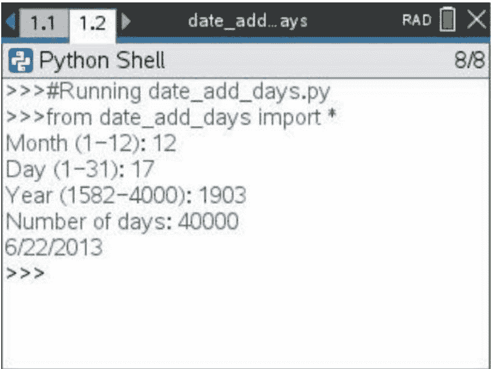

如果你想知道，是的，你可以加上一个负数天数来找到一个更早的日期。

要执行此计算，起始日期通过 `jd()` 函数转换为其儒略日数，加上天数以创建第二个儒略日数，然后 `mdy()` 函数将该数字转换回日期。儒略日数会自动处理闰年、每月天数的变化以及所有这些细节。这两个函数在本章的 `julian` 程序中有更详细的描述。

```python
from math import *

def jd(m,d,y):
    if m<3:
        y-=1
        m+=12
    a=int(y/100)
    b=2-a+int(a/4)
    e=int(365.25*(y+4716))
    f=int(30.6001*(m+1))
    return b+d+e+f-1524.5

def mdy(jd):
    z=int(jd+.5)
    f=jd+.5-z
    if z<2299161:
        a=z
    else:
        t=int((z-1867216.25)/36524.25)
        a=z+1+t-int(t/4)
    b=a+1524
    c=int((b-122.1)/365.25)
    g=int(365.25*c)
    e=int((b-g)/30.6001)
    d=int(b-g-int(30.6001*e)+f)
    if e<14:
        m=e-1
    else:
        m=e-13
    if m>2:
        y=c-4716
    else:
        y=c-4715
    return [m,d,y]

m=int(input("Month (1-12): "))
d=int(input("Day (1-31): "))
y=int(input("Year (1582-4000): "))
n=int(input("Number of days: "))
m,d,y=mdy(jd(m,d,y)+n)
print("{0}/{1}/{2}".format(m,d,y))
```

#### julian

此程序演示了两个对各种日历计算非常有用的函数。本章中的所有其他程序都使用其中一个或两个函数。

`jd()` 计算1582年至4000年范围内给定日期的儒略日数。这是一个绝对日数，被天文学家和其他人用来清晰地指定每一天的顺序，而不考虑闰年和其他此类复杂情况。

请注意，由于历史原因，每个天文日从格林威治时间中午开始，因此这些儒略日数上有一个额外的“.5”。在本文介绍的程序中，我们通过加减整数天来查找相对日期，这个额外的小数部分并不重要。对于天文计算，这个小数部分确实变得重要。

`mdy()` 函数提供了一种将儒略日数转换回月、日、年三元组的方法。这使得可以轻松准确地加减天数以获得新日期，而无需对每月天数或闰年进行任何复杂的调整。

示例代码输入一个日期并输出其儒略日数。接下来，输入任何儒略日数，并输出该日的日历日期。如图所示，1903年12月17日的儒略日数为2,416,465.5，而儒略日数2,500,000.5将落在2132年9月1日。

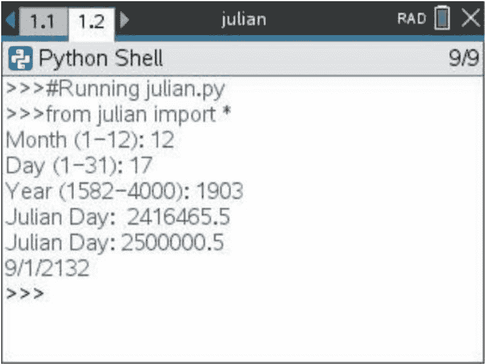

```python
from math import *

def jd(m,d,y):
    if m<3:
        y-=1
        m+=12
    a=int(y/100)
    b=2-a+int(a/4)
    e=int(365.25*(y+4716))
    f=int(30.6001*(m+1))
    return b+d+e+f-1524.5

def mdy(jd):
    z=int(jd+.5)
    f=jd+.5-z
    if z<2299161:
        a=z
    else:
        t=int((z-1867216.25)/36524.25)
        a=z+1+t-int(t/4)
    b=a+1524
    c=int((b-122.1)/365.25)
    g=int(365.25*c)
    e=int((b-g)/30.6001)
    d=int(b-g-int(30.6001*e)+f)
    if e<14:
        m=e-1
    else:
        m=e-13
    if m>2:
        y=c-4716
    else:
        y=c-4715
    return [m,d,y]

m=int(input("Month (1-12): "))
d=int(input("Day (1-31): "))
y=int(input("Year (1582-4000): "))
j=jd(m,d,y)
print("Julian Day: ",j)
j=float(input("Julian Day: "))
m,d,y=mdy(j)
print("{0}/{1}/{2}".format(m,d,y))
```

#### days_between_dates

在你下一个生日时，你将在地球上度过多少天？这类问题用这个程序很容易回答。输入两个日期，将它们转换为儒略日数，然后输出它们之间的差值作为两个日期之间的天数。

`jd()` 函数是此程序的核心。它在本章介绍的 `julian` 程序中有更详细的描述。

示例计算查找从奥维尔和威尔伯首次飞行之日（1903年12月17日）到千年虫（Y2K）日期，即2000年1月1日之间的天数。结果是35,079天。

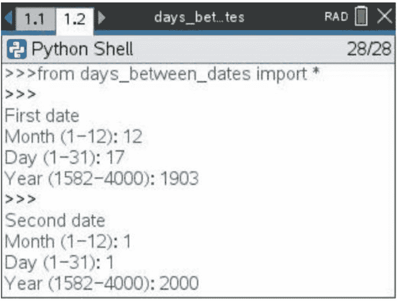

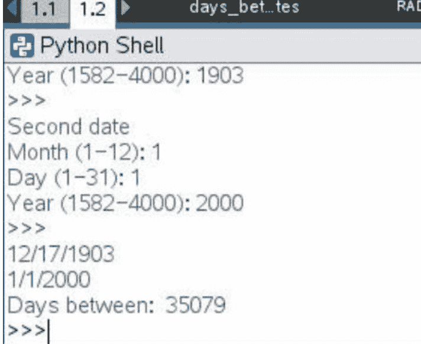

```python
def jd(m,d,y):
    if m<3:
        y-=1
        m+=12
    a=int(y/100)
    b=2-a+int(a/4)
    e=int(365.25*(y+4716))
    f=int(30.6001*(m+1))
    return b+d+e+f-1524.5

print("\nFirst date")
m1=int(input("Month (1-12): "))
d1=int(input("Day (1-31): "))
y1=int(input("Year (1582-4000): "))
print("\nSecond date")
m2=int(input("Month (1-12): "))
d2=int(input("Day (1-31): "))
y2=int(input("Year (1582-4000): "))
nd=int(abs(jd(m1,d1,y1)-jd(m2,d2,y2)))
print("\n{}/{}/{}".format(m1,d1,y1))
print("{}/{}/{}".format(m2,d2,y2))
print("Days between: ",nd)
```

### clock

你的 TI-Nspire™ CX II 技术计算器能够显示一些非常漂亮的彩色图形，而 `ti_draw` 模块使这一切成为可能。此程序演示了大多数可用的图形命令，这里用于创建一个动画模拟时钟面，以可视化方式逐秒计时。

导入了另外三个模块以启用此程序的功能。`math` 模块让我们可以使用三角函数在时间流逝时以正确的角度绘制时钟指针。`time` 模块是访问计算器内部时间所必需的。`ti_system` 模块提供了一种每秒重绘时钟面的方法，直到你按 Esc 键停止它。

我建议仔细查看此程序的函数和其他代码行，确保你理解每个命令和函数的工作原理。我添加了相当多的注释行来帮助你。如果你完全“理解”了这段代码，你将很好地掌握如何编程你自己的惊人而令人印象深刻的创作！

请特别注意函数调用 `use_buffer()`、`paint_buffer()` 和 `clear()`。它们通过在内存中的某处进行所有绘图，然后每秒立即将完成的整个图像更新到显示屏上，从而极大地加快了图形速度。如果你以这种方式使用背景缓冲区，你创建的任何动画都将运行得更好。

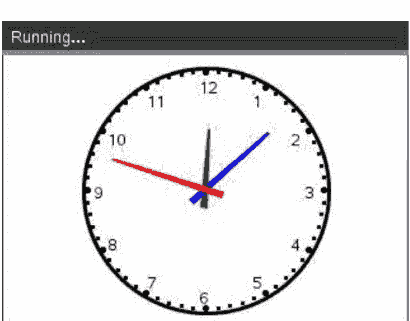

```python
from math import *
from ti_draw import *
from time import *
from ti_system import *

#### Rotate a point by a degrees
def rotate(p,a):
    x,y=p
    r=radians(a)
    xr=x*cos(r)-y*sin(r)
    yr=x*sin(r)+y*cos(r)
    return (xr,yr)

#### Initialize clock face
use_buffer()
ratio=318/212
scale=1.1
xr=scale*ratio
yr=scale
set_window(-xr,xr,-yr,yr)
rfa=1.0
rho=.5
rmi=.8
rse=.9
s,lasts=0,0

#### Until escape key
while get_key() != "esc":

    # Wait for next second
    while s==lasts:
        y,m,d,h,m,s,wd,yn,dst=localtime()
        h%=12
    lasts=s

    # Draw face and numbers
    set_pen(1,0)
    set_color(0,0,0)
    draw_circle(0,0,rfa)
    for i in range(12):
        hr=i+1
        rad=2*atan(1)*(5-hr/3)
        x=.86*cos(rad)-.04
        y=.86*sin(rad)-.1
        draw_text(x,y,hr)

    # Draw second marks
    set_pen(0,0)
    for i in range(60):
        rad=8*atan(1)*i/60
        x=.97*cos(rad)
        y=.97*sin(rad)
        shp=3 if i%5 else 1
        plot_xy(x,y,shp)

    # Draw hour hand
    set_color(0,127,0)
    sx=[-.15,-.15,.5,.5]
    sy=[.03,-.03,-.01,.01]
    for i in range(4):
        p=[sx[i],sy[i]]
        a=90-30*(h+m/60)
        sx[i],sy[i]=rotate(p,a)
    fill_poly(sx,sy)

    # Draw minute hand
    set_color(0,0,255)
    sx=[-.15,-.15,.7,.7]
    sy=[.03,-.03,-.01,.01]
    for i in range(4):
        p=[sx[i],sy[i]]
        a=90-6*m
        sx[i],sy[i]=rotate(p,a)
    fill_poly(sx,sy)

    # Draw second hand
    set_color(255,0,0)
    sx=[-.15,-.15,.8,.8]
    sy=[.03,-.03,-.01,.01]
    for i in range(4):
        p=[sx[i],sy[i]]
        a=90-6*s
        sx[i],sy[i]=rotate(p,a)
    fill_poly(sx,sy)
```

## 2. 电子学

本章介绍了一些用于各种电子计算的实用程序示例。作者在发明一些有趣的小工具时使用了这些及类似的计算，例如一个无需布线的自行车刹车灯，你只需将其贴在自行车或头盔上即可骑行！它使用加速度计和一些有趣的程序代码来消除颠簸和旋转，同时检测刹车并点亮明亮的刹车灯。（LucidBrakes™）

无论你是在使用 Arduino、Raspberry Pi 进行实验，还是在元件级别创建自己的电路，这些计算都会非常有用。

### avg_peak_rms

美国家庭的供电形式是正弦波，有效电压约为 117 伏。这个有效电压为电阻负载提供的功率（瓦特）与 117 伏的直流电压相同。有效电压也称为 RMS，代表“均方根”，因其数学推导方式而得名。

大多数时候我们使用有效电压值，因为它是可以快速计算电路功率的值。但测量正弦波电压还有另外两种方式。峰值电压位于正弦波的最高点，提供“峰值”电压值；而电压随时间变化的平均幅度（不考虑极性）则提供“平均”电压值。

以下是两个主要的转换方程。峰值、平均值和 RMS 电压之间的所有关系都可以通过代数运算这两个方程得出：

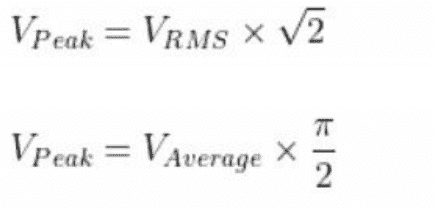

此程序提供了这三种描述纯正弦波电压方式之间的转换。在提示时输入一个已知值，然后按 [enter] 键跳过另外两个。程序会确定你输入的值，计算另外两个，并输出所有三个值以供参考。

```python
from math import *

def ac_voltages(avg,peak,rms):
    if avg:
        peak=pi*avg/2
        rms=peak/sqrt(2)
    elif peak:
        avg=peak*2/pi
        rms=peak/sqrt(2)
    elif rms:
        peak=rms*sqrt(2)
        avg=peak*2/pi
    return [avg,peak,rms]

print("\n\nInput one AC voltage type\n")
s=input("Average: ")
avg=float(s) if s else 0
s=input("Peak: ")
peak=float(s) if s else 0
s=input("RMS: ")
rms=float(s) if s else 0
avg,peak,rms=ac_voltages(avg,peak,rms)
print("\nAvg: ",avg)
print("Peak: ",peak)
print("RMS: ",rms)
```

如示例运行所示，标准的美国家庭布线电压 117 V (RMS) 的峰值电压约为 165 V，随时间变化的平均电压约为 105 V。

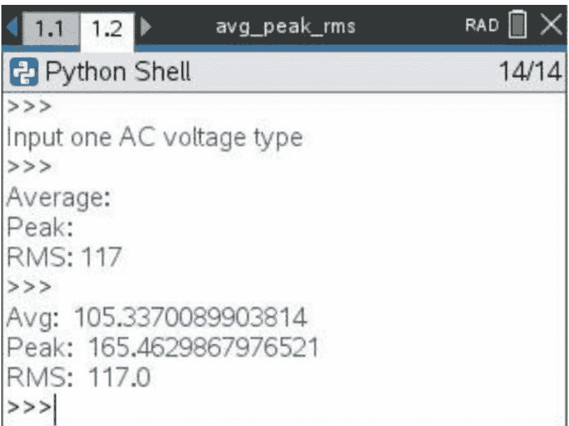

### bridge

平衡电桥电路，也称为惠斯通电桥，在电子学中用于精密测量和其他目的。一个常见的计算是当已知其他三个臂时，求平衡电桥的一个臂的值。例如，在下图中，当已知 R1、R2 和 R3 时，我们可以计算 R4 的值。这些值使得中间的电流表读数为零安培。同样，跨接在这两个相同节点上的电压表读数将为零伏特。

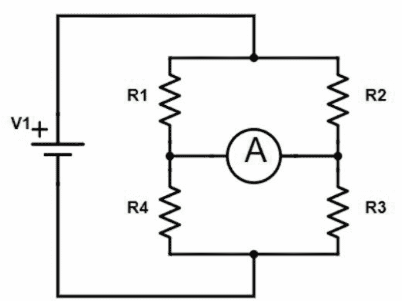

以下是关联四个电阻的方程：

$R1 \times R3 = R2 \times R4$

请注意，bridge() 函数使用变量 z1 到 z3 而不是 R1 到 R3。这是因为 Python 的一个强大特性，变量可以像包含实数一样轻松地包含复数。在电路分析中，对于包含电容和电感（除了电阻）的交流电路，复数非常有用。是的，交流电桥电路在处理这些元件时确实遵循所有相同的数学规则，使用复数表示各自的阻抗。

以下示例计算了当三个电阻分别为 2700、3900 和 5600 欧姆时，第四个臂电阻的值，并再次求解复数阻抗为 4+3j、5+0j 和 3-7j 的情况。

```python
def bridge(z1,z2,z3):
    return z1*z3/z2

r1=2700
r2=3900 # opposite the unknown
r3=5600
r4=bridge(r1,r2,r3)
print("r1: ",r1)
print("r2: ",r2)
print("r3: ",r3)
print("bridge(r1,r2,r3): ",r4)

z1=4+3j
z2=5+0j # opposite the unknown
z3=3-7j
z4=bridge(z1,z2,z3)
print("z1: ",z1)
print("z2: ",z2)
print("z3: ",z3)
print("bridge(z1,z2,z3): ",z4)
```

bridge() 函数非常小，只有前两行代码。这个程序的大部分内容演示了两次调用 bridge() 函数，一次用于求解纯电阻电桥，第二次用于平衡由复数阻抗组成的电桥。

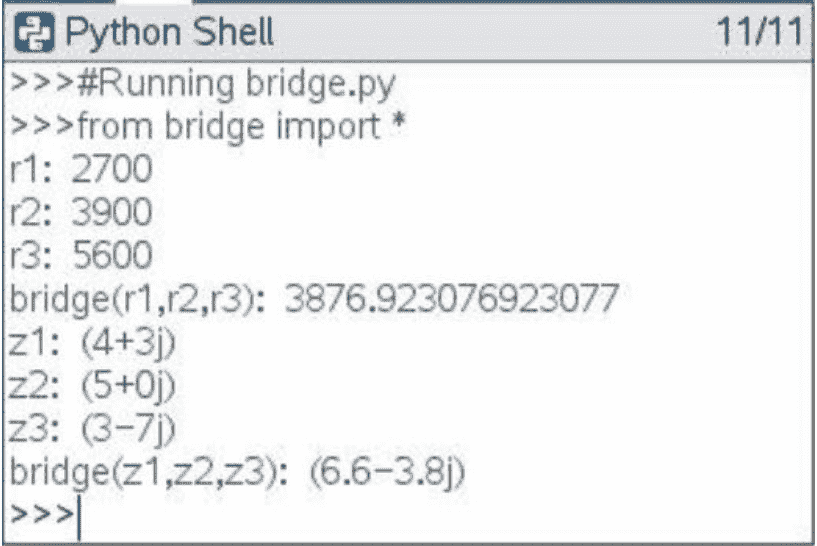

如图所示，第一种情况下的第四个电阻应约为 3877 欧姆，第二种情况下的阻抗应为 6.6-3.8j 欧姆。

### delta_wye

当你运行这个程序时，什么也不会发生。好吧，需要一点解释。正如本书前面所解释的，为你的计算器添加强大功能的一个简单直接的方法，就是在程序中定义函数，以便在处理相关问题时反复使用。在这种情况下，运行时定义了两个函数：delta() 和 wye()，它们保留在 shell 中供你使用。

delta() 函数将星形配置的电阻转换为等效的三角形配置。wye() 函数执行完全相反的转换，输出与你传递给它的三角形配置等效的星形配置。

这两个函数也适用于复数阻抗，如示例所示。这是更高级电子分析的一个强大特性。

三角形配置之所以得名，是因为三个电阻排列成三角形，尽管电路图通常将它们显示为更像 π 形排列，如左侧所示。请注意，如果你将 RB 和 RC 的底部“拉在一起”，就会形成一个三角形。

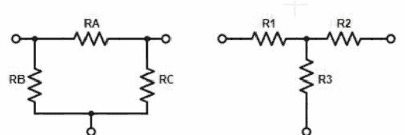

类似地，星形配置通常显示为更像“T”形排列，如右侧所示。只需想象 R1、R2 和 R3 之间的中心点向下拉一点，你就会看到“Y”形或星形。

delta() 函数使用以下方程，在给定 R1、R2 和 R3 时，找到形成等效电阻或阻抗组的 RA、RB 和 RC 的值。

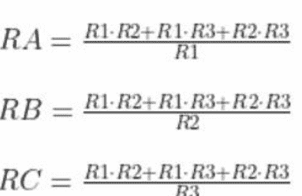

wye() 函数使用以下方程，在给定 RA、RB 和 RC 时，找到形成等效电阻或阻抗组的 R1、R2 和 R3 的值。

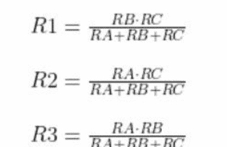

程序的前几行代码定义了这些 delta() 和 wye() 函数。我在清单末尾添加了可选的 print() 命令，以便在运行时提醒你如何调用每个函数。这是为已定义但未在运行时实际调用的函数进行自我文档化的好方法。

```python
def delta(z1,z2,z3):
    tmp=z1*z2+z2*z3+z3*z1
    return tmp/z1,tmp/z2,tmp/z3

def wye(za,zb,zc):
    tmp=za+zb+zc
    return zb*zc/tmp,za*zc/tmp,za*zb/tmp

print("\nDelta to Wye (R or Z)")
print("wye(za,zb,zc)")
print("\nWye to Delta (R or Z)")
print("delta(z1,z2,z3)")
```

以下是程序运行后立即将函数加载到 shell 中时显示的内容。如你所见，实际上还没有进行任何计算。新函数已加载并准备就绪。

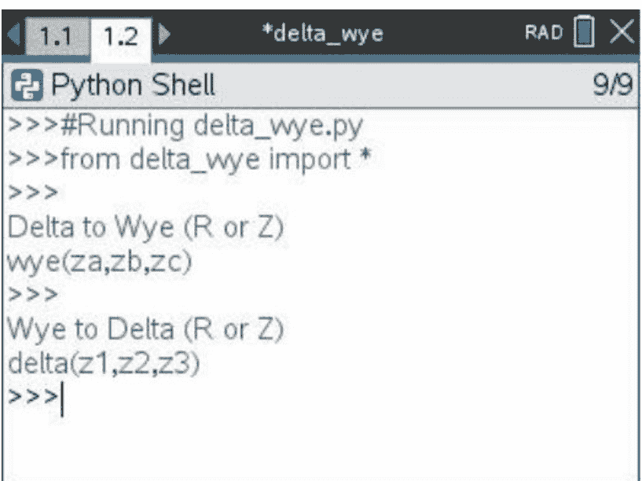

以下是调用每个函数的结果。在第一种情况下，我们将星形配置中 300、400 和 500 欧姆的电阻转换为等效的三角形配置。结果约为 1567、1175 和 940 欧姆。第二次调用将三角形配置中 4+3j、5 和 3-7j 欧姆的阻抗转换为等效的星形值。结果是复数值 2-2.25j、2.95-0.6j 和 1.125+1.625j 欧姆。

### 频率与波长

电磁波谱涵盖了广泛的现象，例如无线电波、X射线、可见光、红外光、微波等等。这些现象中的每一种都属于一个特定的频率范围，每个频率都有一个特定的波长，并且它们在自由空间中都以光速传播。

以赫兹为单位的频率和以米为单位的波长互为精确的倒数关系。它们都是光速的函数。以下是将所有这些联系在一起的最简单方程，其中C是光速：

$C = 299,792,458 \text{ m/s}$

$C = \text{波长} \times \text{频率}$

大多数情况下，波长和频率以工程记数法表示，其中10的幂是3的倍数。这种记数法可以轻松转换为千、兆、纳等前缀，从而更容易理解数值的大小。本程序中的第一个函数名为`eng()`，它将数字格式化为具有任意所需有效位数的工程记数法。你可能希望将此函数单独放入一个模块中，以便在你创建的其他程序中使用。

```
from math import *

def eng(x,d):
    x=abs(x)
    if x==0:
        return "0.0"
    exp=floor(log10(x))
    mant=x/10**exp
    r = round(mant,d-1)
    x = r*pow(10.0,exp)
    p = int(floor(log10(x)))
    p3 = p//3
    value=x/pow(10.0,3*p3)
    s="{:f}".format(value)
    if s[d]!=".":
        s=s[0:d+1]
    else:
        s=s[0:d]
    if p3!=0:
        return "{}e{:d}".format(s,3*p3)
    else:
        return "{}".format(s)

c,f,w=299792458,0,0
print("\nEnter known value...")
f=input("Frequency: ")
f=float(f) if f else 0
if f==0:
    w=input("Wavelength (m): ")
    w=float(w) if w else 0
if w!=0:
    f=c/w
if f!=0:
    w=c/f
digits=5
print("\nFrequency:")
print("{} Hz".format(eng(f,digits)))
print("\nWavelength:")
print("{} meters".format(eng(w,digits)))
```

此程序会提示输入频率，如果你通过按[回车]而不输入数字来跳过频率输入，则会提示输入波长。无论哪种情况，未知值都会被计算出来，两个值都会被格式化为工程记数法，结果会输出到你的计算器显示屏上。

示例运行展示了两种情况：第一种是已知频率，第二种是已知波长。在第一个示例中，输入了氦“人民网络”物联网的频率来计算其波长。915兆赫兹的波长略小于三分之一米。

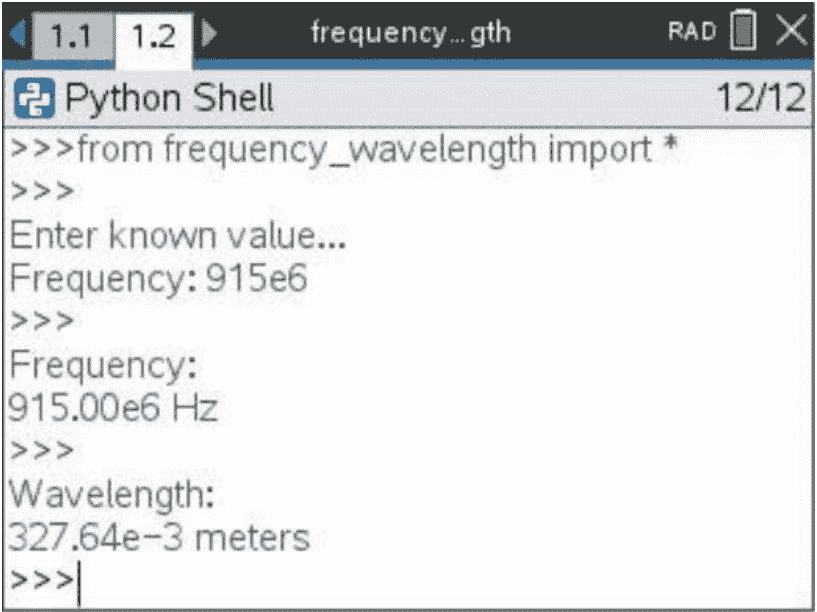

在第二个示例中，我们跳过频率输入，然后输入5来计算当波长恰好为5米时的频率。频率略低于60兆赫兹。

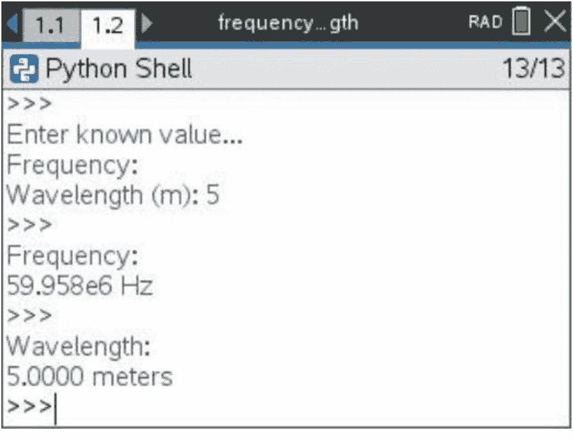

请注意，程序末尾附近名为`digits`的变量被设置为五。如果你想获得更高或更低的答案精度，请更改此值。

为方便参考，以下是各种工程记数法10的幂对应的公制前缀列表：

| 符号 | 名称 | 值 | 符号 | 名称 | 值 |
| :--- | :--- | :--- | :--- | :--- | :--- |
| Y | 尧 (Yotta) | 10^24 | y | 幺 (yocto) | 10^-24 |
| Z | 泽 (Zetta) | 10^21 | z | 仄 (zepto) | 10^-21 |
| E | 艾 (Exa) | 10^18 | a | 阿 (atto) | 10^-18 |
| P | 拍 (Peta) | 10^15 | f | 飞 (femto) | 10^-15 |
| T | 太 (Tera) | 10^12 | p | 皮 (pico) | 10^-12 |
| G | 吉 (Giga) | 10^9 | n | 纳 (nano) | 10^-9 |
| M | 兆 (Mega) | 10^6 | μ | 微 (micro) | 10^-6 |
| k | 千 (kilo) | 10^3 | m | 毫 (milli) | 10^-3 |

### LED电阻计算

LED非常棒。一旦你知道如何正确地为它们供电，你就可以用任何你能想象到的颜色和闪烁模式点亮各种有趣的艺术品、小工具和发明。例如，作者发明了一种自行车刹车灯，它完全不需要连接到刹车线，而是依靠加速度计芯片来判断何时闪烁明亮的红色LED以指示减速。可以在网上查看LucidBrakes™。

LED是一种特殊类型的二极管，电流可以很容易地沿一个方向流过它，而另一个方向则不行。要点亮LED，你需要使用一个电阻来限制在“容易”方向上允许流过的电流量。此程序可帮助你计算该电阻的大小。它还有助于确定电流和功率要求，以确保任何部件都不会冒出神奇的烟雾！

连接LED的标准方法是串联一个电阻，并由一个电压源为它们供电：

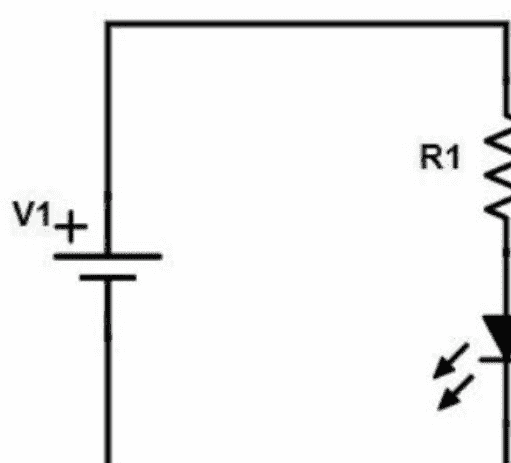

以下是将我们在程序中需要的所有计算联系在一起的方程，其中Vs是电源电压，Vf是LED两端的正向电压，Vr是电阻两端的电压，i是流过所有部件的电流（单位为安培），Wr是电阻的功率（单位为瓦特），Wf是LED的功率（单位为瓦特）。

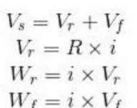

以下是程序清单：

```
def led_resistor(Vs,Vf,i):
    r=(Vs-Vf)/i
    Wr=(Vs-Vf)*i
    Wl=Vf*i
    return [r,Wr,Wl]

def led_current(Vs,Vf,r):
    i=(Vs-Vf)/r
    Wr=(Vs-Vf)*i
    Wl=Vf*i
    return [i,Wr,Wl]

Vs=float(input("Source Vs: "))
Vf=float(input("LED Vf: "))
print("\nNow enter one of these two...")
i=input("Current in amps: ")
i=float(i) if i else 0
r=input("LED resistor in ohms: ")
r=float(r) if r else 0
if i:
    r,Wr,Wl=led_resistor(Vs,Vf,i)
else:
    i,Wr,Wl=led_current(Vs,Vf,r)
print("\nVs: ",Vs)
print("Vf: ",Vf)
print("R: {} ohms".format(r))
print("i: {} amps".format(i))
print("Wres: {} watts".format(Wr))
print("Wled: {} watts".format(Wl))
```

以下两个示例运行首先在已知电流时找到电阻的近似值，第二个示例在为电路选择标准电阻时计算电流。

在这两种情况下，你都需要输入电源电压和LED正向电压（此Vf因LED类型而异），然后输入以安培为单位的电流或以欧姆为单位的电阻值。

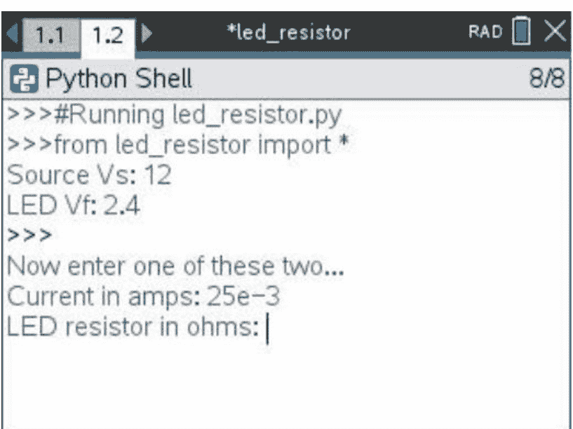

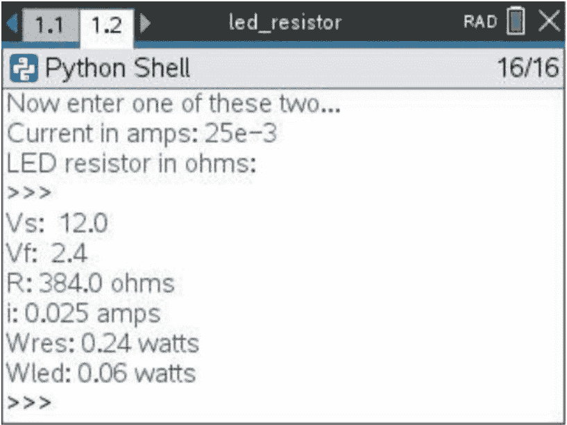

对于一个由12伏供电的电路，一个正向压降为2.4伏、通过电流为25毫安的LED需要大约384欧姆的电阻。

下一次运行，使用9伏电压源、LED正向压降为2.3伏以及270欧姆的标准电阻值，得到的电流约为24.8毫安。

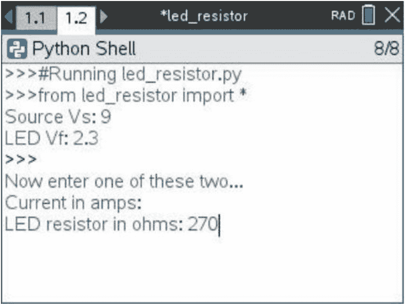

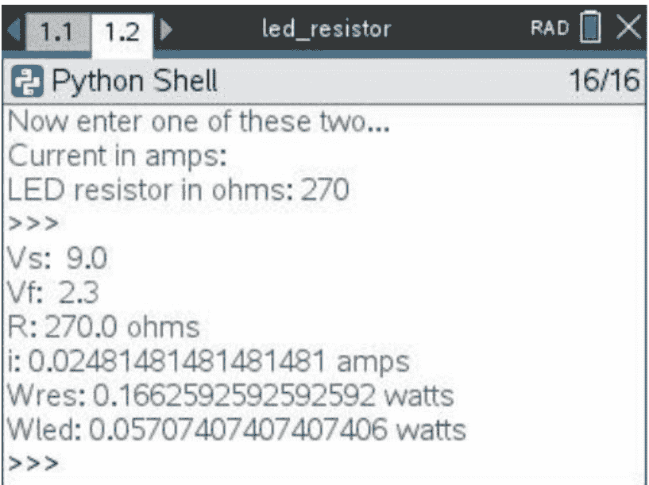

重要的是不要烧坏电路中的电阻或LED。

电阻有其标称的瓦特数，如果Wres小于此值，它们就能正常工作。在我们的示例中，电阻的发热功率约为0.17瓦，因此一个标准的四分之一瓦（0.25瓦）电阻应该可以正常工作。LED有其标称的最大电流，你也可以用这些结果来检查。

### 欧姆定律

电学和电子学的主题充满了方程和公式，但迄今为止最重要的两个方程是我们所说的“欧姆定律”。如果你只学会如何使用以下两个简单的方程，你所知道的就足以被你认识的大多数人视为电子高手。

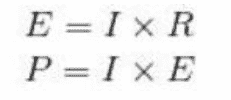

第一个方程指出，电压（电磁力）等于以安培为单位的电流（I）乘以以欧姆为单位的电阻（R）。第二个方程指出，瓦特数（功率）等于以安培为单位的电流乘以电压。

当已知任意两个值时，可以很容易地通过代数方法重新排列这两个方程来计算未知量。此程序提示你输入这四个值中的任意两个，另外两个量将被计算出来，并且所有四个值都将被输出。

此程序定义了一个名为`ohms_laws()`的函数，打印一些供你查看的说明，然后停止。从那时起，你可以调用这个新函数，当已知任意两个值时计算所有四个值。

例如，考虑一个由标准家用117伏供电的60瓦灯泡。为两个未知数（电流和电阻）输入零，函数将找到这些值。电流约为半安培，灯泡的电阻约为228欧姆。

### 并联

并联的电阻可以用一个等效电阻来替代，这是电路分析中常用的技术。同样的方程也适用于并联的阻抗，因此这个程序既可以处理电阻，也可以处理复数阻抗。

等效电阻（或阻抗）通过以下公式计算：

$$\frac{1}{R_p} = \frac{1}{R_1} + \frac{1}{R_2} + \cdots + \frac{1}{R_n}$$

下面是一个示意图，展示了多个电阻如何并联连接：

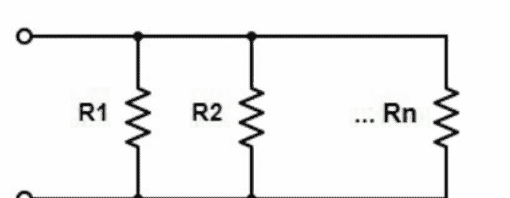

该程序定义了一个名为 `parallel()` 的函数，并打印两行使用说明。请注意，该函数接受一个值列表作为参数，允许处理任意数量的并联电阻或阻抗。只需将两个或更多值添加到列表中，然后将列表传递给此函数即可。

示例展示了如何使用方括号定义一个列表。

```python
def parallel(zlist):
    zp=sum(1/z for z in zlist)
    return 1/zp

print("Parallel (R or Z)")
print("parallel(list)")
```

第一个示例计算了三个并联电阻的等效电阻，第二个示例则对一个包含两个复数阻抗的列表重复了计算。

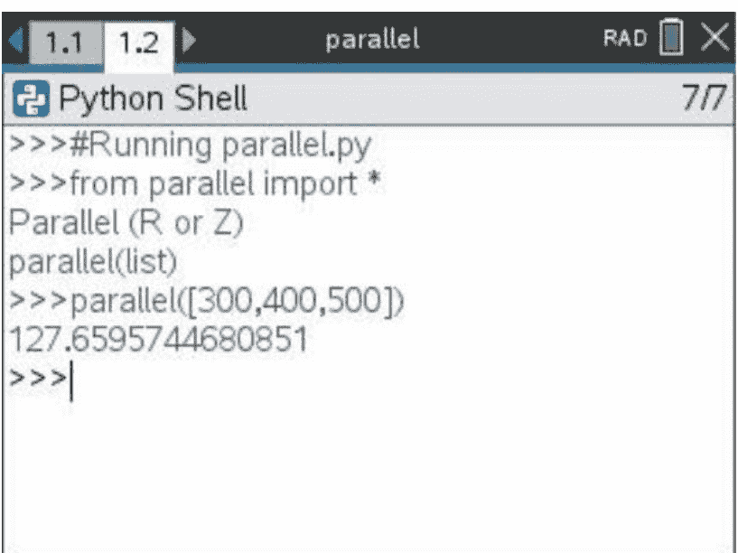

请务必使用方括号将三个电阻值“包装”成一个列表，如示例所示。此函数只接受一个参数，即列表，传递三个单独的数字会导致错误。

结果显示，300、400 和 500 欧姆的电阻并联后，可以用一个约 128 欧姆的电阻替代。

下一个示例计算了两个并联阻抗的等效阻抗，第一个为 300+400j，第二个为 500-600j。如图所示，等效阻抗约为 453+138j。

```python
>>>parallel([300+400j, 500-600j])
(452.9411764705882+138.2352941176471j)
```

### RC 定时

许多常见的定时电路基于 R-C 充电配置，其基本原理如下所示：

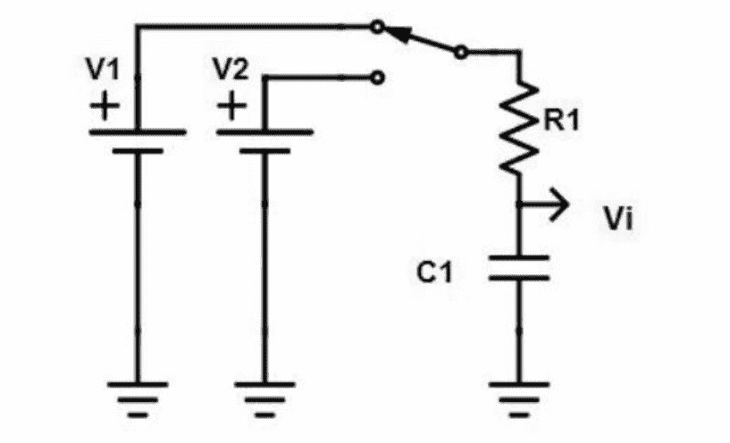

电容 C1 的初始电压 Vi 与 V1 相同。这个初始电压 V1 通常为零，但也可以是任何电压。当输入电压切换到另一个电压 V2 时，电流通过 R1 流入（或流出）电容，电容开始充电。电压 Vi 需要一段时间才能上升（或下降）到 V2，而这个充电时间的细节正是本程序的核心。

此计算涉及六个变量：初始施加电压 V1、新的施加电压 V2、瞬时电压 Vi、自施加电压改变以来经过的秒数 S，以及决定瞬时电压变化速率的电阻 R 和电容 C 的值。电阻越大，电容充电越慢。两个输入电压之间的差值越大，电容两端的电压变化就越快。依此类推。以下是关联所有这些参数的方程：

$$V_2 - V_i = (V_2 - V_1) \times e^{\frac{-S}{R \times C}}$$

本程序定义了一个名为 `rc_timing()` 的函数，该函数通过代数方法分离此方程中的每个变量，以便在已知所有其他变量时求出其值。第二个名为 `rc()` 的函数，其唯一目的是使结果的输入和显示更简单、更友好。你可以使用任一函数获得相同的结果，但我建议使用 `rc()`。

```python
def rc_timing(v1,v2,vi,C,R,t):
    if not t:
        tmp=-log((v2-vi)/(v2-v1))
        t=tmp*R*C
    elif not R:
        tmp=-log((v2-vi)/(v2-v1))
        R=t/C/tmp
    elif not C:
        tmp=-log((v2-vi)/(v2-v1))
        C=t/R/tmp
    elif not vi:
        tmp=exp(-t/R/C)
        vi=v2-tmp*(v2-v1)
    elif not v2:
        tmp=exp(-t/R/C)
        v2=(tmp*v1-vi)/(tmp-1)
    elif not v1:
        tmp=exp(-t/R/C)
        v1=(vi+v2*(tmp-1))/tmp
    return [v1,v2,vi,C,R,t]
```

```python
def rc(v1,v2,vi,C,R,t):
    v1,v2,vi,C,R,t=rc_timing(v1,v2,vi,C,R,t)
    print("v1: ",v1)
    print("v2: ",v2)
    print("vi: ",vi)
    print("C: ",C)
    print("R: ",R)
    print("t: ",t)
```

```python
print("rc(v1,v2,vi,C,R,t)")
print("Pass 0 for the unknown")
```

运行此程序时，两个函数会被定义，但不会执行进一步操作。然后，你可以在命令行中输入 `rc()` 函数，并传递所有六个参数。其中一个且仅有一个参数应为零，其值将使用其他五个参数计算得出。

例如，从 V1 为 0 伏开始，然后施加 V2 为 5 伏，当电阻为 47K 欧姆，电容为 6.8 微法拉时，电压 Vi 上升到 4 伏需要多长时间？现在是棘手的部分：只有未知值（在此例中是经过的时间 t）应输入为零。因此，请务必将初始电压 V1 设置为一个非常接近零的微小值。只要 V1 输入一个非常小的值，答案就足够精确。示例中使用了 V1 = 0.001 伏。

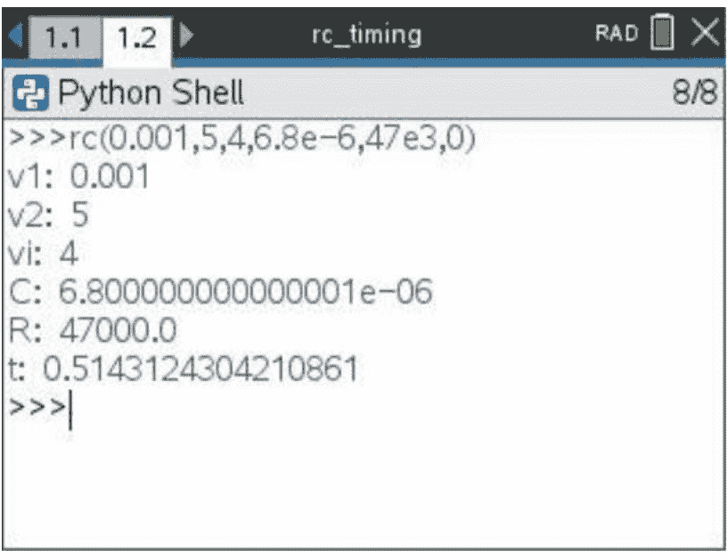

总之，在此示例中我们发现，当电容为 6.8 微法拉，电阻为 47K 欧姆时，在施加 5 伏电压后，电容电压从 0 上升到 4 伏大约需要 0.514 秒。

### 串联

串联的电阻可以用一个等效电阻来替代，其值为各电阻之和。公式如下：

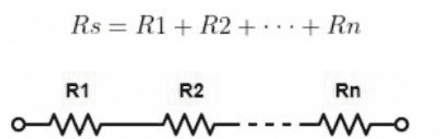

此公式同样适用于串联连接的复数阻抗，示例代码展示了通过调用 `series()` 函数将一组电阻和一组阻抗转换为等效的单个值。

```python
def series(zlist):
    zs=sum(z for z in zlist)
    return zs

print("Series (R or Z)")
print("series(list)")
```

该程序定义了 `series()` 函数，然后打印其使用提醒说明。在命令行中，将一个电阻和/或阻抗的列表传递给 `series()` 函数。结果输出的总电阻或阻抗即为计算结果。

例如，三个电阻串联连接，分别为 300、400 和 500 欧姆。电路的总电阻是多少？

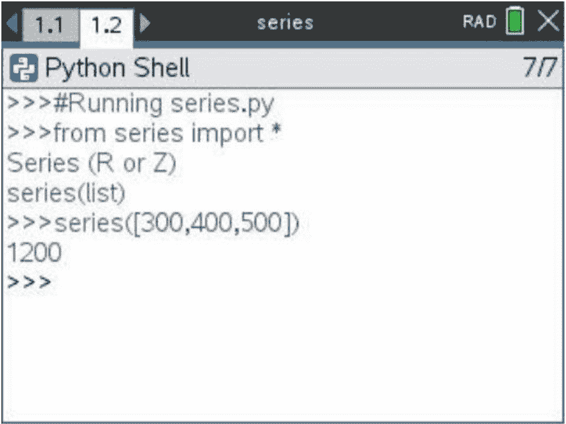

这表明你可以用一个 1200 欧姆的电阻替代这三个电阻。

请务必使用方括号将两个或更多值包装成一个列表参数，然后传递给 `series()` 函数。

这是一个传递两个复数阻抗列表的示例。结果显示，300+400j 与 500-600j 串联的阻抗可以用一个 800-200j 的阻抗替代。

### 复数四舍五入

Python 中的浮点数可以使用 `round()` 函数轻松地四舍五入到 n 位小数。而复数（例如本章多个程序中用于表示电气阻抗值的复数）则不那么容易四舍五入。查看并联程序中显示的结果，你会看到计算出的复数结果在计算器显示屏上延伸得很长，需要进行心算取整才能实用。

此处介绍的 `zround` 函数对复数的每个部分进行四舍五入，并返回更简洁的结果。如果你经常处理复数，你会发现这个函数很有用。

```python
def zround(z,n):
    r=round(z.real,n)
    i=round(z.imag,n)
    return r+i*1j
```

```python
z=(300+400j)**(1/3)
print(z)
zr=zround(z,3)
print(zr)
```

示例代码首先计算复数 300+400j 的立方根并打印结果。如你所见，结果有很多小数位，从电气工程的角度来看可能不太实用。然后将结果四舍五入到 3 位小数，打印出的复数在实际应用中就更易于处理了。

# 3.

## 游戏与概率

本章将带你探索一些引人入胜的统计与概率挑战，并体验一些趣味十足的游戏。

你听说过蒙提霍尔难题吗？这个难题曾难倒过世界上许多最聪明的头脑，但用Python编写一个程序来验证正确答案却很容易。务必仔细研究一下这个程序。

本章的其他程序包括：发一副扑克牌、抛硬币数百万次、用飞镖和针计算圆周率的值，以及打乱单词看看你能发现什么。

### deck_of_cards

这个程序创建一副标准扑克牌，洗牌，然后发出你想要数量的一手牌。这副牌由52张牌加上任意数量的王牌组成。

这个程序的核心是两个函数，你可以在创建更复杂的纸牌游戏时使用。调用`deck()`创建一副洗好的牌，然后将这副牌（一个Python列表）传递给`card()`函数，即可发出不重复的牌。

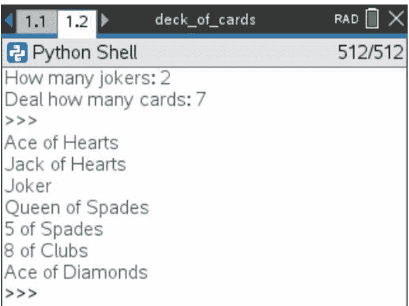

在这个示例中，创建了一副包含两张王牌的牌并进行了洗牌，然后发出了七张牌。

从`random`模块导入的`randrange()`函数使得每次运行程序时都会创建一副不同的牌。

```python
from random import *

def deck(j):
    d=list(range(52+j))
    for i in range(52+j):
        k=randrange(52+j)
        d[i],d[k]=d[k],d[i]
    return d

def card(d,n):
    c=d[n]
    if c>51:
        return "Joker"
    suit=["Hearts","Clubs","Spades","Diamonds"]
    face=["Ace","2","3","4","5","6","7","8",
          "9","10","Jack","Queen","King"]
    return face[c%13]+" of "+suit[c//13]

j=int(input("How many jokers: "))
d=deck(j)

n=int(input("Deal how many cards: "))
print("")
if n>len(d):
    msg="Deck has only {} cards"
    print(msg.format(len(d)))
else:
    for i in range(n):
        print(card(d,i))
```

### dice

这个程序掷出一把六面骰子，显示每个骰子的点数、它们的总和以及平均值。

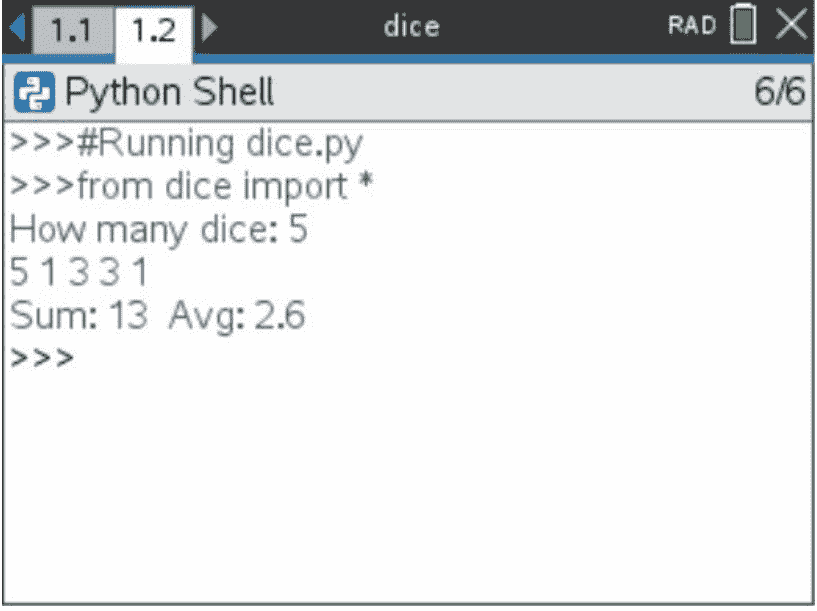

在这个示例中，掷出了五个骰子，显示的点数分别为5、1、3、3和1。骰子的总和是13，平均值是2.6。

`random`模块中的`randint(1,6)`函数提供了这个程序的核心功能。许多Python函数处理参数时，不包括传入的第二个值。`randint()`函数则不同，其参数是包含端点的。在这种情况下，从1到6（包含1和6）的所有整数值被随机返回的概率是相等的。

一个有趣的挑战是修改这个程序，使其能掷出一套用于《龙与地下城》的标准骰子。你需要一个4面、6面、8面、10面、12面和20面的骰子各一个。

```python
from random import *

n=int(input("How many dice: "))
s=""
t=0
for i in range(n):
    d=randint(1,6)
    t+=d
    s+=str(d)+" "
print(s)
print("Sum: {} Avg: {}".format(t,t/n))
```

### digits

“数字”是一个富有挑战性的游戏，它可能非常有趣，也可能让你抓狂！随着你提升难度，它绝对会锻炼你的脑细胞。第1级简单得离谱，但据我所知，目前还没有人能解开第9级的游戏。也许你会是第一个！

规则相当简单。数字1到9随机排列在一个3x3的网格中，其中几个数字缺失。这些数字以蓝色显示。你需要找出缺失的数字是什么。游戏边缘是线索数字，以深绿色显示。它们位于每行和每列的两端，是该行或列中数字通过秘密加法或减法得出的结果。

当你认为已经正确找出所有数字时，按[esc]键查看答案。缺失的数字将以红色显示以供验证。再次按[esc]键清除谜题，再按一次则退出返回到命令行。

从技能等级1开始。这将创建一个非常简单的游戏，帮助你理解游戏的玩法。开始吧：

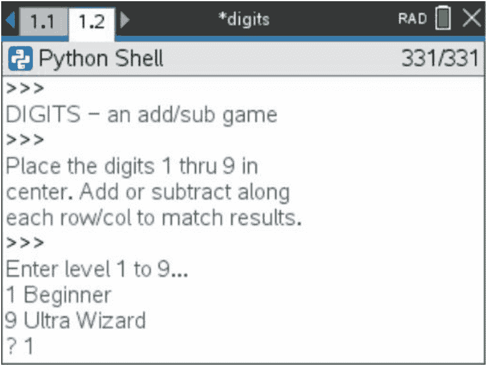

输入1选择最简单的等级。以下是显示的示例：

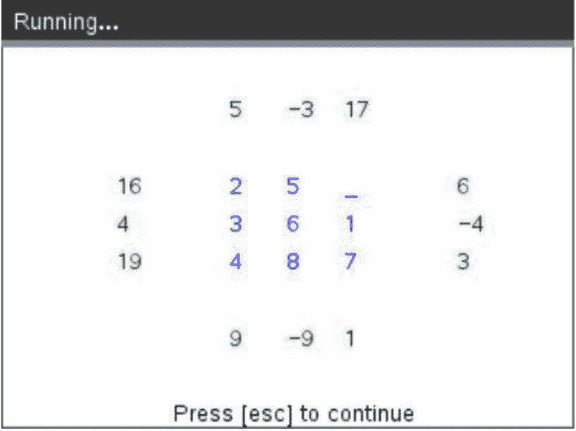

注意中间区域包含了1到9的所有数字，除了数字9。很明显，下划线的位置就是9应该放的地方。这绝对是入门级！现在看那一列的顶部。该列中的数字7、1和9，通过加法和减法可以得到结果17。将三个数字相加得到17。第一行右端的6可以通过2 - 5 + 9计算得出。你的挑战是通过随机使用加号或减号，找出每个数字的位置，使得每行和每列两端的答案都能正确计算。这是第一个游戏的答案显示。

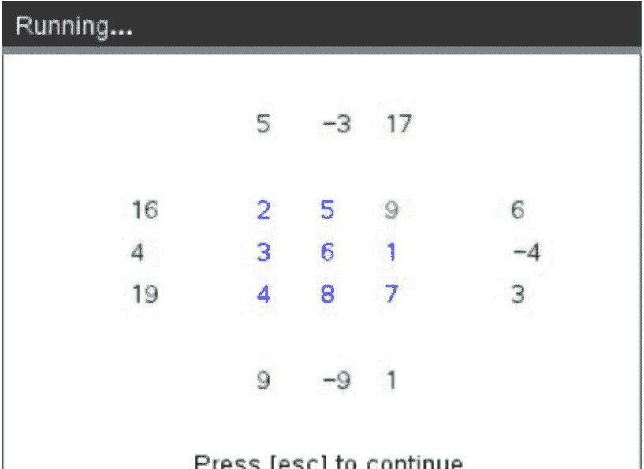

好的，这很简单。现在把等级设置到5左右...

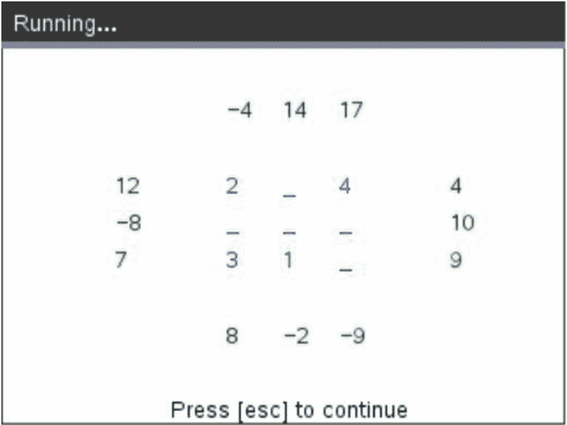

这才是我想说的！看中间那一列，顶部是14，底部是-2。缺失的数字有几种可能的排列方式，使得顶部的数字加上或减去中间的数字，再加或减1等于-2。反过来，我们从1开始，加上或减去相同的数字得到14。你需要多长时间才能找出其余数字必须放置的位置？

如果你卡住了，按[esc]键查看9个数字的排列答案，如下所示...

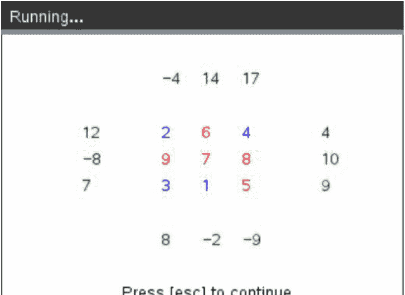

我建议创建一个第9级的游戏，把显示的谜题写在纸上，然后在一天中不时地研究它。这是一种很好的方式，就像玩数独一样，以有趣的方式保持你的脑细胞灵活和活跃。你能比你的朋友更快地找到答案吗？

```python
from random import *
from ti_draw import *
from ti_system import *

def red(): set_color(255,0,0)
def green(): set_color(0,99,0)
def blue(): set_color(0,0,255)
def black(): set_color(0,0,0)

def rsign():
    return randint(0,1) * 2 - 1

def add_sub(a,b,c):
    return a + rsign() * b + rsign() * c

#### Get desired challenge
print("\n\nDIGITS - an add/sub game\n")
print("Place the digits 1 thru 9 in")
print("center. Add or subtract along")
print("each row/col to match results.")
print("\nEnter level 1 to 9...")
print("1 Beginner")
print("9 Ultra Wizard")
w=int(input("? "))

#### Create and shuffle the digits
dg=[1,2,3,4,5,6,7,8,9]
for i in range(9):
    j=randint(0,8)
    dg[i],dg[j]=dg[j],dg[i]

#### Create 12 edge values
ans = []
ans.append(add_sub(dg[6],dg[3],dg[0]))
ans.append(add_sub(dg[7],dg[4],dg[1]))
ans.append(add_sub(dg[8],dg[5],dg[2]))
ans.append(add_sub(dg[0],dg[1],dg[2]))
ans.append(add_sub(dg[3],dg[4],dg[5]))
ans.append(add_sub(dg[6],dg[7],dg[8]))
ans.append(add_sub(dg[2],dg[5],dg[8]))
ans.append(add_sub(dg[1],dg[4],dg[7]))
ans.append(add_sub(dg[0],dg[3],dg[6]))
ans.append(add_sub(dg[8],dg[7],dg[6]))
ans.append(add_sub(dg[5],dg[4],dg[3]))
ans.append(add_sub(dg[2],dg[1],dg[0]))

#### Create string layout
set_window(0,10,0,10)

#### Two states
state=0
while True:
    clear()
    if state==2:
        draw_text(3,5,"Press [esc] to exit")
        break

    # Top row
    green()
    for i in range(3):
        draw_text(i+4,8,ans[i])

    # Three middle rows
    k=0
    for i in range(3):
        green()
        draw_text(2,6-i,ans[11-i])
        blue()
        for j in range(3):
            if dg[k] <= 9-w:
                draw_text(4+j,6-i,dg[k])
            else:
                if state==0:
                    draw_text(4+j,6-i,"_")
                else:
                    red()
                    draw_text(4+j,6-i,dg[k])
        blue()
        k+=1
        green()
        draw_text(8,6-i,ans[3+i])

    # Bottom row
    green()
    for i in range(3):
        draw_text(i+4,2,ans[8-i])

    # Wait for user
    black()
    draw_text(3,0,"Press [esc] to continue")
    while get_key() != "esc":
        pass

    state+=1
```

### fact_comb_perm

本程序创建了三个在统计和概率挑战中非常有用的函数。`fact()` 函数返回一个整数的阶乘，`perm()` 计算从 n 个物品中取 r 个的排列数，而 `comb()` 返回从 n 个物品中取 r 个的组合数。

对于这个程序，我决定直接在代码中输入 n 和 r 的值，而不是使用 `input()` 来提示输入数字。要尝试其他值，请进入编辑器模式并更改设置 n 和 r 的行。在接下来的示例中，这些值被设置为 52 和 5。我使用 52 是因为这是一副标准扑克牌的张数。

编写阶乘函数的方法不止一种。许多资料展示了如何使用递归，这是一种高效且紧凑的概念，对其他编程任务也很有用。我选择使用一个循环将从 1 到 n 的所有数字相乘，因为这样速度快，并且不会像递归那样消耗大量内存。

`fact()` 函数展示了 Python 中的整数大小不受限制，除了机器内存或速度考虑固有的限制。该示例计算了 100 的阶乘，返回了一个真正巨大的数值结果，这是大多数其他计算器和其他编程语言无法做到的。Python 太棒了！

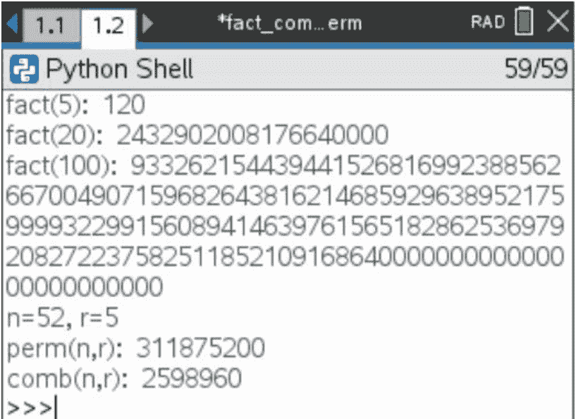

```python
def fact(n):
    if n<0:
        return 0
    if n<2:
        return 1
    fact=1
    for i in range(n):
        fact*=(i+1)
    return fact

def perm(n,r):
    return fact(n)//fact(n-r)

def comb(n,r):
    return perm(n,r)//fact(r)

print("fact(5): ",fact(5))
print("fact(20): ",fact(20))
print("fact(100): ",fact(100))

n,r=52,5
print("n={}, r={}".format(n,r))
print("perm(n,r): ",perm(n,r))
print("comb(n,r): ",comb(n,r))
```

### heads_in_a_row

平均而言，你需要抛多少次硬币才能连续得到七次正面？这可以用一个明确的数学公式来解决，如本程序最后一行所示，但让计算器模拟大量连续抛掷以获得近似答案要有趣得多。你进行的试验次数越多，或者抛硬币的次数越多，答案就越准确（当然是在平均意义上）。这是一个蒙特卡洛模拟的好例子，可以在计算机中运行大量随机试验，从而越来越接近准确的现实世界答案。

在这种情况下，数学预测表明，平均需要连续抛掷 254 次硬币才能得到七次正面。有时少一些，有时多一些，但平均下来是 254 次。

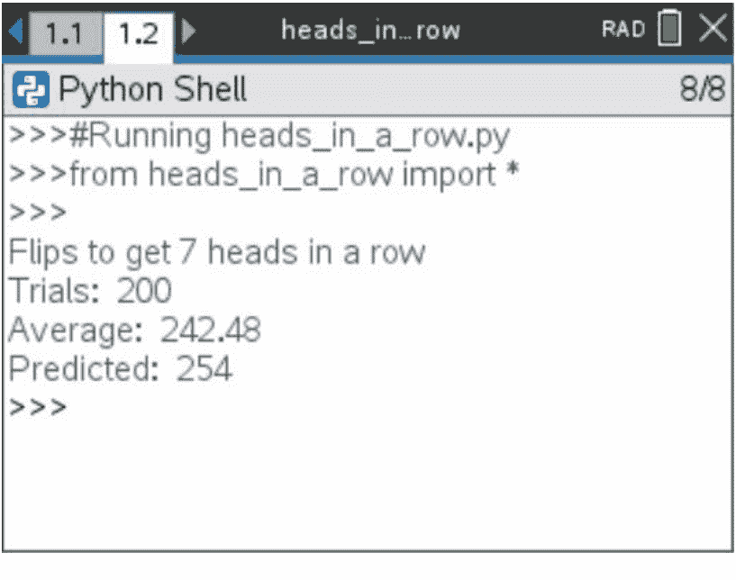

该程序使用 random 模块生成随机的硬币抛掷结果，每次出现正面时计数加一，出现反面时重置计数，并在最终连续出现七次正面时停止每次试验。如图所示，在 200 次试验后，平均需要 242.48 次抛掷才能连续得到七次正面。多次运行此程序，可以看到这个平均值向 254 附近的值偏移。

请随意通过更改试验次数或目标连续正面次数进行实验。但要小心，因为如果使用较大的数字，程序可能需要很长时间才能运行。

```python
from random import *

goal=7
trials=200
tally=0

def flips():
    n=0
    inarow=0
    while 1:
        n+=1
        if randint(0,1):
            inarow+=1
        else:
            inarow=0
        if inarow==goal:
            return n

for i in range(trials):
    tally+=flips()

print("\nFlips to get",goal,"heads in a row")
print("Trials: ",trials)
print("Average: ",tally/trials)
print("Predicted: ",2**(goal+1)-2)
```

### hunt_direction

与 hunt_distance（见下一个程序）相比，这个游戏完全相同，只是又不同（这是我最喜欢的格言之一）。你的目标是在一个 100 x 100 的网格中找到随机分配的目标坐标。每次猜测，你都会收到类似地图方向的指引，例如“向东南移动”或“向正西移动”。目标是以尽可能少的移动次数找到目标。

以下是游戏的示例运行。在这个例子中，我取消了 `print(x,y)` 行的注释，这样你就可以看到目标位于 57,32。坐标以左下角为原点，即 x,y 点为 (0,0)。

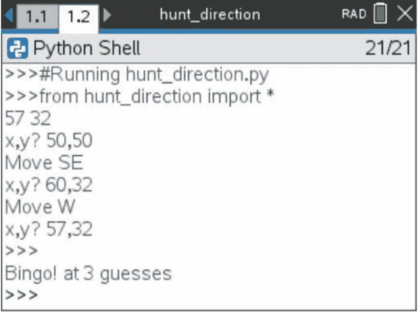

```python
from random import *

x=randrange(100)
y=randrange(100)
#### print(x,y)

n=0
while 1:
    n+=1
    g=input("x,y? ").split(",")
    a=int(g[0])
    b=int(g[1])
    d=""
    if b<y:d+="N"
    if b>y:d+="S"
    if a<x:d+="E"
    if a>x:d+="W"
    if d=="":break
    print("Move",d)
print("\nBingo! at {} guesses".format(n))
```

### hunt_distance

这个程序是一个挑战你视觉空间技能以及数值和分析思维过程的游戏。而且，它很有趣！

在某个 100 x 100 的网格中，有一个生物/目标/终点等着你去寻找。你输入一个坐标对，程序会计算并显示到隐藏点的直线距离。目标是以尽可能少的猜测次数找到生物/目标/终点。

你可能想拿一张方格纸，以你的猜测点为圆心画圆。这应该能让你在几次猜测内就找到目标，只要你在享受乐趣并学习勾股定理和其他解析几何技能，这就不算作弊。或者，像我一样，你可以凭直觉猜测，试图在每次猜测时缩短距离，并在距离变远时改变方向。那也很有趣。

以下是游戏的简短示例运行（通常可能需要超过 3 次猜测），但它展示了工作原理：

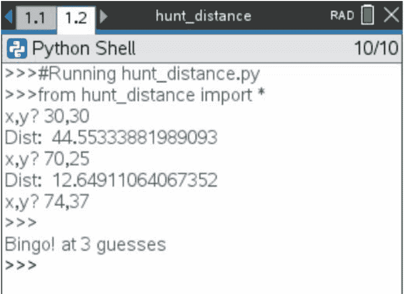

注意源代码中有一行被注释掉的代码，它会打印目标的 x 和 y 值。请随意取消此行的注释以使游戏更容易。你将看到生物/目标/终点的坐标，并且可以尝试猜测，看看每次猜测的距离是如何计算的。

```python
from random import *

x=randrange(100)
y=randrange(100)
#### print(x,y)

n=0
while 1:
    n+=1
    g=input("x,y? ").split(",")
    a=int(g[0])
    b=int(g[1])
    d=((x-a)**2+(y-b)**2)**.5
    if d==0:break
    print("Dist: ",d)
print("\nBingo! at {} guesses".format(n))
```

### jumble

这个程序要求输入一个单词或短语，然后根据你的要求随机打乱字母多次。这对于各种字谜或单词拼图挑战非常方便。

例如，我输入了我的名字和姓氏，总共九个字母，并要求输出 5 次随机打乱：

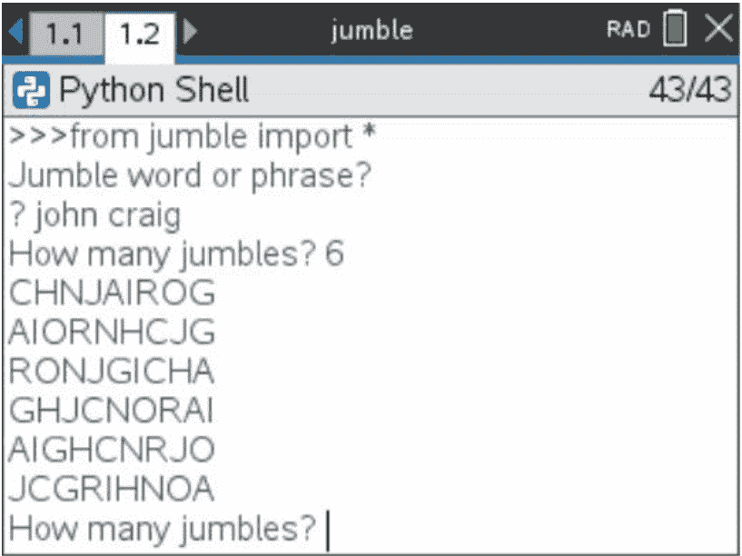

我已经开始看到一些短单词，比如 OR、AIR、HOG、HAIR 等等。我继续要求更多打乱，当我盯着结果看时，一些更大的单词开始浮现在脑海中，比如 CHAGRIN、CIGAR、JARGON、JOIN 和 GAIN。

你可以随心所欲地打乱任意多次，当你只按确定而不输入次数时，程序就会结束。

```python
from random import *

print("Jumble word or phrase?")
s=input("? ")
s=list(s.replace(" ","").upper())
m=len(s)
while 1:
    try:
        n=int(input("How many jumbles? "))
    except:
        break
    while n:
        n-=1
        for i in range(m):
            j=randrange(m)
            s[i],s[j]=s[j],s[i]
        t=""
        for i in range(m):
            t+=s[i]
        print(t)
```

### maze

这个程序使用 ti_draw 图形模块在你的计算器上绘制一个随机迷宫。每次运行程序，都会绘制一个不同的迷宫，所以每次都是新的挑战。random 模块提供了随机性。

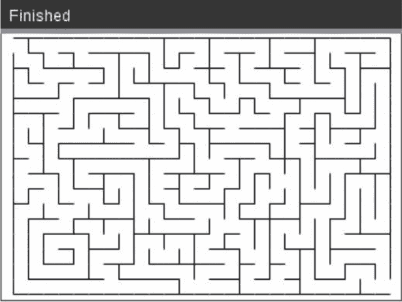

创造迷宫的艺术和科学非常有趣。如果你对这个主题感兴趣，可以查看互联网。或者，你也可以通过运行这个程序来获得一些乐趣，看看你能多快地在脑海中从左上角导航到右下角，以帮助保持脑细胞的良好状态。

```python
from ti_draw import *
from random import *

def vline(x,y,w):
    if w:
        x1=x*w1+9
        y1=y*w1+3
        draw_line(x1,y1,x1,y1+w1)
```

def hline(x,y,w):
    if w:
        x1=x*w1+9
        y1=y*w1+3
        draw_line(x1,y1,x1+w1,y1)

def cell(x,y):
    z=a[x+y*w]
    hline(x,y,z&1)
    vline(x+1,y,z&2)
    hline(x,y+1,z&4)
    vline(x,y,z&8)

def disp():
    clear()
    for x in range(w):
        for y in range(h):
            cell(x,y)

def nor(u):
    v=u-w
    if v>0:
        if a[v]==15:
            a[u]&=14
            a[v]&=11
            return v
    return u

def eas(u):
    v=u+1
    if v%w:
        if a[v]==15:
            a[u]&=13
            a[v]&=7
            return v
    return u

def sou(u):
    v=u+w
    if v<n:
        if a[v]==15:
            a[u]&=11
            a[v]&=14
            return v
    return u

def wes(u):
    v=u-1
    if u%w:
        if a[v]==15:
            a[u]&=7
            a[v]&=13
            return v
    return u

def move(u):
    for i in range(c):
        d=randrange(4)
        if d==0:
            u=nor(u)
        if d==1:
            u=eas(u)
        if d==2:
            u=sou(u)
        if d==3:
            u=wes(u)

#### 初始化
w=25
h=17
n=w*h
c=n/4
wl=12
a=[15 for x in range(n)]
t=[x for x in range(n)]
a[0]=7
clear()
draw_text(125,110,"-thinking-")

while 1:

    # 打乱索引
    for i in range(n):
        j=randrange(n)
        t[i],t[j]=t[j],t[i]

    # 按索引顺序检查每个单元格
    done=True
    for i in range(n):
        u=t[i]
        if a[u]==15:
            done=False
        else:
            move(u)

    # 如果所有单元格都已连接，则完成
    if done:
        break

#### 完成
a[n-1]&=13
disp()

#### 记忆

这个游戏挑战你的短期记忆能力。如果你玩得足够多，它可能对你的长期记忆有所帮助。别忘了这一点！或者如果你忘了，也许你应该更经常地玩这个游戏。抱歉，我有时会得意忘形。

总之，它的运作方式是：显示一个短整数，直到你准备好继续。按下[回车]键，数字将消失。系统会提示你凭记忆输入该数字，如果正确，你将获得一个更长的数字。如果你输入的数字不正确，下一个猜测将显示一个更短的数字。经过十几轮数字挑战后，你的总分将根据所有数字的总长度计算出来。

以下是游戏进行中的示例。请注意，在回忆并输入你刚刚看到的数字之前，你需要按[回车]键清除屏幕。

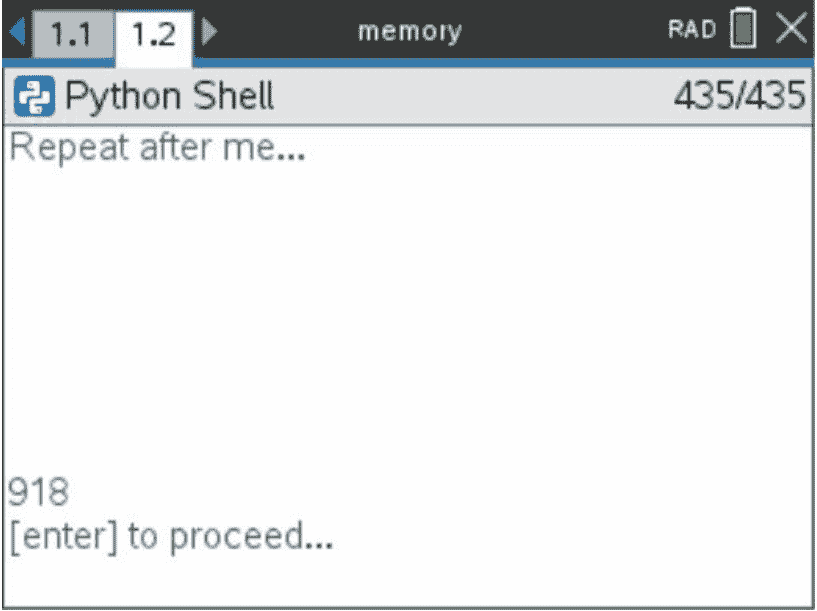

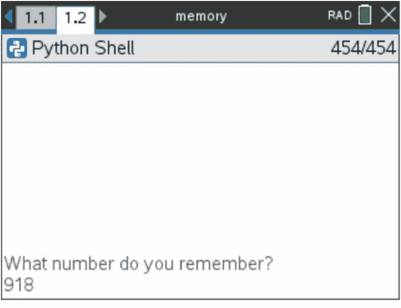

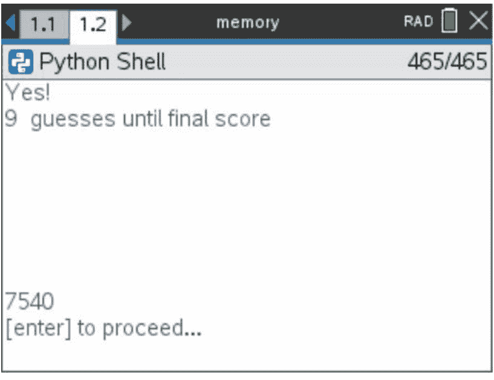

from random import *
from ti_system import *

def digs(n):
    x=randint(1,9)
    for i in range(n-1):
        x=x*10+randrange(10)
    return x

def blank_lines(n):
    for i in range(n):
        print(' ')

n=0
s=3
t=0
blank_lines(3)
print("Repeat after me...")
blank_lines(6)
for i in range(10):
    n+=1
    t+=s
    x=digs(s)
    print(' ')
    print(x)
    print("[enter] to proceed...")
    while get_key() != "enter":
        pass
    blank_lines(18)
    print("What number do you remember?")
    try:
        g=int(input())
    except:
        g=0
        break
    if g==x:
        print("Yes!")
        s+=1
    else:
        print("Sorry")
        s-=1
    msg=" guesses until final score"
    print(str(10-n),msg)
    blank_lines(5)

if g:
    print("\n\nFinal Score: ",t)

#### 蒙提霍尔

你听说过著名的蒙提霍尔谜题吗？它是个难题，最初讨论时让一些顶尖学者都感到困惑。

那么，蒙提向你展示三扇门，并说明其中一扇门后有一辆车。你选择其中一扇门。在打开你的门看你是否中奖之前，蒙提打开了另外两扇门中的一扇，那扇门后什么都没有。然后他问你是否想在揭晓前与最后一扇门交换。你应该交换吗？这会有区别吗？

许多人说，既然还剩两扇未打开的门，车在任意一扇门后的概率是五五开。所以在蒙提打开你的门之前交换与否并不重要。但事实证明这是错误的！

这个程序执行蒙特卡洛模拟（这个“蒙特”与另一个“蒙提”无关，也与“Full Monty”无关，但那是另一个故事）。该程序模拟你被蒙提问1000次是否想交换，并统计你交换和不交换时赢得汽车的次数。

如果你交换，你获胜的几率是三分之二；如果你不交换，你的几率是三分之一。总之，如果你做出交换，胜算就在你这边！

如果这个结果让你困惑，请在互联网上查阅“蒙提霍尔问题”，或观看任何几个涵盖此主题的Youtube视频。同时，用你的TI-Nspire™ CX II技术计算器模拟一堆胜利，玩得开心吧！

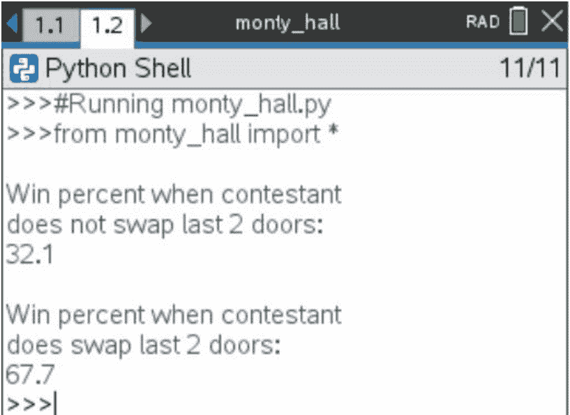

from random import *

games=1000

for n in range(2):
    if n:
        switch=True
    else:
        switch=False
    wins=0
    for i in range(games):
        doors=[False,False,False]
        doors[randrange(3)]=True
        choice1=randrange(3)
        monty_opens=randrange(3)
        while monty_opens==choice1:
            monty_opens=randrange(3)
        if switch==False:
            if doors[choice1]==True:
                wins+=1
        else:
            if doors[choice1]==False:
                wins+=1
    if switch:
        s="does"
    else:
        s="does not"
    print(" ")
    print("Win percent when contestant")
    print("{} swap last 2 doors:".format(s))
    print(round(100*wins/games,2))

#### 布丰投针

圆周率π的值可以通过多种方式计算，包括用随机数模拟现实世界的随机性。早在18世纪，远在第一台德州仪器计算器问世之前，一位名叫乔治-路易·勒克莱尔·德·布丰的人就提出了一个很酷的方法。他建议将针随机投掷到标有等距平行线的地板上，并计算静止时针与某条线相交的次数与总投掷次数之比。

互联网上有很多地方可以让你了解这个过程涉及的所有数学原理，最终都能估算出π的值。这确实很巧妙。用你的TI-Nspire™ CX II技术计算器，你可以在几秒钟内模拟投掷数千根针，这是一个很好的功能，因为这种方法要精确收敛到π的值确实很慢。如果你用真针，你得非常有耐心！

程序会询问你想投掷多少根针。尝试1,000根或10,000根针以获得合理的运行时间。如果你能让计算器放在架子上长时间运行，可以尝试更多；如果你只想看一些π的粗略估计，可以尝试更少。以下是选择1,000根针的结果：

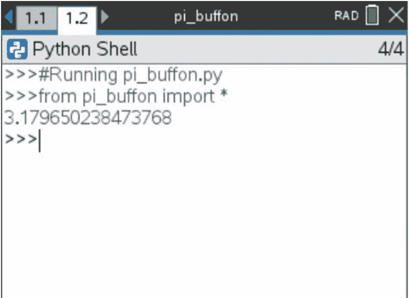

from random import *
from math import *

needles=1000
hits=0
p2=pi*2
for i in range(needles):
    x=random()
    a=uniform(0,p2)
    x2=x+cos(a)
    if x2<0 or x2>1:
        hits+=1
print(2.0*needles/hits)

使用随机数计算π的类似程序有pi_darts和pi_graphics。

### pi_darts

想象一个特殊的飞镖盘，它是正方形的，里面有一个圆，圆刚好接触到正方形的边缘。

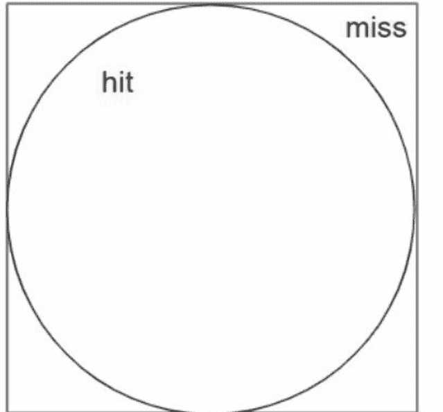

如果你完全随机地向这个飞镖盘投掷飞镖，使得每一平方英寸被击中的机会都与其他任何一平方英寸相同，那么圆内命中次数与总投掷次数之比可以提供π值的估计。这很容易理解，因为这个比率取决于圆和正方形的面积，而圆的面积是使用π值计算的。

$Area = \pi * r^2$

为了简化程序，我们可以只使用上图的右上角，即整个圆和正方形的总面积。这简化了数学，允许高效生成0到1之间的随机数，并且也更容易检查左下角圆心的距离。

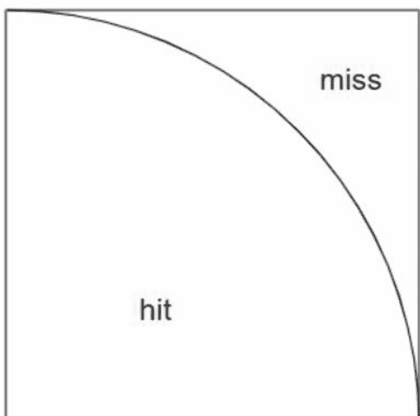

这个程序是蒙特卡洛模拟的另一个例子，其中大量的随机试验提供了一个值的估计。程序会无限循环，或者直到你按下[esc]键，以先发生者为准。每统计1000支飞镖后，显示会更新为π的估计值。

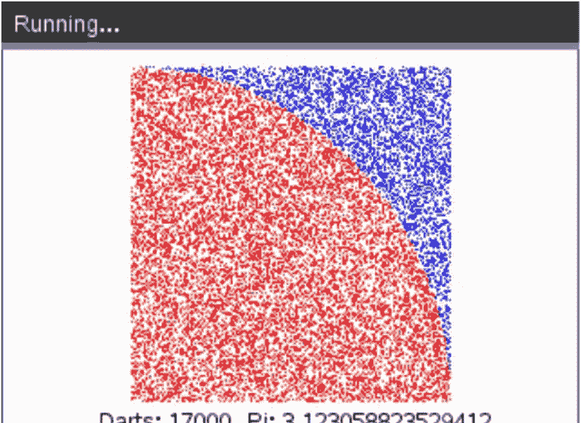

就像布丰投针实验一样，这不是计算或估计π值的非常高效的方法，它只是具有启发性，并且看看它是如何工作的很有趣。

```
from random import *
from ti_system import *
from ti_draw import *
```

```
def red(): set_color(255, 0, 0)
def green(): set_color(0, 99, 0)
def blue(): set_color(0, 0, 255)
def black(): set_color(0, 0, 0)
def white(): set_color(255,255,255)
```

```
set_window(-.4, 1.4, -.095, 1.05)
hits=0
darts=0
while get_key()!='esc':
    x=random()
    y=random()
    darts+=1
    if x*x+y*y<1:
        hits+=1
        red()
    else:
        blue()
    plot_xy(x,y,7)
    if darts%1000==0:
```

```
white()
fill_rect(-.4,-.1,1.8,.08)
s="Darts: {} Pi: {}".format(darts,4*hits/darts)
black()
draw_text(-.1,-.1,s)
```

请注意，程序中定义了几个单行函数来设置用于指示命中、未命中和其他细节的各种颜色。这是使你自己的图形程序更易于阅读和维护的一种好方法。

### random_bytes

random模块提供了几种类型的伪随机数。这个程序调用`getrandbits(8)`函数来生成包含8位的随机整数。换句话说，以这种方式调用此函数会返回随机字节。

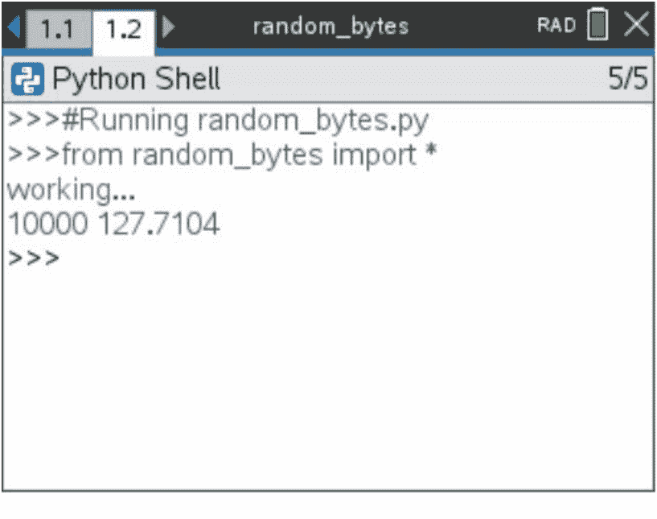

这个简短的程序只是将所有随机字节相加，然后除以字节数。平均值应该大约是127.5。你可能一开始会认为平均值应该是128，因为一个字节可以在8位中容纳256个唯一值。这是正确的，但这些值从没有位被设置时的0，到所有位都被设置为1时的255。这些值的平均值是127.5。

从10,000个字节计算出的实际平均值不会正好是127.5，但如果你多次运行这个程序，你应该会看到平均值大致在127.5左右。或多或少。

```
from random import *
```

```
n=10000
x=0
print("working...")
for i in range(n):
    x+=getrandbits(8)
print(n,x/n)
```

### word_perm

这个程序处理一个长度最多为5个字符的单词中的字母，并显示所有可能的排列，即不重复的重新排列。例如，我的名字JOHN可以排列成24种不同的组合。

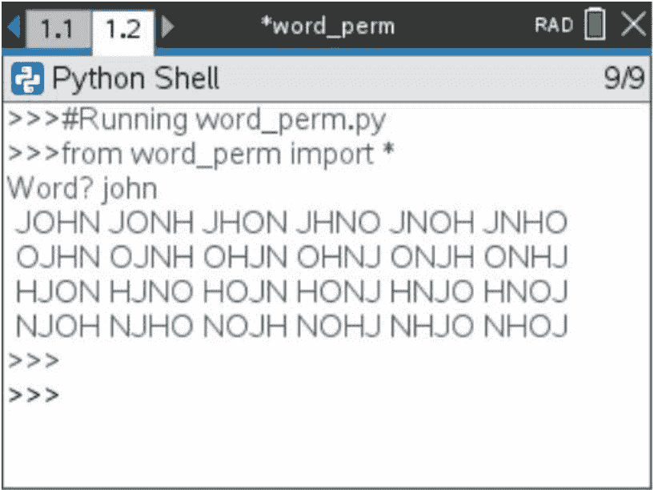

我的姓CRAIG有五个字符，其字母的排列组合结果为120个唯一序列。正如你所看到的，随着单词长度的增加，排列数量迅速增加。对于N个字符，排列数量是N!（阶乘）。一个六个字符的单词将有720种组合，所以我将程序限制为仅处理五个字符的单词。如果你愿意，可以更改代码以允许超过5个字符，但要做好输出很多内容以及需要大量滚动才能看到所有结果的准备！

```
def perm(s):
    if len(s)==1:
        return [s]
    b=[]
    for i in range(len(s)):
        m=s[i]
```

```
c=s[:i]+s[i+1:]
for j in perm(c):
    b.append(m+j)
return b
```

```
while 1:
    s=input("Word? ")
    if len(s)>5:
        print("5 chars max\n")
    else:
        break
p=perm(s.upper())
u=""
for t in p:
    u+=" "+t
    if len(u)>25:
        print(u)
        u=""
print(u)
```

该程序会循环询问下一个单词，次数随你所愿，直到你在提示符下直接按[enter]键。请注意，这个循环使用的是"while 1:"而不是"while True:"。两者工作方式相同，但数字1在代码清单中比值True更短。Python会测试你放在"while"后面的任何内容的"真值"，数字1通过了这个测试。

## 4. GPS与导航

经纬度非常有趣，尤其是现在拥有智能手机的人比例很高，这些手机内置GPS芯片，可以随时告诉他们确切位置。此外，Google（和其他）地图提供了一种很好的方式来确定你放大查看的地球上任何点的位置。

本章让你使用地球表面上的此类坐标来计算距离、方向，甚至由三个或更多坐标定义的陆地面积。

这些计算不像在x,y平面上使用笛卡尔坐标给出的距离、方向和面积那么简单。这是因为地球是一个球体，导致经线在靠近北极或南极时被“挤压在一起”。但你的TI-Nspire™ CX II技术计算器非常有能力完成所有数学计算来完成这项工作。Python使其变得简单。

### gps_area

给定区域角落的几个经纬度坐标来计算地球表面上的面积，比你想象的要复杂。这个程序极大地简化了这个过程。

第一个复杂情况出现在计算任意两个GPS坐标之间的距离时。经线之间的距离，即一个点相对于另一个点向东或向西的距离，取决于纬度。这在程序`gps_distance`中有更详细的解释。

这个程序围绕多边形“行走”，将列表中的第一个坐标依次与多边形边缘的坐标连接起来，形成小三角形。这些三角形面积的总和就是由坐标列表定义的整个图形的面积。这里我们将使用任意两个坐标之间的距离和方向角来计算多边形中各个三角形区域的面积。

本书其他地方的三角形程序演示了如何在给定任意三条边和角的组合的情况下，找出三角形的所有部分，包括其面积。边-角-边函数借用了那个程序来计算小三角形的面积。

真正酷的是，即使坐标定义的多边形形状有凹陷，程序也能自动正确地加减面积。这是因为在“行走”过程中，所选点对与第一个点之间的角度通常是正的。但对于凹陷部分，一个或多个角度是负的，然后小三角形的面积就被计算为负值。这一切都能正确工作，重叠的区域会自动正确地加减，从而得到准确的总面积。

首先，让我们看一个相当简单的例子。弗吉尼亚州阿灵顿的五角大楼有五条边，其角落有五个GPS坐标。Google地图让我们可以找到地图上任何点的经纬度（右键单击一个点，然后从弹出菜单中选择“这是哪里？”）。以下是我找到的角落坐标，采用标准的纬度、经度表示法：

38.868868, -77.055655

38.870619, -77.053325

38.872875, -77.054717

38.872532, -77.057948

38.870039, -77.058504

程序首先计算三角形0,1,2的面积，其中点0是列表中的第一个坐标：

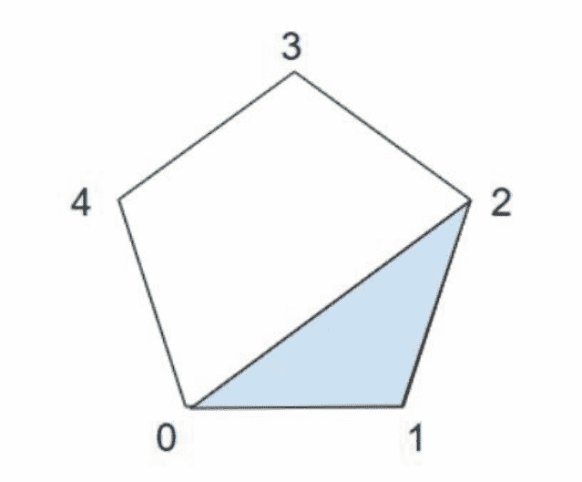

五角大楼的“行走”接下来计算三角形0,2,3的面积，如下所示：

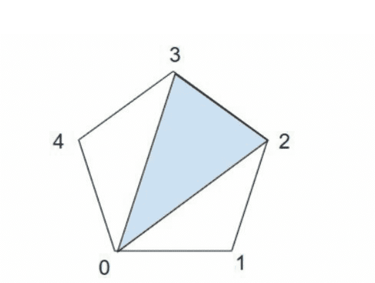

最后，计算三角形0,3,4的面积并将其与其他面积相加，以找到五角大楼五边形的总面积：

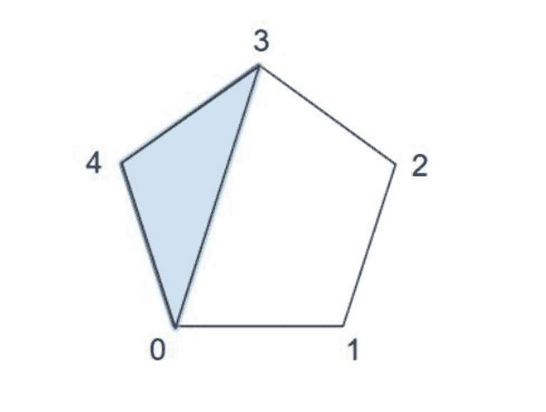

程序的设置是，你在函数`gps_points()`中编辑`pts`列表来定义要计算的区域。你可以重写这段代码，以便在运行时提示输入经纬度数字对，但我更喜欢就地编辑它们，特别是对于较长的坐标列表。这样更容易检查、修改，然后重新运行程序。如程序清单所示，我已经将五角大楼的坐标编辑到了`gps_points()`函数中。

运行程序，结果大约是0.135平方公里，或0.0522平方英里。快速换算显示这大约是33英亩。我在互联网上查了一下，找到了几个关于五角大楼大小的估计值，都与这个值相当接近。

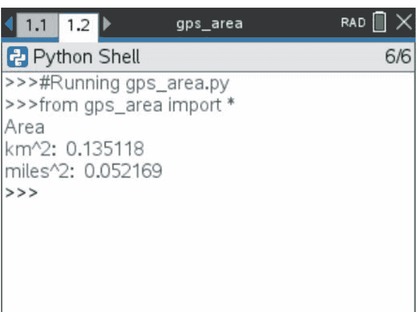

```
from math import *

def gps_points():
    pts=[]
    pts.append([38.868868, -77.055655]) #0
    pts.append([38.870619, -77.053325]) #1
    pts.append([38.872875, -77.054717]) #2
    pts.append([38.872532, -77.057948]) #3
    pts.append([38.870039, -77.058504]) #4
    return pts
```

def area_gps(pts):
    area=0
    if len(pts)>2:
        n=2
        while n<len(pts):
            x0,y0=pts[0]
            x1,y1=pts[n-1]
            x2,y2=pts[n]
            b1,a=nav(x0,y0,x1,y1)
            b2,b=nav(x0,y0,x2,y2)
            b1=b1 if b1>0 else b1+360
            b2=b2 if b2>0 else b2+360
            C=b1-b2
            area+=area_sas(b,C,a)
            n+=1
    return area

def nav(la1,lo1,la2,lo2):
    la1=radians(la1)
    lo1=radians(lo1)
    la2=radians(la2)
    lo2=radians(lo2)
    r=6371
    t1=sin(la1)*sin(la2)
    t2=cos(la1)*cos(la2)*cos(lo2-lo1)
    km=acos(t1+t2)*r
    y=sin(lo2-lo1)*cos(la2)
    t1=cos(la1)*sin(la2)
    t2=sin(la1)*cos(la2)*cos(lo2-lo1)
    x=t1-t2
    b=degrees(atan2(y,x))
    return [b,km]

def area_sas(a,C,b):
    return a*b*sin(radians(C))/2

pts=gps_points()
kmsq=round(area_gps(pts),6)
print("Area")
print("km^2: ",kmsq)
misq=round(kmsq*.386102,6)
print("miles^2: ",misq)

### 绿松石湖

第二个示例粗略计算了科罗拉多州莱德维尔附近绿松石湖的表面积。这是我们即将计算的区域的快速草图（由谷歌地图提供），该区域由我在地图上选择的四个点定义：

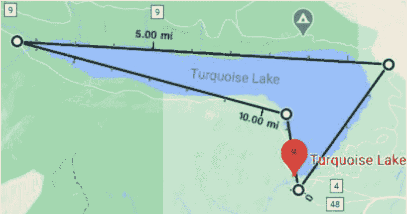

四个地图坐标，从底部点开始逆时针排列，分别是：

- 39.249968, -106.370986
- 39.273513, -106.348860
- 39.277695, -106.438465
- 39.264220, -106.373614

这是将坐标编辑到位后的 `gps_points()` 函数。

```
def gps_points():
    pts=[]
    pts.append([39.249968, -106.370986]) #0
    pts.append([39.273513, -106.348860]) #1
    pts.append([39.277695, -106.438465]) #2
    pts.append([39.264220, -106.373614]) #3
    return pts
```

我特意选择了这个湖和这个形状，因为在左下角，即最后一个坐标（标记为3）处有一个凹陷：

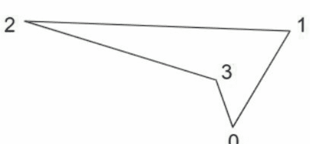

第一个三角形面积由点0,1,2确定，如下所示：

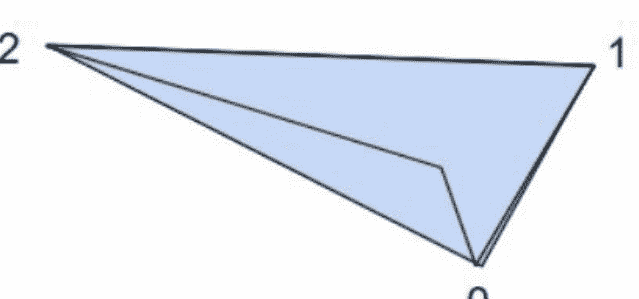

请注意，这个三角形太大了，覆盖的面积超过了整个湖泊的轮廓。不过没关系，因为下一个三角形（点0,2,3）是“反向”的，其点的顺序是顺时针而非逆时针，从而产生负面积。

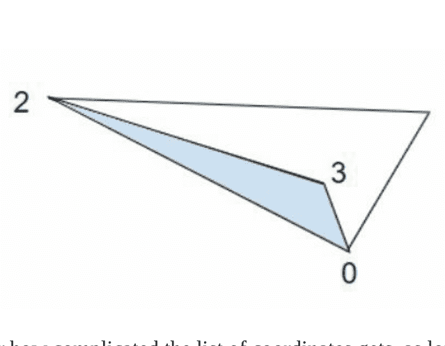

无论坐标列表变得多么复杂，只要它们对于整个多边形来说是正确的“环绕”顺序，所有面积都会正确相加，无论是正还是负，无论它们如何重叠。

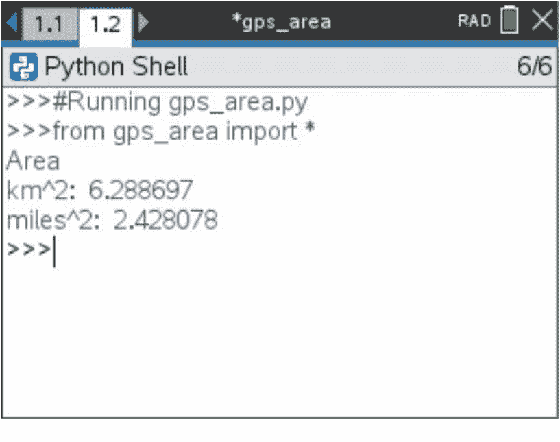

6.289平方公里大约是1,554英亩。在互联网上快速查一下，绿松石湖的面积是1,780英亩。考虑到我们只用四个点来定义湖泊轮廓，这个计算结果相当不错！

这个程序对于不太大的陆地区域效果很好。地球不是平的，所以如果面积非常大，比如边长数百公里，地球表面的曲率确实会影响计算出的面积。

### gps_distance

平面上两点之间的距离使用勾股定理计算，但在球体（如地球）表面上的距离则更为复杂。这个程序可以根据给定的纬度和经度坐标（也称为GPS坐标）准确计算任意两个位置之间的距离。

该算法使用了几个三角函数，因此在程序清单顶部导入了 `math` 模块。Python 中的 `sin()` 和 `cos()` 函数假设所有角度都是弧度，因此使用 `math` 模块中的 `radians()` 函数将纬度和经度从标准度数转换为弧度。（是的，也有一个 `degrees()` 函数，但本程序未使用。）

`distance()` 函数是本程序的核心。输入是地球上两点的纬度和经度，输出是两点之间的公里数。常数6371是地球的半径（公里）。

例如，圣路易斯的拱门在谷歌地图上可见，我们可以仔细放大并点击找到拱门后角金属与混凝土相交处的坐标。这些就是程序清单中的一对坐标。另一个坐标位于旧金山的金门大桥，因此我们也可以测量更远的距离。

圣路易斯拱门官方高度为630英尺，宽度为630英尺。本程序计算出的宽度为629.9英尺，这是一个非常好的结果！旧金山和圣路易斯之间的直线距离列为1745公里，而本程序计算出拱门与大桥之间的距离为1744.7英里，这也是一个惊人相似的结果：

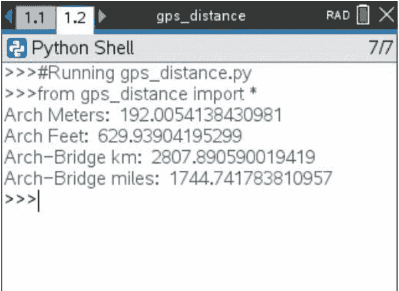

```
from math import *

def distance(pt1,pt2):
    la1=radians(pt1[0])
    lo1=radians(pt1[1])
    la2=radians(pt2[0])
    lo2=radians(pt2[1])
    r=6371
    t1=sin(la1)*sin(la2)
    t2=cos(la1)*cos(la2)*cos(lo2-lo1)
    km=acos(t1+t2)*r
    return km

#拱门宽度
pt1=(38.625412,-90.184555)
pt2=(38.623767,-90.185227)
km=distance(pt1,pt2)
print("Arch Meters: ",km*1000)
print("Arch Feet: ",km*3280.84)

#拱门到金门大桥
pt2=(37.820142,-122.478709)
km=distance(pt1,pt2)
print("Arch-Bridge km: ",km)
print("Arch-Bridge miles: ",km*.621371)
```

### midpoint

这个程序可以找到地球上两个其他位置之间中点的纬度和经度。给一两个州外的朋友打电话，让他们在精确的中点与你见面，就为了好玩。

这个程序也很适合检查地球是平的还是圆的。说真的。考虑一下，在晴朗的日子里，用一根简单的米尺就可以轻松测量太阳的仰角。我不会在这里详述所有细节，但请注意，从地球上三个等距点测量的太阳仰角将提供你需要的所有信息。如果地球是平的，仰角会以一种方式变化；如果地球是圆的，仰角会以另一种方式变化。（提示：它是圆的。）

让我们找出旧金山金门大桥和圣路易斯拱门之间中点的纬度和经度。

这是我们在 `gps_distance` 程序中使用的拱门一角的坐标：

```
la1=38.625412
lo1=-90.184555
```

这是同一程序中的金门大桥坐标：

```
la2=37.820142
lo2=-122.478709
```

让我们将这些坐标输入程序，找到地球上的中点，然后在谷歌地图上查找该点，看看那里有什么：

```
>>>#运行 midpoint.py
>>>from midpoint import *
Point1, Point2, Midpoint
(38.625412, -90.184555)
(37.820142, -122.478709)
[39.3486673256036, -106.4234424725471]
>>>|
```

中点位于西田纳西溪沿岸一个风景如画的地方，就在科罗拉多州莱德维尔的西北方向。那将是一个与朋友见面的有趣地点！


```
from math import *

def mid(pt1,pt2):
    la1=radians(pt1[0])
    lo1=radians(pt1[1])
    la2=radians(pt2[0])
    lo2=radians(pt2[1])
    x=cos(la1)*cos(lo1)
    y=cos(la1)*sin(lo1)
    z=sin(la1)
    x+=cos(la2)*cos(lo2)
    y+=cos(la2)*sin(lo2)
    z+=sin(la2)
    la=degrees(atan2(z,(x*x+y*y)**.5))
    lo=degrees(atan2(y,x))
    return [la,lo]

pt1=(38.625412,-90.184555)
pt2=(37.820142,-122.478709)
pt3=mid(pt1,pt2)
print("Point1, Point2, Midpoint")
print(pt1)
print(pt2)
print(pt3)
```

请注意，位置坐标是直接编辑到程序清单中的，其中对变量 `pt1` 和 `pt2` 进行了赋值。

### navigate

这个程序计算地球表面上任意两点之间的距离和方位。

使用谷歌地图很容易找到地球上某点的位置。放大到该位置，右键单击该点，然后从弹出菜单中选择“这是哪里？”。这是获取本程序所需输入的纬度和经度数字的好方法。

这里使用的大圆航线公式对于短距离（例如测量学校前的一小段人行道）是准确的，对于更长的距离（此时地球的球形变得非常重要）也同样准确。

新墨西哥州杜尔塞和新墨西哥州陶斯的位置（或从谷歌地图获取的GPS坐标）被硬编码到程序中以进行测试。你可以随意更改这些数字，或者修改程序使其提示输入。核心功能在 `nav()` 函数中，因此你可以按任何你希望的方式调用它。

如图所示，从杜尔塞到陶斯的距离非常接近140公里，行进方向是114.3度，即正东偏南一点。

## 5. 货币与财务

本章介绍了几个用于计算利息、储蓄、贷款以及其他与资金流动相关细节的程序。

下次当你准备购买汽车、房屋或游戏机时，你可以看看贷款会产生多少利息，或者更好的是，看看需要多长时间才能攒够现金支付。

### 存款

这个简短的程序通过计算需要在有息账户中存入多少钱以及存多久，来帮助你为某个目标储蓄。

例如，也许你想买一台价值1000美元的新游戏笔记本电脑，并且希望在一年后拥有它。如示例所示，如果账户利率为7%，你应该每月开始存入80.69美元。

```python
fv=float(input("Dollars goal: "))
ir=float(input("Interest rate: "))
mo=float(input("Months: "))
ir/=1200
dp=fv/((ir+1)**mo-1)*ir
s="Monthly deposits: ${:.2f}"
print(s.format(dp))
```

### 未来价值

为你将来想购买的东西储蓄，是让你的钱发挥更大价值的好方法。资金以一定的利率累积，而不是需要支付贷款利息，所以你基本上是在以两种方式储蓄。这个程序让你可以尝试看看你能节省多少，并帮助你在投资自己时保持目标。

程序会提示你输入每月可以提供的金额、资金将累积增值的年利率，以及计算总额的年数。然后输出未来价值。在示例中，每月存入50美元，年累积利率为7%，输出3年后的未来价值，总计1996.51美元。

```python
dp=float(input("Monthly deposit: "))
ir=float(input("Interest rate: "))
yr=float(input("Years: "))
ir/=1200
mo=yr*12
fv=dp*((ir+1)**mo-1)/ir
print("Future value: ${:,.2f}".format(fv))
```

### 利息

这个程序在已知本金、每月还款额和还款月数的情况下，计算贷款所收取的利率。输出计算出的年利率。

示例显示，一笔10,000美元的贷款，在3年（即36个月）内每月还款325美元，年利率为10.49%。

```python
p=float(input("Principal: "))
pmt=float(input("Monthly payments: "))
n=float(input("Months: "))
r,t=1,0
while t!=r:
    t=r
    r=pmt*((1+r)**n-1)/p/(1+r)**n
i=round(r*1200,2)
print("APR: {}%".format(i))
```

### 月数

这个程序计算在贷款累积利息的情况下，还清一笔钱所需的月数。

例如，你借了1,000美元，同意每月支付25美元，利率为7%。这个程序告诉你需要49个月。月数四舍五入到最接近的整月。好消息是，最后一笔付款可能会比其他付款少。

```python
p=float(input("Principal: "))
r=float(input("Annual Interest: "))/1200
pmt=float(input("Monthly payments: "))
n,d=0,pmt+1
while d>pmt:
    n+=1
    d=round(p*(r*(1+r)**n)/((1+r)**n-1),2)
print("Months: ",n)
```

### 月供

这个程序在已知贷款金额（或本金）、年利率和月供次数的情况下，计算贷款的每月还款额。

示例显示，一笔5000美元、利率为9%的贷款，需要24次每月还款，每次228.42美元。

```python
p=float(input("Principal: "))
r=float(input("Annual Interest: "))/1200
n=float(input("Months: "))
pmt=p*(r*(1+r)**n)/((1+r)**n-1)
pmt="${}".format(round(pmt,2))
print("Monthly payments: ",pmt)
```

### 本金

给定贷款的每月还款额、年利率和还款月数，这个程序计算贷款的原始本金。

例如，给定每月还款228.42美元，持续24个月，利率为9%，原始贷款金额为4999.92美元。实际贷款金额可能是5000美元，因为轻微的舍入误差很容易累积到几分钱，就像这个例子一样。

```python
pmt=float(input("Monthly payments: "))
r=float(input("Annual Interest: "))/1200
n=float(input("Months: "))
p=pmt/(r*(1+r)**n)*((1+r)**n-1)
p="${}".format(round(p,2))
print("Principal: ",p)
```

## 6. 数值计算

本章的程序涵盖了计算器和计算机可以执行的许多标准计算，这些计算可能对你的学习或工作很有用。程序从快速寻找质数、解联立方程、求方程根、提供完整的向量函数集等等，各不相同。

### 二进制_十进制_十六进制转换

计算机一直使用位、字节以及十六进制和二进制格式的数字。这个程序展示了一个数字如何轻松地在这些格式之间相互转换。

例如，十六进制数0x4DF3等于十进制数19955，也等于二进制数0b100110111110011。程序要求以其中任何一种格式输入，然后输出所有三种格式。

请注意，将十六进制或二进制数转换为十进制有更简单的方法。在shell中，在>>>提示符下，只需输入值，确保添加适当的前缀"0x"或"0b"。将显示十进制值。要反向转换，从十进制到其他两种格式，这个程序可以做到。十六进制值可以大写或小写输入。

程序的最后几行展示了如何将十进制整数格式化为所有三种数字格式输出。

```python
print("Input one of the following")
print("@bnn.. binary")
print("nn..decimal")
print("0xnn.. hexadecimal")
n=input("Number? ").lower()
if n[0]=="0":
    if n[1]=="b":
        n=int(n[2:],2)
    elif n[1]=="x":
        n=int(n[2:],16)
else:
    n=int(n)
print("Hex: ","0x{:X}".format(n))
print("Bin: ","0b{0:b}".format(n))
print("Dec: ",n)
```

### 二分查找

这个程序寻找函数的根，或者函数在y=0处与x轴相交的点。在清单顶部适当命名的函数f(x)中编辑你的x函数。以下是示例中我们将使用的函数：

```python
def f(x):
    return 0.7*x**3-7*x**2+3*x+17
```

在你的TI-Nspire™ CX II技术计算器（不使用Python）上快速绘制此函数，显示该函数有三个根，位于X轴上-5到+12之间的某个位置。这个程序将帮助你快速高效地找到这些根。

程序中的roots()函数接收三个值：要检查区间的起始x值、结束x值，以及它们之间的步数。步数应足够多，以免函数的零点被“跳过”。在大多数情况下，100效果很好。如果在指定区间内有一个或多个根，它们将被返回。

在这个例子中，由于我们知道三个根在-5到+12之间（图表的边缘），roots()函数这样调用：roots(-5, 12, 100)，返回的三个根将打印在显示屏上。

### 求根

`roots()`函数根据步长参数将大区间分解为多个小区间。该函数被调用以获取这些小区间的端点值。每当两个返回值符号不同时，就会调用`root()`函数，使用二分搜索法在该区间内寻找“精确”的根。

二分搜索将`x1`和`x2`之间的区间一分为二，计算中点处的`y`值，然后判断根必然位于该中点的左侧还是右侧。在一种情况下，`x1`的值被替换为中点值；在另一种情况下，`x2`被替换。在这个更小的区间内重复搜索，一次又一次，直到`x1`和`x2`之间的差值趋近于零，此时即得到`x`的根值。

编辑清单顶部的函数以及清单末尾对`roots()`的调用，即可为你自己的函数求根。

```python
def f(x):
    return 0.7*x**3-7*x**2+3*x+17

def roots(xmin,xmax,steps):
    inc=(xmax-xmin)/steps
    while xmin<xmax:
        x=root(xmin,xmin+inc)
        if x>=xmin:
            print(x)
        xmin+=inc

def root(x1,x2):
    dif=0
    y1=f(x1)
    y2=f(x2)
    while 1:
        if y1*y2>0:
            return x1-1
        x=(x1+x2)/2
        y=f(x)
        if y1*y>0:
            x1=x
            y1=f(x1)
        else:
            x2=x
            y2=f(x2)
        if x1-x2!=dif:
            dif=x1-x2
        else:
            return x

roots(-5,12,100)
```

### 因数分解

此程序用于找出一个整数的所有因数。`factors()`函数接收一个整数，并返回其所有质因数的列表。

例如，16的质因数是四个2，12345的质因数是3、5和823，123454321的质因数是41、41、271和271。

我最初创建这个程序时，是通过从2到给定数字的所有数字进行除法来寻找能整除的因数。这对于相对较小的整数效果很好，但对于数万或更大的数字，速度会变得非常慢。为了大幅提速，我借鉴了本书其他部分的`next_prime()`和`is_prime`函数，只检查质数的整除性，并且只检查到给定整数的平方根。这增加了一点代码长度，但速度的大幅提升是值得的。

```python
def factors(n):
    factlist=[]
    m=2
    while n>1:
        if n%m==0:
            factlist.append(m)
            n//=m
        else:
            m=next_prime(m)
            if m*m>n:
                factlist.append(n)
                break
    return factlist

def next_prime(n):
    p=n+1
    while not isPrime(p):
        p+=1
    return p

def isPrime(n):
    primes = (
        2,3,5,7,11,13,17,19,23,29,31,37,41,
        43,47,53,59,61,67,71,73,79,83,89,97)
    if n in primes:
        return True
    for m in primes:
        if n%m==0:
            return False
    for m in range(primes[-1]+2,n//m+1,2):
        if n%m==0:
            return False
    return True

n=int(input("Enter n: "))
print(factors(n))
```

### 斐波那契数列

斐波那契数列非常迷人，这个程序让你可以交互式地探索其特性。从任意两个整数开始（通常选择0和1），将它们相加并添加到列表中，然后将列表中的最后两个数字相加得到下一个数字，如此反复，最终列表中最后两个数字的比值会趋近于黄金比例。

在互联网上搜索以了解更多关于黄金比例的信息，因为有许多奇特的事实，其解释乍看之下似乎并不合理。例如，黄金比例恰好等于2 * sin(54度)。原因与五边形形状有关，但我将让你自己去发现这些细节。

另一个有趣的事实是，你不需要从0和1开始来形成斐波那契数列。事实上，你可以从任意两个数字开始，正数或负数，整数或浮点数，列表中最后两个数字的比值都会迅速趋近于黄金比例。这很神奇。你一定要试试！

以下是使用0和1开始，并迭代增长数列20次的结果。

如你所见，10946与6765的比值非常接近黄金比例。（黄金比例也可以计算为一加五的平方根再除以二，这就是输出最后一行中更精确值的计算方式。）

接下来，从-17.85和97.65开始。仅仅20次加法后，比值也迅速趋近于黄金比例。

```python
a=float(input("Enter a: "))
b=float(input("Enter b: "))
n=int(input("Number of additions: "))
for i in range(n):
    a,b=b,a+b
print("a: ",a)
print("b: ",b)
print("a / b: ",a/b)
print("b / a: ",b/a)
print("Golden: ",(1+5**.5)/2)
```

### 最大公约数与最小公倍数

此程序用于找出两个整数的GCD（最大公约数）和LCM（最小公倍数）。两个整数的GCD是能同时整除它们的最大正整数。两个整数的LCM是能同时被它们整除的最小正整数。事实证明，两个数的乘积等于LCM与GCD的乘积。

例如，给定整数24和56，我们发现它们的GCD是8，LCM是168。

```python
def gcd(a,b):
    while 1:
        c=a-b*int(a/b)
        a,b=b,c
        if not c:
            return a

def lcm(a,b):
    return int(abs(a*b/gcd(a,b)))

a=int(input("Enter a: "))
b=int(input("Enter b: "))
print("GCD: ",gcd(a,b))
print("LCM: ",lcm(a,b))
```

### 黄金比例

在互联网上搜索关于黄金比例（GR）的迷人信息，你会发现有多种方法可以计算这个数字。也许最直接的计算是使用这个公式。

另一种计算GR的方法是使用斐波那契数列（参见fibonacci程序）。

在这个程序中，使用了一个从任意数字开始的简单迭代，可以相当快速地收敛到黄金比例的值。GR也等于1 + 1/GR，这提供了一种巧妙的方法来迭代计算其值。

例如，从数字-123.4567开始，仅需40次迭代即可找到GR。

```python
x=float(input("Enter any number: "))
y,n=0,0
while x!=y:
    x,y,n=1+1/x,x,n+1
print("Iterations: ",n)
print("Golden: ",x)
print("Exact: ",(1+5**.5)/2)
```

### 牛顿法

bin_search程序使用二分（“一分为二”）搜索算法来寻找函数f(x)的根。这个程序也寻找x函数的根，但它使用牛顿法，这是一个非常酷的算法，在许多情况下能极其高效地找到根。

牛顿法是一种迭代方法，它利用函数的斜率（也称为一阶导数）来帮助定位函数与x轴的交点。以下是正式定义，其中f'(x)是f(x)的斜率或导数。

为了演示这个程序，我们将使用与bin_search程序中相同的x函数来寻找它的三个根。

在你的TI-Nspire™ CX II技术计算器上快速绘制这个函数的草图，会显示在x轴上-5到+12之间有三个根。

该程序调用`roots()`函数的方式与binary_search程序相同，传递沿x轴搜索的区间限制以及检查子区间的步数。

注意被注释掉的名为`slope(x)`的函数。有两个函数可以计算f(x)的斜率或一阶导数，你应该注释掉其中一个。第一个版本的`slope()`更灵活，因为它不需要在每次重新定义f(x)函数时都重新定义。第二个版本是为每个f(x)专门编辑的，如果你恰好知道精确的一阶导数。一点微积分知识在这里大有帮助，但如果此时寻找一阶导数对你来说感觉像滑坡（slippery slope），那就如字面意思所示，直接使用另一个函数即可。

def f(x):
    return 0.7*x**3-7*x**2+3*x+17

def slope(x):
    dx=0.0001
    dy=f(x+dx)-f(x)
    return dy/dx

##def slope(x):
#### return 2.1*x*x-14*x+3

def roots(xmin,xmax,steps):
    inc=(xmax-xmin)/steps
    for i in range(steps):
        root(xmin,xmin+inc)
        xmin+=inc

def root(x1,x2):
    if f(x1)*f(x2)<=0:
        x,a,b=x1,x2,x2
        while x!=b:
            a,b=x,a
            x=x-f(x)/slope(x)
        print(x)

roots(-5,12,100)

### 素数

本程序从任意给定的整数开始搜索，找出 n 个素数。素数是指只能被 1 和自身整除的整数。例如，7 是素数，8 不是，因为它能被 2 整除；9 也不是，因为它能被 3 整除。

该程序提供了两个可以协同工作或单独调用的实用函数。第一个函数 `isPrime()` 仅当传入的整数是素数时返回 `True`，否则返回 `False`。函数 `next_prime()` 接收任意整数，并递增该整数直到找到下一个素数。

以下是一个示例运行，从 900 开始找出七个素数：

def isPrime(n):
    if n%2==0:
        return False
    m=3
    while m<=n/m:
        if n%m==0:
            return False
        m+=2
    return True

def next_prime(n):
    p=n+2 if n%2 else n+1
    while isPrime(p)==False:
        p+=2
    return p

x=int(input('Enter starting n: '))-1
count=int(input('Find how many primes: '))
while count>0:
    count-=1
    x=next_prime(x)
    print(x)

### 二次方程

二次方程公式让我们能够找到二次函数的根。本程序计算这些根（如果存在的话）。

考虑以下抛物线（二次）函数，如你的 TI-Nspire™ CX II 图形计算器上所绘制的：

$$f(x) = 0.3x^2 - x - 5$$

你将构成此方程的三个值 a、b 和 c 传递给 `roots` 函数，如果两个根都存在，则返回一条列出它们的消息。

根据判别式（即 `roots()` 函数中的变量 `d`），在某些情况下可能有零个或仅有一个根。如果出现这种情况，将返回一条指示该结果的消息。

def quadratic_roots(a,b,c):
    d=b*b-4*a*c
    if d<0:
        return "No real roots"
    elif d==0:
        return "One root: {}".format(-b/(2*a))
    else:
        x1=(-b-d**.5)/2/a
        x2=(-b+d**.5)/2/a
        return "Roots: \n{}\n{}".format(x1,x2)

print("Quadratic Ax^2+Bx+C=0")
a=float(input("A? "))
b=float(input("B? "))
c=float(input("C? "))
print(quadratic_roots(a,b,c))

### 直角坐标与极坐标转换

复数是 Python 的一部分，这使得解决许多高级电子学和其他工程计算变得容易。然而，能够快速方便地在笛卡尔坐标（或直角坐标）与标准极坐标（其中角度以度为单位表示）之间进行转换通常是很方便的。

当此程序启动时，你会看到一条消息，说明 `rp()` 和 `pr()` 函数现在可在 shell 中使用，然后就不会再有其他事情发生。这两个函数随后被定义，你可以根据需要手动使用它们。

例如，要将 (3,4) 从直角坐标转换为极坐标，然后将 (17,45) 从极坐标转换为直角坐标，请运行程序以定义函数，然后在 shell 中输入函数并传递这些数字作为参数。

以下是用于进行转换的方程式。请注意，极角在 Python 中以弧度计算，但 `degrees()` 数学函数允许我们轻松地将其转换为度。

$$x = r \cos \theta$$
$$y = r \sin \theta$$
$$r = \sqrt{x^2 + y^2}$$
$$\theta = \text{atan}\left(\frac{y}{x}\right)$$

from math import *

def rp(x,y):
    r=(x*x+y*y)**.5
    t=degrees(atan2(y,x))
    return (r,t)

def pr(r,t):
    a=radians(t)
    x=r*cos(a)
    y=r*sin(a)
    return (x,y)

print("rp(x,y) and pr(r, ) are")
print("now available in the shell")

### 联立方程

本程序求解任意规模的联立方程，尽管方程/未知数过多可能难以处理，并且可能会使你的计算器运行缓慢。大多数时候，人们处理的是 2、3 或 4 个方程的联立方程组，本程序能很好地处理这些情况。

例如，给定以下两个方程，满足这两个方程的 x 和 y 的值是多少？

$$3x + 4y = 5$$
$$6x + 5y = 4$$

程序首先提示输入方程的数量，然后依次询问每个方程的系数和常数项，如下例所示：

当你输入最后一个常数项时，答案被找到并显示为 a1、a2，依此类推。

如果你检查并将 -1 和 2 代入原始方程中的 x 和 y，你会看到两个方程都得到满足。

n=int(input("Number of equations: "))
a=[]
for j in range(n):
    coef=[]
    print("")
    for i in range(n):
        p="Eq {} Coef {}: ".format(j+1,i+1)
        x=float(input(p))
        coef.append(x)
    k=float(input("Constant:"))
    coef.append(k)
    a.append(coef)
for j in range(n):
    ok=False
    for i in range(n):
        if i>=j:
            if a[i][j]:
                ok=True
                break
    if not ok:
        print("\nNo solution")
    else:
        for k in range(n+1):
            a[j][k],a[i][k]=a[i][k],a[j][k]
        y=1/a[j][j]
        for k in range(n+1):
            a[j][k]*=y
        for i in range(n):
            if i!=j:
                y=-a[i][j]
                for k in range(n+1):
                    a[i][k]+=y*a[j][k]
        if ok:
            print("")
            for i in range(n):
                print("a{} = {}".format(i+1,a[i][n]))

### 向量

如果你处理向量，这个程序会非常方便。九个不同的函数涵盖了同时处理一个、两个或三个三维向量的所有基础知识。

这些函数通常非常简短高效。当你运行程序时，函数被定义，并显示一条简短的指令作为如何开始的提醒。只需输入 `v()` 即可运行一个显示所有九个向量函数列表的函数。随时输入此命令可以刷新你对可用功能以及每个函数所需参数的记忆。

标记为 `v` 的参数期望一个数字列表来表示一个向量。在大多数情况下，你可以使用二维、三维或更高维度的向量。请注意，`cross()` 和 `stp()` 函数仅在三维空间中工作。

为了演示，我们将一个二维向量设置为 [3,4]，另一个设置为 [5,-2]。然后 `add()` 函数找到这两个向量的和为 [8,2]。

你也可以在函数调用中直接传递向量作为列表，而不是先将它们存储在变量中。两种方法都可以正常工作。以下是查找三维向量 [3,4,-5] 的模，然后查找空间中两个三维向量之间角度（以度为单位）的示例。

from math import *

def add(v1,v2):
    return [a+b for a,b in zip(v1,v2)]

def sub(v1,v2):
    return [a-b for a,b in zip(v1,v2)]

def dot(v1,v2):
    return sum([a*b for a,b in zip(v1,v2)])

def ang(v1,v2):
    m1=sum(i*i for i in v1)**.5
    m2=sum(i*i for i in v2)**.5
    d=sum([a*b for a,b in zip(v1,v2)])
    return degrees(acos(d/m1/m2))

def cross(v1,v2):
    a,b,c=v1
    d,e,f=v2
    return [b*f-c*e,c*d-a*f,a*e-b*d]

def stp(v1,v2,v3):
    a,b,c=v1
    d,e,f=v2
    g,h,i=v3
    p=a*e*i+b*f*g+c*d*h
    m=a*f*h+b*d*i+c*e*g
    return p-m

def mul(v,n):
    return [i*n for i in v]

def mag(v):
    return sum(i*i for i in v)**.5

def unit(v):
    m=mag(v)
    return [i/m for i in v]

def v():
    print("add(v,v)")
    print("sub(v,v)")
    print("dot(v,v)")
    print("ang(v,v)")
    print("cross(v,v)")
    print("stp(v,v,v)")
    print("mul(v,n)")
    print("mag(v)")
    print("unit(v)")

print("Vectors...")
print("v() to list functions")

## 7. 其他实用程序

本章介绍了一些创建起来很有趣，但不太适合归入其他章节的程序。一个具体的例子是计算混凝土立方码的程序。另一个令人不寒而栗的例子是计算风寒指数。甚至还有一个我不会在这里透露的秘密程序。自己去发现它吧！

### concrete（混凝土计算）

建筑项目中一个非常常见的问题是确定需要订购多少立方码的混凝土。通常，车道、人行道或其他区域的长度和宽度以英尺为单位测量，深度以英寸为单位测量。该程序接受这三个值，进行适当的单位换算，然后将它们相乘以得到立方码数。

测试你 Python 编程技能的一个绝佳挑战是修改此程序以使用所有公制单位。我保留了英尺、英寸和立方码的单位，以匹配美国使用的标准单位。

例如，乘用车道的建议厚度为 4 英寸。一条 12 英尺宽、15 英尺长的车道需要多少立方码的混凝土？

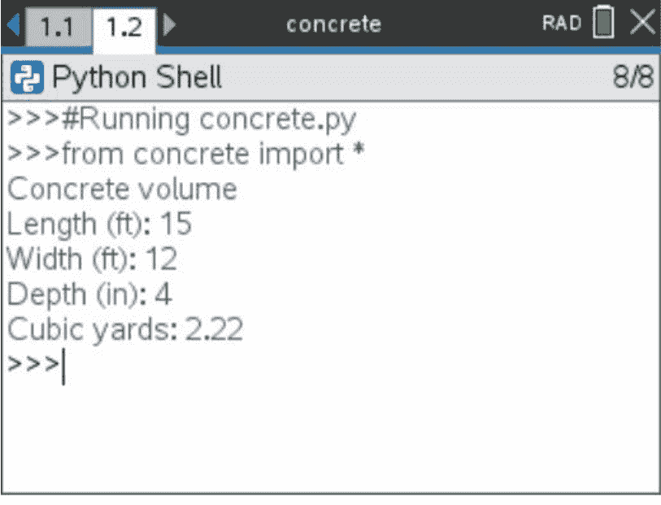

```
print("Concrete volume")
h=float(input("Length (ft): "))
w=float(input("Width (ft): "))
d=float(input("Depth (in): "))
yd=round(h*w*d/324,2)
print("Cubic yards:",yd)
```

### key_codes（按键代码）

`ti_system` 模块提供了一些用于控制程序的有用函数，例如 `get_key()`。`get_key()` 返回一个字符串，该字符串是按键的字符表示。例如，如果按下 [esc] 键，`get_key()` 返回 "esc"。

这很清楚，但很难猜测按下某些键时会返回什么字符串。仅举一例，[10^x] 键返回 "10power"。

这个小程序可以帮助你弄清楚所有按键的所有代码。该程序使用 `while` 循环来监视按键，打印所有按键的字符串表示，仅在按下 [esc] 键时停止。

请注意，有两种方式调用 `get_key()`。如果括号内没有传递参数，函数会立即返回。在此程序中，向 `get_key()` 传递了一个数字 1，导致它在继续之前等待按键。这对于我们在此处尝试完成的任务效果更好，但即时返回在某些类型的交互式程序中可能很方便。

这是一个按下了几个键的示例运行。

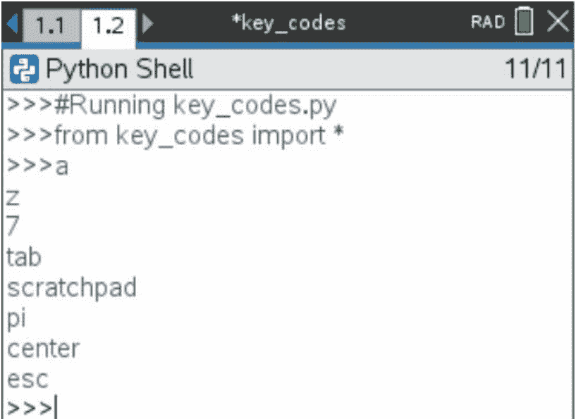

```
from ti_system import *

while True:
    k=get_key(1)
    print(k)
    if k=="esc":
        break
```

### laser_distance（激光测距）

如果你有一个小型激光测距仪（它们非常有趣），你可以将其与本程序一起使用，以测量难以到达的线条上的距离。

例如，假设你想测量一堵墙的高度，从地板到天花板，但你不想爬梯子。你可以测量从你眼睛的高度（你手持激光设备的位置）到地板的距离，然后到你面前与眼睛齐平的墙壁的距离，最后到墙壁顶部边缘的距离。这些在图中标记为点 a、b 和 c：

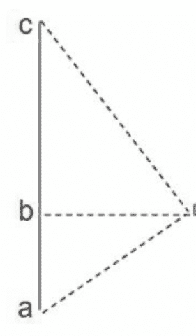

如果到 a 的距离是 9 英尺 3 英寸，到 b 是 7 英尺 9 英寸，到 c 是 12 英尺 10 英寸，那么程序会计算从 a 到 c 的墙壁高度为 14 英尺 10 英寸。

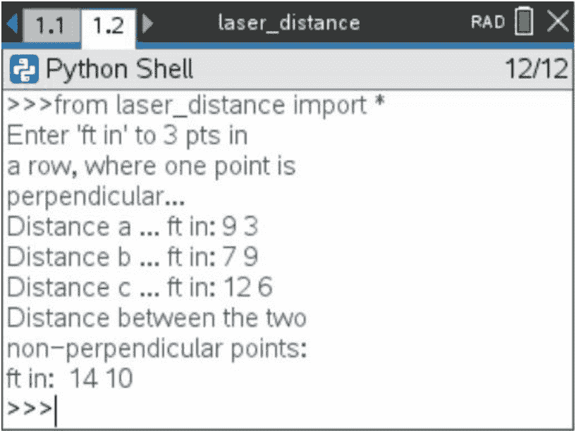

按顺序输入三个距离，顺序与它们在你测量的线上出现的顺序相同。即使第一个或最后一个测量值是垂直于该线的，非垂直点之间的距离也总是会被正确计算。

例如，假设你在高墙上有一幅巨大的画作，你想测量它的高度，类似于在此图中测量 b 到 c：

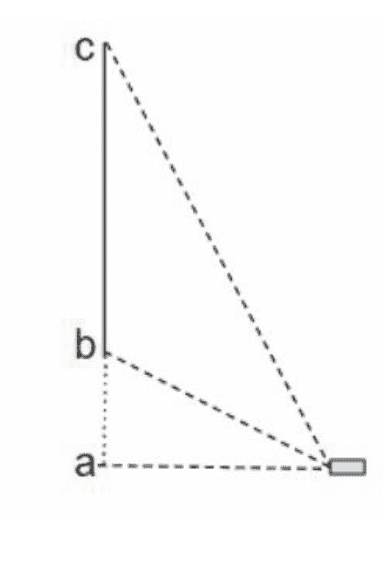

在这种情况下，按 a、b、c 的顺序（或 c、b、a 的顺序——只需保持它们沿直线顺序）输入到 a、b 和 c 的距离。在这种情况下，将计算 b 到 c 的距离。这是一个示例运行，显示从 b 到 c 的计算高度为 10 英尺 8 英寸。

```
>>>from laser_distance import *
Enter 'ft in' to 3 pts in
a row, where one point is
perpendicular...
Distance a ... ft in: 8 1
Distance b ... ft in: 9 2
Distance c ... ft in: 17 0
Distance between the two
non-perpendicular points:
ft in: 10 8
>>>
```

```
print("Enter 'ft in' to 3 pts in")
print("a row, where one point is")
print("perpendicular...")

a=input("Distance a ... ft in: ")
a=(a.strip()+' 0').split()
a=float(a[0])+float(a[1])/12

b=input("Distance b ... ft in: ")
b=(b.strip()+' 0').split()
b=float(b[0])+float(b[1])/12

c=input("Distance c ... ft in: ")
c=(c.strip()+' 0').split()
c=float(c[0])+float(c[1])/12

ft=0

if a>b and b<c:
    d=(a*a-b*b)**0.5
    e=(c*c-b*b)**0.5
    ft=d+e

if a<b and b<c:
    d=(b*b-a*a)**0.5
    e=(c*c-a*a)**0.5
    ft=e-d

if a>b and b>c:
    d=(b*b-c*c)**0.5
    e=(a*a-c*c)**0.5
    ft=e-d

feet=int(ft)
inch=round((ft-feet)*12)
print("Distance between the two")
print("non-perpendicular points:")
print('ft in: ',feet,inch)
```

### miles_per_hour（英里每小时）

你的 TI-Nspire™ CX II 技术计算器内置时钟（并非所有计算器都能显示日期和时间）。通过使用本章前面 `get_key` 程序中首次介绍的 `get_key()` 函数，你可以创建一种秒表。当你乘坐的汽车经过一个里程标记时，按下一个键开始计时，当你经过下一个里程标记时，按下任何其他键。程序中的一点数学运算会计算出平均英里每小时。

有两个重要细节需要注意。首先，不要一边开车一边运行 Python！让别人开车，而你检查他们的速度。其次，这提供了行驶一英里期间的平均速度。很可能在部分路程以 40 英里/小时的速度行驶，其余路程以 60 英里/小时的速度行驶，平均速度为 50 英里/小时。请记住这一点。

一个值得考虑的挑战是修改程序以适应公制测量。在 1 公里（或如果只有英里标记则为 1 英里）的路段上，汽车的速度到底是多少公里/小时？

这是一个示例运行，行驶一英里大约用了 55 秒。

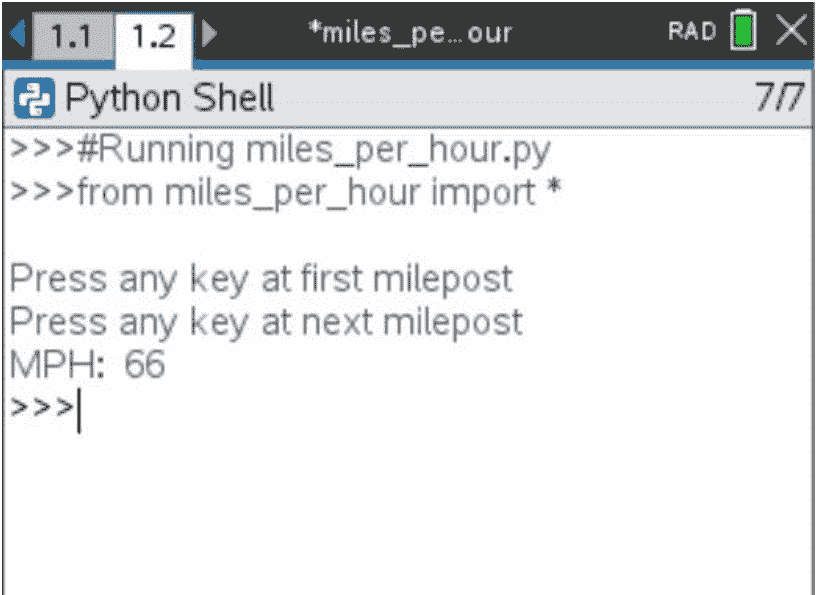

```
from ti_system import *

print(" ")
print("Press any key at first milepost")
get_key(1)
t1=get_time_ms()
print("Press any key at next milepost")
get_key(1)
t2=get_time_ms()
s=(t2-t1)/1000
h=s/3600
mph=round(1/h)
print("MPH: ",mph)
```

### secret（秘密）

此程序允许你加密和解密秘密消息。操作有点繁琐，但对于短消息，例如你想安全保存的其他地方使用的密码，此程序确实提供了相当高的安全性。

例如，让我们使用密钥 "abc123" 加密间谍用语 "The dew is on the roses"。首先，选择 1 进行加密，输入短语，然后输入密钥。

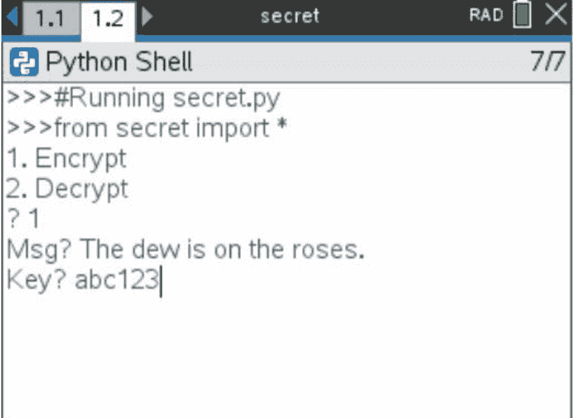

加密数据显示为六位十六进制字符块。这是你需要记下并保存，或发送给某处间谍伙伴的数据。

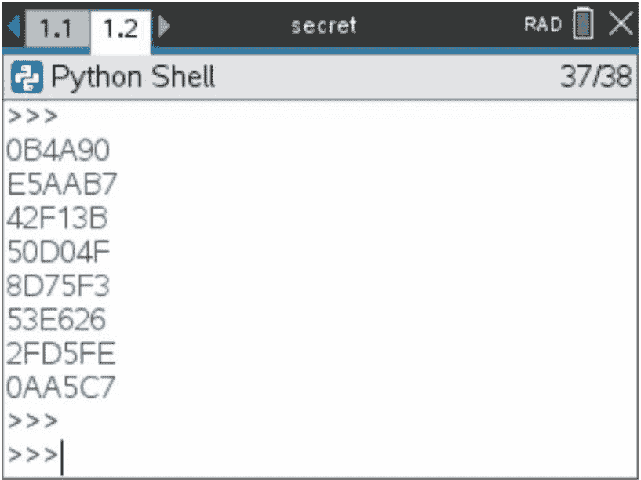

要解密消息，选择 2 开始解密。在每个 "Sec?" 提示符下，输入一个加密的十六进制字符秘密块。小写字母也可以，这实际上更容易输入。

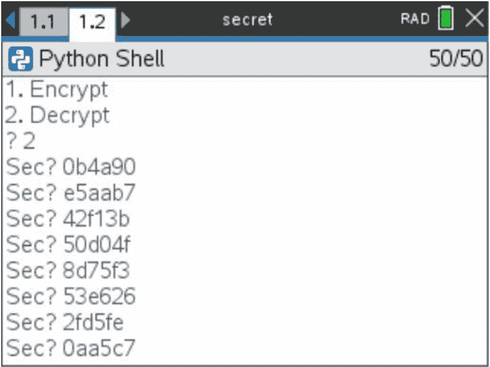

继续输入，直到所有代码块都输入完毕。请注意，在某些情况下，最后一个块可能少于四个字符，但没关系，只需输入加密后显示的内容即可。

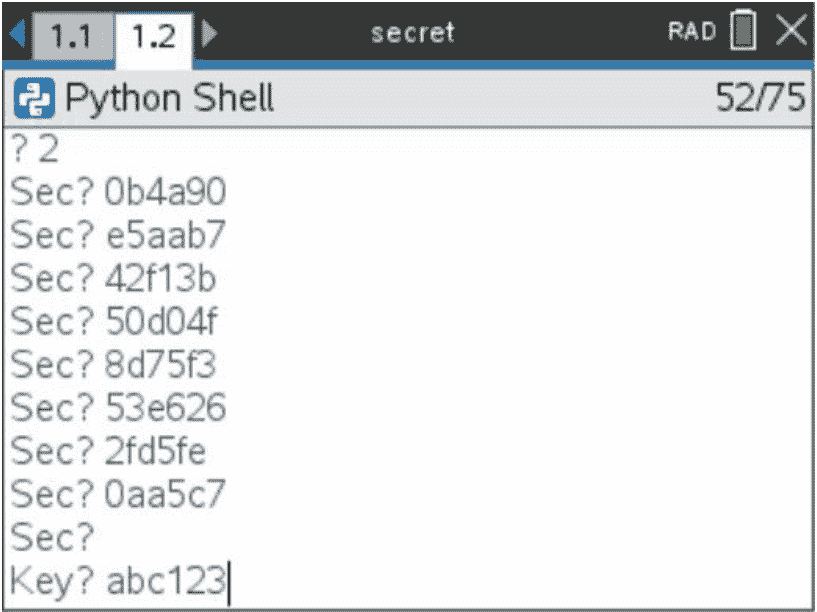

输入最后一个块后，最后按一次 [enter] 键以进入密钥提示符。输入秘密密钥（你和你的间谍伙伴将对此密钥保密），经过一点处理后，原始消息就会弹出。

## 8. 平面几何

大多数数字游戏系统的核心在于许多对模拟真实世界至关重要的计算。本章介绍常用的二维计算和坐标变换，这些技术被广泛应用于创建各类图形和游戏动画。

### arc_parts

给定描述圆弧部分的四个参数中的任意两个，本程序可计算出另外两个未知参数。这些参数包括：弧长、弦长、圆心角以及定义该弧的圆的半径。

例如，假设要设计一段铁路轨道，使其转弯45度，且转弯起点与终点之间的直线（弦）距离为2,021米。轨道有多长？如示例所示，轨道（弧长）约为2,074米。

在提示时输入两个已知值，对于未知值直接按[回车]即可。

```python
from math import *

def arcs(a,r,c,s):
    if a:
        if r:
            s=r*a
        elif c:
            r=c/2/sin(a/2)
        else:
            r=s/a
    elif r:
        if c:
            a=2*asin(c/r/2)
        else:
            a=s/r
    else:
        a=.1
        t=0
        while a!=t:
            t=a
            a=2*s*sin(a/2)/c
        r=s/a
    c=2*r*sin(a/2)
    s=r*a
    return [a,r,c,s]

print("\n\nInput two known values\n")
a=input("Angle (deg): ")
a=float(a) if a else 0
a=radians(a)
r=input("Radius: ")
r=float(r) if r else 0
c=input("Chord length: ")
c=float(c) if c else 0
s=input("Arc length: ")
s=float(s) if s else 0
a,r,c,s=arcs(a,r,c,s)
a=degrees(a)
print("\nAngle: ",a)
print("Radius: ",r)
print("Chord: ",c)
print("Arc: ",s)
```

### area_3p

平面上的三个x,y坐标点定义一个三角形。本程序可根据任意三个点计算三角形的面积。

如示例所示，将三个坐标编辑到程序中后，计算出的三角形面积为20平方单位。

```python
def area_3p(p1,p2,p3):
    x1,y1=p1
    x2,y2=p2
    x3,y3=p3
    a=x1*y2+x2*y3+x3*y1
    b=x1*y3+x2*y1+x3*y2
    return abs((a-b)/2)

p1=[10,7]
p2=[8,1]
p3=[2,3]
print("Area: ",area_3p(p1,p2,p3))
```

### area_3s

海伦公式使我们能够在已知三角形三边长度的情况下求出其面积，无需先计算角度或其他距离。公式如下，其中三边长度分别为a、b和c：

$$s = \frac{a + b + c}{2}$$

$$Area = \sqrt{s(s - a)(s - b)(s - c)}$$

例如，一个三边长分别为7、11和17厘米的三角形，其面积是多少？将这三个值输入程序，计算结果约为24.44平方厘米。

```python
def area_3s(a,b,c):
    s=(a+b+c)/2
    return (s*(s-a)*(s-b)*(s-c))**.5

a=float(input("Side a: "))
b=float(input("Side b: "))
c=float(input("Side c: "))
print("Area: ",area_3s(a,b,c))
```

### wet_bulb

近期新闻头条报道了气候变化导致全球极端高温事件频发，人们因过热甚至死亡的危险。这是一个真实存在的问题。气温是需要关注的一个方面，但更重要的是所谓的湿球温度，即温度和相对湿度的综合效应。

我们通过出汗来降温。当水分从表面蒸发时，其温度会下降。相对湿度低时，冷却效果更显著；相对湿度高时，蒸发减慢，更难降温。炎热干燥的沙漠对人类生命的危险性可能低于炎热潮湿的城市环境！

干湿球温度计用于测量湿球温度。将一小段湿布包裹在温度计的球端，然后在空气中挥动以最大化蒸发。由于蒸发作用，该温度计能达到的最低温度存在一个极限，这个极限就是湿球温度。湿球温度是实际气温和相对湿度的函数。

现在来说说危险之处。如果湿球温度高于体温，无论你出多少汗或风扇吹得多快，都无法降温。这就是为什么在炎热时了解湿球温度很重要！

已知气温和相对湿度时，计算湿球温度有一个非常复杂的数学公式。与大多数算法不同，这个方程实际上是由一个人工智能程序发现的。这个故事过于复杂，无法在此详述，但如果你感兴趣，可以在互联网上搜索了解更多。本程序使用该方程计算湿球温度。此外，如果你知道气温、相对湿度和湿球温度这三个因素中的任意两个，本程序将计算出第三个未知数。

运行本程序时会演示三个函数，它们都使用同一组数据。如果气温为30摄氏度，相对湿度为50%，则湿球温度非常接近22.3摄氏度。将这些参数成对传递给每个函数以计算第三个。如你所见，结果是一致的。

```python
from math import *

def wet_bulb(t,rh):
    a=t*atan(0.151977*(rh+8.313659)**.5)
    b=atan(t+rh)-atan(rh-1.676331)
    c=0.00391838*rh**(1.5)*atan(0.023101*rh)
    d=-4.686035
    tw=a+b+c+d
    return tw

def temperature(tw,rh):
    t=-20
    while t<50:
        if wet_bulb(t,rh)>=tw:
            return t
        t+=0.1
    return 999

def relative_humidity(t,tw):
    rh=0
    while rh<100:
        if wet_bulb(t,rh)>=tw:
            return rh
        rh+=.1
    return 999

print(" ")
print("Air Temp: 30")
print("Rel Hum: 50")
print("Wet Bulb: ",wet_bulb(30,50))

print(" ")
print("Wet Bulb: 22.3")
print("Rel Hum: 50")
print("Air Temp: ",temperature(22.3,50))

print(" ")
print("Air Temp: 30")
print("Wet Bulb: 22.3")
print("Rel Hum: ",relative_humidity(30,22.3))
```

### wind_chill

当风吹过时，由于热量从身体流失更快，空气会感觉更冷。有一个标准的风寒指数计算公式，本程序为你处理这个计算。

输入实际气温（华氏度）和风速（英里/小时）。程序会输出风寒指数。例如，在风速30英里/小时时，实际气温25华氏度的感觉与8华氏度相同。

```python
f=float(input("Temp (F): "))
w=float(input("Wind (mph): "))
v=w**.16
wc=35.74+.6215*f-35.75*v+.4275*f*v
print("Wind Chill Index:",round(wc))
```

```python
m1=17
n1=23
m2=145
n2=87
a=[]

def rseed(s):
    for c in s:
        a.append(ord(c))
    for i in range(97):
        rbyte()

def rbyte():
    la=len(a)
    for i in range(la):
        j=(i+1)%la
        a[i]+=a[j]
        a[i]+=i*m1+n1
        a[i]+=j*m2+n2
        a[i]%=256
    return a[0]

def hexchr(c):
    return ("0"+hex(c)[2:])[-2:].upper()

def chrhex(h):
    return eval("0x"+h)

def cls():
    for i in range(20):
        print()

print("1. Encrypt")
print("2. Decrypt")
n=int(input("? "))
s=''
x=0
if n==1:
    msg=input("Msg? ")
    key=input("Key? ")
    cls()
    rseed(key)
    for c in msg:
        b=ord(c)^rbyte()
        s+=hexchr(b)
        x+=1
        if not x%3:
            print(s)
            s=''
    print(s)
    s=''
if n==2:
    sec=""
    x=1
    while x:
        x=input("Sec? ")
        sec+=x
    sec=sec.replace(' ','').upper()
    key=input("Key? ")
    rseed(key)
    i=0
    while i < len(sec):
        b=chrhex(sec[i:i+2])
        s+=chr(b^rbyte())
        i+=2
    cls()
print(s)
```

### area_pts

此程序用于计算任意形状多边形的面积。每个顶点的X,Y坐标通过直接编辑代码顶部`load_pts()`函数中的点列表来输入。

通过沿多边形“走一圈”的方式输入点，方向不限。程序清单展示了一个包含六个顶点的示例多边形，如下所示：

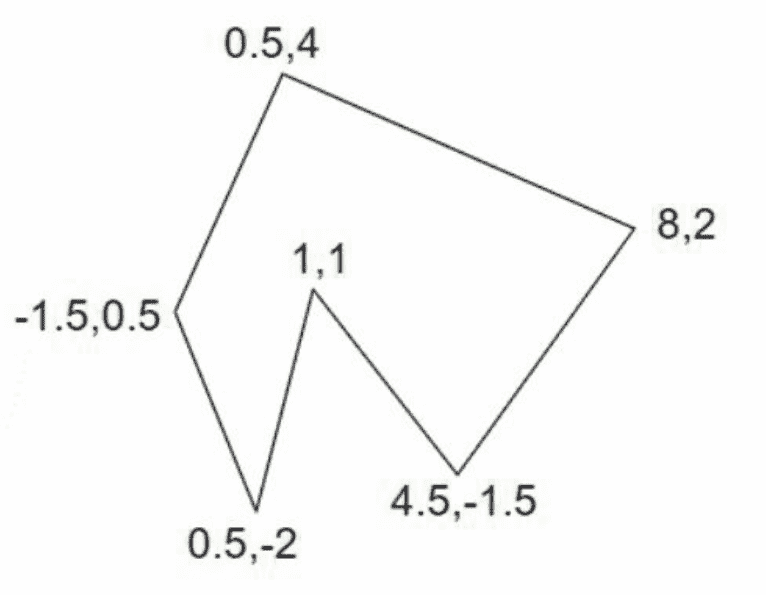

多边形的面积是通过将多边形有效分解为更小的三角形并累加每个三角形的面积来求得的。

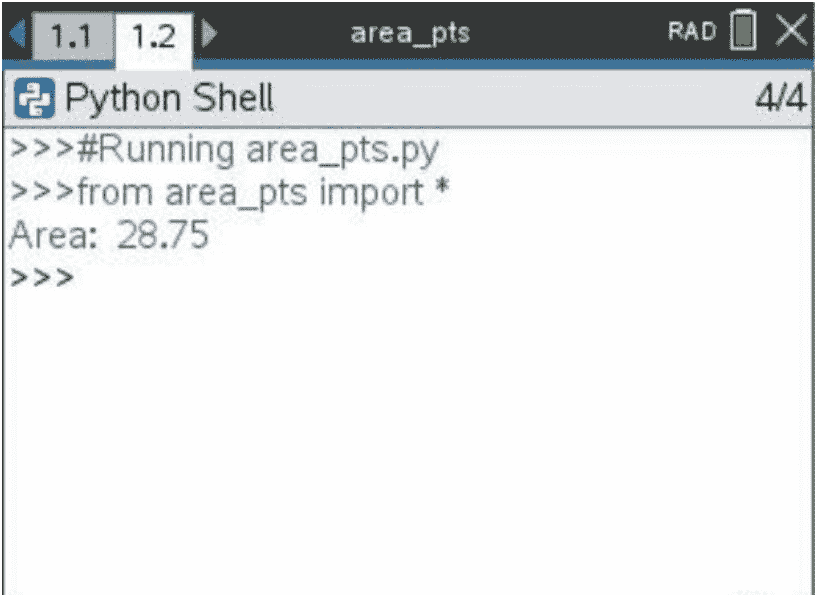

```python
from math import *

def load_pts():
    pts=[]
    pts.append([4.5,-1.5])
    pts.append([8,2])
    pts.append([.5,4])
    pts.append([-1.5,.5])
    pts.append([.5,-2])
    pts.append([1,1])
    return pts

def area_pts(pts):
    area=0
    pts.append(pts[0])
    for i in range(len(pts)-1):
        a=pts[i][0]+pts[i+1][0]
        b=pts[i][1]-pts[i+1][1]
        area+=a*b
    return abs(area/2)

pts=load_pts()
area=area_pts(pts)
print("Area: ",area)
```

### circle

此程序用于寻找一个圆的圆心和半径，该圆恰好经过x,y平面上的三个点。换言之，该程序寻找一个与三个给定点等距的点。当然，如果三点共线，此方法将不适用。程序会检测这种情况，若三点共线则打印“Not a circle”。

例如，寻找一个经过点(3,12)、(10,13)和(7,4)的圆：

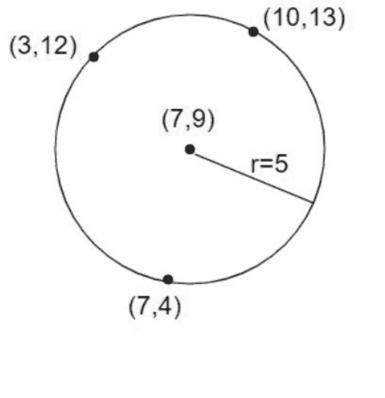

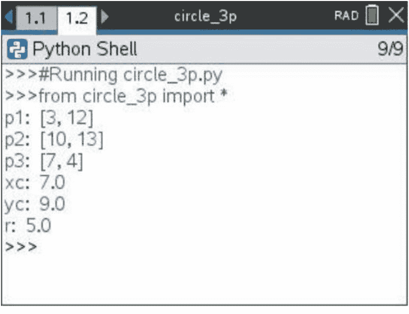

```python
def load_3p():
    p1=[3,12]
    p2=[10,13]
    p3=[7,4]
    return (p1,p2,p3)

def circle_3p(p1,p2,p3):
    x1,y1=p1
    x2,y2=p2
    x3,y3=p3
    A=(x1*(y2-y3)-
       y1*(x2-x3)+
       x2*y3-x3*y2)
    B=((x1*x1+y1*y1)*
       (y3-y2)+
       (x2*x2+y2*y2)*
       (y1-y3)+
       (x3*x3+y3*y3)*
       (y2-y1))
    C=((x1*x1+y1*y1)*
       (x2-x3)+
       (x2*x2+y2*y2)*
       (x3-x1)+
       (x3*x3+y3*y3)*
       (x1-x2))
    if A==0:
        return (0,0,0)
    xc=-B/A/2
    yc=-C/A/2
    r=(((xc-x1)**2+(yc-y1)**2)**.5)
    return (xc,yc,r)

p1,p2,p3=load_3p()
xc,yc,r=circle_3p(p1,p2,p3)
print("p1: ",p1)
print("p2: ",p2)
print("p3: ",p3)
print("xc: ",xc)
print("yc: ",yc)
print("r: ",r)
```

### distance

x,y平面上的两点之间存在一定的直线距离。这个简短的程序创建了一个函数，利用勾股定理来计算该距离。

示例计算了点[6, 5]和[2, 3]之间的距离并显示结果以供验证。运行程序后，你可以在shell中手动调用`distance()`函数来计算其他距离。只需确保传递两个变量，每个变量都是一个包含两个数字的列表，分别代表x和y坐标值。

例如，要手动重复相同的距离计算，请在shell中输入“distance([6,5],[2,3])”，如下所示。

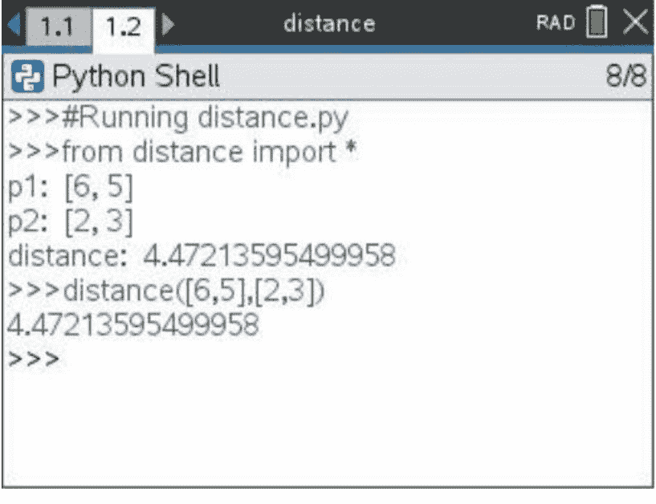

```python
def distance(p1,p2):
    x1,y1=p1
    x2,y2=p2
    d=((x2-x1)**2+(y2-y1)**2)**.5
    return d

p1=[6,5]
p2=[2,3]
d=distance(p1,p2)
print("p1: ",p1)
print("p2: ",p2)
print("distance: ",d)
```

### divide_line

此程序提供了一个函数，用于将x,y平面上的一条线段等分为n段。`divide_lines()`接受三个参数。前两个是列表，每个列表包含两个数字，定义一个x,y坐标。第三个参数名为`segs`，它控制将线段等分为多少段。通常，只需要线段的中点。在这种情况下，为`segs`传递2即可。

示例将从点(3,2)到点(9,5)的线段等分为三段。函数返回沿线段的所有坐标列表，并且列表的首尾包含原始的两个端点。

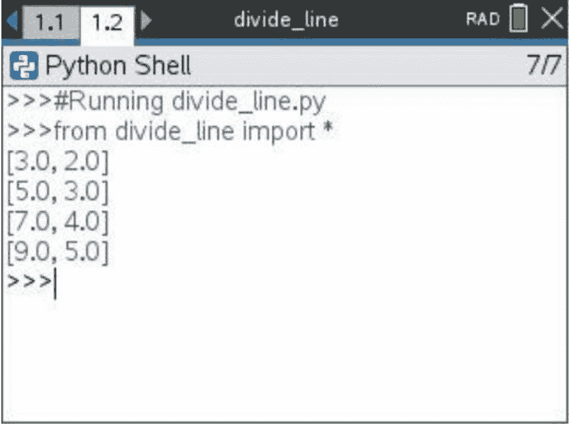

如果你将线段分成很多段，可以滚动显示以查看所有结果。

```python
def divide_line(p1,p2,n):
    pts=[]
    for i in range(n+1):
        x=p1[0]+(p2[0]-p1[0])*i/n
        y=p1[1]+(p2[1]-p1[1])*i/n
        pts.append([x,y])
    return pts

p1=[3,2]
p2=[9,5]
segs=3
pts=divide_line(p1,p2,segs)
for pt in pts:
    print(pt)
```

### line_2p

此程序计算由两点定义的平面直线的几个特征。例如，给定点[4,3]和[-5, -9]，这能告诉我们关于通过它们的直线的什么信息？

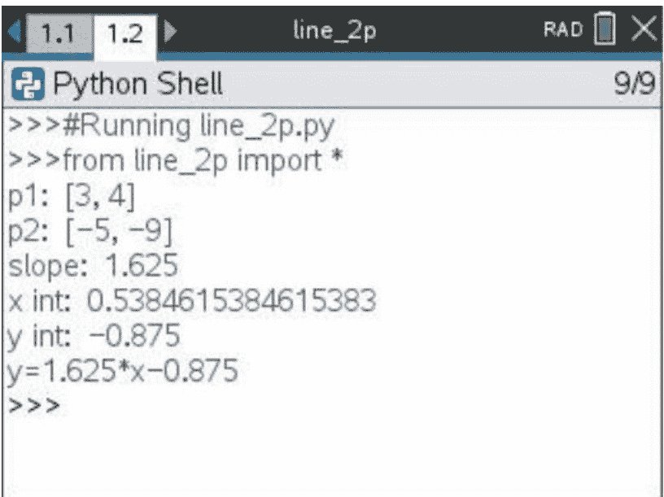

斜率(m)为1.625，x截距(xi)约为0.5385，y截距(yi)为-0.875。综合起来，直线的方程为y=1.625*x-0.875。

```python
def line_2p(p1,p2):
    x1,y1=p1
    x2,y2=p2
    m = (y2 - y1) / (x2 - x1)
    a = x1-y1/m
    b = y1-m*x1
    return (m,a,b)

p1=[3,4]
p2=[5,-9]
m,a,b=line_2p(p1,p2)
print("p1: ",p1)
print("p2: ",p2)
print("slope: ",m)
print("x int: ",a)
print("y int: ",b)
f="y={}*x+{}"
if b<0: f=f.replace("+", "")
print(f.format(m,b))
```

### line_pt_slope

此程序定义了一个函数，用于在给定一个点和斜率的情况下，求出直线的常用参数。例如，通过点[3,4]且斜率为0.5的直线是什么？该函数返回x和y截距，以及直线的斜率。与前面描述的`line_2p`程序类似，这提供了显示直线所有常用信息（包括其方程）所需的一切。

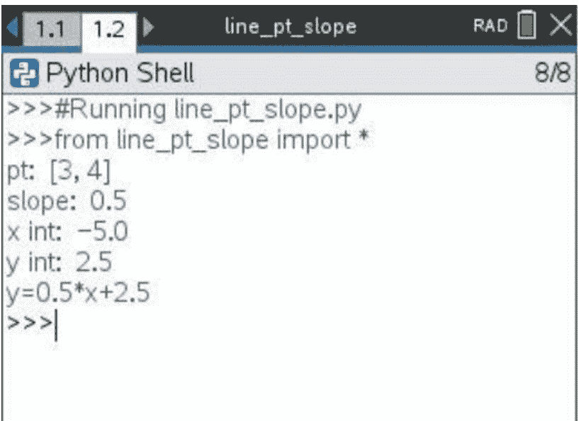

```python
def line_pt_slope(pt,m):
    x,y=pt
    b=y-m*x
    a=x-y/m
    return (m,a,b)

pt=[3,4]
m=0.5
m,a,b=line_pt_slope(pt,m)
print("pt: ",pt)
print("slope: ",m)
print("x int: ",a)
print("y int: ",b)
f="y={}*x+{}"
if b<0: f=f.replace("+","")
print(f.format(m,b))
```

### transform

计算机图形游戏需要大量的高速数学运算来保持动作的真实感和平滑性。核心算法之一是能够将x,y平面上的点绕原点旋转某个角度。这是对游戏编程需求的巨大简化，但嘿，这是个开始！

`rotate()`函数允许你传递一个包含x和y坐标的列表作为点，以及一个以度为单位的旋转量。坐标绕原点旋转转换为弧度的角度，并返回新的坐标值。

`translate()`函数接收一个点以及用于平移的x和y值。通过简单地加上平移量，将点平移到新位置。返回结果的x和y值。

例如，点(2,3)在平移(4,4)后将到达(6, 7)，在绕原点旋转17度后将接近点(1.035,3.454)。

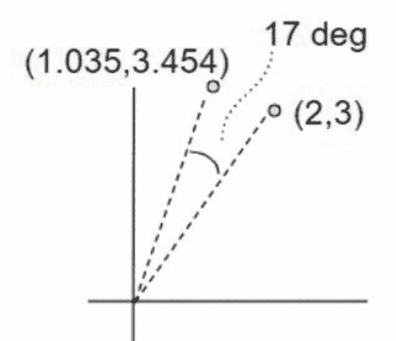

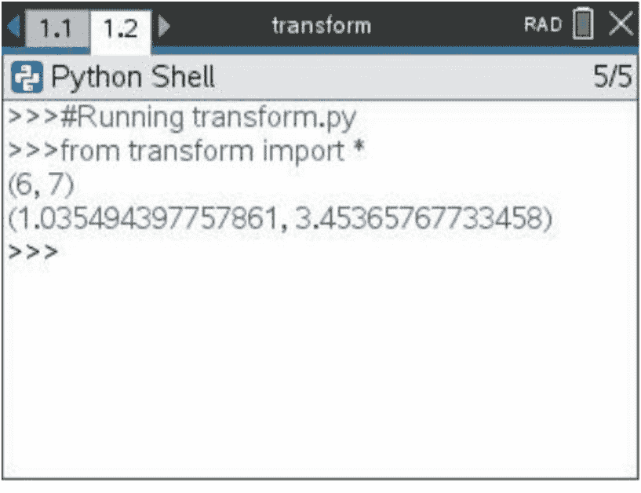

```python
from math import *

def translate(p,dx,dy):
    x,y=p
    return (x+dx,y+dy)

def rotate(p,a):
    x,y=p
    r=radians(a)
    xr=x*cos(r)-y*sin(r)
    yr=x*sin(r)+y*cos(r)
    return (xr,yr)

p=[2,3]
deg=17
print(translate(p,4,4))
print(rotate(p,deg))
```

### triangle_3p

此程序用于计算由x,y平面上三个点定义的三角形的边长、角度和面积。

例如，由点(2,4)、(10,4)和(2,10)定义的三角形的边长、角度和面积是多少？

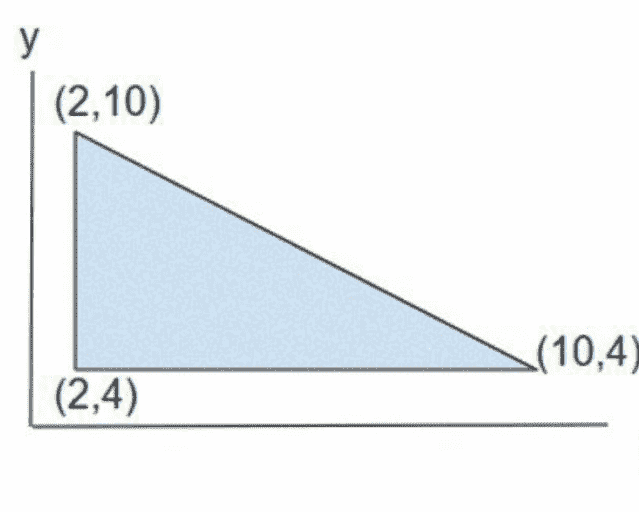

函数`triangle_3p()`完成所有工作。传递三个点，每个点是一个包含两个数字的列表，它返回三条边长、与这些边相对的三个角度（以度为单位）以及面积。在此示例中，边a、b和c的长度分别约为6、8和10个单位。与这些边相对的角度A、B和C分别约为10、36.87和53.13度。三角形的面积恰好是24平方单位。

### 三角形

本程序用于求解三角形的所有边长、角度和面积，只要给定其中任意三个边或角的组合。

边和角的组合共有五种可能。如果用 s 表示边，a 表示角，那么当你沿着三角形的边和角依次行走时，可能出现的组合有：sss、sas、ssa、asa 和 aas。本程序会询问已知条件，然后提示输入这三个部分，并计算出其余所有部分，以及面积。

输出部分中，边长标记为 s1、s2 和 s3，与这些边相对的角度标记为 a1、a2、a3。面积是最后输出的项目。

例如，对于一个边长为 4、5 和 6 的三角形，其角度和面积是多少？

在第一个提示处输入 1 选择 sss，然后输入边长。一旦输入完所有三个部分，结果就会被计算并显示出来：

与长度为 4 的边相对的角度约为 41.4 度，以此类推。三角形的面积略大于 9.92 平方单位。

```python
from math import *

def triangle_3p(p1,p2,p3):
    x1,y1=p1
    x2,y2=p2
    x3,y3=p3
    a=((y2-y1)**2+(x2-x1)**2)**.5
    b=((y3-y2)**2+(x3-x2)**2)**.5
    c=((y3-y1)**2+(x3-x1)**2)**.5
    A=degrees(acos((b*b+c*c-a*a)/b/c/2))
    B=degrees(acos((a*a+c*c-b*b)/a/c/2))
    C=180-A-B
    area=a*b*sin(radians(C))/2
    return (a,b,c,A,B,C,area)

p1=[2,10]
p2=[2,4]
p3=[10,4]
tri=triangle_3p(p1,p2,p3)
a,b,c,A,B,C,area=tri
print("p1: ",p1)
print("p2: ",p2)
print("p3: ",p3)
print("a: ",a)
print("b: ",b)
print("c: ",c)
print("A: ",A)
print("B: ",B)
print("C: ",C)
print("area: ",area)
```

```python
from math import *

def sss(a,b,c):
    A=degrees(acos((b*b+c*c-a*a)/b/c/2))
    B=degrees(acos((a*a+c*c-b*b)/a/c/2))
    C=180-A-B
    return [a,b,c,A,B,C]

def sas(a,C,b):
    c=(a*a+b*b-2*a*b*cos(radians(C)))**.5
    A=degrees(acos((b*b+c*c-a*a)/(2*b*c)))
    B=180-A-C
    return [a,b,c,A,B,C]

def ssa(b,c,B):
    C=degrees(asin(c*sin(radians(B))/b))
    A=180-B-C
    a=b*sin(radians(A))/sin(radians(B))
    return [a,b,c,A,B,C]

def asa(A,c,B):
    C=180-A-B
    a=c*sin(radians(A))/sin(radians(C))
    b=c*sin(radians(B))/sin(radians(C))
    return [a,b,c,A,B,C]

def aas(A,C,a):
    B=180-A-C
    b=a*sin(radians(B))/sin(radians(A))
    c=a*sin(radians(C))/sin(radians(A))
    return [a,b,c,A,B,C]

#### 海伦公式
def area(a,b,c):
    p=(a+b+c)/2
    return (p*(p-a)*(p-b)*(p-c))**.5

print("1. sss")
print("2. sas")
print("3. ssa")
print("4. asa")
print("5. aas")
n=int(input("? "))
if n<4:
    a=input("s: ")
    a=float(a) if a else 0
else:
    A=input("Ang A: ")
    A=float(A) if A else 0
if n==1 or n==3 or n==4:
    b=input("s: ")
    b=float(b) if b else 0
else:
    B=input("Ang B: ")
    B=float(B) if B else 0
if n<3 or n==5:
    c=input("s: ")
    c=float(c) if c else 0
else:
    C=input("Ang C: ")
    C=float(C) if C else 0
if n==1:
    t=sss(a,b,c)
if n==2:
    t=sas(a,B,c)
if n==3:
    t=ssa(a,b,C)
if n==4:
    t=asa(A,b,C)
if n==5:
    t=aas(A,B,c)
ar=area(t[0],t[1],t[2])
print("s1: ",t[0])
print("s2: ",t[1])
print("s3: ",t[2])
print("a1: ",t[3])
print("a2: ",t[4])
print("a3: ",t[5])
print("Area: ",ar)
```

## 9. 空间几何

上一章介绍了几个用于处理二维平面中直线、弧线、三角形和其他构造的程序。本章将这些概念扩展到三维空间。

3D 游戏需要围绕三个轴中的每一个进行旋转，以便在空间中移动角色和物体。使用矩阵可以实现强大的旋转效果，但即使是矩阵数学也依赖于围绕每个轴进行数学旋转的能力。你将在本章中找到执行这些旋转的函数。

在二维空间中，三个点确定一个三角形。对于空间中的三个点集也是如此。此外，在三维空间中，四个空间点确定一个类似四面体的体积。你将在本章中找到执行这些计算的程序。

### coord_3d

有三种常用的坐标系用于指定点在空间中的位置。笛卡尔坐标使用 x、y、z 值，类似于平面中的 x、y，但扩展到空间中的 z 方向。柱坐标使用 x、y 平面中的半径和角度来确定点正下方的点，以及 z 值表示从 x、y 平面到该点的距离。球坐标使用从原点出发的径向距离，以及两个角度来确定 x、y 平面中的角度和偏离 z 轴的角度。

在本程序中，变量 x、y、z 指的是沿各自轴的距离。r 和 th（半径和 theta 的缩写）是柱坐标的半径和角度，rh、th、ph（rho、theta、phi 的缩写）用于球坐标，其中 rho 是距离，theta 和 phi 是角度。

提供了六个函数，允许从三种坐标系中的任何一种转换到其他任何一种。传入三个已知的坐标值，等效的坐标值将以列表形式返回。请注意示例源代码中，三个返回值直接从返回的列表赋值给单独的变量。这是 Python 的一个非常好的特性，允许函数有效地返回多个值。

柱坐标

球坐标

例如，将笛卡尔坐标 3、4、5 转换为其他坐标系。程序启动时，会提示你选择已知的坐标系，在本例中是笛卡尔坐标系。如图所示，输入 1 选择该系统，然后按照提示输入 x、y 和 z 的值 3、4 和 5。

输入最后一个 z 值后，另外两个坐标系的等效值将被计算并显示出来。如果你需要回顾输入的值，只需向上滚动即可。

```python
from math import *

def car_to_cyl(x,y,z):
    ra=(x*x+y*y)**.5
    th=degrees(atan2(y,x))
    return[ra,th,z]

def cyl_to_car(ra,th,z):
    th=radians(th)
    x=ra*cos(th)
    y=ra*sin(th)
    return [x,y,z]

def car_to_sph(x,y,z):
    rh=(x*x+y*y+z*z)**.5
    th=degrees(atan2(y,x))
    ph=degrees(acos(z/rh))
    return [rh,th,ph]

def sph_to_car(rh,th,ph):
    th=radians(th)
    ph=radians(ph)
    x=rh*sin(ph)*cos(th)
    y=rh*sin(ph)*sin(th)
    z=rh*cos(ph)
    return [x,y,z]

def cyl_to_sph(ra,th,z):
    rh=(ra*ra+z*z)**.5
    ph=degrees(atan2(ra,z))
    return [rh,th,ph]

def sph_to_cyl(rh,th,ph):
    ph=radians(ph)
    ra=rh*sin(ph)
    z=rh*cos(ph)
    return [ra,th,z]

print("1. car->")
print("2. cyl->")
print("3. sph->")
n=int(input("? "))
if n==1:
    x=float(input("x: "))
    y=float(input("y: "))
    z=float(input("z: "))
    ra,th,z=car_to_cyl(x,y,z)
    rh,th,ph=car_to_sph(x,y,z)
if n==2:
    ra=float(input("ra: "))
    th=float(input("th: "))
    z=float(input("z: "))
    x,y,z=cyl_to_car(ra,th,z)
    rh,th,ph=cyl_to_sph(ra,th,z)
if n==3:
    rh=float(input("rh: "))
    th=float(input("th: "))
    ph=float(input("ph: "))
    x,y,z=sph_to_car(rh,th,ph)
    ra,th,z=sph_to_cyl(rh,th,ph)
print()
print("car")
print("x: ",x)
print("y: ",y)
print("z: ",z)
print()
print("cyl")
print("ra: ",ra)
print("th: ",th)
print("z: ",z)
print()
print("sph")
print("rh: ",rh)
print("th: ",th)
print("ph: ",ph)
```

### rotate_3d

本程序输入一个三维空间点，并将其围绕三个轴中的每一个旋转某个角度（以度为单位）。

本程序中有三个函数，每个函数用于将空间点围绕一个轴旋转。为了演示这些函数，点 3、4、5 围绕每个轴旋转 45 度，并输出每种情况下的新位置。

这些函数是许多 3D 图形和其他程序的核心。我曾使用这些函数来旋转地球上的天线以瞄准地球同步卫星，以及旋转定日镜以将阳光反射到太阳能目标上。

### triangle_3d

本程序根据三个空间坐标计算三角形的边长、角度和面积。

例如，给定点 (3,0,5)、(4,2,2) 和 (0,1,3)，求各边长度、各边所对的角度以及三角形的面积。

在程序代码中编辑所有三个坐标的值，然后运行即可查看三角形的边长和角度。

a、b、c 是三条边，A、B、C 是各边所对的角度（以度为单位）。

```python
from math import *

def triangle_3d(p1,p2,p3):
    x1,y1,z1=p1
    x2,y2,z2=p2
    x3,y3,z3=p3
    a=((y2-y1)**2+(x2-x1)**2+(z2-z1)**2)**.5
    b=((y3-y2)**2+(x3-x2)**2+(z3-z2)**2)**.5
    c=((y3-y1)**2+(x3-x1)**2+(z3-z1)**2)**.5
    A=degrees(acos((b*b+c*c-a*a)/b/c/2))
    B=degrees(acos((a*a+c*c-b*b)/a/c/2))
    C=180-A-B
    area=a*b*sin(radians(C))/2
    return (a,b,c,A,B,C,area)

p1=[3,0,5]
p2=[4,2,2]
p3=[0,1,3]
tri=triangle_3d(p1,p2,p3)
a,b,c,A,B,C,area=tri
print("a: ",a)
print("b: ",b)
print("c: ",c)
print("A: ",A)
print("B: ",B)
print("C: ",C)
print("area: ",area)
```

### volume_4p

空间中的四个笛卡尔坐标点定义了一个体积，其形状是一个拉伸的四面体，具有四个三角形面。本程序计算该图形内部的空间体积。

为保持程序简单，四个空间坐标在程序列表中设置，因此您需要编辑程序以设置自己的点。此处演示的示例中，点被设置为 [3,-2,5]、[4,4,0]、[6,3,7] 和 [6,5,0]。由这些点定义的计算体积为 9.5 立方单位。

本程序使用矩阵计算来求体积。以下是公式，我鼓励您在互联网上搜索以更好地理解这种矩阵数学的工作原理，以及通常使用矩阵如何简化许多有趣的计算。

```python
from math import *

def triangle_3d(p1,p2,p3):
    x1,y1,z1=p1
    x2,y2,z2=p2
    x3,y3,z3=p3
    a=((y2-y1)**2+(x2-x1)**2+(z2-z1)**2)**.5
    b=((y3-y2)**2+(x3-x2)**2+(z3-z2)**2)**.5
    c=((y3-y1)**2+(x3-x1)**2+(z3-z1)**2)**.5
    A=degrees(acos((b*b+c*c-a*a)/b/c/2))
    B=degrees(acos((a*a+c*c-b*b)/a/c/2))
    C=180-A-B
    area=a*b*sin(radians(C))/2
    return (a,b,c,A,B,C,area)

p1=[3,0,5]
p2=[4,2,2]
p3=[0,1,3]
tri=triangle_3d(p1,p2,p3)
a,b,c,A,B,C,area=tri
print("a: ",a)
print("b: ",b)
print("c: ",c)
print("A: ",A)
print("B: ",B)
print("C: ",C)
print("area: ",area)
```

## 10. 空间科学

预计有多少颗“宜居带”行星存在于某处，每颗都可能支持有机生命？你需要让空间站旋转多快才能产生人工重力效果？你出生那天月亮的相位是什么样的？

本章中的程序涵盖了这些以及许多其他有趣且具有挑战性的问题。

### geosync_antenna

卫星绕地球运行，其轨道周期取决于它们与地球的距离。国际空间站大约在 410 公里高空，大约需要一个半小时完成一次轨道运行，而月球大约在 385,000 公里外，大约需要 27 天完成一次轨道运行。

地球同步卫星在这两个极端之间运行，高度约为 35,786 公里，每次轨道运行恰好需要一天。它们位于赤道上方，运行方向与地球自转方向相同，结果是它们似乎始终停留在地球上方的某个位置。

本程序要求输入一个天线在地球上的位置，该天线将对准位于赤道上方某个特定经度的地球同步卫星，并计算如何瞄准它。方位角是沿地平线偏离正北的角度，其中正东为 90 度，正南为 180 度，依此类推。仰角是从地平线向上的角度，其中 90 度为正上方。

经度的符号应与 Google 地图位置匹配。因此，西经（如整个北美地区）为负数，位于西经位置的卫星也应输入为负数。

例如，位于新墨西哥州罗斯威尔的天线位于北纬 33.376 度，西经 104.508 度。目标是将其对准位于西经 127.8 度的 GOES-15 气象卫星。将这些值编辑到程序的主部分（函数定义下方，代码未缩进的部分），如示例所示。天线应瞄准西南方向，方位角为 218.0 度，仰角为从地平线向上 43.8 度。

有关此计算所涉及数学的更详细解释，请参阅 [https://tinyurl.com/y3d5lvng](https://tinyurl.com/y3d5lvng) 处的 PDF 文档。有关当前地球同步卫星的列表，请访问 [https://tinyurl.com/y2ahfmwe](https://tinyurl.com/y2ahfmwe)。

```python
from math import *

def geosync(lat,lon,sat_lon):
    la=radians(lat)
    lo=radians(lon)
    sl=radians(sat_lon)
    L=sl-lo
    D=acos(cos(la)*cos(L))
    az=degrees(acos(-tan(la)/tan(D)))
    az=az if L>0 else 360-az
    cd=cos(D)
    el=degrees(atan((cd-1/6.62)/(1-cd*cd)**.5))
    az=round(az,2)
    el=round(el,2)
    return (az,el)

lat=33.376
lon=-104.508
sat_lon=-127.8
az,el=geosync(lat,lon,sat_lon)
print("Ant az: ",az)
print("Ant el: ",el)
```

### moon

以高精度计算月球及其当前相位极其复杂。本程序提供了一个非常简化的近似值，对于大多数正常用途来说已经足够精确。可以输入 1582 年至 4000 年之间的任何日期，输出被太阳照亮的百分比，以及“渐盈”或“渐亏”的指示，让您知道月球处于当月的哪个半段。

例如，描述 1903 年 12 月 17 日奥维尔和威尔伯首次驾驶飞机飞行那天，从地球看到的月球外观。

月球正朝着新月（渐亏）方向发展，其形状不过是一个“指甲”大小。

```python
from math import *
from ti_draw import *

def moon(m,d,y):
    j=jd(m,d,y)
    n=(j+5.367)/29.53058
    x=n-int(n)
    p=round(int(abs(2*(x)-1)*100))
    w=int(2*x)
    return [p,w]

def jd(m,d,y):
    if m<3:
        y-=1
        m+=12
    a=int(y/100)
    b=2-a+int(a/4)
    e=int(365.25*(y+4716))
    f=int(30.6001*(m+1))
    return b+d+e+f-1524.5

m=int(input("Month (1-12): "))
d=int(input("Day (1-31): "))
y=int(input("Year (1582-4000): "))
pct,wax=moon(m,d,y)

use_buffer()
set_color(0,0,0)
fill_rect(0,0,317,211)
n=60
for yi in range(-n,n):
    y1=yi/n
    x2=(1-y1*y1)**.5
    x1=-x2
    if wax:
        xa=x2-(x2-x1)*pct/100
        xb=x2
    else:
        xa=x1
        xb=x1+(x2-x1)*pct/100
    xp=int(80*xa+160)
    yp=int(80*y1+105)
    xn=int(80*xb+160)
    set_color(255,255,255)
    draw_line(xp,yp,xn,yp)

set_color(255,255,0)
s="{}/{} {} ... the moon is wa{}ing"
if wax:
    s=s.format(m,d,y,"x")
else:
    s=s.format(m,d,y,"n")
draw_text(60,208,s)
paint_buffer()
```

### 便士

这个程序有点不同，因为它没有试图最小化源代码中的字节数。它还计算了一些非常惊人的东西，因此添加大量解释性注释行和非常清晰、相当长的变量名感觉是正确的做法。如果你觉得结果太离奇而难以置信，请务必反复检查我的计算，并告诉我你的发现！

宇宙是一个非常广阔的地方。非常广阔。我研究并找到了关于恒星、星系等几个重要因素的最新数据，并提供了互联网上可供你自己研究的参考链接。当你读到这篇文章时，其中一些参数可能已经更新，因此请根据需要随意调整程序。

美国便士的确切尺寸让我们可以计算出我们可以堆叠多少便士的堆叠大小。例如，一百万枚便士可以整齐地排列成行和列，形成一个大致相当于桌子或冰箱大小的物体。请记住这一点，我们将继续。

这个程序使用每个星系的估计恒星数量、已知宇宙中的星系数量、在恒星周围发现的行星数量等，来猜测有多少“宜居带”行星存在于某处。这排除了可能对已知生命来说太热或太冷的行星，但结果表明很可能有许多行星“恰到好处”。一些来源称这些为“金发姑娘行星”。

跟踪计算过程，看看如果每个便士代表一个宜居带行星，那么一堆便士会有多大。答案是惊人的！

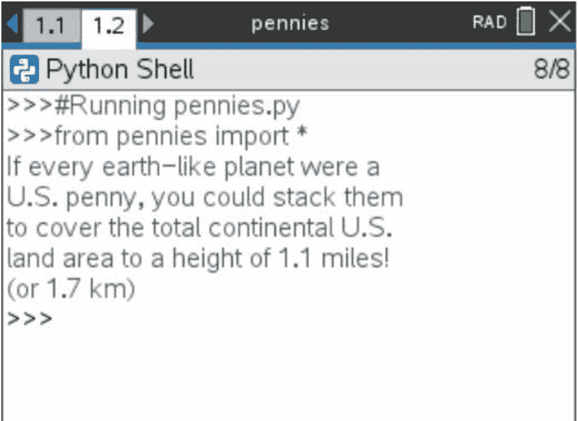

```python
#### Pennies_us

#### https://tinyurl.com/yenrntau
#### Dimensions of U.S. penny
diameter = 0.75 # in
thickness = 0.0598 # in

#### cubic inches per stacked penny
rect_vol = diameter * diameter * thickness

#### cubic feet for one stacked penny
penny_vol = rect_vol / 1728

#### https://tinyurl.com/y6cqbaz5
#### One in 2 stars has goldilocks planet
goldilocks_factor = 0.5

#### https://tinyurl.com/d245jjz
#### Two hundred billion galaxies
galaxies = 2e11

#### https://tinyurl.com/yg8bdojy
#### 250 billion stars in our average sized galaxy
milky_way_stars = 250e9

#### Total stars
stars = galaxies * milky_way_stars

#### Total habitable goldilocks planets
habitable_planets = stars * goldilocks_factor

#### Cubic feet of pennies if same number
#### as habitable planets
cubic_feet_pennies = habitable_planets * penny_vol

#### https://tinyurl.com/yfylyms4
#### Area of continental United States
us_square_miles = 3_119_884.69

#### https://tinyurl.com/ye7xtjad
#### Convert area to square feet
us_square_feet = us_square_miles * 5280 * 5280

#### Feet height of all those pennies if covering U.S.
height_in_feet = cubic_feet_pennies / us_square_feet

#### Convert to miles
height_in_miles = height_in_feet / 5280

#### https://tinyurl.com/yk3gap7b
#### Also convert to kilometers
height_in_km = height_in_miles / 0.621371

#### Output results
m=round(height_in_miles,1)
k=round(height_in_km,1)
print("If every earth-like planet were a")
print("U.S. penny, you could stack them")
print("to cover the total continental U.S.")
print("land area to a height of",m,"miles!")
print("(or",k,"km)")
```

### 放射性同位素

样本中放射性衰变的速度与样本中放射性原子的数量成正比。所需计算的核心涉及微分方程，如果你感兴趣，可以在线阅读相关内容。也许你听说过用碳-14测定古代有机材料的年代？这就是他们进行数学计算的方法！但这个程序适用于任何具有已知半衰期的放射性同位素。例如，从月球带回的含有放射性同位素的岩石已经可以用来估算其年龄。

这个程序使用四个参数：样本的初始活度、其半衰期、经过的时间和样本的最终活度。你输入其中任意三个参数，第四个参数就会被计算出来。

例如，一种半衰期为667.2小时的铬同位素，其初始活度为200微居里。24小时后它的活度将是多少？

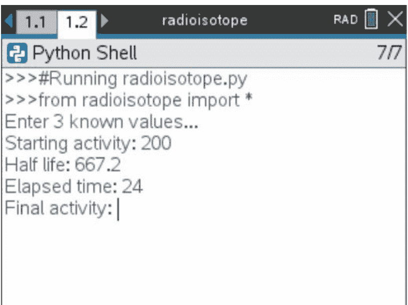

请注意，半衰期的单位可能是秒、小时甚至年。务必以相同的匹配单位输入经过的时间。在这种情况下，两个值都是以小时为单位。

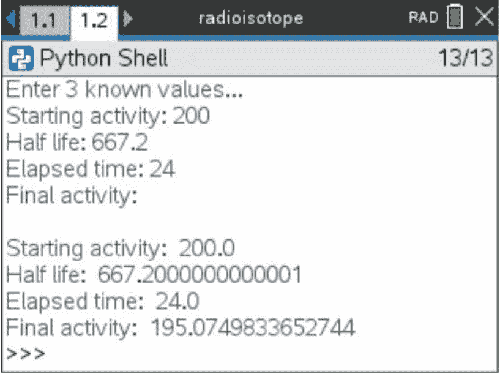

第二天测得的最终活度将是195微居里。

```python
from math import *

print("Enter 3 known values...")
s1="Starting activity: "
s2="Half life: "
s3="Elapsed time: "
s4="Final activity: "
sa=input(s1)
sa=float(sa) if sa else 0
ha=input(s2)
ha=float(ha) if ha else 0
et=input(s3)
et=float(et) if et else 0
fa=input(s4)
fa=float(fa) if fa else 0
if not sa:
    sa=fa/.5**(et/ha)
if not ha:
    ha=et*log(.5)/log(fa/sa)
if not et:
    et=ha*log(fa/sa)/log(.5)
if not fa:
    fa=sa*.5**(et/ha)
print(" ")
print(s1,sa)
print(s2,ha)
print(s3,et)
print(s4,fa)
```

### 相对论

在非常高的速度下，即所谓的相对论速度，空间和时间开始变得非常奇怪。我们通常不会注意到这些效应，因为即使是我们最快的航天器也只以光速的一小部分移动。如果它们能以光速移动，它们每秒将绕地球七圈。

几个相对论计算的核心是伽马值，这是一个根据速度V与光速C的比较计算出的值。以下是伽马值的公式：

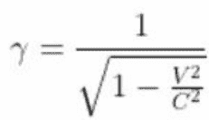

这个程序让你输入一个作为光速分数的速度。然后计算出实际速度和伽马值，并描述时间、长度和质量的扭曲。例如，如果一艘宇宙飞船能以光速的95%飞行，以下是我们从地球上观察到的情况：

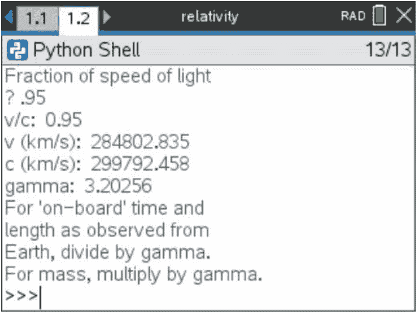

```python
#### Relativity
print("Fraction of speed of light")
f=float(input("? "))
g=1/(1-f**2)**.5
c=299792.458
v=c*f
print("v/c: ",f)
print("v (km/s): ",round(v,3))
print("c (km/s): ",c)
print("gamma: ",round(g,5))
print("For 'on-board' time and")
print("length as observed from")
print("Earth, divide by gamma.")
print("For mass, multiply by gamma.")
```

### 空间角度

天空中两颗恒星之间的角度是多少？国际空间站直接从头顶经过时的角速度是多少？事实证明，有很多理由需要计算两个以方位角和仰角（或赤经和赤纬，或纬度和经度）表示的空间方向之间的角度。

在平面内找到两个方向之间的角度很容易，但当加入第三维度时，情况就变得复杂了。随着仰角向天顶（正上方的点）增加，方位角之间的距离会减小。当你看得更高时，方位线会挤得更近，直到它们在天顶处合并。这个程序中的数学运算很好地处理了这种复杂性，因此无论两颗恒星是在某个夜晚靠近地平线，还是在第二天晚上在天空中更高处，它们之间的角度计算方式都是相同的。

例如，观察者测量一座山顶的方位角为121.5度，仰角为18.7度。从同一位置，第二座山顶的方位角为173.4度，仰角为9.1度。两座山峰之间的角度是多少？将这些值编辑到程序中，如下所示的代码，你会发现答案大约是51.1度。

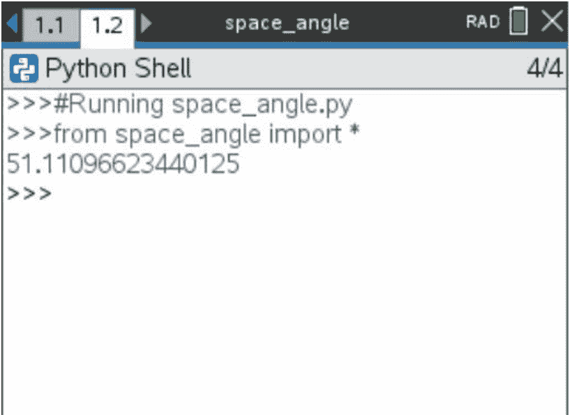

请注意，这个程序中定义了几个有用的函数，大多数与向量数学有关。本书其他地方的向量程序提供了更多函数。

```python
from math import *

def dot(v1, v2):
    tx=v1[0]*v2[0]
    ty=v1[1]*v2[1]
    tz=v1[2]*v2[2]
    return tx+ty+tz

def mag(v):
    return (v[0]**2+v[1]**2+v[2]**2)**.5

def ang(v1, v2):
    d=dot(v1,v2)
    m1=mag(v1)
    m2=mag(v2)
    return degrees(acos(d/m1/m2))
```

### station_gravity

在电影《星际穿越》中，主角们启动了他们轮状空间站的旋转，以产生一个G的人造重力，即与我们在地球上感受到的重力加速度相同。他们将其加速到特定的旋转速度，使离心力达到一个G。

那么，他们的空间站需要旋转多快呢？三个因素是：旋转速率、旋转半径以及在圆周处产生的G力。这个程序允许你输入其中任意两个值，第三个值将被计算出来。

在维基百科中搜索“人造重力”，可以更深入地了解这一切是如何运作的。如果g是G力的数值，r是旋转半径，s是完成一次完整旋转所需的秒数，那么将它们联系在一起的公式如下：

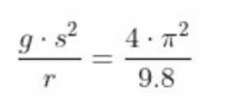

例如，我用秒表计时了《星际穿越》中展示的空间站的旋转。它大约每12秒完成一次完整旋转。主角说他们当时处于一个G的重力下，那么他们距离旋转中心有多远？

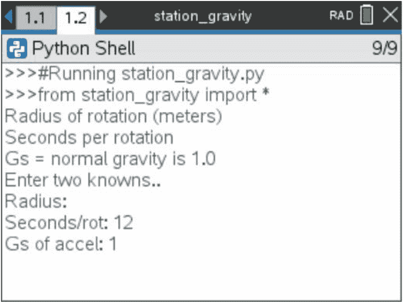

在提示输入未知值（本例中是半径）时，只需按[回车]键。输入另外两个值，如图所示，程序显示半径约为36米。

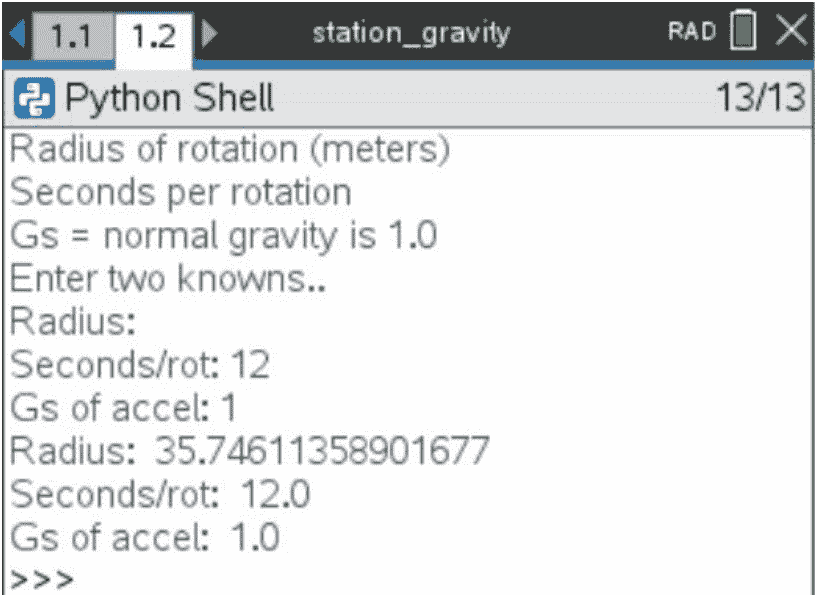

```python
from math import *

print("Radius of rotation (meters)")
print("Seconds per rotation")
print("Gs = normal gravity is 1.0")
print("Enter two knowns..")
a="Radius: "
b="Seconds/rot: "
c="Gs of accel: "
r=input(a)
r=float(r) if r else 0
s=input(b)
s=float(s) if s else 0
g=input(c)
g=float(g) if g else 0
if not r:
    r=9.8*g*s**2/(4*pi**2)
if not s:
    s=2*pi/(9.8*g/r)**.5
if not g:
    g=4*pi*pi*r/9.8/s**2
print(a,r)
print(b,s)
print(c,g)
```

### sun_elev

这个程序提供了一种简单的方法来测量太阳的仰角。使用米尺或码尺，在平坦的表面上测量其影子长度。输入这些数字，程序将使用数学模块中的`atan()`函数计算仰角。

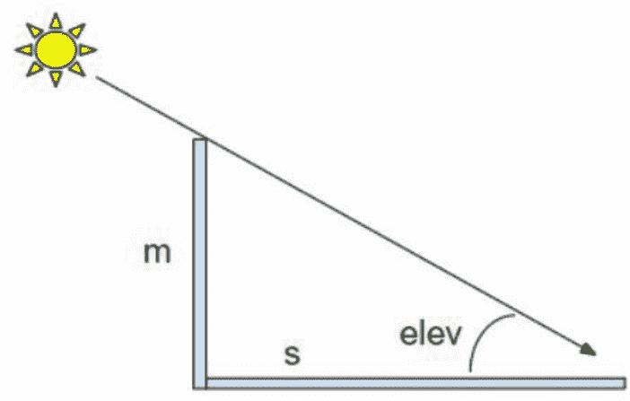

请确保物体的高度和影子长度使用相同的单位。例如，如果一根米尺的影子长度是134厘米（1米等于100厘米），那么太阳的仰角约为36.7度。

`atan()`函数与数学模块中的其他三角函数一样，假设所有角度都以弧度为单位。`degrees()`函数用于将弧度仰角转换为度数。

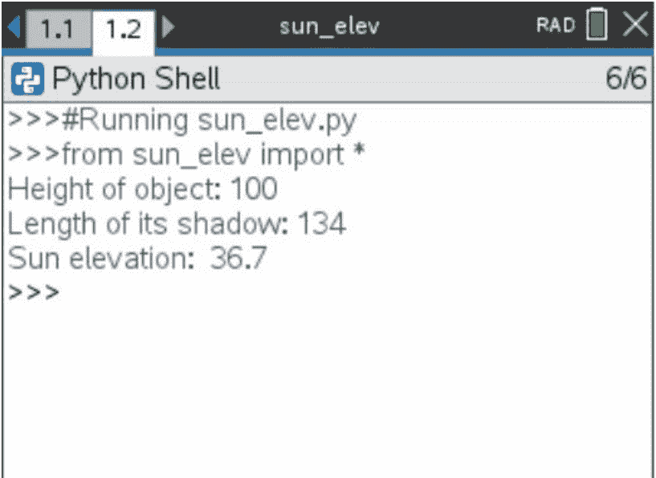

```python
from math import *

h=float(input("Height of object: "))
s=float(input("Length of its shadow: "))
elev=degrees(atan(h/s))
print("Sun elevation: ",round(elev,1))
```

### sun_loc

这个程序计算太阳正好位于天顶（即正上方）的地球上的确切位置。太阳总是在某个地方照耀着，因此这个点每24小时就会在地球周围不断移动，尽管每天的路径略有不同。

为了演示`sunloc()`函数，将一个包含精确日期和时间（包括与格林威治的时区偏移量）的列表传递给该函数。函数返回一个包含太阳在地球上天顶点的纬度和经度的列表。使用此算法计算的太阳位置精度在其真实位置的约0.01度以内。

例如，在2022年7月4日美国科罗拉多州丹佛市下午12:50:00（时区偏移量为-6小时），太阳将位于北纬约22.82度，西经约101.37度。在谷歌地图上快速查看显示，这个点位于墨西哥中部，圣路易斯波托西以北。

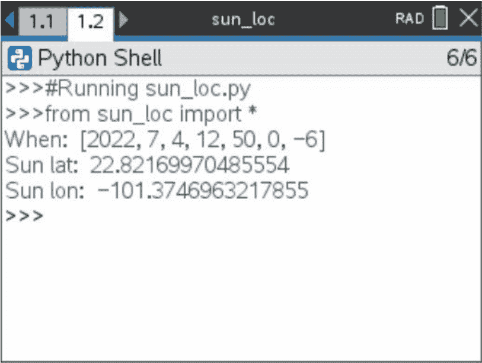

```python
from math import *

def sunloc(when):
    ye,mo,da,ho,mi,se,tz=when
    ta=pi*2
    ut=ho-tz+mi/60+se/3600
    t=367*ye-7*(ye+(mo+9)//12)//4
    dn=t+275*mo//9+da-730531.5+ut/24
    sl=dn*0.01720279239+4.894967873
    sa=dn*0.01720197034+6.240040768
    t=sl+0.03342305518*sin(sa)
    ec=t+0.0003490658504*sin(2*sa)
    ob=0.4090877234-0.000000006981317008*dn
    st=4.894961213+6.300388099*dn
    ra=atan2(cos(ob)*sin(ec),cos(ec))
    de=asin(sin(ob)*sin(ec))
    la=degrees(de)
    lo= degrees(ra-st)%360
    lo=lo-360 if lo>180 else lo
    return [la,lo]

when=[2022,7,4,12,50,0,-6]
la,lo=sunloc(when)
print("When: ",when)
print("Sun lat: ",la)
print("Sun lon: ",lo)
```

## 关于作者

约翰·克拉克·克雷格撰写了多本关于编程主题的书籍，主要涵盖了BASIC和Visual Basic语言随时间演变的各个版本。

如今，他的重点是Python，这是世界上最流行且易于学习的语言，适合首次向年轻人介绍编程，同时又足够强大，能够应对最具挑战性的工程、网页设计、游戏、机器人和机器学习……实际上涵盖了当今所有热门的编程领域。

除了写书，约翰的软件项目还控制和监控了大型太阳能项目，帮助风能工程师为风力涡轮机设计更好的塔架，监控阿拉斯加的天然气和石油项目，帮助训练美国奥运队的运动员，协助设计人工膝关节置换部件，提供了一个用于使用OpenSCAD进行更轻松3D设计的Python库，甚至为基于科学的UFO现象研究提供了工具。

约翰住在科罗拉多州，如今正在帮助他的妻子开发软件工具，这些工具帮助她帮助房主通过在屋顶安装太阳能板来节省大量资金。（参见 Solar-Proud.com）

约翰对Python编程语言充满热情，以及它如何以如此多样化的方式被用来帮助他人，一次一行代码地让世界变得更美好。

## 其他书籍
作者：
约翰·克拉克·克雷格

要查看约翰书籍的完整列表，请访问 [JohnClarkCraig.com](http://JohnClarkCraig.com)，它将引导您前往约翰的亚马逊作者页面。

约翰的书籍涵盖了许多编程主题，主要是关于Visual Basic，但最近更多是关于如何使用Python进行3D设计和使用OpenSCAD进行打印，以及如何为NumWorks™、TI-Nspire™ CX II技术以及TI-84计算器编程。

## 联系作者

请访问

[bookstobelievein.com/python](http://bookstobelievein.com/python)

Books To Believe In 出版
版权所有
Copyright 2021 by John Clark Craig

未经出版商书面许可，不得以任何形式或任何方式（电子或机械，包括影印、录制或任何信息存储和检索系统）复制或传播本书的任何部分。

由 Books To Believe In 在美国自豪地出版

publisher@bookstobelievein.com

电话：(303) 794-8888

[JohnClarkCraig.com](http://JohnClarkCraig.com)

[BooksToBelieveIn.com](http://BooksToBelieveIn.com)

第一版：ISBN：9798454148089

## 献词

本书献给杰夫·布雷茨，他是当年一些微软出版社书籍的合著者。我将永远珍惜我们分享的许多关于科学、数学、电子学、计算机、编程、替代能源和未来的对话。

杰夫，我们的兴趣非常相似，但我将永远仰慕你惊人的智慧、洞察力以及在所有技术问题上的帮助。

安息吧，我最好的朋友。

## 致谢

当一个人接受像写书这样的挑战时，周围总是有人鼓励和帮助。我最好的朋友杰夫·布雷茨在我打电话问他那些愚蠢或复杂的技术问题时，总是有答案。杰夫在我写这本书时去世了，我会非常想念他。

我的妻子EJ，凭借她的数学和太阳能背景，一直是我面对挑战时的灵感来源和最好的伴侣。我们都是企业家，因此我们都理解涉足他人不敢涉足的新领域和新主题的过程。EJ，与你并肩工作，共同开创我们美好的未来，一直是一种持续的喜悦。

德州仪器公司的几位优秀人士使这个本书项目成为可能。特别是卡拉·库格勒，她总是在那里回答一些棘手的问题，我将永远感激她的巨大帮助和支持。史蒂夫·德鲍格在克服一个特别棘手的技术问题上发挥了关键作用。

总的来说，我很感激德州仪器公司已经认识到Python在其为当今学生和未来技术创新者打造的计算器中的力量和影响力。

# 目录

致谢

引言

# 程序

## 1. 日期与时间

- 日历
- 日期
- 日期加天数
- 儒略日
- 日期间隔天数
- 时钟

## 2. 电子学

- 平均峰值有效值
- 电桥
- 三角形-星形转换
- 频率-波长
- LED电阻
- 欧姆定律
- 并联
- RC定时
- 串联
- 四舍五入

## 3. 游戏与概率

- 扑克牌
- 骰子
- 数字
- 阶乘、组合与排列
- 连续正面
- 寻宝方向
- 寻宝距离
- 字谜
- 迷宫
- 记忆力
- 蒙提霍尔问题
- 布丰投针求圆周率
- 飞镖求圆周率
- 随机字节
- 单词排列

## 4. GPS与导航

- GPS面积
- 绿松石湖
- GPS距离
- 中点
- 导航

## 5. 金钱与财务

- 存款
- 未来值
- 利息
- 月数
- 付款
- 本金

## 6. 数值计算

- 二进制-十进制-十六进制转换
- 二分查找
- 因数
- 斐波那契数列
- 最大公约数与最小公倍数
- 黄金比例
- 牛顿法
- 质数
- 二次方程
- 直角坐标-极坐标转换
- 联立方程
- 向量

## 7. 其他实用程序

- 混凝土
- 按键代码
- 激光测距
- 英里每小时
- 密码
- 湿球温度
- 风寒指数

## 8. 平面几何

- 弧形部件
- 三点面积
- 三边面积
- 点集面积
- 圆
- 距离
- 线段分割
- 两点直线
- 点斜式直线
- 变换
- 三点三角形
- 三角形

## 9. 空间几何

- 三维坐标
- 三维旋转
- 三维三角形
- 四点体积

## 10. 空间科学

- 地球同步天线
- 月球
- 便士
- 放射性同位素
- 相对论
- 空间角度
- 空间站重力
- 太阳高度角
- 太阳位置

关于作者

约翰·克拉克·克雷格的其他著作