# 适用于 TI-84 的 Python

适用于 TI-84 Plus CE Python 图形计算器的强大 Python 程序与游戏

作者：约翰·克拉克·克雷格

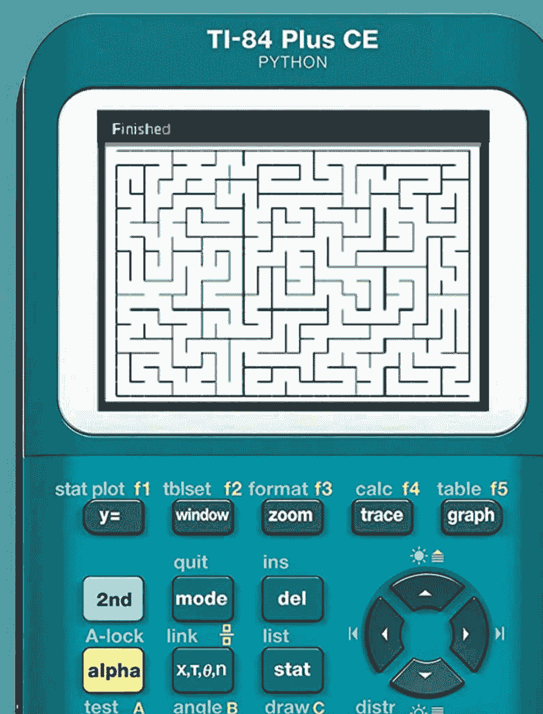

## 目录

致谢

[引言](Introduction)

## 程序

[1. 日历功能](1.%20Calendar%20Functions)

- CALENDAR
- DATE
- DATEPLUS
- DAYSDATS
- JULIAN

[2. 电子学](2.%20Electronics)

- AVGPKRMS
- BRIDGE
- DELTAWYE
- FREQWAVE
- LED_RES
- OHMSLAW
- PARALLEL
- RCTIMING
- SERIES
- ZROUND

[3. 游戏与概率](3%20Games%20and%20Chance)

- DECKCRDS
- DICE
- DIGITS
- FACTCBPM
- HEADSROW
- HUNT_DIR
- HUNT_DIS
- JUMBLE
- MAZE
- MEMORY
- MNTYHALL
- PI_BUFFN
- PI_DARTS
- RNDBYTE
- WORDPERM

### 4. GPS 与导航

- GPS_AREA
- GPS_DIST
- MIDPOINT
- NAVIGATE

### 5. 金钱与金融

- DEPOSITS
- FUTURVAL
- INTEREST
- MONTHS
- PAYMENTS
- PRNCIPAL

#### 6. 数值计算

- BINHXDEC
- BINSRCH
- FACTORS
- FIBONACC
- GCD_LCM
- GLDRATIO
- NEWTON
- PRIMES
- QUADRATC
- REC_POLR
- SIMULTEQ
- VECTORS

#### 7. 其他实用程序

- CONCRETE
- CRICKETS
- LASERDIS
- MPH
- SECRET
- WAIT_KEY
- WET_BULB
- WNDCHILL

#### 8. 平面几何

- ARCS
- AREA_3P
- AREA_3S
- AREA_PTS
- CIRCLE3P
- DISTANCE
- DIVLINE
- LINE_2P
- LINSLOPE
- TRANSFRM
- TRIANG3P
- TRIANGLE

#### 9. 空间几何

- COORD_3D
- DIVLIN3D
- ROTATE3D
- TRIANG3D
- VOLUME4P

#### 10. 空间科学

- GEOSYNC
- MOON
- PENNIES
- RADIOISO
- RELATVTY
- SPACEANG
- STN_GRAV
- SUN_ELEV
- SUBSOLAR

[关于作者](About the Author)

[约翰·克拉克·克雷格的其他著作](Other Books By John Clark Craig)

## 引言

### 为何选择 Python？

Python 是全球最受欢迎的编程语言，也是手持计算器的理想语言。其语法简洁、易于阅读和理解，即使对初学者也是如此。该语言非专有，因此可在任何地方运行，甚至在台式机和笔记本电脑上也只需对本书中的代码进行极小的修改即可运行，而且这种情况非常罕见。

Python 擅长数值计算，并且凭借其列表、字符串和其他数据结构，它能强大地处理各种各样的编程任务。但或许通过可编程计算器学习 Python 最大的优势在于，无论你将来使用何种计算机或系统，这些知识都将适用且有用。学一次，你将获得一项极具价值的新生活技能。

### 你计算器中的 Python

Python 程序中进行的大多数数值计算都是直接且易于理解的。当涉及到与用户交互以请求输入和输出（通常称为 I/O）时，有几种可选的方法，理解其中一些方法可以让你编写更短的程序，或者更长但更用户友好的程序，这取决于你的风格和编程目标。本书中的程序使用了其中几种方法，重要的是要知道，如果你偏好某种编程方式而非另一种，你可以修改这些程序。

在计算器中利用 Python 的一个绝佳方法是在“程序”文件中简单地定义函数。当你运行程序时，表面上什么也不会发生。但函数定义实际上被添加到了你的计算器工具箱中，随时可以在 shell 中使用。例如，这是一个定义了名为 `add()` 函数的非常简短的程序。

```
def add(x, y):
    return x+y
```

运行此程序后，在 shell 中你可以输入类似 "add(3,4)" 的内容得到 7，或者将任意两个数字或变量相加。或者，你不必自己输入函数名，在你的 TI-84 CE Plus Python 计算器上，你可以从 [Tools] 菜单中选择 "4:vars..." 来快速访问你的程序已定义的函数列表。更复杂的函数可以为你的计算工具箱添加一些强大的新功能！

本书中的许多程序都是以这种方式作为一组函数定义创建的。这使得程序非常简短且更容易输入。在某些情况下，程序还会打印一些关于如何使用函数的说明和提醒，以便于参考。请查看第 6 章末尾的向量程序，这是一个很好的例子，展示了如何添加有用的说明，同时仅为后续在 shell 中使用而定义函数。

在大多数编程语言中，创建独立程序的标准方式是提示用户输入数据，然后以有意义的方式处理这些数据，为用户创建输出。在本书中，有几个程序要求你在运行时输入数据以响应提示，然后计算开始。请查看第 6 章中的质数程序，这是一个程序要求你输入查找质数的起始点以及要查找的质数数量的例子。

本书的几个程序中还介绍了一些其他有用的 I/O 技巧。有时询问一个数字是有用的，但如果用户不知道该值，可以让他们简单地按 [enter] 而不输入数字。这实际上是一件棘手的事情，因为在 `input()` 函数调用后，如果未输入任何内容，简单的变量赋值可能会失败。请仔细查看第 8 章中的程序 ARCS，这是一个可以输入四个变量中任意两个的组合，而缺失的变量将被计算出来的例子。这里有一对代码行，其中输入一个角度，或者如果用户只是按 [enter]，则放入零值。

```
a=input("Angle (deg): ")
a=float(a) if a else 0
```

最后，请注意 Python shell 本身提供了一个强大的计算环境。有时，与其编辑和保存程序，不如在 shell 中逐行交互式地输入计算更快、更高效。在 Python 环境中，你的 TI-84 Plus CE Python 计算器上的几个键被重新定义，学习如何利用它们可以提供一些非常酷的结果。例如，[2nd][ans] 键在 Python shell 中输入一个下划线，而下划线是一个特殊的临时变量，包含上次计算的结果。这是一个快速示例，首先输入 3 并按 x 平方键，然后使用 [2nd][ans] 将结果乘以三。

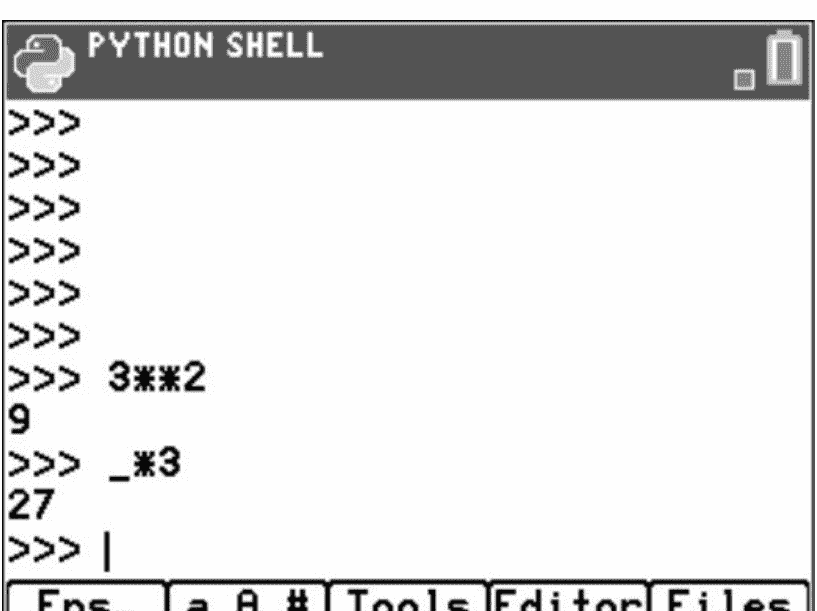

### 通过示例学习

网上和其它书籍中有许多资源可以学习 Python 语言的复杂细节。本书的目标并非复制所有这些信息。相反，这里有很多简短、有用的程序，你可以“开箱即用”，在使用它们的过程中，你将间接地学到很多关于 Python 的知识。

如果你正在寻找一个绝对初学者的教程，以帮助你快速掌握在 TI-84 Plus CE Python 计算器上使用 Python 编程，德克萨斯仪器公司有一个名为 "10 Minutes of Code: Python" 的优秀网站。我强烈建议你看看这些技能培养课程。以下是链接：

[https://education.ti.com/en/activities/ti-codes/python/84](https://education.ti.com/en/activities/ti-codes/python/84)

每当你发现一个看起来有点神秘的命令时，我强烈建议你用谷歌搜索更多信息。在我看来，这是学习许多 Python 编程技巧的更好方法，通过在实践中使用和体验这些命令。

例如，我花了一段时间才偶然发现 Python 有用的 `zip()` 函数。我在向量程序中的几个地方使用了它来创建极其简洁和强大的向量函数。在谷歌上搜索 "Python zip"，了解它的工作原理，然后你将真正理解几个向量函数如何处理二维、三维甚至更大向量的工作原理。

任何 TI-84 计算器都是非常强大的学习工具，但随着你的 TI-84 Plus CE Python 计算器中 Python 的加入，其拓展思维的能力确实令人敬畏！

#### 1. 日历函数

你今天多大了？

下次有人问你这个问题时，你可以给出精确的天数，而不仅仅是四舍五入到年数。然后，为了让他们印象更深刻，一定要不经意地提到你出生的星期几。

本章中的程序将让你轻松回答这类问题。

##### CALENDAR

这个程序可以为几个世纪内的任何月份创建一个漂亮的单页月历。

该程序的核心是一个函数，它返回1582年至4000年范围内任何日期的儒略日数。这个名为`jd()`的函数将在本章后面更详细地解释，但这里它被用来确定任何给定月份的天数，以及任何日期是星期几。根据这些信息，我们可以将给定月份的所有日期格式化为易于阅读的月历。

威尔伯和奥维尔·莱特兄弟的首次重于空气的飞行发生在1903年12月17日上午，地点是北卡罗来纳州的基蒂霍克。我们可以运行这个程序来查看1903年12月的完整月历布局，并轻松确定17日是星期四。

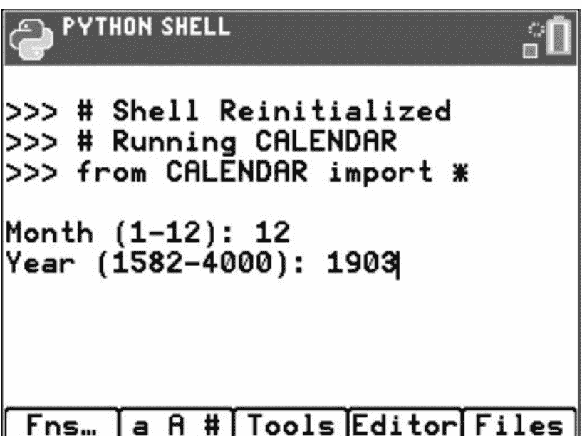

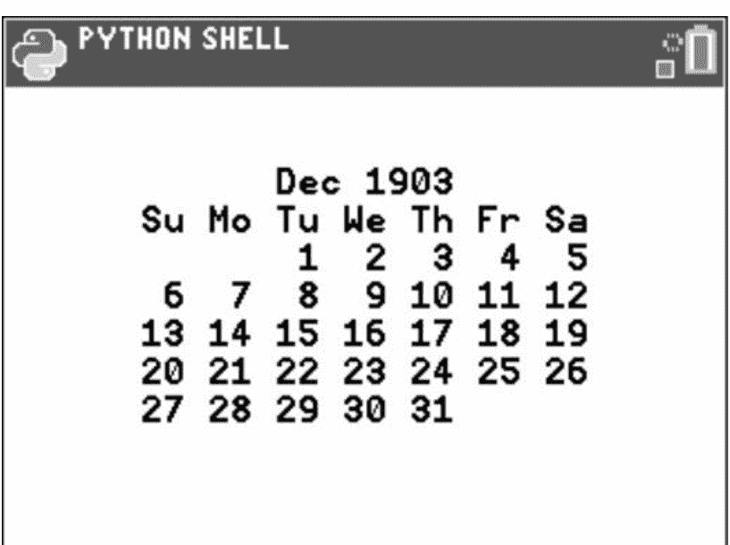

```python
import ti_matplotlib as plt
```

```python
def jd(m,d,y):
    if m<3:
        y-=1
        m+=12
    a=int(y/100)
    b=2-a+int(a/4)
    e=int(365.25*(y+4716))
    f=int(30.6001*(m+1))
    return b+d+e+f-1524.5
```

```python
###### 获取月份和年份
m=int(input("\nMonth (1-12): "))
y=int(input("Year (1582-4000): "))
d1=int(jd(m,1,y))
dw=(d1+2)%7
m2=m+1 if m<12 else 1
y2=y if m<12 else y+1
d2=int(jd(m2,1,y2))
dm=d2-d1
mo=["Jan","Feb","Mar","Apr","May","Jun",
    "Jul","Aug","Sep","Oct","Nov","Dec"]
```

```python
###### 月份、年份标题
plt.cls()
s="{} {}".format(mo[m-1],y)
plt.text_at(3,s,"center")
```

```python
###### 星期几
s="Su Mo Tu We Th Fr Sa"
plt.text_at(4,s,"center")
```

```python
###### 准备第一行
s=" "*(3*dw-1) if dw else ""
```

```python
###### 日期数字行
r=5
for d in range(1,dm+1):
    ds=len(s)
    if ds==20:
        plt.text_at(r,s,"center")
        s="{:2d}".format(d)
        r+=1
    elif ds:
        s+="{:3d}".format(d)
    else:
        s+="{:2d}".format(d)
s+=" "*20
plt.text_at(r,s[:20],"center")
plt.show_plot()
```

##### DATE

这个程序使用儒略日数函数来计算1582年至4000年范围内某个日期的星期几和一年中的第几天。`jd()`函数在本章其他地方有更详细的描述。

例如，1903年12月17日（奥维尔和威尔伯首次进行重于空气飞行的那天）是星期四，并且是那一年的第351天，如下方Python Shell中的输出所示。

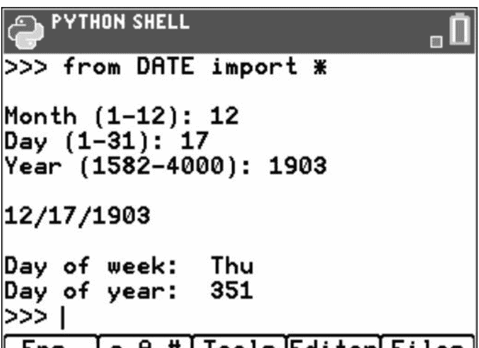

一年中的第几天是通过将所选日期的儒略日数减去上一年12月31日的儒略日数来计算的。

```python
def jd(m,d,y):
    if m<3:
        y-=1
        m+=12
    a=int(y/100)
    b=2-a+int(a/4)
    e=int(365.25*(y+4716))
    f=int(30.6001*(m+1))
    return b+d+e+f-1524.5
```

```python
m=int(input("\nMonth (1-12): "))
d=int(input("Day (1-31): "))
y=int(input("Year (1582-4000): "))
dj=int(jd(m,d,y))
dn=(dj+2)%7
dw=["Sun","Mon","Tue","Wed","Thu","Fri","Sat"]
print("\n{}/{}/{}\n".format(m,d,y))
print("Day of week: ",dw[dn])
dy=dj-int(jd(12,31,y-1))
print("Day of year: ",dy)
```

##### DATEPLUS

这个程序计算一个起始日期加上给定天数后的日期。例如，莱特兄弟的首次飞行发生在1903年12月17日。从那天起40,000天后的日期是什么？如输出所示，2013年6月22日是距离人类首次升空之日“遥远的未来”的日期。

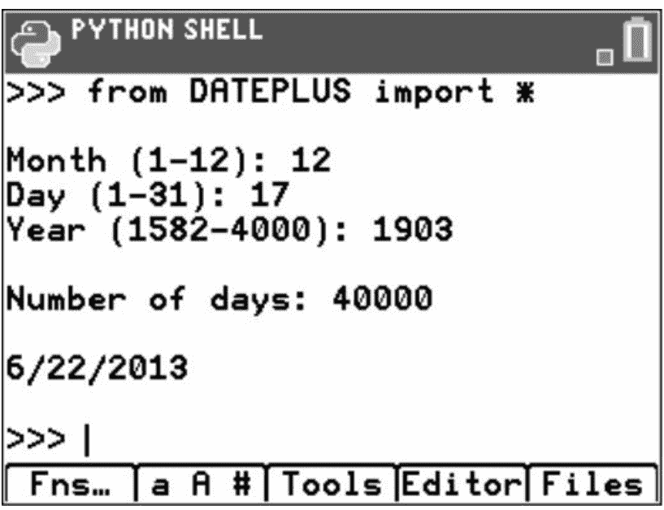

如果你想知道，是的，你可以加上一个负数天数来找到更早的日期。

为了执行此计算，起始日期使用`jd()`函数转换为其儒略日数，加上天数以创建第二个儒略日数，然后`mdy()`函数将该数字转换回日期。儒略日数会自动处理闰年、每月不同的天数以及所有这些细节。这两个函数在本章的`julian.py`程序中有更详细的描述。

```python
from math import *

def jd(m,d,y):
    if m<3:
        y-=1
        m+=12
    a=int(y/100)
    b=2-a+int(a/4)
    e=int(365.25*(y+4716))
    f=int(30.6001*(m+1))
    return b+d+e+f-1524.5

def mdy(jd):
    z=int(jd+.5)
    f=jd+.5-z
    if z<2299161:
        a=z
    else:
        t=int((z-1867216.25)/36524.25)
        a=z+1+t-int(t/4)
    b=a+1524
    c=int((b-122.1)/365.25)
    g=int(365.25*c)
    e=int((b-g)/30.6001)
    d=int(b-g-int(30.6001*e)+f)
    if e<14:
        m=e-1
    else:
        m=e-13
    if m>2:
        y=c-4716
    else:
        y=c-4715
    return [m,d,y]

m=int(input("\nMonth (1-12): "))
d=int(input("Day (1-31): "))
y=int(input("Year (1582-4000): "))
n=int(input("\nNumber of days: "))
m,d,y=mdy(jd(m,d,y)+n)
print("\n{0}/{1}/{2}\n".format(m,d,y))
```

##### DAYSDATS

在你下一个生日时，你将在地球上度过多少天？这类问题用这个程序很容易回答。输入两个日期，将它们转换为儒略日数，然后输出它们之间的差值作为两个日期之间的天数。

`jd()`函数是这个程序的核心。它在本章介绍的`julian.py`程序中有更详细的描述。

示例计算查找从奥维尔和威尔伯首次飞行之日（1903年12月17日）到千年虫日期（2000年1月1日）之间的天数。结果是精确的35,079天。

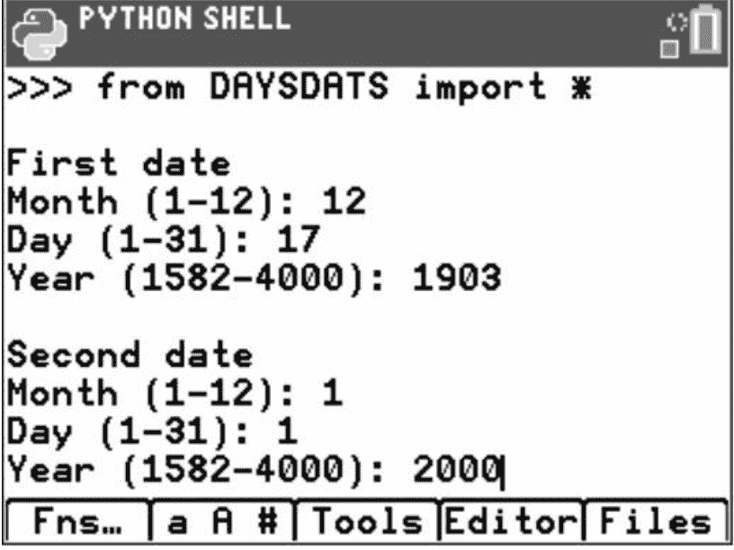

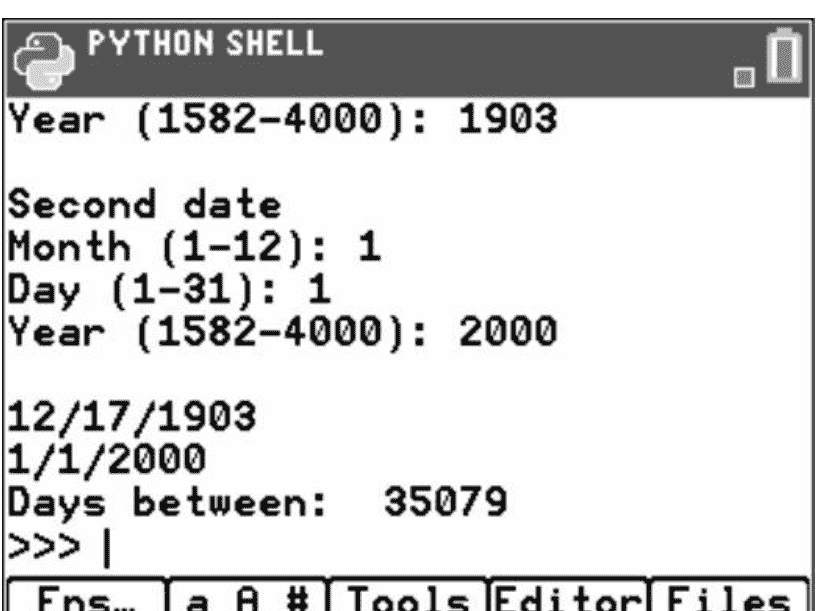

```python
def jd(m,d,y):
    if m<3:
        y-=1
        m+=12
    a=int(y/100)
    b=2-a+int(a/4)
    e=int(365.25*(y+4716))
    f=int(30.6001*(m+1))
    return b+d+e+f-1524.5
```

```python
print("\nFirst date")
m1=int(input("Month (1-12): "))
d1=int(input("Day (1-31): "))
y1=int(input("Year (1582-4000): "))
print("\nSecond date")
m2=int(input("Month (1-12): "))
d2=int(input("Day (1-31): "))
y2=int(input("Year (1582-4000): "))
nd=int(abs(jd(m1,d1,y1)-jd(m2,d2,y2)))
print("\n{}/{}/{}".format(m1,d1,y1))
print("{}/{}/{}".format(m2,d2,y2))
print("Days between: ",nd)
```

##### JULIAN

这个程序演示了两个对各种日历计算非常有用的函数。本章中的所有其他程序都使用其中一个或两个函数。

`jd()`计算1582年至4000年范围内给定日期的儒略日数。这是一个绝对的日数，被天文学家和其他人用来清晰地指定每一天的顺序，而不考虑闰年和其他此类复杂情况。

请注意，由于历史原因，每个天文日从格林威治时间中午开始，因此这些儒略日数上有一个额外的“.5”。在本文介绍的程序中，我们通过加减整数天来查找相对日期，这个额外的小数部分并不重要。对于天文学计算，这个小数部分确实变得重要。

`mdy()`函数提供了一种将儒略日数转换回月、日、年三元组的方法。这使得加减天数以准确获得新日期变得容易，而无需对每个月的天数或闰年进行任何复杂的调整。

示例代码输入一个日期并输出其儒略日数。接下来，输入任何儒略日数，并输出该日的日历日期。如图所示，1903年12月17日的儒略日数是2,416,465.5，而儒略日数2,500,000.5将落在2132年9月1日。

#### 2. 电子学

本章介绍了一些用于进行各种电子计算的实用程序。作者在发明一些有趣的小工具时使用了这些及类似的计算，例如一个无需布线的自行车刹车灯，你只需将其贴在自行车或头盔上即可骑行！它使用加速度计和一些有趣的程序代码来消除颠簸和旋转，同时检测刹车并点亮明亮的刹车灯。（LucidBrakes™）

无论你是在使用 Arduino、Raspberry Pi 进行实验，还是在元件级别创建自己的电路，这些计算都会非常有用。

##### AVGPKRMS

美国的住宅供电是正弦波形式，有效电压约为 117 伏。这种有效电压为电阻负载提供的功率（瓦特）与 117 伏的直流电压相同。有效电压也称为 RMS，代表“均方根”，因其数学推导方式而得名。

大多数时候我们使用有效电压值，因为它是可以快速计算电路功率的值。但测量正弦波电压还有另外两种方式。峰值电压，位于正弦波的最高点，提供“峰值”电压值；而电压随时间变化的平均幅度（不考虑极性）则提供“平均”电压值。

以下是两个主要的转换方程。峰值、平均值和 RMS 电压之间的所有关系都可以通过代数运算这两个方程得出：

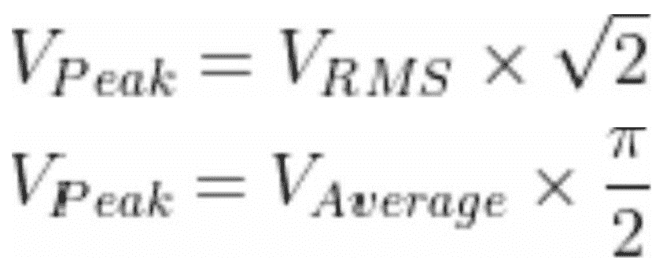

此程序提供了描述纯正弦波电压的这三种方式之间的转换。在提示输入时输入一个已知值，然后按 [enter] 键跳过另外两个。程序会确定你输入的值，计算出另外两个，并输出所有三个值以供参考。

如示例运行所示，标准的美国家庭布线电压 117 V (RMS) 的峰值电压约为 165 V，随时间变化的平均电压约为 105 V。

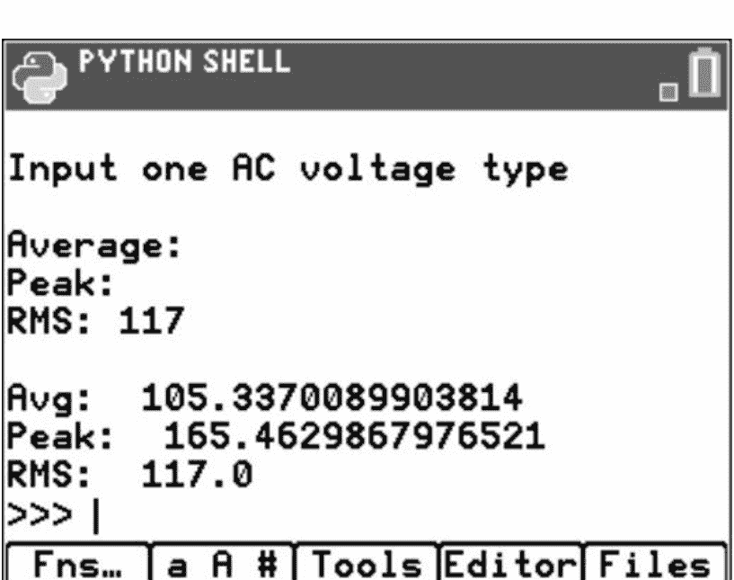

```python
from math import *

def ac_voltages(avg,peak,rms):
    if avg:
        peak=pi*avg/2
        rms=peak/sqrt(2)
    elif peak:
        avg=peak*2/pi
        rms=peak/sqrt(2)
    elif rms:
        peak=rms*sqrt(2)
        avg=peak*2/pi
    return [avg,peak,rms]

print("\n\nInput one AC voltage type\n")
s=input("Average: ")
avg=float(s) if s else 0
s=input("Peak: ")
peak=float(s) if s else 0
s=input("RMS: ")
rms=float(s) if s else 0
avg,peak,rms=ac_voltages(avg,peak,rms)
print("\nAvg: ",avg)
print("Peak: ",peak)
print("RMS: ",rms)
```

##### BRIDGE

平衡电桥电路，也称为惠斯通电桥，在电子学中用于精密测量和其他目的。一个常见的计算是当已知其他三个臂的值时，求出平衡电桥一个臂的值。例如，在下图中，当已知 R1、R2 和 R3 时，我们可以计算出 R4 的值。这些值使得中间的电流表读数为零安培。同样，跨接在这两个相同节点上的电压表读数将为零伏特。

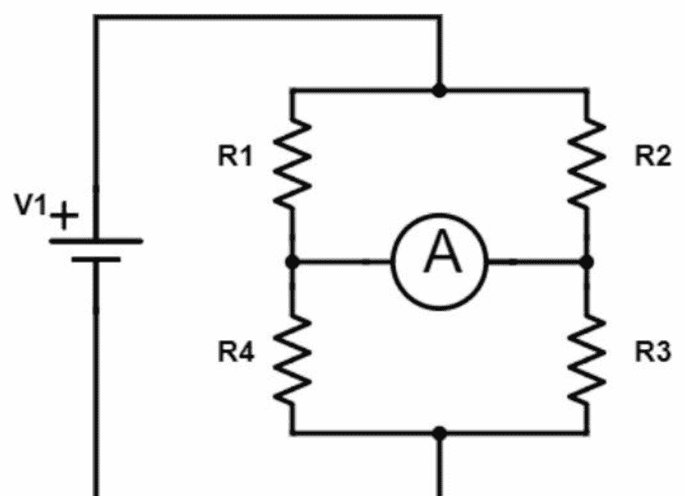

以下是关联四个电阻的方程：

$R1 \times R3 = R2 \times R4$

请注意，bridge() 函数使用变量 z1 到 z3 而不是 R1 到 R3。这是因为 Python 的一个强大特性，变量可以同样轻松地包含复数或实数。在电路分析中，对于包含电容和电感（除了电阻）的交流电路，复数非常有用。是的，交流电桥电路在处理这些元件时确实遵循所有相同的数学规则，使用复数表示各自的阻抗。

以下示例计算了当三个电阻分别为 2700、3900 和 5600 欧姆时，第四个臂电阻的值，并再次求解复数阻抗为 4+3j、5+0j 和 3-7j 的情况。

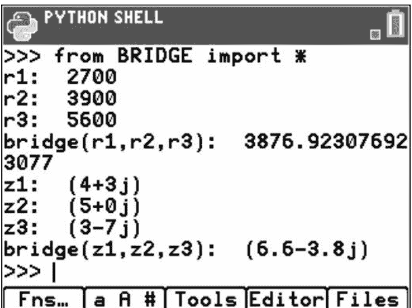

如图所示，第一种情况下的第四个电阻应约为 3877 欧姆，第二种情况下的阻抗应为 6.6-3.8j 欧姆。

```python
def bridge(z1,z2,z3):
    return z1*z3/z2

r1=2700
r2=3900 # opposite the unknown
r3=5600
r4=bridge(r1,r2,r3)
print("r1: ",r1)
print("r2: ",r2)
print("r3: ",r3)
print("bridge(r1,r2,r3): ",r4)

z1=4+3j
z2=5+0j # opposite the unknown
z3=3-7j
z4=bridge(z1,z2,z3)
print("z1: ",z1)
print("z2: ",z2)
print("z3: ",z3)
print("bridge(z1,z2,z3): ",z4)
```

bridge() 函数非常小，只有前两行代码。本程序的大部分内容演示了两次调用 bridge() 函数，一次用于求解纯电阻电桥，第二次用于平衡由复数阻抗组成的电桥。

##### DELTAWYE

当你运行此程序时，什么也不会发生。好吧，需要一点解释。正如本书前面所解释的，为你的计算器添加强大功能的一种简单直接的方法是在程序中定义函数，以便在处理相关问题时反复使用。在这种情况下，运行时定义了两个函数：delta() 和 wye()，它们保留在 shell 中供你使用。

你可以输入这些函数及其后的括号，但一个快速访问它们的好方法是从“工具”菜单中选择“4:Vars”。从显示的列表中选择一个函数，然后你就可以输入其参数。

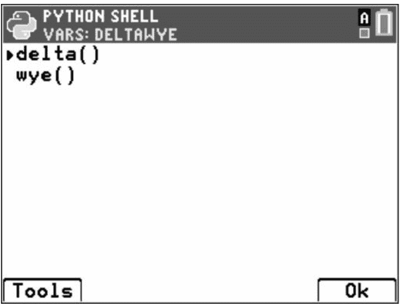

delta() 函数将星形配置的电阻转换为等效的三角形配置。wye() 函数执行完全相反的转换，输出与你传递给它的三角形配置等效的星形配置。

这两个函数也适用于复数阻抗，如示例所示。这是更高级电子分析的一个强大特性。

三角形配置之所以得名，是因为三个电阻排列成三角形，尽管电路图通常将它们显示为更像 π 形排列，如左侧所示。请注意，如果你将 RB 和 RC 的底部“拉在一起”，就会形成一个三角形，或“delta”。

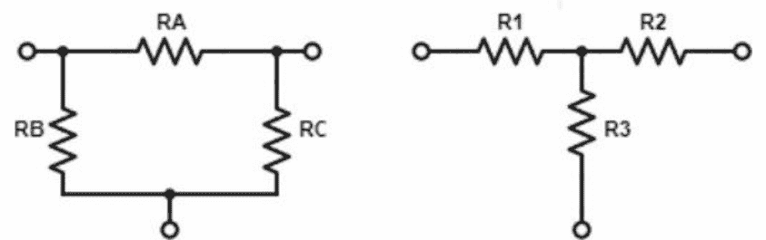

类似地，星形配置通常显示为更像“T”形排列，如右侧所示。只需想象 R1、R2 和 R3 之间的中心点向下拉一点，你就会看到“Y”形，或星形。

delta() 函数使用以下方程，根据给定的 R1、R2 和 R3，求出构成等效电阻或阻抗组的 RA、RB 和 RC 的值。

$$RA = \frac{R1 \cdot R2 + R1 \cdot R3 + R2 \cdot R3}{R1}$$

$$RB = \frac{R1 \cdot R2 + R1 \cdot R3 + R2 \cdot R3}{R2}$$

$$RC = \frac{R1 \cdot R2 + R1 \cdot R3 + R2 \cdot R3}{R3}$$

wye() 函数使用以下方程，根据给定的 RA、RB 和 RC，求出构成等效电阻或阻抗组的 R1、R2 和 R3 的值。

##### FREQWAVE

电磁波谱涵盖了广泛的现象，例如无线电波、X射线、可见光、红外光、微波等。这些现象中的每一种都属于一个频段，每个频率都有一个特定的波长，并且它们在自由空间中都以光速传播。

以赫兹为单位的频率和以米为单位的波长互为精确的倒数。它们都是光速的函数。以下是将所有这些联系在一起的最简单方程，其中C是光速：

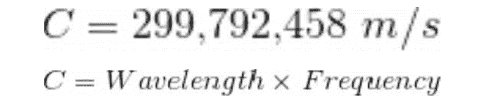

大多数情况下，波长和频率以工程记数法表示，其中10的幂是3的倍数。这种记数法可以轻松转换为千、兆、纳等前缀，从而更容易理解数值的大小。本程序中的前两个函数，名为`logb()`和`eng()`，协同工作，将数字格式化为具有任意所需有效位数的工程记数法。你可能希望将这些函数单独放入一个文件中，以便在你创建的其他程序中使用。

```
from math import *

def logb(x,b):
    return log(x)/log(b)

def eng(x,d):
    x=abs(x)
    if x==0:
        return "0.0"
    exp=floor(logb(x,10))
    mant=x/10**exp
    r = round(mant,d-1)
    x = r*pow(10.0,exp)
    p = int(floor(logb(x,10)))
    p3 = p//3
    value=x/pow(10.0,3*p3)
    s="{:f}".format(value)
    if s[d]!=".":
        s=s[0:d+1]
    else:
        s=s[0:d]
    if p3!=0:
        return "{}e{:d}".format(s,3*p3)
    else:
        return "{}".format(s)
```

```
c,f,w=299792458,0,0
print("\nEnter known value...")
f=input("Frequency: ")
f=float(f) if f else 0
if f==0:
    w=input("Wavelength (m): ")
    w=float(w) if w else 0
if w!=0:
    f=c/w
if f!=0:
    w=c/f
digits=5
print("\nFrequency:")
print("{} Hz".format(eng(f,digits)))
print("\nWavelength:")
print("{} meters".format(eng(w,digits)))
```

此程序会提示输入频率，如果你通过按[回车]键而不输入数字来跳过频率输入，则会提示输入波长。无论哪种情况，未知值都会被计算出来，两个值都会被格式化为工程记数法，结果会输出到你的计算器显示屏上。

示例运行展示了两次，第一次是已知频率，第二次是已知波长。在第一个示例中，输入了氦“人民网络”物联网的频率来计算其波长。915兆赫的波长略小于三分之一米。

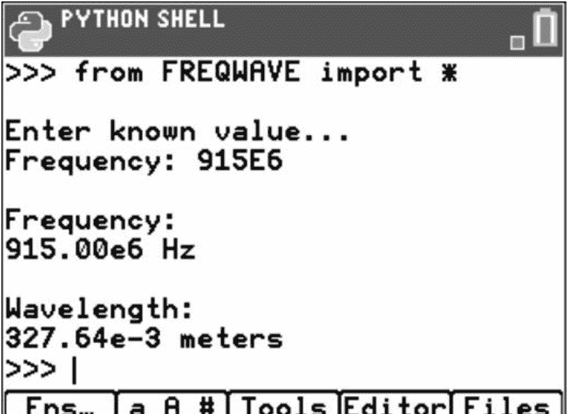

在第二个示例中，我们跳过频率输入，然后输入5，以计算波长恰好为5米时的频率。频率略低于60兆赫。

请注意，程序末尾附近名为`digits`的变量被设置为五。如果你希望答案具有更高或更低的精度，请更改此值。

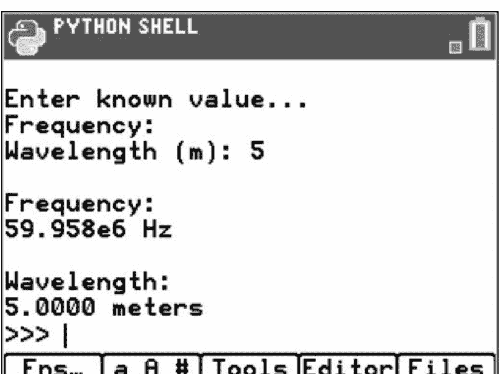

为方便参考，以下是各种工程记数法10的幂对应的公制前缀列表：

| 符号 | 名称 | 值 | 符号 | 名称 | 值 |
| :--- | :--- | :--- | :--- | :--- | :--- |
| Y | Yotta | 10^24 | y | yocto | 10^-24 |
| Z | Zetta | 10^21 | z | zepto | 10^-21 |
| E | Exa | 10^18 | a | atto | 10^-18 |
| P | Peta | 10^15 | f | femto | 10^-15 |
| T | Tera | 10^12 | p | pico | 10^-12 |
| G | Giga | 10^9 | n | nano | 10^-9 |
| M | Mega | 10^6 | μ | micro | 10^-6 |
| k | kilo | 10^3 | m | milli | 10^-3 |

##### LED_RES

LED非常棒。一旦你知道如何正确地为它们供电，你就可以用任何可以想象的颜色和闪烁模式点亮各种有趣的艺术品、小工具和发明。例如，作者发明了一种自行车刹车灯，它完全不需要连接到刹车器，而是依靠加速度计芯片来确定何时闪烁明亮的红色LED以指示减速。可以在网上查看LucidBrakes。

LED是一种特殊类型的二极管，电流可以很容易地沿一个方向流过它，而不能沿另一个方向流动。要点亮LED，你需要使用电阻器来限制允许在“容易”方向流动的电流量。此程序可帮助你计算该电阻器的大小。它还有助于确定电流和功率要求，以确保任何部件都不会冒出神奇的烟雾！

连接LED的标准方法是串联一个电阻器，并由一个电压源为它们供电：

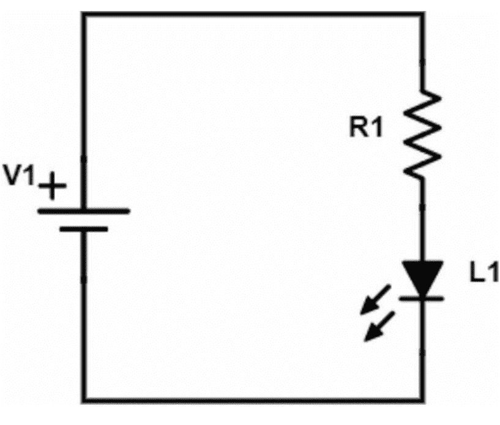

以下是将程序中所需的所有计算联系在一起的方程，其中Vs是电源电压，Vf是LED两端的正向电压，Vr是电阻器两端的电压，i是流经所有部件的电流（单位为安培），Wr是电阻器的功率（单位为瓦特），Wf是LED的功率（单位为瓦特）。

$V_s = V_r + V_f$

$V_r = R \times i$

$W_r = i \times V_r$

$W_f = i \times V_f$

以下是程序清单：

```
def led_resistor(Vs,Vf,i):
    r=(Vs-Vf)/i
    Rw=(Vs-Vf)*i
    Lw=Vf*i
    return [r,Rw,Lw]

def led_current(Vs,Vf,r):
    i=(Vs-Vf)/r
    Rw=(Vs-Vf)*i
    Lw=Vf*i
    return [i,Rw,Lw]

Vs=float(input("\nSource Vs: "))
Vf=float(input("LED Vf: "))
print("\nNow enter one of these two...")
i=input("\nCurrent in amps: ")
i=float(i) if i else 0
r=input("LED resistor in ohms: ")
r=float(r) if r else 0
if i:
    r,Rw,Lw=led_resistor(Vs,Vf,i)
else:
    i,Rw,Lw=led_current(Vs,Vf,r)
print("\nVs: ",Vs)
print("Vf: ",Vf)
print("R: {} ohms".format(r))
print("i: {} amps".format(i))
print("Rw: {} watts".format(Rw))
print("Lw: {} watts".format(Lw))
```

以下两次示例运行，第一次在已知电流时找到电阻器的近似值，第二次在为电路选择标准电阻器时计算电流。

在这两种情况下，你都需要输入电源电压和LED正向电压（此Vf因LED类型而异），然后输入以安培为单位的电流或以欧姆为单位的电阻值。

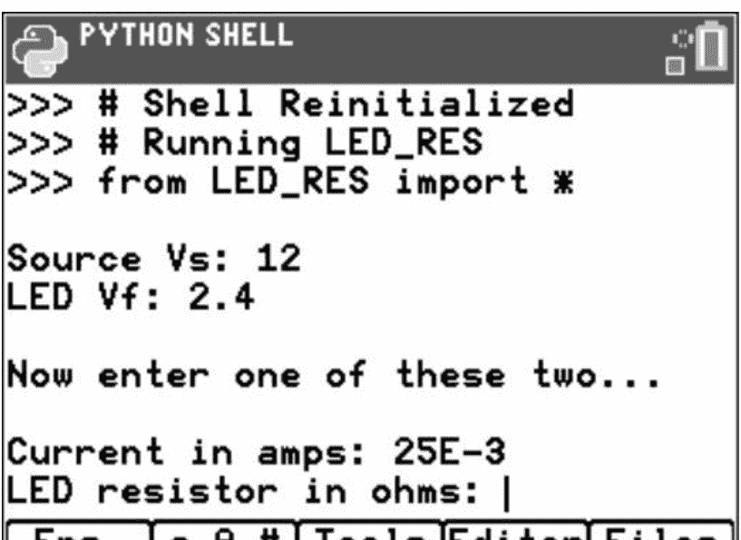

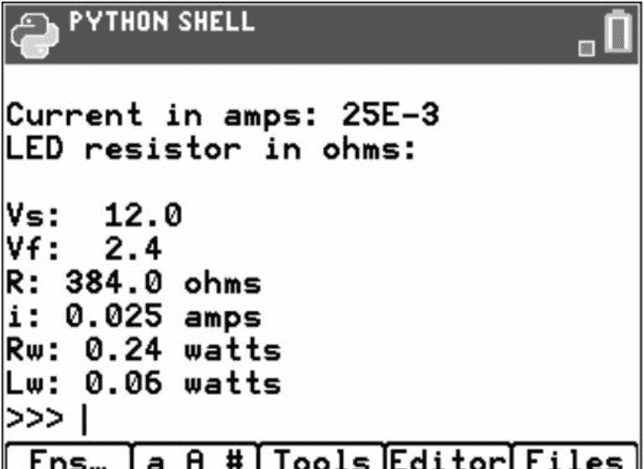

对于一个由12伏供电的电路，一个正向压降为2.4伏、通过电流为25毫安的LED，需要大约384欧姆的电阻器。

下一次运行，使用9伏电压源、LED正向压降为2.3伏、标准电阻值为270欧姆，得到的电流约为24.8毫安。

避免烧毁电路中的电阻器或LED非常重要。

电阻器有标称功率，只要实际功率Wres小于该值，它们就能正常工作。在我们的示例中，电阻器的功耗约为0.17瓦，因此标准的四分之一瓦（0.25瓦）电阻器应该可以正常工作。LED有标称最大电流，你也可以用这些结果来验证。

##### 欧姆定律

电学和电子学的主题充满了方程和公式，但迄今为止最重要的两个方程就是我们所说的“欧姆定律”。如果你只学会如何运用以下两个简单的方程，你所掌握的知识就足以让你在大多数认识的人眼中成为电子高手。

第一个方程指出，电压（电磁力）等于以安培为单位的电流（I）乘以以欧姆为单位的电阻（R）。第二个方程指出，功率（瓦特数）等于以安培为单位的电流乘以电压。

当已知任意两个值时，通过代数方法重新排列这两个方程来计算未知量是很容易的。这个程序会提示你输入这四个值中的任意两个，另外两个量将被计算出来，并且所有四个值都会被输出。

这个程序定义了一个名为`ohms_law()`的函数，打印一些供你查看的说明，然后停止。之后，你可以调用这个新函数，在已知任意两个值的情况下计算所有四个值。

你可以输入函数的名称，也可以通过工具菜单中的4:Vars选项选择它们。

例如，考虑一个由标准家用117伏电压供电的60瓦灯泡。为两个未知数（电流和电阻）输入零，函数将找到这些值。电流约为半安培，灯泡的电阻约为228欧姆。

```python
def ohms_law(p,i,e,r):
    if p and i:
        e=p/i
        r=p/(i*i)
    elif p and e:
        i=p/e
        r=(e*e)/p
    elif p and r:
        i=math.sqrt(p/r)
        e=math.sqrt(p*r)
    elif i and e:
        p=i*e
        r=e/i
    elif i and r:
        p=i*i*r
        e=i*r
    elif e and r:
        p=(e*e)/r
        i=e/r
    else:
        pass
    return ([p,i,e,r])
```

```python
print("\nohms_law(p,i,e,r)")
print("Pass two known values, and zeros")
print("for the other two unknowns.")
```

##### 并联

并联的电阻器可以用一个等效电阻器来替代，这是电路分析中常用的技术。同样的方程也适用于并联的阻抗，因此这个程序同样适用于电阻或复数阻抗。

等效电阻（或阻抗）使用以下公式计算：

下面是一个示意图，展示了多个电阻器如何并联连接：

该程序定义了一个名为`parallel()`的函数，并打印两行说明。请注意，一个值列表被传递给此函数，允许处理任意数量的并联电阻或阻抗。只需将两个或更多值添加到列表中，并将列表传递给此函数。示例展示了如何用方括号定义一个列表。

```python
def parallel(zlist):
    zp=sum(1/z for z in zlist)
    return 1/zp
```

```python
print("\nParallel (R or Z)")
print("parallel(list)")
```

第一个示例找到一个与三个并联电阻等效的电阻，第二个示例对一个包含两个复数阻抗的列表重复计算。

务必使用方括号将三个电阻值“包装”成一个列表，如图所示。此函数只期望一个参数，即列表，传递三个单独的数字会导致错误。

结果显示，300、400和500欧姆的电阻并联可以用一个约128欧姆的电阻替代。

下一个示例计算两个并联阻抗的等效阻抗，第一个为300+400j，第二个为500-600j。如图所示，等效阻抗约为453+138j。

```
>>> # Shell Reinitialized
>>> # Running PARALLEL
>>> from PARALLEL import *

Parallel (R or Z)
parallel(list)
>>> parallel([300+400j,500-600j])
(452.9411764705882+138.2352941176471j)
>>> |
```

##### RC定时

许多常见的定时电路基于R-C充电配置，其基本原理如下所示：

电容器C1的初始电压Vi与V1相同。这个初始电压V1通常为零，但也可以是任何电压。当输入电压切换到另一个电压V2时，电容器开始通过R1充电（或放电）。电压Vi需要时间才能上升（或下降）到V2，而这个充电时间的细节正是本程序的核心。

此计算中有六个变量：初始施加电压V1、新的施加电压V2、瞬时电压Vi、自施加电压改变以来的秒数S，以及决定瞬时电压变化率的电阻R和电容C的值。电阻越大，电容器充电越慢。两个输入电压之间的差值越大，电容器两端的电压变化就越快。依此类推。以下是关联所有这些参数的方程：

该程序定义了一个名为`rc_timing()`的函数，该函数通过代数方法分离此方程中的每个变量，以便在已知所有其他变量时求出其值。第二个函数名为`rc()`，其唯一目的是使结果的输入和显示更简单、更好。你可以使用任一函数获得相同的结果，但我建议使用`rc()`。

```python
from math import *

def rc_timing(v1,v2,vi,C,R,t):
    if not t:
        tmp=-log((v2-vi)/(v2-v1))
        t=tmp*R*C
    elif not R:
        tmp=-log((v2-vi)/(v2-v1))
        R=t/C/tmp
    elif not C:
        tmp=-log((v2-vi)/(v2-v1))
        C=t/R/tmp
    elif not vi:
        tmp=exp(-t/R/C)
        vi=v2-tmp*(v2-v1)
    elif not v2:
        tmp=exp(-t/R/C)
        v2=(tmp*v1-vi)/(tmp-1)
    elif not v1:
        tmp=exp(-t/R/C)
        v1=(vi+v2*(tmp-1))/tmp
    return [v1,v2,vi,C,R,t]

def rc(v1,v2,vi,C,R,t):
    v1,v2,vi,C,R,t=rc_timing(v1,v2,vi,C,R,t)
    print("v1: ",v1)
    print("v2: ",v2)
    print("vi: ",vi)
    print("C: ",C)
    print("R: ",R)
    print("t: ",t)

print("\nrc(v1,v2,vi,C,R,t)")
print("Pass 0 for the unknown")
```

当你运行此程序时，两个函数被定义，但不会采取进一步操作。然后你可以在shell中输入`rc()`函数，并传递所有六个参数。其中一个且仅一个参数应为零，其值将使用其他五个参数计算出来。

例如，从V1为0伏开始，然后施加V2为5伏，当电阻为47K欧姆，电容为6.8微法时，电压Vi上升到4伏需要多长时间？现在这里有个关键点；只有未知值（在这种情况下是经过的时间t）应输入为零。因此，请务必将起始电压V1设置为一个非常接近零的微小值。只要为V1输入一个非常小的值，答案就足够精确。所示示例使用V1 = 0.001伏。

总之，在这个示例中，我们发现当电容器为6.8微法时，在47K欧姆电阻两端施加5伏电压后，电容器的电压从0上升到4伏大约需要0.514秒。

##### 串联

串联的电阻器可以用一个计算为电阻之和的单个电阻器来替代。公式如下：

此公式也适用于串联连接的复数阻抗，示例代码展示了通过调用`series()`函数将一组电阻和一组阻抗转换为等效的单个值。

```python
def series(zlist):
    zs=sum(z for z in zlist)
    return zs

print("\nSeries (R or Z)")
print("series(list)\n")
```

该程序定义了`series()`函数，然后打印其使用提醒说明。在shell中，将一个电阻和/或阻抗的列表传递给`series()`函数。结果的总电阻或阻抗将作为结果输出。

例如，三个电阻器串联连接。它们分别是300、400和500欧姆。电路的总电阻是多少？

这表明你可以用一个1200欧姆的电阻来替换那三个电阻。

务必通过使用方括号将所有值包装成单个列表参数，向`series()`函数传递一个包含两个或更多值的列表。

示例中还展示了传递一个包含两个复数阻抗的列表。结果显示，300+400j与500-600j串联的阻抗，可以用一个800-200j的单一阻抗来替代。

##### ZROUND

在Python中，使用`round()`函数可以轻松地将浮点数四舍五入到n位小数。而复数，例如我们在本章多个程序中用于表示电气阻抗值的复数，则不那么容易四舍五入。查看并行程序中显示的结果，你会看到计算出的复数值在计算器显示屏上延伸得很长，需要进行心算舍入才能变得实用。

这里介绍的`zround`函数会对复数的每个部分进行四舍五入，并返回更简洁的结果。如果你经常处理复数，你会发现这个函数很有用。

```
def zround(z,n):
    r=round(z.real,n)
    i=round(z.imag,n)
    return r+i*1j
```

```
print()
z=(300+400j)**(1/3)
print(z)
zr=zround(z,3)
print(zr)
```

示例代码首先计算复数300+400j的立方根并打印结果。如你所见，结果有很多小数位，从电气工程的角度来看可能不太实用。然后将结果四舍五入到3位小数，打印出的复数在实际应用中就更易于处理了。

```
>>> # Shell Reinitialized
>>> # Running ZROUND
>>> from ZROUND import *
(7.560856467169438+2.414436161426864j)
(7.561+2.414j)
>>> |
```

#### 3. 游戏与概率

本章让你探索一些引人入胜的统计学和概率挑战，并玩一些刺激的游戏。

你听说过蒙提霍尔谜题吗？这个谜题曾难倒过世界上一些最聪明的人，但用Python程序来测试正确答案却很容易。务必仔细研究那个程序。

本章的其他程序包括发牌、抛硬币数百万次、用飞镖和针计算圆周率的值，以及打乱单词看看你能发现什么。

DIGITS程序特别有趣，而且对大脑也有益。从较简单的技能级别开始，逐步提升。更高的技能级别绝对是个挑战！

##### DECKCRDS

这个程序创建一副标准扑克牌，洗牌，然后发出你想要数量的牌。这副牌由52张牌加上任意数量的王牌组成。

这个程序的核心是两个你可能想在创建更复杂的纸牌游戏中使用的函数。调用`deck()`创建一副洗好的牌，并将这副牌（一个Python列表）传递给`card()`来发牌，且不会重复。

在这个示例中，创建了一副包含两张王牌的牌并洗牌，然后发了七张牌。

从`random`模块导入的`randrange()`函数在每次程序运行时都会创建一副不同的牌。

```
from random import *
```

```
def deck(j):
    d=list(range(52+j))
    for i in range(52+j):
        k=randrange(52+j)
        d[i],d[k]=d[k],d[i]
    return d
```

```
def card(d,n):
    c=d[n]
    if c>51:
        return "Joker"
    suit=["Hearts","Clubs","Spades","Diamonds"]
    face=["Ace","2","3","4","5","6","7","8",
          "9","10","Jack","Queen","King"]
    return face[c%13]+" of "+suit[c//13]
```

```
j=int(input("\nHow many jokers: "))
d=deck(j)
```

```
n=int(input("Deal how many cards: "))
print("")
if n>len(d):
    msg="Deck has only {} cards"
    print(msg.format(len(d)))
else:
    for i in range(n):
        print(card(d,i))
```

##### DICE

这个程序掷出一把六面骰子，显示每个骰子上的数字、它们的总和以及平均值。

在这个示例中，掷了五个骰子，显示的点数分别为3、6、1、2和4。骰子的总和是16，平均值是3.2。

来自`random`模块的`randint(1,6)`函数提供了这个程序的核心功能。许多Python函数处理参数时，会处理到但不包括传入的第二个值。`randint()`函数的不同之处在于其参数是包含两端的。在这种情况下，从1到6的所有整数值被随机返回的可能性是相等的。

一个有趣的挑战是修改这个程序，使其能为《龙与地下城》投掷一套标准骰子。你需要一个4面、6面、8面、10面、12面和20面的骰子各一个。

```
from random import *

n=int(input("\nHow many dice: "))
s=""
t=0
for i in range(n):
    d=randint(1,6)
    t+=d
    s+=str(d)+" "
print(s)
print("Sum: {} Avg: {}".format(t,t/n))
```

##### DIGITS

Digits是一个具有挑战性的游戏，它可能很有趣，也可能让你抓狂！当你提升等级时，它绝对会挑战你的脑细胞。第1级简单得离谱，但据我所知，目前还没有人能解开第9级的游戏。也许你会是第一个！

规则相当简单。数字1到9随机排列在一个3x3的网格中，其中几个数字缺失。你需要找出缺失的数字是什么。游戏边缘周围是提示数字。它们位于每行和每列的两端，是通过对给定行或列中的数字按朝向每个提示的顺序进行秘密加法或减法得出的结果。

当你认为你已经正确地找出了所有数字时，按[clear]查看答案。缺失的数字将显示出来以供验证。再次按[clear]退出返回到shell。

从技能级别1开始。这将创建一个非常简单的游戏，帮助你理解游戏的玩法。我们开始吧：

输入1选择最简单的级别。以下是显示的示例：

注意中间区域包含了1到9的所有数字，除了数字9。很明显，虚线位置就是9应该放的地方。这绝对是初学者级别！现在看那一列的顶部。该列中的数字4、6和9，可以通过加法和减法得到结果1。4加6再减去9得到1。第一行右端的18可以计算为9 + 7 + 2。你的挑战是通过随机使用加号或减号来找到每个数字的位置，使得每行和每列两端的答案都能正确工作。这是第一个游戏的答案显示。

好的，那很简单。现在把级别设置成5左右...

这才是我想说的！看中间那一列，顶部和底部都是14。这是开始寻找解决方案的好地方，因为把9放在中心位置是让这一列成立的唯一方法。你需要多长时间才能找到其余数字必须放置的位置？

如果你卡住了，按[clear]查看9个数字的解决方案排列，如下所示

我建议创建一个第9级的游戏，把显示的谜题写在纸上，然后在一天中不时地研究它。这是一种很好的方式，就像玩数独一样，以有趣的方式保持你的脑细胞灵活和锻炼。你能比你的朋友更快地找到解决方案吗？

```
from random import *
from ti_system import *
import ti_matplotlib as plt

def rsign():
    return randint(0,1) * 2 - 1

def add_sub(a,b,c):
    return a + rsign() * b + rsign() * c

def hide(s,w):
    if int(s[8])>9-w:
        s=s[:8]+"-"+s[9:]
    if int(s[12])>9-w:
        s=s[:12]+"-"+s[13:]
    if int(s[16])>9-w:
        s=s[:16]+"-"+s[17:]
    return s
```

###### 获取所需挑战
print("\n\nDIGITS - 一个加减游戏\n")
print("将数字1到9放入")
print("中心。沿每行/列进行加减运算")
print("以匹配结果。")
print("\n输入等级1到9...")
print("1 初学者")
print("9 超级巫师")
w=int(input("? "))

###### 创建并打乱数字
dg=[1,2,3,4,5,6,7,8,9]
for i in range(9):
    j=randint(0,8)
    dg[i],dg[j]=dg[j],dg[i]

###### 创建12个边缘值
ans = []
ans.append(add_sub(dg[6],dg[3],dg[0]))
ans.append(add_sub(dg[7],dg[4],dg[1]))
ans.append(add_sub(dg[8],dg[5],dg[2]))
ans.append(add_sub(dg[0],dg[1],dg[2]))
ans.append(add_sub(dg[3],dg[4],dg[5]))
ans.append(add_sub(dg[6],dg[7],dg[8]))
ans.append(add_sub(dg[2],dg[5],dg[8]))
ans.append(add_sub(dg[1],dg[4],dg[7]))
ans.append(add_sub(dg[0],dg[3],dg[6]))
ans.append(add_sub(dg[8],dg[7],dg[6]))
ans.append(add_sub(dg[5],dg[4],dg[3]))
ans.append(add_sub(dg[2],dg[1],dg[0]))

###### 显示字符串
s=[""]*12

###### 两种状态
state=0
while True:
    plt.cls()
    if state==2:
        break

###### 行格式
f1="  {:3d} {:3d} {:3d}  "
f2="{:3d} {:3d} {:3d} {:3d} {:3d}"

###### 顶行
s1=f1.format(ans[0],ans[1],ans[2])

###### 三个中间行
s2=f2.format(ans[11],dg[0],dg[1],dg[2],ans[3])
s3=f2.format(ans[10],dg[3],dg[4],dg[5],ans[4])
s4=f2.format(ans[9],dg[6],dg[7],dg[8],ans[5])

###### 隐藏挑战数字
if state==0:
    s2=hide(s2,w)
    s3=hide(s3,w)
    s4=hide(s4,w)

###### 底行
s5=f1.format(ans[8],ans[7],ans[6])

###### 显示字符串
plt.text_at(3,s1,"center")
plt.text_at(5,s2,"center")
plt.text_at(6,s3,"center")
plt.text_at(7,s4,"center")
plt.text_at(9,s5,"center")

###### 等待用户
if state==0:
    plt.text_at(12,"按 [clear] 查看答案","center")
else:
    plt.text_at(12,"按 [clear] 退出","center")
plt.show_plot()
state+=1

##### FACTCBPM

这个程序创建了三个在统计和概率挑战中非常有用的函数。`fact()` 函数返回一个整数的阶乘，`perm()` 计算从 n 个物品中取 r 个的排列数，而 `comb()` 返回从 n 个物品中取 r 个的组合数。

对于这个程序，我决定直接在代码中输入 n 和 r 的值，而不是使用 `input()` 提示输入数字。要尝试其他值，请进入编辑器模式并更改设置 n 和 r 的行。在接下来的示例中，这些值被设置为 52 和 5。我使用 52 是因为它是标准扑克牌中的牌数。

编程实现阶乘函数有不止一种方法。许多资料展示了如何使用递归，这是一种高效且紧凑的概念，对许多其他编程任务都很有用。我选择使用一个循环将从 1 到 n 的所有数字相乘，因为这样速度快，并且不会像递归那样消耗大量内存。

`fact()` 函数展示了 Python 中的整数大小不受限制，除了机器内存或速度考虑固有的限制。该示例计算了 70 的阶乘，返回了一个真正巨大的数值结果，这是大多数其他计算器和其他编程语言无法做到的。Python 太棒了！

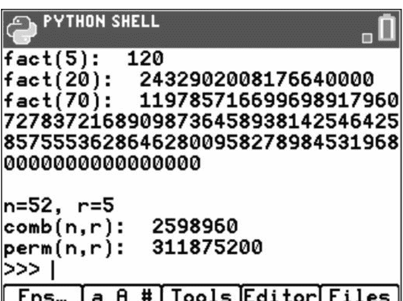

```
def fact(n):
    if n<0:
        return 0
    if n<2:
        return 1
    fact=1
    for i in range(n):
        fact*=(i+1)
    return fact

def perm(n,r):
    return fact(n)//fact(n-r)

def comb(n,r):
    return perm(n,r)//fact(r)

print("fact(5): ",fact(5))
print("fact(20): ",fact(20))
print("fact(70): ",fact(70))
print()

n,r=52,5
print("n={}, r={}".format(n,r))
print("comb(n,r): ",comb(n,r))
print("perm(n,r): ",perm(n,r))
```

##### HEADSROW

平均而言，你需要抛多少次硬币才能连续得到七个正面？这可以用一个明确的数学公式来解决，如本程序最后一行所示，但让计算器模拟大量连续抛掷以获得近似答案要有趣得多。你做的试验越多，或者抛硬币的次数越多，答案就越准确（当然是在平均意义上）。这是一个很好的蒙特卡洛模拟例子，可以在计算机中运行大量随机试验，从而越来越接近准确的现实世界答案。

在这种情况下，数学预测表明，平均需要连续抛掷 254 次硬币才能连续得到七个正面。有时少一些，有时多一些，但平均下来是 254 次。

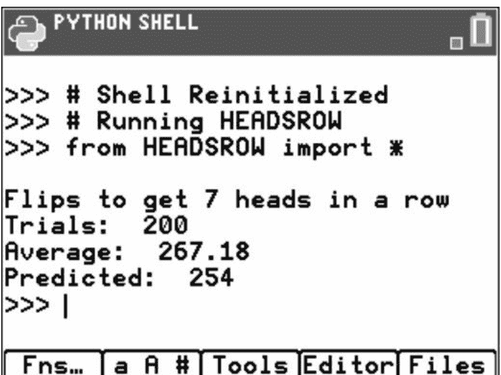

该程序使用 `random` 模块生成随机的硬币抛掷，每次出现正面时计数增加，出现反面时重置计数，并在最终连续出现七个正面时停止每次试验。

如图所示，在 200 次试验后，平均需要 267.18 次抛掷才能连续得到七个正面。多次运行此程序，可以看到这个平均值向 254 附近的值偏移。

请随意通过更改试验次数或目标连续正面数进行实验。但要小心，因为如果使用较大的数字，程序可能需要很长时间才能运行。

```
from random import *

goal=7
trials=200
tally=0

def flips():
    n=0
    inarow=0
    while 1:
        n+=1
        if randint(0,1):
            inarow+=1
        else:
            inarow=0
        if inarow==goal:
            return n

for i in range(trials):
    tally+=flips()

print("\nFlips to get",goal,"heads in a row")
print("Trials: ",trials)
print("Average: ",tally/trials)
print("Predicted: ",2**(goal+1)-2)
```

##### HUNT_DIR

与 HUNT_DIS（见下一个程序）相比，这个游戏完全相同，只是又不同（这是我最喜欢的名言之一）。你的目标是在一个 100 x 100 的网格中找到随机分配的目标坐标。每次猜测，你都会收到类似地图的方向指引，例如“向东南移动”或“向正西移动”。目标是尽可能用最少的移动次数找到目标。

以下是游戏的示例运行。在这个例子中，我取消了 `print(x,y)` 行的注释，这样你就可以看到目标位于 52,63。坐标以左下角为原点，即 x,y 点为 (0,0)。

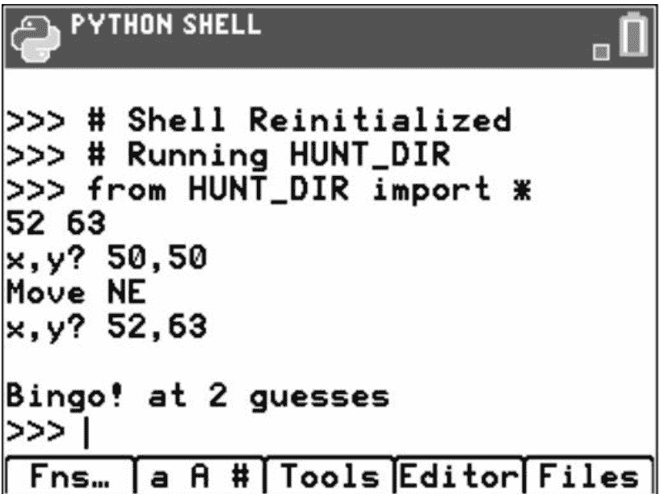

```
from random import *

x=randrange(100)
y=randrange(100)
###### print(x,y)

n=0
while 1:
    n+=1
    g=input("x,y? ").split(",")
    a=int(g[0])
    b=int(g[1])
    d=""
    if b<y:d+="N"
    if b>y:d+="S"
    if a<x:d+="E"
    if a>x:d+="W"
    if d=="":break
    print("Move",d)
print("\nBingo! at {} guesses".format(n))
```

##### HUNT_DIS

这个程序是一个挑战你视觉空间技能以及数字和分析思维过程的游戏。而且，它很有趣！

在一个 100 x 100 的网格中某处，有一个生物/目标/终点等着你去寻找。你输入一对坐标，然后计算并显示到隐藏点的直线距离。目标是尽可能用最少的猜测次数找到生物/目标/终点。

你可能想拿一张方格纸，以你的猜测点为中心画圆。这应该能让你在几次猜测内就找到目标，只要你在享受乐趣并学习勾股定理和其他解析几何技能，这就不算作弊。或者，像我一样，你可以凭直觉猜测，试图在每次猜测中缩短距离，并在距离变远时改变方向。那也很有趣。

以下是游戏的简短示例运行（通常可能需要超过 2 次猜测），但它展示了工作原理：

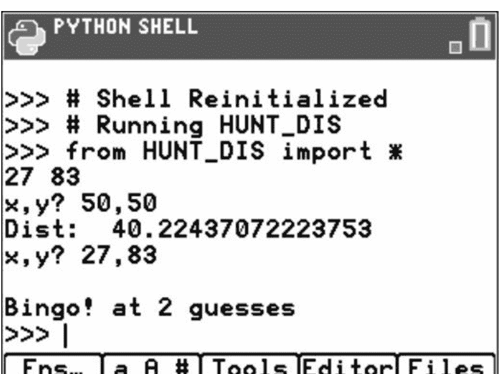

注意源代码中有一行被注释掉的代码，它会打印目标的 x 和 y 值。请随意取消此行的注释以使游戏更容易。（我在所示的示例运行中就是这样做的。）你会看到生物/目标/终点的坐标，并且可以尝试猜测，看看每次猜测的距离是如何计算的。

```
from random import *

x=randrange(100)
y=randrange(100)
###### print(x,y)

n=0
while 1:
    n+=1
    g=input("x,y? ").split(",")
    a=int(g[0])
    b=int(g[1])
    d=((x-a)**2+(y-b)**2)**.5
    if d==0:break
    print("Dist: ",d)
print("\nBingo! at {} guesses".format(n))
```

##### 字母重组

这个程序会要求输入一个单词或短语，然后根据你的需要，随机打乱字母顺序多次。这对于各种字谜游戏或字母重组挑战非常方便。

例如，我输入了我的全名，总共九个字母，并要求输出4次随机重组：

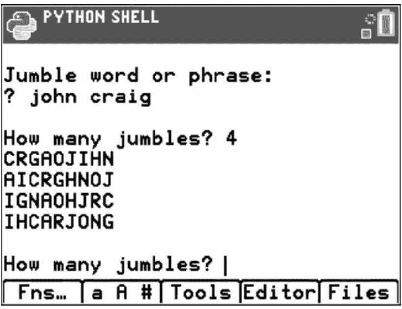

我已经开始看到一些短词在眼前浮现，比如 OH、AIR、CAR、GAR 等等。我继续要求更多重组，当我盯着结果看时，一些更大的词开始出现在脑海中，比如 CHAGRIN、CIGAR、JARGON、JOIN 和 GAIN。

你可以随心所欲地打乱任意多次，当你直接按确定而不输入次数时，程序就会结束。

```python
from random import *
print("\nJumble word or phrase:")
s=input("? ")
s=list(s.replace(" ","").upper())
m=len(s)
while 1:
    try:
        n=int(input("\nHow many jumbles? "))
    except:
        break
    while n:
        n-=1
        for i in range(m):
            j=randrange(m)
            s[i],s[j]=s[j],s[i]
        t=""
        for i in range(m):
            t+=s[i]
        print(t)
```

##### 迷宫

这个程序使用 `ti_matplotlib` 模块在你的计算器上绘制一个随机迷宫。每次运行程序，都会画出一个不同的迷宫，所以每次都是新的挑战。随机模块提供了随机性。

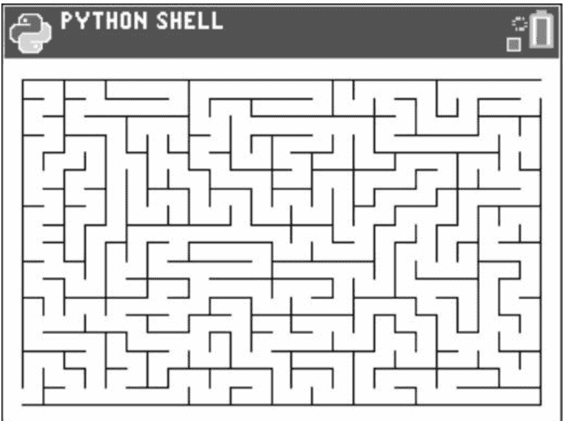

目标是找到从左下角入口到右上角出口的唯一路径。而且，沿着边缘走捷径是不公平的。你必须进入迷宫！

创造迷宫的艺术和科学非常有趣。如果你对这个主题感兴趣，可以上网查阅。或者，你也可以通过运行这个程序来获得一些乐趣，看看你能在多快的时间内从一个角落导航到另一个角落，以帮助保持你的脑细胞处于良好状态。

```python
from random import *
import ti_matplotlib as plt

def vline(x,y,w):
    if w:
        x1=x*w1+10
        y1=y*w1+10
        plt.line(x1,y1,x1,y1+w1,"")

def hline(x,y,w):
    if w:
        x1=x*w1+10
        y1=y*w1+10
        plt.line(x1,y1,x1+w1,y1,"")

def cell(x,y):
    z=a[x+y*w]
    hline(x,y,z&1)
    vline(x+1,y,z&2)
    hline(x,y+1,z&4)
    vline(x,y,z&8)

def disp():
    plt.cls()
    for x in range(w):
        for y in range(h):
            cell(x,y)

def nor(u):
    v=u-w
    if v>0:
        if a[v]==15:
            a[u]&=14
            a[v]&=11
            return v
    return u

def eas(u):
    v=u+1
    if v%w:
        if a[v]==15:
            a[u]&=13
            a[v]&=7
            return v
    return u

def sou(u):
    v=u+w
    if v<n:
        if a[v]==15:
            a[u]&=11
            a[v]&=14
            return v
    return u

def wes(u):
    v=u-1
    if u%w:
        if a[v]==15:
            a[u]&=7
            a[v]&=13
            return v
    return u

def move(u):
    for i in range(c):
        d=randrange(4)
        if d==0:
            u=nor(u)
        if d==1:
            u=eas(u)
        if d==2:
            u=sou(u)
        if d==3:
            u=wes(u)

###### Initialize
w=25
h=18
n=w*h
c=n/4
wl=12
a=[15 for x in range(n)]
t=[x for x in range(n)]
a[0]=7
plt.cls()
plt.window(0,320,0,240)
plt.text_at(6,"-thinking-","center")

while 1:

    # Shuffle the indexes
    for i in range(n):
        j=randrange(n)
        t[i],t[j]=t[j],t[i]

    # Check each cell in index order
    done=True
    for i in range(n):
        u=t[i]
        if a[u]==15:
            done=False
        else:
            move(u)

    # Done if all cells connected
    if done:
        break

###### Done
a[n-1]&=13
disp()
plt.show_plot()
```

##### 记忆力

这个游戏挑战你的短期记忆能力。如果你玩得足够多，它可能对你的长期记忆也有帮助。别忘了这一点！或者如果你忘了，也许你应该更经常地玩这个游戏。抱歉，我有时会得意忘形。

总之，它的运作方式是：显示一个短数字，直到你准备好继续。按 [enter] 键，数字就会消失。系统会提示你凭记忆输入这个数字，如果正确，你将得到一个更长的数字。如果你输入错误，下一个猜测的数字会变短。经过十次数字挑战后，你的总分就会显示出来，分数是根据所有数字的总长度计算的。

以下是游戏进行中的一个示例。请注意，在回忆并输入你刚刚看到的数字之前，你需要按 [enter] 键清除屏幕。

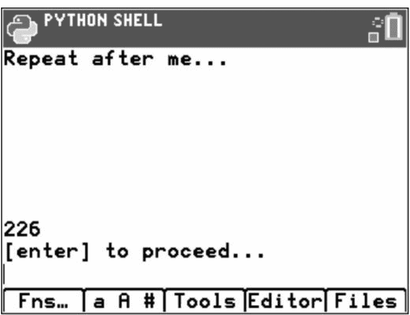

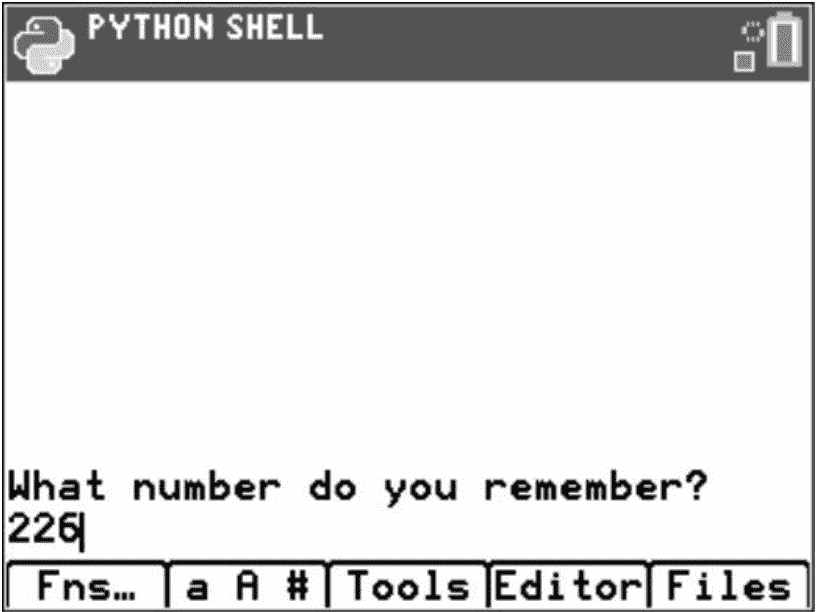

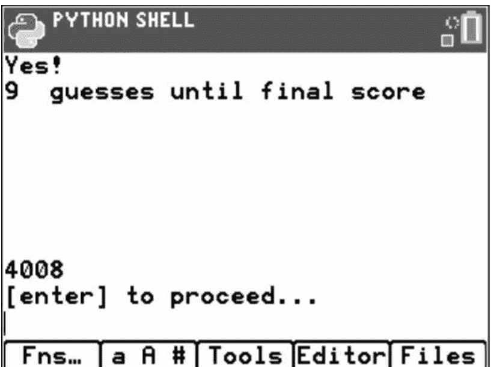

```python
from random import *
from ti_system import *

def digs(n):
    x=randint(1,9)
    for i in range(n-1):
        x=x*10+randrange(10)
    return x

def blank_lines(n):
    for i in range(n):
        print(' ')

n=0
s=3
t=0
blank_lines(3)
print("Repeat after me...")
blank_lines(6)
for i in range(10):
    n+=1
    t+=s
    x=digs(s)
    print(' ')
    print(x)
    print("[enter] to proceed...")
    while wait_key() != 5:
        pass
    blank_lines(18)
    print("What number do you remember?")
    try:
        g=int(input())
    except:
        g=0
        break
    if g==x:
        print("Yes!")
        s+=1
    else:
        print("Sorry")
        s-=1
    msg=" guesses until final score"
    print(str(10-n),msg)
    blank_lines(5)

if g:
    print("\n\nFinal Score: ",t)
```

##### 蒙提霍尔问题

你听说过著名的蒙提霍尔谜题吗？它是个难题，最初讨论时让一些顶尖学者都感到困惑。

那么，蒙提向你展示三扇门，并说明其中一扇门后有一辆汽车。你选择一扇门。在打开你的门看你是否中奖之前，蒙提打开了另外两扇门中的一扇，那扇门后什么都没有。然后他问你是否想在揭晓前换成最后一扇门。你应该换吗？这会有区别吗？

许多人说，既然还剩两扇未打开的门，汽车在任意一扇门后的概率都是五五开。所以在蒙提打开你的门之前换不换都无所谓。但事实证明这是错误的！

这个程序执行蒙特卡洛模拟（这个“蒙特”与另一个“蒙提”无关，也与“Full Monty”无关，那是另一个故事）。程序模拟你被蒙提问1000次是否想换门，并统计如果你换门和不换门时赢得汽车的次数。

如果你换门，你赢的概率是三分之二；如果你不换门，你的赢面是三分之一。总之，换门吧！

如果这个结果让你困惑，可以在网上查阅“蒙提霍尔问题”，或者观看一些涵盖这个主题的YouTube视频。同时，用你的TI-84 Plus CE Python计算器模拟一堆胜利，玩得开心吧！

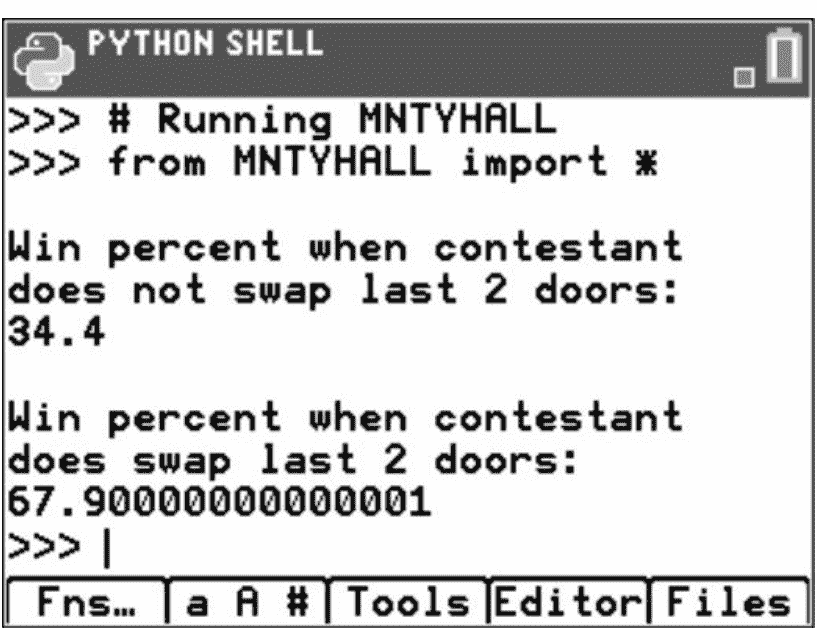

```python
from random import *

games=1000

for n in range(2):
    if n:
        switch=True
    else:
        switch=False
    wins=0
    for i in range(games):
        doors=[False,False,False]
        doors[randrange(3)]=True
        choice1=randrange(3)
        monty_opens=randrange(3)
        while monty_opens==choice1:
            monty_opens=randrange(3)
        if switch==False:
            if doors[choice1]==True:
                wins+=1
        else:
            if doors[choice1]==False:
                wins+=1
    if switch:
        s="does"
    else:
        s="does not"
    print("\nWin percent when contestant")
    print("{} swap last 2 doors:".format(s))
    print(round(100*wins/games,2))
```

##### 布丰投针

圆周率π的值可以通过多种方式计算，包括用随机数模拟现实世界的随机性。早在18世纪，远在第一台德州仪器计算器问世之前，一位名叫乔治-路易·勒克莱尔·德·布丰的人就提出了一个很酷的方法。他建议将针随机投掷到画有固定间距平行线的地板上，并计算静止时针与某条线相交的次数与总投掷次数之比。

互联网上有很多地方可以让你了解这个过程涉及的所有数学原理，最终都能估算出π的值。这确实很巧妙。用你的TI-84 Plus CE Python计算器，你可以在几秒钟内模拟投掷数千根针，这是一个很好的功能，因为这种方法要精确收敛到π的值确实很慢。如果你用真针，你得非常有耐心！

程序会询问你想投掷多少根针。尝试1,000根或10,000根针以获得合理的运行时间。如果你能让计算器放在架子上长时间运行，可以尝试更多；如果你只想看一些π的粗略估计，可以尝试更少。以下是选择1,000根针的结果：

##### PI_DARTS

一个类似的使用随机数计算圆周率的程序是 PI_DARTS。

想象一个特殊的飞镖盘，它是一个正方形，里面有一个刚好触及正方形边缘的圆。

如果你完全随机地向这个飞镖盘投掷飞镖，使得每一平方英寸被击中的机会都与其他任何一平方英寸相同，那么圆内命中次数与总投掷次数的比率可以提供圆周率值的估计。这很容易理解，因为该比率取决于圆和正方形的面积，而圆的面积是使用圆周率值计算的。

## $Area = \pi * r^2$

为了简化程序，我们可以只使用上图的右上角部分，即整个圆和正方形的总面积。这简化了数学计算，允许高效生成 0 到 1 之间的随机数，并且也更容易检查左下角圆心的距离。

这个程序是蒙特卡洛模拟的另一个例子，其中大量的随机试验提供了一个值的估计。程序会无限循环，或者直到你按下 [2nd] [quit]，以先发生者为准。每统计 1000 支飞镖后，显示会更新圆周率的估计值。

就像布丰投针实验一样，这不是计算或估计圆周率值的非常高效的方法，它只是具有启发性，并且看看它是如何工作的很有趣。

```python
from random import *
import ti_matplotlib as plt

def red(): plt.color(255, 0, 0)
def green(): plt.color(0, 99, 0)
def blue(): plt.color(0, 0, 255)
def black(): plt.color(0, 0, 0)
def white(): plt.color(255,255,255)

plt.cls()
plt.window(-.4, 1.4, -.1, 1.05)
hits=0
darts=0
while True:
    x=random()
    y=random()
    darts+=1
    if x*x+y*y<1:
        hits+=1
        red()
    else:
        blue()
        plt.plot(x,y,".")
    if darts%1000==0:
        white()
        p=round(4*hits/darts,6)
        s="Darts: {} Pi: {}".format(darts,p)
        black()
        plt.text_at(12,s,"center")
```

请注意，程序中定义了几个单行函数来设置用于指示命中、未命中和其他细节的各种颜色。这是使你自己的图形程序更易于阅读和维护的好方法。

##### RNDBYTE

`random` 模块提供了几种类型的伪随机数。这个程序调用 `getrandbits(8)` 函数来生成包含 8 位的随机整数。换句话说，以这种方式调用此函数会返回随机字节。

这个简短的程序只是将所有随机字节相加，然后除以字节数。平均值应该大约是 127.5。你可能一开始会认为平均值应该是 128，因为一个字节可以在 8 位中容纳 256 个唯一值。这是正确的，但这些值从没有位被设置时的 0，一直到所有位都被设置为 1 时的 255。这些值的平均值是 127.5。

从 10,000 个字节计算出的实际平均值不会正好是 127.5，但如果你多次运行这个程序，你应该会看到平均值大致平均到 127.5 左右。或多或少。

```python
from random import *
n=10000
x=0
print("working...")
for i in range(n):
    x+=getrandbits(8)
print(n,x/n)
```

##### WORDPERM

这个程序处理一个长度最多为 5 个字符的单词中的字母，并显示所有可能的排列，即不重复的重新排列。例如，我的名字 JOHN 可以排列成 24 种不同的排列。

我的姓氏 CRAIG 有五个字符，其字母的排列结果是 120 个唯一的序列。如你所见，随着单词长度的增加，排列数量迅速增加。对于 N 个字符，排列数量是 N!（阶乘）。一个六个字符的单词将有 720 种组合，所以我将程序限制为仅处理五个字符的单词。如果你愿意，可以更改代码以允许超过 5 个字符，但要准备好处理大量输出！

以下是 "craig" 输出屏幕序列的开始部分。

```python
from ti_system import *

def perm(s):
    if len(s)==1:
        return [s]
    b=[]
    for i in range(len(s)):
        m=s[i]
        c=s[:i]+s[i+1:]
        for j in perm(c):
            b.append(m+j)
    return b

while 1:
    s=input("\nWord? ")
    if s=="":
        break
    if len(s)>5:
        print("5 chars max\n")
    else:
        p=perm(s.upper())
        u=""
        r=0
        for t in p:
            u+=t+" "
            if len(u)>25:
                if r%8==0:
                    if r:
                        print("\n[clear] to continue")
                        disp_wait()
                        disp_clr()
                print(u)
                u=""
                r+=1
        print(u)
```

该程序会循环询问下一个单词，次数随你所愿，直到你在提示符下直接按 [enter] 键。

请注意，这个循环使用的是 "while 1:" 而不是 "while True:"。两者工作方式相同，但在代码清单中，数字 1 比值 True 更短。Python 会测试你放在 "while" 之后的任何内容的 "真值"，数字 1 通过了这个测试。然而，为了可读性，我建议在大多数情况下使用值 True 可能是更好的选择。

#### 4. GPS 和导航

经纬度非常有趣，尤其是现在拥有智能手机的人比例很高，这些手机带有 GPS 芯片，可以随时告诉他们确切的位置。此外，Google（和其他）地图提供了一种很好的方式来确定你放大到的地球上任何点的位置。

本章让你使用地球表面上的此类坐标来计算距离、方向，甚至是由三个或更多坐标定义的陆地面积。

这些计算不像在 x,y 平面中使用笛卡尔坐标给出的距离、方向和面积那么简单。这是因为地球是一个球体，导致经线在靠近北极或南极时被“挤压在一起”。但你的 TI-84 Plus CE Python 计算器非常有能力完成所有数学计算来完成这项工作。Python 使其变得容易。

##### GPS_AREA

在地球表面上，给定区域角上的几个经纬度坐标来查找面积，比你最初想象的要复杂。这个程序极大地简化了这个过程。

第一个复杂情况出现在查找任何两个 GPS 坐标之间的距离时。经线之间的距离，即一个点相对于另一个点向东或向西的距离，取决于纬度。这在程序 GPS_DIST 中有更详细的解释。

该程序围绕多边形“行走”，将列表中的第一个坐标依次与多边形边缘周围的坐标连接起来，形成小三角形。这些三角形面积的总和就是由坐标列表定义的整个图形的面积。这里我们将使用任何两个坐标之间的距离和方向角来计算多边形中各个三角形区域的面积。

本书其他地方的三角形程序演示了如何在平面中找到三角形的所有部分，包括其面积，给定其任意三条边和角的组合。边角边函数借用了该程序来查找小三角形的面积。

真正酷的是，即使坐标定义的多边形形状有凹陷，程序也能自动正确地加减面积。这是因为在“行走”过程中，所选点对与第一个点之间的角度通常是正的。但对于凹陷处，一个或多个角度是负的，然后小三角形的面积就被计算为负值。这一切都解决了，重叠的区域会自动正确地加减，从而得到准确的总面积。

首先，让我们看一个相当简单的例子。弗吉尼亚州阿灵顿的五角大楼有五个边，其角上有五个 GPS 坐标。Google 地图让我们可以找到地图上任何点的经纬度（放大并右键单击一个点，然后从弹出菜单中选择“这是哪里？”）。以下是我找到的角坐标，采用标准纬度，经度表示法：

38.868868, -77.055655

38.870619, -77.053325

38.872875, -77.054717

38.872532, -77.057948

38.870039, -77.058504

程序首先计算三角形0,1,2的面积，其中点0是列表中的第一个坐标：

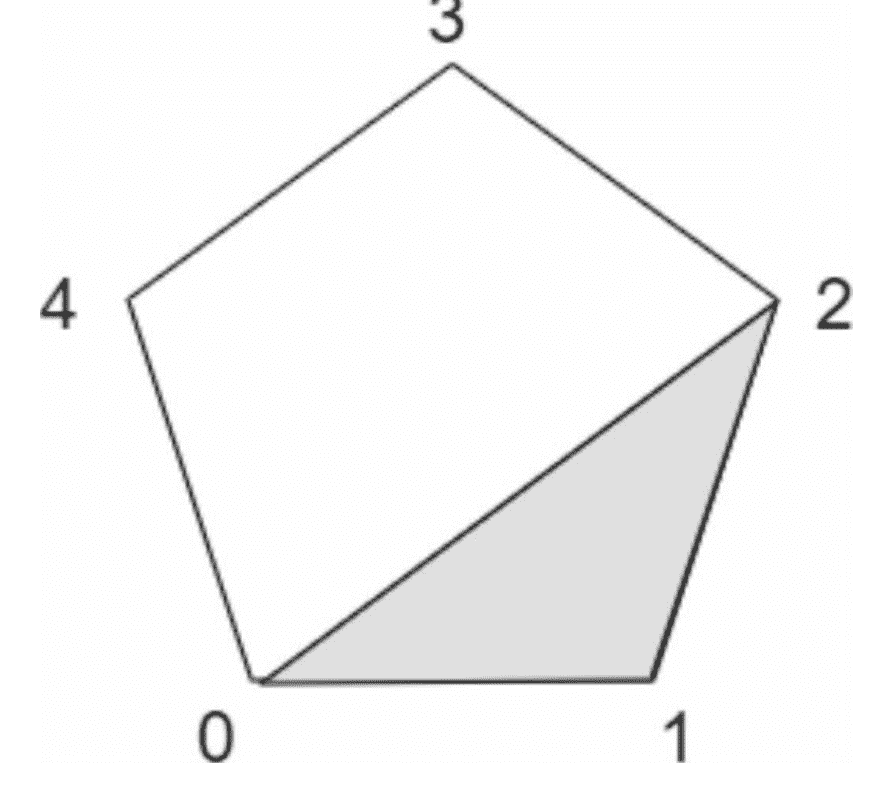

五边形的“环绕”计算接下来找到三角形0,2,3的面积，如下所示：

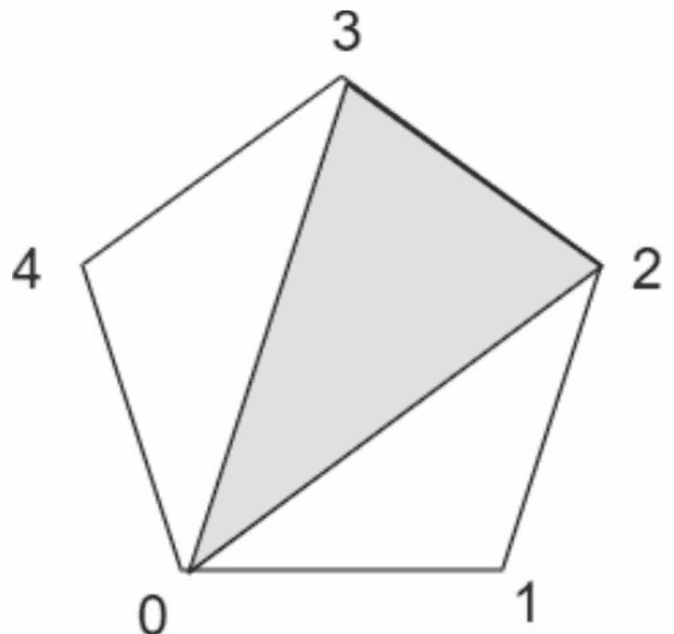

最后，计算三角形0,3,4的面积并将其与其他面积相加，以求得五边形的总面积：

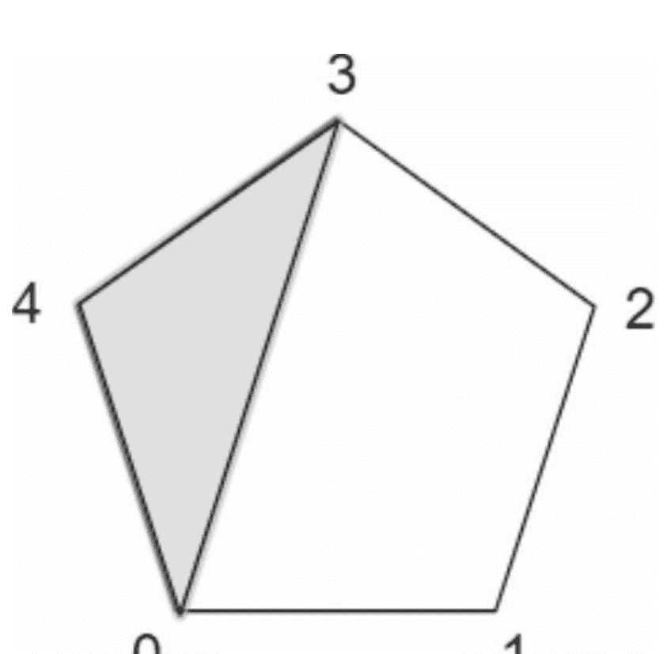

程序的设置方式是，你在`gps_points()`函数中编辑`pts`列表来定义所讨论的区域。你可以重写这段代码，以便在运行时提示输入纬度和经度数字对，但我更喜欢直接编辑它们，尤其是在处理较长的坐标列表时。这样更容易检查、修改，然后重新运行程序。如程序清单所示，我已将五边形的坐标编辑到了`gps_points()`函数中。

运行程序，结果约为0.135平方公里，或0.0522平方英里。快速换算显示这大约是33英亩。我在网上查了一下，找到了几个关于五边形大小的估计值，都与这个值相当接近。

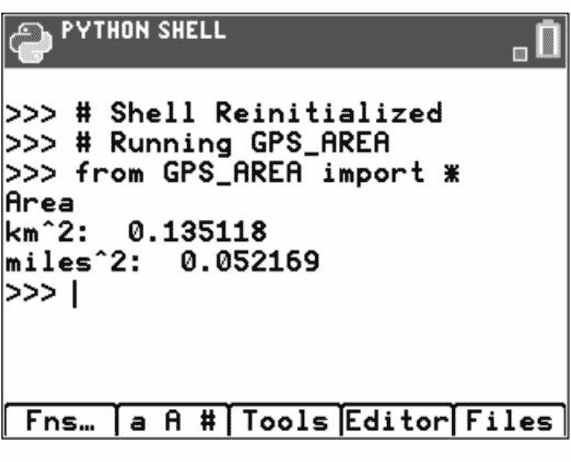

```python
from math import *
```

```python
###### Pentagon
def gps_points():
    pts=[]
    pts.append([38.868868, -77.055655]) #0
    pts.append([38.870619, -77.053325]) #1
    pts.append([38.872875, -77.054717]) #2
    pts.append([38.872532, -77.057948]) #3
    pts.append([38.870039, -77.058504]) #4
    return pts
```

```python
###### Turquoise Lake
#def gps_points():
###### pts=[]
###### pts.append([39.249968, -106.370986]) #0
###### pts.append([39.273513, -106.348860]) #1
###### pts.append([39.277695, -106.438465]) #2
###### pts.append([39.264220, -106.373614]) #3
###### return pts
```

```python
def area_gps(pts):
    area=0
    if len(pts)>2:
        n=2
        while n<len(pts):
            x0,y0=pts[0]
            x1,y1=pts[n-1]
            x2,y2=pts[n]
            b1,a=nav(x0,y0,x1,y1)
            b2,b=nav(x0,y0,x2,y2)
            b1=b1 if b1>0 else b1+360
            b2=b2 if b2>0 else b2+360
            C=b1-b2
            area+=area_sas(b,C,a)
            n+=1
    return area
```

```python
def nav(la1,lo1,la2,lo2):
    la1=radians(la1)
    lo1=radians(lo1)
    la2=radians(la2)
    lo2=radians(lo2)
    r=6371
    t1=sin(la1)*sin(la2)
    t2=cos(la1)*cos(la2)*cos(lo2-lo1)
    km=acos(t1+t2)*r
    y=sin(lo2-lo1)*cos(la2)
    t1=cos(la1)*sin(la2)
    t2=sin(la1)*cos(la2)*cos(lo2-lo1)
    x=t1-t2
    b=degrees(atan2(y,x))
    return [b,km]
```

```python
def area_sas(a,C,b):
    return a*b*sin(radians(C))/2
```

```python
pts=gps_points()
kmsq=round(area_gps(pts),6)
print("Area")
print("km^2: ",kmsq)
misq=round(kmsq*.386102,6)
print("miles^2: ",misq)
```

第二个示例粗略计算了科罗拉多州莱德维尔附近的绿松石湖的表面积。请注意，你需要在代码清单中注释掉五边形的数据，并取消注释绿松石湖的数据。

这是我们即将计算的区域的快速草图（由Google Maps提供），由我在地图上选择的四个点定义：

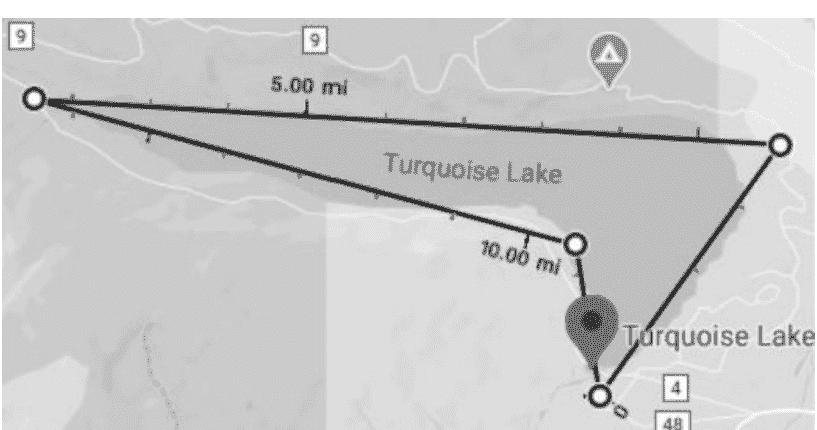

四个地图坐标，从底部点开始逆时针排列，分别是：

- 39.249968, -106.370986
- 39.273513, -106.348860
- 39.277695, -106.438465
- 39.264220, -106.373614

我特意选择了这个湖和这个形状，因为在左下角，即最后一个坐标（标记为3）处有一个凹陷：

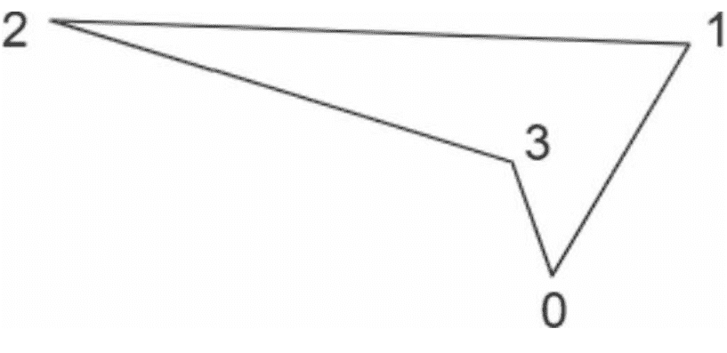

第一个三角形面积在0,1,2处找到，如下所示：

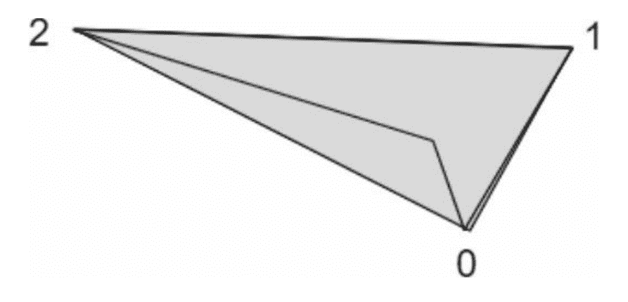

请注意，这个三角形太大了，覆盖的面积超过了整个湖泊的轮廓。不过没关系，因为下一个三角形0,2,3是“反向”的，其点的顺序是顺时针而不是逆时针，这会自动产生一个负面积。

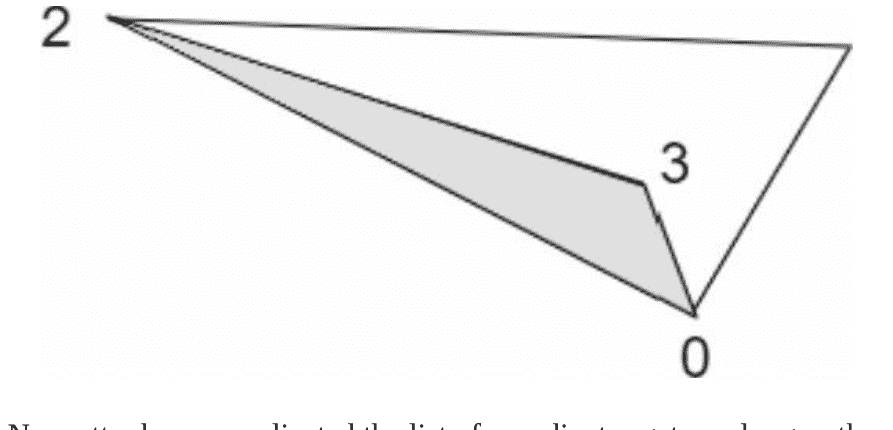

无论坐标列表变得多么复杂，只要它们对于整个多边形来说是正确的“环绕”顺序，所有面积都会正确相加，无论是正还是负，无论它们如何重叠。

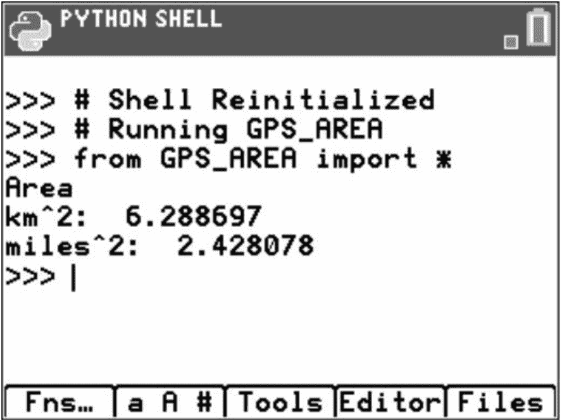

6.289平方公里大约是1,554英亩。在网上快速查一下，绿松石湖的面积是1,780英亩。考虑到我们勾勒的湖泊轮廓非常粗糙，只用了四个点来定义它，我们的计算结果相当不错！

这个程序对于不太大的陆地区域效果很好。地球不是平的，所以如果区域非常大，比如边长数百公里，地球表面的曲率确实会影响计算出的面积。

##### GPS_DIST

平面上两点之间的距离使用勾股定理计算，但在球体（如地球）表面上的距离则更为复杂。这个程序可以根据给定的纬度和经度坐标（也称为GPS坐标）准确计算任意两个位置之间的距离。

该算法使用了几个三角函数，因此在清单顶部导入了`math`模块。Python中的`sin()`和`cos()`函数假设所有角度都是弧度，因此使用`math`模块中的`radians()`函数将纬度和经度从标准度数转换为弧度。（是的，也有一个`degrees()`函数，但本程序未使用。）

`distance()`函数是这个程序的核心。输入是地球上两个点的纬度和经度，输出是两点之间的公里数。常数6371是地球的半径（公里）。

例如，圣路易斯的拱门在Google Maps上可见，我们可以仔细放大并点击找到拱门后角金属与混凝土相交处的坐标。这些就是程序清单中的那对坐标。另一个坐标在旧金山的金门大桥，因此我们也可以测量更远的距离。

圣路易斯拱门官方高度为630英尺，宽度为630英尺。这个程序计算出的宽度为629.9英尺，这可能比实际更精确，但我接受这个结果！旧金山和圣路易斯之间的直线距离列为1745公里，而这个程序计算出拱门和大桥之间的距离为1744.7英里，这也是一个惊人相似的结果：

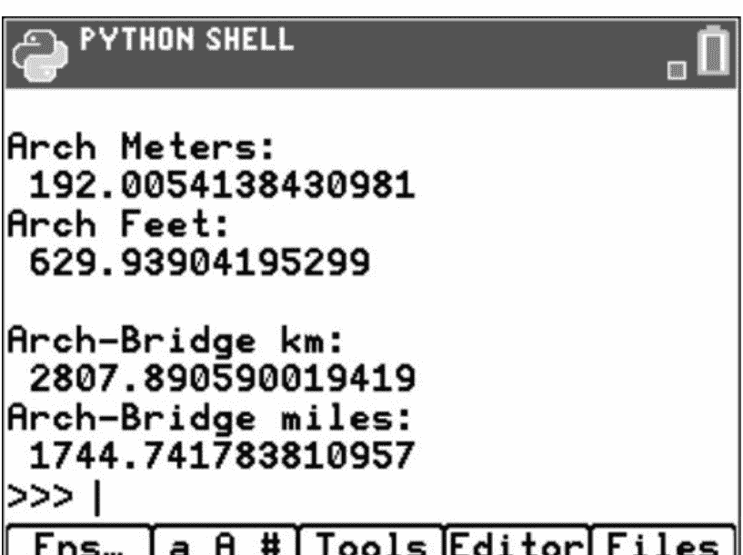

```python
from math import *

def distance(pt1,pt2):
    la1=radians(pt1[0])
    lo1=radians(pt1[1])
    la2=radians(pt2[0])
    lo2=radians(pt2[1])
    r=6371
    t1=sin(la1)*sin(la2)
    t2=cos(la1)*cos(la2)*cos(lo2-lo1)
    km=acos(t1+t2)*r
    return km

#Arch width
pt1=(38.625412,-90.184555)
pt2=(38.623767,-90.185227)
km=distance(pt1,pt2)
print()
print("Arch Meters:\n",km*1000)
print("Arch Feet:\n",km*3280.84)

#Arch to Golden Gate Bridge
pt2=(37.820142,-122.478709)
km=distance(pt1,pt2)
print()
print("Arch-Bridge km:\n",km)
print("Arch-Bridge miles:\n",km*.621371)
```

##### MIDPOINT

这个程序可以找到地球上两个其他位置之间中点的纬度和经度。给一两个州外的朋友打电话，让他们在精确的中点与你见面，就为了好玩。

这个程序也非常适合检查地球是平的还是圆的。说真的。考虑一下，在晴朗的日子里，用一根简单的米尺就可以轻松测量太阳的仰角（参见本书后面的程序SUN_ELEV）。我不会在这里详述所有细节，但请注意，从地球上三个等距点测量的太阳仰角将提供你所需的所有信息。如果地球是平的，仰角会以一种方式表现；如果地球是圆的，角度会以另一种方式表现。（提示：它是圆的，但你可以自己验证，这是发现真相的好方法！）

让我们找出旧金山金门大桥和圣路易斯拱门之间中点的纬度和经度。

这是我们在GPS_DIST程序中使用的拱门一角的坐标：

```
la1=38.625412
lo1=-90.184555
```

这是同一程序中的金门大桥坐标：

```
la2=37.820142
lo2=-122.478709
```

让我们将这些坐标输入程序，找到地球上的中点，然后在Google Maps上查找该点，看看那里有什么：

#### 5. 货币与财务

本章介绍了几个程序，用于计算利息、储蓄、贷款以及其他与资金流动相关的细节。

下次当你准备购买汽车、房屋或游戏机时，你可以看看贷款利息会花费你多少钱，或者更好的是，看看需要多长时间才能攒够现金支付。

##### 导航

此程序计算地球表面上任意两点之间的距离和方位。

使用谷歌地图可以轻松找到地球上某点的位置。放大到该位置，右键单击该点，然后从弹出菜单中选择“这是哪里？”。这是获取此程序所需输入的经纬度数字的好方法。

这里使用的大圆航线公式对于短距离（例如测量学校门前的一小段人行道）是准确的，对于更长的距离（此时地球的球形形状变得非常重要）也同样准确。

新墨西哥州的杜尔塞和陶斯的位置，或从谷歌地图获取的GPS坐标，已硬编码到程序中以进行测试。你可以随意更改这些数字，或者修改程序使其提示输入。核心功能在 `nav()` 函数中，因此你可以按任何方式调用它。

如图所示，从杜尔塞到陶斯的距离非常接近140公里，行进方向为114.3度，即正东方向稍偏南。

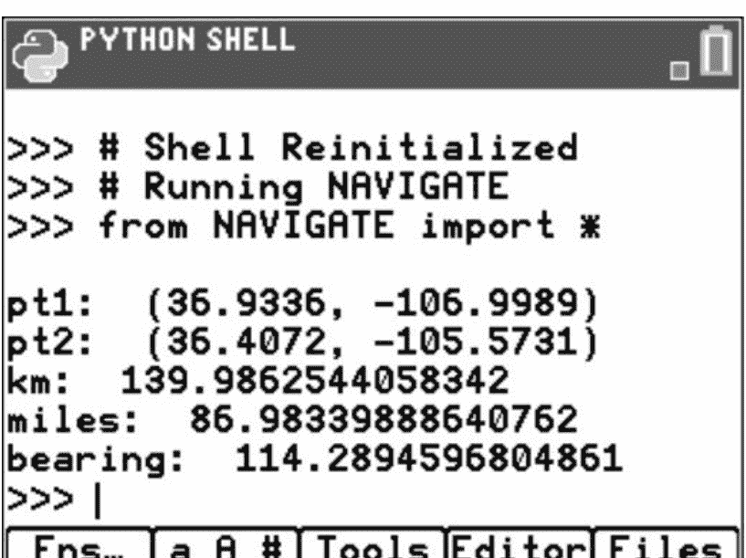

```python
from math import *

def nav(pt1,pt2):
    la1=radians(pt1[0])
    lo1=radians(pt1[1])
    la2=radians(pt2[0])
    lo2=radians(pt2[1])
    r=6371
    t1=sin(la1)*sin(la2)
    t2=cos(la1)*cos(la2)*cos(lo2-lo1)
    km=acos(t1+t2)*r
    t1=cos(la1)*sin(la2)
    t2=sin(la1)*cos(la2)*cos(lo2-lo1)
    x=t1-t2
    y=sin(lo2-lo1)*cos(la2)
    b=degrees(atan2(y,x))
    return [b,km]
```

```python
###### Dulce, NM
pt1=(36.9336, -106.9989)
```

```python
###### Taos, NM
pt2=(36.4072, -105.5731)
```

```python
###### Distance and bearing
b,km=nav(pt1,pt2)
```

```python
print("\npt1: ",pt1)
print("pt2: ",pt2)
print("km: ",km)
print("miles: ",km*.621371)
print("bearing: ",b)
```

##### 存款

这个简短的程序通过计算需要在计息账户中存入多少钱以及存多久，来帮助你为某个目标储蓄。

例如，也许你想买一台价值1000美元的新游戏笔记本电脑，并且希望在一年后拥有它。如图所示，如果账户利率为7%，你应该开始每月存入80.69美元。

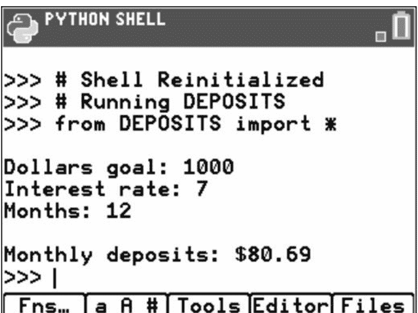

```python
fv=float(input("\nDollars goal: "))
ir=float(input("Interest rate: "))
mo=float(input("Months: "))
ir/=1200
dp=fv/((ir+1)**mo-1)*ir
s="\nMonthly deposits: ${:.2f}"
print(s.format(dp))
```

##### 未来价值

为你将来想购买的东西储蓄，是让你的钱发挥更大价值的好方法。资金以一定的利率累积，而不是支付贷款利息，所以你基本上是在以两种方式储蓄。这个程序让你可以尝试看看你能节省多少，并帮助你在投资自己时保持目标。

程序会提示你输入每月可以提供的金额、资金累积增值的年利率，以及计算总额的年数。然后输出未来价值。在所示示例中，每月存入50美元，年累积利率为7%，输出3年后的未来价值，总计1996.50美元。

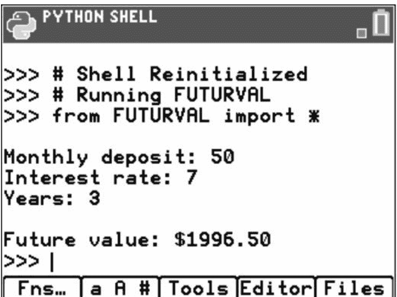

```python
dp=float(input("\nMonthly deposit: "))
ir=float(input("Interest rate: "))
yr=float(input("Years: "))
ir/=1200
mo=yr*12
fv=dp*((ir+1)**mo-1)/ir
print("\nFuture value: ${:,.2f}".format(fv))
```

##### 利率

此程序在已知本金、每月还款额和还款月数的情况下，计算贷款所收取的利率。输出计算出的年利率。

示例显示，一笔10,000美元的贷款，每月还款325美元，为期3年（即36个月），年利率为10.49%。

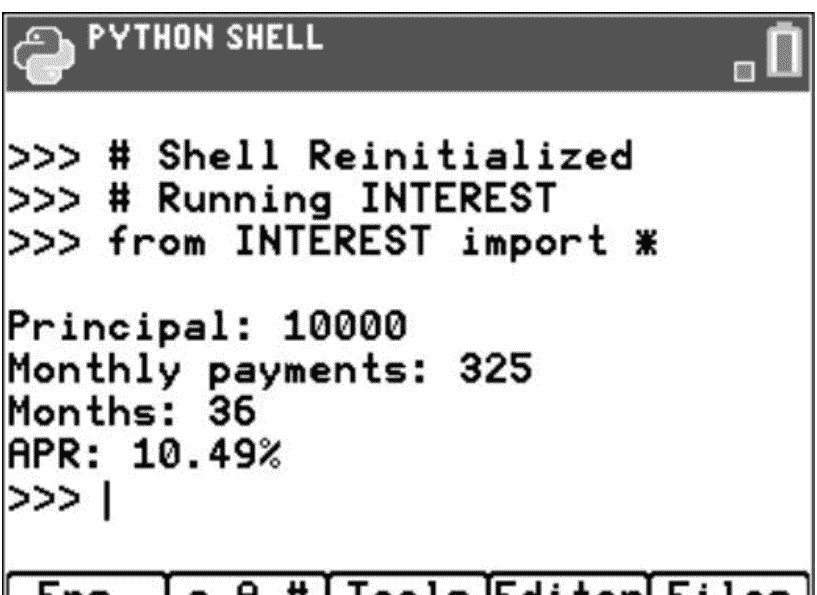

```python
p=float(input("\nPrincipal: "))
pmt=float(input("Monthly payments: "))
n=float(input("Months: "))
r,t=1,0
while t!=r:
    t=r
    r=pmt*((1+r)**n-1)/p/(1+r)**n
i=round(r*1200,2)
print("APR: {}%".format(i))
```

##### 还款月数

此程序计算在贷款累积利息的情况下，还清一笔款项所需的月数。

例如，你借款1,000美元，并同意每月支付25美元，利率为7%。此程序告诉你需要49个月。月数四舍五入到最接近的整月。好消息是，最后一笔付款很可能比其他付款少。

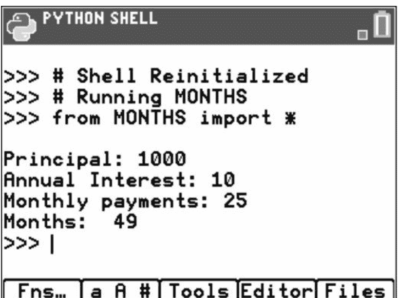

```python
p=float(input("\nPrincipal: "))
r=float(input("Annual Interest: "))/1200
pmt=float(input("Monthly payments: "))
n,d=0,pmt+1
while d>pmt:
    n+=1
    d=round(p*(r*(1+r)**n)/((1+r)**n-1),2)
print("Months: ",n)
```

##### 月供

此程序根据贷款金额（或本金）、年利率和需要支付的月数，计算贷款的每月还款额。

示例显示，一笔5000美元、利率为9%的贷款，需要24个月每月还款228.42美元。

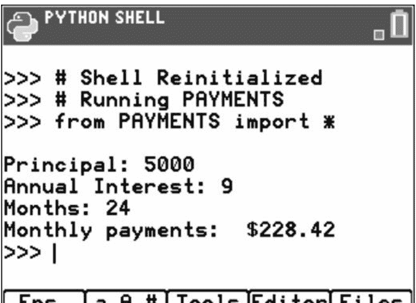

```python
p=float(input("\nPrincipal: "))
r=float(input("Annual Interest: "))/1200
n=float(input("Months: "))
pmt=p*(r*(1+r)**n)/((1+r)**n-1)
pmt="${}".format(round(pmt,2))
print("Monthly payments: ",pmt)
```

##### 本金

给定贷款的每月还款额、贷款的年利率以及还清贷款的月数，此程序计算贷款的原始本金。

例如，给定每月还款228.42美元，为期24个月，利率为9%，原始贷款金额为4999.92美元。实际贷款金额可能是5000美元，因为轻微的舍入误差很容易累积到几美分，就像本例中一样。

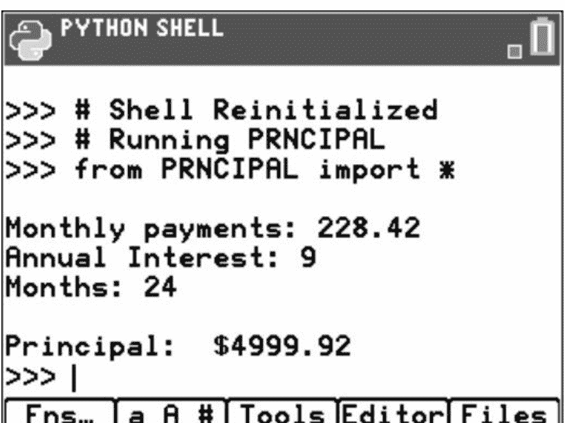

```python
pmt=float(input("\nMonthly payments: "))
r=float(input("Annual Interest: "))/1200
n=float(input("Months: "))
p=pmt/(r*(1+r)**n)*((1+r)**n-1)
p="${}".format(round(p,2))
print("\nPrincipal: ",p)
```

#### 6. 数值计算

本章中的程序涵盖了计算器和计算机可以执行的许多标准计算，这些计算可能对你的学习或工作很有用。程序从快速寻找质数，到求解联立方程、求方程根、提供一整套向量函数等等，种类繁多。

##### 二进制、十六进制与十进制转换

计算机一直使用位、字节以及十六进制和二进制格式的数字。此程序展示了如何轻松地将数字在这些格式之间进行转换。

例如，十六进制数0x4DF3等于十进制数19955，也等于二进制数0b100110111110011。程序要求以其中任何一种格式输入，然后以所有三种格式显示输出：

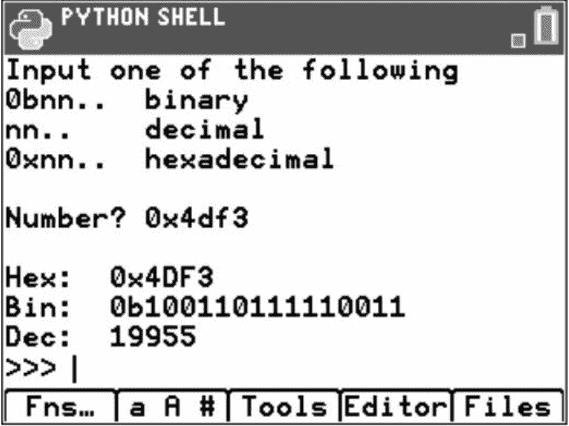

请注意，将十六进制或二进制数转换为十进制有一个更简单的方法。在shell中，在 `>>>` 提示符下，只需输入值，确保添加适当的前缀“0x”或“0b”。将显示十进制值。要反向转换，从十进制转换为其他两种格式，此程序可以做到。十六进制值可以大写或小写输入。

程序的最后几行展示了如何以三种数字格式格式化十进制整数以进行输出。

```
print("\nInput one of the following")
print("@bnn.. binary")
print("nn..decimal")
print("@xnn.. hexadecimal")
n=input("\nNumber? ").lower()
if n[0]=="0":
    if n[1]=="b":
        n=int(n[2:],2)
    elif n[1]=="x":
        n=int(n[2:],16)
else:
    n=int(n)
print()
print("Hex: ","0x{:X}".format(n))
print("Bin: ","0b{0:b}".format(n))
print("Dec: ",n)
```

##### BINSRCH

此程序用于寻找函数的根，即函数在 y=0 处与 x 轴相交的点。请在清单顶部相应命名的函数 `f(x)` 中编辑你的 x 函数。以下是示例中我们将使用的函数：

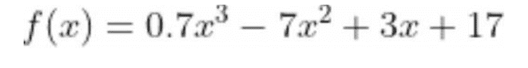

在 Python 中计算 x 的幂的一种方法是使用两个星号，这也是我们将在示例中使用的方法。（另一种方法是使用 math 库中的 `pow()` 函数。）

```
def f(x):
    return 0.7*x**3-7*x**2+3*x+17
```

在你的 TI-84 Plus CE Python 计算器（不使用 Python）上快速绘制此函数的图像，会显示该函数在 X 轴上介于 -5 和 +15 之间有三个根。此程序将帮助你快速高效地找到这些根。


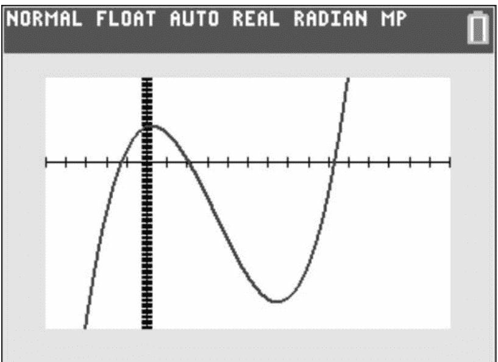

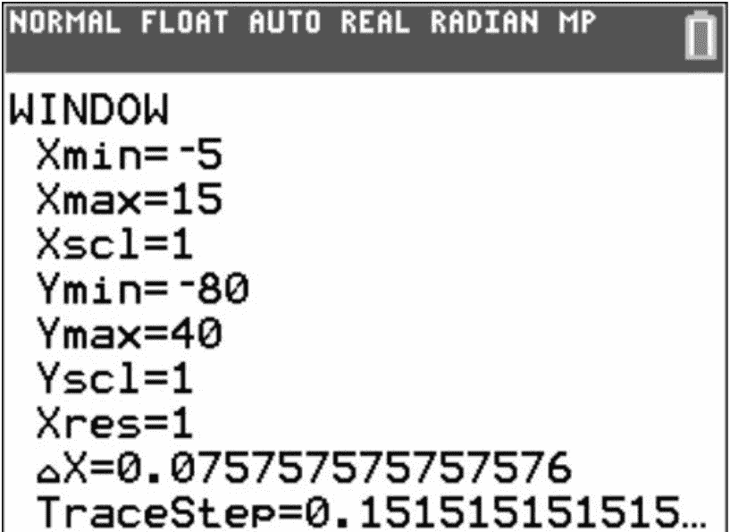

此 Python 程序中的 `roots()` 函数接收三个值：要检查区间的起始 x 值、结束 x 值，以及它们之间的步数。步数应足够多，以确保不会“错过”函数的零点穿越。在大多数情况下，100 步效果良好。如果在指定区间内存在一个或多个根，它们将被返回。

在此示例中，由于我们知道三个根位于 -5 和 +15（图形的边缘）之间，因此 `roots()` 函数被这样调用：`roots(-5, 15, 100)`，返回的三个根将打印在显示屏上。

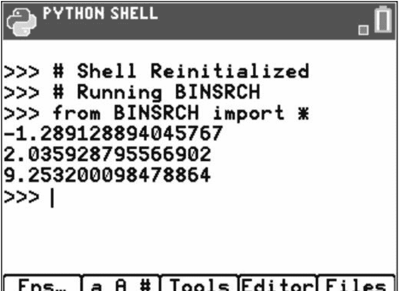

`roots()` 函数根据步长参数将大区间分解为许多小区间。函数在这些小区间的端点处被调用。每当两个返回值符号不同时，就会调用 `root()` 函数，使用二分查找法在该区间内寻找“精确”的根。

二分查找将 x1 和 x2 之间的区间一分为二，计算中点处的 y 值，然后确定根必须位于该中点的左侧还是右侧。在一种情况下，x1 的值被替换为中点值，否则 x2 被替换。在此更小的区间内重复搜索，一次又一次，直到 x1 和 x2 之间的差值趋近于零，此时即为根值 x。

编辑清单顶部的函数以及清单末尾对 `roots()` 的调用，以寻找你自己函数的根。

```
def f(x):
    return 0.7*x**3-7*x**2+3*x+17

def roots(xmin,xmax,steps):
    inc=(xmax-xmin)/steps
    while xmin<xmax:
        x=root(xmin,xmin+inc)
        if x>=xmin:
            print(x)
        xmin+=inc

def root(x1,x2):
    dif=0
    y1=f(x1)
    y2=f(x2)
    while 1:
        if y1*y2>0:
            return x1-1
        x=(x1+x2)/2
        y=f(x)
        if y1*y>0:
            x1=x
            y1=f(x1)
        else:
            x2=x
            y2=f(x2)
        if x1-x2!=dif:
            dif=x1-x2
        else:
            return x

roots(-5,15,100)
```

请注意，本章后面的程序 NEWTON 以一种非常相似但通常快得多的方式寻找根。

##### FACTORS

此程序寻找一个整数的所有因子。`factors()` 函数接收一个整数，并返回其所有质因数的列表。

例如，16 的质因数是四个 2，12345 的质因数是 3、5 和 823，123454321 的质因数是 41、41、271 和 271：

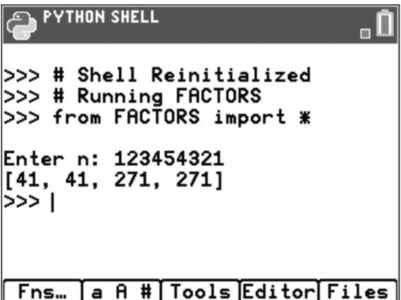

当我最初创建这个程序时，因子是通过除以从 2 到给定数字的所有数字来寻找那些能整除的数。这对于相对较小的整数效果很好，但对于数万或更大的数字，速度会变得非常慢。为了大幅提速，我从本书其他地方借用了 `next_prime()` 和 `is_prime()` 函数，只检查质数的整除性，并且只检查到给定整数的平方根。这增加了一点代码清单的长度，但更快的结果是值得的。

```
def factors(n):
    factlist=[]
    m=2
    while n>1:
        if n%m==0:
            factlist.append(m)
            n//=m
        else:
            m=next_prime(m)
            if m*m>n:
                factlist.append(n)
                break
    return factlist

def next_prime(n):
    p=n+1
    while not isPrime(p):
        p+=1
    return p

def isPrime(n):
    primes = (
        2,3,5,7,11,13,17,19,23,29,31,37,41,
        43,47,53,59,61,67,71,73,79,83,89,97)
    if n in primes:
        return True
    for m in primes:
        if n%m==0:
            return False
    for m in range(primes[-1]+2,n//m+1,2):
        if n%m==0:
            return False
    return True

n=int(input("\nEnter n: "))
print(factors(n))
```

##### FIBONACC

斐波那契数列非常迷人，此程序让你可以交互式地探索其特性。从任意两个整数（除了两个都是零）的列表开始，通常选择零和一，如果你将它们相加以添加到列表中，然后将列表上的最后两个数字相加得到下一个，如此继续，你会很快发现列表上最后两个数字的比值趋近于黄金比例。

在互联网上搜索以了解更多关于黄金比例的知识，因为有很多奇特的事实，其解释起初似乎并不合理。例如，黄金比例正好等于 2 * sin(54 度)。原因与五边形形状有关，但我将让你自己去发现这些细节。

另一个有趣的事实是，你不需要从 0 和 1 开始来形成斐波那契数列。事实上，你可以从任何两个数字开始，正数或负数，整数或浮点数，列表上最后两个数字的比值将很快趋近于黄金比例。这很奇怪。你一定要试试！

以下是从 0 和 1 开始，迭代增长数列 20 次的结果。

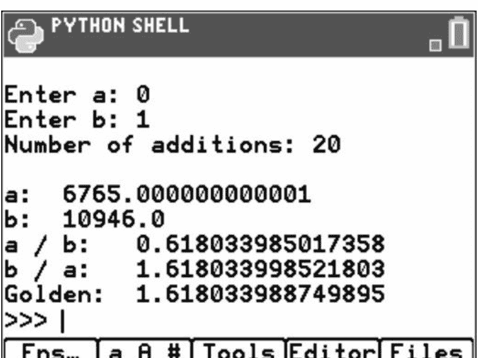

如你所见，10946 与 6765 的比值非常接近黄金比例。（黄金比例也可以计算为一加五的平方根再除以二，这就是输出最后一行中计算更精确值的方法。）

接下来，从 -17.85 和 97.65 开始。仅仅 20 次加法后，也可以看到比值迅速趋近于黄金比例：

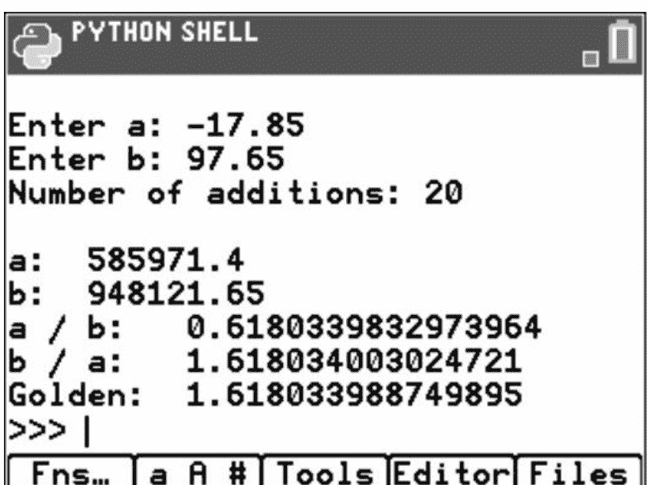

```
python
a=float(input("\nEnter a: "))
b=float(input("Enter b: "))
n=int(input("Number of additions: "))
for i in range(n):
    a,b=b,a+b
print()
print("a: ",a)
print("b: ",b)
print("a / b: ",a/b)
print("b / a: ",b/a)
print("Golden: ",(1+5**.5)/2)
```

##### GCD_LCM

此程序寻找两个整数的 GCD（最大公约数）和 LCM（最小公倍数）。两个整数的 GCD 是能同时整除它们的最大正整数。两个整数的 LCM 是能同时被它们整除的最小正整数。事实证明，两个原始数字的乘积与 LCM 和 GCD 的乘积相同。

例如，给定整数 24 和 56，我们发现它们的 GCD 是 8，LCM 是 168。

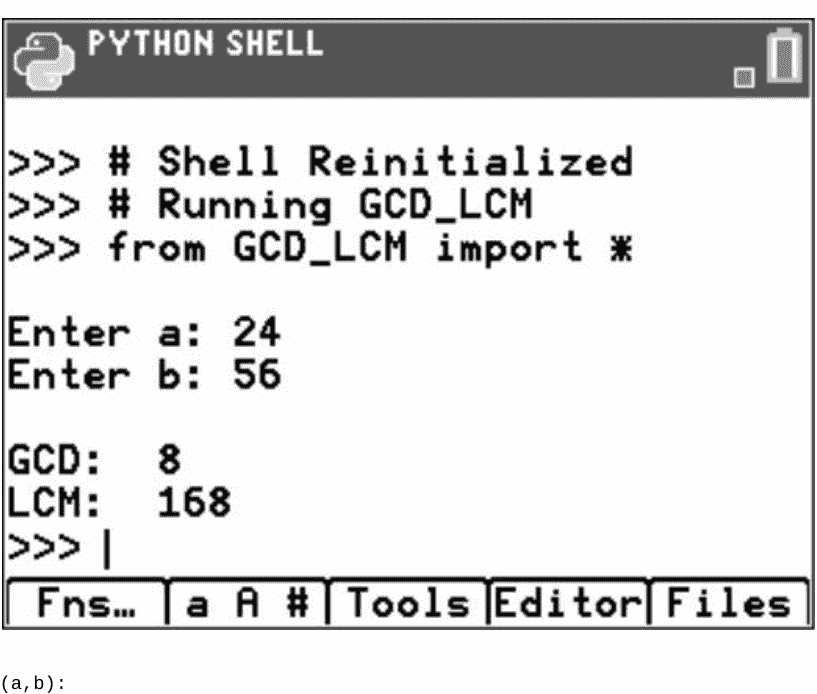

```
def gcd(a,b):
    while 1:
        c=a-b*int(a/b)
        a,b=b,c
        if not c:
            return a

def lcm(a,b):
    return int(abs(a*b/gcd(a,b)))
```

##### GLDRATIO

在互联网上搜索关于黄金比例（GR）的迷人信息，你会发现计算这个数字有多种方法。也许最直接的计算是使用这个公式：

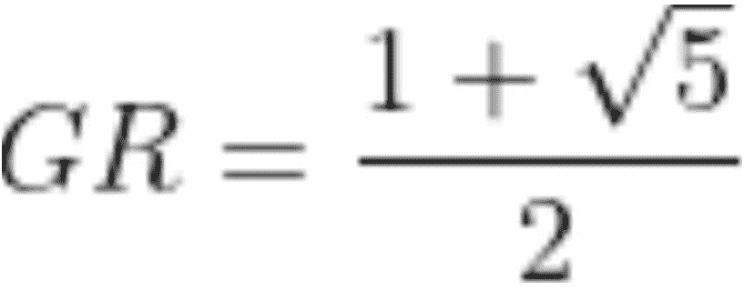

另一种计算GR的方法是使用斐波那契数列（参见本章前面的FIBONACC程序）。

在这个程序中，一个非常简单的迭代从任何数字开始，它相当快地收敛到黄金比例的值。GR等于1 + 1/GR，这提供了一种巧妙的方法来迭代其值。

例如，从数字-123.4567开始，仅需40次迭代即可找到GR：

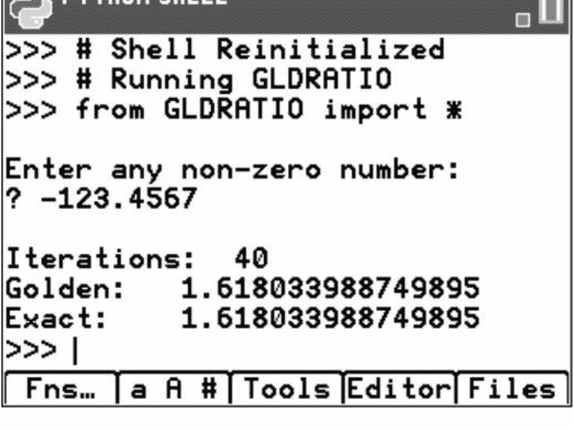

```
print("\nEnter any non-zero number: ")
x=float(input("? "))
y,n=0,0
while x!=y:
    x,y,n=1+1/x,x,n+1
print("\Iterations: ",n)
print("Golden: ",x)
print("Exact: ",(1+5**.5)/2)
```

##### NEWTON

**BINSRCH**程序使用二分法（“对半分割”搜索算法）来寻找函数f(x)的根。这个程序也寻找x函数的根，但它使用牛顿法，这是一个非常酷的算法，在许多情况下能极其高效地找到根。

牛顿法是一种迭代方法，它利用函数的斜率（也称为一阶导数）来帮助定位函数与x轴的交点。以下是正式定义，其中f'(x)是f(x)的斜率或导数。

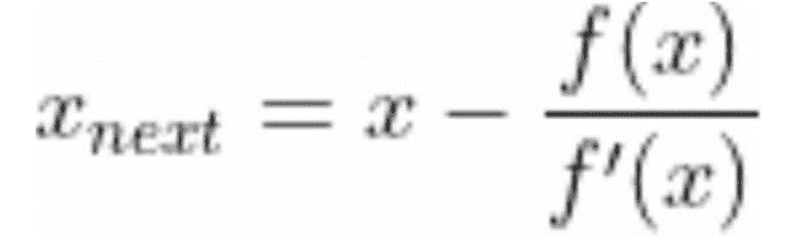

为了演示这个程序，我们将找到与**BINSRCH**程序中相同的x函数的三个根：

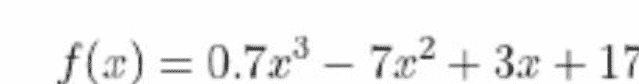

在你的TI-84 Plus CE Python计算器上快速绘制这个函数的草图，会显示在x轴上-5到+15之间有三个根。

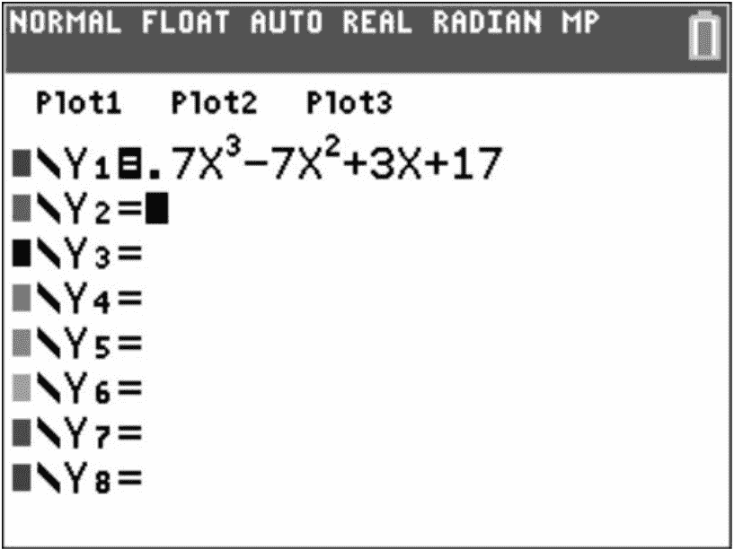

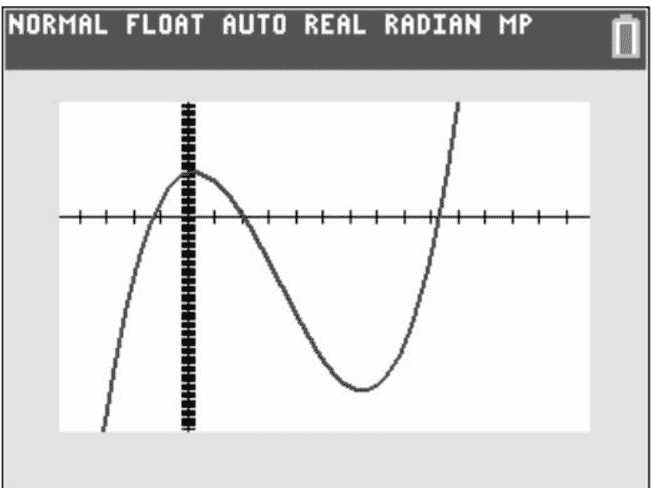

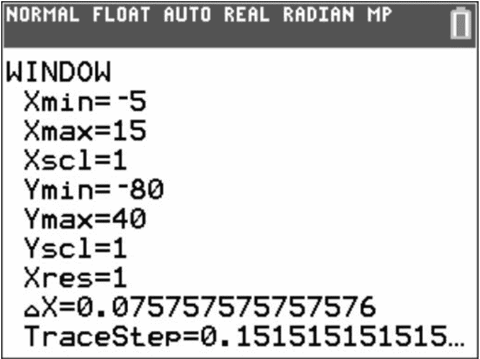

NEWTON程序像BINSRCH程序一样调用roots()函数，传递沿x轴搜索的区间限制，以及检查子区间的步数。

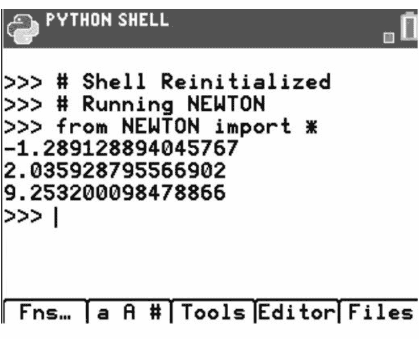

```
def f(x):
    return 0.7*x**3-7*x**2+3*x+17
```

```
def slope(x):
    dx=0.0001
    dy=f(x+dx)-f(x)
    return dy/dx
```

```
##def slope(x):
###### return 2.1*x*x-14*x+3
```

```
def roots(xmin,xmax,steps):
    inc=(xmax-xmin)/steps
    for i in range(steps):
        root(xmin,xmin+inc)
        xmin+=inc
```

```
def root(x1,x2):
    if f(x1)*f(x2)<=0:
        x,a,b=x1,x2,x2
        while x!=b:
            a,b=x,a
            x=x-f(x)/slope(x)
        print(x)
```

```
roots(-5, 15, 100)
```

注意被注释掉的名为slope(x)的函数。有两个同名的函数用于计算f(x)的斜率或一阶导数，你应该注释掉其中一个。第一个版本的slope()更灵活，因为它不需要在每次重新定义f(x)函数时都重新定义。第二个版本是针对每个f(x)专门编辑的，如果你恰好知道精确的一阶导数的话。这里用一点微积分知识会大有帮助，但如果此时求一阶导数对你来说感觉像滑坡（双关语），就使用另一个函数，如所示的那样。

顺便说一下，使用TI-84 Plus CE Python计算器的内置功能来找到这些相同的根是很有启发性的。这个任务非常可行，但涉及的步骤数量比使用这个Python程序要多得多。我将只展示一些使用屏幕截图来寻找第一个根的步骤。大多数这些步骤需要重复才能找到其他每个根。

好的，我们开始

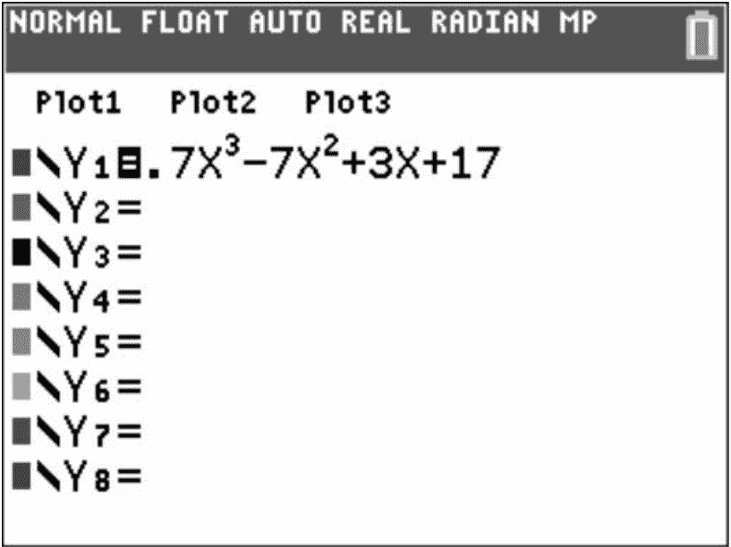


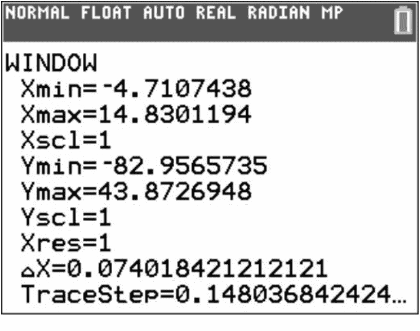

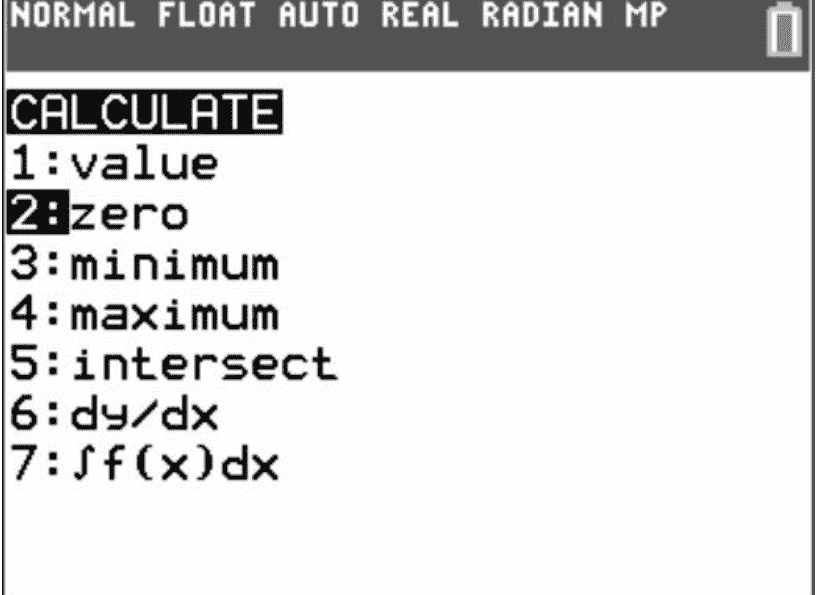

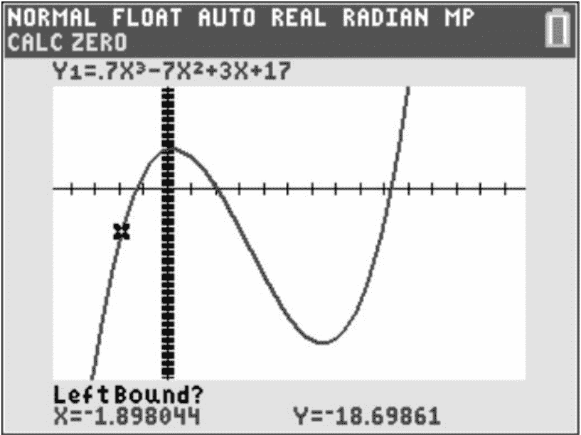

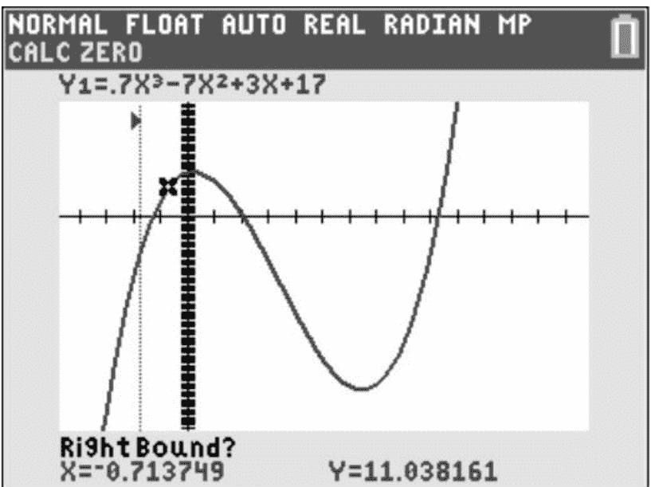

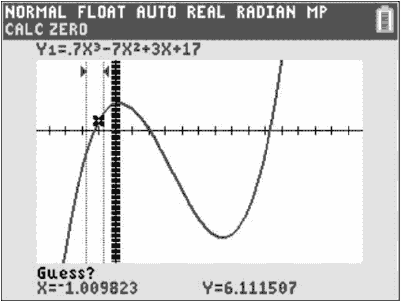

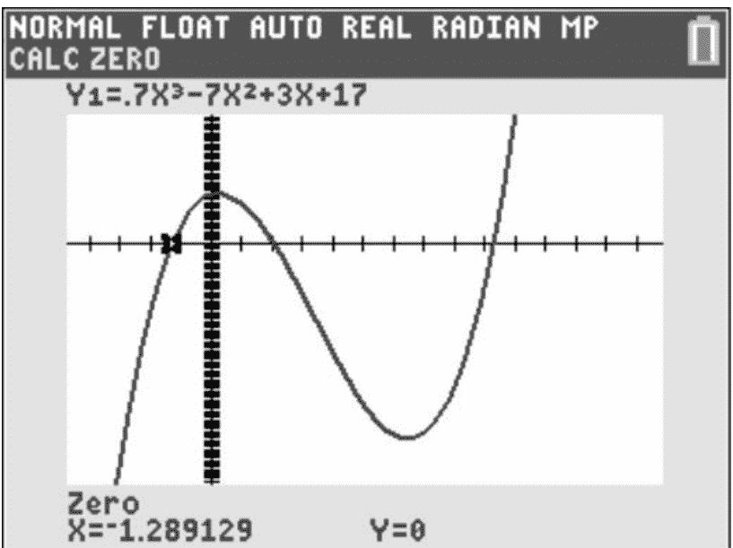

##### PRIMES

这个程序从任何给定的整数开始搜索，找到n个质数。质数是那些只能被1和它本身整除的整数。例如，7是质数，8不是，因为它可以被2整除，9也不是，因为它可以被3整除。

该程序提供了两个协同工作的有用函数，或者你也可以根据需要单独调用它们。第一个函数isPrime()简单地返回True，如果传递给它的整数是质数，否则返回False。函数next_prime()接收任何整数，它递增直到找到下一个质数。

这是一个示例运行，从900开始找到七个质数：

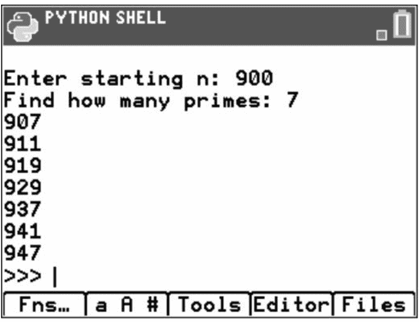

```
def isPrime(n):
    if n%2==0:
        return False
    m=3
```

```
while m<=n/m:
    if n%m==0:
        return False
    m+=2
return True
```

```
def next_prime(n):
    p=n+2 if n%2 else n+1
    while isPrime(p)==False:
        p+=2
    return p
```

```
x=int(input('\nEnter starting n: '))-1
count=int(input('Find how many primes: '))
while count>0:
    count-=1
    x=next_prime(x)
    print(x)
```

##### QUADRATC

二次公式让我们能够找到二次函数的根。这个程序计算这些根（如果它们存在的话）。

考虑以下抛物线（二次）函数，如在你的TI-84 Plus CE Python计算器上绘制的草图所示：

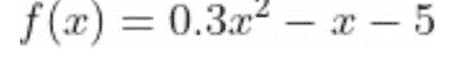

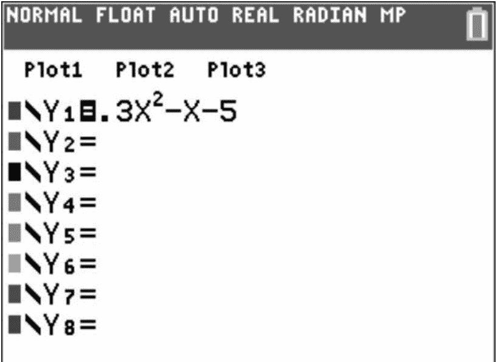

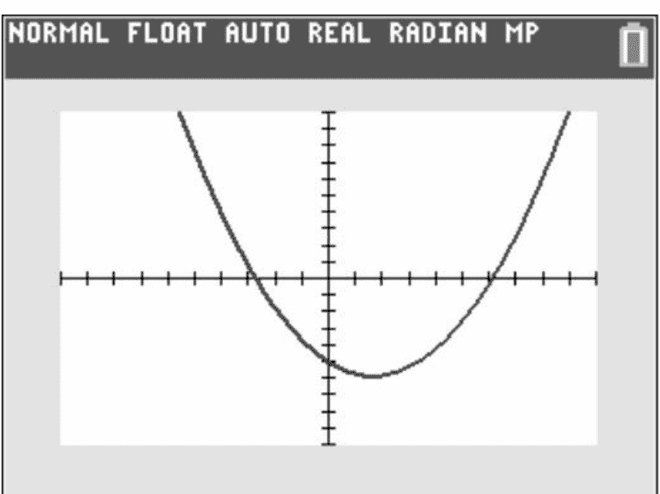

你将构成这个方程的a、b和c的三个值传递给roots函数，如果两个根都存在，则返回一条列出它们的消息。

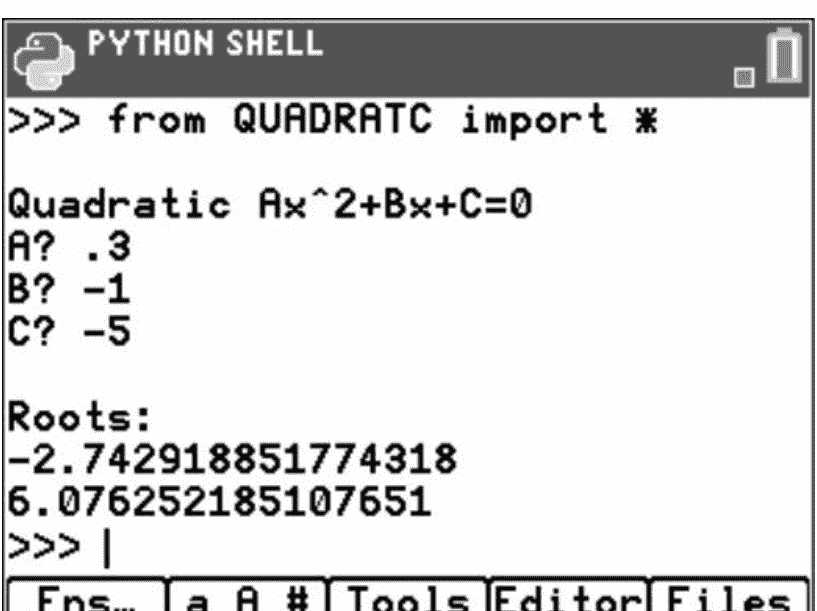

根据判别式（roots()函数中的变量d），在某些情况下可能没有根或只有一个根。如果是这种情况，则返回一条指示此结果的消息。

```
python
def quadratic_roots(a,b,c):
    d=b*b-4*a*c
    if d<0:
        return "No real roots"
    elif d==0:
        return "One root: {}".format(-b/(2*a))
    else:
        x1=(-b-d**.5)/2/a
        x2=(-b+d**.5)/2/a
        return "\nRoots: \n{}\n{}".format(x1,x2)
```

```
python
print("\nQuadratic Ax^2+Bx+C=0")
a=float(input("A? "))
b=float(input("B? "))
c=float(input("C? "))
print(quadratic_roots(a,b,c))
```

##### REC_POLR

复数是Python的一部分，使得解决许多高级电子和其他工程计算变得容易。然而，能够快速轻松地在类似表达的笛卡尔坐标（或矩形坐标）和标准极坐标（其中角度以度表示）之间进行转换通常是很方便的。

当这个程序启动时，你会看到一条消息，说明rp()和pr()函数现在在shell中可用，然后就没有更多事情发生了。然后定义了这两个函数，你可以根据需要手动使用它们。

例如，要将(3,4)从矩形坐标转换为极坐标，然后将(17,45)从极坐标转换为矩形坐标，运行程序以定义函数，然后在shell中键入函数并传递这些数字作为参数。

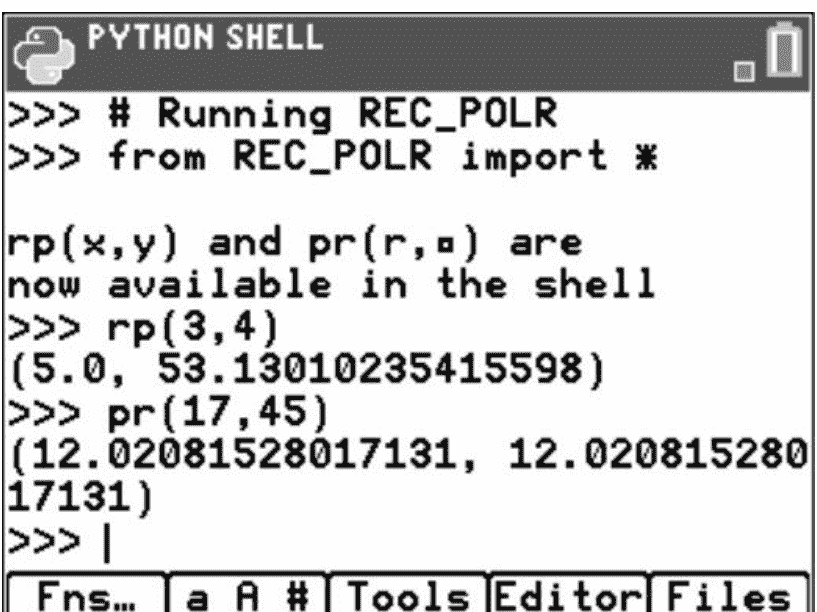

以下是用于进行转换的方程。注意，极角在Python中以弧度计算，但degrees()数学函数允许我们轻松地将其转换。

$$x = r \cos \theta$$
$$y = r \sin \theta$$
$$r = \sqrt{x^2 + y^2}$$
$$\theta = \text{atan}\left(\frac{y}{x}\right)$$

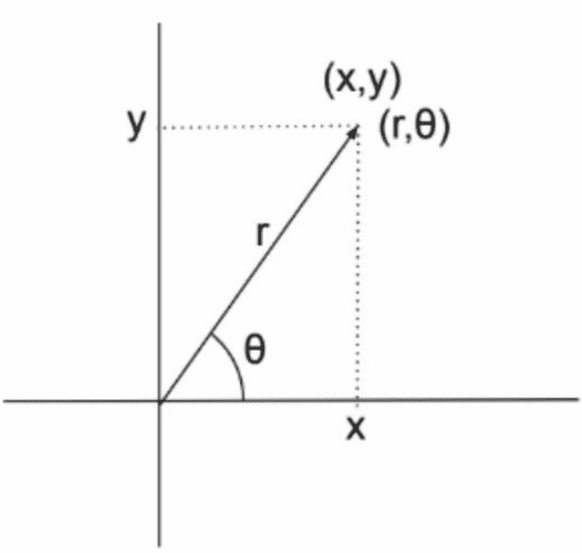

```
from math import *

def rp(x,y):
    r=(x*x+y*y)**.5
    t=degrees(atan2(y,x))
    return (r,t)

def pr(r,t):
    a=radians(t)
```

x = r * cos(a)
y = r * sin(a)
return (x, y)

print("\nrp(x,y) and pr(r, ) are")
print("now available in the shell")

##### SIMULTEQ

此程序可求解任意规模的联立方程组，尽管方程/未知数过多时可能难以处理，并且可能会使你的计算器运行缓慢。大多数情况下，人们处理的是规模为2、3或4的联立方程组，而本程序能很好地处理这些情况。

例如，给定以下两个方程，满足它们的x和y值是多少？

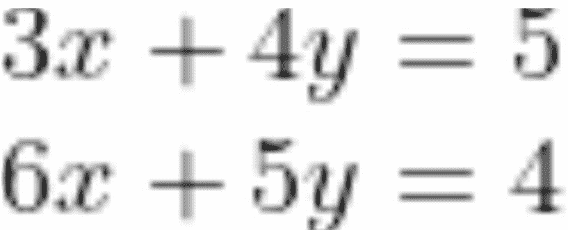

程序首先提示输入方程的数量，然后依次询问每个方程的系数和常数项，如下例所示：

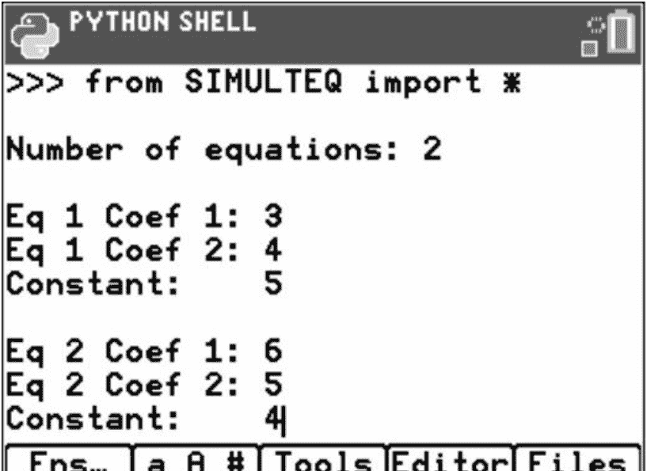

当你输入最后一个常数项后，程序会求出答案并显示为 a1, a2, ... 等等。

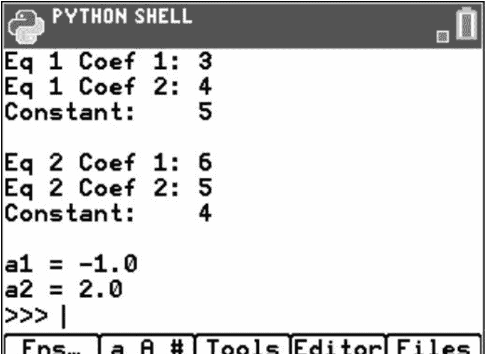

如果你验证一下，将 x = -1 和 y = 2 代入原始方程，你会发现两个方程都成立。

```
n = int(input("\nNumber of equations: "))
a = []
for j in range(n):
    coef = []
    print("")
    for i in range(n):
        p = "Eq {} Coef {}: ".format(j + 1, i + 1)
        x = float(input(p))
        coef.append(x)
    k = float(input("Constant:"))
    coef.append(k)
    a.append(coef)
for j in range(n):
    ok = False
    for i in range(n):
        if i >= j:
            if a[i][j]:
                ok = True
                break
    if not ok:
        print("\nNo solution")
    else:
        for k in range(n + 1):
            a[j][k], a[i][k] = a[i][k], a[j][k]
        y = 1 / a[j][j]
        for k in range(n + 1):
            a[j][k] *= y
        for i in range(n):
            if i != j:
                y = -a[i][j]
                for k in range(n + 1):
                    a[i][k] += y * a[j][k]
if ok:
    print("")
    for i in range(n):
        print("a{} = {}".format(i + 1, a[i][n]))
```

##### VECTORS

如果你处理向量，这个程序会非常有用。九个不同的函数涵盖了同时处理一个、两个或三个向量（二维或三维）的所有基础操作。

这些函数通常非常简短高效。运行程序时，函数会被定义，并显示一条简短的指令作为如何开始的提示。只需输入 `v()` 即可运行一个显示所有九个向量函数列表的函数。你可以随时输入此命令来刷新记忆，了解有哪些可用函数以及每个函数需要的参数。

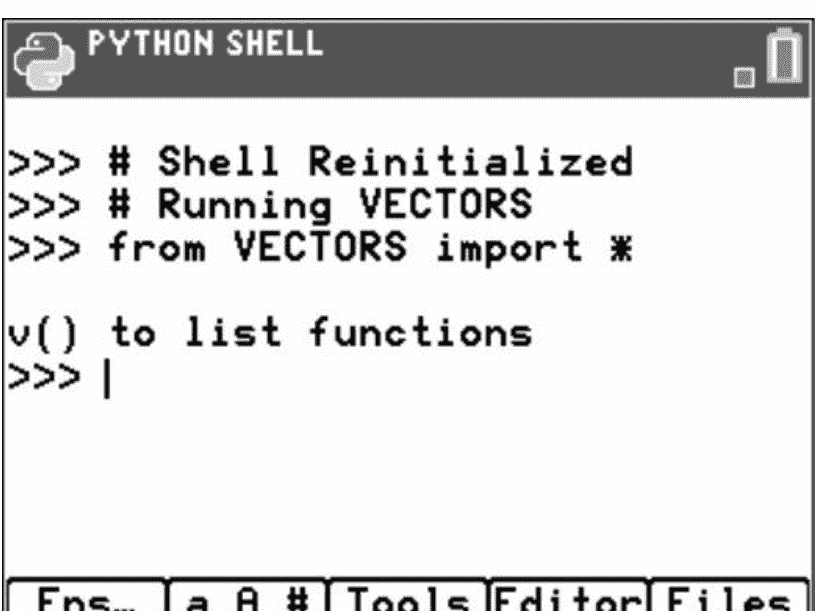

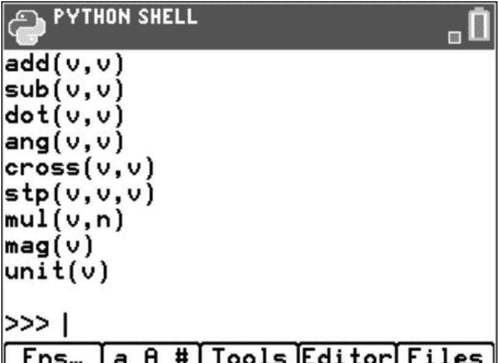

请注意，你也可以通过选择工具菜单中的 4:Vars 来获取所有这些函数的列表，但括号内需要传递的参数并未列出。

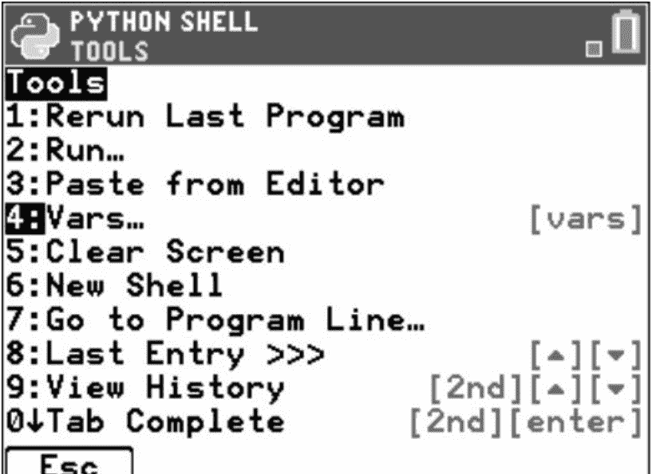

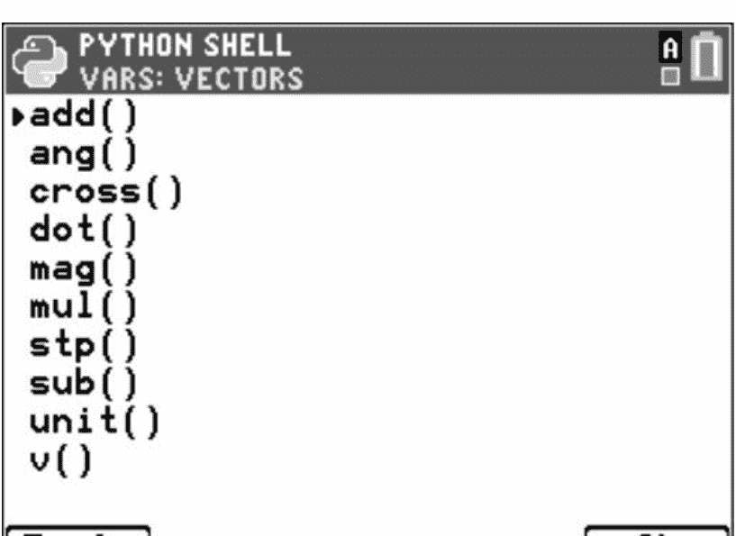

标记为 "v" 的参数期望一个表示向量的数字 Python 列表。在大多数情况下，你可以使用二维、三维或更高维度的向量。请注意，`cross()` 和 `stp()` 函数仅适用于三维。

举一个实际的例子，我们将一个二维向量设为 [3,4]，另一个设为 [5,-2]。然后 `add()` 函数求出这两个向量的和为 [8,2]。

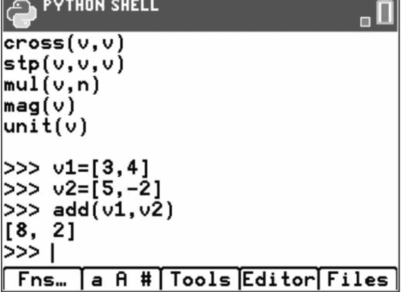

你也可以在函数调用中直接传递向量列表，而不是先将它们存储在变量中。两种方法都完全可行。以下是计算三维向量 [3,4,-5] 的模，以及计算空间中两个三维向量之间角度（以度为单位）的示例。

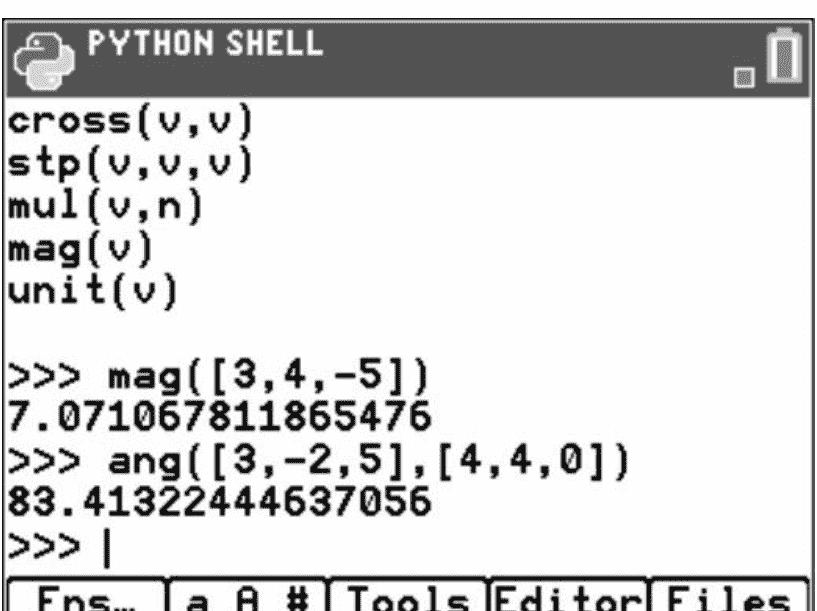

```
from math import *

def add(v1, v2):
    return [a + b for a, b in zip(v1, v2)]

def sub(v1, v2):
    return [a - b for a, b in zip(v1, v2)]

def dot(v1, v2):
    return sum([a * b for a, b in zip(v1, v2)])

def ang(v1, v2):
    m1 = sum(i * i for i in v1) ** .5
    m2 = sum(i * i for i in v2) ** .5
    d = sum([a * b for a, b in zip(v1, v2)])
    return degrees(acos(d / m1 / m2))

def cross(v1, v2):
    a, b, c = v1
    d, e, f = v2
    return [b * f - c * e, c * d - a * f, a * e - b * d]

def stp(v1, v2, v3):
    a, b, c = v1
    d, e, f = v2
    g, h, i = v3
    p = a * e * i + b * f * g + c * d * h
    m = a * f * h + b * d * i + c * e * g
    return p - m

def mul(v, n):
    return [i * n for i in v]

def mag(v):
    return sum(i * i for i in v) ** .5

def unit(v):
    m = mag(v)
    return [i / m for i in v]

def v():
    print("add(v,v)")
    print("sub(v,v)")
    print("dot(v,v)")
    print("ang(v,v)")
    print("cross(v,v)")
    print("stp(v,v,v)")
    print("mul(v,n)")
    print("mag(v)")
    print("unit(v)\n")

print("\nv() to list functions")
```

#### 7. 其他实用程序

本章介绍了一些创建起来很有趣，但不太适合其他章节的程序。一个具体的例子是计算混凝土立方码数的程序。另一个令人不寒而栗的例子是计算风寒指数。甚至还有一个我不会在这里透露的秘密程序。自己去发现吧！

##### CONCRETE

建筑项目中一个非常常见的问题是确定需要订购多少立方码的混凝土。通常，车道、人行道或其他区域的长度和宽度以英尺为单位测量，深度以英寸为单位测量。程序接受这三个值，进行适当的单位换算，然后将它们相乘得到立方码数。

一个很好的挑战是测试你的 Python 编程技能，将此程序改为使用所有公制单位。我保留了英尺、英寸和立方码的单位，以匹配美国使用的标准单位。

例如，乘用车道的建议厚度为4英寸。一条12英尺宽、15英尺长的车道需要多少立方码的混凝土？

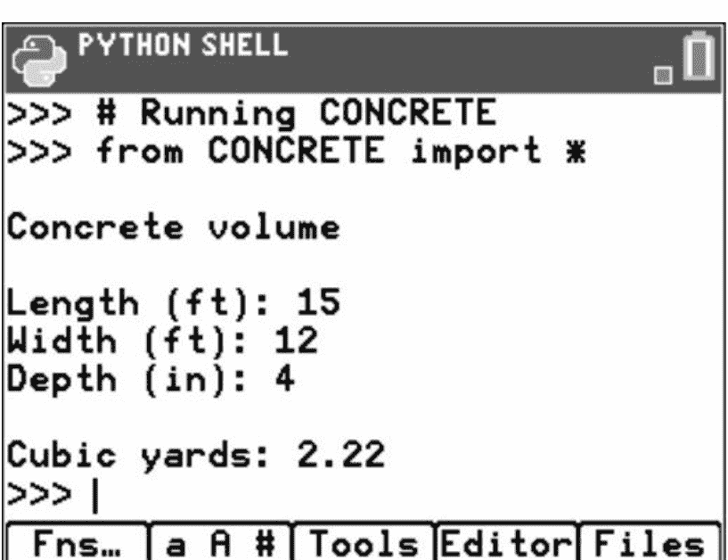

```
print("\nConcrete volume\n")
h = float(input("Length (ft): "))
w = float(input("Width (ft): "))
d = float(input("Depth (in): "))
yd = round(h * w * d / 324, 2)
print("\nCubic yards:", yd)
```

##### CRICKETS

下次你晚上散步时，听到一群蟋蟀同步鸣叫，数一下每分钟的鸣叫次数，然后拿出你的 TI-84 Plus CE Python 计算器，通过告诉同行者气温来让他们大吃一惊。

互联网上有许多网站可以找到每分钟鸣叫次数与气温的公式。它们大多基本一致，尽管我见过几个略有不同的公式。我选择了维基百科上解释的原始多尔贝尔定律公式。只需将每分钟鸣叫次数减去40，将结果除以4，然后加上50，即可得到华氏度的气温。

此程序使用 `ti_plotlib` 模块生成 Python 图表，以便在你外出散步时轻松参考。

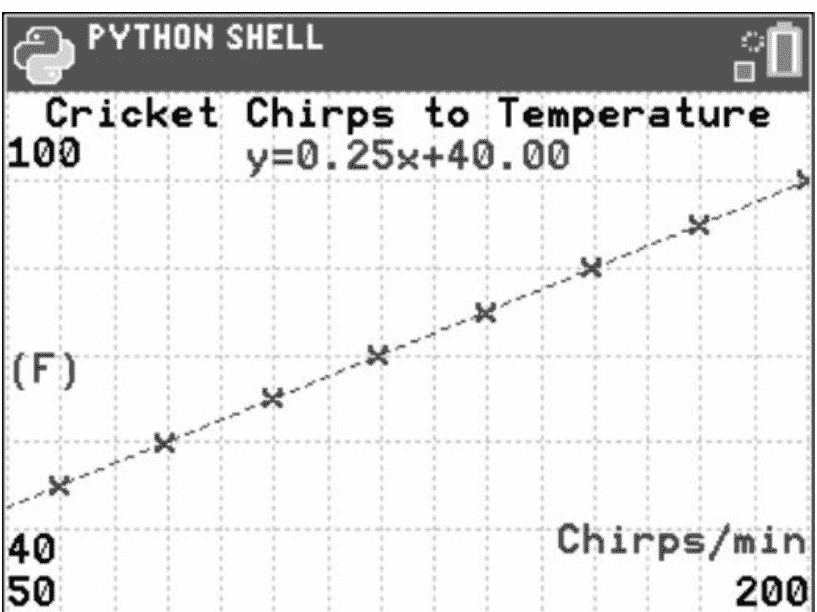

沿 x 轴的网格线覆盖了从 50 到 200 的鸣叫速率，沿 y 轴的气温范围从 40 到 100 度。标记每个轴的数字指的是图表的最边缘，因此请务必从那里开始计数。为了验证你的理解，沿着网格线数一下，你会发现每分钟 120 次鸣叫对应的图表非常接近 70 华氏度。

```
import ti_plotlib as plt

def crickets(chirps):
    return 50 + (chirps - 40) // 4

chirps, fahr = [], []
for c in range(40, 250, 20):
    chirps.append(c)
    fahr.append(crickets(c))

plt.cls()
plt.window(50, 200, 40, 100)
plt.pen("thin", "solid")
plt.axes("on")
plt.grid(10, 10, "dot")
plt.title("Cricket Chirps to Temperature")
plt.color(0, 0, 255)
plt.labels("Chirps/min", "(F)", 11, 7)
plt.pen("thin", "dash")
plt.scatter(chirps, fahr, 'x')
plt.lin_reg(chirps, fahr, "center", 2)
plt.show_plot()
```

##### LASERDIS

如果你有一个小型激光测距仪（它们非常有趣），你可以将其与本程序结合使用，以测量难以到达的线条上的距离。

例如，假设你想测量一堵墙的高度，从地板到天花板，但你不想爬梯子。你可以测量从你眼睛的高度（你手持激光设备的位置）到地板的距离，然后到你面前与眼睛齐平的墙壁的距离，最后到墙壁顶部边缘的距离。这些在图中标记为点 a、b 和 c：

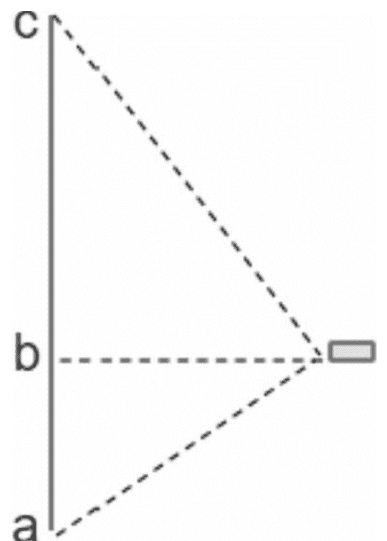

如果到 a 点的距离是 9 英尺 3 英寸，到 b 点是 7 英尺 9 英寸，到 c 点是 12 英尺 10 英寸，那么程序会计算出从 a 到 c 的墙高为 14 英尺 10 英寸。

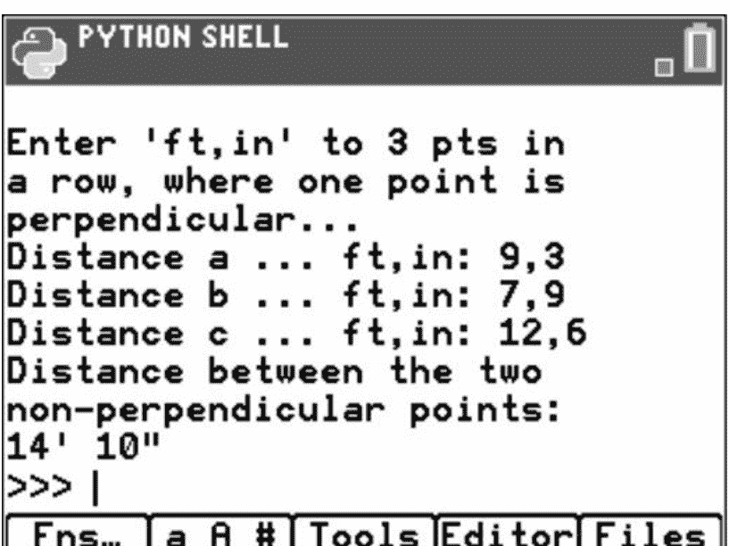

请按照它们沿你测量线出现的顺序，依次输入三个距离。即使第一个或最后一个测量点是垂直于该线的点，程序也总能正确计算出非垂直点之间的距离。

例如，假设你在高墙上有一幅巨大的画作，你想测量它的高度，类似于测量此图中的 b 到 c：

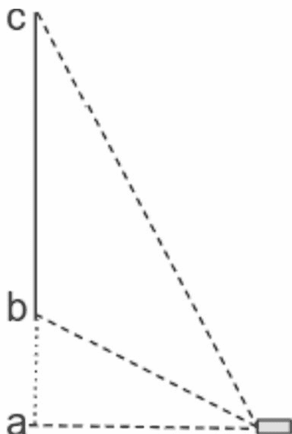

在这种情况下，请按 a、b、c 的顺序（或 c、b、a 的顺序——只需保持它们沿直线顺序）输入距离。此例中，将计算 b 到 c 的距离。下面是一个示例运行，显示计算出的 b 到 c 的高度为 10 英尺 8 英寸。

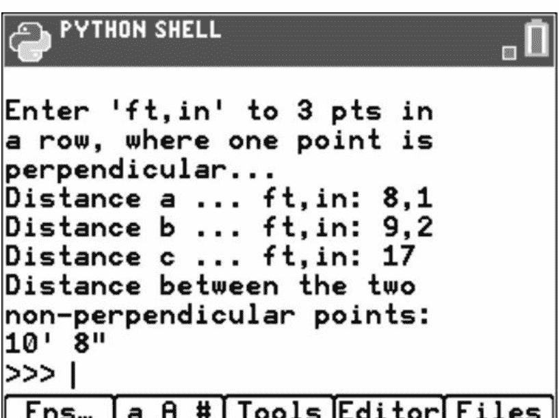

```
print("\nEnter 'ft,in' to 3 pts in")
print("a row, where one point is")
print("perpendicular...")

a=input("Distance a ... ft,in: ")
a=(a.strip()+',0').split(",")
a=float(a[0])+float(a[1])/12

b=input("Distance b ... ft,in: ")
b=(b.strip()+',0').split(",")
b=float(b[0])+float(b[1])/12

c=input("Distance c ... ft,in: ")
c=(c.strip()+',0').split(",")
c=float(c[0])+float(c[1])/12

ft=0

if a>b and b<c:
    d=(a*a-b*b)**0.5
    e=(c*c-b*b)**0.5
    ft=d+e

if a<b and b<c:
    d=(b*b-a*a)**0.5
    e=(c*c-a*a)**0.5
    ft=e-d

if a>b and b>c:
    d=(b*b-c*c)**0.5
    e=(a*a-c*c)**0.5
    ft=e-d

feet=int(ft)
inch=round((ft-feet)*12)
print("Distance between the two")
print("non-perpendicular points:")
print('{}\' {}"'.format(feet,inch))
```

##### MPH（英里每小时）

你的 TI-84 Plus CE Python 计算器内置时钟（并非所有计算器都能显示日期和时间）。通过使用 `ti_matplotlib` 模块中的 `monotonic()` 函数，你可以创建一种秒表。当你乘坐的汽车经过一个里程标记时，按下 [clear] 键开始计时，当你经过下一个里程标记时，再次按下 [clear] 键。程序中的一点数学运算就能计算出平均英里每小时速度。

有两个重要细节需要注意。首先，不要一边开车一边运行 Python！让别人开车，你来检查他们的速度。其次，这提供的是行驶该英里路程的平均速度。很可能在英里路程的一部分以 40 英里每小时的速度行驶，另一部分以 60 英里每小时的速度行驶，平均下来是 50 英里每小时。请记住这一点。

一个值得考虑的挑战是修改程序以适应公制测量。在 1 公里（或如果只有英里标记，则为 1 英里）的路段上，汽车的速度到底是多少公里每小时？

我选择 `ti_matplotlib` 中的 `monotonic()` 函数，是因为我已经在使用该模块在显示屏中央显示文本消息。`time` 模块中也有一个 `monotonic()` 函数，其行为略有不同。在撰写本书时，这些模块刚由德州仪器团队发布，它们未来有可能发生变化。`ti_system` 模块中的 `disp_wait()` 函数提供了另一种等待按下 [clear] 键的方式。你可以在后面章节的 WORDPERM 程序中看到这个函数的示例。

下面是一个示例运行，其中行驶一英里大约用了 60 秒。

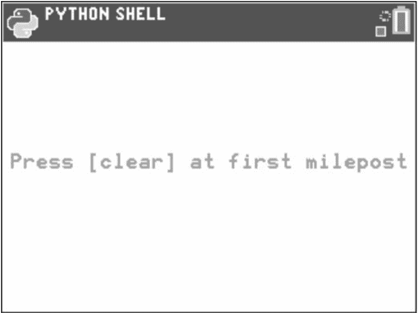

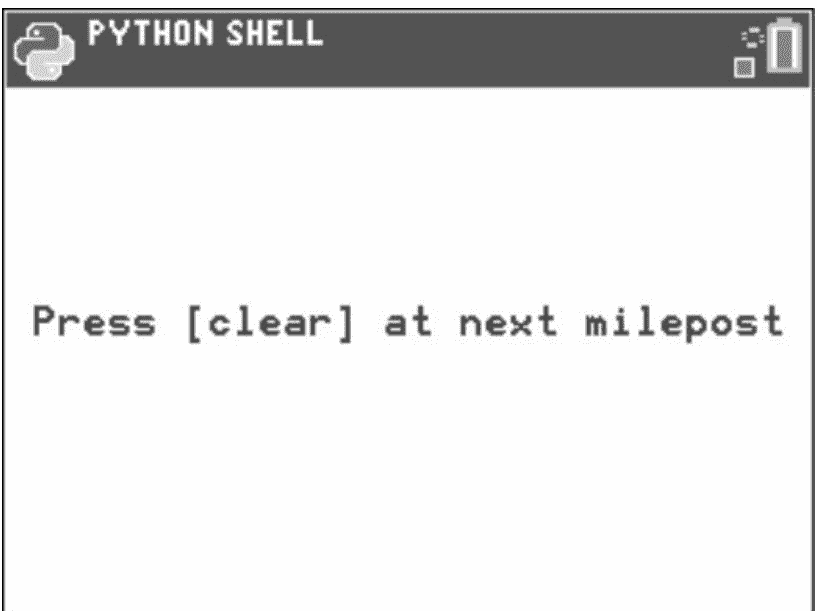

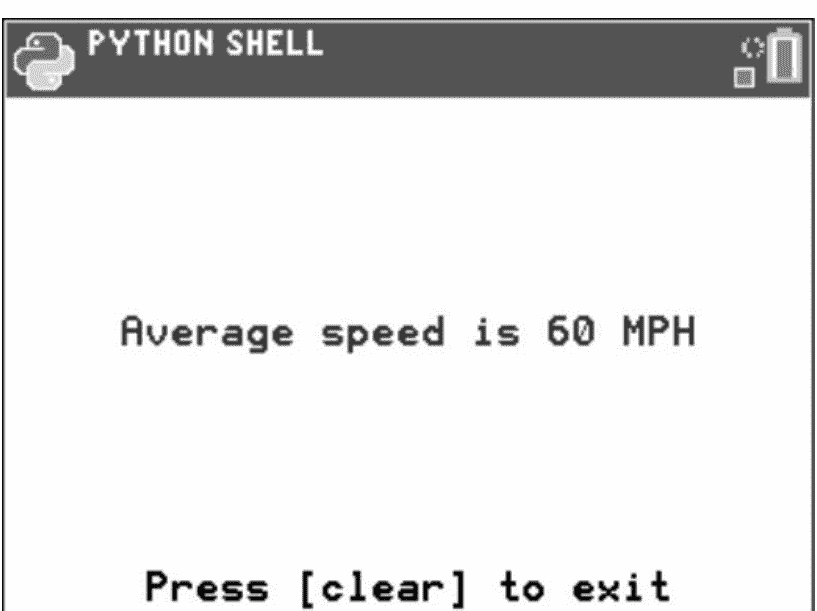

```
import ti_matplotlib as plt

m1="Press [clear] at first milepost"
m2="Press [clear] at next milepost"
m3="Average speed is {} MPH"
m4="Press [clear] to exit"

plt.cls()
plt.color(0,192,0)
plt.text_at(6,m1,"center")
plt.show_plot()
a=plt.monotonic()

plt.color(192,0,0)
plt.text_at(6,m2,"center")
plt.show_plot()
b=plt.monotonic()

h=(b-a)/3600
mph=round(1/h)
plt.color(0,0,192)
plt.text_at(6,m3.format(mph),"center")
plt.color(0,0,0)
plt.text_at(12,m4,"center")
plt.show_plot()
```

##### SECRET（秘密）

这个程序让你能够加密和解密秘密信息。操作过程有点繁琐，但对于短消息，例如你想安全保存的其他地方使用的密码，这个程序确实提供了相当高的安全性。

例如，让我们用密钥 "abc123" 加密间谍用语 "The dew is on the roses"。首先，选择 1 进行加密，输入短语，然后输入密钥。

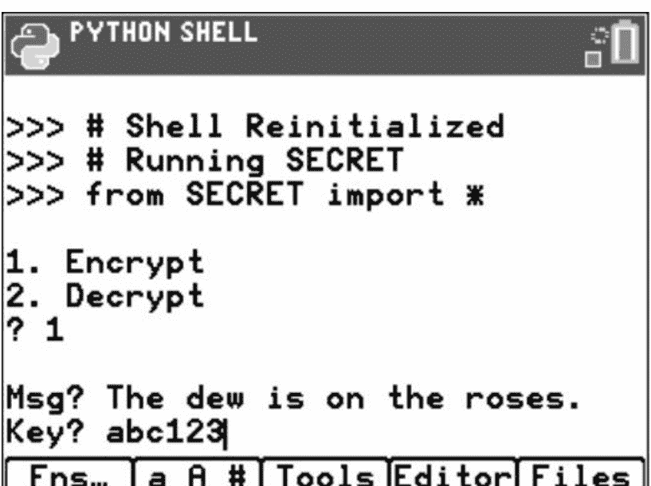

加密后的数据显示为六位十六进制字符块。这就是你需要记录并保存下来，或者发送给你的间谍伙伴的数据。

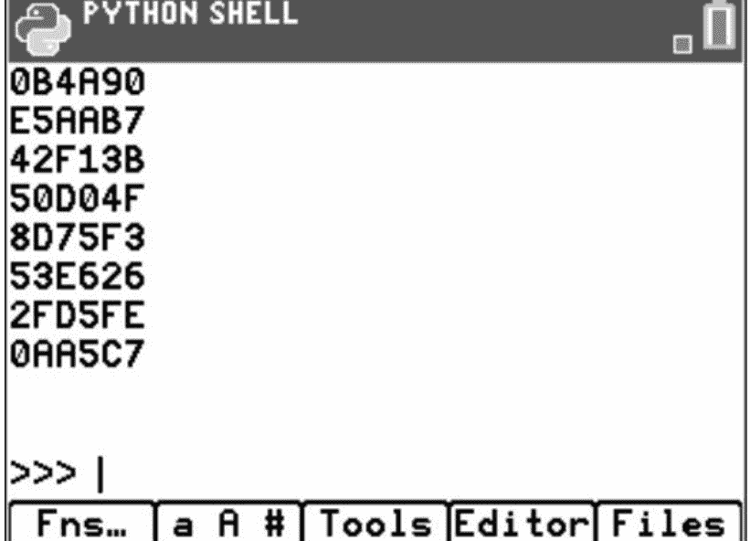

要解密消息，选择 2 开始解密。在每个 "Sec?" 提示符下，输入一个加密的十六进制字符秘密块。小写字母也可以，实际上这样更容易输入。

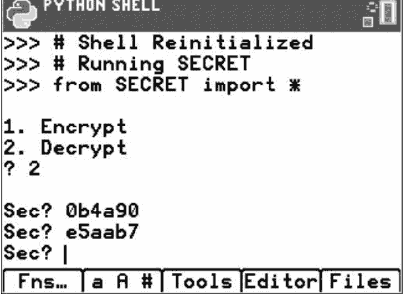

继续输入，直到所有代码块都输入完毕。请注意，在某些情况下，最后一个块可能少于四个字符，但没关系，只需输入加密后显示的内容即可。

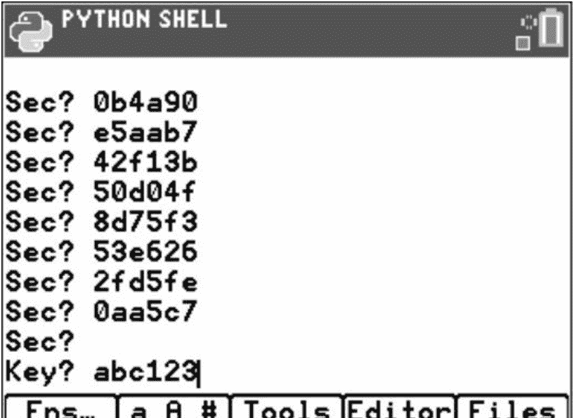

输入最后一个块后，最后一次按 [OK] 键，进入密钥提示符。输入秘密密钥（你和你的间谍伙伴会对此密钥保密），经过一点处理后，原始消息就会弹出。

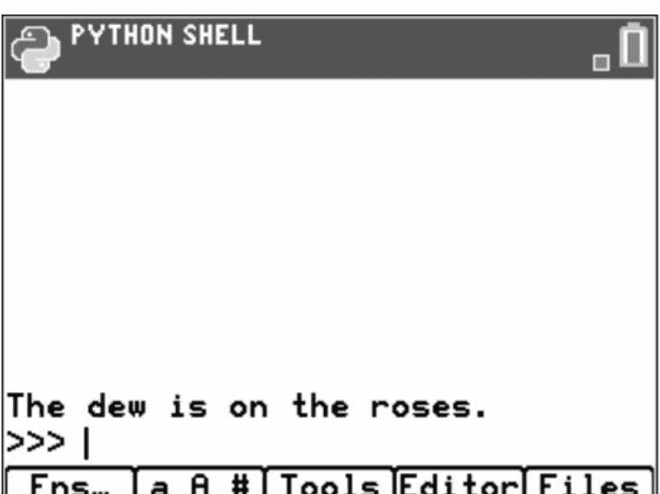

```
m1=17
n1=23
m2=145
n2=87
a=[]
```

```
def rseed(s):
    for c in s:
        a.append(ord(c))
    for i in range(97):
        rbyte()
```

```
def rbyte():
    la=len(a)
    for i in range(la):
        j=(i+1)%la
        a[i]+=a[j]
        a[i]+=i*m1+n1
        a[i]+=j*m2+n2
        a[i]%=256
    return a[0]
```

```
def hexchr(c):
    return ("0"+hex(c)[2:])[-2:].upper()
```

```
def chrhex(h):
    return eval("0x"+h)

def cls():
    for i in range(20):
        print()

print("\n1. Encrypt")
print("2. Decrypt")
n=int(input("? "))
s=''
x=0
if n==1:
    msg=input("\nMsg? ")
    key=input("Key? ")
    cls()
    rseed(key)
    for c in msg:
        b=ord(c)^rbyte()
        s+=hexchr(b)
        x+=1
        if not x%3:
            print(s)
            s=''
    print(s)
    s=''
if n==2:
    sec=""
    x=1
    print()
    while x:
        x=input("Sec? ")
        sec+=x
    sec=sec.replace(' ','').upper()
    key=input("Key? ")
    rseed(key)
    i=0
    while i < len(sec):
        b=chrhex(sec[i:i+2])
        s+=chr(b^rbyte())
        i+=2
    cls()
    print(s)
```

##### WAIT_KEY（等待按键）

`ti_system` 模块提供了一些用于控制程序的有用函数，例如 `wait_key()`。`wait_key()` 为按下的任何键返回一个唯一的数字。例如，如果按下 [enter] 键，`wait_key()` 返回 5。

这一点很清楚，但很难准确猜测按下各种键时会返回什么数字。例如，[prgm] 键返回 45，但它旁边的 [vars] 键返回 53。

这个小程序可以帮助你找出所有按键的所有代码。程序使用一个 `while` 循环来监视按键，打印所有按键的数字，只有在按下 [quit] 键时才停止。

下面是一个示例运行，其中按下了几个键。最后按下的键 [2nd][quit] 返回 64，该值用于停止程序。第一个按下的键是 [1]，它返回 143。我让你自己去尝试，找出其余按键的代码。

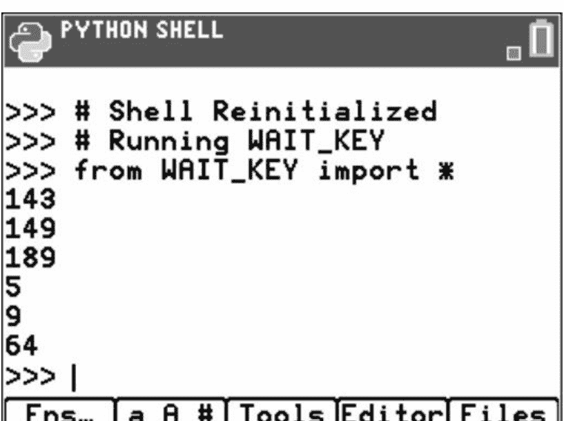

```
from ti_system import *

while True:
    k=wait_key()
    print(k)
    if k==64:
        break
```

##### WET_BULB（湿球温度）

最近的新闻头条谈到，随着气候变化导致越来越多的极端高温事件，人们因过热甚至死亡在全球范围内面临危险。这是一个真实的问题。气温是一个需要关注的因素，但更重要的是所谓的湿球温度，即温度和相对湿度的综合效应。

我们通过出汗来降温。当水从表面蒸发时，其温度会下降。在相对湿度较低时，冷却效果更大；而在相对湿度较高时，蒸发减慢，更难降温。一个炎热但干燥的沙漠可能比一个炎热潮湿的城市环境对人类生命的危险性更低！

干湿球温度计测量湿球温度。将一小段湿布包裹在温度计的球端，并在空气中挥动以最大化蒸发。由于蒸发，这个温度计能降低的温度是有限度的，这就是湿球温度。湿球温度是实际空气温度和相对湿度的函数。

现在，危险的事情来了。如果湿球温度高于体温，无论你出多少汗，或者风扇吹得多快，都不可能通过蒸发来降温。这就是为什么在炎热时了解湿球温度很重要！

有一个非常复杂的数学公式，用于在已知空气温度和相对湿度时计算湿球温度。与大多数算法不同，这个方程实际上是由一个人工智能程序发现的。这个故事太复杂，无法在此详述，但如果你感兴趣，可以在互联网上搜索了解更多。这个程序使用该方程来计算湿球温度。此外，如果你知道空气温度、相对湿度和湿球温度这三个因素中的任意两个，这个程序将计算出第三个未知数。

运行此程序时，会演示三个函数，它们都使用同一组数字。如果空气温度是 30°C，相对湿度是...

当湿度为50%时，湿球温度非常接近22.3°C。这些参数的组合被传递给每个函数以计算第三个参数。如你所见，结果是一致的。

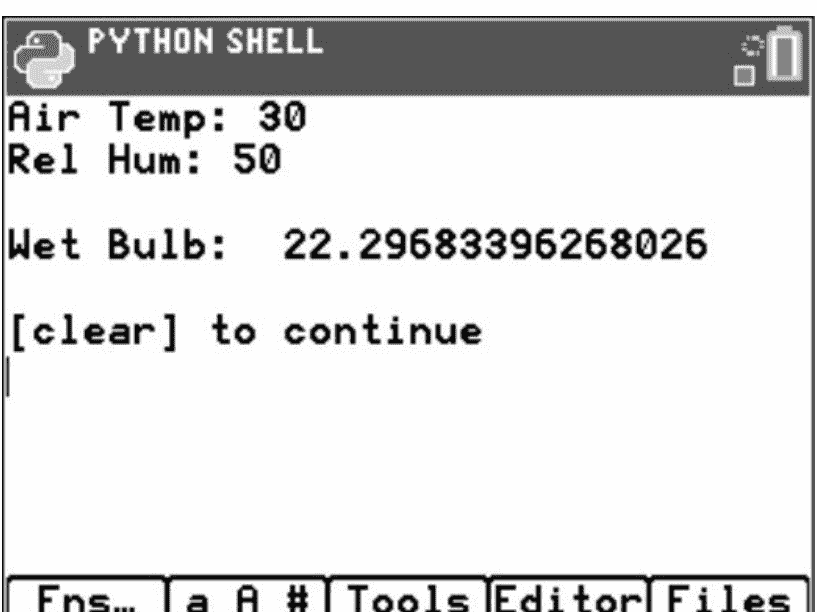

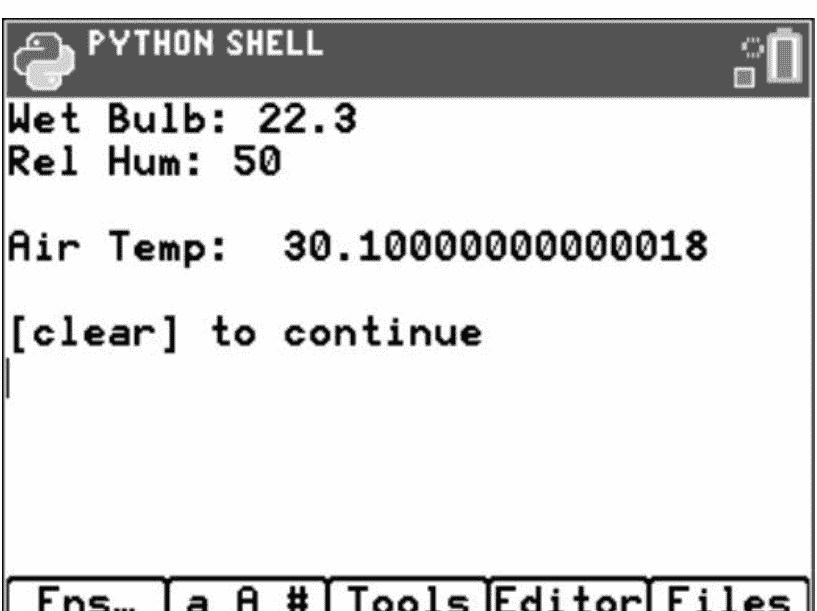

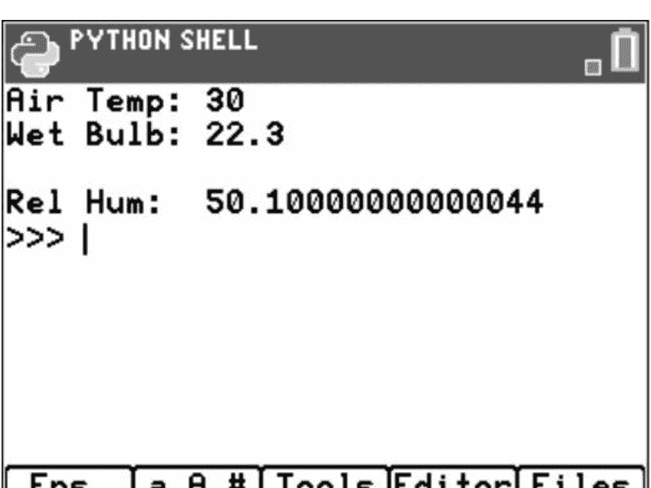

```python
from math import *
from ti_system import *
```

```python
def wet_bulb(t,rh):
    a=t*atan(0.151977*(rh+8.313659)**.5)
    b=atan(t+rh)-atan(rh-1.676331)
    c=0.00391838*rh**(1.5)*atan(0.023101*rh)
    d=-4.686035
    tw=a+b+c+d
    return tw
```

```python
def temperature(tw,rh):
    t=-20
    while t<50:
        if wet_bulb(t,rh)>=tw:
            return t
        t+=0.1
    return 999
```

```python
def relative_humidity(t,tw):
    rh=0
    while rh<100:
        if wet_bulb(t,rh)>=tw:
            return rh
        rh+=.1
    return 999
```

```python
disp_clr()
print("Air Temp: 30")
print("Rel Hum: 50")
print("\nWet Bulb: ",wet_bulb(30,50))
print("\n[clear] to continue")
disp_wait()
disp_clr()
print("Wet Bulb: 22.3")
print("Rel Hum: 50")
print("\nAir Temp: ",temperature(22.3,50))
print("\n[clear] to continue")
disp_wait()
disp_clr()
print("Air Temp: 30")
print("Wet Bulb: 22.3")
print("\nRel Hum: ",relative_humidity(30,22.3))
```

##### 风寒指数

当风吹过时，由于热量更快地从身体流失，空气会感觉更冷。有一个标准的风寒系数计算公式，本程序会为你处理它。

输入实际的华氏温度（°F）和风速（英里/小时）。程序会输出风寒指数。例如，在风速30英里/小时时，实际气温25°F的感觉与8°F相同。

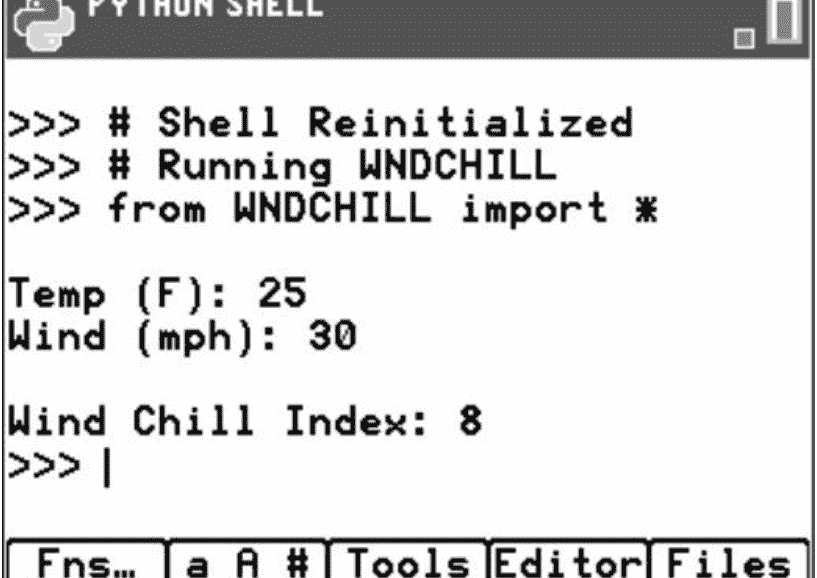

```python
f=float(input("\nTemp (F): "))
w=float(input("Wind (mph): "))
v=w**.16
wc=35.74+.6215*f-35.75*v+.4275*f*v
print("\nWind Chill Index:",round(wc))
```

#### 8. 平面几何

大多数数字游戏系统的核心是许多对模拟真实世界至关重要的计算。本章介绍常用的二维计算和坐标变换，这些技术用于多种目的，包括创建各种图形和游戏动画。

##### 弧

给定描述圆弧的四个参数中的任意两个，本程序会计算出另外两个未知部分。这些部分是弧长、弦长、圆心角和定义该弧的圆的半径。

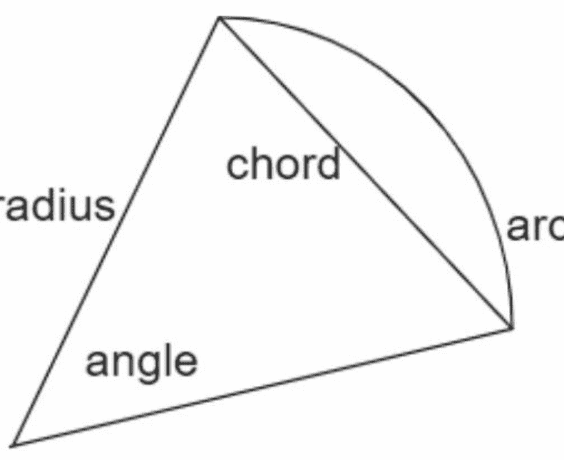

例如，假设要设计一段铁路轨道，使其转弯45度，转弯起点和终点之间的直线（弦）距离为2,021米。轨道有多长？如示例所示，计算出的轨道（弧长）约为2,074米。

在提示时输入两个已知值，对于未知值只需按[回车]键。

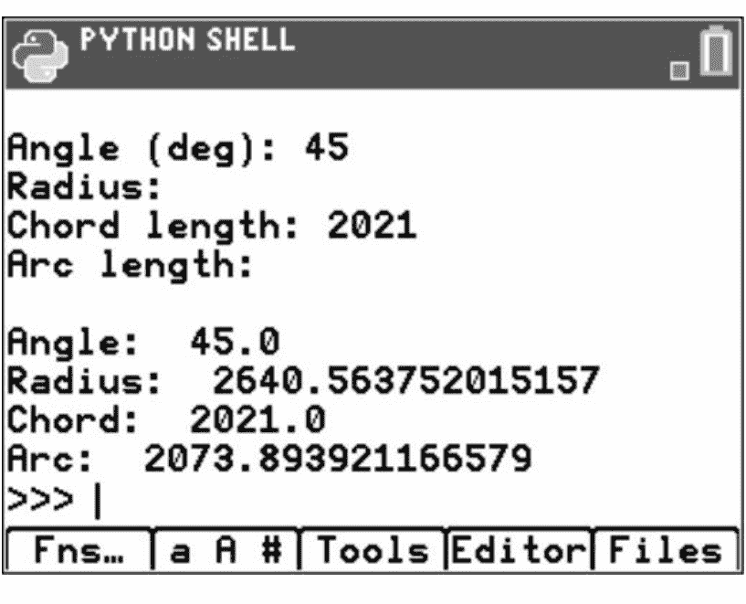

```python
from math import *

def arcs(a,r,c,s):
    if a:
        if r:
            s=r*a
        elif c:
            r=c/2/sin(a/2)
        else:
            r=s/a
    elif r:
        if c:
            a=2*asin(c/r/2)
        else:
            a=s/r
    else:
        a=.1
        t=0
        while a!=t:
            t=a
            a=2*s*sin(a/2)/c
            r=s/a
    c=2*r*sin(a/2)
    s=r*a
    return [a,r,c,s]

print("\n\nInput two known values\n")
a=input("Angle (deg): ")
a=float(a) if a else 0
```

```python
a=radians(a)
r=input("Radius: ")
r=float(r) if r else 0
c=input("Chord length: ")
c=float(c) if c else 0
s=input("Arc length: ")
s=float(s) if s else 0
a,r,c,s=arcs(a,r,c,s)
a=degrees(a)
print("\nAngle: ",a)
print("Radius: ",r)
print("Chord: ",c)
print("Arc: ",s)
```

##### 三点定面积

平面上的三个x,y点定义一个三角形。本程序根据任意三个点计算三角形的面积。

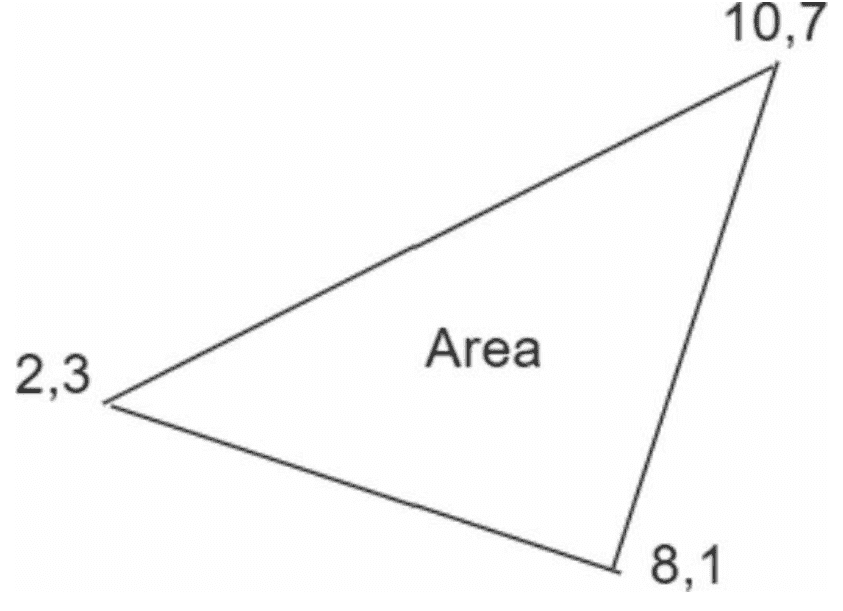

在所示示例中，输入三个坐标后，计算出的三角形面积为20平方单位。

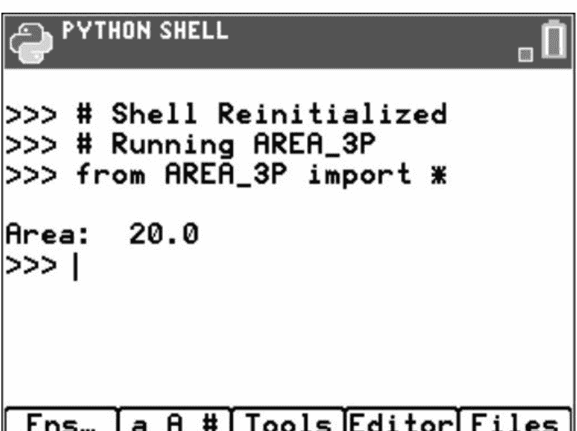

```python
def area_3p(p1,p2,p3):
    x1,y1=p1
    x2,y2=p2
    x3,y3=p3
    a=x1*y2+x2*y3+x3*y1
    b=x1*y3+x2*y1+x3*y2
    return abs((a-b)/2)
```

```python
p1=[10,7]
p2=[8,1]
p3=[2,3]
area=area_3p(p1,p2,p3)
print("\nArea: ",area)
```

##### 三边定面积

海伦公式让我们在已知三角形三边长度的情况下求出其面积，而无需先计算角度或其他距离。公式如下，给定边长为a、b和c：

$$s = \frac{a + b + c}{2}$$

$$Area = \sqrt{s(s - a)(s - b)(s - c)}$$

例如，一个边长为7、11和17厘米的三角形面积是多少？将这三个值输入程序，计算出的答案约为24.44平方厘米。

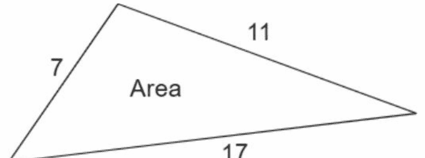

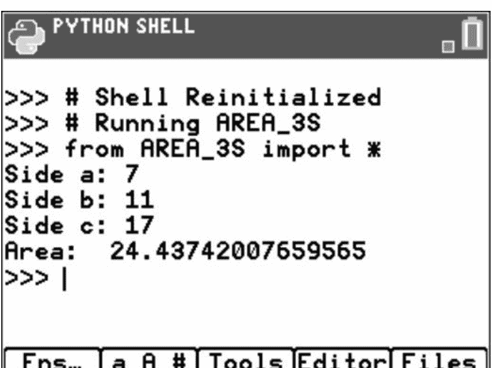

```python
def area_3s(a,b,c):
    s=(a+b+c)/2
    return (s*(s-a)*(s-b)*(s-c))**.5
```

```python
a=float(input("Side a: "))
b=float(input("Side b: "))
c=float(input("Side c: "))
print("Area: ",area_3s(a,b,c))
```

##### 多边形面积

本程序计算任意形状多边形的面积。每个顶点的X,Y坐标通过直接编辑代码顶部的`load_pts()`函数中的点列表来输入。

通过沿多边形“走一圈”（顺时针或逆时针方向）来输入点。程序清单显示了一个具有六个顶点的示例多边形，如下所示：

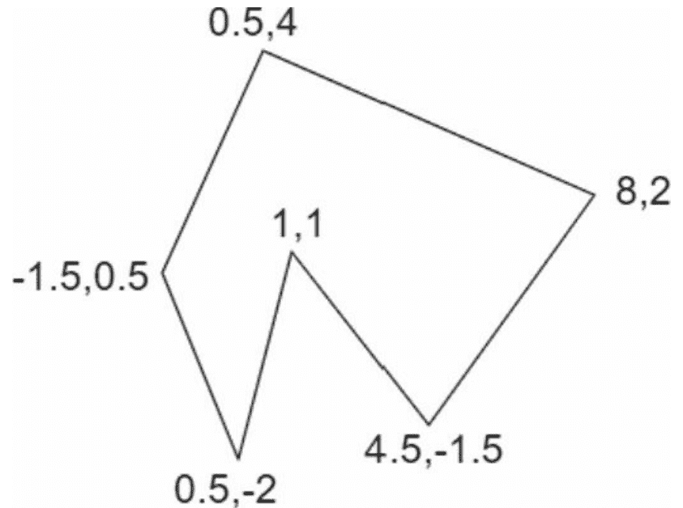

多边形的面积是通过有效地将多边形分解成更小的三角形并累加每个三角形的面积来求得的。

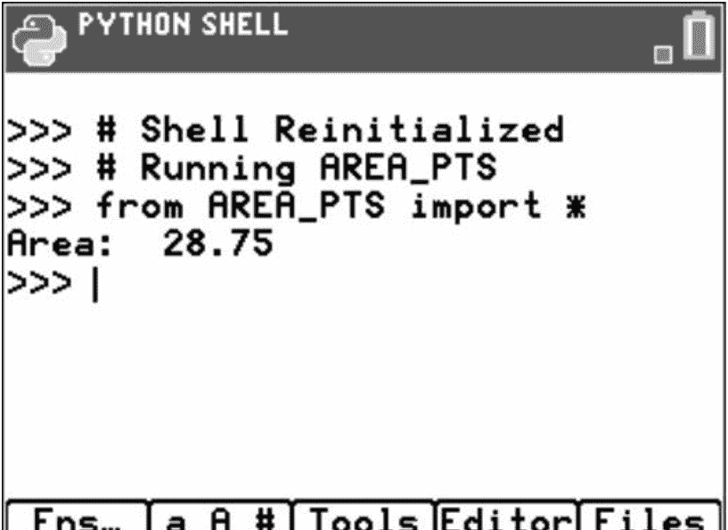

```python
from math import *

def load_pts():
    pts=[]
    pts.append([4.5,-1.5])
    pts.append([8,2])
    pts.append([.5,4])
    pts.append([-1.5,.5])
    pts.append([.5,-2])
    pts.append([1,1])
    return pts

def area_pts(pts):
    area=0
    pts.append(pts[0])
    for i in range(len(pts)-1):
        a=pts[i][0]+pts[i+1][0]
        b=pts[i][1]-pts[i+1][1]
        area+=a*b
    return abs(area/2)

pts=load_pts()
area=area_pts(pts)
print("Area: ",area)
```

##### 三点定圆

本程序找出恰好经过x,y平面上三个点的圆的圆心和半径。另一种说法是，程序找到一个与三个给定点等距的点。当然，如果三点共线，此方法将不适用。程序会检测这种情况，如果三点共线，则打印“Not a circle”。

例如，找出通过点(3,12)、(10,13)和(7,4)的圆：

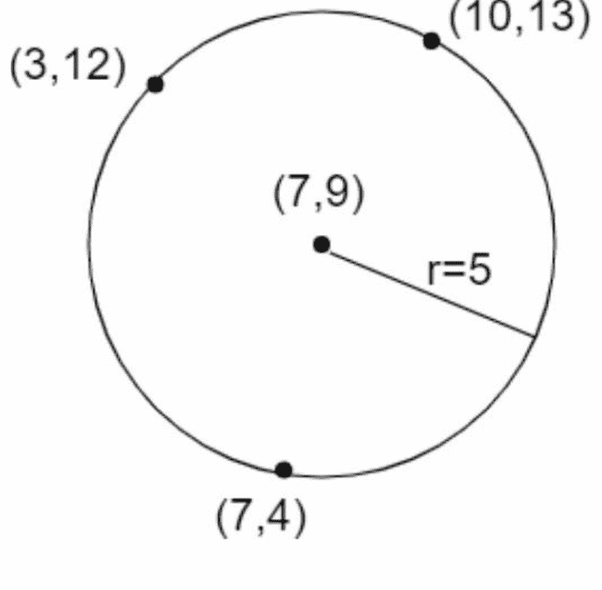

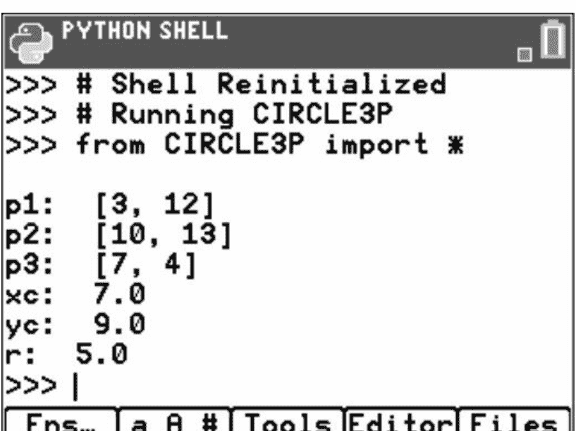

```python
def load_3p():
    p1=[3,12]
    p2=[10,13]
    p3=[7,4]
    return (p1,p2,p3)
```

```python
def circle_3p(p1,p2,p3):
    x1,y1=p1
    x2,y2=p2
    x3,y3=p3
    A=(x1*(y2-y3)-
       y1*(x2-x3)+
       x2*y3-x3*y2)
    B=((x1*x1+y1*y1)*
       (y3-y2)+
       (x2*x2+y2*y2)*
       (y1-y3)+
       (x3*x3+y3*y3)*
       (y2-y1))
    C=((x1*x1+y1*y1)*
       (x2-x3)+
       (x2*x2+y2*y2)*
       (x3-x1)+
       (x3*x3+y3*y3)*
       (x1-x2))
    if A==0:
        return (0,0,0)
    xc=-B/A/2
    yc=-C/A/2
    r=(((xc-x1)**2+(yc-y1)**2)**.5)
    return (xc,yc,r)
```

```python
p1,p2,p3=load_3p()
xc,yc,r=circle_3p(p1,p2,p3)
print()
print("p1: ",p1)
print("p2: ",p2)
print("p3: ",p3)
print("xc: ",xc)
print("yc: ",yc)
print("r: ",r)
```

##### 距离

x,y平面上的两个点之间存在一定的直线距离。这个简短的程序创建了一个函数，利用勾股定理来计算该距离。

示例计算了点[6, 5]和[2, 3]之间的距离，并显示结果以供验证。运行程序后，你可以在shell中手动调用`distance()`函数来计算其他距离。只需确保传递两个变量，每个变量都是一个包含两个数字的列表，分别代表x和y坐标值。

例如，要手动重复相同的距离计算，请在shell中输入“distance([6,5],[2,3])”。

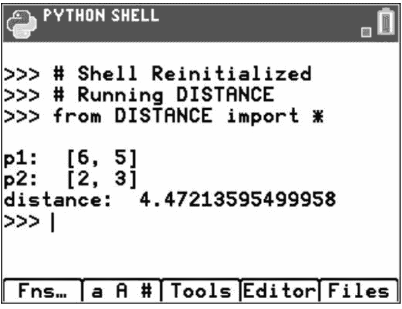

```python
def distance(p1,p2):
    x1,y1=p1
    x2,y2=p2
    d=((x2-x1)**2+(y2-y1)**2)**.5
    return d
```

##### DIVLINE

本程序提供了一个函数，用于将x,y平面中的一条线段等分为n份。`divide_line()`函数接受三个参数。前两个参数是列表，每个列表包含两个数字，定义一个x,y坐标。第三个参数控制将线段等分为多少段。通常，我们只需要线段的中点。在这种情况下，可以将段数参数设为2。

该示例将从点(3,2)到点(9,5)的线段等分为三段。函数返回一个包含所有小线段坐标的列表，并且列表的首尾包含了原始的两个端点。

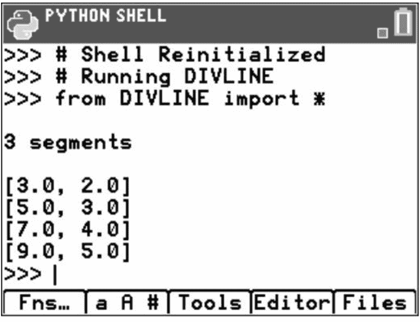

```python
def divide_line(p1,p2,n):
    pts=[]
    for i in range(n+1):
        x=p1[0]+(p2[0]-p1[0])*i/n
        y=p1[1]+(p2[1]-p1[1])*i/n
        pts.append([x,y])
    return pts

p1=[3,2]
p2=[9,5]
segs=3
pts=divide_line(p1,p2,segs)
print("\n{} segments\n".format(segs))
for pt in pts:
    print(pt)
```

##### LINE_2P

本程序计算由两点定义的平面直线的若干特征。例如，给定点[3,4]和[-5, -9]，这能告诉我们关于通过这两点的直线的哪些信息？

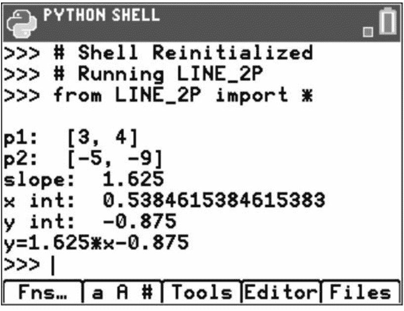

斜率(m)为1.625，x截距约为0.5385，y截距为-0.875。综合起来，该直线的方程为 y=1.625*x-0.875。

```python
def line_2p(p1,p2):
    x1,y1=p1
    x2,y2=p2
    m = (y2 - y1) / (x2 - x1)
    a = x1-y1/m
    b = y1-m*x1
    return (m,a,b)

p1=[3,4]
p2=[-5,-9]
m,a,b=line_2p(p1,p2)
print("\np1: ",p1)
print("p2: ",p2)
print("slope: ",m)
print("x int: ",a)
print("y int: ",b)
f="y={}*x+{}"
if b<0: f=f.replace("+", "")
print(f.format(m,b))
```

##### LINSLOPE

本程序提供了一个函数，用于根据给定的点和斜率求出直线的常用参数。例如，通过点[3,4]且斜率为0.5的直线是什么？该函数返回x和y截距，以及直线的斜率。与前面描述的LINE_2P程序类似，这提供了显示直线所有常用信息（包括其方程）所需的一切。

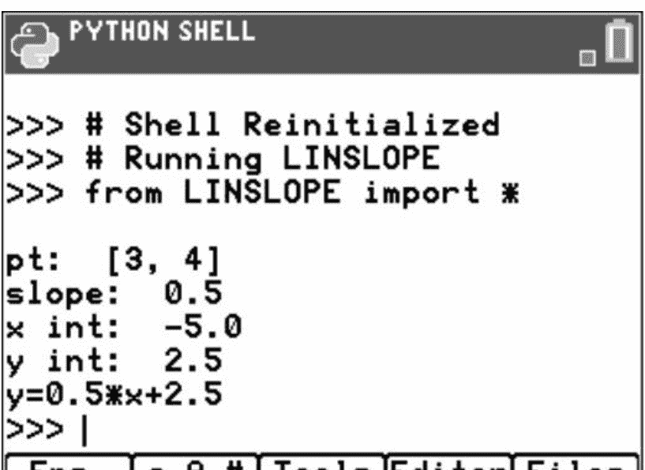

```python
def line_pt_slope(pt,m):
    x,y=pt
    b=y-m*x
    a=x-y/m
    return (m,a,b)

pt=[3,4]
m=0.5
m,a,b=line_pt_slope(pt,m)
print("\npt: ",pt)
print("slope: ",m)
print("x int: ",a)
print("y int: ",b)
f="y={}*x+{}"
if b<0: f=f.replace("+","")
print(f.format(m,b))
```

##### TRANSFRM

计算机图形游戏需要大量高速数学运算来保持动作的真实感和流畅性。其中一个核心算法是能够将x,y平面中的一个点绕原点旋转一定角度。这是对游戏编程需求的巨大简化，但嘿，这是个开始！

`rotate()`函数允许你传入一个包含x和y坐标的列表作为点，以及一个以度为单位的旋转量。坐标绕原点旋转转换为弧度的角度，并返回新的坐标。

`translate()`函数接收一个点以及用于平移的x和y值。通过简单地加上平移量，该点被平移到一个新位置。返回结果的x和y值。

例如，点(2,3)在平移(4,4)后将到达(6, 7)，在绕原点旋转17度后将接近点(1.035,3.454)。

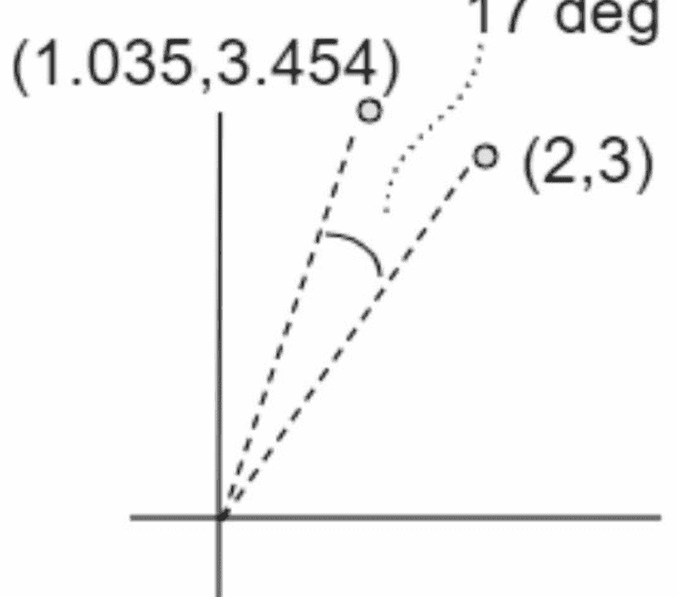

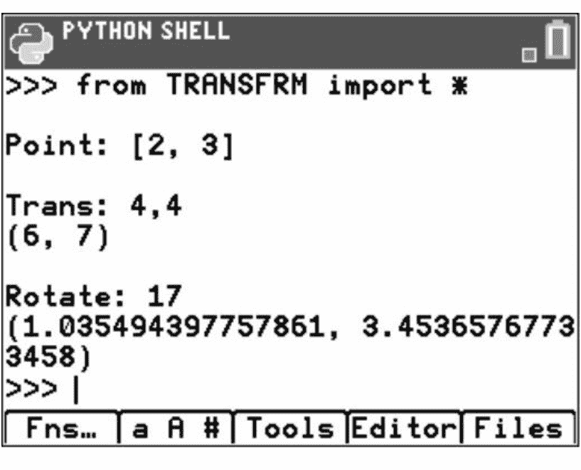

```python
from math import *

def translate(p,dx,dy):
    x,y=p
    return (x+dx,y+dy)

def rotate(p,a):
    x,y=p
    r=radians(a)
    xr=x*cos(r)-y*sin(r)
    yr=x*sin(r)+y*cos(r)
    return (xr,yr)

p=[2,3]
dx,dy=4,4
deg=17
t=translate(p,4,4)
r=rotate(p,deg)
print("\nPoint: {}\n".format(p))
print("Trans: {},{}\n{}\n".format(dx,dy,t))
print("Rotate: {}\n{}".format(deg,r))
```

##### TRIANG3P

本程序根据x,y平面中的三个点计算三角形的边长、角度和面积。

例如，由点(2,4)、(10,4)和(2,10)定义的三角形的边长、角度和面积是多少？

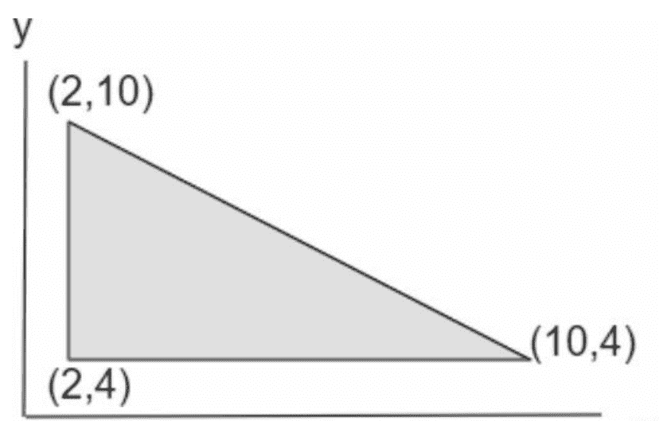

函数`triangle_3p()`完成所有工作。传入三个点，每个点是一个包含两个数字的列表，它返回三条边长、与这些边相对的三个角度（以度为单位）以及面积。在此示例中，边a、b和c的长度分别为6、8和10个单位。与这些边相对的角度A、B和C分别约为10、36.87和53.13度。三角形的面积恰好是24平方单位。

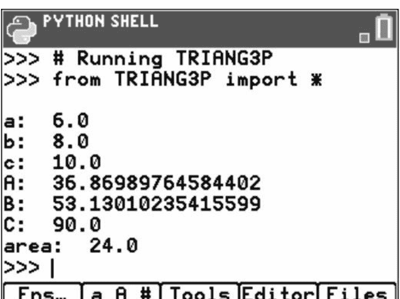

```python
from math import *

def triangle_3p(p1,p2,p3):
    x1,y1=p1
    x2,y2=p2
    x3,y3=p3
    a=((y2-y1)**2+(x2-x1)**2)**.5
    b=((y3-y2)**2+(x3-x2)**2)**.5
    c=((y3-y1)**2+(x3-x1)**2)**.5
    A=degrees(acos((b*b+c*c-a*a)/b/c/2))
    B=degrees(acos((a*a+c*c-b*b)/a/c/2))
    C=180-A-B
    area=a*b*sin(radians(C))/2
    return (a,b,c,A,B,C,area)

p1=[2,10]
p2=[2,4]
p3=[10,4]
tri=triangle_3p(p1,p2,p3)
a,b,c,A,B,C,area=tri
print()
print("a: ",a)
print("b: ",b)
print("c: ",c)
print("A: ",A)
print("B: ",B)
print("C: ",C)
print("area: ",area)
```

##### TRIANGLE

本程序在给定三角形任意三条边或角的组合的情况下，求解所有边长、角度和面积。

边和角的组合有五种可能。如果s代表一条边，a代表一个角，那么当你沿着三角形的边和角依次行走时，可能出现的组合是：sss、sas、ssa、asa和aas。本程序会询问已知条件，然后提示输入这三个部分，并计算所有剩余部分以及面积。

输出部分标记为s1、s2和s3表示边长，a1、a2、a3表示与这些边相对的角度。面积是最后输出的项目。

例如，边长为4、5和6的三角形的角度和面积是多少？

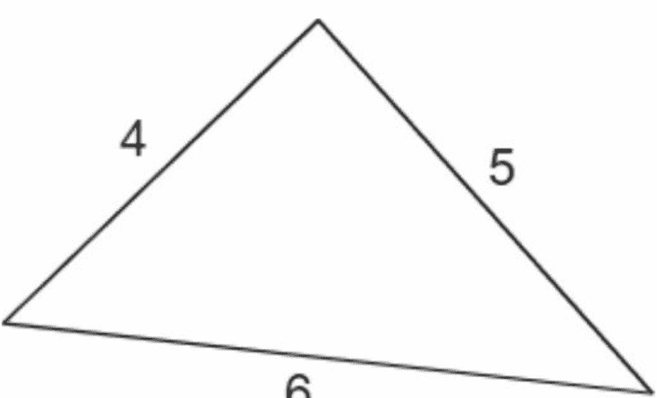

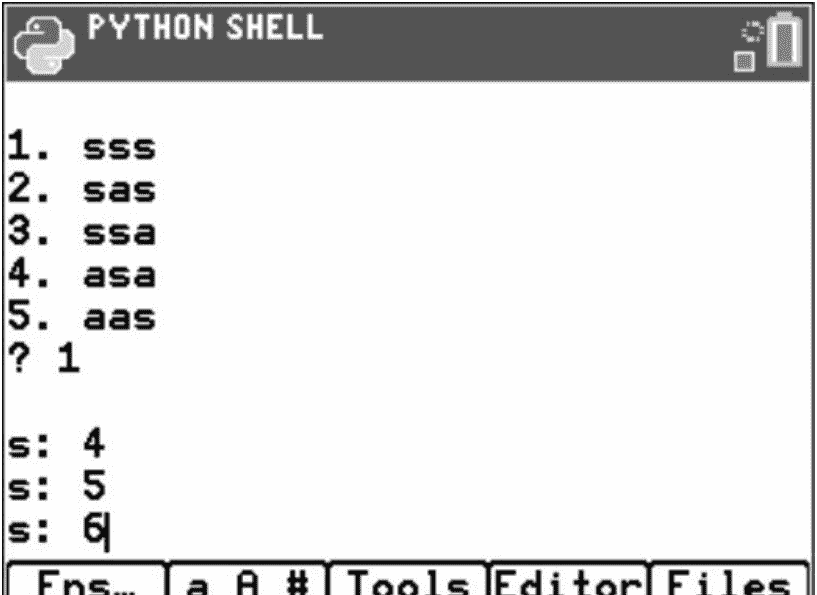

在第一个提示处输入1选择sss，然后输入边长。输入所有三个部分后，结果将被计算并显示：

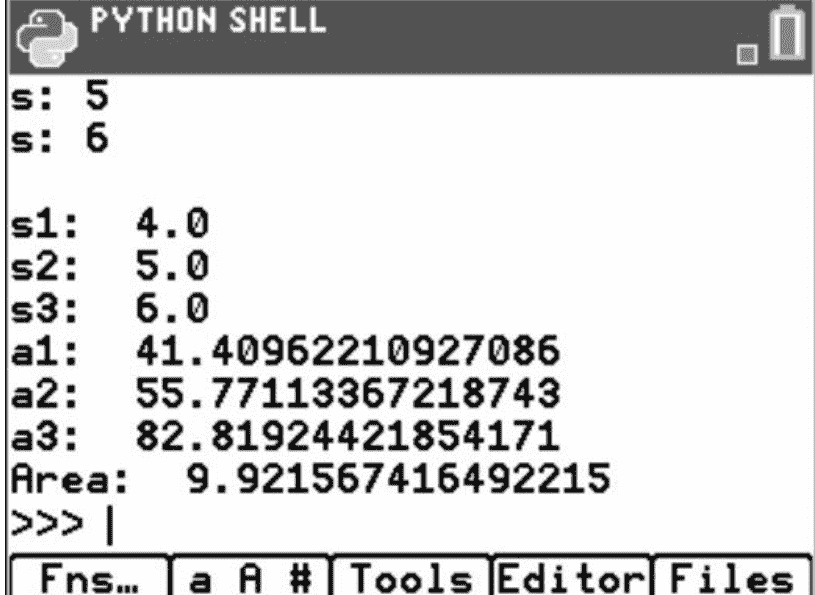

与长度为4的边相对的角度约为41.4度，依此类推。三角形的面积略大于9.92平方单位。

```python
from math import *

def sss(a,b,c):
    A=degrees(acos((b*b+c*c-a*a)/b/c/2))
    B=degrees(acos((a*a+c*c-b*b)/a/c/2))
    C=180-A-B
    return [a,b,c,A,B,C]

def sas(a,C,b):
    c=(a*a+b*b-2*a*b*cos(radians(C)))**.5
    A=degrees(acos((b*b+c*c-a*a)/(2*b*c)))
    B=180-A-C
    return [a,b,c,A,B,C]

def ssa(b,c,B):
    C=degrees(asin(c*sin(radians(B))/b))
    A=180-B-C
    a=b*sin(radians(A))/sin(radians(B))
    return [a,b,c,A,B,C]

def asa(A,c,B):
    C=180-A-B
    a=c*sin(radians(A))/sin(radians(C))
    b=c*sin(radians(B))/sin(radians(C))
    return [a,b,c,A,B,C]

def aas(A,C,a):
    B=180-A-C
    b=a*sin(radians(B))/sin(radians(A))
    c=a*sin(radians(C))/sin(radians(A))
    return [a,b,c,A,B,C]

###### Heron's formula
def area(a,b,c):
    p=(a+b+c)/2
    return (p*(p-a)*(p-b)*(p-c))**.5

print()
print("1. sss")
print("2. sas")
print("3. ssa")
print("4. asa")
print("5. aas")
n=int(input("? "))
print()
if n<4:
    a=input("s: ")
    a=float(a) if a else 0
else:
    A=input("Ang A: ")
    A=float(A) if A else 0
if n==1 or n==3 or n==4:
    b=input("s: ")
    b=float(b) if b else 0
else:
    B=input("Ang B: ")
    B=float(B) if B else 0
if n<3 or n==5:
    c=input("s: ")
    c=float(c) if c else 0
else:
    C=input("Ang C: ")
    C=float(C) if C else 0
if n==1:
    t=sss(a,b,c)
if n==2:
    t=sas(a,B,c)
if n==3:
    t=ssa(a,b,C)
if n==4:
    t=asa(A,b,C)
if n==5:
    t=aas(A,B,c)
ar=area(t[0],t[1],t[2])
print()
print("s1: ",t[0])
print("s2: ",t[1])
print("s3: ",t[2])
```

#### 9. 空间几何

上一章介绍了几个用于处理二维平面中直线、弧线、三角形和其他图形的程序。本章将这些概念扩展到三维空间。

3D游戏需要围绕三个轴中的每一个进行旋转，以便在空间中移动角色和物体。使用矩阵可以有效地实现这一点，但即使是矩阵数学也依赖于能够数学化地组合围绕每个轴的旋转。

你将在本章中找到执行这些旋转的函数。在二维中，一组三个点确定一个三角形。对于三维空间中的一组三个点也是如此。此外，在三维空间中，一组四个空间点确定一个类似四面体的体积。你将在本章中找到执行这些计算的程序。

##### COORD_3D

有三种常用的坐标系用于指定空间中点的位置。笛卡尔坐标使用 x、y、z 值，类似于平面中的 x、y，但扩展到空间中增加了 z 方向。柱坐标使用 x、y 平面中的半径和角度来确定点正下方的点，以及 z 值表示从 x、y 平面到该点的距离。球坐标使用从原点出发的径向距离，以及两个角度来确定 x、y 平面中的角度和偏离 z 轴的角度。

在这个程序中，变量 x、y、z 指的是沿各自轴的距离。r 和 th（半径和 theta 的缩写）是柱坐标的半径和角度，rh、th、ph（rho、theta、phi 的缩写）用于球坐标，其中 rho 是距离，theta 和 phi 是角度。

提供了六个函数，允许从三种坐标系中的任何一种转换到其他任何一种。传入三个已知的坐标值，等效的坐标值将以列表形式返回。注意示例源代码中，三个返回值直接从返回的列表赋值给单独的变量。这是 Python 的一个非常好的特性，允许函数有效地返回多个值。

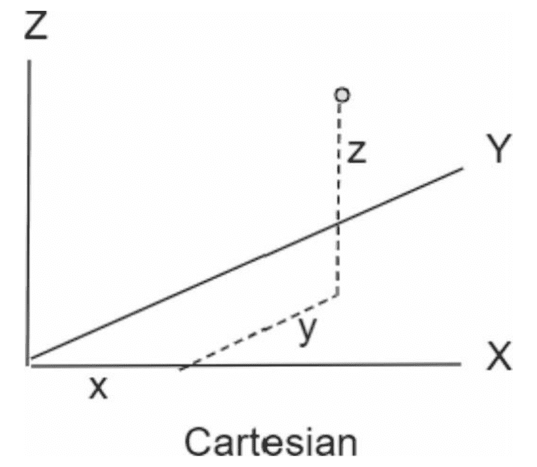

笛卡尔坐标

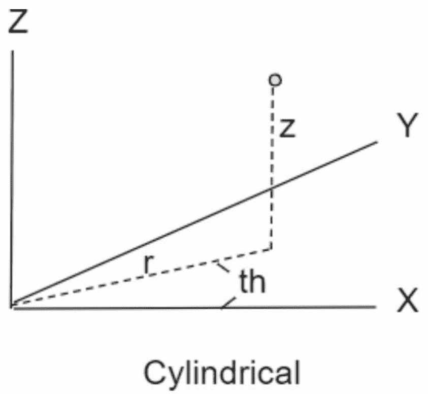

柱坐标

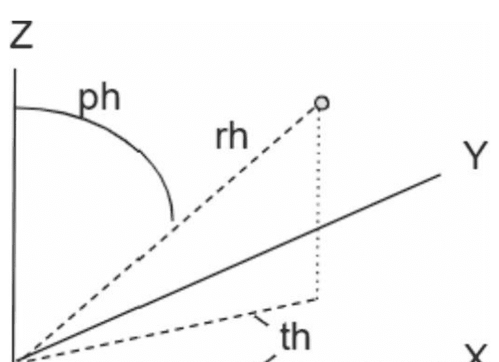

###### 球坐标

例如，将笛卡尔坐标 3,4,5 转换为其他坐标系。程序启动时，会提示你选择已知的坐标系，在本例中是笛卡尔坐标系。如图所示，输入 1 选择该系统，然后按照提示输入 x、y 和 z 的值 3、4 和 5。

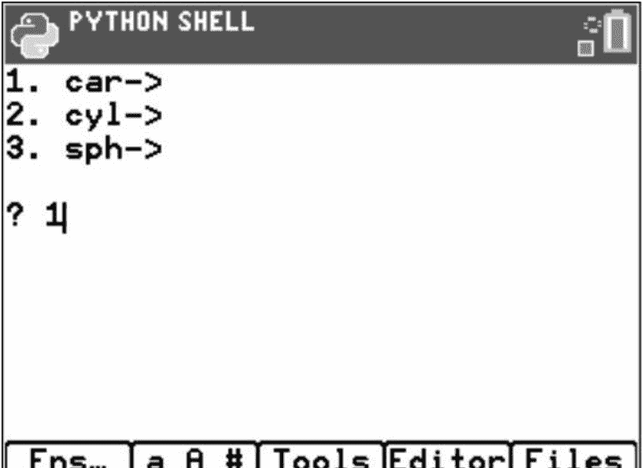

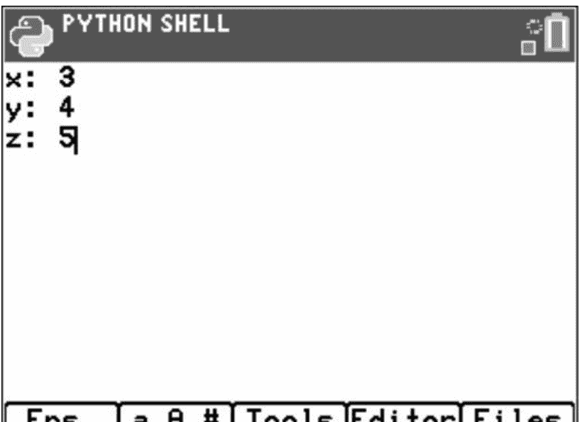

输入最后一个 z 值后，程序会计算其他两种坐标系的等效值，并依次显示所有三种坐标系。

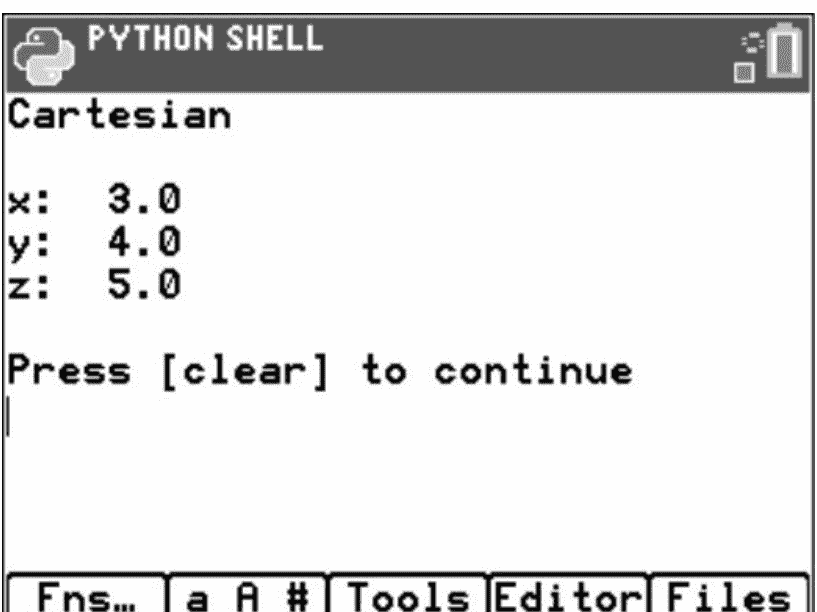

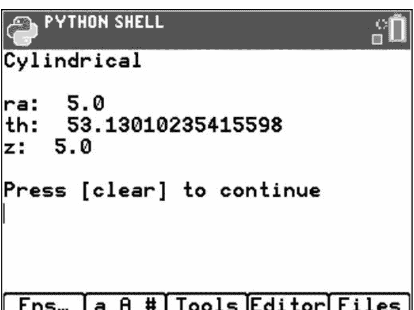

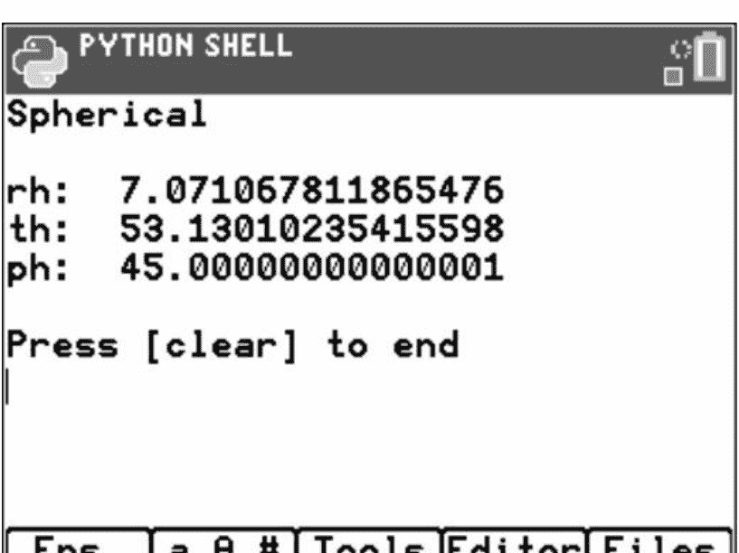

```python
from math import *
from ti_system import *

def car_to_cyl(x,y,z):
    ra=(x*x+y*y)**.5
    th=degrees(atan2(y,x))
    return[ra,th,z]

def cyl_to_car(ra,th,z):
    th=radians(th)
    x=ra*cos(th)
    y=ra*sin(th)
    return [x,y,z]

def car_to_sph(x,y,z):
    rh=(x*x+y*y+z*z)**.5
    th=degrees(atan2(y,x))
    ph=degrees(acos(z/rh))
    return [rh,th,ph]

def sph_to_car(rh,th,ph):
    th=radians(th)
    ph=radians(ph)
    x=rh*sin(ph)*cos(th)
    y=rh*sin(ph)*sin(th)
    z=rh*cos(ph)
    return [x,y,z]

def cyl_to_sph(ra,th,z):
    rh=(ra*ra+z*z)**.5
    ph=degrees(atan2(ra,z))
    return [rh,th,ph]

def sph_to_cyl(rh,th,ph):
    ph=radians(ph)
    ra=rh*sin(ph)
    z=rh*cos(ph)
    return [ra,th,z]

disp_clr()
print("1. car->")
print("2. cyl->")
print("3. sph->")
print()
n=int(input("? "))
disp_clr()
if n==1:
    x=float(input("x: "))
    y=float(input("y: "))
    z=float(input("z: "))
    ra,th,z=car_to_cyl(x,y,z)
    rh,th,ph=car_to_sph(x,y,z)
if n==2:
    ra=float(input("ra: "))
    th=float(input("th: "))
    z=float(input("z: "))
    x,y,z=cyl_to_car(ra,th,z)
    rh,th,ph=cyl_to_sph(ra,th,z)
if n==3:
    rh=float(input("rh: "))
    th=float(input("th: "))
    ph=float(input("ph: "))
    x,y,z=sph_to_car(rh,th,ph)
    ra,th,z=sph_to_cyl(rh,th,ph)
disp_clr()
print("Cartesian\n")
print("x: ",x)
print("y: ",y)
print("z: ",z)
print("\nPress [clear] to continue")
disp_wait()
print("Cylindrical\n")
print("ra: ",ra)
print("th: ",th)
print("z: ",z)
print("\nPress [clear] to continue")
disp_wait()
print("Spherical\n")
print("rh: ",rh)
print("th: ",th)
print("ph: ",ph)
print("\nPress [clear] to end")
disp_wait()
```

##### DIVLIN3D

之前介绍的 DIVLINE 程序将平面中的一条线段分割成 n 个更小的线段。这个程序对空间中由两个 x,y,z 点定义的直线执行相同的操作。两个空间坐标直接在代码中编辑，这使得程序更短，也更容易查看和编辑给定的数据。

例如，给定定义空间中一条线段的空间点 [3,2,-2] 和 [9,5,17]，程序将其分割成三个等长的小线段，并输出每个线段端点的坐标。原始端点包含在输出中。

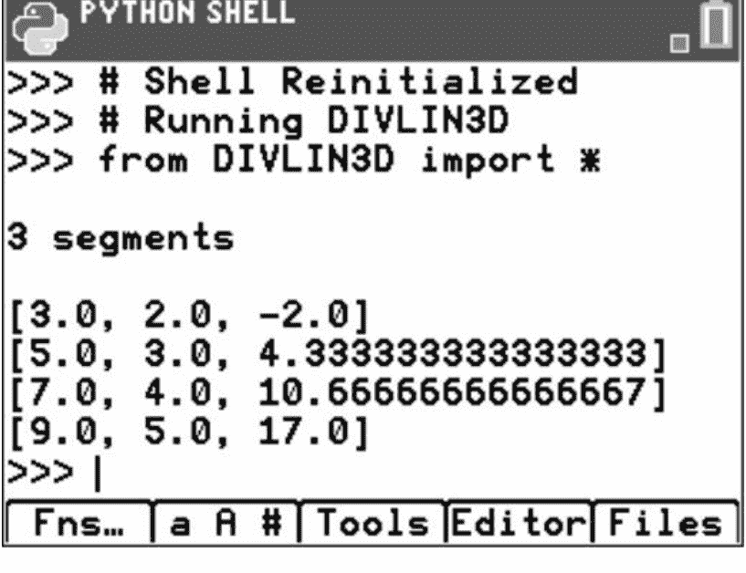

```python
def divide_line(p1,p2,n):
    pts=[]
    for i in range(n+1):
        x=p1[0]+(p2[0]-p1[0])*i/n
        y=p1[1]+(p2[1]-p1[1])*i/n
        z=p1[2]+(p2[2]-p1[2])*i/n
        pts.append([x,y,z])
    return pts

p1=[3,2,-2]
p2=[9,5,17]
segs=3
pts=divide_line(p1,p2,segs)
print("\n{} segments\n".format(segs))
for pt in pts:
    print(pt)
```

##### ROTATE3D

这个程序输入一个三维空间点，并将其围绕三个轴中的每一个旋转一定的角度（以度为单位）。

这个程序中有三个函数，每个函数用于将空间点围绕一个轴旋转。为了演示这些函数，点 3,4,5 围绕每个轴旋转 45 度，并输出每种情况下的新位置。

这些函数是许多 3D 图形和其他程序的核心。我曾使用这些函数来旋转地球上的天线以瞄准地球同步卫星，以及旋转定日镜以将阳光反射到太阳能目标上。

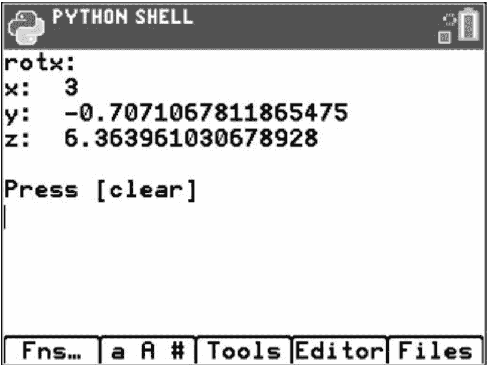

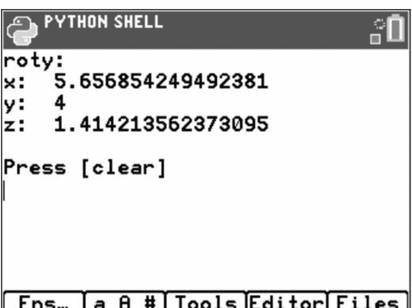

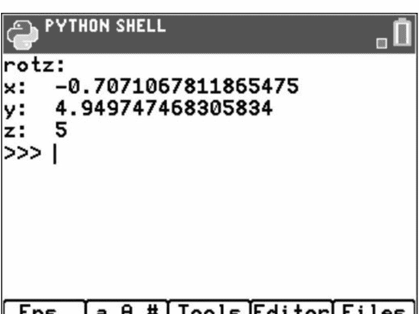

```python
from math import *
from ti_system import *

def rotx(p,a):
    x,y,z=p
    r=radians(a)
    yn=y*cos(r)-z*sin(r)
    zn=y*sin(r)+z*cos(r)
    return [x,yn,zn]

def roty(p,a):
    x,y,z=p
    r=radians(a)
    xn=z*sin(r)+x*cos(r)
    zn=z*cos(r)-x*sin(r)
    return [xn,y,zn]

def rotz(p,a):
    x,y,z=p
    r=radians(a)
    xn=x*cos(r)-y*sin(r)
    yn=x*sin(r)+y*cos(r)
    return [xn,yn,z]

p=[3,4,5]
a=45
disp_clr()
print("pt: ",p)
print("deg: ",a)
print("\nPress [clear]")
disp_wait()
disp_clr()
x,y,z=rotx(p,a)
print("rotx:")
print("x: ",x)
print("y: ",y)
print("z: ",z)
print("\nPress [clear]")
disp_wait()
disp_clr()
x,y,z=roty(p,a)
print("roty:")
print("x: ",x)
print("y: ",y)
print("z: ",z)
print("\nPress [clear]")
disp_wait()
disp_clr()
x,y,z=rotz(p,a)
print("rotz:")
print("x: ",x)
print("y: ",y)
print("z: ",z)
```

##### TRIANG3D

这个程序根据三个笛卡尔空间坐标计算三角形的边长、角度和面积。

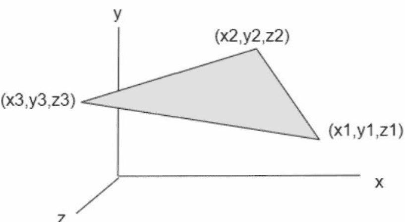

例如，给定点 (3,0,5)、(4,2,2) 和 (0,1,3)，求各边的长度、各边所对的角度以及三角形的面积。

在程序代码中编辑所有三个坐标的值，然后运行以查看三角形的边长、角度和面积。

##### VOLUME4P

空间中的四个笛卡尔坐标点定义了一个体积，其形状是一个被拉伸的四面体，具有四个三角形面。此程序计算该图形内部的空间体积。

为保持程序简单，四个空间坐标在程序清单中设置，因此您需要编辑程序以设置您自己的点。此处演示的示例中，点被设置为 [3,-2,5]、[4,4,0]、[6,3,7] 和 [6,5,0]。由这些点定义的计算体积为 9.5 立方单位。

此程序使用矩阵计算来求体积。以下是公式，我鼓励您在互联网上搜索，以更好地理解这种矩阵数学的工作原理，以及通常使用矩阵如何能简化许多有趣的计算。

```
from math import *

def vol(p1,p2,p3,p4):
    x1,y1,z1=p1
    x2,y2,z2=p2
    x3,y3,z3=p3
    x4,y4,z4=p4
    a=y2*z3+y3*z4+y4*z2
    b=y2*z4+y3*z2+y4*z3
    t1=x1*(a-b)
    a=x2*z3+x3*z4+x4*z2
    b=x2*z4+x3*z2+x4*z3
    t2=y1*(a-b)
    a=x2*y3+x3*y4+x4*y2
    b=x2*y4+x3*y2+x4*y3
    t3=z1*(a-b)
    a=x2*y3*z4+x3*y4*z2+x4*y2*z3
    b=x2*y4*z3+x3*y2*z4+x4*y3*z2
    t4=a-b
    return abs(t1-t2+t3-t4)/6
```

```
p1=[3,-2,5]
p2=[4,4,0]
p3=[6,3,7]
p4=[6,5,0]
print()
print("p1: ",p1)
print("p2: ",p2)
print("p3: ",p3)
print("p4: ",p4)
print("\nVol: ",vol(p1,p2,p3,p4))
```

#### 10. 空间科学

据预测，宇宙中存在多少颗“宜居带”行星，每颗都可能支持有机生命？你需要让空间站旋转多快才能产生人造重力效果？你出生那天的月相是什么样子的？

本章中的程序涵盖了这些以及许多其他有趣且具有挑战性的问题。

##### GEOSYNC

卫星绕地球运行，其轨道周期取决于它们与地球的距离。国际空间站大约在 410 公里高空，大约需要一个半小时完成一次轨道运行，而月球距离约 385,000 公里，大约需要 27 天才能完成一次轨道运行。

地球同步卫星在这两个极端之间运行，高度约为 35,786 公里，每次轨道运行恰好需要一天。它们位于赤道上方，运行方向与地球自转方向相同，结果是它们似乎始终停留在地球上方的某个固定位置。

此程序要求输入一个位于地球上的天线位置，该天线需要对准位于赤道上方某个特定经度的地球同步卫星，并计算如何对准它。方位角是沿地平线偏离正北的角度，其中正东为 90 度，正南为 180 度，依此类推。仰角是从地平线向上的角度，其中 90 度为正上方。

经度的符号应与 Google 地图位置匹配。因此，西经（如整个北美地区）为负数，位于西经位置的卫星也应输入为负数。

例如，位于新墨西哥州罗斯威尔的天线位于北纬 33.376 度，西经 104.508 度。目标是将其对准位于西经 127.8 度的 GOES-15 气象卫星。将这些值编辑到程序的主部分（函数定义下方，代码未缩进的部分），如示例所示。

程序计算出天线应指向西南方向，方位角为 218.0 度，仰角为从地平线向上 43.8 度。

```
from math import *

def geosync(lat,lon,sat_lon):
    la=radians(lat)
    lo=radians(lon)
    sl=radians(sat_lon)
    L=sl-lo
    D=acos(cos(la)*cos(L))
    az=degrees(acos(-tan(la)/tan(D)))
    az=az if L>0 else 360-az
    cd=cos(D)
    el=degrees(atan((cd-1/6.62)/(1-cd*cd)**.5))
    az=round(az,2)
    el=round(el,2)
    return (az,el)

lat=33.376
lon=-104.508
sat_lon=-127.8
az,el=geosync(lat,lon,sat_lon)
print()
print("Ant az: ",az)
print("Ant el: ",el)
print()
```

有关此计算所涉及数学的更详细解释，请参阅 PDF 文档 https://tinyurl.com/y3d5lvng。有关当前地球同步卫星的列表，请访问 https://tinyurl.com/y2ahfmwe。

##### MOON

以高精度计算月球及其当前月相极其复杂。此程序提供了一个非常简化的近似值，对于大多数正常用途来说已经足够精确。可以输入 1582 年至 4000 年之间的任何日期，输出被太阳照亮的百分比，以及“渐盈”或“渐亏”的指示，让您知道月球处于月周期的哪一半。

例如，描述 1903 年 12 月 17 日，奥维尔和威尔伯首次驾驶飞机飞行那天，从地球看到的月球外观。

月球正朝着新月（渐亏）方向发展，其形状不过是一个“指甲盖”大小。

```
from math import *
import ti_matplotlib as plt

def moon(m,d,y):
    j=jd(m,d,y)
    n=(j+5.367)/29.53058
    x=n-int(n)
    p=round(int(abs(2*(x)-1)*100))
    w=int(2*x)
    return [p,w]
```

```
def jd(m,d,y):
    if m<3:
        y-=1
        m+=12
    a=int(y/100)
    b=2-a+int(a/4)
    e=int(365.25*(y+4716))
    f=int(30.6001*(m+1))
    return b+d+e+f-1524.5
```

```
m=int(input("\nMonth (1-12): "))
d=int(input("Day (1-31): "))
y=int(input("Year (1582-4000): "))
pct,wax=moon(m,d,y)
```

```
###### Dark sky
plt.cls()
plt.window(0,319,0,239)
plt.color(0,0,0)
for yd in range(240):
    plt.line(0,yd,319,yd,"")
```

```
n=60
plt.pen("medium","solid")
##for yi in range(-n,n):
for yi in range(n,-n,-1):
    y1=yi/n
    x2=(1-y1*y1)**.5
    x1=-x2
    if wax:
        xa=x2-(x2-x1)*pct/100
        xb=x2
    else:
        xa=x1
        xb=x1+(x2-x1)*pct/100
    xp=int(80*xa+160)
    yp=int(80*y1+130)
    xn=int(80*xb+160)
    plt.color(255,255,255)
    plt.line(xp,yp,xn,yp)
```

```
plt.color(0,0,255)
s="{}/{}/{} the moon is wa{}ing"
if wax:
    s=s.format(m,d,y,"x")
else:
    s=s.format(m,d,y,"n")
plt.text_at(12,s,"center")
plt.show_plot()
```

##### PENNIES

这个程序有点不同，因为它没有试图最小化源代码中的字节数。它还计算了一些完全惊人的东西，因此添加大量解释性注释行和非常清晰、相当长的变量名感觉是正确的做法。如果您觉得结果太离奇而难以置信，请务必反复检查我的计算，并告诉我您的发现！

空间是一个非常大的地方。非常大。我研究并找到了关于恒星、星系等几个重要因素的最新数据，并提供了互联网上可供您自行研究的参考链接。当您阅读本文时，其中一些参数可能已经更新，因此请根据需要随意调整程序。

美国一分钱的精确尺寸让我们可以计算出可以堆叠多少枚硬币的堆叠大小。例如，一百万枚硬币可以整齐地排列成行和列，形成一个大致相当于书桌或冰箱大小的物体。请记住这一点，我们将继续。

此程序使用估计的每个星系的恒星数量、已知宇宙中的星系数量、在恒星周围发现的行星数量等，来猜测宇宙中存在多少颗“宜居带”行星。这排除了可能对已知生命来说太热或太冷的行星，但事实证明，很可能有许多行星“恰到好处”。一些资料称这些为“金发姑娘行星”。

跟踪计算过程，看看如果每枚硬币代表一颗宜居带行星，那么一堆硬币会有多大。答案令人震惊！

###### Pennies_us.py

####### https://tinyurl.com/yenrntau
####### 美国便士的尺寸
diameter = 0.75 # 英寸
thickness = 0.0598 # 英寸

####### 每枚堆叠便士的立方英寸体积
rect_vol = diameter * diameter * thickness

####### 一枚堆叠便士的立方英尺体积
penny_vol = rect_vol / 1728

####### https://tinyurl.com/y6cqbaz5
####### 每两颗恒星中就有一颗拥有宜居行星
goldilocks_factor = 0.5

####### https://tinyurl.com/d245jjz
####### 两千亿个星系
galaxies = 2e11

####### https://tinyurl.com/yg8bdojy
####### 我们这个普通大小的星系中有2500亿颗恒星
milky_way_stars = 250e9
####### 恒星总数
stars = galaxies * milky_way_stars

####### 宜居行星总数
habitable_planets = stars * goldilocks_factor

####### 如果便士数量与宜居行星数量相同，
####### 其总体积是多少立方英尺
cubic_feet_pennies = habitable_planets * penny_vol

####### https://tinyurl.com/yfylyms4
####### 美国本土的面积
us_square_miles = 3119884.69

####### https://tinyurl.com/ye7xtjad
####### 将面积转换为平方英尺
us_square_feet = us_square_miles * 5280 * 5280

####### 如果用这些便士覆盖美国，其堆叠高度是多少英尺
height_in_feet = cubic_feet_pennies / us_square_feet

####### 转换为英里
height_in_miles = height_in_feet / 5280

####### https://tinyurl.com/yk3gap7b
####### 同时转换为公里
height_in_km = height_in_miles / 0.621371

####### 输出结果
m=round(height_in_miles,1)
k=round(height_in_km,1)
print("\n\n\n")
print("如果每个类地行星")
print("都是一枚美国便士，你可以")
print("将它们堆叠起来，覆盖整个")
print("美国本土陆地面积，")
print("其高度将达到",m,"英里！")
print("(或",k,"公里)\n")

##### RADIOISO

样本中放射性衰变的速率与样本中放射性原子的数量成正比。所需计算的核心涉及微分方程，如果你感兴趣，可以在线阅读相关内容。也许你听说过用碳-14测定古老有机材料的年代？这就是他们进行数学计算的方法！但这个程序适用于任何已知半衰期的放射性同位素。例如，从月球带回的含有放射性同位素的岩石，已经可以用来估算月球的年龄。

这个程序使用四个参数：样本的初始活度、其半衰期、经过的时间以及样本的最终活度。你输入其中任意三个参数，第四个参数就会被计算出来。

例如，一种半衰期为667.2小时的铬同位素，其初始活度为200微居里。恰好24小时后，它的活度会是多少？

请注意，半衰期的单位可以是秒、小时，甚至年。务必以相同、匹配的单位输入经过的时间。在这个例子中，两个值的单位都是小时。

第二天测得的最终活度将是195微居里。

```python
from math import *

print("\nEnter 3 known values...")
s1="Starting activity: "
s2="Half life: "
s3="Elapsed time: "
s4="Final activity: "
sa=input(s1)
sa=float(sa) if sa else 0
ha=input(s2)
ha=float(ha) if ha else 0
et=input(s3)
et=float(et) if et else 0
fa=input(s4)
fa=float(fa) if fa else 0
if not sa:
    sa=fa/.5**(et/ha)
if not ha:
    ha=et*log(.5)/log(fa/sa)
if not et:
    et=ha*log(fa/sa)/log(.5)
if not fa:
    fa=sa*.5**(et/ha)
print(" ")
print(s1,sa)
print(s2,ha)
print(s3,et)
print(s4,fa)
```

##### RELATVTY

在极高速度下，即所谓的相对论速度，空间和时间开始变得非常奇特。我们通常不会注意到这些效应，因为即使是我们最快的航天器，其速度也只是光速的一小部分。如果它能以光速运动，它每秒可以绕地球七圈。

几个相对论计算的核心是伽马值，这是一个根据速度V与光速C的比值计算出的值。以下是伽马值的公式：

这个程序让你输入一个作为光速分数的速度。然后计算出实际速度和伽马值，并描述时间、长度和质量的扭曲。例如，如果一艘宇宙飞船能以光速的95%飞行，从地球上我们会观察到以下情况：

```python
print("\nFraction of speed of light")
f=float(input("? "))
g=1/(1-f**2)**.5
c=299792.458
v=c*f
print("\nv/c: ",f)
print("v (km/s): ",round(v,3))
print("c (km/s): ",c)
print("gamma: ",round(g,5))
print("\nFor 'on-board' time and")
print("length as observed from")
print("Earth, divide by gamma.")
print("For mass, multiply by gamma.")
```

##### SPACEANG

夜空中两颗恒星之间的角度是多少？国际空间站直接从头顶飞过时的角速度是多少？事实证明，有很多理由需要计算两个以方位角和仰角（或赤经和赤纬，或纬度和经度）表示的空间方向之间的角度。

在平面内找到两个方向之间的角度很容易，但当加入第三维度时，情况就变得复杂了。随着仰角向天顶（正上方的点）增加，方位角之间的距离会减小。当你向上看时，方位线会挤得更近，直到在天顶处汇合。这个程序中的数学计算很好地处理了这种复杂性，因此无论两颗恒星是在某天晚上靠近地平线，还是在第二天晚上位于天空更高处，它们之间的角度计算方式都是相同的。

例如，一名观察者测量一座山顶的方位角为121.5度，仰角为18.7度。从同一位置，第二座山顶的方位角为173.4度，仰角为9.1度。这两座山峰之间的角度是多少？将这些值编辑到程序中，如下所示的代码，你会发现答案大约是51.1度。

```python
from math import *

def dot(v1, v2):
    tx=v1[0]*v2[0]
    ty=v1[1]*v2[1]
    tz=v1[2]*v2[2]
    return tx+ty+tz

def mag(v):
    return (v[0]**2+v[1]**2+v[2]**2)**.5

def ang(v1, v2):
    d=dot(v1,v2)
    m1=mag(v1)
    m2=mag(v2)
    return degrees(acos(d/m1/m2))

def ae_to_v(az,el):
    az=radians(az)
    el=radians(el)
    z=sin(el)
    y=cos(el)*cos(az)
    x=cos(el)*sin(az)
    return (x,y,z)

def ae_angle(a1,e1,a2,e2):
    v1=ae_to_v(a1,e1)
    v2=ae_to_v(a2,e2)
    return ang(v1,v2)

a1,e1=121.5,18.7
a2,e2=173.4,9.1
print("\na1,e1 = {},{}".format(a1,e1))
print("a2,e2 = {},{}".format(a2,e2))
ang=ae_angle(a1,e1,a2,e2)
print("\nAngle = {}".format(ang))
```

请注意，这个程序中定义了几个有用的函数，大多数与向量数学有关。本书其他地方的向量程序提供了更多函数。

##### STN_GRAV

在电影《星际穿越》中，主角们让他们的轮状空间站开始旋转，以产生1G的人工重力，即与我们在地球上感受到的重力相同的加速度。他们将其加速到一定的旋转速度，以使离心力达到1G。

那么他们需要让空间站旋转多快呢？三个因素是旋转速率、旋转半径以及在圆周处产生的G力。这个程序让你输入其中任意两个，第三个就会被计算出来。

在维基百科中搜索“人工重力”，可以更深入地了解这一切是如何工作的。如果g是G值，r是旋转半径，s是完成一次完整旋转所需的秒数，那么以下是将它们联系在一起的公式：

例如，我用秒表计时了《星际穿越》中展示的空间站的旋转。它大约每12秒完成一次完整旋转。主角说他们当时处于1G，那么他们距离旋转中心有多远？

##### SUN_ELEV

本程序提供了一种简单的方法来测量太阳的高度角。使用米尺或码尺，在平坦的表面上测量其影子长度。输入这些数字，程序将使用数学模块中的 `atan()` 函数计算出高度角。

请确保物体的高度和影子长度使用相同的单位。例如，如果一根米尺的影子长度是 134 厘米（1 米等于 100 厘米），那么太阳的高度角大约是 36.7 度。

`atan()` 函数与数学模块中的其他三角函数一样，假设所有角度都以弧度为单位。`degrees()` 函数用于将弧度制的高度角转换为度数。

```python
from math import *

h=float(input("\nHeight of object: "))
s=float(input("Length of its shadow: "))
elev=degrees(atan(h/s))
print("\nSun elevation: ",round(elev,1))
```

##### SUBSOLAR

本程序计算地球上太阳正好位于天顶正上方的精确位置。太阳总是在某处照耀，因此这个点每 24 小时都会在地球周围不断移动，尽管每天的路径略有不同。

为了演示 `subsolar()` 函数，需要将一个包含精确日期和时间（包括与格林威治的时区偏移量）的列表传递给该函数。函数将返回一个列表，其中包含太阳在地球上的天顶点的纬度和经度。使用此算法计算的太阳位置精度在其真实位置的约 0.01 度以内。

例如，在 2022 年 7 月 4 日下午 12:50:00，于科罗拉多州丹佛市（时区偏移量为 -6 小时），太阳将位于大约北纬 22.82 度、西经 101.37 度。在谷歌地图上快速查看显示，该点位于墨西哥中部，圣路易斯波托西以北。

```python
>>> # Shell Reinitialized
>>> # Running SUBSOLAR
>>> from SUBSOLAR import *
When:
(2022, 7, 4, 12, 50, 0, -6)
Sun lat: 22.82
Sun lon: -101.37
>>> |
```

```python
from math import *

def subsolar(when):
    ye,mo,da,ho,mi,se,tz=when
    ta=pi*2
    ut=ho-tz+mi/60+se/3600
    t=367*ye-7*(ye+(mo+9)//12)//4
    dn=t+275*mo//9+da-730531.5+ut/24
    sl=dn*0.01720279239+4.894967873
    sa=dn*0.01720197034+6.240040768
    t=sl+0.03342305518*sin(sa)
    ec=t+0.0003490658504*sin(2*sa)
    ob=0.4090877234-0.000000006981317008*dn
    st=4.894961213+6.300388099*dn
    ra=atan2(cos(ob)*sin(ec),cos(ec))
    de=asin(sin(ob)*sin(ec))
    la=degrees(de)
    lo= degrees(ra-st)%360
    lo=lo-360 if lo>180 else lo
    return [round(la,2),round(lo,2)]

when=(2022,7,4,12,50,0,-6)
la,lo=subsolar(when)
print("When:\n",when)
print("Sun lat: ",la)
print("Sun lon: ",lo)
```

## 关于作者

### 约翰·克拉克·克雷格

约翰·克拉克·克雷格撰写了多本关于编程主题的书籍，主要涵盖了 BASIC 和 Visual Basic 语言随时间演变的各个版本。

如今，他的重点是 Python，这是世界上最流行且易于学习的语言，既适合首次向年轻人介绍编程，又足够强大，能够应对最具挑战性的工程、网页设计、游戏、机器人和机器学习……实际上涵盖了当今所有热门的编程领域。

除了写作，约翰的软件项目还控制和监控了大型太阳能项目，帮助风能工程师为风力涡轮机设计更好的塔架，监控阿拉斯加的天然气和石油项目，协助训练美国奥运队的运动员，参与设计人工膝关节置换部件，提供了一个用于简化使用 OpenSCAD 进行 3D 设计的 Python 库，甚至为基于科学的 UFO 现象研究提供了工具。

约翰居住在科罗拉多州，如今正在帮助他的妻子开发软件工具，这些工具帮助她协助房主通过在屋顶安装太阳能板来节省大量资金。（参见 [Solar-Proud.com](http://Solar-Proud.com)）

约翰对 Python 编程语言充满热情，以及它如何能够以如此多样化的方式被用来帮助他人让世界变得更美好，一次一行代码。

### 约翰·克拉克·克雷格的其他著作

要获取约翰·克拉克·克雷格所有书籍的完整列表，请访问他的网站 [JohnClarkCraig.com](http://JohnClarkCraig.com)

- OpenSCAD Cookbook - ISBN: 1790273919
- Python for 3D Printing - ISBN: 1696881943
- Python for NumWorks - ISBN: 979-8558337716
- Python for the TI-Nspire - ISBN: 979-8463835772
- Python for the TI-84 - ISBN: 979-8476394686
- VB-2012 - Random Numbers - ASIN: B0075RJ42G
- VB.NET - Sun Position - ASIN: B005AJ93F4
- VB-2012 - Strings - ASIN: B004G095MO

### 约翰在其他出版社出版的书籍

- Visual Basic 2005 Cookbook
  John Clark Craig & Tim Patrick
  O'Reilly

- Microsoft Visual Basic: Developer's Workshop
  John Clark Craig & Jeff Webb
  Microsoft Press

要获取约翰·克拉克·克雷格所有书籍的完整列表，请访问他的网站 [JohnClarkCraig.com](http://JohnClarkCraig.com)

### 联系约翰

如需代码下载、客座演讲或咨询：

请通过电子邮件联系他：john@craigware.com

A Books To Believe In Publication
版权所有
Copyright 2021 by John Clark Craig

未经出版商书面许可，不得以任何形式或任何方式（电子或机械，包括影印、录制或任何信息存储和检索系统）复制或传播本书的任何部分。

由 Books To Believe In 在美国自豪出版
publisher@bookstobelievein.com
电话：(303) 794-8888

[JohnClarkCraig.com](http://JohnClarkCraig.com)
[BooksToBelieveIn.com/python](http://BooksToBelieveIn.com/python)

第一版：ISBN: 979-8476394686

### 献词

本书献给我的儿子，亚当·克雷格。

看着亚当在我们搬到全国各地许多不同的地方时成长为一个出色的年轻人，给我带来了许多欢乐和灵感。从玩接球到探索徒步小径，再到共同经历生命中的巨大损失，亚当总是适应力强且坚韧不拔。

我是父母，但我一直钦佩这位温柔的巨人，欣赏他如何很好地适应生活的挑战。

### 致谢

德州仪器公司的几位优秀人士使这个图书项目成为可能。特别是卡拉·库格勒，她总是在那里回答一些棘手的问题，我将永远感激她的巨大帮助和支持。史蒂夫·德鲍在克服一个特别棘手的技术问题上发挥了关键作用。

总的来说，我很感激德州仪器公司已经认识到 Python 在他们为当今学生和未来技术创新者打造的计算器中的力量和影响力。

我的妻子 EJ，凭借她的数学和太阳能背景，一直是我面对挑战时的灵感来源和最好的伴侣。我们都是企业家，因此我们都理解涉足他人不敢涉足的新领域和新主题的过程。EJ，与你并肩工作，共同开创我们美好的未来，一直是一种持续的喜悦。

当一个人接受像写书这样的挑战时，周围总是有人鼓励和帮助。我最好的朋友杰夫·布雷茨，当我打电话给他询问愚蠢或复杂的技术问题时，他总是有答案。杰夫在我写这本书时去世了，我会非常想念他。