可持续技术与计算领域的创新

教科书

Anil Kumar · Manabendra Saharia

# Python在水与环境领域的应用


## 可持续技术与计算领域的创新

**丛书编辑**
Jagdish Chand Bansal，南亚大学数学系，新德里，印度
Joong Hoon Kim，高丽大学土木、环境与建筑工程学院，首尔，韩国（大韩民国）
Atulya K. Nagar，利物浦希望大学，利物浦，英国

本丛书旨在出版关于技术创新分析与发展的研究，这些技术创新考虑了自然资源并促进了经济和社会发展。创新的可持续技术有望开发可持续的生产规划和工具，从而大幅降低环境和生态风险。

本丛书涵盖与可持续技术、计算和通信领域创新解决方案相关的研究。计算机科学与工程、网络安全、数据科学、信息系统与软件工程、通信算法、智能交通系统、智慧城市规划、电子废物管理系统以及其他此类可持续技术解决方案领域的计算方法论均在本丛书的范围内。

本丛书将出版可持续技术与计算领域的重要专著、论文集、教科书以及会议、研讨会和会议的论文集。

Anil Kumar · Manabendra Saharia

# Python在水与环境领域的应用

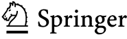

Anil Kumar
土木工程系
印度理工学院德里分校
新德里，德里，印度

Manabendra Saharia
土木工程系
印度理工学院德里分校
新德里，德里，印度

ISSN 2731-880X
可持续技术与计算领域的创新
ISBN 978-981-99-9407-6
https://doi.org/10.1007/978-981-99-9408-3

ISSN 2731-8818 (电子版)
ISBN 978-981-99-9408-3 (电子书)

© 编者（如适用）和作者，根据与Springer Nature Singapore Pte Ltd.的独家许可，2024年

本作品受版权保护。所有权利均由出版商独家和完全许可，无论涉及材料的全部还是部分，特别是翻译、重印、插图重用、朗诵、广播、在微缩胶片或任何其他物理方式上复制，以及传输或信息存储和检索、电子改编、计算机软件，或通过现在已知或将来开发的类似或不同方法。
本出版物中使用的一般性描述名称、注册名称、商标、服务标志等，即使没有具体声明，也并不意味着这些名称不受相关保护性法律法规的约束，因此可以自由使用。
出版商、作者和编辑有理由相信本书中的建议和信息在出版之日是真实和准确的。无论是出版商还是作者或编辑，对于本文所含材料或可能存在的任何错误或遗漏，均不提供任何明示或暗示的保证。出版商对已出版地图中的管辖权主张和机构隶属关系保持中立。

本Springer印记由注册公司Springer Nature Singapore Pte Ltd.出版。
注册公司地址为：152 Beach Road, #21-01/04 Gateway East, Singapore 189721, Singapore

本产品中的纸张可回收利用。

> 献给我的家人，
已故的Nilakhi Saharia、Shrutidhara Sarma教授、Ramesh Chandra Saharia、Dhiraj Saharia、Gunindra Nath Sarma、Pranita Devi等人。
—Manabendra Saharia

> 献给我的家人，
Radhamani Devi、Shukram Puran、Sunil Kumar、Suneeta Kumari、Anita Kumari、Sneha Mishra
—Anil Kumar

### Martyn Clark博士的序言

数据科学已成为理解地球气候变化的强大工具。利用大量数据产生变革性见解需要一套新的工具和技能。这本教科书《Python在水与环境领域的应用》填补了该领域理论、计算和应用之间的关键空白，使读者能够实施理论概念并深入理解水与环境问题。

本书的目标不仅是作为编程指南，还要让读者了解水与环境科学中普遍存在的独特挑战。本书使用了多功能的Python编程语言，它提供了模型的直接实现和算法的快速测试。从基础开始，本书逐步引导读者从与水文和环境建模相关的基础编程水平提升到高级水平。本书涵盖了广泛的主题，如探索性数据分析、统计数据建模和数值建模，所有内容都组织成定义明确的章节。

我祝贺作者撰写了这本书，它可以成为希望将Python纳入日常工作的研究人员和水专业人员的重要资源。

Martyn Clark博士
前主编（《水资源研究》）
水文学教授及Schulich环境预测研究主席
土木工程系
Schulich工程学院
卡尔加里大学
卡尔加里，阿尔伯塔省，加拿大

### Rangan Banerjee博士的序言

水是印度和世界上的关键且稀缺资源。环境管理和可持续发展的挑战需要新的创新方法以及新的工具和技术。我很高兴为我的同事Manabendra Saharia撰写的教科书《Python在水与环境领域的应用》撰写序言。

Python已成为程序员和研究人员的首选语言。本书展示了Python如何为建模、分析和解释数据、数据分析以及创建预测模型提供一个高效的平台。本书提供了易于理解的Python在环境问题中应用的介绍。作者深入探讨了他在开发水与环境问题模型方面的丰富经验，并提供了注释详尽的代码，可以帮助初学者、从业者和专家。

我希望这本教科书有助于推动下一代研究人员和未来专业人员开发解决水与环境问题的软件和分析工具及技术。

我们印度理工学院德里分校希望这本教科书能成为理论与实践之间的桥梁，并推动这一重要领域的新跨学科研究。作者将很乐意收到您关于本书和该领域进一步改进的反馈和建议。

Rangan Banerjee博士
主任
印度理工学院德里分校
印度理工学院孟买分校能源科学与工程系Forbes Marshall主席教授
印度国家工程院院士

### 前言

在印度理工学院德里分校教授土木工程研究生时，我们感到需要一本更侧重于使用现代编程语言进行水资源工程实践应用的教科书，以补充现有的优秀理论教科书。在数据科学和机器学习已经彻底改变所有领域的时代，学生们仍然在努力进入需要日益先进计算技能的专业领域。因此，本书侧重于读者可以直接受益的代码示例。通过提供具体的例子，本书为读者提供了应对当今快速变化的世界中水与环境专业人员所面临的复杂挑战所需的技能。

《Python在水与环境领域的应用》被构想为一本面向水与环境领域专业人士、研究人员和学生的实用指南。本前言概述了我们穿越Python编程领域的旅程，在这个旅程中，我们深入探索了水资源和环境管理的科学。本书的精髓在于将理论原理与计算能力无缝整合，利用Python的力量来建模、分析和解决现实世界的问题。

我们的目标是阐明Python作为一种强大而多功能的工具，在处理水与环境领域复杂挑战方面的潜力。我们旨在打破传统上为非程序员设置的进入壁垒。我们相信，作为一种开源语言，Python与水与环境管理的全球共同责任非常契合。因此，本书不仅仅是一本Python编程指南。无论您是经验丰富的无论您是该领域的专业人士还是充满热情的初学者，《Python for Water and Environment》都旨在成为您在这段激动人心的探索与问题解决之旅中的伴侣。

2023年7月

Manabendra Saharia 博士
助理教授
印度理工学院德里分校
印度新德里

Anil Kumar 博士
首席项目科学家
印度理工学院德里分校
印度新德里

#### 致谢

我们向印度理工学院德里分校的全体师生致以诚挚的感谢，感谢他们为我们提供了富有挑战性的学术环境。特别感谢土木工程系的持续支持和鼓励，使我们得以探索并拓展专业视野。

Manabendra Saharia 将此书献给他的母亲，已故的 Nilakshi Saharia 女士，他立志效仿她勤劳而善良的一生。他还要感谢他挚爱的妻子（Shrutidhara Sarma 教授）、父亲（Ramesh Chandra Saharia）、兄弟（Dhiraj Saharia）、岳父（Gunindra Nath Sarma）和岳母（Pranita Devi）的支持。他深知自己多年来亏欠所有支持者的恩情：Rajib Bhattacharjya 教授、Sharad K. Jain 教授、Parthajit Roy 教授、Parthasarathi Choudhury 教授、G. V. Ramana 教授、Sumedha Chakma 教授、D. R. Kaushal 教授、B. R. Chahar 教授、Pierre Kirstetter 教授、Jonathan J. Gourley 博士、Yang Hong 教授、Sujay Kumar 博士、Augusto Getirana 博士、Andy Wood 博士、Andy Newman 博士、Martyn Clark 教授等等。他也感谢多年来一直支持他的朋友们。

Anil Kumar 想将此书献给他的母亲（Radhamani Devi 女士）、父亲（Shukram Puran）、兄弟（Sunil Kumar）和姐妹们（Suneeta Dhungia 和 Anita Kumari）。他感谢他的支持者：Kumar Hemant Singh 教授、Mohan Yellishetty 教授、Trilok Nath Singh 教授和 Stuart D. C. Walsh 教授。他感谢与 Sneha Mishra 博士和 Rohit Kumar Shrivastava 博士的友谊，感谢他们始终如一的支持。

我们特别感谢学院院长 Rangan Banerjee 教授和土木工程系主任 Arvind K. Nema 教授的鼓励和领导。没有他们坚定的支持，本书不可能问世。最后，我们还要向许多审稿人（Aatish Anshuman 博士、B. R. Chahar 教授、Reetumoni 女士等）表示诚挚的谢意，感谢他们抽出时间仔细审阅我们的工作。他们宝贵的见解和建设性的反馈在塑造本书的过程中发挥了重要作用。他们促使我们完善想法、改进方法，并确保写作的质量和准确性。

#### 目录

##### 第一部分 水与环境专业人士的实用Python

- 1 水与环境领域的数据分析 ........................ 3
  - 1.1 引言 ..................................................... 3
  - 1.2 数据类型 .................................................... 4
- 2 Python环境与基础 .................................... 7
  - 2.1 集成开发环境 (IDE) ........................ 7
  - 2.2 为何需要虚拟环境？ ........................................ 7
  - 2.3 Anaconda包管理器 ..................................... 8
  - 2.4 Jupyter Notebook ............................................. 9
  - 2.5 安装外部包 ..................................... 10
- 3 Python基础 ................................................ 13
  - 3.1 Python入门 ..................................... 13
  - 3.2 设置Python环境 ................................... 13
  - 3.3 我的第一个Python脚本 .......................................... 14
  - 3.4 Python基础 .............................................. 14
    - 3.4.1 基本语法 .................................................. 14
    - 3.4.2 函数 ..................................................... 16
    - 3.4.3 列表与元组 ............................................... 17
    - 3.4.4 字典与数据框 ................................... 18
    - 3.4.5 循环 ......................................................... 20
    - 3.4.6 Python中的条件语句 .............................. 21
    - 3.4.7 Python中的文件操作 ..................................... 21
- 4 水文数据的探索性分析 ........................ 23
  - 4.1 检查数据集 ............................................. 23
    - 4.1.1 数据类型 ................................................. 23
    - 4.1.2 基本数据特征 .................................... 25
    - 4.1.3 常见变量类型 ......................................... 26
  - 4.2 概括数据集 27
    - 4.2.1 理论概率分布及其应用 27
    - 4.2.2 概括数值数据 30
    - 4.2.3 数值数据的正态性 34
    - 4.2.4 概括统计的局限性 36
    - 4.2.5 拟合分布 37
    - 4.2.6 水文数据中的内点与异常值 40
    - 4.2.7 缺失数据 40
    - 4.2.8 Q-Q图 41
- 5 水文数据的图形分析 43
  - 5.1 针对单个数据集 44
    - 5.1.1 直方图 45
    - 5.1.2 箱线图 47
    - 5.1.3 分位数图 49
  - 5.2 针对多变量数据 52
    - 5.2.1 散点矩阵图 52
    - 5.2.2 平行坐标图 54
  - 5.3 可发表的图表 57
  - 5.4 误导性图表 58

##### 第二部分 水文学中的统计建模

- 6 曲线拟合与回归分析 61
  - 6.1 流量的简单线性回归 62
  - 6.2 流量的多元线性回归 66
  - 6.3 流量的非线性回归 70
- 7 水文时间序列分析 75
  - 7.1 平稳性、趋势与周期性 76
  - 7.2 常用预测方法 79
    - 7.2.1 自回归 (AR) 79
    - 7.2.2 自回归移动平均 (ARMA) 88
    - 7.2.3 自回归积分移动平均 (ARIMA) 95
    - 7.2.4 简单指数平滑 (SES) 101
- 8 常用假设检验 109
  - 8.1 单因素方差分析 110
  - 8.2 双因素方差分析 115
  - 8.3 t检验 121
  - 8.4 F检验 124
  - 8.5 柯尔莫哥洛夫-斯米尔诺夫检验 127
  - 8.6 曼-惠特尼检验 131
- 9 不确定性估计 135
  - 9.1 区间估计 136
    - 9.1.1 非参数区间估计 136
  - 9.2 置信区间 138
    - 9.2.1 中位数的置信区间 138
    - 9.2.2 均值的置信区间 141
    - 9.2.3 分位数的置信区间 146
  - 9.3 预测区间 152
    - 9.3.1 非参数预测区间 152
    - 9.3.2 单侧非参数预测区间 154
    - 9.3.3 双侧参数预测区间 157
    - 9.3.4 非对称预测区间 159
  - 9.4 分位数回归 161
  - 9.5 最大似然估计 (MLE) 164
  - 9.6 蒙特卡洛不确定性传播 167

##### 第三部分 地表水与地下水

- 10 引言 175
  - 10.1 使用有限元的数值建模 177
  - 10.2 稳态达西流方程的弱形式 178
  - 10.3 瞬态偏微分方程的积分 180
- 11 地表水流模型 183
  - 11.1 矩形渠道 185
    - 11.1.1 Python代码 185
  - 11.2 三角形渠道 189
    - 11.2.1 Python代码 189
  - 11.3 圆形渠道 193
    - 11.3.1 Python代码 193
    - 11.3.2 结果讨论 197
  - 11.4 二维浅水方程 197
    - 11.4.1 控制方程 198
    - 11.4.2 Python代码 199
    - 11.4.3 结果讨论 204
- 12 地下水流模型 207
  - 12.1 渗流模型 207
    - 12.1.1 变分公式 207
    - 12.1.2 用于生成计算域的GMSH代码 208
    - 12.1.3 Python代码 210
    - 12.1.4 结果讨论 218
  - 12.2 地下水流模型 218
    - 12.2.1 变分公式 219
    - 12.2.2 用于创建计算域的GMSH代码 219

##### 第四部分 环境应用

##### 12.2.3 Python 代码
##### 12.2.4 结果讨论

### 13 输运现象
##### 13.1 污染物输运过程
##### 13.2 一维扩散方程
##### 13.3 一维扩散-反应方程
##### 13.4 一维对流-扩散方程
##### 13.5 使用纳维-斯托克斯方程的二维模拟
###### 13.5.1 计算域的构建
##### 13.5.2 用于生成计算域的 GMSH 代码
###### 13.5.3 变分公式
###### 13.5.4 Python 代码
##### 13.5.5 结果后处理
###### 13.5.6 结果讨论

### 14 污染物输运模型
##### 14.1 二维扩散反应模型
###### 14.1.1 变分公式
###### 14.1.2 Python 代码
###### 14.1.3 后处理
###### 14.1.4 结果讨论
#### 14.2 二维扩散对流模型
##### 14.2.1 变分公式
###### 14.2.2 Python 代码
###### 14.2.3 后处理
###### 14.2.4 结果讨论
#### 14.3 广义二维对流、扩散、反应模型
###### 14.3.1 变分公式
###### 14.3.2 Python 代码
###### 14.3.3 后处理
###### 14.3.4 结果讨论

### 15 结论

## 关于作者

**阿尼尔·库马尔博士**是印度理工学院德里分校土木工程系的高级项目科学家。他获得了由澳大利亚莫纳什大学和印度理工学院孟买分校联合授予的计算地球科学博士学位。他获得了印度理工学院鲁尔基分校的地球物理技术学士学位。他一直从事机器学习和数值建模领域的研究工作，并为石油、天然气和采矿行业开发创新解决方案提供了帮助。

**马南德拉·萨哈里亚博士**是印度理工学院德里分校土木工程系的助理教授，也是亚迪人工智能学院的副教授。在加入印度理工学院德里分校之前，他曾在NASA戈达德太空飞行中心和美国国家大气研究中心的水文实验室任职。他获得了俄克拉荷马大学水资源工程博士学位。在印度理工学院德里分校，他的 HydroSense 研究实验室专注于利用物理和数据驱动技术来监测和减轻洪水和滑坡等自然灾害。他因其科学贡献而受到认可，曾获得印度国家科学院和国际能源、环境与可持续发展学会颁发的青年科学家奖。

## 第一部分
面向水务与环境专业人士的实用 Python

### 第 1 章
水务与环境领域的数据分析

#### 1.1 引言

全球范围内的水安全正日益受到威胁。水太多导致洪水，水太少导致干旱，或水质差影响健康，都可能危及生命、经济和生态系统。为了检测、监测和减轻水务与环境领域的这些多样化问题，我们需要基于数据的可操作情报。数据分析是理解水系统与其周围环境之间复杂多维关系的重要组成部分。我们通过科学、工程和技术的结合来研究这些关系，这将有助于发现与水和环境对人类生活影响相关的新信息。我们在管理水资源、保护水生生物、应对污染以及为气候变化做准备方面的策略有效性，取决于我们监测、建模和减轻各类水灾害的能力。

水维持着生命，是我们星球上最宝贵的资源之一。它是庞大生态系统链条中不可或缺的一环，使生命得以繁荣。各种环境因素，如地质构造和人类活动，影响着水的质量、可用性和分布。这些交换导致了一个不断演变的生态系统，使得持续监测这种水-环境界面成为必要。

数据被誉为新的石油。就像原油一样，原始数据必须经过提炼和分析，才能提取出有价值且有意义的见解。理解数据中的模式、趋势和关系，可以帮助我们推断水和环境系统的状态和性能、它们之间的相互作用，以及一个系统的变化对另一个系统的潜在影响。数据分析帮助我们评估石油泄漏对沿海水域的影响，研究河流流量的季节性变化，或模拟全球变暖导致的海平面上升的未来情景。

水务与环境领域的数据分析涉及一系列方法和技术的结合，从传统的统计技术到先进的机器学习算法。它依赖于从各种来源获取的数据，如卫星图像、气象站、传感器网络和社会经济数据库，以探索和解释与水和环境相关的复杂现象。通过利用计算能力和算法，可以处理和分析大量数据，从而为科学家、政策制定者和利益相关者提供可操作的见解。数据分析帮助我们理解工业污染、森林砍伐、过度捕捞和无节制的城市化等人类活动对水和环境的影响。这些见解有助于制定更好的政策和有效的战略，以实现可持续发展、水资源管理和环境保护。数据分析有助于资源优化和未来情景的预测建模。因此，数据分析使我们能够预测和减轻风险，把握可持续增长的机遇，并在人类需求与环境保护之间创造更好的平衡。

然而，水务与环境领域的数据分析并非没有挑战。数据的质量和完整性、环境系统的复杂性、许多类型环境数据固有的不确定性，以及对多学科方法的需求，都是分析师必须应对的众多问题之一。这些挑战要求不断改进方法和技术，强调了该领域的动态性和发展性。

水务与环境领域的数据分析融合了科学探索、技术应用和对自然现象的考量。这个过程涉及深入研究具有挑战性的数据集，并揭示环境过程的细节。这是一段探索、解决问题和创造影响的旅程，在环境变迁、气候变化、资源枯竭和人类需求增长的时代至关重要。在本章中，我们将探讨水务与环境领域数据分析的技术、重要性和功能。

#### 1.2 数据类型

水文学家研究环境中水的分布、运动和储存，这需要跨多个科学和工程学科的大量数据。水文学中收集的数据通常分为三种类型：空间数据、时间数据和属性数据。

空间数据由感兴趣区域的地理和物理属性组成。在水文学中，空间数据的例子包括土壤和岩石类型、地形、水体的物理特征以及植被。这些属性影响着水循环中水的运动。例如，水在地表的运动受到高程、坡度和坡向等地形属性的影响。地理信息系统工具广泛用于管理和分析空间数据，这些数据可以通过卫星遥感、激光雷达或地面观测等不同手段收集。

当数值数据随时间被追踪时，它被称为时间数据。从时间属性中提取关于趋势、模式和变化的有价值见解被称为也被称为时间数据挖掘。在水文学中，时间数据的例子包括温度、积雪厚度、地下水位、站点降水量和蒸散发。地面测量、气象站和卫星可以收集这些水文测量数据。时间序列数据对于识别年际和季节性模式、理解气候变化的影响以及预测未来的水文情景至关重要。

另一方面，属性数据是任何提供有关空间和时间数据额外背景的定性描述。例如，它可能涉及研究区域的人口密度和社会经济指标数据，这些数据可以提供人类对水文系统影响的见解。通常，属性数据是通过实地测量、实验室分析、公共数据库和直接调查收集的。

这些类别的数据经常重叠，并导致丰富且多层次的数据集，可以从不同的角度进行探索。例如，水质参数（属性数据）可以在一段时间内（时间数据）以及流域内的多个位置（空间数据）进行测量。可以探索这样的数据集，以了解一个区域的水质如何在空间和时间上发生变化。在水文学中，问题变得越来越复杂，以至于需要利用大数据和机器学习来对大型、复杂和多维数据集进行更深入的洞察。通过整合来自不同来源的数据，水文学家可以揭示环境中水的复杂动态，并有助于制定有效的水资源管理策略和可持续实践。

在后面的章节中，我们将深入探讨使用Python进行水文数据建模。我们将探索时间序列分析和水变量（如径流量、水位和大气压力）的数值建模。我们将展示如何利用Python强大的库进行随机和确定性建模以及趋势检测。我们还将演示在地下水流动和溶质运移建模的背景下，使用Python求解偏微分方程。这些步骤和技术将为读者提供分析复杂水系统所需的工具。

### 第2章
Python环境与基础


#### 2.1 集成开发环境（IDE）

集成开发环境（IDE）和虚拟环境是Python编程的两个关键组成部分。它们是Python开发者工具包中的关键工具，有助于简化开发流程、提高生产力，并确保代码的可靠性和可重复性。

IDE是一种为程序员提供全面软件开发设施的软件应用程序。对于Python开发者来说，使用像PyCharm、Jupyter Notebook或Visual Studio Code这样的IDE有许多好处。其中一个关键优势是它将编码所需的多个工具和功能组合到一个界面中。这包括用于编写和编辑代码的文本编辑器、用于查找和修复错误的调试器、用于提高可读性的语法高亮，以及通过建议函数、关键字和变量名称的补全来节省时间的自动完成功能。

此外，许多IDE为Git等版本控制系统提供内置支持，允许开发者跟踪更改、回退到代码的先前版本，并与其他开发者高效协作。IDE内置了代码重构、测试和性能分析功能，这些对于编写干净、无错误和高效的代码至关重要。

#### 2.2 为什么需要虚拟环境？

虚拟环境是隔离的环境，可以在其中安装Python包，而不会干扰其他项目和安装。这允许开发者为不同的项目创建隔离的环境，并可以将这些环境传达给其他开发者，他们可以为这些项目重建完全相同的开发环境。如果没有虚拟环境，为不同的项目安装同一包的不同版本可能会导致冲突和不一致，使得代码难以共享或部署。虚拟环境通过为每个项目创建隔离空间来解决这个问题，可以在其中安装必要的依赖项，而无需担心干扰。

虚拟环境也有助于Python代码的可重复性。维护项目中使用的包的确切版本记录，允许其他程序员和系统在完全相同的条件下重建环境并执行代码。这在科学计算和数据分析中尤为重要，因为包依赖性是一项基本要求。

集成开发环境（IDE）和虚拟环境在Python编程中都扮演着至关重要的角色。IDE通过将实用程序和功能集成到统一界面中来提高效率和代码质量，而虚拟环境则通过确保项目依赖性和隔离性来保证Python代码的可靠性和可复制性。它们共同通过为Python编程提供一个多功能的框架，使编码过程更加简单和愉快。

#### 2.3 Anaconda包管理器

Anaconda包管理器（[https://www.anaconda.com/](https://www.anaconda.com/)）提供了一个用于科学计算的Python和R编程语言的开源发行版，旨在简化包管理和部署。它包含了超过1500个用于计算、数据分析、可视化和机器学习的包，并集成了NumPy、Pandas和Matplotlib等基础库。此外，它还配备了一个名为Conda的包管理器，有助于管理环境，使不同版本软件包的安装和维护变得轻松无忧。

**macOS安装：** 要在您的操作系统上安装Anaconda，请首先从Anaconda官方网站下载适用于您操作系统的Anaconda安装程序。除非需要特定的早期版本，否则首选Python 3.8或更高版本。下载后，双击下载的文件以启动安装程序。该程序将引导用户完成安装过程，可能会建议将Anaconda3版本安装在主用户目录中。完成步骤后，通过打开一个新的终端窗口并输入命令：“conda list”来验证安装。如果Anaconda安装正确，将出现已安装包的列表。

Anaconda的流行源于它提供的便利性。像MacOS和Windows Subsystem for Linux这样的操作系统预装了Python，但由于其可能与某些模块不兼容，可能不适合科学计算。因此，拥有一个像Anaconda这样独立的、受控的环境可以确保Python与其他包之间的兼容性。

**Linux安装：** 在Linux系统上安装Anaconda的过程始于从Anaconda网站下载安装脚本。下载后，用户需要通过SHA-256校验和进行加密哈希验证，以验证安装程序的数据完整性。打开一个终端，并在下载的文件上运行bash命令，如下所示：“bash Anaconda3-2020.02-Linux-x86_64.sh”。“2020.02”将是下载的版本。使用“Enter”键滚动阅读许可协议，并通过输入“yes”接受它。接下来，选择一个安装位置或接受默认位置。安装过程完成后，关闭终端并打开一个新的终端以确保更改生效。

Anaconda在Linux系统上处理依赖关系和环境的能力提供了显著优势，因为Linux发行版包含许多相互依赖的包。Anaconda提供了一个可靠且易于使用的界面来管理这些包的复杂性。

**Windows安装：** 在Windows上，安装过程始于从Anaconda官方网站下载Anaconda安装程序.exe文件。下载安装程序后，运行它并按照说明操作。在安装过程中，用户将被询问是否要将Anaconda添加到PATH环境变量中——建议不要勾选此选项，因为它可能会干扰其他Python安装或软件。相反，可以通过从开始菜单启动Anaconda Navigator或Anaconda命令提示符来使用Anaconda软件。

Windows没有预装Python，因此安装Anaconda是开始使用Python的最简单方式，尤其是对于初学者。它可以无缝处理复杂的Windows环境，使得管理和分发大量第三方库变得轻松，而这些库在Windows生态系统中经常在安装和维护方面带来困难。

#### 2.4 Jupyter Notebook

Jupyter Notebook是一个开源的基于网络的应用程序，已成为全球数据科学家、学者和研究人员的首选工具。其简单而强大的用户界面允许用户创建和共享包含实时代码、数学方程式、数据可视化和解释性文本的文档。

Jupyter Notebook的一个关键特点是其灵活性，支持超过40种编程语言，包括Python、R、Julia和Scala，使其能够高度适应不同的计算需求和项目。用户可以在笔记本中切换这些语言，使其成为多语言数据分析的绝佳媒介。

Jupyter Notebook可以嵌入多媒体元素，如图像、视频、LaTeX脚本和JavaScript小部件，使得编写穿插代码和结果的叙述性文档变得容易。此功能也适用于制作演示文稿，

#### 2.5 安装外部包

在 Anaconda 虚拟环境中安装外部包是一个涉及多个步骤的过程，旨在确保必要的软件工具被正确添加到用户的工作空间。Anaconda 中包含的 Conda 包和环境管理器用于处理这些安装。

1.  **创建新的 Conda 环境：** 在安装外部包之前，最好创建一个新的 Conda 环境。这个隔离的环境提供了一个独立的空间，可以在其中安装包，而不会干扰系统的基础 Python 安装或其他 Conda 环境。可以使用以下命令执行此操作：

    ```
    >>> conda create --name myenv
    ```

    可以用新的环境名称替换“myenv”。根据需要，可以通过在命令后附加“python=x.x”（其中 x.x 是版本号）来指定 Python 版本。

2.  **激活新环境：** 在安装任何包之前，必须激活环境。可以使用以下命令完成：

    ```
    >>> conda activate myenv
    ```

    3.  **安装包：** 根据来源，激活环境后可以使用“conda”或“pip”命令安装包。当包存在于 Anaconda 发行版中时，通常使用 Conda，因为它在处理依赖关系方面非常有效。执行以下命令开始安装：

    ```
    >>> conda install package-name
    ```

    可以用所需包的名称替换“package-name”。如果包在 Anaconda 发行版中不可用，则可以使用 pip 命令。Pip 可以访问上传到 Python 包索引（PyPi）的包。要使用以下命令，请执行：“pip install package-name”，同样，将“package-name”替换为所需包的名称。

4.  **验证安装：** 验证已安装的包是一个好习惯。执行“conda list”或“pip list”命令可以显示活动环境中已安装的包：

    ```
    >>> conda list
    ```

    上述步骤允许用户在 Conda 环境中安装外部包，这些包可以随时存储和共享，从而轻松地在不同和分散的团队中复制开发配置。

### 第 3 章
Python 基础

#### 3.1 Python 入门

Python 是数据分析领域最受欢迎的编程语言，数据日益增长的重要性使得掌握 Python 成为一项重要的技能。由于其简单性和代码可读性，Python 在初学者和专业人士中都很受欢迎。广泛的库使其成为从数据分析和机器学习到可视化和 Web 开发等各种任务的完美工具。

开始使用 Python 需要设置一个合适的环境。初学者可能更喜欢 Anaconda，这是一个方便地将 Python 与许多数据科学库捆绑在一起的平台。在线资源，如 Python 的官方文档，为自学者提供了丰富的知识。为了获得结构化的学习体验，Coursera 和 edX 等平台上提供了多门在线课程。HackerRank 和 Codecademy 等网站上的实际编码练习也很有用。Python 的可读性和广泛的社区支持使学习过程易于管理且富有成效。不言而喻，持续的练习加上实际项目对于掌握 Python 至关重要。

#### 3.2 设置 Python 环境

准备 Python 环境需要安装 Python、选择集成开发环境（IDE）以及管理包。Python 可以通过 Anaconda 管理器或从其官方网站安装。PyCharm 或 Jupyter Notebook 是功能丰富的 IDE，为软件开发提供了强大的功能。包管理工具，如 pip 和 conda，有助于管理跨库的依赖关系。Python 虚拟环境提供项目级别的隔离，以维护特定的依赖关系，确保无错误运行。读者可参考第 2.3、2.4 和 2.5 节来设置 Python 环境。

#### 3.3 我的第一个 Python 脚本

Python 是一种强大且灵活的编程语言，由于其可读性和直接性，对初学者很有吸引力。下面是一个简单的 Python 代码示例，它询问用户的名字然后表示欢迎：

```python
# 这是一个简单的 Python 脚本

# 询问用户的名字
name = input("What's your name? ")

# 向用户打印问候语
print(f"Hello, {name}! Welcome to Python programming.")
```

此脚本使用“input()”函数接收用户输入，并将其存储在名为“name”的变量中。然后，“print()”函数显示包含用户名的问候语。

字符串前的“f”启用了字符串格式化，允许将变量的值直接嵌入字符串对象中。“{}”括号表示插入点，当调用“print()”语句时，变量的值将被插入此处。

Python 注释以“#”字符开头。Python 不会执行“#”之后的内容，因此这是一种方便的添加注释或解释代码功能的方式。

此脚本展示了 Python 的一些基本方面，例如变量的包含、用户输入机制、打印语句和字符串格式化方案。这是初学者的入门代码，为探索更复杂的概念（如循环、条件语句、函数定义和数据结构）铺平了道路。

#### 3.4 Python 基础

##### 3.4.1 基本语法

此示例代码演示了“单行”和“多行”注释。它还说明了如何定义一个函数并显示返回的结果。

```python
# 这是 Python 中的单行注释

"""
这是 Python 中的
多行注释（或文档字符串）
"""

# 导入内置的 math 模块
import math

# 定义一个函数
def calculate_circle_area(radius):
    """
    此函数根据给定的半径计算圆的面积。
    """
    if radius < 0:
        print("Error: Radius cannot be negative.")
        return
    area = math.pi * (radius ** 2)
    return area

# 调用函数
radius = 10
area = calculate_circle_area(radius)
print(f"The area of the circle with radius "
      f"{radius} is {area:.2f}")
```

```
>>> The area of the circle with radius 10 is 314.16
```

程序首先导入内置的 math 模块。它定义了一个名为 calculate_circle_area() 的函数，该函数接受一个半径作为参数，并使用公式 $Area = \pi r^2$ 计算圆的面积。该函数检查半径是否为负数，如果是则打印错误消息。Python 中使用 ** 运算符进行幂运算。

然后，使用特定的半径调用该函数，并使用 Python 的格式化字符串字面量（也称为 f-字符串（f"..."））打印结果面积。f-字符串中的 2f 用于将面积结果格式化为两位小数。

这个小程序展示了Python语法的各个方面，包括注释、模块导入、函数定义、条件语句、算术运算、函数调用以及格式化打印语句。

##### 3.4.2 函数

在Python中，函数是一个命名的、可重用的代码块，旨在执行特定任务。函数使用“def”关键字定义，后跟函数名和括号“()”。在这些括号内，可以指定零个或多个参数。函数体是缩进的，通常包含一个“return”语句。函数提高了代码的可重用性、可读性，并允许模块化编程。

```python
def outer_function(outer_arg):
    print(f"Outer function argument: {outer_arg}")

    # This is a nested or inner function
    def inner_function(inner_arg):
        return outer_arg * inner_arg

    # Calling the nested function
    return inner_function(5)

result = outer_function(10)
print(f"Result from inner function: {result}")
```

在上面的程序中，`outer_function()`被定义为带有一个参数`outer_arg`。在函数内部，它使用f-string格式化打印`outer_arg`的值。在`outer_function()`内部，有一个嵌套或内部函数`inner_function()`。这个内部函数接受一个参数`inner_arg`。`inner_function()`将`outer_arg`与`inner_arg`相乘并返回结果。定义嵌套函数后，`outer_function()`使用参数5调用`inner_function()`。`inner_function()`的返回值随后存储在变量`result`中。

程序随后使用f-string格式化打印`result`的值。

##### 3.4.3 列表和元组

列表和元组都是可以存储多个项目的序列类型。列表是可变的，这意味着你可以修改它们的内容，这使得它们非常适合数据操作。它们使用方括号定义。相反，元组是不可变的，使用圆括号定义，通常用于固定数据。

```python
# List Creation
fruits_list = ["Apple", "Banana", "Cherry",
              "Dates", "Elderberry"]

# Accessing List Items
print("First fruit in the list: ", fruits_list[0])

# Modifying List Items
fruits_list[1] = "Blueberry"
print("Fruit list after modification: ", fruits_list)

# Adding Items to the List
fruits_list.append("Fig")
print("Fruit list after adding a new item: ", fruits_list)

# Removing an item from the list
fruits_list.remove("Cherry")
print("Fruit list after removing an item: ", fruits_list)

# Tuple Creation
fruits_tuple = ("Grapes", "Honeydew", "Ice-Apple")

# Accessing Tuple Items
print("First fruit in the tuple: ", fruits_tuple[0])

# Trying to modify tuple items (This will result in an error)
# fruits_tuple[1] = "Jackfruit"

# Tuples are immutable, which means you can't add or
# remove items after the tuple is defined.

# Thus, we can't demonstrate adding or removing items
# in a tuple like we did with the list
```

```
>>> First fruit in the list: Apple
>>> Fruit list after modification: ['Apple', 'Blueberry', 'Cherry', 'Dates', 'Elderberry']
>>> Fruit list after adding a new item: ['Apple', 'Blueberry', 'Cherry', 'Dates', 'Elderberry', 'Fig']
>>> Fruit list after removing an item: ['Apple', 'Blueberry', 'Dates', 'Elderberry', 'Fig']
>>> First fruit in the tuple: Grapes
```

在上面的程序中，首先创建了一个名为“fruits_list”的列表，包含五个初始元素。然后，代码通过使用索引打印列表中的第一个水果来展示如何访问列表项。接下来，通过为第二个元素赋新值来修改列表中的一个项目。打印更新后的列表以显示修改。之后，使用`append()`方法将新项目“Fig”追加到列表中。再次打印列表以显示新项目的添加。最后，使用`remove()`方法从列表中移除一个项目“Cherry”，并打印结果列表。

在第二部分，创建了一个名为“fruits_tuple”的元组，包含三个初始元素。代码通过使用索引打印元组中的第一个水果来展示如何访问元组项。它还尝试通过为第二个元素赋新值来修改元组项，但此操作会产生错误。这突出了元组是不可变的，意味着它们的项目在创建后无法修改。

##### 3.4.4 字典和数据框

Python中的字典是数据值的无序集合。它也用于像映射一样存储数据值，使用户能够保存键值对。与其他数据类型不同，它只保存单个值作为元素。

数据框是一个二维的带标签的数据结构，其列可能具有不同的类型。它通常是最常用的pandas对象。

```python
# Importing pandas module
import pandas as pd

# Define a dictionary containing river details
river_details = {'Name': ['Ganges',
                          'Brahmaputra',
                          'Yamuna',
                          'Godavari',
                          'Narmada'],
                 'Length (km)': [2525,
                                3848,
                                1376,
                                1465,
                                1312],
                 'Drainage Area (km2)': [1080000,
                                         651334,
                                         366223,
                                         312812,
                                         131200]
                 }

# Convert the dictionary into DataFrame
river_df = pd.DataFrame(river_details)

# Print the data frame
print(river_df)
```

```
>>>           Name  Length (km)  Drainage Area (km2)
>>> 0       Ganges         2525              1080000
>>> 1  Brahmaputra         3848               651334
>>> 2       Yamuna         1376               366223
>>> 3     Godavari         1465               312812
>>> 4     Narmada         1312               131200
```

给定的Python程序将一些关于印度河流的详细信息存储在一个字典中，然后使用pandas将该字典转换为数据框。
此脚本的输出将是一个数据框，包含河流的名称、以公里为单位的长度以及以平方公里为单位的流域面积。每条河流代表数据框中的一行，而详细信息（名称、长度和流域公里数）代表列。

##### 3.4.5 循环

这是一个简单的Python程序，说明了“for”和“while”循环的使用。该程序使用两种类型的循环打印前十个数字（1-10）。

```python
# Using a for loop
print("Using a for loop:")
for i in range(1, 11):
    print(i)

# Using a while loop
print("\nUsing a while loop:")
i = 1
while i <= 10:
    print(i)
    i += 1
```

在这个代码示例中，“for”循环与“range()”函数一起充当数字生成器，生成从1到10的一系列数字。在循环内部，使用“print()”函数在控制台显示数字。“while”循环无条件运行，直到条件“i”小于或等于10返回真值。同样，当循环遍历序列时，使用“print()”函数打印“i”的当前值。当“i”的值大于10时，条件“i <= 10”不再返回真值，从而终止循环。

##### 3.4.6 Python中的条件语句

这里，我们给出一个使用条件语句来判断输入数字是正数、负数还是零的Python程序。

```python
# Take input from the user
num = float(input("Enter a number: "))

# Use conditional statements to check the number
if num > 0:
    print("The number is positive")
elif num == 0:
    print("The number is zero")
else:
    print("The number is negative")
```

在给定的程序中，“if”语句检查数字是否大于零。如果此条件为真，则显示“The number is positive”。如果条件为假，则进入“elif”语句。“elif”（“else if”的缩写）语句检查输入数字是否为零。如果此条件返回真，则显示“The number is zero”。如果此条件也不成立，则进入else语句，该语句处理前面“if”和“elif”语句未涵盖的所有其他条件。这本质上意味着输入数字必须小于零，打印消息“The number is negative”。

##### 3.4.7 Python中的文件操作

这里，我们展示一个简单的Python代码，说明一些基本的文件操作，如写入文件、从文件读取和追加到文件。

### 第四章
水文数据的探索性分析

#### 4.1 数据集检查

任何研究的第一步都是评估和深入探究数据集。这能让你理解数据属性，发现可能的异常，并为后续分析选择合适的统计技术做出有充分依据的决策。例如，数据的性质——是连续的还是离散的，是高斯分布还是偏态分布，或者是否呈现周期性模式——将决定分析方法的选择。理解数据的时间和空间分辨率在水文学研究中至关重要，因为它会影响结果的解释。初步检查数据也有助于发现可能影响研究有效性的错误、异常值和缺失数据点。因此，通过在进行更全面分析之前充分熟悉数据集，学习者可以致力于获得稳健可靠的结果，从而减少错误解释或得出错误结论的可能性。所以，检查数据集对于在水文研究中得出稳健的发现至关重要。

##### 4.1.1 数据类型

水文学是指对水的分布和运动的科学研究。它描述了多种数据类型，用于建模、分析和预测水文循环中与水相关的现象。这些数据类型大致可分为空间数据、时间数据以及来自水文模型输出的数据。

1.  **空间数据：** 空间数据是描述或包含与地球表面相关的对象、事件和现象信息的数据。这些包括地形、土地利用、土壤类型、植被覆盖等。例如，数字高程模型提供地形数据，这对于理解流域特征、水流方向和水文建模中的流量累积至关重要。土地利用和土壤类型数据提供了关于下渗率、蒸散发和径流产生的信息。植被数据有助于确定蒸腾速率。这些数据通常在地理信息系统中以栅格或矢量格式表示，用于水文分析和建模。

2.  **时间数据：** 时间数据是随时间变化的观测值。在水文学中，这些通常涉及降水、温度、风速、湿度、河流流量、地下水位等的时间序列数据。例如，降雨数据对于预测洪水和管理水资源非常有价值。与温度和湿度相关的数据有助于计算蒸散发率，而河流流量数据对于理解河流动态、评估洪水风险和设计水利工程至关重要。根据不同的用例，时间数据可以按不同的间隔记录——每小时、每天、每月和每年。

3.  **水文模型输出：** 这些是由计算水文模型生成的数据，这些模型模拟水循环的不同方面，涵盖从降雨-径流动态和蒸散发到土壤水分迁移和河流形态。模型使用空间和时间数据输入，并产生诸如河流流量、径流、土壤湿度指数和地下水位等输出。这些数据通常用于了解相互关联的水文过程、预测未来的水相关事件，并为水资源管理做出明智决策。

虽然这些数据类型很常用，但重要的是要认识到水文学是一个多学科交叉的复杂领域。它经常需要结合来自气象学、地质学和生态学等其他领域的数据。这为开发数据分析、数据建模和解释的新方法提供了大量机会。鉴于水在维持生命和生物系统方面的重要性，研究和理解这些数据类型对于应对当今世界面临的各种与水相关的挑战至关重要。

根据所包含变量的数量，数据集也可以分为单变量、双变量或多变量。每一类都提供了不同的见解和分析方法。

1.  **水文学中的单变量数据集：** 水文学中的单变量数据集包含随时间或空间变化的单个变量的观测值。典型例子包括特定地点的每日降雨量测量、河流某一点随时间变化的河流流量测量，或在特定地点不同深度测量的土壤湿度水平。单变量分析能够量化所记录变量的集中趋势、离散程度和分布情况，并常用于识别单个变量内的趋势、模式和异常。

2.  **水文学中的双变量数据集：** 双变量数据集包含两个不同变量的观测值。它通常有助于理解两个变量是否相关以及这种关系的性质。一个例子可以是对比降雨量与河流流量，以了解径流随降水的变化情况。双变量分析可以使用回归分析技术来量化两个变量之间关系的强度和性质。

3.  **水文学中的多变量数据集：** 多变量数据集包含两个以上变量的观测值。在水文学中，此类数据集非常常见，因为水文过程受众多因素影响。例如，一个数据集可能包括在特定地点随时间记录的降水、温度、蒸发、径流和土壤湿度。多变量分析允许同时探索多个变量之间的相互作用和关系。这对于理解复杂的水文过程和系统至关重要。所使用的技术可以包括多元回归、因子分析和聚类分析等。

在水文学中选择单变量、双变量还是多变量分析，很大程度上取决于手头的研究问题和可用数据。无论采用哪种方法，每种方法都能为水文变量的特征和行为提供有价值的见解，从而增进我们对水资源的理解和管理。

##### 4.1.2 基本数据特征

数据是水文研究的支柱，其多样的性质需要仔细检查和理解。数据的特征显著影响其分析、解释和可视化的方式。以下是水文学背景下的一些关键数据特征：

1.  **测量水平：** 水文学中的数据可以涵盖所有四个测量水平。例如，名义数据可能代表流域内不同的土地利用类别或土壤类型。顺序数据可以代表水体的污染水平，分为低、中、高。区间数据可能包括温度测量，根据所使用的刻度，可能缺乏真正的零点。最后，水文学中常见的比率数据包括降雨深度、河流流量和地下水位等测量值，这些都具有真正的零点和一致的刻度。

2.  **离散与连续：** 水文学中的离散数据可能包括一个月的雨天数或一年的洪水事件次数。连续数据在水文学中广泛存在——降雨强度、河流流量和地下水位深度等，仅举几例。

3.  **单变量、双变量和多变量：** 水文过程的复杂性通常需要处理多变量数据。然而，单变量数据分析很常见，例如研究随时间变化的单个变量，如降雨或温度。双变量数据分析考察两个变量（降雨和径流）之间的关系，而多变量数据分析可能涉及多个变量，如温度、降水、蒸发和土壤湿度。

## 4.1.2 水文数据的基本特征

4.  **时空性：** 水文数据通常同时具有空间和时间分量。例如，降雨数据可以在多个地点（空间）随时间（时间）收集。理解这些分量对于预测模式和制定水资源管理决策至关重要。

5.  **缺失值：** 由于传感器故障、数据录入错误或极端天气条件下测量地点无法进入等原因，缺失值是水文数据中的一个常见问题。可以使用插值或填补等技术来处理这些缺失值。

6.  **异常值：** 异常值有时被视为异常或错误，但也可能代表极端但合法的水文事件，如洪水或干旱。识别和正确处理异常值对于准确的数据分析和数据建模至关重要。

7.  **偏度和峰度：** 许多水文数据集，如降雨和河流流量数据，并不服从正态分布。它们可能是偏斜的（不对称的）或具有高峰度（重尾）。理解这些特征可以指导选择合适的统计模型。

8.  **依赖性：** 水文学中的许多变量是相互依赖的。例如，径流取决于降雨、土壤类型和土地覆盖等因素。认识这些依赖关系对于构建准确的水文模型非常重要。

理解水文数据的基本特征是进行适当且有意义的数据分析的关键。它有助于选择合适的统计技术、解释结果，并最终生成关于水文现象的可靠见解。无论是开发洪水事件的预测模型、研究气候变化对水资源的影响，还是规划可持续的水资源管理，扎实掌握这些数据特征都是必不可少的。

##### 4.1.3 常见变量类型

理解变量类型对于研究人员或数据分析师至关重要，因为变量的类型通常决定了分析、可视化和解释的方法。变量类型大致可分为四类：名义变量、有序变量、区间变量和比率变量。

1.  **名义变量：** 也称为分类变量，名义变量对数据进行分类，但不暗示任何顺序或层次。名义变量的例子包括汽车的颜色、狗的品种或特定地点的土壤类型。每个类别都是独特的，一个类别本身并不比另一个更好或更差。在数据分析中，名义变量通常用于将数据分割成不同的组进行比较。

2.  **有序变量：** 与名义变量类似，有序变量也对数据进行分类，但它们引入了顺序的概念。有序变量代表数据的排名或顺序，但排名之间的距离可能不相等。一个例子可能是客户满意度调查，受访者可以将产品评为“差”、“一般”、“好”或“优秀”。在这种情况下，“优秀”显然比“好”，但我们不知道好多少。

3.  **区间变量：** 区间变量是数值变量，其值之间的间隔是一致且有意义的，但没有真正的零点。例如，温度是一个区间变量，因为20°和30°之间的差值与70°和80°之间的差值相同。然而，没有绝对的零点，因为温度可以是负数。

4.  **比率变量：** 比率变量与区间变量一样，具有一致、有意义的尺度，但它们也有一个真正的零点。这使我们可以说一个值是另一个值的两倍。比率变量的例子包括身高、体重和年龄。

理解数据集中每个变量的类型至关重要，因为它指明了应使用的适当统计方法。例如，虽然你可以计算区间和比率数据的平均值，但计算名义或有序数据的平均值是没有意义的。同样，虽然你可以对区间或比率数据进行t检验，但你会对名义数据使用卡方检验。因此，准确识别变量类型在数据分析中至关重要。

#### 4.2 总结数据集

总结数据集涉及理解其关键的统计属性。概率分布描述了数据点的分布和可能性。集中趋势度量，如均值、中位数和众数，揭示了数据的“中心”。变异性度量，如标准差或方差，说明了数据围绕集中趋势的离散程度。偏度代表对称性，峰度代表“尾部厚度”，指示数据的不对称性。高斯性在许多统计检验和模型中至关重要，它检查数据是否符合正态分布。

##### 4.2.1 理论概率分布及其应用

理论概率分布是统计学、数据分析和机器学习的基本工具。它们描述了一组数据中结果的可能性，使我们能够对未来的观察进行推断和预测。有许多理论分布，每种都有独特的特征，使其适用于不同类型的数据和应用。

最著名的是高斯分布或正态分布。由于其数学特性和中心极限定理，它在自然科学和社会科学中得到广泛应用。例如，它用于质量控制，以识别偏离设定标准的产品或服务。在金融领域，它构成了许多模型的基础，如投资组合优化和期权定价，尽管它在捕捉极端事件方面存在局限性。

二项分布描述了在固定次数的独立伯努利试验中成功的次数，每次试验具有相同的成功概率。它广泛应用于质量保证、选举民意调查和风险评估等领域。

另一方面，泊松分布模拟在固定时间或空间间隔内发生的事件数量，给定恒定的平均发生率。它应用于电信、保险和交通管理等领域，我们模拟的事件包括呼叫中心接到的呼叫次数、保险公司的索赔数量或通过收费站的汽车数量。

指数分布用于模拟泊松过程中事件之间的时间，通常用于可靠性研究和生存分析。例如，它可以用于模拟机器故障之间的时间或患者治疗后的生存时间。

理论概率分布也在机器学习算法中发挥着关键作用，例如用于无监督学习的高斯混合模型，或利用基于贝叶斯定理的条件概率的朴素贝叶斯分类器。

水文学研究环境中水的分布和运动，通常涉及对不同变量的概率分析。以下是水文学中常用的一些概率分布：

1.  **正态分布（高斯分布）：** 当数据对称且呈钟形时使用此分布，这通常是许多水文变量的情况。例如，它用于分析年降水量、河流流量和其他一般气象变量。

概率分布函数（PDF）由下式给出
$$f(x|\mu, \sigma^2) = \frac{1}{\sqrt{2\pi\sigma^2}} \exp -\frac{(x-\mu)^2}{2\sigma^2}$$ (4.1)

累积分布函数（CDF）由下式给出
$$F(x|\mu, \sigma^2) = \frac{1}{2} \left[ 1 + \text{erf} \left( \frac{x-\mu}{\sigma\sqrt{2}} \right) \right]$$ (4.2)

其中
- $\mu$ 是数据的期望或均值。
- $\sigma$ 是数据的标准差。
- $\sigma^2$ 是数据的方差。

2.  **对数正态分布：** 对数正态分布经常用于模拟水文学中表现出偏斜的变量，如泥沙负荷、河流流量或地下水位。

概率分布函数（PDF）由下式给出

##### 4.2.2 数值数据的汇总

在任何数据分析中，我们首先探索数据集最常见的统计特征，如集中趋势、离散程度和对称性。均值、中位数和众数代表集中趋势的度量，提供了数据集“平均”或“典型”值的快速概览。离散程度的度量，如极差、四分位距、方差、标准差和变异系数也至关重要。它们表明数据点围绕中心的分布情况及其偏离平均值的程度。对称性度量，如偏度和峰度，共同描述了数据分布的形状。它们帮助我们理解数据如何围绕均值分散，从而判断数据分布是尖峰还是扁平，是对称还是偏斜。

总的来说，这些度量提供了对数据集潜在分布和特征的全面统计摘要和洞察。在水文学中，这样的统计摘要对于理解和预测与水相关的现象和事件至关重要。

###### 4.2.2.1 集中趋势度量

在水文学中，集中趋势度量对于把握与水相关的变量（如降水量、地下水位和河流流量）的模式至关重要。均值、众数和中位数是用于确定数据集集中趋势的度量，每种都提供了有价值的见解，并有助于理解预期的典型值。

1.  **均值：** 均值，也称为算术平均值，通过将所有数据点的总和除以数据点的总数来计算。每个数据点都计入此集中趋势度量。计算均值（$\mu$）的公式为

    $$\mu = \frac{1}{N} \sum_{i=1}^{N} x_i \quad (4.9)$$

    其中 N 是观测总数，($x_i$) 是每个单独的观测值。

    例如，如果我们有一年的月降雨量数据（单位：毫米）：80, 90, 100, 110, 120, 130, 100, 110, 120, 130, 140, 150，则平均降雨量为 (80+90+100+110+120+130+100+110+120+130+140+150)/12 = 114.17 毫米。

2.  **中位数：** 中位数是数据集按从小到大排序后位于中间的值。如果观测数（$N$）为奇数，则中位数是位置（$N + 1$）/2 处的值。如果 $N$ 为偶数，则中位数是位置 $N/2$ 和（$N/2$）+ 1 处值的平均值。

    例如，如果我们考虑相同的降雨数据集并排序：80, 90, 100, 100, 110, 110, 120, 120, 130, 130, 140, 150，则中位数降雨量是第6个和第7个观测值（110 和 120）的平均值，即 115 毫米。

3.  **众数：** 众数是数据集中出现频率最高的值。一组数据可能有一个众数（单峰）、多个众数（多峰）或没有众数（没有明显的峰值频率）。

    继续使用降雨数据集，数据点 100、110、120 和 130 都出现了两次，因此它们都是该数据集的众数。所以，该数据集是多峰的。

集中趋势度量提供了一种简单有效的方法来汇总和理解数据。然而，它们应与其他统计度量（如离散度量）结合使用，以生成数据分布的完整图景。例如，两个数据集可能具有相同的均值，但离散程度却大不相同。

在水文学中，这些集中趋势度量对于分析和预测与水相关的事件至关重要。均值表示典型情景，而众数和中位数则提供了关于重复趋势和异常事件的见解。掌握水文数据的集中趋势对于规划和管理水资源、预测洪水以及应对干旱具有重要价值。

###### 4.2.2.2 离散程度度量

数据的离散程度，有时也称为变异性，是统计分析的一个重要方面，因为它衡量了数据集中数据点的范围或分布程度。主要的离散度指标包括极差、四分位距、方差、标准差和变异系数。这些度量在水文研究中至关重要，因为它们提供了对与不同水相关变量（如降雨量、河流流量或土壤含水量）相关的波动和不确定性的见解。

1.  **极差：** 极差是一种简单的离散度量。可以计算为数据集中最高值和最低值之间的差值。考虑某个地点十年间的年河流流量（单位：立方米/秒）示例：50, 55, 60, 65, 70, 75, 80, 85, 90, 95，则极差为 95–50 = 45 m³/s。

2.  **四分位距 (IQR)：** 四分位距，或 IQR，表示数据集的中间 50%。它是上四分位数 (Q3) 和下四分位数 (Q1) 之间的差值。Q1 是数据前半部分的中位数，而 Q3 是数据后半部分的中位数。在上述河流流量数据中，Q1 是前五个观测值（50, 55, 60, 65, 70）的中位数，即 60 m³/s，Q3 是后五个观测值（75, 80, 85, 90, 95）的中位数，即 85 m³/s。因此，IQR = Q3 – Q1 = 85 – 60 = 25 m³/s。

3.  **方差：** 方差衡量数据集中每个数字与均值（μ）以及因此与集合中每个其他数字的偏离程度。它通常用 σ² 表示。方差的公式为

    $$\sigma^2 = \frac{1}{N-1} \sum_{i=1}^{N} (x_i - \mu)^2$$

    对于河流流量数据，我们首先计算均值（$\mu$），即 72.5 m³/s，然后使用公式计算方差。

4.  **标准差：** 标准差（$\sigma$）是方差的平方根。它很有用，因为与方差不同，它与数据具有相同的单位。因此，它提供了一种可以在数据背景下轻松解释的离散度量。使用先前计算的方差，标准差就是其平方根。

5.  **变异系数 (CV)：** 变异系数表示标准差与均值的比率，通常以百分比表示。它用于比较不同数据系列之间的变异程度，即使它们的均值差异很大。$CV$ 的公式为

    $$CV = \frac{\sigma}{\mu} \times 100\%$$

    同样，使用先前计算的均值和标准差，可以轻松求出 $CV$。

在水文学中，离散程度度量对于分析各种数据集的分布和波动至关重要，这有助于水工结构和水资源系统的设计和管理。这些度量还有助于量化与水文预测和估算相关的不确定性。

###### 4.2.2.3 对称性度量

统计分析中的对称性描述了数据分布的形状和分散程度。偏度和峰度是两种常见的对称性度量，它们指示了数据集分布的性质。偏度和峰度都可以为水文变量（如降雨分布、河流流量、地下水位等）提供重要见解。

1.  **偏度：** 偏度衡量数据分布不对称的程度和方向。对称的数据集偏度为 0。如果数据集向左偏斜（或负偏斜），则意味着分布的左尾较长，大部分数据集中在右侧。如果数据集向右偏斜（或正偏斜），则意味着分布的右尾较长，大部分数据集中在左侧。偏度（$\gamma$）的公式为

    $$\gamma = \frac{1}{N} \sum_{i=1}^{N} \left( \frac{x_i - \mu}{\sigma} \right)^3$$

    对数正态分布的概率分布函数 (PDF) 由下式给出

    $$f(x|\mu, \sigma^2) = \frac{1}{x\sqrt{2\pi\sigma^2}} \exp \left( -\frac{(\log x - \mu)^2}{2\sigma^2} \right) \quad (4.3)$$

    累积分布函数 (CDF) 由下式给出

    $$F(x|\mu, \sigma^2) = \frac{1}{2} + \frac{1}{2}\text{erf}\left[\frac{\log(x) - \mu}{\sqrt{2}\sigma}\right] \quad (4.4)$$

    其中

    - $\mu$ 是数据对数的均值。
    - $\sigma$ 是数据对数的标准差。

3.  **指数分布：** 通常使用此分布来建模事件之间的时间，例如暴雨之间的时间或水工结构失效前的时间。

    该分布的概率分布函数 (PDF) 由下式给出

    $$f(x|\lambda) = \lambda \exp(-\lambda x) \quad (4.5)$$

    该分布的累积分布函数 (CDF) 由下式给出

    $$F(x|\lambda) = 1 - \exp(-\lambda x) \quad (4.6)$$

    其中 $\lambda$ 称为速率参数，等于分布均值的倒数。

4.  **耿贝尔分布：** 耿贝尔分布也称为极值 I 型分布。在水文学中，它用于建模极端事件，如年最大洪水和极端降雨事件。该分布的概率分布函数 (PDF) 由下式给出

    $$f(x|\mu, \beta) = \frac{1}{\beta} \exp \left( -\frac{(x - \mu)}{\beta} \right) \exp \left( -\exp \left( \frac{-(x - \mu)}{\beta} \right) \right) \quad (4.7)$$

    该分布的累积分布函数 (CDF) 由下式给出

    $$F(x|\mu, \beta) = \exp \left( -\exp \left( \frac{-(x - \mu)}{\beta} \right) \right) \quad (4.8)$$

    其中

    - $\mu$ 是分布的众数。
    - $\beta$ 是尺度参数。

其中 $N$ 是观测总数，$x_i$ 是每个单独的观测值，$\mu$ 是均值，$\sigma$ 是标准差。例如，假设我们有一个特定区域年降雨量（单位：毫米）的数据集：100, 110, 120, 130, 150, 200, 250。这个数据集是正偏的，因为它有一个长的右尾，表明大多数是降雨量较少的事件，而降雨量高的事件较少。

2. **峰度：** 峰度衡量数据分布的“尾部厚度”。高峰度的分布在均值附近有一个明显的峰值，该峰值迅速下降，并且具有重尾。另一方面，低峰度分布在均值附近有一个平坦的峰值，该峰值缓慢下降，并且具有轻尾。峰度 $\kappa$ 的公式为

$$\kappa = \frac{1}{N} \sum_{i=1}^{N} \left( \frac{x_i - \mu}{\sigma} \right)^4 - 3 \quad (4.13)$$

必须注意的是，计算中通常会加上“$-3$”，以便与正态分布进行比较，正态分布的峰度为3。例如，洪水事件期间的河流流量数据集通常会表现出高峰度，其中大多数流量相对稳定，而少数极端流量代表了洪水的峰值。

在水文学中，偏度可以提供关于某些事件发生趋势的见解。例如，正偏的降雨数据可能表明发生了少数强降雨事件。峰度可以帮助水文学家理解极端事件的概率。河流流量数据集中较高的峰度可能表明发生极端洪水事件的可能性更大。通过理解分布的对称性，水文学家可以更好地分析和预测各种水文变量的行为（图4.1和图4.2）。

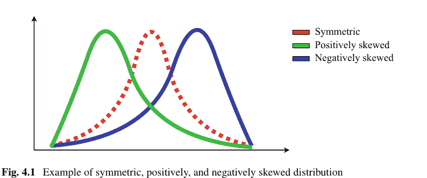

**图 4.1** 对称、正偏和负偏分布的示例

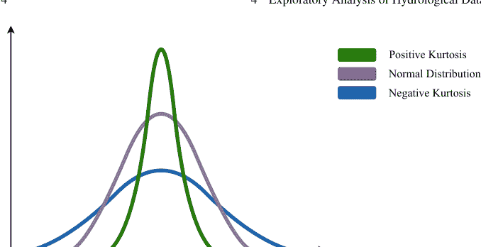

**图 4.2** 正态分布与具有正峰度和负峰度的分布的比较示例

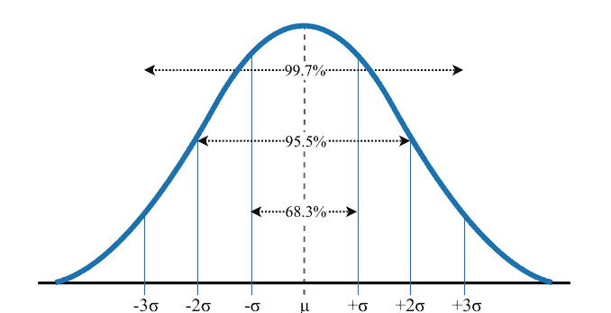

**图 4.3** 正态分布的示意图，其中均值、中位数和众数重合。它还显示了距离中心的标准差数量。在第一个标准差内，大约有68.3%的数据落入，95.5%的数据落入两个标准差内，99.7%的数据落入三个标准差内

##### 4.2.3 数值数据中的高斯性

高斯性是指数据集倾向于遵循高斯分布（也称为正态分布或钟形曲线）的趋势。这种分布的特点是其对称的钟形曲线，其中均值、中位数和众数在分布的中心重合（图4.3）。

###### 4.2.3.1 高斯性的优点

- 1. **简单性和普遍性：** 高斯分布具有明确的统计特性，仅需两个参数即可描述：均值和方差。由于中心极限定理，许多自然现象和过程，包括社会科学、物理科学和生物科学中的现象，都倾向于遵循高斯分布。
- 2. **预测分析：** 高斯分布对于预测分析特别有用，因为其明确的统计特性可以简化概率和分位数的估计。这在风险评估和管理中尤其有价值。
- 3. **参数统计检验：** 许多统计检验和程序（如t检验、方差分析和线性回归）都基于数据正态分布的假设。当满足其假设时，这些检验是强大且高效的。
- 4. **数据转换：** 数据通常可以转换以实现高斯性，这有助于应用适当的统计方法。常见的转换包括对数转换、平方根转换和Box-Cox转换。

###### 4.2.3.2 高斯性的缺点

- 1. **误解：** 高斯分布的简单性可能导致对数据的误解或过度简化。现实世界的数据可能杂乱而复杂，具有偏度、峰度、多峰或重尾，而高斯分布无法捕捉这些特征。
- 2. **不适用性：** 并非所有数据都遵循高斯分布。例如，收入、人口或网站访问者通常遵循幂律或对数正态分布。在这种情况下，应用基于高斯的分析可能导致错误的结论。
- 3. **对异常值敏感：** 高斯分布对异常值敏感。少数极端值可以显著地使均值偏斜并夸大标准差，从而扭曲数据的表示。
- 4. **违反假设：** 许多参数统计检验假设高斯性，但现实世界的数据经常违反这一假设。将这些检验应用于非高斯数据可能导致有偏或误导性的结果。
- 5. **独立性假设：** 高斯分布假设所有数据点都是独立的，这在许多数据集中并非如此，例如时间序列数据或空间数据，其中的值通常与其邻近值相关。

总之，高斯性是一个重要的特性，当其假设成立时，它可以简化数据分析并提供有价值的见解。然而，在处理非高斯数据时，必须意识到其局限性，并考虑替代分布或非参数方法。数据分析的主要目标是理解和准确地表示潜在的现实，这一目标指导着分布的选择。

##### 4.2.4 汇总统计的局限性

为了对数据形成深入的见解，了解汇总统计（如中心趋势、变异性和对称性的度量）是有帮助的。然而，在分析过程中承认它们的局限性也很重要。这里，我们列出一些原因：

- 1. **对异常值敏感：** 作为中心趋势度量的均值对极端值或异常值敏感。单个异常值可以显著地使均值偏斜，从而对数据集的中心点产生误导性的表示。作为变异性度量的方差和标准差也受异常值影响，因为它们考虑了与均值的平方差。
- 2. **忽略数据分布：** 虽然中位数和众数等度量对异常值不太敏感，但它们可能并不总是提供数据的完整图景。例如，众数对于连续数据或没有重复值的数据没有用处。此外，均值、中位数和众数不提供关于数据实际分布的任何信息。
- 3. **丢失细节：** 汇总统计本质上涉及数据的简化，导致特定细节的丢失。例如，范围仅考虑最大值和最小值，而忽略了数据在这些极值之间的分布情况。
- 4. **对偏度和峰度的误导性解释：** 虽然偏度和峰度可以提供关于数据不对称性和“尾部厚度”的信息，但解释它们可能具有挑战性。例如，偏度接近零的数据集可能是对称的，也可能是双峰分布，其两个大小相等的众数位于两端。
- 5. **不适用于复杂的多元数据：** 汇总统计主要提供单变量数据的快照。当处理多元数据或数据之间的关系至关重要时，这些度量可能不够。可能需要相关性、回归或更高级的技术。

总之，虽然这些汇总统计为理解数据集提供了有用的第一步，但不应孤立地使用它们。对数据的全面分析应考虑这些局限性，并采用图形工具或高级统计技术来补充这些度量。目标应始终是尽可能多地捕捉关于数据中潜在分布和关系的信息。

## 4.2 数据集总结

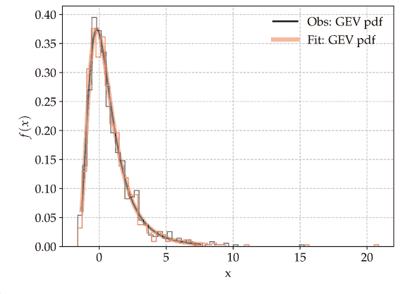

图 4.4 使用下山单纯形算法估计广义极值分布（GEV）参数的最大似然估计（MLE）。细黑线和红线分别显示了对应于具有真实参数（c）的观测数据和来自估计参数（cest）的合成数据的直方图。

##### 4.2.5 分布拟合

最大似然估计（MLE）是一种有效的统计方法，用于估计概率分布或统计模型的参数。它基于似然原理，该原理衡量观测数据与特定参数值的兼容性。MLE技术旨在找到使似然函数最大化的参数值，从而使观测数据更可能出现。简而言之，它试图估计“最有可能”产生观测数据的参数。

MLE的一个关键优势是其一致性。随着样本量的增加，MLE会依概率收敛到真实的参数值。它在所有一致估计量中也能达到最低的可能方差，因此是有效的。

然而，MLE可能对数据分布的初始假设敏感。对于小样本量，它也可能产生有偏估计，这个问题通常通过使用偏差校正的MLE来解决。接下来，我们描述一个最大似然估计的小例子。

```python
"""
Program to do a maximum likelihood
estimate (MLE) with generalised
extreme value (GEV) distribution
"""

from scipy.stats import genextreme
from scipy.optimize import fmin
import numpy as np
import matplotlib.pyplot as plt

# Fix random seed
np.random.seed(21)

# Likelihood function (the GEV distribution)
def likelihood_fun(theta, data):
    lik = -np.sum(
        np.log(
            genextreme.pdf(x=data, c=theta)
        )
    )
    return lik

# Loss function (to be maximised)
def fit_distribution(data):
    x0 = np.random.rand(1, )
    estimated_params = fmin(
        func=likelihood_fun,
        x0=x0,
        disp=True,
        args=(data,))
    return estimated_params

# Generate synthetic data
c = -0.2  # True parameter for GEV distribution
rvs = genextreme.rvs(c, size=1000)  # Random variates

# Fit the parameters
c_est = fit_distribution(data=rvs)  # Estimated parameter

# Print results
print('Obs. c = {:.4f}'.format(c))
print('Est. c = {:.4f}'.format(c_est[0]))

# Analysis
x_obs = np.linspace(genextreme.ppf(0.01, c),
                    genextreme.ppf(0.99, c), 100)
x_est = np.linspace(genextreme.ppf(0.01, c_est),
                    genextreme.ppf(0.99, c_est), 100)
rvs_ = genextreme.rvs(c_est, size=1000)

# Display the estimate
fig, ax = plt.subplots()
ax.plot(x_obs, genextreme.pdf(x_obs, c),
       'k-', lw=2, alpha=0.9, label='Obs: GEV pdf')
ax.plot(x_est, genextreme.pdf(x_est, c_est),
       'r-', lw=5, alpha=0.4, label='Fit: GEV pdf')
ax.hist(rvs, color='k', density=True, bins='auto',
        histtype='step', alpha=0.7)
ax.hist(rvs_, color='r', density=True, bins='auto',
        histtype='step', alpha=0.7)
ax.set_xlabel('x')
ax.set_ylabel('$f(x)$')
ax.grid(ls='--')
ax.legend(loc='best', frameon=False)
plt.show()
plt.tight_layout()
plt.savefig('MLE_fit.pdf', dpi=300)
```

上述代码生成合成数据，并使用广义极值（GEV）分布执行最大似然估计（MLE）。

我们首先导入所需的库：“scipy.stats.genextreme()”用于GEV分布，“scipy.optimize.fmin()”用于优化，“numpy”用于数值运算，“matplotlib.pyplot”用于绘图。

接下来，定义似然函数“likelihood_fun()”，该函数计算给定数据下GEV分布的负对数似然。

定义损失函数“fit_distribution()”，使用“fmin()”函数优化似然函数。它估计使似然最大化的GEV分布参数（“c”）。

然后，使用已知参数“c”从GEV分布生成合成数据集。使用“fit_distribution()”函数和生成的数据估计GEV分布的参数（“c_est”）。结果，打印出真实参数和估计参数。

之后，获得观测和拟合的GEV概率密度函数（PDF）以及从估计分布得到的生成数据和观测数据的直方图的可视化（图4.4）。然后，将结果（包括观测的GEV PDF和拟合的GEV PDF）与生成和估计数据的直方图一起绘制出来。最后，显示绘图并将其保存为PDF文件。

##### 4.2.6 水文数据中的内点与异常值

数据中的异常，或称为异常值，是数据集中显著偏离其他观测值的值。数据异常可能由多种原因引起，例如测量误差、罕见的水文事件和缺失的数据点。异常可能出现在单变量和多变量数据集中。尽管它们有时能提供关于关键事件的更深入见解，但它们也可能扭曲分析，导致错误的模型和误导性的结论。因此，数据的预处理变得至关重要。现在，我们介绍一组用于处理数据异常的统计技术。

在水文数据的背景下，数据点可以分为内点或异常值。内点被定义为基于假设的统计模型，落在预期范围内的观测误差。另一方面，异常值是与其余观测值表现出显著偏差的数据点。例如，异常值是那些对应于河流流量记录中极端洪水事件的数据点，因为它们与典型的流量值有明显差异。

处理异常值极其重要，因为它们可能对数据集的统计特性（如均值和标准差）产生相当大的影响。不处理它们可能对数据驱动模型的性能产生不利影响。

然而，确定异常值是代表错误还是真实但极端的观测至关重要。真正的异常值可以提供关于水文系统在极端条件下行为的宝贵见解，应在分析中仔细考虑。重要的是要记住，将数据点分类为内点或异常值通常取决于背景和正在研究的问题。

##### 4.2.7 缺失数据

缺失数据是水文研究中的一个有效问题，它可能损害分析的完整性和模型预测的稳健性。水文数据可能由于各种原因而存在缺失值，包括设备故障、数据处理错误或数据收集工作的间隙。这个问题在历史数据和从偏远或难以到达地区收集的数据中尤为普遍。

缺失数据阻碍了进行全面分析或准确模拟水文过程。关键信息可能会丢失，数据集的时间连续性可能会被破坏，导致对季节性变化或长期趋势的不准确表示。

为了处理缺失数据，水文学家通常采用各种技术，如插值、回归或数据插补方法。然而，这些方法有其自身的局限性，如果应用不当，可能会引入额外的不确定性。

处理缺失数据的方法应在考虑缺失数据的性质、缺失值的百分比以及数据中的潜在模式后选择。然而，通过稳健的数据收集、存储和管理实践来防止数据丢失，仍然是减轻水文研究中缺失数据影响的最佳方法。

##### 4.2.8 Q-Q图

分位数-分位数（Q-Q）图是水文学和其他领域中用于评估数据集是否遵循特定理论分布的有价值的图形工具。这些图通过绘制两个概率分布的分位数来比较它们。如果被比较的两个分布相似，Q-Q图中的点将大致沿着45°线分布。

尽管Q-Q图通常用于验证正态性假设，但它们也可用于其他分布。例如，水文学家可能使用Q-Q图来确定降雨或河流流量数据是否遵循正态分布。在这种情况下，观测数据的分位数将与标准正态分布的分位数进行绘制。

Q-Q图特别有用，因为它们直观地展示了数据在整个范围内与理论分布的偏离，而不仅仅是均值或中位数。它们可以突出显示诸如偏度（如果点形成弯曲模式）或重尾或轻尾行为（如果点在分布的极端处落在线下方或上方）等问题。

因此，Q-Q图不仅用于假设检验（即，数据是否遵循某种分布？），而且还提供关于数据分布性质的宝贵见解。这些信息可以指导为后续水文数据分析选择适当的统计方法或数据转换。

### 第5章
图形化水文数据分析

水文关系通常复杂且非线性，能够简化和解释支配这些关系的数据是水文研究的重要组成部分。

识别时间模式和趋势是水文领域中一种非常常见的图形数据分析形式。此类数据集中的季节性和长期变化更容易通过图形进行检查。例如，降雨或河流流量的季节性模式或由气候转变引起的潜在变化，可以从时间序列图中轻松辨别。在应用更稳健的统计方法之前，直观地理解这些模式和趋势非常重要。

水文领域中另一种常见的图形分析形式涉及解释不同水文变量之间的关系。例如，散点图可用于揭示变量之间的相关性或潜在关系，例如降水与径流，或土壤湿度与蒸散发。对这些变量的深入理解将有助于构建更好的预测方法。

图形数据分析也是异常检测的有效工具。异常值或异常事件，如洪水或干旱，可能无法仅通过统计摘要来检测。然而，通过可视化数据，这些显著的异常可以很容易地被识别并进一步研究。检测这些异常很重要，因为它们可以帮助构建水文模型并进行预测。此外，许多统计方法依赖于某些数据假设。例如，数据正态性或方差齐性假设在统计建模中很常见。图形方法，如直方图、箱线图或Q-Q图，可以用作验证这些假设的直观工具。

在图5.1中，我们可以看到一个说明性的散点图，展示了径流与降雨之间的关系。观察到一个上升趋势，表明径流随降雨增加而增加。我们还可以观察到一些明显偏离趋势的数据点——即异常值。它们是散点图中的异常，在当前背景下，可能由测量误差、局部强降雨和水流阻碍引起。

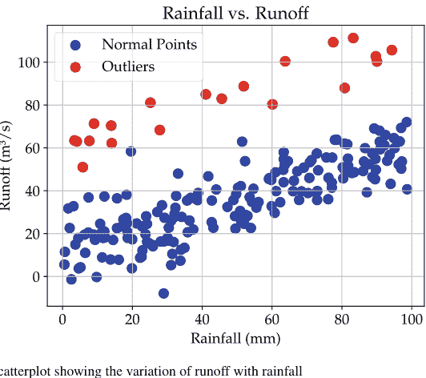

图5.1 显示径流随降雨变化的散点图

图形数据分析的另一个重要方面是其促进数据探索和假设生成的能力。研究人员可以从可视化数据中发掘新的见解并提出新的假设。例如，安斯库姆四重奏（图5.2）包含四个不同的数据集，它们具有相同的统计属性（均值、方差、相关性和线性回归系数），但在绘图时看起来却非常不同。它强调了图形数据分析相对于数值分析的重要性。这个探索过程通常会激发进一步的研究和分析，增强研究的整体深度。

图形分析在传达复杂数据和结果方面的能力是无与伦比的。数据可视化可以以易于理解和有意义的方式，向包括政策制定者、利益相关者和公众在内的不同受众传达复杂的数据结构和研究发现。

水文中的图形数据分析是对数值分析的补充，能够实现对数据的整体理解。它极大地促进了水资源管理中的有效决策。必须指出的是，虽然图形分析是一种有效的工具，但必须与其他统计技术结合使用，以进行彻底和全面的分析。

#### 5.1 针对单一数据集

一维（1D）数据集通常以时间序列数据的形式出现，记录特定位置一段时间内的降水、温度、径流和水位等变量。其他情况可能涉及从多变量数据中提取单列。以下是一些可用于一维数据集的图形工具。

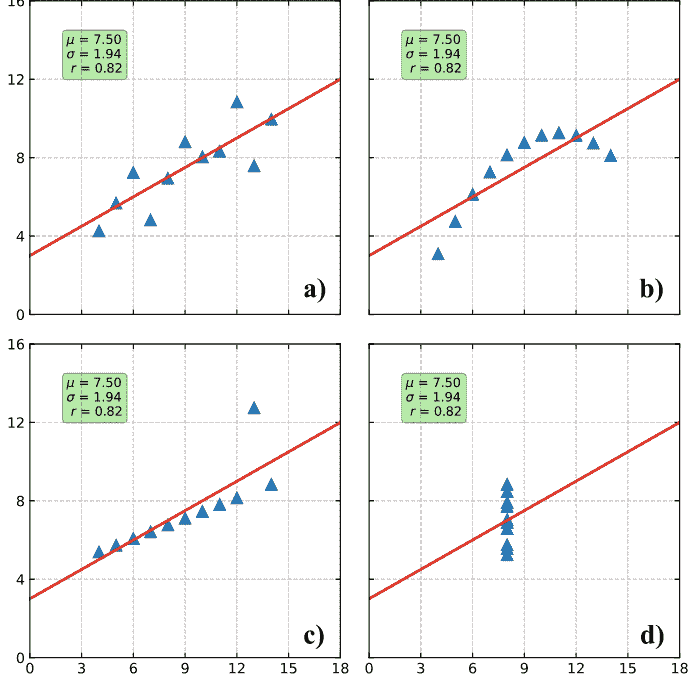

图5.2 数据集a–d，带有线性回归拟合和散点图。安斯库姆四重奏包含四个具有几乎相同且简单的统计属性（均值、方差、相关性和线性回归线）的数据集，但在绘图时看起来却非常不同。每个数据集由11个（x，y）点组成。它们由统计学家弗朗西斯·安斯库姆于1973年构建，旨在证明数据分析前绘图的重要性以及异常值对统计属性的影响

##### 5.1.1 直方图

直方图是数据分布的图形表示。它使用不同高度的条形来说明不同范围或区间内数据点的频率。x轴代表区间，y轴代表频率。它提供了对数值数据统计属性的清晰、全面的可视化和理解。

```
"""
Histogram for single dataset
"""

# Import libraries
import pandas as pd
import seaborn as sns
import matplotlib.pyplot as plt

"""
Load dataset
"""
data = pd.read_csv(
    filepath_or_buffer="../data/Godavari.csv",
    sep=",",
    header=0).dropna()
print("\nChecking data:")
try:
    data["time"] = pd.to_datetime(
        data['time'], infer_datetime_format=True)
    print("    Date format is okay!\n")
except ValueError:
    print("    Encountered error!\n")
    pass

Level_data = data[["Level"]]
del data
print("Read data file")

"""
Plotting the histogram
"""
sns.histplot(data=Level_data,
             bins=50)
plt.xlabel(Level_data.columns[0] + " (m)")
plt.grid(ls='--')
plt.tight_layout()
plt.show()
plt.savefig("single_hist.pdf", dpi=300)
print("\n\nPlotted!")
```

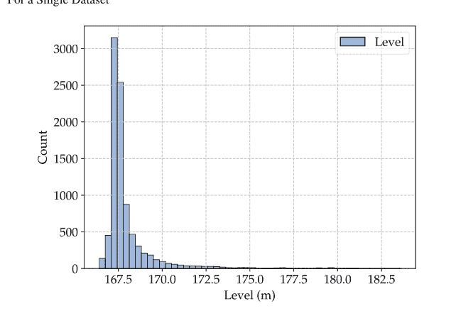

图5.3 1981年至2005年戈达瓦里河日平均水位（米）直方图

给定的Python程序用于从数据集中生成直方图，在本例中，该数据集名为“Godavari.csv”。程序的关键组成部分可分解如下：

首先，我们导入数据操作和可视化所需的库：用于数据操作的pandas结合Seaborn，以及用于数据可视化的matplotlib。

接下来，我们使用pandas的“read_csv()”函数加载CSV文件。然后，程序使用“dropna()”函数删除包含缺失值的行，使用“pd.to_datetime()”将“time”列转换为日期时间格式，最后仅保留数据的“Level”列以供进一步分析。

然后，使用Seaborn的“histplot()”函数创建“Level”数据的直方图。直方图有50个区间（“bins=50”）。网格线和布局调整使用matplotlib函数（“grid”、“tight_layout”）完成。

最后，使用“plt.show()”在屏幕上显示直方图，并使用“plt.savefig()”将其保存为PDF文件。

这个Python程序读取一个时间序列数据集，处理数据以仅保留所需的列（在本例中为“Level”），并创建数据的直方图以可视化其分布。结果如图5.3所示。

##### 5.1.2 箱线图

箱线图，也称为箱须图，是一种用于描述数据分布的图形表示。它显示了数据集的最小值、第一四分位数（Q1）、中位数、第三四分位数（Q3）和最大值的摘要。“箱”代表四分位距（Q3–Q1），包含中间50%的数据，而“须”延伸至最小和最大观测值。异常值可以表示为须线之外的单个点。

```
"""
Boxplot for single dataset
"""

# Import libraries
import pandas as pd
import seaborn as sns
import matplotlib.pyplot as plt

"""
Load dataset
"""
data = pd.read_csv(
    filepath_or_buffer="../data/Godavari.csv",
    sep=",",
    header=0).dropna()
print("\nChecking data:")
try:
    data["time"] = pd.to_datetime(
        data['time'], infer_datetime_format=True)
    print("   Date format is okay!\n")
except ValueError:
    print("   Encountered error!\n")
    pass

Level_data = data[["time", "Level"]]
del data
print("Read data file")

"""
Resample:
Downsample the time series
"""
Level_data = Level_data.resample('1M', on="time").mean()

"""
Plotting the boxplot
"""
sns.boxplot(data=Level_data,
            notch=True, showcaps=False,
            flierprops={"marker": "x"},
            boxprops={"facecolor": (.4, .6, .8, .5)},
            medianprops={"color": "coral"},
            )
plt.ylabel("(m)")
plt.grid(ls='--')
plt.tight_layout()
plt.show()
plt.savefig("single_box.pdf", dpi=300)
print("\n\nPlotted!")
```

##### 5.1.3 分位数图

分位数图是一种用于评估数据集是否遵循某种理论分布的图形工具。它将数据的分位数与所选理论分布的分位数进行绘制。如果数据点与理论线紧密对齐，则表明数据遵循该分布。

这个Python程序使用Seaborn和matplotlib库，通过箱线图可视化一个水位数据集。脚本的初始部分涉及导入必要的库，并从CSV文件加载数据集。加载的数据随后通过删除任何缺失值（`dropna()`）进行清理，并使用pandas的`to_datetime()`函数确保“time”列处于正确的日期时间格式。

经过一些清理后，选择感兴趣的数据——具体是“time”和“Level”列。其余数据被删除以节省内存。然后使用`resample()`函数对数据进行降采样，计算月平均值，将数据集的粒度降低到可管理的大小，并可能揭示更长期的趋势。

在脚本的下一部分，使用Seaborn的`boxplot()`函数创建一个箱线图。这里进行了各种视觉调整，包括为箱线图添加凹口、隐藏须帽、用“x”符号标记异常值、调整颜色以及添加网格。箱线图显示了各月份水位的分布，提供了关于其中心趋势和离散程度的见解。最后，该图被保存为高分辨率的PDF文件。

此脚本演示了一个加载、预处理和可视化时间序列数据的工作流程，重点是创建一个详细的箱线图（图5.4）来总结数据的分布。

```python
"""
单个数据集的分位数图
"""

# 导入库
import pandas as pd
from scipy import stats
import pylab
import matplotlib.pyplot as plt

"""
加载数据集
"""
data = pd.read_csv(
    filepath_or_buffer="../data/Godavari.csv",
    sep=",",
    header=0).dropna()
print("\n检查数据：")
try:
    data["time"] = pd.to_datetime(
        data['time'], infer_datetime_format=True)
    print("   日期格式正确！\n")
except ValueError:
    print("   遇到错误！\n")
    pass

Level_data = data[["time", "Level"]]
del data
print("读取数据文件")

"""
重采样：
降采样时间序列
"""
Level_data = Level_data.resample(
    rule='1M', on="time").mean()

"""
绘制Q-Q图
"""
stats.probplot(
    x=Level_data['Level'],
    dist="norm",
    plot=pylab
)
plt.xlabel("样本分位数")
plt.ylabel("排序后的水位数据 (m)")
plt.title("")
plt.grid(ls='--')
plt.axis('square')
plt.xlim(-4.5, 4.5)

plt.tight_layout()
plt.show()
plt.savefig("single_qq.pdf", dpi=300)
print("\n\n绘图完成！")
```

上述Python程序读取一个时间序列数据集，将其重采样到较低的频率（月度），然后生成一个分位数-分位数（Q-Q）图。以下是该程序的逐步解释。

首先，导入必要的Python库。这些库包括用于数据操作的pandas、用于统计函数的scipy的stats模块、用于绘图的matplotlib的pylab模块，以及用于附加绘图功能的matplotlib.pyplot。

接下来，使用pandas函数`read_csv()`加载位于“data”文件夹中名为“Godavari.csv”的CSV文件。使用`dropna()`函数丢弃包含缺失值的行。该数据集有一个表示时间戳的“time”列和一个表示水位数据的“Level”列。

然后，程序将“time”列转换为标准的pandas Datetime对象。这对于使用pandas中基于时间的功能是必要的。

加载并检查数据后，提取“time”和“Level”列并保存为“Level_data”。然后删除原始数据框“data”以节省内存。

接着，使用pandas中的`resample()`函数将“Level_data”时间序列降采样到月度频率。然后应用`mean()`函数计算每个月的平均“Level”。

然后，使用scipy的stats模块中的`probplot()`函数生成Q-Q图。该图将“Level”数据的分位数与正态分布的分位数进行比较。

添加了x轴和y轴的标签，显示了网格，并将图的纵横比设置为“square”，两个轴的范围都设置为-4.5到4.5。然后使用`tight_layout()`调整图的布局，并使用`show()`显示。该图还以300 dpi的分辨率保存为“single_qq.pdf”。

因此，此脚本提供了一个加载、预处理和可视化时间序列数据集的完整工作流程，特别侧重于通过Q-Q图（如图5.5所示）测试数据的正态性。

#### 5.2 多变量数据

多变量数据在水文研究中经常遇到。其分析对于理解复杂的水文过程和相互作用至关重要。下面我们讨论几种可用于分析此类数据的图形工具。

##### 5.2.1 散点矩阵图

散点矩阵图，或称配对图，是一种图形工具，它在数据集中为每对特征呈现散点图，并在对角线上呈现直方图。它允许快速直观地检查变量之间潜在的关系或模式。此工具对于探索数据以及识别数据集中多个维度的相关性、聚类、异常值或趋势非常有用。它提供了一种在二维图上可视化高维数据的方法。

```python
"""
演示使用seaborn创建散点矩阵的程序
"""

# 导入库
import pandas as pd
import matplotlib.pyplot as plt
import seaborn as sns

"""
加载数据集
"""
data1 = pd.read_csv( # 加载第一个数据集
    filepath_or_buffer="../data/Godavari.csv",
    sep=",",
    header=0
).dropna()

df1 = data1[[
    "Level", "Streamflow",
    "Pressure", "Rel_humidity"]]  # 提取列
df1.loc[:, "River"] = "Godavari"  # 创建新列
df1 = df1.iloc[:2000, :]
data2 = pd.read_csv( # 加载第二个数据集
    filepath_or_buffer="../data/Cauvery.csv",
    sep=",",
    header=0
).dropna()
df2 = data2[[
    "Level", "Streamflow",
    "Pressure", "Rel_humidity"]]  # 提取列
df2.loc[:, "River"] = "Cauvery"  # 创建新列
df2 = df2.iloc[:2000, :]

# 合并数据集
df = pd.concat([df1, df2])


"""
可视化
"""
sns.color_palette("Set2")
sns.pairplot(df, hue="River", height=2.0, markers='x')
plt.show()
plt.savefig("multi_scatter.pdf", dpi=300)
```

上述Python程序使用两个数据集创建散点矩阵可视化，一个用于戈达瓦里河，另一个用于考韦里河。此可视化允许检查来自不同数据集的不同变量之间的关系。

首先，导入必要的库——用于数据操作的pandas、用于基本绘图的matplotlib.pyplot，以及用于高级数据可视化的Seaborn。

接下来，程序加载与戈达瓦里河相关的第一个数据集。它从名为“Godavari.csv”的CSV文件读取数据集，并使用`dropna()`函数删除任何包含缺失值的行。然后选择列的子集（“Level”、“Streamflow”、“Pressure”、“Rel_humidity”）进行分析，并添加一个新列“River”，用值“Godavari”填充。对与考韦里河相关的第二个数据集重复此过程，新列“River”用值“Cauvery”填充。在这两种情况下，都只考虑数据集的前2000行进行进一步分析。

一旦两个数据集准备就绪，就使用pandas的`concat()`函数将它们合并。这导致一个包含来自两条河流数据的单一数据框。

最后，程序使用散点矩阵可视化合并后的数据集。散点矩阵是由Seaborn的`pairplot()`函数生成的配对图，不同的颜色代表不同的河流，由“hue”参数指定。“height”参数设置图的大小，“markers”指定标记样式。生成图后，使用`plt.show()`显示，如图5.6所示。该图还以300 dpi的分辨率保存为PDF文件。使用Seaborn的`color_palette()`函数将图的调色板设置为“Set2”。

##### 5.2.2 平行坐标图

平行坐标图是一种用于多维数据的可视化工具。数据集中的每个变量由一条垂直轴表示，数据点则显示为穿过这些轴的线条。线条在每条轴上的位置代表对应变量的值。它对于同时探索多个变量之间的关系和模式特别有用。

## 5.2 用于多变量数据

```python
"""
Program to demonstrate parallel
plots using pandas
"""

# Import libraries
import pandas as pd
import matplotlib.pyplot as plt
from pandas.plotting import parallel_coordinates

"""
Loading the dataset
"""
data1 = pd.read_csv( # Loading first dataset
    filepath_or_buffer="../data/Godavari.csv",
    sep=",",
    header=0
).dropna()
df1 = data1[[
    "Level", "Streamflow",
    "Pressure", "Rel_humidity"]]  # Retrieving columns
df1.loc[:, "River"] = "Godavari"  # Creating new column
df1 = df1.iloc[:2000, :]

data2 = pd.read_csv( # Loading second dataset
    filepath_or_buffer="../data/Cauvery.csv",
    sep=",",
    header=0
).dropna()
df2 = data2[[
    "Level", "Streamflow",
    "Pressure", "Rel_humidity"]]  # Retrieving columns
df2.loc[:, "River"] = "Cauvery"  # Creating new column
df2 = df2.iloc[:2000, :]

df = pd.concat([df1, df2])


"""
Visualization
"""
parallel_coordinates(
    frame=df, class_column='River',
    colormap=plt.get_cmap("Set2")
)
plt.grid(ls='--')
plt.tight_layout()
plt.show()
plt.savefig("multi_parallel.pdf", dpi=300)
```

上述程序首先导入必要的库。这里，pandas 用于数据操作和分析，matplotlib.pyplot 用于 Python 中的可视化，而 pandas.plotting 中的 `parallel_coordinates()` 函数用于创建平行坐标图。

然后，程序使用 pandas 函数 `pd.read_csv()` 从名为 "Godavari.csv" 的 CSV 文件加载第一个数据集。加载的数据通过 `.dropna()` 函数删除任何包含缺失值的行来进行清洗。仅从数据集中选择 "Level"、"Streamflow"、"Pressure" 和 "Relative Humidity" 列，并添加一个新列 "River"，其值为常量 "Godavari"。对第二个数据集 "Cauvery.csv" 重复此过程，并在其 "River" 列中添加相应的河流名称。对于这两个数据集，仅使用前 2000 行进行可视化。

之后，使用 `pd.concat()` 函数将两个数据集连接成一个 pandas 数据框。这个新组合的数据框现在包含了来自 Godavari 和 Cauvery 两条河流的数据。

最后，使用 `parallel_coordinates()` 函数创建可视化，该函数将每个特征绘制在单独的列上，然后为每个数据样本绘制连接这些特征的线条。在这种情况下，"River" 列被用作类别列，这意味着将为每条河流绘制并着色不同的线条。颜色映射设置为 "Set2"，这是一个适合区分不同类别的定性颜色映射。`plt.grid()` 函数用于向绘图添加网格线，`plt.tight_layout()` 调整子图参数以使子图适合图形区域。

如图 5.7 所示，使用 `plt.show()` 显示绘图。然后使用 `plt.savefig()` 将其保存为名为 "multi_parallel.pdf" 的 PDF 文件，分辨率为 300 dpi。该程序是可视化和比较来自两条河流的多变量数据的便捷方法。

#### 5.3 适合出版的图形

创建适合出版的图形远不止简单地将数据可视化。它需要精心的设计选择和对细节的关注，以确保清晰度、准确性和相关性。以下是一些优质出版图形的特征：

1.  清晰简洁：好的图形应快速清晰地传达主要信息。过于复杂或杂乱的图形会使读者困惑并掩盖关键点。数据和元素的包含应是有意为之，旨在增强对图形中心主题的理解。
2.  准确且诚实的呈现：数据应准确呈现，不得有任何可能误导读者的操纵。这包括正确的坐标轴缩放、适当使用数据点，以及避免扭曲或夸大数据模式。
3.  标签和标题：每个图形都应有一个清晰且描述性的标题，概述其代表的内容。坐标轴、数据系列或其他图形元素的标签对于理解也至关重要。必要时应提供图例或图例说明。
4.  颜色和符号的适当使用：使用的颜色和符号应增强图形的清晰度，而不是削弱它。颜色应可区分但不过于强烈，并应考虑色盲读者。符号应清晰区分，并且在整个图形中保持一致。
5.  数据来源和单位：适合出版的图形应始终标明数据来源和测量单位。此信息通常放在图注或坐标轴标签中。
6.  一致性：如果在同一出版物中使用多个图形，它们应保持一致的风格，包括字体、颜色方案和符号的使用。这为出版物提供了统一的外观和感觉，使读者更容易比较和关联这些图形。
7.  简洁性：简洁是好的图形的关键。简单、干净的设计有助于读者专注于数据及其传达的信息。应避免不必要的、无助于理解数据的装饰。
8.  高分辨率：最后，图形必须是高分辨率的，以确保其在屏幕上和印刷品中都清晰可见。它不应出现像素化或模糊，并且所有文本都应清晰可读。

当满足上述特征时，出版物中使用的图形可以有效地传达预期信息，增强读者的理解，并为出版物增添视觉吸引力。目标应始终是使复杂数据易于理解并为广泛受众所接受。

#### 5.4 误导性图形

水文领域的误导性图形是指可能导致错误解释或误解的数据或结果的可视化呈现。虽然有时这些不准确是无意的，源于糟糕的设计选择，但有时它们可能被故意用来扭曲认知并推进特定的叙事。无论意图如何，误导性图形都会损害研究的完整性并导致错误的结论。

在水文领域，图形通常描绘与水循环、气候变化、水质或其他水文现象相关的复杂数据。这些可能包括折线图、条形图、饼图、地图或更复杂的可视化。在水文领域创建误导性图形有多种方式。

一种常见的形式是不恰当的尺度操纵。这涉及调整 y 轴（或 x 轴）以使变化或差异看起来比实际更大或更小。例如，显示河流污染水平随时间轻微增加的图表可能会使用截断的 y 轴，使增加看起来更剧烈。

另一种形式是挑选数据，即只选择和显示支持某个结论的数据，而忽略其余数据。在水文领域，这可能意味着有选择性地展示降雨量高的年份的数据，以暗示降水量呈上升趋势，而忽略降雨量低的年份。

地图上空间数据的错误呈现也经常出现。这可能涉及使用不恰当的颜色比例尺、扭曲地理区域，或忽略提供解释图例。

有时，复杂的水文现象可能被过度简化，导致关键信息丢失。例如，用单一颜色或数字表示多维水质指数可能会过度简化情况并忽略关键细节。

误导性图形会严重扭曲水文领域的科学交流，导致误解和错误信息。因此，研究人员、审稿人和读者在创建或解释图形时保持批判性眼光至关重要，以确保水文科学研究的完整性和准确性。

## 第二部分

### 水文学中的统计建模

### 第六章
曲线拟合与回归分析

曲线拟合和回归分析是水文数据建模中广泛使用的强大统计工具。它们可用于建模数据之间的潜在关系，使你能够解释和预测不同条件下的水文行为。

曲线拟合涉及在一组数据点上拟合一个函数，以最佳方式表示数据集中的潜在趋势。曲线拟合支持诸如推导降雨的强度-历时-频率（IDF）曲线等基本任务，这些曲线描述了降雨事件的发生频率、历时和强度。这些曲线对于管理洪水风险和设计有效的坝、水库或排水系统至关重要。同样，它们也有助于建模水文过程线（一种描述水流速率随时间变化的方式），以及预测和管理河流流量模式。

回归分析是曲线拟合的一种形式，常用于建模两个或多个变量之间的关系。该技术确定能最好地用自变量描述因变量的方程。降雨-径流建模可以使用回归分析来建立河流流量（因变量）与降雨量（自变量）之间的关系。这种关系对于水资源管理、水资源可用性和洪水预报至关重要。它还应用于估算地下水补给速率（基于随时间变化的补给和消耗速率）以及抽水试验中的降深曲线建模和估算重要的含水层参数（如水力传导率）。

水质参数分析是回归分析在环境工程中的另一个应用。它可以帮助建立污染物浓度与流量、温度和土地利用特征等因素之间的关系。

这些关系会影响水处理过程和水污染控制策略。

曲线拟合和回归分析在研究气候变化对水文过程的影响方面发挥着至关重要的作用。它使水文学家能够将蒸散发、降水和径流等水文变量与温度和二氧化碳浓度等气候变量联系起来。这些模型在预测未来水资源可用性和气候变化情景下的适应策略方面也变得至关重要。

尽管这些技术非常有益，但必须注意它们基于一个假设，即这些关系在未来也将成立。因此，应在各自的研究中适当处理相关的不确定性。

曲线拟合和回归分析在水文学中具有不可估量的价值，为复杂的水文过程提供见解，影响水资源管理，并有助于预测未来情景。通过揭示历史数据中的模式和关系，这些工具极大地促进了我们对水系统的理解和管理。在接下来的章节中，我们将描述简单、多元和非线性回归技术。

#### 6.1 流量的简单线性回归

简单线性回归是一种常用的统计方法，用于估计一个因变量和一个自变量之间的关系。因变量有时称为目标变量，自变量称为协变量、特征或预测变量。线性回归模型由以下方程给出：

$$y = \beta_0 + \beta_1 x_1 + \beta_2 x_2 \cdots + \beta_p x_p + \epsilon$$

其中 $\beta_j$ 表示预测变量 $x_j$ 的系数，$\epsilon$ 是与预测变量无关的随机误差。线性回归的目标是使用最小二乘法估计系数 $\beta_j$。

在相关程序中，我们为戈达瓦里流域数据建立了河流流量和水位之间的回归模型。该案例的回归方程可表示为

$$\text{河流流量} = \beta_0 + \beta_1 * \text{水位}$$

```python
"""
Program to do simple linear
regression on the Godavari
streamflow data
"""

# Import libraries
import pandas as pd
import numpy as np
from sklearn.linear_model import LinearRegression
from sklearn.model_selection import train_test_split
import matplotlib.pyplot as plt
import seaborn as sns

savePlots = 1

"""
Load dataset
"""
data = pd.read_csv(
    filepath_or_buffer="../data/Godavari.csv",
    sep=",",
    header=0).dropna()
print("\nChecking data:")
try:
    data["time"] = pd.to_datetime(
        data['time'], infer_datetime_format=True)
    print("    Date format is okay!\n")
except ValueError:
    print("    Encountered error!\n")
    pass
df = data[["time", "Pressure",
           "Rel_humidity", "Level", "Streamflow"]]
del data
print("Read data file")

df.head()

"""
Data preprocessing
"""

"""
Linear Regression model fitting
"""
linearRegression = LinearRegression()
linearRegression.fit(X_train, y_train)
b0, b1 = linearRegression.intercept_, linearRegression.coef_[0]
print("\n\nEstimated parameters: "
      "\n   (b0, b1) = ({:.2f}, {:.2f})".
      format(b0, b1))
print("R-squared value: \n   R^2 = {:.2f}".
      format(linearRegression.score(X_train, y_train)))

"""
Visualization of results
"""
# Plot the datapoints
sns.scatterplot(x=np.squeeze(X_train), y=y_train)
plt.grid(ls="--")
plt.xlabel("Level (m)")
plt.ylabel("Streamflow (cumecs)")

# Plot regression line
x1, x2 = np.min(X), np.max(X)
y1, y2 = (b1*x1 + b0), (b1*x2 + b0)
plt.plot([x1, x2], [y1, y2], 'r-', label="Linear Model")
plt.legend()
plt.grid(ls="--")

# Tidying the plot
plt.tight_layout()
plt.show()
plt.savefig("linearReg_.pdf", dpi=300)

print("Done!!")
```

```
>>> time Pressure Rel_humidity Level Streamflow
>>> 0 1981-01-01 97416.18 60.102580 167.60 10.5
>>> 1 1981-01-02 97340.45 58.449010 167.59 10.3
>>> 2 1981-01-03 97306.44 58.281210 167.59 10.2
>>> 3 1981-01-04 97270.30 57.049640 167.59 10.4
>>> 4 1981-01-05 97371.98 57.171913 167.58 10.0
>>> 
>>> Estimated parameters:
>>> (b0, b1) = (-41624.79, 248.61)
>>> R-squared value:
>>> R^2 = 0.91
```

给定的程序对戈达瓦里河流流量数据执行了简单线性回归。它使用了多个库，即 pandas、NumPy、sklearn、matplotlib 和 Seaborn，用于数据操作、数学运算、建模和数据可视化。

程序的第一阶段涉及加载数据集。数据使用 pandas 的 `read_csv()` 函数从名为“Godavari.csv”的 CSV 文件中读取，并移除任何包含缺失数据的行。然后尝试使用 pandas 的 `to_datetime()` 函数将数据集的“time”列转换为日期时间格式。感兴趣的数据，即“time”、“Pressure”、“Rel_humidity”、“Level”和“Streamflow”列，被提取到一个新的数据框“df”中。

程序随后进入数据预处理阶段。在这里，“Level”列（自变量）被重塑为二维数组，用作线性回归模型的特征（X）。“Streamflow”列（因变量）是目标（y）。这些数据使用 sklearn 的 `model_selection` 模块中的 `train_test_split()` 函数被分割为训练集和测试集，其中 33% 的数据被保留用于测试。需要注意的是，`train_test_split()` 函数根据给定的比例 `test_size` 随机分割数据。然而，为了结果的可重现性，定义了一个 `random_state`。对于不同的 `random_state` 值，结果可能会有所不同。

数据预处理之后，线性回归模型被实例化并使用训练数据进行拟合。线性模型的截距和系数被打印出来，同时还有 R-squared 值，这是衡量线性模型拟合数据好坏的一个指标。

最后，使用 matplotlib 和 Seaborn 库对结果进行可视化。创建了“Level”与“Streamflow”的散点图，并在其上叠加了由线性回归模型生成的最佳拟合线。生成的图形被显示出来（图 6.1），然后保存为名为“linearReg_.pdf”的 PDF 文件以供将来参考。

#### 6.2 流量的多元线性回归

我们现在使用以下程序来描述一个多元线性回归案例。在下面的程序中，我们创建一个回归模型，将河流流量预测为水位和相对湿度的函数。多元线性回归的方程可以表示为：

河流流量 = $\beta_0 + \beta_1 * 相对湿度 + \beta_2 * 水位$ (6.3)

```python
"""
Program to do multiple linear
regression on the Godavari
streamflow data
"""

# Import libraries
import pandas as pd
import numpy as np
from sklearn.linear_model import LinearRegression
from sklearn.model_selection import train_test_split
import matplotlib.pyplot as plt

"""
Load dataset
"""
data = pd.read_csv(
    filepath_or_buffer="../data/Godavari.csv",
    sep=",",
    header=0).dropna()
print("\nChecking data:")
try:
    data["time"] = pd.to_datetime(
        data['time'], infer_datetime_format=True)
    print("    Date format is okay!\n")
except ValueError:
    print("    Encountered error!\n")
    pass
df = data[["time", "Pressure",
           "Rel_humidity", "Level", "Streamflow"]]
del data
print("Read data file")

"""
Resample:
Downsample the time series
"""
df = df.resample('1M', on="time").mean()

"""
Data preprocessing
"""
X = df[["Pressure", "Level"]].values.reshape(-1, 2)
y = df["Streamflow"].values
X_train, X_test, y_train, y_test = train_test_split(
    X, y, test_size=0.33, random_state=11)

"""
Linear Regression model fitting
"""
multipleRegression = LinearRegression()
multipleRegression.fit(X_train, y_train)
b0, b1, b2 = multipleRegression.intercept_, \
    multipleRegression.coef_[0], multipleRegression.coef_[1]
print("\n\nEstimated parameters: "
      "\n    (b0, b1, b2) = ({:.2f}, {:.2f}, {:.2f})".
      format(b0, b1, b2))
print("R-squared value: \n    R^2 = {:.2f}".
      format(multipleRegression.score(X_train, y_train)))

"""
Visualization of results
"""
# Extract min max
xmin, xmax = np.min(X_train[:, 0]), np.max(X_train[:, 0])
ymin, ymax = np.min(X_train[:, 1]), np.max(X_train[:, 1])
zmin, zmax = np.min(y_train), np.max(y_train)

# Surface equation
XX = np.linspace(xmin, xmax, 20)
YY = np.linspace(ymin, ymax, 20)
xx, yy = np.meshgrid(XX, YY)
zz = b0 + b1 * xx + b2 * yy

# Surface plot and Scatter 3d plot of points
fig = plt.figure(figsize=(7, 6))
ax = plt.axes(projection='3d')
ax.plot_surface(xx, yy, zz,
                rstride=1, cstride=1, alpha=0.5)
ax.scatter(X_train[:, 0], X_train[:, 1], y_train,
           marker='o', edgecolors='black', c='red', s=30)

# Tick numbers and locations
xtick_loc = np.linspace(xmin, xmax, 5)
ytick_loc = np.linspace(ymin, ymax, 5)
ztick_loc = np.linspace(zmin, zmax, 5)
ax.set_xticks(xtick_loc)
ax.set_yticks(ytick_loc)
ax.set_zticks(ztick_loc)

# Labels
ldist = 9
ax.set_xlabel('Relative Humidity (X)', labelpad=ldist)
ax.set_ylabel('Level (Y)', labelpad=ldist + 4)
ax.set_zlabel('Streamflow (Z)', labelpad=ldist)

# Tidying up
ax.view_init(elev=25, azim=-50)
ax.axis('auto')
plt.tight_layout()
plt.show()

# Saving
plt.savefig("multipleReg_.pdf", dpi=300)
print("Done!!")
```

该脚本将一个名为“Godavari.csv”的CSV数据文件加载到pandas数据框中，并删除任何缺失值。它尝试将“time”列转换为日期时间格式，然后选择“time”、“Pressure”、“Rel_humidity”、“Level”和“Streamflow”列进行分析。随后，使用pandas的resample()函数将数据框降采样到月度时间尺度，该函数计算“time”列上每个月内所有数据点的平均值。

数据加载和预处理后，脚本提取“Rel_humidity”和“Level”列作为输入特征（X），以及“Streamflow”列作为目标变量（y）。然后，它将这些数据划分为训练集和测试集，其中67%的数据用于训练，其余用于测试。

接下来，脚本从sklearn初始化一个LinearRegression对象，使用训练数据拟合模型，并打印线性模型的估计参数（截距和系数）。它还使用训练数据计算R平方分数，该分数衡量模型的拟合优度。

最后，脚本在3D图（图6.2）中可视化结果，其中“Rel_humidity”和“Level”数据分别构成x轴和y轴，预测的“Streamflow”构成z轴。实际的训练数据点以散点图的形式叠加在此曲面上。

#### 6.3 流量的非线性回归

本节演示一个非线性回归代码示例。在下面的程序中，我们创建一个回归模型，将河流流量预测为水位以及水位与相对湿度乘积的函数。该方程可以表示为：

河流流量 = $\beta_0 + \beta_1 * \text{水位} + \beta_2 * \text{水位} * \text{相对湿度}$ (6.4)

```python
"""
Program to do nonlinear regression on the Godavari
streamflow data
"""

# Import libraries
import pandas as pd
import numpy as np
from sklearn.linear_model import LinearRegression
from sklearn.model_selection import train_test_split
import matplotlib.pyplot as plt

"""
Load dataset
"""
data = pd.read_csv(
    filepath_or_buffer="../data/Godavari.csv",
    sep=",",
    header=0).dropna()
print("\nChecking data:")
try:
    data["time"] = pd.to_datetime(
        data['time'], infer_datetime_format=True)
    print("   Date format is okay!\n")
except ValueError:
    print("   Encountered error!\n")
    pass
df = data[["time", "Pressure",
           "Rel_humidity", "Level", "Streamflow"]]
del data
print("Read data file")

"""
Resample:
Downsample the time series
"""
df = df.resample('1M', on="time").mean()

"""
Data preprocessing
"""
X1 = df[["Level"]].values
X2 = df[["Rel_humidity"]].values
X = np.hstack([X1, X1*X2])  # Level & Level*Rel_humidity
y = df["Streamflow"].values
X_train, X_test, y_train, y_test = train_test_split(
    X, y, test_size=0.33, random_state=11)

"""
Linear Regression model fitting
"""
nonlinearRegression = LinearRegression()
nonlinearRegression.fit(X_train, y_train)
b0, b1, b2 = nonlinearRegression.intercept_, \
    nonlinearRegression.coef_[0], nonlinearRegression.coef_[1]
print("\n\nEstimated parameters: "
      "\n   (b0, b1, b2) = ({:.2f}, {:.2f}, {:.2f})".
      format(b0, b1, b2))
print("R-squared value: \n    R^2 = {:.2f}".
      format(nonlinearRegression.score(X_train, y_train)))

"""
Visualization of results
"""
# Extract min max
xmin, xmax = np.min(X_train[:, 0]), np.max(X_train[:, 0])
ymin, ymax = np.min(X_train[:, 1]), np.max(X_train[:, 1])
zmin, zmax = np.min(y_train), np.max(y_train)

# Surface equation
XX = np.linspace(xmin, xmax, 20)
YY = np.linspace(ymin, ymax, 20)
xx, yy = np.meshgrid(XX, YY)
zz = b0 + b1 * xx + b2 * yy

# Surface plot and Scatter 3d plot of points
fig = plt.figure(figsize=(7, 6))
ax = plt.axes(projection='3d')
ax.plot_surface(xx, yy, zz,
                rstride=1, cstride=1, alpha=0.5)
ax.scatter(X_train[:, 0], X_train[:, 1], y_train,
           marker='o', edgecolors='black', c='red', s=30)

# Tick numbers and locations
xtick_loc = np.linspace(xmin, xmax, 5)
ytick_loc = np.linspace(ymin, ymax, 5)
ztick_loc = np.linspace(zmin, zmax, 5)
ax.set_xticks(xtick_loc)
ax.set_yticks(ytick_loc)
ax.set_zticks(ztick_loc)
```

### 第7章
水文时间序列分析

将时间序列预测到未来是水文统计建模中最常见的应用之一。通常，水文学家关注的是对径流和洪水的预测，这本身就是一个受气象和地貌因素控制的复杂非线性现象。除了径流，水文学家通常还试图预测土壤湿度、地下水位和水质参数。可以将各种时间序列统计方法应用于长期的观测记录，以揭示趋势、模式和周期。

了解这些时间模式至关重要，原因有二：首先，理解控制不同水文变量之间关系的潜在机制；其次，基于我们对过去模式的理解来预测未来的水文状况。例如，可以利用历史降水、温度和径流数据记录来管理水资源、预测洪水和规划干旱应对。在这个气候变化的时代，此类预测模型构成了评估对水资源可用性的潜在影响和适应策略的关键输入。

其中一种技术是自回归综合移动平均模型，即ARIMA，这是一种用于分析水文时间序列的标准方法。它们能够捕捉时间序列数据中的季节性、自相关性和趋势，使其适用于多种应用。例如，可以使用ARIMA模型利用过去的观测值预测月降雨量，而其模型参数则会指示季节性或持续性的程度。

时间序列分析日益重要的另一个领域是人类活动对水文系统的影响。比较特定事件或人类干预（如土地利用变化或水坝建设）前后的时间序列数据，也可以揭示其对地下水位、河流流量或水质的影响。

时间序列预测和分析是水文领域的重要工具，增强了我们预测未来状况和理解水文系统的能力。在接下来的章节中，我们将描述一些常用的时间序列预测技术和统计检验方法，并附有Python示例代码。

#### 7.1 平稳性、趋势和周期性

平稳性、趋势、季节性和周期性是时间序列分析的基本概念。平稳性指的是时间序列的统计特征（如均值、方差和自相关性）随时间保持不变的特性。这一点至关重要，因为许多统计建模技术假设或要求时间序列是平稳的。
趋势指的是时间序列中的长期变动。它可以是上升的、下降的或水平的，分别表示所关注的变量随时间增加、减少或没有变化。
季节性是时间序列的一种特征，其中数据表现出每个日历季节都会重复出现的、有规律的、可预测的变化。这可能是由于天气变化等季节性效应或其他影响所关注变量的周期性因素造成的。
周期性与季节性类似，指的是在可预测的、固定的时间段内重复出现的模式。周期性模式的不同之处在于它不与日历相关联。例如，时间序列中每10个数据点重复一次的某种模式就表现出周期性。识别时间序列中的这些组成部分有助于提高预测模型的准确性，并带来更有见地的分析。

```python
"""
检查时间序列信号的平稳性并将其分解为趋势和季节性分量的程序
"""

# 导入库
import pandas as pd
import matplotlib.pyplot as plt
from statsmodels.tsa.stattools import adfuller as ADF
from statsmodels.tsa.seasonal import seasonal_decompose

"""
加载数据集
"""
data = pd.read_csv(
    filepath_or_buffer="../data/Godavari.csv",
    sep=",",
    header=0).dropna()
print("\n检查数据：")
try:
    data["time"] = pd.to_datetime(
        data['time'], infer_datetime_format=True)
    print("   日期格式正确！\n")
except ValueError:
    print("   遇到错误！\n")
    pass
df = data[["time", "Streamflow"]]
del data
print("读取数据文件")


"""
对时间序列进行降采样
"""
resampled = df.resample('2M', on="time").mean()


"""
转换数据
"""
def transform(x):
    x = x - minx + 10.0
    return x


def inverse_transform(x):
    x = x - 10.0 + minx
    return x


"""
转换数据
"""
minx = resampled.min()
resampled = transform(resampled)


"""
分解信号（乘法/加法）
"""
decompose_result_mult = seasonal_decompose(
    resampled, model="multiplicative")
fig, ax = plt.subplots(nrows=3, ncols=1, sharex=True,
                        figsize=(8, 6))
ax[0].plot(decompose_result_mult.observed, label='时间序列')
ax[1].plot(decompose_result_mult.seasonal, label='季节性')
ax[2].plot(decompose_result_mult.trend, label='趋势')
ax[0].set_ylabel('序列')
ax[1].set_ylabel('季节性')
ax[2].set_ylabel('趋势')
ax[2].set_xlabel('年份')
ax[0].grid(ls='--')
ax[1].grid(ls='--')
ax[2].grid(ls='--')
plt.tight_layout()
plt.savefig('seasonal.pdf', dpi=300)
```

```python
"""
平稳性检验
"""
def stationarity_adf_test(x, alpha=0.05):
    adftest_res = ADF(x, autolag="AIC")
    dfout = pd.Series(
        adftest_res[0:4],
        index=["ADF统计量", "ADF p值",
               "ADF使用的滞后数", "ADF使用的观测数"])
    for key, value in adftest_res[4].items():
        dfout["   临界值 (%s)" % key] = value
    print(dfout)
    if dfout["ADF p值"] > alpha:
        print("   结果：非平稳时间序列", "\n")
    else:
        print("   结果：平稳时间序列", "\n")
```

```python
print("\n检查平稳性：")
stationarity_adf_test(resampled)
```

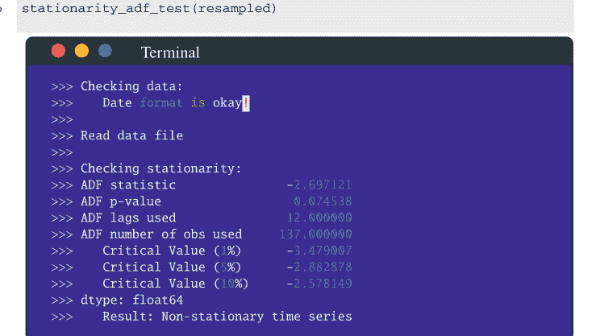

首先，程序使用pandas从CSV文件中读取戈达瓦里河数据集。然后检查“time”字段，确保其为正确的日期时间格式。包含“time”、“Pressure”、“Rel_humidity”、“Level”和“Streamflow”等字段的数据，使用pandas的resample()函数重采样为月频率。这样做是为了将数据点的频率从每日或每小时降低到每月，从而对时间序列数据进行降采样。

接下来，选择“Level”字段作为自变量（X），并将其平方根也附加到其中。这有效地转换了原始变量，使模型能够捕捉非线性关系。“Streamflow”字段被视为因变量（y）。然后使用sklearn中的train_test_split()函数将数据划分为训练集和测试集，其中33%的数据保留用于测试。

接着，使用sklearn中的线性回归模型拟合训练数据。尽管这是一个“线性”回归模型，但由于第二个自变量的转换，它被用于拟合非线性关系。拟合模型的参数，包括截距以及“Level”和“Level×Rel_humidity”的系数，连同R平方值（衡量因变量中可由自变量预测的方差比例）一起被打印出来。

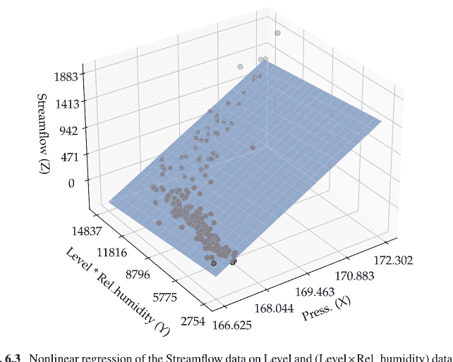

**图 6.3** 戈达瓦里河径流数据对Level和（Level×Rel_humidity）数据的非线性回归

最后，程序生成一个三维图（图6.3）来可视化结果。“Level”和“Level × Rel_humidity”字段分别绘制在x轴和y轴上，而“Streamflow”在z轴上。后一个变量是回归的非线性项。该图还显示了带有数据点的估计回归曲面。

```python
# 标签
ldist = 9
ax.set_xlabel('压力 (X)', labelpad=ldist)
ax.set_ylabel('Level * Rel_humidity (Y)', labelpad=ldist + 4)
ax.set_zlabel('径流 (Z)', labelpad=ldist)

# 整理
ax.view_init(elev=30, azim=-135)
ax.axis('auto')
plt.tight_layout()
plt.show()
plt.savefig("nonlinearReg_.pdf", dpi=300)

print("完成！！")
```

```
估计参数：
    (b0, b1, b2) = (-48144.80, 288.41, -0.02)
R平方值：
    R^2 = 0.93
```

上述程序首先导入必要的库，包括用于数据处理的pandas、用于数据可视化的matplotlib以及用于时间序列分析的statsmodels。

然后，我们从名为“Godavari.csv”的CSV文件中加载数据集。该CSV文件假定包含带有时间戳的河流流量时间序列数据。数据集被读入一个pandas数据框，并删除任何缺失值。数据框的“time”列被转换为日期时间格式，以便进行正确的时间序列分析。如果日期时间转换成功，控制台会打印一条消息确认日期格式正确。

程序的下一部分对原始时间序列数据进行降采样，计算每2个月期间的平均值。这样做是为了简化时间序列并减少短期波动的影响。

接着，程序对数据进行变换，通过从所有数据点中减去最小值并加上10，确保所有值为正。这种变换有助于使时间序列中的所有值为正，从而使预测模型更加稳定。变换后的数据集存储在变量“resampled”中。

然后，使用statsmodels库中的“seasonal_decompose()”函数，将变换后的重采样时间序列分解为其趋势和季节性成分。seasonal_decompose函数将时间序列分为三部分：原始时间序列、季节性成分（在特定间隔重复的模式）和趋势成分。随后，我们在共享的x轴上绘制这三部分以进行视觉比较。

最后，程序检查变换后的重采样时间序列数据的平稳性。平稳性是许多时间序列分析方法的关键假设。如果一个时间序列的属性（如均值和方差）不随时间变化，则称其为平稳的。程序使用增强迪基-福勒（ADF）检验，这是statsmodels库中实现的一种常用的平稳性统计检验。检验结果打印到控制台，根据ADF检验的p值指示时间序列是平稳的还是非平稳的。分解的图形显示如图7.1所示。

#### 7.2 常用预测方法

##### 7.2.1 自回归（AR）

自回归（AR）时间序列预测是一种统计方法，它基于过去观测值的加权和来预测未来值。其前提是序列中的过去值会影响接下来发生的事情。AR模型利用观测值与一定数量的滞后观测值（即过去时间点的观测值）之间的直接关系。AR模型的“阶数”表示使用了多少个过去的观测值。附随的代码演示了使用AR进行时间序列预测的代码。

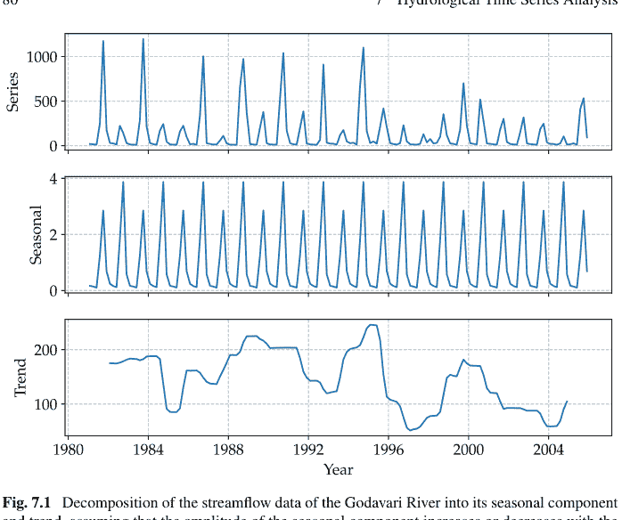

```python
"""
使用自回归模型进行时间序列建模的程序
"""

# 导入库
import pandas as pd
import numpy as np
import matplotlib.pyplot as plt
from statsmodels.graphics.tsaplots import plot_acf, plot_pacf
from statsmodels.tsa.stattools import adfuller as ADF
from statsmodels.tsa.ar_model import AutoReg as AR
from sklearn.metrics import mean_squared_error as MSE
import seaborn as sns

savePlots = 1
```

```python
def plotGraph(df_, label, figsize, indicator, title,
              save=savePlots):
    if save:
        if indicator == 0: # 时间序列图
            df_.plot(figsize=figsize)
            plt.xlabel(label[0])
            plt.ylabel(label[1])
            plt.legend()
        elif indicator == 1: # 直方图
            fig, ax = plt.subplots(2, 1, figsize=figsize,
                                   sharex=True)
            df_["Streamflow"].hist(ax=ax[0])
            df_["Streamflow"].plot(kind='kde', ax=ax[1])
            ax[0].set_title("")
            ax[0].grid(ls="--")
            ax[1].grid(ls="--")
            ax[1].set_xlabel(label[0])
            ax[1].set_ylabel(label[1])
        elif indicator == 2: # 箱线图
            plt.figure(figsize=figsize)
            sns.boxplot(x=df_["Streamflow"].index.year,
                        y=df_["Streamflow"])
        elif indicator == 3: # 自相关图
            fig, ax = plt.subplots(2, 1, figsize=figsize,
                                   sharex=True)
            plot_acf(x=df_["Streamflow"], lags=40, ax=ax[0])
            ax[0].set_title("")
            ax[0].set_ylabel("ACF")
            plot_pacf(x=df_["Streamflow"],
                      lags=40, method="ywm", ax=ax[1])
            ax[1].set_xlabel("lag")
            ax[1].set_ylabel("PACF")
        elif indicator == 4: # 预测结果
            fig, ax = plt.subplots()
            df_.plot(y="Test series",
                     use_index=True, style="-x",
                     lw=3, ms=8, ax=ax)
            df_.plot(y="Predicted series",
                     use_index=True, style="-o",
                     lw=3, ms=8, alpha=0.6,
                     ax=ax)
            ax.grid('on', ls="--", which='minor', axis='both')
            plt.xlabel(label[0])
            plt.ylabel(label[1])
            plt.title("")
            plt.grid(ls="--")
            plt.tight_layout()
            plt.show()
            plt.savefig(title + "_.pdf", dpi=300)
```

```python
"""
加载数据集
"""
data = pd.read_csv(
    filepath_or_buffer="../data/Godavari.csv",
    sep=",",
    header=0).dropna()
print("\n检查数据：")
try:
    data["time"] = pd.to_datetime(
        data['time'], infer_datetime_format=True)
    print("   日期格式正确！\n")
except ValueError:
    print("   遇到错误！\n")
    pass
df = data[["time", "Streamflow"]]
del data
print("读取数据文件")
```

```python
"""
重采样：
对时间序列进行降采样
"""
resampled = df.resample('2M', on="time").mean()
plotGraph(df_=resampled,  # 时间序列图
          label=["Year", "Streamflow"],
          figsize=(10, 4),
          indicator=0,
          title="ar-ts_resampled")

# 变换和标准化之前
plotGraph(df_=resampled,  # 直方图
          label=["Streamflow", ""],
          figsize=(7, 6),
          indicator=1,
          title="ar-histogram")
plotGraph(df_=resampled,  # 箱线图
          label=["Year", "Streamflow"],
          figsize=(14, 4),
          indicator=2,
          title="ar-boxplot")
```

```python
"""
预处理：
数据变换与可视化
"""

def transform_data(x):
    x = np.log(x - xmin + 100.)
    x = (x - meanx_) / stdx_
    return x

def inverse_transform(x):
    x = x * stdx_ + meanx_  # 非标准化
    x = np.exp(x) + xmin - 100.  # 逆对数正变换
    return x

xmin = np.array(resampled.min())[0]
meanx_ = np.array(resampled.mean())[0]
stdx_ = np.array(resampled.std())[0]

resampled = resampled.apply(transform_data)
print("\n数据变换完成")

# 变换和标准化之后
plotGraph(df_=resampled,  # 时间序列图
          label=["Year", "$log($" + "Streamflow" + ")$"],
          figsize=(10, 4),
          indicator=0,
          title="ar-ts_resampled_after")
plotGraph(df_=resampled,  # 直方图
          label=["Streamflow", ""],
          figsize=(7, 6),
          indicator=1,
          title="ar-histogram_after")
plotGraph(df_=resampled,  # 箱线图
          label=["Year", "Streamflow"],
          figsize=(14, 4),
          indicator=2,
          title="ar-boxplot_after")
```

```python
"""
平稳性检验
"""
def stationarity_adf_test(x, alpha=0.05):
    adftest_res = ADF(x, autolag="AIC")
    dfout = pd.Series(
        adftest_res[0:4],
        index=["ADF statistic", "ADF p-value",
               "ADF lags used", "ADF number of obs used"])
    for key, value in adftest_res[4].items():
        dfout["   Critical Value (%s)" % key] = value
    print(dfout)
    if dfout["ADF p-value"] > alpha:
        print("   结果：非平稳时间序列", "\n")
    else:
        print("   结果：平稳时间序列", "\n")

print("\n检查平稳性：")
stationarity_adf_test(resampled)

"""
自相关和偏自相关
"""
plotGraph(df_=resampled,  # 自相关图
          label=["", ""],
          figsize=(7, 6),
          indicator=3,
          title="ar-acorr")

"""
数据划分与简单自回归拟合
"""
trainmask = (resampled.index >= "1981-01-01") & \
            (resampled.index <= "2002-12-31")
testmask = (resampled.index > "2002-12-31")
training_set = list(resampled["Streamflow"].loc[trainmask])
testing_set = list(resampled["Streamflow"].loc[testmask])
print("创建训练集和测试集\n")

"""
使用自回归进行单步预测
"""
```

#### 7.2 常用预测方法

```python
forecasts = list()
for i in range(len(testing_set)):
    modelAR = AR(training_set, lags=3).fit()
    pred = np.squeeze(modelAR.forecast())
    forecasts.append(pred)
    training_set.append(testing_set[i])
    print("Obs={:0.04f}, Pred={:0.04f}    {}/{}".format(
        np.squeeze(inverse_transform(testing_set[i])),
        np.squeeze(inverse_transform(pred)),
        i + 1,
        len(testing_set)))
print("\nRoot mean square error:")
print("    Testset RMSE={:0.04}".
      format(MSE(testing_set, forecasts)))

"""
Result plots
"""
result = {"Year": resampled["Streamflow"].loc[testmask].index,
          "Test series":
              inverse_transform(np.array(testing_set)),
          "Predicted series":
              inverse_transform(np.array(forecasts))}
df_res = pd.DataFrame.from_dict(data=result)
df_res.set_index("Year", inplace=True)
plotGraph(df_=df_res,  # Prediction results
          label=["Year", "Streamflow"],
          figsize=(10, 4),
          indicator=4,
          title="ar-result")
print("Done!")
```

提供的Python脚本使用自回归模型进行时间序列分析。该脚本被划分为多个部分，每个部分在分析时间序列数据的过程中执行特定任务。

首先，它导入所有必要的库，并定义一个名为“plotGraph()”的函数。该函数用于根据传入的指示器生成并保存不同类型的图表，例如：0—时间序列图，1—直方图，2—箱线图，3—自相关图，4—预测结果图。它有助于在预处理和建模的各个阶段可视化时间序列数据。

然后，脚本从名为“Godavari.csv”的CSV文件中加载数据集，确保数据没有空值。它尝试将“time”列转换为日期时间格式，以方便进行时间序列分析。成功转换后，数据被重采样为双月频率，并以不同方式可视化，包括时间序列图、直方图和箱线图。

在预处理阶段，数据被转换为适合进一步分析的形式。数据转换包括应用对数函数和数据标准化过程；之后，数据再次被可视化。重采样后的时间序列图如图7.2所示，直方图如图7.3所示，箱线图如图7.4所示。我们仅展示AR模型的这些图表，并通过不在后续的时间序列分析程序中重复显示它们来避免冗余图表。

接下来，转换后的数据经过增广迪基-富勒检验以检查平稳性。平稳性对于时间序列建模至关重要，平稳时间序列的特性不依赖于观测时间。同时生成自相关图以可视化时间序列与其自身过去和未来值的相关性。

最后，数据被划分为训练集和测试集。然后，自回归模型被拟合到训练数据，并以单步方式用于预测测试数据中的值。这意味着测试集中的每一步都是使用前一步的预测值逐一进行预测的。预测结果如图7.6所示。

计算测试集预测的均方根误差以量化预测误差。最后，绘制测试集中的真实值和预测值以进行视觉比较。这可以帮助用户评估自回归模型在预测时间序列数据方面的有效性。

图7.6 使用自回归预测模型的预测结果

##### 7.2.2 自回归移动平均模型

自回归移动平均模型结合了两个组成部分：自回归部分和移动平均部分。AR部分分析观测值与一定数量的滞后观测值之间的相关性。MA部分将误差项建模为过去不同时间同时发生的误差项的线性组合。通过同时使用过去的值和过去的预测误差来建模未来的值，ARMA可以有效地捕捉时间序列数据中复杂的自相关性，从而提高预测的准确性。

```python
"""
Program to do time series modeling
using the ARMA model
"""

# Import libraries
import pandas as pd
import numpy as np
import matplotlib.pyplot as plt
from statsmodels.graphics.tsaplots import plot_acf, plot_pacf
from statsmodels.tsa.stattools import adfuller as ADF
from statsmodels.tsa.arima.model import ARIMA
from sklearn.metrics import mean_squared_error as MSE
import seaborn as sns
```

```python
savePlots = 1


def plotGraph(df_, label, figsize, indicator, title,
              save=savePlots):
    if save:
        if indicator == 0: # Time series plot
            df_.plot(figsize=figsize)
            plt.xlabel(label[0])
            plt.ylabel(label[1])
            plt.legend()
        elif indicator == 1: # Histogram
            fig, ax = plt.subplots(2, 1, figsize=figsize,
                                   sharex=True)
            df_["Streamflow"].hist(ax=ax[0])
            df_["Streamflow"].plot(kind='kde', ax=ax[1])
            ax[0].set_title("")
            ax[0].grid(ls="--")
            ax[1].grid(ls="--")
            ax[1].set_xlabel(label[0])
            ax[1].set_ylabel(label[1])
        elif indicator == 2: # Boxplot
            plt.figure(figsize=figsize)
            sns.boxplot(x=df_["Streamflow"].index.year,
                        y=df_["Streamflow"])
        elif indicator == 3: # Autocorrelation
            fig, ax = plt.subplots(2, 1, figsize=figsize,
                                   sharex=True)
            plot_acf(x=df_["Streamflow"], lags=40, ax=ax[0])
            ax[0].set_title("")
            ax[0].set_ylabel("ACF")
            plot_pacf(x=df_["Streamflow"],
                      lags=40, method="ywm", ax=ax[1])
            ax[1].set_xlabel("lag")
            ax[1].set_ylabel("PACF")
        elif indicator == 4: # Predicted result
            fig, ax = plt.subplots()
            df_.plot(y="Test series",
                     use_index=True, style="-x",
                     lw=3, ms=8, ax=ax)
            df_.plot(y="Predicted series",
                     use_index=True, style="-o",
                     lw=3, ms=8, alpha=0.6,
                     ax=ax)
            ax.grid('on', ls="--", which='minor', axis='both')
            plt.xlabel(label[0])
            plt.ylabel(label[1])
            plt.title("")
            plt.grid(ls="--")
            plt.tight_layout()
            plt.show()
            plt.savefig(title + "_.pdf", dpi=300)
```

```python
"""
Load dataset
"""
data = pd.read_csv(
    filepath_or_buffer="../data/Godavari.csv",
    sep=",",
    header=0).dropna()
print("\nChecking data:")
try:
    data["time"] = pd.to_datetime(
        data['time'], infer_datetime_format=True)
    print("    Date format is okay!\n")
except ValueError:
    print("    Encountered error!\n")
    pass
df = data[["time", "Streamflow"]]
del data
print("Read data file")
```

```python
"""
Resample:
Downsample the time series
"""
resampled = df.resample('2M', on="time").mean()
plotGraph(df_=resampled,  # Time series plot
          label=["Year", "Streamflow"],
          figsize=(10, 4),
          indicator=0,
          title="arma-ts_resampled")
```

```python
# Before transformation and standardization
plotGraph(df_=resampled,  # Histogram
          label=["Streamflow", ""],
          figsize=(7, 6),
          indicator=1,
          title="arma-histogram")
```

```python
plotGraph(df_=resampled,  # Boxplot
          label=["Year", "Streamflow"],
          figsize=(14, 4),
          indicator=2,
          title="arma-boxplot")
```

```python
"""
Pre-processing:
Data transformation and Visualization
"""

def transform_data(x):
    x = np.log(x - xmin + 100.)
    x = (x - meanx_) / stdx_
    return x

def inverse_transform(x):
    x = x * stdx_ + meanx_  # non-standardized
    x = np.exp(x) + xmin - 100.  # inverse log positive
    return x

xmin = np.array(resampled.min())[0]
meanx_ = np.array(resampled.mean())[0]
stdx_ = np.array(resampled.std())[0]

resampled = resampled.apply(transform_data)
print("\nDone data transformation")
```

```python
# After transformation and standardization
plotGraph(df_=resampled,  # Time series plot
          label=["Year", "$log($" + "Streamflow" + "$)$"],
          figsize=(10, 4),
          indicator=0,
          title="arma-ts_resampled_after")
plotGraph(df_=resampled,  # Histogram
          label=["Streamflow", ""],
          figsize=(7, 6),
          indicator=1,
          title="arma-histogram_after")
```

##### 7.2.3 自回归积分滑动平均模型（ARIMA）

自回归积分滑动平均（ARIMA）模型将自回归、差分和滑动平均结合成一种单一的方法，用于预测未来的数据点。自回归部分分析一个观测值与一定数量的滞后观测值之间的相关性。积分部分涉及对数据进行差分以消除趋势并使序列平稳。滑动平均部分将误差项建模为过去误差项的组合。通过适当调整这些组件，ARIMA可以捕捉复杂的时间结构以进行预测。

```python
"""
使用ARIMA模型进行时间序列建模的程序
"""

# 导入库
import pandas as pd
import numpy as np
import matplotlib.pyplot as plt
from statsmodels.graphics.tsaplots import plot_acf
from statsmodels.graphics.tsaplots import plot_pacf
from statsmodels.tsa.stattools import adfuller as ADF
from statsmodels.tsa.arima.model import ARIMA
from sklearn.metrics import mean_squared_error as MSE
import seaborn as sns

# 保存图表？？
savePlots = 1

def plotGraph(df_, label, figsize, indicator, title,
              save=savePlots):
    if save:
        if indicator == 0: # 时间序列图
            df_.plot(figsize=figsize)
            plt.xlabel(label[0])
            plt.ylabel(label[1])
            plt.legend()
        elif indicator == 1: # 直方图
            fig, ax = plt.subplots(2, 1, figsize=figsize,
                                  sharex=True)
            df_["Streamflow"].hist(ax=ax[0])
            df_["Streamflow"].plot(kind='kde', ax=ax[1])
            ax[0].set_title("")
            ax[0].grid(ls="--")
            ax[1].grid(ls="--")
            ax[1].set_xlabel(label[0])
            ax[1].set_ylabel(label[1])
        elif indicator == 2: # 箱线图
            plt.figure(figsize=figsize)
            sns.boxplot(x=df_["Streamflow"].index.year,
                        y=df_["Streamflow"])
        elif indicator == 3: # 自相关
            fig, ax = plt.subplots(2, 1, figsize=figsize,
                                  sharex=True)
            plot_acf(x=df_["Streamflow"], lags=40, ax=ax[0])
            ax[0].set_title("")
            ax[0].set_ylabel("ACF")
            plot_pacf(x=df_["Streamflow"],
                      lags=40, method="ywm", ax=ax[1])
            ax[1].set_xlabel("lag")
            ax[1].set_ylabel("PACF")
        elif indicator == 4: # 预测结果
            fig, ax = plt.subplots()
            df_.plot(y="Test series",
                     use_index=True, style="-x",
                     lw=3, ms=8, ax=ax)
            df_.plot(y="Predicted series",
                     use_index=True, style="-o",
                     lw=3, ms=8, alpha=0.6,
                     ax=ax)
            ax.grid('on', ls="--", which='minor', axis='both')
            plt.xlabel(label[0])
            plt.ylabel(label[1])
        plt.title("")
        plt.grid(ls="--")
        plt.tight_layout()
        plt.show()
        plt.savefig(title + "_.pdf", dpi=300)

"""
加载数据集
"""
```

```python
plotGraph(df_=resampled,  # 箱线图
          label=["Year", "Streamflow"],
          figsize=(14, 4),
          indicator=2,
          title="arma-boxplot_after")
```

```python
"""
平稳性检验
"""
def stationarity_adf_test(x, alpha=0.05):
    adftest_res = ADF(x, autolag="AIC")
    dfout = pd.Series(
        adftest_res[0:4],
        index=["ADF statistic", "ADF p-value",
               "ADF lags used", "ADF number of obs used"])
    for key, value in adftest_res[4].items():
        dfout["   Critical Value (%s)" % key] = value
    print(dfout)
    if dfout["ADF p-value"] > alpha:
        print("   结果：非平稳时间序列", "\n")
    else:
        print("   结果：平稳时间序列", "\n")
```

```python
print("\n检查平稳性：")
stationarity_adf_test(resampled)
```

```python
"""
自相关和偏自相关
"""
plotGraph(df_=resampled,  # 自相关图
          label=["", ""],
          figsize=(7, 6),
          indicator=3,
          title="arma-acorr")
```

```python
"""
数据划分和ARIMA拟合
"""
trainmask = (resampled.index >= "1981-01-01") & \
            (resampled.index <= "2002-12-31")
testmask = (resampled.index > "2002-12-31")
training_set = list(resampled["Streamflow"].loc[trainmask])
testing_set = list(resampled["Streamflow"].loc[testmask])
```

```python
print("已创建训练集和测试集\n")

"""
单步预测
order = (p,q,d)
order = (滞后阶数, 差分阶数, 滑动平均阶数)
"""
forecasts = list()
for i in range(len(testing_set)):
    modelARIMA = ARIMA(training_set, order=(5, 0, 0)).fit()
    pred = np.squeeze(modelARIMA.forecast())
    forecasts.append(pred)
    training_set.append(testing_set[i])
    print("Obs={:0.04f}, Pred={:0.04f}    {}/{}".format(
        np.squeeze(inverse_transform(testing_set[i])),
        np.squeeze(inverse_transform(pred)),
        i + 1,
        len(testing_set))
    )
print("\n均方根误差：")
print("    测试集 RMSE={:0.04}".
      format(MSE(testing_set, forecasts)))

"""
结果绘图
"""
result = {"Year": resampled["Streamflow"].loc[testmask].index,
          "Test series":
              inverse_transform(np.array(testing_set)),
          "Predicted series":
              inverse_transform(np.array(forecasts))}
df_res = pd.DataFrame.from_dict(data=result)
df_res.set_index("Year", inplace=True)
plotGraph(df_=df_res,  # 预测结果
          label=["Year", "Streamflow"],
          figsize=(10, 4),
          indicator=4,
          title="arma-result")
print("完成！")
```

该程序使用自回归滑动平均（ARMA）模型进行时间序列建模，具体应用于戈达瓦里河的径流量测量数据集。程序使用了多个Python库，如pandas、NumPy、matplotlib、statsmodels和sklearn，这些库都被导入以辅助数据分析和建模。

脚本首先定义了一个名为“plotGraph()”的函数，用于创建和保存各种类型的图表。该函数旨在处理时间序列、直方图、箱线图和自相关图等。不同的指示符（0—时间序列图，1—直方图，2—箱线图，3—自相关图，4—预测结果）定义了要生成的图表类型。

随后，脚本使用pandas的“read_csv()”函数加载数据集。它确保日期格式被正确解释，提取相关列，并打印确认信息。

生成了多个图表以直观检查重采样后的数据。时间序列的频率从其初始分辨率降低到双月频率。

接下来，程序对数据进行变换，应用对数函数并进行标准化，即减去均值然后除以标准差。这种变换对于稳定方差并实现更接近高斯分布至关重要。变换后的数据和原始数据都被绘制出来进行比较。

使用增强迪基-富勒检验（通过“stationarity_adf_test()”函数实现）测试变换后数据的平稳性。该检验的原假设是时间序列样本中存在单位根。如果从检验中获得的p值大于指定的显著性水平（0.05），脚本则得出结论认为该时间序列是非平稳的。

然后，脚本继续分析数据的自相关和偏自相关，提供可视化图表以帮助识别ARMA模型中潜在的AR和MA成分。

数据被分为训练集（包含1981年至2002年的数据）和测试集（包含2003年及以后的数据）。然后，模型在训练集的扩展窗口上迭代拟合，在每一步进行单步预测。预测结果如图7.7所示。

最后，以测试集的均方根误差（RMSE）形式显示预测结果，并生成折线图以比较预测序列与实际测试序列。RMSE作为模型预测值与实际值之间差异的度量。折线图有助于直观比较预测值与实际值的吻合程度。

该程序展示了ARMA模型在时间序列数据分析中的全面应用，从数据加载和预处理，到模型拟合和结果可视化。

#### 7.2 常用预测方法

```python
data = pd.read_csv(
    filepath_or_buffer="../data/Godavari.csv",
    sep=",",
    header=0).dropna()
print("\nChecking data:")
try:
    data["time"] = pd.to_datetime(
        data['time'], infer_datetime_format=True)
    print("   Date format is okay!\n")
except ValueError:
    print("   Encountered error!\n")
    pass
df = data[["time", "Streamflow"]]
del data
print("Read data file")
```

```python
"""
Resample:
Downsample the time series
"""
resampled = df.resample('2M', on="time").mean()
plotGraph(df_=resampled,  # Time series plot
          label=["Year", "Streamflow"],
          figsize=(10, 4),
          indicator=0,
          title="arima-ts_resampled")
```

```python
# Before transformation and standardization
plotGraph(df_=resampled,  # Histogram
          label=["Streamflow", ""],
          figsize=(7, 6),
          indicator=1,
          title="arima-histogram")
plotGraph(df_=resampled,  # Boxplot
          label=["Year", "Streamflow"],
          figsize=(14, 4),
          indicator=2,
          title="arima-boxplot")
```

```python
"""
Pre-processing:
Data transformation and Visualization
"""
```

```python
def transform_data(x):
    x = np.log(x - xmin + 100.)
    x = (x - meanx_) / stdx_
    return x

def inverse_transform(x):
    x = x * stdx_ + meanx_  # non-standardized
    x = np.exp(x) + xmin - 100.  # inverse log positive
    return x

xmin = np.array(resampled.min())[0]
meanx_ = np.array(resampled.mean())[0]
stdx_ = np.array(resampled.std())[0]

resampled = resampled.apply(transform_data)
print("\nDone data transformation")

# After transformation and standardization
plotGraph(df_=resampled,  # Time series plot
          label=["Year", "$log($" + "Streamflow" + ")$"],
          figsize=(10, 4),
          indicator=0,
          title="arima-ts_resampled_after")
plotGraph(df_=resampled,  # Histogram
          label=["Streamflow", ""],
          figsize=(7, 6),
          indicator=1,
          title="arima-histogram_after")
plotGraph(df_=resampled,  # Boxplot
          label=["Year", "Streamflow"],
          figsize=(14, 4),
          indicator=2,
          title="arima-boxplot_after")
```

```python
"""
Stationarity check
"""
def stationarity_adf_test(x, alpha=0.05):
    adftest_res = ADF(x, autolag="AIC")
    dfout = pd.Series(
        adftest_res[0:4],
        index=["ADF statistic", "ADF p-value",
               "ADF lags used", "ADF number of obs used"])
    for key, value in adftest_res[4].items():
        dfout["   Critical Value (%s)" % key] = value
    print(dfout)
    if dfout["ADF p-value"] > alpha:
        print("   Result: Non-stationary time series", "\n")
    else:
        print("   Result: Stationary time series", "\n")
```

```python
print("\nChecking stationarity:")
stationarity_adf_test(resampled)
```

```python
"""
Autocorrelation and Partial autocorrelation
"""
plotGraph(df_=resampled,  # Autocorrelation plot
          label=["", ""],
          figsize=(7, 6),
          indicator=3,
          title="arima-acorr")
```

```python
"""
Data partition and ARIMA fitting
"""
trainmask = (resampled.index >= "1981-01-01") & \
            (resampled.index <= "2003-12-31")
testmask = (resampled.index > "2003-12-31")
training_set = list(resampled["Streamflow"].loc[trainmask])
testing_set = list(resampled["Streamflow"].loc[testmask])
print("Created training and testing datasets\n")
```

```python
"""
Single-step predictions
order = (p,q,d)
order = (lags, difference, moving average)
"""
forecasts = list()
for i in range(len(testing_set)):
    modelARIMA = ARIMA(training_set, order=(5, 0, 0)).fit()
    pred = np.squeeze(modelARIMA.forecast())
    forecasts.append(pred)
    training_set.append(testing_set[i])
    print("Obs={:0.04f}, Pred={:0.04f}    {}/{}".format(
        np.squeeze(inverse_transform(testing_set[i])),
        np.squeeze(inverse_transform(pred)),
        i + 1,
        len(testing_set))
    )
print("\nRoot mean square error:")
print("    Testset RMSE={:0.04}".
      format(MSE(testing_set, forecasts)))
```

```python
"""
Result plots
"""
result = {"Year": resampled["Streamflow"].loc[testmask].index,
          "Test series":
              inverse_transform(np.array(testing_set)),
          "Predicted series":
              inverse_transform(np.array(forecasts))}
df_res = pd.DataFrame.from_dict(data=result)
df_res.set_index("Year", inplace=True)
plotGraph(df=df_res,  # Prediction results
          label=["Year", "Streamflow"],
          figsize=(10, 4),
          indicator=4,
          title="arima-result")
print("Done!")
```

本程序使用ARIMA模型进行时间序列建模，专门用于分析戈达瓦里河的径流量。程序的第一部分设置了必要的包，并定义了一个通用函数“plotGraph()”，用于在整个分析过程中创建不同类型的图表。该函数接受不同的指示符来生成各种图表，例如时间序列图（0）、直方图（1）、箱线图（2）、自相关图（3）和预测结果（4）。

数据加载步骤将一个包含戈达瓦里河径流数据的.csv数据文件加载到pandas数据框中。任何缺失值都被移除，以创建一个干净的数据集。此外，代码还会检查数据集中的时间列是否为正确的日期时间格式。

加载的数据随后被降采样或重采样到较低的频率（“2M”或2个月频率），以减少数据量和复杂性。然后，通过一系列图表对重采样后的数据进行可视化，包括时间序列图、直方图和箱线图。

过程中的下一步是数据转换。这包括通过减去均值并除以标准差来标准化数据，然后对数据进行对数变换，使其适合进一步分析。转换和标准化后，会生成相同的图表以可视化转换后的数据。

程序对时间序列数据执行增强迪基-富勒（ADF）检验以检查平稳性。平稳性是时间序列分析中的一个基本假设。

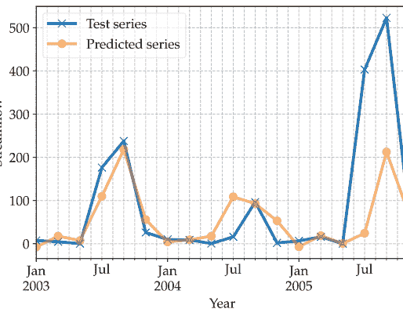

图 7.8 使用自回归积分滑动平均模型的预测结果

确认平稳性后，会生成自相关图和偏自相关图，以观察数据点与其滞后值之间的相关性。

接下来，重采样和转换后的数据被划分为训练集（从“1981-01-01”到“2003-12-31”）和测试集（“2003-12-31”之后）。ARIMA模型在训练数据上进行拟合，并进行单步预测。这些预测是在循环中进行的，每次将新的测试数据点添加到训练集中，用于下一次预测。预测结果如图7.8所示。

最后，程序计算并打印测试集的均方根误差（RMSE），该误差量化了模型预测值与实际值之间的差异。它还生成一个图表，以直观地比较测试序列和预测序列。

##### 7.2.4 简单指数平滑（SES）

简单指数平滑（SES）是一种针对单变量数据的时间序列预测方法，不考虑趋势和季节性。它使用过去观测值的加权平均作为预测值，其中权重随着观测值来自更早的时间而呈指数下降——最旧的观测值对应的权重最小。权重下降的速率是该方法的一个参数，称为“平滑常数”。选择该参数是为了最小化预测误差的度量，例如均方误差（MSE）。SES对于没有明显趋势或季节性模式的数据特别有用（图7.9）。

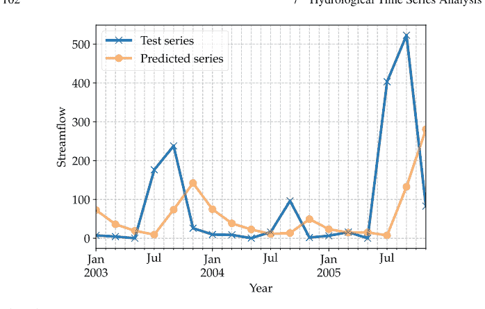

图 7.9 使用简单指数平滑模型的预测结果

```python
"""
Program to do time series modeling
using the Simple exponential smoothing
model
"""

# Import libraries
import pandas as pd
import numpy as np
import matplotlib.pyplot as plt
from statsmodels.graphics.tsaplots import plot_acf, plot_pacf
from statsmodels.tsa.stattools import adfuller as ADF
from statsmodels.tsa.api import SimpleExpSmoothing
from sklearn.metrics import mean_squared_error as MSE
import seaborn as sns

savePlots = 1

def plotGraph(df_, label, figsize, indicator, title,
              save=savePlots):
    if save:
        if indicator == 0: # time series plot
            df_.plot(figsize=figsize)
            plt.xlabel(label[0])
            plt.ylabel(label[1])
            plt.legend()
```

### 第8章
常见假设检验

假设检验，也称为显著性检验，在水文学中被广泛用于确定数据是否支持特定假设。它使人们能够对水文现象进行统计推断，并从数据中得出结论。通过设计备择假设和原假设，可以检验模型预测相对于观测结果的可信度。

假设检验在水文学中的一个标准应用是确定两组样本之间的差异是否代表其总体之间的真实差异。例如，科学家可能会使用t检验来比较不同季节或地理区域之间的平均降水量。同样，方差分析（ANOVA）检验可用于比较多个组别或时间段的温度、河流流量或降水量。

假设检验在评估变量之间的关系时也很有用。例如，可以通过皮尔逊相关检验来评估变量（如蒸散发和温度）之间关系的强度或相关程度。使用假设检验，还可以确认变量（如河流流量、降雨量和温度）之间估计的回归系数是否具有统计显著性。

此外，假设检验也可用于验证水文模型的合理性。例如，科学家可以使用卡方拟合优度检验来验证观测数据频率与特定水文模型预测频率的一致性。同样，可以使用像柯尔莫哥洛夫-斯米尔诺夫这样的检验来比较模型残差的经验分布与理论分布（通常是高斯分布），以验证假设并评估模型效能。

然而，在应用假设检验时需要谨慎。尽管它提供了宝贵的统计见解，但其结果本质上取决于样本量和所选的显著性水平。通常，较大的样本能够检测到较小的统计效应。相反，通常选择的显著性水平（通常为0.05）有些武断，作为确定“统计显著性”的标准阈值。此外，未能拒绝原假设并不一定证明其为真；它仅仅表明没有足够的证据拒绝它。

## 7.2 常见预测方法

上述程序使用简单指数平滑（SES）模型实现了一个时间序列模型，使用了Python以及pandas、NumPy、matplotlib、statsmodels、sklearn和Seaborn等多个库。

它首先导入数据处理、绘图、统计建模和性能评估所需的必要库。然后定义了一个辅助函数“plotGraph()”，用于生成不同类型的图表，例如时间序列图（指示符0）、直方图（指示符1）、箱线图（指示符2）、自相关函数（ACF）、偏自相关函数（PACF）（指示符3）和模型预测图（指示符4）。

接下来，脚本加载一个数据集（在本例中是戈达瓦里河流量数据），并通过检查日期列的格式和对数据进行重采样（将时间序列数据降采样为2个月均值）来对其进行预处理。然后使用“plotGraph()”函数绘制重采样后的数据。

与任何其他时间序列模型一样，我们的模型假设数据满足平稳性和同方差性条件。接下来，我们对数据应用对数变换和标准化。

变换后，程序利用增广迪基-富勒（ADF）检验来检查数据的平稳性。我们还绘制了时间序列数据的自相关和偏自相关函数图。

在程序执行过程中，我们在控制台打印重要信息，例如平稳性检查结果和RMSE值，使步骤进展和输出更容易理解。然后输出显示预测值和原始时间序列数据的图表，以便评估模型的性能。

```python
"""
Load dataset
"""
data = pd.read_csv(
    filepath_or_buffer="../data/Godavari.csv",
    sep=",",
    header=0).dropna()
print("\nChecking data:")
try:
    data["time"] = pd.to_datetime(
        data['time'], infer_datetime_format=True)
    print("   Date format is okay!\n")
except ValueError:
    print("   Encountered error!\n")
    pass
df = data[["time", "Streamflow"]]
del data
print("Read data file")

"""
Resample:
Downsample the time series
"""
resampled = df.resample('2M', on="time").mean()
plotGraph(df_=resampled,  # Time series plot
          label=["Year", "Streamflow"],
          figsize=(10, 4),
          indicator=0,
          title="ses-ts_resampled")

# Before transformation and standardization
plotGraph(df_=resampled,  # Histogram
          label=["Streamflow", ""],
          figsize=(7, 6),
          indicator=1,
          title="ses-histogram")
plotGraph(df_=resampled,  # Boxplot
          label=["Year", "Streamflow"],
          figsize=(14, 4),
          indicator=2,
          title="ses-boxplot")

"""
Pre-processing:
Data transformation and Visualization
"""
def transform_data(x):
    x = np.log(x - xmin + 100.)
    x = (x - meanx_) / stdx_
    return x

def inverse_transform(x):
    x = x * stdx_ + meanx_  # non-standardized
    x = np.exp(x) + xmin - 100.  # inverse log positive
    return x

xmin = np.array(resampled.min())[0]
meanx_ = np.array(resampled.mean())[0]
stdx_ = np.array(resampled.std())[0]

resampled = resampled.apply(transform_data)
print("\nDone data transformation")

# After transformation and standardization
plotGraph(df_=resampled,  # Time series plot
          label=["Year", "$log($" + "Streamflow" + ")$"],
          figsize=(10, 4),
          indicator=0,
          title="ses-ts_resampled_after")
plotGraph(df_=resampled,  # Histogram
          label=["Streamflow", ""],
          figsize=(7, 6),
          indicator=1,
          title="ses-histogram_after")
plotGraph(df_=resampled,  # Boxplot
          label=["Year", "Streamflow"],
          figsize=(14, 4),
          indicator=2,
          title="ses-boxplot_after")

"""
Stationarity check
"""
def stationarity_adf_test(x, alpha=0.05):
    adftest_res = ADF(x, autolag="AIC")
    dfout = pd.Series(
        adftest_res[0:4],
        index=["ADF statistic", "ADF p-value",
               "ADF lags used", "ADF number of obs used"])
    for key, value in adftest_res[4].items():
        dfout["   Critical Value (%s)" % key] = value
    print(dfout)
    if dfout["ADF p-value"] > alpha:
        print("   Result: Non-stationary time series", "\n")
    else:
        print("   Result: Stationary time series", "\n")

print("\nChecking stationarity:")
stationarity_adf_test(resampled)

"""
Autocorrelation and Partial autocorrelation
"""
plotGraph(df_=resampled,  # Autocorrelation plot
          label=["", ""],
          figsize=(7, 6),
          indicator=3,
          title="ses-acorr")

"""
Data partition and Simple Exponential fitting
"""
trainmask = (resampled.index >= "1981-01-01") & \
            (resampled.index <= "2002-12-31")
testmask = (resampled.index > "2002-12-31")
training_set = list(resampled["Streamflow"].loc[trainmask])
testing_set = list(resampled["Streamflow"].loc[testmask])
print("Created training and testing datasets\n")

"""
Single-step predictions
alpha = 0.5 (smoothing_parameter)
"""
alpha = 0.5
forecasts = list()
for i in range(len(testing_set)):
    modelSES = SimpleExpSmoothing(training_set).fit(
        smoothing_level=alpha)
    pred = np.squeeze(modelSES.forecast())
    forecasts.append(pred)
    training_set.append(testing_set[i])
    print("Obs={:0.04f}, Pred={:0.04f}    {}/{}".format(
        np.squeeze(inverse_transform(testing_set[i])),
        np.squeeze(inverse_transform(pred)),
        i + 1,
        len(testing_set)))
print("\nRoot mean square error:")
print("    Testset RMSE={:0.04}".
      format(MSE(testing_set, forecasts)))

"""
Result plots
"""
result = {"Year": resampled["Streamflow"].loc[testmask].index,
          "Test series":
              inverse_transform(np.array(testing_set)),
          "Predicted series":
              inverse_transform(np.array(forecasts))}
df_res = pd.DataFrame.from_dict(data=result)
df_res.set_index("Year", inplace=True)
plotGraph(df=df_res,  # Prediction results
          label=["Year", "Streamflow"],
          figsize=(10, 4),
          indicator=4,
          title="ses-result")
print("Done!")
```

#### 8.1 单因素方差分析

不应将零假设误解为对其的证实，统计显著性也未必意味着实际显著性。因此，尽管假设检验在水文数据研究中仍是一个流行工具，但需要谨慎使用和理解。

单因素方差分析（ANOVA）是一种统计技术，用于检验三个或更多组别均值之间的差异。它帮助我们了解组间差异是否显著。该检验使我们能够考察不同地点、时期或实验条件下的水文参数。

在水文背景下，单因素方差分析可用于发现降雨量、河流流量、地下水位或水质指标的变化。数据可能来自不同的地点、季节或测试条件。

举例来说，考虑一项研究，旨在探讨土地利用对多个流域径流特征的影响。我们知道，流域可以被划分为不同的土地利用类别，如城市、农业和森林。可以使用单因素方差分析来分析和比较这些土地利用类别之间的平均径流值。ANOVA的零假设可能表明，不同类型之间的平均径流没有实质性差异。相反，备择假设可能表明每种土地利用类型内存在不同的平均径流。从ANOVA得出的F统计量衡量了组间变异与组内变异的比率。如果F值足够大并超过临界值，则表明不同土地利用类型之间的径流差异是显著的。

单因素方差分析在分析长期趋势或比较不同时期的水文变量时，在水文研究中也很有价值。例如，它可以用于评估不同年代或气候条件下的平均年降水量或平均河流流量。

总的来说，单因素方差分析是水文中一种有用的统计技术，用于检验不同组别、地点、时间段或实验条件下的水文变量差异。它提供了对这些差异的变异性及显著性的见解，有助于更好地理解水文过程，并为水资源管理决策提供信息。

```python
"""
演示对水文数据进行单因素方差分析的程序。
"""

import numpy as np
import pandas as pd
import statsmodels.api as sm
from statsmodels.formula.api import ols

# 避免Pandas关于列赋值的警告
pd.options.mode.chained_assignment = None

np.random.seed(11)

"""
加载数据集
"""
# 加载第一个数据集
data1 = pd.read_csv(
    filepath_or_buffer="../data/Godavari.csv",
    sep=",",
    header=0
).dropna()
df1 = data1[["Level", "Streamflow"]]  # 提取列
df1.loc[:, "River"] = "Godavari"  # 创建新列
df1 = df1.iloc[:1000, :]

# 加载第二个数据集
data2 = pd.read_csv(
    filepath_or_buffer="../data/Cauvery.csv",
    sep=",",
    header=0
).dropna()
df2 = data2[["Level", "Streamflow"]]  # 提取列
df2.loc[:, "River"] = "Cauvery"  # 创建新列
df2 = df2.iloc[:1000, :]


############### 第一部分 ###############
print("\n\n第一部分")

# 创建一个合并的数据框
df = pd.concat(objs=[df1, df2], axis=0)

"""
拟合一个线性模型，供下面的ANOVA程序使用
"""
linearModel = ols(
    formula='Streamflow ~ C(River)', data=df).fit()

"""
对拟合的模型执行单因素方差分析
"""
ano_result = sm.stats.anova_lm(linearModel, typ=1)

# 显示结果
print("\n1. ANOVA结果:")
print(anova_result)

# 从ANOVA表中获取p值，然后
# 将p值与期望的显著性水平（例如0.05）进行比较
# 最后，打印显著结果
alpha = 0.05
p_values = anova_result['PR(>F)'].dropna()
significant_results = p_values > alpha
if significant_results['C(River)']:
    print("\n河流:")
    print("    备择假设 => "
          "无显著差异 => "
          "均值相等")
else:
    print("\n河流:")
    print("    零假设 => "
          "差异显著 => "
          "均值不同")

print("---------------------------------------"
      "---------------------------------------")


############### 第二部分 ###############
print("\n\n\n\n第二部分")
# 向数据添加噪声
amp = df1["Streamflow"] * 0.05
amp_noisy = amp * np.random.normal(
    loc=10, scale=2, size=df2.shape[0])
amp_noisy = amp_noisy + df2["Streamflow"]
df2["Streamflow"] = amp_noisy

# 创建一个合并的数据框
dfnoisy = pd.concat(objs=[df1, df2], axis=0)

"""
拟合一个线性模型，供下面的ANOVA程序使用
"""
linearModel2 = ols(
    formula='Streamflow ~ C(River)', data=dfnoisy).fit()

"""
对拟合的模型执行单因素方差分析
"""
anoval_result2 = sm.stats.anova_lm(linearModel2, typ=1)

alpha2 = 0.05

# 显示结果
print("\n2. ANOVA结果:")
print(anova_result2)
p_values2 = anova_result2['PR(>F)'].dropna()
significant_results2 = p_values2 > alpha2
if significant_results2['C(River)']:
    print("\n河流:")
    print("    备择假设 => "
          "无显著差异 => "
          "均值相等")
else:
    print("\n河流:")
    print("    零假设 => "
          "差异显著 => "
          "均值不同")
```

该程序演示了对来自两条河流（戈达瓦里河和高韦里河）的水文数据应用单因素方差分析（ANOVA）。此分析的主要目标是检验两条河流的径流是否存在显著差异。

首先，程序导入必要的库，如NumPy、Pandas和Statsmodels。然后，加载对应于戈达瓦里河和高韦里河的两个数据集，每个数据集包含“Level”和“Streamflow”变量。数据集使用Pandas加载，并删除任何缺失值。向数据框中添加一个新列“River”，以标记各自河流的数据。

接着，程序将这两个数据集合并为一个数据框，以便于比较两条河流的径流。随后，对合并后的数据拟合一个线性模型，其中径流作为因变量，河流作为独立的分类变量。statsmodels.formula.api模块中的“ols”函数拟合此线性模型。

模型拟合后，执行单因素方差分析检验。ANOVA检验结果（包括F统计量和p值）被打印到控制台。p值小于0.05通常被认为是存在显著差异的证据。

程序还执行了一个单独的分析，其中向高韦里河的径流数据添加了一些噪声。该噪声代表数据中的一些随机变化。然后，使用带噪声的数据以与之前相同的方式拟合新的线性模型并执行单因素方差分析检验。第二次分析的结果允许人们考察添加的噪声如何影响ANOVA检验的结果。

在两种情况下，都会从ANOVA表中获取p值，并与0.05的显著性水平进行比较，以确定两条河流的径流均值是否存在显著差异。如果p值小于0.05，则得出结论认为均值不同；否则，表明均值没有显著差异。

#### 8.2 双因素方差分析

双因素方差分析（ANOVA）是一种统计检验，用于考察两个独立分类变量（因素）对一个连续因变量的影响。ANOVA有助于评估每个因素的主效应以及因素之间的交互作用。在水文中，双因素方差分析可用于多种场景，其中多个因素影响水文响应。

在水文背景下，双因素方差分析的一个常见应用是分析气候（例如，降水水平）和土地利用（例如，农业实践）对水文变量（如径流或水质参数）的影响。气候的影响可能因经历不同降水水平的不同季节或区域而异。另一方面，土地利用可根据覆盖类型和管理方式分为多种类型。通过双因素方差分析，我们可以分析两个因素对水文参数的独立影响。ANOVA模型的一个可能扩展是研究混合效应。

在双因素方差分析中，残差的总平方和可归因于三个贡献因素：1. 因素A的效应（SSA），2. 因素B的效应（SSB），以及3. A和B的联合效应（SSAB）。ANOVA结果可以通过分析交互作用、自由度和均方误差来解释。同时计算伴随的F统计量，以评估因素（单独和联合）的显著性。

因此，通过使用双向方差分析（ANOVA）来分析水文数据，可以同时评估多个变量的独立效应和组合效应。它提供了一种方法来确定响应是源于单个变量还是组合效应。这种分析对于理解水文过程中固有的复杂动态至关重要，从而有助于决策制定和制定适应性策略以降低水文风险。

```python
"""
Program to demonstrate 2-way ANOVA
on the hydrological data.
"""

import numpy as np
import pandas as pd
import statsmodels.api as sm
from statsmodels.formula.api import ols

# Avoiding Pandas warning for column assignment
pd.options.mode.chained_assignment = None

np.random.seed(11)

"""
Loading the dataset
"""
# Loading first dataset
data1 = pd.read_csv(
    filepath_or_buffer="../data/Godavari.csv",
    sep=",",
    header=0
).dropna()
df1 = data1[["Level", "Streamflow"]]  # Retrieving columns
df1.loc[:, "River"] = "Godavari"  # Creating new column
df1 = df1.iloc[:1000, :]

# Loading second dataset
data2 = pd.read_csv(
    filepath_or_buffer="../data/Cauvery.csv",
    sep=",",
    header=0
).dropna()
df2 = data2[["Level", "Streamflow"]]  # Retrieving columns
df2.loc[:, "River"] = "Cauvery"  # Creating new column
df2 = df2.iloc[:1000, :]
```

## 8.2 双向方差分析

```python
############### First-part ###############
print("\n\nFirst part")
# Creating a combined dataframe
df = pd.concat(
    objs=[df1, df2],
    axis=0
)

"""
Fit a linear model to be used
by the ANOVA routine below
"""
linearModel = ols(
    formula='Streamflow ~ Level + C(River)',
    data=df).fit()

"""
Perform 2-way ANOVA on the
fitted model
"""
anova_result = sm.stats.anova_lm(
    linearModel,
    typ=2
)
alpha = 0.05

# Displaying the results
print("\n1. ANOVA result:")
print(anova_result)

# Access the p-values from the ANOVA table then
# compare the p-values to the desired
# significance level (e.g., 0.05)
# finally, print the significant results
p_values = anova_result['PR(>F)'].dropna()
significant_results = p_values > alpha

if significant_results['C(River)']:
    print("\nRiver:")
    print("    Alternate Hypothesis => "
          "No significant difference => "
          "Means are equal")
else:
    print("\nRiver:")
    print("    Null Hypothesis => "
          "Difference is significant => "
          "Means are different")
if significant_results['Level']:
    print("\nLevel:")
    print("    Alternate Hypothesis => "
          "No significant difference => "
          "Means are equal")
else:
    print("\nLevel:")
    print("    Null Hypothesis => "
          "Difference is significant => "
          "Means are different")

print("----------------------------------------"
      "----------------------------------------")

############### Second-part ###############
print("\n\n\n\nSecond part")
# Adding noise to the data
amp = df2["Level"] * 0.05
amp_noisy = amp * np.random.normal(
    loc=10, scale=2, size=df2.shape[0])
amp_noisy = amp_noisy + df1["Level"]
df2["Level"] = amp_noisy

# Creating a combined dataframe
dfn = pd.concat(
    objs=[df1, df2],
    axis=0
)

"""
Fit a linear model to be used
by the ANOVA routine below
"""
linearModel2 = ols(
    formula='Streamflow ~ Level + C(River)',
    data=dfn).fit()

"""
Perform 2-way ANOVA on the
fitted model
"""
ano_result2 = sm.stats.anova_lm(
    linearModel2,
    typ=2
)
alpha2 = 0.05

# Displaying the results
print("\n2. ANOVA result:")
print(anova_result2)
p_values2 = ano_result2['PR(>F)'].dropna()
significant_results2 = p_values2 > alpha2

if significant_results2['C(River)']:
    print("\nRiver:")
    print("    Alternate Hypothesis => "
          "No significant difference => "
          "Means are equal")
else:
    print("\nRiver:")
    print("    Null Hypothesis => "
          "Difference is significant => "
          "Means are different")

if significant_results2['Level']:
    print("\nLevel:")
    print("    Alternate Hypothesis => "
          "No significant difference => "
          "Means are equal")
else:
    print("\nLevel:")
    print("    Null Hypothesis => "
          "Difference is significant => "
          "Means are different")
```

```
>>> First part
>>> 1. ANOVA result:
>>>             sum_sq    df          F    PR(>F)
>>> C(River)  3.633828e+08   1.0  8740.364782    0.0
>>> Level     3.629071e+08   1.0  8728.921893    0.0
>>> Residual  8.302577e+07  1997.0        NaN      NaN
>>> River:
>>>     Null Hypothesis => Difference is significant => Means are different
>>> Level:
>>>     Null Hypothesis => Difference is significant => Means are different
>>> ----------------------------------------------------------------------
>>> Second part
>>> 2. ANOVA result:
>>>             sum_sq    df          F    PR(>F)
>>> C(River)  1.907740e+06   1.0  8.552940  0.003489
>>> Level     5.003516e+05   1.0  2.243218  0.134359
>>> Residual  4.454325e+08  1997.0        NaN      NaN
>>> River:
>>>     Null Hypothesis => Difference is significant => Means are different
>>> Level:
>>>     Alternate Hypothesis => No significant difference => Means are equal
```

上面提供的Python程序演示了对来自两条河流——Godavari和Cauvery——的水文数据进行双向方差分析（ANOVA）。

程序的第一部分加载了与这两条河流相关的两个独立数据集。使用Pandas库从CSV文件中读取数据，删除任何包含缺失数据的行，并创建包含选定列的新数据框。每个数据框限制为前1000行数据，并添加了一个名为“River”的新列以标识数据来源。然后，将这两个数据框合并为一个数据框。

在下一步中，程序使用statsmodels库中的普通最小二乘（ols）方法为数据拟合一个线性模型，以“Streamflow”（径流量）作为因变量，“Level”（水位）和“River”（河流）作为自变量。

拟合线性模型后，对该模型执行双向方差分析。结果显示了每个因素及其交互作用的平方和、自由度、均方、F统计量和p值。

接下来，程序评估方差分析表中的p值以确定统计显著性。如果p值小于显著性水平（alpha = 0.05），则拒绝原假设，表明不同河流之间或不同水位下的径流量存在显著差异。

程序的第二部分通过将“Level”数据乘以正态分布的随机变量并将其添加到Godavari河流的“Level”数据中，为Cauvery河流的“Level”数据引入了一些噪声。新的含噪数据与Godavari数据合并到一个新的数据框中。

与程序的第一部分类似，对含噪数据拟合线性模型并执行双向方差分析。再次显示结果，并评估p值以确定均值是否存在显著差异。此分析的结果将显示引入的噪声是否影响了方差分析的结论。

#### 8.3 t检验

t检验是一种统计假设检验，用于确定两组均值之间是否存在显著差异。它假设总体服从正态分布且具有相同的方差。它广泛用于研究中，以比较两个独立或相关的样本。

```python
"""
Program demonstrating t-Test
using scipy
"""

import numpy as np
import pandas as pd
from scipy import stats

# Avoiding Pandas warning for column assignment
pd.options.mode.chained_assignment = None

np.random.seed(11)

"""
Loading the dataset
"""
# Loading first dataset
data1 = pd.read_csv(
    filepath_or_buffer="../data/Godavari.csv",
    sep=",",
    header=0
).dropna()
df1 = data1[["Level", "Streamflow"]]  # Retrieving columns
df1.loc[:, "River"] = "Godavari"  # Creating new column
df1 = df1.iloc[:1000, :]

# Loading second dataset
data2 = pd.read_csv(
    filepath_or_buffer="../data/Cauvery.csv",
    sep=",",
    header=0
).dropna()
df2 = data2[["Level", "Streamflow"]]  # Retrieving columns
df2.loc[:, "River"] = "Cauvery"  # Creating new column
```

#### 8.4 F检验

F检验是一种统计检验，用于比较两个或多个组的方差是否相等。它常用于方差分析（ANOVA）、回归分析或比较嵌套模型的场景。显著的F检验结果表明各组方差不相等。

```python
"""
使用Python中的scipy执行F检验的程序
"""

import numpy as np
import pandas as pd
from scipy import stats

# 避免Pandas的列赋值警告
pd.options.mode.chained_assignment = None

np.random.seed(11)

"""
加载数据集
"""
# 加载第一个数据集
data1 = pd.read_csv(
    filepath_or_buffer="../data/Godavari.csv",
    sep=",",
    header=0
).dropna()
df1 = data1[["Level", "Streamflow"]]  # 提取列
df1.loc[:, "River"] = "Godavari"  # 创建新列
df1 = df1.iloc[:1000, :]

# 加载第二个数据集
data2 = pd.read_csv(
    filepath_or_buffer="../data/Cauvery.csv",
    sep=",",
    header=0
).dropna()
df2 = data2[["Level", "Streamflow"]]  # 提取列
df2.loc[:, "River"] = "Cauvery"  # 创建新列
df2 = df2.iloc[:1000, :]

"""
定义F检验函数
"""
def F_Test(a, b):
    # 计算方差
    var1 = np.var(a, ddof=1)
    var2 = np.var(b, ddof=1)
    fstat = np.divide(var1, var2)

    # 获取样本的自由度
    dof_numerator, dof_denominator = \
        a.shape[0]-1, b.shape[0]-1

    # 使用F分布的累积分布函数计算p值
    p_val = 1. - stats.f.cdf(
        x=fstat, dfn=dof_numerator, dfd=dof_denominator
    )

    # 返回结果
    return fstat, p_val


# 执行F检验（第一部分）
alpha = 0.05
f_statistics = F_Test(
    a=df1["Streamflow"], b=df2["Streamflow"]
)
print(f_statistics)
print("\n1. 不同样本:")
print("     p={:0.010f}".format(f_statistics[1]))
if f_statistics[1] < alpha:
    print("     -> 样本方差不同")
else:
    print("     -> 样本方差相同")


print("\n-------------------------------------------"
      "-------------------------------------------\n")

# 修改数据使其与第一个相似（第二部分）
amp = df1["Streamflow"] * 0.08  # 振幅的8%
amp_noisy = amp * np.random.normal(
    loc=10, scale=2, size=df2.shape[0])
amp_noisy = amp_noisy + df2["Streamflow"]
df2["Streamflow"] = amp_noisy
f_statistics2 = F_Test(
    a=df1["Streamflow"], b=df2["Streamflow"]
)
print(f_statistics2)
print("\n2. 修改后的样本:")
print("     p={:0.010f}".format(f_statistics2[1]))
if f_statistics2[1] < alpha:
    print("-> 样本方差不同")
else:
    print("-> 样本方差相同")
```

```
>>> (12.149521092840168, 1.1102230246251565e-16)
>>> 1. 不同样本:
>>>     p=0.0000000000
>>>     -> 样本方差不同
>>> 
>>> (1.033911521888177, 0.29913519223758955)
>>> 2. 修改后的样本:
>>>     p=0.2991351922
>>>     -> 样本方差相同
```

给定的Python程序对两组数据——涉及两条不同的河流，戈达瓦里河和高韦里河——执行了F检验。这是一种统计检验，用于比较两个样本的方差，以确定它们是否存在显著差异。

该程序首先导入必要的库：用于数值计算的NumPy，用于数据操作的Pandas，以及用于统计函数的SciPy。为了避免Pandas生成的特定警告，调整了一项设置。NumPy中随机数生成器的种子被设置，以确保结果可重现。

程序随后从.csv文件加载两个数据集，分别包含戈达瓦里河和高韦里河的数据。任何缺失的数据点都被删除，以确保分析的准确性。从每个数据集中提取“Level”和“Streamflow”列，并添加一个新列“River”来标记数据。每个数据集的前1000行被保留用于进一步处理。

接下来，程序定义了一个执行F检验的函数。该函数计算两个输入数据集的方差，并将F统计量计算为方差的比值。然后，该函数使用F分布的累积分布函数（CDF）来计算与观测到的F统计量相关的p值。

随后，对两条河流的“Streamflow”数据执行F检验，并打印结果。该检验提供一个p值，如果该值小于选定的显著性水平（alpha），则表明两个数据集的方差存在显著差异。显著性水平设置为0.05。

在程序的第二部分，通过添加噪声修改了高韦里河的“Streamflow”数据。该噪声基于戈达瓦里河“Streamflow”数据振幅的8%生成。再次对两条河流的“Streamflow”数据执行F检验，但使用的是修改后的高韦里河数据。该检验的结果以与之前相同的方式打印。

第二次检验旨在演示F检验如何检测方差的变化，即使这种变化是人为引入的。通过比较两次检验的结果，可以看到F检验如何响应数据的变化。

#### 8.5 柯尔莫哥洛夫-斯米尔诺夫检验

柯尔莫哥洛夫-斯米尔诺夫检验是一种非参数统计检验，用于比较样本分布与理论分布（单样本K-S检验）或比较两个样本分布（双样本K-S检验）。它计算两个样本或分布的经验累积分布函数（ECDF）之间的最大距离。

#### 8.5 柯尔莫哥洛夫-斯米尔诺夫检验

```python
"""
使用 Python 中的 scipy 库
进行柯尔莫哥洛夫-斯米尔诺夫检验的程序
"""

import numpy as np
import pandas as pd
from scipy import stats

# 避免 Pandas 对列赋值的警告
pd.options.mode.chained_assignment = None

np.random.seed(11)

"""
加载数据集
"""
# 加载第一个数据集
data1 = pd.read_csv(
    filepath_or_buffer="../data/Godavari.csv",
    sep=",",
    header=0
).dropna()
# 加载第二个数据集
data2 = pd.read_csv(
    filepath_or_buffer="../data/Cauvery.csv",
    sep=",",
    header=0
).dropna()

df1 = data1[["Level", "Streamflow"]]  # 提取列
df1.loc[:, "River"] = "Godavari"  # 创建新列
df1 = df1.iloc[:1000, :]

df2 = data2[["Level", "Streamflow"]]  # 提取列
df2.loc[:, "River"] = "Cauvery"  # 创建新列
df2 = df2.iloc[:1000, :]
```

```python
"""
柯尔莫哥洛夫-斯米尔诺夫检验
"""
alpha = 0.05  # 显著性水平
# 第一种情况 - 不同的数据集
KS_result = stats.ks_2samp(
    data1=df1["Streamflow"],
    data2=df2["Streamflow"]
)
print("\n1. Kolmogorov-Smirnov Test")
print("    p-value={}".format(KS_result[1]))
if KS_result[1] < alpha:
    print("    The two distributions are different")
else:
    print("    The two distributions are same")

print("\n-----------------------------------------"
      "-----------------------------------------\n")

# 第二种情况 - 相似的数据集
chr = 0.8  # 特征系数
amp_noisy = chr*df1["Streamflow"] + \
            (1.-chr)*df2["Streamflow"]*np.random.normal(
    loc=0.08, scale=0.01, size=df2.shape[0])
df2["Streamflow"] = amp_noisy
KS_result2 = stats.ks_2samp(
    data1=df1["Streamflow"],
    data2=df2["Streamflow"]
)
print("\n2. Kolmogorov-Smirnov Test")
print("    p-value={}".format(KS_result2[1]))
if KS_result2[1] < alpha:
    print("The two distributions are different")
else:
    print("The two distributions are same")
```

```
>>> 1. Kolmogorov-Smirnov Test
>>>    p-value=5.261321340466556e-51
>>>    The two distributions are different
>>> 
>>> 2. Kolmogorov-Smirnov Test
>>>    p-value=0.06153429181321559
>>>    The two distributions are same
```

给定的 Python 脚本使用 SciPy 库执行了柯尔莫哥洛夫-斯米尔诺夫（K-S）检验。该检验比较两个数据集的分布，以确定它们是否存在显著差异。

首先，脚本导入了必要的库和模块，如 NumPy、Pandas 和 SciPy 的 Stats 模块。通过设置特定的 Pandas 选项，避免了 Pandas 对列赋值的警告。同时设置了 NumPy 随机种子，以确保程序生成的伪随机数具有一致性。

接下来，加载了两个名为“Godavari.csv”和“Cauvery.csv”的独立数据集。它们可能包含关于水位和河流流量的河流数据。使用“dropna()”函数丢弃了数据集中任何缺失的值。从数据集中提取了“Level”和“Streamflow”这两个特定列，并存储在新的数据框中。数据框还添加了一个名为“River”的新列，用于按各自的河流名称标记数据。

然后，对两个数据框的“Streamflow”列执行了柯尔莫哥洛夫-斯米尔诺夫检验。显著性水平设置为 0.05。如果检验返回的 p 值小于这个显著性水平，则意味着两个分布存在显著差异。否则，它们被认为是相同的。结果随后被打印到控制台。

随后，脚本模拟了一种两个分布可能更相似的情况。它通过向第二个数据框的“Streamflow”数据的 80% 添加高斯噪声，生成了第一个数据框“Streamflow”列的带噪声版本。这个新的“带噪声”数据集替换了第二个数据框原始的“Streamflow”列。

最后，对第一个数据框和新修改的第二个数据框的“Streamflow”列重复进行了柯尔莫哥洛夫-斯米尔诺夫检验。同样，如果 p 值小于显著性水平，则意味着两个分布存在显著差异，脚本会打印此结果。否则，它会报告两个分布是相同的。

#### 8.6 曼-惠特尼检验

曼-惠特尼检验，也称为威尔科克森秩和检验，是另一种非参数统计检验，用于确定两个独立样本是否来自具有相同分布的总体。当数据不满足 t 检验所需的假设时，它特别有用。

```python
"""
使用 Python 中的 scipy 库
进行曼-惠特尼检验的程序
"""

import numpy as np
import pandas as pd
from scipy import stats

# 避免 Pandas 对列赋值的警告
pd.options.mode.chained_assignment = None

np.random.seed(11)

"""
加载数据集
"""
# 加载第一个数据集
data1 = pd.read_csv(
    filepath_or_buffer="../data/Godavari.csv",
    sep=",",
    header=0
).dropna()
# 加载第二个数据集
data2 = pd.read_csv(
    filepath_or_buffer="../data/Cauvery.csv",
    sep=",",
    header=0
).dropna()

df1 = data1[["Level", "Streamflow"]]  # 提取列
df1.loc[:, "River"] = "Godavari"  # 创建新列
df1 = df1.iloc[:1000, :]

df2 = data2[["Level", "Streamflow"]]  # 提取列
df2.loc[:, "River"] = "Cauvery"  # 创建新列
df2 = df2.iloc[:1000, :]
```

```python
"""
曼-惠特尼检验
"""
alpha = 0.05  # 显著性水平
MW_statistic, p_val = stats.mannwhitneyu(
    x=df1["Streamflow"], y=df2["Streamflow"],
    method="auto"
)
print("\n1. Mann-Whitney Test")
print("    p-value={}".format(p_val))
if p_val < alpha:
    print("    The two distributions are different")
else:
    print("    The two distributions are same")

print("\n-----------------------------------------"
      "-----------------------------------------\n")

# 第二种情况 - 相似的数据集
chr = 0.8  # 特征系数
amp_noisy = chr*df1["Streamflow"] + \
            (1.-chr)*df2["Streamflow"]*np.random.normal(
    loc=0.08, scale=0.01, size=df2.shape[0])
df2["Streamflow"] = amp_noisy
MW_statistic2, p_val2 = stats.mannwhitneyu(
    x=df1["Streamflow"], y=df2["Streamflow"],
    method="auto"
)
print("\n2. Mann-Whitney Test")
print("    p-value={}".format(p_val2))
if p_val2 < alpha:
    print("The two distributions are different")
else:
    print("The two distributions are same")
```

```
>>> 1. Mann-Whitney Test
>>>     p-value=8.062468634889823e-16
>>>     The two distributions are different
>>> 
>>> 2. Mann-Whitney Test
>>>     p-value=0.3962091294974023
>>>     The two distributions are same
```

附带的 Python 程序对两个数据集执行了曼-惠特尼检验。它首先导入了必要的库：NumPy、Pandas 和 SciPy 的 Stats 模块。`pd.options.mode.chained_assignment = None` 这一行确保了与 Pandas 数据框中列赋值相关的警告被抑制。同时指定了随机种子，以确保结果的可重复性。

接下来，我们从两个外部 csv 文件加载两个数据集：一个用于戈达瓦里河，另一个用于考韦里河。使用 Pandas 库中的 `dropna()` 函数丢弃数据框中包含无效条目的任何行，创建了两个名为“df1”和“df2”的数据集。仅提取“Level”和“Streamflow”列进行处理。向两个数据框都添加了一个新列“River”，用于标记每个数据集所代表的河流。然后，程序将每个数据框限制为前 1000 行。

然后，使用 SciPy stats 模块中的 `mannwhitneyu()` 函数应用曼-惠特尼检验。检验在两条河流的“Streamflow”数据上进行。显著性水平设置为 0.05。检验返回一个统计量和一个 p 值。将 p 值与显著性水平进行比较，以决定两个分布是相同还是不同。如果 p 值小于显著性水平，程序得出结论认为分布不同，否则，它们被认为是相同的。

随后，程序为考韦里河（df2）创建了新的“Streamflow”数据，作为戈达瓦里河（df1）“Streamflow”数据的带噪声版本。这个新的“Streamflow”数据是戈达瓦里河“Streamflow”数据与按考韦里河“Streamflow”数据缩放的正态随机噪声的混合。对这个新数据和戈达瓦里河的“Streamflow”数据进行了第二次曼-惠特尼检验，再次将 p 值与显著性水平进行比较，以得出关于两个分布相似性的结论。

### 第9章
不确定性估计

估计不确定性是水文数据建模的重要组成部分。它们为模型预测提供了置信度的度量，并有助于在风险下进行决策。

水文模型通常很复杂，旨在表征各种环境和人为因素之间错综复杂的关系。它们依赖于输入数据，如降水、温度、土壤特性和土地利用，这些数据可能由于测量误差、数据缺失或时空变异性而存在不确定性。但这些模型为了能在现实世界中应用，包含了对复杂物理过程表示的简化，这又引入了进一步的不确定性。

不确定性估计有助于理解不确定性的不同要素如何影响模型产生的结果。通过量化所用数据和模型中的不确定性，我们可以确定实际值可能存在的可能范围。例如，关于河流流量的预测可以辅以不确定性估计，输出的不是一个单一值，而是一个可能的结果范围。

不确定性量化也有助于更好地理解模型预测的可靠性。换句话说，它有助于传达我们可以对这些预测抱有的置信水平。它衡量了基于模型结果的决策所关联的确定性或风险程度。

此外，了解不确定性的来源和大小可以指导模型改进和数据收集策略。例如，如果模型输出中的很大一部分不确定性源于不确定的降水数据，那么投资于更精确的降水测量技术或改进模型中降水过程的表示可能是值得的。

不确定性量化在风险管理和决策中也起着至关重要的作用。例如，在洪水风险管理中，了解与河流流量预测相关的不确定性有助于在设计防洪设施时设定适当的安全裕度。

此外，不确定性估计对于情景分析、研究气候变化的影响非常重要。鉴于未来温室气体排放和气候模型的不确定性，对未来条件的水文预测本质上是不确定的。量化这些不确定性可以帮助决策者理解可能的结果范围，并制定稳健的适应策略。

水文数据建模中的不确定性估计和量化至关重要。它们不仅提高了我们对模型预测置信度的理解，还指导模型改进工作，支持风险管理，并有助于在不确定条件下进行决策。虽然完全消除不确定性是不可能的，但认识和量化它是水文建模的关键部分。

#### 9.1 区间估计

##### 9.1.1 非参数区间估计

非参数区间估计涉及估计总体参数（如中位数或百分位数）可能落入的范围，而不假设数据遵循特定分布（图9.1）。

```python
"""
Program for non-parametric interval
estimate on 1D stream flow data
"""
import pandas as pd
from scipy.stats import (norm, binom, tmean, tstd,
                         t, nct, bootstrap, mstats)
import numpy as np

"""
Load dataset
"""
data = pd.read_csv(
    filepath_or_buffer="../data/Godavari.csv",
    sep=",",
    header=0).dropna()
print("\nChecking data:")
try:
    data["time"] = pd.to_datetime(
        data['time'], infer_datetime_format=True)
    print("   Date format is okay!\n")
except ValueError:
    print("   Encountered error!\n")
    pass
x = data[["Streamflow"]].to_numpy().squeeze()
del data
print("Read data file")

"""
Non-parametric interval estimate
"""
print("\n\nDoing non-parametric interval estimate")
qnt = binom.ppf(q=[0.025, 0.975],
                n=len(x), p=0.5,
                loc=0)
qnt = np.cast[int](qnt - 1)
print("Quantile values = (({}, {}))".format(x[qnt[0]],
                                            x[qnt[1]]))

print("\nDone!")
```

```
>>> Checking data:
>>>     Date format is okay!
>>> Read data file
>>> Doing non-parametric interval estimate
>>> Quantile values = (10.69, 131.7)
>>> Done!
```

附带的程序使用一维河流流量数据执行非参数区间估计。代码首先导入必要的Python库，例如：用于矩阵运算的NumPy，用于统计计算的scipy.stats，以及用于数据操作的Pandas。

数据从名为“Godavari.csv”的外部.csv文件加载。为此，使用了Pandas的“read_csv()”函数。“dropna()”函数消除了任何缺失数据或空值。

加载数据后，我们检查“time”列的格式。为此，我们使用了Pandas库的“to_datetime()”函数。转换成功后，程序在控制台打印一条消息；否则，它会抛出一个值错误。无论哪种情况，执行都会继续。

从“Streamflow”列中提取必要的数据，并在提取后删除数据框。随后，使用“squeeze()”函数将数据框转换为一维NumPy数组，这有助于后续步骤中的统计计算。

接下来，借助二项式百分位点函数（ppf）执行非参数区间估计。为此指定的置信区间和成功概率分别为95%（0.025和0.975）和0.5。结果，我们得到两个分位数值，它们代表了对应于置信区间的界限。

最后，程序将这些分位数值打印到控制台，并打印一条指示区间估计完成的消息。

#### 9.2 置信区间

##### 9.2.1 中位数的置信区间

###### 9.2.1.1 Bootstrap置信区间估计

中位数的Bootstrap置信区间估计是一种非参数方法，它生成观测数据的许多重采样，每个都是有放回的。计算每个重采样的中位数，从而得到一个中位数的分布。然后从该分布导出置信区间，捕捉数据的集中趋势（图9.2）。

```python
"""
Program for Bootstrap confidence
interval estimate on 1D stream flow data
"""
import pandas as pd
from scipy.stats import (norm, binom, tmean, tstd,
                         t, nct, bootstrap, mstats)
import numpy as np

"""
Load dataset
"""
data = pd.read_csv(
    filepath_or_buffer="../data/Godavari.csv",
    sep=",",
    header=0).dropna()
print("\nChecking data:")
try:
    data["time"] = pd.to_datetime(
        data['time'], infer_datetime_format=True)
    print("    Date format is okay!\n")
except ValueError:
    print("    Encountered error!\n")
    pass
x = data[["Streamflow"]].to_numpy().squeeze()
del data
print("Read data file")

"""
Bootstrap confidence interval estimate
"""
print("\n\nDoing Bootstrap CI estimate")
x = (x,)
ci = bootstrap(data=x,
                statistic=np.median,
                confidence_level=0.95,
                n_resamples=10000,
                method="percentile")
lower_bound = ci.confidence_interval.low
upper_bound = ci.confidence_interval.high
print(f"Lower Bound: {lower_bound}")
print(f"Upper Bound: {upper_bound}")

print("\nDone!")
```

这个Python程序在一维河流流量数据集上计算Bootstrap置信区间估计。
程序首先加载必要的库。调用Pandas库的“read_csv()”函数加载数据，并使用其dropna()函数丢弃任何包含缺失或无效（NaNs）值的行。
然后将加载的数据框中的“time”列转换为更合适的datetime对象，如果转换成功则打印消息，否则抛出错误。转换后程序继续执行。
接着，将河流流量数据从“Streamflow”列提取到NumPy数组中，然后释放内存。程序使用“scipy.stats”库通过多次重采样数据（本例中为10000次）并计算所需的统计量（中位数）来计算bootstrap区间。

##### 9.2.2 均值的置信区间估计

###### 9.2.2.1 对称置信区间估计

均值的对称置信区间估计是一个范围，真实的总体均值预期会落在该范围内，并具有一定的置信度。它通过样本均值加减一个误差范围来计算，该误差范围由均值的标准误和统计分布（通常是 t 分布或 z 分布）的临界值决定（图 9.3）。

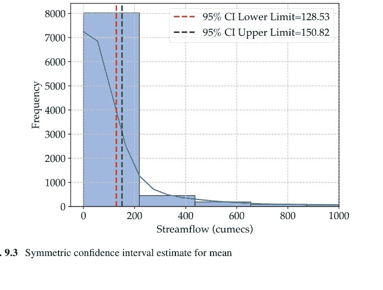

图 9.3 均值的对称置信区间估计

```python
"""
Program for Symmetric confidence interval
estimate on 1D stream flow data
"""
import pandas as pd
from scipy.stats import (norm, binom, tmean, tstd,
                        t, nct, bootstrap, mstats)
import numpy as np

"""
Load dataset
"""
data = pd.read_csv(
    filepath_or_buffer="../data/Godavari.csv",
    sep=",",
    header=0).dropna()
print("\nChecking data:")
try:
    data["time"] = pd.to_datetime(
        data['time'], infer_datetime_format=True)
    print("   Date format is okay!\n")
except ValueError:
    print("   Encountered error!\n")
    pass
x = data[["Streamflow"]].to_numpy().squeeze()
del data
print("Read data file")

"""
Symmetric confidence interval estimate
"""
print("\n\nDoing symmetric CI estimate")
xbar = tmean(x)
xstd = tstd(x)
n = len(x)
qnt = t.ppf(q=[0.025, 0.975],
            df=n - 1,
            loc=0, scale=1)
print("{:0.4f} < x_mean < {:0.4f}".
      format(xbar + qnt[0] * np.sqrt(xstd ** 2 / n),
             xbar + qnt[1] * np.sqrt(xstd ** 2 / n))
      )

print("\nDone!")
```

```
>>> Checking data:
>>>     Date format is okay!
>>> Read data file
>>> Doing symmetric CI estimate
>>> 128.5336 < x_mean < 150.8192
>>> Done!
```

该程序使用 Python 编写，用于估计一维河流流量数据的对称置信区间。河流流量数据预期存储在一个 .csv 文件中，其中一列标记为“Streamflow”，代表流量数据，另一列标记为“time”，用于时间戳。该文件假定位于路径“../data/Godavari.csv”的数据目录中。

该程序的第一步是将数据从 .csv 文件加载到 Pandas 数据框中，这使得在 Python 中操作表格数据变得容易。“dropna()”函数会移除任何包含缺失值的行。

接下来，程序尝试将“time”列转换为标准的日期时间格式，以便处理时间序列数据。如果转换成功，程序会在控制台打印“Date format is okay!”。如果由于时间数据不符合所需格式而导致转换失败，程序会捕获 ValueError 异常并在控制台打印“Encountered error!”。

然后，从数据框中提取河流流量数据，并将其转换为一维 NumPy 数组，这是一种更高效的数值计算数据结构。随后删除数据框以释放内存。

现在，程序进入主要计算部分。它计算河流流量数据均值的对称置信区间。首先使用 SciPy stats 模块中的“tmean()”和“tstd()”函数计算数据的样本均值和样本标准差。同时确定数据点的数量。

接下来，使用 t 分布的百分点函数（也称为累积分布函数的反函数）“t.ppf()”来查找对应于分布下尾和上尾的分位数。这是在 0.05 的显著性水平下进行的（因此概率为 0.025 和 0.975），对应于 95% 的置信区间。

然后，使用这些分位数、样本均值、样本标准差和数据点数量计算均值置信区间的下限和上限。这些界限以“:0.4f < x_mean < :0.4f”的格式打印到控制台，其中 :0.4f 是一个占位符，表示一个保留四位小数的浮点数。该置信区间给出了一个估计范围，真实的总体均值有 95% 的概率可能位于该范围内。

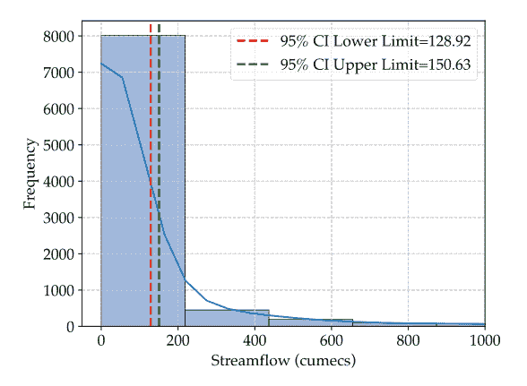

图 9.4 Bootstrap 置信区间估计

###### 9.2.2.2 Bootstrap 置信区间估计

Bootstrap 置信区间估计是一种使用重采样技术来估计统计量（如均值）不确定性的方法。该过程涉及从原始数据中有放回地重复抽样，每次计算均值，然后确定一个范围，使得一定百分比的均值落入该范围（图 9.4）。

```python
"""
Program for Bootstrap confidence
interval estimate on 1D stream flow data
"""
import pandas as pd
from scipy.stats import (norm, binom, tmean, tstd,
                          t, nct, bootstrap, mstats)
import numpy as np

"""
Load dataset
"""
data = pd.read_csv(
    filepath_or_buffer="../data/Godavari.csv",
    sep=",",
    header=0).dropna()
print("\nChecking data:")
try:
    data["time"] = pd.to_datetime(
        data['time'], infer_datetime_format=True)
    print("    Date format is okay!\n")
except ValueError:
    print("    Encountered error!\n")
    pass
x = data[["Streamflow"]].to_numpy().squeeze()
del data
print("Read data file")

"""
Bootstrap confidence interval estimate
"""
print("\n\nDoing Bootstrap CI estimate")
x = (x,)
ci = bootstrap(data=x,
                statistic=np.mean,
                confidence_level=0.95,
                n_resamples=2000,
                method="percentile")
lower_bound = ci.confidence_interval.low
upper_bound = ci.confidence_interval.high
print(f"Lower Bound: {lower_bound}")
print(f"Upper Bound: {upper_bound}")

print("\nDone!")
```

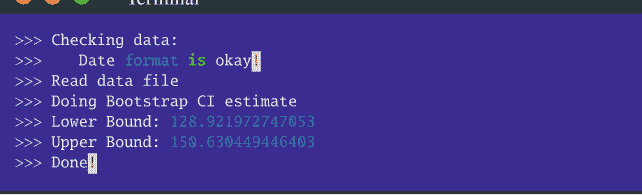

给定的 Python 程序对一维河流流量数据执行 Bootstrap 置信区间估计。Bootstrap 是一种强大的统计工具，用于估计样本估计的准确性和可靠性，特别是在底层分布未知或难以解析处理的情况下。

加载必要的库后，程序使用 Pandas 的 read_csv() 函数从名为“Godavari.csv”的 .csv 文件加载数据集。然后删除数据集中发现的任何缺失值（NaN）。为了确保数据中的日期格式一致且易于进一步操作，程序尝试使用 Pandas 的 to_datetime() 函数将“time”列转换为 datetime 对象。转换过程中的任何错误都会被捕获并报告。随后，它从数据框中分离出“Streamflow”列，并将其转换为 NumPy 数组以便于数值操作，然后删除原始数据框以释放内存。

数据准备就绪后，程序的主要部分开始执行 Bootstrap 置信区间估计。为此使用了 scipy.stats 库中的 bootstrap() 函数。该函数以河流流量数据、感兴趣的统计量（此处为均值）、所需的置信水平（95%）、重采样迭代次数（2000）以及估计置信区间的方法（“percentile”）作为输入。

执行 bootstrap 函数后，程序从结果中提取置信区间的下限和上限并打印出来。这些界限代表了基于给定数据的 Bootstrap 重采样，真实的总体均值有 95% 置信水平可能位于的范围。

##### 9.2.3 分位数的置信区间估计

###### 9.2.3.1 非参数置信区间估计

分位数的非参数置信区间估计涉及确定总体的某个特定分位数可能位于的范围，而不假设总体遵循任何特定分布（图 9.5）。

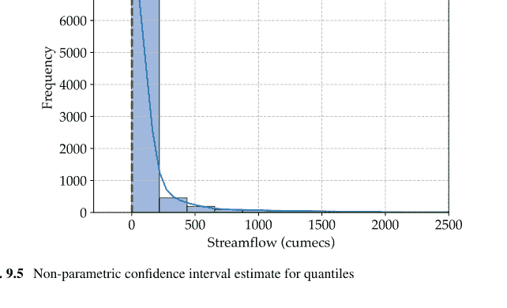

图 9.5 分位数的非参数置信区间估计

#### 9.2 置信区间

###### 9.2.3.2 置信区间估计

分位数的置信区间估计提供了一个范围，该范围很可能包含总体的特定分位数。这是一种用于统计推断的技术，它基于来自总体的随机样本，对分位数真实值所在的位置进行概率性评估（图 9.6）。

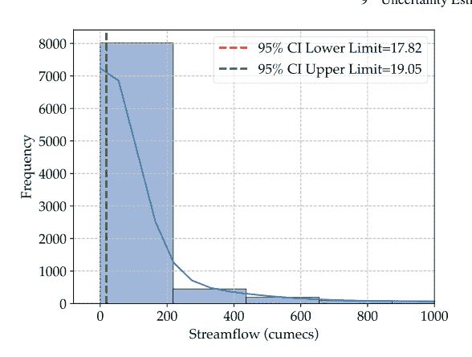

图 9.6 对数正态径流数据的双侧置信区间估计

```python
"""
Program for confidence interval estimate
on 1D stream flow lognormal data
"""
import pandas as pd
from scipy.stats import (norm, binom, tmean, tstd,
                        t, nct, bootstrap, mstats)
import numpy as np

"""
Load dataset
"""
data = pd.read_csv(
    filepath_or_buffer="../data/Godavari.csv",
    sep=",",
    header=0).dropna()
print("\nChecking data:")
try:
    data["time"] = pd.to_datetime(
        data['time'], infer_datetime_format=True)
    print("    Date format is okay!\n")
except ValueError:
    print("    Encountered error!\n")
    pass

x = data[["Streamflow"]].to_numpy().squeeze()
del data
print("Read data file")

"""
Confidence interval estimate assuming
lognormal data
"""

print("\n\nDoing CI estimate")
minx = np.min(x)
logx = np.log(x - minx + 1)
xbar = tmean(logx)
xstd = tstd(logx)
n = len(x)

qnt = norm.ppf(q=[0.9])
C90 = np.exp(xbar + qnt * xstd)

nc = -5 * qnt
qnt = nct.ppf(q=[0.05, 0.95],  # non-central t distribution
              df=n - 1,
              nc=nc,
              loc=0, scale=1)

print("{:.4f} < C90 < {:.4f}".
      format(np.exp(xbar - 1 / np.sqrt(n) * qnt[1] * xstd),
             np.exp(xbar - 1 / np.sqrt(n) * qnt[0] * xstd)
             )
      )
print("\nDone!")
```

该程序首先导入必要的模块，包括用于数据操作的 Pandas、用于数值计算的 NumPy 以及用于各种统计计算的 scipy.stats。

加载主要库后，使用 Pandas 的 `read_csv()` 函数加载数据集，指定文件路径和逗号作为分隔符，并删除任何缺失值。加载的数据会被检查，并使用 Pandas 的 `to_datetime` 函数将“time”列转换为日期时间对象。如果由于格式不正确导致转换失败，程序会捕获 `ValueError` 并显示错误消息。

然后，从数据中提取“Streamflow”列，将其转换为 NumPy 数组，并通过 `squeeze` 操作将其展平为一维。原始数据变量被删除以节省内存。

接下来，程序计算置信区间估计，假设径流数据服从对数正态分布。为了处理对数正态分布，程序对径流值取自然对数，取对数前先进行平移，使最小值变为 1。

计算对数转换后数据的均值（xbar）和标准差（xstd），并存储数据点数量（n）。然后，程序使用标准正态分布的累积分布函数（`norm.ppf`）计算 0.9 分位数（qnt）。

接着，使用自然对数的逆运算（`np.exp`）计算对数转换后数据均值的 90% 置信水平（C90）。程序计算非中心参数（nc），并使用计算出的参数计算非中心 t 分布（`nct.ppf`）的第 5 和第 95 百分位数。

最后，程序打印原始数据均值（从对数转换尺度转换回来后）的 90% 置信区间的下限和上限。结果给出了一个值范围，该范围以 90% 的概率包含径流数据的真实均值。

#### 9.3 预测区间

##### 9.3.1 非参数预测区间

分位数的非参数预测区间是一种估计未来观测值可能落入范围的方法，无需对底层分布做出假设。当数据不遵循已知或易于识别的分布时，这种方法特别有用，它依赖于实际的数据结构（图 9.7）。

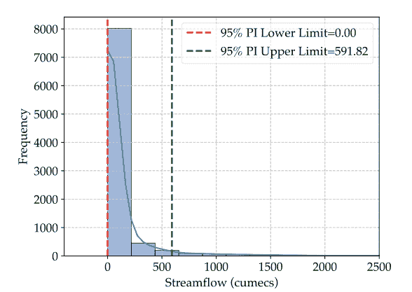

图 9.7 非参数预测区间

```python
"""
Program for non-parametric confidence
interval estimate on 1D stream flow data
"""
import pandas as pd
from scipy.stats import (norm, binom, tmean, tstd,
                        t, nct, bootstrap, mstats)
import numpy as np

"""
Load dataset
"""
data = pd.read_csv(
    filepath_or_buffer="../data/Godavari.csv",
    sep=",",
    header=0).dropna()
print("\nChecking data:")
try:
    data["time"] = pd.to_datetime(
        data['time'], infer_datetime_format=True)
    print("   Date format is okay!\n")
except ValueError:
    print("   Encountered error!\n")
    pass
x = data[["Streamflow"]].to_numpy().squeeze()
del data
print("Read data file")

"""
Non-parametric confidence interval estimate on
percentile data
"""
print("\n\nDoing non-parametric CI estimate")
prob = 0.2
percentile = mstats.mquantiles(  # value of quantile
    a=x, prob=prob,
    alphap=0, betap=0
    )
print("Quantile value =", percentile)

qnt = binom.ppf(q=[0.025, 0.975],  # position of quantiles
                n=len(x), p=prob,
                loc=0)
qnt = np.cast[int](qnt)
print("95% CI positions =", qnt)

result = binom.pmf(k=np.arange(qnt[0]-1, qnt[1]),
                   n=len(x),
                   p=prob,
                   loc=0)
print("Probability sum upto 0.2 =", result.sum())

# Using bootstrap method
def percentile_statistic(data, axis=1):
    percentile = mstats.mquantiles(  # value of quantile
        a=data, prob=0.2,
        alphap=0, betap=0, axis=axis
    )
    percentile = np.squeeze(percentile)
    return percentile

x = (x,)
ci = bootstrap(data=x,
                statistic=percentile_statistic,
                confidence_level=0.95,
                n_resamples=10000,
                method="percentile")

# Get the lower and upper bounds of the confidence interval
lower_bound = ci.confidence_interval.low
upper_bound = ci.confidence_interval.high

print("\n\n{}th Percentile Bootstrap Confidence Interval:"
      .format(prob*100))
print(f"Lower Bound: {lower_bound}")
print(f"Upper Bound: {upper_bound}")

print("\nDone!")
```

```
>>> Checking data:
>>>     Date format is okay!
>>> Read data file
>>> Doing non-parametric CI estimate
>>> Quantile value = [2.]
>>> 95% CI positions = [1741 1890]
>>> Probability sum upto 0.2 = 0.9508722528448205
>>> 20.0th Percentile Bootstrap Confidence Interval:
>>> Lower Bound: 1.80600000000000014
>>> Upper Bound: 2.2
>>> Done!
```

上面演示的 Python 程序对一维径流数据集执行非参数置信区间估计。

首先，导入 Pandas 和 SciPy 库，分别用于数据操作和统计计算。数据集从名为“Godavari.csv”的 .csv 文件加载。“time”列被转换为日期时间格式以进行时间序列分析。

加载主要库后，从“Streamflow”列提取数据并转换为 NumPy 数组以进行后续计算。由于本分析的重点是径流数据，原始的 Pandas 数据框被删除以释放内存。

下一阶段涉及执行非参数置信区间估计。程序首先计算在所选概率（本例中为 20%）下的分位数值。然后确定 95% 置信区间（CI）的位置。这些位置代表落在 CI 下限和上限内的观测值数量。

程序接着计算落入 95% CI 的径流值的概率之和。此操作本质上给出了数据在 20% 分位数处落在 CI 内的累积概率。

程序的后半部分引入了 bootstrap 方法作为估计置信区间的替代方法。定义了一个新函数“percentile_statistic”，用于计算 bootstrap 样本的 20% 分位数值。

通过“bootstrap”函数实现的 bootstrap 方法从原始数据生成多个重采样，对每个重采样应用“percentile_statistic”函数，从而计算出一组 bootstrap 分位数估计值。生成的重采样数量设置为 10,000，置信水平设置为 95。

然后，程序打印 20% 分位数的 bootstrap 95% CI 的下限和上限。这些界限告诉我们，基于我们的 bootstrap 样本，总体的真实 20% 分位数很可能以 95% 的置信度落在该范围内。

##### 9.3.2 单侧非参数预测区间

分位数的单侧非参数预测区间是一种统计估计，它提供一个下限或上限（但不同时提供两者），未来的观测值将以一定的概率落在该区间内。它依赖于数据的经验分布，而不是对底层总体分布做出假设（图 9.8）。

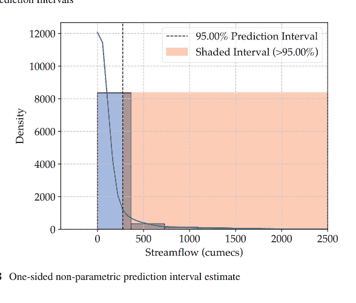

图 9.8 单侧非参数预测区间估计

```python
"""
Program for One-side Non-parametric prediction
interval estimate on 1D stream flow data
"""
import pandas as pd
from scipy.stats import (norm, binom, tmean, tstd,
                        t, nct, bootstrap, mstats)
import numpy as np
"""
Load dataset
"""
data = pd.read_csv(
    filepath_or_buffer="../data/Godavari.csv",
    sep=",",
    header=0).dropna()
print("\nChecking data:")
try:
    data["time"] = pd.to_datetime(
        data['time'], infer_datetime_format=True)
    print("    Date format is okay!\n")
except ValueError:
    print("    Encountered error!\n")
    pass
x = data[["Streamflow"]].to_numpy().squeeze()
del data
print("Read data file")
```

```python
"""
Non-parametric prediction interval
"""
print("\n\nDoing non-parametric PI estimate")
qi = mstats.mquantiles(
    a=x, prob=0.9,
    alphap=0, betap=0  # type 6 in R
    )
print(f"Quantile value: {qi}")

print("\nDone!")
```

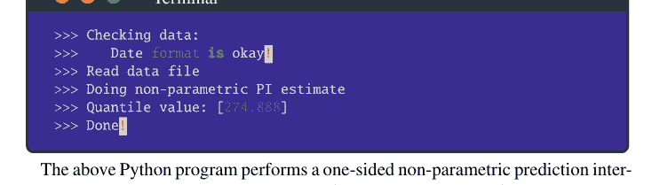

上述 Python 程序对一维径流数据集执行了单侧非参数预测区间估计。此分析的数据取自名为 “Godavari.csv” 的 .csv 文件。

该程序首先导入必要的模块。这些模块包括用于数据处理的 Pandas、用于统计分析的 scipy.stats 以及用于数值计算的 NumPy。

导入必要的模块后，程序使用 Pandas 的 `read_csv()` 函数读取数据集。该 .csv 文件位于路径 “../data/Godavari.csv”。程序使用 `dropna()` 函数删除数据中的任何缺失值。

加载数据集后，程序使用 Pandas 的 `to_datetime()` 函数检查 “time” 列是否可以转换为日期时间格式。

然后，程序从数据框中提取 “Streamflow” 列，并使用 `to_numpy()` 函数将其转换为 NumPy 数组。使用 `squeeze()` 函数确保结果数组具有一维。

接下来，程序执行非参数预测区间估计。为此使用了 scipy.stats 模块中的 `mstats.mquantiles()` 函数。该函数计算径流数据在概率水平为 0.9（相当于第 90 百分位数）时的分位数。参数 `alphap=0` 和 `betap=0` 指定了分位数的估计方法（在这种情况下，选择了等同于 R 中 type 6 的方法）。计算出的分位数值随后被打印到控制台。

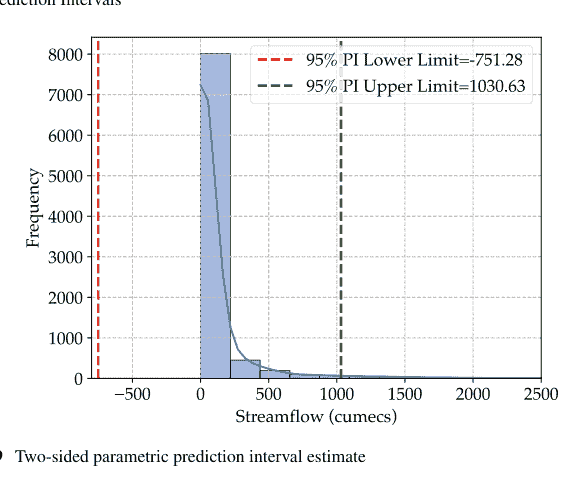

图 9.9 双侧参数预测区间估计

##### 9.3.3 双侧参数预测区间

分位数的双侧参数预测区间提供了一个范围，未来的观测值预计将以一定的概率落在该范围内。这种方法不假设数据服从任何特定的统计分布。当底层分布未知或不符合标准参数形式时，它非常有用（图 9.9）。

```python
"""
Program for Two-sided parametric prediction
interval estimate on 1D stream flow data
"""
import pandas as pd
from scipy.stats import (norm, binom, tmean, tstd,
                         t, nct, bootstrap, mstats)
import numpy as np

"""
Load dataset
"""
data = pd.read_csv(
    filepath_or_buffer="../data/Godavari.csv",
    sep=",",
    header=0).dropna()
print("\nChecking data:")
try:
    data["time"] = pd.to_datetime(
        data['time'], infer_datetime_format=True)
    print("   Date format is okay!\n")
except ValueError:
    print("   Encountered error!\n")
    pass
x = data[["Streamflow"]].to_numpy().squeeze()
del data
print("Read data file")

"""
Two-sided parametric prediction interval
"""
print("\n\nDoing two-sided parametric PI estimate")
xbar = tmean(x)
xstd = tstd(x)
n = len(x)
qnt = t.ppf(q=[0.05, 0.95],
            df=n-1,
            loc=0, scale=1)
print("{:.4f} < x_mean < {:.4f}".
      format(xbar+qnt[0]*np.sqrt(xstd**2 + xstd**2/n),
             xbar+qnt[1]*np.sqrt(xstd**2 + xstd**2/n))
      )

print("\nDone!")
```

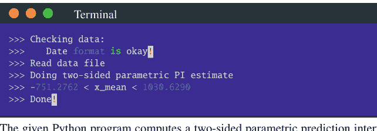

给定的 Python 程序为一维径流数据集计算双侧参数预测区间。这种类型的预测区间提供了一个范围，未来的观测值很可能以一定的置信水平落在该范围内。
该脚本首先导入必要的 Python 包，包括用于数据处理的 Pandas，以及来自 scipy.stats 库的各种用于统计计算的函数。
导入必要的模块后，程序加载数据集，该数据集预期是一个 .csv 文件。它使用 Pandas 函数 “pd.read_csv()” 读取数据文件。它旨在通过使用 “dropna()” 函数删除数据不可用的行来处理缺失数据。然后它尝试将 “time”

##### 9.3.4 非对称预测区间

分位数的非对称预测区间提供了一个范围，未来观测值预期会以一定概率落入该范围。与对称区间不同，这些区间会根据数据的偏度进行调整，这意味着到下限和上限的距离可以不同，从而更好地反映底层数据分布（图 9.10）。

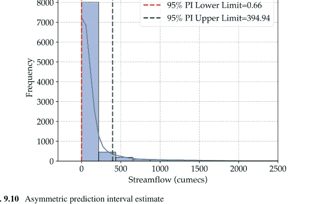

图 9.10 非对称预测区间估计

```python
"""
Program for asymmetric prediction
interval estimate on 1D stream flow data
"""
import pandas as pd
from scipy.stats import (norm, binom, tmean, tstd,
                        t, nct, bootstrap, mstats)
import numpy as np

"""
Load dataset
"""
data = pd.read_csv(
    filepath_or_buffer="../data/Godavari.csv",
    sep=",",
    header=0).dropna()
print("\nChecking data:")
try:
    data["time"] = pd.to_datetime(
        data['time'], infer_datetime_format=True)
    print("    Date format is okay!\n")
except ValueError:
    print("    Encountered error!\n")
    pass
x = data[["Streamflow"]].to_numpy().squeeze()
del data
print("Read data file")

"""
Asymmetric prediction interval
"""
print("\n\nDoing asymmetric PI estimate")
minx = np.min(x)
logx = np.log(x - minx + 1)
xbar = tmean(logx)
xstd = tstd(logx)
n = len(x)
qnt = t.ppf(q=[0.05, 0.95],
            df=n - 1,
            loc=0, scale=1)
print("{:.4f} < x_mean < {:.4f}".format(
    np.exp(xbar + qnt[0] * np.sqrt(xstd ** 2 + xstd ** 2 / n)),
    np.exp(xbar + qnt[1] * np.sqrt(xstd ** 2 + xstd ** 2 / n))
)
)

print("Done!")
```

```
>>> Checking data:
>>>     Date format is okay!
>>> Read data file
>>> Doing asymmetric PI estimate
>>> 0.6619 < x_mean < 394.9448
>>> Done!
```

这个 Python 程序对一维河流流量数据集执行非对称预测区间估计。本练习的数据存储在名为“Godavari.csv”的 .csv 文件中。

首先，导入必要的模块。这些模块包括用于数据处理的 Pandas、用于统计函数的 SciPy 的 stats 模块，以及用于数值运算的 NumPy。

接下来，程序使用 Pandas 的“read_csv”函数加载数据集。然后检查数据，确保应包含日期时间信息的“time”列格式正确。如果在转换为 Pandas 日期时间格式时出现 ValueError，则意味着日期格式无法识别，并打印错误消息。如果没有遇到错误，则打印确认消息。

然后，提取数据的“Streamflow”列，并将其转换为一维 NumPy 数组以进行进一步分析，并删除原始数据框。

程序接着执行主要任务：计算非对称预测区间。它首先将数据转换为对数尺度，以处理数据中潜在的偏度，通过减去数据集的最小值并加 1 后再取对数，确保所有值为正。

接下来，计算转换后数据的均值和标准差。然后，计算学生 t 分布的第 5 和第 95 百分位数。这些百分位数作为 90% 预测区间的下限和上限。

最后，程序打印估计的非对称预测区间。该区间使用指数函数从对数尺度转换回原始尺度。该区间给出了我们预期新观测值会落入的范围，置信度为 90%，假设新观测值与数据来自同一总体。

#### 9.4 分位数回归

分位数回归是一种统计技术，旨在估计和推断条件分位数函数。与预测平均结果的标准回归模型不同，分位数回归提供了分布不同点（如中位数、四分位数）上可能结果值的完整图景，从而提供更稳健和全面的分析。

```python
"""
Program to do Quantile regression
on synthetic dataset.
"""

from sklearn.linear_model import QuantileRegressor
import numpy as np
import matplotlib.pyplot as plt

"""
Generate synthetic normal data
"""
np.random.seed(21)
x = np.arange(start=0.5 * np.pi, stop=2 * np.pi, step=0.05)
X = x.reshape(x.shape[0], -1)
mean_ = 10.0 + 0.1 * np.sin(x)
scale_ = 0.02 + 0.02 * np.abs(x)
y_true = np.random.normal(loc=mean_,
                          scale=scale_,
                          size=x.shape[0])

"""
Quantile regression
"""
idx_up = 0
idx_dn = 0
x_good = list()
y_good = list()

preds = dict()
x_outlier = list()
y_outlier = list()

qnt = [0.1, 0.25, 0.5, 0.75, 0.9]

for q in qnt:
    qreg = QuantileRegressor(quantile=q,
                             alpha=0,
                             solver='highs')
    qreg.fit(X=X, y=y_true)
    preds[q] = qreg.predict(X)

    # Segregate the detected outliers using index
    if q == qnt[0]:
        idx_dn = preds[q] > y_true
    elif q == qnt[-1]:
        idx_up = preds[q] < y_true

idx_outlier = np.logical_or(idx_up, idx_dn)
x_outlier.append(x[idx_outlier])
y_outlier.append(y_true[idx_outlier])
x_outlier = np.array(x_outlier).ravel()
y_outlier = np.array(y_outlier).ravel()

idx_good = ~np.logical_or(idx_up, idx_dn)
x_good.append(x[idx_good])
y_good.append(y_true[idx_good])
x_good = np.array(x_good).ravel()
y_good = np.array(y_good).ravel()

"""
Plot the scatter and then show
fit of the data on the scatter
"""
plt.figure(figsize=[8, 6])
# Quantile plots
plt.plot(X, y_true,
         color="black",
         linestyle="dashed",
         label="True y")
for q, y_pred in preds.items():
    plt.plot(X, y_pred, label="Q={}".format(q))

# Outliers data plot
plt.scatter(x=x_outlier, y=y_outlier, marker='o',
            alpha=0.5, color='k',
            label='Outside: Q={} and Q={}'.format(qnt[0],
                                                qnt[-1]))

# Inside data plot
plt.scatter(x=x_good, y=y_good, marker='x',
            alpha=0.5, color='b',
            label='Within: Q={} and Q={}'.format(qnt[0],
                                               qnt[-1]))

plt.xlabel('x')
plt.ylabel('y')
plt.ylim([9.5, 10.8])
plt.grid(ls='--')
plt.legend(loc='upper center', ncol=3)
plt.show()
plt.tight_layout()
plt.savefig('quantile_reg.pdf', dpi=300)
```

上述 Python 脚本演示了在合成数据集上实现分位数回归。该脚本分为几个部分，以系统地生成合成数据、应用分位数回归、识别异常值并可视化结果。

在第一部分中，使用随机种子生成合成数据集。“x”值范围从 π 的一半到 2π，间隔为 0.05。“y_true”值通过从均值为“mean_”、标准差为“scale_”的正态分布中采样生成。均值和标准差依赖于“x”，从而创建异方差数据（即方差不恒定的数据）。

脚本接着应用分位数回归。考虑了五个分位数水平（10%、25%、50%、75% 和 90%）。对于每个分位数，从 sklearn 库创建一个 QuantileRegressor 模型并将其拟合到合成数据。这些模型对每个分位数水平的预测存储在字典“preds”中。

然后，程序识别数据中的异常值。如果观测值位于 10% 和 90% 分位数回归定义的区域之外，则被视为异常值。确定这些异常值的索引，并将相应的“x”和“y_true”值分别存储在“x_outlier”和“y_outlier”中。同时，位于指定分位数内的“x”和“y_true”值分别存储在“x_good”和“y_good”中。

脚本的最后一部分涉及可视化结果（图 9.11）。它生成一个散点图，对异常值和非异常值使用不同的标记，并叠加表示真实“y”值和分位数回归的线条。该图通过标签、网格线和图例进行自定义，以提高可读性。该图以 300 dpi 的分辨率保存为当前目录中的“quantile_reg.pdf”。

#### 9.5 最大似然估计 (MLE)

最大似然估计 (MLE) 是一种统计方法，通过找到使似然函数最大化的参数值来估计模型的参数。所得估计值在给定参数值的情况下，最大化了观测到数据的概率，假设所选模型是正确的。

## 9.5 最大似然估计（MLE）

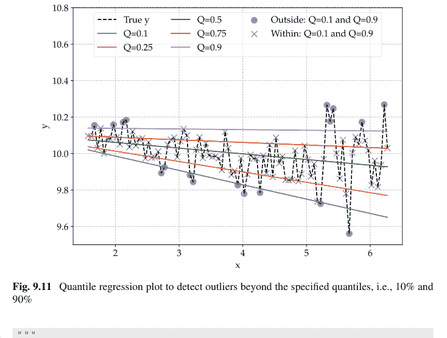

图 9.11 分位数回归图，用于检测超出指定分位数（即 10% 和 90%）的异常值

```python
"""
Demonstration of Maximum-likelihood estimation
for log-normal data
"""
from scipy.stats import norm
import numpy as np
import matplotlib.pyplot as plt
import pandas as pd

np.random.seed(11)
plt.rc('text', usetex=True)

"""
Loading the dataset
"""
data = pd.read_csv(
    filepath_or_buffer="../data/Godavari.csv",
    sep=",",
    header=0
).dropna()
streamflow_data = np.array(data["Streamflow"])
streamflow_data = streamflow_data[streamflow_data > 0]

# Log transformation of stream data
data = np.log10(streamflow_data)

# Plot preliminary histogram
plt.figure()
plt.hist(data,
         density=True, bins=100, log=True,
         label="log(data)")

"""
Fit the normal distribution parameters.
These formulae can be used to get the
parameters of the lognormal distribution:
mu_ = ln(mu) - (1/2) * ln(1 + (sig^2 / mu^2))
sig_ = (ln(1 + (sig^2 / mu^2)))**0.5
"""
fit = norm.fit(data=data)  # fit Normal distribution (MLE)
mu, scale = fit  # in Normal distribution

N = int(data.shape[0]/2)  # generate N samples
samples = norm.rvs(loc=mu, scale=scale, size=N)

plt.hist(samples,  # Plot MLE estimated distribution
         density=True, bins=100, log=True,
         label="log(data$_{" + "MLE" + "}$)",
         alpha=.6)
plt.xlabel("Streamflow (m$^3$/s)")
plt.ylabel("log(Frequency)")
plt.legend()
plt.grid(ls="--")
plt.tight_layout()
plt.savefig("streamflow_log_hist.pdf", dpi=300)
```

这个 Python 脚本演示了使用流量测量数据集对对数正态数据进行最大似然估计（MLE）的过程。它利用了“scipy.stats”和“NumPy”库进行统计和数学运算，“matplotlib.pyplot”用于绘图，“Pandas”用于数据处理。

脚本首先设置随机种子以确保可重复性，并启用 matplotlib 中用于文本格式化的 LaTeX。然后，它从给定路径的 .csv 文件加载数据集。加载后，它从数据集中剔除空值并隔离出“Streamflow”数据。它只保留正的流量数据，并对其应用 log10 变换。

数据准备完成后，脚本通过绘制直方图来可视化对数变换后的数据，该图显示了流量数据的对数频率与流量（单位：立方米每秒，m³/s）的关系。

初步可视化之后，脚本使用“scipy.stats”库中“norm”模块的 fit 函数，采用最大似然估计方法，将正态分布拟合到对数变换后的流量数据。

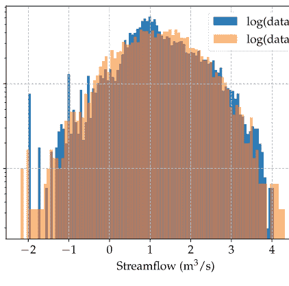

拟合函数返回正态分布的估计参数：均值（“mu”）和标准差（“scale”）。

然后，脚本从拟合的正态分布中生成一组随机样本，样本数量（“N”）为原始数据集大小的一半。

最后，脚本创建另一个生成样本的直方图，并将其叠加在原始直方图上（图 9.12）。第二个直方图代表了基于最大似然估计的拟合正态分布。脚本将最终图形保存为 PDF 文件。通过比较图中的两个直方图，可以直观地评估基于 MLE 的正态分布对原始对数变换流量数据的拟合优度。

#### 9.6 蒙特卡洛不确定性传播

蒙特卡洛不确定性传播是一种用于量化和管理数学模型中固有不确定性的有效技术，这些模型包括水文学、工程学、金融学等领域使用的模型。该方法使用随机抽样，根据模型输入的不确定性来评估模型输出的不确定性。

蒙特卡洛不确定性传播背后的关键概念是，模型输入的不确定性会导致模型输出的不确定性。如果我们能将输入的不确定性表示为概率分布，就可以利用这些分布生成多组输入数据。然后，我们可以用每组输入数据运行模型，并观察产生的输出分布。这个输出分布估计了模型预测中的不确定性。

蒙特卡洛方法在处理复杂的非线性模型时特别有用，因为这些模型的不确定性传播解析解难以或无法推导。然而，它们可能计算密集，尤其是对于复杂模型或需要高精度时。

蒙特卡洛不确定性传播为理解系统在不确定性下的行为提供了宝贵的见解，从而支持决策制定。通过探索广泛的可能结果，有助于识别潜在的风险和机遇，支持风险管理、设计优化和情景分析。它已成为需要复杂不确定性分析和不确定性下决策的不可或缺的工具。

```python
"""
Monte Carlo error propagation
on a simple forward model:
Manning's equation
V = (1/n) * R^(2/3) * S^(1/2),
where,
V is the flow velocity,
n is the Manning's roughness coefficient,
R is the hydraulic radius, and
S is the channel slope
"""

import numpy as np
from scipy import stats
import matplotlib.pyplot as plt

plt.rc('text', usetex=True)
np.random.seed(11)

def compute_velocity(n=1., b=1., h=1., S=1.):
    R = (b * h) / (2 * b + h)
    V = (1 / n) * R ** (2 / 3) * S ** (1 / 2)
    return V

"""
Monte-Carlo simulation #1
"""
Nsim = 100000
n_var = stats.halfnorm.rvs(loc=0.030, scale=1e-2, size=Nsim)
b_var = stats.norm.rvs(loc=2.0, scale=1e-1, size=Nsim)
h_var = stats.norm.rvs(loc=1.3, scale=1e-1, size=Nsim)
S_var = stats.norm.rvs(loc=np.tan(15 * np.pi / 180),
                       scale=1e-2, size=Nsim)
data = np.vstack([n_var, b_var, h_var, S_var]).T

V_var = np.zeros_like(n_var)
for i in range(Nsim):
    V_var[i] = compute_velocity(
        n=data[i, 0],
        b=data[i, 1],
        h=data[i, 2],
        S=data[i, 3]
    )

def normal_distribution(x, mu, sig):
    rv = 1.0 / (sig * np.sqrt(2.0 * np.pi))
    normal_values = rv * np.exp(
        -(x - mu) ** 2.0 / (2.0 * sig ** 2)
    )
    return normal_values

# Plots
xmin, xmax = V_var.min(), V_var.max()
x = np.linspace(xmin, xmax, Nsim)
y = normal_distribution(x, np.mean(V_var), np.std(V_var))

plt.hist(V_var, density=True, bins=150,
         label="$V_{" + "MC" + "}$")
plt.plot(x, y, color='red', lw=3, label="Normal")
plt.xlabel("Velocity (m/s)")
plt.ylabel("Relative Probability")
plt.xlim(xmin, xmax)
plt.legend()
plt.grid(ls="--")
plt.tight_layout()
plt.savefig("mc1.pdf", dpi=300)

"""
Monte-Carlo simulation #2
"""
Nsim = 100000
n_var = stats.halfnorm.rvs(loc=0.030, scale=1e-1, size=Nsim)
b_var = stats.norm.rvs(loc=2.0, scale=1e-1, size=Nsim)
h_var = stats.norm.rvs(loc=1.3, scale=1e-1, size=Nsim)
S_var = stats.norm.rvs(loc=np.tan(15 * np.pi / 180),
                      scale=1e-2, size=Nsim)
data = np.vstack([n_var, b_var, h_var, S_var]).T

V_var = np.zeros_like(n_var)
for i in range(Nsim):
    V_var[i] = compute_velocity(
        n=data[i, 0],
        b=data[i, 1],
        h=data[i, 2],
        S=data[i, 3])

# Plots
xmin, xmax = V_var.min(), V_var.max()
x = np.linspace(xmin, xmax, Nsim)
y = normal_distribution(x, np.mean(V_var), np.std(V_var))

plt.figure()
plt.hist(V_var, density=True, bins=150,
         label="$V_{" + "MC" + "}$")
plt.plot(x, y, color='red', lw=3, label="Normal")
plt.xlabel("Velocity (m/s)")
plt.ylabel("Relative Probability")
plt.xlim(xmin, xmax)
plt.legend()
plt.grid(ls="--")
plt.tight_layout()
plt.savefig("mc2.pdf", dpi=300)
```

上述程序应用蒙特卡洛模拟来传播曼宁公式中的误差，该公式是流体动力学中用于估算明渠流速的常用公式。

程序首先将曼宁公式定义为一个函数，其中流速 V 根据曼宁糙率系数（n）、水力半径（R）和渠道坡度（S）计算得出。

然后，蒙特卡洛模拟分两部分进行，每部分包含 100,000 次迭代。在每次模拟中，根据特定的统计分布生成参数 n、b（宽度）、h（高度）和 S 的随机值。糙率系数使用半正态分布，而宽度、高度和渠道坡度使用正态分布。

对于生成的每组参数，使用前面定义的函数计算流速 V，并将结果存储在数组中。该过程在模拟的每次迭代中重复，基于输入参数的变化生成可能的流速分布。

## 第三部分
地表水与地下水

### 第10章
引言

在流体动力学中，纳维-斯托克斯方程连同一些初始条件被用来描述流体的速度矢量场。该方程是牛顿第二运动定律、流体中由粘性引起的应力以及施加压力的结果。大多数实际流动现象都可以通过求解这组非线性偏微分方程来解决。这需要先进的非线性求解器，尽管使用它们并不能保证收敛。然而，我们经常为了自身的应用而使用这些方程的简化版本。这本质上意味着，通过做一些假设，原始的非线性方程被简化为线性形式，例如一维流动的情况。

纳维-斯托克斯方程的一般形式可由以下方程给出：

$$\rho \frac{D\mathbf{v}}{Dt} = -\nabla p + \nabla \cdot \sigma_T + \mathbf{f}$$

该方程是通过将连续性方程应用于质量和动量守恒方程推导出来的。现在描述一些有助于理解公式10.1中各项的概念。

物质导数是动量守恒方程所需的一个概念。我们将物质导数定义为速度场$\mathbf{v}$中一个强度性质$u$的变化率。在数学上，它可以表示为

$$\frac{Du}{Dt} = \frac{du}{dt} + \mathbf{v} \cdot \nabla u$$

公式10.2中的第二项表示$u$沿速度场$\mathbf{v}$方向的方向导数。牛顿第二定律可以表述为

$$\mathbf{b} = \rho \frac{\mathrm{d}}{\mathrm{d}t} \mathbf{v}(x, y, z, t)$$

$$\mathbf{b} = \rho \left( \frac{\partial \mathbf{v}}{\partial t} + \frac{\partial \mathbf{v}}{\partial x} \frac{\partial x}{\partial t} + \frac{\partial \mathbf{v}}{\partial y} \frac{\partial y}{\partial t} + \frac{\partial \mathbf{v}}{\partial z} \frac{\partial z}{\partial t} \right)$$

如果速度$\mathbf{v}$是强度性质，那么公式10.3可以改写为

$$\mathbf{b} = \rho \left( \frac{\partial \mathbf{v}}{\partial t} + \mathbf{v} \cdot \nabla \mathbf{v} \right)$$

或者，$$\mathbf{b} = \rho \frac{D\mathbf{v}}{Dt}, \quad (\text{使用公式10.2})$$

进一步假设作用在微小流体立方体上的总质量力是由流体内部的应力和外力引起的，我们可以陈述：

$$\mathbf{b} = \nabla \cdot \sigma + \mathbf{f}$$

这里，$\mathbf{f}$代表外力，$\nabla \cdot \sigma$代表应力张量的散度，$\mathbf{b}$是质量力。应力张量可以写为

$$\sigma = \begin{pmatrix} \sigma_{xx} & \sigma_{xy} & \sigma_{xz} \\ \sigma_{yx} & \sigma_{yy} & \sigma_{yz} \\ \sigma_{zx} & \sigma_{zy} & \sigma_{zz} \end{pmatrix}$$

应力张量$\sigma$可以进一步分解为两个分量——体积部分和偏斜部分。前者负责物体的体积变化，而后者负责形状变化或变形。在数学上，它可以写为

$$\sigma = \begin{pmatrix} \sigma_{xx} & \sigma_{xy} & \sigma_{xz} \\ \sigma_{yx} & \sigma_{yy} & \sigma_{yz} \\ \sigma_{zx} & \sigma_{zy} & \sigma_{zz} \end{pmatrix}$$

$$\sigma = -\begin{pmatrix} p & 0 & 0 \\ 0 & p & 0 \\ 0 & 0 & p \end{pmatrix} + \begin{pmatrix} \sigma_{xx} + p & \sigma_{xy} & \sigma_{xz} \\ \sigma_{yx} & \sigma_{yy} + p & \sigma_{yz} \\ \sigma_{zx} & \sigma_{zy} & \sigma_{zz} + p \end{pmatrix}$$

$$\sigma = -p\mathbf{I} + \sigma_T$$

为了建模，我们通常假设流体是牛顿流体，即应力与变形率成正比。因此，牛顿流体的应力表达式可以给出为

$$\sigma_{ij} = \mu \left( \frac{\partial u_i}{\partial x_j} + \frac{\partial u_j}{\partial x_i} \right)$$

在上面的方程中，$\mu$被称为流体粘度。它定义了流体在受到质量力作用时流动的难易程度。应力项的散度现在可以表述为

$$\nabla \cdot \sigma = \mu \nabla \cdot \begin{pmatrix} \sigma_{xx} & \sigma_{xy} & \sigma_{xz} \\ \sigma_{yx} & \sigma_{yy} & \sigma_{yz} \\ \sigma_{zx} & \sigma_{zy} & \sigma_{zz} \end{pmatrix} \quad (10.13)$$

$$\nabla \cdot \sigma = \mu \begin{pmatrix} 2\frac{\partial u}{\partial x} & \frac{\partial u}{\partial y} + \frac{\partial v}{\partial x} & \frac{\partial u}{\partial z} + \frac{\partial w}{\partial x} \\ \frac{\partial u}{\partial y} + \frac{\partial v}{\partial x} & 2\frac{\partial v}{\partial y} & \frac{\partial v}{\partial z} + \frac{\partial w}{\partial y} \\ \frac{\partial u}{\partial z} + \frac{\partial w}{\partial x} & \frac{\partial v}{\partial z} + \frac{\partial w}{\partial y} & 2\frac{\partial w}{\partial z} \end{pmatrix} \quad (10.14)$$

散度项的$x$分量可以计算如下：

$$(\nabla \cdot \sigma)_i = \mu \frac{\partial}{\partial x} \left( 2\frac{\partial u}{\partial x} \right) + \frac{\partial}{\partial y} \left( \frac{\partial u}{\partial y} \frac{\partial v}{\partial x} \right) + \frac{\partial}{\partial z} \left( \frac{\partial u}{\partial z} \frac{\partial w}{\partial x} \right) \quad (10.15)$$

$$(\nabla \cdot \sigma)_i = \mu \frac{\partial^2 u}{\partial x^2} + \frac{\partial^2 u}{\partial y^2} + \frac{\partial^2 u}{\partial z^2} + \frac{\partial^2 u}{\partial x^2} + \frac{\partial^2 u}{\partial x \partial y} + \frac{\partial u^2}{\partial x \partial z} \quad (10.16)$$

$$(\nabla \cdot \sigma)_i = \mu \nabla^2 u + \mu \frac{\partial}{\partial x} \left( \frac{\partial u}{\partial x} + \frac{\partial v}{\partial y} + \frac{\partial w}{\partial z} \right) \quad (10.17)$$

$$(\nabla \cdot \sigma)_i = \mu \nabla^2 u + \mu \frac{\partial}{\partial x} (\nabla \cdot v) \quad (10.18)$$

$$(\nabla \cdot \sigma)_i = \mu \nabla^2 u + 0 \quad (10.19)$$

$$(\nabla \cdot \sigma)_i = \mu \nabla^2 u \quad (10.20)$$

$y$和$z$项可以用类似的方式计算。因此，对于不可压缩牛顿流体的情况，流动方程可以给出为

$$\rho \frac{D\mathbf{v}}{Dt} = -\nabla p + \mu \nabla^2 u + \mathbf{f} \quad (10.21)$$

我们将在接下来的章节中引用这个方程，届时我们将把推导扩展到达西流动和圣维南方程。推导之后将是它们在Python编程语言中的实现。

#### 10.1 使用有限元的数值建模

有限元模型是求解偏微分方程的一类方法。该方法通过将一个大系统划分为更小、更简单的部分，称为有限元来工作。这是通过在需要求解微分方程的计算域上实现网格来完成的。网格有助于定义离散化微分方程所需的点/节点。“有限”

#### 10.2 稳态达西流动方程的弱形式

问题的本质源于离散化过程中使用的有限节点数。接下来将描述实现这些方法所需的重要概念。

使用有限元法求解偏微分方程的基本方法可概括如下：

- (1) 将给定的偏微分方程表示为变分/弱形式。
- (2) 对计算区域进行网格划分，以离散化弱形式方程。
- (3) 选择导数和值易于计算的基函数。
- (4) 构建一个线性代数方程组，以便使用数值求解器进行求解。

散度的乘积法则由公式 10.22 给出。这在推导偏微分方程（PDE）的弱形式时非常有用。该公式表明，两个函数乘积的散度等于：（函数的梯度与向量的乘积）加上（函数与向量散度的乘积）。符号 * 表示乘积运算。当然，这在向量散度已知的情况下成立。

$$\nabla \cdot (f * v) = (\nabla f) * v + f * (\nabla \cdot v) \qquad (10.22)$$

我们经常处理边界值问题，其中未知函数的值在区域边界上给定。散度定理在指定边界值时非常方便：

$$\iiint_V (\nabla \cdot \mathbf{F}) \, dV = \oiint_{S(V)} (\mathbf{F} \cdot \hat{\mathbf{n}}) \, dS \qquad (10.23)$$

一个相关的、常用于一维分析的公式称为“分部积分”，可简洁地表示为：

$$\int u \, dv = uv - \int v \, du \qquad (10.24)$$

其中，$dv = v'(x) = \frac{dv}{dx}$ 且 $du = u'(x) = \frac{du}{dx}$。

对于单相流问题，达西压力定律可由公式 10.25 表示。

$$q = -\frac{k}{\mu L} \Delta p \qquad (10.25)$$

现在，回到我们推导达西压力定律弱形式的例子。公式 10.25 中的定律也可以用公式 10.26 的形式给出。

$$- \nabla \cdot \frac{K}{\mu} \nabla p = 0 \quad \in \Omega \qquad (10.26)$$

这里，第一个符号（$\nabla \cdot$）表示散度运算，$p$ 前的第二个符号（$\nabla$）表示梯度运算。

(1) 第一步是将公式 10.26 乘以一个测试函数 $\psi$。

$$\psi \left( -\nabla \cdot \frac{K}{\mu} \nabla p \right) = 0 \quad \forall \psi \qquad (10.27)$$

可以很容易地看出公式 10.27 左边与公式 10.22 右边第二项之间的类比关系。

(2) 第二步是在区域 $\Omega$ 上对公式进行积分。

$$- \int_{\Omega} \psi \left( \nabla \cdot \frac{K}{\mu} \nabla p \right) = 0 \qquad (10.28)$$

(3) 第三步是使用公式 10.22 进行分部积分。

$$- \left( \int_{\Omega} \nabla \cdot \left( \psi * \left( \frac{K}{\mu} \nabla p \right) \right) - \int_{\Omega} \nabla \psi * \left( \frac{K}{\mu} \nabla p \right) \right) = 0 \qquad (10.29)$$

或者，

$$\int_{\Omega} \nabla \psi * \left( \frac{K}{\mu} \nabla p \right) - \int_{\Omega} \nabla \cdot \left( \psi * \left( \frac{K}{\mu} \nabla p \right) \right) = 0 \qquad (10.30)$$

(4) 第四步是使用公式 10.23 对公式 10.30 中的第二项应用散度定理。

$$\int_{\Omega} \nabla \psi * \left( \frac{K}{\mu} \nabla p \right) - \oint_{\Gamma} \left( \psi * \left( \frac{K}{\mu} \nabla p \right) \right) \cdot \hat{n} = 0 \qquad (10.31)$$

(5) 第五步是使用内积符号表示公式 10.32。

$$\left\langle \nabla \psi, \left( \frac{K}{\mu} \nabla p \right) \right\rangle - \left\langle \psi, \left( \frac{K}{\mu} \nabla p \cdot \hat{n} \right) \right\rangle = 0 \qquad (10.32)$$

这里，第一项称为核，第二项称为边界条件。

#### 10.3 瞬态偏微分方程的积分

最简单的偏微分方程是热方程或扩散方程。泊松问题的一个简单扩展是时间相关的热方程或时间相关的扩散方程。泊松方程定义了物体中的稳态热分布。这可以很容易地扩展到时间相关问题。求解时间相关偏微分方程的一个直接方法是首先使用有限差分近似对时间导数进行离散化，从而得到一系列稳态问题；然后将每个稳态问题转化为变分问题。现在，我们用一个简单的例子来说明：

$$\frac{\partial u}{\partial t} = \nabla^2 u + f \quad \text{in } \Omega \times (0, T] \qquad (10.33)$$
$$u = u_D \quad \text{on } \partial\Omega \times (0, T] \qquad (10.34)$$
$$u = u_0 \quad \text{at } t = 0 \qquad (10.35)$$

除了 $u = u_0$，其他都是空间和时间的函数 $u = u(x, y, t)$。甚至 $f$ 也是空间和时间的函数。

如果 $n$ 表示在时间 $t_n$ 的量。例如，$u_n$ 表示在时间层 $n$ 的 $u$。有限差分离散化将得到以下方程：

$$\left(\frac{\partial u}{\partial t}\right)^{n+1} = \nabla^2 u^{n+1} + f^{n+1} \qquad (10.36)$$

一个简单的向后差分近似得到：

$$\frac{u^{n+1} - u^n}{\Delta t} = \nabla^2 u^{n+1} + f^{n+1} \qquad (10.37)$$

这表示上述方程的时间离散版本，也称为 *向后欧拉* 或 *隐式欧拉* 离散化。因此，假设 $u^n$ 已知，我们可以将方程重写为：

$$u^{n+1} - \Delta t \nabla^2 u^{n+1} = u^n + \Delta t f^{n+1}, \qquad n = 0, 1, 2, \ldots, n \qquad (10.38)$$

现在，给定 $u_0$，我们可以求解 $u^0, u^1, u^2, \ldots, u^n$。将所有项移到左边得到：

$$u^{n+1} - \Delta t \nabla^2 u^{n+1} - u^n - \Delta t f^{n+1} = 0, \qquad n = 0, 1, 2, \ldots, n \qquad (10.39)$$

上述方程只包含涉及 $n$ 和 $n+1$ 的项，因此，如果我们知道 $u_n$ 的值，我们就可以知道 $u_{n+1}$。至此，我们描述了向后欧拉时间积分技术。还有一些更先进的替代方法，它们提供了诸如时间步长稳定性等优势。这些方法的一些例子包括克兰克-尼科尔森方法、亚当斯-巴什福斯方法、亚当斯-莫尔顿方法、纽马克贝塔方法和龙格-库塔方法。

### 第 11 章
#### 地表流模型

地表流模型在理解和预测水文过程中起着关键作用，对水资源管理、洪水风险评估和城市排水系统设计有重大影响。这些模型有助于理解时空水流模式，解决大气、地表和地下之间复杂的相互作用。近年来，随着城市化进程加快、气候变化影响加剧以及对可持续水资源管理的需求，地表流模型的重要性日益增长。当我们深入研究地表流模型的世界时，运动波近似成为简化流动过程建模的重要工具。这种方法允许进行高效且准确的模拟，特别是在明渠流动情况下，理解水的运动和储存对于有效的基础设施规划和环境保护至关重要。通过采用运动波近似，研究人员和工程师可以在计算效率和模型精度之间取得平衡，确保为紧迫的水资源管理挑战提供可靠的解决方案。

明渠流动可由以下方程给出：

$$\frac{\partial A}{\partial t} + \frac{\partial Q}{\partial x} = q$$

其中，$Q$ 是流量，$A$ 是渠道的横截面积，$q$ 是侧向入流。

我们可以将公式 11.1 中的第一项重写如下：

$$\frac{\partial Q}{\partial x} = \frac{\partial Q}{\partial A} \cdot \frac{\partial A}{\partial x}$$

曼宁摩擦定律给出了横截面积和流量之间的关系，如下所示：$$Q = \frac{1}{n} A R^{2/3} S^{1/2}$$ (11.3)

其中，$Q$ 为流量，$A$ 为过水断面面积，$R$ 为水力半径，$n$ 和 $S$ 分别为曼宁糙率系数和渠道底坡。我们可以用 $(A/P)$ 替换 $R$，得到方程：

$$Q = \frac{1}{n} \frac{S^{1/2}}{P^{2/3}} A^{5/3}$$ (11.4)

其中，$P$ 为湿周值。
然后，

$$\frac{\partial Q}{\partial A} = \frac{S^{1/2}}{n P^{2/3}} \frac{\partial(A^{5/3})}{\partial A}$$ (11.5)

$$\frac{\partial Q}{\partial A} = \frac{S^{1/2}}{n P^{2/3}} \cdot \frac{5}{3} \cdot A^{\frac{5}{3}-1}$$ (11.6)

将式 (11.6) 代入式 (11.2)，我们得到

$$\frac{\partial Q}{\partial x} = \frac{S^{1/2}}{n P^{2/3}} \cdot \frac{5}{3} \cdot A^{\frac{5}{3}-1} \frac{\partial A}{\partial x}$$ (11.7)

将式 (11.7) 代入式 (11.1)，我们得到明渠运动波近似的一般形式。

$$\frac{\partial A}{\partial t} + \left( \frac{S^{1/2}}{n P^{2/3}} \right) \cdot \left( \frac{5}{3} \right) \cdot A^{\frac{5}{3}-1} \cdot \frac{\partial A}{\partial x} = q$$ (11.8)

上述式 (11.8) 的紧凑形式可表示为：

$$\frac{\partial A}{\partial t} + \alpha \beta A^{\beta-1} \frac{\partial A}{\partial x} = q$$ (11.9)

其中 $\alpha = \frac{S^{1/2}}{n P^{2/3}}$ 且 $\beta = 5/3$。在上述推导中值得注意的一点是，我们求解的是过水断面面积 $A$。为了计算流量 $Q$，我们可以使用以下公式。

$$Q = \alpha A^{\beta}$$ (11.10)

参数 $n$、$S$、$P$ 会因渠道几何形状的不同而变化。接下来，我们描述一个基于有限差分的代码实现，用于求解矩形渠道的式 (11.9)。利用泰勒级数展开，我们可以将 $\frac{\partial A}{\partial t}$ 和 $\frac{\partial A}{\partial x}$ 近似表示如下：

$$\frac{\partial A}{\partial t} \approx \frac{A_{(i,j+1)} - A_{(i,j)}}{\Delta t}$$ (11.11)

$$\frac{\partial A}{\partial x} \approx \frac{A_{(i,j+1)} - A_{(i-1,j+1)}}{\Delta x}$$ (11.12)

将这些代入式 (11.9)，我们得到：

$$\frac{A_{(i,j+1)} - A_{(i,j)}}{\Delta t} + \alpha \beta A_{mean} \frac{A_{(i,j+1)} - A_{(i-1,j+1)}}{\Delta x} = q$$ (11.13)

其中，$A_{mean}$ 由下式给出：

$$A_{mean} = \frac{(A_{(i,j)} + A_{(i-1,j+1)})}{2}.$$ (11.14)

经过一些代数运算，并将 $A_{(i,j+1)}$ 作为公式的主项，我们得到以下递推关系：

$$A_{(i,j+1)} = \frac{\Delta x q + \frac{\Delta x}{\Delta t} (A_{mean}) + \alpha \beta (A_{mean}) A_{(i-1,j+1)}}{\frac{\Delta x}{\Delta t} + \alpha \beta (A_{mean})}$$ (11.15)

##### 11.1 矩形渠道

求解矩形渠道的运动波近似需要理解渠道几何形状和水流特性。渠道的宽度和深度是恒定的，这简化了过水断面面积和湿周的计算。该近似依赖于连续性方程和动量方程，并包含了诸如恒定均匀流、可忽略的压力和摩擦效应等假设。通过对这些方程进行积分，可以推导出控制水流的圣维南方程的简化形式。因此，运动波近似可以进行实际的水深、流速和流量计算，使其成为分析矩形渠道水力学的宝贵工具。

###### 11.1.1 Python 代码

给定的代码块是一个用于矩形渠道运动波方程的模拟程序。它使用有限差分数值求解运动波方程，以模拟水流随时间的行为。
从第 1–28 行开始，我们首先设置模拟参数，例如空间和时间网格尺寸、渠道特性以及库朗-弗里德里希斯-勒维（CFL）条件。CFL 条件通过根据网格间距和流速限制时间步长来确保数值格式的稳定性。

接下来，在第 35–41 行，代码定义了模型参数，如糙率系数、渠道底坡和宽度。它还指定了降雨或侧向入流率以及入流发生的时间。

在第 48–52 行，解变量 A（过水断面面积）和 $t_{vals}$（时间值）被初始化。A 的初始条件被设置为渠道内的一个常数值。

在第 55 行，代码进入时间循环，并根据运动波方程计算每个空间点和时间步长的过水断面面积。它考虑了入流条件和渠道内的水流特性。计算出的面积用于在第 76 行使用指定的幂律关系计算流量（Q）。

最后，从第 78–91 行，代码绘制（图 11.1）特定空间点处的流量随时间的变化，并将绘图保存为图像文件。

在第 93 行，如果违反了 CFL 条件且时间步长大于根据 CFL 条件计算出的时间步长，程序将退出并显示错误消息。

通过这种方式，代码模拟了矩形渠道中的运动波方程，计算了过水断面面积和流量，并可视化了不同空间位置处的流量随时间的变化。

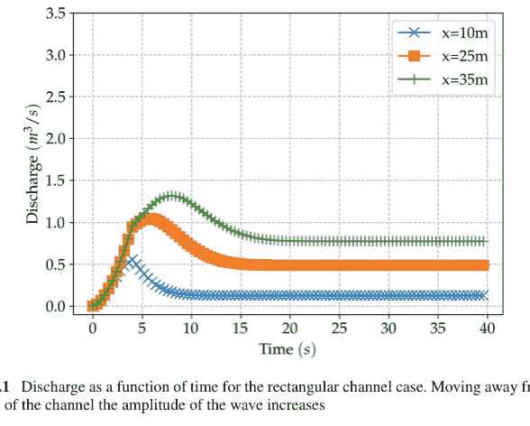

**图 11.1** 矩形渠道情况下流量随时间的变化。随着远离渠道起点，波的振幅增大。

##### 11.1 矩形渠道

```python
"""
用于模拟矩形渠道运动波方程的程序
"""

import numpy as np
import matplotlib.pyplot as plt
plt.rc('text', usetex=True)

"""
模拟参数
"""
x_start = 0  # (m)
x_stop = 100  # (m)
NX = 50  # 空间网格点数
x, dx = np.linspace(x_start, x_stop, NX, retstep=True)

t_start = 0  # (s)
t_stop = 40  # (s)
NT = 100  # 时间网格点数
dt = (t_stop - t_start) / NT

"""
库朗-弗里德里希斯-勒维 (CFL) 条件
"""
CFL = 0.5
v = 1.0
dt_cfl = CFL * dx / np.abs(v)

if dt <= dt_cfl:
    print("dt < dt_CFL")
    print(dt, "<", dt_cfl)
    print("算法稳定 - 继续执行")

    # 设置模型参数
    sim_name = "Rect"
    n = 0.025  # 糙率系数
    S = 0.01  # 渠道底坡
    W = 9.00  # 渠道宽度
    alpha = (1.49/n) * S**(1/2) * W**(-2/3)
    beta = 5 / 3

    # 降雨或侧向入流
    inflow = 0.1  # (m^3 / s)
    time_to_inflow = 10  # (s)

    # 解变量
    A = np.zeros([NX, NT])  # 时间沿列方向
    t_vals = np.zeros([NT, ])  # 以实际单位存储

    # 初始条件
    A[:, 0] = 0.005

    # 时间循环
    for t in range(0, NT - 1):
        # 以秒为单位存储时间值
        t_vals[t] = t * dt

        # 允许入流在一段时间后发生
        if t < time_to_inflow:
            q = inflow
        else:
            q = inflow / 3

        # 空间循环
        for x in range(1, NX):
            A_mean = 0.5 * (A[x, t] + A[x - 1, t + 1])
            A[x, t + 1] = np.divide(dx*q + (dx/dt)
                                     * A_mean +
                                     alpha*beta*A_mean*
                                     A[x - 1, t + 1],
                                     (dx/dt) +
                                     alpha*beta*A_mean)

    # 基于面积计算流量
    Q = alpha * A**beta

    # 绘图
    t_vals[-1] = t_vals[-2] + dt
    plt.plot(t_vals, Q[int(10), :], "-x",
             label="x=" + str(int(10)) + "m")
    plt.plot(t_vals, Q[int(NX / 2), :], "-s",
             label="x=" + str(int(NX / 2)) + "m")
    plt.plot(t_vals, Q[int(NX / 2) + 10, :], "-+",
             label="x=" + str(int(NX / 2) + 10) + "m")
    plt.xlabel("时间 $(s)$")
    plt.ylabel("流量 $(m^3/s)$")
    plt.legend()
    plt.grid(ls="--")
    plt.tight_layout()
    plt.savefig("./result/" + sim_name + "_.png", dpi=300)

else:
    print("dt > dt_CFL")
    print(dt, ">", dt_cfl)
    print("不稳定 - 减小 dt！")
    print("程序退出！")
    exit()

print("完成！")
```

##### 11.2 三角形渠道

三角形渠道以其 V 形横断面为特征，呈现出独特的几何形状，影响着渠道内的水流行为。当将运动波近似应用于三角形渠道时，必须考虑渠道的边坡和水流特性。该方法通过假设均匀流、稳态条件以及可忽略的压力和摩擦效应来简化控制方程。求解这些简化方程可得到三角形渠道中的水深、流速和流量。运动波近似在这些情况下被证明具有优势，能够快速准确地洞察三角形渠道的水力行为。

###### 11.2.1 Python 代码

在本节中，我们描述求解三角形渠道运动波方程的代码。它在各方面都与矩形渠道情况相似，只是在模型参数的定义上有所不同。该代码旨在计算指定时间段内沿渠道不同位置的流量。

在第13–28行，我们定义了模拟参数，如空间和时间域、网格点数量，并定义了时间步长。计算了库朗-弗里德里希-列维（CFL）条件以确保算法的稳定性。

接下来，在第35–43行，设置了三角形河道的模型参数，包括糙率系数、河道坡度、底宽和边坡。基于这些参数计算了alpha系数。

在第45–51行，代码定义了降雨或侧向入流值以及入流发生的时间。初始化了河道面积和时间值的求解变量。

时间循环从第56行开始，遍历指定的时间步数。在每个时间步内，空间循环遍历空间网格点。使用数值格式求解运动波方程，并存储更新后的河道面积。

时间循环结束后，在第78行，基于面积使用alpha和beta系数计算流量。

最后，在第80–93行，代码绘制了（图11.2）沿河道特定位置随时间变化的流量。不同网格点的流量值对时间值作图。生成的图表显示了沿河道不同位置流量随时间的变化。

代码包含检查，通过在第30行将时间步长与CFL条件比较来确保稳定性。在第95行，如果时间步长大于CFL条件，程序将退出并显示需要减小时间步长以保持稳定性的消息。

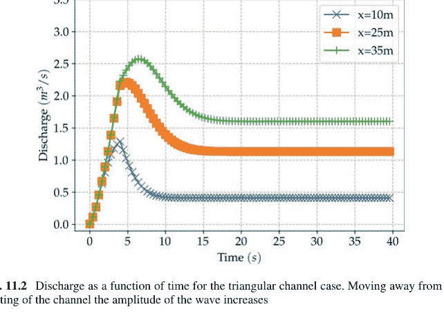

总体而言，该代码提供了三角形河道运动波方程的模拟，并可视化了沿河道不同位置流量随时间的变化。

```
"""
模拟三角形河道运动波方程的程序
"""

import numpy as np
import matplotlib.pyplot as plt
plt.rc('text', usetex=True)

"""
模拟参数
"""
x_start = 0  # (m)
x_stop = 100  # (m)
NX = 50  # 空间网格点数量
x, dx = np.linspace(x_start, x_stop, NX, retstep=True)

t_start = 0  # (s)
t_stop = 40  # (s)
NT = 100  # 时间网格点数量
dt = (t_stop - t_start) / NT

"""
库朗-弗里德里希-列维 (CFL) 条件
"""
CFL = 0.5
v = 1.0
dt_cfl = CFL * dx / np.abs(v)

if dt <= dt_cfl:
    print("dt < dt_CFL")
    print(dt, "<", dt_cfl)
    print("算法稳定 - 继续")

    # 设置模型参数
    sim_name = "Tri"
    n = 0.025  # 糙率系数
    S = 0.01  # 河道坡度
    b = 2.0  # 河道底宽
    z = 1  # 45度边坡
    Z = b/(2*z)
    alpha = (0.94/n) * S**(1/2) * (Z/(1+Z**2))**(1/3)
    beta = 4 / 3

    # 降雨或侧向入流
    inflow = 0.1  # (m^3 / s)
    time_to_inflow = 10  # (s)

    # 求解变量
    A = np.zeros([NX, NT])  # 时间沿列方向
    t_vals = np.zeros([NT, ])  # 以实际单位存储

    # 初始条件
    A[:, 0] = 0.005

    # 时间循环
    for t in range(0, NT - 1):
        # 存储以秒为单位的时间值
        t_vals[t] = t * dt

        # 在一段时间后降低入流
        if t < time_to_inflow:
            q = inflow
        else:
            q = inflow / 3

        # 空间循环
        for x in range(1, NX):
            A_mean = 0.5 * (A[x, t] + A[x - 1, t + 1])
            A[x, t + 1] = np.divide(dx*q + (dx/dt)
                                     * A_mean +
                                     alpha*beta*A_mean*
                                     A[x - 1, t + 1],
                                     (dx/dt) +
                                     alpha*beta*A_mean)

    # 基于面积计算流量
    Q = alpha * A**beta

    # 绘图
    t_vals[-1] = t_vals[-2] + dt
    plt.plot(t_vals, Q[int(10), :], "-x",
             label="x=" + str(int(10)) + "m")
    plt.plot(t_vals, Q[int(NX / 2), :], "-s",
             label="x=" + str(int(NX / 2)) + "m")
    plt.plot(t_vals, Q[int(NX / 2) + 10, :], "-+",
             label="x=" + str(int(NX / 2) + 10) + "m")
    plt.xlabel("时间 $(s)$")
    plt.ylabel("流量 $(m^3/s)$")
    plt.legend()
    plt.grid(ls="--")
    plt.tight_layout()
    plt.savefig("./result/" + sim_name + "_.png", dpi=300)

else:
    print("dt > dt_CFL")
    print(dt, ">", dt_cfl)
    print("不稳定 - 减小 dt！")
    print("程序退出！")
    exit()

print("完成！")
```

##### 11.3 圆形河道

圆形河道，其弯曲的横截面，在应用运动波近似时需要特别注意。必须考虑河道的直径、流动条件和水力半径，以准确表示河道的几何形状。通过假设均匀流、稳态条件，并忽略压力和摩擦效应，可以简化圆形河道的控制方程。求解这些方程后，可以估算河道内的水深、流速和流量。尽管圆形河道带来了独特的挑战，运动波近似仍然是快速近似这些系统中流动特性的有效方法。

###### 11.3.1 Python 代码

该程序与之前的矩形和三角形河道案例类似。在第13–28行，它首先设置模拟参数，如空间和时间域、网格点数量和CFL条件。CFL条件用于确保数值格式的稳定性。

接下来，在第36–41行，定义了模型参数，如糙率系数、河道坡度和河道直径。这些参数用于计算alpha系数，它是糙率、坡度和直径的函数。此外，还指定了入流速率和入流开始的时间。

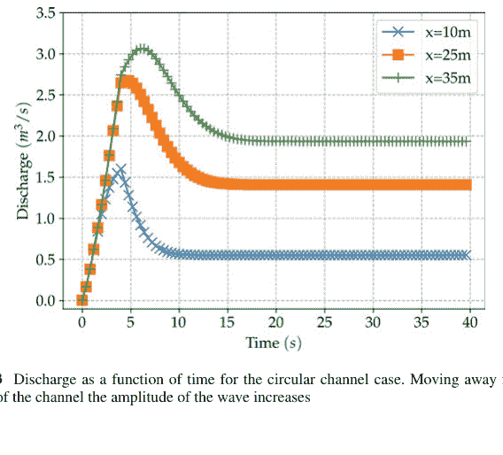

求解变量，包括横截面积和时间值，在第48–49行初始化。横截面积的初始条件设置为一个常数值。时间循环从第55行开始，遍历指定的时间步数，在每个时间步内，从第66行开始的空间循环根据运动波方程更新横截面积。计算涉及计算平均面积、入流速率以及基于数值格式的新面积。

在第76行，基于更新的横截面积使用alpha和beta系数计算流量。最后，代码绘制（图11.3）不同空间位置随时间变化的流量，并在第78–91行保存图形。

代码包含在第30行使用CFL条件进行稳定性检查。如果满足条件，模拟继续；否则，显示警告，并使用第93行退出程序。该程序还提供可视化输出，以分析不同空间位置流量随时间的变化。

该代码求解了圆形河道的运动波方程，允许在指定条件下研究流动动力学和流量变化。

##### 11.3 圆形河道

```
"""
模拟圆形河道运动波方程的程序
"""

import numpy as np
import matplotlib.pyplot as plt
plt.rc('text', usetex=True)

"""
模拟参数
"""
x_start = 0  # (m)
x_stop = 100  # (m)
NX = 50  # 空间网格点数量
x, dx = np.linspace(x_start, x_stop, NX, retstep=True)

t_start = 0  # (s)
t_stop = 40  # (s)
NT = 100  # 时间网格点数量
dt = (t_stop - t_start) / NT

"""
库朗-弗里德里希-列维 (CFL) 条件
"""
CFL = 0.5
v = 1.0
dt_cfl = CFL * dx / np.abs(v)

if dt <= dt_cfl:
    print("dt < dt_CFL")
    print(dt, "<", dt_cfl)
    print("算法稳定 - 继续")

    # 设置模型参数
    sim_name = "Circ"
    n = 0.025  # 糙率系数
    S = 0.01  # 河道坡度
    D = 2.00  # 河道直径
    alpha = (0.804/n) * S**(1/2) * D**(1/6)
```

###### 11.3.2 结果讨论

我们现在比较三种渠道情况（即矩形、三角形和圆形渠道）的一维运动波近似结果。除了 $\alpha$ 和 $\beta$ 的表达式不同外，三种情况的所有模拟参数均相同。通过比较图 11.1、11.2 和 11.3，可以看出波高是最显著的特征。对于矩形情况，由于渠道宽度提供了容纳低波高的空间，使水能够停留在表面附近，因此波高最低。有趣的是，在图 11.2 中，由于三角形渠道的底部狭窄，波形呈现出尖峰状。类似地，在图 11.3 中，由于流动面积的整体减小，波高仍然更加突出。这三幅图显示了在一维域中三个位置处波高随时间的变化。这类模拟有助于研究流动渠道几何形状变化的各种场景。

##### 11.4 二维浅水方程

二维浅水方程（SWE）是一组偏微分方程，用于描述浅水环境中流体流动的行为，其中流体的深度相对于其水平范围较小。在地表流模型的背景下，这些方程对于模拟和预测各种水动力过程（如地表径流、河流流动和沿海淹没）至关重要，因为在这些过程中，流体深度的变化相对于流速来说是显著的。

二维浅水方程由三个主要方程组成，分别代表质量守恒（连续性方程）和水平方向（x 和 y 方向）的动量守恒。这些方程考虑了流体深度、流速、重力和床面高程，全面表示了两个水平维度上的流体动力学。由于其能够捕捉复杂的流动现象，二维浅水方程被广泛应用于地表流模型中，为理解各种水文系统中的流动模式、流速和深度提供了详细的见解。

构成一维浅水方程基础的圣维南方程与二维浅水方程密切相关。两组方程都源于相同的质量和动量守恒基本原理，主要区别在于流动表示的维度。圣维南方程局限于一个空间维度，非常适合模拟几何形状相对简单的渠道中的流动；而二维浅水方程则为具有复杂空间变化的情况（如洪泛区、河口和城市地区）提供了更全面的流动模式表示。

二维浅水方程和圣维南方程在地表流模型研究中应用广泛。它们用于预测和管理洪水风险、设计水工建筑物、评估土地利用变化的影响以及评估极端水文事件的后果。此外，这些方程已被纳入地表-地下耦合模型中，增强了对地下水与地表水系统之间相互作用的理解。

因此，二维浅水方程和圣维南方程在研究地表流模型中发挥着关键作用。它们能够捕捉各种水文系统中基本的水动力过程，使其成为研究人员、工程师和水资源管理者理解和应对与水流、洪水风险及环境保护相关挑战的不可或缺的工具。

###### 11.4.1 控制方程

二维浅水方程的控制方程如下：

$$\frac{\partial h}{\partial t} + \frac{\partial hu}{\partial x} + \frac{\partial hv}{\partial y} = 0 \quad \text{in } \Omega \times [0, T] \quad (11.16)$$
$$\frac{\partial hu}{\partial t} + \frac{\partial hu^2 + 0.5gh^2}{\partial x} + \frac{\partial huv}{\partial y} = 0 \quad \text{in } \Omega \times [0, T] \quad (11.17)$$
$$\frac{\partial hv}{\partial t} + \frac{\partial huv}{\partial x} + \frac{\partial hv^2 + 0.5gh^2}{\partial y} = 0 \quad \text{in } \Omega \times [0, T] \quad (11.18)$$

其中，$\Omega$ 表示计算域，$T$ 表示模拟运行的总时间。$h$、$u$、$v$ 分别是水的高度、x 方向速度和 y 方向速度。$g$ 表示重力加速度。我们在矩形域的所有四侧应用反射边界条件。

###### 11.4.2 Python 代码

此代码使用有限体积法（FVM）实现浅水模拟。该模拟旨在模拟二维域中的水流行为。

从第 13–37 行开始，代码首先进行文件 I/O 设置，包括定义模拟名称和结果路径。它还描述了域大小、网格分辨率以及模拟参数，例如重力加速度（g）和 Courant-Friedrichs-Lewy（CFL）数。

接下来，从第 51–77 行，代码初始化模拟所需的变量和数组。它通过在 x 和 y 方向创建网格点来设置网格，以表示计算域。水高度（eta）的初始值使用函数“eta_initial()”定义，该函数可以根据所需的初始条件进行修改。

在第 82–129 行，模拟进入时间循环，迭代直到达到指定的结束时间（t_stop）。在循环内部，更新模拟时间（t_curr）和时间步长（dt）。根据水高度和速度计算 alpha 值。

从第 141–175 行，代码使用 Lax-Friedrichs 格式计算通量，这是一种用于近似浅水方程中通量的数值格式。通量分别在 x 和 y 方向计算。

接下来，在第 177–180 行，使用计算出的通量更新“Solution”变量，并考虑时间步长和网格间距。在第 182–197 行，应用边界条件以在边界处对水高度和速度施加无滑移条件。

在第 200–201 行，代码通过将动量分量除以水高度来计算速度（u 和 v）。它还为下一个时间步长执行必要的数组赋值。

在模拟过程中，每个时间步长的水高度都存储在“etas”列表中。此外，代码使用 PyVista 库生成可视化输出（.vtk）。它创建结构化网格并将其保存为 VTK 格式，以便后续可视化和分析。

因此，该代码使用有限体积法执行浅水模拟。它迭代时间步长，更新解变量，并根据浅水方程计算通量。生成可视化输出以可视化模拟过程中的水高度和速度。

```python
"""
使用有限体积法（FVM）在矩形域中进行浅水模拟
"""

import numpy as np
import pyvista as pv

"""
文件输入/输出
"""
simulationName = "swe_FVM"
resultPath = "./result/" + simulationName + "/"

"""
计算域创建
"""
xlen = 2
ylen = 7
divs = 60
dx = xlen / divs
dy = ylen / divs

x = np.arange(-1 - dx, 1 + dx, dx)
y = np.arange(-1 - dy, 1 + dy, dy)
xx, yy = np.meshgrid(x, y)
print("Min {}, {}".format(np.min(xx), np.min(yy)))
print("Max {}, {}".format(np.max(xx), np.max(yy)))

"""
模型参数
"""
g = 9.8
cfl = 0.5

# 源项
def eta_initial(y, x):
    """初始 eta 值函数。"""
    Amp = 8.0
    x, y = -0.1, -0.9
    sigma = 0.3
    return Amp * np.exp(
        -1 * (0.02*(x - x) ** 2 +
             (y - y) ** 2) / (sigma ** 2))

# 基础深度 + 高斯振幅
eta = np.ones_like(xx)
eta = eta + eta_initial(yy, xx)

# 解变量初始化为 [mesh_size x 3] 形状
Solution = np.zeros([xx.shape[0], xx.shape[1], 3])
Solution[:, :, 0] = eta  # 零索引对应 etas
u = np.zeros_like(xx)
v = np.copy(u)

# 为便于应用边界条件而偏移索引
p_p1_x = np.roll(np.arange(len(x)), 1)
p_p1_y = np.roll(np.arange(len(y)), 1)
p_m1_x = np.roll(np.arange(len(x)), -1)
p_m1_y = np.roll(np.arange(len(y)), -1)

# 运行参数
t_curr = 0.0
dt = 0.0
t_stop = 2.0

# 解变量
etas = list()
times = list()
times.append(t_curr)
Solution_old = Solution  # 旧解变量
counter = 0

"""
时间推进
"""
while t_curr < t_stop:
    # 保存文件
    hsol = Solution[:, :, 0]
    grid = pv.StructuredGrid(xx * xlen, yy * ylen, hsol)
    grid.point_data["height"] = hsol.flatten(order="F")

    top = grid.points.copy()
    bottom = grid.points.copy()
    bottom[:, -1] = -5.0  # 底部平面
    vol = pv.StructuredGrid()
    vol.points = np.vstack([top, bottom])
    vol.dimensions = [*grid.dimensions[0:2], 2]

    z_above = hsol.flatten(order="F")
    zlevels = vol.points[:, 2]
    zlevels[zlevels < np.min(z_above)] = -0.5
    vol.point_data["height"] = zlevels

    write_format = resultPath + \
                   "height_" + \
                   "{04d}.vtk".format(counter)
    vol.save(write_format)

    # 初始化变量
    u_old = u  # 旧 x 速度
    v_old = v  # 旧 y 速度

    t_curr = t_curr + dt  # 时间递增

    times.append(t_curr)

    # 计算用于通量的 alpha = abs(u) + sqrt(gh)
    alpha_u = 0.5 * np.abs(u_old + \
                           u_old[:, p_m1_x]) + \
              np.sqrt(
                  g * 0.5 * (Solution_old[:, :, 0] + \
                             Solution_old[:, p_m1_x, 0]))
    alpha_v = 0.5 * np.abs(v_old + \
                           v_old[p_m1_y, :]) + \
              np.sqrt(
                  g * 0.5 * (Solution_old[:, :, 0] + \
                             Solution_old[p_m1_y, :, 0]))

    # 计算最大 alpha
    alpha_max = np.linalg.norm(
        x=np.hstack([np.ravel(alpha_u), np.ravel(alpha_v)]),
        ord=np.inf)

    # 为稳定性动态计算 dt
    dt = np.min([cfl * (dx / alpha_max),
                 cfl * (dy / alpha_max)])

    # 预计算一些项
    huv = Solution_old[:, :, 1] * Solution_old[:, :, 2] / \
          Solution_old[:, :, 0]
    gh_sqr = 0.5 * g * Solution_old[:, :, 0] ** 2

    # 计算 (hu, hu ** 2 + gh ** 2 / 2, huv)
    LFFlux_u = np.stack([Solution_old[:, :, 1],
                         Solution_old[:, :, 1] ** 2 /
                         Solution_old[:, :, 0] + gh_sqr,
                         huv],
                        2)

    # 计算 (hv, huv, hv ** 2 + gh ** 2 / 2)
    LFFlux_v = np.stack([Solution_old[:, :, 2],
                         huv,
                         Solution_old[:, :, 2] ** 2. /
                         Solution_old[:, :, 0] + gh_sqr],
                        2)

    # 计算 x, y 方向的通量
    flux_x = np.zeros_like(LFFlux_u)
    flux_y = np.zeros_like(LFFlux_u)
    for ii in range(flux_x.shape[2]):
        temp_LFFluxu = LFFlux_u[:, p_m1_x, :]
        temp_Uold = Solution_old[:, p_m1_x, :] - \
                    Solution_old
        flux_x[:, :, ii] = 0.5 * (
            LFFlux_u[:, :, ii] +
            temp_LFFluxu[:, :, ii]) - \
            0.5 * np.multiply(
            temp_Uold[:, :, ii], alpha_u)

    for ii in range(flux_y.shape[2]):
        temp_LFFluxv = LFFlux_v[p_m1_y, :, :]
        temp_Uold = Solution_old[p_m1_y, :, :] - \
                    Solution_old
        flux_y[:, :, ii] = 0.5 * (
                LFFlux_v[:, :, ii] +
                temp_LFFluxv[:, :, ii]) - \
                0.5 * np.multiply(
            temp_Uold[:, :, ii], alpha_v)

    # 赋值给解变量
    Solution = Solution_old - \
               (dt / dx) * (flux_x - flux_x[:, p_p1_x, :]) - \
               (dt / dy) * (flux_y - flux_y[p_p1_y, :, :])

    # 分别对 eta、hu 和 hv 施加无滑移边界条件
    Solution[0:, -1, 0] = Solution[0:, -2, 0]
    Solution[0:, 0, 0] = Solution[0:, 1, 0]
    Solution[-1, 0:, 0] = Solution[-2, 0:, 0]
    Solution[0, 0:, 0] = Solution[1, 0:, 0]

    Solution[0:, -1, 1] = -Solution[0:, -2, 1]
    Solution[0:, 0, 1] = -Solution[0:, 1, 1]
    Solution[-1, 0:, 1] = Solution[-2, 0:, 1]
    Solution[0, 0:, 1] = Solution[1, 0:, 1]

    Solution[0:, -1, 2] = Solution[0:, -2, 2]
    Solution[0:, 0, 2] = Solution[0:, 1, 2]
    Solution[-1, 0:, 2] = -Solution[-2, 0:, 2]
    Solution[0, 0:, 2] = -Solution[1, 0:, 2]

    # 恢复 u 和 v
    u = np.divide(Solution[:, :, 1], Solution[:, :, 0])
    v = np.divide(Solution[:, :, 2], Solution[:, :, 0])

    print("Done timestep {.04f}".format(t_curr))
    etas.append(Solution[:, :, 0])
    Solution_old = Solution  # 将新解赋给旧解
    counter = counter + 1

print("Done!")

##### 11.4 二维浅水方程

###### 11.4.3 结果讨论

溃坝模拟是二维浅水方程（SWE）的一个有趣应用。SWE 的解可以提供关于大坝突然和灾难性发生情况的见解。现实世界中的溃坝情况涉及反射、水波传播以及与障碍物的相互作用——SWE 可以同时处理流速和深度，从而能够对此类场景进行建模。

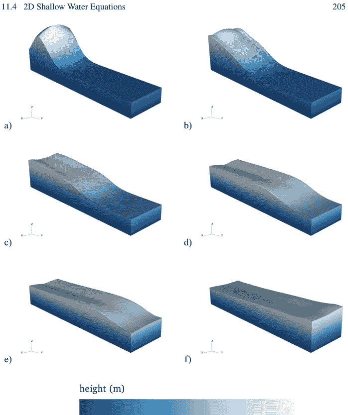

**图 11.4** 溃坝模拟。显示了浅水方程的高度解。在二维域中，计算域远端的一个点处，水的高度最初保持较高，而其他侧面保持较低。双曲偏微分方程被求解直到 $t_{final}$。从 **a** 到 **f** 显示了从 $t_0$ 开始多个时刻的高度场实例

对于此模拟，计算域是在程序内部创建的。代码中的相关行在 26–28 行。这些行定义了一个矩形域。每个轴的划分数量由参数“dx”和“dy”处理，如第 23–24 行所示。针对此计算域求解了二维浅水方程，结果如图 11.4 所示。从图中的 (a) 到 (f)，我们看到水高度随时间的演变。子图 (a) 显示了水高度的初始状态。在此初始条件下，求解浅水方程以达到最终时间 $t_{final}$。每个子图都清晰地描绘了增长和减弱的波浪。因此，当在域的不同部分使用合适数量的传感器进行探测时，模拟可以帮助模拟水文传感器数据。
```

### 第12章
地下水流模型

#### 12.1 渗流模型

渗流模型是地下水文学研究不可或缺的一部分，专注于模拟和量化流体在多孔介质（如土壤、岩石和沉积物）中的运动。这些模型对于理解地下水动态至关重要，因为它们为了解含水层的分布、补给和排泄，以及地下水与地表水系统之间的相互作用提供了宝贵的见解。渗流模型在解决与水质、土壤湿度和污染物迁移相关的问题方面也至关重要，这些问题对农业、供水和环境保护具有重大影响。

渗流模型的基础是达西定律，该定律将流体速度与多孔介质中的水力传导率和水力梯度联系起来。结合质量守恒原理，这些模型描述了水在非饱和区和饱和区的流动，考虑了土壤特性、非均质性和各向异性等因素。通常采用有限差分和有限元技术等数值方法来求解渗流模型的控制方程，从而能够准确表示复杂的地下条件和边界条件。

##### 12.1.1 变分公式

渗流模型的强形式需要求解，

$$\sigma + \nabla u = 0 \quad \text{in } \Omega \qquad (12.1)$$
$$\nabla \cdot \sigma = f \quad \text{in } \Omega \qquad (12.2)$$

需满足以下边界条件：

$u = u_0$ on $\partial D$ (12.3)

$-\sigma \cdot \hat{n} = g$ on $\partial N$ (12.4)

其中，边界 $\partial \Omega = \partial D \cup \partial N$。方程 12.1 和 12.2 对应的弱形式可以表示为

$\langle \sigma, \tau \rangle + \langle \nabla u, \tau \rangle + \langle \sigma, \nabla v \rangle = -\langle \hat{n}, \sigma \rangle * v$ (12.5)

在上述方程中，$\sigma$ 代表矢量变量，即速度，而 $u$ 代表标量变量，即压力。

##### 12.1.2 用于生成计算域的 GMSH 代码

给定的 Gmsh 代码用于描述一个二维几何域。图 12.1 展示了一个由点、线和面组成的简单几何形状。

首先，它使用 `SetFactory ("OpenCASCADE")` 命令设置几何引擎。然后定义点定义——点 1 和 2 代表一条线段的端点，而点 3 到 9 定义了一个复杂形状的顶点。线定义：线 1 到 10 连接定义的点，形成几何形状的边界。它们代表形状的边。

接下来，定义曲线环——曲线环(1)通过指定构成边界的线来定义一个闭合环。在这种情况下，包含了线 1 到 10。平面曲面：平面曲面(1)使用曲线环(1)创建一个二维曲面。它代表由环包围的内部区域。

接下来，我们定义物理曲线和曲面——物理曲线和物理曲面命令为特定的曲线和曲面分配标签或标记。这些标签可用于在后续模拟中定义边界条件或应用材料属性。

因此，这段代码定义了一个具有特定点、线和面的二维几何形状。定义的曲面和曲线被赋予了物理标签，这些标签可用于在后续的有限元模拟中识别和分配特定的属性或条件。

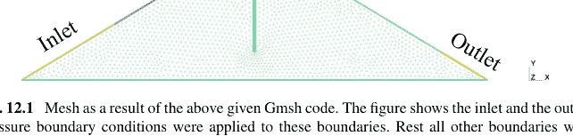

图 12.1 由上述 Gmsh 代码生成的网格。图中显示了入口和出口。在这些边界上施加了压力边界条件。所有其他边界均被赋予无滑移边界条件。生成的网格在此 Github 链接中列出：渗流网格

```
// Gmsh project created on Fri Jan  6 08:12:57 2023
SetFactory("OpenCASCADE");
//+
Point(1) = {0, 0, 0, 1.0};
//+
Point(2) = {50, 0, 0, 1.0};

Point(3) = {45, 3, 0, 1.0};
//+
Point(4) = {30, 12, 0, 1.0};
//+
Point(5) = {25.1, 12, 0, 1.0};
//+
Point(6) = {25.1, 3, 0, 1.0};
//+
Point(7) = {24.9, 3, 0, 1.0};
//+
Point(8) = {24.9, 12, 0, 1.0};
//+
Point(9) = {20, 12, 0, 1.0};

Point(10) = {10, 6, 0, 1.0};
//+
Point(11) = {0, 0, 0, 1.0};
//+
Line(1) = {1, 2};
//+
Line(2) = {2, 3};
//+
Line(3) = {3, 4};
//+
Line(4) = {4, 5};
//+
Line(5) = {5, 6};
//+
Line(6) = {6, 7};
//+
Line(7) = {7, 8};
//+
Line(8) = {8, 9};
//+
Line(9) = {9, 10};
//+
Line(10) = {10, 1};
//+
Curve Loop(1) = {9, 10, 1, 2, 3, 4, 5, 6, 7, 8};
//+
Plane Surface(1) = {1};
//+
Physical Curve("noslip", 11) = {1, 9, 8, 7, 5, 4, 3, 6};
//+
Physical Curve("inlet", 12) = {10};
//+
Physical Curve("outlet", 13) = {2};
//+
Physical Surface("dam", 14) = {1};
```

##### 12.1.3 Python 代码

该程序使用有限元法模拟稳态渗流。
在第 5-14 行，我们导入必要的库，如 "numpy"、"dolfinx"、"pyvista" 和 "petsc4py"，以促进有限元法的实现和可视化。
在第 17-22 行，指定了网格文件和结果文件的路径和名称，以读取网格并保存模拟结果。
在第 25-39 行，我们定义了网格文件，使用 "dolfinx" 中的 "read_from_msh" 函数读取。从网格文件中获取域、单元标签和面片标签，它们代表计算域及其几何实体。
在第 42-57 行，我们定义了用于混合单元公式的有限元空间和函数。"DRT" 和 "CG" 单元分别用于表示速度场和压力场。创建了 "W" 函数空间以容纳这些混合单元。
在第 60-70 行，我们定义了从混合单元空间导出的试探函数和测试函数。渗流问题的变分公式使用这些试探函数和测试函数定义。
在第 73-105 行，我们实现了达西流模拟的边界条件。在入口和出口边界上对压力变量施加狄利克雷边界条件。压力值被分配给相应的自由度。
在第 108-129 行，我们设置求解器，其参数使用 PETSc 选项进行配置。求解器类型设置为 "preonly"，使用 LU 预条件器和 MUMPS 求解器，以高效求解线性系统。使用指定的求解器配置和边界条件求解线性问题。解被分解为速度和压力分量。然后使用 "PyVista" 库对结果进行可视化。压力场和速度场被投影到合适的数据结构上，并显示绘图。

# 压力

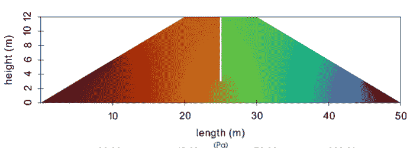

# 速度

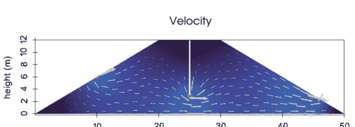

**图 12.2** 上：压力场；下：速度场，箭头表示流动方向。值得注意的是，该模型很好地捕捉了不连续面下的流动路径。

在第 132-276 行，我们设置代码，使用 "PyVista" 可视化压力和速度的模拟结果。使用 "PyVista" 绘图器对象创建绘图，该对象允许自定义可视化参数。压力场和速度场显示在单独的子图中，并添加了合适的颜色映射和标量条以增强可视化效果。

生成的绘图保存到指定的结果文件路径。因此，这段代码演示了使用有限元法模拟稳态渗流。

```
"""
Program to simulate a steady seepage
flow using finite element method.
"""
import numpy as np
from dolfinx import fem, plot
from dolfinx.io.gmshio import read_from_msh
from ufl import (FiniteElement, MixedElement,
                 TestFunctions, TrialFunctions,
                 grad, dot, inner,
                 ds, dx, FacetNormal)
from mpi4py import MPI
import pyvista as pv
from petsc4py.PETSc import ScalarType

"""
File IO
"""
simulationName = "Seepage_flow-2D"
meshName = "seepage_2D"
meshPath = "./meshes_gmsh/" + meshName + ".msh"

"""
Computational domain - We load an external
mesh suitable for demonstrating seepage
flow
"""
domain, cell_tags, facet_tags = read_from_msh(
    filename=meshPath,
    comm=MPI.COMM_WORLD,
    rank=0,
    gdim=2)

# Facet dimension where the boundary condition needs
# to be applied is 1 less than the domain's dimension
facetdim = domain.topology.dim - 1
n = FacetNormal(domain)

"""
Finite element space and functions
"""
# Define mixed elements for (velocity, pressure) pair
# that are stable (from literature)
```

#### 12.1 渗流模型

```python
DRT = FiniteElement(
    family="DRT",
    cell=domain.ufl_cell(),
    degree=2)
CG = FiniteElement(
    family="CG",
    cell=domain.ufl_cell(),
    degree=3)
W = fem.FunctionSpace(
    mesh=domain,
    element=MixedElement([DRT, CG]))

"""
试函数、测试函数与
变分公式
"""
# 从混合元空间推导试函数和测试函数
(sigma, u) = TrialFunctions(function_space=W)
(tau, v) = TestFunctions(function_space=W)
a = (dot(sigma, tau) +
     dot(grad(u), tau) +
     dot(sigma, grad(v))) * dx
L = -inner(n, sigma) * v * ds

"""
边界条件 - 这部分为达西流模拟
设置了必要的边界条件，通过在入口和
出口边界指定特定的压力值，确保对
流动行为的精确建模。
"""
# 压力 (u) 的狄利克雷边界条件
spc = 1  # 表示压力变量所在的第二个空间
Q, _ = W.sub(spc).collapse()
dof_inlet = fem.locate_dofs_topological(
    V=(W.sub(spc), Q),
    entity_dim=facetdim,
    entities=facet_tags.find(12))
dof_outlet = fem.locate_dofs_topological(
    V=(W.sub(spc), Q),
    entity_dim=facetdim,
    entities=facet_tags.find(13))

p_inlet = fem.Function(Q)
p_inlet.interpolate(
    lambda xd:
    ScalarType(100.0) * np.ones((1, xd.shape[1])))
bc_pressure_inlet = fem.dirichletbc(
    value=p_inlet, dofs=dof_inlet, V=W)

p_outlet = fem.Function(Q)
p_outlet.interpolate(
    lambda xd:
    ScalarType(10.0) * np.ones((1, xd.shape[1])))
bc_pressure_outlet = fem.dirichletbc(
    value=p_outlet, dofs=dof_outlet, V=W)

"""
求解器配置 - 我们为此模型创建了一个
线性求解器对象。petsc选项配置PETSc库
使用基于LU的预条件器，并以MUMPS作为
底层求解器。这些选择会显著影响使用
PETSc进行的数值计算的性能和精度。
"""
# 求解
problem = fem.petsc.LinearProblem(
    a, L, bcs=[bc_pressure_inlet,
               bc_pressure_outlet],
    petsc_options={
        "ksp_type": "preonly",
        "pc_type": "lu",
        "pc_factor_mat_solver_type": "mumps"})

w_h = problem.solve()
velocity_h, pressure_h = w_h.split()

print("求解完成！请查看图表。")

"""
可视化 - 我们使用PyVista Plotter对象，
设置特定的尺寸以及线条和多边形平滑参数。
然后在绘图画布中创建两个子图，分别显示
压力场和速度场。
接着，对于每个子图，代码将模拟结果投影到
合适的PyVista数据结构上，该结构由单元格、
单元格类型和坐标组成。投影后的解被赋值给
网格，并使用不同的可视化方式进行展示。
"""

fontsize = 16
zoom = 1.6

# 设置pyvista绘图器的后端
pv.set_plot_theme(pv.themes.DocumentTheme())
pv.set_jupyter_backend('None')

canvas_length, canvas_breadth = 1200, 1200

# 初始化一个1行2列的pyvista画布。
p = pv.Plotter(shape=(2, 1),
               window_size=(canvas_length, canvas_breadth),
               multi_samples=8,
               line_smoothing=True,
               polygon_smoothing=True, border=False)
# p.add_title("达西流模拟")

# 将解投影到适合pyvista的格式。
V0_h = fem.FunctionSpace(domain, ("CG", 2))
uh = fem.Function(V0_h, dtype=np.float64)
uh.interpolate(pressure_h)

# 从网格获取单元格、类型和坐标。
cells, cell_types, x_ = plot.create_vtk_mesh(V0_h)

# 定义一个非结构化网格来存储数据。
grid = pv.UnstructuredGrid(cells, cell_types, x_)

# 将投影后的解赋值给网格。
grid.point_data["u"] = uh.x.array.reshape(
    x_.shape[0], V0_h.dofmap.index_map_bs)

# 选择画布中的第一个面板。
p.subplot(0, 0)
p.add_text('压力',
           position=(0.45, 0.75),
           viewport=True,
           shadow=True,
           font_size=fontsize)

# 设置颜色映射、缩放级别和其他参数。
p.add_mesh(
    mesh=grid.warp_by_scalar(
        scalars="u", factor=0.0),
    cmap="turbo",
    scalar_bar_args={'title': "(Pa)",
                     'label_font_size': fontsize + 8,
                     'fmt': '%10.2f',
                     'position_x': 0.25,
                     'position_y': 0.01,
                     'bold': False,
                     'width': 0.5,
                     'height': 0.2,
                     'n_labels': 4}
)

# p.add_bounding_box()
p.show_bounds(ticks='both',
              xlabel='长度 (m)',
              ylabel='高度 (m)',
              use_2d=True,
              all_edges=True,
              font_size=fontsize + 4)

# 显示XY平面
p.view_xy()

# 定义缩放级别
p.camera.zoom(value=zoom)

V0_sigma = fem.VectorFunctionSpace(
    domain, ("CG", 2))
usigma = fem.Function(
    V0_sigma, dtype=np.float64)
usigma.interpolate(velocity_h)
cells, cell_types, x_ = plot.create_vtk_mesh(
    V0_sigma)
grid = pv.UnstructuredGrid(cells, cell_types, x_)

grid.point_data["u"] = uh.x.array.reshape(
    x_.shape[0], V0_h.dofmap.index_map_bs)

# 为glyphs重新整理数据
points2d = usigma.x.array.reshape(
    x_.shape[0], V0_sigma.dofmap.index_map_bs)
points3d = np.hstack(
    [points2d, np.zeros([points2d.shape[0], 1])])
grid["vectors"] = points3d
grid.set_active_vectors("vectors")
glyphs = grid.glyph(
    scale=1, orient="vectors", tolerance=0.025,
    factor=0.5, geom=pv.Arrow().scale(
        xyz=(1, 1, 0.07), inplace=True))

p.subplot(1, 0)
p.add_mesh(mesh=glyphs,
           cmap="coolwarm", color="white",
           show_scalar_bar=False)

p.subplot(1, 0)
p.add_text('速度',
           position=(0.45, 0.75),
           viewport=True,
           shadow=True,
           font_size=fontsize)
p.add_mesh(
    mesh=grid.warp_by_scalar(
        scalars="u", factor=0.0),
    cmap="turbo",
    scalar_bar_args={'title': "(m/s)",
                     'label_font_size': fontsize + 8,
                     'fmt': '%10.2f',
                     'position_x': 0.25,
                     'position_y': 0.01,
                     'bold': False,
                     'width': 0.5,
                     'height': 0.2,
                     'n_labels': 4})

p.show_bounds(ticks='both',
              xlabel='长度 (m)',
              ylabel='高度 (m)',
              use_2d=True,
              all_edges=True,
              font_size=fontsize + 4,
              location='outer')

# 显示XY平面，设置缩放级别
# 并在窗口上显示标题
p.view_xy()
p.camera.zoom(value=zoom)
p.show(title="渗流模拟")

print("完成！")
```

##### 12.1.4 结果讨论

图12.2展示了渗流模拟的结果。由于在入口和出口施加了压力边界条件，压力从高值逐渐降低到低值。该边界条件垂直施加于两个区域（即入口和出口）的边界上，如图12.2所示。颜色渐变显示了这种变化。在上半部分，我们看到压力场。其高值和低值分别为100 Pa和10 Pa。在图的下半部分，我们看到速度场。一个矢量图叠加在速度场上，显示了流体从高压区流向低压区的过程。中心引入的不连续性迫使流体在狭窄区域具有更高的速度。底部边缘的红色表示了速度的大小。此外，我们在入口和出口的顶部区域也看到了类似的特性。

#### 12.2 地下水流模型

地下水流模型是地下水文调查的重要组成部分，旨在模拟和预测含水层内水的运动和分布。这些模型在管理和保护至关重要的地下水资源方面发挥着关键作用，这些水资源是全球数百万人主要的淡水来源。地下水流模型有助于各种应用，包括供水规划、污染修复、盐水

#### 12.2 地下水流模型

用于入侵防治，以及评估土地利用变化、工业活动和气候变化的潜在影响。

地下水流模型的基本原理植根于多孔介质中流动的数学表示，例如达西定律和质量守恒原理。地下水流的控制方程通常是偏微分方程，考虑了诸如水力传导系数、储水系数和含水层厚度等参数。这些方程通常使用数值方法求解，如有限差分或有限元技术，以准确表示复杂的含水层系统和边界条件。

##### 12.2.1 变分公式

非稳态地下水流的强形式由以下方程给出：

$$S\frac{\partial h}{\partial t} = K\nabla^2 h + f \quad \text{in } \Omega \qquad (12.6)$$

并满足边界条件：

$$u = u_D \quad \text{in } \partial D \times [0, T] \qquad (12.7)$$
$$u = u_0 \quad \text{at } t = 0 \qquad (12.8)$$

方程 12.6 对应的弱形式可以表示如下：

$$S\langle h - h_n, v \rangle - \Delta t K \langle \nabla h, \nabla v \rangle = \Delta t \langle f, v \rangle \qquad (12.9)$$

其中，$\Omega$ 是计算域，$S$ 是储水系数，$K$ 是渗透系数，$h$ 和 $h_n$ 分别是当前时间和上一时间的高度，$f$ 是源项。$v$ 是测试函数。我们求解未知变量 $h$ 作为时间 $t$ 和空间 $x$ 的函数。

##### 12.2.2 用于创建计算域的 GMSH 代码

此 Gmsh 代码使用 OpenCASCADE 作为底层几何引擎来定义一个二维几何。它在二维空间中创建六个点，通过连接它们的线形成一个 L 形闭合环。这些点和线用于定义一个曲线环，表示几何的边界。然后，该曲线环用于创建一个平面曲面。生成的曲面被分配一个物理标签“body”，标签为 7，曲线被分配一个物理标签“8”。此代码为后续操作（如网格划分或施加边界条件）设置了几何。

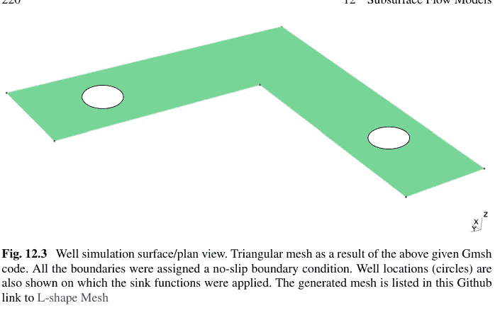

**图 12.3** 井模拟表面/平面视图。由上述 Gmsh 代码生成的三角形网格。所有边界均被分配了无滑移边界条件。井的位置（圆圈）也已显示，汇函数被施加于其上。生成的网格列在此 Github 链接中：[L-shape Mesh](https://github.com/)

```cpp
// Gmsh project created on Fri May 12 21:21:45 2023
SetFactory("OpenCASCADE");
//+
Point(1) = {0, 0, 0, 1.0};
//+
Point(2) = {10, 0, 0, 1.0};
//+
Point(3) = {10, 10, 0, 1.0};
//+
Point(4) = {7, 10, 0, 1.0};
//+
Point(5) = {7, 3, 0, 1.0};
//+
Point(6) = {0, 3, 0, 1.0};
//+
Line(1) = {1, 2};
//+
Line(2) = {2, 3};
//+
Line(3) = {3, 4};
//+
Line(4) = {4, 5};
//+
Line(5) = {5, 6};
//+
Line(6) = {6, 1};
//+
Curve Loop(1) = {5, 6, 1, 2, 3, 4};
//+
Plane Surface(1) = {1};
//+
Physical Surface("body", 7) = {1};
//+
Physical Curve(8) = {6, 5, 4, 3, 2, 1};
```

##### 12.2.3 Python 代码

此代码使用有限元法求解非稳态地下水流方程。

在第 6-19 行，我们导入了必要的库，包括“dolfinx”、“pyvista”、“numpy”和“petsc4py”。

在第 23-29 行，我们定义了各种参数，例如网格输入/输出的文件路径、模拟时间参数和计算域详细信息。

程序在第 44 至 48 行使用“dolfinx”的“io.gmshio”模块读取网格文件。

程序在第 66-70 行为解创建了有限元空间。它还在第 110-120 行使用用户定义的函数初始化了地下水头的初始条件。

在第 123-132 行，我们应用了使用“DirichletBC”函数指定的边界条件，该函数将选定边界面上的地下水头设置为零。

在第 142-148 行，代码还定义了域中汇或“井”的强迫函数。

在第 154-165 行，使用试函数和测试函数以及汇项定义了地下水流方程的变分公式。双线性和线性形式使用“UFL”语法构建。

接下来，在第 175-183 行，设置了求解器配置，包括矩阵的组装和使用“PETSc”创建线性求解器。求解器类型设置为 LU 分解，以高效求解线性系统。

在第 76-107 行，代码使用“pyvista”设置绘图。它基于有限元空间创建了一个网格，并定义了一个绘图函数来可视化不同时间步的地下水头。

我们在第 190 行开始时间步进循环，程序在指定的时间步数上迭代。它组装右端向量，应用边界条件，并使用线性求解器求解线性系统。

在每个时间步，程序调用绘图函数使用“pyvista”可视化地下水头。

此代码演示了使用有限元法求解非稳态地下水流的实现，并提供了随时间变化的地下水头演化的可视化。

222

12 地下水流模型

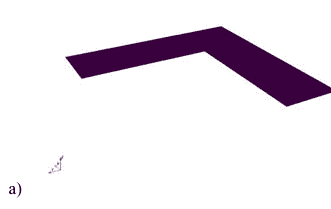

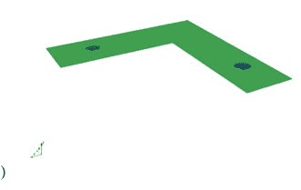

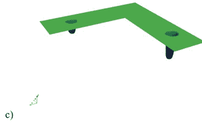

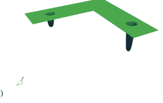


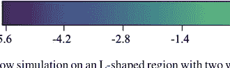

图 12.4 在具有两口井的 L 形区域上的地下水流模拟。从 a 到 f 是在不同深度的两口井抽水导致的地下水剖面。随着时间的推移，水深增加。

```python
"""
使用有限元法求解非稳态地下水流方程的程序。
"""
import numpy as np
from dolfinx import plot
from dolfinx.fem import (FunctionSpace, Function,
                        dirichletbc, locate_dofs_topological,
                        form, petsc, Constant)
from dolfinx.io.gmshio import read_from_msh
from ufl import (FiniteElement, TestFunction, TrialFunction,
                grad, dot, dx, FacetNormal)
from mpi4py import MPI
import pyvista as pv
from petsc4py import PETSc
from petsc4py.PETSc import ScalarType
import matplotlib.pyplot as plt
from matplotlib.colors import LinearSegmentedColormap
pv.set_plot_theme(pv.themes.DocumentTheme())

"""
文件输入/输出
"""
simulationName = "Groundwater_flow-2D"
meshName = "groundwater_2D"
meshPath = "./meshes_gmsh/" + meshName + ".msh"
resultPath = "./result/"

"""
运行参数
"""
t_start = 0
t_stop = 1
Nt = 100
dt = (t_stop - t_start) / Nt

"""
计算域
"""
domain, cell_tags, facet_tags = read_from_msh(
    filename=meshPath,
    comm=MPI.COMM_WORLD,
    rank=0,
    gdim=2)

n = FacetNormal(domain)
surround = int(8)

"""
模型参数
"""
S = Constant(
    domain=domain, c=3.5)  # 储水系数
K = Constant(
    domain=domain, c=0.05)  # 水力传导系数

"""
有限元空间
"""
fe_elem = FiniteElement(family="CG",
                        cell=domain.ufl_cell(),
                        degree=2)
fe_space = FunctionSpace(mesh=domain,
                        element=fe_elem)

"""
可视化
"""
ocean = plt.cm.get_cmap("ocean")
ocean_modified = LinearSegmentedColormap.from_list(
    "ocean_modified",
    [ocean(i) for i in range(int(200), int(240))])

def visualize_and_save(
    h_, t, name_,
    grid = pv.UnstructuredGrid(
        *plot.create_vtk_mesh(fe_space))):

    p = pv.Plotter(off_screen=True)

    # 初始化网格值
    grid.point_data[f"h({t})"] = h_.x.array.real

    # 按值扭曲
    warped = grid.warp_by_scalar(
        scalars=f"h({t})", factor=1.0)

    # 设置角度并显示
    p.add_mesh(warped, cmap=ocean_modified,
               show_scalar_bar=False)
    # p.show_grid()
    p.show_axes()

    # p.camera.view_angle = 15.0
    p.camera.azimuth = 120
    # p.camera.elevation = -15
    p.camera.position = (-13.0, 15.0, 5.0)

    p.show(title="地下水流模拟",
           screenshot=resultPath + name_)
    p.close()

"""
初始条件
"""
def initial_head(x):
    return np.full(x.shape[1], 0.0)

h_n = Function(V=fe_space, name="h_initial")
h_n.interpolate(initial_head)
```

#### 12.2 地下水流模型

```python
h_ = Function(V=fe_space, name="h_solution")
h_.interpolate(initial_head)

"""
边界条件
"""
fdim = domain.topology.dim - 1
bc = dirichletbc(value=ScalarType(0.0),
                dofs=locate_dofs_topological(
                    V=fe_space,
                    entity_dim=fdim,
                    entities=facet_tags.find(surround)),
                V=fe_space)

# 存储第一个场值
name_ = "h_{:.04f}_.png"
visualize_and_save(h_, t_start, name_.format(t_start))

"""
源项函数
"""
def sink(x):
    vals = np.full(x.shape[1], 0.0)
    well_1 = (x[0] - 2.5) ** 2 + (x[1] - 1.25) ** 2 < 0.15
    well_2 = (x[0] - 8.75) ** 2 + (x[1] - 7.5) ** 2 < 0.15
    vals[well_1] = -20.0  # 较深的水位
    vals[well_2] = -10.0  # 较浅的水位
    return vals

"""
变分形式
"""
# 试探函数和测试函数
h = TrialFunction(function_space=fe_space)
v = TestFunction(function_space=fe_space)

# 源函数
depth_fun = Function(V=fe_space)
depth_fun.interpolate(lambda x: sink(x))

# 变分形式
a = S*h * v * dx
a += dt*K * dot(grad(h), grad(v)) * dx
L = (S*h_n + dt*depth_fun) * v * dx

# 双线性形式和线性形式
bil_form, lin_form = form(a), form(L)

"""
求解器配置
"""
# 组装
A = petsc.assemble_matrix(bil_form, bcs=[bc])
b = petsc.create_vector(lin_form)
A.assemble()

# 求解器
linear_solver = PETSc.KSP().create(domain.comm)
linear_solver.setOperators(A)

linear_solver.setType(PETSc.KSP.Type.PREONLY)
linear_solver.getPC().setType(PETSc.PC.Type.LU)

"""
时间步进求解
"""
t = t_start
for i in range(Nt):

    # 更新时间
    t = t + dt

    # 将局部向量 b 的所有条目设为零
    # 然后使用局部向量的值组装全局向量 linear_form。
    with b.localForm() as loc_b:
        loc_b.set(0)

    petsc.assemble_vector(b, lin_form)

    # 通过根据指定的边界条件修改其值，
    # 将边界条件应用于线性系统的右端向量 'b'。
    # 'ghostUpdate' 操作确保 'b' 的值在并行进程之间
    # 正确通信和更新。
    petsc.apply_lifting(b, [bil_form], [[bc]])
    b.ghostUpdate(
        addv=PETSc.InsertMode.ADD_VALUES,
        mode=PETSc.ScatterMode.REVERSE)
    petsc.set_bc(b, [bc])

    # 求解由矩阵方程 Ax = b 表示的线性方程组。
    # 求解该系统并更新解向量 h_.vector。
    # h_.x.scatter_forward() 操作将 h_ 的更新值
    # 分布到分布式网格中，以供进一步处理或可视化。
    linear_solver.solve(b, h_.vector)
    h_.x.scatter_forward()

    # 将当前值赋给前一步
    h_n.x.array[:] = h_.x.array

    # 存储后续场值
    name_ = "h_{:.04f}__.png"
    if i % 1 == 0:
        visualize_and_save(h_, t, name_.format(t))

    print("Done step {}".format(t))

print("Done!")
```

##### 12.2.4 结果讨论

图 12.4 展示了在如图 12.3 所示的计算域上进行的非稳态地下水模拟结果。所有边界都对高度变量（未知量）施加了狄利克雷边界条件。两个圆形区域表示施加了源（汇）函数的井。圆形井是通过应用圆的方程实现的。两个井的汇强度不同，其中上方的井（图 12.3 中）汇强度较低，下方的井（图 12.3 中）汇强度较高。非稳态地下水流方程在 100 个时间步内求解。每一步，我们都可以看到两个井的水位剖面逐渐产生差异。这表明，底部不平的井可能会引起不同的汇强度，从而导致水位剖面的变化。

## 第四部分
### 环境应用

### 第 13 章
#### 输运现象

水污染是现代城市环境中的一个主要问题。它是有毒物质（液体或固体）与水混合的结果，使得水无法用于大多数用途。在许多情况下，污染是意外发生的，尽管不能否认存在故意污染的情况。一旦释放到环境中，污染水会通过不同的输运方式到达地下水位。污染物在到达含水层之前，可能会在通过非饱和带的过程中经历多次化学变化。然后，含水层有助于将液体污染物输送到其出口，在此过程中，由于各种物理、生物和化学反应，其浓度逐渐降低。在泉水、湖泊和河流中发现的这种水在使用前需要进行预处理。因此，适当管理这些水资源的质量和数量非常重要。也许，技术是预防和管理水污染最明显的手段。更不用说，立法和教育也发挥着重要作用。然而，污染管理必须发挥更大的作用，因为污染仍在持续发生。

考虑一个淋滤的例子，污染物从点源或储罐释放后，渗透通过地下的非饱和带，直到它们到达地下水位。然后，地下水流进一步将受污染的水输送到其他出口。本章旨在阐述地下污染物输运的数学背景。这些污染物以溶解状态存在，其浓度决定了水质。浓度的变化是化学反应、固体污染物沉淀和溶解的直接体现。这些变化需要被纳入控制偏微分方程中，它们通常构成源项/强迫项的一部分。需要注意的是，我们使用的是宏观模型，当载体（此处为水）流经地下时，该模型可以预测化学物质（通常是反应性的）的流动/输运。污染物输运模型与单相/多相流模型在所建模的依赖变量方面有所不同。对于流体流动模型，依赖变量是质量密度；而对于污染物输运模型，依赖变量是化学物质的浓度。

我们首先描述一些与污染物输运模型相关的重要术语。存在许多衡量参与化学物质量的方法。其中最流行的是“浓度”。其他还有“质量浓度”、“摩尔浓度”、“摩尔分数”和“当量浓度”。化学物质的浓度可以理解为该物质的量，通常以每单位体积的密集相（此处为水）中的*克*或*摩尔*来衡量。

质量浓度通常表示为*克每升*或*g/L*。指定水质更常用的单位是*毫克每升*。摩尔浓度表示为*摩尔每升*，通常写作*mol/L*。摩尔分数定义为组分的摩尔数与密集相总摩尔数的比值。该度量对于参与物种（即发生化学反应的组分）之间存在相互作用的模型是相关的。当量浓度定义为在特定反应中，参与物种能与指定量的另一种物种/物质反应的量。

##### 13.1 污染物输运过程

环境中的污染物输运是一个连续现象，指的是污染物、污染物或任何有害物质通过给定区域的水网络移动。我们今天面临的最重要的问题之一是地下水污染。当井、河流和溪流中的水受到污染物混合的影响时，这种情况并不少见，这些污染物可能在长期使用农药、工业废物/化学品和肥料后，从地表、土地上逐渐逸散到环境中，或从地下储罐渗入土壤。我们经常发现水系统被农业副产品、污水和化学品污染的报告。大多数情况下，侵蚀和径流是造成此类污染的原因。另一个例子是渗滤液输运，即水渗透通过废物处理场。通常，水中携带大量的重金属、病原体和其他有机化合物，当它们流向地下水系统时，会影响依赖于它的资源。土壤侵蚀也是污染物输运的一个主要来源。农业用地和建筑工地导致侵蚀，从而增加了附近水系统的沉积物。另一个例子是水生生态系统，其中有害元素如汞和有毒的多氯联苯（PCBs）在水生动物和鱼类中积累，从而对人类健康构成威胁。

污染物输运是三个基本过程的表现——扩散、平流和反应。污染物通常具有反应性，这会在污染物输运过程中引起物理和化学变化。

##### 13.2 一维扩散方程

在水文学中，扩散方程用于描述地下水中污染物或污染物的扩散过程。该方程模拟了由于分子扩散，污染物在地下随时间迁移的过程。扩散系数决定了物质扩散的速率，而拉普拉斯算子则表征了浓度的空间梯度。一维扩散方程可表示为

$$\frac{\partial[u]}{\partial t} = D \frac{\partial^2[u]}{\partial x^2}$$

其中，$[u]$ 是物质浓度，$t$ 是时间，$D$ 是扩散系数，$\frac{\partial^2}{\partial x^2}$ 是拉普拉斯 $\Delta$ 算子。该方程描述了污染物浓度的变化率与扩散系数 $D$ 和浓度的二阶空间导数的乘积之间的关系。从物理意义上讲，$D$ 表示污染物在介质中迁移的难易程度。确定这个量通常是一项复杂的任务，但由于其重要性，研究人员和科学家们仍在不断设计新的方法来估算其值。使得估算该系数值变得困难的一些原因包括：

-   存在多种污染物，且每种污染物的系数值不同，这会使确定单一扩散系数值变得复杂。
-   通常，污染物迁移的环境由于孔隙度、渗透率和迂曲度的变化而呈现非均质性。这些非恒定因素仍然会使确定过程复杂化。
-   这些因素的值会随时间变化，使得确定扩散系数变得困难。

通过求解扩散方程，水文学家能够预测地下水中污染物随时间的迁移和分布，为评估水资源风险和设计修复计划提供有价值的信息。该方程也用于其他水文背景，例如模拟地表水中污染物的传输或土壤中的热传递。

##### 13.3 一维扩散-反应方程

在污染物迁移的背景下，反应是指污染物浓度随时间发生的任何变化。当与扩散方程 13.1 结合时，系统可表示为

$$\frac{\partial[u]}{\partial t} = D\frac{\partial^2[u]}{\partial x^2} + R[u]$$

其中 $R$ 称为反应速率，其余符号含义与扩散方程相同。反应发生在污染物与其迁移的环境之间，可分类如下：

-   在地下水中，氧化/还原反应是一个重要过程，它决定了在溶解氧不足情况下污染物的最终归宿。
-   有机化合物被细菌和藻类等微生物降解也是一种常见的地下现象。这些生物有助于将更复杂的污染物分解为简单的化合物。
-   吸附是另一个影响污染物向环境迁移的过程。它是指污染物被吸附到介质表面的过程。
-   一种污染物通过某些生物和化学过程转化为另一种污染物也很常见。这通常会导致形成具有显著新性质的新化合物。

理解这些反应的性质至关重要，因为一旦污染物扩散到环境中，它可以帮助进行风险评估并准备修复技术。对反应过程的精确建模也有助于制定管理策略。

##### 13.4 一维对流-扩散方程

在水文学中，对流主导流是指水和其他物质在地下水或地表水系统中移动的一种方式。这些物质不是扩散并与周围环境混合，而是随着水的移动作为一个内聚单元被携带前进。这种类型的流动通常出现在含水层、河流和溪流等地方，并会极大地影响水的可用性和质量。一维对流-扩散模型可表示为

$$\frac{\partial[u]}{\partial t} + w\frac{\partial[u]}{\partial x} = D\frac{\partial^2[u]}{\partial x^2}$$

其中 $w$ 是对流系数，具有速度单位，其余符号含义与扩散情况相同。

对流主导流对于防洪很重要，因为它决定了水的移动速度和方向。如果这种流动很强，水可以迅速流向下游，这有助于防止或减少洪水造成的损害。原因是水不会在一个地方停留太久，因此不会造成太大的损害。理解对流主导流可以帮助做出更好的防洪决策，例如建造更好的结构或预测河流在洪水期间的行为。简而言之，考虑对流主导流有助于保护社区和基础设施免受洪水损害。

##### 13.5 使用纳维-斯托克斯方程的二维模拟

理解流体流动现象至关重要，因为它会影响人类生活的许多方面，例如防洪和水资源。计算流体动力学（CFD）是一项技术进步，帮助我们定义流体流动的控制方程。这些方程被广泛称为纳维-斯托克斯方程，它们是描述流体流动行为及其在河床、岩石和碎屑中相互作用的数学模型。

纳维-斯托克斯方程通过一组偏微分方程来指定，这些方程用于求解速度和压力。这些方程对于理解和预测河流及其他水体中的流体流动行为至关重要。它们提供了一个通用的偏微分方程组，当与流体（例如水）的物理性质结合时，可用于模拟其在河流中的运动，并预测压力、速度和其他衍生量，如阻力和升力。然而，后者在空气动力学和大气流动中更为相关。

分析河流流动的另一个关键方程是连续性方程。它指出进入系统的流体量必须等于离开系统的流体量。它有助于平衡进入河流系统的水量和离开的水量，从而帮助预测随时间变化的水流。这些方程在理解河流系统在洪水和组成流体物理性质变化等事件中的行为方面发挥着重要作用。因此，一个求解纳维-斯托克斯方程的数值模拟器有资格成为水文学家和水资源管理者的必备工具，因为它帮助他们做出关于防洪和减灾的决策。

纳维-斯托克斯方程可以理解为流体的牛顿第二运动定律。该方程由两部分组成。方程 10.1 在此重述为方程 13.4，并增加了连续性部分。在本节中，我们描述了一个数值模型，用于求解单相流动的不可压缩纳维-斯托克斯方程。“不可压缩”一词意味着流体的密度不随外部压力的施加而变化。这也意味着水（流体）在流动过程中体积保持不变。因此，在方程 13.4 的第二部分中，我们从左侧（LHS）去掉了 $\frac{\partial \rho}{\partial t}$ 项。惯性力由左侧（LHS）的项表示；然后右侧（RHS）的第一项由压力和粘性力组成，如方程 10.9 的第三部分和方程 10.12 所示。项 **f** 代表所有外力。

###### 13.5.1 计算域的构建

任何有限元程序都依赖于高质量的网格进行分析。与其他数值方法相比，其对网格的要求相当严格。为了生成高质量的网格，我们使用了GMSH开源软件。

图13.1展示了一个表面积约为1750平方米的含水层。我们按照图13.1所示引入了入口和出口。入口宽度为5米，出口开口宽度为10米。我们还引入了两个障碍物，它们代表含水层中的岛屿。

一旦创建了域的几何形状，我们就为域内的特定边界指定标记。不同的标记在图13.2中以不同颜色显示。入口和出口分别为深蓝色和紫色。障碍物/岛屿以及其余边界分别以绿色和粉色显示。指定标记后，剩下的任务就是划分网格。该软件提供了合适的选项，可以将“标记好的”网格导出为FEniCS可读的格式。其原生网格文件扩展名为“.msh”——这可以被FEniCS的“read_from_mesh”函数直接解析。

为了创建计算域，我们使用了GMSH开源软件。参考图13.1，生成该域所需的GMSH代码在第13.5.2节中给出。代码的第一行“SetFactory(“OpenCASCADE”)”用于设置几何内核。第3行设置了参数“h”的值。选择12.0这个值是经过一些试验的，标准是使入口和出口处的单元粗化。图13.3是使用此值进行网格划分的结果。小于12.0的值会导致单元过于精细。

关键字“Point”指定了二维平面中点的坐标，该平面通过将第三个条目设置为零来定义。最后一个条目是包含参数“h”的项。我们注意到点1、2和11、12的这个条目是其他点的三倍。这些点对应于入口和出口，因此较大的参数值确保了较大的单元尺寸。但观察图13.3，仍然可以注意到入口、出口和障碍物周围存在精细的单元。精细单元的存在有助于在这些区域实现更高的精度。我们特意选择这种网格，是为了捕捉诸如由无滑移边界条件引起的涡街等现象。具有较大单元的区域预计会呈现均匀的模式。

关键字“Line”用于指定由一对点定义的线段。共有10条这样的线段构成了域的封闭边界。障碍物使用“Circle”关键字实现，其中前三个条目指定圆周上的一个点，接着是半径条目。最后两个条目有助于指定弧的完整性；值“2π”表示一个完整的封闭圆。

“Curve Loop”关键字仅适用于封闭边界，已用于识别三个封闭环——外边界和内部的两个障碍物。“Plane Surface”关键字用于指定排除障碍物的表面。GMSH中的物理组有助于指定边界标记。如第34-38行所示，不同的边界被赋予了合适的名称以及一个整数值。虽然两者都可以用于边界条件，但FEniCS/DOLFINx要求使用整数值进行指定。右侧的集合表示特定物理曲线必须引用的线段。在最后一行，为了完整性，我们还定义了一个名为“aquifer”的物理表面。

一旦标记设置完毕，我们就使用三角形单元对域进行网格划分，如图13.3所示。参数“h”控制点附近的单元密度。此外，还进行了另外三次迭代，包括“通过分裂细化”和“二维重组”；所示网格是所有这些操作的结果。这些选项仅在GMSH软件的图形用户界面中可用。

###### 13.5.2 生成计算域的GMSH代码

```
1 SetFactory("OpenCASCADE");
2 //+
3 h=12.0;
4 Point(1) = {0, 0.50, 0, h*3};
5 Point(2) = {0.50, 0.50, 0, h*3};
6 Point(3) = {0.50, 0, 0, h};
7 Point(4) = {5.00, 0, 0, h};
8 Point(5) = {5.00, 2.50, 0, h};
9 Point(6) = {5.50, 2.50, 0, h};
10 Point(7) = {5.50, 3.50, 0, h};
11 Point(10) = {0.50, 3.50, 0, h};
12 Point(11) = {0.50, 1.00, 0, h*3};
13 Point(12) = {0, 1.00, 0, h*3};
14 //+
15 Line(1) = {1, 2};
16 Line(2) = {2, 3};
17 Line(3) = {3, 4};
18 Line(4) = {4, 5};
19 Line(5) = {5, 6};
20 Line(6) = {6, 7};
21 Line(7) = {7, 10};
22 Line(8) = {10, 11};
23 Line(9) = {11, 12};
24 Line(10) = {12, 1};
25 //+
26 Circle(11) = {1.35, 0.75, 0.0, 0.3, 0, 2*Pi};
27 Circle(12) = {4.0, 2.4, 0.0, 0.3, 0, 2*Pi};
28 //+
29 Curve Loop(1) = {3, 4, 5, 6, 7, 8, 9, 10, 1, 2};
30 Curve Loop(2) = {11};
31 Curve Loop(3) = {12};
32 Plane Surface(1) = {1, 2, 3};
33 //+
34 Physical Curve("inlet", 13) = {10};
35 Physical Curve("outlet", 14) = {6};
36 Physical Curve("noflow", 15) = {9, 8, 7, 5, 4, 3, 2, 1};
37 Physical Curve("island", 16) = {11, 12};
38 Physical Surface("aquifer", 17) = {1};
```

###### 13.5.3 变分公式

纳维-斯托克斯方程的变分公式由三部分组成。第一部分可以表示为

$$\int_{\Omega} \frac{\rho_w}{dt} \langle u - u_n, v \rangle dx + \int_{\Omega} \langle \frac{3}{2} u_n - \frac{1}{2} u_{n1}, \frac{1}{2} \nabla (u + u_n) \rangle, v \rangle dx + \int_{\Omega} \frac{1}{2} \mu \langle \nabla (u + u_n), \nabla v \rangle dx - \int_{\Omega} \langle p, \nabla \cdot v \rangle dx + \int_{\Omega} \langle f, v \rangle dx = 0$$

其中，$\rho_w$ 是水的密度，$u$ 表示当前时间步的速度。$u_n, u_{n1}$ 表示在时间循环中当前时间步过去的第一步和第二步。$v$ 表示测试函数，$p$ 是压力，$f$ 是源项。

该公式采用基于二阶Adams-Bashforth的时间离散化技术。

变分形式的第二部分可表示为

$$\int_{\Omega} \langle \nabla p_{-}, \nabla q \rangle dx - \int_{\Omega} \frac{\rho_{w}}{dt} \langle \nabla \cdot u_{s}, q \rangle dx = 0 \quad (13.6)$$

其中，$p_{-}$ 是对应于中间压力的函数；$q$ 是来自压力函数空间的测试函数。

变分形式的第三部分可表示为

$$\int_{\Omega} \rho_{w}(\langle u_{s}, v \rangle - \langle u, v \rangle)dx = \int_{\Omega} \frac{1}{dt} \langle \nabla \phi, v \rangle dx \quad (13.7)$$

其中，$\phi$ 是定义在压力函数空间上的函数。

###### 13.5.4 Python 代码

本节我们将描述用于不可压缩流体流动纳维-斯托克斯模拟的代码。从第1–18行，我们首先导入所有必要的库。

在第20–29行，我们指定了模拟的名称、外部生成的网格文件的位置以及结果存储的位置。

在第31行，我们使用“if”条件语句检查网格文件是否存在。一旦在指定位置找到网格，我们便加载网格文件以及单元标签和面标签。这在第39–43行完成。

在第45–49行，我们为不同的边界标记分配了相应的整数值。这些值是在GMSH网格生成软件中创建网格时记录的。在第52行，我们指定了面的维度，它比域的维度小1。

从第55–65行，我们指定了流体的属性，如运动粘度和流体密度。在第66–71行，指定了时间循环参数，如开始时间、结束时间、$\Delta t$ 以及开始和结束时间之间的步数。我们还将 $\Delta t$ 转换为“PETSc”数据类型，以便在需要时进行更改。

在第73–86行，我们指定了有限元类型和函数空间。“Vspace”是速度变量的向量空间；“Qspace”是压力变量的标量空间。

从第89–107行，我们编写了一个类定义来实现时间相关的边界条件；“\_\_init\_\_”方法用于初始化时间值 $t$；“\_\_call\_\_”方法用于计算时间相关的速度。由于我们的入口平行于X轴，我们只在第104–106行修改第一行的值。可以看到，速度剖面也随Y坐标变化。

接下来，我们在第110–157行计算边界条件（BCs）。有4个代码块分别用于入口、壁面、岛屿和出口的边界条件。我们在入口、出口和岛屿处对速度变量应用狄利克雷边界条件。我们在出口处对压力变量指定狄利克雷条件。

在第159–180行，我们指定了试函数和测试函数，以及程序中间步骤所需的函数。“u_, p_”分别代表定义在“Vspace”和“Qspace”上用于速度和压力变量的函数。“u, v”是定义在“Vspace”上的试函数和测试函数。类似地，“p, q”是定义在“Qspace”上的试函数和测试函数。“ϕ”是另一个定义在“Qspace”上的函数。读者可参考变分公式以获取详细描述。在第182–185行，定义了一个向量源函数。

在第187–203行，定义了第一步的弱形式。在第205–208行，我们使用“dolfinx”库的“lhs”和“rhs”方法从上述弱形式表达式中提取双线性形式和线性形式。当弱形式很长时，这些方法非常方便。

在第210–213行，我们指定了第二步的弱形式。在第215–218行，我们指定了第三步的弱形式。

在第220–234行，我们组装了将在“PETSc”求解器中求解的矩阵和向量。在第236–253行，我们为纳维-斯托克斯模拟的三个步骤设置了独立的求解器。

在第255–272行，指定了文件IO操作对象；我们为速度场和压力场编写了两个解文件。(file_mode= “w”) 指定了写操作；编码指定为分层数据格式或HDF5。对于两个解文件，我们首先写入网格和初始时间。

在第274行，初始化了一个与“u_”形状相同的变量。

在第276–372行，我们实现了模拟的三步过程。我们首先初始化一个“with”上下文管理器来写入速度数据文件。创建了一个名为“dset”的数据集，具有字典结构和键名“u”。该数据集的形状是长度为“usize”的向量。

在第282–285行，使用“tqdm”库指定了一个进度条。

第291行标志着时间循环的开始。在第304行，我们指定了进度条的更新间隔。在第307行，我们将初始时间增加 $\Delta t$，然后在第310–311行，我们为增加后的时间计算“u_at_inlet”的函数值。

第一个弱形式在第313–330行求解“u_s”。从第332–346行，我们求解变量“p_”，在第348–355行，我们再次求解“u_”。这是校正步骤。求解得到的函数值在第358和359行写入硬盘。在第360和361行，我们将校正后的速度数据作为条目存储在“dset”字典中。该速度数据共有1500个，对应于总时间步数。

在第363–368行，我们将“u_”的值赋给“u_n”，将“u_n”的值赋给“u_n1”。最后，我们在第371–373行关闭文件句柄。

从第376–394行，我们检查工作目录、文件、结果文件夹和网格文件的存在性；它们在需要时被创建（图13.7）。

##### 13.5 使用纳维-斯托克斯方程的二维模拟

```python
"""
Program for Navier-Stokes simulation
on a 2D domain with 1 inlet and 1 outlet
"""
import os
import sys
import ufl
from ufl import (div, dot, dx, inner,
                 grad, nabla_grad,
                 lhs, rhs)
from dolfinx.io.gmshio import read_from_msh
from dolfinx.io import XDMFFile
from dolfinx import fem
from petsc4py import PETSc
from mpi4py import MPI
import tqdm.autonotebook
import numpy as np
import h5py

"""
File handling block: We load an externally generated
mesh from GMSH. We also specify the location of the
mesh (.msh) file and the location where the results
would be stored.
"""
simulationName = "Stream_NS-2D"
meshName = "aquifer2D"
meshPath = "./meshes_gmsh/" + meshName + ".msh"
resultPath = "./result/" + simulationName + "/"

if os.path.isfile(meshPath):
    """
    Load external mesh that was generated using GMSH.
    The external mesh has dimension=3 although the
    z-coordinates are just zeros. Therefore, we use
    gdim=2, to specify the actual dimension of the
    problem.
    """
```

## 13.5 使用纳维-斯托克斯方程进行二维模拟

```python
gdim = 2
domain, cell_tags, facet_tags = read_from_msh(
    filename=meshPath,
    comm=MPI.COMM_WORLD,
    rank=0, gdim=gdim)

# 整数标记在GMSH中创建网格时设置
inlet_marker = 13
outlet_marker = 14
noflow_marker = 15
island_marker = 16

# 边界条件的面维度
fdim = domain.topology.dim - 1

# ---------------------------------------------------------
"""
设置材料属性和模拟时间。
仅指定了运动粘度和密度这两个参数。
"""
# 代表性水的运动粘度
mu_water_rep = fem.Constant(domain=domain,
                            c=PETSc.ScalarType(0.0089))
# 代表性水的密度
rho_water_rep = fem.Constant(domain=domain,
                             c=PETSc.ScalarType(1.0))
t_initial = 0  # 初始时间
t_final = 3  # 结束时间
dt = 1 / 1500  # 时间步长
n_steps = int((t_final - t_initial) / dt)  # 步数
k = fem.Constant(domain=domain,  # 转换为PETSc类型
                 c=PETSc.ScalarType(dt))

"""
有限元和函数空间：我们指定了两种单元类型；
速度场使用向量拉格朗日单元，压力场使用简单的拉格朗日单元。
"""
LG2_elem = ufl.VectorElement(family="Lagrange",
                             cell=domain.ufl_cell(),
                             degree=2)
LG1_elem = ufl.FiniteElement(family="Lagrange",
                             cell=domain.ufl_cell(),
                             degree=1)
Vspace = fem.FunctionSpace(mesh=domain, element=LG2_elem)
Qspace = fem.FunctionSpace(mesh=domain, element=LG1_elem)

class VelocityProfileAtInlet:
    """
    时间相关的边界条件：我们打算改变入口速度，
    使其具有根据给定方程的剖面。这通过时间相关的边界条件实现，
    有助于将速度作为时间的函数进行改变。
    """

    def __init__(self, t):
        self.t = t

    def __call__(self, x):
        velocity_vector = np.zeros((2, x.shape[1]),
                                   dtype=PETSc.ScalarType)
        velocity_vector[0] = 10.0 * (1.001 + np.sin(
            2 * self.t * np.pi / 3
        )) * x[1] * (3.5 - x[1]) / (3.5 ** 2)
        return velocity_vector


# 入口边界条件
u_at_inlet = fem.Function(V=Vspace)
inlet_velocity = VelocityProfileAtInlet(t=t_initial)
u_at_inlet.interpolate(u=inlet_velocity)
bc_u_inflow = fem.dirichletbc(
    value=u_at_inlet,
    dofs=fem.locate_dofs_topological(
        V=Vspace,
        entity_dim=fdim,
        entities=facet_tags.find(inlet_marker)
    )
)

# 无滑移（在壁面上）
u_noslip = np.array(
    tuple([0, ]) * gdim, dtype=PETSc.ScalarType)
bc_u_walls = fem.dirichletbc(
    value=u_noslip,
    dofs=fem.locate_dofs_topological(
        V=Vspace, entity_dim=fdim,
        entities=facet_tags.find(noflow_marker)
    ),
    V=Vspace
)

# 无滑移（在岛屿上）
bc_u_island = fem.dirichletbc(
    value=u_noslip,  # 因为这个向量已经创建
    dofs=fem.locate_dofs_topological(
        V=Vspace,
        entity_dim=fdim,
        entities=facet_tags.find(island_marker)
    ),
    V=Vspace)
bc_on_velocity = [bc_u_inflow,
                  bc_u_island,
                  bc_u_walls]

# 出口边界条件
bc_p_outlet = fem.dirichletbc(
    value=PETSc.ScalarType(0.0),
    dofs=fem.locate_dofs_topological(
        V=Qspace,
        entity_dim=fdim,
        entities=facet_tags.find(outlet_marker)
    ),
    V=Qspace)
bc_on_pressure = [bc_p_outlet]

"""
定义测试函数和试探函数：我们定义了弱形式中使用的
试探函数和测试函数。
"""
u = ufl.TrialFunction(function_space=Vspace)
v = ufl.TestFunction(function_space=Vspace)

u_ = fem.Function(V=Vspace)
u_.name = "velocity"

u_s = fem.Function(V=Vspace)

u_n = fem.Function(V=Vspace)
u_n1 = fem.Function(V=Vspace)

p = ufl.TrialFunction(function_space=Qspace)
q = ufl.TestFunction(function_space=Qspace)
p_ = fem.Function(V=Qspace)
p_.name = "pressure"

phi = fem.Function(V=Qspace)

# 将在弱形式中使用
f = fem.Constant(
    domain=domain,
    c=PETSc.ScalarType((0.0, 0.0)))

"""
指定变分公式
"""
F = rho_water_rep / k * dot(
    u - u_n, v) * dx
F = F + inner(
    dot(
        (3 / 2) * u_n - (1 / 2) * u_n1,
        (1 / 2) * nabla_grad(u + u_n)
    ), v
) * dx
F = F + (1 / 2) * mu_water_rep * inner(
    grad(u + u_n), grad(v)) * dx
F = F - dot(
    p_, div(v)) * dx
F = F + dot(
    f, v) * dx

# 为线性系统提取左端项和右端项
a1 = fem.form(lhs(F))
L1 = fem.form(rhs(F))

a2 = fem.form(dot(grad(p),
                grad(q)) * dx)
L2 = fem.form(-rho_water_rep / k * dot(div(u_s),
                                    q) * dx)

a3 = fem.form(rho_water_rep * dot(u, v) * dx)
L3 = fem.form(rho_water_rep * dot(
    u_s, v) * dx - k * dot(nabla_grad(phi),
                           v) * dx)

"""
构建线性系统
"""
A1 = fem.petsc.create_matrix(a=a1)
b1 = fem.petsc.create_vector(L=L1)

A2 = fem.petsc.assemble_matrix(
    a2, bc_on_pressure)
b2 = fem.petsc.create_vector(L=L2)

A3 = fem.petsc.assemble_matrix(a3)
b3 = fem.petsc.create_vector(L=L3)

A2.assemble()
A3.assemble()

"""
配置步骤1、2和3的求解器
"""
STEP1_solver = PETSc.KSP().create(domain.comm)
STEP1_solver.setOperators(A1)
STEP1_solver.setType(PETSc.KSP.Type.BCGS)
STEP1_solver.getPC().setType(PETSc.PC.Type.JACOBI)

STEP2_solver = PETSc.KSP().create(domain.comm)
STEP2_solver.setOperators(A2)
STEP2_solver.setType(PETSc.KSP.Type.MINRES)
STEP2_solver.getPC().setHYPREType("boomeramg")
STEP2_solver.getPC().setType(PETSc.PC.Type.HYPRE)

STEP3_solver = PETSc.KSP().create(domain.comm)
STEP3_solver.setOperators(A3)
STEP3_solver.setType(PETSc.KSP.Type.CG)
STEP3_solver.getPC().setType(PETSc.PC.Type.SOR)

"""
创建用于存储结果的文件对象
"""
xdmfu = XDMFFile(comm=domain.comm,  # 速度结果
                 filename=resultPath + "stream_u.xdmf",
                 file_mode="w",
                 encoding=XDMFFile.Encoding.HDF5)
xdmfu.write_mesh(mesh=domain)
xdmfu.write_function(u=u_,
                     t=t_initial)

xdmfp = XDMFFile(comm=domain.comm,  # 压力结果
                 filename=resultPath + "stream_p.xdmf",
                 file_mode="w",
                 encoding=XDMFFile.Encoding.HDF5)
xdmfp.write_mesh(mesh=domain)
xdmfp.write_function(u=p_,
                     t=t_initial)

# 用于存储时间序列速度数据
usize = u_.x.array.shape[0]
with h5py.File(
        name=resultPath + 'velocity_timeseries.h5',
        mode='w') as fr:
    dset = fr.create_dataset(name="u",
                             shape=[n_steps, usize],
                             dtype=np.float32)
    progress = tqdm.autonotebook.tqdm(
        desc="求解偏微分方程组",
        total=n_steps
    )

"""
时间步进求解
"""
t_at = 0
for i in range(n_steps):
    """
    执行以下操作：
    1) 更新新时间
    2) 获取源处的新速度
    3) 计算试探速度
    4) 进行压力修正
    5) 进行速度修正
    6) 保存解
    7) 存储结果用于下一步
    """

    # 0) 每10步跟踪进度
    progress.update(n=1)

    # 1) 更新当前时间步
    t_at = t_at + dt

    # 2) 更新入口速度
    inlet_velocity.t = t_at
    u_at_inlet.interpolate(u=inlet_velocity)

    # 3) 估算速度
    A1.zeroEntries()
    fem.petsc.assemble_matrix(
        A1, a1, bcs=bc_on_velocity)
    A1.assemble()

    with b1.localForm() as loc:
        loc.set(0)
    fem.petsc.assemble_vector(b1, L1)
    fem.petsc.apply_lifting(
        b=b1, a=[a1], bcs=[bc_on_velocity])
    b1.ghostUpdate(
        addv=PETSc.InsertMode.ADD_VALUES,
        mode=PETSc.ScatterMode.REVERSE)
    fem.petsc.set_bc(
        b=b1, bcs=bc_on_velocity)
    STEP1_solver.solve(b1, u_s.vector)
    u_s.x.scatter_forward()

    # 4): 进行压力修正
```

##### 13.5 使用纳维-斯托克斯方程的二维模拟

```python
with b2.localForm() as loc:
    loc.set(0)
fem.petsc.assemble_vector(b2, L2)
fem.petsc.apply_lifting(
    b=b2, a=[a2], bcs=[bc_on_pressure])
b2.ghostUpdate(addv=PETSc.InsertMode.ADD_VALUES,
                mode=PETSc.ScatterMode.REVERSE)
fem.petsc.set_bc(
    b=b2, bcs=[bc_on_pressure])
STEP2_solver.solve(b2, phi.vector)
phi.x.scatter_forward()

p_.vector.axpy(1, phi.vector)
p_.x.scatter_forward()

# 5) 进行速度修正
with b3.localForm() as loc:
    loc.set(0)
fem.petsc.assemble_vector(b3, L3)
b3.ghostUpdate(addv=PETSc.InsertMode.ADD_VALUES,
                mode=PETSc.ScatterMode.REVERSE)
STEP3_solver.solve(b3, u_.vector)
u_.x.scatter_forward()

# 6) 存储解
xdmfu.write_function(u_, t_at)
xdmfp.write_function(p_, t_at)
u_data = u_.x.array
dset[i] = u_data

# 7) 将当前状态赋给未来状态
with u_.vector.localForm() as loc_, \
        u_n.vector.localForm() as loc_n, \
        u_n1.vector.localForm() as loc_n1:
    loc_n.copy(loc_n1)
    loc_.copy(loc_n)

# 关闭文件句柄
xdmfu.close()
xdmfp.close()
fr.close()
```

```python
print("完成！")

else:
    """
    1) 检查 (.msh) 文件是否存在？
    2) 建议将 GMSH 文件放在 meshPath 中。
    """
    if not os.path.exists(meshPath):
        print("\n\n消息：已创建源路径！")
        os.makedirs(meshPath)

    if not os.path.exists(resultPath + "/"):
        """
        1) 如果需要，创建结果文件夹。
        """
        os.makedirs(resultPath + "/")
        print("消息：已创建结果文件夹！")

    if not os.path.isfile(meshPath + meshName + ".msh"):
        print("消息：请检查 GMSH 网格文件 (*.msh) 是否存在？")
        sys.exit()
```

###### 13.5.5 结果的后处理

所有后处理均在 Paraview 软件中完成。第 13.5.4 节中的程序将结果保存为“.xdmf”格式。这些是开源文件格式，可以轻松地被 Paraview 加载。该文件包含了从 t = 0.00 到 t = 3.00 共 1500 个时间步长的模拟数据。这与纳维-斯托克斯模拟保持一致。图 13.4 是通过选择“Surface”类型表示，并根据加载网格中变量的幅值进行“着色”绘制的。图 13.4a–f 是通过在软件的“Time”下拉菜单中选择相应的时间值生成的。Paraview 应用程序默认使用“Cool to Warm”颜色图。一个更好的替代方案是“Turbo”颜色图，这里绘制图形时使用了它。由于使用了这种多功能颜色图，即使在结束时间值处，也能看到污染物的扩散。

###### 13.5.6 结果讨论

在本节中，我们对不可压缩流体流动进行了二维纳维-斯托克斯模拟。方程的强形式在第 13.5 节中给出。方程的变分形式在第 13.5.3 节中给出。它由三个顺序求解的线性问题组成；结果是我们在时间循环中获得了每个时间步的压力和速度场变量。

*速度场：*

在图 13.4a–f 中，我们看到了对应于时间步长 $t = 0.03s, 0.33s, 1.0s, 1.66s, 2.33s, 3.00s$ 的速度场。在 $t = 0.03s$ 时，子图 (a) 中，入口处的速度似乎高于出口；颜色强度代表了这种比较。我们还可以看到，当流动撞击左下方的障碍物时发生了分流。在右上方的出口附近的障碍物周围也有类似的结构。在下一个时间步 $t = 0.33s$ 时，流动进一步推进，分流的流动结构变得显著；高强度（深红色）区域覆盖了更大的面积。同时，我们可以在流域左岸附近看到涡街的开始。

在时间步 $t = 1.0s$ 时，高强度区域在流域中覆盖了更多的空间。涡旋在左侧变得更加明显。流动中的分流更加显著；可以看到拉长的流动流束。出口处的速度强度大致保持不变。

在时间步 $t = 1.66s$ 时，流动流束开始向左上方转变为充分发展的涡旋。第二个障碍物周围的流动似乎在朝向出口方向的东北方向呈现出一个三角形的低速区。甚至中心区域似乎也出现了一个低速区。

在时间步 $t = 2.33s$ 时，我们可以看到左下方障碍物的顶部和底部都形成了充分发展的涡旋。一个低速区（幅值几乎为零）覆盖了流域的右侧。

在时间步 $t = 3.00s$ 时，左上方的涡旋呈现出螺旋形状，右侧的低速区也发生了变化。出口处存在一个低幅值的速度流。还可以看到一些低速点分散在流域各处。

*统计分析：*

模拟完成后，我们打算对从入口和出口收集的速度数据进行统计分析。为此，我们在入口和出口选择了一组节点（图 13.5）。粉红色的节点标记了探针，用于获取所有 1500 个时间步长的速度数据。我们计算了数据的最小值、最大值、第一四分位数、第三四分位数和平均值。分析结果绘制在图 13.6 中。

我们启动并运行了一个具有正弦形状的速度剖面。出口处的最终剖面似乎遵循了入口剖面的某些部分。出口处的速度似乎也降低了，几乎只有输入的一半。

*压力场：*

我们还展示了时间步 $t = 3.00s$ 时的压力场。可以注意到流域左上方有两个低压区。这两个区域的物理位置与图 13.4f 所示的速度场相吻合。入口和出口分别具有高压区和低压区。

### 第 14 章
#### 污染物输运模型

在本章中，我们为常见的污染物输运问题开发了三个有限元模型。这些案例代表了污染物输运的不同情景。对流是污染物输运问题中的一个重要过程。对于包含对流分量的模型，我们使用了第 13.5 节中纳维-斯托克斯模拟预先保存的速度场数据。

##### 14.1 二维扩散反应模型

在本节中，我们开发了一个二维扩散反应模型。具体来说，所呈现的代码求解了一个污染物随时间扩散并与环境发生反应的场景。结果是污染物从源函数位置开始扩散。

###### 14.1.1 变分公式

扩散反应模型的强形式可以使用以下控制方程来指定：

$$\frac{\partial u}{\partial t} + \nabla \cdot (D \nabla u) = f - Ru$$

其中 $u$ 是污染物的浓度，常数 $D$ 是扩散系数，$R$ 是反应速率。与方程 14.1 对应的弱形式为

$$\int_{\Omega} \frac{1}{dt} \langle u - u_n, v \rangle dx + \int_{\Omega} D(\nabla u, \nabla v) dx = \int_{\Omega} (fv - Ruv) dx \quad (14.2)$$

其中 $u$, $u_n$ 分别是当前和上一个时间步的浓度值；$v$ 是定义在浓度变量函数空间中的测试函数；$f$ 表示源函数。

###### 14.1.2 Python 代码

在本节中，我们定义了污染物输运问题的扩散和对流过程的代码。我们从第 8-16 行导入必要的库开始。

在第 19-25 行，指定了模拟的名称、外部生成的网格文件的位置以及保存结果的路径。

在第 27-40 行，执行了加载扩展名为“.msh”的网格文件的操作。除了网格，我们还读取了单元和面标签。域的维度是 2，因此面的维度比域小 1。

在第 42-51 行，我们定义了时间循环的参数，如起始时间、结束时间、$\Delta t$ 和步数。

在第 53-65 行，我们定义了弱公式中要使用的常数；它们是 $\Delta t$、反应速率和扩散系数。

在第 67-84 行，我们定义了函数空间、有限元类型以及稍后在弱公式中使用的函数。单元类型是“Lagrange”，函数空间的名称是“V”。我们进一步定义了一个名为“v1”的测试函数和两个函数——“u1”和“u1n”——用于处理浓度变量（图 14.1）。

```python
"""
模拟使用纳维-斯托克斯模拟的含水层几何形状实现的
域中扩散反应系统的程序。
"""

# 我们首先加载必要的库
import numpy as np
from mpi4py import MPI
from petsc4py import PETSc
import ufl
from dolfinx import fem, nls, io
from ufl import (dot, dx, grad)
from dolfinx.io import XDMFFile
```

##### 14.1 二维扩散反应模型

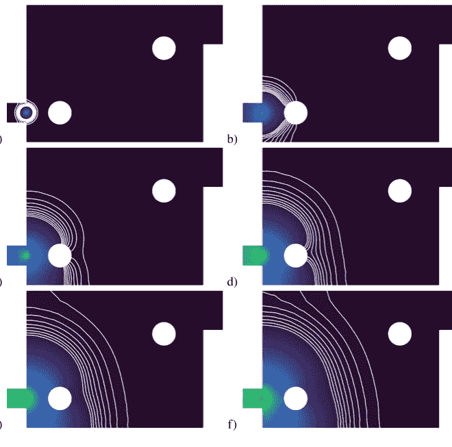

a) b) c) d) e) f)


0.0 0.5 1.0 1.5 2.0 2.5 3.0 3.5 4.0
[u1](mg/L)

**图 14.1** 由第 14.1.2 节程序计算的浓度场，在 6 个不同时刻，$t = 0.03$ s, 0.33 s, 1.0 s, 1.66 s, 2.33 s, 3.00 s。可以注意到，由于两个圆形岛屿的存在，施加了无滑移边界条件以及周围的边界条件，从而形成了特定的模式。

```python
from dolfinx.io.gmshio import read_from_msh

"""
File handling
"""
simulationName = "Diff_React-2D"
meshName = "aquifer2D"
meshPath = "./meshes_gmsh/" + meshName + ".msh"
resultPath = "./result/" + simulationName + "/"

"""
Load external mesh that was generated using GMSH.
The external mesh has dimension=3 although the
z-coordinates are just zeros. Therefore, we use
gdim=2, to specify the actual dimension of the
problem.
"""
domain, cell_tags, ft = io.gmshio.read_from_msh(
    filename=meshPath,
    comm=MPI.COMM_WORLD,
    rank=0,
    gdim=2)
gdim = domain.topology.dim  # domain dimension
fdim = gdim - 1  # facet dimension

"""
We define the start and stop time of the
simulation. The values are same as that
used in the Navier-Stokes to help make a
comparison.
"""
t_start = 0.0
t_stop = 3.0
delta_t = 1 / 1500
n_steps = int((t_stop - t_start) / delta_t)  # N steps

"""
These constants are defined as they are
to be used in the weak form of the PDE.
"""
dt_inv = fem.Constant(
    domain=domain,
    c=PETSc.ScalarType(1 / delta_t))
Rate = fem.Constant(
    domain=domain,
    c=PETSc.ScalarType(0.01))
D_coeff = fem.Constant(
    domain=domain,
    c=PETSc.ScalarType(0.3))

"""
Here, we define the element type
and the function space to solve
for the concentration of the
reactant.
"""
P_elem = ufl.FiniteElement(
    family="Lagrange",
    cell=domain.ufl_cell(),
    degree=1)
V = fem.FunctionSpace(
    mesh=domain,
    element=P_elem)
v1 = ufl.TestFunction(function_space=V)
u1 = fem.Function(V=V)
u1n = fem.Function(V=V)
u1.name = "concentration"
u1n.name = "concentration"

class SourceExpression:
    """
    We define the source location and its
    magnitude that would go into the weak
    form. The (x, y) location is specified
    using 'ptSrc_xy' argument.
    The magnitude is specified as 10.0.
    """

    def __init__(self, t_, ptSrc_xy):
        self.t = t_
        self.ptSrc_xy = ptSrc_xy

    def eval(self, x):
        values = np.full(x.shape[1], 0.0)
        idx = ((x[0] - self.ptSrc_xy[0]) ** 2) + \
              ((x[1] - self.ptSrc_xy[1]) ** 2) < 0.05 ** 2
        values[idx] = 100.0  # Strength of the source
        return values

# Inheriting from the source function class definition
source = SourceExpression(t_=0.0,
                         ptSrc_xy=[0.50, 0.75])

# Interpolating into a function
f = fem.Function(V=V)
f.interpolate(u=source.eval)

# Variational formulation
F = ((u1 - u1n) * dt_inv) * v1 * dx
F = F + D_coeff * dot(grad(u1), grad(v1)) * dx
F = F + Rate * u1 * v1 * dx
F = F - f * v1 * dx

"""
The current diffusion reaction equation,
although solvable by a linear solver, we
deliberately do away with a nonlinear
solver because one may wish to model a
case where the rate of decomposition of
the contaminant may at times be nonlinear.
Newton solver is good in such cases.
"""
problem = fem.petsc.NonlinearProblem(
    F=F,
    u=u1)
solver = nls.petsc.NewtonSolver(
    comm=MPI.COMM_WORLD,
    problem=problem)
solver.rtol = 1e-6
solver.report = True

"""
We use the open file format '.xdmf' to store
the results of the simulation. We first write
the mesh followed by the function. The mesh is
written just once; then in the time loop we
only write the function values as the mesh can
now be shared during visualization.
"""
xdmfu = XDMFFile(
    comm=domain.comm,
    filename=resultPath + simulationName + ".xdmf",
    file_mode="w",
    encoding=XDMFFile.Encoding.HDF5)
xdmfu.write_mesh(mesh=domain)
xdmfu.write_function(
    u=u1,
    t=t_start)

"""
There is no velocity term in this system. We only
model the contaminant spread due to diffusion.
"""

t = t_start
for n in range(n_steps):
    print("Doing {}/{} step".format(n, n_steps))
    t = t + delta_t
    r = solver.solve(u=u1)
    u1n.x.array[:] = u1.x.array
    xdmfu.write_function(
        u=u1,
        t=t)
xdmfu.close()
print("Done!")
```

在第 87–105 行，定义了点源的类。`__init__` 方法用于初始化类的实例。`__eval__` 方法用于在指定索引处评估函数。指定了一个半径为 0.05 的源，对于所有位于此半径内的坐标，函数求值为 100。该类可以通过点源的位置和时间来调用。在第 104 行，指定了污染物源的强度（当前为 100.0）；该类在第 109 和 110 行被调用。一个定义在函数空间 `V` 上的函数 `f` 通过源表达式进行插值。

在第 116–120 行，我们定义了问题的弱形式。公式中没有平流项。扩散系数、反应速率和源项强度在模拟中起着重要作用。

在第 122–138 行，我们将问题类型指定为非线性，求解器类型为“Newton”。

在第 141–156 行，指定了文件操作对象。我们首先写入网格和相关时间。文件模式指定为“w”（写操作），编码为“hierarchical data format or HDF5”。

在第 158–173 行，我们指定了从 `n = 0` 到 `n = 1499` 运行的时间循环。在每次迭代中，我们首先将当前时间 `t` 增加 `Δt`；求解变量 `u1`；并将解再次赋值给 `u1n` 以及相关的时间步长。在下一次迭代中，`u1n` 中存储的值将用作上一次的解。

###### 14.1.3 后处理

所有后处理均在 Paraview 软件中完成。第 14.1.2 节中的程序将结果保存为“.xdmf”格式。这些是开源文件格式，可以被 Paraview 直接加载。该文件包含从 t = 0.00 到 t = 3.00 的 1500 个时间步长的模拟数据。这与 Navier-Stokes 模拟保持一致。图 14.1 是通过选择“Surface”类型表示并根据加载网格中变量的大小进行“Coloring”绘制的。图 14.1a–f 是通过从软件中的“Time”下拉菜单中选择适当的时间值生成的。Paraview 应用程序默认使用“Cool to Warm”颜色图。一个更好的替代方案是“Turbo”颜色图，这里用于绘制图形。可以看到，即使在结束时间值，由于使用了这种通用的颜色图，污染物的扩散仍然可见。

###### 14.1.4 结果讨论

图 14.1 显示了模拟由扩散和反应过程控制的污染物传输问题的结果。图中的等高线显示了污染物扩散的外围。可以观察到，随着时间的推移，当远离位于 (x, y) = (0.50, 0.75) 的源时，浓度值逐渐降低。在所有时间步长中，扩散似乎均匀分布；这是由于控制方程中没有任何平流项。任何平流项的存在都会破坏这种均匀性。正如后面章节所见，当包含平流项时，我们可以看到修改后的模式。

##### 14.2 二维扩散平流模型

在本节中，我们模拟一个污染物同时经历扩散和平流的情景。此类模型非常适合涉及水运动的污染物传输。这种运动可以很容易地与 X 和 Y 方向的速度相关联，从而在平流过程中体现出来。

###### 14.2.1 变分形式

扩散-对流场景的控制方程强形式可以表示为

$$\frac{\partial[u]}{\partial t} + \mathbf{w} \cdot \nabla[u] + \nabla \cdot (D\nabla[u]) = f \quad (14.3)$$

其中 $[u]$ 是污染物的浓度，$\mathbf{w}$ 是流体速度，常数 $D$ 是扩散系数。与方程 14.3 对应的弱形式可以表述为

$$\int_{\Omega} \frac{1}{dt} \langle u - u_n, v \rangle dx + \int_{\Omega} \langle \mathbf{w} \cdot \nabla u, v \rangle dx + \int_{\Omega} D \langle \nabla u, \nabla v \rangle dx = \int_{\Omega} (fv) dx \quad (14.4)$$

###### 14.2.2 Python 代码

本节列出了对流-扩散过程的代码。我们首先在第 13–23 行加载必要的库。从第 25–33 行，我们设置模拟类型的名称，并指定外部生成网格的位置以及保存结果的路径。

在第 36–47 行，加载网格以及单元标签和面标签；变量“gdim”和“fdim”分别对应于域的维度和面的维度。

在第 50–58 行，提供了模拟的开始和停止时间。中间的步数给定为 1500。

从第 60 到 69 行，我们定义了时间变化倒数和扩散系数的常数，其类型为“PETSc scalar”。这有利于并行处理；在当前程序中，所有操作都是串行化的。

在第 71–88 行，我们将有限元类型定义为“Lagrange”，单元类型从导入的网格中推断；单元类型是三角形。浓度变量是标量，因此使用该有限元类型。我们还在函数空间“V”上定义了一个名为“v1”的测试函数。“u1”和“u1n”是用于保存求解器解值的函数。我们摒弃了试函数，因为我们将问题视为非线性问题，这意味着使用“dolfinx”的牛顿求解器。

```python
"""
用于求解扩散-对流方程的程序，
以模拟污染物输运问题。
给定源函数的位置和强度（浓度），
我们研究反应物浓度随空间和时间的变化。
为了使可视化效果更佳，
我们从纳维-斯托克斯模拟输出中加载速度数据。
"""

# 我们首先加载必要的库
import h5py
import numpy as np
from mpi4py import MPI
from petsc4py import PETSc
import ufl
from dolfinx import fem, nls, io
from ufl import (dot, dx, grad)
from dolfinx.io import XDMFFile
from dolfinx.io.gmshio import read_from_msh
import tqdm.autonotebook

"""
文件处理块
"""
simulationName = "Diff_Adv-2D"
meshName = "aquifer2D"
meshPath = "./meshes_gmsh/" + meshName + ".msh"
velocityDataPath = "./result/" \
                   "Stream_NS-2D/velocity_timeseries.h5"
resultPath = "./result/" + simulationName + "/"

"""
我们加载相同的网格，该网格是使用 GMSH 外部生成的，
也用于纳维-斯托克斯模拟。
"""
domain, cell_tags, ft = io.gmshio.read_from_msh(
    filename=meshPath,
    comm=MPI.COMM_WORLD,
    rank=0,
    gdim=2)
gdim = domain.topology.dim  # 域维度
fdim = gdim - 1  # 面维度
```

```python
"""
我们定义模拟的开始和停止时间。
这些值与纳维-斯托克斯模拟中使用的相同，
因为我们希望读取其速度数据。
"""
t_start = 0.0
t_stop = 3.0
delta_t = 1 / 1500
n_steps = int((t_stop - t_start) / delta_t)  # N 步

"""
这些常数被定义是因为它们将用于
偏微分方程的弱形式中。
"""
dt_inv = fem.Constant(
    domain=domain,
    c=PETSc.ScalarType(1 / delta_t))
D_coeff = fem.Constant(
    domain=domain,
    c=PETSc.ScalarType(0.03))

"""
在这里，我们定义单元类型和函数空间，
以求解反应物的浓度。
"""
P1 = ufl.FiniteElement(
    family="Lagrange",
    cell=domain.ufl_cell(),
    degree=1)
V = fem.FunctionSpace(
    mesh=domain,
    element=P1)
v1 = ufl.TestFunction(function_space=V)
u1 = fem.Function(V=V)
u1n = fem.Function(V=V)
u1.name = "concentration"
```

```python
u1n.name = "concentration"

"""
在这里，我们定义一个向量单元和相应的函数空间、
函数，用于从纳维-斯托克斯模拟中加载速度（向量）数据。
"""
Pvec = ufl.VectorElement(
    family="Lagrange",
    cell=domain.ufl_cell(),
    degree=2)
W = fem.FunctionSpace(
    mesh=domain,
    element=Pvec)
w = fem.Function(V=W)

class SourceExpression:
    """
    我们定义源的位置及其强度，
    这将用于弱形式中。
    (x, y) 位置通过 'ptSrc_xy' 参数指定。
    强度指定为 10.0。
    """
    def __init__(self, t_, ptSrc_xy):
        self.t = t_
        self.ptSrc_xy = ptSrc_xy

    def eval(self, x):
        values = np.full(x.shape[1], 0.0)
        idx = ((x[0] - self.ptSrc_xy[0]) ** 2) + \
              ((x[1] - self.ptSrc_xy[1]) ** 2) < 0.05 ** 2
        values[idx] = 100.0  # 源的强度
        return values

# 继承自源函数类定义
source = SourceExpression(t_=0.0,
                          ptSrc_xy=[0.25, 0.75])

# 插值到一个函数中
f = fem.Function(V=V)
```

## 14.2 二维扩散-对流模型

```python
f.interpolate(u=source.eval)

"""
在这里，我们定义偏微分方程的弱形式。
'w' 是在向量函数空间 'W' 上定义的函数，
它保存速度场的值。这个速度取自之前的
纳维-斯托克斯模拟。
"""
F = ((u1 - u1n) * dt_inv) * v1 * dx
F = F + dot(w, grad(u1)) * v1 * dx
F = F + D_coeff * dot(grad(u1), grad(v1)) * dx
F = F - f * v1 * dx

"""
当前的对流反应方程，虽然可以通过线性求解器求解，
但我们特意摒弃了线性求解器，而使用非线性求解器，
因为人们可能希望模拟污染物分解速率有时是非线性的情况。
牛顿求解器对此很擅长。
"""
problem = fem.petsc.NonlinearProblem(
    F=F,
    u=u1)
solver = nls.petsc.NewtonSolver(
    comm=MPI.COMM_WORLD,
    problem=problem)
solver.rtol = 1e-6
solver.report = True

"""
我们使用开放文件格式 '.xdmf' 来存储模拟结果。
我们首先写入网格，然后写入函数。网格只写入一次；
在时间循环中，我们只写入函数值，因为网格在可视化时会被共享。
"""
```

```python
xdmfu = XDMFFile(
    comm=domain.comm,
    filename=resultPath + simulationName + ".xdmf",
    file_mode="w",
    encoding=XDMFFile.Encoding.HDF5)
xdmfu.write_mesh(mesh=domain)
xdmfu.write_function(
    u=u1,
    t=t_start)

"""
我们从纳维-斯托克斯模拟中加载速度数据文件。
速度向量 (u_i, u_j) 用于实现方程的对流部分。
因为数据是以 HDF5 格式存储的，所以我们使用 h5py 库来加载数据。
这在“求解”方程之前完成。
"""
with h5py.File(
        name=velocityDataPath, mode='r') as fr:
    print("Name of the velocity variable is {}".format(
        list(fr.keys())))

    # 时间步进和求解
    progress = tqdm.autonotebook.tqdm(
        desc="Solving nonlinear system",
        total=n_steps
    )
    t = t_start
    for n in range(n_steps):
        print("Doing {}/{} step".format(n, n_steps))
        t = t + delta_t
        u_data = fr['u'][n]
        w.vector.array = u_data
        r = solver.solve(u=u1)
        u1n.x.array[:] = u1.x.array
        xdmfu.write_function(
            u=u1,
            t=t)
    xdmfu.close()
fr.close()
print("Done!")
```

在第 90–104 行，定义了用于创建向量有限元空间的代码，以加载预先保存的纳维-斯托克斯模拟速度数据。

在第 107–124 行，定义了源表达式的类，通过它我们定义了三个参数——污染物源的强度、源在域内的位置以及相关的时间。

###### 14.2.3 后处理

所有后处理工作均在 Paraview 软件中完成。第 14.2.2 节中的程序将结果保存为“.xdmf”格式。这些文件是开源格式，可直接由 Paraview 加载。文件包含了从 t = 0.00 到 t = 3.00 共 1500 个时间步的模拟数据。这与纳维-斯托克斯模拟保持一致。图 14.2 是通过选择“Surface”类型表示，并根据加载网格中变量的幅值进行“Coloring”绘制的。图 14.2a–f 是通过在软件中从“Time”下拉菜单中选择相应的时间值生成的。Paraview 应用程序默认使用“Cool to Warm”颜色映射表。一个更好的替代方案是“Turbo”颜色映射表，此处绘制图形时使用了它。借助这种多功能的颜色映射表，即使在结束时间值处，也能看到污染物的扩散。

###### 14.2.4 结果讨论

本节我们演示了一个扩散-平流模型。图 14.2 展示了受这两个过程支配的污染物传输的模拟结果。在时间 t = 0.03 s、0.33 s、1.0 s、1.66 s、2.33 s、3.00 s 的浓度数据快照分别显示在 (a) 至 (f) 部分。由于模型的平流分量，污染物被输送到域内呈现特定模式的区域。从图中可以看出，污染物逐渐覆盖了域内更大的区域。源被指定在点 (0.25, 0.75)。

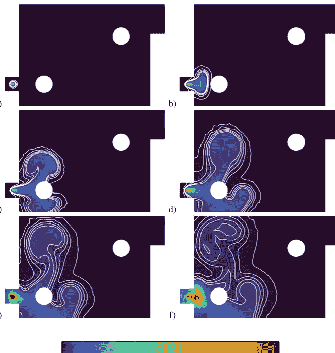

**图 14.2** 由第 14.2.2 节程序计算的浓度场，在 6 个不同时间点，$t = 0.03$ s、0.33 s、1.0 s、1.66 s、2.33 s、3.00 s。可以注意到，由于存在两个圆形岛屿施加无滑移边界条件以及周围边界，出现了特定的模式。

传输模式正是由此产生的；如果源指定在其他地方，我们会预期出现不同的模式。由于这是一个平流和扩散过程，参数——$D$ 和 $\mathbf{w}$——在模拟中起着重要作用。

##### 14.3 广义二维平流、扩散、反应模型

本节我们开发一个广义的平流、扩散、反应模型。我们特别模拟这样一个场景：一种反应性污染物在经历平流和扩散的同时，以与其浓度 $[u]$ 成正比的速率衰减，这意味着反应速率遵循一级动力学。

###### 14.3.1 变分公式

该模型控制方程的强形式给出为

$$\frac{\partial[u]}{\partial t} + \mathbf{w} \cdot \nabla[u] + \nabla \cdot (D\nabla[u]) = f - R[u] \quad (14.5)$$

其中 $[u]$ 是污染物的浓度，$w$ 是流速，$D$ 是扩散系数，$R$ 是反应速率。

与方程 14.5 对应的弱形式给出为

$$\int_{\Omega} \frac{1}{dt} \langle u - u_n, v \rangle dx + \int_{\Omega} \langle \mathbf{w} \cdot \nabla u, v \rangle dx + \int_{\Omega} D \langle \nabla u, \nabla v \rangle dx = \int_{\Omega} (fv - Ruv) dx \quad (14.6)$$

变分公式在整个域上施加了齐次诺伊曼边界条件，因此，在代码中没有提及边界条件。

###### 14.3.2 Python 代码

这里，我们给出平流、扩散、反应模型的完整代码。在指定的 Conda 环境中安装所有必要的库后，程序即可运行。尽管程序已详细注释，对于任何修改都应不言自明，但我们仍描述一些被认为非常重要且需要解释的部分。

在第 13–23 行，我们加载程序所需的库。在第 26–33 行，我们设置模拟名称、外部网格文件路径、速度数据文件路径以及用于保存解文件的结果文件夹路径。用户可以在本地将其修改为适当的位置。

```python
"""
用于求解平流、扩散、反应方程的程序，
以模拟污染物传输问题。给定源函数的
位置和强度（浓度），我们研究反应物
浓度随空间和时间的扩散。为了使可视化
效果更佳，我们从纳维-斯托克斯模拟
输出中加载速度数据。
"""

# 我们首先加载必要的库
import h5py
import numpy as np
from mpi4py import MPI
from petsc4py import PETSc
import ufl
from dolfinx import fem, nls, io
from ufl import (dot, dx, grad)
from dolfinx.io import XDMFFile
from dolfinx.io.gmshio import read_from_msh
import tqdm.autonotebook

"""
文件处理块
"""
simulationName = "Adv_Diff_React-2D"
meshName = "aquifer2D"
meshPath = "./meshes_gmsh/" + meshName + ".msh"
velocityDataPath = "./result/" \
                   "Stream_NS-2D/velocity_timeseries.h5"
resultPath = "./result/" + simulationName + "/"

"""
我们加载相同的网格，该网格使用 GMSH
外部生成，也用于纳维-斯托克斯模拟。
"""
domain, cell_tags, ft = io.gmshio.read_from_msh(
    filename=meshPath,
    comm=MPI.COMM_WORLD,
    rank=0,
    gdim=2)
gdim = domain.topology.dim  # 域维度
```

```python
fdim = gdim - 1  # 面维度

"""
我们定义模拟的开始和停止时间。
这些值与纳维-斯托克斯模拟中使用的
相同，因为我们希望读取其速度数据。
"""
t_start = 0.0
t_stop = 3.0
delta_t = 1 / 1500
n_steps = int((t_stop - t_start) / delta_t)  # 步数 N

"""
这些常量被定义是因为它们将用于
偏微分方程的弱形式中。
"""
dt_inv = fem.Constant(
    domain=domain,
    c=PETSc.ScalarType(1 / delta_t))
Rate = fem.Constant(
    domain=domain,
    c=PETSc.ScalarType(0.9))
D_coeff = fem.Constant(
    domain=domain,
    c=PETSc.ScalarType(0.03))

"""
这里，我们定义单元类型和函数空间，
用于求解反应物的浓度。
"""
P1 = ufl.FiniteElement(
    family="Lagrange",
    cell=domain.ufl_cell(),
    degree=1)
V = fem.FunctionSpace(
    mesh=domain,
    element=P1)
vl = ufl.TestFunction(function_space=V)
ul = fem.Function(V=V)
uln = fem.Function(V=V)
ul.name = "concentration"
```

```python
uln.name = "concentration"

"""
这里，我们定义一个向量单元和相应的
函数空间、函数，用于从纳维-斯托克斯
模拟中加载速度（向量）数据。
"""
Pvec = ufl.VectorElement(
    family="Lagrange",
    cell=domain.ufl_cell(),
    degree=2)
W = fem.FunctionSpace(
    mesh=domain,
    element=Pvec)
w = fem.Function(V=W)

class SourceExpression:
    """
    我们定义源的位置及其将进入弱形式的
    幅值。(x, y) 位置使用 'ptSrc_xy' 参数指定。
    幅值指定为 10.0。
    """
    def __init__(self, t_, ptSrc_xy):
        self.t = t_
        self.ptSrc_xy = ptSrc_xy

    def eval(self, x):
        values = np.full(x.shape[1], 0.0)
        idx = ((x[0] - self.ptSrc_xy[0]) ** 2) + \
              ((x[1] - self.ptSrc_xy[1]) ** 2) < 0.05 ** 2
        values[idx] = 100.0  # 源的强度
        return values

# 继承自源函数类定义
source = SourceExpression(t_=0.0,
                          ptSrc_xy=[0.25, 0.75])

# 插值到一个函数中
f = fem.Function(V=V)
```

##### 14.3 广义二维平流、扩散、反应模型

```python
f.interpolate(u=source.eval)

"""
Here, we define the weak formulation
of the partial differential equation.
'w' is a function defined on a vector
function space 'W' that holds the value
of the velocity field. This velocity
is taken from a previous Navier-Stokes
simulation.
"""
F = ((u1 - u1n) * dt_inv) * v1 * dx
F = F + dot(w, grad(u1)) * v1 * dx
F = F + D_coeff * dot(grad(u1), grad(v1)) * dx
F = F + Rate * u1 * v1 * dx
F = F - f * v1 * dx

"""
The current advection reaction equation,
although solvable by a linear solver, we
deliberately do away with a nonlinear
solver because one may wish to model a
case where the rate of decomposition of
the contaminant may at times be proportional
to a nonlinear expression of the concentrations
of the reactants. Newton solver is good with them.
"""
problem = fem.petsc.NonlinearProblem(
    F=F,
    u=u1)
solver = nls.petsc.NewtonSolver(
    comm=MPI.COMM_WORLD,
    problem=problem)
solver.rtol = 1e-6
solver.report = True

"""
We use the open file format '.xdmf' to store
the results of the simulation. We first write
the mesh followed by the function. The mesh is
written just once; in the time loop we only
write the function values as the mesh gets
shared during visualization.
"""
xdmfu = XDMFFile(
    comm=domain.comm,
    filename=resultPath + simulationName + ".xdmf",
    file_mode="w",
    encoding=XDMFFile.Encoding.HDF5)
xdmfu.write_mesh(mesh=domain)
xdmfu.write_function(
    u=u1,
    t=t_start)

"""
We load the velocity data file from the Navier-Stokes
simulation. The velocity vector (u_i, u_j) is used
to realize the advection part of the equation.
Because the data was stored in HDF5 format, we employ
h5py library to load the data. This is done just before
'solving' the equation.
"""
with h5py.File(
        name=velocityDataPath, mode='r') as fr:
    print("Name of the velocity variable is {}".format(
        list(fr.keys())))

    # Time stepping and solving
    progress = tqdm.autonotebook.tqdm(
        desc="Solving nonlinear system",
        total=n_steps
    )
    t = t_start
    for n in range(n_steps):
        print("Doing {}/{} step".format(n, n_steps))
        t = t + delta_t
        u_data = fr['u'][n]
        w.vector.array = u_data
        r = solver.solve(u=u1)
        u1n.x.array[:] = u1.x.array
        xdmfu.write_function(
            u=u1,
            t=t)
    xdmfu.close()
fr.close()
print("Done!")
```

从第35–46行，我们加载了使用GMSH网格生成软件生成并保存的网格。第40–44行加载了网格对象、单元标签和面片标签对象。在我们的网格中，没有任何单元标签；我们只有面片标签，并且需要识别边界以设置边界条件。面片的维度必须比网格的维度小1，因此有第45和46行。

在第48–57行，我们定义了时间离散化参数，如初始时间、结束时间以及计算解的步数。我们指定在0到3秒的时间间隔内进行1500次计算。

接下来，在第59–71行，我们定义了程序中稍后将使用的常数。这里，“fem”是“dolfinx”库的别名，其中关键字“Constant”为加载的“domain”或网格定义了一个常数；“c”指定了常数的值，其类型为“PETSc.ScalarType”。这种数据类型是PETSc库的原生类型，“dolfinx”内部使用该库来求解非线性问题。

在第73–90行，我们为加载的网格定义了有限元类型和族。加载的网格已经包含“三角形”元素，并通过“domain.ufl_cell”进行适当引用。我们指定了1阶的拉格朗日基形函数——适用于处理浓度变量的标量类型数据。对象“V”用于存储“FunctionSpace”对象，其中定义了“Lagrange”类型的P1元素；在有限元模型中，函数空间是将网格单元与元素类型（此处为拉格朗日）关联起来的一种方式。“v1, u1, u1n”是在“V”函数空间上定义的测试函数、函数和函数。我们还为这些函数赋予了合适的名称——“concentration”。

在第93–106行，我们为加载的网格定义了有限元类型和族。加载的网格已经包含“三角形”元素，并通过“domain.ufl_cell”进行适当引用。我们指定了2阶的拉格朗日基形函数；更高的阶数意味着更高的精度，但代价是额外的计算。“W”和“w”定义了域上的“函数空间”和一个“函数”。“V”在这里是一个参数，期望一个“FunctionSpace”对象。“Pvec”被定义为向量，因为我们打算从Navier-Stokes模拟中将预先保存的速度（向量）数据加载到其中。

在第109–126行，我们定义了一个源函数类。类便于定义与时间相关的源。“__init__”方法用于分配时间和源位置坐标的初始值。“__eval__”方法用于评估源的值。第123–124行在半径小于0.05时将坐标标记为布尔值“True”，有助于指定一个较大的圆形源。如果找到源的索引为真，则分配一个值100。在第129–135行，我们以初始时间值0.0和位置坐标(0.25, 0.75)调用源类。在第134–135行，我们在“V”函数空间上定义一个函数，并使用插值方法在指定的（索引 = True）坐标处赋值100。

在第137–150行，我们定义了平流、扩散、反应问题的变分公式。

在第152–169行，我们设置了解算器对象；第162–164行指定了问题类型“NonlinearProblem”；变分形式F以及我们希望求解的因变量u1。

第172–187行通过指定“w”选项（写操作）定义了文件输出操作；“domain.comm”与并行处理有关（当前设置为串行操作）。编码指定了存储场变量数据的文件格式（此处为二进制分层数据格式或HDF5）。我们首先写入网格对象，然后在第185–187行写入函数值和相关的时间步长。

从第189–220行，我们指定了按顺序求解问题的时间循环。在第197–200行，我们使用“with”上下文管理器在“fr”对象中读取（r）速度数据文件。第202–206行用于显示进度条。在第210行，我们使用值“delta_t”增加时间，因为对应于“t_initial”的函数已经在第187行写入。在第211行，我们从一个带有“u”键的字典类型对象中提取第*n*步的值；该值在第212行被赋给“w”函数。一旦速度向量被加载，在第213行，我们调用“solve”方法来求解“u1”；其解随后被存储到“u1n”中。这个“u1n”随后用于在循环中为下一个时间步长提供浓度值。

最后，我们关闭文件对象以将数据保存到硬盘。

###### 14.3.3 后处理

所有后处理均在Paraview软件中完成。第14.3.2节中的程序将结果保存为“.xdmf”格式。这些是开源文件格式，可以被Paraview直接加载。该文件包含从*t* = 0.00到*t* = 3.00共1500个时间步长的模拟数据。这与Navier-Stokes模拟保持一致。图14.3是通过选择“Surface”类型表示并根据加载网格中变量的幅值进行“Coloring”绘制的。图14.3a–f是通过在软件的“Time”下拉菜单中选择适当的时间值生成的。Paraview应用程序默认使用“Cool to Warm”颜色图。一个更好的替代方案是“Turbo”颜色图。即使在结束时间值，也可以看到污染物的扩散。

图14.4是通过选择“Surface With Edges”表示并将“Coloring”选项设置为“Solid Color”绘制的。粉红色节点是通过在渲染的网格窗口中执行“Select Points Through (g)”操作产生的。这些节点代表含水层的左上岸，将用于提取所有时间步长的浓度值。因此，每个节点的数据都是一个时间序列，便于进一步计算。图14.5是通过进行以下统计计算生成的——第一和第三四分位数、均值、最大值和最小值。使用了一个单独的Python程序来生成这些图表。

###### 14.3.4 结果讨论

在本节中，我们展示了一个污染物经历平流、扩散和反应的污染物传输模型。结果如图14.3a–f所示。每张图都在二维平面上显示了浓度*u*的等高线图。污染物源放置在位置(0.25, 0.75)（参见代码第14.3.2节中的第130和131行）。该程序模拟了污染物从该源位置向域内其他部分的传输。可以

##### 14.3 广义二维平流、扩散、反应模型

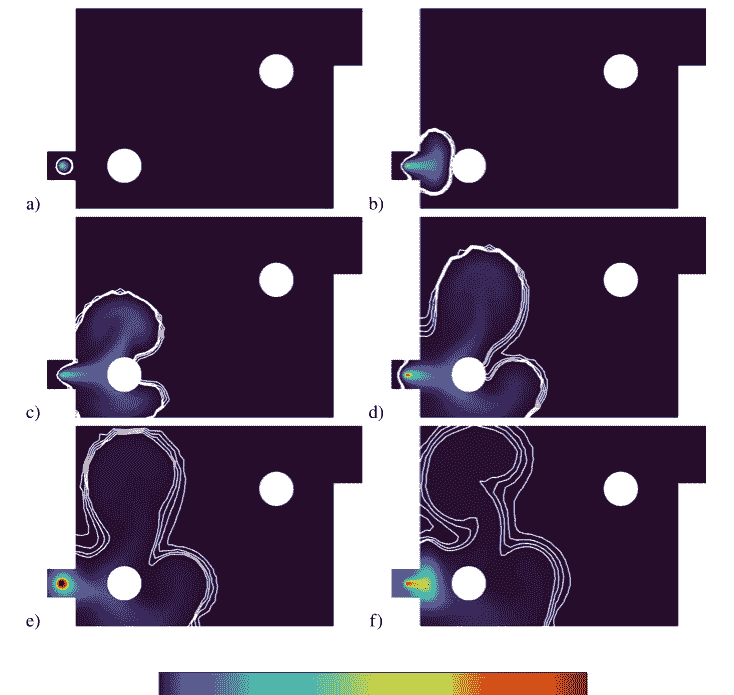

**图 14.3** 由第 14.3.2 节程序计算的浓度场，在 6 个不同时刻（$t = 0.03$ s, 0.33 s, 1.0 s, 1.66 s, 2.33 s, 3.00 s）的分布。可以注意到，由于两个圆形岛屿施加了无滑移边界条件以及周围边界的影响，出现了特定的模式。

随着时间的推移，等值线覆盖了更大的区域，其形状由速度矢量决定。该速度对组合输运过程的平流分量有贡献。

除了源的位置，源的强度也已指定（参见第 14.3.2 节代码第 125 行）。这决定了在指定位置添加的污染物量。较高的值确保污染物添加量增加，反之亦然。同样，可以在域中指定具有不同强度的多个源。

**图 14.4** 我们打算记录域左上岸随时间变化的浓度统计数据。图中显示了用于计算的选定节点（粉色）。

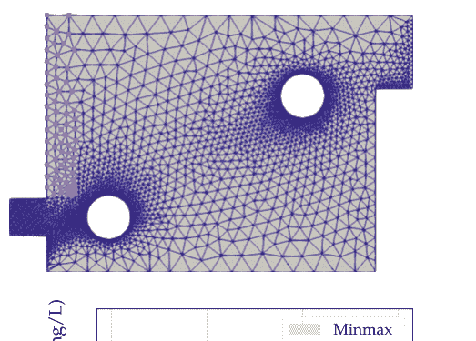

**图 14.5** 三种污染物输运模型的浓度数据统计：**a** 扩散反应，**b** 扩散-平流，和 **c** 平流-扩散反应。内部色带（深灰色）表示第一和第三四分位数。外部色带（浅灰色）表示在节点处记录的浓度的最小值和最大值。选定的节点如图 14.4 所示。

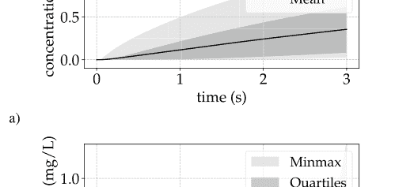

a)

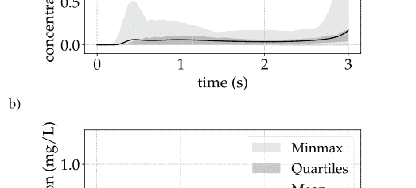

b)

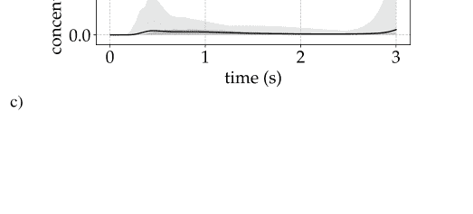

c)

与第 14.1 和 14.2 节先前模型获得的结果相比，等值线的模式看起来相当有趣。常数 $D$ 和 $R$ 在确定扩散量和污染物衰减速率方面起着重要作用。较高的 $D$ 值将确保以扩散为主导的输运过程。反应速率 $R$ 有助于指定污染物在给定浓度下衰减的速度；较小的值会诱导平流、扩散型模式，而较高的值则会削弱这些过程的影响。

有趣的是，等值线的几何模式看起来与平流、扩散过程的模式相似。原因很明显——反应速率（当前为 0.9）不够强，无法掩盖平流和扩散过程的贡献。

监测污染物浓度随时间演变的过程通常很有意义。利用已开发的模型，我们对含水层模型的左上岸执行了此任务。我们跟踪了如图 14.4 所示计算节点处的浓度演变。在图 14.5 中，我们展示了由于三种模型记录的浓度值的统计数据。

在图 14.5a 中，扩散反应模型显示浓度值持续增加。平均值呈正斜率，并迅速上升到约 0.3 的值。部分 (b) 和 (c) 由于反应速率适中，显示出类似的统计模式，尽管仍然可以注意到，在部分 (b) 的平流反应模型中，统计值明显高于部分 (c) 的广义平流扩散反应模型。

### 第 15 章 结论

Python 已成为水文学、环境和气候应用中最受欢迎的语言之一。在本教科书中，我们提供了大量可用于常见数据分析和数值建模需求的代码。

第一部分从 Python 基础开始。我们强调了像 Python 这样的开源编程语言的优势，以及它们如何满足各种数据类型的需求。在强调集成编程环境（如 Jupyter notebook、Anaconda Python 发行版及其关联的包管理器）的必要性的同时，也强调了虚拟环境的重要性。涵盖了编程的基本语法，突出了 Python 的功能能力及其处理多种数据结构的准备就绪性。我们还讨论了多功能 Python 库 Pandas 提供的数据操作能力，以及强大的绘图库 Matplotlib 的示例。

第二部分涉及水文学中的统计建模。多个程序的实现证明了 Python 科学计算包的多功能性。我们使用了 SciPy、statsmodels 和 scikit-learn 等库进行曲线拟合、回归分析和时间序列模型拟合。有一章专门介绍假设检验，展示了 Python 语言支持统计测试的简便性。不确定性估计章节展示了 SciPy 等 Python 库在量化数据不确定性方面的灵活性。这通过能够输出置信区间、预测区间和蒙特卡洛不确定性传播的代码进行了说明。

本书第三部分强调了 Python 在数值建模方面的优势，我们利用 FEniCSx 的简洁性在不同场景下定义有限元问题。进行了渗流模拟和地下水流模拟。我们演示了如何使用 FEniCSx 有限元库简化数值问题的公式化。我们还展示了 Numpy 库如何帮助执行明渠流模拟和求解二维浅水方程。PyVista 和 Matplotlib 等可视化库有助于绘制结果并在不同阶段创建三维可视化。

在第四部分，FEniCSx 证明了其在解决污染物输运问题方面的多功能性。我们深入研究了涉及平流、扩散和反应及其组合的二维输运问题的公式化。另一个开源包 GMSH 在为各种模拟创建计算域时也展现了其多功能性。该包可以创建无错误的计算网格，供有限元程序使用。结果是一个端到端的有限元设计、处理和后处理框架，可以很好地适应不同的数值建模问题。

深入的文档和开源性质的结合，使 Python 成为应对水与环境科学复杂挑战的无与伦比的选择。随着全球对可持续水与环境管理的关注日益增强，本书将为专业人士提供工具和知识，使其处于前沿。