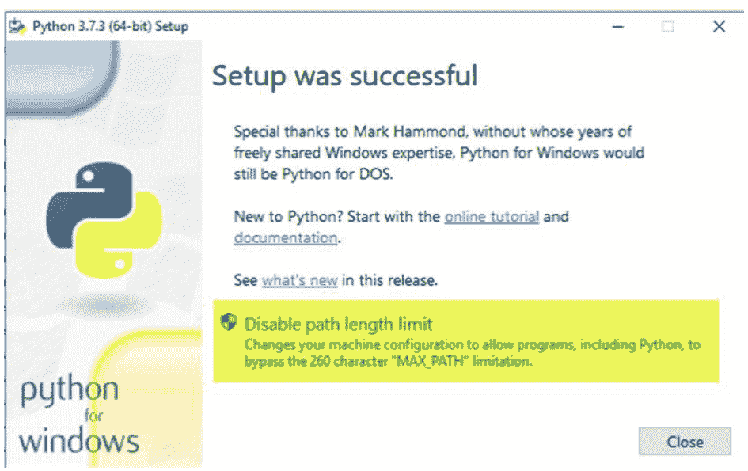
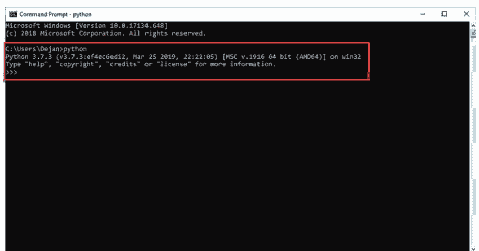
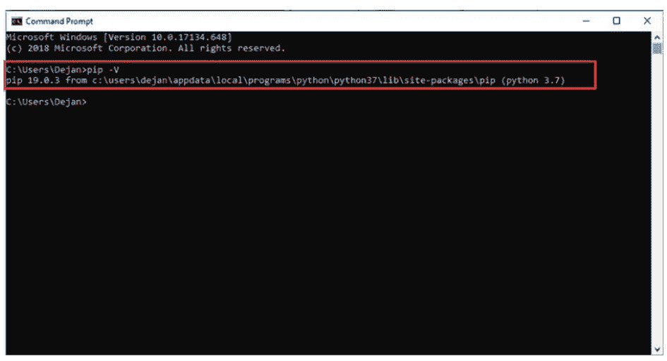
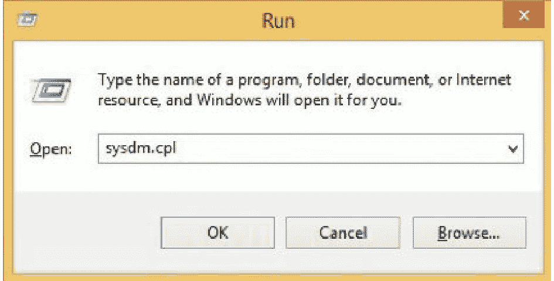
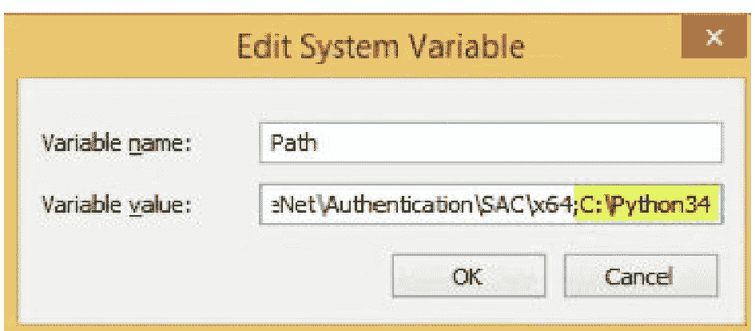
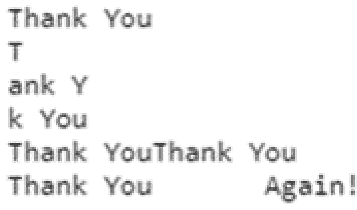
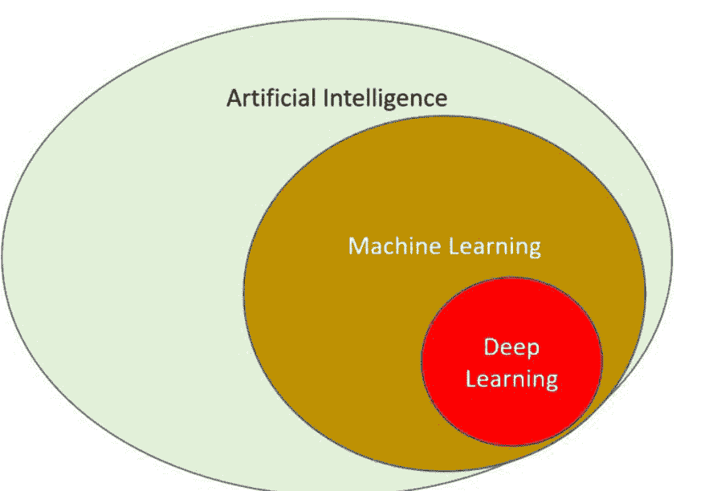
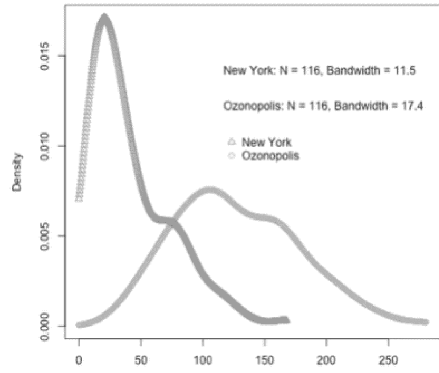
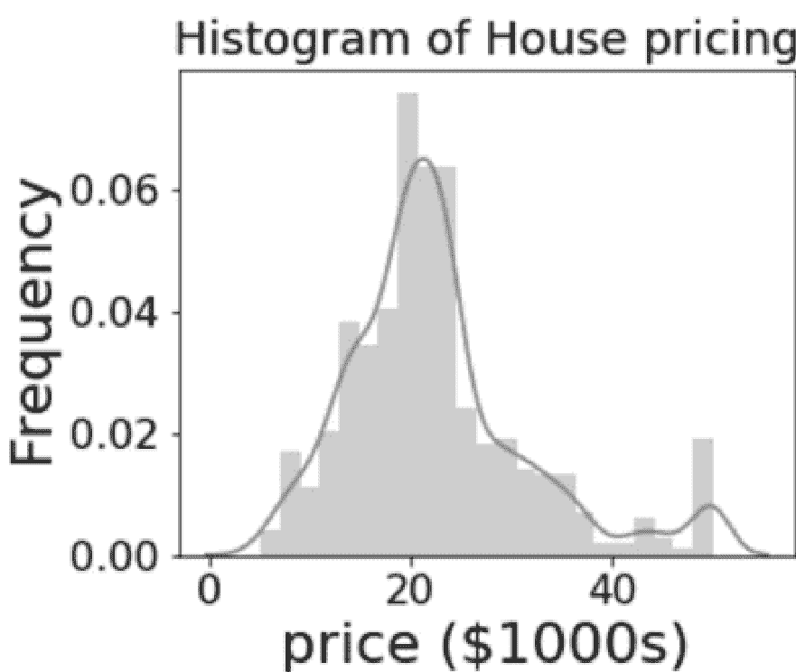

# PYTHON FOUNDATION

Michail Kölling

本书包含

PYTHON FOR BEGINNERS, MACHINE LEARNING, PYTHON DATA SCIENCE.

Python for Beginners

Python Data Science

Machine Learning

Michail Kölling

Michail Kölling

Michail Kölling

Michail Kölling

## Python foundation

First published by Michail Kölling 2022

Copyright © 2022 by Michail Kölling

All rights reserved. No part of this publication may be reproduced, stored or transmitted in any form or by any means, electronic, mechanical, photocopying, recording, scanning, or otherwise without written permission from the publisher. It is illegal to copy this book, post it to a website, or distribute it by any other means without permission.

First edition

This book was professionally typeset on Reedsy
Find out more at [reedsy.com](https://reedsy.com)

### Contents

I. PYTHON PROGRAMMING FOR BEGINNERS

- Introduction
- Fundamental basics
- Datatype in python
- Variables Operator
- Loops & variable function
- Working with files
- Object-oriented
- Python list basic
- Python work list - tuples in python
- Classes
- Flow Control
- Python Dictionary
- Make your codes
- Conclusion

II. PYTHON DATA SCIENCE

- Introduction
- Data Science & Analysis
- NumPy introduction
- Manipulation data with Pandas
- Visualization with Matplotlib
- Machine learning
- Conclusion

III. PYTHON MACHINE LEARNING

- Introduction
- What Is Machine Learning?
- Machine Learning Types Process
- Machine Learning Rules and Models
- Big Data Analysis
- Algorithms
- Machine Learning in Real Life
- Machine Learning
- Build With Python Step by Steps
- Conclusion

## PYTHON PROGRAMMING FOR BEGINNERS

After work guide to start learning Python on your own. Ideal for beginners to study coding with hands on exercises and projects for a new possible job career.

### Introduction

Computers, learning how to code, and even making some of your games and apps. This is one of the best languages to get started because it is simple, based on the English language, and many of those who decide to get started with a coding language will naturally fall with this one. This guidebook is going to take some time to discuss the Python language and help you to learn some of the basics that come with it to help you to get started.

While the Python language is a simple and basic language that is perfect for the beginner, it also has a lot of power that you are going to enjoy when creating your codes. Inside this guidebook, you are going to learn everything that you need to get started with the Python language and to make it work well for your needs!

This book is primarily for people who are relatively new to programming and, more specifically, those who want to discover the world of Python. This book will take you through the fundamentals of programming and Python.

Computer programming sounds scary, but it really isn’t. The hardest part is choosing which language you want to learn because there are so many to choose from. Python is one of the easiest of all of computer programming languages; indeed, pretty much everything you need is right there, at your disposal. All you need to do is learn how to use what the program gives you to write programs.

Go ahead and read through the entire book, get the knowledge, and be informed about the key things that you need to know about this particular topic.

If you are as excited as I am to learn everything Python and how to program with it, let us get started.

### Fundamental basics

#### Python Distributions and Versions

Python’s developers have made it more versatile and powerful as new ideas and technologies emerge. The latest version of Python is 3.7, but this book should run on 3.6 or later. This section determines if Python is installed on your system and if a newer version is needed. Appendix A includes a guide for installing Python on all major operating systems.

You should use Python 3, but some old projects still use Python 2. Python 2 is probably on your system to support more senior programs. We’ll leave this installation alone and get you a newer version.

#### Python Implemented on Various Operating Systems

Python is a cross-platform programming language, which means that it is compatible with and can be used on all of the most popular operating systems. Any Python program that you write should work on any modern computer that has Python installed, provided that the computer meets certain requirements. However, the procedures for installing Python on various operating systems are only slightly different from one another.

You are going to learn how to install Python on your computer in the following section. First, you will check to see if the most recent version of Python is already installed on your computer, and if it is not, you will proceed to install it. After that, you will install the Sublime Text program. These are the only two steps that change depending on which operating system you’re using.

You are going to run the Hello World! program in the following sections, and then you are going to troubleshoot anything that didn’t work. I will take you step by step through this process for each operating system, so that you will have an environment for programming in Python that is suitable for beginners.

#### Prerequisites for installation on Windows

- Windows 10 with admin privileges
- Command Prompt
- Windows 10 with admin privileges Windows Python 3

#### Step 1: Select Version of Python to Install

In order to install Python, you need to download the official .exe installer and run it on your computer.

Which Python version you need depends on your needs. If your project uses Python 2.6, you’ll need that version. If you are beginning a project from scratch, you have complete freedom of choice.

If you’re learning Python, download Python 2 and 3. Working with Python 2 allows you to work on older projects or test new projects for backward compatibility.

Working with Python 2 allows you to work on older projects or test new projects for backward compatibility.

> Note: If you’re installing Python on a remote Windows server, use Remote Desktop Protocol (RDP). Once logged in, the installation is the same as on a local Windows machine.

#### Step 2: Download Python Executable Installer

1. Visit the Python website’s Downloads for Windows page.
2. Search for Python. The latest Python 3 version is 3.7.3 and the latest Python 2 version is 2.7.16.
3. Download the Windows x86-64 or Windows x86 executable installer. It’s 25MB.

Note: If your Windows installation is 32-bit, the Windows x86 executable installer is required. If your version of Windows is 64-bit, you must download the executable installer for Windows x86-64. There is no cause for concern if you install the “incorrect” version. Uninstalling one version of Python and installing another is possible.

#### Step 3: Run Executable Installer

1. After downloading the Python Installer, run it. (In this example, Python 3.7.3 has been downloaded.)
2. Ensure the Install launcher for all users and Add Python 3.7 to PATH checkboxes are selected. The latter option positions the interpreter within the execution path. Step 6 applies to older versions of Python that do not support the Add Python to Path checkbox.
3. Select the recommended installation options by selecting Install Now.

Pip and IDLE are the recommended installation options for all recent Python versions. There’s a chance that these extra features aren’t available in earlier versions.

4. You’ll be given the option to Disable path length limitation in the next dialog. Python will be able to bypass the

#### 步骤 4：检查电脑上是否已安装 Python

如果选择此选项，路径长度限制为 260 个字符。因此，Python 现在可以使用长路径名。



“禁用路径长度限制”选项不会影响其他系统设置。如果启用此选项，在 Linux 上开发的 Python 项目可能会出现名称长度问题。

+   1. 找到并访问电脑上安装 Python 的目录。由于我们安装的是 Python 3.7，路径为 `C:\Users\Username\AppData\Local\Programs\Python\Python37`。
+   2. 双击 `python.exe` 文件以开始安装过程。
+   3. 输出应如下所示：



> 注意：也可以使用命令 `python -V` 来查看安装是否已完成。输出中应显示 Python 的版本。本例中我们使用的是 “Python 3.7.3”。

#### 步骤 5：确保已安装 Pip

如果您选择安装旧版本的 Python，Pip 可能未预装。您可以使用 Pip（一个强大的包管理系统）来管理您的 Python 软件。因此，请检查它是否已设置好。大多数 Python 包应使用 Pip 安装，尤其是在虚拟环境中。要查看 Pip 是否已安装，请运行以下命令。

+   1. 首先，在“开始”菜单中输入 “cmd”。
+   2. 打开“命令提示符”程序。
+   3. 在命令行中输入命令 `pip -V` 以查看输出。如果您已成功安装 Pip，您将看到以下输出：



该输出表明 Pip 尚未安装：系统无法识别包含字符串 “pip” 的内部或外部命令、可运行程序或批处理文件。

#### 步骤 6：将 Python 路径添加到环境变量（可选）

如果您的 Python 安装程序版本不包含“将 Python 添加到 PATH”复选框，或者您未选择该选项，我们建议您执行此过程。

当 Python 路径配置到系统变量时，不需要完整路径。它告诉 Windows 在 PATH 中搜索 “python”，并在安装文件夹中定位 `python.exe` 文件。



+   1. 可以通过从“开始”菜单中选择“运行”来启动“运行”。
+   2. 输入 `sysdm.cpl` 并按 Enter 键。这将打开“系统属性”窗口，您可以在其中调整各种设置。
+   3. 从“高级”选项卡中选择“环境变量”。
+   4. 在“系统变量”下找到并选择 Path 变量。
+   5. 单击“编辑”按钮。
+   6. 单击“变量值”字段以打开“变量值”对话框。添加以分号分隔的 `python.exe` 文件路径（;）。下图中已添加 `";C:\Python34"`。



单击“确定”后，所有窗口都将关闭。设置完成后，可以运行这样的 Python 脚本：`script.py`。而不是 `C:/Python34/Python script.py`，请使用：如您所见，它已被简化并更易于使用。

#### 步骤 7：安装 virtualenv 虚拟化软件（可选）

您已经拥有了 Python，并且拥有 Pip 来管理您安装的包。Virtualenv 是您需要的最后一款软件。使用 Virtualenv，您可以在本地计算机上的虚拟环境中隔离您的 Python 项目。

使用 virtualenv 有什么好处？默认情况下，Python 软件包会安装在整个系统中。因此，对单个项目特定包的任何更改都会影响您所有的 Python 项目。为避免这种情况，最简单的解决方案是为每个项目使用单独的虚拟环境。

要启动并运行 virtualenv，请按照以下说明操作：

+   1. 打开“开始”菜单并输入 “cmd”。
+   2. 选择“命令提示符”应用程序。
+   3. 在控制台中输入以下 pip 命令：
    `C:\Users\Username> pip install virtualenv`

过程完成后，Virtualenv 现已安装在您的计算机上。

要了解更多关于 Windows 包管理器中的 winget 命令的信息，请参阅我们关于如何使用 winget 更新包的文章。

#### 总结

本指南将向您展示如何在 Windows 计算机上设置 Python 3.7.3。如果您升级到更新版本的 Python，可以预期类似的过程。

有关如何执行此操作的更多信息，请查看我们关于如何将 Python 升级到 3.9 版本的文章。

如果您在同一台计算机上处理多个项目，请确保已安装 Pip 并使用虚拟环境。

新一代的服务器脚本语言现已可供您测试。要了解更多关于如何在 Windows 10 上安装 Ruby 的信息，请参阅本指南。

是时候编码了！

#### 安装和设置 Sublime Text

您需要从位于 https://sublimetext.com/ 的网站下载 Sublime Text 编辑器的安装程序，才能成功安装它。单击“下载”链接后，搜索与 macOS 兼容的安装程序。下载完成后，打开安装程序文件，然后将 Sublime Text 图标拖到计算机上的“应用程序”文件夹中。

#### macOS 上的 Python

大多数 macOS 计算机都预装了 Python，但操作系统附带的版本可能太旧，您不会想用它来学习。本节的第一步是安装最新版本的 Python。之后，下一步是安装 Sublime Text 并确保其正确配置。

#### 验证 Python 3 的存在

应用程序 - 实用工具 - 终端 打开一个终端。按 command - 空格键，输入 terminal，然后按回车。输入 `python`（小写 p）以查看安装了哪个版本的 Python 并运行 Python 命令。您应该会看到输出，告诉您安装了哪个 Python 版本，以及一个 `>>>` 提示符，您可以在其中输入 Python 命令。

```
$ python
Python 2.7.15 (default, Aug 17 2018, 22:39:05)
[GCC 4.2.1 Compatible Apple LLVM 9.1.0 (clang-902.0.39.2)] on darwin Type “help”, “copyright”, “credits”, or “license” for more information. >>>
```

此输出显示当前安装的是 Python 2.7.15。按 Ctrl-D 或输入 `exit()` 以退出 Python 并返回终端提示符。

要检查 Python 3，请输入 `python3`。如果未安装 Python 3，您将收到错误消息。如果您有 Python 3.6 或更高版本，请跳至第 8 页的“在终端会话中运行 Python”。如果尚未安装 Python 3，则必须手动安装。当您在本书中看到 `python` 命令时，请使用 `python3` 以确保您使用的是 Python 3，而不是 Python 2；它们差异足够大，使用 Python 2 运行本书中的代码会遇到问题。

如果您看到低于 3.6 的 Python 版本，请安装最新版本。

#### Linux 和 Python

几乎所有 Linux 计算机都已预装 Python，因为该操作系统是为编程而设计的。编写和维护 Linux 的人员期望并鼓励您进行自己的编程。因此，在开始编程之前，几乎不需要安装任何东西，只需要更改一些设置。

#### 执行 Python 版本检查

安装终端应用程序后，您可以在计算机上打开一个终端窗口（在 Ubuntu 中，您可以按 ctrl-alt-T）。输入 `python3`（小写 p）将显示您计算机上当前运行的 Python 版本。如果已安装 Python，此命令将启动 Python 解释器。将出现一个 `>>>` 提示符，您可以在其中开始输入 Python 命令，这表明已安装了哪个版本的 Python。

```
$ python3
Python 3.7.2 (default, Dec 27 2018, 04:01:51)
[GCC 7.3.0] on linux
Type “help”, “copyright”, “credits” or “license” for more information.
>>>
```

#### 使用终端运行 Python

正如你在验证 Python 版本时所做的那样，你可以通过打开终端并输入 `python3` 来尝试运行代码片段。在 Python 运行时，在终端会话中输入以下命令：

```
>>> print("Hello Python interpreter!")
Hello Python interpreter!
>>>
```

为确保消息出现在当前终端窗口中，请直接在那里打印。可以使用 Ctrl-D 或命令 `exit()` 来关闭 Python 解释器。

#### HELLO WORLD 程序

通过点击图标或在系统搜索栏中输入 "Sublime Text" 来启动 Sublime Text。从浏览器的下拉菜单中选择 Tools > Build System > New Build System 来打开一个新的配置文件。删除你看到的所有内容并输入：

```
{
    "cmd": ["python3", "-u", "$file"],
}
```

你可以使用此代码告诉 Sublime Text 使用你系统的命令来运行你的 Python 程序。当你选择保存时，Sublime Text 会将文件保存在默认目录中。文件名为 `Python3.sublime-build`。

#### Hello World.py

在编写你的第一个程序之前，创建一个 python 工作文件夹。Python 文件和文件夹名称应使用小写字母和下划线来表示空格。

打开 Sublime Text 并将 `hello_world.py` 保存在你的 python 工作文件夹中。`.py` 扩展名告诉 Sublime Text 你的文件包含 Python 代码，因此它可以运行程序并高亮显示文本。

保存后，在文本编辑器中输入这一行：

```
print("Hello Python world!")
```

如果 python 命令在你的系统上有效，请从菜单中选择 Tools > Build 或按 Ctrl-B（macOS 上为 command-B）。如果你在上一节中配置了 Sublime Text，请选择 Python 3。要运行程序，请选择 Tools > Build 或按 Ctrl-B（或 command-B）。

Sublime Text 的终端窗口应显示以下输出：

```
Hello Python world!
[Finished in 0.1s]
```

如果你没有看到这个，程序可能出错了。检查输入的每个字符。你是否打错了字？你是否忘记了引号或括号？编程语言需要特定的语法；没有它，你会得到错误。有关程序运行提示，请参阅下一节。

##### 诊断

如果 `hello_world.py` 无法运行，请尝试以下通用编程解决方案：

- 当程序出现严重错误时，Python 会显示回溯错误报告。Python 会扫描文件以查找错误。回溯可能会揭示程序无法运行的原因。
- 休息一下，然后重试。即使缺少冒号、引号不匹配或括号不匹配也会导致程序无法运行。重新阅读本章和你的代码以找到错误。
- 重启。你可能不需要卸载任何软件，但你可以删除 `hello_world.py` 并重新开始。
- 观察其他人在你的电脑或另一台电脑上按照本章的步骤操作。有人可能发现了你遗漏的步骤。
- 向 Python 专家寻求设置帮助。如果你四处询问，你可能会认识一个 Python 用户。
- 本章的设置说明可在 https://nostarch.com/pythoncrashcourse2e/ 获取。你可以从在线说明中剪切和粘贴代码。
- 在线帮助。附录 C 包括论坛和实时聊天网站，你可以在那里向遇到过你问题的人寻求帮助。

你不会惹恼经验丰富的程序员。每个程序员都曾遇到过困难，大多数人都会帮助你设置你的系统。如果你解释你正在尝试做什么、你尝试过什么以及结果，有人可能会提供帮助。正如引言中所述，Python 社区对初学者非常友好。

任何现代计算机都应该能运行 Python。早期的设置问题令人沮丧，但值得解决。一旦 `hello_world.py` 运行起来，你就可以学习 Python，你的编程能力也会提高。

#### 从 Windows、macOS 和 Linux 终端运行 Python 程序

##### Windows

大多数文本编辑器程序可以直接从编辑器运行。但有时使用终端更好。你可以在不编辑程序的情况下运行它。

在任何安装了 Python 的系统上，你都可以访问程序文件的目录。确保 `hello_world.py` 在你桌面的 python 工作文件夹中。

```
C:\> cd Desktop\python_work
C:\Desktop\python_work> dir
hello_world.py
C:\Desktop\python_work> python hello_world.py
Hello Python world!
```

你应该首先使用 `cd` 命令移动到 python 工作文件夹，该文件夹应位于 Desktop 文件夹内。之后，你运行 `dir` 命令以检查 `hello_world.py` 文件是否位于正确的文件夹中（第二行）。然后，你通过执行命令 `python hello_world.py` 来测试该文件。

你的大多数程序应该可以直接从编辑器运行而没有任何问题。然而，随着你的工作性质变得更加复杂，你会发现你需要从终端执行某些程序。

##### macOS 和 Linux

Linux 和 macOS 都允许 Python 终端编程。在终端会话中，使用 `cd` 更改目录。`ls` 显示当前目录中的非隐藏文件。

打开一个终端窗口并运行 `hello_world.py`：

```
~$ cd Desktop/python_work/
~/Desktop/python_work$ ls
hello_world.py
~/Desktop/python_work$ python hello_world.py
Hello Python world!
```

你可以首先使用 `cd` 命令进入你将存储 python 工作文件的 Desktop 文件夹。下一步是使用 `ls` 命令验证 `hello_world.py` 文件是否在正确的位置（第二行）。然后，在命令提示符下输入 `python hello_world.py` 来执行文件。就这么简单。Python 脚本是用 `python`（或 `python3`）命令执行的。

#### 总结

在本章中，你了解了 Python，并在你的系统上安装了它（如果尚未安装）。安装文本编辑器使编写 Python 代码变得更容易。你在终端中运行了 Python 代码片段和 `hello_world.py`。你可能还学会了故障排除。

接下来，你将学习 Python 数据类型和变量。

#### Python 中的数据类型

##### Python 数据类型

我们需要了解的下一件事是 Python 数据类型。Python 中的每个值都有一种数据类型。

##### Python 数字

我们可以处理 Python 数据的第一个选项包括 Python 数字。这些将包括复数、浮点数甚至整数。它们在 Python 中将被定义为 `complex`、`float` 和 `int` 类。例如，我们可以使用 `type()` 函数来识别一个值或一个变量属于哪个类别，然后使用 `isinstance()` 函数来检查一个对象是否属于某个特定的类。

当我们处理整数时，它们可以是任意长度的，唯一的限制是你计算机上可用的内存。然后是浮点数。这可以精确到小数点后 15 位，尽管你也可以选择更少的位数。

浮点数将由小数点分隔。`1` 将是一个整数，而 `1.0` 将是一个浮点数。

最后，我们有复数。这些是我们想要写成 `x + yj` 形式的数字，其中 `x` 是实部，`y` 是虚部。我们需要将这两部分组合在一起，以构成这种数字所需的复数形式。

#### Python 列表

Python 列表将是一个有序的项目集合。它将是 Python 中最常用的数据类型之一，并且非常灵活。

列表中出现的所有项目可以是相同的类型，但这不是必需的。你可以在列表中使用许多不同的项目，而无需它们是相同的类型，这使得使用起来更容易。

能够声明列表将是一个我们可以使用的简单选项。项目将是

#### Python中的索引从0开始。

元素之间用逗号分隔，然后我们只需要将它们放在一些方括号内，像这样：[ ]。我们也可以使用切片运算符来帮助我们从列表中获取一部分或一组项目。

在使用这些时，我们必须记住列表是可变的。

这意味着列表中元素的值可以被更改或更新。

Python中的列表将是最基本的数据结构，因为它们属于序列。

列表中的所有元素都将被分配一个编号。换句话说，它们都有一个被分配的位置。

列表不仅简单，而且用途广泛。

创建列表时，对象之间用逗号分隔，所有这些对象都将位于一组方括号内。

列表中的项目不必是相同的数据类型。

##### 示例

```
First list = [ 'science', 'history', 2002, 2030 ];
Second list = [ 2, 4, 6, 8, 10 ];
Third list = ["b", "d", "e", "g"]
```

列表的索引将从零开始，并且你将能够对其进行切片以创建子列表。

##### 获取列表中的值。

当你想要获取列表中的一个值时，你可以在特定索引处对其进行切片。

##### 示例：

```
#! usr bin/ python
First list = [ 'science', 'history', 2002, 2030 ];
Second list = [ 2, 4, 6, 8, 10 ];
Print "first list [ 2 ] : ", first list [ 2 ]
Print "second list [ 2:4 ] : ", second list [ 2 : 4 ]
Output
First list [ 2 ]: history
Second list [ 2:4 ] : [ 4, 6, ]
```

#### Python字符串

Python字符串是用引号括起来的一系列字符。使用任何类型的引号来括起Python字符串，即单引号、双引号或三引号。要访问字符串元素，我们使用切片运算符。字符串字符从索引0开始，这意味着第一个字符串字符位于索引0。这在你需要访问字符串字符时很有用。要在Python中连接字符串，我们使用+运算符，星号(*)用于重复。

##### 示例：

```
#!usrbin/python3
thanks = 'Thank You'
print (thanks) # to print the complete string
print (thanks[0]) # to print the first character of string
print (thanks[2:7]) # to print the 3rd to the 7th character of string
print (thanks[4:]) # to print from the 5th character of string
print (thanks * 2) # to print the string two times
print (thanks + "\tAgain!") # to print a concatenated string
```

程序执行后打印以下内容：



注意，我们有以#符号开头的文本。该符号表示注释的开始。Python的print语句不会处理从该符号到行尾的文本。注释旨在通过解释来增强代码的可读性。我们定义了一个名为thanks的字符串，其值为Thank You。print (thanks[0])语句帮助我们访问字符串的第一个字符。因此它打印T。你还注意到两个单词之间的空格也被计为一个字符。

我们可以使用单引号或双引号来显示我们的字符串，但我们需要确保开始时使用的引号类型与结束时使用的相同，否则会给编译器造成一些混淆。

我们甚至可以借助三引号来处理多行字符串。

就像我们接下来将看到的使用元组或上面讨论的列表一样，切片运算符也可以用于我们的字符串。就像我们在元组中看到的那样，我们会发现字符串是不可变的。

#### Python集合

列表中的下一个是Python集合。集合将是Python中的一个选项，它将包含一个无序的唯一项目集合。集合将由我们可以在花括号中用逗号分隔的值来定义。集合中的元素是无序的，因此我们可以以任何我们喜欢的方式使用它们。

我们可以选择同时执行这组操作，比如对两个集合进行并集或交集运算。

我们使用的集合将包含唯一值，它们将确保我们消除重复项，因为集合将是一个无序的集合。集合没有顺序。因此，切片运算符不适用于这种选项。

#### Python列表

列表由方括号（[]）内的项目组成，项目之间用逗号（,）分隔。它们类似于C数组。虽然所有数组元素必须属于相同类型，但列表支持在单个列表中存储属于不同类型的项目。

我们使用切片运算符（[ ] 和 [:]）来访问列表的元素。索引从0开始，到-1结束。此外，加号（+）表示连接运算符，而星号（*）表示重复运算符。

##### 示例：

```
#!usrbin/python3
listA = [ 'john', 3356, 8.90, 'sister', 34.21 ]
listB = [120, 'sister']
print listA # will print the complete list
print listA[0] # will print the first element of the list
print listA[1:3] # will print the elements starting from the 2nd till 3rd
print listA[2:] # will print the elements starting from the 3rd element
print listB * 2 # will print the list two times
print listA + listB # will print a concatenated lists
```

与之前处理字符串的代码相比，上面代码中发生的事情没有太大区别。执行时，程序输出：

在语句“print listA”中，我们打印listA的内容。请注意，每个元素在其索引处被视为一个整体，例如，元素‘john’被视为索引0处的单个列表元素。

```
['john', 3356, 8.9, 'sister', 34.21]
john
[3356, 8.9]
[8.9, 'sister', 34.21]
[120, 'sister', 120, 'sister']
['john', 3356, 8.9, 'sister', 34.21, 120, 'sister']
```

#### Python元组

元组将类似于列表，因为它们将是一个对象序列，但它们将是不可变的。

你可以使用一组括号或不使用括号来创建元组，你只需要确保在元组中不同对象之间使用逗号即可。

##### 示例：
Tup1 = ( 'science', 'history', 2002, 2030 )
Tup2 = ( 5, 9, 7, 4, 2 )
Tup3 = "f", "b", "e", "t"

要编写一个将返回为空的元组，它将使用tuple函数和一组空括号。

我们也可以使用称为Python元组的东西。元组将是一个有序的组件序列，它与列表相同，有时很难看出它们将如何相似以及它们将如何不同。

我们将看到的元组和列表之间的巨大区别在于元组将是不可变的。

元组一旦创建，就无法修改。

元组用于写保护数据，并且通常比列表更快，因为它们不能动态改变。它将用括号()确定，其中的项目也将像我们看到的列表一样用逗号分隔。

然后我们可以使用切片运算符来帮助我们提取一些我们想要使用的组件，但我们在处理代码或程序时仍然无法更改值。

Python元组类似于列表，区别在于创建元组后；你不能添加、删除或更改元组元素。元组元素应括在括号()内。

##### 示例：

```
#!usrbin/python3
t1 = () # creating an empty tuple, that is, no data
t2 = (22,34,55)
t3 = tuple([10,23,78,110,89]) # creating a tuple from an array
t4 = tuple("xyz") # creating tuple from a string
print t1
print t2
print t3
print t4
```

4个元组的值将被打印：

```
()
(22, 34, 55)
(10, 23, 78, 110, 89)
('x', 'y', 'z')
```

有许多函数可以应用于元组。

##### 示例：

```
#!usrbin/python3
t1 = (23, 11, 35, 19, 98)
print("The minimum element in the tuple is", min(t1))
print("The sum of tuple elements is", sum(t1))
print("The maximum element in the tuple is", max(t1))
print("The tuple has a length of", len(t1))
```

执行时，它给出以下结果：元组中的最小元素是 11
元组元素的总和是 186
元组中的最大元素是 98
元组的长度为 5

首先，我们调用了 `min()` 函数，它返回元组中的最小元素。然后我们调用了 `sum()` 函数，它返回了元组元素的总和。`max()` 函数返回了元组中的最大元素。`len()` 函数计算了元组中的所有元素并返回了它们的数量。

你可以使用切片运算符来访问元组中的部分元素，而不是全部。

示例：

```python
t = (23, 26, 46, 59, 64)
print(t[0:2])
```

执行后，它会打印：

(23, 26)

我们使用了切片运算符来访问元组中从索引 0 到索引 2 的元素。请注意，元组元素从索引 0 开始。

#### Python 字典

Python 字典用于存储键值对。通过字典，你可以使用键来检索、删除、添加或修改值。字典也是可变的，这意味着你可以在声明后更改它们的值。

要创建字典，我们使用花括号。每个字典项都有一个键，后跟一个冒号，然后是一个值。各项之间用逗号 (,) 分隔。

示例：

```python
classmates = {
    'john' : '234-221-323',
    'alice' : '364-32-141'
}
```

我们创建了一个名为 `classmates` 的字典，其中包含两个项。请注意，键必须是可哈希的类型，但你可以使用任何值。每个字典键必须是唯一的。第一个元素 `john` 是键，后面是值。在第二个元素中，`alice` 是键。要访问字典元素，请使用字典名称和键。

示例：

```python
classmates = {
    'john' : '234-221-323',
    'alice' : '364-32-141'
}
print("The number for john is", classmates['john'])
print("The number for alice is", classmates['alice'])
```

最后两条语句帮助我们访问字典值。它会打印：

```
The number for john is 234-221-323
The number for alice is 364-32-141
```

要了解字典长度，请运行 `len()` 函数，如下所示：

```python
len(classmates)
```

上述代码将返回 2，因为字典只有两个元素。

在使用 Python 时，字典将在花括号内定义，每个组件都是 `key: value` 形式的组合。根据你要编写的代码类型，键和值可以是任何你想要的类型。我们也可以使用键来帮助我们检索所需的相应值。但我们完全无法反过来以这种方式工作。

处理不同类型的数据对于你在 Python 编码中能做的所有工作都非常重要，并且在需要处理数据科学时也能帮助你。

查看 Python 语言中可用的不同类型数据，看看这对于你想要编写的任何代码和算法来说是多么棒，尤其是在你的数据科学项目中。

##### 数据类型转换

Python 允许你将数据从一种类型转换为另一种类型。从一种数据类型转换为另一种类型的过程称为类型转换。

如果你需要将 `int` 数据类型转换为 `float`，你可以调用 `float()` 函数。

示例：

```python
height = 20
print("The value of height in int is", height)
print("The value of height in float is", float(height))
```

在上面的示例中，`height` 被初始化为 20。我们调用了 `float()` 函数并将 `height` 作为参数传递给它。整数值，即 20，已被转换为浮点数值，即 20.0。程序打印以下内容：

```
The value of height in int is 20
The value of height in float is 20.0
```

要将浮点数转换为整数，你可以调用 **`int()`** 函数。示例：

```python
height = 20.0
print("The value of height in float is", height)
print("The value of height in int is", int(height))
```

程序打印以下内容：

```
The value of height in float is 20.0
The value of height in int is 20
```

我们调用了 `int()` 函数并将参数 `height` 传递给它。它将 20.0 转换为 20，这是从浮点数到整数的转换。

如果你需要将数字转换为字符串，你可以调用 `str()` 函数。该数字将被转换为字符串。

示例：

```python
num = 20
print("The value of num in int is", num)
print("The value of num in string is", str(num))
```

程序输出：

```
The value of num in int is 20
The value of num in string is 20
```

尽管值相同，但 Python 解释器对它们的处理方式不同。将浮点数转换为字符串也可以类似地完成。

#### 变量运算符

**Python 运算符**
运算符是表示特定过程实现的符号。它们用于操作程序中的数据。Python 使用不同类型的运算符。

#### 算术运算符

**加法 (+)**

加法运算符将运算符两侧的操作数相加：

```python
>>> 12 + 8
20
```

**减法 (-)**

减法运算符从左侧操作数的值中减去右侧操作数的值。

```python
>>> 40 - 3
37
```

**乘法 (*)**

乘法运算符将运算符左侧和右侧的值相乘：

```python
>>> 20 * 3
60
```

**除法 (/)**

除法运算符将左侧操作数除以右侧操作数的值：

```python
>>> 20 / 5
4.0
```

**幂运算 (**)**

幂运算符将第一个操作数提升到第二个操作数指定的幂次。

```python
>>> 4**4
256
```

**取模 (%)**

取模运算符在左侧操作数除以右侧操作数后返回余数。

```python
>>> 38 % 5
3
```

**整除 (//)**

整除运算符执行左侧操作数除以右侧操作数的操作，并返回整数商，同时舍弃小数部分。

```python
>>> 35 // 3
11
```

#### 比较运算符

| 运算符 | 含义 |
| :--- | :--- |
| == | 等于 |
| != | 不等于 |
| < | 小于 |
| > | 大于 |
| <= | 小于或等于 |
| >= | 大于或等于 |

##### 逻辑运算符

Python 支持 3 种逻辑运算符：

- or
- and
- not

`x or y` 如果 x 为假，则计算 y。否则，返回 x 的计算结果。

`x and y` 如果 x 为假，则返回 x 的计算结果。否则，如果 x 为真，则计算 y。

`not x` 如果 x 为假，返回 True。否则，如果 x 为真，返回 False。

#### 输入与输出

##### 输入

许多程序需要用户的输入才能运行。输入可以来自键盘、鼠标点击、数据库、外部存储或互联网等来源。键盘是收集用户输入最常见的渠道。因此，Python 提供了一个内置的 `input()` 函数来识别键盘输入。

###### input() 函数

Python 的 `input()` 函数通过一个称为提示字符串的可选参数来交互式地收集键盘输入。

每当调用输入函数时，程序都会显示提示字符串。程序执行会暂停，直到用户输入对提示的响应。

为了说明这个功能，这里有一个简单的程序，用于从用户那里收集姓名和年龄信息：

```python
name = input("Please type your name: ")
print("Welcome, " + name + "!")
age = input("How old are you, " + name + "? ")
print("Thank you. You are " + name + " and you're " + age + " years old.")
```

当你运行程序并输入 Marky 作为姓名，24 作为年龄时，屏幕将逐行显示以下内容：

```
Please type your name: Marky
Welcome, Marky!
How old are you, Marky? 24
Thank you. You are Marky and you're 24 years old.
```

##### 输出

Python 的内置 `print()` 函数用于将数据输出到屏幕，即标准输出设备。

`print` 命令的语法是：`print(value)`

以下是其用法示例：

```python
>>> print("I am a programming student.")
I am a programming student.
>>> print(25)
25
>>> print(4**3)
64
```

#### 输出或字符串格式化

格式化选项允许用户创建更具可读性的输出。Python 提供了 `str.format()` 方法来格式化字符串。

##### 使用花括号作为占位符

花括号 `{}` 用作 `str.format()` 语句中指定的格式化值的占位符。

如果 `str.format()` 语句中给出的参数位置与你期望的输出顺序一致，你可以在 `print` 语句中使用空花括号：

```python
>>> x = 50; y = 100
>>> print('The value of x is {} and y is {}.'.format(x,y))
The value of x is 50 and y is 100.
```

但是，如果你希望给定的参数以与其在 `str.format()` 语句中不同的顺序出现，你需要在花括号内指定它们的索引。第一个参数的索引为 0，第二个参数的索引为 1，依此类推。

使用上面的例子，假设你希望变量 b 的值出现在变量 a 的值之前：

```python
>>> x = 50; y = 100
>>> print('The value of y is {1} and x is {0}.'.format(x,y))
The value of y is 100 and x is 50.
```

以下是其他示例。这次，值本身是直接给出的，而不是存储在变量中：

```python
>>> print('I buy {}, {}, and {} coins.'.format('gold', 'silver', 'numismatic'))
I buy gold, silver, and numismatic coins.
```

```python
>>> print('I collect {2}, {0}, and {1} coins.'.format('gold', 'silver', 'numismatic'))
I collect numismatic, gold, and silver coins.
```

##### 使用 sprint() 风格的字符串格式化

Python 3 仍然支持使用与 C 语言相关的 `sprint()` 风格进行字符串格式化。

这是一个例子：

```python
>>> print('Catalog No.: %6d, Price per unit: %7.2f'% (6450, 159.8745))
Catalog No.: 6450, Price per unit: 159.87
```

请注意，第一个参数 6450 被格式化为最多打印 6 位数字（`%6d`）。由于只使用了 4 位数字，因此在输出中添加了 2 个前导空格。第二个参数被格式化为打印一个包含 7 位数字（包括 2 位小数）的浮点数（`%7.2f`）。由于只提供了两位小数，因此浮点数被四舍五入到两位小数。

上面的 `print` 语句使用字符串取模运算符来格式化字符串。你可以通过使用花括号和位置参数将此语句转换为字符串格式方法。写法如下：

```python
>>> print('Catalog No.: {0:6d}, Price per piece: {1:7.2f}'.format(6450, 159.8745))
Catalog No.: 6450, Price per piece: 159.87
```

Python 运算符帮助我们在操作中操作操作数的值。例如：

```
10 * 34 = 340
```

在上面的例子中，值 10 和 34 被称为操作数，而 `*` 被称为运算符。Python 支持不同类型的运算符。

#### 算术运算符

这些是用于执行基本数学运算的运算符。它们包括乘法（`*`）、加法（`+`）、减法（`-`）、除法（`/`）、取模（`%`）等。

示例：

```python
#!usr/bin/python3
n1 = 6
n2 = 5
n3 = 0
n3 = n1 + n2
print("The value of sum is: ", n3)
n3 = n1 - n2
print("The result of subtraction is: ", n3)
n3 = n1 * n2
print("The result of multiplication is:", n3)
n3 = n1 / n2
print("The result of division is: ", n3)
n3 = n1 % n2
print("The remainder after division is: ", n3)
n1 = 2
n2 = 3
n3 = n1**n2
print("The exponential value is: ", n3)
n1 = 20
n2 = 4
n3 = n1//n2
print("The result of floor division is: ", n3)
```

代码执行时打印以下内容：

```
The value of sum is: 11
The result of subtraction is: 1
The result of multiplication is: 30
The result of division is: 1.2
The remainder after division is: 1
The exponential value is: 8
The result of floor division is: 5
```

这就是 Python 中算术运算的工作方式。取模运算符（`%`）返回除法后的余数。在我们的例子中，我们将 6 除以 5，余数是 1。

#### 比较运算符

这些运算符用于比较操作数的值并确定它们之间的关系。它们包括等于（`==`）、不等于（`!=`）、小于（`<`）、大于（`>`）、大于或等于（`>=`）和小于或等于（`<=`）。

示例：

```python
#!usr/bin/python3
n1 = 6
n2 = 5
if ( n1 == n2 ):
    print ("The two numbers have equal values")
else:
    print ("The two numbers are not equal in value")
if ( n1 != n2 ):
    print ("The two numbers are not equal in value")
else:
    print ("The two numbers are equal in value")
if ( n1 < n2 ):
    print ("n1 is less than n2")
else:
    print ("n1 is not less than n2")
if (n1 > n2 ):
    print ("n1 is greater than n2")
else:
    print ("n1 is not greater than n2")
n1,n2=n2,n1 #the values of n1 and n2 will be swapped.
n1=5, n2=6
if ( n1 <= n2 ):
    print ("n1 is either less than or equal to n2")
else:
    print ("n1 is not less than or equal to n2")
if ( n1 >= n2 ):
    print ("n2 is either greater than or equal to n1")
else:
    print ("n2 is not greater than or equal to n1")
```

代码将打印以下内容：

```
The two numbers are not equal in value
The two numbers are not equal in value
n1 is not less than n2
n1 is greater than n2
n1 is either less than or equal to n2
n2 is either greater than or equal to n1
```

n1 的值是 6，而 n2 的值是 5。对两个操作数使用等于（`==`）运算符将返回 false，因为两个操作数不相等。这将导致执行 `else` 部分。不等于（`!=`）运算符将返回 true，因为两个操作数的值不相等。在这种情况下，唯一可能看起来复杂的逻辑是值的交换。n1 的值（原来是 6）变成了 5，而 n2 的值变成了 6。此交换语句下方的语句将使用这两个新值进行操作。

#### 赋值运算符

这些运算符是赋值运算符（`=`）与其他运算符的组合。赋值运算符的一个很好的例子是 `+=`。表达式 `p+=q` 意味着 `p=p + q`。表达式 `p/=q` 意味着 `p=p / q`。赋值运算符涉及将赋值运算符与其他运算符结合使用。

示例：

```python
#!usr/bin/python3
n1 = 6
n2 = 5
n3 = 0
n3 = n1 + n2
print ("The value of n3 is: ", n3)
n3 += n1
print ("The value of n3 is: ", n3)
n3 *= n1
print ("The value of n3 is: ", n3)
n3 /= n1
print ("The value of n3 ", n3)
n3 = 2
n3 %= n1
print ("The value of n3 is: ", n3)
n3 **= n1
print ("The value of n3 is: ", n3)
n3 //= n1
print ("The value of n3 is: ", n3)
```

代码执行时将打印以下内容：

```
The value of n3 is: 11
The value of n3 is: 17
The value of n3 is: 102
The value of n3 17.0
The value of n3 is: 2
The value of n3 is: 64
The value of n3 is: 10
```

语句 `n3 = n1 + n2` 非常直接，因为我们只是将 n1 的值加到 n2 的值上。在表达式 `n3 += n1` 中，我们将 n3 的值加到 n1 的值上，然后将结果赋给 n3。但是，请注意，在上一条语句中，n3 的值在将 n1 加到 n2 后变成了 `11`。所以我们有 11+6，结果是 17。之后，变量 n3 的新值将是 17。表达式 `n3 *= n1` 意味着 `n3= n3 * n1`。这将是 17 * 6，结果将是 102。这就是这些运算符在 Python 中的工作方式！

#### 成员运算符

这些是用于测试在特定元素序列中成员资格的运算符。元素序列可以是字符串、列表或元组。两个成员运算符包括 `in` 和 `not in`。

`in` 运算符在指定的值在序列中找到时返回 true。如果指定的元素在序列中未找到，`not in` 运算符将评估为 true。

示例：

```python
#!usr/bin/python3
n1 = 7
n2 = 21
ls = [10, 20, 30, 40, 50 ]
if ( n1 in ls ):
    print ("n1 was found in the list")
else:
    print ("n1 was not found in the list")
if ( n2 not in ls ):
    print ("n2 was not found in the list")
else:
    print ("n2 was found in the list")
n3=n2/n1
if ( n3 in ls ):
    print ("n1 was found in the list")
else:
    print ("n1 was not found in the list")
```

代码执行后将打印以下内容：

```
n1 was not found in the list
n2 was not found in the list
n1 was not found in the list
```

num1 的值为 7。它不在列表中，这就是为什么使用 “in” 运算符会返回 false。这导致执行了 “else” 部分。n2 的值为 21。它也不在列表中。这个表达式返回 true，因此执行了表达式下方的第一部分。21 除以 7 等于 3。这个值不在列表中。最后一个 “in” 运算符的求值结果为 false，这就是为什么执行了它下方的 “else” 部分。

#### 身份运算符

这些运算符用于比较两个内存位置的值。Python 有一个名为 “id()” 的方法，它返回对象的唯一标识符。Python 有两个身份运算符：

**is-** 如果运算符两侧使用的变量指向同一个对象，则此运算符求值为 true。否则求值为 false。

**is not-** 如果运算符两侧的变量指向同一个对象，则此运算符求值为 false，否则求值为 true。

*示例：*

```python
#!usr/bin/python3
n1 = 45
n2 = 45
print ('The initial values are','n1=',n1,':',id(n1),
'n2=',n2,':',id(n2))
if ( n1 is n2 ):
    print ("1. n1 and n2 share an identity")
else:
    print ("2. n1 and n2 do not share identity")
if ( id(n1) == id(n2) ):
    print ("3. n1 and n2 share an identity")
else:
    print ("4. n1 and n2 do not share identity")
n2 = 100
print ('The variable values are','n1=',n1,':',id(n1),
'n2=',n2,':',id(n2))
if ( n1 is not n2 ):
    print ("5. n1 and n2 do not share identity")
else:
    print("6. n1 and n2 share identity")
```

代码执行后将打印以下内容：

```
The initial values are n1= 45 : 1730008176 n2= 45 : 1730008176
1. n1 and n2 share an identity
3. n1 and n2 share an identity
The variable values are n1= 45 : 1730008176 n2= 100 : 1730009936
5. n1 and n2 do not share identity
```

**注意：** 我对一些打印语句进行了编号，以便于区分它们。在第一种情况下，变量 n1 和 n2 的值相等。输出的第一行显示了变量的各自值及其唯一标识符。请注意，标识符是通过使用 Python 的 id() 方法获得的，并且变量名作为参数传递给了函数。表达式 “if ( n1 is n2 ):” 将求值为 true，因为两个变量的值相等，或者它们指向同一个对象。这就是为什么执行了标记为 1 的打印语句！

你也一定注意到两个变量的唯一标识符是相等的。在表达式 “if ( id(n1) == id(n2) ):” 中，我们测试两个变量的标识符值是否相同。这求值为 true；因此执行了标记为 3 的打印语句！

表达式 “n2 = 100” 将变量 n2 的值从 45 更改为 100。此时，两个变量的值将不相等。这是因为 n1 的值为 45，而 n2 的值为 100。这在下一条打印语句中清楚地显示出来，该语句显示了变量的值及其对应的 id。你也一定注意到此时两个变量的 id 不相等。

表达式 “if ( n1 is not n2 ):” 求值为 true；因此执行了标记为 5 的打印语句。如果我们测试检查两个变量的 id 值是否相等，你会注意到它们不相等。

#### 循环与变量函数

**循环**
做出决策的能力是大多数计算机程序的关键组成部分。另一个关键能力是重复或循环执行程序中的一组特定任务。
除了执行特定任务并退出的程序外，所有程序都至少包含一个循环。通常，这是主循环，程序在此循环中持续运行，等待用户或对象输入以进行处理。
此外，循环可用于使用一组紧凑的指令对对象应用重复性过程。

Python 提供了两种类型的循环。

for 循环和 while 循环。
它们都允许重复循环执行特定操作，但在如何测试循环是否应继续处理方面有所不同。

##### For 循环

在 for 循环中，循环将遍历给定的项目范围。

示例：

```python
>>> for x in range(0,3):
    print(x)
0
1
2
```

这个示例中有几点需要注意。
首先，语法与我们之前介绍的 if 语句类似。

for 循环以冒号结束。

如果 for 循环中只有一条指令，我们可以将该指令放在冒号后同一行。之后按回车将缩进到 for 循环外的下一条指令。

如果 for 命令包含多条指令，请在下一行开始这些指令。它们将被缩进以显示它们包含在循环内。
在末尾输入一个空行将关闭循环，并将缩进从循环中移出，以便执行循环外的下一条指令。

#### Range 命令

接下来，我们有 range() 命令。

range 命令是一个内置的 Python 方法，用于生成一系列数字，它并非 for 循环语法的显式部分。

它只是为了生成要迭代的数字。与 Python 中的其他范围一样，提供的数字不代表从 0 到 3 的范围。它们代表从 0 开始输出三个数字，即 0、1 和 2。

3 不在 range 的输出范围内。

这与你可能习惯的其他语言中的 for 循环略有不同。在那些语言中，给定的范围通常包含定义的最后一个数字 - 例如，for x=1 to 10 将输出 1 到 10，而不是 1 到 9。

虽然我们使用 range() 函数来生成 for 循环中要迭代的数字，但这绝不是唯一的选择。

我们可以从任何可迭代源中提取数值来迭代该源。

例如，我们可以使用列表、元组或字符串的长度来处理该项目。

```python
>>> x=['apples', 'oranges', 'bananas', 'peaches', 'plums']
>>> for y in x:
    print(y)
apples
oranges
bananas
peaches
plums
```

需要注意的是，在这种情况下，我们是按顺序迭代列表值并将 y 设置为这些值。
我们不是将 y 设置为 0 到 4 的位置值。
如果我们使用 print(x[y]) - 或打印列表中位置 y 的字符串 - 我们会得到一个异常，指出 y 不能是字符串。
要使用位置号迭代列表，我们必须将 y 设置为数字范围并以这种方式迭代。

```python
>>> for y in range(0, len(x)):
    print(x[y])
apples
oranges
bananas
peaches
plums
```

采用这种方法可以更容易地获取列表中的每个 x 值。

range 方法包含一个步长值属性，允许我们以 1 以外的间隔遍历列表。

例如，要获取列表中的每隔一项，我们将使用：

```python
>>> for y in range(0, len(x), 2):
    print(x[y])
apples
bananas
plums
```

或者，反向获取列表：

```python
>>> for y in range(len(x)-1, -1, -1):
    print(x[y])
plums
peaches
bananas
oranges
apples
```

##### While 循环

while 循环在指定条件为 true 时继续执行。

示例：

```python
>>> y=1
>>> while y<=10:
    print(y)
    y+=1
```

1
2
3
4
5
6
7
8
9
10

在这种情况下，只要 y 小于或等于 10，循环就会继续。

与 for 循环（指定在预定义的范围内执行然后退出）不同，while 循环只要指定的条件为 true 就会继续；因此，while 循环可能变成无限循环或永远循环的代码。

为了防止这种情况，必须在循环中包含代码，以便在某个时候使条件变为 false。

在这种情况下，y+=1 在每次循环执行时将 y 递增 1。当 y 变为 11 时，条件变为 false，循环结束。

如果你犯了错误，程序陷入无限循环，你可以通过按 ctrl-c 退出程序。

#### Break 命令

还有一种优雅地退出 for 或 while 循环的方法。

break 命令强制循环提前终止。

当与 if 语句结合使用时，**break** 可用于有条件地提前退出循环。

在大多数情况下，选择使用哪种循环结构并正确设计循环内的代码将避免

因此，通常认为如果能避免使用`break`语句会更好。

然而，在某些情况下，它可能是必要的。

#### 函数、类和方法

我们已经学习了如何通过条件语句来分支程序，以及如何使用循环高效地重复执行一组指令。接下来要探索的更高级概念是函数。

函数是一段执行特定、重复任务的代码块，它可以被模块化，并被另一段代码调用。

本书中的第一个代码示例是一个计算圆柱体体积的小程序。

这是一个应该被写成函数的绝佳例子。它是一个定义明确且永远不会改变的任务。

通过将代码放入函数中，我们可以只编写一次，然后根据需要多次调用它，而无需在程序中重复编写。

此外，我们可以将这段代码从一个程序中提取出来，用于任何我们想要的程序，只要正确调用它即可。

这种“一次编写，随处使用”的特性是像Python这样的面向对象编程工具的关键优势。它不仅节省了开发时间，也节省了调试和部署的时间，因为代码只需要编写和调试一次。

我们最初计算圆柱体体积的程序如下所示：

```python
### import math
import math
### assign variables
r=5 # radius
h=10 # height
V=0 # volume
### calculate volume of a cylinder
V=(math.pi*math.pow(r,2))*h # volume=(π*r^2)*h
### output the result
print(V)
```

如果我们有一个更大的程序，需要在其中计算各种圆柱体的体积，我们可以在程序中需要的地方复制粘贴这段代码，它也能正常工作。

更好的处理方法是将其转换为一个函数。

理想情况下，编写良好的函数应该是完全自给自足的。我的意思是它们应该只依赖局部变量（没有全局变量）。

它们运行所需的任何值都应该从外部传入，它们产生的任何结果都应该返回给调用源。

因此，在这种情况下，我们需要设置函数来接受半径和高度作为参数。根据提供的参数，我们可以计算体积并将该值返回给调用代码。

Python函数的结构语法使这变得简单。基本格式如下：

```python
def functionName(arg1, arg2,...):
    code to run
    return return-value
```

函数名可以是任何不是保留字或程序中已使用的引用的名称。
arg1, arg2, ... 是可以从调用代码接收值的变量。

这些参数将是函数的局部变量，并遵循Python中任何变量的相同规则。

函数不需要这些参数，但在大多数情况下会使用它们。

要运行的代码是函数执行其任务所需的任何Python代码。

末尾的`return`命令会将你指定的任何变量的值发送回调用代码。

`return`调用也不是必需的，但在大多数情况下会使用。

因此，要将我们的圆柱体体积计算转换为一个函数，它将如下所示：

```python
### import math
import math
### define function
def cylinderVol(r, h): # r=radius, h=height
    V=(math.pi*math.pow(r,2))*h # volume=(π*r^2)*h
    return V # return the volume
### output the result
print(cylinderVol(5, 10)) # print the volume of a cylinder
r=5, h=10
```

所以，我们所做的就是将实际计算所需的重复代码放入一个名为‘cylinderVol’的函数中。

该函数接受两个参数——r代表半径，h代表高度。这两个参数是完成计算所需的全部。

然后我们进行计算，并将结果放入V中，然后将其返回给调用者。

我们不必简单地从**print()**语句调用函数，而是可以将变量赋值给调用，如下所示：

```python
vol = cylinderVol(5,10)
```

vol将等于785.3981633974483——即函数的返回值。

因为这个函数只依赖于调用者传递给它的值，所以它完全可移植，可以在任何程序中使用，只要以相同的方式调用即可。这一事实使我们能够进入下一个层次，即类。

类通常被定义为一组相关函数的集合。

我们目前已经建立了计算圆柱体体积的代码。我们可以在此基础上进行扩展，创建一个体积类，其中包含计算圆柱体和立方体体积的函数。

```python
### import math
import math
### define class
class Volume(object):
    def cylinderVol(self, r, h): # r=radius, h=height
        self.V=(math.pi*math.pow(r,2))*h # volume=(π*r^2)*h
        return self.V
    def cubeVol(self, l, w, h):
        self.V=(l*w*h)
        return self.V
### output the result
vl=Volume() #create an instance of the Volume class
V=vl.cylinderVol(5,10) #set V by calling cylinderVol in the volume class
print(V) #print the result
V=vl.cubeVol(5,10,10) #set V by calling cylinderVol in the volume class
print(V) #print the result
```

在这个例子中，我们创建了一个名为Volume的类。

在其中，我们定义了两个方法——在类中，函数被称为方法——一个用于cylinderVol，一个用于cubeVol。

它们接受与我们之前使用的独立函数相同的参数，但有一个例外：第一个参数`self`。

在面向对象编程中，`self`的值通常用于引用由类创建的对象实例。

在我们上面的代码中，我们首先通过将变量赋值给它来创建类的一个实例（vl=Volume()）。

`self`项用于访问随后赋值给vl变量实例的类特定值。

这允许不同的实例为相同的变量拥有不同的值，并允许我们测试这些值。

一个更清晰的例子可能是，如果我们正在创建一个赛车游戏，我们可以有一个汽车类。该类可以有用于将品牌、型号、速度、颜色或其他变量分配给‘汽车’对象的方法。

如果我们通过调用`carA=car()`和`carB=Car()`创建了两辆车，那么carA的`self`属性将指向与carB的`self`属性不同的汽车对象。

这两个对象可以存储为类中定义的品牌、型号、速度和颜色变量的不同值。

一旦对象`vl`被创建，我们就可以像之前调用函数一样调用它的方法。

唯一的区别是我们使用点语法调用方法（V=vl.cylinderVol(5,10)）。通过这样做，我们调用该对象特定的方法，从而利用该实例独有的任何特殊属性。

为了提高可用性和可移植性，Python允许我们将这样的文件单独保存，并将它们作为整体导入到其他文件中。

我们可以创建一个名为`volumemath.py`的文件，并在其中包含一系列旨在处理我们想要解决的任何体积计算的类和方法。

该文件可以单独保存，并根据需要导入到我们的Python项目中。执行此操作的具体过程将在涵盖库使用的部分中讨论。

Python允许定义主函数。

以下代码用于定义和执行该函数。

```python
def main():
    # main code
    if __name__ == "__main__":
        main()
```

`def main():`和主代码开始之间的空格是必需的。如果不包含它，将引发异常。

第二条语句是一个`if..then`，它确保代码仅从主文件调用。

如果你总是使用该代码，并错误地将其包含在模块或库中，那么`main()`将不会被调用，因为`__name__`属性将被设置为模块名称，而不是`main`。

由于Python在加载文件时从头开始执行，因此这些应该在主文件中尽早调用。

虽然`main()`函数不是必需的，但它比不使用它有几个优势。

首先，作为一个函数，`main()` 中使用的所有变量都将是 `main()` 的局部变量。

如果没有 `main()` 函数声明，所有变量都将是全局变量。在主文件中任何函数外部声明的所有变量也是如此。

最后，这允许从已加载的模块安全地调用主函数。从模块加载主函数将为调试提供更多选项。

#### 无限循环

你应该始终意识到编码循环的最大问题：无限循环。无限循环是永不停止的循环。由于它们永不停止，它们很容易使你的程序无响应、崩溃或占用计算机的所有资源。这里有一个类似于前面的例子，但没有计数器和 `break` 的使用。

```
>>> while (True):
    print("This will never end until you close the program")
    This will never end until you close the program
    This will never end until you close the program
    This will never end until you close the program
```

只要可能，始终在循环中包含计数器和 `break` 语句。这样做将防止你的程序出现无限循环。

#### Continue

`continue` 关键字类似于 `break` 的温和版本。它不是从整个循环中跳出，而是“继续”只中断一次循环并直接返回到循环语句。例如：

```
>>> password = "secret"
>>> userInput = ""
>>> while (userInput != password):
    userInput = input()
    continue
    print("This will not get printed.")
Wrongpassword
Test
secret
>>> _
```

当这个例子用于 `break` 关键字时，程序只会询问一次用户输入，无论你输入什么，如果你输入任何内容，它都会结束循环。而这个版本，另一方面，会持续询问输入，直到你输入正确的密码。然而，它总是会跳过 `print` 语句，并总是直接返回到 `while` 语句。

这里有一个实际应用，以便更容易了解 `continue` 语句的目的。

```
>>> carBrands = ["Toyota", "Volvo", "Mitsubishi", "Volkswagen"]
>>> for brands in carBrands:
    if (brands == "Volvo"):
        continue
    print("I have a " + brands)
I have a Toyota
I have a Mitsubishi
I have a Volkswagen
>>> _
```

当你在解析或循环一个序列时，有些项目是你不想处理的。你可以使用 `continue` 语句跳过那些你不想处理的项目。在上面的例子中，程序没有打印“I have a Volvo”，因为当选择到 Volvo 时，它遇到了 `continue`。这导致它返回并处理列表中的下一个汽车品牌。

#### 函数的语法

函数的语法如下所示：

```
def function_name(parameters):

    """docstring"""
    statement(s)
    return [expression]
```

以下是函数语法的分解：

`def` 关键字：这标志着函数头的开始。

`function_name`：这是一个标识函数的唯一名称。函数名的规则与我们在本书开头学习的变量规则几乎相似。

`parameters` 或 `arguments`：值通过括号 `()` 传递给函数。参数是可选的。

冒号标志着函数头的结束。

`"""docstring"""`：（文档字符串）是一个可选的文档字符串。它描述了函数的目的。

`statement(s)`：必须有一个或多个有效语句构成函数体。注意这些语句是缩进的（通常是制表符或四个空格）。

可能有一个可选的 `return` 语句，用于从函数返回一个或多个值。

#### 创建和调用函数

要使用你在脚本中创建的函数；你需要从 Python 提示符、程序或函数中调用它。

#### 练习：创建一个函数

```
def greeting(name):
    """This function greets the user when
    the person's name is passed in as
    a parameter"""
    print ("Greetings,", name + "!")
```

你可以通过简单地输入函数名及其适当的参数来调用函数。

修改前面的练习代码，看看如何调用函数 `greeting`。

#### 练习：调用一个函数

```
def greeting(name):
    """This function greets the user when
    the person's name is passed in as
    a parameter"""
    print("Greetings,", name + "!")
    username = str(input("Enter your name: "))
    greeting(username)
```

练习中的代码首先定义了一个名为 `greeting` 的函数，它需要一个参数 `name`。它会提示用户输入一个字符串，该字符串将被赋值给变量 `username`，并在调用函数 `greeting` 时用作参数。

##### 文档字符串

紧跟在函数头之后的第一个文本字符串称为文档字符串，简称 `docstring`。函数的这一部分是可选的，简要说明函数的功能。在创建新函数时包含描述性的文档字符串是一个好习惯，因为你或以后查看你代码的其他程序员可能需要它来理解函数的功能。始终为你的代码编写文档！

我们已经详尽地解释了我们的 `greeting` 函数的功能。如你所见，我们使用了一个三引号字符串，使描述可以扩展到多行。在函数的属性中，文档字符串可以通过 `__doc__` 访问。

例如，`greeting` 函数在 Python shell 的 `print()` 函数输出中将如练习 57 所示。

#### 打印文档字符串

```
def greeting(name):
    """This function greets the user when
    the person's name is passed in as
    an argument."""
    print ("Greetings,", name + "!")
    print (greeting.__doc__)
```

#### return 语句

函数中可选的 `return` 语句用作退出点，将执行返回到调用它的地方。我们看到的 `return` 语句的语法采用以下形式：

```
return [expression_list]
```

`return` 语句可以包含被求值以返回值的表达式。如果语句中没有表达式，或者函数中没有包含 `return` 语句，则定义的函数在被调用时将返回一个 `None` 对象。我们在练习 55 到 57 中的 `greeting` 函数返回 `None` 值，因为我们没有包含 `return` 语句。

#### return 语句

```
def agegroup_checker(age):
    """This function returns the
    user's age group name based
    on the age entered."""
    if age >= 18:
        agegroup = "Adult"
    elif age >= 13:
        agegroup = "Teenager"
    elif age >=0:
        agegroup = "Child"
    else:
        agegroup = "Invalid"
    return (agegroup)
age = int(input("Enter your age to check age group:"))
print ("Your age group is:", agegroup_checker(age))
```

#### 函数参数

在 Python 中，你可以使用以下四种形式参数中的任何一种来调用函数：

- 默认参数
- 必需参数
- 关键字参数
- 可变长度参数

#### 默认参数

如果在函数的调用参数中未指定值，则默认参数假定为默认值。

#### 默认参数

```
def studentinfo(name, gender = "Male"):
    """This function prints info passed in the function parameters."""
    print ("Name:", name)
    print ("Gender:", gender)
    return;

studentinfo ( name = "John")
studentinfo ( name = "Mary", gender = "Female")
```

在练习中，你可以看到我们如何为参数 `gender` 指定默认值为“Male”。当我们没有在其中一个值中定义性别时，将使用默认值。

#### 必需参数

必需参数必须按照与函数定义完全匹配的精确位置顺序传递给函数。如果参数未按正确顺序传递，或者传递的参数多于或少于函数中定义的数量，将会遇到语法错误。

#### 关键字参数

函数调用与关键字参数相关。这意味着当在函数调用中使用关键字参数时，调用者应通过参数名来标识参数。使用这些参数，你可以将参数乱序放置，甚至完全跳过它们，因为 Python 解释器将能够将提供的值与提供的关键字匹配。

```
Keyword argument
def studentinfo(name, age):
    """This function prints info passed in the function parameters."""
    print ("Name:", name, "Age:", age)
    return;
studentinfo (age = 21, name = "John")
```

请注意，在练习 60 中使用关键字参数时，参数的顺序无关紧要。

#### 可变长度参数

在某些情况下，函数可能需要处理比你定义时指定的数量更多的参数。

这些变量被称为可变长度参数。与必需参数和默认参数不同，可变长度参数可以在函数定义中包含，而无需为其分配名称。

带有非关键字可变长度参数的函数语法格式如下：

```
def studentinfo(name, age):
    "This function prints info passed in the function parameters."
    print ("Name:", name, "Age:", age)
    return;
    studentinfo (age = 21, name = "John")
```

请注意，星号直接放置在保存非关键字可变参数值的元组名称之前。如果在调用函数时未定义任何附加参数，该元组将保持为空。

#### 处理文件

文件是一个命名的内存位置，可用于存储数据。保存文件允许在未来需要时访问它们。Python 通过文件对象处理文件管理。

#### 文件操作

Python 支持 4 种基本的文件相关操作，即：

- 打开文件
- 读取文件
- 写入文件
- 关闭文件

#### 文件打开模式

Python 文件可以使用不同的模式打开。熟悉这些模式对于确保文件安全和完整性非常重要。

以下是访问二进制格式文件可用的模式：`rb+` 以读写模式打开文件；`wb+` 以写读模式打开文件：覆盖同名文件或创建新文件；`ab+` 以追加读模式打开文件。以下是文件打开语句的示例：

```
fileobj = open("myfile.txt") #opens a file in default mode
fileobj = open(("myfile.txt", "w") #opens a file in write mode fileobj = open(("pict.bmp", "rb+") #opens a binary file in read and write mode.
```

#### 关闭文件

关闭文件是 Python 文件管理和维护中的重要一步。关闭打开的文件会释放所使用的资源，防止数据被意外修改或删除，并指示 Python 将数据写入你的文件。

以下是打开和关闭文件的语法：

```
fileobj = open("myfile.txt") # open myfile.txt fileobj.close() # close open file.
```

#### 写入文件

本节将说明如何将数据写入 Python 文件。

首先，要创建一个文件，请使用 `w`（写入）模式打开一个新文件，并创建一个新的文件对象以方便文件访问：

```
>>>fileobj = open("afile.txt","w") #opens a new file named 'afile.txt'.
```

现在，使用 `write()` 方法将字符串写入 `afile.txt`：

```
>>> fileobj.write("A file is used to store important information.\n") 47
```

请注意，它返回字符串中的字符数。同样，字符串写入时带有换行符 `\n`，以告诉 Python 将其保存为单独的一行。

```
>>> fileobj.write("You will use a file object to handle Python files.\n") 51
```

```
>>> fileobj.write("You can store program information on a file.\n") 45
```

现在你已经完成了对 `afile.txt` 的写入，必须关闭文件：`>>> fileobj.close()`

#### 读取文件

在 Python 中读取文本文件有多种方式：

- `readlines()` 方法
- 使用迭代器的 `while` 语句
- `with` 语句

##### `readlines()` 方法

`readlines()` 方法是 Python 中打开文件最简单的方法之一。它利用文件对象来访问和读取整个文件。然后你将创建一个变量来存储读取的文件，并使用 `print` 查看文件内容。

例如，使用以下方式打开 `afile.txt`：

```
fileobj = open('afile.txt', "r")
```

现在，创建一个变量 `lines`，用于存储来自 `readlines()` 方法的文本：`>>> lines = fileobj.readlines()`

要访问文件内容，请在提示符下输入 `lines`：
`>>>lines`

`['A file is used to store important information.\n', 'You will use a file object to handle Python files.\n', 'You can store program information on a file.\n']`

##### 使用 `while` 循环逐行读取

简单的 `while` 循环是逐行读取文件的一种更高效的方式。这是一个简单的 `while` 循环：`# 以只读模式打开 myfile.txt：`

```
fileobj = open('myfile.txt')
### Read the first line
line = fileobj.readline()
### continue reading each line until file is empty
while line:
    print(line)
    line = fileobj.readline()
fileobj.close()
```

运行 `while` 循环时的输出如下：

`A file is used to store important information.`

`You will use a file object to handle Python files.`

`You can store program information on a file.`

##### 使用迭代器逐行读取

使用迭代器是逐行读取文本文件的另一种方式。这是一个简单的 `for` 循环，可用于遍历 `myfile.txt`：`fo = open('myfile.txt')`

```
for line in iter(fo):
    print(line)
```

```
fo.close()
```

你的输出将类似于使用 `while` 循环进行逐行读取：`A file is used to store important information.`
`You will use a file object to handle Python files.`

`You can store program information on a file.`

##### 使用 `with` 语句

`with` 结构便于安全地打开文件，并允许 Python 自动关闭文件，而无需使用 `close()` 方法。你也可以使用它来逐行读取文件。

这是一个可用于逐行读取 `myfile.txt` 的 `with` 块：`line_count = 0`
`with open('myfile.txt', 'r') as newfile:`

```
for line in newfile:
    line_count += 1
    print('{:>3} {}'.format(line_count, line.rstrip()))
```

运行代码时，你将获得带有行号的逐行输出：
`1 A file is used to store important information.`
`2 You will use a file object to handle Python files.`

`3 You can store program information on a file.`

#### 处理文件

程序的设计考虑了输入和输出。你向程序输入数据，程序处理输入，最终为你提供输出。

例如，计算器会接收你想要的数字和运算。然后它会处理你想要的运算。接着，它会将结果显示给你作为输出。

程序接收输入和产生输出有多种方式。其中一种方式是在文件上读写数据。

要开始学习如何处理文件，你需要学习 `open()` 函数。

`open()` 函数有一个**必需**参数和两个**可选**参数。第一个必需参数是文件名。第二个参数是访问模式。第三个参数是缓冲区或缓冲区大小。

`filename` 参数需要字符串数据。`access mode` 参数需要字符串数据，但有一组可用的字符串值，默认为 `"r"`。`buffer size` 参数需要一个整数，默认为 `0`。

要练习使用 `open()` 函数，请在你的 Python 目录中创建一个名为 `sampleFile.txt` 的文件。

尝试这段示例代码：

```
>>> file1 = open("sampleFile.txt")
>>> _
```

请注意，`open()` 函数返回一个文件对象。示例中的语句将文件对象赋值给变量 `file1`。

文件对象有多个属性，其中三个是：

- `name`：包含文件的名称。
- `mode`：包含你用于访问文件的访问模式。
- `closed`：如果文件已打开，则返回 `False`；如果文件已关闭，则返回 `True`。当你使用 `open()` 函数时，文件被设置为打开状态。

现在，访问这些属性。

```
>>> file1 = open("sampleFile.txt")
```

```
>>> file1.name
'sampleFile.txt'
>>> file1.mode
'r'
>>> file1.closed
False
>>> _
```

每当你完成文件操作后，请使用 `close()` 方法关闭它们。

```
>>> file1 = open("sampleFile.txt")
>>> file1.closed
False
>>> file1.close()
>>> file1.closed
True
>>> _
```

请记住，关闭文件不会删除变量或对象。要重新打开文件，只需打开并重新赋值文件对象即可。

示例：

```
>>> file1 = open("sampleFile.txt")
>>> file1.close()
>>> file1 = open(file1.name)
>>> file1.closed
```

```
False
>>> _
```

#### 从文件读取

在继续之前，请在文本编辑器中打开 `sampleFile.txt`。在其中输入 "Hello World" 并保存。返回 Python。

要读取文件内容，请使用 `read()` 方法。例如：

```
>>> file1 = open("sampleFile.txt")
>>> file1.read()
'Hello World'
>>> _
```

#### 文件指针

每当你访问一个文件时，Python 会设置文件指针。文件指针就像你的文字处理器的光标。文件上的任何操作都从文件指针所在的位置开始。

当你打开一个文件并将其设置为默认访问模式（即 `"r"`，只读）时，文件指针被设置在文件的开头。要了解文件指针的当前位置，你可以使用 `tell()` 方法。

示例：
```
>>> file1 = open("sampleFile.txt")
>>> file1.tell()
```

你在文件上执行的大多数操作都会移动文件指针。

示例：

```
>>> file1 = open("sampleFile.txt")
>>> file1.tell()
0
>>> file1.read()
'Hello World'
>>> file1.tell()
11
>>> file1.read()
''
>>> _
```

要将文件指针移动到你期望的位置，可以使用 `seek()` 函数。

示例：

```
>>> file1 = open("sampleFile.txt")
>>> file1.tell()
0
>>> file1.read()
'Hello World'
>>> file1.tell()
11
>>> file1.seek(0)
0
>>> file1.read()
'Hello World'
>>> file1.seek(1)
1
>>> file1.read()
'ello World'
>>> _
```

`seek()` 方法有两个参数。第一个是 `offset`，它根据第二个参数来设置指针的位置。此外，此参数是必需的。

第二个参数是可选的。它用于 `whence`，该参数决定了“查找”的起始位置。默认值为 0。

如果设置为 0，Python 将把指针的位置设置为 `offset` 参数的值。

如果设置为 1，Python 将把指针的位置设置为相对于当前位置或在当前位置基础上增加。

如果设置为 2，Python 将把指针的位置设置为相对于文件末尾或在文件末尾基础上增加。

请注意，最后两个选项要求访问模式具有二进制访问权限。如果访问模式没有二进制访问权限，最后两个选项将用于确定指针的当前位置 `[seek(0, 1)]` 和文件末尾的位置 `[seek(0, 2)]`。

示例：

```
>>> file1 = open("sampleFile.txt")
>>> file1.tell()
0
>>> file1.seek(1)
1
>>> file1.seek(0, 1)
0
>>> file1.seek(0, 2)
11
>>> _
```

#### 文件访问模式

要写入文件，你需要更多地了解 Python 中的文件访问模式。文件操作有三种类型：读取、写入和追加。

读取允许你访问和复制文件内容的任何部分。写入允许你覆盖文件内容并创建一个新文件。追加允许你在写入文件的同时保持其他内容不变。

文件访问模式有两种类型：字符串和二进制。字符串访问允许你像打开文本文件一样访问文件内容。二进制访问允许你以最原始的形式访问文件：二进制。

在你的示例文件中，使用字符串访问可以读取“Hello World”这一行。使用二进制访问文件将让你以二进制形式读取“Hello World”，即 `b'Hello World'`。

示例：

```
>>> x = open("sampleFile.txt", "rb")
>>> x.read()
b'Hello World'
>>> _
```

字符串访问对于编辑文本文件很有用。二进制访问则适用于其他任何内容，如图片、压缩文件和可执行文件。在本书中，你将只学习如何处理文本文件。

在 `open()` 函数的文件访问模式参数中，你可以输入多个值。但你不需要记住这些组合。你只需要知道字母组合。

每个字母和符号代表一种访问模式和操作。

*示例：*

- *r = 只读 — 文件指针置于开头*
- *r+ = 读写*
- *a = 追加 — 文件指针置于末尾*
- *a+ = 读取和追加*
- *w = 覆盖/创建 — 由于创建文件，文件指针设置为 0*
- *w+ = 读取和覆盖/创建*
- *b = 二进制*

默认情况下，文件访问模式设置为字符串。你需要添加 `b` 以允许二进制访问。例如：“rb”。

#### 写入文件

写入文件时，你必须始终记住 Python 是覆盖写入，而不是插入写入。

*示例：*

```
>>> x = open("sampleFile.txt", "r+")
>>> x.read()
'Hello World'
>>> x.tell()
0
>>> x.write("text")
4
>>> x.tell()
4
>>> x.read()
'o World'
>>> x.seek(0)
0
>>> x.read()
'texto World'
>>> _
```

你可能预期结果文本是“textHello World”。文件对象的 `write` 方法从指针的当前位置开始，逐个字符地替换。

#### 练习

作为练习，你需要执行以下任务：

- 创建一个名为 `test.txt` 的新文件。
- 将完整的练习说明写入该文件。
- 关闭文件并重新打开它。
- 读取文件并将光标移回 0。
- 关闭文件并使用追加访问模式打开它。
- 在文件末尾添加这些说明的改写版本。
- 创建一个新文件，并通过复制 `test.txt` 文件的内容为其添加类似内容。

### 面向对象

##### 类与面向对象编程

Python 是一种面向对象的编程语言。这意味着它专注于处理统称为对象的数据结构。对象可以是 Python 中任何可以命名的东西，包括字符串、函数、整数、类、浮点数、文件和方法。对象可以引用数据以及利用这些数据的方法。它们可以以多种不同的方式使用。它们可以作为参数传递，并赋值给变量、列表、元组、字典或集合。在 Python 中，几乎所有东西都是对象。

类是一种数据类型，类似于字符串、列表、浮点数、整数或字典。类属于一种称为“类型”的数据类型。你存储在类对象中的数据值称为属性，而与之关联的函数称为方法。类只是一种创建、组织和管理具有相似属性和方法的对象的方式。当你从一个类创建对象时，该对象被称为该类的实例。

#### 定义类

类定义语句以关键字 `class` 开头，后跟类标识符和一个冒号。按照惯例，类名以大写字母开头。通常在类定义行之后会有一个提供类简短描述的文档字符串。

这是一个类定义的示例：

```
class Furniture:
    #这是一个类定义的示例。
    pass
```

以下定义了一个接受对象的类：

```
class Members(object):
    #我刚刚定义了一个接受对象的类。
    pass
```

当你使用关键字 `class` 创建一个新类时，Python 会创建一个与类标识符同名的新类对象作为响应。这个新的类对象包含类所有属性的定义。因此，你可以用它来访问类的属性并实例化该类的新对象。

为了说明，创建一个新类并将其命名为 `MyClass`：

```
class MyClass:
    "这是一个独立的类。"
    y = 100
    def greet(self):
        print('Welcome, guest!')
```

要访问 `MyClass` 的属性：

```
>>> MyClass.y
100
```

要访问 `MyClass` 的函数属性：

```
>>> MyClass.greet
<function MyClass.greet at 0x03025D20>
```

要访问 `MyClass` 的文档字符串：

```
>>> MyClass.__doc__
'This is an independent class.'
```

#### 创建类的实例

与类一起创建的类对象可用于创建类的实例。创建一个新对象很简单。你只需使用类似 `object_a = MyClass()` 的语句将该对象赋值给类。

要访问对象的属性，你将使用对象名称作为前缀，放在点号之前，属性名称放在点号之后。对象的属性可以是方法或数据属性。方法指的是类的函数。为了说明，你可以使用上面 `MyClass` 的类定义并从中创建一个对象：`obj = MyClass()`。

`MyClass.greet` 是 `MyClass()` 的一个属性，它是一个方法对象，因为它为将从 `MyClass` 创建的所有对象定义了一个函数。因此，`obj.greet` 是一个方法对象。

```
>>> obj.greet
<bound method MyClass.greet of <__main__.MyClass object at 0x0328DB90>>
```

在 `MyClass` 函数定义中，你可能注意到单词 `self` 被用作参数。然而，在上面的例子中，方法 `obj.greet` 被调用时没有传递参数。这是因为当一个对象调用其方法时，对象本身会成为第一个参数。按照惯例，单词 `self` 用于指代对象本身。如果有其他参数，你可以将它们放在 `self` 之后。

#### `__init__()` 方法

`__init__()` 方法是一个特殊的类构造函数方法，用于初始化它创建的对象。每当你创建一个类的新实例时，Python 都会调用这个初始化方法。`__init__` 方法至少接受一个参数 `self`，用于标识每个对象。

示例：

```
class Performers:
    def __init__(self):
        pass

class Performers(object):
    def __init__(self):
        pass
```

#### Python 列表基础

什么是列表？
列表是用方括号 `[]` 括起来、用逗号分隔的有序项目序列。列表是可变的，这意味着其项目的值及其索引位置可以更改。

```
list = [item0, item1, item2, ... ,item-2, item-1]
```

列表是 Python 中最重要的数据结构之一，每个功能程序都必须具备。值得庆幸的是，它们也是最易于操作的数据结构之一。
就像我们在上一章中看到的字符串一样，列表可以通过索引进行访问，第一个项目的索引从 0 开始，最后一个项目的索引为 -1。

##### 创建列表
要在 Python 中创建列表，只需将一个或多个用逗号分隔的值放在方括号内，并为其赋值即可。

```
Subjects = ["Math", "Physics", "Chemistry", "Biology", "History"]
myLists = ["Pencil", "Scissor", 2020, ["Fruits", "Snacks"], "Fare"]

print(Subjects)
print(myLists)
```

你注意到练习 12 中的第二个列表里面还有另一个列表吗？这种类型的列表被称为嵌套列表，即包含一个或多个列表的列表。
就像我们在上一章中看到的字符串类型一样，列表类型是 Python 中的一种顺序数据类型，我们将学习对其进行切片、连接和迭代等操作。不过，首先让我们看看如何访问其值。

##### 访问列表值
我们将使用方括号对列表中的项目进行切片，然后通过引用它们在列表上的索引位置来访问它们。

```
Subjects = ["Math", "Physics", "Chemistry", "Biology", "History", "Art"]

print("Print Subjects[0:2]:", Subjects[0:2])
print("Print Subjects[2:]:", Subjects[2:])
print("Print Subjects[-3:-1]:", Subjects[-3:-1])
```

你会发现，我们在处理字符串时学到的切片和索引方法在列表中以同样的方式使用。也许你可以练习创建一个更大的列表，然后尽情尝试我们目前学到的所有切片和访问操作。

##### 更新和删除列表值
我们已经提到过，Python 中的列表是可变的，这意味着我们可以更新其顺序项目的内容和顺序。你可以使用赋值运算符 (`=`) 更新列表的单个或多个元素，其中列表名称和索引作为左操作数，新值作为右操作数。

##### 添加列表项
```
Subjects = ["Math", "Physics", "Chemistry", "Biology", "History", "Art"]

print("Current list items:", Subjects)
Subjects[3] = "Government"
Subjects[1] = "French"
del Subjects[-1]
print("New list items:", Subjects)
```

当你运行练习 14 时，你会注意到列表项 "Government" 被添加到索引 3 处以替换 "Biology"，而索引 [1] 处的第二个项目 "Physics" 被替换为 "French"。我们还使用了 **del** 语句来删除列表中的最后一项。从列表中删除项目的另一种方法是使用 **remove()** 方法，我们将在下面简要介绍。

##### 使用内置函数和方法进行基本列表操作
我们可以在列表上执行更多操作，包括连接（使用 `+` 连接在一起）和迭代（使用星号 `*`）。

###### 列表上的更多操作
本练习将通过将它们应用于列表来帮助巩固你已经了解的关于序列的知识。

```
cont = ["Asia", "Africa", "America", "Europe", "Australia"]
oceans = ["Pacific", "Indian", "Atlantic"]

print("Length of list 1:", len(cont))
cont[2] = "North America"
cont.append("South America")
print("New length of list 1:", len(cont))
print("List 1 + List 2:", cont + oceans)

oceans.remove("Indian")
print(oceans)
print("List 2 * 3: ", oceans * 3)
print("Are there 'ia' in either of the lists?", 'ia' in cont or oceans)
```

Python 包含一系列函数和方法，你可以使用它们来高级地操作列表。

###### 内置函数和方法的应用

| 操作 | 定义 | 练习示例 |
| :--- | :--- | :--- |
| 比较 cmp | 比较两个列表的元素 | cmp(cont, oceans) |
| 长度 len | 返回列表的总长度 | len(cont) |
| 最大值 max | 返回列表中值最大的项目 | max(cont) |
| 最小值 min | 返回列表中值最小的项目 | min(cont) |
| 列表 list | 用于将字符串或元组转换为列表。 | list(Text) |
| 移除项目 list.remove(item) | 从列表中移除项目 | cont.remove("Asia") |
| 项目索引 list.index(item) | 返回项目在列表中出现的最低索引 | cont.index("Africa") |
| 扩展列表 list.extend(list2) | 将 list2 的内容追加到列表 | cont.extend("Antarctica") |
| 计数项目 list.count(item) | 返回项目在列表中出现的次数 | cont.count("Europe") |
| 反转列表 list.reverse() | 反转列表中项目的顺序 | cont.reverse() |
| 追加项目 list.append(item) | 将对象项目追加到列表 | cont.append("Arctic") |
| 排序项目 list.sort([arg]) | 如果提供了参数，则按参数对列表对象进行排序 | cont.sort() |
| 插入项目 list.insert(index, item) | 在指定索引处将对象项目插入列表 | cont.insert(6, "Madagascar") |
| 弹出项目 list.pop(item=list[-1]) | 从列表中移除并返回最后一个对象或项目 | cont.pop() |

#### Python 工作列表 - Python 中的元组

**元组**
元组类似于列表，创建它们非常简单，只需用逗号分隔值，这些值也可以用括号括起来。例如 **tup1 = ('chemistry', 'physics', 1998, 2000); tup2 = (7, 8, 9); tup3 = "x", "y", "z";** 以下是元组的一些基本特征：**a)** 要编写一个空元组，使用两个括号 – **tup1 = (); b)** 即使元组只包含一个值，也必须包含逗号—**tup1 = (50,);** c) 元组中的索引从 0 开始，也可以进行切片。

d) 使用方括号访问元组中的值 e) 不能更改或更新元组中的值 f) 无法删除元组元素；但是，可以使用 `del` 删除整个元组。

g) 可以使用所有通用运算符。有一些内置的元组函数，例如：

- 比较不同元素 - cmp(tuple1, tuple2)
- 查找元组的总长度 - len(tuple)
- 将列表转换为元组 – tuple(seq)
- 查找最大值—max(tuple)
- 最小值 – min(tuple)

##### 什么是元组？
元组用于将任意数量的项目分组为一个单一的顺序复合值。

列表用于长度未知或不固定的情况，而元组由于其顺序元素无法更改，因此用于每个元素的位置对列表的使用至关重要的情况。

#### 创建元组
在 Python 中创建元组对象的过程与创建任何其他类型对象的过程相同，例如我们已经涵盖的数字、字符串或列表。只需将用逗号分隔的值放在括号或方括号内即可。

**语法采用以下格式：**

元组_标识符 = (项1, 项2, 项3, ... , 项-2, 项-1)
元组_标识符 = 项1, 项2, 项3, ... , 项-2, 项-1

创建元组时，外层的圆括号并非必需，正如我们将在下面的练习17中看到的那样。实际上，任何由逗号分隔且未使用方括号等标识符号（以将其定义为列表）的序列值集合，默认都会被视为元组。然而，始终将序列项括在圆括号内是一种良好的实践。

#### 创建元组

```python
1 weekdays = ("Sun", "Mon", "Tue", "Wed", "Thu", "Fri", "Sat")
2 weekends = "Sun", "Mon"
3 years = (2017,)
4 decade = ()
5
6 print (type(weekdays), type(weekends), type(years), type(decade))
```

请注意，当您创建一个包含单个元素的元组时，它必须包含一个逗号，就像练习17中的`years`元组一样。您可以通过指定一对不包含任何内容的圆括号来创建一个空元组，就像我们在上一个练习中创建`decade`元组那样。

#### 访问元组值

与字符串和列表类似，元组的值是按顺序排列的，可以通过索引访问，第一个项的索引为0，最后一个项的索引为-1。我们使用方括号 [ ] 来切片和操作元组，方式与操作列表相同。

在下一个练习中，您将了解到我们访问和操作元组数据类型元素的方式与操作字符串和列表相同。

##### 访问元组的值

```python
1 weekdays = ("Sun", "Mon", "Tue", "Wed", "Thu", "Fri", "Sat")
2
3 print (weekdays)
4 print ("First day of the week is", weekdays[0])
5 print ("Print items [2:]", weekdays[2:])
6 print ("What is item index [-1]?", weekdays [-1])
7 print ("Print from first to second last items:", weekdays[:-2])
```

从练习23中您可以看到，我们之前在字符串对象类型中介绍的索引系统仍然适用于元组类型。请记住，第一个项的索引位置是0而不是1，并且访问项[0:3]意味着从第一个（包含）到第四个（不包含）。例如，我们这里的参数将访问元组的第0、1和2项。

#### 更新元组值

我们已经了解到元组是一种不可变的数据类型，这意味着它的值不能被更改、更新或删除。但是，如果您需要更改元组的值，您将不得不从现有元组中取出所需的项部分，并创建一个新的元组。让我们在练习中尝试一下。

##### 从现有元组的值创建新的元组对象

```python
1 tuple1 = (2002, 2006, 2010, 2014)
2 tuple2 = (“Brazil”, “Italy”, “Spain”, “Germany”)
3
4 #tuple1[0] = 2000 #This statement will generate an error.
5
6 tuple3 = tuple1 + tuple2
7
8 print (tuple3)
```

上面的练习24演示了如何组合两个元组的值来创建一个新元组。脚本的第4行被注释掉了。但是，如果您取消注释并重新运行脚本，您将得到一个类型错误：TypeError: ‘tuple’ object does not support item assignment。请尝试从特定的值索引创建新元组，而不是像本练习中那样使用整个元组。

#### 使用内置函数和方法的基本元组操作

Python提供了一组元组函数和方法，您应该在实践中发现并使用它们，以了解每个函数的作用。下表总结了它们是什么以及如何使用它们。

您可以使用加号（+）操作符连接元组，并使用星号（*）进行迭代，就像操作字符串和列表一样，只是这种操作的结果是一个新的元组，而不是字符串。下面是一个包含操作示例的表格，您可以尝试理解各种基本元组操作的工作原理。

##### 基本元组操作

| 操作 | 描述 | 练习示例 |
| :--- | :--- | :--- |
| **长度 (len)** | 返回元组的长度（项数） | `len(weekdays)` |
| **连接 (+)** | 组合两个或多个元组以创建一个新元组 | `tuple1 + tuple2` |
| **重复 (*)** | 将元组重复定义的次数 | `tuple1 * 3` |
| **成员 (in)** | 检查值是否存在于元组中 | `"Fri" in weekdays` |
| **比较 (cmp)** | 比较两个元组的值。 | `cmp(tuple1, tuple2)` |
| **迭代 for** | 循环遍历元组的值，直到满足定义的条件 | `for "Sun" in weekdays: print("YES")` |
| **序列 (seq)** | 将列表或字符串转换为元组 | `tuple(Continents)` |
| **最大值 (max)** | 返回元组中值最大的项 | `max(tuple1)` |
| **最小值 (min)** | 返回元组中值最小的项 | `min(tuple1)` |

#### 类

**Python 类和对象**
Python是一种面向对象的编程语言。这意味着Python程序员可以利用面向对象编程的特性，例如类。
类可以定义为数据和操作该数据的方法的分组。这意味着一个类拥有数据和方法，其中方法用于操作数据。对类方法的访问是通过点表示法完成的。

**类定义**
要在Python中定义类，我们使用`class`关键字。后面应跟一个冒号。例如：
`class testClass():`
一旦定义了类，您就可以在其中创建方法和函数。这些将有助于数据操作。

*示例：*

```python
#!usr/bin/python3

class pythonMaths:
    def add(ax,bx):
        addition = ax + bx
        print(addition)
    def subtract(ax,bx):
        subt = ax - bx
        print(subt)
    def multiply(ax,bx):
        multiplication = ax * bx
        print(multiplication)
    def division(ax,bx):
        div = ax / bx
        print(div)
```

我们定义了一个名为*pythonMaths*的类。该类可以拥有一些方法。要访问其中的任何方法，您必须使用类名、点（.）和方法名。例如：

要访问上面*pythonMaths*类中的`add`方法，请在Python终端中输入以下内容：

```python
pythonMaths.add(2,3)
```

请注意，类名在前，然后是方法名，最后是括号内的参数。该函数期望两个参数值，即参数`ax`和`bx`的值。如果您传递的值超过两个参数，甚至只有一个参数，那么将会返回一个错误。

请注意，类中的所有内容都已缩进。这应该始终如此。如果不这样做，将会生成错误消息。

类方法也可以从类内部调用。这要求我们创建一个类的实例，该实例将用于访问类方法。例如：

```python
#!usr/bin/python3

class class2():

    def firstMeth(self):

        print("The first method")

    def secondMeth(self,aString):

        print("Second method, string alongside:" + aString)

    def main():

### instantiate class and call methods

c = class2 ()
c.firstMeth()

c.secondMeth(“ We are now testing”)

if __name__ == “__main__”:

    main()
```

代码执行时打印以下内容：

```
The first method
Second method, string alongside: We are now testing
```

参数*self*通常用于引用对象本身。这就是为什么我们使用这个词，它是Python中的一个关键字。当在方法内部使用时，*self*引用正在操作的对象的特定实例。每当您在Python中看到关键字*self*时，请知道它指的是实例方法的第一个参数。它用于访问成员对象。但是，您会注意到，在调用代码中的两个方法（即*firstMeth()*和*secondMeth()*）时，我们从未指定`self`关键字，因为Python会为我们完成此操作。调用实例方法后，Python知道如何自动传递*self*参数，无论是否提供了该参数。这意味着您可以选择提供或不提供它。我们创建了类`class2`的一个实例，并将该实例命名为`c`。这是在以下行中完成的：

```python
c = class2 ()
```

`c`是类`class2`的一个对象。这意味着我们可以使用该对象来访问类的所有方法和属性。您只需要关心非`self`参数。注意在*secondMeth*中，一个字符串是如何附加到初始文本的。

#### 内置属性

所有类都保留一些内置属性，要访问它们；我们使用点操作符，类似于其他属性。这些包括：

- **__dict__**: *这是一个包含类命名空间的字典。*
- **__doc__**: *类的文档字符串，如果未定义则为None。*
- **__name__**: *类的名称。*
- **__module__**: *定义类的模块的名称。在交互模式下，该属性变为“__main__”。*
- **__bases__**: *这是一个元组，可能为空，包含基类，按它们在基类列表中出现的顺序添加。*

#### 垃圾回收

有时，内存可能被不再需要的对象占用。Python 会自动从内存中清除它们，这个过程被称为垃圾回收。通过这种方式，Python 可以回收不再使用的内存块。垃圾回收器在程序执行时启动，并在对象的引用计数降为零时运行。对象的引用计数会随着指向它的别名数量的变化而变化。

当为一个对象分配新名称，或者将其添加到容器（如元组、列表或字典）中时，该对象的引用计数会增加。一旦使用 `del` 语句删除该对象，或者其引用超出作用域，或者引用被重新赋值，计数的值就会减少。

示例：

```python
ax = 5 # object created
bx = ax # Increase the ref. count for <5>
bz = [bx] # Increase the ref. count for <5>
del ax # Decrease the ref. count for <5>
bx = 70 # Decrease the ref. count for <5>
bz[0] = -1 # Decrease the ref. count for <5>
```

人们无法察觉垃圾回收器何时销毁了一个孤立的实例。然而，在 Python 中，一个类可以实现一个名为 `__del__()` 的析构函数，该函数将在特定对象即将被销毁时被调用。实例不再使用的任何非内存资源都可以通过使用此方法来清理。`__del__()` 析构函数通常会显示即将被销毁的实例的类名。

示例：

```python
#!usr/bin/python3
class Region:
    def __init__(self, ax=0, bx=0):
        self.ax = ax
        self.bx = bx
    def __del__(self):
        class_name = self.__class__.__name__
        print(class_name, "already destroyed")
rg1 = Region()
rg2 = rg1
rg3 = rg1
print(id(rg1), id(rg2), id(rg3)); # to print object IDs.
del rg1
del rg2
del rg3
```

代码输出：

```
139921453750144 139921453750144 139921453750144
Region already destroyed
```

对你来说，最好的做法是将你的类创建在单独的文件中。然后，你可以使用 `import` 语句将这些类导入到你的主程序中。假设上面给出的代码是在文件 `Region.py` 中创建的，并且它没有可执行代码，那么我们可以这样做：

```python
#!usr/bin/python3
import region
rg1=region.Region()
```

#### 继承

在 Python 中，你不必从头开始创建你的类，而是可以从某个类继承，这个类通常被称为“父”类。父类应放在新类定义后的括号中。

由于父类具有一些属性，新类（即子类）将被允许以在子类中定义的方式使用这些属性。子类也可以覆盖父类的方法和数据成员。
Python 继承采用以下语法：

```python
class DerivedClassName(BaseClassName):
    derived_class_body
```

示例：

```python
#!usr/bin/python3
### Example file for working with classes
class parentClass():
    def firstMeth(self):
        print("The first method in parentClass")
    def secondMeth(self, aString):
        print("We are testing" + aString)
class childClass(parentClass):
    #def firstMeth(self):
    #parentClass.firstMeth(self);
    #print "firstMeth for Child Class"
    def secondMeth(self):
        print("childClass secondMeth")
def main():
    # exercising class methods
    c = childClass()
    c.firstMeth()
    c.secondMeth()
if __name__ == "__main__":
    main()
```

代码执行时输出以下内容：

```
The first method in parentClass
childClass secondMeth
```

在 *childClass* 中，我们没有定义 *firstMethod*，但我们从父类获得了它。这就是 Python 中继承的工作方式。子类从父类继承了一个方法。

*示例：*

```python
#!usr/bin/python3
class Worker:
    'A common class to all the workers'
    workerCount = 0
    def __init__(self, name, wage):
        self.name = name
        self.wage = wage
        Worker.workerCount += 1
    def showCount(self):
        print("Total Workers %d" % Worker.workerCount)
    def showWorker(self):
        print("Name : ", self.name, ", Wage: ", self.wage)
#Creating first object of Worker class"
worker1 = Worker("Bosco", 2500)
#Creating second object of Worker class"
worker2 = Worker("June", 3000)
worker1.showWorker()
worker2.showWorker()
print("Total Workers %d" % Worker.workerCount)
```

上面的代码清楚地展示了如何创建一个类的实例，并使用它来访问父类的成员或方法。执行后给出以下结果：

```
Name : Bosco , Wage: 2500
Name : June , Wage: 3000
Total Workers 2
```

我们创建了 Worker 类的两个实例，即 worker1 和 worker2。这些实例中的每一个都是一个工人，第一个是 Bosco，第二个是 June。我们使用这些实例来访问类中定义的 showWorker 方法。此方法返回工人的姓名和工资。

#### 多重继承

在 Python 中，可以同时从多个类继承。这在 Java 和 C# 等其他语言中并非如此。Python 的多重继承采用以下语法：

```python
class ChildClass(ParentClass1, ParentClass2, ...):
    # the initializer
    # the methods
```

Python 多重继承示例：

```python
#!usr/bin/python3
class ParentClass1():
    def superMethod1(self):
        print("Calling superMethod1")
class ParentClass2():
    def superMethod2(self):
        print("Calling superMethod2")
class ChildClass(ParentClass1, ParentClass2):
    def childMethod(self):
        print("The child method")
ch = ChildClass()
ch.superMethod1()
ch.superMethod2()
```

代码将打印：

```
Calling superMethod1
Calling superMethod2
```

我们定义了两个方法，一个在第一个超类中，第二个在第二个超类中。然后子类从这两个类继承。它访问了在这两个类中定义的方法。这就是我们如何在 Python 中从多个类继承的方式。

#### Python 构造函数

构造函数是指用于将对象实例化为某些预定义值的类函数。它应该以双下划线 (`__`) 开头。它是 `__init__()` 方法。

示例：

```python
#!usr/bin/python3
class Worker:
    workerName = ""
    def __init__(self, workerName):
        self.workerName = workerName
    def sayHello(self):
        print("Welcome to our company, " + self.workerName)
Worker1 = Worker("June")
Worker1.sayHello()
```

代码执行时输出以下内容：

```
Welcome to our company, June
```

我们所做的是使用构造函数来获取用户的姓名。

#### 覆盖类方法

在 Python 中编码时，我们被允许覆盖在父类中定义的方法。你可能需要在子类中实现不同的功能，这是重写父类方法的一个好理由。要重写该方法，我们只需向其传递不同的参数，如下所示：

```python
#!usrbin/python3
class ParentClass: # 定义父类
    def firstMethod(self):
        print ('A call to parent method')
class ChildClass(ParentClass): # 定义子类
    def firstMethod(self):
        print ('A call to child method')
c = ChildClass() # 子类的一个实例
c.firstMethod() # 子类调用被重写的方法
```

代码执行后将打印以下内容：


名为 firstMethod 的方法已在父类中定义。该函数在子类中被重新定义，但这次它打印的文本与在父类中打印的不同。我们实现了方法重写。

示例：

```python
#!usrbin/python3
class AB():
    def __init__(self):
        self.__ax = 2
    def method1(self):
        print("method1 from class AB")
class BC(AB):
    def __init__(self):
        self.__bx = 2
    def method1(self):
        print("method1 from class BC")
bc = BC()
bc.method1()
```

代码执行后打印以下内容：


#### 创建继承类

继承类是基于先前或现有类（也称为父类或超类）创建的新类。如果没跟上，请不要担心。这是 Python 的高级用法，此处作为教育目的的示例呈现。

继承类程序的输出与普通类的输出相似。区别在于：

- 在定义的函数中创建了另一个类（例如 “c2 =”）
- 将返回父类，然后返回继承类的信息

请遵循下面的示例（在 Aptana Studio 3 中完成）并用心思考所遵循的过程，以理解上述陈述。

输入代码：

```python
class ClassOne():
    def method1(self):
        print("ClassOne method1")
    def method2(self, string):
        print("ClassOne method2: " + string)

def function():
    c = ClassOne() # 这是在实例化该类
    c.method1()    # 通过类变量调用类上的方法
    c.method2("string example") # 可以在类上调用多个方法！
function()        # 打印 function1 的结果

class ClassTwo():
    def method1(self):
        print("ClassTwo method1")

class InherritingClass(ClassTwo):
    def method1(self):
        print("InherritingClass method1")

def function2():
    c = ClassTwo()
    c.method1()
    c2 = InherritingClass()
    c2.method1() # 在类 "c2" 上调用方法 1
function2()      # 打印 function2 的结果
```

返回的输出：

```
ClassOne method1
ClassOne method2: string example
ClassTwo method1
InherritingClass method1
```

#### 创建新类

```python
class NewClass:
    """This is our first class. What it does
    is display a string text and a value of
    variable name"""
    name = str(input("Enter your name: "))
    def greeting (name):
    print ("Hello", name)
    print (NewClass.name)
    print (NewClass.greeting)
    print (NewClass.__doc__)
```

当你在 Exercise61 中运行脚本时，你的控制台显示什么？

#### 创建对象

到目前为止，我们已经学习了可以使用类对象访问类的不同属性。我们也可以使用这些对象来实例化该类的新实例，其过程与调用函数非常相似。

```python
MyObject = NewClass()
```

在上面的示例中，创建了一个名为 *MyObject* 的新实例对象。该对象可用于访问 NewClass 类的属性，以类名作为前缀。
在这种情况下，属性可能包括方法和变量。对象的方法是类的相应函数，这意味着任何类属性函数对象都定义了该类对象的方法。
例如，因为 *NewClass.greeting* 是一个函数对象且是 *NewClass* 的属性，所以 *MyObject.greeting* 将是一个方法对象。

#### 构造函数

在 Python 中，`__init__()` 函数很特殊，因为当其类的新对象被实例化时，它会被调用。该对象也称为构造函数，因为它用于初始化所有变量。

```python
class ComplexNumbers:
    def __init__(self, x = 0, y = 0):
        self.real = x
        self.imagined = y
    def getNumbers(self):
        print("Complex numbers are: {0}+{1}j".format(self.real, self.imagined))
Object1 = ComplexNumbers(2, 3) # 创建一个新的 ComplexNumbers 对象
Object1.getNumbers() # 调用 getNumbers() 函数
```

```python
Object2 = ComplexNumbers(10) # 创建另一个 ComplexNumbers 对象
Object2.attr = 20 # 创建一个新属性 'attr'
print ((Object2.real, Object2.imagined, Object2.attr))
Object1.attr # 生成错误，因为 c1 对象没有属性 'attr'
```

在上面的练习中，我们定义了一个表示复数的新类。我们定义了两个函数：用于初始化变量的 `__init__()` 函数和用于正确显示数字的 `getNumbers()` 函数。

请注意，练习中对象的属性是动态创建的。例如，为 *Object2* 创建了新属性 attr，但为 *Object1* 没有创建（因此出现错误）。

#### 删除属性和对象

你可以随时使用 del 语句删除对象的属性甚至对象本身。

```python
class ComplexNumbers:
    def __init__(self, x = 0, y = 0):
        self.real = x
        self.imagined = y
    def getNumbers(self):
        print("Complex numbers are: {0}+{1}j".format(self.real, self.imagined))
Object1 = ComplexNumbers(2, 3) # 创建一个新的 ComplexNumbers 对象
Object1.getNumbers() # 调用 getNumbers() 函数
Object2 = ComplexNumbers(10) # 创建另一个 ComplexNumbers 对象
Object2.attr = 20 # 创建一个新属性 'attr'
print((Object2.real, Object2.imagined, Object2.attr))
del ComplexNumbers.getNumbers
Object1.getNumbers()
```

当你在 Exercise64 中运行脚本时得到的错误表明属性 getNumbers() 已被删除。但请注意，由于在创建对象的新实例时会在内存中创建一个新实例，因此即使对象被删除，它也可能继续存在于内存中，直到垃圾收集器自动销毁未引用的对象。

#### 流程控制

**流程控制**
循环是一种程序控制结构，它有助于复杂的执行路径和对语句或一系列语句的重复处理。

##### For 循环
for 循环用于遍历序列数据类型的项目，如字符串、列表或元组。

**语法：**
for val in sequence:
    statement(s) 在 ‘for 循环’ 中，变量在每次迭代中保存序列中项目的值。循环一直进行，直到所有项目都被处理。

*示例：*
*遍历字符串的 For 循环：*

```python
for letter in ‘Programming’: # 遍历字符串
    print(‘<<*’, letter, ‘*>>’)
```

*如果你运行上面的代码，你的输出将是：*

```
<<* P *>>
<<* r *>>
<<* o *>>
<<* g *>>
<<* r *>>
<<* a *>>
<<* m *>>
<<* m *>>
<<* i *>>
<<* n *>>
<<* g *>>
```

请注意，当 ‘for 循环’ 到达字符串中的最后一个字母时，打印结束。

遍历列表的 for 循环：

```python
### 遍历列表
dogs = ['Rottweiler', 'Pug', 'Bulldog', 'Beagle', 'Poodle']
for name in dogs:
    print('happy dog :', name)
print("Lovely dogs!")
```

运行程序时的输出如下：

```
happy dog : Rottweiler
happy dog : Pug
happy dog : Bulldog
happy dog : Beagle
happy dog : Poodle
Lovely dogs!
```

在 for 循环中使用 range() 函数

range() 函数是一个内置函数，可以与 ‘for 循环’ 一起使用以获取所需的数字。例如，如果你需要从 1 到 10 的所有数字的总和，你可以用这个程序创建一个 ‘for 循环’：x = 10

```python
total = 0
for num in range(1, x+1):
    total = total + num
print(“Sum of 1 up to %d: %d” % (x, total))
```

你的输出将是：
Sum of 1 up to 10: 55

##### While 循环

‘while 循环’ 用于当你需要在测试表达式为 True 时重复执行一个语句或一组语句时。当它不再为真时，控制传递到循环之后的行。

语法：
while condition
    statement(s)

```python
### 程序将数字相加到用户指定的数字
### total = 1+2+3+4...+number
```

#### Break 语句

`break` 语句会终止循环，并将控制权传递给循环后的第一条语句。当需要快速退出循环时，它通常被使用。

语法：

```
break
```

示例：

```
#当达到指定颜色时循环结束
colors = ["blue", "pink", "red", "green", "yellow"]
for x in colors:
    if x == 'green':
        break
    print('Great color :', x)
print("Interesting loop!")
```

运行程序并查看结果：
Great color : blue
Great color : pink
Great color : red
Interesting loop!

#### Continue 语句

`continue` 语句会跳过当前迭代中的语句，并将程序控制权传递给下一次迭代。

语法：

```
continue
```

为了说明，你可以将上面示例中的 `break` 语句替换为 `continue` 语句。

```
colors = ["blue", "pink", "red", "green", "yellow"]
for x in colors:
    if x == 'green':
        continue
    print('Great color :', x)
print("An amazing loop!")
```

当你运行程序时，输出如下：

```
Great color : blue
Great color : pink
Great color : red
Great color : yellow
```

An amazing loop!

请注意，当程序到达颜色 'green' 时，它跳过了 `print` 语句，然后继续打印列表中的下一个项目。

#### Pass 语句

`pass` 是 Python 中的一个空操作。解释器读取 `pass` 语句但不做任何事情。它通常在语法要求必须有语句的地方用作占位符。程序员通常会用 `pass` 语句来代替尚未编写的代码。这将允许他们测试完整的代码段，同时避免因不完整的代码段而产生错误消息。

语法：

```
pass
```

#### Python 字典

字典（或简称 dict），虽然也包含顺序数据，但它是一种关联数组映射类型，其键映射为值。它包含的数据可能是有序的，但它们并未排序。

字典的元素是可变的，并且可以是任何其他数据类型。每个元素由一个键值对组成，键和值之间用冒号 (:) 分隔，并且与列表和元组一样，用逗号分隔。字典的语法是一个由花括号 {} 括起来的一个或多个元素组成的标识对象。

**语法格式如下：**

```
myDict = {key1:value1, key2:value2, key3:value3}
```

与列表类似，字典是可变的，并且可以包含混合内容，包括元组（假设所有值都是相同类型）、列表、字符串、整数等。

键值对模型的关键点在于，存储在字典中的每个键都是唯一的。实际上，字典旨在存储一系列唯一项目或属性的值。

**假设以下内容成立：**

1.  在向字典添加或创建字典时，所有条目必须采用键值对格式。如果缺少键或值，将引发异常。
2.  如果向字典添加一个键值对，而该键已存在于字典中，则旧的键值对将被新条目替换。
3.  只有在提供键的情况下才能更新值。
4.  键值对总是被一起删除——无法只删除值或只删除键。
5.  列表不能用作键。

以下是一些常见的字典操作。

创建一个空字典：

```
>>> x={}
```

创建一个字典：

```
>>> x=dict(name='john', age=35, height=6)
>>> print(x)
{'name': 'john', 'age': 35, 'height': 6}
```

测试一个键是否存在：

```
>>> if 'age' in x.keys():
    print('found it!')
found it!
```

获取一个键对应的值：

```
>>> y=x['height']
>>> print('Height = ' + str(y))
Height = 6
```

列出所有键：

```
>>> for y in x.keys():
    print(y)
name
age
height
```

打印键和值：

```
>>> for y in x.keys():
    v=x[y]
    if type(v)!='str':
        v=str(v)
    print(y + '=' + v)
name=john
age=35
height=6
```

更新一个键对应的值：

```
>>> x['age']=40
>>> print(x)
{'name': 'john', 'age': 40, 'height': 6}
```

删除一个键值对：

```
>>> del(x['height'])
>>> print(x)
{'name': 'john', 'age': 40}
```

添加一个键值对：

```
>>> x['height']=6
>>> print(x)
{'name': 'john', 'age': 40, 'height': 6}
```

将所有键或值导出到列表中：

```
>>> list(x.keys()) # 键作为列表
['name', 'age', 'height']
>>> list(x.values()) # 值作为列表
['john', 40, 6]
```

#### 创建字典

在 Python 中创建字典对象最流行的方法是像我们在本书中创建其他对象类型一样，命名一个空字典对象。字典创建后，你可以根据需要添加键值对。

##### 创建字典然后添加键值对

```
myDict = {}

myDict["Name"] = "Jane"
myDict["Age"] = 21
myDict["City"] = "London"
myDict["Hobbies"] = "Cycling", "Coding", "Cooking", "Gaming"
print(myDict)
```

在这个练习中，我们在脚本的第一行创建了一个名为 `myDict` 的空字典。从第三行到第六行，我们向空字典添加了键值对，然后在最后打印出字典 `myDict` 的内容。

另一种创建字典的方法是将键值对分配给一个命名的字典对象，如练习 27 所示。

##### 通过分配键值对来创建字典

```
myDict = {"Name": "Jane", "Age": 21, "Gender": "F", "City": "London"}

print(myDict)
```

你会注意到，键值对输入字典的顺序并不重要，因为它们是通过键而不是索引来访问的，它们总是以不同的顺序打印出来。

创建字典时必须遵守的一条规则是键必须是唯一的，但值不需要是唯一的。键是不可变的，而值可以是可变的数据类型，如字符串、数字或列表。

#### 访问字典的键值对

字典数据是无序的；因此，它们可以独立访问，而无需像我们处理字符串、列表和元组那样使用索引。字典是一种复合对象类型，不能被切片或索引。

Python 使用复杂的算法来映射字典的键。通过这个称为哈希的过程，这使得访问、检索和更新字典的键值对比其他顺序对象类型快得多。

键用于访问字典的键值对。下一个练习演示了我们如何访问字典 *weather* 的值。

##### 访问字典的键值对：

```
weather = {"Mon": "Cloudy", "Tue": "Sunny", "Wed": "Rainy"}

print(weather["Wed"])
```

如果你尝试访问一个不存在的键的键值对，你将遇到错误 *KeyError: [Key]*

#### 更新字典

你可以向字典添加新的键值对，并修改或删除现有条目的值，如下一个练习所示。

```
### 更新字典：
weather = {"Mon": "Cloudy", "Tue": "Sunny", "Wed": "Rainy"}

weather["Thu"] = "Hot"
weather["Wed"] = "Gloomy"
del weather["Mon"]

print(weather["Wed"])
```

在这个练习中，我们创建了一个名为 `weather` 的字典，其中包含如你所见的 day:weather 类型的键值对。在第 3 行，我们添加了一个新的键值对；在第 4 行，我们更新了 "Wed" 键的值；在第 5 行，我们删除了 "Mon" 的键值对。你的脚本是否按预期工作？

**del** 语句用于显式删除字典中的单个项目；要删除整个字典，请使用 **clear**。

使用内置函数和方法的基本字典操作

下一个练习中的表格总结了目前你可以在 Python 中对字典执行的重要操作。你会注意到，我们之前在涵盖的其他对象类型中已经遇到过其中的大多数。尽管如此，还是尝试用字典执行所有这些操作，以了解每个操作是如何应用的。

#### 字典函数和方法

```
janedoe = {"ID": 7234, "Height": "5.5 ft", "Weight": "212 lbs"}
johndoe = {"ID": 2932, "Height": "6.0 ft", "Weight": "190 lbs"}
```

#### 操作

| 操作 | 描述 | 练习示例 |
| :--- | :--- | :--- |
| **比较 cmp** | 比较两个字典的键值对 | cmp(johndoe, janedoe) |
| **长度 len** | 返回字典中键值对的总长度（数量）。 | len(johndoe) |
| **字符串 str** | 返回字典键值对的可打印字符串表示。 | str(johndoe) |
| **清空 dict.clear()** | 移除字典 dict 中所有的键值对元素 | johndoe.clear() |
| **复制 dict.copy()** | 返回字典 dict 的一个副本 | johndoe.copy() |
| **项 dict.items()** | 以元组格式返回字典 dict 的键值对 | johndoe.items() |
| **键 dict.keys()** | 返回字典 dict 的键列表 | johndoe.keys() |
| **值 dict.values()** | 返回字典 dict 的值列表。 | johndoe.values() |
| **更新 dict1.update(dict2)** | 将字典 dict2 的键值对添加到 dict1 中 | johndoe.update(janedoe) |

#### 编写你的代码

##### 练习 1：
**字典演示**

请点击“开始 > 程序 > Python3.5 > IDLE (Python GUI)”。

在 IDLE 编辑器中编写以下代码：

```
color = {0: "red", 1: "yellow", 2: "green", 3: "white"}
v = color.values()
for c in v:
    print(c)
```

保存文件并按 F5 键运行程序。（运行 > 运行模块）。

输出：
red
yellow
green
white

解释：
“color = {0: "red", 1: "yellow", 2: "green", 3: "white"}” 是一个字典。
“color.values()” 返回字典 “color” 的所有值。

for-in 循环通过指定的次数重复执行给定的代码块。

“for c in v” 循环重复执行 “print(c)”，其中 “c” 存储每个元素的值。

##### 练习 2：
**isalpha() 演示**

请点击“开始 > 程序 > Python3.5 > IDLE (Python GUI)”。

在 IDLE 编辑器中编写以下代码：

```
name = raw_input("Please enter your last name: ")
isLetter = name.isalpha()
if isLetter:
    print("OK! Valid Last Name!")
else:
    print("No Good! Invalid Last Name!")
```

保存文件，然后按 F5 键运行程序。（运行 > 运行模块）。

输出：
（假设输入 “Swift”）
Please enter your last name: Swift
OK! Valid Last Name!

解释：
*isalpha()* 在所有字符都是字母时返回 true。

如果用户输入数字或符号，*isalpha()* 将返回 false。

此处，用户输入 “Swift”，*isalpha()* 返回 true，因为所有字符都是字母。

##### 练习 3：
**写入与读取文件**

（请在与以下 Python 文件相同的目录中创建一个空文本文件 “tryFile.txt”）请点击“开始 > 程序 > Python3.5 > IDLE (Python GUI)”。

在 IDLE 编辑器中编写以下代码：

```
f = open("tryFile.txt", "w")
f.write("I am learning Python programming!")
f.close()
f = open("tryFile.txt", "r")
print(f.read())
f.close()
```

保存文件，然后按 F5 键运行程序。（运行 > 运行模块）。

输出：
I am learning Python programming!

解释：
“open(“tryFile.txt”, “w”)” 以 “w” 模式打开 tryFile.txt。

“w” 模式打开文件用于写入。
f.write(“I am learning Python programming!”) 将指定文本写入文件对象 “f”。

f = open(“tryFile.txt”, “r”) 以 “r” 模式打开 tryFile.txt。

f.read() 读取文件对象 “f” 中的数据。

##### 练习 4：
**导入模块演示**

请点击“开始 > 程序 > Python3.5 > IDLE (Python GUI)”。

在 IDLE 编辑器中编写以下代码：

```
### program001.py
def red():
    print("This flower is red")
def yellow():
    print("This flower is yellow")
def green():
    print("This flower is green")
```

将文件保存为 program001.py，然后关闭文件。“program001.py” 应与以下工作文件位于同一目录中。

请点击“开始 > 程序 > Python3.5 > IDLE (Python GUI)”。

在 IDLE 编辑器中编写以下代码：

```
### program002.py
import program001
program001.red()
program001.yellow()
program001.green()
```

将文件保存为 program002.py，然后按 F5 运行程序（运行 > 运行模块）。

输出：
This flower is red
This flower is yellow
This flower is green

##### 练习 5：
**类与对象**

请点击“开始 > 程序 > Python3.5 > IDLE (Python GUI)”。

在 IDLE 编辑器中编写以下代码：

```
class Flower:
    def __init__(self, name, color):
        self.name = name
        self.color = color

f = Flower("rose", "red")
print("The flower's name is " + f.name)
print("The flower's color is " + f.color)
```

保存文件，然后按 F5 键运行程序。

输出：
The flower's name is rose
The flower's color is red

解释：
“class Flower” 创建一个名为 “Flower” 的类。

“def __init__(self):” 定义一个构造函数。

构造函数用于初始化变量。

“self” 是一个引用当前对象 “f” 的变量。

f = Flower(“rose”, “red”) 创建一个对象 “f”，自动调用 def __init__(self, name, color)，并将两个参数 “rose, red” 传递给 “name, color”，从而初始化变量 “name” 和 “color”。

### 结论

本书旨在帮助初学者学习 Python。通过本书，你应该能够编写基础程序，甚至编写包含多个对象的更复杂的程序。

本书是初学者寻求在面向对象编程方面打下坚实基础，以便进阶到使用 Python 进行中级和高级编程主题的完美跳板。考虑到你已经走了这么远，你正走在成为 Python 编程专家的正确道路上——无论你是为了推进职业生涯还是为了成为一名熟练的业余编码者。

我希望这本书能够帮助你快速轻松地学习 Python 编程的基础知识，并激发你创建有意义的程序和实用应用程序。

下一步是通过参加 Python 编程高级课程并掌握开发更大、更复杂且非常有用的程序所需的技能，将你的学习提升到新的水平，这些程序将利用这种编程语言的许多强大功能。
祝你好运！

## PYTHON 数据科学

工作后自学数据科学的指南。避免常见的初学者编码错误。接触 Pandas 和 NumPy，成为一名出色的计算机程序员。

### 引言

其目的是在教授你数据科学流程的同时，为你提供支持学习过程的所有基本技能和工具。本书面向完全的初学者，旨在帮助他们轻松理解数据科学的基础知识。

由于编程和数学知识的要求，使用 Python 学习数据科学有时可能会令人生畏。

结果往往难以沟通，因为它们可能是一长串初学者不易理解的数字。你将学习一些基本工具，这些工具可以帮助你创建交互式图表，并使你能够与他人分享你的结果。

请记住，为了从本书中获得最大收益，你应该完成每个部分中呈现的示例。如果你在理解其中一些内容时遇到困难，请逐行分解它们，并慢慢推进，直到你理解这些概念。每一章都将教你所需的工具，向你展示如何安装它们，并提供足够的信息，以便你也能独立工作。确保练习你所读到的一切，因为没有实践，你将无法完全理解理论。

在数据科学方面，我们有很多选择，几乎所有的企业都能够处理这种流程并看到一些好处。如果你一直想更多地了解你的客户以及他们对你和你的企业的期望，那么数据科学流程将是帮助你的最佳选择。

为了开始这本指南，我们将首先了解数据科学是什么，它为什么重要，以及我们为什么首先想要使用这个流程。然后我们将花一些时间学习数据科学的生命周期，以及我们需要经历的一系列步骤，如找到正确的数据、准备数据、建立正确的模型等等。

然后我们将花一些时间了解 Python 语言的基础知识，以及我们如何利用它来帮助我们的数据科学项目。在处理数据科学时，有很多优秀的编程语言可供我们使用，但许多人认为

### 数据科学与分析

**什么是数据科学？**

数据科学很可能是一个你至少听说过几次的术语。如果你正在经营一家公司，并且曾经研究过一些可以提高效率、降低风险的步骤。当需要做出一些重大而重要的决策时，你很可能从与你处境相似的人那里听说过数据科学。但这并没有太多解释数据科学是什么以及我们能用它做什么。而这正是本指南将要发挥作用的地方。

随着世界开始进入大数据时代，与之匹配的合适存储需求似乎也疯狂增长。这至少是这些行业面临的主要挑战和担忧之一，直到几年前都是如此。由于这个问题，主要的关注点在于，公司或许能够收集和使用大量数据来满足自身需求，但他们没有一个绝佳的地方来存储所有这些数据以供后续处理。

现在，得益于我们现有技术的一些变革，这已不再是过去那样的大问题了。这意味着我们可以进行一些调整，并在此过程中处理越来越多的数据。你会发现，能够将这一切整合在一起，并帮助我们不仅收集所需数据，还能确保我们能从所有这些数据中学习到内容的“秘密武器”，正是数据科学。

许多公司都希望进入数据科学领域，因为他们也深知由此带来的所有好处。当我们准备好处理与此相关的所有数据时，我们需要确保获取正确的数据，并同时理解我们正在处理的所有信息。但这都将在我们一路进行的数据分析中涵盖。

### 为什么数据科学如此重要？

我们在这里开展工作时，首先需要审视的是数据科学为何如此重要，以及公司为何可能需要在此过程中运用数据科学流程。首要问题是数据在我们现代世界中的结构方式，尤其是与过去相比。传统上，公司能够获取的数据规模较小，并且几乎一直是结构化的。这使我们能够使用简单的商业智能工具来分析情况。

然而，情况已不再如此。当然，这带来了一些好处和弊端。它让我们有机会了解更多信息，因为我们可以收集数据并通过更多数据来理解更多内容。但通常，这些数据将是非结构化的，这也使其更难整理和理解。

与那些传统系统中发现的结构化且易于处理的数据不同，如今我们会发现我们的大部分数据是非结构化的，或者至少是半结构化的。这将使其更难处理，并且可能耗时更长。但因为我们能找到更多信息来帮助塑造我们所做的决策，这并不总是一件坏事。

这些数据将来自许多不同的来源，包括仪器、传感器、多媒体形式、文本文件，甚至一些财务日志等。由于我们从所有这些来源获取数据，重要的是要认识到我们无法使用一些简单的商业智能工具，因为它们无法处理所有数据。这就是为什么运用数据科学来处理更先进、更复杂的算法和分析工具如此重要。这确保我们能够真正分析数据并从中提取有意义的洞察。

基于汽车收集的数据，它可以在数据科学的帮助下，并利用先进的机器学习算法，做出决策来辅助驾驶，例如何时加速、减速、超车，甚至转向何处。

我们甚至可以运用数据科学的理念来辅助预测分析。例如，我们可以处理类似天气预报的事情。来自卫星、雷达、飞机、船舶等的数据可以被分析，以帮助我们构建一些模型。当我们能够预报天气，同时又能预测我们希望了解的任何自然灾害的发生时，这些模型将非常有用。它还将帮助我们在看到这些情况时提前采取一些正确的措施，并在此过程中帮助我们拯救许多生命。

### 我如何使用数据科学？

当涉及数据科学时，我们首先会产生疑问的事情之一就是如何使用它。学习它可能看起来是一件美好的事情，而且我们似乎可以只是为了乐趣而使用它，但无论你身处哪个行业或计划如何使用它，使用数据科学都会带来相当多的实际用途。我们可以依赖数据科学的一些不同方式包括：

-   它可以帮助市场营销。市场营销完全关乎数据，当我们能够使用数据科学所需的所有大数据时，我们会发现我们可以更多地了解我们的客户以及如何接触他们以达成销售。公司可以利用数据科学来帮助他们领先一步，这有助于了解如何接触客户、将广告牌放置在合适的位置以吸引合适的客户等等。

-   帮助公司更多地了解他们的客户。作为一家公司，你对客户了解得越多，你的处境就会越好。了解你的客户希望从你的业务中获得什么、你的客户位于何处、他们的人口统计特征以及你如何能更好地为他们服务，将确保他们将继续选择你的业务，而不是与其他人合作。它甚至可以帮助你确定接下来要销售哪些产品。

-   它可以帮助减少浪费。所有公司都希望了解并减少公司内部发生的浪费量。这种浪费可能是资源、时间、机器部件，甚至是产品制造过程的一部分。当我们能够减少一些这种浪费时，它可以帮助公司提高效率，并增加公司将获得的利润。

当你能够正确使用数据科学时，你会发现更容易消除一些这种浪费并看到你想要的结果。

-   金融机构使用它来帮助打击欺诈。欺诈总体上可能给这些金融机构造成巨大损失。如果他们在处理资金时不谨慎，并且没有学会如何区分合法交易和欺诈交易，那么过程中就会出现一些问题。当金融机构能够开发出可以识别和阻止欺诈的算法和程序时，最终每年可以为他们节省数百万美元。

这也是数据科学可以发挥作用的地方。通过使用许多不同的因素，并在过去的欺诈交易上训练算法，这些系统更容易判断一笔交易是否是欺诈性的。而且算法经历这个过程的次数越多，它在这方面的工作就做得越好，发生的欺诈事件也就越少。

它可以加速贷款申请流程。如今，银行和其他金融机构经常收到大量的贷款申请。这对贷款专员来说工作量巨大，金融机构也难以独自处理所有资源。数据科学可以介入提供帮助。

借助数据科学，金融机构可以筛选申请，判断哪些贷款是优质选择，哪些不是。你可以设定申请需要满足的几项不同标准，然后据此进行评估。如果申请满足部分要求，那么它就是一个值得考虑的选项。贷款专员会收到这些申请，并做出最终决定。但如果贷款申请不符合要求，它就会被忽略，根本不会被看到。这有助于加快贷款申请流程，并让贷款专员有机会跟上工作进度，专注于能为金融机构带来收入的客户。

它在医疗领域以多种方式提供帮助。数据科学流程能够帮助医疗领域的方式有很多。首先，我们可以看到数据科学将帮助医生完成手术。借助数据科学带来的机器学习和其他算法，医生将能够进行正确的切口，以最少的问题和更短的恢复时间完成手术。

此外，这些算法将帮助医生对患者做出预后判断。面对医生不断增加的工作量以及与每位患者相处的有限时间，拥有这些工具将大有裨益。他们将能够利用数据科学查看现有的图像，如扫描件和X光片，并在极短时间内得出诊断结果。

最后，我们甚至可以在医疗领域的行政任务中发现数据科学的应用。这些机器可以与患者交流，询问几个问题，评估患者问题的严重程度，并将其引导至合适的地点。对于人手不足、难以满足部分患者需求的领域来说，这非常有帮助。

它帮助公司了解更多关于当前竞争对手和所在行业的信息。如果你想击败目前的一些竞争对手，那么你需要尽可能多地了解你的行业和竞争对手。你需要了解他们在做什么，客户对此有何反应，以及你如何利用这些信息为自己谋利。

当你掌握了所有这些信息后，你会发现更容易弄清楚哪些做法有效，哪些无效。然后你可以立即着手，对你的商业模式进行必要的调整。你可能会找到一种新的方式来接触你的客户，而其他人尚未使用。你也可能对其他人正在使用的技术进行一些改进，从而提升你自己的业务。

许多制造公司将与数据科学合作，因为它使他们能够做出可以节省资金的预测。首先，你可以使用这类算法来确定机器上的某个部件何时可能损坏，或者何时需要进行维护。然后你可以在非工作时间安排维护，确保机器始终按时运行，生产不会因为解决问题而中断。

这些算法几乎可以在任何企业中发挥作用，尤其是在需要寻找方法减少现有浪费的时候。每家公司都会有某种形式的浪费，弄清楚如何减少浪费并处理它，将使你能够以有竞争力的价格提供产品，同时尽可能多地获得利润。这就像利用数据科学来找出这些浪费所在以及如何将其最小化一样简单。

当你在网上购物，看到网站上有一个推荐标签时，我们看到的是数据科学和机器学习的一些成果在发挥作用。这些推荐系统在许多网站上非常受欢迎，因为它们能让客户更容易地做出明智的决定，比如接下来观看什么、购买什么或其他选择。企业也会喜欢它们，因为有了这些推荐系统，客户更有可能再次购买，从而提高该公司的利润。

接下来要介绍的是语音识别过程。如果你曾经对着智能手机说话并提问，或者使用过一些流行的设备，如Echo、Cortana等，你就能认识到这个功能是多么有趣和创新。它正是由数据科学的一些原理驱动的。

事实上，我们能找到的一些关于数据科学的最佳例子就是这种语音识别。使用这些功能，即使你目前无法输入信息，你仍然可以对着机器或设备说话并提问。然而，这可能无法准确执行，尤其是在我们刚开始使用时。这意味着我们可能需要花一些时间与程序互动，教它如何识别我们所说的一些内容。这就是过程背后的机器学习，机器通过经验和时间，将能够更快、更高效地学习如何识别用户的语音。

如果你曾经使用过一些帮助进行价格比较的网站，那么你也看到了数据科学在发挥作用。在基本层面上，你会发现这些网站是由大量数据驱动的，这些数据是通过RSS订阅源和API获取的。然后，他们可以利用这些信息来确定同一产品在不同网站和来源上的价格，以便你做出最佳决策并节省资金。这可以应用于许多行业，帮助你比较价格并找出最适合你的选择。

我们还可以看看这种技术在航空路线规划等方面的应用。这个行业如果不谨慎，将承受巨大的损失。除了少数几家公司外，许多航空公司都在努力维持所需的客座率并实现盈利。再加上目前较高的燃油价格，以及需要向许多客户提供大幅折扣，情况正在逐渐恶化。

不久之前，这些航空公司开始与数据科学合作，研究如何在不吓跑客户的情况下增加利润和收入。这帮助他们确定了可以进行的战略改进。如今，在数据科学的帮助下，这些航空公司可以：

-   更好地预测航班延误。
-   决定应该投资哪种类型的飞机。
-   决定是直飞目的地还是中途停留。
-   帮助推动客户可以注册的忠诚度计划。

两家拥抱这些变化的航空公司包括美国航空和西南航空，它们现在已成为最赚钱的航空公司之一。

最后，我们将看看配送物流，以确保包裹按时送达且不会丢失。像UPS、FedEx和DHL这样的公司将利用数据科学来提高运营效率。

在数据科学的帮助下，这些公司以及其他公司已经能够确定最佳的运输路线、最佳的配送时间以及最适合的运输方式。这有助于他们提高成本效益并获得更多收益。此外，这些公司通过安装的GPS设备生成的数据，可以为他们提供所需的信息，以探索更多可能性，并在过程中通过数据科学学习更多。

我们可以看到，使用数据科学为公司带来了诸多益处。在许多情况下，如果你不愿意至少在一定程度上使用数据科学，你会发现你会落后。无论你试图解决什么样的业务问题，或者你想在业务中解决什么问题，你都会发现与数据科学合作是帮助你的最佳、最有效的方法之一。

### 数据分析

当我们讨论数据科学相关话题时，也需要关注一些数据分析的内容。这基本上是数据科学的一个子集，我们将在此处理从多个不同来源收集的数据，并运用算法来帮助我们理解这些数据的含义。

我们可以使用所有想要的数据，甚至可以填满许多数据仓库，但如果不理解数据所传达的信息，那么这些数据就意义不大，公司也无法有效利用它。这正是我们能够运用数据分析流程并使其发挥作用的地方。

为了帮助我们入门，数据分析是处理原始数据并进行分析，从而得出有价值结论的过程或科学。许多技术和流程已被自动化为算法和其他机械过程，可以在将原始数据转化为更易读、更易理解的形式之前对其进行处理。

正确使用数据分析时，它能帮助我们发现一些指标和趋势——这些可能在其他情况下被忽略，因为我们收集和存储的数据实在太多。这些信息随后可用于优化流程，提升系统或企业的整体效率。

现在我们对数据分析的广义概念有了基本了解，接下来将深入探讨其不同组成部分以及如何利用它为我们服务。数据分析这一术语涵盖范围广泛，包含多种不同类型的分析。任何能够通过数据分析技术获取洞察，并用于改进业务的信息，都属于这一范畴。

让我们看一个例子。许多制造公司会记录不同机器的工作队列、停机时间和运行时间。然后，他们会利用这些数据更好地规划工作负载的安排方式和时间。这有助于机器尽可能接近其峰值产能，从而节省时间和成本。

这只是数据分析能够帮助完成的任务之一，尽管防止生产瓶颈确实值得关注。游戏公司可以利用这一流程为玩家设置合适的奖励机制，确保大多数玩家保持活跃，而不是流失或很少使用。另一个例子是内容公司。他们可以利用数据分析的各个部分，保持用户点击、观看，甚至重新组织内容，以获得所需的点击量和观看量。

在处理这一过程时，我们必须始终牢记，数据分析是一个相当复杂的过程，不能仅仅浏览一下就得出想要的答案。如果这样做，很可能会错过重要信息，尤其是在处理较大数据集时。

遵循正确的步骤会对数据分析结果产生重大影响。我们可以使用的一些不同步骤包括：

我们首先确定数据的需求或数据的分组方式。这里有很多可能性，包括按性别、收入、人口统计和年龄等对数据进行分类。数据值也可能是数值型的，或者按类别划分。

第二步是收集数据。有许多不同的来源可以获取这些信息，可能来自员工、环境来源、在线调查和社交媒体等网络来源，甚至来自计算机系统。

一旦收集到数据并确认拥有所需数据，就需要对数据进行组织。由于数据来自多个来源，必须确保其组织方式合理，以便算法能够快速读取并发现趋势，为后续预测步骤做好准备。

在组织信息时，您可以选择使用电子表格或擅长处理统计数据的软件。

组织好数据后，需要在分析前进行清理。这意味着数据科学家必须检查并清理数据，确保没有错误、重复或不完整的情况。这一步需要一些时间，但能确保在开始分析前所有数据都已准备就绪。

我们需要记住的关键点是，数据分析是一门利用原始数据、进行分析并得出有价值结论的科学。在许多情况下，这一过程所使用的技术和流程都是自动化的。当使用合适的算法时，它能够将所有原始数据转化为人类可理解的形式。企业希望使用这一流程并分析数据的主要原因是，它在优化客户服务、提升绩效以及帮助改进表现方面非常有用。

### 为什么数据分析很重要？

在此，我们需要花点时间探讨数据分析为何如此重要，以及企业为何希望通过这些算法从收集的数据中学习。这些公司发现，他们可以利用数据中的洞察和预测，但当数据量巨大且来源多样时，整理这些数据需要大量工作——多到无法手动完成。

数据分析流程对任何行业的企业都有帮助，因为它能帮助优化绩效。它还能帮助企业改进商业模式，更容易识别更高效的方法来降低成本并解决问题。

此外，公司可以利用数据分析做出推动未来发展的决策。这一分析还能帮助他们了解客户趋势，从而提供适合客户需求的新服务和产品。

### 数据分析的选择

接下来我们需要花时间了解有哪些分析类型可供选择。数据分析有许多变体，您可以选择最适合需求的一种。虽然类型众多，但我们将重点介绍初学者最可能使用的几种。数据分析初学者可以关注的四种基本类型，也是大多数数据科学家会使用的，包括：

- 描述性分析。这种分析会描述在选定时间段内数据发生的变化。例如，查看浏览量是否增加，或某产品的销售额相比上月是上升还是下降。
- 诊断性分析。这种分析更关注某事发生的原因或业务表现的根本原因。它很有用，但需要更多样化的数据输入和一些假设。例如，销售额低迷是因为天气恶劣导致无人购物，还是营销活动出现问题？

+   - 预测性分析。这项技术将用于帮助预测基于我们当前可用信息最可能发生的情况。去年夏天天气炎热时，销售情况如何？有多少天气模型会告诉我们今年将是一个炎热的夏天，我们应该为可能出现的、类似过去的销售高峰做好准备？

正如我们所看到的，尽管它们将更侧重于处理数据并帮助我们从数据中收集一些有用的见解，但在这方面还是出现了一些差异。对处理这些数据并通过分析以准确及时的方式执行这些操作的需求将会更高，即使目前没有足够的专业人员来处理所有这些工作。

即使没有这方面的专业人员，公司也可以学习如何进行数据分析，然后利用这一点来处理大量数据并从中学习。公司正在看到这样做的所有好处，他们喜欢这将帮助他们做出一些明智的决定。这些决定是由数据驱动的，因此他们将能够看到很多好处，并了解如何超越竞争对手。

### 数据分析有什么好处？

当需要进行数据分析时，你很快就会意识到，总的来说，这也会带来很多好处。无论你处于什么样的公司，你的目标是什么，你在这个过程中也能获得很多这样的好处。这个过程可能看起来有很多步骤，你可能会花太长时间在上面，以至于不值得你花时间。但如果你花时间去了解数据以及它能为你做的所有很酷的事情，那可能是非常值得的。考虑到这一点，无论是什么类型的公司，当你需要为你的公司进行数据分析时，你将获得的一些好处包括：

-   它帮助你更好地了解你的客户。所有企业都想了解他们的客户。这是增加销售额和提高收入的最佳方式。但你怎么知道客户想要什么，以及是什么能说服他们来你的商店而不是去竞争对手那里？这种数据分析可以从客户调查和客户习惯中获取信息，并帮助你做出更明智的决定，以提供更好的客户服务，从而增加销售额。

-   它帮助你了解你应该为你的业务遵循哪些趋势。任何市场中总是有趋势在发生，但这些趋势经常以难以跟上的极快速度变化和转变。使用数据分析可以帮助你提前捕捉到一些趋势，使你更容易满足客户的需求。

-   它帮助你更好地了解你的产品。有时，这种数据分析可以用来帮助你了解哪些产品表现最好以及为什么。你可能会发现某个产品的表现比你想象的要好，或者你应该开始销售更多类似的产品来增加销售额。

-   它可以帮助你做出更明智的商业决策。如果你能为公司做出的所有决定背后都有数据和信息支持，那总是最好的。数据分析帮助你在做出任何关于公司的决定之前，梳理所有信息并查看其中的内容。

这个数据分析过程将是你超越竞争对手的最佳方式之一。那些愿意查看数据并愿意了解其中的见解和趋势的公司，将能够比竞争对手更快地找到这些东西，并能够在他们的行业中获胜。

你会发现这些好处将帮助你的公司，并且是数据分析对整个公司如此有益的主要原因，也是为什么它在几乎每个行业都如此受欢迎的原因。对于一些较小的公司来说，那些可能没有选择使用这种流程的公司会发现，他们仍然可以在本地层面使用它并获得一些结果。

数据分析有无数的好处，能够弄清楚如何实现这一点，以及你能做些什么来在了解数据中内容时看到一些结果，这也将非常重要。确保按照我们在本章中讨论的一些步骤进行操作。在本指南的其余部分，你将看到你也可以让它满足你的需求。

### NumPy 简介

#### n维数组

你可以用它们构建复杂的数据结构，因为它们在存储数据方面很强大；然而，它们在操作这些数据方面并不出色。在处理复杂算法时，它们在处理能力和速度方面不是最优的。这就是为什么我们使用 NumPy 及其 ndarray 对象，它代表“n维数组”。让我们看看 NumPy 数组的属性：

它在传输数据方面是优化且快速的。当你处理复杂数据时，你希望内存能够高效地处理它，而不是成为瓶颈。

你可以执行向量化。换句话说，你可以进行线性代数计算和特定元素操作，而无需被迫使用“for”循环。这对 NumPy 来说是一个很大的优势，因为 Python 的“for”循环消耗大量资源，使得处理大量循环而不是 ndarrays 的成本很高。

在数据科学操作中，你将需要使用工具或库，例如 SciPy 和 Scikit-learn。没有数组你就无法使用它们，因为它们是必需的输入，否则函数将无法按预期执行。

话虽如此，以下是创建 ndarray 的几种方法：

-   获取一个已存在的数据结构并将其转换为数组。
-   从头开始构建数组，然后稍后添加值。
-   你也可以将数据上传到数组，即使它存储在磁盘上。

将列表转换为一维数组是数据科学过程中相当常见的操作。请记住，你必须考虑此类列表包含的对象类型。这将影响结果的维度。这是一个仅包含整数的列表的示例：

```
In: import numpy as np
    int_list = [1,2,3]
    Array_1 = np.array(int_list)
    In: Array_1
```

```
Out: array([1, 2, 3])
```

你可以像访问 Python 中的列表一样访问数组。你只需使用索引，就像在 Python 中一样，它从 0 开始。这个操作看起来像这样：In: Array_1[1]

```
Out: 2
```

现在你可以获取有关数组内部对象的更多数据，如下所示：

```
In: type(Array_1)
Out: numpy.ndarray
In: Array_1.dtype
Out: dtype('int64')
```

dtype 的结果与你运行的操作系统类型有关。在这个例子中，我们使用的是 64 位操作系统。

接下来，让我们看看如何从文件加载数组。n维数组可以从文件中包含的数据创建。以下是代码示例：

```
In: import numpy as np
    cars = np.loadtxt('regression-datasets
```

```
cars.csv', delimiter=',', dtype=float)
```

在这个例子中，我们告诉工具通过提供文件名、分隔符和数据类型，使用“loadtxt”方法从文件创建一个数组。

### NumPy 数组的重要性


当需要使用应该与 Python 一起工作的不同库时，你会很快注意到的一件事是，其中许多库都将基于 NumPy 数组。这意味着我们将需要花至少一点时间来学习这些数组以及如何我们同样可以让它们满足我们的一些需求。这些数组将引导我们完成数据科学中许多其他部分的工作，因此学会如何使用它们以及它们能做什么，将会带来巨大的差异。

首先，我们需要了解NumPy数组究竟是什么。通常，我们会使用所谓的结构化NumPy数组。这将是一个结构数组，类似于我们在C语言中看到的结构体。我们还将看到这些数组是同构的，这意味着它们只能包含相同类型的数据。因此，我们不仅可以创建一个整数或浮点数的数组，还可以创建包含其他同构结构的数组。

如果你花了一些时间使用Python语言，你可能会看着这些数组，想知道它们与Python列表有何不同。这有几个不同的原因，我们将花一些时间来探索这些原因，以便更好地理解在使用数组和列表时会发生什么。

首先，NumPy中的数组将比Python中的列表更紧凑。一个普通的Python列表大约需要20MB或更多的数据来处理，如果你处理的是更长或更复杂的列表，这个数字可能会增加。但如果你使用的是NumPy中的一个3D数组，其中每个单元格是一个单精度浮点数，它大约只需要4MB。这可以帮助我们更快地获取信息。当你已经在处理一个包含大量信息的数据分析或数据科学项目时，你的其他编码部分占用的空间越少，对你来说就越好。

此外，你还会发现，在读写项目时，访问数组比访问列表要快得多，也更容易处理。这将帮助你更快地处理一些你想要处理的数组，并确保你能更快地完成任务。当你有大量数据需要处理，并且正在使用机器学习时，你会发现从长远来看，所有这些都会很有用。

起初，Python列表和NumPy数组在空间或速度上的差异可能看起来没什么大不了的。但你会发现，在很多情况下，这对于你试图用代码完成的工作来说非常重要。

如果你只处理一百万个单元格，这可能没那么重要，但当你处理更大的数据，比如十亿个单元格时，这就很重要了。这两种方法都不适合基于32位的架构。不过，如果你使用的是64位系统，你可以使用NumPy构建，并用大约4GB的数据完成所有工作，而Python在单独完成所有工作时，至少需要12GB才能完成，许多人会说它需要的内存是这个的两倍甚至更多。我们可以想象，我们需要使用的空间越多，我们就越需要在硬件上投入更多来处理它。

NumPy不仅像我们上面讨论的那样更高效，你还会发现它使用起来更方便、更舒适。当你使用它时，你会发现你可以免费获得许多矩阵和向量选项。这很好，因为它让你避免了一些不必要的工作，而这些工作是你为了让Python的其他部分（如列表）工作而必须做的。再加上你可以高效地实现它们，难怪这么多人想在他们的数据分析项目中使用这些数组。

更进一步说，你不仅会享受这些数组带来的便利，还会喜欢它们的效率、功能和速度。当涉及到对数百万甚至数十亿个数据点进行排序时，我们能够快速高效地完成这项工作至关重要。NumPy数组将能够帮助我们做到这一点。

首先需要看的是功能性。当你使用NumPy数组时，你将能够构建很多东西。例如，你可以处理线性代数、一些基本统计、快速搜索、FFT、卷积和直方图等等。如果没有这些重要的部分，你如何能够处理你想做的一些数据科学项目呢？

在使用NumPy数组时，你能够注意到并享受的另一件事是它的速度。当你在一个没有太多数据点的小项目上工作时，速度可能不那么明显。但当你在一个包含大量数据点的大项目上工作时，你会很快发现这将是一件重要的事情，也是NumPy数组能够提供的。

当你决定在数据分析项目中使用NumPy数组而不是Python列表时，你将获得的一些其他好处包括：

- NumPy中的数组在创建时具有固定大小。这与Python列表可以动态变化和增长不同。在完成后更改数组的大小只会创建一个全新的数组供你使用。

- 你将在这些数组中看到的元素将告诉我们它们必须是相同的数据类型。我们有时也可以处理异构类型，但这使得你无法进行一些想要进行的数学运算。由于这将导致你无法使用数组进行数据科学中你想做的一些部分，因此通常不建议这样做。然而，因为你在所有这些中使用相同类型的对象，你会发现它们在你编写的代码内存中都将具有相同的大小。

- 当需要处理大量数据时，我们正在使用的数组将促进高级数学和其他类型的操作。通常，这些操作将更高效地执行，并且通常比我们在Python中看到的一些不同内置序列所需的代码更少。

- 当你需要使用NumPy库时，你将注意到的最后一件事是，许多其他与Python一起使用的专用库，包括那些用于深度学习、机器学习、数据科学和数据分析的库，都将基于这些NumPy数组。如果没有NumPy数组，你很难完成与这些主题相关的任何功能，为此，我们需要确保这个库已经准备好并可以使用。

正如我们已经能够看到的，当我们需要使用这些NumPy数组时，我们将能够看到大量的好处和用途。它们旨在处理数据科学项目中的许多不同选项，学会如何正确使用它们对于我们在整个过程中能够取得多大的成功至关重要。确保当你想要进行某种数据科学项目时，你确保安装并导入NumPy库。这将确保我们能够从所有事情中获得最佳结果。并且这将使我们在项目完成时更容易获得我们想要的结果。

### NumPy 数组操作

有时，当你处理二维数组时，你可能希望添加新的行或列来表示新的数据和变量。这种操作被称为数组堆叠，NumPy 渲染新信息的速度很快。首先创建一个新数组：

```python
import numpy as np
dataset = np.arange(50).reshape(10,5)
```

接下来，添加一个新行，以及几行将被连接起来的行：

```python
single_line = np.arange(1*5).reshape(1,5)
several_lines = np.arange(3*5).reshape(3,5)
```

现在让我们使用 `vstack` 方法（代表垂直堆叠）来添加一个新的单行。

```python
np.vstack((dataset,single_line))
```

如果我们想添加几行，这个命令行同样适用。

```python
np.vstack((dataset,several_lines))
```

接下来，让我们看看如何向数组添加一个变量。这是通过 `hstack` 方法完成的，它代表水平堆叠。以下是一个示例：

```python
bias = np.ones(10).reshape(10,1)
np.hstack((dataset,bias))
```

在这行代码中，我们向之前创建的数组添加了单位值的偏置。

作为一名有抱负的数据科学家，你只需要知道如何向数组添加新的行和列。在大多数项目中，你不需要做比这更多的事情，所以练习使用二维数组和 NumPy，因为这个工具在数据科学中根深蒂固。

### 什么是 NumPy 库

现在是时候让我们看看在使用 Python 并让数据分析很好地满足我们需求时，我们可以使用的一个很棒的库了。NumPy 是我们可以首先关注的库之一，而且它将是最好的之一。它将是我们稍后将讨论的一些其他重要库，或其他数据分析库的基础，因此值得我们花时间来研究一下。

首先，NumPy 是一个在 Python 中使用的库。我们可以出于几个不同的原因使用它，包括数值计算和科学计算（如果需要的话）。不过，在大多数情况下，它将用于帮助我们快速高效地计算数组。它将基于 Python 和 C 语言编写。

尽管这是一个也适用于 C 语言的语言，但这将是一个我们将与 Python 一起使用的基础数据分析库。NumPy 这个词代表 Numerical Python（数值 Python）。我们将引入这个库来帮助我们处理任何我们想要处理的同质多维数组。

这个库将是用于不同科学计算的核心库之一。这意味着它将拥有一个强大的多维对象数组，并且它将集成一些在处理这些数组时有用的工具。

你很快会发现，当你处理我们一直在谈论的数据分析时，NumPy 几乎在我们尝试用 Python 进行的所有科学编程中都会很有用，包括统计学、机器学习和生物信息学等领域。它还将为我们提供一些良好的功能，这些功能可以很好地工作，运行高效，并且在编写过程中质量很高。

### 更深入地了解 NumPy

这个库非常基础，但在处理我们想要用 Python 进行的一些科学计算时，它仍然很重要。此外，在数据科学和数据分析领域工作不久，你就会发现这将是其他数据分析库所依赖的库。

一些其他重要的库将依赖于 NumPy 中的数组作为它们的输入和输出。除此之外，它还将提供一些函数，允许开发者执行所有他们想要的基本和高级功能，无论我们谈论的是统计学还是数学，特别是当我们处理多维数组和矩阵时，而无需使用大量代码行来完成所有这些工作。

当我们把这些数组与我们之前讨论过的 Python 列表进行比较时，你会发现数组会快得多。但是 Python 列表确实比数组有一个优势，因为它们更灵活，因为在使用数组时，我们只能在每一列中存储相同的数据类型。

在使用 NumPy 库时，你会享受到一些特性。你将最喜欢的一些主要特性包括：

- NumPy 库将是 Python 和 C 语言的结合。
- 它将由同质的多维数组组成。Ndarray 也是其中的一部分，它将是 n 维数组。
- 如果你愿意，它将适用于许多不同的数组函数。
- 它还可以帮助我们重塑数组。它还允许 Python 有一种方式作为 MATLAB 的替代方案。

我们有很多理由想要使用 NumPy，而不是选择其他可用的库。我们将使用 NumPy 中的数组来处理我们用 Python 进行的工作，而不是使用列表。其中一些原因包括它使用方便，它将比其他方法执行得更快，并且它总体上将使用更少的内存。

当我们尝试进行数据分析中需要的一些算法时，所有这些都很重要。而且，你主要会注意到，当使用这个库时，数组将是我们利用的首要事物。

在如何使用 NumPy 库方面，我们还需要探索一些其他事情。首先，NumPy 数组将比其他选项占用更少的空间。另一方面，我们可以创建一个数组，它大约只占用 4 MB。如果你需要在过程中使用许多不同的数组，它们将更好地适应你的内存空间。当你以后想要读写它们时，数组也更容易访问。

此外，在速度性能方面，你会发现 NumPy 数组将非常出色。在计算方面，它将比我们发现的 Python 列表快得多。因为这个库被认为是开源的，所以开始使用它不会花费你任何费用。然后它还有一个好处，就是可以与流行的 Python 编程语言一起工作，该语言几乎为所有你想要完成的任务都提供了高质量的库。

所有这些都是很好的优势。你会发现它是一个高质量的库，将帮助我们完成任务。你可以让它与你想要的库匹配，它是免费使用的，并且它可以处理许多你想要做的数据分析项目。它也是一个简单的库，可以将一些已经存在的 C 语言代码连接到 Python 解释器，这样你就可以完成你的工作。

当你想要使用 NumPy 库时，会有很多好处，你会发现它将是你在处理数据分析时想要编写的许多代码和算法的基础。学习如何使用这个语言以及它能为你做什么，将在你长期能够完成多少工作方面产生天壤之别，并且值得你花更多时间来了解它，以完成你的项目。

### 使用 Pandas 处理数据

**Pandas**
Pandas 建立在 NumPy 之上，它们旨在一起使用。这使得从数据框中提取数组变得极其容易。一旦这些数组被提取出来，它们本身就可以被转换成数据框。让我们看一个例子：

```python
import pandas as pd
import numpy as np
marketing_filename = 'regression-datasets-marketing.csv'
marketing = pd.read_csv(marketing_filename, header=None)
```

在这个阶段，我们正在将数据上传到数据框。接下来，我们将使用 `values` 方法来提取一个数组。

与数据框内包含的类型相同。

```
In: marketing_array = marketing.values
    marketing_array.dtype
    Out: dtype('float64')
```

我们可以看到这是一个浮点类型的数组。你可以通过首先使用“dtype”方法来预判数组的类型。这将确定指定数据框对象使用了哪些类型。请在提取数组之前执行此操作。此操作的示例如下：

```
In: marketing.dtypes
```

```
Out: 0float64
     1int64
     2float64
     3int64
     4float64
     5float64
     6float64
     7float64
     8int64
     9int64
     10int64
     11float64
     12float64
     13float64
     dtype: object
```

### 矩阵运算

这包括矩阵计算，例如矩阵与矩阵的乘法。让我们创建一个二维数组。

这是一个包含0到24数字的二维数组。接下来，我们将声明一个系数向量和一个列，该列将堆叠该向量及其反向向量。示例如下：

```
In: coefs = np.array([1., 0.5, 0.5, 0.5, 0.5])
    coefs_matrix = np.column_stack((coefs,coefs[::-1]))
    print(coefs_matrix)
    Out:
    [[1. 0.5]
    [0.5 0.5]
    [0.5 0.5]
    [0.5 0.5]
    [0.5 1.]]
```

现在我们可以执行乘法了。以下是数组与向量相乘的示例：

```
In: np.dot(M,coefs)
    Out: array([5.,20.,35.,50.,65.])
```

以下是数组与系数向量矩阵相乘的示例：

```
In: np.dot(M,coefs_matrix)
    Out: array([[5.,7.],
    [20.,22.],
    [35.,37.],
    [50.,52.],
    [65.,67.]])
```

在这两个乘法运算中，我们都使用了“np.dot”函数来实现。接下来，让我们讨论切片和索引。

### 切片和索引

索引非常适合通过发送指令来查看ndarray的列和行切片或索引。

让我们从创建一个10x10的数组开始。它最初是二维的。

```
In: import numpy as np
    M = np.arange(100, dtype=int).reshape(10,10)
```

接下来，让我们提取第2到8行，但只提取编号为偶数的行。

```
In: M[2:9:2,:]
    Out: array([[20, 21, 22, 23, 24, 25, 26, 27, 28, 29],
           [40, 41, 42, 43, 44, 45, 46, 47, 48, 49],
           [60, 61, 62, 63, 64, 65, 66, 67, 68, 69],
           [80, 81, 82, 83, 84, 85, 86, 87, 88, 89]])
```

现在让我们提取列，但只提取索引5及之后的列。

```
In: M[2:9:2,5:]
    Out: array([[25, 26, 27, 28, 29],
           [45, 46, 47, 48, 49],
           [65, 66, 67, 68, 69],
           [85, 86, 87, 88, 89]])
```

我们成功地切片了行和列。但是如果我们尝试使用负索引会发生什么？这样做会反转数组。以下是使用负索引时我们之前数组的样子。

```
In: M[2:9:2,5::-1]
    Out: array([[25, 24, 23, 22, 21, 20],
           [45, 44, 43, 42, 41, 40],
           [65, 64, 63, 62, 61, 60],
           [85, 84, 83, 82, 81, 80]])
```

还有其他切片和索引数组的方法，但对于本书来说，了解如何执行前面提到的步骤就足够了。然而，请记住，这个过程只是一种查看数据的方式。如果你想通过创建新数据来进一步使用这些视图，你不能对原始数组进行任何修改。如果你这样做，可能会导致一些负面副作用。在这种情况下，你需要使用“copy”方法。这将创建一个数组的副本，你可以随意修改它。以下是copy方法的代码行：

```
In: N = M[2:9:2,5:].copy()
```

Pandas是建立在NumPy之上的，它们旨在一起使用。这使得从数据框中提取数组变得极其容易。一旦提取了这些数组，它们本身就可以转换为数据框。让我们看一个例子：

```
In: import pandas as pd
    import numpy as np
    marketing_filename = 'regression-datasets-marketing.csv'
    marketing = pd.read_csv(marketing_filename, header=None)
```

在这个阶段，我们正在将数据上传到数据框。接下来，我们将使用“values”方法提取一个与数据框内包含的类型相同的数组。

```
In: marketing_array = marketing.values
    marketing_array.dtype
    Out: dtype('float64')
```

我们可以看到这是一个浮点类型的数组。你可以通过首先使用“dtype”方法来预判数组的类型。这将确定指定数据框对象使用了哪些类型。请在提取数组之前执行此操作。此操作的示例如下：

```
In: marketing.dtypes
```

```
Out: 0float64
     1int64
     2float64
     3int64
     4float64
     5float64
     6float64
     7float64
     8int64
     9int64
     10int64
     11float64
     12float64
     13float64
     dtype: object
```

### 矩阵运算

这包括矩阵计算，例如矩阵与矩阵的乘法。让我们创建一个二维数组。

这是一个包含0到24数字的二维数组。接下来，我们将声明一个系数向量和一个列，该列将堆叠该向量及其反向向量。示例如下：

```
In: coefs = np.array([1., 0.5, 0.5, 0.5, 0.5])
    coefs_matrix = np.column_stack((coefs,coefs[::-1]))
    print(coefs_matrix)
    Out:
    [[1. 0.5]
    [0.5 0.5]
    [0.5 0.5]
    [0.5 0.5]
    [0.5 1.]]
```

现在我们可以执行乘法了。以下是数组与向量相乘的示例：

```
In: np.dot(M,coefs)
    Out: array([5.,20.,35.,50.,65.])
```

以下是数组与系数向量矩阵相乘的示例：

```
In: np.dot(M,coefs_matrix)
    Out: array([[5.,7.],
    [20.,22.],
    [35.,37.],
    [50.,52.],
    [65.,67.]])
```

在这两个乘法运算中，我们都使用了“np.dot”函数来实现。接下来，让我们讨论切片和索引。

### 切片和索引

索引非常适合通过发送指令来查看ndarray的列和行切片或索引。

让我们从创建一个10x10的数组开始。它最初是二维的。

```
In: import numpy as np
    M = np.arange(100, dtype=int).reshape(10,10)
```

接下来，让我们提取第2到8行，但只提取编号为偶数的行。

```
In: M[2:9:2,:]
    Out: array([[20, 21, 22, 23, 24, 25, 26, 27, 28, 29],
           [40, 41, 42, 43, 44, 45, 46, 47, 48, 49],
           [60, 61, 62, 63, 64, 65, 66, 67, 68, 69],
           [80, 81, 82, 83, 84, 85, 86, 87, 88, 89]])
```

现在让我们提取列，但只提取索引5及之后的列。

```
In: M[2:9:2,5:]
    Out: array([[25, 26, 27, 28, 29],
           [45, 46, 47, 48, 49],
           [65, 66, 67, 68, 69],
           [85, 86, 87, 88, 89]])
```

我们成功地切片了行和列。但是如果我们尝试使用负索引会发生什么？这样做会反转数组。以下是使用负索引时我们之前数组的样子。

```
In: M[2:9:2,5::-1]
    Out: array([[25, 24, 23, 22, 21, 20],
           [45, 44, 43, 42, 41, 40],
           [65, 64, 63, 62, 61, 60],
           [85, 84, 83, 82, 81, 80]])
```

然而，请记住，这个过程只是一种查看数据的方式。如果你想通过创建新数据来进一步使用这些视图，你不能对原始数组进行任何修改。如果你这样做，可能会导致一些负面副作用。在这种情况下，你需要使用“copy”方法。这将创建一个数组的副本，你可以随意修改它。以下是copy方法的代码行：

```
In: N = M[2:9:2,5:].copy()
```

### 使用Pandas进行数据整理

现在你已经准备好了所有需要的工具，并且有了一个干净的环境，是时候开始被称为数据整理的数据科学流程了。有时也称为数据清洗，这一步是整个数据科学管道中最重要的步骤之一。其背后的基本概念是，你需要处理一组数据，以便能够将其与另一组数据一起使用或对其进行分析。必然地，你会对原始数据集进行足够的修改，使其对你的特定目标更有用。这是一个预处理步骤。

为了更好地理解这个概念，想象一下你有一组数据，需要对其应用分类算法。然而，你意识到目前还不能执行这一步，因为数据集是连续变量和分类变量的组合。这意味着你必须修改其中一些变量以匹配正确的格式。这里的挑战在于你正在处理原始数据，而你暂时还无法对其进行分析。首先，你需要使用各种数据清洗技术和工具来清理数据。

在大多数现实场景中，你将处理大量原始且暂时无法分析的数据，这与用于学习和实践的数据集不同。这就是为什么你需要清理数据，而这可能会花费你大量的时间。许多数据科学家花费更多时间在准备数据上，而不是编写代码或运行各种算法。那么我们如何准备数据呢？最受欢迎的方法之一包括使用Pandas库，正如前面提到的，它用于数据分析和操作。在这种情况下，该库的目的是让你能够更快地分析原始的现实世界数据。

请记住，数据清洗的目的是收集足够的信息，以便能够检测其中的模式。此外，数据需要准确，才能对数据科学家或分析师有用，从而减少得出有意义结果所需的时间和资源。考虑到这一点，你需要采取的第一步涉及获取数据。毕竟，没有数据，你什么也做不了。然而，在你获得数据访问权限之前，你需要明白所有数据项都是不同的，并非生而平等。你经常会遇到识别具有已知来源的真实数据的问题。第二步是关于在从每个来源提取数据后将其连接起来。在这个阶段，数据需要被修改，然后组合起来，以便稍后进行分析。最后，我们有最后一步，涉及清理数据。这个阶段是主要的。你需要修改数据以获得可用的格式。你可能还需要执行可选步骤，例如纠正可能对结果产生负面影响的噪声数据或错误数据。

正如你已经看到的，这一步至关重要，尽管它繁琐且耗时。然而，你有时无法避免它。你必须确保拥有相关、最新的信息，其中不包含任何空值，以便仅选择你感兴趣的数据进行分析。幸运的是，Python与Pandas是你可用于辅助数据清洗的一些最强大的工具。

### 过程

你可以通过多种方式收集数据。你可以从数据库、图像、电子表格以及任何其他存储信息的数字来源中提取数据。然而，这是你的原始数据。你无法将其用于适当的分析，因为在所有这些数据中，你还包含缺失信息和损坏的数据。你需要首先使用Python数据结构将原始信息转换为由格式正确的变量组成的有序数据集，从而为混乱带来秩序。然后，借助各种算法处理该数据集。

接下来，你可以检查你的数据，得出初步观察结果，稍后你将对其进行测试。你将通过处理当前拥有的变量来获得新变量，并通过各种技术（如图分析）在数据科学管道中向上移动，并揭示最有价值的变量。你现在将能够创建第一个数据模型；然而，你的测试阶段将告诉你，你必须对数据应用任何更正，因此需要返回到数据清洗过程以重新处理每个步骤。请记住，在大多数情况下，你期望的输出不会反映你将收到的实际输出。理论并不总是引导你走向预期的方向，这就是为什么你需要处理许多不同的场景并进行测试以查看什么有效。

### 导入数据集

在我们做任何事情之前，我们需要实际的数据。为了导入数据集，我们将使用Pandas从各种数据库或电子表格中访问表格信息。本质上，该工具将构建一个数据结构，其中表格文件的每一行都将被索引，同时分离变量，以便我们可以操作数据。话虽如此，我们将在Jupyter中工作，并输入以下命令将Pandas导入我们的环境并访问CSV文件：

```
In: import pandas as pd
```

```
iris_filename = 'datasets-ucl-iris.csv'
iris = pd.read_csv(iris_filename, sep=',', decimal='.',
header=None,
names= ['sepal_length', 'sepal_width', 'petal_length',
'petal_width', 'target'])
```

（来源：鸢尾花数据集 https://scikit-learn.org/stable/auto_examples/datasets/plot_iris_dataset.html 检索于2019年10月）

如你所见，此过程的第一步是导入我们将要使用的工具。无论你是要使用Pandas还是Scikitlearn，仅仅将其安装在系统上是不够的。你需要将其导入到你的项目中，以访问其功能和特性。接下来，我们创建了一个新文件并为其命名，同时定义了将用作分隔符和小数点的字符。在这个例子中，新文件将包含一个开源数据集，该数据集多年来一直用于教授新的数据科学家和机器学习者。该数据集名为鸢尾花，包含三种不同鸢尾花物种的50个样本。我们还提到我们不想定义标题，因为它在我们的例子中不需要。到目前为止，我们所做的是创建一个名为iris的新数据项，当我们在使用Pandas的上下文中讨论它时，它是一个数据框。在这种情况下，数据框与Python列表或字典相同，但具有一组附加功能。接下来，我们想通过输入以下命令来探索数据项包含的内容：

```
In: iris.head()
```

这是一个没有任何参数的简单指令。默认情况下，如果我们不指定，我们将访问文件的前五行。如果你想要更多，那么你只需在函数的括号内输入你想要访问的行数作为参数即可。接下来，我们想读取列名以查看它们包含什么样的信息：

```
In: iris.columns
```

```
Out: Index(['sepal_length', 'sepal_width', 'petal_length',
       'petal_width', 'target'], dtype='object')
```

正如你在输出中看到的，我们现在拥有的是每个列名的索引。输出的结构看起来像一个列表。现在，让我们获取目标列：

```
In: Y = iris['target']
```

Y
这是你应该看到的输出。

```
Out:
0 Iris-setosa
1 Iris-setosa
2 Iris-setosa
3 Iris-setosa
...
149 Iris-virginica

Name: target, dtype: object
```

此结果中的“Y”是Pandas典型的序列。你应该知道它几乎与数组相同。然而，它只是单向的。此外，你会注意到索引类与字典的相同。接下来，我们将请求使用索引提取列列表：

```
In: X = iris[['sepal_length', 'sepal_width']]
```

现在我们有了数据框，它是一个矩阵，而不是一维序列。它之所以是矩阵，是因为我们要求一次提取多个列，因此我们主要获得了一个按列和行结构化的数组。现在让我们也获取所有维度。

```
In: print (X.shape)
Out: (150, 2)
In: print (Y.shape)
Out: (150,)
```

结果现在是一个元组，我们可以分析数组在任一维度上的大小。这些是操作新数据集和执行一些基本探索的最基本基础。让我们继续下一步，预处理数据以便我们可以使用它。

### 数据预处理

既然你知道如何加载数据集，让我们探索你需要采取的程序来预处理其中的所有信息。首先，我们将假设我们需要对几行执行某个操作。要使用任何函数，我们首先需要设置一个掩码。请注意，在这种情况下，掩码是一组布尔值，用于确定选定的行。实际示例将澄清这个概念，所以让我们开始吧：

```
In: mask_feature = iris['sepal_length'] > 7.0
In: mask_feature
0 False
1 False
...
146 True
147 True
148 True
149 False
```

如你所见，我们只选择了那些包含大于七的萼片长度值的行。这些观测值通过布尔值进行声明。接下来，我们将应用一个掩码来修改鸢尾花维吉尼卡的目标变量，并为其创建一个新的标签：

```
In: mask_target = iris['target'] == 'Iris-virginica'
In: iris.loc[mask_target, 'target'] = 'MyLabel'
```

无论旧的鸢尾花维吉尼卡标签出现在何处，现在都将被替换为“MyLabel”作为新标签。请注意，对于此操作，我们需要使用“loc”函数，借助索引来访问数据。现在，让我们进行下一步，查看目标列中包含的标签：

```
In: iris['target'].unique()
Out: array(['Iris-setosa', 'Iris-versicolor', 'New label'], dtype=object)
```

现在，让我们对所有列进行分组：

```
In: grouped_targets_mean = iris.groupby(['target']).mean()
grouped_targets_mean
Out:
In: grouped_targets_var = iris.groupby(['target']).var()
grouped_targets_var
```

通过这一步，我们使用了 group by 函数对列进行了分组。请注意，这类似于你在 SQL 中使用的“group by”命令。在下一行输入中，我们还应用了均值函数，该函数当然会计算平均值。请记住，我们可以将此方法应用于单列或多列。此外，我们可以使用方差、计数或求和函数来获取不同的值。请注意，你获得的结果也是一个 Pandas 数据框，这意味着你可以将所有这些操作连接起来。在这个例子中，我们按标签对所有数据观测值进行分组，以便能够分析组内所有值之间的差异。但如果我们还需要处理时间序列呢？

如果你不熟悉时间序列，你应该知道它们涉及对按顺序出现的一系列数据条目的分析。这种顺序是按时间顺序确定的。本质上，你处理的是一组在时间上分布的点，每个点之间由相等的间隔分隔。你会经常遇到时间序列，因为它们在许多领域中被使用，通常与统计分析有关。例如，当你需要处理天气数据时，你会发现关于太阳黑子预测或检测的时间序列。

然而，下一个挑战是处理包含噪声的数据条目。请记住，虽然这些训练数据集已经记录和处理多年，它们往往非常干净，实际上只需要很少的预处理和清理。然而，在现实世界中，你经常会处理有噪声的数据。在这种情况下，我们可以做的第一件事是使用滚动函数，它看起来像这样：

```
In: smooth_time_series = pd.rolling_mean(time_series, 5)
```

在这个过程中，我们再次应用了均值函数。请记住，你不一定必须使用均值。你也可以使用中位数。此外，你会注意到我们只请求访问五个样本。接下来，我们将使用 apply 函数对我们的列和行执行一些操作。这是一个可以用于多种用途的函数，所以让我们首先确定每行有多少个非零项：

```
In: iris.apply(np.count_nonzero, axis=1).head()
Out: 0 5
1 5
2 5
3 5
4 5
dtype: int64
```

最后，applymap 函数用于对元素本身执行操作。假设我们需要获取每个单元格内每个字符串表示的长度值：

```
In: iris.applymap(lambda el: len(str(el))).head()
```

为了获得这些值，单元格被转换为字符串，然后我们可以确定其长度。

现在你已经对使用 Pandas 进行数据预处理有了概念，让我们也讨论一下借助同一工具进行数据选择的主题。

### 数据选择

当我们提到数据选择时，我们指的是什么？假设你有一个数据集，其中包含一个索引列，你需要访问它以进行修改和操作。为了这个例子，我们将假设索引从 100 开始，如下所示：

```
n,val1,val2,val3
100,10,10,C
101,10,20,C
102,10,30,B
103,10,40,B
104,10,50,A
```

如你所见，第一行是第 0 行，其索引值为 100。一旦你导入文件，你会像往常一样看到一个索引列；然而，有可能会错误地更改它或使用它。因此，将该列与其余数据分开是一个好主意，以避免在你咖啡因不足时犯任何错误。我们将使用 Pandas 来选择该列并将其与其余部分分开：

```
In: dataset = pd.read_csv('a_selection_example_1.csv', index_col=0)
dataset
```

就是这样！现在你可以像往常一样操作值，无论你是通过索引、列还是行位置选择值。例如，你可以访问第五行的第四个值，在我们的例子中，其索引值等于 105。选择如下所示：

```
In: dataset['val4'][105]
```

你可能会倾向于将其视为矩阵；然而，它不是，所以请确保不要混淆。此外，在指定行之前，你应该始终确定要访问的列。这样，在尝试获取某个单元格的值时，你就不会犯任何错误。

准备你的数据并了解一些关于它的表面信息，可以极大地帮助你后续的工作，所以请务必始终花一些时间进行数据整理和预处理。在下一章中，我们将继续深入，以进一步了解整个数据探索和数据科学流程。

### 使用 Matplotlib 进行可视化

如何使用 Matplotlib 创建出色的可视化效果

另一个我们可以使用的优秀库，特别是当我们花时间制作自己的可视化效果时（正如我们之前讨论的），是 matplotlib 库。当我们处理一些想要在数据科学项目中完成的工作时，这将是一个很好的选择，并且将确保我们能够获取所有数据点，以及我们通过算法和之前的一些机器学习获得的所有不同预测，以帮助我们进行可视化，从而让我们更容易理解数据。

首先，Matplotlib 将是可用于 Python 编程语言的绘图库之一。它也将是我们之前讨论过的 NumPy 库、大数据和一些数值处理资源的组成部分之一。Matplotlib 使用一个更面向对象的 API，以帮助将绘图嵌入到 Python 应用程序中。

由于 Python 在许多情况下将用于机器学习，像 NumPy 和 matplotlib 这样的资源在许多情况下将被用于帮助完成我们需要进行的一些机器学习建模，并确保我们能够使用这些技术。

我们将从这个库中获得的想法是，程序员可以访问这些库来处理 Python 大环境中的一些关键任务。然后，它能够将结果与程序的所有其他元素和特性集成在一起，用于机器学习、神经网络以及我们想要使用的一些其他更高级的选项。

你会发现，这个库以及 NumPy 的一些实用功能将围绕数字展开。Matplotlib 的效用将专门通过可视化绘图工具来实现。所以，从某种意义上说，这些资源将更具分析性而非生成性。然而，我们在这个库中看到的所有基础设施将允许机器学习程序，在我们正确使用它们时，也能为人类操作者提供正确的结果。

考虑到这些信息，我们需要更详细地了解 Matplotlib 库。首先，这将是 Python 包的一部分，用于帮助处理 2D 图形。学习如何高效地使用这种库将非常重要，当你

### 什么是 Matplotlib？

这将是您在 Python 中可以使用的最佳绘图库之一，尤其当您需要处理二维图形等任务时。它可以在许多其他不同的场景中使用，例如 Web 应用服务器、Python shell、Python 脚本以及一些其他图形用户界面工具包。

将会有一些可用的工具包，它们有助于扩展我们将要看到的 matplotlib 的部分功能，并确保我们能够很快用这个程序做更多事情。其中一些需要我们单独下载，而另一些则可以在该库的源代码中找到，但必须依赖于 Python 或该库中未包含的其他一些方面。当需要扩展 matplotlib 的功能时，我们可以关注并使用的一些不同扩展包括：

- Basemap：这是一个地图绘制工具包，如果您想在项目中处理地图相关工作，它会很有帮助。如果您想处理政治边界、海岸线以及整体的地图投影，这是一个不错的选择。
- Natgrid：这是一个连接到 natgrid 库的接口。当我们想要处理空间数据的不规则网格化时，这是最佳选择。
- Mplot3d：当您希望将 matplotlib 的二维功能扩展到更具三维性质的内容时，这将很有帮助。
- Excel 工具：该库将为我们提供与 Microsoft Excel 交换数据所需的一些实用程序（如果需要）。
- Cartopy：这是我们可以使用的一个地图库，它将帮助我们处理地图投影的定义以及一些任意点、线、多边形和图像变换功能等特性。

我们还可以使用许多不同的选项来处理该库的一些功能。它非常适合处理我们希望看到的大多数功能，以及在此类数据科学中重要的大多数图表。例如，您可能会发现，当我们想要处理饼图、折线图、直方图、条形图、面积图、散点图等时，这个库会运行良好。

如果您需要创建图表或图形来处理此时正在处理的一些数据，那么使用 Matplotlib 库将是最佳选择之一。它确实缺少一些您可能需要的 3D 功能，因此这需要根据您的数据来考虑。但对于您希望添加到混合中的一些基本部分，以及您希望关注的大多数可视化效果，您会发现 Matplotlib 库能够很快处理好。

### 机器学习

#### 什么是机器学习

现在是时候了解机器学习的基础知识以及我们如何将其用于我们的需求了。回想一下您过去做过的一些情况。例如，您曾经花时间在线购物吗？当您在购买产品时，您是否注意到它会根据您正在查看的产品或您过去的一些购买记录为您推荐产品？如果您在购物网站上看到过类似的情况，那么您就已经接触过机器学习了。

另一个例子是当您接到银行或其他金融机构的电话，要求您购买新的保险单或贷款时。这家金融机构不太可能浪费时间给每个人打电话。这将花费太长时间并且是一种浪费。相反，他们将使用机器学习来帮助他们找出最佳客户，即那些最有可能在开始前购买其产品的客户。

那么，让我们更仔细地看看机器学习到底是怎么回事。机器学习将是人工智能的一个部分，主要关注机器从经验中学习。然后机器可以根据过去发生的经验做出一些预测。

机器学习做什么？它将使系统、机器、计算机等能够做出决策，这些决策基于数据，而不是让程序员编写所有代码来完成。这些程序或算法的设计方式将与我们过去发现的不同，因为当我们将它们暴露于一些新数据时，它们可以学习和改进。这就是使它们如此强大并擅长分析您正在处理的数据的原因。

在我们今天工作的世界中，这些机器或机器人仍然需要在能够真正开始遵循您想要的任何指令之前进行编程。但是，如果在未来，机器能够像我们一样从工作和经验中开始自主学习呢？这不是我们现在可以使用的东西，但它是一个有趣的部分，我们可以考虑在以后帮助我们通过机器学习实现一些目标。

#### 机器学习如何应用于数据科学

机器学习是一个有趣的选择，它将能够与数据科学合作，为我们提供所需的一些信息。这个选项将使网络或系统基于经验和示例工作，并且它可以在没有针对每种情况的行为进行编程的情况下完成所有这些。

这意味着，程序员不再花时间编写他们想要的代码，而是将数据输入到通用算法中。从那里，算法机器将能够根据给定的数据构建逻辑。机器学习包含许多部分，弄清楚我们如何与之合作以及更多内容可以确保我们在此过程中充分利用它。

已经有很多应用程序显示机器学习正在蓬勃发展。如果您曾经使用搜索引擎在网上查找某些内容，那么我们就熟悉了我们可以用机器学习做的一些工作。如果您使用过某种语音激活设备，无论是手机上的还是个人助理设备上的，那么您会发现您也使用过机器学习。而这些只是我们可以用机器学习做的事情的开始。

在未来，这项技术可能会进入新的行业，并为我们提供今天无法想象的新产品和技术。它已经能够为我们做很多事情，当我们想到这项技术的未来时，随着越来越多的人加入并学习如何使用它，我们肯定会看到一些令人惊叹的事情。考虑到这一点，让我们花点时间更多地了解机器学习以及我们如何将其用于我们的需求。

#### 机器学习能做什么？

我们可以用于机器学习的算法将通过我们为训练保留的数据进行训练，以创建我们想要的模型。当我们向该算法输入一些新的输入数据时，它将使用一些模型作为基础，为我们提供所需的一些预测。

算法可以给出的预测将被评估其准确性。如果我们发现准确性可以接受，那么这个机器学习算法将被部署。如果我们决定准确性水平不够好，那么该算法将再次进行训练，直到达到我们想要的准确性。

机器学习将能够以多种方式帮助我们。很多时候，我们数据科学项目的分析部分将通过机器学习进行，这也会对我们在此过程中发现的见解产生影响。并且，利用我们在这里可以使用的所有优秀技术和方法，

### 机器学习的不同类型

接下来我们需要花些时间探讨的是我们可以使用的不同类型的机器学习。主要有三种机器学习类型可供我们使用。这些类型包括监督学习、无监督学习和强化学习。我们将逐一审视这些类型，看看每种类型能为我们做些什么，以帮助我们实现目标。

首先，我们需要了解监督学习的全部内容。当我们谈论监督学习时，我们指的是那种可以使用带标签的数据和示例来帮助算法工作的学习方式。我们可以将这种学习方式视为算法在老师的指导下进行学习。我们将有一组数据充当老师，而这位老师或数据集的角色就是训练我们正在使用的模型或机器。一旦我们能够完成模型的训练，我们就可以在后续提供新数据时，利用它来进行一些预测或决策。

然后，我们也可以探讨无监督学习的概念。这种学习方式与我们习惯的监督学习有些不同，但它将在处理机器学习工作时增加我们所需的一些功能。无监督学习的模型通过大量观察进行学习；然后，在这些观察的帮助下，它可以在数据中找到我们需要的一些结构。

一旦模型获得了我们想要处理的数据集，它就能够自动发现数据集中的一些关系和模式，通常是通过在其中创建聚类来实现的。它在这里无法做到的是为聚类添加标签。这意味着它无法告诉我们一组是苹果，另一组是芒果，但它可以将它们分开，因为它们差异很大。

假设我们有一堆想要使用的芒果、香蕉和苹果的图像。通过无监督学习，它将查看这些图像中发现的关系和模式，并在将数据集划分为不同聚类的同时创建一些聚类。如果你发现新数据在全部完成后被输入模型，那么它将把新数据添加到你已创建的某个聚类中。

最后，我们可以探讨强化学习的概念。在深入探讨之前，从表面上看，我们会发现强化学习与我们上面讨论的无监督学习非常相似。但主要区别在于，强化学习将更多地依赖试错的概念来帮助算法学习。

正如我们所看到的，我们可以使用的机器学习包含许多部分。当涉及到数据科学时，这将是一个非常重要的选项，我们可以重点关注。如果你希望从事任何类型的数据科学项目，并且需要一些模型或算法来帮助我们整理数据并提供所需的洞察和模式，那么你必须花些时间研究我们之前讨论的机器学习。

### 机器学习及其与数据科学的关系

只要我们正确使用，机器学习可以成为数据科学流程的重要组成部分。

请记住，在我们进行这个流程时，数据科学的一部分是进行数据分析。这有助于我们处理沿途收集的大量数据，然后实际查看其中的洞察和预测。为了实现这一点，我们需要能够创建我们的模型（可以整理所有数据）、发现隐藏的模式，并为我们提供洞察。

为了定义这些模型并确保它们按我们期望的方式工作，我们需要有各种良好的算法，而这正是机器学习将发挥重要作用的地方。你会发现，在机器学习以及机器学习中存在的各种算法的帮助下，我们可以创建能够处理我们拥有的任何类型数据的模型，无论数据量大小，并为我们提供所需的答案。

机器学习是一个我们可以用来使我们正在使用的系统或机器以人类的方式进行思考的过程。这使得算法能够以人类能够做到的方式发现隐藏的模式，但它可以比任何人手动操作更快、更高效地完成。想想看，对于任何人，甚至是一群试图处理所有这些数据的人来说，手动完成这项工作有多困难。他们可能需要数年时间才能处理完所有这些数据并找到所需的洞察。而且，考虑到数据生成和收集的速度，等到我们达到那个阶段时，那些预测和洞察可能已经毫无价值了。

机器学习可以使这个过程变得容易得多。它让我们有一种方式来思考数据，并发现其中隐藏的模式和洞察以满足我们的需求。通过合适的机器学习算法，我们可以了解流程是如何工作的，以及实现这一目标所需的所有步骤。考虑到这一点，现在是时候更仔细地研究机器学习以及我们需要了解的所有部分，以使其满足我们的需求。

### 机器学习如何与数据分析协同工作？

现在我们对机器学习的工作原理及其重要性有了更多了解，是时候更具体地看看机器学习如何介入并帮助我们进行数据分析了。在数据分析方面，我们有很多理由可以使用机器学习，因此花些时间看看如何使用它也很重要。

机器学习将是我们沿途想要创建的所有算法的基础过程。无论你的算法是简单还是复杂，其中许多编码和机制都将由我们将在本指南中讨论的机器学习来运行。在Python的帮助下，你可以创建一些令人惊叹的算法来帮助我们整理数据。

因此，如果你希望通过数据分析流程来整理数据并理解其中的内容，那么你需要提前学习一些关于机器学习的知识。好消息是，机器学习将能够与我们上面讨论的Python语言很好地协同工作，确保我们可以使用简单的编码语言来完成它，尽管机器学习带来的想法整体上会更复杂一些。

### 监督机器学习

我们需要在这里探讨的第一种学习类型被称为监督机器学习。这将是我们可以使用的最基本的机器学习形式，但它将为我们提供一些不同的部分，以保持事情顺利进行，并可以帮助我们快速高效地训练我们的算法。

首先，监督学习仅仅是帮助算法学习将输入映射到特定输出的过程。我们将花时间在这个问题上，向算法展示许多带有相应答案的示例，希望它能找到联系并学习。然后，当训练完成后，算法将能够查看新的输入，而没有相应的输出，并自己给出正确的答案。

整个过程将在我们处理之前收集的带标签数据集时实现。如果映射正确完成，算法将能够成功学习。如果它没有达到目标，那就意味着我们必须对算法进行一些修改，以帮助它更好地学习。监督机器学习算法在训练良好时，将能够为将来获得的新数据做出一些良好的预测。这将是一个类似于我们看到的老师与学生场景的过程。将有一位老师可以指导学生学习。当然，学生将从书籍和其他材料中学习。然后学生将接受测试，如果他们回答正确，那么学生将通过。如果不对，那么老师将调整方法并帮助学生更好地学习，以便他们能从过去的错误中学习，从而变得更好。这就是使用监督机器学习的基础。

### 无监督机器学习

我们可以使用的第二种机器学习类型被称为无监督学习。这将是一种我们可以用于数据分析的方法，因为它将使机器能够对有形和无形的对象进行分类，而无需事先向机器或系统提供关于这些对象的任何信息。

我们的机器需要分类的事物或对象将是多种多样的，例如客户的购买行为、细菌的一些行为模式，甚至像黑客攻击或银行欺诈这样的事情。我们能够从这种学习中看到的主要思想是，我们希望让我们的机器接触大量多样化的数据，然后让算法花时间从数据中学习和推断。然而，我们需要花时间来教程序如何从这些数据中学习。

计算机系统需要学习如何理解大量数据（包括非结构化和结构化类型），然后学习其中的见解，这是非常普遍的。实际上，几乎不可能提供关于系统在一段时间内可能接收到的所有数据类型的先验信息，而使用这种机器学习可以帮助实现目标，即使你无法提前训练你的机器来教它。

考虑到所有这些，我们会发现监督学习并不适合所有情况，例如，当我们使用的系统需要持续获取关于新数据的信息时。例如，对银行或金融系统的黑客攻击会频繁改变其模式和性质。监督学习将难以跟上，但无监督学习将更适合处理这种情况。

在这些情况下以及更多情况下，无监督学习将能够进入系统，并从攻击的所有数据中快速学习以跟上。然后它可以推断并学习更多关于潜在未来攻击的见解，同时建议一些预防措施。

很多时候我们会想要使用无监督学习。任何时候，当你想要使用一个需要自己进行至少一点学习才能完成任务的程序或机器时，那么无监督学习将是正确的选择。

### 强化机器学习

我们需要了解的第三种机器学习类型被称为强化机器学习。这与我们之前看到的另外两种选择有些不同，但很多时候我们可以使用这种学习来帮助我们整理数据，包括我们的数据分析。让我们深入了解强化机器学习的基础知识以及我们如何根据需要使用它。

首先，在人工智能的背景下，强化学习是一种动态编程，它可以根据算法得到正确答案时的奖励和得到错误答案时的惩罚来训练算法。使用强化学习的算法之一，即智能体，将能够学习如何与其周围的环境进行交互。智能体或算法在正确执行时会收到某种奖励。但当它执行不正确时，它将在过程中受到某种惩罚或处罚。智能体通过这些奖励和惩罚，将在没有任何人类干预的情况下学习，通过最大化其奖励，然后找出最小化其将要处理的惩罚的最佳方式。当算法有机会学习正确的行为方式和错误的行为方式时，它将在这方面取得成功。当它通过奖励学习到正确的行为方式时，它将继续采取这些行动或猜测以获得更多奖励。当它因做错事而受到惩罚时，它也会记住这一点，并学习如何避免这些情况。

强化学习将是我们可以用于机器学习的方法之一，其灵感来源于行为主义心理学。我们可以以类似于孩子学习新任务的方式来理解这一点。这种学习将与其他机器学习选项处理情况的方式形成对比，因为这种特定的算法不会被明确告知应该如何执行任务。它必须自己学习并独立解决这个问题。

作为一个智能体，可能是一个设置为下棋的程序或一辆自动驾驶汽车，它将与周围的环境进行交互，并根据其表现如何接收一种奖励状态。因此，如果游戏能够成功赢得国际象棋比赛，那么它将获得奖励。反之亦然。如果智能体没有按照应有的方式执行，无论是意味着它没有在应该赢的时候赢得比赛，还是根据编程做了其他错误的事情，那么它将受到某种惩罚。在游戏的情况下，它将被将死而不是获胜，并且它可以在这个过程中学习。

智能体通过更多的练习和时间的推移，将能够做出一些好的决策，通过动态编程来最大化其奖励并最小化其受到惩罚的次数。使用这种方法的优势，特别是在我们使用人工智能时，是它将允许我们的AI程序学习，而无需编程明确指出智能体应如何完成其任务。

正如我们所看到的，机器学习的概念涉及许多不同的部分，能够探索其中的一些内容以及我们可以用三种主要类型的机器学习做什么，这将根据我们希望如何在自己的数据分析中使用它而变得重要。花些时间更仔细地研究我们如何利用所有类型的机器学习来满足我们自己的需求，并从那里开始使用它来帮助选择我们需要看到成功的算法。

### 结论

感谢您阅读本书。下一步是开始了解数据科学如何为您的业务服务。您会发现有很多不同的方式可以使用您有权访问的大量信息以及您随着时间推移收集到的所有数据。收集数据只是这个过程的第一步。我们还需要确保我们能够从该信息中获得所有的见解和预测，这就是数据科学过程将发挥作用的地方。

本指南手册花了一些时间探讨数据科学的全部内容以及它如何以多种方式帮助您的公司。我们研究了数据科学可以帮助完成的一些任务、数据科学是什么以及如何处理数据生命周期、数据的未来等等。这帮助我们了解数据分析的一些组成部分，甚至了解收集和使用所有这些信息对发展您的业务有多大益处。

但这并非我们唯一能着手的步骤。我们还需要更进一步，不仅要收集数据，还要能够分析这些数据，看看其中蕴含着什么信息。这是数据科学生命周期的一部分，但值得特别关注，因为没有这一步，数据就只会闲置在那里，无法被利用。

数据科学是为你的业务增添价值的利器，它可以帮助你确保客户满意度高、浪费少、赚取更多利润，甚至能助力未来的预测，比如你应该开发哪些产品并推向市场。但学习这一切并非自然而然就能发生。运用数据科学，并结合Python语言及其包含的各种库，可以带来显著的差异。当你准备好利用Python数据科学来改善自身业务的诸多方面并超越竞争对手时，请务必查阅这本指南，它将帮助你立即入门。

当你准备好了解更多数据分析能为你做什么，以及如何利用这种数据分析（结合Python语言和机器学习）获得最佳结果时，那么就是时候看看这本指南能提供什么了！

越来越多的工具将可用于数据分析，其中一些甚至不需要分析师。数据分析所需的人员配置将持续扩大，从科学家到分析师、架构师，再到数据管理领域的专家，都将被需要。然而，大数据人才的短缺可能会促使大型企业开发新的策略。一些大型机构预测，各种组织将利用内部培训来解决自身问题。一种以服务形式提供大数据的商业模式已初现端倪。

许多公司正在加入进来，学习更多关于如何运用数据科学以及这个过程能为他们带来什么。借助这本指南，你也能够做到类似的事情。当你准备好加入并了解更多关于数据科学以及你和你的企业如何从这个过程中受益时，请务必查阅这本指南以开始行动。

数据科学正在接管商业世界，许多公司，无论身处哪个行业，都发现这种流程正是他们所需要的——不仅能收集现有数据，还能清理数据并进行分析，以发现其中的洞察和预测。当数据科学被正确运用，并加入一些Python来帮助创建所需的模型等时，我们将能够找到最佳方式来做出商业决策，从而提升我们在行业中的地位。

数据科学包含许多不同的部分，能够将它们整合在一起，可以帮助我们更好地服务客户、发现新产品推向市场等等。借助这本指南，我们有望找到超越竞争对手的最佳方法，并看到对我们有效的成果。这需要一些时间，以及运用Python正确算法的良好数据分析，但它可以成为你企业做出明智、可靠决策的最佳方式之一。

许多公司打算利用数据科学的理念来获取尽可能多的收益。每家公司都能以不同方式运用它，并发现它可以帮助他们增加利润、提高收益，并以创新的方式接触客户。当你准备好了解更多关于数据科学如何运作及其所有不同组成部分时，请务必查阅这本指南以开始行动。

## PYTHON 机器学习

使用Python和数据分析构建智能系统，以更好地理解人工智能和深度学习

### 引言

Python编程语言本质上是解释型的。因此，在启动或运行给定代码之前，需要一次性编译所有编写的代码，以便通过“print”命令进行后续解释。同时，使用Python，作为程序员的你可以极大地帮助提升你在不同软件设计方面的背景知识。抽象细节的过程是Python的核心机制，即使是新手也能理解。

Python因其高效率提升生产力的特点，始终是程序员的首选。Python的步骤依次是编辑、测试和调试。有趣的是，Python代码输入中的错误永远不会导致分段错误；这使得许多程序员认为它是最容易调试的语言之一。Python不会通过解释器产生分段错误，而是会生成一种异常。如果这种异常仍未被捕获，它将被打印为堆栈跟踪——只是为了确保一切安全。

你可以自信地说，对机器结构、数据组成或机器中存储的数据所做的任何改变，只要是为了提高机器的性能和准确性，就是学习的标志。当你试图更好地理解机器学习的概念时，你会意识到只有其中一些改变可以归类为机器学习。例如，让我们看看一台用于在特定时间段内预测特定区域天气的机器。

本书的目标是为机器学习和数据科学的绝对初学者提供入门介绍。本书阐述了机器学习及其方法背后的原理，并提供了使用Python应用这些方法的指南。

本书涵盖了主要的机器学习范式，即监督学习、无监督学习、半监督学习和强化学习。本书还在单独的章节中介绍了人工神经网络原理。本书解释了如何一般性地开发机器学习模型，以及如何开发神经网络（这是执行机器学习的一种特定方法）。它教授如何训练模型并评估其准确性。

Python是一种广泛应用于各种领域的编程语言，尤其适用于机器学习。本书涵盖了基础Python编程，以及使用Python库进行机器学习的指南。

本书使用真实数据集介绍机器学习应用，以帮助你提升Python编程技能以及通过本书获得的机器学习基础知识。这些应用提供了使用线性回归开发预测模型、使用逻辑回归开发分类器以及开发人工神经网络的示例。通过这些应用，还展示了使用Python进行数据探索和可视化的示例。

机器学习是一个活跃的研究领域，特别是人工神经网络。如今，机器学习应用于各个领域，如市场营销、医疗保健系统、银行系统、股票市场和游戏应用等。本书的目标是提供对机器学习主要分支以及人工神经网络背后哲学的基本理解。本书还旨在为没有Python或其他编程语言经验的初学者提供用于机器学习的Python编程技能。

一旦你掌握了这些技能并理解了本书中介绍的机器学习模型背后的原理，你将能够运用这些技能使用机器学习解决复杂问题。你也将能够轻松地获取其他技能并使用更高级的机器学习方法。

### 什么是机器学习？


机器学习的概念源于人工智能，是一个完整的研究领域。它专注于开发自动化程序，从数据中获取知识以进行诊断或预测。机器学习基于这样的理念：机器能够学习、识别趋势，并在最少的人工干预下提供决策。这些机器通过经验不断改进，并构建起支配学习过程的原则。

机器学习的应用非常广泛，例如市场营销、语音和图像识别、智能机器人、网络搜索等。机器学习需要一个大型数据集来训练模型并获得准确的预测。机器学习存在不同类型，通常可以分为两个独立的类别：监督学习或无监督学习。其他算法可以被标记为半监督学习或强化机器学习。

监督学习主要用于从已分类或标记的数据集中学习，然后应用于预测未知数据集的标签。相比之下，无监督学习用于训练数据集既未分类也未标记的情况，旨在研究如何从数据集中描述隐藏模式的函数。半监督学习同时使用已分类和未分类的数据集。强化学习是一种依赖于试错过程的方法，以在环境中识别最准确的行为来提高其性能。

本章将详细介绍每种类型的机器学习，并深入解释每种学习类型之间的差异及其优缺点。让我们从监督学习开始，这是机器学习中常用且最简单的学习范式。在深入探讨机器学习的细节之前，我们先来思考：机器学习何时是解决问题的最佳方法？

### 何时最适合使用机器学习？

理解机器学习并非解决任何手头问题的首选方法至关重要。有些问题可以通过不依赖机器学习的稳健方法来解决。对于数据量少且目标值可以通过确定性方法轻松定义的问题，如果能够轻松确定并编写驱动目标值的规则，那么机器学习就不是最佳选择。

当无法开发和编写规则来定义目标值时，机器学习是最佳选择。例如，图像和语音识别是机器学习最佳应用的完美例子。以图像为例，它包含大量特征和像素，对于人类来说，要识别图像是一项非常困难的任务。人类可以直观地识别图像并对其进行分类。但是，如何开发算法和基于规则的方法对于图像识别来说既费力又效率不高。因此，在这种情况下，构建图像数据集并为每张图像标记其特定内容（例如，动物、花卉、物体等），然后使用机器学习算法来检测每类图像是非常高效的。简而言之，当有许多因素影响目标值且相关性较小时，机器学习非常方便。

机器学习也是自动化处理大型数据集任务的最佳方法。例如，手动检测垃圾邮件或欺诈交易很容易。然而，对一亿封邮件或交易执行相同的任务则非常耗时且繁琐。机器学习在处理大型数据集和大规模问题时，既经济又高效。

机器学习在人类专业知识非常有限的情况下也是最佳选择。例如，当无法标记或分类数据时，机器学习在这种情况下用于从数据集中学习，并为我们试图解决的问题提供答案。

总的来说，机器学习在以下情况下最适合用于解决问题：
- 1) 人类有专业知识来解决问题，但几乎不可能轻松开发程序来模拟人类任务；
- 2) 人类没有专业知识或对目标值一无所知（即没有标签或分类数据）；
- 3) 人类有专业知识并了解可能的目标值，但实施这种方法既经济又耗时。

通常，机器学习最适合解决复杂的数据驱动问题，例如学习客户定位或获取行为、欺诈分析、大型系统异常检测、疾病诊断、形状/图像和语音识别等。当数据可用且人类专业知识可以轻松编程为基于规则的方法时，最好使用确定性的基于规则的方法来解决问题。大型数据集必须可用，机器学习才能高效有效——否则，会出现泛化性和过拟合问题。泛化性是指模型应用于与构建模型时所用场景相似的场景的能力。当机器学习模型基于小型数据集构建时，当应用于它们未曾接触过的新数据集时，效率会变得非常低。因此，它们的适用性变得非常有限。例如，构建一个识别图像为猫或狗图像的模型，然后将其应用于其他动物的新图像数据。该模型将对其他动物（如狗或猫图像）的新数据集给出不准确的分类。过拟合是指模型在应用于训练数据时显示出高准确性，但当应用于与训练数据相似的测试数据时，其准确性急剧下降。在开发机器学习模型时应考虑的另一个问题是，与多个输出相关联的输入之间的相似性。在这种情况下，应用分类机器学习模型变得非常困难，因为相似的输入会产生不同的输出。因此，数据的质量和数量在机器学习中非常重要。应该记住，不仅数据的数量，数据的质量也会影响任何机器学习方法的准确性和适用性。如果没有正确的数据，收集正确的数据至关重要，这是采用机器学习方法的第一步。现在，你已经了解了何时采用机器学习方法是有用的，何时应该避免机器学习，以及何时简单的基于规则的确定性方法是解决问题的简单方法。接下来，你将学习可能使用的不同类型的机器学习，每种类型的应用场景、所需数据、广泛使用的算法，以及使用机器学习解决问题的步骤。

### 什么是人工智能

人工智能（AI）是计算机科学的一个领域，研究如何在计算机系统和机器中设计通用智能。随着机器变得越来越智能，AI作为一种执行传统上与人类相关任务的新方式而日益普及，例如语音识别和玩棋盘游戏。“人工”一词将这些系统与来自人类思维的自然智能区分开来。“智能”一词表示解决问题或执行任务的能力；这包括在没有明确手动编程的情况下学习的能力。“人工智能”一词由约翰·麦卡锡于1955年提出。

AI研究领域的建立基于这样一个主张：人类的一个核心属性——智人的智慧——可以被如此精确地描述，以至于可以由机器模拟。这引发了关于心灵本质以及创造具有类人智能的人造生物的伦理问题的哲学争论，这些问题自古以来就通过神话、小说和哲学进行了探讨。人工智能一直是乐观主义的主题，但也遭受过挫折，如今已成为技术产业的重要组成部分，为计算机科学中许多最困难的问题提供了强大的支持。

AI研究高度技术化和专业化，被深度划分为通常无法相互沟通的子领域。这些子领域围绕特定机构、个别研究人员的工作、特定问题的解决方案、关于AI应如何进行的长期分歧以及广泛不同工具的应用而发展起来。AI的核心问题包括推理、知识、规划、学习、自然语言处理（交流）、感知以及移动和操纵物体的能力等特征。通用智能仍然是该领域的长期目标之一。

如今，很多人听到“人工智能”（AI）这个词被广泛提及。有些人认为这是个好主意，其他人则持不同意见。但这究竟是什么？你又为何应该关注？我将逐步介绍人工智能是什么，它如何由计算机科学和数学驱动，以及为何人类需要参与其发展。

### 什么是人工智能？

人工智能是用于自动化分析任务的机器基础设施，这些任务通常需要人类智能才能有效完成。其建立的前提是，由于计算机科学和数学的发展，机器分析可以像人类一样由系统执行。像Microsoft Excel和Google AdWords这样的计算机程序的成功和强大功能表明，机器算法能做的事情远比人类多得多。

毫无疑问，机器计算能力在许多不同方面极大地帮助了我们，从挖掘日益丰富的开放在线数据中的信息，到在医学、科学和制造等广泛行业中执行复杂任务。如今许多公司不再需要体力劳动。相反，当人力劳动根本不需要时，他们会根据项目的具体需求雇佣自由职业者。机器计算能力也被用于部署他们自己的自动化系统，以运行机器人汽车、生产线和其他工业流程。

我们能自动化的程度越高，执行工作所需的人力就越少。这不仅对劳动力市场有利，对我们的经济增长也有利。对熟练劳动力的需求总是存在的，公司也总会拥有一些业内最聪明、最具创新精神的人才。然而，关键在于如何利用他们的创造力并使其富有成效。实现这一目标的唯一途径是在机器中开发类人智能，使其能够像人类一样思考。这意味着机器将能够像人类一样感知、推理、规划和采取行动。这将使它们能够执行超出人类能力范围的活动。

该领域的建立基于这样一个主张：人类的一个核心属性——智能——可以被如此精确地描述，以至于它可以被机器模拟。这方面的首批工作是孔多塞侯爵1785年的《物理哲学纲要》和戈特弗里德·莱布尼茨1714年的论文《单子论》。这一观点得到了计算机之父、机械计算机发明者查尔斯·巴贝奇的认可。巴贝奇设想“一台‘智能’机器，有一天能够思考，并能像人类一样智能地设计其他机器。”

许多其他早期的自动机开发者也持类似观点。在现代计算机中，程序和计算机本身之间存在区别；在人工智能中，实现算法的软件和机器本身（可能包括硬件组件）之间也存在区别。第一批人工智能研究项目旨在模拟动物行为并推导人类思维过程。这基于洛伦兹·德雷尔在1930年代和艾伦·纽厄尔在1950年代的工作。

1955年，约翰·麦卡锡写信给美国人工智能协会，概述了他命名为“斯坦福AI”的人工智能。他指出，“似乎很有可能需要构建这样的机器：它们不仅能高效且专业地执行特定任务或职业，还能在其各自的职业领域教导人们。”1957年，斯蒂芬·库克发表了《逻辑理论——其力量与局限》，该文提出计算机可以解决科学或数学任何领域的问题。这篇论文在B.F.斯金纳1957年的著作《科学与人类行为》中很大程度上被忽视了。

人工智能的概念受到了逻辑理论论文的启发。这导致了多个早期AI研究小组的成立，包括卡内基梅隆大学的艾伦·纽厄尔和赫伯特·西蒙，以及斯坦福大学的约翰·麦卡锡等人。他创造了“人工智能”一词来描述他所谓的“有组织的组合思维（OCT）”。这些小组的主要目的是理解人类如何思考，然后构建模拟这种行为的计算机程序。

1958年，在达特茅斯学院举行了一场关于“智能本质”的会议，有来自80个组织的300人参加。与会者包括达特茅斯哲学家休伯特·德雷福斯和埃利奥特·索伯，计算机科学家艾伦·纽厄尔、赫伯特·西蒙、约翰·麦卡锡（主持会议）、马文·明斯基以及其他许多人。会议成果总结在《达特茅斯会议报告》中，该报告成为一本有影响力的宣传册。

1959年，约翰·麦卡锡在斯坦福大学组织了一个名为Project MAC的学术研究小组，由约瑟夫·魏岑鲍姆领导。该小组生成了一份名为“A-Frame for Turing Machines”的报告。它影响了艾伦·纽厄尔和赫伯特·西蒙的工作，他们当时正在研究逻辑理论家。他们在1960年开发了一个名为通用问题求解器（GPS）的人工智能程序。

与此同时，约翰·麦卡锡将SRI从Project MAC中分离出来，在斯坦福大学建立了自己的人工智能实验室，命名为SLAC（斯坦福人工智能实验室）。虽然GPS专注于狭义问题，但斯坦福实验室则专注于使用其LISP编程语言解决一般问题。1962年，该实验室举办了一场辩论锦标赛，一个名为DIPPR的程序在GPS和古特曼的LISP程序9-40之间进行对决，后者将基于逻辑变量预测人类对一系列语言问题的反应。

1966年，国际人工智能联合会议（IJCAI）在底特律举行。赫伯特·西蒙、约翰·麦卡锡和马文·明斯基共同担任首届委员会主席。他们开始推进成立“高级计算机科学研究所”的提议。

与此同时，兰德公司的艾伦·纽厄尔提议创建ACM，但需要大学和研究实验室的大力参与。1968年，计算机协会在洛杉矶举行了年会。一个来自SRI的小组在4月参加了ACM会议，并正式成立了SRI的AI部门。该小组包括约翰·麦卡锡、帕特里克·塞缪尔、简·戴维斯、罗杰·尚克和理查德·菲克斯。1968年10月，在达特茅斯学院，帕特里克·J·海斯、约翰·麦卡锡和保罗·M·萨缪尔森组织了一场关于“人工智能批判性评估”的会议。1968年秋天，达特茅斯学生在“Project MAC”中创建了一个小型实验室，以进一步发展他们前一个夏天论文中表达的想法。该实验室被称为“艺术与科学部”，但后来也被称为“AI实验室”，这是人工智能实验室的缩写。

### 人工智能和机器学习如何工作

人工智能（AI）和机器学习是一种计算机技术，它教导机器执行通常需要人类智能的任务，例如视觉感知、语音识别、决策和语言翻译。这些技术在机器人和自动化领域有着广泛的应用。

这些技术目前正在通过自动化传统上由工人完成的任务来改变人们的工作方式。它们还将使人类能够拥有前所未有的创造力。

以下是人工智能和机器学习工作原理的概述。

人工智能（AI）可以定义为关于机器被设计成像人类一样处理数据的理论，特别是在通过推理和学习解决问题时，能够执行通常需要人类智能的任务。

机器学习（ML）是AI的重要组成部分。ML涉及创建能够自动发现数据模式并基于先前获得的知识进行预测的软件的技术。ML还涉及设计能够在没有特定指令的情况下找到困难或未知问题解决方案的系统，这与提供特定指令供程序遵循的传统计算机编程技术不同。本质上，ML是AI的一个子集，专注于使用从环境中收集的数据来训练人工代理，以开发能够学习和对遇到的特定情况做出反应的算法。它旨在赋予计算机系统无需显式编程即可学习的能力。

存在几种不同类型的人工智能（AI）应用：**狭义人工智能（ANI）**专注于可以完全定义的特定任务，例如自动驾驶汽车、机器翻译或面部识别。这些技术被称为“狭义”，是因为它们只专注于特定的任务或主题领域。

**通用人工智能（AGI）**，也被称为强人工智能，是一种假想的AI系统，能够执行人类可以执行的任何智力任务。这目前还不可能实现，因为AGI将需要无监督学习能力。这样的系统将极其复杂，其设计将在复杂性和计算能力方面给开发者带来严峻挑战。

**超级人工智能（ASI）**是一种假想的AI，其智能显著超越人类。需要注意的一个重要问题是，人类将无法预测甚至理解ASI如何工作，正如我们无法理解我们的大脑如何工作一样。人们也认为ASI将是不可控的。

**人工智能（AI）**和**机器学习（ML）**正迅速成为我们日常生活各个方面不可或缺的组成部分，例如制造业、供应链管理、金融市场交易等等。AI有能力使我们物联网连接的世界比以往任何时候都更加智能。

### 什么是深度学习

深度学习是机器学习的一个子领域，涉及受大脑功能和结构启发的算法，即人工神经网络。它教计算机做人类天生就会的事情，即通过示例学习。它是无人驾驶汽车概念背后的技术。

神经网络和深度学习都将为你提供在处理图像、语音和自然语言识别与处理时可能遇到的任何问题的最佳解决方案。

即使没有计算机科学背景，人们也能理解“机器学习”这个术语的含义。基本上，它是一台从数据中学习的机器。只要机器有正确的数据输入，它就能在没有任何人为干预的情况下解决大量问题。只要机器被给予正确的训练数据和合适的算法，它就能执行必要的功能，并在无限期内持续从中学习。

深度学习的核心主要工具是输入数据和算法。没有正确的数据，深度学习就不可能发生。多年来，机器在没有算法的情况下也能运行，但这些机器被编程为执行某些固定不变的功能（想想自动售货机），这意味着它最初的程序不会随时间适应。无论周围环境如何，它都会一遍又一遍地执行相同的动作。

但对于那些没有完全掌握计算机科学概念的人来说，深度学习的想法可能会引发恐惧而非兴奋。毕竟，在过去的几十年里，这个主题一直伴随着大量的怀疑和质疑。电影描绘了渴望权力的机器试图接管世界，而关于每一台自主运行机器故障的新闻报道都被大肆渲染。这导致一些人相信，能够学习的机器对人类来说更多的是威胁而非帮助。那么，这种技术到底用于什么？我们真的有什么可担心的吗？

### 分类

深度学习机器拥有极其全面的数据库和复杂的网络，可以轻松对许多不同形式的数据进行分类。我们可能认为看一张图片并识别其内容是相当基本的事情。对于人眼来说，图像可以在几分之一秒内被分类，但对于只从数学角度看事物的机器来说，它们包含许多必须首先整理出来的不同元素。

然而，深度学习使得机器能够对任何类型的数据（包括视频、语音、音频或手写体）进行分类，并对其进行分析，得出与大多数人相似的结论。

想象一个计算机系统，它可以自动记录在设定时间段内通过公共道路某个点的车辆数量。实现这一目标所需的步骤是巨大的。它不仅必须拥有一个包含不同类型汽车、其形状和尺寸的庞大数据库，而且还必须能够处理数据并进行分析，以得出可接受的答案。

通过将其传感器接收到的数据与其数据库中存储的数据进行比较，它可以以相当高的准确度对答案进行分类。虽然人类可以轻松地按品牌和型号识别汽车，但让一个人站在街角数车并标记的想法几乎是不可能实现的。即使有人能定位自己去数，人类也会疲劳，需要频繁休息。他们无法不间断地持续工作。准确度水平会低得多。然而，汽车制造商、政府机构和其他行业可能会发现这些信息对于他们的业务决策极其有价值。

但深度学习远不止于此。虽然系统可能已经编程了一个庞大的数据库，但随着机器的运行，它将从经验中学习更多并增加其知识。通过编程使其能够自我训练，就不需要持续的人机交互。机器将从错误中学习，其方式与人类非常相似。

### 模式识别

模式识别可能是机器学习最古老的形式，但也是最基本的。截至2015年，模式识别是全球研究实验室中最受欢迎的研究领域之一。通过赋予机器识别字符或其他对象的能力，机器学习的潜力呈指数级增长。

机器识别手写数字和字母的能力打开了无数用途的大门。这种能力已成功地为理解环境的复杂运动、天气变化，甚至金融领域提供了见解。但深度学习不仅仅涉及识别图像中的相似特征和差异。模式识别允许它们就其正在分析的图像或视频得出自己的结论，并进行适当的标记。每次执行此类分析时，它在识别可能影响结果的类似情况和异常情况方面都会变得更好。

模式识别在许多领域有许多用途。它可以通过从任何连接到互联网的设备收集数据来扩展“物联网”。城市将利用它来了解人们如何在街道上穿行，城市规划者可以就实体基础设施的位置做出更好的决策，甚至在保护领域，它也能提供帮助。与其使用人力去清点树木，不如部署无人机来分析任何给定区域的树木数量及其健康状况。

### 为什么Python用于AI和机器学习

为了使用机器学习，我们需要一种编程语言来向机器提供执行代码的指令。在本节中，我们将学习Python语言的基础知识，以及如何安装和启动Python。我们还将学习一些Python语法和一些运行Python的有用工具。我们还涵盖了一些对机器学习有用的基本Python库。这些库将在下一章中用于开发机器学习应用程序。首先，为什么我们使用Python而不是另一种编程语言？

### 为什么选择Python

*简单易学*
其中使用的语法和关键字通常是英语。这种语言的质量在于它允许

### 高级语言

高级语言意味着，从开发者的角度来看，诸如内存管理等内部细节被抽象化，并由语言自动处理。对于非程序员来说，这是最佳的高级语言。

### 快速高效

Python 在执行操作时速度极快，这是使其成为强大语言的另一个特性。任何用 Python 编写的程序都可以像脚本一样嵌入并执行，就像在 C 或 C++ 等其他语言编写的程序中一样。你也可以编写一个简单的 Python 脚本，然后用它来执行任何其他 C/C++ 程序。

### 开源

由于这种语言是开源的，因此可以免费使用。这本质上意味着你可以编写和分发用 Python 编写的代码。Python 的代码维护良好，因此可以被世界各地的开发者不断重用和改进。

### 解释型

与 Java 类似，Python 也是一种解释型语言。这意味着任何用 Python 编写的程序在每次执行时都不必编译。相反，它只需要编译一次，然后就可以在各种设备上执行。例如，如果一个程序是用基于编译器的 C 或 C++ 编写的，它会使用特定于平台的不同标志和选项从源代码（人类可读的格式）转换为二进制代码（机器语言的 0 和 1）。然后，这个二进制代码必须通过链接器或加载器加载到设备的内存中，然后才能开始运行。这个链接器、加载器或编译器是一个额外的开销，使用像 Python 这样的语言可以轻松避免。Python 不会将源代码编译成二进制格式，它的设计方式使其可以直接从源代码本身执行。

### 面向对象

与任何其他现代语言一样，Python 也采用面向对象的编程方法。代码被组织在称为模板的类中，“对象”就是此类的一个例子。对象是面向对象编程语言的基本构建块——它有效地将数据与用于对该数据执行许多操作的方法结合在一起。

### 可移植性

它的设计使其可以在多个平台上工作，在设备之间传输时无需进行任何新的更改。只要妥善处理，Python 的可移植性相当好。Python 代码可以在不同的平台上使用，例如 Windows、Solaris、Macintosh、FreeBSD、VMS、Palm OS、Linux、VxWorks，甚至 PlayStation！

### 内置电池

对于 Python 来说，它不仅仅是执行速度的问题，还包括编写代码的速度。各种内置库和数据类型有助于系统完成复杂操作。为此，Python 所需的代码行数比任何其他语言都少。因此，程序员的工作无疑变得轻松许多。这个预加载库的特性与 Python 捆绑在一起，被称为“内置电池”。

### NumPy、Panda 和 Scikit-Learn

Python 提供了一个庞大的内置图像和视频库，在处理特征提取阶段时非常方便。这一特性使得 Python 成为机器学习领域中一种理想且易于使用的语言。Scikit-learn 包也有助于构建机器学习模型的不同阶段；训练模型和评估系统，从而使整个流程无缝衔接。Pytorch 是初学者的一个不错选择。

### 提高生产力

尽管 Python 编程中使用的代码相对较短、较简单，与 C++ 等其他高级编程语言相比并不算多。同样，Python 具有内置的特性，旨在提高生产力。此外，它还有一个标准库以及第三方模块和其他源库的机会。这些独特的特性使得用 Python 语言编程更具成效和效率。

### 易于学习

Python 既高效又相当容易学习。这就是为什么许多人更喜欢并认为 Python 是学习编程的良好入门语言。事实上，许多程序员会一遍又一遍地向初学者推荐它。这是因为 Python 使用简单的语法和较短的代码。

### 易于阅读

Python 程序使用精确、清晰和简洁的指令，非常易于阅读。即使没有扎实编程背景的人最终也会发现它非常容易——这就是 Python 的优势。由于编辑、运行和调试功能的循环，用 Python 编写的程序易于维护、调试或增强——这就是可读性。

### 广泛支持主要平台

Python 编程适用于 Windows、macOS、Linux/UNIX 和其他操作系统，甚至适用于小型设备。此外，它还可以在遥控器、用于电器、玩具、嵌入式设备的微控制器等设备上运行。

### 软件质量

通过 Python 的可读性功能，代码的可重用性和可维护性使其成为一种卓越的编程语言，而不仅仅是古老的脚本语言。软件质量基于代码的统一性超越了传统脚本这一事实。因此，即使没有编程知识的人也能轻松阅读。Python 设置中一致性功能的增强也使其具有高质量和独特性。能够重复使用相同代码的机制也是 Python 编程的一个独特属性。

### 如何开始使用 Python？

Python 是一种脚本语言，与任何其他编程语言一样，它需要一个解释器。后者是执行其他语言程序的程序。顾名思义，它充当计算机硬件的解释器来执行 Python 编程指令。Python 作为一个软件包提供，可以从 Python 网站下载：www.python.org。安装 Python 时，解释器通常是一个可执行程序。请注意，如果你使用 UNIX 和 LINUX，Python 可能已经安装，并且可能位于 /usr 目录中。既然你已经安装了 Python，让我们探索如何运行一些基本代码。

要运行 Python，你可以打开操作系统的命令提示符（在 Windows 上打开 DOS 控制台窗口）并输入 python。如果它不起作用，意味着你没有在 Shell 的路径环境变量中设置 python。在这种情况下，你应该输入 Python 可执行文件的完整路径。在 Windows 上，它应该类似于 C:\Python3.7\python，在 UNIX 或 LINUX 上安装在 bin 文件夹中：/usr/local/bin/python（或 /usr/bin/python）。

当你启动 Python 时，它会提供两行信息，第一行是使用的 Python 版本，如下例所示：

```
Python 3.7.1 (default, Dec 10 2018, 22:54:23) [MSC v.1915 64 bit (AMD64)] :: Anaconda, Inc. on win32
Type “help,” “copyright,” “credits” or “license” for more information.
>>>
```

一旦会话启动，Python 会提示 >>>，表示它已准备就绪。它准备好运行你编写的代码行。以下是一个打印语句的示例：

```
>>> print(“Hello World”)
Hello World!
>>>
```

当像我们这样在交互式会话中运行 Python 时，它会在 >>> 之后显示结果，如示例所示。代码是交互式执行的。要退出交互式 Python 会话，在 Windows 上按 Ctrl-Z，在 Unix/Linux 机器上按 Ctrl-D。现在我们已经学会了如何启动 Python 并在交互式会话中运行代码。这是实验和测试代码的好方法。但是，代码永远不会保存，需要再次输入才能再次运行语句。要存储代码，我们需要将其输入到一个称为模块的文件中。包含 Python 语句的文件称为模块。这些文件文件扩展名为“.py”。只需输入模块名称即可执行该模块。可以使用像Notepad++这样的文本编辑器来创建模块文件。例如，让我们创建一个名为text.py的模块，它打印“Hello World”并计算3的平方。该文件应包含以下语句：

```
print("Hello World!")
print('3^2 equal to ', 3**2)
```

要运行此模块，在操作系统的提示符下，输入以下命令行：

```
python test.py
```

如果此命令行不起作用，你应该输入Python可执行文件的完整路径和test.py文件的完整路径。你也可以通过输入`cd`加上test.py文件的完整路径来更改工作目录，然后输入`python test.py`。将工作目录更改为保存模块的目录是避免每次运行模块时都输入模块完整路径的好方法。输出结果为：

```
C:\Users>python C:\Users\test.py
Hello World!
3^2 equal to 9
```

当我们运行模块test.py时，结果显示在操作系统的提示符中，并在关闭提示符时消失。要将结果存储到文件中，我们可以使用shell语法，输入：

```
python test.py > save.txt
```

test.py的输出被重定向并保存在save.txt文件中。

在接下来的章节中，我们将学习Python语法。目前，我们将使用命令行来探索Python语法。在本章后面，我们将学习如何设置和使用一些强大的Python编程平台。

### Python语法

在学习一些Python语法之前，我们将探讨可以在Python中使用的主要数据类型以及程序是如何构建的。程序是一组模块，这些模块是一系列包含表达式的语句。这些表达式创建和处理对象，即代表数据的变量。

### Python变量

在Python中，我们可以使用内置对象，即数字、字符串、列表、字典、元组和文件。Python支持通常的数值类型：整数和浮点数，以及复数。字符串是字符链，而列表和字典是其他对象的集合，这些对象可以是数字、字符串或其他列表或字典。列表和字典是索引化的，可以迭代遍历。列表和字典的主要区别在于项目的存储方式以及如何获取它们。列表中的项目是有序的，可以通过位置获取，而字典中的项目是通过键来存储和获取的。元组像列表一样，是按位置排序的对象集合。最后，Python也允许将文件创建和读取为对象。Python提供了所有工具和数学函数来处理这些对象。在本书中，我们将专注于数字变量以及如何处理它们，因为对于基本的机器学习应用，我们不需要其他变量。

Python不需要变量声明，也不需要大小或类型声明。变量在赋值时即被创建。例如：

```
>>> x=5
>>> print(x)
5
```

```
>>> x= "Hello World!"
Hello World!
```

在上面的例子中，x先被赋值为一个数字，然后被赋值为一个字符串。实际上，Python允许在变量声明后更改其类型。我们可以使用`type()`函数来验证任何Python对象的类型。

```
>>> x, y, z=10,'Banana',2.4
>>> print(type(x))
<class 'int'>
>>> print(type(y))
<class 'str'>
>>> print(type(z))
<class 'float'>
```

要声明字符串变量，可以使用单引号或双引号。

要命名Python变量，只能使用字母数字字符和下划线（例如，A_9）。注意，变量名区分大小写，不应以数字开头。例如，price、Price和PRICE是三个不同的变量。可以在一行中声明多个变量，如上面的例子所示。

### 数字变量

Python允许三种数字类型：int（整数）、float（浮点数）和complex（复数）。整数是没有小数点的正数或负数，长度不受限制。浮点数是带有小数点的正数或负数。复数用‘j’表示虚部，如下所示：

```
>>> x=2+5j
>>> print(type(x))
<class 'complex'>
```

我们可以使用`int()`、`float()`和`complex()`函数在不同的数字类型之间进行转换。注意，不能将复数转换为其他类型。

Python有内置的数学运算符，允许进行基本操作，如加法、乘法和减法。它还有一个幂函数。不，如果我们想处理一组值，我们希望将它们存储在一个单独的对象中，比如列表。要定义一个列表，我们在方括号中输入用逗号分隔的值集合：

```
>>> A=[10,20,30,40,50]
```

我们可以通过在方括号中输入元素索引来选择一个元素：

```
>>> print(A[1])
20
```

我们也可以使用切片表示法来选择多个元素。例如，显示第2到第4个元素：

```
>>> print(A[1:4])
[20,30,40]
```

注意，Python中的索引从0开始，0是第一个元素的索引。使用切片表示法时，第二个索引的元素不包括在内，如上面的例子所示。A[4]的值是50，不包括在输出中。要验证数组的维度，可以使用`len()`函数。

使用列表存储一组变量的缺点是Python不允许对列表应用数学运算。假设我们想向我们创建的列表X添加一个常量变量。我们必须遍历所有列表元素并添加常量变量。然而，有一个NumPy库允许创建相同类型的数组并执行基本的数学运算。NumPy数组与Python的基本列表数组不同，因为NumPy数组只允许存储相同类型的变量。NumPy库在机器学习中很有用，用于创建输入和输出变量并执行必要的计算。

为了能够利用NumPy库的内置函数，我们必须通过输入以下命令将库导入工作区：

```
>>> import NumPy as np
```

如果系统尚未安装此工具箱，请使用命令`pip -install "NumPy"`进行安装。
要创建一个数组，我们输入：

```
>>> A=np.array([10,20,30,40])
```

现在，我们可以使用简单的数学运算符向数组X添加、乘以或减去一个常量值：

```
>>> X=np.array([1,2,3,4]) # 创建一个向量
>>> print(X)
[1 2 3 4]
>>> X=X+5 # 向所有元素添加5
>>> print(X)
[6 7 8 9]
>>> X=X*10 # 将所有元素乘以10
>>> print(X)
[60 70 80 90]
>>> X=X-10 # 从所有元素中减去10
>>> print(X)
[50 60 70 80]
```

```
>>> X=X**2 # 所有元素的平方
>>> print(X)
[2500 3600 4900 6400]
```

使用`max()`和`min()`函数来获取数组的最小值和最大值。`sum()`函数提供同一数组元素的总和。我们也可以将这些运算符（+、*、-、/）应用于两个数组。当在数组上执行时，这些运算符是逐元素应用的，如下例所示：

```
>>> Y=np.array([1,2,3,4]) # 创建第二个数组
>>> print(Y)
[1 2 3 4]
>>> X+Y
array([2501, 3602, 4903, 6404])
>>> X*Y
array([2500, 7200, 14700, 25600])
>>> X/Y
array([2500. , 1800. , 1633.333333, 1600. ])
>>> X-Y
array([2499, 3598, 4897, 6396])
```

通常，在机器学习中，我们有多个输入特征。例如，如果一个机器学习程序根据身高和体重来预测人类年龄，并且100条身高和体重记录构成了数据集。通常更方便的做法是将这些值存储为一个矩阵，其中每一行是一条身高和体重的记录。也就是说，如果矩阵的维度是100乘以2。在Python中，我们可以如下创建一个多维数组：

```
>>> A=np.array([[10,20],[30,40]])
```

在这个例子中，A是一个2x2矩阵，第一行是[10,20]，第二行是[30,40]。要选择一个元素，我们使用与数组相同的索引方式，如下所示：

```
>>> X[0] # 矩阵的第一行
array([10,20])
>>> X[0][1] # 矩阵的第一行第二列
20
```

要验证矩阵的维度，你可以直接使用`shape()`函数，如下所示：

```
>>> X.shape
(2,2)
>>> X.shape[0] # 行数
2
>>> X.shape[1] # 列数
2
```

我们将在本章稍后详细介绍NumPy库。在下一节中，我们将学习如何遍历数组或矩阵，以及如何使用if-else语句。

### Python中的条件测试与循环

在学习如何编写循环和if语句之前，必须提到在Python编程中缩进至关重要。Python中的缩进用于表示一个代码块。如果跳过缩进，将会产生错误：

```
>>> if 10>5:
... print('YES')
File "<stdin>", line 2
print("YES")
^
IndentationError: expected an indented block
```

因此，每当使用循环或if语句时，必须对这些语句中使用的指令使用缩进。if语句允许在满足条件时运行一组指令。它可以包含其他if语句。一般格式如下：

```
if <condition1>:# if test
<statements1># block of instructions to run when condition1 is true
elif <condition2>: # optional or additional condition
<statements2>#Instructions to run when condition2 is true
else:
<statements3> Instructions to run otherwise
```

例如，让我们验证存储在X中的所有值是否都大于10，如果是则显示true，否则显示false。

```
>>> if all(X>10):
    ...print('true')
    ...else:
    ...print('false')
    ...
    true
```

Python允许两种循环命令，即while循环和for循环。当迭代次数预先已知时使用for循环。相反，当迭代次数未知且只要满足条件就执行语句时使用while循环。它们产生相同的结果，但根据经验，当你确切知道迭代次数时，总是使用for循环。这条规则背后的原因是为了避免无限循环。

for循环的一般格式是：

```
for <element> in <object>: # assign object items to element
    <statements> # block of statements
```

Python允许在满足条件时停止运行for循环，以及一个可选的else块，该块在循环结束后运行一次。还有一个可选的continue语句，它强制循环从顶部开始，并在满足条件时跳过代码。格式如下：

```
for <element> in <object>: # assign object items to element
    <statements1> # block of statements
    if <condition1>: break # Exit loop and skip else
    if <condition2>: continue # Go to the top and skip the next block
Else:
    <statements2> # if condition1 is not satisfied and did not hit break
```

下面是一个for循环示例，显示我们之前创建的数组X中的每个元素：

```
>>> for i in X:
    ...print (i)
2500
3600
4900
6400
```

因为我们编写的循环很简单，我们可以将其写在一行中，如下所示：

```
>>> for i in X: print(i)
...
2500
3600
4900
6400
```

while循环的语法与for循环类似，不同之处在于头部是一个测试或条件，它强制循环运行直到该条件不再满足。While循环的一般格式是：

```
while <constraint>: # condition to run the loop
    <statements> # body of the loop
Else:
    <statements> # block to run when exit the loop
```

与for循环一样，我们可以添加if测试，使用break和continue语句来退出或继续循环，如下所示：

```
while <condition1>: # assign object items to element
    <statements1> # block of statements
    if <condition2>: break # Exit loop and skip else
    if <condition3>: continue # Continues the loop from the loop top
Else:
    <statements2># if condition2 is not satisfied and did not hit break
```

例如，我们让程序显示值直到变量j不再小于5，并且如果i等于4则退出循环：

```
>>>j=1
>>> while j<5:
...print(j)
...if j==4:
...break
...j+=1
1
2
3
4
```

语句i+=1在每次迭代时将i的值增加1。增加i的值非常重要；否则，循环将永远不会退出。

既然我们已经学习了如何操作数组和使用循环，在下一节中，我们将学习如何开发函数，以便对不同的输入多次运行相同的代码。

### Python中的函数

在深入函数编码之前，值得了解如何记录代码以帮助理解程序并使其更具可读性。通常，这是通过在脚本中添加注释来完成的。Python根据行或语句开头的符号“#”来识别注释行，以向解释器表明它是一个注释。执行程序时，Python将忽略#符号之后的所有内容。例如：

```
>>> print (“Hello World!”) # This is a test comment
Hello World!
要添加多行注释，应在每行添加#：
>>># This is comment number 1
>>> # This is comment number 2
```

我们也可以通过在第一行和最后一行使用"""来在不同行添加多行注释：

```
>>> """
...This is a comment
...Example expanding
...on three lines
..."""
```

当你在程序中有重复任务要运行时，函数非常有用。我们可以多次调用一个函数，传入不同的对象值作为输入，而不是多次输入相同的代码并使用不同的对象值。Python已经有一些有用的内置函数，就像我们到目前为止在示例中使用的：print()、max()等。现在我们将学习如何定义和创建不同的函数。函数的一般格式是：

```
def function_name (inputs):
<statements>
```

要调用一个函数，我们可以简单地使用以下语句function_name (inputs)。

例如，让我们开发一个简单的函数来显示"Hello world!"：

```
>>> def first_function():
...print('Hello World!')
...
>>>first_function()
Hello World!
```

函数，如一般格式所示，可以接受输入并通过return语句返回输出。例如，我们可以创建一个函数来计算、打印并返回两个变量的和。

```
>>> def sum_function(a,b):
    ...c=a+b
    ...print("The sum of," a "and," b "is:" c)
    ...return c
    ...
    sum_function(3,5)
    The sum of 3 and 5 is: 8
    8
```

请注意，一个函数可以接受任意数量的输入，用逗号分隔，并且返回值可以存储在一个对象中，如下所示：

```
>>> c=sum_function(3,5)
    8
    >>> print(c)
    8
```

我们还可以创建一个具有默认输入值的函数：

```
>>> def sum_function(a=2, b=1):
...return a+b
```

通过不带任何输入调用此函数，它将使用默认值运行：

```
>>> c=sum_function()
>>> print (c)
3
```

函数可以保存在单独的.py扩展名文件中作为模块。一个模块通常包含多个函数，可以使用import语句导入到工作空间中。

我们可以使用文本编辑器将之前定义的函数sum_function()保存在名为mymodule.py的文件中。要使用该函数，我们导入mymodule然后调用该函数，如下所示：

```
>>> import mymodule
>>> mymodule.sum_function()
3
```

模块也可以包含任何类型的变量。在文件mymodule.py中，我们保存，例如：

```
My_list=[ 1,2,3,4]
```

导入mymodule后，我们可以访问定义的列表，如下所示：

```
>>>a=mymodule.My_list
>>>print(a)
```

我们还可以在导入模块时为其创建别名。例如：

```
>>> import mymodule as md
>>>a=md.My_list
>>> print(a)
```

既然我们已经学习了Python的基本语法以及如何开发模块，让我们探索一些允许轻松进行交互式Python编程的有用平台。

### 机器学习的应用

机器学习是人工智能的一个分支，它允许计算机从数据中学习，而无需显式编程。它有许多应用，从验证信用卡交易到药物发现。了解更多关于机器学习起步的不同领域以及它如何取得惊人进展！

当人们想到机器学习时，他们经常想象有感知的机器人用机器取代人类（别担心，这不会很快发生），或者可能是通过空中为你送食物的飞行汽车。然而，自20世纪50年代诞生以来，机器学习以许多其他方式改变了我们的生活。

**1. 机器学习帮助我们赢得了第二次世界大战。**

机器学习是在第二次世界大战期间开发的，用于分析雷达数据和攻击海上目标。在

### 1. 机器学习在电子商务中的应用。

机器学习算法也被用于检测欺诈行为，防止用户滥用电子商务网站的支付系统。例如，电子商务网站可以利用机器学习算法学习用户行为，并在欺诈活动发生前将其阻止。同样的分析也可以通过收集客户过往的购买信息，来预测哪些产品可能畅销。

### 2. 机器学习在金融领域的应用。

如今，大多数投资公司都拥有某种类型的机器学习工具。它被用于诸如通过观察历史上相似的股票，来确定何时投资股票以最小化风险等任务。最受欢迎的模型之一是VaR（风险价值），它利用过去的股票表现数据并将其外推至未来，预测如果一定数量的股票丢失或被盗会造成什么后果。

### 3. 高级机器学习算法帮助预测犯罪地点。

机器学习也被用于实时预测犯罪发生地点。警察部门能够根据这些数据分配资源，并审查历史数据以有效预防犯罪。这类软件被称为PredPol，由加州大学洛杉矶分校公共事务学院的杰夫·布兰廷汉姆和乔治·莫勒开发。

该算法使用一组历史犯罪数据，包括地点、时间、活动以及年龄和性别等人口统计特征。经过两年多的分析，它能够以82%的准确率预测哪些街区在接下来的一周内最有可能发生犯罪。

### 4. 机器学习用于预测流感季节。

美国疾病控制与预防中心的医生与IBM合作，构建了一个名为“数字连接性分析”的机器学习算法来预测流感季节。该算法能够发现2008年早春爆发的甲型流感，并预测六月将是流感的高风险月份。

这带来了更好的准备、检测和预防工作，最终使2009年至2010年间感染流感的人数减少了19%。该模型的准确率在所有三个季节中都保持在96%以上。

### 5. 机器学习用于识别文本中的单词。

有许多以字母“p”开头的单词，人类在不知道要找哪个词的情况下很难区分它们。机器学习采取了不同的方法。机器学习算法可以利用过去的数据，并根据其发现的模式进行有根据的猜测，从而识别正在搜索的单词。

例如，搜索短语：“I was walking along the road when I saw Peter.”（我沿着马路走时看到了彼得。）会返回“Peter”（彼得）的结果，而不是“Petra”（佩特拉）。

### 6. 机器学习为你提供家居设计。

在我们拥有机器学习之前，通过网站或建筑设计软件设计房屋需要大量的人工劳动。你必须找到你喜欢的房子照片，输入尺寸和规格，选择颜色和面料，然后自己实际建造一栋房子。

如今，你可以使用X光视觉，根据计算机捕捉的图像来设计你的梦想家园。像这样的机器学习算法会扫描房屋，寻找对其居住者重要的不同特征，例如能让最多阳光进入或提供隐私以避免外部路人窥视的窗户或墙壁。

该程序还会查看照片，并根据人们的物品、家具和其他特征来学习什么样的布局适合他们，而这些特征在没有实际在内部走动的情况下很难确定。

### 7. 机器学习为你提供个性化建议。

谷歌是机器学习算法的最大用户之一。他们使用机器学习算法来识别你在互联网上寻找的内容，并根据你的搜索历史提供建议，同时使用相同的标准来定向投放广告。

以下是谷歌更受欢迎的建议之一，可以在搜索结果的右上角找到。图片显示了一位女性在生下第二个孩子后描述她的幸福的视频。该算法显然是婴儿的粉丝，或者也许是母亲和她们鼓鼓的钱包的粉丝。

### 8. 机器学习可以帮助你戒烟。

吸烟者经常使用相同的短语和词语来描述他们的习惯。一个算法可以获取你在在线论坛和电子邮件中使用的词语，并利用它们为你提供戒烟激励，包括其他也像你一样试图戒烟的人。这样，你就不是一个人在战斗。

这是机器学习如何帮助行为改变和成瘾康复的一个例子。这款应用名为QuitFeelingBad，由苏塞克斯大学的科学家开发。在这项研究中，使用该应用的参与者能够将他们的香烟使用量减少一半，而那些只是少抽几支烟的人则没有达到这样的效果。

### 9. 机器学习帮助识别图像医疗数据。

医学图像分析使用机器学习算法来识别MRI扫描和PET扫描等医学图像中的疾病和癌症。这是医生为诊断目的而采用的众多技术之一，旨在基于一组仅靠科学本身难以获得的数据做出医疗决策。

### 10. 机器学习帮助识别易受损的交通标志。

机器学习也被用于识别易受损的交通标志并向执法机构发出警告，同时帮助他们改进早期检测系统。它还可以提醒驾驶员注意可能危险的道路状况。例如，你可能会在驾驶时收到警报，提示前方有急转弯，你应该减速甚至使用刹车。

### 11. 机器学习用于分析眼球运动。

眼动追踪技术通常用于研究神经系统疾病，如儿童注意力缺陷多动障碍（ADHD）或自闭症谱系障碍（ASD）等疾病。在辛辛那提大学的一项研究中，研究人员使用眼动追踪来检查人们如何处理信息并学习如何理解文本。

在这项研究中，参与者被展示诸如“Click here”（点击这里）或“Click there”（点击那里）之类的信息，并监测他们的眼球运动，以查看他们最常看屏幕的哪些部分。研究人员发现，当参与者看到他们以前没见过的单词附近的单词时，他们更频繁地查看这些单词。此外，科学家发现，这些参与者比那些只是反复阅读相同信息而不看它、并且中间走神的参与者表现得更好。

### 12. 机器学习用于预测性维护。

已经开发了复杂的机器学习算法用于预测性维护。使用这些算法，维护技术人员可以识别车辆上接近使用寿命的部件，并提前收到潜在故障的警报。这些数据可以帮助技术人员通过预防性维护来避免工伤。

### 13. 机器学习帮助区分动物和物体。

不同动物之间存在很大差异，物体之间也是如此，但如果你能区分猫和椅子呢？一个名为Fads的机器学习算法被构建出来，通过使用重叠的遗传物质进行比较来识别动物。

与包括狗和人类在内的大量不同动物的基因组进行比对。

其工作原理如下：举例来说，如果你搜索“猫”，程序会返回一个结果，那就是一只猫。但如果你搜索“狗”，程序会通过检查超过15,000只狗和猫的DNA样本，来查找相关信息和可能的关联。这就是该算法能够区分它们的原因。

### 15. 机器学习帮助控制太空中的机器人。

随着机器人变得越来越小，它们可能因危险的碎片或碎片造成的结构损坏而对地球上的人们构成更大威胁。众所周知，它们还会发生故障，这不仅会危及他人，还会导致政府停摆，就像我们去年在波多黎各飓风后所目睹的那样。美国宇航局已经在使用机器学习来开发人工智能系统，以帮助控制太空中的机器人。

### 16. 机器学习有助于防止人为错误。

如果你曾卷入车祸，你可能会感到某种形式的内疚或羞愧。你甚至可能想知道自己的行为是否对事故负有责任，以及如何才能避免这一切。现在，你可以通过使用一种名为自动驾驶汽车的机器学习算法来潜在地消除你的内疚感，该算法通过在人为错误发生之前预测它们来帮助防止碰撞。

该算法利用以往事故的数据来学习人脑的工作方式及其处理信息的方式。这样，算法就能在人类驾驶员甚至还不知道自己处于危险之中时，就知道要减速或停车。Never spin AI 是一家正在开发这种软件的公司，他们最近在新加坡的真实道路条件下对其进行了测试，以更好地了解人工智能的工作效果。

### 17. 机器学习用于检测欺诈。

你是否正在被某个企业或网站欺骗？机器学习算法可以帮助识别诈骗，这些欺诈检测算法经过数百万客户交易的训练，以发现欺诈行为并识别每位客户所代表的风险类型。

### 18. 机器学习有助于打击网络犯罪。

有时安全漏洞会发生，无论你是告诉朋友你的黑客权限被撤销，他们未经你同意就开始在你的个人社交媒体账户上发帖，还是有人入侵你的电子邮件账户，发送垃圾邮件，销毁你所有的重要文件，并窃取你的身份信息。

机器学习可以通过使用经过数十亿加密交易训练的算法来识别恶意活动，从而帮助解决这些问题，这些算法不仅能发现个别黑客，还能发现网络犯罪分子。它还可以通过发现与以往网络攻击或可疑行为的一些共同点，来识别账户是否连接到僵尸网络。

### 19. 机器学习可以帮助检测和应对人口贩卖。

北卡罗来纳大学最近的一项研究发现，机器学习可以通过识别暴力受害者（如家庭虐待、儿童性虐待和人口奴役）来帮助打击人口贩卖。通过他们的算法，研究人员能够识别数据中的模式，例如视频分析。

在一个案例中，一个视频通过使用算法中的假阳性进行了分析，它识别出了一次残酷的殴打，他们利用这一点将其来源确定为美国的一个特定城市。它还可以用于识别那些被迫从事性工作或以其他方式（如入侵计算机或身份盗窃）受到剥削的人。

### 20. 机器学习有助于发现癌症的预警信号。

在人体中发现癌性肿瘤的过程，归根结底是相当简单的。当你做胸部X光检查时，你的医生会查看它并告诉你他们在左肺发现了东西，这被称为左下叶。但如果他们告诉你肝脏里有东西呢？那也没问题，但如果他们说两个肺里都有东西呢？这里的问题是，随着时间的推移，许多类型的癌症可能在个体的多个部位发展。

研究人员正在开发机器学习算法，这些算法可以查看数字乳腺X光片并从中发现模式，以便早期检测乳腺癌。这个项目不仅用于乳腺癌。它也可以用于前列腺、食道和结肠。

### 机器学习的好处

机器学习是一种人工智能，它使软件应用程序能够通过经验进行学习和改进，而无需进行显式编程。

在你的应用程序中使用机器学习有很多好处，包括以下几点：

-   通过机器学习可以实现无接触（在线）辅导，因此学生可以专注于自己独特的优势和劣势，而不会在自己不擅长的任务上浪费时间。
-   通过利用机器学习自动化重复性任务（如数据录入、电子邮件客户端监控或客户支持），可以减少专门的劳动力。
-   对客户行为的准确理解使企业能够根据客户在任何特定时刻想要或需要的东西提供更好的产品和服务。
-   企业可以使用机器学习根据当前市场趋势定制其产品和服务。例如，企业可以使用机器学习来确定在任何特定时间哪种类型的产品或服务最能满足消费者需求。
-   机器学习技术可以应用于医疗领域，根据患者症状实时检测和诊断疾病。
-   收集、存储和分析大量数据的能力有利于在相同条件下监控多种场景，例如预测天气、预测交通模式和识别健康风险。
-   机器学习通过数据分析得到改进，使应用程序能够做出更准确的预测。
-   由于越来越多的医疗状况是高度个性化的，或者可以根据其信息进行预测，因此在医疗保健领域使用机器学习技术的机会正在增长。
-   销售劳动力管理、物流和客户支持等统计数据可以从机器学习中受益。
-   使用机器学习同时与大量客户互动的能力，使企业能够更好地了解其受众，并提供更相关的产品和服务。
-   机器学习将复杂的算法分解为数学公式，以便非技术领域的程序员能够理解这些算法是如何构建的以及它们在使用时的表现。
-   机器学习软件可以使算法对人类程序员来说更容易理解和实现。
-   分析客户资料、销售记录或数据集的能力可以通过机器学习技术得到增强。
-   机器学习可用于通过识别数据随时间变化的趋势并预测理想结果来改进业务流程。
-   企业可以使用机器学习来收集他们没有时间或专业知识自行监控的宝贵数据。这使他们能够以更快的速度收集信息，而不会在繁琐的工作上浪费资源。
-   机器学习有利于收集大量结构化数据，例如政府数据库、客户数据库或社交媒体平台中常见的金融或医疗记录。
-   机器学习可用于预测我们经济和环境的趋势和变化，例如由于退休而需要新工作，或需要额外的金融资产。
-   机器学习在市场营销、广告和内容创作中很有用。这项技术可以根据消费者正在搜索的内容和他们感兴趣购买的内容，更有效地创建内容，以及宣传与消费者兴趣相符的产品。
-   机器学习可以应用于帮助企业通过自动化占用宝贵资源的任务（如客户服务或数据录入）来提高劳动力效率。
-   除了理解人类行为之外，机器学习应用程序还存在大量算法。这些算法是标准化的，允许自动化重复性任务，如数据录入或社交媒体监控。
-   机器学习比典型基于规则的应用程序（如人工智能软件）更强大、更准确。
-   机器学习有许多不同的类型，每种类型都有其特定的目的、优点和缺点。
-   机器学习应用程序可以在使用过程中进行演变，以适应新情况并改进现有功能。
-   机器学习对企业未来有益，因为它允许他们利用过去的数据（长期-其客户的长期趋势），以便更好地预测他们在任何特定时间的需求。

-   关于机器学习技术及其在商业中的应用，有大量文档可供参考。
-   机器学习技术几乎可以应用于任何行业或组织，无论其所属行业。
-   机器学习应用的未来趋势包括使用虚拟代理的智能客户服务、在联网汽车中的应用等。
-   机器学习允许企业从线下来源（如销售记录和财务报告）收集数据。
-   企业能够利用机器学习技术来监控健康风险、预测金融走势、监控不可靠的员工、预测天气模式等。
-   机器学习通过自动检测交易异常或可疑购买行为，有助于防止我们信用卡系统中的欺诈行为。
-   机器学习可用于追踪可能导致器官衰竭或疾病早期诊断的健康问题和症状。
-   机器学习技术还有助于根据交通模式、天气状况和道路封闭情况改进运输方法和物流。
-   机器学习在执法、国防、金融预测和数据分析等领域也很有用。
-   由于来自电子设备以及Twitter和Facebook等社交媒体网站的数据量增加，机器学习技术在执法领域的应用一直在增加。

### 机器学习类型与流程

#### 监督学习？

在监督学习中，我们通常有一个带有相应标签的训练数据集。我们试图根据关联训练集和标签的关系，为新的未知数据集打标签。为此，学习算法被提供训练集和相应的正确标签。然后，它学习训练集和标签之间的关系。接着，算法将这种关系应用于为未知数据集打标签。形式上，我们想要构建一个模型，该模型估计一个函数 f，该函数将数据集 X（即输入）与标签 Y（即输出）关联起来：Y=f(X)。数学关系 f 被称为映射函数。

让我们考虑一下，如果我们有一组图像，并试图将其标记为猫图像或非猫图像。我们首先将图像（X）和这些图像的标签（猫或非猫）作为输入提供给学习算法。然后，我们近似关系 f，以尽可能准确地根据 X 估计 Y：Y=f(X)+ε，其中 ε 是一个均值为零的随机误差。请注意，我们正在近似数据集和标签之间的关系，并且我们希望误差 ε 尽可能接近 0。当 ε 恰好为 0 时，意味着模型是完美的，准确率为 100%，但构建这样的模型非常罕见。

通常，可用的带标签数据的一个子集（通常是 80%）被用作训练集来估计映射任务，以构建这样的模型。额外的 20% 带标签数据用于评估模型的效率和精度。在此步骤中，模型被输入这 20% 的数据，并将预测输出与实际标签进行比较，以计算模型性能。

监督学习主要有两个功能，即分类或回归。当输出 Y 是质量或类别数据（即离散变量）时使用分类，而当输出 Y 是数量数据（即连续数值）时使用回归。分类旨在预测标签或将数据分配到它们最相似的类别。输出 Y 是一个二元变量（即 0 或 1）。在上面给出的例子中，将图像标记为猫或非猫就是分类的一个例子。模型也可以是多类分类，其中模型预测不同的类别。例如，Outlook 将邮件分为多个类别，如“重点”、“其他”、“垃圾邮件”。有许多算法可以使用，例如逻辑回归、决策树、随机森林和多层感知器。线性回归是这类问题最简单的模型。

监督学习的缺点在于它们无法处理新信息，当有新信息可用时，应重新考虑训练。例如，我们有一组狗和猫的训练图像，模型被训练来将图像标记为狗图像或猫图像。换句话说，我们开发了一个包含狗和猫两个类别的模型。当这个模型被呈现其他动物的新图像时，例如老虎，它会错误地将老虎图像标记为狗或猫图像。模型无法识别老虎图像，但它会将图像分类到一个类别中。因此，每当有新信息可用时，都应该对模型进行训练。

在接下来的小节中，我们将介绍解决回归和分类问题最常用的算法。

-   线性回归：如前所述，这是一种通常用于监督学习的模型，适用于输出为连续变量的回归类型问题。线性回归描述了一个或多个自变量 X 与目标输出变量 Y 之间的关系：Y=WX+B。

如果 X 是单个变量，那么 W 和 B 是待确定的常数参数。否则，如果处理多个输入变量，W 是一个矩阵，B 是待确定的向量。W 被称为 X 的系数或权重，B 被称为截距或偏置。

在训练过程中，我们试图找到最佳参数 W 和 B，使得 Y 的预测值尽可能接近 Y 的实际值。然后，使用最优的 W 和 B 从输入 X 预测 Y 值。在这种情况下，我们如何知道 B 和 W 的哪些值是最佳的？

为了确定最佳参数，即权重 W 和偏置 B，我们使用所谓的代价函数或损失函数 J。代价函数量化了预测值与目标值 Y 的接近程度。基本上，这个函数量化了 Y 的估计值和目标值之间的模型误差。这个函数需要被学习算法最小化。数学上，代价函数是：

损失函数 = (1/m) * ∑(y_预测 - y_目标)²

这里的代价函数是模型预测值与目标实际值 Y 之间的均方根误差，缩写为 RMSE。这里，我们使用最小二乘法来近似 W 和 B 的最佳值。

我们可以使用优化算法，如梯度下降算法，通过更新截距 B 和系数 W 的值，使代价函数的值最小化。该算法从 W 和 B 的随机值开始，并在每次迭代中更新这些值，直到达到代价函数 J 的最小值，如下所示：

```
W = W - α * (δJ/δW)
B = B - α * (δJ/δB)
```

其中 α 是学习率参数，δJ 是代价函数或损失函数的导数。我们将在神经网络部分学习代价函数梯度的重要性。学习率 α 是一个决定算法学习速度的参数。如果学习率参数值较低，权重和偏置参数的更新就越慢。算法收敛就会非常缓慢。相反，如果学习率参数值较高，算法收敛就越快。

这里我们介绍了一个线性回归模型的简单例子。根据数据，关系可能不是线性的。在这种情况下，应使用相同的原理考虑非线性回归模型。

-   逻辑回归：当输出是离散或二元变量（即 0 或 1 / 是或否）时，是一种分类方法。逻辑回归与线性回归的概念相同，不同之处在于它使用逻辑函数或 Sigmoid 函数作为代价函数，并且基于概率。逻辑函数的数学公式如下方程所示：$F(X)=L/(1+exp(-X))$

Sigmoid函数是一种逻辑函数，其中L等于1。该函数的取值范围在0到1之间。它能将任何值转换到0到1的区间内，这在机器学习中非常有用，可以将输入属于特定类别的概率进行映射。让我们以将图像分类为猫图像或非猫图像为例。基本上，当使用Sigmoid函数时，我们会设置一个阈值来区分猫图像和非猫图像。如果预测值大于或小于设定的阈值，图像就会被分类为猫图像或非猫图像。

为了得到0和1的值，我们对输入X应用以下变换：

$Z=B0+B1X$

回归应用于新变量Z。逻辑回归的代价函数如下所示：

$Cost function=-log\{1/[1+exp(-Z)]\}$ 如果目标值$y$等于1

$Cost function=-log\{1-1/[1+exp(-Z)]\}$ 如果目标值$y$等于0

我们可以将这两个方程合并为一个压缩方程：

$Cost function=-1/n\sum[ylog(h(Z)) + (1-y)log(1-h(Z))]$

其中 $h(X)=1/(1+exp(-X))$

与线性回归类似，可以应用梯度下降等优化算法来最小化代价函数。

监督机器学习算法使用训练数据集来帮助机器学习。这个训练数据集将包含不同的输入和输出变量集，这些集被称为监督信号。如果工程师希望使用预先存在的函数来生成或预测输出，就会使用这种类型的学习。如果数据集是离散的，该函数称为分类器；如果数据集是连续的，该函数称为回归器。每个监督机器学习算法都有一个通用的方法，机器可以使用它来获得或预测所需的输出。

### 无监督学习？

无监督范式学习用于确定数据的隐藏结构模式，以便从数据中学习更多。与监督学习不同，它既没有正确答案，也没有可供学习的训练数据集。在这种情况下，只有输入数据集X可用。算法用于识别数据中的模式，而无需明确提供除数据本身以外的任何信息。简而言之，算法没有得到任何指导来从数据中学习。算法依赖于相似性、模式和差异来从数据中学习。无监督学习有不同的类型，即聚类、关联和异常检测。

聚类算法用于识别数据中固有的分组。例如，根据饮食习惯对患者进行分组。基本上，聚类是将未标记的数据排序到簇中。簇是相似数据的集合。关联是一种通过待识别规则进行学习的方法。该规则显示了数据集中的趋势；例如，糖尿病患者往往患有高血压。关联描述了数据集中同时出现的模式。异常检测，顾名思义，它检测数据集中的异常数据点。这种学习对于检测可疑交易或电子邮件、欺诈检测或系统中的错误等非常实用。总的来说，无监督学习对于预期输出完全未知的回归应用非常有用。这种学习范式在没有提供信息的情况下，提供了关于数据结构和模式的宝贵信息。在本节中，我们将介绍主要的无监督学习算法。

聚类模型通常依赖于定义为概率距离或欧几里得距离的相似性度量。有多种不同的聚类算法可用，例如K均值聚类、隐马尔可夫模型、自组织映射、高斯混合模型和层次聚类等。

一种广泛使用的无监督学习算法是K均值聚类。它属于一次性定义所有簇的划分算法类别。K均值算法根据其质心（即中心）将相似数据分组到固定数量K的簇中。簇数k是一个用户固定的参数。K均值算法确定每个簇的k个质心，然后使用相似性度量将数据关联到最近的簇。更准确地说，该算法首先通过从数据中随机选择来形成初始K个质心。数据集的每个点都被分配到最近的中心或质心。然后，重新计算每个簇的质心。只要未满足收敛标准，此过程就会重复多次。收敛标准可以是平均数据形成簇（即质心）的可能性非常小，数据重新分配到簇的变化非常小，或者达到了最大迭代次数。

该算法主要被使用是因为它易于理解，并且实现非常直接。它在计算上也很高效。然而，该算法也有一些缺点。它仅在定义了均值的情况下适用。换句话说，它仅适用于连续数据。例如，如果数据是二进制或分类的，则应使用代表中心的其他函数，例如提供值频率的k-mode。该算法对数据和异常值敏感，因为它基于均值来定义质心。数据的轻微变化或数据包含异常值都会导致较大的变化。K均值算法的另一个问题是，当簇没有圆形形状时，它可能效率低下，因为它使用到簇质心的距离来将数据的每个点分配到某个类别。该算法在每个点只属于一个类别的意义上也是确定性的。在现实中，簇可能是重叠的，而K均值算法无法定义重叠的簇。

层次聚类与K均值聚类不同，它从预先确定的簇开始定义簇。根据算法定义这些簇的方式，可以识别出两种层次聚类算法：凝聚算法和分裂算法。第一种层次算法通常从每个数据点作为一个单独的簇开始。然后迭代地将相似的簇合并成更大的簇，直到形成一个簇。相反，分裂算法从所有数据点作为一个称为根簇的单个簇开始，然后将其迭代地划分为更小的簇，称为子簇。当每个数据点定义一个单独的簇（称为单例簇）时，分裂算法停止。层次聚类与K均值聚类存在相同的缺点，即无法定义重叠的簇。

高斯混合模型是一种概率方法，可以克服聚类算法面临的一些问题。使用高斯混合模型，每个簇由其质心（即均值）、协方差以及大小或权重来描述。基本上，高斯混合模型根据数据的分布对其进行分类。

自组织映射与前面描述的方法非常不同。自组织映射是人工神经网络的一个类别，旨在减少输入空间的大小。它经过训练，使用竞争学习和邻域函数提供输入空间的离散化描述，以保留馈送到模型的数据的形式。这一类人工神经网络与下一章介绍的完全不同。后者使用纠正学习范式来改进其预测，例如反向传播和梯度下降。

关联，另一种无监督学习技术，旨在识别经常同时出现的数据特征以及相关的数据特征。它有助于回答一个数据特征的值可以告诉我们关于另一个特征的什么信息。关联中的方向性非常重要。如果数据特征A显示了关于另一个特征B的特定趋势，这并不一定意味着特征B会显示特征A的趋势。例如，如果购买产品A的客户倾向于购买产品B，这并不一定意味着购买产品B的客户倾向于购买产品A。关联规则算法使用不同的度量来评估规则的性能：支持度、置信度和提升度。为了解释这些评估指标，让我们以两个特征A和B为例我们希望识别其中隐藏的关系。支持度表示为事件A和B同时发生的频率（百分比）。它可以计算为A和B同时发生的事件比例。置信度计算为包含特征B的事件数与包含特征A的事件数之比。提升度计算为置信度与支持度之比。如果提升度大于1，则特征A和B正相关。如果提升度小于1，则特征A和B负相关。如果提升度等于1，则特征A和B不相关。

总的来说，关联规则算法基于数据集中事件发生的频率。其目的是检测在数据集中比在给定随机抽样中更频繁发生的关联。这种方法广泛应用于生物信息学和购物篮数据分析。后者为零售商提供了关于客户倾向于一起购买的商品的宝贵信息。

异常检测也称为离群点检测。离群点就是数据集中表现出与大多数成员不同行为或模式的点或成员。这些离群点可以通过可视化绘图来识别。有时离群点只是数据集中的错误。例如，测量错误或人工输入系统信息时的错误。这些离群点可以从待分析的数据集中移除。在某些情况下，这些离群点可能包含有价值的信息，而不仅仅是简单的错误，例如欺诈交易、电子邮件垃圾邮件或检测恶性肿瘤。在这种情况下，我们希望理解离群点行为，以便在未来预防它们，并构建更稳健的模型。

异常检测可以是点异常、上下文异常或集体异常。第一种异常，点异常，就是数据集中与其他点距离较大的一个点。第二种类型是上下文异常，它在特定上下文中给出，主要用于时间序列数据集。例如，北欧国家冬季气温超过30°C。第三种异常类型，集体异常，是一组数据点集体表现出不同模式的集合。换句话说，一组不同模式同时出现就是异常。这个集合中的每个成员单独出现时，不一定是异常。这种类型的异常在时间序列数据集中也非常常用。

异常检测有多种方法。一种简单的基于统计的方法是识别偏离数据集分布的点。在机器学习中，k近邻是一种用于异常检测的简单程序。该算法基于数据的密度。最近的点由距离确定，例如欧几里得距离或马氏距离。另一种采用的程序是k均值算法，它依赖于聚类。不属于包含相似组的簇的数据被视为异常。

### 什么是半监督学习？

这第三种学习范式是一种混合方法，同时使用监督和无监督学习技术。半监督学习利用无标签数据集以及有标签数据集。通常，有标签数据集不可用，或者只有少量可用，这使得无监督学习非常有用。

半监督学习基于首先用有标签数据集训练模型的概念。然后将模型应用于无标签数据集，以构建从生成的数据集中学习的其他模型。伪学习是执行半监督学习的一种简单方法。它首先在训练数据集（即有标签数据集）上训练一个模型。接下来，它使用该模型预测无标签数据集的输出。然后，它将有标签的训练数据集与无标签数据集合并。它还将训练数据集的标签与模型输出合并。新形成的数据用于拟合模型。这样，模型性能得到增强，数据结构的学习过程也得到改进。

### 什么是强化学习？


强化学习基于试错过程，模型在其中进行交互式学习。与监督学习类似，强化学习使用输入和输出之间的映射函数。它使用来自输出的反馈，通过奖励概念来校正映射。与无监督学习的目标是发现数据集中的相似性不同，强化学习的目标是定义一个能够最大化奖励的函数。这种学习类型用于开发游戏策略，例如，定义赢得游戏的最佳行动。强化学习在解决包含多个与实现目标相关联的行动的复杂问题时非常方便。在介绍强化学习中使用的一些算法之前，我们首先定义用于描述强化学习问题的术语。

强化学习依赖于环境、智能体、状态、行动和奖励、策略以及价值等原则。我们将解释强化学习的每个组成部分。

首先定义智能体，它是强化学习的核心组件。智能体是一个执行行动的组件。基本上，它是一个执行行动或模拟特定概念的算法。它可以是一个模拟游戏的算法。

行动是智能体可以执行或进行的一系列可能的移动或活动的集合。行动是预先定义的，智能体从所有这些可能性中进行选择。以游戏为例，行动可以是一系列方向，如向右、向左、向上或向下移动。它也可以包括速度，快或慢。

状态是智能体当前所处的情况。它可以是一个特定的位置或时刻，使智能体与其环境中的其他元素处于特定关系中。

奖励是确定智能体所采取的行动是成功行动还是失败行动的反馈。简而言之，奖励是评估智能体操作成功或失败的度量。

环境是智能体执行行动和操作的世界。智能体的状态和行动被输入到环境中进行处理。然后，它评估奖励。它返回评估后的奖励以及智能体的下一个状态。

策略是智能体遵循的方案，用于根据当前状态定义下一个行动。策略将状态与行动关联起来，以映射高奖励的行动。

最后，价值代表智能体在特定状态下执行某个行动所能获得的奖励。

现在的问题是，强化学习如何使用这些概念？基本上，智能体在当前状态下执行一个行动。该行动由环境评估，环境返回一个奖励和智能体的一个状态。根据这些信息，智能体采取另一个行动。该过程重复进行以最大化奖励。强化学习的目标是定义智能体应采取的最佳行动序列，以实现其目标并最大化奖励，或者通常所说的优化目标函数。

存在两种类型的强化学习，即正强化和负强化。正强化包括在采取某个行动时发生状态或奖励时，增加该行动的频率。相反，负强化包括在未收到或避免奖励时，增加某个行动的频率。

最常用的算法是状态-行动-奖励-状态-行动和Q学习算法。这些算法通常与神经网络结合以增强其性能。它们使用神经网络作为智能体。

### 如何用机器学习创建模型？

正如本节前面讨论的，存在不同类型的机器学习。为了选择特定的方法，监督、无监督或强化学习，所解决的问题和可用的数据类型指导采用某种方法。当你已经拥有已知输出的数据，并试图预测新数据的结果时，监督学习就派上用场了。例如，你已经有一个产品在市场上，你知道客户的模式和概况，你试图预测新客户是否对该产品感兴趣。相反，当你不知道数据的期望输出时，无监督学习范式很有用，例如，在推销新产品时。如果有标签和无标签数据的组合可用，那么最好通过半监督方法结合监督和无监督范式。强化学习最适用于开发计算机游戏、机器人、治疗的自动学习

### 强化学习

强化学习是机器学习的另一个分支，在这种学习类型中，机器通过在任何情况下执行正确的操作，努力最大化其获得的奖励。许多工程师使用这种学习方式，他们让机器识别在任何情况下应采取的正确行为或操作。

强化学习与监督式机器学习有很大不同。后者为机器提供一个训练数据集，该数据集也向机器提供所需的输出。前者则不给机器任何答案。机器必须自己决定该做什么才能获得结果。由于没有提供训练数据，机器只能从自身的经验中学习。

在下面的例子中，有一个奖励和一个代理。在机器或代理与奖励之间放置了许多障碍物。机器或代理应识别出应走的正确路径，以便在尽可能短的时间内到达奖励。下图将提供一些关于此问题的信息：


在上图中，有一个机器人，即机器或代理，代表障碍物的火焰，以及代表奖励的钻石。机器人应寻找不同的路径以到达钻石，同时避开火焰。目标应是在尽可能短的时间内到达钻石。机器人每走对一步都会获得奖励，每走错一步，奖励就会减少。当机器人最终到达钻石时，会计算总奖励。

### 强化学习过程

- **输入：** 模型开始运行的起点称为输入。
- **输出：** 由于一个问题可能有多种解决方案，模型可以选择或预测不同的输出。
- **训练：** 模型基于用于解决问题的输入数据进行训练。工程师或用户可以根据返回给用户的输出，选择奖励或惩罚模型。
- **学习：** 模型将从每一次奖励中学习。
- **解决方案：** 根据模型获得的奖励，它将决定应遵循的最佳解决方案来解决问题。

### 强化的类型

强化学习有两种类型。

#### 正强化

模型将始终尝试最大化导致特定事件的行为的强度和频率。这意味着这种学习类型将始终给模型带来积极的体验。正强化学习的优点是：

- 模型将学会适应对数据集所做的任何更改或更新。
- 提高模型的性能和准确性。

这种学习类型的缺点是：

- 如果模型被奖励太多次，将导致所有状态过载。

#### 负强化

负强化学习帮助模型加强有助于防止负面结果的行为。这种学习类型的优点是：

- 通过允许模型挑战一种方法来提高其性能。
- 它将增加该行为的频率。

这种学习类型的缺点是：

### 机器学习、人工智能与深度学习的区别

机器学习、人工智能（AI）和深度学习近来都引发了大量讨论，但区分它们可能并不容易。这三个术语经常被互换使用，因为它们通常都涉及让计算机变得更智能。但它们之间存在差异，理解每个术语的含义将有助于你更好地理解整个行业。

机器学习涉及通过处理大量数据并从中得出结论，来教计算机识别模式并随时间提高其效率。结论基于过去遇到相似模式的次数——这被称为数量级或数据值。然后，机器通过反复学习这些相同的模式，学会在这种简化（且简化形式）中识别模式。这个过程是通过软件完成的。另一方面，人工智能更进一步，涉及教计算机根据自己的经验做出决策。深度学习是机器学习和人工智能的一个专门子集，它更进一步，旨在模拟人类智能。

机器学习、人工智能和深度学习的区别：

1.  **机器学习：** 机器被编程为以专为此目的设计的规则形式，随时间学习模式。它学习到的模式可用于多种目的，例如识别图像中的物体。公司经常使用它根据垃圾邮件或电子邮件等标签自动对数据进行分类。它还帮助谷歌、微软必应和雅虎等搜索引擎根据你过去的搜索提供更好的建议。
2.  **人工智能。** 人工智能指的是那些没有被明确编程，而是完全依赖自身经验来做出与其被要求执行的任务相关决策的程序。人工智能可以集成到系统中，使其能够响应用户的需求，并可用于机器人技术、模拟、机器学习等领域。换句话说，智能是这些机器的一种属性。
3.  **深度学习。** 深度学习指的是使用人工神经网络，这些系统的工作方式类似于人脑。它被认为是人工智能的主要应用之一，广泛用于数据集可能由数百万甚至数十亿个示例组成的分类问题。

B.C. 在机器学习、人工智能和深度学习方面是世界上最好的之一。其网络免费、匿名且安全。

深度学习技术由加州伯克利的伯克利视觉与学习中心开发和支持。该团队是人工智能领域众多领先研究人员的一部分。

下图将让你了解这些术语之间的关系。



人工智能是一种用于使机器模仿任何人类行为的技术。其目标是确保机器能够准确高效地模仿任何人类行为。人工智能机器的一些例子包括深蓝国际象棋和IBM的沃森。

如上所述，机器学习是使用统计和数学模型来帮助机器学习和模仿人类行为。这是使用过去的数据完成的。

深度学习是机器学习的一个子集，它指的是工程师用来帮助机器自我训练的一些功能和算法。机器可以学习选择正确的选项来得出输出。神经网络和自然语言处理是深度学习生态系统的一部分。

### 构建机器学习系统的步骤

无论你试图构建的模型类型或试图解决的问题是什么，在构建机器学习算法时，你都将遵循本节中提到的步骤。

1.  **定义目标。** 与你执行的任何其他任务一样，第一步是定义你希望使用系统实现的目的或目标。这是一个重要的步骤，因为你将收集的数据、使用的算法以及许多其他因素都取决于这个目标。
2.  **收集数据。** 一旦你心中有了目标，你就应该收集所需的数据。这是一个耗时的过程，但这是你必须实现的下一个重要步骤。你应该收集相关数据，并确保它是适合你试图解决的问题的正确数据。
3.  **准备数据。** 这是另一个重要的步骤，但工程师们经常忽视它。如果你忽视了这一步，你就会犯错。只有当输入数据干净且相关时，你才能获得准确的结果或预测。
4.  **选择算法。** 有许多算法可用于解决问题，包括结构化向量机（SVM）、k-近邻、朴素贝叶斯、Apriori等。你必须选择最适合目标的算法。
5.  **训练模型。** 当你的数据集准备好后，你应该将其输入系统，并使用所选算法帮助机器学习。
6.  **测试模型。** 当你的模型训练完毕，并且你认为它已经提供了相关结果时，你可以使用测试数据集测试模型的准确性。
7.  **预测。** 模型将使用训练数据集和测试数据集执行多次迭代。你可以查看预测结果，并向模型提供反馈，以帮助其改进所做的预测。
8.  **部署。** 一旦你测试了模型并对其工作方式感到满意，你就可以将该模型序列化，并将其集成到你想要使用的任何应用程序中。这意味着你开发的模型现在可以部署了。

所遵循的步骤将根据你使用的应用程序和算法类型而有所不同。你可以选择使用监督式或无监督式机器学习算法。本节中提到的步骤通常是大多数工程师在开发机器学习算法时遵循的步骤。有许多工具和函数可用于构建机器学习模型。本书将帮助你更多地了解如何使用Python设计机器学习模型。

在本章中，我们涵盖了主要的机器学习范式，即半监督、无监督、监督，最后是强化学习。我们介绍了用于每种学习类型的一些方法。所介绍方法的缺点，例如用于监督学习的线性或逻辑回归，是基于数据特征和目标输出之间的线性相关性。然而，对于大多数现实世界的应用，这种关系不是线性的。因此，我们需要其他工具来建模输入和输出之间的关系。一个广泛使用的工具是人工神经网络。此外，这些网络通常与传统方法结合使用以提高其性能，正如在强化学习中提到的那样。这个工具将在下一章中详细介绍。

### 机器学习规则和模型

**聚类**

聚类问题出现在我们必须发现数据中固有的分组时。在关联规则学习问题中，我们被要求发现描述大部分数据的规则。聚类是无监督机器学习算法的主要类型之一，因为它遍历给定的数据并找到任何自然存在的聚类。例如，可能存在根据几个标准区分的不同用户组。例如，标准可以是年龄、性别或身高。

主要的聚类类型定义如下：

-   **概率聚类：** 这涉及在特定概率尺度上将数据点聚类到簇中。
-   **K-means聚类：** K-means聚类涉及将数据点聚类到一定数量（k）的互斥

### 生成模型

生成模型是无监督学习模型的重要组成部分。它们从与给定训练数据相同的分布中创建新样本。通常，这些模型旨在学习和发现给定数据的本质，以生成相似的数据。图像数据集是生成模型的一个例子，它能够创建一组与给定集合相似的图像。

生成模型完全基于无监督机器学习模型的特性。

### 关联规则

关联规则是一种基于规则的机器学习方法，用于发现数据库之间的关系。在大型数据项集中，我们可以通过关联规则发现有趣的关联，如依赖关系和关系。在数据集中，数据项通常以事务的形式存储，这些事务可以通过外部过程和关系数据库生成或提取。无监督机器学习为关联规则算法提供了完全的可扩展性，这反过来有助于处理不断增长的数据量。此外，评估和发现有趣的关联使公司和行业更容易处理大数据。

与关联规则相关的流行机器学习算法包括SETM、AIS和A Priori。借助AIS算法，模型可以在扫描数据时生成和计数项集。这也有助于算法确定哪些大项集包含一个事务，以及如何通过将大项集与事务数据中的其他项结合来创建新的候选项集。此外，SETM算法是模型在扫描数据库时生成候选项集的另一种方式。

SETM算法在扫描结束时负责处理项集，因为新的候选项集是以与AIS算法相同的方式生成的。在此操作过程中，生成的事务的事务ID与候选项集一起保存，以形成顺序结构。A Priori算法允许候选项集仅在上一轮扫描的大项集支持下生成。上一轮的大项集可以连接起来生成更大尺寸的特定项集。

关联规则是数据挖掘中的强大工具，因为它们用于预测客户行为、研究客户分析、产品聚类、商店布局和基于市场的分析。通常，程序员利用关联规则来构建能够处理机器学习的程序。关联规则挖掘实际上是在数据集中搜索频繁项，并用于在关系型和事务型数据库上的项集之间生成有趣的关联和相关性。

### 密度估计

密度是观测值与其概率之间的关系。随机变量的某些结果具有低概率密度，而其他结果具有较高的概率密度。对于样本数据，概率密度被视为概率分布，这是机器学习模型的主要组成部分。

为了确定样本数据的概率密度函数，我们必须确定给定的观测值是否不太可能。选择需要输入数据的适当学习方法最适合获得特定的概率分布。

随机样本数据的概率密度函数是通过计算得出的，因为概率密度应该通过概率密度估计过程来近似。密度估计使用统计模型来寻找潜在的概率分布，这反过来又产生了观测变量。

### 核密度估计

核密度估计是一种估计连续变量概率密度函数的方法。作为一种非参数方法，核密度估计不假设变量的任何潜在分布，而是完全基于数据创建。

然后通过将所有给定的核函数相加并除以总数来估计概率密度函数，以确保概率密度函数的每个可能值都是非负的，并且概率密度函数在其支撑集上的定积分等于1。

### 纽约和臭氧城的臭氧核密度估计



例如：
上图基于内置“空气质量”数据集中的“臭氧”数据以及先前模拟的臭氧城臭氧数据。它还显示了地毯图及其如何影响核密度图。可以确定，与纽约市相比，臭氧城的臭氧污染更严重，这是密度图在特定位置出现更高凸起的主要原因。

带宽和光滑参数等参数能够控制数据样本的范围，这些样本有助于估计给定样本的概率。此外，核密度也被称为Parzen-Rosenblatt窗口。

核估计的伪代码：

- **输入：** 核函数K(x)，核宽度w，训练数据实例x1, xn。
- **输出：** 训练数据潜在概率密度函数的估计。
- **过程：** 在所有点x处初始化dens(x) = 0

```
For i = 1 to n:
    For all x:
        Dens(x) += (1/n)*(1/w)*K((x-xi)/w)
```

### 潜变量

#### 什么是潜变量？

潜变量是从其他变量推断出来且未被直接观测到的变量。被观测到的变量也称为直接测量变量，并在经济学、机器学习、人工智能、心理学和自然语言处理中用于数学上设计潜变量模型。潜变量在训练和测试阶段都无法被观测到。这些变量也无法在定量尺度上进行测量。

以新闻文章的概率语言模型为例，我们可以注意到每篇文章x都专注于一个特定的主题y。例如，体育、经济、政治或金融文章各自专注于其相应的主题。利用这一知识，我们可以构建一个更精确的模型，该模型也可以表示为p(x | t)p(t)，其中额外添加的变量t是未被观测到的。然而，我们不能使用学习方法，因为它是未被观测到的，而未被观测到的变量通常使学习成为一项困难的任务。

#### 高斯混合模型

高斯混合模型也被认为是潜变量模型。这些模型在机器学习中被广泛使用，因为它们假设我们观测到的数据由k个聚类组成。假设每个聚类由π1,...,πK指定；而每个聚类内的分布被称为高斯分布。

### 数据压缩

数据压缩是使数据集尽可能小且高效的过程。无监督学习方法支持数据压缩，并通过降维过程执行任务。降维方法假设给定数据是冗余的，并利用与信息理论相同的概念。降维也称为数据集中的列数，可用于仅用实际内容的特定大小来表示数据集中的信息。

奇异值分解（SVD）和主成分分析（PCA）是数据压缩的主要方法。PCA用于寻找传达数据方差的线性组合，而SVD模型将数据分解为三个其他较小矩阵的乘积。

为了从相同分布中生成新样本，使用了生成模型，它们也是无监督机器学习方法的重要组成部分。该模型还具有自动学习给定数据特征并将其应用于生成数据的能力。

### 大数据分析

自“大数据”一词在21世纪初被提出以来，围绕它的讨论呈指数级增长。因此，世界各地的企业和组织从其应用中获益也就不足为奇了。其中一个益处就是机器学习。

机器学习随着时间不断演进，新的算法被开发出来以执行复杂任务，与此同时，大数据集的规模也呈指数级增长，迫使企业探索大规模组织和管理这些大数据集的方法。

大数据分析是企业试图处理这些大数据集的方法之一。在本文中，我将探讨企业如何利用这种方法来分析和理解其数据。

### 什么是大数据？

大数据是组织从社交媒体网站、制造流程、购买行为或产品退货和服务请求中收集的所有结构化和非结构化信息。例如，一家企业可以每天收到一份报告，显示过去24小时内有多少产品退货和服务请求，以组织其行政流程。

从技术上讲，大数据是指任何具有高度差异性或不确定性的数据。然而，它通常用于指代任何具有极大容量（高度差异性）并以复杂格式存储的数据集。换句话说，任何你知道可以存储在数据库中的信息，而不是使用现实世界的例子作为输入。

### 为什么我们需要大数据分析？

分析这些庞大的数据集对于那些有兴趣提取洞察力并预测客户偏好和未来购买行为的企业来说是有意义的。例如，一家零售企业可以利用大数据来理解和预测消费者未来对某些产品的购买。

通过这样做，零售商可以调整其库存管理和营销策略，以更精准地定位这些客户。大数据分析使这种预测分析成为可能。它也被称为预测分析或规范性分析。

### 大数据的当前应用

大数据是你越来越多听到但不太确定其确切含义的词汇之一。当然，我们都知道它指的是通过智能手机或社交媒体等数字设备收集的详细信息集，但你知道大数据在机器学习中的当前应用吗？我们来告诉你！

数据科学家已经能够利用这些信息在数据和统计中发现他们以前看不到的模式。这使他们能够预测客户需求、改善客户服务体验、开发有针对性的广告活动，甚至预防某些疾病。

大数据已经在医学领域得到应用。在研究中，它被用来揭示特定疾病与其症状之间的关联，而在商业领域，它可以用来帮助开发有针对性的广告活动和改善客户服务体验。

在不久的将来，大数据还可以用于在某些疾病发生之前就预防它们。例如，我们知道阿尔茨海默病与吸烟和高胆固醇水平等生活方式因素密切相关，但由于这些不是疾病本身的可测量特征，你可能直到晚年为时已晚时才能发现自己风险更高。

越来越清楚的是，大数据不仅可以用来预测，还可以用来预防某些疾病。如果你不熟悉机器学习中这类大数据应用，现在正是阅读我们关于如何训练机器学习模型的文章的好时机。

### 为什么大数据分析对机器学习很重要

当大数据作为信息变得越来越普遍时，分析和处理大量信息的能力就变得至关重要。最初作为商业智能工具，现在它涵盖了包括体育分析、金融分析、医疗保健数据分析、市场营销研究在内的多个领域。这些领域需要计算机定期处理大量数据，以发现模式并做出原本不明显的预测；这在体育相关领域尤为重要，因为每一次得失都可能意味着比赛的胜负。得益于计算机技术的进步，如人工智能（AI），深度学习算法和机器学习系统能够以前所未有的准确度进行预测。尽管在该技术成为主流之前仍有一些障碍需要克服。

考虑到当今世界存在的数据量，仅靠人类不可能处理所有数据并得出关于数据代表什么的结论。这就是大数据分析发挥作用的地方；由于机器处理数据集的速度远快于人类，它们使我们能够非常快速地从大量信息中获得洞察力。机器可以揭示趋势并做出没有它们帮助就不可能实现的预测。

需要注意的是，除了“大数据”之外，还有更多内容需要与机器学习系统结合分析。随着数据量的增长，人类开始理解所有数据变得越来越困难；这就是决策树、神经网络和聚类算法等高级分析系统发挥作用的地方。这些高级分析与大数据分析一起使用，使机器和人类都能从信息中受益。

将这两种技术结合起来不仅仅是为了做出更好的预测；它使我们能够通过发现趋势或相似性来确定某些事件如何影响其他事件以及过去事件之间的关联。通过识别关系，我们可以根据过去的结果预测未来的结果。这对运动队、组织甚至个人都大有裨益。

例如，在体育分析领域，有多种方法可以使用大数据系统来预测球员表现。最常见的用途之一是体育博彩；通过监测球员一段时间内的历史表现，可以确定一名球员是否可能持续进步。这种现象通常被称为“技能”，这解释了为什么某些球员随着时间的推移比其他球员拥有更好的统计数据。

通过使用机器学习系统，体育博彩网站可以开发一种算法，将上一年的统计数据与当前年份进行比较。如果某个位置的球员继续表现出色，他们可能会被列为高价值选择，供客户在赛前投注时选择。此类预测算法已被证明可以将利润提高多达40%，并使公司能够将其客户群扩大多达20%。随着更多客户在他们这里投注，他们能够获得更多利润，从而吸引更多客户。增长和发展的潜力巨大，尤其是在体育相关领域。但即使在体育世界之外，大数据和机器学习的结合在许多地方也能带来益处。

大数据分析的另一个流行应用是在市场营销研究中。当试图预测哪些产品未来需求量大时，需要考虑许多因素，例如地区和价格等。一次性处理如此多信息的能力使得人类难以确定趋势，但在大数据系统的帮助下，这变得容易得多。通过从日常互联网活动中收集如此多的数据，可以得出关于未来不同产品。不仅如此，许多公司正在开发结合大数据的算法，以预测哪些产品在上市前就会被需求。这有助于公司确定哪些商品会畅销，甚至了解畅销的原因。基于这些预测，企业可以在商品面向顾客之前进行调整。

显然，将这两项技术结合会产生巨大影响，公司优先投入时间和资源研究何时有必要将其纳入日常运营至关重要。现在这样做，他们就能在未来开始利用这些新系统所提供的优势。

### 数据分析与机器学习的区别

有许多概念需要理解，例如预测分析和回归分析。数据分析与机器学习算法之间也存在差异。这里我们将通过一个简单的例子，尝试阐明这两个过程之间的区别。

以下示例以简单的方式解释了数据分析与机器学习过程的区别，适用于之前对此一无所知的人。

- **数据分析：** 数据分析师或统计学家从不同来源收集原始数据，使用图表、图形等组织和呈现这些信息，检测趋势（变异中的变化），并通过将假设与零假设（H1和H0）进行对照检验，试图从数据中发现相关的内容。简而言之，数据分析基本上是一个在数据中寻找模式/连续体的过程（预测分析）。

- **机器学习：** 这是一个基于数据进行预测的过程。在机器学习中，我们分析数据集，识别模式，然后对变量进行预测。这里我们有许多算法，如SVM（支持向量机）、决策树、随机森林等。机器学习算法的输出是从输入数据中派生出的函数，有助于预测未知参数或特征的值。当存在一个单一的训练集，其中所有输入和输出的值都是已知的，并且这些值是从不同数据集中预期得到的，那么这被称为监督学习，该算法的输出为我们提供了所有变量的真实值。然而，如果数据组织不佳或标签未给出，则称为无监督学习。

### Azure

Azure是微软的云计算服务，也是全球第二大云平台。公司使用它来运行网站、存储、数据库、虚拟机（VM）等。

Azure支持使用构建块——在云中管理的服务，并可与其他服务结合以实现定制解决方案——来创建、部署和管理智能解决方案。一些例子包括机器学习、分析和AI应用程序。

Azure作为一个云平台，提供了开发和部署智能解决方案所需的服务。

要在你的账户中创建Azure机器学习服务，请转到Azure门户（https://portal.azure.com），点击左上角的“新建”按钮，然后选择“机器学习”。将出现一个新窗口，你可以在此开始创建/部署你的服务。此时，你可以从本地存储上传数据，或从SQL Server和Azure SQL数据库导入数据。接下来，创建一个新的Azure机器学习模型，你的解决方案将基于此模型。点击此窗口右下角的“创建”按钮。

### 算法

#### 线性回归

我们需要详细讨论线性回归，并了解如何使用scikit-learn库来实现它。

在线性代数中，“线性”一词用于表示两个或更多变量之间的关系。如果这种关系在二维空间中表示，我们最终会得到一条直线。

考虑一个案例，我们需要确定学生为考试学习的小时数与学生在考试中得分的百分比之间的线性关系。我们需要能够根据给定的学生准备考试的小时数，说出学生可以获得的百分比分数。如果自变量（小时）绘制在x轴上，而因变量（百分比）绘制在y轴上，线性回归将给出一条代表这些点最佳拟合的直线。

直线的方程由以下公式给出：

$$y = mx + b$$

在上述方程中，m表示直线的斜率，b表示截距。这意味着线性回归算法为我们提供了斜率和截距的最优值。变量x和y将保持不变，因为它们是无法更改的数据特征。我们可以根据使用的斜率和截距值获得许多不同的直线。基本上，线性回归算法通过在数据点上拟合多条直线，并返回误差最小的直线来工作。

同样的原理可以扩展到具有两个以上变量的情况。这被称为多元线性回归。在这种情况下，我们有许多自变量，因变量依赖于这些变量。一个很好的例子是，当你需要根据土地面积、土壤类型、土地位置、该地区个人平均收入等因素来预测土地价格时。因变量价格（价格）依赖于许多自变量。具有多个变量的回归模型可以表示如下：

$$y = b0 + m1b1 + m2b2 + m3b3 + ... mnbn$$

上述公式是一个超平面的方程。

既然你已经熟悉了线性回归的概念，让我们看看如何在Scikit-Learn库中实现线性回归函数。我们将从涉及两个变量的简单线性回归开始，然后进行涉及多个变量的多元线性回归。

#### 逻辑回归

标准做法是使用最小二乘法，其思想是缩短直线与训练数据之间的距离。

回归算法是预测值（如产品价格，基于相关输入变量）的良好预测器。

学习过程以一个带有标签输入和数值目标变量的训练数据集为中心。模型通过一个过程进行迭代优化：生成模型，针对数据集测试其准确性，并进行调整以生成新模型...

回归算法在统计机器学习中应用广泛。一些例子包括房屋估价与销售价格，以及单位信托中的预测回报与已实现回报。

更多信息将在后续章节中分享。

总之，在监督学习中，有一个外部监督者，他了解环境并与代理共享信息以完成任务。

你也可以使用一种称为回归分析的算法。这种类型会让你研究预测变量和因变量之间出现何种关系。使用这种算法的目的是尽可能将所有内容拟合到一条线或曲线上，以帮助你查看是否有任何共同因素出现。

许多公司将使用回归算法来帮助他们做出能增加利润的准确预测。

你可以将过去和当前的经济信息添加到这个特定算法中，例如你过去和当前的经济信息，然后这能让你了解未来的增长情况。当然，你需要拥有关于公司的正确信息才能实现这一点。

例如，如果你使用回归算法并发现你的公司增长速度与经济中其他行业相同，那么你就可以利用这些信息来帮助预测如果经济最终发生变化，你的公司未来会如何发展。

在使用回归算法时，你将很容易看到自变量和因变量之间存在的关系。该算法还可以显示，如果你尝试添加或更改数据集中的一些变量，将会产生什么样的影响。

回归算法存在一些障碍。最大的一个是你将无法使用该算法来帮助你解决一些分类问题。之所以不起作用，是因为它会过于努力在许多情况下会导致数据过拟合。因此，任何时候当你试图为此添加一些不同的约束条件时，整个过程对你来说都会变得非常繁琐。

不同的算法都有大量的应用，这些应用旨在帮助你查看所有拥有的数据（无论数据量有多大）、进行预测，并完成在使用它们辅助机器学习时可能需要完成的其他任务。

这是一种可以与监督式机器学习一起使用的算法——KNN，即k近邻算法。当你使用这个算法时，它会搜索你所有的数据，以找到与你正在处理的数据实例最相似的样本。一旦成功找到，KNN算法就能遍历所有数据并总结结果，然后利用这些结果对该实例进行预测。

当你使用KNN算法模型时，可以将其作为在学习中保持竞争力的一种方式。这之所以有效，是因为不同模型中的不同元素之间存在某种竞争，从而使其能够成功进行预测。

这个算法的工作方式与我们上面讨论过的其他选项有些不同。它有时被视为一种更“懒惰”的学习过程，因为在你要求它进行全新预测之前，它不会为你创建任何模型。根据具体情况，这有时是件好事，因为它可以确保你使用的数据始终与你希望它完成的任务相关。

当你选择这个算法时，它可以帮你过滤掉数据集中的噪声。这是因为它将依赖一种竞争方法来筛选你认为理想的数据。KNN算法非常擅长同时处理大量数据，如果你有需要处理的大型数据集，它能为你提供帮助。

使用这个特定算法的最大问题是它的计算成本很高，尤其是与其他算法相比。这是因为KNN算法在为你提供好的预测结果之前，会遍历所有数据点。

### 决策树

### 使用决策树进行分类

你玩过“Akinator”在线游戏吗？对于那些不熟悉数据集和数据科学概念的人来说，这个游戏看起来就像一种魔法或超自然力量！在这个游戏中，你需要想一个特定的角色。然后，蓝色精灵会开始问你一系列问题，比如：“你的角色是YouTuber吗？”“你的角色真实存在吗？”等等。这个游戏所做的就是成功地分割它能推断出的角色集合。如果你用不同的角色重复这个游戏，你会注意到事情是按照分支原则运作的。也就是说，每个答案都会引出一组特定的问题，这些问题会缩小可能答案的范围，并排除一部分新的可能性。决策树技术的工作原理就像Akinator游戏；你给它一组数据，它就能生成游戏的答案。

决策树很有名，是一种广泛使用的分类技术。决策树的概念很简单，即使是对机器学习几乎一无所知的人，也可以理解其“工作原理”。你可能已经见过决策树的应用，只是不知道它是基于决策树的。

### 决策树流程图

注意：在此图中，菱形表示基于某些条件的决策。椭圆形表示终止。

决策树在将通用数据转化为有用知识方面做得很好。决策树机器学习算法创建规则来对不熟悉的数据集进行分类。决策树在专家系统中很常见，与那些在某个领域拥有长期经验的人类专家产生的结果相比，它们能给出完美的结果。

### 决策树构建

在将决策树算法应用于数据集之前，我们首先需要指定分割过程所基于的特征。如果你不清楚主导数据集的最重要特征是什么，可以尝试不同的建议特征，直到获得最佳结果。这会从原始数据集中产生子集。实际上，每个子集都代表了所需的特征。因此，子集会根据特征在向下遍历分支时不断分割。当分支上的数据属于同一类别时，我们就完成了分类，无需继续分割过程。

决策树中分割数据的一种常见方式是二元分割。但假设我们遵循了二元方式，但仍然有其他可能的特征可以进行更多分割。因此，在本节中，我们将使用ID3算法。该算法有助于制定关于如何分割数据以及何时停止的规则。

### 决策树算法

- 给定数据集中的每个对象都属于同一类别/类别。
- 如果是，返回该类别的名称/标签
- 否则，尝试另一个特征来分割数据集
- 为每次分割迭代创建一个新的分支节点

调用“决策树算法”并将结果添加到新的分支节点

决策树算法适用于数值型和名义型值。它在计算复杂度和理解学习结果方面都很简单。此外，它对缺失值具有鲁棒性，并且可以处理不相关的特征。然而，决策树算法的主要缺点是它容易过拟合。过拟合是决策树和其他分类算法中的一个常见缺陷。当对训练数据做出多个假设时，即为噪声分配有意义的值时，就会发生这种情况。这确实减少了训练数据集中的错误，但代价是测试数据集。换句话说，过拟合模型对其训练数据过于具体。因此，当它处理新数据时，其在新数据上的预测错误风险可能会非常高。

### SVM算法

SVM背后的基本思想是最大化点组之间的间隔。

实现SVM的复杂性在于如何计算一个准确的分离超平面——这涉及同时最小化训练误差和分类误差，而这两个目标往往是相互冲突的。这项任务的目标是实现一个SVM算法来处理这种复杂性。

SVM的思想是构建一个具有两类之间最佳边界的模型。该边界包含3个向量，称为支持向量。它们是每个类别中最近的向量，并且位于超平面的两侧。然后算法选择最佳超平面，该边界是其组成部分之一。

文献中有许多类似的算法（例如，MDS和随机游走）。我们将选择克拉美-罗下界来计算支持向量，这在实践中可以高效计算。Sebastian Ruder在“支持向量机”中使用了基于稀疏表示的方法实现了最佳特征。然而，在这项任务中，我们将在MATLAB中实现该算法，以检查其是否高效工作。我们将检查我们的实现是否能够处理测试用例中提供的随机数据集。

该代码基于C. Cortes和V. Vapnik的著作《支持向量机和其他基于核的学习方法导论》实现，但做了一些小的改动（例如，对于x变量，我们使用了大小为2m+1的数组，而不是大小为m+1的数组）。

对于分类问题，SVM可以作为k近邻方法（KNN）和线性判别分析（LDA）的替代方案。

我们发现，只要满足正则性条件（即训练点的数量），SVM可以有效地用于具有2、3甚至5个类别的数据集。（应足够大）。然而，由于MATLAB的内存限制，我们在9000个样本的数据集上使用10个或更多类别时无法获得良好结果。

本任务中使用的实现基于MATLAB（在R2013a上测试）。它提供了两个函数：用于训练SVM算法的“svmtrain”和用于分类的“svmclassify”。

### 朴素贝叶斯算法

在统计学领域，概率的处理方式有两种——经典方法或贝叶斯方法。概率通常通过经典方法或频率学派方法来教授。这是所有统计学入门课程中遵循的方法。在频率学派的概率方法中，使用值未知的混合常数来估计总体参数。这些前景被称为分类变量的相对频率，实验会无限重复。例如，如果我们抛硬币20次，观察到至少80%的正面朝上并不罕见。然而，如果我们抛硬币20万亿次，我们可以肯定正面朝上的比例不会比反面朝上的比例大那么多。正是这种行为定义了频率学派方法的前景。

另一种概率方法，即频率学派方法，使用固定的参数，使得随机性仅存在于数据中。

贝叶斯分析受到维度灾难的严重影响，因为归一化因子必须对向量的每个可能值进行积分或求和。如果直接应用，这种方法通常不可行。马尔可夫链蒙特卡洛（MCMC）方法的引入，如Metropolis算法和Gibbs采样，扩展了机器使用贝叶斯分析可以处理的维度和问题的范围。

为了帮助我们了解这个算法如何工作，是时候发挥一点想象力了。为此，我们将假装我们正在参与一个在分类方面面临一些挑战的项目。但与此同时，你想确保你能提出一个有效的新假设。

这看起来可能需要做很多工作，而且我们似乎试图仅用一种算法做很多事情，但这正是我们可以通过这个选项做到的。一旦你花一点时间收集信息，你最终可能会得到至少一些股东和其他重要投资者，他们希望看到你计划做什么和产出的模型。而且通常他们不想等到你完成所有工作才看到这一切。

作为一名程序员，你在这里会遇到一个困境。首先，信息并非全部完成。即使对于已完成的信息，你可能认为这些信息对于不从事数据分析的人来说太复杂了，尤其是在初始阶段。你应该如何让事情对你的股东有效，让他们知道发生了什么——但制作一个不完整的模型——并且足够简单以帮助他们理解发生了什么？这可能很难做到。

通常在数据分析方面，你将有成千上万的数据点，有时是数十万个数据点，需要在你的模型上展示。甚至在你进行训练和测试的过程中，可能会出现一些新的变量。

这里要记住的一件好事是，有一个很好的算法，即朴素贝叶斯，它将在模型的这个早期阶段为你工作并提供帮助。它旨在呈现你需要的所有信息，同时保持事情足够简单，让任何人，甚至不是数据科学家的人，都能理解。

朴素贝叶斯模型旨在让你轻松构建，有时用于帮助你以简化的方式处理大量数据集。使用这个模型的一个优点是，尽管它很简单，但与你可以使用的其他更复杂的模型相比，有时它更胜一筹。

随着你对如何使用这个算法了解更多，你将开始发现越来越多的理由去使用它。这个模型非常易于使用，特别是如果你是深度学习和机器学习领域的新手。你还会发现，当需要为我们的数据集进行一些预测并确定它们最终应属于哪个类别时，它可以非常有效。这将使你在整个过程中更容易保持事情尽可能简单。尽管朴素贝叶斯算法使用起来非常简单，但你会发现它的表现很好。与一些更高级的算法以及一些看起来更复杂的算法相比，这个算法的表现将是最好的。

然而，尽管朴素贝叶斯方法有很多好处，但你需要小心，因为它也有一些缺点。第一个缺点是，当你使用一个设置为分类变量的算法时，你需要确保你测试的数据没有已经通过训练数据集。你可能会发现这个算法在做出准确预测时会遇到一些问题，而且它分配信息的数据集通常更多地基于概率而非其他因素。

有不同的选项可供你使用，这将使这个过程更容易一些，并有助于解决这里出现的问题，对于尚未能够探索和使用机器学习的初学者来说，这有时会有点困惑。

记住，朴素贝叶斯将能够帮助你在演示方面做很多事情，但它非常简单。它被用作向股东展示你想要呈现的信息的一种方式，但它无法比较信息，也无法提供你想要的——或者能够通过其他一些选项获得的——预测。

### K-均值聚类

我们说过，无监督机器学习算法非常适合从非常复杂的数据集中提取信息。这些算法对于试图从复杂数据集中提取数据的数据分析师来说是一个巨大的时间节省者。

聚类可能是核心的无监督机器学习方法，因为它专注于优化和高效实现。这个算法快得惊人。最受欢迎的聚类技术是“k-均值”。k-均值通过任意地将它们初始化为多个点来构建聚类。数据中的每个点都作为聚类的均值。均值是根据聚类中最近的均值确定的。每个聚类都会有一个中心；该中心成为新的均值，使所有其他均值改变其位置。

经过多次迭代后，聚类的中心将移动到一个使性能指标最小化的位置。当这种情况发生时，算法就有了一个解决方案。这也意味着观测值不再被分配。

像这样的聚类算法只有在能够解释数据分组方式时才会成功。让我们看看代码中的性能度量，以便更好地理解聚类：

- **同质性分数：** 包含单个类别测量的聚类。它的基本分数从零到一。接近零的值表示样本同质性低，而另一端的值表示样本来自单个类别。
- **完整性分数：** 这个分数通过提供关于相同类别测量分配的信息来支持同质性分数。与同质性分数结合，我们将能够判断是否有一个完美的聚类解决方案。
- **V-度量：** 同质性分数和完整性分数的调和平均数。它有一个从零到一的缩放度量，用于评估聚类的同质性和完整性。
- **调整兰德指数分数：** 在零到一的尺度上衡量标签的相似性。应用于聚类时，这衡量了分配集的和谐度。

**5. 轮廓系数：** 用于衡量聚类性能，无需使用带标签数据的聚类结果。该分数的范围是-1到1。它告诉我们聚类是否定义良好。错误的聚类将等于-1，1表示高度定义，如果分数趋近于0，则表明聚类之间存在一些重叠。

在k-means聚类示例中，所有这些分数都为我们提供了聚类度量。让我们使用“bench_k_means”函数来分析结果。以下代码应该可以实现：

```
bench_k_means(KMeans(init='k-means++',
    n_clusters=n_digits, n_init=10),
    name="k-means++", data=data)
print(79 * '_')
```

结果应该如下所示：

*n_digits: 10, n_samples 1797, n_features 64*

| init | time | inertia | homo | compl |
| :--- | :--- | :--- | :--- | :--- |
| k-means++ | 0.25s | 69517 | 0.596 | 0.643 |
| init | v-meas | ARI | AMI | silhouette |
| k-means++ | 0.619 | 0.465 | 0.592 | 0.123 |

让我们简要讨论一下这些分数。首先，我应该提到数据集有很多噪声；低轮廓系数告诉我们这一点。其次，我们可以通过同质性分数得出结论，聚类中心没有得到很好的解析。V-measure和ARI也不是很理想。

可以说，这些结果需要改进。我们可以通过在k-means聚类之上应用PCA来获得更好的结果。当我们降低数据集的维度时，我们应该能得到更好的结果。让我们应用PCA算法看看是否有效：

```
pca = PCA(n_components=n_digits).fit(data)

bench_k_means(KMeans(init=pca.components_,
    n_clusters=10),
    name="PCA-based", data=data)
```

我们将PCA应用于数据集，以便拥有与类别数量相同的主成分。看看下面的结果是否有所改善：

*n_digits: 10, n_samples 1797, n_features 64*

| init | time | inertia | homo | compl |
|---|---|---|---|---|
| k-means++ | 0.2s | 71820 | 0.673 | 0.715 |
| init | v-meas | ARI | silhouette | |
| k-means++ | 0.693 | 0.567 | 0.121 | |

这些结果也不是很好，因为轮廓系数仍然很低。但正如你所看到的，其他分数有了很大提高，尤其是V-measure和ARI。这表明应用PCA如何能够改进我们的分析。

### 微调

到目前为止，我们所做的是使用k-means聚类来理解聚类分析和性能指标。我们的下一步是微调结果配置，以便获得更好的结果。在现实世界中，你会经常这样做。让我们看看如何通过修改k值来实现。

你可能会忍不住随机修改k值，看看哪个值能提供最佳结果。这并不能告诉你哪个值最有效。问题是，当你增加k值时，有可能最终会降低轮廓系数而得不到任何聚类。假设k值设置为0；零将成为样本中观测值的值。每个点都将有一个聚类，而轮廓系数将会很低。因此，你不会获得任何有用的结果。

为了解决这个问题，我们可以使用“肘部法则”。“肘部法则”是一种简单但有效的技术。该方法选择最优的k个聚类。通常，当k值增加时，失真的改善会减少。肘部法则让我们能够找到完美的区域，即肘部点，此时失真的改善是绝对最低的。这是我们停止将数据划分为多个聚类的点。肘部点之所以这样称呼，是因为它类似于弯曲的手臂，肘部是最优的点。

下面是一个我们如何使用它的例子。在下面的例子中，我们在应用PCA之后使用了肘部法则。顺序很重要，因为涉及PCA降维。

```
import numpy as np
from sklearn.cluster import KMeans
from sklearn.datasets import load_digits
from scipy.spatial.distance import cdist
import matplotlib.pyplot as plt
from sklearn.decomposition import PCA
from sklearn.preprocessing import scale
digits = load_digits()
data = scale(digits.data)
n_samples, n_features = data.shape
n_digits = len(np.unique(digits.target))
labels = digits.target
K = range(1,20)
explainedvariance = []
for k in K:
    reduced_data = PCA(n_components=2).fit_transform(data)
    kmeans = KMeans(init='k-means++', n_clusters=k, n_init=k)
    kmeans.fit(reduced_data)
    explainedvariance.append(sum(np.min(cdist(reduced_data, kmeans.cluster_centers_, 'euclidean'), axis=1))/data.shape[0])
plt.plot(K, explainedvariance, 'bx-')
plt.show()
```

值得指出的是，肘部点并不容易发现。我们使用的数据集将产生一个不太明显且更渐进的进展，这是由类别重叠引起的。

视觉图验证易于执行和解释，但其缺点是它是一种手动验证技术。我们需要的是自动化的而不是手动的。在这方面，我们很幸运，因为有一种基于代码的技术叫做交叉验证，也称为v折，可以帮助我们。

### 交叉验证技术

交叉验证涉及将数据集分割成若干部分。我们已经将测试集放在一边，专注于在训练数据上训练模型。请记住，无论使用何种类型的解决方案，在处理未知数据集时，你总会遇到一些问题。这就是为什么你需要在一定程度上理解数据，以便你的算法产生正确的结果。

### 随机森林算法

该算法基于集成学习工作。集成学习指的是不同类型算法或同一算法多次组合以获得更强大预测模型的学习方式。随机森林算法是许多类似算法的组合，即多个决策树，形成一个树的森林，解释了“随机森林”名称的由来。随机森林算法可以应用于回归和分类问题。

### 工作原理

随机森林算法在工作中遵循以下基本步骤：

- 1. 从数据集中选择N条随机记录。
- 2. 从这N条随机记录中构建一棵决策树。
- 3. 选择算法中需要的树的数量，并重复上述两个步骤。
- 4. 如果是回归问题，对于一条新记录，森林中的每棵树都会预测一个Y值（输出）。我们可以通过计算森林中所有树预测值的平均值来得到最终值。或者，对于分类问题，森林中的每棵树都应该预测新记录所属的类别。新记录最终被分配给获得多数票的类别。

### 随机森林与回归问题

在本章中，我们将向你展示如何在Scikit-Learn中使用随机森林解决回归问题。我们将使用之前使用过的燃料消耗数据集。将根据燃料税（以美分计）、人均收入（以美元计）、铺面公路（以英里计）以及拥有驾照的人口百分比等因素来预测汽油消耗。

我已经将数据集保存在与我的Python脚本相同的目录中，文件名为fuel_consumption.csv。运行以下命令将其导入Pandas数据框：

```
dataset = pd.read_csv('fuel_consumption.csv')
```

通过在数据上运行head()函数来查看数据集中包含的内容：

```
print(dataset.head())
```

这可能会给你一个错误。像往常一样解决错误，最终得到以下代码：

```
import pandas as pd
import numpy as np
import sys
sys.__stdout__ = sys.stdout
dataset = pd.read_csv('fuel_consumption.csv')
print(dataset.head())
```

以上数据显示这些值没有很好地缩放。

### 数据准备

首先，我们将它分成属性和标签，然后分成训练集和测试集。以下是将数据细分为属性和标签的代码：

```
X = dataset.iloc[:, 0:4].values
y = dataset.iloc[:, 4].values
```

我们现在需要将数据分成训练集和测试集。80%的数据将用于训练，而20%将用于测试算法。

让我们首先导入train_test_split方法：

```
from sklearn.model_selection import train_test_split
```

### 特征缩放

此时，数据集的缩放效果不佳。例如，收入字段的值高达数千，而税收字段的值仅在几十的范围内。这就是为什么我们需要对数据进行缩放。我们将使用 Scikit-Learn 提供的 StandardScaler 类来缩放数据集。首先导入这个类：

```python
from sklearn.preprocessing import StandardScaler
```

现在我们可以创建这个类的一个实例，并用它来缩放数据集：

```python
rf_scaler = StandardScaler()
X_train = rf_scaler.fit_transform(X_train)
X_test = rf_scaler.transform(X_test)
```

数据集现在已缩放完成。

### 训练算法

我们现在应该训练随机森林算法，以帮助我们解决回归问题。首先导入 RandomForestRegressor 类：

```python
from sklearn.ensemble import RandomForestRegressor
```

现在我们可以创建上述类的一个实例，然后用它来训练算法并在测试数据集上进行预测：

```python
rf_regressor = RandomForestRegressor(n_estimators=20, random_state=0)
rf_regressor.fit(X_train, y_train)
pred_y = rf_regressor.predict(X_test)
```

任何时候你需要使用随机森林算法解决回归问题，都可以使用 RandomForestRegressor 类。注意上面示例中 `n_estimators` 参数的使用。它简单地指定了随机森林中要使用的树的数量。我们从总共 20 棵树开始，以测试我们的算法将如何工作。

### 评估算法性能

现在是时候评估算法在数据集上的表现如何了。这是一个回归问题，因此用于评估算法性能的指标包括平均绝对误差（MAE）、均方误差（MSE）和均方根误差（RMSE）。

首先，从 Scikit-Learn 库导入 metrics 方法：

```python
from sklearn import metrics
```

然后，以下脚本将帮助你获取上述指标的值：

```python
print('MAE:', metrics.mean_absolute_error(y_test, pred_y))
print('MSE:', metrics.mean_squared_error(y_test, pred_y))
print('RMSE:', np.sqrt(metrics.mean_squared_error(y_test, pred_y)))
```

代码返回以下输出：

我们使用了 20 棵树，得到的均方根值为 64.93。这个值大于平均燃料消耗的 10%。这表明我们没有使用足够的树/估计器。

你应该知道的是，误差值会随着树或估计器数量的增加而减小。这就是为什么我建议你尝试调整这个参数，看看是否能得到较好的误差值。还有其他参数你也可以尝试调整。

### 随机森林与分类问题

我们需要演示如何使用随机森林来解决分类问题。我们将使用纸币数据集来预测一张纸币是真币还是假币。我们将依赖纸币的四个属性，包括小波变换图像的方差、图像的熵、偏度和峰度。

尽管这是一个二元分类问题，我们将使用随机森林分类器来解决它。首先导入解决问题所需的库：

```python
import numpy as np
import pandas as pd
```

我已将数据集保存为 `bank_note.csv`，并将其放在与我的 Python 脚本相同的目录中。

以下脚本可以帮助我导入数据集：

```python
dataset = pd.read_csv("bank_note.csv")
```

让我们看看数据集的前 5 行：

```python
print(dataset.head())
```

如果你遇到错误，请按如下方式编写代码：

```python
import numpy as np
import pandas as pd
import sys
sys.__stdout__=sys.stdout
dataset = pd.read_csv("bank_note.csv")
print(dataset.head())
```

代码返回以下内容：

在回归问题中，数据集的缩放效果不佳，这个分类问题也是如此。在训练算法之前，我们必须对这些数据进行缩放。

### 数据准备

运行以下代码将数据拆分为属性和标签：

```python
X = dataset.iloc[:, 0:4].values
y = dataset.iloc[:, 4].values
```

我们现在需要将数据拆分为训练集和测试集。首先从 Scikit-Learn 导入 `train_test_split` 方法：

```python
from sklearn.model_selection import train_test_split
```

### 特征缩放

我们将以与回归问题相同的方式实现特征缩放。首先通过运行以下导入语句导入 StandardScaler 类：

```python
from sklearn.preprocessing import StandardScaler
```

然后运行以下命令：

```python
sc = StandardScaler()
X_train = sc.fit_transform(X_train)
X_test = sc.transform(X_test)
```

注意，我们首先创建了 StandardScaler 类的一个实例，然后用它来对数据执行缩放。

### 训练算法

既然数据已经缩放，就可以训练随机森林算法来解决分类问题了。记住，对于回归问题，我们使用了 RandomForestRegressor 类。对于这个分类问题，我们将使用 RandomForestClassifier 类。让我们从导入这个类开始：

```python
from sklearn.ensemble import RandomForestClassifier
```

以下是训练算法的代码：

```python
classifier = RandomForestClassifier(n_estimators=20, random_state=0)
classifier.fit(X_train, y_train)
pred_y = classifier.predict(X_test)
```

注意，我们也调用了 `n_estimators` 参数。同样，我们使用了 20 棵树来训练算法。

### 评估算法性能

要评估随机森林分类器的性能，我们使用准确率、精确率-召回率、混淆矩阵和 F1 值等指标。首先，运行以下导入语句：

```python
from sklearn.metrics import confusion_matrix, classification_report, accuracy_score
```

然后你可以运行以下命令：

```python
print(confusion_matrix(y_test,pred_y))
print(classification_report(y_test, pred_y))
print(accuracy_score(y_test, pred_y))
```

代码返回以下内容：

以上结果表明，随机森林分类器在使用 20 棵树时达到了 98.91% 的准确率得分。98.91% 是一个不错的分数，因此我们没有必要增加树/估计器的数量。如果你需要提高这个分类器的准确率，可以尝试调整树/估计器数量以外的其他参数。

### 降维算法

作为第一篇文章的自然延伸，本文将提供关于降维算法的基本概念、其适用性与局限性，以及一些示例。

降维是一个过程，通过它我们可以减少数据集中的维度数量，同时尽可能保留尽可能多的信息。通常，实现这一目标的方法不止一种。因此，在选择降维算法之前，了解你试图用数据解决什么类型的问题非常重要……

一如既往，我们从基础开始。维度是描述某个观测值的概念性特征数量。换句话说，它是我们需要估计的参数数量，以确定关于观测值的某些信息。例如，如果我们试图对观测值进行线性回归拟合，那么一个参数（在这种情况下将是我们的自变量）就足以描述这个回归，但如果我们拟合二次回归，则需要两个参数（二次和三次多项式），依此类推。

所以这里的想法是，通过减少数据集的维度，我们可能会丢失一些关于它的信息。

然而，并非所有方法都是平等的。例如，在没有事先了解手头任务的情况下，我们无法确定使用哪种方法进行降维。选择取决于许多因素，例如我们的背景和可用资源。这就是为什么它通常被称为一门艺术而非科学……

一旦我们选定了一种方法，应该使用什么标准来选择要表示的数据呢？答案同样取决于具体情境、可用资源以及结果的实用性。例如，如果你只有一次观测的数据（例如，来自更大数据集的一个样本），那么在利用现有资源时，可能只使用这次观测数据是合理的，然后再利用其他观测数据使我们的结果更稳健（即，为我们的因变量提供更好的估计）。

总而言之，模型、降维方法以及数据选择标准的选择都是重要因素，它们可能导致不同的结果，但归根结底，这只是选择适合你自己的方案的问题。

在这种情况下，我们将使用SVM（支持向量机）作为我们的模型，kd-trees作为我们的降维方法。因此，我们需要回答的问题是应该使用哪一种。如上所述，这取决于许多因素，例如你应用中的可用资源、其资源需求等，但最终，关键在于哪种方法能提供最稳健的结果。

另一个需要考虑的因素是选择哪个数据集来表示。由于使用包含所有原始数据并为此目的精心设计（例如，某些非线性变换）的数据空间表示能获得最佳结果，因此选择这种数据表示以获得更好的性能是明智的。请注意，由于此决定可能影响我们模型中可以包含的观测数量，从而可能导致有偏估计，因此建议不要使用超过一个数据集，以确保结果无偏。

### 现实生活中的机器学习

### 机器学习的应用

在一个人们喜欢告诉你一切皆有可能的世界里，机器学习可能看起来只是某人想出的又一个疯狂想法。但当我们审视事实时，很明显机器学习已经在生活的许多领域得到应用。而且未来应用的可能性是无穷无尽的。

了解更多关于机器学习如何应用于你的研究领域或职业，并亲眼看看这些技术如何已经产生了影响。

机器学习最棒的一点是，你不需要懂数学就能使用它。事实上，你可以在数学极其困难的应用中使用它。糟糕的是，这些应用已经显而易见，而且其中许多已经被大众使用。

最后，我将分享一些人们如何在日常生活中使用机器学习的真实故事。它们都非常精彩！

### 信用卡欺诈检测

信用卡欺诈是当今世界的一个巨大问题。因此，全球各地的安全公司不断开发新工具来识别它并从源头上阻止它。但这些工具远非完美；因此，对于那些使用信用卡并窃取它们的人来说，仍然有大量金钱可赚。

这就是我选择加入一家安全公司的原因之一，在那里我通过在工作中应用ML学到了许多新技能。几年前，我们创建了一个可以在线自动检测欺诈性信用卡交易的应用程序。

这并不像听起来那么简单。信用卡交易中有很多肉眼看不见的东西。其中一种叫做3D安全码。3DS是一种用于在线支付的认证方法，用于验证使用你信用卡的人是否就是他们声称的那个人。这种认证方法使用谷歌的reCAPTCHA API（或类似的东西）来识别和验证用户。该应用程序使用一些基本的ML算法来识别这些验证码中哪些图像被人类正确识别了，哪些没有。

结果呢？通过识别欺诈交易，我们每月至少可以节省10万美元。

这需要大量的数学知识，但并不比其他人需要的更多。问题在于，如今许多人不知道如何读写这些验证码。

因此，我们让客户能够上传其信用卡标签的图像，并让应用程序识别被盗信用卡。这使我们能够将这些卡发送给制造卡片的原始设备制造商，而无需自己费尽周折将它们送回银行。这为我们节省了时间和金钱。

该应用程序使用起来并不难。如果你想亲自尝试，请通过以下链接注册一个免费账户。该应用程序旨在帮助企业保护自己免受信用卡欺诈。

### 客户服务自动化

当有人在手机上访问你的网站时，他们可能很匆忙，正在快速寻找信息。因此，可以理解的是，你的大多数客户不会处于最佳状态。

如果他们在不专注时你立即要求他们提供信用卡号，这对他们来说是一种不便。没有人喜欢被不便，所以这根本行不通。

因此，我们创建了一个系统，允许客户与我们的实时客户服务代表聊天，并尽快获取他们需要的任何信息。这是在提高服务质量和客户整体体验方面迈出的一大步。

该系统是使用ML技术创建的，该技术实时分析我们的客户服务代表与客户之间的对话。我们能够了解他们的需求，这使我们能够为他们提供他们想要的准确信息。

这项技术至今仍在使用，并极大地改善了我们的客户服务。事实上，我在这个项目上只工作了三周，我们就实际实施了它。这就是当你不需要数学就能做到时，ML可以有多高效！

你不必在任何特定行业工作才能使用机器学习。许多成功案例都与游戏和社交媒体领域的ML有关。

### 现实世界中机器学习的目的

机器学习应用统计算法和计算方法来预测结果，例如某人购买产品的概率。机器学习系统通过收集、分析和解释数据来运作，以便对人们可能的行为或想法做出预测。

机器学习是一个跨越许多不同学科的广泛领域。它最常用于开发预测模型。在现实世界中，你会在大数据、自然语言处理、欺诈检测和安全等领域发现机器学习。例如，信用卡欺诈检测是一个高度发展的领域，机器学习在其中扮演着重要角色。

一般来说，银行和支付处理商在欺诈检测方面寻求优势。但面对如此多的数据需要处理以及如此多的变量在起作用，想出一种万无一失的信用卡欺诈检测方法并不容易。要开发一个可靠的欺诈检测公式，你首先需要理解你试图解决的问题。而这始于理解可用数据的类型及其结构。

在亚马逊、Netflix和Spotify等公司，机器学习被应用于分析用户在网站上的活动，以预测他们接下来可能感兴趣观看或做的事情。它通过这些交互从用户模式中学习，并根据他们的兴趣创建推荐，告诉观众接下来应该看什么或他们可能想看什么。这些程序中的算法，如“协同过滤”和“基于内容的过滤”，根据先前收集的数据，预测用户最可能感兴趣的在线内容。

亚马逊使用机器学习来预测客户可能购买哪些产品。该网站可以根据过去的搜索或购买记录，推荐它认为客户可能想要购买的产品。Netflix也使用这种技术来建议每个用户可能根据他们的观看历史和偏好，用户会对接下来观看的内容产生兴趣。这类算法几乎被所有基于网络的公司所采用。

在社交媒体和新闻的不同领域，机器学习被用于从人们日常接触的数据中生成更好的内容推荐。通过使用公开可用的算法和透明的分析，像谷歌、苹果或脸书这样的公司可以根据用户的浏览历史或兴趣，提供个性化的建议，推荐用户可能感兴趣的内容。

机器学习甚至已被应用于医疗环境，医生通过分析关于患者的复杂数据集来治疗疾病。科学家们也利用机器学习来研究关于癌细胞的复杂问题，以及它们可能如何被治愈。

机器学习可用于预测有多少人会查看广告、他们点击的可能性有多大，以及点击后他们可能对哪些其他产品/服务感兴趣。出版商也使用类似的技术来预测哪些在线广告能从查看者那里获得最高的响应率。这可以帮助公司决定为特定产品投放哪些广告，从而更有可能获得预期的响应。机器学习尤其擅长分析大量客户的数据，并预测他们对特定公司或产品的行为。

### Tensor Flow

TensorFlow 是一个用于机器学习研究和生产的开源库。它允许你在大型计算机集群上部署计算，存储海量数据集，并更快地训练深度神经网络。它也被称为由谷歌编写的机器学习框架，帮助开发者和数据科学家构建智能应用程序，如语音识别系统或照片搜索。

### 更多了解 Tensor Flow

这是一个你可以通过谷歌平台获取的框架，当你想在深度学习中创建一些模型时会用到它。这个 TensorFlow 库通常依赖于一些用于数值计算的数据流图。它可以介入并使机器学习的过程比以前更容易。

你会发现，使用 TensorFlow 使得获取数据、训练你想用于机器学习的模型、进行预测，甚至在未来修改你看到的一些结果变得容易得多。由于所有这些在机器学习方面都很重要，你可以明白为什么我们要花一些时间学习 TensorFlow。

TensorFlow 是谷歌大脑团队开发的一个用于机器学习的库，当你想进行大规模机器学习时，它尤其有效。TensorFlow 将汇集适用于深度学习和机器学习的算法，并通过一个共同的隐喻帮助它们变得更加有用。

就像我们在使用另一个库时看到的那样，TensorFlow 可以与 Python 很好地协同工作，它将确保你可以拥有一个前端 API，以便在你想要构建新应用程序时使用。当你执行这些应用程序时，你会看到它们是以所谓的高性能 C++ 完成的。

TensorFlow 可用于帮助运行深度神经网络，用于训练、构建、手写数字分类、循环神经网络、词嵌入，甚至自然语言处理，仅举几例你将能够完成的精彩事情。

这两个库都能与 Python 很好地配合，并且在确保你正确进行机器学习方面将表现出色。两者都将承担许多不同的任务，你需要根据你的项目想要完成的内容来选择正确的一个。

### 安装 TensorFlow

一旦你在环境中安装了 Scikit-Learn 库，就该开始安装 TensorFlow 库了。当你下载这个库时，你可以获得一些用于 Python 以外其他编程语言的 API，包括 Java 和 C++，所以如果你需要使用这些，你可以很容易地获取它们。你可以在几个不同的设备上下载它，但在这本指南中，我们将讨论如何在 Windows 计算机上安装这个库。你可以使用我们之前用过的 pip 或 Anaconda 来在你的 Windows 计算机上下载它。

原生 pip 通常是在你的系统上安装 TensorFlow 的最佳方式，无需担心随之而来的虚拟环境。但你需要在这里注意的一件事是，当你使用 pip 安装这个库时，有时会干扰计算机上其他一些 Python 安装，你需要提前意识到这一点。

好消息是，你需要启动并运行的唯一东西就是一个命令。一旦你知道了这个命令，TensorFlow 就可以安装在你的系统上并启动运行。一旦你可以使用 pip 安装这个库，用户会看到有一些选项，包括选择你想将其存储在哪个目录的能力。

现在，你也可以选择在 Anaconda 的帮助下将 TensorFlow 库安装到你的计算机上。为此，你需要首先创建你的虚拟环境。你可能也想为此使用 pip。在开始之前，请确保你拥有 Windows 系统和 Python 3.5 或更高版本。还需要安装 Pip 3 程序来帮助进行这种安装。你需要开始使用的命令包括：

```
pip3 install – upgrade tensorflow
```

如果你想安装 Tensorflow 程序的 GPU 版本，你需要使用以下命令来实现：

```
pip3 install – upgrade tensorflow-gpu
```

这将确保你在你使用的 Windows 系统上安装 TensorFlow。但另一个选项是安装这个库，以便你可以将其与 Python 和你所有其他机器学习算法一起使用，包括能够借助 Anaconda 包来安装它。

Pip 是一个当你在系统上安装 Python 时会自动安装的程序。但 Anaconda 程序不是。这意味着如果你想确保使用 Anaconda 程序安装 TensorFlow，你首先需要花时间安装这个程序。为此，请访问 Anaconda 的网站，从网站下载它，然后从同一网站找到安装说明。

一旦你安装了 Anaconda 程序，你应该注意到它附带了一个名为 conda 的包。这是一个值得花时间研究和探索的好包，因为当你想要管理任何安装包或管理虚拟环境时，它会起作用。要访问这个包，你需要启动 Anaconda 程序。

达到这一点后，你可以转到 Windows 主屏幕，然后单击“开始”菜单。你可以选择“所有程序”并展开它，直到看到 Anaconda 文件夹。你单击此提示以启动文件夹。如果你需要查看此包中的详细信息，可以在命令行中运行“conda info”命令。这使得更容易查看该包和管理器的详细信息。

Anaconda 程序附带了很多很酷的东西，但你想要了解更多并有助于机器学习的选项之一是，Anaconda 可以帮助你使用这个包为你自己创建一个 Python 环境。虚拟环境将是 Python 的一个独立副本，它将具有维护所有所需文件（包括目录和路径）的正确能力。这很有帮助，因为它允许你在仍然使用你想要的Python版本以及任何其他你想要的库。

这些虚拟环境可能看起来很复杂，但它们很有帮助，因为它们将为你提供一种隔离项目的方法，并可以避免过程中可能出现的一些重大问题。请注意，这将是一个与之前下载的普通Python环境分开的环境。这一点很重要，因为你将无法对常规Python环境产生任何影响，无论是好是坏。

此时，我们需要做一些工作来帮助我们为TensorFlow包创建一个虚拟环境。这可以在我们使用“conda create”命令时完成。由于我们想创建一个全新的环境，我们将其命名为tensorenviron，我们需要使用下面的公式来帮助：

**1. Conda Create -n tensorenviron.** 此时，程序将询问你是否希望允许创建环境的过程继续，或者是否希望取消工作。你需要输入“y”，然后按回车键继续。这将允许安装成功继续，以看到你想要的结果。

一旦你能够完成整个过程并创建一个环境，你需要花几分钟时间让这个环境激活。如果你没有正确激活，你将无法使用这个新环境——你也无法让新环境工作。你可以使用前面讨论的命令来激活它。从那时起，你将能够列出你想要的环境名称。一个很好的例子说明了我们在这里讨论的内容以及它将如何工作：

**2. Activate tensorenviron.** 既然你已经能够激活TensorFlow环境，现在是时候确保TensorFlow的包也将被安装。你可以使用下面的命令来完成：

**3. Conda installs TensorFlow.** 从这里开始，计算机将向你展示所有可以与TensorFlow包一起安装的不同包的列表，如果你愿意的话。系统会提示你决定是否要安装这些包。然后你可以输入“y”，并按键盘上的回车键。一旦你同意这样做，这个包的安装将立即开始。但是，请注意，这个特定的安装过程需要一些时间，所以你需要等待并保持耐心。然而，你的连接速度将决定安装过程所需的时间。

进度以及安装已经完成和尚未完成的部分将在提示窗口中显示。一段时间后，安装过程将完成，然后你可以确定安装过程是否成功。这很容易做到，因为你需要使用Python运行import语句。该语句将从Python的常规终端执行。如果你使用Anaconda提示符执行此操作，你可以输入“python”并按回车键。这将确保你最终进入Python终端，从那里，你可以运行下面的import语句：

**4. Import TensorFlow as tf.** 如果你发现包没有正确安装，在你执行此代码后，屏幕上会出现错误消息。如果你没有看到错误消息，那么你就知道包的安装成功了。

### 使用TensorFlow

TensorFlow是一个用于数据流编程的库。它使我们能够轻松地处理数学表达式。既然你已经安装了TensorFlow，我们需要使用它。要查看TensorFlow是否已安装在你的系统上，尝试通过运行以下命令来导入它：

```
import tensorflow as tf
```

如果未安装，你将收到错误消息，否则，安装成功。如果未安装，请按照我们之前讨论的步骤安装该库。

### 数据流图

在TensorFlow中，计算基于图。这些图为我们提供了解决数学问题的替代方法。考虑下面给出的表达式：

```
x = ( y+z ) * ( z+4 )
```

上述表达式也可以表示如下：

```
p = y + z
q = z + 4
x = p * q
```

如上所示，它变得容易以图的形式表达该表达式。最初，我们有一个表达式，但现在我们有两个表达式。这两个表达式可以并行执行。我们可以在计算时间方面从中获益。这种收益在深度学习和大数据应用中非常重要，特别是在卷积神经网络（CNNs）和循环神经网络（RNNs）中，它们都是复杂的神经网络架构。

TensorFlow的目标是实现图并帮助并行计算操作，从而带来效率提升。在TensorFlow中，图节点被称为张量，它们只是多维数据数组。图从输入层开始，我们在那里找到输入张量。在输入层之后，我们得到隐藏层，该层具有整流线性单元作为激活函数。

### 常量

在TensorFlow中，我们使用`constant`函数创建常量。这个`constant`函数的签名是`constant(value, dtype=None, shape=None, name='Const', verify_shape=False)`，其中`value`是用于进一步计算的实际常量值，`dtype`是数据类型参数，例如int8/16，float32/64，`shape`表示可选的维度，`name`是张量的可选名称，而最后一个参数是一个布尔值，指示是否验证值的形状。

如果你需要在训练模型中使用具有特定值的常量，请使用常量对象，如下例所示：

```
k = tf.constant(5.2, name="x", dtype=tf.float32)
```

### 变量

在TensorFlow中，变量指的是内存缓冲区中的张量，这些张量需要显式初始化并在图中使用，以在会话之间维护状态。当调用构造函数时，变量被添加到计算图中。

变量主要用于开始训练模型时，它们用于保存和更新参数。传递给构造函数的初始值表示要转换或作为张量返回的张量或对象。这意味着，如果我们需要用一些预定义或随机值填充一个变量，这些值将在训练过程中稍后使用并在迭代中更新，可以按以下方式定义：

```
m = tf.Variable(tf.zeros([1]), name="m")
```

在TensorFlow中，变量也可以用于计算，其中变量是不可训练的，可以定义如下：

```
m = tf.Variable(tf.add(x, y), trainable=False)
```

### 会话

为了评估节点，计算图必须在会话中运行。会话的目的是封装TensorFlow运行时的状态和控制。如果会话没有参数，它将使用在当前会话中创建的默认图；否则，会话类将接受图参数，该参数用于在会话中执行。

让我们在TensorFlow中运行hello代码：

```
import tensorflow as tf
h = tf.constant('Hello, this is TensorFlow!')
s = tf.Session()
print(s.run(h))
```

在下面给出的示例中，我们使用上面定义的所有术语在TensorFlow中计算一个非常简单的线性函数：

```
import tensorflow as tf
y = tf.constant(-2.0, name="y", dtype=tf.float32)
a = tf.constant(5.0, name="a", dtype=tf.float32)
b = tf.constant(13.0, name="b", dtype=tf.float32)
z = tf.Variable(tf.add(tf.multiply(a, y), b))
init = tf.global_variables_initializer()
with tf.Session() as session:
    session.run(init)
    print(session.run(z))
```

### 占位符

假设我们在TensorFlow问题的声明阶段，即在`tf.Session()`作为`sess`的阶段之前，不知道数组`y`的值。在这种情况下，TensorFlow期望我们使用`tf.placeholder`变量声明来声明数据的基本结构。我们可以如下所示将其用于`y`：

```
### creating TensorFlow variables
y = tf.placeholder(tf.float32, [None, 1], name='y')
```

由于我们在声明中没有提供任何初始化，我们应该通知TensorFlow张量中每个元素的数据类型。我们的目标是使用`tf.float32`。我们的第二个参数表示要注入变量的数据形状。我们需要使用一个大小为（? x 1）的数组。由于我们不知道要提供给数组的数据量，我们使用了“?”。占位符已准备就绪接受`None`参数作为大小声明。此后，我们现在能够将任意数量的一维数据注入到变量y中。

我们的程序也期望在`ses.run(x,...)`中有所改变。如下所示：

```
x_out = ses.run(x, feed_dict={y: np.arange(0, 10)[:, np.newaxis]})
```

请注意，参数`feed_dict`已被添加到命令`ses.run(x,...)`中。我们已经揭开了神秘面纱，并指定了变量y的预期值，即0到10之间的一维范围。正如参数名`feed_dict`所暗示的，我们需要提供的输入是一个Python字典，每个键将是我们要填充的占位符名称。

现在你已经完成，并在TensorFlow中实现了一个图。你应该拥有以下代码：

```
import tensorflow as tf
import NumPy as np
### 首先创建一个TensorFlow常量
const = tf.constant(2.0, name="const")
### 创建TensorFlow变量
y = tf.Variable(2.0, name='y')
z = tf.Variable(1.0, name='z')
### 让我们创建操作
p = tf.add(y, z, name='p')
q = tf.add(z, const, name='q')
x = tf.multiply(p, q, name='x')
### 创建变量初始化操作
init_op = tf.global_variables_initializer()
### 启动会话
with tf.Session() as ses:
    # 初始化变量
    ses.run(init_op)
    # 计算图输出
    x_out = ses.run(x)
    print("Variable x is {}".format(x_out))
    # 创建TensorFlow变量
    y = tf.placeholder(tf.float32, [None, 1], name='y')
    x_out = ses.run(x, feed_dict={y: np.arange(0, 10)[:, np.newaxis]})
```

这是另一个示例，展示了如何以TensorFlow的方式乘以两个变量。占位符与通过会话的`run`方法的feed机制一起使用：

```
import tensorflow as tf
a = tf.placeholder(tf.float32, name="a")
b = tf.placeholder(tf.float32, name="b")
c = tf.multiply(a, b, name="c")
with tf.Session() as ses:
    print ses.run(c, feed_dict={a: 2.1, b: 3.0})
```

### 构建神经网络

我们将演示如何在TensorFlow中构建一个具有3层的神经网络。我们将使用MNIST数据集，它作为深度学习项目的“hello world”数据集。该数据集由TensorFlow包提供。它包含28x28的灰度图像，全部是手写数字。该数据集有55,000个训练行，5,000个验证行和10,000个测试行。

以下代码行可以帮助我们加载数据集：

```
import tensorflow as tf
from tensorflow.examples.tutorials.mnist import input_data
mnist = input_data.read_data_sets("MNIST_data/", one_hot=True)
```

这将返回以下内容：
上述输出显示数据已成功导入。

参数`one_hot=True`表示，与每张图像相关联的标签不是数字本身，即4，而是一个向量，其中有一个“one-hot”节点，其余节点为0，即[0, 0, 0, 0, 1, 0, 0, 0, 0, 0]。这使得人们可以轻松地将其加载到神经网络的输出层。

我们可以为训练数据创建占位符变量：

```
### 优化变量
learning_rate = 0.5
epochs = 10
batch_size = 100
### 为训练数据创建占位符
### 输入a - 对应28 x 28像素 = 784
a = tf.placeholder(tf.float32, [None, 784])
### 现在为输出数据创建占位符——10个数字
b = tf.placeholder(tf.float32, [None, 10])
```

请注意，x输入层有784个节点，对应28 * 28像素，等于784。“?”用于表示要使用的未知数量的输入。b输出层有10个单元，对应10个可能的数字。同样，a的大小为(? * 784)，表示未知数量的输入，这体现了占位符变量的功能。

现在是时候为我们的神经网络设置偏置和权重变量了。权重/偏置张量的数量总是等于L-1，其中L是总层数。在我们的例子中，我们将为每个设置两个张量：

```
### 我们可以声明连接输入到隐藏层的权重
W1 = tf.Variable(tf.random_normal([784, 300], stddev=0.03), name='W1')
y1 = tf.Variable(tf.random_normal([300]), name='y1')
### 然后是连接隐藏层到输出层的权重
W2 = tf.Variable(tf.random_normal([300, 10], stddev=0.03), name='W2')
y2 = tf.Variable(tf.random_normal([10]), name='y2')
```

我们首先声明了一些变量W1和y1，分别表示输入和隐藏层之间的权重和偏置。我们的网络应该在隐藏层有300个节点，所以权重张量W1的大小将是[784, 300]。权重值已使用均值为0、标准差为0.03的随机正态分布初始化。我们还创建了W2和y2变量，以帮助将网络的隐藏层连接到输出层。接下来，我们应该设置隐藏层节点的节点输入和激活函数。如下所示：

```
### 获取隐藏层的输出
hidden_out = tf.add(tf.matmul(a, W1), y1)
hidden_out = tf.nn.relu(hidden_out)
```

在上面的第一行中，我们执行了权重(W1)与输入向量a的矩阵乘法，然后加上了偏置y1。我们使用了`tf.matmul`操作来运行矩阵乘法。然后，通过将修正线性单元激活应用于矩阵乘法结果再加上偏置，完成了`hidden_out`操作。TensorFlow提供了一个已经为我们设置好的修正线性单元激活函数，名为`tf.nn.relu`。

我们现在可以继续设置输出层，即：

```
b_ = tf.nn.softmax(tf.add(tf.matmul(hidden_out, W2), y2))
```

我们再次将权重与从隐藏层获得的输出(hidden_out)相乘，然后加上偏置y2。输出层使用了softmax激活函数，它包含在TensorFlow中，名为`tf.nn.softmax`。

还必须包含一个代价或损失函数，以便反向传播/优化能够进行。在这种情况下，应该使用交叉熵函数。以下TensorFlow代码可以帮助我们实现交叉熵函数：

```
b_clipped = tf.clip_by_value(b_, 1e-10, 0.9999999)
cross_entropy = -tf.reduce_mean(tf.reduce_sum(b * tf.log(b_clipped) + (1 - b) * tf.log(1 - b_clipped), axis=1))
```

第一行是一个操作，帮助我们将输出`b_`转换为一个裁剪版本，该版本将被限制在1e-10和0.9999999之间。这有助于我们在执行训练时避免出现`log(0)`，因为它会返回NaN并中断训练过程。上面的第二行只是一个交叉熵计算。

为了执行计算，我们使用了TensorFlow提供的`tf.reduce_sum`函数。该函数对您提供的张量的给定轴求和。在我们的例子中，提供的张量是针对单个节点和训练样本的逐元素交叉熵计算。`b`和`b_clipped`是(m * 10)张量。因此，我们应该对第二个轴求和。为此，我们使用`axis==1`参数，其中1表示在Python中使用从零开始的索引系统时的第二个轴。

在该操作之后，我们将得到(m x 1)张量。为了获得张量的平均值并完成交叉熵代价计算，我们应该调用TensorFlow的`tf.reduce_mean`函数。该函数将对您提供的任何张量取平均值。我们现在有了一个可用于训练目的的代价函数。首先，让我们设置优化器：

```
### 添加优化器
optimizer = tf.train.GradientDescentOptimizer(learning_rate=learning_rate).minimize(cross_entropy)
```

我们使用了TensorFlow提供的梯度下降优化器。它应该用学习率初始化，然后定义它应该做什么，这很简单，就是最小化我们创建的交叉熵代价操作。该函数将反过来代表您执行梯度下降和反向传播。

在进入涉及运行操作的主要步骤之前，让我们首先设置变量初始化操作和一个负责测量预测准确性的操作。可以如下所示完成：

```
### 设置初始化操作符
init_op = tf.global_variables_initializer()
### 创建准确性评估操作
```

correct_prediction = tf.equal(tf.argmax(b, 1), tf.argmax(b_, 1))
accuracy = tf.reduce_mean(tf.cast(correct_prediction, tf.float32))

用于判断预测是否正确的操作，即 `correct_prediction`，利用了 TensorFlow 提供的 `tf.equal` 函数，该函数根据传入的参数是否相等返回 True 或 False。`tf.argmax` 函数通常返回张量/向量中最大元素的索引。`correct_prediction` 操作将返回一个大小为 (m * 1) 的张量，其中包含 True 和 False 值，表明神经网络是否正确预测了数字。我们的目标是确定该张量的平均值所代表的准确率。我们首先需要将 `correct_prediction` 操作的类型从布尔型转换为 TensorFlow 的浮点型，以便执行 `reduce_mean` 操作。完成此操作后，我们将得到 `accuracy` 操作，该操作可用于评估神经网络的性能。

### 准备训练

我们现在可以开始准备神经网络的训练了。完整的代码应如下所示：

```python
### Launch the session
with tf.Session() as ses:
    # initializing the variables
    ses.run(init_op)
    total_batch = int(len(mnist.train.labels) / batch_size)
    for epoch in range(epochs):
        avg_cost = 0
        for x in range(total_batch):
            batch_a, batch_b = mnist.train.next_batch(batch_size=batch_size)
            _, z = ses.run([optimiser, cross_entropy],
                           feed_dict={a: batch_a, b: batch_b})
            avg_cost += b / total_batch
        print("Epoch:", (epoch + 1), "cost =", "{:.3f}".format(avg_cost))
        print(ses.run(accuracy, feed_dict={x: mnist.test.images, b: mnist.test.labels}))
```

“with” 操作已设置完毕，初始化操作也已运行。第三行是关于神经网络将要运行的 mini-batch 训练方案。在第三行中，我们计算了每个 epoch 将要运行的批次数。然后，我们遍历每个 epoch，并初始化 `avg_cost` 变量以跟踪每个 epoch 的平均交叉熵损失。在下一行中，我们从训练数据集中提取了随机的样本批次 `batch_a` 和 `batch_b`。MNIST 数据集有一个名为 `next_batch` 的实用函数，它便于提取用于训练的数据批次。

在下一行中，我们正在运行两个操作。`ses.run` 可以接受一个操作列表作为其第一个参数并运行它们。在这种情况下，当提供 `[optimizer, cross_entropy]` 作为列表时，这两个操作将被执行。这将给我们两个输出，然后分别赋值给变量 `_` 和 `z`。我们不太关心从优化器操作得到的输出，但我们关心从交叉熵操作得到的输出，它被赋值给了变量 `z`。优化器操作应在批次样本上运行。然后，`z` 被用于计算该 epoch 的平均损失。

我们接着打印出平均损失的进度，训练完成后，执行准确率操作以显示训练好的模型在测试数据集上的准确率。

你现在应该拥有以下代码：

```python
import tensorflow as tf
from tensorflow.examples.tutorials.mnist import input_data
mnist = input_data.read_data_sets("MNIST_data/", one_hot=True)
### Optimization variables
learning_rate = 0.5
epochs = 10
batch_size = 100
### Create placeholders for training data
### input a - for 28 x 28 pixels = 784
a = tf.placeholder(tf.float32, [None, 784])
### now create the placeholder for output data—10 digits
b = tf.placeholder(tf.float32, [None, 10])
### we can declare the weights connecting our input to hidden layer
W1 = tf.Variable(tf.random_normal([784, 300], stddev=0.03), name= 'W1')
y1 = tf.Variable(tf.random_normal([300]), name='y1')
### then the weights connecting hidden layer to output layer
W2 = tf.Variable(tf.random_normal([300, 10], stddev=0.03), name='W2')
y2 = tf.Variable(tf.random_normal([10]), name='y2')
### get the output of hidden layer
hidden_out = tf.add(tf.matmul(a, W1), y1)
hidden_out = tf.nn.relu(hidden_out)
b_ = tf.nn.softmax(tf.add(tf.matmul(hidden_out, W2), y2))
b_clipped = tf.clip_by_value(b_, 1e-10, 0.9999999)
cross_entropy = -tf.reduce_mean(tf.reduce_sum(b * tf.log(b_clipped) + (1 - b) * tf.log(1 - b_clipped), axis=1))
### Add the optimizer
optimizer = tf.train.GradientDescentOptimizer(learning_rate=learning_rate).minimize(cross_entropy)
### Setting up the initialization operator
init_op = tf.global_variables_initializer()
### Creating the accuracy assessment operation
correct_prediction = tf.equal(tf.argmax(b, 1), tf.argmax(b_, 1))
accuracy = tf.reduce_mean(tf.cast(correct_prediction, tf.float32))
### Launch the session
with tf.Session() as ses:
    # initializing the variables
    ses.run(init_op)
    total_batch = int(len(mnist.train.labels) / batch_size)
    for epoch in range(epochs):
        avg_cost = 0
        for x in range(total_batch):
            batch_a, batch_b = mnist.train.next_batch(batch_size=batch_size)
            _, z = ses.run([optimiser, cross_entropy], feed_dict={a: batch_a, b: batch_b})
            avg_cost += b / total_batch
        print("Epoch:", (epoch + 1), "cost =", "{:.3f}".format(avg_cost))
        print(ses.run(accuracy, feed_dict={x: mnist.test.images, b: mnist.test.labels}))
```

### 机器学习

### 机器学习需要安装什么

机器学习正在金融、医疗保健和自动驾驶汽车等众多领域掀起波澜。

### 使用 R 和 Python 进行统计分析

让我们首先谈谈两种最流行的统计分析工具：R 和 Python。这两种语言之间存在诸多差异。它们都可以用于机器学习，但在使用体验和用户群体方面差异很大。两者都有大量的在线支持和许多优秀的书籍。最终，在 Python 和 R 之间做选择取决于你自己的喜好。

一些值得思考的要点：

- **R 更擅长统计。** 如果你想绘制大量统计图表，R 是正确的选择。Python 没有广泛的原生统计库，依赖于第三方包。
- **R 拥有更成熟的 IDE。** 有大量用于统计分析的包，但它们的文档不如 Python 中的完善，因此在编写任何代码之前，最好先查阅官方文档。
- **R 可能更快。** 一旦你掌握了这门语言，Python 更容易编写，但在效率方面，R 更胜一筹。
- **Python 拥有更好的数据可视化。** NumPy 和 Matplotlib 是出色的可视化库，比 R 的同类包更容易使用和理解。
- **Python 更容易学习。** 学习 Python 可以帮助你更快地学习其他语言，如 C++、Java、JavaScript 和 Ruby。两者都是极好的选择。如果你想进行数学分析或数据可视化，而不想学习一门新语言，R 是正确的选择。Python 最适合数据分析和可视化。

### Anaconda

机器学习是一个复杂的话题，但幸运的是，数据科学生态系统提供了许多免费且易于获取的资源，帮助初学者了解什么是机器学习以及它在不同行业中的应用。Anaconda 就是这样一个资源，它提供了几个免费的包，旨在简化机器学习的研究和开发。在本书中，我们将探讨 Anaconda 包库的功能和历史，以及它在帮助你入门数据科学方面的关键优势。

### 什么是 Anaconda？

Anaconda 是一个 Python 发行版，附带了 Scikit Learn、Pandas、Jupyter Notebook、Matplotlib、NumPy 等数据科学和机器学习软件。它是一个开源项目，帮助你轻松安装可用于研究项目、演示或生产环境的 Python 包。它是一个一体化的包管理器，帮助你执行所有数据科学任务以及使用 Python 开发应用程序。如果你使用多种开源工具，如 Jupyter/IPython notebooks 和 IPython Console 扩展，你也可以将其用作你的主要 Python 安装。

### Anaconda 历史

2013 年，Anaconda 的创建者 Brian Rosner 写了一篇关于 Anaconda 历史及其现状的博客文章。

描述了Anaconda的起源及其如何演变为如今包含大量开源数据科学包的形态。Rosner还提到，在他首次公开讲述Anaconda历史之后，Anaconda开始“像火箭一样腾飞”。

多年来，更多成员加入了该项目，并将其发展成今天的规模。早在2013年，一篇博客文章写道，Anaconda仍是一个副业项目，但已开始受到关注。自那时起，情况发生了变化，如今Anaconda已成为一个被全球众多数据科学家使用的开源Python发行版。

Anaconda还发布了数据科学和机器学习包，例如Scikit-Learn，以帮助初学者学习机器学习的工作原理。这些包在MIT许可证下提供，允许你自由使用或修改它们。

### 谁在使用Anaconda？

Anaconda被许多数据科学家和机器学习从业者使用。一些最常见的例子包括：

- 数据科学从业者使用Anaconda来安装Scikit-Learn、Pandas和Jupyter Notebooks。Scikit-Learn是一个易于学习的Python包，让你能够使用各种数据问题来探索机器学习算法。Pandas是一个流行的库，用于导入、探索和分析大量数据。它允许你使用结构化数据（如列表或表格）来分析不同类型的数据集，Python可以轻松处理这些数据。Jupyter Notebook是一个基于网络的笔记本，帮助你共享和协作数据科学项目，以及访问和运行Python代码。你可以使用Jupyter Notebook创建自己的项目，修改和集成其他开源数据科学库。

- 数据科学家使用Anaconda来安装IPython/Jupyter、NumPy、Matplotlib、Scikit-Learn、Pandas、Seaborn和Matplotlib。Anaconda库允许你安装这些包以及其他流行的开源包，这些包可在所有主要操作系统（如Linux/Unix或Windows）上安装。

- 计算机工程师使用Anaconda来开发自己的应用程序并将其打包。该软件附带超过100个高级核心库和超过200个针对特定应用领域的包，使初学者能够轻松开发机器学习程序以及其他类型的应用程序。

Anaconda也被像Blackstone和Think Big Analytics这样的企业数据科学公司使用，帮助他们的客户以高效、快速、简便的方式执行各种数据科学任务，同时提供企业级服务。

### Anaconda与Anaconda3

Anaconda有两种形式：一种是名为Anaconda的Python发行版，另一种是结合了Jupyter Notebook的Python发行版，称为Anaconda3。

创建Anaconda3是为了让你能够轻松地将Jupyter与你的Python发行版一起使用。Anaconda3的一些关键特性包括：

- 所有包都是开源的，可以自由修改和重新分发。
- 它预装了许多数据科学库，包括Pandas和Scikit-Learn。
- 它是免费使用的，可在Linux、Windows或OS X操作系统上使用。

Anaconda3的主要优势在于，你无需在系统上安装任何软件，也无需单独为Jupyter Notebook付费。它基本上将Anaconda包和Jupyter Notebook捆绑在一起。这样，你就获得了一个完整的数据科学环境，包含执行数据科学任务（包括机器学习、统计甚至数据可视化）所需的所有必要包，无需任何额外费用或购买其他产品。你还能获得完整的编程、共享笔记本和协作体验。

### 为什么使用Anaconda？

Anaconda是安装新数据科学包并自由使用它们的便捷方式。由于Anaconda提供了超过240个Python包，你总能找到适合你需求的包，并且无需支付任何许可费用即可使用。以下是使用Anaconda的一些优势：

- 所有包都是开源的，没有相关的许可费用。你可以在商业和非商业项目中自由编辑或重新分发它们。这使你能够根据自己的需求自定义包或构建自己的Python机器学习库。它还节省了你在与可能具有不同要求的不同协作者处理不同项目时处理许可证的时间。
- 它包含了数据科学所需的所有重要包，包括NumPy、Scikit-Learn和Pandas。
- 它附带一个Qt创建器，使开发GUI应用程序变得容易。它还提供了一个免费的编译器，让你可以一键编译代码。
- 它具有简单的安装过程，可以安装Anaconda包并在新版本发布时随系统一起更新，从而保持一切最新。它还具有一个包管理器，用于更新或向你的Anaconda环境安装新包。它内置支持其他互联网仓库，如PyPi、GitHub、BitBucket等。
- 它附带大量文档和示例，帮助你学习数据科学的基础知识。它还具有一个名为Jupyter Notebook的交互式教程，让你能够从头开始构建一个完整的项目，以了解如何使用它。

### 如何安装

首先，运行你从网站下载的“Anaconda3-5.1.0-Windows-x86_64.exe”安装文件。安装完成后，你应该能看到一个新的命令提示符窗口打开，其中显示Anaconda版本号，如下所示：>Anaconda3 5.1.0 (C: \Units \Program Files \Windows \Anaconda3-5.1.0-win.exe)。例如，如果你使用的是Windows 10，你应该会看到类似“Anaconda3 5.1.0 (C:\Users\user_name\Anaconda3-5.1.0-win64/bin/python3)”的内容。> 在你的命令提示符窗口中，输入以下内容，而不是Anaconda版本号：>pip list pip是一个包管理器，可以直接从终端使用，也可以通过Anaconda安装。Pip是一个帮助安装和管理Python包的工具。你可以使用pip list来检查当前安装的Python包版本。如果你没有看到任何包，请执行：

>pip install anaconda-navigator。需要注意的是，如果你之前使用过Miniconda或其他Python环境管理器（如Envsys），你可能已经安装了一些依赖项。你可以通过以下方式检查：>pip list | grep -v pip。此命令将输出你计算机上依赖项列表中安装的所有Python包。例如，如果你安装了一些依赖项，你会看到类似下面的内容。

```
>pip list | grep -v pip
Package Version
------------------ --------------- ---------------
Backports.lzma 0.0.2 oslo.config 3.23.2
PyYAML 3.10 bisect 1.3 ndg-httpsclient-python 0.4
Pygments 2.2 sphinx 1.6 Cython 0.28 toml 0.9 pyparsing 2.1
pytz 2017b gmpy 1.17 jmespath 0.9.0 enum34 1.1.6
Werkzeug 0.12 runipy 0.1
```

你可以删除这些不再需要的包，然后安装miniconda：>pip uninstall ndg-httpsclient-python 以移除ndg-httpsclient-python，pip默认使用—user以避免删除系统包依赖项。用户可以是计算机上的任何有效用户名，不一定必须是当前运行pip的用户。使用：>pip uninstall—user pip。你也可以直接运行pip而不带参数，或者如果你安装了Python 3，则运行pip3。要安装miniconda：>pip install miniconda 你将被提示选择要下载和安装的Python版本。选择你想要的版本，然后按回车键。

### Virtualenv

Virtualenv的理念是为你的项目构建一个环境，称为虚拟环境。它允许你以标准、受控的方式创建相同的Python库、git仓库和第三方包，而不受Python安装之外的系统依赖项和主机上库的影响。

首先，我们需要pip，它预装在大多数Linux系统上，但在其他系统（如mac或windows机器）上可以单独安装。你可以使用以下命令完成此操作：

```
pip install virtualenv
```

安装后，我们建议为你的项目创建一个文件夹。你需要在该文件夹内创建一个虚拟环境。强烈建议使用Virtualenvwrapper，特别是当你同时处理多个项目时。

创建一个新的虚拟环境只需要在项目目录内输入一行代码。你还需要为其命名一个有意义的名称，并设置Python版本x.x.x。创建后，你可以更新工作目录或使用以下命令激活虚拟环境：

```
mkvirtualenv hello_world
```

这与sudo apt-get install命令的工作方式类似，只是它不是安装Python包，而是将创建一个环境，并允许你使用 `pip` 及其所有相关依赖项，无需再进行任何繁琐操作。

现在你已经配置好了环境，启动一个 Python shell：

```
import hello_world
env = hello_world.LocalEnvironment()
print(env)
print(hello_world = env['hello_world'])
Hello World!
```

现在尝试在此环境中使用 `pip`：`pip install -e .`

要开始使用，你需要一些 Python 标准库。我们建议使用 `virtualenvwrapper` 来简化流程：`mkvirtualenv my_project`

下一步是导入所有需要的库。这可以通过以下命令完成：`pip install -r requirements.txt`

一旦导入了库，将你的项目置于版本控制之下，并更新到最新版本或修复错误：

```
svn co http://svn.python.org/projects/.
svn import.
python_version='2'
python setup.py install
```

然后你可以从终端调用：`python hello_world/bin/hello_world`

你应该会看到 “Hello world!”

下一步是正确设置项目，以便你可以从任何 shell 访问你的环境：

```
mkvirtualenv—no-site-packages my_project
env = my_project.LocalEnvironment()
print(env)
```

你也可以利用 `virtualenvwrapper` 通过桌面 GUI（例如 Electron）来管理你的环境。

下一步是使用 SSH 登录到虚拟环境。这类似于我们刚才看到的 `login` 命令。它将允许我们获得一个加载了虚拟环境的新 shell。你需要在命令中指定你的项目目录：

```
ssh -t my_project
project_folder
```

一旦连接到虚拟环境并加载了项目的需求，你就可以执行：`python hello_world/bin/hello_world`

输出应该是 “Hello World!” 你也可以使用 `no-site-packages` 标志来加载更少的依赖项。

显然，Python 在机器学习领域扮演着重要角色。这门语言及其帮助科学家探索人工智能编程各个方面的未来看起来一片光明。

### Pyenv

Pyenv 是管理这些 Python 版本的命令行工具。Pyenv 允许你同时运行多个 Python 解释器。它还帮助你在计算机上安装、管理和切换多个 Python 版本。

### 什么是 Pyenv

Pyenv 是一个 Ruby 程序，它使得在你的计算机上并排安装多个不同版本的 Python 变得非常容易，然后在一个或多个 shell 脚本中使用它们。这对于针对不同版本的 Python 测试不同的包非常有用，因为它省去了我们每次想尝试新东西时都必须手动更新 `sys-path` 的麻烦。

### 为什么我们需要 Pyenv

管理你的 Python 版本可能是一件令人头疼的事情，但这不仅仅关乎管理多个 Python 版本。它关乎让你的机器学习环境在构建机器学习系统时更加和谐。让我告诉你我是如何使用它的

组织不同版本的 Python，当一个项目使用 Python 2.7 而另一个项目使用 Python 3.6 时，我必须在我的机器上同时拥有这两个版本，以便我可以轻松快速地测试它们，这就是 Pyenv 派上用场的地方。

如果你从事机器学习工作，并且需要在你的机器上运行 R、Julia、Lasagne 或任何其他包，Pyenv 通过提供一种管理这些包多个版本的方式简化了这一过程。

它还允许你在想要测试某些东西时使用许多未安装在系统上的 Python 版本。更好的版本工具让我可以轻松地在我的 Python 环境中尝试不同的数据科学工具，而无需进行任何变得非常繁琐的 `sys-path` 更新。

使用 `virtualenvwrapper`，这是另一个帮助在单个目录中管理多个 Python 版本的工具。当我们有想要安装或与不同版本一起使用的 Python 库时，这非常方便。

### 安装 Pyenv

快速入门指南是你的朋友。

首先在你的机器上安装 Python 2.7 和 2.7-dev。然后安装你将使用 Pyenv 管理版本的 Python 命令行工具——我们将使用来自 https://github.com/sympy/sympy/blob/master/compile_docs/install_clang_python.md 的 clang 版本的 Python 编译器。

安装后，你可以编辑此文件——重要的是，你必须根据系统上可用的内容更改第一行以及其他行。

此文件由用户编辑，不应检入版本控制系统，但请注意你必须根据系统上可用的内容更改第一行以及其他行。

然后你可以在你的机器上运行以下命令来安装 Python 和 clang 的所有依赖项。

```
pyenv install 2.7 && \
pyenv install -s /usr/bin/python2.7 && \
pyenv install -s /usr/bin/python2.7-dev
```

如果你的系统上没有安装 C 编译器，你可以从以下地址安装：https://cprogramming.net/install-compiler.html

你将使用它来编译你想要安装或与系统上不同版本的 Python 一起使用的 Python 包。这是在你的机器上管理多个 Python 版本的简单方法。你甚至可以遇到在一个目录中运行多个 Python 版本的情况，如果它被构建到你的命令中或者你愿意的话。

Pyenv 是围绕你系统上安装的不同 Python 版本的 Python 包装器。这样做的好处是，你可以在不同的虚拟环境中拥有多个 Python 版本，然后将包安装到每个环境中。Pyenv 使用 `Virtualenvwrapper` 来创建这些虚拟环境，但一旦你了解它，它的操作是微不足道且易于理解的。

### 使用 Python 逐步构建

使用 Python 开发机器学习模型


我们将应用前一章学到的 Python 技能来开发机器学习模型。我们将使用 Python 库 `pandas` 进行数据处理，`NumPy` 进行数值计算，`seaborn` 和 `matplotlib` 进行可视化，最后使用 `scikit-learn` 来使用机器学习功能。我们将把 `scikit-learn` 库称为 `sklearn`，这是将库导入 Python 工作区时使用的名称。

- 在示例 1 中，我们将通过一个使用逻辑回归进行数据分类的监督学习简单示例。我们将使用泰坦尼克号数据集。泰坦尼克号数据集在 `seaborn` 库中可用。
- 在示例 2 中，我们将介绍另一种监督学习方法，即线性回归。此示例基于波士顿房价数据集。我们将开发一个使用线性回归预测房价的模型。波士顿房价数据集在 `sklearn` 库中也可用。
- 示例 3 和示例 4 是开发人工神经网络的应用。两个示例都使用相同的数据集，即鸢尾花数据集。示例 3 是通过开发一个简单的感知器来启动神经网络开发。示例 4 是开发多层神经网络的应用。你将通过此示例学习如何从头开始开发和训练人工神经网络。

四个示例中使用的所有数据集都可以在网上免费获取，并被广泛用作机器学习示例应用。在这些示例中，你将学习为不同应用开发机器学习模型的必要步骤。

通过这些示例，你不仅将学习如何开发机器学习模型，还将学习一些用于数据清理、绘图和数据可视化的新 Python 技能。基本上，你将学习如何探索你的数据，如何检查缺失值的存在，以及如何将你的数据转换为易于处理的数据框。你还将学习如何管理绘图函数的选项以制作可读的图表。

### 示例 1：逻辑回归

本应用旨在开发一个基于逻辑回归的监督机器学习模型。那么，在这个示例中你将学到什么呢？

通过这个示例，你将学习使用Python开发逻辑回归模型的必要步骤，以及如何利用Python库中的内置函数来构建逻辑回归模型。你还将学习在构建基于逻辑回归的机器学习分类器之前，如何清洗数据集。我们还将介绍如何将分类变量转换为回归模型能够理解的虚拟变量。最后，我们将讲解如何从数据中创建训练集，以及如何拟合模型并评估其准确性。你将了解什么是混淆矩阵，如何计算混淆矩阵，以及如何分析这个矩阵。

在这个示例中，我们使用广泛用于演示逻辑回归模型的泰坦尼克号数据集。泰坦尼克号数据集可以从 https://www.kaggle.com 免费获取，也可以直接从seaborn库加载。我们都知道泰坦尼克号的故事，以及由于救生艇数量有限，船难造成的重大生命损失。然而，是否有些乘客比其他人更有可能在沉船中幸存下来呢？这些幸运地在沉船中幸存下来的乘客主要是儿童、妇女和上层阶级的乘客。

基于泰坦尼克号数据集，我们将开发一个预测模型，根据不同的标准来告诉我们泰坦尼克号上的乘客是否能够幸存。

首先，我们加载Python包：

```
import pandas as pd
import numpy as np
import matplotlib.pyplot as plt
import seaborn as sns
```

然后，我们导入来自seaborn库的泰坦尼克号数据：

```
Titanic_data = sns.load_dataset('titanic')
```

在开始机器学习过程之前，让我们先探索一下数据集。这个数据探索分析步骤对于理解数据的存储方式以及检测是否存在缺失值或异常值非常重要。通过以下函数，我们将探索数据的存储方式。它显示了数据的前几行：

```
Titanic_data.head()
```

输出如下表所示。第一列提供乘客ID；第二列是一个二元变量（即0或1），表示乘客是否幸存。后续列提供了关于乘客的信息：pclass是船票等级（1：上等，2：中等，3：下等），性别，年龄，sibsp是兄弟姐妹/配偶的数量，fare是票价（即乘客费用）等等。请注意，还有一个额外的变量alive，它提供了与survived变量相同的信息。

| survived | pclass | sex | age | sibsp | parch | fare | embarked | class | who | adult_male | deck | embark_town | alive | alone |
|---|---|---|---|---|---|---|---|---|---|---|---|---|---|---|
| 0 | 3 | male | 22.0 | 1 | 0 | 7.2500 | S | Third | man | True | NaN | Southampton | no | False |
| 1 | 1 | female | 38.0 | 1 | 0 | 71.2833 | C | First | woman | False | C | Cherbourg | yes | False |
| 1 | 3 | female | 26.0 | 0 | 0 | 7.9250 | S | Third | woman | False | NaN | Southampton | yes | True |
| 1 | 1 | female | 35.0 | 1 | 0 | 53.1000 | S | First | woman | False | C | Southampton | yes | False |
| 0 | 3 | male | 35.0 | 0 | 0 | 8.0500 | S | Third | man | True | NaN | Southampton | no | True |

使用head()函数可视化的泰坦尼克号数据集样本。

现在让我们看看数据的大小。换句话说，让我们找出这个数据集中存储了多少名乘客。为此，我们使用以下函数：

```
Titanic_data.count()
```

该函数的输出是：

```
survived 891
pclass 891
sex 891
age 714
sibsp 891
parch 891
fare 891
embarked 889
class 891
who 891
adult_male 891
deck 203
embark_town 889
alive 891
alone 891
dtype: int64
```

总共有891名乘客，包括船员。我们可以看到，在age、deck、embarked和embark_town变量上存在一些缺失值。我们稍后会处理这个问题。我们将使用countplot()函数绘制幸存和未幸存人数的条形图：

```
sns.countplot(x='survived', data=Titanic_data, palette=["k", "k"])
```

seaborn库中实现的countplot()函数接受以下输入：x是我们要计算频率的变量，data是数据集。Palette是一个选项，用于指定每个组（即条形）的颜色。在这个示例中，两个条形（幸存和未幸存）都是黑色的。该函数的输出如下图所示。我们注意到有超过500人在泰坦尼克号中未能幸存。

泰坦尼克号幸存者和未幸存者的条形图。

现在让我们看看根据乘客性别划分的幸存人数。为此，我们将向countplot()添加一个选项或过滤器，以指定我们希望分别计算每个性别的幸存人数。我们还将更改颜色。因为在这个图中我们将有四个条形，所以我们将为条形图创建一个调色板。然后，这个调色板将作为参数传递给countplot()函数。

```
seq_palette = sns.color_palette('Greys', 4)
sns.countplot(x='survived', hue='sex', data=Titanic_data, palette=seq_palette)
```

输出应类似于下图：

根据性别划分的泰坦尼克号幸存乘客。

这张图向我们展示了在泰坦尼克号中幸存的女性多于男性。超过400名男性未能幸存，而只有大约100名男性幸存。我们可以根据乘客的社会阶层绘制相同的信息：

```
sns.countplot(x='survived', data=Titanic_data, hue='pclass', palette=seq_palette)
```

*根据社会阶层划分的泰坦尼克号幸存乘客。*

该图显示，大多数未能幸存的人来自下层阶级。

现在让我们检查数据集中的缺失值。为此，我们将计算数据集中的空值数量：

```
Titanic_data.isnull().sum()
```

函数isnull()返回具有空值的变量，sum()计算总和。上述函数的输出是：

```
survived 0
pclass 0
sex 0
age 177
sibsp 0
parch 0
fare 0
embarked 2
class 0
who 0
adult_male 0
deck 688
embark_town 2
alive 0
alone 0
dtype: int64
```

我们可以注意到，age变量有177个缺失值，deck变量有688个缺失值，embark_town有2个缺失值。有几种估计缺失值的方法。这些方法不在本书的讨论范围内。我们将专注于如何开发和训练预测模型。因此，这些变量将不会在模型中使用，并将被忽略。这些变量将使用drop()函数从数据集中删除：

```
Titanic_data.drop('age', axis=1, inplace=True)
Titanic_data.drop('embark_town', axis=1, inplace=True)
Titanic_data.drop('deck', axis=1, inplace=True)
Titanic_data.dropna(inplace=True)
Titanic_data.head()
```

drop()函数中的axis选项允许我们指定是删除列还是行。现在数据集如下所示：

| survived | pclass | sex | sibsp | parch | fare | embarked | class | who | adult_male | alive | alone |
|---|---|---|---|---|---|---|---|---|---|---|---|
| 0 | 3 | male | 1 | 0 | 7.25 | S | Third | man | True | no | False |
| 1 | 1 | female | 1 | 0 | 71.2833 | C | First | woman | False | yes | False |
| 1 | 3 | female | 0 | 0 | 7.925 | S | Third | woman | False | yes | True |
| 1 | 1 | female | 1 | 0 | 53.1 | S | First | woman | False | yes | False |
| 0 | 3 | male | 0 | 0 | 8.05 | S | Third | man | True | no | True |

删除具有缺失值的变量后的泰坦尼克号数据集。

现在查看上面的数据集，我们可以看到“who”变量、“sex”变量和“adult_male”提供了相同的信息。变量“alive”与变量“survived”相同。变量“class”和“pclass”也提供了相同的信息。最后，我们可以从变量“alone”和变量“sibsp”中获取相同的信息。因此，变量“who”、“adult_male”、“class”、“alive”和“alone”将从数据集中删除。Titanic_data.drop(['class', 'who', 'adult_male', 'alive', 'alone'], axis=1, inplace=True)

新的泰坦尼克号数据集如下所示：

| | survived | pclass | sex | sibsp | parch | fare | embarked |
|---|---|---|---|---|---|---|---|
| 0 | 0 | 3 | male | 1 | 0 | 7.25 | S |
| 1 | 1 | 1 | female | 1 | 0 | 71.283 | C |
| 2 | 1 | 3 | female | 0 | 0 | 7.925 | S |
| 3 | 1 | 1 | female | 1 | 0 | 53.1 | S |
| 4 | 0 | 3 | male | 0 | 0 | 8.05 | S |

*泰坦尼克号的最终数据集。*

请注意，变量“sex”和“embarked”是分类变量。为了使这些变量易于被机器学习算法处理，我们需要使用pandas库将这些变量转换为虚拟变量。虚拟变量是取值为0或1的变量，用于指示类别效应的存在。我们将为“sex”变量创建一个虚拟变量，当性别为男性时其值为1，否则为0。另一个虚拟变量在登船港口为S时取值为1，否则为0。

```python
sex=pd.get_dummies(Titanic_data['sex'], drop_first=True)
embarked=pd.get_dummies(Titanic_data['embarked'], drop_first=True)
```

然后，我们删除原始的'sex'和'embarked'变量，并将新的虚拟变量连接到我们的泰坦尼克号数据集中：

```python
Titanic_data.drop(['sex','embarked'],axis=1,inplace=True)
Titanic_data = pd.concat([Titanic_data, sex, embarked],axis=1)
```

我们最终的泰坦尼克号数据集应如下表所示：

| | survived | pclass | sibsp | parch | fare | male | Q | S |
|---|---|---|---|---|---|---|---|---|
| 0 | 0 | 3 | 1 | 0 | 7.25 | 1 | 0 | 1 |
| 1 | 1 | 1 | 1 | 0 | 71.28 | 0 | 0 | 0 |
| 2 | 1 | 3 | 0 | 0 | 7.925 | 0 | 0 | 1 |
| 3 | 1 | 1 | 1 | 0 | 53.1 | 0 | 0 | 1 |
| 4 | 0 | 3 | 0 | 0 | 8.05 | 1 | 0 | 1 |

现在，我们的数据集已准备好用于创建逻辑回归模型。首先，将我们的数据分成两个数据集；第一个我们称之为训练集，将用于训练模型。第二个数据集将被称为测试集，将用于评估模型的精确度。为此，我们将使用sklearn工具箱，首先需要导入它。然后，我们将应用`train_test_split()`函数来执行数据分割。

在这个例子中，我们用作预测变量来预测乘客是否幸存的数据特征X是：社会阶层（pclass）、船上兄弟姐妹数量（sibsp）、船上父母或子女数量（parch）、船费、性别和登船城镇。该数据集的标签Y是变量survived。在使用`train_test_split()`进行数据分割时，我们需要指定X，这里是泰坦尼克号数据集（不包括survived变量），以及本例中的标签Y，即survived变量。我们还需要指定将用作测试数据的数据百分比。这里，我们将使用数据集的30%来构成测试数据。该函数如下所示：

```python
X= Titanic_data.drop('survived',axis=1)
Y= Titanic_data['survived']
from sklearn.model_selection import train_test_split
Titanic_train, Titanic_test, Survived_train, Survived_test= train_test_split(X,Y, test_size=0.30,random_state=101)
```

现在我们验证训练集和测试集的大小。

```python
print('Size of the training dataset is', Titanic_train.shape[0])
print('Size of labels of the training dataset is', Survived_train.shape[0])
print('Number of variables or features in the training dataset is', Titanic_train.shape[1])
print('Size of the test data is', Titanic_test.shape[0])
print('Size of labels of the test dataset is', Survived_test.shape[0])
```

此代码的输出为：
训练集的大小为622
训练集标签的大小为622
训练集中的变量或特征数量为7
测试数据的大小为267
测试集标签的大小为267

现在我们已经形成了一个包含70%泰坦尼克号数据的训练集。测试数据由30%的数据构成，正如我们通过`train_test_split()`函数的参数`test_size`所指定的那样。

现在让我们构建逻辑模型。sklearn库已经有一个内置函数来开发逻辑回归模型，我们将导入它：

```python
from sklearn.linear_model import LogisticRegression
```

之后，我们将用数据训练逻辑回归模型：

```python
Inmodel = LogisticRegression()
Inmodel.fit(Titanic_train, Survived_train)
```

在模型拟合后，我们可以用它来预测测试集中的乘客是否幸存：

```python
Survival_Predictions = Inmodel.predict(Titanic_test)
```

sklearn库还有一个内置函数来评估逻辑回归模型预测的准确性。

```python
from sklearn.metrics import accuracy_score
print('Model accuracy is %2.3f', % accuracy_score(Survived_test, Survival_Predictions))
```

此函数返回：
模型准确率为0.824

模型的准确率为82%。现在让我们看看混淆矩阵。这个矩阵对于评估我们为泰坦尼克号数据开发的机器学习分类器的效率非常有用。

首先，让我们定义什么是混淆矩阵。混淆矩阵是一个表格，提供了预测值和真实值的组合。在我们处理的例子中，我们有0和1的预测值和真实值，即幸存或未幸存。混淆矩阵将提供以下频率：当真实值为1时预测值为1的频率、当真实值为0时预测值为1的频率、当真实值为1时预测值为0的频率，以及当真实值为0时预测值为0的频率。基本上，混淆矩阵描述了模型预测为“真正例”（预测的正值是实际的正值）的情况。它还包括预测为“假正例”（预测值为正值而实际值为负值）和预测为“假负例”（预测值为负值而实际值为正值）的情况。最后，当预测值为负值且实际值也为负值时，称为“真负例”。理论上，表格如下：

### 混淆矩阵：

| 预测值/真实值 | 正例 (1) | 负例 (0) |
| :--- | :--- | :--- |
| 正例 (1) | (1|1) 真正例 | (1|0) 假正例 |
| 负例 (0) | (0|1) 假负例 | (0|0) 真负例 |

现在让我们看看我们模型的混淆矩阵。

```python
from sklearn.metrics import confusion_matrix
confusion_matrix(Survived_test, Survival_Predictions)
```

返回的混淆矩阵为：
array([[152, 11], [ 36, 68]], dtype=int64)
与真正例和真负例相比，模型预测假正例和假负例的次数相当低，这表明模型是准确且精确的。

### 示例2：线性回归

本示例旨在展示机器学习在开发线性回归模型中的应用。那么，通过这个例子你将学到什么？

在这个机器学习示例中，你将学习如何在Python中处理字典对象以及如何获取其特征和键。你将学习如何绘制数据直方图和分布图，以及如何自定义图形。你将学习计算数据集的摘要统计量。你将学习如何开发、拟合以及评估线性回归模型的准确性。

在这个例子中，将使用波士顿房价数据。该数据可通过sklearn库获取。波士顿数据集是由美国人口普查局收集的马萨诸塞州波士顿市的住房信息。该数据集于1978年由Harrison和Rubinfeld在《环境经济学与管理杂志》上首次发表。因此，数据并非最新，仅用于说明目的。

与示例1一样，我们首先导入Python库并加载数据集：

```python
import NumPy as np
import pandas as pd
#可视化库
```

import seaborn as sns
import matplotlib.pyplot as plt
from sklearn import datasets
boston_raw = datasets.load_boston()

如果我们使用 `type()` 函数检查此数据集的类型：

```
print(type(boston_raw))
```

该数据集是一个字典结构。我们可以使用以下命令获取数据集的维度和属性：

```
print('Keys of the Boston dataset stored as dictionary are:')
print(boston_raw.keys())
print('The dimension of the Boston dataset is')
print(boston_raw.data.shape)
print('The name of features in the Boston dataset are')
print(boston_raw.feature_names)
```

现在让我们看看这条语句的输出：

Keys of the Boston dataset stored as dictionary are: dict_keys(['data', 'target', 'feature_names', 'DESCR', 'filename'])

The dimension of the Boston dataset is (506, 13)

The name of features in the Boston dataset are ['CRIM' 'ZN' 'INDUS' 'CHAS' 'NOX' 'RM' 'AGE' 'DIS' 'RAD' 'TAX' 'PTRATIO' 'B' 'LSTAT']

我们有506个观测值和13个变量，其中名称是特征的名称。在进一步进行数据分析之前，让我们先理解每个特征代表什么。

- **CRIM**：按城镇计算的人均犯罪率
- **INDUS**：每个城市中非零售商业用地的百分比
- **ZN**：用于面积大于25,000平方英尺地块的住宅用地百分比
- **CHAS**：查尔斯河的虚拟变量（如果地块临河则为1，否则为0）
- **RM**：每户平均房间数
- **NOX**：一氧化氮浓度
- **AGE**：1940年之前建造的业主自住单元的百分比
- **DIS**：到五个波士顿就业中心的加权距离
- **TAX**：每$10,000的全额财产税率
- **RAD**：放射状高速公路的可达性指数
- **PTRATIO**：按城镇计算的师生比
- **LSTAT**：人口中低地位人群的百分比
- **B**：1000(Bk -0.63)^2，其中Bk是按城镇计算的黑人比例
- **MEDV**：业主自住房屋的中位价值（单位：$1000）

你可以使用以下函数获取上述特征的描述：

```
print(boston_raw.DESCR)
```

这些特征将用于预测房屋价格。房屋的价值由数据集中的“target”键给出。正如我们所探索的，该数据集以字典形式存储。为了使用pandas和数值计算来开发我们的模型，我们需要将其转换为数据框。为此，我们运行以下语句：

```
boston_dt = pd.DataFrame(boston_raw.data, columns = boston_raw.feature_names)
boston_dt['PRICE'] = boston_raw.target.
```

第一条语句将波士顿住房数据集从字典转换为数据框对象。

第二条语句将创建的数据框与我们的目标变量（即价格）连接起来。

现在，如果我们使用 `head()` 函数查看数据集的前几行，它看起来像这样：

| | CRIM | ZN | INDUS | CHAS | NOX | RM | AGE | DIS | RAD | TAX | PTRATIO | B | LSTAT | PRICE |
|---|---|---|---|---|---|---|---|---|---|---|---|---|---|---|
| 0 | 0.00632 | 18.0 | 2.31 | 0.0 | 0.538 | 6.575 | 65.2 | 4.0900 | 1.0 | 296.0 | 15.3 | 396.90 | 4.98 | 24.0 |
| 1 | 0.02731 | 0.0 | 7.07 | 0.0 | 0.469 | 6.421 | 78.9 | 4.9671 | 2.0 | 242.0 | 17.8 | 396.90 | 9.14 | 21.6 |
| 2 | 0.02729 | 0.0 | 7.07 | 0.0 | 0.469 | 7.185 | 61.1 | 4.9671 | 2.0 | 242.0 | 17.8 | 392.83 | 4.03 | 34.7 |
| 3 | 0.03237 | 0.0 | 2.18 | 0.0 | 0.458 | 6.998 | 45.8 | 6.0622 | 3.0 | 222.0 | 18.7 | 394.63 | 2.94 | 33.4 |
| 4 | 0.06905 | 0.0 | 2.18 | 0.0 | 0.458 | 7.147 | 54.2 | 6.0622 | 3.0 | 222.0 | 18.7 | 396.90 | 5.33 | 36.2 |

### 波士顿住房数据集。

现在我们将进行一些探索性分析，以更好地理解数据。我们首先检查是否有任何缺失值：

```
boston_dt.isnull().sum()
```

就像第一个例子一样，我们计算了具有缺失值的观测数量。此数据集不包含任何缺失值：

```
CRIM 0
ZN 0
INDUS 0
CHAS 0
NOX 0
RM 0
AGE 0
DIS 0
RAD 0
TAX 0
PTRATIO 0
B 0
LSTAT 0
PRICE 0
dtype: int64
```

现在让我们探索房屋价格的范围及其分布。我们将绘制房屋价格的直方图，以直观地了解价格情况。我们将使用seaborn库绘制价格分布图，并使用matplotlib库控制图形特征。

```
plt.figure(figsize=(5, 4)) # 图形尺寸
    sns.distplot(boston_dt['PRICE'], color='grey') # 绘制分布和直方图
    plt.xlabel('price ($1000s)') # X轴标签
    plt.ylabel('Frequency') # Y轴标签
    plt.tight_layout()
    plt.rc('xtick', labelsize=16) # X轴标签字体大小
    plt.rc('ytick', labelsize=16) # Y轴标签字体大小
    plt.title('Histogram of House pricing', fontsize=18) # 图形标题
```

下图展示了波士顿房屋价格的直方图和分布：



波士顿房屋价格的分布。

我们也可以使用matplotlib库的以下函数绘制直方图。

```
hist(boston_dt['PRICE'])
```

然而，此函数不会绘制分布曲线。

根据上图，价格值呈正态分布，中位数约为20，数值范围在10到40之间（单位：$1000）。我们有一些异常值，其值在$1000尺度上约为50。

现在让我们探索波士顿房价数据集特征的统计信息。我们可以通过以下函数获取基本统计信息：

```
Boston_dt.describe()
```

此函数返回一个表格，其中包含每个特征的主要统计信息，如下表所示：

| | CRIM | ZN | INDUS | CHAS | NOX | RM | AGE | DIS | RAD | TAX | PTRATIO | B | LSTAT | PRICE |
|---|---|---|---|---|---|---|---|---|---|---|---|---|---|---|
| count | 506 | 506 | 506 | 506 | 506 | 506 | 506 | 506 | 506 | 506 | 506 | 506 | 506 | 506 |
| mean | 4 | 11 | 11 | 0 | 1 | 6 | 69 | 4 | 10 | 408 | 18 | 357 | 13 | 23 |
| std | 9 | 23 | 7 | 0 | 0 | 1 | 28 | 2 | 9 | 169 | 2 | 91 | 7 | 9 |
| min | 0 | 0 | 0 | 0 | 0 | 4 | 3 | 1 | 1 | 187 | 13 | 0 | 2 | 5 |
| 25% | 0 | 0 | 5 | 0 | 0 | 6 | 45 | 2 | 4 | 279 | 17 | 375 | 7 | 17 |
| 50% | 0 | 0 | 10 | 0 | 1 | 6 | 78 | 3 | 5 | 330 | 19 | 391 | 11 | 21 |
| 75% | 4 | 13 | 18 | 0 | 1 | 7 | 94 | 5 | 24 | 666 | 20 | 396 | 17 | 25 |
| max | 89 | 100 | 28 | 1 | 1 | 9 | 100 | 12 | 24 | 711 | 22 | 397 | 38 | 50 |

波士顿住房数据集变量的摘要统计。

第一行是特征变量名称。第二行是每个特征变量的观测数量。正如我们在本例开头所看到的，此数据集中有506个观测值。第三行是每个特征的平均值。如分布函数所述，价格的平均值为23（单位：$1000）。接下来的统计量是标准差。一些变量具有较高的标准差值，例如变量“B”，这是一个考虑城镇中黑人比例的变量。高标准差值意味着变量值分布广泛。相反，如果标准差非常低，则意味着大多数值都接近平均值。换句话说，高标准差意味着变量范围宽，而低标准差意味着变量范围窄且接近平均值。

### 什么是Scikit-Learn？

它将通过一致的Python接口为用户提供多种监督和无监督学习算法。这是一个极好的工具，你可以用它来增强你的机器学习能力，而且由于它面向初学者，即使那些过去从未接触过编码的人也能使用它。

Scikit-learn由David Cournapeau在2007年作为Google Summer of Code项目开发。无论你是出于商业还是学术目的，这个过程都将适合使用。

Scikit-learn 一直被用作 Python 中的机器学习库。它提供了众多的分类、回归和聚类功能，以帮助你获得更好的结果。你可以使用的一些算法包括 DBSCAN、k-means、随机森林、支持向量机和梯度提升等，仅举几例。Scikit-learn 的设计初衷是使其能够与 Python 代码中其他一些流行的库良好协作，包括 SciPy 和 NumPy 库。

这个特定的库完全由 Python 编写，但你将依赖的一些不同公式和算法将在 Cython 的帮助下编写。如果你想确保获得最佳性能，你会发现 Scikit-Learn 库是你需要关注的重点。它尤其擅长构建机器学习所需的一些模型。而且由于它是一个开源库，并且易于上手，你将能够轻松地打开它并在需要时立即开始使用。

### Scikit-Learn 入门

Scikit-Learn 和 TensorFlow 库都需要设置才能开始使用 Python 进行机器学习。但我们将首先设置的是 Scikit-Learn。这是一个你可以使用的库，前提是你的系统上安装了 Python 2.7 或更高版本。如果这些已经安装，那么你应该已经在这里设置好了。通常，如果你正在使用机器学习，最好使用这些较新版本之一，因此安装它会有所帮助。

在开始安装此库之前，请仔细检查 SciPy 和 NumPy 库是否已经安装——如果这些不存在，那么你需要先安装它们，然后再安装 Scikit-Learn。

这些库的安装可能看起来很耗时；这是必不可少的，并且可以在 pip 的帮助下完成。这个 pip 是一个随 Python 一起提供的工具，因此一旦系统全部安装完毕，你就可以使用 pip。从这里，你可以使用下面的命令来帮助你准备好 Scikit-Learn 库：

从这里，安装将能够运行，一旦所有这些完成，它就会完成。你也可以使用 conda 选项来帮助安装这个库。

### 安装 Scikit-Learn

一旦你注意到 Scikit-learn 的安装完成，就该进行一些导入操作，将其引入 Python 程序。这一步对于使用其附带的算法是必要的。好消息是，实现这一点的命令将会完成。你需要转到命令行并输入 import sklearn。

如果你的命令可以顺利通过而没有留下错误消息，那么你就知道你所做的安装是成功的。在你完成所有这些步骤之后，你的 scikit-learn 库就在计算机上了，它与 Python 程序兼容，并且可以使用了。

### 结论

感谢你读完本书。下一步是开始使用我们可以处理的一些不同技术和工具来利用 Python 机器学习。机器学习领域正在疯狂发展。许多计算机程序员有兴趣了解更多关于它如何工作以及如何使用它，以获得最佳结果并帮助他们为未来创造新技术。想想看——几年前，还没有像 Alexa 设备（以及其他公司类似的软件）这样的东西可以听取你的命令并做出回应——这一切都归功于机器学习！

这本指南花了一些时间来探讨 Python 语言和机器学习，以及你可以与这两者一起使用的一些不同算法。当你读到这里时，你应该对你可以使用的一些不同算法以及它们将如何根据你想要从事的机器学习项目为你带来益处有了深入的了解！

虽然这个分步指南展示了最受欢迎的机器学习算法和技术，但你也需要磨练你的研究技能。这是一个广泛的领域，没有单一的来源能为你提供所需的一切。此外，机器学习在不断发展，这意味着你需要知道如何跟上它。

在本书的帮助下，你已经迈出了最重要的一步，学会了如何查找和导入数据集，你还开发了一个工具包，其中包含足够强大和通用的工具，以帮助你解决许多最常见的机器学习问题。此外，你探索了最重要的监督和无监督机器学习算法，例如回归、k-means 聚类、k-近邻和主成分分析，以及人工神经网络，例如受限玻尔兹曼机。你还逐步完成了一些用 Python 编写的示例，并学会了如何应用这些算法。机器学习可能具有挑战性，但它主要是关于为工作选择正确的工具。

请记住，这个主题相当复杂，即使迈出一小步来应对这个挑战，你也应该感到自豪。本书的目的是教你基础知识，并为你提供必要的工具，以帮助你进一步追求你的机器学习目标。只需确保将你所学的一切付诸实践；否则，你开始建立的基础将不会持久。这个领域与天赋无关，只与坚持和动力有关。

你拥有追求机器学习兴趣所需的一切，所以继续前进，练习，练习，再练习！

掌握了基本的 Python 知识、机器学习技能和 Python 库，你现在就可以用 Python 启动你的第一个机器学习项目了。考虑学习开源 Python 库。科学的 Python 库将帮助你完成简单的机器学习任务。然而，其中一些库的选择可能完全是主观的，并且在行业中许多人对此有高度争议。

就像孩子学习走路一样，学习 Python 机器学习也是如此。你需要多次练习才能变得更好。练习不同的算法并使用不同的数据集来提高你的知识和整体问题解决能力。

开始处理简单的问题陈述，并使用本书中提到的不同算法来解决它们。你也可以尝试通过识别新的解决问题的方法来解决这些问题。一旦你掌握了基本问题，你就可以尝试使用一些高级方法来解决这些问题。

当你准备好了解更多关于 Python 编程语言和机器学习如何协同工作，以及当你想学习如何让 Python 机器学习满足你的需求时，请务必查看本指南以帮助你入门！