**即用代码**

从**20+款著名游戏**中学习

## Python游戏编程示例

**完整代码**

> “释放你的技能潜力：从**新手**探索到**专家精通**”

## 目录

1.  GuessMaster：数字冒险
    - 导入库：
    - NumberGuessingGame类：
    - 主脚本：
    - 总结：
    - 如何玩GuessMaster：数字冒险
2.  填字游戏生成器
    - 如何玩填字游戏生成器
3.  猜词游戏
    - HangmanGUI类：
    - 主函数：
    - 用法：
    - 附加说明：
    - 如何玩猜词游戏
4.  井字棋游戏
    - 如何玩井字棋
    - 游戏设置：
    - 游戏玩法：
    - 游戏示例：
    - 获胜组合：
    - 提示：
5.  迷宫求解游戏
    - 如何玩迷宫求解游戏
6.  贪吃蛇游戏
    - 如何玩贪吃蛇游戏
7.  记忆拼图游戏
    - 如何玩记忆拼图游戏
8.  问答游戏
    - 如何玩问答游戏
9.  2048游戏
    - Pygame初始化：
    - 常量与配置：
    - Pygame屏幕初始化：
    - 网格与方块绘制：
    - 方块颜色与主题：
    - 方块移动与动画：
    - 游戏状态管理：
    - 主游戏循环：
    - 附加功能：
    - 运行游戏：
    - 如何玩2048游戏
10. 21点游戏
    - 导入语句：
    - BlackjackGame类：
    - 方法：
    - GUI元素：
    - 主函数：
    - 整体流程：
    - 如何玩21点游戏
11. 数独求解游戏
    - 如何玩数独求解游戏
12. 四子棋游戏
    - 如何玩四子棋游戏
13. Flappy Bird克隆游戏
    - 如何玩Flappy Bird克隆
14. 乒乓球游戏
    - 如何玩乒乓球游戏
15. 单词搜索生成器游戏
    - 如何玩单词搜索生成器
16. 战舰游戏
    - 如何玩战舰游戏
17. 太空侵略者游戏
    - 如何玩太空侵略者游戏
18. 国际象棋游戏
    - 如何玩国际象棋游戏
19. 轮盘模拟器游戏
    - 如何玩轮盘模拟器游戏
20. 曼卡拉游戏
    - 如何玩曼卡拉游戏
21. 塔防游戏
    - 如何玩塔防游戏
22. 推箱子游戏
    - 如何玩推箱子游戏
23. 打砖块游戏
    - 如何玩打砖块游戏
24. 模拟城市克隆游戏
    - 如何玩模拟城市克隆游戏
25. 西蒙说游戏
    - 如何玩西蒙说游戏
26. 飞行棋游戏
    - 如何玩飞行棋游戏

## 1. GuessMaster：数字冒险

```python
import tkinter as tk
from tkinter import messagebox
import random

class NumberGuessingGame:
    def __init__(self, master):
        self.master = master
        self.master.title("Number Guessing Game")

        self.total_levels = 5
        self.level = 1
        self.target_number = self.generate_target_number()
        self.guesses_left = 10
        self.score = 0

        self.label = tk.Label(
            master, text="Guess the number between 1 and 100:")
        self.label.pack(pady=10)

        self.entry = tk.Entry(master)
        self.entry.pack(pady=10)

        self.level_label = tk.Label(
            master, text=f"Level: {self.level}", font=("Helvetica", 16))
        self.level_label.pack(pady=10)

        self.result_label = tk.Label(master, text="")
        self.result_label.pack(pady=10)

        self.submit_button = tk.Button(
            master, text="Submit Guess", command=self.check_guess)
        self.submit_button.pack(pady=10)

        self.reset_button = tk.Button(
            master, text="Play Again", command=self.reset_game)
        self.reset_button.pack(pady=10)
        self.reset_button.pack_forget()

        self.score_label = tk.Label(master, text=f"Score: {self.score}")
        self.score_label.pack(pady=10)

        self.start_level_message()

    def generate_target_number(self):
        return random.randint(1, 10 * self.level)

    def start_level_message(self):
        level_message = f"Welcome to Level {self.level}! The target number range is now 1 to {10 * self.level}."
        self.level_label.config(text=level_message)
        # Display for 3 seconds
        self.master.after(3000, self.clear_level_message)

    def clear_level_message(self):
        self.entry.delete(0, tk.END)
        self.entry.focus_set()

    def check_guess(self):
        user_input = self.entry.get()

        if not user_input:
            self.result_label.config(text="Please enter a valid guess.")
            return

        try:
            user_guess = int(user_input)
        except ValueError:
            self.result_label.config(text="Please enter a valid integer.")
            return

        if user_guess == self.target_number:
            self.result_label.config(
                text=f"Congratulations! You guessed the correct number. Score: {self.calculate_score()}"
            )
            self.submit_button.config(state=tk.DISABLED)
            self.reset_button.pack(pady=10)

            if self.level < self.total_levels:
                # Display for 1 second before moving to the next level
                self.master.after(1000, self.next_level_message)
            else:
                self.show_performance_feedback()
        else:
            self.guesses_left -= 1
            if self.guesses_left == 0:
                self.result_label.config(
                    text=f"Sorry, you're out of guesses. The correct number was {self.target_number}.")
                self.submit_button.config(state=tk.DISABLED)
                self.reset_button.pack(pady=10)
                self.show_performance_feedback()
            else:
                hint = "Too low. Try again!" if user_guess < self.target_number else "Too high. Try again!"
                self.result_label.config(
                    text=f"Incorrect! {hint} Guesses left: {self.guesses_left}")
                self.update_score_label()

    def calculate_score(self):
        score = self.guesses_left * 10 * self.level
        self.score += score
        self.update_score_label()
        return self.score

    def update_score_label(self):
        self.score_label.config(text=f"Score: {self.score}")

    def next_level_message(self):
        self.level += 1
        self.target_number = self.generate_target_number()
        self.guesses_left = 10
        self.submit_button.config(state=tk.NORMAL)
        self.level_label.config(text=f"Level: {self.level}")
        self.start_level_message()

    def show_performance_feedback(self):
        feedback = f"All levels completed! Your total score is {self.score}."
        messagebox.showinfo("Game Over", feedback)

    def reset_game(self):
        self.level = 1
        self.target_number = self.generate_target_number()
        self.guesses_left = 10
        self.label.config(text="Guess the number between 1 and 100:")
        self.result_label.config(text="")
        self.submit_button.config(state=tk.NORMAL)
        self.reset_button.pack_forget()
        self.score = 0
        self.update_score_label()
        self.level_label.config(text=f"Level: {self.level}")
        self.start_level_message()

if __name__ == "__main__":
    root = tk.Tk()
    game = NumberGuessingGame(root)
    root.mainloop()
```

这个Python脚本使用Tkinter库创建了一个简单的数字猜谜游戏，用于图形用户界面（GUI）。让我们逐步分解代码：

### 导入库：

- tkinter：此库用于创建GUI应用程序。
- random：此库用于生成随机数。

### NumberGuessingGame类：

此类代表游戏的主要功能。

### 构造函数（`__init__`）：

- 初始化游戏参数，如`total_levels`、`level`、`target_number`、`guesses_left`和`score`。
- 设置GUI元素，包括标签、输入框、按钮等。
- 调用`start_level_message()`方法显示第一关的欢迎消息。

### **`generate_target_number()`方法：**

- 根据当前关卡，在特定范围内生成一个随机目标数字。

### **`start_level_message()`方法：**

- 显示当前关卡的欢迎消息。
- 使用`after()`方法在3秒后清除消息。

### **`clear_level_message()`方法：**

- 在显示关卡消息后清除输入框。

### **`check_guess()`方法：**

- 将用户的猜测与目标数字进行比较。
- 处理输入无效、猜测正确或猜测错误的情况。
- 相应地更新GUI。

### **`calculate_score()`方法：**

- 根据剩余猜测次数和当前关卡计算得分。
- 更新总分和分数标签。

### **`update_score_label()`方法：**

- 用当前分数更新分数标签。

### next_level_message() 方法：
- 通过更新参数并生成新的目标数字，为下一关做准备。
- 显示下一关的消息。

### show_performance_feedback() 方法：
- 当所有关卡完成后，显示一个包含表现反馈的消息框。

### reset_game() 方法：
- 重置游戏参数以开始新游戏。
- 清除图形用户界面元素并为第一关做准备。

### 主脚本：
- 创建一个 Tkinter Tk 实例。
- 创建 NumberGuessingGame 类的实例，并将 Tk 实例传递给它。
- 使用 mainloop() 方法启动 Tkinter 事件循环。

### 总结：
此脚本创建了一个基于图形用户界面的数字猜谜游戏，玩家需要在特定范围内猜测一个随机生成的数字。游戏包含多个关卡，玩家的得分基于剩余猜测次数和当前关卡。游戏界面在每次猜测时向玩家提供反馈，并在完成所有关卡后显示最终表现反馈。此外，玩家可以在完成游戏后重新开始，或在任何时候重置游戏。

### 如何玩 GuessMaster：数字冒险
1. 启动游戏：
    - 运行提供的 Python 脚本。
    - 将出现一个标题为“Number Guessing Game”的窗口，并显示初始关卡消息。
2. 阅读关卡消息：
    - 关卡消息会告知你当前关卡的目标数字范围（例如，“欢迎来到第 1 关！目标数字范围现在是 1 到 10。”）。
3. 进行猜测：
    - 在输入框中输入你的猜测。
    - 点击“Submit Guess”按钮。
4. 接收反馈：
    - 如果你的猜测正确，你将收到祝贺消息和该轮的得分。
    - 如果你的猜测不正确，你将收到提示（太低或太高）、剩余猜测次数，你的得分也会更新。
5. 进入下一关：
    - 如果你在允许的猜测次数内猜对，你将在短暂延迟后自动进入下一关。
    - 游戏将更新新关卡的目标数字范围。
6. 游戏结束：
    - 当你完成所有关卡或用完猜测次数时，游戏结束。
    - 如果你完成所有关卡，将出现一个消息框显示你的总分。
7. 再次游玩：
    - 点击“Play Again”按钮重置游戏并从第 1 关开始。

### 提示：
- 注意关卡消息中更新的目标数字范围。
- 尝试在给定的尝试次数内猜对数字，以最大化你的得分。
- 如果你用完猜测次数，正确数字将被揭示，你可以选择再次游玩。

## 2. 填字游戏生成器

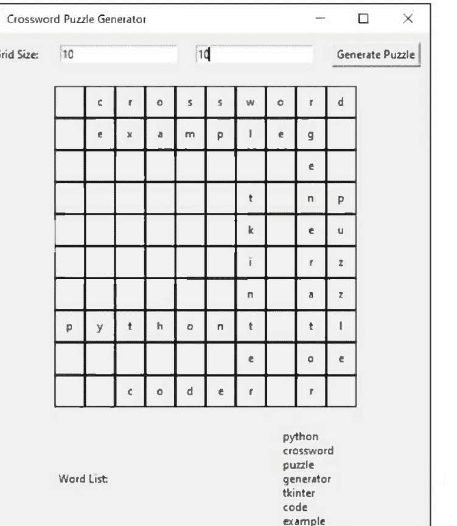

```python
import tkinter as tk
from tkinter import messagebox
import random


class CrosswordGenerator:
    def __init__(self, root):
        self.root = root
        self.root.title("Crossword Puzzle Generator")

        self.grid_size_label = tk.Label(root, text="Grid Size:")
        self.grid_size_label.grid(row=0, column=0, padx=10, pady=10)

        self.rows_entry = tk.Entry(root)
        self.rows_entry.grid(row=0, column=1, padx=10, pady=10)

        self.cols_entry = tk.Entry(root)
        self.cols_entry.grid(row=0, column=2, padx=10, pady=10)

        self.generate_button = tk.Button(
            root, text="Generate Puzzle", command=self.generate_puzzle)
        self.generate_button.grid(row=0, column=3, padx=10, pady=10)

        self.puzzle_frame = tk.Frame(root)
        self.puzzle_frame.grid(row=1, column=0, columnspan=4, padx=10, pady=10)

        self.word_list_label = tk.Label(root, text="Word List:")
        self.word_list_label.grid(
            row=2, column=0, padx=10, pady=10, columnspan=2)

        self.word_list_var = tk.StringVar()
        self.word_list_display = tk.Label(
            root, textvariable=self.word_list_var, wraplength=200, justify="left")
        self.word_list_display.grid(
            row=2, column=2, padx=10, pady=10, columnspan=2)

    def generate_puzzle(self):
        try:
            rows = int(self.rows_entry.get())
            cols = int(self.cols_entry.get())
            if rows <= 0 or cols <= 0:
                messagebox.showerror(
                    "Error", "Grid size should be positive integers.")
                return

            puzzle, word_list = self.create_puzzle(rows, cols)
            self.display_puzzle(puzzle)
            self.display_word_list(word_list)

        except ValueError:
            messagebox.showerror(
                "Error", "Please enter valid integers for grid size.")

    def create_puzzle(self, rows, cols):
        puzzle = [['' for _ in range(cols)] for _ in range(rows)]

        words = ["python", "crossword", "puzzle", "generator", "tkinter", "code", "example"]

        word_list = "\n".join(words)

        for word in words:
            direction = random.choice(['across', 'down'])
            placed = False

            for _ in range(10): # Try placing the word multiple times
                if direction == 'across':
                    row = random.randint(0, rows - 1)
                    col = random.randint(0, cols - len(word))
                    if all(puzzle[row][col + i] == ' ' for i in range(len(word))):
                        for i in range(len(word)):
                            puzzle[row][col + i] = word[i]
                        placed = True
                        break
                else:
                    row = random.randint(0, rows - len(word))
                    col = random.randint(0, cols - 1)
                    if all(puzzle[row + i][col] == ' ' for i in range(len(word))):
                        for i in range(len(word)):
                            puzzle[row + i][col] = word[i]
                        placed = True
                        break

            if not placed:
                messagebox.showwarning("Warning", f"Unable to place the word '{word}' in the puzzle.")

        return puzzle, word_list

    def display_puzzle(self, puzzle):
        for widget in self.puzzle_frame.winfo_children():
            widget.destroy()

        for i, row in enumerate(puzzle):
            for j, cell in enumerate(row):
                label = tk.Label(self.puzzle_frame, text=cell,
                                width=4, height=2, relief="solid", borderwidth=1)
                label.grid(row=i, column=j)

    def display_word_list(self, word_list):
        self.word_list_var.set(word_list)

if __name__ == "__main__":
    root = tk.Tk()
    crossword_generator = CrosswordGenerator(root)
    root.mainloop()
```

这个 Python 脚本使用 Tkinter 库创建了一个简单的填字游戏生成器。该程序具有图形用户界面，包含用于指定网格大小的输入字段和一个用于生成填字游戏的按钮。让我们分解一下脚本的组成部分：

1. **导入：**
    - **tkinter：** Python 的标准图形用户界面工具包。
    - **messagebox：** Tkinter 的一个子模块，用于显示各种类型的消息框。
    - **random：** 用于生成随机数和选择。
2. **类：CrosswordGenerator**
    - **初始化 (__init__)：**
        - 初始化 Tkinter 窗口（root）并设置其标题。
        - 创建各种图形用户界面元素，如标签、输入框、按钮和一个用于显示填字游戏的框架。

### 方法：generate_puzzle：
- 获取用户输入的网格大小（行数和列数）。
- 验证输入以确保提供的是正整数。
- 调用 create_puzzle 方法生成填字游戏，并连同单词列表一起显示。

### 方法：create_puzzle：
- 以行数和列数作为输入，并初始化一个空网格。
- 定义要在填字游戏中使用的单词列表。
- 为每个单词随机选择一个方向（“横向”或“纵向”），并尝试将其放置在网格上。如果放置不成功，会尝试多次（最多 10 次）。
- 如果无法放置某个单词，将显示警告消息。
- 返回生成的填字游戏网格和格式化的单词列表。

### 方法：display_puzzle：

### 3. 主代码块：

- 创建一个 Tkinter 根窗口和 `CrosswordGenerator` 类的一个实例。
- 进入 Tkinter 事件循环（`root.mainloop()`）以处理用户交互。

### 4. 示例单词：

- 该脚本使用一个预定义的单词列表来生成填字游戏。你可以修改 `create_puzzle` 方法中的 `words` 列表来自定义使用的单词。

### 5. 控件与布局：

- 图形用户界面包含标签、输入框和按钮，它们以网格布局组织，以允许用户输入和显示谜题。

### 6. 注意事项：

- 该脚本包含一些基本的错误处理，以确保输入有效，并在单词无法放入谜题时警告用户。

此脚本提供了一个使用 Tkinter 图形界面的填字游戏生成器的简单演示。你可以根据自己的需求进一步增强和自定义功能。

### 如何玩填字游戏生成器

在当前实现中，生成的填字游戏不是交互式的，这意味着你不能通过点击单元格或输入字母直接与之交互。不过，我可以为你提供一个简单的指南，说明如何玩生成的填字游戏：

1.  **生成谜题：**
    - 运行脚本，并在提示时提供所需的网格大小（行数和列数）。
    - 点击“生成谜题”按钮。

2.  **查看谜题：**
    - 填字游戏网格和单词列表将显示在 Tkinter 窗口中。

3.  **理解显示内容：**
    - 谜题网格显示在 Tkinter 窗口中，每个单元格包含一个字母。空单元格用空格表示。
    - 单词列表显示在窗口右侧，列出了需要在谜题中找到的单词。

4.  **手动解谜：**
    - 你可以通过查看列表中的单词并将其输入到网格中对应的单元格来手动解谜。

5.  **检查放置：**
    - 填字游戏通常遵循某些规则，例如单词在共同字母处相交。确保你的输入遵守这些规则。

6.  **验证正确性：**
    - 将你填写的谜题与单词列表进行比较，以确保你已正确放置所有单词。

## 3. 猜词游戏

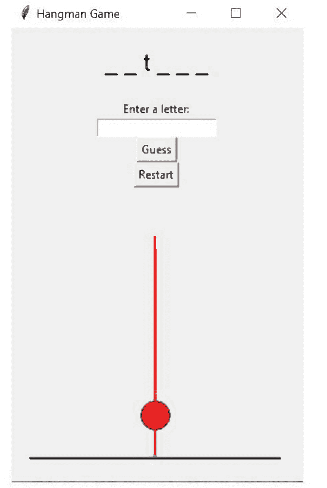

```python
import tkinter as tk
from tkinter import messagebox
import random

eye_radius = 4
mouth_radius = 8
head_y=0

class HangmanGUI:
    def __init__(self, master):
        self.master = master
        self.master.title("Hangman Game")

        self.word_list = ["python", "hangman", "programming",
                          "computer", "developer", "algorithm", "coding"]
        self.word_to_guess = ""
        self.guesses = set()
        self.max_attempts = 6
        self.attempts_left = self.max_attempts
        self.head_radius = 15

        self.word_label = tk.Label(self.master, text="", font=("Arial", 18))
        self.word_label.pack(pady=20)

        self.guess_label = tk.Label(self.master, text="Enter a letter:")
        self.guess_label.pack()

        self.guess_entry = tk.Entry(self.master)
        self.guess_entry.pack()

        self.guess_button = tk.Button(
            self.master, text="Guess", command=self.make_guess)
        self.guess_button.pack()

        self.restart_button = tk.Button(
            self.master, text="Restart", command=self.restart_game)
        self.restart_button.pack()

        self.draw_canvas()

        self.choose_word()
        self.update_word_label()

    def draw_canvas(self):
        self.canvas = tk.Canvas(self.master, width=300, height=300)
        self.canvas.pack()

        # Draw static pole and base
        self.canvas.create_line(150, 50, 150, 280, width=2) # Pole
        self.canvas.create_line(20, 280, 280, 280, width=2) # Base

    def choose_word(self):
        self.word_to_guess = random.choice(self.word_list)

    def update_word_label(self):
        display = ""
        for letter in self.word_to_guess:
            if letter in self.guesses:
                display += letter + " "
            else:
                display += "_ "
        self.word_label.config(text=display.strip())

    def make_guess(self):
        guess = self.guess_entry.get().lower()
        if guess.isalpha() and len(guess) == 1:
            if guess in self.guesses:
                messagebox.showinfo(
                    "Already Guessed", f"You have already guessed the letter '{guess}'.")
            else:
                self.guesses.add(guess)
                if guess not in self.word_to_guess:
                    self.attempts_left -= 1
                    self.draw_hangman()

                self.update_word_label()

                if self.attempts_left == 0:
                    self.game_over()
                elif "_" not in self.word_label.cget("text"):
                    self.game_win()
        else:
            messagebox.showinfo(
                "Invalid Input", "Please enter a valid single letter.")
        self.guess_entry.delete(0, tk.END)

    def draw_hangman(self):
        # Clear the canvas before drawing
        self.canvas.delete("all")

        # Draw static pole and base
        self.canvas.create_line(150, 50, 150, 280, width=2) # Pole
        self.canvas.create_line(20, 280, 280, 280, width=2) # Base

        if self.attempts_left < self.max_attempts:
            # Calculate the position of the head
            rope_bottom = 280
            max_head_y = rope_bottom - self.head_radius
            min_head_y = 50

            # Calculate head position based on remaining attempts
            head_y = max(min_head_y, max_head_y -
                         (self.max_attempts - self.attempts_left) * 30)

            # Draw the rope and head
            self.canvas.create_line(
                150, 50, 150, rope_bottom, width=2, fill="red") # Draw the rope
            self.canvas.create_oval(
                150 - self.head_radius, head_y - self.head_radius, 150 + self.head_radius, head_y + self.head_radius, fill="red") # Draw the head

            # Disable the guess button when the head reaches the top of the pole
            if head_y == min_head_y:
                self.guess_button.config(state=tk.DISABLED)

            # If the head is at the top, draw eyes and a sad mouth
            if head_y == min_head_y:

                # Draw eyes
                eye_x_left = 150 - 8
                eye_y = head_y - 6
                self.canvas.create_oval(
                    eye_x_left - eye_radius, eye_y - eye_radius,
                    eye_x_left + eye_radius, eye_y + eye_radius, fill="black") # Left eye

                eye_x_right = 150 + 8
                self.canvas.create_oval(
                    eye_x_right - eye_radius, eye_y - eye_radius,
                    eye_x_right + eye_radius, eye_y + eye_radius, fill="black") # Right eye

                # Draw a sad mouth
                mouth_x = 150
                mouth_y = head_y + 10
                self.canvas.create_line(
                    mouth_x - mouth_radius, mouth_y,
                    mouth_x + mouth_radius, mouth_y, fill="black")

            elif not hasattr(self, 'game_over_shown'):
                # Draw the head on the top of the pole in red
                self.canvas.create_oval(
                    150 - self.head_radius, min_head_y - self.head_radius, 150 + self.head_radius, min_head_y + self.head_radius, fill="red")

                # Display a message about running out of attempts (once)
                self.game_over()
                self.guess_button.config(state=tk.DISABLED)
                self.game_over_shown = True

    def game_over(self):
        # Draw eyes
        eye_x_left = 150 - 8
        eye_y = head_y - 6
        self.canvas.create_oval(
            eye_x_left - eye_radius, eye_y - eye_radius,
            eye_x_left + eye_radius, eye_y + eye_radius, fill="black") # Left eye

        eye_x_right = 150 + 8
        self.canvas.create_oval(
            eye_x_right - eye_radius, eye_y - eye_radius,
            eye_x_right + eye_radius, eye_y + eye_radius, fill="black") # Right eye

        # Draw a sad mouth
        mouth_x = 150
        mouth_y = head_y + 10
        self.canvas.create_line(
            mouth_x - mouth_radius, mouth_y,
            mouth_x + mouth_radius, mouth_y, fill="black")

    def game_win(self):
        messagebox.showinfo("Congratulations",
                            "Congratulations! You guessed the word.")

    def restart_game(self):
        # Reset game state
        self.choose_word()
        self.guesses = set()
        self.attempts_left = self.max_attempts
        self.guess_button.config(state=tk.NORMAL)
        self.update_word_label()

        # Clear the canvas
        self.canvas.delete("all")
```

### 绘制静态的杆子和底座
self.canvas.create_line(150, 50, 150, 280, width=2) # 杆子
self.canvas.create_line(20, 280, 280, 280, width=2) # 底座

def main():
    root = tk.Tk()
    hangman_game = HangmanGUI(root)
    root.mainloop()

if __name__ == "__main__":
    main()

提供的**Python代码**是一个使用Tkinter库实现图形用户界面的简单“猜单词”游戏。让我们详细解析这段代码：

### HangmanGUI 类：

1.  **初始化（__init__ 方法）：**
    -   构造函数初始化了游戏的主要方面。
    -   设置了Tkinter窗口和基本元素，如标签、输入框、按钮以及用于绘图的画布。
    -   定义了诸如单词列表、待猜单词、已猜字母、最大尝试次数、剩余尝试次数和头部半径等属性。

### 2. draw_canvas 方法：
    -   在画布上初始化并绘制“猜单词”游戏的静态部分（杆子和底座）。

### 3. choose_word 方法：
    -   从预定义的单词列表中随机选择一个单词。

### 4. update_word_label 方法：
    -   根据已猜字母更新单词标签，为未猜出的字母显示下划线。

### 5. make_guess 方法：
    -   从输入框中获取猜测的字母。
    -   检查猜测是否有效（单个字母字符）以及是否已被猜过。
    -   更新游戏状态，检查是否获胜或失败，并处理无效输入。

### 6. draw_hangman 方法：
    -   根据剩余尝试次数绘制“猜单词”游戏的人物图形。
    -   随着错误猜测的增加，处理人物图形的逐步绘制。

### 7. game_over 方法：
    -   当玩家用尽尝试次数时，显示游戏结束消息并绘制一个悲伤的表情。

### 8. game_win 方法：
    -   当玩家成功猜出单词时，显示祝贺消息。

### 9. restart_game 方法：
    -   重置游戏状态以开始新一局。
    -   清除画布并重新绘制静态的“猜单词”元素。

### 主函数：
    -   创建一个Tkinter根窗口并初始化HangmanGUI类。
    -   启动Tkinter主循环以运行图形用户界面。

### 使用方法：
    -   玩家通过在输入框中输入单个字母并点击“猜测”按钮与游戏互动。
    -   画布显示“猜单词”人物图形，待猜单词以未猜出字母显示为下划线的形式展示。
    -   当玩家正确猜出单词或用尽尝试次数时，游戏结束。

### 附加说明：
    -   游戏使用预定义的单词列表，每轮选择一个新单词。
    -   最大尝试次数默认设置为6，随着错误猜测的增加，“猜单词”人物图形会逐步出现。
    -   游戏在胜利或失败后提供重新开始和再次游玩的选项。

在运行此代码之前，请确保已安装Tkinter（`import tkinter as tk`）。你可以将其作为Python脚本运行，在一个简单的图形用户界面窗口中玩“猜单词”游戏。

### 如何玩猜单词游戏

要使用提供的代码玩“猜单词”游戏，请遵循以下步骤：

1.  **运行代码：**
    -   将提供的**Python代码**复制到Python环境或脚本中。
    -   确保已安装Tkinter（通常已包含在Python安装中）。
2.  **执行脚本：**
    -   运行脚本。
    -   一个包含“猜单词”游戏图形用户界面的窗口将会出现。
3.  **游戏开始：**
    -   游戏将从预定义的单词列表中随机选择一个单词开始。

### 4. 猜测字母：
    -   在提供的输入框中输入单个字母。
    -   点击“猜测”按钮。

### 5. 游戏进程：
    -   待猜单词将以未猜出字母显示为下划线的形式展示。
    -   “猜单词”人物图形将根据错误猜测在画布上出现。

### 6. 继续猜测：
    -   持续输入字母并点击“猜测”按钮。
    -   游戏将相应地更新单词显示和人物图形。

### 7. 获胜：
    -   如果你正确猜出了整个单词，将会出现祝贺消息。

### 8. 失败：
    -   如果你用尽了尝试次数，将会显示游戏结束消息，并出现一个悲伤的表情。

### 9. 重新开始：
    -   你可以通过点击“重新开始”按钮来重新开始游戏。
    -   将选择一个新单词，游戏状态将被重置。

### 10. 重复：
    -   通过猜测字母并尝试猜出单词来继续游戏。

### 请记住：
    -   只能输入单个字母作为猜测。
    -   游戏会跟踪已猜字母，再次输入相同字母会显示提示信息。
    -   最大尝试次数设置为6，随着你做出错误猜测，“猜单词”人物图形将逐步出现。

## 4. 井字棋游戏

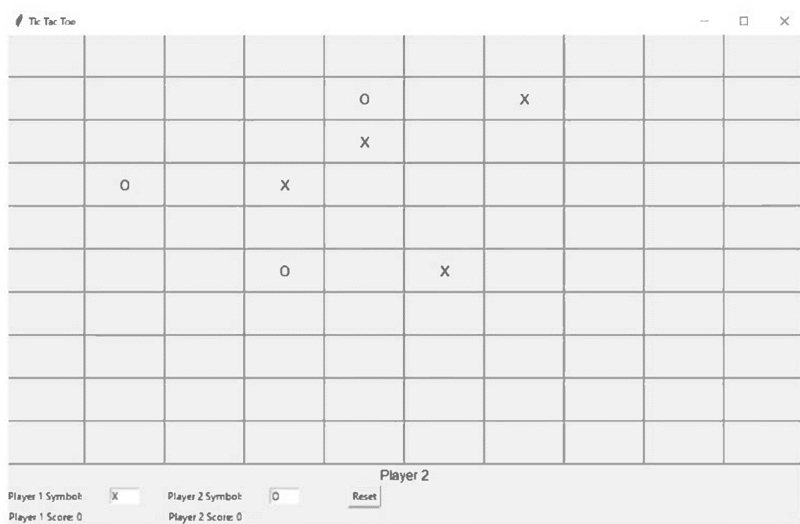

```python
import tkinter as tk
from tkinter import messagebox
```

```python
class TicTacToe:
    def __init__(self):
        self.window = tk.Tk()
        self.window.title("Tic Tac Toe")
        self.board_size = 10
        self.board = [["" for _ in range(self.board_size)]
                    for _ in range(self.board_size)]

        self.current_player = tk.StringVar()
        self.current_player.set("Player 1")
        self.player1_symbol = tk.StringVar()
        self.player2_symbol = tk.StringVar()
        self.player1_symbol.set("X")
        self.player2_symbol.set("O")
        self.player1_score = 0
        self.player2_score = 0

        self.create_widgets()

    def create_widgets(self):
        for i in range(self.board_size):
            for j in range(self.board_size):
                btn = tk.Button(self.window, text="", font=('normal', 12), width=5, height=2,
                               command=lambda row=i, col=j: self.on_button_click(row, col))
                btn.grid(row=i, column=j, padx=0, pady=0, sticky="nsew")
                self.board[i][j] = btn

        for i in range(self.board_size):
            self.window.grid_rowconfigure(i, weight=1, uniform="row")
            self.window.grid_columnconfigure(i, weight=1, uniform="col")

        tk.Label(self.window, textvariable=self.current_player, font=(
            'normal', 12)).grid(row=self.board_size, columnspan=self.board_size)

        tk.Label(self.window, text="玩家1符号:").grid(
            row=self.board_size + 1, column=0)
        tk.Entry(self.window, textvariable=self.player1_symbol,
            width=5).grid(row=self.board_size + 1, column=1)

        tk.Label(self.window, text="玩家2符号:").grid(
            row=self.board_size + 1, column=2)
        tk.Entry(self.window, textvariable=self.player2_symbol,
            width=5).grid(row=self.board_size + 1, column=3)

        self.reset_button = tk.Button(
            self.window, text="重置", command=self.reset_board)
        self.reset_button.grid(row=self.board_size + 1, column=4)

        self.player1_score_label = tk.Label(
            self.window, text="玩家1得分: 0")
        self.player1_score_label.grid(row=self.board_size + 2, column=0)

        self.player2_score_label = tk.Label(
            self.window, text="玩家2得分: 0")
        self.player2_score_label.grid(row=self.board_size + 2, column=2)

    def on_button_click(self, row, col):
        if self.board[row][col]["text"] == "":
            self.board[row][col]["text"] = self.player1_symbol.get(
            ) if self.current_player.get() == "Player 1" else self.player2_symbol.get()
            if self.check_winner(row, col):
                messagebox.showinfo(
                    "游戏结束", f"{self.current_player.get()} 获胜!"
                )
                self.update_scores()
                self.reset_board()
            elif self.check_draw():
                messagebox.showinfo("游戏结束", "平局!")
                self.reset_board()
            else:
                self.switch_player()

    def check_winner(self, row, col):
        symbol = self.board[row][col]["text"]

        # 检查行
        if all(self.board[row][c]["text"] == symbol for c in range(self.board_size)):
            return True
        # 检查列
        if all(self.board[r][col]["text"] == symbol for r in range(self.board_size)):
            return True
        # 检查对角线
        if row == col and all(self.board[i][i]["text"] == symbol for i in range(self.board_size)):
            return True
        if row + col == self.board_size - 1 and all(self.board[i][self.board_size - 1 - i]["text"] == symbol for i in range(self.board_size)):
            return True
        return False

    def check_draw(self):
        for i in range(self.board_size):
            for j in range(self.board_size):
                if self.board[i][j]["text"] == "":
                    return False
        return True

    def switch_player(self):
        self.current_player.set(
            "Player 2" if self.current_player.get() == "Player 1" else "Player 1")

    def update_scores(self):
        if self.current_player.get() == "Player 1":
            self.player1_score += 1
            self.player1_score_label.config(

### 1. 类定义（TicTacToe）：
- TicTacToe 类在初始化时创建了一个 Tkinter 窗口。
- 它将窗口标题设置为 "Tic Tac Toe"，定义了游戏棋盘的大小（10x10），并将棋盘初始化为空状态。
- 定义了各种属性，例如 `current_player`（用于跟踪当前玩家）、`player1_symbol`、`player2_symbol` 以及两位玩家的分数。
- `create_widgets` 方法负责设置 GUI 元素，包括游戏棋盘按钮、标签以及用于自定义玩家符号的输入框。
- 游戏棋盘中的按钮使用嵌套循环创建，它们的点击事件连接到 `on_button_click` 方法。
- 设置了标签以显示当前玩家、玩家符号和玩家分数。
- 创建了一个重置按钮（`reset_button`）来重置棋盘。

### 2. 事件处理（`on_button_click`）：
- 当游戏棋盘上的按钮被点击时，会调用此方法。
- 检查被点击的按钮是否为空；如果是，则用当前玩家的符号更新按钮文本。
- 使用 `check_winner` 方法检查是否有赢家。如果找到赢家，则显示消息框，更新分数，并重置棋盘。
- 如果游戏平局（没有赢家且没有剩余空格），则显示消息框并重置棋盘。
- 如果游戏继续，则切换到下一位玩家。

### 3. 赢家检查（`check_winner`）：
- 此方法通过检查每次移动后棋盘的当前状态来检查赢家。
- 它检查行、列和对角线，看所有元素是否与当前玩家的符号匹配。

### 4. 平局检查（`check_draw`）：
- 此方法通过检查棋盘上是否还有空格来检查平局。

### 5. 玩家切换（`switch_player`）：
- 此方法在 "Player 1" 和 "Player 2" 之间切换当前玩家。

### 6. 分数更新（`update_scores`）：
- 当玩家获胜时，此方法更新分数和相应的标签。

### 7. 棋盘重置（`reset_board`）：
- 此方法重置整个游戏棋盘，将所有按钮文本设置为空，并将当前玩家重置为 "Player 1"。

### 8. 主代码块：
- 创建了 TicTacToe 类的一个实例，并使用 `game.window.mainloop()` 启动了 Tkinter 主循环。

总的来说，这段代码提供了一个用于玩井字棋的图形用户界面，支持自定义玩家符号，并跟踪玩家分数。

### 如何玩井字棋

井字棋是一个简单的双人游戏，玩家轮流在一个 3x3 的网格上用他们指定的符号（通常是 "X" 和 "O"）进行标记，目标是让三个自己的符号连成一线——可以是水平、垂直或对角线。以下是玩井字棋的分步指南：

**游戏设置：**

1.  **棋盘设置：**
    - 游戏在一个 3x3 的网格上进行。
    - 网格中的每个单元格代表一个玩家可以放置其符号的位置。
2.  **玩家分配：**
    - 有两位玩家，通常称为 "Player 1" 和 "Player 2"。
    - Player 1 通常使用 "X"，Player 2 使用 "O"。

### 游戏玩法：

### 3. 开始游戏：
- 游戏从一个空棋盘开始。

### 4. 轮流行动：
- 玩家轮流进行移动。
- Player 1 (X) 先走，然后是 Player 2 (O)，他们继续交替行动。

### 5. 进行移动：
- 在玩家的回合，他们选择网格上的一个空单元格来放置他们的符号。
- 点击所选单元格以用玩家的符号标记它。

### 6. 赢得游戏：
- 当玩家成功地将三个自己的符号连成一线时，游戏获胜。
- 这条线可以是水平、垂直或对角线。

### 7. 游戏结束：
- 如果一位玩家获胜，游戏结束，并宣布获胜玩家。
- 如果棋盘被符号填满且没有赢家，则游戏平局。

### 8. 开始新游戏：
- 游戏结束后（无论是获胜还是平局），玩家可以开始新游戏。
- 一些实现包括一个 "Reset" 按钮来清空棋盘并重新开始。

### 游戏示例：
- Player 1 (X) 通过点击一个空单元格进行移动。
- Player 2 (O) 进行他们的回合，选择另一个空单元格。
- 玩家继续轮流行动，直到一位玩家获得三个连成一线的符号，或者棋盘被填满。

### 获胜组合：
- **水平：**
  ```
  X | X | X
  O | O | 
    |   | 
  ```
- **垂直：**
  ```
  X | O | 
  X | O | 
  X |   | 
  ```
- **对角线：**
  ```
  X | O | 
    | X | O
    |   | X
  ```

### 提示：
- 注意对手的移动，并提前计划以阻止潜在的获胜组合。
- 在阻止对手的同时，尝试创造自己的获胜机会。

井字棋是一个策略和预判的游戏，因其简单和快速的游戏过程而广受欢迎。对于策略棋盘游戏的新手来说，它是一个很好的入门游戏。

## 5. 迷宫求解器游戏

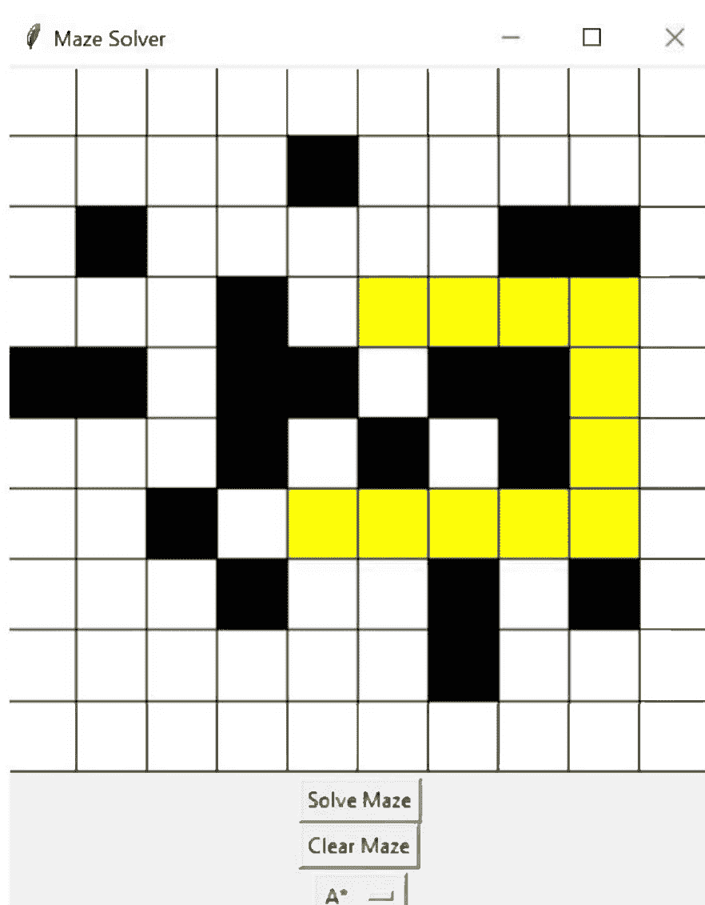

```python
import tkinter as tk
from queue import PriorityQueue, Queue

class MazeSolver:
    def __init__(self, root, rows, cols):
        self.root = root
        self.rows = rows
        self.cols = cols
        self.canvas_size = 400
        self.cell_size = self.canvas_size // max(rows, cols)
        self.canvas = tk.Canvas(
            root, width=self.canvas_size, height=self.canvas_size)
        self.canvas.pack()
        self.start = None
        self.end = None
        self.maze = [[0] * cols for _ in range(rows)]
        self.draw_grid()
        self.canvas.bind("<Button-1>", self.on_click)
        self.solve_button = tk.Button(
            root, text="Solve Maze", command=self.solve_maze)
        self.solve_button.pack()
        self.clear_button = tk.Button(
            root, text="Clear Maze", command=self.clear_maze)
        self.clear_button.pack()
        self.algorithm_var = tk.StringVar(root)
        self.algorithm_var.set("A*")
        self.algorithm_menu = tk.OptionMenu(
            root, self.algorithm_var, "A*", "Dijkstra", "BFS")
        self.algorithm_menu.pack()

    def draw_grid(self):
        for i in range(self.rows):
            for j in range(self.cols):
                x1, y1 = j * self.cell_size, i * self.cell_size
                x2, y2 = x1 + self.cell_size, y1 + self.cell_size
                self.canvas.create_rectangle(
                    x1, y1, x2, y2, fill="white", outline="black")

    def on_click(self, event):
        col = event.x // self.cell_size
        row = event.y // self.cell_size
        if not self.start:
            self.start = (row, col)
            self.canvas.create_rectangle(col * self.cell_size, row * self.cell_size,
                                         (col + 1) * self.cell_size, (row + 1) * self.cell_size, fill="green")
        elif not self.end:
            self.end = (row, col)
            self.canvas.create_rectangle(col * self.cell_size, row * self.cell_size,
                                         (col + 1) * self.cell_size, (row + 1) * self.cell_size, fill="red")
        else:
            self.toggle_obstacle(row, col)

    def toggle_obstacle(self, row, col):
        if self.maze[row][col] == 0:
            self.maze[row][col] = 1
            self.canvas.create_rectangle(col * self.cell_size, row * self.cell_size,
                                         (col + 1) * self.cell_size, (row + 1) * self.cell_size, fill="black")
        else:
            self.maze[row][col] = 0
            self.canvas.create_rectangle(col * self.cell_size, row * self.cell_size,
                                         (col + 1) * self.cell_size, (row + 1) * self.cell_size, fill="white")

    def clear_maze(self):
        self.start = None
        self.end = None
        self.maze = [[0] * self.cols for _ in range(self.rows)]
        self.canvas.delete("all")
        self.draw_grid()

    def solve_maze(self):
        algorithm = self.algorithm_var.get()
        path = self.run_algorithm(algorithm)
```

```python
if path:
    self.highlight_path(path)

def run_algorithm(self, algorithm):
    if algorithm == "A*":
        return self.astar()
    elif algorithm == "Dijkstra":
        return self.dijkstra()
    elif algorithm == "BFS":
        return self.bfs()
    else:
        raise ValueError("Unsupported algorithm")

def astar(self):
    start = self.start
    end = self.end
    open_set = PriorityQueue()
    open_set.put((0, start))
    came_from = {start: None}
    g_score = {start: 0}

    while not open_set.empty():
        current = open_set.get()[1]
        if current == end:
            path = []
            while current in came_from:
                path.append(current)
                current = came_from[current]
            return path[::-1]

        for neighbor in self.get_neighbors(current):
            tentative_g_score = g_score[current] + 1
            if tentative_g_score < g_score.get(neighbor, float('inf')):
                g_score[neighbor] = tentative_g_score
                f_score = tentative_g_score + self.heuristic(neighbor, end)
                open_set.put((f_score, neighbor))
                came_from[neighbor] = current

    return None

def dijkstra(self):
    start = self.start
    end = self.end
    open_set = PriorityQueue()
    open_set.put((0, start))
    came_from = {start: None}
    g_score = {start: 0}

    while not open_set.empty():
        current = open_set.get()[1]
        if current == end:
            path = []
            while current in came_from:
                path.append(current)
                current = came_from[current]
            return path[::-1]

        for neighbor in self.get_neighbors(current):
            tentative_g_score = g_score[current] + 1
            if tentative_g_score < g_score.get(neighbor, float('inf')):
                g_score[neighbor] = tentative_g_score
                open_set.put((tentative_g_score, neighbor))
                came_from[neighbor] = current

    return None

def bfs(self):
    start = self.start
    end = self.end
    queue = Queue()
    queue.put(start)
    came_from = {start: None}

    while not queue.empty():
        current = queue.get()
        if current == end:
            path = []
            while current in came_from:
                path.append(current)
                current = came_from[current]
            return path[::-1]

        for neighbor in self.get_neighbors(current):
            if neighbor not in came_from:
                queue.put(neighbor)
                came_from[neighbor] = current

    return None

def get_neighbors(self, cell):
    row, col = cell
    neighbors = []
    if row > 0 and self.maze[row - 1][col] == 0:
        neighbors.append((row - 1, col))
    if row < self.rows - 1 and self.maze[row + 1][col] == 0:
        neighbors.append((row + 1, col))
    if col > 0 and self.maze[row][col - 1] == 0:
        neighbors.append((row, col - 1))
    if col < self.cols - 1 and self.maze[row][col + 1] == 0:
        neighbors.append((row, col + 1))
    return neighbors

def heuristic(self, a, b):
    return abs(a[0] - b[0]) + abs(a[1] - b[1])

def highlight_path(self, path):
    for cell in path:
        row, col = cell
        self.canvas.create_rectangle(col * self.cell_size, row * self.cell_size,
                                     (col + 1) * self.cell_size, (row + 1) * self.cell_size, fill="yellow")

if __name__ == "__main__":
    root = tk.Tk()
    root.title("Maze Solver")
    maze_solver = MazeSolver(root, rows=10, cols=10)
    root.mainloop()
```

这个Python脚本使用Tkinter库创建了一个简单的图形用户界面（GUI）来解决迷宫问题。实现的迷宫求解算法包括A*、Dijkstra算法和广度优先搜索（BFS）。

以下是该脚本的详细分解：

### 1. 导入：
- **tkinter**：用于创建GUI。
- **Queue** 和 **PriorityQueue**：用于实现BFS的队列数据结构，以及A*和Dijkstra算法的优先队列。

### 2. MazeSolver 类：
#### 初始化 (__init__)：
- 初始化GUI组件，例如主窗口（root）、用于绘制迷宫的画布、用于求解和清除迷宫的按钮，以及用于选择算法的选项菜单。
- 设置迷宫的行数、列数、单元格大小等参数变量。
- 初始化迷宫网格、起点和终点，并将左键点击事件绑定到 **on_click** 方法。

#### 绘制网格 (draw_grid)：
- 在画布上绘制初始网格，每个单元格是一个白色填充、黑色轮廓的矩形。

#### 处理鼠标点击 (on_click)：
- 根据鼠标点击坐标确定被点击单元格的行和列。
- 处理起点和终点的放置，并在鼠标点击时切换障碍物。

#### 切换障碍物 (toggle_obstacle)：
- 点击单元格时，在障碍物（黑色）和空单元格（白色）之间切换。

#### 清除迷宫 (clear_maze)：
- 重置起点和终点，并清除画布上的迷宫网格。

#### 求解迷宫 (solve_maze)：
- 从选项菜单获取选定的算法，并运行相应的迷宫求解算法。
- 在画布上高亮显示解决方案路径。

#### 运行算法 (run_algorithm)：
- 根据用户的选择选择合适的算法。

#### A* 算法 (astar)、Dijkstra 算法 (dijkstra) 和 BFS 算法 (bfs)：
- 每个算法使用不同的方法来探索迷宫并找到解决方案路径。
- A* 和 Dijkstra 算法使用优先队列，而BFS使用普通队列。

#### 获取邻居 (get_neighbors)：
- 返回可以从当前单元格访问的相邻单元格列表。

#### 启发式函数 (heuristic)：
- 计算两个单元格之间的简单启发式值（曼哈顿距离）。

#### 高亮显示解决方案路径 (highlight_path)：
- 在画布上为解决方案路径中的每个单元格绘制一个黄色矩形。

### 3. 主代码块 (__main__)：
- 创建一个Tkinter窗口（root），设置其标题，并初始化一个具有10x10迷宫的MazeSolver类实例。
- 启动Tkinter主事件循环。

总之，该脚本提供了一个基本的交互式迷宫求解应用程序，具有GUI，允许用户使用不同的算法创建和求解迷宫。

### 如何玩迷宫求解游戏

提供的Python脚本创建了一个带有图形用户界面（GUI）的简单迷宫求解应用程序。虽然它并非明确设计为游戏，但您可以按照以下步骤与迷宫求解器应用程序进行交互：

#### 1. 运行脚本：
- 将提供的Python脚本保存到一个文件中，例如 `maze_solver.py`。
- 打开终端或命令提示符，导航到包含该脚本的目录。
- 使用命令运行脚本：`python maze_solver.py`（或您Python环境的等效命令）。

#### 2. GUI界面：
- 将出现一个标题为“Maze Solver”的窗口。
- GUI由一个画布（您可以在其中创建迷宫）、用于求解和清除迷宫的按钮，以及用于选择求解算法的选项菜单组成。

#### 3. 创建迷宫：
- 在画布上左键点击白色单元格以创建迷宫。点击单元格会在空单元格和障碍物（黑色单元格）之间切换。
- 要设置起点和终点：
    - 点击一个白色单元格设置起点（绿色矩形）。
    - 点击另一个白色单元格设置终点（红色矩形）。

#### 4. 选择算法：
- 从下拉菜单中选择求解算法（A*、Dijkstra 或 BFS）。

#### 5. 求解迷宫：
- 点击“Solve Maze”按钮以应用选定的算法并找到解决方案路径。

#### 6. 查看解决方案：
- 解决方案路径将在画布上以黄色高亮显示。

#### 7. 清除迷宫：
- 点击“Clear Maze”按钮以重置迷宫，移除障碍物、起点和终点。
```

### 8. 重复与实验：

- 你可以创建不同的迷宫，改变起点和终点，并探索不同算法如何找到解决方案。

## 6. 贪吃蛇游戏

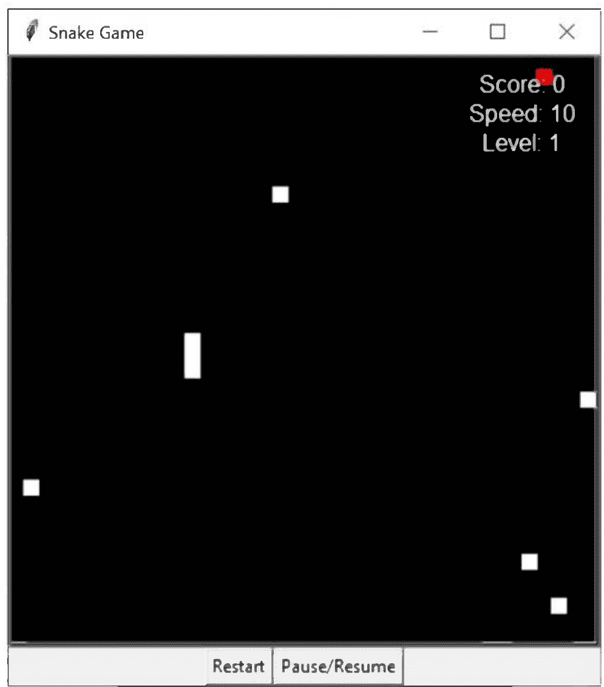

```python
import tkinter as tk
import random
import winsound  # For Windows systems
```

```python
class SnakeGame:
    def __init__(self, master, width=400, height=400):
        self.master = master
        self.master.title("Snake Game")
        self.canvas = tk.Canvas(self.master, width=width,
                               height=height, bg="black")
        self.canvas.pack()

        self.canvas.focus_set()

        self.snake = [(100, 100), (90, 100), (80, 100)]
        self.direction = "Right"
        self.food = self.create_food()
        self.level = 1  # Initialize level before calling create_obstacles
        self.obstacles = self.create_obstacles()
        self.score = 0
        self.high_score = 0
        self.speed = 100
        self.game_over_flag = False
        self.paused = False

        self.score_display = self.canvas.create_text(
            350, 20, text="Score: 0", fill="white", font=("Helvetica", 12))
        self.speed_display = self.canvas.create_text(
            350, 40, text="Speed: 1\nLevel: 1", fill="white", font=("Helvetica", 12))

        self.button_frame = tk.Frame(self.master)
        self.button_frame.pack(side="bottom")

        restart_button = tk.Button(
            self.button_frame, text="Restart", command=self.restart_game)
        restart_button.pack(side="left")

        pause_button = tk.Button(
            self.button_frame, text="Pause/Resume", command=self.toggle_pause)
        pause_button.pack(side="left")

        self.canvas.bind("<Key>", self.change_direction)
        self.master.after(self.speed, self.update)

        self.draw() # Draw the initial state

    def create_food(self):
        x = random.randint(1, 39) * 10
        y = random.randint(1, 39) * 10
        self.canvas.create_rectangle(
            x, y, x + 10, y + 10, outline="red", fill="red", tags="food")
        winsound.Beep(523, 100) # Beep sound when the snake eats food
        return x, y

    def create_obstacles(self):
        obstacles = []
        for _ in range(5 * self.level): # Adjust obstacle count based on level
            x = random.randint(1, 39) * 10
            y = random.randint(1, 39) * 10
            self.canvas.create_rectangle(
                x, y, x + 10, y + 10, outline="white", fill="white", tags="obstacle")
            obstacles.append((x, y))
        return obstacles

    def move(self):
        if self.game_over_flag or self.paused:
            return

        head = self.snake[0]
        if self.direction == "Right":
            new_head = (head[0] + 10, head[1])
        elif self.direction == "Left":
            new_head = (head[0] - 10, head[1])
        elif self.direction == "Up":
            new_head = (head[0], head[1] - 10)
        elif self.direction == "Down":
            new_head = (head[0], head[1] + 10)

        self.snake.insert(0, new_head)

        if new_head == self.food:
            self.score += 1
            self.canvas.delete("food")
            self.food = self.create_food()
            self.increase_speed()
            self.check_win() # Check if the player has won after increasing the score
        else:
            self.canvas.delete(self.snake[-1])
            self.snake.pop()

        self.check_collision()

    def increase_speed(self):
        level_thresholds = [5, 10, 15, 20, 25, 30, 35, 40, 45, 50]

        if self.score in level_thresholds and self.level < len(level_thresholds):
            self.level += 1
            self.create_obstacles()
            self.canvas.itemconfig(
                self.speed_display, text=f"Speed: {1000 // self.speed}\nLevel: {self.level}")
            winsound.PlaySound("level_up.wav", winsound.SND_FILENAME)

            if self.level == len(level_thresholds):
                self.display_completion_message()

    def display_completion_message(self):
        self.canvas.create_text(
            200, 200, text="All Levels Completed!\nCongratulations!", fill="white", font=("Helvetica", 16), tags="gameover")

    def check_collision(self):
        head = self.snake[0]
        if (
            head[0] < 0
            or head[0] >= 400
            or head[1] < 0
            or head[1] >= 400
            or head in self.snake[1:]
            or head in self.obstacles
        ):
            self.game_over()

    def check_win(self):
        if self.level == 4 and self.score >= 20:
            self.game_over_flag = True
            if self.score > self.high_score:
                self.high_score = self.score
            self.canvas.create_text(
                200, 200, text=f"Congratulations!\nYou passed all levels!\nScore: {self.score}\nHigh Score: {self.high_score}",
                fill="white", font=("Helvetica", 16), tags="gameover")
            # Play a win sound
            winsound.PlaySound("game_win.wav", winsound.SND_FILENAME)

    def game_over(self):
        self.game_over_flag = True
        if self.score > self.high_score:
            self.high_score = self.score
        self.canvas.create_text(
            200, 200, text=f"Game Over\nScore: {self.score}\nHigh Score: {self.high_score}",
            fill="white", font=("Helvetica", 16), tags="gameover")
        winsound.PlaySound("game_over.wav", winsound.SND_FILENAME)

    def restart_game(self):
        self.canvas.delete("all")
        self.snake = [(100, 100), (90, 100), (80, 100)]
        self.direction = "Right"
        self.food = self.create_food()
        self.obstacles = self.create_obstacles()
        self.score = 0
        self.level = 1
        self.speed = 100
        self.game_over_flag = False
        self.paused = False

        self.draw()
        self.update()

    def toggle_pause(self):
        self.paused = not self.paused

    def update(self):
        self.move()
        self.draw()
        if not self.game_over_flag:
            self.master.after(self.speed, self.update)

    def draw(self):
        self.canvas.delete("all")
        # Border around the game area
        self.canvas.create_rectangle(0, 0, 400, 400, outline="white")

        for segment in self.snake:
            self.canvas.create_rectangle(
                segment[0], segment[1], segment[0] + 10, segment[1] + 10, outline="white", fill="white")
        self.canvas.create_rectangle(
            self.food[0], self.food[1], self.food[0] + 10, self.food[1] + 10, outline="red", fill="red")

        for obstacle in self.obstacles:
            self.canvas.create_rectangle(
                obstacle[0], obstacle[1], obstacle[0] + 10, obstacle[1] + 10, outline="white", fill="white")

        # Display the score
        self.canvas.create_text(
            350, 20, text=f"Score: {self.score}", fill="white", font=("Helvetica", 12))

        # Display the speed
        self.canvas.create_text(
            350, 40, text=f"Speed: {1000 // self.speed}", fill="white", font=("Helvetica", 12))

        # Display the level
        self.canvas.create_text(
            350, 60, text=f"Level: {self.level}", fill="white", font=("Helvetica", 12))

    def change_direction(self, event):
        if event.keysym in ["Up", "Down", "Left", "Right"]:
            if (
                (event.keysym == "Up" and self.direction != "Down")
                or (event.keysym == "Down" and self.direction != "Up")
                or (event.keysym == "Left" and self.direction != "Right")
                or (event.keysym == "Right" and self.direction != "Left")
            ):
                self.direction = event.keysym


if __name__ == "__main__":
    root = tk.Tk()
    game = SnakeGame(root)
    root.mainloop()
```

这是一个使用Python的Tkinter库实现的贪吃蛇游戏。让我们分解代码并理解每个组件：

1. **导入模块：**

```python
import tkinter as tk
import random
import winsound
```

- tkinter：Python与Tk GUI工具包的标准接口。
- random：用于生成食物和障碍物初始位置的随机数。
- winsound：用于在Windows系统上播放音效。

### 2. SnakeGame类：

```python
class SnakeGame:
```

- 这个类代表了游戏的主要逻辑。

### 3. 初始化：

```python
def __init__(self, master, width=400, height=400):
```

- 构造函数使用一个Tkinter窗口（master）初始化游戏，并设置游戏区域的默认宽度和高度。
- 它设置了画布、蛇、初始方向、食物、关卡、障碍物、分数、速度以及其他与游戏相关的属性。
- 游戏状态通过标签和按钮显示在Tkinter窗口上。

## 4. create\_food 方法：

Python 代码

```python
def create_food(self):
```

-   为食物生成随机坐标，并在画布的该位置创建一个红色矩形。
-   当蛇吃到食物时，播放哔哔声。

## 5. create\_obstacles 方法：

Python 代码

```python
def create_obstacles(self):
```

-   在画布的随机位置生成指定数量的障碍物。
-   障碍物是白色的矩形。

### 6. move 方法：

Python 代码

```python
def move(self):
```

-   根据当前方向更新蛇的位置。
-   处理与食物的碰撞，更新分数，并在满足特定条件时增加速度和等级。
-   检查与障碍物或游戏边界的碰撞。

## 7. increase\_speed 方法：

Python 代码

```python
def increase_speed(self):
```

-   根据玩家的分数增加游戏速度并更新等级。

## 8. display\_completion\_message 方法：

Python 代码

```python
def display_completion_message(self):
```

-   当玩家完成所有等级时，显示祝贺信息。

## 9. check\_collision 方法：

Python 代码

```python
def check_collision(self):
```

-   检查与墙壁、蛇身和障碍物的碰撞。
-   如果检测到碰撞，则调用 game\_over 方法。

## 10. check\_win 方法：

Python 代码

```python
def check_win(self):
```

-   检查玩家是否赢得游戏（达到特定等级和分数）。
-   显示胜利信息并播放胜利音效。

## 11. game\_over 方法：

Python 代码

```python
def game_over(self):
```

-   显示游戏结束信息，包含最终分数和最高分。
-   播放游戏结束音效。

## 12. restart\_game 方法：

Python 代码

```python
def restart_game(self):
```

-   将游戏状态重置为初始值并开始新游戏。

## 13. toggle\_pause 方法：

Python 代码

```python
def toggle_pause(self):
```

-   当点击暂停按钮时，暂停或恢复游戏。

### 14. update 方法：

Python 代码

```python
def update(self):
```

-   定期更新游戏状态，使蛇能够持续移动。
-   调用 move 和 draw 方法。

### 15. draw 方法：

Python 代码

```python
def draw(self):
```

-   清除画布并重新绘制游戏元素（蛇、食物、障碍物、分数、速度、等级）。

## 16. change\_direction 方法：

Python 代码

```python
def change_direction(self, event):
```

-   处理用户输入以改变蛇的方向。

### 17. 主执行代码：

Python 代码

```python
if __name__ == "__main__":
    root = tk.Tk()
    game = SnakeGame(root)
    root.mainloop()
```

-   创建一个 Tkinter 窗口并启动游戏循环。

总而言之，这款贪吃蛇游戏是一个完整的实现，具备蛇的移动、碰撞检测、计分、难度等级递增、障碍物以及使用 Tkinter 的图形用户界面等功能。游戏还包含各种事件的音效。

### 如何玩贪吃蛇游戏

要玩贪吃蛇游戏，请遵循以下说明：

#### 1. 开始游戏：

-   运行包含贪吃蛇游戏代码的 Python 脚本。
-   将出现一个标题为“Snake Game”的窗口。

#### 2. 初始设置：

-   游戏开始时有一条蛇（一系列白色矩形）和一个代表食物的红色方块。
-   蛇最初向右移动。

#### 3. 控制蛇：

-   使用方向键（上、下、左、右）控制蛇的方向。
-   蛇将持续向选定的方向移动，直到游戏结束。

#### 4. 目标：

-   目标是引导蛇吃掉红色的食物方块。
-   每次蛇吃掉食物，它会变长，玩家获得分数。

#### 5. 避免碰撞：

-   避免撞到游戏区域的墙壁。
-   避免撞到蛇自身的身体。
-   避免撞到屏幕上可能出现的白色障碍物。

#### 6. 计分：

-   分数显示在游戏窗口的顶部。
-   每次蛇吃掉食物，分数就会增加。

#### 7. 速度和等级：

-   随着玩家积累分数，游戏速度会增加。
-   游戏中有多个等级，每个等级的难度都会增加。
-   当前速度、等级和分数显示在游戏窗口的右侧。

#### 8. 获胜：

-   如果你达到特定等级并获得特定分数，你就赢得了游戏。
-   会显示祝贺信息，并播放胜利音效。

#### 9. 失败：

-   如果蛇撞到墙壁、自身或障碍物，游戏结束。
-   会显示游戏结束信息及你的最终分数，并播放游戏结束音效。

#### 10. 重新开始或暂停：

-   你可以通过点击底部的“重新开始”按钮来重新开始游戏。
-   “暂停/恢复”按钮允许你暂停和恢复游戏。

#### 11. 享受游戏：

-   玩贪吃蛇游戏，享受乐趣，并尝试获得尽可能高的分数！

记住，成功的关键在于策略性移动、避开障碍物，并通过吃掉食物来让蛇变长。随着游戏的进行，挑战性会增加，使其成为一种引人入胜且有趣的体验。

## 7. 记忆拼图游戏

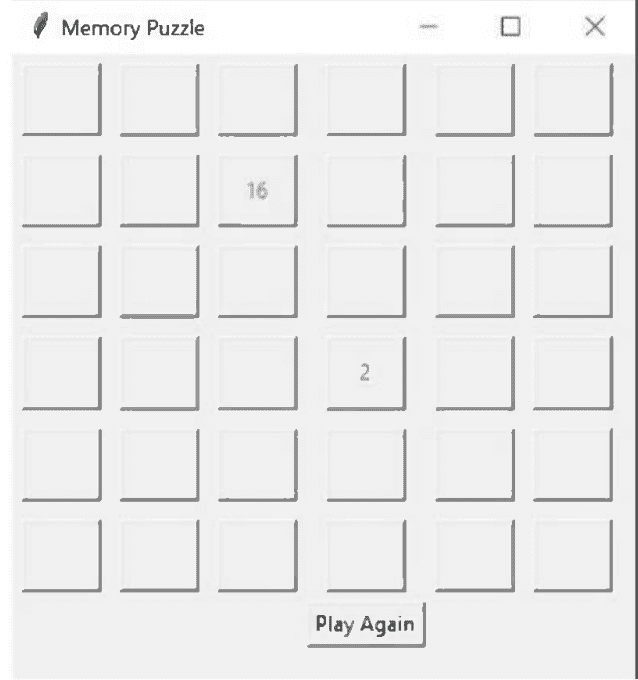

```python
import tkinter as tk
from tkinter import messagebox
import random
```

```python
class MemoryPuzzle:
    def __init__(self, root, rows=6, columns=6):
        self.root = root
        self.root.title("Memory Puzzle")

        self.rows = rows
        self.columns = columns
        self.tiles = [i for i in range(1, (rows * columns) // 2 + 1)] * 2
        random.shuffle(self.tiles)

        self.buttons = []
        self.create_buttons()

        self.first_click = None
        self.moves = 0

        # Set the initial form width and height
        self.initial_width = 350
        self.initial_height = 350
        self.center_window()
```

```python
def create_buttons(self):
    for i in range(self.rows):
        for j in range(self.columns):
            index = i * self.columns + j
            button = tk.Button(self.root, text=" ", width=5, height=2,
                               command=lambda idx=index: self.flip_tile(idx))
            button.grid(row=i, column=j, padx=5, pady=5)
            self.buttons.append(button)

    # Add "Play Again" button
    play_again_button = tk.Button(
        self.root, text="Play Again", command=self.reset_game)
    play_again_button.grid(row=self.rows, column=self.columns // 2)

def flip_tile(self, index):
    if self.buttons[index]["state"] == tk.NORMAL:
        self.buttons[index].config(
            text=str(self.tiles[index]), state=tk.DISABLED)
        if self.first_click is None:
            self.first_click = index
        else:
            self.moves += 1
            self.root.after(
                1000, lambda idx=index, first_click=self.first_click: self.check_match(idx, first_click))
            self.first_click = None

def check_match(self, index, first_click):
    if self.tiles[first_click] == self.tiles[index]:
        messagebox.showinfo("Match", "You found a match!")
        self.buttons[first_click].config(state=tk.DISABLED)
        self.buttons[index].config(state=tk.DISABLED)
    else:
        self.buttons[first_click].config(text=" ", state=tk.NORMAL)
        self.buttons[index].config(text=" ", state=tk.NORMAL)

    if all(self.buttons[i]["state"] == tk.DISABLED for i in range(self.rows * self.columns)):
        self.show_game_over_message()

def reset_game(self):
    # Reset the game by destroying the current window and creating a new one
    self.root.destroy()
    new_root = tk.Tk()
    new_game = MemoryPuzzle(new_root, rows=6, columns=6)
    new_root.mainloop()

def show_game_over_message(self):
    messagebox.showinfo(
        "Game Over", f"Congratulations! You won in {self.moves} moves.")

def center_window(self):
    # Calculate the center position on the screen
    screen_width = self.root.winfo_screenwidth()
    screen_height = self.root.winfo_screenheight()
    x_position = (screen_width - self.initial_width) // 2
    y_position = (screen_height - self.initial_height) // 2

    self.root.geometry(
        f"{self.initial_width}x{self.initial_height}+{x_position}+{y_position}")
```

```python
if __name__ == "__main__":
    root = tk.Tk()
    game = MemoryPuzzle(root, rows=6, columns=6)
    root.mainloop()
```

这个 Python 脚本使用 Tkinter 库创建了一个简单的记忆拼图游戏。让我们逐步解析代码：

### 1. 导入库：

Python 代码

```python
import tkinter as tk
```

### 2. MemoryPuzzle 类：

### Python 代码

```python
from tkinter import messagebox
import random

class MemoryPuzzle:
    def __init__(self, root, rows=6, columns=6):
        # MemoryPuzzle 类的初始化方法。
        # 接收 Tkinter 根窗口以及可选的行数和列数参数。

        # 初始化 Tkinter 根窗口。
        self.root = root
        self.root.title("Memory Puzzle")

        # 设置游戏网格的行数和列数。
        self.rows = rows
        self.columns = columns

        # 创建一个包含瓦片值的列表并将其打乱。
        self.tiles = [i for i in range(1, (rows * columns) // 2 + 1)] * 2
        random.shuffle(self.tiles)

        # 初始化用于存储按钮和其他变量的列表。
        self.buttons = []
        self.first_click = None
        self.moves = 0

        # 设置初始窗口宽度和高度，并使窗口居中。
        self.initial_width = 350
        self.initial_height = 350
        self.center_window()

        # 创建按钮和“重新开始”按钮。
        self.create_buttons()

        # 其他方法（create_buttons, flip_tile, check_match, reset_game,
        # show_game_over_message, center_window）在类内定义。
```

- `__init__`：初始化 MemoryPuzzle 对象。设置游戏网格、按钮和其他参数。
- `create_buttons`：为游戏网格创建按钮以及“重新开始”按钮。
- `flip_tile`：处理每个瓦片的点击事件，翻转它并检查是否匹配。
- `check_match`：比较两个被点击瓦片的值，并相应地更新游戏状态。
- `reset_game`：销毁当前窗口并创建一个新窗口以重置游戏。
- `show_game_over_message`：当游戏完成时显示一个消息框。
- `center_window`：将 Tkinter 窗口在屏幕上居中。

### 3. 主要部分：

### Python 代码

```python
if __name__ == "__main__":
    root = tk.Tk()
    game = MemoryPuzzle(root, rows=6, columns=6)
    root.mainloop()
```

- 检查脚本是否作为主模块运行。
- 创建 Tkinter 根窗口并初始化 MemoryPuzzle 游戏。
- 启动 Tkinter 主事件循环。

### 4. 执行：

- 该脚本创建一个带有 6x6 按钮网格的 Tkinter 窗口，代表记忆拼图。
- 每个按钮都有一个隐藏的值，点击时会显示出来。
- 目标是通过点击两个具有相同值的按钮来找到匹配的对。
- 游戏在成功匹配时提供反馈，并在所有对都找到后显示“游戏结束”消息。

注意：游戏窗口最初在屏幕上居中，“重新开始”按钮允许玩家在完成游戏后重新开始。

### 如何玩记忆拼图游戏

记忆拼图游戏是一个经典的配对记忆游戏，玩家需要找到匹配的瓦片对。以下是玩记忆拼图游戏的分步指南：

1. **目标：**
   - 游戏的目标是匹配所有瓦片对。
2. **游戏设置：**
   - 当你开始游戏时，屏幕上会显示一个面朝下的瓦片网格。
   - 每个瓦片都有一个隐藏的值。
3. **游戏机制：**
   - 点击一个瓦片以显示其值。
   - 然后，点击另一个瓦片以显示其值。
   - 如果两个显示的瓦片的值匹配，它们将保持面朝上，并且你得一分。
   - 如果值不匹配，瓦片将再次翻转为面朝下。
4. **记住瓦片：**
   - 当瓦片显示时，注意它们的值。
   - 尝试记住匹配对的位置。

### 5. 策略：

- 成功的关键是记住瓦片的位置并高效地匹配它们。
- 利用你的记忆来回忆网格中不同值的位置。

### 6. 游戏进度：

- 游戏会记录你进行的移动次数。
- 尝试以尽可能少的移动次数完成游戏。

### 7. 赢得游戏：

- 继续显示和匹配对，直到所有瓦片都面朝上。
- 一旦所有对都匹配完成，将显示“游戏结束”消息，显示完成游戏所用的移动次数。

### 8. 重新开始游戏：

- 如果你想再玩一次，可以点击游戏窗口底部的“重新开始”按钮。
- 这将重置游戏，打乱瓦片，并允许你开始一个新游戏。

### 9. 玩得开心：

- 享受测试和提高记忆技能的过程。

请记住，记忆拼图游戏不仅有趣，而且是锻炼记忆和注意力的绝佳方式。祝你好运，玩得开心！

## 8. 问答游戏

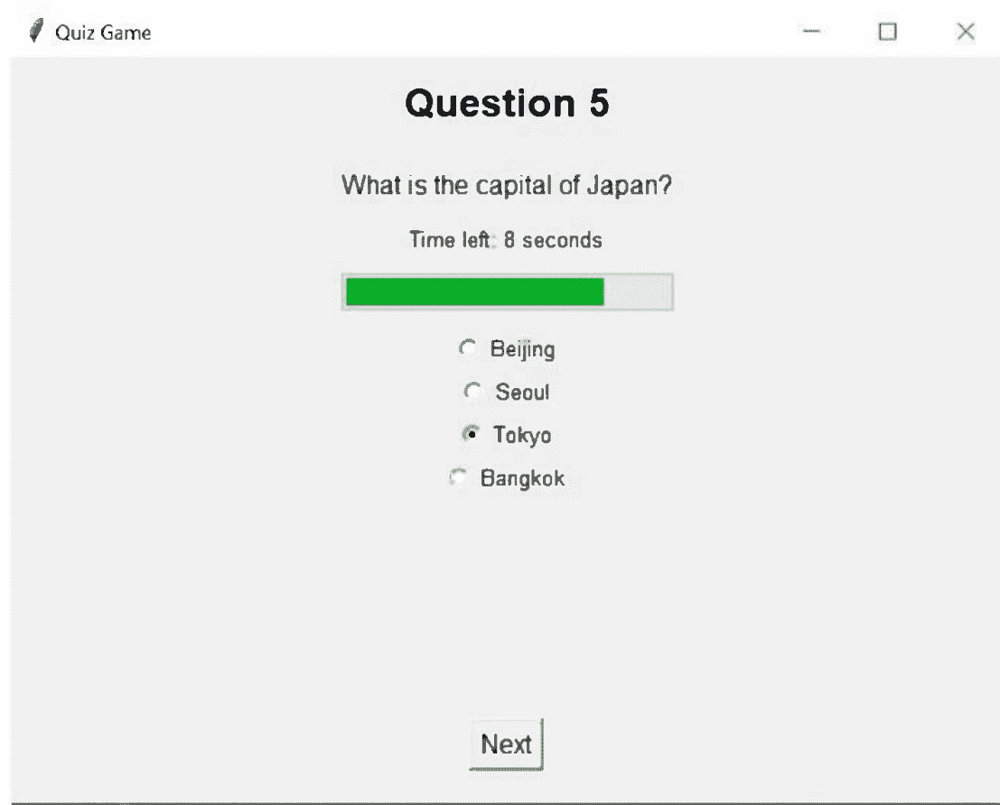

### Python 代码

```python
import tkinter as tk
from tkinter import messagebox
from tkinter import ttk
import time

class QuizGame:
    def __init__(self, root):
        self.root = root
        self.root.title("Quiz Game")
        self.root.geometry("600x450")
        self.root.attributes('-topmost', True)

        self.current_question = 0
        self.score = 0
        self.timer_seconds = 10
        self.timer_label = None
        self.progress_bar = None

        self.questions = [
            {
                "question": "What is the capital of France?",
                "options": ["Berlin", "Madrid", "Paris", "Rome"],
                "correct_answer": "Paris"
            },
            {
                "question": "Which planet is known as the Red Planet?",
                "options": ["Mars", "Venus", "Jupiter", "Saturn"],
                "correct_answer": "Mars"
            },
            {
                "question": "What is the largest mammal in the world?",
                "options": ["Elephant", "Blue Whale", "Giraffe", "Hippopotamus"],
                "correct_answer": "Blue Whale"
            },
            {
                "question": "Which programming language is this quiz written in?",
                "options": ["Python", "Java", "C++", "JavaScript"],
                "correct_answer": "Python"
            },
            {
                "question": "What is the capital of Japan?",
                "options": ["Beijing", "Seoul", "Tokyo", "Bangkok"],
                "correct_answer": "Tokyo"
            }
        ]

        self.create_widgets()

    def center_window(self):
        self.root.update_idletasks()
        window_width = self.root.winfo_width()
        window_height = self.root.winfo_height()
        position_left = int(
            self.root.winfo_screenwidth() / 2 - window_width / 2)
        position_top = int(self.root.winfo_screenheight() /
                          2 - window_height / 2)
        self.root.geometry(f"+{position_left}+{position_top}")

    def create_widgets(self):
        self.title_label = tk.Label(
            self.root, text="Quiz Game", font=("Helvetica", 18, "bold"))
        self.title_label.pack(pady=10)

        self.label_question = tk.Label(
            self.root, text="", font=("Helvetica", 12))
        self.label_question.pack(pady=10)

        self.var_option = tk.StringVar()
        self.option_buttons = []
        for option in self.questions[self.current_question]["options"]:
            radio_button = tk.Radiobutton(
                self.root, text=option, variable=self.var_option, value=option, font=("Helvetica", 10))
            self.option_buttons.append(radio_button)
            radio_button.pack()

        self.btn_next = tk.Button(
            self.root, text="Next", command=self.next_question, font=("Helvetica", 12))
        self.btn_next.pack(side=tk.BOTTOM, pady=20)

        self.timer_label = tk.Label(
            self.root, text=f"Time left: {self.timer_seconds} seconds", font=("Helvetica", 10))
        self.timer_label.pack()

        self.progress_bar = ttk.Progressbar(
            self.root, length=200, mode="determinate")
        self.progress_bar.pack(pady=10)

        self.update_question()
        self.start_timer()

    def next_question(self):
        user_answer = self.var_option.get()

        if user_answer == self.questions[self.current_question]["correct_answer"]:
            self.score += 1

        self.current_question += 1

        if self.current_question < len(self.questions):
            self.update_question()
        else:
            self.show_result()

    def update_question(self):
        self.title_label.config(text=f"Question {self.current_question + 1}")
        self.label_question.config(
            text=self.questions[self.current_question]["question"])

        self.var_option.set(None)
        for button in self.option_buttons:
            button.destroy()

        self.option_buttons = []
        for option in self.questions[self.current_question]["options"]:
            radio_button = tk.Radiobutton(
                self.root, text=option, variable=self.var_option, value=option, font=("Helvetica", 10))
            self.option_buttons.append(radio_button)
            radio_button.pack()

        self.timer_seconds = 10 # 为每个问题重置计时器
```

### 1. 导入库

```python
import tkinter as tk
from tkinter import messagebox
from tkinter import ttk
import time
```

- **tkinter**：这是 Python 自带的标准 GUI（图形用户界面）工具包。
- **messagebox**：提供了一组便捷函数，用于创建标准模态对话框。
- **ttk**：主题化 Tkinter，提供对 Tk 主题化组件集的访问。
- **time**：用于处理与时间相关的功能。

### 2. QuizGame 类

```python
class QuizGame:
```

- 此类封装了整个问答游戏。

### 3. 初始化器 (`__init__`)

```python
def __init__(self, root):
```

- 使用给定的根 Tkinter 窗口初始化 QuizGame 类。

### 4. 窗口配置

- 设置 Tkinter 窗口的基本配置，包括标题、大小和位置。
- 初始化变量，如 `current_question`、`score`、`timer_seconds`、`timer_label` 和 `progress_bar`。

### 5. 问题列表

```python
self.questions = [...]
```

- 包含一个字典列表，其中每个字典代表一个问题，包含其选项和正确答案。

### 6. create_widgets 方法

- 配置并创建各种组件（GUI 元素），如标签、单选按钮、按钮、计时器标签和进度条。
- 调用 `update_question` 和 `start_timer` 来初始化第一个问题并启动计时器。

### 7. center_window 方法

- 将 Tkinter 窗口在屏幕上居中。

### 8. next_question 方法

- 处理转到下一个问题的逻辑。
- 检查用户的答案是否正确，更新分数，并转到下一个问题。
- 如果没有更多问题，则调用 `show_result` 方法。

### 9. update_question 方法

- 用当前问题及其选项更新 GUI。
- 为每个问题重置计时器。
- 调用 `start_timer` 以启动计时器倒计时。

### 10. start_timer 方法

```python
def start_timer(self):
    self.timer_label.config(text=f"Time left: {self.timer_seconds} seconds")
    self.progress_bar["value"] = 100  # Reset progress bar
    self.update_timer()
```

- 初始化并启动计时器，更新计时器标签和进度条。

### 11. update_timer 方法

```python
def update_timer(self):
    if self.current_question < len(self.questions):
        self.timer_seconds -= 1
        self.timer_label.config(text=f"Time left: {self.timer_seconds} seconds")
        self.progress_bar["value"] = (self.timer_seconds / 10) * 100

        if self.timer_seconds >= 0:
            # Increase the delay to slow down the progress bar
            self.root.after(6000, self.update_timer)
        else:
            self.next_question()
```

- 根据剩余时间更新计时器标签和进度条。
- 使用 `after` 方法递归调用自身，直到计时器归零。

### 12. show_result 方法

```python
def show_result(self):
    result_text = f"You scored {self.score} out of {len(self.questions)}!"
    messagebox.showinfo("Quiz Completed", result_text)
```

- 显示一个包含问答结果的消息框，显示用户的得分。

### 13. 主代码块 (`__main__`)

```python
if __name__ == "__main__":
    root = tk.Tk()
    app = QuizGame(root)
    app.center_window()
    root.mainloop()
```

- 创建一个 Tkinter 根窗口并初始化 **QuizGame** 类。
- 将窗口居中并启动 Tkinter 事件循环。

此实现提供了一个简单的交互式问答游戏，每个问题都有倒计时器，并在最后显示最终得分。玩家可以通过选择选项来回答问题，游戏会跟踪他们的得分。

### 如何玩问答游戏

要玩问答游戏，请按照以下步骤操作：

#### 1. 运行 Python 脚本

- 将提供的包含问答游戏代码的 Python 脚本保存到一个文件中（例如 `quiz_game.py`）。
- 打开终端或命令提示符。
- 导航到包含该脚本的目录。
- 通过执行以下命令运行脚本：

```bash
python quiz_game.py
```

2. 这将启动问答游戏窗口。

#### 3. 回答问题

- 问答游戏窗口将显示第一个问题和多项选择题选项。
- 点击你认为正确答案旁边的单选按钮。

#### 4. 下一个问题

- 点击“下一步”按钮转到下一个问题。
- 每个问题的计时器都会重置。

#### 5. 计时器倒计时

- 注意计时器标签和进度条。
- 你回答每个问题的时间有限（**默认**为 10 秒）。

#### 6. 评分

- 当你选择正确答案时，你的分数会增加。
- 总分在问答结束时显示。

#### 7. 问答结束

- 回答完所有问题后，将出现一个消息框，显示你的最终得分。

#### 8. 关闭游戏

- 查看分数后，你可以关闭问答游戏窗口。

#### 9. 注意

- 问答游戏有一组**预定义**的问题和答案。如果你想自定义问答内容，可以修改脚本中的 `self.questions` 列表。

## 9. 2048 游戏

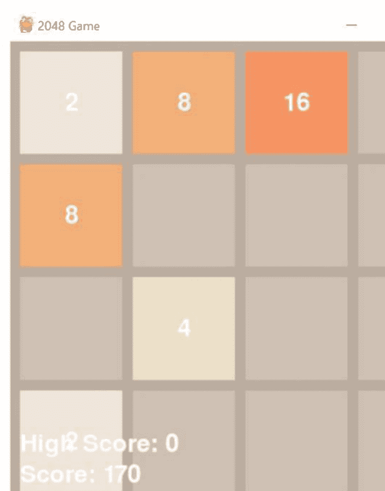

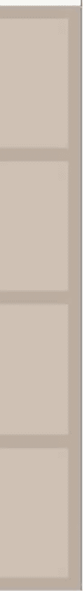

```python
import pygame
import random

### Initialize pygame
pygame.init()

### Constants
GRID_SIZE = 4
TILE_SIZE = 100
GRID_MARGIN = 10
SCREEN_SIZE = (GRID_SIZE * TILE_SIZE + (GRID_SIZE + 1) * GRID_MARGIN,
              GRID_SIZE * TILE_SIZE + (GRID_SIZE + 1) * GRID_MARGIN)
BACKGROUND_COLOR = (187, 173, 160)
GRID_COLOR = (205, 193, 180)
FONT_COLOR = (255, 255, 255)

### Initialize screen
screen = pygame.display.set_mode(SCREEN_SIZE)
pygame.display.set_caption("2048 Game")

### Fonts
font = pygame.font.Font(None, 36)

### Colors for each tile value
TILE_COLORS = {
    0: (205, 193, 180),
    2: (238, 228, 218),
    4: (237, 224, 200),
    8: (242, 177, 121),
    16: (245, 149, 99),
    32: (246, 124, 95),
    64: (246, 94, 59),
    128: (237, 207, 114),
    256: (237, 204, 97),
    512: (237, 200, 80),
    1024: (237, 197, 63),
    2048: (237, 194, 46),
}

### Constants for additional features
ANIMATION_SPEED = 10
GAME_WIN_TILE = 2048
CUSTOM_GRID_SIZES = [4, 5, 6]
COLOR_THEMES = {
    'default': TILE_COLORS,
    'dark': {
        0: (60, 60, 60),
        2: (100, 100, 100),
        4: (120, 120, 120),
        8: (140, 140, 140),
        16: (160, 160, 160),
        32: (180, 180, 180),
        64: (200, 200, 200),
        128: (220, 220, 220),
        256: (240, 240, 240),
        512: (255, 255, 255),
        1024: (255, 255, 255),
        2048: (255, 255, 255),
    },
}

### Helper function to draw the grid
def draw_grid():
    for row in range(GRID_SIZE):
        for col in range(GRID_SIZE):
            pygame.draw.rect(screen, GRID_COLOR, [
                (GRID_MARGIN + TILE_SIZE) * col + GRID_MARGIN,
                (GRID_MARGIN + TILE_SIZE) * row + GRID_MARGIN,
                TILE_SIZE,
                TILE_SIZE
            ])

### Helper function to draw the tiles
def draw_tiles(grid):
    for row in range(GRID_SIZE):
        for col in range(GRID_SIZE):
            value = grid[row][col]
            if value != 0:
                pygame.draw.rect(screen, TILE_COLORS[value], [
                    (GRID_MARGIN + TILE_SIZE) * col + GRID_MARGIN,
                    (GRID_MARGIN + TILE_SIZE) * row + GRID_MARGIN,
                    TILE_SIZE,
                    TILE_SIZE
                ])
                text = font.render(str(value), True, FONT_COLOR)
                text_rect = text.get_rect(center=(
                    (GRID_MARGIN + TILE_SIZE) * col +
                    GRID_MARGIN + TILE_SIZE // 2,
                    (GRID_MARGIN + TILE_SIZE) *
                    row + GRID_MARGIN + TILE_SIZE // 2
                ))
                screen.blit(text, text_rect)
```

### 生成新方块（2或4）的函数

def generate_tile(grid):
    empty_cells = [(row, col) for row in range(GRID_SIZE)
                   for col in range(GRID_SIZE) if grid[row][col] == 0]
    if empty_cells:
        row, col = random.choice(empty_cells)
        grid[row][col] = random.choice([2, 4])

### 按给定方向移动方块的函数

def move_tiles(grid, direction):
    # 转置网格以便于处理行和列
    if direction == 'left':
        grid = [list(row) for row in zip(*grid)]
    elif direction == 'up':
        grid = [list(col) for col in grid[::-1]]
    elif direction == 'down':
        grid = [list(col[::-1]) for col in grid]

    for row in range(GRID_SIZE):
        # 移除零值
        non_zeros = [val for val in grid[row] if val != 0]
        # 合并方块
        for col in range(len(non_zeros) - 1):
            if non_zeros[col] == non_zeros[col + 1]:
                non_zeros[col] *= 2
                non_zeros[col + 1] = 0
        # 再次移除零值
        non_zeros = [val for val in non_zeros if val != 0]
        # 用零填充行
        grid[row] = non_zeros + [0] * (GRID_SIZE - len(non_zeros))

    # 撤销转置
    if direction == 'left':
        grid = [list(row) for row in zip(*grid)]
    elif direction == 'up':
        grid = [list(col[::-1]) for col in grid[::-1]]
    elif direction == 'down':
        grid = [list(col) for col in grid[::-1]]

    return grid

### 检查游戏是否结束的函数

def is_game_over(grid):
    for row in grid:
        if 0 in row or any(row[i] == row[i + 1] for i in range(GRID_SIZE - 1)):
            return False
    for col in zip(*grid):
        if any(col[i] == col[i + 1] for i in range(GRID_SIZE - 1)):
            return False
    return True

### 显示游戏结束屏幕的函数

def game_over_screen():
    screen.fill(BACKGROUND_COLOR)
    game_over_text = font.render("游戏结束！", True, FONT_COLOR)
    text_rect = game_over_text.get_rect(
        center=(SCREEN_SIZE[0] // 2, SCREEN_SIZE[1] // 2 - 30))
    screen.blit(game_over_text, text_rect)
    restart_text = font.render("按 R 重新开始", True, FONT_COLOR)
    text_rect = restart_text.get_rect(
        center=(SCREEN_SIZE[0] // 2, SCREEN_SIZE[1] // 2 + 30))
    screen.blit(restart_text, text_rect)
    pygame.display.flip()

### 显示分数的函数

def display_score(score):
    score_text = font.render(f"分数：{score}", True, FONT_COLOR)
    screen.blit(score_text, (GRID_MARGIN, SCREEN_SIZE[1] - GRID_MARGIN - 30))

### 显示最高分的函数

def display_high_score(high_score):
    high_score_text = font.render(
        f"最高分：{high_score}", True, FONT_COLOR)
    screen.blit(high_score_text, (GRID_MARGIN,
                                  SCREEN_SIZE[1] - GRID_MARGIN - 60))

### 显示游戏胜利屏幕的函数

def game_win_screen():
    screen.fill(BACKGROUND_COLOR)
    game_win_text = font.render("你赢了！", True, FONT_COLOR)
    text_rect = game_win_text.get_rect(
        center=(SCREEN_SIZE[0] // 2, SCREEN_SIZE[1] // 2 - 30))
    screen.blit(game_win_text, text_rect)
    restart_text = font.render("按 R 重新开始", True, FONT_COLOR)
    text_rect = restart_text.get_rect(
        center=(SCREEN_SIZE[0] // 2, SCREEN_SIZE[1] // 2 + 30))
    screen.blit(restart_text, text_rect)
    pygame.display.flip()

### 绘制带动画的方块的函数

def draw_animated_tiles(grid, animation_progress):
    for row in range(GRID_SIZE):
        for col in range(GRID_SIZE):
            value = grid[row][col]
            if value != 0:
                # 根据动画进度计算位置
                x = (GRID_MARGIN + TILE_SIZE) * col + GRID_MARGIN
                y = (GRID_MARGIN + TILE_SIZE) * row + GRID_MARGIN
                target_x = x + (TILE_SIZE + GRID_MARGIN) * animation_progress
                target_y = y + (TILE_SIZE + GRID_MARGIN) * animation_progress

                # 绘制带动画的方块
                pygame.draw.rect(screen, TILE_COLORS[value], [
                    target_x,
                    target_y,
                    TILE_SIZE,
                    TILE_SIZE
                ])
                text = font.render(str(value), True, FONT_COLOR)
                text_rect = text.get_rect(center=(
                    target_x + TILE_SIZE // 2,
                    target_y + TILE_SIZE // 2
                ))
                screen.blit(text, text_rect)

### 带动画移动方块的函数

def move_animated_tiles(grid, direction, animation_progress):
    if direction == 'left':
        grid = [list(row) for row in zip(*grid)]
    elif direction == 'up':
        grid = [list(col) for col in grid[::-1]]
    elif direction == 'down':
        grid = [list(col[::-1]) for col in grid]

    for row in range(GRID_SIZE):
        non_zeros = [val for val in grid[row] if val != 0]
        for col in range(len(non_zeros) - 1):
            if non_zeros[col] == non_zeros[col + 1]:
                non_zeros[col] *= 2
                non_zeros[col + 1] = 0

        non_zeros = [val for val in non_zeros if val != 0]
        grid[row] = non_zeros + [0] * (GRID_SIZE - len(non_zeros))

    if direction == 'left':
        grid = [list(row) for row in zip(*grid)]
    elif direction == 'up':
        grid = [list(col[::-1]) for col in grid[::-1]]
    elif direction == 'down':
        grid = [list(col) for col in grid[::-1]]

    draw_animated_tiles(grid, animation_progress)
    pygame.display.flip()
    pygame.time.delay(ANIMATION_SPEED)

    return grid

### 动画化方块移动的函数

def animate_tile_movement(prev_grid, current_grid, direction, score, high_score):
    for i in range(1, ANIMATION_SPEED + 1):
        animation_progress = i / ANIMATION_SPEED
        screen.fill(BACKGROUND_COLOR)
        draw_grid()
        draw_animated_tiles(prev_grid, 1 - animation_progress)
        draw_animated_tiles(current_grid, animation_progress)
        display_score(score)
        display_high_score(high_score)
        pygame.display.flip()

    return current_grid

### 撤销上一步移动的函数

def undo_move(state_stack):
    if len(state_stack) > 1:
        state_stack.pop() # 丢弃当前状态
        prev_grid, prev_score, prev_high_score = state_stack.pop()
        screen.fill(BACKGROUND_COLOR)
        draw_grid()
        draw_tiles(prev_grid)
        display_score(prev_score)
        display_high_score(prev_high_score)
        pygame.display.flip()
        pygame.time.delay(ANIMATION_SPEED)

        return prev_grid, prev_score, prev_high_score
    else:
        return state_stack[0] # 如果只有一个状态，则原样返回

### 主游戏循环

def main():
    grid = [[0] * GRID_SIZE for _ in range(GRID_SIZE)]
    generate_tile(grid)
    generate_tile(grid)

    running = True
    game_over = False
    game_won = False
    score = 0
    high_score = 0
    state_stack = [([row[:] for row in grid], score, high_score)]

    while running:
        for event in pygame.event.get():
            if event.type == pygame.QUIT:
                running = False
            elif event.type == pygame.KEYDOWN:
                if not game_over and not game_won:
                    if event.key == pygame.K_LEFT:
                        state_stack.append(
                            ([row[:] for row in grid], score, high_score))
                        grid = move_animated_tiles(grid, 'left', 0)
                        grid = move_tiles(grid, 'left')
                        if grid != state_stack[-1][0]:
                            generate_tile(grid)
                            score += calculate_score(state_stack[-1][0], grid)
                            grid = animate_tile_movement(
                                state_stack[-1][0], grid, 'left', score, high_score)
                    elif event.key == pygame.K_RIGHT:
                        state_stack.append(
                            ([row[:] for row in grid], score, high_score))
                        grid = move_animated_tiles(grid, 'right', 0)
                        grid = move_tiles(grid, 'right')
                        if grid != state_stack[-1][0]:
                            generate_tile(grid)
                            score += calculate_score(state_stack[-1][0], grid)
                    elif event.key == pygame.K_UP:
                        state_stack.append(
                            ([row[:] for row in grid], score, high_score))
                        grid = move_animated_tiles(grid, 'up', 0)
                        grid = move_tiles(grid, 'up')
                        if grid != state_stack[-1][0]:
                            generate_tile(grid)
                            score += calculate_score(state_stack[-1][0], grid)
                    elif event.key == pygame.K_DOWN:
                        state_stack.append(
                            ([row[:] for row in grid], score, high_score))
                        grid = move_animated_tiles(grid, 'down', 0)
                        grid = move_tiles(grid, 'down')

### Pygame 初始化：

- 脚本首先导入 Pygame 库并进行初始化。

### Python 代码

```python
import pygame
```

### 常量与配置：

- 为游戏设置各种常量和配置，包括网格大小、方块大小、颜色、字体、动画速度、胜利条件以及颜色主题。

### Python 代码

```python
GRID_SIZE = 4
TILE_SIZE = 100
GRID_MARGIN = 10
SCREEN_SIZE = (GRID_SIZE * TILE_SIZE + (GRID_SIZE + 1) * GRID_MARGIN,
               GRID_SIZE * TILE_SIZE + (GRID_SIZE + 1) * GRID_MARGIN)
BACKGROUND_COLOR = (187, 173, 160)
GRID_COLOR = (205, 193, 180)
FONT_COLOR = (255, 255, 255)
### ... 其他常量 ...
```

### Pygame 屏幕初始化：

- 使用指定的尺寸和标题初始化 Pygame 屏幕。

### Python 代码

```python
screen = pygame.display.set_mode(SCREEN_SIZE)
pygame.display.set_caption("2048 Game")
```

### 网格与方块绘制：

- 定义了在屏幕上绘制网格和方块的函数。

### Python 代码

```python
def draw_grid():
    # 在屏幕上绘制网格

def draw_tiles(grid):
    # 根据提供的网格在屏幕上绘制方块
```

### 方块颜色与主题：

- 定义了每个方块数值对应的颜色以及不同的颜色主题。

### Python 代码

```python
TILE_COLORS = {
    # ... 基于数值的方块颜色 ...
    COLOR_THEMES = {
        'default': TILE_COLORS,
        'dark': {
            # ... 深色主题的颜色 ...
        },
    }
```

### 方块移动与动画：

- 定义了在不同方向移动方块、生成新方块以及处理动画的函数。

### Python 代码

```python
def move_tiles(grid, direction):
    # 在指定方向移动方块

def generate_tile(grid):
    # 在空单元格生成新方块（2 或 4）

def draw_animated_tiles(grid, animation_progress):
    # 根据动画进度绘制带动画的方块
```

### 游戏状态管理：

- 定义了检查游戏结束条件、显示游戏结束画面以及管理游戏状态的函数。

### Python 代码

```python
def is_game_over(grid):
    # 检查游戏是否结束

def game_over_screen():
    # 显示游戏结束画面

def display_score(score):
    # 在屏幕上显示当前分数
```

### 主游戏循环：

- 主游戏循环处理用户输入、更新游戏状态并持续重绘屏幕。

### Python 代码

```python
def main():
    # 主游戏循环
```

### 附加功能：

- 脚本包含撤销移动、计算分数以及显示胜利画面等附加功能。

### Python 代码

```python
def undo_move(state_stack):
    # 撤销上一步移动

def calculate_score(prev_grid, current_grid):
    # 根据网格变化计算分数
```

### 运行游戏：

- 当文件运行时，脚本被执行，游戏开始。

### Python 代码

```python
if __name__ == "__main__":
    main()
```

总体而言，这个脚本提供了一个功能完整的 2048 游戏实现，包含基本功能，并使用 Pygame 处理图形和用户输入。玩家可以移动方块、合并它们、达成胜利条件并重新开始游戏。

### 如何玩 2048 游戏

2048 游戏是一款单人滑动拼图游戏，目标是合并相同的方块以达到数值为 2048 的方块。游戏在 4x4 的网格上进行，相同数值的方块可以通过向特定方向移动来合并。以下是根据提供的 **Python 代码** 对如何玩 2048 游戏的详细说明：

#### 1. 游戏初始化：

- 游戏开始时是一个空的 4x4 网格。
- 两个数值为 2 或 4 的方块被随机放置在网格上。

#### 2. 控制方式：

- 你可以使用键盘上的方向键控制方块的移动。
- 按下 **左方向键** 将所有方块向左移动。
- 按下 **右方向键** 将所有方块向右移动。
- 按下 **上方向键** 将所有方块向上移动。
- 按下 **下方向键** 将所有方块向下移动。
- 随时按下 **R 键** 可以重新开始游戏。

#### 3. 游戏玩法：

- 相同数值的方块可以通过向彼此移动来合并成一个方块。
- 每当你移动一次，一个数值为 2 或 4 的新方块会出现在一个空位上。
- 目标是不断合并方块以创造更大的数值，并达到数值为 2048 的方块。
- 游戏持续进行，直到你达到 2048 方块（赢得游戏）或者网格已满且无法再进行任何移动（输掉游戏）。

#### 4. 计分：

- 你的分数基于你合并的方块的数值。
- 每次两个方块合并时，生成方块的数值会被加到你的分数中。

#### 5. 特殊功能：

- 游戏包含一个胜利条件，当达到 2048 方块时会显示胜利画面。
- 有一个撤销功能（按下 **U 键**），允许你撤销上一步移动。然而，它有使用限制，不能 **无限次** 使用。
- 游戏会跟踪并显示你当前的分数以及本次会话中获得的最高分。

#### 6. 游戏结束：

- 当你达到 2048 方块时，游戏结束，显示胜利画面。
- 如果网格已满且无法再进行任何移动，游戏结束，并显示游戏结束画面。
- 你可以随时按下 **R 键** 重新开始游戏。

#### 7. 最高分：

- 游戏会记录本次会话中获得的最高分。

#### 8. 附加细节：

- 网格和方块使用 Pygame 库显示，游戏提供图形界面。

总体而言，2048 游戏涉及战略思考、规划你的移动，并旨在创造尽可能大的方块以获得最高分。它是一款简单但富有挑战性的拼图游戏，既需要技巧，也需要一点运气。

## 10. 二十一点游戏

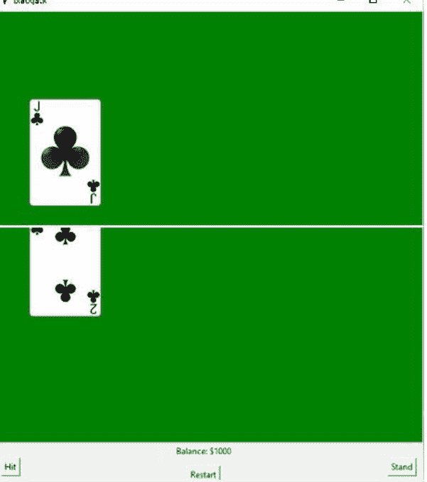

```python
import tkinter as tk
from tkinter import messagebox
from PIL import Image, ImageTk
import random

class BlackjackGame:
    def __init__(self, master):
        self.master = master
        self.master.title("Blackjack")

        self.deck = self.get_deck()
        self.player_hand = []
        self.dealer_hand = []
        self.player_balance = 1000  # 初始余额

        self.player_card_images = []  # 跟踪玩家的牌图
        self.dealer_card_images = []  # 跟踪庄家的牌图

        self.create_widgets()

    def get_deck(self):
        suits = ['Hearts', 'Diamonds', 'Clubs', 'Spades']
        ranks = ['2', '3', '4', '5', '6', '7',
                 '8', '9', '10', 'J', 'Q', 'K', 'A']
        deck = [{'suit': suit, 'rank': rank}
                for suit in suits for rank in ranks]
        random.shuffle(deck)
        return deck

    def deal_card(self, hand):
        card = self.deck.pop()
        hand.append(card)
        return card

    def calculate_score(self, hand):
        score = sum(self.get_card_value(card) for card in hand)
        if score > 21 and 'A' in [card['rank'] for card in hand]:
            score -= 10  # 如果手牌中有A且总分超过21，则减去10
        return score

    def get_card_value(self, card):
        if card['rank'] in ['J', 'Q', 'K']:
            return 10
        elif card['rank'] == 'A':
            return 11
        else:
            return int(card['rank'])

    def player_hit(self):
        # 在执行期间禁用“要牌”按钮
        self.hit_button.config(state=tk.DISABLED)

        self.deal_card(self.player_hand)
        self.update_display()

        player_score = self.calculate_score(self.player_hand)
        if player_score > 21:
            self.end_game("你爆牌了。你输了！")

        # 检查是否为黑杰克（10点和A）
        if player_score == 21 and len(self.player_hand) == 2:
            self.end_game("黑杰克！你赢了！")
        elif player_score <= 21:
            # 如果分数仍在21以下，则在执行后重新启用“要牌”按钮
            self.hit_button.config(state=tk.NORMAL)

    def end_game(self, message):
        if "你输了！" in message:
            self.player_balance -= 100  # 输掉时从余额中扣除100
            self.update_score()  # 更新分数

        messagebox.showinfo("游戏结束", message +
            f"\n你的余额：${self.player_balance}")
        self.update_score()  # 添加括号以正确调用该方法

    def dealer_play(self):
        while self.calculate_score(self.dealer_hand) < 17:
            self.deal_card(self.dealer_hand)
        self.update_display()

        player_score = self.calculate_score(self.player_hand)
        dealer_score = self.calculate_score(self.dealer_hand)

        if dealer_score > 21 or dealer_score < player_score:
            self.end_game("你赢了！")
            self.player_balance += 100
        elif dealer_score > player_score:
            self.end_game("你输了！")
            self.player_balance -= 100
        else:
            self.end_game("平局！")

    def restart_game(self):
        self.deck = self.get_deck()
        self.player_hand.clear()
        self.dealer_hand.clear()
        self.player_canvas.delete("all")
        self.dealer_canvas.delete("all")

        # 为玩家和庄家各发两张初始牌
        self.player_hand.extend([self.deal_card(self.player_hand), self.deal_card(self.player_hand)])
        self.dealer_hand.extend([self.deal_card(self.dealer_hand), self.deal_card(self.dealer_hand)])

        # 将玩家余额重置为初始值
        self.player_balance = 1000

        # 启用“要牌”和“停牌”按钮
        self.hit_button["state"] = "normal"
        self.stand_button["state"] = "normal"

        # 更新分数标签
        self.update_score()

        # 更新显示
        self.update_display()

    def _display_card(self, img_path, x, y, canvas, card_images=None):
        img_path = img_path.lower()
        image = Image.open(img_path)
        image = image.resize((100, 150), Image.ANTIALIAS)
        photo = ImageTk.PhotoImage(image)

        canvas.create_image(x, y, anchor=tk.W, image=photo)
        canvas.image = photo

        if card_images is not None:
            card_images.append(photo)

    def update_display(self):
        self.update_player_hand()
        self.update_dealer_hand()
        self.update_score()  # 每次操作后更新分数标签

    def update_player_hand(self):
        self.player_canvas.delete("all")
        for card in self.player_hand:
            img_path = f"C:/Users/Suchat/Playing Cards/Playing Cards/PNG-cards-1.3/{card['rank']}_of_{card['suit']}.png"
            self._display_card(img_path, 50, 200, self.player_canvas, self.player_card_images)

    def update_dealer_hand(self):
        self.dealer_canvas.delete("all")
        for card in self.dealer_hand:
            img_path = f'C:/Users/Suchat/Playing Cards/Playing Cards/PNG-cards-1.3/{card["rank"]}_of_{card["suit"]}.png'
            self._display_card(img_path, 50, 50, self.dealer_canvas, self.dealer_card_images)

    def update_score(self):
        self.score_label.config(text=f'余额：${self.player_balance}')

    def create_widgets(self):
        self.player_hand = [self.deal_card(
            self.player_hand), self.deal_card(self.player_hand)]
        self.dealer_hand = [self.deal_card(
            self.dealer_hand), self.deal_card(self.dealer_hand)]

        self.player_canvas = tk.Canvas(
            self.master, width=600, height=300, bg="green")
        self.player_canvas.pack()

        self.dealer_canvas = tk.Canvas(
            self.master, width=600, height=300, bg="green")
        self.dealer_canvas.pack()

        self.hit_button = tk.Button(
            self.master, text="Hit", command=self.player_hit)
        self.hit_button.pack(side=tk.LEFT, padx=10)

        self.stand_button = tk.Button(
            self.master, text="Stand", command=self.dealer_play)
        self.stand_button.pack(side=tk.RIGHT, padx=10)

        self.restart_button = tk.Button(
            self.master, text="Restart", command=self.restart_game)
        self.restart_button.pack(side=tk.BOTTOM, pady=10)

        self.score_label = tk.Label(
            self.master, text=f"Balance: ${self.player_balance}")
        self.score_label.pack(side=tk.BOTTOM)

        self.update_display()

def main():
    root = tk.Tk()
    game = BlackjackGame(root)
    root.mainloop()

if __name__ == "__main__":
    main()
```

这个Python脚本使用`tkinter`库为一个21点游戏创建了一个简单的图形用户界面（GUI）。让我们来详细了解一下这个脚本：

### 导入语句：

```python
import tkinter as tk
from tkinter import messagebox
from PIL import Image, ImageTk
import random
```

- `tkinter`：用于创建GUI的主要库。
- `messagebox`：`tkinter`的一个子模块，用于显示消息框。
- `Image`和`ImageTk`来自`PIL`（Pillow）库，用于处理图像。
- `random`：用于洗牌。

### BlackjackGame类：

```python
class BlackjackGame:
    def __init__(self, master):
        # 初始化方法
        # 初始化主窗口并设置标题
        self.master = master
        self.master.title("Blackjack")

        # 初始化牌组和玩家相关属性
        self.deck = self.get_deck()
        self.player_hand = []
        self.dealer_hand = []
        self.player_balance = 1000

        # 跟踪玩家和庄家的牌图
        self.player_card_images = []
        self.dealer_card_images = []

        # 创建GUI部件
        self.create_widgets()

    # ... (更多方法将在下面解释)
```

### 方法：

1. `get_deck`：创建并洗一副标准的52张扑克牌。
2. `deal_card`：从牌组中发一张牌并添加到指定的手牌中。
3. `calculate_score`：计算手牌的总分，考虑A的值。
4. `get_card_value`：返回一张牌的数值。
5. `player_hit`：处理玩家点击“要牌”按钮时的逻辑。
6. `end_game`：在游戏结束时显示一个消息框，并更新玩家的余额。
7. `dealer_play`：模拟庄家的回合，持续抽牌直到分数达到17或更高。
8. `restart_game`：重置游戏状态，允许玩家开始新的一轮。
9. `_display_card`：在画布的指定坐标上显示一张牌的图像。
10. `update_display`：在玩家每次操作后更新显示。
11. `update_player_hand`：更新GUI上玩家手牌的显示。
12. `update_dealer_hand`：更新GUI上庄家手牌的显示。

### 13. update_score : 更新显示的玩家余额。
14. create_widgets : 创建并配置图形用户界面元素。

### 图形用户界面元素：

- player_canvas 和 dealer_canvas : 用于显示玩家和庄家牌的画布控件。
- hit_button 和 stand_button : 用于玩家操作的按钮。
- restart_button : 用于重新开始游戏的按钮。
- score_label : 用于显示玩家余额的标签。

### 主函数：

### Python 代码

```python
def main():
    root = tk.Tk()
    game = BlackjackGame(root)
    root.mainloop()

if __name__ == "__main__":
    main()
```

- 创建主 Tkinter 窗口并初始化 BlackjackGame 实例。
- 启动 Tkinter 事件循环。

### 整体流程：

1. 游戏从一个初始牌组、玩家手牌和庄家手牌开始。
2. 创建并显示图形用户界面元素。
3. 通过按钮点击处理玩家操作（要牌、停牌）。
4. 相应地更新游戏状态和图形用户界面。
5. 当游戏结束时，会显示一个包含结果的消息框。
6. 玩家可以重新开始游戏，进行新一轮。

该游戏将基本的二十一点逻辑与简单的图形用户界面相结合，以实现用户交互。

### 如何玩二十一点游戏

提供的代码是使用 Python Tkinter 库实现图形用户界面的二十一点游戏的简单实现。让我们分解关键组件并解释如何玩游戏：

1. **初始化：**
    * 游戏通过在 `main` 函数中创建 `BlackjackGame` 类的实例来启动。
    * 使用 Tkinter 创建游戏窗口。

### Python 代码

```python
root = tk.Tk()
game = BlackjackGame(root)
root.mainloop()
```

### 2. 牌组与初始化：

- `get_deck` 方法创建一个标准的 52 张扑克牌牌组，将其洗牌并返回牌组。
- 玩家和庄家的手牌各用两张牌初始化。

### Python 代码

```python
self.deck = self.get_deck()
self.player_hand = [self.deal_card(self.player_hand), self.deal_card(self.player_hand)]
self.dealer_hand = [self.deal_card(self.dealer_hand), self.deal_card(self.dealer_hand)]
```

### 3. 游戏逻辑：

- `deal_card` 方法从牌组中向指定手牌发一张牌。
- `calculate_score` 方法计算给定手牌的总分，同时考虑 A 的特殊情况。
- `get_card_value` 方法为牌分配数值。
- `player_hit` 方法在玩家选择要牌时处理玩家操作，更新显示并检查输赢条件。

### Python 代码

```python
def player_hit(self):
    # ... (在执行期间禁用要牌按钮)
    self.deal_card(self.player_hand)
    self.update_display()
    player_score = self.calculate_score(self.player_hand)
    if player_score > 21:
        self.end_game("你爆牌了。你输了！")
    # ... (检查是否为黑杰克)
    elif player_score <= 21:
        # ... (如果分数仍低于 21，则在执行后启用要牌按钮)
```

4. **游戏结束条件：**

- `end_game` 方法根据输赢条件更新玩家余额，并显示一个包含结果的消息框。

### Python 代码

```python
def end_game(self, message):
    # ... (输时从余额中扣除 100)
    messagebox.showinfo("游戏结束", message + f"\n你的余额: ${self.player_balance}")
    self.update_score()
```

### 5. 庄家回合：

- `dealer_play` 方法处理庄家的回合，持续抽牌直到其分数至少为 17。
- 它比较玩家和庄家的最终分数以确定游戏结果。

### Python 代码

```python
def dealer_play(self):
    # ... (庄家抽牌直到分数至少为 17)
    if dealer_score > 21 or dealer_score < player_score:
        self.end_game("你赢了！")
        self.player_balance += 100
    elif dealer_score > player_score:
        self.end_game("你输了！")
        self.player_balance -= 100
    else:
        self.end_game("平局！")
```

### 6. 重新开始游戏：

- `restart_game` 方法重置游戏状态，包括牌组、手牌和玩家余额。

### Python 代码

```python
def restart_game(self):
    # ... (重置游戏状态)
    self.update_display()
```

### 7. 图形用户界面元素：

- 图形用户界面元素包括两个用于显示玩家和庄家牌的画布、用于玩家操作的“要牌”和“停牌”按钮、一个“重新开始”按钮以及一个显示玩家余额的标签。

### Python 代码

```python
self.player_canvas = tk.Canvas(self.master, width=600, height=300, bg="green")
### ... (类似地创建 dealer_canvas, hit_button, stand_button, restart_button, score_label)
```

### 8. 牌的显示：

- `_display_card` 方法处理在画布上显示牌图像。

### Python 代码

```python
def _display_card(self, img_path, x, y, canvas, card_images=None):
    # ... (打开并调整图像大小，创建 Tkinter PhotoImage，并在画布上显示)
```

### 9. 更新显示：

- `update_display` 方法在每次操作后更新玩家和庄家的手牌以及分数标签。

### Python 代码

```python
def update_display(self):
    self.update_player_hand()
    self.update_dealer_hand()
    self.update_score()
```

### 10. 牌的图像：

- 牌的图像从 PNG 文件加载，其路径根据牌的点数和花色生成。

### Python 代码

```python
img_path = f"C:/Users/Suchat/Playing Cards/Playing Cards/PNG-cards-1.3/{card['rank']}_of_{card['suit']}.png"
```

### 玩游戏：

- 运行脚本。
- 初始玩家余额为 $1000。
- 点击“要牌”按钮以抽取额外的牌。
- 点击“停牌”按钮以结束玩家回合，让庄家行动。
- 游戏自动确定赢家并更新余额。
- 点击“重新开始”按钮以使用新牌组开始新游戏。

注意：确保牌图像的文件路径正确，并且图像文件在指定目录中可用。

## 11. 数独求解器游戏

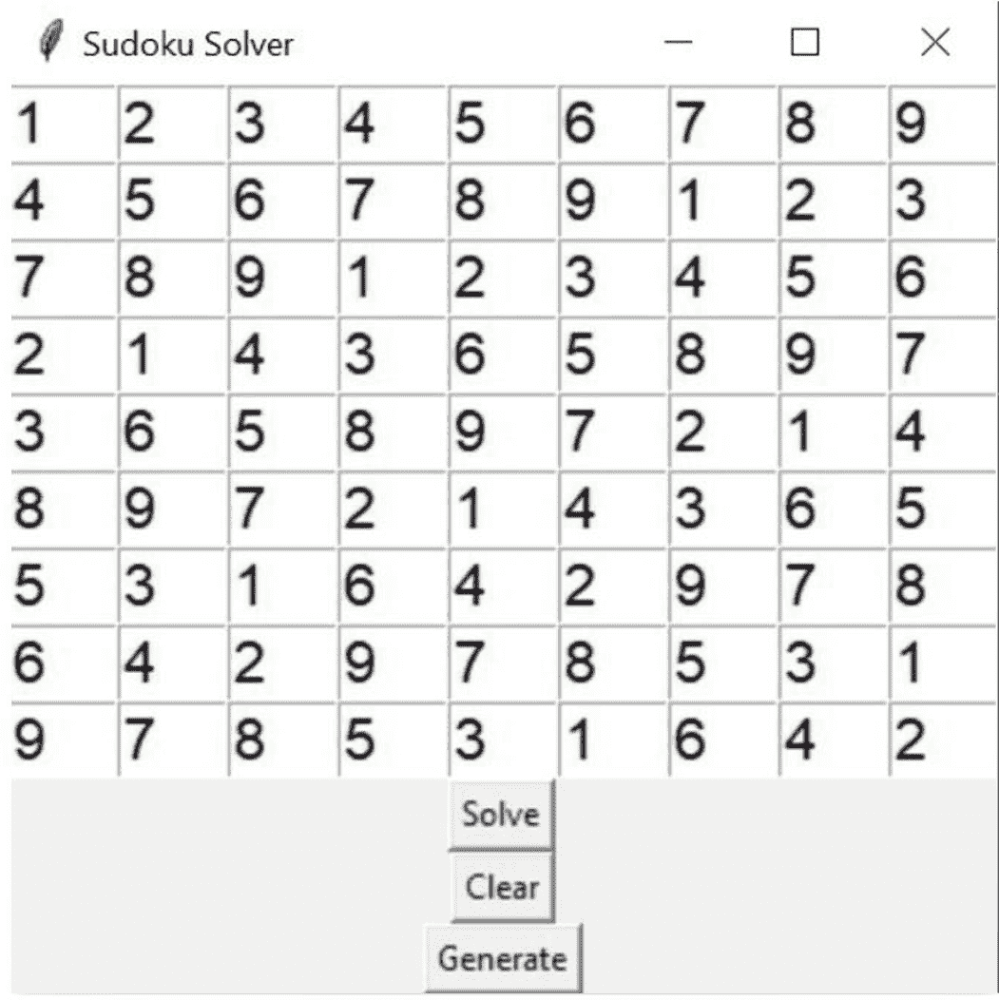

```python
import tkinter as tk
import random
```

```python
class SudokuSolverGUI:
    def __init__(self, master):
        self.master = master
        self.master.title("数独求解器")
        self.grid_size = 9
        self.cells = [[tk.StringVar() for _ in range(self.grid_size)]
                      for _ in range(self.grid_size)]

        # 创建图形用户界面网格
        for i in range(self.grid_size):
            for j in range(self.grid_size):
                cell_entry = tk.Entry(master, width=3, font=(
                    'Arial', 16), textvariable=self.cells[i][j])
                cell_entry.grid(row=i, column=j)
                cell_entry.bind('<KeyRelease>', lambda event,
                                i=i, j=j: self.update_entry_color(event, i, j))

        # 创建求解按钮
        solve_button = tk.Button(master, text="求解",
                                 command=self.solve_sudoku)
        solve_button.grid(row=self.grid_size, columnspan=self.grid_size)

        # 创建清除按钮
        clear_button = tk.Button(master, text="清除", command=self.clear_grid)
        clear_button.grid(row=self.grid_size + 1, columnspan=self.grid_size)

        # 创建生成按钮
        generate_button = tk.Button(
            master, text="生成", command=self.generate_board)
        generate_button.grid(row=self.grid_size + 2, columnspan=self.grid_size)

    def on_key_press(self, event):
        # 限制输入为单个数字
        if event.char.isdigit() and int(event.char) in range(1, 10):
            event.widget.delete(0, tk.END)
            event.widget.insert(0, event.char)

        # 错误高亮
        row, col = self.get_cell_position(event.widget)
        num = int(event.char) if event.char.isdigit() else 0
        if not self.is_valid_move(row, col, num):
            event.widget.config(fg='red')
        else:
            event.widget.config(fg='black')

    def clear_grid(self):
        # 清除网格中的所有值
```

for i in range(self.grid_size):
    for j in range(self.grid_size):
        self.cells[i][j].set("")
        # 不使用 StringVar 的 config 方法，而是直接更改 Entry 组件的文本颜色
        self.get_entry_widget(i, j).config(
            fg='black') # 重置文本颜色

def solve_sudoku(self):
    # 从 GUI 网格中提取值以创建数独棋盘
    board = [[0] * self.grid_size for _ in range(self.grid_size)]
    for i in range(self.grid_size):
        for j in range(self.grid_size):
            value = self.cells[i][j].get()
            if value.isdigit() and int(value) in range(1, 10):
                board[i][j] = int(value)

    if self.solve_sudoku_backtracking(board):
        # 用解出的数独更新 GUI
        for i in range(self.grid_size):
            for j in range(self.grid_size):
                self.cells[i][j].set(str(board[i][j]))

                # 不使用 StringVar 的 config 方法，而是直接更改 Entry 组件的文本颜色
                self.get_entry_widget(i, j).config(
                    fg='black') # 重置文本颜色
    else:
        print("未找到解。")

def update_entry_color(self, event, i, j):
    # 根据有效性更新 Entry 组件的颜色
    num = int(self.cells[i][j].get()
              ) if self.cells[i][j].get().isdigit() else 0
    if not self.is_valid_move(self.cells, i, j, num):
        self.get_entry_widget(i, j).config(fg='red')
    else:
        self.get_entry_widget(i, j).config(fg='black')

def get_entry_widget(self, i, j):
    # 根据网格位置获取 Entry 组件
    widgets_in_row = self.master.grid_slaves(row=i)
    for widget in widgets_in_row:
        if int(widget.grid_info()["column"]) == j:
            return widget
    return None

def is_valid_move(self, board, row, col, num):
    return not (
        self.used_in_row_backtracking(board, row, num) or
        self.used_in_col_backtracking(board, col, num) or
        self.used_in_box_backtracking(
            board, row - row % 3, col - col % 3, num)
    )

def get_cell_position(self, widget):
    # 在 GUI 网格中查找给定组件的行和列
    for i in range(self.grid_size):
        for j in range(self.grid_size):
            if self.get_entry_widget(i, j) == widget:
                return i, j
    return -1, -1

def find_unassigned_location(self, board):
    for i in range(self.grid_size):
        for j in range(self.grid_size):
            if board[i][j] == 0:
                return i, j
    return None

def solve_sudoku_backtracking(self, board):
    empty_cell = self.find_unassigned_location(board)

    if not empty_cell:
        return True

    row, col = empty_cell

    for num in range(1, 10):
        if self.is_valid_move(board, row, col, num):
            board[row][col] = num

            if self.solve_sudoku_backtracking(board):
                return True

            board[row][col] = 0

    return False

def used_in_row_backtracking(self, board, row, num):
    return num in board[row]

def used_in_col_backtracking(self, board, col, num):
    return num in [board[row][col] for row in range(self.grid_size)]

def used_in_box_backtracking(self, board, start_row, start_col, num):
    return any(num == board[row][col] for row in range(start_row, start_row + 3) for col in range(start_col, start_col + 3))

def generate_board(self):
    self.clear_grid() # 清空当前网格

    # 生成新的数独谜题
    self.generate_sudoku_puzzle()

    # 在 GUI 上显示生成的谜题
    for i in range(self.grid_size):
        for j in range(self.grid_size):
            value = self.cells[i][j].get()
            if value.isdigit() and int(value) != 0:
                self.get_entry_widget(i, j).config(
                    fg='black') # 重置文本颜色

def generate_sudoku_puzzle(self):
    # 实现生成新数独谜题的逻辑
    # 为简单起见，我们使用回溯算法来填充棋盘
    self.clear_grid()

    # 生成一个已解出的数独棋盘
    solved_board = [[0] * self.grid_size for _ in range(self.grid_size)]
    self.solve_sudoku_backtracking(solved_board)

    # 创建已解棋盘的副本
    board_copy = [row[:] for row in solved_board]

    # 移除一些数字以创建谜题
    # 根据需要调整要移除的单元格数量
    cells_to_remove = random.randint(12, 30)
    for _ in range(cells_to_remove):
        row, col = random.randint(0, 8), random.randint(0, 8)
        while board_copy[row][col] == 0:
            row, col = random.randint(0, 8), random.randint(0, 8)
        board_copy[row][col] = ""

    # 用生成的谜题更新 GUI
    for i in range(self.grid_size):
        for j in range(self.grid_size):
            self.cells[i][j].set(str(board_copy[i][j]))

if __name__ == "__main__":
    root = tk.Tk()
    app = SudokuSolverGUI(root)
    root.mainloop()

让我们逐行浏览代码：

### Python 代码

import tkinter as tk
import random

- import tkinter as tk : 这导入了 Tkinter 模块并将其重命名为 tk，以便于引用。
- import random : 这导入了 random 模块，该模块将在代码后面用于生成随机数。

### Python 代码

class SudokuSolverGUI:
    def __init__(self, master):
        self.master = master
        self.master.title("Sudoku Solver")
        self.grid_size = 9
        self.cells = [[tk.StringVar() for _ in range(self.grid_size)]
                      for _ in range(self.grid_size)]

- class SudokuSolverGUI :: 这定义了一个名为 SudokuSolverGUI 的类。
- def __init__(self, master) :: 这是类的构造函数方法。它使用给定的 master 组件（通常是 GUI 的根窗口）初始化类实例。
- self.master = master : 这存储了对 master 组件的引用。
- self.master.title("Sudoku Solver"): 这将 master 组件的标题设置为 "Sudoku Solver"。
- self.grid_size = 9: 这将数独棋盘的网格大小设置为 9x9。
- self.cells = [[tk.StringVar() for _ in range(self.grid_size)] for _ in range(self.grid_size)]: 这创建了一个 StringVar 对象的二维列表，将用于表示数独网格的各个单元格。

### Python 代码

### 创建 GUI 网格
for i in range(self.grid_size):
    for j in range(self.grid_size):
        cell_entry = tk.Entry(master, width=3, font=('Arial', 16), textvariable=self.cells[i][j])
        cell_entry.grid(row=i, column=j)
        cell_entry.bind('<KeyRelease>', lambda event, i=i, j=j: self.update_entry_color(event, i, j))

- 此循环遍历数独网格中的每个单元格，并为每个单元格创建一个 Entry 组件。
- tk.Entry(master, width=3, font=('Arial', 16), textvariable=self.cells[i][j]): 这创建了一个宽度为 3 个字符、使用 Arial 字体（大小为 16）的 Entry 组件，并将其与 self.cells 列表中相应的 StringVar 对象关联。
- cell_entry.grid(row=i, column=j): 这将 Entry 组件放置在网格布局中指定的行和列。
- cell_entry.bind('<KeyRelease>', lambda event, i=i, j=j: self.update_entry_color(event, i, j)): 这将 <KeyRelease> 事件绑定到 update_entry_color 方法，并将事件对象以及行 (i) 和列 (j) 索引作为参数传递。

### Python 代码

### 创建“求解”按钮
solve_button = tk.Button(master, text="Solve",
                        command=self.solve_sudoku)
solve_button.grid(row=self.grid_size, columnspan=self.grid_size)

- 这使用 tk.Button 类创建了一个“求解”按钮组件，点击时会调用 solve_sudoku 方法。
- solve_button.grid(row=self.grid_size, columnspan=self.grid_size): 这将“求解”按钮放置在网格布局中，跨越网格的整个底行。

### Python 代码

### 创建“清除”按钮
clear_button = tk.Button(master, text="Clear", command=self.clear_grid)
clear_button.grid(row=self.grid_size + 1, columnspan=self.grid_size)

- 这使用 tk.Button 类创建了一个“清除”按钮组件，点击时会调用 clear_grid 方法。
- clear_button.grid(row=self.grid_size + 1, columnspan=self.grid_size): 这将“清除”按钮放置在网格布局中，位于“求解”按钮下方，跨越网格的整个底行。

### Python 代码

### 创建“生成”按钮
generate_button = tk.Button(
    master, text="Generate", command=self.generate_board
)
generate_button.grid(row=self.grid_size + 2, columnspan=self.grid_size)

- 这使用 tk.Button 类创建了一个“生成”按钮组件，点击时会调用 generate_board 方法。

### 如何玩数独求解器游戏

要玩数独求解器游戏，请按照以下步骤操作：

1.  **运行代码：**
    -   确保你的系统上安装了 Python。
    -   将提供的 **Python 代码** 复制到一个文件中，保存为 .py 扩展名，然后运行该脚本。
    -   这将打开一个包含数独求解器游戏的图形窗口。

2.  **理解图形用户界面：**
    -   图形用户界面由一个 9x9 的输入框网格组成，你可以在其中输入数字。
    -   这些数字代表初始的数独谜题，你可以通过点击相应的单元格并输入 1 到 9 的数字来编辑它们。

3.  **求解谜题：**
    -   如果你有一个想要解决的数独谜题，请将初始数字输入到网格中。
    -   点击 "Solve" 按钮，让程序来解决这个谜题。解出的谜题将显示在同一个网格中。

4.  **清除网格：**
    -   要清除整个网格，请点击 "Clear" 按钮。这允许你从一个空白网格开始或输入一个新的谜题。

5.  **生成谜题：**
    -   点击 "Generate" 按钮来创建一个新的数独谜题。程序将生成一个新的谜题供你解决。

6.  **输入验证：**
    -   程序会验证你的输入。如果你输入了一个无效的数字（例如，超出 1 到 9 范围的数字）或者输入的数字违反了数独规则，文本颜色将变为红色以指示错误。

7.  **错误高亮：**
    -   当你输入数字时，程序会检查错误，如果当前行、列或 3x3 宫格中存在冲突，文本将以红色高亮显示。

8.  **关闭游戏：**
    -   玩完游戏后，关闭游戏窗口。

请记住，数独求解器游戏旨在让你解决现有的谜题，清除网格以创建新谜题，并享受交互式解决数独谜题的过程。你可以尝试不同的谜题，并观察回溯算法如何高效地解决它们。

## 12. 四子棋游戏

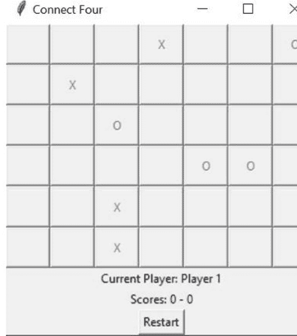

```python
import tkinter as tk
from tkinter import messagebox
import random
```

```python
class ConnectFour:
    def __init__(self, vs_ai=False):
        self.window = tk.Tk()
        self.window.title("Connect Four")
        self.player_names = ["Player 1", "Player 2"]
        self.scores = [0, 0]
        self.vs_ai = vs_ai
        self.board = [[0] * 7 for _ in range(6)]
        self.current_player = 1

        self.create_widgets()
        self.window.mainloop()

    def create_widgets(self):
        self.buttons = [[None] * 7 for _ in range(6)]

        for row in range(6):
            for col in range(7):
                self.buttons[row][col] = tk.Button(self.window, text="", width=5, height=2,
                                                   command=lambda r=row, c=col: self.drop_piece(r, c))
                self.buttons[row][col].grid(row=row, column=col)

        self.player_label = tk.Label(
            self.window, text=f"Current Player: {self.player_names[self.current_player-1]}")
        self.player_label.grid(row=6, columnspan=7)

        self.score_label = tk.Label(
            self.window, text=f"Scores: {self.scores[0]} - {self.scores[1]}")
        self.score_label.grid(row=7, columnspan=7)

        restart_button = tk.Button(
            self.window, text="Restart", command=self.reset_game)
        restart_button.grid(row=8, columnspan=7)

    def drop_piece(self, row, col):
        if self.board[row][col] == 0:
            self.board[row][col] = self.current_player
            self.update_button_text(row, col)
            if self.check_winner(row, col):
                messagebox.showinfo(
                    "Winner!", f"Player {self.current_player} wins!")
                self.scores[self.current_player - 1] += 1
                self.update_score_label()
                self.reset_game()
            else:
                if not self.vs_ai:
                    self.switch_player()
                else:
                    self.ai_drop_piece()
                    self.switch_player()

    def update_button_text(self, row, col):
        player_symbol = "X" if self.current_player == 1 else "O"
        self.buttons[row][col].config(text=player_symbol, state=tk.DISABLED)

    def check_winner(self, row, col):
        # right, down, diagonal right, diagonal left
        directions = [(0, 1), (1, 0), (1, 1), (-1, 1)]

        for dr, dc in directions:
            count = 1  # Number of consecutive pieces in the current direction

            for i in range(1, 4):
                r, c = row + i * dr, col + i * dc

                if 0 <= r < 6 and 0 <= c < 7 and self.board[r][c] == self.current_player:
                    count += 1
                else:
                    break

            for i in range(1, 4):
                r, c = row - i * dr, col - i * dc

                if 0 <= r < 6 and 0 <= c < 7 and self.board[r][c] == self.current_player:
                    count += 1
                else:
                    break

            if count >= 4:
                return True

        return False

    def switch_player(self):
        self.current_player = 3 - self.current_player # Switch player between 1 and 2
        self.player_label.config(
            text=f"Current Player: {self.player_names[self.current_player-1]}")

    def reset_game(self):
        for row in range(6):
            for col in range(7):
                self.buttons[row][col].config(text="", state=tk.NORMAL)
                self.board[row][col] = 0
        self.current_player = 1
        self.player_label.config(
            text=f"Current Player: {self.player_names[self.current_player-1]}")

    def update_score_label(self):
        self.score_label.config(
            text=f"Scores: {self.scores[0]} - {self.scores[1]}")

    def ai_drop_piece(self):
        valid_moves = [(r, c) for r in range(6)
                       for c in range(7) if self.board[r][c] == 0]
        if valid_moves:
            row, col = random.choice(valid_moves)
            self.board[row][col] = self.current_player
            self.update_button_text(row, col)
            if self.check_winner(row, col):
                messagebox.showinfo(
                    "Winner!", f"Player {self.current_player} wins!")
                self.scores[self.current_player - 1] += 1
                self.update_score_label()
                self.reset_game()

if __name__ == "__main__":
    # Set vs_ai to False for two-player mode, or True for single-player vs AI mode
    ConnectFour(vs_ai=True)
```

让我们逐行分析四子棋游戏的代码：

### Python 代码

```python
import tkinter as tk
from tkinter import messagebox
import random
```

-   这些行导入了使用 Tkinter 创建图形用户界面、处理消息框和生成随机数所需的必要模块。

### Python 代码

```python
class ConnectFour:
    def __init__(self, vs_ai=False):
```

-   定义一个名为 ConnectFour 的类，代表四子棋游戏。`vs_ai` 参数是可选的，默认设置为 `False`，表示游戏是否应该与 AI 对战。

### Python 代码

```python
self.window = tk.Tk()
self.window.title("Connect Four")
```

-   使用 Tkinter 创建游戏的主窗口，标题为 "Connect Four"。

### Python 代码

```python
self.player_names = ["Player 1", "Player 2"]
self.scores = [0, 0]
```

-   初始化一个玩家名称列表和一个用于存储分数的列表。

### Python 代码

```python
self.vs_ai = vs_ai
```

-   将 `vs_ai` 的值存储在类实例中，决定游戏是与 AI 对战还是与另一个玩家对战。

### Python 代码

```python
self.board = [[0] * 7 for _ in range(6)]
```

-   初始化一个 6x7 的游戏棋盘，表示为一个列表的列表，其中每个元素初始化为 0。

### Python 代码

```python
self.current_player = 1
```

-   将初始玩家设置为玩家 1。

### Python 代码

```python
self.create_widgets()
self.window.mainloop()
```

-   调用 `create_widgets` 方法来设置图形用户界面组件，并启动 Tkinter 事件循环。

### Python 代码

```python
def create_widgets(self):
```

-   定义一个方法来创建游戏的图形用户界面组件。

### Python 代码

```python
self.buttons = [[None] * 7 for _ in range(6)]
```

### Python 代码

```python
for row in range(6):
    for col in range(7):
        self.buttons[row][col] = tk.Button(self.window, text="", width=5,
            height=2,
            command=lambda r=row, c=col: self.drop_piece(r, c))
        self.buttons[row][col].grid(row=row, column=col)
```

- 初始化一个二维列表 `self.buttons`，用于存储图形用户界面中的按钮控件。
- 创建一个6x7的按钮网格，其中每个按钮通过 `command` 参数与 `drop_piece` 方法关联。按钮使用 `grid` 方法显示在 Tkinter 窗口中。

### Python 代码

```python
self.player_label = tk.Label(
    self.window,
    text=f"Current Player: {self.player_names[self.current_player - 1]}")
self.player_label.grid(row=6, columnspan=7)
```

- 创建一个标签，用于显示当前玩家的回合，并将其放置在窗口底部。

### Python 代码

```python
self.score_label = tk.Label(
    self.window, text=f"Scores: {self.scores[0]} - {self.scores[1]}")
self.score_label.grid(row=7, columnspan=7)
```

- 创建一个标签，用于显示比分，并将其放置在玩家标签下方。

### Python 代码

```python
restart_button = tk.Button(
    self.window, text="Restart", command=self.reset_game)
restart_button.grid(row=8, columnspan=7)
```

- 创建一个重新开始按钮，并将其与 `reset_game` 方法关联。

### Python 代码

```python
def drop_piece(self, row, col):
```

- 定义 `drop_piece` 方法，当玩家点击按钮以放置游戏棋子时调用此方法。

### Python 代码

```python
if self.board[row][col] == 0:
    self.board[row][col] = self.current_player
    self.update_button_text(row, col)
```

- 检查所选单元格是否为空，然后使用当前玩家的移动更新游戏棋盘和按钮文本。

### Python 代码

```python
if self.check_winner(row, col):
    messagebox.showinfo(
        "Winner!", f"Player {self.current_player} wins!")
    self.scores[self.current_player - 1] += 1
    self.update_score_label()
    self.reset_game()
```

- 检查当前移动是否导致获胜。如果是，则显示消息框，更新比分，并重置游戏。

### Python 代码

```python
else:
    if not self.vs_ai:
        self.switch_player()
    else:
        self.ai_drop_piece()
        self.switch_player()
```

- 如果游戏不是与AI对战，则切换到下一个玩家。否则，AI进行移动，然后切换玩家。

### Python 代码

```python
def update_button_text(self, row, col):
```

- 定义一个方法，用于用玩家的符号更新按钮文本。

### Python 代码

```python
player_symbol = "X" if self.current_player == 1 else "O"
self.buttons[row][col].config(text=player_symbol, state=tk.DISABLED)
```

- 根据当前玩家确定玩家的符号，并更新按钮文本。禁用该按钮以防止在该单元格进行进一步移动。

### Python 代码

```python
def check_winner(self, row, col):
```

- 定义 `check_winner` 方法，以确定玩家是否赢得游戏。

### Python 代码

```python
directions = [(0, 1), (1, 0), (1, 1), (-1, 1)]
```

- 定义四个可能的方向，用于检查获胜组合：向右、向下、向右对角线和向左对角线。

### Python 代码

```python
for dr, dc in directions:
    count = 1 # Number of consecutive pieces in the current direction
```

- 遍历每个方向，并初始化一个计数器，用于计算连续的棋子。

### Python 代码

```python
for i in range(1, 4):
    r, c = row + i * dr, col + i * dc
    if 0 <= r < 6 and 0 <= c < 7 and self.board[r][c] == self.current_player:
        count += 1
    else:
        break
```

- 检查当前方向的正方向上是否有连续的棋子。

### Python 代码

```python
for i in range(1, 4):
    r, c = row - i * dr, col - i * dc
    if 0 <= r < 6 and 0 <= c < 7 and self.board[r][c] == self.current_player:
        count += 1
    else:
        break
```

- 检查当前方向的负方向上是否有连续的棋子。

### Python 代码

```python
if count >= 4:
    return True
```

- 如果在任何方向上有四个或更多连续的棋子，则玩家获胜。

### Python 代码

```python
return False
```

- 如果没有找到获胜组合，则返回 False。

### Python 代码

```python
def switch_player(self):
```

- 定义 `switch_player` 方法，用于在玩家之间切换。

### Python 代码

```python
self.current_player = 3 - self.current_player # Switch player between 1 and 2
self.player_label.config(
    text=f"Current Player: {self.player_names[self.current_player - 1]}")
```

- 在玩家1和玩家2之间切换，并相应地更新玩家标签。

### Python 代码

```python
def reset_game(self):
```

- 定义 `reset_game` 方法，用于重置游戏棋盘和玩家回合。

### Python 代码

```python
for row in range(6):
    for col in range(7):
        self.buttons[row][col].config(text="", state=tk.NORMAL)
        self.board[row][col] = 0
self.current_player = 1
self.player_label.config(
    text=f"Current Player: {self.player_names[self.current_player - 1]}")
```

- 清除按钮文本，启用按钮，重置游戏棋盘，将当前玩家设置为1，并更新玩家标签。

### Python 代码

```python
def update_score_label(self):
```

- 定义 `update_score_label` 方法，用于更新显示的比分。

### Python 代码

```python
self.score_label.config(
    text=f"Scores: {self.scores[0]} - {self.scores[1]}")
```

- 使用当前比分更新比分标签。

### Python 代码

```python
def ai_drop_piece(self):
```

- 定义 `ai_drop_piece` 方法，供AI进行移动。

### Python 代码

```python
valid_moves = [(r, c) for r in range(6)
              for c in range(7) if self.board[r][c] == 0]
```

- 创建一个有效移动（空单元格）列表，供AI选择。

### Python 代码

```python
if valid_moves:
    row, col = random.choice(valid_moves)
    self.board[row][col] = self.current_player
    self.update_button_text(row, col)
```

- 如果有有效移动，AI随机选择一个移动，更新游戏棋盘，并更新按钮文本。

### Python 代码

```python
if self.check_winner(row, col):
    messagebox.showinfo(
        "Winner!", f"Player {self.current_player} wins!")
    self.scores[self.current_player - 1] += 1
    self.update_score_label()
    self.reset_game()
```

- 检查AI的移动是否导致获胜，并相应地处理游戏结果。

### Python 代码

```python
if __name__ == "__main__":
    ConnectFour(vs_ai=True)
```

- 如果脚本作为主程序运行，则创建一个启用了AI模式的 ConnectFour 类实例。

# 如何玩四子棋游戏

四子棋是一款双人策略游戏，目标是在对手之前，将自己的四个游戏棋子连成一条直线，可以是水平、垂直或对角线方向。以下是玩四子棋的分步指南：

## 1. 设置

- 游戏通常在6x7的网格上进行，但尺寸可以变化。
- 每位玩家被分配一种颜色（通常是红色和黄色）或一个符号（如“X”和“O”）。
- 游戏开始时网格为空。

## 2. 先手玩家

- 玩家决定谁先走。这可以通过抛硬币、石头剪刀布或任何其他商定的方法来完成。

## 3. 轮流进行

- 玩家轮流将他们的一个棋子放入网格的七个列中的任意一列。
- 棋子将落入所选列中最低的可用空间。

## 4. 目标

- 目标是成为第一个将自己的四个棋子连成一条直线（水平、垂直或对角线）的玩家。

## 5. 获胜

- 一旦一位玩家成功将自己的四个棋子连成一条直线，游戏即告结束。
- 获胜玩家应宣布其胜利，游戏结束。

## 6. 平局

- 如果整个网格被填满，但没有任何玩家实现四子连线，则游戏为平局。

## 7. 重新开始

- 一局游戏结束后，玩家可以通过重置棋盘来决定再次游玩。

## 8. 策略

- 注意对手的移动，以阻止潜在的获胜组合。
- 提前规划，并考虑同时创造多个获胜机会。
- 谨慎行事，避免为对手创造获胜机会。

## 9. 变体：AI模式（如适用）

- 如果与AI对战，计算机将根据其编程策略进行移动。
- 遵循相同的规则，但要准备好应对AI对手的战略决策。

## 10. 享受乐趣：

-   四子棋是一款有趣且节奏明快的游戏。专注于享受策略博弈和友好竞争的乐趣。

请记住，四子棋是一项技巧与策略并重的游戏。通过练习，你可以提升预判和阻断对手走棋的能力，同时为自己创造获胜的机会。

## 13. Flappy Bird 克隆游戏

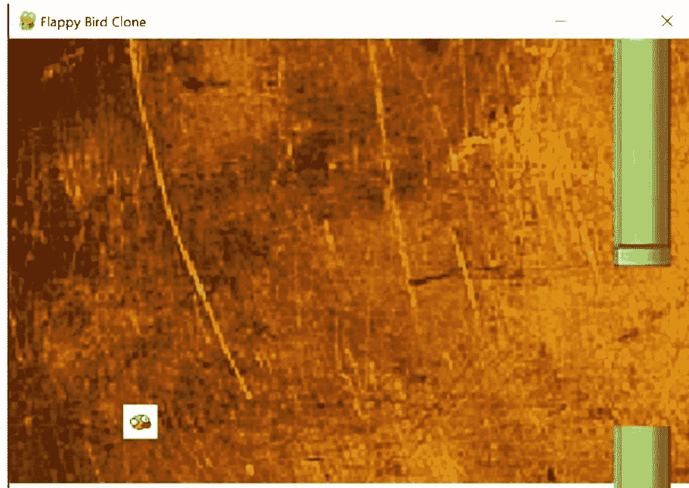

```python
import pygame
import sys
import random

# Initialize Pygame
pygame.init()

### Constants
WIDTH, HEIGHT = 600, 400
FPS = 30 # Adjust the frame rate
GRAVITY = 1.0 # Adjust the gravity
JUMP_HEIGHT = 10 # Adjust the jump height
PIPE_WIDTH = 50
PIPE_HEIGHT = 200
PIPE_GAP = 250 # Adjust the gap between pipes

# Colors
WHITE = (255, 255, 255)
BLACK = (0, 0, 0)

# Create the game window
screen = pygame.display.set_mode((WIDTH, HEIGHT))
pygame.display.set_caption("Flappy Bird Clone")

# Load images
bird_image = pygame.image.load("bird.png")
background_image = pygame.image.load("background.png")
pipe_image = pygame.image.load("pipe.png")

# Scale images
bird_image = pygame.transform.scale(
    bird_image, (30, 30)) # Adjust the bird size
pipe_image = pygame.transform.scale(pipe_image, (PIPE_WIDTH, PIPE_HEIGHT))

# Clock to control the frame rate
clock = pygame.time.Clock()

class Bird:
    def __init__(self):
        self.x = 100
        self.y = HEIGHT // 2
        self.width = 30 # Adjust the bird's width
        self.height = 30 # Adjust the bird's height
        self.velocity = 0

    def jump(self):
        self.velocity = -JUMP_HEIGHT

    def update(self):
        self.velocity += GRAVITY
        self.y += self.velocity

        # Keep the bird within the screen bounds
        if self.y < 0:
            self.y = 0
        if self.y > HEIGHT - self.height:
            self.y = HEIGHT - self.height

    def draw(self):
        screen.blit(bird_image, (self.x, self.y))

class Pipe:
    def __init__(self, x):
        self.x = x
        self.gap_top = random.randint(50, HEIGHT - PIPE_GAP - 50)

    def update(self):
        self.x -= 5

    def draw(self):
        screen.blit(pipe_image, (self.x, 0))
        lower_pipe_top = self.gap_top + PIPE_GAP
        screen.blit(pipe_image, (self.x, lower_pipe_top))

# Create objects
bird = Bird()
pipes = []

# Main game loop
while True:
    for event in pygame.event.get():
        if event.type == pygame.QUIT:
            pygame.quit()
            sys.exit()
        elif event.type == pygame.KEYDOWN:
            if event.key == pygame.K_SPACE:
                bird.jump()

    # Update objects
    bird.update()
    for pipe in pipes:
        pipe.update()

    # Create new pipes
    if len(pipes) == 0 or pipes[-1].x < WIDTH - 200:
        pipes.append(Pipe(WIDTH))

    # Remove off-screen pipes
    pipes = [pipe for pipe in pipes if pipe.x > -PIPE_WIDTH]

    # Collision detection
    for pipe in pipes:
        bird_rect = pygame.Rect(bird.x, bird.y, bird.width, bird.height)
        upper_pipe_rect = pygame.Rect(pipe.x, 100, PIPE_WIDTH, pipe.gap_top)
        lower_pipe_top = pipe.gap_top + PIPE_GAP
        lower_pipe_rect = pygame.Rect(
            pipe.x, lower_pipe_top+5, PIPE_WIDTH, HEIGHT - lower_pipe_top)

        # Check for collision with upper and lower pipes
        if bird_rect.colliderect(upper_pipe_rect) or bird_rect.colliderect(lower_pipe_rect):
            print("Game Over")
            bird = Bird() # Reset the bird position
            pipes = []    # Reset the pipes
            pygame.time.delay(1000) # Pause for a moment before restarting

    # Draw background
    screen.fill(WHITE)
    screen.blit(background_image, (0, 0))

    # Draw objects
    bird.draw()
    for pipe in pipes:
        pipe.draw()

    # Update display
    pygame.display.flip()

    # Control the frame rate
    clock.tick(FPS)
```

让我们逐行分析提供的代码，以理解其功能：

### Python 代码

```python
import pygame
import sys
import random
```

这些行导入了游戏所需的必要库：`pygame` 用于游戏开发，`sys` 用于系统相关功能，`random` 用于生成随机数。

### Python 代码

```python
# Initialize Pygame
pygame.init()
```

这行代码初始化了 Pygame 库。

### Python 代码

```python
### Constants
WIDTH, HEIGHT = 600, 400
FPS = 30 # Adjust the frame rate
GRAVITY = 1.0 # Adjust the gravity
JUMP_HEIGHT = 10 # Adjust the jump height
PIPE_WIDTH = 50
PIPE_HEIGHT = 200
PIPE_GAP = 250 # Adjust the gap between pipes
```

这里**定义**了各种常量，例如游戏窗口的宽度和高度、帧率（FPS）、小鸟移动的重力、跳跃高度以及管道的尺寸。

### Python 代码

```python
# Colors
WHITE = (255, 255, 255)
BLACK = (0, 0, 0)
```

这些行使用 RGB 值**定义**了颜色常量。

### Python 代码

```python
# Create the game window
screen = pygame.display.set_mode((WIDTH, HEIGHT))
pygame.display.set_caption("Flappy Bird Clone")
```

这些行创建了具有指定宽度和高度的游戏窗口，并设置了窗口标题。

### Python 代码

```python
# Load images
bird_image = pygame.image.load("bird.png")
background_image = pygame.image.load("background.png")
pipe_image = pygame.image.load("pipe.png")
```

这些行从文件中加载了小鸟、背景和管道的图像。

### Python 代码

```python
# Scale images
bird_image = pygame.transform.scale(bird_image, (30, 30)) # Adjust the bird size
pipe_image = pygame.transform.scale(pipe_image, (PIPE_WIDTH, PIPE_HEIGHT))
```

图像被缩放到所需的尺寸。

### Python 代码

```python
# Clock to control the frame rate
clock = pygame.time.Clock()
```

创建了一个时钟对象来控制帧率。

### Python 代码

```python
class Bird:
    def __init__(self):
        self.x = 100
        self.y = HEIGHT // 2
        self.width = 30 # Adjust the bird's width
        self.height = 30 # Adjust the bird's height
        self.velocity = 0

    def jump(self):
        self.velocity = -JUMP_HEIGHT

    def update(self):
        self.velocity += GRAVITY
        self.y += self.velocity

        # Keep the bird within the screen bounds
        if self.y < 0:
            self.y = 0
        if self.y > HEIGHT - self.height:
            self.y = HEIGHT - self.height

    def draw(self):
        screen.blit(bird_image, (self.x, self.y))
```

**定义**了一个 `Bird` 类来表示玩家控制的小鸟。它包含跳跃、根据重力更新位置以及在屏幕上绘制小鸟的方法。

### Python 代码

```python
class Pipe:
    def __init__(self, x):
        self.x = x
        self.gap_top = random.randint(50, HEIGHT - PIPE_GAP - 50)

    def update(self):
        self.x -= 5

    def draw(self):
        screen.blit(pipe_image, (self.x, 0))
        lower_pipe_top = self.gap_top + PIPE_GAP
        screen.blit(pipe_image, (self.x, lower_pipe_top))
```

**定义**了一个 `Pipe` 类来表示游戏中的管道。管道以随机的间隙位置初始化，并随着游戏的进行从右向左移动（`update` 方法）。`draw` 方法负责在屏幕上渲染上、下管道。

### Python 代码

```python
# Create objects
bird = Bird()
pipes = []
```

创建了 `Bird` 的实例和一个用于存储管道的空列表。

### Python 代码

```python
# Main game loop
while True:
    for event in pygame.event.get():
        if event.type == pygame.QUIT:
            pygame.quit()
            sys.exit()
        elif event.type == pygame.KEYDOWN:
            if event.key == pygame.K_SPACE:
                bird.jump()
```

主游戏循环开始，它持续检查事件，例如退出游戏或按下空格键使小鸟跳跃。

### Python 代码

```python
# Update objects
bird.update()
for pipe in pipes:
    pipe.update()
```

在游戏循环的每次迭代中，更新小鸟和管道的位置。

### Python 代码

```python
# Create new pipes
if len(pipes) == 0 or pipes[-1].x < WIDTH - 200:
    pipes.append(Pipe(WIDTH))
```

如果没有管道，或者最后一个管道的 x 坐标超过了某个阈值，则创建新的管道。

## 移除屏幕外的管道
```python
pipes = [pipe for pipe in pipes if pipe.x > -PIPE_WIDTH]
```
已移出屏幕的管道会从列表中删除。

### Python 代码
```python
# 碰撞检测
for pipe in pipes:
    bird_rect = pygame.Rect(bird.x, bird.y, bird.width, bird.height)
    upper_pipe_rect = pygame.Rect(pipe.x, 100, PIPE_WIDTH, pipe.gap_top)
    lower_pipe_top = pipe.gap_top + PIPE_GAP
    lower_pipe_rect = pygame.Rect(
        pipe.x, lower_pipe_top + 5, PIPE_WIDTH, HEIGHT - lower_pipe_top)

    # 检查与上下管道的碰撞
    if bird_rect.colliderect(upper_pipe_rect) or bird_rect.colliderect(lower_pipe_rect):
        print("Game Over")
        bird = Bird()  # 重置小鸟位置
        pipes = []  # 重置管道
        pygame.time.delay(1000)  # 重启前暂停片刻
```
执行碰撞检测以检查小鸟是否与上方或下方的管道发生碰撞。如果发生碰撞，游戏将打印 "Game Over"，重置小鸟的位置，清除管道，并在重启前暂停片刻。

### Python 代码
```python
# 绘制背景
screen.fill(WHITE)
screen.blit(background_image, (0, 0))
```
背景被填充为白色，并将背景图像绘制在屏幕上。

### Python 代码
```python
# 绘制对象
bird.draw()
for pipe in pipes:
    pipe.draw()
```
小鸟和管道被绘制在屏幕上。

### Python 代码
```python
# 更新显示
pygame.display.flip()
```
更新显示。

### Python 代码
```python
# 控制帧率
clock.tick(FPS)
```
控制帧率以匹配指定的 FPS。

这段代码使用 Pygame 库创建了一个简单的 Flappy Bird 克隆游戏，其中包含一只可以跳跃并躲避管道的小鸟。游戏循环持续更新游戏状态、检查碰撞并处理用户输入。

## 如何玩 Flappy Bird 克隆游戏

要玩你提供的 Flappy Bird 克隆游戏，请按照以下步骤操作：

1. **运行代码：**
    - 确保你的系统上已安装 Python 和 Pygame。
    - 将提供的代码保存为一个 Python 文件，例如 "flappy_bird_clone.py"。
    - 打开终端或命令提示符，导航到包含该 Python 文件的目录，并使用 `python flappy_bird_clone.py` 运行它。
2. **游戏控制：**
    - 按下 **空格键** 使小鸟跳跃。
3. **游戏目标：**
    - 引导小鸟穿过管道之间的间隙，避免撞到它们。
4. **游戏机制：**
    - 小鸟会因重力而下落，你必须使用空格键使其跳跃。
    - 管道从右向左移动，并定期生成新的管道。
    - 目标是保持小鸟飞行，并尽可能多地穿过管道之间的间隙。
5. **游戏结束：**
    - 如果小鸟与管道碰撞，游戏结束。
    - 当发生碰撞时，游戏将打印 "Game Over"，重置小鸟的位置，清除现有管道，并在重启前暂停片刻。
6. **重复：**
    - 游戏将继续循环运行，允许你在每次 Game Over 后再次游玩。
7. **调整：**
    - 你可以修改代码中的常量（如 GRAVITY、JUMP_HEIGHT、FPS 等）来改变游戏的难度或行为。

请记住，Flappy Bird 以其具有挑战性和令人上瘾的游戏玩法而闻名。尝试通过精准的时机跳跃来引导小鸟穿过管道，以打破你的最高分。祝你好运，玩得开心！

## 14. 乒乓球游戏

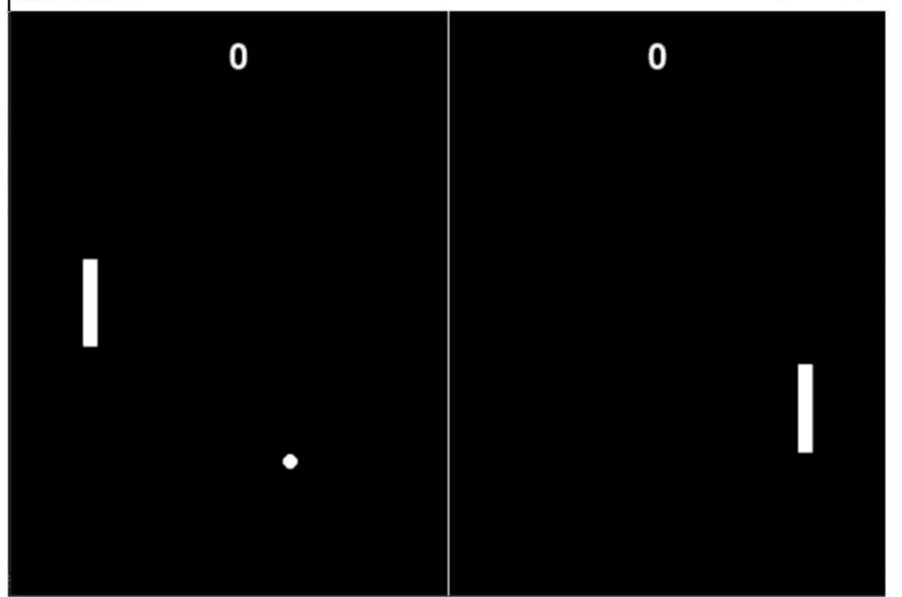

```python
import pygame
import sys
import random

# 初始化 Pygame
pygame.init()

# 常量
WIDTH, HEIGHT = 600, 400
BALL_RADIUS = 10
PADDLE_WIDTH, PADDLE_HEIGHT = 10, 60
FPS = 60
WHITE = (255, 255, 255)

# 创建屏幕
screen = pygame.display.set_mode((WIDTH, HEIGHT))
pygame.display.set_caption("Pong Game")

# 创建挡板和球
player_paddle = pygame.Rect(
    50, HEIGHT // 2 - PADDLE_HEIGHT // 2, PADDLE_WIDTH, PADDLE_HEIGHT)
opponent_paddle = pygame.Rect(
    WIDTH - 50 - PADDLE_WIDTH, HEIGHT // 2 - PADDLE_HEIGHT // 2, PADDLE_WIDTH, PADDLE_HEIGHT)
ball = pygame.Rect(WIDTH // 2 - BALL_RADIUS // 2, HEIGHT //
2 - BALL_RADIUS // 2, BALL_RADIUS, BALL_RADIUS)

# 初始化速度
ball_speed_x = 3 * random.choice([1, -1])
ball_speed_y = 3 * random.choice([1, -1])
player_speed = 0
opponent_speed = 2  # 调整对手挡板的速度

# 初始化分数
player_score = 0
opponent_score = 0

# 重置球位置的函数
def reset_ball():
    ball.x = WIDTH // 2 - BALL_RADIUS // 2
    ball.y = HEIGHT // 2 - BALL_RADIUS // 2

# 游戏循环
clock = pygame.time.Clock()

while True:
    for event in pygame.event.get():
        if event.type == pygame.QUIT:
            pygame.quit()
            sys.exit()
        elif event.type == pygame.KEYDOWN:
            if event.key == pygame.K_UP:
                player_speed = -3
            elif event.key == pygame.K_DOWN:
                player_speed = 3
            elif event.key == pygame.K_r:
                # 按下 'R' 键时重启游戏
                player_score = 0
                opponent_score = 0
                player_paddle.y = HEIGHT // 2 - PADDLE_HEIGHT // 2
                reset_ball()
                ball_speed_x = 3 * random.choice([1, -1])
                ball_speed_y = 3 * random.choice([1, -1])
        elif event.type == pygame.KEYUP:
            if event.key == pygame.K_UP or event.key == pygame.K_DOWN:
                player_speed = 0

    # 移动挡板和球
    player_paddle.y += player_speed
    # 确保玩家的挡板保持在游戏窗口内
    player_paddle.y = max(0, min(player_paddle.y, HEIGHT - PADDLE_HEIGHT))

    ball.x += ball_speed_x
    ball.y += ball_speed_y

    # 球与墙壁的碰撞
    if ball.top <= 0 or ball.bottom >= HEIGHT:
        ball_speed_y = -ball_speed_y

    # 球与挡板的碰撞
    if ball.colliderect(player_paddle):
        ball_speed_x = abs(ball_speed_x)  # 改变方向
    elif ball.colliderect(opponent_paddle):
        ball_speed_x = -abs(ball_speed_x)  # 改变方向

    # 检查球是否越过挡板
    if ball.left <= 0:
        opponent_score += 1  # 增加对手分数
        reset_ball()
    elif ball.right >= WIDTH:
        player_score += 1  # 增加玩家分数
        reset_ball()

    # 对手 AI
    if opponent_paddle.centery < ball.centery:
        opponent_paddle.y += min(opponent_speed,
                         ball.centery - opponent_paddle.centery)
    elif opponent_paddle.centery > ball.centery:
        opponent_paddle.y -= min(opponent_speed,
                         opponent_paddle.centery - ball.centery)

    # 绘制所有内容
    screen.fill((0, 0, 0))
    pygame.draw.rect(screen, WHITE, player_paddle)
    pygame.draw.rect(screen, WHITE, opponent_paddle)
    pygame.draw.ellipse(screen, WHITE, ball)

    # 绘制中线
    pygame.draw.aaline(screen, WHITE, (WIDTH // 2, 0), (WIDTH // 2, HEIGHT))

    # 绘制分数
    font = pygame.font.Font(None, 36)
    player_text = font.render(str(player_score), True, WHITE)
    opponent_text = font.render(str(opponent_score), True, WHITE)
    screen.blit(player_text, (WIDTH // 4, 20))
    screen.blit(opponent_text, (3 * WIDTH // 4 -
                opponent_text.get_width(), 20))

    # 更新显示
    pygame.display.flip()

    # 限制帧率
    clock.tick(FPS)
```

让我们逐行分析代码，以理解每个部分：

### Python 代码
```python
import pygame
import sys
import random
```
这里，代码导入了必要的模块：pygame 用于创建游戏，sys 用于处理系统相关操作，random 用于生成随机数。

### Python 代码
```python
pygame.init()
```
这行代码初始化了 Pygame 库。

### Python 代码
```python
# 常量
WIDTH, HEIGHT = 600, 400
BALL_RADIUS = 10
PADDLE_WIDTH, PADDLE_HEIGHT = 10, 60
FPS = 60
WHITE = (255, 255, 255)
```
这些行**定义**了游戏窗口尺寸、球和挡板大小、每秒帧数以及 RGB 格式的白色常量。

### Python 代码
```python
# 创建屏幕
screen = pygame.display.set_mode((WIDTH, HEIGHT))
pygame.display.set_caption("Pong Game")
```
这些行创建了具有指定宽度和高度的游戏窗口，并设置了窗口标题。

### Python 代码
```python
# 创建挡板和球
player_paddle = pygame.Rect(50, HEIGHT // 2 - PADDLE_HEIGHT // 2, PADDLE_WIDTH, PADDLE_HEIGHT)
opponent_paddle = pygame.Rect(WIDTH - 50 - PADDLE_WIDTH, HEIGHT // 2 - PADDLE_HEIGHT // 2, PADDLE_WIDTH, PADDLE_HEIGHT)
```

ball = pygame.Rect(WIDTH // 2 - BALL_RADIUS // 2, HEIGHT // 2 - BALL_RADIUS // 2, BALL_RADIUS, BALL_RADIUS)

这几行代码创建了代表玩家挡板、对手挡板和球的矩形。初始位置和大小已指定。

### Python 代码

```python
# Initialize velocities
ball_speed_x = 3 * random.choice([1, -1])
ball_speed_y = 3 * random.choice([1, -1])
player_speed = 0
opponent_speed = 2 # Adjust opponent's paddle speed
```

球和挡板的速度变量被初始化。球在x和y方向上以随机速度开始运动。玩家和对手的挡板速度也被初始化。

### Python 代码

```python
# Initialize score
player_score = 0
opponent_score = 0
```

玩家和对手的初始分数被设置为零。

### Python 代码

```python
# Function to reset the ball's position
def reset_ball():
    ball.x = WIDTH // 2 - BALL_RADIUS // 2
    ball.y = HEIGHT // 2 - BALL_RADIUS // 2
```

此函数将球的位置重置到屏幕中央。

### Python 代码

```python
# Game loop
clock = pygame.time.Clock()
while True:
    for event in pygame.event.get():
        # Event handling code
```

游戏循环从这里开始。它持续检查事件，例如用户输入或退出游戏。

### Python 代码

```python
# Move paddles and ball
player_paddle.y += player_speed
player_paddle.y = max(0, min(player_paddle.y, HEIGHT - PADDLE_HEIGHT))
ball.x += ball_speed_x
ball.y += ball_speed_y
```

这几行代码根据各自的速度更新玩家挡板和球的位置。玩家挡板的移动被限制在游戏窗口内。

### Python 代码

```python
# Ball collisions with walls
if ball.top <= 0 or ball.bottom >= HEIGHT:
    ball_speed_y = -ball_speed_y
```

这检查球是否撞到顶部或底部墙壁，如果发生碰撞，则反转其垂直方向。

### Python 代码

```python
# Ball collisions with paddles
if ball.colliderect(player_paddle):
    ball_speed_x = abs(ball_speed_x)
elif ball.colliderect(opponent_paddle):
    ball_speed_x = -abs(ball_speed_x)
```

这几行代码检查球与玩家或对手挡板之间的碰撞。如果发生碰撞，球的水平方向被反转。

### Python 代码

```python
# Check if the ball passed the paddles
if ball.left <= 0:
    opponent_score += 1
    reset_ball()
elif ball.right >= WIDTH:
    player_score += 1
    reset_ball()
```

这几行代码检查球是否已经通过了窗口的左侧或右侧。如果是这样，对手或玩家的分数会增加，并且球会被重置到中心。

### Python 代码

```python
# Opponent AI
if opponent_paddle.centery < ball.centery:
    opponent_paddle.y += min(opponent_speed, ball.centery - opponent_paddle.centery)
elif opponent_paddle.centery > ball.centery:
    opponent_paddle.y -= min(opponent_speed, opponent_paddle.centery - ball.centery)
```

这为对手挡板实现了一个简单的AI，使其在垂直方向上跟随球。

### Python 代码

```python
# Draw everything
# Draw scores
# Update the display
# Cap the frame rate
```

这几行代码处理挡板、球、分数和中线的绘制。显示被更新，并且帧率被限制以保持一致的速度。

以上就是对 Pong 游戏代码的解释。它涵盖了设置、游戏循环、用户输入、球和挡板的移动、碰撞检测、计分以及对手AI。

## 如何玩 Pong 游戏

要玩 Pong 游戏，你需要控制屏幕一侧的挡板，目标是将球击过对手在另一侧的挡板。以下是分步游戏指南：

1.  **启动游戏：**
    -   运行包含所提供 Pong 代码的 Python 脚本。
    -   游戏窗口将出现，显示挡板、球和分数。

2.  **控制：**
    -   使用 **上箭头键** 将你的挡板向上移动。
    -   使用 **下箭头键** 将你的挡板向下移动。
    -   如果需要，按 **'R' 键** 重新开始游戏。

3.  **游戏目标：**
    -   你的目标是防止球通过你的挡板，同时试图将球击过对手的挡板。

4.  **挡板移动：**
    -   上下移动你的挡板，以调整位置击球。
    -   策略性地移动以拦截球，并将其送向对手一侧。

5.  **球的移动：**
    -   球会从顶部和底部墙壁以及挡板上反弹。
    -   如果球从左侧通过对手的挡板，或者从右侧通过你的挡板，对手或你将分别得分。

6.  **计分：**
    -   分数显示在屏幕顶部。
    -   如果球通过了对手的挡板，你的对手得一分。
    -   如果球通过了你的挡板，你得一分。

7.  **游戏结束：**
    -   游戏会无限期地持续下去，直到你决定关闭窗口或手动退出游戏。
    -   你也可以随时按 'R' 键重新开始游戏。

8.  **对手AI：**
    -   对手挡板有自己的AI，在垂直方向上跟随球，使游戏更具挑战性。

9.  **享受游戏：**
    -   玩 Pong 时玩得开心！锻炼你的反应能力，目标是比对手得分更高。

记住，Pong 是一款经典且简单的游戏，很容易上手。你玩得越多，就越能预测球的运动并得分超过对手。

## 15. 单词搜索生成器游戏

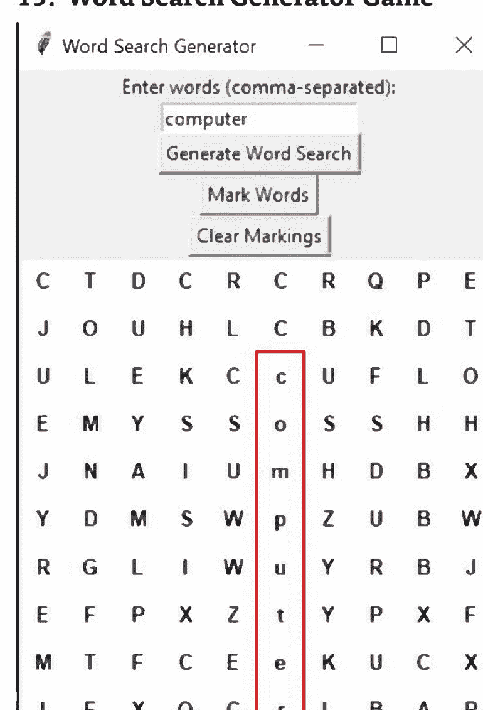

```python
import tkinter as tk
import random

class WordSearchGenerator:
    def __init__(self, root):
        self.root = root
        self.root.title("Word Search Generator")

        self.word_list_label = tk.Label(
            root, text="Enter words (comma-separated):")
        self.word_list_label.pack()

        self.word_list_entry = tk.Entry(root)
        self.word_list_entry.pack()

        self.generate_button = tk.Button(
            root, text="Generate Word Search", command=self.generate_word_search)
        self.generate_button.pack()

        self.mark_button = tk.Button(
            root, text="Mark Words", command=self.mark_words)
        self.mark_button.pack()

        self.clear_button = tk.Button(
            root, text="Clear Markings", command=self.clear_markings)
        self.clear_button.pack()

        self.word_search_canvas = tk.Canvas(
            root, width=300, height=300, bg="white")
        self.word_search_canvas.pack()

    def clear_markings(self):
        if hasattr(self, 'word_search_canvas'):
            self.word_search_canvas.delete("markings")

    def generate_word_search(self):
        self.clear_canvas()
        words = self.word_list_entry.get().split(',')
        self.word_search = self.create_word_search(words)
        self.display_word_search(self.word_search)

    def mark_words(self):
        if hasattr(self, 'word_search'):
            words_to_mark = self.word_list_entry.get().split(',')
            for i in range(len(self.word_search)):
                for j in range(len(self.word_search[i])):
                    for word in words_to_mark:
                        # Check horizontally
                        if self.word_search[i][j:j + len(word)] == list(word):
                            self.mark_rectangle(i, j, len(word), "horizontal")

                        # Check vertically
                        if i + len(word) <= len(self.word_search) and all(self.word_search[i + k][j] == word[k] for k in range(len(word))):
                            self.mark_rectangle(i, j, len(word), "vertical")

                        # Check diagonally (top-left to bottom-right)
                        if i + len(word) <= len(self.word_search) and j + len(word) <= len(self.word_search[i]) and all(self.word_search[i + k][j + k] == word[k] for k in range(len(word))):
                            self.mark_diagonal(i, j, len(word), "diagonal1")

                        # Check diagonally (top-right to bottom-left)
                        if i + len(word) <= len(self.word_search) and j - len(word) >= -1 and all(self.word_search[i + k][j - k] == word[k] for k in range(len(word))):
                            self.mark_diagonal(i, j, len(word), "diagonal2")

    def mark_diagonal(self, start_row, start_col, length, direction):
        cell_size = 30

        if direction == "diagonal1":
            self.word_search_canvas.create_rectangle(start_col * cell_size, start_row * cell_size,
                                                    (start_col + length) * cell_size, (start_row + length) * cell_size,
                                                    outline="red", width=2, tags="markings")
        elif direction == "diagonal2":
            self.word_search_canvas.create_rectangle(start_col * cell_size, start_row * cell_size,
                                                    (start_col - length) * cell_size, (start_row + length) * cell_size,
                                                    outline="red", width=2, tags="markings")
```

### Python 代码

```python
import tkinter as tk
import random
```

- 导入 **tkinter** 库用于图形用户界面，导入 **random** 库用于生成随机数。

### Python 代码

```python
class WordSearchGenerator:
```

- 定义一个名为 `WordSearchGenerator` 的类，其中包含一个 `__init__` 方法。该方法接受 `root` 作为参数，代表 Tkinter 的根窗口。将根窗口的标题设置为 "Word Search Generator"。

### Python 代码

```python
def __init__(self, root):
    self.root = root
    self.root.title("Word Search Generator")
```

- 定义一个名为 `WordSearchGenerator` 的类，其中包含一个 `__init__` 方法。该方法接受 `root` 作为参数，代表 Tkinter 的根窗口。将根窗口的标题设置为 "Word Search Generator"。

### Python 代码

```python
self.word_list_label = tk.Label(
    root, text="Enter words (comma-separated):")
self.word_list_label.pack()
```

- 创建一个 Tkinter 标签，用于提示用户输入单词。该标签被添加到根窗口中。

### Python 代码

```python
self.word_list_entry = tk.Entry(root)
self.word_list_entry.pack()
```

- 创建一个 Tkinter 输入框组件，供用户输入单词（以逗号分隔）。该组件被添加到根窗口中。

### Python 代码

```python
self.generate_button = tk.Button(
    root, text="Generate Word Search", command=self.generate_word_search)
self.generate_button.pack()
```

- 创建一个标签为 "Generate Word Search" 的按钮，点击时会调用 `generate_word_search` 方法。该按钮被添加到根窗口中。

### Python 代码

```python
self.mark_button = tk.Button(
    root, text="Mark Words", command=self.mark_words)
self.mark_button.pack()
```

- 创建一个标签为 "Mark Words" 的按钮，点击时会调用 `mark_words` 方法。该按钮被添加到根窗口中。

### Python 代码

```python
self.clear_button = tk.Button(
    root, text="Clear Markings", command=self.clear_markings)
self.clear_button.pack()
```

- 创建一个标签为 "Clear Markings" 的按钮，点击时会调用 `clear_markings` 方法。该按钮被添加到根窗口中。

### Python 代码

```python
self.word_search_canvas = tk.Canvas(
    root, width=300, height=300, bg="white")
self.word_search_canvas.pack()
```

- 创建一个 Tkinter 画布，用于显示单词搜索网格。画布尺寸为 300x300 像素，背景为白色。该画布被添加到根窗口中。

### Python 代码

```python
def clear_markings(self):
    if hasattr(self, 'word_search_canvas'):
        self.word_search_canvas.delete("markings")
```

- 定义一个名为 `clear_markings` 的方法，用于清除画布上所有标记的矩形。在尝试删除标记之前，它会检查画布属性是否存在。

### Python 代码

```python
def generate_word_search(self):
    self.clear_canvas()
    words = self.word_list_entry.get().split(',')
    self.word_search = self.create_word_search(words)
    self.display_word_search(self.word_search)
```

- 定义一个名为 `generate_word_search` 的方法，用于生成新的单词搜索网格。它首先清空画布，然后从输入框组件中获取单词。接着使用 `create_word_search` 方法生成单词搜索，并使用 `display_word_search` 方法进行显示。

### Python 代码

```python
def mark_words(self):
    if hasattr(self, 'word_search'):
        words_to_mark = self.word_list_entry.get().split(',')
        for i in range(len(self.word_search)):
            for j in range(len(self.word_search[i])):
                for word in words_to_mark:
                    # Check horizontally
                    if self.word_search[i][j:j + len(word)] == list(word):
                        self.mark_rectangle(i, j, len(word), "horizontal")

                    # Check vertically
                    if i + len(word) <= len(self.word_search) and all(self.word_search[i + k][j] == word[k] for k in range(len(word))):
                        self.mark_rectangle(i, j, len(word), "vertical")

                    # Check diagonally (top-left to bottom-right)
                    if i + len(word) <= len(self.word_search) and j + len(word) <= len(self.word_search[i]) and all(self.word_search[i + k][j + k] == word[k] for k in range(len(word))):
                        self.mark_diagonal(i, j, len(word), "diagonal1")

                    # Check diagonally (top-right to bottom-left)
                    if i + len(word) <= len(self.word_search) and j - len(word) >= -1 and all(self.word_search[i + k][j - k] == word[k] for k in range(len(word))):
                        self.mark_diagonal(i, j, len(word), "diagonal2")
```

- 定义一个名为 `mark_words` 的方法，用于在单词搜索网格上标记指定的单词。它会检查每个单词在不同方向（水平、垂直和对角线）上的存在情况，并使用 `mark_rectangle` 和 `mark_diagonal` 方法相应地进行标记。

### Python 代码

```python
def mark_rectangle(self, start_row, start_col, length, direction):
    cell_size = 30
    if direction == "horizontal":
        self.word_search_canvas.create_rectangle(start_col * cell_size, start_row * cell_size,
                                             (start_col + length) * cell_size, (start_row + 1) * cell_size,
                                             outline="red", width=2, tags="markings")
    elif direction == "vertical":
        self.word_search_canvas.create_rectangle(start_col * cell_size, start_row * cell_size,
                                             (start_col + 1) * cell_size, (start_row + length) * cell_size,
                                             outline="red", width=2, tags="markings")
    elif direction == "diagonal":
        self.word_search_canvas.create_rectangle(start_col * cell_size, start_row * cell_size,
                                             (start_col + length) * cell_size, (start_row + length) * cell_size,
                                             outline="red", width=2, tags="markings")
    elif direction == "diagonal2":
        self.word_search_canvas.create_rectangle((start_col - length + 1) * cell_size, start_row * cell_size,
                                             (start_col + 1) * cell_size, (start_row + length) * cell_size,
                                             outline="red", width=2, tags="markings")
```

### Python 代码

```python
def clear_canvas(self):
    self.word_search_canvas.delete("all")
```

### Python 代码

```python
def display_word_search(self, word_search):
    cell_size = 30
    for i in range(len(word_search)):
        for j in range(len(word_search[i])):
            self.word_search_canvas.create_text(j * cell_size + cell_size // 2, i * cell_size + cell_size // 2,
                                               text=word_search[i][j], font=("Helvetica", 10, "bold"))
```

### Python 代码

```python
def create_word_search(self, words):
    word_search_size = 10
    word_search = [['' for _ in range(word_search_size)]
                   for _ in range(word_search_size)]

    for word in words:
        placed = False
        attempts = 0
        while not placed and attempts < 100:
            direction = random.choice(
                ['horizontal', 'vertical', 'diagonal'])
            start_row = random.randint(0, len(word_search) - 1)
            start_col = random.randint(0, len(word_search[0]) - 1)

            if direction == 'horizontal' and start_col + len(word) <= word_search_size:
                for i in range(len(word)):
                    word_search[start_row][start_col + i] = word[i]
                placed = True

            elif direction == 'vertical' and start_row + len(word) <= word_search_size:
                for i in range(len(word)):
                    word_search[start_row + i][start_col] = word[i]
                placed = True

            elif direction == 'diagonal' and start_row + len(word) <= word_search_size and start_col + len(word) <= word_search_size:
                for i in range(len(word)):
                    word_search[start_row + i][start_col + i] = word[i]
                placed = True

            attempts += 1

    # Fill in the remaining spaces with random letters
    for i in range(word_search_size):
        for j in range(word_search_size):
            if word_search[i][j] == '':
                word_search[i][j] = chr(random.randint(65, 90))

    return word_search
```

### Python 代码

```python
if __name__ == "__main__":
    root = tk.Tk()
    app = WordSearchGenerator(root)
    root.mainloop()
```

### Python 代码

```python
def mark_diagonal(self, start_row, start_col, length, direction):
    cell_size = 30

    if direction == "diagonal1":
        self.word_search_canvas.create_rectangle(start_col * cell_size, start_row * cell_size,
                                                (start_col + length) * cell_size, (start_row + length) * cell_size,
                                                outline="red", width=2, tags="markings")
    elif direction == "diagonal2":
        self.word_search_canvas.create_rectangle((start_col - length + 1) * cell_size, start_row * cell_size,
                                                (start_col + 1) * cell_size, (start_row + length) * cell_size,
                                                outline="red", width=2, tags="markings")
```

- 定义一个方法 `mark_diagonal`，用于在画布上标记一个对角线矩形。方向参数决定了对角线的方向。

### Python 代码

```python
def mark_rectangle(self, start_row, start_col, length, direction):
    cell_size = 30
    if direction == "horizontal":
        self.word_search_canvas.create_rectangle(start_col * cell_size, start_row * cell_size,
                                                (start_col + length) * cell_size, (start_row + 1) * cell_size,
                                                outline="red", width=2, tags="markings")
    elif direction == "vertical":
        self.word_search_canvas.create_rectangle(start_col * cell_size, start_row * cell_size,
                                                (start_col + 1) * cell_size, (start_row + length) * cell_size,
                                                outline="red", width=2, tags="markings")
    elif direction == "diagonal":
        self.word_search_canvas.create_rectangle(start_col * cell_size, start_row * cell_size,
                                                (start_col + length) * cell_size, (start_row + length) * cell_size,
                                                outline="red", width=2, tags="markings")
```

- 定义一个方法 `mark_rectangle`，用于在画布上标记一个矩形。方向参数决定了它是水平、垂直还是对角线方向。

### Python 代码

```python
def clear_canvas(self):
    self.word_search_canvas.delete("all")
```

- 定义一个方法 `clear_canvas`，用于清除整个画布。

### Python 代码

```python
def display_word_search(self, word_search):
    cell_size = 30
    for i in range(len(word_search)):
        for j in range(len(word_search[i])):
            self.word_search_canvas.create_text(j * cell_size + cell_size // 2, i * cell_size + cell_size // 2,
                                                text=word_search[i][j],
                                                font=("Helvetica", 10, "bold"))
```

- 定义一个方法 `display_word_search`，用于在画布上显示生成的单词搜索网格。它使用 `create_text` 将每个字符放置在相应的单元格中。

### Python 代码

```python
def create_word_search(self, words):
    word_search_size = 10
    word_search = [['' for _ in range(word_search_size)]
                   for _ in range(word_search_size)]

    for word in words:
        placed = False
        attempts = 0

        while not placed and attempts < 100:
            direction = random.choice(
                ['horizontal', 'vertical', 'diagonal'])
            start_row = random.randint(0, len(word_search) - 1)
            start_col = random.randint(0, len(word_search[0]) - 1)

            if direction == 'horizontal' and start_col + len(word) <= word_search_size:
                for i in range(len(word)):
                    word_search[start_row][start_col + i] = word[i]
                placed = True

            elif direction == 'vertical' and start_row + len(word) <= word_search_size:
                for i in range(len(word)):
                    word_search[start_row + i][start_col] = word[i]
                placed = True

            elif direction == 'diagonal' and start_row + len(word) <= word_search_size and start_col + len(word) <= word_search_size:
                for i in range(len(word)):
                    word_search[start_row + i][start_col + i] = word[i]
                placed = True

            attempts += 1

    # Fill in the remaining spaces with random letters
    for i in range(word_search_size):
        for j in range(word_search_size):
            if word_search[i][j] == '':
                word_search[i][j] = chr(random.randint(65, 90))

    return word_search
```

- 定义一个方法 `create_word_search`，用于根据输入的单词生成单词搜索网格。它随机地将单词放置在不同的方向，并用随机字母填充剩余的空间。

### Python 代码

```python
if __name__ == "__main__":
    root = tk.Tk()
    app = WordSearchGenerator(root)
    root.mainloop()
```

如果脚本作为主程序运行，则创建一个 Tkinter 根窗口并实例化 `WordSearchGenerator` 类，通过 `root.mainloop()` 启动 Tkinter 事件循环。

## 如何玩单词搜索生成器

要玩单词搜索生成器，请按照以下步骤操作：

1.  **启动应用程序：**
    -   运行包含单词搜索生成器代码的 Python 脚本。
    -   图形用户界面 (GUI) 将出现，包含一个输入框、按钮和一个画布。
2.  **输入单词：**
    -   在 "Enter words (comma-separated):" 输入框中，输入您想在单词搜索网格中查找的单词。用逗号分隔单词。
3.  **生成单词搜索：**
    -   点击 "Generate Word Search" 按钮。这将使用输入的单词创建一个单词搜索网格，并将其显示在画布上。
4.  **标记单词：**
    -   生成单词搜索后，您可以在网格上标记特定的单词。在输入框中再次输入您想标记的单词。
    -   点击 "Mark Words" 按钮。应用程序将在网格上水平、垂直和对角线方向搜索输入的单词。它会用红色矩形在画布上标记找到的单词。
5.  **清除标记：**
    -   如果您想从画布上清除标记的矩形，请点击 "Clear Markings" 按钮。
6.  **探索单词搜索：**
    -   直观地探索单词搜索网格。标记的单词将被高亮显示，使其更容易定位。
7.  **附加功能：**
    -   您可以根据需要多次修改单词列表、生成新的单词搜索、标记不同的单词以及清除标记。
8.  **关闭应用程序：**
    -   玩完后关闭应用程序窗口。

享受玩单词搜索生成器的乐趣，并在生成的网格中寻找隐藏的单词吧！

## 16. 战舰游戏

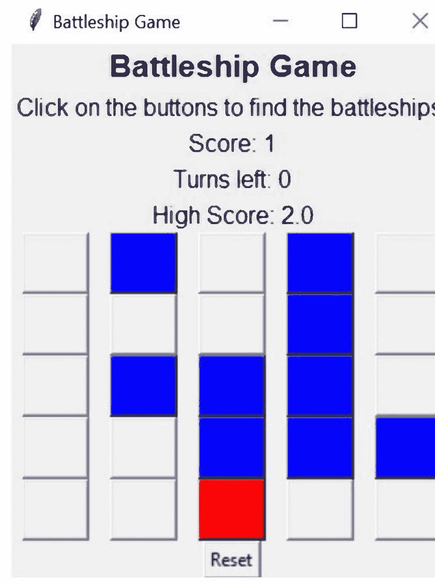

```python
import tkinter as tk
from random import randint
import time

class BattleshipGame:
    def __init__(self, root):
        self.root = root
        self.root.title("Battleship Game")

        self.board_size = 5
        self.ship_size = 3
        self.max_turns = 10
        self.turns_left = self.max_turns
        self.score = 0
        self.board = [[0] * self.board_size for _ in range(self.board_size)]
        self.ships = []

        self.load_high_score()
        self.create_info_panel()
        self.create_board()
        self.place_ships()

        self.start_time = time.time()

        # Add a Reset button
        reset_button = tk.Button(
            self.root, text="Reset", command=self.reset_game)
        reset_button.grid(row=self.board_size + 6, column=0,
                          columnspan=self.board_size)

    def load_high_score(self):
        try:
            with open("high_score.txt", "r") as file:
                high_score_str = file.read().strip()
                if high_score_str.lower() == "inf":
                    self.high_score = float('inf')
                else:
                    self.high_score = float(high_score_str)
        except FileNotFoundError:
            self.high_score = float('inf')

    def save_high_score(self):
        with open("high_score.txt", "w") as file:
            if self.high_score == float('inf'):
                file.write("inf")
            else:
                file.write(f"{self.high_score:.2f}")

    def create_info_panel(self):
        info_label = tk.Label(
            self.root, text="Battleship Game", font=("Helvetica", 16, "bold"))
        info_label.grid(row=0, column=0, columnspan=self.board_size)

        instruction_label = tk.Label(
            self.root, text="Click on the buttons to find the battleships!", font=("Helvetica", 12))
        instruction_label.grid(row=1, column=0, columnspan=self.board_size)

        score_label = tk.Label(
            self.root, text=f"Score: {self.score}", font=("Helvetica", 12))
        score_label.grid(row=2, column=0, columnspan=self.board_size)

        turns_label = tk.Label(
            self.root, text=f"Turns left: {self.turns_left}", font=("Helvetica", 12))
        turns_label.grid(row=3, column=0, columnspan=self.board_size)

        high_score_label = tk.Label(
            self.root, text=f"High Score: {'inf' if self.high_score == float('inf') else round(self.high_score, 2)}", font=("Helvetica", 12))
        high_score_label.grid(row=4, column=0, columnspan=self.board_size)

    def create_board(self):
        for i in range(self.board_size):
```

for j in range(self.board_size):
    btn = tk.Button(self.root, text="", width=5, height=2,
                   command=lambda i=i, j=j: self.click_cell(i, j))
    btn.grid(row=i + 5, column=j)

def place_ships(self):
    for _ in range(self.ship_size):
        ship_row = randint(0, self.board_size - 1)
        ship_col = randint(0, self.board_size - 1)
        while self.board[ship_row][ship_col] == 1:
            ship_row = randint(0, self.board_size - 1)
            ship_col = randint(0, self.board_size - 1)
        self.ships.append((ship_row, ship_col))
        self.board[ship_row][ship_col] = 1

def update_info_panel(self):
    self.root.grid_slaves(row=2, column=0)[0].config(
        text=f"得分: {self.score}")
    self.root.grid_slaves(row=3, column=0)[0].config(
        text=f"剩余回合: {self.turns_left}")
    self.root.grid_slaves(row=4, column=0)[0].config(
        text=f"最高分: {'inf' if self.high_score == float('inf') else round(self.high_score, 2)}")

def display_message(self, message):
    message_label = tk.Label(
        self.root, text=message, font=("Helvetica", 14, "bold"))
    message_label.grid(row=1, column=0, columnspan=self.board_size)
    self.root.after(2000, message_label.destroy)

def reset_game(self):
    if self.score > 0:
        # 如果击沉了一些战舰，则将当前得分保存为最高分
        if self.score < self.high_score:
            self.high_score = self.score
            self.save_high_score()
            self.root.grid_slaves(row=4, column=0)[0].config(
                text=f"最高分: {round(self.high_score, 2)}")

    self.score = 0
    self.turns_left = self.max_turns
    self.ships = []
    self.board = [[0] * self.board_size for _ in range(self.board_size)]
    self.update_info_panel()

    default_bg_color = self.root.cget("bg")

    for i in range(self.board_size):
        for j in range(self.board_size):
            btn = self.root.grid_slaves(row=i + 5, column=j)[0]
            btn.config(state=tk.NORMAL, bg=default_bg_color, text="")

    if self.turns_left > 0:
        self.place_ships()

    self.start_time = time.time()

def click_cell(self, row, col):
    if self.turns_left > 0:
        self.root.grid_slaves(
            row=row + 5, column=col)[0].config(state=tk.DISABLED)

        if (row, col) in self.ships:
            self.score += 1
            self.root.grid_slaves(
                row=row + 5, column=col)[0].config(bg="red")
        else:
            self.root.grid_slaves(
                row=row + 5, column=col)[0].config(bg="blue")

        self.turns_left -= 1
        self.update_info_panel()

        if self.score == self.ship_size:
            elapsed_time = round(time.time() - self.start_time, 2)
            self.display_message(
                f'恭喜！你在 {elapsed_time} 秒内击沉了所有战舰。')
            if elapsed_time < self.high_score:
                self.high_score = elapsed_time
                self.save_high_score()
                self.root.grid_slaves(row=4, column=0)[0].config(
                    text=f"最高分: {'inf' if self.high_score == float('inf') else round(self.high_score, 2)}")
            self.reset_game()  # 仅在所有战舰被击沉时重置
        elif self.turns_left == 0:
            self.display_message("游戏结束。你的回合已用完。")
            if self.score > 0 and self.score < self.ship_size:
                # 如果击沉了一些战舰，则将当前得分保存为最高分
                if self.score > self.high_score:
                    self.high_score = self.score
                    self.save_high_score()
                    self.root.grid_slaves(row=4, column=0)[0].config(
                        text=f"最高分: {round(self.high_score, 2)}")

if __name__ == "__main__":
    root = tk.Tk()
    game = BattleshipGame(root)
    root.mainloop()

### Python 代码

```python
import tkinter as tk
from random import randint
import time
```

本节导入了使用 Tkinter 创建图形用户界面（GUI）、使用 randint 生成随机数以及使用 time 处理时间相关函数所需的必要模块。

### Python 代码

```python
class BattleshipGame:
    def __init__(self, root):
```

此处定义了一个名为 BattleshipGame 的类。`__init__` 方法充当该类的构造函数。它接受一个参数 `root`，即 Tkinter 的根窗口。

### Python 代码

```python
        self.root = root
        self.root.title("Battleship Game")
```

这行代码用提供的根窗口初始化 `root` 属性，并将窗口标题设置为 "Battleship Game"。

### Python 代码

```python
        self.board_size = 5
        self.ship_size = 3
        self.max_turns = 10
        self.turns_left = self.max_turns
        self.score = 0
```

这几行定义了几个与游戏相关的参数，例如棋盘大小、战舰大小、最大回合数、当前剩余回合数以及玩家得分。

### Python 代码

```python
        self.board = [[0] * self.board_size for _ in range(self.board_size)]
        self.ships = []
```

这里，`board` 是一个用零初始化的二维列表，代表游戏棋盘。`ships` 列表将用于存储棋盘上战舰的坐标。

### Python 代码

```python
        self.load_high_score()
        self.create_info_panel()
        self.create_board()
        self.place_ships()
```

这几行调用了从文件加载最高分、在 GUI 中创建信息面板、创建游戏棋盘按钮以及在棋盘上随机放置战舰的方法。

### Python 代码

```python
        self.start_time = time.time()
```

这行代码使用 time 模块记录了游戏的开始时间。

### Python 代码

```python
        reset_button = tk.Button(
            self.root, text="Reset", command=self.reset_game)
        reset_button.grid(row=self.board_size + 6, column=0,
                          columnspan=self.board_size)
```

这行代码在 GUI 中创建了一个 "Reset" 按钮，点击时会调用 `reset_game` 方法。

### Python 代码

```python
    def load_high_score(self):
```

此方法从文件（"high_score.txt"）加载最高分，并用检索到的值初始化 `high_score` 属性。

### Python 代码

```python
    def save_high_score(self):
```

此方法将当前最高分保存到同一个文件中。

### Python 代码

```python
    def create_info_panel(self):
```

此方法在 GUI 中创建标签，用于显示游戏标题、说明、得分、剩余回合数和最高分等信息。

### Python 代码

```python
    def create_board(self):
```

此方法在 GUI 中创建按钮来表示游戏棋盘。每个按钮在点击时都与 `click_cell` 方法相关联。

### Python 代码

```python
    def place_ships(self):
```

此方法在游戏棋盘上随机放置战舰，并更新 `ships` 列表。

### Python 代码

```python
    def update_info_panel(self):
```

此方法更新 GUI 中的信息面板，以反映当前得分、剩余回合数和最高分。

### Python 代码

```python
    def display_message(self, message):
```

此方法在 GUI 上显示一条临时消息，持续 2 秒。它用于显示祝贺和游戏结束的消息。

### Python 代码

```python
    def reset_game(self):
```

此方法重置游戏，如果当前得分更高，则将其保存为最高分。它还会重置游戏棋盘、得分、剩余回合数和战舰。

### Python 代码

```python
    def click_cell(self, row, col):
```

当点击游戏棋盘按钮时调用此方法。它会禁用按钮，更新得分、剩余回合数，并检查游戏完成条件。

### Python 代码

```python
if __name__ == "__main__":
```

此代码块检查脚本是否是主模块，如果是，则创建 BattleshipGame 类的实例并启动 Tkinter 主循环。

### Python 代码

```python
    root = tk.Tk()
    game = BattleshipGame(root)
    root.mainloop()
```

这里创建了一个 Tkinter 根窗口，并用这个根窗口实例化了 BattleshipGame 对象。然后启动 Tkinter 主循环（`root.mainloop()`），允许显示和交互 GUI。

## 如何玩战舰游戏

1.  **运行脚本**：执行包含战舰游戏代码的 Python 脚本。这将打开一个图形用户界面（GUI）窗口。
2.  **游戏布局**：
    *   游戏棋盘由一个按钮网格组成。
    *   窗口顶部显示标题 "Battleship Game"。
    *   标题下方有说明，指导你点击按钮来寻找战舰。

## 3. 点击按钮：

- 要发现战舰，请点击网格中的按钮。
- 每个按钮代表游戏棋盘上的一个单元格。

## 4. 游戏玩法：

- 游戏开始时，战舰会随机放置在棋盘上。
- 点击一个按钮会显示该单元格中是否存在战舰。
- 如果你击中一艘战舰（点击包含战舰的单元格），你的分数会增加。
- 如果你未击中战舰，被点击的按钮会变成蓝色。
- 你有有限的回合数来找到并击沉所有战舰。

## 5. 游戏结束：

- 当你用完所有回合时，游戏结束。
- 将显示一条消息，表明游戏已结束，并且你已用尽所有回合。

## 6. 恭喜：

- 如果你在允许的回合内成功击沉所有战舰，将显示一条祝贺消息。
- 完成游戏所用的时间也会以秒为单位显示。

## 7. 重置游戏：

- 游戏结束后，你可以通过点击“重置”按钮来重置游戏。
- 如果你在游戏中取得了高分，它将被保存。

## 8. 高分：

- 高分显示在信息面板中。
- 目标是尽快完成游戏，以获得更低的高分。

## 9. 关闭游戏：

- 你可以随时关闭游戏窗口。

## 10. 重新开始游戏：

- 要再次游玩，请运行脚本或重新启动 Python 程序。

享受玩战舰游戏的乐趣，并尝试通过在最短时间内击沉所有战舰来打破你的高分记录！

## 17. 太空侵略者游戏

👾 太空侵略者

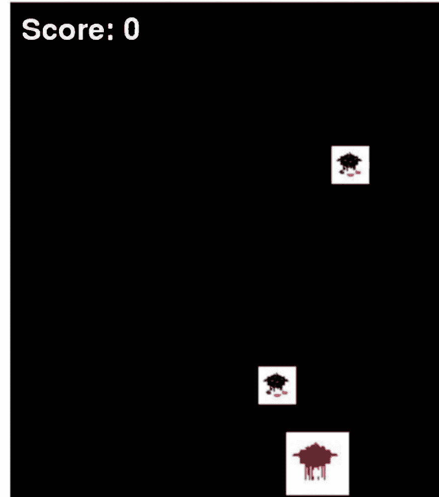

等级：1

```python
import pygame
import sys
import random

# Initialize Pygame
pygame.init()

### Constants
WIDTH, HEIGHT = 600, 400
FPS = 30
WHITE = (255, 255, 255)
BLACK = (0, 0, 0)

# Player
player_size = 50
player_speed = 5

# Enemy
enemy_size = 30
enemy_speed = 2
initial_enemy_spawn_rate = 25
min_enemy_spawn_rate = 5 # Minimum spawn rate

# Bullet
bullet_speed = 7

# Initialize the screen
screen = pygame.display.set_mode((WIDTH, HEIGHT))
pygame.display.set_caption("Space Invaders")

# Load images
player_image = pygame.image.load("player.png")
enemy_image = pygame.image.load("enemy.png")
bullet_image = pygame.image.load("bullet.png")

# Load sounds
explosion_sound = pygame.mixer.Sound("explosion.wav")
shooting_sound = pygame.mixer.Sound("shooting.wav")

# Clock for controlling the frame rate
clock = pygame.time.Clock()

# Player class
class Player(pygame.sprite.Sprite):
    def __init__(self):
        super().__init__()
        self.image = pygame.transform.scale(
            player_image, (player_size, player_size))
        self.rect = self.image.get_rect()
        self.rect.centerx = WIDTH // 2
        self.rect.bottom = HEIGHT - 10

    def update(self):
        keys = pygame.key.get_pressed()
        if keys[pygame.K_LEFT] and self.rect.left > 0:
            self.rect.x -= player_speed
        if keys[pygame.K_RIGHT] and self.rect.right < WIDTH:
            self.rect.x += player_speed

# Enemy class
class Enemy(pygame.sprite.Sprite):
    def __init__(self):
        super().__init__()
        self.image = pygame.transform.scale(
            enemy_image, (enemy_size, enemy_size))
        self.rect = self.image.get_rect()
        self.rect.x = random.randint(0, WIDTH - enemy_size)
        self.rect.y = random.randint(-HEIGHT, 0)

    def update(self):
        self.rect.y += enemy_speed
        if self.rect.top > HEIGHT:
            self.rect.x = random.randint(0, WIDTH - enemy_size)
            self.rect.y = random.randint(-HEIGHT, 0)

# Bullet class
class Bullet(pygame.sprite.Sprite):
    def __init__(self, x, y):
        super().__init__()
        self.image = pygame.transform.scale(bullet_image, (10, 20))
        self.rect = self.image.get_rect()
        self.rect.centerx = x
        self.rect.bottom = y

    def update(self):
        self.rect.y -= bullet_speed
        if self.rect.bottom < 0:
            self.kill()

# Create sprite groups
all_sprites = pygame.sprite.Group()
enemies = pygame.sprite.Group()
bullets = pygame.sprite.Group()

# Create player
player = Player()
all_sprites.add(player)

# Scoring and level variables
score = 0
level = 1
font = pygame.font.Font(None, 36)

# Game over flag
game_over = False

# Main game loop
while True:
    # Event handling
    for event in pygame.event.get():
        if event.type == pygame.QUIT:
            pygame.quit()
            sys.exit()
        elif event.type == pygame.KEYDOWN:
            if not game_over:
                if event.key == pygame.K_SPACE:
                    bullet = Bullet(player.rect.centerx, player.rect.top)
                    all_sprites.add(bullet)
                    bullets.add(bullet)
                    shooting_sound.play()
            else:
                if event.key == pygame.K_r:
                    # Reset game state
                    all_sprites.empty()
                    enemies.empty()
                    bullets.empty()
                    player = Player()
                    all_sprites.add(player)
                    score = 0
                    level = 1
                    enemy_speed = 2
                    initial_enemy_spawn_rate = 25
                    min_enemy_spawn_rate = 5
                    game_over = False

    if not game_over:
        # Spawn enemies
        if random.randint(1, initial_enemy_spawn_rate) == 1:
            enemy = Enemy()
            all_sprites.add(enemy)
            enemies.add(enemy)

        # Update sprites
        all_sprites.update()

        # Check for collisions
        hits = pygame.sprite.groupcollide(enemies, bullets, True, True)
        for hit in hits:
            score += 10
            explosion_sound.play()
            enemy = Enemy()
            all_sprites.add(enemy)
            enemies.add(enemy)

        hits = pygame.sprite.spritecollide(player, enemies, False)
        if hits:
            game_over = True

    # Draw everything
    screen.fill(BLACK)
    all_sprites.draw(screen)

    # Display score and level
    score_text = font.render(f"Score: {score}", True, WHITE)
    level_text = font.render(f"Level: {level}", True, WHITE)
    screen.blit(score_text, (10, 10))
    screen.blit(level_text, (WIDTH - 150, 10))

    # Display "Game Over" message if the game is over
    if game_over:
        # Draw white background
        white_rect = pygame.Rect(WIDTH // 2 - 220, HEIGHT // 2 - 40, 440, 80)
        pygame.draw.rect(screen, WHITE, white_rect)

        # Draw "Game Over" text in yellow, centered within the white rectangle
        game_over_text = font.render(
            "Game Over, Press R to Restart", True, (0, 0, 255)) # Yellow color
        text_rect = game_over_text.get_rect(center=white_rect.center)
        screen.blit(game_over_text, text_rect.topleft)

    # Update display
    pygame.display.flip()

    # Increase difficulty with levels
    if not game_over and score >= level * 100:
        level += 1
        enemy_speed += 0.001
        initial_enemy_spawn_rate -= 1 # Decrease the spawn rate
        # Ensure it doesn't go below min rate
        initial_enemy_spawn_rate = max(
            initial_enemy_spawn_rate, min_enemy_spawn_rate)

    # Cap the frame rate
    clock.tick(FPS)
```

让我们逐行浏览代码，解释每个部分的功能：

### Python 代码

```python
import pygame
import sys
import random
```

在这里，你导入了必要的模块：`pygame` 用于创建游戏，`sys` 用于与系统交互，`random` 用于生成随机数。

### Python 代码

```python
pygame.init()
```

这会初始化 Pygame。

### Python 代码

### 常量

```python
WIDTH, HEIGHT = 600, 400
FPS = 30
WHITE = (255, 255, 255)
BLACK = (0, 0, 0)
```

这些行**定义**了游戏中使用的一些常量，例如屏幕宽度和高度、每秒帧数以及颜色。

### Python 代码

```python
# Player
player_size = 50
player_speed = 5
```

**定义**了玩家角色的属性，例如其大小和移动速度。

### Python 代码

```python
# Enemy
enemy_size = 30
enemy_speed = 2
initial_enemy_spawn_rate = 25
min_enemy_spawn_rate = 5 # Minimum spawn rate
```

定义了敌人角色的属性，例如大小、速度和生成速率。

### Python 代码

```python
# Bullet
bullet_speed = 7
```

定义了玩家发射的子弹的速度。

### Python 代码

```python
# Initialize the screen
screen = pygame.display.set_mode((WIDTH, HEIGHT))
pygame.display.set_caption("Space Invaders")
```

使用指定的宽度和高度初始化游戏窗口，并设置窗口标题。

### Python 代码

## 加载图片

```python
player_image = pygame.image.load("player.png")
enemy_image = pygame.image.load("enemy.png")
bullet_image = pygame.image.load("bullet.png")
```

从各自的图像文件中加载玩家、敌人和子弹的图片。

### Python 代码

```python
# Load sounds
explosion_sound = pygame.mixer.Sound("explosion.wav")
shooting_sound = pygame.mixer.Sound("shooting.wav")
```

加载爆炸和射击的音效。

### Python 代码

```python
# Clock for controlling the frame rate
clock = pygame.time.Clock()
```

创建一个 Clock 对象来控制游戏的帧率。

下一节**定义**了玩家、敌人和子弹精灵的类，每个类都有各自的属性和方法。

主游戏循环以一个 while 循环开始，该循环持续运行直到游戏退出。

在游戏循环内部，处理诸如退出游戏或按键等事件。

如果游戏尚未结束，则会随机生成敌人、更新精灵、检查碰撞，并相应地绘制屏幕。

如果游戏结束，则会显示“游戏结束”消息。

### Python 代码

```python
# Update display
pygame.display.flip()
```

更新显示以展示本次游戏循环迭代中所做的更改。

### Python 代码

```python
# Increase difficulty with levels
if not game_over and score >= level * 100:
    level += 1
    enemy_speed += 0.001
    initial_enemy_spawn_rate -= 1  # Decrease the spawn rate
    # Ensure it doesn't go below min rate
    initial_enemy_spawn_rate = max(initial_enemy_spawn_rate, min_enemy_spawn_rate)
```

检查游戏是否未结束以及分数是否达到 100 的倍数。如果是，则增加等级、敌人速度，并降低敌人的生成速率。

### Python 代码

```python
# Cap the frame rate
clock.tick(FPS)
```

将帧率限制在指定的 FPS 值，确保游戏在不同设备上以一致的速度运行。

这是代码结构和功能的高层概述。每个部分都有助于使用 Pygame 创建一个简单的太空侵略者游戏。

## 如何玩太空侵略者游戏

要玩太空侵略者游戏，请遵循以下说明：

### 1. 控制：
- 将你的玩家向左移动：按下**左箭头键**。
- 将你的玩家向右移动：按下**右箭头键**。
- 发射子弹：按下**空格键**。

### 2. 目标：
- 你的目标是击落下降的敌舰（太空侵略者），同时避免与它们碰撞。

### 3. 玩家移动：
- 使用左右箭头键在屏幕底部水平移动你的玩家飞船。

### 4. 射击：
- 按下空格键从你的玩家飞船向上发射子弹。

### 5. 敌舰：
- 敌舰将在屏幕顶部生成，并向你的玩家向下移动。
- 你的目标是在敌舰到达屏幕底部之前击落它们。

#### 6. 计分：
- 每成功击落一艘敌舰，你将获得分数。
- 分数显示在屏幕上。

### 7. 等级：
- 随着分数的增加，你将通过不同的等级。
- 每个等级可能会带来更高的难度，例如更快的敌舰。

### 8. 游戏结束：
- 如果敌舰与你的玩家飞船碰撞，游戏结束。
- 如果你想在游戏结束后重新开始，请按 'R' 键。

### 9. 重新开始游戏：
- 如果你看到“游戏结束”消息，请按 'R' 键重新开始游戏并再次游玩。

### 10. 享受乐趣：
- 玩太空侵略者游戏要开心！尝试获得最高分并达到更高的等级。

记住，随着你通过等级的提升，游戏的难度会增加，所以保持警惕，躲避敌人的火力，并准确瞄准以取得成功！

## 18. 国际象棋游戏

♟️ 国际象棋游戏

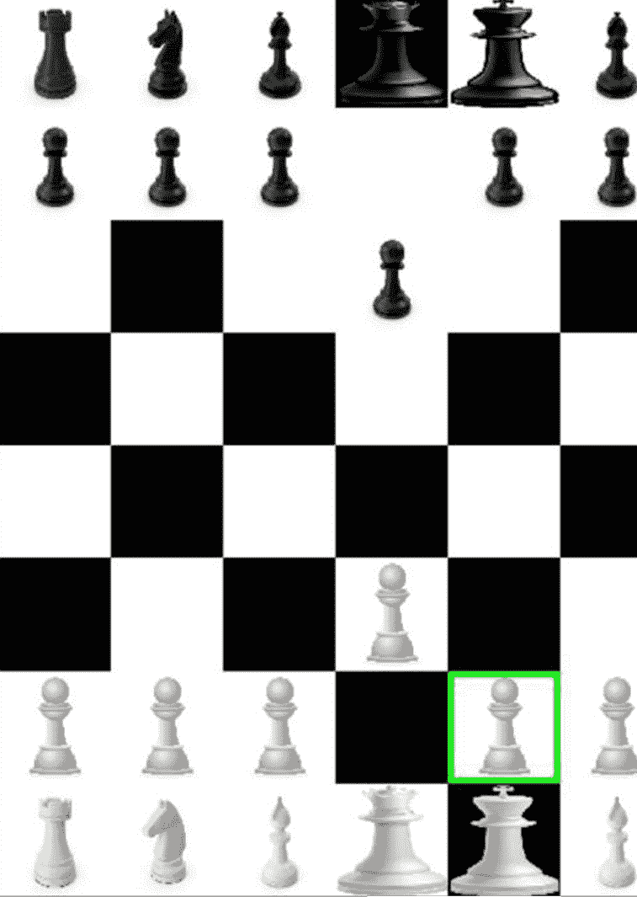

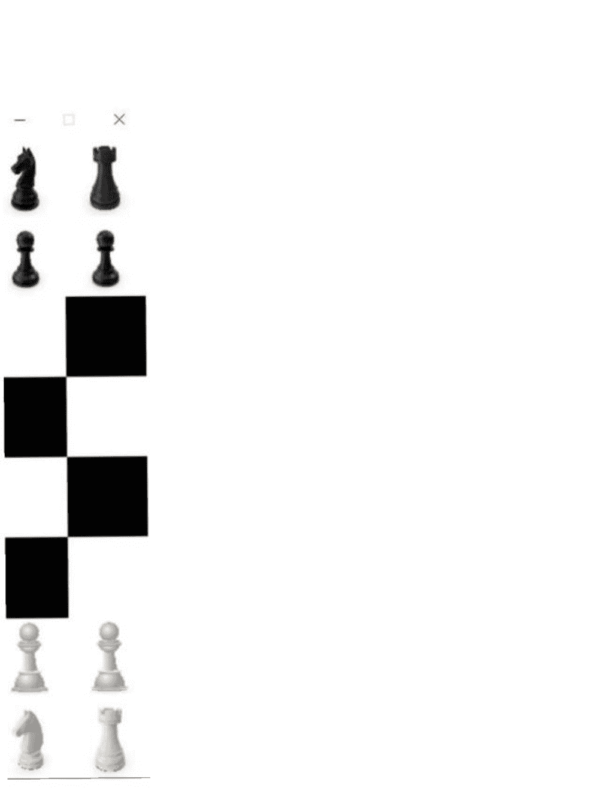

```python
import pygame
import sys
import os

### Initialize pygame
pygame.init()

### Constants
WIDTH, HEIGHT = 600, 600
BOARD_SIZE = 8
SQUARE_SIZE = WIDTH // BOARD_SIZE
WHITE = (255, 255, 255)
BLACK = (0, 0, 0)

# Chess board representation
chess_board = [
    ["r", "n", "b", "q", "k", "b", "n", "r"],
    ["p", "p", "p", "p", "p", "p", "p", "p"],
    ["", "", "", "", "", "", "", ""],
    ["", "", "", "", "", "", "", ""],
    ["", "", "", "", "", "", "", ""],
    ["", "", "", "", "", "", "", ""],
    ["P", "P", "P", "P", "P", "P", "P", "P"],
    ["R", "N", "B", "Q", "K", "B", "N", "R"],
]

# Initialize the pygame screen
screen = pygame.display.set_mode((WIDTH, HEIGHT))
pygame.display.set_caption("Chess Game")

# Load chess piece images
pieces = {}
for color in ['w', 'b']:
    for piece in ['r', 'n', 'b', 'q', 'k', 'p']:
        img_path = os.path.join("images", f"{color}{piece.lower()}.png")
        pieces[color + piece] = pygame.transform.scale(
            pygame.image.load(img_path), (SQUARE_SIZE, SQUARE_SIZE))

selected_piece = None
selected_row = None
selected_col = None
```

```python
def is_valid_move(piece, start, end, board):
    row_start, col_start = start
    row_end, col_end = end

    if piece == "":
        return False  # No piece to move

    if not (0 <= row_start < 8 and 0 <= col_start < 8 and 0 <= row_end < 8 and 0 <= col_end < 8):
        return False  # Check if the move is within the board boundaries

    if (piece.islower() and row_end <= row_start) or (piece.isupper() and row_end >= row_start):
        return False  # Ensure pawns are moving in the correct direction

    if board[row_end][col_end] != "" and piece.islower() == board[row_end][col_end].islower():
        return False  # Cannot move to a square occupied by a piece of the same color

    if piece[0].lower() == 'p':
        # Pawn specific rules
        if col_start == col_end and board[row_end][col_end] == "":
            # Pawn moves forward one square
            if abs(row_end - row_start) == 1:
                return True
            # Pawn initial two-square move
            elif abs(row_end - row_start) == 2 and row_start in (1, 6) and board[row_start + (1 if piece.islower() else -1)][col_start] == "":
                return True
        elif abs(row_end - row_start) == 1 and abs(col_end - col_start) == 1:
            # Pawn captures diagonally
            if board[row_end][col_end] != "" and piece.islower() != board[row_end][col_end].islower():
                return True

    return False

    if piece[0].lower() == 'r':
        # Rook specific rules
        return row_start == row_end or col_start == col_end and not is_obstructed(start, end, board)

    if piece[0].lower() == 'n':
        # Knight specific rules
        return (abs(row_end - row_start) == 2 and abs(col_end - col_start) == 1) or (abs(row_end - row_start) == 1 and abs(col_end - col_start) == 2)

    if piece[0].lower() == 'b':
        # Bishop specific rules
        return abs(row_end - row_start) == abs(col_end - col_start) and not is_obstructed(start, end, board)

    if piece[0].lower() == 'q':
        # Queen specific rules
        return (row_start == row_end or col_start == col_end or abs(row_end - row_start) == abs(col_end - col_start)) and not is_obstructed(start, end, board)

    if piece[0].lower() == 'k':
        # King specific rules
        return abs(row_end - row_start) <= 1 and abs(col_end - col_start) <= 1

    return False
```

```python
def is_obstructed(start, end, board):
    row_start, col_start = start
    row_end, col_end = end

    delta_row = 1 if row_end > row_start else -1 if row_end < row_start else 0
    delta_col = 1 if col_end > col_start else -1 if col_end < col_start else 0

    current_row, current_col = row_start + delta_row, col_start + delta_col

    while (current_row, current_col) != (row_end, col_end):
        if board[current_row][current_col] != "":
            return True  # There is an obstruction
        current_row += delta_row
        current_col += delta_col

    return False
```

```python
def is_in_check(board, color):
    for row in range(8):
        for col in range(8):
```

### Python 代码

```python
import pygame
import sys
 import os
```

- 代码首先导入必要的库：`pygame` 用于游戏开发，`sys` 用于系统相关操作，`os` 用于与操作系统交互。

### Python 代码

```python
pygame.init()
```

- 初始化 pygame 库。在使用任何 pygame 函数之前必须调用此函数。

### Python 代码

```python
WIDTH, HEIGHT = 600, 600
BOARD_SIZE = 8
SQUARE_SIZE = WIDTH // BOARD_SIZE
WHITE = (255, 255, 255)
BLACK = (0, 0, 0)
```

- 设置一些常量，包括游戏窗口的尺寸、棋盘的大小、棋盘上每个方格的大小以及颜色常量。

### Python 代码

```python
chess_board = [
    ["r", "n", "b", "q", "k", "b", "n", "r"],
    ["p", "p", "p", "p", "p", "p", "p", "p"],
    ["", "", "", "", "", "", "", ""],
    ["", "", "", "", "", "", "", ""],
    ["", "", "", "", "", "", "", ""],
    ["", "", "", "", "", "", "", ""],
    ["P", "P", "P", "P", "P", "P", "P", "P"],
    ["R", "N", "B", "Q", "K", "B", "N", "R"],
]
```

- 将棋盘初始化为一个列表的列表，表示棋子的初始配置。

### Python 代码

```python
screen = pygame.display.set_mode((WIDTH, HEIGHT))
pygame.display.set_caption("Chess Game")
```

- 创建具有指定尺寸的游戏窗口，并设置窗口标题。

### Python 代码

```python
pieces = {}
for color in ['w', 'b']:
    for piece in ['r', 'n', 'b', 'q', 'k', 'p']:
        img_path = os.path.join("images", f"{color}{piece.lower()}.png")
        pieces[color + piece] = pygame.transform.scale(
            pygame.image.load(img_path), (SQUARE_SIZE, SQUARE_SIZE))
```

- 从位于 "images" 目录中的文件加载棋子图像，并将其缩放以匹配棋盘方格的大小。图像存储在 **pieces** 字典中，键类似于 "wr" 表示白车。

### Python 代码

```python
selected_piece = None
selected_row = None
selected_col = None
```

- 初始化变量以跟踪当前选中的棋子及其在棋盘上的位置。

代码随后**定义**了几个函数：`is_valid_move`、`is_obstructed`、`is_in_check`、`find_king`、`is_in_checkmate`、`is_en_passant` 和 `pawn_promotion`。这些函数负责检查与棋子移动和游戏状态相关的各种条件。

代码随后使用 **while** 语句进入游戏循环，在循环中持续更新游戏状态并检查用户输入和事件。

游戏循环包含处理鼠标点击、更新显示以及检查将杀条件的逻辑。循环持续进行，直到游戏关闭或检测到将杀。

最后，在退出游戏循环后，代码打印一条消息指示获胜者（如果有），关闭 pygame 窗口，并退出程序。

## 如何玩国际象棋游戏

要使用提供的代码玩国际象棋游戏，请遵循以下一般步骤：

1.  **运行代码：**
    - 确保您的系统上安装了 Python。
    - 将代码保存在扩展名为 .py 的文件中（例如 `chess_game.py`）。
    - 打开终端或命令提示符，导航到包含该文件的目录，并使用 `python chess_game.py` 运行脚本。

2.  **棋盘显示：**
    - 代码将打开一个窗口，显示棋盘和棋子。

3.  **选择和移动棋子：**
    - 单击一个棋子以选中它（由绿色边框高亮显示）。
    - 单击一个有效的方格以移动选中的棋子。
    - 如果移动有效，棋子将被移动到新位置。

4.  **兵的升变：**
    - 如果一个兵到达棋盘的另一端，您将被提示选择一个棋子进行升变（后、车、马、象）。
    - 输入相应的字母（Q、R、N、B）以升变该兵。

5.  **将军和将杀：**
    - 游戏在每次移动后检查将军和将杀条件。
    - 如果国王被将军，棋盘将显示一条消息指示将军。
    - 如果发生将杀，游戏将结束，并宣布获胜者。

6.  **退出游戏：**
    - 关闭游戏窗口以退出程序。

7.  **遵守规则：**
    - 代码执行标准的国际象棋规则，包括每个棋子的有效移动、王车易位、吃过路兵和兵的升变。

8.  **自定义游戏：**

```python
def is_valid_move(piece, start, end, board):
    row_start, col_start = start
    row_end, col_end = end
    # ... (实现细节)
    return False

def is_obstructed(start, end, board):
    # ... (实现细节)
    return False

def is_in_check(board, color):
    piece = board[row][col]
    if piece and piece.isupper() != (color == 'w'):
        king_position = find_king(board, color)
        if is_valid_move(piece, (row, col), king_position, board):
            return True
    return False

def find_king(board, color):
    for row in range(8):
        for col in range(8):
            if board[row][col] == ('K' if color == 'w' else 'k'):
                return row, col

def is_in_checkmate(board, color):
    # 将杀条件（存根）
    return False

def is_en_passant(board, start, end):
    row_start, col_start = start
    row_end, col_end = end

    # 确保兵向前移动两格
    if board[row_start][col_start].lower() == 'p' and abs(row_end - row_start) == 2:
        # 检查左侧或右侧是否有对方的兵
        if col_end > 0 and board[row_end][col_end - 1].lower() == 'p' and board[row_end][col_end - 1].isupper():
            return True
        elif col_end < 7 and board[row_end][col_end + 1].lower() == 'p' and board[row_end][col_end + 1].isupper():
            return True

    return False

def pawn_promotion(piece, end_position):
    row, col = end_position

    # 检查兵是否到达棋盘的另一端
    if piece.lower() == 'p' and (row == 0 or row == 7):
        # 您可能想要实现一个弹出窗口或某种 UI 来让玩家选择升变的棋子
        promotion_piece = input(
            "选择升变的棋子 (Q, R, N, B): ").upper()

        # 确保输入有效
        while promotion_piece not in ['Q', 'R', 'N', 'B']:
            promotion_piece = input(
                "无效的选择。请选择 Q、R、N 或 B: ").upper()

        return promotion_piece
    return piece
```

```python
running = True
while running and not is_in_checkmate(chess_board, 'w') and not is_in_checkmate(chess_board, 'b'):
    selected_piece_available_moves = []

    for i in range(8):
        for j in range(8):
            if selected_piece and selected_row is not None and selected_col is not None:
                move_valid = is_valid_move(
                    selected_piece, (selected_row, selected_col), (i, j), chess_board)
                if move_valid:
                    selected_piece_available_moves.append((i, j))

    for event in pygame.event.get():
        if event.type == pygame.QUIT:
            running = False
        elif event.type == pygame.MOUSEBUTTONDOWN:
            pos = pygame.mouse.get_pos()
            col = pos[0] // SQUARE_SIZE
            row = pos[1] // SQUARE_SIZE

            if selected_piece and (row, col) in selected_piece_available_moves:
                if is_en_passant(chess_board, (selected_row, selected_col), (row, col)):
                    # 处理吃过路兵
                    chess_board[row - 1 if selected_piece.islower()
                                else row + 1][col] = ""
                else:
                    chess_board[row][col] = pawn_promotion(
                        selected_piece, (row, col))
                chess_board[selected_row][selected_col] = ""
                selected_piece = None
                selected_row = None
                selected_col = None
            elif chess_board[row][col] != "":
                # 仅当单击的方格中有棋子时才设置 selected_piece 和 selected 位置
                selected_piece = chess_board[row][col]
                selected_row, selected_col = row, col

    screen.fill((255, 255, 255))

    for row in range(8):
        for col in range(8):
            color = WHITE if (row + col) % 2 == 0 else BLACK
            pygame.draw.rect(screen, color, (col * SQUARE_SIZE,
                                            row * SQUARE_SIZE, SQUARE_SIZE, SQUARE_SIZE))
            piece = chess_board[row][col]
            if piece:
                color_prefix = "w" if piece.isupper() else "b"
                piece_key = color_prefix + piece.lower()
                if piece_key not in pieces:
                    print(f"未找到棋子: {piece_key}")
                    continue

                piece_image = pieces[piece_key]
                screen.blit(
                    piece_image, (col * SQUARE_SIZE, row * SQUARE_SIZE))

    if selected_piece:
        pygame.draw.rect(screen, (0, 255, 0), (selected_col * SQUARE_SIZE,
                        selected_row * SQUARE_SIZE, SQUARE_SIZE, SQUARE_SIZE), 4)

    pygame.display.flip()

    # 将杀消息
    if is_in_checkmate(chess_board, 'w'):
        print("将杀！玩家 B 获胜！")
    elif is_in_checkmate(chess_board, 'b'):
        print("将杀！玩家 W 获胜！")

pygame.quit()
sys.exit()
```

## 19. 轮盘模拟器游戏

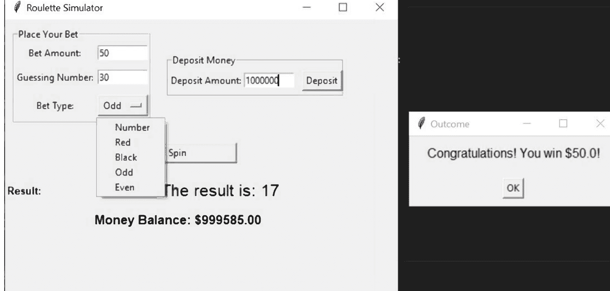

```python
import tkinter as tk
from tkinter import messagebox
import random

class RouletteSimulator:
    def __init__(self, master):
        self.master = master
        self.master.title("Roulette Simulator")

        # Center the window on the screen
        window_width = 500
        window_height = 350
        screen_width = self.master.winfo_screenwidth()
        screen_height = self.master.winfo_screenheight()
        x_position = (screen_width - window_width) // 2
        y_position = (screen_height - window_height) // 2
        self.master.geometry(
            f"{window_width}x{window_height}+{x_position}+{y_position}")

        self.money_balance = 1000  # Starting money balance

        # Bet Controls
        self.bet_label_frame = tk.LabelFrame(master, text="Place Your Bet")
        self.bet_label_frame.grid(
            row=0, column=0, padx=10, pady=10, sticky="w")

        self.bet_amount_label = tk.Label(
            self.bet_label_frame, text="Bet Amount:")
        self.bet_amount_label.grid(row=0, column=0, pady=5)

        self.bet_amount_var = tk.StringVar()
        self.bet_amount_entry = tk.Entry(
            self.bet_label_frame, textvariable=self.bet_amount_var, width=10)
        self.bet_amount_entry.grid(row=0, column=1, pady=5)

        self.bet_number_label = tk.Label(
            self.bet_label_frame, text="Guessing Number:")
        self.bet_number_label.grid(row=1, column=0, pady=5)

        self.bet_number_var = tk.StringVar()
        self.bet_number_entry = tk.Entry(
            self.bet_label_frame, textvariable=self.bet_number_var, width=10)
        self.bet_number_entry.grid(row=1, column=1, pady=5)

        self.bet_type_label = tk.Label(self.bet_label_frame, text="Bet Type:")
        self.bet_type_label.grid(row=2, column=0, pady=5)

        self.bet_type_var = tk.StringVar()
        self.bet_type_var.set("Number")
        bet_types = ["Number", "Red", "Black", "Odd", "Even"]
        self.bet_type_menu = tk.OptionMenu(
            self.bet_label_frame, self.bet_type_var, *bet_types)
        self.bet_type_menu.grid(row=2, column=1, pady=5)

        # Deposit Controls
        self.deposit_label_frame = tk.LabelFrame(master, text="Deposit Money")
        self.deposit_label_frame.grid(
            row=0, column=1, padx=10, pady=10, sticky="w")

        self.deposit_label = tk.Label(
            self.deposit_label_frame, text="Deposit Amount:")
        self.deposit_label.grid(row=0, column=0, pady=5)

        self.deposit_var = tk.StringVar()
        self.deposit_entry = tk.Entry(
            self.deposit_label_frame, textvariable=self.deposit_var, width=10)
        self.deposit_entry.grid(row=0, column=1, pady=5)

        self.deposit_button = tk.Button(
            self.deposit_label_frame, text="Deposit", command=self.deposit_money)
        self.deposit_button.grid(row=0, column=2, pady=5, padx=(10, 0))

        # Spin Button
        self.spin_button = tk.Button(
            master, text="Spin", command=self.start_spin, width=20, state='disabled')
        self.spin_button.grid(row=1, column=0, columnspan=2, pady=15)

        # Result and Balance Labels
        self.result_label = tk.Label(
            master, text="Result:", font=("Helvetica", 10, "bold"))
        self.result_label.grid(row=2, column=0, pady=(5, 0), sticky="w")

        self.result_var = tk.StringVar()
        self.result_value_label = tk.Label(
            master, textvariable=self.result_var, font=("Helvetica", 16))
        self.result_value_label.grid(row=2, column=1, pady=(5, 0), sticky="w")

        self.balance_label = tk.Label(
            master, text=f"Money Balance: ${self.money_balance:.2f}", font=("Helvetica", 12, "bold"))
        self.balance_label.grid(row=3, column=0, columnspan=2, pady=(10, 0))

        self.is_spinning = False
        self.spin_interval = 100 # milliseconds
        self.spin_count = 0
        self.stop_spin_count = 10

        # Trace changes in bet amount entry to enable/disable Spin Button
        self.bet_amount_var.trace('w', self.check_bet_amount)

        # Trace changes in bet number entry to enable/disable Spin Button
        self.bet_number_var.trace('w', self.check_bet_amount)

    def deposit_money(self):
        try:
            deposit_amount = float(self.deposit_var.get())
            if deposit_amount <= 0:
                messagebox.showerror(
                    "Error", "Deposit amount must be greater than zero.")
                return
        except ValueError:
            messagebox.showerror(
                "Error", "Invalid deposit amount. Please enter a valid number.")
            return

        self.money_balance += deposit_amount
        self.update_balance_label()

    def start_spin(self):
        if not self.is_spinning:
            self.spin_count = 0
            self.is_spinning = True
            self.spin()

    def spin(self):
        if self.is_spinning:
            # 0 to 36 for numbers, 37 for '00'
            result = random.choice(range(37))
            self.result_var.set(result)
            self.spin_count += 1

            if self.spin_count < self.stop_spin_count:
                self.master.after(self.spin_interval, self.spin)
            else:
                self.is_spinning = False
                self.process_spin_result(result)

    def process_spin_result(self, result):
        try:
            bet_amount = float(self.bet_amount_var.get())
            bet_number = self.bet_number_var.get()
            if bet_amount <= 0 or bet_amount > self.money_balance or not bet_number:
                messagebox.showerror(
                    "Error", "Invalid bet amount or guessing number. Please enter valid values.")
                return
        except ValueError:
            messagebox.showerror(
                "Error", "Invalid bet amount. Please enter a valid number.")
            return

        bet_type = self.bet_type_var.get()
        self.result_var.set(f"The result is: {result}")

        win_amount = self.check_win(bet_type, result, bet_amount, bet_number)
        self.money_balance += win_amount - bet_amount
        self.update_balance_label()

        if win_amount > 0:
            self.show_outcome_message(
                f'Congratulations! You win ${win_amount - bet_amount}!')
        else:
            self.show_outcome_message("You lose!")

    def show_outcome_message(self, message):
        outcome_window = tk.Toplevel(self.master)
        outcome_window.title("Outcome")
        outcome_window.geometry(
            "+%d+%d" % (self.master.winfo_x() + 500, self.master.winfo_y() + 130))

        outcome_label = tk.Label(
            outcome_window, text=message, font=("Helvetica", 12))
        outcome_label.pack(padx=20, pady=10)

        ok_button = tk.Button(outcome_window, text="OK",
            command=outcome_window.destroy)
        ok_button.pack(pady=10)

    def check_win(self, bet_type, result, bet_amount, bet_number):
        if bet_type == "Number":
            try:
                selected_number = int(bet_number)
            except ValueError:
                messagebox.showerror(
                    "Error", "Invalid bet number. Please enter a valid number.")
                return 0
            if selected_number == result:
                return bet_amount * 36  # Winning on a specific number
            else:
                return 0
        elif bet_type == "Red" and result in [1, 3, 5, 7, 9, 12, 14, 16, 18, 19, 21, 23, 25, 27, 30, 32, 34, 36]:
            return bet_amount * 2  # Winning on red
        elif bet_type == "Black" and result in [2, 4, 6, 8, 10, 11, 13, 15, 17, 20, 22, 24, 26, 28, 29, 31, 33, 35]:
            return bet_amount * 2  # Winning on black
        elif bet_type == "Odd" and result % 2 != 0:
            return bet_amount * 2  # Winning on odd
        elif bet_type == "Even" and result % 2 == 0:
            return bet_amount * 2  # Winning on even
        else:
            return 0

    def update_balance_label(self):
        self.balance_label.config(
            text=f"Money Balance: ${self.money_balance:.2f}")

    def check_bet_amount(self, *args):
        try:
            bet_amount = float(self.bet_amount_var.get())
            bet_number = self.bet_number_var.get()
            if bet_amount <= 0 or bet_amount > self.money_balance or not bet_number:
                self.spin_button['state'] = 'disabled'
            else:
                self.spin_button['state'] = 'normal'
        except ValueError:
            self.spin_button['state'] = 'disabled'

if __name__ == "__main__":
    root = tk.Tk()
    app = RouletteSimulator(root)
    root.mainloop()
```

让我们逐行分析这段代码：

## 1. import tkinter as tk
这行代码导入了 Tkinter 模块，该模块提供了一套用于创建图形用户界面的工具包。

## 2. from tkinter import messagebox
这行代码从 Tkinter 中导入了 messagebox 模块，该模块用于显示弹出式消息框。

## 3. import random
这行代码导入了 random 模块，该模块用于生成随机数。

## 4. class RouletteSimulator:
定义了一个名为 `RouletteSimulator` 的类，用于封装轮盘模拟器的功能。

## 5. def __init__(self, master):
初始化类。`master` 参数是一个 Tkinter 根窗口或另一个作为主窗口的 Tkinter 控件。

## 6. self.master = master
存储对 Tkinter 根窗口或主控件的引用。

## 7. self.master.title("Roulette Simulator"):
设置主窗口的标题。

## 8. 窗口几何配置：
- `window_width = 500`：设置窗口的初始宽度。
- `window_height = 350`：设置窗口的初始高度。
- 计算窗口在屏幕上居中的位置。
- `self.master.geometry(...)`：设置窗口的大小和位置。

## 9. self.money_balance = 1000
初始化起始资金余额。

## 10. 下注控制区域：
- `self.bet_label_frame`：创建一个带标签的框架，用于放置下注相关的控件。
- `self.bet_amount_label`, `self.bet_number_label`, `self.bet_type_label`：分别是下注金额、猜测数字和下注类型的标签。
- `self.bet_amount_var`, `self.bet_number_var`, `self.bet_type_var`：用于存储用户输入的 StringVar 变量。
- `self.bet_amount_entry`, `self.bet_number_entry`：用于输入下注金额和猜测数字的输入框控件。
- `self.bet_type_menu`：用于选择下注类型的 OptionMenu 控件。

## 11. 存款控制区域：
- `self.deposit_label_frame`：创建一个带标签的框架，用于放置存款相关的控件。
- `self.deposit_label`：存款金额的标签。
- `self.deposit_var`：用于存储存款金额的 StringVar 变量。
- `self.deposit_entry`：用于输入存款金额的输入框控件。
- `self.deposit_button`：触发存款操作的按钮。

## 12. 旋转按钮：
- `self.spin_button`：用于启动轮盘旋转的按钮。初始状态为禁用。

## 13. 结果和余额标签：
- `self.result_label`, `self.result_value_label`：用于显示结果的标签。
- `self.balance_label`：用于显示资金余额的标签。

## 14. 旋转相关变量：
- `self.is_spinning`, `self.spin_interval`, `self.spin_count`, `self.stop_spin_count`：用于控制旋转过程的变量。

## 15. 追踪下注金额和猜测数字的变化，以启用/禁用旋转按钮。

## 16. def deposit_money(self):
处理存款操作的方法。

## 17. def start_spin(self):
启动旋转过程的方法。

## 18. def spin(self):
模拟轮盘旋转的方法。

## 19. def process_spin_result(self, result):
处理旋转结果并更新余额的方法。

## 20. def show_outcome_message(self, message):
在单独的窗口中显示结果消息的方法。

## 21. def check_win(self, bet_type, result, bet_amount, bet_number):
检查用户是否获胜并计算赢取金额的方法。

## 22. def update_balance_label(self):
更新资金余额标签的方法。

## 23. def check_bet_amount(self, *args):
检查下注金额有效性并启用/禁用旋转按钮的方法。

## 24. 主代码块：
- 创建一个 Tkinter 根窗口。
- 实例化 `RouletteSimulator` 类。
- 进入 Tkinter 主事件循环。

# 如何玩轮盘模拟器游戏

要玩轮盘模拟器游戏：

## 1. 启动游戏：
- 运行 Python 脚本以启动游戏。
- 游戏窗口将出现，包含用于下注、存款和旋转轮盘的各种控件。

## 2. 下注：
- 在“下注”区域，在“下注金额”输入框中输入您想要下注的金额。
- 使用“下注类型”下拉菜单选择您想要的下注类型。选项包括：
    - 数字：押注特定数字（0 到 36）。
    - 红色：押注红色数字。
    - 黑色：押注黑色数字。
    - 单数：押注单数数字。
    - 双数：押注双数数字。
- 根据所选的下注类型，可能需要额外的输入（例如，猜测特定数字）。

## 3. 存款：
- 在“存款”区域，在“存款金额”输入框中输入您想要存入的金额。
- 点击“存款”按钮将资金添加到您的余额中。

## 4. 旋转轮盘：
- 一旦您下注并存款，“旋转”按钮将变为可用状态。
- 点击“旋转”按钮启动轮盘。

## 5. 查看结果：
- 轮盘将开始旋转，片刻之后，结果将显示在“结果”区域。
- 结果将显示您是赢是输以及具体结果。

## 6. 结果消息：
- 将出现一个弹出窗口，显示您是赢是输的消息。
- 如果您赢了，它还将显示您赢取的金额。

## 7. 重复或调整：
- 您可以通过下新注、更改下注类型或存入更多资金来重复此过程。
- 根据结果和剩余余额调整您的下注和策略。

## 8. 退出游戏：
- 关闭主窗口以退出游戏。

请记住，这是一个简化的轮盘模拟器，目标是享受下注和旋转轮盘的体验，而不涉及真实资金。尽情探索不同的下注类型和策略吧！

# 20. 曼卡拉游戏

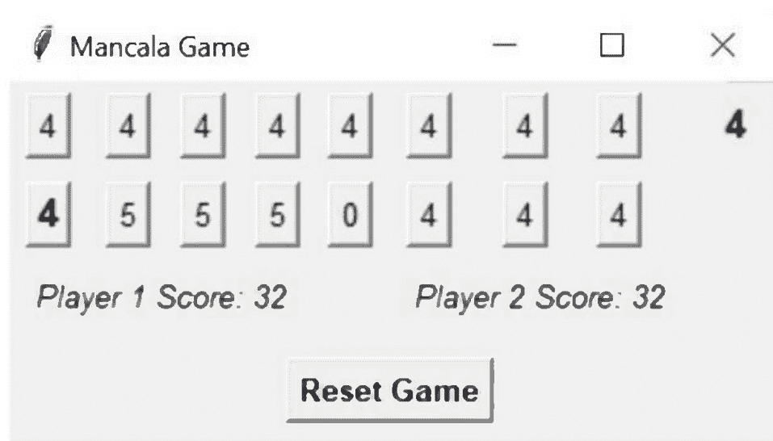

```python
import tkinter as tk
from tkinter import ttk, messagebox
from ttkthemes import ThemedStyle
```

```python
class MancalaGame:
    def __init__(self, master):
        self.master = master
        self.master.title("Mancala Game")

        # 曼卡拉棋盘表示
        # 每个玩家 8 个坑 + 每个玩家 2 个曼卡拉（计分坑）
        self.board = [4] * 16

        # 玩家 1 的一侧
        self.p1_pits = [tk.Button(master, text=str(self.board[i]), command=lambda i=i: self.move(i), font=('Arial', 10))
                        for i in range(8)]

        # 玩家 2 的一侧
        self.p2_pits = [tk.Button(master, text=str(self.board[i]), command=lambda i=i: self.move(i), font=('Arial', 10))
                        for i in range(8, 16)]

        # 曼卡拉（计分坑）
        self.p1_mancala = tk.Label(
            master, text="0", font=('Arial', 12, 'bold'))
        self.p2_mancala = tk.Label(
            master, text="0", font=('Arial', 12, 'bold'))

        # 分数标签
        self.score_label_p1 = tk.Label(
            master, text="玩家 1 分数:", font=('Arial', 10, 'italic'))
        self.score_label_p2 = tk.Label(
            master, text="玩家 2 分数:", font=('Arial', 10, 'italic'))

        # 重置按钮
        self.reset_button = tk.Button(
            master, text="重置游戏", command=self.reset_game, font=('Arial', 10, 'bold'))

        # 创建 GUI 布局
        self.create_layout()

        # 跟踪当前玩家
        self.current_player = 1
        self.extra_turn = False

    def create_layout(self):
        style = ThemedStyle(self.master)
        style.set_theme("plastik") # 您可以选择其他可用的主题

        # 玩家 2 的坑和曼卡拉
        for i in range(8):
            self.p2_pits[i].grid(row=1, column=i, padx=5, pady=5)
        self.p2_mancala.grid(row=1, column=9, padx=10, pady=5)

        # 玩家 1 的坑和曼卡拉
        for i in range(8):
            self.p1_pits[i].grid(row=2, column=7-i, padx=5, pady=5)
        self.p1_mancala.grid(row=2, column=0, padx=10, pady=5)

        # 分数标签
        self.score_label_p1.grid(
            row=3, column=0, padx=10, pady=5, columnspan=4)
        self.score_label_p2.grid(
            row=3, column=5, padx=10, pady=5, columnspan=4)

        # 重置按钮
        self.reset_button.grid(row=4, column=0, columnspan=10, pady=10)

    def move(self, pit_index):
        if self.current_player == 1 and pit_index < 8:
            self.make_move(pit_index)
        elif self.current_player == 2 and 8 <= pit_index <= 15:
            self.make_move(pit_index)
        else:
            messagebox.showinfo("无效移动", "还没到你的回合！")

    def make_move(self, pit_index):
        stones = self.board[pit_index]
        self.board[pit_index] = 0

        while stones > 0:
            pit_index = (pit_index + 1) % 16
            if self.current_player == 1 and pit_index == 15:
                continue  # 跳过对手的曼卡拉
```

```python
import tkinter as tk
from tkinter import ttk, messagebox
from ttkthemes import ThemedStyle

class MancalaGame:
    def __init__(self, master):
        self.master = master
        self.master.title("Mancala Game")

        # Mancala board representation
        # 8 pits for each player + 2 mancalas for each player
        self.board = [4] * 16

        # Player 1's side
        self.p1_pits = [tk.Button(master, text=str(self.board[i]),
                                  command=lambda i=i: self.move(i), font=('Arial', 10))
                        for i in range(8)]

        # Player 2's side
        self.p2_pits = [tk.Button(master, text=str(self.board[i]),
                                  command=lambda i=i: self.move(i), font=('Arial', 10))
                        for i in range(8, 16)]

        # Mancalas
        self.p1_mancala = tk.Label(master, text="0", font=('Arial', 12, 'bold'))
        self.p2_mancala = tk.Label(master, text="0", font=('Arial', 12, 'bold'))

        # Score labels
        self.score_label_p1 = tk.Label(master, text="Player 1 Score:", font=('Arial', 10, 'italic'))
        self.score_label_p2 = tk.Label(master, text="Player 2 Score:", font=('Arial', 10, 'italic'))

        # Reset button
        self.reset_button = tk.Button(master, text="Reset Game", command=self.reset_game, font=('Arial', 10, 'bold'))

        # Create the GUI layout
        self.create_layout()

        # Track the current player
        self.current_player = 1
        self.extra_turn = False

    def create_layout(self):
        style = ThemedStyle(self.master)
        style.set_theme("plastik")  # You can choose other available themes

        # Player 2's pits and mancala
        for i in range(8):
            self.p2_pits[i].grid(row=1, column=i, padx=5, pady=5)
        self.p2_mancala.grid(row=1, column=9, padx=10, pady=5)

        # Player 1's pits and mancala
        for i in range(8):
            self.p1_pits[i].grid(row=2, column=7-i, padx=5, pady=5)
        self.p1_mancala.grid(row=2, column=0, padx=10, pady=5)

        # Score labels
        self.score_label_p1.grid(row=3, column=0, padx=10, pady=5, columnspan=4)
        self.score_label_p2.grid(row=3, column=5, padx=10, pady=5, columnspan=4)

        # Reset button
        self.reset_button.grid(row=4, column=0, columnspan=10, pady=10)

    def move(self, pit_index):
        if self.current_player == 1 and pit_index < 8:
            self.make_move(pit_index)
        elif self.current_player == 2 and 8 <= pit_index <= 15:
            self.make_move(pit_index)
        else:
            messagebox.showinfo("Invalid Move", "It's not your turn!")

    def make_move(self, pit_index):
        stones = self.board[pit_index]
        self.board[pit_index] = 0

        while stones > 0:
            pit_index = (pit_index + 1) % 16
            if self.current_player == 1 and pit_index == 15:
                continue  # skip opponent's mancala
            elif self.current_player == 2 and pit_index == 8:
                continue  # skip opponent's mancala

            self.board[pit_index] += 1
            stones -= 1

        self.update_gui()
        self.check_extra_turn(pit_index)
        self.check_end_game()

        if not self.extra_turn:
            # Switch player only if there is no extra turn
            # Switch between player 1 and player 2
            self.current_player = 3 - self.current_player

    def update_gui(self):
        # Update Player 1's side
        for i in range(8):
            self.p1_pits[i]["text"] = str(self.board[i])

        self.p1_mancala["text"] = str(self.board[8])

        # Update Player 2's side
        for i in range(8, 16):
            self.p2_pits[i - 8]["text"] = str(self.board[i])

        self.p2_mancala["text"] = str(self.board[15])

        # Update scores
        self.score_label_p1["text"] = f"Player 1 Score: {sum(self.board[:8])}"
        self.score_label_p2["text"] = f"Player 2 Score: {sum(self.board[8:16])}"

    def check_extra_turn(self, last_pit_index):
        if self.current_player == 1 and 0 <= last_pit_index < 8 and self.board[last_pit_index] == 1:
            self.extra_turn = True
        elif self.current_player == 2 and 8 <= last_pit_index < 15 and self.board[last_pit_index] == 1:
            self.extra_turn = True
        else:
            self.extra_turn = False

    def check_end_game(self):
        if all(pit == 0 for pit in self.board[:8]) or all(pit == 0 for pit in self.board[8:16]):
            self.end_game()

    def end_game(self):
        p1_score = sum(self.board[:8])
        p2_score = sum(self.board[8:16])
        if p1_score > p2_score:
            winner = "Player 1"
        elif p1_score < p2_score:
            winner = "Player 2"
        else:
            winner = "It's a tie!"

        messagebox.showinfo("Game Over", f"The game is over!\n{winner} wins!")

    def reset_game(self):
        self.board = [4] * 16
        self.current_player = 1
        self.extra_turn = False
        self.update_gui()

if __name__ == "__main__":
    root = tk.Tk()
    mancala_game = MancalaGame(root)
    root.mainloop()
```

### Python 代码

```python
elif self.current_player == 2 and 8 <= last_pit_index < 15 and self.board[last_pit_index] == 1:
    self.extra_turn = True
else:
    self.extra_turn = False
```

`check_extra_turn` 方法根据最后放置石子的坑位索引，判断是否授予额外回合。

### Python 代码

```python
def check_end_game(self):
    if all(pit == 0 for pit in self.board[:8]) or all(pit == 0 for pit in self.board[8:16]):
        self.end_game()
```

`check_end_game` 方法通过检查一侧的所有坑是否都为空，来判断游戏是否结束。

### Python 代码

```python
def end_game(self):
    p1_score = sum(self.board[:8])
    p2_score = sum(self.board[8:16])
    if p1_score > p2_score:
        winner = "Player 1"
    elif p1_score < p2_score:
        winner = "Player 2"
    else:
        winner = "It's a tie!"

    messagebox.showinfo("Game Over", f"The game is over! \n{winner} wins!")
```

`end_game` 方法显示一个消息框，宣布游戏结束以及获胜者或平局。

### Python 代码

```python
def reset_game(self):
    self.board = [4] * 16
    self.current_player = 1
    self.extra_turn = False
    self.update_gui()
```

`reset_game` 方法通过将棋盘设置为初始配置、重置当前玩家和额外回合变量，并更新图形用户界面，来重置游戏状态。

### Python 代码

```python
if __name__ == "__main__":
    root = tk.Tk()
    mancala_game = MancalaGame(root)
    root.mainloop()
```

该脚本创建一个 Tkinter 根窗口，初始化一个 `MancalaGame` 类的实例，并使用 `root.mainloop()` 启动主事件循环。此循环使图形用户界面能够响应用户交互。

## 如何玩 Mancala 游戏

Mancala 是一种双人策略棋盘游戏，涉及在游戏板上的坑中捕获石子或种子。游戏通常以每个坑中放置一定数量的石子或种子开始。以下是玩 Mancala 的基本指南：

**目标：** Mancala 的目标是比对手捕获更多的石子或种子。

**设置：**

1.  Mancala 棋盘由两排各六个坑组成，总共 12 个坑，每位玩家控制一排六个坑。
2.  在棋盘的两端，每位玩家有一个较大的坑，称为 "Mancala"。
3.  在 12 个小坑中的每一个里放置相同数量的石子或种子。常见的起始配置是每个坑放四颗石子。

## 开始游戏：

1.  玩家面对面坐着，面向棋盘，他们的 Mancala 在他们的右手边。
2.  决定谁先走。玩家可以使用抛硬币、石头剪刀布或任何其他方法来决定先手玩家。

### 游戏玩法：

1.  在玩家的回合，他们从自己一排中选择一个包含石子或种子的坑。
2.  然后玩家拿起所选坑中的所有石子或种子，并将它们一个接一个地逆时针方向分配到后续的坑中，包括他们自己的 Mancala，但跳过对手的 Mancala。
3.  如果最后一颗石子或种子落入玩家的 Mancala，他们将获得另一个回合。如果最后一颗石子落在他们一侧的空坑中，玩家将捕获该石子以及对手正对面坑中的所有石子。这些被捕获的石子被放入玩家的 Mancala 中。
4.  游戏继续进行，玩家轮流行动，直到棋盘的一侧变空。

**结束游戏：** 当一位玩家的坑中不再有石子或种子时，游戏结束。棋盘另一侧剩余的石子将被另一位玩家捕获。Mancala 中石子或种子最多的玩家被宣布为获胜者。

**获胜：** 游戏结束时，Mancala 中石子或种子最多的玩家获胜。如果 Mancala 中的石子或种子数量相等，则游戏平局。

### 提示：

-   注意每个坑中的石子或种子数量，以规划策略性走法。
-   考虑通过将最后一颗石子落在自己一侧的空坑中来捕获对手的石子。

Mancala 是一款结合了技巧和策略的游戏，每一步都对结果至关重要。享受游戏，玩得开心！

## 21. 塔防游戏

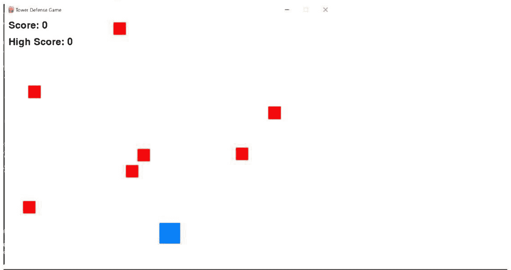

```python
import pygame
import sys
import random

# Initialize Pygame
pygame.init()

### Constants
WIDTH, HEIGHT = 800, 600
FPS = 60
WHITE = (255, 255, 255)
RED = (255, 0, 0)
BLUE = (0, 128, 255)
YELLOW = (255, 255, 0)

# Set up the game window
screen = pygame.display.set_mode((WIDTH, HEIGHT))
pygame.display.set_caption("Tower Defense Game")
clock = pygame.time.Clock()

# Player
player_size = 50
player_pos = [WIDTH // 2 - player_size // 2, HEIGHT - player_size * 2]
player_color = BLUE
player_speed = 5
can_shoot = True

# Towers
tower_size = 30
tower_color = (0, 255, 0)
towers = []

# Bullets
bullet_size = 10
bullet_color = YELLOW
bullets = []
bullet_speed = 8

# Enemies
enemy_size = 30
enemy_color = RED
enemy_speed = 3
enemies = []

# Score
score = 0
high_score = 0
font = pygame.font.Font(None, 36)

# Game state
game_over = False
restart_message = font.render("Game Over! Restart Please Press R", True, RED)
restart_message_rect = restart_message.get_rect(center=(WIDTH // 2, HEIGHT // 2))

# Pause state
pause = False
pause_message = font.render("Game Paused. Press P to Resume", True, BLUE)
pause_message_rect = pause_message.get_rect(center=(WIDTH // 2, HEIGHT // 2))

# Game loop
while True:
    for event in pygame.event.get():
        if event.type == pygame.QUIT:
            pygame.quit()
            sys.exit()
        elif event.type == pygame.KEYDOWN:
            if event.key == pygame.K_r and game_over:
                # Reset the game
                game_over = False
                enemies.clear()
                bullets.clear()
                score = 0
            elif event.key == pygame.K_SPACE and not game_over:
                # Shoot a bullet from the player's position
                bullet_pos = [player_pos[0] + player_size // 2, player_pos[1]]
                bullets.append(bullet_pos)
            elif event.key == pygame.K_p and not game_over:
                # Toggle pause
                pause = not pause

    keys = pygame.key.get_pressed()
    if not pause and not game_over: # Check if the game is not paused and not game over
        if keys[pygame.K_LEFT] and player_pos[0] > 0:
            player_pos[0] -= player_speed
        if keys[pygame.K_RIGHT] and player_pos[0] < WIDTH - player_size:
            player_pos[0] += player_speed

    if not game_over and not pause:
        for enemy in enemies:
            enemy[1] += enemy_speed

        bullets = [[bullet[0], bullet[1] - bullet_speed] for bullet in bullets]
        bullets = [bullet for bullet in bullets if 0 < bullet[1] < HEIGHT]

        for bullet in bullets[:]:
            for enemy in enemies[:]:
                if (
                    enemy[0] < bullet[0] < enemy[0] + enemy_size
                    and enemy[1] < bullet[1] < enemy[1] + enemy_size
                ):
                    bullets.remove(bullet)
                    enemies.remove(enemy)
                    score += 10
                    break

        for enemy in enemies:
            if (
                player_pos[0] < enemy[0] + enemy_size
                and player_pos[0] + player_size > enemy[0]
                and player_pos[1] < enemy[1] + enemy_size
                and player_pos[1] + player_size > enemy[1]
            ):
                game_over = True
                if score > high_score:
                    high_score = score
                break

        if random.randint(0, 100) < 5:
            enemy_pos = [random.randint(0, WIDTH - enemy_size), 0]
            enemies.append(enemy_pos)

        enemies = [enemy for enemy in enemies if enemy[1] < HEIGHT]

    # Draw
    screen.fill(WHITE)

    pygame.draw.rect(screen, player_color,
                    (player_pos[0], player_pos[1], player_size, player_size))

    for tower in towers:
        pygame.draw.rect(screen, tower_color,
                         (tower[0], tower[1], tower_size, tower_size))

    for bullet in bullets:
        pygame.draw.circle(screen, bullet_color, (int(
            bullet[0]), int(bullet[1])), bullet_size)

    for enemy in enemies:
        pygame.draw.rect(screen, enemy_color,
                         (enemy[0], enemy[1], enemy_size, enemy_size))

    score_text = font.render(f"Score: {score}", True, (0, 0, 0))
    screen.blit(score_text, (10, 10))

    high_score_text = font.render(f"High Score: {high_score}", True, (0, 0, 0))
    screen.blit(high_score_text, (10, 50))

    if game_over:
```

### Python 代码

```python
import pygame
import sys
import random
```

-   代码首先导入必要的模块：**pygame** 用于游戏开发，**sys** 用于系统特定的参数和函数，**random** 用于生成随机数。

### Python 代码

```python
# Initialize Pygame
pygame.init()
```

-   初始化 Pygame 以设置游戏环境。

### Python 代码

```python
### Constants
WIDTH, HEIGHT = 800, 600
FPS = 60
WHITE = (255, 255, 255)
RED = (255, 0, 0)
BLUE = (0, 128, 255)
YELLOW = (255, 255, 0)
```

-   定义常量，包括游戏窗口尺寸（WIDTH 和 HEIGHT）、每秒帧数（FPS）以及各种 RGB 格式的颜色常量。

### Python 代码

```python
# Set up the game window
screen = pygame.display.set_mode((WIDTH, HEIGHT))
pygame.display.set_caption("Tower Defense Game")
clock = pygame.time.Clock()
```

-   使用 Pygame 初始化游戏窗口。设置窗口标题，并创建一个时钟对象来控制帧率。

### Python 代码

```python
# Player
player_size = 50
player_pos = [WIDTH // 2 - player_size // 2, HEIGHT - player_size * 2]
player_color = BLUE
player_speed = 5
can_shoot = True
```

-   定义玩家相关的变量，例如大小、初始位置、颜色、速度，以及一个标志（can_shoot）指示玩家是否可以射击。

### Python 代码

```python
# Towers
tower_size = 30
tower_color = (0, 255, 0)
towers = []
```

-   定义防御塔相关的变量，包括大小、颜色，以及一个空列表（towers）用于存储防御塔的位置。

### Python 代码

```python
# Bullets
bullet_size = 10
bullet_color = YELLOW
bullets = []
bullet_speed = 8
```

-   定义子弹相关的变量，包括大小、颜色，一个空列表（bullets）用于存储子弹的位置，以及子弹的速度。

### Python 代码

```python
# Enemies
enemy_size = 30
enemy_color = RED
enemy_speed = 3
enemies = []
```

-   定义敌人相关的变量，包括大小、颜色、速度，以及一个空列表（enemies）用于存储敌人的位置。

### Python 代码

```python
# Score
score = 0
high_score = 0
font = pygame.font.Font(None, 36)
```

-   定义分数相关的变量，包括当前分数、最高分，以及一个用于渲染文本的字体对象。

### Python 代码

```python
# Game state
game_over = False
restart_message = font.render("Game Over! Restart Please Press R", True, RED)
restart_message_rect = restart_message.get_rect(center=(WIDTH // 2, HEIGHT // 2))
```

-   初始化游戏状态，game_over 初始为 False。创建游戏结束后的重启消息，并将其位置设置在屏幕中央。

### Python 代码

```python
# Pause state
pause = False
pause_message = font.render("Game Paused. Press P to Resume", True, BLUE)
pause_message_rect = pause_message.get_rect(center=(WIDTH // 2, HEIGHT // 2))
```

-   初始化暂停状态，pause 初始为 False。创建暂停消息，并将其位置设置在屏幕中央。

### Python 代码

```python
# Game loop
while True:
```

-   主游戏循环开始。

### Python 代码

```python
    for event in pygame.event.get():
        if event.type == pygame.QUIT:
            pygame.quit()
            sys.exit()
        elif event.type == pygame.KEYDOWN:
            if event.key == pygame.K_r and game_over:
                # Reset the game
                game_over = False
                enemies.clear()
                bullets.clear()
                score = 0
            elif event.key == pygame.K_SPACE and not game_over:
                # Shoot a bullet from the player's position
                bullet_pos = [player_pos[0] + player_size // 2, player_pos[1]]
                bullets.append(bullet_pos)
            elif event.key == pygame.K_p and not game_over:
                # Toggle pause
                pause = not pause
```

-   事件循环检查用户输入，包括退出游戏、游戏结束后按 R 键重新开始、按空格键从玩家位置发射子弹，以及按 P 键切换暂停状态。

### Python 代码

```python
    keys = pygame.key.get_pressed()
    if not pause and not game_over:
        if keys[pygame.K_LEFT] and player_pos[0] > 0:
            player_pos[0] -= player_speed
        if keys[pygame.K_RIGHT] and player_pos[0] < WIDTH - player_size:
            player_pos[0] += player_speed
```

-   检查持续的按键（方向键）以移动玩家左右，前提是游戏未暂停且未结束。

### Python 代码

```python
    if not game_over and not pause:
        for enemy in enemies:
            enemy[1] += enemy_speed
```

-   如果游戏未结束且未暂停，敌人向下移动。

### Python 代码

```python
        bullets = [[bullet[0], bullet[1] - bullet_speed] for bullet in bullets]
        bullets = [bullet for bullet in bullets if 0 < bullet[1] < HEIGHT]
```

-   子弹向上移动，并移除任何超出屏幕的子弹。

### Python 代码

```python
        for bullet in bullets[:]:
            for enemy in enemies[:]:
                if (
                    enemy[0] < bullet[0] < enemy[0] + enemy_size
                    and enemy[1] < bullet[1] < enemy[1] + enemy_size
                ):
                    bullets.remove(bullet)
                    enemies.remove(enemy)
                    score += 10
                    break
```

-   检查子弹和敌人之间的碰撞。如果发生碰撞，移除子弹和敌人，并增加分数。

### Python 代码

```python
        for enemy in enemies:
            if (
                player_pos[0] < enemy[0] + enemy_size
                and player_pos[0] + player_size > enemy[0]
                and player_pos[1] < enemy[1] + enemy_size
                and player_pos[1] + player_size > enemy[1]
            ):
                game_over = True
                if score > high_score:
                    high_score = score
                break
```

-   检查玩家和敌人之间的碰撞。如果发生碰撞，游戏结束，如果当前分数高于之前的最高分，则更新最高分。

### Python 代码

```python
        if random.randint(0, 100) < 5:
            enemy_pos = [random.randint(0, WIDTH - enemy_size), 0]
            enemies.append(enemy_pos)
```

-   以 5% 的概率在屏幕顶部随机生成敌人。

### Python 代码

```python
        enemies = [enemy for enemy in enemies if enemy[1] < HEIGHT]
```

-   移除已经超出屏幕底部的敌人。

### Python 代码

```python
        # Draw
        screen.fill(WHITE)
```

-   用白色背景填充屏幕。

### Python 代码

```python
        pygame.draw.rect(screen, player_color,
                         (player_pos[0], player_pos[1], player_size, player_size))
```

-   在屏幕上绘制玩家。

### Python 代码

```python
        for tower in towers:
            pygame.draw.rect(screen, tower_color,
                             (tower[0], tower[1], tower_size, tower_size))
```

-   在屏幕上绘制防御塔。

### Python 代码

```python
        for bullet in bullets:
            pygame.draw.circle(screen, bullet_color, (int(bullet[0]), int(bullet[1])), bullet_size)
```

-   在屏幕上绘制子弹。

### Python 代码

```python
        for enemy in enemies:
            pygame.draw.rect(screen, enemy_color,
                             (enemy[0], enemy[1], enemy_size, enemy_size))
```

-   在屏幕上绘制敌人。

### Python 代码

```python
        score_text = font.render(f"Score: {score}", True, (0, 0, 0))
        screen.blit(score_text, (10, 10))
```

-   渲染并显示当前分数。

### Python 代码

```python
        high_score_text = font.render(f"High Score: {high_score}", True, (0, 0, 0))
        screen.blit(high_score_text, (10, 50))
```

-   渲染并显示最高分。

### Python 代码

```python
        if game_over:
            screen.blit(restart_message, restart_message_rect)
        elif pause:
            screen.blit(pause_message, pause_message_rect)
```

-   根据游戏状态，在屏幕上显示游戏结束或暂停消息。

### Python 代码

```python
        pygame.display.flip()
        clock.tick(FPS)
```

-   更新显示并控制帧率。

## 如何玩塔防游戏

要玩提供的 Python 代码中描述的塔防游戏，请遵循以下说明：

## 1. 目标：

- 游戏的目标是**抵御**一波又一波来袭的敌人，保卫你的阵地。

## 2. 控制：

- 使用**左右方向键**控制玩家在屏幕底部左右移动。
- 按下**空格键**向上发射子弹，摧毁来袭的敌人。

## 3. 塔楼：

- 游戏中有一个塔楼元素，但在提供的代码中其功能尚未完全实现。不过，你可以扩展代码来加入塔楼的放置和使用，以提供额外的**防御**。

## 4. 游戏玩法：

- 敌人会在屏幕顶部随机生成并向下移动。
- 你的目标是在敌人到达屏幕底部你的位置之前，发射子弹将其摧毁。

## 5. 计分：

- 每成功用子弹消灭一个敌人，你就能获得分数。
- 分数会显示在屏幕上，同时还有一个最高分，代表你在单局游戏中的最佳表现。

#### 6. 游戏结束：

- 如果敌人与你的玩家角色碰撞，游戏就会结束。此时，会显示游戏结束信息。
- 游戏结束后，你可以按 'R' 键重新开始游戏。这会清除所有敌人、子弹，并重置分数。

## 7. 暂停：

- 你可以按 'P' 键暂停游戏。会显示暂停信息，游戏将暂时停止。
- 要恢复游戏，再次按 'P' 键即可。

## 8. 提示：

- 尝试高效地消灭敌人，以最大化你的得分。
- 注意敌人的位置，并策略性地把握射击时机。
- 关注你的最高分，并争取在每次游戏中都超越它。

## 9. 自定义（可选）：

- 你可以修改代码以添加额外功能，例如塔楼的放置和升级、更多敌人类型以及道具。

请记住，这个游戏是一个基础实现，你可以根据自己的喜好，通过添加新功能和改进游戏玩法来增强它。享受游戏并尝试修改代码吧！

## 22. 推箱子游戏

推箱子游戏

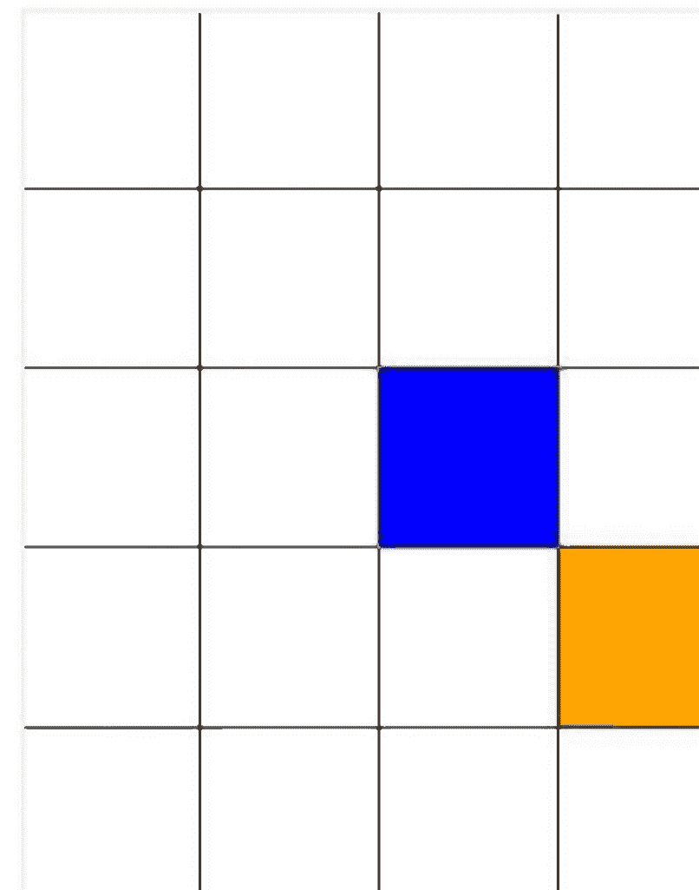

重新开始游戏

提示

最高分：130

```python
import tkinter as tk
from tkinter import messagebox
import json
```

```python
class SokobanGame:
    def __init__(self, master):
        self.master = master
        self.master.title("Sokoban Game")
        self.load_high_score()

        self.levels = [
            {
                'width': 5,
                'height': 5,
                'player_pos': [2, 2],
                'target_pos': [4, 4],
                'box_pos': [3, 3],
            },
            # 根据需要添加更多关卡
            {
                'width': 5,
                'height': 5,
                'player_pos': [1, 1],
                'target_pos': [3, 3],
                'box_pos': [2, 2],
            },
            # ... 添加另外8个关卡
        ]
        self.current_level = 0
        self.score = 0
        self.hints = 3
        self.create_widgets()

    def create_widgets(self):
        self.canvas = tk.Canvas(self.master, width=400, height=400, bg="white")
        self.canvas.grid(row=0, column=0, rowspan=5)

        self.master.bind("<Up>", lambda event: self.move(-1, 0))
        self.master.bind("<Down>", lambda event: self.move(1, 0))
        self.master.bind("<Left>", lambda event: self.move(0, -1))
        self.master.bind("<Right>", lambda event: self.move(0, 1))

        self.restart_button = tk.Button(
            self.master, text="Restart Game", command=self.restart_game)
        self.restart_button.grid(row=0, column=1, sticky="nsew")

        self.hint_button = tk.Button(
            self.master, text="Hint", command=self.show_hint)
        self.hint_button.grid(row=1, column=1, sticky="nsew")

        self.high_score_label = tk.Label(
            self.master, text=f"High Score: {self.high_score}")
        self.high_score_label.grid(row=2, column=1, sticky="nsew")

        self.load_level()
        self.draw_board()

    def load_level(self):
        level_info = self.levels[self.current_level]
        self.width = level_info['width']
        self.height = level_info['height']
        self.player_pos = level_info['player_pos'].copy()
        self.target_pos = level_info['target_pos'].copy()
        self.box_pos = level_info['box_pos'].copy()

    def draw_board(self):
        self.canvas.delete("all")

        for row in range(self.height):
            for col in range(self.width):
                x1, y1 = col * 80, row * 80
                x2, y2 = x1 + 80, y1 + 80
                if [row, col] == self.player_pos:
                    self.canvas.create_rectangle(
                        x1, y1, x2, y2, fill="blue", outline="black")
                elif [row, col] == self.target_pos:
                    self.canvas.create_rectangle(
                        x1, y1, x2, y2, fill="green", outline="black")
                elif [row, col] == self.box_pos:
                    self.canvas.create_rectangle(
                        x1, y1, x2, y2, fill="orange", outline="black")
                else:
                    self.canvas.create_rectangle(
                        x1, y1, x2, y2, fill="white", outline="black")

    def move(self, dy, dx):
        new_pos = [self.player_pos[0] + dy, self.player_pos[1] + dx]

        if not (0 <= new_pos[0] < self.height and 0 <= new_pos[1] < self.width):
            return

        if new_pos == self.box_pos:
            new_box_pos = [self.box_pos[0] + dy, self.box_pos[1] + dx]

            if not (0 <= new_box_pos[0] < self.height and 0 <= new_box_pos[1] < self.width):
                return

            self.box_pos = new_box_pos
            self.score += 10  # 移动箱子时增加分数

        self.player_pos = new_pos
        self.score -= 1  # 每次移动减少分数
        self.draw_board()

        if self.check_stuck():
            messagebox.showinfo(
                "Game Over", "You are stuck! Cannot push the box.")
            self.restart_game()

        if self.check_win():
            self.score += 50  # 完成关卡的奖励分数
            messagebox.showinfo("Congratulations",
                                f"You win!\nYour score: {self.score}")
            self.update_high_score()
            self.next_level()

    def check_win(self):
        return self.box_pos == self.target_pos

    def check_stuck(self):
        # 检查箱子是否卡在角落
        corners = [
            [0, 0], [0, self.width - 1],  # 左上角、右上角
            # 左下角、右下角
            [self.height - 1, 0], [self.height - 1, self.width - 1]
        ]

        for corner in corners:
            if self.box_pos == corner and self.box_pos != self.target_pos:
                return True  # 箱子卡在某个角落且该角落不是绿色目标点

        return False  # 箱子没有被卡住

    def is_clear(self, position):
        return position == self.target_pos or position != self.player_pos and position != self.box_pos

    def next_level(self):
        self.current_level += 1
        if self.current_level < len(self.levels):
            self.load_level()
            self.draw_board()
        else:
            messagebox.showinfo(
                "Game Over", f"All levels completed!\nFinal score: {self.score}")
            self.restart_game()

    def restart_game(self):
        self.current_level = 0
        self.score = 0
        self.load_level()
        self.draw_board()

    def show_hint(self):
        if self.hints > 0:
            messagebox.showinfo(
                "Hint", "Try to push the box onto the green target!")
            self.hints -= 1
        else:
            messagebox.showinfo(
                "Out of Hints", "You've used all available hints.")

    def load_high_score(self):
        try:
            with open("high_score.json", "r") as file:
                data = json.load(file)
                self.high_score = data.get("high_score", 0)
        except FileNotFoundError:
            self.high_score = 0

    def update_high_score(self):
        if self.score > self.high_score:
            self.high_score = self.score
            with open("high_score.json", "w") as file:
                json.dump({"high_score": self.high_score}, file)
            self.high_score_label.config(text=f"High Score: {self.high_score}")


if __name__ == "__main__":
    root = tk.Tk()
    game = SokobanGame(root)
    root.mainloop()
```

让我们逐行分析代码，以理解其功能：

### Python 代码

```python
import tkinter as tk
from tkinter import messagebox
import json
```

### Python 代码

```python
class SokobanGame:
    def __init__(self, master):
        self.master = master
        self.master.title("Sokoban Game")
        self.load_high_score()
```

这里定义了一个名为 `SokobanGame` 的类。构造函数（`__init__`）初始化游戏，设置主窗口（`master`），并从 JSON 文件加载最高分。

### Python 代码

```python
        self.levels = [
            {
                'width': 5,
                'height': 5,
                'player_pos': [2, 2],
                'target_pos': [4, 4],
                'box_pos': [3, 3],
            },
            # Add more levels as needed
            {
                'width': 5,
                'height': 5,
                'player_pos': [1, 1],
                'target_pos': [3, 3],
                'box_pos': [2, 2],
            },
            # ... Add 8 more levels
        ]
```

定义了一个关卡列表。每个关卡由一个字典表示，包含宽度、高度、玩家位置、目标位置和箱子位置。

### Python 代码

```python
        self.current_level = 0
        self.score = 0
        self.hints = 3
        self.create_widgets()
```

初始化了游戏相关变量，包括当前关卡、分数和提示次数。然后调用 `create_widgets` 方法来设置图形用户界面。

### Python 代码

```python
    def create_widgets(self):
        self.canvas = tk.Canvas(self.master, width=400, height=400, bg="white")
        self.canvas.grid(row=0, column=0, rowspan=5)
```

创建了一个画布来绘制游戏棋盘，并使用网格布局将其添加到主窗口。

### Python 代码

```python
        self.master.bind("<Up>", lambda event: self.move(-1, 0))
        self.master.bind("<Down>", lambda event: self.move(1, 0))
        self.master.bind("<Left>", lambda event: self.move(0, -1))
        self.master.bind("<Right>", lambda event: self.move(0, 1))
```

设置了按键绑定以处理方向键按下事件，将它们连接到 `move` 方法并传递特定的方向参数。

### Python 代码

```python
        self.restart_button = tk.Button(
            self.master, text="Restart Game", command=self.restart_game)
        self.restart_button.grid(row=0, column=1, sticky="nsew")
```

创建了一个用于重新开始游戏的按钮并将其添加到布局中。其命令设置为 `restart_game` 方法。

### Python 代码

```python
        self.hint_button = tk.Button(
            self.master, text="Hint", command=self.show_hint)
        self.hint_button.grid(row=1, column=1, sticky="nsew")
```

创建了一个用于显示提示的按钮并将其添加到布局中。其命令设置为 `show_hint` 方法。

### Python 代码

```python
        self.high_score_label = tk.Label(
            self.master, text=f"High Score: {self.high_score}")
        self.high_score_label.grid(row=2, column=1, sticky="nsew")
```

创建了一个用于显示最高分的标签并将其添加到布局中。

### Python 代码

```python
        self.load_level()
        self.draw_board()
```

调用 `load_level` 方法来初始化当前关卡，并调用 `draw_board` 方法来显示游戏棋盘。

代码继续包含处理游戏逻辑、关卡推进和 UI 交互的其他方法和功能。如果您有任何具体问题，或者希望我继续解释某个特定部分，请随时提问！

## 如何玩推箱子游戏

推箱子是一款经典的益智游戏，玩家需要在仓库中将箱子推到特定位置（目标），目标是解决每个关卡。以下是关于如何玩所提供代码中实现的推箱子游戏的指南：

1.  **目标：**
    *   主要目标是将所有箱子推到绿色的目标位置上。
2.  **控制：**
    *   使用方向键（上、下、左、右）移动蓝色的玩家角色在仓库中移动。
    *   玩家只能移动到仓库中的空位。
3.  **游戏元素：**
    *   **蓝色玩家（你）：** 由蓝色矩形表示。这是你控制的角色。
    *   **橙色箱子：** 由橙色矩形表示。这些是你需要移动的箱子。
    *   **绿色目标：** 由绿色矩形表示。箱子必须被推到这些目标上才能解决关卡。
4.  **规则：**
    *   玩家一次只能推一个箱子。
    *   箱子只能被推；不能被拉。
    *   玩家不能穿过箱子或墙壁。
    *   如果箱子被卡在没有绿色目标的角落，玩家就会输掉游戏。
5.  **计分：**
    *   你的分数初始设置为 0。
    *   推箱子会获得分数（每次推箱子 +10 分）。
    *   每次移动会扣分（每次移动 -1 分）。
    *   完成一个关卡会获得奖励分数（+50 分）。
6.  **按钮：**
    *   **重新开始游戏：** 将游戏重置为第一关，并清除当前分数。
    *   **提示：** 提供如何解决当前关卡的提示。你开始时有三个提示，一旦用完，将不再有提示可用。
7.  **最高分：**
    *   最高分显示在图形用户界面上。
    *   当你以更高的分数完成一个关卡时，最高分会更新。
8.  **游戏结束：**
    *   当所有关卡完成时，游戏结束，并显示最终分数。
    *   完成后，玩家可以选择重新开始游戏。
9.  **关卡推进：**
    *   成功将所有箱子推到绿色目标上会让你进入下一关。
    *   完成最后一关会显示一条消息，表明所有关卡已完成。
10. **提示使用：**
    *   点击“提示”按钮会提供如何解决当前关卡的提示。
    *   你开始时有三个提示，每次使用一个，提示计数就会减少。

记住，推箱子是一个逻辑谜题，所以花点时间规划你的移动，并考虑每个行动的后果。祝你好运，享受玩推箱子的乐趣！

## 23. 打砖块游戏

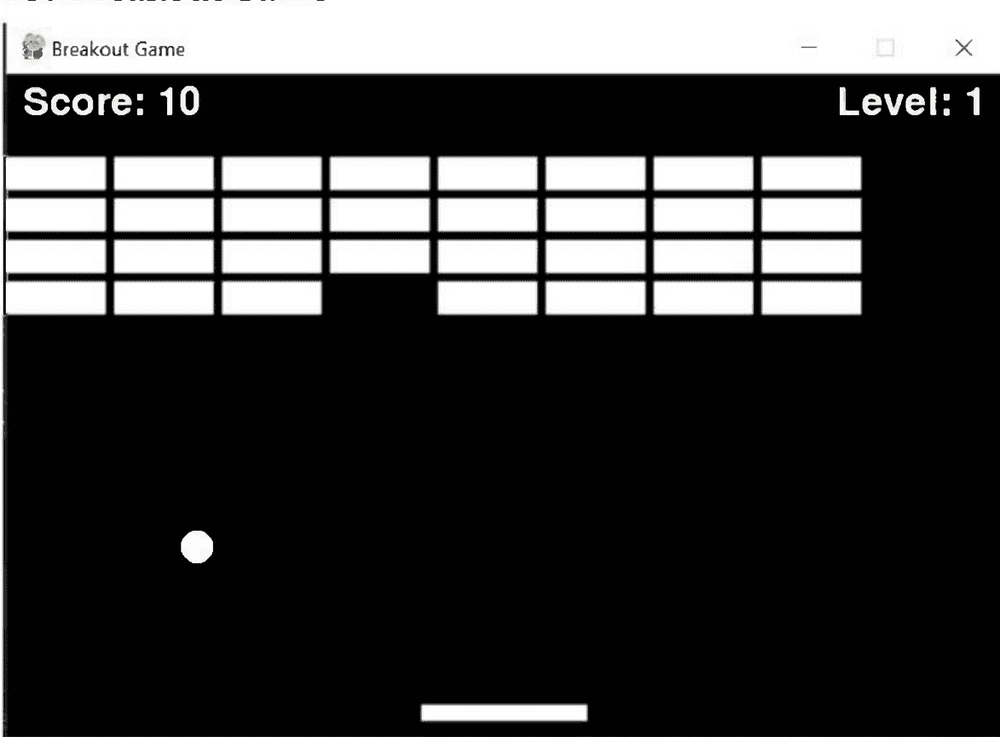

```python
import pygame
import sys
import random

# Initialize Pygame
pygame.init()

### Constants
WIDTH, HEIGHT = 600, 400
PADDLE_WIDTH, PADDLE_HEIGHT = 100, 10
BALL_RADIUS = 10
BRICK_WIDTH, BRICK_HEIGHT = 60, 20
PADDLE_SPEED = 5
BALL_SPEED = 5
WHITE = (255, 255, 255)
BLACK = (0, 0, 0)

# Sound effects
pygame.mixer.init()
hit_sound = pygame.mixer.Sound("hit.wav")
brick_break_sound = pygame.mixer.Sound("brick_break.wav")
powerup_sound = pygame.mixer.Sound("powerup.wav")

# Create the screen
screen = pygame.display.set_mode((WIDTH, HEIGHT))
pygame.display.set_caption("Breakout Game")

# Create the paddle
paddle = pygame.Rect(WIDTH // 2 - PADDLE_WIDTH // 2,
                     HEIGHT - 20, PADDLE_WIDTH, PADDLE_HEIGHT)

# Initialize paddle speed and acceleration
paddle_speed = 0

# Create the ball
ball = pygame.Rect(WIDTH // 2 - BALL_RADIUS, HEIGHT // 2 -
                  BALL_RADIUS, BALL_RADIUS * 2, BALL_RADIUS * 2)
ball_speed = [random.choice([-1, 1]) * BALL_SPEED, -BALL_SPEED]

# Create bricks
num_bricks_x = 8
num_bricks_y = 4
brick_width = 60
brick_height = 20
bricks = []

for i in range(num_bricks_x):
    for j in range(num_bricks_y):
        brick = pygame.Rect(i * (brick_width + 5), 50 +
                           j * (brick_height + 5), brick_width, brick_height)
        bricks.append(brick)

# Game variables
score = 0
level = 1
game_over = False

# Power-up variables
powerup_active = False
powerup_rect = pygame.Rect(0, 0, 20, 20)
powerup_speed = 3
powerup_duration = 5000  # in milliseconds
powerup_start_time = 0

# Paddle skin options
PADDLE_SKINS = [pygame.Rect(0, 0, 100, 10), pygame.Rect(0, 0, 150, 10)]
paddle_skin_index = 0

# Initialize remaining bricks count
bricks_remaining = num_bricks_x * num_bricks_y

# Main game loop
while True:
    for event in pygame.event.get():
        if event.type == pygame.QUIT:
            pygame.quit()
            sys.exit()
        elif event.type == pygame.KEYDOWN and event.key == pygame.K_SPACE and game_over:
```

game_over = False
score = 0
level = 1
ball = pygame.Rect(WIDTH // 2 - BALL_RADIUS, HEIGHT //
                   2 - BALL_RADIUS, BALL_RADIUS * 2, BALL_RADIUS * 2)
ball_speed = [random.choice([-1, 1]) * BALL_SPEED, -BALL_SPEED]

# 重置砖块
bricks = []
for i in range(num_bricks_x):
    for j in range(num_bricks_y):
        brick = pygame.Rect(
            i * (brick_width + 5), 50 + j * (brick_height + 5), brick_width, brick_height)
        bricks.append(brick)

paddle = pygame.Rect(WIDTH // 2 - PADDLE_WIDTH //
                     2, HEIGHT - 20, PADDLE_WIDTH, PADDLE_HEIGHT)
# 重置剩余砖块计数
bricks_remaining = num_bricks_x * num_bricks_y

if not game_over:
    keys = pygame.key.get_pressed()
    if keys[pygame.K_LEFT] and paddle.left > 0:
        paddle.move_ip(-PADDLE_SPEED, 0)
    if keys[pygame.K_RIGHT] and paddle.right < WIDTH:
        paddle.move_ip(PADDLE_SPEED, 0)

# 更新球的位置
ball.move_ip(ball_speed[0], ball_speed[1])

# 球与墙壁的碰撞
if ball.left <= 0 or ball.right >= WIDTH:
    ball_speed[0] = -ball_speed[0]
if ball.top <= 0:
    ball_speed[1] = -ball_speed[1]

# 球与挡板的碰撞
if ball.colliderect(paddle) and ball_speed[1] > 0:
    ball_speed[1] = -ball_speed[1]
    hit_sound.play()

# 球与砖块的碰撞
for brick in list(bricks):
    if ball.colliderect(brick):
        bricks.remove(brick)
        bricks_remaining -= 1  # 更新剩余砖块计数
        ball_speed[1] = -ball_speed[1]
        score += 10
        brick_break_sound.play()

        # 砖块被击中时有10%的几率生成一个强化道具
        if random.randint(1, 10) == 1 and not powerup_active:
            powerup_rect.x, powerup_rect.y = brick.x, brick.y
            powerup_active = True
            powerup_start_time = pygame.time.get_ticks()

        # 每次移除后打印剩余砖块计数
        print(f"Remaining bricks: {bricks_remaining}")

# 球出界（游戏结束）
if ball.bottom >= HEIGHT:
    game_over = True
    bricks_remaining = 0 # 重置剩余砖块计数

# 检查是否有剩余砖块并停止声音
if any(bricks):
    brick_break_sound.stop()

# 检查关卡是否完成
if bricks_remaining == 0 and not any(bricks):
    level += 1
    ball = pygame.Rect(WIDTH // 2 - BALL_RADIUS, HEIGHT //
                       2 - BALL_RADIUS, BALL_RADIUS * 2, BALL_RADIUS * 2)
    ball_speed = [random.choice([-1, 1]) * BALL_SPEED, -BALL_SPEED]
    bricks = []
    for i in range(num_bricks_x):
        for j in range(num_bricks_y):
            brick = pygame.Rect(
                i * (brick_width + 5), 50 + j * (brick_height + 5), brick_width, brick_height)
            bricks.append(brick)
    powerup_active = False # 重置强化道具状态
    bricks_remaining = num_bricks_x * num_bricks_y # 重置剩余砖块计数

    # 仅当有砖块剩余时才确保声音和关卡增加
    if not any(bricks):
        brick_break_sound.stop() # 如果声音正在播放则停止
        level += 1

    game_over = False # 重置游戏结束状态

    # 重置挡板位置
    paddle.x = WIDTH // 2 - PADDLE_WIDTH // 2

    # 重置后打印剩余砖块计数
    bricks_remaining = num_bricks_x * num_bricks_y
    print(f"Remaining bricks: {bricks_remaining}")

# 更新强化道具位置并检查其效果
if powerup_active:
    powerup_rect.y += powerup_speed

    # 检查强化道具是否被挡板收集
    if powerup_rect.colliderect(paddle):
        powerup_active = False
        powerup_sound.play()
        # 实现强化道具的效果（例如，增加挡板大小）
        paddle.width = PADDLE_SKINS[paddle_skin_index].width

    # 检查强化道具持续时间是否已过期
    if pygame.time.get_ticks() - powerup_start_time > powerup_duration:
        powerup_active = False
        # 重置挡板大小
        paddle.width = PADDLE_WIDTH

    # 检查强化道具是否出界
    if powerup_rect.top > HEIGHT:
        powerup_active = False

# 绘制所有内容
screen.fill(BLACK)

# 绘制强化道具
if powerup_active:
    pygame.draw.rect(screen, (255, 0, 0), powerup_rect)

# 绘制挡板
pygame.draw.rect(screen, WHITE, paddle)

# 绘制球
pygame.draw.ellipse(screen, WHITE, ball)

# 绘制砖块
for brick in bricks:
    pygame.draw.rect(screen, WHITE, brick)

# 绘制分数和关卡
font = pygame.font.Font(None, 36)
score_text = font.render(f"Score: {score}", True, WHITE)
level_text = font.render(f"Level: {level}", True, WHITE)

# 绘制背景矩形
pygame.draw.rect(screen, BLACK, (0, 0, WIDTH, score_text.get_height() + 5))
pygame.draw.rect(screen, BLACK, (WIDTH - level_text.get_width() - 5, 0, WIDTH, level_text.get_height() + 5))

# 绘制分数和关卡信息
screen.blit(score_text, (10, 5))
screen.blit(level_text, (WIDTH - level_text.get_width() - 10, 5))

# 绘制游戏结束画面
if game_over:
    game_over_text = font.render(
        "Game Over! Press SPACE to restart.", True, WHITE)
    screen.blit(game_over_text, (WIDTH // 2 -
        game_over_text.get_width() // 2, HEIGHT // 2))

# 更新显示
pygame.display.flip()

# 控制游戏速度
pygame.time.Clock().tick(60)

让我们逐行分析代码以理解其功能：

### Python 代码

```
import pygame
import sys
import random
```

+   1. 导入必要的库：**pygame** 用于创建游戏，**sys** 用于系统相关功能，**random** 用于生成随机数。

### Python 代码

```
# 初始化 Pygame
pygame.init()
```

+   2. 初始化 Pygame 以设置游戏环境。

### Python 代码

```
# 常量
WIDTH, HEIGHT = 600, 400
PADDLE_WIDTH, PADDLE_HEIGHT = 100, 10
BALL_RADIUS = 10
BRICK_WIDTH, BRICK_HEIGHT = 60, 20
PADDLE_SPEED = 5
BALL_SPEED = 5
WHITE = (255, 255, 255)
BLACK = (0, 0, 0)
```

+   3. 为游戏的各个方面定义常量，例如窗口尺寸、挡板和球的大小、砖块尺寸、速度和颜色代码。

### Python 代码

```
# 音效
pygame.mixer.init()
hit_sound = pygame.mixer.Sound("hit.wav")
brick_break_sound = pygame.mixer.Sound("brick_break.wav")
powerup_sound = pygame.mixer.Sound("powerup.wav")
```

4. 初始化 Pygame 的声音混合器，并加载碰撞和强化道具的音效。

### Python 代码

```
# 创建屏幕
screen = pygame.display.set_mode((WIDTH, HEIGHT))
pygame.display.set_caption("Breakout Game")
```

5. 使用指定的尺寸和标题设置游戏窗口。

### Python 代码

```
# 创建挡板
paddle = pygame.Rect(WIDTH // 2 - PADDLE_WIDTH // 2, HEIGHT - 20,
                     PADDLE_WIDTH, PADDLE_HEIGHT)
```

6. 使用 `pygame.Rect` 类初始化挡板的位置和尺寸。

### Python 代码

```
# 初始化挡板速度和加速度
paddle_speed = 0
```

7. 设置挡板的初始速度。

### Python 代码

```
# 创建球
ball = pygame.Rect(WIDTH // 2 - BALL_RADIUS, HEIGHT // 2 - BALL_RADIUS, BALL_RADIUS * 2, BALL_RADIUS * 2)
ball_speed = [random.choice([-1, 1]) * BALL_SPEED, -BALL_SPEED]
```

8. 初始化球的位置、尺寸和初始速度。

### Python 代码

```
# 创建砖块
num_bricks_x = 8
num_bricks_y = 4
bricks = []

for i in range(num_bricks_x):
    for j in range(num_bricks_y):
        brick = pygame.Rect(i * (brick_width + 5), 50 + j * (brick_height + 5),
                            brick_width, brick_height)
        bricks.append(brick)
```

9. 使用嵌套循环创建砖块网格，并将它们存储在列表中。

### Python 代码

```
# 游戏变量
score = 0
level = 1
game_over = False
```

10. 初始化游戏变量，包括分数、关卡和游戏结束状态。

### Python 代码

```
# 强化道具变量
powerup_active = False
powerup_rect = pygame.Rect(0, 0, 20, 20)
powerup_speed = 3
powerup_duration = 5000 # 单位：毫秒
powerup_start_time = 0
```

11. 初始化与强化道具相关的变量，包括其状态、位置、速度、持续时间和开始时间。

### Python 代码

```
# 挡板皮肤选项
PADDLE_SKINS = [pygame.Rect(0, 0, 100, 10), pygame.Rect(0, 0, 150, 10)]
paddle_skin_index = 0
```

12. 使用 pygame.Rect 定义不同的挡板皮肤，并设置初始索引。

### Python 代码

```
# 初始化剩余砖块计数
bricks_remaining = num_bricks_x * num_bricks_y
```

13. 计算并初始化剩余砖块的总数。

### 主游戏循环
while True:
    for event in pygame.event.get():
        if event.type == pygame.QUIT:
            pygame.quit()
            sys.exit()
        elif event.type == pygame.KEYDOWN and event.key == pygame.K_SPACE and game_over:
            # 如果用户在游戏结束后按下空格键，则重置游戏
            game_over = False
            score = 0
            level = 1
            ball = pygame.Rect(WIDTH // 2 - BALL_RADIUS, HEIGHT // 2 - BALL_RADIUS, BALL_RADIUS * 2, BALL_RADIUS * 2)
            ball_speed = [random.choice([-1, 1]) * BALL_SPEED, -BALL_SPEED]
            # 重置砖块
            bricks = []
            for i in range(num_bricks_x):
                for j in range(num_bricks_y):
                    brick = pygame.Rect(
                        i * (brick_width + 5), 50 + j * (brick_height + 5), brick_width,
                        brick_height)
                    bricks.append(brick)

            paddle = pygame.Rect(WIDTH // 2 - PADDLE_WIDTH // 2, HEIGHT - 20,
                PADDLE_WIDTH, PADDLE_HEIGHT)
            # 重置剩余砖块计数
            bricks_remaining = num_bricks_x * num_bricks_y

14. 启动主游戏循环。处理诸如退出游戏或在游戏结束后按下空格键时重新启动游戏等事件。
15. 在游戏循环内，检查用户输入以退出游戏或在游戏结束后重新启动游戏。
16. 如果游戏重新启动，则重置各种游戏变量，包括分数、等级、球、砖块、挡板和剩余砖块计数。

### Python 代码

```
if not game_over:
    keys = pygame.key.get_pressed()
    if keys[pygame.K_LEFT] and paddle.left > 0:
        paddle.move_ip(-PADDLE_SPEED, 0)
    if keys[pygame.K_RIGHT] and paddle.right < WIDTH:
        paddle.move_ip(PADDLE_SPEED, 0)
```

17. 如果游戏未结束，则检查左右箭头键的按下情况，以相应地移动挡板。

### Python 代码

```
# 更新球的位置
ball.move_ip(ball_speed[0], ball_speed[1])
```

18. 根据球的当前速度更新其位置。

### Python 代码

```
# 球与墙壁的碰撞
if ball.left <= 0 or ball.right >= WIDTH:
    ball_speed[0] = -ball_speed[0]
if ball.top <= 0:
    ball_speed[1] = -ball_speed[1]
```

19. 检查与墙壁的碰撞，并相应地更新球的速度。

### Python 代码

```
# 球与挡板的碰撞
if ball.colliderect(paddle) and ball_speed[1] > 0:
    ball_speed[1] = -ball_speed[1]
    hit_sound.play()
```

20. 检查与挡板的碰撞，在更新球的速度的同时播放音效。

### Python 代码

```
# 球与砖块的碰撞
for brick in list(bricks):
    if ball.colliderect(brick):
        bricks.remove(brick)
        bricks_remaining -= 1 # 更新剩余砖块计数
        ball_speed[1] = -ball_speed[1]
        score += 10
        brick_break_sound.play()

        # 当砖块被击中时，有10%的几率生成一个强化道具
        if random.randint(1, 10) == 1 and not powerup_active:
            powerup_rect.x, powerup_rect.y = brick.x, brick.y
            powerup_active = True
            powerup_start_time = pygame.time.get_ticks()

            # 每次移除后打印剩余砖块计数
            print(f"Remaining bricks: {bricks_remaining}")
```

21. 检查与砖块的碰撞，移除被击中的砖块，更新剩余砖块计数，并播放音效。此外，当砖块被击中时，有几率生成一个强化道具。
22. 如果生成了强化道具，则设置其位置并激活它。
23. 每次移除后打印剩余砖块计数，用于调试目的。

### Python 代码

```
# 球出界（游戏结束）
if ball.bottom >= HEIGHT:
    game_over = True
    bricks_remaining = 0 # 重置剩余砖块计数

    # 检查是否有剩余砖块并停止声音
    if any(bricks):
        brick_break_sound.stop()
```

24. 检查球是否出界（触底），触发游戏结束，并重置剩余砖块计数。如果有剩余砖块，则停止砖块破碎的声音。

### Python 代码

```
# 检查关卡完成情况
if bricks_remaining == 0 and not any(bricks):
    level += 1
    ball = pygame.Rect(WIDTH // 2 - BALL_RADIUS, HEIGHT // 2 - BALL_RADIUS, BALL_RADIUS * 2, BALL_RADIUS * 2)
    ball_speed = [random.choice([-1, 1]) * BALL_SPEED, -BALL_SPEED]
    bricks = []
    for i in range(num_bricks_x):
        for j in range(num_bricks_y):
            brick = pygame.Rect(i * (brick_width + 5), 50 + j * (brick_height + 5), brick_width, brick_height)
            bricks.append(brick)
    powerup_active = False # 重置强化道具状态
    bricks_remaining = num_bricks_x * num_bricks_y # 重置剩余砖块计数

    # 仅当有剩余砖块时才确保声音和关卡增加
    if not any(bricks):
        brick_break_sound.stop() # 如果声音正在播放，则停止它
        level += 1

    game_over = False # 重置游戏结束状态

    # 重置挡板位置
    paddle.x = WIDTH // 2 - PADDLE_WIDTH // 2

    # 重置后打印剩余砖块计数
    bricks_remaining = num_bricks_x * num_bricks_y
    print(f"Remaining bricks: {bricks_remaining}")
```

25. 通过验证是否没有剩余砖块来检查关卡完成情况。如果是，则增加等级，重置各种游戏变量，并使用一组新的砖块重新开始关卡。
26. 确保仅在有剩余砖块时才停止砖块破碎的声音。
27. 重置游戏结束状态，重置挡板位置，并在重置后打印剩余砖块计数，用于调试。

### Python 代码

```
# 更新强化道具位置并检查其效果
if powerup_active:
    powerup_rect.y += powerup_speed

    # 检查强化道具是否被挡板收集
    if powerup_rect.colliderect(paddle):
        powerup_active = False
        powerup_sound.play()
        # 实现强化道具的效果（例如，增加挡板大小）
        paddle.width = PADDLE_SKINS[paddle_skin_index].width

    # 检查强化道具持续时间是否已过期
    if pygame.time.get_ticks() - powerup_start_time > powerup_duration:
        powerup_active = False
        # 重置挡板大小
        paddle.width = PADDLE_WIDTH

    # 检查强化道具是否出界
    if powerup_rect.top > HEIGHT:
        powerup_active = False
```

28. 更新强化道具的位置并检查其效果，例如与挡板的碰撞、播放音效以及修改挡板的大小。检查强化道具的持续时间是否已过期，并相应地重置挡板大小。同时，检查强化道具是否出界。

### Python 代码

```
# 绘制所有内容
screen.fill(BLACK)
```

29. 用黑色背景填充屏幕。

### Python 代码

```
# 绘制强化道具
if powerup_active:
    pygame.draw.rect(screen, (255, 0, 0), powerup_rect)
```

30. 如果强化道具处于活动状态，则将其作为红色矩形绘制在屏幕上。

### Python 代码

```
# 绘制挡板
pygame.draw.rect(screen, WHITE, paddle)
```

31. 在屏幕上绘制挡板。

### Python 代码

```
# 绘制球
pygame.draw.ellipse(screen, WHITE, ball)
```

32. 在屏幕上将球绘制为白色椭圆。

### Python 代码

```
# 绘制砖块
for brick in bricks:
    pygame.draw.rect(screen, WHITE, brick)
```

33. 在屏幕上将每个砖块绘制为白色矩形。

### Python 代码

```
# 绘制分数和等级
font = pygame.font.Font(None, 36)
score_text = font.render(f"Score: {score}", True, WHITE)
level_text = font.render(f"Level: {level}", True, WHITE)
```

34. 创建一个字体对象，并以白色渲染分数和等级文本。

### Python 代码

```
# 绘制背景矩形
pygame.draw.rect(screen, BLACK, (0, 0, WIDTH, score_text.get_height() + 5))
pygame.draw.rect(screen, BLACK, (WIDTH - level_text.get_width() - 5, 0, WIDTH, level_text.get_height() + 5))
```

35. 绘制黑色矩形作为分数和等级文本的背景。

### Python 代码

```
# 绘制分数和等级消息
screen.blit(score_text, (10, 5))
screen.blit(level_text, (WIDTH - level_text.get_width() - 10, 5))
```

36. 将渲染好的分数和等级文本绘制到屏幕上。

### Python 代码

```
# 绘制游戏结束屏幕
if game_over:
    game_over_text = font.render("Game Over! Press SPACE to restart.", True, WHITE)
```

### Python 代码

```python
screen.blit(game_over_text, (WIDTH // 2 - game_over_text.get_width() // 2, HEIGHT // 2))
```

37. 如果游戏结束，则在屏幕中央渲染并显示游戏结束信息。

### Python 代码

```python
# Update the display
pygame.display.flip()
```

38. 更新显示以反映所有绘图更改。

### Python 代码

```python
# Control the game speed
pygame.time.Clock().tick(60)
```

39. 通过将帧率设置为每秒 60 帧来控制游戏速度。

以上就是对 Breakout 游戏代码的逐行解析。

## 如何玩 Breakout 游戏

要玩 Breakout 游戏，请遵循以下说明：

1.  **启动游戏：**
    -   在支持 Pygame 的环境中运行 Python 脚本。
    -   游戏窗口将出现，标题为 "Breakout Game"。

2.  **游戏控制：**
    -   使用键盘上的左右箭头键水平移动挡板。
    -   目标是将球从挡板上反弹出去，以击中并打碎砖块。

3.  **打碎砖块：**
    -   屏幕顶部最初有一组砖块网格。
    -   每个砖块需要被击中一定次数才能打碎。
    -   当球与砖块碰撞时，砖块消失，你获得分数。

4.  **道具：**
    -   偶尔，击中砖块可能会释放一个道具。
    -   如果释放了道具，它会向下移动。
    -   移动挡板去接住道具，它将激活一个特殊能力（例如，增加挡板大小）。

5.  **关卡完成：**
    -   你的目标是打碎当前关卡中的所有砖块。
    -   当所有砖块都被打碎后，你将进入下一关，砖块会重新排列。
    -   游戏会记录你的分数和关卡。

6.  **游戏结束：**
    -   如果球落到挡板下方并触及屏幕底部，游戏结束。
    -   游戏结束后，你可以按 "SPACE" 键重新开始游戏。
    -   游戏将重置，你可以从第一关继续玩。

7.  **分数和关卡：**
    -   分数显示在屏幕的左上角。
    -   关卡显示在屏幕的右上角。

8.  **挡板皮肤：**
    -   游戏提供不同的挡板皮肤，可以改变挡板的外观。
    -   要切换挡板皮肤，你可以修改代码中的 `paddle_skin_index` 变量。

9.  **游戏结束信息：**
    -   如果游戏结束，屏幕中央将显示 "Game Over" 信息。
    -   按 "SPACE" 键重新开始游戏。

10. **享受游戏：**
    -   玩 Breakout 游戏，享受乐趣，并尝试获得最高分！

## 24. 模拟城市克隆游戏

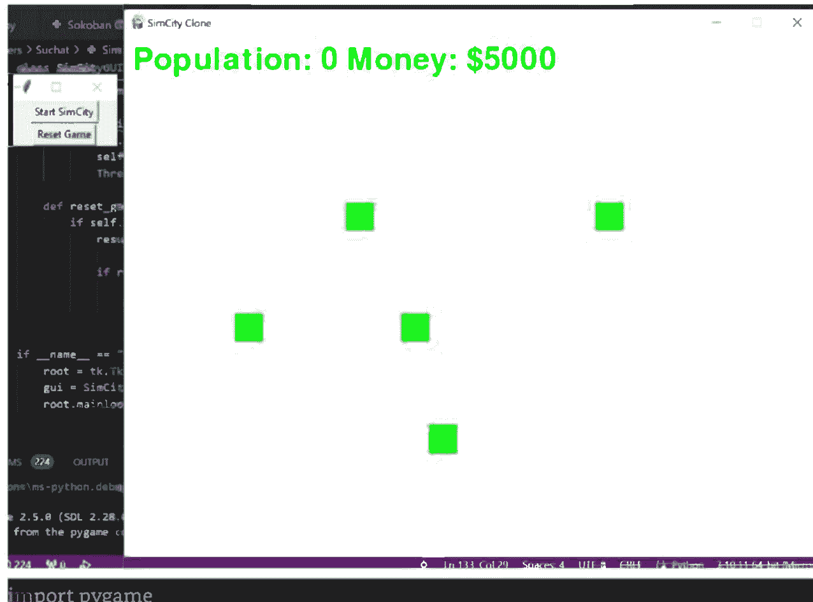

```python
import sys
import tkinter as tk
from tkinter import messagebox
from threading import Thread

### Constants
SCREEN_WIDTH = 800
SCREEN_HEIGHT = 600
TILE_SIZE = 32
GRID_WIDTH = SCREEN_WIDTH // TILE_SIZE
GRID_HEIGHT = SCREEN_HEIGHT // TILE_SIZE

# Colors
WHITE = (255, 255, 255)
GREEN = (0, 255, 0)
RESIDENTIAL_COLOR = (0, 0, 255)

# Zone types
EMPTY = 0

# Services
NO_SERVICE = 0
SCHOOL = 1
HOSPITAL = 2
POLICE_STATION = 3
PARK = 4

class SimCity:
    def __init__(self, master):
        self.master = master
        self.master.title("SimCity Clone")

        pygame.init() # Initialize Pygame
        pygame.font.init() # Initialize Pygame font module

        self.screen = pygame.display.set_mode((SCREEN_WIDTH, SCREEN_HEIGHT))
        pygame.display.set_caption("SimCity Clone")
        self.grid = [[EMPTY for _ in range(GRID_WIDTH)]
                     for _ in range(GRID_HEIGHT)]
        self.population = 0
        self.money = 10000
        self.clock = pygame.time.Clock()
        self.running = False

    def reset_game_state(self):
        # Reset all game-related variables to their initial values
        self.grid = [[EMPTY for _ in range(GRID_WIDTH)]
                     for _ in range(GRID_HEIGHT)]
        self.population = 0
        self.employment = 0
        self.money = 10000
        self.services = [[NO_SERVICE for _ in range(
            GRID_WIDTH)] for _ in range(GRID_HEIGHT)]
        self.pollution = [[0 for _ in range(GRID_WIDTH)]
                          for _ in range(GRID_HEIGHT)]
        self.crime = [[0 for _ in range(GRID_WIDTH)]
                      for _ in range(GRID_HEIGHT)]
        self.happiness = 100

    def run(self):
        self.running = True
        while self.running:
            for event in pygame.event.get():
                if event.type == pygame.QUIT:
                    self.running = False
                    self.master.destroy()
                    sys.exit()
                elif event.type == pygame.MOUSEBUTTONDOWN:
                    self.handle_mouse_click(event.pos)

            self.update()
            self.draw()
            pygame.display.flip()
            self.clock.tick(60)

    def handle_mouse_click(self, pos):
        col = pos[0] // TILE_SIZE
        row = pos[1] // TILE_SIZE

        # Toggle zone types on mouse click
        if self.grid[row][col] == EMPTY:
            if self.money >= 1000: # Cost to zone a new area
                self.grid[row][col] = RESIDENTIAL_COLOR
                self.money -= 1000
        # Additional rules for commercial and industrial zones can be added here

    def on_close(self):
        self.running = False
        self.master.destroy()

    def update(self):
        # Update logic here
        pass

    def draw(self):
        self.screen.fill(WHITE)
        for row in range(GRID_HEIGHT):
            for col in range(GRID_WIDTH):
                x = col * TILE_SIZE
                y = row * TILE_SIZE
                zone_color = WHITE if self.grid[row][col] == EMPTY else GREEN
                pygame.draw.rect(self.screen, zone_color,
                                 (x, y, TILE_SIZE, TILE_SIZE), 0)

        # Display statistics
        font = pygame.font.Font(pygame.font.get_default_font(), 36)
        text = font.render(
            f"Population: {self.population} Money: ${self.money}", True, GREEN)
        self.screen.blit(text, (10, 10))

class SimCityGUI:
    def __init__(self, master):
        self.master = master
        self.master.title("SimCity GUI")

        self.start_button = tk.Button(
            master, text="Start SimCity", command=self.start_simcity)
        self.start_button.pack()

        self.reset_button = tk.Button(
            master, text="Reset Game", command=self.reset_game)
        self.reset_button.pack()

        self.game = None

    def start_simcity(self):
        if self.game is None:
            self.game = SimCity(self.master)
            Thread(target=self.game.run).start()

    def reset_game(self):
        if self.game is not None:
            result = messagebox.askquestion(
                "Reset Game", "Are you sure you want to reset the game?")
            if result == 'yes':
                self.game.reset_game_state() # Use the new method to reset the game state
                messagebox.showinfo("Game Reset", "SimCity has been reset.")

if __name__ == "__main__":
    root = tk.Tk()
    gui = SimCityGUI(root)
    root.mainloop()
```

让我们逐行解析代码：

1.  `import pygame`：导入 Pygame 库，该库用于在 Python 中创建游戏和多媒体应用程序。
2.  `import sys`：导入 sys 模块，该模块提供对 Python 解释器使用或维护的某些变量的访问，以及与解释器紧密交互的函数。
3.  `import tkinter as tk`：导入 tkinter 模块并将其重命名为 tk。Tkinter 是 Python 的标准 GUI（图形用户界面）库。
4.  `from tkinter import messagebox`：从 tkinter 模块导入 messagebox 类，该类用于显示各种类型的消息框。
5.  `from threading import Thread`：从 threading 模块导入 Thread 类，该类用于在单独的线程中运行 SimCity 游戏，以避免阻塞 GUI。

6.  **常量**：
    -   `SCREEN_WIDTH = 800`：设置游戏屏幕的宽度。
    -   `SCREEN_HEIGHT = 600`：设置游戏屏幕的高度。
    -   `TILE_SIZE = 32`：设置每个网格图块的大小。
    -   `GRID_WIDTH = SCREEN_WIDTH // TILE_SIZE`：根据屏幕宽度和图块大小计算网格列数。
    -   `GRID_HEIGHT = SCREEN_HEIGHT // TILE_SIZE`：根据屏幕高度和图块大小计算网格行数。

7.  **颜色**：
    -   `WHITE`、`GREEN`、`RESIDENTIAL_COLOR`：表示颜色的 RGB 元组。

8.  **区域类型**：
    -   `EMPTY = 0`：表示网格上空区域的常量。

9.  **服务**：
    -   `NO_SERVICE = 0`、`SCHOOL = 1`、`HOSPITAL = 2`、`POLICE_STATION = 3`、`PARK = 4`：表示城市中可以提供的不同服务的常量。

10. **SimCity 类**：
    -   `__init__`：使用各种属性初始化 SimCity 游戏实例。
    -   `reset_game_state`：将游戏相关变量重置为其初始值。
    -   `run`：主游戏循环，处理事件、更新游戏状态并绘制屏幕。

## 11. SimCityGUI 类：

- `__init__`：初始化 SimCity 图形用户界面，包含用于启动和重置游戏的按钮。
- `start_simcity`：创建一个新的 SimCity 实例，并在单独的线程中启动它。
- `reset_game`：在重置游戏状态前请求确认。

## 12. 主代码块：

- 创建一个 tkinter 根窗口（`root`）。
- 初始化一个 `SimCityGUI` 实例（`gui`）。
- 进入 tkinter 主事件循环（`root.mainloop()`）。

这段代码使用 Pygame 和 tkinter 为一个类似 SimCity 的游戏搭建了基本的图形用户界面结构。游戏允许在网格上划分不同区域，并包含了启动、重置和与游戏交互的基本功能。游戏逻辑和附加功能可以在 `update` 方法和代码的其他相关部分中实现。

## 如何玩 Sim City 克隆游戏

代码中提供的 SimCity 克隆游戏是一个基础模拟，你可以在网格上划分住宅区。以下是游戏玩法步骤：

1.  **启动游戏：**
    - 运行提供的 Python 脚本。
    - 一个 tkinter 图形用户界面窗口将会出现，上面有“Start SimCity”和“Reset Game”按钮。

2.  **启动 SimCity：**
    - 点击“Start SimCity”按钮。
    - 这将创建一个新的 Pygame 窗口，你可以在其中与游戏互动。

3.  **划分区域：**
    - 在 Pygame 窗口中，你会看到一个空的网格。每个单元格代表一个地块。
    - 点击一个地块，将其划分为住宅区（以绿色表示）。
    - 划分一个新区域需要花费 $1000（如 `handle_mouse_click` 方法中所定义）。

4.  **人口与金钱：**
    - Pygame 窗口的左上角显示当前人口和可用资金。
    - 当你划分住宅区时，人口会增加。
    - 当你划分一个新的住宅区时，金钱会减少。

## 5. 重置游戏：

- 如果你想重新开始，请返回 tkinter 图形用户界面窗口。
- 点击“Reset Game”按钮。
- 一个确认对话框将会出现。点击“Yes”以重置游戏。

## 6. 关闭游戏：

- 你可以随时关闭游戏窗口或 tkinter 图形用户界面窗口。
- 关闭游戏窗口将停止模拟。

## 7. 游戏逻辑（更新与绘制）：

- 游戏逻辑，包括人口增长、区域划分成本和其他功能，可以在 `SimCity` 类的 `update` 方法中实现。
- 绘制和信息显示则在 `draw` 方法中处理。

## 8. 扩展游戏：

- 为了使游戏更有趣，你可以扩展其功能：
    - 添加具有不同成本和效果的商业区和工业区。
    - 实现学校、医院和警察局等服务设施。
    - 引入影响幸福度和人口增长的污染和犯罪因素。
    - 实现胜利或失败条件。

请记住，这只是一个基础的起点，你可以通过修改 SimCity 类中的代码，根据自己的喜好来增强和定制游戏。

## 25. Simon Says 游戏

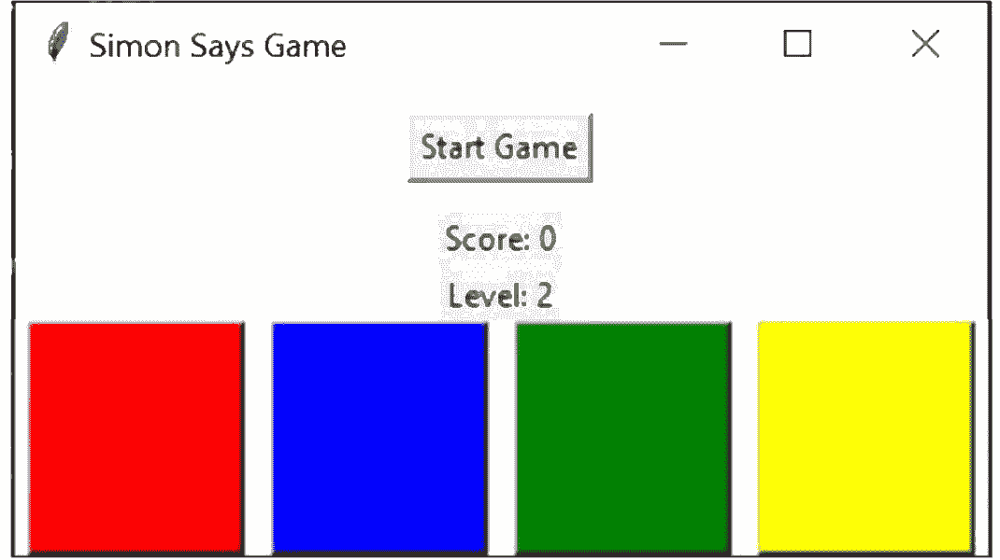

```python
import tkinter as tk
import random
import time
import winsound  # For playing sound effects (Windows only)
```

```python
class SimonSaysGame:
    def __init__(self, master):
        self.master = master
        self.master.title("Simon Says Game")
        self.colors = ["red", "blue", "green", "yellow"]
        self.sequence = []
        self.user_sequence = []
        self.round = 1
        self.speed = 1000 # Initial speed in milliseconds
        self.game_running = False

        self.create_widgets()
        self.new_game()

    def create_widgets(self):
        self.start_button = tk.Button(
            self.master, text="Start Game", command=self.start_game)
        self.start_button.pack(pady=10)

        self.score_label = tk.Label(self.master, text="Score: 0")
        self.score_label.pack()

        self.level_label = tk.Label(self.master, text="Level: 1")
        self.level_label.pack()

        for color in self.colors:
            button = tk.Button(self.master, bg=color, width=10, height=5,
                               command=lambda c=color: self.check_sequence(c))
            button.pack(side=tk.LEFT, padx=5)

    def new_game(self):
        self.round = 1
        self.speed = 1000
        self.game_running = False
        self.sequence = []
        self.user_sequence = []
        self.start_button.configure(state=tk.NORMAL)
        self.update_score_label()
        self.update_level_label()

    def start_game(self):
        self.new_game()
        self.play_sequence()

    def play_sequence(self):
        self.game_running = True
        self.start_button.configure(state=tk.DISABLED)

        for _ in range(self.round):
            new_color = random.choice(self.colors)
            self.sequence.append(new_color)
            self.highlight_color(new_color)
            time.sleep(self.speed / 1000)
            self.reset_colors()

        self.prompt_user()

    def highlight_color(self, color):
        self.master.configure(bg=color)
        self.master.update()
        self.play_sound(color)
        time.sleep(self.speed / 2000)
        self.master.update()

    def reset_colors(self):
        self.master.configure(bg="white")
        self.master.update()

    def prompt_user(self):
        self.user_sequence = []

    def check_sequence(self, color):
        if self.game_running:
            self.user_sequence.append(color)
            self.highlight_color(color)
            self.master.after(500, self.reset_colors)
            if self.user_sequence == self.sequence:
                if len(self.user_sequence) == len(self.sequence):
                    self.master.after(500, self.display_correct_feedback)
                    self.round += 1
                    self.speed -= 20 # Increase speed for the next round
                    self.update_score_label()
                    self.update_level_label()
                    self.master.after(1000, self.play_sequence)
            else:
                self.end_game()

    def display_correct_feedback(self):
        self.master.configure(bg="green")
        self.master.after(500, self.reset_colors)

    def end_game(self):
        self.master.configure(bg="red")
        self.start_button.configure(state=tk.NORMAL)
        self.game_running = False
        self.play_sound("wrong")

    def update_score_label(self):
        self.score_label.config(text=f"Score: {max(0, len(self.sequence) - 1)}")

    def update_level_label(self):
        self.level_label.config(text=f"Level: {self.round}")

    def play_sound(self, color):
        # Play sound effects based on the color (Windows only)
        if color == "red":
            winsound.PlaySound("SystemExclamation", winsound.SND_ASYNC)
        elif color == "blue":
            winsound.PlaySound("SystemAsterisk", winsound.SND_ASYNC)
        elif color == "green":
            winsound.PlaySound("SystemQuestion", winsound.SND_ASYNC)
        elif color == "yellow":
            winsound.PlaySound("SystemHand", winsound.SND_ASYNC)
        elif color == "wrong":
            winsound.PlaySound("SystemExit", winsound.SND_ASYNC)
```

```python
if __name__ == "__main__":
    root = tk.Tk()
    game = SimonSaysGame(root)
    root.mainloop()
```

让我们逐行分析代码：

### Python 代码

```python
import tkinter as tk
import random
import time
import winsound # For playing sound effects (Windows only)
```

- 这个代码块导入了必要的模块：tkinter 用于图形用户界面，random 用于生成随机颜色，time 用于引入延迟，winsound 用于播放音效（注意 winsound 仅适用于 Windows）。

### Python 代码

```python
class SimonSaysGame:
    def __init__(self, master):
        self.master = master
        self.master.title("Simon Says Game")

        self.colors = ["red", "blue", "green", "yellow"]
        self.sequence = []
        self.user_sequence = []
        self.round = 1
        self.speed = 1000 # Initial speed in milliseconds
        self.game_running = False

        self.create_widgets()
        self.new_game()
```

- 这定义了一个名为 `SimonSaysGame` 的类，它是 Simon Says 游戏的主类。
- `__init__` 方法通过设置主窗口（master）、定义颜色选项、初始化各种游戏相关变量，并调用 `create_widgets` 和 `new_game` 两个方法来初始化游戏。

### Python 代码

```python
def create_widgets(self):
    self.start_button = tk.Button(
        self.master, text="Start Game", command=self.start_game)
    self.start_button.pack(pady=10)

    self.score_label = tk.Label(self.master, text="Score: 0")
    self.score_label.pack()

    self.level_label = tk.Label(self.master, text="Level: 1")
    self.level_label.pack()
```

for color in self.colors:
    button = tk.Button(self.master, bg=color, width=10, height=5,
                       command=lambda c=color: self.check_sequence(c))
    button.pack(side=tk.LEFT, padx=5)

`create_widgets` 方法用于设置图形用户界面元素，包括一个“开始游戏”按钮、分数标签、等级标签以及用于游戏的彩色按钮。每个彩色按钮都关联了一个命令，该命令会调用 `check_sequence` 方法，并将按钮的颜色作为参数传递。

### Python 代码

```python
def new_game(self):
    self.round = 1
    self.speed = 1000
    self.game_running = False
    self.sequence = []
    self.user_sequence = []
    self.start_button.configure(state=tk.NORMAL)
    self.update_score_label()
    self.update_level_label()
```

- `new_game` 方法重置各种游戏相关变量，配置“开始游戏”按钮，并更新分数和等级标签。

### Python 代码

```python
def start_game(self):
    self.new_game()
    self.play_sequence()
```

- `start_game` 方法初始化一个新游戏并开始播放序列。

### Python 代码

```python
def play_sequence(self):
    self.game_running = True
    self.start_button.configure(state=tk.DISABLED)

    for _ in range(self.round):
        new_color = random.choice(self.colors)
        self.sequence.append(new_color)
        self.highlight_color(new_color)
        time.sleep(self.speed / 1000)
        self.reset_colors()
    self.prompt_user()
```

- `play_sequence` 方法生成并显示一系列颜色，一次显示一个颜色。在此过程中，它会禁用“开始游戏”按钮。

### Python 代码

```python
def highlight_color(self, color):
    self.master.configure(bg=color)
    self.master.update()
    self.play_sound(color)
    time.sleep(self.speed / 2000)
    self.master.update()
```

- `highlight_color` 方法更改主窗口的背景颜色，播放与该颜色关联的声音，引入延迟，然后重置背景颜色。

### Python 代码

```python
def reset_colors(self):
    self.master.configure(bg="white")
    self.master.update()
```

- `reset_colors` 方法将背景颜色重置为白色。

### Python 代码

```python
def prompt_user(self):
    self.user_sequence = []
```

- `prompt_user` 方法重置用户的序列。

### Python 代码

```python
def check_sequence(self, color):
    if self.game_running:
        self.user_sequence.append(color)
        self.highlight_color(color)
        self.master.after(500, self.reset_colors)
        if self.user_sequence == self.sequence:
            if len(self.user_sequence) == len(self.sequence):
                self.master.after(500, self.display_correct_feedback)
                self.round += 1
                self.speed -= 20  # Increase speed for the next round
                self.update_score_label()
                self.update_level_label()
                self.master.after(1000, self.play_sequence)
        else:
            self.end_game()
```

**check_sequence** 方法在按下彩色按钮时被调用。它将颜色添加到用户的序列中，高亮显示该颜色，重置颜色，并检查用户的序列是否与生成的序列匹配。如果匹配，它会更新分数、等级并继续下一轮。如果不匹配，游戏结束。

### Python 代码

```python
def display_correct_feedback(self):
    self.master.configure(bg="green")
    self.master.after(500, self.reset_colors)
```

**display_correct_feedback** 方法在用户正确匹配序列时，会短暂地将背景颜色更改为绿色以提供反馈。

### Python 代码

```python
def end_game(self):
    self.master.configure(bg="red")
    self.start_button.configure(state=tk.NORMAL)
    self.game_running = False
    self.play_sound("wrong")
```

- `end_game` 方法将背景颜色更改为红色，启用“开始游戏”按钮，将游戏状态设置为未运行，并播放“错误”声音。

### Python 代码

```python
def update_score_label(self):
    self.score_label.config(text=f"Score: {max(0, len(self.sequence) - 1)}")
```

- `update_score_label` 方法根据序列的长度更新分数标签。

### Python 代码

```python
def update_level_label(self):
    self.level_label.config(text=f"Level: {self.round}")
```

- `update_level_label` 方法根据当前轮次更新等级标签。

### Python 代码

```python
def play_sound(self, color):
    # Play sound effects based on the color (Windows only)
    if color == "red":
        winsound.PlaySound("SystemExclamation", winsound.SND_ASYNC)
    elif color == "blue":
        winsound.PlaySound("SystemAsterisk", winsound.SND_ASYNC)
    elif color == "green":
        winsound.PlaySound("SystemQuestion", winsound.SND_ASYNC)
    elif color == "yellow":
        winsound.PlaySound("SystemHand", winsound.SND_ASYNC)
    elif color == "wrong":
        winsound.PlaySound("SystemExit", winsound.SND_ASYNC)
```

`play_sound` 方法使用 `winsound` 模块根据颜色播放音效。

### Python 代码

```python
if __name__ == "__main__":
    root = tk.Tk()
    game = SimonSaysGame(root)
    root.mainloop()
```

- 最后，此代码块创建 `SimonSaysGame` 类的一个实例，并使用 `root.mainloop()` 启动主循环。

## 如何玩西蒙说游戏

要玩西蒙说游戏，请按照以下步骤操作：

1.  **运行代码：**
    - 在支持图形用户界面应用程序和 `tkinter` 库的环境中执行提供的 **Python 代码**。
    - 确保您在 Windows 系统上运行代码，因为它使用了特定于 Windows 的 `winsound` 模块来播放音效。
2.  **游戏界面：**
    - 运行代码后，将出现一个标题为“Simon Says Game”的窗口。
3.  **开始游戏：**
    - 点击“开始游戏”按钮以启动游戏。
4.  **观察序列：**
    - 游戏将生成一系列彩色按钮，每个按钮将依次高亮显示。
    - 密切关注序列，因为您需要复制它。
5.  **重复序列：**
    - 序列显示完毕后，窗口的背景颜色将变为白色。
    - 按照序列中高亮显示的相同顺序点击彩色按钮。
    - 程序将为每次正确的按钮点击提供视觉和听觉反馈。
6.  **进入下一关：**
    - 如果您成功重复了序列，游戏将进入下一关。
    - 等级和分数将相应更新。
7.  **速度增加：**
    - 随着您通过关卡，序列显示的速度将增加，使游戏更具挑战性。
8.  **游戏结束：**
    - 如果您出错并按错了按钮顺序，游戏将结束。
    - 背景颜色将变为红色，并播放“错误”音效。
9.  **重新开始游戏：**
    - 您可以再次点击“开始游戏”按钮来重新开始游戏。
10. **享受并提升：**
    - 目标是通过准确重复不断增长的序列来达到尽可能高的关卡。
    - 挑战自己，提升记忆力和反应时间。

请注意，该代码假设您使用的是 Windows 系统来播放音效。如果您使用的是其他操作系统，您可能需要修改 `play_sound` 函数以使用跨平台的声音库。

## 26. 飞行棋游戏

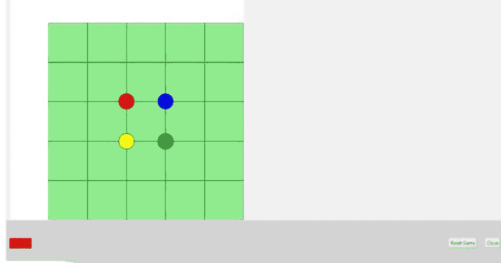

```python
import tkinter as tk
import random
import time

class LudoGame:
    def __init__(self, root):
        self.root = root
        self.root.title("Ludo Game")
        self.root.attributes('-fullscreen', True)

        # Add background color for buttons
        button_frame = tk.Frame(root, bg="lightgray")
        button_frame.pack(side=tk.BOTTOM, fill=tk.BOTH, expand=True)

        self.canvas = tk.Canvas(root, width=600, height=600, bg="white")
        self.canvas.pack(side=tk.LEFT, padx=10)

        self.create_board()
        self.create_players()

        # Create Roll Dice button
        self.roll_button = tk.Button(
            button_frame, text="Roll Dice", command=self.play_turn)
        self.roll_button.pack(side=tk.LEFT, padx=10, pady=10)
```

# 创建关闭按钮
self.close_button = tk.Button(
    button_frame, text="关闭", command=root.destroy)
self.close_button.pack(side=tk.RIGHT, padx=10, pady=10)

# 创建重置游戏按钮
self.reset_button = tk.Button(
    button_frame, text="重置游戏", command=self.reset_game)
self.reset_button.pack(side=tk.RIGHT, padx=10, pady=10)

# 创建用于显示玩家信息的标签
self.player_info_label = tk.Label(
    root, text="", font=("Helvetica", 16))
self.player_info_label.pack(side=tk.TOP, pady=10)

# 初始化当前玩家和棋子的变量
self.current_player_index = 0

# 高亮显示当前玩家的回合
self.highlight_current_player()

def create_board(self):
    # 绘制飞行棋棋盘
    for i in range(1, 6):
        for j in range(1, 6):
            x1, y1 = i * 100, j * 100
            x2, y2 = x1 + 100, y1 + 100
            self.canvas.create_rectangle(
                x1, y1, x2, y2, outline="black", fill="lightgreen")

def create_players(self):
    self.players = [
        {"color": "red", "piece": {"position": (300, 300)}},
        {"color": "green", "piece": {"position": (400, 400)}},
        {"color": "blue", "piece": {"position": (400, 300)}},
        {"color": "yellow", "piece": {"position": (300, 400)}}
    ]

    for player in self.players:
        self.draw_piece(player["piece"]["position"], player["color"])

def draw_piece(self, position, color):
    x, y = position
    self.canvas.create_oval(
        x - 20, y - 20, x + 20, y + 20, outline="black", fill=color, tags="piece")

def roll_dice(self):
    # 模拟掷骰子动画
    for _ in range(10):
        value = random.randint(1, 6)
        self.roll_button.config(text=value)
        self.root.update()
        time.sleep(0.1)

    # 显示最终的骰子点数
    final_value = random.randint(1, 6)
    self.roll_button.config(text=final_value)
    return final_value

def move_piece(self, steps):
    player = self.players[self.current_player_index]
    current_position = player["piece"]["position"]

    # 根据掷出的步数计算新位置
    new_position = self.calculate_new_position(current_position, steps)

    # 检查新位置是否有效
    if self.is_valid_position(new_position):
        self.clear_position(current_position)
        player["piece"]["position"] = new_position
        self.draw_piece(new_position, player["color"])

        # 检查胜利条件
        if self.check_win_condition():
            winner = player['color']
            self.player_info_label.config(text=f'{winner} 玩家获胜！')

    # 高亮显示当前玩家的回合
    self.highlight_current_player()

def calculate_new_position(self, current_position, steps):
    x, y = current_position
    x += steps * 20
    return x, y

def is_valid_position(self, position):
    x, y = position
    return 0 < x < 600 and 0 < y < 600

def clear_position(self, position):
    x, y = position
    overlapping_items = self.canvas.find_overlapping(
        x - 20, y - 20, x + 20, y + 20)
    for item in overlapping_items:
        tags = self.canvas.gettags(item)
        if "piece" in tags:
            self.canvas.delete(item)

def play_turn(self):
    steps = self.roll_dice()

    # 更新玩家信息标签
    player = self.players[self.current_player_index]
    self.player_info_label.config(
        text=f"{player['color']} 玩家的回合 - 掷骰子点数: {steps}")

    # 根据掷骰子结果移动棋子
    self.move_piece(steps)

    # 更新当前玩家索引
    self.current_player_index += 1
    if self.current_player_index >= len(self.players):
        self.current_player_index = 0

def highlight_current_player(self):
    # 重置所有玩家的背景颜色
    for player in self.players:
        self.roll_button.config(
            bg="SystemButtonFace") # 重置按钮颜色

    # 高亮显示当前玩家的掷骰子按钮背景
    current_player = self.players[self.current_player_index]
    color = current_player["color"]
    self.roll_button.config(bg=color)

def reset_game(self):
    # 清除画布上的所有棋子
    self.canvas.delete("piece")

    # 重置玩家位置
    for player in self.players:
        player["piece"]["position"] = self.get_start_position(
            player["color"])
        self.draw_piece(player["piece"]["position"], player["color"])

    # 重置玩家信息标签
    self.player_info_label.config(text="游戏已重置")

    # 重置当前玩家索引
    self.current_player_index = 0

    # 高亮显示当前玩家的回合
    self.highlight_current_player()

def get_start_position(self, color):
    # 返回给定玩家颜色的起始位置
    if color == "red":
        return (300, 300)
    elif color == "green":
        return (400, 400)
    elif color == "blue":
        return (400, 300)
    elif color == "yellow":
        return (300, 400)

def check_win_condition(self):
    # 检查玩家是否到达特定位置（例如棋盘中心）
    center_position = (300, 300)
    for player in self.players:
        if player['piece']['position'] == center_position:
            return True
    return False

# 主程序
root = tk.Tk()
ludo_game = LudoGame(root)
root.mainloop()

让我们逐行浏览代码以理解其功能：

### Python 代码

```python
import tkinter as tk
import random
import time
```

这部分代码导入了使用 Tkinter 库创建图形用户界面（GUI）所需的必要模块。`random` 模块用于模拟掷骰子，`time` 用于在骰子动画中添加延迟。

### Python 代码

```python
class LudoGame:
    def __init__(self, root):
```

这里定义了一个名为 `LudoGame` 的类，它将代表飞行棋游戏。`__init__` 方法是一个特殊方法，在创建类的对象时被调用。它使用给定的 `root`（Tkinter 根窗口）初始化游戏。

### Python 代码

```python
        self.root = root
        self.root.title("Ludo Game")
        self.root.attributes('-fullscreen', True)
```

这几行代码存储根窗口，将其标题设置为 "Ludo Game"，并使其全屏显示。

### Python 代码

```python
        button_frame = tk.Frame(root, bg="lightgray")
        button_frame.pack(side=tk.BOTTOM, fill=tk.BOTH, expand=True)
```

这在根窗口底部创建了一个带有浅灰色背景的框架（`button_frame`）。该框架被设置为在水平和垂直方向上扩展。

### Python 代码

```python
        self.canvas = tk.Canvas(root, width=600, height=600, bg="white")
        self.canvas.pack(side=tk.LEFT, padx=10)
```

这在根窗口内创建了一个白色背景的画布，代表游戏棋盘。画布被设置为固定的 600x600 大小，并打包到根窗口的左侧，带有一些内边距。

### Python 代码

```python
        self.create_board()
        self.create_players()
```

这几行调用方法来创建飞行棋棋盘（`create_board`）并初始化玩家位置（`create_players`）。

### Python 代码

```python
        self.roll_button = tk.Button(
            button_frame, text="Roll Dice", command=self.play_turn)
        self.roll_button.pack(side=tk.LEFT, padx=10, pady=10)
```

这在 `button_frame` 内创建了一个标签为 "Roll Dice" 的按钮。点击此按钮会触发 `play_turn` 方法。

### Python 代码

```python
        self.close_button = tk.Button(
            button_frame, text="Close", command=root.destroy)
        self.close_button.pack(side=tk.RIGHT, padx=10, pady=10)
```

这在 `button_frame` 内创建了一个 "Close" 按钮，点击时会关闭 Tkinter 窗口。

### Python 代码

```python
        self.reset_button = tk.Button(
            button_frame, text="Reset Game", command=self.reset_game)
        self.reset_button.pack(side=tk.RIGHT, padx=10, pady=10)
```

这在 `button_frame` 内创建了一个 "Reset Game" 按钮，点击时会触发 `reset_game` 方法。

### Python 代码

```python
        self.player_info_label = tk.Label(
```

### Python 代码

```python
root, text="", font=("Helvetica", 16))
self.player_info_label.pack(side=tk.TOP, pady=10)
```

这会在根窗口顶部创建一个标签，用于显示玩家信息。初始文本为空，字体设置为 "Helvetica"，大小为 16。

### Python 代码

```python
self.current_player_index = 0
self.highlight_current_player()
```

这两行代码初始化了当前玩家索引的变量，并调用一个方法来高亮显示当前玩家的回合。

### Python 代码

```python
def create_board(self):
    for i in range(1, 6):
        for j in range(1, 6):
            x1, y1 = i * 100, j * 100
            x2, y2 = x1 + 100, y1 + 100
            self.canvas.create_rectangle(
                x1, y1, x2, y2, outline="black", fill="lightgreen")
```

`create_board` 方法使用嵌套循环在画布上绘制飞行棋棋盘。它创建了一个 5x5 的矩形网格，带有黑色轮廓和浅绿色填充。

### Python 代码

```python
def create_players(self):
    self.players = [
        {"color": "red", "piece": {"position": (300, 300)}},
        {"color": "green", "piece": {"position": (400, 400)}},
        {"color": "blue", "piece": {"position": (400, 300)}},
        {"color": "yellow", "piece": {"position": (300, 400)}}
    ]

    for player in self.players:
        self.draw_piece(player["piece"]["position"], player["color"])
```

`create_players` 方法初始化一个玩家列表，每个玩家由一个包含颜色和初始棋子位置的字典表示。然后，它调用 `draw_piece` 方法在画布上绘制每个玩家的棋子。

### Python 代码

```python
def draw_piece(self, position, color):
    x, y = position
    self.canvas.create_oval(
        x - 20, y - 20, x + 20, y + 20, outline="black", fill=color, tags="piece"
    )
```

`draw_piece` 方法负责在画布上绘制玩家的棋子。它使用椭圆形来表示棋子，给定其位置和颜色。`tags` 参数用于将创建的对象标记为 "piece"。

### Python 代码

```python
def roll_dice(self):
    for _ in range(10):
        value = random.randint(1, 6)
        self.roll_button.config(text=value)
        self.root.update()
        time.sleep(0.1)

    final_value = random.randint(1, 6)
    self.roll_button.config(text=final_value)
    return final_value
```

`roll_dice` 方法通过使用随机值更新 "Roll Dice" 按钮上的文本来模拟骰子动画。它使用 `random.randint` 函数，并在更新之间引入轻微的延迟以创建滚动效果。

### Python 代码

```python
def move_piece(self, steps):
    player = self.players[self.current_player_index]
    current_position = player["piece"]["position"]

    new_position = self.calculate_new_position(current_position, steps)

    if self.is_valid_position(new_position):
        self.clear_position(current_position)
        player["piece"]["position"] = new_position
        self.draw_piece(new_position, player["color"])

        if self.check_win_condition():
            winner = player['color']
            self.player_info_label.config(text=f"{winner} player wins!")

    self.highlight_current_player()
```

`move_piece` 方法处理根据掷出的步数移动玩家的棋子。它计算新位置，检查其有效性，清除先前的位置，更新玩家的位置，重新绘制棋子，检查获胜条件，并高亮显示下一个玩家的回合。

### Python 代码

```python
def calculate_new_position(self, current_position, steps):
    x, y = current_position
    x += steps * 20
    return x, y
```

`calculate_new_position` 方法根据当前位置和掷出的步数计算新位置。

### Python 代码

```python
def is_valid_position(self, position):
    x, y = position
    return 0 < x < 600 and 0 < y < 600
```

`is_valid_position` 方法检查给定位置是否在画布的边界内。

### Python 代码

```python
def clear_position(self, position):
    x, y = position
    overlapping_items = self.canvas.find_overlapping(
        x - 20, y - 20, x + 20, y + 20)
    for item in overlapping_items:
        tags = self.canvas.gettags(item)
        if "piece" in tags:
            self.canvas.delete(item)
```

`clear_position` 方法删除画布上给定位置存在的任何项目（棋子）。

### Python 代码

```python
def play_turn(self):
    steps = self.roll_dice()

    player = self.players[self.current_player_index]
    self.player_info_label.config(
        text=f"{player['color']} player's turn - Dice Roll: {steps}")

    self.move_piece(steps)

    self.current_player_index += 1
    if self.current_player_index >= len(self.players):
        self.current_player_index = 0
```

`play_turn` 方法通过掷骰子、更新玩家信息标签、移动棋子并推进到下一个玩家来启动玩家的回合。

### Python 代码

```python
def highlight_current_player(self):
    for player in self.players:
        self.roll_button.config(
            bg="SystemButtonFace")  # Reset button color
    current_player = self.players[self.current_player_index]
    color = current_player["color"]
    self.roll_button.config(bg=color)
```

`highlight_current_player` 方法重置所有玩家按钮的背景颜色，并高亮显示当前玩家按钮的背景。

### Python 代码

```python
def reset_game(self):
    self.canvas.delete("piece")

    for player in self.players:
        player["piece"]["position"] = self.get_start_position(
            player["color"])
        self.draw_piece(player["piece"]["position"], player["color"])

    self.player_info_label.config(text="Game Reset")

    self.current_player_index = 0
    self.highlight_current_player()
```

`reset_game` 方法清除画布上的所有棋子，重置玩家位置，更新玩家信息标签，重置当前玩家索引，并高亮显示第一个玩家的回合。

### Python 代码

```python
def get_start_position(self, color):
    if color == "red":
        return (300, 300)
    elif color == "green":
        return (400, 400)
    elif color == "blue":
        return (400, 300)
    elif color == "yellow":
        return (300, 400)
```

`get_start_position` 方法返回给定玩家颜色的起始位置。

### Python 代码

```python
def check_win_condition(self):
    center_position = (300, 300)
    for player in self.players:
        if player['piece']['position'] == center_position:
            return True
    return False
```

`check_win_condition` 方法检查是否有玩家到达中心位置，这表示获胜条件。

### Python 代码

```python
root = tk.Tk()
ludo_game = LudoGame(root)
root.mainloop()
```

最后，主程序创建一个 Tkinter 根窗口，使用根窗口实例化 `LudoGame` 类，并通过 `root.mainloop()` 启动 Tkinter 事件循环。此循环使 GUI 应用程序保持运行，直到用户关闭窗口。

## 如何玩飞行棋游戏

要玩使用提供的代码创建的飞行棋游戏，您可以按照以下说明操作：

### 1. 运行代码：
- 将整个提供的代码复制到一个 Python 文件中（例如 `ludo_game.py`）。
- 使用 Python 解释器运行该脚本。

### 2. 游戏界面：
- 运行脚本后，将出现一个图形窗口，其中包含飞行棋棋盘和游戏控制项。

### 3. 掷骰子：
- 单击 "Roll Dice" 按钮以模拟掷骰子。按钮将显示掷出的数字。

### 4. 玩家回合：
- 当前回合的玩家会被高亮显示，其颜色会显示在 "Roll Dice" 按钮上。

### 5. 移动您的棋子：
- 玩家的棋子将根据掷出的数字在棋盘上移动。
- 游戏会自动更新玩家信息标签，显示当前玩家的回合和掷骰子的结果。

### 6. 赢得游戏：
- 目标是将您的棋子移动到棋盘中心 (300, 300)。
- 如果玩家的棋子到达中心，游戏将宣布该玩家为获胜者。

## 7. 重置游戏：

- 你可以点击“重置游戏”按钮来开始一局新游戏。这将重置棋子和玩家顺序。

## 8. 关闭游戏：

- 点击“关闭”按钮可以退出游戏并关闭窗口。

## 9. 轮流进行：

- 游戏采用回合制系统，玩家轮流掷骰子并移动他们的棋子。

## 10. 享受游戏：

- 与朋友一起或与电脑控制的玩家对战，享受玩飞行棋的乐趣。

请记住，此代码提供了一个飞行棋游戏的基本框架，你可以根据自己的喜好进行自定义和扩展。你可以添加更多功能，例如玩家名称、音效或额外的游戏逻辑，以增强游戏体验。