# 从零到精通的Python游戏（入门篇）

帕特里克·费利西亚

由帕特里克·费利西亚出版，2022年。

尽管在本书的编写过程中已采取了各种预防措施，但出版商对书中可能存在的错误或遗漏，或因使用其中信息而造成的任何损害不承担责任。

# 从零到精通的Python游戏（入门篇）

第一版。2022年8月15日。

版权所有 © 2022 帕特里克·费利西亚。

ISBN: 979-8201076511

作者：帕特里克·费利西亚。

# 目录

- [书名页](Title Page)
- [版权页](Copyright Page)
- [从零到精通的Python游戏（入门篇）](Python Games from Zero to Proficiency (Beginner))
- [第1章：Python编程入门](Chapter 1: Introduction to Programming in Python)
- [第2章：创建你的第一个脚本](Chapter 2: Creating your First Script)
- [第3章：创建一个猜数字游戏](Chapter 3: Creating a Number Guessing Game)
- [第4章：创建一个猜单词游戏](Chapter 4: Creating a word guessing game)
- [第5章：使用图形和Pygame库](Chapter 5: Using Graphics and the Pygame Library)
- [第6章：创建一个收集金币的游戏](Chapter 6: Creating a coin collection game)
- [第7章：常见问题解答](Chapter 7: Frequently Asked Questions)
- [致谢](Thank you)
- [帕特里克·费利西亚的其他作品](Also By Patrick Felicia)

# 关于作者

# 从零到精通的Python游戏

（入门篇）

# 第一版

一份使用Python和Pygame编写你的第一个游戏的分步指南。

# 帕特里克·费利西亚

# 从零到精通的Python游戏

（入门篇）

版权所有 © 2022 帕特里克·费利西亚

保留所有权利。未经出版商（帕特里克·费利西亚）事先书面许可，不得以任何形式或任何方式复制、存储于检索系统或传播本书的任何部分，除非在评论文章或书评中嵌入简短引文。

在编写本书时，我们已尽一切努力确保所提供信息的准确性。然而，本书所含信息是按“原样”出售的，不附带任何明示或暗示的保证。作者及其经销商和分销商均不对因本书直接或间接造成的任何损害或声称造成的损害负责。

首次出版：2022年8月

由帕特里克·费利西亚出版

# 致谢

作者：帕特里克·费利西亚

# 关于作者

帕特里克·费利西亚是沃特福德理工学院的讲师和研究员，在那里他教授并指导本科生和研究生。他于2003年获得爱尔兰科克大学多媒体技术硕士学位，2009年获得计算机科学博士学位。他出版了多本关于利用电子游戏进行教育目的的书籍和文章，包括《通过教育游戏改进学习和动机的研究手册：多学科方法》（由IGI出版）和《学校中的数字游戏：教师手册》，由欧洲学校网出版。帕特里克还是《国际基于游戏的学习期刊》（IJGBL）的主编，以及爱尔兰基于游戏的学习研讨会的会议主任，这是一个在爱尔兰各地举办的关于游戏和学习的知名会议。

# 本书的支持与资源

要完成本书中介绍的活动，您需要从配套网站下载启动包；它包含您完成项目所需的免费资源。要下载这些资源，请执行以下操作：

打开页面
点击您的书《从零到精通》

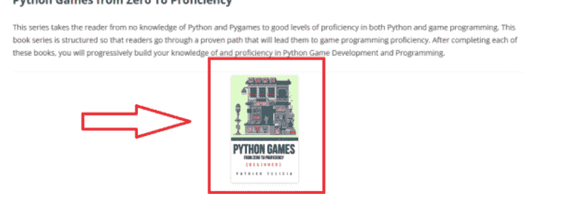

在新页面上，请点击写着“点击此处下载您的资源”的链接

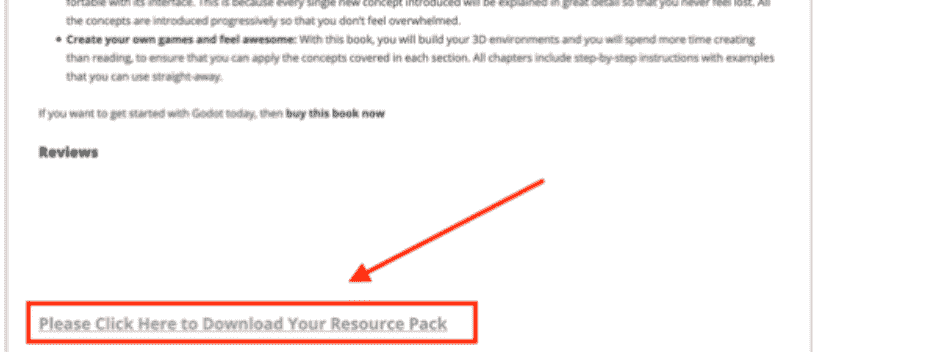

本书献给马蒂斯

# 目录

- [致谢](Credits)
- [关于作者](About the Author)
- [本书的支持与资源](Support and Resources for this Book)
- [目录](Table of Contents)
- [前言](Preface)
- [本书涵盖的内容](Content Covered by this Book)
- [使用本书所需条件](What you Need to Use this Book)
- [本书适合谁阅读](Who this book is for)
- [本书不适合谁阅读](Who this book is not for)
- [如何从本书中学习](How you will learn from this book)
- [每章的格式和写作惯例](Format of Each Chapter and Writing Conventions)
- [特别说明](Special Notes)
- [如何从本书中获得最佳学习效果？](How Can You Learn Best from this Book?)
- [反馈](Feedback)
- [下载本书的解决方案](Downloading the Solutions for the Book)
- [改进本书](Improving the Book)
- [支持作者](Supporting the Author)
- [第1章：Python编程入门](Chapter 1: Introduction to Programming in Python)
- [简介](Introduction)
- [语句](Statements)
- [注释](Comments)
- [变量](Variables)
- [数组和列表](Arrays and lists)
- [字典](Dictionaries)
- [常量](Constants)
- 运算符
- 条件语句
- 匹配语句
- 循环
- 类
- 定义类
- 访问类成员和变量
- 构造函数
- 继承
- 函数和方法
- 函数的默认参数和返回类型
- 变量的作用域
- 事件或信号
- 创建脚本的工作流程
- 编码规范
- 创建脚本时需要记住的几件事（检查清单）
- 常见错误
- 章节回顾
- 总结
- 测验
- 测验答案
- 检查清单

# 第2章：创建你的第一个脚本

- 安装Python和集成开发环境（IDE）
- 你的第一个脚本
- 创建你的第一个函数
- 创建你自己的类
- 使用模块

## 最佳实践

- 缩进
- 最大行长度
- 换行
- 变量命名
- 方法
- 章节回顾
- 总结
- 测验
- 测验答案
- 检查清单
- 挑战1

# 第3章：创建一个猜数字游戏

- 本章所需资源
- 创建一个简单的猜数字脚本
- 章节回顾
- 检查清单
- 测验
- 测验答案
- 挑战1
- 挑战2

# 第4章：创建一个猜单词游戏

- 初始化游戏
- 显示待猜单词并处理用户答案
- 从文本文件中获取随机单词
- 章节回顾
- 检查清单
- 测验
- 测验答案
- 挑战1

# 第5章：使用图形和Pygame库

- 安装Pygame
- 在屏幕上绘制基本形状
- 创建一个井字棋游戏
- 实现人工智能
- 章节回顾
- 检查清单
- 测验
- 测验答案
- 挑战1
- 挑战2

# 第6章：创建一个收集金币的游戏

- 简介
- 移动玩家
- 收集金币
- 跟踪和显示分数
- 创建第二关
- 添加墙壁
- 添加计时器
- 添加启动画面和结束画面
- 添加动画
- 添加音效
- 章节回顾
- 检查清单
- 测验
- 测验答案
- 挑战1

# 第7章：常见问题解答

- 脚本
- 与资源交互
- 使用图形用户界面
- 音频
- 检测用户输入

# 致谢

# 前言

本书将向您展示如何快速使用Python编码并创建游戏。

Python是一种强大的编程语言，广泛应用于各行各业，即使您使用（或正在教授）技术规格非常低的计算机，也可以使用它。

本系列丛书《从零到精通的Python游戏》让您能够探索Python的核心功能，特别是那些能够快速创建有趣的2D游戏的功能。阅读完本系列丛书后，您应该会发现使用Python编码和创建简单而有趣的电子游戏变得更加容易。

本系列丛书假设读者没有任何先验知识，它将引导您入门Python，通过轻松的学习曲线，让您快速掌握这门编程语言提供的所有出色功能。

通过完成每一章并遵循分步说明，您将逐步提高技能，变得更加精通Python，并创建多个游戏。

除了精通Python之外，您还将创建包含电子游戏中许多常见技术的游戏，例如：关卡设计、对象创建、纹理、碰撞检测、灯光、武器创建、角色动画、粒子、人工智能和菜单。

您将学习如何使用Python和Pygame创建自定义菜单和简单的用户界面，并为非玩家角色（NPC）添加动画和人工智能，使其能够使用寻路算法跟随玩家角色。

最后，您还可以在本书的不同阶段导出您的游戏，以便与朋友分享并获得一些反馈。

## 本书涵盖的内容

第1章《Python编程入门》介绍了Python语言以及帮助你入门的核心原则。它解释了变量、变量类型或函数等关键编程概念。

第2章《创建你的第一个程序》帮助你编写第一个脚本。它解释了Python中常见的编码错误和失误，以及如何轻松避免它们。它还介绍了一些初学者常见的错误信息，解释了它们的含义以及如何轻松避免。

第3章《创建数字猜谜游戏》让你为游戏添加交互功能，并创建一个简单的数字猜谜游戏。你将学习创建计分系统、使用循环和条件语句，以及检测和处理用户按下的按键。

第4章《创建单词猜谜游戏》让你创建一个单词猜谜游戏，玩家需要猜测一个从大文件中随机选取的单词。你将学习使用循环和全局变量、从文本文件读取数据，以及在命令提示符中显示消息。

第5章《使用图形和Pygame》介绍了如何使用Python和Pygame进行图形处理，以便你可以在屏幕上绘制对象，并检测用户的鼠标交互。

第6章《创建金币收集游戏》解释了如何创建一个冒险游戏，玩家必须收集金币才能进入下一关。在此过程中，你还将学习如何检测碰撞、在屏幕上移动动画角色、创建启动画面以及计时器。

第7章提供了与本书涵盖主题（例如，脚本、音频、交互、人工智能或用户界面）相关的常见问题解答（FAQ）。它还提供了指向额外独家视频教程的链接，这些教程可以帮助你解决一些问题。

第8章总结了本书涵盖的主题，并为你提供了关于后续步骤的更多信息。

## 使用本书所需条件

要完成本书中介绍的项目，你只需要安装Python和Pygame（这将在接下来的部分中解释）。

在计算机技能方面，本书介绍的所有知识都假设读者没有编程经验。因此，目前你只需要能够执行常见的计算机任务，例如下载文件、打开和保存文件、熟练使用拖放操作以及打字。

## 本书适合谁

如果你对以下所有问题的回答都是“是”，那么本书适合你：

- 你是Python的完全初学者吗？
- 你想精通Python和Pygame提供的核心功能吗？
- 你想教学生或帮助你的孩子理解如何使用编程创建游戏吗？
- 你想开始创建有趣的2D游戏吗？
- 尽管你可能之前接触过Python或Pygame，但你想更深入地研究这些主题并更详细地理解核心功能吗？

## 本书不适合谁

如果你对以下所有问题的回答都是“是”，那么本书**不**适合你：

- 你已经能够使用Python编写代码来实现简单的行为，例如计分、碰撞检测或更新用户界面吗？
- 你已经能够轻松地使用Pygame和Python编写2D游戏了吗？
- 你在寻找一本关于Python的参考书吗？
- 你是一位经验丰富的（或至少是高级的）Python用户吗？

如果你对所有四个问题的回答都是“是”，你可能需要寻找本系列的下一本书。要查看这些书涵盖的内容和主题，你可以查看官方网站。

## 你将如何从本书中学习

因为所有学生的学习方式不同，对课程的期望也不同，本书的设计旨在确保所有读者都能找到适合自己的学习结构。因此，它包括以下内容：

- 每章开头都有一个学习目标列表，以便读者了解将涵盖的技能。
- 每个部分都包括所涵盖活动的概述。
- 许多活动都是循序渐进的，学习者还可以通过每章末尾提供的挑战来参与更深入的学习和解决问题的技能培养。
- 每章都以测验和挑战结束，通过这些你可以将你的技能（和获得的知识）付诸实践，并了解你掌握了多少。挑战包括编码、调试或根据你在本章中获得的知识创建新功能。
- 本书侧重于你需要的核心技能。一些部分也更详细；然而，一旦概念得到解释，必要时会提供指向额外资源的链接。
- 代码是逐步引入的，并进行了详细解释。

## 每章的格式和写作惯例

在整本书中，为了使阅读和学习更容易，将使用文本格式和图标来突出显示提供的信息的部分，并使其更具可读性。

本书中介绍的项目的完整解决方案可在官方网站上下载。因此，如果你需要跳过某个部分，你可以这样做；你也可以下载你跳过的前一章的解决方案。

## 特别说明

每章都包含资源部分，以便你可以进一步理解和掌握Python；这些包括：

- 每章的测验：这些测验通常包含10个问题，测试你对本章涵盖主题的知识。解答在配套网站上提供。
- 检查清单：它包含5到10个关键概念和技能，你需要在进入下一章之前熟练掌握。
- 挑战：每章都包含一个挑战部分，要求你结合你的技能来解决一个特定问题。

作者的注释如下所示：
作者的建议出现在此框中。
代码如下所示：

```
score = 100
player_name = “Sam”
```

包含本章涵盖要点的检查清单如下所示：
below: below: below: below: below: below: below: below: below: below:
below: below:

## 你如何才能从本书中获得最佳学习效果？

与你的朋友谈论你正在做的事情。

我们常常认为自己理解一个主题，直到我们必须向朋友解释并回答他们的问题。通过解释你的不同项目，你刚刚学到的东西会对你变得更加清晰。

做练习。

所有章节都包含练习，这些练习将帮助你通过实践来学习。换句话说，通过完成这些练习，你将能够更好地理解主题并获得实践技能（即，而不仅仅是阅读）。

不要害怕犯错。

我通常告诉我的学生，犯错是学习过程的一部分；你犯的错误越多，你学习的机会就越多。一开始，你可能会发现错误令人不安，或者Python在你理解出了什么问题之前无法按预期工作。

尽早编译和运行你的游戏。

编译和运行你的第一个游戏总是很棒的。

分块学习。

连续学习五章或六章可能会令人不安，因为它可能会降低你的积极性。相反，给自己足够的时间学习，按照自己的节奏学习，并以小单元学习（例如，每天15到20分钟）。这至少会为你做两件事：它会给你的大脑时间来“消化”你刚刚学到的信息，以便你第二天可以重新开始。它还可以确保你不会“精疲力竭”，并保持较高的积极性水平。

## 反馈

虽然我已经尽一切努力制作一本高质量和有价值的书，但我总是感谢读者的反馈，以便可以相应地改进这本书。如果你想提供反馈，你可以通过电子邮件联系我

## 下载本书的解决方案

您可以在创建免费在线账户后下载本书的解决方案。注册后，文件链接将自动发送给您。

要下载本书的解决方案（例如代码），您需要在配套网站上下载启动包；它包含您完成项目和代码解决方案所需的免费资源。要下载这些资源，请执行以下操作：

打开页面
点击您的书籍《从零开始精通游戏》

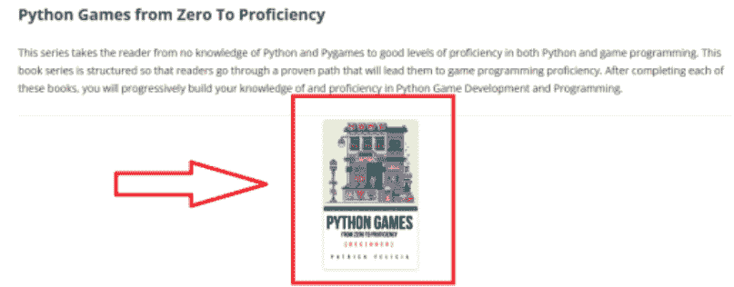

在新页面上，请点击写着“点击此处下载您的资源”的链接

- **逐步提升并建立技能自信：** 您将有机会按照自己的节奏学习和使用 Godot，并熟悉其界面。这是因为引入的每一个新概念都会被详细解释，让您永远不会感到困惑。所有概念都是循序渐进地引入的，因此您不会感到不知所措。
- **创建自己的游戏并获得成就感：** 通过本书，您将构建自己的 3D 环境，并且会花更多时间在创作而非阅读上，以确保您能够应用每节涵盖的概念。所有章节都包含分步说明和可立即使用的示例。

如果您想今天就开始使用 Godot，那么**立即购买本书**

## 评论


请点击此处下载您的资源包

## 改进本书

尽管在检查本书内容时非常仔细，但我毕竟是人，书中可能仍会存在一些错误。因此，如果您能告知我在本书中遇到的任何问题或错误，以便解决并相应更新本书，那将非常有帮助。要报告错误，您可以通过电子邮件向我发送以下信息：

- 书名。
- 检测到错误的页面。
- 描述错误以及您认为的正确内容。

收到您的电子邮件后，将检查错误，如果是有效的错误，将予以更正，并相应更新书籍页面以反映更改。

## 支持作者

本书投入了大量工作，是长时间准备、头脑风暴和最终写作的成果。因此，我请求您不要分发本书的任何非法副本。

这意味着，如果朋友想要本书的副本，他/她必须通过官方渠道购买（即通过您喜欢的电子商店或本书的官方网站：

如果您的一些朋友对本书感兴趣，您可以将他们引导至本书的官方网站，在那里他们可以购买本书、参加每月抽奖以有机会获得免费副本，或接收未来促销活动的通知。

# 第一章：Python 编程入门

在本节中，我们将探索 Python 编程的原则和概念，以便您可以在下一章开始编程。如果您已经使用 Python（或类似语言）编写过代码，可以跳过本章。

完成本章后，您将能够：

- 熟悉并理解变量、方法和作用域的概念。
- 理解编码的关键最佳实践，尤其是在 Python 中。
- 理解如何使用条件语句和决策结构。
- 理解循环的概念。
- 理解在 Python 中编码时的面向对象编程（OOP）概念。

## 简介

在 Python 中编码时，您正在与系统通信并要求其执行操作。要与系统通信，您使用一种语言或一组由计算机和您都懂的语法约束的词语。这种语言由关键字、关键短语和确保您的指令被正确理解的语法组成。在计算机科学中，这个句子需要准确、精确、无歧义且语法正确。换句话说，它需要是正确的。语法是在 Python 中编写代码时遵循的一组规则。除了语法之外，Python 编程还使用类；因此您的脚本将保存为类。

在下一节中，我们将学习如何使用这种语法。如果您已经使用 Python 或其他面向对象编程语言编写过代码，本章其余部分提供的一些信息可能看起来很熟悉，这种先前的编程经验肯定会帮助您。

在 Python 中编写脚本时，您将使用以下内容的组合：

- 类。
- 对象。
- 语句。
- 注释。
- 变量。
- 常量。
- 运算符。
- 赋值。
- 数据类型。
- 函数。
- 方法。
- 决策结构。
- 循环。
- 继承（更高级）。
- 事件。
- 比较。
- 类型转换。
- 保留字。
- 发送到命令提示符的消息。
- 声明。
- 方法调用。

这个列表可能看起来有点吓人，但不用担心，我们将在接下来的章节中探讨这些内容，您将通过实践示例顺利地了解和使用它们。

## 语句

当您编写一段 Python 代码时，您需要使用语句要求系统执行您的指令（例如，在屏幕上打印信息）。语句字面上就是您要求系统执行的命令或操作。例如，在下一行代码中，语句将告诉 Python 在命令提示符中打印一条消息

```
print (“Hello World”)
```

编写语句时，您需要了解一些规则：

语句顺序：每条语句都按照其在脚本中出现的顺序执行。例如，在下一个示例中，代码将先打印“hello”然后打印“world”，这是因为相关的语句是按此顺序排列的。

```
print (“hello”)
print (“world”）
```

尽可能每行使用一条语句。否则，使用分号分隔这些语句。
例如，下一行代码语法不正确。

```
print(“hello”) print (“world”)
```

语句中的多个空格会被忽略；但是，在运算符（如 `+` 或 `%`）周围添加空格是良好的实践，以提高清晰度。例如，在下一个示例中，我们说 `a` 等于 `b`。运算符前后都有空格

```
a = b;
```

需要一起执行的语句（例如，基于相同条件）可以使用通常称为代码块的方式进行分组。在 Python 中，代码块是通过缩进实现的。因此，换句话说，如果您需要将几条语句分组，我们会将它们全部缩进到同一级别，如下所示：

```
if (x > 100):
    print (“hello stranger!”)
    print (“today, we will learn about scripting”)
```

在前面的语句中，如果 `x` 大于 100，则将执行两条打印语句。

请注意，我们在条件后使用冒号来开始一个指令块，如果条件被验证，则将执行该指令块。

正如我们之前所见，语句通常使用或以关键字（即计算机理解的单词）开头。所有这些关键字都有特定的用途，目前最常见的用于：

在控制台中打印消息：关键字是 `print`
声明函数：关键字是 `def`

在 Python 中，关键字 `method` 和 `function` 有不同的含义。函数是一组在调用时完成任务的语句，而方法是指在类中声明的函数，我们稍后会看到。

标记基于条件执行的指令块：关键字是 `if` 和 `elif`
退出函数：关键字是 `return`

请注意，在 Python 中，您可以使用分号结束语句；但这在 Python 中是可选的；也就是说，如果您想在一行中写多条语句，每条用分号分隔，这会很有用，如下一个代码片段所示：

```
print ("Hello"); print ("World")
```

请注意，Python 代码通常保存在扩展名为 `.py` 的文件中，然后进行编译和解释；Python 代码也可以直接在命令行中使用，我们将在本书后面看到。

## 注释

在 Python 中，你可以使用注释来解释代码并使其更易于阅读。随着代码规模的增大，这一点变得尤为重要；在团队协作中也同样重要，这样其他团队成员就能理解你的代码，并在需要时进行正确的修改。

当某些代码被注释掉时，它不会被执行。关于注释：

在行首或语句后添加 `#`，即可注释该行（或该行的一部分），如下一个代码片段所示。你也可以使用三个连续的引号来注释多行，如下一个代码片段所示。

```
#the next line prints Hello in the Command Prompt
print("Hello")
#the next line declares the variable name
Name = 0 #sets the value of the variable name to 0
name = "Hello";#sets the value of the variable name to "Hello"
'''
Several lines
Are commented at
a time
'''
```

除了为代码提供解释外，你还可以使用注释来阻止代码的某部分执行。当你想使用一种非常简单的方法来调试代码并找出错误或缺陷可能的位置时，这非常有用。通过注释掉部分代码，并使用排除法，你通常可以快速找到问题。例如，你可以注释掉所有代码并运行脚本，然后注释掉一半代码并运行脚本。如果它能运行，意味着错误在被注释掉的代码中；如果它不能运行，意味着错误在未被注释的代码中。在第一种情况下（如果代码能运行），我们只需注释掉已被注释部分的一半。因此，通过连续注释代码中更具体的区域，我们可以发现代码的哪一部分包含了缺陷。这个过程通常被称为二分法，因为我们连续地将代码部分分成两半。这通常能有效地调试你的代码，因为迭代次数（将部分代码分成两半）更可预测，并且可能更省时。例如，对于 100 行代码，我们可以连续将问题范围缩小到 50、25、12、6 和 3 行，因此在这种情况下使用 5 到 6 次迭代，而不是遍历全部 100 行代码。

## 变量

变量是一个容器。它包含一个可能随时间变化的值。使用变量时，我们通常需要：(1) 声明变量，(2) 为该变量赋值，以及 (3) 可能使用运算符将该变量与其他变量组合。这在下一个代码片段中有所说明。

请注意，在 Python 中，变量的类型无需指定。

```
my_age = 20 #we declare the variable
my_age = int(20) #we declare the variable as an integer; this is called casting
my_age = my_age + 1 #we add 1 to the variable my_age
```

在前面的例子中，我们声明了一个变量，其类型为 int（整数），将其设置为 20，然后对其加 1。

在 Python 中，得益于类型转换，你可以指定变量的类型；话虽如此，变量的类型可以在整个程序中改变，如下一个代码片段所示。

```
my_age = int(12)
my_age = "Not sure"
```

请注意，在前面的代码中，我们将值 `my_age + 1` 赋给了变量；`=` 运算符是一个赋值运算符；换句话说，它的作用是为变量赋值，不应从严格的代数意义上理解（即等号两边的变量值相等）。

使用变量时，我们需要确定一些事项，包括它们的名称、类型和作用域：

变量的名称：变量通常被赋予一个唯一的名称，以便唯一标识。变量的名称通常被称为标识符；它可以包含字母、数字、减号或下划线，并且通常以字母开头。标识符不能是关键字。例如，关键字 `if` 不能用作变量名。

变量的类型：变量可以保存多种类型的数据，包括数字（例如，整数、双精度浮点数或单精度浮点数）、文本（即字符串或字符）、布尔值（例如，True 或 False）或数组，如下一个代码片段所示。

```
my_age = str("Patrick") "#the text is declared using double quotes
current_year = int(2015) #the year needs no decimals and is declared as an integer
width = float(100.45) #width is declared as a float (i.e., with decimals)
```

变量声明：与其他语言不同，在 Python 中，变量在使用前无需声明。话虽如此，每个变量在使用前都需要被赋值。

变量的作用域：变量可以在特定的上下文中被访问（即引用），这取决于变量最初在脚本中的声明位置。我们稍后会探讨这个概念。

可访问性级别：正如我们稍后将看到的，一个 Python 程序由类组成；对于每个类，其中的方法和变量可以根据可访问性级别进行访问。我们稍后会探讨这个原则（现阶段无需困惑 :-))。

常见的变量类型包括：

- 字符串 - 与文本相同。
- 整数（1、2、3 等）。
- 布尔值 - True 或 False。
- 浮点数 - 带有小数值（例如，1.2、3.4 等）。
- 列表 - 一组变量。如果这一点不清楚，不用担心，本章将进一步解释这个概念。

## 数组和列表

有时数组可以用来使你的代码更精简，通过将特性和类似行为应用于广泛的数据。

正如我们将在本节中看到的，数组可以帮助声明更少的变量（用于存储相同类型信息的变量），并且也更容易访问它们。

要在 Python 中使用数组，你需要使用一个名为 NumPy 的特定库，它使得创建和操作数组成为可能，就像在其他编程语言中一样。

话虽如此，Python 原生提供了其他可以作为数组使用的结构，包括列表。

列表将允许在一个变量中存储多个项目。

创建列表时，你可以创建一维列表和多维列表。

让我们看看列表的最简单形式：一维列表。对于这个概念，我们可以类比一组 10 个都有名字的人。如果我们想使用一个字符串变量来存储这些信息，我们需要声明（并设置）十个不同的变量。

```
name1 = ""
name2 = ""
name3 = ""
```

虽然这段代码完全没问题，但如果能将它们存储在一个变量中就太好了。为此，我们可以使用列表。列表类似于一个元素列表，我们使用索引来访问它。这个索引通常从 0 开始，对应列表中的第一个元素。

那么让我们看看如何用列表来实现这一点；首先，我们可以如下声明列表：

```
names = []
```

你可能会注意到语法 `name_of_the_list = []` 意味着我们声明了一个空列表。

然后我们可以按照下一个代码片段中描述的方式将信息存储在这个列表中。

```
names.append("Paul")
names.append("Mary")
names.append("Pat")
```

在前面的代码中，我们将名字 Paul 存储为列表中的第一个元素；我们将第二个元素存储为 Mary，以及最后一个元素存储为 Pat。

请注意，对于一个大小为 `n` 的列表，第一个元素的索引是 0，最后一个元素的索引是 `n-1`。所以对于一个大小为 10 的数组，第一个元素的索引是 0，最后一个元素的索引是 9。

如果你使用整数或浮点数列表，或任何其他类型的数据，过程将是类似的。

现在，使用列表的一个有趣之处在于，你可以用一行代码初始化列表，如果你有 10 个变量，这可以省去编写 10 行代码的麻烦，如下一个示例所示。

```
names = ["Paul","Mary","John","Mark",
"Eva","Pat","Sinead","Elma","Flaithri", "Eleanor"]
```

这非常方便，正如你将在接下来的章节中看到的，这绝对可以为你节省大量时间。

既然我们已经研究了一维列表，让我们看看多维列表，它们在存储信息时也非常有用。这种类型的列表（即多维列表）可以比作一栋有几层楼的建筑，每层楼有几间公寓。假设我们想存储一栋建筑中每个公寓的租户数量；在这种情况下，我们将创建变量来存储每个公寓的这个数量。

第一个解决方案是创建变量来存储每个公寓的租户数量，使用一个变量来指代楼层，以及公寓的编号。例如，`ap0_1` 可能代表一楼的第一间公寓。

位于底层的公寓，接着是底层的第二套公寓，然后是第一层的第一套公寓，最后是第一层的第二套公寓。因此，在编码方面，我们可以这样写：

```
ap0_1 = 0
ap0_2 = 0
...
```

使用列表，我们可以这样做：

```
level1 = [0,0,0,0,0]
level2 = [1,1,1,0,0]
level3 = [1,1,1,1,1]
building = [level1, level2, level3]
building[0][1] = 10
building[0][2] = 1
print (building[0][1])
```

在上面的代码中：

我们声明了我们的列表。
我们向列表中添加了值。
代码的最后一行打印（在命令行中）数组第一个元素的值。

列表的另一个有趣之处在于，使用循环，你可以编写一行代码来访问列表的所有元素，从而编写更高效的代码。
列表包含内置函数，这些函数使得以下操作成为可能：

- 向列表添加元素：该函数称为
- 从列表中移除元素：该函数称为
- 对列表进行排序：该函数称为
- 复制列表：该函数称为
- 连接两个列表：该函数称为

如你所见，有几种内置函数可用于处理列表。
除了列表，还可以使用称为集合的类似结构在一个变量中存储多个项目，其中包括元组和

## 字典

列表非常有用，而字典作为特殊类型的列表，将这一概念更进一步。使用字典，你可以定义一个包含不同记录的数据集，每条记录可以通过一个键而不是索引来访问；例如，让我们考虑一个学生班级，每个学生都有名字、姓氏和学号。为了表示和管理这些数据，我们可以创建类似于以下代码来定义一个学生类（即一个结构）：

```
class Student:
    def __init__(self, first_name, last_name):
        self.f_name = first_name
        self.l_name = last_name
```

然后我们可以创建使用这个类的代码，如下所示：

```
student1 = Student("John", "McCarthy")
student2 = Student ("Mary", "Black")
student3 = Student ("Peter", "Sweeney")
student_dictionary = {"ST101":student1, "ST102":student2,
"ST103":student3}
print("Student 101's last name is " +
str(student_dictionary["ST101"].l_name))
```

在上面的代码中：

我们声明了一个字典
在声明字典时：第一个参数，它是一个，被用作索引或，这个索引将是学生
第二个参数将是一个类型的对象
因此，我们实际上在键和学生对象之间创建了一个链接。
然后我们将学生添加到我们的字典中。
使用添加方法时，第一个参数是键（在我们的例子中是学生ID：ST101、ST102或ST124），第二个参数是学生对象。这个学生对象是通过调用学生类的构造函数并向构造函数传递相关参数（如学生的名字和姓氏）来创建的。
最后，我们根据学生的学号打印特定学生的姓氏。

与列表一样，字典也有几个内置函数，使其更易于操作，包括：

- 从字典中移除一个新项目。
- 复制字典。
- 更新字典中的一个项目。
- 从字典中移除一个项目。

## 常量

在许多编程语言中，常量用于赋值一个不会随时间变化的值；虽然这种做法很有用，但Python中不使用常量；话虽如此，你可以通过在变量声明中使用大写字母来表示该变量的值应保持不变。以下向你展示了常量的好处以及如何在Python中使用它们。

到目前为止，我们已经了解了变量以及如何无缝地存储和访问它们。当时的假设是，一个值可能会随时间变化，并且该值将存储在一个变量中。然而，有时你可能知道一个值将保持不变。例如，你可能想定义一些标签，这些标签引用不应随时间变化的值，在这种情况下，你可以使用常量。让我们看下面的例子：假设玩家在游戏中可能有三个选择（例如，称为0、1和2），而你并不真的想记住这些值，或者你想找到一种更容易引用它们的方法。让我们看下面的代码：

```
if (user_choice == 0): print ("you have decided to restart")
if (user_choice == 1): print ("you have decided to stop the game")
if (user_choice == 2): print ("you have decided to pause the game")
```

在上面的代码中：

变量user_choice是一个整数，并设置为
然后我们检查它的值并相应地打印一条消息。

现在，你可能记得也可能不记得0对应于重新开始游戏；其他两个值也是如此。因此，我们可以使用具有恒定值的变量来使这些值更容易记忆（和使用）。让我们看看使用具有恒定值的变量的等效代码。

```
CHOICE_RESTART = 0
CHOICE_STOP = 1
CHOICE_PAUSE = 2
...
...
...
if (user_choice == CHOICE_RESTART): print ("you have decided to restart")
if (user_choice == CHOICE_STOP): print ("you have decided to stop the game")
if (user_choice == CHOICE_PAUSE): print ("you have decided to pause the game")
```

在上面的代码中：

我们声明了三个在游戏生命周期内不会修改的变量。
然后使用这些变量来检查用户做出的选择。

在下一个例子中，我们使用在游戏生命周期内不会修改的变量来计算税率；这是一个好习惯，因为相同的值将在整个程序中使用，在代码中使用完全相同的税率时几乎没有或根本没有出错的空间。

```
VAT_RATE = 0.21;
...
price_before_vat= 23.0
price_after_vat = price_before_vat * VAT_RATE;
```

在上面的代码中：

我们声明了一个用于增值税率的变量。
我们声明了一个用于商品税前价格的变量。
我们计算了税额。

请注意，在游戏生命周期内不会修改的变量通常在Python脚本的开头声明。
使用在游戏生命周期内不会修改的变量是一种非常好的编码实践。使用这种类型的变量使你的代码更具可读性；当你需要更改代码中的值时，它可以节省工作量，并且还可以减少可能发生的错误（例如，对于计算）。另外，请注意，对于在游戏生命周期内不会修改的变量，使用大写字母是常见的做法。

## 运算符

一旦我们声明并给变量赋值，我们就可以使用运算符来修改或组合变量。有不同类型的运算符，包括：算术运算符、赋值运算符、比较运算符和逻辑运算符。

算术运算符用于执行算术运算，包括加法、减法、乘法或除法。常见的算术运算符包括或 %（取模）。

请注意，%（取模）运算符将第一个数除以第二个数并返回余数。

```
number1 = 1 #变量 number1 被声明
number2 = 1 # 变量 number2 被声明
sum = number1 + number2 # 将两个数相加并存储在 sum 中
sub = number1 - number2 # 将两个数相减并存储在 sub 中
```

赋值运算符可用于将值赋给变量，包括 /= 或

```
number1 = 1;
number2 = 1;
number1 += 1; #等同于 number1 = number1 + 1;
number1 -= 1; #等同于 number1 = number1 - 1;
number1 *= 1; #等同于 number1 = number1 * 1;
number1 /= 1; #等同于 number1 = number1 / 1;
number1 %= 1; #等同于 number1 = number1 % 1;
```

请注意，当+运算符用于字符串时，它将连接字符串（即，将它们一个接一个地添加以创建一个新字符串）。

当你需要连接一个数字和一个字符串时，通常需要先将数字转换为字符串；例如：

## 条件语句

语句可以根据条件执行，在这种情况下，它们被称为条件语句。其语法通常如下：
if (condition): statement
这意味着如果条件被验证（或为真），那么（且仅当此时）语句才会被执行。当我们评估一个条件时，我们是在测试一个声明是否为真。例如，输入 `if (a == b)` 意味着“如果 a 等于 b 为真”。类似地，如果我们输入 `if (a >= b)`，意思是“如果 a 大于或等于 b 为真”。

正如我们稍后将看到的，我们也可以组合条件。例如，我们可以决定在两个（或更多）条件都为真时执行一个语句。例如，输入 `if (a == b and c == 2)` 意味着“如果 a 等于 b 且 c 等于 2”。在这种情况下，使用运算符 `and` 意味着两个条件都需要为真。我们可以将其比作决定明天是否去航海。例如，如果天气晴朗且风速小于 5km/h，那么我将去航海。我们可以将这个语句翻译如下。

```
if (weather_is_sunny == true and wind_speed < 5): I_go_sailing = true
```

在创建条件时，与大多数自然语言一样，我们可以使用标记为 `or` 的 OR 运算符。以上一个例子为例，我们可以将句子“如果天气太热或者风速超过 5km/h，那么我将不去航海”翻译如下。

```
if (weather_is_too_hot or wind_speed > 5): I_go_sailing = false
```

另一个例子可以是这样的。

```
if (my_name == "Patrick"): print("Hello Patrick")
else: print ("Hello Stranger")
```

当我们处理组合真或假语句时，我们实际上是在应用所谓的布尔逻辑。布尔逻辑处理具有两个值 1 和 0（或真和假）的布尔变量。通过评估条件，我们实际上是在处理布尔数字并应用布尔逻辑。虽然你不需要深入了解布尔逻辑，但布尔逻辑的一些运算符很重要，包括 `not` 运算符。它表示 NOT 或相反。这意味着如果一个变量为真，其相反值将为假，反之亦然。例如，如果我们考虑变量 `weather_is_good = true`，那么 `not weather_is_good` 的值将为假（其相反值）。因此，条件 `if (weather_is_good == False)` 也可以写成 `if (not weather_is_good)`，这在字面上翻译为“如果天气不好”。

## Match 语句

从 Python 3.10 版本开始，可以使用 match 语句。你可以在命令提示符中输入 `python –version` 来检查你的 Python 版本；如果版本早于 3.10，请下载并安装最新版本的 Python。

如果你已经理解了条件语句的概念，那么这一部分应该相当直接。Match 语句是我们之前看到的 if/else 语句的一种变体。Match 语句背后的思想是，根据特定变量的值，我们将切换到代码的特定部分并执行一个或多个操作。用于 match 结构的变量可以是不同类型，包括整数或字符串。让我们看一个简单的例子：

```
choice = int(1);
match choice:
    case 1:
        print ("you chose 1")
    case 2:
        print ("you chose 2")
    case 3:
        print ("you chose 3")
    case _:
        print ("Default option")
print ("We have exited the match structure")
```

在前面的代码中：

- 我们将变量 `choice` 声明为整数并初始化为 1。
- 然后我们创建一个 match 结构，根据变量 `choice` 的值，程序将切换到相关部分（即以 `case` 等开头的代码部分）。请注意，在我们的代码中，我们查找值 1、2 或 3。但是，如果变量 `choice` 不等于 1、2 或 3，程序将分支到以 `case _` 开头的部分。这是因为如果其他任何可能的选择（即 1、2 或 3）未被满足（或选择），则执行此部分。

请注意，在 Python 中，与其他语言相反，一旦执行了其中一个选项（或默认选项），系统就会退出 match 结构。因此，在其他语言中通常用于指定在执行分支（或当前选择）中的命令后离开 switch 结构的 `break` 语句不再必要。

所以让我们考虑前面的例子，看看这是如何工作的。在我们的例子中，变量 `choice` 被设置为 1，因此我们将进入 match 结构，然后查找处理变量 `choice` 值为 1 的部分。这将是 `case 1:` 开头的部分，然后将执行命令 `print ("you chose 1")`，然后我们退出 match 结构（隐式 break）；最后将执行命令 `print (“We have exited the match structure”)`。

Match 语句对于构建代码结构以及处理基于整数值的互斥选择（即一次只能处理一个选择）非常有用，尤其是在菜单的情况下。此外，match 结构使代码更简洁且易于理解。

## 循环

作为程序员，有时你必须执行重复性任务；很多时候，这些任务可以使用循环来快速处理。循环是基于条件重复执行相同操作的结构。因此，过程通常如下：

- 启动循环。
- 执行操作。
- 检查条件。
- 如果条件满足则退出循环，否则继续循环。

有时条件在循环开始时执行，有时在循环结束时执行。

让我们看一个使用 `while` 循环的例子。

```
x = 0;
while (x < 10):
    print("x"+str(x))
    x += 1
```

在前面的代码中：

- 我们将变量 `x` 的值设置为 0。
- 然后我们创建一个以关键字 `while` 开头的循环。
- 我们设置留在这个循环中的条件（即 `x < 10`）。
- 在循环内，我们将变量 `x` 的值增加 1 并打印其值。

所以实际上：

- 我们第一次进入循环：变量 `x` 增加到 1；我们到达循环末尾；我们回到循环开头并检查 `x` 是否 < 10；在这种情况下这是真的（1 < 10）。
- 我们第二次进入循环：`x` 增加到 2；我们到达循环末尾；我们回到循环开头并检查 `x` 是否 <10；在这种情况下这是真的（2 < 10）。
- ...
- 我们第十次进入循环：`x` 增加到 10；我们到达循环末尾；我们回到开头并检查 `x` 是否 < 10；在这种情况下这现在是假的（10 < 10 为假）。因此，我们退出循环。

所以，正如你所看到的，使用循环，我们成功地迭代地增加了变量 `x` 的值，从 0 到 10，但使用的代码比其他方式所需的更少。

代码的另一种变体可以是这样的：

```
for x in range(0,10):
    print ("x"+str(x))
```

在前面的代码中：

- 我们以稍微不同的方式声明一个循环：我们说我们将使用一个名为 `x` 的变量，它将从 0 到 9（我们排除上界 10）。
- 每次我们进入循环时，这个变量 `x` 将增加 1。
- 只要变量 `x` 小于 10，我们就留在循环中。
- 在这种情况下，条件的测试在循环开始时执行。

循环对于对有限数量的对象执行重复操作，或执行通常称为递归操作的操作非常有用。
例如，你可以使用循环来创建（即实例化）100 个对象。

不同的位置（这将为你节省一些代码 :-))，或者遍历一个包含100个（或更多）元素的数组。

## 类

在Python中编写代码时，你将创建包含自己的类或使用内置类的代码。那么，什么是类呢？

正如我们之前所见，Python支持面向对象编程（OOP）。更具体地说，Python是一种所谓的多范式语言，因为它支持广泛的编程方法，包括面向对象编程和函数式编程。

在OOP中，程序由一组相互交互的对象组成。每个对象都有一个或多个属性，并且可以使用所谓的“方法”对这些对象执行操作。此外，共享相同属性的对象被认为属于同一个类。例如，我们可以用自行车来类比。自行车有各种形状和颜色；然而，它们共享共同的特征。例如，它们都有特定数量的轮子（例如，一个、两个或三个）或一个速度；它们可以有一种颜色，并且可以对这些自行车执行操作（例如，加速、右转、左转等）。因此，在面向对象编程中，类将是`Bike`，速度或颜色将被称为成员变量，而加速（即一个操作）将被称为成员方法。所以，如果我们想定义一个通用类型，我们可以定义一个名为`Bike`的类，并为这个类定义几个成员变量和属性，从而能够定义和执行对`Bike`类型对象的操作。

这显然是对类和对象的简化解释，但如果你是面向对象编程的新手，它应该能让你对这个概念有更清晰的认识。

## 定义一个类

现在我们对类是什么有了更清晰的认识，让我们看看如何定义一个类。让我们看下面的例子。

```
class Bike:
    def __init__(self):
        self.speed = 0
        self.color = "blue"
        self.name = ""
    def accelerate(self):
        self.speed += 1
    def turn_right(self):
        print("Turning Right")
    def calculate_distance(self):
        print("Calculating Distance")
```

在上面的代码中，我们定义了一个名为`Bike`的类，它包含三个成员变量：`speed`、`color`和`name`，以及两个成员方法：`accelerate`、`turn_right`和`calculate_distance`。它还包括一个名为`__init__`的函数，这被称为构造函数。让我们更仔细地看一下这段脚本；你可能会注意到几件事：

类名前面有关键字`class`。
定义了三个变量：`speed`、`color`和`name`；它们被称为成员变量，因为它们在任何方法之前声明，因此可以在整个类中访问。
声明了三个函数：`accelerate`、`turn_right`和`calculate_distance`。

如果你使用过其他编程语言，如C#，你可能习惯于为成员方法和变量定义访问修饰符；在Python中，这些默认设置为public（公共）。

## 访问类成员和变量

一旦定义了一个类，能够访问其成员变量和方法是非常好的。在Python（以及其他面向对象编程语言）中，可以使用点表示法来完成。

点表示法指的是面向对象编程。使用点，你可以访问与特定对象相关的属性和方法。

一旦定义了一个类，就可以基于该类创建对象。例如，如果我们想根据之前看到的代码创建一个新的`Bike`对象，可以使用以下代码。

```
my_bike = Bike()
```

在前面的代码中，我们从`Bike`类实例化了一个名为`my_bike`的新对象。因此，这段代码将有效地基于“模板”`Bike`创建一个对象。你可能会注意到语法：

```
variable_name = data_type()
```

默认情况下，这个新对象将包含之前定义的所有成员变量和方法。因此，它将有一个颜色和一个速度，我们也应该能够访问它的`accelerate`和`turn_right`方法。那么如何做到这一点呢？让我们看下一个代码片段，它展示了如何访问这些。

```
my_bike = Bike()
my_bike.accelerate()
my_bike.color = "Blue"
```

在前面的代码中：

创建了新的自行车`my_bike`。
然后在调用`accelerate`方法后增加了速度。这个函数可以使用点表示法调用，因为它是一个成员函数。
我们还设置了自行车的颜色。

请注意，要调用对象的方法，我们使用点表示法。

## 构造函数

正如我们在前面章节中看到的，当创建一个新对象时，默认情况下它将包含所有成员变量和方法。要创建这个对象，我们可以使用类名，后跟一对圆括号，如下例所示。

```
my_bike = Bike();
my_bike.accelerate();
```

实际上，可以在初始化时更改新创建对象的一些属性。例如，与其像我们在前面代码中所做的那样设置对象的速度和颜色，不如能够在创建对象时自动设置这些并相应地传递参数。嗯，这可以通过所谓的构造函数来实现。

构造函数字面上帮助根据参数（也称为实参）和指令来构建你的新对象。所以，例如，假设我们希望自行车的颜色在创建时指定；我们可以通过添加以下方法来修改`Bike`类：

```
def __init__(self, new_color):
    self.color = new_color;
```

这个构造函数接受一个字符串作为参数（`self`指的是类）；因此，在修改了这个构造函数（如上面的代码所示）之后，我们可以如下创建一个新的自行车对象：

```
my_bike = Bike("Blue");
```

话虽如此，我们也可以修改构造函数，以便在不带参数调用构造函数时，为颜色分配一个默认值，如下所示：

```
def __init__(self, new_color = "Blue"):
    self.color = new_color;
```

在前面的代码中，我们指定默认情况下，如果没有输入参数，颜色将是蓝色；但是，如果输入了参数，则将其用作新颜色。

此外，我们可以创建一个包含多个参数的构造函数，所有参数都有默认值，如下所示：

```
def __init__(self, new_name ="My Bike", new_color = "Blue", new_speed = 0):
    self.color = new_color
    self.name = new_name
    self.speed = new_speed
```

在前面的代码中，我们定义了一个具有以下特征的构造函数：

它接受三个参数，分别用于自行车的名称、颜色和速度。
所有参数都有默认值：分别是"My Bike"、"Blue"和0。
如果输入了参数，则使用它们来初始化成员变量`color`、`name`和`speed`。

然后我们将这样调用这个构造函数：

```
my_bike = Bike("Fast Bike", "Red", 100)
my_bike2 = Bike()
```

在前面的代码中：

我们创建了两辆不同的自行车。
对于第一辆自行车，我们通过传递自行车的名称、颜色和速度的参数来调用构造函数。
我们还创建了第二辆自行车，但这次没有参数；这意味着这辆自行车的成员变量`color`和`speed`将被分配默认值（即"Blue"和0）。

## 继承

我希望到目前为止一切都清楚，因为我们将探讨继承的概念，这在面向对象编程中非常重要。

继承背后的主要思想是对象可以从其他对象（其父类）继承属性。当它们继承这些属性时，它们可以保持不变，或者演变并覆盖一些继承的属性。这非常有趣，因为它可以通过为一个具有相似特征的所有对象创建一个具有通用属性的父类来最小化你的代码，然后，如果需要，为子类覆盖和定制其中一些属性。

让我们以车辆为例：车辆通常具有以下属性：

- 轮子数量。
- 速度。
- 乘客数量。
- 颜色。
- 加速能力。
- 停止能力。

所以我们可以创建以下类，例如：

```
class Vehicle:
    def __init__(self):
        self.nb_wheels = 0
        self.speed = 0.0
        self.nb_passengers = 0
        self.color = ""
    def accelerate():
```

## 函数与方法

函数包含一系列要执行的语句；而方法则是定义为类的一部分的函数。本节将重点介绍函数；不过，大部分信息也适用于方法。

函数可以比作一位朋友或同事，你温和地请求他们根据特定指令执行一项任务，然后将信息返回给你。例如，你可以这样问你的朋友：“考虑到我出生于1990年，你能告诉我我什么时候庆祝20岁生日吗？”于是你给了你的朋友（擅长数学的那位）信息（出生日期），他/她会计算出你20岁生日的年份，并将这个信息反馈给你。换句话说，你的朋友会接收一个输入（即出生日期），并返回一个输出（即你20岁生日的年份）。方法的工作方式完全相同：它们接收信息（有时没有），执行一个动作，然后（有时，如果需要的话）返回信息。

用编程术语来说，函数是一组执行一系列操作的指令块。方法在被调用（或更简单地说，当被调用时）或当事件发生时（例如，玩家点击了按钮或玩家与物体碰撞；我们将在下一节中看到更多关于事件的内容）被执行。至于成员变量，函数和方法需要被声明，它们也可以被调用。

函数非常有用，因为一旦创建了方法的代码，就可以多次调用它，而无需一遍又一遍地重写相同的代码。此外，因为函数可以接受参数，所以函数可以处理这些参数并相应地产生或返回信息；换句话说，它们可以根据输入执行不同的操作并产生不同的信息。因此，函数可以做以下一项或全部操作：

-   接受参数并处理它们。
-   执行一个动作。
-   返回一个结果。

函数有特定的语法，并且至少可以用两种方式声明：

```python
def name_of_the_function():
    Perform actions here...
```

请注意，特定方法的任何语句部分都需要缩进。在前面的代码中，该方法不接受任何输入，也不返回任何输出。它只是执行操作。

或者

```python
def name_of_the_function(parameter1):
    Perform actions here...
```

在前面的代码片段中，该方法接受一个参数，然后执行操作。

让我们看看下面的方法作为例子。

```python
def calculate_sum(a, b):
    return (a + b)
```

在前面的代码中：

-   函数被声明并命名为 `calculate_sum`。
-   该函数接受两个参数。
-   该函数返回两个参数的和，在此函数内这两个参数被称为 `a` 和 `b`。

然后可以使用 `()` 运算符调用函数，如下所示：

```python
name_of_the_function1()
name_of_the_function2(parameter1)
var test = name_of_the_function3(parameter2)
```

在前面的代码中，一个函数被调用时不带参数（第1行），或者带一个参数（第2行）。在第三个例子（第3行）中，一个名为 `test` 的变量将被设置为函数返回的值。

请注意，当声明一个方法（即类中的一个函数）时，它需要包含参数 `self`，该参数引用类本身。

因此，例如，一个函数可以声明为

```python
def calculate_sum(a, b):
    return (a + b)
```

它在类中将定义为如下形式：

```python
def calculate_sum(self, a, b):
    return (a + b)
```

## 函数的默认参数和返回类型

现在你对函数有了更多了解，我们将看看如何细化函数的定义以包含返回类型、参数的类型或默认参数。

让我们从参数开始；使用Python，你可以为传递给函数的参数指定类型，如下面的代码片段所示。

```python
def calculate_sum(a: int, b: int):
    return (a + b)
```

在前面的代码中：

-   我们声明了一个名为 `calculate_sum` 的函数。
-   该函数接受两个参数。
-   每个参数（称为 `a` 和 `b`）应该是整数。这意味着传递非整数（例如，浮点数或字符串）的参数将导致错误。
-   然后该函数返回作为参数传递的两个整数的和。

现在我们已经看到了如何指定传递给函数的参数的类型，让我们看看如何指定默认值；在Python中，你可以为应该传递给函数的每个参数指定默认值，如下面的代码片段所示。

```python
def calculate_sum(a: int = 0, b: int = 0):
    return (a + b)
```

在前面的代码中：

-   我们声明了一个名为 `calculate_sum` 的函数。
-   该函数接受两个参数。
-   每个参数（称为 `a` 和 `b`）应该是整数。这意味着传递非整数（例如，浮点数或字符串）的参数将导致错误。
-   然后该函数返回作为参数传递的两个整数的和。

现在我们已经看到了如何指定传递给函数的参数的类型，让我们看看如何指定默认值；在Python中，你可以为应该传递给函数的每个参数指定默认值，如下面的代码片段所示。

```python
def calculate_sum(a: int = 0, b: int = 0):
    return (a + b)
```

在前面的代码中：

-   我们声明了一个名为 `calculate_sum` 的函数。
-   该函数接受两个参数。
-   每个参数（称为 `a` 和 `b`）应该是整数。这意味着传递非整数（例如，浮点数或字符串）的参数将导致错误。
-   然后该函数返回作为参数传递的两个整数的和。

现在我们已经看到了如何指定传递给函数的参数的类型，让我们看看如何指定默认值；在Python中，你可以为应该传递给函数的每个参数指定默认值，如下面的代码片段所示。

```python
def calculate_sum(a: int = 0, b: int = 0):
    return (a + b)
```

在前面的代码中：

-   我们声明了一个名为 `calculate_sum` 的函数。
-   该函数接受两个参数。
-   每个参数（称为 `a` 和 `b`）应该是整数。这意味着传递非整数（例如，浮点数或字符串）的参数将导致错误。
-   然后该函数返回作为参数传递的两个整数的和。

现在我们已经看到了如何指定传递给函数的参数的类型，让我们看看如何指定默认值；在Python中，你可以为应该传递给函数的每个参数指定默认值，如下面的代码片段所示。

```python
def calculate_sum(a: int = 0, b: int = 0):
    return (a + b)
```

在前面的代码中：

-   我们声明了一个名为 `calculate_sum` 的函数。
-   该函数接受两个参数。
-   每个参数（称为 `a` 和 `b`）应该是整数。这意味着传递非整数（例如，浮点数或字符串）的参数将导致错误。
-   然后该函数返回作为参数传递的两个整数的和。

现在我们已经看到了如何指定传递给函数的参数的类型，让我们看看如何指定默认值；在Python中，你可以为应该传递给函数的每个参数指定默认值，如下面的代码片段所示。

```python
def calculate_sum(a: int = 0, b: int = 0):
    return (a + b)
```

在前面的代码中：

-   我们声明了一个名为 `calculate_sum` 的函数。
-   该函数接受两个参数。
-   每个参数（称为 `a` 和 `b`）应该是整数。这意味着传递非整数（例如，浮点数或字符串）的参数将导致错误。
-   然后该函数返回作为参数传递的两个整数的和。

现在我们已经看到了如何指定传递给函数的参数的类型，让我们看看如何指定默认值；在Python中，你可以为应该传递给函数的每个参数指定默认值，如下面的代码片段所示。

```python
def calculate_sum(a: int = 0, b: int = 0):
    return (a + b)
```

在前面的代码中：

-   我们声明了一个名为 `calculate_sum` 的函数。
-   该函数接受两个参数。
-   每个参数（称为 `a` 和 `b`）应该是整数。这意味着传递非整数（例如，浮点数或字符串）的参数将导致错误。
-   然后该函数返回作为参数传递的两个整数的和。

现在我们已经看到了如何指定传递给函数的参数的类型，让我们看看如何指定默认值；在Python中，你可以为应该传递给函数的每个参数指定默认值，如下面的代码片段所示。

```python
def calculate_sum(a: int = 0, b: int = 0):
    return (a + b)
```

在前面的代码中：

-   我们声明了一个名为 `calculate_sum` 的函数。
-   该函数接受两个参数。
-   每个参数（称为 `a` 和 `b`）应该是整数。这意味着传递非整数（例如，浮点数或字符串）的参数将导致错误。
-   然后该函数返回作为参数传递的两个整数的和。

现在我们已经看到了如何指定传递给函数的参数的类型，让我们看看如何指定默认值；在Python中，你可以为应该传递给函数的每个参数指定默认值，如下面的代码片段所示。

```python
def calculate_sum(a: int = 0, b: int = 0):
    return (a + b)
```

在前面的代码中：

-   我们声明了一个名为 `calculate_sum` 的函数。
-   该函数接受两个参数。
-   每个参数（称为 `a` 和 `b`）应该是整数。这意味着传递非整数（例如，浮点数或字符串）的参数将导致错误。
-   然后该函数返回作为参数传递的两个整数的和。

现在我们已经看到了如何指定传递给函数的参数的类型，让我们看看如何指定默认值；在Python中，你可以为应该传递给函数的每个参数指定默认值，如下面的代码片段所示。

```python
def calculate_sum(a: int = 0, b: int = 0):
    return (a + b)
```

在前面的代码中：

-   我们声明了一个名为 `calculate_sum` 的函数。
-   该函数接受两个参数。
-   每个参数（称为 `a` 和 `b`）应该是整数。这意味着传递非整数（例如，浮点数或字符串）的参数将导致错误。
-   然后该函数返回作为参数传递的两个整数的和。

现在我们已经看到了如何指定传递给函数的参数的类型，让我们看看如何指定默认值；在Python中，你可以为应该传递给函数的每个参数指定默认值，如下面的代码片段所示。

```python
def calculate_sum(a: int = 0, b: int = 0):
    return (a + b)
```

在前面的代码中：

-   我们声明了一个名为 `calculate_sum` 的函数。
-   该函数接受两个参数。
-   每个参数（称为 `a` 和 `b`）应该是整数。这意味着传递非整数（例如，浮点数或字符串）的参数将导致错误。
-   然后该函数返回作为参数传递的两个整数的和。

现在我们已经看到了如何指定传递给函数的参数的类型，让我们看看如何指定默认值；在Python中，你可以为应该传递给函数的每个参数指定默认值，如下面的代码片段所示。

```python
def calculate_sum(a: int = 0, b: int = 0):
    return (a + b)
```

在前面的代码中：

-   我们声明了一个名为 `calculate_sum` 的函数。
-   该函数接受两个参数。
-   每个参数（称为 `a` 和 `b`）应该是整数。这意味着传递非整数（例如，浮点数或字符串）的参数将导致错误。
-   然后该函数返回作为参数传递的两个整数的和。

现在我们已经看到了如何指定传递给函数的参数的类型，让我们看看如何指定默认值；在Python中，你可以为应该传递给函数的每个参数指定默认值，如下面的代码片段所示。

```python
def calculate_sum(a: int = 0, b: int = 0):
    return (a + b)
```

在前面的代码中：

-   我们声明了一个名为 `calculate_sum` 的函数。
-   该函数接受两个参数。
-   每个参数（称为 `a` 和 `b`）应该是整数。这意味着传递非整数（例如，浮点数或字符串）的参数将导致错误。
-   然后该函数返回作为参数传递的两个整数的和。

现在我们已经看到了如何指定传递给函数的参数的类型，让我们看看如何指定默认值；在Python中，你可以为应该传递给函数的每个参数指定默认值，如下面的代码片段所示。

```python
def calculate_sum(a: int = 0, b: int = 0):
    return (a + b)
```

在前面的代码中：

-   我们声明了一个名为 `calculate_sum` 的函数。
-   该函数接受两个参数。
-   每个参数（称为 `a` 和 `b`）应该是整数。这意味着传递非整数（例如，浮点数或字符串）的参数将导致错误。
-   然后该函数返回作为参数传递的两个整数的和。

现在我们已经看到了如何指定传递给函数的参数的类型，让我们看看如何指定默认值；在Python中，你可以为应该传递给函数的每个参数指定默认值，如下面的代码片段所示。

```python
def calculate_sum(a: int = 0, b: int = 0):
    return (a + b)
```

在前面的代码中：

-   我们声明了一个名为 `calculate_sum` 的函数。
-   该函数接受两个参数。
-   每个参数（称为 `a` 和 `b`）应该是整数。这意味着传递非整数（例如，浮点数或字符串）的参数将导致错误。
-   然后该函数返回作为参数传递的两个整数的和。

现在我们已经看到了如何指定传递给函数的参数的类型，让我们看看如何指定默认值；在Python中，你可以为应该传递给函数的每个参数指定默认值，如下面的代码片段所示。

```python
def calculate_sum(a: int = 0, b: int = 0):
    return (a + b)
```

在前面的代码中：

-   我们声明了一个名为 `calculate_sum` 的函数。
-   该函数接受两个参数。
-   每个参数（称为 `a` 和 `b`）应该是整数。这意味着传递非整数（例如，浮点数或字符串）的参数将导致错误。
-   然后该函数返回作为参数传递的两个整数的和。

现在我们已经看到了如何指定传递给函数的参数的类型，让我们看看如何指定默认值；在Python中，你可以为应该传递给函数的每个参数指定默认值，如下面的代码片段所示。

```python
def calculate_sum(a: int = 0, b: int = 0):
    return (a + b)
```

在前面的代码中：

-   我们声明了一个名为 `calculate_sum` 的函数。
-   该函数接受两个参数。
-   每个参数（称为 `a` 和 `b`）应该是整数。这意味着传递非整数（例如，浮点数或字符串）的参数将导致错误。
-   然后该函数返回作为参数传递的两个整数的和。

现在我们已经看到了如何指定传递给函数的参数的类型，让我们看看如何指定默认值；在Python中，你可以为应该传递给函数的每个参数指定默认值，如下面的代码片段所示。

```python
def calculate_sum(a: int = 0, b: int = 0):
    return (a + b)
```

在前面的代码中：

-   我们声明了一个名为 `calculate_sum` 的函数。
-   该函数接受两个参数。
-   每个参数（称为 `a` 和 `b`）应该是整数。这意味着传递非整数（例如，浮点数或字符串）的参数将导致错误。
-   然后该函数返回作为参数传递的两个整数的和。

现在我们已经看到了如何指定传递给函数的参数的类型，让我们看看如何指定默认值；在Python中，你可以为应该传递给函数的每个参数指定默认值，如下面的代码片段所示。

```python
def calculate_sum(a: int = 0, b: int = 0):
    return (a + b)
```

在前面的代码中：

-   我们声明了一个名为 `calculate_sum` 的函数。
-   该函数接受两个参数。
-   每个参数（称为 `a` 和 `b`）应该是整数。这意味着传递非整数（例如，浮点数或字符串）的参数将导致错误。
-   然后该函数返回作为参数传递的两个整数的和。

现在我们已经看到了如何指定传递给函数的参数的类型，让我们看看如何指定默认值；在Python中，你可以为应该传递给函数的每个参数指定默认值，如下面的代码片段所示。

```python
def calculate_sum(a: int = 0, b: int = 0):
    return (a + b)
```

在前面的代码中：

-   我们声明了一个名为 `calculate_sum` 的函数。
-   该函数接受两个参数。
-   每个参数（称为 `a` 和 `b`）应该是整数。这意味着传递非整数（例如，浮点数或字符串）的参数将导致错误。
-   然后该函数返回作为参数传递的两个整数的和。

现在我们已经看到了如何指定传递给函数的参数的类型，让我们看看如何指定默认值；在Python中，你可以为应该传递给函数的每个参数指定默认值，如下面的代码片段所示。

```python
def calculate_sum(a: int = 0, b: int = 0):
    return (a + b)
```

在前面的代码中：

-   我们声明了一个名为 `calculate_sum` 的函数。
-   该函数接受两个参数。
-   每个参数（称为 `a` 和 `b`）应该是整数。这意味着传递非整数（例如，浮点数或字符串）的参数将导致错误。
-   然后该函数返回作为参数传递的两个整数的和。

现在我们已经看到了如何指定传递给函数的参数的类型，让我们看看如何指定默认值；在Python中，你可以为应该传递给函数的每个参数指定默认值，如下面的代码片段所示。

```python
def calculate_sum(a: int = 0, b: int = 0):
    return (a + b)
```

在前面的代码中：

-   我们声明了一个名为 `calculate_sum` 的函数。
-   该函数接受两个参数。
-   每个参数（称为 `a` 和 `b`）应该是整数。这意味着传递非整数（例如，浮点数或字符串）的参数将导致错误。
-   然后该函数返回作为参数传递的两个整数的和。

现在我们已经看到了如何指定传递给函数的参数的类型，让我们看看如何指定默认值；在Python中，你可以为应该传递给函数的每个参数指定默认值，如下面的代码片段所示。

```python
def calculate_sum(a: int = 0, b: int = 0):
    return (a + b)
```

在前面的代码中：

-   我们声明了一个名为 `calculate_sum` 的函数。
-   该函数接受两个参数。
-   每个参数（称为 `a` 和 `b`）应该是整数。这意味着传递非整数（例如，浮点数或字符串）的参数将导致错误。
-   然后该函数返回作为参数传递的两个整数的和。

现在我们已经看到了如何指定传递给函数的参数的类型，让我们看看如何指定默认值；在Python中，你可以为应该传递给函数的每个参数指定默认值，如下面的代码片段所示。

```python
def calculate_sum(a: int = 0, b: int = 0):
    return (a + b)
```

在前面的代码中：

-   我们声明了一个名为 `calculate_sum` 的函数。
-   该函数接受两个参数。
-   每个参数（称为 `a` 和 `b`）应该是整数。这意味着传递非整数（例如，浮点数或字符串）的参数将导致错误。
-   然后该函数返回作为参数传递的两个整数的和。

现在我们已经看到了如何指定传递给函数的参数的类型，让我们看看如何指定默认值；在Python中，你可以为应该传递给函数的每个参数指定默认值，如下面的代码片段所示。

```python
def calculate_sum(a: int = 0, b: int = 0):
    return (a + b)
```

在前面的代码中：

-   我们声明了一个名为 `calculate_sum` 的函数。
-   该函数接受两个参数。
-   每个参数（称为 `a` 和 `b`）应该是整数。这意味着传递非整数（例如，浮点数或字符串）的参数将导致错误。
-   然后该函数返回作为参数传递的两个整数的和。

现在我们已经看到了如何指定传递给函数的参数的类型，让我们看看如何指定默认值；在Python中，你可以为应该传递给函数的每个参数指定默认值，如下面的代码片段所示。

```python
def calculate_sum(a: int = 0, b: int = 0):
    return (a + b)
```

在前面的代码中：

-   我们声明了一个名为 `calculate_sum` 的函数。
-   该函数接受两个参数。
-   每个参数（称为 `a` 和 `b`）应该是整数。这意味着传递非整数（例如，浮点数或字符串）的参数将导致错误。
-   然后该函数返回作为参数传递的两个整数的和。

现在我们已经看到了如何指定传递给函数的参数的类型，让我们看看如何指定默认值；在Python中，你可以为应该传递给函数的每个参数指定默认值，如下面的代码片段所示。

```python
def calculate_sum(a: int = 0, b: int = 0):
    return (a + b)
```

在前面的代码中：

-   我们声明了一个名为 `calculate_sum` 的函数。
-   该函数接受两个参数。
-   每个参数（称为 `a` 和 `b`）应该是整数。这意味着传递非整数（例如，浮点数或字符串）的参数将导致错误。
-   然后该函数返回作为参数传递的两个整数的和。

现在我们已经看到了如何指定传递给函数的参数的类型，让我们看看如何指定默认值；在Python中，你可以为应该传递给函数的每个参数指定默认值，如下面的代码片段所示。

```python
def calculate_sum(a: int = 0, b: int = 0):
    return (a + b)
```

在前面的代码中：

-   我们声明了一个名为 `calculate_sum` 的函数。
-   该函数接受两个参数。
-   每个参数（称为 `a` 和 `b`）应该是整数。这意味着传递非整数（例如，浮点数或字符串）的参数将导致错误。
-   然后该函数返回作为参数传递的两个整数的和。

现在我们已经看到了如何指定传递给函数的参数的类型，让我们看看如何指定默认值；在Python中，你可以为应该传递给函数的每个参数指定默认值，如下面的代码片段所示。

```python
def calculate_sum(a: int = 0, b: int = 0):
    return (a + b)
```

在前面的代码中：

-   我们声明了一个名为 `calculate_sum` 的函数。
-   该函数接受两个参数。
-   每个参数（称为 `a` 和 `b`）应该是整数。这意味着传递非整数（例如，浮点数或字符串）的参数将导致错误。
-   然后该函数返回作为参数传递的两个整数的和。

现在我们已经看到了如何指定传递给函数的参数的类型，让我们看看如何指定默认值；在Python中，你可以为应该传递给函数的每个参数指定默认值，如下面的代码片段所示。

```python
def calculate_sum(a: int = 0, b: int = 0):
    return (a + b)
```

在前面的代码中：

-   我们声明了一个名为 `calculate_sum` 的函数。
-   该函数接受两个参数。
-   每个参数（称为 `a` 和 `b`）应该是整数。这意味着传递非整数（例如，浮点数或字符串）的参数将导致错误。
-   然后该函数返回作为参数传递的两个整数的和。

现在我们已经看到了如何指定传递给函数的参数的类型，让我们看看如何指定默认值；在Python中，你可以为应该传递给函数的每个参数指定默认值，如下面的代码片段所示。

```python
def calculate_sum(a: int = 0, b: int = 0):
    return (a + b)
```

在前面的代码中：

-   我们声明了一个名为 `calculate_sum` 的函数。
-   该函数接受两个参数。
-   每个参数（称为 `a` 和 `b`）应该是整数。这意味着传递非整数（例如，浮点数或字符串）的参数将导致错误。
-   然后该函数返回作为参数传递的两个整数的和。

现在我们已经看到了如何指定传递给函数的参数的类型，让我们看看如何指定默认值；在Python中，你可以为应该传递给函数的每个参数指定默认值，如下面的代码片段所示。

```python
def calculate_sum(a: int = 0, b: int = 0):
    return (a + b)
```

在前面的代码中：

-   我们声明了一个名为 `calculate_sum` 的函数。
-   该函数接受两个参数。
-   每个参数（称为 `a` 和 `b`）应该是整数。这意味着传递非整数（例如，浮点数或字符串）的参数将导致错误。
-   然后该函数返回作为参数传递的两个整数的和。

现在我们已经看到了如何指定传递给函数的参数的类型，让我们看看如何指定默认值；在Python中，你可以为应该传递给函数的每个参数指定默认值，如下面的代码片段所示。

```python
def calculate_sum(a: int = 0, b: int = 0):
    return (a + b)
```

在前面的代码中：

-   我们声明了一个名为 `calculate_sum` 的函数。
-   该函数接受两个参数。
-   每个参数（称为 `a` 和 `b`）应该是整数。这意味着传递非整数（例如，浮点数或字符串）的参数将导致错误。
-   然后该函数返回作为参数传递的两个整数的和。

现在我们已经看到了如何指定传递给函数的参数的类型，让我们看看如何指定默认值；在Python中，你可以为应该传递给函数的每个参数指定默认值，如下面的代码片段所示。

```python
def calculate_sum(a: int = 0, b: int = 0):
    return (a + b)
```

在前面的代码中：

-   我们声明了一个名为 `calculate_sum` 的函数。
-   该函数接受两个参数。
-   每个参数（称为 `a` 和 `b`）应该是整数。这意味着传递非整数（例如，浮点数或字符串）的参数将导致错误。
-   然后该函数返回作为参数传递的两个整数的和。

现在我们已经看到了如何指定传递给函数的参数的类型，让我们看看如何指定默认值；在Python中，你可以为应该传递给函数的每个参数指定默认值，如下面的代码片段所示。

```python
def calculate_sum(a: int = 0, b: int = 0):
    return (a + b)
```

在前面的代码中：

-   我们声明了一个名为 `calculate_sum` 的函数。
-   该函数接受两个参数。
-   每个参数（称为 `a` 和 `b`）应该是整数。这意味着传递非整数（例如，浮点数或字符串）的参数将导致错误。
-   然后该函数返回作为参数传递的两个整数的和。

现在我们已经看到了如何指定传递给函数的参数的类型，让我们看看如何指定默认值；在Python中，你可以为应该传递给函数的每个参数指定默认值，如下面的代码片段所示。

```python
def calculate_sum(a: int = 0, b: int = 0):
    return (a + b)
```

在前面的代码中：

-   我们声明了一个名为 `calculate_sum` 的函数。
-   该函数接受两个参数。
-   每个参数（称为 `a` 和 `b`）应该是整数。这意味着传递非整数（例如，浮点数或字符串）的参数将导致错误。
-   然后该函数返回作为参数传递的两个整数的和。

现在我们已经看到了如何指定传递给函数的参数的类型，让我们看看如何指定默认值；在Python中，你可以为应该传递给函数的每个参数指定默认值，如下面的代码片段所示。

```python
def calculate_sum(a: int = 0, b: int = 0):
    return (a + b)
```

在前面的代码中：

-   我们声明了一个名为 `calculate_sum` 的函数。
-   该函数接受两个参数。
-   每个参数（称为 `a` 和 `b`）应该是整数。这意味着传递非整数（例如，浮点数或字符串）的参数将导致错误。
-   然后该函数返回作为参数传递的两个整数的和。

现在我们已经看到了如何指定传递给函数的参数的类型，让我们看看如何指定默认值；在Python中，你可以为应该传递给函数的每个参数指定默认值，如下面的代码片段所示。

```python
def calculate_sum(a: int = 0, b: int = 0):
    return (a + b)
```

在前面的代码中：

-   我们声明了一个名为 `calculate_sum` 的函数。
-   该函数接受两个参数。
-   每个参数（称为 `a` 和 `b`）应该是整数。这意味着传递非整数（例如，浮点数或字符串）的参数将导致错误。
-   然后该函数返回作为参数传递的两个整数的和。

现在我们已经看到了如何指定传递给函数的参数的类型，让我们看看如何指定默认值；在Python中，你可以为应该传递给函数的每个参数指定默认值，如下面的代码片段所示。

```python
def calculate_sum(a: int = 0, b: int = 0):
    return (a + b)
```

在前面的代码中：

-   我们声明了一个名为 `calculate_sum` 的函数。
-   该函数接受两个参数。
-   每个参数（称为 `a` 和 `b`）应该是整数。这意味着传递非整数（例如，浮点数或字符串）的参数将导致错误。
-   然后该函数返回作为参数传递的两个整数的和。

现在我们已经看到了如何指定传递给函数的参数的类型，让我们看看如何指定默认值；在Python中，你可以为应该传递给函数的每个参数指定默认值，如下面的代码片段所示。

```python
def calculate_sum(a: int = 0, b: int = 0):
    return (a + b)
```

在前面的代码中：

-   我们声明了一个名为 `calculate_sum` 的函数。
-   该函数接受两个参数。
-   每个参数（称为 `a` 和 `b`）应该是整数。这意味着传递非整数（例如，浮点数或字符串）的参数将导致错误。
-   然后该函数返回作为参数传递的两个整数的和。

现在我们已经看到了如何指定传递给函数的参数的类型，让我们看看如何指定默认值；在Python中，你可以为应该传递给函数的每个参数指定默认值，如下面的代码片段所示。

```python
def calculate_sum(a: int = 0, b: int = 0):
    return (a + b)
```

在前面的代码中：

-   我们声明了一个名为 `calculate_sum` 的函数。
-   该函数接受两个参数。
-   每个参数（称为 `a` 和 `b`）应该是整数。这意味着传递非整数（例如，浮点数或字符串）的参数将导致错误。
-   然后该函数返回作为参数传递的两个整数的和。

现在我们已经看到了如何指定传递给函数的参数的类型，让我们看看如何指定默认值；在Python中，你可以为应该传递给函数的每个参数指定默认值，如下面的代码片段所示。

```python
def calculate_sum(a: int = 0, b: int = 0):
    return (a + b)
```

在前面的代码中：

-   我们声明了一个名为 `calculate_sum` 的函数。
-   该函数接受两个参数。
-   每个参数（称为 `a` 和 `b`）应该是整数。这意味着传递非整数（例如，浮点数或字符串）的参数将导致错误。
-   然后该函数返回作为参数传递的两个整数的和。

现在我们已经看到了如何指定传递给函数的参数的类型，让我们看看如何指定默认值；在Python中，你可以为应该传递给函数的每个参数指定默认值，如下面的代码片段所示。

```python
def calculate_sum(a: int = 0, b: int = 0):
    return (a + b)
```

在前面的代码中：

-   我们声明了一个名为 `calculate_sum` 的函数。
-   该函数接受两个参数。
-   每个参数（称为 `a` 和 `b`）应该是整数。这意味着传递非整数（例如，浮点数或字符串）的参数将导致错误。
-   然后该函数返回作为参数传递的两个整数的和。

现在我们已经看到了如何指定传递给函数的参数的类型，让我们看看如何指定默认值；在Python中，你可以为应该传递给函数的每个参数指定默认值，如下面的代码片段所示。

```python
def calculate_sum(a: int = 0, b: int = 0):
    return (a + b)
```

在前面的代码中：

-   我们声明了一个名为 `calculate_sum` 的函数。
-   该函数接受两个参数。
-   每个参数（称为 `a` 和 `b`）应该是整数。这意味着传递非整数（例如，浮点数或字符串）的参数将导致错误。
-   然后该函数返回作为参数传递的两个整数的和。

现在我们已经看到了如何指定传递给函数的参数的类型，让我们看看如何指定默认值；在Python中，你可以为应该传递给函数的每个参数指定默认值，如下面的代码片段所示。

```python
def calculate_sum(a: int = 0, b: int = 0):
    return (a + b)
```

在前面的代码中：

-   我们声明了一个名为 `calculate_sum` 的函数。
-   该函数接受两个参数。
-   每个参数（称为 `a` 和 `b`）应该是整数。这意味着传递非整数（例如，浮点数或字符串）的参数将导致错误。
-   然后该函数返回作为参数传递的两个整数的和。

现在我们已经看到了如何指定传递给函数的参数的类型，让我们看看如何指定默认值；在Python中，你可以为应该传递给函数的每个参数指定默认值，如下面的代码片段所示。

```python
def calculate_sum(a: int = 0, b: int = 0):
    return (a + b)
```

在前面的代码中：

-   我们声明了一个名为 `calculate_sum` 的函数。
-   该函数接受两个参数。
-   每个参数（称为 `a` 和 `b`）应该是整数。这意味着传递非整数（例如，浮点数或字符串）的参数将导致错误。
-   然后该函数返回作为参数传递的两个整数的和。

现在我们已经看到了如何指定传递给函数的参数的类型，让我们看看如何指定默认值；在Python中，你可以为应该传递给函数的每个参数指定默认值，如下面的代码片段所示。

```python
def calculate_sum(a: int = 0, b: int = 0):
    return (a + b)
```

在前面的代码中：

-   我们声明了一个名为 `calculate_sum` 的函数。
-   该函数接受两个参数。
-   每个参数（称为 `a` 和 `b`）应该是整数。这意味着传递非整数（例如，浮点数或字符串）的参数将导致错误。
-   然后该函数返回作为参数传递的两个整数的和。

现在我们已经看到了如何指定传递给函数的参数的类型，让我们看看如何指定默认值；在Python中，你可以为应该传递给函数的每个参数指定默认值，如下面的代码片段所示。

```python
def calculate_sum(a: int = 0, b: int = 0):
    return (a + b)
```

在前面的代码中：

-   我们声明了一个名为 `calculate_sum` 的函数。
-   该函数接受两个参数。
-   每个参数（称为 `a` 和 `b`）应该是整数。这意味着传递非整数（例如，浮点数或字符串）的参数将导致错误。
-   然后该函数返回作为参数传递的两个整数的和。

现在我们已经看到了如何指定传递给函数的参数的类型，让我们看看如何指定默认值；在Python中，你可以为应该传递给函数的每个参数指定默认值，如下面的代码片段所示。

```python
def calculate_sum(a: int = 0, b: int = 0):
    return (a + b)
```

在前面的代码中：

-   我们声明了一个名为 `calculate_sum` 的函数。
-   该函数接受两个参数。
-   每个参数（称为 `a` 和 `b`）应该是整数。这意味着传递非整数（例如，浮点数或字符串）的参数将导致错误。
-   然后该函数返回作为参数传递的两个整数的和。

现在我们已经看到了如何指定传递给函数的参数的类型，让我们看看如何指定默认值；在Python中，你可以为应该传递给函数的每个参数指定默认值，如下面的代码片段所示。

```python
def calculate_sum(a: int = 0, b: int = 0):
    return (a + b)
```

在前面的代码中：

-   我们声明了一个名为 `calculate_sum` 的函数。
-   该函数接受两个参数。
-   每个参数（称为 `a` 和 `b`）应该是整数。这意味着传递非整数（例如，浮点数或字符串）的参数将导致错误。
-   然后该函数返回作为参数传递的两个整数的和。

现在我们已经看到了如何指定传递给函数的参数的类型，让我们看看如何指定默认值；在Python中，你可以为应该传递给函数的每个参数指定默认值，如下面的代码片段所示。

```python
def calculate_sum(a: int = 0, b: int = 0):
    return (a + b)
```

在前面的代码中：

-   我们声明了一个名为 `calculate_sum` 的函数。
-   该函数接受两个参数。
-   每个参数（称为 `a` 和 `b`）应该是整数。这意味着传递非整数（例如，浮点数或字符串）的参数将导致错误。
-   然后该函数返回作为参数传递的两个整数的和。

现在我们已经看到了如何指定传递给函数的参数的类型，让我们看看如何指定默认值；在Python中，你可以为应该传递给函数的每个参数指定默认值，如下面的代码片段所示。

```python
def calculate_sum(a: int = 0, b: int = 0):
    return (a + b)
```

在前面的代码中：

-   我们声明了一个名为 `calculate_sum` 的函数。
-   该函数接受两个参数。
-   每个参数（称为 `a` 和 `b`）应该是整数。这意味着传递非整数（例如，浮点数或字符串）的参数将导致错误。
-   然后该函数返回作为参数传递的两个整数的和。

现在我们已经看到了如何指定传递给函数的参数的类型，让我们看看如何指定默认值；在Python中，你可以为应该传递给函数的每个参数指定默认值，如下面的代码片段所示。

```python
def calculate_sum(a: int = 0, b: int = 0):
    return (a + b)
```

在前面的代码中：

-   我们声明了一个名为 `calculate_sum` 的函数。
-   该函数接受两个参数。
-   每个参数（称为 `a` 和 `b`）应该是整数。这意味着传递非整数（例如，浮点数或字符串）的参数将导致错误。
-   然后该函数返回作为参数传递的两个整数的和。

现在我们已经看到了如何指定传递给函数的参数的类型，让我们看看如何指定默认值；在Python中，你可以为应该传递给函数的每个参数指定默认值，如下面的代码片段所示。

```python
def calculate_sum(a: int = 0, b: int = 0):
    return (a + b)
```

在前面的代码中：

-   我们声明了一个名为 `calculate_sum` 的函数。
-   该函数接受两个参数。
-   每个参数（称为 `a` 和 `b`）应该是整数。这意味着传递非整数（例如，浮点数或字符串）的参数将导致错误。
-   然后该函数返回作为参数传递的两个整数的和。

现在我们已经看到了如何指定传递给函数的参数的类型，让我们看看如何指定默认值；在Python中，你可以为应该传递给函数的每个参数指定默认值，如下面的代码片段所示。

```python
def calculate_sum(a: int = 0, b: int = 0):
    return (a + b)
```

在前面的代码中：

-   我们声明了一个名为 `calculate_sum` 的函数。
-   该函数接受两个参数。
-   每个参数（称为 `a` 和 `b`）应该是整数。这意味着传递非整数（例如，浮点数或字符串）的参数将导致错误。
-   然后该函数返回作为参数传递的两个整数的和。

现在我们已经看到了如何指定传递给函数的参数的类型，让我们看看如何指定默认值；在Python中，你可以为应该传递给函数的每个参数指定默认值，如下面的代码片段所示。

```python
def calculate_sum(a: int = 0, b: int = 0):
    return (a + b)
```

在前面的代码中：

-   我们声明了一个名为 `calculate_sum` 的函数。
-   该函数接受两个参数。
-   每个参数（称为 `a` 和 `b`）应该是整数。这意味着传递非整数（例如，浮点数或字符串）的参数将导致错误。
-   然后该函数返回作为参数传递的两个整数的和。

现在我们已经看到了如何指定传递给函数的参数的类型，让我们看看如何指定默认值；在Python中，你可以为应该传递给函数的每个参数指定默认值，如下面的代码片段所示。

```python
def calculate_sum(a: int = 0, b: int = 0):
    return (a + b)
```

在前面的代码中：

-   我们声明了一个名为 `calculate_sum` 的函数。
-   该函数接受两个参数。
-   每个参数（称为 `a` 和 `b`）应该是整数。这意味着传递非整数（例如，浮点数或字符串）的参数将导致错误。
-   然后该函数返回作为参数传递的两个整数的和。

现在我们已经看到了如何指定传递给函数的参数的类型，让我们看看如何指定默认值；在Python中，你可以为应该传递给函数的每个参数指定默认值，如下面的代码片段所示。

```python
def calculate_sum(a: int = 0, b: int = 0):
    return (a + b)
```

在前面的代码中：

-   我们声明了一个名为 `calculate_sum` 的函数。
-   该函数接受两个参数。
-   每个参数（称为 `a` 和 `b`）应该是整数。这意味着传递非整数（例如，浮点数或字符串）的参数将导致错误。
-   然后该函数返回作为参数传递的两个整数的和。

现在我们已经看到了如何指定传递给函数的参数的类型，让我们看看如何指定默认值；在Python中，你可以为应该传递给函数的每个参数指定默认值，如下面的代码片段所示。

```python
def calculate_sum(a: int = 0, b: int = 0):
    return (a + b)
```

在前面的代码中：

-   我们声明了一个名为 `calculate_sum` 的函数。
-   该函数接受两个参数。
-   每个参数（称为 `a` 和 `b`）应该是整数。这意味着传递非整数（例如，浮点数或字符串）的参数将导致错误。
-   然后该函数返回作为参数传递的两个整数的和。

现在我们已经看到了如何指定传递给函数的参数的类型，让我们看看如何指定默认值；在Python中，你可以为应该传递给函数的每个参数指定默认值，如下面的代码片段所示。

```python
def calculate_sum(a: int = 0, b: int = 0):
    return (a + b)
```

在前面的代码中：

-   我们声明了一个名为 `calculate_sum` 的函数。
-   该函数接受两个参数。
-   每个参数（称为 `a` 和 `b`）应该是整数。这意味着传递非整数（例如，浮点数或字符串）的参数将导致错误。
-   然后该函数返回作为参数传递的两个整数的和。

现在我们已经看到了如何指定传递给函数的参数的类型，让我们看看如何指定默认值；在Python中，你可以为应该传递给函数的每个参数指定默认值，如下面的代码片段所示。

```python
def calculate_sum(a: int = 0, b: int = 0):
    return (a + b)
```

在前面的代码中：

-   我们声明了一个名为 `calculate_sum` 的函数。
-   该函数接受两个参数。
-   每个参数（称为 `a` 和 `b`）应该是整数。这意味着传递非整数（例如，浮点数或字符串）的参数将导致错误。
-   然后该函数返回作为参数传递的两个整数的和。

现在我们已经看到了如何指定传递给函数的参数的类型，让我们看看如何指定默认值；在Python中，你可以为应该传递给函数的每个参数指定默认值，如下面的代码片段所示。

```python
def calculate_sum(a: int = 0, b: int = 0):
    return (a + b)
```

在前面的代码中：

-   我们声明了一个名为 `calculate_sum` 的函数。
-   该函数接受两个参数。
-   每个参数（称为 `a` 和 `b`）应该是整数。这意味着传递非整数（例如，浮点数或字符串）的参数将导致错误。
-   然后该函数返回作为参数传递的两个整数的和。

现在我们已经看到了如何指定传递给函数的参数的类型，让我们看看如何指定默认值；在Python中，你可以为应该传递给函数的每个参数指定默认值，如下面的代码片段所示。

```python
def calculate_sum(a: int = 0, b: int = 0):
    return (a + b)
```

在前面的代码中：

-   我们声明了一个名为 `calculate_sum` 的函数。
-   该函数接受两个参数。
-   每个参数（称为 `a` 和 `b`）应该是整数。这意味着传递非整数（例如，浮点数或字符串）的参数将导致错误。
-   然后该函数返回作为参数传递的两个整数的和。

现在我们已经看到了如何指定传递给函数的参数的类型，让我们看看如何指定默认值；在Python中，你可以为应该传递给函数的每个参数指定默认值，如下面的代码片段所示。

```python
def calculate_sum(a: int = 0, b: int = 0):
    return (a + b)
```

在前面的代码中：

-   我们声明了一个名为 `calculate_sum` 的函数。
-   该函数接受两个参数。
-   每个参数（称为 `a` 和 `b`）应该是整数。这意味着传递非整数（例如，浮点数或字符串）的参数将导致错误。
-   然后该函数返回作为参数传递的两个整数的和。

现在我们已经看到了如何指定传递给函数的参数的类型，让我们看看如何指定默认值；在Python中，你可以为应该传递给函数的每个参数指定默认值，如下面的代码片段所示。

```python
def calculate_sum(a: int = 0, b: int = 0):
    return (a + b)
```

在前面的代码中：

-   我们声明了一个名为 `calculate_sum` 的函数。
-   该函数接受两个参数。
-   每个参数（称为 `a` 和 `b`）应该是整数。这意味着传递非整数（例如，浮点数或字符串）的参数将导致错误。
-   然后该函数返回作为参数传递的两个整数的和。

现在我们已经看到了如何指定传递给函数的参数的类型，让我们看看如何指定默认值；在Python中，你可以为应该传递给函数的每个参数指定默认值，如下面的代码片段所示。

```python
def calculate_sum(a: int = 0, b: int = 0):
    return (a + b)
```

在前面的代码中：

-   我们声明了一个名为 `calculate_sum` 的函数。
-   该函数接受两个参数。
-   每个参数（称为 `a` 和 `b`）应该是整数。这意味着传递非整数（例如，浮点数或字符串）的参数将导致错误。
-   然后该函数返回作为参数传递的两个整数的和。

现在我们已经看到了如何指定传递给函数的参数的类型，让我们看看如何指定默认值；在Python中，你可以为应该传递给函数的每个参数指定默认值，如下面的代码片段所示。

```python
def calculate_sum(a: int = 0, b: int = 0):
    return (a + b)
```

在前面的代码中：

-   我们声明了一个名为 `calculate_sum` 的函数。
-   该函数接受两个参数。
-   每个参数（称为 `a` 和 `b`）应该是整数。这意味着传递非整数（例如，浮点数或字符串）的参数将导致错误。
-   然后该函数返回作为参数传递的两个整数的和。

现在我们已经看到了如何指定传递给函数的参数的类型，让我们看看如何指定默认值；在Python中，你可以为应该传递给函数的每个参数指定默认值，如下面的代码片段所示。

```python
def calculate_sum(a: int = 0, b: int = 0):
    return (a + b)
```

在前面的代码中：

-   我们声明了一个名为 `calculate_sum` 的函数。
-   该函数接受两个参数。
-   每个参数（称为 `a` 和 `b`）应该是整数。这意味着传递非整数（例如，浮点数或字符串）的参数将导致错误。
-   然后该函数返回作为参数传递的两个整数的和。

现在我们已经看到了如何指定传递给函数的参数的类型，让我们看看如何指定默认值；在Python中，你可以为应该传递给函数的每个参数指定默认值，如下面的代码片段所示。

```python
def calculate_sum(a: int = 0, b: int = 0):
    return (a + b)
```

在前面的代码中：

-   我们声明了一个名为 `calculate_sum` 的函数。
-   该函数接受两个参数。
-   每个参数（称为 `a` 和 `b`）应该是整数。这意味着传递非整数（例如，浮点数或字符串）的参数将导致错误。
-   然后该函数返回作为参数传递的两个整数的和。

现在我们已经看到了如何指定传递给函数的参数的类型，让我们看看如何指定默认值；在Python中，你可以为应该传递给函数的每个参数指定默认值，如下面的代码片段所示。

```python
def calculate_sum(a: int = 0, b: int = 0):
    return (a + b)
```

在前面的代码中：

-   我们声明了一个名为 `calculate_sum` 的函数。
-   该函数接受两个参数。
-   每个参数（称为 `a` 和 `b`）应该是整数。这意味着传递非整数（例如，浮点数或字符串）的参数将导致错误。
-   然后该函数返回作为参数传递的两个整数的和。

现在我们已经看到了如何指定传递给函数的参数的类型，让我们看看如何指定默认值；在Python中，你可以为应该传递给函数的每个参数指定默认值，如下面的代码片段所示。

```python
def calculate_sum(a: int = 0, b: int = 0):
    return (a + b)
```

在前面的代码中：

-   我们声明了一个名为 `calculate_sum` 的函数。
-   该函数接受两个参数。
-   每个参数（称为 `a` 和 `b`）应该是整数。这意味着传递非整数（例如，浮点数或字符串）的参数将导致错误。
-   然后该函数返回作为参数传递的两个整数的和。

现在我们已经看到了如何指定传递给函数的参数的类型，让我们看看如何指定默认值；在Python中，你可以为应该传递给函数的每个参数指定默认值，如下面的代码片段所示。

```python
def calculate_sum(a: int = 0, b: int = 0):
    return (a + b)
```

在前面的代码中：

-   我们声明了一个名为 `calculate_sum` 的函数。
-   该函数接受两个参数。
-   每个参数（称为 `a` 和 `b`）应该是整数。这意味着传递非整数（例如，浮点数或字符串）的参数将导致错误。
-   然后该函数返回作为参数传递的两个整数的和。

现在我们已经看到了如何指定传递给函数的参数的类型，让我们看看如何指定默认值；在Python中，你可以为应该传递给函数的每个参数指定默认值，如下面的代码片段所示。

```python
def calculate_sum(a: int = 0, b: int = 0):
    return (a + b)
```

在前面的代码中：

-   我们声明了一个名为 `calculate_sum` 的函数。
-   该函数接受两个参数。
-   每个参数（称为 `a` 和 `b`）应该是整数。这意味着传递非整数（例如，浮点数或字符串）的参数将导致错误。
-   然后该函数返回作为参数传递的两个整数的和。

现在我们已经看到了如何指定传递给函数的参数的类型，让我们看看如何指定默认值；在Python中，你可以为应该传递给函数的每个参数指定默认值，如下面的代码片段所示。

```python
def calculate_sum(a: int = 0, b: int = 0):
    return (a + b)
```

在前面的代码中：

-   我们声明了一个名为 `calculate_sum` 的函数。
-   该函数接受两个参数。
-   每个参数（称为 `a` 和 `b`）应该是整数。这意味着传递非整数（例如，浮点数或字符串）的参数将导致错误。
-   然后该函数返回作为参数传递的两个整数的和。

现在我们已经看到了如何指定传递给函数的参数的类型，让我们看看如何指定默认值；在Python中，你可以为应该传递给函数的每个参数指定默认值，如下面的代码片段所示。

```python
def calculate_sum(a: int = 0, b: int = 0):
    return (a + b)
```

在前面的代码中：

-   我们声明了一个名为 `calculate_sum` 的函数。
-   该函数接受两个参数。
-   每个参数（称为 `a` 和 `b`）应该是整数。这意味着传递非整数（例如，浮点数或字符串）的参数将导致错误。
-   然后该函数返回作为参数传递的两个整数的和。

现在我们已经看到了如何指定传递给函数的参数的类型，让我们看看如何指定默认值；在Python中，你可以为应该传递给函数的每个参数指定默认值，如下面的代码片段所示。

```python
def calculate_sum(a: int = 0, b: int = 0):
    return (a + b)
```

在前面的代码中：

-   我们声明了一个名为 `calculate_sum` 的函数。
-   该函数接受两个参数。
-   每个参数（称为 `a` 和 `b`）应该是整数。这意味着传递非整数（例如，浮点数或字符串）的参数将导致错误。
-   然后该函数返回作为参数传递的两个整数的和。

现在我们已经看到了如何指定传递给函数的参数的类型，让我们看看如何指定默认值；在Python中，你可以为应该传递给函数的每个参数指定默认值，如下面的代码片段所示。

```python
def calculate_sum(a: int = 0, b: int = 0):
    return (a + b)
```

在前面的代码中：

-   我们声明了一个名为 `calculate_sum` 的函数。
-   该函数接受两个参数。
-   每个参数（称为 `a` 和 `b`）应该是整数。这意味着传递非整数（例如，浮点数或字符串）的参数将导致错误。
-   然后该函数返回作为参数传递的两个整数的和。

现在我们已经看到了如何指定传递给函数的参数的类型，让我们看看如何指定默认值；在Python中，你可以为应该传递给函数的每个参数指定默认值，如下面的代码片段所示。

```python
def calculate_sum(a: int = 0, b: int = 0):
    return (a + b)
```

在前面的代码中：

-   我们声明了一个名为 `calculate_sum` 的函数。
-   该函数接受两个参数。
-   每个参数（称为 `a` 和 `b`）应该是整数。这意味着传递非整数（例如，浮点数或字符串）的参数将导致错误。
-   然后该函数返回作为参数传递的两个整数的和。

现在我们已经看到了如何指定传递给函数的参数的类型，让我们看看如何指定默认值；在Python中，你可以为应该传递给函数的每个参数指定默认值，如下面的代码片段所示。

```python
def calculate_sum(a: int = 0, b: int = 0):
    return (a + b)
```

在前面的代码中：

-   我们声明了一个名为 `calculate_sum` 的函数。
-   该函数接受两个参数。
-   每个参数（称为 `a` 和 `b`）应该是整数。这意味着传递非整数（例如，浮点数或字符串）的参数将导致错误。
-   然后该函数返回作为参数传递的两个整数的和。

现在我们已经看到了如何指定传递给函数的参数的类型，让我们看看如何指定默认值；在Python中，你可以为应该传递给函数的每个参数指定默认值，如下面的代码片段所示。

```python
def calculate_sum(a: int = 0, b: int = 0):
    return (a + b)
```

在前面的代码中：

-   我们声明了一个名为 `calculate_sum` 的函数。
-   该函数接受两个参数。
-   每个参数（称为 `a` 和 `b`）应该是整数。这意味着传递非整数（例如，浮点数或字符串）的参数将导致错误。
-   然后该函数返回作为参数传递的两个整数的和。

现在我们已经看到了如何指定传递给函数的参数的类型，让我们看看如何指定默认值；在Python中，你可以为应该传递给函数的每个参数指定默认值，如下面的代码片段所示。

```python
def calculate_sum(a: int = 0, b: int = 0):
    return (a + b)
```

在前面的代码中：

-   我们声明了一个名为 `calculate_sum` 的函数。
-   该函数接受两个参数。
-   每个参数（称为 `a` 和 `b`）应该是整数。这意味着传递非整数（例如，浮点数或字符串）的参数将导致错误。
-   然后该函数返回作为参数传递的两个整数的和。

现在我们已经看到了如何指定传递给函数的参数的类型，让我们看看如何指定默认值；在Python中，你可以为应该传递给函数的每个参数指定默认值，如下面的代码片段所示。

```python
def calculate_sum(a: int = 0, b: int = 0):
    return (a + b)
```

在前面的代码中：

-   我们声明了一个名为 `calculate_sum` 的函数。
-   该函数接受两个参数。
-   每个参数（称为 `a` 和 `b`）应该是整数。这意味着传递非整数（例如，浮点数或字符串）的参数将导致错误。
-   然后该函数返回作为参数传递的两个整数的和。

现在我们已经看到了如何指定传递给函数的参数的类型，让我们看看如何指定默认值；在Python中，你可以为应该传递给函数的每个参数指定默认值，如下面的代码片段所示。

```python
def calculate_sum(a: int = 0, b: int = 0):
    return (a + b)
```

在前面的代码中：

-   我们声明了一个名为 `calculate_sum` 的函数。
-   该函数接受两个参数。
-   每个参数（称为 `a` 和 `b`）应该是整数。这意味着传递非整数（例如，浮点数或字符串）的参数将导致错误。
-   然后该函数返回作为参数传递的两个整数的和。

现在我们已经看到了如何指定传递给函数的参数的类型，让我们看看如何指定默认值；在Python中，你可以为应该传递给函数的每个参数指定默认值，如下面的代码片段所示。

```python
def calculate_sum(a: int = 0, b: int = 0):
    return (a + b)
```

在前面的代码中：

-   我们声明了一个名为 `calculate_sum` 的函数。
-   该函数接受两个参数。
-   每个参数（称为 `a` 和 `b`）应该是整数。这意味着传递非整数（例如，浮点数或字符串）的参数将导致错误。
-   然后该函数返回作为参数传递的两个整数的和。

现在我们已经看到了如何指定传递给函数的参数的类型，让我们看看如何指定默认值；在Python中，你可以为应该传递给函数的每个参数指定默认值，如下面的代码片段所示。

```python
def calculate_sum(a: int = 0, b: int = 0):
    return (a + b)
```

在前面的代码中：

-   我们声明了一个名为 `calculate_sum` 的函数。
-   该函数接受两个参数。
-   每个参数（称为 `a` 和 `b`）应该是整数。这意味着传递非整数（例如，浮点数或字符串）的参数将导致错误。
-   然后该函数返回作为参数传递的两个整数的和。

现在我们已经看到了如何指定传递给函数的参数的类型，让我们看看如何指定默认值；在Python中，你可以为应该传递给函数的每个参数指定默认值，如下面的代码片段所示。

```python
def calculate_sum(a: int = 0, b: int = 0):
    return (a + b)
```

在前面的代码中：

-   我们声明了一个名为 `calculate_sum` 的函数。
-   该函数接受两个参数。
-   每个参数（称为 `a` 和 `b`）应该是整数。这意味着传递非整数（例如，浮点数或字符串）的参数将导致错误。
-   然后该函数返回作为参数传递的两个整数的和。

现在我们已经看到了如何指定传递给函数的参数的类型，让我们看看如何指定默认值；在Python中，你可以为应该传递给函数的每个参数指定默认值，如下面的代码片段所示。

```python
def calculate_sum(a: int = 0, b: int = 0):
    return (a + b)
```

在前面的代码中：

-   我们声明了一个名为 `calculate_sum` 的函数。
-   该函数接受两个参数。
-   每个参数（称为 `a` 和 `b`）应该是整数。这意味着传递非整数（例如，浮点数或字符串）的参数将导致错误。
-   然后该函数返回作为参数传递的两个整数的和。

现在我们已经看到了如何指定传递给函数的参数的类型，让我们看看如何指定默认值；在Python中，你可以为应该传递给函数的每个参数指定默认值，如下面的代码片段所示。

```python
def calculate_sum(a: int = 0, b: int = 0):
    return (a + b)
```

在前面的代码中：

-   我们声明了一个名为 `calculate_sum` 的函数。
-   该函数接受两个参数。
-   每个参数（称为 `a` 和 `b`）应该是整数。这意味着传递非整数（例如，浮点数或字符串）的参数将导致错误。
-   然后该函数返回作为参数传递的两个整数的和。

现在我们已经看到了如何指定传递给函数的参数的类型，让我们看看如何指定默认值；在Python中，你可以为应该传递给函数的每个参数指定默认值，如下面的代码片段所示。

```python
def calculate_sum(a: int = 0, b: int = 0):
    return (a + b)
```

在前面的代码中：

-   我们声明了一个名为 `calculate_sum` 的函数。
-   该函数接受两个参数。
-   每个参数（称为 `a` 和 `b`）应该是整数。这意味着传递非整数（例如，浮点数或字符串）的参数将导致错误。
-   然后该函数返回作为参数传递的两个整数的和。

现在我们已经看到了如何指定传递给函数的参数的类型，让我们看看如何指定默认值；在Python中，你可以为应该传递给函数的每个参数指定默认值，如下面的代码片段所示。

```python
def calculate_sum(a: int = 0, b: int = 0):
    return (a + b)
```

在前面的代码中：

-   我们声明了一个名为 `calculate_sum` 的函数。
-   该函数接受两个参数。
-   每个参数（称为 `a` 和 `b`）应该是整数。这意味着传递非整数（例如，浮点数或字符串）的参数将导致错误。
-   然后该函数返回作为参数传递的两个整数的和。

现在我们已经看到了如何指定传递给函数的参数的类型，让我们看看如何指定默认值；在Python中，你可以为应该传递给函数的每个参数指定默认值，如下面的代码片段所示。

```python
def calculate_sum(a: int = 0, b: int = 0):
    return (a + b)
```

在前面的代码中：

-   我们声明了一个名为 `calculate_sum` 的函数。
-   该函数接受两个参数。
-   每个参数（称为 `a` 和 `b`）应该是整数。这意味着传递非整数（例如，浮点数或字符串）的参数将导致错误。
-   然后该函数返回作为参数传递的两个整数的和。

现在我们已经看到了如何指定传递给函数的参数的类型，让我们看看如何指定默认值；在Python中，你可以为应该传递给函数的每个参数指定默认值，如下面的代码片段所示。

```python
def calculate_sum(a: int = 0, b: int = 0):
    return (a + b)
```

在前面的代码中：

-   我们声明了一个名为 `calculate_sum` 的函数。
-   该函数接受两个参数。
-   每个参数（称为 `a` 和 `b`）应该是整数。这意味着传递非整数（例如，浮点数或字符串）的参数将导致错误。
-   然后该函数返回作为参数传递的两个整数的和。

现在我们已经看到了如何指定传递给函数的参数的类型，让我们看看如何指定默认值；在Python中，你可以为应该传递给函数的每个参数指定默认值，如下面的代码片段所示。

```python
def calculate_sum(a: int = 0, b: int = 0):
    return (a + b)
```

在前面的代码中：

-   我们声明了一个名为 `calculate_sum` 的函数。
-   该函数接受两个参数。
-   每个参数（称为 `a` 和 `b`）应该是整数。这意味着传递非整数（例如，浮点数或字符串）的参数将导致错误。
-   然后该函数返回作为参数传递的两个整数的和。

现在我们已经看到了如何指定传递给函数的参数的类型，让我们看看如何指定默认值；在Python中，你可以为应该传递给函数的每个参数指定默认值，如下面的代码片段所示。

```python
def calculate_sum(a: int = 0, b: int = 0):
    return (a + b)
```

在前面的代码中：

-   我们声明了一个名为 `calculate_sum` 的函数。
-   该函数接受两个参数。
-   每个参数（称为 `a` 和 `b`）应该是整数。这意味着传递非整数（例如，浮点数或字符串）的参数将导致错误。
-   然后该函数返回作为参数传递的两个整数的和。

现在我们已经看到了如何指定传递给函数的参数的类型，让我们看看如何指定默认值；在Python中，你可以为应该传递给函数的每个参数指定默认值，如下面的代码片段所示。

```python
def calculate_sum(a: int = 0, b: int = 0):
    return (a + b)
```

在前面的代码中：

-   我们声明了一个名为 `calculate_sum` 的函数。
-   该函数接受两个参数。
-   每个参数（称为 `a` 和 `b`）应该是整数。这意味着传递非整数（例如，浮点数或字符串）的参数将导致错误。
-   然后该函数返回作为参数传递的两个整数的和。

现在我们已经看到了如何指定传递给函数的参数的类型，让我们看看如何指定默认值；在Python中，你可以为应该传递给函数的每个参数指定默认值，如下面的代码片段所示。

```python
def calculate_sum(a: int = 0, b: int = 0):
    return (a + b)
```

在前面的代码中：

-   我们声明了一个名为 `calculate_sum` 的函数。
-   该函数接受两个参数。
-   每个参数（称为 `a` 和 `b`）应该是整数。这意味着传递非整数（例如，浮点数或字符串）的参数将导致错误。
-   然后该函数返回作为参数传递的两个整数的和。

现在我们已经看到了如何指定传递给函数的参数的类型，让我们看看如何指定默认值；在Python中，你可以为应该传递给函数的每个参数指定默认值，如下面的代码片段所示。

```python
def calculate_sum(a: int = 0, b: int = 0):
    return (a + b)
```

在前面的代码中：

-   我们声明了一个名为 `calculate_sum` 的函数。
-   该函数接受两个参数。
-   每个参数（称为 `a` 和 `b`）应该是整数。这意味着传递非整数（例如，浮点数或字符串）的参数将导致错误。
-   然后该函数返回作为参数传递的两个整数的和。

现在我们已经看到了如何指定传递给函数的参数的类型，让我们看看如何指定默认值；在Python中，你可以为应该传递给函数的每个参数指定默认值，如下面的代码片段所示。

```python
def calculate_sum(a: int = 0, b: int = 0):
    return (a + b)
```

在前面的代码中：

-   我们声明了一个名为 `calculate_sum` 的函数。
-   该函数接受两个参数。
-   每个参数（称为 `a` 和 `b`）应该是整数。这意味着传递非整数（例如，浮点数或字符串）的参数将导致错误。
-   然后该函数返回作为参数传递的两个整数的和。

现在我们已经看到了如何指定传递给函数的参数的类型，让我们看看如何指定默认值；在Python中，你可以为应该传递给函数的每个参数指定默认值，如下面的代码片段所示。

```python
def calculate_sum(a: int = 0, b: int = 0):
    return (a + b)
```

在前面的代码中：

-   我们声明了一个名为 `calculate_sum` 的函数。
-   该函数接受两个参数。
-   每个参数（称为 `a` 和 `b`）应该是整数。这意味着传递非整数（例如，浮点数或字符串）的参数将导致错误。
-   然后该函数返回作为参数传递的两个整数的和。

现在我们已经看到了如何指定传递给函数的参数的类型，让我们看看如何指定默认值；在Python中，你可以为应该传递给函数的每个参数指定默认值，如下面的代码片段所示。

```python
def calculate_sum(a: int = 0, b: int = 0):
    return (a + b)
```

在前面的代码中：

-   我们声明了一个名为 `calculate_sum` 的函数。
-   该函数接受两个参数。
-   每个参数（称为 `a` 和 `b`）应该是整数。这意味着传递非整数（例如，浮点数或字符串）的参数将导致错误。
-   然后该函数返回作为参数传递的两个整数的和。

现在我们已经看到了如何指定传递给函数的参数的类型，让我们看看如何指定默认值；在Python中，你可以为应该传递给函数的每个参数指定默认值，如下面的代码片段所示。

```python
def calculate_sum(a: int = 0, b: int = 0):
    return (a + b)
```

在前面的代码中：

-   我们声明了一个名为 `calculate_sum` 的函数。
-   该函数接受两个参数。
-   每个参数（称为 `a` 和 `b`）应该是整数。这意味着传递非整数（例如，浮点数或字符串）的参数将导致错误。
-   然后该函数返回作为参数传递的两个整数的和。

现在我们已经看到了如何指定传递给函数的参数的类型，让我们看看如何指定默认值；在Python中，你可以为应该传递给函数的每个参数指定默认值，如下面的代码片段所示。

```python
def calculate_sum(a: int = 0, b: int = 0):
    return (a + b)
```

在前面的代码中：

-   我们声明了一个名为 `calculate_sum` 的函数。
-   该函数接受两个参数。
-   每个参数（称为 `a` 和 `b`）应该是整数。这意味着传递非整数（例如，浮点数或字符串）的参数将导致错误。
-   然后该函数返回作为参数传递的两个整数的和。

现在我们已经看到了如何指定传递给函数的参数的类型，让我们看看如何指定默认值；在Python中，你可以为应该传递给函数的每个参数指定默认值，如下面的代码片段所示。

```python
def calculate_sum(a: int = 0, b: int = 0):
    return (a + b)
```

在前面的代码中：

-   我们声明了一个名为 `calculate_sum` 的函数。
-   该函数接受两个参数。
-   每个参数（称为 `a` 和 `b`）应该是整数。这意味着传递非整数（例如，浮点数或字符串）的参数将导致错误。
-   然后该函数返回作为参数传递的两个整数的和。

现在我们已经看到了如何指定传递给函数的参数的类型，让我们看看如何指定默认值；在Python中，你可以为应该传递给函数的每个参数指定默认值，如下面的代码片段所示。

```python
def calculate_sum(a: int = 0, b: int = 0):
    return (a + b)
```

在前面的代码中：

-   我们声明了一个名为 `calculate_sum` 的函数。
-   该函数接受两个参数。
-   每个参数（称为 `a` 和 `b`）应该是整数。这意味着传递非整数（例如，浮点数或字符串）的参数将导致错误。
-   然后该函数返回作为参数传递的两个整数的和。

现在我们已经看到了如何指定传递给函数的参数的类型，让我们看看如何指定默认值；在Python中，你可以为应该传递给函数的每个参数指定默认值，如下面的代码片段所示。

```python
def calculate_sum(a: int = 0, b: int = 0):
    return (a + b)
```

在前面的代码中：

-   我们声明了一个名为 `calculate_sum` 的函数。
-   该函数接受两个参数。
-   每个参数（称为 `a` 和 `b`）应该是整数。这意味着传递非整数（例如，浮点数或字符串）的参数将导致错误。
-   然后该函数返回作为参数传递的两个整数的和。

现在我们已经看到了如何指定传递给函数的参数的类型，让我们看看如何指定默认值；在Python中，你可以为应该传递给函数的每个参数指定默认值，如下面的代码片段所示。

```python
def calculate_sum(a: int = 0, b: int = 0):
    return (a + b)
```

在前面的代码中：

-   我们声明了一个名为 `calculate_sum` 的函数。
-   该函数接受两个参数。
-   每个参数（称为 `a` 和 `b`）应该是整数。这意味着传递非整数（例如，浮点数或字符串）的参数将导致错误。
-   然后该函数返回作为参数传递的两个整数的和。

现在我们已经看到了如何指定传递给函数的参数的类型，让我们看看如何指定默认值；在Python中，你可以为应该传递给函数的每个参数指定默认值，如下面的代码片段所示。

```python
def calculate_sum(a: int = 0, b: int = 0):
    return (a + b)
```

在前面的代码中：

-   我们声明了一个名为 `calculate_sum` 的函数。
-   该函数接受两个参数。
-   每个参数（称为 `a` 和 `b`）应该是整数。这意味着传递非整数（例如，浮点数或字符串）的参数将导致错误。
-   然后该函数返回作为参数传递的两个整数的和。

现在我们已经看到了如何指定传递给函数的参数的类型，让我们看看如何指定默认值；在Python中，你可以为应该传递给函数的每个参数指定默认值，如下面的代码片段所示。

```python
def calculate_sum(a: int = 0, b: int = 0):
    return (a + b)
```

在前面的代码中：

-   我们声明了一个名为 `calculate_sum` 的函数。
-   该函数接受两个参数。
-   每个参数（称为 `a` 和 `b`）应该是整数。这意味着传递非整数（例如，浮点数或字符串）的参数将导致错误。
-   然后该函数返回作为参数传递的两个整数的和。

现在我们已经看到了如何指定传递给函数的参数的类型，让我们看看如何指定默认值；在Python中，你可以为应该传递给函数的每个参数指定默认值，如下面的代码片段所示。

```python
def calculate_sum(a: int = 0, b: int = 0):
    return (a + b)
```

在前面的代码中：

-   我们声明了一个名为 `calculate_sum` 的函数。
-   该函数接受两个参数。
-   每个参数（称为 `a` 和 `b`）应该是整数。这意味着传递非整数（例如，浮点数或字符串）的参数将导致错误。
-   然后该函数返回作为参数传递的两个整数的和。

现在我们已经看到了如何指定传递给函数的参数的类型，让我们看看如何指定默认值；在Python中，你可以为应该传递给函数的每个参数指定默认值，如下面的代码片段所示。

```python
def calculate_sum(a: int = 0, b: int = 0):
    return (a + b)
```

在前面的代码中：

-   我们声明了一个名为 `calculate_sum` 的函数。
-   该函数接受两个参数。
-   每个参数（称为 `a` 和 `b`）应该是整数。这意味着传递非整数（例如，浮点数或字符串）的参数将导致错误。
-   然后该函数返回作为参数传递的两个整数的和。

现在我们已经看到了如何指定传递给函数的参数的类型，让我们看看如何指定默认值；在Python中，你可以为应该传递给函数的每个参数指定默认值，如下面的代码片段所示。

```python
def calculate_sum(a: int = 0, b: int = 0):
    return (a + b)
```

在前面的代码中：

-   我们声明了一个名为 `calculate_sum` 的函数。
-   该函数接受两个参数。
-   每个参数（称为 `a` 和 `b`）应该是整数。这意味着传递非整数（例如，浮点数或字符串）的参数将导致错误。
-   然后该函数返回作为参数传递的两个整数的和。

现在我们已经看到了如何指定传递给函数的参数的类型，让我们看看如何指定默认值；在Python中，你可以为应该传递给函数的每个参数指定默认值，如下面的代码片段所示。

```python
def calculate_sum(a: int = 0, b: int = 0):
    return (a + b)
```

在前面的代码中：

-   我们声明了一个名为 `calculate_sum` 的函数。
-   该函数接受两个参数。
-   每个参数（称为 `a` 和 `b`）应该是整数。这意味着传递非整数（例如，浮点数或字符串）的参数将导致错误。
-   然后该函数返回作为参数传递的两个整数的和。

现在我们已经看到了如何指定传递给函数的参数的类型，让我们看看如何指定默认值；在Python中，你可以为应该传递给函数的每个参数指定默认值，如下面的代码片段所示。

```python
def calculate_sum(a: int = 0, b: int = 0):
    return (a + b)
```

在前面的代码中：

-   我们声明了一个名为 `calculate_sum` 的函数。
-   该函数接受两个参数。
-   每个参数（称为 `a` 和 `b`）应该是整数。这意味着传递非整数（例如，浮点数或字符串）的参数将导致错误。
-   然后该函数返回作为参数传递的两个整数的和。

现在我们已经看到了如何指定传递给函数的参数的类型，让我们看看如何指定默认值；在Python中，你可以为应该传递给函数的每个参数指定默认值，如下面的代码片段所示。

```python
def calculate_sum(a: int = 0, b: int = 0):
    return (a + b)
```

在前面的代码中：

-   我们声明了一个名为 `calculate_sum` 的函数。
-   该函数接受两个参数。
-   每个参数（称为 `a` 和 `b`）应该是整数。这意味着传递非整数（例如，浮点数或字符串）的参数将导致错误。
-   然后该函数返回作为参数传递的两个整数的和。

现在我们已经看到了如何指定传递给函数的参数的类型，让我们看看如何指定默认值；在Python中，你可以为应该传递给函数的每个参数指定默认值，如下面的代码片段所示。

```python
def calculate_sum(a: int = 0, b: int = 0):
    return (a + b)
```

在前面的代码中：

-   我们声明了一个名为 `calculate_sum` 的函数。
-   该函数接受两个参数。
-   每个参数（称为 `a` 和 `b`）应该是整数。这意味着传递非整数（例如，浮点数或字符串）的参数将导致错误。
-   然后该函数返回作为参数传递的两个整数的和。

现在我们已经看到了如何指定传递给函数的参数的类型，让我们看看如何指定默认值；在Python中，你可以为应该传递给函数的每个参数指定默认值，如下面的代码片段所示。

```python
def calculate_sum(a: int = 0, b: int = 0):
    return (a + b)
```

在前面的代码中：

-   我们声明了一个名为 `calculate_sum` 的函数。
-   该函数接受两个参数。
-   每个参数（称为 `a` 和 `b`）应该是整数。这意味着传递非整数（例如，浮点数或字符串）的参数将导致错误。
-   然后该函数返回作为参数传递的两个整数的和。

现在我们已经看到了如何指定传递给函数的参数的类型，让我们看看如何指定默认值；在Python中，你可以为应该传递给函数的每个参数指定默认值，如下面的代码片段所示。

```python
def calculate_sum(a: int = 0, b: int = 0):
    return (a + b)
```

在前面的代码中：

-   我们声明了一个名为 `calculate_sum` 的函数。
-   该函数接受两个参数。
-   每个参数（称为 `a` 和 `b`）应该是整数。这意味着传递非整数（例如，浮点数或字符串）的参数将导致错误。
-   然后该函数返回作为参数传递的两个整数的和。

现在我们已经看到了如何指定传递给函数的参数的类型，让我们看看如何指定默认值；在Python中，你可以为应该传递给函数的每个参数指定默认值，如下面的代码片段所示。

```python
def calculate_sum(a: int = 0, b: int = 0):
    return (a + b)
```

在前面的代码中：

-   我们声明了一个名为 `calculate_sum` 的函数。
-   该函数接受两个参数。
-   每个参数（称为 `a` 和 `b`）应该是整数。这意味着传递非整数（例如，浮点数或字符串）的参数将导致错误。
-   然后该函数返回作为参数传递的两个整数的和。

现在我们已经看到了如何指定传递给函数的参数的类型，让我们看看如何指定默认值；在Python中，你可以为应该传递给函数的每个参数指定默认值，如下面的代码片段所示。

```python
def calculate_sum(a: int = 0, b: int = 0):
    return (a + b)
```

在前面的代码中：

-   我们声明了一个名为 `calculate_sum` 的函数。
-   该函数接受两个参数。
-   每个参数（称为 `a` 和 `b`）应该是整数。这意味着传递非整数（例如，浮点数或字符串）的参数将导致错误。
-   然后该函数返回作为参数传递的两个整数的和。

现在我们已经看到了如何指定传递给函数的参数的类型，让我们看看如何指定默认值；在Python中，你可以为应该传递给函数的每个参数指定默认值，如下面的代码片段所示。

```python
def calculate_sum(a: int = 0, b: int = 0):
    return (a + b)
```

在前面的代码中：

-   我们声明了一个名为 `calculate_sum` 的函数。
-   该函数接受两个参数。
-   每个参数（称为 `a` 和 `b`）应该是整数。这意味着传递非整数（例如，浮点数或字符串）的参数将导致错误。
-   然后该函数返回作为参数传递的两个整数的和。

现在我们已经看到了如何指定传递给函数的参数的类型，让我们看看如何指定默认值；在Python中，你可以为应该传递给函数的每个参数指定默认值，如下面的代码片段所示。

```python
def calculate_sum(a: int = 0, b: int = 0):
    return (a + b)
```

在前面的代码中：

-   我们声明了一个名为 `calculate_sum` 的函数。
-   该函数接受两个参数。
-   每个参数（称为 `a` 和 `b`）应该是整数。这意味着传递非整数（例如，浮点数或字符串）的参数将导致错误。
-   然后该函数返回作为参数传递的两个整数的和。

现在我们已经看到了如何指定传递给函数的参数的类型，让我们看看如何指定默认值；在Python中，你可以为应该传递给函数的每个参数指定默认值，如下面的代码片段所示。

```python
def calculate_sum(a: int = 0, b: int = 0):
    return (a + b)
```

在前面的代码中：

-   我们声明了一个名为 `calculate_sum` 的函数。
-   该函数接受两个参数。
-   每个参数（称为 `a` 和 `b`）应该是整数。这意味着传递非整数（例如，浮点数或字符串）的参数将导致错误。
-   然后该函数返回作为参数传递的两个整数的和。

现在我们已经看到了如何指定传递给函数的参数的类型，让我们看看如何指定默认值；在Python中，你可以为应该传递给函数的每个参数指定默认值，如下面的代码片段所示。

```python
def calculate_sum(a: int = 0, b: int = 0):
    return (a + b)
```

在前面的代码中：

-   我们声明了一个名为 `calculate_sum` 的函数。
-   该函数接受两个参数。
-   每个参数（称为 `a` 和 `b`）应该是整数。这意味着传递非整数（例如，浮点数或字符串）的参数将导致错误。
-   然后该函数返回作为参数传递的两个整数的和。

现在我们已经看到了如何指定传递给函数的参数的类型，让我们看看如何指定默认值；在Python中，你可以为应该传递给函数的每个参数指定默认值，如下面的代码片段所示。

```python
def calculate_sum(a: int = 0, b: int = 0):
    return (a + b)
```

在前面的代码中：

-   我们声明了一个名为 `calculate_sum` 的函数。
-   该函数接受两个参数。
-   每个参数（称为 `a` 和 `b`）应该是整数。这意味着传递非整数（例如，浮点数或字符串）的参数将导致错误。
-   然后该函数返回作为参数传递的两个整数的和。

现在我们已经看到了如何指定传递给函数的参数的类型，让我们看看如何指定默认值；在Python中，你可以为应该传递给函数的每个参数指定默认值，如下面的代码片段所示。

```python
def calculate_sum(a: int = 0, b: int = 0):
    return (a + b)
```

在前面的代码中：

-   我们声明了一个名为 `calculate_sum` 的函数。
-   该函数接受两个参数。
-   每个参数（称为 `a` 和 `b`）应该是整数。这意味着传递非整数（例如，浮点数或字符串）的参数将导致错误。
-   然后该函数返回作为参数传递的两个整数的和。

现在我们已经看到了如何指定传递给函数的参数的类型，让我们看看如何指定默认值；在Python中，你可以为应该传递给函数的每个参数指定默认值，如下面的代码片段所示。

```python
def calculate_sum(a: int = 0, b: int = 0):
    return (a + b)
```

在前面的代码中：

-   我们声明了一个名为 `calculate_sum` 的函数。
-   该函数接受两个参数。
-   每个参数（称为 `a` 和 `b`）应该是整数。这意味着传递非整数（例如，浮点数或字符串）的参数将导致错误。
-   然后该函数返回作为参数传递的两个整数的和。

现在我们已经看到了如何指定传递给函数的参数的类型，让我们看看如何指定默认值；在Python中，你可以为应该传递给函数的每个参数指定默认值，如下面的代码片段所示。

```python
def calculate_sum(a: int = 0, b: int = 0):
    return (a + b)
```

在前面的代码中：

-   我们声明了一个名为 `calculate_sum` 的函数。
-   该函数接受两个参数。
-   每个参数（称为 `a` 和 `b`）应该是整数。这意味着传递非整数（例如，浮点数或字符串）的参数将导致错误。
-   然后该函数返回作为参数传递的两个整数的和。

现在我们已经看到了如何指定传递给函数的参数的类型，让我们看看如何指定默认值；在Python中，你可以为应该传递给函数的每个参数指定默认值，如下面的代码片段所示。

```python
def calculate_sum(a: int = 0, b: int = 0):
    return (a + b)
```

在前面的代码中：

-   我们声明了一个名为 `calculate_sum` 的函数。
-   该函数接受两个参数。
-   每个参数（称为 `a` 和 `b`）应该是整数。这意味着传递非整数（例如，浮点数或字符串）的参数将导致错误。
-   然后该函数返回作为参数传递的两个整数的和。

现在我们已经看到了如何指定传递给函数的参数的类型，让我们看看如何指定默认值；在Python中，你可以为应该传递给函数的每个参数指定默认值，如下面的代码片段所示。

```python
def calculate_sum(a: int = 0, b: int = 0):
    return (a + b)
```

在前面的代码中：

-   我们声明了一个名为 `calculate_sum` 的函数。
-   该函数接受两个参数。
-   每个参数（称为 `a` 和 `b`）应该是整数。这意味着传递非整数（例如，浮点数或字符串）的参数将导致错误。
-   然后该函数返回作为参数传递的两个整数的和。

现在我们已经看到了如何指定传递给函数的参数的类型，让我们看看如何指定默认值；在Python中，你可以为应该传递给函数的每个参数指定默认值，如下面的代码片段所示。

```python
def calculate_sum(a: int = 0, b: int = 0):
    return (a + b)
```

在前面的代码中：

-   我们声明了一个名为 `calculate_sum` 的函数。
-   该函数接受两个参数。
-   每个参数（称为 `a` 和 `b`）应该是整数。这意味着传递非整数（例如，浮点数或字符串）的参数将导致错误。
-   然后该函数返回作为参数传递的两个整数的和。

现在我们已经看到了如何指定传递给函数的参数的类型，让我们看看如何指定默认值；在Python中，你可以为应该传递给函数的每个参数指定默认值，如下面的代码片段所示。

```python
def calculate_sum(a: int = 0, b: int = 0):
    return (a + b)
```

在前面的代码中：

-   我们声明了一个名为 `calculate_sum` 的函数。
-   该函数接受两个参数。
-   每个参数（称为 `a` 和 `b`）应该是整数。这意味着传递非整数（例如，浮点数或字符串）的参数将导致错误。
-   然后该函数返回作为参数传递的两个整数的和。

现在我们已经看到了如何指定传递给函数的参数的类型，让我们看看如何指定默认值；在Python中，你可以为应该传递给函数的每个参数指定默认值，如下面的代码片段所示。

```python
def calculate_sum(a: int = 0, b: int = 0):
    return (a + b)
```

在前面的代码中：

-   我们声明了一个名为 `calculate_sum` 的函数。
-   该函数接受两个参数。
-   每个参数（称为 `a` 和 `b`）应该是整数。这意味着传递非整数（例如，浮点数或字符串）的参数将导致错误。
-   然后该函数返回作为参数传递的两个整数的和。

现在我们已经看到了如何指定传递给函数的参数的类型，让我们看看如何指定默认值；在Python中，你可以为应该传递给函数的每个参数指定默认值，如下面的代码片段所示。

```python
def calculate_sum(a: int = 0, b: int = 0):
    return (a + b)
```

在前面的代码中：

-   我们声明了一个名为 `calculate_sum` 的函数。
-   该函数接受两个参数。
-   每个参数（称为 `a` 和 `b`）应该是整数。这意味着传递非整数（例如，浮点数或字符串）的参数将导致错误。
-   然后该函数返回作为参数传递的两个整数的和。

现在我们已经看到了如何指定传递给函数的参数的类型，让我们看看如何指定默认值；在Python中，你可以为应该传递给函数的每个参数指定默认值，如下面的代码片段所示。

```python
def calculate_sum(a: int = 0, b: int = 0):
    return (a + b)
```

在前面的代码中：

-   我们声明了一个名为 `calculate_sum` 的函数。
-   该函数接受两个参数。
-   每个参数（称为 `a` 和 `b`）应该是整数。这意味着传递非整数（例如，浮点数或字符串）的参数将导致错误。
-   然后该函数返回作为参数传递的两个整数的和。

现在我们已经看到了如何指定传递给函数的参数的类型，让我们看看如何指定默认值；在Python中，你可以为应该传递给函数的每个参数指定默认值，如下面的代码片段所示。

```python
def calculate_sum(a: int = 0, b: int = 0):
    return (a + b)
```

在前面的代码中：

-   我们声明了一个名为 `calculate_sum` 的函数。
-   该函数接受两个参数。
-   每个参数（称为 `a` 和 `b`）应该是整数。这意味着传递非整数（例如，浮点数或字符串）的参数将导致错误。
-   然后该函数返回作为参数传递的两个整数的和。

现在我们已经看到了如何指定传递给函数的参数的类型，让我们看看如何指定默认值；在Python中，你可以为应该传递给函数的每个参数指定默认值，如下面的代码片段所示。

```python
def calculate_sum(a: int = 0, b: int = 0):
    return (a + b)
```

在前面的代码中：

-   我们声明了一个名为 `calculate_sum` 的函数。
-   该函数接受两个参数。
-   每个参数（称为 `a` 和 `b`）应该是整数。这意味着传递非整数（例如，浮点数或字符串）的参数将导致错误。
-   然后该函数返回作为参数传递的两个整数的和。

现在我们已经看到了如何指定传递给函数的参数的类型，让我们看看如何指定默认值；在Python中，你可以为应该传递给函数的每个参数指定默认值，如下面的代码片段所示。

```python
def calculate_sum(a: int = 0, b: int = 0):
    return (a + b)
```

在前面的代码中：

-   我们声明了一个名为 `calculate_sum` 的函数。
-   该函数接受两个参数。
-   每个参数（称为 `a` 和 `b`）应该是整数。这意味着传递非整数（例如，浮点数或字符串）的参数将导致错误。
-   然后该函数返回作为参数传递的两个整数的和。

现在我们已经看到了如何指定传递给函数的参数的类型，让我们看看如何指定默认值；在Python中，你可以为应该传递给函数的每个参数指定默认值，如下面的代码片段所示。

```python
def calculate_sum(a: int = 0, b: int = 0):
    return (a + b)
```

在前面的代码中：

-   我们声明了一个名为 `calculate_sum` 的函数。
-   该函数接受两个参数。
-   每个参数（称为 `a` 和 `b`）应该是整数。这意味着传递非整数（例如，浮点数或字符串）的参数将导致错误。
-   然后该函数返回作为参数传递的两个整数的和。

现在我们已经看到了如何指定传递给函数的参数的类型，让我们看看如何指定默认值；在Python中，你可以为应该传递给函数的每个参数指定默认值，如下面的代码片段所示。

```python
def calculate_sum(a: int = 0, b: int = 0):
    return (a + b)
```

在前面的代码中：

-   我们声明了一个名为 `calculate_sum` 的函数。
-   该函数接受两个参数。
-   每个参数（称为 `a` 和 `b`）应该是整数。这意味着传递非整数（例如，浮点数或字符串）的参数将导致错误。
-   然后该函数返回作为参数传递的两个整数的和。

现在我们已经看到了如何指定传递给函数的参数的类型，让我们看看如何指定默认值；在Python中，你可以为应该传递给函数的每个参数指定默认值，如下面的代码片段所示。

```python
def calculate_sum(a: int = 0, b: int = 0):
    return (a + b)
```

在前面的代码中：

-   我们声明了一个名为 `calculate_sum` 的函数。
-   该函数接受两个参数。
-   每个参数（称为 `a` 和 `b`）应该是整数。这意味着传递非整数（例如，浮点数或字符串）的参数将导致错误。
-   然后该函数返回作为参数传递的两个整数的和。

现在我们已经看到了如何指定传递给函数的参数的类型，让我们看看如何指定默认值；在Python中，你可以为应该传递给函数的每个参数指定默认值，如下面的代码片段所示。

```python
def calculate_sum(a: int = 0, b: int = 0):
    return (a + b)
```

在前面的代码中：

-   我们声明了一个名为 `calculate_sum` 的函数。
-   该函数接受两个参数。
-   每个参数（称为 `a` 和 `b`）应该是整数。这意味着传递非整数（例如，浮点数或字符串）的参数将导致错误。
-   然后该函数返回作为参数传递的两个整数的和。

现在我们已经看到了如何指定传递给函数的参数的类型，让我们看看如何指定默认值；在Python中，你可以为应该传递给函数的每个参数指定默认值，如下面的代码片段所示。

```python
def calculate_sum(a: int = 0, b: int = 0):
    return (a + b)
```

在前面的代码中：

-   我们声明了一个名为 `calculate_sum` 的函数。
-   该函数接受两个参数。
-   每个参数（称为 `a` 和 `b`）应该是整数。这意味着传递非整数（例如，浮点数或字符串）的参数将导致错误。
-   然后该函数返回作为参数传递的两个整数的和。

现在我们已经看到了如何指定传递给函数的参数的类型，让我们看看如何指定默认值；在Python中，你可以为应该传递给函数的每个参数指定默认值，如下面的代码片段所示。

```python
def calculate_sum(a: int = 0, b: int = 0):
    return (a + b)
```

在前面的代码中：

-   我们声明了一个名为 `calculate_sum` 的函数。
-   该函数接受两个参数。
-   每个参数（称为 `a` 和 `b`）应该是整数。这意味着传递非整数（例如，浮点数或字符串）的参数将导致错误。
-   然后该函数返回作为参数传递的两个整数的和。

现在我们已经看到了如何指定传递给函数的参数的类型，让我们看看如何指定默认值；在Python中，你可以为应该传递给函数的每个参数指定默认值，如下面的代码片段所示。

```python
def calculate_sum(a: int = 0, b: int = 0):
    return (a + b)
```

在前面的代码中：

-   我们声明了一个名为 `calculate_sum` 的函数。
-   该函数接受两个参数。
-   每个参数（称为 `a` 和 `b`）应该是整数。这意味着传递非整数（例如，浮点数或字符串）的参数将导致错误。
-   然后该函数返回作为参数传递的两个整数的和。

现在我们已经看到了如何指定传递给函数的参数的类型，让我们看看如何指定默认值；在Python中，你可以为应该传递给函数的每个参数指定默认值，如下面的代码片段所示。

```python
def calculate_sum(a: int = 0, b: int = 0):
    return (a + b)
```

在前面的代码中：

-   我们声明了一个名为 `calculate_sum` 的函数。
-   该函数接受两个参数。
-   每个参数（称为 `a` 和 `b`）应该是整数。这意味着传递非整数（例如，浮点数或字符串）的参数将导致错误。
-   然后该函数返回作为参数传递的两个整数的和。

现在我们已经看到了如何指定传递给函数的参数的类型，让我们看看如何指定默认值；在Python中，你可以为应该传递给函数的每个参数指定默认值，如下面的代码片段所示。

```python
def calculate_sum(a: int = 0, b: int = 0):
    return (a + b)
```

在前面的代码中：

-   我们声明了一个名为 `calculate_sum` 的函数。
-   该函数接受两个参数。
-   每个参数（称为 `a` 和 `b`）应该是整数。这意味着传递非整数（例如，浮点数或字符串）的参数将导致错误。
-   然后该函数返回作为参数传递的两个整数的和。

现在我们已经看到了如何指定传递给函数的参数的类型，让我们看看如何指定默认值；在Python中，你可以为应该传递给函数的每个参数指定默认值，如下面的代码片段所示。

```python
def calculate_sum(a: int = 0, b: int = 0):
    return (a + b)
```

在前面的代码中：

-   我们声明了一个名为 `calculate_sum` 的函数。
-   该函数接受两个参数。
-   每个参数（称为 `a` 和 `b`）应该是整数。这意味着传递非整数（例如，浮点数或字符串）的参数将导致错误。
-   然后该函数返回作为参数传递的两个整数的和。

现在我们已经看到了如何指定传递给函数的参数的类型，让我们看看如何指定默认值；在Python中，你可以为应该传递给函数的每个参数指定默认值，如下面的代码片段所示。

```python
def calculate_sum(a: int = 0, b: int = 0):
    return (a + b)
```

在前面的代码中：

-   我们声明了一个名为 `calculate_sum` 的函数。
-   该函数接受两个参数。
-   每个参数（称为 `a` 和 `b`）应该是整数。这意味着传递非整数（例如，浮点数或字符串）的参数将导致错误。
-   然后该函数返回作为参数传递的两个整数的和。

现在我们已经看到了如何指定传递给函数的参数的类型，让我们看看如何指定默认值；在Python中，你可以为应该传递给函数的每个参数指定默认值，如下面的代码片段所示。

```python
def calculate_sum(a: int = 0, b: int = 0):
    return (a + b)
```

在前面的代码中：

-   我们声明了一个名为 `calculate_sum` 的函数。
-   该函数接受两个参数。
-   每个参数（称为 `a` 和 `b`）应该是整数。这意味着传递非整数（例如，浮点数或字符串）的参数将导致错误。
-   然后该函数返回作为参数传递的两个整数的和。

现在我们已经看到了如何指定传递给函数的参数的类型，让我们看看如何指定默认值；在Python中，你可以为应该传递给函数的每个参数指定默认值，如下面的代码片段所示。

```python
def calculate_sum(a: int = 0, b: int = 0):
    return (a + b)
```

在前面的代码中：

-   我们声明了一个名为 `calculate_sum` 的函数。
-   该函数接受两个参数。
-   每个参数（称为 `a` 和 `b`）应该是整数。这意味着传递非整数（例如，浮点数或字符串）的参数将导致错误。
-   然后该函数返回作为参数传递的两个整数的和。

现在我们已经看到了如何指定传递给函数的参数的类型，让我们看看如何指定默认值；在Python中，你可以为应该传递给函数的每个参数指定默认值，如下面的代码片段所示。

```python
def calculate_sum(a: int = 0, b: int = 0):
    return (a + b)
```

在前面的代码中：

-   我们声明了一个名为 `calculate_sum` 的函数。
-   该函数接受两个参数。
-   每个参数（称为 `a` 和 `b`）应该是整数。这意味着传递非整数（例如，浮点数或字符串）的参数将导致错误。
-   然后该函数返回作为参数传递的两个整数的和。

现在我们已经看到了如何指定传递给函数的参数的类型，让我们看看如何指定默认值；在Python中，你可以为应该传递给函数的每个参数指定默认值，如下面的代码片段所示。

```python
def calculate_sum(a: int = 0, b: int = 0):
    return (a + b)
```

在前面的代码中：

-   我们声明了一个名为 `calculate_sum` 的函数。
-   该函数接受两个参数。
-   每个参数（称为 `a` 和 `b`）应该是整数。这意味着传递非整数（例如，浮点数或字符串）的参数将导致错误。
-   然后该函数返回作为参数传递的两个整数的和。

现在我们已经看到了如何指定传递给函数的参数的类型，让我们看看如何指定默认值；在Python中，你可以为应该传递给函数的每个参数指定默认值，如下面的代码片段所示。

```python
def calculate_sum(a: int = 0, b: int = 0):
    return (a + b)
```

在前面的代码中：

-   我们声明了一个名为 `calculate_sum` 的函数。
-   该函数接受两个参数。
-   每个参数（称为 `a` 和 `b`）应该是整数。这意味着传递非整数（例如，浮点数或字符串）的参数将导致错误。
-   然后该函数返回作为参数传递的两个整数的和。

现在我们已经看到了如何指定传递给函数的参数的类型，让我们看看如何指定默认值；在Python中，你可以为应该传递给函数的每个参数指定默认值，如下面的代码片段所示。

```python
def calculate_sum(a: int = 0, b: int = 0):
    return (a + b)
```

在前面的代码中：

-   我们声明了一个名为 `calculate_sum` 的函数。
-   该函数接受两个参数。
-   每个参数（称为 `a` 和 `b`）应该是整数。这意味着传递非整数（例如，浮点数或字符串）的参数将导致错误。
-   然后该函数返回作为参数传递的两个整数的和。

现在我们已经看到了如何指定传递给函数的参数的类型，让我们看看如何指定默认值；在Python中，你可以为应该传递给函数的每个参数指定默认值，如下面的代码片段所示。

```python
def calculate_sum(a: int = 0, b: int = 0):
    return (a + b)
```

在前面的代码中：

-   我们声明了一个名为 `calculate_sum` 的函数。
-   该函数接受两个参数。
-   每个参数（称为 `a` 和 `b`）应该是整数。这意味着传递非整数（例如，浮点数或字符串）的参数将导致错误。
-   然后该函数返回作为参数传递的两个整数的和。

现在我们已经看到了如何指定传递给函数的参数的类型，让我们看看如何指定默认值；在Python中，你可以为应该传递给函数的每个参数指定默认值，如下面的代码片段所示。

```python
def calculate_sum(a: int = 0, b: int = 0):
    return (a + b)
```

在前面的代码中：

-   我们声明了一个名为 `calculate_sum` 的函数。
-   该函数接受两个参数。
-   每个参数（称为 `a` 和 `b`）应该是整数。这意味着传递非整数（例如，浮点数或字符串）的参数将导致错误。
-   然后该函数返回作为参数传递的两个整数的和。

现在我们已经看到了如何指定传递给函数的参数的类型，让我们看看如何指定默认值；在Python中，你可以为应该传递给函数的每个参数指定默认值，如下面的代码片段所示。

```python
def calculate_sum(a: int = 0, b: int = 0):
    return (a + b)
```

在前面的代码中：

-   我们声明了一个名为 `calculate_sum` 的函数。
-   该函数接受两个参数。
-   每个参数（称为 `a` 和 `b`）应该是整数。这意味着传递非整数（例如，浮点数或字符串）的参数将导致错误。
-   然后该函数返回作为参数传递的两个整数的和。

现在我们已经看到了如何指定传递给函数的参数的类型，让我们看看如何指定默认值；在Python中，你可以为应该传递给函数的每个参数指定默认值，如下面的代码片段所示。

```python
def calculate_sum(a: int = 0, b: int = 0):
    return (a + b)
```

在前面的代码中：

-   我们声明了一个名为 `calculate_sum` 的函数。
-   该函数接受两个参数。
-   每个参数（称为 `a` 和 `b`）应该是整数。这意味着传递非整数（例如，浮点数或字符串）的参数将导致错误。
-   然后该函数返回作为参数传递的两个整数的和。

现在我们已经看到了如何指定传递给函数的参数的类型，让我们看看如何指定默认值；在Python中，你可以为应该传递给函数的每个参数指定默认值，如下面的代码片段所示。

```python
def calculate_sum(a: int = 0, b: int = 0):
    return (a + b)
```

在前面的代码中：

-   我们声明了一个名为 `calculate_sum` 的函数。
-   该函数接受两个参数。
-   每个参数（称为 `a` 和 `b`）应该是整数。这意味着传递非整数（例如，浮点数或字符串）的参数将导致错误。
-   然后该函数返回作为参数传递的两个整数的和。

现在我们已经看到了如何指定传递给函数的参数的类型，让我们看看如何指定默认值；在Python中，你可以为应该传递给函数的每个参数指定默认值，如下面的代码片段所示。

```python
def calculate_sum(a: int = 0, b: int = 0):
    return (a + b)
```

在前面的代码中：

-   我们声明了一个名为 `calculate_sum` 的函数。
-   该函数接受两个参数。
-   每个参数（称为 `a` 和 `b`）应该是整数。这意味着传递非整数（例如，浮点数或字符串）的参数将导致错误。
-   然后该函数返回作为参数传递的两个整数的和。

现在我们已经看到了如何指定传递给函数的参数的类型，让我们看看如何指定默认值；在Python中，你可以为应该传递给函数的每个参数指定默认值，如下面的代码片段所示。

```python
def calculate_sum(a: int = 0, b: int = 0):
    return (a + b)
```

在前面的代码中：

-   我们声明了一个名为 `calculate_sum` 的函数。
-   该函数接受两个参数。
-   每个参数（称为 `a` 和 `b`）应该是整数。这意味着传递非整数（例如，浮点数或字符串）的参数将导致错误。
-   然后该函数返回作为参数传递的两个整数的和。

现在我们已经看到了如何指定传递给函数的参数的类型，让我们看看如何指定默认值；在Python中，你可以为应该传递给函数的每个参数指定默认值，如下面的代码片段所示。

```python
def calculate_sum(a: int = 0, b: int = 0):
    return (a + b)
```

在前面的代码中：

-   我们声明了一个名为 `calculate_sum` 的函数。
-   该函数接受两个参数。
-   每个参数（称为 `a` 和 `b`）应该是整数。这意味着传递非整数（例如，浮点数或字符串）的参数将导致错误。
-   然后该函数返回作为参数传递的两个整数的和。

现在我们已经看到了如何指定传递给函数的参数的类型，让我们看看如何指定默认值；在Python中，你可以为应该传递给函数的每个参数指定默认值，如下面的代码片段所示。

```python
def calculate_sum(a: int = 0, b: int = 0):
    return (a + b)
```

在前面的代码中：

-   我们声明了一个名为 `calculate_sum` 的函数。
-   该函数接受两个参数。
-   每个参数（称为 `a` 和 `b`）应该是整数。这意味着传递非整数（例如，浮点数或字符串）的参数将导致错误。
-   然后该函数返回作为参数传递的两个整数的和。

现在我们已经看到了如何指定传递给函数的参数的类型，让我们看看如何指定默认值；在Python中，你可以为应该传递给函数的每个参数指定默认值，如下面的代码片段所示。

```python
def calculate_sum(a: int = 0, b: int = 0):
    return (a + b)
```

在前面的代码中：

-   我们声明了一个名为 `calculate_sum` 的函数。
-   该函数接受两个参数。
-   每个参数（称为 `a` 和 `b`）应该是整数。这意味着传递非整数（例如，浮点数或字符串）的参数将导致错误。
-   然后该函数返回作为参数传递的两个整数的和。

现在我们已经看到了如何指定传递给函数的参数的类型，让我们看看如何指定默认值；在Python中，你可以为应该传递给函数的每个参数指定默认值，如下面的代码片段所示。

```python
def calculate_sum(a: int = 0, b: int = 0):
    return (a + b)
```

在前面的代码中：

-   我们声明了一个名为 `calculate_sum` 的函数。
-   该函数接受两个参数。
-   每个参数（称为 `a` 和 `b`）应该是整数。这意味着传递非整数（例如，浮点数或字符串）的参数将导致错误。
-   然后该函数返回作为参数传递的两个整数的和。

现在我们已经看到了如何指定传递给函数的参数的类型，让我们看看如何指定默认值；在Python中，你可以为应该传递给函数的每个参数指定默认值，如下面的代码片段所示。

```python
def calculate_sum(a: int = 0, b: int = 0):
    return (a + b)
```

在前面的代码中：

-   我们声明了一个名为 `calculate_sum` 的函数。
-   该函数接受两个参数。
-   每个参数（称为 `a` 和 `b`）应该是整数。这意味着传递非整数（例如，浮点数或字符串）的参数将导致错误。
-   然后该函数返回作为参数传递的两个整数的和。

现在我们已经看到了如何指定传递给函数的参数的类型，让我们看看如何指定默认值；在Python中，你可以为应该传递给函数的每个参数指定默认值，如下面的代码片段所示。

```python
def calculate_sum(a: int = 0, b: int = 0):
    return (a + b)
```

在前面的代码中：

-   我们声明了一个名为 `calculate_sum` 的函数。
-   该函数接受两个参数。
-   每个参数（称为 `a` 和 `b`）应该是整数。这意味着传递非整数（例如，浮点数或字符串）的参数将导致错误。
-   然后该函数返回作为参数传递的两个整数的和。

现在我们已经看到了如何指定传递给函数的参数的类型，让我们看看如何指定默认值；在Python中，你可以为应该传递给函数的每个参数指定默认值，如下面的代码片段所示。

```python
def calculate_sum(a: int = 0, b: int = 0):
    return (a + b)
```

在前面的代码中：

-   我们声明了一个名为 `calculate_sum` 的函数。
-   该函数接受两个参数。
-   每个参数（称为 `a` 和 `b`）应该是整数。这意味着传递非整数（例如，浮点数或字符串）的参数将导致错误。
-   然后该函数返回作为参数传递的两个整数的和。

现在我们已经看到了如何指定传递给函数的参数的类型，让我们看看如何指定默认值；在Python中，你可以为应该传递给函数的每个参数指定默认值，如下面的代码片段所示。

```python
def calculate_sum(a: int = 0, b: int = 0):
    return (a + b)
```

在前面的代码中：

-   我们声明了一个名为 `calculate_sum` 的函数。
-   该函数接受两个参数。
-   每个参数（称为 `a` 和 `b`）应该是整数。这意味着传递非整数（例如，浮点数或字符串）的参数将导致错误。
-   然后该函数返回作为参数传递的两个整数的和。

现在我们已经看到了如何指定传递给函数的参数的类型，让我们看看如何指定默认值；在Python中，你可以为应该传递给函数的每个参数指定默认值，如下面的代码片段所示。

```python
def calculate_sum(a: int = 0, b: int = 0):
    return (a + b)
```

在前面的代码中：

-   我们声明了一个名为 `calculate_sum` 的函数。
-   该函数接受两个参数。
-   每个参数（称为 `a` 和 `b`）应该是整数。这意味着传递非整数（例如，浮点数或字符串）的参数将导致错误。
-   然后该函数返回作为参数传递的两个整数的和。

现在我们已经看到了如何指定传递给函数的参数的类型，让我们看看如何指定默认值；在Python中，你可以为应该传递给函数的每个参数指定默认值，如下面的代码片段所示。

```python
def calculate_sum(a: int = 0, b: int = 0):
    return (a + b)
```

在前面的代码中：

-   我们声明了一个名为 `calculate_sum` 的函数。
-   该函数接受两个参数。
-   每个参数（称为 `a` 和 `b`）应该是整数。这意味着传递非整数（例如，浮点数或字符串）的参数将导致错误。
-   然后该函数返回作为参数传递的两个整数的和。

现在我们已经看到了如何指定传递给函数的参数的类型，让我们看看如何指定默认值；在Python中，你可以为应该传递给函数的每个参数指定默认值，如下面的代码片段所示。

```python
def calculate_sum(a: int = 0, b: int = 0):
    return (a + b)
```

在前面的代码中：

-   我们声明了一个名为 `calculate_sum` 的函数。
-   该函数接受两个参数。
-   每个参数（称为 `a` 和 `b`）应该是整数。这意味着传递非整数（例如，浮点数或字符串）的参数将导致错误。
-   然后该函数返回作为参数传递的两个整数的和。

现在我们已经看到了如何指定传递给函数的参数的类型，让我们看看如何指定默认值；在Python中，你可以为应该传递给函数的每个参数指定默认值，如下面的代码片段所示。

```python
def calculate_sum(a: int = 0, b: int = 0):
    return (a + b)
```

在前面的代码中：

-   我们声明了一个名为 `calculate_sum` 的函数。
-   该函数接受两个参数。
-   每个参数（称为 `a` 和 `b`）应该是整数。这意味着传递非整数（例如，浮点数或字符串）的参数将导致错误。
-   然后该函数返回作为参数传递的两个整数的和。

现在我们已经看到了如何指定传递给函数的参数的类型，让我们看看如何指定默认值；在Python中，你可以为应该传递给函数的每个参数指定默认值，如下面的代码片段所示。

```python
def calculate_sum(a: int = 0, b: int = 0):
    return (a + b)
```

在前面的代码中：

-   我们声明了一个名为 `calculate_sum` 的函数。
-   该函数接受两个参数。
-   每个参数（称为 `a` 和 `b`）应该是整数。这意味着传递非整数（例如，浮点数或字符串）的参数将导致错误。
-   然后该函数返回作为参数传递的两个整数的和。

现在我们已经看到了如何指定传递给函数的参数的类型，让我们看看如何指定默认值；在Python中，你可以为应该传递给函数的每个参数指定默认值，如下面的代码片段所示。

```python
def calculate_sum(a: int = 0, b: int = 0):
    return (a + b)
```

在前面的代码中：

-   我们声明了一个名为 `calculate_sum` 的函数。
-   该函数接受两个参数。
-   每个参数（称为 `a` 和 `b`）应该是整数。这意味着传递非整数（例如，浮点数或字符串）的参数将导致错误。
-   然后该函数返回作为参数传递的两个整数的和。

现在我们已经看到了如何指定传递给函数的参数的类型，让我们看看如何指定默认值；在Python中，你可以为应该传递给函数的每个参数指定默认值，如下面的代码片段所示。

```python
def calculate_sum(a: int = 0, b: int = 0):
    return (a + b)
```

在前面的代码中：

-   我们声明了一个名为 `calculate_sum` 的函数。
-   该函数接受两个参数。
-   每个参数（称为 `a` 和 `b`）应该是整数。这意味着传递非整数（例如，浮点数或字符串）的参数将导致错误。
-   然后该函数返回作为参数传递的两个整数的和。

现在我们已经看到了如何指定传递给函数的参数的类型，让我们看看如何指定默认值；在Python中，你可以为应该传递给函数的每个参数指定默认值，如下面的代码片段所示。

```python
def calculate_sum(a: int = 0, b: int = 0):
    return (a + b)
```

在前面的代码中：

-   我们声明了一个名为 `calculate_sum` 的函数。
-   该函数接受两个参数。
-   每个参数（称为 `a` 和 `b`）应该是整数。这意味着传递非整数（例如，浮点数或字符串）的参数将导致错误。
-   然后该函数返回作为参数传递的两个整数的和。

现在我们已经看到了如何指定传递给函数的参数的类型，让我们看看如何指定默认值；在Python中，你可以为应该传递给函数的每个参数指定默认值，如下面的代码片段所示。

```python
def calculate_sum(a: int = 0, b: int = 0):
    return (a + b)
```

在前面的代码中：

-   我们声明了一个名为 `calculate_sum` 的函数。
-   该函数接受两个参数。
-   每个参数（称为 `a` 和 `b`）应该是整数。这意味着传递非整数（例如，浮点数或字符串）的参数将导致错误。
-   然后该函数返回作为参数传递的两个整数的和。

现在我们已经看到了如何指定传递给函数的参数的类型，让我们看看如何指定默认值；在Python中，你可以为应该传递给函数的每个参数指定默认值，如下面的代码片段所示。

```python
def calculate_sum(a: int = 0, b: int = 0):
    return (a + b)
```

在前面的代码中：

-   我们声明了一个名为 `calculate_sum` 的函数。
-   该函数接受两个参数。
-   每个参数（称为 `a` 和 `b`）应该是整数。这意味着传递非整数（例如，浮点数或字符串）的参数将导致错误。
-   然后该函数返回作为参数传递的两个整数的和。

现在我们已经看到了如何指定传递给函数的参数的类型，让我们看看如何指定默认值；在Python中，你可以为应该传递给函数的每个参数指定默认值，如下面的代码片段所示。

```python
def calculate_sum(a: int = 0, b: int = 0):
    return (a + b)
```

在前面的代码中：

-   我们声明了一个名为 `calculate_sum` 的函数。
-   该函数接受两个参数。
-   每个参数（称为 `a` 和 `b`）应该是整数。这意味着传递非整数（例如，浮点数或字符串）的参数将导致错误。
-   然后该函数返回作为参数传递的两个整数的和。

现在我们已经看到了如何指定传递给函数的参数的类型，让我们看看如何指定默认值；在Python中，你可以为应该传递给函数的每个参数指定默认值，如下面的代码片段所示。

```python
def calculate_sum(a: int = 0, b: int = 0):
    return (a + b)
```

在前面的代码中：

-   我们声明了一个名为 `calculate_sum` 的函数。
-   该函数接受两个参数。
-   每个参数（称为 `a` 和 `b`）应该是整数。这意味着传递非整数（例如，浮点数或字符串）的参数将导致错误。
-   然后该函数返回作为参数传递的两个整数的和。

现在我们已经看到了如何指定传递给函数的参数的类型，让我们看看如何指定默认值；在Python中，你可以为应该传递给函数的每个参数指定默认值，如下面的代码片段所示。

```python
def calculate_sum(a: int = 0, b: int = 0):
    return (a + b)
```

在前面的代码中：

-   我们声明了一个名为 `calculate_sum` 的函数。
-   该函数接受两个参数。
-   每个参数（称为 `a` 和 `b`）应该是整数。这意味着传递非整数（例如，浮点数或字符串）的参数将导致错误。
-   然后该函数返回作为参数传递的两个整数的和。

现在我们已经看到了如何指定传递给函数的参数的类型，让我们看看如何指定默认值；在Python中，你可以为应该传递给函数的每个参数指定默认值，如下面的代码片段所示。

```python
def calculate_sum(a: int = 0, b: int = 0):
    return (a + b)
```

在前面的代码中：

-   我们声明了一个名为 `calculate_sum` 的函数。
-   该函数接受两个参数。
-   每个参数（称为 `a` 和 `b`）应该是整数。这意味着传递非整数（例如，浮点数或字符串）的参数将导致错误。
-   然后该函数返回作为参数传递的两个整数的和。

现在我们已经看到了如何指定传递给函数的参数的类型，让我们看看如何指定默认值；在Python中，你可以为应该传递给函数的每个参数指定默认值，如下面的代码片段所示。

```python
def calculate_sum(a: int = 0, b: int = 0):
    return (a + b)
```

在前面的代码中：

-   我们声明了一个名为 `calculate_sum` 的函数。
-   该函数接受两个参数。
-   每个参数（称为 `a` 和 `b`）应该是整数。这意味着传递非整数（例如，浮点数或字符串）的参数将导致错误。
-   然后该函数返回作为参数传递的两个整数的和。

现在我们已经看到了如何指定传递给函数的参数的类型，让我们看看如何指定默认值；在Python中，你可以为应该传递给函数的每个参数指定默认值，如下面的代码片段所示。

```python
def calculate_sum(a: int = 0, b: int = 0):
    return (a + b)
```

在前面的代码中：

-   我们声明了一个名为 `calculate_sum` 的函数。
-   该函数接受两个参数。
-   每个参数（称为 `a` 和 `b`）应该是整数。这意味着传递非整数（例如，浮点数或字符串）的参数将导致错误。
-   然后该函数返回作为参数传递的两个整数的和。

现在我们已经看到了如何指定传递给函数的参数的类型，让我们看看如何指定默认值；在Python中，你可以为应该传递给函数的每个参数指定默认值，如下面的代码片段所示。

```python
def calculate_sum(a: int = 0, b: int = 0):
    return (a + b)
```

在前面的代码中：

-   我们声明了一个名为 `calculate_sum` 的函数。
-   该函数接受两个参数。
-   每个参数（称为 `a` 和 `b`）应该是整数。这意味着传递非整数（例如，浮点数或字符串）的参数将导致错误。
-   然后该函数返回作为参数传递的两个整数的和。

现在我们已经看到了如何指定传递给函数的参数的类型，让我们看看如何指定默认值；在Python中，你可以为应该传递给函数的每个参数指定默认值，如下面的代码片段所示。

```python
def calculate_sum(a: int = 0, b: int = 0):
    return (a + b)
```

在前面的代码中：

-   我们声明了一个名为 `calculate_sum` 的函数。
-   该函数接受两个参数。
-   每个参数（称为 `a` 和 `b`）应该是整数。这意味着传递非整数（例如，浮点数或字符串）的参数将导致错误。
-   然后该函数返回作为参数传递的两个整数的和。

现在我们已经看到了如何指定传递给函数的参数的类型，让我们看看如何指定默认值；在Python中，你可以为应该传递给函数的每个参数指定默认值，如下面的代码片段所示。

```python
def calculate_sum(a: int = 0, b: int = 0):
    return (a + b)
```

在前面的代码中：

-   我们声明了一个名为 `calculate_sum` 的函数。
-   该函数接受两个参数。
-   每个参数（称为 `a` 和 `b`）应该是整数。这意味着传递非整数（例如，浮点数或字符串）的参数将导致错误。
-   然后该函数返回作为参数传递的两个整数的和。

现在我们已经看到了如何指定传递给函数的参数的类型，让我们看看如何指定默认值；在Python中，你可以为应该传递给函数的每个参数指定默认值，如下面的代码片段所示。

```python
def calculate_sum(a: int = 0, b: int = 0):
    return (a + b)
```

在前面的代码中：

-   我们声明了一个名为 `calculate_sum` 的函数。
-   该函数接受两个参数。
-   每个参数（称为 `a` 和 `b`）应该是整数。这意味着传递非整数（例如，浮点数或字符串）的参数将导致错误。
-   然后该函数返回作为参数传递的两个整数的和。

现在我们已经看到了如何指定传递给函数的参数的类型，让我们看看如何指定默认值；在Python中，你可以为应该传递给函数的每个参数指定默认值，如下面的代码片段所示。

```python
def calculate_sum(a: int = 0, b: int = 0):
    return (a + b)
```

在前面的代码中：

-   我们声明了一个名为 `calculate_sum` 的函数。
-   该函数接受两个参数。
-   每个参数（称为 `a` 和 `b`）应该是整数。这意味着传递非整数（例如，浮点数或字符串）的参数将导致错误。
-   然后该函数返回作为参数传递的两个整数的和。

现在我们已经看到了如何指定传递给函数的参数的类型，让我们看看如何指定默认值；在Python中，你可以为应该传递给函数的每个参数指定默认值，如下面的代码片段所示。

```python
def calculate_sum(a: int = 0, b: int = 0):
    return (a + b)
```

在前面的代码中：

-   我们声明了一个名为 `calculate_sum` 的函数。
-   该函数接受两个参数。
-   每个参数（称为 `a` 和 `b`）应该是整数。这意味着传递非整数（例如，浮点数或字符串）的参数将导致错误。
-   然后该函数返回作为参数传递的两个整数的和。

现在我们已经看到了如何指定传递给函数的参数的类型，让我们看看如何指定默认值；在Python中，你可以为应该传递给函数的每个参数指定默认值，如下面的代码片段所示。

```python
def calculate_sum(a: int = 0, b: int = 0):
    return (a + b)
```

在前面的代码中：

-   我们声明了一个名为 `calculate_sum` 的函数。
-   该函数接受两个参数。
-   每个参数（称为 `a` 和 `b`）应该是整数。这意味着传递非整数（例如，浮点数或字符串）的参数将导致错误。
-   然后该函数返回作为参数传递的两个整数的和。

现在我们已经看到了如何指定传递给函数的参数的类型，让我们看看如何指定默认值；在Python中，你可以为应该传递给函数的每个参数指定默认值，如下面的代码片段所示。

```python
def calculate_sum(a: int = 0, b: int = 0):
    return (a + b)
```

在前面的代码中：

-   我们声明了一个名为 `calculate_sum` 的函数。
-   该函数接受两个参数。
-   每个参数（称为 `a` 和 `b`）应该是整数。这意味着传递非整数（例如，浮点数或字符串）的参数将导致错误。
-   然后该函数返回作为参数传递的两个整数的和。

现在我们已经看到了如何指定传递给函数的参数的类型，让我们看看如何指定默认值；在Python中，你可以为应该传递给函数的每个参数指定默认值，如下面的代码片段所示。

```python
def calculate_sum(a: int = 0, b: int = 0):
    return (a + b)
```

在前面的代码中：

-   我们声明了一个名为 `calculate_sum` 的函数。
-   该函数接受两个参数。
-   每个参数（称为 `a` 和 `b`）应该是整数。这意味着传递非整数（例如，浮点数或字符串）的参数将导致错误。
-   然后该函数返回作为参数传递的两个整数的和。

现在我们已经看到了如何指定传递给函数的参数的类型，让我们看看如何指定默认值；在Python中，你可以为应该传递给函数的每个参数指定默认值，如下面的代码片段所示。

```python
def calculate_sum(a: int = 0, b: int = 0):
    return (a + b)
```

在前面的代码中：

-   我们声明了一个名为 `calculate_sum` 的函数。
-   该函数接受两个参数。
-   每个参数（称为 `a` 和 `b`）应该是整数。这意味着传递非整数（例如，浮点数或字符串）的参数将导致错误。
-   然后该函数返回作为参数传递的两个整数的和。

现在我们已经看到了如何指定传递给函数的参数的类型，让我们看看如何指定默认值；在Python中，你可以为应该传递给函数的每个参数指定默认值，如下面的代码片段所示。

```python
def calculate_sum(a: int = 0, b: int = 0):
    return (a + b)
```

在前面的代码中：

-   我们声明了一个名为 `calculate_sum` 的函数。
-   该函数接受两个参数。
-   每个参数（称为 `a` 和 `b`）应该是整数。这意味着传递非整数（例如，浮点数或字符串）的参数将导致错误。
-   然后该函数返回作为参数传递的两个整数的和。

现在我们已经看到了如何指定传递给函数的参数的类型，让我们看看如何指定默认值；在Python中，你可以为应该传递给函数的每个参数指定默认值，如下面的代码片段所示。

```python
def calculate_sum(a: int = 0, b: int = 0):
    return (a + b)
```

在前面的代码中：

-   我们声明了一个名为 `calculate_sum` 的函数。
-   该函数接受两个参数。
-   每个参数（称为 `a` 和 `b`）应该是整数。这意味着传递非整数（例如，浮点数或字符串）的参数将导致错误。
-   然后该函数返回作为参数传递的两个整数的和。

现在我们已经看到了如何指定传递给函数的参数的类型，让我们看看如何指定默认值；在Python中，你可以为应该传递给函数的每个参数指定默认值，如下面的代码片段所示。

```python
def calculate_sum(a: int = 0, b: int = 0):
    return (a + b)
```

在前面的代码中：

-   我们声明了一个名为 `calculate_sum` 的函数。
-   该函数接受两个参数。
-   每个参数（称为 `a` 和 `b`）应该是整数。这意味着传递非整数（例如，浮点数或字符串）的参数将导致错误。
-   然后该函数返回作为参数传递的两个整数的和。

现在我们已经看到了如何指定传递给函数的参数的类型，让我们看看如何指定默认值；在Python中，你可以为应该传递给函数的每个参数指定默认值，如下面的代码片段所示。

```python
def calculate_sum(a: int = 0, b: int = 0):
    return (a + b)
```

在前面的代码中：

-   我们声明了一个名为 `calculate_sum` 的函数。
-   该函数接受两个参数。
-   每个参数（称为 `a` 和 `b`）应该是整数。这意味着传递非整数（例如，浮点数或字符串）的参数将导致错误。
-   然后该函数返回作为参数传递的两个整数的和。

现在我们已经看到了如何指定传递给函数的参数的类型，让我们看看如何指定默认值；在Python中，你可以为应该传递给函数的每个参数指定默认值，如下面的代码片段所示。

```python
def calculate_sum(a: int = 0, b: int = 0):
    return (a + b)
```

在前面的代码中：

-   我们声明了一个名为 `calculate_sum` 的函数。
-   该函数接受两个参数。
-   每个参数（称为 `a` 和 `b`）应该是整数。这意味着传递非整数（例如，浮点数或字符串）的参数将导致错误。
-   然后该函数返回作为参数传递的两个整数的和。

现在我们已经看到了如何指定传递给函数的参数的类型，让我们看看如何指定默认值；在Python中，你可以为应该传递给函数的每个参数指定默认值，如下面的代码片段所示。

```python
def calculate_sum(a: int = 0, b: int = 0):
    return (a + b)
```

在前面的代码中：

-   我们声明了一个名为 `calculate_sum` 的函数。
-   该函数接受两个参数。
-   每个参数（称为 `a` 和 `b`）应该是整数。这意味着传递非整数（例如，浮点数或字符串）的参数将导致错误。
-   然后该函数返回作为参数传递的两个整数的和。

现在我们已经看到了如何指定传递给函数的参数的类型，让我们看看如何指定默认值；在Python中，你可以为应该传递给函数的每个参数指定默认值，如下面的代码片段所示。

```python
def calculate_sum(a: int = 0, b: int = 0):
    return (a + b)
```

在前面的代码中：

-   我们声明了一个名为 `calculate_sum` 的函数。
-   该函数接受两个参数。
-   每个参数（称为 `a` 和 `b`）应该是整数。这意味着传递非整数（例如，浮点数或字符串）的参数将导致错误。
-   然后该函数返回作为参数传递的两个整数的和。

现在我们已经看到了如何指定传递给函数的参数的类型，让我们看看如何指定默认值；在Python中，你可以为应该传递给函数的每个参数指定默认值，如下面的代码片段所示。

```python
def calculate_sum(a: int = 0, b: int = 0):
    return (a + b)
```

在前面的代码中：

-   我们声明了一个名为 `calculate_sum` 的函数。
-   该函数接受两个参数。
-   每个参数（称为 `a` 和 `b`）应该是整数。这意味着传递非整数（例如，浮点数或字符串）的参数将导致错误。
-   然后该函数返回作为参数传递的两个整数的和。

现在我们已经看到了如何指定传递给函数的参数的类型，让我们看看如何指定默认值；在Python中，你可以为应该传递给函数的每个参数指定默认值，如下面的代码片段所示。

```python
def calculate_sum(a: int = 0, b: int = 0):
    return (a + b)
```

在前面的代码中：

-   我们声明了一个名为 `calculate_sum` 的函数。
-   该函数接受两个参数。
-   每个参数（称为 `a` 和 `b`）应该是整数。这意味着传递非整数（例如，浮点数或字符串）的参数将导致错误。
-   然后该函数返回作为参数传递的两个整数的和。

现在我们已经看到了如何指定传递给函数的参数的类型，让我们看看如何指定默认值；在Python中，你可以为应该传递给函数的每个参数指定默认值，如下面的代码片段所示。

```python
def calculate_sum(a: int = 0, b: int = 0):
    return (a + b)
```

在前面的代码中：

-   我们声明了一个名为 `calculate_sum` 的函数。
-   该函数接受两个参数。
-   每个参数（称为 `a` 和 `b`）应该是整数。这意味着传递非整数（例如，浮点数或字符串）的参数将导致错误。
-   然后该函数返回作为参数传递的两个整数的和。

现在我们已经看到了如何指定传递给函数的参数的类型，让我们看看如何指定默认值；在Python中，你可以为应该传递给函数的每个参数指定默认值，如下面的代码片段所示。

```python
def calculate_sum(a: int = 0, b: int = 0):
    return (a + b)
```

在前面的代码中：

-   我们声明了一个名为 `calculate_sum` 的函数。
-   该函数接受两个参数。
-   每个参数（称为 `a` 和 `b`）应该是整数。这意味着传递非整数（例如，浮点数或字符串）的参数将导致错误。
-   然后该函数返回作为参数传递的两个整数的和。

现在我们已经看到了如何指定传递给函数的参数的类型，让我们看看如何指定默认值；在Python中，你可以为应该传递给函数的每个参数指定默认值，如下面的代码片段所示。

```python
def calculate_sum(a: int = 0, b: int = 0):
    return (a + b)
```

在前面的代码中：

-   我们声明了一个名为 `calculate_sum` 的函数。
-   该函数接受两个参数。
-   每个参数（称为 `a` 和 `b`）应该是整数。这意味着传递非整数（例如，浮点数或字符串）的参数将导致错误。
-   然后该函数返回作为参数传递的两个整数的和。

现在我们已经看到了如何指定传递给函数的参数的类型，让我们看看如何指定默认值；在Python中，你可以为应该传递给函数的每个参数指定默认值，如下面的代码片段所示。

```python
def calculate_sum(a: int = 0, b: int = 0):
    return (a + b)
```

在前面的代码中：

-   我们声明了一个名为 `calculate_sum` 的函数。
-   该函数接受两个参数。
-   每个参数（称为 `a` 和 `b`）应该是整数。这意味着传递非整数（例如，浮点数或字符串）的参数将导致错误。
-   然后该函数返回作为参数传递的两个整数的和。

现在我们已经看到了如何指定传递给函数的参数的类型，让我们看看如何指定默认值；在Python中，你可以为应该传递给函数的每个参数指定默认值，如下面的代码片段所示。

```python
def calculate_sum(a: int = 0, b: int = 0):
    return (a + b)
```

在前面的代码中：

-   我们声明了一个名为 `calculate_sum` 的函数。
-   该函数接受两个参数。
-   每个参数（称为 `a` 和 `b`）应该是整数。这意味着传递非整数（例如，浮点数或字符串

此函数接受两个参数，每个参数都是整数。
第一个参数的默认值为0。
第二个参数的默认值为0。
因此，如果在调用此函数时未指定任何参数，它将返回0（即，0 + 0）。

让我们用以下代码来说明这一点：

```
sum1 = calculate_sum(1,2);
print("Sum1: " + str(sum1))
sum2 = calculate_sum()
print ("Default Sum: " + str(sum2))
```

在前面的代码中：

我们创建一个名为`sum1`的变量，然后调用该函数并传入值1和2，函数返回的值（3）随后存储在变量`sum1`中。
然后我们打印变量`sum1`的值。
我们创建一个名为`sum2`的变量，然后调用该函数但不传递任何参数（即，空圆括号），函数返回的值随后存储在变量`sum2`中。在这种情况下，由于没有向函数传递参数，将使用参数的默认值，因此，函数将返回0，该值将存储在名为`sum2`的变量中。
然后我们打印变量`sum2`的值。

如果我们运行前面的代码片段，命令提示符应显示以下内容：

Sum1: 3

Default Sum: 0

最后但同样重要的是，让我们看看函数的返回类型。正如我们之前所见，函数可以返回值，也可以为函数指定返回类型；这对于确保函数返回正确的数据类型，或者确保该函数在不打算返回值时不返回任何值特别有用。

让我们看看以下代码片段，看看如何实现这一点：

```
def calculate_sum(a:int=0,b:int=0) -> int:
    return (a+b)
```

在前面的代码中，我们像之前一样声明函数；但是，我们在冒号前添加了`-> int`，以表明此函数应返回一个整数。

## 变量的作用域

在Python中创建变量时，你需要了解其作用域，以便正确使用它。

变量的作用域指的是你可以在脚本的哪个位置使用该变量。在Python中，我们通常区分成员变量和局部变量。

当你创建一个类定义以及成员变量时，这些变量将被类中的任何函数看到。

成员变量可以在类中的任何位置使用（如果是公共的，也可以在类外部使用）。这些变量需要在类内使用前缀`self`和点表示法进行声明；然后可以在类中的任何位置使用它们，如下面的代码片段所示。

```
class Bike:
    def __init__(self):
        self.color = "red"
        self.name = "The Bike"
        self.speed = 10
```

在前面的代码中，我们将成员变量`color`、`name`和`speed`声明为成员变量，并从方法`__init__`中访问它们。

局部变量在函数内声明，仅在该函数内使用，因此称为局部变量，因为它们只能在局部使用，如下面的代码片段所示。

```
def function1():
    a = "Hello"

def function2():
    b = "World"
```

在前面的代码中，`a`是函数`function1`的局部变量，只能在该函数内使用；`b`是函数`function2`的局部变量，只能在该函数内使用。

话虽如此，有时变量也可以在任何函数外声明，因此被称为全局变量，因为它可以从程序中的任何位置访问。让我们看看下一个代码片段：

```
the_name = "Pat"
def function1():
    a = "Hello"
    print (a+ " "+str(the_name))
function1()
```

在前面的代码中：

变量`the_name`在任何函数外声明，因此是全局变量，可在整个脚本中访问。
函数`function1`使用变量`the_name`来创建一个字符串。
显示了该消息。

请注意，虽然你可以在函数内使用全局变量；但如果你打算在函数内修改该全局变量，则需要在函数内使用关键字`global`声明它，如下面的代码片段所示：

```
the_name = "Pat"
def function1():
    global the_name
    the_name = the_name + str ("Murphy")
    a = "Hello"
    print (a+ " "+str(the_name))
function1()
```

还有一点：让我们假设局部函数使用了一个变量，其名称与某个全局变量相同；在这种情况下，默认情况下将使用局部变量的值；话虽如此，如果你更愿意在这种情况下使用全局变量的值，则需要使用关键字`global`指定它，如下面的代码片段所示。

```
the_name = "Pat"
def function1():
    global the_name
    a = "Hello"
    print (a+ " "+str(the_name))
function1()
print ("Value of the global variable: "+str(the_name))
```

在前面的代码中：

- 我们定义了一个名为`the_name`的全局变量。
- 我们声明了一个函数`function1`。
- 在函数内，我们声明了一个全局变量`the_name`。
- 然后我们打印一条新消息。
- 调用函数后，我们还打印了全局变量的新值。

前面的代码将显示以下消息，它表明我们没有在函数内修改全局变量`the_name`的值。

Value of the global variable: Pat

然而，如果我们考虑以下代码：

```
the_name = "Pat"
def function1():
    a = "Hello"
    global the_name
    the_name = "Patrick"
    print (a+ " "+str(the_name))
function1()
print ("Value of the global variable: "+str(the_name))
```

在前面的代码中：

我们定义了一个名为`the_name`的全局变量。
我们声明了一个函数`function1`。
在函数内，我们使用关键字`global`来指定变量`the_name`指的是全局变量。
然后我们打印一条新消息。

调用函数后，我们还打印了全局变量的新值。
前面的代码将显示以下消息，它表明我们通过使用`global`关键字在函数内修改了全局变量`the_name`的值。

Value of the global variable: Patrick

## 事件或信号

在本书和Python中，你将使用事件，这些事件可以比作你可能在手机上收到的通知。例如，当事件发生时，比如闹钟响起（事件），我们可以起床（动作）或者决定继续睡觉。当你收到一条消息（事件）时，你可以决定阅读它（动作），然后回复发送者（另一个动作）。

在计算机术语中，事件非常相似，尽管我们将要处理的事件会略有不同。所以，在游戏中，我们可能正在等待用户按下某个键（事件），然后相应地移动玩家角色（动作），或者等待用户点击屏幕上的按钮（事件）来加载新场景（动作）。

在本书中，我们将同时使用Python和Pygame，这是一个专门用于使用Python创建视频游戏的库。使用Pygame，我们将能够捕获和处理与用户界面相关的事件，例如鼠标点击或键盘按键。

对于每一个这样的事件，我们将能够决定在每种情况下应该做什么；例如，当玩家在屏幕上按下鼠标左键时，我们可以检测鼠标的位置并在该位置绘制特定的形状。

我们还可以检测用户是否按下了键盘方向键之一，并相应地移动屏幕上的相应角色（即，上、下、左或右）。

如你所见，我们可以在游戏中处理各种事件和信号，我们稍后会这样做。在本书中，我们将主要处理以下事件：

- 移动鼠标。
- 按下鼠标按钮。
- 按下键盘上的键。

## 创建脚本的工作流程

在Python中创建和使用脚本的方法有很多，但通常过程如下：

- 使用你选择的文本编辑器创建一个新文件。
- 使用`.py`扩展名保存此文件。
- 使用命令提示符编译此文件。

## 编码规范

当你编写代码时，通常会根据所使用的语言遵循命名规范。这些规范能让你的代码更清晰易读，具体取决于你使用的语言。通常你需要遵循以下规则：

-   使用帕斯卡命名法（Pascal Casing）为类命名（即，一个脚本）：在帕斯卡命名法中，名称中每个单词的首字母都大写；例如：
-   使用蛇形命名法（Snake Casing）为变量命名：在蛇形命名法中，名称中的单词全部小写，并用下划线分隔；例如：
-   使用蛇形命名法为函数命名：在蛇形命名法中，名称中的单词全部小写，并用下划线分隔；例如，
-   当你创建函数或指令块时，其中的代码需要缩进。
-   尽可能，每行只写一条语句。

一旦你熟悉了Python，并且想了解更多关于Python的官方命名规范，你可以查阅Python的官方命名指南：
https://peps.python.org/pep-0008/

## 创建脚本时需要记住的几件事（检查清单）

当你在下一章创建你的第一个脚本时，毫无疑问会遇到错误，甚至可能抓狂:-)。你看，当你开始编码时，就像学习任何新活动一样，你会犯一些小错误，了解它们是什么，改进你的编码，并最终提高编写脚本的能力。根据我观察学生学习编码的经验，有一些常见的错误经常出现。这些错误并不会让你成为一个糟糕的程序员；相反，这是学习过程的一部分。

我们都是通过试错来学习的，犯错是学习过程的一部分。

所以，当你创建第一个脚本时，放下任何恐惧，尝试去实验，保持好奇心，并开始学习这门语言。这就像学习一门新的外语：当一个外国人理解你说的第一句话时，你会感到无比自信！Python学习也是如此，为了让你的学习过程更轻松，我提供了一些技巧和编写脚本时需要记住的事项，以便你能进步得更快。你现在不需要掌握所有这些（我将在下一章中提及），但只需了解它们，并在出现错误时参考这个清单（这个清单也以PDF文件的形式包含在资源包中，你可以打印出来放在手边）。所以，注意这些:-)。

-   为函数或指令块正确缩进你的代码。
-   所有变量的书写要保持一致（例如，拼写和大小写）。每个变量的名称区分大小写；这意味着如果你声明了一个变量`my_variable`，但后来在代码中引用它为`my_Variable`，这可能会触发错误，因为变量`my_Variable`与`my_variable`不同，它们的大小写不同（大写或小写被视为两个不同的变量）。
-   所有变量在使用前都必须赋值。
-   传递给函数的参数类型必须是该函数所要求的类型。
-   函数返回的参数类型必须是该函数所要求返回的类型。
-   内置函数的拼写要使用正确的大小写。
-   变量和函数使用蛇形命名法，文件和类名使用帕斯卡命名法。
-   调用函数时，使用该函数的确切名称（即，区分大小写）。
-   引用变量时，要根据变量的访问类型（例如，成员变量或局部变量）。
-   局部变量在同一个函数内声明和使用。
-   全局变量在函数外声明，可以在文件内的任何地方使用。

## 常见错误

以下是Python中一些常见错误及其可能的原因：

SyntaxError: '(' was never closed

含义：你需要添加一个右括号。

TypeError: can only concatenate str (not "int") to str

含义：当你连接一个字符串和一个整数时，后者需要转换为字符串（使用`str`）。

NameError: name 'score' is not defined

含义：你使用了一个变量，但没有先设置它的值。

NameError: name 'true' is not defined. Did you mean: 'True'?

含义：布尔值需要拼写为`True`或`False`（首字母T或F大写）。

SyntaxError: expected ':'

含义：你需要添加一个冒号（可能是在函数定义之后或指令块（例如，条件语句）之前）。

NameError: name 'my_func2' is not defined

含义：你调用了一个之前未定义的函数，或者拼写需要更正。

## 章节回顾

### 总结

在本章中，我们熟悉了Python和不同的编程概念。我们还探讨了面向对象编程。在下一章中，我们将运用这些技能来创建（并执行）我们的第一个脚本。

## 测验

现在是时候测试你的知识了。

请判断以下陈述是正确还是错误：

以下语句将在命令行中打印出文本 Hello World

```
print("Hello World");
```

请判断以下陈述是正确还是错误：

以下语句中变量`c`的值将是

```
a = 1
b = 1
c = a + b;
```

请判断以下陈述是正确还是错误：

以下代码片段中变量的值将是

```
f_name = "John";
l_name = "Paul";
full_name = f_name + l_name;
```

请判断以下陈述是正确还是错误：

以下代码片段将打印出 I will not go

```
wind_is_strong = True;
if (wind_is_strong): print("I will not go sailing");
```

请判断以下陈述是正确还是错误：

以下代码片段将打印出 I will not go

```
weather_is_sunny = True
wind_is_strong = False
i_will_go_sailing = False
if (weather_is_sunny and not wind_is_strong): print("I will go sailing")
if (not weather_is_sunny or wind_is_strong): print("I will not go sailing")
```

在以下代码片段中找出三个编码错误。

```
test = 0
test2 == 0
test3 = 0;
test 3 = test1 + test2;
```

考虑下一个代码片段中描述的方法，并选择正确的调用方式（即，A、B或C）：

-   a) display_A_message()
-   b) displayAMessage()
-   c) display_a_message()

```
def display_a_message():
    print("Hello")
```

请判断以下陈述是正确还是错误：

以下代码片段执行后，变量`counter`的值将是3。

```
counter = 0;
counter = counter + 1;
```

请判断以下陈述是正确还是错误：

以下代码将打印出消息 Hello

```
def print_message():
    print("Hello");
```

请判断以下陈述是正确还是错误：

局部变量可以在脚本的任何部分使用。

## 测验答案。

正确。
错误。
正确。
正确。
错误。

在以下代码片段中找出三个编码错误。

```
test = 0
    test2 == 0 #应该是 test2 = 0
    test3 = 0;
    test 3 = test1 + test2;#test和3之间不能有空格；test1未声明。
```

C。
错误（应为1）。
正确。
错误。

### 检查清单

检查清单

# 第二章：创建你的第一个脚本

在本节中，我们将开始创建Python代码。本节的一些目标将是：

-   介绍Python。
-   解释一些基本的脚本概念。
-   解释如何将代码中的信息显示到命令提示符。

完成本章后，你将能够：

-   理解Python中的基本概念。
-   理解最佳编码实践。
-   用Python编写你的第一个脚本。
-   创建类、方法和变量。
-   基于你自己的类实例化对象。
-   使用内置方法。
-   使用条件语句。

如果你已经熟悉Python，或者已经创建并使用过Python脚本，可以跳过本章。

## 安装Python和IDE

在你能够编译你的第一个Python代码之前，你需要做以下事情：

-   下载最新版本的Python。
-   安装Python。
-   安装你选择的文本编辑器或集成开发环境（IDE）。

要下载并安装Python，请执行以下操作：

打开以下页面：
向下滚动到标题为“特定版本”的部分。

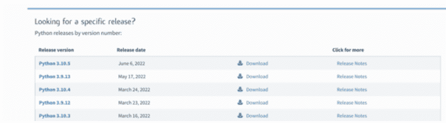

点击最新版本（例如，Python 3.10.5），这应该会打开一个新窗口，列出适用于你操作系统的版本。本书使用Python 3.10。

请记住，在一个Python版本中编译的代码可能在另一个版本中无法工作，因为Python在不断发展，一个版本中存在的特性在下一个版本中可能可用也可能不可用。

向下滚动到名为“文件”的部分。

## 文件

| 版本 | 操作系统 | 描述 | MD5校验和 | 文件大小 | GPG |
| :--- | :--- | :--- | :--- | :--- | :--- |
| Gzipped source tarball | 源代码发布 | | d87193c077541e22ff892f1353fac76c | 25628472 | SIG |
| XZ compressed source tarball | 源代码发布 | | f05727cb348f9aa93cd57eb561c16747b | 19361320 | SIG |
| macOS 64-bit universal installer | macOS | 适用于macOS 10.9及更高版本 | cd62e4c5a91477ae446689711c53aa72 | 40430804 | SIG |
| Windows embeddable package (32-bit) | Windows | | 86be4156e8a5d5c9addded8aab2bc83d1 | 7596969 | SIG |
| Windows embeddable package (64-bit) | Windows | | d97e3c0c7a19db2c5019f5534bcb0b19 | 8558134 | SIG |
| Windows help file | Windows | | 43c924ac87daed65acd85596eed1e33 | 9319556 | SIG |
| Windows installer (32-bit) | Windows | | eb59401a8da40051ec3b429897ae1203 | 27478768 | SIG |
| Windows installer (64-bit) | Windows | 推荐 | 9a99ae597902b70b1273e88cc8d41abd | 28637720 | SIG |

根据你的操作系统，点击相关链接下载安装程序。

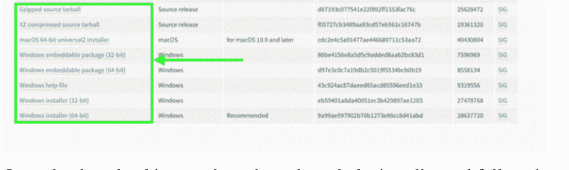

下载完成后，请启动安装程序并按照下图所示的说明操作。

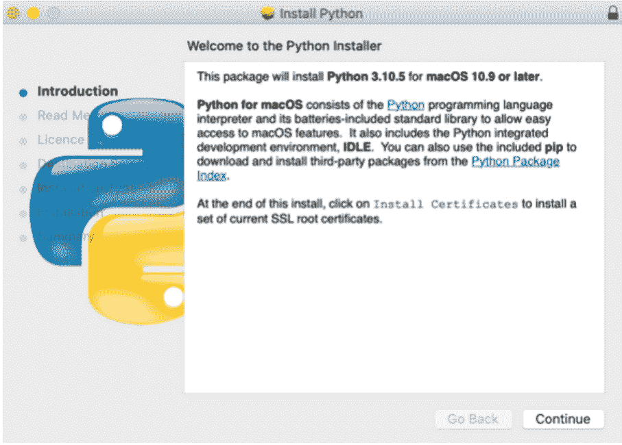

安装完成后，你可以通过以下操作检查Python是否已安装：

打开命令提示符（如果你使用的是Mac，则打开终端）。
输入文本 `python -v`，然后按回车键。
系统随后应打印出当前版本。

请注意，可以使用不同版本的Python进行安装和编译。有关安装Python的更多信息，请参阅此处的官方页面：
https://docs.python.org/3/installing/index.html

最后，你还需要一个文本编辑器；有许多免费的文本编辑器可用，其中一些包含有趣的选项，如语法高亮、自动完成和调试。

流行的Python IDE和文本编辑器包括：IDLE（安装Python后提供的默认IDE）、PyCharm、Visual Studio或Sublime Text 3。

虽然你可以安装和使用你选择的IDE，但目前从一个简单的IDE开始可能更好。因此，在本书中，我们将使用Sublime Text，这是一个简单而高效的IDE，你将能够用它来创建你的第一个Python脚本。
请执行以下操作：

打开以下页面：[https://www.sublimetext.com/3](https://www.sublimetext.com/3)
这应该会根据你的操作系统（例如，Mac OS或Windows）为你提供一个安装程序。
下载安装程序并启动安装。
安装完成后，你可以启动Sublime Text。

## 你的第一个脚本

在本节中，我们将创建你的第一个Python脚本：
首先，让我们创建一个名为 `number` 的整数类型变量作为成员变量。

如果Sublime Text尚未打开，请打开它。
选择“文件” | “新建”
这将创建一个新文件。
保存此文件：选择“文件” | “保存”，为脚本选择一个你选择的位置，并将其保存为 `my_first_script.py`。
这将创建一个空白文件。
然后在文件开头输入以下代码。

```python
number = 12
```

此代码声明了名为 `number` 的变量，并将其值设置为12。此变量在任何函数之外声明，因此可以从脚本中的任何位置访问。
然后在上一条语句之后输入以下代码（如果你愿意，可以将Patrick替换为你自己的名字）：

```python
my_name = "Patrick"
```

输入此行时，请确保变量名拼写正确且大小写正确（即小写字母）。

如果你碰巧复制/粘贴此代码，请确保你使用的是直双引号，否则可能会出错。

然后在上一条语句之后输入以下代码，以在命令提示符中显示消息。

```python
print ("Hello " + my_name + " , your number is "+ str(number))
```

代码编译并执行后，这应该会在命令提示符中打印消息“Hello Patrick, your number is 12”。你可能会注意到“Hello”一词周围的引号，这意味着将显示文本Hello，我们将变量 `my_name` 的值添加到其中。因此，这两个字符串将被连接（即组合）形成一个动态句子（即内容会变化的句子），其内容将取决于变量 `my_name` 和 `number` 的值。你可能还注意到我们使用了代码 `str(number)`，这是为了将数字转换为字符串，以便它可以与句子的其余部分连接。

因此，在此阶段，你的代码应如下所示（如果不像这样，你可以使用下一个代码片段作为模板）：

```python
number = 12
my_name = "Patrick"
print ("Hello " + my_name + " , your number is "+ str(number))
```

在此阶段，我们可以保存我们的脚本。

我们现在需要编译这个脚本：

请打开命令提示符（如果你使用的是Mac电脑，则打开终端）。
输入命令 `python`，后跟一个空格。

```bash
python
```

找到你刚刚创建的文件，并将其拖放到命令提示符窗口上。

```bash
python /Users/patrick/my_first_script.py
```

这应该会将此文件的完整路径添加到你输入的命令之后。
你现在可以按回车键。

这应该会编译并运行脚本，并且以下消息应显示在命令提示符中：
Hello Patrick , your number is 12
就是这样！我们使用一些整数和字符串类型的变量创建了我们的第一个脚本。完整的脚本应如下一个代码片段所述。

```python
number = 12
my_name = "Patrick"
print ("Hello " + my_name + " , your number is "+ str(number))
```

## 创建你的第一个函数

那么什么是函数？函数通常用于执行游戏主体之外的任务。我通常将函数比作朋友或同事，你温和地请求他们为你执行一项任务。在许多情况下，你会打电话给他们，他们会同意执行任务。有时他们需要额外的信息来执行任务（例如，一个号码以便能够代表你打电话给某人）；其他时候，他们会回电给你提供他们找到的信息，但在其他情况下，这可能没有必要，他们会在执行任务后不联系你。

因此，本质上存在三种类型的函数：

-   只执行操作而没有参数的函数。
-   带参数执行操作的函数。
-   执行操作（带或不带参数）并返回结果的函数。

## 声明函数

在Python中，函数声明通常包括传递给该函数的参数。你也可以指定参数的类型以及函数返回的数据类型，但这是可选的。

声明方法的语法如下：

-   关键字 `def`。
-   函数的名称。
-   左圆括号。
-   参数的类型及其名称。
-   右圆括号。
-   冒号。

此函数执行的任何操作（即语句）都将添加在函数定义之后，并缩进显示。

在接下来的章节中，我们将看到如何声明函数的示例。

## 不返回或接受任何参数的函数

在这种情况下，函数在调用时不带任何参数；它将执行一个操作。这是最简单的函数形式。语法序列如下：关键字后跟函数名称，然后是开闭圆括号，最后是冒号。此函数执行的任何操作（即语句）都将添加在冒号所在行之后并缩进，如下一个代码片段所示。

```
def my_first_function():
    print("Hello World")
```

你在函数内（即代码块内）使用的缩进（即空格数）可以自行决定；但是，在函数（或代码块）内必须保持一致。使用四个空格是常见做法。

调用时，此函数会将消息“Hello World”打印到命令提示符。

在此阶段，我们只是定义了函数；换句话说，我们指定了函数在被调用时应该做什么。因此，一旦定义了函数，我们就可以使用语法 `name_of_the_function()` 来调用它。例如，要调用 `my_first_function`，我们可以在脚本末尾编写以下语句：

```
my_first_function()
```

为了使此消息在命令提示符中突出显示，我们可以注释掉脚本中所有其他的打印语句，使脚本代码如下所示（更改部分以粗体突出显示）：

```
number = 12
my_name = "Patrick"
#print ("Hello " + my_name + " , your number is "+ str(number))
def my_first_function():
    print("Hello World")
my_first_function()
```

请注意，函数需要在调用之前声明。因此，函数在脚本中的位置（即在末尾还是开头）确实很重要。

现在你已经编写了第一个函数，请执行以下操作：

- 检查你的代码是否正确编写（即无错误）。
- 保存你的代码。
- 使用命令提示符编译并执行你的代码。

```
python /Users/patrick/my_first_script.py
```

你应该在命令提示符中看到以下消息：

```
Hello World
```

## 定义接受参数的函数

到目前为止，我们研究了不接受或返回任何参数的函数。现在，我们将创建一个仍然不返回任何数据，但接受一个或多个参数来执行计算的函数。
因此，借用前面的例子，你给某人打电话，提供一些信息，并要求他们根据你的指示执行一个操作。
为了说明这个概念，让我们创建一个新方法，它将根据作为参数传递的参数显示一条消息。

请在第一个函数之后输入以下代码。

```
def my_second_function(name):
    print("Hello, your name is " + name)
```

在前面的代码中，我们创建了一个名为 `my_second_function` 的函数。它接受一个名为 `name` 的参数。因此，当我们调用此函数并在括号内包含一个变量时，此变量将在此方法内被称为 `name`。
让我用以下代码来说明。

```
my_second_function("Patrick")
```

如果我们在脚本末尾输入前面的代码，函数 `my_second_function` 将使用字符串“Patrick”设置函数中使用的变量，然后显示消息“Hello, your name is Patrick”。变量 `name` 是函数的局部变量。
如果你还没有这样做，请在脚本末尾添加以下代码。你可以将单词 Patrick 替换为你自己的名字。

```
my_second_function("Patrick")
```

保存并编译你的代码。
你应该在命令提示符中看到消息“Hello, your name is Patrick”以及其他消息。
你现在可以更改对此方法的调用，并将你自己的名字作为参数传递，然后在运行场景时查看结果。

请注意，我们本可以创建一个接受许多其他参数的函数。例如，我们可以创建一个接受名字和姓氏作为参数的函数，如下所示。

```
def my_third_function(f_name, l_name):
    print("Hello, your name is "+f_name+ " " + l_name)
```

## 定义接受参数并返回信息的方法

到目前为止，我们知道如何声明一个接受参数的函数；但是，我们还没有看到如何定义一个也返回信息的函数。
这种类型的函数除了可能接受参数并处理这些信息外，还会将信息返回到调用它的位置。
在下面的示例中，我们将创建一个执行所有三项操作的函数：它将被调用；然后它将接受出生年份作为参数，然后计算并返回相应的年龄（基于当前年份）。

请在脚本末尾添加以下代码：

```
def calculate_age(YOB):
    age = 2021 - YOB
    return (age)
```

在前面的代码中：

- 声明了名为 `calculate_age` 的函数。
- 名为 `calculate_age` 的函数接受一个名为 `YOB`（出生年份的缩写）的参数。
- 然后函数 `calculate_age` 从当前年份中减去 `YOB` 并返回结果。

请在脚本末尾添加以下代码。

```
my_age = calculate_age(1998)
print ("Your age is " + str(my_age))
```

在前面的代码中：

- 函数 `calculate_age` 被调用一次；它返回计算出的年龄，该值被返回并保存在名为 `my_age` 的变量中。然后，变量 `my_age` 被打印到命令提示符中。

现在你已经编写了新函数的代码，请执行以下操作：

- 保存你的代码。
- 编译并运行代码。

命令提示符应显示消息“Your age is 23”以及其他内容。

如你所见，你可以根据需要创建不同类型的函数。它们可能接受也可能不接受参数，可能返回也可能不返回值。
请注意，我们可以通过修改函数的定义来指定函数要返回的数据类型，如下所示（新代码以粗体显示）：

```
def calculate_age(YOB) -> int:
    age = 2021 - YOB
    return (age)
```

我们可以指定传递给函数的参数的类型：

```
def calculate_age(YOB: int) -> int:
    age = 2021 - YOB
    return (age)
```

我们还可以为参数 `YOB` 指定一个默认值，如下所示（新代码以粗体显示）：

```
def calculate_age(YOB: int = 2000) -> int:
    age = 2021 - YOB
    return (age)
```

## 创建你自己的类

最后，看看如何创建和使用你自己的类将非常棒，我们将简单地创建并使用一个虚拟自行车的类。

请在文件末尾添加以下代码：

```
class Bike:
```

在前面的代码中，我们声明了类的名称。

现在我们将为我们的类定义一个构造函数，以及成员变量，以定义每个新创建的自行车的特征。

请在类中，在前面的代码之后添加以下代码（新代码以粗体显示）：

```
class Bike:
    def __init__(self, new_name:str = "A New Bike", new_color:str = "Blue", new_speed:int = 0):
        self.name = new_name
        self.color = new_color
        self.speed = new_speed
```

在前面的代码中，我们创建了一个接受三个参数的构造函数，这些参数用于初始化类的成员变量 `name`、`color` 和 `speed`。

还为这些参数定义了默认值（即“A New Bike”、“Blue”和 0）。

接下来，我们将为该类定义几个成员方法，因此请将以下方法添加到类中：

```
def display_name(self):
    print("Name: "+self.name)
def display_color(self):
    print("Color is: " + self.color)
def accelerate(self):
    self.speed += 1
    print("New speed: "+str(self.speed))
```

在前面的代码中，我们定义了三个名为 `display_name`、`display_color` 和 `accelerate` 的函数。
- 第一个函数显示自行车的名称。
- 第二个函数显示自行车的颜色。
- 第三个函数将自行车的速度增加一并显示它。

我们现在可以添加一些代码来实例化我们刚刚定义的类：

请在文件末尾添加以下代码：

```
my_bike = Bike()
my_bike.display_color()
my_bike.display_name()
my_bike.accelerate()
```

在前面的代码中：

- 我们声明了一个名为 `my_bike` 的变量，它是 `Bike` 类的一个实例。

你可能注意到我们使用了构造函数而没有传递任何参数，因此，这辆自行车的成员变量将使用默认值：蓝色、速度为0以及名称“New Bike”。然后我们调用成员函数并测试我们的代码。

我们现在可以测试代码了：请保存并编译你的代码，你应该会在命令行中看到以下信息：

- 颜色是：蓝色
- 名称：A New Bike
- 新速度：1

既然我们知道代码可以工作，我们可以添加更多代码来测试构造函数。

将此代码添加到脚本的末尾。

```
my_bike2:Bike = Bike("My Bike","Red",10)
my_bike2.display_color()
my_bike2.display_name()
my_bike2.accelerate()
```

在前面的代码中：

- 我们创建了一个新的Bike类实例。
- 这次我们向构造函数传递了参数，这样我们新自行车的成员变量颜色和速度就分别是“红色”和10。
- 然后我们显示变量color和name的值。
- 最后，我们调用accelerate方法，将速度增加1。

我们现在可以测试代码了：请保存并编译你的代码，你应该会在命令行中看到以下信息：

- 颜色是：红色
- 名称：My Bike
- 新速度：11

## 使用模块

本章我们将涵盖的最后一个主题是模块；模块是存储和重用Python程序代码的一种非常便捷的方式。

假设你有一个游戏的主程序，其中包含你将在游戏中使用的几个类；然而，为了清晰起见，你更愿意将游戏的核心写在主脚本中，同时将类定义放在其他地方。在这种情况下，模块将非常方便。

让我们用一个例子来说明。

请创建一个新文件，并将其保存为my_modules.py，与你之前创建的名为main.py的脚本放在同一文件夹中。完成后，请将以下代码添加到脚本中：

```
class Wallet:
    def __init__(self):
        self.amount = 100
        self.currency = "Euro"
    def add_money(self, new_amount:int):
        self.amount += new_amount
    def display(self):
        print("Amount in Wallet: "
              + str (self.amount)
              + " "
              + str(self.currency))
```

在前面的代码中：

- 我们定义了一个名为Wallet的类。
- 构造函数初始化了成员变量amount和currency。
- 我们还定义了两个名为add_money和display的成员方法，它们分别向钱包添加资金并显示其内容。

完成后，我们可以使用我们定义的模块以及其中定义的类：

- 请保存文件my_modules.py。
- 切换到文件main.py。
- 将此代码添加到脚本的开头。

```
import my_modules
```

将此代码添加到脚本的末尾：

```
wallet = my_modules.Wallet()
wallet.display()
```

在前面的代码中，我们创建了一个名为my_modules的模块中定义的Wallet类的新实例，然后我们从该类的实例调用display方法。

## 最佳实践

为了确保你的代码易于理解，并且在尝试修改时不会产生无数的麻烦，有一些好的实践你可以在开始编码时就开始应用；这些实践应该能为你节省一些时间。

### 缩进

确保你正确且一致地缩进代码，特别是在类、方法、循环和条件语句等结构和内容块中。
当定义一个具有多个参数的函数时，你可以将该行分解为多行，如下所示。

```
def __init__(
    self,
    new_name:str="A New Bike",
    new_color:str="Blue",
    new_speed:int=0):
```

### 最大行长度

通常，最好将行的长度保持在大约79个字符左右，尽可能做到这一点。

### 换行

如前所述，将单行分解为多行是一个好习惯。对于使用运算符的公式，通常最好在运算符之前换行，如以下代码片段所示。

```
my_result = (data1_from_the_db
+ data2_from_the_db
+ data3_from_the_db
+ data4_from_the_db
+ data5_from_the_db)
```

### 变量命名

使用有意义的名称，特别是当你离开代码两周后仍然能理解的名称。

```
my_name:String = “Patrick” #好
b = “Patrick” #不太好
```

一致地使用帕斯卡命名法和蛇形命名法。

```
test_if_the_name_is_correct #好
testifthenameiscorrect #不太好
```

### 方法

- 检查所有左括号是否有对应的右括号。
- 当代码是函数或指令块的一部分时，缩进你的代码。
- 尽可能多地注释你的代码，以解释其工作原理。

## 章节总结

### 总结

在本章中，我们熟悉了不同的编程概念。我们还研究了类、构造函数和成员变量。最后，我们创建了第一个类，并尝试创建类的实例并显示其属性。在下一章中，我们将利用这些技能用Python创建我们的第一个游戏。

## 测验

现在是测试你知识的时候了。请判断以下陈述是正确还是错误。答案在下一页。

- 每个类都有一个默认构造函数。
- 一个构造函数可以包含多个参数。
- 成员变量可以从类中的任何地方访问。
- 当创建一个对象的新实例时，会调用相应的构造函数。
- Python文件可以从命令行编译和运行。
- 可以使用简单的文本编辑器来创建和编辑Python脚本。
- 关键字class使得定义类名成为可能。
- 在蛇形命名法中，组成变量名的每个单词的首字母都大写，除了第一个单词。
- 在帕斯卡命名法中，组成变量名的每个单词的首字母都大写。
- 函数使用关键字def声明。

## 测验答案

- 正确。
- 正确。
- 正确。
- 正确。
- 正确。
- 正确。
- 正确。
- 错误。
- 正确。
- 正确。

### 检查清单

检查清单

# 第三章：创建一个猜数字游戏

在本节中，我们将探索如何使用脚本为游戏添加交互功能，创建一个简单的猜数字游戏，并提供对游戏机制的更多控制。

在这个游戏中，用户需要猜测一个随机数字；每次输入答案后，系统会提供一个提示，说明输入的数字是大于还是小于待猜数字。系统会记录尝试次数，并在用户最终找到正确数字时显示祝贺信息。

完成本章后，你将能够：

- 使用循环
- 生成随机数
- 等待并处理用户的按键输入
- 使用条件语句检查用户的答案
- 使用一个简单的计分系统

## 本章所需资源

要完成本书中介绍的活动，你需要从配套网站下载启动包；它包含完成项目所需的免费资源。要下载这些资源，请执行以下操作：

1.  打开页面
2.  点击你的书《从零到精通》
3.  在新页面上，请点击写着“点击此处下载你的资源”的链接

## 《从零到精通》Python游戏系列

本系列将读者从对Python和Pygame一无所知，引导至对Python和游戏编程都达到良好熟练程度。本系列书籍的结构设计，旨在让读者遵循一条经过验证的路径，最终达到游戏编程精通。完成每本书后，你将逐步构建对Python游戏开发和编程的知识与熟练度。

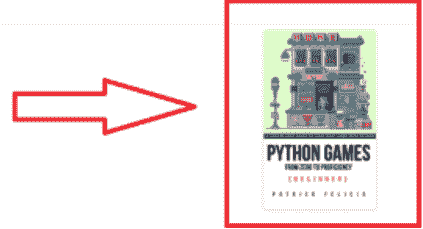

## 创建一个简单的猜数字脚本

让我们开始我们的游戏：

请切换到你的文本编辑器（例如，IDLE）。
创建一个新文件（文件 | 新建），并将其保存为 `guess_numbers.py`（文件 | 保存）。
请在脚本中输入以下代码：

```python
import random
number_to_guess = 0
nb_attempts = 1
min_value = 0
max_value = 100
```

在前面的代码中：

- 我们导入了一个名为 `random` 的库，这是一个可以用来生成随机数的随机库。
- 然后我们声明并初始化了四个变量：`number_to_guess`、`nb_attempts`、`min_value` 和 `max_value`。因为这些变量是在任何函数之外声明的，所以它们是全局变量，意味着可以在该脚本中的任何地方访问。
- `number_to_guess` 将用于存储待猜数字的值。
- `nb_attempts` 将用于跟踪用户的尝试次数（此信息将在游戏结束时显示）。
- `min_value` 和 `max_value` 将用于定义随机数的范围；这将由用户定义。

因此，在这个阶段，我们已经定义了游戏的关键变量；我们现在需要做的是定义一个函数来初始化游戏（例如，定义随机数的范围以及待猜数字），以及一个用于请求、存储和评估用户连续答案的函数。

请将以下代码添加到脚本中（在脚本末尾）：

```python
def init_game():
    global number_to_guess
    global min_value
    global max_value
    global nb_attempts
```

在前面的代码中：

- 我们声明了一个名为 `init_game` 的函数，该函数将用于初始化游戏。
- 我们使用关键字 `global` 来指定我们声明的变量指的是前面定义的全局变量；换句话说，在函数内对这些变量的任何更改都将反映到全局变量中。或者换句话说，在函数内使用这些变量与使用全局变量是相同的。

请将以下代码添加到脚本中：

```python
    min_value = input("Please enter the minimum value: ")
    max_value = input("Please enter the maximum value: ")
    min_value = int(min_value)
    max_value = int(max_value)
```

在前面的代码中：

- 我们要求用户输入随机变量的下限范围，并将此值存储在变量 `min_value` 中。在此阶段，用户输入的值是一个字符串。
- 我们要求用户输入随机变量的上限范围，并将此值存储在变量 `max_value` 中。在此阶段，用户输入的值是一个字符串。
- 然后我们将变量 `min_value` 和 `max_value` 都转换为整数格式。

最后，我们可以通过向函数添加以下代码来定义待猜数字：

```python
    number_to_guess = random.randint(min_value, max_value)
    nb_attempts = 0
```

在前面的代码中，我们根据用户定义的上下边界生成一个随机数，并将尝试次数设置为 0。

在此阶段，完整的 `init_game` 函数应如下所示：

```python
def init_game():
    global number_to_guess
    global min_value
    global max_value
    global nb_attempts
    min_value = input("Please enter the minimum value: ")
    max_value = input("Please enter the maximum value: ")
    min_value = int(min_value)
    max_value = int(max_value)
    number_to_guess = random.randint(min_value, max_value)
    nb_attempts = 0
```

因此，在这个阶段，我们已经完成了 `init_game` 函数，该函数基本上定义了待猜数字。

下一个阶段是创建一个函数来请求和存储用户的答案；该函数将执行以下操作：

- 向用户请求一个新的数字。
- 保存这个数字。
- 增加尝试次数。
- 显示一条消息，说明输入的数字是小于还是大于待猜数字。
- 如果找到了数字，则会显示一条获胜消息，并且游戏将使用新的待猜数字重新开始。

那么，话不多说，让我们来编写这个函数：
请在脚本末尾添加以下代码：

```python
def ask_for_new_number():
    global number_to_guess
    global nb_attempts
    global min_value
    global max_value
```

在前面的代码中，我们定义了名为 `ask_for_new_number` 的函数，然后像在前面的函数中一样定义（或引用）全局变量。
请将以下代码添加到函数中：

```python
    new_number = input("Please enter your number ["
        + str(min_value)
        + "-"
        + str(max_value)
        + "]: ")
    new_number = int(new_number)
```

```python
    nb_attempts += 1
```

在前面的代码中：

- 我们要求用户输入一个在前面定义的边界范围内的数字。
- 我们将用户输入转换为整数。
- 然后我们增加尝试次数。

因此，在这个阶段，用户已经输入了一个数字，我们需要评估（并提供反馈）这个数字是小于还是大于待猜数字。

请将以下代码添加到函数中：

```python
    if (number_to_guess > new_number):
        print("> My Number is greater than " + str(new_number))
    elif (number_to_guess < new_number):
        print("> My Number is lesser than " + str(new_number))
```

在前面的代码中：

- 我们检查用户输入的数字是小于还是大于待猜数字。
- 如果待猜数字大于用户输入的数字，我们显示消息（“我的数字大于 ..”）。
- 如果待猜数字小于用户输入的数字，我们显示消息（“我的数字小于 ..”）。

显示相应消息后，我们只需要检查用户是否找到了待猜数字。

请将以下代码添加到函数中：

```python
    else:
        print("\n *** Well done; you have guessed my number; it took "
            + str(nb_attempts)
            + " attempts")
        print("\n\n *** New Game***")
        init_game()
        game_loop()
```

在前面的代码中：

- 我们处于数字既不小于也不大于待猜数字的情况，即它等于待猜数字。
- 在这种情况下，我们显示一条包含尝试次数的祝贺消息。
- 然后我们显示消息。
- 我们初始化游戏，以便可以生成新的待猜随机数。
- 最后，我们调用一个名为 `game_loop` 的函数，我们还需要定义它；该函数基本上将不断循环，要求用户输入新条目，直到找到待猜数字。

因此，请在函数 `ask_for_new_number` 之前添加以下代码：

```python
def game_loop():
    while (True):
        ask_for_new_number()
```

在前面的代码中：

- 我们声明并定义了一个名为 `game_loop` 的函数。
- 在函数内部，我们声明了一个将无限循环的循环（条件始终为 `True`）。
- 在这个循环内部，我们调用函数 `ask_for_new_number`。

就是这样。

你可以保存并编译你的代码。
当你这样做时，将显示以下提示：

请输入最小值：1
请输入最大值：10
请输入你的数字 [1-10]：5
> 我的数字大于5
请输入你的数字 [1-10]：6

如果你猜对了数字，将会显示以下信息：

*** 干得好；你猜对了我的数字；你用了3次尝试

*** 新游戏***

## 章节总结

在本章中，我们学习了如何使用Python创建脚本。我们对函数、变量及其属性也更加熟悉了。我们成功地创建并使用了脚本来检测用户输入，并且结合了函数、循环和条件语句。所以，是的，我们取得了相当大的进步，到目前为止，我们已经了解了多种编程结构以及在编码过程中可能遇到的常见错误。

### 检查清单

检查清单 检查清单 检查清单 检查清单 检查清单 检查清单 检查清单 检查清单 检查清单 检查清单 检查清单 检查清单 检查清单 检查清单 检查清单 检查清单 检查清单 检查清单 检查清单 检查清单 检查清单 检查清单 检查清单 检查清单 检查清单 检查清单 检查清单 检查清单 检查清单 检查清单 检查清单 检查清单 检查清单 检查清单 检查清单 检查清单 检查清单 检查清单 检查清单 检查清单 检查清单 检查清单 检查清单 检查清单 检查清单 检查清单 检查清单 检查清单 检查清单 检查清单 检查清单 检查清单 检查清单 检查清单 检查清单 检查清单 检查清单 检查清单 检查清单 检查清单 检查清单 检查清单 检查清单 检查清单 检查清单 检查清单 检查清单 检查清单 检查清单 检查清单 检查清单 检查清单 检查清单 检查清单 检查清单 检查清单 检查清单 检查清单 检查清单 检查清单 检查清单 检查清单 检查清单 检查清单 检查清单 检查清单 检查清单 检查清单 检查清单 检查清单 检查清单 检查清单 检查清单 检查清单 检查清单 检查清单 检查清单 检查清单 检查清单 检查清单 检查清单 检查清单 检查清单 检查清单 检查清单 检查清单 检查清单 检查清单 检查清单 检查清单 检查清单 检查清单 检查清单 检查清单 检查清单 检查清单 检查清单 检查清单 检查清单 检查清单 检查清单 检查清单 检查清单 检查清单 检查清单 检查清单 检查清单 检查清单 检查清单 检查清单 检查清单 检查清单 检查清单 检查清单 检查清单 检查清单 检查清单 检查清单 检查清单 检查清单 检查清单 检查清单 检查清单 检查清单 检查清单 检查清单 检查清单 检查清单 检查清单 检查清单 检查清单 检查清单 检查清单 检查清单 检查清单 检查清单 检查清单 检查清单 检查清单 检查清单 检查清单 检查清单 检查清单 检查清单 检查清单 检查清单 检查清单 检查清单 检查清单 检查清单 检查清单 检查清单 检查清单 检查清单 检查清单 检查清单 检查清单 检查清单 检查清单 检查清单 检查清单 检查清单 检查清单 检查清单 检查清单 检查清单 检查清单 检查清单 检查清单 检查清单 检查清单 检查清单 检查清单 检查清单 检查清单 检查清单 检查清单 检查清单 检查清单 检查清单 检查清单 检查清单 检查清单 检查清单 检查清单 检查清单 检查清单 检查清单 检查清单 检查清单 检查清单 检查清单 检查清单 检查清单 检查清单 检查清单 检查清单 检查清单 检查清单 检查清单 检查清单 检查清单 检查清单 检查清单 检查清单 检查清单 检查清单 检查清单 检查清单 检查清单 检查清单 检查清单 检查清单 检查清单 检查清单 检查清单 检查清单 检查清单 检查清单 检查清单 检查清单 检查清单 检查清单 检查清单 检查清单 检查清单 检查清单 检查清单 检查清单 检查清单 检查清单 检查清单 检查清单 检查清单 检查清单 检查清单 检查清单 检查清单 检查清单 检查清单 检查清单 检查清单 检查清单 检查清单 检查清单 检查清单 检查清单 检查清单 检查清单 检查清单 检查清单 检查清单 检查清单 检查清单 检查清单 检查清单 检查清单 检查清单 检查清单 检查清单 检查清单 检查清单 检查清单 检查清单 检查清单 检查清单 检查清单 检查清单 检查清单 检查清单 检查清单 检查清单 检查清单 检查清单 检查清单 检查清单 检查清单 检查清单 检查清单 检查清单 检查清单 检查清单 检查清单 检查清单 检查清单 检查清单 检查清单 检查清单 检查清单 检查清单 检查清单 检查清单 检查清单 检查清单 检查清单 检查清单 检查清单 检查清单 检查清单 检查清单 检查清单 检查清单 检查清单 检查清单 检查清单 检查清单 检查清单 检查清单 检查清单 检查清单 检查清单 检查清单 检查清单 检查清单 检查清单 检查清单 检查清单 检查清单 检查清单 检查清单 检查清单 检查清单 检查清单 检查清单 检查清单 检查清单 检查清单 检查清单 检查清单 检查清单 检查清单 检查清单 检查清单 检查清单 检查清单 检查清单 检查清单 检查清单 检查清单 检查清单 检查清单 检查清单 检查清单 检查清单 检查清单 检查清单 检查清单 检查清单 检查清单 检查清单 检查清单 检查清单 检查清单 检查清单 检查清单 检查清单 检查清单 检查清单 检查清单 检查清单 检查清单 检查清单 检查清单 检查清单 检查清单 检查清单 检查清单 检查清单 检查清单 检查清单 检查清单 检查清单 检查清单 检查清单 检查清单 检查清单 检查清单 检查清单 检查清单 检查清单 检查清单 检查清单 检查清单 检查清单 检查清单 检查清单 检查清单 检查清单 检查清单 检查清单 检查清单 检查清单 检查清单 检查清单 检查清单 检查清单 检查清单 检查清单 检查清单 检查清单 检查清单 检查清单 检查清单 检查清单 检查清单 检查清单 检查清单 检查清单 检查清单 检查清单 检查清单 检查清单 检查清单 检查清单 检查清单 检查清单 检查清单 检查清单 检查清单 检查清单 检查清单 检查清单 检查清单 检查清单 检查清单 检查清单 检查清单 检查清单 检查清单 检查清单 检查清单 检查清单 检查清单 检查清单 检查清单 检查清单 检查清单 检查清单 检查清单 检查清单 检查清单 检查清单 检查清单 检查清单 检查清单 检查清单 检查清单 检查清单 检查清单 检查清单 检查清单 检查清单 检查清单 检查清单 检查清单 检查清单 检查清单 检查清单 检查清单 检查清单 检查清单 检查清单 检查清单 检查清单 检查清单 检查清单 检查清单 检查清单 检查清单 检查清单 检查清单 检查清单 检查清单 检查清单 检查清单 检查清单 检查清单 检查清单 检查清单 检查清单 检查清单 检查清单 检查清单 检查清单 检查清单 检查清单 检查清单 检查清单 检查清单 检查清单 检查清单 检查清单 检查清单 检查清单 检查清单 检查清单 检查清单 检查清单 检查清单 检查清单 检查清单 检查清单 检查清单 检查清单 检查清单 检查清单 检查清单 检查清单 检查清单 检查清单 检查清单 检查清单 检查清单 检查清单 检查清单 检查清单 检查清单 检查清单 检查清单 检查清单 检查清单 检查清单 检查清单 检查清单 检查清单 检查清单 检查清单 检查清单 检查清单 检查清单 检查清单 检查清单 检查清单 检查清单 检查清单 检查清单 检查清单 检查清单 检查清单 检查清单 检查清单 检查清单 检查清单 检查清单 检查清单 检查清单 检查清单 检查清单 检查清单 检查清单 检查清单 检查清单 检查清单 检查清单 检查清单 检查清单 检查清单 检查清单 检查清单 检查清单 检查清单 检查清单 检查清单 检查清单 检查清单 检查清单 检查清单 检查清单 检查清单 检查清单 检查清单 检查清单 检查清单 检查清单 检查清单 检查清单 检查清单 检查清单 检查清单 检查清单 检查清单 检查清单 检查清单 检查清单 检查清单 检查清单 检查清单 检查清单 检查清单 检查清单 检查清单 检查清单 检查清单 检查清单 检查清单 检查清单 检查清单 检查清单 检查清单 检查清单 检查清单 检查清单 检查清单 检查清单 检查清单 检查清单 检查清单 检查清单 检查清单 检查清单 检查清单 检查清单 检查清单 检查清单 检查清单 检查清单 检查清单 检查清单 检查清单 检查清单 检查清单 检查清单 检查清单 检查清单 检查清单 检查清单 检查清单 检查清单 检查清单 检查清单 检查清单 检查清单 检查清单 检查清单 检查清单 检查清单 检查清单 检查清单 检查清单 检查清单 检查清单 检查清单 检查清单 检查清单 检查清单 检查清单 检查清单 检查清单 检查清单 检查清单 检查清单 检查清单 检查清单 检查清单 检查清单 检查清单 检查清单 检查清单 检查清单 检查清单 检查清单 检查清单 检查清单 检查清单 检查清单 检查清单 检查清单 检查清单 检查清单 检查清单 检查清单 检查清单 检查清单 检查清单 检查清单 检查清单 检查清单 检查清单 检查清单 检查清单 检查清单 检查清单 检查清单 检查清单 检查清单 检查清单 检查清单 检查清单 检查清单 检查清单 检查清单 检查清单 检查清单 检查清单 检查清单 检查清单 检查清单 检查清单 检查清单 检查清单 检查清单 检查清单 检查清单 检查清单 检查清单 检查清单 检查清单 检查清单 检查清单 检查清单 检查清单 检查清单 检查清单 检查清单 检查清单 检查清单 检查清单 检查清单 检查清单 检查清单 检查清单 检查清单 检查清单 检查清单 检查清单 检查清单 检查清单 检查清单 检查清单 检查清单 检查清单 检查清单 检查清单 检查清单 检查清单 检查清单 检查清单 检查清单 检查清单 检查清单 检查清单 检查清单 检查清单 检查清单 检查清单 检查清单 检查清单 检查清单 检查清单 检查清单 检查清单 检查清单 检查清单 检查清单 检查清单 检查清单 检查清单 检查清单 检查清单 检查清单 检查清单 检查清单 检查清单 检查清单 检查清单 检查清单 检查清单 检查清单 检查清单 检查清单 检查清单 检查清单 检查清单 检查清单 检查清单 检查清单 检查清单 检查清单 检查清单 检查清单 检查清单 检查清单 检查清单 检查清单 检查清单 检查清单 检查清单 检查清单 检查清单 检查清单 检查清单 检查清单 检查清单 检查清单 检查清单 检查清单 检查清单 检查清单 检查清单 检查清单 检查清单 检查清单 检查清单 检查清单 检查清单 检查清单 检查清单 检查清单 检查清单 检查清单 检查清单 检查清单 检查清单 检查清单 检查清单 检查清单 检查清单 检查清单 检查清单 检查清单 检查清单 检查清单 检查清单 检查清单 检查清单 检查清单 检查清单 检查清单 检查清单 检查清单 检查清单 检查清单 检查清单 检查清单 检查清单 检查清单 检查清单 检查清单 检查清单 检查清单 检查清单 检查清单 检查清单 检查清单 检查清单 检查清单 检查清单 检查清单 检查清单 检查清单 检查清单 检查清单 检查清单 检查清单 检查清单 检查清单 检查清单 检查清单 检查清单 检查清单 检查清单 检查清单 检查清单 检查清单 检查清单 检查清单 检查清单 检查清单 检查清单 检查清单 检查清单 检查清单 检查清单 检查清单 检查清单 检查清单 检查清单 检查清单 检查清单 检查清单 检查清单 检查清单 检查清单 检查清单 检查清单 检查清单 检查清单 检查清单 检查清单 检查清单 检查清单 检查清单 检查清单 检查清单 检查清单 检查清单 检查清单 检查清单 检查清单 检查清单 检查清单 检查清单 检查清单 检查清单 检查清单 检查清单 检查清单 检查清单 检查清单 检查清单 检查清单 检查清单 检查清单 检查清单 检查清单 检查清单 检查清单 检查清单 检查清单 检查清单 检查清单 检查清单 检查清单 检查清单 检查清单 检查清单 检查清单 检查清单 检查清单 检查清单 检查清单 检查清单 检查清单 检查清单 检查清单 检查清单 检查清单 检查清单 检查清单 检查清单 检查清单 检查清单 检查清单 检查清单 检查清单 检查清单 检查清单 检查清单 检查清单 检查清单 检查清单 检查清单 检查清单 检查清单 检查清单 检查清单 检查清单 检查清单 检查清单 检查清单 检查清单 检查清单 检查清单 检查清单 检查清单 检查清单 检查清单 检查清单 检查清单 检查清单 检查清单 检查清单 检查清单 检查清单 检查清单 检查清单 检查清单 检查清单 检查清单 检查清单 检查清单 检查清单 检查清单 检查清单 检查清单 检查清单 检查清单 检查清单 检查清单 检查清单 检查清单 检查清单 检查清单 检查清单 检查清单 检查清单 检查清单 检查清单 检查清单 检查清单 检查清单 检查清单 检查清单 检查清单 检查清单 检查清单 检查清单 检查清单 检查清单 检查清单 检查清单 检查清单 检查清单 检查清单 检查清单 检查清单 检查清单 检查清单 检查清单 检查清单 检查清单 检查清单 检查清单 检查清单 检查清单 检查清单 检查清单 检查清单 检查清单 检查清单 检查清单 检查清单 检查清单 检查清单 检查清单 检查清单 检查清单 检查清单 检查清单 检查清单 检查清单 检查清单 检查清单 检查清单 检查清单 检查清单 检查清单 检查清单 检查清单 检查清单 检查清单 检查清单 检查清单 检查清单 检查清单 检查清单 检查清单 检查清单 检查清单 检查清单 检查清单 检查清单 检查清单 检查清单 检查清单 检查清单 检查清单 检查清单 检查清单 检查清单 检查清单 检查清单 检查清单 检查清单 检查清单 检查清单 检查清单 检查清单 检查清单 检查清单 检查清单 检查清单 检查清单 检查清单 检查清单 检查清单 检查清单 检查清单 检查清单 检查清单 检查清单 检查清单 检查清单 检查清单 检查清单 检查清单 检查清单 检查清单 检查清单 检查清单 检查清单 检查清单 检查清单 检查清单 检查清单 检查清单 检查清单 检查清单 检查清单 检查清单 检查清单 检查清单 检查清单 检查清单 检查清单 检查清单 检查清单 检查清单 检查清单 检查清单 检查清单 检查清单 检查清单 检查清单 检查清单 检查清单 检查清单 检查清单 检查清单 检查清单 检查清单 检查清单 检查清单 检查清单 检查清单 检查清单 检查清单 检查清单 检查清单 检查清单 检查清单 检查清单 检查清单 检查清单 检查清单 检查清单 检查清单 检查清单 检查清单 检查清单 检查清单 检查清单 检查清单 检查清单 检查清单 检查清单 检查清单 检查清单 检查清单 检查清单 检查清单 检查清单 检查清单 检查清单 检查清单 检查清单 检查清单 检查清单 检查清单 检查清单 检查清单 检查清单 检查清单 检查清单 检查清单 检查清单 检查清单 检查清单 检查清单 检查清单 检查清单 检查清单 检查清单 检查清单 检查清单 检查清单 检查清单 检查清单 检查清单 检查清单 检查清单 检查清单 检查清单 检查清单 检查清单 检查清单 检查清单 检查清单 检查清单 检查清单 检查清单 检查清单 检查清单 检查清单 检查清单 检查清单 检查清单 检查清单 检查清单 检查清单 检查清单 检查清单 检查清单 检查清单 检查清单 检查清单 检查清单 检查清单 检查清单 检查清单 检查清单 检查清单 检查清单 检查清单 检查清单 检查清单 检查清单 检查清单 检查清单 检查清单 检查清单 检查清单 检查清单 检查清单 检查清单 检查清单 检查清单 检查清单 检查清单 检查清单 检查清单 检查清单 检查清单 检查清单 检查清单 检查清单 检查清单 检查清单 检查清单 检查清单 检查清单 检查清单 检查清单 检查清单 检查清单 检查清单 检查清单 检查清单 检查清单 检查清单 检查清单 检查清单 检查清单 检查清单 检查清单 检查清单 检查清单 检查清单 检查清单 检查清单 检查清单 检查清单 检查清单 检查清单 检查清单 检查清单 检查清单 检查清单 检查清单 检查清单 检查清单 检查清单 检查清单 检查清单 检查清单 检查清单 检查清单 检查清单 检查清单 检查清单 检查清单 检查清单 检查清单 检查清单 检查清单 检查清单 检查清单 检查清单 检查清单 检查清单 检查清单 检查清单 检查清单 检查清单 检查清单 检查清单 检查清单 检查清单 检查清单 检查清单 检查清单 检查清单 检查清单 检查清单 检查清单 检查清单 检查清单 检查清单 检查清单 检查清单 检查清单 检查清单 检查清单 检查清单 检查清单 检查清单 检查清单 检查清单 检查清单 检查清单 检查清单 检查清单 检查清单 检查清单 检查清单 检查清单 检查清单 检查清单 检查清单 检查清单 检查清单 检查清单 检查清单 检查清单 检查清单 检查清单 检查清单 检查清单 检查清单 检查清单 检查清单 检查清单 检查清单 检查清单 检查清单 检查清单 检查清单 检查清单 检查清单 检查清单 检查清单 检查清单 检查清单 检查清单 检查清单 检查清单 检查清单 检查清单 检查清单 检查清单 检查清单 检查清单 检查清单 检查清单 检查清单 检查清单 检查清单 检查清单 检查清单 检查清单 检查清单 检查清单 检查清单 检查清单 检查清单 检查清单 检查清单 检查清单 检查清单 检查清单 检查清单 检查清单 检查清单 检查清单 检查清单 检查清单 检查清单 检查清单 检查清单 检查清单 检查清单 检查清单 检查清单 检查清单 检查清单 检查清单 检查清单 检查清单 检查清单 检查清单 检查清单 检查清单 检查清单 检查清单 检查清单 检查清单 检查清单 检查清单 检查清单 检查清单 检查清单 检查清单 检查清单 检查清单 检查清单 检查清单 检查清单 检查清单 检查清单 检查清单 检查清单 检查清单 检查清单 检查清单 检查清单 检查清单 检查清单 检查清单 检查清单 检查清单 检查清单 检查清单 检查清单 检查清单 检查清单 检查清单 检查清单 检查清单 检查清单 检查清单 检查清单 检查清单 检查清单 检查清单 检查清单 检查清单 检查清单 检查清单 检查清单 检查清单 检查清单 检查清单 检查清单 检查清单 检查清单 检查清单 检查清单 检查清单 检查清单 检查清单 检查清单 检查清单 检查清单 检查清单 检查清单 检查清单 检查清单 检查清单 检查清单 检查清单 检查清单 检查清单 检查清单 检查清单 检查清单 检查清单 检查清单 检查清单 检查清单 检查清单 检查清单 检查清单 检查清单 检查清单 检查清单 检查清单 检查清单 检查清单 检查清单 检查清单 检查清单 检查清单 检查清单 检查清单 检查清单 检查清单 检查清单 检查清单 检查清单 检查清单 检查清单 检查清单 检查清单 检查清单 检查清单 检查清单 检查清单 检查清单 检查清单 检查清单 检查清单 检查清单 检查清单 检查清单 检查清单 检查清单 检查清单 检查清单 检查清单 检查清单 检查清单 检查清单 检查清单 检查清单 检查清单 检查清单 检查清单 检查清单 检查清单 检查清单 检查清单 检查清单 检查清单 检查清单 检查清单 检查清单 检查清单 检查清单 检查清单 检查清单 检查清单 检查清单 检查清单 检查清单 检查清单 检查清单 检查清单 检查清单 检查清单 检查清单 检查清单 检查清单 检查清单 检查清单 检查清单 检查清单 检查清单 检查清单 检查清单 检查清单 检查清单 检查清单 检查清单 检查清单 检查清单 检查清单 检查清单 检查清单 检查清单 检查清单 检查清单 检查清单 检查清单 检查清单 检查清单 检查清单 检查清单 检查清单 检查清单 检查清单 检查清单 检查清单 检查清单 检查清单 检查清单 检查清单 检查清单 检查清单 检查清单 检查清单 检查清单 检查清单 检查清单 检查清单 检查清单 检查清单 检查清单 检查清单 检查清单 检查清单 检查清单 检查清单 检查清单 检查清单 检查清单 检查清单 检查清单 检查清单 检查清单 检查清单 检查清单 检查清单 检查清单 检查清单 检查清单 检查清单 检查清单 检查清单 检查清单 检查清单 检查清单 检查清单 检查清单 检查清单 检查清单 检查清单 检查清单 检查清单 检查清单 检查清单 检查清单 检查清单 检查清单 检查清单 检查清单 检查清单 检查清单 检查清单 检查清单 检查清单 检查清单 检查清单 检查清单 检查清单 检查清单 检查清单 检查清单 检查清单 检查清单 检查清单 检查清单 检查清单 检查清单 检查清单 检查清单 检查清单 检查清单 检查清单 检查清单 检查清单 检查清单 检查清单 检查清单 检查清单 检查清单 检查清单 检查清单 检查清单 检查清单 检查清单 检查清单 检查清单 检查清单 检查清单 检查清单 检查清单 检查清单 检查清单 检查清单 检查清单 检查清单 检查清单 检查清单 检查清单 检查清单 检查清单 检查清单 检查清单 检查清单 检查清单 检查清单 检查清单 检查清单 检查清单 检查清单 检查清单 检查清单 检查清单 检查清单 检查清单 检查清单 检查清单 检查清单 检查清单 检查清单 检查清单 检查清单 检查清单 检查清单 检查清单 检查清单 检查清单 检查清单 检查清单 检查清单 检查清单 检查清单 检查清单 检查清单 检查清单 检查清单 检查清单 检查清单 检查清单 检查清单 检查清单 检查清单 检查清单 检查清单 检查清单 检查清单 检查清单 检查清单 检查清单 检查清单 检查清单 检查清单 检查清单 检查清单 检查清单 检查清单 检查清单 检查清单 检查清单 检查清单 检查清单 检查清单 检查清单 检查清单 检查清单 检查清单 检查清单 检查清单 检查清单 检查清单 检查清单 检查清单 检查清单 检查清单 检查清单 检查清单 检查清单 检查清单 检查清单 检查清单 检查清单 检查清单 检查清单 检查清单 检查清单 检查清单 检查清单 检查清单 检查清单 检查清单 检查清单 检查清单 检查清单 检查清单 检查清单 检查清单 检查清单 检查清单 检查清单 检查清单 检查清单 检查清单 检查清单 检查清单 检查清单 检查清单 检查清单 检查清单 检查清单 检查清单 检查清单 检查清单 检查清单 检查清单 检查清单 检查清单 检查清单 检查清单 检查清单 检查清单 检查清单 检查清单 检查清单 检查清单 检查清单 检查清单 检查清单 检查清单 检查清单 检查清单 检查清单 检查清单 检查清单 检查清单 检查清单 检查清单 检查清单 检查清单 检查清单 检查清单 检查清单 检查清单 检查清单 检查清单 检查清单 检查清单 检查清单 检查清单 检查清单 检查清单 检查清单 检查清单 检查清单 检查清单 检查清单 检查清单 检查清单 检查清单 检查清单 检查清单 检查清单 检查清单 检查清单 检查清单 检查清单 检查清单 检查清单 检查清单 检查清单 检查清单 检查清单 检查清单 检查清单 检查清单 检查清单 检查清单 检查清单 检查清单 检查清单 检查清单 检查清单 检查清单 检查清单 检查清单 检查清单 检查清单 检查清单 检查清单 检查清单 检查清单 检查清单 检查清单 检查清单 检查清单 检查清单 检查清单 检查清单 检查清单 检查清单 检查清单 检查清单 检查清单 检查清单 检查清单 检查清单 检查清单 检查清单 检查清单 检查清单 检查清单 检查清单 检查清单 检查清单 检查清单 检查清单 检查清单 检查清单 检查清单 检查清单 检查清单 检查清单 检查清单 检查清单 检查清单 检查清单 检查清单 检查清单 检查清单 检查清单 检查清单 检查清单 检查清单 检查清单 检查清单 检查清单 检查清单 检查清单 检查清单 检查清单 检查清单 检查清单 检查清单 检查清单 检查清单 检查清单 检查清单 检查清单 检查清单 检查清单 检查清单 检查清单 检查清单 检查清单 检查清单 检查清单 检查清单 检查清单 检查清单 检查清单 检查清单 检查清单 检查清单 检查清单 检查清单 检查清单 检查清单 检查清单 检查清单 检查清单 检查清单 检查清单 检查清单 检查清单 检查清单 检查清单 检查清单 检查清单 检查清单 检查清单 检查清单 检查清单 检查清单 检查清单 检查清单 检查清单 检查清单 检查清单 检查清单 检查清单 检查清单 检查清单 检查清单 检查清单 检查清单 检查清单 检查清单 检查清单 检查清单 检查清单 检查清单 检查清单 检查清单 检查清单 检查清单 检查清单 检查清单 检查清单 检查清单 检查清单 检查清单 检查清单 检查清单 检查清单 检查清单 检查清单 检查清单 检查清单 检查清单 检查清单 检查清单 检查清单 检查清单 检查清单 检查清单 检查清单 检查清单 检查清单 检查清单 检查清单 检查清单 检查清单 检查清单 检查清单 检查清单 检查清单 检查清单 检查清单 检查清单 检查清单 检查清单 检查清单 检查清单 检查清单 检查清单 检查清单 检查清单 检查清单 检查清单 检查清单 检查清单 检查清单 检查清单 检查清单 检查清单 检查清单 检查清单 检查清单 检查清单 检查清单 检查清单 检查清单 检查清单 检查清单 检查清单 检查清单 检查清单 检查清单 检查清单 检查清单 检查清单 检查清单 检查清单 检查清单 检查清单 检查清单 检查清单 检查清单 检查清单 检查清单 检查清单 检查清单 检查清单 检查清单 检查清单 检查清单 检查清单 检查清单 检查清单 检查清单 检查清单 检查清单 检查清单 检查清单 检查清单 检查清单 检查清单 检查清单 检查清单 检查清单 检查清单 检查清单 检查清单 检查清单 检查清单 检查清单 检查清单 检查清单 检查清单 检查清单 检查清单 检查清单 检查清单 检查清单 检查清单 检查清单 检查清单 检查清单 检查清单 检查清单 检查清单 检查清单 检查清单 检查清单 检查清单 检查清单 检查清单 检查清单 检查清单 检查清单 检查清单 检查清单 检查清单 检查清单 检查清单 检查清单 检查清单 检查清单 检查清单 检查清单 检查清单 检查清单 检查清单 检查清单 检查清单 检查清单 检查清单 检查清单 检查清单 检查清单 检查清单 检查清单 检查清单 检查清单 检查清单 检查清单 检查清单 检查清单 检查清单 检查清单 检查清单 检查清单 检查清单 检查清单 检查清单 检查清单 检查清单 检查清单 检查清单 检查清单 检查清单 检查清单 检查清单 检查清单 检查清单 检查清单 检查清单 检查清单 检查清单 检查清单 检查清单 检查清单 检查清单 检查清单 检查清单 检查清单 检查清单 检查清单 检查清单 检查清单 检查清单 检查清单 检查清单 检查清单 检查清单 检查清单 检查清单 检查清单 检查清单 检查清单 检查清单 检查清单 检查清单 检查清单 检查清单 检查清单 检查清单 检查清单 检查清单 检查清单 检查清单 检查清单 检查清单 检查清单 检查清单 检查清单 检查清单 检查清单 检查清单 检查清单 检查清单 检查清单 检查清单 检查清单 检查清单 检查清单 检查清单 检查清单 检查清单 检查清单 检查清单 检查清单 检查清单 检查清单 检查清单 检查清单 检查清单 检查清单 检查清单 检查清单 检查清单 检查清单 检查清单 检查清单 检查清单 检查清单 检查清单 检查清单 检查清单 检查清单 检查清单 检查清单 检查清单 检查清单 检查清单 检查清单 检查清单 检查清单 检查清单 检查清单 检查清单 检查清单 检查清单 检查清单 检查清单 检查清单 检查清单 检查清单 检查清单 检查清单 检查清单 检查清单 检查清单 检查清单 检查清单 检查清单 检查清单 检查清单 检查清单 检查清单 检查清单 检查清单 检查清单 检查清单 检查清单 检查清单 检查清单 检查清单 检查清单 检查清单 检查清单 检查清单 检查清单 检查清单 检查清单 检查清单 检查清单 检查清单 检查清单 检查清单 检查清单 检查清单 检查清单 检查清单 检查清单 检查清单 检查清单 检查清单 检查清单 检查清单 检查清单 检查清单 检查清单 检查清单 检查清单 检查清单 检查清单 检查清单 检查清单 检查清单 检查清单 检查清单 检查清单 检查清单 检查清单 检查清单 检查清单 检查清单 检查清单 检查清单 检查清单 检查清单 检查清单 检查清单 检查清单 检查清单 检查清单 检查清单 检查清单 检查清单 检查清单 检查清单 检查清单 检查清单 检查清单 检查清单 检查清单 检查清单 检查清单 检查清单 检查清单 检查清单 检查清单 检查清单 检查清单 检查清单 检查清单 检查清单 检查清单 检查清单 检查清单 检查清单 检查清单 检查清单 检查清单 检查清单 检查清单 检查清单 检查清单 检查清单 检查清单 检查清单 检查清单 检查清单 检查清单 检查清单 检查清单 检查清单 检查清单 检查清单 检查清单 检查清单 检查清单 检查清单 检查清单 检查清单 检查清单 检查清单 检查清单 检查清单 检查清单 检查清单 检查清单 检查清单 检查清单 检查清单 检查清单 检查清单 检查清单 检查清单 检查清单 检查清单 检查清单 检查清单 检查清单 检查清单 检查清单 检查清单 检查清单 检查清单 检查清单 检查清单 检查清单 检查清单 检查清单 检查清单 检查清单 检查清单 检查清单 检查清单 检查清单 检查清单 检查清单 检查清单 检查清单 检查清单 检查清单 检查清单 检查清单 检查清单 检查清单 检查清单 检查清单 检查清单 检查清单 检查清单 检查清单 检查清单 检查清单 检查清单 检查清单 检查清单 检查清单 检查清单 检查清单 检查清单 检查清单 检查清单 检查清单 检查清单 检查清单 检查清单 检查清单 检查清单 检查清单 检查清单 检查清单 检查清单 检查清单 检查清单 检查清单 检查清单 检查清单 检查清单 检查清单 检查清单 检查清单 检查清单 检查清单 检查清单 检查清单 检查清单 检查清单 检查清单 检查清单 检查清单 检查清单 检查清单 检查清单 检查清单 检查清单 检查清单 检查清单 检查清单 检查清单 检查清单 检查清单 检查清单 检查清单 检查清单 检查清单 检查清单 检查清单 检查清单 检查清单 检查清单 检查清单 检查清单 检查清单 检查清单 检查清单 检查清单 检查清单 检查清单 检查清单 检查清单 检查清单 检查清单 检查清单 检查清单 检查清单 检查清单 检查清单 检查清单 检查清单 检查清单 检查清单 检查清单 检查清单 检查清单 检查清单 检查清单 检查清单 检查清单 检查清单 检查清单 检查清单 检查清单 检查清单 检查清单 检查清单 检查清单 检查清单 检查清单 检查清单 检查清单 检查清单 检查清单 检查清单 检查清单 检查清单 检查清单 检查清单 检查清单 检查清单 检查清单 检查清单 检查清单 检查清单 检查清单 检查清单 检查清单 检查清单 检查清单 检查清单 检查清单 检查清单 检查清单 检查清单 检查清单 检查清单 检查清单 检查清单 检查清单 检查清单 检查清单 检查清单 检查清单 检查清单 检查清单 检查清单 检查清单 检查清单 检查清单 检查清单 检查清单 检查清单 检查清单 检查清单 检查清单 检查清单 检查清单 检查清单 检查清单 检查清单 检查清单 检查清单 检查清单 检查清单 检查清单 检查清单 检查清单 检查清单 检查清单 检查清单 检查清单 检查清单 检查清单 检查清单 检查清单 检查清单 检查清单 检查清单 检查清单 检查清单 检查清单 检查清单 检查清单 检查清单 检查清单 检查清单 检查清单 检查清单 检查清单 检查清单 检查清单 检查清单 检查清单 检查清单 检查清单 检查清单 检查清单 检查清单 检查清单 检查清单 检查清单 检查清单 检查清单 检查清单 检查清单 检查清单 检查清单 检查清单 检查清单 检查清单 检查清单 检查清单 检查清单 检查清单 检查清单 检查清单 检查清单 检查清单 检查清单 检查清单 检查清单 检查清单 检查清单 检查清单 检查清单 检查清单 检查清单 检查清单 检查清单 检查清单 检查清单 检查清单 检查清单 检查清单 检查清单 检查清单 检查清单 检查清单 检查清单 检查清单 检查清单 检查清单 检查清单 检查清单 检查清单 检查清单 检查清单 检查清单 检查清单 检查清单 检查清单 检查清单 检查清单 检查清单 检查清单 检查清单 检查清单 检查清单 检查清单 检查清单 检查清单 检查清单 检查清单 检查清单 检查清单 检查清单 检查清单 检查清单 检查清单 检查清单 检查清单 检查清单 检查清单 检查清单 检查清单 检查清单 检查清单 检查清单 检查清单 检查清单 检查清单 检查清单 检查清单 检查清单 检查清单 检查清单 检查清单 检查清单 检查清单 检查清单 检查清单 检查清单 检查清单 检查清单 检查清单 检查清单 检查清单 检查清单 检查清单 检查清单 检查清单 检查清单 检查清单 检查清单 检查清单 检查清单 检查清单 检查清单 检查清单 检查清单 检查清单 检查清单 检查清单 检查清单 检查清单 检查清单 检查清单 检查清单 检查清单 检查清单 检查清单 检查清单 检查清单 检查清单 检查清单 检查清单 检查清单 检查清单 检查清单 检查清单 检查清单 检查清单 检查清单 检查清单 检查清单 检查清单 检查清单 检查清单 检查清单 检查清单 检查清单 检查清单 检查清单 检查清单 检查清单 检查清单 检查清单 检查清单 检查清单 检查清单 检查清单 检查清单 检查清单 检查清单 检查清单 检查清单 检查清单 检查清单 检查清单 检查清单 检查清单 检查清单 检查清单 检查清单 检查清单 检查清单 检查清单 检查清单 检查清单 检查清单 检查清单 检查清单 检查清单 检查清单 检查清单 检查清单 检查清单 检查清单 检查清单 检查清单 检查清单 检查清单 检查清单 检查清单 检查清单 检查清单 检查清单 检查清单 检查清单 检查清单 检查清单 检查清单 检查清单 检查清单 检查清单 检查清单 检查清单 检查清单 检查清单 检查清单 检查清单 检查清单 检查清单 检查清单 检查清单 检查清单 检查清单 检查清单 检查清单 检查清单 检查清单 检查清单 检查清单 检查清单 检查清单 检查清单 检查清单 检查清单 检查清单 检查清单 检查清单 检查清单 检查清单 检查清单 检查清单 检查清单 检查清单 检查清单 检查清单 检查清单 检查清单 检查清单 检查清单 检查清单 检查清单 检查清单 检查清单 检查清单 检查清单 检查清单 检查清单 检查清单 检查清单 检查清单 检查清单 检查清单 检查清单 检查清单 检查清单 检查清单 检查清单 检查清单 检查清单 检查清单 检查清单 检查清单 检查清单 检查清单 检查清单 检查清单 检查清单 检查清单 检查清单 检查清单 检查清单 检查清单 检查清单 检查清单 检查清单 检查清单 检查清单 检查清单 检查清单 检查清单 检查清单 检查清单 检查清单 检查清单 检查清单 检查清单 检查清单 检查清单 检查清单 检查清单 检查清单 检查清单 检查清单 检查清单 检查清单 检查清单 检查清单 检查清单 检查清单 检查清单 检查清单 检查清单 检查清单 检查清单 检查清单 检查清单 检查清单 检查清单 检查清单 检查清单 检查清单 检查清单 检查清单 检查清单 检查清单 检查清单 检查清单 检查清单 检查清单 检查清单 检查清单 检查清单 检查清单 检查清单 检查清单 检查清单 检查清单 检查清单 检查清单 检查清单 检查清单 检查清单 检查清单 检查清单 检查清单 检查清单 检查清单 检查清单 检查清单 检查清单 检查清单 检查清单 检查清单 检查清单 检查清单 检查清单 检查清单 检查清单 检查清单 检查清单 检查清单 检查清单 检查清单 检查清单 检查清单 检查清单 检查清单 检查清单 检查清单 检查清单 检查清单 检查清单 检查清单 检查清单 检查清单 检查清单 检查清单 检查清单 检查清单 检查清单 检查清单 检查清单 检查清单 检查清单 检查清单 检查清单 检查清单 检查清单 检查清单 检查清单 检查清单 检查清单 检查清单 检查清单 检查清单 检查清单 检查清单 检查清单 检查清单 检查清单 检查清单 检查清单 检查清单 检查清单 检查清单 检查清单 检查清单 检查清单 检查清单 检查清单 检查清单 检查清单 检查清单 检查清单 检查清单 检查清单 检查清单 检查清单 检查清单 检查清单 检查清单 检查清单 检查清单 检查清单 检查清单 检查清单 检查清单 检查清单 检查清单 检查清单 检查清单 检查清单 检查清单 检查清单 检查清单 检查清单 检查清单 检查清单 检查清单 检查清单 检查清单 检查清单 检查清单 检查清单 检查清单 检查清单 检查清单 检查清单 检查清单 检查清单 检查清单 检查清单 检查清单 检查清单 检查清单 检查清单 检查清单 检查清单 检查清单 检查清单 检查清单 检查清单 检查清单 检查清单 检查清单 检查清单 检查清单 检查清单 检查清单 检查清单 检查清单 检查清单 检查清单 检查清单 检查清单 检查清单 检查清单 检查清单 检查清单 检查清单 检查清单 检查清单 检查清单 检查清单 检查清单 检查清单 检查清单 检查清单 检查清单 检查清单 检查清单 检查清单 检查清单 检查清单 检查清单 检查清单 检查清单 检查清单 检查清单 检查清单 检查清单 检查清单 检查清单 检查清单 检查清单 检查清单 检查清单 检查清单 检查清单 检查清单 检查清单 检查清单 检查清单 检查清单 检查清单 检查清单 检查清单 检查清单 检查清单 检查清单 检查清单 检查清单 检查清单 检查清单 检查清单 检查清单 检查清单 检查清单 检查清单 检查清单 检查清单 检查清单 检查清单 检查清单 检查清单 检查清单 检查清单 检查清单 检查清单 检查清单 检查清单 检查清单 检查清单 检查清单 检查清单 检查清单 检查清单 检查清单 检查清单 检查清单 检查清单 检查清单 检查清单 检查清单 检查清单 检查清单 检查清单 检查清单 检查清单 检查清单 检查清单 检查清单 检查清单 检查清单 检查清单 检查清单 检查清单 检查清单 检查清单 检查清单 检查清单 检查清单 检查清单 检查清单 检查清单 检查清单 检查清单 检查清单 检查清单 检查清单 检查清单 检查清单 检查清单 检查清单 检查清单 检查清单 检查清单 检查清单 检查清单 检查清单 检查清单 检查清单 检查清单 检查清单 检查清单 检查清单 检查清单 检查清单 检查清单 检查清单 检查清单 检查清单 检查清单 检查清单 检查清单 检查清单 检查清单 检查清单 检查清单 检查清单 检查清单 检查清单 检查清单 检查清单 检查清单 检查清单 检查清单 检查清单 检查清单 检查清单 检查清单 检查清单 检查清单 检查清单 检查清单 检查清单 检查清单 检查清单 检查清单 检查清单 检查清单 检查清单 检查清单 检查清单 检查清单 检查清单 检查清单 检查清单 检查清单 检查清单 检查清单 检查清单 检查清单 检查清单 检查清单 检查清单 检查清单 检查清单 检查清单 检查清单 检查清单 检查清单 检查清单 检查清单 检查清单 检查清单 检查清单 检查清单 检查清单 检查清单 检查清单 检查清单 检查清单 检查清单 检查清单 检查清单 检查清单 检查清单 检查清单 检查清单 检查清单 检查清单 检查清单 检查清单 检查清单 检查清单 检查清单 检查清单 检查清单 检查清单 检查清单 检查清单 检查清单 检查清单 检查清单 检查清单 检查清单 检查清单 检查清单 检查清单 检查清单 检查清单 检查清单 检查清单 检查清单 检查清单 检查清单 检查清单 检查清单 检查清单 检查清单 检查清单 检查清单 检查清单 检查清单 检查清单 检查清单 检查清单 检查清单 检查清单 检查清单 检查清单 检查清单 检查清单 检查清单 检查清单 检查清单 检查清单 检查清单 检查清单 检查清单 检查清单 检查清单 检查清单 检查清单 检查清单 检查清单 检查清单 检查清单 检查清单 检查清单 检查清单 检查清单 检查清单 检查清单 检查清单 检查清单 检查清单 检查清单 检查清单 检查清单 检查清单 检查清单 检查清单 检查清单 检查清单 检查清单 检查清单 检查清单 检查清单 检查清单 检查清单 检查清单 检查清单 检查清单 检查清单 检查清单 检查清单 检查清单 检查清单 检查清单 检查清单 检查清单 检查清单 检查清单 检查清单 检查清单 检查清单 检查清单 检查清单 检查清单 检查清单 检查清单 检查清单 检查清单 检查清单 检查清单 检查清单 检查清单 检查清单 检查清单 检查清单 检查清单 检查清单 检查清单 检查清单 检查清单 检查清单 检查清单 检查清单 检查清单 检查清单 检查清单 检查清单 检查清单 检查清单 检查清单 检查清单 检查清单 检查清单 检查清单 检查清单 检查清单 检查清单 检查清单 检查清单 检查清单 检查清单 检查清单 检查清单 检查清单 检查清单 检查清单 检查清单 检查清单 检查清单 检查清单 检查清单 检查清单 检查清单 检查清单 检查清单 检查清单 检查清单 检查清单 检查清单 检查清单 检查清单 检查清单 检查清单 检查清单 检查清单 检查清单 检查清单 检查清单 检查清单 检查清单 检查清单 检查清单 检查清单 检查清单 检查清单 检查清单 检查清单 检查清单 检查清单 检查清单 检查清单 检查清单 检查清单 检查清单 检查清单 检查清单 检查清单 检查清单 检查清单 检查清单 检查清单 检查清单 检查清单 检查清单 检查清单 检查清单 检查清单 检查清单 检查清单 检查清单 检查清单 检查清单 检查清单 检查清单 检查清单 检查清单 检查清单 检查清单 检查清单 检查清单 检查清单 检查清单 检查清单 检查清单 检查清单 检查清单 检查清单 检查清单 检查清单 检查清单 检查清单 检查清单 检查清单 检查清单 检查清单 检查清单 检查清单 检查清单 检查清单 检查清单 检查清单 检查清单 检查清单 检查清单 检查清单 检查清单 检查清单 检查清单 检查清单 检查清单 检查清单 检查清单 检查清单 检查清单 检查清单 检查清单 检查清单 检查清单 检查清单 检查清单 检查清单 检查清单 检查清单 检查清单 检查清单 检查清单 检查清单 检查清单 检查清单 检查清单 检查清单 检查清单 检查清单 检查清单 检查清单 检查清单 检查清单 检查清单 检查清单 检查清单 检查清单 检查清单 检查清单 检查清单 检查清单 检查清单 检查清单 检查清单 检查清单 检查清单 检查清单 检查清单 检查清单 检查清单 检查清单 检查清单 检查清单 检查清单 检查清单 检查清单 检查清单 检查清单 检查清单 检查清单 检查清单 检查清单 检查清单 检查清单 检查清单 检查清单 检查清单 检查清单 检查清单 检查清单 检查清单 检查清单 检查清单 检查清单 检查清单 检查清单 检查清单 检查清单 检查清单 检查清单 检查清单 检查清单 检查清单 检查清单 检查清单 检查清单 检查清单 检查清单 检查清单 检查清单 检查清单 检查清单 检查清单 检查清单 检查清单 检查清单 检查清单 检查清单 检查清单 检查清单 检查清单 检查清单 检查清单 检查清单 检查清单 检查清单 检查清单 检查清单 检查清单 检查清单 检查清单 检查清单 检查清单 检查清单 检查清单 检查清单 检查清单 检查清单 检查清单 检查清单 检查清单 检查清单 检查清单 检查清单 检查清单 检查清单 检查清单 检查清单 检查清单 检查清单 检查清单 检查清单 检查清单 检查清单 检查清单 检查清单 检查清单 检查清单 检查清单 检查清单 检查清单 检查清单 检查清单 检查清单 检查清单 检查清单 检查清单 检查清单 检查清单 检查清单 检查清单 检查清单 检查清单 检查清单 检查清单 检查清单 检查清单 检查清单 检查清单 检查清单 检查清单 检查清单 检查清单 检查清单 检查清单 检查清单 检查清单 检查清单 检查清单 检查清单 检查清单 检查清单 检查清单 检查清单 检查清单 检查清单 检查清单 检查清单 检查清单 检查清单 检查清单 检查清单 检查清单 检查清单 检查清单 检查清单 检查清单 检查清单 检查清单 检查清单 检查清单 检查清单 检查清单 检查清单 检查清单 检查清单 检查清单 检查清单 检查清单 检查清单 检查清单 检查清单 检查清单 检查清单 检查清单 检查清单 检查清单 检查清单 检查清单 检查清单 检查清单 检查清单 检查清单 检查清单 检查清单 检查清单 检查清单 检查清单 检查清单 检查清单 检查清单 检查清单 检查清单 检查清单 检查清单 检查清单 检查清单 检查清单 检查清单 检查清单 检查清单 检查清单 检查清单 检查清单 检查清单 检查清单 检查清单 检查清单 检查清单 检查清单 检查清单 检查清单 检查清单 检查清单 检查清单 检查清单 检查清单 检查清单 检查清单 检查清单 检查清单 检查清单 检查清单 检查清单 检查清单 检查清单 检查清单 检查清单 检查清单 检查清单 检查清单 检查清单 检查清单 检查清单 检查清单 检查清单 检查清单 检查清单 检查清单 检查清单 检查清单 检查清单 检查清单 检查清单 检查清单 检查清单 检查清单 检查清单 检查清单 检查清单 检查清单 检查清单 检查清单 检查清单 检查清单 检查清单 检查清单 检查清单 检查清单 检查清单 检查清单 检查清单 检查清单 检查清单 检查清单 检查清单 检查清单 检查清单 检查清单 检查清单 检查清单 检查清单 检查清单 检查清单 检查清单 检查清单 检查清单 检查清单 检查清单 检查清单 检查清单 检查清单 检查清单 检查清单 检查清单 检查清单 检查清单 检查清单 检查清单 检查清单 检查清单 检查清单 检查清单 检查清单 检查清单 检查清单 检查清单 检查清单 检查清单 检查清单 检查清单 检查清单 检查清单 检查清单 检查清单 检查清单 检查清单 检查清单 检查清单 检查清单 检查清单 检查清单 检查清单 检查清单 检查清单 检查清单 检查清单 检查清单 检查清单 检查清单 检查清单 检查清单 检查清单 检查清单 检查清单 检查清单 检查清单 检查清单 检查清单 检查清单 检查清单 检查清单 检查清单 检查清单 检查清单 检查清单 检查清单 检查清单 检查清单 检查清单 检查清单 检查清单 检查清单 检查清单 检查清单 检查清单 检查清单 检查清单 检查清单 检查清单 检查清单 检查清单 检查清单 检查清单 检查清单 检查清单 检查清单 检查清单 检查清单 检查清单 检查清单 检查清单 检查清单 检查清单 检查清单 检查清单 检查清单 检查清单 检查清单 检查清单 检查清单 检查清单 检查清单 检查清单 检查清单 检查清单 检查清单 检查清单 检查清单 检查清单 检查清单 检查清单 检查清单 检查清单 检查清单 检查清单 检查清单 检查清单 检查清单 检查清单 检查清单 检查清单 检查清单 检查清单 检查清单 检查清单 检查清单 检查清单 检查清单 检查清单 检查清单 检查清单 检查清单 检查清单 检查清单 检查清单 检查清单 检查清单 检查清单 检查清单 检查清单 检查清单 检查清单 检查清单 检查清单 检查清单 检查清单 检查清单 检查清单 检查清单 检查清单 检查清单 检查清单 检查清单 检查清单 检查清单 检查清单 检查清单 检查清单 检查清单 检查清单 检查清单 检查清单 检查清单 检查清单 检查清单 检查清单 检查清单 检查清单 检查清单 检查清单 检查清单 检查清单 检查清单 检查清单 检查清单 检查清单 检查清单 检查清单 检查清单 检查清单 检查清单 检查清单 检查清单 检查清单 检查清单 检查清单 检查清单 检查清单 检查清单 检查清单 检查清单 检查清单 检查清单 检查清单 检查清单 检查清单 检查清单 检查清单 检查清单 检查清单 检查清单 检查清单 检查清单 检查清单 检查清单 检查清单 检查清单 检查清单 检查清单 检查清单 检查清单 检查清单 检查清单 检查清单 检查清单 检查清单 检查清单 检查清单 检查清单 检查清单 检查清单 检查清单 检查清单 检查清单 检查清单 检查清单 检查清单 检查清单 检查清单 检查清单 检查清单 检查清单 检查清单 检查清单 检查清单 检查清单 检查清单 检查清单 检查清单 检查清单 检查清单 检查清单 检查清单 检查清单 检查清单 检查清单 检查清单 检查清单 检查清单 检查清单 检查清单 检查清单 检查清单 检查清单 检查清单 检查清单 检查清单 检查清单 检查清单 检查清单 检查清单 检查清单 检查清单 检查清单 检查清单 检查清单 检查清单 检查清单 检查清单 检查清单 检查清单 检查清单 检查清单 检查清单 检查清单 检查清单 检查清单 检查清单 检查清单 检查清单 检查清单 检查清单 检查清单 检查清单 检查清单 检查清单 检查清单 检查清单 检查清单 检查清单 检查清单 检查清单 检查清单 检查清单 检查清单 检查清单 检查清单 检查清单 检查清单 检查清单 检查清单 检查清单 检查清单 检查清单 检查清单 检查清单 检查清单 检查清单 检查清单 检查清单 检查清单 检查清单 检查清单 检查清单 检查清单 检查清单 检查清单 检查清单 检查清单 检查清单 检查清单 检查清单 检查清单 检查清单 检查清单 检查清单 检查清单 检查清单 检查清单 检查清单 检查清单 检查清单 检查清单 检查清单 检查清单 检查清单 检查清单 检查清单 检查清单 检查清单 检查清单 检查清单 检查清单 检查清单 检查清单 检查清单 检查清单 检查清单 检查清单 检查清单 检查清单 检查清单 检查清单 检查清单 检查清单 检查清单 检查清单 检查清单 检查清单 检查清单 检查清单 检查清单 检查清单 检查清单 检查清单 检查清单 检查清单 检查清单 检查清单 检查清单 检查清单 检查清单 检查清单 检查清单 检查清单 检查清单 检查清单 检查清单 检查清单 检查清单 检查清单 检查清单 检查清单 检查清单 检查清单 检查清单 检查清单 检查清单 检查清单 检查清单 检查清单 检查清单 检查清单 检查清单 检查清单 检查清单 检查清单 检查清单 检查清单 检查清单 检查清单 检查清单 检查清单 检查清单 检查清单 检查清单 检查清单 检查清单 检查清单 检查清单 检查清单 检查清单 检查清单 检查清单 检查清单 检查清单 检查清单 检查清单 检查清单 检查清单 检查清单 检查清单 检查清单 检查清单 检查清单 检查清单 检查清单 检查清单 检查清单 检查清单 检查清单 检查清单 检查清单 检查清单 检查清单 检查清单 检查清单 检查清单 检查清单 检查清单 检查清单 检查清单 检查清单 检查清单 检查清单 检查清单 检查清单 检查清单 检查清单 检查清单 检查清单 检查清单 检查清单 检查清单 检查清单 检查清单 检查清单 检查清单 检查清单 检查清单 检查清单 检查清单 检查清单 检查清单 检查清单 检查清单 检查清单 检查清单 检查清单 检查清单 检查清单 检查清单 检查清单 检查清单 检查清单 检查清单 检查清单 检查清单 检查清单 检查清单 检查清单 检查清单 检查清单 检查清单 检查清单 检查清单 检查清单 检查清单 检查清单 检查清单 检查清单 检查清单 检查清单 检查清单 检查清单 检查清单 检查清单 检查清单 检查清单 检查清单 检查清单 检查清单 检查清单 检查清单 检查清单 检查清单 检查清单 检查清单 检查清单 检查清单 检查清单 检查清单 检查清单 检查清单 检查清单 检查清单 检查清单 检查清单 检查清单 检查清单 检查清单 检查清单 检查清单 检查清单 检查清单 检查清单 检查清单 检查清单 检查清单 检查清单 检查清单 检查清单 检查清单 检查清单 检查清单 检查清单 检查清单 检查清单 检查清单 检查清单 检查清单 检查清单 检查清单 检查清单 检查清单 检查清单 检查清单 检查清单 检查清单 检查清单 检查清单 检查清单 检查清单 检查清单 检查清单 检查清单 检查清单 检查清单 检查清单 检查清单 检查清单 检查清单 检查清单 检查清单 检查清单 检查清单 检查清单 检查清单 检查清单 检查清单 检查清单 检查清单 检查清单 检查清单 检查清单 检查清单 检查清单 检查清单 检查清单 检查清单 检查清单 检查清单 检查清单 检查清单 检查清单 检查清单 检查清单 检查清单 检查清单 检查清单 检查清单 检查清单 检查清单 检查清单 检查清单 检查清单 检查清单 检查清单 检查清单 检查清单 检查清单 检查清单 检查清单 检查清单 检查清单 检查清单 检查清单 检查清单 检查清单 检查清单 检查清单 检查清单 检查清单 检查清单 检查清单 检查清单 检查清单 检查清单 检查清单 检查清单 检查清单 检查清单 检查清单 检查清单 检查清单 检查清单 检查清单 检查清单 检查清单 检查清单 检查清单 检查清单 检查清单 检查清单 检查清单 检查清单 检查清单 检查清单 检查清单 检查清单 检查清单 检查清单 检查清单 检查清单 检查清单 检查清单 检查清单 检查清单 检查清单 检查清单 检查清单 检查清单 检查清单 检查清单 检查清单 检查清单 检查清单 检查清单 检查清单 检查清单 检查清单 检查清单 检查清单 检查清单 检查清单 检查清单 检查清单 检查清单 检查清单 检查清单 检查清单 检查清单 检查清单 检查清单 检查清单 检查清单 检查清单 检查清单 检查清单 检查清单 检查清单 检查清单 检查清单 检查清单 检查清单 检查清单 检查清单 检查清单 检查清单 检查清单 检查清单 检查清单 检查清单 检查清单 检查清单 检查清单 检查清单 检查清单 检查清单 检查清单 检查清单 检查清单 检查清单 检查清单 检查清单 检查清单 检查清单 检查清单 检查清单 检查清单 检查清单 检查清单 检查清单 检查清单 检查清单 检查清单 检查清单 检查清单 检查清单 检查清单 检查清单 检查清单 检查清单 检查清单 检查清单 检查清单 检查清单 检查清单 检查清单 检查清单 检查清单 检查清单 检查清单 检查清单 检查清单 检查清单 检查清单 检查清单 检查清单 检查清单 检查清单 检查清单 检查清单 检查清单 检查清单 检查清单 检查清单 检查清单 检查清单 检查清单 检查清单 检查清单 检查清单 检查清单 检查清单 检查清单 检查清单 检查清单 检查清单 检查清单 检查清单 检查清单 检查清单 检查清单 检查清单 检查清单 检查清单 检查清单 检查清单 检查清单 检查清单 检查清单 检查清单 检查清单 检查清单 检查清单 检查清单 检查清单 检查清单 检查清单 检查清单 检查清单 检查清单 检查清单 检查清单 检查清单 检查清单 检查清单 检查清单 检查清单 检查清单 检查清单 检查清单 检查清单 检查清单 检查清单 检查清单 检查清单 检查清单 检查清单 检查清单 检查清单 检查清单 检查清单 检查清单 检查清单 检查清单 检查清单 检查清单 检查清单 检查清单 检查清单 检查清单 检查清单 检查清单 检查清单 检查清单 检查清单 检查清单 检查清单 检查清单 检查清单 检查清单 检查清单 检查清单 检查清单 检查清单 检查清单 检查清单 检查清单 检查清单 检查清单 检查清单 检查清单 检查清单 检查清单 检查清单 检查清单 检查清单 检查清单 检查清单 检查清单 检查清单 检查清单 检查清单 检查清单 检查清单 检查清单 检查清单 检查清单 检查清单 检查清单 检查清单 检查清单 检查清单 检查清单 检查清单 检查清单 检查清单 检查清单 检查清单 检查清单 检查清单 检查清单 检查清单 检查清单 检查清单 检查清单 检查清单 检查清单 检查清单 检查清单 检查清单 检查清单 检查清单 检查清单 检查清单 检查清单 检查清单 检查清单 检查清单 检查清单 检查清单 检查清单 检查清单 检查清单 检查清单 检查清单 检查清单 检查清单 检查清单 检查清单 检查清单 检查清单 检查清单 检查清单 检查清单 检查清单 检查清单 检查清单 检查清单 检查清单 检查清单 检查清单 检查清单 检查清单 检查清单 检查清单 检查清单 检查清单 检查清单 检查清单 检查清单 检查清单 检查清单 检查清单 检查清单 检查清单 检查清单 检查清单 检查清单 检查清单 检查清单 检查清单 检查清单 检查清单 检查清单 检查清单 检查清单 检查清单 检查清单 检查清单 检查清单 检查清单 检查清单 检查清单 检查清单 检查清单 检查清单 检查清单 检查清单 检查清单 检查清单 检查清单 检查清单 检查清单 检查清单 检查清单 检查清单 检查清单 检查清单 检查清单 检查清单 检查清单 检查清单 检查清单 检查清单 检查清单 检查清单 检查清单 检查清单 检查清单 检查清单 检查清单 检查清单 检查清单 检查清单 检查清单 检查清单 检查清单 检查清单 检查清单 检查清单 检查清单 检查清单 检查清单 检查清单 检查清单 检查清单 检查清单 检查清单 检查清单 检查清单 检查清单 检查清单 检查清单 检查清单 检查清单 检查清单 检查清单 检查清单 检查清单 检查清单 检查清单 检查清单 检查清单 检查清单 检查清单 检查清单 检查清单 检查清单 检查清单 检查清单 检查清单 检查清单 检查清单 检查清单 检查清单 检查清单 检查清单 检查清单 检查清单 检查清单 检查清单 检查清单 检查清单 检查清单 检查清单 检查清单 检查清单 检查清单 检查清单 检查清单 检查清单 检查清单 检查清单 检查清单 检查清单 检查清单 检查清单 检查清单 检查清单 检查清单 检查清单 检查清单 检查清单 检查清单 检查清单 检查清单 检查清单 检查清单 检查清单 检查清单 检查清单 检查清单 检查清单 检查清单 检查清单 检查清单 检查清单 检查清单 检查清单 检查清单 检查清单 检查清单 检查清单 检查清单 检查清单 检查清单 检查清单 检查清单 检查清单 检查清单 检查清单 检查清单 检查清单 检查清单 检查清单 检查清单 检查清单 检查清单 检查清单 检查清单 检查清单 检查清单 检查清单 检查清单 检查清单 检查清单 检查清单 检查清单 检查清单 检查清单 检查清单 检查清单 检查清单 检查清单 检查清单 检查清单 检查清单 检查清单 检查清单 检查清单 检查清单 检查清单 检查清单 检查清单 检查清单 检查清单 检查清单 检查清单 检查清单 检查清单 检查清单 检查清单 检查清单 检查清单 检查清单 检查清单 检查清单 检查清单 检查清单 检查清单 检查清单 检查清单 检查清单 检查清单 检查清单 检查清单 检查清单 检查清单 检查清单 检查清单 检查清单 检查清单 检查清单 检查清单 检查清单 检查清单 检查清单 检查清单 检查清单 检查清单 检查清单 检查清单 检查清单 检查清单 检查清单 检查清单 检查清单 检查清单 检查清单 检查清单 检查清单 检查清单 检查清单 检查清单 检查清单 检查清单 检查清单 检查清单 检查清单 检查清单 检查清单 检查清单 检查清单 检查清单 检查清单 检查清单 检查清单 检查清单 检查清单 检查清单 检查清单 检查清单 检查清单 检查清单 检查清单 检查清单 检查清单 检查清单 检查清单 检查清单 检查清单 检查清单 检查清单 检查清单 检查清单 检查清单 检查清单 检查清单 检查清单 检查清单 检查清单 检查清单 检查清单 检查清单 检查清单 检查清单 检查清单 检查清单 检查清单 检查清单 检查清单 检查清单 检查清单 检查清单 检查清单 检查清单 检查清单 检查清单 检查清单 检查清单 检查清单 检查清单 检查清单 检查清单 检查清单 检查清单 检查清单 检查清单 检查清单 检查清单 检查清单 检查清单 检查清单 检查清单 检查清单 检查清单 检查清单 检查清单 检查清单 检查清单 检查清单 检查清单 检查清单 检查清单 检查清单 检查清单 检查清单 检查清单 检查清单 检查清单 检查清单 检查清单 检查清单 检查清单 检查清单 检查清单 检查清单 检查清单 检查清单 检查清单 检查清单 检查清单 检查清单 检查清单 检查清单 检查清单 检查清单 检查清单 检查清单 检查清单 检查清单 检查清单 检查清单 检查清单 检查清单 检查清单 检查清单 检查清单 检查清单 检查清单 检查清单 检查清单 检查清单 检查清单 检查清单 检查清单 检查清单 检查清单 检查清单 检查清单 检查清单 检查清单 检查清单 检查清单 检查清单 检查清单 检查清单 检查清单 检查清单 检查清单 检查清单 检查清单 检查清单 检查清单 检查清单 检查清单 检查清单 检查清单 检查清单 检查清单 检查清单 检查清单 检查清单 检查清单 检查清单 检查清单 检查清单 检查清单 检查清单 检查清单 检查清单 检查清单 检查清单 检查清单 检查清单 检查清单 检查清单 检查清单 检查清单 检查清单 检查清单 检查清单 检查清单 检查清单 检查清单 检查清单 检查清单 检查清单 检查清单 检查清单 检查清单 检查清单 检查清单 检查清单 检查清单 检查清单 检查清单 检查清单 检查清单 检查清单 检查清单 检查清单 检查清单 检查清单 检查清单 检查清单 检查清单 检查清单 检查清单 检查清单 检查清单 检查清单 检查清单 检查清单 检查清单 检查清单 检查清单 检查清单 检查清单 检查清单 检查清单 检查清单 检查清单 检查清单 检查清单 检查清单 检查清单 检查清单 检查清单 检查清单 检查清单 检查清单 检查清单 检查清单 检查清单 检查清单 检查清单 检查清单 检查清单 检查清单 检查清单 检查清单 检查清单 检查清单 检查清单 检查清单 检查清单 检查清单 检查清单 检查清单 检查清单 检查清单 检查清单 检查清单 检查清单 检查清单 检查清单 检查清单 检查清单 检查清单 检查清单 检查清单 检查清单 检查清单 检查清单 检查清单 检查清单 检查清单 检查清单 检查清单 检查清单 检查清单 检查清单 检查清单 检查清单 检查清单 检查清单 检查清单 检查清单 检查清单 检查清单 检查清单 检查清单 检查清单 检查清单 检查清单 检查清单 检查清单 检查清单 检查清单 检查清单 检查清单 检查清单 检查清单 检查清单 检查清单 检查清单 检查清单 检查清单 检查清单 检查清单 检查清单 检查清单 检查清单 检查清单 检查清单 检查清单 检查清单 检查清单 检查清单 检查清单 检查清单 检查清单 检查清单 检查清单 检查清单 检查清单 检查清单 检查清单 检查清单 检查清单 检查清单 检查清单 检查清单 检查清单 检查清单 检查清单 检查清单 检查清单 检查清单 检查清单 检查清单 检查清单 检查清单 检查清单 检查清单 检查清单 检查清单 检查清单 检查清单 检查清单 检查清单 检查清单 检查清单 检查清单 检查清单 检查清单 检查清单 检查清单 检查清单 检查清单 检查清单 检查清单 检查清单 检查清单 检查清单 检查清单 检查清单 检查清单 检查清单 检查清单 检查清单 检查清单 检查清单 检查清单 检查清单 检查清单 检查清单 检查清单 检查清单 检查清单 检查清单 检查清单 检查清单 检查清单 检查清单 检查清单 检查清单 检查清单 检查清单 检查清单 检查清单 检查清单 检查清单 检查清单 检查清单 检查清单 检查清单 检查清单 检查清单 检查清单 检查清单 检查清单 检查清单 检查清单 检查清单 检查清单 检查清单 检查清单 检查清单 检查清单 检查清单 检查清单 检查清单 检查清单 检查清单 检查清单 检查清单 检查清单 检查清单 检查清单 检查清单 检查清单 检查清单 检查清单 检查清单 检查清单 检查清单 检查清单 检查清单 检查清单 检查清单 检查清单 检查清单 检查清单 检查清单 检查清单 检查清单 检查清单 检查清单 检查清单 检查清单 检查清单 检查清单 检查清单 检查清单 检查清单 检查清单 检查清单 检查清单 检查清单 检查清单 检查清单 检查清单 检查清单 检查清单 检查清单 检查清单 检查清单 检查清单 检查清单 检查清单 检查清单 检查清单 检查清单 检查清单 检查清单 检查清单 检查清单 检查清单 检查清单 检查清单 检查清单 检查清单 检查清单 检查清单 检查清单 检查清单 检查清单 检查清单 检查清单 检查清单 检查清单 检查清单 检查清单 检查清单 检查清单 检查清单 检查清单 检查清单 检查清单 检查清单 检查清单 检查清单 检查清单 检查清单 检查清单 检查清单 检查清单 检查清单 检查清单 检查清单 检查清单 检查清单 检查清单 检查清单 检查清单 检查清单 检查清单 检查清单 检查清单 检查清单 检查清单 检查清单 检查清单 检查清单 检查清单 检查清单 检查清单 检查清单 检查清单 检查清单 检查清单 检查清单 检查清单 检查清单 检查清单 检查清单 检查清单 检查清单 检查清单 检查清单 检查清单 检查清单 检查清单 检查清单 检查清单 检查清单 检查清单 检查清单 检查清单 检查清单 检查清单 检查清单 检查清单 检查清单 检查清单 检查清单 检查清单 检查清单 检查清单 检查清单 检查清单 检查清单 检查清单 检查清单 检查清单 检查清单 检查清单 检查清单 检查清单 检查清单 检查清单 检查清单 检查清单 检查清单 检查清单 检查清单 检查清单 检查清单 检查清单 检查清单 检查清单 检查清单 检查清单 检查清单 检查清单 检查清单 检查清单 检查清单 检查清单 检查清单 检查清单 检查清单 检查清单 检查清单 检查清单 检查清单 检查清单 检查清单 检查清单 检查清单 检查清单 检查清单 检查清单 检查清单 检查清单 检查清单 检查清单 检查清单 检查清单 检查清单 检查清单 检查清单 检查清单 检查清单 检查清单 检查清单 检查清单 检查清单 检查清单 检查清单 检查清单 检查清单 检查清单 检查清单 检查清单 检查清单 检查清单 检查清单 检查清单 检查清单 检查清单 检查清单 检查清单 检查清单 检查清单 检查清单 检查清单 检查清单 检查清单 检查清单 检查清单 检查清单 检查清单 检查清单 检查清单 检查清单 检查清单 检查清单 检查清单 检查清单 检查清单 检查清单 检查清单 检查清单 检查清单 检查清单 检查清单 检查清单 检查清单 检查清单 检查清单 检查清单 检查清单 检查清单 检查清单 检查清单 检查清单 检查清单 检查清单 检查清单 检查清单 检查清单 检查清单 检查清单 检查清单 检查清单 检查清单 检查清单 检查清单 检查清单 检查清单 检查清单 检查清单 检查清单 检查清单 检查清单 检查清单 检查清单 检查清单 检查清单 检查清单 检查清单 检查清单 检查清单 检查清单 检查清单 检查清单 检查清单 检查清单 检查清单 检查清单 检查清单 检查清单 检查清单 检查清单 检查清单 检查清单 检查清单 检查清单 检查清单 检查清单 检查清单 检查清单 检查清单 检查清单 检查清单 检查清单 检查清单 检查清单 检查清单 检查清单 检查清单 检查清单 检查清单 检查清单 检查清单 检查清单 检查清单 检查清单 检查清单 检查清单 检查清单 检查清单 检查清单 检查清单 检查清单 检查清单 检查清单 检查清单 检查清单 检查清单 检查清单 检查清单 检查清单 检查清单 检查清单 检查清单 检查清单 检查清单 检查清单 检查清单 检查清单 检查清单 检查清单 检查清单 检查清单 检查清单 检查清单 检查清单 检查清单 检查清单 检查清单 检查清单 检查清单 检查清单 检查清单 检查清单 检查清单 检查清单 检查清单 检查清单 检查清单 检查清单 检查清单 检查清单 检查清单 检查清单 检查清单 检查清单 检查清单 检查清单 检查清单 检查清单 检查清单 检查清单 检查清单 检查清单 检查清单 检查清单 检查清单 检查清单 检查清单 检查清单 检查清单 检查清单 检查清单 检查清单 检查清单 检查清单 检查清单 检查清单 检查清单 检查清单 检查清单 检查清单 检查清单 检查清单 检查清单 检查清单 检查清单 检查清单 检查清单 检查清单 检查清单 检查清单 检查清单 检查清单 检查清单 检查清单 检查清单 检查清单 检查清单 检查清单 检查清单 检查清单 检查清单 检查清单 检查清单 检查清单 检查清单 检查清单 检查清单 检查清单 检查清单 检查清单 检查清单 检查清单 检查清单 检查清单 检查清单 检查清单 检查清单 检查清单 检查清单 检查清单 检查清单 检查清单 检查清单 检查清单 检查清单 检查清单 检查清单 检查清单 检查清单 检查清单 检查清单 检查清单 检查清单 检查清单 检查清单 检查清单 检查清单 检查清单 检查清单 检查清单 检查清单 检查清单 检查清单 检查清单 检查清单 检查清单 检查清单 检查清单 检查清单 检查清单 检查清单 检查清单 检查清单 检查清单 检查清单 检查清单 检查清单 检查清单 检查清单 检查清单 检查清单 检查清单 检查清单 检查清单 检查清单 检查清单 检查清单 检查清单 检查清单 检查清单 检查清单 检查清单 检查清单 检查清单 检查清单 检查清单 检查清单 检查清单 检查清单 检查清单 检查清单 检查清单 检查清单 检查清单 检查清单 检查清单 检查清单 检查清单 检查清单 检查清单 检查清单 检查清单 检查清单 检查清单 检查清单 检查清单 检查清单 检查清单 检查清单 检查清单 检查清单 检查清单 检查清单 检查清单 检查清单 检查清单 检查清单 检查清单 检查清单 检查清单 检查清单 检查清单 检查清单 检查清单 检查清单 检查清单 检查清单 检查清单 检查清单 检查清单 检查清单 检查清单 检查清单 检查清单 检查清单 检查清单 检查清单 检查清单 检查清单 检查清单 检查清单 检查清单 检查清单 检查清单 检查清单 检查清单 检查清单 检查清单 检查清单 检查清单 检查清单 检查清单 检查清单 检查清单 检查清单 检查清单 检查清单 检查清单 检查清单 检查清单 检查清单 检查清单 检查清单 检查清单 检查清单 检查清单 检查清单 检查清单 检查清单 检查清单 检查清单 检查清单 检查清单 检查清单 检查清单 检查清单 检查清单 检查清单 检查清单 检查清单 检查清单 检查清单 检查清单 检查清单 检查清单 检查清单 检查清单 检查清单 检查清单 检查清单 检查清单 检查清单 检查清单 检查清单 检查清单 检查清单 检查清单 检查清单 检查清单 检查清单 检查清单 检查清单 检查清单 检查清单 检查清单 检查清单 检查清单 检查清单 检查清单 检查清单 检查清单 检查清单 检查清单 检查清单 检查清单 检查清单 检查清单 检查清单 检查清单 检查清单 检查清单 检查清单 检查清单 检查清单 检查清单 检查清单 检查清单 检查清单 检查清单 检查清单 检查清单 检查清单 检查清单 检查清单 检查清单 检查清单 检查清单 检查清单 检查清单 检查清单 检查清单 检查清单 检查清单 检查清单 检查清单 检查清单 检查清单 检查清单 检查清单 检查清单 检查清单 检查清单 检查清单 检查清单 检查清单 检查清单 检查清单 检查清单 检查清单 检查清单 检查清单 检查清单 检查清单 检查清单 检查清单 检查清单 检查清单 检查清单 检查清单 检查清单 检查清单 检查清单 检查清单 检查清单 检查清单 检查清单 检查清单 检查清单 检查清单 检查清单 检查清单 检查清单 检查清单 检查清单 检查清单 检查清单 检查清单 检查清单 检查清单 检查清单 检查清单 检查清单 检查清单 检查清单 检查清单 检查清单 检查清单 检查清单 检查清单 检查清单 检查清单 检查清单 检查清单 检查清单 检查清单 检查清单 检查清单 检查清单 检查清单 检查清单 检查清单 检查清单 检查清单 检查清单 检查清单 检查清单 检查清单 检查清单 检查清单 检查清单 检查清单 检查清单 检查清单 检查清单 检查清单 检查清单 检查清单 检查清单 检查清单 检查清单 检查清单 检查清单 检查清单 检查清单 检查清单 检查清单 检查清单 检查清单 检查清单 检查清单 检查清单 检查清单 检查清单 检查清单 检查清单 检查清单 检查清单 检查清单 检查清单 检查清单 检查清单 检查清单 检查清单 检查清单 检查清单 检查清单 检查清单 检查清单 检查清单 检查清单 检查清单 检查清单 检查清单 检查清单 检查清单 检查清单 检查清单 检查清单 检查清单 检查清单 检查清单 检查清单 检查清单 检查清单 检查清单 检查清单 检查清单 检查清单 检查清单 检查清单 检查清单 检查清单 检查清单 检查清单 检查清单 检查清单 检查清单 检查清单 检查清单 检查清单 检查清单 检查清单 检查清单 检查清单 检查清单 检查清单 检查清单 检查清单 检查清单 检查清单 检查清单 检查清单 检查清单 检查清单 检查清单 检查清单 检查清单 检查清单 检查清单 检查清单 检查清单 检查清单 检查清单 检查清单 检查清单 检查清单 检查清单 检查清单 检查清单 检查清单 检查清单 检查清单 检查清单 检查清单 检查清单 检查清单 检查清单 检查清单 检查清单 检查清单 检查清单 检查清单 检查清单 检查清单 检查清单 检查清单 检查清单 检查清单 检查清单 检查清单 检查清单 检查清单 检查清单 检查清单 检查清单 检查清单 检查清单 检查清单 检查清单 检查清单 检查清单 检查清单 检查清单 检查清单 检查清单 检查清单 检查清单 检查清单 检查清单 检查清单 检查清单 检查清单 检查清单 检查清单 检查清单 检查清单 检查清单 检查清单 检查清单 检查清单 检查清单 检查清单 检查清单 检查清单 检查清单 检查清单 检查清单 检查清单 检查清单 检查清单 检查清单 检查清单 检查清单 检查清单 检查清单 检查清单 检查清单 检查清单 检查清单 检查清单 检查清单 检查清单 检查清单 检查清单 检查清单 检查清单 检查清单 检查清单 检查清单 检查清单 检查清单 检查清单 检查清单 检查清单 检查清单 检查清单 检查清单 检查清单 检查清单 检查清单 检查清单 检查清单 检查清单 检查清单 检查清单 检查清单 检查清单 检查清单 检查清单 检查清单 检查清单 检查清单 检查清单 检查清单 检查清单 检查清单 检查清单 检查清单 检查清单 检查清单 检查清单 检查清单 检查清单 检查清单 检查清单 检查清单 检查清单 检查清单 检查清单 检查清单 检查清单 检查清单 检查清单 检查清单 检查清单 检查清单 检查清单 检查清单 检查清单 检查清单 检查清单 检查清单 检查清单 检查清单 检查清单 检查清单 检查清单 检查清单 检查清单 检查清单 检查清单 检查清单 检查清单 检查清单 检查清单 检查清单 检查清单 检查清单 检查清单 检查清单 检查清单 检查清单 检查清单 检查清单 检查清单 检查清单 检查清单 检查清单 检查清单 检查清单 检查清单 检查清单 检查清单 检查清单 检查清单 检查清单 检查清单 检查清单 检查清单 检查清单 检查清单 检查清单 检查清单 检查清单 检查清单 检查清单 检查清单 检查清单 检查清单 检查清单 检查清单 检查清单 检查清单 检查清单 检查清单 检查清单 检查清单 检查清单 检查清单 检查清单 检查清单 检查清单 检查清单 检查清单 检查清单 检查清单 检查清单 检查清单 检查清单 检查清单 检查清单 检查清单 检查清单 检查清单 检查清单 检查清单 检查清单 检查清单 检查清单 检查清单 检查清单 检查清单 检查清单 检查清单 检查清单 检查清单 检查清单 检查清单 检查清单 检查清单 检查清单 检查清单 检查清单 检查清单 检查清单 检查清单 检查清单 检查清单 检查清单 检查清单 检查清单 检查清单 检查清单 检查清单 检查清单 检查清单 检查清单 检查清单 检查清单 检查清单 检查清单 检查清单 检查清单 检查清单 检查清单 检查清单 检查清单 检查清单 检查清单 检查清单 检查清单 检查清单 检查清单 检查清单 检查清单 检查清单 检查清单 检查清单 检查清单 检查清单 检查清单 检查清单 检查清单 检查清单 检查清单 检查清单 检查清单 检查清单 检查清单 检查清单 检查清单 检查清单 检查清单 检查清单 检查清单 检查清单 检查清单 检查清单 检查清单 检查清单 检查清单 检查清单 检查清单 检查清单 检查清单 检查清单 检查清单 检查清单 检查清单 检查清单 检查清单 检查清单 检查清单 检查清单 检查清单 检查清单 检查清单 检查清单 检查清单 检查清单 检查清单 检查清单 检查清单 检查清单 检查清单 检查清单 检查清单 检查清单 检查清单 检查清单 检查清单 检查清单 检查清单 检查清单 检查清单 检查清单 检查清单 检查清单 检查清单 检查清单 检查清单 检查清单 检查清单 检查清单 检查清单 检查清单 检查清单 检查清单 检查清单 检查清单 检查清单 检查清单 检查清单 检查清单 检查清单 检查清单 检查清单 检查清单 检查清单 检查清单 检查清单 检查清单 检查清单 检查清单 检查清单 检查清单 检查清单 检查清单 检查清单 检查清单 检查清单 检查清单 检查清单 检查清单 检查清单 检查清单 检查清单 检查清单 检查清单 检查清单 检查清单 检查清单 检查清单 检查清单 检查清单 检查清单 检查清单 检查清单 检查清单 检查清单 检查清单 检查清单 检查清单 检查清单 检查清单 检查清单 检查清单 检查清单 检查清单 检查清单 检查清单 检查清单 检查清单 检查清单 检查清单 检查清单 检查清单 检查清单 检查清单 检查清单 检查清单 检查清单 检查清单 检查清单 检查清单 检查清单 检查清单 检查清单 检查清单 检查清单 检查清单 检查清单 检查清单 检查清单 检查清单 检查清单 检查清单 检查清单 检查清单 检查清单 检查清单 检查清单 检查清单 检查清单 检查清单 检查清单 检查清单 检查清单 检查清单 检查清单 检查清单 检查清单 检查清单 检查清单 检查清单 检查清单 检查清单 检查清单 检查清单 检查清单 检查清单 检查清单 检查清单 检查清单 检查清单 检查清单 检查清单 检查清单 检查清单 检查清单 检查清单 检查清单 检查清单 检查清单 检查清单 检查清单 检查清单 检查清单 检查清单 检查清单 检查清单 检查清单 检查清单 检查清单 检查清单 检查清单 检查清单 检查清单 检查清单 检查清单 检查清单 检查清单 检查清单 检查清单 检查清单 检查清单 检查清单 检查清单 检查清单 检查清单 检查清单 检查清单 检查清单 检查清单 检查清单 检查清单 检查清单 检查清单 检查清单 检查清单 检查清单 检查清单 检查清单 检查清单 检查清单 检查清单 检查清单 检查清单 检查清单 检查清单 检查清单 检查清单 检查清单 检查清单 检查清单 检查清单 检查清单 检查清单 检查清单 检查清单 检查清单 检查清单 检查清单 检查清单 检查清单 检查清单 检查清单 检查清单 检查清单 检查清单 检查清单 检查清单 检查清单 检查清单 检查清单 检查清单 检查清单 检查清单 检查清单 检查清单 检查清单 检查清单 检查清单 检查清单 检查清单 检查清单 检查清单 检查清单 检查清单 检查清单 检查清单 检查清单 检查清单 检查清单 检查清单 检查清单 检查清单 检查清单 检查清单 检查清单 检查清单 检查清单 检查清单 检查清单 检查清单 检查清单 检查清单 检查清单 检查清单 检查清单 检查清单 检查清单 检查清单 检查清单 检查清单 检查清单 检查清单 检查清单 检查清单 检查清单 检查清单 检查清单 检查清单 检查清单 检查清单 检查清单 检查清单 检查清单 检查清单 检查清单 检查清单 检查清单 检查清单 检查清单 检查清单 检查清单 检查清单 检查清单 检查清单 检查清单 检查清单 检查清单 检查清单 检查清单 检查清单 检查清单 检查清单 检查清单 检查清单 检查清单 检查清单 检查清单 检查清单 检查清单 检查清单 检查清单 检查清单 检查清单 检查清单 检查清单 检查清单 检查清单 检查清单 检查清单 检查清单 检查清单 检查清单 检查清单 检查清单 检查清单 检查清单 检查清单 检查清单 检查清单 检查清单 检查清单 检查清单 检查清单 检查清单 检查清单 检查清单 检查清单 检查清单 检查清单 检查清单 检查清单 检查清单 检查清单 检查清单 检查清单 检查清单 检查清单 检查清单 检查清单 检查清单 检查清单 检查清单 检查清单 检查清单 检查清单 检查清单 检查清单 检查清单 检查清单 检查清单 检查清单 检查清单 检查清单 检查清单 检查清单 检查清单 检查清单 检查清单 检查清单 检查清单 检查清单 检查清单 检查清单 检查清单 检查清单 检查清单 检查清单 检查清单 检查清单 检查清单 检查清单 检查清单 检查清单 检查清单 检查清单 检查清单 检查清单 检查清单 检查清单 检查清单 检查清单 检查清单 检查清单 检查清单 检查清单 检查清单 检查清单 检查清单 检查清单 检查清单 检查清单 检查清单 检查清单 检查清单 检查清单 检查清单 检查清单 检查清单 检查清单 检查清单 检查清单 检查清单 检查清单 检查清单 检查清单 检查清单 检查清单 检查清单 检查清单 检查清单 检查清单 检查清单 检查清单 检查清单 检查清单 检查清单 检查清单 检查清单 检查清单 检查清单 检查清单 检查清单 检查清单 检查清单 检查清单 检查清单 检查清单 检查清单 检查清单 检查清单 检查清单 检查清单 检查清单 检查清单 检查清单 检查清单 检查清单 检查清单 检查清单 检查清单 检查清单 检查清单 检查清单 检查清单 检查清单 检查清单 检查清单 检查清单 检查清单 检查清单 检查清单 检查清单 检查清单 检查清单 检查清单 检查清单 检查清单 检查清单 检查清单 检查清单 检查清单 检查清单 检查清单 检查清单 检查清单 检查清单 检查清单 检查清单 检查清单 检查清单 检查清单 检查清单 检查清单 检查清单 检查清单 检查清单 检查清单 检查清单 检查清单 检查清单 检查清单 检查清单 检查清单 检查清单 检查清单 检查清单 检查清单 检查清单 检查清单 检查清单 检查清单 检查清单 检查清单 检查清单 检查清单 �

## 显示待猜单词并处理用户答案

在这一阶段，我们已经确定了待猜单词，并初始化了显示给玩家的字符串（即初始为问号）。因此，在本节中，我们将开始编写代码，以显示待猜单词，同时请求并处理玩家的答案。

请打开 `guess_word.py` 并将以下函数添加到脚本中：

```python
def display_letters():
    print(string_to_display)
```

在前面的代码中，我们声明了一个名为 `display_letters` 的函数，它打印字符串变量的内容。该字符串最初由问号组成，直到玩家猜中待猜单词中的一个字母。
现在函数已经创建，我们将专注于处理玩家的输入：当他们按下按键并尝试猜测待猜单词中的一个字母时。
下一步是创建一个函数，该函数将收集用户输入，检查按下的键是否是待猜单词中的字母之一，并更新显示给用户的字符串（即，揭示待猜单词中已正确猜中的字母）。

请将以下代码添加到脚本中：

```python
def check_keyboard():
    global word_to_guess
    global string_to_display
    global length_of_word_to_guess
    global letters_to_guess
    global letters_guessed
    global new_letter
    global nb_attempts
    global max_nb_attemps
```

在前面的代码中，我们创建了名为 `check_keyboard` 的函数。在该函数的开头，我们使用关键字 `global` 来引用将在该函数中使用的全局变量。

请将以下代码添加到该函数中。

```python
    new_letter = str(raw_input("Attempt " +str(nb_attempts) +">"))
    new_letter = new_letter.upper()
    nb_attempts+=1
```

在前面的代码中：

- 我们记录玩家输入的数字；我们使用内置函数 `raw_input`，因为我们将处理字符和字符串。
- 我们将输入的字母转换为大写；这是因为我们已经将待猜单词的字母转换为大写，从而使检测更容易（比较两个大小写不同的字母将是徒劳的，即使它们是同一个字母）。
- 然后我们将变量 `nb_attempts` 的值增加 1。

接下来，我们需要遍历待猜单词的字母，并检测玩家输入的字母是否是这些字母之一。

请将以下代码添加到该函数中：

```python
    for i in range (length_of_word_to_guess):
        if (ord(new_letter) >=65 and ord(new_letter) <= 90):
            if (not letters_guessed [i]):
```

在前面的代码中：

- 我们创建一个循环，该循环将从待猜单词的第一个字母遍历到最后一个字母。
- 在该循环内，我们检查玩家输入字母的 Unicode 码；由于我们寻找的是大写字母，并且大写字母 A 和 Z 的 Unicode 码分别是 65 和 90，因此我们只需要确保玩家输入字母的 Unicode 码在 65 到 90 之间。
- 最后，我们检查这个字母（如果它是待猜单词的一部分）是否尚未被玩家猜中。

完成此操作后，我们可以开始更新显示给玩家的字符串，以及其他跟踪玩家进度的变量。

请将以下代码添加到该函数中（新代码为粗体）：

```python
            if (not letters_guessed [i]):
                if (letters_to_guess [i] == new_letter):
                    letters_guessed [i] = 1

                    string_to_display = replace_char_at_index(string_to_display,new_letter,i)
                else:
```

在前面的代码中：

- 我们检查玩家输入的字母是否已被猜中。
- 我们还检查玩家输入的字母是否是待猜单词的一部分。
- 在这种情况下，我们更新列表以指定该字母现在已被猜中。
- 我们还将显示给用户的字符串中相应的问号替换为实际的字母；这是通过调用一个名为 `replace_char_at_index` 的函数来完成的，该函数我们尚未定义。

一旦我们检查到玩家输入了正确的字母，我们还需要检查当输入了不正确的字母时会发生什么；在这种情况下，取决于是否已达到最大尝试次数，玩家将被提示输入另一个字母，或者游戏将结束。

请将以下代码添加到函数 `check_keyboard` 中（新代码为粗体）：

```python
                else:
                    if (nb_attempts >= max_nb_attemps):
                        print("Sorry Max Nb Attempts Reached")
                        nb_attempts = 0
                        init_game()

                    game_loop()
```

在前面的代码中，我们检查玩家是否已达到最大尝试次数；我们还重置变量 `nb_attempts` 的值，并依次调用函数 `init_game`，我们将在下一节中创建该函数。

因此，既然我们已经创建了处理玩家输入的函数，我们只需要再创建两个额外的函数：`game_loop` 和 `replace_char_at_index`。

首先，请将以下函数添加到脚本中：

```python
def game_loop():
    while (stay_in_loop):
        display_letters()
        check_keyboard()
```

在前面的代码中，我们声明了一个名为 `game_loop` 的函数，其中我们无限循环（因为 `stay_in_loop` 为 `True`），并依次显示玩家猜中的字母和检查用户输入。

接下来，让我们创建函数 `replace_char_at_index`。如果你还记得，该函数用于在每次尝试后，将显示给玩家的字符串中的问号替换为玩家猜中的字母。

请将以下函数添加到脚本中：

```python
def replace_char_at_index(string_to_work_with, new_character, index):
    string_to_be_returned = ""

    string_to_be_returned = string_to_work_with[:index]+new_character+string_to_work_with[index+1:]
    return (string_to_be_returned)
```

在前面的代码中：

- 我们定义了函数 `replace_char_at_index`。
- 该函数接受三个参数：`string_to_work_with`、`new_character` 和 `index`。
- `string_to_work_with[:index]` 是字符串的一部分，包含从开头到索引处的所有字母。
- `string_to_work_with[index+1:]` 是字符串的一部分，包含从索引之后的所有字母。
- 因此，实际上，上面的代码将原始字符串分成两部分：索引前后的字母。
- 然后我们将索引前的字符串与新字符和索引后的字符串连接起来。

最后但同样重要的是，我们只需要将以下几行添加到脚本中：

```python
init_game()
game_loop()
```

在前面的代码中，我们调用了函数 `init_game` 和 `game_loop`。

你现在可以编译你的代码，你应该会看到以下内容：

```
???????
Attempt 1>
```

随着你进行连续的尝试，你应该会看到待猜单词中相应的问号被你猜中的字母替换。

```
Attempt 1>e
???????
Attempt 2>C
????C??
Attempt 3>A
A???CA?
Attempt 4>
```

## 从文本文件中随机获取单词

至此，我们已经成功创建了一个游戏，玩家需要猜测我们预定义列表中的一个单词；话虽如此，这也意味着如果你想扩展可供猜测的游戏数量，就需要手动将每个单词输入列表；那么，如果能够拥有一个包含字典中所有可用单词的文件，并能从中随机选择一个，而无需手动输入每个单词，这会怎样呢？

这正是我们将在本节中要做的事情；在下一节中，我们将进行以下操作：

- 导入一个包含英语字典中所有（或大部分）单词的文本文件。
- 从该文件中随机选取一个单词。
- 让玩家猜测这个游戏。

那么，让我们开始吧：

请在资源包中找到名为 words.txt 的文件，并将其复制到你保存 Python 文件的文件夹中。如果你愿意，甚至可以简要打开此文件查看其内容，你会看到一个按字母顺序从 aa 到 zz 排列的、包含超过 79000 个单词的列表。

完成此操作后，是时候编写代码来导入和使用此文件了：

请将以下代码添加到文件中：

```python
def set_word_from_file():
    global word_to_guess
    global string_to_display
    global length_of_word_to_guess
    global letters_to_guess
    global letters_guessed
    global new_letter
```

在前面的代码中，我们定义了一个名为 set_word_from_file 的新函数，然后使用关键字 global 引用了将在该函数中使用的全局变量。

现在我们已经定义了函数及其内部将使用的全局变量，我们可以开始读取单词文件并从中提取单词了。

请将以下代码添加到函数中：

```python
with open('words.txt') as f:
    lines = f.readlines()
    random_number = random.randint(0, len(lines) - 1)
    word_to_guess = lines[random_number]
    word_to_guess = word_to_guess.replace("\n", "")
    word_to_guess = word_to_guess.replace("\r", "")
```

在前面的代码中：

- 我们打开了名为 words.txt 的文件（我们假设它与当前脚本在同一文件夹中）。
- 然后我们读取每一行并将其存储在一个名为 lines 的列表中。
- 由于每一行存储一个单词，因此此列表中的每个项目都包含一个单词。
- 完成此操作后，我们创建一个随机数，用于在此文件中随机选择一个单词。
- 使用此随机数，我们将要猜测的随机单词存储在变量 word_to_guess 中。
- 最后，因为每一行末尾都包含字符 \n 和 \r，我们使用内置函数 replace 确保将它们移除。

现在我们已经创建了这个函数，我们只需要用调用此函数来替换之前的代码：

请创建以下函数：

```python
def set_word_from_array():
    global word_to_guess
    global string_to_display
    global length_of_word_to_guess
    global letters_to_guess
    global letters_guessed
    global new_letter

    words_to_guess = ["car", "elephant", "autocar"]
    #print(words_to_guess[1])
    random_number = random.randint(0, len(words_to_guess) - 1)
    word_to_guess = words_to_guess[random_number]
```

前面的代码本质上是我们已经创建的用于生成待猜测单词数组的代码的复制粘贴；唯一的区别是现在这段代码是函数的一部分，因此可以在需要时调用。

请找到函数 set_word_from_array。

将以下代码：

```python
words_to_guess = ["car", "elephant", "autocar"]
print(words_to_guess[1])
random_number = random.randint(0, len(words_to_guess) - 1)
word_to_guess = words_to_guess[random_number]
```

替换为以下代码：

```python
set_word_from_file()
```

现在你可以保存并编译你的代码，并检查是否已从列表中使用了一个新单词。

## 本章小结

在本章中，我们进一步提升了技能，学习了如何从数组和文件中读取数据。我们更加熟练地创建函数、操作字符串（例如，替换字符）以及操作列表以跟踪用户的进度。我们成功创建了一个游戏，它可以显示消息、检查用户输入、修改字符串，并使用循环和条件语句来检查用户。因此，与上一章相比，我们再次取得了显著的进步。干得好！

### 检查清单

## 测验

请判断以下陈述是正确还是错误。

- 函数使用关键字 `def` 声明。
- 在脚本中任何函数外部声明的变量是全局变量。
- 可以在函数中使用关键字 `global` 来引用全局变量。
- 循环可以使用关键字 `for` 或 `while` 来定义。
- 内置函数 `random.randint` 可用于生成随机整数。
- 内置函数 `len` 可用于获取字符串的长度。
- 内置函数 `input` 可用于收集用户的输入。
- 假设文件 `words.txt` 保存在与当前脚本相同的文件夹中，以下代码将读取文件并将内容存储在变量 `lines` 中。

```python
with open('words.txt') as f:
    lines = f.readlines()
```

- 以下代码将把字符 "t" 替换为字符 "r"。

```python
word_to_guess = word_to_guess.replace("t","r")
```

- 关键字 `import` 可用于导入模块。

## 测验答案

- 正确
- 正确
- 正确
- 错误
- 正确
- 正确
- 正确
- 正确
- 正确
- 正确

## 挑战 1

既然你已经成功完成了本章并提升了技能，让我们来测试一下。

- 创建一个新的文本文件，文件名自选。
- 保存此文件。
- 使用此文件为游戏生成随机单词。

# 第五章：使用图形和 Pygame 库

在本节中，我们将开始介绍如何在 Python 中使用图形，包括在屏幕上绘制对象以及检测用户的鼠标交互。

完成本章后，你将能够：

- 在屏幕上绘制形状。
- 修改图形中使用的不同线条的颜色和大小。
- 检测鼠标的位置。
- 检测用户何时移动了鼠标或点击了屏幕的特定部分。

## 安装 Pygame

Pygame 是一个 Python 库，它使创建游戏变得更加容易，因为它包含的模块使得实现游戏中常见的任何功能成为可能，包括：使用动画图形、检测用户输入（例如键盘、操纵杆或鼠标）、管理精灵和 2D 图形或碰撞检测。

要安装，请按照官方页面上的说明操作：https://www.pygame.org/wiki/GettingStarted

## 在屏幕上绘制基本形状

安装 Pygame 后，是时候使用这个库来制作我们的新游戏了。

因此，在本节中，我们将开始更熟悉 Pygame 模块，并在屏幕上绘制一些基本形状。

请启动 Python。
创建一个新文件并将其保存为 `pygame_shapes.py`。
将以下代码添加到文件中：

```python
import pygame
pygame.display.init()
scr = pygame.display.set_mode((600,500))
pygame.display.set_caption('Pygame Window')
```

在上面的代码中：

- 我们导入了刚刚安装的 Pygame 库。
- 然后我们初始化显示模块，以便可以开始在其上绘制。
- 我们创建了一个可以绘制的显示表面，并指定了它的宽度和高度。
- 最后，我们为刚刚定义的图形窗口设置了一个标题。

因此，在这个阶段，我们已经初始化了显示模块和表面，准备好在屏幕上绘制对象了。
那么，首先，我们将绘制一个矩形；为此，我们将定义一个用于绘图的颜色，以及矩形左上角的坐标，以及它的宽度和高度。

请将以下代码添加到脚本中：

```python
color = (0,0,255)
start_x = 10
start_y = 10
rect_width = 100
rect_height = 100
```

在上面的代码中：

- 我们指定了用于绘图的颜色；为此，我们使用 RGB 代码；圆括号内的三个参数范围从 0 到 255，分别指定了最终颜色应包含的红色、绿色和蓝色的量。
- 然后我们指定了矩形左上角的坐标。
- 最后，我们指定了矩形的宽度和高度。

现在我们已经指定了这个矩形的特征，我们可以在之前定义的表面上绘制它。

请将以下代码添加到脚本中：

```python
pygame.draw.rect(scr, color, pygame.Rect(start_x,start_y, rect_width, rect_height))
pygame.display.flip()
```

在上面的代码中：

- 我们使用内置函数 `pygame.draw.rect` 来绘制一个矩形。
- 第一个参数 `scr` 是我们之前定义的显示表面。
- 第二个参数 `color` 是我们之前定义的颜色。
- 最后一个参数使用内置函数 `pygame.Rect` 来基于我们之前定义的变量（即左上角的坐标、宽度和高度）绘制一个矩形。
- 内置函数 `flip` 更新绘图表面，以便我们所做的更改（即绘制矩形）得以应用并对用户可见。

最后，为了使矩形无限期显示，你可以添加以下几行，它们实际上会无限循环。

```python
while (True):
    pass
```

就是这样，你可以编译你的代码；编译后，应该会显示以下屏幕。

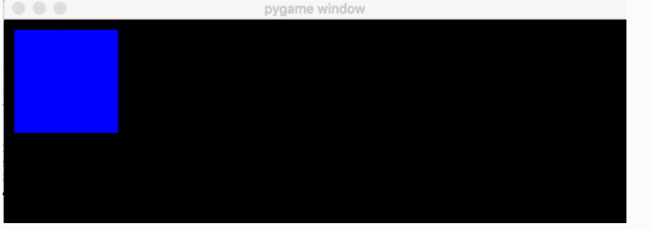

一旦你想退出显示，只需切换到命令提示符并同时按 CTRL + C。
接下来，我们将使用完全相同的原理绘制一个圆，但这次使用不同的颜色。

请将以下代码添加到脚本中（新代码用粗体表示）：

```python
pygame.draw.rect(scr, color, pygame.Rect(start_x,start_y, rect_width, rect_height))
color = (255,0,0)
circle_center = (200, 60)
circle_radius = 50
pygame.draw.circle(scr, color, circle_center, circle_radius, 3)
pygame.display.flip()
```

在上面的代码中：

- 我们为圆指定了一个新的颜色。
- 我们还指定了圆心的坐标及其半径。
- 最后，我们使用内置函数 `pygame.draw.circle` 绘制圆。
- 第一个参数 `scr` 指的是我们之前定义的显示表面。
- 第二个参数 `color` 指的是我们刚刚定义的颜色。
- 除了圆心和半径外，我们还指定了绘制圆时使用的线条粗细（即 3 像素）。

就是这样，你现在可以编译你的文件，显示窗口应该如下图所示。

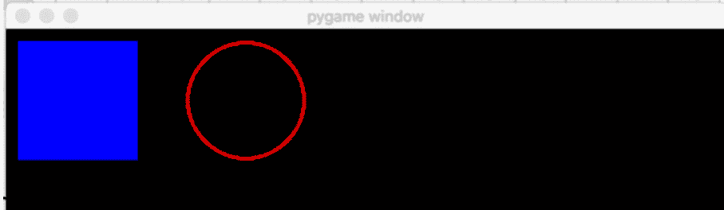

我们要做的最后一件事是绘制一个十字；这将很有用，因为我们将在下一个游戏（井字棋）中绘制十字。

十字将由两条线组成，每条线连接一个假想矩形的对角：一条线从矩形的左上角到右下角，另一条线从矩形的左下角到右上角。

请添加以下代码：

```python
cross_start_x = 300
cross_start_y = 10
pygame.draw.line(scr, color,(cross_start_x, cross_start_y),
(cross_start_x + 100, cross_start_y + 100),3)
pygame.draw.line(scr, color,(cross_start_x, cross_start_y+100),
(cross_start_x + 100, cross_start_y ),3)
pygame.display.flip()
```

在上面的代码中：

- 我们使用变量 `cross_start_x` 和 `cross_start_y` 定义了假想矩形左上角的坐标。
- 然后我们绘制第一条线，从矩形的左上角到右下角。
- 然后我们绘制第二条线，从矩形的左下角到右上角。

就是这样，你现在可以保存你的代码并编译它。编译时，你应该会注意到显示屏幕上添加了一个新的十字，如下一个窗口所示。

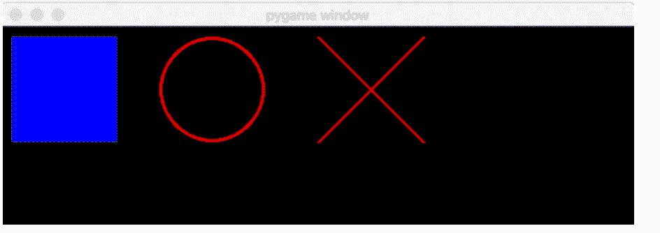

因此，在这个阶段，我们已经熟悉了在屏幕上绘制基本形状，将这些技能结合起来创建一个简单的井字棋游戏将是非常棒的，这正是我们将在下一节中完成的内容。

## 创建井字棋游戏

在本节中，我们将基于目前掌握的技能来创建一个井字棋游戏。

这个游戏相对流行且简单：

- 游戏屏幕由一个 3x3 的网格组成。
- 每个玩家可以轮流点击其中一个单元格来添加一个圆圈或一个十字。
- 一旦其中一个玩家成功地将三个连续的圆圈或十字排成一线，他就赢了。

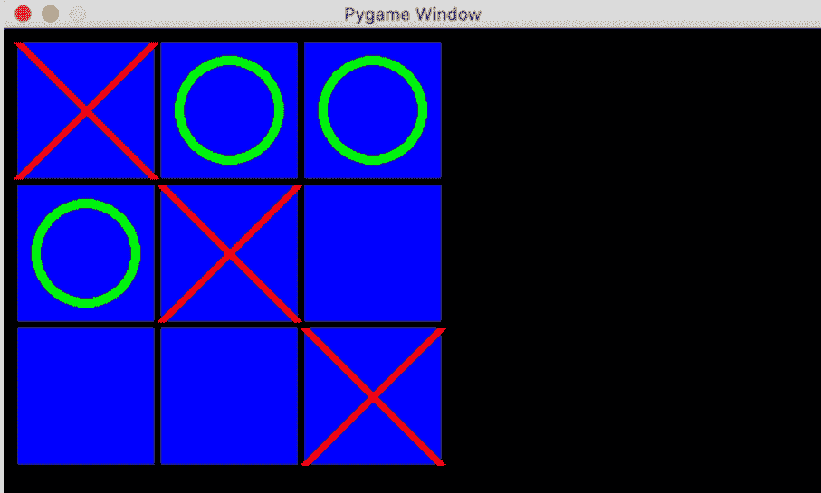

因此，对于这个游戏，我们需要：

- 绘制由 9 个蓝色矩形组成的 3x3 网格。
- 检测玩家点击的位置并相应地绘制一个十字。
- 实现一个简单的 AI，它将与玩家对战并在适当的位置添加圆圈。

那么首先，让我们为这个游戏创建一个新文件，并开始处理网格。

请在 Sublime 中创建一个新文件。
保存此文件。
将以下代码添加到文件中。

```python
import pygame
import pygame.mouse
pygame.init()
scr = pygame.display.set_mode((600,500))
pygame.display.set_caption('Pygame Window')
```

在之前的代码中：

我们导入了两个库：Pygame 库和一个用于处理和响应鼠标点击的更具体的库。
然后我们初始化了 Pygame 模块。
最后，我们将显示窗口的大小设置为 600 x 500。
接着，我们设置了用于显示游戏的窗口标题。

在下一节中，我们将开始创建游戏的界面，包括玩家需要点击以绘制圆圈或叉号的 9 个蓝色方块，如下图所示：

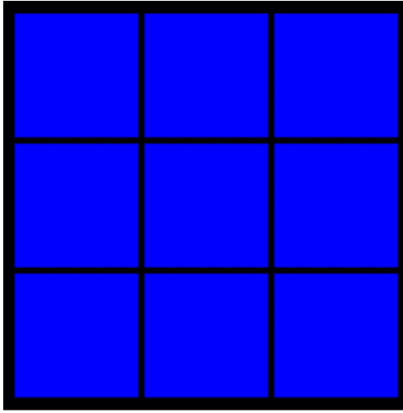

请将以下代码添加到文件中。

```python
color = (0,0,255)
start_x = 10
start_y = 10
rect_width = 100
rect_height = 100
margin_x = 5
margin_y = 5
```

在之前的代码中：

我们将用于绘制界面的画笔颜色设置为蓝色。
我们定义了左上角方块的左上角坐标。
我们定义了每个方块的宽度和高度。
我们还定义了每个方块之间的垂直和水平边距。

现在我们已经定义了界面中 9 个方块的颜色、大小和边距，是时候绘制它们了。

请将以下代码添加到文件中。

```python
for i in range (3):
    for j in range (3):
        pygame.draw.rect(
            scr,
            color,
            pygame.Rect(start_x+(rect_width+margin_x)*i,
                       start_y+(rect_height+margin_y)*j,
                       rect_width, rect_height))
        pygame.display.flip()
```

在之前的代码中：

我们创建了两个嵌套循环，都从 0 计数到 2（即 3-1），以绘制 9 个方块（3 行 3 列）。
我们使用内置函数 `pygame.draw.rect` 来绘制每个方块（即矩形）。
对于每个方块，我们定义了：一个屏幕、一个颜色以及一个矩形形状。每个矩形由其左上角的坐标、宽度和高度定义。

最后，我们使用内置函数 `pygame.display.flip()` 刷新显示。

一旦我们显示了这 9 个方块，我们只需要确保它们保持显示，除非用户决定退出程序。

请将以下代码添加到脚本中。

```python
done = False
while not done:
    for event in pygame.event.get():
        if event.type == pygame.QUIT:
            done = True
            pass
```

在之前的代码中，我们创建了一个游戏循环，并循环直到玩家决定退出游戏。

你现在可以保存并编译你的代码，应该会出现以下窗口。

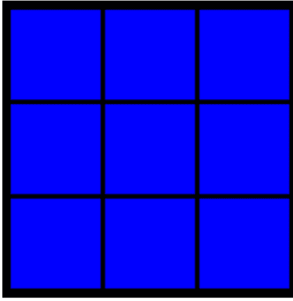

你现在可以退出游戏了。
在这个阶段，主要界面已经创建完成，我们现在需要检测玩家的鼠标点击，以便在相应的方块中绘制圆圈或叉号。
为此，我们将创建一个函数，该函数将执行以下操作：

-   检测用户何时点击了鼠标左键。
-   记录点击发生时鼠标的位置。
-   检测用户是否已经点击过该单元格。
-   如果没有，则在该单元格中绘制一个叉号。

那么让我们开始：

请将以下代码添加到脚本 `tictactoe.py` 中（新代码用粗体表示）：

```python
import pygame
import pygame.mouse
from pygame.locals import *
```

在之前的代码中，我们只导入了 Pygame 使用的常量。

请添加以下代码（新代码用粗体表示）：

```python
margin_x = 5
margin_y = 5
cell_used = [[0,0,0],[0,0,0],[0,0,0]]
```

在之前的代码中，我们创建了一个名为 `cell_used` 的二维列表（对应一个 3x3 网格），用于存储单元格是否已被使用（即被用户选中）的信息；最初，该列表中的所有项都设置为 0。

请将以下函数添加到脚本中，放在你刚刚输入的代码之后。

```python
def detect_square_clicked(x,y):
    global start_x
    global start_y
    global rect_width
    global rect_height
    global margin_x
    global margin_y
    global cell_used
    print("Clicked at x="+str(x)+"__y="+str(y));
```

在之前的代码中：

我们创建了一个名为 `detect_square_clicked` 的函数。每当用户点击屏幕时，都会调用此函数。它接受两个参数，这两个参数对应于用户点击屏幕时鼠标的坐标。
然后我们引用了之前定义的全局变量，因为我们将在此函数内部使用它们。
最后，我们显示了传递给此函数的参数值。

为了测试此函数，请将以下代码添加到脚本中（新代码用粗体表示）：

```python
while not done:
    for event in pygame.event.get():
        if event.type == pygame.QUIT:
            done = True
        if event.type == MOUSEBUTTONDOWN:
            if event.button == 1:
                position = pygame.mouse.get_pos()
                detect_square_clicked(position[0],position[1])
```

在之前的代码中：

我们检查鼠标是否被点击。
如果是，我们检查是否是左键。
如果左键被按下，我们使用函数 `pygame.mouse.get_pos()` 获取鼠标的位置，并将鼠标的两个坐标传递给我们之前定义的函数 `detect_square_clicked`。

你现在可以保存并编译你的代码；当屏幕显示时，你可以点击其中一个方块，并在命令提示符中检查是否显示了相应的位置信息，类似于以下内容：

Clicked at x=240 __y=69

如果这有效，意味着程序运行正常，并且你已经成功捕获并显示了用户点击鼠标的位置。

你现在可以关闭程序了。

那么，在这个阶段，我们只需要在鼠标点击的位置显示一个叉号。

请将以下代码添加到函数中。

```python
print("Clicked at x="+str(x)+"__y="+str(y));
new_x_pos = ((x - start_x)/(rect_width + margin_x))
new_y_pos = ((y - start_y)/(rect_height + margin_y))
new_x_pos = int(new_x_pos)
new_y_pos = int(new_y_pos)
```

在之前的代码中：

我们定义了两个变量 `new_x_pos` 和 `new_y_pos`，它们将确定玩家点击了哪个单元格。因此，变量 `new_x_pos` 和 `new_y_pos` 都可以是 0、1 或 2。
这两个变量是根据鼠标的位置（即 x 和 y）以及每个方块的宽度和高度，以及垂直和水平边距计算得出的。
无论鼠标的位置如何，我们都需要知道玩家点击了哪个单元格，这就是为什么两个变量 `new_x_pos` 和 `new_y_pos` 都通过转换为最接近的整数来向下取整。

现在我们已经定义了应该绘制叉号的方块的左上角，我们只需要绘制该叉号，前提是检查用户尚未点击过该单元格。

请将以下代码添加到函数 `detect_square_clicked` 中（新代码用粗体表示）：

```python
new_x_pos = int(new_x_pos)
new_y_pos = int(new_y_pos)
if (cell_used [new_y_pos][new_x_pos] == 0):
    cell_used [new_y_pos][new_x_pos] = 1
    color = (255,0,0)
    cross_top_left_x = start_x+(rect_width+margin_x)*new_x_pos;
    cross_top_left_y = start_y+(rect_height+margin_y)*new_y_pos
```

在之前的代码中：

我们检查了玩家是否已经点击过该单元格。
如果没有，那么我们绘制叉号。
我们设置了颜色（即红色）。
然后我们定义了应该绘制叉号的单元格的左上角坐标。

现在我们已经定义了叉号应该绘制的位置，我们可以使用两条线实际绘制它；请将以下代码添加到函数中。

```python
cross_top_left_y = start_y+(rect_height+margin_y)*new_y_pos
pygame.draw.line(
    scr,
    color,
    (cross_top_left_x ,cross_top_left_y),
    (cross_top_left_x + rect_width, cross_top_left_y +rect_height),
    7)
pygame.draw.line(
    scr,
    color,
    (cross_top_left_x ,cross_top_left_y + rect_height),
    (cross_top_left_x + rect_width, cross_top_left_y),
    7)
pygame.display.flip()
```

在之前的代码中：

我们绘制了叉号的第一条线，从左上角到右下角。
我们绘制了叉号的第二条线，从左下角到右上角。
然后我们更新了显示。

你现在可以保存并编译你的代码，当程序显示时，你可以点击其中一个方块，该单元格中应该会绘制一个叉号，如下图所示。

## 实现人工智能

在本节中，我们将添加人工智能，以实现模拟第二个玩家与当前玩家对战的功能。

因此，玩家将先走一步，然后计算机将评估棋局并相应地走棋。

在这个版本中，计算机的玩法将非常简单：它会填充玩家尚未填充的任何单元格，而不管玩家是否已经连续划掉了两个单元格。

请将以下代码添加到脚本中

```
def computer_plays_simple():
    global start_x
    global start_y
    global rect_width
    global rect_height
    global margin_x
    global margin_y
    global cell_used
    is_looping = True
```

在前面的代码中：

我们定义了一个名为 `computer_plays_simple` 的函数。

在这个函数中，我们引用了已经定义好的全局变量，这些变量将在函数内部使用。

我们还定义了一个名为 `is_looping` 的变量，它将用于确定计算机是否应该退出特定的循环。

现在这些变量已经定义好了，我们需要遍历网格中的9个单元格，并检查哪个单元格实际上是空的。

请添加以下代码（新代码用粗体表示）：

```
is_looping = True
for j in range (3):
    for i in range (3):
        if (cell_used[j][i] == 0):
            cell_used[j][i] = -1
```

在前面的代码中：

我们创建了两个嵌套循环，用于遍历网格的每一行（共3行）和每一列（共3列）。然后我们使用列表 `cell_used` 检查网格中的任何单元格是否为空。如果单元格为空，我们就相应地将其标记为已填充。我们使用 -1 来指定该单元格现在已填充，但填充的是计算机的圆圈。

请添加以下代码：

```
if (cell_used[j][i] == 0):
    cell_used[j][i] = -1
    cell_top_left_x = start_x+(rect_width+margin_x)*i
    cell_top_left_y = start_y+(rect_height+margin_y)*j
    color = (0,255,0)
    circle_center = (cell_top_left_x + rect_width/2,cell_top_left_y + rect_height/2)
    circle_radius = (rect_width)*.8/2
```

在前面的代码中：

我们定义了当前被发现为空的单元格的左上角坐标。
我们将画笔颜色设置为绿色。
然后我们定义了要绘制的圆的中心坐标及其半径。

现在圆的位置已经确定，是时候在屏幕上绘制它了。

请添加以下代码（新代码用粗体表示）：

```
circle_radius = (rect_width)*.8/2
pygame.draw.circle(scr, color, circle_center, circle_radius, 7)
pygame.display.flip()
is_looping = False
break
if (is_looping == False):
    break
```

在前面的代码中：

我们根据之前计算的坐标和半径绘制圆。
我们使用函数 `pygame.display.flip()` 刷新显示。
由于圆已经绘制完成，我们将变量 `is_looping` 设置为 false，因为我们确实找到（并填充了）一个空单元格，然后我们退出两个循环。

要测试此代码，最后需要做的是在玩家走完一步后调用该函数；因此请将以下代码添加到脚本 `tictactoe.py` 中（新代码用粗体表示）：

```
if event.type == MOUSEBUTTONDOWN:
    if event.button == 1:
        position = pygame.mouse.get_pos()
        detect_square_clicked(position[0],position[1])
        computer_plays_simple()
```

在前面的代码中，一旦玩家走完一步，就轮到计算机走棋了，通过调用函数 `computer_plays_simple()`。

你现在可以保存并编译你的代码了。当程序启动时，你会看到在你走完一步后，计算机会选择一个空单元格并用绿色圆圈填充它。

因此，在这个阶段游戏运行得相当好，我们只需要检测玩家（或计算机）何时获胜。

为此，我们将检查是否在同一行、列或对角线上连续添加了三个叉号或圆圈。

请将此代码添加到脚本中

```
def check_if_a_player_won():
    global cell_used
    found_a_line = False
```

在前面的代码中，我们定义了一个名为 `check_if_a_player_won` 的新函数，并引用了名为 `cell_used` 的全局变量，该变量存储有关网格单元格的信息。

请将以下代码添加到该函数中：

```
line1_sum = cell_used[0][0] + cell_used[0][1] + cell_used[0][2]
line2_sum = cell_used[1][0] + cell_used[1][1] + cell_used[1][2]
line3_sum = cell_used[2][0] + cell_used[2][1] + cell_used[2][2]
col1_sum = cell_used[0][0] + cell_used[1][0] + cell_used[2][0]
col2_sum = cell_used[0][1] + cell_used[1][1] + cell_used[2][1]
col3_sum = cell_used[0][2] + cell_used[1][2] + cell_used[2][2]
diagno1_sum = cell_used[0][0] + cell_used[1][1] + cell_used[2][2]
diagno2_sum = cell_used[2][0] + cell_used[1][1] + cell_used[0][2]
```

在前面的代码中，我们计算了每一行、每一列和每条对角线的总和，同时记住每个单元格如果是空的、有叉号或圆圈，分别标记为0、1或-1。这将有助于判断三个连续的叉号或圆圈是否构成一条线。

请将以下代码添加到该函数中：

```
line1_prod = cell_used[0][0] * cell_used[0][1] * cell_used[0][2]
line2_prod = cell_used[1][0] * cell_used[1][1] * cell_used[1][2]
line3_prod = cell_used[2][0] * cell_used[2][1] * cell_used[2][2]
col1_prod = cell_used[0][0] * cell_used[1][0] * cell_used[2][0]
col2_prod = cell_used[0][1] * cell_used[1][1] * cell_used[2][1]
col3_prod = cell_used[0][2] * cell_used[1][2] * cell_used[2][2]
diagno1_prod = cell_used[0][0] * cell_used[1][1] * cell_used[2][2]
diagno2_prod = cell_used[2][0] * cell_used[1][1] * cell_used[0][2]
```

在前面的代码中，我们计算了每一行、每一列和每条对角线的乘积，同时记住每个单元格如果是空的、有叉号或圆圈，分别标记为0、1或-1。这将有助于判断检测到的线是由叉号还是圆圈组成的。

请将以下代码添加到该函数中：

```
if (abs(line1_sum) == 3
or abs(line2_sum) == 3
or abs(line3_sum) == 3
or abs(col1_sum) == 3
or abs(col2_sum) == 3
or abs(col3_sum) == 3
or abs(diagno1_sum) == 3
or abs(diagno2_sum) == 3):
```

在前面的代码中，我们检查任何行、列或对角线的单元格内容之和是否为3或-3；因为每个被圆圈占据的单元格标记为-1，每个被叉号占据的单元格标记为1，所以一行叉号的总和将是3，一行圆圈的总和将是-3。

请添加以下代码（新代码用粗体表示）：

```
or abs(diagno2_sum) == 3):
    if (line1_prod > 0
    or line2_prod > 0
    or line3_prod > 0
    or col1_prod > 0
    or col2_prod > 0
    or col3_prod > 0
    or diagno1_prod > 0
    or diagno2_prod > 0):
```

在前面的代码中，我们检查任何行、列或对角线的单元格内容的乘积是否为正；因为每个被圆圈占据的单元格标记为-1，每个被叉号占据的单元格标记为1，所以一行叉号的单元格内容的乘积将是正数，而一行圆圈的单元格内容的乘积将是负数。

请添加以下代码（新代码用粗体表示）：

```
    or diagno2_prod > 0):
        print ("GAME OVER >> PLAYER WINS")
    else:
        print ("GAME OVER >> COMPUTER WINS")
```

在前面的代码中，我们根据之前的计算显示谁赢了。

最后，我们只需要在玩家每次走完一步后调用这个函数；因此请将以下代码添加到脚本中（新代码用粗体表示）：

```
detect_square_clicked(position[0],position[1])
check_if_a_player_won()
computer_plays_simple()
check_if_a_player_won()
```

在前面的代码中，我们每次在玩家完成一步后调用此函数。

你现在可以保存并编译你的代码，并检查当你成功对齐三个叉号时，命令提示符中是否显示了相应的消息，如下图所示。

根据上图，如果你对齐了三个叉号，命令提示符应显示以下消息：
GAME OVER >> PLAYER WINS

## 章节回顾

在本章中，我们学习了如何使用 Pygame 在屏幕上绘制图形和基本形状。我们对函数、循环和列表的使用变得更加熟练，并最终创建了一个简单的井字棋游戏，其中包含一个相对简单的人工智能，以便玩家可以与电脑对战。

### 检查清单

## 测验

现在，让我们来检验一下你的知识！请回答以下问题。
答案在下一页。

请判断以下陈述是正确还是错误。

- Pygame 库需要在使用前安装。
- Pygame 库需要在使用前导入。
- 可以使用 Pygame 设置显示区域的大小。
- 可以使用 Pygame 指定显示窗口的标题。
- 在 Pygame 中绘制形状所使用的颜色是通过 RGB 代码指定的。
- 函数 `pygame.draw.rect` 可以用来绘制矩形。
- `Pygame.QUIT` 是用户关闭 Pygame 窗口时触发的事件。
- `MOUSEBUTTONDOWN` 是用户点击鼠标时触发的事件。
- 函数 `pygame.draw.line` 可以用来绘制直线。
- 函数 `pygame.draw.circle` 可以用来绘制圆形。

## 测验答案

- 正确。
- 正确。
- 正确。
- 正确。
- 正确。
- 正确。
- 正确。

## 挑战 1

既然你已经完成了本章并提升了技能，你可以运用这些来改善游戏的流程。因此，在这个挑战中，你将创建一个说明屏幕和一个游戏结束屏幕。

- 更改屏幕上为玩家和电脑绘制的形状（例如，三角形）。
- 更改这些形状的颜色。
- 更改用于绘制这些形状的画笔粗细。

## 挑战 2

在这里，你将修改电脑的人工智能：

检查玩家是否连续填充了两个单元格。
如果是这种情况，则填充第三个单元格，以防止玩家在下一步获胜。

# 第 6 章：创建一个金币收集游戏

在本节中，我们将创建一个简单的金币收集游戏，玩家需要在每个关卡中收集若干金币，然后才能进入下一关的门。

完成本章后，你将能够：

- 使用方向键移动动画角色。
- 检测玩家与墙壁之间的碰撞。
- 创建具有中等智能的移动敌人。
- 创建玩家可以点击的按钮。
- 使用精灵创建关卡。
- 实现计分系统。
- 在屏幕上显示文本。
- 实现计时器。
- 实现启动画面。

## 简介

那么，如前所述，我们将创建一个金币收集游戏。原理相当常见，涉及以下内容：

- 玩家将看到一个启动画面，并可以通过按下按钮选择开始。
- 玩家总共有三条生命。
- 计时器将从第一关开始。
- 每个关卡将包括墙壁、可收集的物品、敌人和一扇通往下一关的门。
- 玩家将能够使用方向键在这个迷宫中导航。
- 玩家在与敌人碰撞或时间耗尽时会失去一条生命。
- 玩家需要在每个关卡中至少收集四枚金币才能打开门。
- 玩家在完成三个关卡后获胜。

## 移动玩家

在本节中，我们将根据键盘方向键来移动主角；目前，玩家将由一个红色方块表示，稍后我们将用一个动画角色替换它。

请创建一个新文件并将其保存为 `coin_collector.py`。
请将以下代码添加到脚本中：

```python
import pygame
screen_width, screen_height = 900, 600
main_window = pygame.display.set_mode((screen_width, screen_height))
pygame.display.set_caption("Coin Collector")
```

在上面的代码中：

- 我们导入了 pygame 模块。
- 我们设置了将用于显示游戏的屏幕大小。
- 我们设置了该窗口的标题。

请添加以下代码：

```python
fps_rate = 60
player_velocity = 4
bg_img = pygame.image.load("assets/bg_image.jpg")
bg_img = pygame.transform.scale(bg_img, (screen_width, screen_height))
```

在上面的代码中：

- 我们定义了一个名为 `fps_rate` 的变量，它将用于设置窗口的刷新率。
- 我们定义了一个名为 `player_velocity` 的变量，它将用于确定玩家角色的移动速度。
- 我们还加载了一张名为 `bg_image.jpg` 的图片，它位于名为 `assets` 的子文件夹中。
- 然后，这张图片被拉伸以匹配屏幕的大小。

现在我们已经定义并设置了将用于显示游戏的全局变量，是时候创建处理玩家角色显示和移动的特定函数了。

请将以下函数添加到脚本中：

```python
def display_main_window(player_rect):
    main_window.blit(bg_img, (0, 0))
    pygame.draw.rect(main_window, "Red", player_rect)
    pygame.display.update()
```

在上面的代码中：

- 我们定义了一个名为 `display_main_window` 的函数，它将负责显示游戏的不同元素（例如，玩家、NPC 或墙壁）。
- 我们显示背景图片。
- 我们显示目前代表玩家角色的红色方块。
- 然后我们刷新显示。

接下来，我们需要检测玩家按下的键。

请将以下函数添加到脚本中：

```python
def controls(keys_pressed, player_rect):
    if keys_pressed[pygame.K_LEFT] and player_rect.x > 10:
        player_rect.x -= player_velocity
    if keys_pressed[pygame.K_RIGHT] and player_rect.x < (screen_width - 10 - 25):
        player_rect.x += player_velocity
    if keys_pressed[pygame.K_UP] and player_rect.y > 10:
        player_rect.y -= player_velocity
    if keys_pressed[pygame.K_DOWN] and player_rect.y < (screen_height - 10 - 25):
        player_rect.y += player_velocity
```

在上面的代码中：

- 我们定义了一个名为 `controls` 的函数，它接受两个参数：按下的键和用于代表玩家角色的矩形。
- 然后我们使用条件语句来确定按下的键，并相应地移动玩家角色。
- 如果按下左箭头键且玩家角色距离屏幕左侧超过 10 像素，我们将玩家角色向左移动。
- 如果按下右箭头键且玩家角色距离屏幕右侧小于 10 像素，我们将玩家角色向右移动（我们还考虑了矩形的宽度，即 25）。
- 如果按下上箭头键且玩家角色距离屏幕顶部小于 10 像素，我们将玩家角色向上移动。
- 如果按下下箭头键且玩家角色距离屏幕底部小于 10 像素，我们将玩家角色向下移动。

现在我们已经定义了检测玩家按键和显示玩家角色的函数，我们可以创建游戏的主循环，在其中调用这两个函数，以便根据按下的键移动和显示角色。

请添加以下函数：

```python
def main():
    player_rect = pygame.Rect(50, 300, 25, 25)
    clock = pygame.time.Clock()
    Time = 120
```

在上面的代码中：

- 我们定义了一个名为 `main` 的函数，它将是我们游戏的主循环。
- 我们定义了一个名为 `player_rect` 的变量，它将是用于表示玩家角色的矩形。
- 我们定义了一个名为 `clock` 的变量，它将用于设置游戏的刷新率。

现在这些变量已经定义好了，我们可以开始创建主循环了。

请添加以下代码（新代码为粗体）：

```python
clock = pygame.time.Clock()
while True:
    clock.tick(fps_rate)
    for event in pygame.event.get():
        if event.type == pygame.QUIT:
            pygame.quit()
    key = pygame.key.get_pressed()
    display_main_window(player_rect)
    controls(key, player_rect)
```

在上面的代码中：

- 我们创建了一个无限循环。
- 在这个循环中，我们使用名为 `tick` 的函数来设置刷新率。
- 然后我们捕获所有事件，并检测 Pygame 窗口是否关闭以取消初始化所有 Pygame 模块。
- 然后我们检测玩家是否按下了某个键。
- 我们调用 `display_main_window` 函数，并将玩家角色的矩形作为参数传递。
- 我们还调用 `controls` 函数，并传递两个变量作为参数：`key` 是玩家按下的键，`player_rect` 是代表玩家角色的矩形。

最后，请在脚本末尾添加以下代码：

```python
main()
```

就是这样。你现在可以编译并运行脚本了。运行时，你应该能在屏幕上看到一个红色方块，你可以通过按方向键来移动它。你可以检查玩家是否不能超出屏幕边界，如下图所示。

## 收集金币

至此阶段，你可以移动代表玩家角色的红色方块，并确保其保持在屏幕范围内。

下一步是实现收集物品的功能，我们将用一个方块来表示该物品。这将涉及以下功能：

- 定义代表待收集物品的矩形。
- 在屏幕上绘制这些矩形。
- 检测玩家角色与这些矩形之间的碰撞。

请在脚本开头添加以下代码（新增代码以粗体显示）：

```python
bg_img=pygame.transform.scale(bg_img,
(screen_width,screen_height))
coin1 = pygame.Rect(200,200,20,20)
coin2 = pygame.Rect(200,250,20,20)
coin3 = pygame.Rect(250,200,20,20)
coin4 = pygame.Rect(250,250,20,20)
```

在上述代码中，我们定义了四个名为 coin1、coin2、coin3 和 coin4 的矩形，并指定了它们的位置和大小。

请在函数 display_main_window 中添加以下代码（新增代码以粗体显示）：

```python
pygame.draw.rect(main_window,"Red",player_rect)
pygame.draw.rect(main_window,"Yellow",coin1)
pygame.draw.rect(main_window,"Yellow",coin2)
pygame.draw.rect(main_window,"Yellow",coin3)
pygame.draw.rect(main_window,"Yellow",coin4)
```

在上述代码中，我们使用黄色绘制了代表玩家待收集物品的四个方块。

最后，我们需要创建一个函数来检测玩家与这些待收集物品之间的碰撞。

请在脚本中添加以下函数：

```python
def detect_collision(player_rect):
    global coin1,coin2,coin3,coin4
    if player_rect.colliderect(coin1):
        coin1.x=screen_width + 10
    elif player_rect.colliderect(coin2):
        coin2.x=screen_width + 10
    elif player_rect.colliderect(coin3):
        coin3.x=screen_width + 10
    elif player_rect.colliderect(coin4):
        coin4.x=screen_width + 10
```

在上述代码中：

- 我们定义了一个名为 detect_collision 的函数，它接受一个参数，在该函数内将被称为 player_rect。
- 我们引用了全局变量 coin1、coin2、coin3 和 coin4，这些变量将在函数内使用。
- 如果玩家与其中任何一个物品发生碰撞，该金币（即黄色方块）将被移出屏幕。

最后，我们只需在主循环中调用此函数；因此请在函数 main 中添加以下代码（新增代码以粗体显示）：

```python
controls(key,player_rect)
detect_collision(player_rect)
```

现在你可以编译并运行代码，当你移动玩家角色并碰到物品时，这些物品应该会从屏幕上消失。

## 跟踪并显示分数

在上一节中，我们已经实现了收集物品的功能；现在我们将开始创建并显示一个分数，用于跟踪已收集物品的数量。

请在脚本开头添加以下代码（新增代码以粗体显示）：

```python
import pygame
pygame.font.init()
```

在上述代码中，我们初始化了字体。

请在第一个函数之前添加以下代码（新增代码以粗体显示）：

```python
coin4 = pygame.Rect(250,250,20,20)
score = 0
coin_font = pygame.font.SysFont('arial',50)
```

在上述代码中：

- 我们声明了一个名为 score 的变量，用于跟踪收集到的金币数量。
- 我们声明了一个名为 coin_font 的（字体）变量，用于显示分数的文本。
- 该字体将基于计算机上默认可用的字体，使用的大小为 50 像素。

接下来，我们将确保每次与待收集物品碰撞时分数都会增加。

请按如下方式修改函数 detect_collision（新增代码以粗体显示）：

```python
def detect_collision(player_rect):
    global coin1,coin2,coin3,coin4, score
    if player_rect.colliderect(coin1):
        coin1.x=screen_width + 10
        score += 1
    elif player_rect.colliderect(coin2):
        coin2.x=screen_width + 10
        score += 1
    elif player_rect.colliderect(coin3):
        coin3.x=screen_width + 10
        score += 1
    elif player_rect.colliderect(coin4):
        coin4.x=screen_width + 10
        score += 1
```

在上述代码中，我们引用了全局变量 score，并在每次玩家与金币碰撞时将分数加一。

最后，我们只需在屏幕上显示分数。

请在函数 display_main_window 中添加以下代码（新增代码以粗体显示）：

```python
score_text = coin_font.render("Score = "+str(score),1,"Yellow")
main_window.blit(score_text,(10,10))
pygame.display.update()
```

在上述代码中：

- 我们创建了一个名为 score_text 的变量，它是一个用于显示消息及收集金币数量的表面。文本将以黄色显示。
- 然后，该表面被显示在位置 (10, 10)。

现在你可以保存并编译代码。当你运行程序并收集金币时，你应该会看到左上角显示一条消息，指示收集到的金币数量，如下图所示。

## 创建第二关

既然我们可以跟踪分数，我们就可以开始修改代码，以便在玩家收集到 4 个金币后进入下一关。

请在第一个函数之前添加以下代码（新增代码以粗体显示）：

```python
coin_font=pygame.font.SysFont('arial',50)
level = 1
```

在上述代码中，我们创建了一个名为 level 的变量，用于跟踪玩家当前达到的关卡。

请将此代码添加到函数 detect_collision 中（新增代码以粗体显示）：

```python
def detect_collision(player_rect):
    global coin1,coin2,coin3,coin4, score, level
```

在上述代码中，我们引用了全局变量 level，因为我们将在函数内使用它。

请将此代码添加到函数 detect_collision 中：

```python
    if (score == 4):
        score +=2
        change_level()
```

在上述代码中，我们检查玩家是否收集了四个物品；如果是，我们给分数增加 2 分的奖励，并调用函数 change_level，该函数将负责绘制新关卡的布局。

请在脚本中添加以下函数：

```python
def change_level():
    global coin1, coin2, coin3, coin4, level
    level += 1
    if (level == 2):
        coin1.x, coin1.y = (20,90)
        coin2.x, coin2.y = (300,90)
        coin3.x, coin3.y = (10,500)
        coin4.x, coin4.y = (300,400)
    main()
```

在上述代码中：

- 我们定义了名为 change_level 的函数。
- 我们引用了五个全局变量。
- 我们将关卡增加 1。
- 如果玩家已达到第二关，我们随后设置待收集物品的新位置。

最后，我们只需在屏幕上显示关卡。

请在函数 display_main_window 中添加以下代码（新增代码以粗体显示）：

```python
level_text = coin_font.render("Level = " + str(level),1,"Red")
main_window.blit(level_text,(screen_width/2 ,10))
pygame.display.update()
```

在上述代码中，我们在屏幕上显示指示当前关卡的文本。

现在你可以保存并编译脚本。当程序运行时，你应该会看到当前关卡显示在屏幕上，并且一旦你收集到四个金币，布局就会改变。

## 添加墙壁

在本节中，我们开始添加玩家可以与之碰撞的墙壁；目前这些墙壁将由黑色方块组成。

这里的想法是：

- 创建代表墙壁的方块。
- 检测玩家与墙壁之间的碰撞。
- 在这种情况下，将玩家向相反方向移动（即后退）。

请在脚本开头、任何函数之前添加以下代码（新增代码以粗体显示）：

```python
coin4=pygame.Rect(250,250,20,20)
player_direction_x, player_direction_y = (0,0)

wall1 = pygame.Rect(100,100,100,100)
wall2 = pygame.Rect(300,100,100,100)
wall3 = pygame.Rect(500,100,100,100)
wall4 = pygame.Rect(700,100,100,100)
wall5 = pygame.Rect(100,300,100,100)
wall6 = pygame.Rect(300,300,100,100)
wall7 = pygame.Rect(500,300,100,100)
wall8 = pygame.Rect(700,300,100,100)
```

在上述代码中：

- 我们创建了一个名为 player_direction 的变量，用于存储玩家在 x 轴和 y 轴上的方向。
- 我们还创建了一组 8 个墙壁，标记为 wall1 到 wall8。

每面墙的位置和尺寸也已定义。

既然每面墙的矩形区域都已定义，现在是时候将它们绘制到屏幕上了。
请将以下代码添加到函数 `display_main_window` 中（新增代码以粗体显示）：

```python
pygame.draw.rect(main_window,"Yellow",coin4)
pygame.draw.rect(main_window,"Black",wall1)
pygame.draw.rect(main_window,"Black",wall2)
pygame.draw.rect(main_window,"Black",wall3)
pygame.draw.rect(main_window,"Black",wall4)
pygame.draw.rect(main_window,"Black",wall5)
pygame.draw.rect(main_window,"Black",wall6)
pygame.draw.rect(main_window,"Black",wall7)
pygame.draw.rect(main_window,"Black",wall8)
```

在前面的代码中，我们用黑色墨水绘制了8面墙中的每一面。
最后，我们只需要检测玩家与这些墙之间的碰撞；为此，我们将修改函数

请将以下代码添加到函数 `detect_collision` 的开头（新增代码以粗体显示）：

```python
global coin1, coin2, coin3, coin4, wall1, wall2, wall3, wall4, wall5, wall6, wall7, wall8, level
```

将以下代码添加到函数 `detect_collision` 中（新增代码以粗体显示）：

```python
elif player_rect.colliderect(coin4):
    coin4.x=screen_width + 10
    score += 1

elif (
    player_rect.colliderect(wall1) or
    player_rect.colliderect(wall2) or
    player_rect.colliderect(wall3) or
    player_rect.colliderect(wall4) or
    player_rect.colliderect(wall5) or
    player_rect.colliderect(wall6) or
    player_rect.colliderect(wall7) or
    player_rect.colliderect(wall8)):
    player_rect.y -= player_direction_y * player_velocity
    player_rect.x -= player_direction_x * player_velocity
    if (score == 4):
```

在前面的代码中，我们检查玩家是否与之前定义的八面墙中的任何一面发生碰撞，如果发生碰撞，我们就使用玩家当前的方向和速度将其移回。

你现在可以保存并编译你的代码了；运行程序时，你应该能够移动玩家角色并检查它是否与墙壁碰撞。

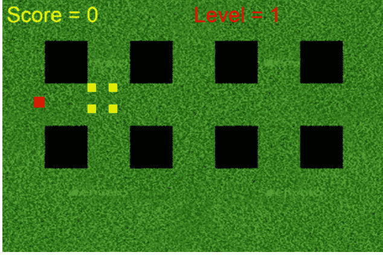

当你收集完该关卡的所有金币后，第二关应该具有不同的布局，类似于下图：

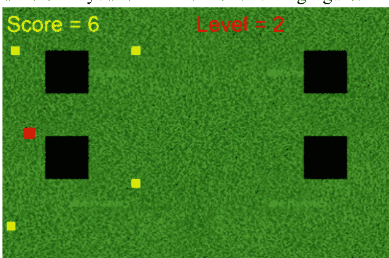

## 添加计时器

在本节中，我们将添加一个从1分钟开始倒计时的计时器；如果玩家在1分钟内未完成当前关卡，则该关卡将重新开始。

请在第一个函数之前添加以下代码（新增代码以粗体显示）：

```python
level = 1
timer = 0
timer_message = ""
```

在前面的代码中，我们声明了两个全局变量 `timer` 和 `timer_message`，它们将用于实现和显示计时器：

请按如下方式修改函数 `change_level` 的定义：

```python
def change_level(new_level):
    global coin1, coin2, coin3, coin4, wall1, wall2, wall3, wall4, wall5, wall6, wall7, wall8, level
    level = new_level
    if (level == 1):
        coin1=pygame.Rect(200,200,20,20)
        coin2=pygame.Rect(200,250,20,20)
        coin3=pygame.Rect(250,200,20,20)
        coin4=pygame.Rect(250,250,20,20)
        wall1=pygame.Rect(100,100,100,100)
        wall2=pygame.Rect(300,100,100,100)
        wall3=pygame.Rect(500,100,100,100)
        wall4=pygame.Rect(700,100,100,100)
        wall5=pygame.Rect(100,300,100,100)
        wall6=pygame.Rect(300,300,100,100)
        wall7=pygame.Rect(500,300,100,100)
        wall8=pygame.Rect(700,300,100,100)
    elif (level == 2):
        coin1.x, coin1.y = (20,90)
```

在前面的代码中：

我们修改了名为 `change_level` 的函数定义，使其能够接受一个参数；这是因为当计时器时间到时，我们需要这个函数能够重新加载当前关卡（而不是总是显示下一关）。
我们使用传递给该函数的参数设置全局变量 `level`。
然后我们指定了第一关中墙壁应该显示的位置。
我们将第二关的条件语句从 `if` 修改为 `elif`。

既然函数 `change_level` 已经修改完毕，我们就可以开始实现计时器，并修改之前调用该函数时不带参数的代码。

请按如下方式修改函数 `detect_collision`（新增代码以粗体显示）：

```python
if (score == 4):
    score +=2
    change_level(level+1)
```

在前面的代码中，我们调用了该函数，但是传递了 `level + 1` 的值，以便显示新的关卡。

请按如下方式修改函数 `main`（新增代码以粗体显示）：

```python
def main():
    global timer, timer_message
```

同时添加此修改。

```python
while True:
    clock.tick(fps_rate)
    timer += clock.tick(fps_rate)/1000
    minutes = int (timer/60)
    seconds = int (timer%60)
    timer_message = str(minutes) + ":" + str(seconds)
    if (timer >= 120):
        change_level(level)
        timer = 0
```

在前面的代码中：
我们每秒钟将变量 `timer` 加一。

然后我们定义了变量 `minutes` 和 `seconds`。
变量 `minutes` 是通过将秒数除以60，
然后将结果转换为整数得到的。
变量 `seconds` 是通过使用取模运算符（它
提供除法的余数），然后将结果转换为
整数得到的。

然后我们设置将在屏幕上显示的时间变量。
最后，我们检查是否达到了两分钟（即120
秒）；在这种情况下，我们调用函数 `change_level` 并传递
当前关卡作为参数，以便重新加载当前关卡。
我们还将计时器变量重置为0。

下一个也是最后一个部分是显示计时器。

请在函数 `display_main_window` 的末尾、最后一行之前添加以下代码（新增代码以粗体显示）：

```python
time_text = coin_font.render("Time = "+timer_message,1,"Green")
main_window.blit(time_text,(screen_width/2 ,screen_height - 50))
pygame.display.update()
```

在前面的代码中，我们创建了一个新的表面来显示文本，使用绿色墨水，并将该文本放置在屏幕底部。

就是这样。为了能够在不等待太久计时器时间到的情况下测试你的代码，你可以将这行代码从...

```python
timer = 0
```

修改为...

```python
timer = 115
```

你现在可以保存并编译你的代码了。运行程序时，你应该会看到计时器显示在屏幕底部，如下图所示。

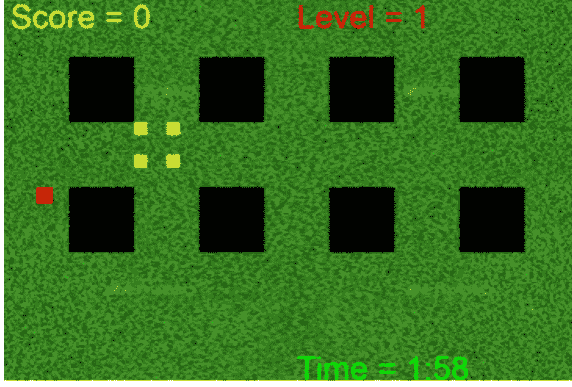

5秒后，关卡应该会重新加载，计时器重置。

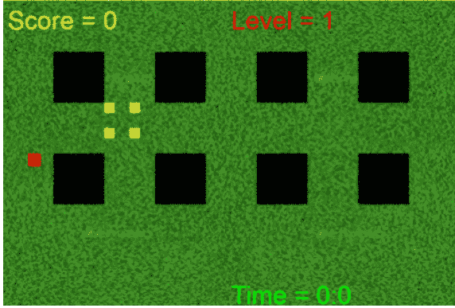

## 添加启动画面和结束画面

在这个阶段，我们已经有了一个功能完整的游戏；然而，添加一个启动画面和一个结束画面会很棒，而这正是我们将在本节中要做的。

因此，在本节中，我们将创建一个启动画面，向玩家显示说明；阅读后，玩家需要按 S 键才能开始第一关。

为了创建此功能，我们将依次：

- 显示说明信息。
- 等待玩家按 S 键。
- 按下按键后打开第一关。

首先，我们将声明一些用于显示启动画面的变量：

请在脚本开头的任何函数之前添加以下代码（新增代码以粗体显示）：

```python
timer_message = ""
menu_img = pygame.image.load("assets/menu.jpg")
menu_img = pygame.transform.scale(menu_img,
(screen_width,screen_height))
info_font=pygame.font.SysFont('arial',30)
```

在前面的代码中：

我们创建了一个图像变量 `menu_img`，它指向存储在名为 `assets` 的文件夹中名为 `menu.jpg` 的图像。

我们缩放图像以适应屏幕的宽度和高度。
我们创建了一个名为 `info_font` 的新字体，它将用于在屏幕上显示信息。

接下来，我们将使用背景图像和说明文本的组合来显示启动画面。

请将以下函数添加到脚本中：

```python
def menu():
    while True:
        for event in pygame.event.get():
            if event.type==pygame.QUIT:
                pygame.quit()
```

在前面的代码中：

我们创建了一个名为 `menu` 的函数。
在这个函数内部，我们无限循环。
在循环内部，我们检查玩家是否退出了游戏窗口；如果是这样，我们就退出 Pygame。

请在你刚刚输入的代码之后添加以下代码（新增代码以粗体显示）：

```python
pygame.quit()
main_window.blit(menu_img,(0,0))
key = pygame.key.get_pressed()
```

## 添加动画

至此，我们已经成功创建了一个从头到尾的游戏；然而，如果能用一个动画角色来代替一个方块，那将会很棒；因此在本节中，我们将使用角色在不同位置的静态图像来为主玩家角色创建一个动画。这将包括：

- 加载构成动画的图像。
- 在角色移动或改变方向时播放动画。
- 根据玩家角色的方向旋转它们。

首先，请确保您已将名为 `assets` 的文件夹从资源文件夹复制到存储 Python 脚本的文件夹中，因为它包含了我们主角色所需的动画。

接下来，请在脚本 `adventure.py` 的第一个函数之前添加以下代码（新代码以粗体显示）：

```python
info_font=pygame.font.SysFont('arial',30)
animation_frame = 0
player_angle = 0
p_1 = pygame.image.load("assets/p_1.png")
p_1 = pygame.transform.rotate(pygame.transform.scale(p_1, (25,25)),player_angle)
p_2 = pygame.image.load("assets/p_2.png")
p_2 = pygame.transform.rotate(pygame.transform.scale(p_2, (25,25)),player_angle)
p_3 = pygame.image.load("assets/p_3.png")
p_3 = pygame.transform.rotate(pygame.transform.scale(p_3, (25,25)),player_angle)
p_4 = pygame.image.load("assets/p_4.png")
p_4 = pygame.transform.rotate(pygame.transform.scale(p_4, (25,25)),player_angle)
p_5 = p_1
p_5_r = pygame.transform.rotate(pygame.transform.scale(p_5, (25,25)),player_angle)
```

在上面的代码中：

- 我们声明了变量 `animation_frame` 和 `player_angle`，它们将用于设置动画中的当前帧以及动画图像的旋转角度；这是因为我们将对所有方向使用相同的动画，然后根据玩家的方向简单地旋转这个动画。
- 接着，我们声明了对应于构成动画的每张图像的变量：`p_1`、`p_2`、`p_3` 和 `p_4`。这些变量（图像）中的每一个都从 `assets` 文件夹加载，并缩放为 25 像素高和宽。由于变量 `player_angle` 的值为 0，因此这些图像尚未应用旋转。
- `p_5_r` 是一个临时图像，它将存储动画中的当前图像，并且该图像可能会根据玩家的方向进行旋转。它被设置为序列动画中的第一张图像（即 `p_1`），并使用变量 `player_angle` 进行旋转。

现在我们已经加载了动画所需的图像，我们将创建一个函数来制造动画的假象。

请创建以下函数：

```python
def animation():
    global p_1,p_2,p_3,p_4,p_5_r,p_5,animation_frame
    p_5_r = pygame.transform.rotate(p_5,player_angle)
    animation_frame += 1
    if animation_frame == 5:
        p_5 = p_1
    elif animation_frame == 10:
        p_5 = p_2
    elif animation_frame == 15:
        p_5 = p_3
    elif animation_frame == 20:
        p_5 = p_4
        animation_frame = 0
```

在上面的代码中：

- 我们引用了用于动画的全局变量。
- 我们将变量 `p_5_r` 的值设置为当前图像 `p_5` 旋转 `player_angle` 后的结果。
- 我们将变量 `animation_frame` 的值增加 1。
- 然后，我们根据动画帧设置变量 `p_5` 的值。

接下来，我们需要从主循环中调用这个函数；因此请在函数 `main` 的末尾添加以下代码（新代码以粗体显示）：

```python
controls(key,player_rect)
detect_collision(player_rect)

animation()
```

在上面的代码中，我们调用了函数 `animation`。由于函数 `main` 是从游戏循环中调用的，我们将有效地无限调用函数 `animation`，导致变量 `animation_frame` 的值不断增加，从而发生动画。

现在函数 `animation` 的调用已经处理完毕，我们需要做的最后一件事是显示动画的帧，并注释掉之前显示红色方块的代码。

请在函数 `display_window` 中添加（或修改）以下代码（新代码以粗体显示）：

```python
main_window.blit(bg_img,(0,0))
#pygame.draw.rect(main_window,"Red",player_rect)
if (player_angle == 180): p_5_r = pygame.transform.flip(p_5_r, 0,-1)
main_window.blit(p_5_r,(player_rect.x,player_rect.y))
```

在上面的代码中：

- 我们注释掉了用于显示红色方块的代码。
- 如果旋转角度是 180 度，我们将图像垂直翻转，这样角色的眼睛仍然在顶部。
- 最后，我们在屏幕上显示当前的动画帧。

现在您可以保存并编译您的代码；当您运行程序时，您应该会看到玩家角色现在是动画的，并且当您将角色向右、向上或向下移动时，动画会随之旋转。

接下来，我们还可以更改待收集金币的精灵图。

请在脚本开头、任何函数之前添加以下代码（新增代码以粗体显示）：

```
p_5_r=pygame.transform.rotate(pygame.transform.scale(p_5,
(25,25)),player_angle)
coin_img=pygame.image.load("assets/coin.png")
coin_img=pygame.transform.scale(coin_img,(25,25))
```

在前面的代码中，我们加载了金币的图像，并将其缩放为25x25的大小。

请按如下方式修改`display_window`函数（新增代码以粗体显示）：

```
#pygame.draw.rect(main_window,"Yellow",coin1)
main_window.blit(coin_img,(coin1.x,coin1.y))
#pygame.draw.rect(main_window,"Yellow",coin2)
main_window.blit(coin_img,(coin2.x,coin2.y))
#pygame.draw.rect(main_window,"Yellow",coin3)
main_window.blit(coin_img,(coin3.x,coin3.y))
#pygame.draw.rect(main_window,"Yellow",coin4)
main_window.blit(coin_img,(coin4.x,coin4.y))
```

在前面的代码中，我们基本上停止了显示黄色方块，而是用我们之前定义的金币图像来替换它们。

你现在可以保存并编译你的代码；运行程序时，你应该会看到之前所有的黄色方块都已被实际的金币图像所取代，如下图所示：

## 添加音效

在本节中，我们将在游戏中添加一个收集金币时的音效。

请在脚本`adventure.py`的开头添加此代码（新增代码以粗体显示）。

```
pygame.font.init()
pygame.mixer.init()
```

请在任何函数之前添加以下代码（新增代码以粗体显示）：

```
coin_img=pygame.transform.scale(coin_img,(25,25))
beeping_snd = pygame.mixer.Sound('assets/beep.wav')
```

在前面的代码中，我们从assets文件夹加载了蜂鸣声，以便稍后播放。

请在`detect_collision`函数中添加（或修改）以下代码（新增代码以粗体显示）：

```
if player_rect.colliderect(coin1):
    coin1.x=screen_width + 10
    score += 1
    pygame.mixer.Channel(1).play(beeping_snd)
elif player_rect.colliderect(coin2):
    coin2.x=screen_width + 10
    score += 1
    pygame.mixer.Channel(1).play(beeping_snd)
elif player_rect.colliderect(coin3):
    coin3.x=screen_width + 10
    score += 1
    pygame.mixer.Channel(1).play(beeping_snd)
elif player_rect.colliderect(coin4):
    coin4.x=screen_width + 10
    score += 1
    pygame.mixer.Channel(1).play(beeping_snd)
```

在前面的代码中，每次收集到金币时，我们都会播放之前加载的蜂鸣声。

你现在可以保存并编译你的代码，并检查每次收集金币时是否都会播放蜂鸣声。

## 关卡总结

在本章中，我们成功创建了一个金币收集游戏，玩家可以收集金币、进入新关卡并最终获胜；在此过程中，我们还探讨了在屏幕上显示图像、处理玩家输入以及检测碰撞。

### 检查清单

## 测验

现在，让我们来检验一下你的知识！请回答以下问题。
答案在下一页。

请判断以下陈述是正确还是错误。

- 使用 Pygame 可以在屏幕上显示图像。
- 使用 Pygame 可以使用和显示 GIF 图像。
- 使用 Pygame 可以设置显示区域的大小。
- 使用 Pygame 可以指定显示窗口的标题。
- 常量 `pygame.K_LEFT` 用于左箭头键。
- 函数 `pygame.draw.circle` 可以用来绘制圆形。
- 函数 `pygame.draw.rectangle` 可以用来绘制圆形。
- 函数 `pygame.font.SysFont` 可以用来设置字体及其大小。
- 函数 `render` 可以用来创建一个用于在屏幕上显示文本的表面。
- 以下代码定义了一个矩形，其左上角位于 (100,100)。

```python
pygame.Rect(100,100,100,100)
```

## 测验答案

- 错误。
- 正确。
- 正确。
- 错误。
- 正确。
- 正确。
- 正确。

## 挑战 1

既然你已经完成了本章并提升了技能，你可以运用这些来改善游戏的流程。因此，对于这个挑战，你将改进游戏的外观和感觉。

- 使用不同的字体和字号来显示分数、时间和屏幕信息。
- 导入并使用墙壁图像作为墙壁。
- 添加一个由树图像表示的树对象，并通过一个矩形来管理其碰撞。

# 第 7 章：常见问题解答

本章提供了关于本书涵盖功能的最常见问题的解答。

## 脚本

如何创建脚本？
在你选择的文本编辑器中打开一个新的文本文件，并将其保存为扩展名为 `.py` 的文件。

如何检查我的脚本是否有错误？
你可以使用命令提示符来编译你的脚本。

点表示法是什么？
点表示法指的是面向对象编程。使用点，你可以访问与特定对象相关的属性和函数（或方法）。

## 与资源交互

如何检测碰撞？
要检测精灵的碰撞，你需要创建一个与精灵大小相同的矩形，然后使用函数 `colliderect` 检测该矩形与玩家角色之间的碰撞。

如何创建计分系统？
对于一个简单的计分系统，你可以创建一个整数，并在每次玩家收集到物品时将其值增加一。

## 使用图形用户界面

如何创建要在屏幕上显示的文本？
要在屏幕上显示文本，你需要创建一个字体，然后创建一个基于该字体的表面，该表面包含要显示的文本，最后在屏幕上显示该表面。

如何更新要在屏幕上显示的文本？
你需要更新用于显示文本的表面。

如何检测玩家的选择（当要求选择一个选项时）？
你只需要创建一个无限循环，在其中检测按下的键，如下一个代码片段所示。

```python
key = pygame.key.get_pressed()
if key[pygame.K_r]:
    level = 1
```

## 音频

如何播放声音？

- 初始化音频混音器。
- 加载要播放的声音。
- 播放声音。

```python
## 示例：
pygame.mixer.init()
...
beeping_snd = pygame.mixer.Sound('assets/beep.wav')
pygame.mixer.Channel(1).play(beeping_snd)
```

### 检测用户输入

如何检测按键？
你可以使用函数 `pygame.key.get_pressed()` 来检测按键。例如，以下代码检测 E 键何时被按下。

```python
key = pygame.key.get_pressed()
if key[pygame.K_e]:
    # 执行某些操作
```

如何检测按钮上的点击？
要检测按钮上的点击，你可以执行以下操作：

1. 检测事件。
2. 检测事件是否对应于鼠标上的按钮被按下。
3. 检测哪个按钮被按下。

```python
for event in pygame.event.get():
    if event.type == MOUSEBUTTONDOWN:
        if event.button == 1:
            # 鼠标左键被点击
```

# 致谢

我想感谢你完成了本书；我相信你现在对 Python 已经感到得心应手，并且能够创建交互式的 2D 游戏环境。本书是关于 Python 和 Pygame 的四本书系列中的第一本，因此现在可能是时候继续阅读下一本中级水平的书了，在那里你将学习更高级的功能，包括人工智能、2D 角色动画和有限状态机。
这本书目前正在制作中，你应该很快就能从官方页面访问它。如果你订阅了我的邮件列表，你应该会收到通知。

也请留下诚实的评论，这对我意义重大，也能帮助其他人评估这本书是否能帮助他们。
为了使本书能够不断改进，我将非常感谢你的反馈并倾听你的意见。因此，请在你的电子商店留下有帮助的评论，让我知道你对本书的看法，并通过电子邮件发送你可能有的任何建议。我会阅读并回复每一封电子邮件。非常感谢！

# Patrick Felicia 的其他著作

## 初学者指南

- [Unity 2D 平台游戏初学者指南](https://www.amazon.com/dp/B07Y8H1T1H)
- [2D 射击游戏初学者指南](https://www.amazon.com/dp/B07Y8H1T1H)
- [益智游戏初学者指南](https://www.amazon.com/dp/B07Y8H1T1H)

### C# 从零到精通

- [C# 编程从零到精通（入门）](https://www.amazon.com/dp/B07Y8H1T1H)
- [C# 编程从零到精通（初级）](https://www.amazon.com/dp/B07Y8H1T1H)

### 入门

- [Unity 3D 动画入门](https://www.amazon.com/dp/B07Y8H1T1H)

### Godot 从零到精通

- [Godot 从零到精通（基础）](https://www.amazon.com/dp/B07Y8H1T1H)
- [Godot 从零到精通（高级）](https://www.amazon.com/dp/B07Y8H1T1H)
- [Godot 从零到精通（初级）](https://www.amazon.com/dp/B07Y8H1T1H)
- [Godot 从零到精通（中级）](https://www.amazon.com/dp/B07Y8H1T1H)
- [Godot 从零到精通（精通）](https://www.amazon.com/dp/B07Y8H1T1H)

### JavaScript 从零到精通

- [JavaScript 从零到精通（初级）](https://www.amazon.com/dp/B07Y8H1T1H)

### 通过编写视频游戏学习 Python

- [通过编写视频游戏学习 Python（中级）](https://www.amazon.com/dp/B07Y8H1T1H)
- [通过编写视频游戏学习 Python（初级）](https://www.amazon.com/dp/B07Y8H1T1H)

### Python 游戏从零到精通

- [Python 游戏从零到精通（初级）](Python Games from Zero to Proficiency (Beginner))
- [Python 游戏从零到精通（中级）](Python Games from Zero to Proficiency (Intermediate))

## 快速指南

- [Unity C# 快速指南](A Quick Guide to C# with Unity)
- [Unity 程序化关卡快速指南](A Quick Guide to Procedural Levels with Unity)
- [Unity 2D 无尽跑酷游戏快速指南](A Quick Guide to 2D Infinite Runners with Unity)
- [Unity 人工智能快速指南](A Quick Guide to Artificial Intelligence with Unity)
- [Unity 卡牌游戏快速指南](A Quick Guide to Card Games with Unity)

### 终极指南

- [Unity 2D 游戏终极指南](The Ultimate Guide to 2D Games with Unity)

### Unity 5 从精通到大师

- [Unity 从精通到大师（C# 编程）](Unity from Proficiency to Mastery (C# Programming))

### Unity 从精通到大师

- [Unity 从精通到大师（人工智能）](Unity from Proficiency to Mastery (Artificial Intelligence))

### Unity 从零到精通

- [Unity 从零到精通（基础）第五版](Unity from Zero to Proficiency (Foundations) Fifth Edition)
- [Unity 从零到精通（初级）](Unity from Zero to Proficiency (Beginner))
- [Unity 从零到精通（中级）](Unity from Zero to Proficiency (Intermediate))
- [Unity 从零到精通（高级）](Unity from Zero to Proficiency (Advanced))
- [Unity 从零到精通（精通）](Unity from Zero to Proficiency (Proficient))

### Unreal Engine 从零到精通

# 关于作者

帕特里克·费利西亚是沃特福德理工学院的讲师和研究员，在该校教授并指导本科生和研究生。他于2003年获得爱尔兰科克大学多媒体技术硕士学位，2009年获得计算机科学博士学位。他出版了多本关于将电子游戏用于教育目的的书籍和文章，包括《通过教育游戏改进学习和动机的研究手册：多学科方法》（由IGI出版）以及由欧洲学校网出版的《学校中的数字游戏：教师手册》。帕特里克还是《国际基于游戏的学习期刊》（IJGBL）的主编，以及爱尔兰基于游戏学习研讨会的会议总监，这是一个在爱尔兰各地举办的关于游戏和学习的知名会议。

阅读更多关于帕特里克·费利西亚的信息