# 从零到精通的Python游戏（中级）

Patrick Felicia

由 Patrick Felicia 于 2022 年出版。

# 目录

[书名页](Title Page)

[从零到精通的Python游戏（中级）](Python Games from Zero to Proficiency (Intermediate))

[第1章：从我们的射击游戏开始](Chapter 1: Starting with Our Shooter Game)

[第2章：创建物品栏](Chapter 2: Creating an Inventory)

[第3章：添加碰撞和人工智能](Chapter 3: Adding Collisions and Artificial Intelligence)

[第4章：创建有限状态机](Chapter 4: Creating a Finite State Machine)

[第5章：打磨我们的游戏](Chapter 5: Polishing our game)

[第6章：常见问题解答](Chapter 6: Frequently Asked Questions)

[致谢](Thank you)

[Patrick Felicia 的其他著作](Also By Patrick Felicia)

# 从零到精通的Python游戏

（中级）

# 第一版

使用 Python 和 Pygame 编写你的第一个射击游戏的分步指南。

# Patrick Felicia

# 从零到精通的Python游戏

（中级）

版权所有 © 2022 Patrick Felicia

保留所有权利。未经出版商（Patrick Felicia）事先书面许可，不得以任何形式或任何方式复制、存储在检索系统中或传播本书的任何部分，除非在评论文章或评论中嵌入简短引文的情况。

在编写本书时，已尽一切努力确保所提供信息的准确性。但是，本书所含信息是按“原样”出售的，不附带任何明示或暗示的保证。作者及其经销商和分销商均不对因本书直接或间接造成的任何损害或声称造成的损害负责。

首次出版：2022年10月

由 Patrick Felicia 出版

# 致谢

作者：Patrick Felicia

# 关于作者

Patrick Felicia 是沃特福德理工学院的讲师和研究员，在那里他教授并指导本科生和研究生。他于2003年获得爱尔兰科克大学多媒体技术硕士学位，2009年获得计算机科学博士学位。他出版了多本关于利用电子游戏进行教育目的的书籍和文章，包括《通过教育游戏改进学习和动机的研究手册：多学科方法》（由IGI出版）和《学校中的数字游戏：教师手册》，由欧洲学校网出版。Patrick 还是《国际基于游戏的学习期刊》（IJGBL）的主编，以及爱尔兰基于游戏的学习研讨会的会议主任，这是一个在爱尔兰各地举办的关于游戏和学习的热门会议。

# 本书的支持和资源

要完成本书中介绍的活动，您需要从配套网站下载启动包；它包含您完成项目所需的免费资源。要下载这些资源，请执行以下操作：

打开页面
点击您的书《从零到精通》

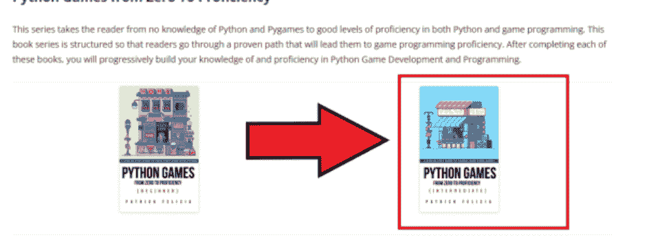

在新页面上，请点击写着“点击此处下载您的资源”的链接

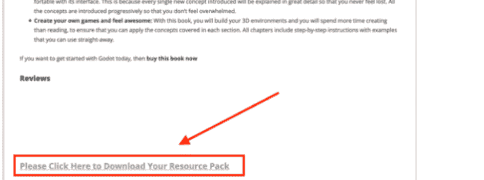

本书献给 Mathis

# 目录

- [致谢](Credits)
- [关于作者](About the Author)
- [本书的支持和资源](Support and Resources for this Book)
- [目录](Table of Contents)
- [前言](Preface)
- [本书涵盖的内容](Content Covered by this Book)
- [使用本书所需条件](What you Need to Use this Book)
- [本书适合谁](Who this book is for)
- [本书不适合谁](Who this book is not for)
- [如何从本书中学习](How you will learn from this book)
- [每章的格式和写作惯例](Format of Each Chapter and Writing Conventions)
- [特别说明](Special Notes)
- [如何从本书中获得最佳学习效果？](How Can You Learn Best from this Book?)
- [反馈](Feedback)
- [下载本书的解决方案](Downloading the Solutions for the Book)
- [改进本书](Improving the Book)
- [支持作者](Supporting the Author)
- [第1章：从我们的射击游戏开始](Chapter 1: Starting with our shooter game)
    - [使用方向键移动NPC](Moving the NPC using the arrow keys)
    - [为玩家角色创建武器](Creating a weapon for the player character)
    - [为目标创建一个类](Creating a class for the target(s))
    - [关卡总结](Level roundup)
    - [总结](Summary)
    - [测验](Quiz)
    - [测验答案](Answers to the Quiz.)

### 检查清单

# 第2章：创建物品栏

- 创建物品栏
- 在武器之间切换
- 收集弹药
- 关卡总结
- 总结
- 测验
- 测验答案
- 检查清单
- 挑战1

# 第3章：添加碰撞和人工智能

- 本章所需资源
- 添加墙壁
- 添加与墙壁的碰撞检测
- 使用路径点移动NPC
- 为NPC添加听觉和视觉
- 关卡总结
- 检查清单
- 测验
- 测验答案
- 挑战1

# 第4章：创建有限状态机

- 初始化游戏
- 跟随玩家
- 触发状态之间的转换
- 生成NPC
- 关卡总结
- 检查清单
- 测验
- 测验答案
- 挑战1

# 第5章：打磨我们的游戏

- 改变敌人的外观
- 显示点
- 检测与点的碰撞并更新分数
- 显示分数
- 检测与NPC的碰撞
- 关卡总结
- 检查清单
- 测验
- 测验解决方案
- 挑战1

# 第6章：常见问题解答

- 脚本
- 与资产交互
- 使用图形用户界面
- 创建和使用类
- 使用列表
- 图片和音频
- 检测用户输入
- 致谢

# 前言

本书将向您展示如何能够非常快速地用Python编码并创建游戏。

Python是一种强大的编程语言，广泛应用于各行各业，即使您拥有（或正在使用）技术规格非常低的计算机，也可以使用它。

本系列丛书《从零到精通的Python游戏》让您能够探索Python的核心功能，特别是那些能够快速创建有趣的2D游戏的功能。阅读本系列丛书后，您应该会发现用Python编码和创建简单而有趣的电子游戏变得更容易。

本系列丛书假设读者没有先验知识，它将引导您入门Python，通过轻松的学习曲线，让您快速掌握这种编程语言提供的所有出色功能。

通过完成每一章，并遵循分步说明，您将逐步提高技能，变得更加精通Python，并创建多个游戏。

除了精通Python之外，您还将创建包含许多电子游戏常见技术的游戏，例如：关卡设计、对象创建、纹理、碰撞检测、灯光、武器创建、角色动画、粒子、人工智能和菜单。

您将学习如何使用Python和Pygame创建自定义菜单和简单的用户界面，并为非玩家角色（NPC）制作动画并赋予人工智能，使其能够使用寻路跟随玩家角色。

最后，您还可以在本书的不同阶段导出您的游戏，以便与朋友分享并获得一些反馈。

## 本书涵盖的内容

[第1章：从我们的射击游戏开始](https://example.com)解释了如何创建和移动一个2D角色；它还向你展示了如何添加武器（一把枪），以便玩家角色可以射击。最后，本章还将向你展示如何为子弹创建一个类，以保持其管理的流畅性。

[第2章：创建一个](https://example.com)解释了如何为玩家角色拥有的武器创建一个库存。它向你展示了如何组合类和列表，以便玩家可以在武器之间切换，并收集和管理弹药。

[第3章：添加碰撞和人工智能](https://example.com)向你展示了如何通过引入可以巡逻、并通过视觉和听觉检测玩家角色的NPC，来为你的游戏增加挑战。

[第4章：创建一个有限状态](https://example.com)让你为NPC创建一个有限状态机，以便更容易地管理NPC行为。你还将学习如何管理每个状态之间的转换，以及如何定期实例化和生成NPC。

[第5章：打磨我们的](https://example.com)提供了关于如何改进我们游戏的解释；它向你展示了如何改变NPC的外观、显示分数、检测玩家与NPC之间的碰撞以及如何添加音效。

[第6章：常见问题解答](https://example.com)提供了与本书涵盖主题（例如，脚本、音频、交互、人工智能或用户界面）相关的常见问题解答（FAQ）。它还提供了指向额外独家视频教程的链接，这些教程可以帮助你解决一些问题。

## 使用本书所需的内容

要完成本书中介绍的项目，你只需要安装Python和Pygame。

在计算机技能方面，本书介绍的所有知识都假设读者没有先前的编程经验。因此，目前你只需要能够执行常见的计算机任务，例如下载文件、打开和保存文件、熟悉拖放项目以及打字。

## 本书适合谁

如果你能对所有这些问题回答“是”，那么这本书就适合你：

- 你想学习Python吗？
- 你想精通Python和Pygame提供的核心功能吗？
- 你想自学、教你的学生或你的孩子如何使用编程来创建游戏吗？
- 你想开始创建有趣的2D游戏吗？
- 尽管你可能之前接触过Python或Pygame，但你想更深入地研究这些主题并更详细地理解核心功能吗？

## 本书不适合谁

如果你能对所有这些问题回答“是”，那么这本书就**不**适合你：

- 你已经能够使用Python编写代码来实现高级功能或行为了吗？
- 你已经能够轻松地使用Pygame和Python编写射击游戏了吗？
- 你是在寻找一本关于Python的参考书吗？
- 你是一个有经验的（或至少是高级的）Python用户吗？

如果你能对所有四个问题回答“是”，你可能需要寻找本系列的下一本书。要查看这些书涵盖的内容和主题，你可以查看官方网站。

## 你将如何从本书中学习

因为所有学生学习方式不同，对课程的期望也不同，本书的设计旨在确保所有读者都能找到适合自己的学习结构。因此，它包括以下内容：

每章开头都有一个学习目标列表，以便读者对将涵盖的技能有一个概览。

每个部分都包括所涵盖活动的概述。

许多活动都是循序渐进的，学习者也可以通过每章末尾提供的挑战来参与更深入的学习和解决问题的技能。

每章都以一个测验和挑战结束，通过这些你可以将你的技能（和获得的知识）付诸实践，并看看你知道多少。挑战包括编码、调试或根据你在本章中获得的知识创建新功能。

本书侧重于你需要的核心技能。一些部分也更详细地介绍。然而，一旦概念得到解释，必要时会提供指向额外资源的链接。

代码是逐步引入的，并进行了详细解释。

## 每章的格式和写作惯例

在整本书中，为了使阅读和学习更容易，将使用文本格式和图标来突出显示所提供的信息的部分，并使其更具可读性。

本书中介绍的项目的完整解决方案可在官方网站上下载。因此，如果你需要跳过某个部分，你可以这样做；你也可以下载你跳过的前一章的解决方案。

## 特别说明

每章都包括资源部分，以便你可以进一步理解和掌握Python。这些包括：

每章一个测验：这些测验通常包括10个问题，测试你对本章涵盖主题的知识。解决方案在配套网站上提供。

一个检查清单：它包括5到10个关键概念和技能，你需要在进入下一章之前熟练掌握。

挑战：每章都包括一个挑战部分，要求你结合你的技能来解决一个特定的问题。

作者的注释如下所示：
作者的建议出现在此框中。
代码如下所示：

```
score = 100
player_name = “Sam”
```

包含本章涵盖要点的检查清单如下所示：
below: below: below: below: below: below: below: below: below: below:
below: below:

## 你如何才能从本书中获得最佳学习效果？

与你的朋友谈论你正在做的事情。

我们常常认为我们理解一个主题，直到我们必须向朋友解释并回答他们的问题。通过解释你的不同项目，你刚刚学到的东西对你来说会变得更清晰。

做练习。

所有章节都包括练习，这些练习将帮助你通过实践来学习。换句话说，通过完成这些练习，你将能够更好地理解主题并获得实践技能（即，而不仅仅是阅读）。

不要害怕犯错。

我通常告诉我的学生，犯错是学习过程的一部分。你犯的错误越多，你学习的机会就越多。一开始，你可能会发现错误令人不安，或者Python在你理解出了什么问题之前无法按预期工作。

尽早编译和运行你的游戏。

编译和运行你的第一个游戏总是很棒的。

分块学习。

连续学习五章或六章可能会令人不安，因为它可能会降低你的动力。相反，给自己足够的时间学习，按照自己的节奏学习，并以小单元学习（例如，每天15到20分钟）。这至少会为你做两件事：它会给你的大脑时间来“消化”你刚刚学到的信息，这样你第二天就可以重新开始。它还将确保你不会“精疲力竭”，并保持你的动力水平高涨。

## 反馈

虽然我已经尽一切努力制作一本高质量和有价值的书，但我总是感谢读者的反馈，以便相应地改进这本书。如果你想提供反馈，你可以给我发电子邮件到

## 下载本书的解决方案

你可以在官方网站上创建一个免费在线账户后下载本书的解决方案。一旦你注册，文件链接将自动发送给你。

要下载本书的解决方案（例如，代码），你需要在配套网站上下载启动包；它包括你完成项目和代码解决方案所需的免费资源。要下载这些资源，请执行以下操作：

打开页面

点击你的书《从零到精通的游戏》

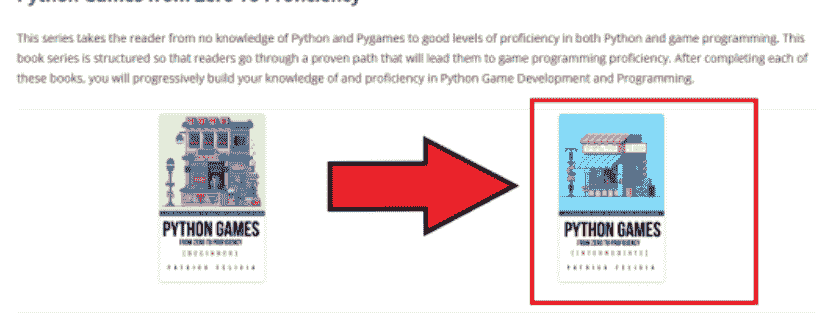

在新页面上，请点击写着“点击此处下载您的资源”的链接

## 评论

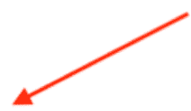

请点击此处下载您的资源包

## 改进本书

尽管在检查本书内容时已非常仔细，但我毕竟是人，书中可能仍存在一些错误。因此，如果您能告知在本书中遇到的任何问题或错误，以便解决并相应更新本书，我将非常感激。要报告错误，您可以通过电子邮件向我提供以下信息：

- 书名。
- 发现错误的页面。
- 描述错误，并说明您认为应如何更正。

收到您的邮件后，将对错误进行核查。如果确认是有效错误，将予以更正，并相应更新书籍页面以反映更改。

## 支持作者

本书凝聚了大量心血，是长时间准备、头脑风暴和最终写作的成果。因此，我恳请您不要分发本书的任何非法副本。

这意味着，如果朋友想要本书，他/她必须通过官方渠道购买（即通过您喜欢的电子商店或本书的官方网站）。

如果您的一些朋友对本书感兴趣，您可以将他们引导至本书的官方网站，在那里他们可以购买本书、参与每月抽奖以有机会获得免费赠书，或获取未来促销活动的通知。

# 第一章：从我们的射击游戏开始

在本节中，我们将学习如何通过实现一个可以四处移动和发射弹丸的动画2D角色，来创建我们射击游戏的第一部分。

完成本章后，您将能够：

- 检测玩家按下的按键，并相应地移动玩家角色。
- 每当玩家按下空格键时，创建并发射弹丸。
- 创建一个可供玩家测试武器的目标。
- 创建一个用于每个NPC的类，该类需考虑NPC的生命值。
- 每次NPC被子弹击中时，对其造成伤害。

## 使用方向键移动NPC

在本节中，我们将开始学习创建一个玩家角色，该角色可以根据玩家按下的按键向各个方向移动。最初，这个玩家角色将由一个红色方块表示；然而，在后续章节中，这个红色方块将被一个动画角色替换。玩家角色将能够向四个方向（即左、右、上、下）移动。我们将通过以下步骤来实现这一点：

首先，我们将加载创建动画所需的不同图片。
然后，我们将基于这些图片创建动画。
随着屏幕刷新，我们将更改动画的图像以产生动画的错觉。
完成此操作后，我们将开始将此信息应用于不同方向。因此，我们首先检测玩家按下了哪个键（左、右、上或下），然后将主角向相应方向移动。

用于角色的动画将始终相同，并根据玩家移动的方向进行旋转；因此，例如，当角色向右移动时，我们将使用角色向右移动的动画；但是，如果您使用左箭头键，我们可以使用相同的动画片段，但将其沿垂直轴翻转，这样该动画现在就是向左的。要向上和向下移动，情况完全相同，只是原本向右的初始动画将被旋转，使角色现在面朝上；同样，如果我们向下移动，我们将通过旋转此图像使其面朝下。

在本章结束时，您将创建一个窗口，其中包含一个NPC，您可以使用方向键将其向四个方向移动，如下图所示。

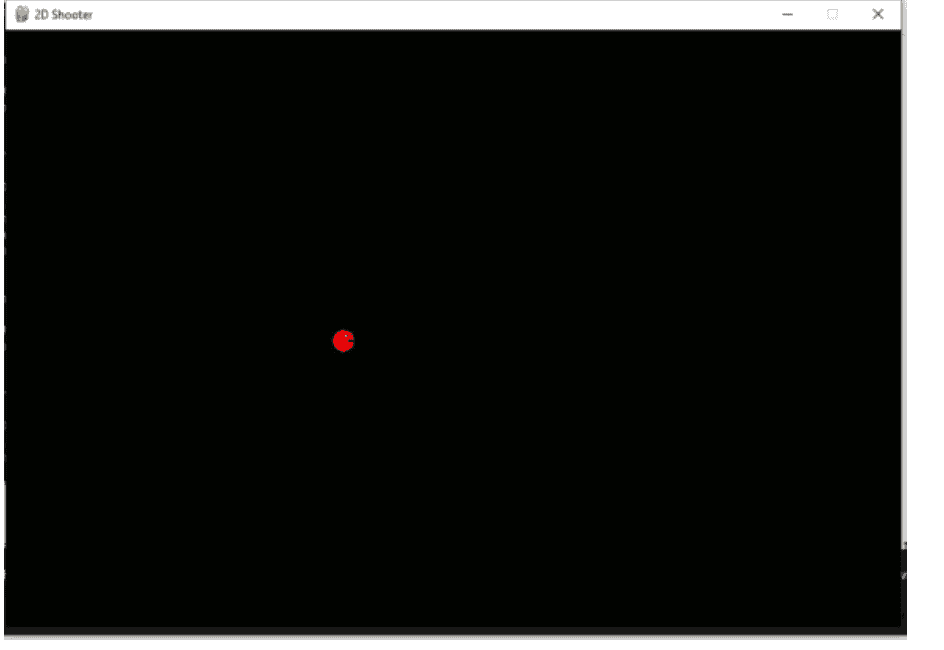

那么，让我们开始吧：

请打开您选择的文本编辑器。
创建一个新文件。
将其保存为
将资源文件夹中名为 assets 的文件夹复制到您保存脚本的同一文件夹中；该资源文件夹包含将用于动画的图像。
请在脚本开头添加以下代码。

```python
import pygame

import time
WIDTH, HEIGHT = 900,600
WIN = pygame.display.set_mode((WIDTH,HEIGHT))
pygame.display.set_caption("2D Shooter")
FPS = 60
```

在前面的代码中：

我们导入了库 pygame 和 time，前者用于游戏元素，后者将用于设置游戏的帧率。
我们声明了两个变量 WIDTH 和 HEIGHT，它们的值分别设置为 900 和 600，这些变量将用于设置游戏屏幕的大小。
使用命令 pygame.display.set_mode，我们根据之前定义的变量设置游戏窗口的大小。
我们设置游戏窗口的标签（或标题）。
最后，我们定义了一个名为 FPS 的变量，它将用于设置我们游戏的帧率。

现在我们已经定义了显示游戏的窗口的特性，我们可以开始定义与NPC动画相关的图像和其他参数。

请将以下代码添加到脚本中：

```python
VEL = 4
player_angle = 0
BG = pygame.image.load("assets/Background.jpg")
BG = pygame.transform.scale(BG,(WIDTH,HEIGHT))
```

在前面的代码中：

我们定义了变量 VEL 和 player_angle，前者用于角色的速度，后者用于定义动画图像的旋转角度。
请记住，每当角色改变方向时，将使用相同的动画，只是根据角色的方向进行旋转。
然后，我们设置用于游戏背景的图像，并对其进行缩放，使其大小与游戏窗口的宽度和高度匹配。

接下来，我们将设置用于角色动画的图像：

请将以下代码添加到脚本中：

```python
p_1 = pygame.image.load("assets/p_1.jpg")
p_1 = pygame.transform.rotate(pygame.transform.scale(p_1, (25,25)),0)
p_2 = pygame.image.load("assets/p_2.jpg")
p_2 = pygame.transform.rotate(pygame.transform.scale(p_2, (25,25)),0)
p_3 = pygame.image.load("assets/p_3.jpg")
p_3 = pygame.transform.rotate(pygame.transform.scale(p_3, (25,25)),0)
p_4 = pygame.image.load("assets/p_4.jpg")
p_4 = pygame.transform.rotate(pygame.transform.scale(p_4, (25,25)),0)
p_current = p_1
animation_frame = 0
```

在前面的代码中：

我们声明了变量 p_1, p_2, p_3, p_4，每个变量都链接到图像 p_1.jpg, p_2.jpg, p_3.jpg, p_4.jpg，这四张图像是玩家角色动画的一部分，位于 assets 文件夹中。
我们还缩放了这些图像，使它们在游戏中的大小为 25 像素 x 25 像素。
在转换图像时，我们没有应用任何旋转，因此转换的旋转角度为 0。
最后，我们定义了变量 p_current 和 animation_frame，前者用作当前要显示的图像，后者对应于动画中的当前帧。

现在我们已经定义了要包含在动画中的不同图像，我们将创建一个生成动画的方法。

请将以下函数添加到脚本中：

```python
def animation():
    global p_1,p_2,p_3,p_4,p_current, animation_frame, player_angle
    animation_frame += 1
    if animation_frame == 5:
        p_current = p_1
        p_current = pygame.transform.rotate(p_current, player_angle)
    elif animation_frame == 10:
        p_current = p_2

        p_current = pygame.transform.rotate(p_current, player_angle)
    elif animation_frame == 15:
        p_current = p_3
        p_current = pygame.transform.rotate(p_current, player_angle)
    elif animation_frame == 20:
        p_current = p_4
```

## 为玩家角色创建武器

上一节我们专注于创建和移动一个2D玩家角色，本节将重点为玩家角色添加武器并使用它。
这将包括：

- 检测用户何时按下空格键
- 创建一颗子弹，使其朝向玩家角色所看的方向移动。
- 让子弹在屏幕上移动。

因此，第一阶段将专注于创建一把枪，它将以固定间隔发射子弹。

我们将检测玩家是否按下了空格键。
如果是这种情况，我们将创建一颗子弹。
这颗子弹将从一个名为 `Bullet` 的类创建，并添加到子弹数组中。
这颗子弹将被推进（即移动）到玩家所看的方向。
当这颗子弹与障碍物碰撞时，它将被删除。
每颗子弹之间会应用一个延迟，这样玩家就不能持续射击。

现在流程更清晰了，让我们创建并添加那把武器：

请打开你在上一节中一直在使用的脚本。
在脚本中的第一个方法之前添加以下代码：

```python
bullets=[]
can_shoot = True
shoot_timer = 0
shoot_delay = 20
```

在上面的代码中：
我们声明了几个变量：

- `can_shoot` 用于了解玩家是否可以射击。
- `shoot_timer` 用于计算每次射击之间的帧数或秒数。
- `shoot_delay` 是以帧为单位表示的每次射击之间的延迟。

一旦我们定义了全局变量，我们也可以定义用于表示和显示目标的变量。

请在上面的代码下方添加以下代码：

```python
target = pygame.Rect(300,300,30,30)
target_health_rectangle = pygame.Rect(300,290,30,30)
target_health = 100
```

在上面的代码中：

我们创建了一个名为 `target` 的变量，这是一个位于位置 (300, 300)、宽度和高度为30像素的矩形。

我们还定义了一个矩形，它将显示在目标正上方，用于显示NPC的生命值。随着目标被子弹击中，这个矩形的宽度将相应减少。
最后，我们设置了变量 `target_health`，它将保存关于目标生命值的信息；随着更多子弹击中目标，这个变量将相应减少。

现在我们已经完成了与玩家角色发射的子弹和目标相关的变量定义，我们将为每颗子弹定义一个新的类。这将使子弹的创建和管理更容易。

请将以下代码添加到脚本中：

```python
class Bullet:
    def __init__(self, x, y, direction):
        self.x = x + 30
        self.y = y + 30
        self.direction = direction
        self.bullet= pygame.Rect(1100,1000,6,5)
        self.speed = 10
        self.collision_rect = pygame.Rect(self.x,self.x, 25, 25)
```

在上面的代码中：

我们定义了 `Bullet` 类，它将用于实例化新的子弹。
我们为这个类定义了一个构造函数。
构造函数接受三个参数（除了在调用函数时不会使用的参数 `self`），包括 `x`、`y` 和 `direction`。这三个参数将用于设置新子弹的初始位置和方向。

在构造函数中，我们设置了子弹的x和y坐标及其方向。正如你稍后将看到的，传递给此方法的x和y参数将基于玩家角色的位置；为了让子弹恰好从玩家边界开始，我们在x和y坐标上都加上了30。
我们使用参数direction的值来设置子弹的方向；同样，正如你稍后将看到的，当调用此方法时，我们将为参数传递玩家角色的方向，因此，实际上，子弹的方向将与玩家角色相同。
我们将子弹的速度设置为
最后，我们定义了一个矩形，用于检测子弹与任何障碍物之间的碰撞。这个矩形的位置和大小基于子弹的位置和大小。

接下来，我们将添加成员方法，用于在子弹被创建（或实例化）后移动和显示它。

请将此方法添加到类中

```
def draw_bullet(self):
    self.bullet.x=self.x
    self.bullet.y=self.y
    pygame.draw.rect(WIN,'YELLOW',self.bullet)
```

在前面的代码中，我们定义了一个名为的新成员方法。在该方法中，我们在由该子弹的x和y坐标定义的位置，用黄色绘制名为bullet的矩形。

请将此方法添加到类中

```
def move(self):
    if self.direction == 00:
        self.y += self.speed
    if self.direction == 180:
        self.y -= self.speed
    if self.direction == 90:
        self.x += self.speed
    if self.direction == 90:
        self.x -= self.speed
```

在前面的代码中：
我们定义了一个名为的成员方法，该方法将被调用以移动子弹。根据子弹的当前方向，我们设置其新位置。速度基于子弹的方向：0表示向右，180表示向左，90表示向上，-90表示向下。

现在我们已经定义了一个移动子弹的方法，我们将定义一个检测子弹与任何障碍物（即本例中的目标）之间碰撞的方法。

请将以下方法添加到类中

```
def check_collision(self):
    self.collision_rect.x = self.x
    self.collision_rect.y = self.y
    if (self.collision_rect.colliderect(target)):

        return -1
    return 1
```

在前面的代码中：
我们定义了一个名为的新成员方法。
在此方法中，我们设置了名为collision_rect的矩形的位置，该矩形用于检测子弹的碰撞。
然后我们检查该矩形是否与另一个名为target的矩形发生碰撞，该矩形是已定义的，用于定义目标周围的碰撞边界。
如果检测到子弹与目标之间的碰撞，则该方法返回值，否则返回值。

在此阶段，我们已经完成了类的定义，包含了管理每颗子弹的创建、移动和碰撞所需的所有成员变量和方法。
所以，现在我们可以开始专注于检测玩家何时按下空格键，并根据玩家角色的位置、方向以及每颗子弹之间应应用的延迟来实例化新的子弹。
首先，我们将修改名为control的方法，以便我们可以检测玩家何时按下空格键。

请将以下代码添加到controls方法中（新代码为粗体）：

```
def controls(keys_pressed):
    global player_angle,p_current, player_rect
```

在前面的代码中，我们引用了全局变量can_shoot，因为它将在方法内被使用和修改。

请将以下代码添加到controls方法中（新代码为粗体）：

```
if keys_pressed[pygame.K_SPACE]:
    my_bulllet = Bullet(player_rect.x-15, player_rect.y-15, player_angle)
    bullets.append(my_bulllet)
```

在前面的代码中：
我们检查用户是否按下了空格键；我们还检查变量can_shoot是否设置为，这是为了防止玩家在按住空格键时无限射击。
变量can_shoot被设置为。
创建了一个新的Bullet类实例，使用玩家的位置和方向，并进行调整使其从玩家角色的中心开始；这个新实例保存在名为的变量中，该变量又被添加到名为bullets的子弹列表中。

接下来，我们将修改window方法，以便在屏幕上显示所有子弹。

请将以下代码添加到window方法中（新代码为粗体）：

```
def window():
    global player_rect
    global bullets, target_health, target,target_health_rectangle
```

在前面的代码中，我们引用了之前在脚本中定义的一些全局变量。

请将以下代码添加到window方法中（新代码为粗体）：

```
pygame.draw.rect(WIN,'RED',target)
```

```
pygame.draw.rect(WIN, "GREEN", (target.x, target.y-10,
target_health*30/100, 10))
WIN.blit(p_current,(player_rect.x,player_rect.y))
pygame.display.update()
```

在前面的代码中，我们绘制了一个红色矩形，它将象征目标；这个矩形的尺寸和位置基于之前定义的矩形target。然后我们在前一个矩形上方绘制另一个矩形，用于指示目标的生命值；它位于前一个矩形上方10像素处，其宽度将与值成比例。因此，其宽度将随着目标生命值的减少而减小。

你现在可以保存并编译你的代码，当游戏开始时，你应该能看到玩家角色，以及一个由红色立方体表示的NPC，其上方有一个绿色的生命值条，如下图所示。

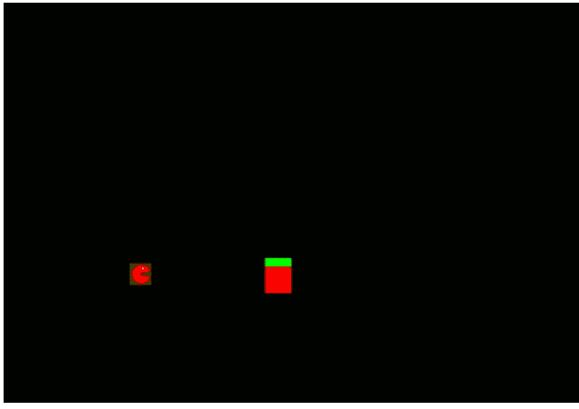

下一步将是添加向NPC发射子弹的能力，并在子弹与该NPC碰撞时相应地减少其生命值。

所以，在接下来的步骤中，我们将这样做：发射一颗子弹，测试它是否与NPC碰撞，并在那种情况下相应地减少NPC的生命值。

请在前面的代码之后添加以下代码：

```
for bullet in bullets:
    bullet.move()
    bullet.draw_bullet()
    test = bullet.check_collision()
```

在前面的代码中：
我们遍历关卡中存在的每颗子弹。
我们绘制每颗子弹。
我们检查每颗子弹是否与任何障碍物碰撞。

现在子弹与障碍物之间的碰撞已经测试过了，我们可以确定一颗子弹是否应该从游戏中移除。

请添加以下代码（新代码为粗体）：

```
test = bullet.check_collision()
if (test == -1):
    bullets.pop(-1)
    target_health -= 10
    if (target_health <= 0):
        target.x = 1000
```

在前面的代码中：
我们检查方法返回的值。
在发生碰撞的情况下（即返回值为-1），我们从列表中移除该子弹。
我们将目标的生命值减少。

如果目标的生命值小于或等于0，我们通过改变其x坐标将目标移出屏幕。稍后，每个被击中的目标都将从关卡中移除。

你现在可以保存你的脚本；当你编译脚本时，你应该能看到窗口中包含一个红色方块。

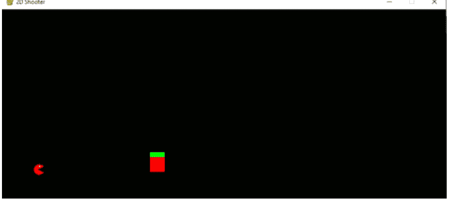

然后你可以通过按空格键向这个目标射击，并检查其生命值指示器的大小减小，直到生命值达到零，目标从屏幕上消失。

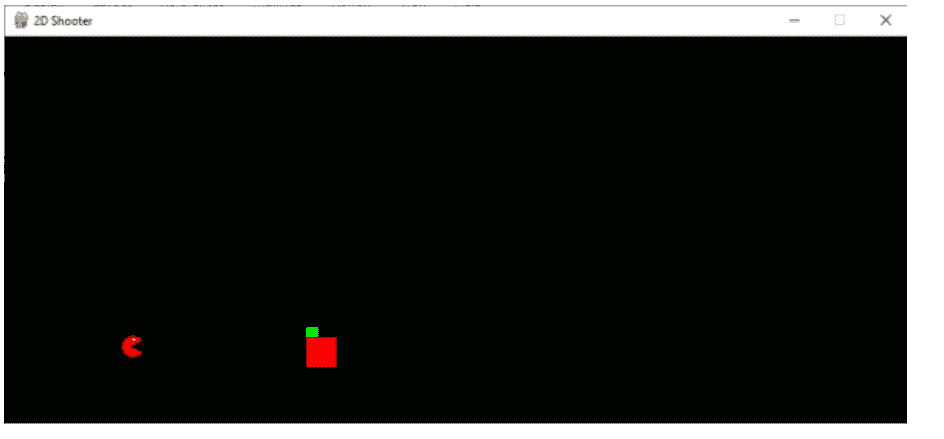


所以正如你所看到的，我们能够发射子弹；然而，我们可能需要降低射速，这样弹药才不会减少得太快。

所以，在这个阶段，射击功能的所有元素都已准备就绪，除了能够在射击之间应用延迟，这样玩家角色就不会无限地发射子弹。

请按如下方式修改controls方法：

```
if keys_pressed[pygame.K_SPACE] and
can_shoot = False
my_bullet = Bullet(player_rect.x -15, player_rect.y -15, player_angle)
bullets.append(my_bulllet)
```

## 为NPC创建一个类

目前，射击器运行良好，玩家角色可以射击带有生命值指示器的目标。话虽如此，为每个NPC创建一个类将非常有用，这样我们就可以轻松地添加和管理多个目标。因此，在本节中，我们将创建这样一个类，并修改我们的脚本，以便能够基于该类添加和管理新目标。

请在脚本中第一个方法之前添加以下类，例如，就在 `main` 类之前：

```python
class NPC:
    def __init__(self, x, y, color):
        self.x = x
        self.y = y
        self.color = color
        self.health = 100
        self.collision_rect = pygame.Rect(self.x, self.y, 25, 25)
```

在上面的代码中：
- 我们定义了一个名为 `NPC` 的类。
- 然后我们定义了该类的构造函数。
- 构造函数接受三个参数：NPC的x和y坐标，以及它的颜色。
- 这些参数随后用于设置NPC的位置及其颜色。
- 构造函数还定义了其他成员变量，包括 `health`（NPC的生命值）和 `collision_rect`（一个用于检测与其他对象碰撞的矩形）。

现在构造函数和成员变量已经定义好了，我们可以为这个类定义一个成员方法，用于绘制NPC（或目前代表它的方块）。

请将以下方法添加到 `NPC` 类中：

```python
def draw(self):
    pygame.draw.rect(WIN, self.color, (self.x, self.y, 30, 30))
    pygame.draw.rect(WIN, "GREEN", (self.x, self.y-10, self.health*30/100, 10))
```

在上面的代码中，我们定义了一个名为 `draw` 的方法。这个方法绘制了对应于NPC的矩形及其生命条。

现在 `NPC` 类已经定义好了，我们只需要基于该类实例化新的目标NPC，然后检测每个NPC的碰撞。

请在类定义之后添加以下代码：

```python
npcs = []
npc1 = NPC(400, 400, "BLUE")
npc2 = NPC(400, 500, "YELLOW")
npcs.append(npc1)
npcs.append(npc2)
```

在上面的代码中：
- 我们声明了一个名为 `npcs` 的列表，它将包含所有从 `NPC` 类实例化的新NPC。
- 我们基于 `NPC` 类实例化了两个新NPC。我们设置了它们的位置和颜色。
- 最后，我们将这些NPC添加到名为 `npcs` 的列表中。

接下来，我们将管理子弹和NPC之间的碰撞。为此，我们将创建一个方法来检测子弹和从 `NPC` 类实例化的NPC之间的碰撞。

请将以下成员方法添加到 `NPC` 类中：

```python
def check_collision2(self, the_npcs, the_bullets):
    self.collision_rect.x = self.x
    self.collision_rect.y = self.y
    npc_index = 0
    for npc in the_npcs:
        if (self.collision_rect.colliderect(npc.collision_rect)):
            npc.health -= 10
            npc.draw()
            the_bullets.pop(-1)
            if (npc.health <= 0):
                npcs.pop(npc_index)
        npc_index += 1
```

在上面的代码中：
- 我们定义了方法 `check_collision2`。
- 我们设置了碰撞矩形的位置。
- 这个方法接受三个参数：`self`，一个NPC数组和一个子弹数组。
- 我们定义了一个名为 `npc_index` 的变量，用于跟踪当前的NPC。
- 然后我们创建一个循环，遍历作为参数传递的数组中包含的所有NPC。
- 对于每个NPC，我们检查是否与子弹发生碰撞。
- 如果发生碰撞，我们减少被子弹击中的NPC的生命值。
- 然后我们绘制NPC，并从相应的数组中移除子弹。
- 接着我们检查NPC的生命值是否小于或等于0；如果是，则从数组和游戏中移除该NPC。为此，我们使用变量 `npc_index`。

一旦这个方法创建完成，我们只需要移除之前的红色目标，使用新的碰撞方法，并仅在应用延迟后才允许射击。

请在名为 `window` 的方法中注释掉以下代码：

```python
#pygame.draw.rect(WIN, 'RED', target)
#pygame.draw.rect(WIN, "GREEN", (target.x, target.y-10, target_health*30/100, 10))
```

修改 `main` 方法中的代码如下（新代码用粗体表示）：

```python
test = bullet.check_collision()
if (test == -1):
    bullets.pop(-1)
    target_health -= 10
    if (target_health <= 0):
        target.x = 0
bullet.check_collision2(npcs, bullets)
```

在上面的代码中，我们注释掉了与红色方块碰撞检测相关的行；我们还调用了 `check_collision2` 方法，并将 `npcs` 和 `bullets` 列表作为参数传递。

请将以下代码添加到 `window` 方法中（新代码用粗体表示）：

```python
for npc in npcs:
    npc.draw()
WIN.blit(p_current, (player_rect.x, player_rect.y))
```

你现在可以保存你的脚本了；当你编译脚本时，你应该会看到两个不同颜色的目标。当你射击任何一个目标时，它们各自的生命条会逐渐减少，当NPC的生命值达到0时，NPC就会消失，如下图所示。

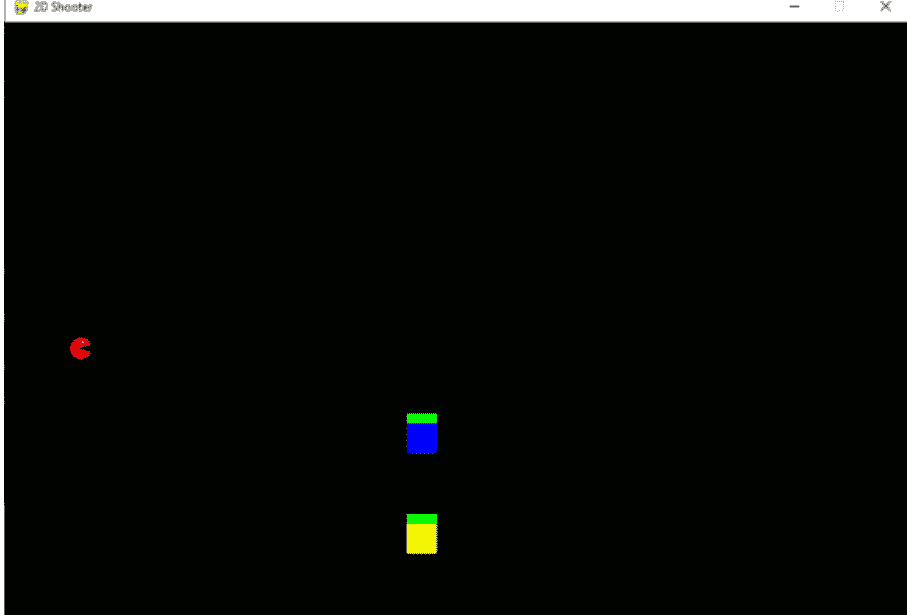


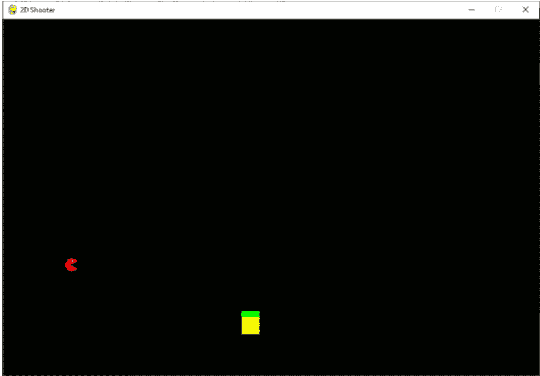

## 关卡总结

## 总结

在本章中，我们熟悉了Python和不同的编程概念。我们还研究了面向对象编程。最后，我们成功创建了一个可以向目标射击并相应造成伤害的移动NPC。

## 测验

现在是测试你知识的时候了。
请判断以下陈述是正确还是错误。

以下代码用于导入（并能够使用）Pygame库。

```python
import pygame
```

使用Pygame，可以设置Pygame窗口的名称（或标题）。

以下代码可用于加载位于与脚本相同文件夹中的图像。

```python
BG = pygame.image.load("assets/Background.jpg")
```

关键字 `global` 可用于在方法内部引用全局变量。

关键字 `def` 可用于在Python中定义方法。

使用Pygame库，可以将碰撞区域定义为矩形。

内置方法 `colliderect` 可用于检测两个矩形碰撞区域之间的碰撞。

以下代码可用于检测玩家是否按下了空格键。

```python
if keys_pressed[pygame.K_SPACE]:
```

可以在Python中创建类。

`def __init__` 通常用作Python中类的构造函数。

## 测验答案。

- 正确。
- 错误。
- 错误（图像位于名为 `assets` 的不同文件夹中）。
- 正确。
- 正确。
- 正确。
- 正确。
- 正确。
- 正确。
- 正确。

### 检查清单

检查清单 检查清单 检查清单 检查清单 检查清单 检查清单 检查清单
检查清单 检查清单 检查清单 检查清单 检查清单 检查清单 检查清单
检查清单 检查清单 检查清单 检查清单 检查清单 检查清单 检查清单
检查清单 检查清单 检查清单 检查清单 检查清单 检查清单 检查清单
检查清单 检查清单 检查清单 检查清单 检查清单 检查清单 检查清单
检查清单 检查清单 检查清单 检查清单 检查清单 检查清单 检查清单
检查清单 检查清单 检查清单 检查清单 检查清单 检查清单 检查清单
检查清单 检查清单 检查清单 检查清单 检查清单 检查清单 检查清单
检查清单 检查清单 检查清单 检查清单 检查清单 检查清单 检查清单
检查清单 检查清单 检查清单 检查清单 检查清单 检查清单 检查清单
检查清单 检查清单 检查清单 检查清单 检查清单 检查清单 检查清单
检查清单 检查清单 检查清单 检查清单 检查清单 检查清单 检查清单
检查清单 检查清单 检查清单 检查清单 检查清单 检查清单 检查清单
检查清单 检查清单 检查清单 检查清单 检查清单 检查清单 检查清单
检查清单 检查清单 检查清单 检查清单 检查清单 检查清单 检查清单
检查清单 检查清单 检查清单 检查清单 检查清单 检查清单 检查清单
检查清单 检查清单 检查清单 检查清单 检查清单 检查清单 检查清单
检查清单 检查清单 检查清单 检查清单 检查清单 检查清单 检查清单
检查清单 检查清单 检查清单 检查清单 检查清单 检查清单 检查清单
检查清单 检查清单 检查清单 检查清单 检查清单 检查清单 检查清单
检查清单 检查清单 检查清单 检查清单 检查清单 检查清单 检查清单
检查清单 检查清单 检查清单 检查清单 检查清单 检查清单 检查清单
检查清单 检查清单 检查清单 检查清单 检查清单 检查清单 检查清单
检查清单 检查清单 检查清单 检查清单 检查清单 检查清单 检查清单
检查清单 检查清单 检查清单 检查清单 检查清单 检查清单 检查清单
检查清单 检查清单 检查清单 检查清单 检查清单 检查清单 检查清单
检查清单 检查清单 检查清单 检查清单 检查清单 检查清单 检查清单
检查清单 检查清单 检查清单 检查清单 检查清单 检查清单 检查清单
检查清单 检查清单 检查清单 检查清单 检查清单 检查清单 检查清单
检查清单 检查清单 检查清单 检查清单 检查清单 检查清单 检查清单
检查清单 检查清单 检查清单 检查清单 检查清单 检查清单 检查清单
检查清单 检查清单 检查清单 检查清单 检查清单 检查清单 检查清单
检查清单 检查清单 检查清单 检查清单 检查清单 检查清单 检查清单
检查清单 检查清单 检查清单 检查清单 检查清单 检查清单 检查清单
检查清单 检查清单 检查清单 检查清单 检查清单 检查清单 检查清单
检查清单 检查清单 检查清单 检查清单 检查清单 检查清单 检查清单
检查清单 检查清单 检查清单 检查清单 检查清单 检查清单 检查清单
检查清单 检查清单 检查清单 检查清单 检查清单 检查清单 检查清单
检查清单 检查清单 检查清单 检查清单 检查清单 检查清单 检查清单
检查清单 检查清单 检查清单 检查清单 检查清单 检查清单 检查清单
检查清单 检查清单 检查清单 检查清单 检查清单 检查清单 检查清单
检查清单 检查清单 检查清单 检查清单 检查清单 检查清单 检查清单
检查清单 检查清单 检查清单 检查清单 检查清单 检查清单 检查清单
检查清单 检查清单 检查清单 检查清单 检查清单 检查清单 检查清单
检查清单 检查清单 检查清单 检查清单 检查清单 检查清单 检查清单
检查清单 检查清单 检查清单 检查清单 检查清单 检查清单 检查清单
检查清单 检查清单 检查清单 检查清单 检查清单 检查清单 检查清单
检查清单 检查清单 检查清单 检查清单 检查清单 检查清单 检查清单
检查清单 检查清单 检查清单 检查清单 检查清单 检查清单 检查清单
检查清单 检查清单 检查清单 检查清单 检查清单 检查清单 检查清单
检查清单 检查清单 检查清单 检查清单 检查清单 检查清单 检查清单
检查清单 检查清单 检查清单 检查清单 检查清单 检查清单 检查清单
检查清单 检查清单 检查清单 检查清单 检查清单 检查清单 检查清单
检查清单 检查清单 检查清单 检查清单 检查清单 检查清单 检查清单
检查清单 检查清单 检查清单 检查清单 检查清单 检查清单 检查清单
检查清单 检查清单 检查清单 检查清单 检查清单 检查清单 检查清单
检查清单 检查清单 检查清单 检查清单 检查清单 检查清单 检查清单
检查清单 检查清单 检查清单 检查清单 检查清单 检查清单 检查清单
检查清单 检查清单 检查清单 检查清单 检查清单 检查清单 检查清单
检查清单 检查清单 检查清单 检查清单 检查清单 检查清单 检查清单
检查清单 检查清单 检查清单 检查清单 检查清单 检查清单 检查清单
检查清单 检查清单 检查清单 检查清单 检查清单 检查清单 检查清单
检查清单 检查清单 检查清单 检查清单 检查清单 检查清单 检查清单
检查清单 检查清单 检查清单 检查清单 检查清单 检查清单 检查清单
检查清单 检查清单 检查清单 检查清单 检查清单 检查清单 检查清单
检查清单 检查清单 检查清单 检查清单 检查清单 检查清单 检查清单
检查清单 检查清单 检查清单 检查清单 检查清单 检查清单 检查清单
检查清单 检查清单 检查清单 检查清单 检查清单 检查清单 检查清单
检查清单 检查清单 检查清单 检查清单 检查清单 检查清单 检查清单
检查清单 检查清单 检查清单 检查清单 检查清单 检查清单 检查清单
检查清单 检查清单 检查清单 检查清单 检查清单 检查清单 检查清单
检查清单 检查清单 检查清单 检查清单 检查清单 检查清单 检查清单
检查清单 检查清单 检查清单 检查清单 检查清单 检查清单 检查清单
检查清单 检查清单 检查清单 检查清单 检查清单 检查清单 检查清单
检查清单 检查清单 检查清单 检查清单 检查清单 检查清单 检查清单
检查清单 检查清单 检查清单 检查清单 检查清单 检查清单 检查清单
检查清单 检查清单 检查清单 检查清单 检查清单 检查清单 检查清单
检查清单 检查清单 检查清单 检查清单 检查清单 检查清单 检查清单
检查清单 检查清单 检查清单 检查清单 检查清单 检查清单 检查清单
检查清单 检查清单 检查清单 检查清单 检查清单 检查清单 检查清单
检查清单 检查清单 检查清单 检查清单 检查清单 检查清单 检查清单
检查清单 检查清单 检查清单 检查清单 检查清单 检查清单 检查清单
检查清单 检查清单 检查清单 检查清单 检查清单 检查清单 检查清单
检查清单 检查清单 检查清单 检查清单 检查清单 检查清单 检查清单
检查清单 检查清单 检查清单 检查清单 检查清单 检查清单 检查清单
检查清单 检查清单 检查清单 检查清单 检查清单 检查清单 检查清单
检查清单 检查清单 检查清单 检查清单 检查清单 检查清单 检查清单
检查清单 检查清单 检查清单 检查清单 检查清单 检查清单 检查清单
检查清单 检查清单 检查清单 检查清单 检查清单 检查清单 检查清单
检查清单 检查清单 检查清单 检查清单 检查清单 检查清单 检查清单
检查清单 检查清单 检查清单 检查清单 检查清单 检查清单 检查清单
检查清单 检查清单 检查清单 检查清单 检查清单 检查清单 检查清单
检查清单 检查清单 检查清单 检查清单 检查清单 检查清单 检查清单
检查清单 检查清单 检查清单 检查清单 检查清单 检查清单 检查清单
检查清单 检查清单 检查清单 检查清单 检查清单 检查清单 检查清单
检查清单 检查清单 检查清单 检查清单 检查清单 检查清单 检查清单
检查清单 检查清单 检查清单 检查清单 检查清单 检查清单 检查清单
检查清单 检查清单 检查清单 检查清单 检查清单 检查清单 检查清单
检查清单 检查清单 检查清单 检查清单 检查清单 检查清单 检查清单
检查清单 检查清单 检查清单 检查清单 检查清单 检查清单 检查清单
检查清单 检查清单 检查清单 检查清单 检查清单 检查清单 检查清单
检查清单 检查清单 检查清单 检查清单 检查清单 检查清单 检查清单
检查清单 检查清单 检查清单 检查清单 检查清单 检查清单 检查清单
检查清单 检查清单 检查清单 检查清单 检查清单 检查清单 检查清单
检查清单 检查清单 检查清单 检查清单 检查清单 检查清单 检查清单
检查清单 检查清单 检查清单 检查清单 检查清单 检查清单 检查清单
检查清单 检查清单 检查清单 检查清单 检查清单 检查清单 检查清单
检查清单 检查清单 检查清单 检查清单 检查清单 检查清单 检查清单
检查清单 检查清单 检查清单 检查清单 检查清单 检查清单 检查清单
检查清单 检查清单 检查清单 检查清单 检查清单 检查清单 检查清单
检查清单 检查清单 检查清单 检查清单 检查清单 检查清单 检查清单
检查清单 检查清单 检查清单 检查清单 检查清单 检查清单 检查清单
检查清单 检查清单 检查清单 检查清单 检查清单 检查清单 检查清单
检查清单 检查清单 检查清单 检查清单 检查清单 检查清单 检查清单
检查清单 检查清单 检查清单 检查清单 检查清单 检查清单 检查清单
检查清单 检查清单 检查清单 检查清单 检查清单 检查清单 检查清单
检查清单 检查清单 检查清单 检查清单 检查清单 检查清单 检查清单
检查清单 检查清单 检查清单 检查清单 检查清单 检查清单 检查清单
检查清单 检查清单 检查清单 检查清单 检查清单 检查清单 检查清单
检查清单 检查清单 检查清单 检查清单 检查清单 检查清单 检查清单
检查清单 检查清单 检查清单 检查清单 检查清单 检查清单 检查清单
检查清单 检查清单 检查清单 检查清单 检查清单 检查清单 检查清单
检查清单 检查清单 检查清单 检查清单 检查清单 检查清单 检查清单
检查清单 检查清单 检查清单 检查清单 检查清单 检查清单 检查清单
检查清单 检查清单 检查清单 检查清单 检查清单 检查清单 检查清单
检查清单 检查清单 检查清单 检查清单 检查清单 检查清单 检查清单
检查清单 检查清单 检查清单 检查清单 检查清单 检查清单 检查清单
检查清单 检查清单 检查清单 检查清单 检查清单 检查清单 检查清单
检查清单 检查清单 检查清单 检查清单 检查清单 检查清单 检查清单
检查清单 检查清单 检查清单 检查清单 检查清单 检查清单 检查清单
检查清单 检查清单 检查清单 检查清单 检查清单 检查清单 检查清单
检查清单 检查清单 检查清单 检查清单 检查清单 检查清单 检查清单
检查清单 检查清单 检查清单 检查清单 检查清单 检查清单 检查清单
检查清单 检查清单 检查清单 检查清单 检查清单 检查清单 检查清单
检查清单 检查清单 检查清单 检查清单 检查清单 检查清单 检查清单
检查清单 检查清单 检查清单 检查清单 检查清单 检查清单 检查清单
检查清单 检查清单 检查清单 检查清单 检查清单 检查清单 检查清单
检查清单 检查清单 检查清单 检查清单 检查清单 检查清单 检查清单
检查清单 检查清单 检查清单 检查清单 检查清单 检查清单 检查清单
检查清单 检查清单 检查清单 检查清单 检查清单 检查清单 检查清单
检查清单 检查清单 检查清单 检查清单 检查清单 检查清单 检查清单
检查清单 检查清单 检查清单 检查清单 检查清单 检查清单 检查清单
检查清单 检查清单 检查清单 检查清单 检查清单 检查清单 检查清单
检查清单 检查清单 检查清单 检查清单 检查清单 检查清单 检查清单
检查清单 检查清单 检查清单 检查清单 检查清单 检查清单 检查清单
检查清单 检查清单 检查清单 检查清单 检查清单 检查清单 检查清单
检查清单 检查清单 检查清单 检查清单 检查清单 检查清单 检查清单
检查清单 检查清单 检查清单 检查清单 检查清单 检查清单 检查清单
检查清单 检查清单 检查清单 检查清单 检查清单 检查清单 检查清单
检查清单 检查清单 检查清单 检查清单 检查清单 检查清单 检查清单
检查清单 检查清单 检查清单 检查清单 检查清单 检查清单 检查清单
检查清单 检查清单 检查清单 检查清单 检查清单 检查清单 检查清单
检查清单 检查清单 检查清单 检查清单 检查清单 检查清单 检查清单
检查清单 检查清单 检查清单 检查清单 检查清单 检查清单 检查清单
检查清单 检查清单 检查清单 检查清单 检查清单 检查清单 检查清单
检查清单 检查清单 检查清单 检查清单 检查清单 检查清单 检查清单
检查清单 检查清单 检查清单 检查清单 检查清单 检查清单 检查清单
检查清单 检查清单 检查清单 检查清单 检查清单 检查清单 检查清单
检查清单 检查清单 检查清单 检查清单 检查清单 检查清单 检查清单
检查清单 检查清单 检查清单 检查清单 检查清单 检查清单 检查清单
检查清单 检查清单 检查清单 检查清单 检查清单 检查清单 检查清单
检查清单 检查清单 检查清单 检查清单 检查清单 检查清单 检查清单
检查清单 检查清单 检查清单 检查清单 检查清单 检查清单 检查清单
检查清单 检查清单 检查清单 检查清单 检查清单 检查清单 检查清单
检查清单 检查清单 检查清单 检查清单 检查清单 检查清单 检查清单
检查清单 检查清单 检查清单 检查清单 检查清单 检查清单 检查清单
检查清单 检查清单 检查清单 检查清单 检查清单 检查清单 检查清单
检查清单 检查清单 检查清单 检查清单 检查清单 检查清单 检查清单
检查清单 检查清单 检查清单 检查清单 检查清单 检查清单 检查清单
检查清单 检查清单 检查清单 检查清单 检查清单 检查清单 检查清单
检查清单 检查清单 检查清单 检查清单 检查清单 检查清单 检查清单
检查清单 检查清单 检查清单 检查清单 检查清单 检查清单 检查清单
检查清单 检查清单 检查清单 检查清单 检查清单 检查清单 检查清单
检查清单 检查清单 检查清单 检查清单 检查清单 检查清单 检查清单
检查清单 检查清单 检查清单 检查清单 检查清单 检查清单 检查清单
检查清单 检查清单 检查清单 检查清单 检查清单 检查清单 检查清单
检查清单 检查清单 检查清单 检查清单 检查清单 检查清单 检查清单
检查清单 检查清单 检查清单 检查清单 检查清单 检查清单 检查清单
检查清单 检查清单 检查清单 检查清单 检查清单 检查清单 检查清单
检查清单 检查清单 检查清单 检查清单 检查清单 检查清单 检查清单
检查清单 检查清单 检查清单 检查清单 检查清单 检查清单 检查清单
检查清单 检查清单 检查清单 检查清单 检查清单 检查清单 检查清单
检查清单 检查清单 检查清单 检查清单 检查清单 检查清单 检查清单
检查清单 检查清单 检查清单 检查清单 检查清单 检查清单 检查清单
检查清单 检查清单 检查清单 检查清单 检查清单 检查清单 检查清单
检查清单 检查清单 检查清单 检查清单 检查清单 检查清单 检查清单
检查清单 检查清单 检查清单 检查清单 检查清单 检查清单 检查清单
检查清单 检查清单 检查清单 检查清单 检查清单 检查清单 检查清单
检查清单 检查清单 检查清单 检查清单 检查清单 检查清单 检查清单
检查清单 检查清单 检查清单 检查清单 检查清单 检查清单 检查清单
检查清单 检查清单 检查清单 检查清单 检查清单 检查清单 检查清单
检查清单 检查清单 检查清单 检查清单 检查清单 检查清单 检查清单
检查清单 检查清单 检查清单 检查清单 检查清单 检查清单 检查清单
检查清单 检查清单 检查清单 检查清单 检查清单 检查清单 检查清单
检查清单 检查清单 检查清单 检查清单 检查清单 检查清单 检查清单
检查清单 检查清单 检查清单 检查清单 检查清单 检查清单 检查清单
检查清单 检查清单 检查清单 检查清单 检查清单 检查清单 检查清单
检查清单 检查清单 检查清单 检查清单 检查清单 检查清单 检查清单
检查清单 检查清单 检查清单 检查清单 检查清单 检查清单 检查清单
检查清单 检查清单 检查清单 检查清单 检查清单 检查清单 检查清单
检查清单 检查清单 检查清单 检查清单 检查清单 检查清单 检查清单
检查清单 检查清单 检查清单 检查清单 检查清单 检查清单 检查清单
检查清单 检查清单 检查清单 检查清单 检查清单 检查清单 检查清单
检查清单 检查清单 检查清单 检查清单 检查清单 检查清单 检查清单
检查清单 检查清单 检查清单 检查清单 检查清单 检查清单 检查清单
检查清单 检查清单 检查清单 检查清单 检查清单 检查清单 检查清单
检查清单 检查清单 检查清单 检查清单 检查清单 检查清单 检查清单
检查清单 检查清单 检查清单 检查清单 检查清单 检查清单 检查清单
检查清单 检查清单 检查清单 检查清单 检查清单 检查清单 检查清单
检查清单 检查清单 检查清单 检查清单 检查清单 检查清单 检查清单
检查清单 检查清单 检查清单 检查清单 检查清单 检查清单 检查清单
检查清单 检查清单 检查清单 检查清单 检查清单 检查清单 检查清单
检查清单 检查清单 检查清单 检查清单 检查清单 检查清单 检查清单
检查清单 检查清单 检查清单 检查清单 检查清单 检查清单 检查清单
检查清单 检查清单 检查清单 检查清单 检查清单 检查清单 检查清单
检查清单 检查清单 检查清单 检查清单 检查清单 检查清单 检查清单
检查清单 检查清单 检查清单 检查清单 检查清单 检查清单 检查清单
检查清单 检查清单 检查清单 检查清单 检查清单 检查清单 检查清单
检查清单 检查清单 检查清单 检查清单 检查清单 检查清单 检查清单
检查清单 检查清单 检查清单 检查清单 检查清单 检查清单 检查清单
检查清单 检查清单 检查清单 检查清单 检查清单 检查清单 检查清单
检查清单 检查清单 检查清单 检查清单 检查清单 检查清单 检查清单
检查清单 检查清单 检查清单 检查清单 检查清单 检查清单 检查清单
检查清单 检查清单 检查清单 检查清单 检查清单 检查清单 检查清单
检查清单 检查清单 检查清单 检查清单 检查清单 检查清单 检查清单
检查清单 检查清单 检查清单 检查清单 检查清单 检查清单 检查清单
检查清单 检查清单 检查清单 检查清单 检查清单 检查清单 检查清单
检查清单 检查清单 检查清单 检查清单 检查清单 检查清单 检查清单
检查清单 检查清单 检查清单 检查清单 检查清单 检查清单 检查清单
检查清单 检查清单 检查清单 检查清单 检查清单 检查清单 检查清单
检查清单 检查清单 检查清单 检查清单 检查清单 检查清单 检查清单
检查清单 检查清单 检查清单 检查清单 检查清单 检查清单 检查清单
检查清单 检查清单 检查清单 检查清单 检查清单 检查清单 检查清单
检查清单 检查清单 检查清单 检查清单 检查清单 检查清单 检查清单
检查清单 检查清单 检查清单 检查清单 检查清单 检查清单 检查清单
检查清单 检查清单 检查清单 检查清单 检查清单 检查清单 检查清单
检查清单 检查清单 检查清单 检查清单 检查清单 检查清单 检查清单
检查清单 检查清单 检查清单 检查清单 检查清单 检查清单 检查清单
检查清单 检查清单 检查清单 检查清单 检查清单 检查清单 检查清单
检查清单 检查清单 检查清单 检查清单 检查清单 检查清单 检查清单
检查清单 检查清单 检查清单 检查清单 检查清单 检查清单 检查清单
检查清单 检查清单 检查清单 检查清单 检查清单 检查清单 检查清单
检查清单 检查清单 检查清单 检查清单 检查清单 检查清单 检查清单
检查清单 检查清单 检查清单 检查清单 检查清单 检查清单 检查清单
检查清单 检查清单 检查清单 检查清单 检查清单 检查清单 检查清单
检查清单 检查清单 检查清单 检查清单 检查清单 检查清单 检查清单
检查清单 检查清单 检查清单 检查清单 检查清单 检查清单 检查清单
检查清单 检查清单 检查清单 检查清单 检查清单 检查清单 检查清单
检查清单 检查清单 检查清单 检查清单 检查清单 检查清单 检查清单
检查清单 检查清单 检查清单 检查清单 检查清单 检查清单 检查清单
检查清单 检查清单 检查清单 检查清单 检查清单 检查清单 检查清单
检查清单 检查清单 检查清单 检查清单 检查清单 检查清单 检查清单
检查清单 检查清单 检查清单 检查清单 检查清单 检查清单 检查清单
检查清单 检查清单 检查清单 检查清单 检查清单 检查清单 检查清单
检查清单 检查清单 检查清单 检查清单 检查清单 检查清单 检查清单
检查清单 检查清单 检查清单 检查清单 检查清单 检查清单 检查清单
检查清单 检查清单 检查清单 检查清单 检查清单 检查清单 检查清单
检查清单 检查清单 检查清单 检查清单 检查清单 检查清单 检查清单
检查清单 检查清单 检查清单 检查清单 检查清单 检查清单 检查清单
检查清单 检查清单 检查清单 检查清单 检查清单 检查清单 检查清单
检查清单 检查清单 检查清单 检查清单 检查清单 检查清单 检查清单
检查清单 检查清单 检查清单 检查清单 检查清单 检查清单 检查清单
检查清单 检查清单 检查清单 检查清单 检查清单 检查清单 检查清单
检查清单 检查清单 检查清单 检查清单 检查清单 检查清单 检查清单
检查清单 检查清单 检查清单 检查清单 检查清单 检查清单 检查清单
检查清单 检查清单 检查清单 检查清单 检查清单 检查清单 检查清单
检查清单 检查清单 检查清单 检查清单 检查清单 检查清单 检查清单
检查清单 检查清单 检查清单 检查清单 检查清单 检查清单 检查清单
检查清单 检查清单 检查清单 检查清单 检查清单 检查清单 检查清单
检查清单 检查清单 检查清单 检查清单 检查清单 检查清单 检查清单
检查清单 检查清单 检查清单 检查清单 检查清单 检查清单 检查清单
检查清单 检查清单 检查清单 检查清单 检查清单 检查清单 检查清单
检查清单 检查清单 检查清单 检查清单 检查清单 检查清单 检查清单
检查清单 检查清单 检查清单 检查清单 检查清单 检查清单 检查清单
检查清单 检查清单 检查清单 检查清单 检查清单 检查清单 检查清单
检查清单 检查清单 检查清单 检查清单 检查清单 检查清单 检查清单
检查清单 检查清单 检查清单 检查清单 检查清单 检查清单 检查清单
检查清单 检查清单 检查清单 检查清单 检查清单 检查清单 检查清单
检查清单 检查清单 检查清单 检查清单 检查清单 检查清单 检查清单
检查清单 检查清单 检查清单 检查清单 检查清单 检查清单 检查清单
检查清单 检查清单 检查清单 检查清单 检查清单 检查清单 检查清单
检查清单 检查清单 检查清单 检查清单 检查清单 检查清单 检查清单
检查清单 检查清单 检查清单 检查清单 检查清单 检查清单 检查清单
检查清单 检查清单 检查清单 检查清单 检查清单 检查清单 检查清单
检查清单 检查清单 检查清单 检查清单 检查清单 检查清单 检查清单
检查清单 检查清单 检查清单 检查清单 检查清单 检查清单 检查清单
检查清单 检查清单 检查清单 检查清单 检查清单 检查清单 检查清单
检查清单 检查清单 检查清单 检查清单 检查清单 检查清单 检查清单
检查清单 检查清单 检查清单 检查清单 检查清单 检查清单 检查清单
检查清单 检查清单 检查清单 检查清单 检查清单 检查清单 检查清单
检查清单 检查清单 检查清单 检查清单 检查清单 检查清单 检查清单
检查清单 检查清单 检查清单 检查清单 检查清单 检查清单 检查清单
检查清单 检查清单 检查清单 检查清单 检查清单 检查清单 检查清单
检查清单 检查清单 检查清单 检查清单 检查清单 检查清单 检查清单
检查清单 检查清单 检查清单 检查清单 检查清单 检查清单 检查清单
检查清单 检查清单 检查清单 检查清单 检查清单 检查清单 检查清单
检查清单 检查清单 检查清单 检查清单 检查清单 检查清单 检查清单
检查清单 检查清单 检查清单 检查清单 检查清单 检查清单 检查清单
检查清单 检查清单 检查清单 检查清单 检查清单 检查清单 检查清单
检查清单 检查清单 检查清单 检查清单 检查清单 检查清单 检查清单
检查清单 检查清单 检查清单 检查清单 检查清单 检查清单 检查清单
检查清单 检查清单 检查清单 检查清单 检查清单 检查清单 检查清单
检查清单 检查清单 检查清单 检查清单 检查清单 检查清单 检查清单
检查清单 检查清单 检查清单 检查清单 检查清单 检查清单 检查清单
检查清单 检查清单 检查清单 检查清单 检查清单 检查清单 检查清单
检查清单 检查清单 检查清单 检查清单 检查清单 检查清单 检查清单
检查清单 检查清单 检查清单 检查清单 检查清单 检查清单 检查清单
检查清单 检查清单 检查清单 检查清单 检查清单 检查清单 检查清单
检查清单 检查清单 检查清单 检查清单 检查清单 检查清单 检查清单
检查清单 检查清单 检查清单 检查清单 检查清单 检查清单 检查清单
检查清单 检查清单 检查清单 检查清单 检查清单 检查清单 检查清单
检查清单 检查清单 检查清单 检查清单 检查清单 检查清单 检查清单
检查清单 检查清单 检查清单 检查清单 检查清单 检查清单 检查清单
检查清单 检查清单 检查清单 检查清单 检查清单 检查清单 检查清单
检查清单 检查清单 检查清单 检查清单 检查清单 检查清单 检查清单
检查清单 检查清单 检查清单 检查清单 检查清单 检查清单 检查清单
检查清单 检查清单 检查清单 检查清单 检查清单 检查清单 检查清单
检查清单 检查清单 检查清单 检查清单 检查清单 检查清单 检查清单
检查清单 检查清单 检查清单 检查清单 检查清单 检查清单 检查清单
检查清单 检查清单 检查清单 检查清单 检查清单 检查清单 检查清单
检查清单 检查清单 检查清单 检查清单 检查清单 检查清单 检查清单
检查清单 检查清单 检查清单 检查清单 检查清单 检查清单 检查清单
检查清单 检查清单 检查清单 检查清单 检查清单 检查清单 检查清单
检查清单 检查清单 检查清单 检查清单 检查清单 检查清单 检查清单
检查清单 检查清单 检查清单 检查清单 检查清单 检查清单 检查清单
检查清单 检查清单 检查清单 检查清单 检查清单 检查清单 检查清单
检查清单 检查清单 检查清单 检查清单 检查清单 检查清单 检查清单
检查清单 检查清单 检查清单 检查清单 检查清单 检查清单 检查清单
检查清单 检查清单 检查清单 检查清单 检查清单 检查清单 检查清单
检查清单 检查清单 检查清单 检查清单 检查清单 检查清单 检查清单
检查清单 检查清单 检查清单 检查清单 检查清单 检查清单 检查清单
检查清单 检查清单 检查清单 检查清单 检查清单 检查清单 检查清单
检查清单 检查清单 检查清单 检查清单 检查清单 检查清单 检查清单
检查清单 检查清单 检查清单 检查清单 检查清单 检查清单 检查清单
检查清单 检查清单 检查清单 检查清单 检查清单 检查清单 检查清单
检查清单 检查清单 检查清单 检查清单 检查清单 检查清单 检查清单
检查清单 检查清单 检查清单 检查清单 检查清单 检查清单 检查清单
检查清单 检查清单 检查清单 检查清单 检查清单 检查清单 检查清单
检查清单 检查清单 检查清单 检查清单 检查清单 检查清单 检查清单
检查清单 检查清单 检查清单 检查清单 检查清单 检查清单 检查清单
检查清单 检查清单 检查清单 检查清单 检查清单 检查清单 检查清单
检查清单 检查清单 检查清单 检查清单 检查清单 检查清单 检查清单
检查清单 检查清单 检查清单 检查清单 检查清单 检查清单 检查清单
检查清单 检查清单 检查清单 检查清单 检查清单 检查清单 检查清单
检查清单 检查清单 检查清单 检查清单 检查清单 检查清单 检查清单
检查清单 检查清单 检查清单 检查清单 检查清单 检查清单 检查清单
检查清单 检查清单 检查清单 检查清单 检查清单 检查清单 检查清单
检查清单 检查清单 检查清单 检查清单 检查清单 检查清单 检查清单
检查清单 检查清单 检查清单 检查清单 检查清单 检查清单 检查清单
检查清单 检查清单 检查清单 检查清单 检查清单 检查清单 检查清单
检查清单 检查清单 检查清单 检查清单 检查清单 检查清单 检查清单
检查清单 检查清单 检查清单 检查清单 检查清单 检查清单 检查清单
检查清单 检查清单 检查清单 检查清单 检查清单 检查清单 检查清单
检查清单 检查清单 检查清单 检查清单 检查清单 检查清单 检查清单
检查清单 检查清单 检查清单 检查清单 检查清单 检查清单 检查清单
检查清单 检查清单 检查清单 检查清单 检查清单 检查清单 检查清单
检查清单 检查清单 检查清单 检查清单 检查清单 检查清单 检查清单
检查清单 检查清单 检查清单 检查清单 检查清单 检查清单 检查清单
检查清单 检查清单 检查清单 检查清单 检查清单 检查清单 检查清单
检查清单 检查清单 检查清单 检查清单 检查清单 检查清单 检查清单
检查清单 检查清单 检查清单 检查清单 检查清单 检查清单 检查清单
检查清单 检查清单 检查清单 检查清单 检查清单 检查清单 检查清单
检查清单 检查清单 检查清单 检查清单 检查清单 检查清单 检查清单
检查清单 检查清单 检查清单 检查清单 检查清单 检查清单 检查清单
检查清单 检查清单 检查清单 检查清单 检查清单 检查清单 检查清单
检查清单 检查清单 检查清单 检查清单 检查清单 检查清单 检查清单
检查清单 检查清单 检查清单 检查清单 检查清单 检查清单 检查清单
检查清单 检查清单 检查清单 检查清单 检查清单 检查清单 检查清单
检查清单 检查清单 检查清单 检查清单 检查清单 检查清单 检查清单
检查清单 检查清单 检查清单 检查清单 检查清单 检查清单 检查清单
检查清单 检查清单 检查清单 检查清单 检查清单 检查清单 检查清单
检查清单 检查清单 检查清单 检查清单 检查清单 检查清单 检查清单
检查清单 检查清单 检查清单 检查清单 检查清单 检查清单 检查清单
检查清单 检查清单 检查清单 检查清单 检查清单 检查清单 检查清单
检查清单 检查清单 检查清单 检查清单 检查清单 检查清单 检查清单
检查清单 检查清单 检查清单 检查清单 检查清单 检查清单 检查清单
检查清单 检查清单 检查清单 检查清单 检查清单 检查清单 检查清单
检查清单 检查清单 检查清单 检查清单 检查清单 检查清单 检查清单
检查清单 检查清单 检查清单 检查清单 检查清单 检查清单 检查清单
检查清单 检查清单 检查清单 检查清单 检查清单 检查清单 检查清单
检查清单 检查清单 检查清单 检查清单 检查清单 检查清单 检查清单
检查清单 检查清单 检查清单 检查清单 检查清单 检查清单 检查清单
检查清单 检查清单 检查清单 检查清单 检查清单 检查清单 检查清单
检查清单 检查清单 检查清单 检查清单 检查清单 检查清单 检查清单
检查清单 检查清单 检查清单 检查清单 检查清单 检查清单 检查清单
检查清单 检查清单 检查清单 检查清单 检查清单 检查清单 检查清单
检查清单 检查清单 检查清单 检查清单 检查清单 检查清单 检查清单
检查清单 检查清单 检查清单 检查清单 检查清单 检查清单 检查清单
检查清单 检查清单 检查清单 检查清单 检查清单 检查清单 检查清单
检查清单 检查清单 检查清单 检查清单 检查清单 检查清单 检查清单
检查清单 检查清单 检查清单 检查清单 检查清单 检查清单 检查清单
检查清单 检查清单 检查清单 检查清单 检查清单 检查清单 检查清单
检查清单 检查清单 检查清单 检查清单 检查清单 检查清单 检查清单
检查清单 检查清单 检查清单 检查清单 检查清单 检查清单 检查清单
检查清单 检查清单 检查清单 检查清单 检查清单 检查清单 检查清单
检查清单 检查清单 检查清单 检查清单 检查清单 检查清单 检查清单
检查清单 检查清单 检查清单 检查清单 检查清单 检查清单 检查清单
检查清单 检查清单 检查清单 检查清单 检查清单 检查清单 检查清单
检查清单 检查清单 检查清单 检查清单 检查清单 检查清单 检查清单
检查清单 检查清单 检查清单 检查清单 检查清单 检查清单 检查清单
检查清单 检查清单 检查清单 检查清单 检查清单 检查清单 检查清单
检查清单 检查清单 检查清单 检查清单 检查清单 检查清单 检查清单
检查清单 检查清单 检查清单 检查清单 检查清单 检查清单 检查清单
检查清单 检查清单 检查清单 检查清单 检查清单 检查清单 检查清单
检查清单 检查清单 检查清单 检查清单 检查清单 检查清单 检查清单
检查清单 检查清单 检查清单 检查清单 检查清单 检查清单 检查清单
检查清单 检查清单 检查清单 检查清单 检查清单 检查清单 检查清单
检查清单 检查清单 检查清单 检查清单 检查清单 检查清单 检查清单
检查清单 检查清单 检查清单 检查清单 检查清单 检查清单 检查清单
检查清单 检查清单 检查清单 检查清单 检查清单 检查清单 检查清单
检查清单 检查清单 检查清单 检查清单 检查清单 检查清单 检查清单
检查清单 检查清单 检查清单 检查清单 检查清单 检查清单 检查清单
检查清单 检查清单 检查清单 检查清单 检查清单 检查清单 检查清单
检查清单 检查清单 检查清单 检查清单 检查清单 检查清单 检查清单
检查清单 检查清单 检查清单 检查清单 检查清单 检查清单 检查清单
检查清单 检查清单 检查清单 检查清单 检查清单 检查清单 检查清单
检查清单 检查清单 检查清单 检查清单 检查清单 检查清单 检查清单
检查清单 检查清单 检查清单 检查清单 检查清单 检查清单 检查清单
检查清单 检查清单 检查清单 检查清单 检查清单 检查清单 检查清单
检查清单 检查清单 检查清单 检查清单 检查清单 检查清单 检查清单
检查清单 检查清单 检查清单 检查清单 检查清单 检查清单 检查清单
检查清单 检查清单 检查清单 检查清单 检查清单 检查清单 检查清单
检查清单 检查清单 检查清单 检查清单 检查清单 检查清单 检查清单
检查清单 检查清单 检查清单 检查清单 检查清单 检查清单 检查清单
检查清单 检查清单 检查清单 检查清单 检查清单 检查清单 检查清单
检查清单 检查清单 检查清单 检查清单 检查清单 检查清单 检查清单
检查清单 检查清单 检查清单 检查清单 检查清单 检查清单 检查清单
检查清单 检查清单 检查清单 检查清单 检查清单 检查清单 检查清单
检查清单 检查清单 检查清单 检查清单 检查清单 检查清单 检查清单
检查清单 检查清单 检查清单 检查清单 检查清单 检查清单 检查清单
检查清单 检查清单 检查清单 检查清单 检查清单 检查清单 检查清单
检查清单 检查清单 检查清单 检查清单 检查清单 检查清单 检查清单
检查清单 检查清单 检查清单 检查清单 检查清单 检查清单 检查清单
检查清单 检查清单 检查清单 检查清单 检查清单 检查清单 检查清单
检查清单 检查清单 检查清单 检查清单 检查清单 检查清单 检查清单
检查清单 检查清单 检查清单 检查清单 检查清单 检查清单 检查清单
检查清单 检查清单 检查清单 检查清单 检查清单 检查清单 检查清单
检查清单 检查清单 检查清单 检查清单 检查清单 检查清单 检查清单
检查清单 检查清单 检查清单 检查清单 检查清单 检查清单 检查清单
检查清单 检查清单 检查清单 检查清单 检查清单 检查清单 检查清单
检查清单 检查清单 检查清单 检查清单 检查清单 检查清单 检查清单
检查清单 检查清单 检查清单 检查清单 检查清单 检查清单 检查清单
检查清单 检查清单 检查清单 检查清单 检查清单 检查清单 检查清单
检查清单 检查清单 检查清单 检查清单 检查清单 检查清单 检查清单
检查清单 检查清单 检查清单 检查清单 检查清单 检查清单 检查清单
检查清单 检查清单 检查清单 检查清单 检查清单 检查清单 检查清单
检查清单 检查清单 检查清单 检查清单 检查清单 检查清单 检查清单
检查清单 检查清单 检查清单 检查清单 检查清单 检查清单 检查清单
检查清单 检查清单 检查清单 检查清单 检查清单 检查清单 检查清单
检查清单 检查清单 检查清单 检查清单 检查清单 检查清单 检查清单
检查清单 检查清单 检查清单 检查清单 检查清单 检查清单 检查清单
检查清单 检查清单 检查清单 检查清单 检查清单 检查清单 检查清单
检查清单 检查清单 检查清单 检查清单 检查清单 检查清单 检查清单
检查清单 检查清单 检查清单 检查清单 检查清单 检查清单 检查清单
检查清单 检查清单 检查清单 检查清单 检查清单 检查清单 检查清单
检查清单 检查清单 检查清单 检查清单 检查清单 检查清单 检查清单
检查清单 检查清单 检查清单 检查清单 检查清单 检查清单 检查清单
检查清单 检查清单 检查清单 检查清单 检查清单 检查清单 检查清单
检查清单 检查清单 检查清单 检查清单 检查清单 检查清单 检查清单
检查清单 检查清单 检查清单 检查清单 检查清单 检查清单 检查清单
检查清单 检查清单 检查清单 检查清单 检查清单 检查清单 检查清单
检查清单 检查清单 检查清单 检查清单 检查清单 检查清单 检查清单
检查清单 检查清单 检查清单 检查清单 检查清单 检查清单 检查清单
检查清单 检查清单 检查清单 检查清单 检查清单 检查清单 检查清单
检查清单 检查清单 检查清单 检查清单 检查清单 检查清单 检查清单
检查清单 检查清单 检查清单 检查清单 检查清单 检查清单 检查清单
检查清单 检查清单 检查清单 检查清单 检查清单 检查清单 检查清单
检查清单 检查清单 检查清单 检查清单 检查清单 检查清单 检查清单
检查清单 检查清单 检查清单 检查清单 检查清单 检查清单 检查清单
检查清单 检查清单 检查清单 检查清单 检查清单 检查清单 检查清单
检查清单 检查清单 检查清单 检查清单 检查清单 检查清单 检查清单
检查清单 检查清单 检查清单 检查清单 检查清单 检查清单 检查清单
检查清单 检查清单 检查清单 检查清单 检查清单 检查清单 检查清单
检查清单 检查清单 检查清单 检查清单 检查清单 检查清单 检查清单
检查清单 检查清单 检查清单 检查清单 检查清单 检查清单 检查清单
检查清单 检查清单 检查清单 检查清单 检查清单 检查清单 检查清单
检查清单 检查清单 检查清单 检查清单 检查清单 检查清单 检查清单
检查清单 检查清单 检查清单 检查清单 检查清单 检查清单 检查清单
检查清单 检查清单 检查清单 检查清单 检查清单 检查清单 检查清单
检查清单 检查清单 检查清单 检查清单 检查清单 检查清单 检查清单
检查清单 检查清单 检查清单 检查清单 检查清单 检查清单 检查清单
检查清单 检查清单 检查清单 检查清单 检查清单 检查清单 检查清单
检查清单 检查清单 检查清单 检查清单 检查清单 检查清单 检查清单
检查清单 检查清单 检查清单 检查清单 检查清单 检查清单 检查清单
检查清单 检查清单 检查清单 检查清单 检查清单 检查清单 检查清单
检查清单 检查清单 检查清单 检查清单 检查清单 检查清单 检查清单
检查清单 检查清单 检查清单 检查清单 检查清单 检查清单 检查清单
检查清单 检查清单 检查清单 检查清单 检查清单 检查清单 检查清单
检查清单 检查清单 检查清单 检查清单 检查清单 检查清单 检查清单
检查清单 检查清单 检查清单 检查清单 检查清单 检查清单 检查清单
检查清单 检查清单 检查清单 检查清单 检查清单 检查清单 检查清单
检查清单 检查清单 检查清单 检查清单 检查清单 检查清单 检查清单
检查清单 检查清单 检查清单 检查清单 检查清单 检查清单 检查清单
检查清单 检查清单 检查清单 检查清单 检查清单 检查清单 检查清单
检查清单 检查清单 检查清单 检查清单 检查清单 检查清单 检查清单
检查清单 检查清单 检查清单 检查清单 检查清单 检查清单 检查清单
检查清单 检查清单 检查清单 检查清单 检查清单 检查清单 检查清单
检查清单 检查清单 检查清单 检查清单 检查清单 检查清单 检查清单
检查清单 检查清单 检查清单 检查清单 检查清单 检查清单 检查清单
检查清单 检查清单 检查清单 检查清单 检查清单 检查清单 检查清单
检查清单 检查清单 检查清单 检查清单 检查清单 检查清单 检查清单
检查清单 检查清单 检查清单 检查清单 检查清单 检查清单 检查清单
检查清单 检查清单 检查清单 检查清单 检查清单 检查清单 检查清单
检查清单 检查清单 检查清单 检查清单 检查清单 检查清单 检查清单
检查清单 检查清单 检查清单 检查清单 检查清单 检查清单 检查清单
检查清单 检查清单 检查清单 检查清单 检查清单 检查清单 检查清单
检查清单 检查清单 检查清单 检查清单 检查清单 检查清单 检查清单
检查清单 检查清单 检查清单 检查清单 检查清单 检查清单 检查清单
检查清单 检查清单 检查清单 检查清单 检查清单 检查清单 检查清单
检查清单 检查清单 检查清单 检查清单 检查清单 检查清单 检查清单
检查清单 检查清单 检查清单 检查清单 检查清单 检查清单 检查清单
检查清单 检查清单 检查清单 检查清单 检查清单 检查清单 检查清单
检查清单 检查清单 检查清单 检查清单 检查清单 检查清单 检查清单
检查清单 检查清单 检查清单 检查清单 检查清单 检查清单 检查清单
检查清单 检查清单 检查清单 检查清单 检查清单 检查清单 检查清单
检查清单 检查清单 检查清单 检查清单 检查清单 检查清单 检查清单
检查清单 检查清单 检查清单 检查清单 检查清单 检查清单 检查清单
检查清单 检查清单 检查清单 检查清单 检查清单 检查清单 检查清单
检查清单 检查清单 检查清单 检查清单 检查清单 检查清单 检查清单
检查清单 检查清单 检查清单 检查清单 检查清单 检查清单 检查清单
检查清单 检查清单 检查清单 检查清单 检查清单 检查清单 检查清单
检查清单 检查清单 检查清单 检查清单 检查清单 检查清单 检查清单
检查清单 检查清单 检查清单 检查清单 检查清单 检查清单 检查清单
检查清单 检查清单 检查清单 检查清单 检查清单 检查清单 检查清单
检查清单 检查清单 检查清单 检查清单 检查清单 检查清单 检查清单
检查清单 检查清单 检查清单 检查清单 检查清单 检查清单 检查清单
检查清单 检查清单 检查清单 检查清单 检查清单 检查清单 检查清单
检查清单 检查清单 检查清单 检查清单 检查清单 检查清单 检查清单
检查清单 检查清单 检查清单 检查清单 检查清单 检查清单 检查清单
检查清单 检查清单 检查清单 检查清单 检查清单 检查清单 检查清单
检查清单 检查清单 检查清单 检查清单 检查清单 检查清单 检查清单
检查清单 检查清单 检查清单 检查清单 检查清单 检查清单 检查清单
检查清单 检查清单 检查清单 检查清单 检查清单 检查清单 检查清单
检查清单 检查清单 检查清单 检查清单 检查清单 检查清单 检查清单
检查清单 检查清单 检查清单 检查清单 检查清单 检查清单 检查清单
检查清单 检查清单 检查清单 检查清单 检查清单 检查清单 检查清单
检查清单 检查清单 检查清单 检查清单 检查清单 检查清单 检查清单
检查清单 检查清单 检查清单 检查清单 检查清单 检查清单 检查清单
检查清单 检查清单 检查清单 检查清单 检查清单 检查清单 检查清单
检查清单 检查清单 检查清单 检查清单 检查清单 检查清单 检查清单
检查清单 检查清单 检查清单 检查清单 检查清单 检查清单 检查清单
检查清单 检查清单 检查清单 检查清单 检查清单 检查清单 检查清单
检查清单 检查清单 检查清单 检查清单 检查清单 检查清单 检查清单
检查清单 检查清单 检查清单 检查清单 检查清单 检查清单 检查清单
检查清单 检查清单 检查清单 检查清单 检查清单 检查清单 检查清单
检查清单 检查清单 检查清单 检查清单 检查清单 检查清单 检查清单
检查清单 检查清单 检查清单 检查清单 检查清单 检查清单 检查清单
检查清单 检查清单 检查清单 检查清单 检查清单 检查清单 检查清单
检查清单 检查清单 检查清单 检查清单 检查清单 检查清单 检查清单
检查清单 检查清单 检查清单 检查清单 检查清单 检查清单 检查清单
检查清单 检查清单 检查清单 检查清单 检查清单 检查清单 检查清单
检查清单 检查清单 检查清单 检查清单 检查清单 检查清单 检查清单
检查清单 检查清单 检查清单 检查清单 检查清单 检查清单 检查清单
检查清单 检查清单 检查清单 检查清单 检查清单 检查清单 检查清单
检查清单 检查清单 检查清单 检查清单 检查清单 检查清单 检查清单
检查清单 检查清单 检查清单 检查清单 检查清单 检查清单 检查清单
检查清单 检查清单 检查清单 检查清单 检查清单 检查清单 检查清单
检查清单 检查清单 检查清单 检查清单 检查清单 检查清单 检查清单
检查清单 检查清单 检查清单 检查清单 检查清单 检查清单 检查清单
检查清单 检查清单 检查清单 检查清单 检查清单 检查清单 检查清单
检查清单 检查清单 检查清单 检查清单 检查清单 检查清单 检查清单
检查清单 检查清单 检查清单 检查清单 检查清单 检查清单 检查清单
检查清单 检查清单 检查清单 检查清单 检查清单 检查清单 检查清单
检查清单 检查清单 检查清单 检查清单 检查清单 检查清单 检查清单
检查清单 检查清单 检查清单 检查清单 检查清单 检查清单 检查清单
检查清单 检查清单 检查清单 检查清单 检查清单 检查清单 检查清单
检查清单 检查清单 检查清单 检查清单 检查清单 检查清单 检查清单
检查清单 检查清单 检查清单 检查清单 检查清单 检查清单 检查清单
检查清单 检查清单 检查清单 检查清单 检查清单 检查清单 检查清单
检查清单 检查清单 检查清单 检查清单 检查清单 检查清单 检查清单
检查清单 检查清单 检查清单 检查清单 检查清单 检查清单 检查清单
检查清单 检查清单 检查清单 检查清单 检查清单 检查清单 检查清单
检查清单 检查清单 检查清单 检查清单 检查清单 检查清单 检查清单
检查清单 检查清单 检查清单 检查清单 检查清单 检查清单 检查清单
检查清单 检查清单 检查清单 检查清单 检查清单 检查清单 检查清单
检查清单 检查清单 检查清单 检查清单 检查清单 检查清单 检查清单
检查清单 检查清单 检查清单 检查清单 检查清单 检查清单 检查清单
检查清单 检查清单 检查清单 检查清单 检查清单 检查清单 检查清单
检查清单 检查清单 检查清单 检查清单 检查清单 检查清单 检查清单
检查清单 检查清单 检查清单 检查清单 检查清单 检查清单 检查清单
检查清单 检查清单 检查清单 检查清单 检查清单 检查清单 检查清单
检查清单 检查清单 检查清单 检查清单 检查清单 检查清单 检查清单
检查清单 检查清单 检查清单 检查清单 检查清单 检查清单 检查清单
检查清单 检查清单 检查清单 检查清单 检查清单 检查清单 检查清单
检查清单 检查清单 检查清单 检查清单 检查清单 检查清单 检查清单
检查清单 检查清单 检查清单 检查清单 检查清单 检查清单 检查清单
检查清单 检查清单 检查清单 检查清单 检查清单 检查清单 检查清单
检查清单 检查清单 检查清单 检查清单 检查清单 检查清单 检查清单
检查清单 检查清单 检查清单 检查清单 检查清单 检查清单 检查清单
检查清单 检查清单 检查清单 检查清单 检查清单 检查清单 检查清单
检查清单 检查清单 检查清单 检查清单 检查清单 检查清单 检查清单
检查清单 检查清单 检查清单 检查清单 检查清单 检查清单 检查清单
检查清单 检查清单 检查清单 检查清单 检查清单 检查清单 检查清单
检查清单 检查清单 检查清单 检查清单 检查清单 检查清单 检查清单
检查清单 检查清单 检查清单 检查清单 检查清单 检查清单 检查清单
检查清单 检查清单 检查清单 检查清单 检查清单 检查清单 检查清单
检查清单 检查清单 检查清单 检查清单 检查清单 检查清单 检查清单
检查清单 检查清单 检查清单 检查清单 检查清单 检查清单 检查清单
检查清单 检查清单 检查清单 检查清单 检查清单 检查清单 检查清单
检查清单 检查清单 检查清单 检查清单 检查清单 检查清单 检查清单
检查清单 检查清单 检查清单 检查清单 检查清单 检查清单 检查清单
检查清单 检查清单 检查清单 检查清单 检查清单 检查清单 检查清单
检查清单 检查清单 检查清单 检查清单 检查清单 检查清单 检查清单
检查清单 检查清单 检查清单 检查清单 检查清单 检查清单 检查清单
检查清单 检查清单 检查清单 检查清单 检查清单 检查清单 检查清单
检查清单 检查清单 检查清单 检查清单 检查清单 检查清单 检查清单
检查清单 检查清单 检查清单 检查清单 检查清单 检查清单 检查清单
检查清单 检查清单 检查清单 检查清单 检查清单 检查清单 检查清单
检查清单 检查清单 检查清单 检查清单 检查清单 检查清单 检查清单
检查清单 检查清单 检查清单 检查清单 检查清单 检查清单 检查清单
检查清单 检查清单 检查清单 检查清单 检查清单 检查清单 检查清单
检查清单 检查清单 检查清单 检查清单 检查清单 检查清单 检查清单
检查清单 检查清单 检查清单 检查清单 检查清单 检查清单 检查清单
检查清单 检查清单 检查清单 检查清单 检查清单 检查清单 检查清单
检查清单 检查清单 检查清单 检查清单 检查清单 检查清单 检查清单
检查清单 检查清单 检查清单 检查清单 检查清单 检查清单 检查清单
检查清单 检查清单 检查清单 检查清单 检查清单 检查清单 检查清单
检查清单 检查清单 检查清单 检查清单 检查清单 检查清单 检查清单
检查清单 检查清单 检查清单 检查清单 检查清单 检查清单 检查清单
检查清单 检查清单 检查清单 检查清单 检查清单 检查清单 检查清单
检查清单 检查清单 检查清单 检查清单 检查清单 检查清单 检查清单
检查清单 检查清单 检查清单 检查清单 检查清单 检查清单 检查清单
检查清单 检查清单 检查清单 检查清单 检查清单 检查清单 检查清单
检查清单 检查清单 检查清单 检查清单 检查清单 检查清单 检查清单
检查清单 检查清单 检查清单 检查清单 检查清单 检查清单 检查清单
检查清单 检查清单 检查清单 检查清单 检查清单 检查清单 检查清单
检查清单 检查清单 检查清单 检查清单 检查清单 检查清单 检查清单
检查清单 检查清单 检查清单 检查清单 检查清单 检查清单 检查清单
检查清单 检查清单 检查清单 检查清单 检查清单 检查清单 检查清单
检查清单 检查清单 检查清单 检查清单 检查清单 检查清单 检查清单
检查清单 检查清单 检查清单 检查清单 检查清单 检查清单 检查清单
检查清单 检查清单 检查清单 检查清单 检查清单 检查清单 检查清单
检查清单 检查清单 检查清单 检查清单 检查清单 检查清单 检查清单
检查清单 检查清单 检查清单 检查清单 检查清单 检查清单 检查清单
检查清单 检查清单 检查清单 检查清单 检查清单 检查清单 检查清单
检查清单 检查清单 检查清单 检查清单 检查清单 检查清单 检查清单
检查清单 检查清单 检查清单 检查清单 检查清单 检查清单 检查清单
检查清单 检查清单 检查清单 检查清单 检查清单 检查清单 检查清单
检查清单 检查清单 检查清单 检查清单 检查清单 检查清单 检查清单
检查清单 检查清单 检查清单 检查清单 检查清单 检查清单 检查清单
检查清单 检查清单 检查清单 检查清单 检查清单 检查清单 检查清单
检查清单 检查清单 检查清单 检查清单 检查清单 检查清单 检查清单
检查清单 检查清单 检查清单 检查清单 检查清单 检查清单 检查清单
检查清单 检查清单 检查清单 检查清单 检查清单 检查清单 检查清单
检查清单 检查清单 检查清单 检查清单 检查清单 检查清单 检查清单
检查清单 检查清单 检查清单 检查清单 检查清单 检查清单 检查清单
检查清单 检查清单 检查清单 检查清单 检查清单 检查清单 检查清单
检查清单 检查清单 检查清单 检查清单 检查清单 检查清单 检查清单
检查清单 检查清单 检查清单 检查清单 检查清单 检查清单 检查清单
检查清单 检查清单 检查清单 检查清单 检查清单 检查清单 检查清单
检查清单 检查清单 检查清单 检查清单 检查清单 检查清单 检查清单
检查清单 检查清单 检查清单 检查清单 检查清单 检查清单 检查清单
检查清单 检查清单 检查清单 检查清单 检查清单 检查清单 检查清单
检查清单 检查清单 检查清单 检查清单 检查清单 检查清单 检查清单
检查清单 检查清单 检查清单 检查清单 检查清单 检查清单 检查清单
检查清单 检查清单 检查清单 检查清单 检查清单 检查清单 检查清单
检查清单 检查清单 检查清单 检查清单 检查清单 检查清单 检查清单
检查清单 检查清单 检查清单 检查清单 检查清单 检查清单 检查清单
检查清单 检查清单 检查清单 检查清单 检查清单 检查清单 检查清单
检查清单 检查清单 检查清单 检查清单 检查清单 检查清单 检查清单
检查清单 检查清单 检查清单 检查清单 检查清单 检查清单 检查清单
检查清单 检查清单 检查清单 检查清单 检查清单 检查清单 检查清单
检查清单 检查清单 检查清单 检查清单 检查清单 检查清单 检查清单
检查清单 检查清单 检查清单 检查清单 检查清单 检查清单 检查清单
检查清单 检查清单 检查清单 检查清单 检查清单 检查清单 检查清单
检查清单 检查清单 检查清单 检查清单 检查清单 检查清单 检查清单
检查清单 检查清单 检查清单 检查清单 检查清单 检查清单 检查清单
检查清单 检查清单 检查清单 检查清单 检查清单 检查清单 检查清单
检查清单 检查清单 检查清单 检查清单 检查清单 检查清单 检查清单
检查清单 检查清单 检查清单 检查清单 检查清单 检查清单 检查清单
检查清单 检查清单 检查清单 检查清单 检查清单 检查清单 检查清单
检查清单 检查清单 检查清单 检查清单 检查清单 检查清单 检查清单
检查清单 检查清单 检查清单 检查清单 检查清单 检查清单 检查清单
检查清单 检查清单 检查清单 检查清单 检查清单 检查清单 检查清单
检查清单 检查清单 检查清单 检查清单 检查清单 检查清单 检查清单
检查清单 检查清单 检查清单 检查清单 检查清单 检查清单 检查清单
检查清单 检查清单 检查清单 检查清单 检查清单 检查清单 检查清单
检查清单 检查清单 检查清单 检查清单 检查清单 检查清单 检查清单
检查清单 检查清单 检查清单 检查清单 检查清单 检查清单 检查清单
检查清单 检查清单 检查清单 检查清单 检查清单 检查清单 检查清单
检查清单 检查清单 检查清单 检查清单 检查清单 检查清单 检查清单
检查清单 检查清单 检查清单 检查清单 检查清单 检查清单 检查清单
检查清单 检查清单 检查清单 检查清单 检查清单 检查清单 检查清单
检查清单 检查清单 检查清单 检查清单 检查清单 检查清单 检查清单
检查清单 检查清单 检查清单 检查清单 检查清单 检查清单 检查清单
检查清单 检查清单 检查清单 检查清单 检查清单 检查清单 检查清单
检查清单 检查清单 检查清单 检查清单 检查清单 检查清单 检查清单
检查清单 检查清单 检查清单 检查清单 检查清单 检查清单 检查清单
检查清单 检查清单 检查清单 检查清单 检查清单 检查清单 检查清单
检查清单 检查清单 检查清单 检查清单 检查清单 检查清单 检查清单
检查清单 检查清单 检查清单 检查清单 检查清单 检查清单 检查清单
检查清单 检查清单 检查清单 检查清单 检查清单 检查清单 检查清单
检查清单 检查清单 检查清单 检查清单 检查清单 检查清单 检查清单
检查清单 检查清单 检查清单 检查清单 检查清单 检查清单 检查清单
检查清单 检查清单 检查清单 检查清单 检查清单 检查清单 检查清单
检查清单 检查清单 检查清单 检查清单 检查清单 检查清单 检查清单
检查清单 检查清单 检查清单 检查清单 检查清单 检查清单 检查清单
检查清单 检查清单 检查清单 检查清单 检查清单 检查清单 检查清单
检查清单 检查清单 检查清单 检查清单 检查清单 检查清单 检查清单
检查清单 检查清单 检查清单 检查清单 检查清单 检查清单 检查清单
检查清单 检查清单 检查清单 检查清单 检查清单 检查清单 检查清单
检查清单 检查清单 检查清单 检查清单 检查清单 检查清单 检查清单
检查清单 检查清单 检查清单 检查清单 检查清单 检查清单 检查清单
检查清单 检查清单 检查清单 检查清单 检查清单 检查清单 检查清单
检查清单 检查清单 检查清单 检查清单 检查清单 检查清单 检查清单
检查清单 检查清单 检查清单 检查清单 检查清单 检查清单 检查清单
检查清单 检查清单 检查清单 检查清单 检查清单 检查清单 检查清单
检查清单 检查清单 检查清单 检查清单 检查清单 检查清单 检查清单
检查清单 检查清单 检查清单 检查清单 检查清单 检查清单 检查清单
检查清单 检查清单 检查清单 检查清单 检查清单 检查清单 检查清单
检查清单 检查清单 检查清单 检查清单 检查清单 检查清单 检查清单
检查清单 检查清单 检查清单 检查清单 检查清单 检查清单 检查清单
检查清单 检查清单 检查清单 检查清单 检查清单 检查清单 检查清单
检查清单 检查清单 检查清单 检查清单 检查清单 检查清单 检查清单
检查清单 检查清单 检查清单 检查清单 检查清单 检查清单 检查清单
检查清单 检查清单 检查清单 检查清单 检查清单 检查清单 检查清单
检查清单 检查清单 检查清单 检查清单 检查清单 检查清单 检查清单
检查清单 检查清单 检查清单 检查清单 检查清单 检查清单 检查清单
检查清单 检查清单 检查清单 检查清单 检查清单 检查清单 检查清单
检查清单 检查清单 检查清单 检查清单 检查清单 检查清单 检查清单
检查清单 检查清单 检查清单 检查清单 检查清单 检查清单 检查清单
检查清单 检查清单 检查清单 检查清单 检查清单 检查清单 检查清单
检查清单 检查清单 检查清单 检查清单 检查清单 检查清单 检查清单
检查清单 检查清单 检查清单 检查清单 检查清单 检查清单 检查清单
检查清单 检查清单 检查清单 检查清单 检查清单 检查清单 检查清单
检查清单 检查清单 检查清单 检查清单 检查清单 检查清单 检查清单
检查清单 检查清单 检查清单 检查清单 检查清单 检查清单 检查清单
检查清单 检查清单 检查清单 检查清单 检查清单 检查清单 检查清单
检查清单 检查清单 检查清单 检查清单 检查清单 检查清单 检查清单
检查清单 检查清单 检查清单 检查清单 检查清单 检查清单 检查清单
检查清单 检查清单 检查清单 检查清单 检查清单 检查清单 检查清单
检查清单 检查清单 检查清单 检查清单 检查清单 检查清单 检查清单
检查清单 检查清单 检查清单 检查清单 检查清单 检查清单 检查清单
检查清单 检查清单 检查清单 检查清单 检查清单 检查清单 检查清单
检查清单 检查清单 检查清单 检查清单 检查清单 检查清单 检查清单
检查清单 检查清单 检查清单 检查清单 检查清单 检查清单 检查清单
检查清单 检查清单 检查清单 检查清单 检查清单 检查清单 检查清单
检查清单 检查清单 检查清单 检查清单 检查清单 检查清单 检查清单
检查清单 检查清单 检查清单 检查清单 检查清单 检查清单 检查清单
检查清单 检查清单 检查清单 检查清单 检查清单 检查清单 检查清单
检查清单 检查清单 检查清单 检查清单 检查清单 检查清单 检查清单
检查清单 检查清单 检查清单 检查清单 检查清单 检查清单 检查清单
检查清单 检查清单 检查清单 检查清单 检查清单 检查清单 检查清单
检查清单 检查清单 检查清单 检查清单 检查清单 检查清单 检查清单
检查清单 检查清单 检查清单 检查清单 检查清单 检查清单 检查清单
检查清单 检查清单 检查清单 检查清单 检查清单 检查清单 检查清单
检查清单 检查清单 检查清单 检查清单 检查清单 检查清单 检查清单
检查清单 检查清单 检查清单 检查清单 检查清单 检查清单 检查清单
检查清单 检查清单 检查清单 检查清单 检查清单 检查清单 检查清单
检查清单 检查清单 检查清单 检查清单 检查清单 检查清单 检查清单
检查清单 检查清单 检查清单 检查清单 检查清单 检查清单 检查清单
检查清单 检查清单 检查清单 检查清单 检查清单 检查清单 检查清单
检查清单 检查清单 检查清单 检查清单 检查清单 检查清单 检查清单
检查清单 检查清单 检查清单 检查清单 检查清单 检查清单 检查清单
检查清单 检查清单 检查清单 检查清单 检查清单 检查清单 检查清单
检查清单 检查清单 检查清单 检查清单 检查清单 检查清单 检查清单
检查清单 检查清单 检查清单 检查清单 检查清单 检查清单 检查清单
检查清单 检查清单 检查清单 检查清单 检查清单 检查清单 检查清单
检查清单 检查清单 检查清单 检查清单 检查清单 检查清单 检查清单
检查清单 检查清单 检查清单 检查清单 检查清单 检查清单 检查清单
检查清单 检查清单 检查清单 检查清单 检查清单 检查清单 检查清单
检查清单 检查清单 检查清单 检查清单 检查清单 检查清单 检查清单
检查清单 检查清单 检查清单 检查清单 检查清单 检查清单 检查清单
检查清单 检查清单 检查清单 检查清单 检查清单 检查清单 检查清单
检查清单 检查清单 检查清单 检查清单 检查清单 检查清单 检查清单
检查清单 检查清单 检查清单 检查清单 检查清单 检查清单 检查清单
检查清单 检查清单 检查清单 检查清单 检查清单 检查清单 检查清单
检查清单 检查清单 检查清单 检查清单 检查清单 检查清单 检查清单
检查清单 检查清单 检查清单 检查清单 检查清单 检查清单 检查清单
检查清单 检查清单 检查清单 检查清单 检查清单 检查清单 检查清单
检查清单 检查清单 检查清单 检查清单 检查清单 检查清单 检查清单
检查清单 检查清单 检查清单 检查清单 检查清单 检查清单 检查清单
检查清单 检查清单 检查清单 检查清单 检查清单 检查清单 检查清单
检查清单 检查清单 检查清单 检查清单 检查清单 检查清单 检查清单
检查清单 检查清单 检查清单 检查清单 检查清单 检查清单 检查清单
检查清单 检查清单 检查清单 检查清单 检查清单 检查清单 检查清单
检查清单 检查清单 检查清单 检查清单 检查清单 检查清单 检查清单
检查清单 检查清单 检查清单 检查清单 检查清单 检查清单 检查清单
检查清单 检查清单 检查清单 检查清单 检查清单 检查清单 检查清单
检查清单 检查清单 检查清单 检查清单 检查清单 检查清单 检查清单
检查清单 检查清单 检查清单 检查清单 检查清单 检查清单 检查清单
检查清单 检查清单 检查清单 检查清单 检查清单 检查清单 检查清单
检查清单 检查清单 检查清单 检查清单 检查清单 检查清单 检查清单
检查清单 检查清单 检查清单 检查清单 检查清单 检查清单 检查清单
检查清单 检查清单 检查清单 检查清单 检查清单 检查清单 检查清单
检查清单 检查清单 检查清单 检查清单 检查清单 检查清单 检查清单
检查清单 检查清单 检查清单 检查清单 检查清单 检查清单 检查清单
检查清单 检查清单 检查清单 检查清单 检查清单 检查清单 检查清单
检查清单 检查清单 检查清单 检查清单 检查清单 检查清单 检查清单
检查清单 检查清单 检查清单 检查清单 检查清单 检查清单 检查清单
检查清单 检查清单 检查清单 检查清单 检查清单 检查清单 检查清单
检查清单 检查清单 检查清单 检查清单 检查清单 检查清单 检查清单
检查清单 检查清单 检查清单 检查清单 检查清单 检查清单 检查清单
检查清单 检查清单 检查清单 检查清单 检查清单 检查清单 检查清单
检查清单 检查清单 检查清单 检查清单 检查清单 检查清单 检查清单
检查清单 检查清单 检查清单 检查清单 检查清单 检查清单 检查清单
检查清单 检查清单 检查清单 检查清单 检查清单 检查清单 检查清单
检查清单 检查清单 检查清单 检查清单 检查清单 检查清单 检查清单
检查清单 检查清单 检查清单 检查清单 检查清单 检查清单 检查清单
检查清单 检查清单 检查清单 检查清单 检查清单 检查清单 检查清单
检查清单 检查清单 检查清单 检查清单 检查清单 检查清单 检查清单
检查清单 检查清单 检查清单 检查清单 检查清单 检查清单 检查清单
检查清单 检查清单 检查清单 检查清单 检查清单 检查清单 检查清单
检查清单 检查清单 检查清单 检查清单 检查清单 检查清单 检查清单
检查清单 检查清单 检查清单 检查清单 检查清单 检查清单 检查清单
检查清单 检查清单 检查清单 检查清单 检查清单 检查清单 检查清单
检查清单 检查清单 检查清单 检查清单 检查清单 检查清单 检查清单
检查清单 检查清单 检查清单 检查清单 检查清单 检查清单 检查清单
检查清单 检查清单 检查清单 检查清单 检查清单 检查清单 检查清单
检查清单 检查清单 检查清单 检查清单 检查清单 检查清单 检查清单
检查清单 检查清单 检查清单 检查清单 检查清单 检查清单 检查清单
检查清单 检查清单 检查清单 检查清单 检查清单 检查清单 检查清单
检查清单 检查清单 检查清单 检查清单 检查清单 检查清单 检查清单
检查清单 检查清单 检查清单 检查清单 检查清单 检查清单 检查清单
检查清单 检查清单 检查清单 检查清单 检查清单 检查清单 检查清单
检查清单 检查清单 检查清单 检查清单 检查清单 检查清单 检查清单
检查清单 检查清单 检查清单 检查清单 检查清单 检查清单 检查清单
检查清单 检查清单 检查清单 检查清单 检查清单 检查清单 检查清单
检查清单 检查清单 检查清单 检查清单 检查清单 检查清单 检查清单
检查清单 检查清单 检查清单 检查清单 检查清单 检查清单 检查清单
检查清单 检查清单 检查清单 检查清单 检查清单 检查清单 检查清单
检查清单 检查清单 检查清单 检查清单 检查清单 检查清单 检查清单
检查清单 检查清单 检查清单 检查清单 检查清单 检查清单 检查清单
检查清单 检查清单 检查清单 检查清单 检查清单 检查清单 检查清单
检查清单 检查清单 检查清单 检查清单 检查清单 检查清单 检查清单
检查清单 检查清单 检查清单 检查清单 检查清单 检查清单 检查清单
检查清单 检查清单 检查清单 检查清单 检查清单 检查清单 检查清单
检查清单 检查清单 检查清单 检查清单 检查清单 检查清单 检查清单
检查清单 检查清单 检查清单 检查清单 检查清单 检查清单 检查清单
检查清单 检查清单 检查清单 检查清单 检查清单 检查清单 检查清单
检查清单 检查清单 检查清单 检查清单 检查清单 检查清单 检查清单
检查清单 检查清单 检查清单 检查清单 检查清单 检查清单 检查清单
检查清单 检查清单 检查清单 检查清单 检查清单 检查清单 检查清单
检查清单 检查清单 检查清单 检查清单 检查清单 检查清单 检查清单
检查清单 检查清单 检查清单 检查清单 检查清单 检查清单 检查清单
检查清单 检查清单 检查清单 检查清单 检查清单 检查清单 检查清单
检查清单 检查清单 检查清单 检查清单 检查清单 检查清单 检查清单
检查清单 检查清单 检查清单 检查清单 检查清单 检查清单 检查清单
检查清单 检查清单 检查清单 检查清单 检查清单 检查清单 检查清单
检查清单 检查清单 检查清单 检查清单 检查清单 检查清单 检查清单
检查清单 检查清单 检查清单 检查清单 检查清单 检查清单 检查清单
检查清单 检查清单 检查清单 检查清单 检查清单 检查清单 检查清单
检查清单 检查清单 检查清单 检查清单 检查清单 检查清单 检查清单
检查清单 检查清单 检查清单 检查清单 检查清单 检查清单 检查清单
检查清单 检查清单 检查清单 检查清单 检查清单 检查清单 检查清单
检查清单 检查清单 检查清单 检查清单 检查清单 检查清单 检查清单
检查清单 检查清单 检查清单 检查清单 检查清单 检查清单 检查清单
检查清单 检查清单 检查清单 检查清单 检查清单 检查清单 检查清单
检查清单 检查清单 检查清单 检查清单 检查清单 检查清单 检查清单
检查清单 检查清单 检查清单 检查清单 检查清单 检查清单 检查清单
检查清单 检查清单 检查清单 检查清单 检查清单 检查清单 检查清单
检查清单 检查清单 检查清单 检查清单 检查清单 检查清单 检查清单
检查清单 检查清单 检查清单 检查清单 检查清单 检查清单 检查清单
检查清单 检查清单 检查清单 检查清单 检查清单 检查清单 检查清单
检查清单 检查清单 检查清单 检查清单 检查清单 检查清单 检查清单
检查清单 检查清单 检查清单 检查清单 检查清单 检查清单 检查清单
检查清单 检查清单 检查清单 检查清单 检查清单 检查清单 检查清单
检查清单 检查清单 检查清单 检查清单 检查清单 检查清单 检查清单
检查清单 检查清单 检查清单 检查清单 检查清单 检查清单 检查清单
检查清单 检查清单 检查清单 检查清单 检查清单 检查清单 检查清单
检查清单 检查清单 检查清单 检查清单 检查清单 检查清单 检查清单
检查清单 检查清单 检查清单 检查清单 检查清单 检查清单 检查清单
检查清单 检查清单 检查清单 检查清单 检查清单 检查清单 检查清单
检查清单 检查清单 检查清单 检查清单 检查清单 检查清单 检查清单
检查清单 检查清单 检查清单 检查清单 检查清单 检查清单 检查清单
检查清单 检查清单 检查清单 检查清单 检查清单 检查清单 检查清单
检查清单 检查清单 检查清单 检查清单 检查清单 检查清单 检查清单
检查清单 检查清单 检查清单 检查清单 检查清单 检查清单 检查清单
检查清单 检查清单 检查清单 检查清单 检查清单 检查清单 检查清单
检查清单 检查清单 检查清单 检查清单 检查清单 检查清单 检查清单
检查清单 检查清单 检查清单 检查清单 检查清单 检查清单 检查清单
检查清单 检查清单 检查清单 检查清单 检查清单 检查清单 检查清单
检查清单 检查清单 检查清单 检查清单 检查清单 检查清单 检查清单
检查清单 检查清单 检查清单 检查清单 检查清单 检查清单 检查清单
检查清单 检查清单 检查清单 检查清单 检查清单 检查清单 检查清单
检查清单 检查清单 检查清单 检查清单 检查清单 检查清单 检查清单
检查清单 检查清单 检查清单 检查清单 检查清单 检查清单 检查清单
检查清单 检查清单 检查清单 检查清单 检查清单 检查清单 检查清单
检查清单 检查清单 检查清单 检查清单 检查清单 检查清单 检查清单
检查清单 检查清单 检查清单 检查清单 检查清单 检查清单 检查清单
检查清单 检查清单 检查清单 检查清单 检查清单 检查清单 检查清单
检查清单 检查清单 检查清单 检查清单 检查清单 检查清单 检查清单
检查清单 检查清单 检查清单 检查清单 检查清单 检查清单 检查清单
检查清单 检查清单 检查清单 检查清单 检查清单 检查清单 检查清单
检查清单 检查清单 检查清单 检查清单 检查清单 检查清单 检查清单
检查清单 检查清单 检查清单 检查清单 检查清单 检查清单 检查清单
检查清单 检查清单 检查清单 检查清单 检查清单 检查清单 检查清单
检查清单 检查清单 检查清单 检查清单 检查清单 检查清单 检查清单
检查清单 检查清单 检查清单 检查清单 检查清单 检查清单 检查清单
检查清单 检查清单 检查清单 检查清单 检查清单 检查清单 检查清单
检查清单 检查清单 检查清单 检查清单 检查清单 检查清单 检查清单
检查清单 检查清单 检查清单 检查清单 检查清单 检查清单 检查清单
检查清单 检查清单 检查清单 检查清单 检查清单 检查清单 检查清单
检查清单 检查清单 检查清单 检查清单 检查清单 检查清单 检查清单
检查清单 检查清单 检查清单 检查清单 检查清单 检查清单 检查清单
检查清单 检查清单 检查清单 检查清单 检查清单 检查清单 检查清单
检查清单 检查清单 检查清单 检查清单 检查清单 检查清单 检查清单
检查清单 检查清单 检查清单 检查清单 检查清单 检查清单 检查清单
检查清单 检查清单 检查清单 检查清单 检查清单 检查清单 检查清单
检查清单 检查清单 检查清单 检查清单 检查清单 检查清单 检查清单
检查清单 检查清单 检查清单 检查清单 检查清单 检查清单 检查清单
检查清单 检查清单 检查清单 检查清单 检查清单 检查清单 检查清单
检查清单 检查清单 检查清单 检查清单 检查清单 检查清单 检查清单
检查清单 检查清单 检查清单 检查清单 检查清单 检查清单 检查清单
检查清单 检查清单 检查清单 检查清单 检查清单 检查清单 检查清单
检查清单 检查清单 检查清单 检查清单 检查清单 检查清单 检查清单
检查清单 检查清单 检查清单 检查清单 检查清单 检查清单 检查清单
检查清单 检查清单 检查清单 检查清单 检查清单 检查清单 检查清单
检查清单 检查清单 检查清单 检查清单 检查清单 检查清单 检查清单
检查清单 检查清单 检查清单 检查清单 检查清单 检查清单 检查清单
检查清单 检查清单 检查清单 检查清单 检查清单 检查清单 检查清单
检查清单 检查清单 检查清单 检查清单 检查清单 检查清单 检查清单
检查清单 检查清单 检查清单 检查清单 检查清单 检查清单 检查清单
检查清单 检查清单 检查清单 检查清单 检查清单 检查清单 检查清单
检查清单 检查清单 检查清单 检查清单 检查清单 检查清单 检查清单
检查清单 检查清单 检查清单 检查清单 检查清单 检查清单 检查清单
检查清单 检查清单 检查清单 检查清单 检查清单 检查清单 检查清单
检查清单 检查清单 检查清单 检查清单 检查清单 检查清单 检查清单
检查清单 检查清单 检查清单 检查清单 检查清单 检查清单 检查清单
检查清单 检查清单 检查清单 检查清单 检查清单 检查清单 检查清单
检查清单 检查清单 检查清单 检查清单 检查清单 检查清单 检查清单
检查清单 检查清单 检查清单 检查清单 检查清单 检查清单 检查清单
检查清单 检查清单 检查清单 检查清单 检查清单 检查清单 检查清单
检查清单 检查清单 检查清单 检查清单 检查清单 检查清单 检查清单
检查清单 检查清单 检查清单 检查清单 检查清单 检查清单 检查清单
检查清单 检查清单 检查清单 检查清单 检查清单 检查清单 检查清单
检查清单 检查清单 检查清单 检查清单 检查清单 检查清单 检查清单
检查清单 检查清单 检查清单 检查清单 检查清单 检查清单 检查清单
检查清单 检查清单 检查清单 检查清单 检查清单 检查清单 检查清单
检查清单 检查清单 检查清单 检查清单 检查清单 检查清单 检查清单
检查清单 检查清单 检查清单 检查清单 检查清单 检查清单 检查清单
检查清单 检查清单 检查清单 检查清单 检查清单 检查清单 检查清单
检查清单 检查清单 检查清单 检查清单 检查清单 检查清单 检查清单
检查清单 检查清单 检查清单 检查清单 检查清单 检查清单 检查清单
检查清单 检查清单 检查清单 检查清单 检查清单 检查清单 检查清单
检查清单 检查清单 检查清单 检查清单 检查清单 检查清单 检查清单
检查清单 检查清单 检查清单 检查清单 检查清单 检查清单 检查清单
检查清单 检查清单 检查清单 检查清单 检查清单 检查清单 检查清单
检查清单 检查清单 检查清单 检查清单 检查清单 检查清单 检查清单
检查清单 检查清单 检查清单 检查清单 检查清单 检查清单 检查清单
检查清单 检查清单 检查清单 检查清单 检查清单 检查清单 检查清单
检查清单 检查清单 检查清单 检查清单 检查清单 检查清单 检查清单
检查清单 检查清单 检查清单 检查清单 检查清单 检查清单 检查清单
检查清单 检查清单 检查清单 检查清单 检查清单 检查清单 检查清单
检查清单 检查清单 检查清单 检查清单 检查清单 检查清单 检查清单
检查清单 检查清单 检查清单 检查清单 检查清单 检查清单 检查清单
检查清单 检查清单 检查清单 检查清单 检查清单 检查清单 检查清单
检查清单 检查清单 检查清单 检查清单 检查清单 检查清单 检查清单
检查清单 检查清单 检查清单 检查清单 检查清单 检查清单 检查清单
检查清单 检查清单 检查清单 检查清单 检查清单 检查清单 检查清单
检查清单 检查清单 检查清单 检查清单 检查清单 检查清单 检查清单
检查清单 检查清单 检查清单 检查清单 检查清单 检查清单 检查清单
检查清单 检查清单 检查清单 检查清单 检查清单 检查清单 检查清单
检查清单 检查清单 检查清单 检查清单 检查清单 检查清单 检查清单
检查清单 检查清单 检查清单 检查清单 检查清单 检查清单 检查清单
检查清单 检查清单 检查清单 检查清单 检查清单 检查清单 检查清单
检查清单 检查清单 检查清单 检查清单 检查清单 检查清单 检查清单
检查清单 检查清单 检查清单 检查清单 检查清单 检查清单 检查清单
检查清单 检查清单 检查清单 检查清单 检查清单 检查清单 检查清单
检查清单 检查清单 检查清单 检查清单 检查清单 检查清单 检查清单
检查清单 检查清单 检查清单 检查清单 检查清单 检查清单 检查清单
检查清单 检查清单 检查清单 检查清单 检查清单 检查清单 检查清单
检查清单 检查清单 检查清单 检查清单 检查清单 检查清单 检查清单
检查清单 检查清单 检查清单 检查清单 检查清单 检查清单 检查清单
检查清单 检查清单 检查清单 检查清单 检查清单 检查清单 检查清单
检查清单 检查清单 检查清单 检查清单 检查清单 检查清单 检查清单
检查清单 检查清单 检查清单 检查清单 检查清单 检查清单 检查清单
检查清单 检查清单 检查清单 检查清单 检查清单 检查清单 检查清单
检查清单 检查清单 检查清单 检查清单 检查清单 检查清单 检查清单
检查清单 检查清单 检查清单 检查清单 检查清单 检查清单 检查清单
检查清单 检查清单 检查清单 检查清单 检查清单 检查清单 检查清单
检查清单 检查清单 检查清单 检查清单 检查清单 检查清单 检查清单
检查清单 检查清单 检查清单 检查清单 检查清单 检查清单 检查清单
检查清单 检查清单 检查清单 检查清单 检查清单 检查清单 检查清单
检查清单 检查清单 检查清单 检查清单 检查清单 检查清单 检查清单
检查清单 检查清单 检查清单 检查清单 检查清单 检查清单 检查清单
检查清单 检查清单 检查清单 检查清单 检查清单 检查清单 检查清单
检查清单 检查清单 检查清单 检查清单 检查清单 检查清单 检查清单
检查清单 检查清单 检查清单 检查清单 检查清单 检查清单 检查清单
检查清单 检查清单 检查清单 检查清单 检查清单 检查清单 检查清单
检查清单 检查清单 检查清单 检查清单 检查清单 检查清单 检查清单
检查清单 检查清单 检查清单 检查清单 检查清单 检查清单 检查清单
检查清单 检查清单 检查清单 检查清单 检查清单 检查清单 检查清单
检查清单 检查清单 检查清单 检查清单 检查清单 检查清单 检查清单
检查清单 检查清单 检查清单 检查清单 检查清单 检查清单 检查清单
检查清单 检查清单 检查清单 检查清单 检查清单 检查清单 检查清单
检查清单 检查清单 检查清单 检查清单 检查清单 检查清单 检查清单
检查清单 检查清单 检查清单 检查清单 检查清单 检查清单 检查清单
检查清单 检查清单 检查清单 检查清单 检查清单 检查清单 检查清单
检查清单 检查清单 检查清单 检查清单 检查清单 检查清单 检查清单
检查清单 检查清单 检查清单 检查清单 检查清单 检查清单 检查清单
检查清单 检查清单 检查清单 检查清单 检查清单 检查清单 检查清单
检查清单 检查清单 检查清单 检查清单 检查清单 检查清单 检查清单
检查清单 检查清单 检查清单 检查清单 检查清单 检查清单 检查清单
检查清单 检查清单 检查清单 检查清单 检查清单 检查清单 检查清单
检查清单 检查清单 检查清单 检查清单 检查清单 检查清单 检查清单
检查清单 检查清单 检查清单 检查清单 检查清单 检查清单 检查清单
检查清单 检查清单 检查清单 检查清单 检查清单 检查清单 检查清单
检查清单 检查清单 检查清单 检查清单 检查清单 检查清单 检查清单
检查清单 检查清单 检查清单 检查清单 检查清单 检查清单 检查清单
检查清单 检查清单 检查清单 检查清单 检查清单 检查清单 检查清单
检查清单 检查清单 检查清单 检查清单 检查清单 检查清单 检查清单
检查清单 检查清单 检查清单 检查清单 检查清单 检查清单 检查清单
检查清单 检查清单 检查清单 检查清单 检查清单 检查清单 检查清单
检查清单 检查清单 检查清单 检查清单 检查清单 检查清单 检查清单
检查清单 检查清单 检查清单 检查清单 检查清单 检查清单 检查清单
检查清单 检查清单 检查清单 检查清单 检查清单 检查清单 检查清单
检查清单 检查清单 检查清单 检查清单 检查清单 检查清单 检查清单
检查清单 检查清单 检查清单 检查清单 检查清单 检查清单 检查清单
检查清单 检查清单 检查清单 检查清单 检查清单 检查清单 检查清单
检查清单 检查清单

# 第二章：创建物品栏

在本节中，我们将开始改进上一章创建的代码。本节的一些目标将是：

-   创建一个物品栏。
-   为要添加到物品栏中的武器创建类。
-   实现一个系统，使玩家能够在武器之间切换，并收集和统计每种武器的弹药。

完成本章后，你将能够：

-   创建和实例化类。
-   在屏幕上绘制形状和文本。
-   使用 `match` 语句。
-   在 `pygame` 窗口中移动对象。

## 创建物品栏

在本节中，我们将开始为玩家角色创建物品栏。其理念是创建一个系统，使玩家能够添加和浏览收集到的武器和弹药。

因此，第一步是创建三个不同的 Python 类：

-   一个名为 `Bullet` 的类，基于之前创建的代码，用于统计和绘制子弹。
-   一个名为 `Weapon` 的类，用于存储和实例化武器。
-   一个名为 `Inventory` 的类，用于添加和管理武器及相应的弹药。

首先，让我们从 `Weapon` 类开始。

请将以下代码添加到脚本中（在任何方法或类之外）：

```
class Weapon:
    WEAPON_TYPE_GUN = 0
    WEAPON_TYPE_AUTO_GUN = 1
    WEAPON_TYPE_GRENADE = 2
```

在前面的代码中，我们定义了 `Weapon` 类以及一些成员变量，这些变量将在定义新武器时使用。

请将以下方法添加到 `Weapon` 类中：

```
def __init__(self, type_of_weapon):
    self.type = type_of_weapon
    match self.type:
        case self.WEAPON_TYPE_GUN:
            self.name = "GUN"
            self.ammunitions = 10
            self.max_ammo = 100
            self.shoot_delay = 10
```

在前面的代码中：
我们定义了 `Weapon` 类的构造函数。它接受一个参数（除了 `self` 参数之外），名为 `type_of_weapon`，该参数将用于定义新武器的类型。
我们根据该参数设置武器的类型。
然后，我们使用 `match/case` 结构来定义要创建的每种武器类型的特性。
对于每种武器类型，我们定义了名称、弹药数量、玩家可以为该武器携带的最大弹药数量，以及延迟时间（玩家能够再次使用该武器射击所需的时间）。
因此，在这种情况下（即手枪），该武器将被命名为 "GUN"，初始弹药为 10 发；玩家最多只能携带 100 发子弹，并且最多每 10 帧才能射击一次。

现在我们已经定义了 `WEAPON_TYPE_GUN` 类型武器的特性，我们可以添加关于其他武器的更多信息：自动枪和榴弹发射器。

请在你刚刚输入的代码之后添加以下代码：

```
        case self.WEAPON_TYPE_AUTO_GUN:
            self.name = "AUTO GUN"
            self.ammunitions = 10
            self.max_ammo = 40
            self.shoot_delay = 20
        case self.WEAPON_TYPE_GRENADE:
            self.name = "GRENADE"
            self.ammunitions = 10
            self.max_ammo = 40
            self.shoot_delay = 30
```

在前面的代码中，类似于 `WEAPON_TYPE_GUN` 类型的武器，我们定义了 `WEAPON_TYPE_AUTO_GUN` 和 `WEAPON_TYPE_GRENADE` 类型武器的特性，包括名称、初始弹药数量、最大弹药数量以及射击间隔。

现在我们已经定义了 `Weapon` 类，是时候定义 `Inventory` 类了，该类将用于存储武器。

请将以下类添加到脚本中（在任何方法或类之外，例如；就在 `Weapon` 类之前）：

```
class Inventory:
    WEAPON_TYPE_GUN = 0
    WEAPON_TYPE_AUTO_GUN = 1
    WEAPON_TYPE_GRENADE = 2
    def __init__(self):
        self.weapons = []
        self.current_index = 0
```

在前面的代码中，我们定义了 `Inventory` 类以及一些成员变量，这些变量将用于定义添加到物品栏中的武器类型。我们还定义了构造函数，在其中声明了一个列表，用于存储该物品栏中的所有武器，以及一个变量 `current_index`，用于指定当前正在使用的武器。

构造函数定义完成后，我们将添加更多方法，用于管理武器和相应的弹药。

请在 `Inventory` 类中添加以下方法：

```
    def add_weapon(self, type_of_weapon):
        list_size = len(self.weapons)
        self.weapons.insert(list_size, Weapon(type_of_weapon))
    def change_weapon_tab(self):
        self.current_index += 1
        if (self.current_index > (len(self.weapons) - 1)):
            self.current_index = 0
    def increase_ammo(self, type_of_ammo, increment):
        if (self.weapons[type_of_ammo].ammunitions + increment <
            self.weapons[type_of_ammo].max_ammo):
            self.weapons[type_of_ammo].ammunitions += increment
```

在前面的代码中：
我们定义了三个成员方法：`add_weapon`、`change_weapon_tab` 和 `increase_ammo`。

在第一个名为 `add_weapon` 的方法中，我们使用列表的大小将武器添加到名为 `weapons` 的列表中，这样添加的元素始终是列表中的最后一个（使用 `append` 方法则会相反）。

在第二个名为 `change_weapon_tab` 的方法中，我们更新当前使用武器的索引，并检查是否已到达列表中的最后一个武器；在这种情况下，我们将索引设置为 0（即数组中的第一个元素）。
在最后一个名为 `increase_ammo` 的方法中，我们检查所考虑武器的弹药数量是否尚未达到玩家可以携带的最大值，然后才能添加更多弹药。

## 在武器之间切换

现在我们已经定义了物品栏和要添加的武器的类，是时候管理玩家如何在这些武器之间切换，并显示当前使用的武器以及该武器的弹药数量了。

请将以下代码添加到脚本中，在任何方法或类之外（新代码用粗体表示）：

```
npcs.append(npc1)
npcs.append(npc2)
WEAPON_TYPE_GUN = 0
WEAPON_TYPE_AUTO_GUN = 1
WEAPON_TYPE_GRENADE = 2
grenades = []
inventory = Inventory()
inventory.add_weapon(WEAPON_TYPE_GUN)
inventory.add_weapon(WEAPON_TYPE_AUTO_GUN)
inventory.add_weapon(WEAPON_TYPE_GRENADE)
```

在前面的代码中：
我们定义了用于指定每种添加武器类型的变量（例如，手枪、自动枪或榴弹）。
我们创建了一个用于游戏中使用的榴弹列表。
我们创建了一个新的物品栏，然后向其中添加了三种类型的武器：手枪、自动枪和榴弹发射器。

物品栏创建并填充了三种武器后，我们将管理用户的键盘输入。

请在 `controls` 方法中注释掉以下代码：

```
"""can_shoot = False
my_bulllet = Bullet(player_rect.x + 15, player_rect.y +15, player_angle)
bullets.append(my_bulllet)"""
```

前面的代码是在我们创建物品栏之前使用的，因此需要将其注释掉，以便添加更多考虑物品栏的代码。

请在 `window` 方法的开头添加此代码。

```
global grenades
```

请将以下代码添加到 `controls` 方法中（新代码用粗体表示）：

```
if keys_pressed[pygame.K_SPACE] and can_shoot:
    if (
        (inventory.current_index == inventory.WEAPON_TYPE_GUN or
        inventory.current_index == inventory.WEAPON_TYPE_AUTO_GUN)
        and inventory.weapons[inventory.current_index].ammunitions > 0
    ):
        can_shoot = False
        my_bulllet = Bullet(player_rect.x, player_rect.y, player_angle)
        bullets.append(my_bulllet)
        inventory.weapons[inventory.current_index].ammunitions -= 1
```

在前面的代码中：
我们检查玩家是否按下了空格键以及是否可以射击。
然后，我们检查玩家当前的武器是手枪还是自动枪，并且该武器是否有足够的弹药。
在这种情况下，我们确保在武器延迟时间过去之前，玩家无法再次射击。
然后，我们创建一个新的子弹，将其添加到子弹列表中，并相应地更新当前武器的弹药。

接下来，我们需要指定当玩家决定使用榴弹发射器时会发生什么。

请在你刚刚输入的代码之后添加以下代码：

```
elif (inventory.current_index ==
    inventory.WEAPON_TYPE_GRENADE and
    inventory.weapons[inventory.current_index].ammunitions > 0):
    can_shoot = False
    my_grenade = Grenade(player_rect.x, player_rect.y, player_angle)
    grenades.append(my_grenade)
    inventory.weapons[inventory.current_index].ammunitions -= 1
```

在前面的代码中：
我们检查当前武器是否是榴弹发射器以及是否有足够的弹药。
在这种情况下，我们将变量 `can_shoot` 设置为 `False`。

我们实例化一个新的手榴弹，并将其添加到名为 `grenades` 的列表中。
然后，我们减少当前武器的弹药数量。

既然我们已经定义了手榴弹的使用方法，接下来只需确保在玩家角色移动时更新其碰撞矩形的位置。

请将以下代码添加到任何方法或类之外：

```
player_collision_rect = pygame.Rect(300,300,25,25)
player_rect = pygame.Rect(300,300,25,25)
```

请将以下代码添加到方法的末尾：

```
player_collision_rect.x = player_rect.x
player_collision_rect.y = player_rect.y
```

至此，我们已经添加了可以在不同武器之间切换（并使用）的代码。接下来要实现的是让玩家可以通过按 TAB 键来切换武器。

请将以下代码添加到 `main` 方法中（新代码以粗体显示）：

```
if event.type == pygame.QUIT:
    pygame.quit()

if event.type == pygame.KEYDOWN:
    if event.key == pygame.K_TAB:
        inventory.change_weapon_tab()
```

```
print ("Current Weapon" +
str(inventory.weapons[inventory.current_index].name) + "(" +
str(inventory.weapons[inventory.current_index].ammunitions) + ")")
```

在上面的代码中：

我们检查是否有按键被按下，以及是否是 TAB 键。如果是，我们调用 `We` 类的成员方法 `change_weapon_tab`。然后，我们在命令提示符中打印当前武器及其对应的弹药数量。

我们需要做的最后一件事是确保每把武器射击之间的延迟基于其规格；因此，请按如下方式修改 `main` 方法中的代码（新代码以粗体显示）：

```
if (can_shoot is False):
    shoot_timer +=1
#if (shoot_timer >= shoot_delay):
if (shoot_timer >=
inventory.weapons[inventory.current_index].shoot_delay):
    can_shoot = True
    shoot_timer = 0
```

在上面的代码中：

我们注释掉了之前使用变量 `shoot_delay` 的代码。

然后，我们编写一个条件语句来考虑当前武器的射击延迟。如果当前武器的射击延迟（即装弹时间）已达到，则重置变量 `can_shoot` 和 `shoot_timer`。

最后，我们将添加管理手榴弹移动和碰撞的代码。

请将以下代码添加到 `window` 方法中（新代码以粗体显示）：

```
for bullet in bullets:
    bullet.move()
    bullet.draw_bullet()
    bullet.check_collision2(npcs, bullets)
for grenade in grenades:
    grenade.move()
    grenade.draw_grenade()
    grenade.check_collision2(npcs, grenades)
```

在上面的代码中，我们移动手榴弹，并检查手榴弹与 NPC 之间的碰撞。

就是这样。现在你可以编译你的代码了，在玩游戏时，你应该会注意到按下 TAB 键后，当前武器会显示在命令提示符中，如下图所示。

- Current Weapon AUTO GUN(10)
- Current Weapon GRENADE(10)
- Current Weapon GUN(10)

当你使用一些武器射击时，你还会注意到当前武器的弹药数量会相应减少。

- Current Weapon AUTO GUN(10)
- Current Weapon GRENADE(9)
- Current Weapon GUN(7)

因此，在这个阶段一切运行得相对良好，下一步是让玩家能够收集弹药。

## 收集弹药

在本节中，我们将使玩家角色能够收集和使用弹药；这将涉及：

- 创建一个弹药类，其中包含弹药类型和外观的信息。
- 在屏幕上显示弹药。
- 检查玩家角色与弹药之间是否有碰撞，并在发生碰撞时更新库存。

首先，让我们创建弹药类：

请将以下代码添加到脚本中（在任何方法或类之外，例如，就在 `class` 之前）

```
class Ammo:
    WEAPON_TYPE_GUN = 0
    WEAPON_TYPE_AUTO_GUN = 1
    WEAPON_TYPE_GRENADE = 2
    def __init__(self, type_of_ammo, x, y):
        self.type = type_of_ammo
        self.x = x
        self.y = y
        self.color = "PURPLE"
        match self.type:
            case self.WEAPON_TYPE_GUN:
                self.name = "GUN"
                self.qty = 10
```

```
self.image_path = "/assets/gun_ammo.jpg"
self.color = "BLUE"
```

在上面的代码中：

我们创建了一个名为 `Ammo` 的新类。
我们定义了一些“常量”，这些常量稍后将用于识别弹药的类型。
然后，我们创建了一个构造函数，它接受三个参数（除了参数 `self`）；这些参数与弹药的类型和原始位置有关。
然后，根据传递给该方法的参数，我们定义了弹药的类型，并为每种弹药设置了默认颜色。
在这个阶段，我们需要根据弹药的类型来定义它；因此，我们使用基于弹药类型的 `match/case` 结构，为这种类型的弹药定义名称、每个弹药包中的数量、对应图像的路径以及弹药包的颜色。
我们为 `WEAPON_TYPE_GUN` 类型的弹药执行此操作。

既然我们已经定义了 `WEAPON_TYPE_GUN` 类型弹药的特性，我们也可以为自动枪和手榴弹做同样的事情。

请将以下代码添加到 `Ammo` 类的构造函数中（新代码以粗体显示）：

```
match self.type:
    case self.WEAPON_TYPE_GUN:
        self.name = "GUN"
        self.qty = 10
```

```
self.image_path = "/assets/gun_ammo.jpg"
self.color = "BLUE"
case self.WEAPON_TYPE_AUTO_GUN:
self.name = "AUTO GUN"
self.qty = 10
self.image_path = "/assets/auto_gun_ammo.jpg"
self.color = "ORANGE"
case self.WEAPON_TYPE_GRENADE:
self.name = "GRENADE"
self.qty = 10
self.image_path = "/assets/grenade_ammo.jpg"
self.color = "RED"
self.collision_rect = pygame.Rect(self.x,self.y, 25, 25)
```

在上面的代码中，我们定义了与自动枪和手榴弹相关的弹药特性。我们还为所有类型的弹药定义了一个碰撞矩形。

为了完成这个类，我们将创建一个方法，将弹药显示为彩色矩形。

请将此方法添加到 `Ammo` 类中：

```
def draw (self):
    pygame.draw.rect(WIN,self.color,(self.x,self.y, 30, 30))
```

接下来，我们将在屏幕上添加并显示弹药。

请将以下代码添加到脚本中（新代码以粗体显示），位于任何类或方法之外。

```
inventory.add_weapon (WEAPON_TYPE_GRENADE)

ammos = []
```

```
ammo1 = Ammo(0, 500, 400)
ammo2 = Ammo(1, 500, 500)
ammo3 = Ammo(2, 650, 400)
ammos.append(ammo1)
ammos.append(ammo2)
ammos.append(ammo3)
```

在上面的代码中，我们创建了一个名为 `ammos` 的数组，并向其中添加了三个新的弹药（从 `Ammo` 类实例化）。

接下来，我们需要确保这些弹药在屏幕上显示，并附带一个标签（即，G 代表枪，Gr 代表手榴弹等）。

请将以下代码添加到 `window` 方法中（新代码以粗体显示）：

```
for grenade in grenades:
    grenade.move()
    grenade.draw_grenade()
    grenade.check_collision2(npcs, grenades)
for ammo in ammos:
    if (ammo.type == ammo.WEAPON_TYPE_GUN):
        text_to_display = "G"
    elif (ammo.type == ammo.WEAPON_TYPE_AUTO_GUN):
        text_to_display = "A"
    else:
        text_to_display = "Gr"
    info = info_user_font.render(text_to_display,1,"WHITE")
    ammo.draw()

    WIN.blit(info,(ammo.x + 7,ammo.y))
```

在上面的代码中：

我们遍历游戏中存在的所有弹药。

我们根据每种弹药的类型为其定义一个标签。
然后，我们将此标签显示在用于显示弹药的矩形上方。

既然已经为每种弹药定义并应用了标签，我们也可以在屏幕顶部显示一条消息，其中包含当前武器及其对应的弹药。
到目前为止，这条消息一直显示在命令提示符中，将其显示为用户界面的一部分对玩家会更有用。

请将以下代码添加到脚本的开头（新代码以粗体显示）：

```
pygame.display.set_caption("2D Shooter")
pygame.font.init()
info_user_font = pygame.font.SysFont('arial',25)
```

在上面的代码中，我们初始化了字体模块，并定义了一个新的字体对象 `info_user_font`，该对象将用于在屏幕上显示文本。此字体基于 Arial 字体，大小为 25。

请将以下代码添加到名为 `window` 的方法中（新代码以粗体显示）：

```
info = info_user_font.render(text_to_display,1,"WHITE")

ammo.draw()
WIN.blit(info,(ammo.x + 7,ammo.y))
check_collission_with_player()
text_to_display = " > " + str(inventory.weapons[inventory.current_index].name) + "(" +
```

在之前的代码中，我们使用了命令提示符中先前显示的文本来在屏幕上显示它。我们还调用了一个尚未定义的方法，该方法将检查玩家是否与弹药发生了碰撞。

那么，让我们来定义这个方法

请将此方法添加到脚本中，位于类的任何方法之外：

```
def check_colission_with_player():
    global ammos
    ammo_index = 0
    for ammo in ammos:
        if (player_collision_rect.colliderect(ammo.collision_rect)):
            inventory.increase_ammo(ammo.type,10)
            ammos.pop(ammo_index)
    ammo_index += 1
```

在之前的代码中：

我们定义了该方法
我们引用了一个名为的全局变量，并定义了名为的变量

然后我们创建了一个循环，该循环将遍历游戏中存在的所有弹药。
对于每种弹药，我们检查它是否与玩家发生碰撞。
在这种情况下，库存会更新（即，我们增加对应武器的弹药数量），并移除/删除刚刚被收集的弹药。

就是这样。现在你可以编译你的代码并检查一切是否正常工作。

你应该注意到以下内容：

左上角显示当前武器的文本。
三种弹药，分别为蓝色、橙色和红色，每种都有一个标签。
当你拾取弹药时，你的库存应该会更新。

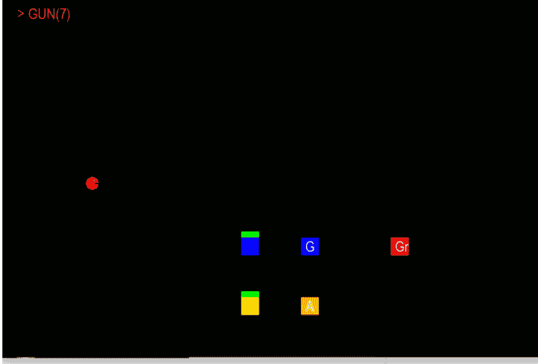

> GUN(17)

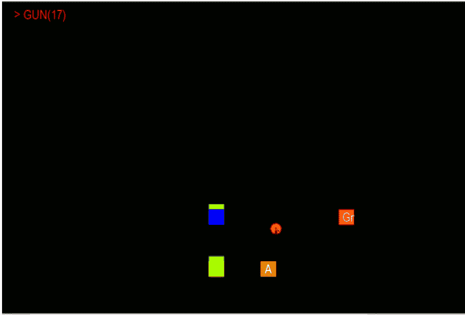

## 章节总结

## 摘要

在本章中，我们成功创建了一个管理武器和弹药的库存系统。我们还创建了可以被收集的弹药。最后，我们通过检测弹药何时被收集并相应地更新库存，成功地将库存与弹药联系起来。在此过程中，我们创建了新的类，基于这些类实例化了新的对象，并检测了用户输入（例如，TAB）。因此，在本章中，我们再次学习并应用了新的Python编程技能。

## 测验

现在是测试你知识的时候了。请指明以下陈述是正确还是错误。答案在下一页。

- 每个类都有一个默认构造函数。
- 构造函数可以包含多个参数。
- 成员变量只能从类中的构造函数访问。
- 当创建一个对象的新实例时，会调用相应的构造函数。
- 一个Python文件可以从命令行编译和运行。
- 以下代码将检查玩家是否按下了Tab键。

```
if event.type == pygame.KEYDOWN:
    if event.key == pygame.K_TAB:
```

- 使用列表时，可以使用pop方法从该列表中移除一个元素。
- 默认情况下，添加到列表的新元素位于索引0（第一个位置）。
- 使用列表时，可以使用include方法向该列表添加一个元素。
- 使用pygame库，可以在屏幕上显示文本。

## 测验答案

- 正确。
- 正确。
- 错误。
- 正确。
- 正确。
- 正确。
- 正确。
- 正确。
- 错误（可以使用append代替）。
- 正确。

### 检查清单

检查清单 检查清单 检查清单 检查清单 检查清单 检查清单 检查清单 检查清单 检查清单 检查清单 检查清单 检查清单 检查清单 检查清单 检查清单 检查清单 检查清单 检查清单 检查清单 检查清单 检查清单 检查清单 检查清单 检查清单 检查清单 检查清单 检查清单 检查清单 检查清单 检查清单 检查清单 检查清单 检查清单 检查清单 检查清单 检查清单 检查清单 检查清单 检查清单 检查清单 检查清单 检查清单 检查清单 检查清单 检查清单 检查清单 检查清单 检查清单 检查清单 检查清单 检查清单 检查清单 检查清单 检查清单 检查清单 检查清单 检查清单 检查清单 检查清单 检查清单 检查清单 检查清单 检查清单 检查清单 检查清单 检查清单 检查清单 检查清单 检查清单 检查清单 检查清单 检查清单 检查清单 检查清单 检查清单 检查清单 检查清单 检查清单 检查清单 检查清单 检查清单 检查清单 检查清单 检查清单 检查清单 检查清单 检查清单 检查清单 检查清单 检查清单 检查清单 检查清单 检查清单 检查清单 检查清单 检查清单 检查清单 检查清单 检查清单 检查清单 检查清单 检查清单 检查清单 检查清单 检查清单 检查清单 检查清单 检查清单 检查清单 检查清单 检查清单 检查清单 检查清单 检查清单 检查清单 检查清单 检查清单 检查清单 检查清单 检查清单 检查清单 检查清单 检查清单 检查清单 检查清单 检查清单 检查清单 检查清单 检查清单 检查清单 检查清单 检查清单 检查清单 检查清单 检查清单 检查清单 检查清单 检查清单 检查清单 检查清单 检查清单 检查清单 检查清单 检查清单 检查清单 检查清单 检查清单 检查清单 检查清单 检查清单 检查清单 检查清单 检查清单 检查清单 检查清单 检查清单 检查清单 检查清单 检查清单 检查清单 检查清单 检查清单 检查清单 检查清单 检查清单 检查清单 检查清单 检查清单 检查清单 检查清单 检查清单 检查清单 检查清单 检查清单 检查清单 检查清单 检查清单 检查清单 检查清单 检查清单 检查清单 检查清单 检查清单 检查清单 检查清单 检查清单 检查清单 检查清单 检查清单 检查清单 检查清单 检查清单 检查清单 检查清单 检查清单 检查清单 检查清单 检查清单 检查清单 检查清单 检查清单 检查清单 检查清单 检查清单 检查清单 检查清单 检查清单 检查清单 检查清单 检查清单 检查清单 检查清单 检查清单 检查清单 检查清单 检查清单 检查清单 检查清单 检查清单 检查清单 检查清单 检查清单 检查清单 检查清单 检查清单 检查清单 检查清单 检查清单 检查清单 检查清单 检查清单 检查清单 检查清单 检查清单 检查清单 检查清单 检查清单 检查清单 检查清单 检查清单 检查清单 检查清单 检查清单 检查清单 检查清单 检查清单 检查清单 检查清单 检查清单 检查清单 检查清单 检查清单 检查清单 检查清单 检查清单 检查清单 检查清单 检查清单 检查清单 检查清单 检查清单 检查清单 检查清单 检查清单 检查清单 检查清单 检查清单 检查清单 检查清单 检查清单 检查清单 检查清单 检查清单 检查清单 检查清单 检查清单 检查清单 检查清单 检查清单 检查清单 检查清单 检查清单 检查清单 检查清单 检查清单 检查清单 检查清单 检查清单 检查清单 检查清单 检查清单 检查清单 检查清单 检查清单 检查清单 检查清单 检查清单 检查清单 检查清单 检查清单 检查清单 检查清单 检查清单 检查清单 检查清单 检查清单 检查清单 检查清单 检查清单 检查清单 检查清单 检查清单 检查清单 检查清单 检查清单 检查清单 检查清单 检查清单 检查清单 检查清单 检查清单 检查清单 检查清单 检查清单 检查清单 检查清单 检查清单 检查清单 检查清单 检查清单 检查清单 检查清单 检查清单 检查清单 检查清单 检查清单 检查清单 检查清单 检查清单 检查清单 检查清单 检查清单 检查清单 检查清单 检查清单 检查清单 检查清单 检查清单 检查清单 检查清单 检查清单 检查清单 检查清单 检查清单 检查清单 检查清单 检查清单 检查清单 检查清单 检查清单 检查清单 检查清单 检查清单 检查清单 检查清单 检查清单 检查清单 检查清单 检查清单 检查清单 检查清单 检查清单 检查清单 检查清单 检查清单 检查清单 检查清单 检查清单 检查清单 检查清单 检查清单 检查清单 检查清单 检查清单 检查清单 检查清单 检查清单 检查清单 检查清单 检查清单 检查清单 检查清单 检查清单 检查清单 检查清单 检查清单 检查清单 检查清单 检查清单 检查清单 检查清单 检查清单 检查清单 检查清单 检查清单 检查清单 检查清单 检查清单 检查清单 检查清单 检查清单 检查清单 检查清单 检查清单 检查清单 检查清单 检查清单 检查清单 检查清单 检查清单 检查清单 检查清单 检查清单 检查清单 检查清单 检查清单 检查清单 检查清单 检查清单 检查清单 检查清单 检查清单 检查清单 检查清单 检查清单 检查清单 检查清单 检查清单 检查清单 检查清单 检查清单 检查清单 检查清单 检查清单 检查清单 检查清单 检查清单 检查清单 检查清单 检查清单 检查清单 检查清单 检查清单 检查清单 检查清单 检查清单 检查清单 检查清单 检查清单 检查清单 检查清单 检查清单 检查清单 检查清单 检查清单 检查清单 检查清单 检查清单 检查清单 检查清单 检查清单 检查清单 检查清单 检查清单 检查清单 检查清单 检查清单 检查清单 检查清单 检查清单 检查清单 检查清单 检查清单 检查清单 检查清单 检查清单 检查清单 检查清单 检查清单 检查清单 检查清单 检查清单 检查清单 检查清单 检查清单 检查清单 检查清单 检查清单 检查清单 检查清单 检查清单 检查清单 检查清单 检查清单 检查清单 检查清单 检查清单 检查清单 检查清单 检查清单 检查清单 检查清单 检查清单 检查清单 检查清单 检查清单 检查清单 检查清单 检查清单 检查清单 检查清单 检查清单 检查清单 检查清单 检查清单 检查清单 检查清单 检查清单 检查清单 检查清单 检查清单 检查清单 检查清单 检查清单 检查清单 检查清单 检查清单 检查清单 检查清单 检查清单 检查清单 检查清单 检查清单 检查清单 检查清单 检查清单 检查清单 检查清单 检查清单 检查清单 检查清单 检查清单 检查清单 检查清单 检查清单 检查清单 检查清单 检查清单 检查清单 检查清单 检查清单 检查清单 检查清单 检查清单 检查清单 检查清单 检查清单 检查清单 检查清单 检查清单 检查清单 检查清单 检查清单 检查清单 检查清单 检查清单 检查清单 检查清单 检查清单 检查清单 检查清单 检查清单 检查清单 检查清单 检查清单 检查清单 检查清单 检查清单 检查清单 检查清单 检查清单 检查清单 检查清单 检查清单 检查清单 检查清单 检查清单 检查清单 检查清单 检查清单 检查清单 检查清单 检查清单 检查清单 检查清单 检查清单 检查清单 检查清单 检查清单 检查清单 检查清单 检查清单 检查清单 检查清单 检查清单 检查清单 检查清单 检查清单 检查清单 检查清单 检查清单 检查清单 检查清单 检查清单 检查清单 检查清单 检查清单 检查清单 检查清单 检查清单 检查清单 检查清单 检查清单 检查清单 检查清单 检查清单 检查清单 检查清单 检查清单 检查清单 检查清单 检查清单 检查清单 检查清单 检查清单 检查清单 检查清单 检查清单 检查清单 检查清单 检查清单 检查清单 检查清单 检查清单 检查清单 检查清单 检查清单 检查清单 检查清单 检查清单 检查清单 检查清单 检查清单 检查清单 检查清单 检查清单 检查清单 检查清单 检查清单 检查清单 检查清单 检查清单 检查清单 检查清单 检查清单 检查清单 检查清单 检查清单 检查清单 检查清单 检查清单 检查清单 检查清单 检查清单 检查清单 检查清单 检查清单 检查清单 检查清单 检查清单 检查清单 检查清单 检查清单 检查清单 检查清单 检查清单 检查清单 检查清单 检查清单 检查清单 检查清单 检查清单 检查清单 检查清单 检查清单 检查清单 检查清单 检查清单 检查清单 检查清单 检查清单 检查清单 检查清单 检查清单 检查清单 检查清单 检查清单 检查清单 检查清单 检查清单 检查清单 检查清单 检查清单 检查清单 检查清单 检查清单 检查清单 检查清单 检查清单 检查清单 检查清单 检查清单 检查清单 检查清单 检查清单 检查清单 检查清单 检查清单 检查清单 检查清单 检查清单 检查清单 检查清单 检查清单 检查清单 检查清单 检查清单 检查清单 检查清单 检查清单 检查清单 检查清单 检查清单 检查清单 检查清单 检查清单 检查清单 检查清单 检查清单 检查清单 检查清单 检查清单 检查清单 检查清单 检查清单 检查清单 检查清单 检查清单 检查清单 检查清单 检查清单 检查清单 检查清单 检查清单 检查清单 检查清单 检查清单 检查清单 检查清单 检查清单 检查清单 检查清单 检查清单 检查清单 检查清单 检查清单 检查清单 检查清单 检查清单 检查清单 检查清单 检查清单 检查清单 检查清单 检查清单 检查清单 检查清单 检查清单 检查清单 检查清单 检查清单 检查清单 检查清单 检查清单 检查清单 检查清单 检查清单 检查清单 检查清单 检查清单 检查清单 检查清单 检查清单 检查清单 检查清单 检查清单 检查清单 检查清单 检查清单 检查清单 检查清单 检查清单 检查清单 检查清单 检查清单 检查清单 检查清单 检查清单 检查清单 检查清单 检查清单 检查清单 检查清单 检查清单 检查清单 检查清单 检查清单 检查清单 检查清单 检查清单 检查清单 检查清单 检查清单 检查清单 检查清单 检查清单 检查清单 检查清单 检查清单 检查清单 检查清单 检查清单 检查清单 检查清单 检查清单 检查清单 检查清单 检查清单 检查清单 检查清单 检查清单 检查清单 检查清单 检查清单 检查清单 检查清单 检查清单 检查清单 检查清单 检查清单 检查清单 检查清单 检查清单 检查清单 检查清单 检查清单 检查清单 检查清单 检查清单 检查清单 检查清单 检查清单 检查清单 检查清单 检查清单 检查清单 检查清单 检查清单 检查清单 检查清单 检查清单 检查清单 检查清单 检查清单 检查清单 检查清单 检查清单 检查清单 检查清单 检查清单 检查清单 检查清单 检查清单 检查清单 检查清单 检查清单 检查清单 检查清单 检查清单 检查清单 检查清单 检查清单 检查清单 检查清单 检查清单 检查清单 检查清单 检查清单 检查清单 检查清单 检查清单 检查清单 检查清单 检查清单 检查清单 检查清单 检查清单 检查清单 检查清单 检查清单 检查清单 检查清单 检查清单 检查清单 检查清单 检查清单 检查清单 检查清单 检查清单 检查清单 检查清单 检查清单 检查清单 检查清单 检查清单 检查清单 检查清单 检查清单 检查清单 检查清单 检查清单 检查清单 检查清单 检查清单 检查清单 检查清单 检查清单 检查清单 检查清单 检查清单 检查清单 检查清单 检查清单 检查清单 检查清单 检查清单 检查清单 检查清单 检查清单 检查清单 检查清单 检查清单 检查清单 检查清单 检查清单 检查清单 检查清单 检查清单 检查清单 检查清单 检查清单 检查清单 检查清单 检查清单 检查清单 检查清单 检查清单 检查清单 检查清单 检查清单 检查清单 检查清单 检查清单 检查清单 检查清单 检查清单 检查清单 检查清单 检查清单 检查清单 检查清单 检查清单 检查清单 检查清单 检查清单 检查清单 检查清单 检查清单 检查清单 检查清单 检查清单 检查清单 检查清单 检查清单 检查清单 检查清单 检查清单 检查清单 检查清单 检查清单 检查清单 检查清单 检查清单 检查清单 检查清单 检查清单 检查清单 检查清单 检查清单 检查清单 检查清单 检查清单 检查清单 检查清单 检查清单 检查清单 检查清单 检查清单 检查清单 检查清单 检查清单 检查清单 检查清单 检查清单 检查清单 检查清单 检查清单 检查清单 检查清单 检查清单 检查清单 检查清单 检查清单 检查清单 检查清单 检查清单 检查清单 检查清单 检查清单 检查清单 检查清单 检查清单 检查清单 检查清单 检查清单 检查清单 检查清单 检查清单 检查清单 检查清单 检查清单 检查清单 检查清单 检查清单 检查清单 检查清单 检查清单 检查清单 检查清单 检查清单 检查清单 检查清单 检查清单 检查清单 检查清单 检查清单 检查清单 检查清单 检查清单 检查清单 检查清单 检查清单 检查清单 检查清单 检查清单 检查清单 检查清单 检查清单 检查清单 检查清单 检查清单 检查清单 检查清单 检查清单 检查清单 检查清单 检查清单 检查清单 检查清单 检查清单 检查清单 检查清单 检查清单 检查清单 检查清单 检查清单 检查清单 检查清单 检查清单 检查清单 检查清单 检查清单 检查清单 检查清单 检查清单 检查清单 检查清单 检查清单 检查清单 检查清单 检查清单 检查清单 检查清单 检查清单 检查清单 检查清单 检查清单 检查清单 检查清单 检查清单 检查清单 检查清单 检查清单 检查清单 检查清单 检查清单 检查清单 检查清单 检查清单 检查清单 检查清单 检查清单 检查清单 检查清单 检查清单 检查清单 检查清单 检查清单 检查清单 检查清单 检查清单 检查清单 检查清单 检查清单 检查清单 检查清单 检查清单 检查清单 检查清单 检查清单 检查清单 检查清单 检查清单 检查清单 检查清单 检查清单 检查清单 检查清单 检查清单 检查清单 检查清单 检查清单 检查清单 检查清单 检查清单 检查清单 检查清单 检查清单 检查清单 检查清单 检查清单 检查清单 检查清单 检查清单 检查清单 检查清单 检查清单 检查清单 检查清单 检查清单 检查清单 检查清单 检查清单 检查清单 检查清单 检查清单 检查清单 检查清单 检查清单 检查清单 检查清单 检查清单 检查清单 检查清单 检查清单 检查清单 检查清单 检查清单 检查清单 检查清单 检查清单 检查清单 检查清单 检查清单 检查清单 检查清单 检查清单 检查清单 检查清单 检查清单 检查清单 检查清单 检查清单 检查清单 检查清单 检查清单 检查清单 检查清单 检查清单 检查清单 检查清单 检查清单 检查清单 检查清单 检查清单 检查清单 检查清单 检查清单 检查清单 检查清单 检查清单 检查清单 检查清单 检查清单 检查清单 检查清单 检查清单 检查清单 检查清单 检查清单 检查清单 检查清单 检查清单 检查清单 检查清单 检查清单 检查清单 检查清单 检查清单 检查清单 检查清单 检查清单 检查清单 检查清单 检查清单 检查清单 检查清单 检查清单 检查清单 检查清单 检查清单 检查清单 检查清单 检查清单 检查清单 检查清单 检查清单 检查清单 检查清单 检查清单 检查清单 检查清单 检查清单 检查清单 检查清单 检查清单 检查清单 检查清单 检查清单 检查清单 检查清单 检查清单 检查清单 检查清单 检查清单 检查清单 检查清单 检查清单 检查清单 检查清单 检查清单 检查清单 检查清单 检查清单 检查清单 检查清单 检查清单 检查清单 检查清单 检查清单 检查清单 检查清单 检查清单 检查清单 检查清单 检查清单 检查清单 检查清单 检查清单 检查清单 检查清单 检查清单 检查清单 检查清单 检查清单 检查清单 检查清单 检查清单 检查清单 检查清单 检查清单 检查清单 检查清单 检查清单 检查清单 检查清单 检查清单 检查清单 检查清单 检查清单 检查清单 检查清单 检查清单 检查清单 检查清单 检查清单 检查清单 检查清单 检查清单 检查清单 检查清单 检查清单 检查清单 检查清单 检查清单 检查清单 检查清单 检查清单 检查清单 检查清单 检查清单 检查清单 检查清单 检查清单 检查清单 检查清单 检查清单 检查清单 检查清单 检查清单 检查清单 检查清单 检查清单 检查清单 检查清单 检查清单 检查清单 检查清单 检查清单 检查清单 检查清单 检查清单 检查清单 检查清单 检查清单 检查清单 检查清单 检查清单 检查清单 检查清单 检查清单 检查清单 检查清单 检查清单 检查清单 检查清单 检查清单 检查清单 检查清单 检查清单 检查清单 检查清单 检查清单 检查清单 检查清单 检查清单 检查清单 检查清单 检查清单 检查清单 检查清单 检查清单 检查清单 检查清单 检查清单 检查清单 检查清单 检查清单 检查清单 检查清单 检查清单 检查清单 检查清单 检查清单 检查清单 检查清单 检查清单 检查清单 检查清单 检查清单 检查清单 检查清单 检查清单 检查清单 检查清单 检查清单 检查清单 检查清单 检查清单 检查清单 检查清单 检查清单 检查清单 检查清单 检查清单 检查清单 检查清单 检查清单 检查清单 检查清单 检查清单 检查清单 检查清单 检查清单 检查清单 检查清单 检查清单 检查清单 检查清单 检查清单 检查清单 检查清单 检查清单 检查清单 检查清单 检查清单 检查清单 检查清单 检查清单 检查清单 检查清单 检查清单 检查清单 检查清单 检查清单 检查清单 检查清单 检查清单 检查清单 检查清单 检查清单 检查清单 检查清单 检查清单 检查清单 检查清单 检查清单 检查清单 检查清单 检查清单 检查清单 检查清单 检查清单 检查清单 检查清单 检查清单 检查清单 检查清单 检查清单 检查清单 检查清单 检查清单 检查清单 检查清单 检查清单 检查清单 检查清单 检查清单 检查清单 检查清单 检查清单 检查清单 检查清单 检查清单 检查清单 检查清单 检查清单 检查清单 检查清单 检查清单 检查清单 检查清单 检查清单 检查清单 检查清单 检查清单 检查清单 检查清单 检查清单 检查清单 检查清单 检查清单 检查清单 检查清单 检查清单 检查清单 检查清单 检查清单 检查清单 检查清单 检查清单 检查清单 检查清单 检查清单 检查清单 检查清单 检查清单 检查清单 检查清单 检查清单 检查清单 检查清单 检查清单 检查清单 检查清单 检查清单 检查清单 检查清单 检查清单 检查清单 检查清单 检查清单 检查清单 检查清单 检查清单 检查清单 检查清单 检查清单 检查清单 检查清单 检查清单 检查清单 检查清单 检查清单 检查清单 检查清单 检查清单 检查清单 检查清单 检查清单 检查清单 检查清单 检查清单 检查清单 检查清单 检查清单 检查清单 检查清单 检查清单 检查清单 检查清单 检查清单 检查清单 检查清单 检查清单 检查清单 检查清单 检查清单 检查清单 检查清单 检查清单 检查清单 检查清单 检查清单 检查清单 检查清单 检查清单 检查清单 检查清单 检查清单 检查清单 检查清单 检查清单 检查清单 检查清单 检查清单 检查清单 检查清单 检查清单 检查清单 检查清单 检查清单 检查清单 检查清单 检查清单 检查清单 检查清单 检查清单 检查清单 检查清单 检查清单 检查清单 检查清单 检查清单 检查清单 检查清单 检查清单 检查清单 检查清单 检查清单 检查清单 检查清单 检查清单 检查清单 检查清单 检查清单 检查清单 检查清单 检查清单 检查清单 检查清单 检查清单 检查清单 检查清单 检查清单 检查清单 检查清单 检查清单 检查清单 检查清单 检查清单 检查清单 检查清单 检查清单 检查清单 检查清单 检查清单 检查清单 检查清单 检查清单 检查清单 检查清单 检查清单 检查清单 检查清单 检查清单 检查清单 检查清单 检查清单 检查清单 检查清单 检查清单 检查清单 检查清单 检查清单 检查清单 检查清单 检查清单 检查清单 检查清单 检查清单 检查清单 检查清单 检查清单 检查清单 检查清单 检查清单 检查清单 检查清单 检查清单 检查清单 检查清单 检查清单 检查清单 检查清单 检查清单 检查清单 检查清单 检查清单 检查清单 检查清单 检查清单 检查清单 检查清单 检查清单 检查清单 检查清单 检查清单 检查清单 检查清单 检查清单 检查清单 检查清单 检查清单 检查清单 检查清单 检查清单 检查清单 检查清单 检查清单 检查清单 检查清单 检查清单 检查清单 检查清单 检查清单 检查清单 检查清单 检查清单 检查清单 检查清单 检查清单 检查清单 检查清单 检查清单 检查清单 检查清单 检查清单 检查清单 检查清单 检查清单 检查清单 检查清单 检查清单 检查清单 检查清单 检查清单 检查清单 检查清单 检查清单 检查清单 检查清单 检查清单 检查清单 检查清单 检查清单 检查清单 检查清单 检查清单 检查清单 检查清单 检查清单 检查清单 检查清单 检查清单 检查清单 检查清单 检查清单 检查清单 检查清单 检查清单 检查清单 检查清单 检查清单 检查清单 检查清单 检查清单 检查清单 检查清单 检查清单 检查清单 检查清单 检查清单 检查清单 检查清单 检查清单 检查清单 检查清单 检查清单 检查清单 检查清单 检查清单 检查清单 检查清单 检查清单 检查清单 检查清单 检查清单 检查清单 检查清单 检查清单 检查清单 检查清单 检查清单 检查清单 检查清单 检查清单 检查清单 检查清单 检查清单 检查清单 检查清单 检查清单 检查清单 检查清单 检查清单 检查清单 检查清单 检查清单 检查清单 检查清单 检查清单 检查清单 检查清单 检查清单 检查清单 检查清单 检查清单 检查清单 检查清单 检查清单 检查清单 检查清单 检查清单 检查清单 检查清单 检查清单 检查清单 检查清单 检查清单 检查清单 检查清单 检查清单 检查清单 检查清单 检查清单 检查清单 检查清单 检查清单 检查清单 检查清单 检查清单 检查清单 检查清单 检查清单 检查清单 检查清单 检查清单 检查清单 检查清单 检查清单 检查清单 检查清单 检查清单 检查清单 检查清单 检查清单 检查清单 检查清单 检查清单 检查清单 检查清单 检查清单 检查清单 检查清单 检查清单 检查清单 检查清单 检查清单 检查清单 检查清单 检查清单 检查清单 检查清单 检查清单 检查清单 检查清单 检查清单 检查清单 检查清单 检查清单 检查清单 检查清单 检查清单 检查清单 检查清单 检查清单 检查清单 检查清单 检查清单 检查清单 检查清单 检查清单 检查清单 检查清单 检查清单 检查清单 检查清单 检查清单 检查清单 检查清单 检查清单 检查清单 检查清单 检查清单 检查清单 检查清单 检查清单 检查清单 检查清单 检查清单 检查清单 检查清单 检查清单 检查清单 检查清单 检查清单 检查清单 检查清单 检查清单 检查清单 检查清单 检查清单 检查清单 检查清单 检查清单 检查清单 检查清单 检查清单 检查清单 检查清单 检查清单 检查清单 检查清单 检查清单 检查清单 检查清单 检查清单 检查清单 检查清单 检查清单 检查清单 检查清单 检查清单 检查清单 检查清单 检查清单 检查清单 检查清单 检查清单 检查清单 检查清单 检查清单 检查清单 检查清单 检查清单 检查清单 检查清单 检查清单 检查清单 检查清单 检查清单 检查清单 检查清单 检查清单 检查清单 检查清单 检查清单 检查清单 检查清单 检查清单 检查清单 检查清单 检查清单 检查清单 检查清单 检查清单 检查清单 检查清单 检查清单 检查清单 检查清单 检查清单 检查清单 检查清单 检查清单 检查清单 检查清单 检查清单 检查清单 检查清单 检查清单 检查清单 检查清单 检查清单 检查清单 检查清单 检查清单 检查清单 检查清单 检查清单 检查清单 检查清单 检查清单 检查清单 检查清单 检查清单 检查清单 检查清单 检查清单 检查清单 检查清单 检查清单 检查清单 检查清单 检查清单 检查清单 检查清单 检查清单 检查清单 检查清单 检查清单 检查清单 检查清单 检查清单 检查清单 检查清单 检查清单 检查清单 检查清单 检查清单 检查清单 检查清单 检查清单 检查清单 检查清单 检查清单 检查清单 检查清单 检查清单 检查清单 检查清单 检查清单 检查清单 检查清单 检查清单 检查清单 检查清单 检查清单 检查清单 检查清单 检查清单 检查清单 检查清单 检查清单 检查清单 检查清单 检查清单 检查清单 检查清单 检查清单 检查清单 检查清单 检查清单 检查清单 检查清单 检查清单 检查清单 检查清单 检查清单 检查清单 检查清单 检查清单 检查清单 检查清单 检查清单 检查清单 检查清单 检查清单 检查清单 检查清单 检查清单 检查清单 检查清单 检查清单 检查清单 检查清单 检查清单 检查清单 检查清单 检查清单 检查清单 检查清单 检查清单 检查清单 检查清单 检查清单 检查清单 检查清单 检查清单 检查清单 检查清单 检查清单 检查清单 检查清单 检查清单 检查清单 检查清单 检查清单 检查清单 检查清单 检查清单 检查清单 检查清单 检查清单 检查清单 检查清单 检查清单 检查清单 检查清单 检查清单 检查清单 检查清单 检查清单 检查清单 检查清单 检查清单 检查清单 检查清单 检查清单 检查清单 检查清单 检查清单 检查清单 检查清单 检查清单 检查清单 检查清单 检查清单 检查清单 检查清单 检查清单 检查清单 检查清单 检查清单 检查清单 检查清单 检查清单 检查清单 检查清单 检查清单 检查清单 检查清单 检查清单 检查清单 检查清单 检查清单 检查清单 检查清单 检查清单 检查清单 检查清单 检查清单 检查清单 检查清单 检查清单 检查清单 检查清单 检查清单 检查清单 检查清单 检查清单 检查清单 检查清单 检查清单 检查清单 检查清单 检查清单 检查清单 检查清单 检查清单 检查清单 检查清单 检查清单 检查清单 检查清单 检查清单 检查清单 检查清单 检查清单 检查清单 检查清单 检查清单 检查清单 检查清单 检查清单 检查清单 检查清单 检查清单 检查清单 检查清单 检查清单 检查清单 检查清单 检查清单 检查清单 检查清单 检查清单 检查清单 检查清单 检查清单 检查清单 检查清单 检查清单 检查清单 检查清单 检查清单 检查清单 检查清单 检查清单 检查清单 检查清单 检查清单 检查清单 检查清单 检查清单 检查清单 检查清单 检查清单 检查清单 检查清单 检查清单 检查清单 检查清单 检查清单 检查清单 检查清单 检查清单 检查清单 检查清单 检查清单 检查清单 检查清单 检查清单 检查清单 检查清单 检查清单 检查清单 检查清单 检查清单 检查清单 检查清单 检查清单 检查清单 检查清单 检查清单 检查清单 检查清单 检查清单 检查清单 检查清单 检查清单 检查清单 检查清单 检查清单 检查清单 检查清单 检查清单 检查清单 检查清单 检查清单 检查清单 检查清单 检查清单 检查清单 检查清单 检查清单 检查清单 检查清单 检查清单 检查清单 检查清单 检查清单 检查清单 检查清单 检查清单 检查清单 检查清单 检查清单 检查清单 检查清单 检查清单 检查清单 检查清单 检查清单 检查清单 检查清单 检查清单 检查清单 检查清单 检查清单 检查清单 检查清单 检查清单 检查清单 检查清单 检查清单 检查清单 检查清单 检查清单 检查清单 检查清单 检查清单 检查清单 检查清单 检查清单 检查清单 检查清单 检查清单 检查清单 检查清单 检查清单 检查清单 检查清单 检查清单 检查清单 检查清单 检查清单 检查清单 检查清单 检查清单 检查清单 检查清单 检查清单 检查清单 检查清单 检查清单 检查清单 检查清单 检查清单 检查清单 检查清单 检查清单 检查清单 检查清单 检查清单 检查清单 检查清单 检查清单 检查清单 检查清单 检查清单 检查清单 检查清单 检查清单 检查清单 检查清单 检查清单 检查清单 检查清单 检查清单 检查清单 检查清单 检查清单 检查清单 检查清单 检查清单 检查清单 检查清单 检查清单 检查清单 检查清单 检查清单 检查清单 检查清单 检查清单 检查清单 检查清单 检查清单 检查清单 检查清单 检查清单 检查清单 检查清单 检查清单 检查清单 检查清单 检查清单 检查清单 检查清单 检查清单 检查清单 检查清单 检查清单 检查清单 检查清单 检查清单 检查清单 检查清单 检查清单 检查清单 检查清单 检查清单 检查清单 检查清单 检查清单 检查清单 检查清单 检查清单 检查清单 检查清单 检查清单 检查清单 检查清单 检查清单 检查清单 检查清单 检查清单 检查清单 检查清单 检查清单 检查清单 检查清单 检查清单 检查清单 检查清单 检查清单 检查清单 检查清单 检查清单 检查清单 检查清单 检查清单 检查清单 检查清单 检查清单 检查清单 检查清单 检查清单 检查清单 检查清单 检查清单 检查清单 检查清单 检查清单 检查清单 检查清单 检查清单 检查清单 检查清单 检查清单 检查清单 检查清单 检查清单 检查清单 检查清单 检查清单 检查清单 检查清单 检查清单 检查清单 检查清单 检查清单 检查清单 检查清单 检查清单 检查清单 检查清单 检查清单 检查清单 检查清单 检查清单 检查清单 检查清单 检查清单 检查清单 检查清单 检查清单 检查清单 检查清单 检查清单 检查清单 检查清单 检查清单 检查清单 检查清单 检查清单 检查清单 检查清单 检查清单 检查清单 检查清单 检查清单 检查清单 检查清单 检查清单 检查清单 检查清单 检查清单 检查清单 检查清单 检查清单 检查清单 检查清单 检查清单 检查清单 检查清单 检查清单 检查清单 检查清单 检查清单 检查清单 检查清单 检查清单 检查清单 检查清单 检查清单 检查清单 检查清单 检查清单 检查清单 检查清单 检查清单 检查清单 检查清单 检查清单 检查清单 检查清单 检查清单 检查清单 检查清单 检查清单 检查清单 检查清单 检查清单 检查清单 检查清单 检查清单 检查清单 检查清单 检查清单 检查清单 检查清单 检查清单 检查清单 检查清单 检查清单 检查清单 检查清单 检查清单 检查清单 检查清单 检查清单 检查清单 检查清单 检查清单 检查清单 检查清单 检查清单 检查清单 检查清单 检查清单 检查清单 检查清单 检查清单 检查清单 检查清单 检查清单 检查清单 检查清单 检查清单 检查清单 检查清单 检查清单 检查清单 检查清单 检查清单 检查清单 检查清单 检查清单 检查清单 检查清单 检查清单 检查清单 检查清单 检查清单 检查清单 检查清单 检查清单 检查清单 检查清单 检查清单 检查清单 检查清单 检查清单 检查清单 检查清单 检查清单 检查清单 检查清单 检查清单 检查清单 检查清单 检查清单 检查清单 检查清单 检查清单 检查清单 检查清单 检查清单 检查清单 检查清单 检查清单 检查清单 检查清单 检查清单 检查清单 检查清单 检查清单 检查清单 检查清单 检查清单 检查清单 检查清单 检查清单 检查清单 检查清单 检查清单 检查清单 检查清单 检查清单 检查清单 检查清单 检查清单 检查清单 检查清单 检查清单 检查清单 检查清单 检查清单 检查清单 检查清单 检查清单 检查清单 检查清单 检查清单 检查清单 检查清单 检查清单 检查清单 检查清单 检查清单 检查清单 检查清单 检查清单 检查清单 检查清单 检查清单 检查清单 检查清单 检查清单 检查清单 检查清单 检查清单 检查清单 检查清单 检查清单 检查清单 检查清单 检查清单 检查清单 检查清单 检查清单 检查清单 检查清单 检查清单 检查清单 检查清单 检查清单 检查清单 检查清单 检查清单 检查清单 检查清单 检查清单 检查清单 检查清单 检查清单 检查清单 检查清单 检查清单 检查清单 检查清单 检查清单 检查清单 检查清单 检查清单 检查清单 检查清单 检查清单 检查清单 检查清单 检查清单 检查清单 检查清单 检查清单 检查清单 检查清单 检查清单 检查清单 检查清单 检查清单 检查清单 检查清单 检查清单 检查清单 检查清单 检查清单 检查清单 检查清单 检查清单 检查清单 检查清单 检查清单 检查清单 检查清单 检查清单 检查清单 检查清单 检查清单 检查清单 检查清单 检查清单 检查清单 检查清单 检查清单 检查清单 检查清单 检查清单 检查清单 检查清单 检查清单 检查清单 检查清单 检查清单 检查清单 检查清单 检查清单 检查清单 检查清单 检查清单 检查清单 检查清单 检查清单 检查清单 检查清单 检查清单 检查清单 检查清单 检查清单 检查清单 检查清单 检查清单 检查清单 检查清单 检查清单 检查清单 检查清单 检查清单 检查清单 检查清单 检查清单 检查清单 检查清单 检查清单 检查清单 检查清单 检查清单 检查清单 检查清单 检查清单 检查清单 检查清单 检查清单 检查清单 检查清单 检查清单 检查清单 检查清单 检查清单 检查清单 检查清单 检查清单 检查清单 检查清单 检查清单 检查清单 检查清单 检查清单 检查清单 检查清单 检查清单 检查清单 检查清单 检查清单 检查清单 检查清单 检查清单 检查清单 检查清单 检查清单 检查清单 检查清单 检查清单 检查清单 检查清单 检查清单 检查清单 检查清单 检查清单 检查清单 检查清单 检查清单 检查清单 检查清单 检查清单 检查清单 检查清单 检查清单 检查清单 检查清单 检查清单 检查清单 检查清单 检查清单 检查清单 检查清单 检查清单 检查清单 检查清单 检查清单 检查清单 检查清单 检查清单 检查清单 检查清单 检查清单 检查清单 检查清单 检查清单 检查清单 检查清单 检查清单 检查清单 检查清单 检查清单 检查清单 检查清单 检查清单 检查清单 检查清单 检查清单 检查清单 检查清单 检查清单 检查清单 检查清单 检查清单 检查清单 检查清单 检查清单 检查清单 检查清单 检查清单 检查清单 检查清单 检查清单 检查清单 检查清单 检查清单 检查清单 检查清单 检查清单 检查清单 检查清单 检查清单 检查清单 检查清单 检查清单 检查清单 检查清单 检查清单 检查清单 检查清单 检查清单 检查清单 检查清单 检查清单 检查清单 检查清单 检查清单 检查清单 检查清单 检查清单 检查清单 检查清单 检查清单 检查清单 检查清单 检查清单 检查清单 检查清单 检查清单 检查清单 检查清单 检查清单 检查清单 检查清单 检查清单 检查清单 检查清单 检查清单 检查清单 检查清单 检查清单 检查清单 检查清单 检查清单 检查清单 检查清单 检查清单 检查清单 检查清单 检查清单 检查清单 检查清单 检查清单 检查清单 检查清单 检查清单 检查清单 检查清单 检查清单 检查清单 检查清单 检查清单 检查清单 检查清单 检查清单 检查清单 检查清单 检查清单 检查清单 检查清单 检查清单 检查清单 检查清单 检查清单 检查清单 检查清单 检查清单 检查清单 检查清单 检查清单 检查清单 检查清单 检查清单 检查清单 检查清单 检查清单 检查清单 检查清单 检查清单 检查清单 检查清单 检查清单 检查清单 检查清单 检查清单 检查清单 检查清单 检查清单 检查清单 检查清单 检查清单 检查清单 检查清单 检查清单 检查清单 检查清单 检查清单 检查清单 检查清单 检查清单 检查清单 检查清单 检查清单 检查清单 检查清单 检查清单 检查清单 检查清单 检查清单 检查清单 检查清单 检查清单 检查清单 检查清单 检查清单 检查清单 检查清单 检查清单 检查清单 检查清单 检查清单 检查清单 检查清单 检查清单 检查清单 检查清单 检查清单 检查清单 检查清单 检查清单 检查清单 检查清单 检查清单 检查清单 检查清单 检查清单 检查清单 检查清单 检查清单 检查清单 检查清单 检查清单 检查清单 检查清单 检查清单 检查清单 检查清单 检查清单 检查清单 检查清单 检查清单 检查清单 检查清单 检查清单 检查清单 检查清单 检查清单 检查清单 检查清单 检查清单 检查清单 检查清单 检查清单 检查清单 检查清单 检查清单 检查清单 检查清单 检查清单 检查清单 检查清单 检查清单 检查清单 检查清单 检查清单 检查清单 检查清单 检查清单 检查清单 检查清单 检查清单 检查清单 检查清单 检查清单 检查清单 检查清单 检查清单 检查清单 检查清单 检查清单 检查清单 检查清单 检查清单 检查清单 检查清单 检查清单 检查清单 检查清单 检查清单 检查清单 检查清单 检查清单 检查清单 检查清单 检查清单 检查清单 检查清单 检查清单 检查清单 检查清单 检查清单 检查清单 检查清单 检查清单 检查清单 检查清单 检查清单 检查清单 检查清单 检查清单 检查清单 检查清单 检查清单 检查清单 检查清单 检查清单 检查清单 检查清单 检查清单 检查清单 检查清单 检查清单 检查清单 检查清单 检查清单 检查清单 检查清单 检查清单 检查清单 检查清单 检查清单 检查清单 检查清单 检查清单 检查清单 检查清单 检查清单 检查清单 检查清单 检查清单 检查清单 检查清单 检查清单 检查清单 检查清单 检查清单 检查清单 检查清单 检查清单 检查清单 检查清单 检查清单 检查清单 检查清单 检查清单 检查清单 检查清单 检查清单 检查清单 检查清单 检查清单 检查清单 检查清单 检查清单 检查清单 检查清单 检查清单 检查清单 检查清单 检查清单 检查清单 检查清单 检查清单 检查清单 检查清单 检查清单 检查清单 检查清单 检查清单 检查清单 检查清单 检查清单 检查清单 检查清单 检查清单 检查清单 检查清单 检查清单 检查清单 检查清单 检查清单 检查清单 检查清单 检查清单 检查清单 检查清单 检查清单 检查清单 检查清单 检查清单 检查清单 检查清单 检查清单 检查清单 检查清单 检查清单 检查清单 检查清单 检查清单 检查清单 检查清单 检查清单 检查清单 检查清单 检查清单 检查清单 检查清单 检查清单 检查清单 检查清单 检查清单 检查清单 检查清单 检查清单 检查清单 检查清单 检查清单 检查清单 检查清单 检查清单 检查清单 检查清单 检查清单 检查清单 检查清单 检查清单 检查清单 检查清单 检查清单 检查清单 检查清单 检查清单 检查清单 检查清单 检查清单 检查清单 检查清单 检查清单 检查清单 检查清单 检查清单 检查清单 检查清单 检查清单 检查清单 检查清单 检查清单 检查清单 检查清单 检查清单 检查清单 检查清单 检查清单 检查清单 检查清单 检查清单 检查清单 检查清单 检查清单 检查清单 检查清单 检查清单 检查清单 检查清单 检查清单 检查清单 检查清单 检查清单 检查清单 检查清单 检查清单 检查清单 检查清单 检查清单 检查清单 检查清单 检查清单 检查清单 检查清单 检查清单 检查清单 检查清单 检查清单 检查清单 检查清单 检查清单 检查清单 检查清单 检查清单 检查清单 检查清单 检查清单 检查清单 检查清单 检查清单 检查清单 检查清单 检查清单 检查清单 检查清单 检查清单 检查清单 检查清单 检查清单 检查清单 检查清单 检查清单 检查清单 检查清单 检查清单 检查清单 检查清单 检查清单 检查清单 检查清单 检查清单 检查清单 检查清单 检查清单 检查清单 检查清单 检查清单 检查清单 检查清单 检查清单 检查清单 检查清单 检查清单 检查清单 检查清单 检查清单 检查清单 检查清单 检查清单 检查清单 检查清单 检查清单 检查清单 检查清单 检查清单 检查清单 检查清单 检查清单 检查清单 检查清单 检查清单 检查清单 检查清单 检查清单 检查清单 检查清单 检查清单 检查清单 检查清单 检查清单 检查清单 检查清单 检查清单 检查清单 检查清单 检查清单 检查清单 检查清单 检查清单 检查清单 检查清单 检查清单 检查清单 检查清单 检查清单 检查清单 检查清单 检查清单 检查清单 检查清单 检查清单 检查清单 检查清单 检查清单 检查清单 检查清单 检查清单 检查清单 检查清单 检查清单 检查清单 检查清单 检查清单 检查清单 检查清单 检查清单 检查清单 检查清单 检查清单 检查清单 检查清单 检查清单 检查清单 检查清单 检查清单 检查清单 检查清单 检查清单 检查清单 检查清单 检查清单 检查清单 检查清单 检查清单 检查清单 检查清单 检查清单 检查清单 检查清单 检查清单 检查清单 检查清单 检查清单 检查清单 检查清单 检查清单 检查清单 检查清单 检查清单 检查清单 检查清单 检查清单 检查清单 检查清单 检查清单 检查清单 检查清单 检查清单 检查清单 检查清单 检查清单 检查清单 检查清单 检查清单 检查清单 检查清单 检查清单 检查清单 检查清单 检查清单 检查清单 检查清单 检查清单 检查清单 检查清单 检查清单 检查清单 检查清单 检查清单 检查清单 检查清单 检查清单 检查清单 检查清单 检查清单 检查清单 检查清单 检查清单 检查清单 检查清单 检查清单 检查清单 检查清单 检查清单 检查清单 检查清单 检查清单 检查清单 检查清单 检查清单 检查清单 检查清单 检查清单 检查清单 检查清单 检查清单 检查清单 检查清单 检查清单 检查清单 检查清单 检查清单 检查清单 检查清单 检查清单 检查清单 检查清单 检查清单 检查清单 检查清单 检查清单 检查清单 检查清单 检查清单 检查清单 检查清单 检查清单 检查清单 检查清单 检查清单 检查清单 检查清单 检查清单 检查清单 检查清单 检查清单 检查清单 检查清单 检查清单 检查清单 检查清单 检查清单 检查清单 检查清单 检查清单 检查清单 检查清单 检查清单 检查清单 检查清单 检查清单 检查清单 检查清单 检查清单 检查清单 检查清单 检查清单 检查清单 检查清单 检查清单 检查清单 检查清单 检查清单 检查清单 检查清单 检查清单 检查清单 检查清单 检查清单 检查清单 检查清单 检查清单 检查清单 检查清单 检查清单 检查清单 检查清单 检查清单 检查清单 检查清单 检查清单 检查清单 检查清单 检查清单 检查清单 检查清单 检查清单 检查清单 检查清单 检查清单 检查清单 检查清单 检查清单 检查清单 检查清单 检查清单 检查清单 检查清单 检查清单 检查清单 检查清单 检查清单 检查清单 检查清单 检查清单 检查清单 检查清单 检查清单 检查清单 检查清单 检查清单 检查清单 检查清单 检查清单 检查清单 检查清单 检查清单 检查清单 检查清单 检查清单 检查清单 检查清单 检查清单 检查清单 检查清单 检查清单 检查清单 检查清单 检查清单 检查清单 检查清单 检查清单 检查清单 检查清单 检查清单 检查清单 检查清单 检查清单 检查清单 检查清单 检查清单 检查清单 检查清单 检查清单 检查清单 检查清单 检查清单 检查清单 检查清单 检查清单 检查清单 检查清单 检查清单 检查清单 检查清单 检查清单 检查清单 检查清单 检查清单 检查清单 检查清单 检查清单 检查清单 检查清单 检查清单 检查清单 检查清单 检查清单 检查清单 检查清单 检查清单 检查清单 检查清单 检查清单 检查清单 检查清单 检查清单 检查清单 检查清单 检查清单 检查清单 检查清单 检查清单 检查清单 检查清单 检查清单 检查清单 检查清单 检查清单 检查清单 检查清单 检查清单 检查清单 检查清单 检查清单 检查清单 检查清单 检查清单 检查清单 检查清单 检查清单 检查清单 检查清单 检查清单 检查清单 检查清单 检查清单 检查清单 检查清单 检查清单 检查清单 检查清单 检查清单 检查清单 检查清单 检查清单 检查清单 检查清单 检查清单 检查清单 检查清单 检查清单 检查清单 检查清单 检查清单 检查清单 检查清单 检查清单 检查清单 检查清单 检查清单 检查清单 检查清单 检查清单 检查清单 检查清单 检查清单 检查清单 检查清单 检查清单 检查清单 检查清单 检查清单 检查清单 检查清单 检查清单 检查清单 检查清单 检查清单 检查清单 检查清单 检查清单 检查清单 检查清单 检查清单 检查清单 检查清单 检查清单 检查清单 检查清单 检查清单 检查清单 检查清单 检查清单 检查清单 检查清单 检查清单 检查清单 检查清单 检查清单 检查清单 检查清单 检查清单 检查清单 检查清单 检查清单 检查清单 检查清单 检查清单 检查清单 检查清单 检查清单 检查清单 检查清单 检查清单 检查清单 检查清单 检查清单 检查清单 检查清单 检查清单 检查清单 检查清单 检查清单 检查清单 检查清单 检查清单 检查清单 检查清单 检查清单 检查清单 检查清单 检查清单 检查清单 检查清单 检查清单 检查清单 检查清单 检查清单 检查清单 检查清单 检查清单 检查清单 检查清单 检查清单 检查清单 检查清单 检查清单 检查清单 检查清单 检查清单 检查清单 检查清单 检查清单 检查清单 检查清单 检查清单 检查清单 检查清单 检查清单 检查清单 检查清单 检查清单 检查清单 检查清单 检查清单 检查清单 检查清单 检查清单 检查清单 检查清单 检查清单 检查清单 检查清单 检查清单 检查清单 检查清单 检查清单 检查清单 检查清单 检查清单 检查清单 检查清单 检查清单 检查清单 检查清单 检查清单 检查清单 检查清单 检查清单 检查清单 检查清单 检查清单 检查清单 检查清单 检查清单 检查清单 检查清单 检查清单 检查清单 检查清单 检查清单 检查清单 检查清单 检查清单 检查清单 检查清单 检查清单 检查清单 检查清单 检查清单 检查清单 检查清单 检查清单 检查清单 检查清单 检查清单 检查清单 检查清单 检查清单 检查清单 检查清单 检查清单 检查清单 检查清单 检查清单 检查清单 检查清单 检查清单 检查清单 检查清单 检查清单 检查清单 检查清单 检查清单 检查清单 检查清单 检查清单 检查清单 检查清单 检查清单 检查清单 检查清单 检查清单 检查清单 检查清单 检查清单 检查清单 检查清单 检查清单 检查清单 检查清单 检查清单 检查清单 检查清单 检查清单 检查清单 检查清单 检查清单 检查清单 检查清单 检查清单 检查清单 检查清单 检查清单 检查清单 检查清单 检查清单 检查清单 检查清单 检查清单 检查清单 检查清单 检查清单 检查清单 检查清单 检查清单 检查清单 检查清单 检查清单 检查清单 检查清单 检查清单 检查清单 检查清单 检查清单 检查清单 检查清单 检查清单 检查清单 检查清单 检查清单 检查清单 检查清单 检查清单 检查清单 检查清单 检查清单 检查清单 检查清单 检查清单 检查清单 检查清单 检查清单 检查清单 检查清单 检查清单 检查清单 检查清单 检查清单 检查清单 检查清单 检查清单 检查清单 检查清单 检查清单 检查清单 检查清单 检查清单 检查清单 检查清单 检查清单 检查清单 检查清单 检查清单 检查清单 检查清单 检查清单 检查清单 检查清单 检查清单 检查清单 检查清单 检查清单 检查清单 检查清单 检查清单 检查清单 检查清单 检查清单 检查清单 检查清单 检查清单 检查清单 检查清单 检查清单 检查清单 检查清单 检查清单 检查清单 检查清单 检查清单 检查清单 检查清单 检查清单 检查清单 检查清单 检查清单 检查清单 检查清单 检查清单 检查清单 检查清单 检查清单 检查清单 检查清单 检查清单 检查清单 检查清单 检查清单 检查清单 检查清单 检查清单 检查清单 检查清单 检查清单 检查清单 检查清单 检查清单 检查清单 检查清单 检查清单 检查清单 检查清单 检查清单 检查清单 检查清单 检查清单 检查清单 检查清单 检查清单 检查清单 检查清单 检查清单 检查清单 检查清单 检查清单 检查清单 检查清单 检查清单 检查清单 检查清单 检查清单 检查清单 检查清单 检查清单 检查清单 检查清单 检查清单 检查清单 检查清单 检查清单 检查清单 检查清单 检查清单 检查清单 检查清单 检查清单 检查清单 检查清单 检查清单 检查清单 检查清单 检查清单 检查清单 检查清单 检查清单 检查清单 检查清单 检查清单 检查清单 检查清单 检查清单 检查清单 检查清单 检查清单 检查清单 检查清单 检查清单 检查清单 检查清单 检查清单 检查清单 检查清单 检查清单 检查清单 检查清单 检查清单 检查清单 检查清单 检查清单 检查清单 检查清单 检查清单 检查清单 检查清单 检查清单 检查清单 检查清单 检查清单 检查清单 检查清单 检查清单 检查清单 检查清单 检查清单 检查清单 检查清单 检查清单 检查清单 检查清单 检查清单 检查清单 检查清单 检查清单 检查清单 检查清单 检查清单 检查清单 检查清单 检查清单 检查清单 检查清单 检查清单 检查清单 检查清单 检查清单 检查清单 检查清单 检查清单 检查清单 检查清单 检查清单 检查清单 检查清单 检查清单 检查清单 检查清单 检查清单 检查清单 检查清单 检查清单 检查清单 检查清单 检查清单 检查清单 检查清单 检查清单 检查清单 检查清单 检查清单 检查清单 检查清单 检查清单 检查清单 检查清单 检查清单 检查清单 检查清单 检查清单 检查清单 检查清单 检查清单 检查清单 检查清单 检查清单 检查清单 检查清单 检查清单 检查清单 检查清单 检查清单 检查清单 检查清单 检查清单 检查清单 检查清单 检查清单 检查清单 检查清单 检查清单 检查清单 检查清单 检查清单 检查清单 检查清单 检查清单 检查清单 检查清单 检查清单 检查清单 检查清单 检查清单 检查清单 检查清单 检查清单 检查清单 检查清单 检查清单 检查清单 检查清单 检查清单 检查清单 检查清单 检查清单 检查清单 检查清单 检查清单 检查清单 检查清单 检查清单 检查清单 检查清单 检查清单 检查清单 检查清单 检查清单 检查清单 检查清单 检查清单 检查清单 检查清单 检查清单 检查清单 检查清单 检查清单 检查清单 检查清单 检查清单 检查清单 检查清单 检查清单 检查清单 检查清单 检查清单 检查清单 检查清单 检查清单 检查清单 检查清单 检查清单 检查清单 检查清单 检查清单 检查清单 检查清单 检查清单 检查清单 检查清单 检查清单 检查清单 检查清单 检查清单 检查清单 检查清单 检查清单 检查清单 检查清单 检查清单 检查清单 检查清单 检查清单 检查清单 检查清单 检查清单 检查清单 检查清单 检查清单 检查清单 检查清单 检查清单 检查清单 检查清单 检查清单 检查清单 检查清单 检查清单 检查清单 检查清单 检查清单 检查清单 检查清单 检查清单 检查清单 检查清单 检查清单 检查清单 检查清单 检查清单 检查清单 检查清单 检查清单 检查清单 检查清单 检查清单 检查清单 检查清单 检查清单 检查清单 检查清单 检查清单 检查清单 检查清单 检查清单 检查清单 检查清单 检查清单 检查清单 检查清单 检查清单 检查清单 检查清单 检查清单 检查清单 检查清单 检查清单 检查清单 检查清单 检查清单 检查清单 检查清单 检查清单 检查清单 检查清单 检查清单 检查清单 检查清单 检查清单 检查清单 检查清单 检查清单 检查清单 检查清单 检查清单 检查清单 检查清单 检查清单 检查清单 检查清单 检查清单 检查清单 检查清单 检查清单 检查清单 检查清单 检查清单 检查清单 检查清单 检查清单 检查清单 检查清单 检查清单 检查清单 检查清单 检查清单 检查清单 检查清单 检查清单 检查清单 检查清单 检查清单 检查清单 检查清单 检查清单 检查清单 检查清单 检查清单 检查清单 检查清单 检查清单 检查清单 检查清单 检查清单 检查清单 检查清单 检查清单 检查清单 检查清单 检查清单 检查清单 检查清单 检查清单 检查清单 检查清单 检查清单 检查清单 检查清单 检查清单 检查清单 检查清单 检查清单 检查清单 检查清单 检查清单 检查清单 检查清单 检查清单 检查清单 检查清单 检查清单 检查清单 检查清单 检查清单 检查清单 检查清单 检查清单 检查清单 检查清单 检查清单 检查清单 检查清单 检查清单 检查清单 检查清单 检查清单 检查清单 检查清单 检查清单 检查清单 检查清单 检查清单 检查清单 检查清单 检查清单 检查清单 检查清单 检查清单 检查清单 检查清单 检查清单 检查清单 检查清单 检查清单 检查清单 检查清单 检查清单 检查清单 检查清单 检查清单 检查清单 检查清单 检查清单 检查清单 检查清单 检查清单 检查清单 检查清单 检查清单 检查清单 检查清单 检查清单 检查清单 检查清单 检查清单 检查清单 检查清单 检查清单 检查清单 检查清单 检查清单 检查清单 检查清单 检查清单 检查清单 检查清单 检查清单 检查清单 检查清单 检查清单 检查清单 检查清单 检查清单 检查清单 检查清单 检查清单 检查清单 检查清单 检查清单 检查清单 检查清单 检查清单 检查清单 检查清单 检查清单 检查清单 检查清单 检查清单 检查清单 检查清单 检查清单 检查清单 检查清单 检查清单 检查清单 检查清单 检查清单 检查清单 检查清单 检查清单 检查清单 检查清单 检查清单 检查清单 检查清单 检查清单 检查清单 检查清单 检查清单 检查清单 检查清单 检查清单 检查清单 检查清单 检查清单 检查清单 检查清单 检查清单 检查清单 检查清单 检查清单 检查清单 检查清单 检查清单 检查清单 检查清单 检查清单 检查清单 检查清单 检查清单 检查清单 检查清单 检查清单 检查清单 检查清单 检查清单 检查清单 检查清单 检查清单 检查清单 检查清单 检查清单 检查清单 检查清单 检查清单 检查清单 检查清单 检查清单 检查清单 检查清单 检查清单 检查清单 检查清单 检查清单 检查清单 检查清单 检查清单 检查清单 检查清单 检查清单 检查清单 检查清单 检查清单 检查清单 检查清单 检查清单 检查清单 检查清单 检查清单 检查清单 检查清单 检查清单 检查清单 检查清单 检查清单 检查清单 检查清单 检查清单 检查清单 检查清单 检查清单 检查清单 检查清单 检查清单 检查清单 检查清单 检查清单 检查清单 检查清单 检查清单 检查清单 检查清单 检查清单 检查清单 检查清单 检查清单 检查清单 检查清单 检查清单 检查清单 检查清单 检查清单 检查清单 检查清单 检查清单 检查清单 检查清单 检查清单 检查清单 检查清单 检查清单 检查清单 检查清单 检查清单 检查清单 检查清单 检查清单 检查清单 检查清单 检查清单 检查清单 检查清单 检查清单 检查清单 检查清单 检查清单 检查清单 检查清单 检查清单 检查清单 检查清单 检查清单 检查清单 检查清单 检查清单 检查清单 检查清单 检查清单 检查清单 检查清单 检查清单 检查清单 检查清单 检查清单 检查清单 检查清单 检查清单 检查清单 检查清单 检查清单 检查清单 检查清单 检查清单 检查清单 检查清单 检查清单 检查清单 检查清单 检查清单 检查清单 检查清单 检查清单 检查清单 检查清单 检查清单 检查清单 检查清单 检查清单 检查清单 检查清单 检查清单 检查清单 检查清单 检查清单 检查清单 检查清单 检查清单 检查清单 检查清单 检查清单 检查清单 检查清单 检查清单 检查清单 检查清单 检查清单 检查清单 检查清单 检查清单 检查清单 检查清单 检查清单 检查清单 检查清单 检查清单 检查清单 检查清单 检查清单 检查清单 检查清单 检查清单 检查清单 检查清单 检查清单 检查清单 检查清单 检查清单 检查清单 检查清单 检查清单 检查清单 检查清单 检查清单 检查清单 检查清单 检查清单 检查清单 检查清单 检查清单 检查清单 检查清单 检查清单 检查清单 检查清单 检查清单 检查清单 检查清单 检查清单 检查清单 检查清单 检查清单 检查清单 检查清单 检查清单 检查清单 检查清单 检查清单 检查清单 检查清单 检查清单 检查清单 检查清单 检查清单 检查清单 检查清单 检查清单 检查清单 检查清单 检查清单 检查清单 检查清单 检查清单 检查清单 检查清单 检查清单 检查清单 检查清单 检查清单 检查清单 检查清单 检查清单 检查清单 检查清单 检查清单 检查清单 检查清单 检查清单 检查清单 检查清单 检查清单 检查清单 检查清单 检查清单 检查清单 检查清单 检查清单 检查清单 检查清单 检查清单 检查清单 检查清单 检查清单 检查清单 检查清单 检查清单 检查清单 检查清单 检查清单 检查清单 检查清单 检查清单 检查清单 检查清单 检查清单 检查清单 检查清单 检查清单 检查清单 检查清单 检查清单 检查清单 检查清单 检查清单 检查清单 检查清单 检查清单 检查清单 检查清单 检查清单 检查清单 检查清单 检查清单 检查清单 检查清单 检查清单 检查清单 检查清单 检查清单 检查清单 检查清单 检查清单 检查清单 检查清单 检查清单 检查清单 检查清单 检查清单 检查清单 检查清单 检查清单 检查清单 检查清单 检查清单 检查清单 检查清单 检查清单 检查清单 检查清单 检查清单 检查清单 检查清单 检查清单 检查清单 检查清单 检查清单 检查清单 检查清单 检查清单 检查清单 检查清单 检查清单 检查清单 检查清单 检查清单 检查清单 检查清单 检查清单 检查清单 检查清单 检查清单 检查清单 检查清单 检查清单 检查清单 检查清单 检查清单 检查清单 检查清单 检查清单 检查清单 检查清单 检查清单 检查清单 检查清单 检查清单 检查清单 检查清单 检查清单 检查清单 检查清单 检查清单 检查清单 检查清单 检查清单 检查清单 检查清单 检查清单 检查清单 检查清单 检查清单 检查清单 检查清单 检查清单 检查清单 检查清单 检查清单 检查清单 检查清单 检查清单 检查清单 检查清单 检查清单 检查清单 检查清单 检查清单 检查清单 检查清单 检查清单 检查清单 检查清单 检查清单 检查清单 检查清单 检查清单 检查清单 检查清单 检查清单 检查清单 检查清单 检查清单 检查清单 检查清单 检查清单 检查清单 检查清单 检查清单 检查清单 检查清单 检查清单 检查清单 检查清单 检查清单 检查清单 检查清单 检查清单 检查清单 检查清单 检查清单 检查清单 检查清单 检查清单 检查清单 检查清单 检查清单 检查清单 检查清单 检查清单 检查清单 检查清单 检查清单 检查清单 检查清单 检查清单 检查清单 检查清单 检查清单 检查清单 检查清单 检查清单 检查清单 检查清单 检查清单 检查清单 检查清单 检查清单 检查清单 检查清单 检查清单 检查清单 检查清单 检查清单 检查清单 检查清单 检查清单 检查清单 检查清单 检查清单 检查清单 检查清单 检查清单 检查清单 检查清单 检查清单 检查清单 检查清单 检查清单 检查清单 检查清单 检查清单 检查清单 检查清单 检查清单 检查清单 检查清单 检查清单 检查清单 检查清单 检查清单 检查清单 检查清单 检查清单 检查清单 检查清单 检查清单 检查清单 检查清单 检查清单 检查清单 检查清单 检查清单 检查清单 检查清单 检查清单 检查清单 检查清单 检查清单 检查清单 检查清单 检查清单 检查清单 检查清单 检查清单 检查清单 检查清单 检查清单 检查清单 检查清单 检查清单 检查清单 检查清单 检查清单 检查清单 检查清单 检查清单 检查清单 检查清单 检查清单 检查清单 检查清单 检查清单 检查清单 检查清单 检查清单 检查清单 检查清单 检查清单 检查清单 检查清单 检查清单 检查清单 检查清单 检查清单 检查清单 检查清单 检查清单 检查清单 检查清单 检查清单 检查清单 检查清单 检查清单 检查清单 检查清单 检查清单 检查清单 检查清单 检查清单 检查清单 检查清单 检查清单 检查清单 检查清单 检查清单 检查清单 检查清单 检查清单 检查清单 检查清单 检查清单 检查清单 检查清单 检查清单 检查清单 检查清单 检查清单 检查清单 检查清单 检查清单 检查清单 检查清单 检查清单 检查清单 检查清单 检查清单 检查清单 检查清单 检查清单 检查清单 检查清单 检查清单 检查清单 检查清单 检查清单 检查清单 检查清单 检查清单 检查清单 检查清单 检查清单 检查清单 检查清单 检查清单 检查清单 检查清单 检查清单 检查清单 检查清单 检查清单 检查清单 检查清单 检查清单 检查清单 检查清单 检查清单 检查清单 检查清单 检查清单 检查清单 检查清单 检查清单 检查清单 检查清单 检查清单 检查清单 检查清单 检查清单 检查清单 检查清单 检查清单 检查清单 检查清单 检查清单 检查清单 检查清单 检查清单 检查清单 检查清单 检查清单 检查清单 检查清单 检查清单 检查清单 检查清单 检查清单 检查清单 检查清单 检查清单 检查清单 检查清单 检查清单 检查清单 检查清单 检查清单 检查清单 检查清单 检查清单 检查清单 检查清单 检查清单 检查清单 检查清单 检查清单 检查清单 检查清单 检查清单 检查清单 检查清单 检查清单 检查清单 检查清单 检查清单 检查清单 检查清单 检查清单 检查清单 检查清单 检查清单 检查清单 检查清单 检查清单 检查清单 检查清单 检查清单 检查清单 检查清单 检查清单 检查清单 检查清单 检查清单 检查清单 检查清单 检查清单 检查清单 检查清单 检查清单 检查清单 检查清单 检查清单 检查清单 检查清单 检查清单 检查清单 检查清单 检查清单 检查清单 检查清单 检查清单 检查清单 检查清单 检查清单 检查清单 检查清单 检查清单 检查清单 检查清单 检查清单 检查清单 检查清单 检查清单 检查清单 检查清单 检查清单 检查清单 检查清单 检查清单 检查清单 检查清单 检查清单 检查清单 检查清单 检查清单 检查清单 检查清单 检查清单 检查清单 检查清单 检查清单 检查清单 检查清单 检查清单 检查清单 检查清单 检查清单 检查清单 检查清单 检查清单 检查清单 检查清单 检查清单 检查清单 检查清单 检查清单 检查清单 检查清单 检查清单 检查清单 检查清单 检查清单 检查清单 检查清单 检查清单 检查清单 检查清单 检查清单 检查清单 检查清单 检查清单 检查清单 检查清单 检查清单 检查清单 检查清单 检查清单 检查清单 检查清单 检查清单 检查清单 检查清单 检查清单 检查清单 检查清单 检查清单 检查清单 检查清单 检查清单 检查清单 检查清单 检查清单 检查清单 检查清单 检查清单 检查清单 检查清单 检查清单 检查清单 检查清单 检查清单 检查清单 检查清单 检查清单 检查清单 检查清单 检查清单 检查清单 检查清单 检查清单 检查清单 检查清单 检查清单 检查清单 检查清单 检查清单 检查清单 检查清单 检查清单 检查清单 检查清单 检查清单 检查清单 检查清单 检查清单 检查清单 检查清单 检查清单 检查清单 检查清单 检查清单 检查清单 检查清单 检查清单 检查清单 检查清单 检查清单 检查清单 检查清单 检查清单 检查清单 检查清单 检查清单 检查清单 检查清单 检查清单 检查清单 检查清单 检查清单 检查清单 检查清单 检查清单 检查清单 检查清单 检查清单 检查清单 检查清单 检查清单 检查清单 检查清单 检查清单 检查清单 检查清单 检查清单 检查清单 检查清单 检查清单 检查清单 检查清单 检查清单 检查清单 检查清单 检查清单 检查清单 检查清单 检查清单 检查清单 检查清单 检查清单 检查清单 检查清单 检查清单 检查清单 检查清单 检查清单 检查清单 检查清单 检查清单 检查清单 检查清单 检查清单 检查清单 检查清单 检查清单 检查清单 检查清单 检查清单 检查清单 检查清单 检查清单 检查清单 检查清单 检查清单 检查清单 检查清单 检查清单 检查清单 检查清单 检查清单 检查清单 检查清单 检查清单 检查清单 检查清单 检查清单 检查清单 检查清单 检查清单 检查清单 检查清单 检查清单 检查清单 检查清单 检查清单 检查清单 检查清单 检查清单 检查清单 检查清单 检查清单 检查清单 检查清单 检查清单 检查清单 检查清单 检查清单 检查清单 检查清单 检查清单 检查清单 检查清单 检查清单 检查清单 检查清单 检查清单 检查清单 检查清单 检查清单 检查清单 检查清单 检查清单 检查清单 检查清单 检查清单 检查清单 检查清单 检查清单 检查清单 检查清单 检查清单 检查清单 检查清单 检查清单 检查清单 检查清单 检查清单 检查清单 检查清单 检查清单 检查清单 检查清单 检查清单 检查清单 检查清单 检查清单 检查清单 检查清单 检查清单 检查清单 检查清单 检查清单 检查清单 检查清单 检查清单 检查清单 检查清单 检查清单 检查清单 检查清单 检查清单 检查清单 检查清单 检查清单 检查清单 检查清单 检查清单 检查清单 检查清单 检查清单 检查清单 检查清单 检查清单 检查清单 检查清单 检查清单 检查清单 检查清单 检查清单 检查清单 检查清单 检查清单 检查清单 检查清单 检查清单 检查清单 检查清单 检查清单 检查清单 检查清单 检查清单 检查清单 检查清单 检查清单 检查清单 检查清单 检查清单 检查清单 检查清单 检查清单 检查清单 检查清单 检查清单 检查清单 检查清单 检查清单 检查清单 检查清单 检查清单 检查清单 检查清单 检查清单 检查清单 检查清单 检查清单 检查清单 检查清单 检查清单 检查清单 检查清单 检查清单 检查清单 检查清单 检查清单 检查清单 检查清单 检查清单 检查清单 检查清单 检查清单 检查清单 检查清单 检查清单 检查清单 检查清单 检查清单 检查清单 检查清单 检查清单 检查清单 检查清单 检查清单 检查清单 检查清单 检查清单 检查清单 检查清单 检查清单 检查清单 检查清单 检查清单 检查清单 检查清单 检查清单 检查清单 检查清单 检查清单 检查清单 检查清单 检查清单 检查清单 检查清单 检查清单 检查清单 检查清单 检查清单 检查清单 检查清单 检查清单 检查清单 检查清单 检查清单 检查清单 检查清单 检查清单 检查清单 检查清单 检查清单 检查清单 检查清单 检查清单 检查清单 检查清单 检查清单 检查清单 检查清单 检查清单 检查清单 检查清单 检查清单 检查清单 检查清单 检查清单 检查清单 检查清单 检查清单 检查清单 检查清单 检查清单 检查清单 检查清单 检查清单 检查清单 检查清单 检查清单 检查清单 检查清单 检查清单 检查清单 检查清单 检查清单 检查清单 检查清单 检查清单 检查清单 检查清单 检查清单 检查清单 检查清单 检查清单 检查清单 检查清单 检查清单 检查清单 检查清单 检查清单 检查清单 检查清单 检查清单 检查清单 检查清单 检查清单 检查清单 检查清单 检查清单 检查清单 检查清单 检查清单 检查清单 检查清单 检查清单 检查清单 检查清单 检查清单 检查清单 检查清单 检查清单 检查清单 检查清单 检查清单 检查清单 检查清单 检查清单 检查清单 检查清单 检查清单 检查清单 检查清单 检查清单 检查清单 检查清单 检查清单 检查清单 检查清单 检查清单 检查清单 检查清单 检查清单 检查清单 检查清单 检查清单 检查清单 检查清单 检查清单 检查清单 检查清单 检查清单 检查清单 检查清单 检查清单 检查清单 检查清单 检查清单 检查清单 检查清单 检查清单 检查清单 检查清单 检查清单 检查清单 检查清单 检查清单 检查清单 检查清单 检查清单 检查清单 检查清单 检查清单 检查清单 检查清单 检查清单 检查清单 检查清单 检查清单 检查清单 检查清单 检查清单 检查清单 检查清单 检查清单 检查清单 检查清单 检查清单 检查清单 检查清单 检查清单 检查清单 检查清单 检查清单 检查清单 检查清单 检查清单 检查清单 检查清单 检查清单 检查清单 检查清单 检查清单 检查清单 检查清单 检查清单 检查清单 检查清单 检查清单 检查清单 检查清单 检查清单 检查清单 检查清单 检查清单 检查清单 检查清单 检查清单 检查清单 检查清单 检查清单 检查清单 检查清单 检查清单 检查清单 检查清单 检查清单 检查清单 检查清单 检查清单 检查清单 检查清单 检查清单 检查清单 检查清单 检查清单 检查清单 检查清单 检查清单 检查清单 检查清单 检查清单 检查清单 检查清单 检查清单 检查清单 检查清单 检查清单 检查清单 检查清单 检查清单 检查清单 检查清单 检查清单 检查清单 检查清单 检查清单 检查清单 检查清单 检查清单 检查清单 检查清单 检查清单 检查清单 检查清单 检查清单 检查清单 检查清单 检查清单 检查清单 检查清单 检查清单 检查清单 检查清单 检查清单 检查清单 检查清单 检查清单 检查清单 检查清单 检查清单 检查清单 检查清单 检查清单 检查清单 检查清单 检查清单 检查清单 检查清单 检查清单 检查清单 检查清单 检查清单 检查清单 检查清单 检查清单 检查清单 检查清单 检查清单 检查清单 检查清单 检查清单 检查清单 检查清单 检查清单 检查清单 检查清单 检查清单 检查清单 检查清单 检查清单 检查清单 检查清单 检查清单 检查清单 检查清单 检查清单 检查清单 检查清单 检查清单 检查清单 检查清单 检查清单 检查清单 检查清单 检查清单 检查清单 检查清单 检查清单 检查清单 检查清单 检查清单 检查清单 检查清单 检查清单 检查清单 检查清单 检查清单 检查清单 检查清单 检查清单 检查清单 检查清单 检查清单 检查清单 检查清单 检查清单 检查清单 检查清单 检查清单 检查清单 检查清单 检查清单 检查清单 检查清单 检查清单 检查清单 检查清单 检查清单 检查清单 检查清单 检查清单 检查清单 检查清单 检查清单 检查清单 检查清单 检查清单 检查清单 检查清单 检查清单 检查清单 检查清单 检查清单 检查清单 检查清单 检查清单 检查清单 检查清单 检查清单 检查清单 检查清单 检查清单 检查清单 检查清单 检查清单 检查清单 检查清单 检查清单 检查清单 检查清单 检查清单 检查清单 检查清单 检查清单 检查清单 检查清单 检查清单 检查清单 检查清单 检查清单 检查清单 检查清单 检查清单 检查清单 检查清单 检查清单 检查清单 检查清单 检查清单 检查清单 检查清单 检查清单 检查清单 检查清单 检查清单 检查清单 检查清单 检查清单 检查清单 检查清单 检查清单 检查清单 检查清单 检查清单 检查清单 检查清单 检查清单 检查清单 检查清单 检查清单 检查清单 检查清单 检查清单 检查清单 检查清单 检查清单 检查清单 检查清单 检查清单 检查清单 检查清单 检查清单 检查清单 检查清单 检查清单 检查清单 检查清单 检查清单 检查清单 检查清单 检查清单 检查清单 检查清单 检查清单 检查清单 检查清单 检查清单 检查清单 检查清单 检查清单 检查清单 检查清单 检查清单 检查清单 检查清单 检查清单 检查清单 检查清单 检查清单 检查清单 检查清单 检查清单 检查清单 检查清单 检查清单 检查清单 检查清单 检查清单 检查清单 检查清单 检查清单 检查清单 检查清单 检查清单 检查清单 检查清单 检查清单 检查清单 检查清单 检查清单 检查清单 检查清单 检查清单 检查清单 检查清单 检查清单 检查清单 检查清单 检查清单 检查清单 检查清单 检查清单 检查清单 检查清单 检查清单 检查清单 检查清单 检查清单 检查清单 检查清单 检查清单 检查清单 检查清单 检查清单 检查清单 检查清单 检查清单 检查清单 检查清单 检查清单 检查清单 检查清单 检查清单 检查清单 检查清单 检查清单 检查清单 检查清单 检查清单 检查清单 检查清单 检查清单 检查清单 检查清单 检查清单 检查清单 检查清单 检查清单 检查清单 检查清单 检查清单 检查清单 检查清单 检查清单 检查清单 检查清单 检查清单 检查清单 检查清单 检查清单 检查清单 检查清单 检查清单 检查清单 检查清单 检查清单 检查清单 检查清单 检查清单 检查清单 检查清单 检查清单 检查清单 检查清单 检查清单 检查清单 检查清单 检查清单 检查清单 检查清单 检查清单 检查清单 检查清单 检查清单 检查清单 检查清单 检查清单 检查清单 检查清单 检查清单 检查清单 检查清单 检查清单 检查清单 检查清单 检查清单 检查清单 检查清单 检查清单 检查清单 检查清单 检查清单 检查清单 检查清单 检查清单 检查清单 检查清单 检查清单 检查清单 检查清单 检查清单 检查清单 检查清单 检查清单 检查清单 检查清单 检查清单 检查清单 检查清单 检查清单 检查清单 检查清单 检查清单 检查清单 检查清单 检查清单 检查清单 检查清单 检查清单 检查清单 检查清单 检查清单 检查清单 检查清单 检查清单 检查清单 检查清单 检查清单 检查清单 检查清单 检查清单 检查清单 检查清单 检查清单 检查清单 检查清单 检查清单 检查清单 检查清单 检查清单 检查清单 检查清单 检查清单 检查清单 检查清单 检查清单 检查清单 检查清单 检查清单 检查清单 检查清单 检查清单 检查清单 检查清单 检查清单 检查清单 检查清单 检查清单 检查清单 检查清单 检查清单 检查清单 检查清单 检查清单 检查清单 检查清单 检查清单 检查清单 检查清单 检查清单 检查清单 检查清单 检查清单 检查清单 检查清单 检查清单 检查清单 检查清单 检查清单 检查清单 检查清单 检查清单 检查清单 检查清单 检查清单 检查清单 检查清单 检查清单 检查清单 检查清单 检查清单 检查清单 检查清单 检查清单 检查清单 检查清单 检查清单 检查清单 检查清单 检查清单 检查清单 检查清单 检查清单 检查清单 检查清单 检查清单 检查清单 检查清单 检查清单 检查清单 检查清单 检查清单 检查清单 检查清单 检查清单 检查清单 检查清单 检查清单 检查清单 检查清单 检查清单 检查清单 检查清单 检查清单 检查清单 检查清单 检查清单 检查清单 检查清单 检查清单 检查清单 检查清单 检查清单 检查清单 检查清单 检查清单 检查清单 检查清单 检查清单 检查清单 检查清单 检查清单 检查清单 检查清单 检查清单 检查清单 检查清单 检查清单 检查清单 检查清单 检查清单 检查清单 检查清单 检查清单 检查清单 检查清单 检查清单 检查清单 检查清单 检查清单 检查清单 检查清单 检查清单 检查清单 检查清单 检查清单 检查清单 检查清单 检查清单 检查清单 检查清单 检查清单 检查清单 检查清单 检查清单 检查清单 检查清单 检查清单 检查清单 检查清单 检查清单 检查清单 检查清单 检查清单 检查清单 检查清单 检查清单 检查清单 检查清单 检查清单 检查清单 检查清单 检查清单 检查清单 检查清单 检查清单 检查清单 检查清单 检查清单 检查清单 检查清单 检查清单 检查清单 检查清单 检查清单 检查清单 检查清单 检查清单 检查清单 检查清单 检查清单 检查清单 检查清单 检查清单 检查清单 检查清单 检查清单 检查清单 检查清单 检查清单 检查清单 检查清单 检查清单 检查清单 检查清单 检查清单 检查清单 检查清单 检查清单 检查清单 检查清单 检查清单 检查清单 检查清单 检查清单 检查清单 检查清单 检查清单 检查清单 检查清单 检查清单 检查清单 检查清单 检查清单 检查清单 检查清单 检查清单 检查清单 检查清单 检查清单 检查清单 检查清单 检查清单 检查清单 检查清单 检查清单 检查清单 检查清单 检查清单 检查清单 检查清单 检查清单 检查清单 检查清单 检查清单 检查清单 检查清单 检查清单 检查清单 检查清单 检查清单 检查清单 检查清单 检查清单 检查清单 检查清单 检查清单 检查清单 检查清单 检查清单 检查清单 检查清单 检查清单 检查清单 检查清单 检查清单 检查清单 检查清单 检查清单 检查清单 检查清单 检查清单 检查清单 检查清单 检查清单 检查清单 检查清单 检查清单 检查清单 检查清单 检查清单 检查清单 检查清单 检查清单 检查清单 检查清单 检查清单 检查清单 检查清单 检查清单 检查清单 检查清单 检查清单 检查清单 检查清单 检查清单 检查清单 检查清单 检查清单 检查清单 检查清单 检查清单 检查清单 检查清单 检查清单 检查清单 检查清单 检查清单 检查清单 检查清单 检查清单 检查清单 检查清单 检查清单 检查清单 检查清单 检查清单 检查清单 检查清单 检查清单 检查清单 检查清单 检查清单 检查清单 检查清单 检查清单 检查清单 检查清单 检查清单 检查清单 检查清单 检查清单 检查清单 检查清单 检查清单 检查清单 检查清单 检查清单 检查清单 检查清单 检查清单 检查清单 检查清单 检查清单 检查清单 检查清单 检查清单 检查清单 检查清单 检查清单 检查清单 检查清单 检查清单 检查清单 检查清单 检查清单 检查清单 检查清单 检查清单 检查清单 检查清单 检查清单 检查清单 检查清单 检查清单 检查清单 检查清单 检查清单 检查清单 检查清单 检查清单 检查清单 检查清单 检查清单 检查清单 检查清单 检查清单 检查清单 检查清单 检查清单 检查清单 检查清单 检查清单 检查清单 检查清单 检查清单 检查清单 检查清单 检查清单 检查清单 检查清单 检查清单 检查清单 检查清单 检查清单 检查清单 检查清单 检查清单 检查清单 检查清单 检查清单 检查清单 检查清单 检查清单 检查清单 检查清单 检查清单 检查清单 检查清单 检查清单 检查清单 检查清单 检查清单 检查清单 检查清单 检查清单 检查清单 检查清单 检查清单 检查清单 检查清单 检查清单 检查清单 检查清单 检查清单 检查清单 检查清单 检查清单 检查清单 检查清单 检查清单 检查清单 检查清单 检查清单 检查清单 检查清单 检查清单 检查清单 检查清单 检查清单 检查清单 检查清单 检查清单 检查清单 检查清单 检查清单 检查清单 检查清单 检查清单 检查清单 检查清单 检查清单 检查清单 检查清单 检查清单 检查清单 检查清单 检查清单 检查清单 检查清单 检查清单 检查清单 检查清单 检查清单 检查清单 检查清单 检查清单 检查清单 检查清单 检查清单 检查清单 检查清单 检查清单 检查清单 检查清单 检查清单 检查清单 检查清单 检查清单 检查清单 检查清单 检查清单 检查清单 检查清单 检查清单 检查清单 检查清单 检查清单 检查清单 检查清单 检查清单 检查清单 检查清单 检查清单 检查清单 检查清单 检查清单 检查清单 检查清单 检查清单 检查清单 检查清单 检查清单 检查清单 检查清单 检查清单 检查清单 检查清单 检查清单 检查清单 检查清单 检查清单 检查清单 检查清单 检查清单 检查清单 检查清单 检查清单 检查清单 检查清单 检查清单 检查清单 检查清单 检查清单 检查清单 检查清单 检查清单 检查清单 检查清单 检查清单 检查清单 检查清单 检查清单 检查清单 检查清单 检查清单 检查清单 检查清单 检查清单 检查清单 检查清单 检查清单 检查清单 检查清单 检查清单 检查清单 检查清单 检查清单 检查清单 检查清单 检查清单 检查清单 检查清单 检查清单 检查清单 检查清单 检查清单 检查清单 检查清单 检查清单 检查清单 检查清单 检查清单 检查清单 检查清单 检查清单 检查清单 检查清单 检查清单 检查清单 检查清单 检查清单 检查清单 检查清单 检查清单 检查清单 检查清单 检查清单 检查清单 检查清单 检查清单 检查清单 检查清单 检查清单 检查清单 检查清单 检查清单 检查清单 检查清单 检查清单 检查清单 检查清单 检查清单 检查清单 检查清单 检查清单 检查清单 检查清单 检查清单 检查清单 检查清单 检查清单 检查清单 检查清单 检查清单 检查清单 检查清单 检查清单 检查清单 检查清单 检查清单 检查清单 检查清单 检查清单 检查清单 检查清单 检查清单 检查清单 检查清单 检查清单 检查清单 检查清单 检查清单 检查

## 添加与墙壁的碰撞检测

因此，在这个阶段我们已经创建并显示了墙壁；所以我们只需要检测玩家与这些墙壁之间的碰撞。为了实现这一点，我们将应用几个简单的步骤：

-   每当玩家移动时，我们记录其方向（即上、下、左或右）。
-   玩家移动后，我们检查玩家角色是否与某个方块发生碰撞（基于两者的位置）。
-   如果发生碰撞，我们将玩家角色向相反方向移动。

请将以下代码添加到该方法中

```python
player_collision_rect = player_rect
if (
    player_collision_rect.colliderect(Wall_rect1) or
    player_collision_rect.colliderect(Wall_rect2) or
    player_collision_rect.colliderect(Wall_rect3) or
    player_collision_rect.colliderect(Wall_rect4) or
    player_collision_rect.colliderect(Wall_rect5) or
    player_collision_rect.colliderect(Wall_rect6) or
    player_collision_rect.colliderect(Wall_rect7) or
    player_collision_rect.colliderect(Wall_rect8) or
    player_collision_rect.colliderect(Wall_rect9) or
    player_collision_rect.colliderect(Wall_rect10) or
    player_collision_rect.colliderect(Wall_rect11) or
    player_collision_rect.colliderect(Wall_rect12) or
    player_collision_rect.colliderect(Wall_rect13) or
    player_collision_rect.colliderect(Wall_rect14) or
    player_collision_rect.colliderect(Wall_rect15)):
    if (player_angle == 0): player_rect.y -= VEL
    if (player_angle == 180): player_rect.y += VEL
    if (player_angle == 90): player_rect.y += VEL
    if (player_angle == -90): player_rect.y -= VEL
```

在前面的代码中，我们检查玩家是否与任何墙壁发生碰撞，如果是这种情况，我们将玩家向相反方向移动（即后退）。

你现在可以编译你的代码，并检查玩家是否无法穿过墙壁。

## 使用路径点移动 NPC

在本节中，我们将开始通过路径点移动 NPC；路径点是临时目的地，将它们组合在一起可以形成 NPC 将要遵循的路径。因此，我们将按如下步骤进行：

-   我们将定义每个路径点的位置。
-   我们将向一个路径点移动 NPC。
-   我们将检查 NPC 是否足够接近该路径点。
-   如果是这种情况，NPC 将开始跟随下一个路径点。
-   当 NPC 到达最后一个路径点时，它将从第一个路径点重新开始。

现在概念更清晰了一些，让我们实现我们的路径并创建路径点。

请在脚本中任何方法之外添加以下代码：

```python
WP1 = pygame.Vector2()
WP1.xy = 50,50
WP2 = pygame.Vector2()
WP2.xy = 850,50
WP3 = pygame.Vector2()
WP3.xy = 850,550
WP4 = pygame.Vector2()
WP4.xy = 50,550
WPs = [WP1,WP2,WP3,WP4]
WP_index = 0
```

在前面的代码中：

-   我们定义并设置变量，这些变量是用于每个路径点位置的二维向量。
-   将它们组合在一起，这些路径点形成一个矩形。
-   我们将这些路径点添加到一个列表中。
-   最后，我们创建一个名为 `WP_index` 的变量，该变量将用于定义 NPC 当前要跟随的路径点。

这些步骤在下图中进行了说明：

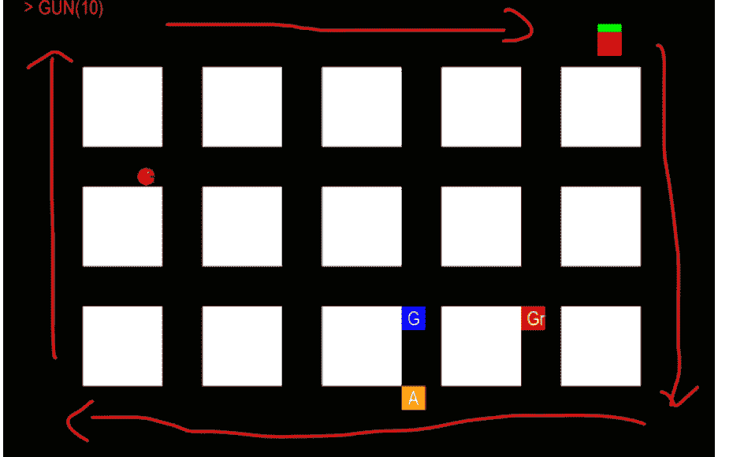

我们现在可以基于这些路径点实现 NPC 的移动：

请在类中创建以下方法

```python
def move(self):
    global WP_index, WPs
```

在前面的代码中，我们创建了一个名为 `move` 的新方法。在此方法中，我们引用了全局变量 `WP_index` 和 `WPs`。

请将以下代码添加到该方法中

```python
    npc_pos = pygame.Vector2()
    npc_pos.xy = self.x,self.y
    if (WP_index < 3): npc_destination = WPs[WP_index+1]
    else: npc_destination = WPs[0]
```

在前面的代码中：

-   我们创建了一个名为 `npc_pos` 的新变量，类型为 `Vector2`。
-   我们设置该向量的 x 和 y 坐标。
-   我们检查是否已到达最后一个路径点，并相应地设置我们的目的地。

请在你刚刚输入的代码之后添加以下代码：

```python
    distance_to_next_wp = get_distance(npc_pos,npc_destination)
    if (distance_to_next_wp < 10):
        WP_index += 1
        if WP_index > 3: WP_index = 0
```

在前面的代码中：

-   我们调用一个名为 `get_distance` 的方法（我们还需要创建它），该方法计算 NPC 与其目的地之间的距离。
-   如果 NPC 已到达其目的地（即下一个路径点），我们将名为 `WP_index` 的索引值增加 1。
-   如果我们已到达最后一个路径点，则索引设置为 0。

现在我们已经定义了要跟随的路径点，我们需要根据 NPC 的位置和下一个要到达的路径点来计算 NPC 的方向。为此，我们只需要对定义 NPC 和路径点位置的向量执行减法。

请在你刚刚输入的代码之后添加以下代码（新代码为粗体）：

```python
    if WP_index > 3: WP_index = 0
    unit_direction = pygame.Vector2()
    if (WP_index < 3): unit_direction = - WPs[WP_index] + WPs[WP_index + 1]
    else: unit_direction = - WPs[WP_index] + WPs[0]
    unit_direction = unit_direction.normalize()
```

在前面的代码中：

-   我们定义了一个名为 `unit_direction` 的变量。
-   这是一个向量，它将定义向下一个路径点移动时的前进方向。
-   这个方向向量是当前路径点与下一个路径点之间的减法，这样 NPC 就会在路径点之间沿直线移动。
-   因此，要定义该向量，我们从下一个路径点的位置减去当前路径点的位置。
-   如果我们已到达最后一个路径点，则下一个路径点是索引为 0 的那个（即 `WPs[0]`）。
-   最后，因为这个向量将应用于 NPC 的移动，所以我们对其进行归一化，这意味着我们将其大小保持为 1。

现在 NPC 的方向已经定义好了，我们只需要使用它来将 NPC 向该特定方向移动。

请将以下代码添加到该方法中

```python
    self.x += unit_direction.x * 3
    self.y += unit_direction.y * 3
    self.collision_rect.x = self.x
    self.collision_rect.y = self.y
```

在前面的代码中，我们使用向量 `unit_direction` 来改变 NPC 的位置；我们也改变了用于检测与 NPC 碰撞的矩形的位置。

我们需要做的最后一件事是从主循环方法中调用此方法，因此请将此代码添加到 `window` 方法中（新代码为粗体）：

```python
    for npc in npcs:
        npc.draw()
        npc.move()
```

最后，我们需要声明名为 `get_distance` 的方法，因此请在任何类之外添加以下方法：

```python
def get_distance(point_two, point_one):
    perpendicular = point_two.y - point_one.y
    base = point_two.x - point_one.x
    distance = math.hypot(perpendicular, base)
    return distance
```

在前面的代码中：

-   其思想是通过首先定义一个向量来计算两点之间的距离，该向量是两个位置之间的向量减法；该向量实际上是从第一个点指向第二个点。
-   一旦我们获得了这个向量，我们就可以确定它的 x 和 y 坐标，并推导出它的长度。
-   这是因为，由于我们是在笛卡尔坐标系中工作，并且如果，如下图所示，我们考虑由两个点 A 和 B 以及点 C 形成的三角形，其中点 C 是通过点 B 和 C 的垂直线和水平线的交点，那么三角形的斜边可以根据两个对边来定义。

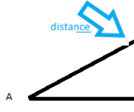

因此，实际上，在前面的代码中我们定义了三角形每条边的大小（即 AC 和 BC 以及底边），然后我们使用内置方法 `math.hypot` 计算斜边 AB 的大小（即两点之间的距离）。

请在脚本开头也添加这一行，以导入用于计算 NPC 与下一个路径点之间距离的 `math` 模块。

```python
import math
```

最后，因为我们将只使用一个 NPC 来测试沿路径点的移动，并确保它在开始时位于路径上，我们将按如下方式修改代码（新代码为粗体）：

```python
npcs = []
#npc1 = NPC(400, 400, "BLUE")
#npc2 = NPC(400, 500, "YELLOW")
npc1 = NPC(50, 50, "BLUE")
npcs.append(npc1)
```

## 为NPC添加听觉和视觉

在本节中，我们将为NPC添加听觉和视觉能力。这些功能将基于玩家与NPC之间的距离以及它们的相对位置。

虽然下一节将处理当检测到玩家时NPC向其移动的问题，但本节仅会在检测到玩家时在命令提示符中输出一条消息；NPC的颜色也会改变，以便您获得一个视觉提示，表明NPC检测功能正常工作。

请将以下方法添加到类中：

```python
def hear(self):
    npc_position = pygame.Vector2()
    npc_position.xy = self.x, self.y
    distance_between_player_and_npc = get_distance(npc_position, player_rect)
    if (distance_between_player_and_npc < 50):
        print("Just Heard the Player")
```

在上面的代码中：

- 我们定义了一个名为 `hear` 的新方法，它不接受参数（除了 `self` 参数，表示这是一个成员方法）。
- 我们将NPC的位置存储在变量中。
- 然后我们调用 `get_distance` 方法来计算NPC与玩家之间的距离。

如果这个距离小于50像素，我们就在命令提示符中显示一条消息。

现在我们已经定义了这个方法，我们只需要调用它，以便NPC能够频繁地监听以检测玩家。

请将以下代码添加到 `window` 方法中（新代码用粗体表示）：

```python
for npc in npcs:
    npc.draw()
    npc.move()
    npc.hear()
```

现在您可以保存并编译您的代码；当游戏运行时，当您靠近NPC时，您应该会在命令提示符中看到一条消息说“Heard The Player”。同样，在下一节中，我们将改变NPC的行为，使其在听到玩家后开始追逐玩家。

接下来，我们可以开始实现NPC的视觉功能；这个功能将通过检查NPC和玩家是否在同一行或同一列来实现。为此，我们将创建两个方法来指定NPC和玩家角色所在的列；通过使用这些方法并比较玩家和NPC的列号或行号，我们将能够确定它们是否在同一行，从而确定NPC是否能看到玩家。

请将以下方法添加到类中：

```python
def which_horizontal_lane_is_item(self, x, y, item_size):
    if (y > 0 and y < 100 - item_size): return 0
    elif (y > 200 and y < 250 - item_size): return 1
    elif (y > 350 and y < 400 - item_size): return 2
    elif (y > 500): return 3
    else: return -1
```

在上面的代码中：

- 我们定义了一个名为 `which_horizontal_lane_is_item` 的新方法。
- 这个方法接受两个参数，对应于我们想要确定当前行的物品的坐标。
- 根据其y坐标，我们可以指定所考虑物品的当前行。
- 这些边界是根据每行上块的位置定义的，如下图所示。

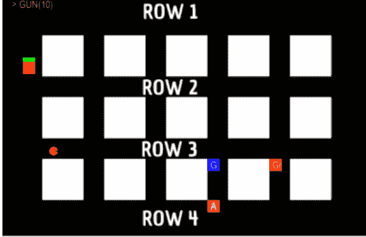

类似地，我们还将定义一个方法来返回物品的当前列。

请将以下方法添加到类中：

```python
def which_vertical_lane_is_item(self, x, y, item_size):
    if (x > 0 and x < 100 - item_size): return 0
    elif (x > 200 and x < 250 - item_size): return 1
    elif (x > 350 and x < 400 - item_size): return 2
    elif (x > 500 and x < 550 - item_size): return 3
    elif (x > 650 and x < 700 - item_size): return 4
    elif (x > 800): return 5
    else: return -1
```

在上面的代码中：

- 我们定义了一个名为 `which_vertical_lane_is_item` 的新方法。
- 这个方法接受两个参数，对应于我们想要确定当前列的物品的坐标。
- 根据其x坐标，我们可以指定所考虑物品的当前列。
- 这些边界是根据每行上块的位置定义的，如下图所示。

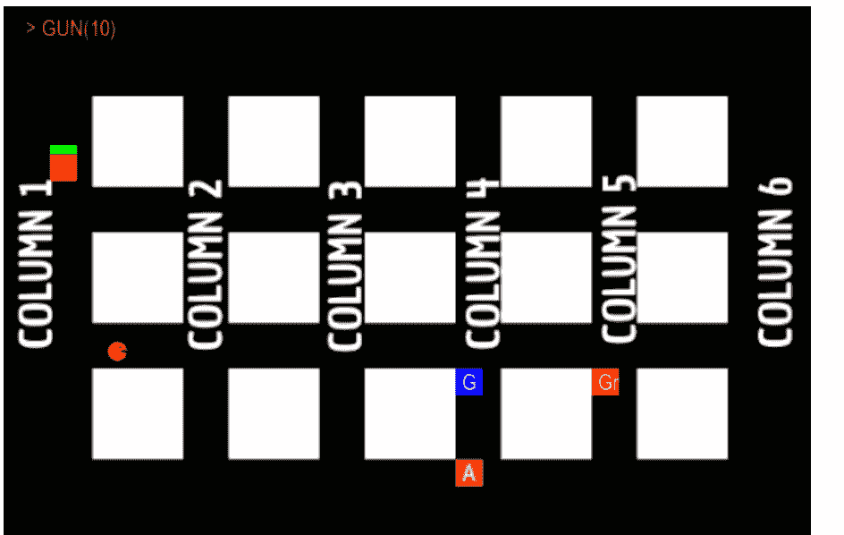

现在这两个方法已经创建好了，我们可以使用它们来比较玩家和NPC所在的列和行，从而确定NPC是否能看到玩家（即，它们是否在同一列或同一行）。

请将以下方法添加到类中：

```python
def see(self):
    npc_position = pygame.Vector2()
    npc_position.xy = self.x, self.y
    npc_col = self.which_vertical_lane_is_item(npc_position.x,
    npc_position.y, 25)
    player_col = self.which_vertical_lane_is_item(player_rect.x,
    player_rect.y, 25)
    npc_row = self.which_horizontal_lane_is_item(npc_position.x,
    npc_position.y, 25)
    player_row = self.which_horizontal_lane_is_item(player_rect.x,
    player_rect.y, 25)
```

在上面的代码中：

- 我们定义了一个名为 `see` 的方法。
- 在该方法中，我们记录了玩家和NPC的位置。
- 然后我们使用之前定义的方法来记录NPC和玩家的当前列和行；这些值存储在变量 `npc_col`、`player_col`、`npc_row` 和 `player_row` 中。

现在我们已经存储了玩家和NPC的行和列，我们可以比较它们以评估NPC是否能看到玩家（即，同一列或同一行）。

请将以下代码添加到该方法中：

```python
same_vertical_lane = (npc_col == player_col) and (npc_col != -1)
same_horizontal_lane = (npc_row == player_row) and (npc_row != -1)
if (same_vertical_lane or same_horizontal_lane):
    print(">> just saw the Player")
    self.color = "Red"
```

在上面的代码中，我们定义了两个变量 `same_vertical_lane` 和 `same_horizontal_lane`；如果NPC和玩家在同一列，前者将为真；如果NPC和玩家在同一行，后者将为真。如果NPC和玩家在同一行或同一列，则在命令提示符中显示一条消息；我们还为了视觉效果改变了NPC的颜色。

最后，就像我们为听觉所做的那样，我们只需要确保我们频繁地调用 `see` 方法，以便NPC能够检测玩家是否在同一行或同一列。

请将以下代码添加到 `window` 方法中（新代码用粗体表示）：

```python
for npc in npcs:
    npc.draw()
    npc.move()
    npc.hear()
    npc.see()
```

在上面的代码中，我们只是确保每个NPC都能看到玩家。现在您可以保存并编译您的代码；当游戏运行时，当您靠近（或与NPC在同一行/列）时，您应该会在命令提示符中看到一条消息说“Heard The Player”或“Just saw the Player”。

在下一节中，我们将改变NPC的行为，使其在看到或听到玩家后开始追逐玩家。

## 关卡总结

在本章中，我们成功添加了几个功能，包括NPC的碰撞检测和移动。我们还成功为NPC添加了某种形式的人工智能，包括视觉和听觉。因此，我们再次取得了相当大的进展，到目前为止，我们已经了解了几种编程结构以及您在编码过程中可能遇到的常见错误。

### 检查清单

- [ ] 检查清单项 1
- [ ] 检查清单项 2
- [ ] 检查清单项 3
- [ ] 检查清单项 4
- [ ] 检查清单项 5
- [ ] 检查清单项 6
- [ ] 检查清单项 7
- [ ] 检查清单项 8
- [ ] 检查清单项 9
- [ ] 检查清单项 10
- [ ] 检查清单项 11
- [ ] 检查清单项 12
- [ ] 检查清单项 13
- [ ] 检查清单项 14
- [ ] 检查清单项 15
- [ ] 检查清单项 16
- [ ] 检查清单项 17
- [ ] 检查清单项 18
- [ ] 检查清单项 19
- [ ] 检查清单项 20
- [ ] 检查清单项 21
- [ ] 检查清单项 22
- [ ] 检查清单项 23
- [ ] 检查清单项 24
- [ ] 检查清单项 25
- [ ] 检查清单项 26
- [ ] 检查清单项 27
- [ ] 检查清单项 28
- [ ] 检查清单项 29
- [ ] 检查清单项 30
- [ ] 检查清单项 31
- [ ] 检查清单项 32
- [ ] 检查清单项 33
- [ ] 检查清单项 34
- [ ] 检查清单项 35
- [ ] 检查清单项 36
- [ ] 检查清单项 37
- [ ] 检查清单项 38
- [ ] 检查清单项 39
- [ ] 检查清单项 40
- [ ] 检查清单项 41
- [ ] 检查清单项 42
- [ ] 检查清单项 43
- [ ] 检查清单项 44
- [ ] 检查清单项 45
- [ ] 检查清单项 46
- [ ] 检查清单项 47
- [ ] 检查清单项 48
- [ ] 检查清单项 49
- [ ] 检查清单项 50
- [ ] 检查清单项 51
- [ ] 检查清单项 52
- [ ] 检查清单项 53
- [ ] 检查清单项 54
- [ ] 检查清单项 55
- [ ] 检查清单项 56
- [ ] 检查清单项 57
- [ ] 检查清单项 58
- [ ] 检查清单项 59
- [ ] 检查清单项 60
- [ ] 检查清单项 61
- [ ] 检查清单项 62
- [ ] 检查清单项 63
- [ ] 检查清单项 64
- [ ] 检查清单项 65
- [ ] 检查清单项 66
- [ ] 检查清单项 67
- [ ] 检查清单项 68
- [ ] 检查清单项 69
- [ ] 检查清单项 70
- [ ] 检查清单项 71
- [ ] 检查清单项 72
- [ ] 检查清单项 73
- [ ] 检查清单项 74
- [ ] 检查清单项 75
- [ ] 检查清单项 76
- [ ] 检查清单项 77
- [ ] 检查清单项 78
- [ ] 检查清单项 79
- [ ] 检查清单项 80
- [ ] 检查清单项 81
- [ ] 检查清单项 82
- [ ] 检查清单项 83
- [ ] 检查清单项 84
- [ ] 检查清单项 85
- [ ] 检查清单项 86
- [ ] 检查清单项 87
- [ ] 检查清单项 88
- [ ] 检查清单项 89
- [ ] 检查清单项 90
- [ ] 检查清单项 91
- [ ] 检查清单项 92
- [ ] 检查清单项 93
- [ ] 检查清单项 94
- [ ] 检查清单项 95
- [ ] 检查清单项 96
- [ ] 检查清单项 97
- [ ] 检查清单项 98
- [ ] 检查清单项 99
- [ ] 检查清单项 100
- [ ] 检查清单项 101
- [ ] 检查清单项 102
- [ ] 检查清单项 103
- [ ] 检查清单项 104
- [ ] 检查清单项 105
- [ ] 检查清单项 106
- [ ] 检查清单项 107
- [ ] 检查清单项 108
- [ ] 检查清单项 109
- [ ] 检查清单项 110
- [ ] 检查清单项 111
- [ ] 检查清单项 112
- [ ] 检查清单项 113
- [ ] 检查清单项 114
- [ ] 检查清单项 115
- [ ] 检查清单项 116
- [ ] 检查清单项 117
- [ ] 检查清单项 118
- [ ] 检查清单项 119
- [ ] 检查清单项 120
- [ ] 检查清单项 121
- [ ] 检查清单项 122
- [ ] 检查清单项 123
- [ ] 检查清单项 124
- [ ] 检查清单项 125
- [ ] 检查清单项 126
- [ ] 检查清单项 127
- [ ] 检查清单项 128
- [ ] 检查清单项 129
- [ ] 检查清单项 130
- [ ] 检查清单项 131
- [ ] 检查清单项 132
- [ ] 检查清单项 133
- [ ] 检查清单项 134
- [ ] 检查清单项 135
- [ ] 检查清单项 136
- [ ] 检查清单项 137
- [ ] 检查清单项 138
- [ ] 检查清单项 139
- [ ] 检查清单项 140
- [ ] 检查清单项 141
- [ ] 检查清单项 142
- [ ] 检查清单项 143
- [ ] 检查清单项 144
- [ ] 检查清单项 145
- [ ] 检查清单项 146
- [ ] 检查清单项 147
- [ ] 检查清单项 148
- [ ] 检查清单项 149
- [ ] 检查清单项 150
- [ ] 检查清单项 151
- [ ] 检查清单项 152
- [ ] 检查清单项 153
- [ ] 检查清单项 154
- [ ] 检查清单项 155
- [ ] 检查清单项 156
- [ ] 检查清单项 157
- [ ] 检查清单项 158
- [ ] 检查清单项 159
- [ ] 检查清单项 160
- [ ] 检查清单项 161
- [ ] 检查清单项 162
- [ ] 检查清单项 163
- [ ] 检查清单项 164
- [ ] 检查清单项 165
- [ ] 检查清单项 166
- [ ] 检查清单项 167
- [ ] 检查清单项 168
- [ ] 检查清单项 169
- [ ] 检查清单项 170
- [ ] 检查清单项 171
- [ ] 检查清单项 172
- [ ] 检查清单项 173
- [ ] 检查清单项 174
- [ ] 检查清单项 175
- [ ] 检查清单项 176
- [ ] 检查清单项 177
- [ ] 检查清单项 178
- [ ] 检查清单项 179
- [ ] 检查清单项 180
- [ ] 检查清单项 181
- [ ] 检查清单项 182
- [ ] 检查清单项 183
- [ ] 检查清单项 184
- [ ] 检查清单项 185
- [ ] 检查清单项 186
- [ ] 检查清单项 187
- [ ] 检查清单项 188
- [ ] 检查清单项 189
- [ ] 检查清单项 190
- [ ] 检查清单项 191
- [ ] 检查清单项 192
- [ ] 检查清单项 193
- [ ] 检查清单项 194
- [ ] 检查清单项 195
- [ ] 检查清单项 196
- [ ] 检查清单项 197
- [ ] 检查清单项 198
- [ ] 检查清单项 199
- [ ] 检查清单项 200
- [ ] 检查清单项 201
- [ ] 检查清单项 202
- [ ] 检查清单项 203
- [ ] 检查清单项 204
- [ ] 检查清单项 205
- [ ] 检查清单项 206
- [ ] 检查清单项 207
- [ ] 检查清单项 208
- [ ] 检查清单项 209
- [ ] 检查清单项 210
- [ ] 检查清单项 211
- [ ] 检查清单项 212
- [ ] 检查清单项 213
- [ ] 检查清单项 214
- [ ] 检查清单项 215
- [ ] 检查清单项 216
- [ ] 检查清单项 217
- [ ] 检查清单项 218
- [ ] 检查清单项 219
- [ ] 检查清单项 220
- [ ] 检查清单项 221
- [ ] 检查清单项 222
- [ ] 检查清单项 223
- [ ] 检查清单项 224
- [ ] 检查清单项 225
- [ ] 检查清单项 226
- [ ] 检查清单项 227
- [ ] 检查清单项 228
- [ ] 检查清单项 229
- [ ] 检查清单项 230
- [ ] 检查清单项 231
- [ ] 检查清单项 232
- [ ] 检查清单项 233
- [ ] 检查清单项 234
- [ ] 检查清单项 235
- [ ] 检查清单项 236
- [ ] 检查清单项 237
- [ ] 检查清单项 238
- [ ] 检查清单项 239
- [ ] 检查清单项 240
- [ ] 检查清单项 241
- [ ] 检查清单项 242
- [ ] 检查清单项 243
- [ ] 检查清单项 244
- [ ] 检查清单项 245
- [ ] 检查清单项 246
- [ ] 检查清单项 247
- [ ] 检查清单项 248
- [ ] 检查清单项 249
- [ ] 检查清单项 250
- [ ] 检查清单项 251
- [ ] 检查清单项 252
- [ ] 检查清单项 253
- [ ] 检查清单项 254
- [ ] 检查清单项 255
- [ ] 检查清单项 256
- [ ] 检查清单项 257
- [ ] 检查清单项 258
- [ ] 检查清单项 259
- [ ] 检查清单项 260
- [ ] 检查清单项 261
- [ ] 检查清单项 262
- [ ] 检查清单项 263
- [ ] 检查清单项 264
- [ ] 检查清单项 265
- [ ] 检查清单项 266
- [ ] 检查清单项 267
- [ ] 检查清单项 268
- [ ] 检查清单项 269
- [ ] 检查清单项 270
- [ ] 检查清单项 271
- [ ] 检查清单项 272
- [ ] 检查清单项 273
- [ ] 检查清单项 274
- [ ] 检查清单项 275
- [ ] 检查清单项 276
- [ ] 检查清单项 277
- [ ] 检查清单项 278
- [ ] 检查清单项 279
- [ ] 检查清单项 280
- [ ] 检查清单项 281
- [ ] 检查清单项 282
- [ ] 检查清单项 283
- [ ] 检查清单项 284
- [ ] 检查清单项 285
- [ ] 检查清单项 286
- [ ] 检查清单项 287
- [ ] 检查清单项 288
- [ ] 检查清单项 289
- [ ] 检查清单项 290
- [ ] 检查清单项 291
- [ ] 检查清单项 292
- [ ] 检查清单项 293
- [ ] 检查清单项 294
- [ ] 检查清单项 295
- [ ] 检查清单项 296
- [ ] 检查清单项 297
- [ ] 检查清单项 298
- [ ] 检查清单项 299
- [ ] 检查清单项 300
- [ ] 检查清单项 301
- [ ] 检查清单项 302
- [ ] 检查清单项 303
- [ ] 检查清单项 304
- [ ] 检查清单项 305
- [ ] 检查清单项 306
- [ ] 检查清单项 307
- [ ] 检查清单项 308
- [ ] 检查清单项 309
- [ ] 检查清单项 310
- [ ] 检查清单项 311
- [ ] 检查清单项 312
- [ ] 检查清单项 313
- [ ] 检查清单项 314
- [ ] 检查清单项 315
- [ ] 检查清单项 316
- [ ] 检查清单项 317
- [ ] 检查清单项 318
- [ ] 检查清单项 319
- [ ] 检查清单项 320
- [ ] 检查清单项 321
- [ ] 检查清单项 322
- [ ] 检查清单项 323
- [ ] 检查清单项 324
- [ ] 检查清单项 325
- [ ] 检查清单项 326
- [ ] 检查清单项 327
- [ ] 检查清单项 328
- [ ] 检查清单项 329
- [ ] 检查清单项 330
- [ ] 检查清单项 331
- [ ] 检查清单项 332
- [ ] 检查清单项 333
- [ ] 检查清单项 334
- [ ] 检查清单项 335
- [ ] 检查清单项 336
- [ ] 检查清单项 337
- [ ] 检查清单项 338
- [ ] 检查清单项 339
- [ ] 检查清单项 340
- [ ] 检查清单项 341
- [ ] 检查清单项 342
- [ ] 检查清单项 343
- [ ] 检查清单项 344
- [ ] 检查清单项 345
- [ ] 检查清单项 346
- [ ] 检查清单项 347
- [ ] 检查清单项 348
- [ ] 检查清单项 349
- [ ] 检查清单项 350
- [ ] 检查清单项 351
- [ ] 检查清单项 352
- [ ] 检查清单项 353
- [ ] 检查清单项 354
- [ ] 检查清单项 355
- [ ] 检查清单项 356
- [ ] 检查清单项 357
- [ ] 检查清单项 358
- [ ] 检查清单项 359
- [ ] 检查清单项 360
- [ ] 检查清单项 361
- [ ] 检查清单项 362
- [ ] 检查清单项 363
- [ ] 检查清单项 364
- [ ] 检查清单项 365
- [ ] 检查清单项 366
- [ ] 检查清单项 367
- [ ] 检查清单项 368
- [ ] 检查清单项 369
- [ ] 检查清单项 370
- [ ] 检查清单项 371
- [ ] 检查清单项 372
- [ ] 检查清单项 373
- [ ] 检查清单项 374
- [ ] 检查清单项 375
- [ ] 检查清单项 376
- [ ] 检查清单项 377
- [ ] 检查清单项 378
- [ ] 检查清单项 379
- [ ] 检查清单项 380
- [ ] 检查清单项 381
- [ ] 检查清单项 382
- [ ] 检查清单项 383
- [ ] 检查清单项 384
- [ ] 检查清单项 385
- [ ] 检查清单项 386
- [ ] 检查清单项 387
- [ ] 检查清单项 388
- [ ] 检查清单项 389
- [ ] 检查清单项 390
- [ ] 检查清单项 391
- [ ] 检查清单项 392
- [ ] 检查清单项 393
- [ ] 检查清单项 394
- [ ] 检查清单项 395
- [ ] 检查清单项 396
- [ ] 检查清单项 397
- [ ] 检查清单项 398
- [ ] 检查清单项 399
- [ ] 检查清单项 400
- [ ] 检查清单项 401
- [ ] 检查清单项 402
- [ ] 检查清单项 403
- [ ] 检查清单项 404
- [ ] 检查清单项 405
- [ ] 检查清单项 406
- [ ] 检查清单项 407
- [ ] 检查清单项 408
- [ ] 检查清单项 409
- [ ] 检查清单项 410
- [ ] 检查清单项 411
- [ ] 检查清单项 412
- [ ] 检查清单项 413
- [ ] 检查清单项 414
- [ ] 检查清单项 415
- [ ] 检查清单项 416
- [ ] 检查清单项 417
- [ ] 检查清单项 418
- [ ] 检查清单项 419
- [ ] 检查清单项 420
- [ ] 检查清单项 421
- [ ] 检查清单项 422
- [ ] 检查清单项 423
- [ ] 检查清单项 424
- [ ] 检查清单项 425
- [ ] 检查清单项 426
- [ ] 检查清单项 427
- [ ] 检查清单项 428
- [ ] 检查清单项 429
- [ ] 检查清单项 430
- [ ] 检查清单项 431
- [ ] 检查清单项 432
- [ ] 检查清单项 433
- [ ] 检查清单项 434
- [ ] 检查清单项 435
- [ ] 检查清单项 436
- [ ] 检查清单项 437
- [ ] 检查清单项 438
- [ ] 检查清单项 439
- [ ] 检查清单项 440
- [ ] 检查清单项 441
- [ ] 检查清单项 442
- [ ] 检查清单项 443
- [ ] 检查清单项 444
- [ ] 检查清单项 445
- [ ] 检查清单项 446
- [ ] 检查清单项 447
- [ ] 检查清单项 448
- [ ] 检查清单项 449
- [ ] 检查清单项 450
- [ ] 检查清单项 451
- [ ] 检查清单项 452
- [ ] 检查清单项 453
- [ ] 检查清单项 454
- [ ] 检查清单项 455
- [ ] 检查清单项 456
- [ ] 检查清单项 457
- [ ] 检查清单项 458
- [ ] 检查清单项 459
- [ ] 检查清单项 460
- [ ] 检查清单项 461
- [ ] 检查清单项 462
- [ ] 检查清单项 463
- [ ] 检查清单项 464
- [ ] 检查清单项 465
- [ ] 检查清单项 466
- [ ] 检查清单项 467
- [ ] 检查清单项 468
- [ ] 检查清单项 469
- [ ] 检查清单项 470
- [ ] 检查清单项 471
- [ ] 检查清单项 472
- [ ] 检查清单项 473
- [ ] 检查清单项 474
- [ ] 检查清单项 475
- [ ] 检查清单项 476
- [ ] 检查清单项 477
- [ ] 检查清单项 478
- [ ] 检查清单项 479
- [ ] 检查清单项 480
- [ ] 检查清单项 481
- [ ] 检查清单项 482
- [ ] 检查清单项 483
- [ ] 检查清单项 484
- [ ] 检查清单项 485
- [ ] 检查清单项 486
- [ ] 检查清单项 487
- [ ] 检查清单项 488
- [ ] 检查清单项 489
- [ ] 检查清单项 490
- [ ] 检查清单项 491
- [ ] 检查清单项 492
- [ ] 检查清单项 493
- [ ] 检查清单项 494
- [ ] 检查清单项 495
- [ ] 检查清单项 496
- [ ] 检查清单项 497
- [ ] 检查清单项 498
- [ ] 检查清单项 499
- [ ] 检查清单项 500
- [ ] 检查清单项 501
- [ ] 检查清单项 502
- [ ] 检查清单项 503
- [ ] 检查清单项 504
- [ ] 检查清单项 505
- [ ] 检查清单项 506
- [ ] 检查清单项 507
- [ ] 检查清单项 508
- [ ] 检查清单项 509
- [ ] 检查清单项 510
- [ ] 检查清单项 511
- [ ] 检查清单项 512
- [ ] 检查清单项 513
- [ ] 检查清单项 514
- [ ] 检查清单项 515
- [ ] 检查清单项 516
- [ ] 检查清单项 517
- [ ] 检查清单项 518
- [ ] 检查清单项 519
- [ ] 检查清单项 520
- [ ] 检查清单项 521
- [ ] 检查清单项 522
- [ ] 检查清单项 523
- [ ] 检查清单项 524
- [ ] 检查清单项 525
- [ ] 检查清单项 526
- [ ] 检查清单项 527
- [ ] 检查清单项 528
- [ ] 检查清单项 529
- [ ] 检查清单项 530
- [ ] 检查清单项 531
- [ ] 检查清单项 532
- [ ] 检查清单项 533
- [ ] 检查清单项 534
- [ ] 检查清单项 535
- [ ] 检查清单项 536
- [ ] 检查清单项 537
- [ ] 检查清单项 538
- [ ] 检查清单项 539
- [ ] 检查清单项 540
- [ ] 检查清单项 541
- [ ] 检查清单项 542
- [ ] 检查清单项 543
- [ ] 检查清单项 544
- [ ] 检查清单项 545
- [ ] 检查清单项 546
- [ ] 检查清单项 547
- [ ] 检查清单项 548
- [ ] 检查清单项 549
- [ ] 检查清单项 550
- [ ] 检查清单项 551
- [ ] 检查清单项 552
- [ ] 检查清单项 553
- [ ] 检查清单项 554
- [ ] 检查清单项 555
- [ ] 检查清单项 556
- [ ] 检查清单项 557
- [ ] 检查清单项 558
- [ ] 检查清单项 559
- [ ] 检查清单项 560
- [ ] 检查清单项 561
- [ ] 检查清单项 562
- [ ] 检查清单项 563
- [ ] 检查清单项 564
- [ ] 检查清单项 565
- [ ] 检查清单项 566
- [ ] 检查清单项 567
- [ ] 检查清单项 568
- [ ] 检查清单项 569
- [ ] 检查清单项 570
- [ ] 检查清单项 571
- [ ] 检查清单项 572
- [ ] 检查清单项 573
- [ ] 检查清单项 574
- [ ] 检查清单项 575
- [ ] 检查清单项 576
- [ ] 检查清单项 577
- [ ] 检查清单项 578
- [ ] 检查清单项 579
- [ ] 检查清单项 580
- [ ] 检查清单项 581
- [ ] 检查清单项 582
- [ ] 检查清单项 583
- [ ] 检查清单项 584
- [ ] 检查清单项 585
- [ ] 检查清单项 586
- [ ] 检查清单项 587
- [ ] 检查清单项 588
- [ ] 检查清单项 589
- [ ] 检查清单项 590
- [ ] 检查清单项 591
- [ ] 检查清单项 592
- [ ] 检查清单项 593
- [ ] 检查清单项 594
- [ ] 检查清单项 595
- [ ] 检查清单项 596
- [ ] 检查清单项 597
- [ ] 检查清单项 598
- [ ] 检查清单项 599
- [ ] 检查清单项 600
- [ ] 检查清单项 601
- [ ] 检查清单项 602
- [ ] 检查清单项 603
- [ ] 检查清单项 604
- [ ] 检查清单项 605
- [ ] 检查清单项 606
- [ ] 检查清单项 607
- [ ] 检查清单项 608
- [ ] 检查清单项 609
- [ ] 检查清单项 610
- [ ] 检查清单项 611
- [ ] 检查清单项 612
- [ ] 检查清单项 613
- [ ] 检查清单项 614
- [ ] 检查清单项 615
- [ ] 检查清单项 616
- [ ] 检查清单项 617
- [ ] 检查清单项 618
- [ ] 检查清单项 619
- [ ] 检查清单项 620
- [ ] 检查清单项 621
- [ ] 检查清单项 622
- [ ] 检查清单项 623
- [ ] 检查清单项 624
- [ ] 检查清单项 625
- [ ] 检查清单项 626
- [ ] 检查清单项 627
- [ ] 检查清单项 628
- [ ] 检查清单项 629
- [ ] 检查清单项 630
- [ ] 检查清单项 631
- [ ] 检查清单项 632
- [ ] 检查清单项 633
- [ ] 检查清单项 634
- [ ] 检查清单项 635
- [ ] 检查清单项 636
- [ ] 检查清单项 637
- [ ] 检查清单项 638
- [ ] 检查清单项 639
- [ ] 检查清单项 640
- [ ] 检查清单项 641
- [ ] 检查清单项 642
- [ ] 检查清单项 643
- [ ] 检查清单项 644
- [ ] 检查清单项 645
- [ ] 检查清单项 646
- [ ] 检查清单项 647
- [ ] 检查清单项 648
- [ ] 检查清单项 649
- [ ] 检查清单项 650
- [ ] 检查清单项 651
- [ ] 检查清单项 652
- [ ] 检查清单项 653
- [ ] 检查清单项 654
- [ ] 检查清单项 655
- [ ] 检查清单项 656
- [ ] 检查清单项 657
- [ ] 检查清单项 658
- [ ] 检查清单项 659
- [ ] 检查清单项 660
- [ ] 检查清单项 661
- [ ] 检查清单项 662
- [ ] 检查清单项 663
- [ ] 检查清单项 664
- [ ] 检查清单项 665
- [ ] 检查清单项 666
- [ ] 检查清单项 667
- [ ] 检查清单项 668
- [ ] 检查清单项 669
- [ ] 检查清单项 670
- [ ] 检查清单项 671
- [ ] 检查清单项 672
- [ ] 检查清单项 673
- [ ] 检查清单项 674
- [ ] 检查清单项 675
- [ ] 检查清单项 676
- [ ] 检查清单项 677
- [ ] 检查清单项 678
- [ ] 检查清单项 679
- [ ] 检查清单项 680
- [ ] 检查清单项 681
- [ ] 检查清单项 682
- [ ] 检查清单项 683
- [ ] 检查清单项 684
- [ ] 检查清单项 685
- [ ] 检查清单项 686
- [ ] 检查清单项 687
- [ ] 检查清单项 688
- [ ] 检查清单项 689
- [ ] 检查清单项 690
- [ ] 检查清单项 691
- [ ] 检查清单项 692
- [ ] 检查清单项 693
- [ ] 检查清单项 694
- [ ] 检查清单项 695
- [ ] 检查清单项 696
- [ ] 检查清单项 697
- [ ] 检查清单项 698
- [ ] 检查清单项 699
- [ ] 检查清单项 700
- [ ] 检查清单项 701
- [ ] 检查清单项 702
- [ ] 检查清单项 703
- [ ] 检查清单项 704
- [ ] 检查清单项 705
- [ ] 检查清单项 706
- [ ] 检查清单项 707
- [ ] 检查清单项 708
- [ ] 检查清单项 709
- [ ] 检查清单项 710
- [ ] 检查清单项 711
- [ ] 检查清单项 712
- [ ] 检查清单项 713
- [ ] 检查清单项 714
- [ ] 检查清单项 715
- [ ] 检查清单项 716
- [ ] 检查清单项 717
- [ ] 检查清单项 718
- [ ] 检查清单项 719
- [ ] 检查清单项 720
- [ ] 检查清单项 721
- [ ] 检查清单项 722
- [ ] 检查清单项 723
- [ ] 检查清单项 724
- [ ] 检查清单项 725
- [ ] 检查清单项 726
- [ ] 检查清单项 727
- [ ] 检查清单项 728
- [ ] 检查清单项 729
- [ ] 检查清单项 730
- [ ] 检查清单项 731
- [ ] 检查清单项 732
- [ ] 检查清单项 733
- [ ] 检查清单项 734
- [ ] 检查清单项 735
- [ ] 检查清单项 736
- [ ] 检查清单项 737
- [ ] 检查清单项 738
- [ ] 检查清单项 739
- [ ] 检查清单项 740
- [ ] 检查清单项 741
- [ ] 检查清单项 742
- [ ] 检查清单项 743
- [ ] 检查清单项 744
- [ ] 检查清单项 745
- [ ] 检查清单项 746
- [ ] 检查清单项 747
- [ ] 检查清单项 748
- [ ] 检查清单项 749
- [ ] 检查清单项 750
- [ ] 检查清单项 751
- [ ] 检查清单项 752
- [ ] 检查清单项 753
- [ ] 检查清单项 754
- [ ] 检查清单项 755
- [ ] 检查清单项 756
- [ ] 检查清单项 757
- [ ] 检查清单项 758
- [ ] 检查清单项 759
- [ ] 检查清单项 760
- [ ] 检查清单项 761
- [ ] 检查清单项 762
- [ ] 检查清单项 763
- [ ] 检查清单项 764
- [ ] 检查清单项 765
- [ ] 检查清单项 766
- [ ] 检查清单项 767
- [ ] 检查清单项 768
- [ ] 检查清单项 769
- [ ] 检查清单项 770
- [ ] 检查清单项 771
- [ ] 检查清单项 772
- [ ] 检查清单项 773
- [ ] 检查清单项 774
- [ ] 检查清单项 775
- [ ] 检查清单项 776
- [ ] 检查清单项 777
- [ ] 检查清单项 778
- [ ] 检查清单项 779
- [ ] 检查清单项 780
- [ ] 检查清单项 781
- [ ] 检查清单项 782
- [ ] 检查清单项 783
- [ ] 检查清单项 784
- [ ] 检查清单项 785
- [ ] 检查清单项 786
- [ ] 检查清单项 787
- [ ] 检查清单项 788
- [ ] 检查清单项 789
- [ ] 检查清单项 790
- [ ] 检查清单项 791
- [ ] 检查清单项 792
- [ ] 检查清单项 793
- [ ] 检查清单项 794
- [ ] 检查清单项 795
- [ ] 检查清单项 796
- [ ] 检查清单项 797
- [ ] 检查清单项 798
- [ ] 检查清单项 799
- [ ] 检查清单项 800
- [ ] 检查清单项 801
- [ ] 检查清单项 802
- [ ] 检查清单项 803
- [ ] 检查清单项 804
- [ ] 检查清单项 805
- [ ] 检查清单项 806
- [ ] 检查清单项 807
- [ ] 检查清单项 808
- [ ] 检查清单项 809
- [ ] 检查清单项 810
- [ ] 检查清单项 811
- [ ] 检查清单项 812
- [ ] 检查清单项 813
- [ ] 检查清单项 814
- [ ] 检查清单项 815
- [ ] 检查清单项 816
- [ ] 检查清单项 817
- [ ] 检查清单项 818
- [ ] 检查清单项 819
- [ ] 检查清单项 820
- [ ] 检查清单项 821
- [ ] 检查清单项 822
- [ ] 检查清单项 823
- [ ] 检查清单项 824
- [ ] 检查清单项 825
- [ ] 检查清单项 826
- [ ] 检查清单项 827
- [ ] 检查清单项 828
- [ ] 检查清单项 829
- [ ] 检查清单项 830
- [ ] 检查清单项 831
- [ ] 检查清单项 832
- [ ] 检查清单项 833
- [ ] 检查清单项 834
- [ ] 检查清单项 835
- [ ] 检查清单项 836
- [ ] 检查清单项 837
- [ ] 检查清单项 838
- [ ] 检查清单项 839
- [ ] 检查清单项 840
- [ ] 检查清单项 841
- [ ] 检查清单项 842
- [ ] 检查清单项 843
- [ ] 检查清单项 844
- [ ] 检查清单项 845
- [ ] 检查清单项 846
- [ ] 检查清单项 847
- [ ] 检查清单项 848
- [ ] 检查清单项 849
- [ ] 检查清单项 850
- [ ] 检查清单项 851
- [ ] 检查清单项 852
- [ ] 检查清单项 853
- [ ] 检查清单项 854
- [ ] 检查清单项 855
- [ ] 检查清单项 856
- [ ] 检查清单项 857
- [ ] 检查清单项 858
- [ ] 检查清单项 859
- [ ] 检查清单项 860
- [ ] 检查清单项 861
- [ ] 检查清单项 862
- [ ] 检查清单项 863
- [ ] 检查清单项 864
- [ ] 检查清单项 865
- [ ] 检查清单项 866
- [ ] 检查清单项 867
- [ ] 检查清单项 868
- [ ] 检查清单项 869
- [ ] 检查清单项 870
- [ ] 检查清单项 871
- [ ] 检查清单项 872
- [ ] 检查清单项 873
- [ ] 检查清单项 874
- [ ] 检查清单项 875
- [ ] 检查清单项 876
- [ ] 检查清单项 877
- [ ] 检查清单项 878
- [ ] 检查清单项 879
- [ ] 检查清单项 880
- [ ] 检查清单项 881
- [ ] 检查清单项 882
- [ ] 检查清单项 883
- [ ] 检查清单项 884
- [ ] 检查清单项 885
- [ ] 检查清单项 886
- [ ] 检查清单项 887
- [ ] 检查清单项 888
- [ ] 检查清单项 889
- [ ] 检查清单项 890
- [ ] 检查清单项 891
- [ ] 检查清单项 892
- [ ] 检查清单项 893
- [ ] 检查清单项 894
- [ ] 检查清单项 895
- [ ] 检查清单项 896
- [ ] 检查清单项 897
- [ ] 检查清单项 898
- [ ] 检查清单项 899
- [ ] 检查清单项 900
- [ ] 检查清单项 901
- [ ] 检查清单项 902
- [ ] 检查清单项 903
- [ ] 检查清单项 904
- [ ] 检查清单项 905
- [ ] 检查清单项 906
- [ ] 检查清单项 907
- [ ] 检查清单项 908
- [ ] 检查清单项 909
- [ ] 检查清单项 910
- [ ] 检查清单项 911
- [ ] 检查清单项 912
- [ ] 检查清单项 913
- [ ] 检查清单项 914
- [ ] 检查清单项 915
- [ ] 检查清单项 916
- [ ] 检查清单项 917
- [ ] 检查清单项 918
- [ ] 检查清单项 919
- [ ] 检查清单项 920
- [ ] 检查清单项 921
- [ ] 检查清单项 922
- [ ] 检查清单项 923
- [ ] 检查清单项 924
- [ ] 检查清单项 925
- [ ] 检查清单项 926
- [ ] 检查清单项 927
- [ ] 检查清单项 928
- [ ] 检查清单项 929
- [ ] 检查清单项 930
- [ ] 检查清单项 931
- [ ] 检查清单项 932
- [ ] 检查清单项 933
- [ ] 检查清单项 934
- [ ] 检查清单项 935
- [ ] 检查清单项 936
- [ ] 检查清单项 937
- [ ] 检查清单项 938
- [ ] 检查清单项 939
- [ ] 检查清单项 940
- [ ] 检查清单项 941
- [ ] 检查清单项 942
- [ ] 检查清单项 943
- [ ] 检查清单项 944
- [ ] 检查清单项 945
- [ ] 检查清单项 946
- [ ] 检查清单项 947
- [ ] 检查清单项 948
- [ ] 检查清单项 949
- [ ] 检查清单项 950
- [ ] 检查清单项 951
- [ ] 检查清单项 952
- [ ] 检查清单项 953
- [ ] 检查清单项 954
- [ ] 检查清单项 955
- [ ] 检查清单项 956
- [ ] 检查清单项 957
- [ ] 检查清单项 958
- [ ] 检查清单项 959
- [ ] 检查清单项 960
- [ ] 检查清单项 961
- [ ] 检查清单项 962
- [ ] 检查清单项 963
- [ ] 检查清单项 964
- [ ] 检查清单项 965
- [ ] 检查清单项 966
- [ ] 检查清单项 967
- [ ] 检查清单项 968
- [ ] 检查清单项 969
- [ ] 检查清单项 970
- [ ] 检查清单项 971
- [ ] 检查清单项 972
- [ ] 检查清单项 973
- [ ] 检查清单项 974
- [ ] 检查清单项 975
- [ ] 检查清单项 976
- [ ] 检查清单项 977
- [ ] 检查清单项 978
- [ ] 检查清单项 979
- [ ] 检查清单项 980
- [ ] 检查清单项 981
- [ ] 检查清单项 982
- [ ] 检查清单项 983
- [ ] 检查清单项 984
- [ ] 检查清单项 985
- [ ] 检查清单项 986
- [ ] 检查清单项 987
- [ ] 检查清单项 988
- [ ] 检查清单项 989
- [ ] 检查清单项 990
- [ ] 检查清单项 991
- [ ] 检查清单项 992
- [ ] 检查清单项 993
- [ ] 检查清单项 994
- [ ] 检查清单项 995
- [ ] 检查清单项 996
- [ ] 检查清单项 997
- [ ] 检查清单项 998
- [ ] 检查清单项 999
- [ ] 检查清单项 1000
- [ ] 检查清单项 1001
- [ ] 检查清单项 1002
- [ ] 检查清单项 1003
- [ ] 检查清单项 1004
- [ ] 检查清单项 1005
- [ ] 检查清单项 1006
- [ ] 检查清单项 1007
- [ ] 检查清单项 1008
- [ ] 检查清单项 1009
- [ ] 检查清单项 1010
- [ ] 检查清单项 1011
- [ ] 检查清单项 1012
- [ ] 检查清单项 1013
- [ ] 检查清单项 1014
- [ ] 检查清单项 1015
- [ ] 检查清单项 1016
- [ ] 检查清单项 1017
- [ ] 检查清单项 1018
- [ ] 检查清单项 1019
- [ ] 检查清单项 1020
- [ ] 检查清单项 1021
- [ ] 检查清单项 1022
- [ ] 检查清单项 1023
- [ ] 检查清单项 1024
- [ ] 检查清单项 1025
- [ ] 检查清单项 1026
- [ ] 检查清单项 1027
- [ ] 检查清单项 1028
- [ ] 检查清单项 1029
- [ ] 检查清单项 1030
- [ ] 检查清单项 1031
- [ ] 检查清单项 1032
- [ ] 检查清单项 1033
- [ ] 检查清单项 1034
- [ ] 检查清单项 1035
- [ ] 检查清单项 1036
- [ ] 检查清单项 1037
- [ ] 检查清单项 1038
- [ ] 检查清单项 1039
- [ ] 检查清单项 1040
- [ ] 检查清单项 1041
- [ ] 检查清单项 1042
- [ ] 检查清单项 1043
- [ ] 检查清单项 1044
- [ ] 检查清单项 1045
- [ ] 检查清单项 1046
- [ ] 检查清单项 1047
- [ ] 检查清单项 1048
- [ ] 检查清单项 1049
- [ ] 检查清单项 1050
- [ ] 检查清单项 1051
- [ ] 检查清单项 1052
- [ ] 检查清单项 1053
- [ ] 检查清单项 1054
- [ ] 检查清单项 1055
- [ ] 检查清单项 1056
- [ ] 检查清单项 1057
- [ ] 检查清单项 1058
- [ ] 检查清单项 1059
- [ ] 检查清单项 1060
- [ ] 检查清单项 1061
- [ ] 检查清单项 1062
- [ ] 检查清单项 1063
- [ ] 检查清单项 1064
- [ ] 检查清单项 1065
- [ ] 检查清单项 1066
- [ ] 检查清单项 1067
- [ ] 检查清单项 1068
- [ ] 检查清单项 1069
- [ ] 检查清单项 1070
- [ ] 检查清单项 1071
- [ ] 检查清单项 1072
- [ ] 检查清单项 1073
- [ ] 检查清单项 1074
- [ ] 检查清单项 1075
- [ ] 检查清单项 1076
- [ ] 检查清单项 1077
- [ ] 检查清单项 1078
- [ ] 检查清单项 1079
- [ ] 检查清单项 1080
- [ ] 检查清单项 1081
- [ ] 检查清单项 1082
- [ ] 检查清单项 1083
- [ ] 检查清单项 1084
- [ ] 检查清单项 1085
- [ ] 检查清单项 1086
- [ ] 检查清单项 1087
- [ ] 检查清单项 1088
- [ ] 检查清单项 1089
- [ ] 检查清单项 1090
- [ ] 检查清单项 1091
- [ ] 检查清单项 1092
- [ ] 检查清单项 1093
- [ ] 检查清单项 1094
- [ ] 检查清单项 1095
- [ ] 检查清单项 1096
- [ ] 检查清单项 1097
- [ ] 检查清单项 1098
- [ ] 检查清单项 1099
- [ ] 检查清单项 1100
- [ ] 检查清单项 1101
- [ ] 检查清单项 1102
- [ ] 检查清单项 1103
- [ ] 检查清单项 1104
- [ ] 检查清单项 1105
- [ ] 检查清单项 1106
- [ ] 检查清单项 1107
- [ ] 检查清单项 1108
- [ ] 检查清单项 1109
- [ ] 检查清单项 1110
- [ ] 检查清单项 1111
- [ ] 检查清单项 1112
- [ ] 检查清单项 1113
- [ ] 检查清单项 1114
- [ ] 检查清单项 1115
- [ ] 检查清单项 1116
- [ ] 检查清单项 1117
- [ ] 检查清单项 1118
- [ ] 检查清单项 1119
- [ ] 检查清单项 1120
- [ ] 检查清单项 1121
- [ ] 检查清单项 1122
- [ ] 检查清单项 1123
- [ ] 检查清单项 1124
- [ ] 检查清单项 1125
- [ ] 检查清单项 1126
- [ ] 检查清单项 1127
- [ ] 检查清单项 1128
- [ ] 检查清单项 1129
- [ ] 检查清单项 1130
- [ ] 检查清单项 1131
- [ ] 检查清单项 1132
- [ ] 检查清单项 1133
- [ ] 检查清单项 1134
- [ ] 检查清单项 1135
- [ ] 检查清单项 1136
- [ ] 检查清单项 1137
- [ ] 检查清单项 1138
- [ ] 检查清单项 1139
- [ ] 检查清单项 1140
- [ ] 检查清单项 1141
- [ ] 检查清单项 1142
- [ ] 检查清单项 1143
- [ ] 检查清单项 1144
- [ ] 检查清单项 1145
- [ ] 检查清单项 1146
- [ ] 检查清单项 1147
- [ ] 检查清单项 1148
- [ ] 检查清单项 1149
- [ ] 检查清单项 1150
- [ ] 检查清单项 1151
- [ ] 检查清单项 1152
- [ ] 检查清单项 1153
- [ ] 检查清单项 1154
- [ ] 检查清单项 1155
- [ ] 检查清单项 1156
- [ ] 检查清单项 1157
- [ ] 检查清单项 1158
- [ ] 检查清单项 1159
- [ ] 检查清单项 1160
- [ ] 检查清单项 1161
- [ ] 检查清单项 1162
- [ ] 检查清单项 1163
- [ ] 检查清单项 1164
- [ ] 检查清单项 1165
- [ ] 检查清单项 1166
- [ ] 检查清单项 1167
- [ ] 检查清单项 1168
- [ ] 检查清单项 1169
- [ ] 检查清单项 1170
- [ ] 检查清单项 1171
- [ ] 检查清单项 1172
- [ ] 检查清单项 1173
- [ ] 检查清单项 1174
- [ ] 检查清单项 1175
- [ ] 检查清单项 1176
- [ ] 检查清单项 1177
- [ ] 检查清单项 1178
- [ ] 检查清单项 1179
- [ ] 检查清单项 1180
- [ ] 检查清单项 1181
- [ ] 检查清单项 1182
- [ ] 检查清单项 1183
- [ ] 检查清单项 1184
- [ ] 检查清单项 1185
- [ ] 检查清单项 1186
- [ ] 检查清单项 1187
- [ ] 检查清单项 1188
- [ ] 检查清单项 1189
- [ ] 检查清单项 1190
- [ ] 检查清单项 1191
- [ ] 检查清单项 1192
- [ ] 检查清单项 1193
- [ ] 检查清单项 1194
- [ ] 检查清单项 1195
- [ ] 检查清单项 1196
- [ ] 检查清单项 1197
- [ ] 检查清单项 1198
- [ ] 检查清单项 1199
- [ ] 检查清单项 1200
- [ ] 检查清单项 1201
- [ ] 检查清单项 1202
- [ ] 检查清单项 1203
- [ ] 检查清单项 1204
- [ ] 检查清单项 1205
- [ ] 检查清单项 1206
- [ ] 检查清单项 1207
- [ ] 检查清单项 1208
- [ ] 检查清单项 1209
- [ ] 检查清单项 1210
- [ ] 检查清单项 1211
- [ ] 检查清单项 1212
- [ ] 检查清单项 1213
- [ ] 检查清单项 1214
- [ ] 检查清单项 1215
- [ ] 检查清单项 1216
- [ ] 检查清单项 1217
- [ ] 检查清单项 1218
- [ ] 检查清单项 1219
- [ ] 检查清单项 1220
- [ ] 检查清单项 1221
- [ ] 检查清单项 1222
- [ ] 检查清单项 1223
- [ ] 检查清单项 1224
- [ ] 检查清单项 1225
- [ ] 检查清单项 1226
- [ ] 检查清单项 1227
- [ ] 检查清单项 1228
- [ ] 检查清单项 1229
- [ ] 检查清单项 1230
- [ ] 检查清单项 1231
- [ ] 检查清单项 1232
- [ ] 检查清单项 1233
- [ ] 检查清单项 1234
- [ ] 检查清单项 1235
- [ ] 检查清单项 1236
- [ ] 检查清单项 1237
- [ ] 检查清单项 1238
- [ ] 检查清单项 1239
- [ ] 检查清单项 1240
- [ ] 检查清单项 1241
- [ ] 检查清单项 1242
- [ ] 检查清单项 1243
- [ ] 检查清单项 1244
- [ ] 检查清单项 1245
- [ ] 检查清单项 1246
- [ ] 检查清单项 1247
- [ ] 检查清单项 1248
- [ ] 检查清单项 1249
- [ ] 检查清单项 1250
- [ ] 检查清单项 1251
- [ ] 检查清单项 1252
- [ ] 检查清单项 1253
- [ ] 检查清单项 1254
- [ ] 检查清单项 1255
- [ ] 检查清单项 1256
- [ ] 检查清单项 1257
- [ ] 检查清单项 1258
- [ ] 检查清单项 1259
- [ ] 检查清单项 1260
- [ ] 检查清单项 1261
- [ ] 检查清单项 1262
- [ ] 检查清单项 1263
- [ ] 检查清单项 1264
- [ ] 检查清单项 1265
- [ ] 检查清单项 1266
- [ ] 检查清单项 1267
- [ ] 检查清单项 1268
- [ ] 检查清单项 1269
- [ ] 检查清单项 1270
- [ ] 检查清单项 1271
- [ ] 检查清单项 1272
- [ ] 检查清单项 1273
- [ ] 检查清单项 1274
- [ ] 检查清单项 1275
- [ ] 检查清单项 1276
- [ ] 检查清单项 1277
- [ ] 检查清单项 1278
- [ ] 检查清单项 1279
- [ ] 检查清单项 1280
- [ ] 检查清单项 1281
- [ ] 检查清单项 1282
- [ ] 检查清单项 1283
- [ ] 检查清单项 1284
- [ ] 检查清单项 1285
- [ ] 检查清单项 1286
- [ ] 检查清单项 1287
- [ ] 检查清单项 1288
- [ ] 检查清单项 1289
- [ ] 检查清单项 1290
- [ ] 检查清单项 1291
- [ ] 检查清单项 1292
- [ ] 检查清单项 1293
- [ ] 检查清单项 1294
- [ ] 检查清单项 1295
- [ ] 检查清单项 1296
- [ ] 检查清单项 1297
- [ ] 检查清单项 1298
- [ ] 检查清单项 1299
- [ ] 检查清单项 1300
- [ ] 检查清单项 1301
- [ ] 检查清单项 1302
- [ ] 检查清单项 1303
- [ ] 检查清单项 1304
- [ ] 检查清单项 1305
- [ ] 检查清单项 1306
- [ ] 检查清单项 1307
- [ ] 检查清单项 1308
- [ ] 检查清单项 1309
- [ ] 检查清单项 1310
- [ ] 检查清单项 1311
- [ ] 检查清单项 1312
- [ ] 检查清单项 1313
- [ ] 检查清单项 1314
- [ ] 检查清单项 1315
- [ ] 检查清单项 1316
- [ ] 检查清单项 1317
- [ ] 检查清单项 1318
- [ ] 检查清单项 1319
- [ ] 检查清单项 1320
- [ ] 检查清单项 1321
- [ ] 检查清单项 1322
- [ ] 检查清单项 1323
- [ ] 检查清单项 1324
- [ ] 检查清单项 1325
- [ ] 检查清单项 1326
- [ ] 检查清单项 1327
- [ ] 检查清单项 1328
- [ ] 检查清单项 1329
- [ ] 检查清单项 1330
- [ ] 检查清单项 1331
- [ ] 检查清单项 1332
- [ ] 检查清单项 1333
- [ ] 检查清单项 1334
- [ ] 检查清单项 1335
- [ ] 检查清单项 1336
- [ ] 检查清单项 1337
- [ ] 检查清单项 1338
- [ ] 检查清单项 1339
- [ ] 检查清单项 1340
- [ ] 检查清单项 1341
- [ ] 检查清单项 1342
- [ ] 检查清单项 1343
- [ ] 检查清单项 1344
- [ ] 检查清单项 1345
- [ ] 检查清单项 1346
- [ ] 检查清单项 1347
- [ ] 检查清单项 1348
- [ ] 检查清单项 1349
- [ ] 检查清单项 1350
- [ ] 检查清单项 1351
- [ ] 检查清单项 1352
- [ ] 检查清单项 1353
- [ ] 检查清单项 1354
- [ ] 检查清单项 1355
- [ ] 检查清单项 1356
- [ ] 检查清单项 1357
- [ ] 检查清单项 1358
- [ ] 检查清单项 1359
- [ ] 检查清单项 1360
- [ ] 检查清单项 1361
- [ ] 检查清单项 1362
- [ ] 检查清单项 1363
- [ ] 检查清单项 1364
- [ ] 检查清单项 1365
- [ ] 检查清单项 1366
- [ ] 检查清单项 1367
- [ ] 检查清单项 1368
- [ ] 检查清单项 1369
- [ ] 检查清单项 1370
- [ ] 检查清单项 1371
- [ ] 检查清单项 1372
- [ ] 检查清单项 1373
- [ ] 检查清单项 1374
- [ ] 检查清单项 1375
- [ ] 检查清单项 1376
- [ ] 检查清单项 1377
- [ ] 检查清单项 1378
- [ ] 检查清单项 1379
- [ ] 检查清单项 1380
- [ ] 检查清单项 1381
- [ ] 检查清单项 1382
- [ ] 检查清单项 1383
- [ ] 检查清单项 1384
- [ ] 检查清单项 1385
- [ ] 检查清单项 1386
- [ ] 检查清单项 1387
- [ ] 检查清单项 1388
- [ ] 检查清单项 1389
- [ ] 检查清单项 1390
- [ ] 检查清单项 1391
- [ ] 检查清单项 1392
- [ ] 检查清单项 1393
- [ ] 检查清单项 1394
- [ ] 检查清单项 1395
- [ ] 检查清单项 1396
- [ ] 检查清单项 1397
- [ ] 检查清单项 1398
- [ ] 检查清单项 1399
- [ ] 检查清单项 1400
- [ ] 检查清单项 1401
- [ ] 检查清单项 1402
- [ ] 检查清单项 1403
- [ ] 检查清单项 1404
- [ ] 检查清单项 1405
- [ ] 检查清单项 1406
- [ ] 检查清单项 1407
- [ ] 检查清单项 1408
- [ ] 检查清单项 1409
- [ ] 检查清单项 1410
- [ ] 检查清单项 1411
- [ ] 检查清单项 1412
- [ ] 检查清单项 1413
- [ ] 检查清单项 1414
- [ ] 检查清单项 1415
- [ ] 检查清单项 1416
- [ ] 检查清单项 1417
- [ ] 检查清单项 1418
- [ ] 检查清单项 1419
- [ ] 检查清单项 1420
- [ ] 检查清单项 1421
- [ ] 检查清单项 1422
- [ ] 检查清单项 1423
- [ ] 检查清单项 1424
- [ ] 检查清单项 1425
- [ ] 检查清单项 1426
- [ ] 检查清单项 1427
- [ ] 检查清单项 1428
- [ ] 检查清单项 1429
- [ ] 检查清单项 1430
- [ ] 检查清单项 1431
- [ ] 检查清单项 1432
- [ ] 检查清单项 1433
- [ ] 检查清单项 1434
- [ ] 检查清单项 1435
- [ ] 检查清单项 1436
- [ ] 检查清单项 1437
- [ ] 检查清单项 1438
- [ ] 检查清单项 1439
- [ ] 检查清单项 1440
- [ ] 检查清单项 1441
- [ ] 检查清单项 1442
- [ ] 检查清单项 1443
- [ ] 检查清单项 1444
- [ ] 检查清单项 1445
- [ ] 检查清单项 1446
- [ ] 检查清单项 1447
- [ ] 检查清单项 1448
- [ ] 检查清单项 1449
- [ ] 检查清单项 1450
- [ ] 检查清单项 1451
- [ ] 检查清单项 1452
- [ ] 检查清单项 1453
- [ ] 检查清单项 1454
- [ ] 检查清单项 1455
- [ ] 检查清单项 1456
- [ ] 检查清单项 1457
- [ ] 检查清单项 1458
- [ ] 检查清单项 1459
- [ ] 检查清单项 1460
- [ ] 检查清单项 1461
- [ ] 检查清单项 1462
- [ ] 检查清单项 1463
- [ ] 检查清单项 1464
- [ ] 检查清单项 1465
- [ ] 检查清单项 1466
- [ ] 检查清单项 1467
- [ ] 检查清单项 1468
- [ ] 检查清单项 1469
- [ ] 检查清单项 1470
- [ ] 检查清单项 1471
- [ ] 检查清单项 1472
- [ ] 检查清单项 1473
- [ ] 检查清单项 1474
- [ ] 检查清单项 1475
- [ ] 检查清单项 1476
- [ ] 检查清单项 1477
- [ ] 检查清单项 1478
- [ ] 检查清单项 1479
- [ ] 检查清单项 1480
- [ ] 检查清单项 1481
- [ ] 检查清单项 1482
- [ ] 检查清单项 1483
- [ ] 检查清单项 1484
- [ ] 检查清单项 1485
- [ ] 检查清单项 1486
- [ ] 检查清单项 1487
- [ ] 检查清单项 1488
- [ ] 检查清单项 1489
- [ ] 检查清单项 1490
- [ ] 检查清单项 1491
- [ ] 检查清单项 1492
- [ ] 检查清单项 1493
- [ ] 检查清单项 1494
- [ ] 检查清单项 1495
- [ ] 检查清单项 1496
- [ ] 检查清单项 1497
- [ ] 检查清单项 1498
- [ ] 检查清单项 1499
- [ ] 检查清单项 1500
- [ ] 检查清单项 1501
- [ ] 检查清单项 1502
- [ ] 检查清单项 1503
- [ ] 检查清单项 1504
- [ ] 检查清单项 1505
- [ ] 检查清单项 1506
- [ ] 检查清单项 1507
- [ ] 检查清单项 1508
- [ ] 检查清单项 1509
- [ ] 检查清单项 1510
- [ ] 检查清单项 1511
- [ ] 检查清单项 1512
- [ ] 检查清单项 1513
- [ ] 检查清单项 1514
- [ ] 检查清单项 1515
- [ ] 检查清单项 1516
- [ ] 检查清单项 1517
- [ ] 检查清单项 1518
- [ ] 检查清单项 1519
- [ ] 检查清单项 1520
- [ ] 检查清单项 1521
- [ ] 检查清单项 1522
- [ ] 检查清单项 1523
- [ ] 检查清单项 1524
- [ ] 检查清单项 1525
- [ ] 检查清单项 1526
- [ ] 检查清单项 1527
- [ ] 检查清单项 1528
- [ ] 检查清单项 1529
- [ ] 检查清单项 1530
- [ ] 检查清单项 1531
- [ ] 检查清单项 1532
- [ ] 检查清单项 1533
- [ ] 检查清单项 1534
- [ ] 检查清单项 1535
- [ ] 检查清单项 1536
- [ ] 检查清单项 1537
- [ ] 检查清单项 1538
- [ ] 检查清单项 1539
- [ ] 检查清单项 1540
- [ ] 检查清单项 1541
- [ ] 检查清单项 1542
- [ ] 检查清单项 1543
- [ ] 检查清单项 1544
- [ ] 检查清单项 1545
- [ ] 检查清单项 1546
- [ ] 检查清单项 1547
- [ ] 检查清单项 1548
- [ ] 检查清单项 1549
- [ ] 检查清单项 1550
- [ ] 检查清单项 1551
- [ ] 检查清单项 1552
- [ ] 检查清单项 1553
- [ ] 检查清单项 1554
- [ ] 检查清单项 1555
- [ ] 检查清单项 1556
- [ ] 检查清单项 1557
- [ ] 检查清单项 1558
- [ ] 检查清单项 1559
- [ ] 检查清单项 1560
- [ ] 检查清单项 1561
- [ ] 检查清单项 1562
- [ ] 检查清单项 1563
- [ ] 检查清单项 1564
- [ ] 检查清单项 1565
- [ ] 检查清单项 1566
- [ ] 检查清单项 1567
- [ ] 检查清单项 1568
- [ ] 检查清单项 1569
- [ ] 检查清单项 1570
- [ ] 检查清单项 1571
- [ ] 检查清单项 1572
- [ ] 检查清单项 1573
- [ ] 检查清单项 1574
- [ ] 检查清单项 1575
- [ ] 检查清单项 1576
- [ ] 检查清单项 1577
- [ ] 检查清单项 1578
- [ ] 检查清单项 1579
- [ ] 检查清单项 1580
- [ ] 检查清单项 1581
- [ ] 检查清单项 1582
- [ ] 检查清单项 1583
- [ ] 检查清单项 1584
- [ ] 检查清单项 1585
- [ ] 检查清单项 1586
- [ ] 检查清单项 1587
- [ ] 检查清单项 1588
- [ ] 检查清单项 1589
- [ ] 检查清单项 1590
- [ ] 检查清单项 1591
- [ ] 检查清单项 1592
- [ ] 检查清单项 1593
- [ ] 检查清单项 1594
- [ ] 检查清单项 1595
- [ ] 检查清单项 1596
- [ ] 检查清单项 1597
- [ ] 检查清单项 1598
- [ ] 检查清单项 1599
- [ ] 检查清单项 1600
- [ ] 检查清单项 1601
- [ ] 检查清单项 1602
- [ ] 检查清单项 1603
- [ ] 检查清单项 1604
- [ ] 检查清单项 1605
- [ ] 检查清单项 1606
- [ ] 检查清单项 1607
- [ ] 检查清单项 1608
- [ ] 检查清单项 1609
- [ ] 检查清单项 1610
- [ ] 检查清单项 1611
- [ ] 检查清单项 1612
- [ ] 检查清单项 1613
- [ ] 检查清单项 1614
- [ ] 检查清单项 1615
- [ ] 检查清单项 1616
- [ ] 检查清单项 1617
- [ ] 检查清单项 1618
- [ ] 检查清单项 1619
- [ ] 检查清单项 1620
- [ ] 检查清单项 1621
- [ ] 检查清单项 1622
- [ ] 检查清单项 1623
- [ ] 检查清单项 1624
- [ ] 检查清单项 1625
- [ ] 检查清单项 1626
- [ ] 检查清单项 1627
- [ ] 检查清单项 1628
- [ ] 检查清单项 1629
- [ ] 检查清单项 1630
- [ ] 检查清单项 1631
- [ ] 检查清单项 1632
- [ ] 检查清单项 1633
- [ ] 检查清单项 1634
- [ ] 检查清单项 1635
- [ ] 检查清单项 1636
- [ ] 检查清单项 1637
- [ ] 检查清单项 1638
- [ ] 检查清单项 1639
- [ ] 检查清单项 1640
- [ ] 检查清单项 1641
- [ ] 检查清单项 1642
- [ ] 检查清单项 1643
- [ ] 检查清单项 1644
- [ ] 检查清单项 1645
- [ ] 检查清单项 1646
- [ ] 检查清单项 1647
- [ ] 检查清单项 1648
- [ ] 检查清单项 1649
- [ ] 检查清单项 1650
- [ ] 检查清单项 1651
- [ ] 检查清单项 1652
- [ ] 检查清单项 1653
- [ ] 检查清单项 1654
- [ ] 检查清单项 1655
- [ ] 检查清单项 1656
- [ ] 检查清单项 1657
- [ ] 检查清单项 1658
- [ ] 检查清单项 1659
- [ ] 检查清单项 1660
- [ ] 检查清单项 1661
- [ ] 检查清单项 1662
- [ ] 检查清单项 1663
- [ ] 检查清单项 1664
- [ ] 检查清单项 1665
- [ ] 检查清单项 1666
- [ ] 检查清单项 1667
- [ ] 检查清单项 1668
- [ ] 检查清单项 1669
- [ ] 检查清单项 1670
- [ ] 检查清单项 1671
- [ ] 检查清单项 1672
- [ ] 检查清单项 1673
- [ ] 检查清单项 1674
- [ ] 检查清单项 1675
- [ ] 检查清单项 1676
- [ ] 检查清单项 1677
- [ ] 检查清单项 1678
- [ ] 检查清单项 1679
- [ ] 检查清单项 1680
- [ ] 检查清单项 1681
- [ ] 检查清单项 1682
- [ ] 检查清单项 1683
- [ ] 检查清单项 1684
- [ ] 检查清单项 1685
- [ ] 检查清单项 1686
- [ ] 检查清单项 1687
- [ ] 检查清单项 1688
- [ ] 检查清单项 1689
- [ ] 检查清单项 1690
- [ ] 检查清单项 1691
- [ ] 检查清单项 1692
- [ ] 检查清单项 1693
- [ ] 检查清单项 1694
- [ ] 检查清单项 1695
- [ ] 检查清单项 1696
- [ ] 检查清单项 1697
- [ ] 检查清单项 1698
- [ ] 检查清单项 1699
- [ ] 检查清单项 1700
- [ ] 检查清单项 1701
- [ ] 检查清单项 1702
- [ ] 检查清单项 1703
- [ ] 检查清单项 1704
- [ ] 检查清单项 1705
- [ ] 检查清单项 1706
- [ ] 检查清单项 1707
- [ ] 检查清单项 1708
- [ ] 检查清单项 1709
- [ ] 检查清单项 1710
- [ ] 检查清单项 1711
- [ ] 检查清单项 1712
- [ ] 检查清单项 1713
- [ ] 检查清单项 1714
- [ ] 检查清单项 1715
- [ ] 检查清单项 1716
- [ ] 检查清单项 1717
- [ ] 检查清单项 1718
- [ ] 检查清单项 1719
- [ ] 检查清单项 1720
- [ ] 检查清单项 1721
- [ ] 检查清单项 1722
- [ ] 检查清单项 1723
- [ ] 检查清单项 1724
- [ ] 检查清单项 1725
- [ ] 检查清单项 1726
- [ ] 检查清单项 1727
- [ ] 检查清单项 1728
- [ ] 检查清单项 1729
- [ ] 检查清单项 1730
- [ ] 检查清单项 1731
- [ ] 检查清单项 1732
- [ ] 检查清单项 1733
- [ ] 检查清单项 1734
- [ ] 检查清单项 1735
- [ ] 检查清单项 1736
- [ ] 检查清单项 1737
- [ ] 检查清单项 1738
- [ ] 检查清单项 1739
- [ ] 检查清单项 1740
- [ ] 检查清单项 1741
- [ ] 检查清单项 1742
- [ ] 检查清单项 1743
- [ ] 检查清单项 1744
- [ ] 检查清单项 1745
- [ ] 检查清单项 1746
- [ ] 检查清单项 1747
- [ ] 检查清单项 1748
- [ ] 检查清单项 1749
- [ ] 检查清单项 1750
- [ ] 检查清单项 1751
- [ ] 检查清单项 1752
- [ ] 检查清单项 1753
- [ ] 检查清单项 1754
- [ ] 检查清单项 1755
- [ ] 检查清单项 1756
- [ ] 检查清单项 1757
- [ ] 检查清单项 1758
- [ ] 检查清单项 1759
- [ ] 检查清单项 1760
- [ ] 检查清单项 1761
- [ ] 检查清单项 1762
- [ ] 检查清单项 1763
- [ ] 检查清单项 1764
- [ ] 检查清单项 1765
- [ ] 检查清单项 1766
- [ ] 检查清单项 1767
- [ ] 检查清单项 1768
- [ ] 检查清单项 1769
- [ ] 检查清单项 1770
- [ ] 检查清单项 1771
- [ ] 检查清单项 1772
- [ ] 检查清单项 1773
- [ ] 检查清单项 1774
- [ ] 检查清单项 1775
- [ ] 检查清单项 1776
- [ ] 检查清单项 1777
- [ ] 检查清单项 1778
- [ ] 检查清单项 1779
- [ ] 检查清单项 1780
- [ ] 检查清单项 1781
- [ ] 检查清单项 1782
- [ ] 检查清单项 1783
- [ ] 检查清单项 1784
- [ ] 检查清单项 1785
- [ ] 检查清单项 1786
- [ ] 检查清单项 1787
- [ ] 检查清单项 1788
- [ ] 检查清单项 1789
- [ ] 检查清单项 1790
- [ ] 检查清单项 1791
- [ ] 检查清单项 1792
- [ ] 检查清单项 1793
- [ ] 检查清单项 1794
- [ ] 检查清单项 1795
- [ ] 检查清单项 1796
- [ ] 检查清单项 1797
- [ ] 检查清单项 1798
- [ ] 检查清单项 1799
- [ ] 检查清单项 1800
- [ ] 检查清单项 1801
- [ ] 检查清单项 1802
- [ ] 检查清单项 1803
- [ ] 检查清单项 1804
- [ ] 检查清单项 1805
- [ ] 检查清单项 1806
- [ ] 检查清单项 1807
- [ ] 检查清单项 1808
- [ ] 检查清单项 1809
- [ ] 检查清单项 1810
- [ ] 检查清单项 1811
- [ ] 检查清单项 1812
- [ ] 检查清单项 1813
- [ ] 检查清单项 1814
- [ ] 检查清单项 1815
- [ ] 检查清单项 1816
- [ ] 检查清单项 1817
- [ ] 检查清单项 1818
- [ ] 检查清单项 1819
- [ ] 检查清单项 1820
- [ ] 检查清单项 1821
- [ ] 检查清单项 1822
- [ ] 检查清单项 1823
- [ ] 检查清单项 1824
- [ ] 检查清单项 1825
- [ ] 检查清单项 1826
- [ ] 检查清单项 1827
- [ ] 检查清单项 1828
- [ ] 检查清单项 1829
- [ ] 检查清单项 1830
- [ ] 检查清单项 1831
- [ ] 检查清单项 1832
- [ ] 检查清单项 1833
- [ ] 检查清单项 1834
- [ ] 检查清单项 1835
- [ ] 检查清单项 1836
- [ ] 检查清单项 1837
- [ ] 检查清单项 1838
- [ ] 检查清单项 1839
- [ ] 检查清单项 1840
- [ ] 检查清单项 1841
- [ ] 检查清单项 1842
- [ ] 检查清单项 1843
- [ ] 检查清单项 1844
- [ ] 检查清单项 1845
- [ ] 检查清单项 1846
- [ ] 检查清单项 1847
- [ ] 检查清单项 1848
- [ ] 检查清单项 1849
- [ ] 检查清单项 1850
- [ ] 检查清单项 1851
- [ ] 检查清单项 1852
- [ ] 检查清单项 1853
- [ ] 检查清单项 1854
- [ ] 检查清单项 1855
- [ ] 检查清单项 1856
- [ ] 检查清单项 1857
- [ ] 检查清单项 1858
- [ ] 检查清单项 1859
- [ ] 检查清单项 1860
- [ ] 检查清单项 1861
- [ ] 检查清单项 1862
- [ ] 检查清单项 1863
- [ ] 检查清单项 1864
- [ ] 检查清单项 1865
- [ ] 检查清单项 1866
- [ ] 检查清单项 1867
- [ ] 检查清单项 1868
- [ ] 检查清单项 1869
- [ ] 检查清单项 1870
- [ ] 检查清单项 1871
- [ ] 检查清单项 1872
- [ ] 检查清单项 1873
- [ ] 检查清单项 1874
- [ ] 检查清单项 1875
- [ ] 检查清单项 1876
- [ ] 检查清单项 1877
- [ ] 检查清单项 1878
- [ ] 检查清单项 1879
- [ ] 检查清单项 1880
- [ ] 检查清单项 1881
- [ ] 检查清单项 1882
- [ ] 检查清单项 1883
- [ ] 检查清单项 1884
- [ ] 检查清单项 1885
- [ ] 检查清单项 1886
- [ ] 检查清单项 1887
- [ ] 检查清单项 1888
- [ ] 检查清单项 1889
- [ ] 检查清单项 1890
- [ ] 检查清单项 1891
- [ ] 检查清单项 1892
- [ ] 检查清单项 1893
- [ ] 检查清单项 1894
- [ ] 检查清单项 1895
- [ ] 检查清单项 1896
- [ ] 检查清单项 1897
- [ ] 检查清单项 1898
- [ ] 检查清单项 1899
- [ ] 检查清单项 1900
- [ ] 检查清单项 1901
- [ ] 检查清单项 1902
- [ ] 检查清单项 1903
- [ ] 检查清单项 1904
- [ ] 检查清单项 1905
- [ ] 检查清单项 1906
- [ ] 检查清单项 1907
- [ ] 检查清单项 1908
- [ ] 检查清单项 1909
- [ ] 检查清单项 1910
- [ ] 检查清单项 1911
- [ ] 检查清单项 1912
- [ ] 检查清单项 1913
- [ ] 检查清单项 1914
- [ ] 检查清单项 1915
- [ ] 检查清单项 1916
- [ ] 检查清单项 1917
- [ ] 检查清单项 1918
- [ ] 检查清单项 1919
- [ ] 检查清单项 1920
- [ ] 检查清单项 1921
- [ ] 检查清单项 1922
- [ ] 检查清单项 1923
- [ ] 检查清单项 1924
- [ ] 检查清单项 1925
- [ ] 检查清单项 1926
- [ ] 检查清单项 1927
- [ ] 检查清单项 1928
- [ ] 检查清单项 1929
- [ ] 检查清单项 1930
- [ ] 检查清单项 1931
- [ ] 检查清单项 1932
- [ ] 检查清单项 1933
- [ ] 检查清单项 1934
- [ ] 检查清单项 1935
- [ ] 检查清单项 1936
- [ ] 检查清单项 1937
- [ ] 检查清单项 1938
- [ ] 检查清单项 1939
- [ ] 检查清单项 1940
- [ ] 检查清单项 1941
- [ ] 检查清单项 1942
- [ ] 检查清单项 1943
- [ ] 检查清单项 1944
- [ ] 检查清单项 1945
- [ ] 检查清单项 1946
- [ ] 检查清单项 1947
- [ ] 检查清单项 1948
- [ ] 检查清单项 1949
- [ ] 检查清单项 1950
- [ ] 检查清单项 1951
- [ ] 检查清单项 1952
- [ ] 检查清单项 1953
- [ ] 检查清单项 1954
- [ ] 检查清单项 1955
- [ ] 检查清单项 1956
- [ ] 检查清单项 1957
- [ ] 检查清单项 1958
- [ ] 检查清单项 1959
- [ ] 检查清单项 1960
- [ ] 检查清单项 1961
- [ ] 检查清单项 1962
- [ ] 检查清单项 1963
- [ ] 检查清单项 1964
- [ ] 检查清单项 1965
- [ ] 检查清单项 1966
- [ ] 检查清单项 1967
- [ ] 检查清单项 1968
- [ ] 检查清单项 1969
- [ ] 检查清单项 1970
- [ ] 检查清单项 1971
- [ ] 检查清单项 1972
- [ ] 检查清单项 1973
- [ ] 检查清单项 1974
- [ ] 检查清单项 1975
- [ ] 检查清单项 1976
- [ ] 检查清单项 1977
- [ ] 检查清单项 1978
- [ ] 检查清单项 1979
- [ ] 检查清单项 1980
- [ ] 检查清单项 1981
- [ ] 检查清单项 1982
- [ ] 检查清单项 1983
- [ ] 检查清单项 1984
- [ ] 检查清单项 1985
- [ ] 检查清单项 1986
- [ ] 检查清单项 1987
- [ ] 检查清单项 1988
- [ ] 检查清单项 1989
- [ ] 检查清单项 1990
- [ ] 检查清单项 1991
- [ ] 检查清单项 1992
- [ ] 检查清单项 1993
- [ ] 检查清单项 1994
- [ ] 检查清单项 1995
- [ ] 检查清单项 1996
- [ ] 检查清单项 1997
- [ ] 检查清单项 1998
- [ ] 检查清单项 1999
- [ ] 检查清单项 2000
- [ ] 检查清单项 2001
- [ ] 检查清单项 2002
- [ ] 检查清单项 2003
- [ ] 检查清单项 2004
- [ ] 检查清单项 2005
- [ ] 检查清单项 2006
- [ ] 检查清单项 2007
- [ ] 检查清单项 2008
- [ ] 检查清单项 2009
- [ ] 检查清单项 2010
- [ ] 检查清单项 2011
- [ ] 检查清单项 2012
- [ ] 检查清单项 2013
- [ ] 检查清单项 2014
- [ ] 检查清单项 2015
- [ ] 检查清单项 2016
- [ ] 检查清单项 2017
- [ ] 检查清单项 2018
- [ ] 检查清单项 2019
- [ ] 检查清单项 2020
- [ ] 检查清单项 2021
- [ ] 检查清单项 2022
- [ ] 检查清单项 2023
- [ ] 检查清单项 2024
- [ ] 检查清单项 2025
- [ ] 检查清单项 2026
- [ ] 检查清单项 2027
- [ ] 检查清单项 2028
- [ ] 检查清单项 2029
- [ ] 检查清单项 2030
- [ ] 检查清单项 2031
- [ ] 检查清单项 2032
- [ ] 检查清单项 2033
- [ ] 检查清单项 2034
- [ ] 检查清单项 2035
- [ ] 检查清单项 2036
- [ ] 检查清单项 2037
- [ ] 检查清单项 2038
- [ ] 检查清单项 2039
- [ ] 检查清单项 2040
- [ ] 检查清单项 2041
- [ ] 检查清单项 2042
- [ ] 检查清单项 2043
- [ ] 检查清单项 2044
- [ ] 检查清单项 2045
- [ ] 检查清单项 2046
- [ ] 检查清单项 2047
- [ ] 检查清单项 2048
- [ ] 检查清单项 2049
- [ ] 检查清单项 2050
- [ ] 检查清单项 2051
- [ ] 检查清单项 2052
- [ ] 检查清单项 2053
- [ ] 检查清单项 2054
- [ ] 检查清单项 2055
- [ ] 检查清单项 2056
- [ ] 检查清单项 2057
- [ ] 检查清单项 2058
- [ ] 检查清单项 2059
- [ ] 检查清单项 2060
- [ ] 检查清单项 2061
- [ ] 检查清单项 2062
- [ ] 检查清单项 2063
- [ ] 检查清单项 2064
- [ ] 检查清单项 2065
- [ ] 检查清单项 2066
- [ ] 检查清单项 2067
- [ ] 检查清单项 2068
- [ ] 检查清单项 2069
- [ ] 检查清单项 2070
- [ ] 检查清单项 2071
- [ ] 检查清单项 2072
- [ ] 检查清单项 2073
- [ ] 检查清单项 2074
- [ ] 检查清单项 2075
- [ ] 检查清单项 2076
- [ ] 检查清单项 2077
- [ ] 检查清单项 2078
- [ ] 检查清单项 2079
- [ ] 检查清单项 2080
- [ ] 检查清单项 2081
- [ ] 检查清单项 2082
- [ ] 检查清单项 2083
- [ ] 检查清单项 2084
- [ ] 检查清单项 2085
- [ ] 检查清单项 2086
- [ ] 检查清单项 2087
- [ ] 检查清单项 2088
- [ ] 检查清单项 2089
- [ ] 检查清单项 2090
- [ ] 检查清单项 2091
- [ ] 检查清单项 2092
- [ ] 检查清单项 2093
- [ ] 检查清单项 2094
- [ ] 检查清单项 2095
- [ ] 检查清单项 2096
- [ ] 检查清单项 2097
- [ ] 检查清单项 2098
- [ ] 检查清单项 2099
- [ ] 检查清单项 2100
- [ ] 检查清单项 2101
- [ ] 检查清单项 2102
- [ ] 检查清单项 2103
- [ ] 检查清单项 2104
- [ ] 检查清单项 2105
- [ ] 检查清单项 2106
- [ ] 检查清单项 2107
- [ ] 检查清单项 2108
- [ ] 检查清单项 2109
- [ ] 检查清单项 2110
- [ ] 检查清单项 2111
- [ ] 检查清单项 2112
- [ ] 检查清单项 2113
- [ ] 检查清单项 2114
- [ ] 检查清单项 2115
- [ ] 检查清单项 2116
- [ ] 检查清单项 2117
- [ ] 检查清单项 2118
- [ ] 检查清单项 2119
- [ ] 检查清单项 2120
- [ ] 检查清单项 2121
- [ ] 检查清单项 2122
- [ ] 检查清单项 2123
- [ ] 检查清单项 2124
- [ ] 检查清单项 2125
- [ ] 检查清单项 2126
- [ ] 检查清单项 2127
- [ ] 检查清单项 2128
- [ ] 检查清单项 2129
- [ ] 检查清单项 2130
- [ ] 检查清单项 2131
- [ ] 检查清单项 2132
- [ ] 检查清单项 2133
- [ ] 检查清单项 2134
- [ ] 检查清单项 2135
- [ ] 检查清单项 2136
- [ ] 检查清单项 2137
- [ ] 检查清单项 2138
- [ ] 检查清单项 2139
- [ ] 检查清单项 2140
- [ ] 检查清单项 2141
- [ ] 检查清单项 2142
- [ ] 检查清单项 2143
- [ ] 检查清单项 2144
- [ ] 检查清单项 2145
- [ ] 检查清单项 2146
- [ ] 检查清单项 2147
- [ ] 检查清单项 2148
- [ ] 检查清单项 2149
- [ ] 检查清单项 2150
- [ ] 检查清单项 2151
- [ ] 检查清单项 2152
- [ ] 检查清单项 2153
- [ ] 检查清单项 2154
- [ ] 检查清单项 2155
- [ ] 检查清单项 2156
- [ ] 检查清单项 2157
- [ ] 检查清单项 2158
- [ ] 检查清单项 2159
- [ ] 检查清单项 2160
- [ ] 检查清单项 2161
- [ ] 检查清单项 2162
- [ ] 检查清单项 2163
- [ ] 检查清单项 2164
- [ ] 检查清单项 2165
- [ ] 检查清单项 2166
- [ ] 检查清单项 2167
- [ ] 检查清单项 2168
- [ ] 检查清单项 2169
- [ ] 检查清单项 2170
- [ ] 检查清单项 2171
- [ ] 检查清单项 2172
- [ ] 检查清单项 2173
- [ ] 检查清单项 2174
- [ ] 检查清单项 2175
- [ ] 检查清单项 2176
- [ ] 检查清单项 2177
- [ ] 检查清单项 2178
- [ ] 检查清单项 2179
- [ ] 检查清单项 2180
- [ ] 检查清单项 2181
- [ ] 检查清单项 2182
- [ ] 检查清单项 2183
- [ ] 检查清单项 2184
- [ ] 检查清单项 2185
- [ ] 检查清单项 2186
- [ ] 检查清单项 2187
- [ ] 检查清单项 2188
- [ ] 检查清单项 2189
- [ ] 检查清单项 2190
- [ ] 检查清单项 2191
- [ ] 检查清单项 2192
- [ ] 检查清单项 2193
- [ ] 检查清单项 2194
- [ ] 检查清单项 2195
- [ ] 检查清单项 2196
- [ ] 检查清单项 2197
- [ ] 检查清单项 2198
- [ ] 检查清单项 2199
- [ ] 检查清单项 2200
- [ ] 检查清单项 2201
- [ ] 检查清单项 2202
- [ ] 检查清单项 2203
- [ ] 检查清单项 2204
- [ ] 检查清单项 2205
- [ ] 检查清单项 2206
- [ ] 检查清单项 2207
- [ ] 检查清单项 2208
- [ ] 检查清单项 2209
- [ ] 检查清单项 2210
- [ ] 检查清单项 2211
- [ ] 检查清单项 2212
- [ ] 检查清单项 2213
- [ ] 检查清单项 2214
- [ ] 检查清单项 2215
- [ ] 检查清单项 2216
- [ ] 检查清单项 2217
- [ ] 检查清单项 2218
- [ ] 检查清单项 2219
- [ ] 检查清单项 2220
- [ ] 检查清单项 2221
- [ ] 检查清单项 2222
- [ ] 检查清单项 2223
- [ ] 检查清单项 2224
- [ ] 检查清单项 2225
- [ ] 检查清单项 2226
- [ ] 检查清单项 2227
- [ ] 检查清单项 2228
- [ ] 检查清单项 2229
- [ ] 检查清单项 2230
- [ ] 检查清单项 2231
- [ ] 检查清单项 2232
- [ ] 检查清单项 2233
- [ ] 检查清单项 2234
- [ ] 检查清单项 2235
- [ ] 检查清单项 2236
- [ ] 检查清单项 2237
- [ ] 检查清单项 2238
- [ ] 检查清单项 2239
- [ ] 检查清单项 2240
- [ ] 检查清单项 2241
- [ ] 检查清单项 2242
- [ ] 检查清单项 2243
- [ ] 检查清单项 2244
- [ ] 检查清单项 2245
- [ ] 检查清单项 2246
- [ ] 检查清单项 2247
- [ ] 检查清单项 2248
- [ ] 检查清单项 2249
- [ ] 检查清单项 2250
- [ ] 检查清单项 2251
- [ ] 检查清单项 2252
- [ ] 检查清单项 2253
- [ ] 检查清单项 2254
- [ ] 检查清单项 2255
- [ ] 检查清单项 2256
- [ ] 检查清单项 2257
- [ ] 检查清单项 2258
- [ ] 检查清单项 2259
- [ ] 检查清单项 2260
- [ ] 检查清单项 2261
- [ ] 检查清单项 2262
- [ ] 检查清单项 2263
- [ ] 检查清单项 2264
- [ ] 检查清单项 2265
- [ ] 检查清单项 2266
- [ ] 检查清单项 2267
- [ ] 检查清单项 2268
- [ ] 检查清单项 2269
- [ ] 检查清单项 2270
- [ ] 检查清单项 2271
- [ ] 检查清单项 2272
- [ ] 检查清单项 2273
- [ ] 检查清单项 2274
- [ ] 检查清单项 2275
- [ ] 检查清单项 2276
- [ ] 检查清单项 2277
- [ ] 检查清单项 2278
- [ ] 检查清单项 2279
- [ ] 检查清单项 2280
- [ ] 检查清单项 2281
- [ ] 检查清单项 2282
- [ ] 检查清单项 2283
- [ ] 检查清单项 2284
- [ ] 检查清单项 2285
- [ ] 检查清单项 2286
- [ ] 检查清单项 2287
- [ ] 检查清单项 2288
- [ ] 检查清单项 2289
- [ ] 检查清单项 2290
- [ ] 检查清单项 2291
- [ ] 检查清单项 2292
- [ ] 检查清单项 2293
- [ ] 检查清单项 2294
- [ ] 检查清单项 22

## 测验

现在是时候通过测验来检验你的知识了。请回答以下问题。答案在下一页。祝你好运！

请判断以下陈述是正确还是错误

-   为了检测与物品的碰撞，可以定义一个矩形区域并进行检查。
-   方法 `pygame.rect` 可用于定义一个矩形。
-   方法 `draw.rect` 可用于绘制一个矩形。
-   方法 `collisionrect` 可用于检测两个矩形形状之间的碰撞。
-   路径点可用于为NPC指定路径。
-   `Vector2` 类型的变量可用于存储关于二维向量的信息。
-   归一化向量意味着将其长度更改为1。
-   方法 `math.hypot` 可用于计算两点之间的距离，前提是我们知道它们的坐标。
-   以下代码会将坐标2和3保存到名为 `npc_position` 的向量中：
```python
npc_position.xy = 2,3
```
-   以下代码会将变量 `x` 设置为 `False`：
```python
x = ( 1 > 2 ) or (2 < 1)
```

## 测验答案

-   错误（正确的方法是 `colliderect`）
-   错误。因为两个条件都为假，所以结果为假。

## 挑战1

既然你已经完成了本章并提升了技能，让我们来测试一下。

为NPC创建一条包含不同或额外路径点的新路径。修改 `hear` 方法以获得更大的侦测半径。

# 第4章：创建有限状态机

在本节中，我们将通过添加以下功能来改进我们的游戏：

-   一个有限状态机，使NPC能够在多个状态之间进行转换。
-   一旦检测到玩家，NPC能够追逐玩家的能力。
-   随时间生成NPC的能力。

完成本章后，你将能够：

-   在运行时实例化NPC。
-   创建一个有限状态机并管理这些状态之间的转换。
-   创建一个导航系统，使NPC能够导航到特定目标，包括玩家。

## 初始化游戏

在本节中，我们将开始创建有限状态机，这将涉及：

-   定义状态及其名称。
-   创建根据当前状态分支到特定代码部分的代码。
-   定义并应用状态之间转换的规则。

这个有限状态机背后的想法是：

-   NPC最初将处于空闲状态。
-   几秒钟后，这个NPC将切换到名为 `STATE_PATROL` 的状态。
-   检测到玩家后，NPC将跟随玩家角色。

因此，首先我们将定义NPC的不同状态。

请在脚本中任何方法或类之外添加以下代码：

```python
import types
constants = types.SimpleNamespace()
constants.STATE_IDLE = 0
constants.STATE_PATROL = 1
constants.STATE_FOLLOW_PLAYER = 2
patrol_timer = 0
start_patrol = False
```

在前面的代码中，我们为状态创建了不同的变量，并创建了名为 `patrol_timer` 和 `start_patrol` 的变量，它们将用于确定NPC何时开始巡逻。前者将用作计时器，以确定NPC可以开始巡逻的时间段；后者将保持为 `False`，直到计时器达到设定时间。

请在类的 `__init__` 方法中添加以下代码：

```python
self.state = constants.STATE_IDLE
self.can_hear_player = False
self.can_see_player = False
```

在前面的代码中，我们指定NPC默认处于 `IDLE` 状态；然后我们声明了两个变量 `can_hear_player` 和 `can_see_player`，它们将用于指定NPC是否能听到或看到玩家角色。

现在这些变量已经定义好了，我们将开始实现每个状态所需（并在其中执行）的代码。

## 跟随玩家

在本节中，我们将创建一个方法，以便NPC在名为 `STATE_FOLLOW_PLAYER` 的状态下能够跟随玩家。

该算法将涉及以下步骤：

-   检测玩家的位置。
-   检测NPC的位置。
-   如果NPC位于清晰的列上，并且玩家的y坐标低于或高于其自身的y坐标，则向上或向下（朝向玩家）移动NPC。
-   如果NPC位于清晰的行上，并且玩家的x坐标低于或高于其自身的x坐标，则向左或向右（朝向玩家）移动NPC。

那么，我们开始吧：

请向类中添加以下方法：

```python
def follow_player(self):
    global player_rect
    npc_position = pygame.Vector2()
    npc_position.xy = self.x,self.y
    npc_direction = pygame.Vector2()
```

在前面的代码中：

我们定义了名为 `follow_player` 的方法。当NPC处于 `STATE_FOLLOW_PLAYER` 状态时，将调用此方法。

在该方法中，我们引用了一个名为 `player_rect` 的全局变量，它存储了玩家的当前位置。

然后，我们将NPC的坐标存储在一个名为 `npc_position` 的向量中。

最后，我们定义了一个名为 `npc_direction` 的二维向量，它将用于确定NPC接下来移动的方向。

现在我们已经定义了NPC和玩家的向量，我们可以用它们来计算它们之间的距离。

请在前面的代码之后（在 `follow_player` 方法中）添加以下代码：

```python
vertical_distance = -player_rect.y + npc_position.y
horizontal_distance = -player_rect.x + npc_position.x
```

在前面的代码中，我们计算了玩家和NPC之间沿x轴和y轴的距离。

现在我们已经定义了水平和垂直距离，我们可以确定NPC应遵循的方向，以便它能够跟随玩家。

请添加以下代码：

```python
if (abs(vertical_distance) > 20 and self.can_move_vertically()):
    npc_direction.xy = 0, (player_rect.y - npc_position.y)
elif (abs(horizontal_distance) > 20 and self.can_move_horizontally()):
    npc_direction.xy = (player_rect.x - npc_position.x, 0)
if (npc_direction.length() > 1): npc_direction = npc_direction.normalize()
return npc_direction
```

在前面的代码中：

我们检查NPC和玩家之间的垂直距离是否大于20像素（换句话说，它们相距较远），并且它们可以垂直移动（即NPC上方或下方没有障碍物）；后者是通过名为 `can_move_vertically` 的方法完成的，我们尚未创建该方法；在这种情况下，我们垂直移动NPC，朝向玩家；垂直方向是通过减去NPC和玩家角色的y坐标来计算的，以便我们知道NPC应该向上还是向下移动。

我们检查NPC和玩家之间的水平距离是否大于20像素（换句话说，它们相距较远），并且它们可以水平移动（即左右没有障碍物）；后者是通过名为 `can_move_horizontally` 的方法完成的，我们尚未创建该方法；在这种情况下，我们水平移动NPC，朝向玩家；水平方向是通过减去NPC和玩家角色的x坐标来计算的。

然后我们归一化向量，使其长度变为1。我们这样做是因为速度稍后将乘以这个向量。否则，速度将取决于NPC的位置。

最后，我们返回向量 `npc_direction`。

我们现在可以定义并编写之前调用的 `can_move_horizontally` 和 `can_move_vertically` 方法：

请向类中添加以下方法：

```python
def can_move_horizontally(self):
    if (self.is_on_one_of_horizontal_lanes()):return True
def can_move_vertically(self):
    if (self.is_on_one_of_vertical_lanes()): return True
```

请在任何方法或类之外添加此代码：

```python
ennemy_size = 25
```

请向类中添加以下方法：

```python
def is_on_one_of_horizontal_lanes(self):
    global ennemy_size
    npc_position = pygame.Vector2()
    npc_position.xy = self.x,self.y
    if (
        (npc_position.y >0 and npc_position.y < 100 - ennemy_size) or
        (npc_position.y > 200 and npc_position.y < 250 - ennemy_size) or
        (npc_position.y > 350 and npc_position.y < 400 - ennemy_size) or
        (npc_position.y > 500)
    ):return True
```

在前面的代码中：

我们定义了一个名为 `is_on_one_of_horizontal_lanes` 的方法。

我们引用了一个名为 `ennemy_size` 的全局变量。

我们定义了一个名为 `npc_position` 的向量。

然后我们使用条件语句检查NPC是否位于由白色方块边界定义的水平通道之一上。在这种情况下，返回值 `True`。请注意，我们使用变量 `ennemy_size` 来考虑NPC在检查其位置时的大小。

我们现在可以定义另一个检查NPC是否位于由白色方块定义的垂直通道之一上的方法；请向类中添加以下方法。

def is_on_one_of_vertical_lanes(self):
    global ennemy_size
    npc_position = pygame.Vector2()
    npc_position.xy = self.x, self.y
    if (
        (npc_position.x > 0 and npc_position.x < 100 - ennemy_size) or
        (npc_position.x > 200 and npc_position.x < 250 - ennemy_size) or
        (npc_position.x > 350 and npc_position.x < 400 - ennemy_size) or
        (npc_position.x > 500 and npc_position.x < 550 - ennemy_size) or
        (npc_position.x > 650 and npc_position.x < 700 - ennemy_size) or
        (npc_position.x > 800)
    ):
        return True

在前面的代码中，我们使用了与前一个方法相同的思想，检查NPC是否位于由白色方块定义的垂直车道之一上。

接下来，我们将修改名为`move`的方法，以便在NPC的移动中考虑不同的状态。

请在`NPC`类的`move`方法开头添加以下代码（新代码用粗体表示）：

```
global WP_index, WPs
unit_direction = pygame.Vector2()
unit_direction.x = 0
unit_direction.y = 0
match self.state:
    case constants.STATE_IDLE:
        unit_direction.x = 0
        unit_direction.y = 0
        if (start_patrol == True):
            self.state = constants.STATE_PATROL
            print("Changing to STATE PATROL")
```

在前面的代码中：

我们定义了一个名为`unit_direction`的二维向量。
然后我们使用`match/case`结构来处理每种状态。
当NPC处于名为`STATE_IDLE`的状态时，我们将方向设置为零向量，这样NPC就不会移动。
在该状态下，我们还检查NPC是否应该开始巡逻；如果是这种情况，那么新状态就是`STATE_PATROL`。
变量`start_patrol`将在我们创建的计时器达到特定值时被修改，该代码将在后面添加并解释。

既然我们已经定义了在IDLE模式下要执行的操作，我们可以重用一些您已经编写的先前代码来定义状态。

请添加/修改以下代码（新代码用粗体表示）：

```
case constants.STATE_PATROL:
    npc_pos = pygame.Vector2()
    npc_pos.xy = self.x, self.y
    if (WP_index < 3): npc_destination = WPs[WP_index + 1]
    else: npc_destination = WPs[0]
    distance_to_next_wp = get_distance(npc_pos, npc_destination)
    if (distance_to_next_wp < 10):
        WP_index += 1
        if WP_index > 3: WP_index = 0
    # unit_direction = pygame.Vector2()
    if (WP_index < 3): unit_direction = -WPs[WP_index] + WPs[WP_index + 1]
    else: unit_direction = -WPs[WP_index] + WPs[0]
    unit_direction = unit_direction.normalize()
    if (self.can_see_player or self.can_hear_player):
        self.state = constants.STATE_FOLLOW_PLAYER
```

在前面的代码中，我们本质上重用了最初为NPC巡逻编写的代码，现在将这段代码包含在`match/case`结构中。我们还添加了代码，当NPC看到或听到玩家角色时，触发NPC进入`FOLLOW_PLAYER`状态。

接下来，我们将定义`FOLLOW_PLAYER`状态。请将以下代码添加到`move`方法中。

```
case constants.STATE_FOLLOW_PLAYER:
    self.color = "Red"
    unit_direction = self.follow_player()
    self.x += unit_direction.x * 3
    self.y += unit_direction.y * 3
    self.collision_rect.x = self.x
    self.collision_rect.y = self.y
```

在前面的代码中，我们定义了名为`FOLLOW_PLAYER`的状态，其中我们更改了NPC的颜色并调用成员方法`follow_player`来定义NPC的新方向。

最后4行代码之前已经创建过；但是，它们现在位于`match/case`结构之外，因为在这个阶段，我们已经定义并计算了NPC的新方向，并将其应用于移动NPC（并相应地更新用于NPC的碰撞矩形）。

## 触发状态之间的转换

既然我们已经定义了NPC的不同状态，我们需要更新用于触发转换的变量；例如，变量`can_hear_player`和`can_see_player`。

请将以下代码添加到`NPC`类的成员方法`hear`中（新代码用粗体表示）。

```
def hear(self):
    npc_position = pygame.Vector2()
    npc_position.xy = self.x, self.y
    distance_between_player_and_npc = get_distance(npc_position, player_rect)
    if (distance_between_player_and_npc < 50):
        self.can_hear_player = True
    else:
        self.can_hear_player = False
```

在前面的代码中，我们根据玩家与NPC之间的距离设置变量`can_hear_player`。

请将以下代码添加到`NPC`类的`see`方法中（新代码用粗体表示）。

```
same_vertical_lane = (npc_col == player_col) and (npc_col != -1)
same_horizontal_lane = (npc_row == player_row) and (npc_row != -1)
if (same_vertical_lane or same_horizontal_lane):
    self.can_see_player = True
else:
    self.can_see_player = False
```

在前面的代码中，我们根据玩家和NPC是否在同一列或同一行来设置变量`can_see_player`。

接下来，我们将创建并设置计时器，以定义NPC何时应开始巡逻。

请在`main`方法的开头添加以下代码。

```
global patrol_timer, start_patrol
```

在`main`方法中`for`循环结束后，就在代码（`can_shoot is ...`）之前，添加以下代码。

```
if (start_patrol is False):
    patrol_timer += 1
    if (patrol_timer >= 60):
        patrol_timer = 0
        start_patrol = True
```

在前面的代码中：

我们检查变量`start_patrol`的值。
我们增加计时器的值。
我们检查此计时器是否已达到60（即60帧）。
在这种情况下，我们重置计时器的值并将变量`start_patrol`设置为`True`，以便NPC可以开始巡逻。

现在您可以保存并编译您的代码；当您这样做时，随着游戏的运行，您应该会注意到NPC在检测到玩家后会变成红色，并最终跟随玩家。

## 生成NPC

在本节中，我们将通过定期生成NPC来改进游戏玩法。这将使游戏更具挑战性。

请在脚本开头、任何方法或类之外添加此代码。

```
spawning_timer = 0
start_spawn = False
```

请在`main`方法的开头添加以下代码。

```
global spawning_timer, start_spawn
```

在同一方法中添加此代码（新代码用粗体表示）：

```
if (start_patrol is False):
    patrol_timer += 1
    if (patrol_timer >= 60):
        patrol_timer = 0
        start_patrol = True
if (start_spawn is False):
    spawning_timer += 1
    print("Spawning timer" + str(spawning_timer))
    if (spawning_timer >= 300):
        spawning_timer = 0
        npcs.append(NPC(50, 50, "BLUE"))
```

在前面的代码中，我们增加计时器的值，直到它达到300帧；在这种情况下，我们重置计时器并实例化一个新的蓝色NPC。

现在您可以保存并编译您的代码，您应该会看到一个新的NPC会频繁生成，如下图所示。

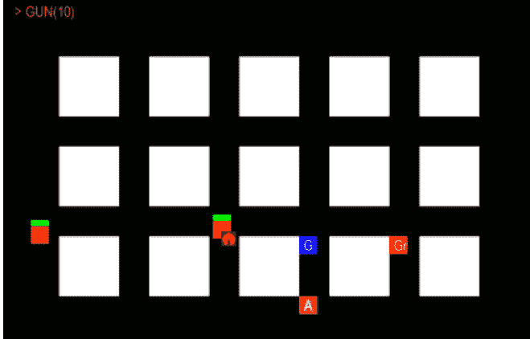

## 章节总结

在本章中，我们通过添加新功能进一步改进了游戏，例如有限状态机、可以检测和跟随玩家的NPC，以及频繁生成新NPC的能力。干得好！

### 检查清单

- 检查清单
- 检查清单
- 检查清单
- 检查清单
- 检查清单
- 检查清单
- 检查清单
- 检查清单
- 检查清单
- 检查清单
- 检查清单
- 检查清单
- 检查清单
- 检查清单
- 检查清单
- 检查清单
- 检查清单
- 检查清单
- 检查清单
- 检查清单
- 检查清单
- 检查清单
- 检查清单
- 检查清单
- 检查清单
- 检查清单

## 测验

请说明以下陈述是正确还是错误。

- 方法使用关键字`def`声明。
- 在脚本中任何方法之外声明的变量是全局变量。
- 可以在方法中使用关键字`global`来引用全局变量。
- 可以使用关键字`for`来定义循环。
- 方法`abs`可用于计算变量的绝对值。
- 关键字`match`可用于定义条件语句。
- 如果成员变量`x`已被定义为类的成员变量，则可以通过使用`self.x`在整个类中访问它。
- 以下代码将创建一个新的二维向量。

```
npc_position = pygame.Vector2()
```

- 以下代码将显示消息“False”。

```
answer = (1 > 2) or (2 > 1)
print(str(answer))
```

- 以下代码将显示消息“True”。

```
answer = (1 > 2) and (2 > 1)
```

## 测验答案

- 正确
- 正确
- 正确
- 正确
- 正确
- 正确
- 正确
- 正确
- 错误（因为至少有一个条件为真，它将显示 True）
- 错误（因为至少有一个条件为假，它将显示 False）

## 挑战 1

既然你已经成功完成了本章并提升了技能，让我们来检验一下。

- 更改新实例化 NPC 的颜色。
- 将所有 NPC 的默认/初始状态设置为巡逻。
- 更改 NPC 的速度。

# 第五章：打磨我们的游戏

在本节中，我们将通过添加更多功能来开始打磨我们的游戏。

完成本章后，你将能够：

- 为 NPC 使用图片。
- 使用循环在屏幕上绘制多个物品。
- 添加并播放音效。
- 为 NPC 添加额外的行为。

## 更改敌人的外观

在本节中，我们将通过将迄今为止用于表示 NPC 的方块替换为实际的幽灵图像来更改 NPC 的外观。

请打开你的脚本。
在代码 `=` 之后、任何方法或类之外添加以下代码：

```
npc_img = pygame.image.load("assets/npc_blue.jpg")
npc_img = pygame.transform.scale(npc_img,
(ennemy_size,ennemy_size))
```

在前面的代码中，我们定义了变量 `npc_img`，它链接到保存在文件夹中的图像 `npc_blue`。然后我们转换此图像，使其适应用于 NPC 碰撞的矩形，该矩形基于我们之前定义的变量 `ennemy_size`。

请按如下方式修改 `NPC` 类中的 `draw` 方法（新代码为粗体）：

```
def draw (self):
    #pygame.draw.rect(WIN,self.color,(self.x,self.y, 30, 30))
    WIN.blit(npc_img,(self.x, self.y))
    pygame.draw.rect(WIN, "GREEN", (self.x, self.y-10,
    self.health*30/100, 10))
```

在前面的代码中：

我们修改了名为 `draw` 的方法，使其显示图像而不是方块。

我们注释掉了之前用于显示方块的代码。然后，我们基于之前定义的变量 `npc_img` 显示蓝色幽灵的图像。

你现在可以编译你的代码了。游戏启动时，你应该看到所有 NPC 现在都显示为蓝色幽灵，如下图所示。

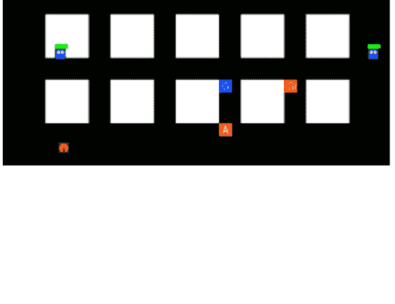

## 显示点

目前，我们的玩家角色可以收集弹药并向 NPC 射击；虽然这是一个很棒的功能，但如果玩家角色能够收集其他物品（例如，像吃豆人中的药丸）并相应地增加分数，那就更好了。

因此，在本节中，我们将：

- 定义每个药丸的位置。
- 相应地使用循环显示这些药丸。
- 检测玩家角色与药丸之间的碰撞。
- 在药丸被收集后将其移除。
- 显示分数并在收集药丸时播放音效。

那么首先，让我们定义并显示药丸；我们想要通过药丸实现的布局如下图所示。

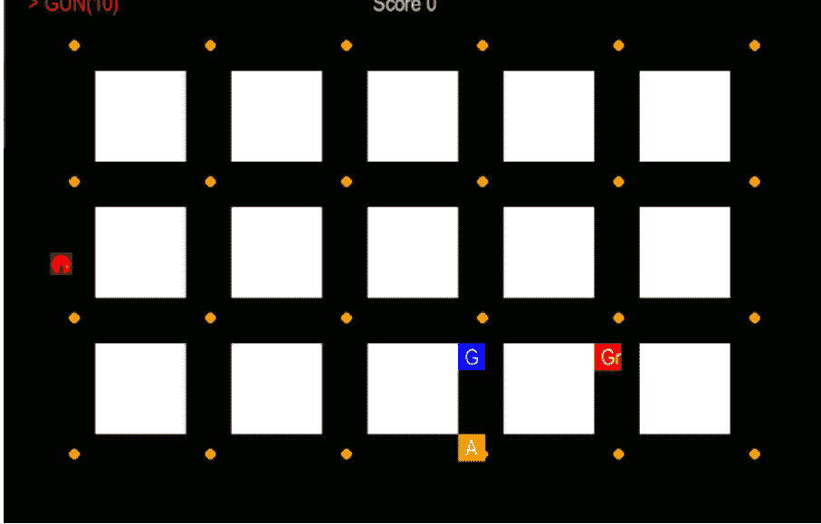

如上图所示：

药丸排列成四行四列。
每个药丸由一个橙色圆盘表示。
药丸与构成迷宫的不同行和列对齐。
分数以白色显示在窗口顶部。

首先让我们显示要收集的药丸。

请在任何方法或类之外添加以下代码：

```
dots = []
def init_dots():
    global dots
    dots = []
    for i in range(0,4):
        for j in range (0,6):
            dots.append (pygame.Rect(65+j*(WALL_INDENT),
            60+i*WALL_INDENT, ennemy_size, ennemy_size))
init_dots()
```

在前面的代码中：

我们定义了一个名为 `dots` 的列表，它将保存屏幕上显示的所有点；在这里使用列表将使管理、显示和移除游戏进行中的点变得容易得多。
然后我们创建一个名为 `init_dots` 的方法。
在此方法中，我们引用了之前定义的名为 `dots` 的全局变量。

然后我们使用两个嵌套循环；第一个使用变量 `i` 的循环用于点的每一行，而第二个使用变量 `j` 的循环用于一行中的每个点（即列）。
定义这两个循环后，我们使用变量 `i` 和 `j`，它们分别循环到 3 和 5，向列表中添加一个新项。这些项中的每一个都是一个矩形，它将用于（除其他外）检测与玩家的碰撞。每个矩形的位置由第一个项的初始位置、变量 `WALL_INDENT`（每行之间的空间）和 NPC 的大小（我们可以使用不同的大小，我们使用此大小是为了屏幕上显示的所有物品保持一致性）定义。
最后，我们调用我们刚刚创建的方法。将代码放在方法中将使以后（特别是在需要重新初始化关卡时）能够重新初始化每个药丸的位置。

接下来，我们需要显示这些点，这将通过遍历 `dots` 列表并在为每个点定义的位置绘制一个圆来完成。

请在方法 `window` 中的代码 `pygame.display.update()` 之前添加以下代码：

```
for dot in dots:
    pygame.draw.circle(WIN, "Orange", (dot.x+ennemy_size/2,
    dot.y+ennemy_size/2), ennemy_size/4)
```

在前面的代码中：

我们遍历名为 `dots` 的列表中定义的所有点。
然后我们为每个点绘制一个橙色圆圈。

我们确保这个圆圈位于为此圆圈定义的碰撞矩形的中心。

你现在可以保存并编译你的代码了。运行游戏时，你现在应该看到点显示在每一行内。

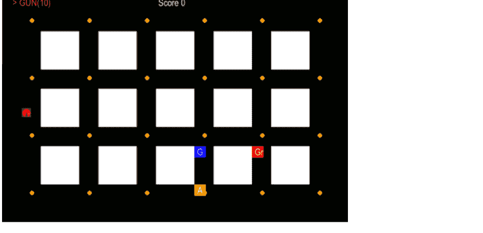

## 检测与点的碰撞并更新分数

在上一节中，我们成功显示了玩家角色要收集的点；因此在本节中，我们将检测玩家与这些点之间的碰撞，并在发生碰撞时相应地增加分数。
那么，首先让我们检测与点的碰撞：

请在任何类或方法之外添加以下代码。

```
pygame.mixer.init()
beeping_snd = pygame.mixer.Sound('assets/beep.wav')
score = 0
```

在前面的代码中，我们初始化了混音器模块，然后创建了变量 `beeping_snd`，它链接到 wav 文件。

请在方法 `check_collision_with_player` 的开头添加以下代码（新代码为粗体）：

```
def check_colission_with_player():
    global dots, score
```

在前面的代码中，我们引用了全局变量 `score` 和 `dots`。

请在方法 `check_collision_with_player` 的末尾添加以下代码：

```
dot_index = 0
for dot in dots:
    if (player_collision_rect.colliderect(dot)):
        dots.pop(dot_index)
        pygame.mixer.Channel(1).play(beeping_snd)
        score += 1
    dot_index += 1
```

在前面的代码中：

我们创建一个循环，以便遍历名为 `dots` 的列表中包含的所有点。
对于每个点，我们检查该点与玩家之间的碰撞。
如果发生碰撞，我们播放哔哔声，并增加分数。
我们还从列表中移除当前点。
然后我们增加变量 `dot_index` 的值。

你现在可以保存并运行你的代码了，你应该看到当玩家与一个点碰撞时，该点会从游戏中移除，如下图所示。


## 显示分数

在这个阶段，我们可以拾取点，我们现在需要的是跟踪并在屏幕上显示分数。

请打开脚本。
在方法 `window` 中的代码 `pygame.display.update()` 之前添加以下代码：

```
score_to_display = " Score " + str (score)
info = info_user_font.render(score_to_display,1,"WHITE")
WIN.blit(info,(400,10))
```

在前面的代码中：

我们声明变量 `score_to_display`，它包含一条由字符串 " Score " 后跟实际分数值组成的消息。
然后我们以白色渲染此消息。
最后，我们在屏幕顶部显示渲染后的文本。

你现在可以保存并编译你的代码了。游戏运行时，你应该看到分数显示在窗口顶部，并且其值会随着你收集更多点而更新，如下图所示。

## 关卡总结

在本章中，我们通过添加可收集的点、检测与NPC的碰撞以及显示分数，成功地完善了我们的游戏。

检查清单

检查清单 检查清单 检查清单 检查清单 检查清单 检查清单 检查清单 检查清单 检查清单 检查清单 检查清单 检查清单 检查清单 检查清单 检查清单 检查清单 检查清单 检查清单 检查清单 检查清单 检查清单 检查清单 检查清单 检查清单 检查清单 检查清单 检查清单 检查清单 检查清单 检查清单 检查清单 检查清单 检查清单 检查清单 检查清单 检查清单 检查清单 检查清单 检查清单 检查清单 检查清单 检查清单 检查清单 检查清单 检查清单 检查清单 检查清单 检查清单 检查清单 检查清单 检查清单 检查清单 检查清单 检查清单 检查清单 检查清单 检查清单 检查清单 检查清单 检查清单 检查清单 检查清单 检查清单 检查清单 检查清单 检查清单 检查清单 检查清单 检查清单 检查清单 检查清单 检查清单 检查清单 检查清单 检查清单 检查清单 检查清单 检查清单 检查清单 检查清单 检查清单 检查清单 检查清单 检查清单 检查清单 检查清单 检查清单 检查清单 检查清单 检查清单 检查清单 检查清单 检查清单 检查清单 检查清单 检查清单 检查清单 检查清单 检查清单 检查清单 检查清单 检查清单 检查清单 检查清单 检查清单 检查清单 检查清单 检查清单 检查清单 检查清单 检查清单 检查清单 检查清单 检查清单 检查清单 检查清单 检查清单 检查清单 检查清单 检查清单 检查清单 检查清单 检查清单 检查清单 检查清单 检查清单 检查清单 检查清单 检查清单 检查清单 检查清单 检查清单 检查清单 检查清单 检查清单 检查清单 检查清单 检查清单 检查清单 检查清单 检查清单 检查清单 检查清单 检查清单 检查清单 检查清单 检查清单 检查清单 检查清单 检查清单 检查清单 检查清单 检查清单 检查清单 检查清单 检查清单 检查清单 检查清单 检查清单 检查清单 检查清单 检查清单 检查清单 检查清单 检查清单 检查清单 检查清单 检查清单 检查清单 检查清单 检查清单 检查清单 检查清单 检查清单 检查清单 检查清单 检查清单 检查清单 检查清单 检查清单 检查清单 检查清单 检查清单 检查清单 检查清单 检查清单 检查清单 检查清单 检查清单 检查清单 检查清单 检查清单 检查清单 检查清单 检查清单 检查清单 检查清单 检查清单 检查清单 检查清单 检查清单 检查清单 检查清单 检查清单 检查清单 检查清单 检查清单 检查清单 检查清单 检查清单 检查清单 检查清单 检查清单 检查清单 检查清单 检查清单 检查清单 检查清单 检查清单 检查清单 检查清单 检查清单 检查清单 检查清单 检查清单 检查清单 检查清单 检查清单 检查清单 检查清单 检查清单 检查清单 检查清单 检查清单 检查清单 检查清单 检查清单 检查清单 检查清单 检查清单 检查清单 检查清单 检查清单 检查清单 检查清单 检查清单 检查清单 检查清单 检查清单 检查清单 检查清单 检查清单 检查清单 检查清单 检查清单 检查清单 检查清单 检查清单 检查清单 检查清单 检查清单 检查清单 检查清单 检查清单 检查清单 检查清单 检查清单 检查清单 检查清单 检查清单 检查清单 检查清单 检查清单 检查清单 检查清单 检查清单 检查清单 检查清单 检查清单 检查清单 检查清单 检查清单 检查清单 检查清单 检查清单 检查清单 检查清单 检查清单 检查清单 检查清单 检查清单 检查清单 检查清单 检查清单 检查清单 检查清单 检查清单 检查清单 检查清单 检查清单 检查清单 检查清单 检查清单 检查清单 检查清单 检查清单 检查清单 检查清单 检查清单 检查清单 检查清单 检查清单 检查清单 检查清单 检查清单 检查清单 检查清单 检查清单 检查清单 检查清单 检查清单 检查清单 检查清单 检查清单 检查清单 检查清单 检查清单 检查清单 检查清单 检查清单 检查清单 检查清单 检查清单 检查清单 检查清单 检查清单 检查清单 检查清单 检查清单 检查清单 检查清单 检查清单 检查清单 检查清单 检查清单 检查清单 检查清单 检查清单 检查清单 检查清单 检查清单 检查清单 检查清单 检查清单 检查清单 检查清单 检查清单 检查清单 检查清单 检查清单 检查清单 检查清单 检查清单 检查清单 检查清单 检查清单 检查清单 检查清单 检查清单 检查清单 检查清单 检查清单 检查清单 检查清单 检查清单 检查清单 检查清单 检查清单 检查清单 检查清单 检查清单 检查清单 检查清单 检查清单 检查清单 检查清单 检查清单 检查清单 检查清单 检查清单 检查清单 检查清单 检查清单 检查清单 检查清单 检查清单 检查清单 检查清单 检查清单 检查清单 检查清单 检查清单 检查清单 检查清单 检查清单 检查清单 检查清单 检查清单 检查清单 检查清单 检查清单 检查清单 检查清单 检查清单 检查清单 检查清单 检查清单 检查清单 检查清单 检查清单 检查清单 检查清单 检查清单 检查清单 检查清单 检查清单 检查清单 检查清单 检查清单 检查清单 检查清单 检查清单 检查清单 检查清单 检查清单 检查清单 检查清单 检查清单 检查清单 检查清单 检查清单 检查清单 检查清单 检查清单 检查清单 检查清单 检查清单 检查清单 检查清单 检查清单 检查清单 检查清单 检查清单 检查清单 检查清单 检查清单 检查清单 检查清单 检查清单 检查清单 检查清单 检查清单 检查清单 检查清单 检查清单 检查清单 检查清单 检查清单 检查清单 检查清单 检查清单 检查清单 检查清单 检查清单 检查清单 检查清单 检查清单 检查清单 检查清单 检查清单 检查清单 检查清单 检查清单 检查清单 检查清单 检查清单 检查清单 检查清单 检查清单 检查清单 检查清单 检查清单 检查清单 检查清单 检查清单 检查清单 检查清单 检查清单 检查清单 检查清单 检查清单 检查清单 检查清单 检查清单 检查清单 检查清单 检查清单 检查清单 检查清单 检查清单 检查清单 检查清单 检查清单 检查清单 检查清单 检查清单 检查清单 检查清单 检查清单 检查清单 检查清单 检查清单 检查清单 检查清单 检查清单 检查清单 检查清单 检查清单 检查清单 检查清单 检查清单 检查清单 检查清单 检查清单 检查清单 检查清单 检查清单 检查清单 检查清单 检查清单 检查清单 检查清单 检查清单 检查清单 检查清单 检查清单 检查清单 检查清单 检查清单 检查清单 检查清单 检查清单 检查清单 检查清单 检查清单 检查清单 检查清单 检查清单 检查清单 检查清单 检查清单 检查清单 检查清单 检查清单 检查清单 检查清单 检查清单 检查清单 检查清单 检查清单 检查清单 检查清单 检查清单 检查清单 检查清单 检查清单 检查清单 检查清单 检查清单 检查清单 检查清单 检查清单 检查清单 检查清单 检查清单 检查清单 检查清单 检查清单 检查清单 检查清单 检查清单 检查清单 检查清单 检查清单 检查清单 检查清单 检查清单 检查清单 检查清单 检查清单 检查清单 检查清单 检查清单 检查清单 检查清单 检查清单 检查清单 检查清单 检查清单 检查清单 检查清单 检查清单 检查清单 检查清单 检查清单 检查清单 检查清单 检查清单 检查清单 检查清单 检查清单 检查清单 检查清单 检查清单 检查清单 检查清单 检查清单 检查清单 检查清单 检查清单 检查清单 检查清单 检查清单 检查清单 检查清单 检查清单 检查清单 检查清单 检查清单 检查清单 检查清单 检查清单 检查清单 检查清单 检查清单 检查清单 检查清单 检查清单 检查清单 检查清单 检查清单 检查清单 检查清单 检查清单 检查清单 检查清单 检查清单 检查清单 检查清单 检查清单 检查清单 检查清单 检查清单 检查清单 检查清单 检查清单 检查清单 检查清单 检查清单 检查清单 检查清单 检查清单 检查清单 检查清单 检查清单 检查清单 检查清单 检查清单 检查清单 检查清单 检查清单 检查清单 检查清单 检查清单 检查清单 检查清单 检查清单 检查清单 检查清单 检查清单 检查清单 检查清单 检查清单 检查清单 检查清单 检查清单 检查清单 检查清单 检查清单 检查清单 检查清单 检查清单 检查清单 检查清单 检查清单 检查清单 检查清单 检查清单 检查清单 检查清单 检查清单 检查清单 检查清单 检查清单 检查清单 检查清单 检查清单 检查清单 检查清单 检查清单 检查清单 检查清单 检查清单 检查清单 检查清单 检查清单 检查清单 检查清单 检查清单 检查清单 检查清单 检查清单 检查清单 检查清单 检查清单 检查清单 检查清单 检查清单 检查清单 检查清单 检查清单 检查清单 检查清单 检查清单 检查清单 检查清单 检查清单 检查清单 检查清单 检查清单 检查清单 检查清单 检查清单 检查清单 检查清单 检查清单 检查清单 检查清单 检查清单 检查清单 检查清单 检查清单 检查清单 检查清单 检查清单 检查清单 检查清单 检查清单 检查清单 检查清单 检查清单 检查清单 检查清单 检查清单 检查清单 检查清单 检查清单 检查清单 检查清单 检查清单 检查清单 检查清单 检查清单 检查清单 检查清单 检查清单 检查清单 检查清单 检查清单 检查清单 检查清单 检查清单 检查清单 检查清单 检查清单 检查清单 检查清单 检查清单 检查清单 检查清单 检查清单 检查清单 检查清单 检查清单 检查清单 检查清单 检查清单 检查清单 检查清单 检查清单 检查清单 检查清单 检查清单 检查清单 检查清单 检查清单 检查清单 检查清单 检查清单 检查清单 检查清单 检查清单 检查清单 检查清单 检查清单 检查清单 检查清单 检查清单 检查清单 检查清单 检查清单 检查清单 检查清单 检查清单 检查清单 检查清单 检查清单 检查清单 检查清单 检查清单 检查清单 检查清单 检查清单 检查清单 检查清单 检查清单 检查清单 检查清单 检查清单 检查清单 检查清单 检查清单 检查清单 检查清单 检查清单 检查清单 检查清单 检查清单 检查清单 检查清单 检查清单 检查清单 检查清单 检查清单 检查清单 检查清单 检查清单 检查清单 检查清单 检查清单 检查清单 检查清单 检查清单 检查清单 检查清单 检查清单 检查清单 检查清单 检查清单 检查清单 检查清单 检查清单 检查清单 检查清单 检查清单 检查清单 检查清单 检查清单 检查清单 检查清单 检查清单 检查清单 检查清单 检查清单 检查清单 检查清单 检查清单 检查清单 检查清单 检查清单 检查清单 检查清单 检查清单 检查清单 检查清单 检查清单 检查清单 检查清单 检查清单 检查清单 检查清单 检查清单 检查清单 检查清单 检查清单 检查清单 检查清单 检查清单 检查清单 检查清单 检查清单 检查清单 检查清单 检查清单 检查清单 检查清单 检查清单 检查清单 检查清单 检查清单 检查清单 检查清单 检查清单 检查清单 检查清单 检查清单 检查清单 检查清单 检查清单 检查清单 检查清单 检查清单 检查清单 检查清单 检查清单 检查清单 检查清单 检查清单 检查清单 检查清单 检查清单 检查清单 检查清单 检查清单 检查清单 检查清单 检查清单 检查清单 检查清单 检查清单 检查清单 检查清单 检查清单 检查清单 检查清单 检查清单 检查清单 检查清单 检查清单 检查清单 检查清单 检查清单 检查清单 检查清单 检查清单 检查清单 检查清单 检查清单 检查清单 检查清单 检查清单 检查清单 检查清单 检查清单 检查清单 检查清单 检查清单 检查清单 检查清单 检查清单 检查清单 检查清单 检查清单 检查清单 检查清单 检查清单 检查清单 检查清单 检查清单 检查清单 检查清单 检查清单 检查清单 检查清单 检查清单 检查清单 检查清单 检查清单 检查清单 检查清单 检查清单 检查清单 检查清单 检查清单 检查清单 检查清单 检查清单 检查清单 检查清单 检查清单 检查清单 检查清单 检查清单 检查清单 检查清单 检查清单 检查清单 检查清单 检查清单 检查清单 检查清单 检查清单 检查清单 检查清单 检查清单 检查清单 检查清单 检查清单 检查清单 检查清单 检查清单 检查清单 检查清单 检查清单 检查清单 检查清单 检查清单 检查清单 检查清单 检查清单 检查清单 检查清单 检查清单 检查清单 检查清单 检查清单 检查清单 检查清单 检查清单 检查清单 检查清单 检查清单 检查清单 检查清单 检查清单 检查清单 检查清单 检查清单 检查清单 检查清单 检查清单 检查清单 检查清单 检查清单 检查清单 检查清单 检查清单 检查清单 检查清单 检查清单 检查清单 检查清单 检查清单 检查清单 检查清单 检查清单 检查清单 检查清单 检查清单 检查清单 检查清单 检查清单 检查清单 检查清单 检查清单 检查清单 检查清单 检查清单 检查清单 检查清单 检查清单 检查清单 检查清单 检查清单 检查清单 检查清单 检查清单 检查清单 检查清单 检查清单 检查清单 检查清单 检查清单 检查清单 检查清单 检查清单 检查清单 检查清单 检查清单 检查清单 检查清单 检查清单 检查清单 检查清单 检查清单 检查清单 检查清单 检查清单 检查清单 检查清单 检查清单 检查清单 检查清单 检查清单 检查清单 检查清单 检查清单 检查清单 检查清单 检查清单 检查清单 检查清单 检查清单 检查清单 检查清单 检查清单 检查清单 检查清单 检查清单 检查清单 检查清单 检查清单 检查清单 检查清单 检查清单 检查清单 检查清单 检查清单 检查清单 检查清单 检查清单 检查清单 检查清单 检查清单 检查清单 检查清单 检查清单 检查清单 检查清单 检查清单 检查清单 检查清单 检查清单 检查清单 检查清单 检查清单 检查清单 检查清单 检查清单 检查清单 检查清单 检查清单 检查清单 检查清单 检查清单 检查清单 检查清单 检查清单 检查清单 检查清单 检查清单 检查清单 检查清单 检查清单 检查清单 检查清单 检查清单 检查清单 检查清单 检查清单 检查清单 检查清单 检查清单 检查清单 检查清单 检查清单 检查清单 检查清单 检查清单 检查清单 检查清单 检查清单 检查清单 检查清单 检查清单 检查清单 检查清单 检查清单 检查清单 检查清单 检查清单 检查清单 检查清单 检查清单 检查清单 检查清单 检查清单 检查清单 检查清单 检查清单 检查清单 检查清单 检查清单 检查清单 检查清单 检查清单 检查清单 检查清单 检查清单 检查清单 检查清单 检查清单 检查清单 检查清单 检查清单 检查清单 检查清单 检查清单 检查清单 检查清单 检查清单 检查清单 检查清单 检查清单 检查清单 检查清单 检查清单 检查清单 检查清单 检查清单 检查清单 检查清单 检查清单 检查清单 检查清单 检查清单 检查清单 检查清单 检查清单 检查清单 检查清单 检查清单 检查清单 检查清单 检查清单 检查清单 检查清单 检查清单 检查清单 检查清单 检查清单 检查清单 检查清单 检查清单 检查清单 检查清单 检查清单 检查清单 检查清单 检查清单 检查清单 检查清单 检查清单 检查清单 检查清单 检查清单 检查清单 检查清单 检查清单 检查清单 检查清单 检查清单 检查清单 检查清单 检查清单 检查清单 检查清单 检查清单 检查清单 检查清单 检查清单 检查清单 检查清单 检查清单 检查清单 检查清单 检查清单 检查清单 检查清单 检查清单 检查清单 检查清单 检查清单 检查清单 检查清单 检查清单 检查清单 检查清单 检查清单 检查清单 检查清单 检查清单 检查清单 检查清单 检查清单 检查清单 检查清单 检查清单 检查清单 检查清单 检查清单 检查清单 检查清单 检查清单 检查清单 检查清单 检查清单 检查清单 检查清单 检查清单 检查清单 检查清单 检查清单 检查清单 检查清单 检查清单 检查清单 检查清单 检查清单 检查清单 检查清单 检查清单 检查清单 检查清单 检查清单 检查清单 检查清单 检查清单 检查清单 检查清单 检查清单 检查清单 检查清单 检查清单 检查清单 检查清单 检查清单 检查清单 检查清单 检查清单 检查清单 检查清单 检查清单 检查清单 检查清单 检查清单 检查清单 检查清单 检查清单 检查清单 检查清单 检查清单 检查清单 检查清单 检查清单 检查清单 检查清单 检查清单 检查清单 检查清单 检查清单 检查清单 检查清单 检查清单 检查清单 检查清单 检查清单 检查清单 检查清单 检查清单 检查清单 检查清单 检查清单 检查清单 检查清单 检查清单 检查清单 检查清单 检查清单 检查清单 检查清单 检查清单 检查清单 检查清单 检查清单 检查清单 检查清单 检查清单 检查清单 检查清单 检查清单 检查清单 检查清单 检查清单 检查清单 检查清单 检查清单 检查清单 检查清单 检查清单 检查清单 检查清单 检查清单 检查清单 检查清单 检查清单 检查清单 检查清单 检查清单 检查清单 检查清单 检查清单 检查清单 检查清单 检查清单 检查清单 检查清单 检查清单 检查清单 检查清单 检查清单 检查清单 检查清单 检查清单 检查清单 检查清单 检查清单 检查清单 检查清单 检查清单 检查清单 检查清单 检查清单 检查清单 检查清单 检查清单 检查清单 检查清单 检查清单 检查清单 检查清单 检查清单 检查清单 检查清单 检查清单 检查清单 检查清单 检查清单 检查清单 检查清单 检查清单 检查清单 检查清单 检查清单 检查清单 检查清单 检查清单 检查清单 检查清单 检查清单 检查清单 检查清单 检查清单 检查清单 检查清单 检查清单 检查清单 检查清单 检查清单 检查清单 检查清单 检查清单 检查清单 检查清单 检查清单 检查清单 检查清单 检查清单 检查清单 检查清单 检查清单 检查清单 检查清单 检查清单 检查清单 检查清单 检查清单 检查清单 检查清单 检查清单 检查清单 检查清单 检查清单 检查清单 检查清单 检查清单 检查清单 检查清单 检查清单 检查清单 检查清单 检查清单 检查清单 检查清单 检查清单 检查清单 检查清单 检查清单 检查清单 检查清单 检查清单 检查清单 检查清单 检查清单 检查清单 检查清单 检查清单 检查清单 检查清单 检查清单 检查清单 检查清单 检查清单 检查清单 检查清单 检查清单 检查清单 检查清单 检查清单 检查清单 检查清单 检查清单 检查清单 检查清单 检查清单 检查清单 检查清单 检查清单 检查清单 检查清单 检查清单 检查清单 检查清单 检查清单 检查清单 检查清单 检查清单 检查清单 检查清单 检查清单 检查清单 检查清单 检查清单 检查清单 检查清单 检查清单 检查清单 检查清单 检查清单 检查清单 检查清单 检查清单 检查清单 检查清单 检查清单 检查清单 检查清单 检查清单 检查清单 检查清单 检查清单 检查清单 检查清单 检查清单 检查清单 检查清单 检查清单 检查清单 检查清单 检查清单 检查清单 检查清单 检查清单 检查清单 检查清单 检查清单 检查清单 检查清单 检查清单 检查清单 检查清单 检查清单 检查清单 检查清单 检查清单 检查清单 检查清单 检查清单 检查清单 检查清单 检查清单 检查清单 检查清单 检查清单 检查清单 检查清单 检查清单 检查清单 检查清单 检查清单 检查清单 检查清单 检查清单 检查清单 检查清单 检查清单 检查清单 检查清单 检查清单 检查清单 检查清单 检查清单 检查清单 检查清单 检查清单 检查清单 检查清单 检查清单 检查清单 检查清单 检查清单 检查清单 检查清单 检查清单 检查清单 检查清单 检查清单 检查清单 检查清单 检查清单 检查清单 检查清单 检查清单 检查清单 检查清单 检查清单 检查清单 检查清单 检查清单 检查清单 检查清单 检查清单 检查清单 检查清单 检查清单 检查清单 检查清单 检查清单 检查清单 检查清单 检查清单 检查清单 检查清单 检查清单 检查清单 检查清单 检查清单 检查清单 检查清单 检查清单 检查清单 检查清单 检查清单 检查清单 检查清单 检查清单 检查清单 检查清单 检查清单 检查清单 检查清单 检查清单 检查清单 检查清单 检查清单 检查清单 检查清单 检查清单 检查清单 检查清单 检查清单 检查清单 检查清单 检查清单 检查清单 检查清单 检查清单 检查清单 检查清单 检查清单 检查清单 检查清单 检查清单 检查清单 检查清单 检查清单 检查清单 检查清单 检查清单 检查清单 检查清单 检查清单 检查清单 检查清单 检查清单 检查清单 检查清单 检查清单 检查清单 检查清单 检查清单 检查清单 检查清单 检查清单 检查清单 检查清单 检查清单 检查清单 检查清单 检查清单 检查清单 检查清单 检查清单 检查清单 检查清单 检查清单 检查清单 检查清单 检查清单 检查清单 检查清单 检查清单 检查清单 检查清单 检查清单 检查清单 检查清单 检查清单 检查清单 检查清单 检查清单 检查清单 检查清单 检查清单 检查清单 检查清单 检查清单 检查清单 检查清单 检查清单 检查清单 检查清单 检查清单 检查清单 检查清单 检查清单 检查清单 检查清单 检查清单 检查清单 检查清单 检查清单 检查清单 检查清单 检查清单 检查清单 检查清单 检查清单 检查清单 检查清单 检查清单 检查清单 检查清单 检查清单 检查清单 检查清单 检查清单 检查清单 检查清单 检查清单 检查清单 检查清单 检查清单 检查清单 检查清单 检查清单 检查清单 检查清单 检查清单 检查清单 检查清单 检查清单 检查清单 检查清单 检查清单 检查清单 检查清单 检查清单 检查清单 检查清单 检查清单 检查清单 检查清单 检查清单 检查清单 检查清单 检查清单 检查清单 检查清单 检查清单 检查清单 检查清单 检查清单 检查清单 检查清单 检查清单 检查清单 检查清单 检查清单 检查清单 检查清单 检查清单 检查清单 检查清单 检查清单 检查清单 检查清单 检查清单 检查清单 检查清单 检查清单 检查清单 检查清单 检查清单 检查清单 检查清单 检查清单 检查清单 检查清单 检查清单 检查清单 检查清单 检查清单 检查清单 检查清单 检查清单 检查清单 检查清单 检查清单 检查清单 检查清单 检查清单 检查清单 检查清单 检查清单 检查清单 检查清单 检查清单 检查清单 检查清单 检查清单 检查清单 检查清单 检查清单 检查清单 检查清单 检查清单 检查清单 检查清单 检查清单 检查清单 检查清单 检查清单 检查清单 检查清单 检查清单 检查清单 检查清单 检查清单 检查清单 检查清单 检查清单 检查清单 检查清单 检查清单 检查清单 检查清单 检查清单 检查清单 检查清单 检查清单 检查清单 检查清单 检查清单 检查清单 检查清单 检查清单 检查清单 检查清单 检查清单 检查清单 检查清单 检查清单 检查清单 检查清单 检查清单 检查清单 检查清单 检查清单 检查清单 检查清单 检查清单 检查清单 检查清单 检查清单 检查清单 检查清单 检查清单 检查清单 检查清单 检查清单 检查清单 检查清单 检查清单 检查清单 检查清单 检查清单 检查清单 检查清单 检查清单 检查清单 检查清单 检查清单 检查清单 检查清单 检查清单 检查清单 检查清单 检查清单 检查清单 检查清单 检查清单 检查清单 检查清单 检查清单 检查清单 检查清单 检查清单 检查清单 检查清单 检查清单 检查清单 检查清单 检查清单 检查清单 检查清单 检查清单 检查清单 检查清单 检查清单 检查清单 检查清单 检查清单 检查清单 检查清单 检查清单 检查清单 检查清单 检查清单 检查清单 检查清单 检查清单 检查清单 检查清单 检查清单 检查清单 检查清单 检查清单 检查清单 检查清单 检查清单 检查清单 检查清单 检查清单 检查清单 检查清单 检查清单 检查清单 检查清单 检查清单 检查清单 检查清单 检查清单 检查清单 检查清单 检查清单 检查清单 检查清单 检查清单 检查清单 检查清单 检查清单 检查清单 检查清单 检查清单 检查清单 检查清单 检查清单 检查清单 检查清单 检查清单 检查清单 检查清单 检查清单 检查清单 检查清单 检查清单 检查清单 检查清单 检查清单 检查清单 检查清单 检查清单 检查清单 检查清单 检查清单 检查清单 检查清单 检查清单 检查清单 检查清单 检查清单 检查清单 检查清单 检查清单 检查清单 检查清单 检查清单 检查清单 检查清单 检查清单 检查清单 检查清单 检查清单 检查清单 检查清单 检查清单 检查清单 检查清单 检查清单 检查清单 检查清单 检查清单 检查清单 检查清单 检查清单 检查清单 检查清单 检查清单 检查清单 检查清单 检查清单 检查清单 检查清单 检查清单 检查清单 检查清单 检查清单 检查清单 检查清单 检查清单 检查清单 检查清单 检查清单 检查清单 检查清单 检查清单 检查清单 检查清单 检查清单 检查清单 检查清单 检查清单 检查清单 检查清单 检查清单 检查清单 检查清单 检查清单 检查清单 检查清单 检查清单 检查清单 检查清单 检查清单 检查清单 检查清单 检查清单 检查清单 检查清单 检查清单 检查清单 检查清单 检查清单 检查清单 检查清单 检查清单 检查清单 检查清单 检查清单 检查清单 检查清单 检查清单 检查清单 检查清单 检查清单 检查清单 检查清单 检查清单 检查清单 检查清单 检查清单 检查清单 检查清单 检查清单 检查清单 检查清单 检查清单 检查清单 检查清单 检查清单 检查清单 检查清单 检查清单 检查清单 检查清单 检查清单 检查清单 检查清单 检查清单 检查清单 检查清单 检查清单 检查清单 检查清单 检查清单 检查清单 检查清单 检查清单 检查清单 检查清单 检查清单 检查清单 检查清单 检查清单 检查清单 检查清单 检查清单 检查清单 检查清单 检查清单 检查清单 检查清单 检查清单 检查清单 检查清单 检查清单 检查清单 检查清单 检查清单 检查清单 检查清单 检查清单 检查清单 检查清单 检查清单 检查清单 检查清单 检查清单 检查清单 检查清单 检查清单 检查清单 检查清单 检查清单 检查清单 检查清单 检查清单 检查清单 检查清单 检查清单 检查清单 检查清单 检查清单 检查清单 检查清单 检查清单 检查清单 检查清单 检查清单 检查清单 检查清单 检查清单 检查清单 检查清单 检查清单 检查清单 检查清单 检查清单 检查清单 检查清单 检查清单 检查清单 检查清单 检查清单 检查清单 检查清单 检查清单 检查清单 检查清单 检查清单 检查清单 检查清单 检查清单 检查清单 检查清单 检查清单 检查清单 检查清单 检查清单 检查清单 检查清单 检查清单 检查清单 检查清单 检查清单 检查清单 检查清单 检查清单 检查清单 检查清单 检查清单 检查清单 检查清单 检查清单 检查清单 检查清单 检查清单 检查清单 检查清单 检查清单 检查清单 检查清单 检查清单 检查清单 检查清单 检查清单 检查清单 检查清单 检查清单 检查清单 检查清单 检查清单 检查清单 检查清单 检查清单 检查清单 检查清单 检查清单 检查清单 检查清单 检查清单 检查清单 检查清单 检查清单 检查清单 检查清单 检查清单 检查清单 检查清单 检查清单 检查清单 检查清单 检查清单 检查清单 检查清单 检查清单 检查清单 检查清单 检查清单 检查清单 检查清单 检查清单 检查清单 检查清单 检查清单 检查清单 检查清单 检查清单 检查清单 检查清单 检查清单 检查清单 检查清单 检查清单 检查清单 检查清单 检查清单 检查清单 检查清单 检查清单 检查清单 检查清单 检查清单 检查清单 检查清单 检查清单 检查清单 检查清单 检查清单 检查清单 检查清单 检查清单 检查清单 检查清单 检查清单 检查清单 检查清单 检查清单 检查清单 检查清单 检查清单 检查清单 检查清单 检查清单 检查清单 检查清单 检查清单 检查清单 检查清单 检查清单 检查清单 检查清单 检查清单 检查清单 检查清单 检查清单 检查清单 检查清单 检查清单 检查清单 检查清单 检查清单 检查清单 检查清单 检查清单 检查清单 检查清单 检查清单 检查清单 检查清单 检查清单 检查清单 检查清单 检查清单 检查清单 检查清单 检查清单 检查清单 检查清单 检查清单 检查清单 检查清单 检查清单 检查清单 检查清单 检查清单 检查清单 检查清单 检查清单 检查清单 检查清单 检查清单 检查清单 检查清单 检查清单 检查清单 检查清单 检查清单 检查清单 检查清单 检查清单 检查清单 检查清单 检查清单 检查清单 检查清单 检查清单 检查清单 检查清单 检查清单 检查清单 检查清单 检查清单 检查清单 检查清单 检查清单 检查清单 检查清单 检查清单 检查清单 检查清单 检查清单 检查清单 检查清单 检查清单 检查清单 检查清单 检查清单 检查清单 检查清单 检查清单 检查清单 检查清单 检查清单 检查清单 检查清单 检查清单 检查清单 检查清单 检查清单 检查清单 检查清单 检查清单 检查清单 检查清单 检查清单 检查清单 检查清单 检查清单 检查清单 检查清单 检查清单 检查清单 检查清单 检查清单 检查清单 检查清单 检查清单 检查清单 检查清单 检查清单 检查清单 检查清单 检查清单 检查清单 检查清单 检查清单 检查清单 检查清单 检查清单 检查清单 检查清单 检查清单 检查清单 检查清单 检查清单 检查清单 检查清单 检查清单 检查清单 检查清单 检查清单 检查清单 检查清单 检查清单 检查清单 检查清单 检查清单 检查清单 检查清单 检查清单 检查清单 检查清单 检查清单 检查清单 检查清单 检查清单 检查清单 检查清单 检查清单 检查清单 检查清单 检查清单 检查清单 检查清单 检查清单 检查清单 检查清单 检查清单 检查清单 检查清单 检查清单 检查清单 检查清单 检查清单 检查清单 检查清单 检查清单 检查清单 检查清单 检查清单 检查清单 检查清单 检查清单 检查清单 检查清单 检查清单 检查清单 检查清单 检查清单 检查清单 检查清单 检查清单 检查清单 检查清单 检查清单 检查清单 检查清单 检查清单 检查清单 检查清单 检查清单 检查清单 检查清单 检查清单 检查清单 检查清单 检查清单 检查清单 检查清单 检查清单 检查清单 检查清单 检查清单 检查清单 检查清单 检查清单 检查清单 检查清单 检查清单 检查清单 检查清单 检查清单 检查清单 检查清单 检查清单 检查清单 检查清单 检查清单 检查清单 检查清单 检查清单 检查清单 检查清单 检查清单 检查清单 检查清单 检查清单 检查清单 检查清单 检查清单 检查清单 检查清单 检查清单 检查清单 检查清单 检查清单 检查清单 检查清单 检查清单 检查清单 检查清单 检查清单 检查清单 检查清单 检查清单 检查清单 检查清单 检查清单 检查清单 检查清单 检查清单 检查清单 检查清单 检查清单 检查清单 检查清单 检查清单 检查清单 检查清单 检查清单 检查清单 检查清单 检查清单 检查清单 检查清单 检查清单 检查清单 检查清单 检查清单 检查清单 检查清单 检查清单 检查清单 检查清单 检查清单 检查清单 检查清单 检查清单 检查清单 检查清单 检查清单 检查清单 检查清单 检查清单 检查清单 检查清单 检查清单 检查清单 检查清单 检查清单 检查清单 检查清单 检查清单 检查清单 检查清单 检查清单 检查清单 检查清单 检查清单 检查清单 检查清单 检查清单 检查清单 检查清单 检查清单 检查清单 检查清单 检查清单 检查清单 检查清单 检查清单 检查清单 检查清单 检查清单 检查清单 检查清单 检查清单 检查清单 检查清单 检查清单 检查清单 检查清单 检查清单 检查清单 检查清单 检查清单 检查清单 检查清单 检查清单 检查清单 检查清单 检查清单 检查清单 检查清单 检查清单 检查清单 检查清单 检查清单 检查清单 检查清单 检查清单 检查清单 检查清单 检查清单 检查清单 检查清单 检查清单 检查清单 检查清单 检查清单 检查清单 检查清单 检查清单 检查清单 检查清单 检查清单 检查清单 检查清单 检查清单 检查清单 检查清单 检查清单 检查清单 检查清单 检查清单 检查清单 检查清单 检查清单 检查清单 检查清单 检查清单 检查清单 检查清单 检查清单 检查清单 检查清单 检查清单 检查清单 检查清单 检查清单 检查清单 检查清单 检查清单 检查清单 检查清单 检查清单 检查清单 检查清单 检查清单 检查清单 检查清单 检查清单 检查清单 检查清单 检查清单 检查清单 检查清单 检查清单 检查清单 检查清单 检查清单 检查清单 检查清单 检查清单 检查清单 检查清单 检查清单 检查清单 检查清单 检查清单 检查清单 检查清单 检查清单 检查清单 检查清单 检查清单 检查清单 检查清单 检查清单 检查清单 检查清单 检查清单 检查清单 检查清单 检查清单 检查清单 检查清单 检查清单 检查清单 检查清单 检查清单 检查清单 检查清单 检查清单 检查清单 检查清单 检查清单 检查清单 检查清单 检查清单 检查清单 检查清单 检查清单 检查清单 检查清单 检查清单 检查清单 检查清单 检查清单 检查清单 检查清单 检查清单 检查清单 检查清单 检查清单 检查清单 检查清单 检查清单 检查清单 检查清单 检查清单 检查清单 检查清单 检查清单 检查清单 检查清单 检查清单 检查清单 检查清单 检查清单 检查清单 检查清单 检查清单 检查清单 检查清单 检查清单 检查清单 检查清单 检查清单 检查清单 检查清单 检查清单 检查清单 检查清单 检查清单 检查清单 检查清单 检查清单 检查清单 检查清单 检查清单 检查清单 检查清单 检查清单 检查清单 检查清单 检查清单 检查清单 检查清单 检查清单 检查清单 检查清单 检查清单 检查清单 检查清单 检查清单 检查清单 检查清单 检查清单 检查清单 检查清单 检查清单 检查清单 检查清单 检查清单 检查清单 检查清单 检查清单 检查清单 检查清单 检查清单 检查清单 检查清单 检查清单 检查清单 检查清单 检查清单 检查清单 检查清单 检查清单 检查清单 检查清单 检查清单 检查清单 检查清单 检查清单 检查清单 检查清单 检查清单 检查清单 检查清单 检查清单 检查清单 检查清单 检查清单 检查清单 检查清单 检查清单 检查清单 检查清单 检查清单 检查清单 检查清单 检查清单 检查清单 检查清单 检查清单 检查清单 检查清单 检查清单 检查清单 检查清单 检查清单 检查清单 检查清单 检查清单 检查清单 检查清单 检查清单 检查清单 检查清单 检查清单 检查清单 检查清单 检查清单 检查清单 检查清单 检查清单 检查清单 检查清单 检查清单 检查清单 检查清单 检查清单 检查清单 检查清单 检查清单 检查清单 检查清单 检查清单 检查清单 检查清单 检查清单 检查清单 检查清单 检查清单 检查清单 检查清单 检查清单 检查清单 检查清单 检查清单 检查清单 检查清单 检查清单 检查清单 检查清单 检查清单 检查清单 检查清单 检查清单 检查清单 检查清单 检查清单 检查清单 检查清单 检查清单 检查清单 检查清单 检查清单 检查清单 检查清单 检查清单 检查清单 检查清单 检查清单 检查清单 检查清单 检查清单 检查清单 检查清单 检查清单 检查清单 检查清单 检查清单 检查清单 检查清单 检查清单 检查清单 检查清单 检查清单 检查清单 检查清单 检查清单 检查清单 检查清单 检查清单 检查清单 检查清单 检查清单 检查清单 检查清单 检查清单 检查清单 检查清单 检查清单 检查清单 检查清单 检查清单 检查清单 检查清单 检查清单 检查清单 检查清单 检查清单 检查清单 检查清单 检查清单 检查清单 检查清单 检查清单 检查清单 检查清单 检查清单 检查清单 检查清单 检查清单 检查清单 检查清单 检查清单 检查清单 检查清单 检查清单 检查清单 检查清单 检查清单 检查清单 检查清单 检查清单 检查清单 检查清单 检查清单 检查清单 检查清单 检查清单 检查清单 检查清单 检查清单 检查清单 检查清单 检查清单 检查清单 检查清单 检查清单 检查清单 检查清单 检查清单 检查清单 检查清单 检查清单 检查清单 检查清单 检查清单 检查清单 检查清单 检查清单 检查清单 检查清单 检查清单 检查清单 检查清单 检查清单 检查清单 检查清单 检查清单 检查清单 检查清单 检查清单 检查清单 检查清单 检查清单 检查清单 检查清单 检查清单 检查清单 检查清单 检查清单 检查清单 检查清单 检查清单 检查清单 检查清单 检查清单 检查清单 检查清单 检查清单 检查清单 检查清单 检查清单 检查清单 检查清单 检查清单 检查清单 检查清单 检查清单 检查清单 检查清单 检查清单 检查清单 检查清单 检查清单 检查清单 检查清单 检查清单 检查清单 检查清单 检查清单 检查清单 检查清单 检查清单 检查清单 检查清单 检查清单 检查清单 检查清单 检查清单 检查清单 检查清单 检查清单 检查清单 检查清单 检查清单 检查清单 检查清单 检查清单 检查清单 检查清单 检查清单 检查清单 检查清单 检查清单 检查清单 检查清单 检查清单 检查清单 检查清单 检查清单 检查清单 检查清单 检查清单 检查清单 检查清单 检查清单 检查清单 检查清单 检查清单 检查清单 检查清单 检查清单 检查清单 检查清单 检查清单 检查清单 检查清单 检查清单 检查清单 检查清单 检查清单 检查清单 检查清单 检查清单 检查清单 检查清单 检查清单 检查清单 检查清单 检查清单 检查清单 检查清单 检查清单 检查清单 检查清单 检查清单 检查清单 检查清单 检查清单 检查清单 检查清单 检查清单 检查清单 检查清单 检查清单 检查清单 检查清单 检查清单 检查清单 检查清单 检查清单 检查清单 检查清单 检查清单 检查清单 检查清单 检查清单 检查清单 检查清单 检查清单 检查清单 检查清单 检查清单 检查清单 检查清单 检查清单 检查清单 检查清单 检查清单 检查清单 检查清单 检查清单 检查清单 检查清单 检查清单 检查清单 检查清单 检查清单 检查清单 检查清单 检查清单 检查清单 检查清单 检查清单 检查清单 检查清单 检查清单 检查清单 检查清单 检查清单 检查清单 检查清单 检查清单 检查清单 检查清单 检查清单 检查清单 检查清单 检查清单 检查清单 检查清单 检查清单 检查清单 检查清单 检查清单 检查清单 检查清单 检查清单 检查清单 检查清单 检查清单 检查清单 检查清单 检查清单 检查清单 检查清单 检查清单 检查清单 检查清单 检查清单 检查清单 检查清单 检查清单 检查清单 检查清单 检查清单 检查清单 检查清单 检查清单 检查清单 检查清单 检查清单 检查清单 检查清单 检查清单 检查清单 检查清单 检查清单 检查清单 检查清单 检查清单 检查清单 检查清单 检查清单 检查清单 检查清单 检查清单 检查清单 检查清单 检查清单 检查清单 检查清单 检查清单 检查清单 检查清单 检查清单 检查清单 检查清单 检查清单 检查清单 检查清单 检查清单 检查清单 检查清单 检查清单 检查清单 检查清单 检查清单 检查清单 检查清单 检查清单 检查清单 检查清单 检查清单 检查清单 检查清单 检查清单 检查清单 检查清单 检查清单 检查清单 检查清单 检查清单 检查清单 检查清单 检查清单 检查清单 检查清单 检查清单 检查清单 检查清单 检查清单 检查清单 检查清单 检查清单 检查清单 检查清单 检查清单 检查清单 检查清单 检查清单 检查清单 检查清单 检查清单 检查清单 检查清单 检查清单 检查清单 检查清单 检查清单 检查清单 检查清单 检查清单 检查清单 检查清单 检查清单 检查清单 检查清单 检查清单 检查清单 检查清单 检查清单 检查清单 检查清单 检查清单 检查清单 检查清单 检查清单 检查清单 检查清单 检查清单 检查清单 检查清单 检查清单 检查清单 检查清单 检查清单 检查清单 检查清单 检查清单 检查清单 检查清单 检查清单 检查清单 检查清单 检查清单 检查清单 检查清单 检查清单 检查清单 检查清单 检查清单 检查清单 检查清单 检查清单 检查清单 检查清单 检查清单 检查清单 检查清单 检查清单 检查清单 检查清单 检查清单 检查清单 检查清单 检查清单 检查清单 检查清单 检查清单 检查清单 检查清单 检查清单 检查清单 检查清单 检查清单 检查清单 检查清单 检查清单 检查清单 检查清单 检查清单 检查清单 检查清单 检查清单 检查清单 检查清单 检查清单 检查清单 检查清单 检查清单 检查清单 检查清单 检查清单 检查清单 检查清单 检查清单 检查清单 检查清单 检查清单 检查清单 检查清单 检查清单 检查清单 检查清单 检查清单 检查清单 检查清单 检查清单 检查清单 检查清单 检查清单 检查清单 检查清单 检查清单 检查清单 检查清单 检查清单 检查清单 检查清单 检查清单 检查清单 检查清单 检查清单 检查清单 检查清单 检查清单 检查清单 检查清单 检查清单 检查清单 检查清单 检查清单 检查清单 检查清单 检查清单 检查清单 检查清单 检查清单 检查清单 检查清单 检查清单 检查清单 检查清单 检查清单 检查清单 检查清单 检查清单 检查清单 检查清单 检查清单 检查清单 检查清单 检查清单 检查清单 检查清单 检查清单 检查清单 检查清单 检查清单 检查清单 检查清单 检查清单 检查清单 检查清单 检查清单 检查清单 检查清单 检查清单 检查清单 检查清单 检查清单 检查清单 检查清单 检查清单 检查清单 检查清单 检查清单 检查清单 检查清单 检查清单 检查清单 检查清单 检查清单 检查清单 检查清单 检查清单 检查清单 检查清单 检查清单 检查清单 检查清单 检查清单 检查清单 检查清单 检查清单 检查清单 检查清单 检查清单 检查清单 检查清单 检查清单 检查清单 检查清单 检查清单 检查清单 检查清单 检查清单 检查清单 检查清单 检查清单 检查清单 检查清单 检查清单 检查清单 检查清单 检查清单 检查清单 检查清单 检查清单 检查清单 检查清单 检查清单 检查清单 检查清单 检查清单 检查清单 检查清单 检查清单 检查清单 检查清单 检查清单 检查清单 检查清单 检查清单 检查清单 检查清单 检查清单 检查清单 检查清单 检查清单 检查清单 检查清单 检查清单 检查清单 检查清单 检查清单 检查清单 检查清单 检查清单 检查清单 检查清单 检查清单 检查清单 检查清单 检查清单 检查清单 检查清单 检查清单 检查清单 检查清单 检查清单 检查清单 检查清单 检查清单 检查清单 检查清单 检查清单 检查清单 检查清单 检查清单 检查清单 检查清单 检查清单 检查清单 检查清单 检查清单 检查清单 检查清单 检查清单 检查清单 检查清单 检查清单 检查清单 检查清单 检查清单 检查清单 检查清单 检查清单 检查清单 检查清单 检查清单 检查清单 检查清单 检查清单 检查清单 检查清单 检查清单 检查清单 检查清单 检查清单 检查清单 检查清单 检查清单 检查清单 检查清单 检查清单 检查清单 检查清单 检查清单 检查清单 检查清单 检查清单 检查清单 检查清单 检查清单 检查清单 检查清单 检查清单 检查清单 检查清单 检查清单 检查清单 检查清单 检查清单 检查清单 检查清单 检查清单 检查清单 检查清单 检查清单 检查清单 检查清单 检查清单 检查清单 检查清单 检查清单 检查清单 检查清单 检查清单 检查清单 检查清单 检查清单 检查清单 检查清单 检查清单 检查清单 检查清单 检查清单 检查清单 检查清单 检查清单 检查清单 检查清单 检查清单 检查清单 检查清单 检查清单 检查清单 检查清单 检查清单 检查清单 检查清单 检查清单 检查清单 检查清单 检查清单 检查清单 检查清单 检查清单 检查清单 检查清单 检查清单 检查清单 检查清单 检查清单 检查清单 检查清单 检查清单 检查清单 检查清单 检查清单 检查清单 检查清单 检查清单 检查清单 检查清单 检查清单 检查清单 检查清单 检查清单 检查清单 检查清单 检查清单 检查清单 检查清单 检查清单 检查清单 检查清单 检查清单 检查清单 检查清单 检查清单 检查清单 检查清单 检查清单 检查清单 检查清单 检查清单 检查清单 检查清单 检查清单 检查清单 检查清单 检查清单 检查清单 检查清单 检查清单 检查清单 检查清单 检查清单 检查清单 检查清单 检查清单 检查清单 检查清单 检查清单 检查清单 检查清单 检查清单 检查清单 检查清单 检查清单 检查清单 检查清单 检查清单 检查清单 检查清单 检查清单 检查清单 检查清单 检查清单 检查清单 检查清单 检查清单 检查清单 检查清单 检查清单 检查清单 检查清单 检查清单 检查清单 检查清单 检查清单 检查清单 检查清单 检查清单 检查清单 检查清单 检查清单 检查清单 检查清单 检查清单 检查清单 检查清单 检查清单 检查清单 检查清单 检查清单 检查清单 检查清单 检查清单 检查清单 检查清单 检查清单 检查清单 检查清单 检查清单 检查清单 检查清单 检查清单 检查清单 检查清单 检查清单 检查清单 检查清单 检查清单 检查清单 检查清单 检查清单 检查清单 检查清单 检查清单 检查清单 检查清单 检查清单 检查清单 检查清单 检查清单 检查清单 检查清单 检查清单 检查清单 检查清单 检查清单 检查清单 检查清单 检查清单 检查清单 检查清单 检查清单 检查清单 检查清单 检查清单 检查清单 检查清单 检查清单 检查清单 检查清单 检查清单 检查清单 检查清单 检查清单 检查清单 检查清单 检查清单 检查清单 检查清单 检查清单 检查清单 检查清单 检查清单 检查清单 检查清单 检查清单 检查清单 检查清单 检查清单 检查清单 检查清单 检查清单 检查清单 检查清单 检查清单 检查清单 检查清单 检查清单 检查清单 检查清单 检查清单 检查清单 检查清单 检查清单 检查清单 检查清单 检查清单 检查清单 检查清单 检查清单 检查清单 检查清单 检查清单 检查清单 检查清单 检查清单 检查清单 检查清单 检查清单 检查清单 检查清单 检查清单 检查清单 检查清单 检查清单 检查清单 检查清单 检查清单 检查清单 检查清单 检查清单 检查清单 检查清单 检查清单 检查清单 检查清单 检查清单 检查清单 检查清单 检查清单 检查清单 检查清单 检查清单 检查清单 检查清单 检查清单 检查清单 检查清单 检查清单 检查清单 检查清单 检查清单 检查清单 检查清单 检查清单 检查清单 检查清单 检查清单 检查清单 检查清单 检查清单 检查清单 检查清单 检查清单 检查清单 检查清单 检查清单 检查清单 检查清单 检查清单 检查清单 检查清单 检查清单 检查清单 检查清单 检查清单 检查清单 检查清单 检查清单 检查清单 检查清单 检查清单 检查清单 检查清单 检查清单 检查清单 检查清单 检查清单 检查清单 检查清单 检查清单 检查清单 检查清单 检查清单 检查清单 检查清单 检查清单 检查清单 检查清单 检查清单 检查清单 检查清单 检查清单 检查清单 检查清单 检查清单 检查清单 检查清单 检查清单 检查清单 检查清单 检查清单 检查清单 检查清单 检查清单 检查清单 检查清单 检查清单 检查清单 检查清单 检查清单 检查清单 检查清单 检查清单 检查清单 检查清单 检查清单 检查清单 检查清单 检查清单 检查清单 检查清单 检查清单 检查清单 检查清单 检查清单 检查清单 检查清单 检查清单 检查清单 检查清单 检查清单 检查清单 检查清单 检查清单 检查清单 检查清单 检查清单 检查清单 检查清单 检查清单 检查清单 检查清单 检查清单 检查清单 检查清单 检查清单 检查清单 检查清单 检查清单 检查清单 检查清单 检查清单 检查清单 检查清单 检查清单 检查清单 检查清单 检查清单 检查清单 检查清单 检查清单 检查清单 检查清单 检查清单 检查清单 检查清单 检查清单 检查清单 检查清单 检查清单 检查清单 检查清单 检查清单 检查清单 检查清单 检查清单 检查清单 检查清单 检查清单 检查清单 检查清单 检查清单 检查清单 检查清单 检查清单 检查清单 检查清单 检查清单 检查清单 检查清单 检查清单 检查清单 检查清单 检查清单 检查清单 检查清单 检查清单 检查清单 检查清单 检查清单 检查清单 检查清单 检查清单 检查清单 检查清单 检查清单 检查清单 检查清单 检查清单 检查清单 检查清单 检查清单 检查清单 检查清单 检查清单 检查清单 检查清单 检查清单 检查清单 检查清单 检查清单 检查清单 检查清单 检查清单 检查清单 检查清单 检查清单 检查清单 检查清单 检查清单 检查清单 检查清单 检查清单 检查清单 检查清单 检查清单 检查清单 检查清单 检查清单 检查清单 检查清单 检查清单 检查清单 检查清单 检查清单 检查清单 检查清单 检查清单 检查清单 检查清单 检查清单 检查清单 检查清单 检查清单 检查清单 检查清单 检查清单 检查清单 检查清单 检查清单 检查清单 检查清单 检查清单 检查清单 检查清单 检查清单 检查清单 检查清单 检查清单 检查清单 检查清单 检查清单 检查清单 检查清单 检查清单 检查清单 检查清单 检查清单 检查清单 检查清单 检查清单 检查清单 检查清单 检查清单 检查清单 检查清单 检查清单 检查清单 检查清单 检查清单 检查清单 检查清单 检查清单 检查清单 检查清单 检查清单 检查清单 检查清单 检查清单 检查清单 检查清单 检查清单 检查清单 检查清单 检查清单 检查清单 检查清单 检查清单 检查清单 检查清单 检查清单 检查清单 检查清单 检查清单 检查清单 检查清单 检查清单 检查清单 检查清单 检查清单 检查清单 检查清单 检查清单 检查清单 检查清单 检查清单 检查清单 检查清单 检查清单 检查清单 检查清单 检查清单 检查清单 检查清单 检查清单 检查清单 检查清单 检查清单 检查清单 检查清单 检查清单 检查清单 检查清单 检查清单 检查清单 检查清单 检查清单 检查清单 检查清单 检查清单 检查清单 检查清单 检查清单 检查清单 检查清单 检查清单 检查清单 检查清单 检查清单 检查清单 检查清单 检查清单 检查清单 检查清单 检查清单 检查清单 检查清单 检查清单 检查清单 检查清单 检查清单 检查清单 检查清单 检查清单 检查清单 检查清单 检查清单 检查清单 检查清单 检查清单 检查清单 检查清单 检查清单 检查清单 检查清单 检查清单 检查清单 检查清单 检查清单 检查清单 检查清单 检查清单 检查清单 检查清单 检查清单 检查清单 检查清单 检查清单 检查清单 检查清单 检查清单 检查清单 检查清单 检查清单 检查清单 检查清单 检查清单 检查清单 检查清单 检查清单 检查清单 检查清单 检查清单 检查清单 检查清单 检查清单 检查清单 检查清单 检查清单 检查清单 检查清单 检查清单 检查清单 检查清单 检查清单 检查清单 检查清单 检查清单 检查清单 检查清单 检查清单 检查清单 检查清单 检查清单 检查清单 检查清单 检查清单 检查清单 检查清单 检查清单 检查清单 检查清单 检查清单 检查清单 检查清单 检查清单 检查清单 检查清单 检查清单 检查清单 检查清单 检查清单 检查清单 检查清单 检查清单 检查清单 检查清单 检查清单 检查清单 检查清单 检查清单 检查清单 检查清单 检查清单 检查清单 检查清单 检查清单 检查清单 检查清单 检查清单 检查清单 检查清单 检查清单 检查清单 检查清单 检查清单 检查清单 检查清单 检查清单 检查清单 检查清单 检查清单 检查清单 检查清单 检查清单 检查清单 检查清单 检查清单 检查清单 检查清单 检查清单 检查清单 检查清单 检查清单 检查清单 检查清单 检查清单 检查清单 检查清单 检查清单 检查清单 检查清单 检查清单 检查清单 检查清单 检查清单 检查清单 检查清单 检查清单 检查清单 检查清单 检查清单 检查清单 检查清单 检查清单 检查清单 检查清单 检查清单 检查清单 检查清单 检查清单 检查清单 检查清单 检查清单 检查清单 检查清单 检查清单 检查清单 检查清单 检查清单 检查清单 检查清单 检查清单 检查清单 检查清单 检查清单 检查清单 检查清单 检查清单 检查清单 检查清单 检查清单 检查清单 检查清单 检查清单 检查清单 检查清单 检查清单 检查清单 检查清单 检查清单 检查清单 检查清单 检查清单 检查清单 检查清单 检查清单 检查清单 检查清单 检查清单 检查清单 检查清单 检查清单 检查清单 检查清单 检查清单 检查清单 检查清单 检查清单 检查清单 检查清单 检查清单 检查清单 检查清单 检查清单 检查清单 检查清单 检查清单 检查清单 检查清单 检查清单 检查清单 检查清单 检查清单 检查清单 检查清单 检查清单 检查清单 检查清单 检查清单 检查清单 检查清单 检查清单 检查清单 检查清单 检查清单 检查清单 检查清单 检查清单 检查清单 检查清单 检查清单 检查清单 检查清单 检查清单 检查清单 检查清单 检查清单 检查清单 检查清单 检查清单 检查清单 检查清单 检查清单 检查清单 检查清单 检查清单 检查清单 检查清单 检查清单 检查清单 检查清单 检查清单 检查清单 检查清单 检查清单 检查清单 检查清单 检查清单 检查清单 检查清单 检查清单 检查清单 检查清单 检查清单 检查清单 检查清单 检查清单 检查清单 检查清单 检查清单 检查清单 检查清单 检查清单 检查清单 检查清单 检查清单 检查清单 检查清单 检查清单 检查清单 检查清单 检查清单 检查清单 检查清单 检查清单 检查清单 检查清单 检查清单 检查清单 检查清单 检查清单 检查清单 检查清单 检查清单 检查清单 检查清单 检查清单 检查清单 检查清单 检查清单 检查清单 检查清单 检查清单 检查清单 检查清单 检查清单 检查清单 检查清单 检查清单 检查清单 检查清单 检查清单 检查清单 检查清单 检查清单 检查清单 检查清单 检查清单 检查清单 检查清单 检查清单 检查清单 检查清单 检查清单 检查清单 检查清单 检查清单 检查清单 检查清单 检查清单 检查清单 检查清单 检查清单 检查清单 检查清单 检查清单 检查清单 检查清单 检查清单 检查清单 检查清单 检查清单 检查清单 检查清单 检查清单 检查清单 检查清单 检查清单 检查清单 检查清单 检查清单 检查清单 检查清单 检查清单 检查清单 检查清单 检查清单 检查清单 检查清单 检查清单 检查清单 检查清单 检查清单 检查清单 检查清单 检查清单 检查清单 检查清单 检查清单 检查清单 检查清单 检查清单 检查清单 检查清单 检查清单 检查清单 检查清单 检查清单 检查清单 检查清单 检查清单 检查清单 检查清单 检查清单 检查清单 检查清单 检查清单 检查清单 检查清单 检查清单 检查清单 检查清单 检查清单 检查清单 检查清单 检查清单 检查清单 检查清单 检查清单 检查清单 检查清单 检查清单 检查清单 检查清单 检查清单 检查清单 检查清单 检查清单 检查清单 检查清单 检查清单 检查清单 检查清单 检查清单 检查清单 检查清单 检查清单 检查清单 检查清单 检查清单 检查清单 检查清单 检查清单 检查清单 检查清单 检查清单 检查清单 检查清单 检查清单 检查清单 检查清单 检查清单 检查清单 检查清单 检查清单 检查清单 检查清单 检查清单 检查清单 检查清单 检查清单 检查清单 检查清单 检查清单 检查清单 检查清单 检查清单 检查清单 检查清单 检查清单 检查清单 检查清单 检查清单 检查清单 检查清单 检查清单 检查清单 检查清单 检查清单 检查清单 检查清单 检查清单 检查清单 检查清单 检查清单 检查清单 检查清单 检查清单 检查清单 检查清单 检查清单 检查清单 检查清单 检查清单 检查清单 检查清单 检查清单 检查清单 检查清单 检查清单 检查清单 检查清单 检查清单 检查清单 检查清单 检查清单 检查清单 检查清单 检查清单 检查清单 检查清单 检查清单 检查清单 检查清单 检查清单 检查清单 检查清单 检查清单 检查清单 检查清单 检查清单 检查清单 检查清单 检查清单 检查清单 检查清单 检查清单 检查清单 检查清单 检查清单 检查清单 检查清单 检查清单 检查清单 检查清单 检查清单 检查清单 检查清单 检查清单 检查清单 检查清单 检查清单 检查清单 检查清单 检查清单 检查清单 检查清单 检查清单 检查清单 检查清单 检查清单 检查清单 检查清单 检查清单 检查清单 检查清单 检查清单 检查清单 检查清单 检查清单 检查清单 检查清单 检查清单 检查清单 检查清单 检查清单 检查清单 检查清单 检查清单 检查清单 检查清单 检查清单 检查清单 检查清单 检查清单 检查清单 检查清单 检查清单 检查清单 检查清单 检查清单 检查清单 检查清单 检查清单 检查清单 检查清单 检查清单 检查清单 检查清单 检查清单 检查清单 检查清单 检查清单 检查清单 检查清单 检查清单 检查清单 检查清单 检查清单 检查清单 检查清单 检查清单 检查清单 检查清单 检查清单 检查清单 检查清单 检查清单 检查清单 检查清单 检查清单 检查清单 检查清单 检查清单 检查清单 检查清单 检查清单 检查清单 检查清单 检查清单 检查清单 检查清单 检查清单 检查清单 检查清单 检查清单 检查清单 检查清单 检查清单 检查清单 检查清单 检查清单 检查清单 检查清单 检查清单 检查清单 检查清单 检查清单 检查清单 检查清单 检查清单 检查清单 检查清单 检查清单 检查清单 检查清单 检查清单 检查清单 检查清单 检查清单 检查清单 检查清单 检查清单 检查清单 检查清单 检查清单 检查清单 检查清单 检查清单 检查清单 检查清单 检查清单 检查清单 检查清单 检查清单 检查清单 检查清单 检查清单 检查清单 检查清单 检查清单 检查清单 检查清单 检查清单 检查清单 检查清单 检查清单 检查清单 检查清单 检查清单 检查清单 检查清单 检查清单 检查清单 检查清单 检查清单 检查清单 检查清单 检查清单 检查清单 检查清单 检查清单 检查清单 检查清单 检查清单 检查清单 检查清单 检查清单 检查清单 检查清单 检查清单 检查清单 检查清单 检查清单 检查清单 检查清单 检查清单 检查清单 检查清单 检查清单 检查清单 检查清单 检查清单 检查清单 检查清单 检查清单 检查清单 检查清单 检查清单 检查清单 检查清单 检查清单 检查清单 检查清单 检查清单 检查清单 检查清单 检查清单 检查清单 检查清单 检查清单 检查清单 检查清单 检查清单 检查清单 检查清单 检查清单 检查清单 检查清单 检查清单 检查清单 检查清单 检查清单 检查清单 检查清单 检查清单 检查清单 检查清单 检查清单 检查清单 检查清单 检查清单 检查清单 检查清单 检查清单 检查清单 检查清单 检查清单 检查清单 检查清单 检查清单 检查清单 检查清单 检查清单 检查清单 检查清单 检查清单 检查清单 检查清单 检查清单 检查清单 检查清单 检查清单 检查清单 检查清单 检查清单 检查清单 检查清单 检查清单 检查清单 检查清单 检查清单 检查清单 检查清单 检查清单 检查清单 检查清单 检查清单 检查清单 检查清单 检查清单 检查清单 检查清单 检查清单 检查清单 检查清单 检查清单 检查清单 检查清单 检查清单 检查清单 检查清单 检查清单 检查清单 检查清单 检查清单 检查清单 检查清单 检查清单 检查清单 检查清单 检查清单 检查清单 检查清单 检查清单 检查清单 检查清单 检查清单 检查清单 检查清单 检查清单 检查清单 检查清单 检查清单 检查清单 检查清单 检查清单 检查清单 检查清单 检查清单 检查清单 检查清单 检查清单 检查清单 检查清单 检查清单 检查清单 检查清单 检查清单 检查清单 检查清单 检查清单 检查清单 检查清单 检查清单 检查清单 检查清单 检查清单 检查清单 检查清单 检查清单 检查清单 检查清单 检查清单 检查清单 检查清单 检查清单 检查清单 检查清单 检查清单 检查清单 检查清单 检查清单 检查清单 检查清单 检查清单 检查清单 检查清单 检查清单 检查清单 检查清单 检查清单 检查清单 检查清单 检查清单 检查清单 检查清单 检查清单 检查清单 检查清单 检查清单 检查清单 检查清单 检查清单 检查清单 检查清单 检查清单 检查清单 检查清单 检查清单 检查清单 检查清单 检查清单 检查清单 检查清单 检查清单 检查清单 检查清单 检查清单 检查清单 检查清单 检查清单 检查清单 检查清单 检查清单 检查清单 检查清单 检查清单 检查清单 检查清单 检查清单 检查清单 检查清单 检查清单 检查清单 检查清单 检查清单 检查清单 检查清单 检查清单 检查清单 检查清单 检查清单 检查清单 检查清单 检查清单 检查清单 检查清单 检查清单 检查清单 检查清单 检查清单 检查清单 检查清单 检查清单 检查清单 检查清单 检查清单 检查清单 检查清单 检查清单 检查清单 检查清单 检查清单 检查清单 检查清单 检查清单 检查清单 检查清单 检查清单 检查清单 检查清单 检查清单 检查清单 检查清单 检查清单 检查清单 检查清单 检查清单 检查清单 检查清单 检查清单 检查清单 检查清单 检查清单 检查清单 检查清单 检查清单 检查清单 检查清单 检查清单 检查清单 检查清单 检查清单 检查清单 检查清单 检查清单 检查清单 检查清单 检查清单 检查清单 检查清单 检查清单 检查清单 检查清单 检查清单 检查清单 检查清单 检查清单 检查清单 检查清单 检查清单 检查清单 检查清单 检查清单 检查清单 检查清单 检查清单 检查清单 检查清单 检查清单 检查清单 检查清单 检查清单 检查清单 检查清单 检查清单 检查清单 检查清单 检查清单 检查清单 检查清单 检查清单 检查清单 检查清单 检查清单 检查清单 检查清单 检查清单 检查清单 检查清单 检查清单 检查清单 检查清单 检查清单 检查清单 检查清单 检查清单 检查清单 检查清单 检查清单 检查清单 检查清单 检查清单 检查清单 检查清单 检查清单 检查清单 检查清单 检查清单 检查清单 检查清单 检查清单 检查清单 检查清单 检查清单 检查清单 检查清单 检查清单 检查清单 检查清单 检查清单 检查清单 检查清单 检查清单 检查清单 检查清单 检查清单 检查清单 检查清单 检查清单 检查清单 检查清单 检查清单 检查清单 检查清单 检查清单 检查清单 检查清单 检查清单 检查清单 检查清单 检查清单 检查清单 检查清单 检查清单 检查清单 检查清单 检查清单 检查清单 检查清单 检查清单 检查清单 检查清单 检查清单 检查清单 检查清单 检查清单 检查清单 检查清单 检查清单 检查清单 检查清单 检查清单 检查清单 检查清单 检查清单 检查清单 检查清单 检查清单 检查清单 检查清单 检查清单 检查清单 检查清单 检查清单 检查清单 检查清单 检查清单 检查清单 检查清单 检查清单 检查清单 检查清单 检查清单 检查清单 检查清单 检查清单 检查清单 检查清单 检查清单 检查清单 检查清单 检查清单 检查清单 检查清单 检查清单 检查清单 检查清单 检查清单 检查清单 检查清单 检查清单 检查清单 检查清单 检查清单 检查清单 检查清单 检查清单 检查清单 检查清单 检查清单 检查清单 检查清单 检查清单 检查清单 检查清单 检查清单 检查清单 检查清单 检查清单 检查清单 检查清单 检查清单 检查清单 检查清单 检查清单 检查清单 检查清单 检查清单 检查清单 检查清单 检查清单 检查清单 检查清单 检查清单 检查清单 检查清单 检查清单 检查清单 检查清单 检查清单 检查清单 检查清单 检查清单 检查清单 检查清单 检查清单 检查清单 检查清单 检查清单 检查清单 检查清单 检查清单 检查清单 检查清单 检查清单 检查清单 检查清单 检查清单 检查清单 检查清单 检查清单 检查清单 检查清单 检查清单 检查清单 检查清单 检查清单 检查清单 检查清单 检查清单 检查清单 检查清单 检查清单 检查清单 检查清单 检查清单 检查清单 检查清单 检查清单 检查清单 检查清单 检查清单 检查清单 检查清单 检查清单 检查清单 检查清单 检查清单 检查清单 检查清单 检查清单 检查清单 检查清单 检查清单 检查清单 检查清单 检查清单 检查清单 检查清单 检查清单 检查清单 检查清单 检查清单 检查清单 检查清单 检查清单 检查清单 检查清单 检查清单 检查清单 检查清单 检查清单 检查清单 检查清单 检查清单 检查清单 检查清单 检查清单 检查清单 检查清单 检查清单 检查清单 检查清单 检查清单 检查清单 检查清单 检查清单 检查清单 检查清单 检查清单 检查清单 检查清单 检查清单 检查清单 检查清单 检查清单 检查清单 检查清单 检查清单 检查清单 检查清单 检查清单 检查清单 检查清单 检查清单 检查清单 检查清单 检查清单 检查清单 检查清单 检查清单 检查清单 检查清单 检查清单 检查清单 检查清单 检查清单 检查清单 检查清单 检查清单 检查清单 检查清单 检查清单 检查清单 检查清单 检查清单 检查清单 检查清单 检查清单 检查清单 检查清单 检查清单 检查清单 检查清单 检查清单 检查清单 检查清单 检查清单 检查清单 检查清单 检查清单 检查清单 检查清单 检查清单 检查清单 检查清单 检查清单 检查清单 检查清单 检查清单 检查清单 检查清单 检查清单 检查清单 检查清单 检查清单 检查清单 检查清单 检查清单 检查清单 检查清单 检查清单 检查清单 检查清单 检查清单 检查清单 检查清单 检查清单 检查清单 检查清单 检查清单 检查清单 检查清单 检查清单 检查清单 检查清单 检查清单 检查清单 检查清单 检查清单 检查清单 检查清单 检查清单 检查清单 检查清单 检查清单 检查清单 检查清单 检查清单 检查清单 检查清单 检查清单 检查清单 检查清单 检查清单 检查清单 检查清单 检查清单 检查清单 检查清单 检查清单 检查清单 检查清单 检查清单 检查清单 检查清单 检查清单 检查清单 检查清单 检查清单 检查清单 检查清单 检查清单 检查清单 检查清单 检查清单 检查清单 检查清单 检查清单 检查清单 检查清单 检查清单 检查清单 检查清单 检查清单 检查清单 检查清单 检查清单 检查清单 检查清单 检查清单 检查清单 检查清单 检查清单 检查清单 检查清单 检查清单 检查清单 检查清单 检查清单 检查清单 检查清单 检查清单 检查清单 检查清单 检查清单 检查清单 检查清单 检查清单 检查清单 检查清单 检查清单 检查清单 检查清单 检查清单 检查清单 检查清单 检查清单 检查清单 检查清单 检查清单 检查清单 检查清单 检查清单 检查清单 检查清单 检查清单 检查清单 检查清单 检查清单 检查清单 检查清单 检查清单 检查清单 检查清单 检查清单 检查清单 检查清单 检查清单 检查清单 检查清单 检查清单 检查清单 检查清单 检查清单 检查清单 检查清单 检查清单 检查清单 检查清单 检查清单 检查清单 检查清单 检查清单 检查清单 检查清单 检查清单 检查清单 检查清单 检查清单 检查清单 检查清单 检查清单 检查清单 检查清单 检查清单 检查清单 检查清单 检查清单 检查清单 检查清单 检查清单 检查清单 检查清单 检查清单 检查清单 检查清单 检查清单 检查清单 检查清单 检查清单 检查清单 检查清单 检查清单 检查清单 检查清单 检查清单 检查清单 检查清单 检查清单 检查清单 检查清单 检查清单 检查清单 检查清单 检查清单 检查清单 检查清单 检查清单 检查清单 检查清单 检查清单 检查清单 检查清单 检查清单 检查清单 检查清单 检查清单 检查清单 检查清单 检查清单 检查清单 检查清单 检查清单 检查清单 检查清单 检查清单 检查清单 检查清单 检查清单 检查清单 检查清单 检查清单 检查清单 检查清单 检查清单 检查清单 检查清单 检查清单 检查清单 检查清单 检查清单 检查清单 检查清单 检查清单 检查清单 检查清单 检查清单 检查清单 检查清单 检查清单 检查清单 检查清单 检查清单 检查清单 检查清单 检查清单 检查清单 检查清单 检查清单 检查清单 检查清单 检查清单 检查清单 检查清单 检查清单 检查清单 检查清单 检查清单 检查清单 检查清单 检查清单 检查清单 检查清单 检查清单 检查清单 检查清单 检查清单 检查清单 检查清单 检查清单 检查清单 检查清单 检查清单 检查清单 检查清单 检查清单 检查清单 检查清单 检查清单 检查清单 检查清单 检查清单 检查清单 检查清单 检查清单 检查清单 检查清单 检查清单 检查清单 检查清单 检查清单 检查清单 检查清单 检查清单 检查清单 检查清单 检查清单 检查清单 检查清单 检查清单 检查清单 检查清单 检查清单 检查清单 检查清单 检查清单 检查清单 检查清单 检查清单 检查清单 检查清单 检查清单 检查清单 检查清单 检查清单 检查清单 检查清单 检查清单 检查清单 检查清单 检查清单 检查清单 检查清单 检查清单 检查清单 检查清单 检查清单 检查清单 检查清单 检查清单 检查清单 检查清单 检查清单 检查清单 检查清单 检查清单 检查清单 检查清单 检查清单 检查清单 检查清单 检查清单 检查清单 检查清单 检查清单 检查清单 检查清单 检查清单 检查清单 检查清单 检查清单 检查清单 检查清单 检查清单 检查清单 检查清单 检查清单 检查清单 检查清单 检查清单 检查清单 检查清单 检查清单 检查清单 检查清单 检查清单 检查清单 检查清单 检查清单 检查清单 检查清单 检查清单 检查清单 检查清单 检查清单 检查清单 检查清单 检查清单 检查清单 检查清单 检查清单 检查清单 检查清单 检查清单 检查清单 检查清单 检查清单 检查清单 检查清单 检查清单 检查清单 检查清单 检查清单 检查清单 检查清单 检查清单 检查清单 检查清单 检查清单 检查清单 检查清单 检查清单 检查清单 检查清单 检查清单 检查清单 检查清单 检查清单 检查清单 检查清单 检查清单 检查清单 检查清单 检查清单 检查清单 检查清单 检查清单 检查清单 检查清单 检查清单 检查清单 检查清单 检查清单 检查清单 检查清单 检查清单 检查清单 检查清单 检查清单 检查清单 检查清单 检查清单 检查清单 检查清单 检查清单 检查清单 检查清单 检查清单 检查清单 检查清单 检查清单 检查清单 检查清单 检查清单 检查清单 检查清单 检查清单 检查清单 检查清单 检查清单 检查清单 检查清单 检查清单 检查清单 检查清单 检查清单 检查清单 检查清单 检查清单 检查清单 检查清单 检查清单 检查清单 检查清单 检查清单 检查清单 检查清单 检查清单 检查清单 检查清单 检查清单 检查清单 检查清单 检查清单 检查清单 检查清单 检查清单 检查清单 检查清单 检查清单 检查清单 检查清单 检查清单 检查清单 检查清单 检查清单 检查清单 检查清单 检查清单 检查清单 检查清单 检查清单 检查清单 检查清单 检查清单 检查清单 检查清单 检查清单 检查清单 检查清单 检查清单 检查清单 检查清单 检查清单 检查清单 检查清单 检查清单 检查清单 检查清单 检查清单 检查清单 检查清单 检查清单 检查清单 检查清单 检查清单 检查清单 检查清单 检查清单 检查清单 检查清单 检查清单 检查清单 检查清单 检查清单 检查清单 检查清单 检查清单 检查清单 检查清单 检查清单 检查清单 检查清单 检查清单 检查清单 检查清单 检查清单 检查清单 检查清单 检查清单 检查清单 检查清单 检查清单 检查清单 检查清单 检查清单 检查清单 检查清单 检查清单 检查清单 检查清单 检查清单 检查清单 检查清单 检查清单 检查清单 检查清单 检查清单 检查清单 检查清单 检查清单 检查清单 检查清单 检查清单 检查清单 检查清单 检查清单 检查清单 检查清单 检查清单 检查清单 检查清单 检查清单 检查清单 检查清单 检查清单 检查清单 检查清单 检查清单 检查清单 检查清单 检查清单 检查清单 检查清单 检查清单 检查清单 检查清单 检查清单 检查清单 检查清单 检查清单 检查清单 检查清单 检查清单 检查清单 检查清单 检查清单 检查清单 检查清单 检查清单 检查清单 检查清单 检查清单 检查清单 检查清单 检查清单 检查清单 检查清单 检查清单 检查清单 检查清单 检查清单 检查清单 检查清单 检查清单 检查清单 检查清单 检查清单 检查清单 检查清单 检查清单 检查清单 检查清单 检查清单 检查清单 检查清单 检查清单 检查清单 检查清单 检查清单 检查清单 检查清单 检查清单 检查清单 检查清单 检查清单 检查清单 检查清单 检查清单 检查清单 检查清单 检查清单 检查清单 检查清单 检查清单 检查清单 检查清单 检查清单 检查清单 检查清单 检查清单 检查清单 检查清单 检查清单 检查清单 检查清单 检查清单 检查清单 检查清单 检查清单 检查清单 检查清单 检查清单 检查清单 检查清单 检查清单 检查清单 检查清单 检查清单 检查清单 检查清单 检查清单 检查清单 检查清单 检查清单 检查清单 检查清单 检查清单 检查清单 检查清单 检查清单 检查清单 检查清单 检查清单 检查清单 检查清单 检查清单 检查清单 检查清单 检查清单 检查清单 检查清单 检查清单 检查清单 检查清单 检查清单 检查清单 检查清单 检查清单 检查清单 检查清单 检查清单 检查清单 检查清单 检查清单 检查清单 检查清单 检查清单 检查清单 检查清单 检查清单 检查清单 检查清单 检查清单 检查清单 检查清单 检查清单 检查清单 检查清单 检查清单 检查清单 检查清单 检查清单 检查清单 检查清单 检查清单 检查清单 检查清单 检查清单 检查清单 检查清单 检查清单 检查清单 检查清单 检查清单 检查清单 检查清单 检查清单 检查清单 检查清单 检查清单 检查清单 检查清单 检查清单 检查清单 检查清单 检查清单 检查清单 检查清单 检查清单 检查清单 检查清单 检查清单 检查清单 检查清单 检查清单 检查清单 检查清单 检查清单 检查清单 检查清单 检查清单 检查清单 检查清单 检查清单 检查清单 检查清单 检查清单 检查清单 检查清单 检查清单 检查清单 检查清单 检查清单 检查清单 检查清单 检查清单 检查清单 检查清单 检查清单 检查清单 检查清单 检查清单 检查清单 检查清单 检查清单 检查清单 检查清单 检查清单 检查清单 检查清单 检查清单 检查清单 检查清单 检查清单 检查清单 检查清单 检查清单 检查清单 检查清单 检查清单 检查清单 检查清单 检查清单 检查清单 检查清单 检查清单 检查清单 检查清单 检查清单 检查清单 检查清单 检查清单 检查清单 检查清单 检查清单 检查清单 检查清单 检查清单 检查清单 检查清单 检查清单 检查清单 检查清单 检查清单 检查清单 检查清单 检查清单 检查清单 检查清单 检查清单 检查清单 检查清单 检查清单 检查清单 检查清单 检查清单 检查清单 检查清单 检查清单 检查清单 检查清单 检查清单 检查清单 检查清单 检查清单 检查清单 检查清单 检查清单 检查清单 检查清单 检查清单 检查清单 检查清单 检查清单 检查清单 检查清单 检查清单 检查清单 检查清单 检查清单 检查清单 检查清单 检查清单 检查清单 检查清单 检查清单 检查清单 检查清单 检查清单 检查清单 检查清单 检查清单 检查清单 检查清单 检查清单 检查清单 检查清单 检查清单 检查清单 检查清单 检查清单 检查清单 检查清单 检查清单 检查清单 检查清单 检查清单 检查清单 检查清单 检查清单 检查清单 检查清单 检查清单 检查清单 检查清单 检查清单 检查清单 检查清单 检查清单 检查清单 检查清单 检查清单 检查清单 检查清单 检查清单 检查清单 检查清单 检查清单 检查清单 检查清单 检查清单 检查清单 检查清单 检查清单 检查清单 检查清单 检查清单 检查清单 检查清单 检查清单 检查清单 检查清单 检查清单 检查清单 检查清单 检查清单 检查清单 检查清单 检查清单 检查清单 检查清单 检查清单 检查清单 检查清单 检查清单 检查清单 检查清单 检查清单 检查清单 检查清单 检查清单 检查清单 检查清单 检查清单 检查清单 检查清单 检查清单 检查清单 检查清单 检查清单 检查清单 检查清单 检查清单 检查清单 检查清单 检查清单 检查清单 检查清单 检查清单 检查清单 检查清单 检查清单 检查清单 检查清单 检查清单 检查清单 检查清单 检查清单 检查清单 检查清单 检查清单 检查清单 检查清单 检查清单 检查清单 检查清单 检查清单 检查清单 检查清单 检查清单 检查清单 检查清单 检查清单 检查清单 检查清单 检查清单 检查清单 检查清单 检查清单 检查清单 检查清单 检查清单 检查清单 检查清单 检查清单 检查清单 检查清单 检查清单 检查清单 检查清单 检查清单 检查清单 检查清单 检查清单 检查清单 检查清单 检查清单 检查清单 检查清单 检查清单 检查清单 检查清单 检查清单 检查清单 检查清单 检查清单 检查清单 检查清单 检查清单 检查清单 检查清单 检查清单 检查清单 检查清单 检查清单 检查清单 检查清单 检查清单 检查清单 检查清单 检查清单 检查清单 检查清单 检查清单 检查清单 检查清单 检查清单 检查清单 检查清单 检查清单 检查清单 检查清单 检查清单 检查清单 检查清单 检查清单 检查清单 检查清单 检查清单 检查清单 检查清单 检查清单 检查清单 检查清单 检查清单 检查清单 检查清单 检查清单 检查清单 检查清单 检查清单 检查清单 检查清单 检查清单 检查清单 检查清单 检查清单 检查清单 检查清单 检查清单 检查清单 检查清单 检查清单 检查清单 检查清单 检查清单 检查清单 检查清单 检查清单 检查清单 检查清单 检查清单 检查清单 检查清单 检查清单 检查清单 检查清单 检查清单 检查清单 检查清单 检查清单 检查清单 检查清单 检查清单 检查清单 检查清单 检查清单 检查清单 检查清单 检查清单 检查清单 检查清单 检查清单 检查清单 检查清单 检查清单 检查清单 检查清单 检查清单 检查清单 检查清单 检查清单 检查清单 检查清单 检查清单 检查清单 检查清单 检查清单 检查清单 检查清单 检查清单 检查清单 检查清单 检查清单 检查清单 检查清单 检查清单 检查清单 检查清单 检查清单 检查清单 检查清单 检查清单 检查清单 检查清单 检查清单 检查清单 检查清单 检查清单 检查清单 检查清单 检查清单 检查清单 检查清单 检查清单 检查清单 检查清单 检查清单 检查清单 检查清单 检查清单 检查清单 检查清单 检查清单 检查清单 检查清单 检查清单 检查清单 检查清单 检查清单 检查清单 检查清单 检查清单 检查清单 检查清单 检查清单 检查清单 检查清单 检查清单 检查清单 检查清单 检查清单 检查清单 检查清单 检查清单 检查清单 检查清单 检查清单 检查清单 检查清单 检查清单 检查清单 检查清单 检查清单 检查清单 检查清单 检查清单 检查清单 检查清单 检查清单 检查清单 检查清单 检查清单 检查清单 检查清单 检查清单 检查清单 检查清单 检查清单 检查清单 检查清单 检查清单 检查清单 检查清单 检查清单 检查清单 检查清单 检查清单 检查清单 检查清单 检查清单 检查清单 检查清单 检查清单 检查清单 检查清单 检查清单 检查清单 检查清单 检查清单 检查清单 检查清单 检查清单 检查清单 检查清单 检查清单 检查清单 检查清单 检查清单 检查清单 检查清单 检查清单 检查清单 检查清单 检查清单 检查清单 检查清单 检查清单 检查清单 检查清单 检查清单 检查清单 检查清单 检查清单 检查清单 检查清单 检查清单 检查清单 检查清单 检查清单 检查清单 检查清单 检查清单 检查清单 检查清单 检查清单 检查清单 检查清单 检查清单 检查清单 检查清单 检查清单 检查清单 检查清单 检查清单 检查清单 检查清单 检查清单 检查清单 检查清单 检查清单 检查清单 检查清单 检查清单 检查清单 检查清单 检查清单 检查清单 检查清单 检查清单 检查清单 检查清单 检查清单 检查清单 检查清单 检查清单 检查清单 检查清单 检查清单 检查清单 检查清单 检查清单 检查清单 检查清单 检查清单 检查清单 检查清单 检查清单 检查清单 检查清单 检查清单 检查清单 检查清单 检查清单 检查清单 检查清单 检查清单 检查清单 检查清单 检查清单 检查清单 检查清单 检查清单 检查清单 检查清单 检查清单 检查清单 检查清单 检查清单 检查清单 检查清单 检查清单 检查清单 检查清单 检查清单 检查清单 检查清单 检查清单 检查清单 检查清单 检查清单 检查清单 检查清单 检查清单 检查清单 检查清单 检查清单 检查清单 检查清单 检查清单 检查清单 检查清单 检查清单 检查清单 检查清单 检查清单 检查清单 检查清单 检查清单 检查清单 检查清单 检查清单 检查清单 检查清单 检查清单 检查清单 检查清单 检查清单 检查清单 检查清单 检查清单 检查清单 检查清单 检查清单 检查清单 检查清单 检查清单 检查清单 检查清单 检查清单 检查清单 检查清单 检查清单 检查清单 检查清单 检查清单 检查清单 检查清单 检

# 感谢

感谢您完成本书的阅读；我相信您现在对Python已经感到得心应手，并且能够使用类、智能NPC和有限状态机来创建交互式的2D游戏环境。本书是关于Python和Pygame的四本书系列中的第二本，因此现在可能是时候进入下一本中级水平的书籍了，在那里您将学习更高级的功能，包括人工智能、2D角色动画和有限状态机。

本书目前正在制作中，您应该很快就能从官方页面访问到：如果您订阅了我的邮件列表，您应该会收到通知。

也请留下一个诚实的评价，这对我意义重大，同时也能帮助其他人评估这本书是否对他们有帮助。

为了使本书能够不断改进，我将非常感谢您的反馈并倾听您的意见。因此，请在您的电子商店留下一个有用的评论，让我知道您对本书的看法，同时也请给我发送一封包含您可能有的任何建议的电子邮件。我会阅读并回复每一封电子邮件。非常感谢！

# Patrick Felicia 的其他著作

## 初学者指南

- [Unity 2D平台游戏初学者指南](https://www.amazon.com/dp/B07G995XJH)
- [2D射击游戏初学者指南](https://www.amazon.com/dp/B07G995XJH)
- [益智游戏初学者指南](https://www.amazon.com/dp/B07G995XJH)

### C# 从零到精通

- [C#编程从零到精通（入门篇）](https://www.amazon.com/dp/B07G995XJH)
- [C#编程从零到精通（初级篇）](https://www.amazon.com/dp/B07G995XJH)

### 入门

- [Unity 3D动画入门](https://www.amazon.com/dp/B07G995XJH)

### Godot 从零到精通

- [Godot从零到精通（基础篇）](https://www.amazon.com/dp/B07G995XJH)
- [Godot从零到精通（高级篇）](https://www.amazon.com/dp/B07G995XJH)
- [Godot从零到精通（初级篇）](https://www.amazon.com/dp/B07G995XJH)
- [Godot从零到精通（中级篇）](https://www.amazon.com/dp/B07G995XJH)
- [Godot从零到精通（精通篇）](https://www.amazon.com/dp/B07G995XJH)

### JavaScript 从零到精通

- [JavaScript从零到精通（初级篇）](https://www.amazon.com/dp/B07G995XJH)

### 通过编写视频游戏学习Python

- [通过编写视频游戏学习Python（中级篇）](https://www.amazon.com/dp/B07G995XJH)
- [通过编写视频游戏学习Python（初级篇）](https://www.amazon.com/dp/B07G995XJH)

### Python游戏从零到精通

- [Python游戏从零到精通（初级篇）](Python Games from Zero to Proficiency (Beginner))
- [Python游戏从零到精通（中级篇）](Python Games from Zero to Proficiency (Intermediate))

## 快速指南

- [Unity C#快速指南](A Quick Guide to C# with Unity)
- [Unity程序化关卡快速指南](A Quick Guide to Procedural Levels with Unity)
- [Unity 2D无尽跑酷游戏快速指南](A Quick Guide to 2D Infinite Runners with Unity)
- [Unity人工智能快速指南](A Quick Guide to Artificial Intelligence with Unity)
- [Unity卡牌游戏快速指南](A Quick Guide to Card Games with Unity)

## 终极指南

- [Unity 2D游戏终极指南](The Ultimate Guide to 2D Games with Unity)

### Unity 5 从精通到大师

- [Unity从精通到大师（C#编程）](Unity from Proficiency to Mastery (C# Programming))

### Unity 从精通到大师

- [Unity从精通到大师（人工智能）](Unity from Proficiency to Mastery (Artificial Intelligence))

### Unity 从零到精通

- [Unity从零到精通（基础篇）第五版](Unity from Zero to Proficiency (Foundations) Fifth Edition)
- [Unity从零到精通（初级篇）](Unity from Zero to Proficiency (Beginner))
- [Unity从零到精通（中级篇）](Unity from Zero to Proficiency (Intermediate))
- [Unity从零到精通（高级篇）](Unity from Zero to Proficiency (Advanced))
- [Unity从零到精通（精通篇）](Unity from Zero to Proficiency (Proficient))

### Unreal Engine 从零到精通

- [Unreal Engine从零到精通（基础篇）](Unreal Engine from Zero to Proficiency (Foundations))

## 独立著作

- [熟练掌握Unity](Becoming Comfortable with Unity)

请关注 [Patrick Felicia](Patrick Felicia's) 的更多作品