# PYTHON 语法

学习说 Python

Learning Curve Books

**书名：** Python 语法
**版本：** I – 2021年1月1日
**类型：** 软件开发
**出版：** 独立出版
**ISBN：** 9798646258084
**出版社：** Learning Curve Books
**作者：** Learning Curve Books

**Learning Curve Books** 出版公司的主要目的是为网页设计师、软件工程师以及所有对网络开发领域感兴趣、希望获得启迪的读者提供*有效的教育*。

**Python 语法** 一书旨在帮助那些对 Python 编程语言不熟悉的人从零开始学习，无需任何先前的编程经验。

关于本书的问题和评论，您可以联系作者或直接发送电子邮件至我们办公室，地址如下。

**联系我们**

learningcurvebook@gmail.com

—

**Learning Curve Books** 是 Learning Curve Books, LLC 的商标——一家独立的图书出版商。无论以何种形式分发本卷，都需要获得许可。所有图形和内容均为 Learning Curve Books, LLC 的版权，除非另有说明。

Learning Curve Books™

©2018 – 2021 **Learning Curve Books, LLC.**

# Python 语法

1. Python 语法
   1.1 前言
       1.1.1 安装
       1.1.2 Python 是一种简单的语言，能帮助你以优雅的方式处理复杂问题
       1.1.3 源代码
   1.2 用 Python 思考
       1.2.1 将公里转换为英里
2. 认识 Python
   2.1 Python 之禅
   2.2 基础
       2.2.1 语句和表达式
           语句
           if 语句
           表达式
           if-else
           if 和 not
       2.2.2 分号
       2.2.3 简单程序

# PYTHON 语法

- ** 幂运算符

## 4 循环

### 4.1 for 循环

# PYTHON 语法

5.1.10 栈、堆与垃圾回收

# PYTHON 语法

- dict.values()

# PYTHON 语法

- 切片不等于索引

# PYTHON 语法

### 7.2.1 位置参数

# PYTHON 语法

-   int()

# PYTHON 语法

### 10.3 对象

# PYTHON 语法

### 13.0.2 区块链

区块链是一种分布式账本技术，它通过密码学方法将交易记录链接成不可篡改的链式结构。每个区块包含一批交易记录，并通过哈希值与前一个区块相连，形成一条从创世区块到最新区块的完整链条。这种设计确保了数据一旦写入，就极难被修改或删除，从而提供了高度的数据完整性和可信度。

区块链的核心特性包括去中心化、透明性和不可篡改性。去中心化意味着网络中没有单一的控制中心，所有节点共同维护账本副本。透明性允许网络参与者验证交易，而不可篡改性则保证了历史记录的永久性。这些特性使得区块链在金融、供应链管理、数字身份验证等多个领域具有广泛的应用潜力。

在Python中，我们可以使用各种库来与区块链交互或构建简单的区块链原型。例如，`hashlib`库可用于计算哈希值，`json`库可用于处理区块数据，而`flask`或`django`等Web框架则可用于构建区块链API。一个基本的区块链实现通常包括创建区块、验证区块有效性和实现共识机制等核心功能。

区块链技术也面临着一些挑战，如可扩展性问题、能源消耗（特别是工作量证明机制）以及监管合规性等。随着技术的发展，新的共识机制（如权益证明）和二层解决方案正在被提出和实施，以解决这些问题并推动区块链技术的进一步普及和应用。

# PYTHON 语法

## 15 其他 Web 与软件开发书籍

- 15.1 CSS 可视化词典

## 第一章

## Python 语法

### 1.1 前言

每次撰写一本书时，都会预设某种类型的读者。本书《Python 语法》——*正如标题所示*——旨在探讨 Python 的基础知识。它专为 Python 语言的初学者和从零开始学习的人而编写。

为了避免成为类似网上免费 Python 教程的基础指南，部分章节将通过提供稍复杂的示例进行补充。这对于那些寻求*实践示例*或希望在学习过程中接受挑战的学习者尤其有用。

Python 是一种为问题解决者设计的工具，他们欣赏编写简洁、优雅的代码。它提供了大量简单的语言特性。你可能不需要了解所有特性——但逐一学习它们会让你更接近*Pythonic 思维*。

Python 是一种语言，它通过默认附带的许多包提供通用功能。大多数包与原始特性集兼容，并能与现有数据类型良好协作。

优雅的代码不仅看起来简洁，而且遵循*逻辑美学*——Python 非常适合编写逻辑优雅的代码，同时不牺牲性能——但前提是理解其特性在预期用途中的上下文。本书的目标之一就是培养这种意识。

在任何计算机语言中，编写代码都有正确和错误的方式。这通常取决于对其特性集的深度和熟悉程度。随着你不断练习，你会注意到 Python 与许多其他语言一样，有其独特的代码编写“风格”。这只能从经验中学习。许多从其他语言转向 Python 的程序员可能会经历一些*认知失调*。本书的目标是帮助读者培养*Pythonic 思维*——一种遵循 Python 编程语言复杂细节来思考编写计算机程序的方式。

#### 1.1.1 安装

在 Mac 或 Windows 上安装 Python 是一个相对简单的过程。我们将简要介绍下载文件、使用 Python shell 以及通过命令行中的 **python.exe**（或简写为 **python**）执行 Python 脚本。

> 注意：安装章节已移至书末。这样我们可以直接深入 Python 示例。如果你仍需安装 Python，请在书末查找。

#### 1.1.2 Python 是一种简单的语言，帮助你以优雅的方式处理复杂问题

在熟练掌握 Python 的高级特性之前，最好先理解基础知识，如打印文本、创建变量、处理*数据类型*、*数据结构*和*字符串*、执行*文件操作*以从硬盘读取/写入数据、命令行输出以及其他一些内容。

*Python 是一种简单的语言，帮助你以优雅的方式处理复杂问题。* 它的许多特性都有基本形式。作为程序员，你将运用创造力和逻辑将它们组合起来，编写（希望是）高效的代码。要掌握 Python，你需要理解这些特性是什么，并学习如何在适当的情况下使用它们，以避免编写糟糕的代码。

#### 1.1.3 源代码

源代码将以以下格式呈现：

```
# print something
print("hello" * 2)
print(8 + 2)
```

Python 源代码后将跟其输出。为节省空间，结果将直接打印在源代码示例后的 `>>>` 字符之后：

```
>>>
hellohello
10
```

## 1.2 用 Python 思考

本书是对 Python 最重要特性的分解。但在我们探索它们之前，让我们先看一个实际的 Python 程序，让读者了解 Python 代码的样子。

> 我们还将通过解决一个简单的错误来学习如何“用 Python 思考”。

本节演示了一个用 Python 编写的简单程序，该程序将公里转换为英里，同时扩展了一些常见特性。

### 1.2.1 将公里转换为英里

```
# get user input in string format
kilometers = input("Enter number of kilometers:")

# convert kilometers to floating point number
kilometers = float(kilometers)

# km/mi conversion factor
factor = 0.621371

# determine miles from kilometers
miles = kilometers * factor

# print result to command line
print("%0.2f km = %0.2f mi" % (kilometers, miles))
```

```
>>>
Enter number of kilometers:10
10.00km = 6.21mi
```

**解释：** 要将公里转换为英里，你必须将公里乘以公里到英里的转换系数，即 0.621371。

内置的 Python 函数 `input()` 会暂停程序的执行，直接从命令行获取用户输入以产生一个值。输入函数在你按 Enter 键后返回你输入的任何字符串格式的内容。

乘法运算符 `*` 可以与字符串一起使用，但这不是我们这里需要的。这就是为什么我们使用 `float()` 函数将 kilometers 变量转换为浮点数（带小数点的数字），该函数可以被视为浮点数的构造函数。

Python 提供了几个类型构造函数：`int()`、`float()`、`str()`、`complex()`、`tuple()`、`list()` 等。每个都创建该类型的原始值或对象。我们将在未来的章节中更仔细地研究它们。

目前只需知道，像整数这样的值可以通过使用代表该类型的函数转换为其他类型（小数点数字和字符串是最常见的例子）：

```
integer = 125
print(integer)

# convert integer to decimal number
decimal = float(integer)
print(decimal)

# convert decimal back to whole number
whole = int(decimal)
print(whole)

>>>
125
125.0
125
```

整数是整数。将它们转换或“强制转换”为浮点数会产生一个小数点数字。这里我们将一个整数转换为浮点数，然后再转换回来。

另一个你经常使用的常见类型是 `boolean`，它有自己的类型构造函数 `bool()`。它是一个原始值，只能有两种可能的状态：`True` 或 `False`：

```
yes = True
no = False

print(yes)
print(no)

# initialize a boolean with one of its own values
print(bool(True))
print(bool(False))

# initialize a boolean with a number or string
print(bool(0))
print(bool(1))
print(bool(""))
```

```
>>>
True
False
True
False
False
True
False
```

因为 *boolean* 仅限于 True 或 False，所以当你尝试使用 *integer* 或 *string* 初始化其值时，构造函数必须做出一些决定。空字符串 "" 传递给 `bool()` 函数时将产生 False。但包含一些文本的字符串将产生 True。类似地，整数 0 将被强制转换为 False，整数 1（或任何正数或负整数）将被强制转换为 True：

```
print(bool(""))
print(bool("0"))
print(bool("Hello"))
print(bool(1))
print(bool(125))
print(bool(-1))
print(bool(0))
```

```
>>>
False
True
True
True
True
True
False
```

你也可以使用 Python 的内置类型函数检查值的类型：

```
yes = True
no = False
n = 1
s = "hello there"

a = type(yes)
b = type(no)
c = type(n)
d = type(s)

print(a)
print(b)
print(c)
print(d)
```

```
>>>
<class 'bool'>
<class 'bool'>
<class 'int'>
<class 'str'>
```

变量 a 和 b 是布尔值，n 是整数，s 是字符串。

### 为什么类型检查很重要？

由于类型多样，并非所有转换都是可能的。在许多情况下，Python 会进行猜测，但也有例外。有些转换会失败。

将像 "hello there" 这样的文本字符串转换为使用 `float()` 函数的小数点数字意味着什么？这没有多大意义。

### 解决错误

我们之前编写的公里到英里转换程序只有在输入数值时才有效。但有一个错误。如果你输入一个非数值，比如一个随机的文本字符串：`asddasd`，程序将因一个严重的错误而失败：

```
Enter number of kilometers:asddasd

>>>
Traceback (most recent call last):
  File "km2mi.py", line 5, in <module>
    kilometers = float(kilometers)
ValueError: could not convert string to float: 'asddasd'
```

代码失败是因为我们试图将字符串 "asddasd" 传递给期望数值的 `float()` 函数。

根据设计，`input()` 函数总是产生一个字符串：如果你输入 10，它将返回 "10"，125.10 变成 "125.10"。简单地对其运行 `type()` 函数在这里对我们没有帮助，因为无论输入什么值，我们都会得到 <class 'str'>。

让我们通过将输入函数产生的值限制为数值来修复这个错误。在 Python 中，原始值有一个名为 `isnumeric()` 的方法，可以直接在变量名上调用：

```
if kilometers.isnumeric():
    print("value is numeric!")
```

知道这一点，我们可以更新原始程序，持续请求输入，直到输入数值：

## 1.2. 用Python思考

```python
# 初始化为一个非数值
kilometers = ""

# while not 循环用于筛选数值
while not kilometers.isnumeric():
    kilometers = input("Enter number of kilometers:")

kilometers = float(kilometers)
factor = 0.621371
miles = kilometers * factor

print("%0.2f km = %0.2f mi" % (kilometers, miles))
```

```
>>>
Enter number of kilometers:asdasd
Enter number of kilometers:sdfs
Enter number of kilometers:sdf
Enter number of kilometers:10
10.00 km = 6.21 mi
```

为了解决这个bug，只在原程序上增加了两行代码。
`while`循环在条件满足时执行一条语句（这意味着条件求值为布尔值True）。我们的条件是“`kilometers`不是数值”，由`kilometers.isnumeric()`函数返回的值表示。
这意味着如果你输入一个字符串，`while`循环会检查输入的值是否为数值。如果不是，循环将再次执行`input()`语句。这个过程会持续进行，直到识别出一个数值。
`kilometers`的定义被移到了第一行。它被初始化为一个非数值，这样`while`循环内的`input()`函数至少有机会第一次被执行。
现在，如果用户输入一个无意义的字符串“asdasd”，`input`函数会再次询问，直到输入一个数值。如你所见，bug已经消失了，因为在将`kilometers`转换为`float()`时，其值保证是数值。

## 第1章. Python语法

# 第2章

## 认识Python

### 2.1 Python之禅

在Python shell中输入**import this**，或将其作为程序的一部分执行：

```python
>>> import this
The Zen of Python, by Tim Peters

Beautiful is better than ugly.
Explicit is better than implicit.
Simple is better than complex.
Complex is better than complicated.
Flat is better than nested.
Sparse is better than dense.
Readability counts.
Special cases aren't special enough to break the rules.
Although practicality beats purity.
Errors should never pass silently.
Unless explicitly silenced.
In the face of ambiguity, refuse the temptation to guess.
There should be one-- and preferably only one --obvious way to do it.
Although that way may not be obvious at first unless you're Dutch.
Now is better than never.
Although never is often better than *right* now.
If the implementation is hard to explain, it's a bad idea.
If the implementation is easy to explain, it may be a good idea.
Namespaces are one honking great idea -- let's do more of those!
>>>
```

## 2.2 基础

简单的语法使得学习Python比许多其他语言更有趣。

### 2.2.1 语句和表达式

#### 语句

*语句*是计算机程序的构建块：

```python
a = 1
```

将值赋给变量称为*赋值语句*。
下面是一个*for语句*，更常见的叫法是*for循环*。在这个例子中，它只是打印出列表中的每个字母：

```python
for letter in ['a', 'b', 'c']: print(letter)

>>>
a
b
c
```

for循环与其他语句结合使用时变得更加强大。
例如，在下一个程序中，我们将打印并计算一首诗标题中的元音字母：“Say Not The Struggle Nought Availeth”

```python
vowels = ('a', 'o', 'e', 'i', 'u')

title = "Say Not The Struggle Nought Availeth"

count = 0
for letter in title:
    if letter in vowels:
        print(letter)
        count += 1

print(f"There are {count} vowels in '{title}'")
```

```
>>>
a
o
e
u
e
o
u
a
i
e
There are 10 vowels in 'Say Not The Struggle Nought Availeth'
```

下面的简单程序由4条语句组成：

```python
a = 9
b = a
fstring = f"{a + b} messages"
print(fstring)

>>>
18 messages
```

这个程序定义了变量`a`并赋值为9。第二个变量`b`被赋值为`a`的值。它们使用内联花括号`{a + b}`组合在一起——这是格式化字符串（或f-strings）的一个特性，f-string是以f开头的字符串。

```python
a = 1 + 2 + 3 +
    4 + 5 + 6
```

```
>>>
File "multiline.py", line 1
    a = 1 + 2 + 3 +
        ^
SyntaxError: invalid syntax
```

这个多行语句会产生错误，因为它没有用反斜杠字符进行转义。但可以这样修复：

```python
a = 1 + 2 + 3 + \
    4 + 5 + 6

print(a)

>>>
21
```

或者，你可以通过将语句括在圆括号中来实现*行续接*，而无需使用斜杠字符：

```python
a = (1 + 2 + 3 +
    4 + 5 + 6)

print(a)

>>>
21
```

在多行定义列表时，行续接得以保留：

```python
colors = ['red',
          'green',
          'blue',
          'yellow']

>>>
```

这里不需要`\`字符。
在Python中，`[]`括号用于定义其一种特殊的数据结构，称为列表。它正如其名：一个由逗号分隔的值的列表。它类似于其他语言中的数组。
上面的语句是一个*赋值语句*，因为它使用了赋值运算符。Python中另外三种常见的语句是*if语句*、*for语句*和*while语句*。

#### if语句

另一种特殊类型的语句是if语句。它通常与一个*表达式*和另一个语句一起使用。如果条件满足（换句话说，如果表达式求值为布尔值True），那么后面的语句将被执行：

```python
if True:
    print("Do something because it's true.")

if False:
    print("Don't do this because condition is false.")
    print("This text will never print to console.")

if 25 == 25:
    print("25 is 25")

if 5 * 5 == 25:
    print("5 * 5 is 25")
```

```
>>>
Do something because it's true.
25 is 25
5 * 5 is 25
```

你可以在if语句中使用任何有效的Python表达式：

```python
if *expression*: *statement*
```

## 第2章. 认识Python

#### 表达式

*表达式*是产生一个值的语句（并非所有语句都会产生值）。换句话说，你可以说表达式*求值*为一个值：

```python
1 + 1

>>>
```

`1 + 1`是一个*求值*为2的表达式。然而，如果你运行这段代码，什么也不会打印到命令提示符。
即使表达式产生一个值，该值在打印出来之前仍然是“静默”的：

```python
print(1 + 1)
print(4 + 3)

>>>
2
7
```

表达式可以以多种不同的方式使用。它们可以存储在变量中，或者作为函数的参数之一传递给函数：

```python
a = 12 + 1
b = 10 / 5

print(a, b)

>>>
13, 2.0
```

你可以直接将表达式用作函数参数：

```python
print(1 + 4,
      10 * 2,
      "hello" + "there")

>>>
5 20 hellothere
```

一个返回值的Python函数也可以被视为一个表达式：

```python
def func():
    return "hello"

msg = func()

print(msg)

>>>
hello
```

这里我们定义了一个名为`func`的函数。要调用该函数，请使用其名称后跟圆括号`()`。它所做的就是返回“hello”消息，该消息随后存储在名为`msg`的变量中，然后作为参数传递给`print`函数。
我们将在本书中看到许多函数的例子，并在后面的章节中更详细地讨论它们。

#### if-else

```python
video_is_playing = False

if video_is_playing:
    print("video is playing")
else:
    print("video is not playing")
```

## 第2章. 认识Python

#### if 和 not

有时反转if语句中表达式的逻辑更自然。在这种情况下，你可以将其与`not`关键字一起使用：

```python
video_is_playing = False

if not video_is_playing:
    print("video is not playing")
else:
    print("video is playing")
```

`not`关键字只是反转布尔条件。它类似于其他语言中的`!`运算符：

```python
print(not True)    # False
print(not False)   # True

>>>
False
True
```

### 2.2.2 分号

在大多数情况下，Python不需要分号。它们可以添加在语句的末尾，但主要是为了可选的美观和可读性（或缺乏可读性）：

```python
print("Hello");
```

上面的语句与下面的语句同样有效：

```python
print("Hello")
```

然而，有一种情况你可能需要分号来在同一行上分隔两条或多条语句：

## 2.2. 基础

```python
print("a");print("b");print("c")
```

```
>>>
a
b
c
```

请注意，以下代码无法编译：

```python
print("a") print("b") print("c")
```

```
>>>
File "sample.py", line 1
    print("a") print("b") print("c")
        ^
SyntaxError: invalid syntax
```

### 2.2.3 简单程序

这是一个简单 Python 程序的示例：

```python
c = 3
while c:
    print(c)
    c -= 1
```

运行此代码将在控制台中产生以下输出：

```
3
2
1
```

Python 代码应该使用多少空格进行缩进？

## 第2章. 认识 Python

```python
c = 3
while c:
    print(c)
    c -= 1
```

```python
c = 3
while c:
    print(c)
    c -= 1
```

```python
c = 3
while c:
    print(c)
    c -= 1
```

Python 与许多其他语言的一个区别在于，定义代码块时没有花括号。在这种情况下，while 循环的主体缩进了四个空格。你可以使用任意数量的字符或制表符，只要它们与同一块作用域中的前一行保持一致即可。

> 注意：Python 不允许在缩进同一代码块时，在连续的每一行使用不同数量的空格。这样做会导致无法确定每个代码块的开始和结束位置。

`while c:` 语句只要 `c` 保持为正数，其求值结果就为 True。然后通过执行 `c -= 1` 语句将 `c` 减 1。当 `c` 达到 0 时，while 循环会将其解释为 False 并终止。结果是连续打印出三个递减的数字。

这是另一个从范围内随机选取数字的 Python 程序：

```python
import random

numbers = range(1, 15)
chosen = []

while len(chosen) < 6:
    number = random.choice(numbers)
    chosen.append(number)

print(chosen)
```

这里发生了什么？

## 2.2. 基础

程序使用 **import** 关键字包含了一个名为 `random` 的内置*模块*。这个包包含了处理随机数的方法。

例如，`random.choice` 方法从一个集合中返回一个随机元素。在 Python 中，*有序*的项目集合也可以称为*序列*。

Python 序列是一个*可迭代对象*，类似于 JavaScript 的数组。

内置的 **range** 函数生成一个从 1 到 15 的线性数字集合。然后这个序列被存储在变量 **numbers** 中。

> 在 Python 中，你不需要输入 `int`、`float`、`var`、`let` 或 `const` 来定义变量。变量名甚至不需要像在 PHP 语言中那样以 `$` 开头。它们只是名称。

脚本随后创建了一个名为 **chosen** 的变量来存储一个空数组 `[]`。在 **while** 循环内部，选择一个随机数并存储在 **number** 变量中。**numbers.remove(number)** 这一行从 **numbers** 序列中移除该数字。然后它将相同的数字追加到 **chosen** 数组中。这相当于将其从 **numbers** 数组*移动*到 **chosen** 数组。

没有条件的 **while** 循环会无限迭代。但由于它使用另一个内置 Python 方法 **len** 检查数组 **chosen** 的长度，当 chosen 数组的长度达到 6 时，循环将终止。

最后，使用内置的 **print** 函数，我们输出数组 **chosen**。它将包含从存储在 `numbers` 中的原始范围随机挑选出的 6 个数字。

如果你运行它，这个程序的结果将被打印到控制台：

```
[14, 44, 42, 16, 5, 6]
```

或者如果你从命令提示符启动它：

```
C:>python hello.py
[7, 3, 41, 18, 20, 28]
```

当然，由于数字是使用*随机数生成器*选择的，如果你在你的计算机上运行这个脚本，这六个数字每次都会不同。

### 2.2.4 一个常见陷阱

初学者在这里可能犯的一个错误是将此示例的 Python 脚本命名为 **random.py**。不要这样做。你会产生一个错误：

```
C:\>python random.py
Traceback (most recent call last):
  File "random.py", line 1, in <module>
    import random
  File "C:\random.py", line 7, in <module>
    number = random.choice(numbers)
AttributeError: 'module' object has no attribute 'choice'

C:\>
```

> 不要将你的 Python 文件命名为与内置 Python 模块相同的名称。在这里，因为我们将脚本命名为 **random.py**，并在其中导入了名为 **random** 的模块（模块通常不带 **.py** 后缀指定），我们混淆了 Python 解释器。

## Python 是一种高级语言

与设计用于接近硬件层面工作的低级编程语言相比，Python 被设计得更像人类语言。

可以说，像汇编语言这样的低级语言是为了更容易地与内存地址等事物通信而创建的。它们的指令集类似于直接与硬件对话的代码。

Python 是一种高级语言。它不像其他一些语言那样接近硬件。但这使得 Python 易于阅读，我希望你同意它看起来非常简洁。

## 诗意的 Python

与使用过多方括号和花括号的语言相比，Python 可能看起来像一封手写信。或者甚至像诗歌。

## 2.3. 运行 Python 脚本

在 Daniel Holden 和 Chris Kerr 所著的名为《./code –poetry》的书中，作者展示了 38 页用各种计算机语言写成的诗歌。
以下是书中的一首 Python 诗：

```python
# This script should save lives.
import soul

for days in len(life)
    print "happiness"
```

没有多少流行的计算机语言能声称自己看起来和读起来像读诗歌一样自然。也许 Python 是其中之一。
Python 以 `#` 开头的注释有一种优雅感。相比之下，许多其他语言以丑陋、重复的两个正斜杠 `//` 或类似 `/* bonkers */` 的序列开始注释。
如果你来自 C、C++、Java、PHP 或 JavaScript 背景，并开始编写 Python 代码，你会注意到由于没有过多的括号和可选的分号，编写 Python 代码实际上感觉更轻松。

## 2.3 运行 Python 脚本

Python 脚本通常保存在扩展名为 `.py` 的文件中。要执行脚本，请在命令行中输入以下命令：

```
python filename.py
```

如果 `filename.py` 位于你调用此命令的同一目录中，脚本将被执行，你将直接在 Windows 的 `cmd.exe`、macOS 的终端或你的 Linux bash/cli 中看到其输出。
`.py` 扩展名不是必需的。你的 Python 文件可以被命名为任何名称。只要代码是有效的 Python 代码，它仍然会被解释器处理并执行。例如：

python test

此命令将成功执行 **test** 文件中的 Python 代码。
如果你的 Python 脚本没有错误，解释器会将你的代码转换为机器可读的代码并执行它。在你的程序执行完所有语句后，它将退出并返回到命令提示符。
也有例外。可以在 Python 中编写套接字监听器。这些类型的程序将继续运行并监听传入连接，直到执行被手动停止或服务器崩溃。

### 2.3.1 Python 注释

每次你在 Python 代码中看到 `#` 字符，它都表示一个注释。注释对于记录你的代码很有用：

```python
# create variable a and assign 1 to it
a = 1
```

注释可以跟在语句后面：

```python
print(message) # Print my message
```

注释不是 Python 代码，它们是自由格式的笔记。因此，它们会被编译器忽略。你永远不会因为注释而产生编译器错误。
注释用于给自己留下笔记，提醒你下面的代码块或函数的作用。它们也可以是留给将来阅读你代码的其他程序员或团队成员的笔记。
一些教程和课程教导说，应该使用三引号 `"""` 作为多行注释。这不是真的。Python 将 `"""` 解释为一个独立的字符串值。虽然如果它们没有被赋值给任何变量，编译器会忽略它们，但它们绝不应该被用作注释：

## 2.3. 运行 Python 脚本

```python
"""This will actually
compile in Python, but is often mistaken
as a way to make multi-line comments.
Just. Don't."""
```

如果你确实需要多行注释，可以构建一个井号墙：

```python
# Code below calculates number of raindrops
# required to fill a 20x10 pixel basin
# created by Voronoi Noise algorithm
```

不要使用 `"""` 来创建多行注释。请改用 `#`。Python *允许*在使用三重双引号 `"""` 时创建多行字符串：

```python
message = """Hello there from
a multi-line string!"""
```

```python
print(message)
```

```
>>>
Hello there from
a multi-line string
```

你也可以使用三重单引号来创建跨多行的字符串：

```python
message = '''Hello there from
a multi-line string!'''
```

现在让我们故意尝试一些行不通的方法：

```python
msg = "Using single double quotes
to make multi-line strings
produces an error"
```

这段代码会产生 `SyntaxError: EOL while scanning string literal`。你不能使用单个双引号 `"` 来将字符串跨多行书写。只能使用三重双引号 `"""` 或三重单引号 `'''`。

### 2.3.2 提前退出

你可以提前退出 Python 脚本，并放弃执行 `exit()` 函数之后的所有命令：

```python
print("This message will print.")
exit()
print("This message won't.")
```

输出：

```
This message will print.
```

因为我们使用了内置的 `exit()` 退出了脚本，所以只有第一条语句被执行。你可以在程序中的任何位置使用 `exit()`。

# 第 3 章

## Python 编程语言

### 3.1 基本操作

#### 3.1.1 学习用 Python 说话

当我最初学习第一门计算机语言时，我只想学习如何进行*基本操作*，比如向控制台打印和格式化字符串，以及数字相加。也许还包括创建自己的函数并调用它们。

在处理更复杂的概念（如闭包、对象和静态方法）之前，我想学习如何在 Python 基本语法的层面上**用 Python 思考**。

原始类型、类、对象、列表以及其他数据类型和数据结构也很重要，我们将在介绍完基础知识后逐一详细讲解。

作为 Python 语言的入门，本文将首先介绍 Python 程序员日常生活中的常见场景。

本书的这一部分将向你介绍 Python 语言的“风味”。换句话说——用 Python 编程通常是什么感觉。

与许多其他语言一样，在 Python 中做同一件事有多种方法。本书中的示例将不带偏见地为读者提供关于应该使用哪种方法的偏好。

所有后续示例都将专注于在 Python 3 及以上版本中有效的内容。一些打印值的示例可能比其他示例更“过时”，或者作为先前版本的功能被保留下来。

由于许多 Python 程序是在该语言的早期版本中编写的，因此决定也包含其中一些示例。本书将尽最大努力通知你任何偏差。

在撰写本书时，Python 3.9.0 是最新版本，等待 4.0 版本的发布。这意味着*大多数*示例将基于当时的最新 Python 版本。

让我们从最基础的开始！注释。

### 3.1. 基本操作

#### 注释

注释以 `#` 开头，放置在行首或语句*之后*：

```python
# Create a new variable
chickens = 10

egg = 1 # one egg
```

#### 打印值

要打印简单值，请使用 print 函数。在 Python 3 或更高版本中：

```python
chickens = 10
print(chickens)           # prints 10 to command prompt
```

#### 打印多个值

你可以通过用逗号分隔值来组成一个句子：

```python
num = 5
what = "wolves"
print("there are",num,what)
```

这段代码将打印以下字符串：

```
there are 5 wolves
```

> *空格字符*是由 print 函数自动插入的。你所要做的就是给 print 函数一个以逗号分隔的值列表。这是一个用于格式化自然文本的绝佳自动功能。

#### 使用 {} 占位符和字符串的 .format() 方法

字符串类型的对象有一个 `.format()` 方法，使其可以直接在*字符串字面量*上执行。在字符串中嵌入空的花括号 `{}` 会在 `.format()` 方法中创建一个占位符值：

```python
print("You have collected {} pine cones".format(15))
```

`{}` 的数量必须与作为逗号分隔列表传递给 `.format()` 方法的值的数量相匹配：

```python
print("You have collected {} pine {}".format(15, "cones"))
```

以上两条语句都将产生以下输出：

```
You have collected 15 pine cones
```

#### 在正确的英语中格式化动态文本值

通常，当你需要编写文本输出时，你可能想在包含数值的句子中添加字母“s”。你也可能需要交换*系动词*“are”和“is”，以使文本读起来符合正确的英语。

如果经过某些操作后，你的变量从 10 变成了 1，你需要根据这些变化更新你的文本值，该怎么办？

例如：有“are” 10 个苹果。但是有“is” 1 个苹果。让我们试试这个：

```python
apples = 10;
print("There are {} apples.".format(apples))
```

输出看起来是正确的：

```
There are 10 apples
```

现在让我们将值更改为 1 并运行相同的代码：

```python
apples = 1;
print("There are {} apples.".format(apples))
```

输出：

```
There are 1 apples
```

有些不对劲。这读起来不像正确的英语。它应该说 There *is* 1 apple。起初看起来我们可能需要涵盖许多不同的情况。
幸运的是，这些语法变化仅在值等于或不等于 1 时发生。而这正是我们需要编写的唯一测试。
解决这个问题的一种方法是使用 Python 的*内联* if/else 语句：

```python
cones = 15
letter = "s" if cones != 1 else ""
print("You have collected {} pine cone{}".format(cones, letter));

cones = 1
letter = "s" if cones != 1 else ""
print("You have collected {} pine cone{}".format(cones, letter))
```

输出：

```
You have collected 15 pine cones
You have collected 1 pine cone
```

现在让我们回到苹果的例子，交换系动词 *is* 和 *are*：

```python
apples = 1
letter = "s" if apples != 1 else ""
verb = "are" if apples != 1 else "is"
print("There {} {} apple{}".format(verb, apples, letter));

apples = 200
letter = "s" if apples != 1 else ""
verb = "are" if apples != 1 else "is"
print("There {} {} apple{}".format(verb, apples, letter))
```

输出：

```
There is 1 apple
There are 200 apples
```

现在它读起来像正确的英语了。
内联 if/else 语句根据提供的条件进行求值。在本例中，我们测试了数值变量是否不等于 1。以及系动词是 are 还是 is。

#### .format() 方法根据类型自动解释值

默认情况下，`.format()` 方法将根据变量值的类型自动解释数值或字符串变量。
完整的浮点数将减少到一个尾随零：

```python
print("num = {}".format(15.0000)) # prints 15.0
```

对于非 0 的小数点，将显示适当数量的尾随零：

```python
print("num = {}".format(15.0025)) # prints 15.0025
```

你可以强制将值解释为你想要的任何类型。请参阅下一节。

#### 浮点数和 .format() 方法

使用 `{:.f}` 将强制将值解释为浮点数，无论它实际上是否是浮点数（在本例中它是一个整数）：

```python
print("Your balance is ${:.f}".format(125))
>>>
Your balance is $125.000000
```

默认情况下，浮点数将显示 6 个尾随零。也许这不是你想要显示货币价值的方式。但有一个解决方案。

#### 带小数点的浮点数

有时你想选择浮点数中小数点 `.` 右边的位数。例如，在显示余额等财务信息时。你可以使用 `{:.2f}` 来做到这一点：

```python
num = 125
print("Your balance is ${:.2f}".format(num))
>>>
Your balance is $125.00
```

#### 使用 % 值解释字符

你也可以通过使用直接嵌入目标字符串中的 `%` 字符，使用 print 函数打印一个或多个变量：

在此示例中，`%i` 占位符会将值解释为 *整数* (int)。
`%s` 占位符会将值解释为 *字符串* (str)。
实际值通常在 `%` 分隔符之后提供，通常放在括号内。

```
num = 12
what = "foxes"
print("there are %i %s" % (num, what))
```

此代码将向命令提示符打印以下字符串：

```
there are 12 foxes
```

在 Python 2.9 或更早版本中，没有括号：

```
chickens = 15
print chickens           # prints 15 to command prompt
```

（这在 3.0 及更高版本中是非法的，但了解遗留代码仍然很有用。）

### 3.1.2 条件

Python 提供了一组基于逻辑条件比较值的运算符。

## 3.1. 基本操作

```
print(15 == 15)
print(15 != 10)
print(10 < 23)
print(10 == 10)
print(10 <= 10)
print(3 > 8)
print(16 >= 14)
```

```
>>>
True
True
True
True
True
False
True
```

通常你会希望将这些条件与 if...else 语句一起使用。

### 3.1.3 if 和 if...else 语句

```
a = 100
b = 200

if b > a:
    print("b is greater than a")
else:
    print("b is lesser or equal to a")
```

```
>>>
b is greater than a
```

## 3.2 运算符

Python 中有 7 种不同类型的运算符：算术、赋值、比较、逻辑、身份、成员和位运算符。
在本节中，我们将通过几个图表来展示每个类别中的每个运算符及其简单示例。之后，其中一些将通过源代码示例进行演示。

### 3.2.1 算术运算符

| 运算符 | 名称 | 示例 |
| :--- | :--- | :--- |
| + | 加法 | 10 + 5 |
| - | 减法 | 10 - 5 |
| * | 乘法 | 10 * 5 |
| / | 除法 | 10 / 5 |
| % | 取模 | 10 % 5 |
| ** | 幂运算 | 10 ** 5 |
| // | 整除 | 10 // 5 |

如你所见，Python 提供了一套标准的运算符。但它也提供了一些其他语言中没有的、非常有用的运算符。
让我们看看一些最常见的运算符及其工作原理。

#### 赋值运算符

用于为变量赋值：

a = 10

它也可以用于为切片操作赋值替换值：

```
three = [0,0,0]

# slice out 2 first items, replace with [1,1]
three[:2:] = [1,1]

print(three)

>>>
[1, 1, 0]
```

我们使用了 `[:2:]`，这是一个省略了第一个和最后一个可选参数的切片操作。第二个参数 `2` 告诉我们停止的位置。
如果这还不太明白，请不要担心。本书后面会更深入地介绍切片。目前只需知道相等运算符有多种功能。

#### 数学运算符

常见的数学运算完全符合你的预期：

```
print(1 + 1)            # 2
print(5 - 2)            # 3
print(3 * 3)            # 9
print(8 / 2)            # 4.0 (note conversion to floating point)
```

`+`、`-`、`*` 和 `/` 被称为运算符。但它们不仅限于数学运算。例如，`*` 可用于乘法序列，`+` 可用于连接字符串（在 Python 中，字符串也被视为序列）。
稍后我们将探讨运算符重载——你将决定当运算符应用于两个相同类型的对象实例时，对象会发生什么。

## 第 3 章. PYTHON 编程语言

#### ** 幂运算符

使用幂运算符将一个数提升到另一个值的幂次：

```
print(2 ** 2)
print(2 ** 3)
```

```
>>>
4
8
```

#### // 整除运算符

返回商的整数部分：

```
print(6 // 2)
print(10 // 3)
print(12 // 3)
```

```
>>>
3
3
4
```

结果是一个整数能放入另一个整数的次数。它的工作原理类似于对除法应用 floor 函数。

#### % 取模运算符

返回商的小数部分。

```
print(6 % 2.5)
print(10 % 3.5)
print(12 % 3.5)
```

```
>>>
1.0
3.0
1.5
```

与整除相反，取模返回除法的余数部分。这是运算符右侧的整数*未能*放入左侧数字的部分。

### 3.2.2 赋值运算符

| 运算符 | 示例 | 等同于 |
| :--- | :--- | :--- |
| = | a = b | a = b |
| += | a += b | a = a + b |
| -= | a -= b | a = a - b |
| *= | a *= b | a = a * b |
| /= | a /= b | a = a / b |
| %= | a %= b | a = a % b |
| //= | a //= b | a = a // b |
| **= | a **= b | a = a ** b |
| &= | a &= b | a = a & b |
| |= | a |= b | a = a | b |
| ^= | a ^= b | a = a ^ b |
| >>= | a >>= b | a = a >> b |
| <<= | a <<= b | a = a << b |

大多数赋值运算符是其原始形式的简写。

#### += 增量赋值

与许多其他运算符一样，增量赋值不仅限于整数。它可用于序列（字符串、元组和列表），但不能用于字典或集合：

```
# integer
a = 1
a += 1
print(a)

>>>
2
```

```
# string
s = "ha"
s += "ha"
print(s)

>>>
haha
```

```
# tuple
t = (1,0)
t += (1,2)
print(t)

>>>
(1, 0, 1, 2)
```

```
# list
u = [1,0]
u += [1,2]
print(u)

>>>
[1, 0, 1, 2]
```

尝试对集合进行增量赋值将产生 TypeError：

```
# set
v = {1,0}
v += {1}
print(t)

>>>
Traceback (most recent call last):
  File "example.py", line 32, in <module>
    t += {1,2}
TypeError: unsupported operand type(s) for +=: 'set' and 'set'
```

> 集合是一个自包含的项目集合：因此，它不具备与可变类型（如列表）相同的特性。

与列表或元组不同，集合不允许重复项。项目不保证以定义时的相同顺序出现。

与元组一样，集合数据结构是不可变的。这意味着一旦项目被添加到集合中，就无法更改。

尝试对集合应用访问运算符 `[]` 将产生 TypeError：

```
a = {1, 2}
a[0] = 'a'

print(a)

>>>
Traceback (most recent call last):
  File "example.py", line 3, in <module>
    a[0] = 'a'
TypeError: 'set' object does not support item assignment
```

集合不可下标，这意味着不能使用 `[]` 运算符访问它们。

集合中的项目是不可变的——一旦添加到集合中，就无法*更改*它们。但是，集合的元素是可变的——这意味着你仍然可以添加或删除项目（请注意，这仍然意味着无法修改任何原始值）。

例如，`set.add(item)` 方法向集合添加一个项目：

```
a = {1, 2}
a.add(3)

print(a)

>>>
{1, 2, 3}
```

由于集合没有索引，你可以按值删除项目：

```
a = {1, 2, 3, 4, 5}
a.remove(4)

print(a)

>>>
{1, 2, 3, 5}
```

> 字典不支持 `+=` 运算符。但是，如果你使用最新版本的 Python，可以使用 `|` 运算符。

```
d = {'a': 1}
c = {'b': 2}

print(d|c)

>>>
{'a': 1, 'b': 2}
```

这在 Python 3.8 或更早版本中无效。
你也可以使用双星号运算符将两个字典相加：

```
d = {'a':1}
c = {'b':2}
print({**d, **c})

>>>
{'a': 1, 'b': 2}
```

这与 JavaScript 的 ...展开运算符类似。

#### --= 减量赋值

此运算符将数字减去另一个数字。

```
num = 10
num -= 4
print(num)

>>>
6
```

完全相同的结果也可以通过以下方式实现：

```
num = 10
num = num - 4
print(num)

>>>
6
```

其他遵循 *运算符*= 模式的运算符工作方式完全相同。

#### *= 乘法赋值

```
num = 10
num *= 20

print(num)

>>>
200
```

#### /= 除法赋值

```
num = 100
num /= 2

print(num)

>>>
50.0
```

#### **= 幂赋值

```
num = 3
num **= 2

print(num)

>>>
9
```

幂赋值与将数字的底数提升到幂指数的作用相同。这里将 3 提升到 2 次幂等于 9。

## 第 3 章. PYTHON 编程语言

#### //= 整除赋值

整除赋值可以告诉你一个数字能放入另一个数字多少次：

```
num = 10
num //= 3

print(num)

>>>
3
```

数字 3 最多只能放入 10 中 3 次。这有什么用？这真的取决于你试图解决的问题类型。

例如，此操作可用于确定点在较大网格上的位置。在下面的示例中，我们将使用 `//=` 运算符来确定点在划分为 4 x 4 区域的 100 x 100 网格上的位置。

```
# grid dimensions
grid_x = 100
grid_y = 100

# location of a point
point_x = 80
```

## 3.2. 运算符

```python
point_y = 61

grid_size = 4

# 根据网格大小进行缩放
rel_x = grid_x / grid_size
rel_y = grid_y / grid_size

# 点在 4 x 4 网格上的位置是？
point_x //= rel_x
point_y //= rel_y

# 输出结果
print([point_x, point_y])

>>>
[3.0, 2.0]
```

如果不使用地板除赋值，你就必须调用 `floor` 函数。但 Python 提供了一个运算符来完成同样的事情。

## 字符串乘法

在 Python 中，当一个序列乘以一个数字时，它会被复制并追加到自身。因为字符串是序列，所以你可以这样做：

```python
laugh = "ha" * 3
print(laugh)           # 输出 "hahaha"

>>>
hahaha
```

这个脚本会向命令提示符输出 "hahaha"。
这里还有一个使用 f-string 和 *任意表达式* 的例子：

```python
print(f"Fridays are s{'o'*8} sl{'o'*8}w.")
```

```
>>>
Fridays are soooooooo sloooooow.
```

> 这里 {'o'*8} 是一个任意表达式，其求值结果为 'oooooooo'。Python 的 f-string 工作方式类似于 JavaScript 中的模板字符串。你可以在其中调用函数或根据三元运算符求值。

因为 f-string 在运行时求值，所以你可以将任何有效的 Python 表达式（用 {} 括起来）插入到 f-string 中。

## == 相等运算符

相等运算符用于检查两个值或条件是否相等。
你可以在数字和字符串上使用它：

```python
if 10 == 10: print("10 equals 10")
```

```
>>>
10 equals 10
```

Python 语句会先求值为一个值，然后与相等运算符另一侧的值进行比较：

```python
if 10 == 5 + 5:
    print(True)
```

```
>>>
True
```

你也可以在其他类型上使用相等运算符，例如集合：

```python
a = {1, 2, 3}
b = {1, 2, 3}
c = {5, 6, 7}
```

```python
if a == b:
    print("sets are equal")
else:
    print("sets are not equal")
```

```python
if a == c:
    print("sets are equal")
else:
    print("sets are not equal")
```

```
>>>
sets are equal
sets are not equal
```

将相等运算符应用于值通常会得到一个布尔值。

```python
print(1 == '1')  # False
print(1 == 1.0)  # True
print(1 == True) # True
```

注意在 Python 中，True 和 False 值是用大写字母定义的：

```python
print(True) # True
print(true) # NameError: name 'true' is not defined
```

（如果你是从 JavaScript 世界转到 Python，请注意这一点。）
可以使用 == 来比较函数：

```python
def hello():
    print("hello there.")

print(hello == hello); # True

>>>
True
```

## 缺少 ++ 运算符

C++ 程序员会因为缺少 ++ 运算符而感到不适应：

```python
chickens = 10
chickens++ # SyntaxError: invalid syntax
```

递增数字应该使用 += 运算符：

```python
num = 10
num += 1
print(num) # 11

>>>
11
```

或者另一种方式：

```python
num = 5
num = num + 2
print(num) # 7

>>>
7
```

## 缺少 === 运算符

如果你是 JavaScript 开发者正在学习 Python，你可能会惊讶地发现 Python 没有 *三等号运算符*。在 JavaScript 中，=== 用于按值和类型进行比较。只需使用 == 代替：

```python
a = 1; b = 1
print(a == b)    # True
print(1 == "1")  # False
```

```
>>>
True
False
```

要模拟 === 运算符，你可以这样做：

```python
a = 1; b = 1
print(a == b and type(a) == type(b))
```

```
>>>
True
```

还要注意以下语句：

```python
1 == True
```

```
>>>
True
```

其求值结果为 True，因为在 Python 中布尔值 True 是整数（int）类型的子类。相等运算符将 True 转换为 1：

```python
print(int(True))  # 1
```

```
>>>
1
```

### 3.2.3 比较运算符

| 运算符 | 名称 | 示例 |
| --- | --- | --- |
| == | 相等 | a == b |
| != | 不等于 | a != b |
| > | 大于 | a > b |
| < | 小于 | a < b |
| >= | 大于或等于 | a >= b |
| <= | 小于或等于 | a <= b |

比较运算符很简单。它们帮助我们根据情况确定字符串、布尔值和数值之间的关系。

### 3.2.4 逻辑运算符

| 运算符 | 描述 | 示例 |
| --- | --- | --- |
| and | 如果两个语句都为真，则返回真 | a == b and c < d |
| or | 如果其中一个语句为真，则返回真 | a == b or c == d |
| not | 布尔结果取反，如果为真，则变为假 | not True |

与某些其他语言不同，Python 中的逻辑运算符是实际的英文单词。这使得读写语句更加自然：

```python
result = not(10 == 10)

>>>
False
```

尽管表达式 10 == 10 求值为 True，但用 not 包裹它会反转条件。当你需要检查某事是否 *不* 为真时，这很有帮助：

```python
playing = True

if not playing:
    print("not playing")
else:
    print("playing")

>>>
playing
```

如果你需要两个（或更多）条件都为真，则使用 and；如果你需要两个（或更多）条件中有一个为真，则使用 or：

```python
if 10 == 10 and 'a' == 'a':
    print("both statements evaluate to True")

if (5 == 3 or 1 == 1 or 'a' == 'b'):
    print("at least one statement evaluates to True")

>>>
both statements evaluate to True
at least one statement evaluates to True
```

### 3.2.5 身份运算符

| 运算符 | 描述 | 示例 |
| :--- | :--- | :--- |
| **is** | 如果两个变量是同一个对象，则返回真 | **a is b** |
| **is not** | 如果变量不是同一个对象，则返回真 | **a is not b** |

```python
a = 100
b = a
c = 2

if a is a:
    print("a is the same object as a")

if a is b:
    print("a is the same object as b")

if c is not a and c is not b:
    print("c is neither nor b")

>>>
a is the same object as a
a is the same object as b
c is neither nor b
```

### 3.2.6 成员运算符

当你需要检查一个值是否存在于序列对象（如列表、元组、字典）中时，成员运算符很有用。

| 运算符 | 描述 | 示例 |
| :--- | :--- | :--- |
| **in** | 如果值存在于序列中，则返回真 | **a in b** |
| **not in** | 如果值不存在于序列中，则返回真 | **a not in b** |

```python
cars = ["tesla", "mercedes", "bmw"]

print("tesla" in cars)
print("honda" in cars)
print("bmw" not in cars)

>>>
True
False
False
```

你也可以检查列表、元组和字典：

```python
list = [0, 1, 2, 3, 4]
print(1 in list)
print(125 in list)

tup = ('a', 'b', 'c')
print('a' in tup)
print('hello' in tup)

dictionary = {"key": "door", "kitchen": "sink"}
print("key" in dictionary)
print("kitchen" in dictionary)
print("door" in dictionary)
print("sink" in dictionary)

>>>
True
False
True
False
True
True
False
False
```

注意，在字典上使用 `in` 和 `not in` 运算符测试的是具有该名称的键是否存在，而不是值。

### 3.2.7 位运算符

在 64 位处理器上，每个变量都是 64 位长，即使该变量的值设置为 1。位运算符帮助你处理变量的实际位，而不是其原始类型值。

| 运算符 | 名称 | 描述 |
| :--- | :--- | :--- |
| & | 与 | 如果两个位都为 1，则将目标位设置为 1 |
| \| | 或 | 如果两个位中有一个为 1，则将目标位设置为 1 |
| ^ | 异或 | 如果两个位中只有一个为 1，则将目标位设置为 1 |
| ~ | 非 | 反转所有位 |
| << | 零填充左移 | 将所有位左移，丢弃最左边的位 |
| >> | 有符号右移 | 将所有位右移，丢弃最右边的位 |

#### 位与 & 运算符

& 运算符将产生一个二进制数，其中只有当两个变量中相同位置的位都为 1 时，该位才保持为 1。
例如，101 & 001 的结果将是 001，因为只有最右边的位匹配。
但 101 & 111 将产生 101，因为只有第一位和最后一位匹配。

```python
a = 1           # 二进制 00000001 或十进制 1
b = 2           # 二进制 00000010 或十进制 2
c = 4           # 二进制 00000100 或十进制 4
d = 5           # 二进制 00000101 或十进制 5

print(a & b)    # 00000000 或十进制 0
print(a & c)    # 00000000 或十进制 0
print(a & d)    # 00000001 或十进制 1
print(c & d)    # 00000100 或十进制 4

>>>
0
0
1
4
```

#### 位或 | (OR) 运算符

你可以使用 | 运算符来“合并”各个位。

```python
a = 1           # 00000001
b = 2           # 00000010
c = 4           # 00000100

print(a | b)    # 00000011 或十进制 3
print(a | c)    # 00000101 或十进制 5

>>>
3
5
```

## 第三章. PYTHON 编程语言

#### 按位异或运算符

如果一个位是1而另一个是0，则在该位置保留1。

```
a = 127       # 01111111
b = 128       # 10000000
c = 157       # 10111011

print(a ^ b)  # 11111111 或十进制的 255
print(a ^ c)  # 11100010 或十进制的 226
print(b ^ c)  # 00011101 或十进制的 29
```

```
>>>
255
226
29
```

#### 按位取反运算符

反转所有位。

```
a = 1         # 00000001
b = 4         # 00000100
c = 8         # 00001000

print(~a)     # -00000010 或十进制的 -2
print(~b)     # -00000101 或十进制的 -5
print(~c)     # -00001001 或十进制的 -9

print("0:b".format(~a)) # -10
print("0:b".format(~b)) # -101
print("0:b".format(~c)) # -1001
```

```
>>>
-2
-5
-9
-10
-101
-1001
```

顺便提一下，由于二进制格式存储负数的方式，反转所有位会使数字增加1并取反。

#### 按位左移运算符

```
var = 1

print(var << 1)
print(var << 2)
print(var << 3)
print(var << 4)
print(var << 5)
print(var << 6)

>>>
2
4
8
16
32
64
128
```

在二进制数字系统中，值1可以表示为00000001。每次我们将位向左移动时，都会产生以下模式：

```
000000001    # 1
000000010    # 1 << 1 = 十进制的 2
000000100    # 1 << 2 = 十进制的 4
000001000    # 1 << 3 = 十进制的 8
000010000    # 1 << 4 = 十进制的 16
000100000    # 1 << 5 = 十进制的 32
001000000    # 1 << 6 = 十进制的 64
010000000    # 1 << 7 = 十进制的 128
```

这等同于将一个数提升到2的幂次。因为移位操作完成所需的计算机周期更少，它曾经是避免乘法运算的常用优化手段。

#### 按位右移运算符

其工作方式与左移相同，只是方向相反。

## 第四章. 循环

当你需要遍历一组值时，循环非常有用。最基本的循环形式之一是 `for` 循环。它在许多其他语言中也存在。让我们先看几个 `for` 循环的例子。

### 4.1 for 循环

Python 中最基本的循环之一是 `for-in` 循环。

#### 4.1.1 for-in 循环语法

for-in 循环的语法如下。

```
python
for x in iterable:
```

要创建一个不执行任何操作的循环，可以使用 `pass` 关键字：

```
python
for x in iterable: pass
```

此循环的迭代次数等于 `iterable` 值中的项目数。但不会执行任何语句，因为 `pass` 只是将执行权交给下一个迭代步骤。

#### 4.1.2 遍历列表

让我们尝试一些更有意义的内容。首先，我们将创建一个字母表列表，它是一个 *可迭代对象*：

`alphabet = ["a", "b", "c"]`

现在我们可以像这样遍历每个字母：

```
for letter in alphabet:
    print(letter)

>>>
a
b
c
```

> **什么是迭代？** 迭代是计算机程序中语句的重复执行，它逐步累加以解决一个更大的问题。例如，要计算购物车中所有商品的总价，你可以“循环”或 *迭代* 表示当前存储在购物车中所有商品的列表。循环会将它们的总值相加或“归约”为一个单一值——所有商品的总和：

```
prices = [19.99, 34.99, 44.99]
total = 0

for price in prices:
    total += price

print("total =", total)

>>>
total = 99.97
```

在数学中，这种特定类型的操作非常常见，它实际上有一个名字——*归约*。归约也可以通过 `functools` 包中的 `reduce()` 函数来执行，如下所示。

但为了使其工作，我们需要创建自己的 `add()` 函数，因为它是 `reduce()` 函数第一个参数所必需的。第二个参数是我们的可迭代列表：

```
functools.reduce(function, iterable)
```

> **高阶函数。** 接受另一个函数作为参数的函数称为高阶函数。它将操作的内部工作抽象到某个函数中（在下一个例子中是 `add()` 函数）。

高阶函数并非 Python 独有，在许多其他语言中也存在。

```
import functools # 提供了 functools.reduce 函数

prices = [19.99, 34.99, 44.99]
total = 0

# 定义我们自己的 add() 函数
def add(a, b): return a + b

# 将列表“归约”为所有项目的总和
total = functools.reduce(add, prices)

print("total =", total)

>>>
total = 99.97
```

这与前面使用 for 循环的示例操作相同，结果也相同。两个示例都使用了一个 *可迭代对象*：`prices`。

> **什么是可迭代对象？** 如果一个对象可以传递给 for 循环以遍历其每个项目，则称该对象为 *可迭代对象*。Python 中的一些内置类型，如列表、元组和字符串，都是 *可迭代的*。

> **可迭代对象** 和 **迭代器** 之间存在区别。列表数据类型是一个 *可迭代对象*，但它本身 *不是* 迭代器。它可以传递给内置的 `iter()` 函数，该函数返回一个 *迭代器对象*。该对象具有 *iterator.next()* 方法，用于前进到下一个项目。

**什么是可枚举对象？** 可枚举对象是一个可迭代对象，其中所有项目都保证遵循线性索引。

在 Python 中，与许多其他语言一样，字符串是可迭代的。字符串的项目指的是其字符。

```
text = "hello"
```

在这个名为 `text` 且值为 "hello" 的变量中，第一个字母 "h" 通过 `text[0]` 访问，第二个字母 "e" 可以通过 `text[1]` 访问，字母 "o" 保证存在于 `text[4]`。

```
for letter in "hello": print(letter)
```

```
>>>
h
e
l
l
o
```

#### 4.1.3 使用 iter() 遍历列表

从技术上讲，for 循环内部发生的事情可以被认为是迭代——我们“遍历”可迭代数据类型中的每个项目，直到项目列表耗尽。

在某些情况下，你会希望一次遍历列表中的一个项目。为此，Python 提供了一个特殊函数 `iter()`，它创建一个迭代器对象。

要创建迭代器，请将列表或其他可迭代对象传递给 `iter()` 函数。然后每次使用 `next()` 函数时，你都会一次前进到下一个项目。

下一个示例使用迭代器遍历一个包含4个项目（总共5个）的列表。

```
colors = ["red", "yellow", "green", "blue", "purple"]
```

```
# 创建迭代器
stepper = iter(colors)

# 打印对象
print(stepper)

>>>
<list_iterator object at 0x00E36178>

# 步进4次
print(next(stepper))
print(next(stepper))
print(next(stepper))
print(next(stepper))

>>>
red
yellow
green
blue
```

`next()` 函数一次一步地进入数据集。

#### 4.1.4 反向迭代

你可以使用内置函数 `reversed()` 来反向遍历字母：

```
alphabet = ["a", "b", "c"]

for letter in reversed(alphabet):
    print(letter)

>>>
c
b
a
```

#### 4.1.5 嵌套可迭代对象

Python 使得访问嵌套可迭代对象变得容易。你所要做的就是提供一个由逗号分隔的变量列表，它们将映射到每个可迭代对象中的值：

```
for a, b in [[iterable], [iterable]]:
```

示例：

```
its = [[7,5],[3,1]]
for a, b in its:
    print(a, b)

>>>
7 5
3 1
```

参数列表 `a, b` 中的值的数量必须与每个可迭代对象中的值的数量匹配。这是一个具有不同数量可迭代对象的示例：

```
its = [[7,5,0],[3,1,4]]
for a, b, c in its:
    print(a, b, c)

>>>
7 5 0
3 1 4
```

#### 4.1.6 遍历数字

最常见的循环示例之一是遍历数字列表。在 Python 中，可以使用内置的 `range()` 函数创建数字列表：

```
for value in range(0, 5):
    print(value)
```

```
>>>
1
2
3
```

你也可以反向遍历一个范围：

```
for value in reversed(range(0, 5)):
    print(value)
```

```
>>>
4
3
2
1
```

#### 4.1.7 同时遍历索引和值

如果你是从 C++、PHP 和 JavaScript 等语言转向 Python 的，你可能习惯于在 for 循环中使用 `index++` 值。
在 JavaScript 和许多其他语言中，for 循环有语法支持索引迭代变量。这里它在 for 循环的最后一个语句中指定：`i++`：

```
// JavaScript 中 for 循环的示例：
let nums = [9,5,5];

for (let i = 0; i < 10; i++)
    console.log(`Value at index $i is $nums[i]`);
```

```
>>>
Value at index 0 is 9
Value at index 1 is 5
Value at index 2 is 5
```

## 第四章 循环

在Python中，基础的for-in循环不提供索引值。在Python中模拟带索引的for循环的一种方法是创建一个额外的变量。或者，你也可以使用`enumerate()`函数。

请看下面的例子。

为Python for循环添加索引的一种方法是提供你自己的独立索引变量：

```
index = 0
for value in [9,5,5]
    print("Value at index  is ".format(index, value))
    index += 1
```

```
>>>
Value at index 0 is 9
Value at index 1 is 5
Value at index 2 is 5
```

或者，你可以使用`enumerate()`：

```
colors = ["red",
         "yellow",
         "green",
         "blue",
         "purple"]
```

```
# print out enumerable object
print(enumerate(colors))
```

```
for (index, value) in enumerate(colors):
    print(f"index={index}, value = {value}")
```

```
>>>
<enumerate object at 0x017E88C8>
index=0, value = red
index=1, value = yellow
index=2, value = green
index=3, value = blue
index=4, value = purple
```

`enumerate()`函数生成一个可枚举对象。

## 4.2. WHILE 循环

### 4.2.1 while 循环语法

while循环执行一条语句，直到满足一个逻辑条件：

```
while condition: statement
```

遍历一系列项目：

```
num = 0
while num < 5:
    num += 1 < 5
    print(num)
```

```
>>>
1
2
3
4
5
```

这是另一个简单的例子，其中列表被弹出，直到所有项目都被移除：

```
fruit = ["guava", "apricot", "apple", "orange", "banana"]
```

```
while fruit and fruit.pop():
    print(fruit)
```

```
>>>
['guava', 'apricot', 'apple', 'orange']
['guava', 'apricot', 'apple']
['guava', 'apricot']
['guava']
[]
```

注意"banana"不见了。当我们执行到该语句时，最后一个项目已经从列表中被移除（"弹出"），因为它是`while`语句的一部分。我们还检查了fruit是否非空。`list.pop`和其他列表方法在*第六章：数据类型和结构*中有解释。

### 4.2.2 while 循环与 not 运算符

在这个例子中，`while`循环与`not`运算符一起使用，只要值是非数字的就继续循环：

```
# set kilometers to non-numeric value
# so while loop executes at least once
kilometers = ""

while not kilometers.isnumeric():
    kilometers = input("Enter number of kilometers:")

print(f"Value entered = {kilometers}")
```

```
>>>
Enter number of kilometers:sdfsdfs
Enter number of kilometers:nothingasd
Enter number of kilometers:dfhfghjfghfd
Enter number of kilometers:40
Value entered = 40
```

这个while循环将继续获取用户输入，直到输入一个数字值。

## 第五章 变量

### 5.1 命名变量、变量类型、内存和通过引用赋值对象

量子理论认为粒子可以同时存在于两个不同的地方。而变量——它们存储在内存中的唯一位置。
每个变量有4个组成部分：**名称**、**值**、**类型**和**地址**。
在包括Python在内的许多语言中，*引用*是一个变量，它通过RAM内存中物理存储的位置指向——或*引用*——一个值。
因为变量是任何计算机语言的基本组成部分，我们已经在本书的前面章节中练习了定义和使用它们。
本章将深入探讨变量，探索变量和值如何相互关联以及与计算机内存的关系。

> > Python的编译器有一个内存优化技巧。如果两个唯一变量的值相同，它们可以共享同一个内存槽。
> 
> **包含相同值的变量共享内存**是本书后续章节之一，将解释其工作原理。

但首先，让我们将一个变量分解为其基本组成部分。

#### 5.1.1 什么是变量？

变量是存储在内存地址中的值的*命名占位符*。

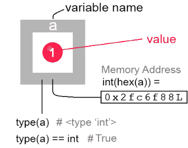

你可以将变量视为存储在占位符中的值。这里我们有一个名为'a'的变量，它持有数字1的值。在Python中，它是一个`int`（*整数*）类型的原始类型。

变量存储在内存地址中，该地址在创建时（也称为*运行时*）在RAM中自动分配。

变量名是一个占位符，指向RAM内存中值物理存储的地址。当你创建一个新变量时，你本质上是在命名一个内存地址：

```
a = 1;
print(a)                # 1 (value of the variable)
print(type(a))          # <type 'int'>
print(id(a))            # 1473574832 (address as integer)
print(hex(id(a)))       # 0x57d4f7b0 (address as hexadecimal)
print(type(a) == int)   # True (this is a variable of type integer)

>>>
1
<type 'int'>
1473574832
0x57d4f7b0
True
```

在32位计算机上，这个值为1实际上存储在一个由32位组成的占位符中，每一位可以是1或0。只有最后一位被开启：


为什么这很重要？如果你计划以二进制模式读写文件，你需要理解这一点。以二进制格式思考也可以帮助你优化数据。变量a只存储1个值。如果你有一组标志，为什么要创建变量b？你可以简单地翻转单个变量中的任何32位来存储32个唯一的0/1标志。

目前只需知道这就是计算机在内存中表示值的方式。在32位计算机上，即使是像1这样的小数字也被打包到32位占位符中。
在64位计算机上有64个占位符，等等。如果你计划优化数据，理解内存可能很有用。但在编写简单的Python脚本或第一次学习这门语言时，可能没有必要。

#### 5.1.2 如何找出变量的内存地址

当你创建一个变量时，一个代表该变量的值在内存中被物理创建。它也被放置在一个地址上。
选择值在内存中的确切存储位置不是你需要担心的事情——地址是自动选择的。通常，知道变量在内存中的存储位置可能很有用。Python有内置的`id`和`hex`函数来帮助处理内存地址。

#### 5.1.3 内置 id() 函数

```
a = 1
addr = id(a)
print(addr) # Prints 50098056 (or similar)
```

内置的`id`函数返回对象标识——它是变量的十进制格式内存地址。如果你在你的计算机上运行这个，地址会不同。

#### 5.1.4 内置 hex() 函数

地址通常以十六进制格式显示。要将对象的十进制标识转换为实际的内存地址，你可以使用`hex()`函数，它将任何整数（不仅仅是地址）转换为十六进制格式：

```
a = 1
addr = id(a)
hexaddr = hex(addr)
print(addr)    # Print decimal object identity
print(hexaddr) # Print memory address in hex format
```

```
>>>
50098056
0x2fc6f88L
```

每次运行此程序时，它可能（或可能不会）输出不同的地址。这是正常行为。其原因是变量存储在RAM（随机存取存储器）中。这并不意味着地址是完全随机选择的。它只是这样命名而已。

在这个上下文中，随机仅仅意味着地址不会遵循一个容易预测的模式。在内部，它是由你的计算机处理器根据当时各种因素（取决于你的处理器架构）以一种方便的方式决定的。

在确定地址时，你的计算机处理器的目标是尽快选择下一个可用的地址槽——这赋予了地址类似随机的特性。

你的处理器如何选择存储地址有一定的逻辑。它可能受到执行时脚本在内存中运行位置的影响。

#### 关于Python如何管理内存的另一件事

你应该意识到Python语言在内存地址方面有一个独特的怪异之处——这将在下一小节中解释。

### 5.1.5 存储相同值的变量共享内存

让我们仔细看看这个例子。

```python
a = 1
print("a =", hex(id(a))) # 打印 a 的地址

b = 2
print("b =", hex(id(b))) # 打印 b 的地址

c = 1
print("c =", hex(id(c))) # 与 a 地址相同

c += 1
print("c =", hex(id(c))) # 变为与 b 地址相同
```

运行此示例，你会在输出中注意到一些特殊之处：

```
>>>
a = 0x3166f88L
b = 0x3166f70L
c = 0x3166f88L  # 与 a 地址相同
c = 0x3166f70L  # 执行 += 1 后，与 b 地址相同
```

两个变量怎么可能存储在同一个地址？这仅在两个不同的变量开始共享同一个值时才会发生。

变量 a 和 c（两个不同的变量）的地址完全相同。当不同变量包含相同的值（1）时，就会发生这种优化。

然后，当我们在最后一步将 c 增加 1 时，c 的地址发生了变化，现在与 b 的地址匹配，因为现在 c 和 b 共享相同的值（2）。

这不仅限于相同的代码块或当前的执行上下文。地址可以在全局作用域和函数作用域之间共享：

```python
u = 1
print(id(u))

def func():
    u = 1
    print(id(u))

func()

>>>
41709448
41709448
```

即使在函数作用域中，如果值共享，变量地址也是相同的。
Python 会尝试重用内存中具有相同值的对象，这也使得对象比较非常快。
正如你所见，这种行为与 C 语言不同，例如，在 C 语言中，所有 3 个变量都会存储在内存中的 3 个不同地址。

> JavaScript 开发者学习 Python 并不少见。此外，通过学习一种语言，你也能学会另一种语言。以下一些示例将包含简短的 JavaScript 示例，以镜像涵盖相同功能的 Python 解释。

### 5.1.6 引用赋值与值赋值

学习*任何*计算机语言时，你首先要弄清楚的事情之一就是值是如何赋值的——是通过引用还是通过值？
你可能已经熟悉 JavaScript 中的**值赋值**：

```javascript
let a = 1;
let x = a;        // 创建了 a 的副本并存储在 x 中
a = a + 1;        // 将 a 增加 1；现在 a 是 2
console.log(a); // 2
console.log(x); // 1（x 仍然是 1）
```

当我们在第 2 行将 a 赋值给 x 时，变量 a 中存储的值的*副本*被创建。现在 x 是一个完全独立的变量，持有自己的数字 1 的副本。当我们增加 a 时，x 中的副本保持不变——它们是两个独立的变量。

**Python 中的值赋值**完全相同：

```python
a = 1
x = a     # 创建 a 的副本并存储在 x 中
a = a + 1 # 增加 a
print(a)  # 2
print(x)  # 1（x 仍然是 1，因为它是原始副本）
```

当 a 被赋值给 x 时，a 实际上被*复制*到了 x。这称为值赋值——两个值将占据内存中相似但唯一的位置：

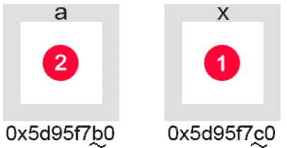

当然，这意味着我们使用了两倍的内存空间。现在两个变量 a 和 x 持有唯一的值，占据计算机内存中的两个不同位置。这是你通常期望发生的情况。

**JavaScript 中的引用赋值**

在 JavaScript 中，指向对象的变量是通过引用赋值的。Python 中也是如此。下面展示了*对象字面量*和 Python 的*字典*示例。

为了演示，让我们看看一个名为 object 的变量，它指向一个包含 x 属性的对象，该属性也是一个指向值 1 的变量：

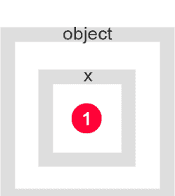

图 5.1：一个对象 object 封装了属性 {x:1}

在 JavaScript 中，变量类型决定了相等运算符 = 将如何赋值。例如，原始值是按值赋值的，而对象是按引用赋值的：

```javascript
let object = {x: 1};
let reference = object; // 引用赋值
console.log(object.x, reference.x);
```

```
>>>
1, 1
```

```javascript
reference.x++;
console.log(object.x, reference.x);
```

```
>>>
2, 2
```

只有 reference.x 被增加了。但 object.x 现在也返回 2。
与前面示例中的值赋值不同，实际上没有内容被复制到 reference。变量 reference 只是指向与 object 相同的内存位置，因为它是通过引用赋值的。
因为变量 reference 是 object 的引用，reference.x 指向 object.x 中的 x 值。这就是为什么它们都计算为 2。
让我们在前面的代码清单末尾添加一些内容：

```javascript
object.x++;
```

现在让我们再次打印两个值：

```javascript
console.log(`object.x = ${object.x}`);
console.log(`reference.x = ${reference.x}`);
```

```
>>>
object.x = 3
reference.x = 3
```

这表明，通过任一变量更改值都会在两个变量中更改它。

#### Python 中的引用赋值

```python
# 创建字典
original = {"x":1}
print(original)

# 创建一个指向 original 的引用副本
copy = original
print(copy)

# 更改 copy 中的 x
copy["x"] = 2

# original["x"] 现在也包含 2
print(original)

>>>
{'x': 1}
{'x': 1}
{'x': 2}
```

实际发生的情况如下：

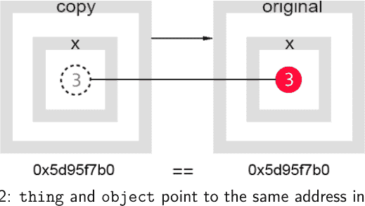

图 5.2：thing 和 object 指向内存中的同一地址。

两个值*看起来*都被增加了，尽管我们只增加了其中一个。它们指向内存中的同一个对象。

引用赋值在许多不同的语言中基于相同的原理。然而，并非所有计算机语言都提供完全相同的功能集来处理它。

Python 不允许原始值（字符串、数字等）通过引用赋值。这仅在赋值的变量是类对象（字典、列表、序列）时发生。

在某些语言如 C++ 中，可以使用前导的 & 符号将变量作为引用赋值：

```cpp
int original = 9;     // 创建变量
int &ref = original;  // 通过引用赋值
ref++;                // 将引用增加 1
cout << original;     // 打印 10
```

在此示例中，original 在 ref 增加后也返回 10。C++ 语言严重依赖引用和内存指针，这经常导致计算机崩溃。JavaScript 和 Python 在这方面更为严格。

如果引用赋值是许多计算机语言的一部分，那它一定是一个重要的特性！但如果没有实际的例子，它似乎毫无意义。

### 5.1.7 为什么使用引用赋值？

经常提到你可以通过值或引用来赋值变量或对象。但很少解释为什么这样做。

计算机内存是一种有限的资源。你生成或处理的数据集越大，存储它们所需的内存就越多。

引用赋值解决了两个问题。一是我们节省了计算机内存空间。我们也避免了将值从一个地方物理复制到另一个地方。

对于大型数据集，复制是一个计算成本高昂的操作：

```python
#### 通过引用赋值
object1 = object2
```

想象一个对象包含 100 万个属性。复制整个对象的内容是大量的工作。

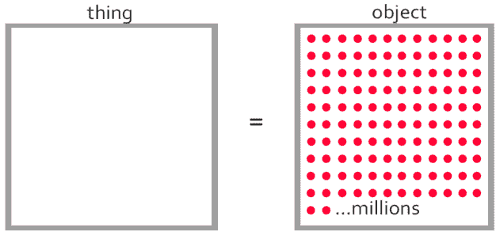

Python 的 = 运算符无法知道你的对象实际有多大。如果 = 运算符触发了对象之间的物理内存复制，你将不得不等待一段时间才能完成操作。

简单的赋值永远不应该花费那么多时间。这就是为什么大多数语言实现对象赋值*通过引用*的原因。

如果你的对象包含数百万个属性，仅仅一行代码就会带来巨大的开销。现在想象一下，如果其中一些属性也是包含数千个其他属性的对象。这可能会使执行停止。

另一方面，引用只被赋值一次，作为原始值的别名。

> 请注意，这并不意味着你应该总是避免复制对象。事实上，一些算法需要复制数据。引用赋值只是在许多情况下提高了效率。

### 5.1.8 Python 计时器

一个 Python 程序实际需要多长时间才能将 100 万个值复制到另一个对象中？让我们在探索 Python 计时器函数的同时找出答案。

```python
# Include time module
import time

# Display monotonic time now
print(time.monotonic())

# Display monotonic time in nanoseconds
print(time.monotonic_ns())
```

截至本书撰写时，我的结果是：

1834844.703
1834844703000000

> 单调时钟是一种不能倒退的时钟。`time.monotonic()` 方法以浮点秒数返回单调时钟的值。当你需要测量两个时间点之间经过的时间时，单调计时器通常很有用。

让我们通过计算循环遍历 1000 万个数字所需的时间，来看看单调计时器的实际应用。

```python
import time

# Track monotonic before for loop
start = time.monotonic()
print("start=", start)

# Create a range of 10 million numbers
number = range(0, 10000000)

print("Looping through 10 million numbers...")

# Loop 10 million times
for index in number:
    pass

# Track time after for loop
end = time.monotonic()
print("end=".format(end))
print("Difference between two points in time:")
print("end-start=", end-start)
```

> Python 的 for 循环不能为空。但如果你只是想遍历数字而不对它们做任何操作，可以使用 `pass`。

现在让我们在命令提示符中运行脚本，看看结果：

```
C:\Python38-32>python book.py

start= 1836354.906
Looping through 10 million numbers...
end=1836355.656

Difference between two points in time:
end-start= 0.75
```

根据我们的脚本，循环遍历范围序列中的 1000 万个数字花费了 **0.75** 秒。如果你再次运行脚本，会看到略有不同的结果，但它们会接近相同的数字。

你的值可能不同。这取决于许多因素，例如你的处理器类型、是否有其他程序同时运行并占用 CPU 周期等等。但通常情况下，每次运行此脚本都会得到类似的结果。

还记得我们在前面章节中讨论过的通过引用而不是通过值来赋值吗？这仅仅是循环遍历 1000 万个数字就花费了 **0.75** 秒。

要实际将 1000 万个属性从一个对象复制到另一个对象，将花费更长的时间。让我们来看看：
让我们在这个脚本中添加一个新变量：
`copy = [];`
然后在我们的 for 循环中，从 range 的当前索引处复制一个值：
`for index in number: copy[index] = number[index]`
这将把 1000 万个值复制到 copy 数组中。
现在让我们看看通过引用将一个对象赋值给另一个对象需要多长时间：

```python
array = [1,2,3,4,5,6,7,8,9,10]
start = time.monotonic()
print("start=", start)
ref = array;
end = time.monotonic()
print("end=".format(end))
print("Difference between two points in time:")
print("end-start=%f" % (end-start))
```

结果是 0.000074 秒。如果你不断刷新脚本，会注意到它不是一个常数。有时我也会得到 0.000010 或类似的很小的数字。
这并不奇怪。底层所做的只是交换内存中的一个地址。这个操作根本不需要占用太多计算机处理器周期。
你现在可以明白为什么在许多语言中，通过引用赋值是自动实现的。
但有一个问题——在许多情况下，你实际上*确实*想将一个对象物理复制到另一个对象。为了解决这个问题，你自然的思维方式是编写自己的复制方法，遍历所有属性并将它们逐一复制到另一个对象的属性中。
在像 JavaScript 这样的语言中，通常你必须编写自己的函数来进行浅拷贝或深拷贝。

对于执行此操作，没有“一刀切”的解决方案。这是因为你的对象可以包含几乎任何属性、方法、其他对象和数组的组合。在这些数组中，甚至可能包含更多的对象或数组。这取决于你的对象设计。

如果你高效地设计一个类，你可能能够通过编写一个专门为你的对象结构定制的复制函数来减少计算开销。

随着时间的推移，你会开始注意到最高效的对象复制函数本质上是递归的。递归函数是一种调用自身的函数，直到资源（如对象中的属性数量或数组中的项目数量）耗尽为止。深拷贝会对任何其他属性、对象或数组中的每个属性、对象和数组执行此操作。

### 5.1.9 浅拷贝

Python 的字典提供了一个特殊的内置函数 `copy`，可以直接在字典对象上调用。`copy` 函数也存在于列表中，但不存在于元组中（因为元组在 Python 中被视为*不可变*对象）。

```python
a = {"message": "hello"}
b = a.copy(a) # create copy of object a

print(f"Address of A is {hex(id(a))}")
print(f"Address of B is {hex(id(b))}")
```

```
>>>
Address of A is 0x2f15cd0
Address of B is 0x2f15d20
```

`a` 和 `b` 都位于唯一的内存地址。
让我们更改对象 `b` 中的 "message" 属性：

```python
b["message"] = "goodbye"
```

```python
print(a)
print(b)
```

```
>>>
{'message': 'hello'}
{'message': 'goodbye'}
```

与我们之前的示例相反，`b` 是 `a` 的物理副本，而不是对 `a` 的引用。这就是为什么值只在对象 `b` 中发生了变化——正如预期的那样。
因为两个对象都存储在唯一的内存地址中，这也意味着它们占据了两倍的物理空间。
要找出一个对象占用多少*字节*的空间，你可以使用 `getsizeof` 函数。要开始使用它，你必须包含 `sys` 包：

```python
import sys
print(sys.getsizeof(a))
print(sys.getsizeof(b))
```

```
>>>
128
128
```

乍一看，两个对象似乎都占用了计算机内存中的 128 字节。但事情没那么简单。这仅在你从 Python 3.8 运行代码时成立。
你可能会得到另一个数字，比如 272——在 Python 2.7 中——不同版本的 Python 分配内存的方式不同。
Python 的 `getsizeof` 函数显示为存储给定值集分配了多少内存。这并不真正意味着字典中存储的所有项目的总和。
但字典的大小会根据属性的数量显著扩展。
例如，在 Python 3.8 中，包含 4 个和 5 个项目的列表都将分配 128 字节：

```python
a = { "1":0, "2":0, "3":0, "4":0, }
b = { "1":0, "2":0, "3":0, "4":0, "5":0, }
```

```python
print(sys.getsizeof(a), sys.getsizeof(b))
```

```
>>>
128, 128
```

但 Python 的内存管理器会在添加第 6 个项目时优雅地分配额外的内存块（确切地说是 68 字节）：

```python
c = { "1":0, "2":0, "3":0, "4":0, "5":0, "6":0, }
```

```python
print(sys.getsizeof(c))
```

```
>>>
196
```

如果你有 C 或 C++ 背景，请注意不要将 Python 的 `getsizeof` 函数与 C 中的 `sizeof` 运算符混淆。它们的工作方式不同。
此外，`getsizeof` 不会计算字典中嵌套属性的大小。

> 如果计算列表中所有元素的大小很重要，你可能需要三思是否使用 `getsizeof` 方法。这是因为 `getsizeof` 是*浅层*的。我们将在下一节继续探讨这意味着什么。

#### 什么是浅拷贝？

为了演示浅拷贝背后的思想，让我们看另一个例子：

```python
import copy # import copy.copy() and copy.deepcopy()

tree1 = { # create compound object
    "type" : "birch",
    "prop" : {"class" : {"kingdom" : "plantae"}}
}

# create a copy of tree1 using object's copy() function
tree2 = tree1.copy()
# create a copy of tree1 using copy() function from copy package
tree3 = copy.copy(tree1)
# create a copy of tree1 using deepcopy() function
tree4 = copy.deepcopy(tree1)

print(tree1)
print(tree2)
print(tree3)
print(tree4)

print(hex(id(tree1)))
print(hex(id(tree2)))
print(hex(id(tree3)))
print(hex(id(tree4)))
```

```
>>>
{'type': 'birch', 'prop': {'class': {'kingdom': 'plantae'}}}
{'type': 'birch', 'prop': {'class': {'kingdom': 'plantae'}}}
{'type': 'birch', 'prop': {'class': {'kingdom': 'plantae'}}}
{'type': 'birch', 'prop': {'class': {'kingdom': 'plantae'}}}
0x297e268L
0x297e9d8L
0x297ebf8L
0x297ee18L
```

所有对象都位于内存中的唯一地址。
每个新对象都是通过使用不同的复制函数复制 `tree1` 创建的。
请记住，`tree1` 是一个*复合对象*——它包含多层嵌套对象。'prop' 属性提供了额外的嵌套字典层。
此时看起来没有区别，特别是使用 `copy.copy` 方法的浅拷贝和使用 `copy.deepcopy` 方法的深拷贝之间。

## 第五章 变量

如果我们修改任意对象中的一级属性“type”，并再次打印它们，每个对象的值将各自改变：

```python
tree1["type"] = "oak"
print(tree1["type"],
      tree2["type"],
      tree3["type"],
      tree4["type"])

>>>
('oak', 'birch', 'birch', 'birch')
```

现在让我们再次打印所有树木：

```python
print(tree1)
print(tree2)
print(tree3)
print(tree4)

>>>
{'type': 'oak', 'prop': {'class': {'kingdom': 'plantae'}}}
{'type': 'birch', 'prop': {'class': {'kingdom': 'plantae'}}}
{'type': 'birch', 'prop': {'class': {'kingdom': 'plantae'}}}
{'type': 'birch', 'prop': {'class': {'kingdom': 'plantae'}}}
```

尝试修改四个对象中任意一个的["type"]属性，不会改变其他任何对象中"type"的值：它只影响被修改的对象，因为"type"是存储在唯一地址中的复制对象中的*一级*项。

没有*一级*属性是通过引用存储的——它们在每个对象中都是独立改变的——即使是使用*浅拷贝*函数复制的对象也是如此。

区别在于*二级*项的存储方式：

让我们修改前3个对象中*任意一个*的*二级*属性["prop"]["class"]。在这个例子中，我们选择`tree2`：

```python
# 修改二级属性
tree2["prop"]["class"] = "Quercus"

print(tree1)
print(tree2)
print(tree3)
print(tree4)

>>>
{'type': 'birch', 'prop': {'class': 'Quercus'}}
{'type': 'birch', 'prop': {'class': 'Quercus'}}
{'type': 'birch', 'prop': {'class': 'Quercus'}}
{'type': 'birch', 'prop': {'class': {'kingdom': 'plantae'}}}
```

通过仅修改`tree2`对象的*二级*属性["class"]，前3个对象中的该属性也都被改变了。

这是因为它们中的每一个都是使用*浅*拷贝函数复制的——其中所有*二级*属性现在都通过引用指向原始对象。

```python
import copy

tree1 = { "name": "birch", "type": {"kingdom": "plantae"}}
tree2 = copy.copy(tree1) # 浅拷贝

# 打印对象的地址
print(id(tree1))
print(id(tree2))
# 打印二级属性的地址
print(id(tree1["type"]["kingdom"]))
print(id(tree2["type"]["kingdom"]))
```

```
>>>
43377256
43379160
43695240 <--- 共享地址
43695240 <--- 共享地址
```

二级、三级和*n*级...之后的属性也将通过引用赋值。

#### 深拷贝

在我们的第一个例子中，`tree4`属性是使用`copy.deepcopy`函数创建的——它通过物理复制在`tree1`对象中找到的所有嵌套属性，在新对象`tree4`上重新创建了所有属性——没有任何项是通过引用赋值的。

你可以从视觉上这样理解：

可以想象，在大型数据集上选择深拷贝可能会降低应用程序的性能，因为所有嵌套属性都被物理复制了。

有些对象会在其他嵌套属性内包含许多嵌套属性。

`copy.deepcopy`方法将使用可能计算成本高昂的内部循环递归地迭代所有嵌套属性。

Python的`tuple`数据类型没有`copy`方法是有原因的——因为它是*不可变的*。不可变对象在定义后不支持项重新赋值：

```python
# 创建一个元组（不可变对象）
tup = (1,2,3,4,5)
```

```python
# 尝试更改元组在索引2处的值：
tup[2] = 10

>>>
Traceback (most recent call last):
  File "tuple.py", line 5, in <module>
    tup[2] = 10
TypeError: 'tuple' object does not support item assignment
```

在许多情况下，创建对象的副本是为了对其进行修改。你可能需要使用`list`或`dictionary`来代替。

> 如果你需要处理大量数据或实时优化很重要，请谨慎使用`copy.deepcopy`。仅在100%必要且使用适当数据结构时才使用深拷贝。

为什么这很重要？如果你有一个包含数百或数千个*二级*属性的对象，复制将成为一个计算成本高昂的操作：

最后，这是一个具有许多属性的浅拷贝可能的样子。

你可以看到这里的性能优势。这就是为什么常见的拷贝函数是浅拷贝的原因。

这里存储在*二级*属性中的对象（注意这些属性也可能包含数百个其他对象）在物理上仍然只存在于原始对象中。

> **注意：** 如果你对一个在其某个项中包含对自身引用的对象使用深拷贝，可能会创建一个递归循环。Python通过在一个备忘录字典中跟踪已复制的对象来处理这个问题。

`memo`字典将对象id映射到对象。在对一个复杂对象进行深拷贝后，你的备忘录可能如下所示：

```python
tree1 = {
    "type"     : "birch",
    "kingdom"  : "plantae"
}
```

```python
memo = {};
tree5 = copy.deepcopy(tree1, memo)

print(memo)

>>>
{47316864L: 'birch',
47309416L: {'kingdom': 'plantae', 'type': 'birch'},
47316944L: 'plantae',
47316904L: 'kingdom',
44916408L: 'type',
47311048L: ['plantae',
'kingdom',
'birch',
'type',
{'kingdom': 'plantae',
'type'    : 'birch'}]
}
```

Python维护一个对象映射，以避免多次复制驻留在相同内存地址的对象。这也可以防止你的深拷贝进入无限递归循环或“过多”次复制相同的对象。

注意备忘录中的对象没有重复。它们都存储在唯一的内存地址中。

### 5.1.10 栈、堆和垃圾回收

#### 随机存取存储器

Python的方法和变量是在栈上创建的。每次创建方法或变量时，都会创建一个栈帧。每当方法返回时，帧会自动销毁——这个过程称为*垃圾回收*。对象和实例变量是在堆内存中创建的。

### 5.1.11 栈溢出

通过执行*递归函数*，你可以很容易地在Python中导致栈溢出。

```python
def recursive():
    return recursive()

# 调用它
recursive()
```

*递归函数*是从其自身内部调用自身的函数。调用一个函数会将其放入栈中，直到它返回。但递归函数返回自身只是为了再次被调用，永远不会离开栈：

栈没有无限的内存储备。随着每次函数调用，栈上会分配更多的内存，直到最终耗尽。你应该仔细规划你的程序，以避免发生这样的情况。

运行此代码将产生以下输出：

```
Traceback (most recent call last):
  File "addr.py", line 4, in <module>
    recursive()
  File "addr.py", line 2, in recursive
    return recursive()
  File "addr.py", line 2, in recursive
    return recursive()
  File "addr.py", line 2, in recursive
    return recursive()
  [Previous line repeated 996 more times]
RecursionError: maximum recursion depth exceeded
```

栈内存是有限的资源。最终你会耗尽内存。

## 第五章 变量

## 第六章

## 数据类型和结构

当我开始学习数据结构时，我经常卡在试图理解为什么Python有4个相对相似的结构：`list`、`dictionary`、`tuple`和`set`。

随着你深入使用这些数据类型，你将开始形成关于它们差异的*心智模型*，这应该有助于你确定为解决特定问题选择哪种数据结构：

| 列表 | 字典 |
| :--- | :--- |
| **序列**<br>**可变**<br>**允许**重复值<br>有**11**个方法<br>*（未来可能会添加更多）* | **非序列**<br>**可变**<br>**禁止**重复，因为它将项存储为{ **键: 值,** }对<br>有**11**个方法<br>*（未来可能会添加更多）* |
| **元组** | **集合** |
| **序列**<br>**不可变**<br>**允许**重复值<br>有**2**个方法：<br>只有`index()`和`count()`方法 | **非序列**<br>**不可变**<br>**禁止**重复值<br>有**17**个方法<br>*（未来可能会添加更多）* |

这些不仅是Python中的结构。但它们是最重要的。

## 第六章 数据类型与结构

学习数据类型和结构时，需要关注三个主要概念：数据结构是否是*序列*（与可枚举相同）、是否支持*不可变性*，以及是否*允许重复值*。

## 数据类型与数据结构

常见的数据类型包括*布尔型*（bool）、*字符串*（str）、*整型*（int）、*复数*（complex）和*浮点数*（float）。它们可以被视为用于语句（如：1 + 2 以及更复杂表达式）中的原始值。

数据结构 list、dict（即*字典*）、set、frozenset 和 tuple 是 Python 特有的。然而，其中一些与其他语言中具有相似功能的数据结构非常相似。

## 数据类型与数据结构的区别

数据结构是一种以抽象方式组织复杂数据的方法，允许对其执行某些操作：例如数组或列表。

在计算机科学中，二叉树可以被视为一种数据结构。它由节点的抽象概念以及可能用于操作它们的一些方法组成。

二叉树数据结构也可以包含为处理它而定义的多个方法，例如 `add_node()` 和 `remove_node()`。

虽然 Python 中没有内置的二叉树数据结构，但你可以使用 `class` 关键字自己创建一个。类将在后面介绍。

Python 的内置数据结构中，可以归类为*序列*的有*字符串*、*列表*、*元组*、*字节数组*和*范围对象*。序列正如其名。它是一个类似数组的值集合，遵循某种顺序（线性）排列。而字典、集合和冻结集合则不是。

数据类型更为原始。例如，整数或 'int' 是一种存储整数的数据类型。字符串或 'str' 是一种包含文本的数据类型。看待数据类型的一种方式是将它们视为存储由该类型表示的类别中的值的单元。

数字、字符串和布尔值（True 或 False）可以被视为原始数据类型。与数据结构不同，它们通常没有（或很少有）附加的方法，因为它们代表值的基本形式，可以通过通用运算符进行操作。

## 可变性

当涉及数据结构时，程序员需要理解*可变*和*不可变*数据结构之间的区别。不可变性的概念在不同的编程语言中并不总是以相同的方式工作。
通常，不可变类型不允许在值设置后更改它们。但是，你仍然可以使用该类型的内置方法（如 `add()` 或其其他 16 个方法中的任何一个）来添加新项目或删除现有项目。
但是，使用其方法操作集合仍然遵循一个重要规则：它假设一旦定义了值，这些值就永远不会被更改：换句话说，集合始终保持不可变。
`frozenset` 在用一组值初始化后无法更新。你仍然可以使用集合的一些方法，如 `union()`、`intersection()`、`copy()` 等。这些将在后面介绍。

## 列表、字典和范围

Python 中的 `list` 是一种可变数据结构，类似于 JavaScript 中的 `Array`。
`dict` 是字典——它类似于 JavaScript 的*对象字面量*，由花括号定义（并且类似于 JavaScript 的 JSON 格式）。
初学者可能会将 `range()` 函数误认为是一种数据类型。实际上没有 range 数据类型——这个内置函数生成一个数值*序列*，该序列作为 `list` 数据结构返回。

## 序列

在 Python 中，`sequence` 是指有序集合的通用术语。序列可以被视为与可枚举数据类型同义（因为它们可以与自然数建立一一对应关系）。
Python 中没有 `sequence` 数据结构，但你会经常听到“序列”这个词——字符串、列表和元组被认为是序列。序列假定存储的值具有线性顺序。集合和字典（dict）都不是序列，但字符串、列表和元组是。

字典通过使用属性（也称为键）来引用其数据。在此类对象中存储值的顺序是不可靠的——在程序的整个生命周期中，它可能随时自发改变。字典是可迭代的，但它们不是序列。

你可以将序列视为可枚举对象，因为它假定每个项目都存储在数字索引处。学习数据类型时，区分可枚举对象和可迭代对象很重要。

可迭代对象可以使用 for 循环或内置迭代器函数 **iter** 及其辅助函数 **next** 进行迭代，后者允许你控制逐步遍历整个集合——一次一个项目。

当顺序不重要时，迭代器会遍历所有对象属性。但将可迭代类型转换为可枚举类型并不少见。

可枚举对象中的项目按照它们定义的顺序进行循环，使用索引系统，其中第一个项目存储在索引 0，第二个项目存储在索引 1，依此类推。它假定索引位置是不变的。

你可能在不知道它们是什么的情况下，已经使用可迭代和可枚举对象编写了代码。很少有人在开始使用计算机语言编写代码之前深入学习它们。然而，这种意识只能加深你对编程的理解，并且通常会带来更高的代码效率。

**数据类型**帮助我们思考如何在计算机程序中组织和管理原始数据（如字符串和数字）。**数据结构**也是类型，但它们通常由更复杂的对象组成。Python 有几种内置的数据类型和数据结构。其他可以从包中导入。

虽然对于解决任何给定问题应该使用哪种数据类型或数据结构没有强制规定，但了解如何为给定任务选择正确的类型很重要。

本章的目标是演示每种数据类型如何独立工作，然后展示一些实际示例。

### 6.0.1 内置 type() 函数

一旦将变量赋值给一个值，你就可以使用内置函数 `type()` 来找出它的类型。它只接受一个参数——值——并返回其类型。

```
a = 1
b = 15.75
c = "hello"

print(type(a))
print(type(b))
print(type(c))

>>>
<class 'int'>
<class 'float'>
<class 'str'>
```

> 注意在 Python 2.7 中，type(1) 的结果是 <type 'int'> 而不是 <class 'int'>。类可以被视为创建它们所表示类型的对象的蓝图。我们将在后面的章节中更详细地介绍类。

每种类型都有自己的内置类定义。我们寻找的是（有时是）缩写的名称。这里 1 是*整数*或 'int'，"hello" 是*字符串*或 'str'。小数是浮点数或简称为 'float'。

type() 函数也可用于识别*列表*、*集合*、*元组*和*字典*：

```
tuple = ("a", "b")
list = ["a", "b"]
set = {"a", "b"}
dict = {"a": 1, "b": 2}

print(type(tuple))
print(type(list))
print(type(set))
print(type(dict))

>>>
<class 'tuple'>
<class 'list'>
<class 'list'>
<class 'dict'>
```

每当你需要找出一个值的类型时，就调用 `type(value)`。
在学习 Python 时，理解检查值类型的目的可能不会立即显现。它与你作为程序员技能的增长是并行的。在某个时刻，你甚至可能想知道如何识别一个函数：

```
def fun():
    pass

print(type(fun))

>>>
<class 'function'>
```

检查变量是否为函数并不少见，在某些情况下，它成为编写 Python 代码的重要组成部分。
在前面的例子中，我们打印了变量类型。这对于用它做一些有用的事情是不够的。要根据类型函数是否评估为特定类型来执行语句，我们可以使用其类名与 `is` 和 `is not`：

```
t = ("a", "b", "c")
l = ["a", "b", "c"]
s = {"a", "b", "c"}
```

## 第六章 数据类型与结构

```python
print(type(t) is tuple)
print(type(l) is list)
print(type(s) is set)
print(type(s) is not set)

>>>
True
True
True
False
```

要进行分支判断，你可以编写这样的 if 语句：

```python
if type(t) is tuple:
    print("This is a tuple.")
else:
    print("This is not a tuple.")

>>>
This is a tuple.
```

#### 那么函数呢？

从技术上讲，函数是*可调用的*，并且不属于与原始数据类型相同的对象类型。它们也不是数据结构。因此，没有等效的类型可以与 `is` 关键字一起使用：

```python
print(type(fun) is function)

>>>
NameError: name 'function' is not defined
```

要识别一个函数，请改用内置的 `callable` 方法：

```python
def fun():
    print("fun")
```

```python
print(callable(fun))

>>>
True
```

然而，请记住，对类运行 `callable` 也会返回 True，因为类名可以被调用以创建该类的对象实例：

```python
class cl:
    print("inside class")
print(callable(cl))

>>>
True
```

### 6.0.2 鸭子类型

上面的例子提出了一个小问题。如果函数和类在传递给 `callable` 时都返回 True，我们如何区分函数和类？答案是我们不需要区分。

在编写 Python 代码时，最好从可调用或不可调用的角度来思考，而不是从类或函数的角度。这个概念被称为鸭子类型。这是 Python（以及一些其他语言）中思考类型的常见方式。

思考鸭子类型的一个简单方式是用一句话：“如果它看起来像鸭子，叫起来也像鸭子，那么它就是鸭子！”这意味着——如果某样东西可以被调用——它就是可调用的，无论它是函数还是类。

在实践中，类和函数之间的区别很少重要——当编写测试其中任何一种的代码时，该代码通常是专门用来显式处理该特定类型的。简单地将它们都视为可调用的是合适的。

鸭子类型的概念可以模糊地扩展到 Python 数据结构。例如，列表和字典都被认为是序列。

### 6.0.3 数据类型与数据结构

此表显示了*值*（左）及其代表的数据类型或结构。

| 值 | 数据类型 |
| :--- | :--- |
| `True` | `bool` |
| `False` | `bool` |
| `150` | `int` |
| `11.43` | `float` |
| `1j` | `complex` |
| `"hello"` | `str` |
| `f"dandelion"` | `str (f-string)` |
| `f"{3} dandelion"` | `str (f-string with template value)` |

| 值 | 数据结构 |
| :--- | :--- |
| `{"name": "Steve", "age": "27"}` | `dict` |
| `["wood", "steel", "iron"]` | `list` |
| `("wood", "steel", "iron")` | `tuple` |
| `{"wood", "steel", "iron"}` | `set` |
| `frozenset({"a", "b", "c"})` | `frozenset` |
| `b"Message"` | `bytes` |
| `bytearray(3)` | `bytearray` |
| `memoryview(bytes(10))` | `memoryview` |
| `memoryview(bytes(10))` | `memoryview` |

#### 类与 type()

`type()` 函数可以应用于任何值以找出其类型。我们在上一节中已经了解了常见的数据类型。
我们也识别了一个函数，那么类呢？

```python
class Word:
    def __init__(self, text):
        pass

# create an object instance of type Word
light = Word("light")

print(type(Word))  # class
print(type(light)) # object instance

>>>
<class 'type'>
<class '__main__.Word'>
```

本质上，类定义了对象的唯一类型。这就是为什么 Python 说类 Word 的类型是 `<class 'type'>`。这暗示了类和类型之间的循环逻辑，这在许多其他语言的设计中也可以观察到。
因为 `light` 是类型为 Word 的对象的一个实例，所以 Python 会告诉我们这个对象是由属于 Word 的构造函数 `__main__` 创建的。
这很有趣，因为在我们定义的 Word 类中，构造函数被命名为 `__main__` 而不是 `__init__`。这是因为 Python 类实际上有两个构造函数。我们将在后面关于类和对象的章节中更仔细地了解这到底是如何工作的。

### 6.0.4 使用数据类型

到目前为止，我们只是通过名称和 `type()` 函数的输出来识别 Python 数据类型。但它们用在哪些情况下呢？

乍一看，*list*、*tuple* 和 *set* 仅在数据集周围的括号类型上有所不同。什么时候应该选择 *list* 而不是 *tuple*？或者选择 *set* 而不是 *list*？Python 数据类型与其他语言中的数据类型有何不同或相似之处？以下部分将尝试通过几个简短的实际示例来回答所有这些问题。

### 6.0.5 bool

**True** 和 **False** 是 Python 中的原始布尔值。它们可以以多种方式使用。其中之一是指示某个功能或设置当前处于“开”或“关”状态。

下面的示例演示了布尔值与 if 语句以及两种不同风格的 Pythonic *三元*运算符一起使用。

```python
dark  = True    # dark mode enabled
large = True    # large font
show  = False   # private email

if dark:
    print("Dark mode is on!")
else:
    print("Dark mode is off!")

# ternary if else operator
status = "on" if large else "off"
print(f"Use large font: status")

# ternary statement with tuples
public = False
status = ("private", "public")[public]
print(f"Email is {status}")

>>>
Dark mode is on!
Use large font: on
Email is private
```

布尔值可用于通过使用 `bool` 函数初始化值来检查字典、列表或集合等对象是否为空。

```python
print(bool(False))      # False
print(bool(True))       # True
print(bool(1))          # Numeric value 1 is cast to True
print(bool(0))          # Numeric value 0 is cast to False
print(bool([]))         # False because list is empty
print(bool([1, 2]))     # True because list is not empty
print(bool({}))         # False because dictionary is empty
print(bool({"a": 1}))   # True because dictionary is not empty
```

```
>>>
False
True
True
False
False
True
False
True
```

如果列表为空则执行某些操作，如果不为空则执行其他操作：

```python
A = [5,7,3]

if bool(A) == True:
    first = A[0]
    print(f"List is not empty, first item is = first")
    print(first)
else:
    print("List is empty")
```

```
>>>
List is not empty, first item is = 5
```

### 6.1 str

字符串很简单。它们用于打印文本。

```python
string = "Hello there."
print(string)

>>>
Hello there.
```

你只需要注意字符串在不同版本的 Python 中可以有多种不同的定义方式。
例如，*f-string* 在早期版本的 Python 中不起作用：

```python
num = 10
fstr = f"There are {num} apples in the basket."
print(fstr)

>>>
There are 10 apples in the basket.
```

此代码在 Python 2.7.16 中会失败，但在 Python 3.8.3 中有效。

### 6.2 int

通常，整数表示整数和整数运算：

```python
number = 100
print(type(number))
print(number)
print(100 + 25)

>>>
<class 'int'>
100
125
```

但是，当两个整数乘以一个分数（或除以）时，它们会自动转换为浮点数：

```python
print(10 / 2)
print(10 * 0.1)

>>>
5.0
1.0
```

### 6.3 float

浮点数对于需要小数点的计算很有帮助。

```python
float = 200.14
print(type(float))
print(float)
print(float + 81.33)

>>>
<class 'float'>
200.14
281.46999999999997
```

流行的 Python 数学库 `cmath` 可用于生成 PI 的值：

```python
import cmath
print('PI =', cmath.pi)
print(type(cmath.pi))
```

```
>>>
('PI =', 3.141592653589793)
<type 'float'>
```

浮点数可用于计算任何需要小数点精度的值，例如购物车余额或税率。

### 6.4 complex

*复数*是可以表示为 `a + bi` 形式的数字，其中 `i` 代表虚数单位。
复数由一个`实数`和一个`虚数`相加组成。
在 Python 中，附加 `j` 来创建数字的虚部：

```python
num = 3 + 1j

print(num)
print(type(num))
```

```
>>>
(3 + 1j)
<type 'complex'>
```

要单独访问数字的每个部分，请使用 `real` 和 `imag` 属性：

```python
print(num.real)
print(num.imag)
```

```
>>>
3.0
1.0
```

复数可以进行加、减、乘、除运算：

```
a = (1 + 2j)
b = (2 + 5j)

print(a + b)
print(a - b)
print(a * b)
print(a / b)

>>>
(3+7j)
(-1-3j)
(-8+9j)
(0.41379310344827586-0.03448275862068965j)
```

或者，你也可以使用Python的内置函数 `complex(实部, 虚部)` 来创建一个复数：

```
c = complex(1, 5)
print(c)

>>>
(1+5j)
```

## 6.5 字典

字典（或 dict）使用逗号分隔的键值对来存储数据。它类似于关联数组——其中每个项目都有一个唯一的名称或“键”：

```
alphabet = {
    "a": 1,
    "b": 2,
    "c": 3,
}
```

请注意，`alphabet` 字典中最后一个项目 "c" 之后的*尾随*逗号是可选的。这是合法的语法，不会产生错误，但该逗号可以省略。

```
print(alphabet)
print(type(alphabet))
```

```
>>>
{'a': 1, 'c': 3, 'b': 2}
<type 'dict'>
```

### 合并字典

如果你熟悉 JavaScript，你可能知道如何使用一种称为展开运算符（看起来像三个前导点：...）的东西来合并两个 JSON 风格的对象（它们看起来与 Python 的字典完全一样）：

```
let a = {'a': 1}
let b = {'b': 2}
let c = {...a, ...b}

console.log(c)
```

```
>>>
{'a': 1, 'b': 2}
```

（不要在 Python 解释器中尝试这个，这是 JavaScript！）
从 Python 3.5 开始，你可以使用前导 `**` 运算符执行类似的操作来合并字典，如下所示：

```
a = {'a': 1}
b = {'b': 2}

c = {**a, **b}
```

```
print(c)

>>>
{'a': 1, 'b': 2}
```

### 使用字典

人们很容易想编写自己的 for 循环来对字典中的项目执行许多常见操作——但你应该使用内置的字典方法。每个数据结构都提供了一组内置函数，可以直接从对象的实例调用。以下每个部分都将演示字典函数的示例。

### dict.clear()

要删除所有项目，请在字典对象上使用 `clear()` 方法：

```
alphabet = { "a": 1, "b": 2, "c": 3, }
print(alphabet.clear())

>>>
None
```

### dict.copy()

创建原始字典的副本。

```
alphabet = { "a": 1, "b": 2, "c": 3, }

# 创建 alphabet 的浅拷贝
c = alphabet.copy()
print(c)
```

```
>>>
{'a': 1, 'c': 3, 'b': 2}
```

`copy` 方法将产生一个浅拷贝，而不是深拷贝。两者之间的区别在本书的另一部分有解释。

### dict.fromkeys()

帮助从存储在列表或元组中的一组键创建字典：

```
# 键存储在元组中
keys = ("a", "b", "c")
value = 0

d = dict.fromkeys(keys, value)
print(d)
```

```
>>>
'a': 0, 'c': 0, 'b': 0
```

请注意，不保证原始顺序：

```
# 遍历它
for v in d:
    print(v)
```

```
>>>
a
c
b
```

你不能依赖字典来保持数据的线性顺序。如果你需要一组线性的值，你应该改用列表。

### dict.get()

你可以直接使用方括号 `[]` 访问字典属性：

```
cats = {
    "one": "luna",
    "two": "felix",
}

print(cats["one"])
print(cats["two"])

>>>
luna
felix
```

但获取属性值最安全的方法是使用 `get` 函数：

```
print(cats.get("one"))
print(cats.get("two"))

>>>
luna
felix
```

尝试访问不存在的属性将产生 `None`：

```
print(cats.get("three"))

>>>
None
```

`get` 函数还有另一种形式，它接受第二个参数。如果找不到具有该键的项目（在此示例中，`cats` 字典中当前不存在 "three"），那么 `get` 函数将返回你作为第二个参数传递的任何内容：

```
name = cats.get("three", "undefined")

print(name)

>>>
undefined
```

当找不到键时，这很有用。你可以为其分配一个你选择的替代值，例如：`"undefined"` 或 `"not available"`。

### dict.items()

以元组列表的形式返回字典的键值对。

```
notebook = {
    "size"       : "11 x 8.5",
    "type"       : "notebook",
    "genre"      : "sheet music",
    "published"  : 2021
}

result = notebook.items()

print(result)

>>>
dict_items([('size', '11 x 8.5'), ('type', 'notebook'),
('genre', 'sheet music'), ('published', 2021)])
```

那么为什么不遍历结果呢？

```
for item in result:
    print(item)

>>>
('size', '11 x 8.5')
('type', 'notebook')
('genre', 'sheet music')
('published', 2021)
```

要分别访问键和值：

```
for item in result:
    key = item[0]
    value = item[1]
    print(f"key={key}, value={value}")
```

```
>>>
key=size, value=11 x 8.5
key=type, value=notebook
key=genre, value=sheet music
key=published, value=2021
```

### dict.keys()

如果你只需要键：

```
notebook = {
    "size": "11 x 8.5",
    "type": "notebook",
    "genre": "sheet music",
    "published": 2021
}
```

```
for key in notebook.keys():
    print(f"key = key")
```

```
>>>
key = size
key = type
key = genre
key = published
```

### dict.values()

要访问值：

```
notebook = {
    "size": "11 x 8.5",
    "type": "notebook",
    "genre": "sheet music",
    "published": 2021
}

for value in notebook.values():
    print(f"value = {value}")
```

```
>>>
value = 11 x 8.5
value = notebook
value = sheet music
value = 2021
```

### dict.pop()

通过键名从字典中删除项目：

```
vehicle = {
    "make": "Tesla",
    "model": "3",
    "year": 2021
}

vehicle.pop("model")
print(vehicle)
```

```
>>>
{'make': 'Tesla', 'year': 2021}
```

### dict.popitem()

从字典中删除最后一个项目：

```
vehicle = {
    "make": "Tesla",
    "model": "X",
    "year": 2021
}

vehicle.popitem("model")
print(vehicle)
```

```
>>>
{'make': 'Tesla', 'model': 'X'}
```

### dict.setdefault()

返回第一个参数中指定的键的值。如果键不存在，则返回 `None` 或第二个参数中指定的可选替代值。

```
vehicle = {
    "make": "Tesla",
    "model": "X",
    "year": 2021
}

a = vehicle.setdefault("model", "undefined")
b = vehicle.setdefault("modex", "undefined")
c = vehicle.setdefault("modec")

print(a)  # X
print(b)  # undefined
print(c)  # None

>>>
X
undefined
None
```

### dict.update()

将项目插入字典：

```
vehicle = {
    "make": "Tesla",
    "model": "X",
    "year": 2021
}

vehicle.update({"price":"$79,990"})
print(vehicle)

>>>
{'make': 'Tesla', 'model': 'X', 'year': 2021, 'price': '$79,990'}
```

## 6.6 列表

与字典相比，列表数据结构提供了一种存储线性数据的方式。每个项目都假定存储在一个索引处：0、1、2...等等。
列表项目定义为括号 `()` 内以逗号分隔的列表：

```
trees = ("oak", "birch", "pine")

print(trees)

>>>
("oak", "birch", "pine")
```

第一个项目 "oak" 存储在索引 0 处。"birch" 存储在索引 1 处，依此类推。由于项目假定存储在从 0 开始的数字索引处，要修改列表中的第二个值，你可以直接按如下方式访问它：

```
trees[1] = "sassafras"
```

```
# 打印修改了项目的列表
print(trees)
```

```
>>>
("oak", "sassafras", "pine")
```

第二个位置的值 "birch" 已成功替换为 "sassafras"。

### 合并列表

如果你熟悉 JavaScript，你知道如何使用展开运算符（看起来像三个前导点：...）来合并数组（它们类似于 Python 的列表）：

```
let a = [1, 2]
let b = [3, 4]
let c = [...a, ...b]
```

```
console.log(c)
```

```
>>>
[1, 2, 3, 4]
```

从 Python 3.5 开始，你可以使用前导 `*` 运算符执行类似的操作来合并列表，如下所示：

```
a = [1, 2]
b = [3, 4]
c = [*a, *b]

print(c)

>>>
[1, 2, 3, 4]
```

像字典一样，列表也有几个内置的辅助函数。在尝试自己编写代码来完成相同的事情之前，请尽可能使用它们。

### list.append()

`list.append` 方法向列表添加 1 个元素。
追加另一个列表会将其嵌套：

```
a = [1, 2]
b = [6, 7, 8]

a.append(3)
a.append(4)
a.append(5)
a.append(b)

print(a)

>>>
[1, 2, 3, 4, 5, [6, 7, 8]]
```

### list.extend()

在前面的例子中，我们尝试将另一个列表追加到一个列表中。但 `append` 只是将原始列表与新列表嵌套在一起。这并不总是你想要发生的结果。
为了用另一个列表*扩展*一个列表，你可以使用 `extend` 操作：

## 6.6. 列表

```python
a = [1, 2, 3]
b = [4, 5, 6]

a.extend(b)

print(a)

>>>
[1, 2, 3, 4, 5, 6]
```

### list.clear()

移除列表中的所有元素：

```python
a = [1, 2]

a.clear()

print(a)

>>>
[]
```

### list.copy()

创建列表的副本：

```python
a = [1, 2]
b = a.copy()

print(b)

>>>
[1, 2]
```

### list.count()

统计某个值在列表中出现的次数：

```python
message = ['H', 'e', 'l', 'l', 'o']

num = message.count('l')

print(f"Letter 'l' was found {num} times in '{message}'")

>>>
Letter 'l' was found 2 times in '['H', 'e', 'l', 'l', 'o']'
```

### list.index()

查找某个值在列表中的索引位置。注意，列表采用从0开始的索引枚举值。第一个字母 'a' 位于索引 0，'o' 位于索引 1，依此类推。

```python
vowels = ['a', 'o', 'i', 'u', 'e']

num = vowels.index('u')

print(num)

>>>
3
```

### list.insert()

如果你不想追加或扩展列表，而是想在特定索引位置插入新元素，该怎么办？这就是 `insert` 方法的用途：

```python
a = ['a', 'b', 'd', 'e']

# 有些地方看起来不对
print(a)

# 让我们在正确的位置插入 'c'：
a.insert(2, 'c')

print(a)

>>>
['a', 'b', 'd', 'e']
['a', 'b', 'c', 'd', 'e']
```

### list.remove()

要从列表中再次移除 'c'：

```python
a = ['a', 'b', 'c', 'd', 'e']

a.remove('c')

print(a)

>>>
['a', 'b', 'd', 'e']
```

重要提示：只会移除一个匹配的元素：

```python
a = ['a', 'b', 'c', 'd', 'c', 'e']

a.remove('c')

print(a)

>>>
['a', 'b', 'd', 'c', 'e']
```

请注意，`remove` 操作后第二个 'c' 仍然存在。要从列表中移除所有 'c'，你可以先统计它们的数量，然后调用 `remove` 方法，次数等于它在列表中出现的次数：

```python
alpha = ['a', 'b', 'c', 'd', 'c', 'e']

for item in range(alpha.count('c')):
    alpha.remove('c')

print(alpha)

>>>
['a', 'b', 'd', 'e']
```

`range` 函数将创建一个数字范围，其数量等于列表中找到的 'c' 字母的数量。这就是为什么我们的 `for` 循环将恰好迭代 'c' 在列表中出现的次数。

### list.pop()

`pop` 方法从数组中弹出最后一个元素：

```python
a = ['a', 'b', 'c', 'd', 'e']

a.pop()
print(a)

a.pop()
print(a)

a.pop()
print(a)

a.pop()
print(a)

a.pop()
print(a)

>>>
['a', 'b', 'c', 'd']
['a', 'b', 'c']
['a', 'b']
['a']
[]
```

如果你尝试从一个空数组中弹出元素，将会得到一个 `IndexError`：

```python
a = []
a.pop()

>>>
Traceback (most recent call last):
  File "sample.py", line 18, in <module>
    a.pop()
IndexError: pop from empty list
```

### list.reverse()

```python
alpha = ['a', 'b', 'c', 'd', 'e', 'f']

alpha.reverse()

print(alpha)

>>>
['f', 'e', 'd', 'c', 'b', 'a']
```

### list.sort()

默认情况下，`sort` 方法按升序重新排列数字和字母。

```python
alpha = ['b', 'a', 'c', 'f', 'e', 'd']

alpha.sort()

print(alpha)

>>>
['a', 'b', 'c', 'd', 'e', 'f']
```

因为这是字符在 ASCII 表中的出现顺序，所以我们得到了字母的自然顺序。数值也将按其实际大小排序：

```python
alpha = [4, 5, 11, 12, 0, 1, 6, 7, 8, 9, 10, 2, 3]

alpha.sort()

print(alpha)

>>>
[0, 1, 2, 3, 4, 5, 6, 7, 8, 9, 10, 11, 12]
```

## 6.7 range(start, end) 或 range(total)

`range()` 是一个内置函数，它生成一个列表，其中包含由其参数定义的范围内指定数量的数值。
要定义一个介于数字 4 和 5 之间（包含 4 和 5）的范围：

```python
ran = range(4, 6)

for item in ran:
    print(item)

>>>
4
5
```

只使用一个参数调用 `range` 函数将生成一个从 0 开始的数字范围，其数量由参数指定：

```python
ran = range(5)

for item in ran:
    print(item)

>>>
0
1
2
3
4
```

`range` 函数主要用于生成数字列表。

```python
# 创建一个包含 10 个数字 0-9 的列表
r = range(10)

print(r)

r[0] = 'start'
r[1] = 5000
r[9] = 'end'

print(r)
print(type(r))

>>>
[0, 1, 2, 3, 4, 5, 6, 7, 8, 9]
['start', 5000, 2, 3, 4, 5, 6, 7, 8, 'end']
<class 'list'>
```

`range` 仍然只是一个 `list`，其值不一定是数字。（但 `range` 主要用于处理数字。）

## 6.8 元组

`tuple` 数据结构表示一个混合元素的列表。元组类似于列表，但主要区别在于元组是*不可变的*。列表是*可变的*。

> 可变类型允许你在定义后更改元素值。尝试更改不可变对象中的值将产生错误。

元音字母列表一旦定义就不应更改。向一个完整的元音字母集合中添加任何更多元素都没有意义。因此，它们可能应该存储在元组、集合或冻结集合中。

在 Python 中，通常使用某些数据结构来初始化另一种类型的数据结构。你可以通过将列表传递给 `tuple` 构造函数来使用列表初始化元组：

```python
list = ['apples', 'oranges', 'pineapples']

tup = tuple(list)

print(tup)

>>>
('apples', 'oranges', 'pineapples')
```

可以创建元组列表和列表元组：

```python
# 元组列表
a = [(1, 2), (3, 4)]

# 列表元组
b = ([1, 2], [3, 4])

print(a)
print(b)

>>>
[(1, 2), (3, 4)]
([1, 2], [3, 4])
```

那么区别是什么？本节将尝试回答这个问题。
与列表一样，元组可以包含不同类型的值：

```python
mixed = ("almonds", "oranges", 15, 7, 0, ['a', 'b', 'c'])
print(mixed)

>>>
('almonds', 'oranges', 15, 7, 0, ['a', 'b', 'c'])
```

你也可以从列表初始化元组：

```python
employees = ["mary", "robert", "david"]

tup = tuple(employees)

print(tup)

>>>
('mary', 'robert', 'david')
```

到目前为止，元组的工作方式与列表完全相同。你甚至可以使用方括号 `[]` 和索引来访问元素：

```python
print(employees[0])
print(employees[1])

print(tup[0])
print(tup[1])

>>>
mary
robert
mary
robert
```

同样，这里没有区别。

### 元组是不可变的

最后，列表和元组之间的关键区别在于元组是不可变的——一旦定义，其元素就不能更改：

```python
# 可以
employees[0] = "david"
print(employees)

# 不可以
tup[0] = "david"
print(tup)

>>>
['david', 'robert', 'david']
Traceback (most recent call last):
  File "example.py", line 22, in <module>
    tup[0] = "david"
TypeError: 'tuple' object does not support item assignment
```

不可变类型不响应访问运算符，通常没有任何用于更改值的方法。

事实上，元组只有两个方法：`index()` 和 `count()`。而列表有 `append()`、`clear()`、`copy()`、`count()`、`reverse()`、`sort()` 和其他一些方法。
如你所见，元组可以被认为是一个*不可变的*列表。
这也意味着元组只能定义一次。之后，它的任何元素都不能更改。然而，与集合或*冻结集合*（我们稍后将看到它们之间的区别）不同，元组*可以*包含重复的元素。

### 嵌套元组

与列表一样，元组可以嵌套和迭代：

```python
nested = (
    (1, 2, 3),
    ('a', 'b', 'c')
)

print(nested)

>>>
((1, 2, 3), ('a', 'b', 'c'))
```

要迭代同一个元组：

```python
for var in nested:
    print(var)

>>>
(1, 2, 3)
('a', 'b', 'c')
```

与作为*可迭代*数据结构的 `list` 相比，`tuple` 的值也可以使用以下语法进行*解包*：
`(*var1*, *var2*, ...) = *tuple*`

```python
mixed = ("almonds", "oranges", 15, ['a', '1'])

# 将元组元素解包到变量名中
(nuts, fruit, number, list) = mixed

print(nuts)
print(fruit)
print(number)
print(list)

>>>
almonds
oranges
15
['a', '1']
```

JavaScript 程序员会发现这类似于[解构赋值](https://developer.mozilla.org/en-US/docs/Web/JavaScript/Reference/Operators/Destructuring_assignment)特性。
元组数据结构只有 2 个方法：

### tuple.count()

统计某个值在元组中出现的次数：

```python
word = ('h', 'e', 'l', 'l', 'o')

# 统计字母 'l' 在元组中出现的次数
num = word.count('l')

print(num)

>>>
2
```

Python 使得统计复杂值成为可能：

## 6.8. 元组

```python
tup = ([1,2],[1,2],[1,2],[1,3])

a = tup.count([1,2])
b = tup.count([1,3])

print(a)
print(b)

>>>
3
1
```

然而，`count` 方法是浅层计数，不会统计嵌套的项：

```python
tup = (1,1,1,(1,1))

num = tup.count(1)

print(num)

>>>
3
```

### tuple.index()

查找指定值的索引。

```python
fruit = ('r','e','d','a','p','p','l','e')

i = fruit.index('p')

print(i)

>>>
4
```

与列表类似，元组的索引也是从0开始计数，而不是从1开始。例如，第一个元素 'r' 位于索引 0。

在这个例子中，返回值是 4，因为字母 'p' 在元组中首次出现的位置是索引 4。`index` 函数在找到第一个匹配值后就会立即返回，而不会遍历列表的其余部分。

### 元组是不可变的，但可以包含其他类型的项，包括列表

我们已经知道，元组在设计上是*不可变的*。这意味着一旦项被首次赋值，就不能再次更改。

然而，列表是可变的，并且列表可以作为元组中的一个项。在这种情况下，你实际上可以更改出现在元组中的列表的值：

```python
tup = (0, ['a'])

tup[1][0] = 'b'

print(tup)

>>>
(0, ['b'])
```

更改元组中的列表是完全合法的。

```python
tup = (1, 2)
print(tup)

tup[0] = 5
print(tup)

>>>
(1, 2)
Traceback (most recent call last):
  File "tuple.py", line 5, in <module>
    tup[0] = 5
TypeError: 'tuple' object does not support item assignment
```

尝试更改不可变数据类型（如元组）中的项将产生 `TypeError`。这正是这里发生的情况。如果你需要更改数据集中的值，请使用列表。

在使用元组时有一个需要注意的地方。那就是只包含一个项的元组定义。它们会被当作字符串处理。请看下面。

### 构造包含 0 或 1 个项的元组

只包含 1 个项的元组将被视为字符串：

```python
tup = ('a')

print(type(tup))
print(tup)

>>>
<class 'str'>
a
```

如果你*需要*数据集被视为元组，请添加一个逗号：

```python
tup = ('a',)

print(type(tup))
print(tup)

>>>
<class 'tuple'>
('a',)
```

请注意，空元组仍然被视为元组类型：

```python
tup = ()
print(type(tup))
print(tup)

>>>
<class 'tuple'>
()
```

### 通过索引或切片访问元组

要访问元组中的数据，必须使用整数或切片。
以下示例演示了这一点：

```python
tup = (10,20,30,40,50)

# 访问单个项
print( tup[0] )
print( tup[1] )

# 切出索引 1 到 3 之间的项
print( tup[1:3] )

# 使用切片操作反转元组
print( tup[::-1] )

>>>
10
20
(20, 30)
(50, 40, 30, 20, 10)
```

> 最后两个示例使用了切片操作。我们将在接下来的某一节中更仔细地了解它们如何帮助我们切分序列。

*切片*是一种内置操作，适用于序列。这意味着它适用于元组，因为元组是序列。我们将在接下来的某一节中了解更多关于**切片序列**的知识。但首先...什么是序列？

### 使用序列

在继续之前，我认为这是一个谈论序列的好地方。
元组被认为是一种*序列*，就像列表或字符串一样。
序列由*事物相互跟随的特定顺序*定义。当我们想到 Python 序列时，我们想到的是项的排列顺序。
序列可以被视为*有序集合*。然而，集合（我们稍后会看到）结构在 Python 中不是序列。在集合中，顺序是不被保证的。
序列保证序列中的项将可访问，并且在它们最初定义的索引处可用：

```python
str = "hello";

# 访问第二个字符
print(str[1])

>>>
e
```

Python 是一门不断发展的语言，这意味着未来*可能*会添加更多的序列类型。序列通常共享一组类似的操作。像列表和字符串这样的可变序列可以使用 `+` 运算符达到相同的效果。
例如，连接运算符 `+` 可以用于两个序列以将它们组合起来。或者你可以将序列的内容重复一定次数：

```python
ha = "ha"
print(ha * 3)

checkered = ("black", "white")
print(checkered * 2)

zebra = [0, 1]
print(4 * zebra)

>>>
hahaha
('black', 'white', 'black', 'white')
[0, 1, 0, 1, 0, 1, 0, 1]
```

### 使用 `[start:stop:step]` 切片序列

序列可以使用内置的 `[start:stop:step]` 运算符进行切片，其中 *start* 和 *stop* 表示序列中范围的*起始*和*结束*索引。*stop* 索引指示的值将不会包含在结果中。

*start*、*stop* 和 *step* 都是可选参数。使用不带参数的 `[:]` 运算符将返回整个序列的副本：

```python
tup = ('cat', 'dog', 'spider')

print(tup[:])
print(tup[::])

>>>
('cat', 'dog', 'spider')
('cat', 'dog', 'spider')
```

因为所有参数都是可选的，所以使用 `[:]` 或 `[::]` 都会使用默认参数产生相同的结果。默认参数是：

`[0, len(sequence), 1]`

请注意，*step* 参数不能为 0。它应该至少为 1 或为负数。
在前面的例子中，我们生成了整个序列的副本。然而，大多数时候，你会使用切片操作从序列中切出一部分。
例如，以下是如何从较长的字符串中提取单词 'slice'：

```python
message = "Can you find slice in this sequence?"

# 从字符串中提取单词 'slice'
cut = message[13:18]

print(cut)

>>>
slice
```

字符串是字符的序列。单词 'slice' 位于索引 13 和 18 之间。这正是返回的内容。
相同的 `[:]` 操作可以应用于其他序列类型：列表或元组。
在下一个例子中，我们将从元组中提取一系列数字：

```python
numbers = (0,1,2,3,4,5,6,7,8,9,10)

# 提取 (3,4,5,6)
cut = numbers[3:7]

print(cut)

>>>
(3, 4, 5, 6)
```

请注意，结束索引 7 不会包含在结果中。它只是一个停止点。

### 切片不是索引

初学者常犯的一个错误是认为切片的工作方式与索引相同。这并不完全正确！例如：

```python
seq = [0,1,2,3]
res = seq[0:3]
print(res)

>>>
[0, 1, 2]
```

这里结果中的最后一项是 2，但切片停止点是 3。对切片的正确理解可以通过下图来解释：

```
+---+---+---+---+---+---+---+
| P | y | t | h | o | n |
+---+---+---+---+---+---+---+
切片 : 0 1 2 3 4 5 6
索引 : 0 1 2 3 4 5
```

这种思考方式可能有助于在切片时理清一些事情。
这也解释了为什么以下切片操作会产生一个空列表：

```python
python = ['P','y','t','h','o','n']

print(python[4:4])

>>>
[]
```

这仅仅是因为我们的切片起始值和停止值相等。

### 切片示例

以下是应用于序列的切片操作的几个示例。

```python
seq[start:stop] # 从 start 到 stop-1 的项
seq[start:] # 从 start 到最后一项的项
seq[:stop] # 从开始到 stop-1 的项
seq[:] # 复制所有内容
seq[start:stop:step] # 从 start 到 stop-1 的项，跳过步长
seq[-1] # 仅最后一项
seq[-2:] # 最后两项
seq[:-3] # 除最后 3 项外的所有项
seq[::-1] # 所有项，反转
seq[1::-1] # 前两项，反转
seq[:-4:-1] # 最后三项，反转
seq[-4::-1] # 除最后 3 项外的所有项，反转
seq[None:None] # 所有内容
```

### 其他用例

切片操作可以以多种方式使用。以下示例将演示其中一些情况。
你可以直接在语句中将其应用于序列：

```python
print("Hello"[1:3])
print(("a", "b", "c")[1:2])
print((1, 2, 3, 4, 5)[2:5])

>>>
el
('b',)
(3, 4, 5)
```

你可以使用负索引向后切片：

```python
tup = ('cat', 'dog', 'spider')

print(tup[-1:])    # ('spider',)
print(tup[-2:])    # ('dog', 'spider')
print(tup[-3:])    # ('cat', 'dog', 'spider')

>>>
('spider',)
('dog', 'spider')
('cat', 'dog', 'spider')
```

## 第六章 数据类型与结构

回顾一下，切片操作的所有参数都是可选的。这就是为什么也可以只指定结束索引。在这里使用负值将从序列的另一端进行切片：

```
print(tup[:-1])    # ('cat', 'dog')
print(tup[:-2])    # ('cat',)
print(tup[:-3])    # ()

>>>
('cat', 'dog')
('cat',)
()
```

### 第三个参数

你可以使用第三个*步长*参数来跳过条目。
在这个例子中，我们将创建一个包含重复颜色的元组 zebra。通过使用*步长*参数，我们可以“跳过它们”来只收集我们想要的颜色：

```
zebra = ('black', 'white', 'black', 'white')

black = zebra[::2]
white = zebra[1::2]

print(black)
print(white)

>>>
('black', 'black')
('white', 'white')
```

这类似于使用 for 循环并将索引递增 2 而不是 1。

## 6.8. 元组

### 反转序列

负*步长*可用于反转元组（或任何序列）：

```
forwards = [1,2,3,4,5]
backwards = forwards[::-1]
print(backwards)

>>>
[5, 4, 3, 2, 1]
```

或者字符串（字符串是一种序列）：

```
print("Hello"[::-1])

>>>
olleH
```

### 替换项目

有时你可能希望同时用其他值替换一组切片项目。为此，你可以使用 [::] 与赋值运算符一起提供一组替换值：

```
nums = [1, 2, 3]
nums[0:2] = ('a', 'b')
print(nums)

>>>
['a', 'b', 3]
```

此操作可以解释为“将索引 0 到 2 之间的项目替换为值 ('a', 'b')，并返回结果作为原始列表的副本。”

### 带步长的替换

我们在前面的例子中已经使用了步长参数。当与替换值一起使用时，它的工作方式类似（你可以使用元组或列表）。
此功能非常适合将值映射到遵循某种模式的更大集合。

```
ten = [0,0,0,0,0,0,0,0,0,0]
ten[::2] = [1,1,1,1,1]
print(ten)

ten = [0,0,0,0,0,0,0,0,0,0]
ten[1:6:2] = (3,3,3)
print(ten)

ten = [0,0,0,0,0,0,0,0,0,0]
ten[1:10:2] = (1,2,3,4,5)
print(ten)
```

```
>>>
[1, 0, 1, 0, 1, 0, 1, 0, 1, 0]
[0, 3, 0, 3, 0, 3, 0, 0, 0, 0]
[0, 1, 0, 2, 0, 3, 0, 4, 0, 5]
```

如果替换列表中的项目数量超过切片的长度，Python 将自动扩展列表：

```
nums = [1,2,3]
nums[0:2] = ('a','b','c','d','e','f')
print(nums)
```

```
>>>
['a', 'b', 'c', 'd', 'e', 'f', 3]
```

> **重要提示：** 赋值的值集长度必须*不小于*切片的长度。不遵循此规则将产生错误。

### 使用 del 和切片删除项目

切片可以与 del 关键字一起使用来删除项目：

```
items = [0,1,2,3,4,5]
del items[1:5]

print(items)
```

项目 1、2、3 和 4 已从原始列表中直接删除。

## 6.9 集合

集合是一个*无序、不可变*的唯一元素集合——它不能包含重复值。集合不是序列，因为它们是无序的。
与元组一样，集合是不可变的——一旦定义，它们的值就不能被修改。
不同之处在于集合不能包含重复值。集合中的每个值都是唯一的，即使在赋值中提供了重复项，也只出现一次：

```
s = {3, 3, 3, 5}
print(s)

>>>
{3, 5}
```

重复值被自动移除。一个用例可能是存储电子邮件列表，当你需要确保没有电子邮件在列表中出现多次时。
集合数据结构提供了许多你可以并且应该用来操作集合的方法（但不能以改变其值的方式）。这些方法将在本书的下一节中探讨。

### set.add()

使用 add(*element*) 方法向集合中添加新项目：

```
followers = "@pythonista"
followers.add("@pythonic129")

print(followers)

>>>
'@pythonista', '@pythonic129'
```

如果元素已存在，则不会发生任何事情。

### set.discard()

按值从集合中丢弃项目。

```
followers = "@pythonista", "@javascript", "@pythonic129"
followers.discard("@javascript")

print(followers)

>>>
'@pythonista', '@pythonic129'
```

### set.isdisjoint()

如果两个集合中都没有任何项目，则此方法返回 True：

```
users1 = "@christine", "@stanley", "@luna"
users2 = "@david", "@grace", "@john"
users3 = "@roger", "@christopher", "@grace"

a = users1.isdisjoint(users2)
b = users2.isdisjoint(users3)

print(a)
print(b)

>>>
True
False
```

第一个结果为 True，因为 user1 变量中的用户与 user2 中的用户都不匹配。
第二个结果为 False，因为在两个集合中都找到了 @grace。

### set.issubset()

如果一个集合是另一个集合的子集，则返回 True。子集是一个所有值都匹配的集合。

```
ids1 = {5,6,7,8,9}
ids2 = {1,2,3,4,5,6,7,8,9,10,11,12}
```

```
if ids1.issubset(ids2):
    print("ids1 is a subset of ids2")
else:
    print("ids1 is not a subset of ids2")
```

```
if ids2.issubset(ids1):
    print("ids2 is subset of ids1")
else:
    print("ids2 is not a subset of ids1")
```

```
>>>
ids1 is a subset of ids2
ids2 is not a subset of ids1
```

子集中匹配项目的数量必须等于或小于超集中的项目数量。子集不能包含比超集更多的项目，也不能包含与超集不同的任何值。

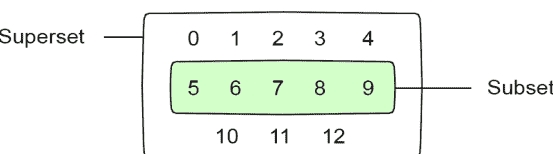

这是可视化的一种方式。

### set.clear()

要从集合中移除所有项目：

```
followers = "@pythonista", "@pythonic129"
followers.clear()

print(followers)

>>>
set()
```

### set.copy()

要创建同一集合的另一个副本：

```
followers = "@pythonista", "@pythonic129"
copy = followers.copy()

print(copy)

>>>
'@pythonista', '@pythonic129'
```

### set.update()

集合有一个显式的 update() 方法，它将集合与另一个集合的值合并：

```
e = {0,1,2}
f = {3,3,3,4,5}
f.update(e)
print(e)
print(f)
```

```
>>>
{0, 1, 2}
{0, 1, 2, 3, 4, 5}
```

因为集合不能包含重复值，所以集合 f 被限制为值 {3,4,5}，然后它被添加到原始集合 e 中。
如你所见，认为集合是严格不可变的会是一个错误。但你可以认为集合是显式可变的。你必须使用专门的 update() 方法来更新其值。
这可以防止使用常见运算符进行意外更新，但仍然给予程序员显式修改集合的能力。

### set.intersection()

你可以使用 intersection() 方法比较两个集合。从视觉上看，它可能看起来像这样。该方法返回两个不同集合中匹配的项目：

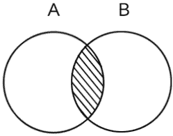

这是一个例子：

```
A = {1,2,3}
B = {5,6,2}
C = A.intersection(B)

print(C)
```

```
>>>
{2}
```

此操作的一个实际用例可能是比较两个用户之间的社交媒体关注者：

```
# 用户 1 关注的关注者列表
userlist1 = {"@pythonic129", "@jsdev", "@michael"}

# 用户 2 关注的关注者列表
userlist2 = {"@dave01", "@pythonic129", "@luna"}

shared = userlist1.intersection(userlist2)

print(shared)

>>>
{'@pythonic129'}
```

两个不同的用户共享同一个关注者：@pythonic129

### set.intersection_update()

intersection_update() 方法与 intersection() 不同，因为它不是返回一个包含匹配值的新集合，而是从原始集合中移除不需要的项目。否则，它执行完全相同的操作。

```
A = {1,2,3}
B = {5,6,2}

C = A.intersection_update(B)

print(C)    # None
print(A)
```

```
>>>
None
{2}
```

请注意，原始集合 A 实际上被更改或更新了——所有不匹配的项目都被移除了。
函数 intersection_update() 没有返回值，只是返回 None，而不是像 intersection() 那样返回一个新集合。

### set.difference()

difference() 方法可以可视化如下：

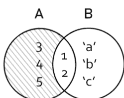

只返回项目 {3, 4, 5}。项目 'a'、'b' 和 'c' 根本没有出现在集合 A 中，因此它们也将被忽略。

```
A = {1, 2, 3, 4, 5}
B = {1, 2, 'a', 'b', 'c'}

result = A.difference(B)

print( result )

>>>
{3, 4, 5}
```

## 6.9. 集合

请注意，在这种情况下，集合中的元素不是被合并，而是被排除。第二个集合作为第一个集合中值的*排除过滤器*。
当在集合 B 上调用此操作时，可以将其反转：

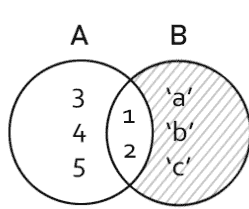

```
A = {1, 2, 3, 4, 5}
B = {1, 2, 'a', 'b', 'c'}

result = B.difference(C)

print( result )

>>>
{'b', 'a', 'c'}
```

请注意，由于集合不保证元素的顺序，返回值中的元素看起来是打乱的，但这在使用集合时通常无关紧要。
`difference()` 在实际场景中如何使用？一个可能的实际例子是从你的社交媒体时间线中排除被屏蔽的用户：

```
followers = {"@pythonista", "@pythonic129", "@jsdev"}
blocked = {"@jsdev", "@painter1"}

timeline = followers.difference(blocked)

print(timeline)
```

>>> {'@pythonic129', '@pythonista'}

用户 @jsdev 被从时间线中排除了。

### set.difference_update()

找出两个集合之间的差异，并从调用该方法的集合中移除匹配的元素：

```
s1 = {1, 2, 3, 4, 5}
s2 = {4, 5, 6, 7, 8}

res = s1.difference_update(s2)
print(s1)
print(s2)
```

>>> {1, 2, 3} {4, 5, 6, 7, 8}

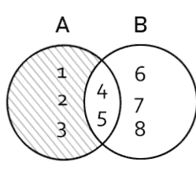

值 4 和 5 从第一个集合中被移除了。
你可以通过在第二个集合上调用该方法来反转此操作：

```
s1 = {1, 2, 3, 4, 5}
s2 = {4, 5, 6, 7, 8}

res = s2.difference_update(s1)

print(s1)
print(s2)

>>>
{1, 2, 3, 4, 5}
{6, 7, 8}
```

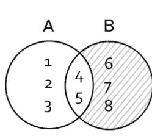

在这种情况下，匹配的值 4 和 5 从第二个集合中被移除了。
还有一点！集合不能被切片：

```
s = {1, 2, 3}

print(s[:])

>>>
Traceback (most recent call last):
  File "example.py", line 32, in <module>
    print(s[:])
TypeError: 'set' object is not subscriptable
```

frozenset 数据结构（见下文）也不能被切片。

### 6.9.1 frozenset

与集合不同，frozenset 中的任何元素都不能被更改（无论是通过运算符还是方法）。换句话说，frozenset 是完全*不可变*的。
让我们定义一个简单的 frozenset 并打印出来：

```
fs = frozenset({'a', 'b', 'c'})
print(fs)

>>>
frozenset({'a', 'b', 'c'})
```

frozenset 数据结构对于锁定一组不应被修改的元素非常有用：

```
vowels = ('a', 'e', 'o', 'i', 'u')
semivowels = ('w', 'y')

freeze = frozenset(vowels)

# 打印 frozenset
print(freeze)

# 尝试修改 vowels
freeze.add('m')

>>>
frozenset({'a', 'e', 'o', 'i', 'u'})
Traceback (most recent call last):
  File "example.py", line 19, in <module>
    freeze.add('m')
AttributeError: 'frozenset' object has no attribute 'add'
```

英语中只有 5 个元音字母——'y' 和 'w' 字母用作半元音。这个 frozenset 是完整的。我们可以确信，无论向其中添加什么，都不可能是元音字母。因此，frozenset 不允许使用 `add()` 方法。

尝试使用集合结构中修改元素的方法将会失败，通常是因为 frozenset 没有提供该方法。
除此之外，集合和 frozenset 是相同的。

### 集合和 frozenset 中元素的顺序可变

无论是集合还是 frozenset，都不保证在打印或迭代时，元素会按照它们被定义时的顺序出现。
集合用于解决那些不需要每个值都在线性列表中按顺序出现的问题。
每次输出一个 frozenset 时，你可能会注意到元素再次被重新排列：

```
print(frozenset({'a', 'b', 'c'}))

>>>
frozenset({'a', 'c', 'b'})

>>>
frozenset({'c', 'a', 'b'})

>>>
frozenset({'b', 'c', 'a'})
```

集合（或 frozenset）不像列表那样意味着线性索引顺序。
如果你尝试用 for 循环迭代它，也会发生同样的情况：

```
for item in fs: print(item)

>>>
c
a
b
```

几乎每次迭代，元素出现的顺序都会不同。
这对于集合来说是完全正常的行为。它们根本不依赖于索引。

**集合和 frozenset 的关键区别**
与集合相反，frozenset 没有 `update()` 方法。一旦定义，frozenset 就是完全不可变的。让我们看看！

```
fs = frozenset({'a', 'b', 'c'})
fs.update({'d'})
print(fs)
```

```
>>>
Traceback (most recent call last):
  File "example.py", line 38, in <module>
    fs.update({'d'})
AttributeError: 'frozenset' object has no attribute 'update'
```

尝试更新 frozenset 会导致 AttributeError。
起初，你可能不明白为什么想要使用一个不允许更改其元素的数据结构。

# 第 7 章

## 函数

在前面的例子中，我们使用了内置函数 `print`（以及许多其他函数！）。print 函数是 Python 规范的一部分。它开箱即用。但你也可以创建自己的函数。在本章中，我们将探讨 Python 函数的基本结构。

在 Python 中，函数使用 `def` 关键字定义。

```
def message():
    print("My message.")
```

Python 允许在单行内定义函数，无需缩进：

```
def message(): print("My message.")
```

如果函数不需要任何参数，你可以通过在末尾加上空括号来执行它：

```
message()

>>>
My message.
```

你可以让一个函数执行任意多的语句：

```
# 定义一个执行多条语句的函数：
def messages():
    print("My message.")
    print("My other message.")
    print("Something else.")

# 调用此函数：
messages()

>>>
My message.
My other message.
Something else.
```

### 7.1 使用 return 关键字返回值

函数帮助我们打印消息、连续执行任意数量的 Python 语句或独立进行计算。但它们也可以*返回一个值*或多个值，这些值可以稍后存储在变量中或打印出来。

要返回一个值，请使用 return 语句和该值：

```
def thousand():
    return 1000

# 执行函数
# 并将其返回值赋给变量 num：
num = thousand()

print(num) # 打印 1000
```

这里我们使用了 return 关键字从函数返回一个值并将其赋给一个新变量。然后我们使用 print 函数将其打印出来。

## 7.2 函数参数和实参

函数的一个特性是能够接收作为参数传递给它的信息。函数*形参*是可选的，但如果存在，它们就成为函数定义的一部分。形参被定义为变量名列表。

实参是传递给函数的实际值，这些值将被赋给其形参名。在函数的作用域内，你将使用其形参名来引用传入函数的值。

Python 有 4 种不同的方式来指定函数参数：*位置参数*、*默认参数*、*关键字参数*和*可变参数*。

### 7.2.1 位置参数

在本节中，我们将探讨*位置参数*。位置参数定义了函数期望接收的*必需*参数。在调用函数时不提供它们将导致错误。

让我们创建一个名为 add 的函数，它接受两个参数：a 和 b。
可以定义如下：

```
def add(a, b):
    return a + b
```

这里 a 和 b 变量名是函数的*形参*。
此函数接受两个数值并返回它们的和。让我们通过传递两组不同的*实参*来连续执行它两次：

```
r = add(10, 5) # 10 和 5 是函数的实参
s = add(12, 8) # 12 和 8 是函数的实参

print(r) # 打印 15
print(s) # 打印 20
```

值 10、5 和 12、8 是传递给函数的实参。

### 7.2.2 默认参数

你可以在函数的参数列表中定义*默认参数*。如果没有提供其他值，将使用默认参数作为后备：

```
def say(name = "John", msg = "Hello"):
    print(name, ":", msg)
```

让我们调用此函数，看看如果我们跳过所有参数会发生什么：

```
say()
```

```
>>>
John : Hello
```

函数回退到默认值。你也可以传递部分参数：

```
say("Steve")
```

输出：

```
Steve : Hello
```

或者你可以覆盖两个参数：

```
say("Steve", "Goodbye")
```

输出：

```
Steve : Goodbye
```

参数通常按照它们在函数定义中的参数列表中出现的顺序传递给函数。但并非总是如此：
在 Python 中，你也可以使用所谓的*关键字参数*。

### 7.2.3 关键字参数

正如你即将看到的，*默认参数*和*关键字参数*共享相同的语法。但区别在于它们是在参数列表本身中赋值，还是作为参数传递。

在前面的例子中，我们使用*默认参数*来定义函数。这是在部分或所有参数缺失时使用默认值的情况。但它们仍然按照在参数列表中出现的顺序进行赋值。

与*默认参数*——它只是为任何或所有缺失的参数*定义*默认值——相比，*关键字参数*允许你*改变*值*传递*给函数的顺序：

```python
def say(name, message):
    print(f"{name} : {message}")

say(message = "Hello", name = "John")
```

我们重新定义了参数传递的顺序。以下是输出结果：

```
John : Hello
```

如你所见，参数以替代顺序传递，但函数仍然产生了正确的输出。

### 7.2.4 混合使用关键字参数和默认参数

可以将默认参数和关键字参数混合使用。唯一正确的方法是在函数定义中优先考虑非关键字参数：

```python
def say(name, message = "Greetings"):
    print(f"{name} : {message}")
```

这里，位置非关键字参数 `name` 列在前面，没有默认值。这是可接受的，并且按预期工作。

```python
say(name = "Steve")
```

将 `name` 设置为 "Steve" 后，参数 `message` 自动被赋予默认值 "Greetings"：

```
>>>
Steve : Greetings
```

但在部分定义时，你可能会遇到两个问题。
首先，简单地在位置参数之前定义一个默认参数：

```python
def say(name = "John", message):
    print(f"{name} : {message}")
```

此函数定义将产生以下错误：

```
SyntaxError: non-default argument follows default argument
```

但为什么在默认参数*之后*使用位置参数是不允许的？

```python
def say(name = "John", message):
    print(f"{name} : {message}")

# 覆盖默认参数？
# 还是为 message 赋值？
say("Steve")
```

这对编译器来说会非常困惑。毕竟，这到底意味着什么？第一个参数应该被默认参数替换吗？还是这个函数的用户试图传递第二个参数？

### 7.2.5 任意参数

任意参数是函数的假定参数。它们并非都在函数定义中被显式定义。
任意参数通过使用星号 `*`（星号）字符来定义。

```python
def list(*arguments):
    for value in arguments:
        print(value)
```

如果没有传递任何参数，则不会发生任何事情：

```python
list()
```

```
>>>
()
```

结果是一个空元组。
现在让我们传递一些常见的动物名称：

```python
list("Fox",
    "Wolf",
    "Coyote",
    "Bear",
    "Rabbit")
```

```
>>>
Fox
Wolf
Coyote
Bear
Rabbit
```

`arguments` 参数是一个元组。
因为元组是可迭代的，所以你可以在这里使用 `for` 循环。

### 7.2.6 内置函数

Python 有许多内置函数。例如，函数 `sum` 所做的事情与我们前面例子中的自定义函数 `add` 大致相同。

```python
a = sum([10, 5])
b = sum([12, 8])

print(a) # 打印 15
print(b) # 打印 20

>>>
15
20
```

你可以快速对一个范围求和：

```python
r = range(0, 5)
a = sum(r)

print(a) # 打印 10
```

最后一个例子在将 `range(0, 5)` 函数生成的数字 0 1 2 3 4 相加后，结果为 10。

### 7.2.7 覆盖内置函数

如果你创建一个名为 `sum` 的自定义函数，Python 不会生成错误。然而，这意味着你将无法在程序中使用内置函数 `sum`。注意空函数定义：

```python
def a():
```

此函数定义将产生错误。函数至少需要一个语句。你可能永远不需要创建或执行一个空函数。但为了完整性，以下是创建空函数的正确语法：

```python
def b(): return
def c(): pass
```

```python
b() # 什么也没发生
c() # 什么也没发生
```

使用不带值的 `return` 或 `pass` 关键字。

### 7.2.8 实际示例

前面的例子故意设计得很基础，以演示函数是如何定义和执行的。让我们尝试构建一些实用的东西。

#### 我们在计算什么？

你经常看到社交媒体应用以“已过去”的格式显示时间。这是通过计算两个数字时间戳值（以秒为单位）之间的差值来完成的：一个是事件发生时的时间，另一个是当前时间。
然后，两个日期之间的间隔被转换为类似“32s”（32秒）、“1h”（1小时）、“2d”（2天）或“3mo”（3个月）的形式。或者，在间隔太长的情况下，直接显示一个日期。例如，它可能是：Wed Nov 18 2020 或 Jan 1 2021。
在本节中，我们将探讨创建此函数的一种方法。

#### 准备数据

在编写实际函数之前，让我们定义一些辅助数据集。
我们知道一分钟是60秒，一小时是3600秒，等等。让我们创建一个表，将间隔存储在一个变量中：

```python
# 创建一个以秒为单位测量关键间隔的表
table = [1,           # 秒（1 以避免除以 0）
         60,          # 1 分钟
         3600,        # 1 小时
         3600*24,     # 1 天
         3600*24*30,  # 1 个月
         3600*24*30*12] # 1 年
```

每个值代表一个“检查点”，用于测试时间间隔（以秒为单位）。让我们也创建一个字符串格式的后缀列表：

```python
endings = ["s", "m", "h", "d", "mo", "y"]
```

#### 编写 seconds2elapsed 函数

此函数将存储在参数 `t` 中的以秒为单位的时间间隔转换为人类可读的形式来描述该时间段的值。

```python
import time

def seconds2elapsed(t):
    difference = abs(time.time() - t)

    # 转换为整数（截断小数点）
    difference = int(difference)

    if (difference == 0)
        return "now"

    i = 5

    # 反向遍历表
    for interval in reversed(table):

        # 如果差值更大
        if difference > interval:
            t = table[i]
            v = (difference - (difference % t)) / t

            # 提前退出函数
            return f"{int(v)}{endings[i]}"

        # python 的 for-in 循环没有索引
        # 所以我们必须实现自己的索引
        i -= 1
```

**time.time()** 方法返回当前时间（以秒为单位，带小数点）。要开始使用它，你必须在程序顶部包含 **time** 包。

首先，我们计算当前时间与传递给函数参数 `t` 的时间（以秒为单位）之间的差值。使用 `abs` 函数确保两个日期之间的间隔永远不会为负。

核心功能在 `for` 循环中。

这个 `for` 循环实现了 **reversed** 方法——它翻转了 **table** 列表上所有项目的顺序。我们本可以轻松地重新设计我们的 `table` 变量，使其从年份开始。但这里使用 **reversed** 是为了演示一种可能的反向迭代方式，这对于语言新手来说可能并不总是显而易见的。

我们从最大的间隔（等于1年）开始，并比较1年可以放入第一步计算出的存储在 `difference` 变量中的值多少次。如果值小于1年，则检查月份，依此类推。

以下代码行完成了所有数字计算：

```python
v = difference - (difference % t) / t
```

取模运算符 (`%`) 返回除法运算的余数。这帮助我们执行除以 `t` 的整除运算，正如你所记得的，`t` 根据表索引指的是1年、1个月、1天、1小时或1分钟的量。

请记住，`difference` 变量是以秒为单位存储的。但我们希望61秒被评估为1分钟（或 "1m"）。这就是从取模运算中减去可以帮助我们确定的——一个值在间隔中能容纳多少次。

逻辑大致如下：如果 `difference` 变量中的值大于1年，则进行适当的除法以计算将返回的字符串 "1y" 中的 "1"。如果间隔大于2年，则将计算为 "2y"。

如果 `difference` 小于一年，检查它是否可以用月份表示。如果 `difference` 小于至少一个月，则将以小时为单位返回。

如果小于小时，则以分钟为单位返回。如果它等于或小于60秒，则以秒为单位返回值：例如 "37s"。如果值为0，则返回 "now"。

#### 使用 seconds2elapsed 函数

要查看函数的实际运行，我们需要找到一种方法每隔几秒调用它一次。有多种方法可以在时间间隔执行函数。为简单起见，本节将演示如何使用 **threading** 包来实现。

**threading** 包具有 **Timer** 属性。如果你熟悉 JavaScript 中的 **setInterval** 函数，它的工作方式类似。

**Timer** 对象具有 **start()** 方法，该方法在指定的时间（以秒为单位）后执行函数。在本例中，它被设置为3.0秒。

**注意：** 此示例假设我们之前编写的 **seconds2elapsed** 函数也包含在导入 **time** 和 **threading** 包之后的某个位置。

```python
import time
import threading
# === 在此处添加 seconds2elapsed() 函数的定义 ===
since = time.time()
def every3seconds():
    # 每 3.0 秒执行一次此函数
    threading.Timer(3.0, every3seconds).start()
    print(f"{seconds2elapsed(since)}")
```

## 7.2. 函数参数与实参

```python
# 触发计时器
every3seconds()
```

让我们运行这个脚本，看看会发生什么：

```
>>>
3s
6s
9s
12s
15s
```

首先，我们生成一个表示程序启动时间的值，并将其存储在变量 **since** 中。线程包的 **Timer.start()** 函数将执行我们的函数 **every3seconds**。

该间隔是根据我们的时间表来测量的，并每3秒输出一个字符串，告诉我们自程序启动以来经过了多少时间。

## 第8章

## 内置函数

精通Python取决于对内置函数的理解。

### 8.0.1 用户输入

在Python中，你可以使用 `input()` 函数直接从命令行获取用户输入。为了演示其基本工作原理，让我们结合f-string使用 `input()` 来查询一个值并打印出输入的值。以下脚本将创建一个提示，要求输入你的名字：

```python
input("Enter your name: ")
```

你将看到提示信息和闪烁的光标：

```
>>>
Enter your name: _
```

input函数以字符串格式返回输入的值。这意味着你可以将输入的值赋给一个变量：

```python
first = input("Enter your first name: ")
last = input("Enter your last name: ")
```

```python
print(f"You entered: {first} {last}")
```

```
>>>
Enter your first name: Stanley
Enter your last name: Kubrick
You entered: Stanley Kubrick
```

如果我们验证输入值的类型，我们会发现input函数总是以字符串格式返回输入的值，即使输入的是数值：

```python
value = input("Enter first value: ")
print(f"You entered {value} and its type is {type(value)}")
value = input("Enter second value: ")
print(f"You entered {value} and its type is {type(value)}")
```

```
>>>
Enter first value: 5
You entered 5 and its type is <class 'str'>
Enter second value: hello
You entered hello and its type is <class 'str'>
```

我们刚刚使用了Python的内置type()函数来找出输入值的类型。看起来它们都是字符串。但如果我们想要数字呢？
要从输入中提取数值，你可以将其转换为int类型。Python提供了一个用于构造每种类型的函数：bool(), int(), str(), dict(), float(), tuple(), list(), set(), frozenset()等等。

```python
grains = 1000
print(f"You have {grains} grains of wheat.")
```

```python
add = input("Enter number of grains to add: ")
```

```python
# 将值转换为int类型，然后将结果相加
grains = grains + int(add)
```

```python
# 打印最终值
print(f"You now have {grains} pounds of wheat.")
```

```
>>>
You have 1000 grains of wheat.
Enter number of grains to add: 145
```

请注意，值5本身就被视为整数：

```python
digit = 5
print(type(digit))
```

```
>>>
<class 'int'>
```

为了将一种类型更改为另一种类型，你必须使用与数据类型名称匹配的内置函数：

```python
# 将数字5转换为字符串格式
string = str(digit)
print(f"value string is of type {type(string)}")
```

```python
# 将数字5转换为浮点格式：
fl = float(digit)
print(f"value fl is of type {type(fl)}")
```

```
>>>
value 5 is of type <class 'str'>
value 5.0 is of type <class 'float'>
```

但是，如果一个值已经使用我们选择的类型定义了，为什么我们还要将一种类型的值转换为另一种类型呢？
如果类型转换现在还不太明白，别担心——随着实践，有些事情会变得更加清晰。从设计上讲，input()函数方便地以字符串格式生成值。

这种将一种类型的值转换为另一种类型的过程称为 *类型转换*。

> input函数自动将用户从提示中输入的内容转换（或“转换”）为字符串格式，即使输入的值是整数或浮点数。

如果我们想将用户输入视为整数，以便对两个输入的值执行数学运算，也会出现类似的问题：

```python
one = input("Enter 1st numeric value: ")
two = input("Enter 2nd numeric value: ")
res = one + two
print(res)
```

```
>>>
Enter 1st numeric value: 100
Enter 2nd numeric value: 34
10034
```

因为 `input()` 自动将两个值都转换为字符串，所以 `+` 运算符将两个字符串相加，而不是将它们视为数值运算。

结果是将两个字符串 "100" 和 "34" 连接成一个："10034"

在Python中，如果两边的值都是字符串类型，`+` 运算符会将两个字符串连接在一起。如果两个值都是数字，它将执行数学加法。

如果我们想让两个整数相加，我们首先需要将两个值都转换为int类型：

```python
one = input("Enter 1st numeric value: ")
two = input("Enter 2nd numeric value: ")
res = int(one) + int(two)
print(res)
```

```
>>>
Enter 1st numeric value: 100
Enter 2nd numeric value: 34
134
```

现在数字100和34之间的加法被正确计算了。
将字符串与整数相加会产生TypeError错误：

```python
print("username" + 221837600)
```

```
>>>
Traceback (most recent call last):
  File "input.py", line 1, in <module>
    print("username" + 221837600)
TypeError: can only concatenate str (not "int") to str
```

同样，要生成字符串格式的用户名，你可以使用内置的str()方法将整数转换为字符串：

```python
print("username" + str(221837600))
```

```
>>>
username221837600
```

字符串（str）和整数（int）是Python中最基本的两种数据类型，但还有其他几种。
我们将在接下来的章节中探讨Python的数据类型。现在只需知道，像10这样的数字被视为整数或“int”数据类型，而像“text”这样的文本字符串被认为是字符串类型或“str”类型的值。
在接下来的章节中，我们将介绍一些最重要的内置函数，并演示它们如何工作的简单示例。

### eval()

eval函数用于计算字符串格式的Python语句：

```python
x = 5
expression = eval("x + 1")
```

```python
print(expression)
```

```
>>>
6
```

请注意，已在全局作用域中定义的变量将传递到eval函数中。eval函数还有两个参数：globals和locals。它们对应Python的内置函数globals()和locals()。

起初，你可能不太明白为什么要在Python程序内部使用一个函数来计算Python语句。随着你继续编写Python代码，你最终会遇到可能需要这样做的情况。

小心使用eval函数处理用户输入。因为它可以执行任何函数，只要遵循字符串格式编写的语句，用户实际上可以输入任何Python命令，包括在你的平台上打开或写入文件的操作。

### print()

我们已经在本书的许多示例中讨论过print函数。它只是帮助我们向控制台打印消息：

```python
if type("message") == 'str':
    print("This is a string!")
```

```
>>>
This is a string!
```

### callable()

确定一个对象是函数还是类（两者都是可调用的）：

```python
# 定义函数 a
def a(): pass
```

```python
# 定义类 b
class b: pass

print(callable(a))
print(callable(b))
```

```
>>>
True
True
```

函数a和类b都是可调用的。

### open()

此函数打开一个文件。
它在 **文件系统** 章节中有更详细的描述。

### len()

获取序列（字符串、列表、元组等）的长度。

```python
print(len("python"))
print(len(["h", "e", "l", "l", "o"]))
print(len((1,2,3)))
print(len((1,2)))
```

```
>>>
6
5
3
2
```

### slice()

当与一个参数一起使用时，slice函数将在指定的切片位置切掉列表的一部分。
创建一个切片对象并用它来切片一个元组：

```python
numbers = (1,2,3,4,5,6,7,8,9,10)

# 创建切片对象
knife = slice(5)

# 在knife位置切片数字
print(numbers[knife])
```

slice()类似于在 *第6章：数据类型和结构* 的 *使用[start:stop:step]切片序列* 部分深入解释的 *切片运算符*。
slice函数有3个参数：
slice(start, end, step)
要从列表中切出一段，你可以使用start和end参数：

```python
numbers = (1,2,3,4,5,6,7,8,9,10)

# 创建切片对象
knife = slice(5)

# 在knife位置切片数字
print(numbers[knife])
```

```
>>>
(1, 2, 3, 4, 5)
```

第三个参数 *step* 将按间隔“跳过”项目。默认情况下，它设置为1。将范围设置为0, 8，步长设置为2，我们可以从只包含1和0的元组中仅收集前四个1：

## 第八章 内置函数

```python
numbers = (1, 0, 1, 0, 1, 0, 1, 0, 1, 0, 1)

# 创建切片对象
knife = slice(0, 8, 2)

# 使用 knife 切片数字
print(numbers[knife])

>>>
(1, 1, 1, 1)
```

### abs()

生成一个绝对值（将负数转换为正数）

```python
a = -1640
b = 1640

print(abs(a))
print(abs(b))
print(abs(-403))

>>>
1640
1640
403
```

### chr()

获取 Unicode 格式中表示某个值的字符：

```python
char = chr(120)

print(char)

>>>
x
```

### id()

将变量的地址转换为整数。

### hex()

将数字转换为十六进制格式。

### bool()

布尔类型（True 或 False）值的构造函数。

### int()

整数类型值的构造函数。

### complex()

复数类型值的构造函数。

### str()

字符串类型值的构造函数。

### dict()

字典类型项的构造函数。

### float()

浮点数（小数）类型值的构造函数。

### tuple()

元组类型值的构造函数。

Python 中还有许多其他内置函数，但为了节省篇幅，这里不再一一列出，以便为实际示例留出空间。它们很容易在网上查到。

## 第九章 运算符重载

在 Python 中，你可以重载常见的运算符：+、-、*、/ 以及其他一些运算符。重载运算符会替换其原有功能。重载的运算符被添加到你的自定义类中。它们不能与常规类型如 *number* 或 *string* 一起使用。这些对象本身已经原生重载了 + 运算符。

```python
print(1 + 1)

>>> 2
```

但是...

```python
class Word:
    def __init__(self, text):
        self.text = text

hello = Word()
there = Word()

hello + there # TypeError

>>>
TypeError: unsupported operand type(s) for +: 'Word' and 'Word'
```

如果不重载 + 运算符，尝试将两个对象相加没有任何意义。将两个 Word 类型的对象相加意味着什么？应该发生什么？
如果这段代码能够运行，它将是用代码解决抽象问题的一种美妙方式。当两个 Word 类型的对象相加时，很自然地应该返回另一个 Word 类型的对象，其中包含连接后的两个字符串。
在下一节中，我们将重载 Python 的内置魔术方法，以便为所有 Word 类型的对象添加这个新功能。

### 9.1 魔术方法

Python 使用魔术方法来重载运算符。`__add__` 魔术方法将重载 + 号，这样你就可以相加特定类型的对象，而不是像 1 + 1 那样相加数字。你可以使用 `__mul__` 和 `__div__` 对象分别重载 * 和除法 \ 运算符。
让我们重载上一节中简单 Word 类的魔术方法 `__add__`。为了保持示例简单，这里我们只重载 + 运算符：

```python
class Word:
    def __init__(self, text):
        self.text = text
        print("Initialized word", self.text)

    # 重载 + 运算符
    def __add__(self, other):
        return self.text + " " + other.text
```

我们刚刚为所有 Word 类型的对象实例重载了 + 运算符。当使用 + 相加两个此类型的对象时，将返回一个字符串。

> 对于你重载的每个运算符，你必须向魔术方法提供两个参数：`self` 和 `other`，其中参数 `self` 链接到运算符左侧的对象，`other` 链接到运算符右侧的对象。

让我们看看重载后的运算符如何工作：

```python
hello = Word("hello")
there = Word("there")

print(hello + there)
```

现在，命令提示符中将显示以下结果，而不是 `TypeError`：

```
hello there
```

这就是运算符重载的基本工作原理。但这并没有真正解释它在实际案例中的应用。在下一节中，我们将编写一个简单的 3D 向量类，这在用于处理 3D 几何的 3D 向量数学库中经常使用。

#### 9.1.1 3D 向量类

这个抽象的向量对象可用于 *相加* (+)、*相减* (-) 或 *相乘* (*) 3D 向量对象。`<` 和 `>` 符号被重载以比较向量长度。
`length` 方法将计算 3D 向量的长度。这是通过获取每个向量在每个轴上的坐标平方和的平方根来完成的（参见 `def length(self)` 函数体中的公式。）
因为我们需要 `math.sqrt` 函数，所以不要忘记先导入 math 模块：

```python
import math
```

3D 向量可以使用 3D 空间中类似笛卡尔的坐标系来表示，其中正 z 轴朝向观察者延伸。

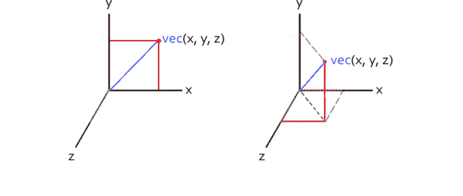

3D 向量由空间中的 3 个点定义：x、y 和 z，假设它们从坐标系的原点 [x=0, y=0, z=0] 延伸。因此，它可以用以下 Python 类表示：

```python
class vector:
    def __init__(self, x, y, z):
        self.x = x
        self.y = y
        self.z = z
        self.len = self.length()
```

与 JavaScript 不同，在 Python 中你*不能*让类属性和方法共享相同的名称。你不能有一个名为 `length` 的属性和一个名为 `length` 的方法。你的代码仍然可以编译，但其中一个会覆盖另一个，而不会显示任何错误。

因此，在这个示例中，属性 `len` 将存储向量的长度。而 `length()` 是计算它的函数。

Python 对象构造函数 `__init__(self)` 允许调用在该类定义中稍后出现的函数。你可以说 Python 的类方法被*提升*到构造函数中，这也是 JavaScript 和许多其他语言的工作方式。

我们的构造函数调用了在类中稍后定义的 `self.length()` 方法。以下是定义：

```python
def length(self):
    self.length = math.sqrt(self.x * self.x +
                            self.y * self.y +
                            self.z * self.z)
    return self.length
```

此函数使用 `math.sqrt` 根据 x、y 和 z 轴上的 3 个坐标计算向量的长度。

最后，让我们重载几个*魔术方法*：

```python
def __add__(self, other):
    self.x += other.x
    self.y += other.y
    self.z += other.z
    return self
def __sub__(self, other):
    self.x -= other.x
    self.y -= other.y
    self.z -= other.z
    return self
def __mul__(self, other):
    self.x *= other.x
    self.y *= other.y
    self.z *= other.z
    return self
def __div__(self, other):
    self.x /= other.x
    self.y /= other.y
    self.z /= other.z
    return self
def __lt__(self, other):
    #print self.length()
    #print other.length()
    return self.length() < other.length()
def __gt__(self, other):
    return self.length() > other.length()
def __str__(self):
    return "[{},{},{}]".format(self.x, self.y, self.z)
```

让我们使用这个类来创建两个向量：

```python
vec_1 = vector(5, 3, 1)
vec_2 = vector(3, 4, 2)
```

当我们把 vec_1 或 vec_2 传递给 print 函数时，`__str__` 方法会被激活：

```python
print(vec_1)        # [5,3,1]
print(vec_1.length) # 5.9
print(vec_2)        # [3,4,2]
print(vec_2.length) # 5.3
```

最后，让我们看看重载后的运算符如何工作：
我们刚刚创建了一个向量类，它允许我们轻松地相加、相减、相乘、相除 3D 向量，并按长度进行比较。你可以使用相同的逻辑来重载任何类型的对象。

## 第十章 类

太阳是一种恒星。地球是一种行星。汽车是一种交通工具。你可以创建自己的自定义类来表示各种对象。
类是对象的抽象表示。类定义了数据类型。例如，一个类可以表示从数字、文本字符串到更复杂的东西，如汽车、火车、飞机或动物的抽象模型。
类有一个构造函数，负责构建其表示类型的对象实例。类还可以有多个*属性*（在某些其他语言中称为*属性*）和*方法*定义。
让我们创建一个 Car 类，包含一个属性和一个方法：

```python
class Car:
    top_speed = "180mph"
    def describe():
        print("I am method of a Car class")

print(Car.top_speed) # 打印 "180mph"
Car.describe()       # 打印 "I am method of a Car class"
```

### 10.0.1 类构造函数

空类没有什么特别之处。类主要用作创建其代表类型对象的蓝图。类最常见的用途是*实例化一个对象——或多个对象*——该类型的对象。

**构造函数**是一个函数，当你使用该类实例化对象时会被调用——没有它，对象就无法被实例化。

在 Python 中，对象的构造分两个阶段进行。因此，有两个*魔法方法*负责对象的构造：`__new__` 和 `__init__`。你可以使用其中任何一个，或者两者都用。

以下示例将演示这一切是如何协同工作的。

```
class Car:
    def __init__(self):
        print("Hello from __init__")
```

定义两个同名的类会覆盖前一个：

```
class Car:
    def __init__(self):
        print("Hello from __init__")
```

```
class Car:
    def __init__(self):
        print("Hello from overwritten class Car")
```

不会像其他一些语言那样产生重定义错误。第二个定义只是简单地覆盖了第一个，并在实例化对象时被使用。

#### 实例化对象

要实例化一个 `Car` 类型的对象，我们调用 `Car()` 构造函数并将其赋值给变量名 mazda：

```
mazda = Car()
```

变量 mazda 现在持有一个 Car 类型对象的实际实例。参数 self 是对正在创建的对象实例的自动引用。如果将其打印出来，它将显示对象实例在内存中的位置。

让我们在以下示例中打印它：

```
class Car:
    def __init__(self):
        print(self)

tesla = Car()
print(tesla)
```

此示例也创建了一个 Car 类型的对象实例：

```
<__main__.Car instance at 0x0000000002CBF6C8>
```

#### 对象属性

在本章开头，我们访问了 Car.top_speed 属性。
你可以将其视为属于类本身的类范围属性。只有在该类主体内定义的属性才继承此行为。

向对象的实际实例添加属性是通过 self 属性完成的。
在此示例中，构造函数通过指向对象实例的 self 属性，为 make 和 wheel 属性分配了两个硬编码值：

```
class Car:
    def __init__(self):
        self.make = "Tesla"
        self.wheels = 4
        print(self.make, self.wheels, "wheels")

tesla = Car()    # 从构造函数打印 "Tesla 4 wheels"
```

尽管没有通过 Car() 调用向构造函数传递任何参数，但属性是通过 self 从构造函数分配给对象实例的。

#### 使对象构造函数更灵活

我们并不真的想在构造函数中像前面的示例那样硬编码属性值。为了使我们的类更灵活，我们希望让用户通过构造函数本身传递它们，以创建不同类型的汽车：

```
class Car:
    def __init__(self, p1, p2):
        self.make = p1
        self.wheels = p2
        print(self.make, self.wheels, "wheels")

volvo = Car("Volvo", 18)    # 打印 "Volvo 18 wheels"
```

你也可以从对象实例单独访问属性：

```
print(volvo.make)   # 打印 "Volvo"
print(volvo.wheels) # 打印 18
```

使用与实例属性相同的参数名是合法的：

```
class Car:
    def __init__(self, make, wheels):
        self.make = make
        self.wheels = wheels
        print(self.make, self.wheels)
```

这是 Python 类构造函数最常见的形式。

### 10.0.2 使用 __new__ 构造函数

魔法方法 __new__ 是可选的。它在 __init__ 之前执行，作为创建对象实例的同一过程的一部分。

使用 __new__ 时，你*必须*在类定义 `Car (object):` 中添加 `(object)`。

```
class Car(object):
    def __new__(cls):
        print("Hello from __new__")
        return object.__new__(cls)
```

这里使用任意的 cls 参数代替了 self。

需要从 __new__ 方法返回一个对象。

与 __init__ 一样，你可以提供额外的参数：

```
class Car(object):
    def __new__(cls, make, wheels):
        cls.make = make
        cls.wheels = wheels
        return object.__new__(cls)
```

像 __init__ 一样，__new__ 也分配属性。

让我们检查一下：

```
volvo = Car("volvo", 18)
print(volvo.make)
print(volvo.wheels)
```

打印：

```
volvo
18
```

我们刚刚看到了 __new__ 如何可以用来替代 __init__，但除非在高级情况下，否则可能不应该这样做。

### 10.0.3 同时使用 __new__ 和 __init__

如果两者都存在，__new__ 方法先执行：

```
class Car(object):
    def __new__(cls, make, wheels):
        cls.make = make
        cls.wheels = wheels
        return object.__new__(cls)
    def __init__(self, make, wheels):
        print(self.make, self.wheels)
```

cls 变成了 self（它们都指向同一个构造的对象实例）

属性 make 和 wheels 在 __new__ 中被分配给 cls 对象。
从 __new__ 返回的对象被传递给 __init__ 内部的 self——它们都指向同一个对象实例。__init__ 至少需要一个 self 参数。因此 __new__ *必须*返回一个对象——否则 init 永远不会被调用。

```
volvo = Car("volvo", 10) # 打印 "volvo 10"
```

同时使用 __new__ 和 __init__ 时，两个魔法方法中*必须*指定相同数量的参数。

#### self 覆盖 cls

你可以将属性分配给 cls 对象，但分配给 __init__ 的 self 会覆盖它们：

```
class Car(object):
    def __new__(cls, make, wheels):
        cls.make = make
        cls.wheels = wheels
        return object.__new__(cls)
    def __init__(self, make, wheels):
        self.make = "over"
        self.wheels = "written"
        print(self.make, self.wheels)
```

以下代码将打印 "over written"，而不是 "volvo 80"：

```
volvo = Car("volvo", 80) # 打印 "over written"
```

你可以根据自己的喜好或情况，覆盖两个*魔法方法*或只覆盖一个。
只需记住，单个 `__init__` 构造函数是 Python 中创建对象最常见的方式。在大多数情况下，你根本不需要覆盖 `__new__`。
`__new__` 和 `__init__` 方法是*魔法方法*。无论如何它们都会在底层执行，但通过显式定义它们，我们可以控制方法的主体和返回值，以修改它们的行为。

#### 使用 `__slots__` 进行内存优化

默认情况下，Python 使用字典来存储对象实例的属性。在处理成千上万或数百万个对象时，这可能会占用大量 RAM。
使用 `__slots__` 方法，在许多情况下可以将 RAM 使用量减少 40% 到 50%。

```
class SomeClass(object):
    __slots__ = ['name', 'identifier']
    def __init__(self, name, identifier):
        self.name = name
        self.identifier = identifier
```

要让 Python 使用 slots，请创建一个与传递给类构造函数的参数名匹配的参数名列表，并将其分配给 `__slots__` 属性。
这应该会自动减少 RAM 使用量，尤其是在使用小型类和同一对象的许多实例的程序中。

#### 下一步是什么？

类通常是为了定义对象方法而创建的，你可以在对象实例上调用这些方法。正如我们刚刚看到的，类构造函数可以访问 `self`，其中 `self` 和*对象实例*是同义词。

另一方面，静态方法可以在类名本身上调用——它们用作实用函数，不能访问 `self`。

但是——这是 Python 独有的——还有一种叫做*类方法*的东西，它介于静态方法和可以访问 `self` 的方法之间。

在下一节中，我们将区分常规类方法和静态方法，以及它们在 Python 中的工作方式。

### 10.1 实例方法、类方法和静态方法

如果你是从 C++ 等面向对象编程语言转向 Python，你可能会发现 Python 对*类方法*和*静态方法*的区分令人困惑。考虑到即使是*实例方法*也可以像 C++ 中只能调用静态方法那样在类本身上调用。

在 Python 中，对象构造函数有两个属性（属性）代表实例化的对象，其默认名称为 `cls` 和 `self`。`cls` 对象在魔法方法 `__new__` 中构造，然后作为名为 `self` 的参数传递给魔法方法 `__init__`。因此构造过程是分两步进行的。

在 Python 中创建类时，你应该了解 3 种类型的方法：实例方法、静态方法和类方法。应该使用哪种类型的方法以及何时使用？以下部分将尝试回答这个问题。

#### 10.1.1 实例方法

实例方法是你的常规对象方法，它们假定位置参数 `self`，旨在在使用该类创建的对象实例（在*实例化*之后）上调用：

### 10.2. 静态方法

要创建自定义类方法，请使用 `def` 关键字：

```python
class Car:
    def describe():
        print("This is a car.")
```

实例方法*可以*表现得像静态方法。

```python
Car.describe() # Prints: "This is a car."
```

默认情况下，`describe()` *可以*作为*静态方法*被调用——直接在 `Car` 类上调用，无需实例化对象。
但这里有个问题。虽然这是*可能的*，但建议使用 Python 的 `@staticmethod` 装饰器来显式地将其定义为静态方法。

### 10.2 静态方法

静态方法不能也不会被用作通用的*工具*函数。
静态方法可以直接从类名调用，例如 `Car.info()`，但它们既不能访问也不能修改类状态。
为了使静态方法的定义更明确，请在方法定义的正上方使用 `@staticmethod` 关键字：

```python
class Car:
    @staticmethod
    def describe():
        print("This is a car.")
```

```python
Car.describe() # Prints: "This is a car."
```

这个类的行为与前一个示例完全相同。但这是定义静态方法更恰当的方式。

#### 10.2.1 类方法

要将 `describe()` 方法指定为类方法，请使用 `@classmethod` 关键字：

```python
class Car:
    @classmethod
    def describe():
        print("This is a car.")
```

现在调用 `Car.describe()` 将导致错误：

```python
Car.describe()
```

```
TypeError: describe() takes 0 positional arguments but 1 was given
```

为了使其工作，必须在非静态类方法上显式指定位置参数 `self`：

```python
class Car:
    @classmethod
    def describe(self):
        print("This is a car.")
```

当然，当涉及 `self` 时，会假定存在一个构造函数：

```python
class Car:
    def __init__(self, make):
        self.make = make
    @classmethod
    def describe(self):
        print("The make of this car is ", self.make)
```

从技术上讲，像上面这样的非静态类方法并不打算在类名 `Car` 上调用。非静态类方法是保留给对象*实例*使用的。

然而，一旦添加了 `self` 参数，`describe()` 就使其*可以*再次作为静态方法被调用：

```python
Car.describe() # "This is a car."
```

这是可能的。但这可能不是你应该做的事情。调用非静态类方法的正确方式是首先创建一个对象实例：

```python
mazda = Car() # Prints "This is a car."
```

#### 10.2.2 静态方法

静态方法是可以直接在类名上调用的方法：
这里 `Car.count()` 调用静态方法 `count`（如果已定义）。此方法不附加到 `Car` 类型的对象实例上。
静态属性对于跟踪整个类的信息很有用。例如，创建了多少个 `Car` 类型的对象实例：
为了区分静态方法和对象实例方法，Python 提供了两个关键字：`@classmethod` 和 `@staticmethod`：

```python
class Car:
    @classmethod
    def describe():
        print("This is a car")
```

```python
class Car:
    total_cars = 4
    @staticmethod
    def count():
        print("This is a car")
```

```python
Car.describe()
```

在类体内声明的所有变量都是静态属性。它们应包含与整个类相关的值，而不是与其创建的对象实例相关的值。（例如，跟踪所有实例化的汽车数量。）

#### 10.2.3 静态属性

此时，你实际上可以直接从类定义访问 `Car.make` 和 `Car.wheels` 属性：

```python
print(Car.total_cars)

>>>
4
```

在类级别定义的属性称为*静态*属性。

### 10.3 对象

对象可以看作是类的一个实例。让我们在前面的示例中添加更多代码，以实际使用这个类。要创建 `Car` 类的对象实例：

```python
class Car:
    def __init__(self):
        self.make = "Tesla"
        self.wheels = 4

    def describe(self):
        message = "This car is a %s and it has %d wheels"
        print(message % (self.make, self.wheels))

# Instantiate object tesla from class Car
tesla = Car()

# Print out some values
print(tesla)
print("My Tesla has %i" % tesla.wheels)
```

输出：

```
My Tesla has 4 wheels
```

一旦实例化，你就可以通过对象实例 `tesla` 访问 `Car` 类定义中的属性。`wheels` 属性可以使用点运算符访问：

```python
tesla.wheels
```

而 `make` 可以这样访问：

```python
tesla.make
```

这就是实例化对象的属性访问方式。你也可以用同样的方式访问方法。但为了执行它们，需要添加括号：

```python
tesla.describe()
```

但我们的类设计仍然可以改进。
类是为了帮助你减少编写的代码量而创建的模式。这种代码重用的原则在编程中非常重要。为了利用它，你可以创建一个更灵活的构造函数方法，该方法接受用户定义的值并将其设置到 `self` 对象上。

### 10.4 构造函数

在上一节中，我们从 `Car` 类创建了一个对象 `tesla`。但每次我们创建一个新对象时，它仍然只允许我们创建相同的“Tesla”汽车，有 4 个轮子，因为值是硬编码在构造函数内部的。
理想情况下，你希望类尽可能灵活。让我们通过允许使用我们类的人输入他们自己的值来修改构造函数：

```python
def __init__(self, make, wheels):
    self.make = make
    self.wheels = wheels
```

这里唯一的区别是向构造函数添加了 `make` 和 `wheels` 参数。在构造函数内部，我们现在将传递给这些参数的值分配给 `self.make` 和 `self.wheels` 对象属性，而不是硬编码它们。
现在我们可以使用同一个类创建多个相同类型 `Car` 的对象，但具有截然不同的属性：

```python
tesla = Car("Tesla", 4)
tesla.describe()

truck = Car("Volvo", 18)
truck.describe()
```

输出将是：

```
This car is a Tesla and it has 4 wheels
This car is a Volvo and it has 18 wheels
```

我们刚刚使用相同的类定义创建了一辆 4 轮的 Tesla 和一辆 Volvo，一辆 18 轮的卡车。两辆具有独特特征的不同汽车。
这就是你希望通过类设计实现的目标——一个可以创建相似对象而无需更改类原始设计的模型。
通过这样做，你可以减少计算机程序的大小。

#### 另一个类示例

让我们创建一个类来表示一个 Web 服务器：

```python
class Server:
    # Object constructor
    def __init__(self, os, distro, ver, ram, cpu, cores, gpu):
        self.os = os
        self.distro = distro
        self.ver = ver
        self.ram = ram
        self.cpu = cpu
        self.cores = cores
        self.gpu = gpu

    # return list of attributes
    def attributes(self):
        return vars(self)

webserver = Server("Linux", "Ubuntu", "18", "32Gb", "Intel", 8, "Nvidia RTX")

# Call object's attributes() method
attrs = webserver.attributes()

# Print attributes
print(attrs)
```

以下是输出：

```
'os': 'Linux', 'distro': 'Ubuntu', 'ver': '18', 'ram': '32Gb', 'cpu': 'Intel'
```

我们刚刚打印出了实例化对象的所有属性。
在 Python 中，对象属性被称为*属性*。

Python 的内置函数 `vars` 可以与对象一起使用。它从传递给它的对象中检索属性列表。你不需要添加任何模块就可以开始使用它。

当我们在 Server 类的 `attributes` 方法体中将 `self` 对象传递给 `vars` 函数时，它将对象的属性打包成一个 JSON 对象，并使用函数的 `return` 关键字返回它。

注意：你不必在类方法内部调用 `vars`。它是一个全局作用域函数，可以在任何地方使用。

#### 美化 JSON 输出

处理 JSON 对象非常常见。
当 JSON 对象中的属性越多，输出的可读性就越差。
要美化 JSON 输出，你可以使用内置 `json` 模块中的 `json.dumps` 方法。让我们在前面的示例中添加以下代码：

```python
# Import json module (so we can use json.dumps method)
import json

# Format JSON object with 2 spaces
formatted = json.dumps(attrs, 2)
```

运行这行代码的输出将是一个包含所有对象属性的 JSON 对象列表，但带有换行符并格式化为 2 个空格：

```json
{
  "os": "Linux",
  "distro": "Ubuntu",
  "ver": "18",
  "ram": "32Gb",
  "cpu": "Intel",
  "cores": 8
}
```

## 10.4. 构造函数

```python
"gpu": "Nvidia RTX"
}
```

`json.dumps` 函数也能正确格式化 JSON 对象，根据规范，JSON 对象的属性名需要使用双引号。（单引号被视为格式错误的 JSON，不应用于定义 JSON。）

`import json` 这行代码将 `json` 模块添加到我们的代码中。它包含一系列与 JSON 相关的函数。在这个例子中，我们只需要 `json.dumps`。通常，导入模块的操作会放在文件的最顶部，但你也可以将其添加到文件中的任何位置，只要它位于代码中实际使用 `json.dumps` 的地方的*上方*即可。

## 第10章. 类

## 第11章

## 文件系统

Python 提供了许多用于处理文件的函数。

### 11.0.1 文件操作

#### 使用内置的 open() 函数打开文件

让我们打开 `file.txt` 进行读取：

```python
# which file?
filename = "file.txt"

print(f"Opening {filename} for reading...")

f = open(filename) # open file

>>>
Opening file.txt for reading...
```

最后一行代码等同于使用 `"rt"` 标志执行 `open` 函数：

```python
f = open(filename, "rt")
```

`"rt"` 是打开文件的默认模式。它表示以（t）文本格式（相对于二进制）打开文件进行（r）读取。我们稍后会查看所有模式。

> `open` 函数会尝试在脚本执行的同一目录下打开文件 `"file.txt"`。但你也可以提供文件的完整路径。

`file` 函数第二个参数的默认值是 `"r"`。
这是一个可选参数，用于指定文件操作模式。
这里 `"r"` 告诉 `open` 函数以*读取*模式打开文件。
例如，要以写入模式打开文件，你可以使用 `"w"` 代替：

```python
f = open(filename, "w")
```

我们稍后会查看所有七种模式。但首先，我认为介绍错误处理很重要。

### 错误处理

如果我们尝试打开一个不存在的文件会发生什么？

```python
f = open(filename)
```

因为我们还没有创建这个文件，Python 会在命令行报错：

```
Traceback (most recent call last):
  File "fileops.py", line 5, in <module>
    f = open(filename, "r")
FileNotFoundError: [Errno 2] No such file or directory: 'file.txt'
```

刚才发生的情况被称为*异常*。这类错误在许多其他编程语言中也很常见。异常的独特之处在于，它们不是由*你的代码*生成的，而是由代码执行的环境生成的。
（例如，如果 `file.txt` 存在，就不会产生错误。）

### 11.0.2 使用 try: except: 块处理异常

我们刚刚看到，如果文件不存在，Python 会抛出错误。
因为读取文件是一个经常因各种你无法控制的原因而失败的操作（例如：*文件被删除，或其权限被设置为“只读”，而你正尝试以写入模式打开它*），因此在不中断程序执行流程的情况下捕获这类失败非常重要。
而这正是捕获错误通常能帮助我们实现的——异常不仅限于文件操作，它们可能发生在你程序中的任何地方。
例如，一个经典的例子是尝试除以 0：

```python
100/0
```

```
>>>
Traceback (most recent call last):
  File "test.py", line 1, in <module>
    100/0
ZeroDivisionError: division by zero
```

注意 Python 将错误识别为 `ZeroDivisionError`。
将两个先前未定义的变量相加：

```python
hello = 1
world = 2
hello + world
```

```
>>>
Traceback (most recent call last):
  File "fileops.py", line 1, in <module>
    hello + world
NameError: name 'hello' is not defined
```

这段错误代码产生了 `NameError` 错误。如果这个异常未被捕获，你的程序将停止并退出。这不是你希望发生的事情。

### try: except: 块

Python 的异常处理是通过 **try:** 和 **except:** 块完成的。

```python
try:
    print("Do something.")
except:
    print("Statement failed.")
```

**try:** 块中的代码没有问题：

```
>>>
Do something.
```

为了触发 **except:** 块，**try:** 中包含的语句必须失败。
要捕获异常，你可以在任何你想要测试错误的 Python 语句周围编写 **try:** 和 **except:** 块。如果在 **try:** 块中发生自然错误，**except:** 子句中的代码将被执行。
此时，我们所做的只是在代码失败时显示“Statement failed.”消息。但这仍然没有让我们能够控制实际的错误代码。
解决方案是告诉 **except:** 我们试图处理什么错误。Python 错误代码会在语句实际失败时显示在命令行上。
如果你尝试打开的文件不存在，你会得到 `FileNotFoundError` 异常。这就是我们需要传递给 **except:** 的错误代码，如下所示：

```python
try:
    file = open('filename.txt')
except FileNotFoundError:
    print("FileNotFoundError has occurred")
```

此外，如果你需要打印错误代码，可以通过将其复制到一个名为 **error** 的变量中（但你可以使用任何其他名称）来解释它：

```python
try:
    file = open('filename.txt')
except FileNotFoundError as error:
    print(f"{error} has occurred")
```

我们现在可以将此应用于我们的文件示例，如下所示：

```python
filename = "test.txt"

try:
    print(f"Opening {filename} for writing")
    f = open(filename, "w")
except FileNotFoundError as error:
    print(f"Error is = {error}")
```

这应该是打开文件的标准方式。

> 现在，即使由于某种原因 `open` 函数失败，我们也可以优雅地显示一条消息并继续执行下一条语句，而不会中断程序流程。在处理文件和类似操作时，使用 **try:** 和 **except:** 来处理你无法控制的错误。

### 抛出异常

你可以抛出自己的异常。当你百分之百确定代码依赖于某个操作的成功时，这很有用。如果操作失败，你绝对不想执行任何其他后续操作。这通常表示一个严重的错误。

要抛出自己的异常，请使用 **raise** 关键字：

```python
try:
    print("About to raise an exception")
    raise ZeroDivisionError
finally:
    print("Goodbye!")
```

```
>>>
About to raise an exception
Goodbye!
Traceback (most recent call last):
  File "raise.py", line 3, in <module>
    raise ZeroDivisionError
ZeroDivisionError
```

**raise** 关键字必须指向一个现有的异常错误类。我们刚刚抛出了 `ZeroDivisionError`，尽管我们并没有执行除以 0 的操作——这个异常是强制产生的。但理想情况下，你应该创建自己的异常类型，这可以通过扩展 `Error` 类来定义：

```python
class Error(Exception):
    # base error class
    pass
```

```python
class CustomError(Error):
    # custom exception
    # that defines attributes
    # with more information
    # about this error
    def __init__(self):
        print("The dough has not risen!")
        pass
```

```python
try:
    raise CustomError
finally:
    print("Goodbye!")
```

```
>>>
The dough has not risen!
Goodbye!
Traceback (most recent call last):
  File "raise.py", line 16, in <module>
    raise CustomError
__main__.CustomError
```

错误名称通常以 `Error` 一词结尾，因此请确保你的命名遵循此模式以保持一致性。

```python
f = open("file.txt", "w")
```

### 关于 "w" 模式的另一点

小心不要用 `"w"` 模式打开*重要*文件——即使文件已经存在，也会创建一个新的空白文件，覆盖原始文件的内容。

如果文件不存在，则强制创建一个用于写入的空白文件：

```python
f = open("file.txt", "w")
```

此模式将清空现有 `file.txt` 的内容或从头开始创建一个新文件。此时文件已准备好被写入。

### 打开文件模式

| 模式 | 描述 |
| :--- | :--- |
| r | 以读取模式打开文件。（默认） |
| t | 以文本模式打开。（默认） |
| w | 以写入模式打开文件。（如果文件不存在则创建新文件；如果文件存在则截断文件。） |
| x | 以独占创建模式打开文件。（如果文件已存在，此操作将失败。） |
| a | 以追加模式打开文件，将内容添加到文件末尾（如果文件不存在则创建新文件。） |
| b | 以二进制模式打开文件（需要与其他模式组合使用） |
| + | 以更新模式打开文件（可读写） |

## 第11章 文件系统

如果你想避免使用"w"选项覆盖（截断）重要文件，可以尝试使用"x"模式以*独占创建*方式打开文件：

```python
try:
    # 如果文件已存在，语句会因错误而失败
    # 如果文件不存在，则创建一个新的空白文件
    f = open("file.txt", "x")
except:
    print("无法打开file.txt - 文件已存在")
```

并非所有文件都是纯文本格式。例如Photoshop文件、PDF文件或电子游戏3D模型数据以二进制格式存储。在这种情况下，当你需要读取文件的二进制数据时，可以使用"b"模式：

```python
# 以二进制模式打开文件
f = open("file.dat", "rb")
```

> 使用"b"打开文件时，你*必须*同时包含四种文件模式（"r"、"w"或"a"）之一，并且最多一个加号（"+"）。仅使用单个字符"b"尝试打开文件将会失败。

要打开文件以*追加*数据到其末尾：

```python
f = open("file.txt", "a")
```

打开文件以进行*读取*和*写入*（更新）

```python
f = open("file.txt", "r+")
```

模式可以组合使用。要以二进制模式同时进行读写，可以使用"r+b"：

```python
f = open("file.txt", "r+b")
```

此模式允许你在打开的流上同时使用**读取**和**写入**函数。

## 从文件读取数据

本节还将向你介绍处理异常的另一种方式。这次我们将使用**try-finally**块。**finally**部分无论操作是否失败都会执行。它通常用于执行可选的清理工作。

我们的文件`the_tyger.txt`包含威廉·布莱克著名诗作"*The Tyger*"的四行诗。首先，让我们打开这个文件进行读取，然后简单地输出其内容。文件`the_tyger.txt`仅包含这首诗的前四行：

Tyger Tyger, burning bright,
In the forests of the night;
What immortal hand or eye,
Could frame thy fearful symmetry?

让我们编写一个函数来读取这首诗的内容，打印出来并"最终"关闭文件：

```python
try:
    # 打开文件以读取其内容
    poem = open('the_tyger.txt')
    contents = poem.read()
    print(contents)
except FileNotFoundError:
    print("发生了FileNotFoundError")
finally:
    print("> 正在关闭文件...")
    poem.close()
    print("> 文件已关闭！")
```

>>>
Tyger Tyger, burning bright,
In the forests of the night;
What immortal hand or eye,
Could frame thy fearful symmetry?

无论是否发生错误，**finally**关键字都帮助我们关闭文件（这是你在读取文件后通常应该做的事情）。

```python
poem.close()
```

## 逐行从文件读取数据

通常你会希望逐行解析文本文件。此示例演示了如何根据文件解析器在每一行找到的内容设置变量。

## 使用write()函数写入文件

你可以使用**write**函数将数据写入文件：

```python
writer = open('new-file.txt', 'w')
writer.write("Some content")
writer.close()
```

这会打开`new-file.txt`并写入字符串"Some content"。将创建一个新的空白文件。如果同名文件已存在，它将被覆盖并变为空白文件。在重要文件上使用"w"时要小心。

## 使用"a"和write()向文件追加数据

要向文件追加数据，你需要以"a"模式打开它。这意味着打开文件进行写入——**write()**函数将*追加*数据到最末尾：

```python
# 以追加模式打开诗歌文件：
poem = open('the_tyger.txt', 'a')

# 添加换行符
poem.write("\n")

# 在文件最末尾添加你自己的行：
poem.write("My brilliant poetic line.")

# 关闭文件
poem.close()

# 再次读取文件并打印其新内容
poem = open('the_tyger.txt', 'rt')
print(poem)
```

每次执行此脚本，都会在原始文件底部添加一行。连续运行3次后，文件现在包含：

```
Tyger Tyger, burning bright,
In the forests of the night;
What immortal hand or eye,
Could frame thy fearful symmetry
My brilliant poetic line.
My brilliant poetic line.
My brilliant poetic line.
```

添加的行以紫色突出显示。

## 使用os包

**os**包提供了多个用于处理文件的函数。
例如，要将文件移动到另一个目录，你可以使用**os.rename**函数。
以下是一些示例：

```python
import os

# 将当前目录中的文件'file.txt'重命名为'new.txt'
os.rename('./file.txt', './new.txt')

# 这等同于：
os.rename('file.txt', 'new.txt')

# 将文件移动到上一级目录并重命名：
os.rename('new.txt', '../../moved.txt')

# 将文件移动到现有目录中：
os.rename('months.txt', './calendar/months.txt')

# 删除文件：
os.remove('file.txt')
```

我们刚刚介绍了你可能在程序中使用的大多数基本文件操作。

### 11.1 桌面拯救

你的桌面是否曾因文件而变得杂乱无章？如果有一种方法可以快速将桌面上的所有文件按类型移动到各自的文件夹中会怎样？

扩展名为`.jpg`、`.jpeg`、`.bmp`、`.psd`和`.png`的图像文件可以移动到"Images"文件夹。像`.txt`、`.doc`和`.xls`这样的文本文档可以移动到"Text"文件夹。同样，像`.py`、`.js`、`.html`、`.css`这样的开发文件可以放入"Dev"文件夹。

你可以通过修改文件夹字典来指定自己的规则。

利用我们目前所学的关于循环和文件操作的所有知识，让我们编写一个简单的程序，该程序将扫描桌面上的所有文件，根据扩展名识别文件类型，并将它们移动到相应的文件夹中。

我们可以使用元组字典来建立文件夹与应移动到该文件夹的文件扩展名列表之间的关系。

```python
import os

desktop = "C:Desktop" # 替换为你的桌面路径

folders = {
    "Text" :
        (".txt",
         ".doc",
         ".xls"),
    "Images" :
        (".psd",
         ".jpg",
         ".jpeg",
         ".jpg_large",
         ".jfif",
         ".png",
         ".bmp",
         ".tga"),
    "Dev" :
        (".html",
         ".css",
         ".js",
         ".py",
         ".c",
         ".cpp",
         ".h"),
    "Video" :
        (".mpg",
         ".mov",
         ".mp4"),
    "Music" :
        (".mp3"),
}
```

为了保持简单，代码由几个嵌套的for循环组成。

```python
moved = 0
# 列出桌面目录中的所有文件
for file in os.listdir(desktop):
    # 遍历字典中的每个目标文件夹
    for folder in folders:
        # 遍历每个目标文件夹
        for extension in folders[folder]:
            # 如果文件扩展名匹配
            if file.endswith(extension):
                # 检查文件夹是否存在，如果不存在则创建它
                directory = f"{desktop}{folder}f"
                if os.path.isdir(directory) == False:
                    os.mkdir(directory)
                # 将文件移动到此目录
                original = f"{desktop}{file}"
                target = f"{directory}{file}"
                # 确保它是文件而不是目录
                if os.path.isfile(original) == True:
                    # 确保目标文件不存在
                    if os.path.isfile(target) == False:
                        # 最终移动文件...
                        os.rename(original, target)
                        moved += 1
print(f"已移动 {moved} 个文件")
```

运行此脚本会将所有具有列出扩展名的文件移动到目标目录（"Images"、"Text"、"Video"等）之一。如果文件夹不存在，将会创建它。

```
python salvation.py

>>>
已移动 174 个文件
```

## 第12章

## MongoDB

与任何语言一样，Python需要一个Mongo数据库驱动程序才能开始使用Mongo。Python常用的Mongo驱动程序之一叫做PyMongo。要下载并安装此驱动程序，请转到命令提示符并输入：

```
python -m pip install pymongo
```

## 运行Mongo数据库服务器

在你能够从Python脚本开始在Mongo服务器上执行命令之前，首先它需要作为独立应用程序在你的系统上运行。

## 将项目插入集合

在你的Python程序顶部导入pymongo模块。现在我们准备连接到Mongo数据库，该数据库通常默认在本地主机的27017端口上运行。

```python
# 导入pymongo模块
import pymongo

# 创建一个客户端
client = pymongo.MongoClient("mongodb://localhost:27017/")

# 访问用户集合（表）
```

### 12.0.1 将字典插入Mongo集合

与关系型数据库MySQL不同，Mongo是基于文档的。这意味着无需编写查询语句，而是使用类似JSON的对象格式将项目插入Mongo集合（可以将其视为类似于MySQL中的表）。

### 12.0.2 .insert_one() 方法

在这个例子中，我们将把一个包含电子邮件和密码的简单用户对象插入到"users"集合中。这是在从网页表单输入注册新用户时，后端需要执行的操作。

```python
import pymongo

# Connect to client
client = pymongo.MongoClient("mongodb://localhost:27017/")

# Grab a link to the database and users collection
database = client["database"]
users = database["users"]

# Create a user dictionary to insert into "users" collection
user = {"email": "felix@gmail.com", "password": "catfood15"}

# Finally insert it into Mongo users collection
users.insert_one(user)
```

首先，我们创建了一个Mongo客户端，获取了活动的数据库对象，并通过集合变量创建了指向"users"集合的链接。
请记住，在Python中，类似JSON的对象结构被称为*字典*。这里我们还创建了一个任意字典，并使用Mongo的`insert_one`方法将其插入到users集合（表）中。

## 第12章. MONGODB

## 第13章

## Python能用来做什么？

Python的语法使其成为最容易学习的语言之一。你可能是一名主要用JavaScript编写代码的前端开发者。你可能只是听说过Python，而没有真正花时间去学习它。我能理解：
几乎所有前端工作都是用JavaScript完成的——这是现代浏览器唯一支持的语言，而Python甚至不是一种客户端语言。
Python通常用于服务器端脚本、DevOps以及机器学习等领域。由于近年来计算机技术在这些领域的进步，Python也已成为增长最快的计算机语言之一。
近年来，Python经历了前所未有的增长。自2010年以来，是什么促成了人们对这门语言的兴趣？让我们来看看。

## 第13章. PYTHON能用来做什么？


这种增长可能归因于多种因素的结合。我们已经知道，由于其简单的语法，Python是一门易于学习的语言。但还有什么让它成为一门受欢迎的语言呢？

### 13.0.1 机器学习

Python的流行很大程度上可以归因于人们对机器学习兴趣的增加。用于编写机器学习算法的Google TensorFlow库就是用Python编写的（它也有一个C++对应版本）。

TensorFlow库也可以在支持CUDA的Nvidia显卡上运行，并且可以安装在Linux操作系统上。


### 13.0.2 区块链

也许你也听说过**区块链**技术和**加密货币**。用Python编写加密货币挖矿软件并不少见。

## 第13章. PYTHON能用来做什么？


相当明显的是，这项技术以及许多其他*相对*新兴的技术共同促进了Python语言的发展。

### 13.0.3 Pygame

Pygame是一个跨平台的Python模块集，专为编写视频游戏而设计。它包括计算机图形和声音库，旨在与Python编程语言一起使用。


在过去二十年里，人们对Pygame的兴趣一直相当稳定。

### 13.0.4 Arduino

Arduino是一个基于易于使用的硬件和软件的开源电子平台。它面向任何制作交互式项目的人。


尽管看起来人们对Arduino的兴趣正在减弱，但Google Trends的下降也可能表明它已被全球广泛接受。人们不再搜索某些东西，而是直接访问网站，因为它已保存在书签中。
Python并不是唯一可以用来编程Arduino项目的语言。也可以使用C、C++和JavaScript，但它是可接受的选择之一。

### 13.1 Amazon AWS

亚马逊的Web服务（AWS）是一个流行的平台，提供按需云服务器资源来解决各种计算问题。虽然你不必在AWS中使用Python，但在你作为Web开发人员的职业生涯中，你可能会遇到这种组合。

### 13.2 代数、矩阵和图像处理

Python有几个图像处理库，这使其成为服务器端图像处理的强大工具。一些流行的库是scikit和NumPy。NumPy是Python中的一个核心库，提供了处理*数组*的工具（数组，在Python中称为*列表*）。但由于图像本质上是数组，NumPy经常被用于图像处理。Scipy是另一个处理n维数组的库，特别是scipy.ndimage模块。

### 13.3 MySQL, MongoDB 或 PostgreSQL

Python可以与MySQL、MongoDB和PostgreSQL一起使用。这使得用Python为你的Web应用程序创建自己的API端点服务器成为可能。
这种设置允许你与Node.js（或Deno）服务器竞争。即使不是在速度上，至少在服务器架构上。正如你很快会看到的，编写Python API代码可能是一种乐趣。

### 13.4 文件系统操作

Python可以读写文件系统中的文件。这使其成为格式化Excel电子表格、读取电子邮件收件箱以及任何需要复制、编辑或保存硬盘文件的脚本的绝佳伴侣。

### 13.5 数学库

Python有一个很棒的数学库，包括一些在其他流行语言中甚至不是“开箱即用”的内置数学函数。

如果你是一个欣赏数学和物理的人，你会发现Python是一个自然的伴侣。

Python拥有一个庞大的科学社区，这通常导致编写优化的、以数学为重点的模块。而像JavaScript这样的语言主要被认为用于Web开发。

它可以处理大型数据集，并且可以专门用于执行复杂的数学运算。

最后，Python几乎适用于任何操作系统。这包括基于UNIX的系统、Windows、macOS、iOS和Android。

### 13.6 Python标志背后的故事

Python是一种通用语言。最初，它的名字受到了*蒙提·派森*（英国超现实主义喜剧团体）的影响，而不是蛇——但随着时间的推移，这个符号被普遍接受是不可避免的。

Python软件基金会是一个非营利性公司，拥有Python编程语言的知识产权。

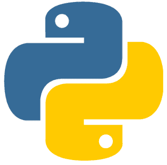

Tim Parkin设计了现在被称为Python标志的两条蛇。

本着幽默的精神，我将包含Tim Parkin对一位Python标志批评者的回应，该批评者说它有各种含义并传达了平衡（而不是Python语言的真正特性，如抽象、组合和“整体大于部分之和”的原则）。

决定包含以下论坛讨论，因为它快速地从一个可靠的来源——标志设计者本人——传达了Python标志的设计。*注意：印刷品已针对本书格式进行了微小调整，仅添加了大写字母等小改动。*

### 13.6. Python 标志背后的故事


> Michael 说：

*话虽如此，也承认第一印象是积极的，但我看不出它如何代表 Python。更重要的是，我看得越久就越不喜欢它，我不会把它穿在 T 恤上。*

到目前为止，已有超过 25 人不同意你的观点，而且这还是在没有任何宣传的情况下（这是一个旧版本的标志），因为你可以从 cafepress/pydotorg 获得 T 恤，任何利润都归 PSF 所有。

> *十字架和阴阳符号都有宗教含义，这对一些人来说是积极的，对另一些人来说是消极的，但肯定不能代表 Python 的本质。如果存在这样的群体，这将是道教基督徒的绝佳标志。*

*Python 与“平衡”有何关系？它关乎抽象、组合、整体大于部分之和，是的，但其中并没有真正体现二元性的东西。所以整个事物的二元性是让我感到不安的部分之一。*

它们是友好的蛇，在蝌蚪化装舞会上“拥抱”。你认为 Python 蛋是从哪里来的……

Tim Parkin

附注：该标志实际上基于玛雅人对蛇的描绘，通常只描绘头部和可能的一小段尾巴。蛇的结构代表了从侧面看到的蛇的自然盘绕/嵌套。

中美洲历法也以类似的方式描绘蛇头。

玛雅文化中使用的蛇的抽象设计似乎足够非教派化，只会引起牵强的反对。所使用的形状（十字架/螺旋/阴阳）也足够原始，总会衍生出一些联想。

双头蛇也是设计的一个影响因素，这也是许多大陆（包括非洲）常见的“模因”。

我想看看你告诉一个内战士兵，它看起来像他的裤子是由一个双头蝌蚪提着的。

如果你仔细观察标志，你还会看到一个印度和平符号。（我对此不作评论，因为它也可能意味着其他东西。）


### 13.7 Python 语法

这本书是关于什么的，适合谁？

- 1.) 这是 Python 语言的实用入门。
- 2.) 这是与首次学习 Python 相关的示例集合。
- 3.) Python 3.0 及更高版本许多实用特性的参考
- 4.) 一本很少使用视觉图表来解释抽象原理的书。
- 5.) 面向已经熟悉另一种语言（如 JavaScript、C、C#、C++、PHP 或 Java）并且现在也想学习 Python 的程序员的指南。

### 13.8 哪个 Python？

Python 3 – 也称为“Python 3000”或“Py3K” – 是第一个有意向后不兼容的 Python 版本。

Python 3.0 是一个主要版本发布，因此包含比通常更多的更改。然而，这并没有从根本上改变语言，你在以前版本中习惯的许多东西仍然存在。

本书适用于 Python 3.0 及更高版本。运行本书中的一些示例在 Python <= 3 中将无法工作 – 在许多方面是由于 print 函数的更改。

### 13.9 书籍格式

关于计算机语言的书籍的呈现格式没有充分的理由比该语言的语法更复杂。
源代码将以简单的等宽打字机字体呈现，没有任何装饰、行号或颜色：

```
print("Hello from Python running on .".format("Ubuntu"))
```

你学到的东西只有在知识付诸实践时才重要。建议实际输入代码示例，并在 Windows 或 Mac 的终端中从命令行运行它们：

```
python hello.py
```

输出：
Hello from Python running on Ubuntu.

如果你以前有使用其他语言编写代码的经验，你可能已经猜到 Python 用提供给 .format 方法的值替换了 {}。
如果没有，并且 Python 是你的第一门语言，别担心。这以及 **Python 语法** 中的许多其他示例将得到详细解释。

> **提醒：** 当学习如何用*任何语言*编码时，仅仅记住关键字是行不通的。重要的是学习如何将语言用作解决问题的工具。虽然仅凭本书无法教你这项技能，但鼓励你即兴发挥本书中展示的示例，并编写自己的代码。

#### Python 语法符号


阅读时，请留意这个标志。每当你看到这样的方框时，它通常是一个 **Python 语法专业提示！** 它通常包含一些实用的智慧。它也可能提供帮助，指导你避免学习过程中的常见陷阱，或指出你可能遇到的错误……这通常不是你自己的过错。

图表将很少使用。只有在绝对有必要解释视觉概念时才会使用。有时，只有通过可视化复合概念之间的关系才能将点连接起来。

### 13.10 学习 Python

这本书 – Python 语法 – 正如其名。
使用简单的教程格式，我们将学习如何使用 Python 编写简短的计算机程序。我们将通过使用许多源代码示例来探索 Python 语法，这些示例将帮助你达到编写有意义程序所需的自信水平。
像任何编程语言一样，Python 为你提供了一套解决问题的工具，如*数据结构*、条件语句和运算符。运用你的创造力，你将使用这些工具编写计算机程序。
我们将主要关注 Python 编程语言的特性。这使得它成为一本适合初学者的书。但这些简单的规则反映了在许多编程语言（不仅仅是 Python）中看到的基础模式。
这是一本循序渐进的书。它的结构是线性的。最好一章一章地阅读。但如果你需要单独查找某个特定功能，它也可以用作案头参考。
我的第一门语言是 C++。然后我学习了 PHP 和 JavaScript，因为这两种语言的语法与 C++ 相似。
Python 是一种非常不同的语言，但以一种好的方式。
我喜欢 Python。它是计算机科学家的语言。我不认为我是一个计算机科学家。我认为的是，Python 实际上在物理上更容易书写。没有过多的括号或分号。Python 是动态类型的 – 所以没有变量类型关键字，使定义简洁。这门语言非常简单。用 Python 编码很像给你的计算机写一封电子邮件。
在下一节中，我们将安装 Python，然后介绍基础知识！

# 第 14 章

## 安装 Python

在开始用 Python 编程之前，你需要在系统上安装它。我不会详细介绍如何在操作系统上安装应用程序包，因为本书主要关于 Python 语言。但本节将为你提供一些正确的指引。

### 14.1 在 Windows 上安装

前往 https://www.python.org/downloads/ 并下载 Python 可执行文件。启动它并完成简单的安装过程：

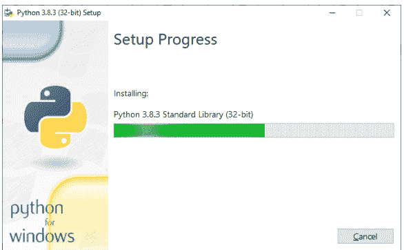

在我开始写这本书的时候，最新的 Python 版本是 3.8.3。前往 python.org 并安装最新版本。
如果你已经安装了 Python，你可以通过执行以下命令来检查你拥有的版本：

```
C:\Python>python --version
Python 2.7.16

C:\Python>
```

早期版本的 Python 可能不支持本书中的一些示例。如果你有一个旧版本，建议升级到最新版本。

### 14.2 在 Mac 上安装

Mac 已经预装了 Python。最初随操作系统安装的 Python 版本取决于你的操作系统版本。
Mac 的系统安装路径是：

```
/System/Library/Frameworks/Python.framework
```

和：

```
/usr/bin/python
```

早期版本的 macOS，如 OS X，附带 Python 2.7。虽然它非常适合练习，但建议升级到最新版本。
但是，如果你选择升级，请记住你最终会在系统上拥有两个不同版本的 Python。它们都可以工作，但可能无法运行相同的 Python 脚本 – 一些较新的 Python 版本（如 Python 3.9 或 Python 4.0+）可能无法编译用一些早期 Python 编译器版本编写的代码，因为并非所有 Python 版本都是向后兼容的。

#### 14.2.1 检查当前 Python 版本

要检查是否已安装 Python，请打开终端并输入以下命令（在 $ 命令行符号后）。

```
$ python --version
Python 2.7.5
```

对于 Python 3.0+，你也可以尝试输入 `python3 --version` 命令：

```
$ python3 --version
Python 3.8.3
```

如果由于某种原因，输入上述命令后出现错误，则意味着你的系统上没有安装 Python。
本节假设你熟悉 Mac OSX 的命令行安装工具。根据操作系统版本的不同，可能是 homebrew：

```
brew install python3
```

或者，如果你使用的是 Linux，则可以使用 apt 和 apt-get 安装程序。别忘了先执行 `apt-get update`：

```
sudo apt-get update
sudo apt-get install python
```

但这可能会在你当前的 Linux 版本上安装最新版本。要安装特定版本，例如 3.8，你可以执行：

```
sudo apt-get update
sudo apt-get install python3.8
```

本书不会详细介绍在不同版本的 Mac 或 Linux 操作系统上的安装过程。我们假设读者已经对这个过程有所了解。

#### 14.2.2 安装 GCC

还有一件事。Python 的原始实现称为 CPython。它是用 C 语言编写的，负责将你的 Python 程序编译成字节码，然后解释该字节码。CPython 既是解释器也是编译器。长话短说，我们需要安装 GCC 才能运行 Python。

如果你已经安装了 Xcode，那么你的 Mac 上很可能已经安装了 GCC。安装 Xcode 是在 Mac 上获取 GCC 最简单的选项之一。

只需在 Mac App Store 页面搜索 Xcode：

```
https://www.apple.com/app-store/
```

#### 14.2.3 安装 XCode 命令行工具

如果你是从头开始安装 Xcode，运行以下命令会很有帮助：

```
xcode-select --install
```

这将添加命令行工具。

#### 14.2.4 OXC GCC 安装程序

如果没有 Xcode，你可以查看：

```
https://github.com/not-kennethreitz/osx-gcc-installer
```

了解如何安装独立 GCC 的说明。

> 建议不要同时安装 Xcode 和独立 GCC。这种组合可能会使你的安装复杂化，并导致难以解决的配置问题。因此，Mac 上的 Python 开发者通常会避免同时安装两者。

### 14.3 使用 python 命令

现在 Python 已经安装在你的系统上，你可以使用 python 可执行文件来运行你的 Python 脚本了。
从你的命令提示符（Windows）或终端（Mac）或 bash（Linux）导航到你安装 Python 的目录。创建你的 Python 脚本并将其保存到文件 `script.py` 中，然后执行以下命令：

```
python script.py
```

这将执行你的 python 脚本。

### 14.4 在系统范围内运行 python 脚本

在 Mac 或 Linux 上，安装后 Python 很可能可以从终端或 bash 命令行的硬盘驱动器上的任何位置运行，因为它通常是全局安装的。但在 Windows 上可能并非如此。
新项目很可能存储在一个唯一的目录中。
例如，在 Windows 上可能是：`C:\develop\my_app\main.py`。为了从命令行执行 `main.py`，我们必须先导航到那里（使用 cd 命令），以便让 python 知道脚本的位置。
但在某些情况下，我们无法在其安装文件夹之外运行 Python。在 Windows 上，如果 `python.exe` 的位置不在 PATH 环境变量中，你可能会遇到错误。
某些 Python 安装软件会自动将 `python.exe` 添加到 PATH。但有时不会。所以让我们确保 **python.exe** 存在于 PATH 变量中，以便可以从命令行的任何位置执行它。
解决方案是将 **python.exe** 的路径包含到你的 **环境变量** 中。

## 第 14 章 安装 PYTHON

在 Windows 上访问环境变量至少有两种不同的方式。最简单的方法是 **按住 Windows 键** 并 **按 R**。将出现以下“运行”对话框：

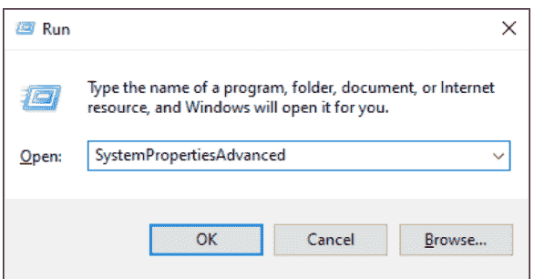

图 14.1：按住 Windows 键并按 R。

输入 "SystemPropertiesAdvanced" 并按 Enter。将出现环境变量编辑器窗口：

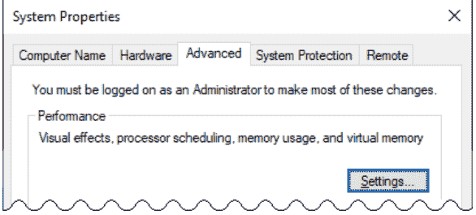

点击右下角的环境变量按钮...

### 14.4. 在系统范围内运行 PYTHON 脚本

257

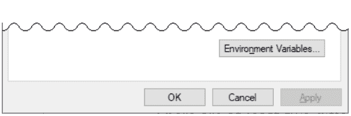

你也可以从命令行访问同一个窗口：

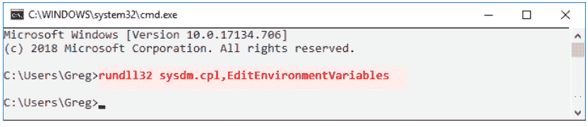

图 14.2：**运行：** rundll32 sysdm.cpl,EditEnvironmentVariables

运行命令 **rundll32 sysdm.cpl,EditEnvironmentVariables**
无论哪种方式，你都会到达以下窗口：

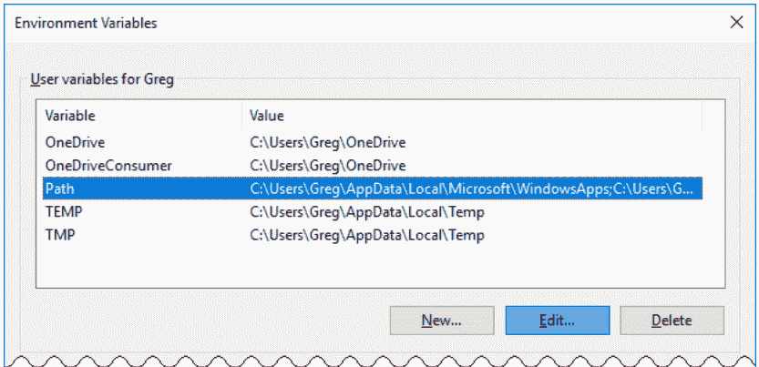

图 14.3：**环境变量** 窗口的上半部分。

在 **环境变量** 窗口的 *上部* 框（显示 **你的用户名** 的用户变量的地方），点击 **Path** 并点击 **编辑...** 按钮。
找到你安装 Python 的路径（**python.exe** 所在的位置）。在这个例子中，我将使用我的路径，即 C:\Python38-32\。
在下一个窗口中，点击 **新建** 并输入：
C:\Python38-32\

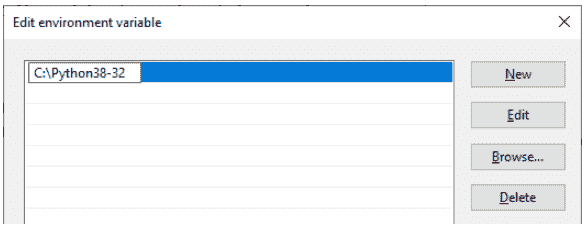

图 14.4：你可能会在列表中看到其他变量。只需添加你的 Python 安装目录的路径即可。

点击确定按钮，你就设置好了。现在你可以从硬盘驱动器的任何位置运行 Python，而不仅仅是其安装文件夹。

### 14.5 使用 Python Shell

Shell 是一个用于执行 Python 语句的沙盒环境。
要进入 Python shell，只需在命令行输入 `python` 并按 Enter：

```
C:\>python
```

你将看到一个介绍，显示你当前的 Python 版本以及你正在运行的进程和操作系统类型：

```
Python 3.8.0 (Nov 14 2019, 22:29:45) [GCC 5.4.0 20160609] on linux
Type "help", "copyright", "credits" or "license" for more info...
>>>
```

>>> 是你输入 Python 命令的地方。

#### 退出 Python Shell

要退出并返回到命令提示符，请按 Ctrl-Z 并按 Enter。
你输入到 shell 中的所有内容在退出时都会被擦除。因此，它只适合用来尝试 Python 命令，看看它们是如何工作的。这类似于 Chrome 中的 JavaScript 开发者控制台。

#### 执行 Python 脚本

为了实际执行一个 Python 脚本程序，你需要首先将你的 Python 代码保存到一个具有 .py 扩展名的文件中。
完成此操作后，你可以对该文件运行 `python filename.py` 命令。从下一章开始，我们假设所有示例都将以这种方式执行。

### 14.6 python 命令用法

输入：

```
python -h
```

查看可用于执行 python 脚本的所有可用模式。

## 第 14 章 安装 PYTHON

# 第 15 章

## 其他 Web 和软件开发书籍

### 15.1 CSS 可视化词典

如果你喜欢 Python 语法，请查找 Learning Curve Books 的其他书籍。

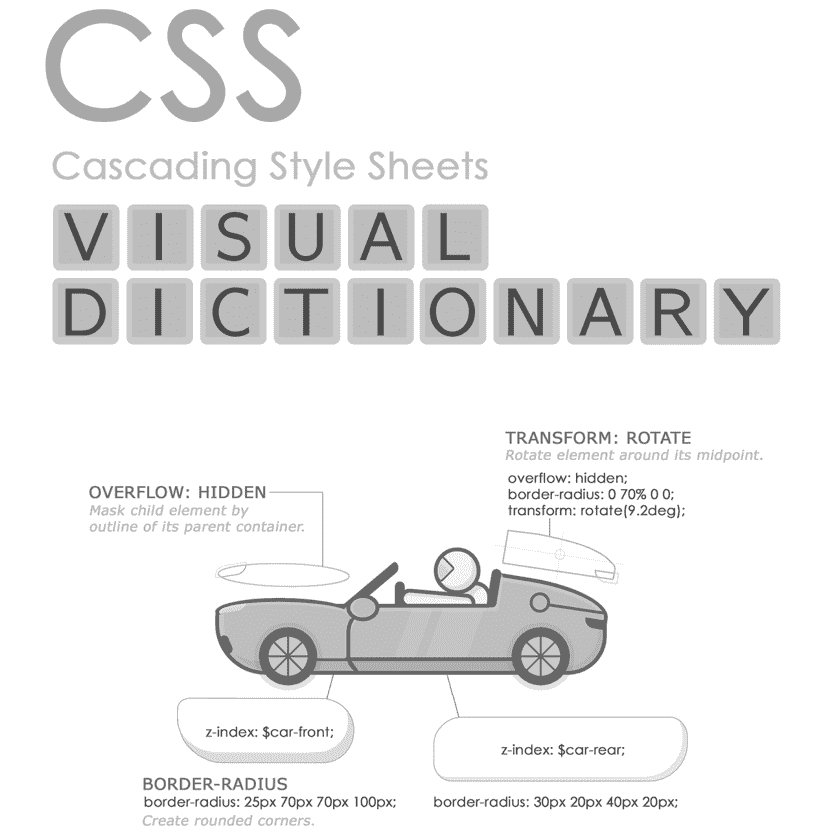

在 Amazon 上查找 **CSS 可视化词典**。（封面艺术可能有所不同。）

### 15.2 JavaScript 语法

如果你喜欢 Python 语法，请查找 Learning Curve Books 的其他书籍。

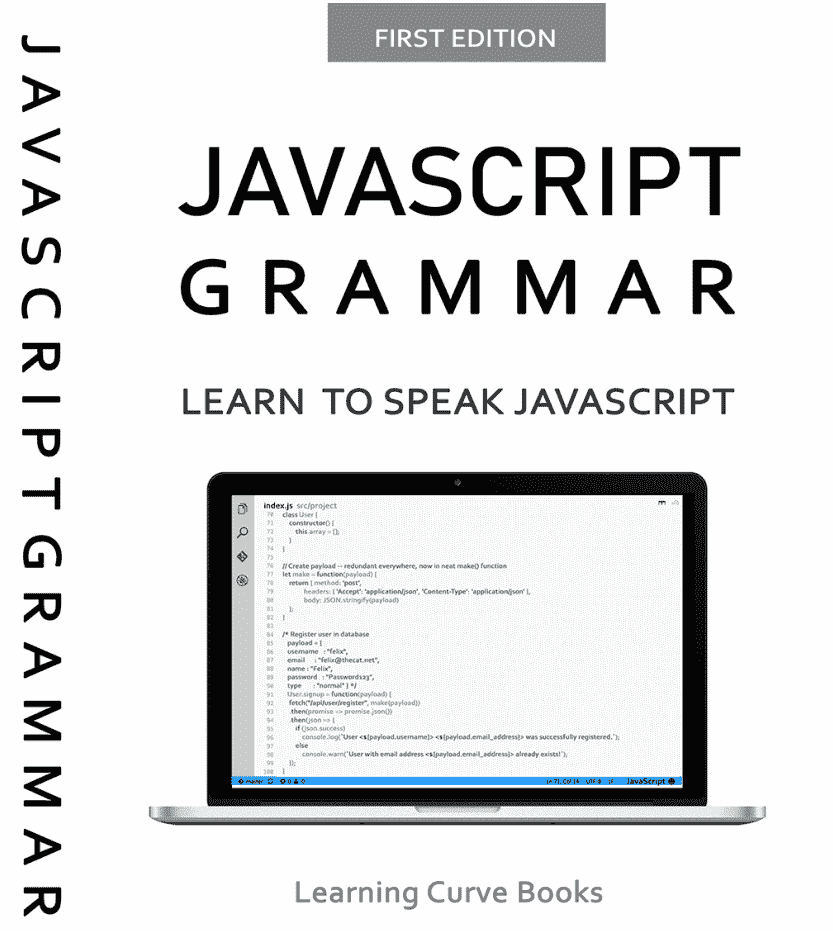

264 第 15 章 其他 WEB 和软件开发书籍

在 Amazon 上查找 **JavaScript 语法**。（封面艺术可能有所不同。）

### 15.3 Node API


在 Amazon 上查找 **Node API**。（封面艺术可能有所不同。）

## 索引

- ** 幂运算符，40
- **=，47
- **= 幂赋值，47
- *= 乘法赋值，47
- += 增量赋值，42
- -= 减量赋值，46
- // 整除运算符，40
- //= 整除赋值，48
- /= 除法赋值，47
- ==，50
- === 相等运算符，50
- % 取模运算符，40
- __init__，216
- __slots__，209
- print()，190
- 32 位变量，76
- 3D 向量类，200
- 3d 向量，200
- 3d 向量类，200
- abs()，193
- 缺少 ++ 运算符，52
- 缺少 === 运算符，52
- 变量剖析，76
- 向文件追加数据，230
- 任意参数，177
- 参数，173
- 算术运算符，38
- 按引用赋值，86
- 按值赋值，81，86，200
- 赋值，81
- 按引用赋值，80，84，85
- 按值赋值，80
- 赋值运算符，42
- 基本操作，29
- 基础，14
- 基础，4
- 按位与运算符，59
- 按位非运算符，60
- 按位运算符，58
- 按位或运算符，59
- 按位左移运算符，61
- 按位右移运算符，62
- 按位异或运算符，60
- bool，9，115
- bool()，194
- 布尔值，9
- 内置函数 id()，77
- 内置函数 hex()，78
- 内置函数，178，185
- callable()，111，190

## 索引

- 捕获错误，225
- 检查当前Python版本，253
- chr()，193
- class，203，208，210
- 类构造函数，204
- 类实例，205
- 类内存优化，209
- 类方法，212
- 类，203
- 合并字典，121
- 合并列表，131
- 命令行，259
- 注释，26，31
- 常见陷阱，24
- 比较运算符，54
- complex，119
- complex()，194
- 计算机内存，76
- 条件，36
- 构造函数，215
- 构造函数，204，215
- 将公里转换为英里，程序示例，6
- 复制，97，100
- copy.copy，99
- copy.deepcopy，98，100
- copy.deepcopy()，100
- 数据结构，113
- 数据类型，113
- 深拷贝，97，98
- deepcopy，97，98
- def，215，216
- 默认参数，174
- del，157
- 删除文件，232
- 桌面清理程序，232
- Desktop Salvation，232
- dict，120
- dict()，194
- dict.clear()，122
- dict.copy()，122
- dict.fromkeys()，123
- dict.get()，124
- dict.items()，125
- dict.keys()，126
- dict.pop()，127
- dict.popitem()，128
- dict.setdefault()，128
- dict.update()，129
- dict.values()，127
- 字典，107
- 鸭子类型，112
- 环境变量，257
- 错误处理，222
- eval()，189
- except，223
- 异常，225
- 执行，259
- 退出Python Shell，259
- 指数增长，47
- 表达式，18
- False，9
- 文件操作，221
- 文件系统，221
- finally，223
- float，118
- float()，7，195
- for循环，63
- for-in循环语法，63
- 格式化动态文本，32
- frozenset，168
- 函数参数，173
- 函数参数，173
- 函数参数，173
- 垃圾回收，101
- Mac的GCC安装程序，254
- 认识Python，13
- 处理异常，223
- 堆，101
- hex()，78，194
- 高级语言，24
- id()，77，194
- 识别函数，111
- 身份运算符，56
- if和not，20
- if语句，37
- if-else，19
- if语句，17
- if...else，37
- 不可变性，98
- 不可变，98
- 安装，4
- 安装GCC，254
- 在Mac OSX上安装，252
- 在Windows上安装，251
- 安装Python，251
- 安装Python，4
- 安装Python，4
- 安装XCode命令行工具，254
- 实例，210
- 实例方法，210
- int，7
- int()，7，194
- 整数，7
- integer.isnumeric()，10
- 使用.format()方法解释浮点数，35
- 在字符串中解释带小数点的浮点数，35
- 在字符串中使用.format()方法解释值，34
- isnumeric()，10
- iter()，66
- 反向迭代，67
- 迭代列表，64
- 迭代器，66
- javascript语法，262–264
- json.dumps，218
- 关键字参数，175
- 学习说Python，29
- len()，191
- list，107，129
- list.append()，132
- list.clear()，133
- list.copy()，133
- list.count()，134
- list.extend()，132
- list.index()，134
- list.insert()，134
- list.remove()，135
- 逻辑运算符，54
- 循环数字，68
- 循环，63
- 魔术方法，198
- 数学运算符，39
- 成员运算符，56
- 备忘录，100
- 混合关键字和默认参数，175
- Mongo .insert_one()方法，236
- MongoDB，235
- 单调时钟，87
- 可变性，107
- 原生函数，185
- 嵌套可迭代对象，68
- 嵌套元组，143
- NOT，60
- 对象，82
- 对象实例，205
- 对象实例方法，210
- 对象属性，82
- 打开文件模式，227
- open()，191
- 运算符重载，200
- 运算符，38
- 可选分号，20
- OR，59
- 用于处理文件的os包，231
- 重载，200
- 覆盖内置函数，178
- 参数，173
- 诗意的Python，24
- 位置参数，173
- 美化JSON输出，218
- 打印多个值，31
- 打印值，31
- Python命令行路径，258
- Python标志，246
- Python编程语言，29
- Python shell，258
- Python计时器，87
- 抛出异常，225
- RAM，76
- 范围，107
- 从文件读取数据，230
- 从文件读取数据，229
- 递归函数，101
- 使用切片操作替换项目，155
- return，172
- 从函数返回值，19
- 使用切片操作反转序列，155
- 在系统范围内运行Python脚本，255
- seconds2elapsed，自定义函数，182
- self，215
- 分号，20
- 分号，20
- 序列，107
- set.add()，158
- set.clear()，161
- set.copy()，161
- set.difference()，164
- set.difference_update()，166
- set.discard()，159
- set.intersection_update()，163
- set.isdisjoint()，159
- set.issubset()，160
- set.update()，161
- 设置环境变量，258
- 浅拷贝，90，92，99
- SIGINT，86，262–264
- 简单程序，21
- Python的简洁性，24
- 切片示例，152
- 切片步长，154
- slice()，192
- 使用[::]切片序列，150
- 带步长的切片，156
- 解决错误，10
- 源代码格式，5
- 栈，101
- 栈内存、堆内存和垃圾回收，101
- 语句，14
- 语句和表达式，14
- 静态方法，210，213
- str()，194
- str，字符串，字符串，117
- 字符串乘法，49
- 模板占位符和字符串.format()方法，32
- 用Python思考，6
- threading.Timer，182
- Tim Parkin，246
- time，87，182
- time.monotonic，87
- time.time()，182
- True，9
- try，223
- try，except，223
- tuple，98
- tuple()，195
- tuple，不可变性，142
- 类型检查，10
- type()，10，109
- TypeError，98，199
- 用户输入，185
- 在字符串中使用%值解释字符，35
- 变量，76，81，82
- 变量内存地址，77
- 变量，75
- 变量，76
- 向量，200
- 向量类，200
- while，71
- while循环，71
- while循环和not运算符，72
- 处理数据类型，114
- 处理字典，122
- 处理文件，231
- 编写自定义seconds2elapsed()函数，180
- 写入文件，230
- XCode，254
- XCode命令行工具，254
- XOR，60
- Python之禅，13
- ZeroDivisionError，223