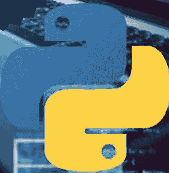

# 使用QT进行PYTHON GUI开发

使用Python和Qt构建直观且用户友好的图形用户界面 - 初学者指南。基于项目的方法构建10个实用的Python Qt GUI



凯蒂·米莉

# 使用Qt进行Python GUI开发

使用Python和Qt构建直观且用户友好的图形用户界面 - 初学者指南。基于项目的方法构建10个实用的Python Qt GUI

作者

凯蒂·米莉

# 版权声明

版权所有 © 2024 凯蒂·米莉。保留所有权利。

未经版权所有者事先书面同意，严禁以任何形式（无论是影印、录音，还是通过任何电子或机械方式）复制、分发或传播本作品的任何部分。但是，根据版权法允许的用于评论和特定非商业目的的有限摘录是此限制的例外。

# 目录

引言

第1章

- 什么是GUI以及为什么使用它们？
- Qt框架简介
  - 为什么使用Qt进行Python GUI开发？（相比其他选项的优势）
    - 本书结构和学习路径概览

第2章

- 搭建你的开发环境
- Qt Designer简介（可选但推荐）
  - 用于Qt开发的代码编辑器和集成开发环境
    - 设置你的项目目录

第3章

- 面向Python开发者的Qt基础
- 使用常见控件：按钮、标签、文本输入框等
  - 理解布局：在屏幕上组织控件（例如，网格布局、盒式布局）
    - 信号与槽：对象间的通信机制

第4章

- 使用PyQt构建你的第一个Qt应用程序
- 连接信号与槽以实现用户交互
- 事件处理：响应用户操作（点击、按键）
- 运行和调试你的第一个Qt应用程序

第5章

- Qt Designer集成与高级GUI设计
- 使用Qt Designer控件和布局
- 在Qt Designer中连接信号与槽
- 从Qt Designer文件生成Python代码

第6章

- 使用PyQt的高级GUI设计技术
- 使用样式表自定义外观
- 菜单、工具栏和对话框：增强用户体验
- 处理图像、图标和多媒体元素

第7章

- 处理数据和外部资源
- 实现MVC模式以构建有组织且可维护的代码
- 使用数据模型：列表、表格和其他数据结构

第8章

- 使用PyQt进行数据库集成
- 从数据库检索和操作数据
- 构建具有CRUD操作（创建、读取、更新、删除）的数据库驱动应用程序
- 将数据库功能集成到你的GUI中

第9章

- 高级Qt主题与部署
- 实现线程以进行后台处理并提高响应性
- 同步线程间的数据访问

第10章

- 打包和部署你的Qt应用程序
- 部署的跨平台考虑因素
- 分发和共享你的Qt应用程序

第11章

- 综合运用：基于项目的学习
- 实现文件列表、导航和操作
- 集成拖放功能

第12章

- 使用Qt Designer和PyQt创建笔记应用程序（可选）
- 利用Qt Designer进行界面设计（可选）
- 实现文本编辑、保存和加载功能
- 添加搜索和文本格式化等功能（可选）

结论

附录

Qt和PyQt术语表

# 引言

**吸引用户，征服桌面：释放使用Qt进行Python GUI开发的强大功能**

厌倦了将你的Python代码隐藏在晦涩的命令行后面？渴望用直观且视觉上令人惊叹的图形用户界面为你的Python项目注入活力？别再犹豫了！《使用Qt进行Python GUI开发》是你打造既强大又迷人的桌面应用程序的门户。

本书超越了简单的Qt教程的范畴。在这里，你将踏上一段变革之旅，掌握将Python的优雅与Qt的跨平台能力无缝融合的技能和知识。想象一下：

- **轻松打造用户友好的界面：** 拖放控件，可视化设计布局，创建直观的用户体验——所有这些只需极少的编码。
- **为每个人构建应用程序：** 开发可在Windows、macOS和Linux上完美运行的应用程序，轻松触及更广泛的受众。
- **利用Python的优势：** 将你现有的Python专业知识与Qt丰富的功能相结合，创建不仅外观出色，而且能轻松执行复杂任务的应用程序。
- **融入充满活力的社区：** 获取庞大的资源、教程和论坛生态系统，确保你在整个开发过程中获得所需的支持。

本书既适合经验丰富的Python开发者，也适合充满好奇心的初学者。我们深入探讨用户界面设计的核心概念，确保你的应用程序不仅功能完善，而且美观且直观易用。

你将掌握基本的GUI设计原则，探索布局和交互的最佳实践，并学习如何创建用户喜爱交互的应用程序。

以下是本书的与众不同之处：

- **实践学习：** 我们相信在实践中学习。本书充满了实践练习和基于项目的学习，巩固你的理解，并为你提供一系列真实世界的应用程序作品集。
- **清晰明了的解释：** 复杂的概念被分解为易于管理的步骤，确保你即使对GUI开发是新手，也能轻松掌握其基本原理。
- **分步教程：** 跟随详细的教程，从零开始展示如何创建功能性的GUI应用程序。
- **现代方法：** 我们使用最新版本的Qt和PyQt，确保你的技能与时俱进，与当前开发环境相关。
- **超越基础：** 本书不止于基础知识。我们探讨了线程、数据库集成和应用程序部署等高级主题，使你能够构建复杂且功能丰富的应用程序。

《使用Qt进行Python GUI开发》将解锁你Python编程技能的全部潜力。别再隐藏你的代码——用直观用户界面的力量将你的绝妙想法变为现实。加入我们这段激动人心的旅程，探索使用Python和Qt进行桌面应用程序开发的世界吧！

# 第1章

## 什么是GUI以及为什么使用它们？

欢迎来到使用Python的Qt GUI的迷人世界！图形用户界面在现代软件开发中扮演着至关重要的角色，为用户提供了一种直观且视觉上吸引人的方式来与应用程序交互。在这次探索中，我们将深入探讨GUI的基础知识、它们为何重要，以及如何利用Qt进行Python GUI开发的力量。

### 理解GUI：

GUI充当用户和软件应用程序之间的中介，提供按钮、菜单和窗口等图形元素以促进用户交互。与命令行界面不同，GUI提供了更直观和用户友好的体验，使软件更容易被更广泛的受众接受。

### 为什么使用GUI？

1. **增强用户体验：** GUI提供视觉丰富且交互式的体验，使用户更容易导航和与软件应用程序交互。
2. **提高生产力：** 直观的界面简化了工作流程，减少了执行任务所需的时间和精力。
3. **广泛的可访问性：** GUI通过提供熟悉的导航范式和视觉提示，满足了从新手到专家的所有技能水平用户的需求。
4. **可视化表示：** GUI允许以结构化和易于理解的方式呈现复杂的数据和功能，有助于决策和问题解决。
5. **市场竞争力：** 在当今的软件环境中，精心设计的GUI可以成为竞争优势，吸引用户并增强应用程序的整体吸引力。

### 开始使用Python的Qt：

Qt是一个强大的跨平台框架，用于构建GUI应用程序。利用Qt框架与Python相结合，为GUI开发开启了无限可能，将Python的简洁性与Qt的稳健性融为一体。

为了开始我们使用Python进行Qt GUI开发的旅程，让我们搭建开发环境并创建一个简单的应用程序：

```python
# Import the necessary modules from PyQt5
from PyQt5.QtWidgets import QApplication, QWidget, QPushButton, QVBoxLayout

# Create a new application instance
app = QApplication([])

# Create a main window widget
window = QWidget()
window.setWindowTitle('Qt GUI with Python')

# Create a button widget
button = QPushButton('Click Me!')
```

## Qt 框架简介

欢迎来到引人入胜的 Qt 框架世界，这是一个用于构建具有精美图形用户界面（GUI）的跨平台应用程序的多功能工具包。Qt（发音为“cute”）使开发者能够创建丰富、交互性强的应用程序，这些程序可以无缝运行在包括 Windows、macOS、Linux、Android 和 iOS 在内的各种操作系统上。在本介绍中，我们将深入探讨 Qt 的基础知识、其主要特性，以及如何使用 Qt 开始 Python GUI 开发。

## 理解 Qt 框架：

Qt 是由 Qt 公司开发的一个全面的 C++ 框架，旨在简化构建 GUI 应用程序的过程。它提供了大量的工具、库和 API，用于开发具有流畅且响应迅速的用户界面的应用程序。Qt 的模块化架构使开发者能够轻松创建从简单实用程序到复杂企业软件的各种应用程序。

## Qt 的主要特性：

1.  **跨平台兼容性：** Qt 使开发者能够编写一次代码，无需重大修改即可部署到多个平台，从而节省时间和精力。
2.  **丰富的控件库：** Qt 提供了一套丰富的可定制控件，用于创建直观且视觉吸引力强的用户界面，包括按钮、菜单、对话框等。
3.  **强大的图形渲染：** Qt 提供了强大的图形渲染支持，使开发者能够创建令人惊叹的可视化效果、图表和动画。
4.  **信号-槽机制：** Qt 独特的信号-槽机制促进了对象之间的通信，实现了无缝的事件处理和交互性。
5.  **国际化与本地化：** Qt 简化了应用程序的国际化和本地化过程，使其更容易触达全球受众。
6.  **支持 2D 和 3D 图形：** Qt 提供了对 2D 和 3D 图形的全面支持，使开发者能够创建沉浸式和交互式的体验。
7.  **与 Python 集成：** Qt 可以通过 PyQt 或 PySide 与 Python 无缝集成，使开发者能够利用 Python 的简洁性和灵活性进行 GUI 开发。

## 使用 Qt for Python 入门：

为了开始我们使用 Qt 进行 Python GUI 开发的旅程，让我们设置开发环境并创建一个简单的 Qt 应用程序：

```python
# Import necessary modules from PyQt5
from PyQt5.QtWidgets import QApplication, QMainWindow, QLabel

# Create a new application instance
app = QApplication([])

# Create a main window widget
window = QMainWindow()
window.setWindowTitle('Qt Application with Python')

# Create a label widget
label = QLabel('Hello, Qt!')

# Add the label to the main window
window.setCentralWidget(label)

# Show the main window
window.show()

# Run the application event loop
app.exec_()
```

在这个例子中，我们创建了一个基本的 Qt 应用程序，其主窗口包含一个显示文本“Hello, Qt!”的标签。让我们分解一下代码：

-   我们从 PyQt5（Qt 框架的 Python 绑定）导入必要的模块。
-   我们创建一个新的 `QApplication` 实例，它管理应用程序的控制流和事件处理。
-   我们创建一个主窗口控件（`QMainWindow`）并设置其标题。
-   我们创建一个标签控件（`QLabel`），文本为“Hello, Qt!”。
-   我们将标签设置为主窗口的中心控件。
-   最后，我们显示主窗口并启动应用程序事件循环。

仅仅几行代码，我们就使用 Python 创建了一个功能性的 Qt 应用程序。这作为 Qt GUI 开发的简要介绍，还有更多内容值得探索，包括布局管理、事件处理、样式设置以及更复杂的控件。

Qt 框架为使用 Python 开发跨平台 GUI 应用程序提供了一个强大而灵活的平台。无论您是构建桌面实用程序、移动应用程序还是嵌入式系统，Qt 都提供了将您的想法变为现实的工具和能力。所以，欢迎来到令人兴奋的 Qt 开发世界，在这里创新永无止境！

## 为什么选择 Qt 进行 Python GUI 开发？（相比其他选项的优势）

Qt for Python GUI 开发相比其他选项提供了诸多优势，使其成为在 Python 中构建图形用户界面（GUI）的一个引人注目的选择。让我们探讨使用 Qt 进行 Python GUI 开发的一些主要优势，并通过代码示例来说明这些优势。

### 1. 跨平台兼容性：

Qt 的跨平台特性是其最显著的优势之一。使用 Qt，您可以编写一次代码，然后将其部署到各种操作系统，包括 Windows、macOS、Linux、Android 和 iOS。这确保了您的 GUI 应用程序可以触达广泛的受众，而无需进行大量的平台特定修改。

```python
# Example code for creating a simple Qt window
from PyQt5.QtWidgets import QApplication, QMainWindow

app = QApplication([])
window = QMainWindow()
window.setWindowTitle('Cross-Platform Qt GUI')
window.show()
app.exec_()
```

### 2. 全面的控件库：

Qt 提供了大量可定制的控件，用于构建直观且视觉吸引力强的用户界面。从按钮和标签到复杂的控件，如表格和树状视图，Qt 提供了您创建精致 GUI 应用程序所需的一切。

```python
# Example code for creating a button and a label in Qt
from PyQt5.QtWidgets import QApplication, QMainWindow, QPushButton, QLabel

app = QApplication([])
window = QMainWindow()

button = QPushButton('Click Me!')
label = QLabel('Hello, Qt!')

window.setCentralWidget(label)
window.addToolBar(button)

window.show()
app.exec_()
```

### 3. 强大的图形渲染：

Qt 的图形渲染能力使开发者能够在他们的 GUI 应用程序中创建令人惊叹的可视化效果、图表和动画。无论您是设计数据驱动的仪表板还是交互式多媒体体验，Qt 都提供了将您的愿景变为现实所需的工具。

## 4. 信号槽机制：

Qt的信号槽机制简化了GUI应用程序中的事件处理和对象间通信。通过信号和槽，你可以将应用程序的不同组件连接起来，以动态响应用户交互，使你的GUI更具交互性和响应性。

```python
# Example code for connecting a button click to a function in Qt
from PyQt5.QtWidgets import QApplication, QMainWindow, QPushButton

app = QApplication([])
window = QMainWindow()

def on_button_click():
    print('Button clicked!')

button = QPushButton('Click Me!')
button.clicked.connect(on_button_click)

window.setCentralWidget(button)
window.show()
app.exec_()
```

## 5. 与Python集成：

使用Qt进行Python GUI开发最显著的优势之一是其与Python的无缝集成。PyQt和PySide作为Qt的Python绑定，提供了从Python内部完全访问Qt功能的能力，使开发者能够利用Python的简洁性和灵活性，同时驾驭Qt的强大功能进行GUI开发。

```python
# Example code for creating a Qt window with Python using PyQt
from PyQt5.QtWidgets import QApplication, QMainWindow

app = QApplication([])
window = QMainWindow()
window.setWindowTitle('Qt Window with Python')
window.show()
app.exec_()
```

Qt for Python GUI开发提供了一系列引人注目的优势，使其成为构建Python图形用户界面的绝佳选择。从跨平台兼容性和全面的控件库，到强大的图形渲染和与Python的无缝集成，Qt提供了创建精致且功能丰富的GUI应用程序所需的一切。无论你是在开发桌面工具、移动应用还是嵌入式系统，Qt for Python都能让你以优雅高效的方式将想法变为现实。因此，如果你正在寻找在Python中创建专业级GUI应用程序的方法，Qt无疑值得考虑。

## 本书结构与学习路径概览

《Python GUI Development with Qt》全面探讨了如何使用Qt框架与Python构建图形用户界面。让我们一窥本书的结构和学习路径，并通过代码示例来阐释关键概念。

## Qt与Python GUI开发简介

-   Qt框架简介及其在Python GUI开发中的优势。
-   设置Qt与Python的开发环境。
-   创建一个简单的“Hello, Qt!”应用程序以入门。

```python
from PyQt5.QtWidgets import QApplication, QLabel

app = QApplication([])
label = QLabel('Hello, Qt!')
label.show()
app.exec_()
```

## 理解Qt控件与布局

-   探索Qt丰富的控件库，用于构建用户界面。
-   理解布局管理，以在窗口内有效排列控件。
-   创建一个包含多个控件和布局的更复杂的GUI应用程序。

```python
from PyQt5.QtWidgets import QApplication, QWidget, QPushButton, QVBoxLayout

app = QApplication([])
window = QWidget()

button1 = QPushButton('Button 1')
button2 = QPushButton('Button 2')

layout = QVBoxLayout()
layout.addWidget(button1)
layout.addWidget(button2)

window.setLayout(layout)
window.show()
app.exec_()
```

## 事件处理与信号/槽

-   Qt中事件驱动编程简介。
-   理解用于处理用户交互的信号槽机制。
-   为按钮、菜单和其他GUI元素实现事件处理器。

```python
from PyQt5.QtWidgets import QApplication, QMainWindow, QPushButton

app = QApplication([])
window = QMainWindow()

def on_button_click():
    print('Button clicked!')

button = QPushButton('Click Me!')
button.clicked.connect(on_button_click)

window.setCentralWidget(button)
window.show()
app.exec_()
```

## 自定义Qt控件与样式表

-   探索自定义Qt控件外观和行为的技术。
-   使用样式表为控件应用自定义样式。
-   创建自定义控件并继承现有控件以添加专门功能。

```python
from PyQt5.QtWidgets import QApplication, QMainWindow, QPushButton

app = QApplication([])
window = QMainWindow()

button = QPushButton('Click Me!')
button.setStyleSheet('background-color: blue; color: white;')

window.setCentralWidget(button)
window.show()
app.exec_()
```

## 使用Qt Designer

-   Qt Designer简介，一个用于设计Qt GUI的可视化工具。
-   使用拖放功能创建GUI布局和设计。
-   将Qt Designer与Python代码集成，以加载和交互UI文件。

```python
from PyQt5.QtWidgets import QApplication, QMainWindow
from PyQt5.uic import loadUi

app = QApplication([])
window = QMainWindow()
loadUi('mainwindow.ui', window)
window.show()
app.exec_()
```

## Qt GUI开发高级主题

-   探索高级主题，如图形渲染、数据可视化和多媒体集成。
-   利用Qt的功能创建交互式和沉浸式的GUI体验。
-   在Qt应用程序中实现多线程和异步编程。

```python
from PyQt5.QtWidgets import QApplication, QMainWindow
from PyQt5.QtCharts import QtCharts

app = QApplication([])
window = QMainWindow()

chart_view = QtCharts.QChartView()
chart = QtCharts.QChart()
series = QtCharts.QLineSeries()

# Add data points to the series...

chart.addSeries(series)
chart.createDefaultAxes()
chart_view.setChart(chart)

window.setCentralWidget(chart_view)
window.show()
app.exec_()
```

《Python GUI Development with Qt》为掌握使用Qt框架与Python进行GUI开发提供了结构化的学习路径。从控件和布局等基本概念，到事件处理、自定义以及与Qt Designer集成等高级主题，本书为读者提供了构建专业级GUI应用程序所需的知识和技能。通过实践示例和清晰的解释，读者将获得使用Qt和Python开发优雅且功能强大的GUI的信心。无论你是初学者还是经验丰富的开发者，本书都提供了宝贵的见解和实用指导，以释放Qt在Python GUI开发中的全部潜力。

# 第2章

## 设置你的开发环境

为Python GUI开发与Qt设置开发环境是你构建惊艳图形用户界面旅程中的关键第一步。在本指南中，我们将逐步介绍安装Python和PyQt的过程，并提供代码示例以确保设置顺利。

### 安装Python：

Python是我们将用于GUI开发的编程语言，因此如果你尚未安装，请从安装Python开始。

#### 对于Windows：

1.  访问Python官方网站：[python.org](https://www.python.org/)。
2.  下载适用于Windows的最新版本Python。
3.  运行安装程序并遵循屏幕上显示的提示。
4.  确保在安装期间勾选将Python添加到PATH的选项。

#### 对于macOS：

1.  macOS通常预装了Python。但是，建议使用官方网站或像Homebrew这样的包管理器提供的最新版本Python。
2.  打开终端并运行以下命令安装Homebrew：
3.  Homebrew安装完成后，运行以下命令安装Python：

```bash
/bin/bash -c "$(curl -fsSL https://raw.githubusercontent.com/Homebrew/install/HEAD/install.sh)"
```

```bash
brew install python
```

#### 对于Linux (Ubuntu/Debian)：

1.  打开终端并运行以下命令安装Python：

```bash
sudo apt update
sudo apt install python3
```

### 安装PyQt：

PyQt是Qt框架的一组Python绑定，允许我们使用Python开发GUI应用程序。我们将安装最常用的版本PyQt5。

#### 使用pip（Python包安装器）：

打开终端或命令提示符，运行以下命令使用 pip 安装 PyQt5：

```
pip install pyqt5
```

## 验证安装：

Python 和 PyQt 安装完成后，让我们通过运行一个简单的 Python 脚本来创建一个基本的 Qt 窗口，以验证一切是否设置正确。

```python
# 创建一个简单的 Qt 窗口
from PyQt5.QtWidgets import QApplication, QMainWindow

app = QApplication([])
window = QMainWindow()
window.setWindowTitle('Qt Window')
window.show()
app.exec_()
```

将上述代码保存到一个 Python 文件中（例如 `simple_window.py`），然后使用 Python 运行它。你应该会在屏幕上看到一个标题为 "Qt Window" 的基本 Qt 窗口。

## 集成开发环境（IDE）：

虽然你可以使用任何文本编辑器和命令行来开发 Python GUI 应用程序，但使用集成开发环境（IDE）可以显著提高你的工作效率。以下是一些流行的 Python 开发 IDE：

- **PyCharm**：由 JetBrains 开发，PyCharm 为 Python 开发提供了一套强大的功能，包括代码补全、调试和版本控制集成。
- **Visual Studio Code (VS Code)**：VS Code 是一个轻量级且可定制的代码编辑器，通过 Python 和 Python for Visual Studio Code 等扩展，为 Python 开发提供了出色的支持。
- **Spyder**：Spyder 是一个专为 Python 科学计算设计的开源 IDE。它内置了对数据分析工具和交互式开发的支持。
- **IDLE**：IDLE 是 Python 的集成开发和学习环境，包含在标准 Python 发行版中。虽然它缺少一些高级功能，但它为初学者提供了一个简单且轻量级的选择。

选择最适合你偏好和工作流程的 IDE。

为使用 Qt 进行 Python GUI 开发设置开发环境是开始构建图形用户界面的重要一步。通过安装 Python 和 PyQt，并选择一个合适的集成开发环境（IDE），你将拥有开始创建复杂 GUI 应用程序所需的一切。无论你是初学者还是经验丰富的开发者，一个配置良好的开发环境都将使你能够专注于最重要的事情——通过优雅且功能强大的用户界面将你的想法变为现实。现在你的环境已经设置好了，你准备好深入探索使用 Qt 进行 Python GUI 开发的精彩世界了！

## Qt Designer 简介（可选但推荐）

Qt Designer 简介为开发者提供了一个可视化的界面，用于使用 Qt 框架设计图形用户界面（GUI）。虽然它是可选的，但 Qt Designer 为创建 UI 布局提供了一个简化的工作流程，因此它是使用 Qt 进行 Python GUI 开发的推荐工具。让我们探索 Qt Designer 的功能、它与 Python 的集成，以及如何通过代码示例开始使用。

## Qt Designer 的功能：

Qt Designer 提供了多项简化 GUI 设计过程的功能：

- **拖放界面：** Qt Designer 允许开发者将控件拖放到画布上，从而轻松排列和自定义 UI 元素。
- **属性编辑器：** 开发者可以使用便捷的属性编辑器调整控件的属性，例如大小、位置和外观。
- **预览模式：** Qt Designer 提供了预览模式，允许开发者可视化 UI 在运行时的外观和行为。
- **自定义控件集成：** Qt Designer 支持自定义控件集成，使开发者能够在设计中使用第三方或自定义控件。
- **与 Python 集成：** Qt Designer 与 Python 无缝集成，允许开发者将 UI 设计导出为 XML 文件，然后使用 PyQt 将它们加载到 Python 代码中。

## 开始使用 Qt Designer：

要开始使用 Qt Designer，你需要将其与 Qt 框架一起安装。Qt Designer 通常与 Qt 开发工具捆绑在一起，因此如果你已经安装了 PyQt，你很可能已经拥有了 Qt Designer。

安装 Qt Designer 后，你可以从开发环境或命令行启动它。以下是如何从命令行启动 Qt Designer：

```
designer
```

## 使用 Qt Designer 设计一个简单的 UI：

让我们使用 Qt Designer 为一个计算器应用程序创建一个简单的 UI 布局。我们将添加用于数字和基本运算的按钮。

- 启动 Qt Designer 并创建一个新的表单。
- 将 QPushButton 控件拖放到画布上，分别用于每个数字（0-9）和基本运算（加法、减法、乘法、除法）。
- 排列控件以形成计算器布局。
- 将表单保存为 `calculator.ui`。

## 将 Qt Designer 与 Python 集成：

在 Qt Designer 中设计好 UI 布局后，你可以使用 PyQt 将其与你的 Python 代码集成。PyQt 提供了 `uic` 模块，允许你将使用 Qt Designer 创建的 UI 文件直接加载到你的 Python 应用程序中。

```python
from PyQt5.QtWidgets import QApplication, QMainWindow
from PyQt5.uic import loadUi

class CalculatorApp(QMainWindow):
    def __init__(self):
        super().__init__()
        loadUi('calculator.ui', self)
        self.setWindowTitle('Calculator')

if __name__ == '__main__':
    app = QApplication([])
    window = CalculatorApp()
    window.show()
    app.exec_()
```

在这个例子中，我们创建了一个继承自 `QMainWindow` 的 `CalculatorApp` 类。我们使用 `uic` 模块中的 `loadUi` 函数将 UI 文件（`calculator.ui`）加载到主窗口中。最后，我们创建一个 `CalculatorApp` 的实例，显示窗口，并启动应用程序事件循环。

Qt Designer 是一个强大的工具，用于可视化地设计 GUI 布局，为使用 Qt 进行 Python GUI 开发提供了简化的工作流程。通过利用 Qt Designer，开发者可以轻松创建复杂的 UI，从而节省开发过程中的时间和精力。凭借其通过 PyQt 与 Python 的无缝集成，Qt Designer 使开发者能够轻松地将他们的 UI 设计变为现实。无论你是初学者还是经验丰富的开发者，Qt Designer 都是你使用 Python 和 Qt 创建美观且功能强大的 GUI 应用程序的工具包中的宝贵补充。

## 用于 Qt 开发的代码编辑器和 IDE

在使用 Qt 开发图形用户界面（GUI）时，选择合适的代码编辑器或集成开发环境（IDE）可以极大地提高你的生产力和效率。让我们探索一些流行的用于 Qt 开发的代码编辑器和 IDE，并通过代码示例说明它们在使用 Qt 进行 Python GUI 开发中的用法。

### 1. Qt Creator：

Qt Creator 是 Qt 开发的官方 IDE，提供了一套全面的工具，用于设计、编码、调试和部署 Qt 应用程序。它与 Qt 框架无缝集成，使其成为使用 Qt 开发 GUI 应用程序的绝佳选择。

```python
# 使用 Qt Creator 创建 Qt 应用程序的示例代码
from PyQt5.QtWidgets import QApplication, QMainWindow

if __name__ == '__main__':
    app = QApplication([])
    window = QMainWindow()
    window.setWindowTitle('Qt Application')
    window.show()
    app.exec_()
```

### 2. PyCharm：

PyCharm 是由 JetBrains 开发的流行 Python IDE，以其强大的功能集和智能代码补全而闻名。虽然不是专门为 Qt 开发设计的，但 PyCharm 为 Python 开发提供了出色的支持，并且与 Qt 项目集成良好。

```python
# 使用 PyCharm 创建 Qt 应用程序的示例代码
from PyQt5.QtWidgets import QApplication, QMainWindow

if __name__ == '__main__':
    app = QApplication([])
    window = QMainWindow()
    window.setWindowTitle('Qt Application')
    window.show()
    app.exec_()
```

### 3. Visual Studio Code (VS Code)：

Visual Studio Code 由微软打造，是一个灵活且适应性强的代码编辑器。凭借丰富的扩展生态系统，包括对 Python 和 Qt 的支持，VS Code 是开发者进行 Qt 开发的热门选择。

```python
# 使用 Visual Studio Code 创建 Qt 应用程序的示例代码
from PyQt5.QtWidgets import QApplication, QMainWindow

if __name__ == '__main__':
    app = QApplication([])
    window = QMainWindow()
    window.setWindowTitle('Qt Application')
    window.show()
    app.exec_()
```

### 4. Spyder：

Spyder 是一个专为 Python 科学计算量身定制的 IDE，以开源平台的形式提供。虽然功能不如其他一些 IDE 丰富，但 Spyder 为 Python 开发提供了一个轻量级且直观的环境，包括对 Qt 项目的支持。

```python
# 使用 Spyder 创建 Qt 应用程序的示例代码
from PyQt5.QtWidgets import QApplication, QMainWindow

if __name__ == '__main__':
    app = QApplication([])
```

## 5. Sublime Text：

Sublime Text 是一款轻量级但功能强大的代码编辑器，以其速度和简洁性而闻名。虽然它不提供对 Qt 开发的内置支持，但 Sublime Text 可以通过插件进行自定义，以添加对 Python 和 Qt 项目的支持。

```python
# Example code for creating a Qt application using Sublime Text
from PyQt5.QtWidgets import QApplication, QMainWindow

if __name__ == '__main__':
    app = QApplication([])
    window = QMainWindow()
    window.setWindowTitle('Qt Application')
    window.show()
    app.exec_()
```

选择合适的代码编辑器或 IDE 对于 Qt 开发至关重要，因为它会极大地影响你的开发工作流程和生产力。无论你青睐于像 Qt Creator 或 PyCharm 这样的综合型 IDE，像 Visual Studio Code 或 Sublime Text 这样的极简代码编辑器，还是像 Spyder 这样的专用 IDE，都有众多选择可以满足你的需求和偏好。有了合适的工具，你就能简化 Qt 开发流程，轻松创建美观且功能强大的 GUI 应用程序。

## 设置你的项目目录

设置项目目录是组织使用 Qt 进行 Python GUI 开发的关键步骤。一个结构良好的项目目录能让你更轻松地有效管理代码、资源和资产。让我们探讨如何为使用 Qt 进行 Python GUI 开发设置项目目录，并通过代码示例来说明最佳实践。

**1. 创建项目目录：**

首先为你的项目创建一个新目录。这个目录将作为你所有项目文件的根文件夹，包括 Python 脚本、UI 文件、资源以及任何其他资产。

```plaintext
my_qt_project/
├── main.py
├── ui/
│   └── mainwindow.ui
├── resources/
│   └── images/
│       └── logo.png
└── README.md
```

**2. 组织你的文件：**

根据文件的用途或类型，将你的项目文件组织到有意义的目录中。例如，你可以为 Python 脚本（`main.py`）、UI 文件（`ui/`）以及图像或图标等资源（`resources/`）设置单独的目录。

**3. Python 脚本：**

将你的 Python 脚本放在项目根目录或指定的 `scripts/` 目录中。这些脚本将包含 GUI 应用程序的逻辑，包括事件处理、数据处理以及与 Qt 框架的交互。

```python
# Example code for the main.py script
from PyQt5.QtWidgets import QApplication, QMainWindow
from PyQt5.uic import loadUi

class MainWindow(QMainWindow):
    def __init__(self):
        super().__init__()
        loadUi('ui/mainwindow.ui', self)
        self.setWindowTitle('My Qt Application')

if __name__ == '__main__':
    app = QApplication([])
    window = MainWindow()
    window.show()
    app.exec_()
```

**4. UI 文件：**

将你的 Qt Designer UI 文件（`.ui`）存储在项目内专用的 `ui/` 目录中。这些 UI 文件定义了 GUI 应用程序的布局和设计，可以使用 PyQt 的 `loadUi` 函数加载到你的 Python 脚本中。

**5. 资源：**

将任何外部资源，如图像、图标或其他文件，放在项目内的 `resources/` 目录中。将这些资源组织在单独的目录中，可以更轻松地从你的 Python 脚本和 UI 文件中管理和引用它们。

**6. 文档：**

考虑在项目目录中包含一个 `README.md` 文件，以提供文档、说明和项目信息。该文件可以包含项目概述、安装说明、使用指南和致谢等详细信息。

```markdown
# My Qt Project

This is a Python GUI application developed using the Qt framework.

## Installation

To run the application, make sure you have PyQt5 installed:
```

```bash
pip install pyqt5
```

## Usage

To launch the application, execute the `main.py` script:

```bash
python main.py
```

## Credits

- Created by [Your Name]
- Icons made by [Icon Author] from [www.flaticon.com]

设置项目目录是组织使用 Qt 进行 Python GUI 开发的关键步骤。通过创建一个结构良好的项目目录并将文件组织到有意义的目录中，你可以简化开发工作流程，更轻松地有效管理代码、资源和资产。无论你是在进行一个小型个人项目还是一个大型应用程序，保持一个整洁有序的项目目录都将有助于项目的长期成功和可维护性。

# 第 3 章

## 面向 Python 开发者的 Qt 基础

Qt 为在 Python 中创建图形用户界面（GUI）提供了一套强大的构建模块。理解核心的 Qt 概念，如控件、布局、信号和槽，对于构建高效且响应迅速的 GUI 应用程序至关重要。让我们详细探讨这些概念，并了解它们在使用 Qt 进行 Python GUI 开发中的应用。

### 控件：

控件是 Qt GUI 应用程序的基本构建模块。它们代表用户界面的图形元素，如按钮、标签、文本框等。Qt 提供了广泛的预构建控件，可用于创建丰富且交互式的界面。

```python
# Example code for creating a QPushButton widget
from PyQt5.QtWidgets import QApplication, QPushButton

app = QApplication([])
button = QPushButton('Click Me!')
button.show()
app.exec_()
```

在这个例子中，我们使用 PyQt5 创建了一个标签为 "Click Me!" 的 `QPushButton` 控件。然后，我们通过调用 `show()` 方法将按钮显示在屏幕上。

### 布局：

布局用于在窗口或容器中动态排列控件。Qt 提供了多种布局类，如 QVBoxLayout、QHBoxLayout、QGridLayout 等，允许将控件排列成行、列或网格。

```python
# Example code for using QVBoxLayout to arrange widgets vertically
from PyQt5.QtWidgets import QApplication, QWidget, QVBoxLayout, QPushButton

app = QApplication([])
window = QWidget()

layout = QVBoxLayout()
layout.addWidget(QPushButton('Button 1'))
layout.addWidget(QPushButton('Button 2'))

window.setLayout(layout)
window.show()
app.exec_()
```

在这个例子中，我们使用 QVBoxLayout 在 QWidget 窗口中垂直排列了两个 QPushButton 控件。控件通过 `addWidget()` 方法添加到布局中，布局通过 `setLayout()` 方法设置给窗口。

### 信号和槽：

信号和槽构成了 Qt 中事件驱动编程的基础。当发生特定事件（如按钮点击）时，会触发一个信号，而槽是指对该信号做出反应而调用的函数。信号和槽使控件能够相互通信并动态响应用户交互。

```python
# Example code for connecting a QPushButton click signal to a slot function
from PyQt5.QtWidgets import QApplication, QWidget, QPushButton, QMessageBox

def show_message():
    QMessageBox.information(None, 'Message', 'Button clicked!')

app = QApplication([])
window = QWidget()

button = QPushButton('Click Me!')
button.clicked.connect(show_message)

layout = QVBoxLayout()
layout.addWidget(button)

window.setLayout(layout)
window.show()
app.exec_()
```

在这个例子中，我们定义了一个名为 `show_message()` 的槽函数，该函数在被调用时会显示一个消息框。然后，我们使用 `connect()` 方法将 QPushButton 控件的 `clicked` 信号连接到这个槽函数。

理解核心的 Qt 概念，如控件、布局、信号和槽，对于在 Python 中构建高效且响应迅速的 GUI 应用程序至关重要。通过利用控件创建用户界面的图形元素，使用布局动态排列控件，以及连接信号和槽以实现控件间的通信，开发者可以轻松创建丰富且交互式的 GUI。无论你是在构建简单的实用程序应用程序还是复杂的企业软件，掌握这些核心的 Qt 概念都将使你能够创建精致且功能强大的 GUI 应用程序，以满足用户的需求。

## 使用常见控件：按钮、标签、文本输入框等

使用按钮、标签、文本输入框等常见控件是使用 Qt 在 Python 中创建交互式且用户友好的图形用户界面（GUI）的基础。让我们详细探讨这些控件，并通过代码示例展示它们在使用 Qt 进行 Python GUI 开发中的用法。

### 1. 按钮：

按钮是 GUI 应用程序中最常用的控件之一。它们允许用户在点击时触发操作或事件。Qt 提供了 QPushButton 类来创建按钮。

```python
# Example code for creating a QPushButton
```

## 2. 标签：

标签用于在图形用户界面应用程序中显示文本或图像。它们为用户提供信息或指引。Qt 提供了 `QLabel` 类来创建标签。

```python
# 创建 QLabel 的示例代码
from PyQt5.QtWidgets import QApplication, QLabel

app = QApplication([])
label = QLabel('Hello, Qt!')
label.show()
app.exec_()
```

在此示例中，我们使用 PyQt5 创建了一个包含文本 "Hello, Qt!" 的 `QLabel` 控件。然后，我们通过调用 `show()` 方法将标签显示在屏幕上。

## 3. 文本输入框：

文本输入框，也称为行编辑器，允许用户输入和编辑文本。Qt 提供了 `QLineEdit` 类来创建文本输入框。

```python
# 创建 QLineEdit 的示例代码
from PyQt5.QtWidgets import QApplication, QLineEdit

app = QApplication([])
line_edit = QLineEdit()
line_edit.show()
app.exec_()
```

在此示例中，我们使用 PyQt5 创建了一个 `QLineEdit` 控件，这是一个空的文本输入框。然后，我们通过调用 `show()` 方法将文本输入框显示在屏幕上。

## 4. 复选框：

复选框允许用户在选中和未选中状态之间切换。它们通常用于启用或禁用选项或设置。Qt 提供了 `QCheckBox` 类来创建复选框。

```python
# 创建 QCheckBox 的示例代码
from PyQt5.QtWidgets import QApplication, QCheckBox

app = QApplication([])
checkbox = QCheckBox('Enable Feature')
checkbox.show()
app.exec_()
```

在此示例中，我们使用 PyQt5 创建了一个标签为 "Enable Feature" 的 `QCheckBox` 控件。然后，我们通过调用 `show()` 方法将复选框显示在屏幕上。

## 5. 单选按钮：

单选按钮允许用户从一组选项中选择一个。它们通常用于一次只能选择一个选项的情况。Qt 提供了 `QRadioButton` 类来创建单选按钮。

```python
# 创建一组 QRadioButton 的示例代码
from PyQt5.QtWidgets import QApplication, QRadioButton, QVBoxLayout, QWidget

app = QApplication([])
window = QWidget()

radio_button1 = QRadioButton('Option 1')
radio_button2 = QRadioButton('Option 2')
radio_button3 = QRadioButton('Option 3')

layout = QVBoxLayout()
layout.addWidget(radio_button1)
layout.addWidget(radio_button2)
layout.addWidget(radio_button3)

window.setLayout(layout)
window.show()
app.exec_()
```

在此示例中，我们使用 PyQt5 创建了一组标签分别为 "Option 1"、"Option 2" 和 "Option 3" 的 `QRadioButton` 控件。然后，我们将这些单选按钮垂直排列在一个 `QVBoxLayout` 中，并将它们显示在屏幕上。

掌握按钮、标签、文本输入框、复选框和单选按钮等常用控件的使用，对于使用 Qt 在 Python 中创建直观且交互性强的图形用户界面应用程序至关重要。通过有效利用这些控件，开发者可以设计出满足用户需求的友好界面。无论您是构建简单的实用程序、复杂的应用程序，还是介于两者之间的任何项目，精通这些常用控件的使用都将使您能够轻松创建精致且功能完善的图形用户界面。

## 理解布局：在屏幕上组织控件（例如，网格布局、盒式布局）

理解布局在 Qt 图形用户界面开发中至关重要，因为它们允许在屏幕上动态排列控件，确保界面响应迅速且视觉上吸引人。Qt 提供了多种布局类，如 `QVBoxLayout`、`QHBoxLayout` 和 `QGridLayout`，它们使开发者能够以行、列或网格的形式组织控件。让我们深入探讨每种布局类型，探索其用法，并提供代码示例来说明如何在使用 Qt 的 Python 图形用户界面开发中实现它们。

### 1. QVBoxLayout（垂直盒式布局）：

`QVBoxLayout` 将控件垂直排列，将它们堆叠在一起。这种布局通常用于以列状方式放置控件。

```python
# 使用 QVBoxLayout 的示例代码
from PyQt5.QtWidgets import QApplication, QWidget, QVBoxLayout, QPushButton

app = QApplication([])
window = QWidget()

layout = QVBoxLayout()
layout.addWidget(QPushButton('Button 1'))
layout.addWidget(QPushButton('Button 2'))
layout.addWidget(QPushButton('Button 3'))

window.setLayout(layout)
window.show()
app.exec_()
```

在此示例中，我们创建了一个垂直盒式布局，并向其中添加了三个 `QPushButton` 控件。当显示时，这些按钮将在窗口内垂直堆叠。

### 2. QHBoxLayout（水平盒式布局）：

`QHBoxLayout` 将控件水平排列，将它们并排放置。这种布局适用于创建一行控件。

```python
# 使用 QHBoxLayout 的示例代码
from PyQt5.QtWidgets import QApplication, QWidget, QHBoxLayout, QPushButton

app = QApplication([])
window = QWidget()

layout = QHBoxLayout()
layout.addWidget(QPushButton('Button 1'))
layout.addWidget(QPushButton('Button 2'))
layout.addWidget(QPushButton('Button 3'))

window.setLayout(layout)
window.show()
app.exec_()
```

在此示例中，我们创建了一个水平盒式布局，并向其中添加了三个 `QPushButton` 控件。当显示时，这些按钮将在窗口内水平对齐。

### 3. QGridLayout（网格布局）：

`QGridLayout` 将控件组织成包含行和列的网格结构。这种布局对于以表格格式组织控件非常有用。

```python
# 使用 QGridLayout 的示例代码
from PyQt5.QtWidgets import QApplication, QWidget, QGridLayout, QPushButton

app = QApplication([])
window = QWidget()

layout = QGridLayout()
layout.addWidget(QPushButton('Button 1'), 0, 0)
layout.addWidget(QPushButton('Button 2'), 0, 1)
layout.addWidget(QPushButton('Button 3'), 1, 0)
layout.addWidget(QPushButton('Button 4'), 1, 1)

window.setLayout(layout)
window.show()
app.exec_()
```

在此示例中，我们创建了一个包含两行两列的网格布局，并向其中添加了四个 `QPushButton` 控件。当显示时，这些按钮将在窗口内以网格模式排列。

### 4. 嵌套布局：

布局可以相互嵌套，以创建复杂的控件排列。例如，您可以结合使用 `QVBoxLayout` 和 `QHBoxLayout` 来创建更复杂的布局。

```python
# 使用嵌套布局的示例代码
from PyQt5.QtWidgets import QApplication, QWidget, QVBoxLayout, QHBoxLayout, QPushButton, QLabel

app = QApplication([])
window = QWidget()

# 创建垂直布局
v_layout = QVBoxLayout()

# 创建水平布局
h_layout = QHBoxLayout()

# 向水平布局添加控件
h_layout.addWidget(QPushButton('Button 1'))
h_layout.addWidget(QPushButton('Button 2'))

# 向垂直布局添加水平布局和标签
v_layout.addLayout(h_layout)
v_layout.addWidget(QLabel('This is a label'))

window.setLayout(v_layout)
window.show()
app.exec_()
```

在此示例中，我们创建了一个嵌套布局，其中包含一个 `QVBoxLayout`，该布局又包含一个 `QHBoxLayout` 和一个 `QLabel`。`QHBoxLayout` 包含两个水平排列的 `QPushButton` 控件，而 `QLabel` 则放置在垂直布局中按钮的下方。

理解 Qt 图形用户界面开发中的布局对于创建组织良好且视觉上吸引人的用户界面至关重要。通过利用 `QVBoxLayout`、`QHBoxLayout`、`QGridLayout` 和嵌套布局，开发者可以动态排列控件以适应不同的屏幕尺寸和分辨率，确保响应迅速且用户友好的体验。无论您是构建简单的实用程序应用程序还是复杂的企业软件，精通布局的使用都将使您能够轻松使用 Qt 在 Python 中创建精致且功能完善的图形用户界面。

## 信号与槽：对象间的通信机制

信号与槽构成了 Qt 中事件驱动编程的基石。它们为 Qt 应用程序中的对象间通信提供了强大的机制，实现了动态且响应迅速的交互。理解信号与槽对于使用 Qt 在 Python 中构建高效且交互性强的图形用户界面应用程序至关重要。让我们深入探讨这个概念，探索其实现，并提供代码示例来说明其用法。

### 理解信号与槽：

信号与槽用于促进 Qt 应用程序中不同对象之间的通信。信号在特定事件（如按钮点击）发生时被触发，而槽则是对该信号做出反应时调用的函数。信号与槽允许对象异步通信，将消息的发送者和接收者解耦。

### 实现信号与槽：

在 PyQt 中，你可以分别使用 `pyqtSignal` 和 `pyqtSlot` 装饰器来定义信号和槽。让我们通过一个简单的例子来看看信号和槽在实践中是如何工作的：

```python
# Example code demonstrating signals and slots
from PyQt5.QtWidgets import QApplication, QPushButton, QMainWindow
from PyQt5.QtCore import pyqtSignal, QObject

class Communicate(QObject):
    button_clicked = pyqtSignal()

class MainWindow(QMainWindow):
    def __init__(self):
        super().__init__()
        self.initUI()

    def initUI(self):
        self.setWindowTitle('Signals and Slots Example')
        self.setGeometry(300, 300, 300, 200)

        self.button = QPushButton('Click Me', self)
        self.button.setGeometry(100, 100, 100, 30)

        self.button.clicked.connect(self.on_button_click)

    def on_button_click(self):
        print('Button clicked!')

if __name__ == '__main__':
    app = QApplication([])
    window = MainWindow()
    window.show()
    app.exec_()
```

在这个例子中，我们定义了一个自定义的 `Communicate` 类，其中包含一个名为 `button_clicked` 的信号。我们还创建了一个带有按钮的 `MainWindow` 类。当按钮被点击时，`on_button_click` 方法会被调用，并向控制台打印一条消息。

## 连接信号和槽：

要将信号连接到槽，你可以使用信号对象的 `connect()` 方法。在我们的例子中，我们使用 `connect()` 方法将按钮的 `clicked` 信号连接到 `on_button_click` 槽：

```python
self.button.clicked.connect(self.on_button_click)
```

这行代码在按钮的 `clicked` 信号和 `on_button_click` 槽之间建立了一个连接。当按钮被点击时，`on_button_click` 槽就会被调用。

## 在信号和槽之间传递数据：

信号和槽也可以用于在对象之间传递数据。你可以定义带有参数的信号，并将它们连接到具有匹配参数的槽。让我们扩展我们的例子，在按钮点击信号和槽之间传递数据：

```python
# Example code demonstrating passing data between signals and slots
from PyQt5.QtWidgets import QApplication, QPushButton, QMainWindow
from PyQt5.QtCore import pyqtSignal, QObject

class Communicate(QObject):
    button_clicked = pyqtSignal(str)

class MainWindow(QMainWindow):
    def __init__(self):
        super().__init__()
        self.initUI()

    def initUI(self):
        self.setWindowTitle('Signals and Slots Example')
        self.setGeometry(300, 300, 300, 200)

        self.button = QPushButton('Click Me', self)
        self.button.setGeometry(100, 100, 100, 30)

        self.communicate = Communicate()
        self.communicate.button_clicked.connect(self.on_button_click)

    def on_button_click(self, text):
        print(f'Button clicked with text: {text}')

if __name__ == '__main__':
    app = QApplication([])
    window = MainWindow()
    window.show()
    app.exec_()
```

在这个例子中，我们修改了 `Communicate` 类，定义了一个接受字符串参数的 `button_clicked` 信号。我们还更新了 `on_button_click` 槽以接受一个文本参数。点击按钮时，文本 `'Button clicked!'` 作为信号的一部分被发出，槽接收并打印这个文本。

信号和槽是 Qt 应用程序中对象间通信的强大机制。通过定义信号并将其连接到槽，你可以在 GUI 应用程序中创建动态且响应迅速的交互。无论你是处理按钮点击、响应用户输入，还是根据外部事件更新 UI，信号和槽都提供了一种灵活高效的方式来管理应用程序不同组件之间的通信。掌握信号和槽对于使用 Qt 在 Python 中构建有效且交互式的 GUI 应用程序至关重要。

# 第 4 章

## 使用 PyQt 构建你的第一个 Qt 应用程序

使用 PyQt 创建你的第一个 Qt 应用程序是构建 Python 图形用户界面的激动人心的一步。在本指南中，我们将逐步介绍使用 PyQt 创建带有基本控件的简单窗口的过程，并提供代码示例来演示每一步。

### 安装 PyQt：

在开始之前，请确保已安装 PyQt。你可以使用 pip 进行安装：

```
pip install pyqt5
```

### 创建一个简单的窗口：

让我们从使用 PyQt 创建一个简单的窗口开始。我们将使用 QMainWindow 类来创建主窗口，并添加一个 QLabel 控件来显示消息。

```python
# Example code for creating a simple window with PyQt
import sys
from PyQt5.QtWidgets import QApplication, QMainWindow, QLabel

class MyWindow(QMainWindow):
    def __init__(self):
        super().__init__()
        self.initUI()

    def initUI(self):
        self.setWindowTitle('My First Qt Application')
        self.setGeometry(100, 100, 400, 200)

        label = QLabel('Hello, PyQt!', self)
        label.setGeometry(150, 80, 100, 30)

if __name__ == '__main__':
    app = QApplication(sys.argv)
    window = MyWindow()
    window.show()
    sys.exit(app.exec_())
```

在这个例子中，我们创建了一个名为 MyWindow 的 QMainWindow 子类。我们重写了 initUI 方法来初始化用户界面组件。在 initUI 内部，我们使用 setWindowTitle 设置窗口标题，使用 setGeometry 设置窗口大小和位置，并创建了一个带有文本 'Hello, PyQt!' 的 QLabel 控件。我们也使用 setGeometry 设置了标签在窗口中的位置。

最后，我们创建一个 QApplication 实例，使用 sys.argv 传递命令行参数，创建一个 MyWindow 实例，使用 show() 显示窗口，并使用 app.exec_() 启动应用程序事件循环。

### 运行应用程序：

将上述代码保存到一个 Python 文件中（例如 main.py），然后使用 Python 运行它：

```
python main.py
```

你应该会看到一个标题为 'My First Qt Application' 的窗口，其中在指定位置显示了标签 'Hello, PyQt!'。

### 添加额外的控件：

现在，让我们通过添加更多控件来增强我们的应用程序。我们将添加一个 QPushButton 控件，点击时显示一条消息。

```python
# Example code for adding a QPushButton widget
from PyQt5.QtWidgets import QPushButton

class MyWindow(QMainWindow):
    def __init__(self):
        super().__init__()
        self.initUI()

    def initUI(self):
        self.setWindowTitle('My First Qt Application')
        self.setGeometry(100, 100, 400, 200)

        label = QLabel('Hello, PyQt!', self)
        label.setGeometry(150, 50, 100, 30)

        button = QPushButton('Click Me', self)
        button.setGeometry(150, 100, 100, 30)
        button.clicked.connect(self.on_button_click)

    def on_button_click(self):
        label.setText('Button Clicked!')

if __name__ == '__main__':
    app = QApplication(sys.argv)
    window = MyWindow()
    window.show()
    sys.exit(app.exec_())
```

在这个例子中，我们添加了一个标签为 'Click Me' 的 QPushButton 控件，并将其 clicked 信号连接到 on_button_click 槽。当按钮被点击时，on_button_click 槽被调用，并将 QLabel 的文本更改为 'Button Clicked!'。

恭喜！你已经成功使用 PyQt 创建了你的第一个 Qt 应用程序，其中包含一个简单的窗口和基本控件。PyQt 提供了一个强大且直观的框架，用于在 Python 中构建图形用户界面，使你能够轻松创建交互式且视觉吸引力强的应用程序。通过利用 QMainWindow 类和各种 PyQt 控件，你可以设计出丰富且功能齐全的用户界面，以满足用户的需求。

既然你已经迈出了第一步，请继续探索 PyQt 的功能，并尝试不同的控件和布局，以创建更令人印象深刻的 GUI 应用程序。

## 连接信号和槽以实现用户交互

连接信号和槽是 PyQt 编程的一个基本方面，它使得在图形用户界面（GUI）中实现用户交互成为可能。信号代表控件中发生的事件，而槽是响应这些事件的函数。通过将控件发出的信号连接到槽，你可以创建动态且响应迅速的 GUI 应用程序。让我们探讨如何在 PyQt 中连接信号和槽，并提供代码示例来说明它们的用法。

**理解信号和槽：**

信号和槽构成了 PyQt 中事件驱动编程的基础。当特定事件发生时（例如按钮点击或文本更改），对象（控件）会发出信号。槽是响应信号而被调用的函数，允许你处理和加工这些事件。

**连接信号和槽：**

你可以使用 `connect()` 方法将信号连接到槽。当信号被触发时，所有链接的槽都会被调用。PyQt 提供了一种便捷的语法，使用 `QtCore.pyqtSignal` 和 `QtCore.pyqtSlot` 装饰器来连接信号和槽。

**示例：** 将按钮点击信号连接到槽：

让我们创建一个包含QPushButton部件的简单PyQt应用程序。当按钮被点击时，我们将更改QLabel部件的文本。

```python
from PyQt5.QtWidgets import QApplication, QWidget, QPushButton, QLabel, QVBoxLayout
from PyQt5.QtCore import pyqtSignal, QObject

class Communicate(QObject):
    button_clicked = pyqtSignal()

class MainWindow(QWidget):
    def __init__(self):
        super().__init__()
        self.initUI()

    def initUI(self):
        self.setWindowTitle('Signals and Slots Example')
        layout = QVBoxLayout()

        self.label = QLabel('Initial Text')
        layout.addWidget(self.label)

        self.button = QPushButton('Click Me')
        layout.addWidget(self.button)

        self.setLayout(layout)

        # Connect button clicked signal to slot
        self.communicate = Communicate()
        self.communicate.button_clicked.connect(self.on_button_click)

        # Connect button clicked signal to emit
        self.button.clicked.connect(self.emit_button_clicked)

    def on_button_click(self):
        self.label.setText('Button Clicked!')

    def emit_button_clicked(self):
        self.communicate.button_clicked.emit()

if __name__ == '__main__':
    app = QApplication([])
    window = MainWindow()
    window.show()
    app.exec_()
```

在这个示例中，我们定义了一个包含`button_clicked`信号的`Communicate`类。我们创建了一个包含QLabel和QPushButton的`MainWindow`类。当按钮被点击时，`on_button_click`槽函数被调用，它将QLabel的文本更改为'Button Clicked!'。我们将按钮的`clicked`信号连接到`emit_button_clicked`槽函数，该槽函数会发出`button_clicked`信号。最后，我们将`button_clicked`信号连接到`on_button_click`槽函数。

连接信号和槽是在PyQt应用程序中实现用户交互的强大机制。通过利用信号和槽，你可以创建动态且响应迅速的图形用户界面，以响应用户输入和事件。

无论你是处理按钮点击、处理文本输入，还是根据外部事件更新UI，信号和槽都提供了一种灵活高效的方式来管理应用程序不同组件之间的通信。掌握信号和槽对于构建有效且交互式的PyQt应用程序至关重要。

## 事件处理：响应用户操作（点击、按键）

事件处理是PyQt编程的一个关键方面，它使开发者能够响应用户操作，如点击、按键和鼠标移动。通过有效处理事件，你可以创建交互式且响应迅速的图形用户界面，提供无缝的用户体验。让我们探讨如何在PyQt中处理事件，并通过代码示例说明各种事件处理技术。

**PyQt中的事件处理：**

在PyQt中，事件处理涉及定义事件处理程序，这些是响应特定事件而被调用的方法。事件可以由用户操作触发，例如点击按钮、按键、移动鼠标或调整窗口大小。PyQt提供了一组预定义的事件处理程序方法，你可以重写这些方法来处理不同类型的事件。

### 示例：处理按钮点击

让我们创建一个包含QPushButton部件的简单PyQt应用程序。我们将定义一个事件处理程序方法来处理按钮点击并更新QLabel部件的文本。

```python
from PyQt5.QtWidgets import QApplication, QWidget, QPushButton, QLabel, QVBoxLayout

class MainWindow(QWidget):
    def __init__(self):
        super().__init__()
        self.initUI()

    def initUI(self):
        self.setWindowTitle('Event Handling Example')
        layout = QVBoxLayout()

        self.label = QLabel('Initial Text')
        layout.addWidget(self.label)

        self.button = QPushButton('Click Me')
        layout.addWidget(self.button)

        self.setLayout(layout)

        # Connect button clicked signal to event handler
        self.button.clicked.connect(self.on_button_click)

    def on_button_click(self):
        self.label.setText('Button Clicked!')

if __name__ == '__main__':
    app = QApplication([])
    window = MainWindow()
    window.show()
    app.exec_()
```

在这个示例中，我们定义了一个包含QLabel和QPushButton的`MainWindow`类。我们使用`connect()`方法将按钮的`clicked`信号连接到`on_button_click`事件处理程序方法。当按钮被点击时，`on_button_click`方法被调用，它将QLabel的文本更新为'Button Clicked!'。

### 示例：处理按键

让我们扩展示例以处理按键。我们将定义一个事件处理程序方法来响应按键，并在QLabel部件中显示按下的键。

```python
from PyQt5.QtWidgets import QApplication, QWidget, QLabel, QVBoxLayout
from PyQt5.QtCore import Qt

class MainWindow(QWidget):
    def __init__(self):
        super().__init__()
        self.initUI()

    def initUI(self):
        self.setWindowTitle('Event Handling Example')
        layout = QVBoxLayout()

        self.label = QLabel('Press a Key')
        layout.addWidget(self.label)
        self.setLayout(layout)

    def keyPressEvent(self, event):
        key = event.key()
        self.label.setText(f'Key Pressed: {Qt.KeyToStr(key)}')

if __name__ == '__main__':
    app = QApplication([])
    window = MainWindow()
    window.show()
    app.exec_()
```

在这个示例中，我们定义了一个包含QLabel的`MainWindow`类。我们重写了`keyPressEvent`方法来处理按键。当按下某个键时，`keyPressEvent`方法被调用，按下的键会显示在QLabel部件中。

### 示例：处理鼠标事件

让我们进一步扩展示例以处理鼠标事件。我们将定义事件处理程序方法来响应鼠标点击和移动，并相应地更新QLabel部件的文本。

```python
from PyQt5.QtWidgets import QApplication, QWidget, QLabel, QVBoxLayout
from PyQt5.QtCore import Qt

class MainWindow(QWidget):
    def __init__(self):
        super().__init__()
        self.initUI()

    def initUI(self):
        self.setWindowTitle('Event Handling Example')
        layout = QVBoxLayout()

        self.label = QLabel('Move Mouse or Click')
        layout.addWidget(self.label)

        self.setLayout(layout)

    def mouseMoveEvent(self, event):
        pos = event.pos()
        self.label.setText(f'Mouse Moved: ({pos.x()}, {pos.y()})')

    def mousePressEvent(self, event):
        button = event.button()
        self.label.setText(f'Button Clicked: {Qt.MouseButton(button).name()}')

if __name__ == '__main__':
    app = QApplication([])
    window = MainWindow()
    window.show()
    app.exec_()
```

在这个示例中，我们定义了一个包含QLabel的`MainWindow`类。我们重写了`mouseMoveEvent`方法来处理鼠标移动，并用当前鼠标位置更新QLabel的文本。我们还重写了`mousePressEvent`方法来处理鼠标点击，并在QLabel中显示被点击的鼠标按钮。

事件处理是PyQt编程的一个重要方面，它使开发者能够响应用户操作，如点击、按键和鼠标移动。通过定义事件处理程序方法，你可以创建交互式且响应迅速的GUI应用程序，提供无缝的用户体验。无论你是处理按钮点击、处理按键，还是响应鼠标事件，PyQt中的事件处理都提供了一种灵活高效的方式来管理用户交互。掌握事件处理对于构建有效且交互式的PyQt应用程序至关重要。

## 运行和调试你的第一个Qt应用程序

在Python中使用PyQt运行和调试你的第一个Qt应用程序是开发过程中的一个关键步骤。正确执行和调试你的代码可确保你的应用程序平稳运行，并解决任何潜在的问题或错误。让我们探讨如何运行和调试PyQt应用程序，以及一些解决常见问题的技巧。

### 运行你的PyQt应用程序

要运行你的PyQt应用程序，你可以简单地从命令行或集成开发环境执行你的Python脚本。以下是如何从命令行运行一个名为`main.py`的简单PyQt应用程序脚本：

```
python main.py
```

此命令将执行 `main.py` 脚本，启动你的 PyQt 应用程序并显示 GUI 窗口。

## 调试你的 PyQt 应用程序：

调试 PyQt 应用程序涉及识别和解决错误、崩溃或意外行为等问题。以下是一些有效调试 PyQt 应用程序的技巧：

- 1. **打印语句：** 在代码的关键点插入打印语句，以跟踪执行流程并监控变量值。打印语句可以帮助你识别代码运行中出现问题的位置。

```python
print('Debugging point reached')
```

- 2. **日志记录：** 使用 `logging` 模块将消息、警告和错误记录到文件或控制台。日志记录比打印语句提供了更大的灵活性和控制力，并允许你自定义输出格式和严重性级别。

```python
import logging

logging.basicConfig(filename='debug.log', level=logging.DEBUG)
logging.debug('Debugging message')
```

- 3. **调试工具：** 许多集成开发环境（IDE）为 Python 开发提供了内置的调试工具。这些工具允许你设置断点、单步执行代码、检查变量以及分析程序的执行流程。

- 4. **异常处理：** 实现异常处理（try-except 块）以优雅地捕获和处理错误。这有助于防止你的应用程序崩溃，并允许你以受控的方式处理错误。

```python
try:
    # 可能产生异常的代码
except Exception as e:
    # 处理异常
    print('An error occurred:', e)
```

- 5. **使用 PyQt 的错误处理：** PyQt 提供了错误处理机制来捕获和处理 GUI 编程特有的异常。例如，你可以在发生异常时使用 `QMessageBox` 向用户显示错误消息。

```python
from PyQt5.QtWidgets import QMessageBox

try:
    # 可能产生异常的代码
except Exception as e:
    # 处理异常
    QMessageBox.critical(None, 'Error', f'An error occurred: {e}')
```

## 示例：调试 PyQt 应用程序：

让我们在之前的示例中添加一些调试语句，以说明如何调试 PyQt 应用程序：

```python
from PyQt5.QtWidgets import QApplication, QWidget, QPushButton, QLabel, QVBoxLayout

class MainWindow(QWidget):
    def __init__(self):
        super().__init__()
        self.initUI()

    def initUI(self):
        print('Initializing UI...')
        self.setWindowTitle('Debugging Example')
        layout = QVBoxLayout()

        self.label = QLabel('Initial Text')
        layout.addWidget(self.label)

        self.button = QPushButton('Click Me')
        layout.addWidget(self.button)

        self.setLayout(layout)

        # 将按钮点击信号连接到事件处理器
        self.button.clicked.connect(self.on_button_click)

    def on_button_click(self):
        print('Button clicked!')
        self.label.setText('Button Clicked!')

if __name__ == '__main__':
    print('Starting application...')
    app = QApplication([])
    window = MainWindow()
    window.show()
    print('Application running...')
    app.exec_()
```

在这个示例中，我们在代码的各个点添加了打印语句，以跟踪程序的执行流程。我们在初始化 UI、启动应用程序和处理按钮点击时打印消息。通过检查打印输出，我们可以更好地了解 PyQt 应用程序的行为，并识别任何问题或意外行为。

运行和调试你的 PyQt 应用程序对于确保其平稳运行以及解决任何潜在问题或错误至关重要。通过遵循调试的最佳实践，例如使用打印语句、日志记录、异常处理和调试工具，你可以有效地识别和解决 PyQt 应用程序中的问题。对如何运行和调试 PyQt 代码有了扎实的理解，你就能创建满足用户需求的健壮可靠的 GUI 应用程序。

# 第 5 章

## Qt Designer 集成与高级 GUI 设计

**Qt Designer 简介：**

Qt Designer 是一个强大的图形用户界面（GUI）设计工具，允许开发者可视化地创建和设计基于 Qt 的应用程序。使用 Qt Designer，你可以通过拖放界面设计用户界面（UI），从而轻松创建复杂的布局并排列控件，而无需编写任何代码。在本指南中，我们将探讨 Qt Designer 的基础知识，并演示如何为 PyQt 应用程序可视化地设计 UI。

**安装 Qt Designer：**

Qt Designer 通常作为 Qt 开发工具包的一部分包含在内。你可以通过下载并安装 Qt Creator 来安装它，Qt Creator 包含了 Qt Designer 以及其他 Qt 开发工具。Qt Creator 可用于各种平台，包括 Windows、macOS 和 Linux。

**Qt Designer 入门：**

安装 Qt Designer 后，你可以从 Qt Creator 应用程序启动它。打开 Qt Designer 时，你将看到一个空白画布，它代表应用程序的主窗口。然后，你可以从工具箱中添加和排列控件，开始设计你的 UI。

**可视化设计 UI：**

Qt Designer 提供了广泛的控件，你可以使用它们来设计 UI，包括按钮、标签、文本字段、复选框等。你只需将这些控件从工具箱拖到画布上，并根据需要进行排列。Qt Designer 还支持布局，允许你创建动态且可调整大小的 UI，以适应不同的屏幕尺寸和分辨率。

**示例：使用 Qt Designer 设计一个简单的 UI：**

让我们使用 Qt Designer 为 PyQt 应用程序创建一个简单的 UI。我们将设计一个包含 QLabel 和 QPushButton 控件的窗口。

- 1. 打开 Qt Designer 并创建一个新的表单。
- 2. 从工具箱中，将一个 QLabel 控件和一个 QPushButton 控件拖到画布上。
- 3. 根据需要在画布上排列控件。
- 4. 可选地，为控件设置属性，如文本、大小和对齐方式。
- 5. 将表单保存为 .ui 文件。

**在 PyQt 中使用生成的 UI 文件：**

在 Qt Designer 中设计好 UI 并将其保存为 .ui 文件后，你可以使用 PyQt 的 `uic` 模块将 .ui 文件转换为可以在 PyQt 应用程序中使用的 Python 代码。以下是操作方法：

```python
from PyQt5.QtWidgets import QApplication, QMainWindow
from PyQt5.uic import loadUi

class MyWindow(QMainWindow):
    def __init__(self):
        super().__init__()
        self.initUI()

    def initUI(self):
        # 加载 UI 文件
        loadUi('my_ui_file.ui', self)

if __name__ == '__main__':
    app = QApplication([])
    window = MyWindow()
    window.show()
    app.exec_()
```

在这个示例中，我们创建了一个继承自 QMainWindow 的 `MyWindow` 类。我们使用 PyQt5.uic 模块中的 `loadUi` 函数来加载在 Qt Designer 中创建的 .ui 文件，并在窗口中设置 UI 元素。

Qt Designer 是一个宝贵的工具，可用于为 PyQt 应用程序设计视觉上吸引人且功能齐全的用户界面。通过允许开发者无需编写代码即可设计 UI，Qt Designer 加速了开发过程，并使设计师和开发者能够更有效地协作。使用 Qt Designer，你可以轻松创建复杂的布局、排列控件并自定义属性，最终创建出精致且专业的 GUI 应用程序。无论你是构建简单的实用程序还是复杂的企业软件，Qt Designer 都能让你为 PyQt 应用程序创建美观且用户友好的界面。

## 使用 Qt Designer 控件和布局

Qt Designer 提供了广泛的控件和布局，你可以使用它们来可视化地设计图形用户界面（GUI）。控件是 GUI 的构建块，代表按钮、标签、文本字段和复选框等元素。另一方面，布局允许你在窗口内动态排列控件，确保你的 UI 能够适应不同的屏幕尺寸和分辨率。在本指南中，我们将探讨一些常用的 Qt Designer 控件和布局，并演示如何在 PyQt 应用程序中使用它们。

**Qt Designer 中常用的控件：**

- 1. **QPushButton**：一个按钮控件，点击时触发一个动作。
- 2. **QLabel**：一个标签控件，用于显示文本或图像。
- 3. **QLineEdit**：一个单行文本输入控件，用于输入文本。
- 4. **QTextEdit**：一个多行文本输入控件，用于输入和编辑文本。
- 5. **QCheckBox**：一个复选框控件，用于切换二进制状态（选中或未选中）。
- 6. **QRadioButton**：一个单选按钮控件，用于从一组选项中选择一个。
- 7. **QComboBox**：一个下拉列表控件，用于从选项列表中选择一个项目。
- 8. **QSpinBox**：一个微调框控件，用于在范围内选择一个整数值。

**Qt Designer 中常用的布局：**

## QVBoxLayout：一种垂直盒式布局，将控件排列在单列中。
## QHBoxLayout：一种水平盒式布局，将控件排列在单行中。
## QGridLayout：一种网格布局，将控件排列在行和列中。
## QFormLayout：一种表单布局，将标签-控件对排列在两列中。

**示例**：在 Qt Designer 中使用控件和布局：

让我们创建一个简单的 PyQt 应用程序，演示如何使用在 Qt Designer 中设计的控件和布局：

1.  打开 Qt Designer，设计一个带有 QVBoxLayout 布局的窗口。
2.  将 QLabel、QLineEdit 和 QPushButton 控件添加到 QVBoxLayout 布局中。
3.  将表单保存为 .ui 文件。

```python
# 使用在 Qt Designer 中设计的控件和布局的示例代码
from PyQt5.QtWidgets import QApplication, QMainWindow
from PyQt5.uic import loadUi

class MyWindow(QMainWindow):
    def __init__(self):
        super().__init__()
        self.initUI()

    def initUI(self):
        # 加载 UI 文件
        loadUi('my_ui_file.ui', self)

        # 将按钮点击信号连接到事件处理程序
        self.pushButton.clicked.connect(self.on_button_click)

    def on_button_click(self):
        # 从行编辑器获取文本
        text = self.lineEdit.text()
        # 更新标签文本
        self.label.setText(f'Hello, {text}!')

if __name__ == '__main__':
    app = QApplication([])
    window = MyWindow()
    window.show()
    app.exec_()
```

在这个示例中，我们使用 `loadUi` 函数加载了在 Qt Designer 中创建的 .ui 文件。我们将 QPushButton 控件的 clicked 信号连接到了 `on_button_click` 方法，该方法从 QLineEdit 控件中检索输入的文本，并相应地更新 QLabel 控件的文本。

Qt Designer 为 PyQt 应用程序设计图形用户界面提供了一种便捷且直观的方式。通过利用各种控件和布局，你可以创建丰富且响应迅速的 UI，从而提升用户体验。

无论你是在设计简单的表单还是复杂的应用程序，Qt Designer 都能让你轻松创建精致且专业的 GUI。只要扎实理解如何在 Qt Designer 中使用控件和布局，你就能高效地构建视觉上吸引人且功能强大的 PyQt 应用程序。

# 在 Qt Designer 中连接信号与槽

在 Qt Designer 中连接信号与槽，可以让你为 PyQt 应用程序创建动态且交互式的图形用户界面（GUI）。信号代表控件中发生的事件，例如按钮点击或文本更改，而槽是响应这些事件的函数。通过将控件发出的信号连接到槽，你可以创建能够实时响应用户输入的应用程序。让我们探讨如何在 Qt Designer 中连接信号与槽，并通过代码示例说明其用法。

**使用 Qt Designer 连接信号与槽：**

Qt Designer 提供了一个用于连接信号与槽的可视化界面，使得设置不同 UI 元素之间的交互变得简单。以下是如何在 Qt Designer 中连接信号与槽的步骤：

1.  **打开 .ui 文件：** 在 Qt Designer 中打开包含你的 UI 设计的 .ui 文件。
2.  **选择发送者控件：** 选择你想要将其信号连接到槽的控件（发送者）。例如，你可能想要连接 QPushButton 控件的 clicked 信号。
3.  **打开信号/槽编辑器：** 右键单击发送者控件，从上下文菜单中选择“转到槽...”。这将打开信号/槽编辑器对话框。
4.  **选择信号：** 在信号/槽编辑器对话框中，选择你想要连接的信号。例如，你可以选择 QPushButton 控件的 clicked 信号。
5.  **选择接收者对象和槽：** 接下来，选择接收者对象（例如，另一个控件或主窗口）以及你想要连接到该信号的槽。例如，你可以选择主窗口类中的一个方法来处理按钮点击。
6.  **保存更改：** 一旦你选择了信号、接收者对象和槽，请将更改保存到 .ui 文件。

**示例：** 在 Qt Designer 中连接信号与槽：

让我们用一个简单的示例来说明如何在 Qt Designer 中连接信号与槽：

1.  打开 Qt Designer，设计一个包含名为 "pushButton" 的 QPushButton 控件和名为 "label" 的 QLabel 控件的窗口。
2.  右键单击 QPushButton 控件，从上下文菜单中选择“转到槽...”。
3.  在信号/槽编辑器对话框中，选择 QPushButton 控件的 clicked() 信号。
4.  选择主窗口（例如 MainWindow）作为接收者对象，并选择一个槽（例如 on_pushButton_clicked）来处理按钮点击。
5.  单击“确定”以保存更改并关闭信号/槽编辑器对话框。
6.  保存 .ui 文件，并使用 PyQt `uic` 模块生成相应的 Python 代码。

```python
# 从 .ui 文件生成的 Python 代码
from PyQt5.QtWidgets import QApplication, QMainWindow
from PyQt5.uic import loadUi

class MainWindow(QMainWindow):
    def __init__(self):
        super().__init__()
        self.initUI()

    def initUI(self):
        loadUi('my_ui_file.ui', self)

    def on_pushButton_clicked(self):
        self.label.setText('Button Clicked!')

if __name__ == '__main__':
    app = QApplication([])
    window = MainWindow()
    window.show()
    app.exec_()
```

在这个示例中，我们将 QPushButton 控件的 clicked() 信号连接到了主窗口类中的 on_pushButton_clicked() 方法。当按钮被点击时，on_pushButton_clicked() 方法被调用，它将 QLabel 控件的文本更新为 'Button Clicked!'。

在 Qt Designer 中连接信号与槽是一个强大的功能，它允许你无需手动编写代码即可创建动态且交互式的 PyQt 应用程序。通过利用 Qt Designer 提供的可视化界面，你可以轻松设置不同 UI 元素之间的交互，并创建能够提升用户体验的响应式 GUI。只要扎实理解如何在 Qt Designer 中连接信号与槽，你就能轻松构建复杂的 PyQt 应用程序。

# 从 Qt Designer 文件生成 Python 代码

从 Qt Designer 文件生成 Python 代码，是将你在 Qt Designer 中创建的图形用户界面（GUI）设计转换为可在 PyQt 应用程序中使用的可执行 Python 代码的一种便捷方式。Qt Designer 允许你使用拖放界面可视化地设计 UI，然后将你的设计导出为 .ui 文件。这些 .ui 文件随后可以使用 PyQt `uic` 模块转换为 Python 代码。在本指南中，我们将探讨如何从 Qt Designer 文件生成 Python 代码，并将其集成到你的 PyQt 应用程序中。

# 使用 PyQt `uic` 模块：

PyQt `uic` 模块提供了将 Qt Designer 中创建的 .ui 文件转换为 Python 代码的函数。该模块包含 `loadUi()` 函数，该函数加载 .ui 文件并创建文件中定义的相应 PyQt 控件和布局。以下是如何使用 `uic` 模块从 Qt Designer 文件生成 Python 代码的方法：

1.  **在 Qt Designer 中保存你的设计：** 在 Qt Designer 中设计你的 GUI 并将其保存为 .ui 文件。
2.  **将 .ui 文件转换为 Python 代码：** 使用 `pyuic5` 命令行工具或在你的 Python 代码中使用 `loadUi()` 函数，将 .ui 文件转换为 Python 代码。

# 使用 `pyuic5` 命令行工具：

你可以使用 `pyuic5` 命令行工具将 .ui 文件转换为 Python 代码。此工具随 PyQt 一起提供，可以从命令行访问。以下是使用 `pyuic5` 的基本语法：

```
pyuic5 input.ui -o output.py
```

此命令接受输入的 .ui 文件并生成 Python 代码，然后将其保存到 output.py 文件中。然后，你可以将此生成的 Python 模块导入到你的应用程序中，并使用其中定义的类和控件。

# **示例：** 从 Qt Designer 文件生成 Python 代码：

让我们用一个简单的示例来说明如何使用 `pyuic5` 命令行工具从 Qt Designer 文件生成 Python 代码：

1.  在 Qt Designer 中设计一个简单的 UI 并将其保存为 `my_ui_file.ui`。
2.  打开终端或命令提示符，导航到包含 `my_ui_file.ui` 文件的目录。
3.  运行以下命令从 .ui 文件生成 Python 代码：
4.  这将生成一个名为 `generated_ui.py` 的 Python 文件，其中包含与你的 UI 设计对应的 Python 代码。

```
pyuic5 my_ui_file.ui -o generated_ui.py
```

# **在 Python 代码中使用 `loadUi()` 函数：**

或者，你可以在 Python 代码中使用 `loadUi()` 函数来加载 .ui 文件，并动态创建相应的 PyQt 控件和布局。以下是如何使用 `loadUi()` 函数：

## 将生成的Python代码集成到PyQt应用程序中

一旦你从Qt Designer文件生成了Python代码，就可以通过导入生成的Python模块并实例化其中定义的类，将其集成到你的PyQt应用程序中。这使你能够在PyQt应用程序中重用和扩展在Qt Designer中创建的UI设计。

使用PyQt的`uic`模块从Qt Designer文件生成Python代码，是将你的GUI设计转换为可执行Python代码的便捷方式。无论你是使用`pyuic5`命令行工具，还是在Python代码中使用`loadUi()`函数，你都可以轻松地将.ui文件转换为可以集成到PyQt应用程序中的Python模块。通过利用Qt Designer和PyQt的强大功能，你可以快速高效地为应用程序设计丰富且交互性强的UI。

## 第6章

## 使用PyQt进行高级GUI设计技术

使用PyQt进行高级GUI设计技术涉及创建自定义控件，以提供根据应用程序需求量身定制的特定功能。虽然PyQt提供了广泛的内置控件，但在某些情况下，你可能需要一个自定义控件来满足独特的设计或功能需求。在本指南中，我们将探讨如何在PyQt中创建自定义控件，并提供代码示例来演示其用法。

**在PyQt中创建自定义控件：**

在PyQt中创建自定义控件涉及对现有PyQt控件类进行子类化，并实现自定义行为和外观。通过对PyQt控件类进行子类化，你可以利用PyQt提供的现有功能，同时扩展它以满足你的特定需求。以下是在PyQt中创建自定义控件的分步指南：

1.  **子类化现有控件类：** 选择一个与你需要的自定义控件功能最匹配的现有PyQt控件类，例如QWidget、QPushButton或QLabel。
2.  **实现自定义功能：** 重写方法并添加属性，以实现控件的自定义行为和外观。你还可以定义信号和槽来处理用户交互和事件。
3.  **设计控件的UI：** 使用Qt Designer或使用PyQt的布局管理器和样式选项以编程方式创建自定义控件的布局和外观。
4.  **测试和完善：** 在不同场景下测试你的自定义控件，确保其行为符合预期。根据需要完善实现，以解决任何问题或提高性能。

**示例：** 创建一个具有附加功能的自定义QPushButton：

让我们创建一个自定义QPushButton控件，当点击时除了标准功能外还会显示一个消息框：

```python
from PyQt5.QtWidgets import QPushButton, QMessageBox

class CustomButton(QPushButton):
    def __init__(self, text, parent=None):
        super().__init__(text, parent)
        self.clicked.connect(self.show_message_box)

    def show_message_box(self):
        message_box = QMessageBox(self)
        message_box.setWindowTitle('Custom Button Clicked')
        message_box.setText('Custom button was clicked!')
        message_box.exec_()
```

在这个例子中，我们对QPushButton类进行了子类化，创建了一个具有附加功能的CustomButton类。我们重写了`__init__`方法，将按钮的`clicked`信号连接到`show_message_box`方法，当按钮被点击时，该方法会显示一个QMessageBox。

**示例：** 创建一个具有自定义绘制事件的自定义控件：

让我们创建一个使用PyQt的QPainter类显示自定义绘图的自定义控件：

```python
from PyQt5.QtWidgets import QWidget
from PyQt5.QtGui import QPainter, QColor

class CustomWidget(QWidget):
    def paintEvent(self, event):
        painter = QPainter(self)
        painter.setPen(QColor(255, 0, 0))
        painter.setBrush(QColor(255, 255, 0))
        painter.drawRect(10, 10, 100, 100)
```

在这个例子中，我们对QWidget类进行了子类化，创建了一个具有自定义绘制事件的CustomWidget类。我们重写了`paintEvent`方法，使用PyQt的QPainter类绘制了一个红色边框、黄色填充的矩形。

**在PyQt应用程序中使用自定义控件：**

一旦你创建了自定义控件，就可以像使用任何其他PyQt控件一样在PyQt应用程序中使用它们。你可以将它们添加到布局中，设置属性，连接信号和槽，并以编程方式与它们交互。以下是如何使用我们在前面示例中创建的自定义控件：

```python
from PyQt5.QtWidgets import QApplication, QVBoxLayout, QMainWindow

if __name__ == '__main__':
    app = QApplication([])

    # 创建主窗口
    window = QMainWindow()
    window.setWindowTitle('Custom Widget Example')

    # 创建自定义按钮
    custom_button = CustomButton('Click me')
    window.setCentralWidget(custom_button)

    # 创建自定义控件
    custom_widget = CustomWidget()
    layout = QVBoxLayout()
    layout.addWidget(custom_widget)
    window.setLayout(layout)

    window.show()
    app.exec_()
```

在这个例子中，我们创建了一个QMainWindow，并将我们的自定义按钮（CustomButton）和自定义控件（CustomWidget）的实例添加到其中。我们还使用QVBoxLayout在主窗口内垂直排列自定义控件。

在PyQt中创建自定义控件使你能够扩展现有PyQt控件的功能，或实现完全根据应用程序需求量身定制的全新UI组件。通过对现有PyQt控件类进行子类化并实现自定义行为和外观，你可以创建丰富且交互性强的GUI，从而提升用户体验。无论你需要一个具有附加功能的自定义按钮，还是一个具有自定义绘图的自定义控件，PyQt的灵活性和多功能性都使得创建满足PyQt应用程序需求的自定义控件变得轻而易举。

## 使用样式表自定义外观

在PyQt中使用样式表允许你使用层叠样式表（CSS）语法来自定义图形用户界面（GUI）组件（如控件和布局）的外观。通过样式表，你可以轻松修改GUI元素的颜色、字体、边框和其他视觉属性，以匹配应用程序的设计要求或实现特定的美学效果。在本指南中，我们将探讨如何在PyQt中使用样式表来自定义GUI的外观，并提供代码示例来演示其用法。

**将样式表应用于PyQt控件：**

你可以使用`setStyleSheet()`方法将样式表应用于PyQt控件，该方法接受一个包含CSS语法的字符串。样式表可以全局应用于整个应用程序，也可以选择性地应用于单个控件。以下是如何使用样式表自定义PyQt控件外观的方法：

```python
from PyQt5.QtWidgets import QApplication, QPushButton

if __name__ == '__main__':
    app = QApplication([])

    # 创建一个QPushButton
    button = QPushButton('Click me')

    # 将样式表应用于按钮
    button.setStyleSheet('background-color: blue; color: white;')

    button.show()
    app.exec_()
```

在这个例子中，我们创建了一个QPushButton控件，并使用`setStyleSheet()`方法为其应用了样式表。该样式表将按钮的背景色设置为蓝色，文本颜色设置为白色。

**使用外部样式表：**

除了内联样式表，你还可以使用存储在单独CSS文件中的外部样式表。这使你能够将样式定义与Python代码分开，从而更轻松地管理和更新GUI元素的外观。以下是如何在PyQt中使用外部样式表：

```python
from PyQt5.QtWidgets import QApplication, QPushButton

if __name__ == '__main__':
    app = QApplication([])

    # 创建一个QPushButton
    button = QPushButton('Click me')

    # 加载外部样式表
```

with open('styles.css', 'r') as f:
    stylesheet = f.read()
    button.setStyleSheet(stylesheet)

button.show()
app.exec_()
```

在这个示例中，我们从一个名为 `styles.css` 的文件中加载了外部样式表，并使用 `setStyleSheet()` 方法将其应用到 QPushButton 控件上。

## PyQt 样式表的 CSS 语法：

PyQt 样式表使用 CSS 语法来定义 GUI 元素的外观。以下是一些可用于自定义 PyQt 控件外观的常用 CSS 属性：

- **background-color**：设置控件的背景颜色。
- **color**：设置控件的文本颜色。
- **font-family**：设置控件的字体族。
- **font-size**：设置控件的字体大小。
- **border**：设置控件的边框样式、宽度和颜色。
- **padding**：设置控件内部的填充（间距）。

## 示例：将样式表应用于多个控件：

让我们将样式表应用于多个 PyQt 控件，以演示如何自定义不同 GUI 元素的外观：

```python
from PyQt5.QtWidgets import QApplication, QWidget, QVBoxLayout, QPushButton, QLabel

if __name__ == '__main__':
    app = QApplication([])

    # 创建一个主窗口
    window = QWidget()

    # 创建一个 QVBoxLayout
    layout = QVBoxLayout()

    # 创建一个 QPushButton 并应用样式表
    button = QPushButton('Click me')
    button.setStyleSheet('background-color: blue; color: white;')
    layout.addWidget(button)

    # 创建一个 QLabel 并应用样式表
    label = QLabel('Hello, PyQt!')
    label.setStyleSheet('font-family: Arial; font-size: 16px;')
    layout.addWidget(label)

    window.setLayout(layout)
    window.show()
    app.exec_()
```

在这个示例中，我们创建了一个带有 QVBoxLayout 布局的主窗口。我们向布局中添加了一个 QPushButton 和一个 QLabel，并应用了样式表来自定义它们的外观。

在 PyQt 中使用样式表可以让你轻松地自定义 GUI 元素的外观，从而实现应用程序所需的视觉效果。无论你是想更改颜色、字体、边框还是其他视觉属性，样式表都提供了一种灵活而强大的方式来自定义 PyQt 控件的外观。通过利用 CSS 语法并将样式表应用于单个控件或整个应用程序，你可以创建视觉上吸引人且专业设计的 GUI，从而提升用户体验。

## 菜单、工具栏和对话框：增强用户体验

菜单、工具栏和对话框是图形用户界面（GUI）的重要组成部分，它们通过提供对应用程序功能、特性和设置的便捷访问来增强用户体验。在 PyQt 中，你可以创建和自定义菜单、工具栏和对话框，以满足应用程序的需求，从而提高可用性和用户满意度。在本指南中，我们将探讨如何在 PyQt 应用程序中实现菜单、工具栏和对话框，并提供代码示例来演示其用法。

## 创建菜单：

菜单提供了一种层次结构，用于组织应用程序中的命令和操作。PyQt 允许你创建主菜单和上下文菜单（右键菜单），以便用户访问各种功能和命令。以下是如何在 PyQt 中创建菜单：

```python
from PyQt5.QtWidgets import QApplication, QMainWindow, QAction

class MainWindow(QMainWindow):
    def __init__(self):
        super().__init__()
        self.initUI()

    def initUI(self):
        # 创建一个主菜单
        main_menu = self.menuBar()

        # 创建文件菜单
        file_menu = main_menu.addMenu('File')

        # 为文件菜单创建操作
        new_action = QAction('New', self)
        open_action = QAction('Open', self)
        save_action = QAction('Save', self)

        # 将操作添加到文件菜单
        file_menu.addAction(new_action)
        file_menu.addAction(open_action)
        file_menu.addAction(save_action)

if __name__ == '__main__':
    app = QApplication([])
    window = MainWindow()
    window.show()
    app.exec_()
```

在这个示例中，我们创建了一个带有主菜单栏（`menuBar()`）的 QMainWindow。我们向主菜单栏添加了一个“File”菜单，并为其填充了三个操作：“New”、“Open”和“Save”。

## 创建工具栏：

工具栏提供对应用程序中常用命令和操作的快速访问。PyQt 允许你创建和自定义工具栏，以包含按钮、图标和其他交互元素。以下是如何在 PyQt 中创建工具栏：

```python
from PyQt5.QtWidgets import QApplication, QMainWindow, QAction, QToolBar

class MainWindow(QMainWindow):
    def __init__(self):
        super().__init__()
        self.initUI()

    def initUI(self):
        # 创建一个工具栏
        toolbar = self.addToolBar('Toolbar')

        # 为工具栏创建操作
        new_action = QAction('New', self)
        open_action = QAction('Open', self)
        save_action = QAction('Save', self)

        # 将操作添加到工具栏
        toolbar.addAction(new_action)
        toolbar.addAction(open_action)
        toolbar.addAction(save_action)

if __name__ == '__main__':
    app = QApplication([])
    window = MainWindow()
    window.show()
    app.exec_()
```

在这个示例中，我们创建了一个带有工具栏（`addToolBar()`）的 QMainWindow。我们向工具栏添加了三个操作（“New”、“Open”和“Save”），为用户提供对这些命令的快速访问。

## 创建对话框：

对话框是提示用户输入或显示信息、消息或警报的窗口。PyQt 为常见用例提供了各种内置对话框类，例如用于显示消息的 QMessageBox 和用于打开文件的 QMessageBox。以下是如何在 PyQt 中创建和使用对话框：

```python
from PyQt5.QtWidgets import QApplication, QMainWindow, QAction, QMessageBox

class MainWindow(QMainWindow):
    def __init__(self):
        super().__init__()
        self.initUI()

    def initUI(self):
        # 创建一个主菜单
        main_menu = self.menuBar()

        # 创建文件菜单
        file_menu = main_menu.addMenu('File')

        # 创建用于显示消息框的操作
        message_action = QAction('Show Message', self)
        message_action.triggered.connect(self.show_message_box)

        # 将操作添加到文件菜单
        file_menu.addAction(message_action)

    def show_message_box(self):
        # 创建并显示消息框
        message_box = QMessageBox(self)
        message_box.setWindowTitle('Message')
        message_box.setText('Hello, PyQt!')
        message_box.exec_()

if __name__ == '__main__':
    app = QApplication([])
    window = MainWindow()
    window.show()
    app.exec_()
```

在这个示例中，我们创建了一个带有“File”菜单的 QMainWindow，其中包含一个操作（“Show Message”）。当该操作被触发时，它会调用 `show_message_box` 方法，该方法创建并显示一个带有简单消息的 QMessageBox。

菜单、工具栏和对话框是 PyQt 应用程序的重要组成部分，它们通过提供对功能、特性和信息的便捷访问来增强用户体验。通过将菜单、工具栏和对话框整合到你的 PyQt 应用程序中，你可以提高可用性、简化工作流程并增加用户满意度。无论你是创建一个简单的实用程序还是一个复杂的企业应用程序，菜单、工具栏和对话框在塑造整体用户体验以及使你的应用程序更直观、更高效方面都起着至关重要的作用。借助 PyQt 灵活而强大的 GUI 框架，你可以轻松地创建和自定义菜单、工具栏和对话框，以满足应用程序的特定需求，并提供精致而专业的用户界面。

## 处理图像、图标和多媒体元素

在 PyQt 应用程序中，处理图像、图标和多媒体元素对于创建视觉上吸引人且交互性强的图形用户界面（GUI）至关重要。PyQt 提供了多个类和方法，用于加载、显示和操作图像、图标和多媒体内容，使你能够增强应用程序的视觉呈现和用户体验。在本指南中，我们将探讨如何在 PyQt 应用程序中处理图像、图标和多媒体元素，并提供代码示例来演示其用法。

## 显示图像：

你可以在 PyQt 应用程序中使用 QLabel 或 QPixmap 来显示图像。QLabel 是一个用于显示文本或图像的部件，而 QPixmap 是一个用于显示图像的类。以下是如何使用 QLabel 和 QPixmap 显示图像的方法：

```python
from PyQt5.QtWidgets import QApplication, QMainWindow, QLabel
from PyQt5.QtGui import QPixmap

class MainWindow(QMainWindow):
    def __init__(self):
        super().__init__()
        self.initUI()

    def initUI(self):
        # 创建一个用于显示图像的 QLabel
        label = QLabel(self)
        pixmap = QPixmap('image.jpg') # 从文件加载图像
        label.setPixmap(pixmap)
        label.setGeometry(10, 10, pixmap.width(), pixmap.height()) # 将标签大小设置为图像大小

if __name__ == '__main__':
    app = QApplication([])
    window = MainWindow()
    window.show()
    app.exec_()
```

在这个例子中，我们创建了一个带有 QLabel 部件的 QMainWindow 用于显示图像。我们使用 QPixmap 从文件加载图像，并将其设置为 QLabel 部件的像素图。

## 显示图标：

图标是用于表示操作、命令或应用程序功能的小型图形元素。PyQt 允许你使用 QIcon 在各种 GUI 组件（如 QPushButton、QAction 和 QSystemTrayIcon）中显示图标。以下是如何使用 QIcon 显示图标的方法：

```python
from PyQt5.QtWidgets import QApplication, QMainWindow, QAction
from PyQt5.QtGui import QIcon

class MainWindow(QMainWindow):
    def __init__(self):
        super().__init__()
        self.initUI()

    def initUI(self):
        # 创建一个带有图标的操作
        action = QAction(QIcon('icon.png'), 'Action', self)
        self.addAction(action)

if __name__ == '__main__':
    app = QApplication([])
    window = MainWindow()
    window.show()
    app.exec_()
```

在这个例子中，我们创建了一个带有包含图标的操作的 QMainWindow。我们使用 QIcon 从文件（'icon.png'）加载图标，并将其设置为该操作的图标。

## 处理多媒体元素：

PyQt 提供了 QMediaPlayer 类来处理多媒体元素，如音频和视频文件。QMediaPlayer 允许你在 PyQt 应用程序中播放、暂停、停止和控制多媒体播放。以下是如何使用 QMediaPlayer 处理多媒体元素的方法：

```python
from PyQt5.QtWidgets import QApplication, QMainWindow, QPushButton
from PyQt5.QtMultimedia import QMediaPlayer, QMediaContent

class MainWindow(QMainWindow):
    def __init__(self):
        super().__init__()
        self.initUI()

    def initUI(self):
        # 创建一个用于播放音频的 QPushButton
        button = QPushButton('Play Audio', self)
        button.clicked.connect(self.play_audio)

        # 创建一个 QMediaPlayer
        self.player = QMediaPlayer()

    def play_audio(self):
        # 加载音频文件
        audio_content = QMediaContent(QUrl.fromLocalFile('audio.mp3'))

        # 为播放器设置媒体内容并播放音频
        self.player.setMedia(audio_content)
        self.player.play()

if __name__ == '__main__':
    app = QApplication([])
    window = MainWindow()
    window.show()
    app.exec_()
```

在这个例子中，我们创建了一个带有 QPushButton 部件的 QMainWindow 用于播放音频。当按钮被点击时，它会调用 `play_audio` 方法，该方法使用 QMediaContent 加载音频文件（'audio.mp3'）并使用 QMediaPlayer 播放它。

在 PyQt 应用程序中处理图像、图标和多媒体元素，可以增强你的 GUI 的视觉呈现和用户体验。无论你是显示图像、图标还是多媒体内容，PyQt 都提供了必要的类和方法来轻松加载、显示和操作这些元素。通过将图像、图标和多媒体元素整合到你的 PyQt 应用程序中，你可以创建视觉上吸引人且交互性强的 GUI，吸引用户并使你的应用程序更直观、更易于使用。借助 PyQt 强大的 GUI 框架和丰富的多媒体功能，你可以轻松地将图像、图标和多媒体内容集成到你的应用程序中，以创建引人入胜且身临其境的用户体验。

# 第 7 章

## 处理数据和外部资源

数据绑定是 GUI 开发中的一个强大概念，它允许数据和图形用户界面（GUI）元素之间进行无缝同步。它使得当底层数据发生变化时，UI 组件能够自动更新，反之，当 UI 组件被修改时，数据也能相应更新。在 PyQt 应用程序中，数据绑定可以通过多种技术实现，包括信号与槽、属性绑定以及模型-视图-控制器（MVC）模式。在本指南中，我们将探讨 PyQt 中的数据绑定，并通过代码示例演示其用法。

## 数据绑定简介：

数据绑定是在 GUI 应用程序中建立数据对象和 UI 元素之间连接的过程。这种连接使得一方的变化能够自动反映在另一方。在 PyQt 中，数据绑定可以通过几种机制实现，包括：

- 1. **信号与槽：** PyQt 的信号槽机制允许 UI 元素和数据对象之间进行通信。当某些事件发生时（例如按钮点击或文本输入更改），会发出信号，而槽是处理这些事件的函数。通过将 UI 元素发出的信号连接到更新数据对象的槽，你可以实现数据绑定。

- 2. **属性绑定：** PyQt 允许将 UI 元素的属性绑定到数据对象的属性。当绑定属性的值发生变化时，相应的 UI 元素会自动更新以反映新值，反之亦然。

- 3. **模型-视图-控制器（MVC）模式：** MVC 模式将应用程序的数据模型、表示逻辑和用户界面组件分离。PyQt 提供了诸如 QAbstractItemModel 和 QStandardItemModel 等类来实现表示数据的模型，而视图（如 QListView 和 QTableView）则向用户显示数据。控制器使用信号和槽实现，处理用户输入并相应地更新模型。

## 使用信号与槽进行数据绑定：

信号与槽是 PyQt 实现事件驱动编程和数据绑定的主要机制。你可以将 UI 元素发出的信号连接到更新数据对象的槽，确保一方的变化反映在另一方。以下是如何使用信号与槽实现数据绑定的方法：

```python
from PyQt5.QtWidgets import QApplication, QWidget, QLineEdit, QLabel, QVBoxLayout

class MyWidget(QWidget):
    def __init__(self):
        super().__init__()
        self.initUI()

    def initUI(self):
        layout = QVBoxLayout()

        # 创建数据对象
        self.data = {'name': ""}

        # 创建 QLineEdit 和 QLabel
        self.lineEdit = QLineEdit()
        self.label = QLabel()

        # 将 QLineEdit 的 textChanged 信号连接到 update_label 槽
        self.lineEdit.textChanged.connect(self.update_label)

        layout.addWidget(self.lineEdit)
        layout.addWidget(self.label)

        self.setLayout(layout)

    def update_label(self, text):
        # 更新数据对象
        self.data['name'] = text

        # 更新 QLabel
        self.label.setText(f'Hello, {text}!')

if __name__ == '__main__':
    app = QApplication([])
    window = MyWidget()
    window.show()
    app.exec_()
```

在这个例子中，我们创建了一个 QWidget，其中包含一个用于文本输入的 QLineEdit 和一个用于显示问候消息的 QLabel。我们将 QLineEdit 的 textChanged 信号连接到一个名为 `update_label` 的槽，该槽使用包含输入文本的问候消息更新 QLabel 的文本。

## 使用属性绑定进行数据绑定：

属性绑定允许将 UI 元素的属性绑定到数据对象的属性，确保当任一方发生变化时自动更新。PyQt 提供了使用 QObject 的 `bind` 方法绑定属性的能力。以下是如何实现属性绑定的方法：

```python
from PyQt5.QtWidgets import QApplication, QWidget, QLineEdit, QLabel, QVBoxLayout
from PyQt5.QtCore import QObject

class MyWidget(QWidget):
    def __init__(self):
        super().__init__()
        self.initUI()

    def initUI(self):
        layout = QVBoxLayout()

        # 创建数据对象
        self.data = {'name': ""}

        # 创建 QLineEdit 和 QLabel
        self.lineEdit = QLineEdit()
        self.label = QLabel()

        # 将 QLineEdit 的 text 属性绑定到 data['name']
        QObject.bind(self.lineEdit.text, self.data, 'name')
```

layout.addWidget(self.lineEdit)
layout.addWidget(self.label)

self.setLayout(layout)

# 将 QLineEdit 的 textChanged 信号连接到 update_label 槽函数
self.lineEdit.textChanged.connect(self.update_label)

def update_label(self, text):
    # 更新 QLabel
    self.label.setText(f'Hello, {text}!')

if __name__ == '__main__':
    app = QApplication([])
    window = MyWidget()
    window.show()
    app.exec_()
```

在这个示例中，我们使用了 QObject 的 `bind` 方法，将 QLineEdit 的 text 属性绑定到数据对象的 'name' 属性。因此，QLineEdit 中文本的更改会自动反映在数据对象中，反之亦然。

数据绑定是 PyQt 中用于同步数据对象与 UI 元素的强大技术，确保当任一方发生变化时，另一方也能自动更新。通过使用信号与槽、属性绑定或模型-视图-控制器（MVC）模式，你可以在 PyQt 应用程序中实现数据绑定，从而创建动态且响应迅速的用户界面。无论你是在构建简单的输入表单还是复杂的数据驱动应用程序，数据绑定都能简化数据管理并增强图形用户界面的可用性。借助 PyQt 灵活而强大的框架，你可以轻松实现数据绑定，为应用程序创建丰富且交互式的用户体验。

## 实现 MVC 模式以构建有序且可维护的代码

模型-视图-控制器（MVC）模式是软件开发中广泛使用的架构设计模式，包括图形用户界面（GUI）应用程序。MVC 将数据处理、用户界面呈现和用户交互的关注点分离为三个独立的组件：模型、视图和控制器。在 PyQt 应用程序中实现 MVC 模式有助于组织代码、提高可维护性并增强灵活性。在本指南中，我们将探讨如何在 PyQt 应用程序中实现 MVC 模式，并通过代码示例演示其用法。

**MVC 模式概述：**

MVC 模式由以下组件组成：

1.  **模型：** 模型体现了应用程序的数据和业务逻辑。它封装数据结构，执行数据操作，并通知观察者数据的变化。
2.  **视图：** 视图涵盖了应用程序的呈现方面。它向用户显示数据，并处理用户界面事件，如点击和按键。
3.  **控制器：** 控制器充当模型和视图之间的中介。它从视图接收用户输入，相应地修改模型，并将模型的变化反映在视图中。

通过分离数据处理、呈现和用户交互的关注点，MVC 模式促进了代码的可重用性、模块化和可维护性。

## 在 PyQt 中实现 MVC：

要在 PyQt 应用程序中实现 MVC 模式，我们将为模型、视图和控制器组件创建类，并相应地定义它们的职责。

### 模型：

模型在其结构中包含应用程序的数据和业务逻辑。在 PyQt 中，你可以使用表示数据结构并提供数据操作方法的类来实现模型。下面是一个基本模型类的示例：

```python
class DataModel:
    def __init__(self):
        self.data = []

    def add_data(self, item):
        self.data.append(item)

    def remove_data(self, index):
        del self.data[index]

    def get_data(self):
        return self.data
```

### 视图：

视图体现了应用程序的视觉呈现。在 PyQt 中，你可以使用 QWidget 子类来实现视图，这些子类向用户显示数据并处理用户界面事件。这里是一个基本视图类的实例：

```python
from PyQt5.QtWidgets import QWidget, QVBoxLayout, QListWidget, QPushButton

class DataView(QWidget):
    def __init__(self):
        super().__init__()
        self.initUI()

    def initUI(self):
        layout = QVBoxLayout()

        # 创建 QListWidget 以显示数据
        self.list_widget = QListWidget()

        # 创建 QPushButton 用于添加数据
        self.add_button = QPushButton('Add Data')

        layout.addWidget(self.list_widget)
        layout.addWidget(self.add_button)

        self.setLayout(layout)

    def set_data(self, data):
        self.list_widget.clear()
        self.list_widget.addItems(data)
```

### 控制器：

控制器充当模型和视图之间的中介，从视图接收用户输入，根据需要调整模型，并将模型的变化反映在视图中。以下是一个简单控制器类的示例：

```python
from PyQt5.QtWidgets import QListWidgetItem

class DataController:
    def __init__(self, model, view):
        self.model = model
        self.view = view

        # 连接信号和槽
        self.view.add_button.clicked.connect(self.add_data)

    def add_data(self):
        new_item = 'Item {}'.format(len(self.model.get_data()) + 1)
        self.model.add_data(new_item)
        self.view.set_data(self.model.get_data())
```

### 整合所有部分：

现在我们已经定义了模型、视图和控制器类，让我们将它们整合到一个 PyQt 应用程序中：

```python
import sys
from PyQt5.QtWidgets import QApplication, QMainWindow
from model import DataModel
from view import DataView
from controller import DataController

class MainWindow(QMainWindow):
    def __init__(self):
        super().__init__()
        self.initUI()

    def initUI(self):
        self.model = DataModel()
        self.view = DataView()
        self.controller = DataController(self.model, self.view)

        self.setCentralWidget(self.view)
        self.setWindowTitle('MVC Example')

if __name__ == '__main__':
    app = QApplication(sys.argv)
    window = MainWindow()
    window.show()
    sys.exit(app.exec_())
```

在这个示例中，我们创建了一个 QMainWindow 作为主应用程序窗口。我们实例化了模型、视图和控制器类并将它们连接在一起。模型包含应用程序的数据，视图向用户显示数据，控制器处理用户输入并相应地更新模型和视图。

在 PyQt 应用程序中实现模型-视图-控制器（MVC）模式有助于组织代码、提高可维护性并增强灵活性。通过分离数据处理、呈现和用户交互的关注点，MVC 促进了代码的可重用性、模块化和可扩展性。在本指南中，我们探讨了如何在 PyQt 应用程序中实现 MVC 模式，并通过代码示例演示了其用法。无论你是在构建简单的数据驱动应用程序还是复杂的图形用户界面，MVC 都提供了一种结构化的设计和开发方法，便于协作、测试和维护。借助 PyQt 强大的框架和 MVC 经过验证的设计原则，你可以创建健壮且可维护的应用程序，满足用户和开发者的需求。遵循 MVC 模式，你可以获得以下好处：

1.  **关注点分离：** MVC 将应用程序的职责划分为独立的元素，简化了代码管理和维护。模型处理数据和业务逻辑，视图处理呈现和用户界面元素，控制器处理用户输入和应用程序逻辑。这种分离允许模块化开发和更轻松的调试。

2.  **代码可重用性：** MVC 通过将功能封装在独立组件中来促进代码可重用性。例如，模型可以在多个视图或控制器中重用，同一个控制器可以与不同的视图一起使用。这减少了代码重复并促进了更高效的开发过程。

3.  **灵活性和可扩展性：** 通过解耦应用程序的组件，MVC 提供了灵活性和可扩展性。你可以轻松地修改或扩展一个组件，而不会影响其他组件。例如，你可以更改模型中的数据存储机制或替换视图中的用户界面，而无需更改控制器或应用程序的其他部分。

4.  **可测试性：** MVC 促进了各个组件的单元测试和集成测试。由于每个组件都有明确定义的职责和接口，因此更容易为它们编写独立的测试。这通过在开发过程的早期识别和修复问题，提高了应用程序的可靠性和质量。

5.  **增强协作：** MVC 通过提供清晰的关注点分离和组件之间明确定义的接口，促进了团队成员之间的协作。开发人员可以独立地处理应用程序的不同部分，减少了代码更改之间的冲突和依赖关系。

总的来说，在 PyQt 应用程序中实现 MVC 模式会产生有序、可维护和可扩展的代码库，更易于开发、测试和维护。无论你是在构建简单的实用程序应用程序还是复杂的企业解决方案，MVC 都提供了一个经过验证的架构框架，用于在 PyQt 中创建健壮且灵活的图形用户界面应用程序。通过精心设计和遵循 MVC 原则，你可以构建满足用户和开发者需求的应用程序，无论是现在还是未来。

## 使用数据模型：列表、表格和其他数据结构

在 PyQt 中使用数据模型对于在图形用户界面（GUI）中管理和呈现结构化数据至关重要。PyQt 提供了多个用于显示数据模型的类和小部件，包括 QListWidget、QTableWidget、QListView 和 QTreeView。这些小部件允许你以各种格式显示数据，例如列表、

## 数据模型简介：

PyQt 中的数据模型以一种可被 GUI 小部件显示和操作的格式来表示结构化数据。一个数据模型通常由一组项目组成，每个项目有一个或多个属性。PyQt 提供了多个用于处理数据模型的类，包括：

- 1. **QAbstractItemModel：** PyQt 中所有项目模型的基类。它提供了一个框架，用于创建表示层次结构或表格数据的自定义模型。
- 2. **QStandardItemModel：** 一个便捷类，提供了创建和管理基于项目的模型的简单接口。它允许你轻松地在模型中添加、删除和修改项目。
- 3. **QStandardItem：** 表示 QStandardItemModel 中的一个单独项目。它可以包含文本、图标和其他数据属性。

## 使用列表：

列表是 PyQt 应用程序中显示数据的一种常见方式，提供了一种简单高效的方式来以垂直或水平排列呈现项目。PyQt 提供了 QListWidget 小部件来显示项目列表。以下是如何在 PyQt 中使用列表：

```python
from PyQt5.QtWidgets import QApplication, QListWidget, QListWidgetItem

# 创建一个 QListWidget
list_widget = QListWidget()

# 向列表中添加项目
item1 = QListWidgetItem('Item 1')
item2 = QListWidgetItem('Item 2')
item3 = QListWidgetItem('Item 3')

list_widget.addItem(item1)
list_widget.addItem(item2)
list_widget.addItem(item3)
```

在这个例子中，我们创建了一个 QListWidget，并使用 QListWidgetItem 向其中添加了三个项目。每个项目代表列表中的一个条目。

## 使用表格：

表格是 PyQt 应用程序中显示数据的另一种常见方式，允许你以网格格式呈现结构化数据。PyQt 提供了 QTableWidget 小部件来显示项目表格。以下是如何在 PyQt 中使用表格：

```python
from PyQt5.QtWidgets import QApplication, QTableWidget, QTableWidgetItem

# 创建一个 QTableWidget
table_widget = QTableWidget()

# 设置表格的行数和列数
table_widget.setRowCount(3)
table_widget.setColumnCount(2)

# 向表格中添加项目
item1 = QTableWidgetItem('Item 1')
item2 = QTableWidgetItem('Item 2')
item3 = QTableWidgetItem('Item 3')

table_widget.setItem(0, 0, item1)
table_widget.setItem(0, 1, item2)
table_widget.setItem(1, 0, item3)
```

在这个例子中，我们创建了一个具有三行两列的 QTableWidget。我们使用 QTableWidgetItem 向表格中添加了三个项目，指定了它们的文本和在表格中的位置。

## 自定义数据模型：

除了使用像 QStandardItemModel 这样的预定义数据模型类之外，你还可以创建自定义数据模型来表示 PyQt 应用程序中的结构化数据。自定义数据模型提供了更大的灵活性和可定制性，使你能够根据应用程序的具体需求来定制数据表示。以下是如何在 PyQt 中创建自定义数据模型的示例：

```python
from PyQt5.QtCore import QAbstractTableModel, Qt

class CustomTableModel(QAbstractTableModel):
    def __init__(self, data):
        super().__init__()
        self._data = data

    def rowCount(self, parent):
        return len(self._data)

    def columnCount(self, parent):
        return len(self._data[0])

    def data(self, index, role):
        if role == Qt.DisplayRole:
            return str(self._data[index.row()][index.column()])
        return None
...
```

在这个例子中，我们创建了一个名为 CustomTableModel 的自定义数据模型，它继承自 QAbstractTableModel。我们实现了 rowCount 和 columnCount 方法，分别返回数据的行数和列数。我们还实现了 data 方法，以检索给定索引和角色的数据。

在 PyQt 应用程序中使用数据模型对于管理和呈现 GUI 中的结构化数据至关重要。无论你是显示列表、表格还是其他数据结构，PyQt 都提供了各种类和小部件来有效地处理数据模型。通过使用像 QStandardItemModel 这样的预定义数据模型类或创建自定义数据模型，你可以以满足应用程序特定需求的格式来表示数据。借助 PyQt 强大的框架和灵活的数据模型功能，你可以创建丰富且交互式的 GUI，为用户提供无缝且愉快的体验。

# 第 8 章

## PyQt 与数据库集成

数据库集成是许多 PyQt 应用程序的一个关键方面，允许你从各种数据库管理系统（DBMS）高效地存储和检索数据。PyQt 通过 QtSql 模块提供对数据库集成的支持，该模块提供了用于连接数据库、执行 SQL 查询和处理数据库事务的类和方法。在本指南中，我们将探讨如何使用 Python 从 PyQt 应用程序连接到数据库，并提供代码示例来演示该过程。

## 连接到数据库：

要从你的 PyQt 应用程序连接到数据库，你首先需要确保已安装必要的数据库驱动程序。PyQt 支持多种流行的数据库系统，包括 SQLite、MySQL、PostgreSQL 和 Microsoft SQL Server。你可以查阅 PyQt 的文档以确定哪些驱动程序可用以及如何安装它们。

一旦安装了所需的数据库驱动程序，你就可以使用 QSqlDatabase 类建立与数据库的连接。以下是如何从你的 PyQt 应用程序连接到 SQLite 数据库：

```python
from PyQt5.QtSql import QSqlDatabase

# 建立与 SQLite 数据库的连接。
db = QSqlDatabase.addDatabase('QSQLITE')
db.setDatabaseName('database.db')

# 打开数据库连接
if db.open():
    print('数据库连接已建立')
else:
    print('错误：无法建立数据库连接')
```

在这个例子中，我们创建了一个名为 'database.db' 的 SQLite 数据库的连接。我们使用了 addDatabase 方法来指定数据库驱动程序（QSQLITE）并设置数据库名称。然后我们尝试使用 open 方法打开数据库连接，并打印一条消息指示连接是否成功。

### 执行 SQL 查询：

一旦建立了与数据库的连接，你就可以执行 SQL 查询来检索或操作数据。PyQt 提供了 QSqlQuery 类来执行 SQL 查询并检索结果。以下是如何执行一个简单的 SELECT 查询来从表中检索数据：

```python
from PyQt5.QtSql import QSqlQuery

# 创建一个 QSqlQuery 对象
query = QSqlQuery()

# 执行一个 SELECT 查询
query.exec_("SELECT * FROM table_name")

# 处理查询结果
while query.next():
    # 从查询结果中检索数据
    column1 = query.value(0)
    column2 = query.value(1)
    # 处理数据...
...
```

在这个例子中，我们创建了一个 QSqlQuery 对象来执行 SQL 查询。我们使用 exec_ 方法执行查询，指定 SELECT 语句以从名为 'table_name' 的表中检索所有行。然后我们使用 next 方法遍历查询结果，并使用 value 方法从每一行中检索数据。

### 处理数据库事务：

数据库事务是数据库集成的一个关键方面，允许你确保数据的完整性和一致性。PyQt 通过 QSqlDatabase 类提供对数据库事务的支持，允许你根据需要开始、提交或回滚事务。以下是如何执行一个简单的数据库事务：

```python
# 开始一个数据库事务
db.transaction()

# 在事务中执行 SQL 查询
query.exec_("INSERT INTO table_name (column1, column2) VALUES (value1, value2)")
```

## 提交事务
```python
db.commit()

# 回滚事务（如有必要）
# db.rollback()
```

在此示例中，我们使用了 `QSqlDatabase` 类的 `transaction` 方法来开始一个数据库事务。然后，我们在事务中执行一个或多个 SQL 查询，本例中是向表中插入数据。最后，我们使用 `commit` 方法提交事务，使更改在数据库中永久生效。如果在事务过程中发生错误，你可以使用 `rollback` 方法回滚事务，以丢弃所有已做的更改。

## 关闭数据库连接：

完成数据库操作后，关闭数据库连接至关重要，这可以释放系统资源并确保正确清理。你可以使用 `QSqlDatabase` 类的 `close` 方法来关闭数据库连接。以下是关闭数据库连接的方法：

```python
# 关闭数据库连接
db.close()

print('数据库连接已关闭')
```

在此示例中，我们使用了 `close` 方法来关闭数据库连接。关闭连接后，在建立新连接之前，你将无法再执行 SQL 查询或访问数据库。

将数据库与 PyQt 应用程序集成，可以让你高效地存储和检索数据，为构建数据驱动的图形用户界面提供强大基础。无论你使用的是 SQLite、MySQL、PostgreSQL 还是其他数据库系统，PyQt 的数据库集成能力都能让你无缝地连接数据库、执行 SQL 查询、处理事务以及管理数据库连接。遵循本指南中提供的示例和准则，你就能有效地将数据库集成到你的 PyQt 应用程序中，并利用数据库技术的力量来创建健壮且可扩展的图形用户界面。

## 从数据库检索和操作数据

从数据库检索和操作数据是 PyQt 应用程序的一个基本方面，它允许用户与存储在各种数据库管理系统（DBMS）中的数据进行交互。PyQt 提供了强大的工具和类来执行 SQL 查询、检索查询结果以及执行数据操作。在本指南中，我们将探讨如何在 PyQt 应用程序中使用 Python 从数据库检索和操作数据，并通过代码示例来演示这一过程。

**使用 SQL 查询检索数据：**

要在 PyQt 应用程序中从数据库检索数据，你可以使用 SQL 查询来指定要检索的数据。PyQt 提供了 `QSqlQuery` 类来执行 SQL 查询并检索结果。以下是如何使用 `SELECT` 查询从 SQLite 数据库检索数据的方法：

```python
from PyQt5.QtSql import QSqlQuery

# 创建一个 QSqlQuery 对象
query = QSqlQuery()

# 执行一个 SELECT 查询
query.exec_("SELECT * FROM table_name")

# 处理查询结果
while query.next():
    # 从查询结果中检索数据
    column1 = query.value(0)
    column2 = query.value(1)
    # 处理数据...
...
```

在此示例中，我们创建了一个 `QSqlQuery` 对象来执行 SQL 查询。我们使用 `exec_` 方法执行查询，指定 `SELECT` 语句以从名为 `table_name` 的表中检索所有行。然后，我们使用 `next` 方法遍历查询结果，并使用 `value` 方法从每一行中检索数据。

## 使用 SQL 语句操作数据：

除了检索数据，你还可以使用 `INSERT`、`UPDATE` 和 `DELETE` 等 SQL 语句来操作数据库中的数据。PyQt 通过 `QSqlQuery` 类提供了执行 SQL 语句的支持。以下是如何使用 `INSERT` 语句向表中插入数据的方法：

```python
# 执行一个 INSERT 语句
query.exec_("INSERT INTO table_name (column1, column2) VALUES (value1, value2)")
```

在此示例中，我们使用了 `exec_` 方法来执行一个 `INSERT` 语句，指定了表名（`table_name`）以及要插入到指定列（`column1` 和 `column2`）中的值。你可以类似地执行 `UPDATE` 和 `DELETE` 语句来修改或删除数据库中的数据。

## 处理事务：

数据库事务对于在执行多个数据库操作时确保数据完整性和一致性至关重要。PyQt 通过 `QSqlDatabase` 类提供了对数据库事务的支持，允许你根据需要开始、提交或回滚事务。以下是如何执行一个简单的数据库事务：

```python
from PyQt5.QtSql import QSqlDatabase

# 开始一个数据库事务
QSqlDatabase.database().transaction()

# 在事务中执行 SQL 查询
query.exec_("INSERT INTO table_name (column1, column2) VALUES (value1, value2)")

## 提交事务
QSqlDatabase.database().commit()

# 回滚事务（如有必要）
# QSqlDatabase.database().rollback()
```

在此示例中，我们使用了 `QSqlDatabase` 类的 `transaction` 方法来开始一个数据库事务。然后，我们在事务中执行一个或多个 SQL 查询，本例中是向表中插入数据。最后，我们使用 `commit` 方法提交事务，使更改在数据库中永久生效。如果在事务过程中发生错误，你可以使用 `rollback` 方法回滚事务，以丢弃所有已做的更改。

## 关闭数据库连接：

完成数据库操作后，关闭数据库连接至关重要，这可以释放系统资源并确保正确清理。你可以使用 `QSqlDatabase` 类的 `close` 方法来关闭数据库连接。以下是关闭数据库连接的方法：

```python
# 关闭数据库连接
QSqlDatabase.database().close()

print('数据库连接已关闭')
```

在此示例中，我们使用了 `close` 方法来关闭数据库连接。关闭连接后，在建立新连接之前，你将无法再执行 SQL 查询或访问数据库。

从数据库检索和操作数据是 PyQt 应用程序的一个基本方面，它使用户能够高效地与存储在各种 DBMS 中的数据进行交互。PyQt 提供了强大的工具和类来无缝地执行 SQL 查询、检索查询结果以及执行数据操作。遵循本指南中提供的示例和准则，你就能有效地在你的 PyQt 应用程序中从数据库检索和操作数据，并利用数据库技术的力量来创建健壮且可扩展的图形用户界面。

## 使用 CRUD 操作（创建、读取、更新、删除）构建数据库驱动的应用程序

使用 CRUD 操作（创建、读取、更新、删除）构建数据库驱动的应用程序是许多 PyQt 应用程序中的常见需求，它允许用户与存储在数据库中的数据进行交互和操作。PyQt 提供了强大的工具和类来将数据库集成到图形用户界面应用程序中，使开发者能够创建具有丰富数据库功能的健壮且可扩展的应用程序。在本指南中，我们将探讨如何使用 PyQt 和 Python 构建具有 CRUD 操作的数据库驱动应用程序，并通过代码示例来演示这一过程。

## 设置数据库连接：

在构建用于 CRUD 操作的图形用户界面组件之前，建立与数据库的连接至关重要。PyQt 提供了连接到各种数据库管理系统（DBMS）的支持，如 SQLite、MySQL、PostgreSQL 等。以下是如何使用 PyQt 建立与 SQLite 数据库连接的方法：

```python
from PyQt5.QtSql import QSqlDatabase

# 建立与 SQLite 数据库的连接。
db = QSqlDatabase.addDatabase('QSQLITE')
db.setDatabaseName('database.db')

# 打开数据库连接
if db.open():
    print('数据库连接已建立')
else:
    print('错误：无法建立数据库连接')
```

在此示例中，我们建立了一个与名为 `database.db` 的 SQLite 数据库的连接。我们使用 `addDatabase` 方法指定数据库驱动（`QSQLITE`）并设置数据库名称。然后，我们尝试使用 `open` 方法打开数据库连接，并打印一条消息指示连接是否成功。

## 创建图形用户界面组件：

一旦数据库连接建立，你就可以为 CRUD 操作创建图形用户界面组件。对于每个 CRUD 操作（创建、读取、更新、删除），你都需要创建相应的图形用户界面元素，如按钮、输入字段和用于显示数据的表格。以下是一个如何创建带有 CRUD 操作按钮的简单 PyQt 应用程序的示例：

```python
from PyQt5.QtWidgets import QApplication, QWidget, QVBoxLayout, QPushButton

class MainWindow(QWidget):
    def __init__(self):
        super().__init__()
        self.initUI()

    def initUI(self):
        layout = QVBoxLayout()

        # 为 CRUD 操作创建按钮
        self.create_button = QPushButton('创建')
```

self.read_button = QPushButton('Read')
self.update_button = QPushButton('Update')
self.delete_button = QPushButton('Delete')

layout.addWidget(self.create_button)
layout.addWidget(self.read_button)
layout.addWidget(self.update_button)
layout.addWidget(self.delete_button)

self.setLayout(layout)

if __name__ == '__main__':
    app = QApplication([])
    window = MainWindow()
    window.show()
    app.exec_()

在这个示例中，我们创建了一个名为 `MainWindow` 的 `QWidget` 子类来表示主应用程序窗口。我们添加了 `QVBoxLayout` 来垂直排列按钮。我们为每个 CRUD 操作创建了 `QPushButton` 对象，并将它们添加到布局中。

## 实现 CRUD 操作：

一旦 GUI 组件就位，你就可以为每个 CRUD 操作实现功能。这涉及根据用户输入执行 SQL 查询以与数据库交互。以下是如何为 SQLite 数据库实现 CRUD 操作：

```python
from PyQt5.QtSql import QSqlQuery

class MainWindow(QWidget):
    def __init__(self):
        super().__init__()
        self.initUI()

    def initUI(self):
        layout = QVBoxLayout()

        # Create buttons for CRUD operations
        self.create_button = QPushButton('Create')
        self.read_button = QPushButton('Read')
        self.update_button = QPushButton('Update')
        self.delete_button = QPushButton('Delete')

        # Connect buttons to slots
        self.create_button.clicked.connect(self.create_record)
        self.read_button.clicked.connect(self.read_records)
        self.update_button.clicked.connect(self.update_record)
        self.delete_button.clicked.connect(self.delete_record)

        layout.addWidget(self.create_button)
        layout.addWidget(self.read_button)
        layout.addWidget(self.update_button)
        layout.addWidget(self.delete_button)

        self.setLayout(layout)

    def create_record(self):
        query = QSqlQuery()
        query.exec_("INSERT INTO table_name (column1, column2) VALUES (value1, value2)")

    def read_records(self):
        query = QSqlQuery()
        query.exec_("SELECT * FROM table_name")
        while query.next():
            column1 = query.value(0)
            column2 = query.value(1)
            # Process the data...

    def update_record(self):
        query = QSqlQuery()
        query.exec_("UPDATE table_name SET column1 = new_value WHERE condition")

    def delete_record(self):
        query = QSqlQuery()
        query.exec_("DELETE FROM table_name WHERE condition")
```

在这个示例中，我们为每个 CRUD 操作定义了槽方法（`create_record`、`read_records`、`update_record`、`delete_record`）。每个槽方法执行一个与 CRUD 操作对应的 SQL 查询。例如，`create_record` 方法执行一个 `INSERT` 语句，将新记录插入数据库。类似地，`read_records` 方法执行一个 `SELECT` 语句，从数据库中检索记录。

## 处理用户输入：

为了使用户能够与应用程序交互并执行 CRUD 操作，你需要处理来自 GUI 组件（如按钮、输入字段和表格）的用户输入。你可以将 GUI 组件发出的信号连接到相应的槽方法，以执行 CRUD 操作。以下是如何在 PyQt 中将信号连接到槽：

```python
# Connect buttons to slots
self.create_button.clicked.connect(self.create_record)
self.read_button.clicked.connect(self.read_records)
self.update_button.clicked.connect(self.update_record)
self.delete_button.clicked.connect(self.delete_record)
```

在这个示例中，我们将每个 `QPushButton` 发出的 `clicked` 信号连接到了执行相应 CRUD 操作的槽方法。

构建具有 CRUD 操作的数据库驱动应用程序是许多 PyQt 应用程序中的常见需求，它使用户能够与存储在数据库中的数据进行交互和操作。通过建立与数据库的连接、为 CRUD 操作创建 GUI 组件、实现每个 CRUD 操作的功能以及处理用户输入，你可以创建具有丰富数据库功能的健壮且可扩展的应用程序。遵循本指南中提供的示例和指南，你可以有效地使用 PyQt 和 Python 构建数据库驱动的应用程序，并利用数据库技术的力量来创建交互式和数据驱动的 GUI。

## 将数据库功能集成到你的 GUI 中

将数据库功能集成到 GUI 中是许多 PyQt 应用程序的一个关键方面，它使用户能够无缝地与存储在数据库中的数据进行交互和操作。PyQt 提供了强大的工具和类，用于将数据库集成到图形用户界面（GUI）中，允许开发者创建具有丰富数据库功能的健壮且数据驱动的应用程序。在本指南中，我们将探讨如何使用 Python 将数据库功能集成到你的 PyQt GUI 中，并提供代码示例来演示该过程。

## 连接到数据库：

将数据库功能集成到你的 PyQt GUI 中的第一步是建立与数据库的连接。PyQt 支持多种数据库管理系统（DBMS），包括 SQLite、MySQL、PostgreSQL 等。以下是如何使用 PyQt 建立与 SQLite 数据库的连接：

```python
from PyQt5.QtSql import QSqlDatabase

# Establish a connection to the SQLite database.
db = QSqlDatabase.addDatabase('QSQLITE')
db.setDatabaseName('database.db')

# Open the database connection
if db.open():
    print('Database connection established')
else:
    print('Error: Unable to establish database connection')
```

在这个示例中，我们建立了一个名为 `database.db` 的 SQLite 数据库连接。我们使用 `addDatabase` 方法指定数据库驱动程序（`QSQLITE`）并设置数据库名称。然后，我们尝试使用 `open` 方法打开数据库连接，并打印一条消息指示连接是否成功。

## 为数据库操作创建 GUI 组件：

一旦数据库连接建立，你就可以为数据库操作（如查询、插入、更新和删除数据）创建 GUI 组件。PyQt 提供了各种小部件，如按钮、输入字段和表格，用于构建交互式 GUI。以下是一个示例，展示如何创建一个带有数据库操作按钮的简单 PyQt 应用程序：

```python
from PyQt5.QtWidgets import QApplication, QWidget, QVBoxLayout, QPushButton

class MainWindow(QWidget):
    def __init__(self):
        super().__init__()
        self.initUI()

    def initUI(self):
        layout = QVBoxLayout()

        # Create buttons for database operations
        self.query_button = QPushButton('Query')
        self.insert_button = QPushButton('Insert')
        self.update_button = QPushButton('Update')
        self.delete_button = QPushButton('Delete')

        layout.addWidget(self.query_button)
        layout.addWidget(self.insert_button)
        layout.addWidget(self.update_button)
        layout.addWidget(self.delete_button)

        self.setLayout(layout)

if __name__ == '__main__':
    app = QApplication([])
    window = MainWindow()
    window.show()
    app.exec_()
```

在这个示例中，我们创建了一个名为 `MainWindow` 的 `QWidget` 子类来表示主应用程序窗口。我们添加了 `QVBoxLayout` 来垂直排列按钮。我们为每个数据库操作创建了 `QPushButton` 对象，并将它们添加到布局中。

## 实现数据库操作：

一旦 GUI 组件就位，你就可以为每个数据库操作实现功能。这涉及根据用户输入执行 SQL 查询或语句以与数据库交互。以下是如何为 SQLite 数据库实现数据库操作：

```python
from PyQt5.QtSql import QSqlQuery

class MainWindow(QWidget):
    def __init__(self):
        super().__init__()
        self.initUI()

    def initUI(self):
        layout = QVBoxLayout()

        # Create buttons for database operations
        self.query_button = QPushButton('Query')
        self.insert_button = QPushButton('Insert')
        self.update_button = QPushButton('Update')
        self.delete_button = QPushButton('Delete')

        # Connect buttons to slots
        self.query_button.clicked.connect(self.query_database)
        self.insert_button.clicked.connect(self.insert_data)
        self.update_button.clicked.connect(self.update_data)
        self.delete_button.clicked.connect(self.delete_data)

        layout.addWidget(self.query_button)
        layout.addWidget(self.insert_button)
        layout.addWidget(self.update_button)
```

## 处理用户输入：

为了使用户能够与应用程序交互并执行数据库操作，您需要处理来自图形用户界面（GUI）组件（如按钮、输入框和表格）的用户输入。您可以将GUI组件发出的信号连接到相应的槽方法，以执行数据库操作。以下是在PyQt中连接信号与槽的方法：

```python
# 将按钮连接到槽
self.query_button.clicked.connect(self.query_database)
self.insert_button.clicked.connect(self.insert_data)
self.update_button.clicked.connect(self.update_data)
self.delete_button.clicked.connect(self.delete_data)
```

在此示例中，我们将每个QPushButton发出的`clicked`信号连接到了执行相应数据库操作的槽方法。

将数据库功能集成到PyQt GUI中，可以让用户无缝地交互和操作数据，从而提升用户体验并提供有价值的功能。通过建立与数据库的连接、创建用于数据库操作的GUI组件、实现每个操作的功能以及处理用户输入，您可以有效地将数据库功能集成到您的PyQt应用程序中。无论您是构建简单的数据驱动应用程序，还是复杂的数据库管理系统，PyQt都提供了所需的工具和灵活性，以创建具有丰富数据库集成的健壮且可扩展的GUI。遵循本指南中提供的示例和指南，您可以利用数据库技术的力量，创建交互式且数据驱动的PyQt应用程序，以满足您的特定需求。

## 第9章

### 高级Qt主题与部署

PyQt应用程序中的线程和多任务处理对于同时处理多个任务至关重要，例如在不冻结用户界面（UI）的情况下执行耗时操作，或在允许用户与应用程序交互的同时执行后台任务。多线程允许应用程序利用多个执行线程，实现任务的并发执行，并提高整体响应能力。在本指南中，我们将介绍PyQt应用程序中的多线程，并提供代码示例以演示如何实现用于多任务处理的线程。

### 多线程简介：

多线程是一种编程技术，允许应用程序并发执行多个执行线程。每个线程代表应用程序内一个独立的控制流，使得任务可以同时执行而不会阻塞负责处理UI和用户交互的主线程。在PyQt应用程序中，多线程通常用于执行耗时任务，如网络操作、文件I/O或计算密集型操作，而不会影响UI的响应能力。

## 创建工作线程：

在PyQt中，多线程通常使用`QThread`类来创建工作线程，以在后台执行任务。以下是如何在PyQt中创建一个简单的工作线程子类：

```python
from PyQt5.QtCore import QThread

class WorkerThread(QThread):
    def run(self):
        # 在后台执行任务
        pass
```

在此示例中，我们创建了一个名为`WorkerThread`的`QThread`子类。我们重写了`run`方法，这是线程执行的入口点。在`run`方法内部，您可以执行需要在后台运行的任务。

## 启动工作线程：

定义好工作线程后，您可以启动线程以异步执行其任务。以下是如何在PyQt应用程序中启动工作线程：

```python
worker_thread = WorkerThread()
worker_thread.start()
```

在此示例中，我们创建了`WorkerThread`类的一个实例，并调用了`start`方法来启动线程的执行。在`run`方法中定义的任务将在后台并发执行。

### 与主线程通信：

在PyQt应用程序中使用多线程时，一个挑战是在工作线程和主线程之间进行通信，特别是使用后台任务的结果更新UI。PyQt提供了线程间通信的机制，如信号和槽，以促进线程间的通信。以下是如何在工作线程中定义一个信号以与主线程通信：

```python
from PyQt5.QtCore import pyqtSignal

class WorkerThread(QThread):
    # 定义一个信号
    task_completed = pyqtSignal(str)

    def run(self):
        # 在后台执行任务
        result = self.do_some_task()
        # 发出带有结果的信号
        self.task_completed.emit(result)

    def do_some_task(self):
        # 模拟一个耗时任务
        self.sleep(5)
        return "任务完成"
```

在此示例中，我们使用`pyqtSignal`类定义了一个名为`task_completed`的信号。在`run`方法内部，执行完后台任务后，我们发出带有任务结果的信号。

### 在主线程中处理信号：

为了在主线程中处理工作线程发出的信号，您可以将信号连接到主线程中的一个槽函数。以下是如何在主线程中处理`task_completed`信号并使用结果更新UI：

```python
from PyQt5.QtWidgets import QApplication, QLabel

class MainWindow(QLabel):
    def __init__(self):
        super().__init__()
        self.initUI()

    def initUI(self):
        self.setText("等待任务完成...")
        self.show()

    def handle_task_completed(self, result):
        self.setText(result)

if __name__ == '__main__':
    app = QApplication([])
    window = MainWindow()

    worker_thread = WorkerThread()
    worker_thread.task_completed.connect(window.handle_task_completed)
    worker_thread.start()

    app.exec_()
```

在此示例中，我们创建了一个继承自`QLabel`的`MainWindow`类，用于显示后台任务的结果。我们在`MainWindow`类中定义了一个`handle_task_completed`方法，用于使用结果更新UI。然后，我们创建了`WorkerThread`类的一个实例，并将其`task_completed`信号连接到`handle_task_completed`方法。当工作线程发出`task_completed`信号时，主线程中的`handle_task_completed`方法将被调用，从而相应地更新UI。

PyQt应用程序中的多线程允许您同时处理多个任务，从而提高响应能力和性能。通过创建工作线程来执行后台任务、使用信号和槽在线程间通信，以及使用后台任务的结果更新UI，您可以创建响应迅速且高效的PyQt应用程序，这些应用程序能够处理复杂操作而不会冻结UI。利用本指南中提供的技术和示例，您可以利用多线程的力量，创建健壮且支持多任务的PyQt应用程序，以满足您的特定需求。

### 实现线程用于后台进程和提升响应能力

在PyQt应用程序中，为后台进程实现线程对于提升响应能力和确保流畅的用户体验至关重要，尤其是在处理网络请求、文件I/O或繁重计算等耗时操作时。通过利用线程，您可以异步执行这些任务，而不会阻塞主GUI线程，从而使用户界面保持响应和交互性。在本指南中，我们将探讨如何## 线程实现简介：

在 PyQt 中，线程通常通过 QThread 类来实现，该类提供了创建和管理线程的高级接口。实现线程的一般方法是创建 QThread 的子类并重写其 `run` 方法，以定义应在后台执行的任务。通过将耗时任务分离到单独的线程中，可以防止它们阻塞主 GUI 线程，并确保应用程序保持对用户交互的响应性。

## 创建工作线程：

要在 PyQt 中使用线程实现后台进程，首先需要创建一个 QThread 的子类并重写其 `run` 方法，以定义要在后台执行的任务。以下是如何创建工作线程子类的简单示例：

```python
from PyQt5.QtCore import QThread

class WorkerThread(QThread):
    def run(self):
        # 定义要在后台执行的任务
        pass
```

在此示例中，我们创建了一个名为 `WorkerThread` 的子类，它继承自 `QThread`。我们重写了 `run` 方法，该方法作为线程执行的入口点。在 `run` 方法内部，你可以定义应在后台执行的任务。

## 实现后台任务：

一旦定义了工作线程，你就可以在其 `run` 方法中实现后台任务。这些任务可以包括任何需要执行而不阻塞主 GUI 线程的耗时操作。以下是如何实现一个后台任务来模拟耗时操作的示例：

```python
class WorkerThread(QThread):
    def run(self):
        # 模拟一个耗时操作
        self.sleep(5) # 休眠 5 秒
        print("后台任务已完成")
```

在此示例中，`WorkerThread` 类的 `run` 方法通过使用 `sleep` 方法休眠 5 秒来模拟一个耗时操作。你可以将其替换为实际的耗时任务，例如网络请求、文件 I/O 或计算。

## 启动工作线程：

一旦定义了工作线程并实现了后台任务，你就可以启动线程以异步执行任务。以下是如何在你的 PyQt 应用程序中启动工作线程：

```python
worker_thread = WorkerThread()
worker_thread.start()
```

在此示例中，我们创建了一个 `WorkerThread` 类的实例，并调用 `start` 方法来启动线程的执行。在 `run` 方法中定义的任务将在后台并发执行，从而使主 GUI 线程保持响应性。

## 线程间通信：

在 PyQt 应用程序中使用线程时，一个挑战是在工作线程和主 GUI 线程之间进行通信，特别是使用后台任务的结果更新 UI。PyQt 提供了线程间通信的机制，例如信号和槽，以促进线程之间的通信。

## 使用信号和槽进行线程间通信：

信号和槽是 PyQt 用于对象间通信的机制，并且是线程安全的，这使它们成为线程间通信的理想选择。你可以在工作线程中定义自定义信号，以发出包含后台任务结果的信号，并将它们连接到主 GUI 线程中的槽，以相应地更新 UI。

以下是如何在工作线程中定义信号并将其连接到主 GUI 线程中的槽：

```python
from PyQt5.QtCore import QThread, pyqtSignal

class WorkerThread(QThread):
    # 定义一个信号
    task_completed = pyqtSignal(str)

    def run(self):
        # 执行后台任务
        result = self.do_some_task()
        # 发出带有结果的信号
        self.task_completed.emit(result)

    def do_some_task(self):
        # 模拟一个耗时任务
        self.sleep(5)
        return "任务已完成"
```

在此示例中，我们使用 `pyqtSignal` 类定义了一个名为 `task_completed` 的信号。在 `run` 方法内部，执行后台任务后，我们发出带有任务结果的信号。

## 在主 GUI 线程中处理信号：

要在主 GUI 线程中处理工作线程发出的信号，你可以使用 `connect` 方法将信号连接到主 GUI 线程中的槽方法。以下是如何处理工作线程发出的 `task_completed` 信号并使用结果更新 UI：

```python
from PyQt5.QtWidgets import QApplication, QLabel

class MainWindow(QLabel):
    def __init__(self):
        super().__init__()
        self.initUI()

    def initUI(self):
        self.setText("等待任务完成...")
        self.show()

    def handle_task_completed(self, result):
        self.setText(result)

if __name__ == '__main__':
    app = QApplication([])

    window = MainWindow()
    window.show()

    worker_thread = WorkerThread()
    worker_thread.task_completed.connect(window.handle_task_completed)

    worker_thread.start()

    app.exec_()
```

在此示例中，我们创建了一个继承自 `QLabel` 的 `MainWindow` 类，以显示后台任务的结果。我们在 `MainWindow` 类中定义了一个 `handle_task_completed` 方法，以使用结果更新 UI。然后我们创建一个 `WorkerThread` 类的实例，并将其 `task_completed` 信号连接到 `handle_task_completed` 方法。当工作线程发出 `task_completed` 信号时，主 GUI 线程中的 `handle_task_completed` 方法将被调用，以相应地更新 UI。

在 PyQt 应用程序中实现后台进程的线程对于提高响应性和确保流畅的用户体验至关重要，尤其是在处理耗时操作时。通过创建工作线程来执行后台任务、使用信号和槽在线程之间进行通信，以及使用后台任务的结果更新 UI，你可以创建响应迅速且高效的 PyQt 应用程序，这些应用程序可以处理复杂操作而不会冻结 UI。借助本指南中提供的技术和示例，你可以利用线程的强大功能，在你的 PyQt 应用程序中有效地实现多任务和后台处理。

## 线程间数据访问同步

在 PyQt 应用程序中，同步线程间的数据访问对于确保数据完整性并防止多个线程同时访问共享数据时发生竞态条件至关重要。如果没有适当的同步机制，并发访问共享数据可能导致不可预测的行为和潜在的数据损坏。在本指南中，我们将探讨在 PyQt 应用程序中同步线程间数据访问的技术，并提供代码示例以演示其实现。

**理解数据访问挑战：**

在具有多线程的 PyQt 应用程序中，多个线程同时访问共享数据结构（如列表、字典或数据库连接）是很常见的。如果没有适当的同步机制，同时访问共享数据可能导致竞态条件，其结果取决于线程执行的时序和交错。竞态条件可能导致数据损坏、不一致或崩溃，使其成为多线程应用程序中需要解决的关键问题。

## 使用锁进行线程同步：

同步线程间数据访问的一种常见方法是使用锁。锁允许线程获取对共享资源的独占访问权，确保一次只有一个线程可以访问该资源。PyQt 提供了 `QMutex` 类，可用于创建用于线程同步的互斥锁。以下是如何使用锁来同步对共享计数器变量的访问的示例：

```python
from PyQt5.QtCore import QMutex

# 创建一个互斥锁
mutex = QMutex()

# 共享计数器变量
counter = 0

def increment_counter():
    global counter
    mutex.lock()
    counter += 1
    mutex.unlock()

def decrement_counter():
    global counter
```

mutex.lock()
counter -= 1
mutex.unlock()

在这个示例中，我们使用 QMutex 类创建了一个互斥锁。`increment_counter` 和 `decrement_counter` 函数在修改共享的 `counter` 变量之前，使用 `lock` 方法获取锁，之后使用 `unlock` 方法释放锁。通过在访问共享数据前获取锁并在之后释放锁，我们确保了同一时间只有一个线程可以修改 `counter` 变量，从而防止了竞态条件。

## 使用条件进行线程同步：

除了锁之外，条件（Condition）可以用于更复杂的同步场景，即线程需要根据某些条件来协调其执行。PyQt 提供了 `QWaitCondition` 类，它允许线程等待某个条件满足后再继续执行。以下是一个使用条件来同步访问共享队列的示例：

```python
from PyQt5.QtCore import QWaitCondition

# Shared queue
queue = []

# Create a mutex lock
mutex = QMutex()

# Create a condition
condition = QWaitCondition()

def enqueue(item):
    mutex.lock()
    queue.append(item)
    mutex.unlock()
    condition.wakeOne()

def dequeue():
    mutex.lock()
    while len(queue) == 0:
        condition.wait(mutex)
    item = queue.pop(0)
    mutex.unlock()
    return item
...
```

在这个示例中，我们创建了一个共享的队列数据结构，并使用互斥锁来同步对队列的访问。`enqueue` 函数向队列添加一个项目，并使用条件的 `wakeOne` 方法唤醒一个等待的线程。`dequeue` 函数使用条件的 `wait` 方法等待队列变为非空，然后从队列中移除并返回第一个项目。通过使用条件来等待队列变为非空，我们确保了线程只在必要时阻塞，并在新项目添加到队列时及时唤醒。

## 使用线程安全的数据结构：

同步线程间数据访问的另一种方法是使用线程安全的数据结构，这些结构被设计为能安全地处理并发访问。PyQt 在 QtCore 模块中提供了几种线程安全的数据结构，例如 `QMutexLocker`、`QReadWriteLock` 和 `QMutexLocker`。这些类封装了获取和释放锁的逻辑，使得在访问共享数据时更容易确保线程安全。以下是一个使用 `QMutexLocker` 来同步访问共享列表的示例：

```python
from PyQt5.QtCore import QMutexLocker

# Shared list
my_list = []

# Create a mutex lock
mutex = QMutex()

def append_to_list(item):
    with QMutexLocker(mutex):
        my_list.append(item)

def remove_from_list(item):
    with QMutexLocker(mutex):
        my_list.remove(item)
```

在这个示例中，我们使用了 `QMutexLocker`，它在进入和退出代码临界区时自动获取和释放互斥锁。通过使用 `QMutexLocker`，我们确保了即使在临界区内发生异常，锁也能被正确释放，从而防止死锁并确保线程间的正确同步。

在 PyQt 应用程序中，同步线程间的数据访问对于确保数据完整性以及在多线程并发访问共享数据时防止竞态条件至关重要。通过使用锁、条件和线程安全的数据结构，你可以有效地同步对共享资源的访问，并确保多线程应用程序的线程安全。借助本指南中提供的技术和示例，你可以在你的 PyQt 应用程序中实现健壮的线程同步机制，并创建可靠、高效的多线程应用程序，安全高效地处理对共享数据的并发访问。

# 第 10 章

## 打包和部署你的 Qt 应用程序

打包和部署 Qt 应用程序涉及创建独立的可执行文件，这些文件可以分发并在目标系统上运行，而无需 Qt 库或开发环境。打包你的 Qt 应用程序确保它可以轻松地在最终用户的机器上安装和运行，无论他们是否安装了 Qt。在本指南中，我们将探讨如何将你的 Qt 应用程序打包和部署为独立的可执行文件，并提供代码示例来演示该过程。

### Qt 应用程序打包和部署简介：

打包和部署 Qt 应用程序通常涉及将必要的 Qt 库和资源与你的应用程序捆绑在一起，并创建一个安装程序或可执行包，用户可以在他们的机器上安装或运行。通过创建独立的可执行文件，你消除了用户单独安装 Qt 库的需要，简化了安装过程，并确保你的应用程序在任何目标系统上都能顺利运行。

### 使用 PyInstaller 进行打包：

一个流行的打包 Python 应用程序（包括 Qt 应用程序）的工具是 PyInstaller。PyInstaller 分析你的 Python 代码以及任何导入的库，并将它们捆绑成一个独立的可执行文件，该文件可以在目标系统上运行。要将 PyInstaller 与 PyQt 应用程序一起使用，你首先需要安装 PyInstaller，然后使用它来打包你的应用程序。

```bash
pip install pyinstaller
```

安装 PyInstaller 后，你可以通过在终端中运行以下命令来打包你的 PyQt 应用程序：

```bash
pyinstaller --onefile your_application.py
```

此命令会在 'dist' 目录中创建一个名为 'your_application.exe' 的独立可执行文件。`--onefile` 选项将应用程序捆绑成单个可执行文件，便于分发。

### 示例 PyQt 应用程序：

以下是一个简单的 PyQt 应用程序，我们将用它作为打包和部署的示例：

```python
import sys
from PyQt5.QtWidgets import QApplication, QLabel

def main():
    app = QApplication(sys.argv)
    label = QLabel("Hello, PyQt!")
    label.show()
    sys.exit(app.exec_())

if __name__ == "__main__":
    main()
```

### 使用 PyInstaller 打包：

要使用 PyInstaller 打包上述 PyQt 应用程序，请在终端中导航到包含应用程序 Python 脚本的目录，然后运行以下命令：

```bash
pyinstaller --onefile your_application.py
```

PyInstaller 将分析你的应用程序，捆绑必要的文件和库，并在 'dist' 目录中创建一个独立的可执行文件。然后，你可以将此可执行文件分发给用户，他们可以在自己的机器上运行它，而无需单独安装 PyQt。

### 创建安装程序：

除了独立的可执行文件之外，你还可以创建安装程序，将你的应用程序与任何必要的依赖项一起打包，并为用户提供安装向导，以便在他们的机器上安装应用程序。有几种工具可用于为 PyQt 应用程序创建安装程序，例如 Inno Setup、NSIS（Nullsoft Scriptable Install System）以及带有 `--onefile` 和 `--add-data` 选项的 PyInstaller。

### 分发你的应用程序：

一旦你将 PyQt 应用程序打包为独立的可执行文件或安装程序，你就可以通过各种渠道将其分发给用户，例如你的网站、软件仓库或应用商店。确保提供清晰的安装和运行应用程序的说明，以及用户可能需要了解的任何系统要求或依赖项。

### 处理平台特定的依赖项：

在打包和部署 PyQt 应用程序时，考虑平台特定的依赖项并确保你的应用程序在不同操作系统上顺利运行至关重要。PyInstaller 会自动处理大部分打包过程，但你可能需要提供额外的说明或配置选项来处理平台特定的依赖项，例如 Windows 上的 DLL 或 Linux 上的共享库。

### 测试你的打包应用程序：

在将打包好的 PyQt 应用程序分发给用户之前，务必在不同的目标系统上对其进行彻底测试，以确保其正确运行且没有错误。在各种操作系统（包括 Windows、macOS 和 Linux）上测试你的应用程序，以识别和解决任何兼容性问题或平台特定的错误。

将 PyQt 应用程序打包为独立的可执行文件对于将你的应用程序分发给最终用户并确保流畅的安装和运行时体验至关重要。通过使用 PyInstaller 等工具，你可以将你的 PyQt 应用程序打包成独立的可执行文件或安装程序，用户可以轻松地在他们的机器上安装和运行，而无需单独安装 PyQt。借助本指南中提供的技术和示例，你可以有效地打包和部署你的 PyQt 应用程序，并自信地将其分发给用户。

## 跨平台部署注意事项

在开发 PyQt 应用程序时，跨平台部署对于确保在不同操作系统（如 Windows、macOS 和 Linux）上的兼容性和可用性至关重要。PyQt 提供了一个强大的框架来创建

## 处理平台特定依赖：

跨平台部署的首要考虑因素之一是处理平台特定的依赖项，例如 Windows 上的动态链接库（DLL）、Linux 上的共享库以及 macOS 上的框架。PyQt 应用程序可能依赖于某些在所有平台上都不可用的系统库或资源，因此确保你的应用程序能够在每个平台上正确访问这些依赖项至关重要。

```python
import sys
from PyQt5.QtCore import QLibraryInfo

def get_platform_library_path():
    if sys.platform.startswith('win'):
        # Windows 平台特定的库路径
        return QLibraryInfo.libraryPath()
    elif sys.platform == 'darwin':
        # macOS 平台特定的库路径
        return "/usr/local/lib"
    else:
        # Linux 平台特定的库路径
        return "/usr/lib"
```

在此示例中，我们定义了一个名为 `get_platform_library_path` 的函数，该函数根据当前操作系统返回平台特定的库路径。你可以使用此函数在 PyQt 应用程序中定位和访问平台特定的依赖项。

## 确保一致的 UI 设计：

跨平台部署的另一个考虑因素是确保在不同操作系统上具有一致的 UI 设计和用户体验。每个操作系统都有其原生的外观和感觉，因此以尊重每个平台的惯例和指南的方式来设计你的 PyQt 应用程序的 UI 至关重要。

```python
from PyQt5.QtWidgets import QApplication, QStyleFactory

def set_platform_style():
    app = QApplication([])
    style_name = "Fusion" # 默认样式
    if sys.platform == 'darwin':
        # macOS 特定的样式
        style_name = "Macintosh"
    app.setStyle(QStyleFactory.create(style_name))
```

在此示例中，我们定义了一个名为 `set_platform_style` 的函数，该函数根据当前操作系统为应用程序设置平台特定的 UI 样式。通过使用原生样式，你可以确保你的 PyQt 应用程序的 UI 在不同平台上具有一致的外观和行为。

## 处理文件路径和路径：

文件路径和路径在不同操作系统上的表示方式可能不同，因此在 PyQt 应用程序中使用与平台无关的方法来处理文件路径和路径至关重要。PyQt 提供了诸如 `QStandardPaths` 之类的工具，以与平台无关的方式处理文件路径和路径。

```python
from PyQt5.QtCore import QStandardPaths

def get_platform_data_path():
    # 获取平台特定的数据目录路径
    data_dir = QStandardPaths.writableLocation(QStandardPaths.AppDataLocation)
    return data_dir
```

在此示例中，我们定义了一个名为 `get_platform_data_path` 的函数，该函数使用 `QStandardPaths` 返回应用程序的平台特定数据目录路径。通过使用像 `QStandardPaths` 这样的与平台无关的方法，你可以确保你的 PyQt 应用程序在不同操作系统上都能正确运行。

## 在多个平台上测试：

最后，在多个平台上测试你的 PyQt 应用程序至关重要，以确保其在不同操作系统上的兼容性和可用性。在 Windows、macOS 和 Linux 上测试你的应用程序，可以让你在将应用程序部署给最终用户之前，识别并解决任何平台特定的问题或错误。

```python
def test_on_multiple_platforms():
    # 在 Windows 上测试应用程序
    # 在 macOS 上测试应用程序
    # 在 Linux 上测试应用程序
    pass
    ...
```

在此示例中，我们定义了一个名为 `test_on_multiple_platforms` 的函数，该函数在不同操作系统上测试应用程序。通过在多个平台上测试你的 PyQt 应用程序，你可以确保它在不同环境下都能正确运行并提供一致的用户体验。

跨平台部署对于确保 PyQt 应用程序在不同操作系统上的兼容性和可用性至关重要。通过处理平台特定的依赖项、确保一致的 UI 设计、使用与平台无关的方法处理文件路径和路径，以及在多个平台上进行测试，你可以确保你的 PyQt 应用程序无论运行在哪个平台上都能正确运行并提供无缝的用户体验。借助本指南中提供的技术和示例，你可以自信地部署你的 PyQt 应用程序，并触及不同操作系统上的更广泛的用户群体。

## 分发和共享你的 Qt 应用程序

分发和共享 Qt 应用程序涉及通过各种渠道（如网站、应用商店或软件仓库）使你的应用程序可供最终用户使用。通过有效地分发你的 Qt 应用程序，你可以触及更广泛的用户群体，并为他们提供访问你软件的途径。在本指南中，我们将探讨分发和共享你的 Qt 应用程序的不同方法，并附有代码示例来演示该过程。

## 创建用于分发的安装程序：

分发 Qt 应用程序的一种常见方法是创建安装程序，将你的应用程序与任何必要的依赖项打包在一起，并提供一个安装向导，供用户在其计算机上安装应用程序。

有几种工具可用于为 Qt 应用程序创建安装程序，例如 Inno Setup、NSIS（Nullsoft Scriptable Install System）和 WiX Toolset。

```python
# 使用 Inno Setup 创建安装程序的示例代码
```

在此示例中，我们使用 Inno Setup 为 Qt 应用程序创建了一个安装程序。你可以根据需要自定义安装程序，以包含其他组件、创建快捷方式或指定安装目录。

## 发布到软件仓库：

分发 Qt 应用程序的另一种方法是将它们发布到软件仓库，例如 PyPI（Python 包索引）或 conda-forge，以便使用 pip 或 conda 等包管理器轻松安装。通过将你的 Qt 应用程序发布到软件仓库，你可以让更广泛的用户群体访问它们，并简化安装过程。

```python
# 发布到 PyPI 的示例代码
```

在此示例中，我们使用 setuptools 为 Qt 应用程序创建了一个 Python 包，并使用 twine 包将其发布到 PyPI。然后，用户可以使用 `pip install your_package_name` 安装该应用程序。

## 作为独立可执行文件共享：

你也可以将你的 Qt 应用程序作为独立可执行文件分发，用户可以下载并直接在其计算机上运行，而无需安装任何依赖项。像 PyInstaller 或 cx_Freeze 这样的工具允许你将你的 Qt 应用程序打包成单个可执行文件，以便于分发。

```python
# 使用 PyInstaller 打包为独立可执行文件的示例代码
```

在此示例中，我们使用 PyInstaller 将 Qt 应用程序打包成一个独立可执行文件，用户可以下载并在其计算机上运行。生成的可执行文件包含所有必要的依赖项，可以在不要求用户单独安装 Qt 的情况下进行分发。

## 托管在网站或云平台上：

将你的 Qt 应用程序托管在网站或云平台上是分发和共享给用户的另一种选择。你可以将你的应用程序文件上传到 Web 服务器或云存储服务，并为用户提供一个下载链接或网页，他们可以在那里访问和下载应用程序。

```python
# 托管在网站上的示例代码
```

在此示例中，我们将 Qt 应用程序文件上传到了 Web 服务器，并为用户提供了一个下载链接以访问和下载应用程序。你可以自定义网页，添加额外的信息、截图或文档，以帮助用户在下载前了解更多关于应用程序的信息。

## 创建安装脚本：

最后，你可以创建安装脚本或批处理文件，为用户自动化安装过程。安装脚本可以下载并安装必要的依赖项、配置应用程序设置，并创建快捷方式或菜单项以便于访问。

```python
# 创建安装脚本的示例代码
```

在此示例中，我们创建了一个批处理文件，该文件从网络服务器下载Qt应用程序安装程序并执行它，以在用户的计算机上安装应用程序。你可以根据需求自定义安装脚本，以包含额外的步骤或选项。

分发和共享Qt应用程序涉及通过各种渠道（如安装程序、软件仓库、独立可执行文件、网站或安装脚本）使你的应用程序可供最终用户使用。通过选择合适的分发方式并为用户提供便捷的访问途径，你可以触达更广泛的用户群体，并让他们能够使用你的软件。借助本指南中提供的技术和示例，你可以有效地分发和共享你的Qt应用程序，并确保为用户提供无缝的安装和用户体验。

## 第11章

### 综合应用：基于项目的学习

使用PyQt构建一个桌面文件管理器是一个实用且引人入胜的项目，它展示了Qt框架在开发GUI应用程序方面的强大功能和多功能性。文件管理器允许用户浏览、组织和管理计算机上的文件和目录。在本指南中，我们将逐步介绍如何使用PyQt设计文件管理器的用户界面，并提供代码示例来演示实现过程。

## 设计用户界面：

在深入代码之前，规划和设计文件管理器应用程序的用户界面（UI）至关重要。典型的文件管理器UI包括一个用于显示目录和文件的导航窗格、一个用于常用操作（如创建、删除和重命名文件）的工具栏，以及一个用于显示文件预览或详细信息的中心区域。以下是文件管理器UI主要组件的分解说明：

1.  **导航窗格：** 以树状结构显示目录和文件，允许用户浏览文件系统。
2.  **工具栏：** 提供用于常用文件管理操作的按钮，如创建、删除、复制和移动文件。
3.  **文件视图：** 以网格或列表视图显示文件和目录，允许用户查看文件详细信息和缩略图。
4.  **状态栏：** 显示状态消息、进度指示器和文件信息。

### 使用PyQt实现用户界面：

现在，让我们深入探讨使用PyQt实现文件管理器UI。我们将从创建一个PyQt应用程序开始，并使用Qt Designer设计主窗口布局。

```python
import sys
from PyQt5.QtWidgets import QApplication, QMainWindow
from PyQt5.uic import loadUi

class FileManagerApp(QMainWindow):
    def __init__(self):
        super().__init__()
        self.initUI()

    def initUI(self):
        # 加载使用Qt Designer创建的UI文件
        loadUi("file_manager.ui", self)
        self.setWindowTitle("File Manager")

def main():
    app = QApplication(sys.argv)
    window = FileManagerApp()
    window.show()
    sys.exit(app.exec_())

if __name__ == "__main__":
    main()
```

在这段代码中，我们创建了一个继承自QMainWindow的FileManagerApp类，并使用loadUi方法加载了使用Qt Designer创建的UI文件。主函数创建了FileManagerApp的一个实例并运行应用程序循环。

### 使用Qt Designer设计UI：

为了设计文件管理器应用程序的UI，我们将使用Qt Designer，这是PyQt附带的一个可视化设计工具。Qt Designer允许你通过拖放功能创建和自定义UI布局，使得设计复杂的GUI变得简单。

1.  打开Qt Designer并创建一个新的表单。
2.  从工具箱中拖放小部件来设计主窗口布局，包括导航窗格、工具栏、文件视图和状态栏。
3.  自定义小部件属性、布局设置和样式，以实现文件管理器UI所需的外观和感觉。
4.  保存UI文件（.ui），以便在PyQt应用程序中使用。

### 为UI添加功能：

现在我们已经使用Qt Designer设计了UI布局，让我们为文件管理器应用程序添加功能。我们将实现基本的文件管理操作，如列出目录、打开文件、创建新目录和删除文件。

```python
import os
from PyQt5.QtWidgets import QFileDialog, QMessageBox

class FileManagerApp(QMainWindow):
    def __init__(self):
        super().__init__()
        self.initUI()

    def initUI(self):
        loadUi("file_manager.ui", self)
        self.setWindowTitle("File Manager")
        self.actionOpen.triggered.connect(self.open_file_dialog)
        self.actionNewFolder.triggered.connect(self.create_folder)
        self.actionDelete.triggered.connect(self.delete_file)

    def open_file_dialog(self):
        file_path, _ = QFileDialog.getOpenFileName(self, "Open File", "", "All Files (*)")
        if file_path:
            QMessageBox.information(self, "File Opened", f"Opened file: {file_path}")

    def create_folder(self):
        folder_path = QFileDialog.getExistingDirectory(self, "Select Directory")
        if folder_path:
            os.makedirs(folder_path, exist_ok=True)
            QMessageBox.information(self, "Folder Created", f"Created folder: {folder_path}")

    def delete_file(self):
        file_path, _ = QFileDialog.getOpenFileName(self, "Delete File", "", "All Files (*)")
        if file_path:
            os.remove(file_path)
            QMessageBox.information(self, "File Deleted", f"Deleted file: {file_path}")
```

在这段代码中，我们将QAction触发器连接到处理文件管理操作的方法。open_file_dialog方法打开一个文件对话框以选择要打开的文件，create_folder方法创建一个新目录，delete_file方法删除选定的文件。

## 测试应用程序：

一旦UI和功能实现完毕，彻底测试文件管理器应用程序至关重要，以确保其正常工作并满足用户期望。测试各种场景，如浏览目录、打开和保存文件、创建和删除目录，以及优雅地处理错误。

使用PyQt设计桌面文件管理器应用程序是一个实用的项目，它展示了Qt框架在开发GUI应用程序方面的强大功能和灵活性。按照本指南中概述的步骤，你可以创建一个功能齐全、具有用户友好界面和基本文件管理功能的文件管理器应用程序。借助PyQt和Qt Designer，你可以快速高效地设计和实现复杂的GUI，使其成为开发桌面应用程序的理想选择。

### 实现文件列表、导航和操作

实现文件列表、导航和操作是使用PyQt构建桌面文件管理器应用程序的一个关键方面。此功能允许用户浏览目录、查看文件，并执行各种文件管理操作，如打开、重命名、复制、移动和删除文件。在本指南中，我们将探讨如何在PyQt文件管理器应用程序中实现文件列表、导航和操作，并提供代码示例来演示该过程。

### 文件列表和导航：

为了实现文件列表和导航，我们将使用PyQt的QTreeView小部件以树状结构显示目录和文件。我们还将使用QFileSystemModel来填充树视图的文件系统数据并处理目录导航。

```python
from PyQt5.QtWidgets import QTreeView, QFileSystemModel

class FileManagerApp(QMainWindow):
    def __init__(self):
        super().__init__()
        self.initUI()

    def initUI(self):
        self.treeView = QTreeView(self)
        self.fileSystemModel = QFileSystemModel()
```

self.fileSystemModel.setRootPath("/")
self.treeView.setModel(self.fileSystemModel)

在这段代码中，我们创建了一个 `QTreeView` 控件来显示文件系统树状视图，并初始化了一个 `QFileSystemModel` 来用文件系统数据填充该视图。我们将文件系统模型的根路径设置为 "/"，以显示根目录。

## 文件操作：

要实现打开、重命名、复制、移动和删除文件等文件操作，我们将把 `QAction` 的触发信号连接到处理每个操作的方法上。

```python
from PyQt5.QtWidgets import QAction, QFileDialog

class FileManagerApp(QMainWindow):
    def __init__(self):
        super().__init__()
        self.initUI()

    def initUI(self):
        self.treeView = QTreeView(self)
        self.fileSystemModel = QFileSystemModel()
        self.fileSystemModel.setRootPath("/")
        self.treeView.setModel(self.fileSystemModel)
        self.actionOpen.triggered.connect(self.open_file)
        self.actionRename.triggered.connect(self.rename_file)
        self.actionCopy.triggered.connect(self.copy_file)
        self.actionMove.triggered.connect(self.move_file)
        self.actionDelete.triggered.connect(self.delete_file)

    def open_file(self):
        file_path, _ = QFileDialog.getOpenFileName(self, "Open File", "", "All Files (*)")
        if file_path:
            # 打开所选文件
            pass

    def rename_file(self):
        # 重命名所选文件
        pass

    def copy_file(self):
        # 复制所选文件
        pass

    def move_file(self):
        # 移动所选文件
        pass

    def delete_file(self):
        # 删除所选文件
        pass
```

在这段代码中，我们将 `QAction` 的触发信号连接到了处理文件操作的方法上。`open_file` 方法打开一个文件对话框以选择要打开的文件，`rename_file` 方法重命名所选文件，`copy_file` 方法复制所选文件，`move_file` 方法移动所选文件，而 `delete_file` 方法则删除所选文件。

## 测试功能：

一旦实现了文件列表、导航和操作功能，就必须彻底测试这些功能，以确保它们能正确运行并符合用户预期。测试各种场景，例如导航目录、打开和保存文件、重命名、复制、移动和删除文件，以及优雅地处理错误。

实现文件列表、导航和操作是使用 PyQt 构建桌面文件管理器应用程序的一个关键方面。通过使用 `QTreeView` 来显示目录和文件，并将 `QAction` 的触发信号连接到处理文件操作的方法，你可以创建一个功能齐全、界面友好且具备基本文件管理功能的文件管理器应用程序。借助 PyQt 强大的工具和功能，你可以快速高效地设计和实现复杂的 GUI 应用程序，使其成为开发桌面应用程序的理想选择。

## 集成拖放功能

将拖放功能集成到 PyQt 文件管理器应用程序中，可以通过直观的拖放交互让用户轻松组织和管理文件，从而增强用户体验。在本指南中，我们将探讨如何在 PyQt 文件管理器应用程序中实现拖放功能，并提供代码示例来演示该过程。

### 实现拖放功能：

为了在我们的文件管理器应用程序中启用拖放功能，我们需要处理与拖放操作相关的多个事件和信号，包括 `dragEnterEvent`、`dragMoveEvent`、`dropEvent` 和 `mimeData`。我们还需要为相关控件设置适当的拖放策略。

```python
from PyQt5.QtWidgets import QMainWindow, QTreeView, QFileSystemModel
from PyQt5.QtCore import Qt, QMimeData

class FileManagerApp(QMainWindow):
    def __init__(self):
        super().__init__()
        self.initUI()

    def initUI(self):
        self.treeView = QTreeView(self)
        self.fileSystemModel = QFileSystemModel()
        self.fileSystemModel.setRootPath("/")
        self.treeView.setModel(self.fileSystemModel)

        self.treeView.setDragEnabled(True)
        self.treeView.setAcceptDrops(True)
        self.treeView.setDropIndicatorShown(True)
        self.treeView.setDragDropMode(QTreeView.InternalMove)

    def dragEnterEvent(self, event):
        if event.mimeData().hasUrls():
            event.acceptProposedAction()

    def dragMoveEvent(self, event):
        if event.mimeData().hasUrls():
            event.acceptProposedAction()

    def dropEvent(self, event):
        if event.mimeData().hasUrls():
            urls = event.mimeData().urls()
            for url in urls:
                file_path = url.toLocalFile()
                # 根据放置操作执行文件操作
                pass
```

在这段代码中，我们通过将 `dragEnabled` 和 `acceptDrops` 属性设置为 `True`，为 `QTreeView` 控件启用了拖放功能。我们还使用 `setDragDropMode` 设置了适当的拖放模式，以允许在树状视图内移动项目。

### 处理拖放事件：

我们重写了 `dragEnterEvent`、`dragMoveEvent` 和 `dropEvent` 方法来处理拖放事件。在 `dragEnterEvent` 和 `dragMoveEvent` 方法中，我们检查 MIME 数据是否包含 URL（表明正在拖动文件），如果是，则接受建议的操作。在 `dropEvent` 方法中，我们从 MIME 数据中检索文件路径，并根据放置操作执行相应的文件操作。

### 测试拖放功能：

一旦实现了拖放功能，就必须对其进行彻底测试，以确保它能正确运行并符合用户预期。测试各种场景，例如在文件管理器内拖放文件、在不同目录之间拖放文件，以及在不同应用程序之间拖放文件。

将拖放功能集成到 PyQt 文件管理器应用程序中，可以增强可用性，并允许用户通过直观的交互轻松组织和管理文件。通过处理拖放事件并为控件设置适当的拖放策略，你可以创建无缝的用户体验，并使用户能够在应用程序内高效地操作文件。借助 PyQt 全面的拖放支持，你可以实现高级交互并增强 GUI 应用程序的功能。

# 第 12 章

## 使用 Qt Designer 和 PyQt 创建笔记应用程序（可选）

使用 Qt Designer 和 PyQt 创建笔记应用程序是一个可选项目，它提供了使用 PyQt 设计和开发 GUI 应用程序的实践经验。笔记应用程序允许用户创建、编辑、保存和组织笔记，提供了一种管理信息和任务的便捷方式。在本指南中，我们将逐步介绍使用 Qt Designer 设计笔记应用程序 UI 的过程，并使用 PyQt 实现其功能，同时提供代码示例来演示该过程。

### 使用 Qt Designer 设计用户界面：

在深入代码之前，我们将使用 Qt Designer 来设计笔记应用程序的 UI。该 UI 将包含用于编写笔记的文本编辑器、用于创建、保存和删除笔记的按钮，以及用于显示笔记列表的列表视图等元素。

1.  打开 Qt Designer 并创建一个新的表单。
2.  从工具箱中拖放控件来设计主窗口布局，包括用于文本编辑器的 `QTextEdit` 控件、用于按钮的 `QPushButton` 控件，以及用于列表视图的 `QListWidget` 控件。
3.  自定义控件属性、布局设置和样式，以实现笔记应用程序 UI 的预期外观和感觉。
4.  保存 UI 文件（.ui），以便在 PyQt 应用程序中使用。

### 使用 PyQt 实现功能：

现在让我们使用 PyQt 来实现笔记应用程序的功能。我们将使用 PyQt 的类和方法来处理用户交互、管理笔记并相应地更新 UI。

```python
import sys
from PyQt5.QtWidgets import QApplication, QMainWindow, QListWidgetItem
from PyQt5.uic import loadUi

class NoteTakingApp(QMainWindow):
    def __init__(self):
        super().__init__()
        self.initUI()

    def initUI(self):
        loadUi("note_taking.ui", self)
        self.setWindowTitle("Note Taking App")
        self.btnAddNote.clicked.connect(self.add_note)
        self.btnSaveNote.clicked.connect(self.save_note)
        self.btnDeleteNote.clicked.connect(self.delete_note)

    def add_note(self):
        note_text = self.textEdit.toPlainText()
        if note_text:
            item = QListWidgetItem(note_text)
```

self.listWidget.addItem(item)
self.textEdit.clear()

def save_note(self):
    selected_item = self.listWidget.currentItem()
    if selected_item:
        note_text = self.textEdit.toPlainText()
        selected_item.setText(note_text)
        self.textEdit.clear()

def delete_note(self):
    selected_item = self.listWidget.currentItem()
    if selected_item:
        self.listWidget.takeItem(self.listWidget.row(selected_item))

def main():
    app = QApplication(sys.argv)
    window = NoteTakingApp()
    window.show()
    sys.exit(app.exec_())

if __name__ == "__main__":
    main()

在这段代码中，我们创建了一个继承自 `QMainWindow` 的 `NoteTakingApp` 类，并使用 `loadUi` 方法加载了用 Qt Designer 创建的 UI 文件。我们将 `QPushButton` 的触发信号连接到处理添加、保存和删除笔记的方法。当用户点击“添加笔记”按钮时，`add_note` 方法会向列表视图中添加一条新笔记。当用户点击“保存笔记”按钮时，`save_note` 方法会用文本编辑器中的内容更新列表视图中选中的笔记。当用户点击“删除笔记”按钮时，`delete_note` 方法会从列表视图中移除选中的笔记。

## 测试应用程序：

一旦 UI 和功能实现完毕，彻底测试笔记应用程序至关重要，以确保其正常工作并符合用户预期。测试各种场景，例如创建、编辑、保存和删除笔记，以及优雅地处理错误。

使用 Qt Designer 和 PyQt 创建笔记应用程序是一个可选项目，它提供了使用 PyQt 设计和开发 GUI 应用程序的实践经验。按照本指南中概述的步骤，你可以创建一个功能齐全、具有用户友好界面和基本笔记管理功能的笔记应用程序。借助 PyQt 强大的工具和功能，你可以快速高效地设计和实现复杂的 GUI，使其成为开发桌面应用程序的理想选择。

## 利用 Qt Designer 进行界面设计（可选）

在使用 PyQt 开发 GUI 应用程序时，利用 Qt Designer 进行界面设计是一种可选但高度推荐的方法。Qt Designer 提供了一个用户友好的可视化设计环境，允许开发者快速高效地创建和自定义 UI 布局。在本指南中，我们将探讨如何使用 Qt Designer 进行界面设计，并通过代码示例演示该过程。

## Qt Designer 入门：

要开始使用 Qt Designer，你首先需要安装 PyQt，它作为 PyQt 包的一部分包含了 Qt Designer。安装 PyQt 后，你可以从命令行或通过开发环境的界面启动 Qt Designer。

```bash
designer
```

## 设计用户界面：

Qt Designer 提供了广泛的控件、布局和其他 UI 组件，你可以将它们拖放到设计画布上以创建你的 UI 布局。你可以使用属性编辑器和样式表自定义控件属性、布局设置和样式。

1.  **添加控件：** 从工具箱中将按钮、标签、文本字段和列表视图等控件拖放到设计画布上。
2.  **自定义属性：** 使用属性编辑器自定义控件属性，例如文本、颜色、大小、对齐方式和字体。
3.  **配置布局：** 使用布局管理器（如 `QVBoxLayout`、`QHBoxLayout` 和 `QGridLayout`）以灵活且响应式的方式排列控件。
4.  **使用样式表设置样式：** 使用样式表通过指定背景颜色、字体样式、边框样式和内边距等属性来自定义控件的外观。

## 保存 UI 布局：

在 Qt Designer 中设计好 UI 布局后，你可以将其保存为 `.ui` 文件，这是一种基于 XML 的文件格式，用于存储 UI 布局和控件属性。然后，可以使用 `loadUi` 方法在你的 PyQt 应用程序中加载并使用该 `.ui` 文件。

```python
from PyQt5.uic import loadUi

class MyMainWindow(QMainWindow):
    def __init__(self):
        super().__init__()
        loadUi("my_ui_layout.ui", self)
```

在这段代码中，我们使用了 `loadUi` 方法从 "my_ui_layout.ui" 文件加载 UI 布局，并将其应用到 `QMainWindow` 实例。

## 连接信号与槽：

除了设计 UI 布局，你还可以将控件发出的信号连接到槽，槽是处理事件或用户交互的方法或函数。Qt Designer 允许你使用信号-槽编辑器可视化地连接信号和槽。

1.  **添加信号：** 选择一个控件并打开信号-槽编辑器，查看该控件发出的可用信号列表，例如按钮点击或文本更改。
2.  **添加槽：** 选择一个控件并打开信号-槽编辑器，查看可用的槽列表，例如在你的 PyQt 应用程序中定义的方法或函数。
3.  **将信号连接到槽：** 从一个控件拖动一个信号并将其放到一个槽上，以创建信号和槽之间的连接。

## 测试 UI 布局：

一旦 UI 布局设计完成并连接了信号和槽，测试它以确保其正常工作并符合用户预期至关重要。你可以运行你的 PyQt 应用程序并与 UI 进行交互，以验证所有控件和交互是否按预期运行。

在使用 PyQt 开发 GUI 应用程序时，利用 Qt Designer 进行界面设计是一种可选但高度推荐的方法。通过使用 Qt Designer，你可以快速高效地创建和自定义 UI 布局，从而节省开发过程中的时间和精力。凭借其直观的可视化设计环境以及与 PyQt 的无缝集成，Qt Designer 使开发者能够轻松创建外观专业的 GUI 应用程序。

## 实现文本编辑、保存和加载功能

实现文本编辑、保存和加载功能对于广泛的 PyQt 应用程序（如文本编辑器、文字处理器和笔记应用程序）至关重要。在本指南中，我们将探讨如何使用 PyQt 实现这些功能，并通过代码示例演示该过程。

## 使用 QTextEdit 进行文本编辑：

`QTextEdit` 是 PyQt 提供的一个多功能控件，用于编辑和显示纯文本或富文本。它支持多种文本编辑功能，例如文本格式化、撤销/重做、剪贴板操作等。

```python
from PyQt5.QtWidgets import QMainWindow, QTextEdit, QVBoxLayout, QWidget

class TextEditorApp(QMainWindow):
    def __init__(self):
        super().__init__()
        self.initUI()

    def initUI(self):
        self.textEdit = QTextEdit()
        self.setCentralWidget(self.textEdit)
```

在这段代码中，我们创建了一个 `QTextEdit` 控件，并将其设置为 `QMainWindow` 实例的中心控件。这允许用户在应用程序窗口内编辑和查看文本。

## 保存和加载文本文件：

为了实现保存和加载功能，我们将使用 `QFileDialog` 控件提示用户选择文件路径，并使用 `QFile` 和 `QTextStream` 类来读写文本文件。

```python
from PyQt5.QtWidgets import QAction, QFileDialog

class TextEditorApp(QMainWindow):
    def __init__(self):
        super().__init__()
        self.initUI()

    def initUI(self):
        self.textEdit = QTextEdit()
        self.setCentralWidget(self.textEdit)

        self.create_actions()
        self.create_menus()

    def create_actions(self):
        self.saveAction = QAction("&Save", self)
        self.saveAction.triggered.connect(self.save_file)

        self.openAction = QAction("&Open", self)
        self.openAction.triggered.connect(self.open_file)

    def create_menus(self):
        menubar = self.menuBar()
        fileMenu = menubar.addMenu("&File")
        fileMenu.addAction(self.saveAction)
        fileMenu.addAction(self.openAction)

    def save_file(self):
        file_path, _ = QFileDialog.getSaveFileName(self, "Save File", "", "Text Files (*.txt)")
        if file_path:
```

with open(file_path, "w") as file:
    file.write(self.textEdit.toPlainText())

def open_file(self):
    file_path, _ = QFileDialog.getOpenFileName(self, "Open File", "", "Text Files (*.txt)")
    if file_path:
        with open(file_path, "r") as file:
            self.textEdit.setText(file.read())
...

在这段代码中，我们为保存和打开操作创建了QAction对象，并将它们连接到处理保存和加载文本文件的方法。当用户点击“保存”操作时，`save_file`方法会提示用户选择一个文件路径，并将QTextEdit部件的文本内容保存到指定文件。当用户点击“打开”操作时，`open_file`方法会提示用户选择要打开的文件，并将所选文件的文本内容加载到QTextEdit部件中。

## 测试功能：

一旦实现了文本编辑、保存和加载功能，就必须对其进行彻底测试，以确保它们正常工作并符合用户预期。测试各种场景，例如编辑文本、将文本保存到文件、从文件加载文本以及优雅地处理错误。

实现文本编辑、保存和加载功能对于许多涉及处理文本数据的PyQt应用程序至关重要。通过使用QTextEdit进行文本编辑，以及使用QFileDialog、QFile和QTextStream来保存和加载文本文件，你可以使用PyQt创建多功能的应用程序，如文本编辑器、文字处理器和笔记应用程序。借助PyQt强大的工具和功能，你可以开发出健壮且用户友好的应用程序，满足用户的需求。

## 添加搜索和文本格式化等功能（可选）

添加搜索和文本格式化等功能可以大大增强使用PyQt开发的文本编辑应用程序的功能性和可用性。这些功能为用户提供了对文本编辑体验的更多控制，允许他们在文本中搜索特定的单词或短语，并应用加粗、斜体、下划线和字体大小等格式化选项。在本指南中，我们将探讨如何使用PyQt实现这些可选功能，并提供代码示例来演示该过程。

## 实现搜索功能：

实现搜索功能允许用户在QTextEdit部件的文本内容中搜索特定的单词或短语。我们可以通过使用正则表达式对文本执行模式匹配并突出显示匹配项来实现这一点。

```python
import re

class TextEditorApp(QMainWindow):
    def __init__(self):
        super().__init__()
        self.initUI()

    def initUI(self):
        self.textEdit = QTextEdit()
        self.setCentralWidget(self.textEdit)

        self.create_actions()
        self.create_menus()

    def create_actions(self):
        self.searchAction = QAction("&Search", self)
        self.searchAction.triggered.connect(self.search_text)

    def create_menus(self):
        menubar = self.menuBar()
        editMenu = menubar.addMenu("&Edit")
        editMenu.addAction(self.searchAction)

    def search_text(self):
        search_text, ok = QInputDialog.getText(self, "Search", "Enter search text:")
        if ok and search_text:
            cursor = self.textEdit.textCursor()
            search_regex = re.compile(search_text, re.IGNORECASE)
            match = search_regex.search(cursor.selection().toPlainText())
            if match:
                cursor.setPosition(match.start(), QTextCursor.MoveAnchor)
                cursor.setPosition(match.end(), QTextCursor.KeepAnchor)
                cursor.selection().setFormat(QTextCharFormat().setBackground(Qt.yellow))
                self.textEdit.setTextCursor(cursor)
```

在这段代码中，我们为搜索操作创建了一个QAction对象，并将其连接到处理在QTextEdit部件中搜索文本的方法。当用户点击“搜索”操作时，一个对话框会提示用户输入搜索文本。然后，我们使用正则表达式在QTextEdit部件的选定文本中搜索匹配的搜索文本。如果找到匹配项，我们通过将其背景色设置为黄色来突出显示匹配的文本。

## 实现文本格式化：

实现文本格式化功能允许用户对QTextEdit部件中的选定文本应用各种格式化选项，例如加粗、斜体、下划线和字体大小。我们可以通过使用QTextCharFormat来修改选定文本的格式来实现这一点。

```python
from PyQt5.QtWidgets import QAction, QFontDialog

class TextEditorApp(QMainWindow):
    def __init__(self):
        super().__init__()
        self.initUI()

    def initUI(self):
        self.textEdit = QTextEdit()
        self.setCentralWidget(self.textEdit)

        self.create_actions()
        self.create_menus()

    def create_actions(self):
        self.boldAction = QAction("&Bold", self)
        self.boldAction.triggered.connect(self.toggle_bold)

        self.italicAction = QAction("&Italic", self)
        self.italicAction.triggered.connect(self.toggle_italic)

        self.underlineAction = QAction("&Underline", self)
        self.underlineAction.triggered.connect(self.toggle_underline)

        self.fontAction = QAction("&Font", self)
        self.fontAction.triggered.connect(self.change_font)

    def create_menus(self):
        menubar = self.menuBar()
        formatMenu = menubar.addMenu("&Format")
        formatMenu.addAction(self.boldAction)
        formatMenu.addAction(self.italicAction)
        formatMenu.addAction(self.underlineAction)
        formatMenu.addAction(self.fontAction)

    def toggle_bold(self):
        text_char_format = self.textEdit.currentCharFormat()
        text_char_format.setFontWeight(QFont.Bold if text_char_format.fontWeight() == QFont.Normal else QFont.Normal)
        self.textEdit.setCurrentCharFormat(text_char_format)

    def toggle_italic(self):
        text_char_format = self.textEdit.currentCharFormat()
        text_char_format.setFontItalic(not text_char_format.fontItalic())
        self.textEdit.setCurrentCharFormat(text_char_format)

    def toggle_underline(self):
        text_char_format = self.textEdit.currentCharFormat()
        text_char_format.setFontUnderline(not text_char_format.fontUnderline())
        self.textEdit.setCurrentCharFormat(text_char_format)

    def change_font(self):
        font, ok = QFontDialog.getFont(self.textEdit.font(), self)
        if ok:
            self.textEdit.setFont(font)
...
```

在这段代码中，我们为各种文本格式化选项（如加粗、斜体、下划线和字体）创建了QAction对象。当用户从菜单中选择一个格式化选项时，会调用相应的方法将格式应用于QTextEdit部件中的选定文本。我们使用QTextCharFormat来修改选定文本的格式，例如设置字体粗细、斜体、下划线和字体。

实现搜索和文本格式化等功能可以大大增强使用PyQt开发的文本编辑应用程序的功能性和可用性。通过为用户提供在文档中搜索特定文本和对选定文本应用各种格式化选项的工具，你可以创建一个更通用且用户友好的应用程序。借助PyQt丰富的工具和功能，你可以轻松实现这些可选功能，以根据用户的需求定制你的应用程序。

## 结论

总之，使用Qt框架进行Python GUI开发为构建跨各种领域的健壮且功能丰富的应用程序提供了一个强大而通用的平台。在这段旅程中，我们探索了Qt和PyQt的无数功能，深入研究了创建视觉上令人惊叹且功能强大的图形用户界面。

Qt最引人注目的方面之一是其跨平台特性，允许开发者编写一次代码，即可无缝部署到多个操作系统。这不仅简化了开发过程，还确保了在不同平台上一致的用户体验，增强了可访问性和可用性。

此外，PyQt与Python的集成为开发者提供了Python编程的灵活性和简洁性，结合了Qt广泛的功能和特性。这种协同作用使开发者能够轻松创建复杂的应用程序，利用Python富有表现力的语法和Qt强大的工具包。

在我们的探索过程中，我们涵盖了广泛的主题，从Qt GUI开发的基础知识到高级概念，如数据绑定、模型-视图-控制器架构和数据库集成。我们学习了如何使用Qt Designer设计优雅的用户界面，使用信号和槽实现复杂功能，以及通过搜索、文本格式化和拖放等功能增强用户体验。

此外，PyQt丰富的部件、布局和样式选项使开发者能够创建高度可定制且视觉吸引力强的界面，以满足其应用程序的特定需求。无论是构建桌面应用程序、数据驱动应用程序还是多媒体应用程序，Qt都提供了将想法变为现实并提供引人入胜的用户体验所需的工具和资源。

正如我们所见，PyQt 拥有详尽的文档、活跃的社区以及积极的开发生态系统，这使其成为 Python 图形用户界面开发的首选。开发者可以获取丰富的资源、教程和库来支持他们的项目，这使得 PyQt 对于初学者和经验丰富的开发者来说都是一项宝贵的资产。

在当今数字环境中，用户体验至关重要，PyQt 赋能开发者创建现代、直观且功能丰富的应用程序，以满足用户不断变化的需求。无论是为商业、教育、娱乐还是任何其他领域开发应用程序，Qt 都为构建在拥挤市场中脱颖而出的应用程序提供了坚实的基础。

总而言之，使用 Qt 和 PyQt 进行 Python GUI 开发提供了一种强大的、灵活的且易于使用的组合，使其成为希望创建下一代应用程序的开发者不可或缺的工具。凭借其跨平台能力、广泛的功能集和充满活力的生态系统，Qt 持续成为 GUI 开发的领先选择，推动着软件开发的创新与卓越。

## 附录

## Qt 和 PyQt 术语表

理解与 Qt 和 PyQt 相关的术语对于使用 Qt 进行 GUI 开发的开发者至关重要。以下是 Qt 和 PyQt 中常用术语的词汇表：

1.  **Qt：** Qt 是一个用于开发应用软件的跨平台 C++ 框架。它提供了一套全面的库和工具，用于构建图形用户界面、网络应用程序、多媒体应用程序等。
2.  **PyQt：** PyQt 是 Qt 框架的一组 Python 绑定。它允许开发者使用 Python 编程语言编写 Qt 应用程序，通过 Python 提供对 Qt 所有功能和特性的访问。
3.  **控件：** 控件是图形用户界面组件，例如按钮、文本框、列表视图或菜单栏。控件是用于创建应用程序用户界面的构建块。
4.  **布局：** 布局是在窗口或容器内排列控件的机制。Qt 提供了多种布局管理器，如 QVBoxLayout、QHBoxLayout 和 QGridLayout，以动态控制控件的定位和大小。
5.  **信号：** 信号是 Qt 中对象之间通信的机制。当特定事件或操作发生时（例如按钮点击或文本更改），它由对象发出。其他对象可以连接到信号，并在响应时执行代码。
6.  **槽：** 槽是可以连接到信号的函数或方法。当信号发出时，连接的槽会被调用，以处理与该信号关联的事件或操作。
7.  **事件：** 事件是应用程序内部发生某事的通知，例如鼠标点击、按键或窗口调整大小。Qt 提供了事件处理机制，以处理和响应由用户交互或系统操作生成的事件。
8.  **对话框：** 对话框是一个辅助窗口或弹出窗口，用于与用户交互并收集输入或显示信息。Qt 提供了各种类型的对话框，例如文件对话框、消息框和输入对话框。
9.  **模型-视图-控制器：** MVC 是一种软件设计模式，用于将应用程序的表示、数据和逻辑组件分离。在 Qt 中，模型-视图架构被广泛用于在图形用户界面中组织和管理数据。
10. **样式表：** 样式表是一种使用类似 CSS 的语法为控件应用样式和自定义的机制。它允许开发者控制控件的外观，例如颜色、字体、边框和边距，以创建视觉上吸引人的用户界面。
11. **QObject：** QObject 是所有 Qt 对象的基类。它通过父子关系提供对信号和槽、对象自省以及内存管理的支持。
12. **QCoreApplication：** QCoreApplication 是一个管理应用程序事件循环并为 Qt 应用程序提供基本功能的类，例如处理命令行参数、管理应用程序范围的设置以及优雅地退出应用程序。

理解这些术语将帮助开发者有效地导航和使用 Qt 和 PyQt 进行 GUI 开发。