# 使用PyQt构建Python图形用户界面

学习使用PyQt5和Qt Designer在Python中构建现代且令人惊艳的图形用户界面


Saurabh Chandrakar
Dr. Nilesh Bhaskarrao Bahadure

# 使用PyQt构建Python图形用户界面

学习使用PyQt5和Qt Designer在Python中构建现代且令人惊艳的图形用户界面


Saurabh Chandrakar
Dr. Nilesh Bhaskarrao Bahadure

# 使用PyQt构建Python图形用户界面

学习使用PyQt5和Qt Designer在Python中构建现代且令人惊艳的图形用户界面

**Saurabh Chandrakar**

**Dr. Nilesh Bhaskarrao Bahadure**


www.bpbonline.com

版权所有 © 2024 BPB Online

*保留所有权利。*未经出版商事先书面许可，不得以任何形式或任何方式复制、存储在检索系统中或传播本书的任何部分，除非在评论文章或评论中嵌入简短引用。

在编写本书时，我们已尽一切努力确保所呈现信息的准确性。然而，本书所含信息是按“原样”出售的，不附带任何明示或暗示的保证。作者、BPB Online及其经销商和分销商均不对因本书直接或间接造成的任何损害或声称造成的损害负责。

BPB Online已尽力通过适当使用大写字母提供本书中提及的所有公司和产品的商标信息。然而，BPB Online无法保证此信息的准确性。

首次出版：2024年

由BPB Online出版
WeWork
119 Marylebone Road
London NW1 5PU

**英国 | 阿联酋 | 印度 | 新加坡**

ISBN 978-93-55515-575

[www.bpbonline.com](http://www.bpbonline.com)

# 献词

献给我的父母
**Dr. Surendra Kumar Chandrakar** 和 **Smt. Bhuneshwari Chandrakar**
兄弟
**Shri Pranav Chandrakar,**
嫂子
**Smt. Silky Chandrakar**
献给我的妻子
**Smt. Priyanka Chandrakar**
以及我可爱的儿子
**Master Yathartha Chandrakar**
- Saurabh Chandrakar

献给我的父母
**Smt. Kamal B. Bahadure** 和 **Late Bhaskarrao M. Bahadure**
献给我的岳父母
**Smt. Saroj R. Lokhande** 和 **Shri Ravikant A. Lokhande**
以及我的妻子
**Shilpa N. Bahadure**
以及美丽的女儿们
> **Nishita** 和 **Mrunmayee**
以及我所有的亲爱的学生们
- Dr. Nilesh Bhaskarrao Bahadure

# 关于作者

- **Saurabh Chandrakar** 是**印度重型电力设备有限公司**（BHEL）海得拉巴分部的研发工程师（副经理）。他获得了BHEL海得拉巴运营部门最佳执行奖。最近，他因其在电力变压器冗余复合监测系统项目中的工作，获得了享有盛誉的BHEL卓越奖（Anusandhan类别）。他拥有23项版权和3项已授权专利。此外，他还提交了4项专利申请。此外，他在知名出版机构出版了5本书，包括BPB新德里（*《使用Python的编程技术》、《人人皆可用的Python》、《使用tkinter和python构建现代图形用户界面》*）、Scitech Publications金奈（*《使用matlab的编程技术》*）和IK International出版社（*《微控制器与嵌入式系统设计》*）。此外，他还推出了一门BPB视频课程，题为“*首次玩转基础与高级Python概念，以及针对不同Python认证考试的完整指南，尽在一本手册中。*”

- **Dr. Nilesh Bhaskarrao Bahadure** 于2000年获得印度布巴内斯瓦尔KIIT大学（被认定为大学）电子工程学士学位，2005年获得数字电子学硕士学位，2017年获得电子学博士学位。他目前是印度马哈拉施特拉邦浦那西孟加拉国际大学（被认定为大学）（SIU）那格浦尔分校Symbiosis技术学院（SIT）计算机科学与工程系的副教授。他拥有超过20年的经验。Bahadure博士是IE(I)、IETE、ISTE、ISCA、SESI、ISRS和IAENG等专业组织的终身会员。他在知名国际期刊和会议上发表了40多篇文章，并出版了五本书。他是许多索引期刊的审稿人，如IEEE Access、IET、Springer、Elsevier、Wiley等。他的研究兴趣领域包括传感器技术、物联网和生物医学图像处理。

# 关于审稿人

**Prasenjeet Damodar Patil** 目前在浦那M.I.T A.D.T大学计算学院担任副教授。他完成了印度桑格利Walchand工程学院的电子与通信工程学士学位和电子学硕士学位。他于2018年获得电子与通信工程博士学位。Prasanjeet拥有超过14年的教学经验，并在知名期刊上发表了16篇以上论文。他的研究兴趣包括计算电磁学在集成光学、物联网和数字图像处理中的应用。

# 致谢

- 首先，我要感谢大家选择本书。本书是为初学者读者编写的。首先，我借此机会向我的导师“Prof. Nilesh Bahadure Sir”致以问候和感谢，感谢他激励我，并始终就Python相关主题充分传达他的专业知识。我非常感谢能成为他的门生。我感谢他对我的信任，始终支持我并推动我取得更多成就。他总是提醒我“千里之行，始于足下”这句话。

我的父母Dr. Surendra Kumar Chandrakar和Smt. Bhuneshwari Chandrakar，我的兄弟Shri Pranav Chandrakar，我的嫂子Silky Chandrakar，我挚爱的妻子Mrs. Priyanka Chandrakar，我可爱的儿子Yathartha Chandrakar，以及我所有的朋友们，多年来一直激励着我并给予我信心。最后但同样重要的是，我要向BPB Publications的工作人员表示诚挚的感谢，感谢他们的贡献和见解，使本书的部分内容得以实现。

— Saurabh Chandrakar

- 我很荣幸能感谢浦那西孟加拉国际大学校长Dr. S. B. Mujumdar，以及比莱Beekay Industries和BIT Trust主席Shri. Vijay Kumar Gupta，感谢他的鼓励和支持。我感谢我的导师，布巴内斯瓦尔KIIT大学（被认定为大学）电子工程学院院长Dr. Arun Kumar Ray，以及苏拉特SVNIT的Dr. Anupam Shukla。我要感谢Symbiosis协会首席董事、浦那西孟加拉国际大学副校长Dr. Vidya Yeravdekar，浦那西孟加拉国际大学副校长Dr. Ramakrishnan Raman，浦那西孟加拉国际大学工程学院院长Dr. Ketan Kotecha，以及那格浦尔SIT的Dr. Nitin Rakesh，感谢他们在本书编写过程中给予的建议和鼓励。

我还要感谢戈尔哈布尔SGU航空工程系主任Dr. Sanjeev Khandal，我的好友、浦那MIT ADT大学副教授Dr. Prasenjeet D. Patil，以及那格浦尔Symbiosis技术学院的同事们，感谢他们在整个项目中提供的宝贵建议和大量鼓励。

我感谢泰米尔纳德邦坦贾武尔SASTRA大学高级助理教授Prof. Dr. N. Raju，感谢他在写作过程中的支持、协助以及宝贵的建议。

我还要感谢比尔布尔BIT高级副教授Dr. Ravi M. Potdar和赖布尔BIT副教授Dr. Md. Khwaja Mohiddin，感谢他们在整个项目中提供的宝贵建议和鼓励。编写一本精美、平衡且内容丰富的书籍并非一两天或一个月的工作；它需要大量的时间、耐心以及数小时的辛勤工作。非常感谢我的家人、我的父母、妻子、孩子和亲友们，感谢他们的亲切支持。没有他们以及他们的信任和支持，编写这本经典著作将只是一个梦想。我也要感谢我的学生们，他们总是一直陪伴着我，帮助我解决问题并找到解决方案。任何工作的完美都不是一蹴而就的。它需要大量的努力、时间、辛勤工作，有时还需要适当的指导。

我荣幸地感谢SSGMCE Shegaon电子与电信工程系的教授（博士）Ram Dhekekar教授，以及那格浦尔UGC教职员工学院的主任C. G. Dethe博士。最后但同样重要的是，我要特别感谢“BPB Publications Private Limited”的工作人员，感谢他们的见解和为完善本书所做的贡献。

最重要的是，我要感谢象头神，感谢我能够投入到本书准备工作的所有精力。如果不是上帝对宇宙的奇妙创造，我不会像现在这样充满热情。

> “因为，自从创世以来，上帝那不可见的特质——他永恒的大能和神性——就已清晰可见，从所造之物中可以领悟，因此人们无可推诿。”

— Dr. Nilesh Bhaskarrao Bahadure

## 前言

本书旨在向几乎没有或完全没有Python图形用户界面（GUI）编程经验的读者介绍如何使用名为PyQt5的GUI工具包的Python绑定。GUI应用程序可以使用任何编程语言创建，无论是VB.Net、C#.Net等。在本书中，我们将学习如何使用PyQt5创建GUI应用程序。读者将获得必要的基础知识和技能，以便开始编写代码，在Python语言中创建GUI应用程序。我们将使用Qt中称为Qt Designer的图形工具来创建用户界面。通过掌握PyQt5，读者可以将这些知识应用于解决现实世界的问题，并根据自己的需求创建各种有用的应用程序。

本书的第一部分涵盖了PyQt5库和Qt Designer工具的整体布局。然后，我们将深入了解布局管理、事件驱动编程的概念及其在Python编程上下文中的实现，包括信号和槽概念的使用。最后，在本书的后半部分，我们将深入了解与按钮、容器项视图、容器、输入和显示小部件相关的各种小部件。

本书涵盖了广泛的主题，从不同小部件的基本定义到各种带有详细解释代码的已解决示例。总的来说，本书为初学者提供了一个坚实的基础，使他们能够开始使用PyQt5库和Qt Designer布局工具进行Python GUI培训的旅程。

本书分为**9章**。各章描述如下。

## 第1章：PyQt5和Qt Designer工具简介

- 本章将首先比较功能强大且跨平台的图形工具包PyQt5与tkinter库。你将学习如何安装PyQt5框架，以及如何在不使用类和使用类的情况下使用PyQt5创建基本的GUI表单。我们将探索Qt Designer内部的组件以及不同的预定义模板。在本章的后半部分，我们将首先在Qt Designer中创建一个用户凭证应用程序（关注视图，.ui文件是一个XML文件），然后使用pyuic5命令将其转换为Python代码（.py），最后创建一个新的Python文件，该文件将导入用于用户界面设计的Python代码，并添加一些有用的逻辑来为用户创建一个基本的登录应用程序。

## 第2章：深入了解布局管理

- 本章将涵盖使用绝对定位方法放置小部件的概念。我们将看到使用布局类放置小部件，首先我们将了解如何使用QHBoxLayout类水平或垂直组织小部件。我们将探索如何使用QHBoxLayout以及addStretch、addWidget、addLayout等方法将小部件并排排列在一行中。或者，我们将研究使用QVBoxLayout的addStretch方法垂直排列小部件。然后，我们将找出使用QGridLayout在行和列的网格中排列小部件的方法。此外，我们将研究使用QFormLayout创建应用程序。最后，我们将有信心使用绝对定位、QHBoxLayout、QGridLayout和QFormLayout类创建“用户凭证应用程序”。

## 第3章：深入了解事件、信号和槽

- 本章将探讨事件驱动编程的概念，以及如何在Python编程上下文中使用信号和槽来实现它。上一章将指导我们利用信号和槽来创建和管理事件。我们将发现如何定义信号并将其连接到槽，以便我们的程序能够以有用的方式响应事件。我们还将研究各种事件和信号，以及如何使用它们来创建交互式用户界面或处理外部输入。

## 第4章：深入了解Qt Designer中的按钮小部件

- 本章将涵盖按钮小部件的概念，这些小部件通常用于创建交互式用户界面，并帮助理解它们的属性、功能和自定义选项。通过探索与按钮小部件相关的特性和设置，用户可以在我们的Qt应用程序中有效地设计和实现用户友好的界面。Qt Designer提供了多种不同的按钮小部件，包括CheckBox、Push Button、Tool Button、Radio Button、Command Link Button等，并将详细探讨每种按钮小部件的描述、属性、重要方法、重要信号以及带有输出显示的应用程序示例。QObject、QWidget和QAbstractButton的重要属性将在最后以图像形式作为附加信息进行介绍。

## 第5章：深入了解Qt Designer中的项视图

- 本章将涵盖Qt Designer中项视图的概念，这些视图通常用于创建用户交互界面。我们将研究它们的属性、功能和自定义选项。我们将探索Qt Designer的项视图小部件，如QTableView、QTreeView和QListView，它们是有效以有组织和有序方式呈现数据的工具。用户可以使用这些小部件以简单列表格式（QListView）、分层树结构（QTreeView）或行和列（QTableView）显示数据。

## 第6章：深入了解Qt Designer中的项小部件（基于项）

- 本章将涵盖Qt Designer中项小部件的概念，这些小部件通常用于创建交互式用户界面。我们将尝试理解它们的属性、功能、自定义选项，并全面掌握如何在Qt Designer环境中创建和操作基于项的小部件。用户将能够利用基于项小部件的强大功能创建动态、交互式的用户界面，并将发现不同的特性和特征来个性化小部件的外观和行为，例如列表小部件、树小部件和表格小部件。为了促进用户交互并实现功能，用户将学习管理与基于项小部件相关的事件和信号。

## 第7章：深入了解Qt Designer中的容器

- 本章将涵盖Qt Designer提供的容器小部件的概念、它们的特性以及如何自定义它们以设计美观且用户友好的界面。用户将研究各种容器小部件类型，并获得每个小部件提供的具体特性和功能的知识。他们将了解什么是容器小部件以及它们如何工作、其不同类型、用于创建布局的用途，并且还将探索自定义容器小部件的外观。

## 第8章：深入了解Qt Designer中的输入小部件

- 本章将处理许多可用输入小部件的概念，以及如何有效地利用它们来创建交互式用户界面。用户将对输入小部件（包括QLineEdit、QSpinBox、QComboBox、QTextEdit等）及其相应的特性、功能和自定义选项有扎实的理解。他们都将体验到将这些输入小部件整合到设计中所需的知识，以便他们可以输入数据、选择选项，并与程序进行交互。为了方便读者，我们还将介绍输入验证方法的使用、用户输入事件的处理，以及如何通过连接信号和槽来实现所需功能。最终，通过掌握Qt Designer中的输入部件，读者将能够开发出简单、用户友好的界面，这些界面能有效收集用户输入并提供流畅的用户体验。

## 第9章：深入了解Qt Designer中的显示部件

- 本章将讲解Qt Designer中显示部件的概念。首先，我们将学习如何使用标签显示静态文本或图像，以及如何更改它们的字体、颜色、对齐方式和大小。然后，理解标签如何改善图形用户界面对信息的视觉呈现。我们将研究TextBrowser部件的功能，学习如何显示和控制富文本内容。同时，我们将学习如何在文本显示中添加超链接、图形和格式化选项，使其变得动态且具有交互性。接下来，我们将探索如何在图形用户界面应用程序中添加日历部件。我们将发现如何自定义日历部件的外观、结构和行为，以满足特定的应用程序需求。我们将探索如何使用LCDNumber部件显示数值，例如计数器，以及如何修改LCDNumber部件的位数、小数精度、外观和样式。最后，我们将研究ProgressBar部件，以展示任务或操作的进展情况。我们将学习如何根据应用程序动态更新进度条。

## 代码包和彩色图片

请通过以下链接下载本书的**代码包**和**彩色图片**：

https://rebrand.ly/s2nzbop

本书的代码包也托管在GitHub上，地址为 https://github.com/bpbpublications/Python-GUI-with-PyQt。如果代码有更新，将在现有的GitHub仓库中进行更新。

我们丰富的书籍和视频目录中提供了代码包，地址为 https://github.com/bpbpublications。请查看！

## 勘误

我们在BPB Publications为自己的工作感到无比自豪，并遵循最佳实践以确保内容的准确性，为订阅者提供沉浸式的阅读体验。我们的读者是我们的镜子，我们利用他们的反馈来反思并改进出版过程中可能出现的任何人为错误。为了让我们保持质量并帮助我们联系到任何可能因任何不可预见的错误而遇到困难的读者，请写信给我们：

errata@bpbonline.com

BPB Publications大家庭非常感谢您的支持、建议和反馈。

> 您知道吗？BPB提供每本出版书籍的电子书版本，有PDF和ePub文件可供选择？您可以在 [www.bpbonline.com](http://www.bpbonline.com) 升级到电子书版本，作为印刷书客户，您有权享受电子书副本的折扣。请通过以下方式联系我们：[business@bpbonline.com](mailto:business@bpbonline.com) 了解更多信息。
在 [www.bpbonline.com](http://www.bpbonline.com)，您还可以阅读一系列免费技术文章，注册各种免费通讯，并获得BPB书籍和电子书的独家折扣和优惠。

> **盗版**
如果您在互联网上以任何形式发现我们作品的非法副本，如果您能提供位置地址或网站名称，我们将不胜感激。请通过 [business@bpbonline.com](mailto:business@bpbonline.com) 联系我们，并附上相关材料的链接。

**如果您有兴趣成为作者**
如果您在某个主题上有专业知识，并且有兴趣撰写或参与一本书，请访问 [www.bpbonline.com](http://www.bpbonline.com)。我们已经与成千上万的开发者和技术专业人士合作，就像您一样，帮助他们与全球技术社区分享他们的见解。您可以提交一般申请，申请我们正在招募作者的特定热门主题，或者提交您自己的想法。

**评论**
请留下评论。一旦您阅读并使用了本书，为什么不在您购买它的网站上留下评论呢？潜在的读者可以看到并利用您的公正意见来做出购买决定。我们BPB可以了解您对我们产品的看法，我们的作者也可以看到您对他们书籍的反馈。谢谢！
有关BPB的更多信息，请访问 [www.bpbonline.com](http://www.bpbonline.com)。

## 加入我们书籍的Discord空间

加入书籍的Discord工作区，获取最新更新、优惠、全球科技动态、新书发布以及与作者的交流会：

https://discord.bpbonline.com


## 目录

1.  **PyQt5和Qt Designer工具简介**
    - 简介
    - 结构
    - 目标
    - PyQt5与tkinter库的比较
    - PyQt5框架安装
    - 不使用类创建第一个GUI表单
    - 使用类创建GUI表单
    - 安装带有预定义模板的Qt Designer
    - Qt Designer的组件
    - 用户凭证应用演示
    - 总结
    - 要点回顾
    - 问题

2.  **深入了解布局管理**
    - 简介
    - 结构
    - 目标
    - 使用绝对定位放置部件
    - 使用布局类放置部件
        - *QBoxLayout*
        - QHBoxLayout
        - QVBoxLayout
        - QGridLayout
            - 基本QGridLayout
            - QGridLayout跨度
            - QGridLayout拉伸
        - QFormLayout
    - 总结
    - 要点回顾
    - 问题

3.  **深入了解事件、信号和槽**
    - 简介
    - 结构
    - 目标
    - 事件、信号和槽简介
    - 在Qt Designer中使用工具栏图标
    - Qt Designer中的信号槽示例
    - 总结
    - 要点回顾
    - 问题

4.  **深入了解Qt Designer中的按钮部件**
    - 简介
    - 结构
    - 目标
    - 按钮
        - 重要属性
            - autoDefault
            - default
            - flat
        - 重要方法
        - 重要信号
    - 工具按钮
        - 重要属性
            - popupMode
            - toolButtonStyle
            - autoRaise
            - arrowType
        - 重要方法
        - 重要信号
    - 单选按钮
        - 重要属性
        - 重要方法
        - 重要信号
    - 复选框
        - 重要属性
            - tristate
        - 重要方法
        - 重要信号
    - 命令链接按钮
        - 重要属性
        - 重要方法
            - setDescription
        - 重要信号
    - 对话框按钮盒
        - 重要属性
            - orientation
            - standardButtons
            - centerButtons
        - 重要方法
        - 重要信号
    - 按钮部件的通用属性
        - objectName
        - enabled
        - geometry
        - sizePolicy
        - minimumSize
        - maximumSize
        - sizeIncrement
        - baseSize
        - palette
        - font
        - cursor
        - mouseTracking
        - tabletTracking
        - focusPolicy
        - contextMenuPolicy
        - acceptDrops
        - toolTip
        - toolTipDuration
        - statusTip
        - whatsThis
        - accessibleName
        - accessibleDescription
        - layoutDirection
        - autoFillBackground
        - stylesheet
        - locale
        - inputMethodHints
        - text
        - icon
        - iconSize
        - shortcut
        - checkable
        - checked
        - autoRepeat
        - autoExclusive
        - autoRepeatDelay
        - autoRepeatInterval
    - 总结
    - 要点回顾
    - 问题

5.  **深入了解Qt Designer中的项视图**
    - 简介
    - 结构
    - 目标
    - 数据呈现
    - 列表视图
        - 重要属性
            - movement
            - flow
            - isWrapping
            - resizeMode
            - layoutMode
            - spacing
            - gridSize
            - viewMode
            - modelColumn
            - uniformItemSizes
            - batchSize
            - wordWrap
            - selectionRectVisible
        - QAbstractItemView基类的重要方法
        - QAbstractItemView基类的重要信号
    - 树视图
        - 重要属性
            - autoExpandDelay
            - indentation
            - rootIsDecorated
            - uniformRowHeights
            - itemsExpandable
            - sortingEnabled
            - animated
            - allColumnsShowFocus
            - wordWrap
            - headerHidden
            - expandsOnDoubleClick
    - 表格视图
        - 重要属性
            - showGrid
            - gridStyle
            - sortingEnabled
            - wordWrap
            - cornerButtonEnabled
    - 列视图
        - 重要属性
            - resizeGripsVisible

## QFrame

- frameShape
- frameShadow
- lineWidth
- midLineWidth

## QAbstractScrollArea

- verticalScrollBarPolicy
- horizontalScrollBarPolicy
- sizeAdjustPolicy

## QAbstractItemView

- autoScroll
- autoScrollMargin
- editTriggers
- tabKeyNavigation
- showDropIndicator
- dragEnabled
- dragDropOverwriteMode
- dragDropMode
- defaultDropAction
- alternatingRowColors
- selectionMode
- selectionBehavior
- iconSize
- textElideMode
- verticalScrollMode
- horizontalScrollMode

## QStandardItemModel

## 结论

## 要点回顾

## 问题

## 6. 深入了解 Qt Designer 中的项部件（基于项）

- 简介
- 结构
- 目标
- 列表部件
    - 重要属性
        - currentRow
        - sortingEnabled
    - 重要方法
    - 重要信号
- 树部件
    - 重要属性
    - 重要方法
    - 重要信号
- 表格部件
    - 重要属性
        - rowCount
        - columnCount
    - 重要方法
    - 重要信号
- 结论
- 要点回顾
- 问题

## 7. 深入了解 Qt Designer 中的容器部件

- 简介
- 结构
- 目标

## 分组框

重要属性

- title
- alignment
- flat
- checkable
- checked

重要方法

重要信号

## 滚动区域

重要属性

- widgetResizable
- alignment

重要方法

重要信号

```
scrollContentsBy(int dx, int dy)
```

## 工具箱

重要属性

- currentIndex
- currentItemText
- currentItemName
- currentItemIcon
- currentItemToolTip
- tabSpacing

重要方法

重要信号

```
currentChanged(index)
```

### 标签部件

重要属性

- tabPosition
- tabShape
- currentIndex
- iconSize
- elideMode
- userScrollButtons
- documentMode
- tabsClosable
- movable
- tabBarAutoHide
- currentTabText
- currentTabName
- currentTabIcon
- currentTabToolTip
- currentTabWhatsThis

重要方法

重要信号

- currentChanged
- tabCloseRequested

## 堆叠部件

重要属性

- currentIndex

重要方法

重要信号

- currentChanged(arg__1)
- widgetRemoved

### 框架

重要属性

重要方法

### 部件

重要属性

重要方法

重要信号

## MDI 区域

重要属性

- background
- activationOrder
- viewMode
- documentMode
- tabsClosable
- tabsMovable
- tabShape
- tabPosition

重要方法

重要信号

- subWindowActivated(arg__1)

### 停靠部件

重要属性

- floating
- features
- allowedAreas
- windowTitle
- dockWidgetArea
- docked

重要方法

重要信号

- 结论
- 要点回顾
- 问题

## 8. 深入了解 Qt Designer 中的输入部件

简介

结构

目标

## 组合框

重要属性

- editable
- currentText
- currentIndex
- maxVisibleItems
- maxCount
- insertPolicy
- sizeAdjustPolicy
- minimumContentsLength
- iconSize
- duplicatesEnabled
- Frame
- modelColumn

重要方法

重要信号

## 字体组合框

重要属性

- writingSystem
- fontFilters
- currentFont

重要方法

重要信号

- currentFontChanged(QFont)

### 行编辑框

重要属性

- inputMask
- text
- maxLength
- frame
- echoMode
- cursorPosition
- alignment
- dragEnabled
- readOnly
- placeholderText
- cursorMoveStyle
- clearButtonEnabled

重要方法

重要信号

### 文本编辑框

重要属性

- autoFormatting
- tabChangeFocus
- documentTitle
- undoRedoEnabled
- lineWrapMode
- lineWrapColumnOrWidth
- readOnly
- html
- overwriteMode
- tabStopWidth
- tabStopDistance
- acceptRichText
- cursorWidth
- textInteractionFlags
- placeholderText

重要方法

重要信号

## 纯文本编辑框

重要属性

- plainText
- maximumBlockCount
- backgroundVisible
- centerOnScroll

重要方法

重要信号

## 旋转框

重要属性

- wrapping
- frame
- alignment
- readOnly
- buttonSymbols
- specialValueText
- accelerated
- correctionMode
- keyboardTracking
- showGroupSeparator
- suffix
- prefix
- minimum
- maximum
- singlestep
- value
- displayIntegerBase

重要方法

重要信号

- valueChanged(arg__1)

## 双精度旋转框

重要属性

- decimals

重要方法

- setDecimals(prec)

重要信号

- valueChanged(arg__1)

### 日期/时间编辑框

重要属性

- dateTime
- date
- time
- maximumDateTime
- minimumDateTime
- maximumDate
- minimumDate
- maximumTime
- minimumTime
- currentSection
- displayFormat
- calendarPopup
- currentSectionIndex
- timeSpec

重要方法/信号

### 旋钮

重要属性

- minimum
- maximum
- singleStep
- pageStep
- value
- sliderPosition
- tracking
- orientation
- invertedAppearance
- invertedControls

QDial 的属性

- wrapping
- notchTarget
- notchesVisible

重要方法/信号

## QScrollBar

## QSlider

重要属性

- tickPosition
- tickInterval

重要方法/信号

重要属性

### 按键序列编辑框

重要属性

- keySequence

重要方法/信号

- 结论
- 要点回顾
- 问题

## 9. 深入了解 Qt Designer 中的显示部件

简介

结构

目标

Qt Designer 中显示部件简介

### 标签

重要属性

- text
- textFormat
- pixmap
- scaledContents
- alignment
- wordWrap
- margin
- indent
- openExternalLinks
- textInteractionFlags
- buddy

重要方法/信号

## 文本浏览器

重要属性

- Source
- searchPaths
- openExternalLinks
- openLinks

重要方法/信号

### 日历部件

重要属性

- selectedDate
- minimumDate
- maximumDate
- firstDayOfWeek
- gridVisible
- selectionMode
- horizontalHeaderFormat
- verticalHeaderFormat
- navigationBarVisible
- dateEditEnabled
- dateEditAcceptDelay

重要方法/信号

- selectionChanged()

### LCD 数字显示部件

重要属性

- smallDecimalPoint
- digitCount
- mode
- segmentStyle
- value
- intValue

重要方法/信号

- display(num)

## 进度条

重要属性

- minimum
- maximum
- value
- alignment
- textVisible
- orientation
- invertedAppearance
- textDirection
- format

重要方法/信号

- valueChanged(value)

- 结论
- 要点回顾
- 问题

## 索引

## 第 1 章
PyQt5 和 Qt Designer 工具简介

## 简介

在我们之前出版的《使用 tkinter 和 Python 构建现代图形用户界面》一书中，我们学习了如何使用 Tk 接口库创建 GUI 表单。现在，我们将探讨使用另一种流行的跨平台库——PyQt5 库——来创建相同 GUI 表单的方法。PyQt5 库由 Riverbank Computing 开发。一个名为 Qt 的强大且跨平台的图形工具包拥有一个名为 PyQt5 的 Python 绑定。Python 是一种广为人知且易于学习的编程语言，借助 PyQt5 开发者，我们可以轻松地使用 Python 构建 GUI 应用程序。PyQt5 包含一个名为 Qt Designer 的可视化布局工具。它允许开发者通过将部件拖放到画布上，无需编写任何显式代码，即可快速轻松地构建 GUI 布局。此外，Qt Designer 提供了一系列可编辑的部件，可用于设计具有引人注目视觉效果的独特用户界面。

## 结构

在本章中，我们将讨论以下主题：

- PyQt5 与 tkinter 库的比较
- PyQt5 框架安装
- 不使用类首次使用 PyQt5 创建 GUI 表单
- 使用类通过 PyQt5 创建 GUI 表单
- 安装带有预定义模板的 Qt Designer 工具
- Qt Designer 的组件
- 用户凭证应用演示

## 目标

在本章结束时，读者将能够比较功能强大且跨平台的图形工具包 PyQt5 与 tkinter 库。我们将了解如何安装 PyQt5 框架，以及如何使用 PyQt5 创建基本的 GUI 表单，首先不使用类，然后使用类。此外，我们将深入了解 Qt Designer 内部的组件以及不同的预定义模板。最后，我们将创建一个用户凭证应用，首先关注 Qt Designer 中的视图（.ui 文件，这是一个 XML 文件），然后使用 pyuic5 命令将其转换为 Python 代码（.py），最后创建一个新的 Python 文件，该文件将导入用于用户界面设计的 Python 代码，并添加一些有用的逻辑来为用户创建一个基本的登录应用程序。

## PyQt5与tkinter库的比较

Python模块集合中包含众多Qt类，这些类兼容多种操作系统，如iOS、Windows、Linux、Unix、Android等，它们是顶级Python包的一部分，即PyQt5库。PyQt5中的Qt5代表**Qt版本5**。该库为我们提供了Python与Qt C++工具包绑定的优势。需要注意的一个重要点是，PyQt5是在**GNU通用公共许可证（GNU GPL或GPL）** v3许可下发布的。你可能会想，如果我们已经学习了tkinter，为什么还要学习PyQt5呢？为了更好地理解这一点，让我们来看看PyQt5相对于其他库包（如tkinter）的优势：

- **编码灵活性：** 为了在对象之间建立简单的通信，存在信号和槽的概念，这使我们在使用PyQt5处理事件时，进行GUI编程具有灵活性。
- **不仅仅是GUI工具包：** 使用PyQt5，我们可以利用其图形、打印机支持、网络、数据库访问等功能构建完整的应用程序。它就像一个应用框架。
- **丰富的UI组件：** PyQt5提供了众多小部件，如QLabel、QButton、QCombobox等，每个小部件都有一些基本图像，适合所有平台。该库中还提供了许多关于此主题的高级小部件。
- **丰富的学习资源：** 如果没有文档，你可能会怀疑学习的意义。PyQt5附带了丰富的文档，因为它是用于GUI创建的最常用的Python包之一。
- **易于理解：** 我们可以轻松地利用之前对Python、Qt或C++的知识，从而使PyQt5易于理解。
- **GUI开发者的首选：** 由于简单易用，许多GUI开发者选择PyQt5提供的功能来开发自己的应用程序。
- **GUI小部件外观：** PyQt5的外观美观且赏心悦目。

现在，我们可能会想知道应该选择哪个库来使用PyQt5或tkinter创建GUI表单。这通常取决于用户的应用程序以及学习和探索的意愿。*表1.1*进一步展示了这些库之间的差异：

| 基本要点 | PyQt5 | tkinter |
| :--- | :--- | :--- |
| 许可证 | 如果不遵守在GPL许可下向最终用户提供应用程序，则适用商业许可。 | 如果需要商业供应，则是免费的。 |
| 库 | 庞大 | 相比PyQt5较小 |
| 理解时间 | 较多 | 较少 |
| 小部件外观 | 美观且现代 | 传统且相当过时 |
| 提供高级小部件 | 是 | 否 |
| 与其他设计工具接口 | 是，Qt Designer | tkinter没有Qt Designer |
| 默认提供内置库 | 否，我们需要单独安装 | 是，因为它随默认标准Python库一起提供 |
| 用于通信的信号和槽概念 | 是 | 否 |

## 表1.1：PyQt5和tkinter库之间的差异

你可以根据你的应用程序来决定选择哪个库创建GUI表单。我们稍后将详细讨论如何使用Qt Designer创建**UI表单**，以及与之相关的小部件和通过导入创建UI表单生成的自动代码编写的Python逻辑代码。

## PyQt5框架安装

我们将用于讨论PyQt5的Python版本是3.7.3。（你可以尝试使用截至今天的新版本，即2023年8月24日的3.11.5）从我们安装Python的位置开始，首先输入命令`python --version`检查已安装的版本，然后输入以下命令安装pyqt5：

```
pip install pyqt5
```

参考*图1.1*：

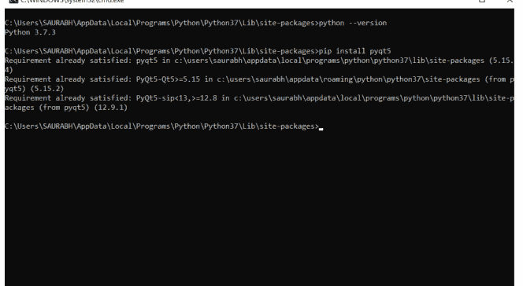

安装后，我们可以在Python site-packages文件夹下验证PyQt5的安装，如*图1.2*所示：

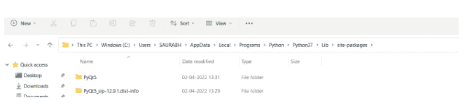

我们可以检查PyQt5中存在的一些模块。如果我们没有收到任何错误，那么我们可以再次交叉验证PyQt5是否成功安装，如*图1.3*所示：

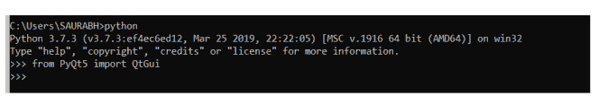

## 不使用类使用PyQt5创建第一个GUI表单

现在，我们将看到一个不使用类使用PyQt5创建基本UI表单的例子。这非常重要。正如你可能已经意识到的，我们将创建的大多数UI表单都将使用类和对象的概念。强烈建议你在继续本章之前了解类的概念。这在我们之前的书籍《使用Python的编程技术》和《Python入门》中有很好的解释。在这里，我们将只关注基本的UI表单创建。那么，事不宜迟，让我们开始吧。参考以下代码，可以在一些IDE如VSCode、Spyder、Anaconda等中检查：

```
import sys # L1

from PyQt5.QtWidgets import QWidget, QApplication # L2

myapp = QApplication(sys.argv) # L3

mywindow = QWidget() # L4

mywindow.show() # L5

sys.exit(myapp.exec_()) # L6
```

**输出：**
输出可以在下面的*图1.4*中看到：

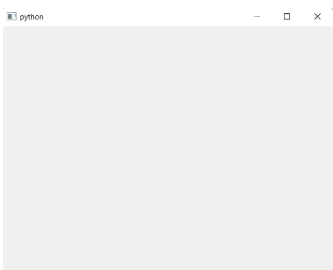

*图1.4：Chap1_Example1.py的输出*

> 注意：前面的代码包含在程序名称：Chap1_Example1.py中

你会惊讶地发现，通过编写几行代码，我们就可以创建我们的GUI表单，而且是完全功能的。现在让我们逐行解释这段代码。
在L1中，我们首先导入`sys`模块以访问命令行参数。

在L2中，我们从PyQt5包中创建桌面风格UI的类导入，即Qt Widgets。QWidget用于创建一个空的GUI，而QApplication不过是一个应用程序处理器。我们可以从上面的语句中看到，我们导入了用于创建GUI表单的模块。

在L3中，我们使用变量名myapp创建QApplication类的一个实例，即对象，并将命令行参数列表sys.argv传递给应用程序。当我们确定将通过shell启动或在界面自动化过程中传递命令行参数来控制Qt表单时，我们可以将其作为参数传递给QApplication类，否则我们可以传递一个空列表，如下所示：

```
myapp = QApplication([])
```

在L4中，我们使用变量名mywindow创建QWidget类的一个对象。这个QWidget类是Qt中所有用户界面对象的父类。通过不向QWidget类传递任何参数来创建顶级窗口。

在L5中，为了在创建QWidget类的对象后使小部件可见，我们必须使用对象调用show()方法。现在，你可能想知道如果我们不调用这个show方法会发生什么。由于运行应用程序后，没有办法关闭或退出它，将调用show()来简单地显示小部件。

在L6中，为了实现并行执行，PyQt5使用事件循环机制，因为它主要是用C++编写的，所以，为了启动事件循环机制，我们调用myapp.exec_()方法，该方法将由应用程序对象持有。有些人甚至会认为在某些地方，我们见过myapp.exec。这个exec在Python 2中是一个保留字。因此，为了避免与这个保留字的命名冲突，我们在PyQt5中使用exec_()。因此，当用户需要关闭GUI时，这个myapp.exec_()将允许控制权传递给Qt以终止应用程序。只需尝试使用Ctrl + C来终止应用程序，就像在我们的Python程序中所做的那样。你会发现应用程序不会被终止。现在，如果我们希望我们的代码优雅地返回而不是引发SystemExit异常，这个事件循环机制功能应该被包装在一个函数中，并且应该从我们打算使用sys.exit的地方返回。因此，任何可能抛出或发生的异常，必须使用以下语句干净地退出：

```
sys.exit(myapp.exec_())
```

你会想知道在上面的代码中，许多类以大写字母Q开头，以便与其他命名空间区分开来。

我们可以调整窗口大小，将其拖动到任何舒适的位置，最大化它或关闭它。只需确保不要使用以下内容，因为最好避免通配符导入：

```
from PyQt5.QtWidgets import *
```

一个需要观察的重要点是，GUI表单带有默认标题**Python**和默认大小。

现在，让我们在Python GUI表单中放入一些我们自己的标题文本：

```
import sys

from PyQt5.QtWidgets import QWidget, QApplication

myapp = QApplication(sys.argv)

mywindow = QWidget()

mywindow.setWindowTitle('Basic GUI Form') # BG1
```

```python
mywindow.show()
sys.exit(myapp.exec_())
```

## 输出：

输出结果可见于下图 *图 1.5*：

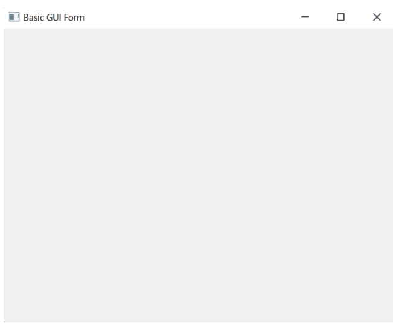

*图 1.5：Chap1_Example2.py 的输出*

> 注意：前面的代码包含在程序名称：Chap1_Example2.py 中

在 BG1 中，我们调用了 QWidget 对象的 `setWindowTitle()` 方法，并将参数传递为 **Basic GUI Form**。因此，我们可以看到我们的 GUI 窗体在左上角显示了我们想要的标题。其余代码与之前的程序相同。

现在，我们也可以指定 GUI 窗体的大小，即通过调用 resize 方法来指定宽度和高度，如下所示：

```python
import sys

from PyQt5.QtWidgets import QWidget, QApplication

myapp = QApplication(sys.argv)
mywindow = QWidget()
mywindow.setWindowTitle('Basic GUI Form')
mywindow.resize(400,350) # RS1
mywindow.show()
sys.exit(myapp.exec_())
```

## 输出：

输出结果可见于下图 *图 1.6*：

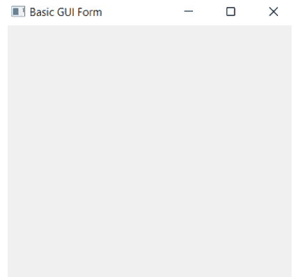

**图 1.6：** Chap1_Example3.py 的输出

**注意：** 前面的代码包含在程序名称：Chap1_Example3.py 中

在 RS1 中，我们使用 `QWidget` 对象调用了 `resize()` 方法，并将参数传递为 400 和 300。因此，这里我们将宽度设置为 400，高度设置为 300，从而设置了我们的 GUI 窗体。

因此，我们已经学习了在不使用类的情况下，使用 PyQt5 创建 GUI 窗体的基本结构。

现在，我们将学习类似的示例，其中会使用类和对象的概念。

# 使用类通过 PyQt5 创建 GUI 窗体

理解对象和类的概念非常重要。在我们进一步学习之前，一个程序可以用 **n** 种方式编写。最好的方法是以结构化的方式系统地编程，并尽可能使用最少的代码行数。让我们通过创建类的方法来学习相同的示例：

```python
import sys # CL1

from PyQt5.QtWidgets import QWidget, QApplication # CL2

class GUIWindow(QWidget):
    def __init__(self):
        super(GUIWindow, self).__init__() # CL6
        self.initializationUI() # CL7

    def initializationUI(self):
        self.show() # CL8

if __name__ == '__main__':
    myapp = QApplication(sys.argv) # CL3
    mywindow = GUIWindow() #CL4
    sys.exit(myapp.exec_()) # CL5
```

**输出：**
输出结果可见于下图 *图 1.7*：

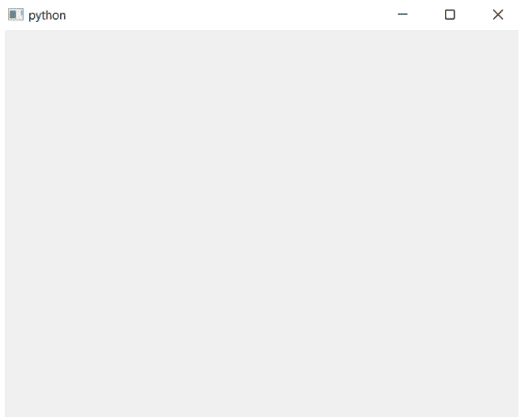

*图 1.7：Chap1_Example4.py 的输出*

> **注意：前面的代码包含在程序名称：Chap1_Example4.py 中**

CL1、CL2、CL3 和 CL5 的解释与代码 **Chap1_Example1.py** 中的 L1、L2、L3 和 L6 类似。

在 CL4 中，我们创建了用户定义类 GUIWindow 类的一个对象。我们可以看到 GUIWindow 类派生自父类 QWidget，空间和窗口直接或间接地从该类继承。此外，所有 UI 对象都将派生自这个 QWidget 类。

在 CL6 中，我们调用了父类 QWidget 的 __init__ 方法。换句话说，我们可以说创建了 QWidget 类的默认构造函数。

在 CL7 中，我们在 GUIWindow 类中创建了 initializationUI 方法。

在 CL8 中，在 initializationUI 方法内部，我们调用了 GUI Window 对象的 show 方法来显示：

```python
import sys # CL1

from PyQt5.QtWidgets import QWidget, QApplication # CL2

class GUIWindow(QWidget):
    def __init__(self):
        super(GUIWindow, self).__init__() # CL6
        self.initializationUI() # CL7

    def initializationUI(self):
        self.setWindowTitle("Basic GUI Form") #CL9
        self.show() # CL8

if __name__ == '__main__':
    myapp = QApplication(sys.argv) # CL3
    mywindow = GUIWindow() #CL4
    sys.exit(myapp.exec_()) # CL5
```

**输出：**
输出结果可见于下图 *图 1.8*：

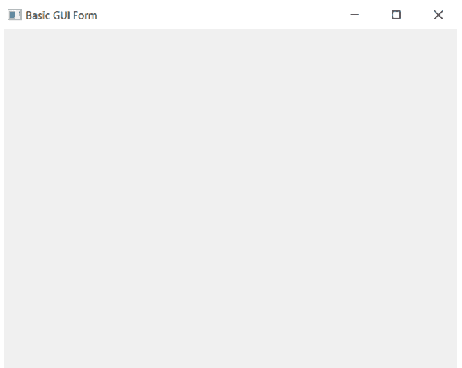

*图 1.8：Chap1_Example5.py 的输出*

> 注意：前面的代码包含在程序名称：Chap1_Example5.py 中

在上面的代码中，一切都与代码 **Chap1_Example4.py** 类似，只是在 CL9 中，我们在 GUI Window 对象上调用了 `setWindowTitle()` 方法，并将参数传递为 **Basic GUI Form**。这将把标题设置为 GUI 窗体左上角的文本，如下所示：

```python
import sys # CL1
from PyQt5.QtWidgets import QWidget, QApplication # CL2

class GUIWindow(QWidget):
    def __init__(self):
        super(GUIWindow, self).__init__() # CL6
        self.initializationUI() # CL7

    def initializationUI(self):
        self.setGeometry(300,300,400,300) # CL10
        self.setWindowTitle("Basic GUI Form") # CL9
        self.show() # CL8

if __name__ == '__main__':
    myapp = QApplication(sys.argv) # CL3
    mywindow = GUIWindow() #CL4
    sys.exit(myapp.exec_()) # CL5
```

**输出：**

输出结果可见于下图 *图 1.9*：

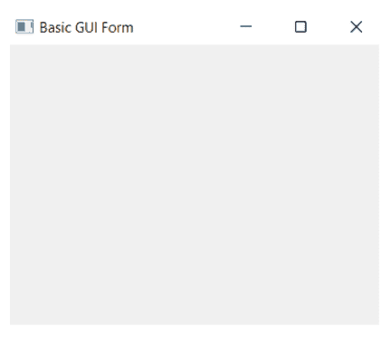

*图 1.9：Chap1_Example6.py 的输出*

> **注意：前面的代码包含在程序名称：Chap1_Example6.py 中**

在上面的代码中，一切都与代码 Chap1_Example5.py 类似，只是在 CL10 中，我们尝试通过设置四个参数来定义 PyQt5 GUI 窗体的几何形状：

```python
self.setGeometry(300,300,400,300) # self.setGeometry(x轴, y轴, 宽度, 高度)
```

第一个参数是 X 坐标，设置为 300。
第二个参数是 Y 坐标，设置为 300。
第三个参数是窗口宽度，设置为 400。
第四个参数是窗口高度，设置为 300。

因此，我们可以看到，借助类的使用，我们也可以创建一个 GUI 窗体，设置标题，定义几何形状，并整洁地退出窗体。

现在，我们已经编写了一些代码行来获得我们想要的结果。如果我们能使用一些用户界面设计工具来创建我们自己的 GUI 窗体，那会怎样呢？我们很幸运，我们可以使用 Qt Designer 等界面工具来创建我们迄今为止看到的相同 GUI 窗体。现在，我们将从这里开始学习使用 Qt Designer 工具创建的所有 GUI 窗体。

Qt Designer 是将你的想象力转化为工作产品的最便捷工具之一，它通过使用现有的 Qt Widgets 构建 GUI 窗体来实现。在本书中，我们将介绍 Qt Designer 小部件及其界面的创建和使用，以创建新设计的 UI 窗体。我们将研究信号和槽的概念、拖放界面、信号的自定义、对话框、窗口等等。有关 Qt Designer 的更多文档和其他见解，你可以通过以下链接访问官方网站：
https://doc.qt.io/qt-6/qt-intro.html

# 安装带有预定义模板的 Qt Designer

到目前为止，我们已经看到，对于任何我们想要安装的包，我们将使用 `pip` 命令。但是 Qt Designer 不能像这样使用 `pip` 命令安装到你的系统中：`pip install pyQt Designer`。因此，你可以从 sourceforge 下载它，或者使用 `pip install pyqt5-tools` 安装它。

之后，从以下路径运行设计器：
`C:\Users\%USERNAME%\AppData\Local\Programs\Python\Python37\Lib\site-packages\pyqt5-tools\designer\designer.exe`。

启动 Qt Designer 应用程序，执行后，将向用户显示如 *图 1.10* 所示的 GUI 窗口。在这里，我们可以根据需要创建自己的 GUI 窗体：

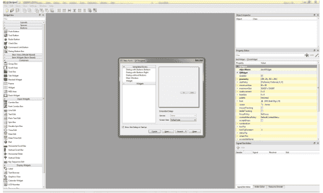

让我们看看 Qt Designer 的一些见解。从 *图 1.10* 中，我们可以看到有一个标题为 **New Form** 的打开对话框，在启动设计器时提示用户选择任何模板/窗体或小部件。小部件选择如 *图 1.11* 所示：

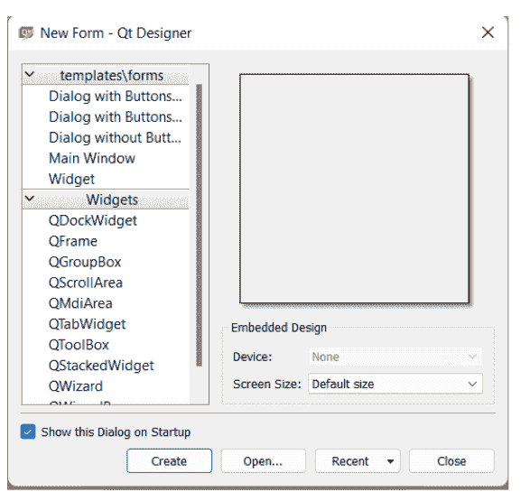

图 1.11：带有小部件的 Qt Designer 主窗口窗体

Qt Designer 中存在的预定义模板如下：

- **Dialog with Buttons Bottom：** 使用此模板，将创建一个 GUI 窗体，其中包含两个按钮，即 **OK** 和 **Cancel**，位于右下角位置，如 *图 1.12* 所示。存在的小部件是 **QDialogButtonBox**。

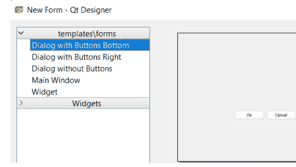

图 1.12："Dialog with Buttons Bottom" 模板

- **Dialog with Buttons Right：** 使用此模板，将创建一个 GUI 窗体，其中包含两个按钮，即 **OK** 和 **Cancel**，位于右上角位置，如下图 *图 1.13* 所示。存在的小部件是 **QDialogButtonBox**：
```

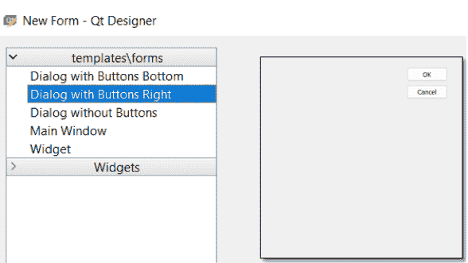

*图 1.13：“右侧带按钮的对话框”模板*

- **无按钮对话框**：使用此模板，将创建一个空的 GUI 表单，其超类为 QDialog，用户可以在其中放置控件并根据自身需求创建应用程序。
- **主窗口**：使用此模板，将创建主应用程序 GUI 表单，其超类为 QMainWindow，并为用户提供了菜单栏和工具栏。用户可以根据需要使用或删除它们。
- **控件**：使用此模板，将创建一个空的 GUI 表单，其超类为 QWidget。

这些 QDialog、QMainWindow 和 QWidget 类各有其重要性。
假设需要通过选择 **对话框** 模板来创建一个 GUI 表单。在这种情况下，所有使用的控件都将继承自超类 QDialog。
假设需要通过选择 **主窗口** 模板来创建一个 GUI 表单。那么，所有使用的控件都将继承自超类 QMainWindow。
假设需要通过选择 **控件** 模板来创建一个 GUI 表单。这里，所有使用的控件都将继承自超类 QWidget。
此外，屏幕尺寸被选择为 **默认尺寸**，如 *图 1.14* 所示。我们可以从组合框中列出的项目中选择屏幕尺寸：

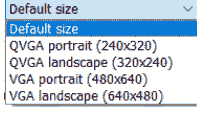

*图 1.14：屏幕尺寸选择*

## Qt Designer 的组件

我们现在将简要了解 Qt Designer 内部的所有组件。*图 1.15* 中每个箭头标记处都有一些数字。我们将逐一讨论它们：

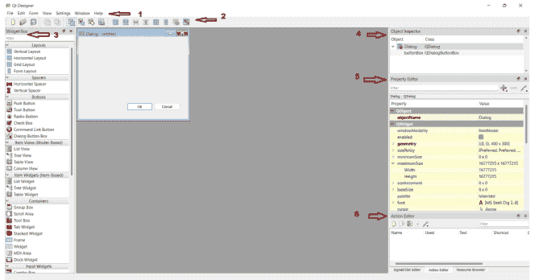

**图 1.15：** Qt Designer 工具

以下是不同数字标记的组件：

1. **菜单栏：** 我们在顶部注意到的第一件事就是 Qt Designer 用于 GUI 管理的菜单栏。它包含 **文件**、**编辑**、**窗体视图**、**设置**、**窗口** 和 **帮助** 选项，用于与用户交互。
2. **工具栏：** 我们可以使用菜单栏管理的内容也可以使用工具栏来复制。图标代替文本放置以供用户交互。它为最常用的功能提供了快捷图标。在此 Qt Designer 工具栏中，有 **编辑控件**、**编辑信号/槽**、**编辑伙伴** 和 **编辑 Tab 键顺序** 等选项。我们将通过一些示例演示来使用所有这些功能。
3. **控件箱：** 这是 Qt Designer 最重要的区域之一。它位于 Qt Designer 窗口的左侧。有一个控件和布局的列表，提供了创建出色 GUI 表单的灵活性，你可以通过拖放将其放置到 GUI 的任何位置。我们将详细研究所有这些控件和布局。
4. **对象查看器 (OI)：** OI 位于 Qt Designer 窗口的右侧，它以层次结构方式显示表单中使用的对象列表及其布局显示。
5. **属性编辑器：** 在 OI 下方，有一个属性编辑器停靠控件。在此停靠控件中，我们可以根据需要更改控件、布局或窗口的属性。
6. **动作编辑器：** 在属性编辑器下方，有信号/槽编辑器、动作编辑器和资源浏览器：
    a. 在 **信号/槽编辑器** 中，可以根据需要创建、删除或编辑对象之间的信号和槽。需要注意的是，在使用控件时，无法进行完全配置，因为它需要用户进行一定量的编码才能获得最终结果。
    b. 在 **动作编辑器** 中，我们可以创建新动作和删除动作。此外，*已使用* 列有一个可复选选项，我们可以在“**文本列**”下输入文本，在“**快捷键列**”下提供快捷键，在“**可复选列**”下使其可复选，以及在“**提示列**”下提供工具提示。此动作编辑器将允许我们处理动作。
    c. 当需要管理应用程序中的资源（如图像、图标、翻译文件和任何二进制文件）时，我们将使用 **资源浏览器。** 我们将通过示例来学习这个。

## 用户凭证应用演示

最后，让我们看看 Qt Designer 的第一个示例。我们将创建一个用户凭证应用程序，其中将提示用户输入用户名和密码。如果两者匹配，我们将显示一些消息。这个示例非常重要，需要理解，因为首先，我们将通过简单的拖放来显示它们，**不使用布局和间隔符的概念**。然后我们将学习布局和间隔符的概念。请参考以下 *图 1.16*：

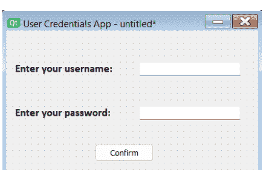

*图 1.16：未使用布局和间隔符的用户凭证应用*

创建用户凭证应用的步骤如下：

1. 我们已选择新模板为 **控件** 来创建用户凭证应用 GUI 表单。
2. 首先，从显示控件停靠区拖动 2 个 **标签** 控件并将其放到 GUI 表单上。我们正在更改这些 **标签** 控件的一些属性。首先是 **text** 属性，我们已分别将其文本更改为 **请输入您的用户名：** 和 **请输入您的密码：**。接下来，我们更改了 **font** 属性。此外，我们还使用 **objectName** 属性将它们的对象名称更改为 **mylbl_username** 和 **mylbl_password**。
3. 然后，从控件箱拖动 2 个 **行编辑** 控件并将其放到 GUI 表单上。使用 **objectName** 属性，它们的名称已更改为 **lineEdit_username** 和 **lineEdit_password**。
4. 最后，将一个 **按钮** 控件拖入 GUI 表单，并使用其 **text** 属性将其文本更改为 **确认**。然后，使用 **objectName** 属性，其名称已更改为 **mybtn_confirm**。
5. 现在，我们将此 GUI 表单保存为 "user_credential_app.ui"。这个 .ui 文件实际上是一个 XML 文件，它描述了表单信息，即控件、布局等。简单来说，我们可以理解 Qt Designer 独立于任何编程语言，它不会生成任何编程语言的代码，而是生成基于 XML 的 .ui 文件，因为它易于理解。

**user_credential_app.ui** 文件内的数据内容如下：

```xml
<?xml version="1.0" encoding="UTF-8"?>
<ui version="4.0">
 <class>Form</class>
 <widget class="QWidget" name="Form">
    <property name="geometry">
        <rect>
            <x>0</x>
            <y>0</y>
            <width>398</width>
            <height>229</height>
        </rect>
    </property>
    <property name="windowTitle">
        <string>User Credentials App</string>
    </property>
    <widget class="QLabel" name="mylbl_username">
        <property name="geometry">
            <rect>
                <x>14</x>
                <y>50</y>
                <width>161</width>
                <height>20</height>
            </rect>
        </property>
        <property name="font">
            <font>
                <family>Calibri</family>
                <pointsize>10</pointsize>
                <weight>75</weight>
                <bold>true</bold>
            </font>
        </property>
        <property name="text">
            <string>Enter your username:</string>
        </property>
    </widget>
    <widget class="QLabel" name="mylbl_password">
        <property name="geometry">
            <rect>
                <x>14</x>
                <y>120</y>
                <width>161</width>
                <height>20</height>
            </rect>
        </property>
        <property name="font">
            <font>
                <family>Calibri</family>
                <pointsize>10</pointsize>
                <weight>75</weight>
                <bold>true</bold>
            </font>
        </property>
        <property name="text">
            <string>Enter your password:</string>
        </property>
    </widget>
    <widget class="QPushButton" name="mybtn_confirm">
        <property name="geometry">
            <rect>
                <x>140</x>
                <y>180</y>
                <width>93</width>
                <height>28</height>
            </rect>
        </property>
        <property name="text">
            <string>Confirm</string>
        </property>
    </widget>
    <widget class="QLineEdit" name="lineEdit_username">
```

## 6. 我们的下一个任务是借助命令行工具 `pyuic5`，将这个基于 XML 的 `.ui` 文件转换为 Python 脚本。这是一个开发工具，用于将 Qt Designer 的 `.ui` 文件转换为 Python 的 `.py` 文件。一个优点是它与 PyQt5 绑定在一起。因此，我们打开命令提示符窗口，导航到保存此 "user_credential_app.ui" 文件的文件夹，该文件保存在文件夹 "E:\my_pythonbook\PyQt5\Chapter_1\User Credential app" 中，如下图 1.17 所示：

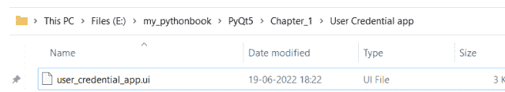

因此，在打开命令窗口并导航到该文件夹后，我们输入以下命令：

```
pyuic5 user_credential_app.ui -o user_credential_app.py
```

这在下图 1.18 中进行了说明：

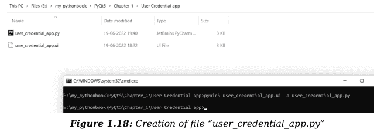

执行上述命令后，我们可以从图 1.18 中看到，`user_credential_app.py` 文件已被创建，该文件中的 Python 代码如下：

```python
# -*- coding: utf-8 -*-
# Form implementation generated from reading ui file 'user_credential_app.ui'
#
# Created by: PyQt5 UI code generator 5.15.4
#
# WARNING: Any manual changes made to this file will be lost when pyuic5 is
# run again.  Do not edit this file unless you know what you are doing.
from PyQt5 import QtCore, QtGui, QtWidgets

class Ui_Form(object):
    def setupUi(self, Form):
        Form.setObjectName("Form")
        Form.resize(398, 229)
        self.mylbl_username = QtWidgets.QLabel(Form)
        self.mylbl_username.setGeometry(QtCore.QRect(14, 50, 161, 20))
        font = QtGui.QFont()
        font.setFamily("Calibri")
        font.setPointSize(10)
        font.setBold(True)
        font.setWeight(75)
        self.mylbl_username.setFont(font)
        self.mylbl_username.setObjectName("mylbl_username")
        self.mylbl_password = QtWidgets.QLabel(Form)
        self.mylbl_password.setGeometry(QtCore.QRect(14, 120, 161, 20))
        font = QtGui.QFont()
        font.setFamily("Calibri")
        font.setPointSize(10)
        font.setBold(True)
        font.setWeight(75)
        self.mylbl_password.setFont(font)
        self.mylbl_password.setObjectName("mylbl_password")
        self.mybtn_confirm = QtWidgets.QPushButton(Form)
        self.mybtn_confirm.setGeometry(QtCore.QRect(140, 180, 93, 28))
        self.mybtn_confirm.setObjectName("mybtn_confirm")
        self.lineEdit_username = QtWidgets.QLineEdit(Form)
        self.lineEdit_username.setGeometry(QtCore.QRect(210, 50, 161, 22))
        self.lineEdit_username.setObjectName("lineEdit_username")
        self.lineEdit_password = QtWidgets.QLineEdit(Form)
        self.lineEdit_password.setGeometry(QtCore.QRect(210, 120, 161, 22))
        self.lineEdit_password.setObjectName("lineEdit_password")

        self.retranslateUi(Form)
        QtCore.QMetaObject.connectSlotsByName(Form)

    def retranslateUi(self, Form):
        _translate = QtCore.QCoreApplication.translate
        Form.setWindowTitle(_translate("Form", "User Credentials App"))
        self.mylbl_username.setText(_translate("Form", "Enter your username"))
        self.mylbl_password.setText(_translate("Form", "Enter your password"))
        self.mybtn_confirm.setText(_translate("Form", "Confirm"))
```

注意：前面的代码包含在程序名称：User Credential App/user_credential_app.py 中。

因此，在这里我们可以将 `.ui` 文件转换为 `.py` 文件。我们在此运行的 `pyuic5` 命令中的 `-o` 代表 `--output`，即将生成的 Python 代码写入 `user_credential_app.py` 文件。

> 注意：由于这是我们第一次查看 `.ui` 和 Python 脚本代码 `.py` 文件，我们已经学习了整个过程。从下次开始，每当我们创建任何应用程序表单时，你将在源代码包中找到 `.ui` 和 `.py` 文件。我们将只通过创建一个新的 Python 文件来显示实际的使用代码，我们很快将通过使用上述自动生成的代码 `.py` 文件来学习它。

将 `.ui` 文件转换为 `.py` 文件后，需要注意的最重要的一点是**不能手动修改生成的 Python 代码**。这是因为任何修改都会在下次使用 `pyuic5` 命令从 `.ui` 文件创建 `.py` 文件时被覆盖。

## 7. 现在是时候创建一个名为 `run_user_credential_app.py` 的新 Python 文件了。在这里，我们将导入 `user_credential_app.py` 文件并编写一些代码，使得当用户名和密码匹配/不匹配时，将向用户显示一些消息。请参考以下代码：

```python
import sys
from PyQt5.QtWidgets import QWidget, QApplication, QMessageBox # RUCA1
from user_credential_app import * # RUCA2

class MyWidget(QWidget):
    def __init__(self):
        super(MyWidget, self).__init__()
        self.myui = Ui_Form() # RUCA3
        self.myui.setupUi(self) # RUCA4
        self.myui.mybtn_confirm.clicked.connect(self.myuser_credentials_check)
        self.show() # RUCA6

    def myuser_credentials_check(self):
        if(self.myui.lineEdit_username.text() == ""): # RUCA7
            QMessageBox.information(self, "Enter Username", "Username cannot be empty")
            return

        if(self.myui.lineEdit_username.text() != "" and self.myui.lineEdit_password.text() == ""):
            QMessageBox.information(self, "Enter Password", "Password cannot be empty")
            return

        if(self.myui.lineEdit_username.text() == self.myui.lineEdit_password.text()):
            QMessageBox.information(self, "Credentials check", "Welcome", QMessageBox.Ok)
        else:
            QMessageBox.information(self, "Credentials check", "Invalid Credentials", QMessageBox.Ok)

if __name__ == '__main__':
    myapp = QApplication(sys.argv) # RUCA10
    mywindow = MyWidget() # RUCA11
    sys.exit(myapp.exec_()) # RUCA12
```

> 注意：前面的代码包含在程序名称：User Credential App/run_user_credential_app.py 中。

现在让我们理解源代码的解释。

在 RUCA1 中，在导入 `sys` 模块以访问命令行参数之后，我们从 PyQt5 包中创建桌面风格 UI 的类 `QtWidgets` 导入。`QWidget` 用于创建一个空的 GUI 和一个应用程序处理器，即 `QApplication`。除此之外，我们还导入了一个用于创建对话框的小部件，即 `QMessageBox`。我们稍后将学习这个。供您参考，我们现在向用户显示一个带有某些信息文本的弹出窗口。

我们创建了一个新的 Python 文件 `run_user_credential_app.py` 来利用 `Ui_Form` 类，该类是使用 `pyuic5` 命令从 Qt Designer `.ui` 文件创建的。在这里，`MyWidget` 类将继承自 `Ui_Form` 类。因此在 RUCA2 中，我们从 `user_credential_app` Python 文件导入模块的所有成员。

在 RUCA3 中，我们创建了 `Ui_Form` 类的一个实例。

为了表示 UI 中小部件的组织，`Ui_Form` 类的 `setupUi` 方法在父小部件 `Form` 上构建了一个小部件树。这个生成的类包含一个名为 `setupUi` 的方法，该方法根据 `.ui` 文件中的数据配置小部件和布局。当 Python 代码运行时，顶层小部件类的实例会收到对 `setupUi` 方法的调用，该方法初始化所有小部件并根据 `.ui` 文件中的数据配置布局。应用程序的图形用户界面本质上就是使用此方法创建的。还有一个 `retranslateUi` 方法用于翻译界面，即处理多语言支持逻辑，关于文本如何在 GUI 中显示。在 RUCA4 中，我们传递了一个位置参数 `self`。

在 RUCA5 中，我们使用了信号和槽的概念。在这里，当 `mybtn_confirm` 按钮被点击时（点击事件 | 信号），`myuser_credentials_check` 方法（槽）将被调用。我们将在本书后面详细研究信号和槽。现在只需理解概念的流程。

在 RUCA6 中，我们通过调用对象的 `show()` 方法来显示小部件。

现在，让我们看看我们在 `myuser_credentials_check` 方法内部到底做了什么，这是 `mybtn_confirm` 按钮的事件处理。

在 RUCA7 中，我们首先检查 `lineEdit_username` 中的文本是否为空。如果为空，则在单击“确认”按钮时，在新窗口中显示一条消息“用户名不能为空”作为信息文本，如下图 1.19 所示：

## 第2章
深入了解布局管理

## 简介

任何应用程序都可以通过简单地从Qt Designer的部件箱中拖放部件到我们的GUI表单上来创建。当我们在同一个GUI表单上使用多个部件并创建应用程序时，它可能看起来不错。我们可以将部件放置在GUI表单上的任何位置，而无需考虑它们的外观。然而，如果我们没有将部件放置在GUI表单上的合适位置，或者部件的排列方式不当，它可能看起来会很简陋。这种排列方式引出了布局管理的概念；这是一种在我们的GUI表单上放置部件的方法。所有专业的GUI应用程序表单创建都使用布局管理器的概念，因为对于用户来说，创建一个外观良好的应用程序非常重要。如果我们想要组织我们的部件，首选方法是使用布局管理器来管理布局。因此，每当需要在GUI表单上排列部件时，我们将使用布局管理器类内部提供的方法。父子部件之间的空间可以在GUI表单中得到合理利用，并且对于它们之间的通信很有用。

让我们开始学习PyQt5中布局管理的不同方法。我们将创建相同的应用程序用户凭证应用程序（*仅外观*），但这次将使用布局的概念。

## 结构

在本章中，我们将学习以下主题：

- 使用绝对定位放置部件
- 使用布局类放置部件
  - QHBoxLayout
    - QHBoxLayout
    - QVBoxLayout
  - QGridLayout
    - 基本的QGridLayout
    - QGridLayout Span
    - QGridLayout Stretch
  - QFormLayout

## 目标

学习本章后，读者将了解使用绝对定位方法放置部件。然后，我们将看到使用布局类放置部件，首先学习如何使用**QBoxLayout**类将部件水平或垂直组织。我们还将探索如何使用**QHBoxLayout**以及**addStretch**、**addWidget**、**addLayout**等方法将部件排成一行，并排放置。或者，我们还将研究使用**QVBoxLayout**和**addStretch**方法垂直排列部件。接着，我们将研究使用**QGridLayout**将部件排列成行和列的网格。最后，我们将研究使用**QFormLayout**创建应用程序。最终，我们可以自信地使用绝对定位、**QBoxLayout**、**QGridLayout**和**QFormLayout**类创建“用户凭证应用程序”。

**图1.19：** *当用户名为空时*

点击**ok**按钮后，控制权将返回。新窗口上的此消息是由于QMessageBox部件实现的。

在RUCA8中，我们检查`lineEdit_password`中的文本是否为空。这表明`lineEdit_username`不为空。如果`lineEdit_password`为空，那么在点击**Confirm**按钮时，新窗口中将显示**密码不能为空！**作为信息文本，如*图1.20*所示：

**图1.20：** *当密码为空时*

我们可以看到`lineEdit_username`部件中写入了文本`hello`。点击**ok**按钮后，控制权将返回。

在RUCA9中，我们检查`lineEdit_username`和`lineEdit_password`的文本是否匹配。如果匹配，那么**欢迎**消息文本将弹出在新窗口中，如*图1.21*所示：

**图1.21：** *当用户名和密码匹配时*

如果文本不匹配，那么**凭证不匹配**消息将弹出在新窗口中，如*图1.22*所示：

**图1.22：** *当用户名和密码不匹配时*

在*RUCA10*中，我们使用变量名`myapp`创建`QApplication`类的实例（即对象），并将命令行参数列表`sys.argv`传递给应用程序。

在*RUCA11*中，我们使用变量名`mywindow`创建`MyWidget`类的对象。

在*RUCA12*中，为了启动事件循环机制，我们调用`myapp.exec_()`方法，该方法将由应用程序对象持有。如果我们希望代码优雅地返回而不引发`SystemExit`异常，此事件循环机制功能应包装在一个函数中，并应从我们打算使用`sys.exit`的地方返回。因此，任何抛出或可能发生的异常都必须使用以下语句干净地退出

```
sys.exit(myapp.exec_())
```

> 注意：请注意，从RUCA10到RUCA12，对于我们接下来将讨论的几乎所有示例，解释都是相同的。您能找到的唯一变化是，对于创建不同类的对象，mywindow对象名称将是相同的，我们将在所有这些示例中创建这些对象。

我们可以看到，我们创建了一个用户凭证应用程序，而没有使用任何布局管理，即没有在我们的UI表单中排列任何部件。现在，在下一章中，我们将学习如何使用布局管理创建相同的应用程序。

## 结论

在本章中，我们学习了PyQt5和tkinter库之间的区别。我们学习了PyQt5框架的安装，以及使用PyQt5创建基本GUI表单，首先不使用类，然后使用类。我们看到了Qt Designer内部的各种组件，以及不同的预定义模板。我们首先通过关注Qt Designer中的视图（.ui文件）创建了一个用户凭证应用程序，然后使用`pyuic5`命令将其转换为Python代码（.py）。最后，编写了一个新的Python文件，首先导入用于用户界面设计的Python代码，并在其中构建了一些有用的逻辑，以便在运行时为用户设计一个基本的登录应用程序。

在下一章中，我们将学习布局管理，这是在GUI上组织部件的过程。我们将学习子部件将如何在任何父部件或容器部件内排列。我们将研究一些常用的布局管理器，包括`QVBoxLayout`、`QHBoxLayout`、`QGridLayout`和`QFormLayout`。

## 要点回顾

- PyQt5中的Qt5代表Qt版本5，它为我们提供了Python与Qt C++工具包绑定的优势。
- 安装pyqt5的简单命令：`pip install pyqt5`
- 当用户需要关闭GUI时，`myapp.exec_()`将允许控制权传递给Qt以终止应用程序。
- 如果我们希望代码无错误地返回而不引发`SystemExit`异常，事件循环机制功能应包装在一个函数中，并应从我们打算使用`sys.exit`的地方返回。
- 在Qt Designer中使用一些预定义模板，并将其保存为`.ui`文件。
- 将`.ui`文件（XML文件）转换为`.py`文件的命令是：`pyuic5 user_credential_app.ui -o user_credential_app.py`
- 通过导入从`.ui`文件转换而来的用于用户界面设计的`.py`文件，在新生成的Python文件（.py）中根据需要创建一些逻辑。

## 问题

1. 解释PyQt5 GUI工具包和tkinter库之间的区别。在创建GUI应用程序时，您应该选择哪个库？
2. 写出在您的系统中安装PyQt5的命令。
3. 解释基本的GUI表单创建，包括使用和不使用类概念。
4. Qt Designer中存在哪些不同的预定义模板？
5. 解释Qt Designer的组件。
6. 将Qt Designer `.ui`文件转换为Python `.py`文件的命令是什么？
7. 在Qt Designer中设计一个用户凭证应用程序，将其转换为Python代码，然后通过检查其凭证编写一个功能性的Python代码。

## 加入我们的书籍Discord空间

加入书籍的Discord工作区，获取最新更新、优惠、全球科技动态、新书发布以及与作者的交流会：
https://discord.bpbonline.com

## 使用绝对定位放置控件

在不使用布局管理器的情况下，我们将在GUI表单中学习的第一种创建布局的方法是使用绝对定位。我们可以通过为每个控件显式指定以像素为单位的大小或位置值，将控件放置在GUI表单中的任何位置。它主要用于需要调整控件大小值并设置其位置，且这些控件必须容纳在其他控件内部的应用程序中。借助`move(x,y)`方法，可以使用绝对定位方法在GUI表单中定位控件。

这里，x和y将是各自控件的坐标，从左上角(0,0)开始，如下图*图2.1*所示：

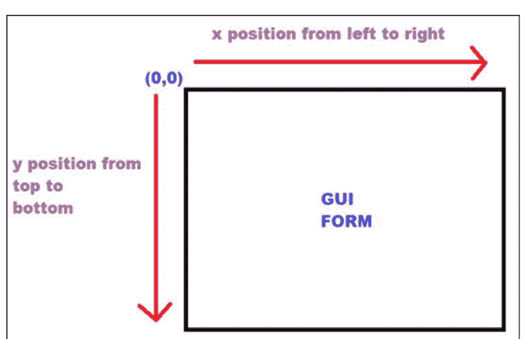

从*图2.1*中，我们可以看到x位置从左到右增加，y位置从上到下增加。

现在，我们将使用绝对定位创建与`run_user_credential_app.py`类似的GUI表单。

观察以下代码：

```python
import sys
from PyQt5.QtWidgets import QWidget, QApplication,
QLabel, QLineEdit, QPushButton # RAP1
from PyQt5 import QtGui

class Absolute_Position(QWidget): # RAP2
    def __init__(self):
        super().__init__()
        self.display_widgets() # RAP3
        self.setGeometry(0, 0, 398, 229)  # RAP4
        self.setWindowTitle('User Credentials App') # RAP5
        self.show()

    def display_widgets(self):
        mylbl1 = QLabel('Enter your username:', self) # RAP6
        myfont = QtGui.QFont()  # RAP7
        myfont.setFamily("Calibri")
        myfont.setPointSize(10)
        myfont.setBold(True)
        myfont.setWeight(75)
        mylbl1.setFont(myfont)
        mylbl1.move(14, 50)  # RAP8

        mylbl2 = QLabel('Enter your password:', self) # RAP9
        myfont = QtGui.QFont() # RAP10
        myfont.setFamily("Calibri")
        myfont.setPointSize(10)
        myfont.setBold(True)
        myfont.setWeight(75)
        mylbl2.setFont(myfont)
        mylbl2.move(14, 120) # RAP11

        mylineedit1 = QLineEdit(self) # RAP12
        mylineedit1.move(210, 50) # RAP13

        mylineedit2 = QLineEdit(self) # RAP14
        mylineedit2.move(210, 120) # RAP15

        mybtn = QPushButton(self) # RAP16
        mybtn.setText('Confirm') # RAP17
        mybtn.move(140, 180) # RAP18

if __name__ == '__main__':
    myapp = QApplication(sys.argv)
    mywindow = Absolute_Position()
    sys.exit(myapp.exec_())
```

## 输出：

输出结果可以在下图[图2.2](Figure 2.2)中看到：

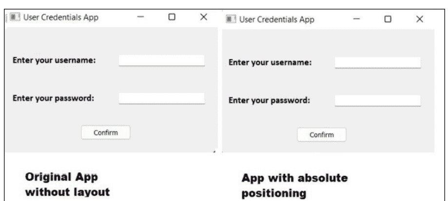

**图2.2：** *Chap2_Example1.py的输出*

> **注意：** 上述代码包含在程序名称：Chap2_Example1.py中

与原始用户凭证应用程序（参考[图2.2](#figure-22)）相比，我们可以看到原始代码与我们使用绝对定位编写的代码几乎没有区别。现在，让我们来理解这段代码。

- 在RAP1中，首先导入sys模块以访问命令行参数。然后，我们将从PyQt5包中创建桌面风格UI的类，即QtWidgets中导入，用于创建一个空的GUI和一个应用程序处理器，即QApplication。此外，我们还导入了其他控件，如QLabel、QLineEdit和QPushButton。
- 在RAP2中，我们创建了一个名为Absolute_Position的类，它继承自基类QWidget。
- 在RAP3中，我们调用了QWidget类内部的display_widgets方法。
- 在RAP4中，我们在屏幕上位置(0,0)处显示一个398（宽）乘229（高）像素的GUI表单。通过更改当前设置为(0,0)的xpos和ypos，可以在屏幕上的任何位置显示它。
- 在RAP5中，我们设置GUI表单（即窗口）的标题为*User Credentials App*。
- 在RAP6中，我们创建了一个QLabel对象`mylbl1`，用于在我们的GUI表单中使用，并传递文本**Enter your username:**和**self**作为参数，其默认显示位置在左上角。
- 在RAP7中，我们创建了一个`QFont`类的实例，并将QLabel对象`mylbl1`的字体家族设置为Calibri，字体大小设置为10，字体粗细设置为粗体。为了精细控制粗细，我们将weight设置为75。
- 在RAP8中，QLabel对象`mylbl1`被放置在距离(0,0)向右14像素、向下50像素的位置。
- 在RAP9中，我们创建了一个QLabel对象`mylbl2`，用于在我们的GUI表单中使用，并传递文本**Enter your password:**和self作为参数。
- 在RAP10中，我们创建了一个`QFont`类的实例，并将QLabel对象`mylbl2`的字体家族设置为Calibri，字体大小设置为10，字体粗细设置为粗体。为了精细控制粗细，我们将weight设置为75。
- 在RAP11中，QLabel对象`mylbl2`被放置在距离(0,0)向右14像素、向下120像素的位置。
- 在RAP12中，我们创建了一个QLineEdit对象`mylineedit1`，其默认显示位置在左上角。
- 在RAP13中，QLineEdit对象`mylineedit1`被放置在距离(0,0)向右210像素、向下50像素的位置。
- 在RAP14中，我们创建了一个QLineEdit对象`mylineedit2`，其默认显示位置在左上角。
- 在RAP15中，QLineEdit对象`mylineedit2`被放置在距离(0,0)向右210像素、向下120像素的位置。
- 在RAP16中，我们创建了一个QPushButton对象`mybtn`的实例，其默认显示位置在左上角，并传递一个参数self，表示该按钮是GUI表单的一部分。
- 在RAP17中，QPushButton对象mybtn的文本被设置为Confirm，并将显示在GUI表单上。
- 在RAP18中，QPushButton对象mybtn被放置在距离(0,0)向右140像素、向下180像素的位置。

绝对定位非常简单，但也有一些局限性，例如：

- 即使调整GUI表单的大小，控件的大小和位置也不会改变。参考图2.3：

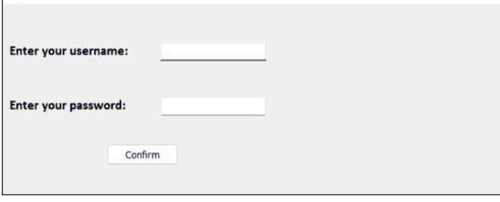

**图2.3：** *调整大小后控件位置保持不变*

从图2.3中，我们可以看到即使调整了GUI表单的大小，控件的大小和位置仍然相同。

- 如果我们使用绝对定位创建任何应用程序，布局在不同平台上可能会有所不同。
- 在某些情况下，可能需要重新设计表单。在这种情况下，布局修改将是繁琐且耗时的。

读者在了解使用布局类放置控件之前，应该理解绝对定位的概念。

## 使用布局类放置控件

PyQt5的API提供了一种更优雅的控件定位方式，即提供布局类，我们将在后续章节中学习。

## QBoxLayout

假设在我们的应用程序中，需要将控件水平或垂直地组织或排列。在这种情况下，我们将使用**QBoxLayout**类。用于水平或垂直排列控件的两个基本布局管理类是**QHBoxLayout**和**QVBoxLayout**。首先，我们将看到使用**QHBoxLayout**将控件排列成一行、并排显示的代码，其中使用了**addStretch**、**addWidget**、**addLayout**等方法。

## QHBoxLayout

在本节中，我们将看到使用**QHBoxLayout**将控件排列成一行、并排显示的代码，不使用**addstretch**。

### 不使用addstretch的QHBoxLayout

观察以下代码：

```python
import sys

from PyQt5.QtWidgets import QWidget, QApplication,
QLabel, QHBoxLayout, QDesktopWidget # QHBEG1

from PyQt5 import QtGui

class HBox_without_stretch(QWidget):
    def __init__(self):
        super().__init__()
        self.display_widgets()
        self.setGeometry(0, 0, 398, 229)
        self.setWindowTitle('QHBoxLayout without stretch')# QHBEG2
        self.movecenter()
        self.show()

    def display_widgets(self):
        mylbl1 = QLabel('Label1:', self)
        myfont = QtGui.QFont()
        myfont.setFamily("Calibri")
        myfont.setPointSize(10)
        myfont.setBold(True)
        myfont.setWeight(75)
        mylbl1.setFont(myfont)

        mylbl2 = QLabel('Label2', self)
        myfont = QtGui.QFont()
        myfont.setFamily("Calibri")
        myfont.setPointSize(10)
        myfont.setBold(True)
        myfont.setWeight(75)
        mylbl2.setFont(myfont)
        # QHBoxlayout
        myhbox = QHBoxLayout()# QHBEG7
        myhbox.addWidget(mylbl1)# QHBEG8
        myhbox.addWidget(mylbl2)# QHBEG9
        self.setLayout(myhbox)# QHBEG10
```

def movecenter(self):
    myfrm_gmtry = self.frameGeometry()
    mycenter = QDesktopWidget().availableGeometry().center()
    myfrm_gmtry.moveCenter(mycenter)
    self.move(myfrm_gmtry.topLeft())

if __name__ == '__main__':
    myapp = QApplication(sys.argv)
    mywindow = HBox_without_stretch()
    sys.exit(myapp.exec_())

**输出：**
输出结果可见于下图*图 2.4*：

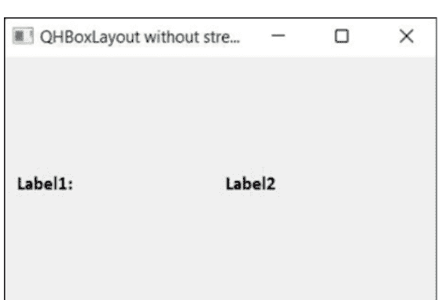

*图 2.4：Chap2_Example2.py 的输出*

> **注意：前面的代码包含在程序名称：Chap2_Example2.py 中**

前面的示例描述了**QHBoxLayout**的示例，其中使用了**addWidget**和**setLayout**方法。这里，我们没有使用**addStretch()**方法。在上面的示例中，我们创建了两个Label小部件并将它们水平排列。此外，还调用了一个方法，将GUI窗体放置在屏幕中央。

让我们学习这些新概念：

- 在**QHBEG1**中，首先导入sys模块以访问命令行参数。然后，我们将从PyQt5包中创建桌面风格UI的类中导入，即**QtWidgets**，用于创建一个空的GUI和一个应用程序处理器，即**QApplication**。除此之外，我们还导入了其他小部件，如**QLabel**、**QHBoxLayout**和**QDesktopWidget**。
- 在**QHBEG2**中，我们正在设置GUI窗体（即窗口）的标题为“QHBoxLayout without stretch”。
- 从**QHBEG3**到**QHBEG6**，我们正在将GUI窗体显示在屏幕中央。
- 在**QHBEG3**中，我们尝试使用**frameGeometry**方法获取GUI窗体的位置和大小信息，这些信息存储在**myfrm_gmtry**对象中。
- 在**QHBEG4**中，正在确定显示器屏幕的中心位置。
- 在**QHBEG5**中，GUI窗体的矩形位置被移动到屏幕中心。
- 在**QHBEG6**中，当前的GUI窗体将移动到已移至屏幕中心的矩形位置（**myfrm_gmtry**），从而使当前GUI窗体的中心与屏幕中心匹配，这样GUI窗体就会出现在中心位置。

只需尝试注释掉这一行。你会发现GUI窗体将被放置在显示器屏幕的左上角。

- 在**QHBEG7**中，创建了一个QHBoxLayout实例**myhbox**。
- 在**QHBEG8**中，标签对象**mylbl1**将被添加到框布局对象**myhbox**中。
- 在**QHBEG9**中，标签对象**mylbl2**将被添加到框布局对象**myhbox**中。
- 在**QHBEG10**中，我们正在设置GUI窗体的主布局。换句话说，我们正在为GUI窗体设置水平布局。

我们可以看到，标签小部件在GUI框架中水平和垂直居中。

此外，在上面的示例中，我们根本没有使用**addStretch()**方法。因此，**QHBoxLayout**的整个宽度将由小部件平均分配。例如，如果**QHBoxLayout**的宽度是‘a’，小部件的数量是‘x’，那么每个小部件的宽度将是‘a/x’。

一个需要观察的重要事项是，当调整GUI窗体大小时，小部件的大小也会相应调整，如*图 2.5*所示：

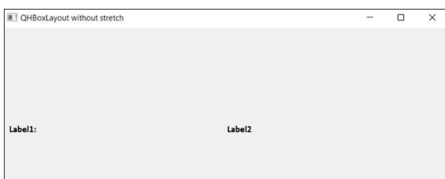

*图 2.5：GUI窗体的大小调整*

现在，我们将查看**QHBoxLayout**的另一个示例，但这次使用了**addStretch**方法。

## 带有addstretch的QHBoxLayout

**addStretch**的语法是：

```
QHBoxLayout.addStretch(size)
```

这里，**size**可以是一个整数，例如 -1, 0 或 1, ...

因此，可以使用**addStretch**创建一个空的可拉伸框，这是填充空白区域的好方法。

我们只会将`addStretch()`方法添加到`QHBoxLayout`实例对象中，将类名更改为`HBox_with_stretch`，并更改GUI窗体标题，如下所示，基于前面的代码示例。

观察以下代码：

```
self.setWindowTitle('QHBoxLayout with addstretch')

# QHBoxlayout
    myhbox = QHBoxLayout()
    myhbox.addStretch() # added
    myhbox.addWidget(mylbl1)
    myhbox.addWidget(mylbl2)
    self.setLayout(myhbox)
```

## 输出：

输出结果可见于下图*图 2.6*：

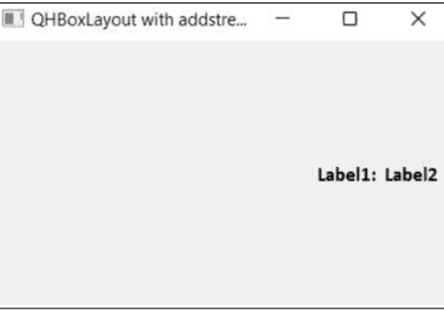

*图 2.6：带有addStretch的QHBoxLayout*

参考*图 2.7*，其中我们用双箭头指示了与*图 2.6*相比空框的显示。

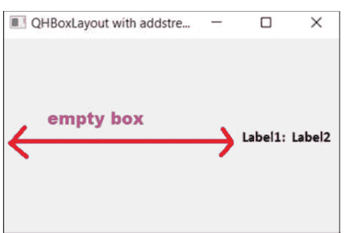

**图 2.7：** *带有addStretch的QHBoxLayout显示空框*

**注意：完整代码包含在程序名称：Chap2_Example3.py中**

我们可以从上面得出以下结论：

- 这些小部件（即Label小部件）的宽度将是原始宽度，而不是**QHBoxLayout**的平均总宽度。
- 一个空的可拉伸框将被添加到**QHBoxLayout**中，并拉伸直到填满整个**QHBoxLayout**。

因此，从前面的图中，我们理解Label小部件的宽度是原始的，一个空框填充了剩余空间。

现在，我们将在两个标签小部件之前和之后**addStretch**，看看我们会看到什么输出。

观察以下代码：

```
# QHBoxlayout
myhbox = QHBoxLayout()
myhbox.addStretch() # added
myhbox.addWidget(mylbl1)
myhbox.addWidget(mylbl2)
self.setLayout(myhbox)
myhbox.addStretch() # added
```

## 输出：

输出结果可见于下图*图 2.8*：

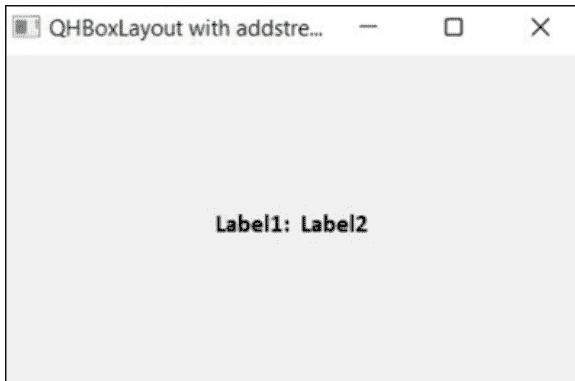

*图 2.8：在2个位置使用addStretch的QHBoxLayout*

从*图 2.9*中，我们可以得出结论：两个标签小部件的宽度是原始的，剩余空间由两个空框平均分配，如下图所示：

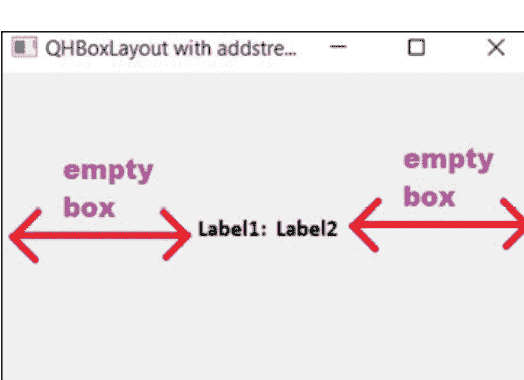

*图 2.9：在2个位置有空框的QHBoxLayout*

> **注意：完整代码包含在程序名称：Chap2_Example4.py中**

现在，我们将看到`addStretch(1)`和`addStretch(2)`之间的区别。

观察以下代码：

```
import sys
from PyQt5.QtWidgets import QWidget, QApplication,
QLabel, QHBoxLayout, QDesktopWidget
from PyQt5 import QtGui

class HBox_stretch1_2(QWidget):
    def __init__(self):
        super().__init__()
        self.display_widgets()
        self.setGeometry(0, 0, 398, 229)
        self.setWindowTitle('QHBoxLayout stretch1_2')
        self.movecenter()
        self.show()

    def display_widgets(self):
        mylbl1 = QLabel('Label1:', self)
        myfont = QtGui.QFont()
        myfont.setFamily("Calibri")
        myfont.setPointSize(10)
        myfont.setBold(True)
        myfont.setWeight(75)
        mylbl1.setFont(myfont)

        mylbl2 = QLabel('Label2', self)
        myfont = QtGui.QFont()
        myfont.setFamily("Calibri")
        myfont.setPointSize(10)
        myfont.setBold(True)
        myfont.setWeight(75)
        mylbl2.setFont(myfont)
        # QHBoxlayout
        myhbox = QHBoxLayout()
        myhbox.addStretch(1) # addstretch_1
        myhbox.addWidget(mylbl1)
        myhbox.addStretch(2) # addstretch_2
        myhbox.addWidget(mylbl2)
        self.setLayout(myhbox)

    def movecenter(self):
        myfrm_gmtry = self.frameGeometry()
        mycenter = QDesktopWidget().availableGeometry().center()
        myfrm_gmtry.moveCenter(mycenter)
        self.move(myfrm_gmtry.topLeft())

if __name__ == '__main__':
    myapp = QApplication(sys.argv)
    mywindow = HBox_stretch1_2()
    sys.exit(myapp.exec_())
```

## 输出：

输出结果可见于下图*图 2.10*：

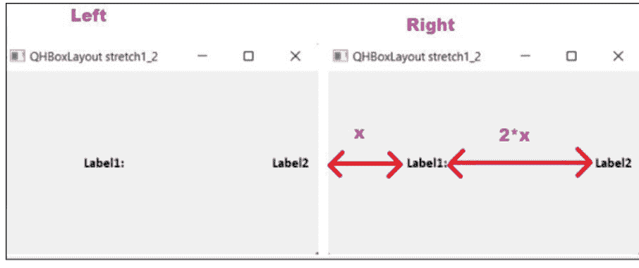

a)

b)

**图 2.10：** *Chap2_Example5.py 的输出*
*a) 显示Chap2_Example5.py中addstretch(1)和addstretch(2)区别的输出*
*b) 显示Chap2_Example5.py中Label1:和Label2之间拉伸因子'x'的输出*

> **注意：** 前面的代码包含在**程序名称：Chap2_Example5.py**中

我们可以从输出中清楚地看到：

- **myhbox.addStretch(1)：** 一个空的可拉伸框将从布局的左侧向右水平增长。在*图 2.10*的右图中，它被表示为**x**。
- **myhbox.addStretch(2)：** 一个空的可拉伸框将从布局的左侧向右水平增长两倍。在*图 2.10*的右图中，它被表示为**2*x**。

现在，观察以下代码片段的输出：

```
# QHBoxlayout
myhbox = QHBoxLayout()
myhbox.addStretch() # addstretch_0
```

myhbox.addWidget(mylbl1)
myhbox.addStretch(2) # addstretch_2
myhbox.addWidget(mylbl2)
self.setLayout(myhbox)

## 输出：

输出结果可以在下面的*图 2.11*中看到：

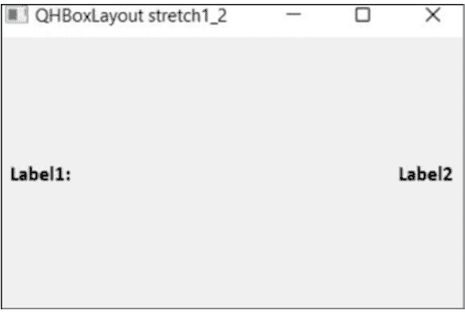

**图 2.11：** *使用了 addStretch() 和 addStretch(2) 的 QHBoxLayout*

> **注意：** 完整代码包含在程序名称：Chap2_Example6.py 中

我们可以从输出中清楚地看到，当第一个拉伸因子为 0 时，即 `addStretch()` 之后是 `addStretch(2)`，那么第二个空白框根本不会水平增长。
现在，我们将按如下所示更改代码：

```python
# QHBoxlayout
myhbox = QHBoxLayout()
myhbox.addStretch(2) # addstretch_2
myhbox.addWidget(mylbl1)
myhbox.addStretch(1) # addstretch_1
myhbox.addWidget(mylbl2)
self.setLayout(myhbox)
```

**输出：**
输出结果可以在下面的*图 2.12*中看到：

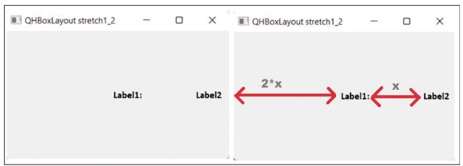

*图 2.12：使用了 addStretch(2) 和 addStretch(1) 的 QHBoxLayout*

> **注意：** 完整代码包含在程序名称：Chap2_Example7.py 中

第一个空白可拉伸框将从布局的左侧向右水平增长两倍（2*x），然后增长 'x' 倍。

## QVBoxLayout

现在，让我们学习如何使用 QVBoxLayout 将相同的两个标签控件垂直排列。
观察以下代码：

```python
import sys

from PyQt5.QtWidgets import QWidget, QApplication,
    QLabel, QVBoxLayout, QDesktopWidget # QVBEG1

from PyQt5 import QtGui

class VBox_with_stretch(QWidget):
    def __init__(self):
        super().__init__()
        self.display_widgets()
        self.setGeometry(0, 0, 398, 229)
        self.setWindowTitle('QVBoxLayout with addstretch') # QVBEG2
        self.movecenter()
        self.show()

    def display_widgets(self):
        mylbl1 = QLabel('Label1:', self)
        myfont = QtGui.QFont()
        myfont.setFamily("Calibri")
        myfont.setPointSize(10)
        myfont.setBold(True)
        myfont.setWeight(75)
        mylbl1.setFont(myfont)

        mylbl2 = QLabel('Label2', self)
        myfont = QtGui.QFont()
        myfont.setFamily("Calibri")
        myfont.setPointSize(10)
        myfont.setBold(True)
        myfont.setWeight(75)
        mylbl2.setFont(myfont)

        # QHBoxlayout
        myvbox = QVBoxLayout() # QVBEG3
        myvbox.addStretch() # QVBEG4
        myvbox.addWidget(mylbl1) # QVBEG5
        myvbox.addWidget(mylbl2) # QVBEG6
        self.setLayout(myvbox) # QVBEG7
        myvbox.addStretch() # QVBEG8

    def movecenter(self):
        myfrm_gmtry = self.frameGeometry()
        mycenter = QDesktopWidget().availableGeometry().center()
        myfrm_gmtry.moveCenter(mycenter)
        self.move(myfrm_gmtry.topLeft())

if __name__ == '__main__':
    myapp = QApplication(sys.argv)
    mywindow = VBox_with_stretch()
    sys.exit(myapp.exec_())
```

**输出：**
输出结果可以在下面的*图 2.13*中看到：

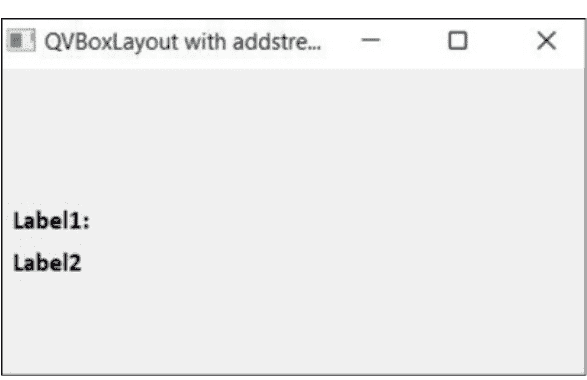

*图 2.13：Chap2_Example8.py 的输出*

> **注意：** 上述代码包含在程序名称：Chap2_Example8.py 中

- 在 QVBEG1 中，首先导入 sys 模块以访问命令行参数。然后我们将从 PyQt5 包中创建桌面风格 UI 的类中导入，即 QtWidgets，用于创建一个空的 GUI 和一个应用程序处理器，即 QApplication。除此之外，我们还导入了其他控件，如 QLabel、QVBoxLayout 和 QDesktopWidget。
- 在 QVBEG2 中，我们正在设置 GUI 窗体的标题，即窗口为 QVBoxLayout with addstretch。
- 在 QVBEG3 中，创建了一个 QVBoxLayout 实例 myvbox。
- 在 QVBEG4 中，我们正在将 addStretch() 方法添加到 QVBoxLayout 实例对象 myvbox。
- 在 QVBEG5 中，标签对象 mylbl1 将被添加到框布局对象 myvbox。
- 在 QVBEG6 中，标签对象 mylbl2 将被添加到框布局对象 myvbox。
- 在 QVBEG7 中，我们正在设置 GUI 窗体的主布局。换句话说，我们正在将垂直布局设置为 GUI 窗体。
- 在 QVBEG8 中，我们再次将 addStretch() 方法添加到 QVBoxLayout 实例对象 myvbox。

参考*图 2.14*：

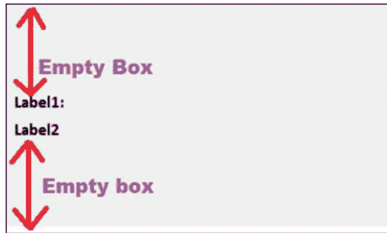

*图 2.14：带有 2 个空白框的 QVBoxLayout*

从*图 2.14*中，我们可以得出结论，两个标签控件的宽度是原始的，剩余空间由 **QVBoxLayout** 图中突出显示的两个空白框平均分配。

在学习了 **QHBoxLayout** 和 **QVBoxLayout** 的概念之后，让我们制作一个类似于 **run_user_credential_app.py** 的应用程序。

观察以下代码：

```python
import sys

from PyQt5.QtWidgets import QWidget, QApplication,
QLabel, QHBoxLayout, QVBoxLayout, QDesktopWidget,
QLineEdit, QPushButton # QBX1

from PyQt5 import QtGui

class BoxLayout_user_credential_App(QWidget):
    def __init__(self):
        super().__init__()
        self.display_widgets()
        self.setGeometry(0, 0, 398, 229)
        self.setWindowTitle('BoxLayout User Credential App') # QBX2
        self.movecenter()
        self.show()

    def display_widgets(self):
        mylbl1 = QLabel('Enter your username:', self)
        myfont = QtGui.QFont()
        myfont.setFamily("Calibri")
        myfont.setPointSize(10)
        myfont.setBold(True)
        myfont.setWeight(75)
        mylbl1.setFont(myfont)

        mylbl2 = QLabel('Enter your password:', self)
        myfont = QtGui.QFont()
        myfont.setFamily("Calibri")
        myfont.setPointSize(10)
        myfont.setBold(True)
        myfont.setWeight(75)
        mylbl2.setFont(myfont)

        mylineedit1 = QLineEdit(self)
        mylineedit2 = QLineEdit(self)
        mybtn = QPushButton(self)
        mybtn.setText('Confirm')

        myhbox1 = QHBoxLayout() # QBX3
        myhbox1.setSpacing(60) # QBX4
        myhbox1.addStretch() # QBX5
        myhbox1.addWidget(mylbl1) # QBX6
        myhbox1.addWidget(mylineedit1) # QBX7
        myhbox1.addStretch() # QBX8

        # QBX9
        myhbox2 = QHBoxLayout()
        myhbox2.setSpacing(60)
        myhbox2.addStretch()
        myhbox2.addWidget(mylbl2)
        myhbox2.addWidget(mylineedit2)
        myhbox2.addStretch()

        # QBX10
        myhbox3 = QHBoxLayout()
        myhbox3.addStretch()
        myhbox3.addWidget(mybtn)
        myhbox3.addStretch()

        # QHBoxlayout
        myvbox = QVBoxLayout() # QBX11
        myvbox.addStretch() # QBX12
        myvbox.addLayout(myhbox1) # QBX13
        myvbox.addStretch() # QBX14
        myvbox.addLayout(myhbox2) # QBX15
        myvbox.addStretch() # QBX16
        myvbox.addLayout(myhbox3) # QBX17
        self.setLayout(myvbox) # QBX18

    def movecenter(self):
        myfrm_gmtry = self.frameGeometry()
        mycenter = QDesktopWidget().availableGeometry().center()
        myfrm_gmtry.moveCenter(mycenter)
        self.move(myfrm_gmtry.topLeft())

if __name__ == '__main__':
    myapp = QApplication(sys.argv)
    mywindow = BoxLayout_user_credential_App()
    sys.exit(myapp.exec_())
```

**输出：**
输出结果可以在下面的*图 2.15*中看到：

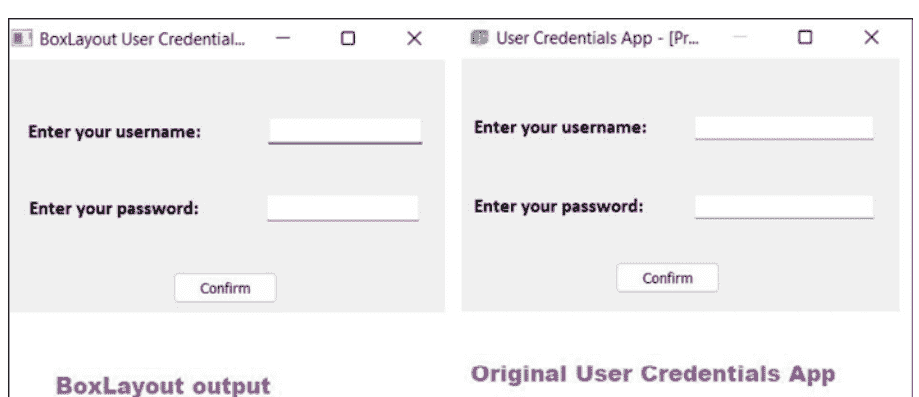

**图 2.15：** *Chap2_Example9.py 的输出*

> **注意：** 上述代码包含在程序名称：Chap2_Example9.py 中

- 在 **QBX1** 中，首先导入 sys 模块以访问命令行参数。然后我们将从 PyQt5 包中创建桌面风格 UI 的类中导入，即 **QtWidgets**，用于创建一个空的 GUI 和一个应用程序处理器，即 **QApplication**。除此之外，我们还导入了其他控件，如 **QLabel**、**QHBoxLayout**、**QVBoxLayout**、**QDesktopWidget**、**QLineEdit** 和 **QPushButton**。
- 在 **QBX2** 中，我们正在设置 GUI 窗体的标题，即窗口为 **BoxLayout User Credential App**。
- 在 **QBX3** 中，正在创建一个 **QHBoxLayout** 实例，对象名称为 **myhbox1**。
- 在 **QBX4** 中，水平排列时项目之间的间距为 60。它将 60 作为参数。我们正在对 **QHBoxlayout** 对象使用 **setSpacing** 方法。
- 在 **QBX5**、**QBX8**、**QBX12**、**QBX14** 和 **QBX16** 中，使用 **addStretch** 创建一个空白可拉伸框以填充空白空间。
- 在 **QBX6** 中，标签对象 **mylbl1** 将被添加到框布局对象 **myhbox1**。
- 在 **QBX7** 中，**lineEdit** 对象 **mylineedit1** 将被添加到框布局对象 **myhbox1**。

## QBoxLayout

在QBX9中，创建了一个对象名为myhbox2的QHBoxLayout实例。水平排列时，项目之间的间距为60。使用addStretch创建一个空的可拉伸框，用于填充空白区域。标签对象mylbl2将被添加到框布局对象myhbox2中。行编辑对象mylineedit2将被添加到框布局对象myhbox2中。
- 在QBX10中，创建了一个对象名为myhbox3的QHBoxLayout实例。使用addStretch创建一个空的可拉伸框，用于填充空白区域。按钮对象mylbl2将被添加到框布局对象myhbox2中。
- 在QBX11中，正在创建一个对象名为myvbox的QVBoxLayout实例。它将作为容器，用于从上到下垂直排列布局（QHBoxLayout）。
- 在QBX13中，我们将布局myhbox1添加到QVBoxLayout对象myvbox中。
- 在QBX15中，我们将布局myhbox2添加到QVBoxLayout对象myvbox中。
- 在QBX17中，我们将布局myhbox3添加到QVBoxLayout对象myvbox中。
- 在QBX18中，我们正在设置GUI窗体的主布局。换句话说，我们正在将垂直布局设置为GUI窗体。

以上就是关于使用QBoxLayout进行布局管理的全部内容。

## QGridLayout

假设在我们的应用程序中，需要将控件排列成行和列的网格。在这种情况下，我们必须了解QGridLayout。它是最通用的布局类之一，用于将控件成对排列，每个控件都有一个相对位置，并将被排列在行和列的网格中。它的应用范围从添加按钮（例如创建计算器应用程序时）到制作虚拟键盘等等。用于排列控件并将其放置在单元格中的坐标对应该是从零开始的整数。

**QGridLayout** 如果没有向给定单元格添加控件，将保留该单元格为空。如果我们向网格布局添加控件，将使用**addWidget**方法的重载实现：

- `addWidget(self, QWidget, int row, int column)`：此方法将在定义的行和列添加一个控件。
- `addWidget(self, QWidget, int row, int column, int rowSpan, int columnSpan, alignment)`：此方法将在定义的行和列添加一个控件，跨越多行或多列或两者兼有。对齐是一个可选参数，其默认值为0，意味着整个单元格将被控件填充。

让我们看一些使用QGridLayout的示例。

### 基本QGridLayout

观察以下代码：

```python
import sys
from PyQt5.QtWidgets import QWidget, QApplication, QLabel, QGridLayout # GLEG1_1
from PyQt5 import QtGui

class GridLayout_Eg1(QWidget):
    def __init__(self):
        super().__init__()
        self.display_widgets()
        self.setGeometry(0, 0, 398, 229)
        self.setWindowTitle('Basic GridLayout example') #GLEG1_2
        self.show()

    def display_widgets(self):
        # writing the grid portion
        mygrid_layout = QGridLayout()# GLEG1_3
        self.setLayout(mygrid_layout)# GLEG1_4

        for outer in range(4):
            for lower in range(3):
                mylbl = QLabel('Label' + str(outer) + str(lower),self)# GLEG1_5
                myfont = QtGui.QFont()
                myfont.setFamily("Calibri")
                myfont.setPointSize(10)
                myfont.setBold(True)
                myfont.setWeight(75)
                mylbl.setFont(myfont)
                mygrid_layout.addWidget(mylbl, outer, lower)# GLEG1_6

if __name__ == '__main__':
    myapp = QApplication(sys.argv)
    mywindow = GridLayout_Eg1()
    sys.exit(myapp.exec_())
```

**输出：**
输出可以在下面的图2.16中看到：

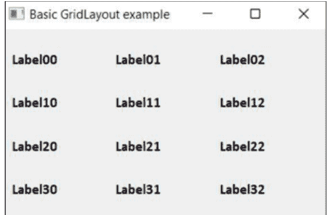

**图2.16：** *Chap2_Example10.py的输出*

> **注意：** 上述代码包含在程序名称：**Chap2_Example10.py**中

- 在**GLEG1_1**中，首先导入sys模块以访问命令行参数。然后，我们将从PyQt5包中创建桌面风格UI的类中导入，即**QtWidgets**，用于创建一个空的GUI和一个应用程序处理器，即**QApplication**。此外，我们还导入了其他控件，如**QLabel**和**QGridLayout**。
- 在**GLEG1_2**中，我们正在设置GUI窗体（即窗口）的标题为**Basic GridLayout example**。
- 在**GLEG1_3**中，创建了一个对象名为**mygrid_layout**的**QGridLayout**实例。
- 在**GLEG1_4**中，我们正在设置GUI窗体的主布局。换句话说，我们正在将网格布局设置为GUI窗体。
- 在**GLEG1_5**中，创建了一个**QLabel**对象**mylbl**的实例，并设置**QLabel**对象的字体族为Calibri，字体大小为10，字体粗细为粗体。为了精细控制粗细，我们将权重设置为75。
- 在**GLEG1_6**中，我们正在定义的行和列添加一个**QLabel**控件。第一行将是0，然后控件将被添加到第0、1和2列。这就是为什么我们在标签文本中附加了行和列，以便读者更好地识别。

- GLEG1_5和GLEG1_6将比初始计数多重复11次。现在，我们将看到另一个关于GridLayout中跨越的示例。

### QGridLayout跨越

在QGridLayout跨越中，rowspan和colspan的默认值为1。如果指定了正值，则单元格控件将扩展到该值。如果是-1，则扩展将向右或向下边缘进行。

观察以下代码：

```python
import sys

from PyQt5.QtWidgets import QWidget, QApplication,
QLabel, QGridLayout, QPushButton # GLEG2_1

from PyQt5 import QtGui

class GridLayout_Eg2(QWidget):
    def __init__(self):
        super().__init__()
        self.display_widgets()
        self.setGeometry(0, 0, 398, 229)
        self.setWindowTitle('GridLayout with span')# GLEG2_2
        self.show()

    def display_widgets(self):
        # writing the grid portion
        mygrid_layout = QGridLayout()
        self.setLayout(mygrid_layout)

        mybtn1 = QPushButton("Row Spanning merging 2 rows")
        mygrid_layout.addWidget(mybtn1, 0,0, 2,1)# GLEG2_3

        mybtn2 = QPushButton("Column Spanning")
        mygrid_layout.addWidget(mybtn2, 2,0, 1,3)# GLEG2_4

        for outer in range(3,5):
            for lower in range(3,5):
                mylbl = QLabel('Label' + str(outer) + str(lower),self)# GLEG2_5
                myfont = QtGui.QFont()
                myfont.setFamily("Calibri")
                myfont.setPointSize(10)
                myfont.setBold(True)
                myfont.setWeight(75)
                mylbl.setFont(myfont)
                mygrid_layout.addWidget(mylbl, outer, lower)# GLEG2_6

if __name__ == '__main__':
    myapp = QApplication(sys.argv)
    mywindow = GridLayout_Eg2()
    sys.exit(myapp.exec_())
```

**输出：**
输出可以在下面的图2.17中看到：

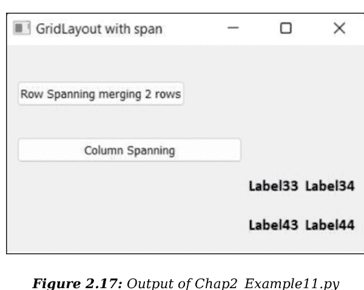

**图2.17：** *Chap2_Example11.py的输出*

> **注意：** 上述代码包含在程序名称：**Chap2_Example11.py**中

- 在GLEG2_1中，首先导入sys模块以访问命令行参数。然后，我们将从PyQt5包中创建桌面风格UI的类中导入，即QtWidgets，用于创建一个空的GUI和一个应用程序处理器，即QApplication。此外，我们还导入了其他控件，如QLabel、QGridLayout、QPushButton。
- 在GLEG2_2中，我们正在设置GUI窗体（即窗口）的标题为GridLayout with span。
- 在GLEG2_3中，QPushButton对象mybtn1将被添加到定义的行=0和列=0，rowSpan值为2，columnSpan值为1。
- 在GLEG2_4中，QPushButton对象mybtn2将被添加到定义的行=2和列=0，rowSpan值为1，columnSpan值为3。
- 在GLEG2_5中，创建了一个QLabel对象mylbl的实例，并设置QLabel对象的字体族为Calibri，字体大小为10，字体粗细为粗体。为了精细控制粗细，我们将权重设置为75。
- 在GLEG2_6中，我们正在定义的行和列添加QLabel控件。第一行将是3，然后控件将被添加到第3和4列。这就是为什么我们在标签文本中附加了行和列，以便读者更好地识别。

### QGridLayout拉伸

在编写代码之前，我们先看看方法：setColumnStretch和setRowStretch。这两个方法通常关注列/行的拉伸因子。基于更高的拉伸因子值，将占用更多可用空间。

观察以下代码：

```python
import sys

from PyQt5.QtWidgets import QWidget, QApplication, QTextEdit, QGridLayout # GLEG3_1

from PyQt5 import QtGui


class GridLayout_Eg3(QWidget):
    def __init__(self):
        super().__init__()
        self.display_widgets()
        self.setGeometry(0, 0, 398, 229)
        self.setWindowTitle('GridLayout with stretch')# GLEG3_2
        self.show()
```

def display_widgets(self):
    # 编写网格部分
    mygrid_layout = QGridLayout()
    self.setLayout(mygrid_layout)

    for outer in range(1,4):
        for lower in range(1,4):
            mytextedit = QTextEdit(self)# GLEG3_3
            mytextedit.setPlaceholderText(str(outer) + str(lower))# GLEG3_4
            mygrid_layout.addWidget(mytextedit, outer, lower)# GLEG3_5

    mygrid_layout.setColumnStretch(outer,outer+1)# GLEG3_6

if __name__ == '__main__':
    myapp = QApplication(sys.argv)
    mywindow = GridLayout_Eg3()
    sys.exit(myapp.exec_())

## 输出：

输出结果可以在下图[图 2.18](Figure 2.18)中看到：

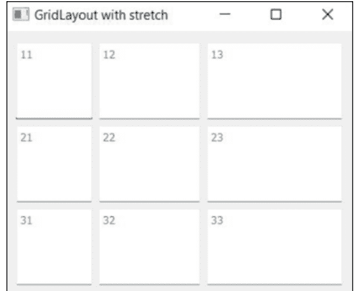

**图 2.18：** *Chap2_Example12.py 的输出*

> **注意：** 上述代码包含在**程序名称：** Chap2_Example12.py 中

- 在 **GLEG3_1** 中，首先导入 `sys` 模块以访问命令行参数。然后，我们将从 PyQt5 包中创建桌面风格 UI 的类中导入，即 **QtWidgets**，用于创建一个空的 GUI 和一个应用程序处理器，即 **QApplication**。此外，我们还导入了其他小部件，如 **QTextEdit** 和 **QGridLayout**。
- 在 **GLEG3_2** 中，我们将 GUI 窗体（即窗口）的标题设置为 **带拉伸的网格布局**。
- 在 **GLEG3_3** 中，创建了一个 **QTextEdit** 实例，其对象名称为 **mytextedit**。
- 在 **GLEG3_4** 中，文本编辑器的占位符文本将是 `outer` 和 `lower` 的连接，并将以灰色文本显示。
- 在 **GLEG3_5** 中，我们在指定的行和列添加 **QTextEdit** 小部件。第一行是 1，然后小部件将被添加到第 1、2 和 3 列。
- 在 GLEG3_6 中，`setColumnStretch` 因子将第一个参数设为 `outer`，第二个参数设为 `outer+1`。因此，值将是 (1,2)。所以，列宽顺序将是第 3 列最宽，然后是第 2 列，最后是第 1 列，如输出所示。行的拉伸因子将设置为 1、2 和 3。

现在，让我们学习如何使用 **QGridLayout** 开发相同的用户凭证应用程序。

观察以下代码：

```python
import sys

from PyQt5.QtWidgets import QWidget, QApplication,
QLabel, QGridLayout, QPushButton, QLineEdit ,
QHBoxLayout

from PyQt5 import QtGui

class GridLayout_User_Credential_App(QWidget):
    def __init__(self):
        super().__init__()
        self.display_widgets()
        self.setGeometry(0, 0, 398, 229)
        self.setWindowTitle('GridLayout with User Credential App')
        self.show()

    def display_widgets(self):
        # 编写网格部分
        mygrid_layout = QGridLayout()
        self.setLayout(mygrid_layout)

        mylbl1 = QLabel('Enter your username:',self)
        mylbl1.setMinimumWidth(161)
        myfont = QtGui.QFont()
        myfont.setFamily("Calibri")
        myfont.setPointSize(10)
        myfont.setBold(True)
        myfont.setWeight(75)
        mylbl1.setFont(myfont)
        mygrid_layout.addWidget(mylbl1, 1, 0, 1, 2)

        mylbl2 = QLabel('Enter your password:',self)
        mylbl2.setMinimumWidth(161)
        myfont = QtGui.QFont()
        myfont.setFamily("Calibri")
        myfont.setPointSize(10)
        myfont.setBold(True)
        myfont.setWeight(75)
        mylbl2.setFont(myfont)
        mygrid_layout.addWidget(mylbl2, 3, 0, 1, 2)

        mylineEdit1 = QLineEdit(self)
        mylineEdit1.setMinimumWidth(161)
        mygrid_layout.addWidget(mylineEdit1, 1, 2,1,2)
        mygrid_layout.setColumnStretch(1,2)

        mylineEdit2 = QLineEdit(self)
        mylineEdit2.setMinimumWidth(161)
        mygrid_layout.addWidget(mylineEdit2, 3, 2,1,2)

        myhbox = QHBoxLayout()
        myhbox.addStretch()
        mybtn1 = QPushButton("Confirm")
        myhbox.addWidget(mybtn1)
        myhbox.addStretch()

        mygrid_layout.addLayout(myhbox,4,1,1,3)

if __name__ == '__main__':
    myapp = QApplication(sys.argv)
    mywindow = GridLayout_User_Credential_App()
    sys.exit(myapp.exec_())
```

## 输出：

输出结果可以在下图 *图 2.19* 中看到：

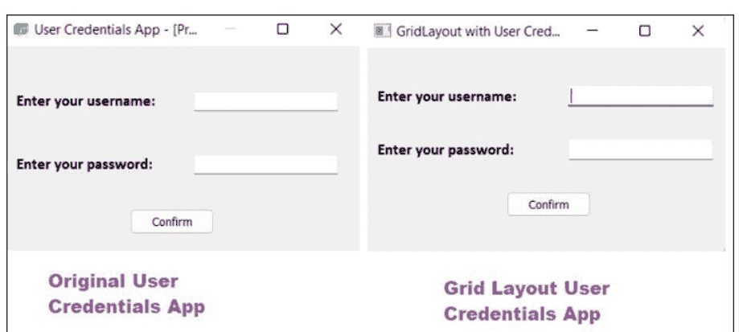

**图 2.19：** *Chap2_Example13.py 的输出*

> 注意：上述代码包含在程序名称：Chap2_Example13.py 中

## QFormLayout

每当需要创建一个两列格式的应用程序，其中每一行由一个标签（第一列）和一个关联的输入字段（第二列）组成时，我们就可以使用 QFormLayout。QFormLayout 中最常用的一个重要重载方法是 `addRow()` 方法，其描述如下：

- `addRow(QLabel, QWidget)`：此方法将添加一行，其中包含标签及其在第二列中的小部件。
- `addRow(QWidget)`：此方法将添加一行，其中包含跨越两列并拉伸以适应 GUI 窗体的小部件。
- `addRow(QLayout)`：此方法将添加一个跨越两列的指定布局，或者我们可以说它将用于嵌套布局。
- `addRow(QLabel, QLayout)`：此方法将添加一行，其中包含标签及其在第二列中的子布局。

让我们这次使用 **QFormLayout** 创建相同的用户凭证应用程序。
观察以下代码：

```python
import sys

from PyQt5.QtWidgets import QWidget, QApplication,
QLabel, QFormLayout, QPushButton,QHBoxLayout,
QLineEdit , QHBoxLayout # QFL_1

from PyQt5 import QtGui

class FormLayout_User_Credential_App(QWidget):
    def __init__(self):
        super().__init__()
        self.display_widgets()
        self.setGeometry(0, 0, 398, 229)
        self.setWindowTitle('FormLayout with User
Credential App')# QFL_2
        self.show()

    def display_widgets(self):
        # 编写网格部分
        myfrm_layout = QFormLayout()

        mylbl1 = QLabel('Enter your username:',self)
        mylbl1.setMinimumWidth(161)
        myfont = QtGui.QFont()
        myfont.setFamily("Calibri")
        myfont.setPointSize(10)
        myfont.setBold(True)
        myfont.setWeight(75)
        mylbl1.setFont(myfont)

        mylbl2 = QLabel('Enter your password:',self)
        mylbl2.setMinimumWidth(161)
        myfont = QtGui.QFont()
        myfont.setFamily("Calibri")
        myfont.setPointSize(10)
        myfont.setBold(True)
        myfont.setWeight(75)
        mylbl2.setFont(myfont)
        mylineEdit1 = QLineEdit(self)
        mylineEdit1.setMinimumWidth(161)
        mylineEdit2 = QLineEdit(self)
        mylineEdit2.setMinimumWidth(161)

        myhbox = QHBoxLayout()
        myhbox.addStretch()
        mybtn1 = QPushButton("Confirm")
        myhbox.addWidget(mybtn1)
        myhbox.addStretch()
        myfrm_layout.addRow(mylbl1, mylineEdit1)# QFL_3

        myfrm_layout.addRow(mylbl2, mylineEdit2)# QFL_4
        myfrm_layout.addRow(myhbox)# QFL_5
        self.setLayout(myfrm_layout)# QFL_6

if __name__ == '__main__':
    myapp = QApplication(sys.argv)
    mywindow = FormLayout_User_Credential_App()
    sys.exit(myapp.exec_())
```

**输出：**
输出结果可以在下图 *图 2.20* 中看到：

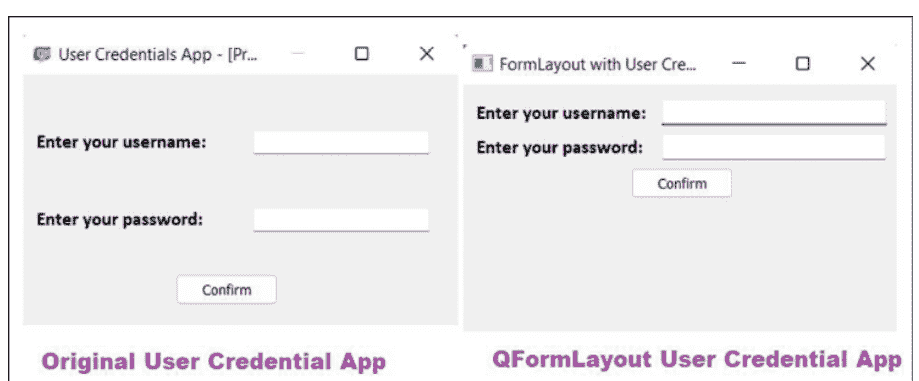

*图 2.20：Chap2_Example14.py 的输出*

> **注意：上述代码包含在程序名称：Chap2_Example14.py 中**

- 在 QFL_1 中，首先导入 `sys` 模块以访问命令行参数。然后，我们将从 PyQt5 包中创建桌面风格 UI 的类中导入，即 QtWidgets，用于创建一个空的 GUI 和一个应用程序处理器，即 QApplication。此外，我们还导入了其他小部件，如 QLabel、QFormLayout、QPushButton、QLineEdit。
- 在 QFL_2 中，我们将 GUI 窗体（即窗口）的标题设置为“带用户凭证应用程序的表单布局”。
- 在 QFL_3 中，我们添加了一行，其中第一列包含标签对象 `mylbl1`，第二列包含 QLineEdit 对象 `mylineEdit1`。
- 在 QFL_4 中，我们添加了一行，其中第一列包含标签对象 `mylbl2`，第二列包含 QLineEdit 对象 `mylineEdit2`。
- 在 QFL_5 中，我们添加了一行，其中包含 QHBoxLayout 对象。
- 在 QFL_6 中，我们设置了 GUI 窗体的主布局。换句话说，我们将 QFormLayout 设置到 GUI 窗体上。

现在，从 QFormLayout 代码中，我们可以看到两个 QLabel 或两个 QLineEdit 小部件之间的间距非常小。QLabel 和 QLineEdit 小部件之间也是如此。因此，在这种情况下，我们需要提供间距。我们将使用 `setVerticalSpacing` 方法提供小部件之间的垂直间距，使用 `setHorizontalSpacing` 方法提供水平间距。

我们将通过引入垂直和水平间隔符的概念来修改之前的代码。

> 注意：完整代码包含在程序名称：Chap2_Example15.py 中

```python
myhbox1 = QHBoxLayout() # 新增1
myhbox1.addStretch() # 新增2
myfrm_layout.addRow(myhbox1)
myfrm_layout.addRow(mylbl1, mylineEdit1)
myfrm_layout.setHorizontalSpacing(50) # 新增3
myfrm_layout.setVerticalSpacing(50) # 新增4
```

myfrm_layout.addRow(mylbl2, mylineEdit2)
myfrm_layout.setVerticalSpacing(50) # addition5
myfrm_layout.addRow(myhbox1)

## 输出：

输出结果可以在下面的*图 2.21*中看到：

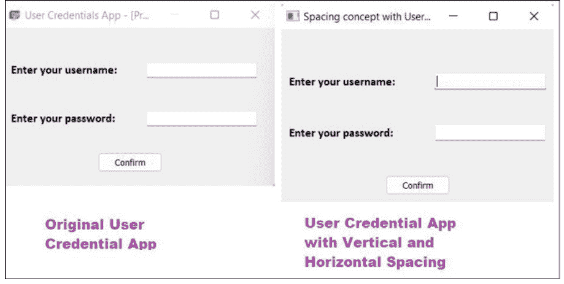

让我们看看这段Python代码片段。

- 在**addition1**中，创建了一个QHBoxLayout对象**myhbox1**的实例。
- 在**addition2**中，使用**addStretch**为**myhbox1**对象创建了一个空的可拉伸框，用于填充空白区域。
- 在**addition3**中，水平并排放置的控件之间的间距将为50。**setHorizontalSpacing**接受一个整数值作为参数。
- 在**addition4**和**addition5**中，垂直放置的控件之间的间距将为50。**setVerticalSpacing**接受一个整数值作为参数。

现在，关于控件放置的所有这些概念中最重要的观察是，我们可以使用Qt Designer轻松管理，如*图 2.22*所示：

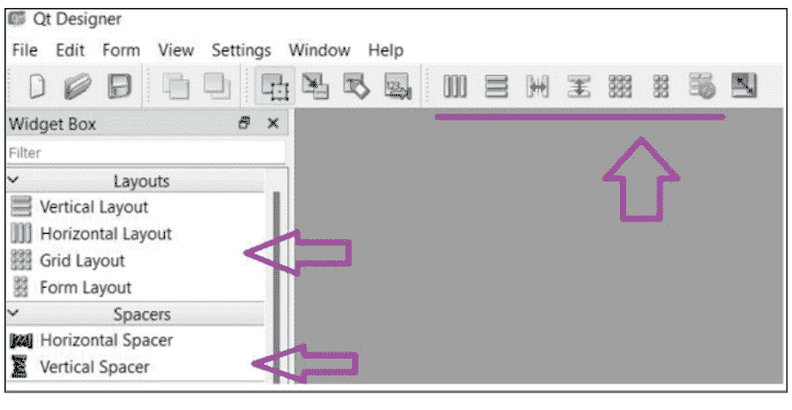

*图 2.22：Qt Designer中的布局视图、控件箱中的间隔符和工具栏控件*

让我们通过操作**默认GUI表单**，借助图形来展示它们的用法。这无疑是最好的学习方式之一。请参考包含默认GUI表单的*图 2.23*：

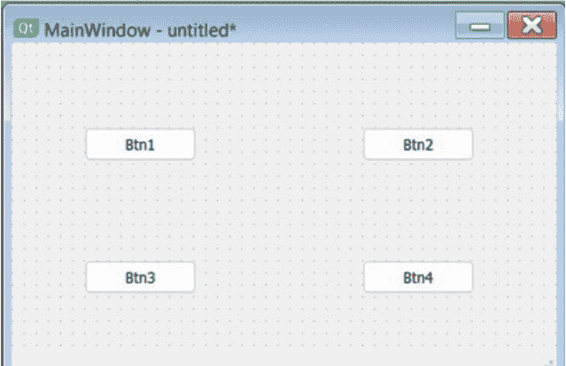

*图 2.23：带有默认GUI表单的Qt Designer工具栏*

现在，我们将成对选择，比如**Btn1**和**Btn2**作为一对，**Btn3**和**Btn4**作为另一对。如*图 2.24*中箭头符号所示，该符号在Qt Designer中是“水平布局”，我们将首先选择第一对，然后点击带有箭头符号的按钮。第二对也将重复相同的方法。只需观察被视为成对的矩形部分。执行这些操作后的结果显示在下图中：

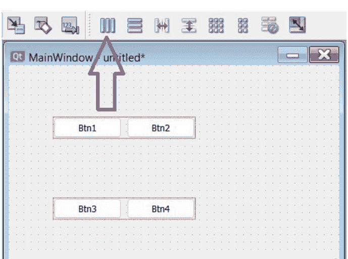

**图 2.24：** *带有“水平布局”的Qt Designer工具栏*

现在，我们将成对选择，比如**Btn1**和**Btn3**作为一对，**Btn2**和**Btn4**作为另一对。如*图 2.25*中箭头符号所示，该符号在Qt Designer中是“垂直布局”，我们将首先选择第一对，然后点击带有箭头符号的按钮。第二对也将重复相同的方法。只需观察被视为成对的矩形部分。执行这些操作后的结果显示在下图中：

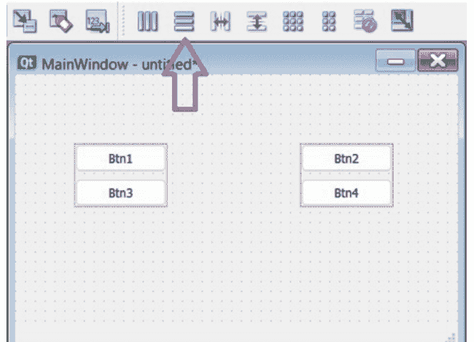

**图 2.25：** 带有“垂直布局”的Qt Designer工具栏

只需观察当QPushButton控件成对被选中并按下相应的工具栏图标（每个功能都用箭头符号高亮显示）时的输出，如*图 2.26*所示：

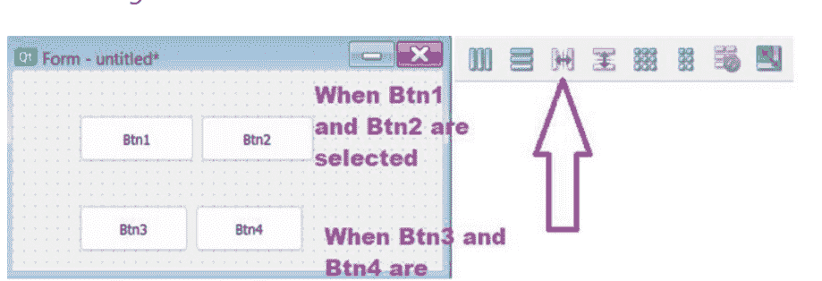

**图 2.26：** Qt Designer工具栏，从默认GUI表单在分割器中水平布局

在*图 2.27*中，QPushButton控件成对选中，并通过点击分割器图标中的**水平布局**进行水平拉伸：

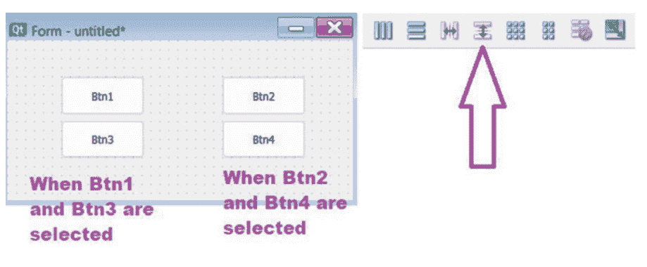

**图 2.27：** Qt Designer工具栏，从默认GUI表单在分割器中垂直布局

在*图 2.27*中，QPushButton控件成对选中，并通过点击分割器图标中的**垂直布局**进行垂直拉伸。现在请参考包含默认GUI表单的*图 2.28*：

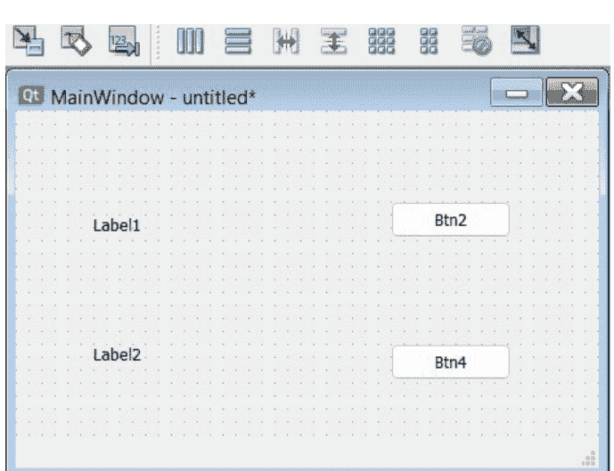

**图 2.28：** Qt Designer工具栏，从默认GUI表单进行网格布局转换

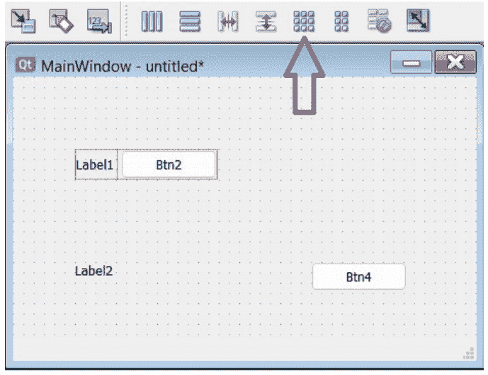

**图 2.29：** 选择Label1和Btn2控件作为一对，然后点击如箭头符号所示的“网格布局”按钮

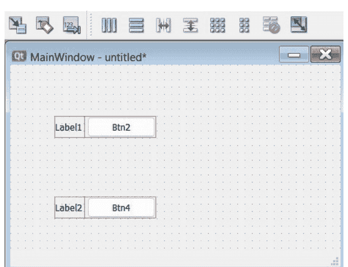

**图 2.30：** 选择Label2和Btn4控件作为一对，然后点击如箭头符号所示的“网格布局”按钮

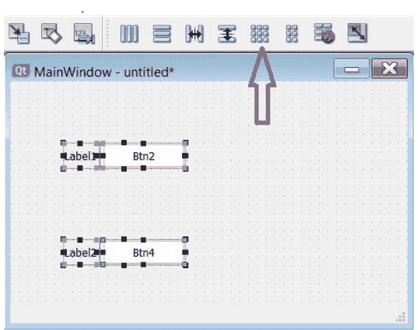

**图 2.31：** 选择两对控件，然后点击如箭头符号所示的“网格布局”按钮

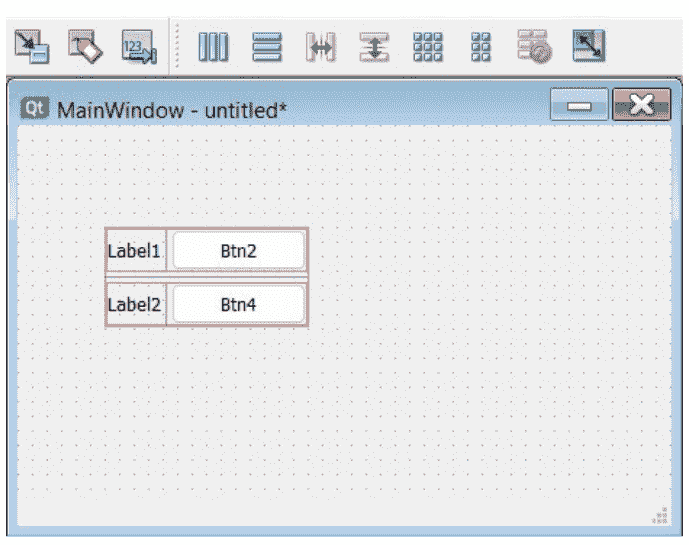

**图 2.32：** 使用Qt Designer中的网格转换显示的最终布局表单

从*图 2.28*到*图 2.32*，我们正在使用Qt Designer工具栏的**网格布局**，通过将控件排列在*网格布局*中来转换默认GUI表单。只需观察我们在前面图形中描述的步骤，以解释控件如何成对使用，然后将这些控件布局在行和列的网格中。带有箭头标记的图形是不言自明的。

现在让我们查看包含默认GUI表单的*图 2.33*：

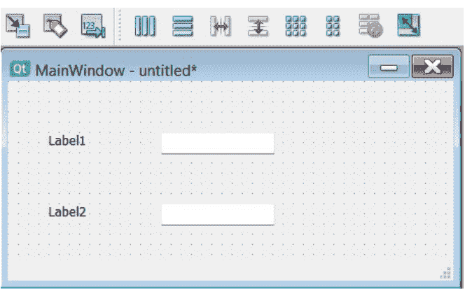

**图 2.33：** Qt Designer工具栏，从默认GUI表单进行表单布局转换

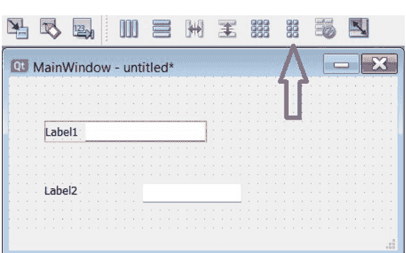

**图 2.34：** 选择Label1和Line Edit1控件作为一对，然后点击如箭头符号所示的“表单布局”按钮

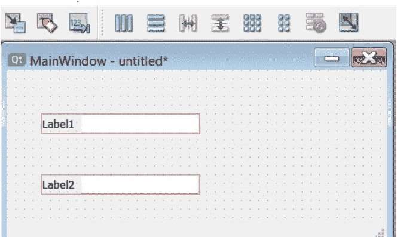

**图 2.35：** *选择Label2和Line Edit2控件作为一对，然后点击如箭头符号所示的“表单布局”按钮*

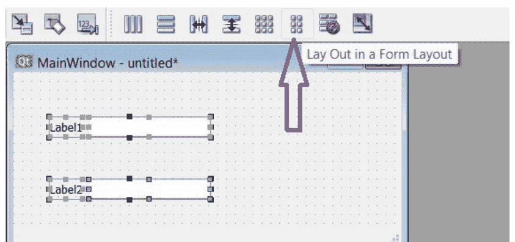

**图 2.36：** *选择两对控件，然后点击如箭头符号所示的“表单布局”按钮*

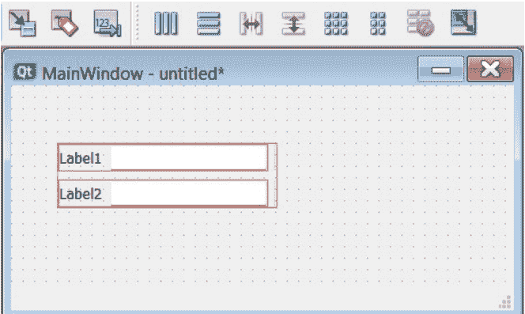

**图 2.37：** *使用Qt Designer中的表单布局转换显示的最终布局表单*

从*图 2.33*到*图 2.37*，我们正在使用Qt Designer工具栏的**表单布局**，通过将控件排列在*表单布局*中来转换默认GUI表单。只需观察我们在前面图形中描述的步骤，以解释控件如何成对使用，然后将这些控件布局在两列的表单中。带有箭头标记的图形是不言自明的。

现在，我们将看到如何在Qt Designer中使用垂直和水平间隔符。请参考包含带有水平间隔符用法的默认GUI表单的*图 2.38*：

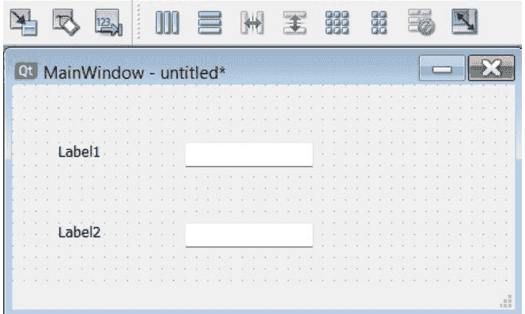

**图 2.38：** Qt Designer表单，显示从默认GUI表单中使用水平间隔符

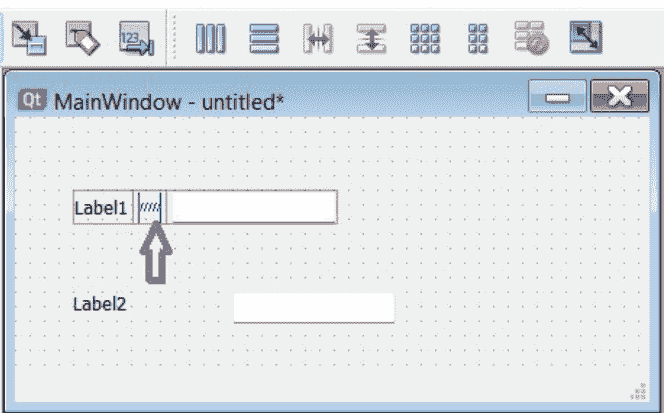

**图 2.39：** Qt Designer表单，在执行“网格布局”转换后，在Label1和Line Edit1控件的第一对上插入水平间隔符，如箭头所示

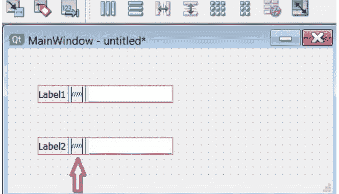

**图 2.40：** Qt Designer表单，在执行“网格布局”转换后，在Label1和Line Edit1控件的第二对上插入水平间隔符，如箭头所示

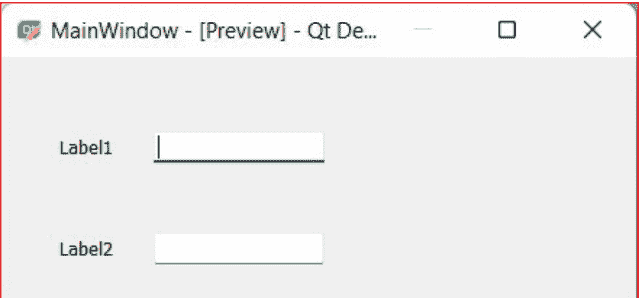

**图 2.41：** *通过按Ctrl + R使用水平间隔符显示的最终布局表单*

从*图 2.38*到*图 2.41*，我们可以看到在默认GUI表单上使用控件箱中的**水平间隔符**。默认情况下，控件对**QLabel**和**QLineEdit**被排列在行和列的网格中。然后，在控件之间引入一个水平间隔符，从而指示水平间隔符的用法。最后，通过按*Ctrl + R*，我们可以查看GUI表单的最终输出。

请参考包含带有垂直间隔符用法的默认GUI表单的*图 2.42*：

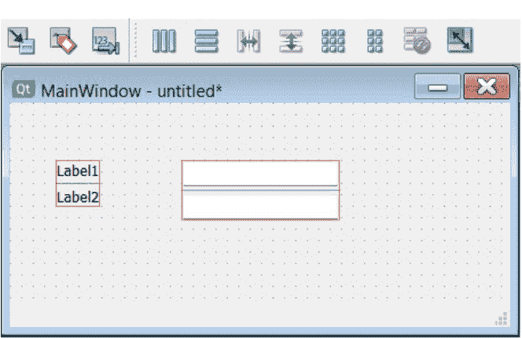

**图 2.42：** *Qt Designer表单，显示从默认GUI表单中使用垂直间隔符*

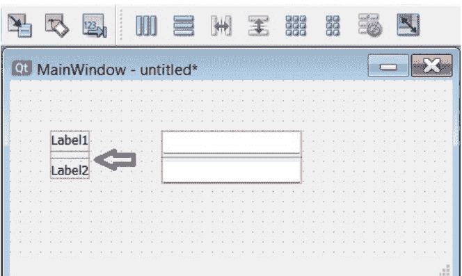

**图 2.43：** Qt Designer表单，在执行“网格布局”转换后，在Label1和Label2控件的第一对上插入垂直间隔符，如箭头所示

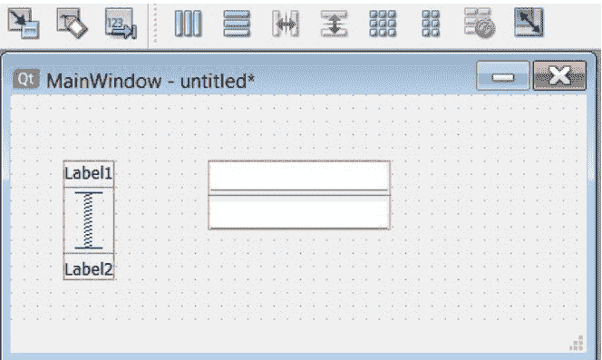

**图 2.44：** Qt Designer在拉伸Label1和Label2对之后，因为它们被安排在垂直布局中

## 结论

在本章中，我们学习了如何使用绝对定位和布局类来排列控件。我们看到了使用绝对定位、**QBoxLayout**、**QGridLayout** 和 **QFormLayout** 类创建“用户凭证应用”的不同方法。

理解本章内容很重要，因为在接下来的章节中，我们将使用所有这些概念来展示多个应用程序。我们将编写代码，通过从控件箱拖放控件以及使用工具栏图标来排列布局，从而创建我们的应用程序。

## 要点回顾

- 我们可以使用绝对定位方法，借助 `move(x,y)` 方法在 GUI 表单中定位控件。
- 我们可以使用 `QBoxLayout` 类将控件水平或垂直排列。使用 `QHBoxLayout` 可以将控件并排排列成一行，使用的方法包括 `addStretch`、`addWidget` 和 `addLayout`。
- 可以使用 `addStretch` 方法创建一个空的可伸缩框。
- 可以使用 `QGridLayout` 将控件排列成行和列的网格。
- 在 `QGridLayout` 的 span 中，rowspan 和 colspan 的默认值为 1。
- `setColumnStretch` 和 `setRowStretch` 通常用于设置列/行的伸缩因子。
- 使用 `QFormLayout`，我们可以创建一个两列形式的应用程序，其中每一行包含一个标签（第一列）和一个关联的输入字段（第二列）。

## 问题

1. 列举布局管理在 GUI 设计中的重要性。
2. 绘制并解释使用绝对定位的 GUI 表单坐标系统。
3. 详细解释使用绝对定位放置控件。
4. 详细解释使用布局类放置控件。
5. 解释以下内容：
    a. QHBoxLayout
    b. QHBoxLayout
    c. 带有 addstretch 的 QHBoxLayout
    d. QVBoxLayout
    e. QGridLayout
    f. QFormLayout

## 加入我们的书籍 Discord 空间

加入书籍的 Discord 工作区，获取最新更新、优惠、全球科技动态、新书发布以及与作者的交流会：
https://discord.bpbonline.com

# 第 3 章
深入了解事件、信号和槽

## 简介

PyQt5 是一个用于桌面应用程序开发的 Python 框架，它依赖于事件、信号和槽的概念来创建交互式用户界面。事件是这个系统的基础，代表用户操作（如按钮点击或键盘输入）和系统事件。信号充当中介，在特定事件发生时通知应用程序。而槽是连接到信号的函数或方法，定义了应用程序对这些事件的响应。通过将信号连接到槽，开发人员可以精确控制应用程序如何响应用户交互和其他事件，最终能够在 Python 中创建动态、响应迅速且用户友好的桌面应用程序。这种理解对于 PyQt5 的初学者和经验丰富的开发人员都至关重要，使他们能够构建能够无缝适应用户操作和系统变化的应用程序。

## 结构

在本章中，我们将讨论以下主题：

- 事件、信号和槽简介
- 在 Qt Designer 中使用工具栏图标
- Qt Designer 中的信号槽示例

## 目标

阅读本章后，读者将了解 PyQt5 中的事件、信号和槽，并学习如何使用这些概念创建有用的桌面应用程序。首先，我们将通过跟踪鼠标移动在 Qt Designer 中创建一个 GUI 表单应用程序。我们将通过跟踪鼠标左键和右键点击来更改 **QPushButton** 控件的背景颜色。将展示各种示例，说明如何将信号链接到槽，以便通过操作 **QPushButton** 控件来创建简单的用户界面应用程序。最后，我们将了解如何为布局和控件创建与对象、信号和槽的连接，这些连接可以使用“编辑信号/槽”功能通过各种案例研究示例进行连接。因此，在本章中，我们将专门处理各种事件、信号和槽的概念。此外，我们还将学习在 Qt Designer 中使用信号/槽编辑器。

## 事件、信号和槽简介

使用控件创建的任何 GUI 应用程序都将充当事件源。为了响应至少一个事件，每个控件都被设计为能够发出信号。简单来说，当用户与控件发生交互时，控件会弹出通知。然而，这不是硬性规定。此外，它还可能发送关于发生了什么的数据。要执行任何操作，仅靠信号本身是不够的，它必须连接到一个槽。在 GUI 应用程序中，槽必须连接到信号。任何函数或方法都可以在 GUI 应用程序中用作槽。我们也可以说它用于信号接收器。许多 PyQt5 控件都有各种内置槽，我们将在创建应用程序时学习它们。

让我们首先看看每个控件都可能经历的最常见的事件。它与鼠标有关。让我们尝试使用我们的鼠标，通过左键单击、右键单击、悬停等操作来提示执行某些操作？
我们正在使用 Qt Designer 创建一个 GUI 表单，文件名为 **MouseEvents_Eg1.ui**，如下图 *图 3.1* 所示：

*图 3.1*：Qt Designer 文件：MouseEvents_Eg1.ui

> **注意：** 上述 .ui 文件位于路径：
**MouseEvents_Eg1_files/MouseEvents_Eg1.ui**

然后，我们将使用以下命令将此 .ui 文件转换为 Python .py 文件：

```
pyuic5 MouseEvents_Eg1.ui -o MouseEvents_Eg1.py
```

> **注意：** 本章讨论的每个示例的 .ui 和 .py 文件都将在代码包中提供。只有文件名以 run_ 开头的 Python 文件的代码会显示出来，并在重要行处添加注释以供讨论。

已创建另一个名为 **run_MouseEvents_Eg1.py** 的 Python 文件，如下所示：

```python
import sys

from PyQt5.QtWidgets import QMainWindow, QApplication
# RME_1

from MouseEvents_Eg1 import *# RME_2

from PyQt5.QtCore import Qt

class MyMainWindow(QMainWindow):
    def __init__(self):
        super().__init__()
        self.myui = Ui_MouseEvents_Eg1()
        self.myui.setupUi(self)
        self.setMouseTracking(True)# RME_3
        self.myui.hover_mouse_btn_2.leaveEvent = lambda e:
            self.myui.hover_mouse_btn_2.setStyleSheet("background-color : blue")  # RME_4
        self.myui.hover_mouse_btn_2.enterEvent = lambda e:
            self.myui.hover_mouse_btn_2.setStyleSheet("background-color : violet")  # RME_5
        self.show()

    def mousePressEvent(self, e): # RME_6
        if e.button() == Qt.LeftButton:# RME_7
            self.myui.lm_click_btn_2.setStyleSheet("background-color : green")# RME_8
        if e.button() == Qt.RightButton:# RME_9
            self.myui.rm_click_btn_2.setStyleSheet("background-color : red")# RME_10

    def mouseDoubleClickEvent(self, e):# RME_11
        if e.button() == Qt.LeftButton:# RME_12
            self.myui.left_double_click_btn_2.setStyleSheet("background-color : yellow")# RME_13

if __name__ == '__main__':
    myapp = QApplication(sys.argv)
    mywindow = MyMainWindow()# RME_14
    sys.exit(myapp.exec_())
```

**输出：**
输出可以在下面的不同情况中看到，如图 3.2 至 3.6 所示：

## 情况 1：当鼠标进入带有文本“Mouse Hover”的按钮时

*图 3.2：情况 1 - MouseEventArgs_Eg1_files/run_MouseEventArgs_Eg1.py 的输出*

## 情况 2：当鼠标离开带有文本“Mouse Hover”的按钮时

## 情况-3：当点击文本为“左键单击”的按钮时

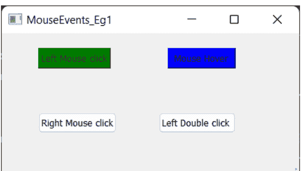

图 3.4：情况-3 MouseEvent_Eg1_files/run_MouseEvent_Eg1.py 的输出

## 情况-4：当点击文本为“右键单击”的按钮时

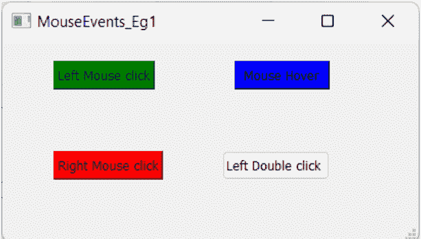

图 3.5：情况-4 MouseEvent_Eg1_files/run_MouseEvents_Eg1.py 的输出

## 情况-5：当用鼠标左键双击文本为“左键双击”的按钮时

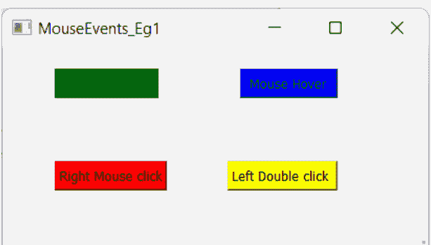

图 3.6：情况-5 MouseEvent_Eg1_files/run_MouseEvents_Eg1.py 的输出

> 注意：前面的代码包含在程序名：MouseEvent_Eg1_files/run_MouseEvents_Eg1.py 中

在上面的例子中，我们根据鼠标按钮的点击识别，将按钮的背景颜色显示为不同的颜色。让我们分析代码并尝试理解这个过程。

- 在 RME_1 中，导入 `sys` 模块以访问命令行参数后，我们从 PyQt5 包中创建桌面风格 UI 的类中导入，即 `QtWidgets`、`QMainWindow`（用于提供创建新 GUI 界面的框架）和一个应用程序处理器，即 `QApplication`。
- 在 RME_2 中，从 `MouseEvent_Eg1.py` Python 文件中，我们导入模块的所有成员。
- 在 RME_3 中，如果我们想通过按鼠标在窗口上触发鼠标事件，那么将执行上述语句。这就是为什么执行 `self.setMouseTracking(True)`。
- 在 RME_4 中，当我们将鼠标从 `hover_mouse_btn_2` 按钮移开时，我们使用 `leaveEvent` 在该按钮上使用 lambda 表达式将上述按钮的背景颜色设置为蓝色。我们可以看到当鼠标进入后离开上述按钮时的输出图；颜色从紫色变为蓝色。
- 在 RME_5 中，当我们将鼠标移入 `hover_mouse_btn_2` 按钮时，我们使用 `enterEvent` 在该按钮上使用 lambda 表达式将上述按钮的背景颜色设置为紫色。我们可以看到当鼠标进入上述按钮时的输出图；颜色从蓝色变为紫色。
- 在 RME_6 中，单击窗口 GUI 表单时，将调用 `mousePressEvent` 事件处理程序，该处理程序将使用一个参数接收传入的事件。
- 在 RME_7 中，我们检查用户是否左键单击。
- 在 RME_8 中，如果用户左键单击，则 `lm_click_btn_2` 按钮的背景颜色将变为绿色。
- 在 RME_9 中，我们检查用户是否右键单击。
- 在 RME_10 中，如果用户右键单击，则 `rm_click_btn_2` 按钮的背景颜色将变为红色。
- 在 RME_11 中，当用户双击窗口表单时，我们调用 `mouseDoubleClickEvent`，参数将接收传入的事件。
- 在 RME_12 中，我们检查用户是否左键双击。
- 在 RME_13 中，如果用户左键双击，则 `left_double_click_btn_2` 按钮的背景颜色将变为黄色。
- 在 RME_14 中，创建 `MyWindow` 类的实例 `mywindow`。

这只是一个例子。随着本章的深入，我们将学习更多。现在让我们集中理解信号和槽的概念。

`QObject` 类将派生 `PyQt` 控件，每个控件响应一个或多个事件，将发出 `signal`。为了执行一个操作，这个 `Signal` 将连接到 `slot`。`slot` 可以是一个可调用的函数/方法。

控件发出信号使用以下最方便的方式：

```
widget.signal.connect(slot_function/slot_method)
or
QtCore.QObject.connect(widget,
QtCore.SIGNAL('signalname'),slot_function/slot_method)
```

想象一下控件是一个 `QPushButton` 的实例，比如 `btn1`。考虑信号为 `clicked`；即当按钮被点击时，它必须连接到一个槽函数/方法，比如 `mydef_slot`。这可以通过两种方法实现：

```
btn1.clicked.connect(mydef_slot)
or
QtCore.QObject.connect(btn1, QtCore.SIGNAL("clicked()"), mydef_slot)
```

但是 PyQt5 中不支持 `QObject` 类的 `connect()` 方法，以实现信号和槽之间的连接。

让我们看一个 Qt Designer 中的简单例子，其中文件名的详细信息如表 3.1 所示：

| 序号 | Qt Designer 文件名 (.ui) | 将 Qt Designer 文件名转换为 Python 文件 (.py) | 创建另一个 Python 文件并从 Qt Designer 导入转换后的 Python 文件 |
|---|---|---|---|
| 1. | Signal_Slot_Eg2.ui | Signal_Slot_Eg2.py | run_Signal_Slot_Eg2.py |

**表 3.1：** 描述 Signal_Slot_Eg2 文件名的表格

Qt Designer 文件如图 3.7 所示：

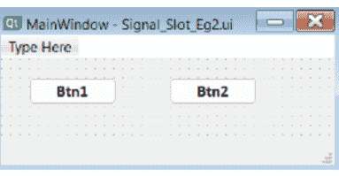

**图 3.7：** Qt Designer 文件：Signal_Slot_Eg2.ui

> **注意：** 上面的 .ui 文件包含在路径：Signal_Slot_Eg2_files/Signal_Slot_Eg2.ui 中

在这个例子中，我们将在两个按钮上执行点击操作，并以消息形式向用户显示一些信息。
考虑 `run_Signal_Slot_Eg2.py` 的以下代码：

```
import sys

from PyQt5.QtWidgets import QMainWindow,
QApplication, QMessageBox  # SS_1

from Signal_Slot_Eg2 import *# SS_2

class MySignalSlot_Window(QMainWindow):
    def __init__(self):
        super().__init__()
        self.myui = Ui_MainWindow()
        self.myui.setupUi(self)

        self.myui.mybtn1.clicked.connect(self.mymethod_btn1)# SS_3

        self.myui.mybtn2.clicked.connect(self.mymethod_btn2)# SS_4
        self.show()

    def mymethod_btn1(self):# SS_5
        QMessageBox.information(self, "Button 1",
            "Button1 is clicked",
            QMessageBox.Ok, QMessageBox.Ok)# SS_6
        return

    def mymethod_btn2(self):# SS_7
        QMessageBox.information(self, "Button 2",
            "Button2 is clicked",
            QMessageBox.Ok, QMessageBox.Ok)# SS_8
        return

if __name__ == '__main__':
    myapp = QApplication(sys.argv)
    mywindow = MySignalSlot_Window()# SS_9
    sys.exit(myapp.exec_())
```

## 输出：

输出可以在图 3.8 和 3.9 中看到，下面有不同的情况：

### 情况-1：当点击文本为“Btn1”的按钮时

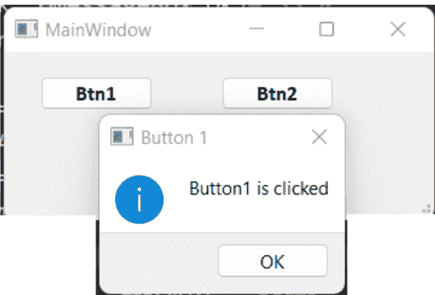

图 3.8：情况-1 Signal_Slot_Eg2_files/Signal_Slot_Eg2.py 的输出

### 情况-2：当点击文本为“Btn2”的按钮时

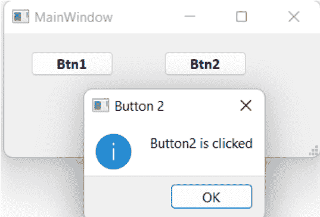

图 3.9：情况-2 Signal_Slot_Eg2_files/Signal_Slot_Eg2.py 的输出

> 注意：前面的代码包含在程序名：Signal_Slot_Eg2_files/Signal_Slot_Eg2.py 中

让我们根据提到的标签来理解代码：

- 在 **ss_1** 中，导入 **sys** 模块以访问命令行参数后，我们从 PyQt5 包中创建桌面风格 UI 的类中导入，即 **QtWidgets**、**QMainWindow**（用于提供创建新 GUI 界面的框架）和一个应用程序处理器，即 **QApplication**。此外，我们还导入一个用于创建对话框的控件，即 **QMessageBox**。
- 在 **ss_2** 中，从 **Signal_Slot_Eg2.py** Python 文件中，我们导入模块的所有成员。
- 在 **ss_3** 中，控件是 **mybtn1**。信号是 `clicked` 并连接到槽，当信号发出时。换句话说，当 **mybtn1** 按钮被点击时（点击 **事件** | **信号**），将调用 **mymethod_btn1**（槽）。
- 在 **ss_4** 中，控件是 **mybtn2**。信号是 `clicked` 并连接到槽。这里，如果信号发出，将调用 **mymethod_btn2** 方法。
- 在 **ss_5** 中，创建了一个自定义槽 **mymethod_btn1**，它将接受来自 **mybtn1** 的点击信号。
- 在 **ss_6** 中，正在显示一条消息。如输出图所示，点击 **Btn1** 按钮时，信息文本 **Button1** 会在一个新窗口中弹出。
- 在 **ss_7** 中，创建了一个自定义槽 **mymethod_btn2**，它将接受来自 **mybtn2** 的点击信号。
- 在 **ss_8** 中，正在显示一条消息。如输出图所示，点击 **Btn2** 按钮时，信息文本 **Button2** 会在一个新窗口中弹出。
- 在 **ss_9** 中，创建 **MySignalSlot_Window** 类的实例 **mywindow**。

PyQt5 支持多种信号，而不仅仅是刚才看到的点击信号。让我们再看一个信号与槽的示例。
文件名的详细信息如下表 3.2 所示：

| 序号 | Qt Designer 文件名 (.ui) | 将 Qt Designer 文件名转换为 Python 文件 (.py) | 创建另一个 Python 文件并导入从 Qt Designer 转换的 Python 文件 |
| :--- | :--- | :--- | :--- |
| 1 | Signal_Slot_Eg3.ui | Signal_Slot_Eg3.py | run_Signal_Slot_Eg3.py |

**表 3.2：** 描述 Signal_Slot_Eg3 文件名的表格
Qt Designer 文件如下图 3.10 所示：

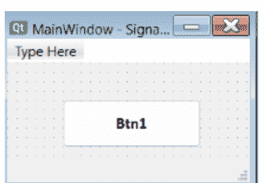

**图 3.10：** Qt Designer 文件：Signal_Slot_Eg3.ui

> **注意：** 上述 .ui 文件位于路径：
Signal_Slot_Eg3_files/Signal_Slot_Eg3.ui

在此示例中，我们将查看按钮的切换状态，其中信号也可以发送数据，从而揭示正在发生的一些信息。
考虑以下 run_Signal_Slot_Eg3.py 的代码：

```
import sys

from PyQt5.QtWidgets import QMainWindow,
QApplication# SS2_1
from Signal_Slot_Eg3 import * # SS2_2

class MySignalSlot2_Window(QMainWindow):
    def __init__(self):
        super().__init__()
        self.myui = Ui_Signal_Slot_Eg3()
        self.myui.setupUi(self)
        self.myui.mybtn1.setCheckable(True)# SS2_3
        self.myui.mybtn1.setStyleSheet("background-color : green")# SS2_4

        self.myui.mybtn1.clicked.connect(self.mymethod_btn1)# SS2_5

        self.myui.mybtn1.clicked.connect(self.mymethod_btn2)# SS2_6
        self.show()

    def mymethod_btn1(self):# SS2_7
        print("Clicked")# SS2_8

    def mymethod_btn2(self,checked):# SS2_9
        print("Checked?", checked)# SS2_10

if __name__ == '__main__':
    myapp = QApplication(sys.argv)
    mywindow = MySignalSlot2_Window()# SS2_11
    sys.exit(myapp.exec_())
```

## 输出：

输出可以在 *图 3.11* 中看到：

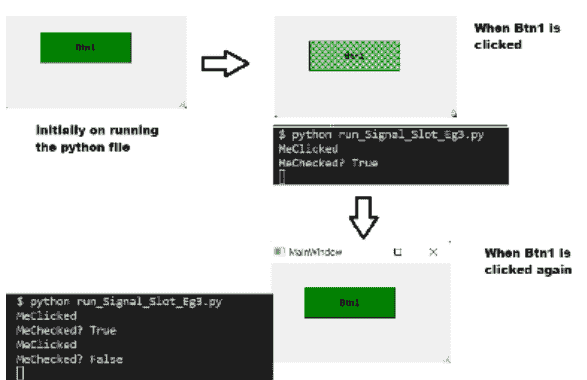

**图 3.11：** *Signal_Slot_Eg3_files/ Signal_Slot_Eg3.py 的输出*

> **注意：** 上述代码位于程序名称：**Signal_Slot_Eg3_files/Signal_Slot_Eg3.py**

让我们分析一下代码。

- 在 **ss2_1** 中，导入 **sys** 模块以访问命令行参数后，我们从 PyQt5 包中创建桌面风格 UI 的类导入，即 **QtWidgets**，**QMainWindow** 用于提供创建新 GUI 界面的框架，以及应用程序处理器，即 **QApplication**。
- 在 **ss2_2** 中，从 **Signal_Slot_Eg3.py** Python 文件中，我们导入模块的所有成员。
- 在 **ss2_3** 中，当我们探索 **Btn1** 的属性编辑器时，会发现上述属性为 **False**。

参考下图 *图 3.12*：


**图 3.12：** 按钮部件的可选中属性

- **checkable** 属性未被选中。因此，通过使用此属性，我们可以使按钮部件可选中。所以，它被设置为 **True**。
- 在 **ss2_4** 中，我们将上述按钮的背景颜色设置为 **green**。
- 在 **ss2_5** 中，当 **mybtn1** 按钮被点击（点击 **事件** | **信号**）时，**mymethod_btn1**（槽）将被调用。
- 在 **ss2_6** 中，当 **mybtn1** 按钮被点击（点击 **事件** | **信号**）时，**mymethod_btn2**（槽）将被调用。
- 在 **ss2_7** 中，**mymethod_btn1** 方法仅包含默认参数 **self**。此槽方法实际上忽略了可选中/切换数据。
- 在 **ss2_8** 中，当 **mybtn1** 按钮被点击时，将显示 **MeClicked** 消息，如图输出所示。有意地，**mybtn1** 按钮的背景颜色最初被设置为 **green**。点击后，只需观察 **mybtn1** 按钮。
- 在 **ss2_9** 中，**mymethod_btn2** 方法包含默认参数 **self** 和 **checked** 参数。
- 在 **ss2_10** 中，当 **mybtn1** 按钮再次被点击时，将显示 **MeChecked?** 消息，以及可选中的状态值，该值将为 **True/False**，如输出所示。第一次点击按钮时，checked 值为 **True**，再次点击时变为 **False**。
- 在 **ss2_11** 中，创建了 **MySignalSlot2_Window** 类的实例 **mywindow**。

在上面的示例中，我们将两个槽连接到一个点击信号，并在我们的槽上同时响应不同的信号版本。此外，消息显示在控制台中，而不是消息框中。所有这些方法都被遵循，以便在编码向用户显示信息时可以随时进行调整。
正如我们从上面接收数据的示例中看到的，我们可以将当前部件状态的数据存储在变量中。这只是一个练习。
现在，我们将在 Qt Designer 中查看信号和槽。
到目前为止，我们已经看到手动创建槽方法，该方法对信号做出反应。但是，现在，在 Qt Designer 的帮助下，我们将看到信号和槽如何与对象一起使用，这些对象将发送信号或接收信号。PyQt5 中有一些内置方法我们可以使用。但在此之前，我们必须查看 Qt Designer 中一些常用的工具栏图标。

# Qt Designer 中工具栏图标的使用

参考 *图 3.13*：

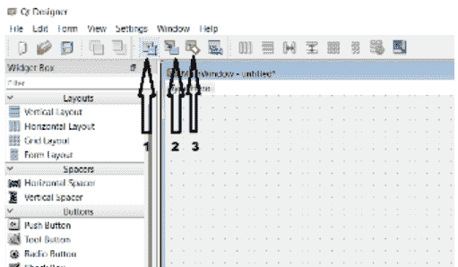

*图 3.13*：Qt Designer 的一些工具栏图标

*图 3.13* 显示了一些带有标签 1、2 和 3 的工具栏图标，如下所示：

1.  **编辑部件**：编辑部件是默认模式，我们可以执行多种操作，例如通过从 **部件框** 拖放来选择 GUI 表单上的部件。此外，我们可以编辑 GUI 表单上的对象，或者借助属性编辑器为部件应用布局、应用间隔器等。
2.  **编辑信号/槽**：在 **编辑信号/槽** 中，可以与对象创建连接，并且可以连接布局和部件的信号和槽。如果单击上述图标，**部件框** 将被禁用，单击编辑部件时，**部件框** 将再次启用。借助 Qt 中简单的信号和槽机制，可以连接 GUI 表单中的对象。
3.  **编辑伙伴**：在 **编辑伙伴** 中，我们开始在标签部件上建立连接，因为 GUI 表单中的部件将类似于信号和槽的编辑模式。在这里，每个提供快捷方式的 `label` 部件应与输入部件（如 `QTextEdit` 或 `QLineEdit`）连接。重要的是要知道，对于每个标签，只能定义一个伙伴连接。

在 **编辑伙伴** 旁边是 **编辑 Tab 键顺序**（在一个透明矩形框中高亮显示），如果需要根据便利性设置按下 *Tab* 键时聚焦部件的顺序，则将使用此功能。

所有上述讨论的工具栏图标都可在 Qt Designer 的 **编辑** 菜单栏下找到。

现在，我们将看到一些使用部件对象的有用应用程序。

# Qt Designer 中的信号槽示例

考虑以下 Qt Designer 文件，如 *图 3.14* 所示：

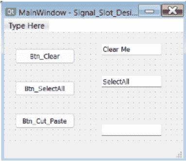

**图 3.14：** *Signal_Slot_Designer1.ui*

> **注意：** 上述 .ui 文件位于路径：**Signal_Slot_Designer_Files/Signal_Slot_Designer1.ui**

在上述设计器文件中，我们使用三个 **QPushButton** 对象和三个 **QLineEdit** 对象：

- 使用第一个 **QPushButton** 对象，我们清除第一个 **QLineEdit** 中存在的文本，即 **Clear Me**。
- 使用第二个 **QPushButton** 对象，我们选择第二个 **QLineEdit** 中存在的文本，即 **SelectAll**。
- 使用第三个 **QPushButton** 对象，我们将删除第二个 **QLineEdit** 中的文本，并将文本粘贴到第三个 **QLineEdit** 中。因此，文本将是 **SelectAll**。

让我们看看我们如何使用 Qt Designer 来实现这一点：

1.  只需单击 **编辑信号和槽** 工具栏图标。单击此图标后，部件框将被禁用，我们可以配置信号和槽。
2.  我们将看到，当鼠标光标移动到它们上方时，可以连接的部件项会高亮显示。要建立连接，我们需要在看到连接部件的红色箭头时释放鼠标按钮。之后，只剩下信号和槽的配置。

3. 在这个 Qt Designer 文件中，我们首先选择 QPushButton 对象（文本为 **Btn_Clear**），然后按住鼠标并拖动到 QLineEdit 对象（文本为 **Clear Me**）上释放，此时会看到一条红色箭头线。我们为 QPushButton（发送者）对象配置了 clicked 信号，并为 QLineEdit（接收者）对象配置了 clear 槽。这也可以在 **信号/槽编辑器** 中查看。发送信号的对象是发送者，接收信号的对象是接收者。因此，*clear* 方法槽正在响应 *clicked* 信号。

4. 然后我们选择第二个 QPushButton 对象（文本为 **Btn_SelectAll**），然后按住鼠标并拖动到第二个 QLineEdit 对象（文本为 **SelectAll**）上释放，此时会看到一条红色箭头线。选择的信号是 *clicked*，对应的槽是 *selectAll*。

5. 最后，我们选择第三个 QPushButton 对象（文本为 **Btn_Cut_Paste**），然后按住鼠标并拖动到第二个 QLineEdit 对象（文本为 **SelectAll**）上释放，此时会看到一条红色箭头线。选择的信号是 *clicked*，槽选择为 *cut*。此外，第三个 QPushButton **Btn_Cut_Paste** 将再次被选中并拖动到第三个 QLineEdit 对象上释放。选择的信号是 *clicked*，槽选择为 *paste*。从 *图 3.15* 中，我们可以查看信号和槽：

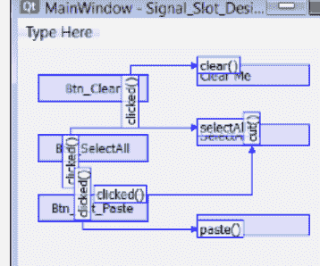

**图 3.15：** *Signal_Slot_Designer1.ui 中的信号与槽连接*

6. 这也可以在 **信号/槽编辑器** 中查看，如 *图 3.16* 所示：

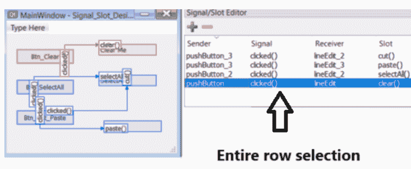

**图 3.16：** *Signal_Slot_Designer1.ui 文件中的信号/槽编辑器详情*

7. 在 *图 3.16* 中，我们可以看到整个行被选中（如箭头所示），GUI 表单中的控件和信号/槽连接以粉红色高亮显示。通过 **信号/槽编辑器**，我们可以查看 GUI 表单中被选为发送者或接收者的整个控件及其信号和槽的详细信息。现在，让我们通过按 *Ctrl + R* 来运行上述 .ui 文件。运行后，GUI 表单如 *图 3.17* 所示：

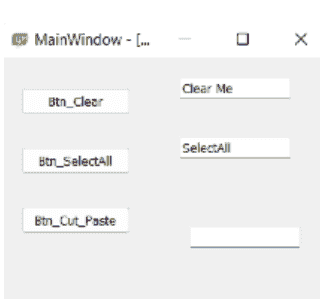

**图 3.17：** *Signal_Slot_Designer1.ui 文件的运行时 GUI 表单*

8. 让我们点击 **Btn_Clear** 按钮并查看输出，如 *图 3.18* 所示：

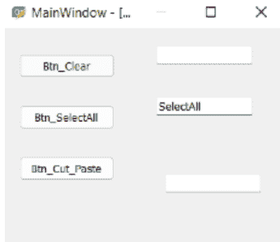

**图 3.18：** *点击 Btn_Clear 按钮时 Signal_Slot_Designer1.ui 文件的运行时 GUI 表单*

9. 现在，点击 **Btn_SelectAll** 按钮，第二个 `QLineEdit` 对象中的 **SelectAll** 文本将被选中，如 *图 3.19* 所示：

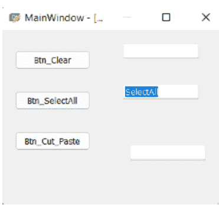

**图 3.19：** *点击 Btn_SelectAll 按钮时 Signal_Slot_Designer1.ui 文件的运行时 GUI 表单*

10. 现在，点击 **Btn_Cut_Paste** 按钮，第二个 `QLineEdit` 对象中的 **SelectAll** 文本将被剪切并粘贴到第三个 `QLineEdit` 对象中，如 *图 3.20* 所示：

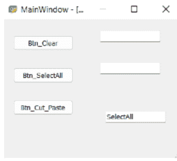

**图 3.20：** *点击 Btn_Cut_Paste 按钮时 Signal_Slot_Designer1.ui 文件的运行时 GUI 表单*

11. 使用 QPushButton 控件和 QLineEdit 控件还可以选择其他信号和槽，如图 3.21 所示：

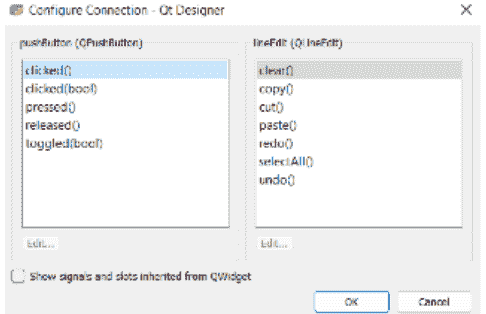

**图 3.21：** *QPushButton 和 QLineEdit 控件的信号与槽选择*

12. 如果用户勾选 **显示从 QWidget 继承的信号和槽** 选项，那么所有继承的信号和槽方法都将被填充。

我们可以对 Widget 框中的其他控件执行相同的技巧，查看它们有哪些信号和槽，可以根据需要使用。如前所述，我们可以通过点击工具栏图标中的 **编辑控件** 选项来退出 **编辑信号/槽** 选项。

让我们看看使用以下命令转换此 Qt Designer 文件后的 Python 代码：

```
pyuic5 Signal_Slot_Designer1.ui -o Signal_Slot_Designer1.py
```

# Signal_Slot_Designer1.py

```
from PyQt5 import QtCore, QtGui, QtWidgets

class Ui_MainWindow(object):
    def setupUi(self, MainWindow):
        MainWindow.setObjectName("MainWindow")
        MainWindow.resize(333, 260)
        self.centralwidget = QtWidgets.QWidget(MainWindow)
        self.centralwidget.setObjectName("centralwidget")
        self.pushButton = QtWidgets.QPushButton(self.centralwidget)
        self.pushButton.setGeometry(QtCore.QRect(20, 30, 111, 28))
        self.pushButton.setObjectName("pushButton")
        self.lineEdit = QtWidgets.QLineEdit(self.centralwidget)
        self.lineEdit.setGeometry(QtCore.QRect(180, 20, 113, 22))
        self.lineEdit.setObjectName("lineEdit")
        self.lineEdit_2 = QtWidgets.QLineEdit(self.centralwidget)
        self.lineEdit_2.setGeometry(QtCore.QRect(180, 80, 113, 22))
        self.lineEdit_2.setObjectName("lineEdit_2")
        self.pushButton_2 = QtWidgets.QPushButton(self.centralwidget)
        self.pushButton_2.setGeometry(QtCore.QRect(20, 90, 111, 28))
        self.pushButton_2.setObjectName("pushButton_2")
        self.lineEdit_3 = QtWidgets.QLineEdit(self.centralwidget)
        self.lineEdit_3.setGeometry(QtCore.QRect(180, 170, 113, 22))
        self.lineEdit_3.setText("")
        self.lineEdit_3.setObjectName("lineEdit_3")
        self.pushButton_3 = QtWidgets.QPushButton(self.centralwidget)
        self.pushButton_3.setGeometry(QtCore.QRect(20, 150, 111, 28))
        self.pushButton_3.setObjectName("pushButton_3")
        MainWindow.setCentralWidget(self.centralwidget)
        self.menubar = QtWidgets.QMenuBar(MainWindow)
        self.menubar.setGeometry(QtCore.QRect(0, 0, 333, 26))
        self.menubar.setObjectName("menubar")
        MainWindow.setMenuBar(self.menubar)
        self.statusbar = QtWidgets.QStatusBar(MainWindow)
        self.statusbar.setObjectName("statusbar")
        MainWindow.setStatusBar(self.statusbar)
        self.retranslateUi(MainWindow)
        self.pushButton.clicked.connect(self.lineEdit.clear)
        self.pushButton_2.clicked.connect(self.lineEdit_2.selectAll)
        self.pushButton_3.clicked.connect(self.lineEdit_2.cut)
        self.pushButton_3.clicked.connect(self.lineEdit_3.paste)
        QtCore.QMetaObject.connectSlotsByName(MainWindow)

    def retranslateUi(self, MainWindow):
        _translate = QtCore.QCoreApplication.translate
        MainWindow.setWindowTitle(_translate("MainWindow", "MainWindow"))
        self.pushButton.setText(_translate("MainWindow", "Btn_Clear"))
        self.lineEdit.setText(_translate("MainWindow", "Clear Me"))
        self.lineEdit_2.setText(_translate("MainWindow", "SelectAll"))
        self.pushButton_2.setText(_translate("MainWindow", "Btn_SelectAll"))
        self.pushButton_3.setText(_translate("MainWindow", "Btn_Cut_Paste"))
```

如果我们观察前面代码 **Signal_Slot_Designer1.py** 文件中高亮显示的矩形部分，我们会发现 clicked 信号连接到了 **QPushButton** 对象名称和 **QLineEdit** 对象槽，如 `clear`、`selectAll`、`cut` 和 `paste`。这些都是使用信号和槽自动生成的代码。希望使用 Qt Designer 的信号和槽概念已经清晰。我们将再看一个例子。

考虑 *图 3.22* 中的以下 Qt Designer 文件：

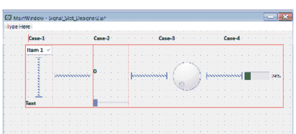

**图 3.22：** *Signal_Slot_Designer2.ui*

> **注意：** 上述 .ui 文件位于路径：**Signal_Slot_Designer_Files/Signal_Slot_Designer2.ui**。

现在，我们将查看上述设计器文件的信号和槽连接，如 *图 3.23* 所示：

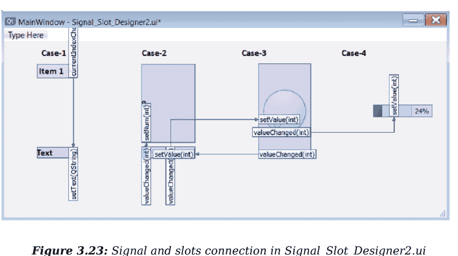

**图 3.23：** *Signal_Slot_Designer2.ui 中的信号与槽连接*

让我们查看上述设计器文件中的 **信号/槽编辑器** 详情，见以下 *图 3.24*：

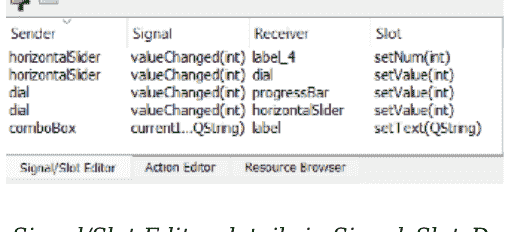

**图 3.24：** *Signal_Slot_Designer2.ui 文件中的信号/槽编辑器详情*

从前面的设计器文件中，我们可以看到我们高亮显示了四种情况。让我们逐一讨论。

# 情况-1：

参考 *表 3.3*：

| 发送者 | 信号 | 接收者 | 槽 |
| :--- | :--- | :--- | :--- |
| comboBox | currentIndexChanged(QString) | label | setText(QString) |

## **表 3.3：** 情况-1 中发送者、信号、接收者和槽的详细信息

在情况-1中，我们尝试从 `comboBox` 对象获取所选项目的当前索引的文本，并将该文本显示在标签对象中，如 *图 3.25* 所示：

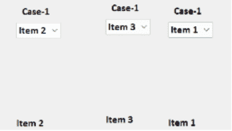

*图 3.25：* 情况-1 的 Signal_Slot_Designer2.ui 文件运行时 GUI 窗体

因此，当我们选择第二个索引项目 **Item 2** 时，标签对象中显示的文本将是 **Item 2**。选择第三个索引项目，即 **Item 3** 时，显示的文本将是 **Item 3**。当选择第一个索引项目时，显示的文本将是 **Item 1**。

现在让我们分析其他情况。情况-2、情况-3和情况-4是相互关联的。我们已经将控件 `horizontalSlider`、`label`、`dial` 和 `progressBar` 互连起来。

## **情况-2：**

参考 *表 3.4*：

| 发送者 | 信号 | 接收者 | 槽 |
|---|---|---|---|
| horizontalSlider | valueChanged(Int) | label_4 | setNum(int) |
| horizontalSlider | valueChanged(Int) | dial | setValue(Int) |

## **表 3.4：** 情况-2 中发送者、信号、接收者和槽的详细信息

在情况-2中，我们主要关注拖动 `horizontalSlider` 并在标签对象中显示整数值。此外，表盘将根据 `horizontalSlider` 的移动进行旋转。参考以下 *图 3.26*：

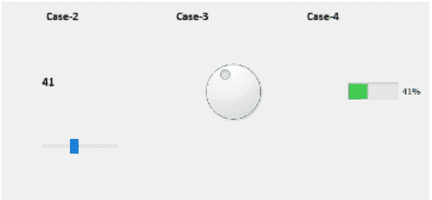

*图 3.26：* 情况-2 的 Signal_Slot_Designer2.ui 文件运行时 GUI 窗体

我们移动 `horizontalSlider`，用户选择一个值。这将导致在 `label` 对象上显示一个值，并且根据所选值显示滑块位置。同样重要的是要知道，通过更改 `dial` 对象的值，`progressBar` 的值会由于情况-4而被设置。

## 情况-3：

参考表 3.5：

| 发送者 | 信号 | 接收者 | 槽 |
| :--- | :--- | :--- | :--- |
| Dial | valueChanged(Int) | horizontalSlider | setValue(Int) |
| Dial | valueChanged(Int) | progressBar | setValue(Int) |

表 3.5：情况-3 中发送者、信号、接收者和槽的详细信息

参考以下图 3.27：

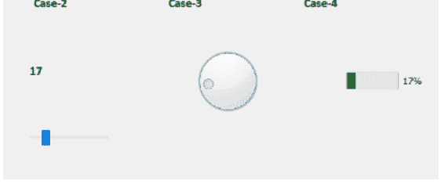

*图 3.27：* 情况-3 和情况-4 的 Signal_Slot_Designer2.ui 文件运行时 GUI 窗体

当更改表盘对象的滑块值时，我们可以看到值在 `label`、`horizontalSlider` 和 `progressBar` 对象中的效果。

让我们看看使用以下命令转换此 Qt Designer 文件后的 Python 代码：
`pyuic5 Signal_Slot_Designer2.ui -o Signal_Slot_Designer2.py`

请观察以下代码：

```python
from PyQt5 import QtCore, QtGui, QtWidgets

class Ui_MainWindow(object):
    def setupUi(self, MainWindow):
        MainWindow.setObjectName("MainWindow")
        MainWindow.resize(840, 277)
        self.centralwidget = QtWidgets.QWidget(MainWindow)
        self.centralwidget.setObjectName("centralwidget")
        self.widget = QtWidgets.QWidget(self.centralwidget)
        self.widget.setGeometry(QtCore.QRect(70, 10, 751, 23))
        self.widget.setObjectName("widget")
        self.horizontalLayout = QtWidgets.QHBoxLayout(self.widget)
        self.horizontalLayout.setContentsMargins(0, 0, 0, 0)
        self.horizontalLayout.setObjectName("horizontalLayout")
        self.label_2 = QtWidgets.QLabel(self.widget)
        font = QtGui.QFont()
        font.setFamily("Calibri")
        font.setPointSize(10)
        font.setBold(True)
        font.setWeight(75)
        self.label_2.setFont(font)
        self.label_2.setObjectName("label_2")
        self.horizontalLayout.addWidget(self.label_2)
        self.label_3 = QtWidgets.QLabel(self.widget)
        font = QtGui.QFont()
        font.setFamily("Calibri")
        font.setPointSize(10)
        font.setBold(True)
        font.setWeight(75)
        self.label_3.setFont(font)
        self.label_3.setObjectName("label_3")
        self.horizontalLayout.addWidget(self.label_3)
        self.label_5 = QtWidgets.QLabel(self.widget)
        font = QtGui.QFont()
        font.setFamily("Calibri")
        font.setPointSize(10)
        font.setBold(True)
        font.setWeight(75)
        self.label_5.setFont(font)
        self.label_5.setObjectName("label_5")
        self.horizontalLayout.addWidget(self.label_5)
        self.label_6 = QtWidgets.QLabel(self.widget)
        font = QtGui.QFont()
        font.setFamily("Calibri")
        font.setPointSize(10)
        font.setBold(True)
        font.setWeight(75)
        self.label_6.setFont(font)
        self.label_6.setObjectName("label_6")
        self.horizontalLayout.addWidget(self.label_6)
        self.widget1 = QtWidgets.QWidget(self.centralwidget)
        self.widget1.setGeometry(QtCore.QRect(60, 40, 751, 181))
        self.widget1.setObjectName("widget1")
        self.horizontalLayout_2 = QtWidgets.QHBoxLayout(self.widget1)
        self.horizontalLayout_2.setContentsMargins(0, 0, 0, 0)
        self.horizontalLayout_2.setObjectName("horizontalLayout_2")
        self.verticalLayout = QtWidgets.QVBoxLayout()
        self.verticalLayout.setObjectName("verticalLayout")
        self.comboBox = QtWidgets.QComboBox(self.widget1)
        font = QtGui.QFont()
        font.setFamily("Calibri")
        font.setPointSize(10)
        font.setBold(True)
        font.setWeight(75)
        self.comboBox.setFont(font)
        self.comboBox.setObjectName("comboBox")
        self.comboBox.addItem("")
        self.comboBox.addItem("")
        self.comboBox.addItem("")
        self.verticalLayout.addWidget(self.comboBox)
        spacerItem = QtWidgets.QSpacerItem(20, 40,
            QtWidgets.QSizePolicy.Minimum,
            QtWidgets.QSizePolicy.Expanding)
        self.verticalLayout.addItem(spacerItem)
        self.label = QtWidgets.QLabel(self.widget1)
        font = QtGui.QFont()
        font.setFamily("Calibri")
        font.setPointSize(10)
        font.setBold(True)
        font.setWeight(75)
        self.label.setFont(font)
        self.label.setObjectName("label")
        self.verticalLayout.addWidget(self.label)
        self.horizontalLayout_2.addLayout(self.verticalLayout)
        spacerItem1 = QtWidgets.QSpacerItem(48, 20,
            QtWidgets.QSizePolicy.Expanding,
            QtWidgets.QSizePolicy.Minimum)
        self.horizontalLayout_2.addItem(spacerItem1)
        self.verticalLayout_2 = QtWidgets.QVBoxLayout()
        self.verticalLayout_2.setObjectName("verticalLayout_2")
        self.label_4 = QtWidgets.QLabel(self.widget1)
        font = QtGui.QFont()
        font.setFamily("Calibri")
        font.setPointSize(10)
        font.setBold(True)
        font.setWeight(75)
        self.label_4.setFont(font)
        self.label_4.setObjectName("label_4")
        self.verticalLayout_2.addWidget(self.label_4)
        self.horizontalSlider = QtWidgets.QSlider(self.widget1)
        self.horizontalSlider.setOrientation(QtCore.Qt.Horizontal)
        self.horizontalSlider.setObjectName("horizontalSlider")
        self.verticalLayout_2.addWidget(self.horizontalSlider)
        self.horizontalLayout_2.addLayout(self.verticalLayout_2)
        spacerItem2 = QtWidgets.QSpacerItem(78, 20, QtWidgets.QSizePolicy.Expanding, QtWidgets.QSizePolicy.Minimum)
        self.horizontalLayout_2.addItem(spacerItem2)
        self.dial = QtWidgets.QDial(self.widget1)
        self.dial.setObjectName("dial")
        self.horizontalLayout_2.addWidget(self.dial)
        spacerItem3 = QtWidgets.QSpacerItem(78, 20, QtWidgets.QSizePolicy.Expanding, QtWidgets.QSizePolicy.Minimum)
        self.horizontalLayout_2.addItem(spacerItem3)
        self.progressBar = QtWidgets.QProgressBar(self.widget1)
        self.progressBar.setProperty("value", 24)
        self.progressBar.setObjectName("progressBar")
        self.horizontalLayout_2.addWidget(self.progressBar)
        MainWindow.setCentralWidget(self.centralwidget)
        self.menubar = QtWidgets.QMenuBar(MainWindow)
        self.menubar.setGeometry(QtCore.QRect(0, 0, 840, 26))
        self.menubar.setObjectName("menubar")
        MainWindow.setMenuBar(self.menubar)
        self.statusbar = QtWidgets.QStatusBar(MainWindow)
        self.statusbar.setObjectName("statusbar")
        MainWindow.setStatusBar(self.statusbar)
        self.retranslateUi(MainWindow)
        self.comboBox.currentIndexChanged['QString'].connect(self.label.setText)
        self.horizontalSlider.valueChanged['int'].connect(self.label_4.setNum)
        self.horizontalSlider.valueChanged['int'].connect(self.dial.setValue)
        self.dial.valueChanged['int'].connect(self.progressBar.setValue)
        QtCore.QMetaObject.connectSlotsByName(MainWindow)

    def retranslateUi(self, MainWindow):
        _translate = QtCore.QCoreApplication.translate
        MainWindow.setWindowTitle(_translate("MainWindow", "MainWindow"))
        self.label_2.setText(_translate("MainWindow", "Case-1"))
        self.label_3.setText(_translate("MainWindow", "Case-2"))
        self.label_5.setText(_translate("MainWindow", "Case-3"))
        self.label_6.setText(_translate("MainWindow", "Case-4"))
        self.comboBox.setItemText(0, _translate("MainWindow", "Item 1"))
        self.comboBox.setItemText(1, _translate("MainWindow", "Item 2"))
        self.comboBox.setItemText(2, _translate("MainWindow", "Item 3"))
        self.label.setText(_translate("MainWindow", "Text"))
        self.label_4.setText(_translate("MainWindow", "0"))
```

**注意：前面的代码包含在程序名称中：Signal_Slot_Designer_Files/Signal_Slot_Designer2.py**

请观察上述 Python 代码文件的矩形框，其中根据控件之间的信号和槽连接生成了自动代码。

借助 Qt Designer 的信号和槽，我们可以执行许多功能。建议探索其他

## 结论

在本章中，我们深入学习了PyQt5中的事件、信号和槽，并展示了它们在创建桌面应用程序中的实际应用。用户已学习如何使用Qt Designer开发有用的GUI表单应用程序，并跟踪鼠标移动以触发事件，例如更改QPushButton部件的背景颜色。通过大量示例，阐明了将信号连接到槽的概念，从而能够使用QPushButton部件创建简单的用户界面应用程序。

此外，本章还探讨了为布局和部件创建对象、信号和槽之间的连接，强调了它们在“编辑信号/槽”中的多功能性。所呈现的案例研究示例进一步巩固了本章所获得的知识和技能，这将使用户能够在自己的PyQt5项目中有效地利用这些概念。

## 要点回顾

-   事件作为通知，表明某事已经发生。按钮点击就是一个事件示例。
-   对象发出信号以通知其他对象某事已经发生。例如，当按钮对象被点击时，可能会发出一个信号。
-   当信号被发出时，称为槽的函数会被激活。例如，当按钮对象被点击时，可能会调用一个槽。
-   信号和槽可以随时相互连接/断开连接。
-   编辑部件、信号/槽和伙伴都是重要的Qt Designer元素，可以帮助设计师开发更有效、更高效的用户界面。
-   用户可以编辑部件以更改其在用户界面中的特性。当更改部件的大小、颜色或其他特性时，这会很有帮助。
-   使用伙伴允许用户始终同步两个部件。例如，如果使用此方法连接文本框和标签，则文本框中的文本将始终显示在标签中。

## 问题

1.  解释事件、信号和槽在Qt Designer中用于GUI设计的作用。
2.  解释Qt Designer中信号/槽编辑器的用法。
3.  展示并解释使用Qt Designer进行鼠标操作的GUI表单。
4.  解释以下内容及其在GUI设计中的用途：
    a. 编辑部件
    b. 编辑信号/槽
    c. 编辑伙伴
5.  解释Qt Designer的工具栏图标，并强调它们在GUI设计中的重要性。
6.  简要介绍Qt Designer中的“编辑Tab顺序”。
7.  结合一些案例研究，解释Qt Designer中的信号和槽连接。

## 加入本书的Discord空间

加入本书的Discord工作区，获取最新更新、优惠、全球科技动态、新书发布以及与作者的交流会：

https://discord.bpbonline.com


# 第4章
深入了解Qt Designer中的按钮部件

## 简介

在本章中，我们将讨论下一个预期的主题，围绕Qt Designer中的按钮部件展开。Qt Designer中存在的不同按钮包括**下推按钮**、**工具按钮**、**单选按钮**、**复选框**、**命令链接按钮**和**对话框按钮框**。我们将详细讨论所有这些部件，包括它们的描述、重要性和有用的属性、方法/函数以及带示例的信号。我们的整个讨论流程不仅限于本章，在后续章节解释Qt Designer的其他部件时，也将遵循相同的模式。所有这些按钮类型都将可用，如下面的*图4.1*所示，位于部件箱中，用户可以选择Qt Designer按钮类型下的任何部件，并将其拖放到GUI表单中。请参考下图：

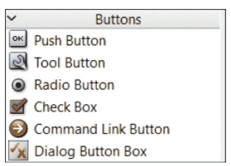

**图4.1：** *Qt Designer中不同的按钮类型*

现在，事不宜迟，让我们来了解不同的按钮部件。当用户希望与GUI表单部件交互并等待某种反馈时，这些按钮部件将派上用场。可以使用这些按钮部件在PyQt5中显示图标或文本。按钮部件的基类是**QAbstractButton**，它提供了可选中（切换）按钮和下推按钮的支持。

## 结构

在本章中，我们将讨论以下主题：

-   下推按钮
-   工具按钮
-   单选按钮
-   复选框
-   命令链接按钮
-   对话框按钮框
-   按钮部件的通用属性

## 目标

阅读本章后，读者将了解常用于创建交互式用户界面的按钮部件。本章的主要目标是理解它们的属性、功能和自定义选项。通过探索与按钮部件相关的特性和设置，我们可以有效地设计和实现Qt应用程序中用户友好的界面。Qt Designer提供了多种不同的按钮部件，包括**复选框**、**下推按钮**、**工具按钮**、**单选按钮**、**命令链接按钮**等。我们将详细探讨每种按钮部件的描述、属性、重要方法、重要信号以及带输出显示的应用示例。**QObject**、**QWidget**和**QAbstractButton**的重要属性将在最后以图片形式作为附加信息进行介绍。通用属性的概念将适用于所有后续章节。

## 下推按钮

PyQt5中最常用的部件之一，没有它我们无法想象创建应用程序，那就是简单的按钮——下推按钮。表示按钮的**QPushButton**类从**PyQt5.QtWidgets**模块导入。我们在各种应用程序中见过不同的按钮，例如**确定**、**取消**、**是**、**否**、**帮助**等。通常，我们可以使用下推按钮向用户显示简单的文本或任何图标。它的形状是矩形的。请记住，每当我们需要通过某种点击操作提示应用程序后台执行某些操作时，您首先想到的部件必须是下推按钮。

## 重要属性

将讨论多个属性。只需从部件箱拖放一个简单的下推按钮。在**属性编辑器**下，我们将看到不同的属性，这些属性在**QObject**、**QWidget**、**QAbstractButton**和**QPushButton**下分类。对于所有Qt对象，**QObject**类是基类。在此之下，我们有`objectName`属性，用户可以提供一些名称。该名称可以根据需要进行更改。

> **注意：** 需要了解的是，QObject、QWidget和QAbstractButton类的属性对于所有按钮类型都是通用的，对话框按钮框部件除外。在此对话框按钮框部件下，我们只有QObject和QWidget类的属性。实际上，Qt Designer中的每个部件都将具有QObject和QWidget类的属性。

**不同按钮部件的通用属性，即QObject、QWidget和QAbstractButton类，将在本章末尾讨论。**

除了这3个类的属性外，**QPushButton**部件还有一些其他属性，如下面的*图4.2*所示：

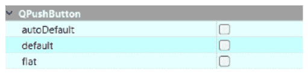

*图4.2：* 除了3个类（QObject、QWidget和QAbstractButton）属性之外的其他QPushButton属性

## autoDefault

此属性将启用**QPushButton**部件中的`autoDefault`按钮属性。如果按钮的父对象是**QDialog**，则此属性的默认值为**True**。否则，为**False**。自动默认按钮可能具有更大的尺寸，因为它在绘制时会带有一些额外的3像素或更多的边框。

## default

通过此属性，我们可以决定**QPushButton**部件是否具有`default`按钮属性。它默认是禁用的。

当用户按下键盘上的*Enter*键时，对话框的`default`按钮将自动被按下。

此属性将被启用，即设置为 True，但有一个例外。如果 **autoDefault** 按钮存在且具有 *焦点*，则会按下该 **autoDefault** 按钮。如果存在 **autodefault** 按钮但没有 **default** 按钮，则按 *Enter* 键将按下具有焦点的 **autodefault** 按钮。如果没有按钮具有焦点，则按 *Enter* 键将按下焦点链中的下一个 **autodefault** 按钮。我们只能在对话框中看到 **default** 按钮的行为。从键盘操作，当按钮获得焦点时，我们可以使用空格键来点击按钮。如果当前 **default** 按钮的此属性设置为 False，则下次对话框中的 **QPushButton** 小部件获得焦点时，将自动分配一个新的 **default** 按钮。

### flat

此属性将决定是否凸起按钮边框。默认情况下未选中。除非按钮被按下，否则大多数样式在选中时不会绘制背景。

## 重要方法

**QPushButton** 小部件的一些重要方法如下：

- **isChecked()**：使用此方法，我们将获得 **QPushButton** 小部件的布尔状态。
- **setCheckable()**：使用此方法，当设置为 True 时，我们可以区分 **QPushButton** 小部件的按下和释放状态。
- **text()**：使用此方法，我们将从 **QPushButton** 小部件获取文本。
- **setText()**：使用此方法，文本将被分配给 **QPushButton** 小部件。
- **setDefault()**：使用此方法，**QPushButton** 小部件将被设置为默认。
- **setIcon()**：使用此方法，图标将被分配给 **QPushButton** 小部件。
- **setEnabled()**：使用此方法，如果设置为 False，信号将不会从 **QPushButton** 小部件发出，因为它将被禁用。
- **toggle()**：通过此方法，**QPushButton** 小部件的状态将发生变化，因为它将在可选中状态之间切换。

## 重要信号

可以与此 **QPushButton** 小部件一起使用的信号如下图所示：

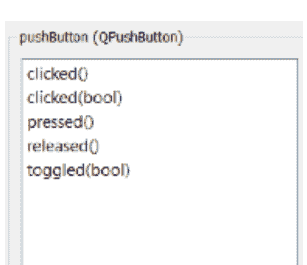

*图 4.3：Qt Designer 中 QPushButton 小部件中的信号*

- **pressed()**：当 **QPushButton** 小部件中的鼠标左键被按下时，将发出此信号。
- **released()**：当 **QPushButton** 小部件中的鼠标左键被释放时，将发出此信号。
- **clicked()**：当 **QPushButton** 小部件被点击时，将发出此信号。
- **toggled()**：当 **QPushButton** 小部件状态改变时，将发出此信号。

现在，我们将看一个 **QPushButton** 小部件的示例，其中我们了解其属性、方法和信号的使用。

文件名的详细信息在下表中给出：

| 序号 | Qt Designer 文件名 (.ui) | 将 QtDesigner 文件名转换为 Python 文件 (.py) | 创建另一个 Python 文件并从 Qt Designer 导入转换后的 Python 文件 |
|---|---|---|---|
| 1 | pushbutton_eg1.ui | pushbutton_eg1.py | run_pushbutton_eg1.py |

**表 4.1：** 文件名详细信息

Qt Designer 文件如下图所示：

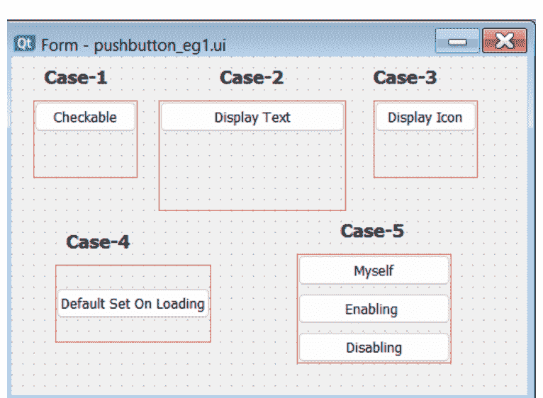

**图 4.4：** Qt Designer 文件：pushbutton_eg1.ui

> **注意：** 上述 .ui 文件位于路径：Push_Button/pushbutton_eg1.ui 中。

在此代码中，我们讨论了 QPushButton 小部件的 5 种不同情况。

考虑 run_pushbutton_eg1.py 的以下代码：

```python
import sys
from PyQt5.QtWidgets import QMainWindow, QApplication  # QPBEG1_1
from pushbutton_eg1 import * # QPBEG1_2
from PyQt5.QtCore import Qt
from PyQt5.QtGui import QPixmap, QIcon# QPBEG1_3

class MyPushButton_Example(QMainWindow):
    def __init__(self):
        super().__init__()
        self.myui = Ui_Form()
        self.myui.setupUi(self)
        # Case1
        self.myui.btn_checkable.setCheckable(True)
        # QPBEG1_4
        self.myui.btn_checkable.toggle()# QPBEG1_5
        self.myui.btn_checkable.clicked.connect(self.case1)
        # QPBEG1_6
        # Case2
        self.myui.btn_displaytxt.clicked.connect(lambda:
            self.case2(self.myui.btn_displaytxt))# QPBEG1_7
        # Case3
        self.myui.btn_display_icon.clicked.connect(self.case3)# QPBEG1_8
        # Case4
        self.myui.btn_default_set.setDefault(True)# QPBEG1_9
        # Case5
        self.myui.btn_enable.clicked.connect(self.case5_1)# QPBEG1_10
        self.myui.btn_disable.clicked.connect(self.case5_2)
        # QPBEG1_11
        self.show()

    def case1(self):
        if self.myui.btn_checkable.isChecked():# QPBEG1_12
            self.myui.mylbl1.setText("I am checked")
        else:
            self.myui.mylbl1.setText("I am unchecked")

    def case2(self, mybtn):
        self.myui.mylbl2.setText("Text name is: " + mybtn.text())# QPBEG1_13

    def case3(self):
        display_icon_image = "E:/my_pythonbook/PyQt5/Chapter_4/Push_Button/help-contents copy.png"# QPBEG1_14
        try:
            with open(display_icon_image):
                self.myui.btn_display_icon.setIcon(QIcon(QPixmap(display_icon_image)))# QPBEG1_15
                self.myui.mylbl3.setPixmap(QPixmap(display_icon_image))
        except FileNotFoundError:
            print("Wrong image selection")

    def case5_1(self):
        self.myui.btn_myself.setEnabled(True)# QPBEG1_16

    def case5_2(self):
        self.myui.btn_myself.setEnabled(False)# QPBEG1_17

if __name__ == '__main__':
    myapp = QApplication(sys.argv)
    mywindow = MyPushButton_Example()# QPBEG1_18
    sys.exit(myapp.exec_())
```

## 输出：

此处的输出可以在以下多种场景中看到：

### 情况-1

当点击 **可选中** 按钮时，`QLabel` 小部件中将显示“**我未选中**”消息，如 *图 4.5* 所示：

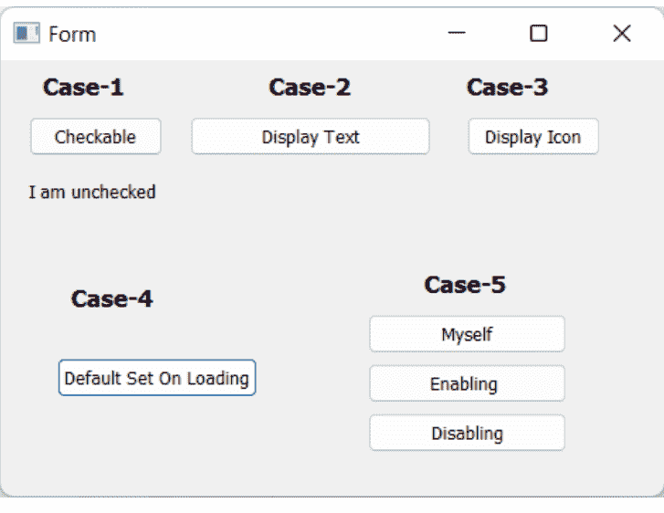

*图 4.5：当点击可选中按钮时，run_pushbutton_eg1.py 情况-1 的输出*

再次点击 **可选中** 按钮时，`QLabel` 小部件中将显示“**我已选中**”消息，如 *图 4.6* 所示：

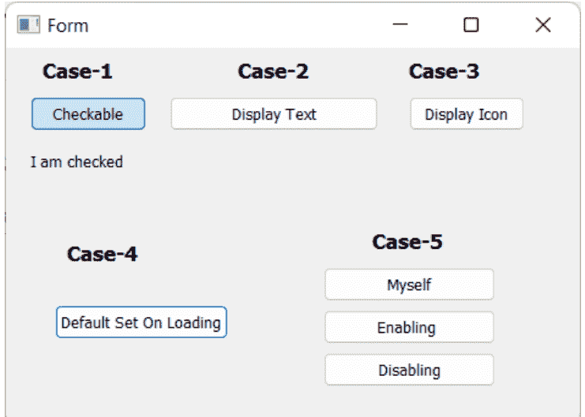

**图 4.6：** *当再次点击可选中按钮时，run_pushbutton_eg1.py 情况-1 的输出*

### 情况-2

当点击 **显示文本** 按钮时，QLabel 小部件中将显示 **文本名称是：显示文本** 消息：
请参阅下图：

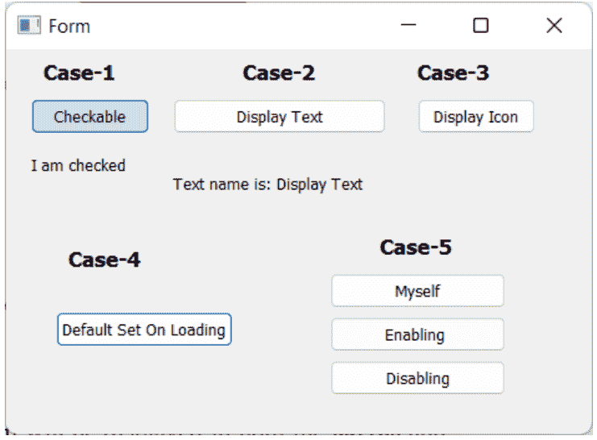

*图 4.7：run_pushbutton_eg1.py 情况-2 的输出*

### 情况-3

当您点击 **显示图标** 按钮时，图标将同时显示在 `button` 和 `label` 小部件中。请参阅下图：

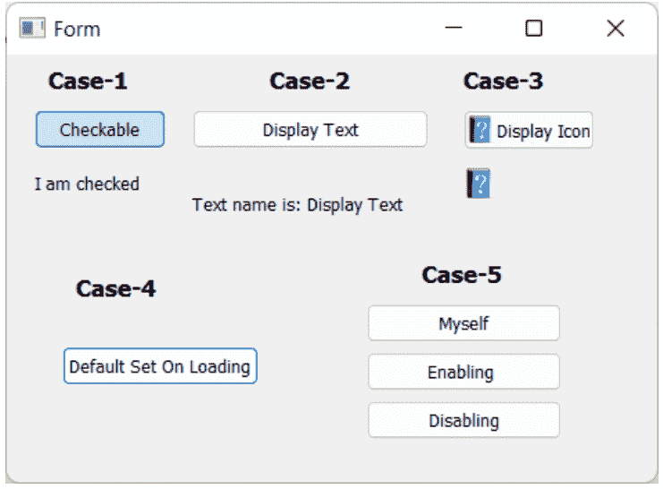

*图 4.8：run_pushbutton_eg1.py 情况-3 的输出*

### 情况-4

**加载时设置为默认** 按钮在加载 GUI 时获得焦点，如下 *图 4.9* 所示：

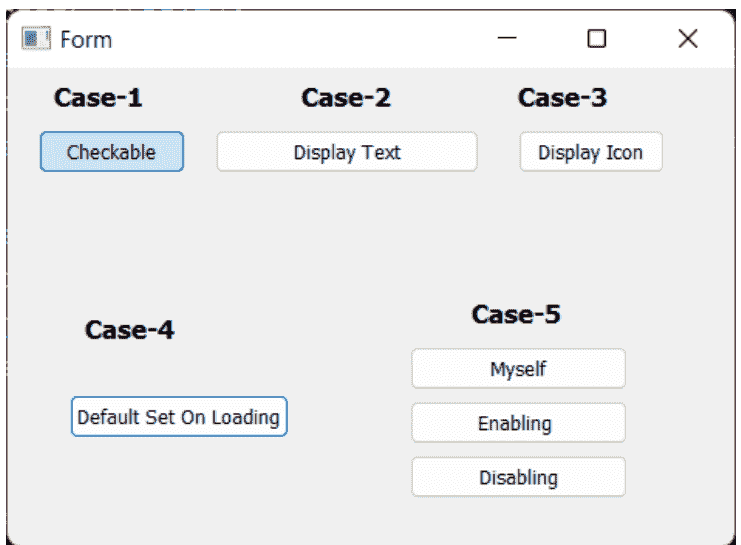

*图 4.9：run_pushbutton_eg1.py 情况-4 的输出*

### 情况-5：

点击文本为 **禁用** 的按钮时，文本为 **我自己** 的按钮将被禁用，如下 *图 4.10* 所示：

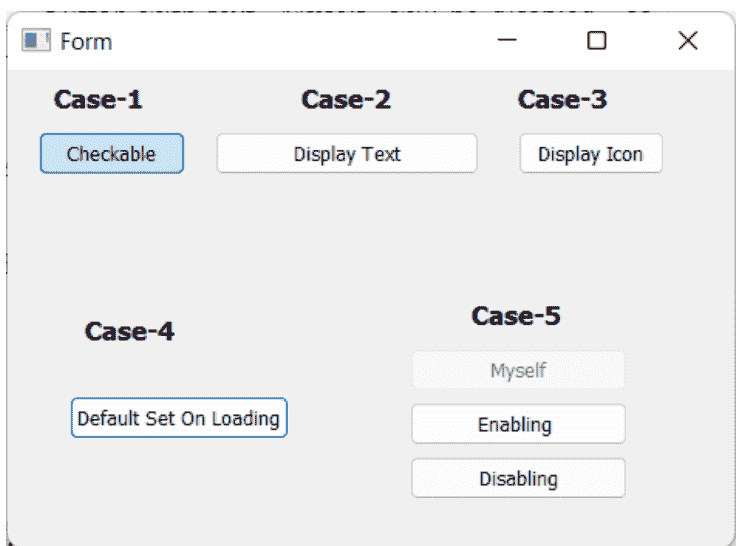

*图 4.10：当点击文本为“禁用”的按钮时，Chap4_Example1.py 的情况-5 输出*

点击文本为 **启用** 的按钮时，文本为 **我自己** 的按钮将被启用，如下 *图 4.11* 所示：

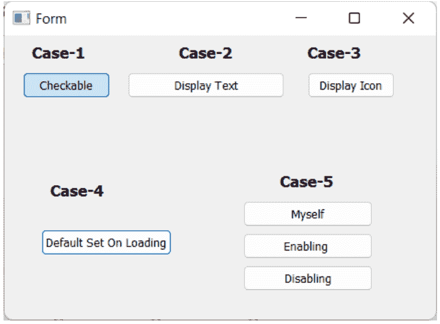

**图 4.11：** *当点击文本为“启用”的按钮时，Chap4_Example1.py 的情况-5 输出*

> **注意：** 上述代码位于程序名称：**Push_Button/run_pushbutton_eg1.py** 中。

让我们理解代码中的重要步骤：

- 在 **QPBEG1_1** 中，导入 sys 模块以访问命令行参数后，我们从创建 **PyQt5** 包桌面风格 UI 的类中导入，即 **QtWidgets**，**QMainWindow** 用于提供创建新 GUI 界面的框架，以及应用程序处理器，即 **QApplication**。
- 在 **QPBEG1_2** 中，从 **pushbutton_eg1.py** Python 文件中，我们导入模块的所有成员。
- 在 **QPBEG1_3** 中，从 **PyQt5** 包中，我们从包含图形控件的类中导入，即 **QtGui**，**QPixMap** 提供图像的离屏表示，以及 **QIcon** 类用于显示来自像素图集合的小型、大型、活动或禁用像素图。

- 在 QPBG1_4 和 QPBG1_5 中，我们的目标是将 `btn_checkable` QPushButton 小部件转换为切换按钮。因此，首先，我们将此按钮小部件的可检查状态设置为 True，以区分其按下和释放状态，然后我们启用此按钮小部件以进行切换。
- 在 QPBG1_6 中，当 `btn_checkable` 按钮被点击（点击事件 | 信号）时，Case-1（槽）将被调用。
- 在 QPBG1_7 中，当 `btn_displaytxt` 按钮被点击（点击事件 | 信号）时，Case-2（槽）将被调用，并传递 `btn_displaytxt` QPushButton 小部件作为参数。
- 在 QPBG1_8 中，当 `btn_display_icon` 按钮被点击（点击事件 | 信号）时，Case-3（槽）将被调用。
- 在 QPBG1_9 中，QPushButton 小部件 `btn_default_set` 将被设置为默认。这就是为什么我们在所有情况下都能看到它聚焦于 QPushButton 小部件。这在 Case-4 的输出中可以特别看到，该输出在矩形框中突出显示。
- 在 QPBG1_10 中，当 `btn_enable` 按钮被点击（点击事件 | 信号）时，case5_1（槽）将被调用。
- 在 QPBG1_11 中，当 `btn_disable` 按钮被点击（点击事件 | 信号）时，case_2（槽）将被调用。
- 在 QPBG1_12 中，从 Case-1 方法中，我们可以使用 `isChecked()` 方法识别 `btn_checkable` QPushButton 小部件是被按下还是释放。最初，此 `btn_checkable` 小部件是选中的。因此，当第一次点击时，此按钮小部件将从选中状态切换到未选中状态，并显示消息 "I am unchecked"。再次点击时，将显示消息 "I am checked"。

- 在 QPBEG1_13 中，我们使用 `btn_display` QPushButton 小部件的文本（即 "Displaytext"）设置 `mylbl2` 小部件的文本。因此，点击 `btn_display` 按钮时，我们将在 `mylbl2` 小部件中获得消息 "Text name is: Display text"。
- 在 QPBEG1_14 中，我们将 `.png` 扩展名文件的路径存储在对象变量 `display_icon_image` 中（路径在您的文件系统中可能不同。您可以根据需要编写）。
- 在 QPBEG1_15 中，点击 `btn_display_icon` 按钮后，图标将使用 `setIcon()` 方法显示在 `btn_display_icon` 和 `mylbl3` 小部件中，该方法将显示一个图标，因为它将 QPixmap 对象作为任何图像文件的参数。此外，使用 `setPixmap` 方法，我们也在 QLabel 小部件对象中显示一个图标。
- 在 QPBEG1_16 中，点击 `btn_enable` 按钮时，`btn_myself` 按钮对象将被设置为启用状态，因为我们使用 `setEnabled()` 方法并传递参数 True。
- 在 QPBEG1_17 中，点击 `btn_disable` 按钮时，`btn_myself` 按钮对象将被设置为禁用状态，因为我们使用 `setEnabled()` 方法并传递参数 False。
- 在 QPBEG1_18 中，创建了 `MyPushButton_Example` 类的一个实例 `mywindow`。

现在应该清楚 QPushButton 小部件的概念了。我们将看到我们的下一个工具按钮小部件。

## 工具按钮

通常，需要通过提供快速访问按钮来选择命令或操作。在这种情况下，我们将使用工具按钮，这些按钮最常用于 QToolBar 小部件中。我们通常在工具按钮小部件中看到图标本身而不是文本。

## 重要属性

除了 3 个类（QObject、QWidget 和 QAbstractButton）的属性外，QToolButton 小部件还有一些其他属性，解释如下：

### popupMode

参考以下 *图 4.12*：

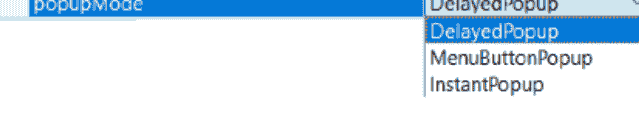

*图 4.12*：在 Qt Designer 中描绘 QToolButton 小部件 popupMode 属性的图像

使用此属性，将描述包含菜单集或某些操作列表的菜单，以及它将如何为工具按钮弹出。有 3 个常量：

- **DelayedPopup**：在这里，菜单将在第一次按下并按住工具按钮小部件一段时间后显示。我们看到的一个常见例子是网络浏览器中后退按钮的使用，如果用户按下并按住该按钮，将显示一个描述当前历史记录列表的菜单。这是要显示的默认值。
- **MenuButtonPopup**：如果我们使用此常量，则在工具按钮小部件中显示一个特殊箭头，表示存在菜单，并将在按下按钮的箭头部分时显示。
- **InstantPopup**：如果我们使用此常量，则在按下工具按钮小部件时，菜单将立即显示，没有延迟。

### toolButtonStyle

参考以下 *图 4.13*：

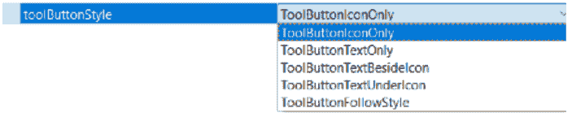

*图 4.13*：在 Qt Designer 中描绘 QToolButton 小部件 toolButtonStyle 属性的图像

`QToolButton` 小部件的此属性将决定在工具按钮上显示什么：仅文本、仅图标、图标旁边的文本还是图标下方的文本。我们可以看到默认值是 **ToolButtonIconOnly**。如果需要遵循系统设置，则使用 **ToolButtonFollowStyle** 设置上述属性。其余选择不言自明。

### autoRaise

参考以下图形：


*图 4.14*：在 Qt Designer 中描绘 QToolButton 小部件 autoRaise 属性的图像

使用此属性，我们可以启用 **autoRaise**。默认情况下它是禁用的。

### arrowType

参考以下 *图 4.15*：

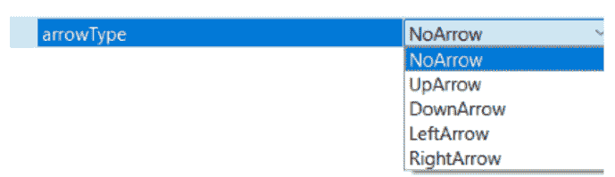

**图 4.15：** 在 Qt Designer 中描绘 QToolButton 小部件 arrowType 属性的图像

使用此属性时，用户可以选择是否显示箭头而不是图标。

## 重要方法

QToolButton 小部件的一些重要方法如下：

- **setAutoRaise()：** 使用此方法，我们可以检查或取消检查 QToolButton 小部件的 **autoRaise** 功能。
- **setPopupMode()：** 使用此方法，我们可以描述 QToolButton 小部件的弹出菜单方式。
- **setToolButtonStyle()：** 使用此方法，我们可以设置 QToolButton 小部件的显示样式，即显示仅文本、仅图标、图标旁边的文本还是图标下方的文本。
- **setMenu()：** 使用此方法，根据 QToolButton 小部件的弹出模式，可以将给定的菜单与 QToolButton 小部件关联。

## 重要信号

信号与 QPushButton 小部件类似。除此之外，我们还有 `triggered` 信号，该信号仅在我们使用 `addAction()` 方法将某些 QAction 添加到 QToolButton 小部件时才会触发，即当操作被触发时，将发出信号。参考以下 *图 4.16*：

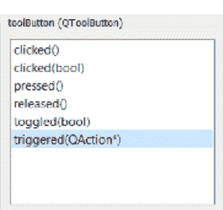

**图 4.16：** *Qt Designer 中 QToolButton 小部件中的信号*

此 **QToolButton** 小部件在日常各种应用程序中广泛可见，如创建记事本、写字板、画图等。

让我们创建一个简单的应用程序来理解此 **QToolButton** 小部件。

文件名的详细信息在以下 [表 4.2](#table-42) 中给出：

| 序号 | Qt Designer 文件名 (.ui) | 将 QtDesigner 文件名转换为 Python 文件 (.py) | 创建另一个 Python 文件并从 Qt Designer 导入转换后的 Python 文件 |
| :--- | :--- | :--- | :--- |
| 1 | toolbutton_eg1.ui | toolbutton_eg1.py | run_toolbutton_eg1.py |

**表 4.2：** *文件名的详细信息*

Qt Designer 文件 **toolbutton_eg1.ui** 如下图所示：

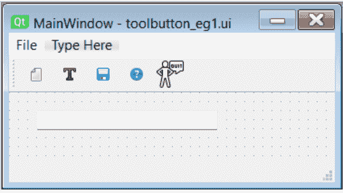

**图 4.17：** Qt Designer 文件：toolbutton_eg1.ui

> **注意：** 上述 .ui 文件位于路径：Tool_Button/toolbutton_eg1.ui 中。

在此代码中，我们讨论了 **QToolButton** 小部件的 8 个不同案例。上述设计器文件的 **Action Editor** 如下 *图 4.18* 所示：

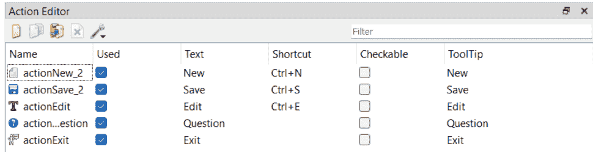

**图 4.18：** 描绘 toolbutton_eg1.ui 的 QAction 的 Action Editor

考虑以下 **run_toolbutton_eg1.py** 的代码：

```
import sys

from PyQt5.QtWidgets import QMainWindow,
QApplication, QAction, QToolButton# QTBEG1_1

from toolbutton_eg1 import *# QTBEG1_2

from PyQt5 import QtGui, QtCore
```

from PyQt5.QtCore import Qt
class MyToolButton_Example(QMainWindow):
    def __init__(self):
        super().__init__()
        self.myui = Ui_MainWindow()
        self.myui.setupUi(self)

        # 情况-1
        self.myui.actionNew_2.setCheckable(True) # QTBEG1_3
        self.myui.actionNew_2.setStatusTip("将显示新建文本")# QTBEG1_4

        # 情况-2
        self.myui.actionEdit.setCheckable(False)# QTBEG1_5
        self.myui.actionEdit.setStatusTip("将显示编辑文本")# QTBEG1_6

        # 情况-3
        self.myui.actionSave_2.setStatusTip("将显示保存文本")# QTBEG1_7
        # 情况-4
        self.myui.actionQuestion.setStatusTip("将显示问题文本")# QTBEG1_8

        # 使用代码添加一个工具按钮

        # 情况-5
        self.mytb_btn1 = QAction(QtGui.QIcon("C:/Users/SAURABH/Desktop/python course/search.gif"),"搜索",self)# QTBEG1_9
        self.mytb_btn1.setStatusTip("将显示搜索文本")# QTBEG1_10

        self.myui.toolBar.addAction(self.mytb_btn1)# QTBEG1_11

        self.myui.toolBar.actionTriggered[QAction].connect(self.mydisplay)# QTBEG1_12

        # 情况-6
        self.mytb_btn2 = QToolButton()# QTBEG1_13
        self.mytb_btn2.setCheckable(True)# QTBEG1_14
        self.mytb_btn2.setChecked(False)# QTBEG1_15
        self.mytb_btn2.setArrowType(Qt.LeftArrow)# QTBEG1_16
        self.mytb_btn2.setAutoRaise(True)# QTBEG1_17
        self.mytb_btn2.setToolButtonStyle(Qt.ToolButtonIconOnly)# QTBEG1_18

        self.mytb_btn2.clicked.connect(self.myshowDetail)# QTBEG1_19

        self.myui.toolBar.addWidget(self.mytb_btn2)# QTBEG1_20

        # 情况-7
        self.mytb_btn3 = QToolButton()# QTBEG1_21
        self.mytb_btn3.setIcon(QtGui.QIcon("C:/Users/SAURABH/Desktop/python course/globe-green.png")) # QTBEG1_22
        self.mytb_btn3.setIconSize(QtCore.QSize(30,30))# QTBEG1_23
        self.mytb_btn3.setPopupMode(QToolButton.MenuButtonPopup)# QTBEG1_24
        self.myui.toolBar.addWidget(self.mytb_btn3)# QTBEG1_25

        # 情况-8
        self.myui.actionExit.triggered.connect(self.exit)# QTBEG1_26
        self.show()

    def mydisplay(self, mytxt):# QTBEG1_27
        self.myui.lineEdit.setText(mytxt.text())# QTBEG1_28

    def exit(self):
        sys.exit()# QTBEG1_29

    def myshowDetail(self):
        if self.mytb_btn2.isChecked(): # QTBEG1_30
            self.myui.lineEdit.setText("显示...1")
        else:
            self.myui.lineEdit.setText("显示...2")# QTBEG1_31

if __name__ == '__main__':
    myapp = QApplication(sys.argv)
    mywindow = MyToolButton_Example()# QTBEG1_32
    sys.exit(myapp.exec_())

## 输出：

此处的输出可以在多种场景下看到。

## 情况-1：点击新建 QAction 图标或按 Ctrl+N

请参考下图，其中工具按钮图像图标“新建”正被点击：

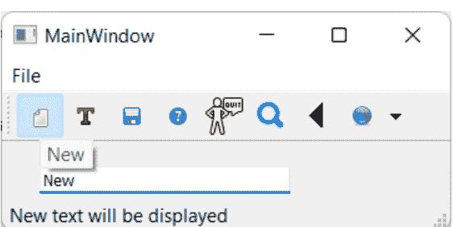

*图 4.19：run_toolbutton_eg1.py 的情况-1 输出*

## 情况-2：点击编辑 QAction 图标或按 Ctrl+E

请参考下图，其中工具按钮图像图标“编辑 (T)”正被点击：

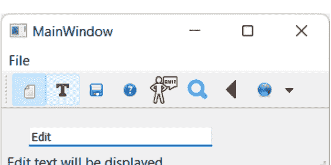

*图 4.20：run_toolbutton_eg1.py 的情况-2 输出*

## 情况-3：点击保存 QAction 图标或按 Ctrl+S

请参考下图，其中工具按钮图像图标“保存”正被点击：

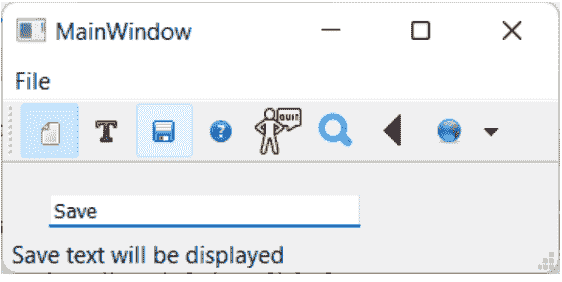

*图 4.21：run_toolbutton_eg1.py 的情况-3 输出*

## 情况-4：点击问题 QAction 图标

请参考下图，其中工具按钮图像图标“问题 (?)”正被点击：

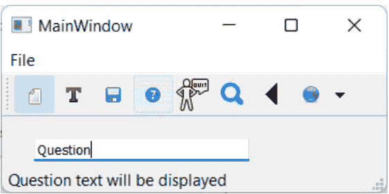

*图 4.22：run_toolbutton_eg1.py 的情况-4 输出*

## 情况-5：点击退出 QAction 图标

点击工具按钮图像图标“退出”将退出整个应用程序。

## 情况-6：点击搜索 QAction 图标

请参考下图，其中工具按钮图像图标“搜索”正被点击：

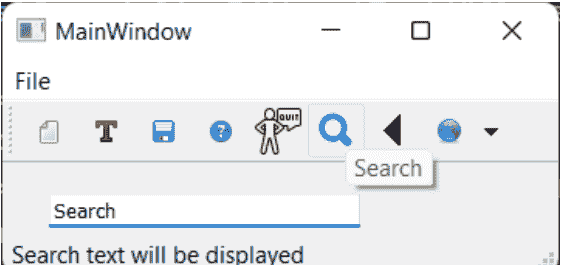

*图 4.23：run_toolbutton_eg1.py 的情况-6 输出*

## 情况-7：点击左箭头 QToolButton

请参考下图：
首次点击左箭头 QToolButton 时。

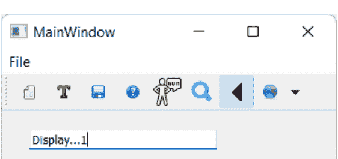

*图 4.24：run_toolbutton_eg1.py 在首次点击带箭头的工具按钮图像图标时的情况-7 输出*

再次点击左箭头 QToolButton 时。

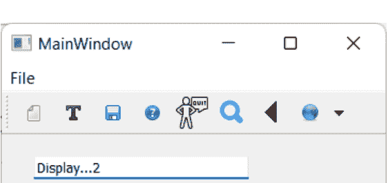

*图 4.25：run_toolbutton_eg1.py 在再次点击带箭头的工具按钮图像图标时的情况-7 输出*

## 情况-8：具有 MenuButtonPopupMode 的 QToolButton

请参考下图，其中显示了具有 MenuButtonPopup 模式的工具按钮图像图标：

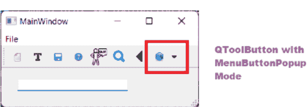

*图 4.26：run_toolbutton_eg1.py 的情况-8 输出*

> 注意：前面的代码包含在程序名称：Tool_Button/run_toolbutton_eg1.py 中。

- 在 QTBEG1_1 中，导入 sys 模块以访问命令行参数后，我们从 PyQt5 包中创建桌面风格 UI 的类中导入，即 QtWidgets、QMainWindow、应用程序处理器 QApplication、用于描述抽象用户界面的 QAction 类以及 QToolButton 小部件。
- 在 QTBEG1_2 中，从 toolbutton_eg1.py Python 文件中，我们导入模块的所有成员。
- 在 QTBEG1_3 中，我们使用 setCheckable() 方法使 actionNew_2 可选中。这就是为什么在情况-1中，你只需观察按下时的图标。
- 在 QTBEG1_4 中，我们将用户文本设置为“将显示新建文本”，以提供有关 actionNew_2 QAction 对象的信息。
- 在 QTBEG1_5 中，我们使用 setCheckable() 方法使 actionEdit 不可选中。这就是为什么在情况-2中，你只需观察按下时的图标。这样做是为了说明前两种情况图标之间的区别。
- 在 QTBEG1_6 中，我们将用户文本设置为“将显示编辑文本”，以提供有关 actionEdit QAction 对象的信息。
- 在 QTBEG1_7 中，我们将用户文本设置为“将显示保存文本”，以提供有关 actionSave_2 QAction 对象的信息，如情况-3所示。
- 在 QTBEG1_8 中，我们将用户文本设置为“将显示问题文本”，以提供有关 actionQuestion QAction 对象的信息，如情况-4所示。
- 在 QTBEG1_9 中，第一个参数是使用 QIcon 方法显示的图标。第二个参数是字符串“搜索”，最后操作的父级将是当前主窗口，这就是为什么它将 self 作为第三个参数传递。
- 在 QTBEG1_10 中，我们将用户文本设置为“将显示搜索文本”，以提供有关 mytb_btn1 QAction 对象的信息。
- 在 QTBEG1_11 中，mytb_btn1 QAction 对象将使用 addAction() 方法添加到工具栏。
- 在 QTBEG1_12 中，当工具栏中的任何图标被点击时，将发出 actionTriggered 信号，并连接到 mydisplay() 方法，如情况-6所示。
- 在 QTBEG1_13 中，创建了 QToolButton 对象 mytb_btn2 的一个实例。
- 在 QTBEG1_14 中，我们使用 mytb_btn2 对象的 setCheckable() 方法将可选中属性设置为 True。
- 在 QTBEG1_15 中，最初 mytb_btn2 对象未被选中。
- 在 QTBEG1_16 中，我们为 mytb_btn2 对象显示一个左箭头。
- 在 QTBEG1_17 中，mytb_btn2 对象的 autoRaise 属性设置为 True。
- 在 QTBEG1_18 中，QToolButton mytb_btn2 对象的显示样式设置为 ToolButtonIconOnly。
- 在 QTBEG1_19 中，当 mytb_btn2 对象被点击（点击事件 | 信号）时，将调用 myshowDetail（槽）。
- 在 QTBEG1_20 中，我们使用 addWidget() 方法将 mytb_btn2 对象添加到工具栏。
- 在 QTBEG1_21 中，创建了 QToolButton 对象 mytb_btn3 的一个实例。
- 在 QTBEG1_22 中，我们为 mytb_btn3 对象添加了一个图标。
- 在 QTBEG1_23 中，图标的大小设置为宽度和高度均为 30,30。
- 在 QTBEG1_24 中，mytb_btn3 对象的弹出菜单方式描述为 MenuButtonPopup。请在情况-8中观察。
- 在 QTBEG1_25 中，我们将 mytb_btn3 对象添加到工具栏，如情况-8所示。
- 在 QTBEG1_26 中，当 actionExit QAction 对象被点击时，会发出触发信号，我们关闭应用程序，如情况-5所示。
- 在 QTBEG1_27 中，mydisplay() 方法包含一个额外的参数 mytxt。
- 在 QTBEG1_28 中，当点击工具栏上的 QAction 对象时，我们将其文本显示在 QLineEdit 小部件中。我们可以观察到情况 1、2、3、4 和 6 的输出。此外，使用快捷键，可以显示情况-1、2 和 3 的文本。

## 单选按钮

此控件主要用于需要在GUI表单的多个选项中仅选择一个选项的场景。我们可以为任何可选择的按钮提供一些文本标签。如果选中了任何一个**QRadioButton**控件，由于其默认是自动排他的，之前选中的按钮将会被取消选中。我们通常将上述控件与**QButtonGroup**或**QGroupBox**一起使用。

## 重要属性

它包含3个类的属性：

- **QObject**
- **QWidget**
- **QAbstractButton**

## 重要方法

一些重要的方法如下：

- **isChecked()**：使用此方法，如果**QRadioButton**控件被选中，将返回一个布尔值。
- **setChecked()**：使用此方法，我们可以根据传入的布尔值来选中/取消选中QRadioButton控件。
- **text()**：使用此方法，我们可以获取QRadioButton控件的文本。
- **setText()**：从名称我们可以猜到，使用此方法将设置QRadioButton控件的文本。
- **setIcon()**：使用此方法，将在QRadioButton控件旁显示一个图标。

## 重要信号

这些信号与QPushButton控件类似。请参考图4.27：

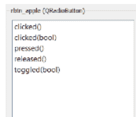

让我们创建一个简单的应用程序来理解这个QRadioButton控件。文件名的详细信息如下表4.3所示：

| 序号 | Qt Designer 文件名 (.ui) | 将QtDesigner文件名转换为Python文件 (.py) | 创建另一个Python文件并导入从Qt Designer转换的Python文件 |
| :--- | :--- | :--- | :--- |
| 1 | radiobutton_eg1.ui | radiobutton_eg1.py | run_radiobutton_eg1.py |

Qt Designer文件**radiobutton_eg1.ui**如下图所示：

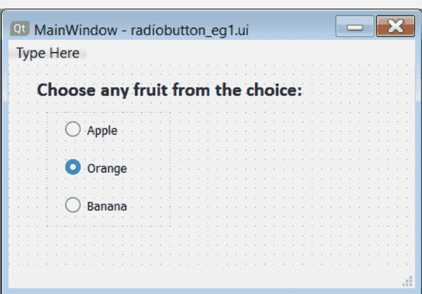

**图4.28：** Qt Designer文件：radiobutton_eg1.ui

> **注意：** 上述.ui文件位于路径：Radio_Button/radiobutton_eg1.ui。

考虑以下**run_radiobutton_eg1.py**的代码：

```python
import sys
from PyQt5.QtWidgets import QMainWindow, QApplication
from radiobutton_eg1 import * # RBEG1_1

class MyForm(QMainWindow):
    def __init__(self):
        super().__init__()
        self.ui = Ui_MainWindow()
        self.ui.setupUi(self)

        self.ui.rbtn_apple.toggled.connect(lambda:self.myselfcheck(self.ui.rbtn_apple)) # RBEG1_2
        self.ui.rbtn_orange.toggled.connect(lambda:self.myselfcheck(self.ui.rbtn_orange)) # RBEG1_3
        self.ui.rbtn_banana.toggled.connect(lambda:self.myselfcheck(self.ui.rbtn_banana)) # RBEG1_4
        self.show()

    def myselfcheck(self, myradiobutton): # RBEG1_5
        if myradiobutton.isChecked(): # RBEG1_6
            self.ui.lbldisplay.setText(myradiobutton.text() + " is selected") # RBEG1_7

if __name__=="__main__":
    app = QApplication(sys.argv)
    w = MyForm()
    w.show()
    sys.exit(app.exec_())
```

## 输出：

请参考以下*图4.29*：

### 情况-1：执行代码时的初始默认输出

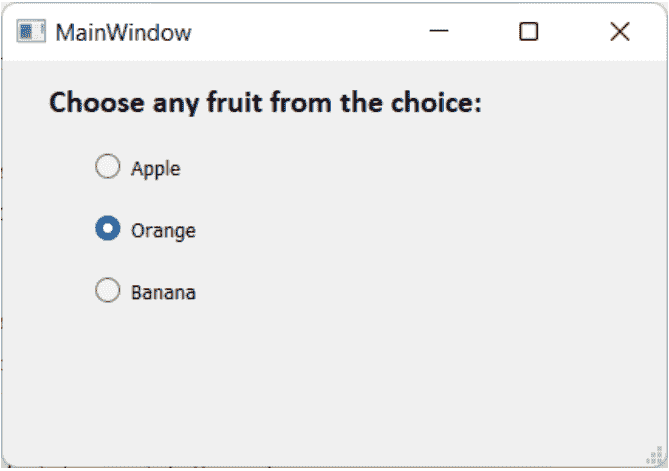

**图4.29：** *run_radiobutton_eg1.py的情况-1输出*

### 情况-2：当点击文本为Apple的单选按钮时

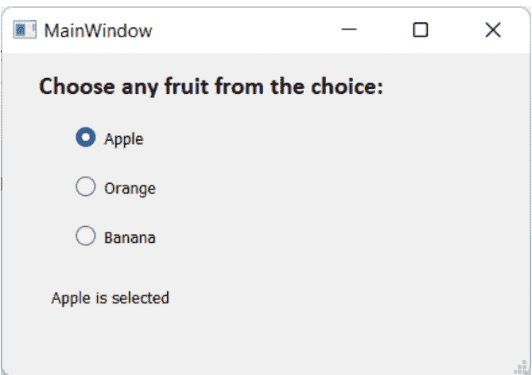

**图4.30：** *run_radiobutton_eg1.py的情况-2输出*

### 情况-3：当点击文本为Orange的单选按钮时

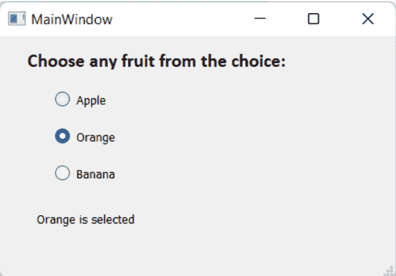

**图4.31：** *run_radiobutton_eg1.py的情况-3输出*

### 情况-4：当点击文本为Banana的单选按钮时

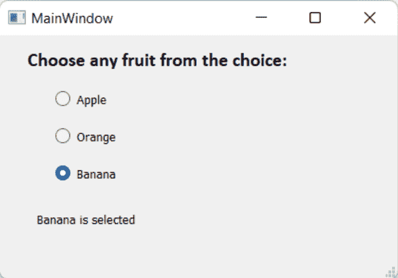

**图4.32：** *run_radiobutton_eg1.py的情况-4输出*

> **注意：** 上述代码位于程序名：Radio_Button/run_radiobutton_eg1.py。

让我们理解这段代码：

- 在`RBEG1_1`中，我们从`radiobutton_eg1.py` Python文件导入模块的所有成员。
- 在`RBEG1_2`中，我们将`QRadioButton`控件`rbtn_apple`的`toggled`信号连接到`myselfcheck()`方法。
- 在`RBEG1_3`中，我们将`QRadioButton`控件`rbtn_orange`的`toggled`信号连接到`myselfcheck()`方法。
- 在`RBEG1_4`中，我们将`QRadioButton`控件`rbtn_banana`的`toggled`信号连接到`myselfcheck()`方法。
- 从`RBEG1_2`到`RBEG1_4`，使用lambda表达式，将信号源作为参数传递给该方法。
- 在`RBEG1_5`中，`myselfcheck()`方法将接受一个额外的参数，该参数作为`QRadioButton`控件的发送者，用于检查其选中状态。
- 在`RBEG1_6`中，将检查哪个`QRadioButton`控件被选中。
- 在`RBEG1_7`中，将在`QLabel`显示控件中显示被选中的`QRadioButton`控件的文本。

## 复选框

每当需要使用可选择按钮并选择多个选项时，我们应从控件箱中选择`QCheckBox`控件。此控件的外观是在文本标签前有一个矩形框。与`QRadioButton`控件不同，默认情况下，此控件不是互斥的。但是，我们可以通过将其添加到`QButtonGroup`来将选择限制为仅其中一个项目。

## 重要属性

它包含三个类的属性：

- `QObject`
- `QWidget`
- `QAbstractButton`

还有一个属性，即三态。

## 三态

当此属性设置为True时，将使QCheckBox控件表现为三态复选框。默认状态为False。

## 重要方法

一些重要的方法如下：

- isChecked()：使用此方法，如果QCheckBox控件被选中，将返回一个布尔值。
- setChecked()：使用此方法，我们可以根据传入的布尔值来选中/取消选中QCheckBox控件。
- text()：使用此方法，我们可以获取QCheckBox控件的文本。
- setText()：使用此方法，将设置QCheckBox控件的文本。
- setIcon()：使用此方法，将在QCheckBox控件旁显示一个图标。
- setTriState()：当传入的布尔值为True时，我们将向QCheckBox控件添加第三种状态，该状态既不是True也不是False。

## 重要信号

这些信号与QPushButton控件类似。除此之外，我们还有stateChanged(int)信号，它将返回QCheckBox控件的选中状态。请参考图4.33：

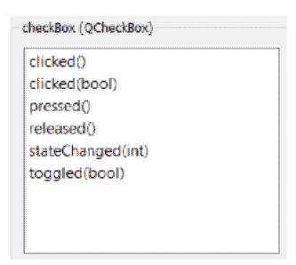

**图4.33：** Qt Designer中QCheckBox控件的信号

让我们创建一个简单的应用程序来理解这个QCheckBox控件。文件名的详细信息如下*表4.5*所示：

| 序号 | Qt Designer 文件名 (.ui) | 将QtDesigner文件名转换为Python文件 (.py) | 创建另一个Python文件并导入从Qt Designer转换的Python文件 |
|---|---|---|---|
| 1 | checkbutton_eg1.ui | checkbutton_eg1.py | run_checkbutton_eg1.py |

**表4.5：** 文件名的详细信息

Qt Designer文件`checkbutton_eg1.ui`如下图所示：

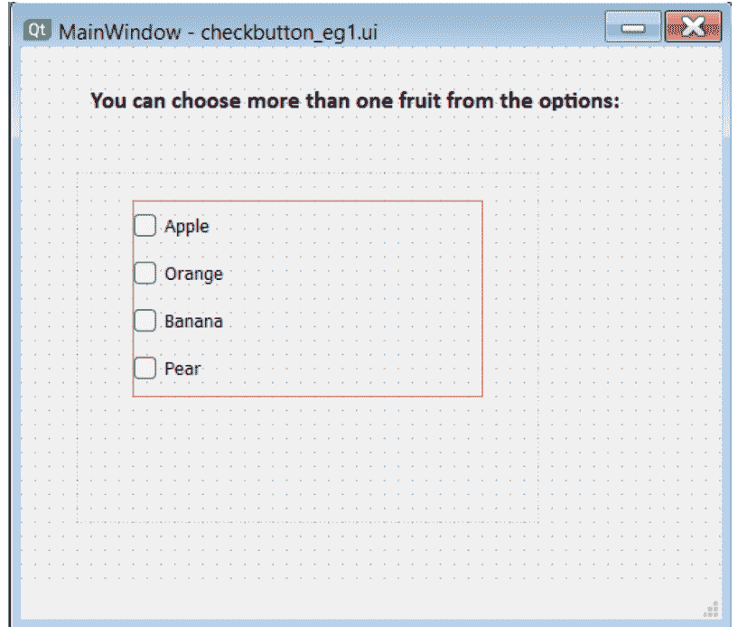

**图4.34：** Qt Designer文件：checkbutton_eg1.ui

> **注意：** 上述.ui文件位于路径：Check_Box_Button/checkbutton_eg1.ui。

考虑以下**run_checkbutton_eg1.py**的代码：

```python
import sys
from PyQt5.QtWidgets import QMainWindow, QApplication
from checkbutton_eg1 import * # CBEG1_1

class MyCheckButton(QMainWindow):
    def __init__(self):
        super().__init__()
        self.ui = Ui_MainWindow()
        self.ui.setupUi(self)
        self.myfruits = {'apple':0, 'orange':0, 'banana':0, 'pear':0} # CBEG1_2

        self.ui.chk_Apple.stateChanged.connect(lambda:self.myselfcheck(self.ui.chk_Apple)) # CBEG1_3
        self.ui.chk_Orange.stateChanged.connect(lambda:self.myselfcheck(self.ui.chk_Orange)) # CBEG1_4
        self.ui.chk_Banana.stateChanged.connect(lambda:self.myselfcheck(self.ui.chk_Banana)) # CBEG1_5
        self.ui.chk_Pear.stateChanged.connect(lambda:self.myselfcheck(self.ui.chk_Pear)) # CBEG1_6
        self.show()

    def myselfcheck(self, mychkbutton): # CBEG1_7
        if self.ui.chk_Apple.text() == "Apple" :  # CBEG1_8
            if self.ui.chk_Apple.isChecked(): # CBEG1_9
                self.myfruits['apple'] = 1
            else:
                self.myfruits['apple'] = 0
```

self.mydisplay()

if self.ui.chk_Orange.text() == "Orange" :#
    CBEG1_10
    if self.ui.chk_Orange.isChecked(): #
        CBEG1_11
        self.myfruits['orange'] = 1
    else:
        self.myfruits['orange'] = 0
    self.mydisplay()

if self.ui.chk_Banana.text() == "Banana" :#
    CBEG1_12
    if self.ui.chk_Banana.isChecked(): #
        CBEG1_13
        self.myfruits['banana'] = 1
    else:
        self.myfruits['banana'] = 0
    self.mydisplay()

if self.ui.chk_Pear.text() == "Pear" :#
    CBEG1_14
    if self.ui.chk_Pear.isChecked(): #
        CBEG1_15
        self.myfruits['pear'] = 1
    else:
        self.myfruits['pear'] = 0
    self.mydisplay()

def mydisplay(self):
    checkedfruits = ', '.join([mykey for mykey in self.myfruits.keys() if self.myfruits[mykey]==1])  # CBEG1_16
    self.ui.lbl1.setText("You selected: " + checkedfruits) # CBEG1_17

if __name__=="__main__":
    app = QApplication(sys.argv)
    w = MyCheckButton()
    w.show()
    sys.exit(app.exec_())

**输出：**

请参考以下*图 4.35*：

**情况-1：执行代码时的初始默认输出**

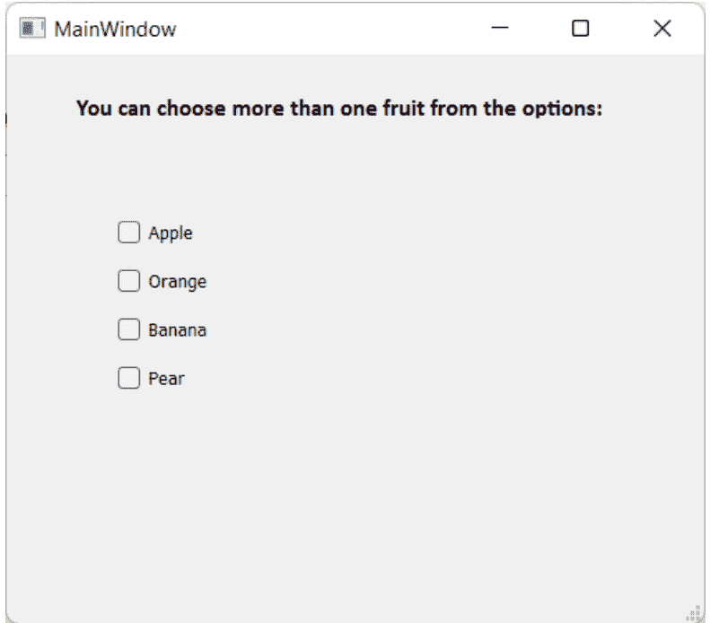

图 4.35：Check_Box_Button/checkbutton_eg1.ui 的情况-1 输出

# 情况-2：当选择“1”复选框按钮时

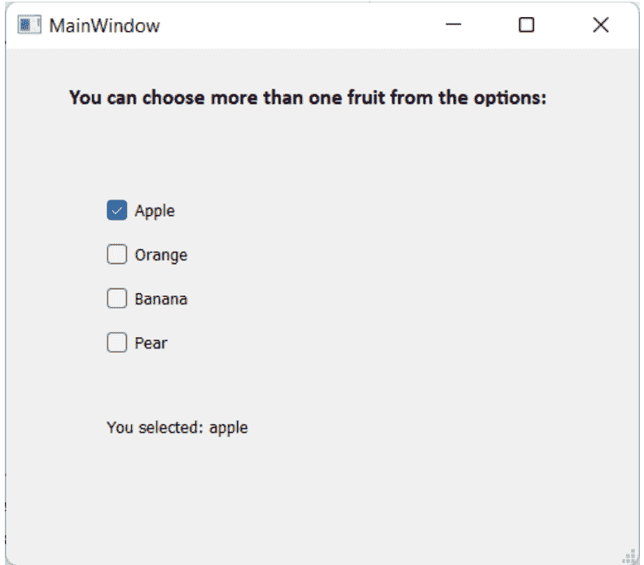

**图 4.36：** *Check_Box_Button/checkbutton_eg1.ui 的情况-2 输出*

# 情况-3：当选择“2”复选框按钮时

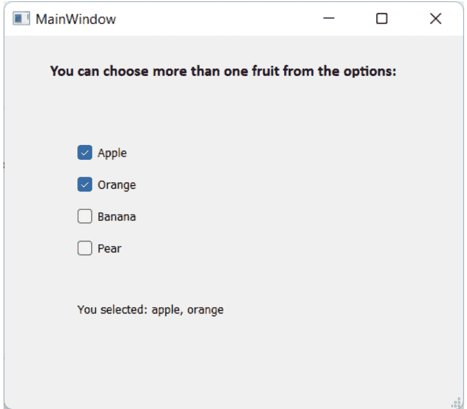

**图 4.37：** *Check_Box_Button/checkbutton_eg1.ui 的情况-3 输出*

# 情况-4：当选择“3”复选框按钮时

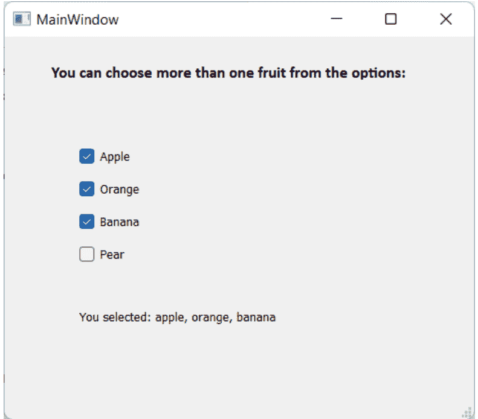

图 4.38：Check_Box_Button/checkbutton_eg1.ui 的情况-3 输出

# 情况-5：当选择“4”复选框按钮时

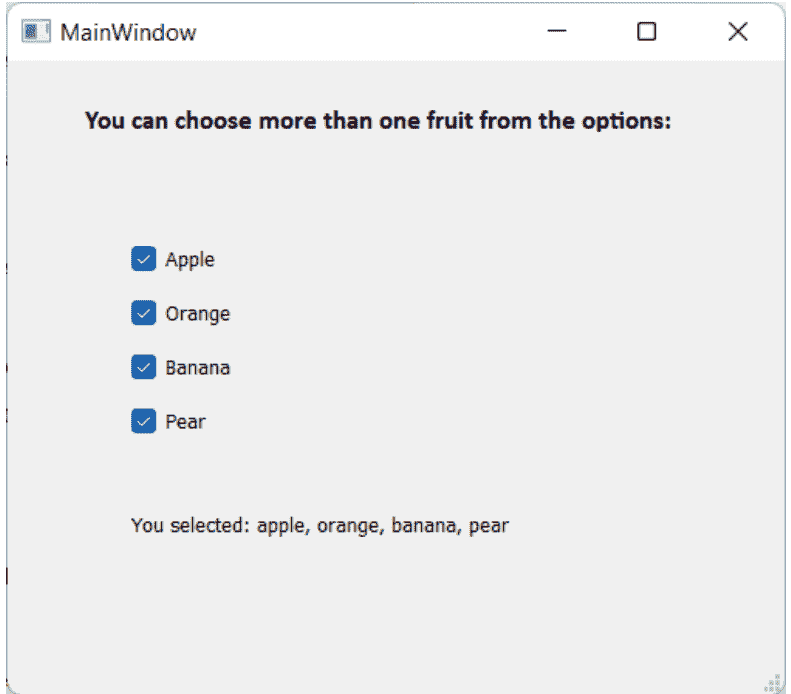

**图 4.39：** *Check_Box_Button/checkbutton_eg1.ui 的情况-5 输出*

> **注意：** 上述代码包含在程序名称中：**Check_Box_Button/run_checkbutton_eg1.py**

让我们来理解这段代码：

- 在 CBEG1_1 中，我们从 **checkbutton_eg1.py** Python 文件导入模块的所有成员。
- 在 CBEG1_2 中，创建了一个包含 4 个键值对的字典对象 **myfruits**。
- 在 CBEG1_3 中，我们将 QCheckBox 控件 **chk_Apple** 的 **stateChanged** 信号连接到 **myselfcheck()** 方法。
- 在 CBEG1_4 中，我们将 QCheckBox 控件 **chk_Orange** 的 **stateChanged** 信号连接到 **myselfcheck()** 方法。
- 在 `CBEG1_5` 中，我们将 `QCheckBox` 控件 `chk_Banana` 的 `stateChanged` 信号连接到 `myselfcheck()` 方法。
- 在 `CBEG1_6` 中，我们将 `QCheckBox` 控件 `chk_Pear` 的 `stateChanged` 信号连接到 `myselfcheck()` 方法。
- 从 `CBEG1_3` 到 `CBEG1_6`，使用 lambda 表达式，将信号源作为参数传递给该方法。
- 在 `CBEG1_7` 中，`myselfcheck()` 方法将接受一个额外的参数 `mychkbutton`，该参数作为 `QCheckBox` 控件的发送者，用于检查其选中状态。
- 在 `CBEG1_8` 和 `CBEG1_9` 中，如果 `QCheckBox` 控件 `chk_Apple` 被选中，则将键 'apple' 的值更改为 1，否则为 0。
- 在 `CBEG1_10` 和 `CBEG1_11` 中，如果 `QCheckBox` 控件 `chk_Orange` 被选中，则将键 'orange' 的值更改为 1，否则为 0。
- 在 `CBEG1_12` 和 `CBEG1_13` 中，如果 `QCheckBox` 控件 `chk_Banana` 被选中，则将键 'banana' 的值更改为 1，否则为 0。
- 在 `CBEG1_14` 和 `CBEG1_15` 中，如果 `QCheckBox` 控件 `chk_Pear` 被选中，则将键 'pear' 的值更改为 1，否则为 0。
- 在 `CBEG1_16` 中，可迭代对象（此处我们使用列表推导式）中的所有项目将被取出并连接成一个字符串。这里，我们检查字典对象 `myfruits` 的每个键项的值是否为 1。如果找到 `True`，它们将被逐一追加，最终连接成一个字符串。
- 在 `CBEG1_17` 中，我们将每个 `QCheckBox` 控件的选中状态显示在 `QLabel` 控件 `lbl1` 中。

# 命令链接按钮

此控件最早在 Windows Vista 中引入，是一种控制控件。其外观允许在正常文本之外添加描述性文本（类似于 QPushButton 控件），并带有一个箭头图标，该图标可能表示打开新的 GUI 表单或页面，或执行任何任务。

## 重要属性

它包含 3 个类的属性：

- QObject
- QWidget
- QAbstractButton

有趣的是，它还包含 QPushButton 的 default 和 autodefault 属性（已讨论过）以及 description。
使用此属性，我们可以在按钮上设置描述性文本，该文本以较小的字体显示，从而补充标签文本。请参考下图：

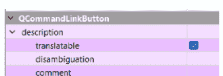

**图 4.40：** Qt Designer 中 QCommandLinkButton 控件的 Description 属性

## 重要方法

通常，QCommandLinkButton 控件中有一个空的操作列表。但是，我们可以向 QCommandLinkButton 控件的菜单添加操作或插入操作。我们将通过一个例子来学习它。最常用的方法是 setDescription()。

# setDescription

我们使用此方法设置 `QCommandLinkButton` 控件的描述性文本，该文本通常以比主文本更小的字体显示。

## 重要信号

这些信号与 `QPushButton` 控件类似。

让我们创建一个简单的应用程序来理解这个 `QCommandLinkButton` 控件。

文件名的详细信息如下表 *表 4.6* 所示：

| 序号 | Qt Designer 文件名 (.ui) | 将 QtDesigner 文件名转换为 Python 文件 (.py) | 创建另一个文件并从中导入 Python 文件 |
| :--- | :--- | :--- | :--- |
| 1 | commandlinkbutton_eg1.ui | commandlinkbutton_eg1.py | run_commandlinkl |

*表 4.6：文件名详细信息*

Qt Designer 文件 `commandlinkbutton_eg1.ui` 如下图所示：

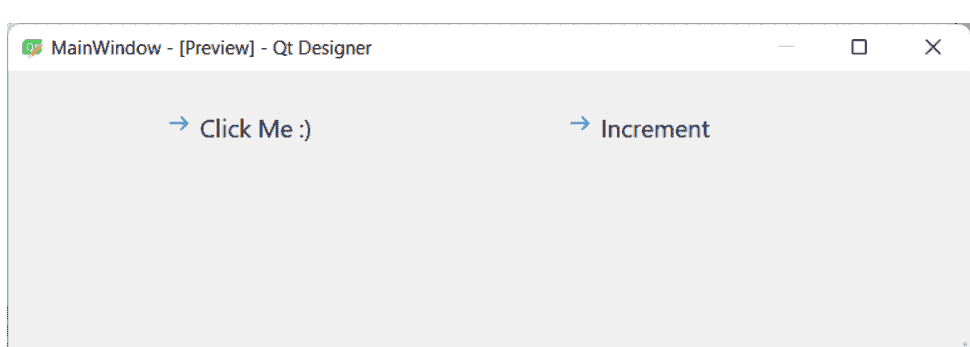

*图 4.41：Qt Designer 文件 commandlinkbutton_eg1.ui*

> 注意：上述 .ui 文件包含在路径中：Command_Link_Button/run_commandlinkbutton_eg1.ui。

> 注意：从现在开始，我们将使用注释来描述代码中一些特定的部分（这些部分对读者来说将是新的），即那些对读者来说是新的且尚未探索的代码行。

考虑 run_commandlinkbutton_eg1.py 的以下代码。

```python
import sys

from PyQt5.QtWidgets import QMainWindow,
QApplication, QAction, QMenu

from commandlinkbutton_eg1 import *

class MyCommandlinkButton(QMainWindow):
    def __init__(self):
        super().__init__()
        self.ui = Ui_MainWindow()
        self.ui.setupUi(self)

        # 创建 2 个 QAction 对象
        mya1 = QAction("First Action", self)
        mya3 = QAction("Third Action", self)
        # 创建 QMenu 对象
        mymenu = QMenu()
        # 将 2 个操作作为列表添加到菜单对象
        mymenu.addActions([mya1, mya3])
        # 创建另一个 QAction
        mya2 = QAction("Second Action", self)

        # 在 mya3 对象之前插入 myact2 对象
        mymenu.insertAction(mya3, mya2)

        # 我们将菜单对象设置到命令链接按钮
        self.ui.clb_btn1.setMenu(mymenu)
        # 初始计数器设置为 0
        self.mycount = 0

        # 将命令链接按钮对象的 clicked 信号连接到槽 myincrement（传递
        # my count 作为参数），我们使用 lambda 表达式
        self.ui.clb_btn2.clicked.connect(lambda: self.myincrement(self.mycount))

        self.show()

    def myincrement(self,mycount): # 将 mycount 作为另一个参数
        self.mycount +=1# 将计数器加一。

        self.ui.mylbl2.setText("Text Description: : " + str(self.mycount)) # 将计数值显示到标签对象

if __name__=="__main__":
    app = QApplication(sys.argv)
    w = MyCommandlinkButton()
    w.show()
    sys.exit(app.exec_())
```

**输出：**
请参考以下 [图 4.42](#figure-442)：

# 情况-1：点击带有 Click Me:) 的文本时

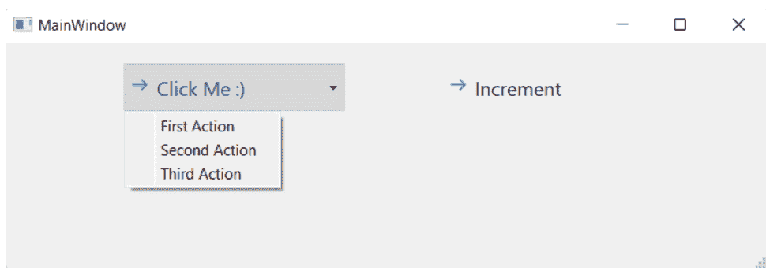

*图 4.42：Command_Link_Button/run_commandlinkbutton_eg1.py 的情况-1 输出*

# 情况-2：点击带有 Increment commandlinkbutton object once 的文本时

## 对话框按钮框

当需要在GUI表单的布局中自动使用标准按钮（如**确定**、**取消**、**忽略**、**是**、**否**等）时，我们可以使用`QDialogButtonBox`控件。我们也可以创建按钮并将其添加到按钮框中。但这将是一个繁琐的过程。我们可以看到，即使在Qt Designer中，也有选择模板的选项，如下图所示：

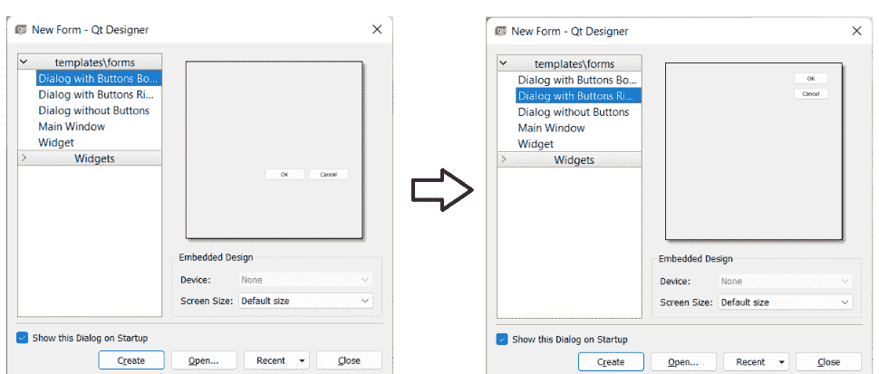

**图 4.44：** *Qt Designer中用于底部和右侧带有按钮的对话框模板*

## 重要属性

除了两个类（**QObject**和**QWidget**）的属性外，**QDialogButtonBox**控件还有一些其他属性，下面将进行讨论。

### orientation

使用此属性，我们可以将**QDialogButtonBox**控件的方向设置为**水平**或**垂直**。默认值为水平。如果选择水平，按钮将并排放置。如果选择垂直，按钮将垂直堆叠放置。请参考下图：

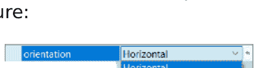

**图 4.45：** *在Qt Designer中描绘QDialogButtonBox方向属性的图像*

### standardButtons

从标准按钮列表中，我们可以根据应用程序选择其中任何一个。它返回给定按钮对应的标准按钮枚举值。默认情况下，**确定**和**取消**标准按钮被选中，当从控件箱拖放时，它们将显示在GUI表单中。请参考下图：

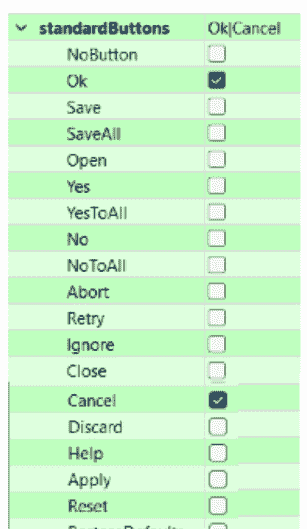

*图 4.46：* 在Qt Designer中描绘QDialogButtonBox standardButtons属性的图像

### centerButtons

选中时，`QDialogButtonBox`控件中的按钮将居中显示。默认情况下未选中。此属性将决定按钮框对象中的按钮是否水平居中。此属性可用于创建视觉上更具吸引力的对话框。

## 重要方法

各种重要方法如下：

- **addButton (button)**：使用此方法，如果有效，可以将标准按钮添加到QDialogButtonBox控件。如果按钮无效，将返回零且不会添加到QDialogButtonBox控件。
- **addButton (button, role)**：使用此方法，可以将按钮添加到QDialogButtonBox控件并指定角色。当角色无效时，按钮将不会被添加。已添加的按钮将被移除，并以新角色重新添加。
- **setOrientation (Orientation)**：使用此方法，我们可以将QDialogButtonBox控件的方向设置为水平或垂直。
- **setStandardButtons (buttons)**：使用此方法，我们可以设置QDialogButtonBox控件中的标准按钮集合。

## 重要信号

QDialogButtonBox的重要信号如下图所示。

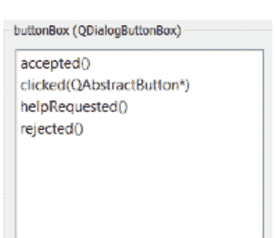

**图 4.47：** *在Qt Designer中描绘QDialogButtonBox信号的图像*

**accepted()**：当用户点击接受对话框的按钮时，将发出此信号。这包括**确定**、**是**或**保存**等按钮。

**rejected()**：当用户点击拒绝对话框的按钮时，将发出此信号。这包括**取消**、**否**或**关闭**等按钮。

**clicked(QAbstractButton*)**：当用户点击按钮框中的任何按钮时，将发出此信号。它接受一个参数，该参数是指向被点击按钮的指针。

**helpRequested**：当用户点击具有*HelpRole*角色的按钮时，将发出此信号。这包括**帮助**、**?**或**更多信息**等按钮。

让我们创建一个简单的应用程序来理解这个**QCommandLinkButton**控件。

文件名的详细信息如下表所示：

| 序号 | Qt Designer文件名 (.ui) | 将QtDesigner文件名转换为Python文件 (.py) | 创建另一个Python文件并从Qt Designer导入转换后的Python文件 |
| :--- | :--- | :--- | :--- |
| 1 | dialogbuttonbox_eg1.ui | dialogbuttonbox_eg1.py | run_dialogbuttonbox_eg1.py |

**表 4.7：** *文件名详情*

Qt Designer文件`dialogbuttonbox_eg1.ui`如下图所示：

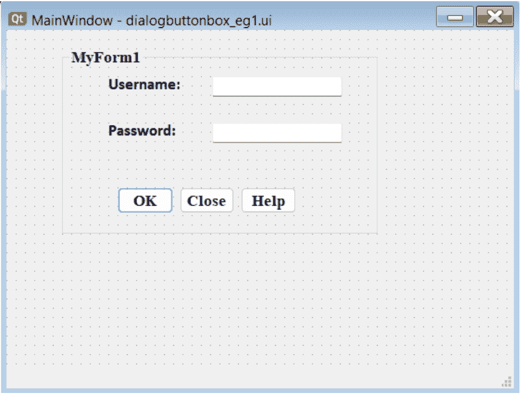

**图 4.48：** Qt Designer文件：dialogbuttonbox_eg1.ui

> **注意：** 上述.ui文件位于路径：Dialog_Button/run_dialogbuttonbox_eg1.ui。

考虑以下**run_dialogbuttonbox_eg1.py**的代码：

```python
import sys
from PyQt5.QtWidgets import QMainWindow, QApplication
from dialogbuttonbox_eg1 import *
import webbrowser# importing webbrowser module

class MyDialogButtonBox(QMainWindow):
    def __init__(self):
        super().__init__()
        self.myui = Ui_MainWindow()
        self.myui.setupUi(self)
        # will act when OK button is clicked and
        # displayinfo method is executed
        self.myui.buttonBox.accepted.connect(self.displayinfo)
        # will act when close button is clicked and
        # will close the GUI form
        self.myui.buttonBox.rejected.connect(self.close)
        # will act when help button is clicked
        self.myui.buttonBox.helpRequested.connect(lambda:
            webbrowser.open("https://auth0.com/blog/username-
            password-authentication/"))
        self.show()

    def displayinfo(self):
        if self.myui.lineEdit_2.text() == "1234": #
            # will check whether password is 1234
            # will display the message to the user
            self.myui.lbl_display.setText("Username
            with " + self.myui.lineEdit.text() + " has login
            successfully")
        else:
            # will display wrong password if 1234
            # is not typed
            self.myui.lbl_display.setText("Wrong Password:")

if __name__=="__main__":
    app = QApplication(sys.argv)
    w = MyDialogButtonBox()
    w.show()
    sys.exit(app.exec_())
```

## 输出：

输出可以在下图中看到：

**情况-1：当输入错误密码并点击确定按钮时。**

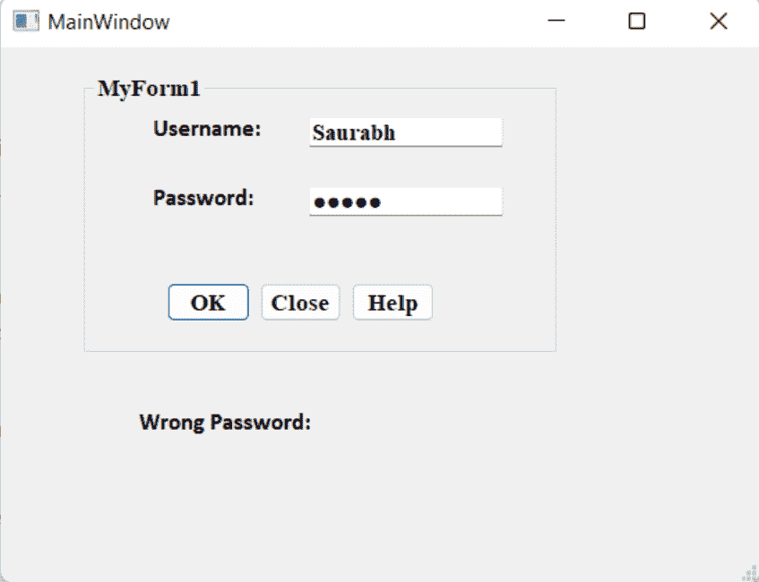

*图 4.49：Dialog_Button/ run_dialogbuttonbox_eg1.py的情况-1输出*

**情况-2：当输入正确密码并点击确定按钮时。**

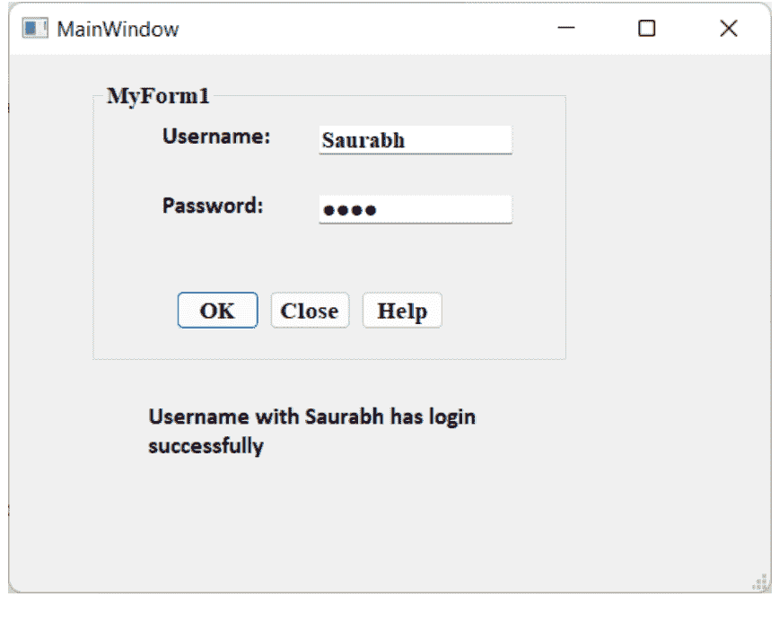

*图 4.50：* Dialog_Button/ run_dialogbuttonbox_eg1.py的情况-2输出

**情况-3：当点击关闭按钮时，GUI表单关闭。**

**情况-4：当点击帮助按钮并且连接了互联网时，将打开带有链接[https://auth0.com/blog/username-password-authentication/](https://auth0.com/blog/username-password-authentication/)的上述页面**

> 注意：上述代码位于程序名称：Dialog_Button/run_dialogbuttonbox_eg1.py

## 按钮控件的通用属性

我们将讨论按钮控件之间通用的每个属性。在这里，我们将从控件箱中拖动**按钮**控件到GUI表单中，并选择和解释按钮控件之间通用的属性。当我们使用术语控件时，只需想象我们正在谈论**按钮**控件。但同样的方法也可以应用于其他控件。请参考下图：

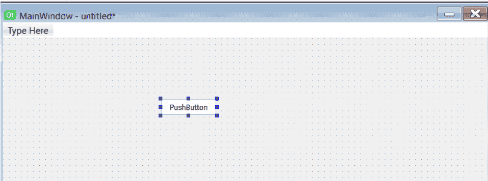

**图 4.51：** *在GUI表单上仅描绘按钮控件的图像*

让我们回顾一下**QObject**，它是Qt Designer所有控件共有的。**QObject**是所有Qt类的基类，提供了许多功能，如用于获取和设置对象属性的属性系统、用于创建对象层次结构的对象树、线程（因为对象可以安全地从多个线程使用）、信号、槽、事件处理等，这些我们已经在前面的章节中讨论过。

### objectName

在Qt Designer中，每个控件都将具有**objectName**属性，因为上述属性将保存控件名称。分配的名称将在Python代码中使用，正如我们在前面的示例中看到的那样。

Qt Designer中的属性图像如下图所示：

## enabled

顾名思义，此属性决定控件是否启用。在 Qt Designer 中，默认情况下每个控件都会勾选此属性。

Qt Designer 中的属性图像如下图所示：

**图 4.53：** 展示 Qt Designer 中 enabled 属性的图像

## geometry

相对于其父控件，此属性保存控件的几何信息。在 Qt Designer 中，我们有 x、y、width 和 height，其中：

- **X：** 控件相对于 GUI 表单上其父控件的 x 坐标。
- **Y：** 控件相对于 GUI 表单上其父控件的 y 坐标。
- **Width：** 控件宽度。
- **Height：** 控件高度。

Qt Designer 中的属性图像如下图所示：

**图 4.54：** 展示 geometry 属性的图像

## sizePolicy

此属性源自 **QSizePolicy** 类，它描述了控件调整自身大小的意愿，即以各种方式拉伸或收缩。通常，**QSizePolicy** 包含 2 个拉伸因子和 2 个独立的尺寸策略，可以通过 **horizontalPolicy()**、**verticalPolicy()**、**horizontalStretch()** 和 **verticalStretch()** 函数获取。我们可以使用 **setHeightForWidth()** 函数来指示控件的 **sizeHint()** 是否依赖于宽度。**horizontalStretch()** 和 **verticalStretch()** 将分别返回 **sizePolicy()** 的水平和垂直拉伸因子。

构建水平或垂直 **SizePolicy** 时不同的尺寸类型如下表所示：

| 序号 | 常量 | 值 | 详情 |
| :--- | :--- | :--- | :--- |
| 1 | Fixed | **0** | 控件的大小是固定的，永远不能增大或缩小，即不能拉伸，并保持在其 **sizeHint()**。 |
| 2 | Minimum | **GrowFlag** | 此处，**sizeHint()** 是控件可能的最小尺寸，必要时可以增大。 |
| 3 | Maximum | **ShrinkFlag** | 此处，**sizeHint()** 是控件可能的最大尺寸，必要时可以缩小。 |
| 4 | Preferred | **GrowFlag** **ShrinkFlag** | 此处，**sizeHint()** 是最佳首选尺寸，必要时可以增大或缩小。 |
| 5 | MinimumExpanding | **GrowFlag** **ExpandFlag** | 此处，控件利用额外空间以获取尽可能多的空间，因为 **sizeHint()** 是最小且足够的。 |
| 6 | Expanding | **GrowFlag** **ShrinkFlag** **ExpandFlag** | 此处，控件利用额外空间以获取尽可能多的空间，因为 **sizeHint()** 是合理的尺寸，但控件在必要时可以缩小，这很有用。 |
| 7 | Ignored | **GrowFlag** **ShrinkFlag** **IgnoredFlag** | 此处，控件将获得尽可能多的空间，因为 **sizeHint()** 被忽略。 |

**表 4.8：** *构建水平或垂直 SizePolicy 时不同的尺寸类型*

这些组件将作为 comboBox 项出现在 Qt Designer 中。Qt Designer 中的属性图像如下图所示：

**图 4.55：** *展示 Qt Designer 中 sizePolicy 属性的图像*

## minimumSize

顾名思义，此属性保存控件的最小尺寸。默认值的宽度和高度均为 0。最小允许高度受限于此默认值。
Qt Designer 中的属性图像如下图所示：

**图 4.56：** *展示 Qt Designer 中 minimumSize 属性的图像*

## maximumSize

顾名思义，此属性保存控件的最大尺寸。默认值的 **width** 和 **height** 均为 **16777215**。最大允许宽度受限于此默认值。
Qt Designer 中的属性图像如下图所示：

**图 4.57：** *展示 Qt Designer 中 maximumSize 属性的图像*

## sizeIncrement

此属性保存控件的尺寸增量，其默认值的宽度和高度均为 0。**baseSize()** 将作为基准，尺寸增量将分别以 **sizeIncrement.height()** 像素和 **sizeIncrement.width()** 像素在垂直和水平方向上进行。
Qt Designer 中的属性图像如下图所示：

*图 4.58：展示 Qt Designer 中 sizeIncrement 属性的图像*

## baseSize

此属性保存控件的基准尺寸，其默认值的宽度和高度均为 0。此处，当控件定义了 **sizeIncrement()** 时，将计算出合适的控件尺寸。
Qt Designer 中的属性图像如下图所示：

*图 4.59：展示 Qt Designer 中 baseSize 属性的图像*

## palette

此调色板属性下有 3 个颜色组，分别是 Active、Disabled 和 Inactive。Active 组将拥有窗口的键盘焦点，Inactive 组用于其他窗口；至于 Disabled 组，顾名思义，它是为已禁用的控件准备的，通常称为灰显。在大多数样式中，Active 和 inactive 组看起来基本相同，而每个控件状态的颜色组包含在 **QPalette** 类中。
Qt Designer 中的属性图像如下图所示：

*图 4.60：展示 Qt Designer 中 palette 属性的图像*

## font

此属性用于设置控件的字体。我们可以设置 **Family**、**Point Size**，并使文本 **Bold**、**Italic**、**Underline**、**Strikeout**，使用字距调整字母间距，并使文本在屏幕上看起来清晰流畅。
Qt Designer 中的属性图像如下图所示：

*图 4.61：展示 Qt Designer 中 font 属性的图像*

## cursor

此属性保存控件的光标，即从预定义的光标列表对象中选择的任何光标，当控件获得焦点时（即光标悬停在控件上时）将显示该光标。默认光标对象是 Arrow。
Qt Designer 中的属性图像如下图所示：

**图 4.62：** *展示 Qt Designer 中 cursor 属性的图像*

## mouseTracking

通过此属性，我们可以启用/禁用控件的 `mouseTracking`。默认情况下是禁用的，当鼠标在至少一个鼠标按钮被按下时移动，控件会接收鼠标移动事件。启用后，无论是否按下按钮，控件都会接收鼠标移动事件。
Qt Designer 中的属性图像如下图所示：

**图 4.63：** *展示 Qt Designer 中 mouseTracking 属性的图像*

## tabletTracking

通过此属性，我们可以启用/禁用控件的 `tabletTracking`。默认情况下是禁用的。当至少一个手写笔按钮被按下或手写笔与数位板之间存在接触时，控件会接收数位板移动事件。启用后，即使在近距离悬停时，控件也会接收数位板移动事件。
Qt Designer 中的属性图像如下图所示：

**图 4.64：** *展示 Qt Designer 中 tabletTracking 属性的图像*

## focusPolicy

此属性定义了控件对键盘焦点的接受方式。有不同类型的 **focusPolicy**：

- **NoFocus：** 控件完全不接受键盘焦点。
- **TabFocus：** 通过 Tab 键切换来接受控件的键盘焦点。
- **ClickFocus：** 通过点击来接受控件的键盘焦点。
- **StrongFocus：** 通过 Tab 键切换和点击来接受控件的键盘焦点。
- **WheelFocus：** 当鼠标滚轮移动时，控件将接受焦点。

Qt Designer 中的属性图像如下图所示：

**图 4.65：** *展示 Qt Designer 中 focusPolicy 属性的图像*

## contextMenuPolicy

此属性描述了控件显示上下文菜单的方式。此属性的默认值是 **DefaultContextMenu**。我们可以将其他值设置为 **NoContextMenu**、**ActionsContextMenu**、**CustomContextMenu** 和 **PreventContextMenu**。

Qt Designer 中的属性图像如下图所示：

## acceptDrops

此属性允许为控件启用拖放事件。默认值为未选中，即设置为 False；当选中时，即值设置为 True，控件将启用拖放事件。

Qt Designer 中的属性图像如下图所示：


**图 4.67：** 描绘 Qt Designer 中 acceptDrops 属性的图像

## toolTip

此属性将保存控件的 **toolTip**，其默认为空字符串。可以通过拦截 **event()** 函数并捕获 **toolTip** 事件来控制工具提示的行为。可以使用 **setTooltip()** 方法在控件上显示富文本格式的文本。

Qt Designer 中的属性图像如下图所示：

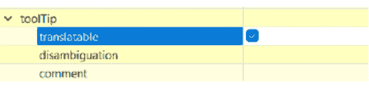

**图 4.68：** 描绘 Qt Designer 中 ToolTip 属性的图像

## toolTipDuration

顾名思义，它将保存控件的 **toolTipDuration**。默认值为 -1，持续时间主要根据工具提示长度计算。单位为毫秒。因此，在 Qt Designer 中设置的值 1000 将等于 1 秒。

Qt Designer 中的属性图像如下图所示：


**图 4.69：** 描绘 Qt Designer 中 toolTipDuration 属性的图像

## statusTip

此属性将保存控件的 **statusTip**，其默认为空字符串。Qt Designer 中的属性图像如下图所示：

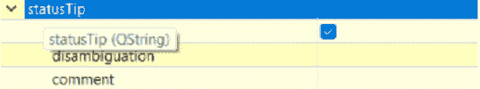

**图 4.70：** 描绘 Qt Designer 中 statusTip 属性的图像

## whatsThis

此属性通常显示控件的 **whatsThis** 帮助文本，其默认为空字符串。我们可以使用 `setWhatsThis()` 方法设置控件的帮助文本。

Qt Designer 中的属性图像如下图所示：

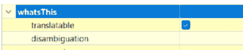

**图 4.71：** 描绘 Qt Designer 中 whatsThis 属性的图像

## accessibleName

此属性包含一个默认为空字符串，当被辅助技术（如屏幕阅读器）查看时，将显示控件的名称。

Qt Designer 中的属性图像如下图所示：

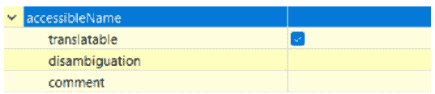

**图 4.72：** 描绘 Qt Designer 中 accessibleName 属性的图像

## accessibleDescription

此属性包含一个默认为空字符串，当被辅助技术查看时，将显示控件的描述。

Qt Designer 中的属性图像如下图所示：

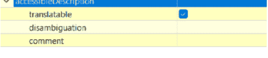

**图 4.73：** 描绘 Qt Designer 中 accessibleDescription 属性的图像

## layoutDirection

此属性将保存控件的布局方向，其默认值为 **LeftToRight**。其他可选值为 RightToLeft 或 LayoutDirectionAuto。

Qt Designer 中的属性图像如下图所示：

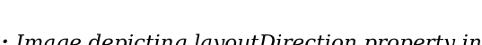

**图 4.74：** 描绘 Qt Designer 中 layoutDirection 属性的图像

## autoFillBackground

此属性将自动填充控件背景。默认值为未选中。当选中时，控件的背景将在绘制事件调用之前由 QPalette 颜色填充。

Qt Designer 中的属性图像如下图所示：


**图 4.75：** 描绘 Qt Designer 中 autoFillBackground 属性的图像

## stylesheet

此属性将显示控件的 **styleSheet**。我们可以根据控件的样式自定义文本描述。此属性包含一个默认字符串。详情请参阅 Qt 样式表文档。

Qt Designer 中的属性图像如下图所示：


**图 4.76：** 描绘 Qt Designer 中 stylesheet 属性的图像

## locale

此属性将显示控件的 **locale**。我们可以设置语言和国家/地区。如果控件显示日期或数字，则使用控件的 **locale** 进行格式化。

Qt Designer 中的属性图像如下图所示：

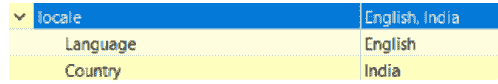

**图 4.77：** 描绘 Qt Designer 中 locale 属性的图像

## inputMethodHints

此属性与输入控件相关，专门提示控件应使用何种输入方法。其默认值为 **ImhNone**。输入方法操作取决于许多可设置的标志。如果只需要输入数字，则用户可以选中 **ImhPreferNumbers**。此外，如果还应允许大写字母，则用户可以选中 **ImhPreferUppercase**。

Qt Designer 中的属性图像如下图所示：

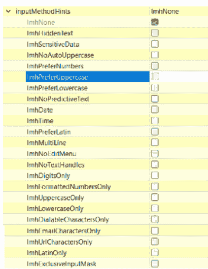

**图 4.78：** 描绘 Qt Designer 中 inputMethodHints 属性的图像

现在让我们学习 **QAbstractButton**，它适用于 Qt Designer 中除对话框按钮盒之外的所有按钮控件。

### text

此属性将显示按钮控件上的文本。如果按钮控件文本不包含任何文本，则返回空字符串。如果文本中存在“&”字符，则会自动创建快捷键，因为快捷键将是“&”后面的字符。因此，之前的快捷键可能会被清除或覆盖。如果使用两个“&&”，则会显示一个“&”。

Qt Designer 中的属性图像如下图所示：

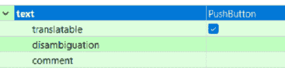

**图 4.79：** 描绘 Qt Designer 中 text 属性的图像

## icon

此属性将显示按钮控件的图标，可以使用 **iconSize** 属性进行调整。可以使用 **QIcon** 类在不同状态和模式下提供可缩放的图标。请参阅下表 *表 4.9*：

| 模式 | | | |
| :--- | :--- | :--- | :--- |
| **正常** | **禁用** | **激活** | **选中** |
| 显示像素图，图标功能可用且用户与图标*无交互* | 显示像素图，图标功能不可用 | 显示像素图，图标功能可用且用户与图标有交互 | 显示像素图，图标被选中 |

**表 4.9：** *模式*

下表显示了状态：

| 状态（像素图在控件相应状态下显示） | |
| :--- | :--- |
| 开 | 关 |

**表 4.10：** *状态*

Qt Designer 中的属性图像如下图所示：

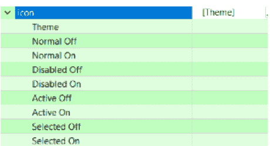

**图 4.80：** 描绘 Qt Designer 中 icon 属性的图像

### iconSize

我们可以从这个属性设置图标的宽度和高度。默认大小为 20*20。

Qt Designer 中的属性图像如下图所示：

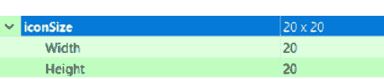

**图 4.81：** 描绘 Qt Designer 中 iconSize 属性的图像

## shortcut

此属性将显示与按钮控件关联的助记符。

Qt Designer 中的属性图像如下图所示：

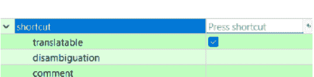

**图 4.82：** 描绘 Qt Designer 中 shortcut 属性的图像

### checkable

此属性将显示按钮控件是否可选中。

Qt Designer 中的属性图像如下图所示：


**图 4.83：** 描绘 Qt Designer 中 checkable 属性的图像

### checked

此属性将显示按钮控件是否被选中。当按钮控件可选中时，此控件才能被选中。否则，默认情况下它是未选中的。

Qt Designer 中的属性图像如下图所示：

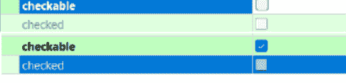

**图 4.84：** 描绘 Qt Designer 中 checked 属性的图像

## autoRepeat

此属性显示是否应启用自动重复。默认情况下它是禁用的，当选中时，将发出 `pressed()`、`released()` 和 `clicked()` 信号。

Qt Designer 中的属性图像如下图所示：


## autoExclusive

除了单选按钮部件外，此属性默认关闭。启用后，可选中的按钮将表现得如同处于同一个互斥按钮组中，即当一个按钮被选中时，它会取消选中之前的按钮，因为任何时候只能有一个按钮被选中。此属性对属于按钮组的按钮没有影响。

Qt Designer 中的属性图像如下图所示：

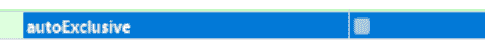

**图 4.86：** 描绘 Qt Designer 中 autoExclusive 属性的图像

## autoRepeatDelay

此属性定义在启用 **autoRepeat** 时，自动重复激活前的初始延迟时间（以毫秒为单位）。默认设置值为 300 毫秒。

Qt Designer 中的属性图像如下图所示：


**图 4.87：** 描绘 Qt Designer 中 autoRepeatDelay 属性的图像

## autoRepeatInterval

此属性定义在启用 **autoRepeat** 时，自动重复的间隔长度（以毫秒为单位）。默认设置为 100 毫秒。

Qt Designer 中的属性图像如下图所示：


**图 4.88：** 描绘 Qt Designer 中 autoRepeatInterval 属性的图像

> **注意：** 请访问官方文档页面 [https://doc.qt.io/qtforpython-5](https://doc.qt.io/qtforpython-5) 并探索不同的部件。

## 结论

在本章中，我们深入学习了 Qt Designer 中的按钮部件。按钮部件广泛用于创建交互式用户界面，其属性、功能和自定义选项已得到详尽解释。通过探索与按钮部件相关的特性和设置，用户可以在其 Qt 应用程序中有效地设计和实现用户友好的界面。Qt Designer 提供了多种按钮部件，包括 **CheckBox**、**Push Button**、**Tool Button**、**Radio Button** 和 **Command Link Button**，每种部件都有其特定用途。此外，我们还看到了 Qt Designer 中存在的不同对话框按钮框。本章探讨了每种按钮部件的描述、属性、重要方法和信号。此外，还提供了一个带有输出显示的应用程序示例，以说明按钮部件的实际实现。本章还涵盖了与按钮部件相关的 **QObject**、**QWidget** 和 **QAbstractButton** 的重要属性。这些属性辅以图像以增强理解。

在下一章中，我们将学习 Qt Designer 中的 **Item Views**，它们通常用于创建交互式用户界面。我们将学习数据如何以列表、分层树结构和表格表示的形式呈现。

## 要点回顾

- 按钮部件是一个矩形按钮，点击时执行特定操作。它可用于多种用途，例如打开文件、关闭窗口或提交表单，并且可以包含文本或图标。
- 一种称为工具按钮部件的小型矩形按钮用于访问特定工具或功能。工具按钮在工具栏中经常使用，它们可用于各种任务，如剪切、粘贴或缩放。
- 一种称为复选框部件的矩形按钮可用于选择一个或多个选项。点击复选框时它会被选中，再次点击时则取消选中。复选框通常用于让用户从多个选项中进行选择，例如他们想要使用的语言或功能。
- 单选按钮部件是一种圆形按钮，允许用户从选项列表中选择一项。当单选按钮被点击选中时，组中的所有其他单选按钮都会被取消选中。单选按钮通常用于让用户仅选择一个选项，例如字体大小或背景颜色。
- 一种称为命令链接按钮部件的矩形按钮在按下时触发一个动作。虽然它类似于按钮，但其外观有所不同。命令链接按钮通常用于向用户明确说明点击按钮后会发生什么。
- 为按钮提供文本描述。文本应清楚地说明点击按钮后会发生什么。
- 为按钮使用图标。图标不仅可以帮助识别按钮的功能，还可以提高按钮的视觉吸引力。
- 将相似的按钮分组在一起。这将使用户更容易找到他们需要的按钮。
- 为按钮保持一致的外观。这将有助于您的应用程序具有一致的外观和感觉。

## 问题

1. 解释 Qt Designer 工具中按钮的重要属性。
2. 解释按钮中 `autoDefault`、`default` 和 `flat` 函数的重要性。
3. 区分 `isChecked()` 和 `setCheckable()` 函数。
4. 区分 `text()` 和 `setText()` 函数。
5. 解释按钮部件的任意两个重要信号。
6. 简要介绍 Qt Designer 系统中的工具按钮部件。
7. 解释 Qt Designer 系统中工具按钮部件的任意两个重要属性。
8. 解释 `popupMode` 属性及其常量。
9. 绘制并解释 `toolButtonStyle` 属性。
10. 解释 Qt Designer 系统中工具按钮部件的 `autoRaise` 和 `arrowType` 属性的用途。
11. 解释 `QToolButton` 部件的重要方法。
12. 解释单选按钮在 GUI 设计中的用途。
13. 解释 `QRadioButton` 部件中的信号。
14. 解释复选框在 GUI 设计中的用途。
15. 解释 `QCheckBox` 部件的重要方法。
16. 描述 Qt Designer 中 `QCommandLinkButton` 部件的功能。
17. 说明 Qt Designer 中 `QDialogButtonBox` 的用途。
18. 解释 Qt Designer 中 `QDialogButtonBox` 部件的重要属性。

## 加入我们的书籍 Discord 空间

加入书籍的 Discord 工作区，获取最新更新、优惠、全球科技动态、新书发布以及与作者的交流会：

https://discord.bpbonline.com


# 第五章
深入了解 Qt Designer 中的 Item Views

## 简介

在讨论了按钮部件之后，我们现在将进入下一个主题，即 Qt Designer 中的 Item Views。必须有某种方法来访问、管理和向用户显示数据。因此，基于 **模型-视图-控制器 (MVC)** 的软件设计模式，PyQt5 采用了相同的模型/视图架构。模型将访问数据源中的数据，并向视图提供数据。此视图将呈现存储在模型中的项目，并反映模型中数据的更改。模型中的数据编辑将由委托处理，委托还负责在视图中绘制项目。您可以访问网站 [https://doc.qt.io](https://doc.qt.io)，其中提供了大量关于 PyQt5 函数和属性的信息。

本章我们的主要重点是学习 `QListView`、`QTreeView`、`QTableView` 和 `QColumnView`。我们将重点关注属性和一些有用的方法。所有这些部件在 Qt Designer 的 **Item Views** 下都可用，如下图所示。用户可以选择 **Item Views** 下的任何部件，并将其拖放到 GUI 表单中。请参考下图：

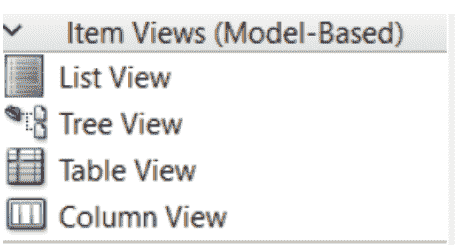

**图 5.1：** *Qt Designer 中不同的 Item Views（基于模型）*

这些部件的基类是一个抽象类 **QAbstractItemView**，它提供对标题管理和项目选择的支持。在处理按钮类型部件时，我们已经了解了 **QObject** 和 **QWidget** 类。同样的情况也适用于 **Item Views** 部件。我们还将讨论其他类，例如 **QFrame**、**QAbstractScrollArea** 和 **QAbstractItemView** 类，这些将在本章末尾讨论。此外，我们还将在末尾讨论 **QStandardItemModel**，它提供了一种基于标准项目的模型操作方法。

## 结构

在本章中，我们将学习以下主题：

- 列表视图
- 树视图
- 表格视图
- 列视图

## 目标

阅读本章后，读者将了解 Qt Designer 中的 **Item Views**，它们通常用于创建交互式用户界面。本章的主要目标是帮助你理解它们的属性、功能和自定义选项。讨论 Qt Designer 中的 **Item View** 小部件的主要目标是理解和使用 Qt 框架提供的众多小部件类和组件，以表格或列表方式显示和操作数据。Qt Designer 的 **Item View** 小部件，例如 `QTableView`、`QTreeView` 和 `QListView`，是以有组织、有序的方式呈现数据的有效工具。

## 数据呈现

**Item View** 小部件可用于以图形化和用户友好的方式呈现数据。用户可以使用这些小部件以简单的列表格式（`QListView`）、分层树结构（`QTreeView`）或行和列（`QTableView`）显示数据。数据编辑和操作功能已内置于 **Item View** 小部件中。用户可以添加、删除或修改对象以与小部件中显示的数据进行交互，也可以使用 Qt Designer 为这些活动设计行为和设置属性。由于用户可以更改其外观和行为，也可以设计适合其需求的独特用户界面，因此项目视图是完全可调整的。模型-视图架构是 Qt 的一个关键概念，用于将数据表示（模型）与视觉显示（视图）和用户交互（委托）分离，也将向用户介绍。通过学习项目视图小部件，用户可以更好地理解模型、视图和委托的概念以及它们如何交互。最后，将通过图像介绍 `QFrame`、`QAbstractScrollArea` 和 `QAbstractItemView` 的重要属性，作为附加信息。

## 列表视图

它是 PyQt5 的模型/视图框架之一。在 **QListView** 类中，我们可以将项目存储为图标集合或非分层列表。项目将在 **listview** 中使用 **ListMode** 或 **IconMode** 显示，当前视图模式使用 **viewMode()** 确定。在 **QListView** 中，小部件项目可以间隔/布局，也可以渲染为小图标或大图标。

## 重要属性

让我们检查一些重要属性。

### movement

此属性描述 **QListView** 小部件中项目的移动。有三个选项：

- 如果用户选择 **Static**，项目将不会移动。
- 如果用户选择 **Free**，项目可以拖放到 **QListView** 小部件中的任何位置。
- 如果用户选择 **Snap**，项目将拖放到由 **gridSize** 参数指定的虚拟网格位置。

参考以下 *图 5.2*：

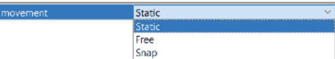

*图 5.2：* 描述 Qt Designer 中 QListView 小部件 movement 属性的图像

### flow

使用此属性，我们可以设置项目布局的方向。默认情况下，项目在 **QListView** 小部件中从上到下布局。项目也可以从左到右布局。参考以下 *图 5.3*：

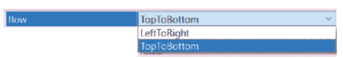

*图 5.3*：描述 Qt Designer 中 QListView 小部件 flow 属性的图像

### isWrapping

使用此属性，我们可以在选中时设置项目布局换行。默认值为 **False**。参考以下 *图 5.4*：

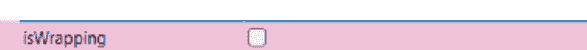

*图 5.4*：描述 Qt Designer 中 QListView 小部件 isWrapping 属性的图像

### resizeMode

使用此属性，我们可以通过调整 `QListView` 小部件的大小来再次决定项目的布局。默认值为 Fixed，即调整 `QListView` 小部件大小时，项目不会重新布局，而设置为 **Adjust** 时会重新布局。参考以下 *图 5.5*：

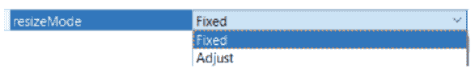

*图 5.5*：描述 Qt Designer 中 QListView 小部件 resizeMode 属性的图像

### layoutMode

使用此属性，我们可以确定项目的布局是延迟发生还是立即发生。因此，设置为 **SinglePass** 时，项目布局一次性完成；设置为 **Batched** 时，按 **batchSize** 个项目分批进行。参考以下 *图 5.6*：

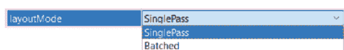

*图 5.6*：描述 Qt Designer 中 QListView 小部件 layoutMode 属性的图像

### spacing

每当需要在项目周围填充空白区域大小时，我们可以使用此属性。默认情况下，其值设置为 **0**。参考以下 *图 5.7*：


*图 5.7*：描述 Qt Designer 中 QListView 小部件 spacing 属性的图像

### gridSize

我们可以使用此属性设置网格大小，通过设置项目布局的宽度和高度。宽度和高度的默认值为 **0**，表示没有网格。参考以下 *图 5.8*：

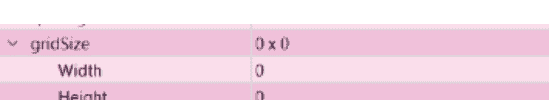

*图 5.8*：描述 Qt Designer 中 QListView 小部件 gridSize 属性的图像

### viewMode

使用此属性设置 `QListView` 小部件的视图模式。设置为 **ListMode** 时，拖放被禁用，因为默认移动将是 Static。设置为 **IconMode** 时，拖放被启用，因为默认移动将是 Free。参考以下 *图 5.9*：

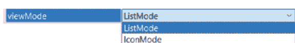

*图 5.9：* 描述 Qt Designer 中 QListView 小部件 viewMode 属性的图像

### modelColumn

此属性将设置模型中列的可见性。默认值为 **0**，表示显示模型中的第一列。参考以下 *图 5.10*：


*图 5.10：* 描述 Qt Designer 中 QListView 小部件 modelColumn 属性的图像

### uniformItemSizes

设置为 **True** 时，QListView 小部件中的所有项目将具有相同的大小。默认值为 **False**。参考以下 *图 5.11*：


*图 5.11：* 描述 Qt Designer 中 QListView 小部件 uniformItemSizes 属性的图像

### batchSize

当 `layoutMode` 值设置为 batch 时，我们可以设置每批中的项目数量。默认值设置为 **100**。参考以下 *图 5.12*：


*图 5.12：* 描述 Qt Designer 中 QListView 小部件 batchSize 属性的图像

### wordWrap

如果此参数设置为 **True**，项目文本将根据需要在单词断点处换行。参考以下 *图 5.13*：

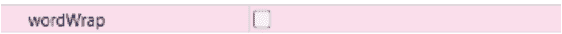

*图 5.13：* 描述 Qt Designer 中 QListView 小部件 wordWrap 属性的图像

### selectionRectVisible

设置为 **True** 时，选择矩形可见，否则将不可见。默认值为 **False**。参考以下 *图 5.14*：


*图 5.14：* 描述 Qt Designer 中 QListView 小部件 selectionRectVisible 属性的图像

## QAbstractItemView 基类的重要方法

现在让我们检查一些重要方法：

- **setModel(model)**：调用此方法时，我们可以设置视图模型。
- **setItemDelegate(delegate)**：我们可以为视图的模型/视图框架设置一个项目委托。
- **setIconSize(size)**：可以使用此方法设置图标大小。
- **setDragEnabled(bool)**：当 bool 值设置为 **True** 时，我们可以在视图中拖动项目。
- **setAcceptDrops(bool)**：当 bool 值设置为 **True** 时，我们可以将项目拖放到视图中。
- **setAlternatingRowColors(bool)**：当 bool 值为 **True** 时，视图背景将以交替颜色绘制。
- **setCurrentIndex(index)**：使用此方法，指定索引处的项目将被设置为当前项目。
- **update(index)**：指定索引处的区域将被更新。
- **clearSelection()**：此处，所有选中的项目将被取消选择。
- **selectAll()**：视图中的所有项目将被选中。

## QAbstractItemView 基类的重要信号

在上面列出的所有信号中，当以下情况发生时，信号将被发出：

- **pressed(index)**：使用鼠标按钮按下索引处的项目。
- **entered(index)**：鼠标光标进入索引处的项目。鼠标跟踪已开启以供使用。
- **activated(index)**：用户激活索引处的项目。
- **clicked(index)**：使用左键单击视图中由索引指定的项目。
- **doubleClicked(index)**：使用鼠标按钮双击视图中由索引指定的项目。

现在，我们将看到一个 `ListView` 小部件的示例。
文件名的详细信息如下：

| 序号 | Qt Designer 文件名 (.ui) | 转换 QtDesigner 文件 | 创建另一个 Python 文件并导入 |
| :--- | :--- | :--- | :--- |

| | | 将名称转换为Python文件（.py） | 从Qt Designer转换得到的Python文件 |
|---|---|---|---|
| 1. | listView_eg1.ui | listView_eg1.py | run_listView_eg1.py |

**表 5.1：** 文件名详情

Qt Designer文件如下图所示：

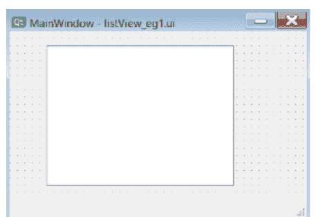

**图 5.15：** Qt Designer文件：listView_eg1.ui

> 注意：上述.ui文件位于路径：ListView/listview_eg1.ui

请看以下`run_listView_eg1.py`的代码：

```python
import sys
from PyQt5.QtWidgets import QMainWindow, QApplication
from PyQt5.QtGui import QStandardItemModel
from listView_eg1 import *

class MyListView(QMainWindow):
    def __init__(self):
        super().__init__()
        self.ui = Ui_MainWindow()
        self.ui.setupUi(self)
        self.myfruits = ['apple', 'orange',
        'banana', 'pear'] # creating a list object
        # creating an object of one of the
        # model/view class for storing custom data.
        model = QStandardItemModel()
        # A view is set up to display the items in
        # the listView object
        self.ui.mylV1.setModel(model)
        # iterating each elements of the myfruits
        # list object
        for i in self.myfruits:
            # QStandardItem provides the items in a
            # QStandardItemModel
            item = QtGui.QStandardItem(i)
            # adding items to the model using
            # appendRow
            model.appendRow(item)
        self.show()

if __name__=="__main__":
    app = QApplication(sys.argv)
    w = MyListView()
    w.show()
    sys.exit(app.exec_())
```

## 输出：

输出结果可以在下面的*图 5.16*中看到：

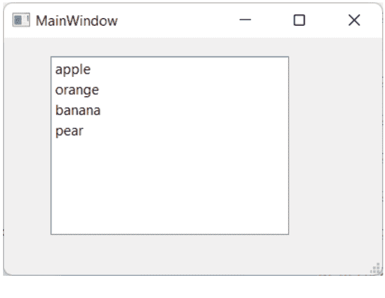

**图 5.16：** *ListView/run_listview_eg1.py的输出*

> **注意：** 上述代码位于程序名：**ListView/run_listview_eg1.py**

从上面的代码中，我们可以看到我们正在`listView`控件上按行显示水果项目。

# 树视图

Qt的模型/视图框架的一部分是创建模型中项目的树形表示。为了显示由`QAbstractItemModel`类派生的模型提供的数据，`QTreeView`实现了`QAbstractItemView`类描述的接口。模型/视图架构确保当模型发生变化时，树视图的内容会更新。`QTreeView`类提供了树视图的默认模型/视图实现。

## 重要属性

现在让我们检查一些重要的属性。

# autoExpandDelay

在拖放操作期间，此属性指定在QTreeView控件中的项目被打开之前的延迟时间（以毫秒为单位）。默认值为-1，表示禁用自动展开属性。请参考下图5.17：


图 5.17：描绘Qt Designer中QTreeView控件的autoExpandDelay属性的图像

# indentation

我们可以设置QTreeView控件中每一级项目的缩进量，以像素为单位。从视口边缘到第一列中项目的水平距离指定了顶级项目的缩进。子项目的缩进是相对于其父项目指定的。请参考下图5.18：


图 5.18：描绘Qt Designer中QTreeView控件的indentation属性的图像

# rootIsDecorated

我们可以确定是否显示用于展开和折叠顶级项目的控件。如果未选中，顶级项目将不显示控件，使单级树结构看起来像一个简单的项目列表。默认为选中状态。请参考下图5.19：


**图 5.19：** 描绘Qt Designer中QTreeView控件的rootIsDecorated属性的图像

# uniformRowHeights

选中时，QTreeView控件中的所有项目将具有相同的高度。视图中的第一个项目提供高度。当该项目上的数据发生变化时，它会自动更新。默认情况下未选中。请参考下图5.20：

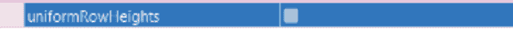

**图 5.20：** 描绘Qt Designer中QTreeView控件的uniformRowHeights属性的图像

# itemsExpandable

默认值为选中，此属性将决定用户是否可以交互式地展开和折叠项目。请参考下图5.21：


**图 5.21：** 描绘Qt Designer中QTreeView控件的itemsExpandable属性的图像

## sortingEnabled

默认值为未选中。如果设置为**True**，则将为QTreeView控件启用排序，否则将禁用排序。请参考下图5.22：


**图 5.22：** 描绘Qt Designer中QTreeView控件的sortingEnabled属性的图像

# animated

当设置为**True**时，树视图将对分支的展开和折叠进行动画处理。如果未选中，分支将立即展开和折叠，不显示动画。请参考*图 5.23*：


**图 5.23：** *描绘Qt Designer中QTreeView控件的animated属性的图像*

# allColumnsShowFocus

默认值为未选中，意味着只有一列会显示焦点。选中时，所有列都将显示焦点。请参考*图 5.24*：


**图 5.24：** *描绘Qt Designer中QTreeView控件的allColumnsShowFocus属性的图像*

### wordWrap

如果此属性为**True**，则项目文本在必要时会在单词断点处换行。默认情况下未选中，即设置为**False**。请参考*图 5.25*：


**图 5.25：** *描绘Qt Designer中QTreeView控件的wordWrap属性的图像*

# headerHidden

选中时，标题将被隐藏，否则在未选中时会显示。默认值设置为**False**。请参考*图 5.26*：


**图 5.26：** 描绘Qt Designer中QTreeView控件的headerHidden属性的图像

# expandsOnDoubleClick

默认值设置为**True**，从名称我们可以理解，可以通过双击来展开或折叠项目。请参考*图 5.27*：


**图 5.27：** 描绘Qt Designer中QTreeView控件的expandsOnDoubleClick属性的图像

现在，我们将看到一个树视图控件的示例。
文件名详情如下：

| 序号 | Qt Designer文件名（.ui） | 将QtDesigner文件名转换为Python文件（.py） | 创建另一个Python文件并导入从Qt Designer转换的Python文件 |
| :--- | :--- | :--- | :--- |
| 1 | TreeView_eg1.ui | TreeView_eg1.py | run_TreeView_eg1.py |

**表 5.2：** 文件名详情

Qt Designer文件如下图*图 5.28*所示：

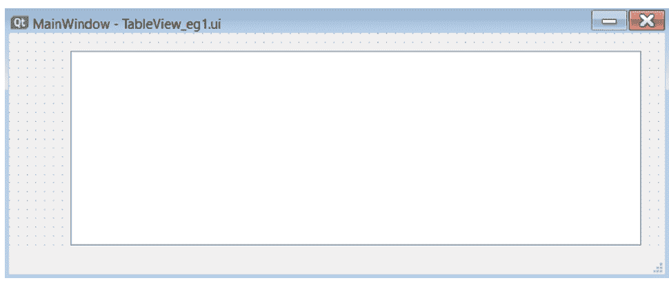

**图 5.28：** Qt Designer文件：TreeView_eg1.ui

注意：上述.ui文件位于路径：TreeView/TreeView_eg1.ui

请看以下`run_TreeView_eg1.py`的代码：

```python
import sys
from PyQt5.QtWidgets import QMainWindow, QApplication
from PyQt5.QtCore import Qt
from PyQt5.QtGui import QStandardItemModel
from TreeView_eg1 import *

class MyTreeView(QMainWindow):
    # setting object Name, Contact_Number, City, Profession
    # with values as 0 1 2 3
    Name, Contact_Number, City, Profession = range(4)

    def __init__(self):
        super().__init__()
        self.ui = Ui_MainWindow()
        self.ui.setupUi(self)
        # set to False means making a single level tree structure appear like a simple list of items
        self.ui.treeView.setRootIsDecorated(False)
        # set to True means To draw the item's background, Base and AlternateBase will be used.
        # observe the output with background color to be changed on alternate rows
        self.ui.treeView.setAlternatingRowColors(True)

        # calling myTreeViewModelCreation method
        mymodel = self.myTreeViewModelCreation(self)

        # model is set for the Treeview
        self.ui.treeView.setModel(mymodel)

        # filling Data on passing Name, Contact_Number, City and Profession headers
        # by calling myaddition method
        self.myaddition(mymodel, 'Divya', '9857611111', 'Delhi', 'Scientist')
        self.myaddition(mymodel, 'Sargam', '9857622222', 'Kolkata', 'HouseWife')
        self.myaddition(mymodel, 'Sugandh', '9857633333', 'Aligarh', 'Engineer')
        self.myaddition(mymodel, 'Munnu', '9857644444', 'Mumbai', 'Cricketer')
        self.show()
```

def myTreeViewModelCreation(self, myparent):
    # 创建一个新的项模型，初始行数为0，列数为4，并指定父项
    mymodel = QStandardItemModel(0, 4,
                                myparent)

    # setHeaderData(): 为指定的部分（0, 1, 2 和 3）
    # 设置表头数据，方向为水平，
    # 值为给定的（Name, Contact_Number, City
    # 和 Profession）。
    # 如果表头数据更新成功，将返回 True
    mymodel.setHeaderData(0, Qt.Horizontal,
                          "Name")
    mymodel.setHeaderData(1, Qt.Horizontal,
                          "Contact_Number")
    mymodel.setHeaderData(2, Qt.Horizontal,
                          "City")
    mymodel.setHeaderData(3, Qt.Horizontal,
                          "Profession")

    # 返回项模型
    return mymodel

def myaddition(self, mymodel, myname,
    mycontactnumber, mycity, myprofession):
        # 插入行以显示数据
        mymodel.insertRow(0)
        # index(): 获取与项关联的 QModelIndex
        # setData(): 为给定角色的项数据设置指定的值（作为参数传入）。
        # ----> 同时，setData() 负责更改与 QModelIndex 相关的角色的详细信息。
        mymodel.setData(mymodel.index(0,
        self.Name), myname)
        mymodel.setData(mymodel.index(0,
        self.Contact_Number), mycontactnumber)
        mymodel.setData(mymodel.index(0,
        self.City), mycity)
        mymodel.setData(mymodel.index(0,
        self.Profession), myprofession)

if __name__=="__main__":
    app = QApplication(sys.argv)
    w = MyTreeView()
    w.show()
    sys.exit(app.exec_())

## 输出：

输出结果可以在下图 [图 5.29](#figure-5-29) 中看到：

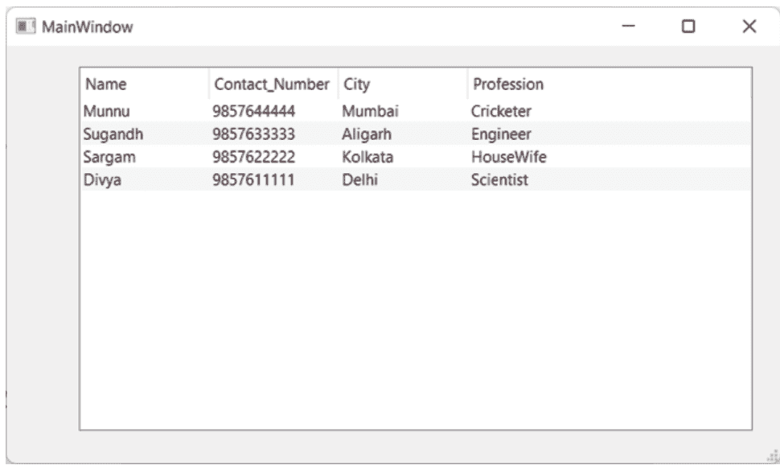

**图 5.29：** *TreeView/run_TreeView_eg1.py 的输出*

> **注意：** 上述代码包含在程序名中：**TreeView/run_TreeView_eg1.py**

从上面的代码中，我们看到我们正在使用代码向 `Treeview` 对象添加数据。

# 表格视图

表格视图是使用 `QTableView` 来显示模型中的项目。它是 PyQt5 的模型/视图框架之一。为了显示从 `QAbstractItemModel` 类派生的模型提供的数据，`QTableView` 实现了 `QAbstractItemView` 类定义的接口。PyQt5 中的 `QTableView` 小部件将用于构建电子表格和表格。行和列将创建表格。行和列相交的地方形成单元格。`TableView` 小部件允许编辑和与每个单元格交互。表格视图从项模型的 `rowCount()`、`columnCount()` 和 `data()` 方法接收关于如何填充和格式化表格单元格的指令。

## 重要属性

现在让我们检查一些重要属性。

# showGrid

此属性将决定是否显示网格。选中时将绘制网格，否则将没有网格。默认值设置为 **True**。请参考下图 *图 5.30*：


**图 5.30：** *描述 Qt Designer 中 QTableView 小部件的 showGrid 属性的图像*

# gridStyle

使用 `gridStyle` 属性设置用于绘制网格的画笔样式。从下图 *图 5.31* 中显示的选项列表中，用户可以选择任何选项：

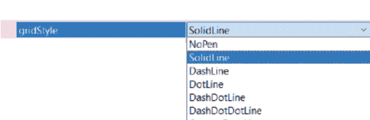

**图 5.31：** *描述 Qt Designer 中 QTableView 小部件的 gridStyle 属性的图像*

## sortingEnabled

默认值为未选中，这意味着 `QTableView` 小部件的排序功能被禁用。选中后，排序将被启用。请参考下图 *图 5.32*：

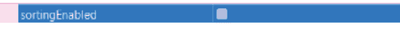

*图 5.32*：描述 Qt Designer 中 QTableView 小部件的 sortingEnabled 属性的图像

### wordWrap

默认值为 **True**，表示项目文本将在必要的换行处换行，否则不会换行。请参考下图 *图 5.33*：


*图 5.33*：描述 Qt Designer 中 QTableView 小部件的 wordWrap 属性的图像

# cornerButtonEnabled

默认值为 **True**，表示左上角的按钮将被启用。点击时，`QTableView` 小部件中的所有单元格将被选中。请参考下图 *图 5.33*：


*图 5.34*：描述 Qt Designer 中 QTableView 小部件的 cornerButtonEnabled 属性的图像

现在，我们将看到一个 `Table View` 小部件的示例。
文件名的详细信息如下：

| 序号 | Qt Designer 文件名 (.ui) | 将 QtDesigner 文件名转换为 Python 文件 (.py) | 创建另一个 Python 文件并从 Qt Designer 导入转换后的 Python 文件 |
| :--- | :--- | :--- | :--- |
| 1. | TableView_eg1.ui | TableView_eg1.py | run_TableView_eg1.py |

**表 5.3：** *文件名详情*

Qt Designer 文件如下图所示：

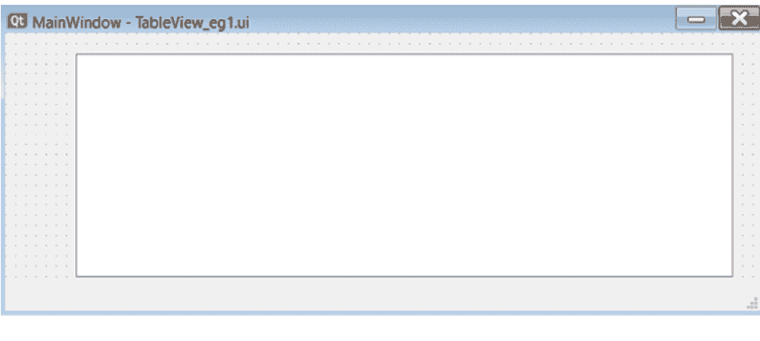

**图 5.35：** *Qt Designer 文件：TableView_eg1.ui*

> **注意：** 上述 .ui 文件包含在路径中：TableView/TableView_eg1.ui

考虑以下 **run_TableView_eg1.py** 的代码：

```python
import sys

from PyQt5.QtWidgets import QMainWindow, QApplication

from PyQt5.QtCore import Qt, QAbstractTableModel  # using QAbstractTableModel

from PyQt5.QtGui import QStandardItemModel

from TableView_eg1 import *

class MyTableView(QMainWindow):
    def __init__(self):
        super().__init__()
        self.ui = Ui_MainWindow()
        self.ui.setupUi(self)
        # creating a 2-D list
        mydata = [
            [11, 12, 13, 14],
            [15, 16, 17, 18],
            [19, 20, 21, 22],
            [23, 24, 25, 26]
        ]
        self.model = MyTableModel(mydata)  # calling a custom model MyTableModel and passing mydata as a parameter into the constructor
        # model is set for the Tableview
        self.ui.tableView.setModel(self.model)

# creating a custom model for interfacing between data object and view
class MyTableModel(QAbstractTableModel):
    def __init__(self, mydata):
        super().__init__()
        self._data = mydata

    # data is returned for given table locations
    # and parameters index and role are passed
    def data(self, index, role):
        if role == Qt.DisplayRole:  # for returning string
            # The table location for which the information is currently being requested
            # is given by the index parameter
            # The row and column numbers in the view are provided by the
            # functions .row() ---> (indexing into the outer list)
            # and .column(indexing into the sub-list) ---> (), respectively.
            # in the form of nested list, data is stored
            return self._data[index.row()][index.column()]

    # number of rows is returned
    def rowCount(self, index):
        # outer list length is returned.
        return len(self._data)

    # number of columns is returned
    def columnCount(self, index):
        # first sub list is taken. that is no. of elements in inner list and the length is being returned
        # if all rows are of an equal length, then only it will work
        return len(self._data[0])

if __name__=="__main__":
    app = QApplication(sys.argv)
    w = MyTableView()
    w.show()
    sys.exit(app.exec_())
```

## 输出：

输出结果可以在下图 [图 5.36](#) 中看到：

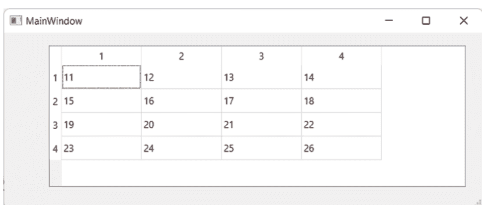

**图 5.36：** *TableView/run_TableView_eg1.py 的输出*

> **注意：** 上述代码包含在程序名中：TableView/run_TableView_eg1.py

在上面的代码中，我们可以看到使用自定义类 `MyTableModel` 通过简单的数据结构来显示值。

# 列视图

Qt 的模型/视图框架的一部分，它在许多 `QListViews` 中展示一个模型，每个树层次结构一个。此外，它被称为列表级联。为了显示从 `QAbstractItemModel` 类派生的模型提供的数据，`QColumnView` 实现了 `QAbstractItemView` 类描述的接口。

## 重要属性

现在让我们检查一些重要属性。

# resizeGripsVisible

此属性将决定列表视图是否体验到调整大小的控制点。默认值设置为 **True**。请参考下图 *图 5.37*：

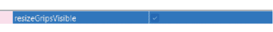

*图 5.37：描述 Qt Designer 中 QColumnView 小部件的 resizeGripsVisible 属性的图像*

现在，我们将看到一个 `ColumnView` 小部件的示例。文件名的详细信息如下：

| 序号 | Qt Designer 文件名 (.ui) | 将 Qt Designer 文件名转换为 Python 文件 (.py) | 创建另一个 Python 文件并从 Qt Designer 导入转换后的 Python 文件 |
| :--- | :--- | :--- | :--- |
| 1. | ColumnView_eg1.ui | ColumnView_eg1.py | run_ColumnView_eg1.py |

**表 5.4：文件名详情**

Qt Designer 文件如下图所示：

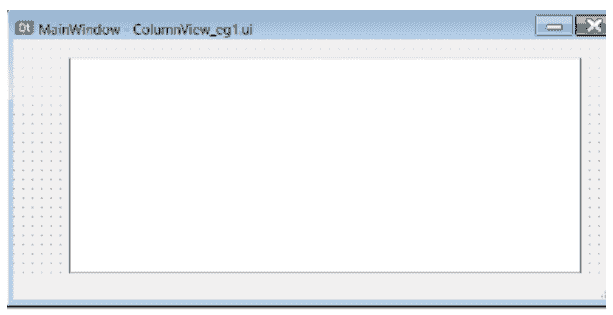

**图 5.38：** *Qt Designer 文件：ColumnView_eg1.ui*

> **注意：** 上述 .ui 文件位于路径：ColumnView/ColumnView_eg1.ui

考虑以下 **run_ColumnView_eg1.py** 的代码：

```python
import sys

from PyQt5.QtWidgets import QMainWindow,
QApplication, QFileSystemModel# importing
QFileSystemModel

from ColumnView_eg1 import *

from PyQt5.QtCore import QDir

class MyColumnView(QMainWindow):
    def __init__(self):
        super().__init__()
        self.ui = Ui_MainWindow()
        self.ui.setupUi(self)
        # creating an object of QFileSystemModel()
        self.myfile = QFileSystemModel()

        # setRootPath(): Installs a file system watcher on it and changes the directory
        # that the model is watching to newPath. The model will update if files
        # or directories in this directory change.
        self.myfile.setRootPath(QDir.rootPath())
        print(QDir.rootPath()) # returns the root directory's absolute path.
        print(QDir.homePath()) # returns the user's home directory's absolute path.
        print(QDir.currentPath()) # provides the current directory of the application's absolute path.

        for dirname in (QDir.rootPath(), QDir.homePath(), QDir.currentPath()):
            # model is set for the Columnview
            self.ui.columnView.setModel(self.myfile)

            # setRootIndex: Sets the item at the specified index as the root item.
            self.ui.columnView.setRootIndex(self.myfile.index(dirname))
        self.show()

if __name__=="__main__":
    app = QApplication(sys.argv)
    w = MyColumnView()
    w.show()
    sys.exit(app.exec_())
```

输出结果可见于下图 *图 5.39*：

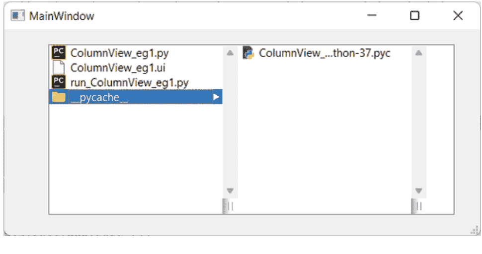

*图 5.39：ColumnView/run_ColumnView_eg1.py 的输出*

> **注意：** 上述代码位于程序名：**ColumnView/run_ColumnView_eg1.py**

在上述代码中，视图具有一个 **rootIndex**，用于指示它们显示模型的哪一部分，而 **QFileSystemModel** 具有一个 **rootPath**，用于指定将监控文件的根目录。

## QFrame

**QFrame** 类提供了可以具有边框的控件基类。边框样式由用于在视觉上区分边框与相邻控件的边框形状和阴影样式组成。我们现在将深入探讨它们的重要属性。

## frameShape

此属性将从边框样式中设置可用的 **frameShape** 值供用户选择。用户可以从可用列表中选择任何边框形状。在 Qt Designer 中，默认值为 **StyledPanel**，然后在 GUI 表单中拖放任何 **ItemView** 控件。用户可用的不同边框形状值如下：

| 序号 | 可用边框形状 | 描述 |
| :--- | :--- | :--- |
| 1 | **NoFrame** | 不绘制任何内容。 |
| 2 | **Box** | 在其内容周围绘制一个方框。 |
| 3 | **Panel** | 绘制一个面板，使内容呈现凹陷或凸起的外观。 |
| 4 | **StyledPanel** | 绘制一个矩形面板，其外观取决于当前的 GUI 样式，呈现凹陷或凸起的外观。 |
| 5 | **HLine** | 绘制一条水平线，不框住任何内容（用作分隔符） |
| 6 | **VLine** | 绘制一条垂直线，不框住任何内容（用作分隔符） |
| 7 | **WinPanel** | 使用时，线宽将指定为 2 像素，并使用此绘制一个类似于 Windows 2000 的矩形面板，呈现凹陷或凸起的外观。 |

**表 5.5：** *用户可用的不同边框形状值*

Qt Designer 中的属性图像如下图所示：

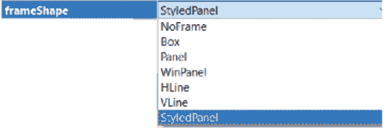

**图 5.40：** *描绘 Qt Designer 中 frameShape 属性的图像*

## frameShadow

为了给边框添加 3D 效果，可以使用此属性设置阴影类型。用户可以从可用选项中选择以下任意一种：**Plain**、**Raised** 或 **Sunken**：

| 序号 | frameShadow 可用性 | 描述 |
| :--- | :--- | :--- |
| 1. | **Plain** | 没有 3D 效果，当使用 WindowText 颜色调色板绘制时，边框和内容看起来与周围环境齐平。 |
| 2. | **Raised** | 使用当前颜色组中的亮色和暗色绘制 3D 凸起线条，使边框及其内容呈现凸起的外观。 |
| 3. | **Sunken** | 使用当前颜色组中的亮色和暗色绘制 3D 凹陷线条，使边框及其内容呈现凹陷的外观。在 Qt Designer 中，当在 GUI 表单中拖放任何 ItemView 控件时，默认值为 sunken。 |

**表 5.6：** *frameShadow 可用性*

Qt Designer 中的属性图像如下图所示：

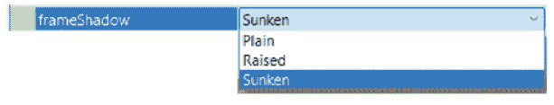

*图 5.41：* 描绘 Qt Designer 中 frameShadow 属性的图像

## lineWidth

使用此属性，我们可以设置边框边界的 **lineWidth**。默认值为 **1**。
Qt Designer 中的属性图像如下图所示：


*图 5.42：* 描绘 Qt Designer 中 lineWidth 属性的图像

## midLineWidth

使用此属性，我们可以确定边框中间那条额外线的宽度。为了创建独特的 3D 效果，使用了第三种颜色。默认值为 **0**。
Qt Designer 中的属性图像如下图所示：


*图 5.43：* 描绘 Qt Designer 中 midLineWidth 属性的图像

您可以从 [https://doc.qt.io](https://doc.qt.io) 查看各种线宽和边框样式的组合。

## QAbstractScrollArea

在 QAbstractScrollArea 类（Qt Designer 中所有基于模型的项视图控件的通用类）中，有一个视口（提供中央控件的区域内容）被滚动。视口旁边有一个垂直和水平滚动条。当滚动条隐藏时，视口会扩展以覆盖可用空间；当滚动条再次可见时，视口会收缩以腾出空间。

## verticalScrollBarPolicy

使用此属性，我们可以设置垂直滚动条的策略。默认值为 **ScrollBarAsNeeded**。用户可以选择其他两个选项 **ScrollBarAlwaysOff** 和 **ScrollBarAlwaysOn** 中的任意一个。

Qt Designer 中的属性图像如下图所示：

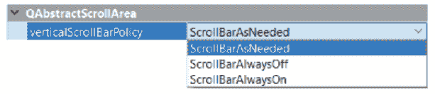

*图 5.44：描绘 Qt Designer 中 verticalScrollBarPolicy 属性的图像*

## horizontalScrollBarPolicy

使用此属性，我们可以设置水平滚动条的策略。默认值为 **ScrollBarAsNeeded**。用户也可以选择其他两个选项 **ScrollBarAlwaysOff** 和 **ScrollBarAlwaysOn** 中的任意一个。

Qt Designer 中的属性图像如下图所示：

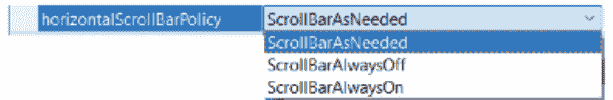

**图 5.45：** 描绘 Qt Designer 中 horizontalScrollBarPolicy 属性的图像

### sizeAdjustPolicy

使用此属性，我们可以设置当视口大小改变时滚动区域大小如何变化的策略。默认值为 **AdjustIgnored**。请参考下表 [表 5.7](#table-57)：

| 序号 | 不同的 sizeAdjustPolicy 常量 | 描述 |
| :--- | :--- | :--- |
| 1 | **AdjustIgnored** | 滚动区域将不会改变其先前的行为，因为它不会进行调整。 |
| 2 | **AdjustToContents** | 滚动区域将不断变化以适应视口。 |
| 3 | **AdjustToContentsOnFirstShow** | 滚动区域第一次显示时，它将调整以适应其视口。 |

**表 5.7：** 不同的 sizeAdjustPolicy 常量

Qt Designer 中的属性图像如下图所示：

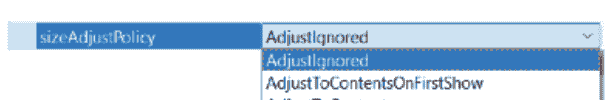

**图 5.46：** 描绘 Qt Designer 中 sizeAdjustPolicy 属性的图像

## QAbstractItemView

`QAbstractItemView` 类（Qt Designer 中所有基于模型的项视图控件的通用类）提供了项视图类的基本功能。

## autoScroll

此属性默认设置为**True**，当用户将**QAbstractItemView**控件移动到视口边缘16像素范围内时，它将自动滚动其内容。
Qt Designer中的属性图像如下图所示：

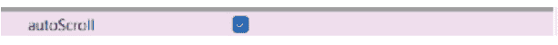

**图 5.47：** *展示Qt Designer中autoScroll属性的图像*

## autoScrollMargin

当启用自动滚动时，将使用此属性设置区域大小。默认值为16像素。
Qt Designer中的属性图像如下图所示：


**图 5.48：** *展示Qt Designer中autoScrollMargin属性的图像*

## editTriggers

当选中时，**QAbstractItemView**控件的操作将启动项目编辑。默认情况下，**DoubleClicked**和**EditKeyPressed**被选中，并使用OR运算符组合。不同的常量如下表5.8所示：

| 序号 | 不同的editTriggers常量 | 描述 |
| :--- | :--- | :--- |
| 1 | **NoEditTriggers** | 不允许编辑。 |
| 2 | **CurrentChanged** | 当前项目更改时，开始编辑。 |
| 3 | **DoubleClicked** | 双击项目时，开始编辑。 |
| 4 | **SelectedClicked** | 单击已选中的项目时，开始编辑。 |
| 5 | **EditKeyPressed** | 在项目上按下平台编辑键时，开始编辑。 |
| 6 | **AnyKeyPressed** | 在项目上按下任意键时，开始编辑。 |
| 7 | **AllEditTriggers** | 所有上述操作都开始编辑。 |

**表 5.8：** *不同的editTriggers常量*

Qt Designer中的属性图像如下图所示：

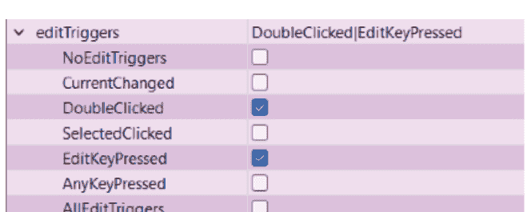

**图 5.49：** *展示Qt Designer中editTriggers属性的图像*

## tabKeyNavigation

设置后，将启用使用Tab和反向Tab进行项目导航。Qt Designer中的属性图像如下图所示：


**图 5.50：** *展示Qt Designer中tabKeyNavigation属性的图像*

## showDropIndicator

设置后，在`QAbstractItemView`控件中拖放对象时，拖放指示器将可见。
Qt Designer中的属性图像如下图所示：

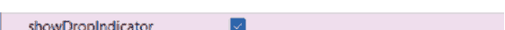

**图 5.51：** *展示Qt Designer中showDropIndicator属性的图像*

## dragEnabled

设置后，`QAbstractItemView`控件支持拖动其自身的项目。
Qt Designer中的属性图像如下图所示：


**图 5.52：** *展示Qt Designer中dragEnabled属性的图像*

## dragDropOverwriteMode

使用此属性，我们可以设置`QAbstractItemView`控件的拖放行为。当设置为**True**时，放下所选数据将替换项目现有的数据，而移动时，数据将清除项目。当数据被放下且设置为**False**时，所选数据将作为新项目添加。移动数据时，项目也会被删除。默认情况下未选中。
Qt Designer中的属性图像如下图所示：

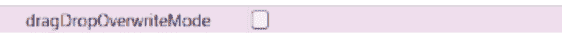

**图 5.53：** *展示Qt Designer中dragDropOverwriteMode属性的图像*

## dragDropMode

此属性解释了`QAbstractItemView`控件可以采取的各种拖放操作。
不同的常量如下表5.9所示：

| 序号 | 不同的dragDropMode常量 | 描述 |
|---|---|---|
| 1 | **NoDragDrop** | 不支持拖动或放下。 |
| 2 | **DragOnly** | **QAbstractItemView**控件支持拖动其自身的项目。 |
| 3 | **DropOnly** | **QAbstractItemView**控件支持放下。 |
| 4 | **DragDrop** | **QAbstractItemView**控件同时支持拖动和放下。 |
| 5 | **InternalMove** | **QAbstractItemView**控件仅接受移动操作，不接受从自身复制。 |

**表 5.9：** *不同的dragDropMode常量*

Qt Designer中的属性图像如下图所示：

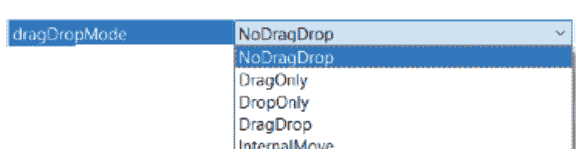

**图 5.54：** *展示Qt Designer中dragDropMode属性的图像*

## defaultDropAction

使用此属性，我们可以设置**QAbstractItemView**控件中使用的默认放下操作。如果支持的操作支持**CopyAction**且未设置该属性，则放下操作为**CopyAction**。

Qt Designer中的属性图像如下图所示：

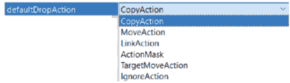

**图 5.55：** *展示Qt Designer中defaultDropAction属性的图像*

## alternatingRowColors

当设置为**True**时，使用Base和**AlternateBase**颜色绘制项目背景。如果设置为**False**（这是默认值），则仅使用Base颜色绘制项目背景。

Qt Designer中的属性图像如下图所示：


**图 5.56：** *展示Qt Designer中alternatingRowColors属性的图像*

### selectionMode

使用此属性，用户可以决定是选择一个项目还是多个项目，以及在多个项目选择中，是否必须选择连续范围的项目。请参考下表5.10：

| 序号 | 不同的selectionMode常量 | 描述 |
| :--- | :--- | :--- |
| 1 | **NoSelection** | 不选择任何项目。 |
| 2 | **SingleSelection** | 当用户选择一个项目时，任何先前被用户选中的项目都将取消选中。通过在单击选中项目时按住*Ctrl*键，用户可以取消选中该项目。 |
| 3 | **MultiSelection** | 用户以常规方式选择的任何项目，其选择状态将被切换，而其他项目保持不变。在多个项目上拖动鼠标时，可以切换它们的选择状态。 |
| 4 | **ExtendedSelection** | 对于用户以常规方式选择的任何项目，在清除选择后将选择一个新项目。<br><br>在单击项目时按住*Ctrl*键，将切换被单击项目的选择状态，而其他项目不受影响。<br><br>在单击项目时按住*Shift*键，根据被单击项目的状态，当前项目和被单击项目之间的所有项目将被选中或取消选中。<br><br>在多个项目上拖动鼠标时，可以进行选择。 |
| 5 | **ContiguousSelection** | 对于用户以常规方式选择的任何项目，在清除选择后将选择一个新项目。<br><br>在单击项目时按住*Shift*键，根据被单击项目的状态，当前项目和被单击项目之间的所有项目将被选中或取消选中。 |

**表 5.10：** *不同的selectionMode常量*

Qt Designer中的属性图像如下图所示：

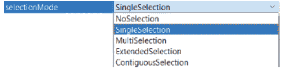

**图 5.57：** *展示Qt Designer中selectionMode属性的图像*

## selectionBehavior

QAbstractItemView控件将使用此属性设置选择行为。不同的常量如下表5.11所示：

| 序号 | 不同的selectionBehavior常量 | 描述 |
|---|---|---|
| 1 | **SelectItems** | 将选择单个项目。 |
| 2 | **SelectRows** | 将选择仅包含行的项目。 |
| 3 | **SelectColumns** | 将选择仅包含列的项目。 |

**表 5.11：** *不同的selectionBehavior常量*

Qt Designer中的属性图像如下图所示：

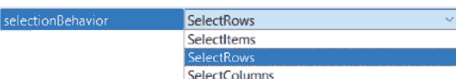

**图 5.58：** *展示Qt Designer中selectionBehavior属性的图像*

### iconSize

使用此属性，将设置项目图标的大小。
Qt Designer中的属性图像如下图所示：

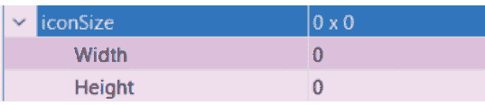

**图 5.59：** *展示Qt Designer中iconSize属性的图像*

## textElideMode

此属性将设置 `QAbstractItemView` 控件在文本省略时的位置，其默认值为 **ElideRight**。
该属性在 Qt Designer 中的图像如下所示：

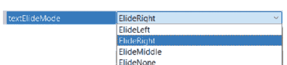

**图 5.60：** *展示 Qt Designer 中 textElideMode 属性的图像*

## verticalScrollMode

此属性将设置 `QAbstractItemView` 控件项目内容在垂直方向上的滚动方式。滚动可以按项目或按像素进行。
该属性在 Qt Designer 中的图像如下所示：

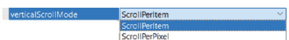

**图 5.61：** *展示 Qt Designer 中 verticalScrollMode 属性的图像*

## horizontalScrollMode

此属性将设置 `QAbstractItemView` 控件项目内容在水平方向上的滚动方式。滚动可以按项目或按像素进行。
该属性在 Qt Designer 中的图像如下所示：

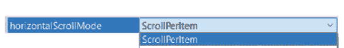

**图 5.62：** *展示 Qt Designer 中 horizontalScrollMode 属性的图像*

## QStandardItemModel

它是一个模型/视图类，也是 PyQt5 中模型/视图框架的一个组件。`QStandardItem` 为 `QStandardItemModel` 提供项目。此模型在任何支持该接口的视图（如 `QListView`、`QTableView` 和 `QTreeView`）中提供数据。

通常，我们从一个空的 `QStandardItemModel` 开始，使用 `appendRow()` 方法向模型添加项目，并在需要列表或树时使用 `item()` 方法访问单个项目。为了将项目排列成模型所代表的表格，我们通常向 `QStandardItemModel` 构造函数提供表格的尺寸并执行 `setItem()`。借助 `setHorizontalHeaderLabels()` 和 `setVerticalHeaderLabels()`，我们可以设置模型的标题标签。

可以使用 `findItems()` 方法搜索模型中的项目，并使用 `sort()` 方法进行排序。

要从模型中移除所有元素，我们可以使用 `clear()` 方法。

更多信息请参考链接 [https://doc.qt.io](https://doc.qt.io)。示例已在解释不同视图时进行了演示。

## 结论

在本章中，我们深入学习了项目视图控件，包括 `QTableView`、`QTreeView` 和 `QListView`，它们已被证明是以有序和结构化方式呈现数据的有效工具。列表格式、层次树结构和表格表示只是它们为数据呈现提供的少数几种选择。这些控件能够以图形化和用户友好的方式高效地呈现数据。此外，项目视图控件还包含了数据编辑和修改功能。用户可以快速添加、删除或更改项目，以与显示的数据进行交互。通过允许用户使用 Qt Designer 指定这些操作的行为和更改参数，用户界面变得更加交互。此外，本章还介绍了 Qt 的一个关键概念——模型-视图架构。用户通过学习项目视图控件，熟悉了模型、视图和委托，并学会了如何进行交互。利用这些信息，可以使用模型-视图架构来构建和实现应用程序。本章最后通过有用的插图，详细介绍了 QFrame、QAbstractScrollArea 和 QAbstractItemView 的关键特性。总之，本章关于 Qt Designer 中项目视图控件的目标——解释其特性、功能和自定义可能性——已成功实现。

## 要点回顾

- 项目视图是以类似表格格式呈现数据的强大工具。
- 由于项目视图具有完全的可调整性，用户可以更改其外观和行为以满足您的特定需求。
- 模型-视图架构是 Qt 的一个基本概念，用于将数据表示（模型）与视觉显示（视图）和用户交互（委托）分离。
- 模型/视图架构是项目视图的基础。因此，模型、视图和委托是三个不同的元素，它们协同工作来显示数据。数据由模型提供，由视图显示，与用户的交互由委托处理。
- 项目可以以多种方式查看。QTableView、QListView 和 QTreeView 是最常见的类型。这些控件可以分别以树、表或列表格式显示数据。
- QTreeView：此树视图控件使用层次结构方式呈现数据。
- QTableView：此表格视图控件使用表格布局呈现数据。
- QListView：此列表视图控件使用列表格式显示数据。
- QColumnView：此控件以列格式显示数据，用于显示多种数据类型，包括字符串、整数和日期。

## 问题

1. 描述 Qt Designer 中的项目视图。
2. 解释以下内容：
   a. QListView
   b. QTreeView
   c. QTableView
   d. QColumnView
   e. 描述 QFrame、QAbstractScrollArea 和 QAbstractItemView
3. 说明 Qt Designer 中列表视图控件的功能。
4. 列出并解释 QListView 控件的重要属性。
5. 解释以下内容：
   a. resizeMode
   b. layoutMode
   c. spacing
   d. gridSize
   e. viewMode
   f. wordWrap
6. 说明 Qt Designer 中树视图控件的功能。
7. 说明 Qt Designer 中表格视图控件的功能。
8. 解释 Qt Designer 中表格视图控件的重要属性。
9. 说明 Qt Designer 中列视图控件的功能。
10. 解释 Qt Designer 中列视图控件的重要属性。
11. 解释以下内容：
    a. autoExpandDelay
    b. indentation
    c. rootIsDecorated
    d. uniformRowHeights

## 加入我们的书籍 Discord 空间

加入书籍的 Discord 工作区，获取最新更新、优惠、全球科技动态、新书发布以及与作者的交流会：

https://discord.bpbonline.com


# 第 6 章
深入了解 Qt Designer 中基于项目的控件

## 简介

在上一章中，我们讨论了 PyQt5 中不同的项目视图。在本章中，我们将重点介绍**项目控件**。本章的主要重点将是学习**列表控件**、**树控件**和**表格控件**。我们将重点关注属性和一些有用的方法。所有这些控件在 Qt Designer 的**项目控件**下都可用，如下图 *图 6.1* 所示，用户可以选择**项目控件**下的任何控件并将其拖放到 GUI 表单中。

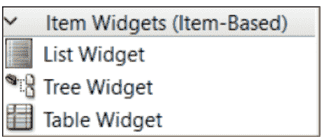

*图 6.1：* Qt Designer 中不同的项目控件（基于项目）

我们在处理按钮类型控件时已经了解了 `QObject` 和 `QWidget` 类。同样的情况也适用于**项目控件**。我们在上一章已经讨论了 `QFrame`、`QAbstractScrollArea` 和 `QAbstractItemView` 类的其他相关内容。**项目控件**拥有所有这些属性范围。但默认值可能因控件而异。现在，我们将讨论 3 个项目控件及其属性。

## 结构

在本章中，我们将讨论以下主题：

- 列表控件
- 树控件
- 表格控件

## 目标

阅读本章后，读者将了解 Qt Designer 中的**项目控件**，这些控件通常用于创建交互式用户界面。本章的主要目标是理解它们的属性、功能、自定义选项，并全面了解如何在 Qt Designer 环境中创建和操作基于项目的控件。完成本章后，用户将能够利用基于项目的控件的强大功能创建动态、交互式的用户界面。他们将发现不同的特性和特点，以个性化**列表控件**、**树控件**和**表格控件**的外观和行为。为了促进用户交互并实现功能，读者将学习如何管理与基于项目的控件相关的事件和信号。读者将能够熟练地在 Qt Designer 中利用基于项目的控件开发复杂但用户友好的界面。最后，将详细讨论**项目控件**的已解决示例。以及在关键位置添加的注释，以便更好地理解代码。

## 列表控件

**列表控件**是一个经典的基于项目的界面，用于添加和删除项目。它提供了一个类似于 `QListView` 的列表视图，由便捷类 `QListWidget` 提供。用于向列表添加或删除项目的基于项目的接口是 `QListWidget` 类。列表中的所有项目都是 `QListWidgetItem` 对象。列表中的每个 `QListWidgetItem` 都由 `QListWidget` 使用内部模型进行管理。可以为 `QListWidget` 对象设置多选功能。

## 重要属性

我们在上一章已经看到了不同的 `QListView` 属性。同样的属性也适用于此。除了这些属性，我们将讨论 `QListWidget` 的属性。

## currentRow

此属性用于设置当前项目的行。根据活动的选择模式，该行也可能被选中。默认值为 -1。请参考下图：


**图 6.2：** 描述 Qt Designer 中 QListWidget 的 currentRow 属性的图像

## sortingEnabled

默认值为未选中，当设置为 true 时，此属性将决定为列表启用排序。请参考下图：


图 6.3：描述 Qt Designer 中 QListWidget 的 sortingEnabled 属性的图像

## 重要方法

现在让我们来看一些重要的方法：

- clear(): QListWidget 对象中的所有项目将被移除，因为它们将被永久删除。
- insertItem(row, item): QListWidgetItem 对象将被插入到由 row（整数）指定的位置。
- addItem(): 一个 QListWidgetItem 对象或字符串将被添加到 QListWidget 对象中。
- addItems(labels): 带有字符串列表的项目将被插入到 QListWidget 对象的末尾。
- setCurrentItem(item, command): 通过编程方式，我们可以将当前选中的项目设置为 QListWidgetItem 对象，可以使用或不使用选择标志，即使用 command 参数。
- sortItems([order=Qt.AscendingOrder]): QListWidget 项目将根据指定的顺序进行排列。

## 重要信号

一些信号如下：

- currentItemChanged(): 当 QListWidget 对象的当前项目发生变化时，会发出此信号。
- itemClicked(): 当 QListWidget 对象中的项目被点击时，会发出此信号。

现在，我们将看一个 QListWidget 的示例。
文件名的详细信息在下表 6.1 中给出：

| 序号 | Qt Designer 文件名 (.ui) | 将 QtDesigner 文件名转换为 Python 文件 (.py) | 创建另一个 Python 文件并从 Qt Designer 导入转换后的 Python 文件 |
|---|---|---|---|
| 1 | listWidget_eg1.ui | listWidget_eg1.py | run_listWidget_eg1.py |

## 表 6.1：文件名详情

Qt Designer 文件如下图所示：

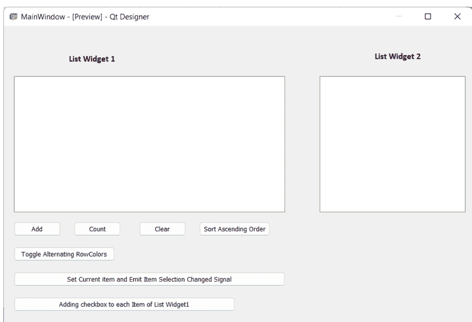

## 图 6.4：Qt Designer 文件：ListWidget/listWidget_eg1.ui

> 注意：上述 .ui 文件位于路径：ListWidget/listWidget_eg1.ui

考虑以下 `run_listWidget_eg1.py` 的代码：

```python
import sys
from PyQt5.QtWidgets import QMainWindow, QAbstractItemView,
    QApplication, QListWidgetItem, QCheckBox, QHBoxLayout,
    QLabel, QWidget, QMessageBox
from PyQt5.QtGui import QPalette, QColor
from listWidget_eg1 import *

class MyListWidget(QMainWindow):
    def __init__(self):
        super().__init__()
        self.myui = Ui_MainWindow()
        self.myui.setupUi(self)
        self.myui.lw_Add.clicked.connect(self.btn1)
        self.myui.lw_Count.clicked.connect(self.btn2)
        self.myui.lw_Clear.clicked.connect(self.btn3)
        self.myui.lw_SortAsc.clicked.connect(self.btn4)
        self.myui.lw_Toggle.clicked.connect(self.btn5)
        self.myui.lw_SetCurrentItem.clicked.connect(self.btn6)
        self.myui.lw_AddCheckBox.clicked.connect(self.btn7)
        self.myui.lw1.setDragEnabled(True) # allowing dragEnabled property of lw1 to be True
        self.myui.lw2.setDragEnabled(False) # allowing dragEnabled property of lw2 to be False
        self.myui.lw1.setDragDropMode(QAbstractItemView.DragDrop) # setting drag drop mode of lw1
        self.myui.lw1.setAcceptDrops(False) # allowing acceptDrops property of lw1 to be False
        self.myui.lw2.setAcceptDrops(True) # allowing acceptDrops property of lw2 to be True
        self.show()
        # Add items to the list widget
        for loop in range(5):
            item = QListWidgetItem()
            item.setText("    Itemmno: {}".format(loop+1))
            self.myui.lw1.addItem(item)

    def btn1(self):
        # creating an instance of QListWidgetItem
        item = QListWidgetItem()
        # setting the text
        item.setText("    Itemmno: {}".format(self.myui.lw1.count()+1))
        # adding it to the listWidget using addItem method
        self.myui.lw1.addItem(item)
        # Add multiple items to the list widget
        mylist_items = ["Zeeshan", "Vicky", "Abdul"]
        for list_item in mylist_items:
            myinst_item = QListWidgetItem()
            myinst_item.setText(list_item)
            self.myui.lw1.addItem(myinst_item)

    def btn2(self):
        QMessageBox.information(None, 'Item Count Title', "The number of items in the list is {}".format(self.myui.lw1.count()))

    def btn3(self):
        # clearing all the listWidget items
        self.myui.lw1.clear()

    def btn4(self):
        # Sorting the listWidget items in ascending order
        self.myui.lw1.sortItems(QtCore.Qt.AscendingOrder)

    def btn5(self):
        # Enable alternate row colors
        self.myui.lw1.setAlternatingRowColors(True)
        mypalette = self.myui.lw1.palette()
        mypalette.setColor(QPalette.AlternateBase, QColor("lightgray"))
        self.myui.lw1.setPalette(mypalette)

    def btn6(self):
        myselect_item = self.myui.lw1.item(4) # Selecting 5th item of the list
        self.myui.lw1.setCurrentItem(myselect_item) # will set the current item of the listWidget
        # Emitting the itemSelectionChanged signal
        self.myui.lw1.itemSelectionChanged.emit() # signal will be emitted when the selection of items in the list widget is changed

    def btn7(self):
        #Create a checkbox for each ListWidget item
        for myitm in range(self.myui.lw1.count()):
            myitem = self.myui.lw1.item(myitm)
            mycheck_box = QCheckBox()
            self.myui.lw1.setItemWidget(myitem, mycheck_box)

if __name__=="__main__":
    app = QApplication(sys.argv)
    w = MyListWidget()
    w.show()
    sys.exit(app.exec_())
```

**输出：**
**初始运行时的默认情况**
请参考下图：

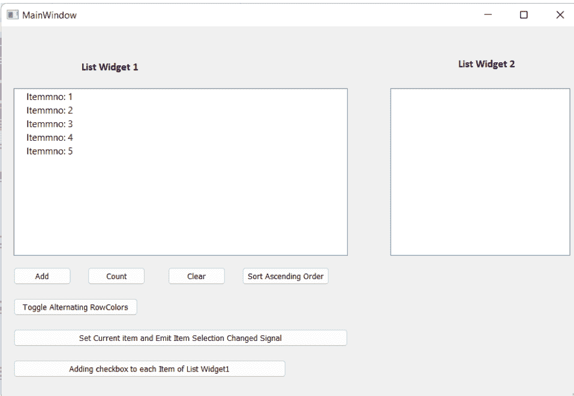

*图 6.5：ListWidget/run_listWidget_eg1.py 的默认输出*

## 情况 1：按下添加按钮时

请参考下图：

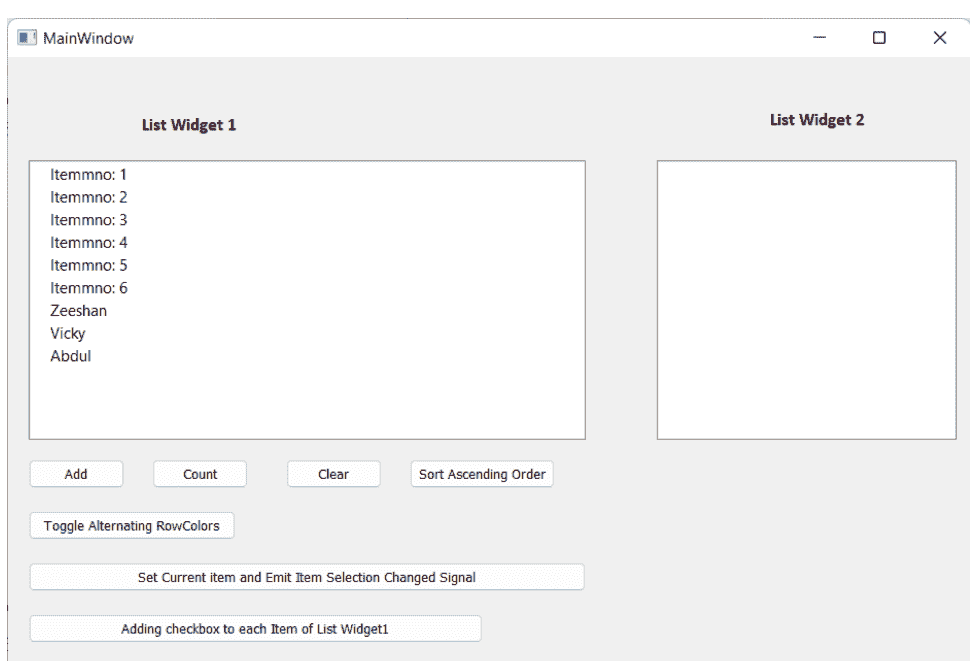

*图 6.6：ListWidget/run_listWidget_eg1.py 的情况 1 输出*

## 情况 2：按下计数按钮时

请参考下图：

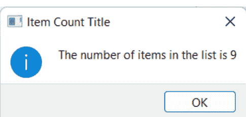

*图 6.7：ListWidget/run_listWidget_eg1.py 的情况 2 输出*

## 情况 3：按下升序排序按钮时

请参考下图：

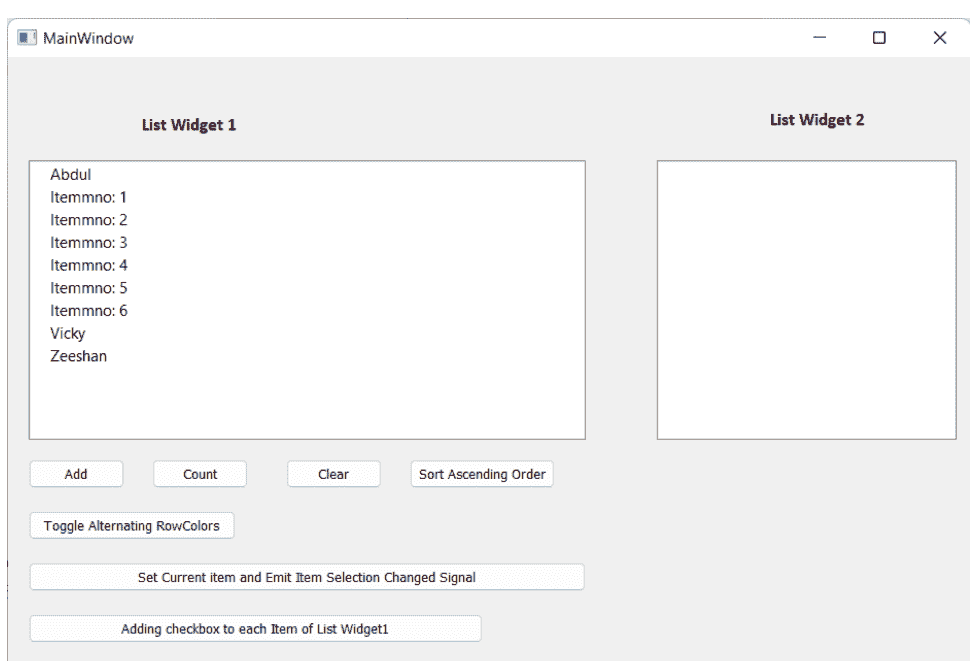

*图 6.8：ListWidget/run_listWidget_eg1.py 的情况 3 输出*

## 情况 4：按下切换交替行颜色按钮时

请参考下图：

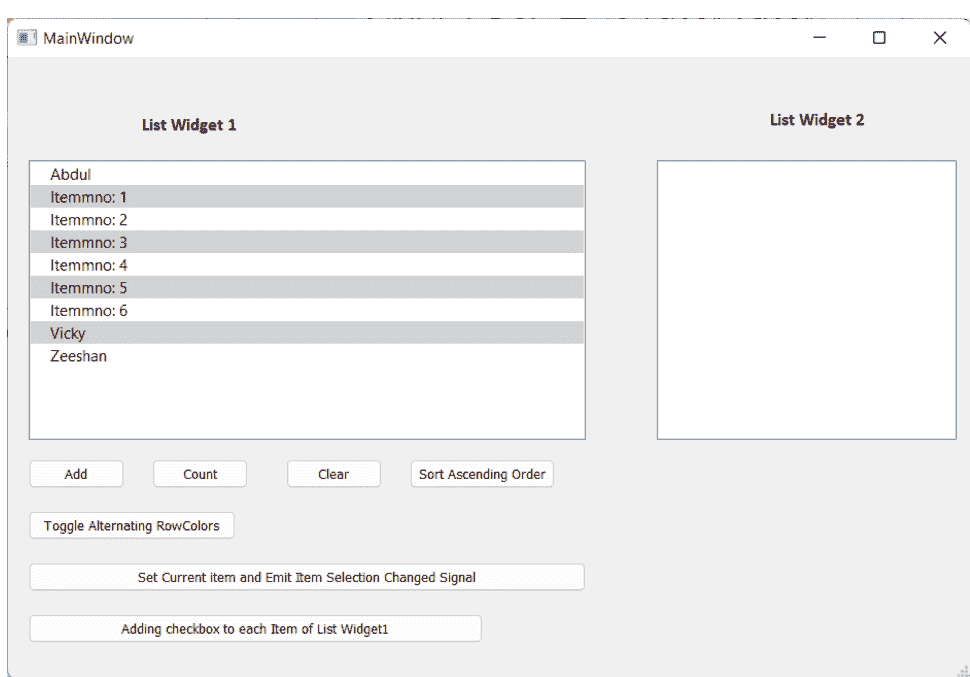

*图 6.9：ListWidget/run_listWidget_eg1.py 的情况 4 输出*

## 情况 5：按下设置当前项目并发出项目选择更改信号按钮时

请参考下图：

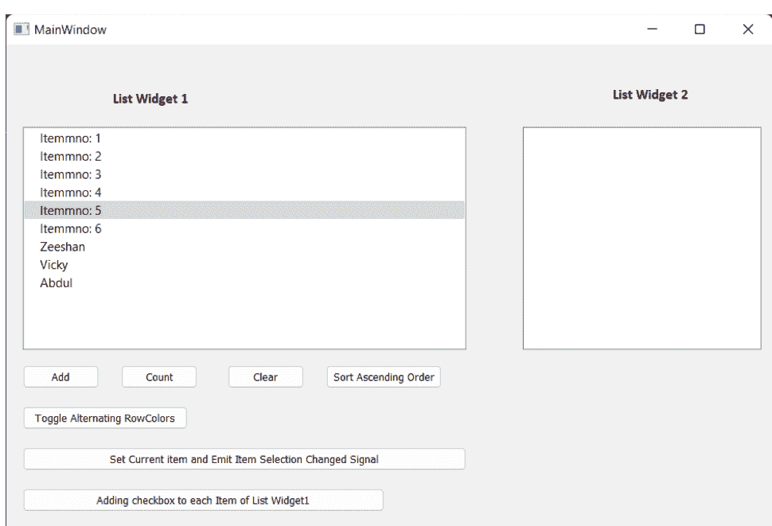

*图 6.10：ListWidget/run_listWidget_eg1.py 的情况 5 输出*

## 情况 6：按下为列表控件 1 的每个项目添加复选框按钮时

请参考下图：

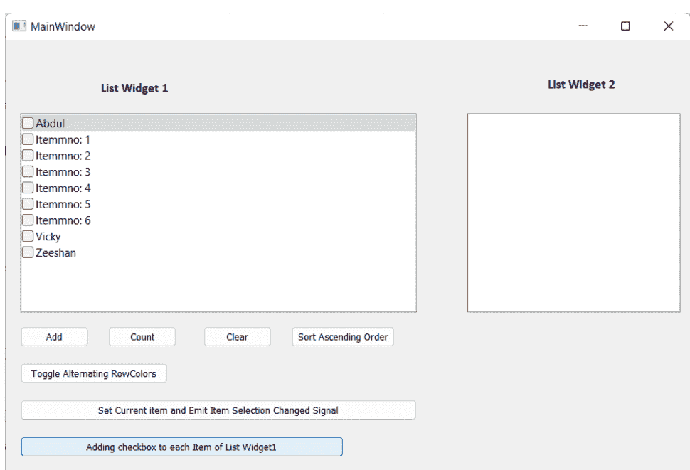

图 6.11：ListWidget/run_listWidget_eg1.py 的情况 6 输出

## 情况 7：按下清除按钮时

请参考下图：

## 案例 8：仅从 lw1 拖放到 lw2

请参考下图：

**图 6.13：** *案例-8 ListWidget/run_listWidget_eg1.py 的输出*

> **注意：** 上述代码包含在程序名称中：**ListWidget/run_listWidget_eg1.py**

## 树形控件

PyQt5 库的 **QTreeWidget** 类提供了一个 **treeView** 控件，用于以层次结构显示数据。它支持多列和自定义项目，用户可以展开和折叠分支以查看和编辑项目。它可以用于显示数据，包括文件系统、数据库或具有父子关系的项目列表。**QTreeWidget** 类使用默认模型来保存项目，每个项目都是一个 **QTreeWidgetItem**，并基于 Qt 的模型/视图架构。

## 重要属性

QTreeWidget 的属性与上一章中看到的 QTreeView 属性类似。除了这些属性之外，唯一添加的其他属性是 columnCount 属性。此属性将返回 QTreeWidget 中的列数。默认值设置为 1。我们也可以使用 setColumnCount(count) 方法来设置列数。请参考下图：

图 6.14：描述 Qt Designer 中 QTreeWidget 的 columnCount 属性的图片

## 重要方法

现在让我们来看一些重要的方法：

- clear()：将从 QTreeWidget 对象中移除所有项目，因为它们将被永久删除。
- addTopLevelItem(item)：可以使用此方法向 QTreeWidget 对象添加一个顶级项目。item 参数可以是 QTreeWidgetItem 或其子类之一。
- currentItem()：此方法返回 QTreeWidget 对象中的当前项目（即被选中并具有焦点的项目）。
- selectedItems()：此方法将返回 QTreeWidget 对象中所有选定的非隐藏项目的列表。
- setHeaderLabels(labels)：此方法用于为 QTreeWidget 对象的每一列设置标题标签（字符串列表）。
- sortItems(column,order)：此函数使用指定的列和顺序对 QTreeWidget 对象中的项目进行排序。order 参数是一个 `Qt.SortOrder枚举`（`Qt.AscendingOrder` 或 `Qt.DescendingOrder`），column 参数是一个整数，指定要排序的列。
- `takeTopLevelItem(index)`：此方法用于从 `QTreeWidget` 对象中移除指定索引参数处的项目并返回它。否则，它将返回 `None`。index 参数是要移除的项目的索引。
- `setColumnCount(columns)`：此方法用于指定 `QTreeWidget` 对象中显示的列数。

## 重要信号

一些信号如下：

- `itemActivated(item,column)`：当项目被激活（双击或按下 *Enter* 键时按下）时，会发出此信号。item 参数是激活的项目，column 参数是项目的列。
- `itemChanged(item,column)`：当项目的数据发生更改时，会发出此信号。item 参数是更改的项目，column 参数是项目的列。
- `itemClicked(item,column)`：当项目被单击时，会发出此信号。item 参数是单击的项目，column 参数是项目的列。
- `itemCollapsed(item)`：当项目被折叠（其子项被隐藏）时，会发出此信号。item 参数是折叠的项目。
- `itemDoubleClicked(item,column)`：当项目被双击时，会发出此信号。item 参数是双击的项目，column 参数是项目的列。
- **itemEntered(item,column)**：当鼠标光标进入项目时，会发出此信号。item 参数是进入的项目，column 参数是项目的列。
- **itemExpanded(item)**：当项目被展开（其子项被显示）时，会发出此信号。item 参数是展开的项目。
- **itemPressed(item,column)**：当项目被按下时，会发出此信号。item 参数是按下的项目，column 参数是项目的列。

现在，我们将看到一个 **QTreeWidget** 的示例。

文件名的详细信息如 *表 6.2* 所示：

| 序号 | Qt Designer 文件名 (.ui) | 将 Qt Designer 文件名转换为 Python 文件 (.py) | 创建另一个 Python 文件并从 Qt Designer 导入转换后的 Python 文件 |
| :--- | :--- | :--- | :--- |
| 1 | treeWidget_eg1.ui | treeWidget_eg1.py | run_treeWidget_eg1.py |

**表 6.2：** 文件名详细信息

Qt Designer 文件如下图所示：

**图 6.15：** Qt Designer 文件：TreeWidget/ treeWidget_eg1.ui

> **注意：** 上述 .ui 文件包含在路径中：TreeWidget/run_treeWidget_eg1.ui

考虑以下 **run_treeWidget_eg1.py** 的代码：

```python
import sys

from PyQt5.QtWidgets import QMainWindow,
QApplication, QTreeWidget, QTreeWidgetItem

from PyQt5.QtGui import QPalette, QColor

from treeWidget_eg1 import *

class MyTreeWidget(QMainWindow):
    def __init__(self):
        super().__init__()
        self.myui = Ui_MainWindow()
        self.myui.setupUi(self)

        # Initially setting the column count of the
        # treeWidget object to 2
        self.myui.treeWidget.setColumnCount(2)

        # Set the header labels for 2 columns
        self.myui.treeWidget.setHeaderLabels(["Name",
        "Age"])

        # Adding items to the treeWidget object
        myitem1 = QTreeWidgetItem(["Saurabh",
        "34"])
        myitem2 = QTreeWidgetItem(["Nilesh", "42"])
        myitem3 = QTreeWidgetItem(["Priyanka",
        "30"])
        myitem4 = QTreeWidgetItem(["Pranav", "31"])
        myitem5 = QTreeWidgetItem(["Papa", "61"])
        myitem6 = QTreeWidgetItem(["Mummy", "60"])

        # For TreeWidget1
        self.myui.treeWidget.addTopLevelItem(myitem1)
        self.myui.treeWidget.addTopLevelItem(myitem2)
        self.myui.treeWidget.addTopLevelItem(myitem3)

        self.myui.treeWidget.addTopLevelItem(myitem4)

        self.myui.treeWidget.addTopLevelItem(myitem5)

        self.myui.treeWidget.addTopLevelItem(myitem6)

        # Connecting the itemClicked signal to the
        # handle_item_click method

        self.myui.treeWidget.itemClicked.connect(self.myhandle_item_click)

        # Connecting the itemDoubleClicked signal
        # to the handle_item_double_click method

        self.myui.treeWidget.itemDoubleClicked.connect(self.myhandle_item_double_click)

        # Connecting the itemActivated signal to
        # the handle_item_activation method

        self.myui.treeWidget.itemActivated.connect(self.myhandle_item_activation)

        # For TreeWidget2

        # Setting the column count to 1
        self.myui.treeWidget_2.setColumnCount(1)

        # Create the top-level items
        self.myitemA = QTreeWidgetItem(self.myui.treeWidget_2, ["Item A"])
        self.myitemB = QTreeWidgetItem(self.myui.treeWidget_2, ["Item B"])
        self.myitemC = QTreeWidgetItem(self.myui.treeWidget_2, ["Item C"])

        # Create the child items for Item A
        self.myitemA1 = QTreeWidgetItem(self.myitemA, ["Item A_1"])
        self.myitemA2 = QTreeWidgetItem(self.myitemA, ["Item A_2"])

        # Create the child items for Item B
        self.myitemB1 = QTreeWidgetItem(self.myitemB, ["Item B_1"])
        self.myitemB2 = QTreeWidgetItem(self.myitemB, ["Item B_2"])

        # Create the child items for Item C
        self.myitemC1 = QTreeWidgetItem(self.myitemC, ["Item C_1"])
        self.myitemC2 = QTreeWidgetItem(self.myitemC, ["Item C_2"])

        # Connect the itemExpanded and itemCollapsed signals to their respective slots

        self.myui.treeWidget_2.itemExpanded.connect(self.my_on_item_expanded)

        self.myui.treeWidget_2.itemCollapsed.connect(self.my_on_item_collapsed)

        self.show()

    # Method to handle item click event
    def myhandle_item_click(self,item, column):
        print("An Item is clicked:", item.text(column))

    # Method to handle item double click event
    def myhandle_item_double_click(self,item, column):
        print("An Item is double clicked:", item.text(column))

    # Method to handle item activation event
    def myhandle_item_activation(self,item, column):
```

print("一个项目被激活：",
item.text(column))

def my_on_item_expanded(self, item):
    # 当项目展开时执行某些操作
    print(f"{item.text(0)} 已展开")

def my_on_item_collapsed(self, item):
    # 当项目折叠时执行某些操作
    print(f"{item.text(0)} 已折叠")

if __name__=="__main__":
    app = QApplication(sys.argv)
    w = MyTreeWidget()
    w.show()
    sys.exit(app.exec_())

## 输出：

注意：每次运行代码时，Case-1 到 Case-4 都会重新执行。

### 初始运行时的默认情况

请参考下图：

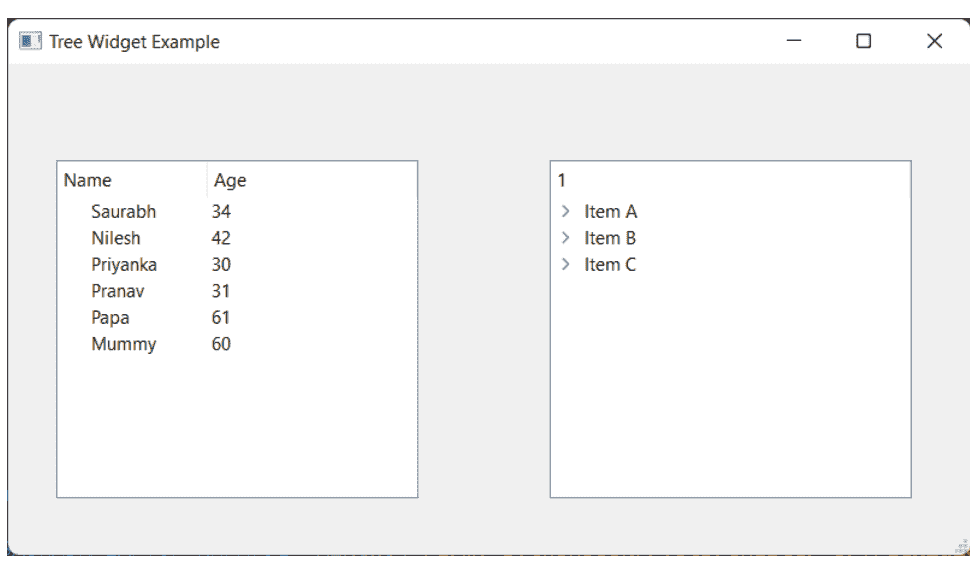

**图 6.16：** *TreeWidget/ run_treeWidget_eg1.py 的默认情况输出*

### Case 1：在 Name = Saurabh 上执行项目点击事件时的输出显示

请参考下图：

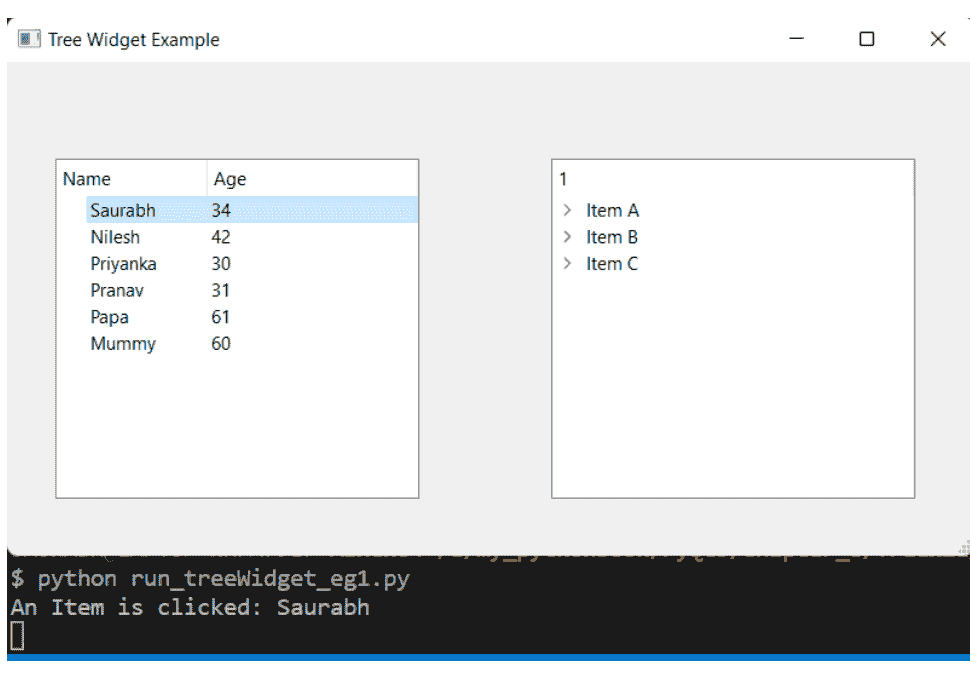

```
$ python run_treeWidget_eg1.py
An Item is clicked: Saurabh
```

*图 6.17：TreeWidget/ run_treeWidget_eg1.py 的 Case 1 输出*

### Case 2：在 Name = Nilesh 上执行项目双击事件时的输出显示

请参考下图：

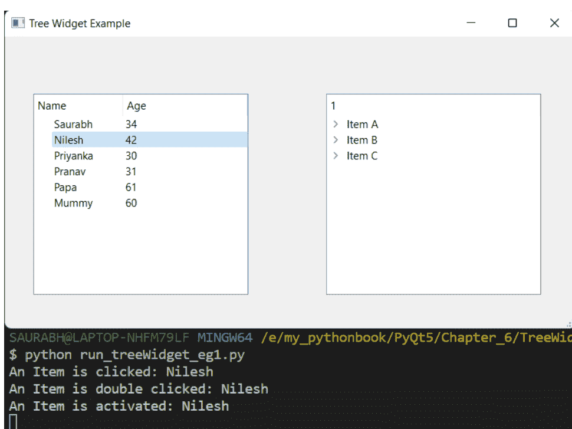

```
SAURABH@LAPTOP-NHFM79LF MINGW64 /e/my_pythonbook/PyQt5/Chapter_6/TreeWid
$ python run_treeWidget_eg1.py
An Item is clicked: Nilesh
An Item is double clicked: Nilesh
An Item is activated: Nilesh
```

**图 6.18：** *TreeWidget/ run_treeWidget_eg1.py 的 Case-2 输出*

此处，在 **Name = Nilesh** 上按下双击事件时，首先触发单击事件，然后是双击事件，最后是激活事件。

### Case 3：在 Name = Priyanka 上执行项目激活事件时的输出显示

请参考下图：

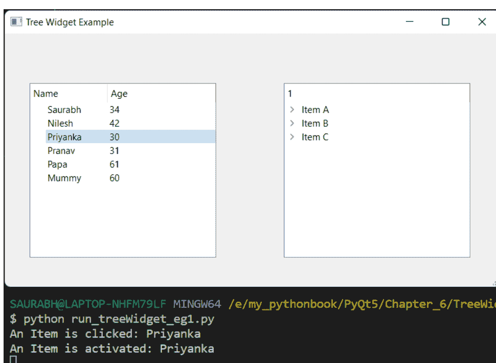

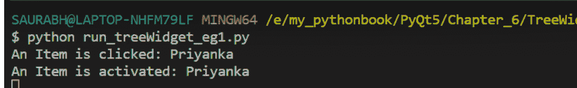

**图 6.19：** *TreeWidget/ run_treeWidget_eg1.py 的 Case-3 输出*

此处，当焦点位于 **Name = Priyanka** 时按下了 *Enter* 键。这就是为什么在按下 *Enter* 键时，初始的点击事件与激活事件一起被触发。

### Case 4：执行项目展开事件时的输出显示

请参考下图：

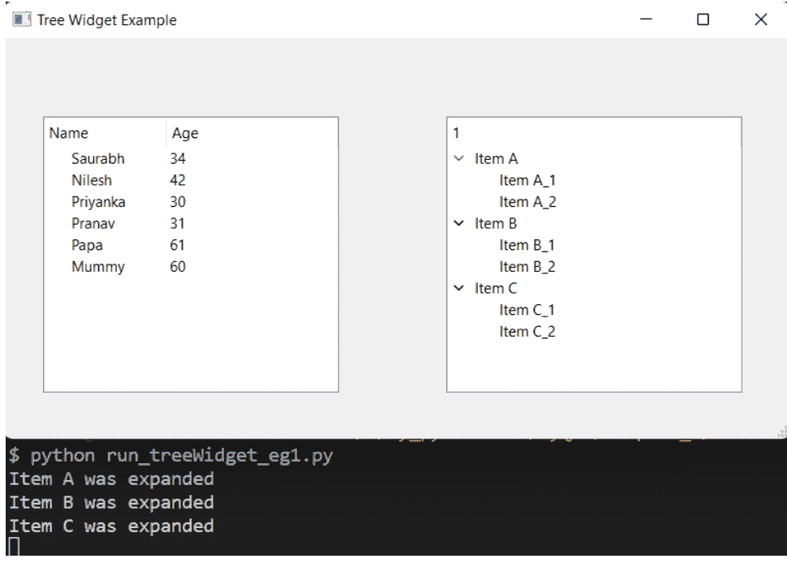

```
$ python run_treeWidget_eg1.py
Item A was expanded
Item B was expanded
Item C was expanded
```

**图 6.20：** *TreeWidget/ run_treeWidget_eg1.py 的 Case-4 输出*

此处，**Item A**、**Item B** 和 **Item C** 被展开，触发了展开事件。

### Case 5：执行项目折叠事件时的输出显示

请参考下图：

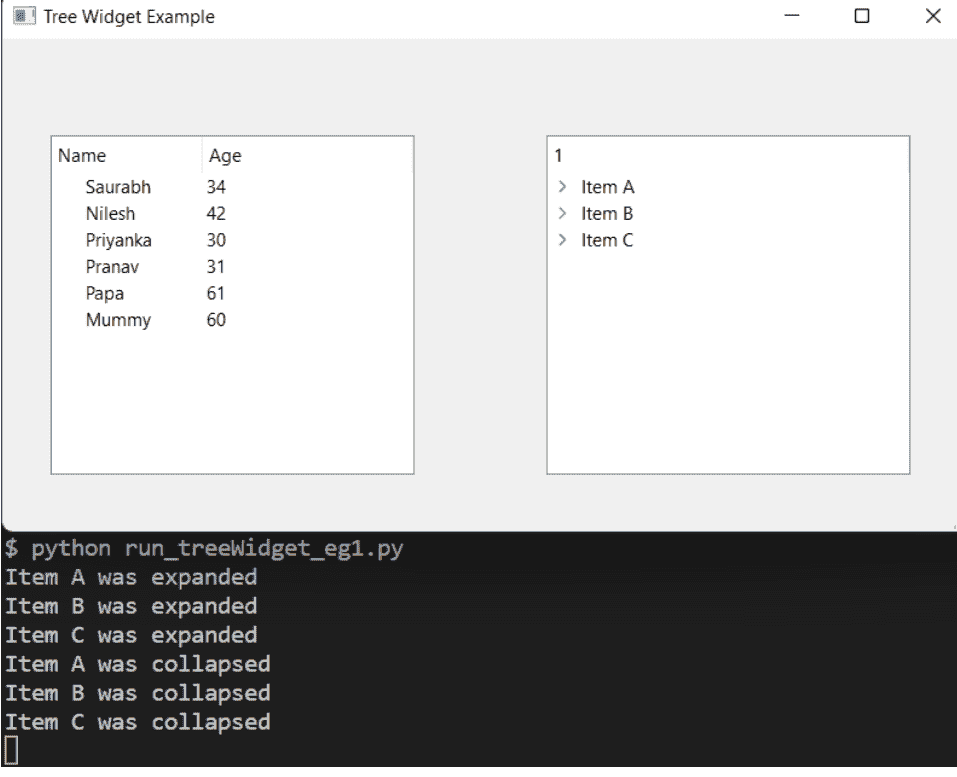

**图 6.21：** *TreeWidget/ run_treeWidget_eg1.py 的输出*

> **注意：** 上述代码包含在程序名称：TreeWidget/run_treeWidget_eg1.py 中

此处，**Item A**、**Item B** 和 **Item C** 被折叠，触发了折叠事件。

## 表格部件

PyQt5 中一个名为 `QTableWidget` 的部件以行和列的表格格式显示数据。它支持多种数据类型，如文本、图标和复选框，并允许进行排序和编辑等数据操作。此外，它可以用于显示来自模型或数据库的信息。它与 QTableView 类似，但提供了更高效的数据处理技术。QTableWidgetItem 为 QTableWidget 提供项目。

## 重要属性

QTableWidget 的属性与上一章看到的 QTableView 属性类似。除了这些属性之外，唯一添加的另外 2 个属性如下。

### rowCount

此属性将返回 QTableWidget 对象中的行数。我们可以通过向此属性传递一个整数值来设置行数。默认值设置为 0。请参考下图：


**图 6.22：** 描绘 Qt Designer 中 QTableWidget 的 rowCount 属性的图像

### columnCount

此属性将返回 QTableWidget 对象中的列数。我们可以通过向此属性传递一个整数值来设置列数。默认值设置为 0。请参考下图：


**图 6.23：** 描绘 Qt Designer 中 QTableWidget 的 columnCount 属性的图像

## 重要方法

现在让我们来看一些重要的方法：

- **setItem(int row, int column, QTableWidgetItem)**：此方法将在 **QTableWidget** 对象中指定的行和列位置设置项目。该项目可以是 **QTableWidgetItem** 类或其子类的对象。
- **item(int row, int column)**：如果已设置，则返回指定行和列位置的 **QTableWidget** 对象中的项目，否则返回 **None**。
- **setCellWidget(int row, int column, QWidget)**：此方法设置要在 **QTableWidget** 对象中指定行和列位置的单元格中显示的部件。这对于显示按钮或复选框等数据类型很有用。
- **cellWidget(int row, int column)**：此方法返回 **QTableWidgetItem** 对象中指定行和列位置的部件作为 **QWidget** 对象。
- **removeRow(int row)**：此方法将从 **QTableWidget** 对象中移除一行，其中行号作为参数传递。
- **removeColumn(int column)**：此方法将从 **QTableWidget** 对象中移除一列，其中列号作为参数传递。
- **sortItems(int column[,order=Qt.AscendingOrder])**：此方法根据指定列中的值对 **QTableWidget** 对象中的行进行排序，其中列号和排序顺序（升序或降序）作为参数传递。
- **clear()**：使用此方法，所有项目和部件都将从 **QTableWidget** 对象中移除。

## 重要信号

一些信号如下：

- **itemSelectionChanged()**：当 QTableWidget 对象中的选择发生更改时，会发出此信号。
- **cellClicked(row,column)**：当 QTableWidget 对象中的单元格被单击时，会发出此信号，并将被单击单元格的行和列作为参数。
- **cellDoubleClicked(row,column)**：当 QTableWidget 对象中的单元格被双击时，会发出此信号，并将被双击单元格的行和列作为参数。
- **cellChanged(row,column)**：当 QTableWidget 对象中的单元格发生更改时，会发出此信号，并将被更改单元格的行和列作为参数。
- **cellEntered(row,column)**：当用户进入 QTableWidget 对象中的单元格时，会发出此信号，并将进入单元格的行和列作为参数。**cellEntered** 信号仅在 **QTableWidget** 对象获得焦点时触发，这发生在用户单击对象内部或按 Tab 键切换到对象时。
- **cellPressed(row,column)**：当用户按下 QTableWidget 对象中的单元格时，会发出此信号，并将行和列作为参数。

现在，我们将看到一个 **QTableWidget** 的示例。

文件名的详细信息如下表 [表 6.3](Table 6.3) 所示：

| 序号 | Qt Designer 文件名 (.ui) | 将 Qt Designer 文件名转换为 Python 文件 (.py) | 创建另一个 Python 文件并从 Qt Designer 导入转换后的 Python 文件 |
| :--- | :--- | :--- | :--- |
| 1 | tableWidget_eg1.ui | tableWidget_eg1.py | run_tableWidget_eg1.py |

**表 6.3：** 文件名详细信息

Qt Designer 文件如下图所示：

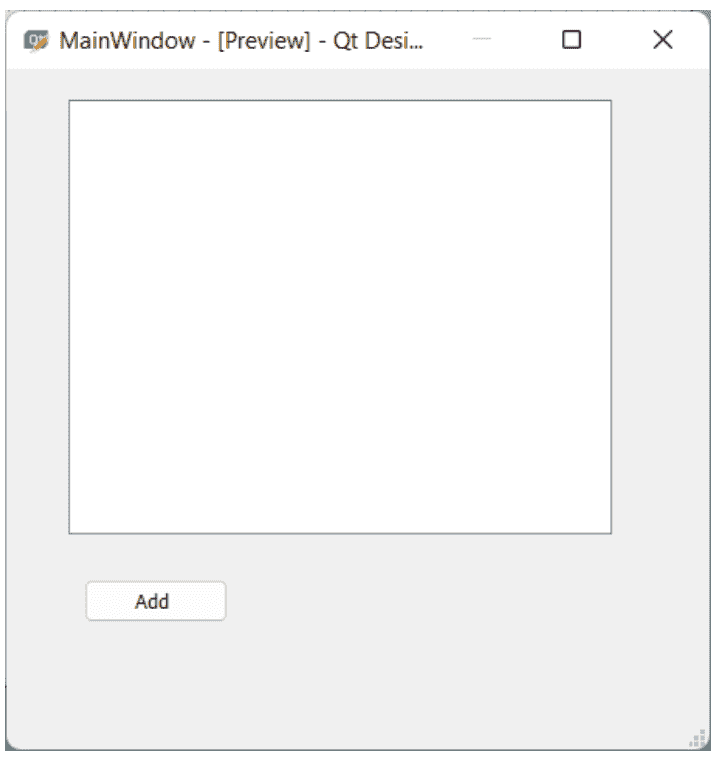

**图 6.24：** Qt Designer 文件：TableWidget/tableWidget_eg1.ui

> **注意：** 上述 .ui 文件包含在路径：TableWidget/tableWidget_eg1.ui 中

考虑以下 **run_tableWidget_eg1.py** 的代码：

```
import sys

from PyQt5.QtWidgets import QMainWindow,
QApplication,QTableWidgetItem,QHeaderView

from PyQt5.QtGui import QPalette, QColor

from tableWidget_eg1 import *
```

class MyTableWidget(QMainWindow):
    def __init__(self):
        super().__init__()
        self.myui = Ui_MainWindow()
        self.myui.setupUi(self)

        # 设置 QTableWidget 对象的行数和列数
        self.myui.tableWidget.setRowCount(2)
        self.myui.tableWidget.setColumnCount(3)
        # 设置表格的水平表头
        self.myui.tableWidget.setHorizontalHeaderLabels(["姓名", "年龄", "性别"])

        # 向 QTableWidget 对象添加一些数据
        self.myui.tableWidget.setItem(0,0,QTableWidgetItem("Saurabh"))
        self.myui.tableWidget.setItem(0,1,QTableWidgetItem("34"))
        self.myui.tableWidget.setItem(0,2,QTableWidgetItem("Male"))
        self.myui.tableWidget.setItem(1,0,QTableWidgetItem("Aditi"))
        self.myui.tableWidget.setItem(1,1,QTableWidgetItem("30"))
        self.myui.tableWidget.setItem(1,2,QTableWidgetItem("Female"))

        # 使 QTableWidget 对象水平拉伸以适应
        self.myui.tableWidget.horizontalHeader().setStretchLastSection(True)
        self.myui.tableWidget.horizontalHeader().setSectionResizeMode(QHeaderView.Stretch)

        # 将信号连接到槽
        self.myui.tableWidget.cellChanged.connect(self.mycellChanged)
        self.myui.tableWidget.cellClicked.connect(self.mycellClicked)
        self.myui.tableWidget.cellPressed.connect(self.mycellPressed)

        # 将按钮的 clicked 信号连接到槽 btn_click
        self.myui.btn_Add.clicked.connect(self.btn_click)

        self.show()

    # 定义槽
    def mycellChanged(self, myrow, mycol):
        print("单元格在行 {0}，列 {1} 处被更改".format(myrow, mycol))

    def mycellClicked(self, myrow, mycol):
        print("单元格在行 {0}，列 {1} 处被点击".format(myrow, mycol))

    def mycellEntered(self, myrow, mycol):
        print("单元格在行 {0}，列 {1} 处被进入".format(myrow, mycol))

    def mycellPressed(self, myrow, mycol):
        print("单元格在行 {0}，列 {1} 处被按下".format(myrow, mycol))

    def btn_click(self):
        # 通过获取 rowCount 在 QTableWidget 对象末尾插入一个新行
        myrow = self.myui.tableWidget.rowCount()
        self.myui.tableWidget.insertRow(myrow)

        # 添加固定的姓名、年龄和性别以向用户显示插入了新数据
        self.myui.tableWidget.setItem(myrow, 0,
            QTableWidgetItem("Divya"))
        self.myui.tableWidget.setItem(myrow, 1,
            QTableWidgetItem("36"))
        self.myui.tableWidget.setItem(myrow, 2,
            QTableWidgetItem("Male"))

if __name__=="__main__":
    app = QApplication(sys.argv)
    w = MyTableWidget()
    w.show()
    sys.exit(app.exec_())

## 输出：

### 初始运行时的默认情况

参考下图：

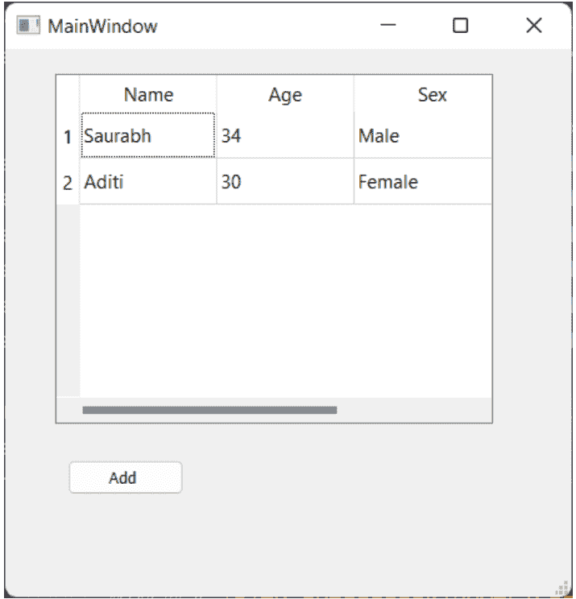

**图 6.25：** *TableWidget/ run_tableWidget_eg1.py 的默认情况输出*

## 情况 1：当点击 QTableWidget 对象上的添加按钮时

参考下图：

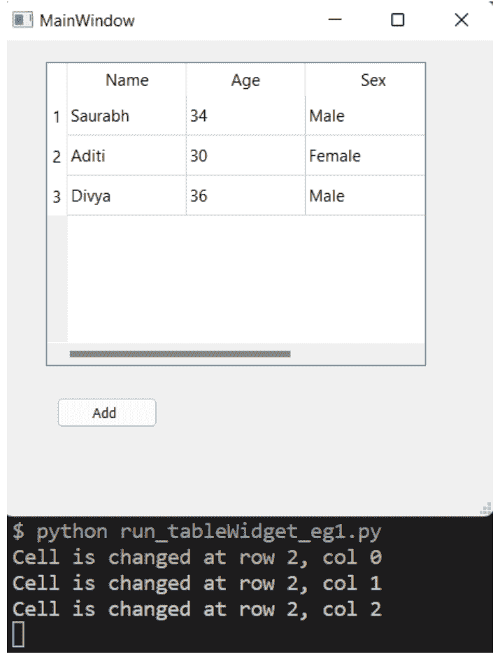

**图 6.26：** *TableWidget/ run_tableWidget_eg1.py 的情况 1 输出*

当在 `QTableWidget` 对象的行中添加新数据时，会触发 `cellChanged` 事件。

## 情况 2：当在 QTableWidget 对象上点击或按下单元格时

参考下图：

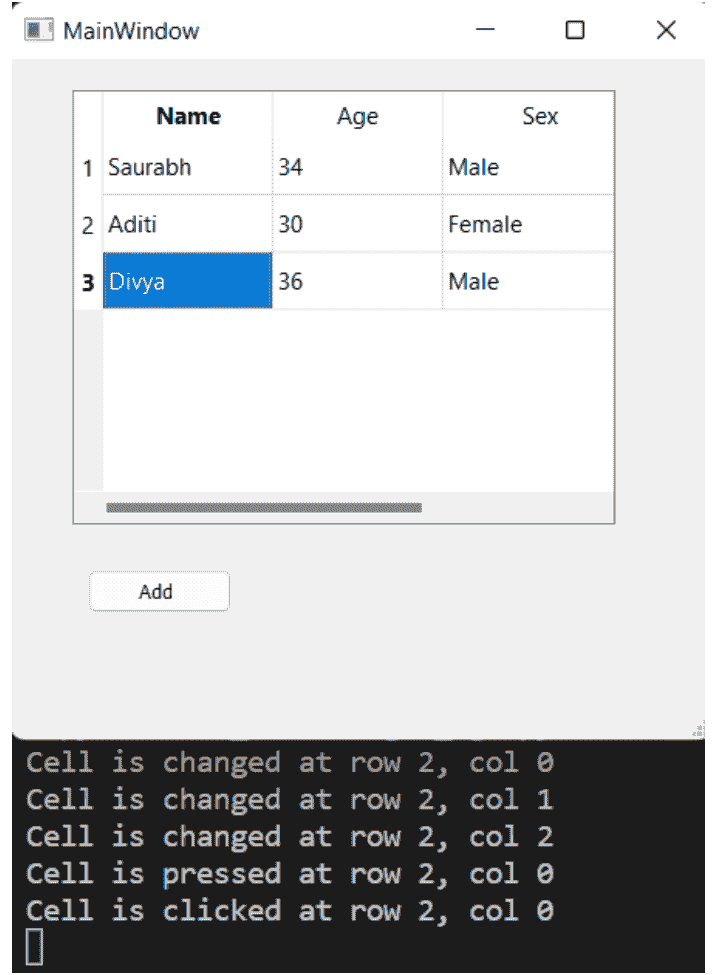

**图 6.27：** *TableWidget/ run_tableWidget_eg1.py 的情况 2 输出*

当点击一个包含数据的单元格（行号为 2，列号为 0）时，会先触发 `cellPressed` 事件，然后触发 `cellClicked` 事件。

## 情况 3：当在 QTableWidget 对象上更改单元格时

参考下图：

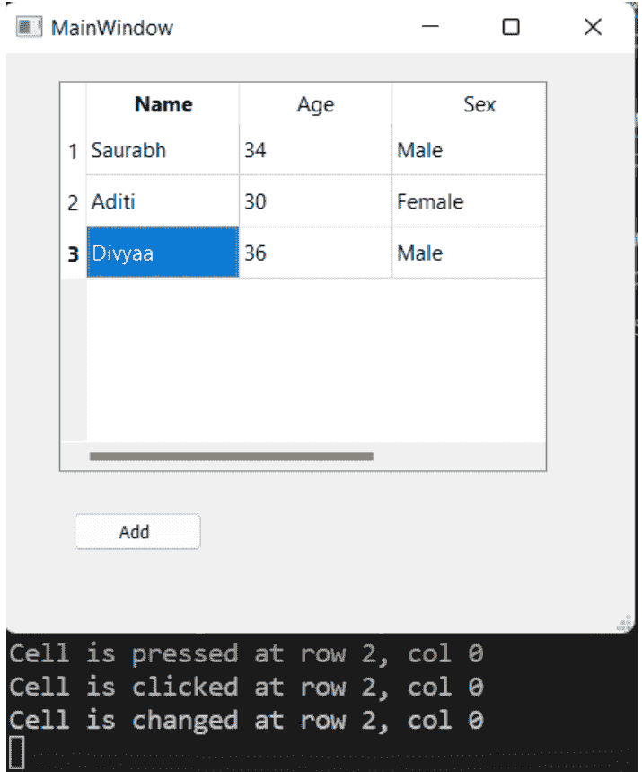

**图 6.28：** *TableWidget/ run_tableWidget_eg1.py 的情况 3 输出*

当我们尝试更改行号为 2、列号为 0 的单元格数据，并在更改后按下 *Enter* 键时，会触发 `cellChanged` 事件。

## 情况 4：当在 QTableWidget 对象上进入单元格时

参考下图：

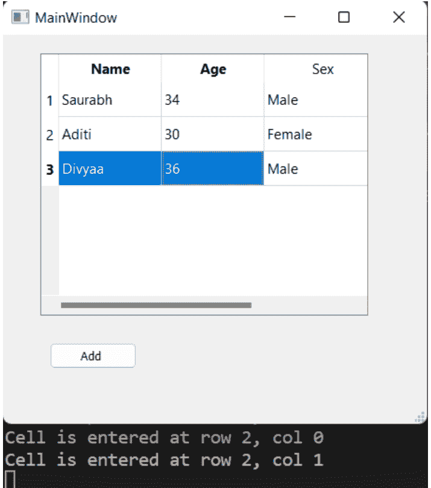

**图 6.29：** *TableWidget/ run_tableWidget_eg1.py 的输出*

> **注意：** 前面的代码包含在程序名称：TableWidget/run_tableWidget_eg1.py 中

当用户进入行号为 2、列号为 0 和 1 的单元格时，会触发 `cellEntered` 事件。

## 结论

在本章中，我们深入学习了 **Item Widgets**，包括 QListWidget、QTreeWidget 和 QTableWidget，它们允许创建动态用户界面。本章全面介绍了 Qt Designer 中的 **Item Widgets**，这对于创建交互式用户界面至关重要。通过深入研究它们在 Qt Designer 环境中的属性、功能、自定义选项和操作技巧，读者获得了有效创建和使用基于项的控件所需的知识。此外，用户还学习了如何管理与基于项的控件相关的事件和信号，以促进用户交互并实现所需功能。用户将能够很好地使用基于项的控件在 Qt Designer 中开发复杂但用户友好的界面。本章中包含的带有解释性注释的已解决示例进一步增强了对 **Item Widgets** 的理解和应用。

## 需要记住的要点

- **Item Widgets** 将用于创建复杂、交互式的用户界面，这些界面既用户友好又视觉上吸引人。
- `QListWidget` 是一个简单的 **List Widget**，它在单列中显示一系列项目。点击列表的标题允许用户对列表进行排序、添加或删除项目。
- 一个更复杂的控件是 `QTreeWidget`，它显示一个项目树。该树可以展开和折叠以显示或隐藏子对象，并且项目可以嵌套在其他项目内部。
- 一个显示项目表格的表格控件是 `QTableWidget`。该表格可以有任意多的行和列，并且表格中的所有项目都可以编辑。
- 这三种控件都提供了以编程方式添加、删除和修改对象的方法。
- 用户可以从多种选择模式中进行选择，包括单选、多选和行/列选择。

## 问题

1. 简要介绍 Qt Designer 中的 Item widgets。
2. 解释 Qt Designer 中的 List widget。
3. 解释 Qt Designer 中的 Tree widget。
4. 解释 Qt Designer 中的 Table widget。
5. 解释 Qt Designer 中 List widget 的重要属性。
6. 解释 Qt Designer 中 Tree widget 的重要属性。
7. 解释 Qt Designer 中 Table widget 的重要属性。

## 加入我们的书籍 Discord 空间

加入书籍的 Discord 工作区，获取最新更新、优惠、全球科技动态、新书发布以及与作者的交流会：
https://discord.bpbonline.com


# 第 7 章
深入了解 Qt Designer 中的容器

## 简介

为了在父控件内组织和正确定位子控件，使用了 PyQt5 容器控件。这些容器控件决定了子控件在父控件内的位置和大小，并允许创建布局。如果没有容器控件，子控件可能无法正确排列、重叠或在屏幕上隐藏。容器控件允许轻松操作布局，例如将控件向左或向右对齐或更改控件之间的间距。我们之前已经学习了布局管理。在本章中，我们将专注于 Qt Designer 的不同 PyQt5 容器控件，如 *图 7.1* 所示：

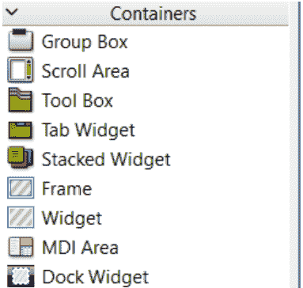

**图 7.1：** *Qt Designer 的不同容器控件*

不同容器控件的 **QObject** 和 **QWidget** 类与按钮类型类相似。我们将逐一查看不同 Qt Designer 容器控件的多个有用属性。

## 结构

在本章中，我们将讨论以下主题：

- 分组框
- 滚动区域
- 工具箱
- 选项卡控件
- 堆叠控件
- 框架
- 控件
- MDI 区域
- 停靠控件

## 目标

阅读本章后，读者将全面了解Qt Designer提供的众多容器部件、它们的特性，以及如何自定义它们以设计美观且用户友好的界面。用户将研究各种容器部件类型，了解每个部件提供的具体功能和能力，并理解它们的实际用途。用户将学习什么是容器部件、它们如何工作、不同的类型，以及如何使用它们来创建布局。我们还将探讨如何自定义容器部件的外观。信号-槽连接的概念也将被解释，用户将学习如何连接容器部件内部件发送的信号到槽，以处理用户交互并实现所需功能。由于用户将全面了解每个容器部件的属性和自定义选项，他们将能够使用布局管理器创建所需的布局。为确保读者牢固理解Qt Designer中的容器部件，本章还将包含实际示例和练习。

## 分组框

QGroupBox是Qt GUI库中的一个部件，它充当容器，将其他部件分组在一起，并通过标题和边框在视觉上与其他部件区分开来。它可以用于将相关部件组织成一个单元，简化界面的理解和导航。QGroupBox可以是排他的，这意味着在父容器中一次只能选中一个分组框，也可以是可选中的，这表示用户可以选中或取消选中它。PyQt5中的任何部件都可以添加到QGroupBox对象中。

## 重要属性

现在让我们来看一些重要的属性。

### title

我们可以设置出现在**QGroupBox**对象标题栏中的文本。请参考下图：

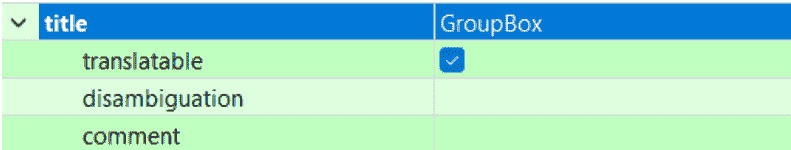

*图7.2：描绘Qt Designer中QGroupBox标题属性的图片*

### alignment

我们可以设置**QGroupBox**对象边框内标题的垂直或水平对齐方式。用户可以从这些对齐方式中选择多个选项。请参考下图：

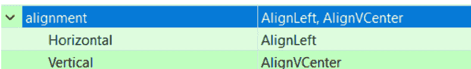

*图7.3：描绘Qt Designer中QGroupBox对齐属性的图片*

### flat

我们可以设置**QGroupBox**对象的外观为边框或平面绘制。默认情况下，它是禁用的。请参考下图：


*图7.4：描绘Qt Designer中QGroupBox平面属性的图片*

### checkable

借助此属性，我们可以使**QGroupBox**对象标题可选中。如果设置为**True**，标题将通过复选框而不是普通标签显示。如果选中，**QGroupBox**对象的子部件将被启用，否则被禁用。默认情况下，它设置为**False**。请参考下图：


*图7.5：描绘Qt Designer中QGroupBox可选中属性的图片*

### checked

此属性仅在**QGroupBox**对象的checkable属性设置为**True**时使用。默认情况下，它是未选中且禁用的。但如果**QGroupBox**对象的checkable属性设置为**True**，此属性也将设置为**True**。请参考下图：

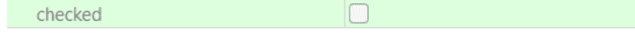

*图7.6：描绘Qt Designer中QGroupBox选中属性的图片*

## 重要方法

现在让我们来看一些重要的方法：

- **setTitle(title)**：借助此方法，我们可以设置出现在**QGroupBox**对象标题栏中的文本。如果标题文本包含一个&后跟一个字母，它将有一个键盘快捷键。
- **setCheckable(checkable)**：如果设置为**True**，**QGroupBox**对象是可选中的。
- **isCheckable()**：如果**QGroupBox**对象是可选中的，则返回**True**，否则返回**False**。
- **setAlignment(alignment)**：我们可以设置**QGroupBox**对象的对齐方式。
- **setFlat(flat)**：使用此方法，我们可以设置**QGroupBox**对象的外观为边框或平面绘制。
- **isChecked()**：如果**QGroupBox**对象被选中，则返回**True**，否则返回**False**。

## 重要信号

一些重要的信号如下：

- **clicked([checked = False])**：当**QGroupBox**对象被点击时发出信号。
- **toggled(arg__1)**：每当**QGroupBox**对象的选中状态改变时发出信号，新状态作为参数传递（选中时为**True**，未选中时为**False**）。

现在，我们将看一个**QGroupBox**部件的示例。
文件名的详细信息在下面的*表7.1*中给出：

| 序号 | Qt Designer文件名 (.ui) | 将QtDesigner文件名转换为Python文件 (.py) | 创建另一个文件并在Qt Designer中导入转换后的Python文件 |
| :--- | :--- | :--- | :--- |
| 1 | groupboxWidget_eg1.ui | groupboxWidget_eg1.py | run_groupboxWidget_eg1.py |

**表7.1**：文件名详情

Qt Designer文件如下图所示：

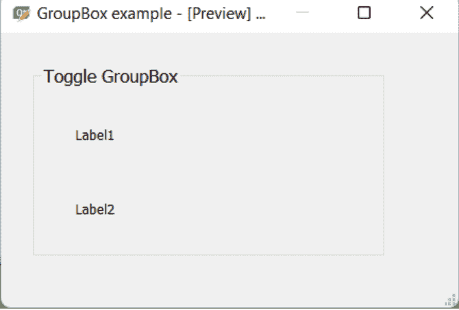

**图7.7：** Qt Designer文件：GroupBox/groupboxWidget_eg1.ui

> **注意：上述.ui文件位于路径：GroupBox/groupboxWidget_eg1.ui**

考虑以下run_groupboxWidget_eg1.py的代码：

```python
import sys
from PyQt5.QtWidgets import QMainWindow, QApplication
from groupboxWidget_eg1 import *

class MyGroupBoxWidget(QMainWindow):
    def __init__(self):
        super().__init__()
        self.myui = Ui_MainWindow()
        self.myui.setupUi(self)
        self.myui.groupBox.setCheckable(True)
        self.myui.groupBox.setChecked(False)

        # Connect the group box's toggled signal to the handle_toggled slot
        self.myui.groupBox.toggled.connect(self.mytoggle)

        self.show()

    def mytoggle(self, mychecked):
        print(mychecked)
        # Updating the label based on GroupBox checked status
        if mychecked:
            self.myui.lbl1.setText("Label1 On")
            self.myui.lbl1.setStyleSheet("QLabel { color : green; }")
            self.myui.lbl2.setText("Label2 Off")
            self.myui.lbl2.setStyleSheet("QLabel { color : red; }")
        else:
            self.myui.lbl2.setText("Label2 On")
            self.myui.lbl2.setStyleSheet("QLabel { color : green; }")
            self.myui.lbl1.setText("Label1 Off")
            self.myui.lbl1.setStyleSheet("QLabel { color : red; }")

if __name__=="__main__":
    app = QApplication(sys.argv)
    w = MyGroupBoxWidget()
    w.show()
    sys.exit(app.exec_())
```

## 输出：

### 初始运行时的默认情况

请参考下图：

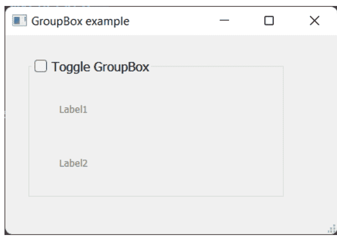

**图7.8：** *GroupBox/run_groupboxWidget_eg1.py的输出*

> **注意：** 上述代码位于程序名：**GroupBox/run_groupboxWidget_eg1.py**

我们为**QGroupBox**对象提供了可选中状态，初始状态为未选中。

### 情况-1：当QGroupBox对象被选中时：

当QGroupBox对象被选中时，Label1文本设置为Label1 On，颜色更改为绿色（此处，为便于所有读者理解，在括号中添加了图例为绿色）。另一方面，Label2文本设置为Label2 Off，颜色设置为红色（此处，为便于所有读者理解，在括号中添加了图例为红色）。请参考下图：

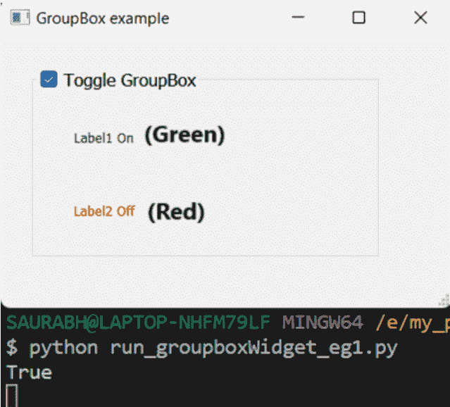

*图7.9：run_groupboxWidget_eg1.py的情况-1输出*

### 情况-2：当QGroupBox对象未选中时

请参考下图：

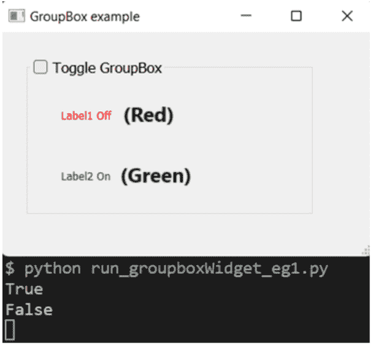

**图7.10：** *GroupBox/run_groupboxWidget_eg1.py的情况-2输出*

当`QGroupBox`对象未选中时，**Label2**文本设置为**Label2 On**，颜色更改为`绿色`*（此处，为便于所有读者理解，在括号中添加了图例为绿色）*。另一方面，**Label1**文本设置为**Label1 Off**，颜色设置为`红色`*（此处，为便于所有读者理解，在括号中添加了图例为红色）*。

## 滚动区域

PyQt5中的`QScrollArea`部件是一个容器部件，它为框架内的子部件内容提供滚动功能。它可以用于显示太大而无法放入单个视口的大型或复杂内容，例如图片、表格或书面文档。当子部件大于视口时，`QScrollArea`部件会自动添加滚动条。

## 重要属性

这个 `QScrollArea` 控件也包含了我们已经讨论过的 `QFrame` 和 `QAbstractScrollArea` 类的属性。另外两个属性如下：

## widgetResizable

当设置为 **True** 时，`QScrollArea` 对象将自动调整控件大小以适应视口。默认值设置为 **True**。请参考下图：


**图 7.11：** *展示 Qt Designer 中 QScrollArea 的 widgetResizable 属性的图片*

### alignment

我们可以设置 `QScrollArea` 对象框架内标题的垂直或水平对齐方式。用户可以从这些对齐方式中选择多个选项。请参考下图：

| alignment | AlignLeft, AlignVCenter |
| :--- | :--- |
| 水平 | AlignLeft |
| 垂直 | AlignVCenter |

**图 7.12：** *展示 Qt Designer 中 QScrollArea 的 alignment 属性的图片*

## 重要方法

一些重要的方法如下：

- `setWidget(widget)`：我们可以设置滚动区域中包含的控件。当滚动区域被删除时，该控件也会被销毁，因为它成为了滚动区域的子控件。
- `setWidgetResizable(resizable)`：使用此方法，我们可以设置滚动区域中的控件调整大小以适应该区域。
- `ensureVisible(x,y[, xmargin=50[, ymargin=50]])`：此方法确保点 (x, y) 在滚动区域内可见，并带有可选的边距。边距以像素为单位指定，两个边距的默认值均为 50 像素。
- `setAlignment(arg__1)`：我们可以设置 QScrollArea 对象的对齐方式。默认值将对齐到滚动区域的左上角。

## 重要信号

一些重要的信号如下：

### scrollContentsBy(int dx, int dy)

当 QScrollArea 的内容被滚动 dx 和 dy 像素时，会发出此信号。

我们可以按以下方式使用 QScrollArea 对象：

1.  首先，创建一个 QScrollArea 对象的实例。
2.  接下来，创建一个子控件用于在滚动区域内显示。
3.  将 QScrollArea 对象的 widget 属性设置为该子控件。
4.  最后，将 QScrollArea 对象添加到布局中。

现在，我们将看到一个 QScrollArea 控件的示例。

文件名的详细信息在下表 7.2 中给出：

| 序号 | Qt Designer 文件名 (.ui) | 将 QtDesigner 文件名转换为 Python 文件 (.py) | 创建导入从 Qt Designer 转换的 Python 文件的 Python 文件 |
| :--- | :--- | :--- | :--- |
| 1 | scrollAreaWidget_eg1.ui | scrollAreaWidget_eg1.py | run_scrollAreaWidget_eg1.py |

## 表 7.2：文件名详情

Qt Designer 文件如下图所示：

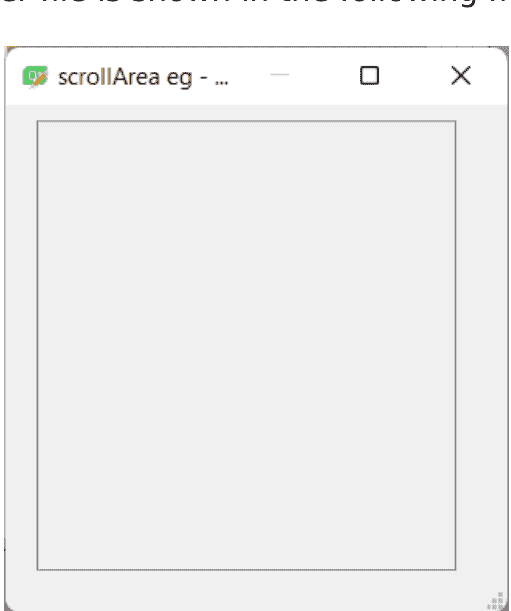

**图 7.13：** Qt Designer 文件：ScrollArea/scrollAreaWidget_eg1.ui

> 注意：上述 .ui 文件位于路径：ScrollArea/scrollAreaWidget_eg1.ui

考虑以下 run_scrollAreaWidget_eg1.py 的代码：

```python
import sys

from PyQt5.QtWidgets import QApplication,
QMainWindow,QLabel, QPushButton,
QVBoxLayout,QHBoxLayout,QGroupBox,QWidget

from scrollAreaWidget_eg1 import *

class MyScrollAreaWidget(QMainWindow):
    def __init__(self):
        super().__init__()
        self.myui = Ui_MainWindow()
        self.myui.setupUi(self)
        self.myui.top_widget = QWidget()
        self.myui.top_layout = QVBoxLayout()

        # 步骤-1：已经在 Qt Designer 中创建了一个 QScrollArea 对象

        # 步骤-2：在滚动区域内创建 8 个不同的子控件（包含标签和按钮的组框）
        for loop in range(8):
            # 创建组框控件实例
            self.myui.group_box = QGroupBox()
            # 设置组框标题
            self.myui.group_box.setTitle('GroupBox Item No. {0}'.format(loop))
            # 为组框控件创建一个水平布局实例
            self.myui.layout = QHBoxLayout(self.myui.group_box)

            # 创建一个标签对象，设置文本并将其添加到水平布局实例
            self.myui.label = QLabel()
            self.myui.label.setText('Label For Item No. {0}'.format(loop))
            self.myui.layout.addWidget(self.myui.label)

            # 创建一个按钮对象，设置文本和大小并将其添加到水平布局实例
            self.myui.push_button = QPushButton()
            self.myui.push_button.setText('Display Button')
            self.myui.push_button.setFixedSize(100, 32)
            self.myui.layout.addWidget(self.myui.push_button)

            # 将组框对象添加到垂直布局
            self.myui.top_layout.addWidget(self.myui.group_box)

        # 将垂直布局添加到子控件
        self.myui.top_widget.setLayout(self.myui.top_layout)

        # 步骤-3：将 QScrollArea 对象的 widget 属性设置为子控件
        self.myui.scrollArea.setWidget(self.myui.top_widget)

        # 步骤-4：QScrollArea 对象已经在 Qt Designer 中添加到垂直布局

        self.show()

if __name__=="__main__":
    app = QApplication(sys.argv)
    w = MyScrollAreaWidget()
    w.show()
    sys.exit(app.exec_())
```

## 输出：

请参考下图：

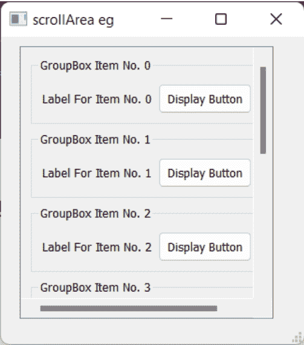

**图 7.14：** *ScrollArea/run_scrollAreaWidget_eg1.py 的输出*

> **注意：** 上述代码位于程序名称：ScrollArea/run_scrollAreaWidget_eg1.py

## 工具箱

工具箱控件是 Qt Designer 中可用于创建用户界面的控件之一。通过将工具箱项目从控件框的容器区域拖动到 Qt Designer 中的表单上，可以将工具箱控件添加到表单。工具箱是一个显示一列垂直堆叠的选项卡的控件，当前项目显示在活动选项卡下方。每个选项卡在选项卡列中都有一个特定的索引位置。**QWidget** 是选项卡中的一个项目。选项卡式控件项目列由 **QToolBox** 类提供。

## 重要属性

让我们检查一些重要的属性。

### currentIndex

此属性保存 `QToolBox` 对象的 `currentItem` 的索引。对于空的 `QToolBox` 对象，返回 -1 值。请参考下图：

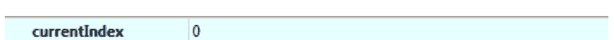

**图 7.15：** 展示 Qt Designer 中 `QToolBox` 的 `currentIndex` 属性的图片

### currentItemText

此属性保存 `QToolBox` 对象的 `currentItemText`。请参考下图：

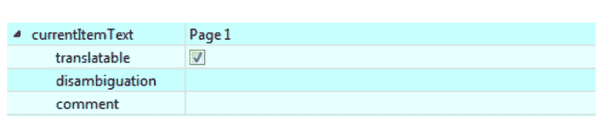

**图 7.16：** 展示 Qt Designer 中 `QToolBox` 的 `currentItemText` 属性的图片

### currentItemName

此属性保存 `QToolBox` 对象的 `currentItemName`。请参考下图：

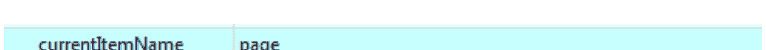

**图 7.17：** 展示 Qt Designer 中 `QToolBox` 的 `currentItemName` 属性的图片

### currentItemIcon

此属性保存 `QToolBox` 对象的 `currentItemIcon`。请参考下图：

| currentItemIcon | |
| --- | --- |
| 主题 | |
| 普通 关闭 | |
| 普通 开启 | |
| 禁用 关闭 | |
| 禁用 开启 | |
| 活动 关闭 | |
| 活动 开启 | |
| 选中 关闭 | |
| 选中 开启 | |

**图 7.18：** *展示 Qt Designer 中 QToolBox 的 currentItemIcon 属性的图片*

### currentItemToolTip

此属性保存 **QToolBox** 对象的 **currentItemToolTip**。请参考下图：

| currentItemToolTip | |
| --- | --- |
| 可翻译 | ☑ |
| 消歧义 | |
| 注释 | |

**图 7.19：** *展示 Qt Designer 中 QToolBox 的 currentItemToolTip 属性的图片*

### tabSpacing

此属性将设置 **QToolBox** 对象的选项卡栏和页面之间的间距。它以像素为单位测量。请参考下图：

| tabSpacing | 6 |
| --- | --- |

**图 7.20：** *展示 Qt Designer 中 QToolBox 的 tabSpacing 属性的图片*

## 重要方法

一些重要的方法如下：

- **addItem(widget, text)**：此方法将在 **QToolBox** 对象底部的新选项卡中添加给定的控件。其中新选项卡的文本被设置为 text。

- **count()**：此方法将返回 QToolBox 对象中包含的项目数量。
- **currentIndex()**：此方法将返回 QToolBox 对象的当前项目索引。
- **insertItem (index, widget, text)**：此方法将在指定索引处插入一个控件，如果索引超出范围，则插入到 QToolBox 对象的底部。新项目的文本被设置为 text。它返回新项目的索引。
- **itemToolTip(index)**：此方法返回指定索引处项目的工具提示，如果索引超出范围，则返回空字符串。
- **indexOf(widget)**：此方法将返回给定控件的索引，如果该控件不是 QToolBox 对象的子控件，则返回 -1。
- **itemText(index)**：如果索引超出范围，此方法将返回空字符串，否则返回 QToolBox 对象中指定位置索引处项目的文本。

## 重要信号

让我们来看一些重要的信号。

### currentChanged(index)

当 QToolBox 对象的当前项目发生更改时，会发出此信号。

现在，我们将看到一个 QToolBox 控件的示例。

文件名的详细信息在下表 7.3 中给出：

| 序号 | Qt Designer 文件名 (.ui) | 将 QtDesigner 文件名转换为 Python 文件 (.py) | 创建另一个文件并从 Qt Designer 导入转换后的 Python 文件 |
|---|---|---|---|
| 1 | toolBoxWidget_eg1.ui | toolBoxWidget_eg1.py | run_toolBoxWidget |

表 7.3：文件名详情

Qt Designer 文件如下图所示：

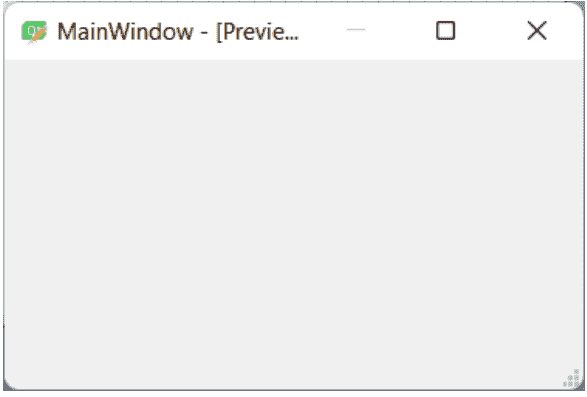

图 7.21：Qt Designer 文件：ToolBox/toolBoxWidget_eg1.ui

> 注意：上述 .ui 文件位于路径：ToolBox/toolBoxWidget_eg1.ui

考虑以下 run_toolBoxWidget_eg1.py 的代码：

```python
import sys

from PyQt5.QtWidgets import
QMainWindow,QApplication,QLabel, QToolBox

from toolBoxWidget_eg1 import *

class MyToolBox(QMainWindow):
    def __init__(self):
        super().__init__()
        self.myui = Ui_MainWindow()
        self.myui.setupUi(self)
        # creating an instance of QToolBox item
        self.myui.toolBox = QToolBox()
        # aading the widget QToolBox to the GridLayout
        self.myui.gridLayout.addWidget(self.myui.toolBox,0,0)

        # Adding 3 Label items to the ToolBox widget
        mylbl1 = QLabel()
        self.myui.toolBox.addItem(mylbl1, "Item1")
        mylbl2 = QLabel()
        self.myui.toolBox.addItem(mylbl2, "Item3")
        mylbl3 = QLabel()
        self.myui.toolBox.addItem(mylbl3, "Item4")

        # disabling first tab --> 0
        self.myui.toolBox.setItemEnabled(0, False)
        # returns true if tems at specifiied positions are enabled
        print(self.myui.toolBox.isItemEnabled(0))
        print(self.myui.toolBox.isItemEnabled(1))

        # inserting Label at index specified position:1
        myitem = QLabel()
        self.myui.toolBox.insertItem(1, myitem, "Item2")

        # displaying number of items
        print(self.myui.toolBox.count())

        # mouseover tooltip at different tabs
        self.myui.toolBox.setItemToolTip(0, "This is Item1") # displaying at tab1
        self.myui.toolBox.setItemToolTip(1, "This is Item2") # displaying at tab2
        self.myui.toolBox.setItemToolTip(2, "This is Item3") # displaying at tab3
        self.myui.toolBox.setItemToolTip(3, "This is Item4") # displaying at tab4

        self.show()

if __name__ == "__main__":
    app = QApplication(sys.argv)
    screen = MyToolBox()
    screen.show()
    sys.exit(app.exec_())
```

## 输出：

输出如下图所示：

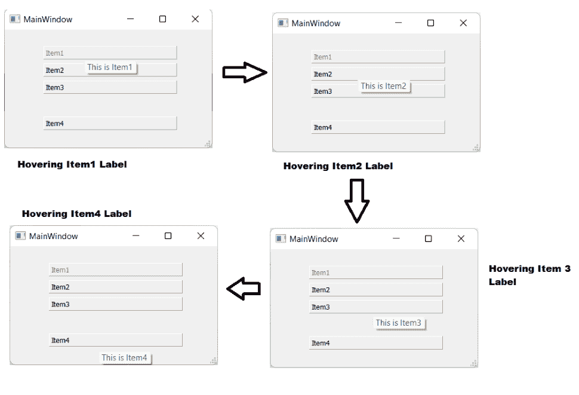

> 注意：上述代码位于程序名称：ToolBox/run_toolBoxWidget_eg1.py

## 选项卡控件

QTabWidget 类提供了一组选项卡式控件。PyQt5 库的 QTabWidget 类提供了一个选项卡式控件，用于在单个窗口中管理多个控件。选项卡控件提供了一个选项卡栏和一个页面区域，可以显示与每个选项卡关联的页面。默认情况下，选项卡栏显示在页面区域上方，尽管有不同的配置可用。通过单击控件顶部的选项卡，用户可以在控件的不同页面之间导航。可以根据需要移动和删除选项卡，并且每个选项卡内部都有一个单独的控件。此外，**QTabWidget** 类具有用于控制当前选项卡的信号和槽。

## 重要属性

一些重要属性如下：

### tabPosition

我们可以使用此属性确定 **QTabWidget** 对象中选项卡的位置。可以从下拉菜单中选择可能的值，默认值为 **North**。请参考下图：

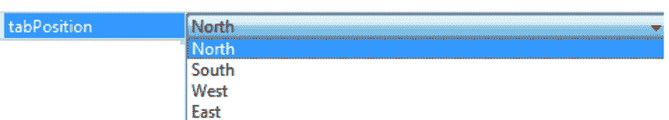

*图 7.23：描绘 Qt Designer 中 QTabWidget 的 tabPosition 属性的图像*

### tabShape

我们可以使用上述属性确定 **QTabWidget** 对象中选项卡的形状。默认值为 rounded，可以从下拉菜单中选择可能的值。请参考下图：

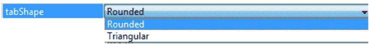

*图 7.24：描绘 Qt Designer 中 QTabWidget 的 tabShape 属性的图像*

### currentIndex

我们可以确定 **QTabWidget** 对象当前选项卡页面的索引位置。如果 **QTabWidget** 对象中没有选项卡，则默认值为 -1。请参考下图：


**图 7.25：** *描绘 Qt Designer 中 QTabWidget 的 currentIndex 属性的图像*

### iconSize

我们可以确定选项卡栏上的图标大小，这是一个 **QSize** 对象。请参考下图：

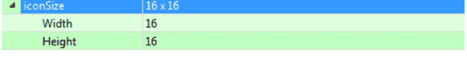

**图 7.26：** *描绘 Qt Designer 中 QTabWidget 的 iconSize 属性的图像*

### elideMode

当没有足够的空间显示特定选项卡栏大小的项目时，此属性决定应如何省略项目。可以从下拉菜单中选择可能的值。请参考下图：

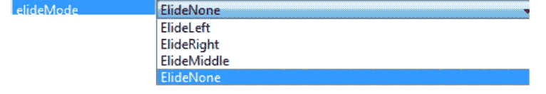

**图 7.27：** *描绘 Qt Designer 中 QTabWidget 的 elideMode 属性的图像*

### userScrollButtons

当选项卡栏太小而无法显示所有选项卡时，此参数指定选项卡栏是否应使用滚动按钮。请参考下图：


**图 7.28：** 描绘 Qt Designer 中 QTabWidget 的 userScrollButtons 属性的图像

### documentMode

当此属性设置为 **True** 时，即在文档模式下，选项卡应作为文档而不是工具按钮显示。请参考下图：

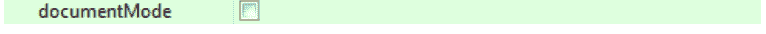

**图 7.29：** 描绘 Qt Designer 中 QTabWidget 的 documentMode 属性的图像

### tabsClosable

当设置为 **True** 时，关闭按钮将自动添加到 **QTabWidget** 对象的每个选项卡。请参考下图：

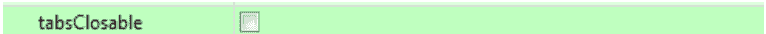

**图 7.30：** 描绘 Qt Designer 中 QTabWidget 的 tabsClosable 属性的图像

### movable

当设置为 **True** 时，用户可以在 **QTabWidget** 对象内移动选项卡。请参考下图：

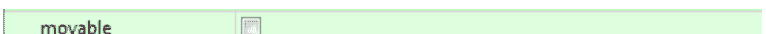

**图 7.31：** 描绘 Qt Designer 中 QTabWidget 的 movable 属性的图像

### tabBarAutoHide

当设置为 **True** 时，当选项卡栏包含少于 2 个选项卡时，它会自动隐藏。请参考下图：

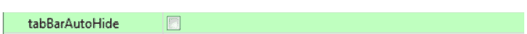

**图 7.32：** 描绘 Qt Designer 中 QTabWidget 的 tabBarAutoHide 属性的图像

### currentTabText

此属性确定 QTabWidget 对象当前选项卡的文本。请参考下图：

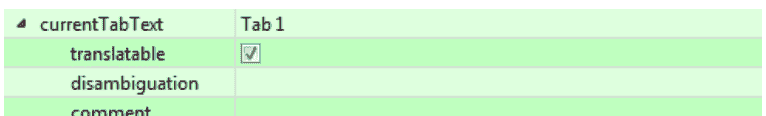

**图 7.33：** 描绘 Qt Designer 中 QTabWidget 的 currentTabText 属性的图像

### currentTabName

此属性确定 QTabWidget 对象当前选项卡的名称。请参考下图：

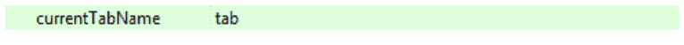

**图 7.34：** 描绘 Qt Designer 中 QTabWidget 的 currentTabName 属性的图像

### currentTabIcon

此属性确定 QTabWidget 对象当前选项卡的图标。请参考下图：

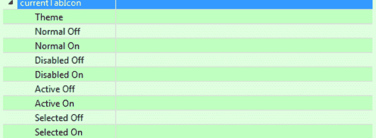

## currentTabToolTip

此属性决定了 **QTabWidget** 对象当前标签页的工具提示。请参考下图：

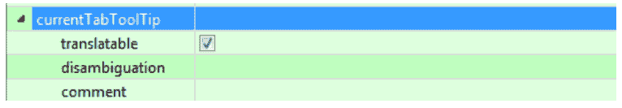

*图 7.36：展示 Qt Designer 中 QTabWidget 的 currentTabToolTip 属性的图片*

## currentTabWhatsThis

此属性决定了 **QTabWidget** 对象当前标签页的 **“这是什么？”帮助**。请参考下图：

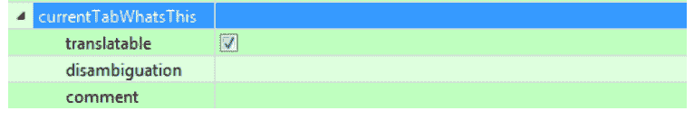

*图 7.37：展示 Qt Designer 中 QTabWidget 的 currentTabWhatsThis 属性的图片*

## 重要方法

一些重要的方法如下：

- **addTab(widget, arg__2)**：将向 **QTabWidget** 对象添加一个新标签页，使用给定的页面和标签作为标签页的文本，并返回该标签页在 **QTabWidget** 对象中的索引。
- **currentIndex()**：将返回当前标签页的索引位置。
- **removeTab(index)**：此方法将从 **QTabWidget** 对象中移除指定索引处的标签页。
- **count()**：此方法将返回 **QTabWidget** 对象中的标签页数量。
- **tabText(index)**：此方法将返回 **QTabWidget** 对象在指定索引处的标签页文本。
- **setTabText(index,text)**：此方法将通过为 **QTabWidget** 对象中指定位置索引的标签页定义新标签来设置标签页文本。
- **insertTab(index,widget,arg__3)**：将在指定索引处插入一个新标签页，使用给定的部件和标签。新标签页应插入到 index 参数指定的位置。如果索引小于或等于 0，则在开头插入新标签页。如果索引大于或等于现有标签页的数量，则在末尾追加新标签页。

## 重要信号

一些重要的信号如下。

### currentChanged

当当前标签页发生更改时，会发出此信号。新的当前标签页的索引是传递给信号处理程序的 index 参数。当用户在标签页之间切换时，可以使用此信号来更新应用程序的状态或执行其他操作。

### tabCloseRequested

当用户请求关闭标签页时，会发出此信号。信号处理程序的 index 参数包含用户想要关闭的标签页的索引。可以使用此信号提示用户保存任何尚未保存的更改，或在关闭标签页之前执行其他操作。

现在，我们将看一个 QTabwidget 的示例。
文件名的详细信息在下表 7.4 中给出：

| 序号 | Qt Designer 文件名 (.ui) | 将 Qt Designer 文件名转换为 Python 文件 (.py) | 创建另一个 Python 文件并从 Qt Designer 导入转换后的 Python 文件 |
| :--- | :--- | :--- | :--- |
| 1 | tabWidget_eg1.ui | tabWidget_eg1.py | run_tabWidget_eg1.py |

**表 7.4：文件名详细信息**

Qt Designer 文件如下图所示：

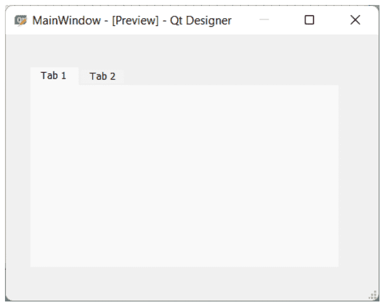

> **注意：上述 .ui 文件位于路径：TabWidget/tabWidget_eg1.ui**

考虑以下 run_tabWidget_eg1.py 的代码：

```python
import sys
from PyQt5.QtCore import Qt
from PyQt5.QtWidgets import QApplication,
QMainWindow, QPushButton,QFormLayout,
QLineEdit,QHBoxLayout,QRadioButton,QMessageBox,
QTabWidget, QWidget
from tabWidget_eg1 import *

class MyTabWidget(QMainWindow):
    def __init__(self):
        super().__init__()
        self.myui = Ui_MainWindow()
        self.myui.setupUi(self)
        self.myui.tabWidget.clear()
        self.myui.tabWidget.setTabsClosable(True) # Allow tabs to be closed by the user

        self.myui.tabWidget.tabCloseRequested.connect(self.handleCloseTab) # Connect the tabCloseRequested signal to the handleCloseTab slot
        # adding 3 LineEdit widget to tab1 and adding it to tabwidget
        mylayout = QFormLayout()
        mylayout.addRow("Name: ",QLineEdit())
        mylayout.addRow("PhoneNo: ",QLineEdit())
        mylayout.addRow("Age: ",QLineEdit())
        self.tab1 = QWidget()
        self.tab1.setLayout(mylayout)

        # Creating Tab1 and adding widgets
        self.myui.tabWidget.addTab(self.tab1, "Tab 1")

        # Adding only 1 QLineEdit to tab2 of tabwidget
        self.myui.tabWidget.addTab(QLineEdit(), "Tab 2")

        # Adding 2 Radio Buttons to tab3 of tabwidget
        mylayout2 = QFormLayout()
        mysex = QHBoxLayout()
        mysex.addWidget(QRadioButton("Male"))
        mysex.addWidget(QRadioButton("Female"))
        mylayout2.addRow("Sex",mysex)
        self.tab3 = QWidget()
        self.tab3.setLayout(mylayout2)
        # Creating Tab3 and adding widgets
        self.myui.tabWidget.addTab(self.tab3, "Tab 3")

        # Change the tab position to the bottom
        self.myui.tabWidget.setTabPosition(QTabWidget.South)

        # Disabling the second tab
        self.myui.tabWidget.setTabEnabled(1, False)
        # Setting the current tab as Tab 3
        self.myui.tabWidget.setCurrentIndex(2)
        self.show()
    def handleCloseTab(self, index):
        """
        Handling the tabCloseRequested signal by prompting the user to save any unsaved changes
        """
        mytab_widget = self.myui.tabWidget.widget(index)
        if isinstance(mytab_widget, QLineEdit): # if closing QLineEdit tab
            myresult = QMessageBox.question(self, "Unsaved Changes", "Do you want to save your changes and remove?", QMessageBox.Save | QMessageBox.Cancel)
            if myresult == QMessageBox.Save:
                # Save the changes
                print("Save")
                self.myui.tabWidget.removeTab(index)
                pass
            else:
                # Cancel the tab close request
                print("Cancelled")
                return
        else:
            # No unsaved changes, just remove the tab
            self.myui.tabWidget.removeTab(index)

if __name__ == '__main__':
    app = QApplication(sys.argv)
    w = MyTabWidget()
    w.show()
    sys.exit(app.exec_())
```

**输出：**
请参考下图：

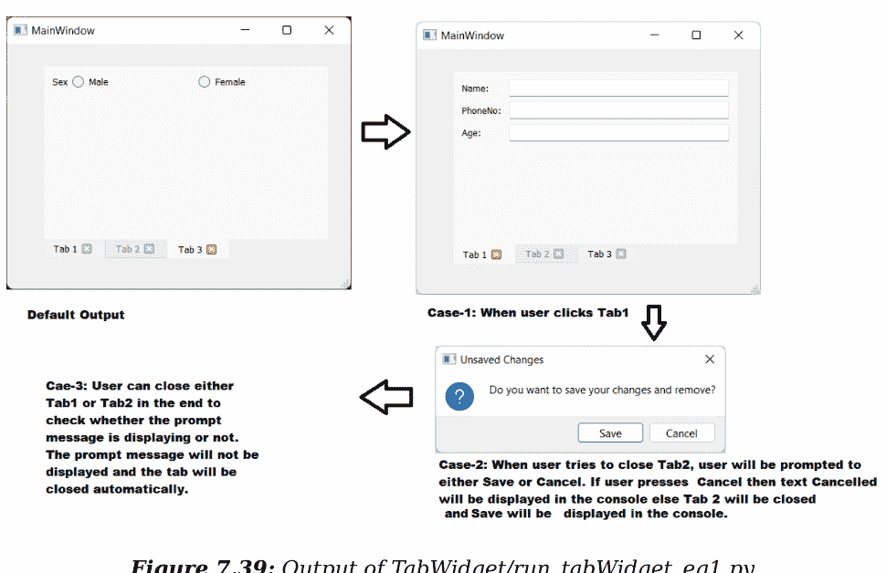

**图 7.39：** *TabWidget/run_tabWidget_eg1.py 的输出*

> **注意：** 上述代码位于程序名称：TabWidget/run_tabWidget_eg1.py

## 堆叠部件

在 PyQt5 中，堆叠部件是一种将多个部件组织到单个容器中的方式，每次只显示一个部件。它类似于 **QTabWidget**，但提供了更多的布局和外观灵活性。**QtWidgets** 模块的堆叠部件可用于将多个部件排列在堆叠布局中。**QStackedWidget** 可以构建并填充各种子部件（页面）。

## 重要属性

**QStackedWidget** 包含 **QFrame** 类的属性，我们已经在项目视图（*第 5 章，深入了解 Qt Designer 中的项目视图*）中讨论过。除此之外，它还有 **currentIndex** 属性。

### currentIndex

我们可以确定可见部件的索引位置。如果没有当前部件，则值为 -1。请参考下图：

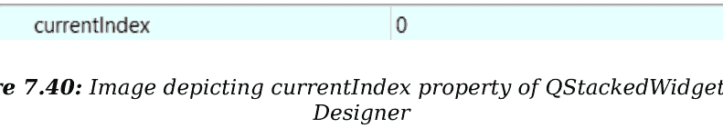

## 重要方法

一些重要的方法如下：

- **addWidget(QWidget)**：此方法将接受一个 QWidget 对象作为参数，并将其附加到 QStackedWidget 对象，返回索引位置。
- **count()**：返回 QStackedWidget 对象包含的部件数量。
- **currentWidget()**：此方法将返回当前在 QStackedWidget 对象中显示的部件，如果没有子部件，则返回 None。

## 重要信号

一些重要的信号如下。

### currentChanged(arg__1)

当 QStackedWidget 对象中的当前部件在堆栈中发生变化时，会发出此信号。

### widgetRemoved

当部件从 QStackedWidget 对象的堆栈中移除时，会发出此信号。

现在，我们将看一个 QStackedWidget 的示例。这里，我们直接编写 Python 代码并导入 QWidget 类。

文件名的详细信息在下表 7.5 中给出：

| 序号 | 创建一个 Python 文件 |
|---|---|
| 1 | run_StackedWidget_eg1.py |

**表 7.5：** 文件名详细信息

考虑以下 run_StackedWidget_eg1.py 的代码：

```python
import sys
from PyQt5.QtWidgets import *

class MyStackedWidget(QWidget):
    def __init__(self):
        super().__init__()
        self.listWidget = QListWidget()

        self.listWidget.insertItem(0,"Details")
        self.listWidget.insertItem(1,"Hobby")
        self.listWidget.insertItem(2,"Sex")

        # creating an instance of QWidget
        self.mystack1 = QWidget()
        self.mystack2 = QWidget()
        self.mystack3 = QWidget()
```

self.mystack1UI()
self.mystack2UI()
self.mystack3UI()

self.listWidget.currentRowChanged.connect(self.my_on_current_changed)

self.mystackwidget = QStackedWidget(self)
# 将当前部件设置为堆栈中的第一个
self.mystackwidget.setCurrentIndex(0)

# 将部件添加到 QStackedWidget 对象
self.mystackwidget.addWidget(self.mystack1)
self.mystackwidget.addWidget(self.mystack2)
self.mystackwidget.addWidget(self.mystack3)

hbox = QHBoxLayout(self)
hbox.addWidget(self.listWidget)
hbox.addWidget(self.mystackwidget)
self.setLayout(hbox)
self.show()

# 将 currentChanged 信号连接到一个槽函数
def my_on_current_changed(self,index):
    print("当前部件已更改为索引号：", index)
    self.mystackwidget.setCurrentIndex(index)

def mystack1UI(self):
    # 将部件添加到第一个堆栈
    mylayout1 = QFormLayout()
    mylayout1.addRow("姓名",QLineEdit())
    mylayout1.addRow("年龄",QLineEdit())
    mylayout1.addRow("城市",QLineEdit())
    self.mystack1.setLayout(mylayout1)

def mystack2UI(self):
    # 将部件添加到第二个堆栈
    mylayout2 = QFormLayout()
    mylayout2.addRow(QCheckBox("下棋"))
    mylayout2.addRow(QCheckBox("烹饪"))
    mylayout2.addRow(QCheckBox("阅读"))
    self.mystack2.setLayout(mylayout2)

def mystack3UI(self):
    # 将部件添加到第三个堆栈
    mylayout3 = QHBoxLayout()
    mylayout3.addWidget(QLabel("性别："))
    mylayout3.addWidget(QRadioButton("男"))
    mylayout3.addWidget(QRadioButton("女"))
    self.mystack3.setLayout(mylayout3)

if __name__ == '__main__':
    app = QApplication(sys.argv)
    w = MyStackedWidget()
    w.show()
    sys.exit(app.exec_())
```

参考下图：

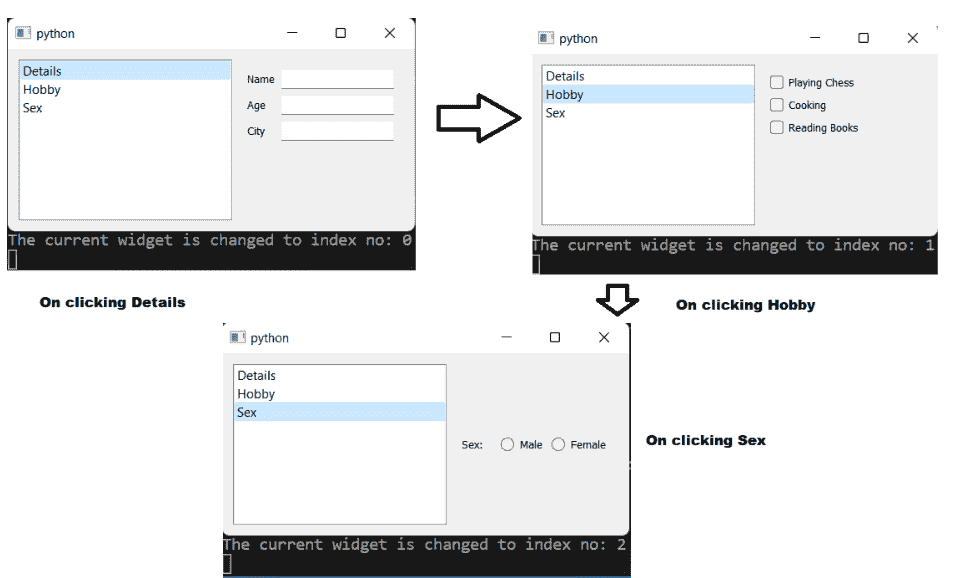

**图 7.41：** *StackedWidget/run_StackedWidget_eg1.py 的输出*

> **注意：** 上述代码包含在程序名称：StackedWidget/run_StackedWidget_eg1.py 中

## Frame（框架）

PyQt5 中的 `QFrame` 小部件充当其他小部件的简单容器。它具有框架形状、阴影和线宽等特性，可用于制作简单的形状或边框，也可用于将其他小部件分组在一起。使用它可以创建各种自定义用户界面组件，包括对话框、分组框和自定义表单。我们可以使用 `QFrame` 类创建没有内容的简单占位符框架。

## 重要属性

我们在处理 Item View 小部件（*第 5 章，深入了解 Qt Designer 中的 Item Views*）时已经讨论过 `QFrame` 的属性。

## 重要方法

让我们回顾一些重要的方法。

- `setFrameShape(arg__1)`：此方法可用于设置 QFrame 对象的框架形状值。
- `setFrameShadow(arg__1)`：此方法可用于设置 QFrame 对象的框架阴影值。
- `setLineWidth(arg__1)`：此方法可用于设置 QFrame 边框的线宽值。
- `setMidLineWidth(arg__1)`：此方法可用于设置 QFrame 边框的中线宽度值。

现在，我们将看到一个 QFrame 的示例。

文件名的详细信息在下表 7.6 中给出：

| 序号 | Qt designer 文件名 (.ui) | 将 QtDesigner 文件名转换为 Python 文件 (.py) | 创建另一个 Python 文件并从 Qt Designer 导入转换后的 Python 文件 |
|---|---|---|---|
| 1 | frame_eg1.ui | frame_eg1.py | run_frame_eg1.py |

**表 7.6：** 文件名详情

Qt Designer 文件如下图所示：

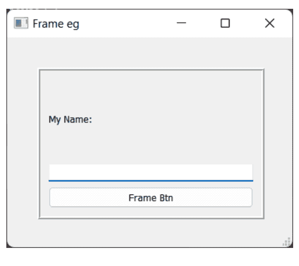

**图 7.42：** Qt Designer 文件：Frame/frame_eg1.ui

> **注意：** 上述 .ui 文件包含在路径：Frame/frame_eg1.ui 中

考虑以下 **run_frame_eg1.py** 的代码：

```python
import sys
from PyQt5.QtWidgets import QApplication,
QMainWindow, QFrame, QLabel, QLineEdit,
QPushButton,QVBoxLayout
from frame_eg1 import *

class MyFrame(QMainWindow):
    def __init__(self):
        super().__init__()
        self.myui = Ui_MainWindow()
        self.myui.setupUi(self)

        # 将框架形状设置为盒子
        self.myui.frame.setFrameShape(QFrame.Box)

        # 将框架阴影设置为凸起
        self.myui.frame.setFrameShadow(QFrame.Raised)

        # 将边框的线宽设置为 2
        self.myui.frame.setLineWidth(2)

        # 创建一个 QVBoxLayout 来容纳我们的小部件
        layout = QVBoxLayout()

        # 将标签和行编辑框添加到布局中
        layout.addWidget(QLabel("我的姓名："))
        layout.addWidget(QLineEdit())
        layout.addWidget(QPushButton("框架按钮"))

        # 将布局添加到框架中
        self.myui.frame.setLayout(layout)
        self.show()

if __name__=="__main__":
    app = QApplication(sys.argv)
    w = MyFrame()
    w.show()
    sys.exit(app.exec_())
```

**输出：**
参考下图：

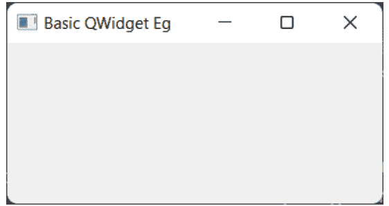

*图 7.43：Frame/frame_eg1.py 的输出*

> **注意：** 上述代码包含在程序名称：Frame/frame_eg1.py 中

## Widget（小部件）

Qt 库的 Python 绑定在 PyQt5 库中包含了 **QWidget** 类。在 PyQt5 库中，它作为所有用户界面对象的基类。**QWidget** 既可用作其他小部件的容器，也可用于生成按钮、标签和文本字段等用户界面组件。一个小部件会被它前面的小部件以及其父小部件裁剪。窗口是一个不包含在父小部件中的小部件。虽然也可以通过使用适当的窗口标志来创建没有装饰的窗口，但窗口通常具有框架和标题栏。

## 重要属性

我们已经在 *第 4 章，深入了解 Qt Designer 中的按钮小部件* 中看到了 **QWidget** 的属性。默认值可以更改，但属性的数量保持不变。

## 重要方法

现在让我们回顾一些重要的方法：

- **setGeometry(x,y,width,height)**：此方法将设置小部件的几何形状，包括其大小和位置。
- **setWindowTitle(arg__1)**：我们可以使用此方法设置包含该小部件的窗口标题。
- **show()**：此方法将显示该小部件及其子小部件。
- **resize(width,height)**：使用此方法，小部件将被调整为指定的宽度和高度。
- **move(x,y)**：此方法将帮助小部件移动到指定的 x 和 y 坐标。
- **setLayout(arg__1)**：此方法将设置小部件的布局，其中第一个参数是我们要设置的布局对象，第二个参数是我们要在其上设置布局的小部件。
- **setStyleSheet(stylesheet)**：我们可以将小部件的样式表设置为该样式表（样式表中包含了 Qt 样式表文档对小部件样式修改和自定义的文本描述）。

## 重要信号

现在让我们回顾一些重要的信号：

- `customContextMenuRequested(pos)`：当请求小部件的上下文菜单时，会发出此信号。鼠标指针的全局位置作为 `QPoint` 提供给它。当请求上下文菜单时，可以将其连接到一个槽函数以执行特定操作。
- `windowIconChanged(icon)`：当窗口图标更改时，会发出此信号，传递新的图标。
- `windowIconTextChanged(iconText)`：当窗口图标文本更改时，会发出此信号，传递新的图标文本。
- `windowTitleChanged(title)`：当窗口标题更改时，会发出此信号，传递新的窗口标题。

现在，我们将看到一个 `QWidget` 的示例。
文件名的详细信息在下表 7.7 中给出：

| 序号 | 创建一个 Python 文件 |
|---|---|
| 1 | run_widget_eg1.py |

**表 7.7：** 文件名详情

考虑以下 `run_widget_eg1.py` 的代码：

```python
import sys

from PyQt5.QtWidgets import QApplication,
QMainWindow, QWidget

app = QApplication(sys.argv)
```

# 创建一个QWidget实例，它将作为应用程序的主窗口
mywidget = QWidget()

# 设置屏幕控件的大小和位置
mywidget.resize(350, 150)

mywidget.move(250, 250)

# 设置控件标题
mywidget.setWindowTitle("Basic QWidget Eg")

# 在屏幕上显示控件
mywidget.show()

sys.exit(app.exec_())

## 输出：

请参考下图：

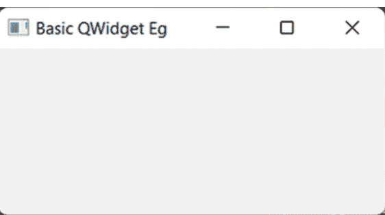

**图 7.44：** *Widget/run_widget_eg1.py 的输出*

> **注意：** 上述代码包含在程序名称：Widget/run_widget_eg1.py 中

## MDI 区域

`QMdiArea` 控件提供了一个可以显示**多文档界面（MDI）**窗口的区域。为了构建每个窗口以同时显示多个窗口，可以使用**单文档界面（SDI）**。由于每个窗口可能有自己的菜单系统、工具栏等，这需要额外的内存资源。使用 MDI 界面的应用程序占用内存更少。子窗口在主容器内相互排列，该容器控件命名为 `QMdiArea`。通常，`QMainWindow` 对象的中心控件就是 `QMdiArea` 控件。`QMdiSubWindow` 类代表本节中的子窗口。任何 `QWidget` 都可以选择作为 `subWindow` 对象的内部控件。在 MDI 区域中，子窗口可以设置为平铺或层叠模式。

## 重要属性

现在让我们回顾一些重要的属性，如下所示：

### background

可以使用此属性设置工作区区域的背景画刷。默认情况下，它是灰色。请参考下图：

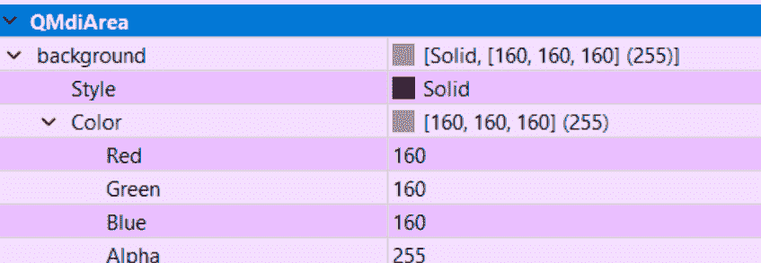

**图 7.45：** *描述 Qt Designer 中 QMdiArea 控件 background 属性的图像*

### activationOrder

此属性指定激活子窗口的排序标准。请参考下图：

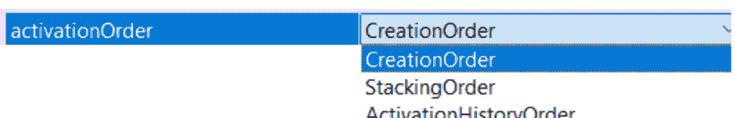

**图 7.46：** *描述 Qt Designer 中 QMdiArea 控件 activationOrder 属性的图像*

### viewMode

此属性指定 `QMdiArea` 对象中子窗口的显示模式。请参考下图：

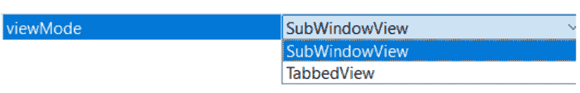

**图 7.47：** *描述 Qt Designer 中 QMdiArea 控件 viewMode 属性的图像*

### documentMode

此属性指定 `QMdiArea` 对象是否应使用文档/视图架构。如果启用，`QMdiArea` 对象将使用此架构管理其子窗口。默认情况下，它是**未选中**的。请参考下图：


**图 7.48：** 描述 Qt Designer 中 `QMdiArea` 控件 `documentMode` 属性的图像

### tabsClosable

此属性指定 `QMdiArea` 对象中子窗口的选项卡是否应具有关闭按钮。默认情况下，它设置为 **False**。请参考下图：

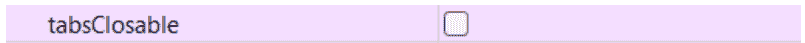

**图 7.49：** 描述 Qt Designer 中 `QMdiArea` 控件 `tabsClosable` 属性的图像

### tabsMovable

此属性指定 `QMdiArea` 对象中子窗口的选项卡是否可移动。默认情况下，它设置为 **False**。请参考下图：

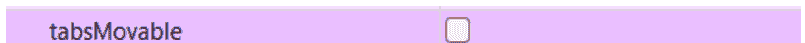

**图 7.50：** 描述 Qt Designer 中 `QMdiArea` 控件 `tabsMovable` 属性的图像

### tabShape

此属性指定 `QMdiArea` 对象中的选项卡形状。请参考下图：

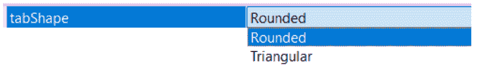

**图 7.51：** 描述 Qt Designer 中 QMdiArea 控件 tabShape 属性的图像

### tabPosition

此属性指定 `QMdiArea` 对象中的选项卡位置。请参考下图：

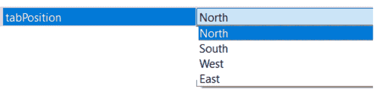

**图 7.52：** 描述 Qt Designer 中 QMdiArea 控件 tabPosition 属性的图像

## 重要方法

一些重要的方法如下：

- `addSubWindow(widget[, flags=Qt.WindowFlags()])`：此方法将把控件作为新的子窗口添加到 `MdiArea`，当 `WindowFlags` 非零时，它将覆盖控件上设置的标志。
- `removeSubWindow(widget)`：此方法将从 `MdiArea` 中移除控件（可以是子窗口的内部控件或 `QMdiSubWindow`）。
- `activeSubWindow()`：返回指向当前活动子窗口的指针，否则，如果没有窗口当前处于活动状态，则返回 `None`。
- `cascadeSubWindows()`：此方法将所有子窗口排列成层叠模式。
- `tileSubWindows()`：此方法将所有子窗口排列成平铺模式。
- `closeActiveSubWindow()`：使用此方法关闭当前活动的子窗口。
- `SubWindowList([order = CreationOrder])`：返回 **QMdiArea** 对象中的子窗口列表。默认顺序是 **CreationOrder**，这意味着将按照它们插入工作区的顺序进行排序。
- `setWidget()`：使用此方法，将 **QWidget** 设置为 **QMdiSubWindow** 实例的内部控件。

## 重要信号

现在让我们回顾一些重要的信号：

### subWindowActivated(arg__1)

当 MDI 区域内的子窗口成为活动窗口时，**QMdiArea** 对象中的 **subWindowActivated** 信号将被发出。**arg__1** 指的是新活动的子窗口。

现在，我们将看到一个 **QMdiArea** 的示例。

文件名的详细信息在下面的 *表 7.8* 中给出：

| 序号 | Qt Designer 文件名 (.ui) | 将 QtDesigner 文件名转换为 Python 文件 (.py) | 创建另一个 Python 文件并从 Qt Designer 导入转换后的 Python 文件 |
| :--- | :--- | :--- | :--- |
| 1 | mdiarea_eg1.ui | mdiarea_eg1.py | run_mdiarea_eg1.py |

**表 7.8**：文件名详情

Qt Designer 文件如下图所示：

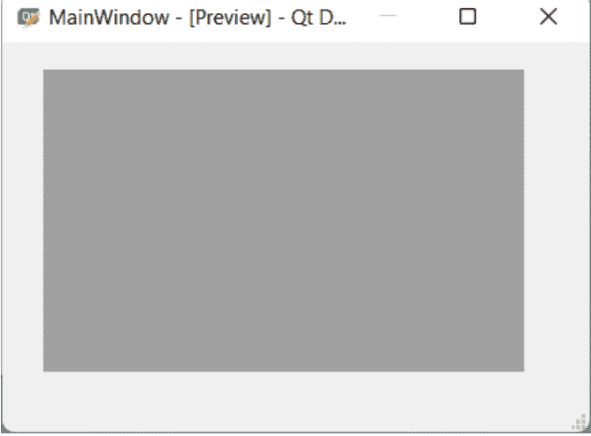

**图 7.53：** Qt Designer 文件：MDIArea/mdiarea_eg1.ui

> **注意：** 上述 .ui 文件包含在路径：MDIArea/mdiarea_eg1.ui 中

考虑以下 **run_mdiarea_eg1.py** 的代码：

```python
import sys

from PyQt5.QtWidgets import QApplication,
QMainWindow, QMdiArea, QMdiSubWindow, QTextEdit,
QMenu, QMenuBar, QAction

from mdiarea_eg1 import *

class MyMdiArea(QMainWindow):
    def __init__(self):
        super().__init__()
        self.myui = Ui_MainWindow()
        self.myui.setupUi(self)

        # 将 QMdiArea 对象设置为中心控件
        self.setCentralWidget(self.myui.mdiArea)

        # 向 QMdiArea 对象添加三个 QTextEdit 子窗口
        mysub1 = QMdiSubWindow()
        mysub1.setWidget(QTextEdit())
        mysub1.setWindowTitle("Window 1")
        self.myui.mdiArea.addSubWindow(mysub1)

        mysub2 = QMdiSubWindow()
        mysub2.setWidget(QTextEdit())
        mysub2.setWindowTitle("Window 2")
        self.myui.mdiArea.addSubWindow(mysub2)

        mysub3 = QMdiSubWindow()
        mysub3.setWidget(QTextEdit())
        mysub3.setWindowTitle("Window 3")
        self.myui.mdiArea.addSubWindow(mysub3)

        # 创建一个菜单栏并向其添加两个动作
        mymenubar = self.menuBar()
        mywindowMenu = mymenubar.addMenu("Display As")

        mycascadeAction = QAction("Cascade", self)

        mycascadeAction.triggered.connect(self.myui.mdiArea
cascadeSubWindows)
        mywindowMenu.addAction(mycascadeAction)
        mytileAction = QAction("Tile", self)

        mytileAction.triggered.connect(self.myui.mdiArea.ti
leSubWindows)
        mywindowMenu.addAction(mytileAction)

        self.show()

if __name__ == "__main__":
    app = QApplication(sys.argv)
    screen = MyMdiArea()
    screen.show()
    sys.exit(app.exec_())
```

## 输出：

请参考下图：

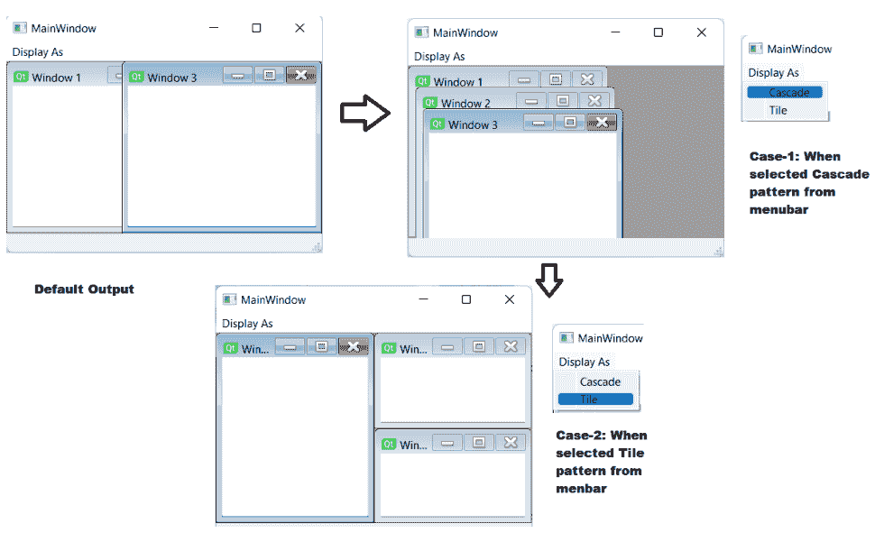

**图 7.54：** *MDIArea/run_mdiarea_eg1.py 的输出*

> **注意：** 上述代码包含在程序名称：MDIArea/run_mdiarea_eg1.py 中

## 停靠控件

**QDockWidget** 类允许用户向主窗口添加可停靠的窗口。它提供了一个容器控件，可以作为单独的窗口浮动，也可以停靠到主窗口的侧面。**QDockWidget** 能够支持包括浮动窗口、可移动和可关闭选项卡在内的功能。它通常用于为用户提供安排应用程序界面布局以满足其需求的能力。

**QDockWidget** 提出了停靠控件的概念，通常称为工具调色板或实用程序窗口。停靠窗口是放置在 **QMainWindow** 的停靠控件区域中、围绕中心控件的辅助窗口。**QDockWidget** 由标题栏和内容区域组成。该窗口标题栏、浮动按钮和关闭按钮都显示在停靠部件的标题栏中。浮动和关闭按钮可能会根据 `QDockWidget` 的状态被隐藏或完全不显示。

## 重要属性

现在，让我们来看一些重要的属性：

## floating

如果此布尔属性设置为 **True**，则停靠部件将被设置为 **浮动** 状态。请参考下图：

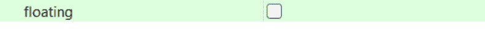

**图 7.55：** *展示 Qt Designer 中 QDockWidget 浮动属性的图片*

## features

此属性将决定为停靠部件启用的功能，即可以设置为可移动、可关闭或可浮动。请参考下图：

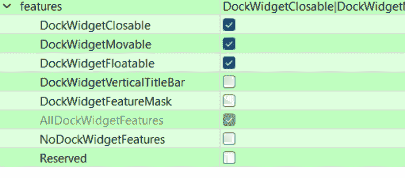

**图 7.56：** *展示 Qt Designer 中 QDockWidget 功能属性的图片*

## allowedAreas

此属性将决定停靠部件可以被放置的 **停靠部件区域**。请参考下图：

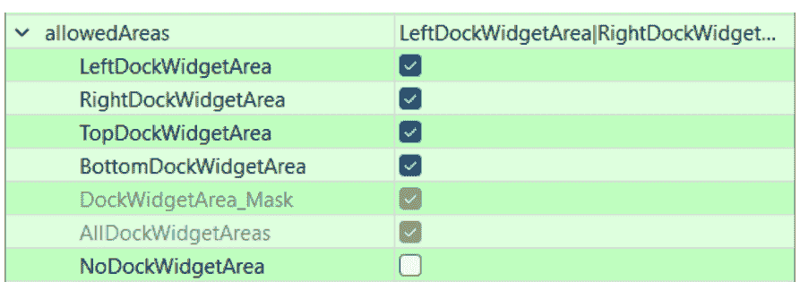

**图 7.57：** *展示 Qt Designer 中 QDockWidget 允许区域属性的图片*

## windowTitle

使用此属性设置停靠部件的标题。请参考下图：

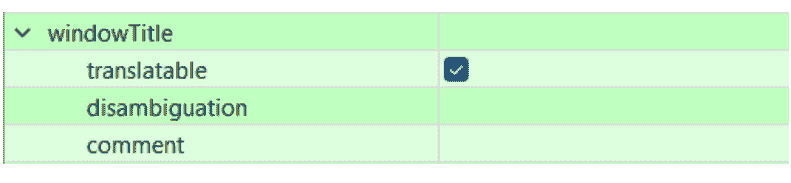

**图 7.58：** *展示 Qt Designer 中 QDockWidget 窗口标题属性的图片*

## dockWidgetArea

使用此属性返回停靠部件的当前停靠区域。请参考下图：

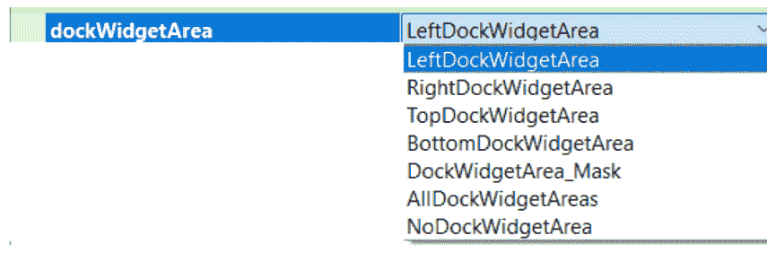

**图 7.59：** *展示 Qt Designer 中 QDockWidget 停靠区域属性的图片*

## docked

使用此属性，我们可以确定停靠部件是处于停靠状态还是浮动状态。请参考下图：

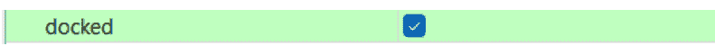

**图 7.60：** *展示 Qt Designer 中 QDockWidget 停靠状态属性的图片*

## 重要方法

一些重要的方法如下：

- **isAreaAllowed(area)**：如果停靠部件可以放置在指定的停靠部件区域，则返回布尔值 **True**，否则返回 **False**。
- **widget()**：返回停靠部件中包含的部件。如果未设置部件，则返回 **零**。
- **toggleViewAction()**：此方法将返回一个可选中的操作，可以添加到工具栏和菜单中，以便用户可以切换停靠部件的可见性。

## 重要信号

一些重要的信号如下：

- **allowedAreasChanged(allowedAreas)**：当停靠部件的允许区域发生变化时，会发出 **allowedAreasChanged** 信号。参数 **allowedAreas** 指定了新的允许区域。
- **dockLocationChanged(area)**：当 **QDockWidget** 对象移动到由 **area** 参数指定的新位置时，会发出此信号。
- **featuresChanged(features)**：当 **QDockWidget** 对象的功能发生变化时，会发出此信号。
- **topLevelChanged(topLevel)**：当停靠部件的顶层状态发生变化时，即它是否作为顶层窗口浮动或停靠在主窗口内时，会发出此信号，其中 **topLevel** 参数指定了新状态。
- **visibilityChanged(visible)**：当 **QDockWidget** 对象的可见性发生变化时，会发出此信号。

现在，我们将看到一个 **QDockWidget** 的示例。
文件名的详细信息在以下 [表 7.9](#table-79) 中给出：

| 序号 | 创建 Python 文件 |
|---|---|
| 1 | run_dockWidget_eg1.py |

**表 7.9**：文件名详情

考虑以下 **run_dockWidget_eg1.py** 的代码：

```python
import sys

from PyQt5 import QtWidgets, QtCore

myapp = QtWidgets.QApplication(sys.argv)

# Creating a main window object
mymainWindow = QtWidgets.QMainWindow()

# Creating a dock widget object
dockWidget = QtWidgets.QDockWidget("Dock Widget", mymainWindow)

# Setting the allowed dock widget areas
dockWidget.setAllowedAreas(QtCore.Qt.LeftDockWidgetArea | QtCore.Qt.RightDockWidgetArea)

# Adding a pushbutton to the dock widget
mybtn = QtWidgets.QPushButton("This is a dock widget")
dockWidget.setWidget(mybtn)

# Adding the dock widget to the main window
mymainWindow.addDockWidget(QtCore.Qt.LeftDockWidgetArea, dockWidget)

# Checking if the dock widget is floating
if dockWidget.isFloating():
    print("Dock widget is floating")
    print('-'*50)
else:
    print("Dock widget is docked")

print('-'*50)

# Connecting to the allowedAreasChanged signal
dockWidget.allowedAreasChanged.connect(lambda myallowedAreas: print("Allowed areas changed to", myallowedAreas))

# Connecting to the dockLocationChanged signal
dockWidget.dockLocationChanged.connect(lambda myarea: print("Dock location changed to", myarea))

# Connecting to the featuresChanged signal
dockWidget.featuresChanged.connect(lambda myfeatures: print("Features changed to", myfeatures))

# Connecting to the topLevelChanged signal
dockWidget.topLevelChanged.connect(lambda mytopLevel: print("Top level changed to", mytopLevel))

# Connecting to the visibilityChanged signal
dockWidget.visibilityChanged.connect(lambda myvisible: print("Visibility changed to", myvisible))

# Setting the dock widget floating
dockWidget.setFloating(True)

mymainWindow.show()

sys.exit(myapp.exec_())
```

## 输出：

请参考下图：

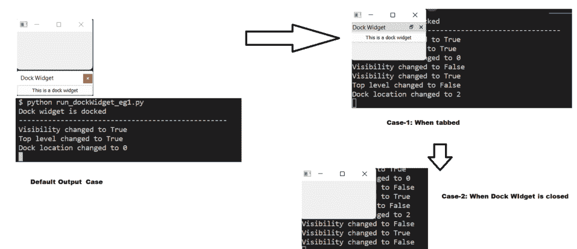

> 注意：前面的代码在程序名 run_dockWidget_eg1.py 中有介绍。

## 结论

在本章中，我们深入了解了 Qt Designer 提供的许多容器部件。读者现在对每个部件的功能和能力有了很好的理解，以及如何自定义它们以设计美观且用户友好的界面。

读者特别了解了什么是容器部件以及它们如何工作，不同类型的容器部件，如何使用容器部件创建布局，以及如何自定义容器部件的外观。

此外，读者还了解了信号-槽连接，如何将容器部件内的部件发送的信号连接到槽，以及如何使用布局管理器创建我们想要的布局。
为了确保读者牢固掌握 Qt Designer 中的容器部件，本章还提供了实际示例和练习。

## 要点回顾

- **QGroupBox** 是来自 Qt GUI 库的一个部件，它充当容器将其他部件分组在一起，并通过标题和边框在视觉上与其他部件区分开来。
- PyQt5 中的 **QScrollArea** 部件是一个容器部件，它为框架内的子部件内容提供滚动功能。
- 工具箱是一个部件，它显示一列垂直堆叠的选项卡，当前项显示在活动选项卡下方。
- 选项卡部件提供一个选项卡栏和一个 **页面区域**，可以在其中显示与每个选项卡关联的页面。
- **QFrame** 部件用于将部件分组在一起，并在它们之间提供视觉分隔。
- 在 PyQt5 中创建 **图形用户界面 (GUI)** 的基本构建块是 **QWidgets**，它们是可以在屏幕上显示并与用户交互的可视组件。
- 为了在单个窗口中显示 **多文档窗口 (MDI)**，PyQt5 的 **QMdiArea** 部件充当容器部件。每个 MDI 窗口都可以独立移动、调整大小和关闭，而不会影响任何其他窗口。
- 可停靠窗口可以使用 `QDockWidget` 类添加到主窗口。

## 问题

1. PyQt5 容器部件用于什么目的？请详细解释。
2. 解释 Qt Designer 的不同容器部件。
3. 解释 Qt Designer 的 `QObject` 和 `QWidget` 类。
4. 简要介绍 PyQt5 中的容器。
5. 解释 Qt Designer 中分组框的重要性和用途。
6. 解释 Qt Designer 中分组框的重要属性。
7. 解释 Qt Designer 中分组框可用的重要信号。
8. 解释 Qt Designer 中滚动区域的用途。
9. 解释 Qt Designer 中滚动区域的重要属性。
10. 解释 Qt Designer 中堆叠部件的用途。
11. 解释 Qt Designer 中堆叠部件的重要属性。
12. 解释 Qt Designer 中 `FrameWidget` 的用途。
13. 解释 Qt Designer 中 `FrameWidget` 的重要属性。
14. 解释 **多文档界面 (MDI)** 及其在 Qt Designer 中的重要性。
15. 哪个部件用于将可停靠窗口添加到主窗口？请详细解释。
16. 解释 Qt Designer 中停靠部件的重要属性。

## 第8章
深入了解 Qt Designer 中的输入部件

## 简介

PyQt5 的输入部件是必要的，因为它们为用户提供了一种向 PyQt5 应用程序输入数据的方法。由于这些部件允许用户交互和数据输入，它们是为应用程序创建**图形用户界面 (GUI)** 的基本组件。

有多种方式可以将数据输入到 PyQt5 提供的输入部件中，包括文本输入、数字输入、日期/时间输入和下拉列表选择。借助这些部件，开发者可以轻松创建用户友好的界面并从用户那里收集数据。此外，输入部件是现代应用程序的关键组成部分，因为它们允许用户以各种方式输入和操作数据。Qt Designer 中存在的不同输入部件如下图所示：

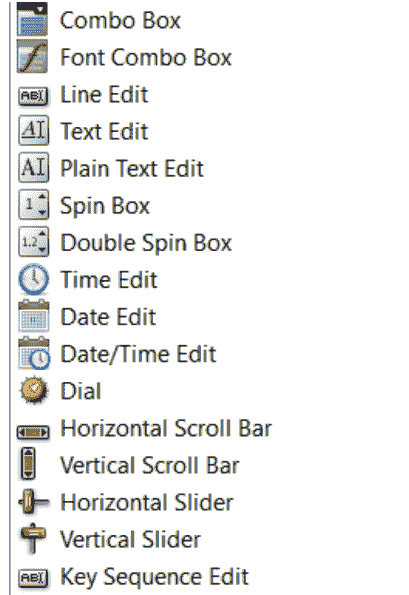

**图 8.1：** *Qt Designer 的不同输入部件*

我们将逐一讨论每个输入部件的重要性。

## 结构

在本章中，我们将讨论以下主题：

- 组合框
- 字体组合框
- 行编辑器
- 文本编辑器
- 纯文本编辑器
- 旋转框
- 双精度旋转框
- 日期时间编辑器
- 旋钮
- QScrollBar
- QSlider
- 按键序列编辑器

## 目标

阅读本章后，读者将透彻理解许多可用的输入部件，以及如何有效地利用它们来创建交互式用户界面。在本章结束时，读者将对输入部件有扎实的理解，包括 **QLineEdit**、**QSpinBox**、**QComboBox**、**QTextEdit** 等，以及它们相应的特性、功能和自定义选项。

本章的主要目标是为读者提供必要的知识，以便将这些输入部件整合到他们的设计中，从而使用户能够输入数据、选择选项并与程序交互。为了读者的利益，本章还涵盖了输入验证方法的使用、处理用户输入事件以及连接信号和槽以实现所需功能。通过掌握 Qt Designer 中的输入部件，读者将能够开发出简单且用户友好的界面，有效地收集用户输入并提供流畅的用户体验。此外，我们将通过实际示例来探讨 Qt Designer 中所有输入部件，并在需要的位置提供有用的注释。

## 组合框

按钮和弹出列表的组合是 **QComboBox** 部件。用户可以使用 PyQt5 中的 **QComboBox** 部件从下拉选项列表中选择一个选项。它是一个常用的部件，用于从列表中选择项目。我们可以手动输入项目，也可以使用模型来填充 **QComboBox** 部件。除了文本项目外，还可以显示图标。可以使用 PyQt5 的 **QComboBox** 创建具有不同属性和选项的下拉列表，它是 **PyQt5.QtWidgets** 包的一部分。一些值得注意的属性和选项包括：使部件可编辑、设置当前项目、设置最大可见项目数以及控制插入策略的选项。

## 重要属性

让我们回顾一些重要的属性：

### editable

此属性将决定 **QComboBox** 对象是否可以被用户编辑。默认值为 **False**。请参考下图：

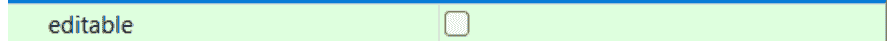

**图 8.2：** *展示 Qt Designer 中 QComboBox 可编辑属性的图片*

### currentText

此属性返回 **QComboBox** 对象中当前显示的文本。请参考下图：

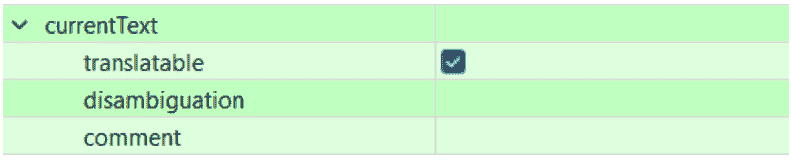

**图 8.3：** *展示 Qt Designer 中 QComboBox currentText 属性的图片*

### currentIndex

默认值为 **-1**，此属性将返回 **QComboBox** 对象中当前选定项目的索引。请参考下图：

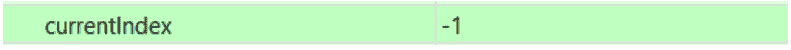

**图 8.4：** *展示 Qt Designer 中 QComboBox currentIndex 属性的图片*

### maxVisibleItems

借助上述属性，可以设置 **QComboBox** 对象下拉列表中要显示的最大项目数。默认值为 **10**。请参考下图：

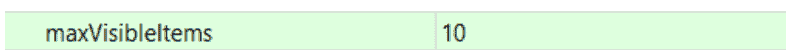

**图 8.5：** *展示 Qt Designer 中 QComboBox maxVisibleItems 属性的图片*

### maxCount

使用此属性，可以设置要添加到 **QComboBox** 对象的最大项目数。默认值为 **2147483647**。请参考下图：

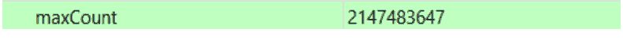

**图 8.6：** *展示 Qt Designer 中 QComboBox maxCount 属性的图片*

### insertPolicy

用户可以设置项目在 **QComboBox** 对象中出现的策略。默认值为 **InsertAtBottom**。请参考下图：

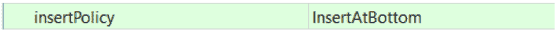

**图 8.7：** *展示 Qt Designer 中 QComboBox insertPolicy 属性的图片*

### sizeAdjustPolicy

可以使用此属性为 QComboBox 对象设置规则策略，以便在列表项目更改时调整其大小。请参考下图：

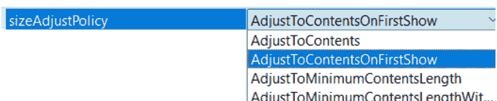

**图 8.8：** *展示 Qt Designer 中 QComboBox sizeAdjustPolicy 属性的图片*

### minimumContentsLength

我们可以确定适合 QComboBox 对象的最小字符数。默认值为 0。请参考下图：


**图 8.9：** *展示 Qt Designer 中 QComboBox minimumContentsLength 属性的图片*

### iconSize

可以使用此属性设置要在 QComboBox 对象中显示的图标大小。请参考下图：

| iconSize | 20 x 20 |
| :--- | :--- |
| 宽度 | 20 |
| 高度 | 20 |

**图 8.10：** *展示 Qt Designer 中 QComboBox iconSize 属性的图片*

### duplicatesEnabled

此布尔属性将决定是否在 QComboBox 对象中启用重复项。默认值设置为 **False**。请参考下图：


**图 8.11：** *展示 Qt Designer 中 QComboBox duplicatesEnabled 属性的图片*

#### frame

当设置为 True 时，QComboBox 对象会在框架内绘制自身，否则在没有框架的情况下绘制自身。请参考下图：

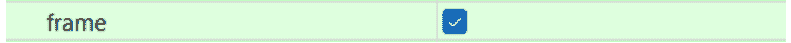

**图 8.12：** *展示 Qt Designer 中 QComboBox frame 属性的图片*

### modelColumn

使用此属性，我们可以设置用于填充 QComboBox 对象的模型的列。默认值为 0。请参考下图：

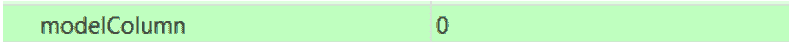

**图 8.13：** *展示 Qt Designer 中 QComboBox modelColumn 属性的图片*

## 重要方法

一些重要的方法如下：

- `addItem(text[,userData = None])`：使用此方法，项目将使用给定的文本和可选的 **userData** 参数添加到 QComboBox 对象的现有项目列表中。
- `addItems(texts)`：此方法将把给定文本中的字符串列表添加到 QComboBox 对象。
- `clear()`：此方法将从 QComboBox 对象中移除所有项目。
- `count()`：此方法将返回 QComboBox 对象中的项目数量。
- `currentText()`：此方法将返回 QComboBox 对象的当前文本。
- `currentIndex()`：此方法将返回 QComboBox 对象中当前项目的索引。
- `setItemText(index, Text)`：使用此方法，可以更改 QComboBox 对象中指定索引处项目的文本。

## 重要信号

一些重要的信号如下：

- `activated(index)`：当 QComboBox 对象中的项目被激活时（通过使用键盘选择或单击它），会发出此信号。信号携带一个参数 index，它是被激活项目的索引。
- `currentIndexChanged(index)`：每当 QComboBox 对象的当前索引发生变化时，就会发出此信号。新索引由信号作为参数 index 携带。
- `highlighted(index)`：当 QComboBox 对象的项目被高亮显示时（通过将鼠标悬停在其上或使用键盘导航到它），会发出此信号。被高亮显示项目的索引是信号携带的参数 index。

现在，我们将看一个 QComboBox 部件的示例。

文件名的详细信息在下表 8.1 中给出：

| 序号 | Qt Designer 文件名 (.ui) | 将 Qt Designer 文件名转换为 Python 文件 (.py) | 创建另一个 Python 文件并导入从 Qt Designer 转换的 Python 文件 |
|---|---|---|---|
| 1 | combobox_eg1.ui | combobox_eg1.py | run_combobox_eg1.py |

**表 8.1：** 文件名详情

Qt Designer 文件如下图所示：

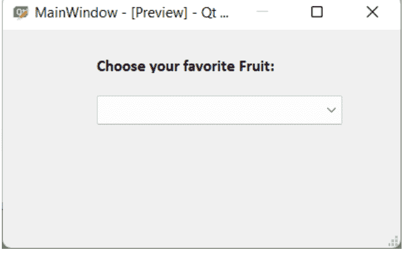

**图 8.14：** Qt Designer 文件：ComboBox/combobox_eg1.ui

**注意：上述 .ui 文件位于路径：ComboBox/combobox_eg1.ui**

考虑以下 run_combobox_eg1.py 的代码：

```python
import sys

from PyQt5.QtWidgets import QMainWindow, QApplication

from combobox_eg1 import *

class MyComboBox(QMainWindow):
    def __init__(self):
        super().__init__()
        self.myui = Ui_MainWindow()
        self.myui.setupUi(self)

        # adding items to the QComboBox object
        self.myui.comboBox.addItems(["Orange",
"Papaya", "Banana"])
        # setting the current index to 1
        self.myui.comboBox.setCurrentIndex(1)

        # inserting the item at index position 0 of
QComboBox widget
        self.myui.comboBox.insertItem(0, "Mango")

        # display of all the items of QComboBox
widget
        for mycount in
range(self.myui.comboBox.count()):
            print("Current Index is: " +
str(mycount) + " and the text is: " +
self.myui.comboBox.itemText(mycount))

        # connecting the activated and
currentIndexChanged signals to the corresponding
slot methods
        self.myui.comboBox.activated.connect(self.myactivated)

        self.myui.comboBox.currentIndexChanged.connect(self.mycurrentIndexChanged)

        self.show()

    def myactivated(self, myindex):
        self.myui.mylbl2.setText("Item Activated is: " + self.myui.comboBox.currentText())

    def mycurrentIndexChanged(self, myindex):
        self.myui.mylbl3.setText("Index is: " + str(myindex) + " & Text is: " + self.myui.comboBox.currentText())

if __name__=="__main__":
    app = QApplication(sys.argv)
    w = MyComboBox()
    w.show()
    sys.exit(app.exec_())
```

## 输出：

参考下图：

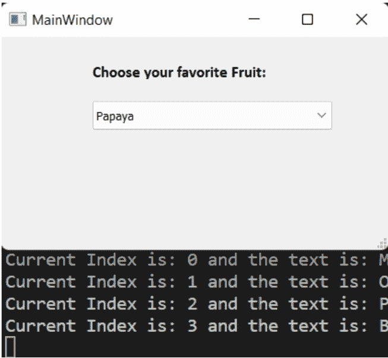

**图 8.15：** *ComboBox/run_combobox_eg1.py 的输出*

> 注意：上述代码位于程序名：ComboBox/run_combobox_eg1.py

从 *图 8.15* 可以看出，由于在插入项目 **Mango** 之前，**当前索引** 被设置为 **1**，因此 QComboBox 控件向用户显示的是 **Papaya**。

从 *图 8.16* 中，我们可以查看选择项目 **Orange** 时的输出。参考下图：

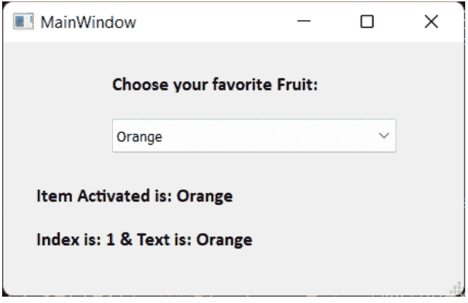

**图 8.16：** *在 ComboBox/run_combobox_eg1.py 中选择 Orange 文本时的输出*

## 字体组合框

在 PyQt5 中，`QFontComboBox` 控件是一个组合框，允许用户从系统字体列表中选择字体系列。当用户从控件显示的字体系列名称下拉列表中选择字体时，会发送 `currentFontChanged()` 信号。`QFontComboBox` 通常与两个用于粗体和斜体格式的 `QToolButtons` 以及一个用于调整字体大小的 `QComboBox` 一起在工具栏中使用。

## 重要属性

现在让我们回顾一些重要的属性。

### writingSystem

此属性用于保存要在 `QFontComboBox` 对象中显示的字体的书写系统。参考下图：

| writingSystem | Any |
|---|---|

**图 8.17：** *描述 Qt Designer 中 QFontComboBox 的 writingSystem 属性的图像*

### fontFilters

此属性将保存用于限制 **QFontComboBox** 对象中可用字体系列的字体过滤器。参考下图：

| fontFilters | AllFonts |
| :--- | :--- |
| AllFonts | ☐ |
| ScalableFonts | ☐ |
| NonScalableFonts | ☐ |
| MonospacedFonts | ☐ |
| ProportionalFonts | ☐ |

**图 8.18：** *描述 Qt Designer 中 QFontComboBox 的 fontFilters 属性的图像*

### currentFont

此属性将保存 **QFontComboBox** 对象中当前选定的字体。参考下图：

| currentFont | **A** [MS Shell Dlg 2, 8] |
| :--- | :--- |
| Family | MS Shell Dlg 2 |
| Point Size | 8 |
| Bold | ☐ |
| Italic | ☐ |
| Underline | ☐ |
| Strikeout | ☐ |
| Kerning | ☑ |
| Antialiasing | PreferDefault |

**图 8.19：** *描述 Qt Designer 中 QFontComboBox 的 currentFont 属性的图像*

## 重要方法

一些重要的方法如下：

- **setCurrentFont(QFont)**：此方法将设置 **QFontComboBox** 对象中当前选定的字体。
- **setFontFilters(FontFilters)**：此方法将设置用于限制 **QFontComboBox** 对象中可用字体系列的字体过滤器。
- **setWritingSystem(WritingSystem)**：此方法将设置要在 **QFontComboBox** 对象中显示的字体的书写系统。

## 重要信号

现在让我们检查一个重要的信号。

### currentFontChanged(QFont)

当 **QFontComboBox** 对象中当前选定的字体发生变化时，会发出此信号。一个 **QFont** 对象作为参数传递，代表新选定的字体。

现在，我们将看到一个 **QFontComboBox** 控件的示例。

文件名的详细信息在下表 *8.2* 中给出：

| 序号 | Qt Designer 文件名 (.ui) | 将 Qt Designer 文件名转换为 Python 文件 (.py) | 创建另一个 Py 文件并导入从 Qt Designer 转换的 Python 文件 |
| :--- | :--- | :--- | :--- |
| 1 | fontcombobox_eg1.ui | fontcombobox_eg1.py | run_fontcombobox_eg1.py |

**表 8.2：** *文件名详情*

Qt Designer 文件如下图所示：

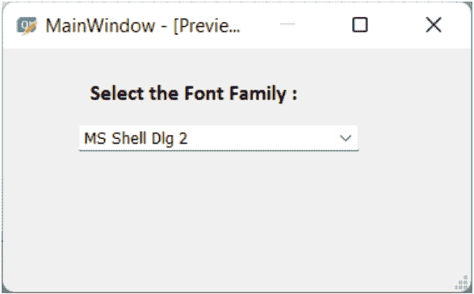

**图 8.20：** Qt Designer 文件：FontComboBox/fontcombobox_eg1.ui

**注意：上述 .ui 文件位于路径：FontComboBox/fontcombobox_eg1.ui**

考虑以下 run_fontcombobox_eg1.py 的代码：

```python
import sys

from PyQt5.QtWidgets import QMainWindow,
QApplication, QFontComboBox

from fontcombobox_eg1 import *

class MyFontComboBox(QMainWindow):
    def __init__(self):
        super().__init__()
        self.myui = Ui_MainWindow()
        self.myui.setupUi(self)

        # setting the font filters which are used
to limit the available font families of
QFontComboBox object
        self.myui.fontComboBox.setFontFilters(QFontComboBox
.NonScalableFonts)

        # Connecting the currentFontChanged signal
of QFontComboBox object to the myfontchanged slot
        self.myui.fontComboBox.currentFontChanged.connect(s
elf.myfontchanged)
        self.show()

    def myfontchanged(self, myfont):
        self.myui.mylb2.setText("Current font
changed to:" + myfont.family())

if __name__=="__main__":
    app = QApplication(sys.argv)
    w = MyFontComboBox()
    w.show()
    sys.exit(app.exec_())
```

## 输出：

参考下图：

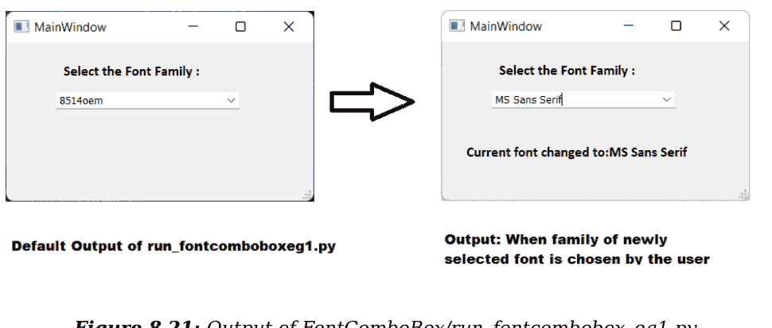

**图 8.21：** *FontComboBox/run_fontcombobox_eg1.py 的输出*

> 注意：上述代码位于程序名：FontComboBox/run_fontcombobox_eg1.py

## 行编辑

Qt Designer 中最常用的单行文本编辑器之一是 `QLineEdit` 控件。它常用于显示文本或接受用户的文本输入。可以更改各种属性，包括字体、输入掩码、占位符文本等。此外，它还提供诸如 `editingFinished` 和 `textChanged` 等信号，这些信号在用户与控件交互时发出。

## 重要属性

现在让我们回顾一些重要的属性。

### inputMask

此属性定义一个字符串，该字符串指定一个验证输入掩码。掩码定义了有效的输入格式，例如任何电话号码、IP 地址、日期等。如果未设置掩码，则返回空字符串。一些不同的掩码字符及其含义可以在下表 [8.3](Table 8.3) 中找到：

| 掩码字符 | 含义 |
|---|---|
| 9 | 数字类别中必需的字符，例如 0–9。 |
| 0 | 数字类别中允许但非必需的字符。 |
| D | 数字类别中必需且大于零的字符，例如 1–9。 |
| d | 数字类别中允许但非必需且大于零的字符，例如 1–9。 |
| A | 字母类别中必需的字符，例如 A-Z 或 a-z。 |
| a | 字母类别中允许但非必需的字符。 |
| N | 数字或字母类别中必需的字符，例如 0-9、A-Z、a-z。 |
| n | 数字或字母类别中允许但非必需的字符。 |
| X | 需要任何非空白字符。 |
| x | 允许但非必需任何非空白字符。 |
| x | 允许但非必需任何非空白字符。 |
| # | 允许但非必需 +/- 符号或数字类别的字符。 |
| H | 需要十六进制字符 A-F、a-f、0-9。 |
| h | 允许但非必需十六进制字符。 |
| B | 需要二进制字符 0-1。 |
| b | 允许但非必需二进制字符。 |
| < | 使所有字母字符变为小写。 |
| > | 使所有字母字符变为大写。 |
| ! | 关闭大小写转换。 |
| \ | 特殊字符转义，用作分隔符。 |
| {} | 表示用户定义的字符，用于定义自定义字符集。 |

## 表 8.3：掩码字符及其含义

请参考下图：

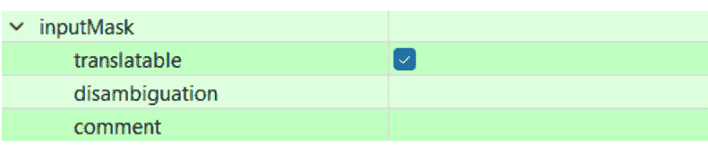

图 8.22：展示 Qt Designer 中 QLineEdit 的 inputMask 属性的图片

### text

QLineEdit 对象的内容通过此属性保存。默认值为空字符串。请参考下图：

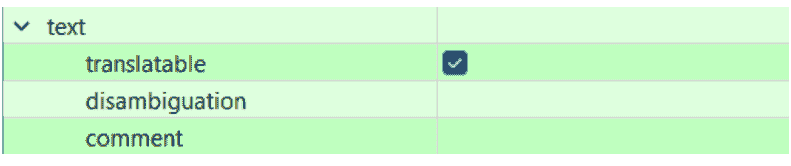

图 8.23：展示 Qt Designer 中 QLineEdit 的 text 属性的图片

## maxLength

QLineEdit 对象中文本的最大允许长度通过此属性设置。请参考下图：

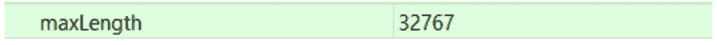

图 8.24：展示 Qt Designer 中 QLineEdit 的 maxLength 属性的图片

#### frame

如果勾选此项，QLineEdit 对象将被绘制在一个边框内。请参考下图：

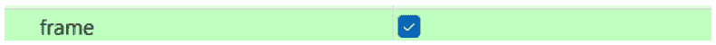

图 8.25：展示 Qt Designer 中 QLineEdit 的 frame 属性的图片

## echoMode

此属性决定在 QLineEdit 对象中输入的文本将如何向用户显示。请参考下图：

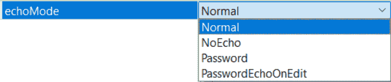

*图 8.26：展示 Qt Designer 中 QLineEdit 的 echoMode 属性的图片*

## cursorPosition

此属性保存 QLineEdit 对象的当前光标位置。默认值为 **0**。请参考下图：

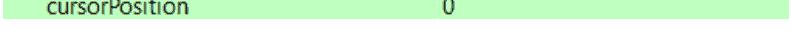

*图 8.27：展示 Qt Designer 中 QLineEdit 的 cursorPosition 属性的图片*

### alignment

使用此属性，可以保存 QLineEdit 对象的对齐方式，我们可以同时设置水平和垂直对齐。请参考下图：

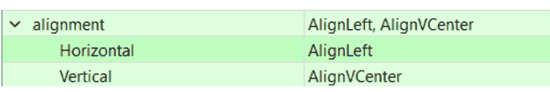

*图 8.28：展示 Qt Designer 中 QLineEdit 的 alignment 属性的图片*

## dragEnabled

此属性允许用户在 QLineEdit 对象内按下并移动鼠标。启用后，允许拖动其内容。请参考下图：

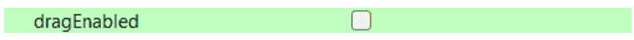

**图 8.29：** 展示 Qt Designer 中 QLineEdit 的 dragEnabled 属性的图片

#### readOnly

此属性默认禁用，表示 **QLineEdit** 对象内的文本是 **只读** 的。用户无法编辑文本，但可以复制或拖放文本。请参考下图：

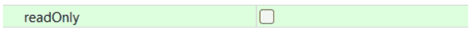

**图 8.30：** 展示 Qt Designer 中 QLineEdit 的 readOnly 属性的图片

## placeholderText

我们可以在 **QLineEdit** 对象为空且未获得焦点时，设置并显示占位符文本。请参考下图：

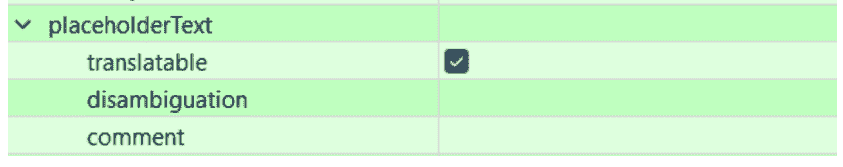

**图 8.31：** 展示 Qt Designer 中 QLineEdit 的 placeholderText 属性的图片

## cursorMoveStyle

我们可以设置 **QLineEdit** 对象中光标移动的方式或样式。请参考下图：

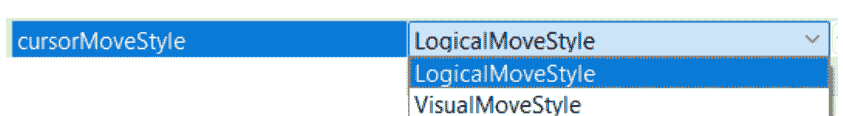

**图 8.32：** 展示 Qt Designer 中 QLineEdit 的 cursorMoveStyle 属性的图片

## clearButtonEnabled

此属性将指示当 QLineEdit 对象不为空时，是否显示一个清除按钮。默认禁用。请参考下图：

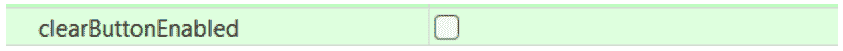

**图 8.33：** 展示 Qt Designer 中 QLineEdit 的 clearButtonEnabled 属性的图片

## 重要方法

让我们来看一些重要的方法：

- **setText(arg__1):** 使用此方法，可以将 QLineEdit 对象的文本设置为指定的参数字符串。
- **setValidator(arg__1):** 使用此方法设置 QLineEdit 对象的输入验证器。验证器参数 `arg__1` 是一个 `QValidator` 实例或其子类之一。输入必须符合验证器指定的格式。
- **setInputMask(inputMask):** 使用此方法为 QLineEdit 对象设置输入掩码。输入格式由 `inputMask` 参数指定，它是一个字符串。
- **setFont(arg__1):** 使用此方法设置字体，以在 QLineEdit 对象中显示文本。参数 `arg__1` 是一个 `QFont` 对象的实例。
- **setEchoMode(arg__1):** 将 QLineEdit 对象中输入文本的显示模式设置为指定的参数 `arg__1`（EchoMode）。
- **setAlignment(flag)**: 此方法将根据对齐常量设置 **QLineEdit** 对象中的文本对齐方式。
- **clear()**: 此方法将移除 **QLineEdit** 对象中的文本。
- **setMaxLength(arg__1)**: 此方法将 **QLineEdit** 对象中文本的最大允许长度设置为指定的 **int** 类型参数 **arg__1**。
- **setReadOnly(arg__1)**: 将 **QLineEdit** 对象的只读状态设置为指定的布尔值 **arg__1**。如果将只读设置为 True，用户将无法修改 **QLineEdit** 对象中的文本。

## 重要信号

一些重要的信号如下：

- **textEdited()**: 当用户修改 **QLineEdit** 对象中的文本（包括添加或删除）时，会发出此信号。
- **textChanged()**: 当任何 **QLineEdit** 对象的文本发生更改（包括通过程序进行的更改）时，会发出此信号。
- **editingFinished()**: 当用户通过按 *Enter* 键或离开控件完成 **QLineEdit** 对象中的文本编辑时，会发出此信号。
- **returnPressed()**: 在编辑 **QLineEdit** 对象中的文本时按 *Enter* 键会发出此信号。
- **selectionChanged()**: 当 **QLineEdit** 对象中的选中文本发生更改时，会发出此信号。
- **cursorPositionChanged()**: 当 **QLineEdit** 对象中的光标移动且其位置发生更改时，会发出此信号。

现在，我们将看一个 QLineEdit 控件的示例。
文件名的详细信息在下表 8.4 中给出：

| 序号 | Qt Designer 文件名 (.ui) | 将 Qt Designer 文件名转换为 Python 文件 (.py) | 创建另一个 Python 文件并从 Qt Designer 导入转换后的 Python 文件 |
|---|---|---|---|
| 1 | lineedit_eg1.ui | lineedit_eg1.py | run_lineedit_eg1.py |

**表 8.4：** 文件名详情

Qt Designer 文件如下图所示：

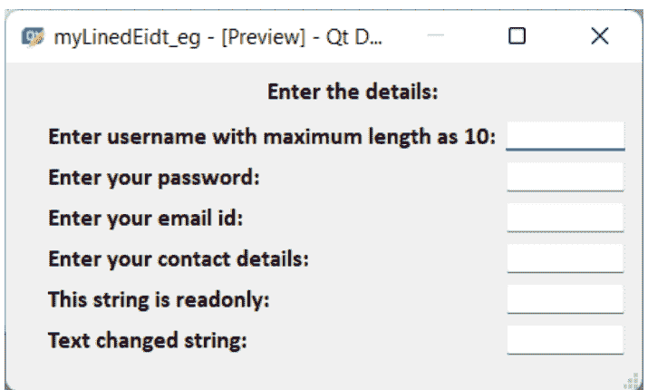

**图 8.34：** Qt Designer 文件：LineEdit/lineedit_eg1.ui

> 注意：上述 .ui 文件位于路径：LineEdit/lineedit_eg1.ui

考虑以下 `run_lineedit_eg1.py` 的代码：

```python
import sys

import re

from PyQt5.QtWidgets import QMainWindow,
QApplication, QMessageBox

from PyQt5.QtGui import QFont

from lineedit_eg1 import *

class MyLineEdit(QMainWindow):
    def __init__(self):
        super().__init__()
        self.myui = Ui_MainWindow()
        self.myui.setupUi(self)

        # LineEdit1 -----------------------------------------

        # 设置可输入的最大字符数
        self.myui.mylineEdit_1.setMaxLength(10)

        self.myui.mylineEdit_1.setFont(QFont("Calibri",16))

        self.myui.mylineEdit_1.setPlaceholderText("Enter username")

        # LineEdit2 -----------------------------------------

        self.myui.mylineEdit_2.setPlaceholderText("Enter password")

        self.myui.mylineEdit_2.setEchoMode(self.myui.mylineEdit_2.Password)

        # LineEdit3 ---------------------------------------------------------------

        self.myui.mylineEdit_3.setPlaceholderText("Enter email @ is must")

        # 将 textChanged 信号连接到自定义函数

        self.myui.mylineEdit_3.editingFinished.connect(self.myvalidate_email)

        # LineEdit4 ---------------------------------------------------------------

        self.myui.mylineEdit_4.setInputMask("+99_99999_99999")

        # LineEdit5 ---------------------------------------------------------------

        self.myui.mylineEdit_5.setText("Only Read Only Text")

        self.myui.mylineEdit_5.setReadOnly(True)
```

# LineEdit6

self.myui.mylineEdit_6.textChanged.connect(self.mytextchanged)

self.show()

def myvalidate_email(self):
    # 用于验证有效电子邮件地址的正则表达式
    myemail_regex = re.compile(r"[^@]+@[^@]+\.[^@]+")

    # 从 QLineEdit 控件获取文本
    myemail = self.myui.mylineEdit_3.text()

    # 检查电子邮件地址是否有效
    if not myemail_regex.match(myemail):
        # 如果电子邮件地址无效，则将输入方法设置为无效
        self.myui.mylineEdit_3.setStyleSheet("border: 1px solid red")

        # 显示错误消息
        QMessageBox.warning(self, "错误！", "电子邮件地址无效")

        # 如果输入了错误的电子邮件ID，则聚焦于 LineEdit
        self.myui.mylineEdit_3.setFocus()
    else:
        # 如果电子邮件地址有效，则将输入方法设置为有效
        self.myui.mylineEdit_3.setStyleSheet("border: 1px solid green")

def mytextchanged(self, mytext):
    print("Changed contents: "+ mytext)

if __name__ == "__main__":
    app = QApplication(sys.argv)
    screen = MyLineEdit()
    screen.show()
    sys.exit(app.exec_())

## 输出：

请参考下图：

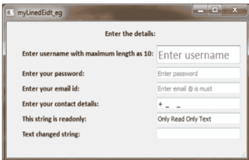

**图 8.35：** LineEdit/run_lineedit_eg1.py 的默认输出

**情况 1：** 当 LineEdit1 聚焦于输入用户名，且 LineEdit/run_lineedit_eg1.py 中的最大长度为 10 时。请参考下图：

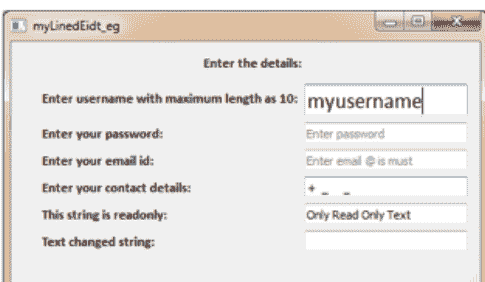

**图 8.36：** LineEdit/run_lineedit_eg1.py 的情况 1 输出。

**情况 2：** 当 LineEdit2 聚焦且用户需要在 LineEdit/run_lineedit_eg1.py 中输入密码时。请参考下图：

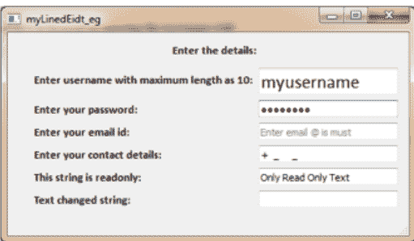

**图 8.37：** *LineEdit/run_lineedit_eg1.py 的情况 2 输出。*

**情况 3：** 当输入的电子邮件ID错误时，然后在 LineEdit3 中弹出消息，用于 LineEdit/run_lineedit_eg1.py。请参考下图：

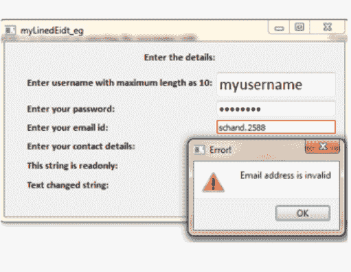

**图 8.38：** *LineEdit/run_lineedit_eg1.py 的情况 3 输出。*

**情况 4：** 当在 LineEdit3 中输入的电子邮件ID正确时，用于 LineEdit/run_lineedit_eg1.py。请参考下图：

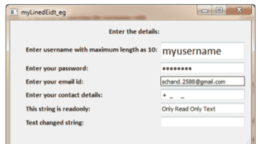

**图 8.39：** *LineEdit/run_lineedit_eg1.py 的情况 4 输出。*

**情况 5：** 当在 LineEdit4 中正确输入联系信息时。同时，在 LineEdit5 中显示只读文本。用户无法在上述 LineEdit 控件中编辑任何内容，用于 LineEdit/run_lineedit_eg1.py。请参考下图。

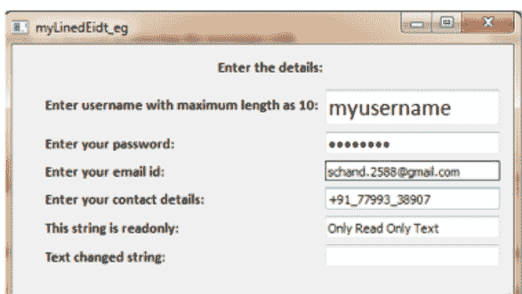

**图 8.40：** *LineEdit/run_lineedit_eg1.py 的情况 5 输出。*

**情况 6：** 当用户输入 hithere 文本时，LineEdit6 的 textchanged 事件被触发到一个方法，用于在 LineEdit/run_lineedit_eg1.py 中将文本显示到控制台。请参考下图：

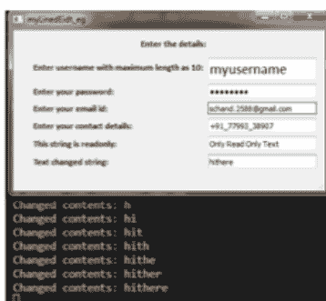

**图 8.41：** *LineEdit/run_lineedit_eg1.py 的情况 6 输出。*

> **注意：** 前面的代码包含在程序名称中：LineEdit/run_lineedit_eg1.py

# TextEdit

PyQt5 控件 `QTextEdit` 提供了一个多行文本区域，用于编辑和显示纯文本或 HTML 格式的文档。它包括撤销和重做功能，以及广泛的文本格式化选项，如粗体、斜体和下划线。它可用于开发简单的文本编辑器、电子邮件客户端以及其他需要编辑和显示文本功能的程序。

## 重要属性

现在让我们检查一些重要的属性。

### autoFormatting

此属性将决定是否启用 `QTextEdit` 对象的自动格式化功能，如文本完成、拼写纠正等。默认值为 **AutoNone**。要启用所有自动格式化，用户可以选择 **AutoAll**。请参考下图：

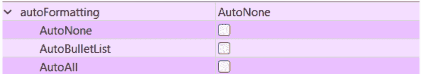

**图 8.42：** *描绘 Qt Designer 中 QTextEdit 的 autoFormatting 属性的图像*

## tabChangeFocus

按下 *Tab* 键时，此属性决定焦点是更改为下一个控件还是在 `QTextEdit` 对象中插入制表符。默认值为 **False**。请参考下图：

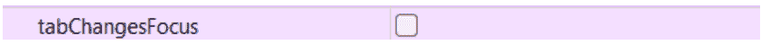

**图 8.43：** *描绘 Qt Designer 中 QTextEdit 的 tabChangeFocus 属性的图像*

## documentTitle

此属性将保存从文本中解析出的文档标题。对于新创建的空文档，此属性默认包含一个空字符串。请参考下图：

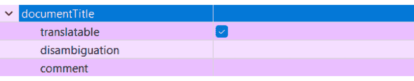

**图 8.44：** *描绘 Qt Designer 中 QTextEdit 的 documentTitle 属性的图像*

## undoRedoEnabled

此属性将决定是否启用撤销和重做等功能。默认值为 **True**。请参考下图：

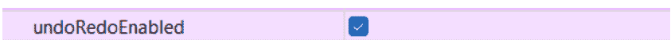

**图 8.45：** 描绘 Qt Designer 中 QTextEdit 的 undoRedoEnabled 属性的图像

## lineWrapMode

此属性将保存换行模式，并决定当文本到达行尾时的换行方式。默认模式为 **WidgetWidth**，单词将在 **QTextEdit** 对象的右边缘换行。请参考下图：

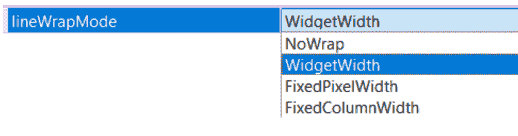

**图 8.46：** 描绘 Qt Designer 中 QTextEdit 的 lineWrapMode 属性的图像

## lineWrapColumnOrWidth

此属性将根据所选的换行模式，决定文本在 **QTextEdit** 对象中换行的位置（以像素或列为单位的宽度）。请参考下图：

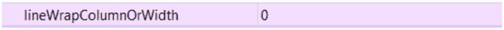

**图 8.47：** 描绘 Qt Designer 中 QTextEdit 的 lineWrapColumnOrWidth 属性的图像

#### readOnly

当此属性设置为 **True** 时，将使 `QTextEdit` 对象中的文本为只读，即无法编辑。默认值为 **False**。请参考下图：

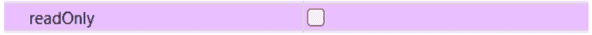

**图 8.48：** 描绘 Qt Designer 中 QTextEdit 的 readOnly 属性的图像

## html

为 `QTextEdit` 对象的文本提供了一个 HTML 接口。请参考下图：

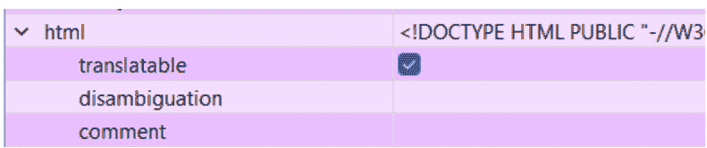

**图 8.49：** 描绘 Qt Designer 中 QTextEdit 的 html 属性的图像

## overwriteMode

设置此属性后，将用用户输入的文本覆盖现有文本。默认值为 **False**，表示新文本不会覆盖现有文本。请参考下图：

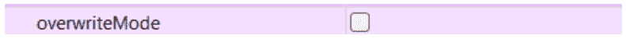

**图 8.50：** 描绘 Qt Designer 中 QTextEdit 的 overwriteMode 属性的图像

## tabStopWidth

此属性将保存 `tabStop` 的宽度（以像素为单位），默认值为 **80** 像素。请参考下图：

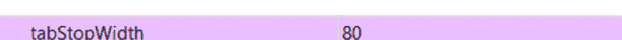

**图 8.51：** 描绘 Qt Designer 中 QTextEdit 的 tabStopWidth 属性的图像

## tabStopDistance

此属性将保存 tabStop 的距离（以像素为单位）。请参考下图：

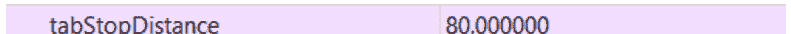

**图 8.52：** 描绘 Qt Designer 中 QTextEdit 的 tabStopDistance 属性的图像

## acceptRichText

此属性将决定 QTextEdit 对象是否接受富文本，如 HTML。默认值为 **True**。请参考下图：

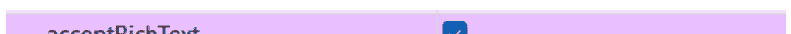

**图 8.53：** 描绘 Qt Designer 中 QTextEdit 的 acceptRichText 属性的图像

## cursorWidth

此属性将指定光标的宽度（以像素为单位），默认值为 1。请参考下图：

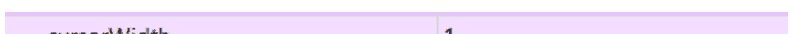

**图 8.54：** 描绘 Qt Designer 中 QTextEdit 的 cursorWidth 属性的图像

### textInteractionFlags

此属性将决定 QTextEdit 对象如何与鼠标和键盘事件交互。请参考下图：

## placeholderText

此属性将保存在 QTextEdit 对象未获得焦点且为空时显示的占位符文本。请参考下图：

**图 8.56：** *展示 Qt Designer 中 QTextEdit 的 placeholderText 属性的图片*

## 重要方法

让我们来看一些重要的方法：

- **append(text)：** 指定的字符串类型参数 **text** 被添加到 QTextEdit 对象当前文档的末尾。
- **insertHtml(text)：** 指定的字符串类型参数 **text** 被插入并格式化为 HTML，放置在 QTextEdit 对象的当前光标位置。
- **insertPlainText(text)**：指定的字符串类型参数 **text** 作为纯文本插入到 **QTextEdit** 对象的当前光标位置。
- **setCurrentFont(f)**：选中的文本字体或光标位置的文本被更改为参数 **f**，这是一个 **QFont** 对象。
- **clear()**：此方法将删除 **QTextEdit** 对象中的所有文本。
- **setPlainText(text)**：此方法将用指定的格式化为纯文本的 **text** 替换 **QTextEdit** 对象中的当前文本。
- **setHtml(text)**：此方法将用指定的通过提供 HTML 接口格式化的 **text** 替换 **QTextEdit** 对象中的当前文本。输入文本将被解释为 HTML 格式的富文本。

只需在所有讨论过的属性前加上 **set**，后跟参数即可。这将添加到方法列表中。我们只讨论了少数几个方法。

## 重要信号

一些重要的信号如下：

- **textChanged()**：当 **QTextEdit** 对象中的文本发生更改时，会发出此信号。
- **undoAvailable(b)**：当撤销操作的可用性发生变化时，会发出此信号。参数 **b** 是一个布尔值，指示撤销操作是否可用。
- **redoAvailable(b)**：当重做操作的可用性发生变化时，会发出此信号。参数 **b** 是一个布尔值，指示重做操作是否可用。
- **copyAvailable(b)**：当复制操作的可用性发生变化时，会发出此信号。参数 **b** 是一个布尔值，指示复制操作是否可用。

现在，我们将看一个 **QTextEdit** 小部件的示例。
文件名的详细信息在下面的 [表 8.5](#table-85) 中给出：

| 序号 | Qt Designer 文件名 (.ui) | 将 Qt Designer 文件名转换为 Python 文件 (.py) | 创建另一个 Python 文件并从 Qt Designer 导入转换后的 Python 文件 |
| :--- | :--- | :--- | :--- |
| 1 | textedit_eg1.ui | textedit_eg1.py | run_textedit_eg1.py |

**表 8.5**：文件名详情

Qt Designer 文件如下图所示：

> **注意**：上述 .ui 文件位于路径：TextEdit/textedit_eg1.ui

考虑以下 **run_textedit_eg1.py** 的代码：

```python
import sys
import re
from PyQt5.QtWidgets import QMainWindow, QApplication, QFontDialog
from textedit_eg1 import *

class MyTextEdit(QMainWindow):
    def __init__(self):
        super().__init__()
        self.myui = Ui_MainWindow()
        self.myui.setupUi(self)

        self.myui.mybtn1.clicked.connect(self.my_btn1)
        self.myui.mybtn2.clicked.connect(self.my_btn2)
        self.myui.mybtn3.clicked.connect(self.my_btn3)

        # replacing the text of TextEdit object with 'Hello'
        self.myui.textEdit.setText("Hello")

        self.show()

    def my_btn1(self):
        # prompting the user to select the font
        # family, font style, size
        myfont, imok = QFontDialog.getFont()
        # on pressing Ok replacing the text in the
        # TextEdit object with the selected font
        if imok:
            self.myui.textEdit.setCurrentFont(myfont)

    def my_btn2(self):
        # replacing the text of TextEdit object
        # with plain text on button click
        self.myui.textEdit.setPlainText("Hi Friends!\nWelcome to study PyQt5 textEdit widget")

    def my_btn3(self):
        # replacing the text of TextEdit object
        # with text formatted by providing an html interface
        # on button click
        self.myui.textEdit.setHtml("<font color='green' size='7'>Hi Friends!\nHello</font>")

if __name__ == "__main__":
    app = QApplication(sys.argv)
    screen = MyTextEdit()
    screen.show()
    sys.exit(app.exec_())
```

## 输出：

请参考下图：

## 默认输出：

*图 8.58：TextEdit/run_textedit_eg1.py 的默认输出*

**情况 1：** 首先选中 `QTextEdit` 内的文本，然后从 `QFontDialog` 中选择字体、字体样式和大小。

*图 8.59：TextEdit/run_textedit_eg1.py 的情况 1 输出*

**情况 2：** QTextEdit 内的文本根据从 QFontDialog 框中选择的内容进行更改。

*图 8.60：TextEdit/run_textedit_eg1.py 的情况 2 输出*

## **情况 3：** 点击 **设置纯文本** 按钮。

*图 8.61：TextEdit/run_textedit_eg1.py 的情况 3 输出*

## **情况 4：** 点击 **设置 HTML 文本** 按钮。

*图 8.62：TextEdit/run_textedit_eg1.py 的情况 4 输出*

> 注意：上述代码位于程序名称：TextEdit/run_textedit_eg1.py

## 纯文本编辑

QPlainTextEdit 小部件是一个多行文本编辑器，使得在 PyQt5 中查看和编辑纯文本变得简单。它提供了一些功能，如行号、文本换行、撤销/重做以及复制/粘贴。可以使用 setPlainText() 方法设置文本样式，使用 toPlainText() 方法获取文本。如果有应用程序需要显示纯文本内容，那么我们需要使用 QPlainTextEdit 小部件。否则，如果需要显示格式化文本，请使用 QTextEdit 小部件。

## 重要属性

大多数属性与 Text Edit 小部件相似。其他额外的属性在以下部分中解释。

## plainText

此属性将保存在 QPlainTextEdit 对象中显示的纯文本。QPlainTextEdit 中显示的文本可以通过此属性获取或设置。默认情况下，此对象包含一个空字符串。请参考下图：

*图 8.63：展示 Qt Designer 中 QPlainTextEdit 的 plainText 属性的图片*

## maximumBlockCount

此属性将确定 `QPlainTextEdit` 对象中可见的最大块数。如果将值设置为 **0** 或 **-1**，则 `QPlainTextEdit` 对象可以包含无限数量的块。请参考下图：

*图 8.64：展示 Qt Designer 中 QPlainTextEdit 的 maximumBlockCount 属性的图片*

## backgroundVisible

此属性确定调色板背景在文档区域外是否可见。默认值为 **False**。请参考下图：

*图 8.65：展示 Qt Designer 中 QPlainTextEdit 的 backgroundVisible 属性的图片*

## centerOnScroll

此属性将确定当 `QPlainTextEdit` 对象滚动时，光标是否会在屏幕上居中。默认值为 **False**。如果值为 **True**，文本将始终显示在小部件的中间，这会使视图居中。当值设置为 **False** 时，视图正常滚动，文本随小部件滚动而上下移动。请参考下图：

*图 8.66：展示 Qt Designer 中 QPlainTextEdit 的 centerOnScroll 属性的图片*

## 重要方法

大多数方法与 `QTextEdit` 控件的方法类似。我们将讨论其中一些有用的方法：

-   `appendPlainText(text)`：此方法会将给定的文本添加到 `QPlainTextEdit` 对象的末尾。
-   `insertPlainText(text)`：此方法会在 `QPlainTextEdit` 对象的当前光标位置插入给定的文本。
-   `setPlainText(text)`：此方法会使用给定的文本设置 `QPlainTextEdit` 对象的内容。
-   `clear()`：此方法会删除 `QPlainTextEdit` 对象的所有内容。
-   `toPlainText(text)`：此方法会返回 `QPlainTextEdit` 对象的内容。

## 重要信号

一些重要的信号如下：

-   `textChanged()`：当 `QPlainTextEdit` 对象中的文本发生更改时，会发出此信号。
-   `cursorPositionChanged()`：每当 `QPlainTextEdit` 对象中的光标位置发生变化时，都会发出此信号。
-   `blockCountChanged(newBlockCount)`：当 `QPlainTextEdit` 对象中的块数（即行数）发生变化时，会发出此信号。
-   `selectionChanged()`：当 `QPlainTextEdit` 对象的选择发生变化时，会发出此信号。

现在，我们将看一个 `QPlainTextEdit` 控件的示例。
文件名的详细信息在下表 8.6 中给出：

| 序号 | Qt Designer 文件名 (.ui) | 将 Qt Designer 文件名转换为 Python 文件 (.py) | 创建另一个文件并从 Qt Designer 导入转换后的 Python 文件 |
|---|---|---|---|
| 1 | plaintextedit_eg1.ui | plaintextedit_eg1.py | run_plaintextedit_eg1.py |

**表 8.6：** 文件名详情

Qt Designer 文件如下图所示：

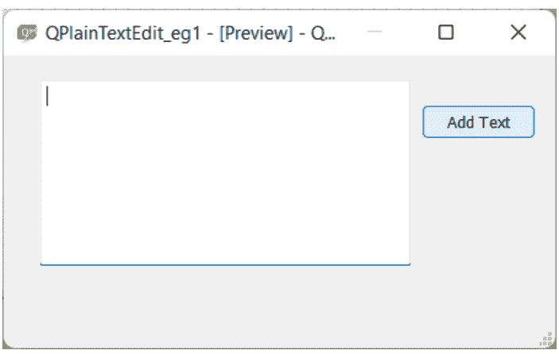

**图 8.67：** Qt Designer 文件：PlainTextEdit/plaintextedit_eg1.ui

> **注意：** 上述 .ui 文件位于路径：PlainTextEdit/plaintextedit_eg1.ui

考虑以下 **run_plaintextedit_eg1.py** 的代码：

```python
import sys
import re
from PyQt5.QtWidgets import QMainWindow,QApplication, QFontDialog
from plaintextedit_eg1 import *

class MyPlainTextEdit(QMainWindow):
    def __init__(self):
        super().__init__()
        self.myui = Ui_MainWindow()
        self.myui.setupUi(self)
        # setting the placeholder text in the QPlainTextEdit object

        self.myui.plainTextEdit.setPlaceholderText("Kindly enter any plain text")

        self.myui.plainTextEdit.textChanged.connect(self.mytextchanged)

        self.myui.plainTextEdit.cursorPositionChanged.connect(self.my_on_cursor_position_changed)

        self.myui.mybtn.clicked.connect(self.my_btn1)
        # Connecting the blockCountChanged signal to the my_on_block_count_changed slot

        self.myui.plainTextEdit.blockCountChanged.connect(self.my_on_block_count_changed)

        self.show()

    def my_btn1(self):
        # appending the text to QPlainTextEdit object
        self.myui.plainTextEdit.appendPlainText("Some Text is Added")

    def mytextchanged(self):
        self.myui.mylbl.setText("QPlainTextEdit signal is emitted")

    # Method for the cursorPositionChanged signal
    def my_on_cursor_position_changed(self):
        mycursor = self.myui.plainTextEdit.textCursor()
        print("Cursor position is changed to column no.:", mycursor.position())

    # Method for the blockCountChanged signal
    def my_on_block_count_changed(self, my_new_block_count):
        print("Block count changed to:", my_new_block_count)

if __name__ == "__main__":
    app = QApplication(sys.argv)
    screen = MyPlainTextEdit()
    screen.show()
    sys.exit(app.exec_())
```

## 输出：

参考下图：

## 默认输出：

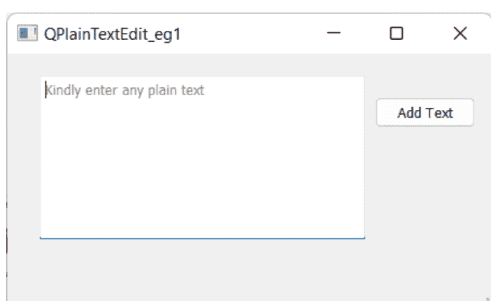

*图 8.68：PlainTextEdit/run_plaintextedit_eg1.py 的默认输出*

**情况 1：** 点击 **Add Text** 按钮时，会发出 `textChanged` 和 `cursorPositionChanged` 信号。

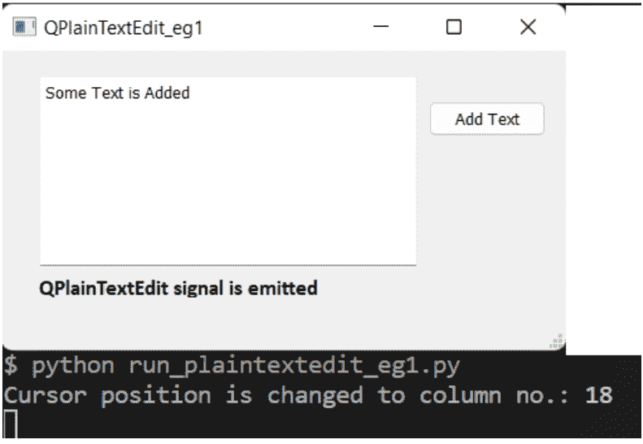

```
$ python run_plaintextedit_eg1.py
Cursor position is changed to column no.: 18
```

**图 8.69：** *PlainTextEdit/run_plaintextedit_eg1.py 的情况 1 输出*

**情况 2：** 再次点击 **Add Text** 按钮时，会发出所有三个信号：**textChanged**、**cursorPositionChanged** 和 **blockCountChanged**。

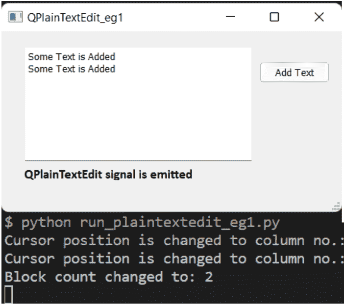

**图 8.70：** *PlainTextEdit/run_plaintextedit_eg1.py 的情况 2 输出*

> **注意：** 上述代码位于程序名称：PlainTextEdit/run_plaintextedit_eg1.py

## Spin Box

PyQt5 中的 Spin Box 控件允许用户通过按键盘的上、下箭头键或点击 **Up** 和 **Down** 按钮来选择一个值。用户可以直接输入数值，这些数值会显示在文本框中。此控件支持整数，并且可能是在指定范围内选择数值的一种便捷方式。

## 重要属性

一些重要的属性将在下一节中讨论。

## wrapping

当 **QSpinBox** 对象达到或触及最小值或最大值时，此属性决定它是否应该循环。要启用循环，将其设置为 **True**；要禁用它，将其设置为 **False**（默认值）。参考下图：

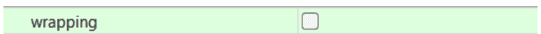

*图 8.71：展示 Qt Designer 中 QSpinBox 的 wrapping 属性的图片*

#### frame

此属性将决定 **QSpinBox** 对象是否应该有边框。默认值设置为 **checked**。参考下图：

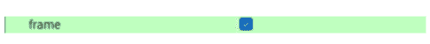

*图 8.72：展示 Qt Designer 中 QSpinBox 的 frame 属性的图片*

### alignment

此属性将设置 **QSpinBox** 对象内的内容对齐方式。参考下图：

| alignment | AlignLeft, AlignVCenter |
| :--- | :--- |
| 水平 | AlignLeft |
| 垂直 | AlignVCenter |

*图 8.73：展示 Qt Designer 中 QSpinBox 的 alignment 属性的图片*

#### readOnly

当设置为 **True** 时，此属性将允许 **QSpinBox** 对象为 **readOnly**。参考下图：

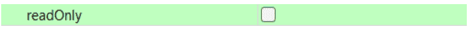

*图 8.74：展示 Qt Designer 中 QSpinBox 的 readOnly 属性的图片*

#### buttonSymbols

此属性将设置 QSpinBox 对象上下按钮中的符号。参考下图：

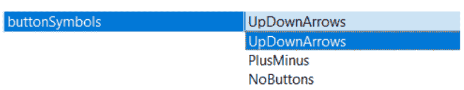

*图 8.75：展示 Qt Designer 中 QSpinBox 的 buttonSymbols 属性的图片*

#### specialValueText

当值设置为范围的最小值或最大值，并且对象处于特殊值模式时，此属性将在 QSpinBox 对象中设置并显示特殊值文本。参考下图：

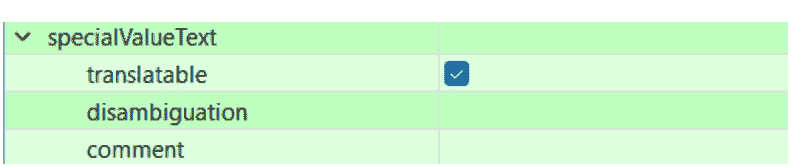

*图 8.76：展示 Qt Designer 中 QSpinBox 的 specialValueText 属性的图片*

#### accelerated

此属性将决定 QSpinBox 对象的值变化是否应该加速。参考下图：

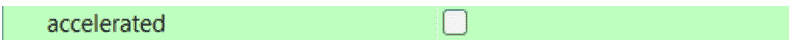

*图 8.77：展示 Qt Designer 中 QSpinBox 的 accelerated 属性的图片*

#### correctionMode

此属性将决定如果用户输入无效值，**QSpinBox** 对象的行为。参考下图：

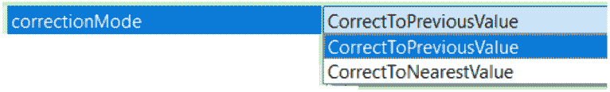

**图 8.78：** 展示 Qt Designer 中 QSpinBox 的 correctionMode 属性的图片

#### keyboardTracking

此属性将决定 **QSpinBox** 对象中键盘输入的跟踪。参考下图：

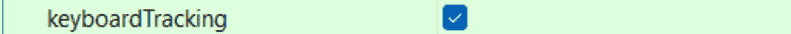

**图 8.79：** 展示 Qt Designer 中 QSpinBox 的 keyboardTracking 属性的图片

#### showGroupSeparator

此属性将决定 **QSpinBox** 对象是否应该显示分组分隔符。参考下图：

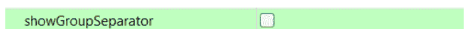

**图 8.80：** 展示 Qt Designer 中 QSpinBox 的 showGroupSeparator 属性的图片

#### suffix

此属性将设置一个字符串，该字符串将附加到 **QSpinBox** 对象的当前值之后。参考下图：

## 后缀

此属性将设置一个字符串，该字符串将附加到 **QSpinBox** 对象的当前值之后。请参考下图：

| | |
|---|---|
| 后缀 | |
| 可翻译 | ☑ |
| 消歧义 | |
| 注释 | |

**图 8.81：** *展示 Qt Designer 中 QSpinBox 后缀属性的图片*

## 前缀

此属性将设置一个字符串，该字符串将添加到 **QSpinBox** 对象的当前值之前。请参考下图：

| | |
|---|---|
| 前缀 | |
| 可翻译 | ☑ |
| 消歧义 | |
| 注释 | |

**图 8.82：** *展示 Qt Designer 中 QSpinBox 前缀属性的图片*

## 最小值

此属性将设置可在 **QSpinBox** 对象中输入的最小值。请参考下图：

| | |
|---|---|
| 最小值 | 0 |

**图 8.83：** *展示 Qt Designer 中 QSpinBox 最小值属性的图片*

## 最大值

此属性将设置可在 **QSpinBox** 对象中输入的最大值。请参考下图：

| | |
|---|---|
| 最大值 | 99 |

**图 8.84：** *展示 Qt Designer 中 QSpinBox 最大值属性的图片*

## 单步值

此属性将设置 **QSpinBox** 对象中值递增或递减的步长。请参考下图：

| 单步值 | 1 |
|---|---|

**图 8.85：** *展示 Qt Designer 中 QSpinBox 单步值属性的图片*

## 值

此属性将设置或返回 **QSpinBox** 对象的当前值。请参考下图：

| 值 | 0 |
|---|---|

**图 8.86：** *展示 Qt Designer 中 QSpinBox 值属性的图片*

## 显示整数基数

此属性将设置 **QSpinBox** 对象中值的显示基数。请参考下图：

| 显示整数基数 | 10 |
|---|---|

**图 8.87：** *展示 Qt Designer 中 QSpinBox 显示整数基数属性的图片*

## 重要方法

一些重要的方法如下：

- **setMinimum(min)：** 此方法将设置可在 **QSpinBox** 对象中输入的最小值，其中 **min** 参数是最小值。默认值为 **0**。
- **setMaximum(max)：** 此方法将设置可在 **QSpinBox** 对象中输入的最大值，其中 **max** 参数是最大值。默认值为 **99**。
- **setRange(min,max)**：此方法将在一次调用中设置 QSpinBox 对象的最小值和最大值。此处，min 参数是最小值，max 参数是最大值。
- **setValue(val)**：此方法将设置 QSpinBox 对象的当前值，其中 val 参数是要设置的值。
- **value()**：此方法将返回 QSpinBox 对象的当前值。
- **cleanText()**：此方法将返回 QSpinBox 对象的文本，不包括前缀/后缀或尾随/前导空格。
- **setDisplayIntegerBase(base)**：此方法设置 QSpinBox 对象值的显示基数。

## 重要信号

让我们讨论一个重要的信号。

### valueChanged(arg__1)

当 QSpinBox 对象的值通过输入新值或旋转滚轮而改变时，会发出此信号。arg__1 参数是整数类型，表示 QSpinBox 对象的新值。

现在，我们将看到一个 QSpinBox 小部件的示例。
文件名的详细信息在下面的 *表 8.7* 中给出：

| 序号 | Qt Designer 文件名 (.ui) | 将 Qt Designer 文件名转换为 Python 文件 (.py) | 创建另一个 Python 文件并从 Qt Designer 导入转换后的 Python 文件 |
| :--- | :--- | :--- | :--- |
| 1 | spinbox_eg1.ui | spinbox_eg1.py | run_spinbox_eg1.py |

**表 8.7：** 文件名详情

Qt Designer 文件如下图所示：

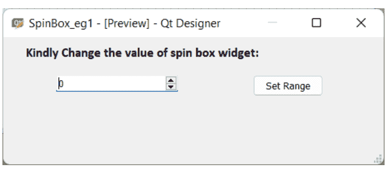

**图 8.88：** Qt Designer 文件：SpinBox/spinbox_eg1.ui

> **注意：** 上述 .ui 文件位于路径：SpinBox/spinbox_eg1.ui

考虑 **run_spinbox_eg1.py** 的以下代码：

```python
import sys
import re
from PyQt5.QtWidgets import QMainWindow,QApplication
from spinbox_eg1 import *

class MySpinBoxEdit(QMainWindow):
    def __init__(self):
        super().__init__()
        self.myui = Ui_MainWindow()
        self.myui.setupUi(self)

        # Setting the initial value
        self.myui.spinBox.setValue(0)

        # Setting the minimum value
        self.myui.spinBox.setMinimum(-2)

        # Setting the maximum value
        self.myui.spinBox.setMaximum(2)

        # signal is emitted when the QSpinBox
        # object value changes
        self.myui.spinBox.valueChanged.connect(self.my_valuechange)

        # signal is emitted on button click and
        # connected to the method my_btn1
        self.myui.mybtn.clicked.connect(self.my_btn1)

        self.show()

    def my_btn1(self):
        # Setting the range of values
        self.myui.spinBox.setRange(-3, 3)

    def my_valuechange(self,myval):
        self.myui.mylbl2.setText("My current value is:"+str(myval))

if __name__ == "__main__":
    app = QApplication(sys.argv)
    screen = MySpinBoxEdit()
    screen.show()
    sys.exit(app.exec_())
```

## 输出：

请参考下图：

## 默认输出：

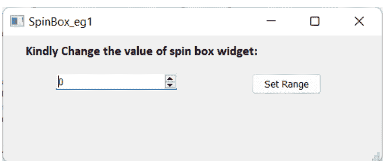

*图 8.89：SpinBox/run_spinbox_eg1.py 的默认输出*

**情况 1：** 当单击旋转框小部件的向上按钮时，其 `valueChanged` 信号被触发。

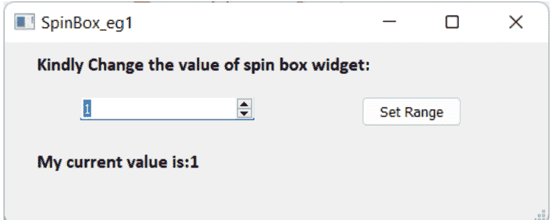

**图 8.90：** *SpinBox/run_spinbox_eg1.py 的情况1输出*

**情况 2：** 此处，多次单击旋转框小部件的向上按钮。小部件的最大值为 **2**。

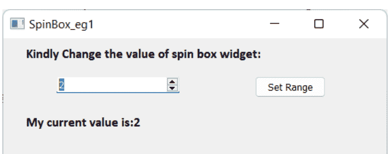

**图 8.91：** *SpinBox/run_spinbox_eg1.py 的情况2输出*

**情况 3：** 此处，多次单击旋转框小部件的向下按钮。小部件的最小值为 **-2**。

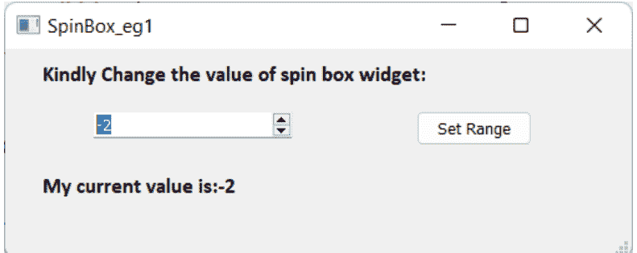

*图 8.92：SpinBox/run_spinbox_eg1.py 的情况3输出*

**情况 4：** 此处，单击“设置范围”按钮，将最大值和最小值分别设置为 3 和 -3。多次单击旋转框小部件的向下按钮。小部件的最小值为 -3。

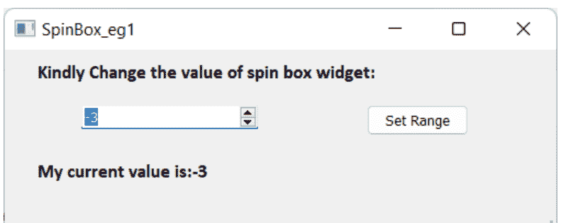

*图 8.93：SpinBox/run_spinbox_eg1.py 的情况4输出*

**情况 5：** 现在，多次单击旋转框小部件的向上按钮。小部件的最大值为 3。

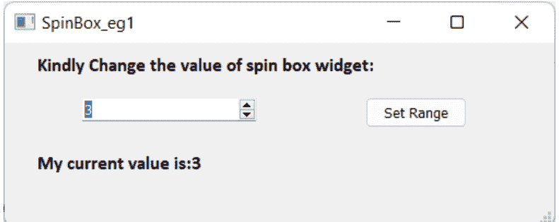

**图 8.94：** *SpinBox/run_spinbox_eg1.py 的情况5输出*

> **注意：** 上述代码位于程序名：SpinBox/run_spinbox_eg1.py

## 双精度旋转框

PyQt5 中的这个 `QDoubleSpinBox` 类允许用户通过使用键盘的上或下箭头键或直接输入文本字段来选择值。它是一个支持双精度类型值的旋转框小部件。

## 重要属性

双精度旋转框小部件的属性与旋转框小部件的属性相似。它有一个 `decimals` 属性代替 `displayIntegerBase`，并且 `minimum`、`maximum`、`value` 和 `singleStep` 属性的类型为 double。

### 小数位数

此属性将指定 `QDoubleSpinBox` 对象中显示的小数位数，即精度。请参考下图：

| 小数位数 | 2 |
|---|---|

图 8.95：展示 Qt Designer 中 QDoubleSpinBox 小数位数属性的图片

## 重要方法

所讨论的 QSpinBox 小部件的所有方法与 QDoubleSpinBox 小部件的方法几乎相同，除了一种方法。此小部件具有 `setDecimals()` 方法，而不是 `setDisplayIntegerBase()` 方法。

### setDecimals(prec)

此方法将设置 QDoubleSpinBox 对象中显示的小数位数。此处，prec 是一个整数参数，表示要显示的小数位数。

## 重要信号

让我们讨论一个重要的信号。

### valueChanged(arg__1)

当 QDoubleSpinBox 对象的值通过输入新值或旋转滚轮而改变时，会发出此信号。arg__1 参数是 double 类型，表示 QDoubleSpinBox 对象的新值。

现在，我们将看到一个 QDoubleSpinBox 小部件的示例。文件名的详细信息在下面的表 8.8 中给出：

| 序号 | Qt Designer 文件名 (.ui) | 将 Qt Designer 文件名转换为 Python 文件 (.py) | 创建另一个文件并从 Qt Designer 导入转换后的 Python 文件 |
|---|---|---|---|
| 1 | doublespinbox_eg1.ui | doublespinbox_eg1.py | run_doublespinbox_eg1.py |

表 8.8：文件名详情

Qt Designer 文件如下图所示：

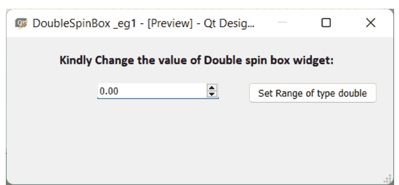

**图 8.96：** Qt Designer 文件：DoubleSpinBox/doublespinbox_eg1.ui

> **注意：上述 .ui 文件位于路径：DoubleSpinBox/doublespinbox_eg1.ui**

考虑以下 `run_doublespinbox_eg1.py` 的代码：

```python
import sys
import re
from PyQt5.QtWidgets import QMainWindow,QApplication
from doublespinbox_eg1 import *

class MyDoubleSpinBoxEdit(QMainWindow):
    def __init__(self):
        super().__init__()
        self.myui = Ui_MainWindow()
        self.myui.setupUi(self)

        # Setting the initial value of QDoubleSpinBox object
        self.myui.doubleSpinBox.setValue(0.10)

        # Setting the minimum value of QDoubleSpinBox object
        self.myui.doubleSpinBox.setMinimum(-1.10)

        # Setting the maximum value of QDoubleSpinBox object
        self.myui.doubleSpinBox.setMaximum(1.10)

        # Setting the step value to 0.2 of QDoubleSpinBox object
        self.myui.doubleSpinBox.setSingleStep(0.2)

        # signal is emitted when the QDoubleSpinBox object value changes
        self.myui.doubleSpinBox.valueChanged.connect(self.my_valuechange)

        # signal is emitted on button click and connected to the method my_btn1
        self.myui.my_btn.clicked.connect(self.my_btn1)

        self.show()

    def my_btn1(self):
        # Setting the range of values of QDoubleSpinBox object
        self.myui.doubleSpinBox.setRange(-2.10, 2.10)

    def my_valuechange(self, myval):
        # setting the label text when valueChanged signal is emitted
        self.myui.mylbl2.setText("My current value is:" + str(myval))

if __name__ == "__main__":
    app = QApplication(sys.argv)
    screen = MyDoubleSpinBoxEdit()
    screen.show()
    sys.exit(app.exec_())
```

## 输出：

参考下图：

## 默认输出：

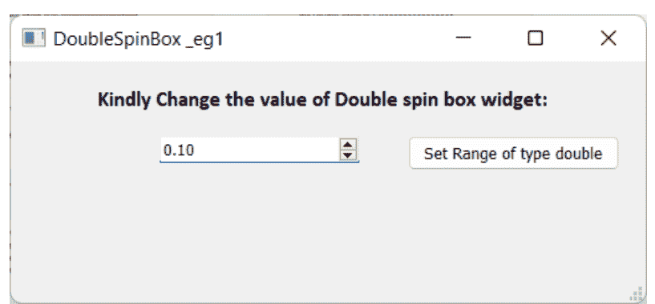

*图 8.97：DoubleSpinBox/run_doublespinbox_eg1.py 的默认输出*

**情况 1：** 当双精度微调框控件的“向上”按钮被点击一次时，会发出 `valueChanged` 信号。

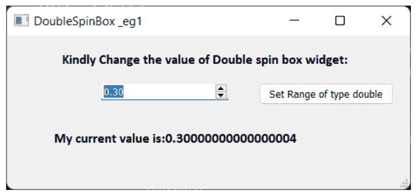

*图 8.98：DoubleSpinBox/run_doublespinbox_eg1.py 的情况 1 输出*

**情况 2：** 双精度微调框控件的“向上”按钮被多次点击，直至达到其最大值。该控件的最大值设置为 **1.10**。

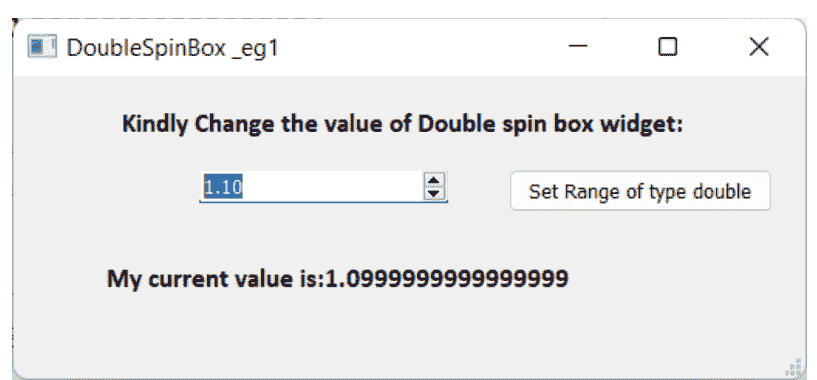

*图 8.99：DoubleSpinBox/run_doublespinbox_eg1.py 的情况 2 输出*

**情况 3：** 双精度微调框控件的“向下”按钮被多次点击，直至达到其最小值。该控件的最小值设置为 **-1.10**：

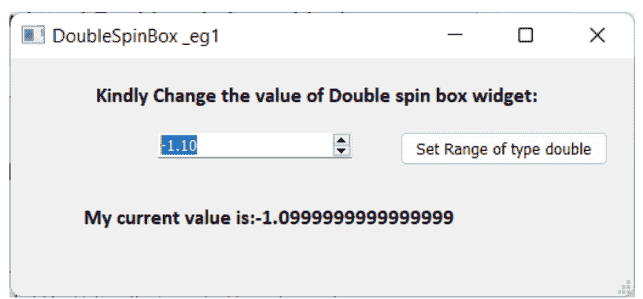

*图 8.100：DoubleSpinBox/run_doublespinbox_eg1.py 的情况 3 输出*

**情况 4：** 点击“设置双精度类型范围”按钮，将最大和最小范围分别设置为 **2.10** 和 **-2.10**。双精度微调框控件的“向下”按钮被多次点击，直至达到最小值。该控件的最小值设置为 **-2.10**。

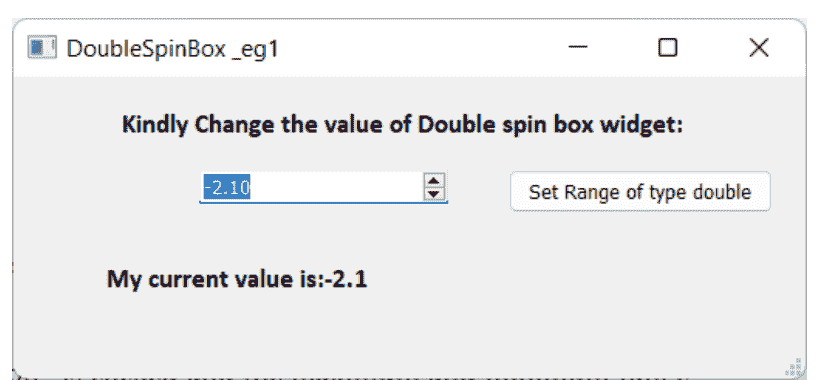

**图 8.101：** *DoubleSpinBox/run_doublespinbox_eg1.py 的情况 4 输出*

**情况 5：** 双精度微调框控件的“向上”按钮被多次点击，直至达到最大值。该控件的最大值设置为 **2.10**：

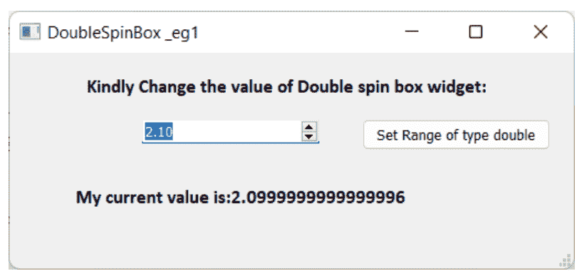

**图 8.102：** *DoubleSpinBox/run_doublespinbox_eg1.py 的情况 5 输出*

> **注意：** 上述代码位于程序名称：**DoubleSpinBox/run_doublespinbox_eg1.py**

## 日期/时间编辑

PyQt5 库中的 `QDateTimeEdit` 控件允许用户选择和编辑日期和时间值。`QDateTimeEdit` 支持多种显示格式，例如仅日期、仅时间和日期时间显示。用户可以选择从日历弹出窗口中选择值，也可以手动输入到控件中。该控件还包含一组用于调整值的有用控件，包括用于递增和递减日期和时间的向上和向下按钮。此外，`QDateTimeEdit` 提供了各种输入验证和用户交互功能，包括只读显示、逐步递增/递减值的能力、最小和最大日期时间等等。

## 重要属性

现在让我们讨论一些重要的属性。

### dateTime

此属性将保存在 `QDateTimeEdit` 对象中设置的日期和时间。默认值设置为公元 2000 年的开始，并且只能设置为有效的 `QDateTime` 值。参考下图：

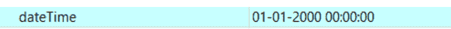

*图 8.103：描绘 Qt Designer 中 QDateTimeEdit 的 dateTime 属性的图像*

### date

此属性将保存控件中当前设置的日期。默认值设置为 **2000 年 1 月 1 日**。该对象是 `QDate`。参考下图：

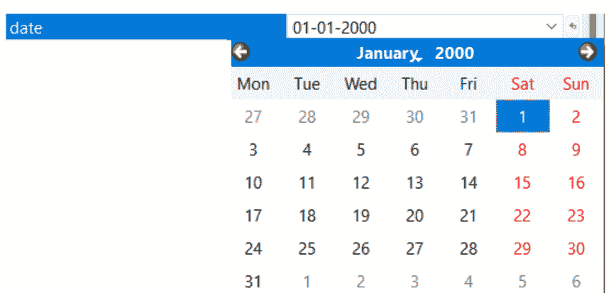

**图 8.104：** *描绘 Qt Designer 中 QDateTimeEdit 的 date 属性的图像*

### time

此属性将保存控件中当前设置的时间。默认值包含 **00:00:00** 和 0 毫秒。该对象是 `QTime`。参考下图：

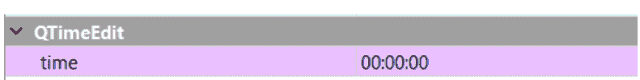

**图 8.105：** *描绘 Qt Designer 中 QDateTimeEdit 的 time 属性的图像*

### maximumDateTime

此属性将保存允许为 `QDateTimeEdit` 对象设置的最大日期和时间值。设置此属性时会调整 `minimumDateTime`。此属性只能设置为有效的 `QDateTime` 值。接受的最晚日期是公元 **9999** 年的结束。默认时间值为 **23:59:59** 和 999 毫秒。参考下图：

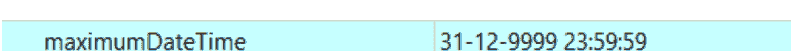

**图 8.106：** 描绘 Qt Designer 中 QDateTimeEdit 的 maximumDateTime 属性的图像

### minimumDateTime

此属性将保存允许为 QDateTimeEdit 对象设置的最小日期和时间值。设置此属性时会调整 maximumDateTime。此属性只能设置为有效的 QDateTime 值。接受的最早日期和时间是公元 **100** 年的开始。默认日期值为 **1752 年 9 月 14 日**，默认时间值为 **00:00:00** 和 0 毫秒。参考下图：

| minimumDateTime | 14-09-1752 00:00:00 |
|---|---|

**图 8.107：** 描绘 Qt Designer 中 QDateTimeEdit 的 minimumDateTime 属性的图像

### maximumDate

此属性将保存 QDateTimeEdit 对象的最大日期。默认值是公元 **9999** 年的结束。参考下图：

| maximumDate | 31-12-9999 |
|---|---|

**图 8.108：** 描绘 Qt Designer 中 QDateTimeEdit 的 maximumDate 属性的图像

### minimumDate

此属性将保存 QDateTimeEdit 对象的最小日期。默认值是 **1752 年 9 月 14 日**。参考下图：

| minimumDate | 14-09-1752 |
|---|---|

**图 8.109：** 描绘 Qt Designer 中 QDateTimeEdit 的 minimumDate 属性的图像

### maximumTime

此属性将保存 **QDateTimeEdit** 对象的最大时间。默认值是 **23:59:59** 和 999 毫秒。参考下图：

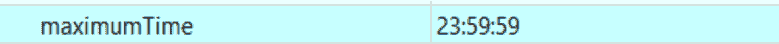

*图 8.110：* 描绘 Qt Designer 中 QDateTimeEdit 的 maximumTime 属性的图像

### minimumTime

此属性将保存 **QDateTimeEdit** 对象的最小时间。默认值是 **00:00:00** 和 0 毫秒。参考下图：

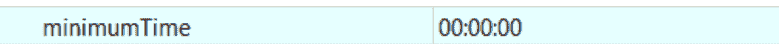

*图 8.111：* 描绘 Qt Designer 中 QDateTimeEdit 的 minimumTime 属性的图像

### currentSection

此属性将保存 **QDateTimeEdit** 对象中具有焦点的日期/时间部分，例如年、月、日、时、分或秒。参考下图：

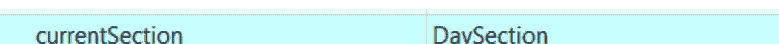

*图 8.112：* 描绘 Qt Designer 中 QDateTimeEdit 的 currentSection 属性的图像

### displayFormat

此属性将设置 **QDateTimeEdit** 对象中的日期和时间格式。默认格式是 **dd-MM-yyyy HH:mm**。参考下图：

## calendarPopup

当用户点击 `QDateTimeEdit` 控件时，此属性决定是否显示日历弹出窗口。启用弹出窗口后，用户可以从日历中选择日期，`QDateTimeEdit` 控件将相应更新。请参考下图：

| | |
|---|---|
| calendarPopup | ☐ |

**图 8.114：** *展示 Qt Designer 中 QDateTimeEdit 的 calendarPopup 属性的图片*

## currentSectionIndex

此属性返回 `QDateTimeEdit` 控件当前活动部分的索引。请参考下图：

| | |
|---|---|
| currentSectionIndex | 0 |

**图 8.115：** *展示 Qt Designer 中 QDateTimeEdit 的 currentSectionIndex 属性的图片*

## timeSpec

此属性设置 `QDateTimeEdit` 控件的时间规范，该规范确定时区以及是否使用夏令时。时间规范可以指定为本地时间、**协调世界时 (UTC)** 或特定时区。请参考下图：

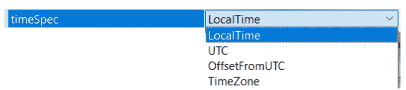

**图 8.116：** 展示 Qt Designer 中 QDateTimeEdit 的 timeSpec 属性的图片

## 重要方法/信号

上述控件的所有属性，如果在前面加上 `set` 一词，都可以用作方法。我们将讨论其中重要的几个：

- `dateTime()`：此方法将返回当前选定的日期和时间，作为一个 `QDateTime` 对象。
- `setMaximumDateTime(dt)`：此方法将设置 `QDateTimeEdit` 对象中可设置的最大日期和时间，它接受一个 `QDateTime` 对象作为参数。
- `dateChanged(date)`：当 `QDateTimeEdit` 对象中的日期发生变化时，会发出此信号。这里的 `date` 参数是一个代表新日期的 `QDate` 对象。
- `dateTimeChanged(dateTime)`：当 `QDateTimeEdit` 对象中的日期和时间发生变化时，会发出此信号。这里的 `dateTime` 参数是一个代表新日期和时间的 `QDateTime` 对象。
- `timeChanged(time)`：当 `QDateTimeEdit` 对象中的时间发生变化时，会发出此信号。这里的 `time` 参数是一个代表新时间的 `QTime` 对象。

现在，我们将看一个 `QDateTimeEdit` 控件的示例。
文件名的详细信息在下面的 *表 8.9* 中给出：

| 序号 | Qt Designer 文件名 (.ui) | 将 Qt Designer 文件名转换为 Python 文件 (.py) | 创建另一个 Py 文件并从 Qt Designer 导入转换后的 Python |
| :--- | :--- | :--- | :--- |
| 1 | datetimeedit_eg1.ui | datetimeedit_eg1.py | run_datetimeedit_eg1.py |

表 8.9：文件名详情

Qt Designer 文件如下图所示：

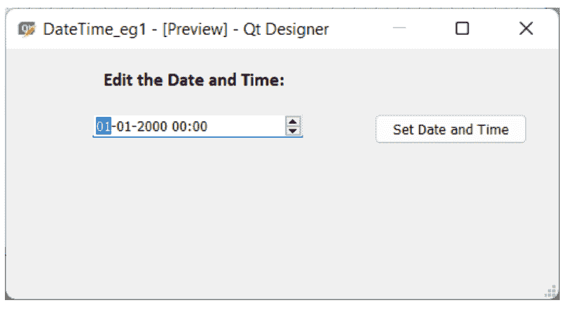

图 8.117：Qt Designer 文件：DateorTimeEdit/datetimeedit_eg1.ui

> 注意：上述 .ui 文件位于路径：DateorTimeEdit/datetimeedit_eg1.ui

考虑以下 run_datetimeedit_eg1.py 的代码：

```python
import sys

from PyQt5.QtWidgets import QMainWindow,QApplication

from PyQt5.QtCore import *

from datetimeedit_eg1 import *

class MyDateTimeEdit(QMainWindow):
    def __init__(self):
        super().__init__()
        self.myui = Ui_MainWindow()
        self.myui.setupUi(self)

        # setting the date and time for the widget
        self.myui.dateTimeEdit.setDateTime(QDateTime.currentDateTime())

        # Setting the display format for the QDateTimeEdit widget
        self.myui.dateTimeEdit.setDisplayFormat("yyyy-MM-dd hh:mm:ss")

        # Setting the calendar popup to be enabled
        self.myui.dateTimeEdit.setCalendarPopup(True)

        # Setting the maximum and minimum dates that can be selected
        self.myui.dateTimeEdit.setMaximumDate(QDate.currentDate().addYears(1))
        self.myui.dateTimeEdit.setMinimumDate(QDate.currentDate().addDays(-365))

        # Connecting the signals to their respective handlers
        self.myui.dateTimeEdit.timeChanged.connect(self.my_handle_time_changed)
        self.myui.dateTimeEdit.dateChanged.connect(self.my_handle_date_changed)
        # signal is emitted on button click and connected to the method my_btn1
        self.myui.mybtn.clicked.connect(self.my_btn1)

        self.show()

    def my_btn1(self):
        self.myui.mylbl2.setText("Displaying Date and Time to: " + str(self.myui.dateTimeEdit.dateTime()))

    def my_handle_time_changed(self, time):
        self.myui.mylbl2.setText("Time changed to: " + time.toString())

    def my_handle_date_changed(self, date):
        self.myui.mylbl2.setText("Date changed to: " + date.toString())

if __name__ == "__main__":
    app = QApplication(sys.argv)
    screen = MyDateTimeEdit()
    screen.show()
    sys.exit(app.exec_())
```

## 输出：

请参考下图：

## 默认输出：

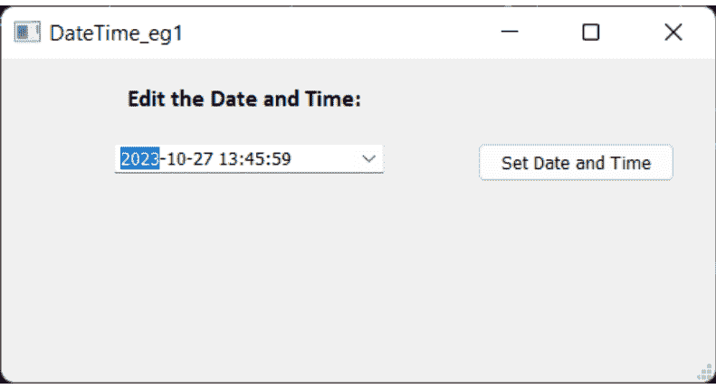

*图 8.118：DateorTimeEdit/run_datetimeedit_eg1.py 的默认输出*

### 情况 1：当日期改变时，发出 dateChanged 信号。

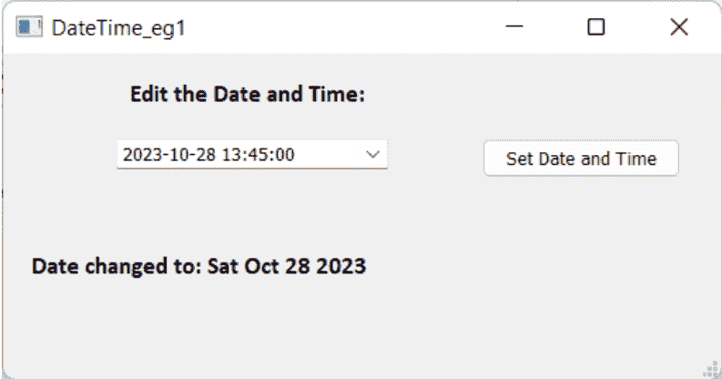

*图 8.119：DateorTimeEdit/run_datetimeedit_eg1.py 的情况 1 输出*

### 情况 2：当时间改变时，发出 `timeChanged` 信号。

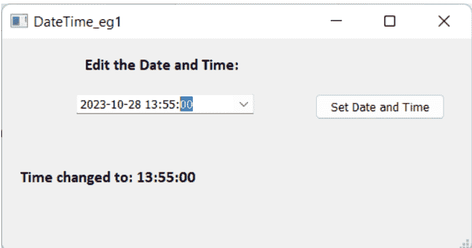

*图 8.120：DateorTimeEdit/run_datetimeedit_eg1.py 的情况 2 输出*

### 情况 3：当点击 **设置日期和时间** 按钮时，显示日期和时间。

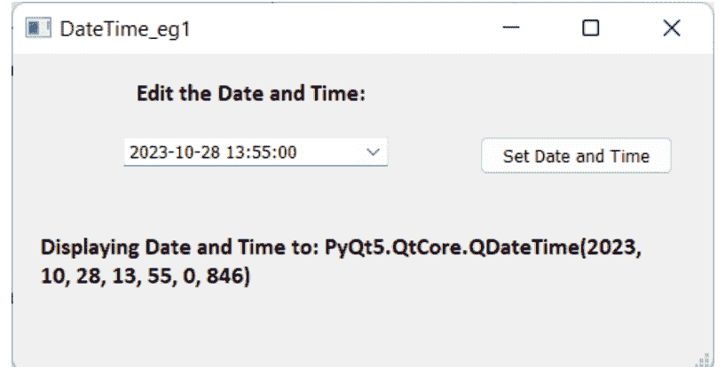

**图 8.121：** *DateorTimeEdit/run_datetimeedit_eg1.py 的情况 3 输出*

> **注意：** 上述代码位于程序名称：DateorTimeEdit/ run_datetimeedit_eg1.py 中。
我们可以根据应用程序需求从 Qt Designer 中选择时间编辑或日期编辑控件。其属性与 QDateTimeEdit 控件以及 QObject 和 QWidget 的属性相同。

## 旋钮 (Dial)

PyQt5 是一个用于构建图形用户界面的 Python 库，它有一个 `QDial` 控件。一个名为 `QDial` 的圆形旋钮可以旋转以从指定范围中选择一个值。它为用户提供了一种方便的方法来更改数值，例如亮度或音量设置。`QDial` 的功能，包括值范围、刻度线数量、旋钮外观以及对拖动和点击的响应方式，都可以进行自定义。`QDial` 的行为类似于滑块，因为它派生自 `QAbstractSlider`。

## 重要属性

`QAbstractSlider` 的属性将在下一节讨论。

### minimum

此属性将设置 `QDial` 对象的最小值。默认值为 **0**。请参考下图：

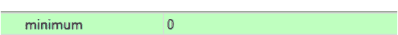

*图 8.122：展示 Qt Designer 中 QDial 的 minimum 属性的图片*

### maximum

此属性将设置 `QDial` 对象的最大值。默认值为 **99**。请参考下图：

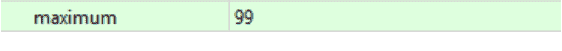

*图 8.123：展示 Qt Designer 中 QDial 的 maximum 属性的图片*

### singleStep

此属性将保存 `QDial` 对象单步操作的步长。默认值为 **1**。如果此属性设置为 5，那么旋转 `QDial` 对象时，‘value’ 属性将改变 5。请参考下图：

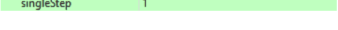

*图 8.124：展示 Qt Designer 中 QDial 的 singleStep 属性的图片*

### pageStep

此属性将保存 `QDial` 对象页面步进的步长。默认值为 **10**。如果此属性设置为 10，那么点击 `QDial` 对象的背景时，‘value’ 属性将改变 10。请参考下图：

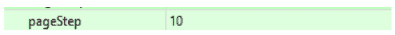

*图 8.125：展示 Qt Designer 中 QDial 的 pageStep 属性的图片*

### value

此属性将保存 `QDial` 对象的当前值，并且始终介于最小值和最大值之间。当 `QDial` 对象被点击或旋转时，它将被更新。默认值为 **0**。请参考下图：

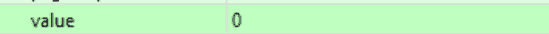

*图 8.126：* 展示 Qt Designer 中 QDial 的 value 属性的图片

### sliderPosition

此属性将保存 `QDial` 对象的当前位置值。请参考下图：

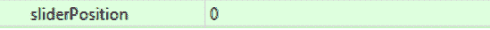

*图 8.127：* 展示 Qt Designer 中 QDial 的 sliderPosition 属性的图片

### tracking

此属性将决定旋钮的值是在移动时连续更新，还是仅在释放鼠标按钮时更新。启用跟踪时，`valueChanged` 信号会连续发出，并且旋钮的值在拖动时会更新。请参考下图：

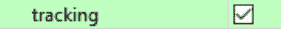

*图 8.128：* 展示 Qt Designer 中 QDial 的 tracking 属性的图片

### orientation

此属性将指定 `QDial` 对象的方向是垂直还是水平。请参考下图：

### invertedAppearance

此属性用于指定 `QDial` 对象的外观是否反转。默认值为 **False**。请参考下图：

**图 8.130：** 展示 Qt Designer 中 QDial 的 invertedAppearance 属性的图片

## invertedControls

此属性用于指定 `QDial` 对象的控件是否反转。默认值为 **False**。请参考下图：

**图 8.131：** 展示 Qt Designer 中 QDial 的 invertedControls 属性的图片

## QDial 的属性

`QDial` 的属性将在下一节讨论。

## wrapping

此属性决定是否启用环绕。启用后，`QDial` 对象上的箭头可以指向任何方向。如果禁用，箭头只能移动到 `QDial` 对象的顶部；如果移动到 `QDial` 对象的底部，它将被限制在最接近它的有效值范围的末端。请参考下图：

**图 8.132：** *展示 Qt Designer 中 QDial 的 wrapping 属性的图片*

## notchTarget

此属性保存刻度线之间的目标像素数。`QDial` 尝试在刻度线之间放置的像素数称为 `notchTarget`。默认值为 3.7 像素。请参考下图：

**图 8.133：** *展示 Qt Designer 中 QDial 的 notchTarget 属性的图片*

## notchesVisible

此属性决定 `QDial` 对象是否应显示刻度线。请参考下图：

**图 8.134：** *展示 Qt Designer 中 QDial 的 notchesVisible 属性的图片*

## 重要方法/信号

如果我们在所有 `QDial` 属性（即 wrapping、`notchTarget` 和 `notchesVisible`）前加上 `set` 一词，我们将得到相应的方法（`setwrapping(on)`、`setnotchTarget(target)`、`setNotchesVisible(visible)`）。当滑块移动时，`QDial` 对象将不断发出 `valueChanged()` 信号。

现在，我们将看一个 `QDial` 小部件的示例。

文件名的详细信息在下面的 *表 8.10* 中给出：

| 序号 | Qt Designer 文件名 (.ui) | 将 Qt Designer 文件名转换为 Python 文件 (.py) | 创建另一个 Python 文件并从 Qt Designer 导入转换后的 Python 文件 |
| :--- | :--- | :--- | :--- |
| 1 | dial_eg1.ui | dial_eg1.py | run_dial_eg1.py |

**表 8.10：** 文件名详情

Qt Designer 文件如下图所示：

**图 8.135：** Qt Designer 文件：Dial/dial_eg1.ui

> **注意：** 上述 .ui 文件位于路径：Dial/dial_eg1.ui

考虑以下 `run_dial_eg1.py` 的代码：

```python
import sys

from PyQt5.QtWidgets import QMainWindow, QApplication

from dial_eg1 import *

class MyDateTimeEdit(QMainWindow):
    def __init__(self):
        super().__init__()
        self.myui = Ui_MainWindow()
        self.myui.setupUi(self)
        # set the min and max values of the dial
        self.myui.dial.setRange(0, 100)
        # default value is set to 30
        self.myui.dial.setValue(30)

        # the dial will move by increment of 1
        self.myui.dial.setNotchTarget(1.0)

        # valueChanged signal will be emitted
        # continuously as the dial is rotated
        self.myui.dial.setTracking(True)

        # the dial value will wrap around from the
        # max value to the min value and vice versa
        self.myui.dial.setWrapping(True)

        # connecting the valueChanged signal of the
        # dial to my_labelupdate method
        self.myui.dial.valueChanged.connect(self.my_labelupdate)

        self.show()

    def my_labelupdate(self, myval):
        self.myui.mylbl1.setText("Value is: " + str(myval))

if __name__ == "__main__":
    app = QApplication(sys.argv)
    screen = MyDateTimeEdit()
    screen.show()
    sys.exit(app.exec_())
```

## 输出：

请参考下图：

> 注意：上述代码位于程序名：Dial/run_dial_eg1.py

## QScrollBar

现在让我们来了解 QScrollBar：

- 对于水平滚动条，类是 QScrollBar
    - 包含 QAbstractSlider 的属性。此处，orientation 的默认值为 Horizontal，并且 invertedControls 属性被选中。
- 对于垂直滚动条，类是 QScrollBar
    - 包含 QAbstractSlider 的属性。此处，orientation 的默认值为 Vertical，并且 invertedControls 属性被选中。

现在，我们将看一个 QScrollBar 小部件的示例。
文件名的详细信息在下面的表 8.11 中给出：

| 序号 | Qt Designer 文件名 (.ui) | 将 Qt Designer 文件名转换为 Python 文件 (.py) | 创建另一个 Python 文件并从 Qt Designer 导入转换后的 Python 文件 |
| :--- | :--- | :--- | :--- |
| 1 | scrollbar_eg1.ui | scrollbar_eg1.py | run_scrollbar_eg1.py |

**表 8.11：文件名详情**

Qt Designer 文件如下图所示：

**图 8.137：** Qt Designer 文件：Scrollbar/scrollbar_eg1.ui

> 注意：上述 .ui 文件位于路径：Scrollbar/scrollbar_eg1.ui

考虑以下 run_scrollbar_eg1.py 的代码：

```python
import sys
from PyQt5.QtWidgets import QApplication, QMainWindow, QTextEdit
from PyQt5.QtCore import Qt
from scrollbar_eg1 import *

class MyScrollbar(QMainWindow):
    def __init__(self):
        super().__init__()
        self.myui = Ui_MainWindow()
        self.myui.setupUi(self)

        # signal is emitted on button click and
        # connected to the method my_btn1
        self.myui.btn1.clicked.connect(self.my_btn1)
        self.myui.btn2.clicked.connect(self.my_btn2)
        self.myui.btn3.clicked.connect(self.my_btn3)

        # Set some initial text to show in the text edit
        self.myui.mytextEdit.setPlainText("PyQt5 is a Python binding for the Qt GUI toolkit, which allows developers to create desktop applications with rich graphical user interfaces. It provides access to a wide range of Qt classes and functions, making it possible to create applications that are portable across different platforms, including Windows, Linux, and macOS. PyQt5 also includes tools for creating custom widgets and interfaces, and supports advanced features like multithreading, network programming, and OpenGL. Overall, PyQt5 is a powerful and flexible framework for building desktop applications using Python. Tkinter is a built-in Python GUI (Graphical User Interface) toolkit that provides developers with a set of widgets, such as buttons, labels, text boxes, and menus, for building desktop applications. It is based on the Tcl/Tk GUI toolkit and provides a simple and easy-to-use interface for creating cross-platform applications that run on Windows, Linux, and macOS. With Tkinter, developers can create event-driven applications that respond to user input, such as mouse clicks and keyboard events. It also provides tools for creating custom dialogs, message boxes, and other types of pop-up windows. Tkinter supports a wide range of features, such as internationalization, drag-and-drop support, and support for various font types and colors. It also provides tools for creating animated graphics, simple games, and multimedia applications. Overall, Tkinter is a powerful and flexible toolkit for creating desktop applications using Python. Its simplicity and cross-platform support make it a popular choice for developers who want to create simple GUI applications without the overhead of more complex frameworks.")

    def my_btn1(self):
        # set the text wrap mode to NoWrap
        self.myui.mytextEdit.setLineWrapMode(QTextEdit.NoWrap)

    def my_btn2(self):
        # set the text wrap mode to WidgetWidth
        self.myui.mytextEdit.setLineWrapMode(QTextEdit.WidgetWidth)

    def my_btn3(self):
        # set the text wrap mode to FixedPixelWidth
        self.myui.mytextEdit.setLineWrapMode(QTextEdit.FixedPixelWidth)

if __name__ == '__main__':
    myapp = QApplication(sys.argv)
    mywidget = MyScrollbar()
    mywidget.show()
    sys.exit(myapp.exec_())
```

## 输出：

请参考下图：

## 默认输出：

## 情况1：点击“无换行模式”按钮时

*图8.139：Scrollbar/run_scrollbar_eg1.py 的情况1输出*

## 情况2：点击“控件宽度”按钮时：

*图8.140：Scrollbar/run_scrollbar_eg1.py 的情况2输出*

## 情况3：点击“固定像素宽度”按钮时：

*图8.141：Scrollbar/run_scrollbar_eg1.py 的情况3输出*

> 注意：前面的代码包含在程序名称：Scrollbar/run_scrollbar_eg1.py 中

## QSlider

现在让我们来了解 **QSlider**：

- 对于垂直和水平滑块，其类都是 **QSlider**。

## 重要属性

它包含了 **QAbstractSlider** 的属性。其他属性如下。

## tickPosition

此属性将控制 **QSlider** 对象中刻度线的位置（在滑块上放置的小标记，用于指示特定值）。默认值为 **NoTicks**。请参考下图：

**图8.142：** *在Qt Designer中描绘QSlider的tickPosition属性的图像*

## tickInterval

此属性将保存刻度线之间的值间隔，而不是像素间隔，即 **QSlider** 对象中刻度线之间的间距。默认值为 **0**。请参考下图：

**图8.143：** *在Qt Designer中描绘QSlider的tickInterval属性的图像*

## 重要方法/信号

一些重要的方法/信号如下：

- **valueChanged()**：当QSlider对象的值发生改变时，会发出此信号。
- **sliderPressed()**：当用户开始拖动QSlider对象时，会发出此信号。
- **sliderMoved()**：当用户拖动QSlider对象时，会发出此信号。
- **sliderReleased()**：当用户释放QSlider对象时，会发出此信号。

## 重要属性

这些属性和方法/信号与水平滑块中讨论的类似。

现在，我们将看一个QScrollBar控件的示例。

文件名的详细信息在下表8.12中给出：

| 序号 | 创建Python文件 |
|---|---|
| 1 | run_slider_eg1.py |

**表8.12：** 文件名详情

考虑以下 run_slider_eg1.py 的代码：

```python
import sys

from PyQt5.QtCore import Qt

from PyQt5.QtWidgets import QApplication,
QGridLayout, QLabel, QSlider, QWidget

from PyQt5.QtGui import QFont

class MySliderWidget(QWidget):

    def __init__(self):
        super().__init__()

        # Creating a label object for the horizontal slider
        myhlabel = QLabel('Horizontal')
        myhlabel.setAlignment(Qt.AlignCenter)

        # Creating a horizontal slider object
        myhslider = QSlider(Qt.Horizontal)
        myhslider.setFocusPolicy(Qt.NoFocus)
        myhslider.setRange(0, 100)
        myhslider.setValue(30)
        myhslider.setTickInterval(10)
        myhslider.setTickPosition(QSlider.TicksBelow)

        # Create a label object for the vertical slider
        myvlabel = QLabel('Vertical')
        myvlabel.setAlignment(Qt.AlignCenter)

        # Creating a vertical slider
        myvslider = QSlider(Qt.Vertical)
        myvslider.setFocusPolicy(Qt.NoFocus)
        myvslider.setRange(0, 100)
        myvslider.setValue(40)
        myvslider.setTickInterval(10)
        myvslider.setTickPosition(QSlider.TicksLeft)

        # Creating a label object to show the value
        # of the horizontal slider
        myhvalue = QLabel(str(myhslider.value()))
        myhvalue.setAlignment(Qt.AlignCenter)

        # creating a font object for myhvalue and
        # myvvalue
        myfont = QFont()
        myfont.setPointSize(12)
        myfont.setBold(True)
        myhvalue.setFont(myfont)

        # Creating a label object to show the value
        # of the vertical slider
        myvvalue = QLabel(str(myvslider.value()))
        myvvalue.setAlignment(Qt.AlignCenter)
        myvvalue.setFont(myfont)

        # Creating a grid object layout to organize the widgets
        mygrid = QGridLayout()
        mygrid.setSpacing(10)

        # Adding the horizontal slider and label object to the grid
        mygrid.addWidget(myhlabel, 0, 0)
        mygrid.addWidget(myhslider, 1, 0)
        mygrid.addWidget(myhvalue, 2, 0)

        # Adding the vertical slider and label object to the grid
        mygrid.addWidget(myvlabel, 0, 1)
        mygrid.addWidget(myvslider, 1, 1)
        mygrid.addWidget(myvvalue, 2, 1)

        # Connecting the valueChanged signal of myhslider object to its label obj myhvalue
        myhslider.valueChanged.connect(lambda value: myhvalue.setText(str(value)))

        # Connecting the valueChanged signal of myvslider object to its label obj myvvalue
        myvslider.valueChanged.connect(lambda value: myvvalue.setText(str(value)))

        self.setLayout(mygrid)

        self.setGeometry(400, 400, 400, 400)
        self.setWindowTitle('My Sliders and Labels eg')
        self.show()

if __name__ == '__main__':
    myapp = QApplication(sys.argv)
    myslider_widget = MySliderWidget()
    sys.exit(myapp.exec_())
```

## 输出：

请参考下图：

**图8.144：** *Slider/run_slider_eg1.py 的输出*

> **注意：** 前面的代码包含在程序名称：Slider/run_slider_eg1.py 中

## 键序列编辑

PyQt5中的此控件允许用户选择键盘快捷键，即输入一个 **QKeySequence**。当控件获得用户注意力时开始录制，并在最后一个键释放后一秒结束。

## 重要属性

现在让我们讨论一个重要的属性。

## keySequence

此属性用于设置 **QKeySequenceEdit** 对象所代表的键序列。请参考下图：

*图8.145：在Qt Designer中描绘QKeySequenceEdit的keySequence属性的图像*

## 重要方法/信号

一些重要的方法/信号如下：

- **setKeySequence(keySequence)**：此方法将设置 **QKeySequenceEdit** 对象中显示的键序列。参数 **keySequence** 是一个表示键序列的字符串。
- **keySequenceChanged** (keySequence)：当快捷键的键序列发生更改时，会发出此信号。参数 **keySequence** 是一个表示键序列的字符串。

考虑以下 **run_keysequenceedit_eg1.py** 的代码：

```python
import sys
from PyQt5.QtWidgets import QApplication,
QMainWindow, QKeySequenceEdit
from PyQt5.QtGui import QKeySequence
from PyQt5.QtCore import Qt

class MyKeySequence(QMainWindow):
    def __init__(self):
        super().__init__()

        # Create a QKeySequenceEdit widget
        self.my_key_edit = QKeySequenceEdit(self)

        self.my_key_edit.setKeySequence(QKeySequence(Qt.CTRL + Qt.Key_H))

        self.my_key_edit.keySequenceChanged.connect(self.my_handle_key_sequence_changed)
        self.setCentralWidget(self.my_key_edit)

    # Slot method called when the key sequence is changed
    def my_handle_key_sequence_changed(self, my_key_seq):
        print(f"My New key sequence: {my_key_seq.toString()}")

if __name__ == '__main__':
    myapp = QApplication(sys.argv)
    mywidget = MyKeySequence()
    mywidget.show()
    myapp.exec_()
```

## 输出：

请参考下图：

> **注意：** 前面的代码包含在程序名称：KeySequenceEdit/run_keysequenceedit_eg1.py 中

## 结论

在本章中，我们学习了Qt中各种输入控件的概念，以及如何有效地利用它们来创建交互式用户界面。完成本章后，读者对QLineEdit、QSpinBox、QComboBox、QTextEdit等输入控件有了扎实的理解，包括它们的特性、功能和自定义选项。我们探索了将这些输入控件整合到设计中所需的知识，使用户能够无缝地输入数据、选择选项并与程序交互。此外，本章涵盖了输入验证方法、处理用户输入事件以及连接信号与槽以实现所需功能等基本主题。通过掌握这些概念，用户现在可以使用Qt Designer中的输入控件开发简单且用户友好的界面，这些界面能有效收集用户输入并提供流畅的用户体验。

此外，本章还提供了带有实用注释的示例，展示了在Qt Designer中输入控件的实现。这些示例作为宝贵的资源，帮助读者有效理解每个输入控件的用法和应用。最终，用户获得了必要的技能和知识，能够自信地使用Qt Designer中的输入控件，从而创建满足项目需求的交互式且用户友好的界面。

## 需要记住的要点

- 用户可以在PyQt5的`QComboBox`控件中从下拉选项列表中进行选择。由于它显示当前选中的项目，因此占用的屏幕空间最少。当用户点击该控件时，会显示当前所有可用项目的列表。然后，用户可以从列表中选择一个项目。
- `QFontComboBox`控件是一个`combobox`，允许用户从系统字体列表中选择字体系列。
- `QLineEditWidget`用于显示文本或接受用户的文本输入。
- `QTextEdit`提供了一个多行文本区域，用于编辑和显示纯文本或HTML格式的文档。
- **QPlainTextEdit**控件是一个多行文本编辑器，可以轻松查看和编辑纯文本。
- PyQt5中的Spin Box控件允许用户通过按键盘的上下箭头键或点击上下按钮来选择一个值。
- **QDoubleSpinBox**控件是一个支持双精度类型值的**spinbox**控件。
- **QDateTimeEdit**控件将允许用户选择和编辑日期和时间值，支持多种显示格式，例如仅日期、仅时间和日期时间显示。
- 一个名为**QDial**的圆形表盘可以旋转以从指定范围中选择一个值，为用户提供了一种方便的方法来更改数值，如亮度或音量设置。
- **QKeySequence**将允许用户选择键盘快捷键。

## 问题

1.  解释Qt Designer系统中的任意五个输入控件。
2.  解释Qt Designer系统中日期和时间的输入方法。
3.  详细解释Combo Box控件的用法。
4.  解释Qt Designer系统中Combo Box控件的重要属性。
5.  解释Qt Designer系统中Combo Box控件的重要方法。
6.  解释Qt Designer系统中Combo Box控件的重要信号。
7.  比较Combo Box和Font Combo Box。
8.  解释Font Combo Box控件的重要属性。
9.  解释Font Combo Box控件的重要信号。
10. 哪个控件用于单行文本编辑？请详细解释。
11. 解释Line Edit控件的重要属性。
12. 解释Line Edit控件的重要信号。
13. 哪个控件用于多行文本编辑？请详细解释。
14. 解释Text Edit控件的重要属性。
15. 解释Text Edit控件的重要信号。
16. 解释Spin Box控件在Qt Designer的GUI设计中的重要性。
17. 解释Double Spin Box控件在Qt Designer的GUI设计中的用法。
18. 如何选择和编辑日期和时间值？解释用于此目的的控件。
19. 解释Qt Designer中的Key Sequence Edit控件。

## 加入我们的书籍Discord空间

加入书籍的Discord工作区，获取最新更新、优惠、全球科技动态、新书发布以及与作者的交流会：
https://discord.bpbonline.com


# 第9章
深入了解Qt Designer中的显示控件

## 简介

到目前为止，我们已经了解了如何使用Qt Designer中的不同控件创建GUI表单。在本章中，我们将讨论一些用于增强GUI图形表示及其体验的显示控件。

## 结构

在本章中，我们将讨论以下主题：

-   Qt Designer中显示控件简介
-   Label（标签）
-   Text browser（文本浏览器）
-   Calendar widget（日历控件）
-   LCD number（LCD数字）
-   Progress bar（进度条）

## 目标

阅读本章后，读者将对Qt Designer中的显示控件有透彻的理解。我们将学习如何使用标签显示静态文本或图像，并更改其字体、颜色、对齐方式和大小。此外，我们将讨论标签如何改善GUI的信息视觉呈现。我们将研究文本浏览器控件的功能，并学习如何显示和控制富文本内容。本章还讨论了向文本显示添加超链接、图形和格式化选项，使其变得动态和交互式。接下来，我们将探索如何向GUI应用程序添加日历控件。我们将发现如何自定义日历控件的外观、结构和行为，以满足特定的应用程序需求。我们将学习如何使用LCD Number控件显示数值，例如计数器，以及如何修改LCD数字控件的位数、小数精度、外观和样式。最后，我们探索进度条控件，以展示任务或操作的进展情况。我们将学习如何根据应用程序动态更新进度条。

## Qt Designer中的显示控件简介

这是关于Qt Designer的最后一章。在本章中，我们将讨论Qt Designer的一些显示控件。参考*图9.1*：

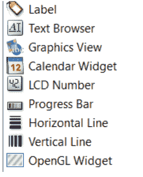

**图9.1：** *Qt Designer的不同输入控件*

我们将逐一讨论每个输入控件的重要性。

## Label

PyQt5中的`QLabel`控件是一个显示控件，用于在GUI表单页面上显示文本、图像或任何动画GIF。它可以通过显示**PlainText**、**RichText**或图像来通知用户。

## 重要属性

现在让我们检查一些重要属性。

### text

此属性将保存`QLabel`对象的文本。参考*图9.2*：

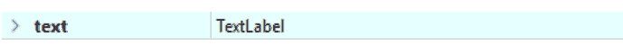

**图9.2：** *展示Qt Designer中QLabel的text属性的图像*

### textFormat

此属性将保存`QLabel`对象的文本格式。默认选择的格式是**AutoText**。参考*图9.3*：

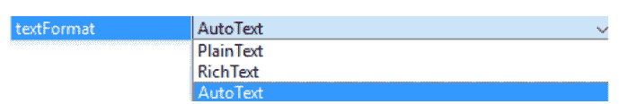

**图9.3：** 展示Qt Designer中QLabel的textFormat属性的图像

### pixmap

此属性将保存`QLabel`对象的**pixmap**。参考*图9.4*：

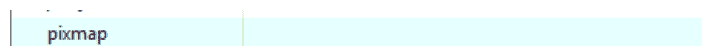

**图9.4：** 展示Qt Designer中QLabel的pixmap属性的图像

### scaledContents

此属性将保存`QLabel`对象是否将其内容缩放以填充所有可用空间。参考*图9.5*：

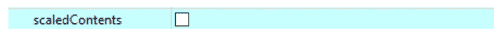

**图9.5：** 展示Qt Designer中QLabel的scaledContents属性的图像

### alignment

此属性将保存`QLabel`对象内容的对齐方式。参考*图9.6*：

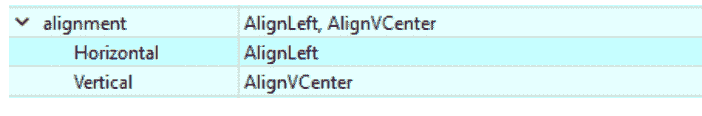

**图9.6：** 展示Qt Designer中QLabel的alignment属性的图像

### wordWrap

此属性将决定`QLabel`对象是否在必要的单词分隔处换行文本。默认值为**False**。参考以下*图9.7*：

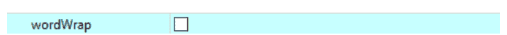

**图9.7：** 展示Qt Designer中QLabel的wordWrap属性的图像

### margin

此属性将保存围绕QLabel对象内容的边距宽度（框架最内层像素与内容最外层像素之间的间隔）。参考以下图9.8：

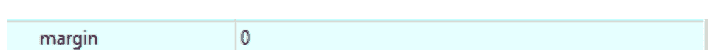

**图9.8：** 展示Qt Designer中QLabel的margin属性的图像

### indent

此属性将以像素为单位保存QLabel对象文本的缩进量。参考图9.9：

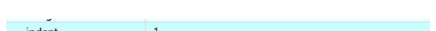

**图9.9：** 展示Qt Designer中QLabel的indent属性的图像

## openExternalLinks

此属性将指定QLabel对象是否应使用openUrl()自动打开外部链接，而不是发出linkActivated()信号。默认值为**False**。参考图9.10：

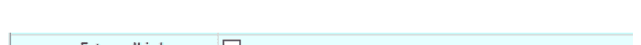

**图9.10：** 展示Qt Designer中QLabel的openExternalLinks属性的图像

### textInteractionFlags

此属性将描述如果QLabel对象显示文本，它应如何响应用户交互。参考以下图9.11：

## 好友

此属性将保存 `QLabel` 对象的好友部件。部件通过好友机制与另一个部件连接，以便它们可以组合使用。请参考以下 *图 9.12*：

**图 9.12：** 展示 Qt Designer 中 QLabel 好友属性的图片

## 重要方法/信号

让我们来看一些重要的方法和信号：

- `setText(arg__1)`：此方法将 `QLabel` 对象的文本设置为指定的 `参数 arg__1`，其类型为字符串。
- `setPixmap(arg__1)`：此方法将图像或 `pixmap` 设置到 `QLabel` 对象，指定的 `参数 arg__1` 是 `QPixmap` 对象。
- `setTextInteractionFlags(flags)`：此方法将设置 `QLabel` 对象的文本交互标志，这些标志将决定用户如何与 `QLabel` 对象中的文本进行交互。
- `linkActivated(link)`：当 `QLabel` 对象中的链接（被激活链接的 URL）被激活时，会发出此信号。
- `linkHovered(link)`：当鼠标悬停在 `QLabel` 对象中的链接上时，会发出此信号。

现在，我们将看到一个 `QLabel` 小部件的示例。
文件名的详细信息在 *表 9.1* 中给出：

| 序号 | Qt Designer 文件名 (.ui) | 将 QtDesigner 文件名转换为 Python 文件 (.py) | 创建另一个 Python 文件并从 Qt Designer 导入转换后的 Python 文件 |
| :--- | :--- | :--- | :--- |
| 1. | `label_eg1.ui` | `label_eg1.py` | `run_label_eg1.py` |

**表 9.1：** 文件名详情

Qt Designer 文件如 *图 9.13* 所示：

**图 9.13：** Qt Designer 文件：Label/label_eg1.ui

> **注意：** 上述 .ui 文件位于路径：Label/label_eg1.ui

考虑以下 **run_label_eg1.py** 的代码：

```python
import sys

from PyQt5.QtWidgets import QMainWindow, QApplication

from PyQt5.QtGui import QPixmap

from label_eg1 import *

class MyLabel(QMainWindow):
    def __init__(self):
        super().__init__()
        self.myui = Ui_MainWindow()
        self.myui.setupUi(self)

        # displaying rich text
        self.myui.mylbl1.setText("Displaying plain text.")

        # displaying rich text
        self.myui.mylbl2.setText("<font color='green'>Displaying rich text.</font>")

        self.myui.lineEdit.setText("Buddy with Label")
        # setting the buddy property of the label to the LineEdit object
        self.myui.mylbl2.setBuddy(self.myui.lineEdit)

        # displaying image
        self.myui.mylbl3.setPixmap(QPixmap("myimage.jpg"))
        self.show()

if __name__ == "__main__":
    app = QApplication(sys.argv)
    screen = MyLabel()
    screen.show()
    sys.exit(app.exec_())
```

## 输出：

请参考 *图 9.14*：

**图 9.14：** Label/run_label_eg1.py 的输出

> 注意：上述代码位于程序名称：Label/run_label_eg1.py

在此示例中，我们使用了 *水平* 和 *垂直* 线，它们是线条类。这些线通常用作分隔符，在视觉上划分 GUI 页面的各个部分。它们可用于将相关的小部件分组在一起，使表单更有条理且更易于导航。

## 文本浏览器

PyQt5 的 **QTextBrowser** 类提供了一个具有超文本导航功能的富文本浏览器。用户可以通过点击链接和选择文本来与文本进行交互，它用于显示格式化的文本，包括图像和链接。只读的 **QTextBrowser** 类扩展了 **QTextEdit** 类，并提供了更多用于显示和导航超文本的功能。它支持多种文本类型，包括纯文本、HTML 和 Markdown。可以使用 **层叠样式表 (CSS)** 和内联 HTML 标签来设置文本样式。

## 重要属性

它包含 **QTextEdit** 的属性。其他属性将在以下部分讨论。

## 源

可以使用此属性设置或获取 **QTextBrowser** 对象中显示的当前文档的 URL。**source()** 方法和 **setSource()** 方法都可用于获取和设置它。请参考以下 *图 9.15*：

**图 9.15：** 展示 Qt Designer 中 QTextBrowser 源属性的图片

## searchPaths

此属性将保存 QTextBrowser 对象用于搜索资源（如图像和文档）的搜索路径。请参考以下 *图 9.16*：

**图 9.16：** 展示 Qt Designer 中 QTextBrowser 源 searchPaths 的图片

## openExternalLinks

此属性决定指向外部 URL 的链接是在 QTextBrowser 对象内打开还是作为单独的应用程序打开。默认值为 **False**。请参考以下 *图 9.17*：

**图 9.17：** 展示 Qt Designer 中 QTextBrowser openExternalLinks 属性的图片

## openLinks

根据此属性，如果用户尝试使用鼠标或键盘激活链接，QTextBrowser 应自动打开这些链接。默认值为 **True**。请参考以下 *图 9.18*：

**图 9.18：** 展示 Qt Designer 中 QTextBrowser openLinks 属性的图片

## 重要方法/信号

让我们来看一些重要的方法和信号：

- `isBackwardAvailable()`：如果 `QTextBrowser` 对象中有可用的后退历史记录可供导航，则此方法将返回 **True**；否则返回 **False**。
- `isForwardAvailable()`：如果 `QTextBrowser` 对象中有可用的前进历史记录可供导航，则此方法将返回 **True**；否则返回 **False**。
- `anchorClicked(arg__1)`：当在 `QTextBrowser` 对象中点击超链接时，会发出此信号。
- `sourceChanged(arg__1)`：当 `QTextBrowser` 对象的源发生变化时，会发出此信号。

现在，我们将看到一个 `QTextBrowser` 小部件的示例。
文件名的详细信息在 *表 9.2* 中给出：

| 序号 | Qt Designer 文件名 (.ui) | 将 QtDesigner 文件名转换为 Python 文件 (.py) | 创建另一个 Python 文件并从 Qt Designer 导入转换后的 Python 文件 |
| :--- | :--- | :--- | :--- |
| 1. | textbrowser_eg1.ui | textbrowser_eg1.py | run_textbrowser_eg1.py |

**表 9.2：** 文件名详情

Qt Designer 文件如 *图 9.19* 所示：

**图 9.19：** Qt Designer 文件：TextBrowser/textbrowser_eg1.ui

> **注意：** 上述 .ui 文件位于路径：TextBrowser/textbrowser_eg1.ui

考虑以下 **run_textbrowser_eg1.py** 的代码：

```python
import sys
from PyQt5.QtWidgets import QMainWindow, QApplication
from PyQt5.QtGui import QTextCursor
from textbrowser_eg1 import *

class MyTextBrowser(QMainWindow):
    def __init__(self):
        super().__init__()
        self.myui = Ui_MainWindow()
        self.myui.setupUi(self)

        self.myui.textBrowser.setOpenExternalLinks(True)
        self.myui.textBrowser.setStyleSheet('font-size: 24px;')

        self.myui.btn.clicked.connect(self.my_btn_clickme)

        self.show()

    def my_btn_clickme(self):
        self.myui.textBrowser.moveCursor(QTextCursor.Start)
        self.myui.textBrowser.append('Displaying Bollywood movies list')
        self.myui.textBrowser.append('<a href=https://en.wikipedia.org/wiki/List_of_Hindi_films_of_2023>Bollywood Movies 2023</a>')

if __name__ == "__main__":
    app = QApplication(sys.argv)
    screen = MyTextBrowser()
    screen.show()
    sys.exit(app.exec_())
```

**输出：**
请参考以下 *图 9.20*：

## 日历控件

PyQt5 控件 `QCalendarWidget` 提供月历视图，并允许用户选择日期。可以使用上述控件显示事件、约会和其他基于时间的信息。该控件提供了众多自定义选项，包括选择一周的第一天、指定最小和最大日期范围，以及启用或禁用某些日期。可以通过编程方式检索选定的日期或范围，也可以通过控件发出的信号来实现。

## 重要属性

现在让我们探讨一些重要的属性。

### selectedDate

此属性视图将保存当前选定的日期，该日期必须在 `QCalendarWidget` 对象的 `minimumDate` 和 `maximumDate` 属性指定的 `dateRange` 内。请参考以下 *图 9.22*：

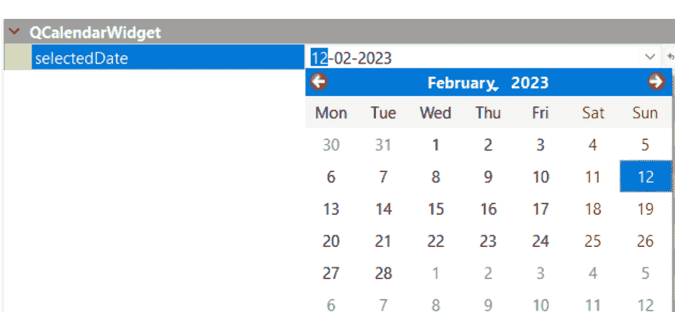

**图 9.22：** *描绘 Qt Designer 中 QCalendarWidget 的 selectedDate 属性的图像*

### minimumDate

此属性保存 **QCalendarWidget** 对象当前指定日期范围的最小日期。请参考以下 *图 9.23*：

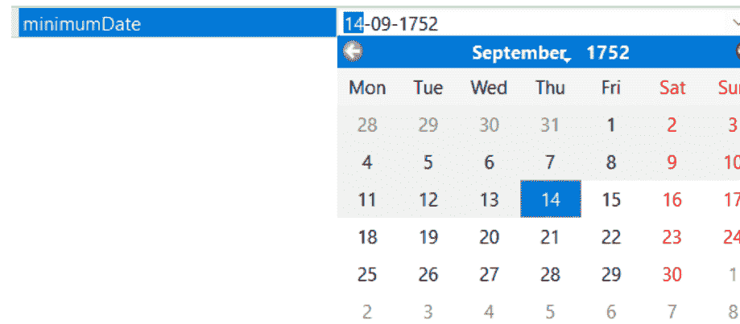

*图 9.23：* 描绘 Qt Designer 中 QCalendarWidget 的 minimumDate 属性的图像

### maximumDate

此属性保存 **QCalendarWidget** 对象当前指定日期范围的最大日期。请参考以下 *图 9.24*：

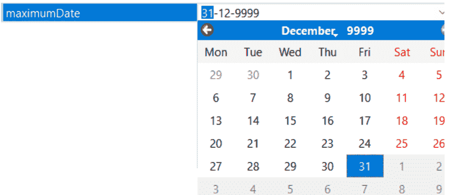

**图 9.24：** 描绘 Qt Designer 中 QCalendarWidget 的 maximumDate 属性的图像

### firstDayOfWeek

此属性将获取或设置 QCalendarWidget 对象中一周的第一天。请参考以下图 9.25：

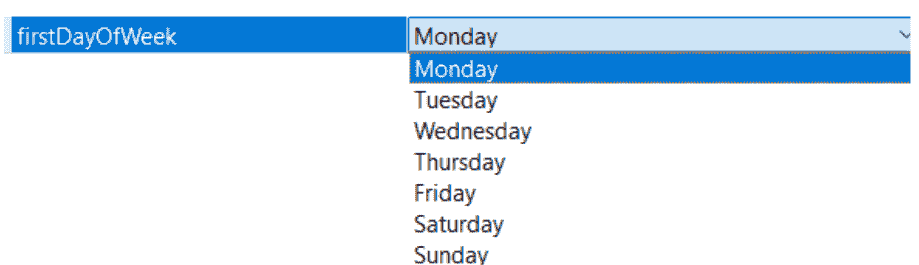

**图 9.25：** 描绘 Qt Designer 中 QCalendarWidget 的 firstDayOfWeek 属性的图像

### gridVisible

此属性将获取或设置 QCalendarWidget 对象中网格线的可见性。请参考以下图 9.26：


**图 9.26：** *描绘 Qt Designer 中 QCalendarWidget 的 gridVisible 属性的图像*

### selectionMode

此属性将保存用户在 **QCalendarWidget** 对象中可以进行的选择类型。用户在 **NoSelection** 模式下将无法选择日期，或者在 **SingleSelection** 模式下可以选择最小和最大允许日期范围内的一个日期。请参考以下 *图 9.27*：

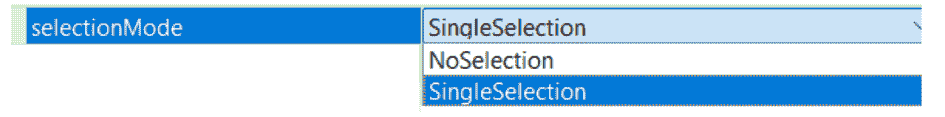

**图 9.27：** *描绘 Qt Designer 中 QCalendarWidget 的 selectionMode 属性的图像*

### horizontalHeaderFormat

此属性将获取或设置水平表头的格式。请参考以下 *图 9.28*：

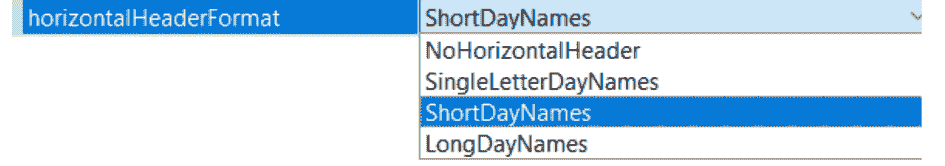

**图 9.28：** *描绘 Qt Designer 中 QCalendarWidget 的 horizontalHeaderFormat 属性的图像*

### verticalHeaderFormat

此属性将获取或设置垂直表头的格式。请参考以下 *图 9.29*：

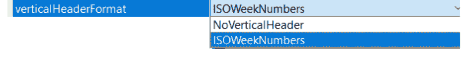

**图 9.29：** 描绘 Qt Designer 中 QCalendarWidget 的 verticalHeaderFormat 属性的图像

### navigationBarVisible

此属性将决定 QCalendarWidget 对象中是否显示导航栏。请参考以下图 9.30：

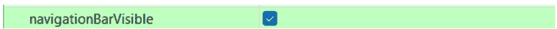

**图 9.30：** 描绘 Qt Designer 中 QCalendarWidget 的 navigationBarVisible 属性的图像

### dateEditEnabled

此属性决定日期编辑弹出窗口是否启用。请参考以下图 9.31：

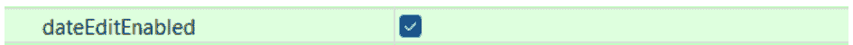

**图 9.31：** 描绘 Qt Designer 中 QCalendarWidget 的 dateEditEnabled 属性的图像

### dateEditAcceptDelay

此属性指定在最近一次用户输入后，日期编辑保持活动状态的时间延迟（默认值为 1500 毫秒）。时间一到，弹出窗口即关闭，从而接受日期编辑中指定的日期。请参考以下图 9.32：

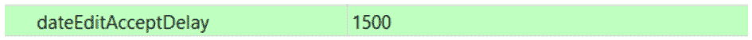

**图 9.32：** 描绘 Qt Designer 中 QCalendarWidget 的 dateEditAcceptDelay 属性的图像

## 重要方法/信号

只需在上述控件的属性前加上 *set* 一词，我们就能得到所需的方法。本节我们将讨论一个重要的信号。

### selectionChanged()

当用户更改 `QCalendarWidget` 对象中当前选定的日期时，会发出此信号。

现在，我们将看到一个 `QCalendarWidget` 的示例。

文件名的详细信息在以下 *表 9.3* 中给出：

| 序号 | Qt Designer 文件名 (.ui) | 将 QtDesigner 文件名转换为 Python 文件 (.py) | 创建另一个文件并在 Qt Designer 中导入转换后的 Python 文件 |
| :--- | :--- | :--- | :--- |
| 1. | calendarwidget_eg1.ui | calendarwidget_eg1.py | run_calendarwidget_eg1.py |

**表 9.3：** 文件名详情

Qt Designer 文件如 *图 9.33* 所示：

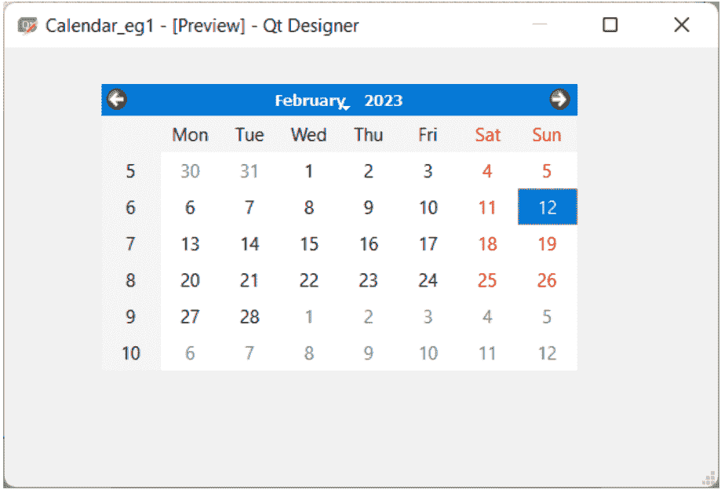

**图 9.33：** Qt Designer 文件：CalendarWidget/calendarwidget_eg1.ui

> **注意：** 上述 .ui 文件位于路径：CalendarWidget/calendarwidget_eg1.ui

考虑以下 run_calendarwidget_eg1.py 的代码：

```python
import sys
from PyQt5.QtWidgets import QMainWindow, QApplication
from calendarwidget_eg1 import *

class MyCalendarWidget(QMainWindow):
    def __init__(self):
        super().__init__()
        self.myui = Ui_MainWindow()
        self.myui.setupUi(self)

        # Connect the calendar's selectionChanged
        # signal to the update_label method
        self.myui.calendarWidget.selectionChanged.connect(self.my_display_date)

        self.show()

    # Define a method to set the label object text
    # with the selected date
    def my_display_date(self):
        self.myui.mylbl.setText('Selected date is: {}'.format(self.myui.calendarWidget.selectedDate().toString()))

if __name__ == "__main__":
    app = QApplication(sys.argv)
    screen = MyCalendarWidget()
    screen.show()
    sys.exit(app.exec_())
```

**输出：**
请参考以下 *图 9.34*：

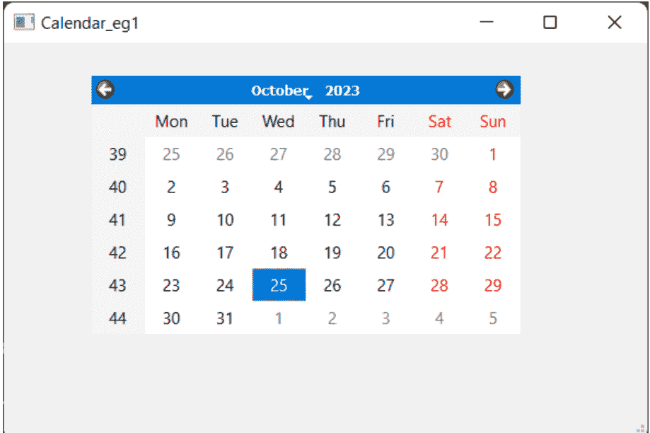

**图 9.34：** CalendarWidget/run_calendarwidget_eg1.py 的默认输出

**情况：** 当从 QCalendarWidget 对象中选择任何日期时，选定的日期将显示在标签控件中。

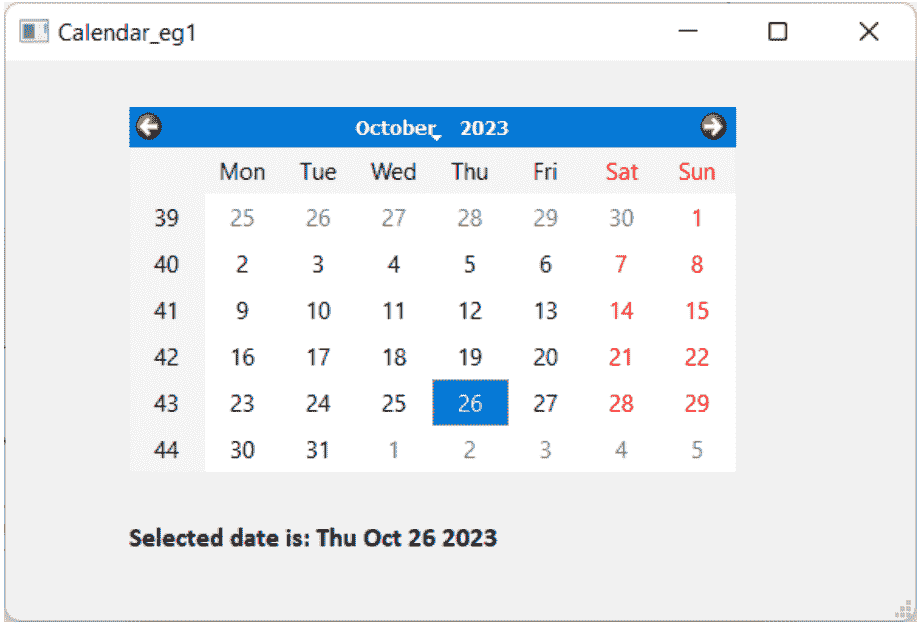

**图 9.35：** 从 QCalendar 控件对象中选择任何日期时 CalendarWidget/run_calendarwidget_eg1.py 的输出

> **注意：** 上述代码位于程序名：CalendarWidget/run_calendarwidget_eg1.py

## LCD 数字

PyQt5 控件 `QLCDNumber` 在七段 LCD 显示屏中显示数值。在 GUI 表单中，它通常用于显示数值数据，例如传感器、计时器和其他测量值。作为 `QFrame` 的子类，`QLCDNumber` 提供了许多方法和属性来控制 LCD 显示屏的外观和行为。

## 重要属性

现在让我们检查一些重要的属性。

### smallDecimalPoint

此属性将保存 **QLCDNumber** 对象的小数点样式。默认值为 **False**，表示小数点显示为大点。设置为 **True** 时，小数点显示为小点。请参考以下 *图 9.36*：

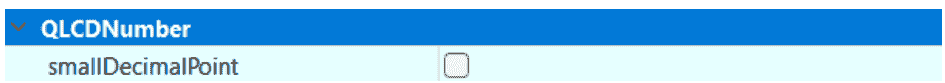

*图 9.36*：描绘 Qt Designer 中 QLCDNumber 的 smallDecimalPoint 属性的图像

### digitCount

此属性将设置 **QLCDNumber** 对象中当前显示的位数。默认值为 **5**。请参考以下 *图 9.37*：


*图 9.37*：描绘 Qt Designer 中 QLCDNumber 的 digitCount 属性的图像

### mode

此属性将设置 **QLCDNumber** 对象的当前显示模式，可以是十六进制、十进制、八进制或二进制。默认值为 **Dec**。请参考以下 *图 9.38*：

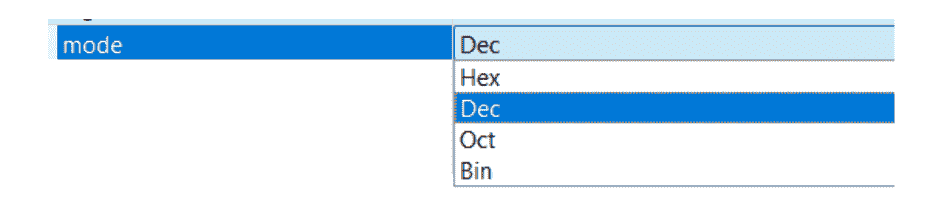

*图 9.38*：描绘 Qt Designer 中 QLCDNumber 的 mode 属性的图像

## segmentStyle

## segmentStyle

此属性将设置 **QLCDNumber** 对象的样式。当样式为 **Outline** 填充时，会产生背景色填充的凸起段。当样式为 **Filled**（默认值）时，会产生前景色填充的凸起段。当样式为 **Flat** 时，会产生前景色填充的平面段。请参考下图 *图 9.39*：

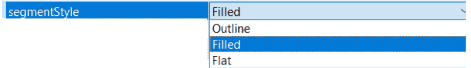

*图 9.39：* 描绘 Qt Designer 中 QLCDNumber 的 segmentStyle 属性的图像

### value

此属性将设置 **QLCDNumber** 对象中显示的数值。值可以是整数或浮点数。请参考下图 *图 9.40*：

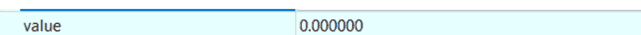

*图 9.40：* 描绘 Qt Designer 中 QLCDNumber 的 value 属性的图像

## intValue

此属性将被截断为最接近 **QLCDNumber** 对象当前显示值的整数。请参考下图 *图 9.41*：

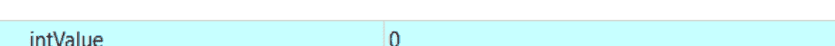

*图 9.41：* 描绘 Qt Designer 中 QLCDNumber 的 intValue 属性的图像

## 重要方法/信号

一个重要的方法/信号如下：

### display(num)

此方法将设置 QLCDNumber 对象中显示的数值。参数 num 可以是整数或双精度类型。

现在，我们将看到一个 QLCDNumber 小部件的示例。
文件名的详细信息在表 9.4 中给出：

| 序号 | Qt Designer 文件名 (.ui) | 将 Qt Designer 文件名转换为 Python 文件 (.py) | 创建另一个 Python 文件并从 Qt Designer 导入转换后的 Python 文件 |
| :--- | :--- | :--- | :--- |
| 1 | lcdnumber_eg1.ui | lcdnumber_eg1.py | run_lcdnumber_eg1.py |

表 9.4：文件名详细信息

Qt Designer 文件如图 9.42 所示：

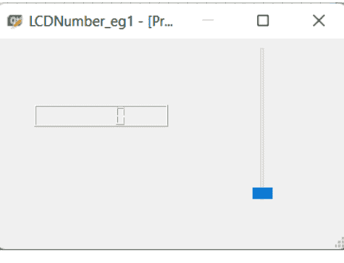

图 9.42：Qt Designer 文件：LCDNumber/lcdnumber_eg1.ui

> 注意：上述 .ui 文件位于路径：LCDNumber/lcdnumber_eg1.ui

考虑以下 run_lcdnumber_eg1.py 的代码：

```python
import sys
from PyQt5.QtWidgets import QMainWindow, QApplication, QLCDNumber
from lcdnumber_eg1 import *
class MyLCDNumber(QMainWindow):
    def __init__(self):
        super().__init__()
        self.myui = Ui_MainWindow()
        self.myui.setupUi(self)

        # Set the minimum and maximum values for the vertical slider
        self.myui.verticalSlider.setMinimum(0)
        self.myui.verticalSlider.setMaximum(100)
        self.myui.verticalSlider.setValue(0)

        # change the segment style to flat
        self.myui.lcdNumber.setSegmentStyle(QLCDNumber.Flat)

        # Connect the slider's valueChanged signal to the lcd's display slot
        self.myui.verticalSlider.valueChanged.connect(self.myui.lcdNumber.display)

        self.show()

if __name__ == "__main__":
    app = QApplication(sys.argv)
    screen = MyLCDNumber()
    screen.show()
    sys.exit(app.exec_())
```

**输出：**
请参考 *图 9.43*：

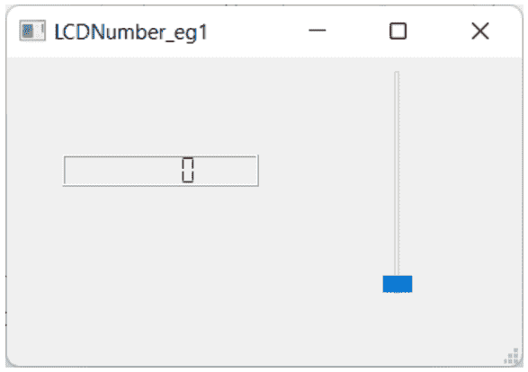

*图 9.43：LCDNumber/run_lcdnumber_eg1.py 的默认输出*
情况：当垂直滑块移动时，**LCDNumber** 小部件中显示的数值。

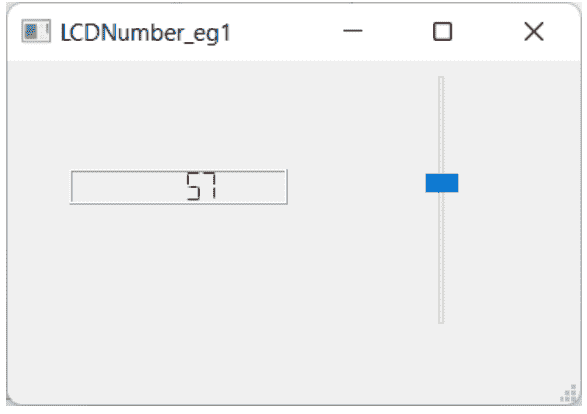

**图 9.44：** *当垂直滑块移动时 LCDNumber/run_lcdnumber_eg1.py 的输出。*

> **注意：** 上述代码位于程序名：LCDNumber/run_lcdnumber_eg1.py

## 进度条

在 PyQt5 中，QProgressBar 小部件用于显示操作的进度。它通常用于在用户必须等待操作完成时显示任务的状态，例如文件下载或数据传输。QProgressBar 小部件提供了一个视觉指示，显示操作的进度。只要操作在进行中，进度条的长度就会增长。此外，该小部件提供了一个标签，可用于显示描述正在执行的操作的消息。QProgressBar 小部件提供水平或垂直进度条。

## 重要属性

现在让我们检查一些重要的属性。

### minimum

此属性将保存 **QProgressBar** 对象的最小值。默认值为 **0**。请参考下图 *图 9.45*：

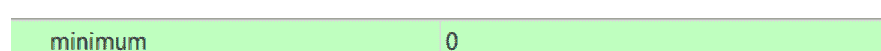

*图 9.45*：描绘 Qt Designer 中 QProgressBar 的 minimum 属性的图像

### maximum

此属性将保存 **QProgressBar** 对象的最大值。默认值为 **100**。请参考下图 *图 9.46*：

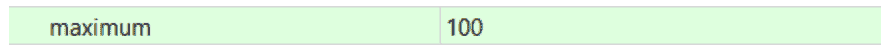

*图 9.46*：描绘 Qt Designer 中 QProgressBar 的 maximum 属性的图像

### value

此属性将保存 **QProgressBar** 对象的当前值。默认值为 **24**。请参考下图 *图 9.47*：

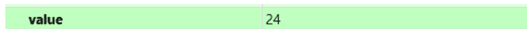

*图 9.47*：描绘 Qt Designer 中 QProgressBar 的 value 属性的图像

### alignment

此属性将表示 **QProgressBar** 对象的对齐方式。用户可以选择水平和垂直对齐的选项。请参考下图 *图 9.48*：

| alignment | AlignLeft, AlignVCenter |
| :--- | :--- |
| 水平 | AlignLeft |
| 垂直 | AlignVCenter |

**图 9.48：** 描绘 Qt Designer 中 QProgressBar 的 alignment 属性的图像

### textVisible

此属性将确定是否将 QProgressBar 对象的值显示为文本。默认值为 **True**。请参考下图 *图 9.49*：

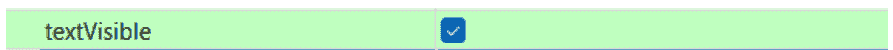

**图 9.49：** 描绘 Qt Designer 中 QProgressBar 的 textVisible 属性的图像

### orientation

此属性将表示 QProgressBar 对象的方向，可以设置为水平或垂直。默认值为 **Horizontal**。请参考下图 *图 9.50*：

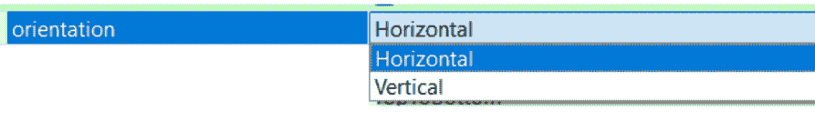

**图 9.50：** 描绘 Qt Designer 中 QProgressBar 的 orientation 属性的图像

### invertedAppearance

此属性将确定 QProgressBar 对象的外观是否应反转。默认值为 **False**。请参考下图 *图 9.51*：

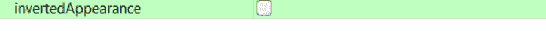

**图 9.51：** 描绘 Qt Designer 中 QProgressBar 的 invertedAppearance 属性的图像

### textDirection

此属性对水平 **QProgressBar** 对象没有影响，将保存垂直 **QProgressBar** 对象上的文本读取方向。默认值为 **TopToBottom**。请参考下图 *图 9.52*：

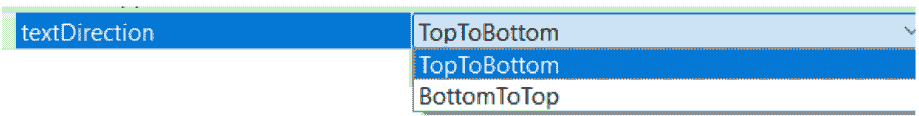

*图 9.52*：描绘 Qt Designer 中 QProgressBar 的 textDirection 属性的图像

### format

此属性将表示 **QProgressBar** 对象的文本格式，其中 %p 被替换为完成百分比，%m 表示总步数，%v 表示当前值。默认值为 %p%。请参考下图 *图 9.53*：

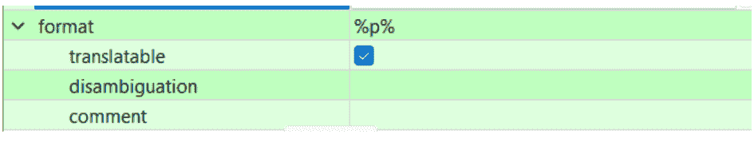

*图 9.53*：描绘 Qt Designer 中 QProgressBar 的 format 属性的图像

## 重要方法/信号

只需在上述小部件的属性前加上单词 *set*，我们就能得到所需的方法。对于上述小部件，我们有一个重要且有用的信号，即 **valueChanged()** 信号。

### valueChanged(value)

每当 **QProgressBar** 对象中的值以编程方式或由于用户交互而更改时，就会发出此信号。*value* 参数的类型为 int，是更改后 **QProgressBar** 对象的新值。

现在，我们将看到一个 QProgressBar 的示例。
文件名的详细信息在下表 9.5 中给出：

| 序号 | Qt Designer 文件名 (.ui) | 将 Qt Designer 文件名转换为 Python 文件 (.py) | 创建另一个 Python 文件并从 Qt Designer 导入转换后的 Python 文件 |
| :--- | :--- | :--- | :--- |
| 1 | progressbar_eg1.ui | progressbar_eg1.py | run_progressbar_eg1.py |

**表 9.5：** 文件名详细信息

Qt Designer 文件如下图 9.54 所示：

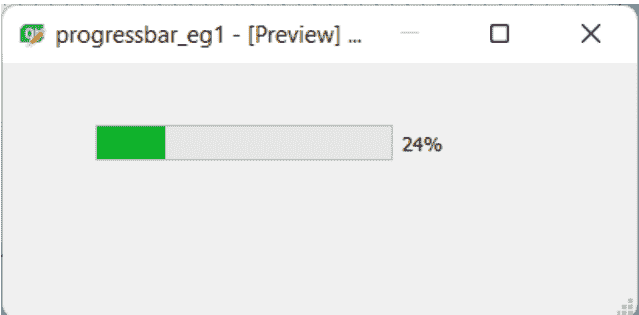

**图 9.54：** Qt Designer 文件：ProgressBar/progressbar_eg1.ui

考虑以下 run_progressbar_eg1.py 的代码：

```python
import sys

from PyQt5.QtWidgets import QMainWindow,QApplication

from progressbar_eg1 import *

class MyProgressBar(QMainWindow):
```

def __init__(self):
    super().__init__()
    self.myui = Ui_MainWindow()
    self.myui.setupUi(self)

def my_start_counting(self):
    self.myui.progressBar.setRange(0, 1000)
    self.myui.progressBar.setValue(0)
    for i in range(1, 1001):
        self.myui.progressBar.setValue(i)
        self.myui.mylbl.setText(f"Count No is: {i}")
        QApplication.processEvents() # 处理任何待处理的事件以更新UI

if __name__ == "__main__":
    app = QApplication(sys.argv)
    myprogress_bar_widget = MyProgressBar()
    myprogress_bar_widget.show()
    myprogress_bar_widget.my_start_counting()
    sys.exit(app.exec_())

**输出：**
请参考下图*图 9.55*：

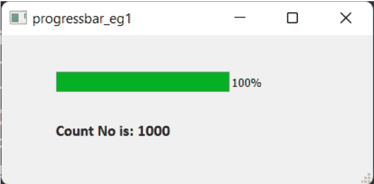

**图 9.55：** ProgressBar/run_progressbar_eg1.py 的输出

> **注意：** 上述代码包含在程序名：ProgressBar/run_progressbar_eg1.py 中

还有其他控件，如**图形视图**和**OpenGL**控件，读者可以自行探索。

## 结论

在本章中，我们学习了Qt中各种显示控件的概念，以及如何有效地利用它们来创建交互式用户界面。通过探索各种控件，我们获得了如何使用标签有效显示静态文本或图像的知识，以及自定义其字体、颜色、对齐方式和大小的能力。此外，我们认识到了标签在增强图形用户界面中信息视觉呈现方面的重要性。**文本浏览器**控件已被深入研究，使我们掌握了其显示和控制富文本内容的功能。我们学习了如何整合超链接、图形和格式选择，以创建动态和交互式的文本显示。这些知识为创建引人入胜且功能多样的用户界面开辟了机会。此外，本章还深入探讨了向GUI应用程序添加日历控件。通过了解如何自定义其外观、结构和行为，我们能够根据应用程序的具体需求定制日历控件。**LCD数字**控件被介绍为一种显示数值（如计数器）的方式，并具有修改其位数、小数精度、外观和样式的附加功能。该控件提供了一种视觉上吸引人且可定制的方式来向用户呈现数字数据。最后，我们探索了**进度条**控件，它使我们能够可视化任务或操作的进度。了解如何根据应用程序的需求动态更新进度条，可以实现有效的反馈和用户参与。掌握了这些知识，用户现在就能够创建视觉上吸引人、交互性强且功能完善的图形用户界面。

## 要点回顾

- PyQt5中的**QLabel**控件是一个显示控件，用于在GUI表单页面上显示文本、图像或任何动画GIF。
- PyQt5的**QTextBrowser**类提供了一个具有超文本导航功能的富文本浏览器。
- PyQt5控件**QCalendarWidget**提供月历视图，并允许用户选择日期，从而显示事件、约会和其他基于时间的信息。
- PyQt5控件**QLCDNumber**在七段LCD显示屏中显示数值。
- 在PyQt5中，**QProgressBar**控件用于显示操作的进度，也用于在用户必须等待操作完成（如文件下载或数据传输）时显示任务状态。

## 问题

1.  阐述Qt Designer中显示控件对GUI应用程序的重要性。
2.  列出Qt Designer的不同输入控件，并详细解释其中一种。
3.  哪种控件用于在GUI表单页面上显示文本、图像或任何动画GIF？请详细解释。
4.  解释Qt Designer中`Label`控件的`text`和`textFormat`属性。
5.  解释Qt Designer中`Label`控件的以下属性：
    a. `pixmap`
    b. `scaledContents`
    c. `alignment`
    d. `wordWrap`
    e. `margin`
    f. `indent`
    g. `openExternalLinks`
    h. `textInteractionFlags`
    i. `buddy`
6.  Qt Designer中`Label`的`setText(arg__1)`和`setPixmap(arg__1)`方法的目的是什么？
7.  解释Qt Designer中用于访问具有超文本导航功能的富文本浏览器的控件。
8.  阐述Qt Designer中文本浏览器控件中以下属性的用途：
    a. searchPaths
    b. source
    c. openExternalLinks
    d. openLinks
9.  解释以下方法在Qt Designer文本浏览器控件上下文中的重要性：
    a. isBackwardAvailable()
    b. isForwardAvailable()
    c. anchorClicked(arg_ _1)
    d. sourceChanged(arg_ _1)
10. Qt Designer中日历控件对GUI应用程序的目的是什么？请详细解释两个基本属性。
11. 解释如何在Qt Designer中设置最小和最大日期。
12. 解释Qt Designer中日历控件的以下属性：
    a. firstDayOfWeek
    b. gridVisible
    c. selectionMode
    d. horizontalHeaderFormat
    e. verticalHeaderFormat
    f. navigationBarVisible
13. 解释Qt Designer中用于显示数值数据（如传感器、计时器和其他测量值）的控件。
14. 阐述Qt Designer中`QLCDNumber`控件的`smallDecimalPoint`和`digitCount`属性的用途。
15. 解释Qt Designer中用于提供显示操作进度的视觉指示的控件。
16. 解释Qt Designer中的`QProgressBar`控件。
17. 阐述Qt Designer中`QProgressBar`控件以下属性的重要性：
    a. `textDirection`
    b. `format`
    c. `invertedAppearance`
    d. `orientation`

## 索引

### A

- 绝对定位
  - 用于控件放置 32-37

### B

- 按钮控件，Qt Designer 109
  - 复选框 136
  - 命令链接按钮 144
  - 通用属性 153
  - 对话框按钮框 147, 148
  - 下压按钮 110
  - 单选按钮 131
  - 工具按钮 121

### C

- 日历控件 382
  - dateEditAcceptDelay 属性 386
  - dateEditEnabled 属性 386
  - 示例 386-388
  - firstDayOfWeek 属性 384
  - gridVisible 属性 384
  - horizontalHeaderFormat 属性 385
  - 最大日期属性 384
  - 方法 386
  - minimumDate 属性 383
  - navigationBarVisible 属性 385
  - 属性 383
  - selectedDate 属性 383
  - selectionChanged() 信号 386
  - selectionMode 属性 385
  - 信号 386
  - verticalHeaderFormat 属性 385
- 层叠样式表 (CSS) 378
- 复选框控件 136
  - 应用 138-143
  - 方法 137
  - 属性 136
  - 信号 137
  - tristate 属性 136
- 列视图控件 191
  - 示例 191-194
  - 属性 191
  - resizeGripsVisible 属性 191
- 组合框控件 291
  - currentIndex 属性 292
  - currentText 属性 292
  - duplicatesEnabled 属性 293
  - editable 属性 291
  - 示例 295, 297
  - frame 属性 294
  - iconSize 属性 293
  - insertPolicy 属性 292
  - maxCount 属性 292
  - maxVisibleItems 属性 292
  - 方法 294
  - minimumContentsLength 属性 293
  - modelColumn 属性 294
  - 属性 291
  - 信号 294, 295
  - sizeAdjustPolicy 属性 293
- 命令链接按钮控件 144
  - 应用 145-147
  - 方法 144
  - 属性 144
  - setDescription 144
  - 信号 145
- 通用属性，按钮控件 153, 154
  - acceptDrops 160
  - accessibleDescription 161, 162
  - accessibleName 161
  - autoExclusive 166
  - autoFillBackground 162
  - autoRepeat 166
  - autoRepeatDelay 167
  - autoRepeatInterval 167
  - baseSize 157
  - checkable 165
  - checked 166
  - contextMenuPolicy 159, 160
  - cursor 158
  - enabled 154
  - focusPolicy 159
  - font 158
  - geometry 154, 155
  - icon 164, 165
  - iconSize 165
  - inputMethodHints 163
  - layoutDirection 162
  - locale 163
  - maximumSize 156, 157
  - minimumSize 156
  - mouseTracking 158, 159
  - objectName 154
  - palette 157, 158
  - shortcut 165
  - sizeIncrement 157
  - sizePolicy 155, 156
  - statusTip 161
  - stylesheet 162
  - tabletTracking 159
  - text 164
  - toolTip 160
  - toolTipDuration 160
  - whatsThis 161
- 容器控件，Qt Designer 239
  - 停靠控件 281
  - 框架控件 269
  - 分组框 240
  - MDI区域 275
  - 滚动区域 246
  - 堆叠控件 265
  - 选项卡控件 256
  - 工具箱 251
  - 控件 272

### D

- 日期/时间编辑控件 342
  - calendarPopup 属性 345
  - currentIndex 属性 345
  - currentSection 属性 345
  - date 属性 343
  - dateTime 属性 342
  - displayFormat 属性 345
  - 示例 346-350
  - maximumDate 属性 344
  - maximumDateTime 属性 343
  - maximumTime 属性 344
  - 方法 346

## minimumDate 属性 344
- minimumDateTime 属性 343, 344
- minimumTime 属性 344
- 属性 342
- 信号 346
- time 属性 343
- timeSpec 属性 346

## Dialog Button Box 小部件 147, 148
- 应用程序 150-153
- centerButtons 149
- 方法 149
- orientation 148
- 属性 148
- 信号 150
- standardButtons 148

## Dial 小部件 350
- 示例 353-356
- invertedAppearance 属性 352
- invertedControls 属性 352
- maximum 属性 351
- 方法 353
- minimum 属性 350
- orientation 属性 352
- pageStep 属性 351
- 属性 350
- 信号 353
- singleStep 351
- sliderPosition 属性 351
- tracking 属性 352
- value 属性 351

## 显示小部件，Qt Designer 372
- 日历小部件 382
- 标签 372
- LCD 数字 389
- 进度条 393
- 文本浏览器 378

## Dock 小部件 281
- allowedAreas 属性 282
- docked 属性 283
- dockWidgetArea 属性 282
- 示例 283-285
- features 属性 281
- floating 属性 281
- 方法 283
- 属性 281
- 信号 283
- windowTitle 属性 282

## Double Spin Box 小部件 337
- decimals 属性 337
- 方法 337
- 属性 337
- setDecimals(prec) 方法 338
- 信号 338
- valueChanged(arg__1) 信号 338-342

# E

事件 80-84

# F

## Font Combo Box 小部件 298
- currentFontChanged(QFont) 信号 299
- currentFont 属性 298
- 示例 299-301
- fontFilters 属性 298
- 方法 299
- 属性 298
- 信号 299
- writingSystem 属性 298

## Frame 小部件 269
- 方法 270-272
- 属性 270

# G

GNU 通用公共许可证 2

## Group Box 小部件 240
- alignment 属性 241
- checkable 属性 241, 242
- checked 属性 242
- flat 属性 241
- 方法 242
- 属性 241
- 信号 242-246
- title 属性 241

## GUI 表单创建
- 使用 PyQt5，带类 8-12
- 使用 PyQt5，不使用类 5-8

# I

## 输入小部件，PyQt5
- Combo Box 291
- Date/Time Edit 342
- Dial 350
- Double Spin Box 337
- Font Combo Box 298
- Key Sequence Edit 365
- Line Edit 301
- Plain Text Edit 322
- QScrollBar 356
- QSlider 361
- Spin Box 328
- TextEdit 313

## Item View 小部件，Qt Designer 171
- 列视图 191
- 数据呈现 172, 173
- 列表视图 173
- QAbstractItemView 197
- QAbstractScrollArea 196
- QFrame 194
- QStandardItemModel 204
- 表格视图 186
- 树视图 179, 180

## Item Widgets，Qt Designer 207, 208
- 列表小部件 208
- 表格小部件 227
- 树小部件 218

# K

## Key Sequence Edit 小部件 365
- 示例 366, 367
- keySequence 属性 365
- 方法 366
- 属性 365
- 信号 366

# L

## Label 小部件 372
- alignment 属性 374
- buddy 属性 375
- 示例 376-378
- indent 属性 374
- margin 属性 374
- 方法 375
- openExternalLinks 属性 374
- pixmap 属性 373
- 属性 373
- scaledContents 属性 373
- signals 属性 375
- textFormat 属性 373
- textInteractionFlags 属性 375
- text 属性 373
- wordWrap 属性 374

## 布局管理，在 PyQt5 中
- 小部件放置，使用绝对定位 32-37
- 小部件放置，使用布局类 37

## LCD 数字小部件 389
- digitCount 属性 389
- display(num) 方法 391
- 示例 391-393
- intValue 属性 390
- 方法 391
- mode 属性 389
- 属性 389
- segmentStyle 属性 390
- 信号 391
- smallDecimalPoint 属性 389
- value 属性 390

## Line Edit 小部件 301
- alignment 属性 304
- clearButtonEnabled 属性 305
- cursorMoveStyle 属性 305
- cursorPosition 属性 304
- dragEnabled 属性 304
- echoMode 属性 303
- 示例 306-312
- frame 属性 303
- inputMask 属性 302
- maxLength 属性 303
- 方法 305, 306
- placeholderText 属性 305
- 属性 302
- readOnly 属性 304
- 信号 306
- text 属性 303

## 列表视图小部件 173
- batchSize 属性 176
- 示例 177-179
- flow 属性 174
- gridSize 属性 175
- isWrapping 属性 174
- layoutMode 属性 174
- 方法 176, 177
- modelColumn 属性 175
- movement 属性 173
- 属性 173
- resizeMode 属性 174
- selectionRectVisible 属性 176
- 信号 177
- spacing 属性 175
- uniformItemSizes 属性 176
- viewMode 属性 175
- wordWrap 属性 176

## 列表小部件 208
- currentRow 属性 208
- 示例 209-218
- 方法 209
- 属性 208
- 信号 209
- sortingEnabled 属性 209

# M

## MDI Area 小部件 275
- activationOrder 属性 275
- background 属性 275
- documentMode 属性 276
- 示例 278-280
- 方法 277, 278
- 属性 275
- 信号 278
- subWindowActivated(arg__1) 信号 278
- tabPosition 属性 277
- tabsClosable 属性 276
- tabShape 属性 277
- tabsMovable 属性 276
- viewMode 属性 276

- 模型-视图-控制器 (MVC) 模式 171
- 多文档界面 (MDI) 窗口 275

# P

## Plain Text Edit 小部件 322
- backgroundVisible 属性 323
- centerOnScroll 属性 323
- 示例 324-327
- maximumBlockCount 属性 323
- 方法 324
- plainText 属性 322
- 属性 322
- 信号 324

## 预定义模板
- Qt Designer 安装，带模板 13-15

## 进度条小部件 393
- alignment 属性 394
- format 属性 396
- invertedAppearance 属性 395
- maximum 属性 394
- 方法 396
- minimum 属性 394
- orientation 属性 395
- 属性 394
- 信号 396
- textDirection 属性 395
- textVisible 属性 395
- valueChanged(value) 信号 396-398
- value 属性 394

## Push Button 小部件 110, 111
- autoDefault 属性 111
- default 属性 111, 112
- 示例 113-120
- flat 属性 112
- 方法 112
- 属性 111
- 信号 112-115

## PyQt5 1
- 优势，相对于 tkinter 2, 3
- 框架安装 4
- GUI 表单创建，使用类 8-12
- GUI 表单创建，不使用类 5-8
- 布局管理 31
- 对比，tkinter 库 2

# Q

## QAbstractItemView 基类
- 方法 176, 177
- 信号 177

## QAbstractItemView 小部件 197
- alternatingRowColors 属性 201
- autoScrollMargin 属性 198
- autoScroll 属性 198
- defaultDropAction 属性 201
- dragDropMode 属性 200
- dragDropOverwriteMode 属性 200
- dragEnabled 属性 199
- editTriggers 属性 198, 199
- horizontalScrollMode 属性 204
- iconSize 属性 203
- selectionBehavior 属性 202, 203
- selectionMode 属性 201, 202
- showDropIndicator 属性 199
- tabKeyNavigation 属性 199
- textElideMode 属性 203
- verticalScrollMode 属性 203

## QAbstractScrollArea 小部件 196
- horizontalScrollBarPolicy 属性 197
- sizeAdjustPolicy 属性 197
- verticalScrollBarPolicy 属性 196

## QDial 对象属性
- notchesVisible 353
- notchTarget 353
- wrapping 353

## QFormLayout 63-77

## QFrame 类 194
- frameShadow 属性 195
- frameShape 属性 194, 195
- lineWidth 属性 196
- midLineWidth 属性 196

## QGridLayout 54
- 基本 QGridLayout 54, 56
- QGridLayout span 57-59
- QGridLayout Stretch 59-63

## QHBoxLayout 37
- 带 addstretch 41-47
- 不带 addstretch 38-41

## QScrollBar 小部件 356
- 示例 356-360

## QSlider 小部件 361
- 示例 362, 364
- 方法 361
- 属性 361
- 信号 361
- tickInterval 属性 361
- tickPosition 属性 361

## QStandardItemModel 204

## Qt Designer
- 组件 16, 17
- 安装，带预定义模板 13-15
- 信号槽示例 93-106
- 工具栏图标，使用 92
- 用户凭证应用演示 17-29
- Qt designer 工具 1

## QVBoxLayout 47-54

# R

## Radio Button 小部件 131
- 方法 132
- 属性 131
- 信号 132-136

# S

## Scroll Area 小部件 246
- alignment 属性 247
- 示例 248-250
- 方法 247
- 属性 246
- scrollContentsBy(int dx, int dy) 信号 247
- 信号 247
- widgetResizable 属性 246

## 信号 85-91

## 信号槽示例
- 在 Qt Designer 中 93-106

## 单文档界面 (SDI) 275

## 槽 85-91

## Spin Box 小部件 328
- accelerated 属性 330
- alignment 属性 329
- buttonSymbols 属性 329
- correctionMode 属性 330
- displayIntegerBase 属性 332
- 示例 333-336
- frame 属性 329
- keyboardTracking 属性 330
- maximum 属性 331
- 方法 332
- minimum 属性 331
- prefix 属性 331
- 属性 328
- readOnly 属性 329
- showGroupSeparator 属性 330
- 信号 333
- singlestep 属性 332
- specialValueText 属性 329
- suffix 属性 331
- valueChanged(arg__1) 信号 333

## T

表格视图部件 186

- cornerButtonEnabled 属性 188
- 示例 188-191
- gridStyle 属性 187
- 属性 187
- showGrid 属性 187
- sortingEnabled 属性 187
- wordWrap 属性 187

表格部件 227

- columnCount 属性 228
- 示例 229-236
- 方法 228, 229
- 属性 227
- rowCount 属性 228
- 信号 229

标签部件 256

- currentChanged 信号 261
- currentIndex 属性 257
- currentTabIcon 属性 259
- currentTabName 属性 259
- currentTabText 属性 259
- currentTabToolTip 属性 260
- currentTabWhatsThis 属性 260
- documentMode 属性 258
- elideMode 属性 258
- iconSize 属性 257
- 方法 260, 261
- movable 属性 259
- 属性 257
- 信号 261
- tabBarAutoHide 属性 259
- tabCloseRequested 信号 261-265
- tabPosition 属性 257
- tabsClosable 属性 258
- tabShape 属性 257
- userScrollButtons 属性 258

## 文本浏览器部件 378

- 示例 380-382
- 方法 380
- openExternalLinks 属性 379
- openLinks 属性 379
- 属性 379
- searchPaths 属性 379
- 信号 380
- source 属性 379

## 文本编辑部件 313

- acceptRichText 属性 315
- autoFormatting 属性 313
- cursorWidth 属性 316
- documentTitle 属性 313-315
- 示例 317-322
- html 属性 314
- lineWrapColumnOrWidth 属性 314
- lineWrapMode 属性 314
- 方法 316, 317
- overwriteMode 属性 315
- placeholderText 属性 316
- 属性 313
- readOnly 属性 314
- 信号 317
- tabChangeFocus 属性 313
- tabStopWidth 属性 315
- textInteractionFlags 属性 316
- undoRedoEnabled 属性 314

## 工具栏图标

- 在 Qt Designer 中使用 92

## 工具箱部件 251

- currentChanged(index) 信号 253-255
- currentIndex 属性 251
- currentItemIcon 属性 252
- currentItemName 属性 251
- currentItemText 属性 251
- currentItemToolTip 属性 252
- 方法 252, 253
- 属性 251
- 信号 253
- tabSpacing 属性 252

## 工具按钮部件 121

- 应用 123-131
- arrowType 属性 122
- autoRaise 属性 122
- 方法 123
- popupMode 属性 121
- 属性 121
- 信号 123
- toolButtonStyle 属性 122

树视图部件 179, 180

- allColumnsShowFocus 属性 181
- animated 属性 181
- autoExpandDelay 属性 180
- 示例 182-186
- expandsOnDoubleClick 属性 182
- headerHidden 属性 182
- indentation 属性 180
- itemsExpandable 属性 181
- 属性 180
- rootIsDecorated 属性 180
- sortingEnabled 属性 181
- uniformRowHeights 属性 180, 181
- wordWrap 属性 182

树部件 218

- 示例 220-227
- 方法 219
- 属性 218
- 信号 219, 220

## U

用户凭证应用演示 17-29

## W

部件 272

- 方法 273
- 属性 272
- 信号 273, 274

部件布局

- 使用绝对定位 32-37

部件布局，使用布局类

- QBoxLayout 37
- QFormLayout 63-77
- QGridLayout 54
- QGridLayout span 58
- QHBoxLayout 37
- QHBoxLayout with addstretch 41-47
- QHBoxLayout without addstretch 38-40
- QVBoxLayout 47-54