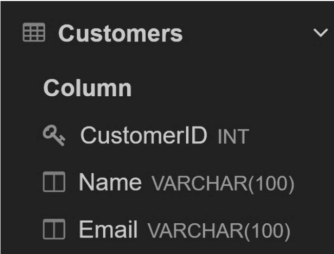
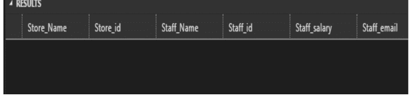
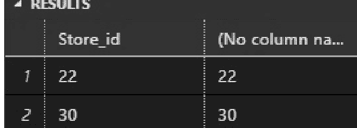
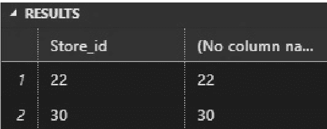
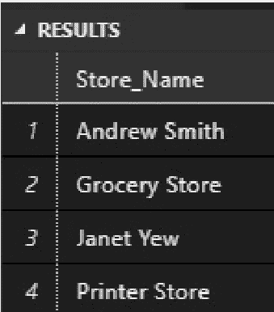
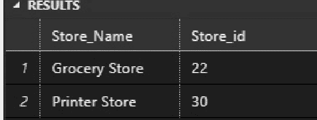

# PYTHON

# JAVA

# SQL

# JAVASCRIPT


菲利普·罗宾斯

# PYTHON
JAVA
SQL
JAVASCRIPT


# 2024

# 四合一

# 菲利普·罗宾斯

# Python、Java、SQL 和 JavaScript

面向初学者的终极速成课程，助你掌握四种最受欢迎的编程语言，脱颖而出，找到高薪工作

# 菲利普·罗宾斯

# © 版权所有 2024 - 保留所有权利。

未经作者或出版商直接书面许可，不得复制、转载或传播本书所含内容。
在任何情况下，出版商或作者均不对因本书所含信息直接或间接造成的任何损害、赔偿或金钱损失承担任何责任。

# 法律声明：

本书受版权保护。本书仅供个人使用。未经作者或出版商同意，不得修改、分发、出售、使用、引用或转述本书的任何部分或内容。

# 免责声明：

请注意，本文档所含信息仅供教育和娱乐目的。已尽一切努力提供准确、最新、可靠且完整的信息。不声明或暗示任何类型的保证。读者承认作者不提供法律、财务、医疗或专业建议。本书内容源自多种来源。在尝试本书概述的任何技术之前，请咨询持证专业人士。
阅读本文档即表示读者同意，在任何情况下，作者均不对因使用本文档所含信息而造成的任何直接或间接损失负责，包括但不限于错误、遗漏或不准确之处。

# 目录

## PYTHON 编程

## 引言

- 什么是 Python？
- 我是谁？
- 本书如何帮助你？

## 第一章：Python 简介

- Python 的历史
- Python 的应用
- Python 的不同版本
- 为什么你应该学习 Python
- 如何安装 Python

### 第二章：PyCharm 和 IDLE

- 为什么 Python 解释器很好？
- 如何使用 Python IDLE Shell？
- 如何使用 IDLE 打开 Python 文件？
- 如何更改这些文件？
- IDE（集成开发环境）
- PyCharm
- Python 风格指南

## 第三章：Python 基础

- 为什么需要输入值？
- 理解 input() 函数
- Python 中的注释
- 保留关键字
- Python 中的运算符
- 增强赋值运算符

## 练习

## 第四章：Python 变量

- Python 中的变量是什么？
- 如何命名变量
- 如何定义变量
- 如何确定变量的内存地址
- 局部变量和全局变量

### 第五章：Python 中的数据类型

- 数据类型到底是什么？
- 不同的数据类型
- 字符串
- 字符串格式化
- 字符串操作技术
- 整数
- 浮点数
- 布尔数据类型

### 第六章：Python 中的高级数据结构

- 列表
- 元组
- 字典
- 练习

### 第七章：条件语句和循环

- 比较运算符
- 控制流语句
- If/Else 条件语句
- If Elif Else
- For 循环
- While 循环

## Break 和 Continue

## 练习

### 第八章：函数和模块

- 函数参数
- 函数的参数
- 默认值
- 作用域
- 模块
- 模块和内置函数
- 字符串函数
- 练习

### 第九章：面向对象编程（OOP）

- 什么是 OOP？
- 如何创建类？
- 如何创建对象？
- 继承
- 练习

### 第十章：Python 中的文件

- 文件路径
- 创建新文件夹
- 管理文件的函数

### 第十一章：异常处理

- 'Try' 和 'Except'
- 不同类型的错误

### 第十二章：高级编程

- PIP 包管理器
- 虚拟环境

sys 模块

单元测试

Scrapy

Requests

Pygame

Beautiful Soup

Pillow

Tensorflow

Scikit-Learn

Pandas

Matplotlib

Twisted

程序员的 GitHub

## 结论

程序员特质

下一步？

## JAVA 编程

## 引言

### 第一章：设置你的 Java 环境

Java 安装基础

理解和安装包管理器：Maven、Gradle 等

第一步：编写和运行你的第一个 Java 程序

常见问题和故障排除

## 第二章：Java 基础

数据类型、变量和常量：构建块

控制流：决策和循环

Java 的面向对象范式：温和介绍

### 第三章：深入面向对象编程

- 类和对象：Java 的蓝图
- 构造函数：赋予对象生命
- 方法：为对象添加行为

### 第四章：进阶面向对象概念

- 理解继承：利用现有代码
- 多态：行动中的灵活性
- 封装：保护你的数据
- 抽象：隐藏复杂性

### 第五章：泛型编程

- 泛型的必要性
- 理解和创建泛型类
- 有界类型参数
- 泛型中的通配符

### 第六章：Java 中的函数式编程

- Lambda 表达式简介
- 流：更优雅地处理集合
- 常见流操作：过滤、映射和收集

### 第七章：Java 特性概述

- 异常处理：应对意外情况
- Java 集合：列表、集合和映射
- 并发和多线程：利用现代处理器的力量

### 第八章：高级 Java 概念

模块：组织和扩展你的 Java 项目
注解：为你的代码添加元数据
Java I/O：与外部数据交互

### 第九章：实际 Java 开发

构建 CRUD 应用程序：从开始到结束
将 Java 与数据库连接
最佳实践：编写干净、可维护的代码

### 第十章：解决挫折和克服挑战

常见错误及如何避免
克服科技界的冒名顶替综合症
支持你学习之旅的资源和社区

### 第十一章：Java 的未来及展望

跟上 Java 的发展
探索 Java 生态系统：框架和工具
前方之路：推进你的 Java 职业生涯

### 常见 Java 术语表

## 结论

## SQL 入门

## 引言

### 第一章：关系数据库和 SQL

关系数据库的优势
什么是 SQL？
SQL 的优势

### 第一章：基本 SQL 语法和命令

- CREATE
- INSERT INTO
- SELECT
- UPDATE
- DELETE
- DROP

## 第二章：SQL 数据类型

- 基本 SQL 语法
- 数据类型

## 第三章：SQL 数据结构

- 如何使用数据结构
- 如何选择数据结构
- 栈数据结构
- 树数据结构
- 链表数据结构

### 第四章：处理表

- 创建表
- 修改表
- 插入数据
- 更新表
- 删除数据

### 第五章：基本和高级查询技术

- JOIN
- GROUP BY
- HAVING
- UNION
- ORDER BY
- ORDER BY DESC
- INTERSECT
- MINUS

### 第六章：高级 SQL 技术和优化

- 连接表和处理多个数据源
- 子查询和临时表
- 分组和聚合数据
- 高级数据过滤和排序技术
- 存储过程和函数
- 索引和性能优化

### 第七章：与其他数据管理工具的集成

- 什么是数据管理？
- 数据管理功能
- 数据管理方法
- SQL 数据管理工具
- 从其他格式导入和导出数据

### 第八章：在分布式环境中处理数据

- 什么是分布式环境？
- 分布式数据库中如何处理数据？
- 数据收集和准备层
- 数据安全层
- 数据存储层
- 数据处理层
- 数据可视化层
- 分布式数据库的优势

## 第9章：构建数据管道与自动化数据流程

- 什么是数据管道及其用途？
- 数据管道的组成部分
- 在SQL中自动化数据流程
- 在数据分析与商业智能中使用SQL
- SQL中的安全与隐私考量

## JavaScript编程

## 简介

- 为何选择JavaScript
- JavaScript的历史
- JavaScript的特性
- JavaScript的应用
- JavaScript的局限性
- 是什么让JavaScript成为轻量级编程语言？
- JavaScript是解释型、编译型还是两者兼有？

## 第1章：JavaScript语法与数据类型

- 字符串
- 数字
- 大整数
- 布尔值
- 对象
- 符号
- 未定义
- 空值
- 类型检测
- JavaScript数据类型——回顾

## 第2章：变量与运算符

- 什么是运算符？
- JavaScript赋值运算符
- JavaScript算术运算符
- JavaScript比较运算符
- JavaScript逻辑运算符
- JavaScript位运算符
- JavaScript字符串运算符

## 第3章：条件语句

- If-Else
- If语句
- JavaScript If else语句
- JavaScript If else if语句

## 第4章：循环

- For循环
- While循环
- Do-While循环
- For-in循环

## 第5章：函数

- JavaScript函数简介
- 声明函数
- 调用函数
- 参数 vs 实参
- 返回值
- arguments对象
- 函数提升

## 第6章：对象

- JavaScript对象概述
- 创建对象
- 访问与修改对象属性
- 使用对象方法
- 对象迭代与操作
- 使用内置对象
- 练习

## 第7章：闭包

- 什么是JavaScript中的闭包？
- JavaScript闭包
- JavaScript闭包与循环
- ES6 let关键字
- IIFE与闭包
- 继续探索JavaScript闭包

## 第8章：原型

- 原型链
- 创建与使用原型

## 第9章：文档对象模型（DOM）

- 原始遗留DOM
- W3C标准
- IE4 DOM

## 第10章：事件处理

- 点击事件
- 鼠标悬停事件
- 焦点事件
- 按键按下事件
- 加载事件

## 第11章：异步编程

- 异步 vs 同步通信
- 什么是JavaScript回调？
- JavaScript中的Promise
- JavaScript的Async/Await

## 第12章：JavaScript框架与库

- 库与框架的比较
- JavaScript库
- JavaScript框架
- React
- Angular
- Node.js
- NPM
- Webpack
- Babel

## 结论

## Python编程

## 简介

计算机可以被归类为没有内在智能的机器，但它们以无数种方式极大地推动了我们世界的发展。有了计算机，我们的世界运行得更加高效且无差错——我们告诉它们该做什么，它们便能提供完美的结果。计算机程序员是使用所谓编程语言与计算机交流的人，他们这样做已经很多年了。这些编程语言因其工作系统而异，就像人类语言因地区而异一样。

其中一种计算机编程语言叫做Python，在计算机领域，这是一种相当流行（且易于学习）的高级编程语言。本书将直观地教你Python。即使你没有任何编程语言的经验，你也能掌握Python的基础知识并加以应用。

### 什么是Python？

Python是一种在编程社区中广受欢迎的高级编程语言。它简单、通用，并包含大量第三方框架库。它也被认为是当今最受欢迎的现代编程语言之一，对初学者来说非常容易上手。你甚至可以用它在你选择的编程领域创建软件。

像斯坦福大学这样的知名学府将Python作为入门语言教授给计算机科学专业的毕业生。许多探索编程基础的在线课程也使用Python作为默认语言。正如你所见，它非常普及，因此学习它非常有用。基于这些原因，我很高兴你选择了这本书来帮助你快速而直观地学习Python。

### 我是谁？

如果你在互联网上搜索，你可能会找到成千上万的Python学习资源。虽然这很好，但也可能让人应接不暇——因此，许多初学者可能会感到沮丧，因为他们没有简洁明了的指导和清晰的步骤。

我叫菲利普·罗宾斯，我决心为初学者提供一条清晰的路径以取得卓越成就。我拥有超过二十年的使用Python进行软件开发的经验，是一名专业的Python程序员。我对编程的热爱始于十年前，当时我热衷于玩电子游戏。一切都源于我热衷于修改我正在玩的一款宝可梦游戏。我渴望成功修改一小段代码以获得成就感，这激发了我在年轻时理解编程逻辑和变量的兴趣。通过一些修改游戏的经验，我能够理解程序是如何工作的，并花时间尝试不同的编程语言。

几年后，我开始创建可以自动化工作流程的小脚本。然而，我仍然没有选择特定的编程语言，这使得成为一名真正的软件程序开发者变得具有挑战性。我尝试过的所有编程语言，如C和Perl，都难以实现，并且多次因巨大的挫败感而几乎让我放弃编程。幸运的是，在那些动荡的时期，我发现了早期阶段的Python。Python最初是一个开发者的业余项目，所以它的初始形式并不十分整洁。然而，一旦它流行起来，其他开发者开始注意到这个开源项目。这激励了他们也贡献自己的力量。因此，他们有效地将其塑造成了今天这种高效的编程语言。

在学习Python基础几个月后，我开始将我已有的代码移植到Python中。我对代码的可移植性以及其简洁性感到惊讶。一旦我了解了Python的工作原理，就再也回不去了。我开始编写我的软件并使用不同的商店发布它们。尽管我的主要工作是创建Web应用程序，但在Python的帮助下，我成功地在各个领域创建了几个其他副项目。

现在我已经精通Python，我有兴趣帮助那些正在努力学习这门编程语言的人。即使在我刚开始修改游戏的初期，我也一直热衷于快速帮助人们学习编程。我用通俗易懂的语言解释复杂的主题，这帮助我的许多朋友和同事更好地理解了它们。我对编程和教学的热情促使我写这本书，以帮助那些刚接触Python的初学者。

### 这本书如何帮助你？

虽然Python编程看起来容易实现，但事实并非如此。如果你对Python包含的几个基础主题有透彻的理解，并且知道如何利用它们来解决问题，这将非常有帮助。因此，本书为你提供了理解你正在尝试使用的编程语言的基础和实用性所需的理论知识。

为了充分利用本书，我们建议使用认知学习技巧。这些将增强你对这些材料的体验。

- 使用认知记忆技巧，如记忆宫殿，来敏锐地记住数据。然而，使用认知技巧时，简单地将所需信息死记硬背在大脑中与正式存储是有区别的。
- 使用思维导图来映射不同的概念，以便在你的项目中快速实现它们。思维导图是认知学习工具，通过简短的图表利用视觉优势来轻松记住大量数据。
- 使用被动回忆技巧快速复习你在本书中学到的所有主题。被动回忆也可以帮助加强你的编程基础。
- 不要只使用本书中给出的代码。相反，使用类似的策略重新实现你的代码。使用简单的复制粘贴技巧将无助于你创建自己的代码。
- 使用费曼技巧向不了解该主题的人解释你在本书中学到的所有基本编程概念。如果你能用简单的术语解释概念，说明你对核心基础有很强的理解。

作为一门编程语言，Python期望你尽可能具有创新性。因此，如果你将Python编程视为解决谜题，那么你将直观地发现方法来“欺骗”你的大脑，创建复杂的代码逻辑以解决现实世界的问题。这本书帮助你尽可能高效地使用Python进行编程。

## 第一章：Python 简介

Python 是一种功能强大的编程语言，易于学习，基础扎实，并能支持多范式工作流程。因此，对于希望深入编程领域的初学者来说，它是一个绝佳的起点。Python 的流行主要源于其没有杂乱和样板代码。

例如，用 C 或 C++ 编写一个简单的贪吃蛇游戏通常需要 300 行代码。相比之下，使用 Python 你可以将代码行数限制在 200 行以内。这种在实现上的显著差异，使得 Python 成为世界上最受欢迎的开源语言。Python 迅速成为开源革命的中转站，众多热情的程序员和开发者为各个计算机领域编写了成千上万的库。

## Python 的历史

Python 的创造者吉多·范罗苏姆在圣诞假期期间将其作为一个副项目。利用他在 ABC 编程语言工作中学到的知识，他创建了一种易于理解和使用的解释型编程语言。他最初使用 Python 是为了在一个在线社区中，用他对 Unix 工作原理的了解给黑客们留下深刻印象。

但在收到其他程序员的反馈后，他花了数月时间对其进行改进。于是，他创造了一种易于快速理解的编程语言。吉多·范罗苏姆因其对 Python 项目所做的贡献，被称为 Python 社区的“仁慈独裁者”。开源开发者可以获得这一崇高荣誉。

根据 TIOBE 排名，自 Python 诞生以来，它一直位列十大最受欢迎的编程语言之一。Python 简洁的问题解决方式帮助它击败了其他编程语言（如 Perl），并成为初学者更容易学习的语言之一。

Python 基于“解决问题只有一种方法”的理念，这与 Perl 等编程语言背后的“解决问题有多种方法”的理念不同。因此，Python 为编程社区带来了所需的规范，并使软件开发增长了十倍。

查看下面的 Python 应用，了解 Python 对全球程序员的重要性。

## Python 的应用

Python 在当今许多科学和技术领域都留下了印记。

### Web 领域

Python 作为编程语言，其早期影响主要体现在 Web 技术上。虽然 Java 是 Web 上最受欢迎的语言，但 Python 并不那么流行。随着时间的推移，得益于 Django 和 Tornado 等第三方框架，Python 在 Web 开发者中变得流行起来。

在过去的二十年里，Python 已成为网站最受欢迎的脚本语言之一，仅次于 JavaScript。Python 是一种被 Google、Facebook 和 Netflix 等大公司使用的编程语言。一个名为 Django 的知名 Web 框架也可以帮助程序员为多个 API 编写后端代码。

Python 也因其自动化任务的能力而受欢迎，因此常被用于制作像 Pinflux 这样的机器人。

### 科学计算

Python 在科学家中很受欢迎，因为它对任何人都是免费的。此外，像 Numpy 和 Scipy 这样的程序使计算机科学家能够用更少的代码进行实验。由于 Python 在数学计算和软件方面也更胜一筹，科学家们如今别无选择，只能使用它。

### 机器学习与人工智能

人工智能和机器学习现在是两项可以结合使用的技术，为开发者提供更多工作机会。Python 有许多第三方库，如 Tensorflow，它们都专注于实现机器学习算法。

Python 在适应深度学习和自然语言处理等技术方面也非常出色。这使其成为开发人工智能相关技术的首选语言之一。

### Linux 与数据库管理

随着全球企业的发展，对能够有效管理数据库和内部系统的开发者的需求巨大。开发者需要充分了解不同的操作系统（如 Linux），并且还需要足够了解 Python，以自动化测试方法在内部网络上运行效果所需的其他流程。

### 渗透测试与黑客

Python 也被意图良好和恶意的黑客使用。例如，白帽黑客使用广泛用于进行渗透测试的 Python 工具。另一方面，恶意黑客使用 Python 脚本制作漏洞利用程序，自动从目标窃取敏感信息。

Python 在计算机编程几乎任何领域都能使用的能力，催生了其他几种高级编程语言的发展，如 Go、Groovy 和 Swift。Python 传播了编程应尽可能简单的理念。

## Python 的不同版本

当 Python 在 1990 年代初推出时，它并不像现在这样完善。罗苏姆在没有任何人帮助的情况下构建了库，因此它有很多错误和缺陷。但由于 Python 在编程社区中立即大受欢迎，数百名独立开发者在第一个版本发布后的两年里帮助罗苏姆完成了一个更大的项目。

Python 也因为是开源的，能够吸引许多聪明人来检查和修改代码。因此，在过去的 20 年里，Python 核心编程团队为全球开发者发布了两个主要版本：Python 2 和 Python 3。

2022 年，尽管 Python 核心开发者不再支持 Python 2，但仍有大量程序员在使用它。选择使用哪个版本取决于你正在做什么。

### Python 2

Python 2 是一个旧版本，于 2000 年发布。尽管如此，它在 20 多年里一直是使用最广泛的 Python 版本。Python 2 更易于使用，并且有更多来自外部的框架和库可用于开发。

尽管 Python 2.7 在 2021 年后将不再获得官方更新，但它仍然是许多软件领域的最佳版本。但将所有框架和库从 Python 2 迁移到 Python 3 很困难，因此许多公司仍然将 Python 2 作为其默认版本。

### Python 3

Python 3.9 是开发者可以使用的最新版本的编程语言。Python 3 更快，并为开发者提供了更多用于处理核心库的类。与 Python 2 相比，它也更容易跟上。

### 我应该选择哪个版本？

你使用哪个版本的 Python 应该取决于你正在制作什么类型的软件。例如，许多数据科学家使用 Python 3，而处理遗留软件的开发者则使用 Python 2 来连接组件。

## 注意：

本书中的所有 Python 代码都是用 Python 3 编写的，因为对于初学者来说，从较新的版本开始更有意义。

## 为什么你应该学习 Python

Python 在 1990 年代初开始变得更受欢迎，当时全球各地的公司开始利用互联网的力量来构建复杂的 Web 应用程序。像 C 和 C++ 这样的传统编程语言很难学习，使得程序员难以快速编写高质量的代码。在此期间，Python 帮助许多公司创建了与他们已有的 C 和 C++ 库兼容的库。此外，程序员开始使用 Python 快速部署代码，因为它比其他高级语言更容易使用。

通过了解 Python 的许多好处，你可以看到它对于具有不同计算机科学背景的开发者来说是多么强大和便捷。

### 它是一种解释型语言

Python 不像其他编程语言那样使用编译器来运行指令，而是使用一种称为解释器的新软件。解释器不是花费大量时间用编译器运行程序，而是使用现代计算机技术在程序运行之前解析代码。这种动态解析时间可以减少程序运行时的等待时间。Python 还使用自然语言的部分内容来消除可能拖慢生产效率的低效编码方式。由于其结构，Python 也很容易实现编程自动化，这就是为什么系统开发者和 Linux 管理员如此喜欢它的原因。

### 它是开源的

导致开源革命的首批因素之一就是 Python。因为 Python 是开源的，你可以修改任何代码并自行分享。开源文化也使全球程序员更容易分享他们的知识和资源，以创建可以帮助开发者开发新项目的库和框架。

作为一名初学者，能够一键访问复杂和简单的项目，可以帮助你理解编程的工作原理，并轻松创建新的、有创意的项目。

### 它支持多种范式

不同的编程语言使用不同的编程范式来编写和运行代码。另一方面，Java 使用面向对象范式，而 C 使用函数式范式。编程范式改变了开发者的工作方式以及他们尝试解决问题的方式。

Python 支持多种范式，如结构化、函数式和面向对象范式。这使其成为希望以不同方式解决问题的程序员的良好选择。

### 它使用垃圾回收机制

内存管理是应用开发者需要掌握的一项重要技能。像 Java 和 C 这样的高级语言使用复杂的数据管理技术。尽管这些机制运行完美，但维护它们需要大量时间。而在 Python 中，内存由垃圾回收器处理。你可以轻松使用此策略不再使用的数据和变量。

## 易于理解

开发者喜欢 Python 的众多原因之一是它易于阅读。所有代码都易于理解，这使得跟进变得简单。当 Python 代码更易读时，其质量就会提升；而质量提升后，修复代码中的错误所需时间也会减少。

## 可移植性

Python 还可以在任何操作系统上运行，这使得开发者只需花费几小时的工作，就能轻松地以不同方式使用它。用户只需在其系统上安装解释器，Python 程序即可运行。

例如，假设一位程序员为 Linux 编写了一个程序，用于简化 SQL 数据库管理的自动化。那么，任何有权访问该代码的人，只需修改其中几个部分，就可以将其部署到 Windows 或 Mac 机器上。

## 拥有优秀的自定义库

如果一种编程语言要被广泛使用，它就需要拥有优秀的库。开发者可以在 Python 中尝试使用大量此类库。

除了这些自定义库，程序员还可以利用 Python 核心开发团队提供的标准库来创建有趣的软件。

## 支持组件集成

Python 使得程序员可以轻松地将新代码添加到已有的代码中。此外，其先进的组件集成能力使其成为为不同软件应用程序创建高级定制选项的良好选择。

组件集成通过为旧软件添加新功能，使其能在更新的操作系统上运行，从而让开发者保持忙碌。

## 拥有优秀的社区

Python 社区非常乐于助人，可以帮助新程序员快速解决他们在编写代码时遇到的任何问题。除了 Python 论坛，来自各种经验丰富的程序员的资源和编写良好的指南也能帮助开发者克服任何问题。

由于 GitHub 上有大量的开源 Python 项目，业余程序员只需查看代码，就能了解软件中复杂逻辑是如何实现的。

## 如何安装 Python

要编写 Python 代码，您必须在系统上安装解释器。没有这个解释器，任何开发者都无法编写或运行 Python 程序。Python 可以安装在任何现代操作系统上，因为它具有可移植性。在本节中，我们将讨论如何在 Linux、Mac 和 Windows 上安装 Python。

## 如何在 Linux 上安装 Python？

由于大多数程序员将 Linux 作为其主要操作系统，我们将首先介绍如何在您的本地机器上使用 Linux 安装 Python。Linux 是一个免费的操作系统，大多数程序员和企业都在使用。因此，Python 已经预装在许多 Linux 发行版中。

要查看您的 Linux 系统是否已安装 Python，请使用 CTRL+ALT+N 命令打开一个新的命令终端。

当新的命令终端打开时，在其中输入以下命令。

### 终端代码：

```
$ python3
```

如果您的系统上安装了 Python，已安装的 Python 版本的许可信息将显示在您的终端中。

另一方面，如果您得到 "command not found" 的输出，则意味着您的系统上未安装 Python。由于 Python 未安装，您现在可以使用 Linux 的包管理器为不同的发行版安装 Python。

在 Linux 上安装任何软件之前，您必须首先更新 Linux 上的所有工具，并确保没有可能阻止 Python 安装的冲突错误。

### 终端代码：

```
$ sudo apt-get upgrade
```

您可以使用上面的代码来更新基于 Debian 的 Linux 系统上的包文件。
使用以下 Pacman 命令来升级基于 Arch 的系统上的包。

### 终端代码：

```
$ sudo pacman -S
```

升级包后，您可以使用以下命令在您的 Linux 系统上安装 Python。
Debian 系统的终端代码：

```
$ sudo apt-get install python3
```

Arch 系统的终端代码：

```
$ pacman -u python3
```

请查阅官方 Python 文档，以在 Gentoo 和 Kali 等其他 Linux 发行版上进行安装。

## 如何在 macOS 上安装 Python？

macOS 是 Apple 默认制造的操作系统。Python 2 通常作为原生软件安装，因为它内置了 UNIX 支持。
请确保您从 "设置" > "实用工具" > "终端" 打开一个新终端，以查看您的 Apple 支持的硬件上是否安装了 macOS。
打开新终端后，输入以下命令。

### 终端代码：

```
$ python3
```

如果您没有看到 Python 版本信息，则意味着您的系统上未安装 Python。要从头开始安装 Python，请使用 homebrew。

### 终端代码：

```
$ brew install python3
```

## 如何在 Windows 上安装 Python？

Windows 是世界上使用最广泛的操作系统，基于使用人数。许多人和程序员使用 Windows，因为它易于使用，并且 Python 程序员有多种方式可以快速将他们的代码部署到 Windows 上。

要在您的 Windows 系统上安装 Python，您必须首先从 Python 官方网站下载一个可执行包。下载包后，您可以通过双击它来安装软件。为了使 Python 代码开发在某些 Windows 系统上正常工作，您可能需要更改控制面板中的环境变量。
一切按需设置完成后，打开命令提示符窗口，查看 Python 解释器是否正确安装。

### 命令提示符代码：

```
>> python --version
```

如果该命令告诉您安装的 Python 版本，那么 Python 已在您的系统上正确设置。如果没有，您可能需要将错误信息复制粘贴到 Google 中，或使用 Python 论坛来找出问题所在。

## 第 2 章：PyCharm 和 IDLE

安装 Python 后，您需要在系统上拥有一个开发环境来编写程序。IDLE 代表 "集成开发和学习环境"。尽管您可以使用基本 Python 安装附带的基本 IDLE 进行工作，但鼓励开发者使用像 PyCharm 这样的 IDE（集成开发环境），以获得更好的软件开发工作流程。IDE 使开发者更高效，并使他们更容易在已转换为软件的代码中找到错误。

## 为什么 Python 解释器很好？

Python 解释器很棒，因为它灵活，并且比传统编译器具有更多功能。例如，与编译器相比，Python 解释器让您等待的时间更少。编译器在代码编写完成后运行代码并检查错误。而解释器则在编写代码时进行检查，并在代码运行之前告知程序员是否存在任何问题。实时错误报告是初学者在编码过程中学习如何编码的好方法。

当您在计算机上安装 Python 时，它也会安装 IDLE。要启动 IDLE，您可以在终端界面中输入 "Python"。IDLE 使用 REPL 机制（读取-求值-打印循环）在计算机屏幕上显示输出。REPL 是 Python 解释器使用的一种基本方法，用于检查已编写的行并解析它们，以便可以在屏幕上显示。这是基于给定的输入和输出完成的。

Python IDLE 对于刚开始学习编码的人来说是一个很好的工具。尽管大多数企业软件开发都是在像 PyCharm 这样的 IDE 上完成的，但学习一些 Python IDLE 的基本命令可以帮助您理解 Python 解释的工作原理。

## 如何使用 Python IDLE Shell？

安装 Python 后，打开终端或命令提示符，输入以下命令以启动 IDLE。

### 命令：

```
$ python
```

如下所示，当您按 Enter 或 Return 键时，一个新的 shell 将会打开。

```
>>>
```

您可以使用一些基本的数学或 Print 命令来测试 Python IDLE 在您的系统上的工作方式。

## 程序代码：

```
>>> print("This is a sample to check that the IDLE works")
```

### 输出：

```
This is a sample to check that the IDLE works
```

当按下 Enter 按钮时，程序进入 REPL 模式，双引号之间的文本显示在计算机屏幕上。这是因为 IDLE 知道 shell 窗口使用了 print() 方法来显示字符串。

您也可以使用数学运算来测试 IDLE 工作流程。

## 程序代码：

```
>>> 8 + 3
```

### 输出：

```
11
```

## 练习：

使用 IDLE 窗口检查其他数学运算的结果，例如乘法和除法。

## 注意：

重要的是要记住，一旦您关闭终端窗口，您所有的代码都将丢失。因此，即使我们使用 IDLE，我们也需要确保将所有代码放入一个 Python 文件中。

## 如何使用 IDLE 打开 Python 文件？

IDLE 使得在终端上打开和读取带有 .py 扩展名的 Python 文件变得简单。请记住，此命令仅在您与Python文件位于同一目录中。

## 程序代码：

```
$ python mysample.py
```

上述命令将打开之前编写的代码，供程序员阅读。

- IDLE可以自动高亮显示独特的语法组件。
- IDLE通过提供提示来协助开发者完成代码。
- IDLE可以轻松地缩进代码。

要在IDLE shell中使用任何Python文件，请使用GUI文件选项并点击“打开”按钮。但是，高级程序员建议，如果您不在同一目录中，请使用路径来打开Python文件。

## 如何更改这些文件？

一旦文件在IDLE中打开，您就可以开始使用键盘编辑文件中的代码。因为IDLE提供了行号，开发者可以轻松地操作任何非缩进代码。文件编辑完成后，按F5键在终端代码中运行它。

如果没有错误，将显示输出；否则，将显示回溯错误。

虽然不如市场上其他高级IDE高效，但Python IDLE是一个出色的调试工具。它具有多种调试功能，包括设置断点、捕获异常和解析代码以快速调试代码的能力。然而，它并不完美，如果您的项目库增长，可能会导致问题。

无论它提供的功能多么有限，IDLE可能是完全初学者的最佳开发工具。

## 练习：

在Python IDLE中开发一个新程序，将两个数字相加，并使用断点进行调试。如果您对任何编程组件不熟悉，可以自由使用任何互联网资源来解决这个简单问题。

## IDE（集成开发环境）

Python IDLE通常不推荐用于实际应用程序开发，因为它无法处理高要求的项目。开发者被要求在称为IDE的专业开发环境中管理和开发他们的代码。此外，IDE为程序员提供了与各种库的紧密集成能力。

## IDE特性

### 1. 简单集成库和框架

IDE的一个重要特性是它们使将库和框架集成到软件应用程序中变得简单。IDLE要求您每次使用时都单独分配它们，而IDE则通过自动完成各种导入语句为您完成这项艰巨的工作。许多IDE还支持直接集成git仓库。

### 2. 面向对象设计的集成

许多创建应用程序的Python程序员采用面向对象范式。不幸的是，Python IDLE不包含任何工具来帮助开发者在遵循面向对象原则的同时创建应用程序。所有现代IDE都包含类层次结构图等组件，以帮助开发者以更好的编程逻辑启动项目。

### 3. 语法高亮

语法高亮有助于程序员提高生产力并避免简单、明显的错误。例如，您不能使用像“if”这样的保留关键字来命名变量。IDE会自动检测此错误，并通过语法高亮帮助开发者理解它。

### 4. 代码补全

所有现代IDE都使用先进的人工智能和机器学习技术为开发者自动完成代码。IDE从您使用的包中收集大量信息，因此它们可以根据您的输入和您正在编写的逻辑建议不同的变量或方法。尽管自动完成是一个有用的功能，但您永远不应完全依赖它，因为它有时会中断程序执行并导致错误。

### 5. 版本控制

版本控制是开发者的主要挫折来源。例如，如果您在应用程序中使用私有库和框架，它们可能会偶尔更新，导致您的应用程序失败。作为开发者，您必须了解这些更改，并为所有应用程序实现新的代码执行，以使其正常运行。版本控制机制使开发者能够轻松更新其核心应用程序，而不会对先前编写的代码造成任何中断。IDE支持与GitHub等网站直接进行版本控制。

除了这些功能外，IDE还可以为开发者提供高级调试功能。例如，对于独立开发者和组织，最受欢迎的Python IDE是PyCharm和Eclipse。我们将在本书中使用PyCharm作为默认IDE，因为它比Eclipse高效得多，也更容易设置。

## PyCharm

PyCharm是由软件工具开发先驱JetBrains生产的纯Python IDE。最初，JetBrains团队创建PyCharm是为了管理他们的其他编程语言IDE。然而，由于其可移植性，JetBrains团队后来将其作为独立产品发布给全球用户。PyCharm适用于所有主要操作系统，有两种版本：社区版和专业版。

社区版是开源的、免费的软件，任何人都可以使用它来编写Python代码。但是，它有一些限制，特别是在版本控制和第三方库集成方面。

专业版是一个付费IDE，为开发者提供高级功能和众多集成选项。例如，使用PyCharm IDE的专业版，开发者可以轻松创建Web或数据科学应用程序。

## PyCharm提供哪些功能？

PyCharm以其为热情的Python开发者提供的独特功能以及高质量的集成能力而闻名。

### 1. 代码编辑器

PyCharm的代码编辑器是业内最好的之一。在此编辑器中处理新项目时，您会对代码补全能力感到惊讶。此外，JetBrains使用了多种先进的机器学习模型，使IDE足够智能，能够理解最复杂的编程块并提供有用的建议。

在作为开发者工作时，PyCharm编辑器也可以自定义以获得更好的查看体验。用户可以使用明暗主题，允许您根据心情更改主题。

### 2. 代码导航

PyCharm复杂而全面的文件组织系统使程序员可以轻松管理文件。例如，书签和透镜模式可以帮助Python程序员有效地管理他们的基本编程块和代码逻辑。

### 3. 重构

PyCharm包含高级重构功能，允许开发者轻松更改文件、类和方法的名称，而不会破坏程序。当您使用IDLE重构代码时，它会立即破坏代码，因为默认的Python IDLE不够智能，无法区分新旧名称。

当涉及到更新代码或迁移到更好的第三方库以用于其软件组件之一时，大多数Python开发者使用高级重构功能。

### 4. Web技术集成

大多数Python开发者在Web领域工作，这占据了软件行业的很大一部分。PyCharm简化了开发者的软件与Django等Python Web框架的集成。PyCharm也足够智能，能够理解HTML、CSS和JavaScript代码，这些代码通常被Web开发者用来创建Web服务。

所有这些功能使Python Web开发者可以轻松地将现有的Web代码集成到Python框架中。

### 5. 与科学库的集成

PyCharm还以其对SciPy和NumPy等科学和高级数学库的强大支持而闻名。虽然它永远不会完全取代您的数据集成和清理设置，但它将帮助您为所有数据科学项目开发基本的伪逻辑。

### 6. 软件测试

PyCharm可以为即使是最复杂和大型的、拥有众多成员的项目执行高级单元测试策略。它还包括高级调试工具和远程配置功能，用于使用Alpha和Beta测试工作流。

## 如何使用PyCharm？

有了关于PyCharm的足够信息，您应该确信它是本地系统的必要开发工具。本节包含您需要安装PyCharm并了解如何使用它来更好地管理Python项目的信息。

### 步骤—1：安装PyCharm

PyCharm可以安装在几乎任何操作系统上。

首先，从官方网站或众多包管理器之一获取安装包。

导航到JetBrains官方网站，点击右上角的下载选项卡。现在，根据您的操作系统，下载可执行文件或dmg文件，然后双击它以按照屏幕上的说明进行操作。

要下载专业版软件，您必须首先提供付款信息才能下载试用版。试用期结束后，您将被收费，并且可以毫无问题地使用专业版。

## 注意：

要在您的系统上成功安装 PyCharm IDE，必须先安装 Python。这是因为 PyCharm 会检测 Python 路径并自动安装软件的核心库。

## 步骤—2：创建新项目

安装软件后，从您的应用程序或桌面图标启动 PyCharm IDE。当您打开 PyCharm 时，会出现一个新的弹出窗口，允许您从头开始一个新项目。您可以使用软件界面左上角的“文件”选项中的按钮来打开一个新项目。其他选项包括导入和导出现有项目，或快速保存当前工作项目。

当您首次打开一个 Python 项目时，系统会提示您选择用于所有编程过程的 Python 解释器。如果您不知道在哪里查找 Python 解释器，请选择 'virtualenv'，它将自动搜索系统并为您找到一个。

## 步骤—3：使用 PyCharm 进行组织

一旦您开始使用 PyCharm 创建项目，为您的程序文件创建新的文件夹和资源至关重要。

要在项目界面上创建一个新文件夹，只需选择 新建 --> 文件夹 选项。您可以在此部分包含软件中使用的任何 Python 脚本或资源。

当您在单独的文件夹中创建一个新文件时，会创建一个扩展名为 .py 的文件。因此，如果您想创建不同的类文件或模板，必须在文件夹中创建文件时明确指定。

## 步骤—4：PyCharm 中的高级功能

一旦代码编写并集成完毕，您可以使用内置的 IDLE 界面或 PyCharm 独特的输出界面快速运行它。

您编写的所有代码都会实时自动保存，因此您不必担心因网络连接不良或断电而丢失任何关键项目数据。要在本地系统上保存项目的副本，只需按 Ctrl S 或 Cmd S。

程序完成后，按 Shift + F10，在解释器的帮助下运行和编译代码。

使用 Ctrl F 或 Cmd F 命令，您可以在项目中搜索任何方法、变量或代码片段。只需使用此快捷键并输入您要查找的信息。

一旦 Python 代码被导入并部署到所需的操作系统，您必须开始设置调试项目环境，以持续清除系统中的错误。要设置断点并解决逻辑问题，而不打乱整个代码逻辑或破坏核心程序，请按 Shift + F9。

## Python 风格指南

Python 编程因其支持并持续支持的编程哲学而在程序员中日益流行。Python 旨在简洁，而其他高级编程语言则旨在更复杂。Perl 就是这种哲学如何应用以及它如何使普通程序员的许多事情变得复杂的一个很好的例子。

Python 核心开发者鼓励早期的 Python 采用者遵守一套简单的、众所周知的原则，称为“Python 之禅”，以编写既有效又美观的代码。即使在二十年后，这些原则对 Python 程序员仍然适用，每个 Python 程序员都应该了解它们。

在终端中输入以下 Python 代码以阅读所有这些原则。

### 终端代码：

```
$ import this
```

我们将讨论一些基本原则，以更好地理解 Python 向开发者推广的哲学。

优美胜于丑陋。

鼓励所有 Python 程序员编写语义对称且视觉上吸引人的代码。优美的代码必须结构良好；因此，程序员必须编写不使代码复杂化的条件语句。

通过使用缩进技术，可以使许多行代码在视觉上更具吸引力。美化代码可以提高可读性，并有助于减少运行时间。

## 显式胜于隐式。

出于某种原因，许多开发者试图隐藏他们的编程逻辑，使得其他程序员难以理解。Python 反对这种做法，并鼓励开发者编写所有程序员都能理解的明确代码逻辑。这也是开源 Python 框架和库更受欢迎的原因之一。

## 简洁胜于复杂。

作为 Python 程序员，您的主要目标应该是编写简单的代码。简化您的代码逻辑可以帮助您提高编程语言技能。随着经验的积累，您编写不那么复杂代码的能力也会提高。

## 复杂胜于晦涩。

与任何软件一样，有时您需要编写能够同时解决多个问题的复杂代码。在处理复杂代码时，避免使其过于复杂。有效地使用异常和文件可以帮助您快速减少可能后来变成恼人错误的复杂代码。

## 应该只有一种方法。

与其前身语言 C 和 C++ 不同，Python 倡导一致性。作为 Python 程序员，您只需要在程序的所有实例中使用一种逻辑。统一性提供了灵活性，并使代码更易于维护。

## 第三章：Python 基础

Python 程序员必须确保直接从用户获取输入，并根据输入提供输出，以实现动态应用程序。Python 解释器和程序中的所有函数都可以访问用户的输入值。

在本章中，我们将提供一些示例程序，以帮助您了解如何根据输入和输出操作来改善所创建软件的用户体验。

## 为什么需要输入值？

应用程序的生存依赖于输入值。从 Web 应用程序到最新的元宇宙应用程序，一切都依赖于用户的输入值运行。例如，当您登录 Facebook 时，您必须输入您的电子邮件地址和密码。这些是输入，只有提供的信息正确，您的帐户才会被验证。

在面部识别技术等高级应用中，面部数据点被用作输入。如今，每个实际应用程序都会请求和收集用户输入数据，以提供更好的用户体验。

## 用例：

假设您为成年受众创建了一个 Python 应用程序，18 岁以下的任何人都无法使用。

对于上述场景，我们可以通过要求用户输入年龄来进行条件输入验证。如果用户年龄超过 18 岁，该应用程序将对他或她可用。但是，如果用户年龄在 18 岁以下，则无法访问该应用程序。Python 根据所有支持数据类型的输入来评估某人是否可以访问您的软件。这只是现实世界中的一个例子。通过利用最终用户的输入，可以执行众多应用程序。

## 理解 input() 函数

当您在 Python 程序中间调用 input() 函数时，解释器将暂停并等待用户使用其输入设备之一（如键盘、鼠标或移动触摸屏）输入值。

通常，用户会根据提示提供输入。要创建实际应用程序，您必须首先创建一个良好的提示 GUI。本章将介绍可供开发人员使用的文本命令提示符。输入值后，用户必须按其系统上的“Enter”按钮，解释器才能恢复并解析所使用的逻辑编程语句。

## 示例：

```
sample = input ("Which country are you from? ")
print (sample + " is a beautiful country!")
```

当上述程序运行并执行时，用户首先会看到如下所示的输出提示。

### 输出：

```
Which country are you from?
```

此时，用户必须输入一个答案。假设我们输入“United States of America”：

```
Which country are you from? United States of America
United States of America is a beautiful country!
```

您可以通过将上述输入更改为另一个国家来尝试，看看会发生什么。

### 输出：

```
Which country are you from? France
France is a beautiful country!
```

## 如何编写用户提示？

建议在使用 input() 函数并尝试从用户接收输入时使用更好的提示来吸引用户的注意力。请记住不要在文本中包含任何无关信息。使提示尽可能直接。

提示代码：

```
example = input("Which is your favorite hockey team? ")
print ("So you are a " + example + " fan. Hurray!")
```

### 输出：

你最喜欢的足球队是哪支？波士顿棕熊队
那么你是波士顿棕熊队的粉丝。太棒了！

你也可以使用 `input()` 函数，通过显示多行字符串来提示用户。
从本书开头起，我们就一直使用 `print()` 函数在屏幕上显示文本。向计算机屏幕打印内容的唯一推荐方法就是 `print()`。
传递给 `print()` 函数的任何输入都会被转换为字符串字面量并显示在屏幕上。虽然你不需要了解 `print()` 函数的所有参数，但建议学习一些可以帮助你格式化代码的参数。

## 什么是字符串字面量？

字符串字面量是高级字符，可以帮助你快速格式化数据。例如，`\n` 是一个常见的字符串字面量，可以帮助你从新行开始输入数据。

## 程序代码：

```
prompt = "This is a simple question to find out what you like."
prompt += "\n So, please say your favorite food: "
example = input(prompt)
print (example + " is delicious")
```

### 输出：

This is a simple question to find out what you like.
So, please say your favorite food: Pasta
Pasta is delicious

其他流行的字符串字面量，如 `\t`、`\b` 和 `\d`，可以帮助你以新制表符输出数据，或输出不含空格和分隔符的数据。

## 什么是 end 语句？

`print()` 函数还接受一个 `end` 参数，该参数可用于在字符串字面量末尾追加任何字符串数据，如下所示。

## 程序代码：

```
print("Italy is a beautiful country. ", end = "Do you agree? ")
print("Yes, I do!")
```

### 输出：

Italy is a beautiful country. Do you agree? Yes, I do!

在上面的例子中，“Do you agree?” 是追加的文本。

## 数值作为输入

到目前为止，我们已经了解了如何使用 `input()` 函数将用户输入捕获为字符串。当期望数值输入时，例如整数（`int`）或浮点数（`float`），从 `input()` 获得的字符串必须转换为相应的数值类型。这可以通过使用 `int()` 转换为整数，使用 `float()` 转换为浮点数来实现。
我们将在“数据类型”部分深入探讨 `int` 和 `float` 数据类型的具体细节。

## ‘int’ 的实际示例：

假设我们想编写一个程序，询问用户的年龄，然后打印一条消息说明去年的年龄。由于年龄通常以整年计算，我们为此使用 `int`。

```
# Ask the user for their age
age_str = input("Enter your age: ")

# Convert the string input to an integer
age = int(age_str)

# Compute age last year
age_last = age - 1

# Print the age
print("Last year you were", age_last, "years old.")
```

### 输出：

Enter your age: 50
Last year you were 49 years old.

输入 “int(age_str)” 时，我们正在将字符串转换为整数。注意，我们也可以直接写成：

```
age = int(input("Enter your age: "))
```

要计算 “age – 1” 这个量，“age” 变量必须是整数。如果不进行转换，代码将无法工作：

```
age_str = input("Enter your age: ")
age_last = age - 1
print("Last year you were", age_last, "years old.")
```

### 输出：

```
Enter your age: 50
ERROR!
Traceback (most recent call last):
NameError: name 'age' is not defined
```

## ‘float’ 的实际示例：

假设我们想计算一个圆的面积。用户将输入半径，这可能是一个小数，所以我们使用 `float`。

```
# Ask the user for the radius of a circle
radius = float(input("Enter the radius of the circle: "))

# Calculate the area (using 3.14 as an approximation of Pi)
area = 3.14 * radius * radius

# Print the area
print("The area of the circle is:", area)
```

### 输出：

```
Enter the radius of the circle: 21
The area of the circle is: 1384.74
```

在这里，我们直接将半径从字符串转换为浮点数进行计算。`float()` 函数允许我们处理小数，使其适用于需要精度的场景。

## Python 中的注释

当编程团队处理复杂且耗时的项目时，团队成员之间必须交换大量信息，才能理解项目的本质。注释允许程序员在不干扰程序流程的情况下传递信息。

当程序员使用注释时，Python 解释器会忽略注释并继续执行下一行。然而，由于 Python 拥有大量开源项目，注释有助于开发者理解如何将第三方库和框架集成到他们的代码中。

注释使代码更具可读性，更易于理解。虽然看起来有些程序员不需要记住他们编写的代码逻辑，但你会惊讶于程序员经常忘记他们编写的代码逻辑。对你如何编写代码逻辑有具体的了解，对于未来的参考将非常有用。

Python 允许程序员在代码中使用两种类型的注释。

### 单行注释

单行注释是 Python 程序员最常用的注释类型，因为它们可以轻松地写在代码行之间。要使用单行注释，请使用 `#` 符号。此符号之后的任何内容都将被解释器忽略。

## 程序代码：

```
# This is an example of a single-line comment followed by a print of a hash symbol
print ("This is an example.")
```

### 输出：

```
This is an example.
```

因为使用了单行注释，解释器忽略了它，只执行了 print 语句。

### 为什么单行注释很重要？

单行注释通常用于代码中间，以帮助其他程序员理解程序逻辑的工作原理，并详细说明已实现变量的功能。

### 多行注释

虽然可以使用单行注释编写三到四行连续注释，但不推荐这样做，因为 Python 提供了更好的方式来注释多行注释。Python 程序员可以使用字符串字面量创建多行注释，如下所示。

## 程序代码：

```
"""
This is a comment
In Python
with 4 lines
Author: Python Best """
print ("This is an example.")
```

### 输出：

```
This is an example.
```

当你运行上面的程序时，只有 print 语句被执行，就像单行注释一样。

### 为什么多行注释很重要？

程序员经常使用多行注释来定义许可证详情，或解释各种包和方法的综合信息以及各种实现示例。阅读代码的程序员可以有效地理解代码。

## 保留关键字

保留关键字是编程语言的默认关键字，程序员在编写代码时不能将其用作标识符。标识符通常用于命名变量、类和函数。
如果你在程序中使用保留关键字，解释器将抛出错误。例如，将 `for` 用作你的变量之一将不起作用，因为 `for` 通常在 Python 编程中用于定义特定类型的循环结构。
有 33 个保留关键字不允许在你的程序中使用。作为一名 Python 程序员，在处理复杂项目时避免不必要的错误至关重要。

## 练习：

使用 Python 终端，尝试查找 Python 中的保留关键字，以熟悉我们之前讨论过的 Python 命令。

## Python 中的运算符

在数学中，运算符首先用于形成数学表达式。最早的程序员使用这些运算符和基本的编程组件来轻松地赋值和操作值。计算机程序员通常使用运算符来组合字面量并形成语句或表达式。

## 示例：

2x + 3z = 34

这里，2x、3z 和 34 是字面量，而 + 和 = 是应用于这些字面量以形成表达式的运算符。运算符可以与任意数量的字面量值结合，形成复杂的表达式，帮助程序员实现困难的算法。

## 示例：

```
a = 18
b = 20
print(a + b)
```

### 输出：

```
38
```

a 和 b 是操作数，而 = 和 + 是使用的运算符。

### 不同类型的运算符

程序员可以使用不同类型的运算符来实现各种类型的编程逻辑。最常用的运算符是算术运算符，它们帮助程序员将数学逻辑应用于代码中的各种字面量，例如变量。Python 程序员需要了解的算术运算符包括加法、减法、乘法和## 1. 加法

要在程序中将两个字面量相加，请使用加法运算符。这些字面量可以是变量或列表，有时也可以是两种不同数据类型的数据。Python 解释器足够智能，能够识别两种不同的数据类型并向程序员返回结果。加法运算由符号 '+' 表示。

## 程序代码：

```
x = 26
y = 15
z = x + y
# + 是加法运算符
print(z)
```

当使用 IDE 或 IDLE 运行程序时，解释器将按照开发者的指定，将两个变量值相加并赋值给变量 'z'。

### 输出：

41

## 2. 减法运算符

减法运算符用于将两个字面量相减。这些字面量可以是变量或列表，有时也可以是两种不同数据类型的数据。- 是减法运算的符号。

## 程序代码：

```
x = 26
y = 15
z = x - y
# - 是减法运算符
print(z)
```

当使用 IDE 或 IDLE 执行程序时，解释器将按照开发者的指定，计算两个变量值的差并输入到 'z' 中。

### 输出：

11

## 3. 乘法运算符

乘法运算符计算两个字面量的乘积。这些字面量可以是变量或列表，有时也可以是两种不同数据类型的数据。符号 * 代表乘法运算。

## 程序代码：

```
x = 6
y = 4
z = x * y
# * 是乘法运算符
print(z)
```

当程序在 IDE 或 IDLE 中运行时，解释器将按照开发者的指定，计算两个变量值的乘积并输入到 'z' 变量中。

### 输出：

```
24
```

## 4. 除法运算符

在程序中，除法运算符用于求两个字面量的除法商。商也可以使用浮点数计算，使用除法符号 "/"。

## 程序代码：

```
x = 8
y = 4
z = x / y
# / 是除法运算符
print(z)
```

当程序在 IDE 或 IDLE 中运行时，解释器将按照开发者的指定，计算两个变量值的商并输入到 'z' 变量中。

### 输出：

```
2.0
```

## 5. 取模

取模通常用于计算除法运算的余数。取模运算符可用于实现各种编程逻辑，% 是取模运算的符号。

## 程序代码：

```
x = 9
y = 4
z = x % y
# % 是取模运算符
print(z)
```

当使用 IDE 或 IDLE 执行程序时，解释器将按照开发者的指定，计算两个变量值的余数并输入到 'z' 中。

### 输出：

```
1
```

在这种情况下，商是 2.25，但余数是 1，如程序输出所示。你可以使用整数除法运算来代替显示浮点数作为除法运算的商。

## 6. 整数除法

整数除法是一种替代算术运算符，当开发者不关心结果的精度时经常使用。该运算符通常显示除法运算后获得的商的最接近整数。"//" 是整数除法运算符的符号。

## 程序代码：

```
x = 9
y = 4
z = x // y
# 这是整数除法运算符
print(z)
```

### 输出：

```
2
```

上述程序的商是 2.25。然而，由于我们使用的是整数除法运算符，程序返回了最接近的整数。

## 7. 位运算符

位运算符是高级运算符，开发者经常使用它们来执行特殊功能，如压缩、加密和错误检测。

各种类型的位运算符在所有高级编程语言中都有使用。

- 与 (&)
- 或 (|)
- 异或 (^)
- 非 (~)

所有这些位运算符都遵循与数学中逻辑运算符相同的原则。

## 运算符优先级

由于存在不同的运算符，并且数学表达式是通过组合它们形成的，因此处理高级数学表达式以创建现实世界的应用程序可能会迅速变得复杂。运算符优先级为程序员提供了明确的目标，以确定优先执行哪个运算符进行数学运算。

如果开发者未能遵循运算符优先级规则，值可能会完全改变，导致应用程序崩溃。

### Python 中的运算符优先级规则：

在你处理的任何 Python 数学表达式中，优先级都具有优先权。因此，如果运算符被括号括起来，解释器将首先处理它们，然后再处理其他运算符。

位运算符通常被赋予第二优先级。

用于乘法和除法的数学运算符被赋予最高优先级。必须按相同顺序优先考虑的运算符是 *, /, % 和 //。

其余的算术运算，如加法和减法，具有优先级。这些运算符由符号 + 和 - 表示。

比较和逻辑运算符具有最终的运算符优先级。

## 增强赋值运算符

增强赋值运算符提供了一种基于变量当前值更新其值的简写方式。这些运算符将算术或位运算与赋值运算结合起来。它们可以使你的代码更简洁，并可能更易于阅读。

以下是常见增强赋值运算符及其等效长格式操作的列表：

| 增强赋值运算符 | 等效长格式操作 | 描述 |
| :--- | :--- | :--- |
| a += b | a = a + b | 加法 |
| a -= b | a = a - b | 减法 |
| a *= b | a = a * b | 乘法 |
| a /= b | a = a / b | 除法 |
| a %= b | a = a % b | 取模 |
| a //= b | a = a // b | 整数除法 |
| a **= b | a = a ** b | 求幂 |
| a &= b | a = a & b | 按位与 |
| a |= b | a = a | b | 按位或 |

## 示例：

```
# 使用 += 递增值
count = 10
count += 5 # 这与 count = count + 5 相同
print(count) # 输出：15

# 使用 *= 计算平方
num = 6
num *= num # 这与 num = num * num 相同
print(num) # 输出：36
```

## 练习

1.  创建一个程序，要求用户输入两个数字，并使用这些数字执行加法、减法、乘法和除法运算。打印每个运算的结果。
2.  编写一个程序，要求用户输入两个数字，然后对这些数字执行取模和整数除法运算。将两个运算的结果打印到屏幕上。
3.  编写一个程序，要求用户输入华氏温度。使用公式 C = (F - 32) * 5/9 将温度转换为摄氏度。以摄氏度显示结果。
4.  编写一个程序，要求用户输入他们的年龄（以年为单位），计算他们的年龄（以秒为单位）（假设每年 365 天，每天 24 小时，每小时 60 分钟，每分钟 60 秒）并显示结果。
5.  创建一个程序，要求用户输入商品的原价，输入折扣百分比，最后计算并显示折扣后的价格。

## 第四章：Python 变量

为了正常运行，Python 程序需要变量和运算符等基本组件。这些元素，包括变量和运算符，对于新手程序员来说易于理解和应用，使他们能够开发创建复杂软件所需的算法。

## Python 中的变量是什么？

变量是在 Python 程序中存储和处理数据的一种方式。它们允许用户和软件与数据进行交互。没有数据，软件应用程序就毫无用处，对最终用户没有任何意义。

变量在 Python 中用于将数据存储在特定的计算机内存位置，允许软件上传或下载数据。变量的概念最早在代数中使用，并且自高级编程语言诞生以来一直是其基本组成部分。

例如，在数学方程 2x + 3y 中，变量 x 和 y 可以被赋值，然后这些值可以用来改变方程的输出。在编程中，具有不变值的变量被称为常量。要理解变量在 Python 中的工作原理，理解 Python 程序的执行过程非常重要，这可以通过 print 语句来演示。

同样，通过使用变量，你可以通过提供字面值来修改程序的输出。变量是可替换的，而在编程中不应被替换的值通常被称为常量。

要理解变量的功能，需要理解 Python 程序的执行过程。print 语句将有助于说明这一点。

## 示例：

## 程序代码：

```
print("This is a sentence.")
```

### 输出：

This is a sentence.

代码在执行打印语句后会立即显示输出。但幕后还有更多事情在发生。

## 发生了什么？

- 程序逐行读取代码，并将其与它有权访问的库进行匹配。
- 解释器执行此匹配过程，利用高超的解析能力来识别程序中的每个字符，匹配变量详情，并从内存位置检索信息以验证程序的逻辑。
- 尽管解析过程复杂，但如果解释器找不到已定义的方法或变量，程序仍会引发错误。
- 在上面的例子中，解释器将 `print` 语句识别为 Python 中的一个核心库方法，并输出括号内的任何字符串字面量。

如果你理解了这个解释，现在是时候学习 Python 中的变量了。

## 程序代码：

```
program = "This is a sentence."
print (program)
```

### 输出：

This is a sentence.

## 发生了什么？

- 在程序执行开始时，解释器通常会解析程序员给出的每一行代码。
- 解释器现在看到的不再是一个后跟文本的 `print` 语句，而是一个被称为变量的特殊标识符，名为 'program'。解释器检查之前的代码，发现该变量被定义为文本并保存在特定的内存位置。
- 随后，解释器将按照程序员的指示，通过检索变量内定义的信息，将变量显示在屏幕上。
- 即使在复杂的代码逻辑中，这也是变量工作的基本过程。

变量在被替换时可以立即改变。Python 程序员需要意识到这一点，因为动态程序经常根据用户输入更改变量，甚至在程序实时运行时替换它们。

## 程序代码：

```
sample = "My first example"
print(sample)
sample = "My second example"
print(sample)
```

### 输出：

```
My first example
My second example
```

由于我们知道 Python 解释器是按顺序逐行解析代码的，因此上一个示例中的第一条语句使用提供的第一个变量值进行打印，第二条打印语句使用提供的第二个变量值进行打印。

## 如何命名变量

创建变量时，所有 Python 程序员都必须遵循 Python 社区的默认指南。不遵守这些条件将导致难以忽视的错误，或者在极少数情况下导致应用程序崩溃。在开发程序时使用特定的指南也有助于提高可读性。

## 需要记住的规则：

- Python 指南规定变量名只能包含数字、字母字符和下划线。因此，例如，'sample1' 可以用作变量名，而 '$sample1' 则不行，因为它以不支持的符号 $ 开头。
- Python 程序员不能以数字开头命名变量。例如，'sample1' 是有效的变量命名格式，而 '1sample' 则不是。
- Python 程序员不能使用分配给各种 Python 编程例程的保留字。目前，开发人员在开发实际的 Python 应用程序时不能使用 33 个保留关键字作为标识符。例如，关键字 'for' 是保留的。
- 虽然这不是一个硬性规定，但为了提高可读性，最好使用简单的变量命名方法。使用复杂或令人困惑的变量名会使你的代码显得杂乱。虽然这对于其他高级语言（如 C、C++ 和 Perl）来说是一个好习惯，但 Python 不支持它。

## 如何定义变量

在 Python 编程语言中定义的所有变量都以赋值运算符 (=) 开头，以便为变量赋值。

语法格式：
变量名 = 变量值

## 示例：

```
example = 123
# 这是一个具有整数数据类型的变量
example1 = "USA"
# 这是一个具有字符串数据类型的变量
```

在这种情况下，"example" 是我们创建的变量的名称，123 是我们在创建时分配给它的变量值。

考虑上面的变量定义方法，我们没有明确提及任何变量数据类型，因为 Python 足够智能，可以自己理解变量数据类型。

## 如何确定变量的内存地址

所有变量都保存在单独的内存位置。每当你调用变量名时，Python 解释器都会从该内存位置提取信息。当你要求 Python 解释器替换一个变量时，它会简单地获取先前放置的变量值，并用新的变量值替换它。旧的变量值将被删除或使用垃圾回收机制保存以供将来使用。

在 C 等编程语言中，指针通常用于快速确定和提取变量内存位置的信息。然而，Python 不支持指针，因为它通常难以实现，并且需要许多解释器通常不知道的编译技巧。相反，Python 开发人员可以使用内置的 `id()` 函数快速获取变量的内存地址。

## 程序代码：

```
# 首先，让我们创建一个具有整数数据类型的变量
sample = 32

# 现在让我们使用内置函数 id() 调用其内存地址
address = id(sample)
print(address)
```

### 输出：

```
1x10744488x
```

在这种情况下，1x10744488x 是变量的十六进制内存位置。使用下面的方法，你现在可以替换变量并查看 `id()` 是否发生了变化。

## 程序代码：

```
# 让我们为变量 'sample' 赋值并打印其地址
sample = 64
print(id(sample))

# 现在我们用新值替换变量值
sample = 78
# 这将再次打印内存位置地址的输出
print(id(sample))
```

### 输出：

```
1x10744488x
1x10744488x
```

尽管内存位置没有改变，但一个小的打印验证（`print(sample)`）足以看到变量值已经改变。

## 局部变量和全局变量

根据你的编程逻辑，变量可以是局部的，也可以是全局的。理论上，局部变量只能在你指定的方法或类中使用。另一方面，全局变量可以在程序的任何部分使用而不会出现问题。当你在函数外部调用局部变量时，Python 解释器通常会抛出一个错误。

## 程序代码：

```
# 这是一个函数内局部变量的示例
def mysample():
    x = "This is a sentence"
    print(x)
mysample()
```

### 输出：

This is a sentence

在这个例子中，变量被定义为函数内的局部变量。因此，每当你从函数内部调用它时，它都会抛出一个回溯错误，如下所示。

## 程序代码：

```
# 这是一个包含局部变量的函数示例
def sample():
    x = "This is a sentence"
    print(x)
# 这是另一个函数
def secondsample():
    print(example)

sample()
secondsample()
```

### 输出：

This is a sentence
NameError: name 'x' is not defined

另一方面，全局变量可用于为整个程序初始化变量。

## 程序代码：

```
# 让我们创建一个全局变量
x = "This is a sentence"

# 让我们初始化两个方法
def method1():
    print(x)

def method2():
    print(x)

# 让我们调用它们
method1()
method2()
```

### 输出：

```
This is a sentence
This is a sentence
```

由于两个函数都可以访问全局变量，因此计算机屏幕上会显示两个打印语句。

使用哪种类型的变量完全取决于你。许多程序员严重依赖局部变量来使他们的应用程序运行得更快。另一方面，如果你不想被内存管理所淹没，可以使用全局变量。

## 第 5 章：Python 中的数据类型

Python 程序员使用各种数据类型来构建跨平台应用程序。因此，Python 程序员必须理解数据类型在软件开发中的重要性。

## 到底什么是数据类型？

更具体地说，数据类型是程序员在创建变量时使用的一组预定义值。同样重要的是要记住，由于 Python 不是静态类型语言，因此不需要显式定义变量数据类型。所有静态类型语言，如 C 和 C++，通常要求程序员定义变量数据类型。

虽然 Python 程序员不需要定义它们来创建程序，但理解各种可用的数据类型对于开发能够与用户高效交互的复杂程序仍然是必要的。下面是一个静态类型语言的示例以及如何定义变量。

## 程序代码：

```
int years = 12;
```

在这种情况下，`int` 是定义的数据类型，`years` 是变量的名称，12 是提供给 `age` 变量存储的值。

另一方面，Python 在不显式定义变量类型的情况下定义变量，如下所示。

## 程序代码：

```
years = 12
```

这里提供了 `years` 和值。但是，数据类型没有定义，因为 Python 解释器理解提供的值是一个整数。

## 不同的数据类型

在我们深入探讨 Python 支持的各种数据类型之前，让我们先谈谈开发人员在编程时用于创建逻辑语句的基本编程片段。

## 让我们来看一个简单的表达式和语句。要在编程语言中进行逻辑陈述，需要使用三个主要组件。

### 数据标识符

为了存储数据，会创建变量、列表和元组等编程组件。

例如：

```
a = 24
```

**a** 是这个编程片段中的一个变量，它被创建用于存储顺序数据。

### 字面量

这些是分配给程序创建的任何数据片段的值。

例如：

```
a = 24
```

在这个编程片段中，**24** 是分配给新创建的数据片段的字面量。

### 运算符

运算符在为现实世界应用开发代码时实现数学运算。

例如：

```
a = 24
```

前面的代码中使用了赋值运算符 =。其他算术运算符，如 +、-、* 和 /，因其能生成逻辑清晰的 Python 代码而广为人知。

我们将介绍一些 Python 程序员在其应用程序中最常用的数据类型。

## 字符串

字符串是常用于表示大量文本的数据类型。例如，字符串数据类型可以通过用单引号连接来表示程序中的文本。当创建字符串数据类型时，会创建一个包含字符序列的 'str' 对象。

文本消息是人类彼此交流最常见的方式。因此，字符串是开发者理解以创建有意义软件的最重要数据类型。用字符串表示数据也至关重要，因为计算机只理解二进制数据。因此，使用 ASCII 和 Unicode 编码机制至关重要。

Python 3 引入了一种先进的编码机制，用于理解中文、日文和韩文等外语，这使得字符串在软件开发中不可或缺。

字符串以何种方式表示？

```
z = 'This is my sentence'
print(z)
```

输出：

```
This is my sentence
```

单引号之间的所有内容都是字符串数据类型。变量 'z' 用于定义这个字符串数据。当变量具有字符串数据类型时，其占用的位数通常决定了它的内存位置和大小。字符串数据类型的字符数与其位数成正比。

在前面的例子中，'This is my sentence' 有 17 个字符，包括空格。

作为 Python 程序员，你还有其他几种定义字符串的选项。在处理实际项目时，尽可能使用单一类型以保持一致性。

程序代码：

```
# 使用双引号定义字符串
a = "This is my sentence"
print(a)

# 使用三个单引号定义字符串
b = """This is my sentence"""
print(b)

# 使用三个双引号定义字符串
c = """This is my sentence
but with more than one line """
print(c)
```

输出：

```
This is my sentence
This is my sentence
This is my sentence
but with more than one line
```

在前面的例子中，我们定义了三种定义字符串的方法。特殊字符、符号和新的制表符行也可以在引号之间使用。Python 还支持转义序列，这是所有编程语言都使用的。例如，'\n' 是程序员用来创建新行的常用转义序列。

### 如何访问字符串中的字符？

由于字符串是 Python 中最常用的数据类型，核心库包含多个用于与字符串数据交互的内置函数。要访问字符串中的字符，你必须首先知道索引号。索引号通常从 0 开始，而不是 1。也可以使用负索引和切片操作来访问字符串的一部分。

示例：

```
# 我们首先创建一个字符串来访问其字符
s = 'PYTHON'

# 我们打印整个字符串
print('Whole string =', s)

# 我们打印第一个字符
print('1st character =', s[0])

# 我们使用负索引打印最后一个字符
print('Last character =', s[-1])

# 我们使用正索引打印最后一个字符
print('Again, Last character =', s[5])

# 我们打印前 2 个字符（索引 0 到 1）
print('Sliced character =', s[0:2])
```

输出：

```
Whole string = PYTHON
1st character = P
Last character = N
Again, Last character = N
Sliced character = PY
```

因为所有字符串数据类型都是不可变的，所以无法替换字面字符串中的字符。因此，尝试替换字符串字符将导致类型错误。

程序代码：

```
s = 'PYTHON'
s[1] = 'c'
print(s)
```

输出：

```
TypeError: 'str' object does not support item assignment
```

### 字符串格式化

Python 使用取模 (%) 运算符使格式化字符串变得简单。它被称为 *字符串格式化运算符*。

程序代码：

```
print("Today I have eaten %d apples" % 3)
```

输出：

```
Today I have eaten 3 apples
```

你可以使用 %d 来格式化整数。你也可以使用 %s 来格式化你的文本。

### 字符串操作技巧

由于字符串是最常用的数据类型，Python 核心库为程序员提供了多种操作技巧。理解字符串操作技巧将帮助你从大量数据中快速提取数据。这些技巧在数据科学家中更为广泛使用。

#### 1. 连接

连接是将两个不同的实体连接在一起。使用算术运算符 '+'，可以使用此过程将两个字符串连接在一起。如果你想提高字符串的可读性，只需在两个字符串之间使用空格即可。

程序代码：

```
example = 'Today is' + 'a wonderful day'
print(example)
```

输出：

```
Today isa wonderful day
```

请记住，连接时不允许使用空格。在连接时，你必须自己添加空格，如下所示。

程序代码：

```
example = 'Today is' + ' ' + 'a wonderful day'
print(example)
```

输出：

```
Today is a wonderful day
```

#### 2. 乘法

当你使用字符串乘法技巧时，你的字符串值会被连续重复。可以使用 * 运算符来乘以字符串内容。

程序代码：

```
example = 'Yes ' * 4
print(example)
```

输出：

```
Yes Yes Yes Yes
```

#### 3. 追加

你可以使用此操作通过算术运算符 += 将任何字符串添加到另一个字符串的末尾。请记住，追加的字符串只会添加到字符串的末尾，而不是中间。

程序代码：

```
example = "Today is a beautiful day "
example += "to start learning Python!"
print(example)
```

输出：

```
Today is a beautiful day to start learning Python!
```

#### 4. 长度

除了字符串操作外，你还可以使用核心库中的预置函数在代码中执行其他任务。例如，'len()' 函数返回字符串中的字符数。空格也将作为字符串中的字符添加。

程序代码：

```
example = 'Tomorrow it will be sunny'
print(len(example))
```

输出：

```
25
```

#### 5. 查找

当你使用字符串作为主要数据类型时，有时你需要找到字符串的特定部分。为了解决这个问题，你可以使用内置的 find() 函数。输出将提供输入首次被找到的位置的索引，以便你可以验证。当你在 Python 中使用 find() 函数时，解释器只会返回正索引。

程序代码：

```
example = 'Tomorrow it will be sunny'
sample = example.find('it')
print(sample)
```

输出：

```
9
```

如果未找到子字符串，解释器将返回 -1 的值。

程序代码：

```
example = 'Tomorrow it will be sunny'
sample = example.find('hi')
print(sample)
```

输出：

```
-1
```

#### 6. 小写和大写

可以使用 lower() 和 upper() 函数将字符串中的字符转换为完全小写或大写。

程序代码：

```
example = "Asia is the biggest continent"
sample = example.lower()
print(sample)
```

输出：

```
asia is the biggest continent
```

程序代码：

```
example = "Asia is the biggest continent"
sample = example.upper()
print(sample)
```

输出：

```
ASIA IS THE BIGGEST CONTINENT
```

#### 7. 标题格式

要将字符串格式转换为驼峰式大小写格式，请使用 title() 函数。

程序代码：

```
example = "Asia is the biggest continent"
sample = example.title()
print(sample)
```

输出：

```
Asia Is The Biggest Continent
```

## 整数

在 Python 中，整数是特殊的数据类型，允许你在代码中包含整数。要执行算术运算或提供有关统计值的信息，需要数值。

当 Python 解释器遇到整数类型的数据值时，它会创建一个具有所提供值的 int 对象。因为 int 对象的值是不可变的，所以它们可以在开发人员希望时被替换。

'int' 数据类型被开发者用于在软件中创建各种复杂功能。整数通常用于表示图像或视频文件的像素密度值。
开发者需要理解一元运算符（+、-），它们分别用于表示正整数和负整数。对于正整数，无需指定一元运算符（+），但对于负整数则必须包含。

## 程序代码：

```
x = 13
y = -92
print(x)
print(y)
```

### 输出：

```
13
-92
```

Python 可以处理最多十位数的数字。虽然大多数现实世界的应用程序不会因较大的数值而导致瓶颈，但最好确保不涉及巨大的整数。

## 浮点数

并非所有数值都是整数。你可能偶尔需要处理带有小数值的数据。Python 确保开发者使用浮点数来处理此类数据。使用浮点数，你可以处理长达十位小数的小数值。

## 程序代码：

```
x = 3.121212
y = 58.4545
print(x)
print(y)
```

### 输出：

```
3.121212
58.4545
```

浮点数也可用于表示十六进制表示法中的数据。

## 程序代码：

```
x = float.hex(15.2698)
print(x)
```

### 输出：

```
0x1.e8a2339c0ebeep+3
```

浮点数据类型也常被 Python 程序员用于表示复数和指数数字。

## 布尔数据类型

布尔值是特殊的数据类型，通常用于在比较两个不同值时表示真（True）或假（False）值。

## 程序代码：

```
A = 21
B = 55
print(A > B)
```

### 输出：

```
False
```

因为在前面的例子中，A 的值不大于 B 的值，所以输出为 False。在处理逻辑运算时，布尔数据类型非常方便。

## 第6章：Python中的高级数据结构

Python 程序员经常处理大量数据，因此一直使用变量并不是一个好主意。特别是数据科学家，他们经常处理大量数据，可能会被必须处理的大量动态数据所淹没。因此，在处理复杂和数据密集型项目时，使用 Python 核心库提供的列表选项至关重要。这些类似于 C 和 C++ 等核心编程语言中的数组等数据结构。

理解 Python 提供的各种数据结构，以及学习使用这些数据结构添加或修改数据的技术，是任何 Python 程序员的必备技能。

### 列表

列表是 Python 数据类型，允许你按顺序添加不同的数据类型。列表具有与变量相同的所有属性。借助 Python 核心库的方法，它们可以轻松替换、传递或操作。

在 Python 中，列表通常表示如下：
[22, 23, 24]

这里的列表元素是 22、23 和 24。同样重要的是要理解，所有列表元素都是整数数据类型，并且没有显式定义，因为 Python 解释器可以检测它们的数据类型。

在上述格式中，列表以方括号开始和结束。逗号将用于分隔列表中的所有元素。同样值得注意的是，如果列表中的元素是字符串数据类型，它们通常用引号括起来。列表中的所有元素也称为项目。

## 示例：

[Alaska, California, Alabama]

在此上下文中，Alaska、California 和 Alabama 被称为列表元素。例如，所有列表都可以分配给一个变量。当你打印该变量时，列表将像任何其他数据类型一样被打印。

## 程序代码：

```
x = ['Alaska', 'California', 'Alabama']
print(x)
```

### 输出：

```
['Alaska', 'California', 'Alabama']
```

## 空列表

如果一个 Python 列表没有元素，则称为空列表。空列表也称为 null 列表。它通常写为 []。

## 程序代码：

```
# 这是一个空列表
emptylist = []
```

## 列表索引

Python 使得操作或替换列表元素变得简单，特别是通过使用索引。索引通常从 0 开始，并为 Python 程序员提供许多功能，例如“切片”和“搜索”，以确保他们的程序顺利运行。
假设我们有一个之前使用过的列表。我们将使用索引在计算机屏幕上打印每个元素。

## 程序代码：

```
myList = ['California', 'Alaska', 'Alabama']
print(myList[0])
print(myList[1])
print(myList[2])
```

### 输出：

```
'California'
'Alaska'
'Alabama'
```

在前面的例子中，当 Python 解释器检测到索引为 0 时，它会打印第一个元素。随着索引的增加，列表中的位置也会增加。列表中的项目也可以如下所示调用，并附带一个字符串字面量。

## 程序代码：

```
myList = ['California', 'Alaska', 'Alabama']
print(myList[1] + ' is a wonderful state')
```

### 输出：

```
Alaska is a wonderful state
```

如果你提供的索引值大于列表中现有元素的数量，将返回索引错误。

## 程序代码：

```
myList = ['California', 'Alaska', 'Alabama']
print(myList[3])
```

### 输出：

```
IndexError: list index out of range
```

**注意：** 同样重要的是要记住，浮点数不能用作索引值。

## 程序代码：

```
myList = ['California', 'Alaska', 'Alabama']
print(myList[2.2])
```

### 输出：

```
TypeError: list indices must be integers or slices, not float
```

如下所示，所有列表都可以将其他列表作为元素。子列表是包含在列表中的所有列表。

## 程序代码：

```
x = [[5,123,4],56,32,14]
print(x)
```

### 输出：

```
[[5, 123, 4], 56, 32, 14]
```

你可以使用 'list[][]' 格式调用子列表中的元素。

## 程序代码：

```
x = [[5,123,4],56,32,14]
print(x[0][1])
```

### 输出：

```
123
```

在前面的例子中，嵌套列表的第二个元素是 123，它作为输出显示。列表的元素也可以使用负索引引用。通常，-1 表示最后一个索引，而 -2 表示最后一个元素之前的元素。

## 程序代码：

```
myList = ['California', 'Alaska', 'Alabama']
print(myList[-1])
```

### 输出：

```
Alabama
```

你已经了解了列表的表示方式。在下一节中，我们将讨论一些可以使用列表数据结构操作的功能。

## 使用列表进行切片

列表切片允许程序员避免处理列表中包含的大量元素。通过切片，你可以只关注与程序逻辑相关的列表部分。

语法：
列表名[起始索引 : 结束索引]
冒号通常用于分隔要切片的列表的起始和结束索引。

## 程序代码：

```
myList = [23,34,78,94,54]
print(myList[1:3]) # 第2和第3个元素（索引1和2）
```

### 输出：

```
[34, 78]
```

切片列表元素时，你不需要输入列表的开始或结束。如果未输入，解释器将假定它是列表中的第一个或最后一个元素。

## 程序代码：

```
myList = [23,34,78,94,54]
print(myList[:3])
```

### 输出：

```
[23, 34, 78]
```

因为在前面的例子中，分号之前的切片值未提供，解释器假定它来自第一个元素。

## 程序代码：

```
myList = [23,34,78,94,54]
print(myList[3:])
```

### 输出：

```
[94, 54]
```

在这个例子中，解释器假定分号后面的值表示列表的结束。如果未提供任何值，则返回整个列表，如下所示。

## 程序代码：

```
myList = [23,34,78,94,54]
print(myList[:])
```

### 输出：

```
[23, 34, 78, 94, 54]
```

获取列表长度
要快速确定列表的长度，请使用内置的 len() 函数。

## 程序代码：

```
myList = [23,34,78,94,54]
print(len(myList))
```

### 输出：

```
5
```

## 更改列表的值

如下所示，你可以使用赋值运算符轻松更改列表中的值。

## 程序代码：

```
myList = [23,34,78,94,54]
myList[3] = 58
print(myList)
```

### 输出：

```
[23, 34, 78, 58, 54]
```

你也可以用列表中已有的值来替换另一个值，如下所示。

## 程序代码：

```
myList = [23,34,78,94,54]
myList[3] = myList[2]
print(myList)
```

### 输出：

```
[23, 34, 78, 78, 54]
```

## 连接列表

算术运算符 `+` 可以用来轻松地合并两个列表。

## 程序代码：

```
myList = [23,34,78,94,54]
x = [1,2,3]
print(myList + x)
```

### 输出：

```
[23, 34, 78, 94, 54, 1, 2, 3]
```

## 列表的复制

使用 `*` 运算符，你可以快速地复制列表元素。

## 程序代码：

```
print([1,2,3] * 4)
```

### 输出：

```
[1, 2, 3, 1, 2, 3, 1, 2, 3, 1, 2, 3]
```

## 删除元素

使用 `del` 语句，你可以轻松地从列表中删除一个元素。

## 程序代码：

```
myList = [12,13,14,15,16,17]
del(myList[2])
print(myList)
```

### 输出：

```
[12, 13, 15, 16, 17]
```

## 使用运算符 "in" 和 "not in"

使用逻辑运算符 `in` 和 `not in`，Python 可以轻松地判断一个列表元素是否存在于列表中。因此，此函数返回一个布尔值 `True` 或 `False`。

## 程序代码：

```
colors = ['yellow', 'orange', 'blue']
x = 'orange' in colors
print(x)
```

### 输出：

```
True
```

## index()

使用 `index()` 列表函数，你可以快速确定列表元素的索引位置。

## 程序代码：

```
x = [12, 45, 78]
print(x.index(45))
```

### 输出：

```
1
```

如果你提供一个列表中不存在的元素，你将收到一个类型错误。

## 程序代码：

```
x = [12, 45, 78]
print(x.index(49))
```

### 输出：

```
ValueError: 49 is not in list
```

## insert()

你可以使用 `insert()` 函数在列表的任何位置插入一个新元素。
语法：
`insert(索引位置, '元素')`

## 程序代码：

```
x = [12, 45, 78]
x.insert(2,11)
print(x)
```

### 输出：

```
[12, 45, 11, 78]
```

第三个元素被移动到第四个位置，新元素被添加到第三个位置。

## sort()

Python 开发者可以使用 `sort()` 函数轻松地将列表中的所有元素按升序或降序排列。

## 程序代码：

```
x = [78, 12, 45]
x.sort()
print(x)
```

### 输出：

```
[12, 45, 78]
```

如果列表中使用的是字符串，列表将按字母顺序排序。

## 程序代码：

```
x = ['yellow', 'blue', 'orange', 'grey']
x.sort()
print(x)
```

### 输出：

```
['blue', 'grey', 'orange', 'yellow']
```

## 元组

尽管列表是 Python 程序员在应用程序中经常使用的流行数据结构，但它们存在一些实现问题。因为所有用 Python 创建的列表都是可变对象，所以它们很容易被替换、删除或操作。
作为软件开发人员，你可能需要保持不可变的列表，即不能以任何方式更改的列表。这就是元组存在的原因。在元组中，无法以任何方式更改已初始化的元素。当你尝试更改元组的内容时，你会得到一个“类型错误”消息。

## 程序代码：

```
# 让我们用 Python 创建一个元组
t = ('Cat', 'Tree', 'Apple')
print(t)
```

### 输出：

```
('Cat', 'Tree', 'Apple')
```

在前面的例子中，我们只是初始化了一个元组，并使用 `print` 函数将其显示在屏幕上。与列表不同，元组不是用方括号表示的，而是用圆括号表示的，以区别于列表。
要了解元组的工作原理，请尝试更改前面示例中的一个元素并打印元组，看看会发生什么。

## 程序代码：

```
t = ('Cat', 'Tree', 'Apple')
print(t)

# 尝试替换元组中的一个元素...
t[2] = 'Mango'
print(t)
```

### 输出：

```
('Cat', 'Tree', 'Apple')
TypeError: 'tuple' object does not support item assignment
```

在前面的例子中，如果更改了元组元素，解释器将抛出一个错误。这表明所有元组元素都是不可变的，不能被替换、删除或添加。

## 元组连接

元组，就像我们见过的许多列表操作一样，可以用于特定的操作。例如，就像列表一样，你可以使用 Python 来添加或乘以元组中的元素。

## 程序代码：

```
tuple1 = (17,18,19)
tuple2 = (16,19,28)
# 将两个元组相加
print(tuple1 + tuple2)
```

### 输出：

```
(17, 18, 19, 16, 19, 28)
```

在前面的例子中，加法运算符用于连接两个元组。同样，你可以使用乘法运算符快速增加元组中的元素。我们还可以将元组嵌套在元组中。这通常被称为嵌套元组。

## 程序代码：

```
X = (1,2,3)
Y = ('Orange','Apple','Banana')
Z = (X,Y)
print(Z)
```

### 输出：

```
((1, 2, 3), ('Orange', 'Apple', 'Banana'))
```

在前面的例子中，两个元组被嵌套在另一个元组中。

## 复制

处理列表时，你可以使用 `*` 运算符来重复值。

## 程序代码：

```
T = (4,5,6) * 4
print(T)
```

### 输出：

```
(4, 5, 6, 4, 5, 6, 4, 5, 6, 4, 5, 6)
```

如前所述，更改元组的值是不可能的，因为它们被设计为不可变的。以下是我们尝试用一个值替换另一个值时会发生的情况。

## 程序代码：

```
T = (45,78,89)
T[2] = 15
print(T)
```

### 输出：

```
TypeError: 'tuple' object does not support item assignment
```

## 元组切片

切片技术使用索引来提取元组的一部分，使得切片元组的一部分变得简单。

## 程序代码：

```
t = (24,25,26,27,28,29,30)
print(t[2:4])
```

### 输出：

```
(26, 27)
```

## 元组删除

无法从元组中删除特定元素，但可以使用以下命令删除整个元组。这对任何类型的变量都适用。

## 程序代码：

```
t = (24,25,26,27,28,29,30)
del t
print(t)
```

### 输出：

```
NameError: name 't' is not defined
```

## 字典

字典是 Python 提供的一种特殊数据结构，用于将值存储为键值对，而不是像列表和元组那样存储单个值。字典使用“键: 值”对来确保提供的数据更优化且运行得更好。字典也用花括号表示，这使它们区别于列表和元组。

## 如何创建字典？

如前所述，字典是使用以逗号分隔的键: 值对定义的。元素将按顺序放置，并且必须用逗号分隔。
语法：
`字典示例 = { 键: 值 , 键: 值 .......) }`
作为开发者，你可以向字典中添加无限数量的键:值对。

## 示例：

```
Capitals = {'France': 'Paris', 'Spain': 'Madrid', 'Italy': 'Rome'}
print(Capitals)
```

### 输出：

```
{'France': 'Paris', 'Spain': 'Madrid', 'Italy': 'Rome'}
```

你也可以创建一个嵌套字典。嵌套字典是字典中的字典：

```
Capitals = {'France': 'Paris', 'Spain': 'Madrid', 'Italy': 'Rome', 'Australia': {'Melbourne', 'Sydney'}}
print(Capitals)
```

### 输出：

```
{'France': 'Paris', 'Spain': 'Madrid', 'Italy': 'Rome', 'Australia': {'Sydney', 'Melbourne'}}
```

在第二个例子中，最后一个键:值对的值是一个包含两个键:值对的字典。

## 练习

- 1. 列表练习：创建一个包含5个数字的列表，然后打印这些数字的总和与平均值。
- 2. 创建一个包含5个名字的元组，然后打印第一个和最后一个名字。
- 3. 创建一个包含5个键值对的字典，然后打印第三个键的值。
- 4. 创建一个包含5种水果（例如苹果、香蕉等）的列表。询问用户输入一种水果。检查该水果是否在列表中。如果水果在列表中，显示消息“该水果在列表中。”如果水果不在列表中，显示消息“该水果不在列表中。”
- 5. 创建一个包含3种颜色的列表。然后询问用户输入一种颜色。如果该颜色在列表中，显示相应消息。否则，将用户给出的颜色追加到列表末尾并打印更新后的列表。

## 第七章：条件语句与循环

任何计算机程序在实际应用中都必须做出决策。例如，一个拥有高级软件的移动应用程序会根据你的输入来显示你想要的内容。在使用移动或网页应用时，用户会做出选择。程序必须足够智能，能够根据用户的选择提供相应的界面。这种动态思考与人类的思维非常相似。

在用Python编写程序时，你必须了解条件语句和循环，以确保你的程序能够模拟这些情况。这些是高级编程结构，可以使你的Python程序更加高效。

条件语句和循环还可以帮助你减少程序的执行时间，使其运行得更快。想要加入知名团队工作的Python程序员应该了解这些技术，因为它们也是学习更高级主题（如函数和模块）的先决条件，我们将在后续章节中进一步讨论。

## 比较运算符

要实际理解条件语句和循环，你必须了解Python作为一门编程语言所支持的各种比较运算符。

比较运算符，也称为关系运算符，通常用于比较两个操作数，并返回一个布尔值，即True或False。

注意：'True'和'False'是Python支持的特殊布尔值，用于辅助程序做出相关决策。布尔值是微处理器中存在的基本逻辑门。

### 1. 小于（<）运算符

此运算符用于判断左操作数的值是否小于右操作数的值。

**程序代码：**

```
print(12 < 19)
```

**输出：**

```
True
```

**程序代码：**

```
print(87 < 36)
```

**输出：**

```
False
```

如果你观察上面的两个例子，会注意到第一个输出为'True'，因为12小于19；而第二个输出为'False'，因为87不小于36。
使用小于运算符，你可以将同样的原理应用于浮点值。

**程序代码：**

```
a = 9.5 < 10.26
print(a)
```

**输出：**

```
True
```

要比较ASCII格式的字符串，你也可以使用“小于”运算符。

**程序代码：**

```
a = 'Banana' < 'banana'
print(a)
```

**输出：**

```
True
```

因为小写字母的ASCII值通常高于大写字母，所以前一个例子中的布尔值为True。

练习：
计算上述单词'banana'的ASCII值总和。

这些关系运算符也可以应用于其他数据结构，例如元组。但在比较之前，请确保元组中的所有值都是相同的数据类型。

**程序代码：**

```
print((15,18,98) < (25,48,18,19))
```

**输出：**

```
True
```

如果元组具有不同的数据类型，终端上将出现错误消息。

**程序代码：**

```
print((20,30,40) < ('three',4,5))
```

**输出：**

```
TypeError: '<' not supported between instances of 'int' and 'str'
```

### 2. 大于（>）运算符

*大于*运算符通常用于判断左操作数的值是否大于右操作数的值。

**程序代码：**

```
print(32 > 56)
```

**输出：**

```
False
```

第一个例子中的布尔值为False，因为右操作数的值32小于56。
同样的关系运算符也可以用于浮点值和其他数据类型，例如元组。

### 3. 等于（==）运算符

*等于*运算符用于判断右操作数和左操作数的值是否相等。如果操作数值相同，则布尔值为True。否则，为False。

**程序代码：**

```
print(5 == 5)
```

**输出：**

```
True
```

**程序代码：**

```
print(12 == 21)
```

**输出：**

```
False
```

## 控制流语句

在扎实掌握了比较运算符之后，你现在准备好学习所有Python开发者都需要掌握的各种控制语句了。控制流语句是程序员常用来为初学者编写简单代码的工具。

### 顺序结构

在顺序结构中，你程序的所有步骤通常都会线性执行。因此，许多程序采用顺序结构以避免编写复杂的代码。然而，顺序代码对程序员的技能要求很高，因为线性地开发编程逻辑可能很困难。

**示例：**

```
a = 6
print (a, "is a perfect number")
```

**输出：**

```
6 is a perfect number
```

在前面的例子中，Python解释器逐行解析代码以产生输出。

### 条件结构

条件结构是一种众所周知的编程结构，它根据条件语句仅执行程序的一部分，而忽略其余的逻辑代码。
在条件结构中只执行部分语句，这使得Python解释器可以通过不解析整个代码来节省时间。
If和if-else条件结构是Python程序员使用的两种著名的条件分支。

### 循环结构

当你想根据逻辑结论在程序中重复相同的语句或编程逻辑时，循环结构非常有用。Python解释器允许你重复一个编程步骤，直到满足条件。
为了充分利用循环结构，开发者必须编写循环开始和循环终止的逻辑。While和for循环是Python程序员可以在代码中使用的两种常见循环结构。

### If/Else条件语句

要执行特定操作，条件语句依赖于基本的决策制定。如果条件不满足，条件逻辑将跳过该特定代码块。
Python包含一个基本的if/else语句，用于使用逻辑语句在两个代码块之间进行选择。

语法：

```
if condition:
    execute statement
else:
    execute statement
```

**程序代码：**

```
x = 31
if x % 4 == 0:
    print("This number is divisible by 4")
else:
    print("This number is not divisible by 4")
```

**输出：**

```
This number is not divisible by 4
```

解释：

- 首先，我们必须定义一个变量，该变量将在我们为if/else条件设置条件时使用。
- 最终在if（else）语句之后执行的代码需要缩进。
- 高级程序使用自动输入方法从用户那里获取值。
- 存储变量后，解释器将解析if块使用的条件。
- Python解释器将执行取余运算，以查看该数字是否能被4整除。
- 如果能被4整除，那么if语句之后的代码块本应被执行。
- 由于条件为假，解释器将跳过if块，转而执行else块中的语句，从而产生输出。

让我们看一个满足if块条件的例子。

**程序代码：**

```
x = 32
if x % 4 == 0:
    print("This number is divisible by 4")
else:
    print("This number is not divisible by 4")
```

**输出：**

```
This number is divisible by 4
```

如果条件满足，if块中的print语句将被执行，解释器将跳过else块。

### If Elif Else

在单个程序块中使用多个条件表达式可以让你更好地利用条件语句。

**程序代码：**

```
n = 15
if n % 3 == 0:
    print("Number divisible by 3")
elif n % 4 == 0:
    print("Number divisible by 4")
else:
    print("Number not divisible by 3 and 4")
```

**输出：**

```
Number divisible by 3
```

在前面的例子中，Python解释器必须检查三个条件。当Python解释器确定第一个条件为真时，它会打印该条件并忽略其他两个。
如果任何两个语句为真，只有代码序列中的第一个会被打印。

### For循环

循环结构与条件语句一样，是Python软件的构建块。你可以使用for或while循环来循环执行，而不是不断检查条件。
for循环可以与任何数据结构一起使用，包括列表、元组和字典。

语法：

```
for i in object:
    { Enter the body of a loop here }
```

当指定了条件时，for循环可以遍历数据结构的所有项目。

**示例：**

```
v = [45,89,56]
```

### 输出：

向量 v 的 3 个元素之和：190

在前面的示例中，我们没有对列表的每个元素执行算术运算，而是简单地使用了一个 for 循环来自动化这个过程。

### While 循环

虽然 for 循环非常适合自动化任务，但由于无法对循环应用条件，编写逻辑代码可能会很困难。这就是 while 循环派上用场的地方。
while 循环会在循环开始前提供一个条件，并在每次循环发生时检查该条件。

语法：
while 条件
    {在此处输入 while 循环的语句}

## 示例：

```
a = 0
b = 1
N = int(input("Enter number: "))
while b <= N:
    a = a + b
    b = b + 1
print ("The sum of numbers from 1 to", N, "is", a)
```

### 输出：

Enter number: 10
The sum of numbers from 1 to 10 is 55

条件语句和循环可以嵌套以创建更复杂的程序。

## Break 和 Continue

循环可以在短时间内完成大量复杂的编程逻辑。虽然它们在许多情况下很有用，但它们会消耗大量的运行时内存，导致程序意外崩溃。
为了解决这个问题，Python 提供了两个称为 break 和 continue 的编程组件。

## Break 语句

当 Python 解释器在程序中遇到 'break' 时，它会立即结束循环并移动到循环之后的下一行。任何时候在循环内部发生 'break'，循环都会结束，并且将执行下一条语句。
语法：
break

## 示例程序：

```
M = 10
j = 1
while j <= M:
    if j %2 == 0:
        print(j, "is divisible by 2 ")
    if j % 3 == 0:
        print(j, "is divisible by 3 ")
        break
    j = j + 1
```

### 输出：

```
2 is divisible by 2
3 is divisible by 3
```

当解释器在前面的示例中读取 break 语句时，程序将结束。如果没有 'break'，输出会是什么？（提示：所有 <= 10 且能被 2 和 3 整除的数字...）。

## Continue 语句？

当 Python 解释器在程序中遇到 'continue' 时，它会立即结束当前循环迭代并移动到下一次迭代。请记住，此语句不会完全结束循环。继续执行循环中的下一条逻辑语句只会节省时间和处理资源。

## 示例程序：

```
for letter in 'Productivity':
    if letter == 't':
        continue
    print('Letter now:', letter)
```

### 输出：

```
Letter now: P
Letter now: r
Letter now: o
Letter now: d
Letter now: u
Letter now: c
Letter now: i
Letter now: v
Letter now: i
Letter now: y
```

## 练习

- 1. 编写一个程序，要求用户输入一个整数，并计算给定数字的阶乘。使用 for 循环完成此任务。
- 2. 编写一个程序，计算用户输入的字符串中元音字母（a, e, i, o, u）的数量。遍历字符串并检查当前字符是否为元音。
- 3. 创建一些代码来生成一个 1 到 100 之间的随机数。然后程序应该要求用户猜测这个数字，并每次告诉用户猜测的数字是太高还是太低，直到用户输入正确的数字。使用 while 循环完成此任务。（提示：导入库 'random'，输入 'import random'，然后使用函数 'random.randint(1, 100)'）。
- 4. 编写一个程序，打印前 n 个偶数。向用户询问 n 的值。使用 for 循环生成数字，并使用 if 语句判断当前数字是否为偶数。
- 5. 编写一个程序，打印前 n 个斐波那契数。斐波那契数列是一个数字序列，其中每个数字是前两个数字之和。该序列中的前两个数字是 0 和 1。使用 for 循环生成数字，并在打印了 n 个数字后中断循环。

## 第 8 章：函数和模块

Python 支持多种编程范式。函数式编程范式是开发者编写代码时最广泛使用的编程范式。函数式编程适应性强且易于使用，适用于需要较少开发者完成代码的简单项目。由于各种编程组件的实现速度更快，函数式范式也被认为是通用的。
使用函数创建程序可能很困难，因为你必须始终在程序内部调用该函数。借助一些示例，你可以学习函数式编程，并用更少的代码创建复杂的程序。

## 一个现实世界的例子：

函数最初在数学中用于解决离散数学中的复杂问题。后来，程序员开始实现这个概念，以重用以前编写的代码而无需重写。
让我们用一个简单的移动应用程序来演示函数在现实世界应用中的工作原理。
Picsart 是一款流行的移动照片编辑应用程序，提供各种滤镜和图像处理工具。例如，裁剪工具使用户可以轻松地裁剪图像。现在，当 Picsart 开发人员编写代码时，他们通常会使用各种库、框架和函数。例如，裁剪需要其自己的函数，因为涉及划分像素并向用户提供输出的众多复杂任务。
假设开发人员希望更新应用程序以添加视频裁剪支持。对于程序员来说，目前有两个选择。

- 1. 他们可以从头开始设计一个裁剪函数。
- 2. 他们可以使用照片裁剪函数并添加额外的功能。

许多开发人员更喜欢选项二，因为它更简单且节省时间。然而，如前所述，创建函数并不像看起来那么简单。它需要大量复杂的逻辑来将函数连接到核心应用程序框架和其他第三方库。

## 函数的类型

函数主要有两种类型：系统函数和用户定义函数。
核心 Python 库提供系统函数，开发人员经常使用这些函数来执行常见任务。例如，'print' 是一个系统函数，用于在屏幕上显示字符串字面量。
另一方面，开发人员为其软件专门创建用户定义函数。用户也可以将第三方库的用户定义函数集成到他们的代码中。
无论你使用哪种类型的代码，请记住，作为程序员使用函数的主要目标是使用更少的可重用代码来解决问题。

## 它们是如何工作的？

在编程中使用函数背后的哲学与数学函数类似。开发人员将首先定义一个具有复杂代码逻辑和名称的函数，该函数可以使用称为参数的唯一编程组件从程序中的任何位置调用。然后，开发人员明确定义用户可以提供哪些类型的参数，以减少崩溃。
如果函数未被调用，用户将无法使用开发人员创建的代码逻辑。函数调用通常通过按钮、选项卡和其他图形用户界面在前端显示。虽然对于最终用户来说可能只是简单的点击，但为了使软件组件正常工作，函数将在程序中被调用。

## 你应该如何定义你的函数？

无需定义默认系统函数，因为它们是内置的。你只能调用它们。尽管程序员可以修改系统函数，但不建议这样做，因为它们通常很复杂，修改它们会破坏你的代码。
另一方面，想要创建改变游戏规则的软件的 Python 开发人员可以使用 "def" 关键字来创建函数。
提供了一个简单的示例，以帮助你更快地理解 Python 中的函数声明。

## 程序代码：

```
# Function to print a welcome message
def welcome():
    print ("Good morning, I Hope you are fine.")
welcome()
```

### 输出：

Good morning, I Hope you are fine.

## 解释：

- 虽然这是一个简单的程序，但其工作流程与更复杂的程序类似。在处理现实世界的项目时，步骤的数量只会增加。
- 首先，我们在第 1 行使用 'def' 关键字在程序中初始化一个函数。如果不使用 def 关键字，函数将无法工作，因为解释器不会理解它是一个函数。
- 函数的名称与 def 一起定义。在这种情况下，该函数被称为 "welcome"。命名函数的规则与命名变量的规则相同。
- 函数体是注释之后的所有内容。变量、函数和常量都可以是函数体的一部分。函数的主要核心逻辑通常在此主体中定义。
- 函数体之前通常有一个注释或文档字符串。在这个例子中，我们使用了一个注释。当你使用两个单引号提供有关函数的信息时，这被称为文档字符串。

如果你使用多行来提供信息，那么你可以使用三个单引号。

## 示例：

## 这是一个我们为初学者使用的函数示例
```python
def myFunction():
    """
    Author: John
    Function: myFunction
    What does it do? It simply prints
    """
    print("Hi! I wish you a wonderful day!")

myFunction()
```

程序的第三行定义了一个打印语句，用于在屏幕上显示内容。你可以在此区域使用任意数量的内置函数，使你的程序暂时看起来更自然。尽管数据是静态的，但它有助于你理解遗留应用程序的工作方式。最后一行展示了开发者如何调用函数。在这个例子中，`myFunction()` 是一个函数调用。括号之间没有参数，因为这是一个简单的程序。在复杂的程序中可以使用多个参数。当解释器找到函数调用时，它会立即搜索该函数并执行函数所请求的操作。

## 函数参数

前面的示例函数中没有参数。在实际应用中情况并非如此，因为程序通常很复杂且难以理解。要使用函数，你必须首先创建使用参数并执行任务的函数。
假设基于前面的例子，我们的应用程序有两个用户，我们需要通过称呼他们的名字来问候他们。

## 程序代码：

```python
def mysample():
    # 向两个不同用户打印相同欢迎消息的函数
    print("Hi Sam, I hope you are fine!")
    print("Hi Tom, I hope you are fine!")

mysample()
```

### 输出：

```
Hi Sam, I hope you are fine!
Hi Tom, I hope you are fine!
```

首先，创建两个打印语句，使用输入/条件语句和打印语句来验证用户并显示正确的输出。这过于复杂且不必要，因为参数可以帮助你为用户创建动态的欢迎消息。不仅仅是两个用户，而是成千上万的用户，只需在创建函数时进行微小的更改。考虑这个带有一个参数的示例函数，它可以帮助你创建动态消息。

## 程序代码：

```python
# 这是一个带有一个参数的示例函数
def mysample(name):
    print("Hi " + name + ". " + "How are you doing?")
mysample('Sam')
mysample('Tom')
mysample('John')
mysample('Mike')
```

### 输出：

```
Hi Sam. How are you doing?
Hi Tom. How are you doing?
Hi John. How are you doing?
Hi Mike. How are you doing?
```

## 解释：

- 创建了一个名为 'mysample' 的函数，并在括号之间定义了参数 'name'。因为 Python 解释器足够智能，可以解析用户提供的任何数据值，所以你可能不需要为此参数指定数据类型。
- 程序员在 print 函数中调用参数后，使用算术运算符来分割字符串。因此，每当用户输入数据时，它都会被放置在默认字符串之间。
- 在接下来的几行中，开发者使用参数输入调用了该函数。对于复杂的应用程序，参数不能是固定的，必须由用户提供。我们在这个例子中使用了默认参数。开发者提供的参数是 Sam、Tom、John 和 Mike。

如果你想开始创建更高级的函数，可以使用 Python 的参数功能。

## 函数的参数

为了充分利用其功能，所有现代应用程序都使用变量作为函数。在前面的示例程序中，我们为函数参数使用了默认参数。然而，对于 Python 开发者来说，总是默认提供参数并不理想。用户可以通过所有参数向函数传递参数。虽然有多种方式向函数参数传递参数，但最常见的是位置参数和关键字参数。

## 位置参数

使用位置参数时，程序员通常直接提供函数参数的值。这可能看起来令人困惑，但许多程序员使用它，因为它更容易实现。记住传递位置参数的顺序至关重要。

## 程序代码：

```python
def age(who, years):
    """
    此函数说明不同人的年龄
    """
    print(who, "is", years, "years old")
age('Mike', 35)
age('Tom', 24)
```

### 输出：

```
Mike is 35 years old
Tom is 24 years old
```

前面示例中第一个实例的参数是 'Mike' 和 35。由于没有指定数据类型，Python 解释器将确定值类型并将其传递给函数。
参数名称很重要，因为没有直接的方法来理解我们正在使用的数据类型。名称由字面字符串表示，而数字由整数数据类型表示。通常使用逗号来分隔所有参数。
使用位置参数时很容易出错，如下所示。

## 程序代码：

```python
def age(who, years):
    print(who, "is", years, "years old")

age(35, 'Mike')
age(24, 'Tom')
```

### 输出：

```
35 is Mike years old
24 is Tom years old
```

虽然函数产生了输出，但它是错误的，因为参数对应的是相反的参数。
可以使用关键字参数来定义函数参数，以解决位置参数的这些小问题。

## 关键字参数

使用关键字参数，你可以直接将参数传递给函数参数。关键字参数使用 `parameter = value` 格式向任何函数传递参数。
关键字参数引起的混淆较少，但实现起来需要更多时间，因此在涉及大量代码的复杂项目中工作的开发者并不经常使用它们。

## 程序代码：

```python
def age(who, years):
    print(who, "is", years, "years old")
age(who='Mike', years=35)
age(years=24, who='Tom')
```

### 输出：

```
Mike is 35 years old
Tom is 24 years old
```

这里定义关键字参数的格式是 *parameter* = *argument*。例如，在 `who = 'Mike'` 中，`who` 是参数，`Mike` 是参数值。

## 默认值

并非 Python 或其他编程语言程序中的所有值都必须是动态的。开发者在向函数传递参数时有时会使用默认值，也称为“常量”。对于程序员来说，为参数使用默认值完全是可选的。
然而，建议定义默认值，因为它减少了样板代码，并在项目复杂时提供更好的数据管理。样板代码是不必要的，但开发者必须编写它，解释器才能正常运行。虽然与其他高级语言相比，Python 比较整洁，但需要对代码进行一些更改，例如定义默认值，以提高代码的可读性。

## 程序代码：

```python
def age(who, years=35):
    print(who, "is", years, "years old")

age('Mike')
age('Tom')
```

### 输出：

```
Mike is 35 years old
Tom is 35 years old
```

因为在前面的例子中我们已经定义了参数值，所以函数调用变得更容易，花费的时间也更少。
重要的是要记住，即使你给出了默认值，如果再次定义，Python 解释器最终也会替换该参数。

## 程序代码：

```python
def age(who, years=35):
    print(who, "is", years, "years old")

age('Mike')
age('Tom', 24)
```

### 输出：

```
Mike is 35 years old
Tom is 24 years old
```

尽管默认值是 35，但 Tom 的参数被给定为 24。在这种情况下，Python 解释器会用新的参数值替换它。

## 作用域

作用域对于开发者理解可用的各种函数类型并找到轻松使用它们的方法至关重要。函数与变量一样，具有局部作用域和全局作用域，如前所述。
局部作用域变量是在函数内部创建的所有变量，只能在该函数内部使用。相比之下，任何可以使用的变量都称为全局作用域变量。
请记住，一个函数可以同时拥有局部变量和全局变量。因此，函数中使用的所有变量都应该是局部的或全局的。

## 为什么作用域至关重要？

作用域功能主要用于更有效地维护垃圾回收机制。为了提高程序的速度，通常会销毁所有已被替换或长时间未使用的变量。虽然它们可以在函数被调用时重新创建，但该过程仍然消耗运行时间。
相反，当创建一个具有全局作用域的变量时，它可能会被多次调用。因此，拥有全局作用域有助于避免重新初始化变量的需要。无论你使用的是什么软件

## 局部作用域与全局作用域

### 规则一：局部作用域的变量不能在全局作用域中使用

**程序代码：**

```python
def mysample():
    x = 12
mysample()
print(x)
```

**输出：**

```
NameError: name 'x' is not defined
```

上例声明了一个局部作用域的变量，其值为12。当我们调用该函数并尝试从全局作用域打印该变量的值时，会得到一个回溯错误，因为局部变量与全局变量不同，只能在函数内部调用。

**程序代码：**

```python
def mysample():
    x = 12
    print(x)
mysample()
```

**输出：**

```
12
```

因为函数是从局部作用域调用的，所以程序运行无误，并使用 `print` 语句将局部变量打印到计算机屏幕上。

### 规则二：无论作用域如何，所有局部函数都可以使用所有变量。

**程序代码：**

```python
x = 23
def mysample():
    y = 45
    print(x)
mysample()
print(x)
# print(x) would produce an error
```

**输出：**

```
23
23
```

当从局部和全局作用域调用变量时，都会打印变量 'x' 的值。

### 规则三：一个函数使用的局部变量不能被另一个函数使用。

**程序代码：**

```python
def f1():
    x = 12
    print(x)
f1()

def f2():
    print(x)
f2()
```

**输出：**

```
24
NameError: name 'x' is not defined
```

因为它是来自局部函数的变量，所以 `print` 函数第一次调用成功。然而，第二次调用时变量值会导致回溯错误，因为函数 'f2' 无法访问函数 'f1' 的变量。

需要注意的是，局部和全局作用域中的变量可以同名而不会混淆解释器。但是，为了更好的编程实践并避免混淆，建议为局部变量和全局变量赋予不同的名称。

## 模块

在编程语言中，模块是一组函数。你可以通过简单地导入模块并使用你的参数作为参数来调用函数，从而在任何软件组件中使用这些函数组。

Python 导入模块的方式比 C 和 C++ 等传统语言好得多。许多程序员导入模块以使用模块的方法，并在其基础上添加额外的功能。

**语法：**

```
import { Name of the module }
```

**示例：**

```python
import math
```

上述语法将导入所有内置数学模块函数到你的程序中。因此，你现在可以为这些方法提供你的参数。

### Import 的功能是什么？

Import 是一个 Python 库函数，它复制特定文件中的所有函数并将其链接到当前文件。通过这种方式，你可以使用当前文件中没有的方法。此外，创建模块有助于避免一遍又一遍地编写相同的代码。

### 如何创建模块？

虽然从第三方库导入模块可以节省时间，但作为开发者，你必须意识到自己创建模块的重要性。

假设你正在为一个种子服务开发一个 Web 应用程序。编写大量函数来使应用程序工作将是有益的。为了提高组织性，最好创建一个网络模块，并将所有与网络相关的函数包含在其中。接下来，你可以创建一个带有 GUI 和多个函数的模块，以帮助创建一个视觉上吸引人的应用程序。

要开始创建 Python 模块，你必须首先创建一个带有 .py 扩展名的文本文件。创建 .py 文件后，你现在可以将所有函数添加到其中。例如，在我们刚刚创建的 .py 模块中，你可以包含以下函数来将两个数字相乘。

**文件 – examplemodule.py**

```python
def sum(a,b):
    # This method computes the sum of two numbers
    c = a + b
    return c
    # The sum will be the output
```

我们将展示一个示例脚本，该脚本将前面的函数作为模块导入。

**程序代码：**

```python
import examplemodule
```

按下回车键后，该模块中的函数将可供从事其他项目的 Python 程序员使用。

**程序代码：**

```python
examplemodule.sum(12,23)
```

**输出：**

```
35
```

该脚本将自动检测 'sum' 函数，并根据提供的参数在计算机屏幕上显示总和。

### 模块与内置函数

在创建复杂和复杂的软件应用程序时，开发者可以利用多个内置函数和模块。虽然用户构建的函数对于解决复杂问题非常有用，但它们难以实现，有时甚至不必要，因为内置函数可以完成这项工作。

#### 1. print()

它是 Python 中最常用的内置函数。从初学者到经验丰富的程序员，每个人都使用 `print()` 语句在计算机屏幕上显示输出。如前所述，你想要在屏幕上显示的内容应放在引号之间。

#### 2. abs()

它是一个内置函数，返回任何整数的绝对值。如果输入为负整数，此函数将返回正值。

**程序代码：**

```python
z = -65
print(abs(z))
```

**输出：**

```
65
```

#### 3. round()

它是一个内置数学函数，返回最接近给定浮点数的整数。

**程序代码：**

```python
x = 12.32
y = 4.23
print(round(x))
print(round(y))
```

**输出：**

```
12
4
```

#### 4. max()

这个内置 Python 函数返回一组数字中的最大值。此函数可应用于任何数据类型，包括列表和变量。

**程序代码：**

```python
x = 31
y = 78
z = 36
mymax = max(x,y,z)
print(mymax)
```

**输出：**

```
78
```

#### 5. min()

这个内置函数返回一组数字中的最小值。

**程序代码：**

```python
x = 31
y = 78
z = 36
mymin = min(x,y,z)
print(mymin)
```

**输出：**

```
31
```

#### 6. sorted()

它根据你的偏好，将列表中的所有元素按升序或降序排序。

**程序代码：**

```python
t = (5,857,165,43,430,60,753,15)
s = sorted(t)
print(s)
```

**输出：**

```
[5, 15, 43, 60, 165, 430, 753, 857]
```

#### 7. sum()

`sum()` 是一个内置函数，它接受一个列表或元组作为输入并对其元素求和。列表或元组的所有元素必须具有相同的数值数据类型。例如，如果输入中包含字符串数据类型，程序将因类型错误而失败。

**程序代码：**

```python
t = (5,857,165,43,430,60,753,15)
s = sum(t)
print(s)
```

**输出：**

```
2328
```

#### 8. len()

这个内置函数返回输入对象的元素数量。

**程序代码：**

```python
t = (5,857,165,43,430,60,753,15)
s = len(t)
print(s)
```

**输出：**

```
8
```

#### 9. type()

此函数返回输入对象的数据类型。如果它是函数，还将显示有关参数和参数的详细信息。

**程序代码：**

```python
t = 45.789
print(type(t))
```

**输出：**

```
<class 'float'>
```

## 字符串函数

字符串是需要程序员比其他数据类型更多关注的数据类型。Python 核心库中有数十个内置函数，旨在让程序员充分利用使用字符串存储的数据。

#### 1. strip()

它删除作为参数传递给它的参数。参数将从它们出现的所有实例中删除。

**程序代码：**

```python
text = "Python"
print(text.strip('hon'))
```

**输出：**

```
Pyt
```

#### 2. replace()

它将字符串的一部分替换为另一部分。如果同一字符串数据类型中有多个单词，你可以指定要替换的数量作为参数。

**程序代码：**

```python
text = "Have a great day!"
print(text.replace('great', 'wonderful'))
```

**输出：**

```
Have a wonderful day!
```

#### 3. split()

当提供的参数在输入文本中首次出现时，它会分割字符串。

**程序代码：**

```python
text = "There are three apples in the fridge"
print(text.split(' '))
```

**输出：**

```
['There', 'are', 'three', 'apples', 'in', 'the', 'fridge']
```

由于我们提供的参数是一个空格，因此在这种情况下，输出是一个列表，其中原始字符串的单词作为元素。

## 4. join()

使用此函数，你可以在列表的元素之间插入一个分隔符，只要它们是字符即可。

## 程序代码：

```
country = ['Italy','France','Spain']
x = " ~ "
x = x.join(country)
print(x)
```

### 输出：

Italy ~ France ~ Spain

## 练习

- 1. 创建一个函数，该函数接受两个数字作为参数，并返回这两个数字的和。
- 2. 创建一个函数，该函数接受一个字符串作为参数，并返回字符串中元音的数量。
- 3. 创建一个函数，该函数接受两个字符串作为参数，并返回一条消息，指示这两个字符串是否相等。
- 4. 创建一个函数，该函数接受一个数字作为参数，并返回一条消息，指示该数字是正数、负数还是零。
- 5. 创建一个模块，其中包含一个函数，该函数接受一个列表作为参数，并返回列表中所有元素的和。将此模块导入到另一个脚本中，并使用该函数对数字列表求和。

# 第9章：面向对象编程（OOP）

到目前为止，我们已经讨论了面向函数的编程，并提供了几个代码示例。虽然函数式编程范式在独立开发者中很受欢迎，但在团队合作中，当许多成员必须通过代码进行有效沟通时，实现起来可能会很困难。
尽管面向函数的编程减少了大量代码混乱，但每次创建新文件时导入模块仍然很困难。导入更多模块会指数级地增加程序的运行时间。
由于这些问题，许多程序员在Python最初发布时更喜欢使用面向对象的编程语言，如Java。但当Python 2发布时，大家都热情地了解到Python开始支持面向对象编程，将其转变为一种多范式语言。
本章将通过几个示例深入探讨各种面向对象的原则。

## 什么是OOP？

OOP是一种流行的编程范式，它使用类和对象将函数组织成逻辑模板。
类是数据或方法的集合，可以使用点表示法轻松访问。由于对象行为，类可以被类外部的变量和方法访问。

## 一个现实世界的例子：

假设你正在开发一个应用程序，用于解释各种车辆及其型号的详细信息。
函数式程序员会为每种车辆创建一个函数，然后为每个型号再创建一个函数。当只有少数几种车辆型号时，这可能看起来很简单，但随着车辆型号数量的增加，代码重用对开发者来说变得困难。
然而，在面向对象编程中，程序员会首先创建一个“车辆”类，并定义各种属性和值。然后，开发者会为每种类型的车辆创建一个单独的类。由于面向对象编程范式，开发者可以使用简单的点表示法访问和调用所有这些属性，而无需再次为每个属性创建函数。
面向对象编程节省时间，并且由于多态性和继承等特性，有利于代码重用。

## 如何创建类？

类是创建自定义数据类型的一种方式，它们代表一个蓝图，对象通常就是从这个蓝图创建的。类包括各种逻辑实体，如属性和方法。创建类时必须遵循特定的规则。

- 所有创建的类都必须以关键字 'class' 开头。
- 在类内部创建的变量只不过是类属性。
- 类中的所有属性都是公共的，可以随时使用 .（点）运算符使用。

类创建的语法：

```
class ClassName:
    # 类级属性
    属性的定义

    # 初始化方法
    我们将讨论的 self 方法

    # 类方法
    类的特定方法（函数）
```

在Python中，你不能使用保留关键字作为类名。否则，将发生回溯错误，导致应用程序崩溃。

## 如何创建对象？

在Python编程中，对象是具有状态和行为的实体。类中的所有内容都可以被视为对象。例如，在类内部创建的变量可以用作对象。程序员经常使用对象，而没有意识到它们的存在。

对象到底是什么？

每个对象都由一个状态组成。状态通常反映对象的属性。

每个对象都有一个行为。对象的行为根据其使用的方法而变化。

所有对象都有一个身份。对象使用身份相互交互。

假设有一个描述不同猫特征和行为的Cat类。该类中的对象可以是各种类型。

猫的名字通常用于识别对象。

诸如猫的年龄、类型和颜色等属性可用于描述对象的状态。

对象的行为包括与猫相关的跳跃、睡觉和奔跑。

如何创建对象？

创建对象只需为其命名即可。例如，如果定义了 'Cat' 类，我们可以写：

## 程序代码：

```
obj = Cat()
```

这将生成一个名为 'obj' 的对象，属于Cat类。

## Self 方法

你应该了解 self 方法，它是在创建类时自动创建的。

self 方法的概念与C和C++等其他编程语言中的指针非常相似。

如果你想调用方法，你必须为self方法提供至少一个参数。对象调用的每个方法都会自动转换为self对象。

## __init__ 方法

__init__ 方法类似于C++和Java构造函数。当类启动时，它作为默认方法运行。因此，如果你想创建一个具有初始值的对象，作为开发者，你必须将这些值输入到 __init__ 方法中。
我们现在将通过使用self和__init__方法来制作一个例子。

## 程序代码：

```
# 定义一个名为 "Person" 的类，具有 "name" 属性
class Person:
    # 定义一个类属性，由类的所有实例共享
    species = "Homo sapiens"

    def __init__(self, name):
        # 将name属性初始化为实例属性
        self.name = name

# 创建两个具有不同名称的Person类实例
person1 = Person("Alex")
person2 = Person("Sam")

# 打印每个人的名字
print("Name of person 1:", person1.name)
print("Name of person 2:", person2.name)
# 打印由类的所有实例共享的species属性
print("Species:", Person.species)
print(person1.name,'and',person2.name,'are',Person.species)
```

### 输出：

```
Name of person 1: Alex
Name of person 2: Sam
Species: Homo sapiens
Alex and Sam are Homo sapiens
```

在前面的例子中，我们定义了一个类以及实例属性。有几个简单的规则需要记住：

- 你必须提供一个类名。
- 你必须创建至少一个属性。
- 你必须提供一个self参数和一个__init__方法。
- 必须实例化一个对象。
- 在对象实例化之后，你可以创建可以使用该对象的实例属性。

## 带有方法的类和对象

在前面的例子中，创建了一个类属性，然后是一个方法和__init__函数。最后，实例化了两个对象，并使用点表示法访问它们。

## 程序代码：

```
class Person:
    species = "Homo sapiens"

    def __init__(self, name):
        self.name = name

    # 定义一个打招呼的方法
    def say_hello(self):
        return "Hello, my name is " + self.name

person1 = Person("Alex")
person2 = Person("Sam")

# 打印每个人的名字
print("Name of person 1:", person1.name)
print("Name of person 2:", person2.name)

# 在每个人身上调用say_hello方法
print(person1.say_hello())
print(person2.say_hello())
```

### 输出：

```
Name of person 1: Alex
Name of person 2: Sam
Hello, my name is Alex
Hello, my name is Sam
```

解释：
在上面的例子中，创建了一个类属性，然后创建了一个方法以及__init__函数。最后，实例化了对象并调用了该方法。

## 继承

面向对象编程最重要的方面之一是继承。继承指的是在不添加新方法或参数的情况下，通过从其他类派生来定义新类的过程。新类通常被称为子类。父类是所有方法被继承的来源类。

## 现实世界示例：

在开发实际应用时，继承在各种情况下都非常有用。假设你正在为iOS开发一款相机移动应用。在创建应用的过程中，你可能需要为它提供的各种功能创建多个模块。你注意到，在开发几个月后，你正在重复使用GUI界面的代码，因为你的团队仍在使用面向函数的编程。你决定为项目使用面向对象的框架以节省时间和金钱。既然你现在使用的是OOP范式，你可以重用已经为GUI界面编写的代码，并将其链接到你正在创建的新类。这通过允许程序员添加新功能而无需重写旧功能来节省时间和精力。

Python继承的语法：
```python
class BaseClass:
    { Body of base class }
class DerivedClass(BaseClass):
    { Body of derived class }
```

请记住，基类和派生类都必须遵循之前描述的所有类规则。

## 程序代码：

```python
# Define a base class "Polygon" with a method to return the number of edges
class Polygon:
    def __init__(self, num_edges):
        self.num_edges = num_edges

    def edges(self):
        return self.num_edges

# Define a subclass "Rectangle" based on the Polygon class
class Rectangle(Polygon):
    def __init__(self, length, width):
        # Call the __init__ method of the parent class to initialize the number of edges
        Polygon.__init__(self, 4)
        self.length = length
        self.width = width

    # Define a method to calculate the area of the rectangle
    def area(self):
        return self.length * self.width

# Create an instance of the Rectangle class
rect = Rectangle(40, 10)

# Print the number of edges and the area of the rectangle
print("Number of edges:", rect.edges())
print("Area:", rect.area())
```

### 输出：

```
Number of edges: 4
Area: 400
```

解释：
在前面的例子中，我们首先定义了类'Polygon'，然后在其基础上构建了第二个类'Rectangle'。创建了一个尺寸为40乘10的矩形。当调用'area'方法时，计算出矩形的面积。将来，你只需编写一个计算面积的方法，就可以创建另一个多边形类。

掌握了足够的面向对象编程知识，你就可以创建能够交互的类和对象，从而构建使用多个组件并执行多项任务的软件。查看托管在GitHub上的开源代码以了解更多关于OOP的信息。

## 练习

- 1. 创建一个名为Person的类，其构造函数接受人的姓名、年龄和职业。该类应具有方法get_name()、get_age()和get_occupation()，分别返回相应的值。创建该类的一个实例并调用这些方法以显示值。
- 2. 创建一个名为Student的类，它继承自Person。该类必须有一个构造函数，接受姓名、年龄、职业和一个科目列表。该类应具有一个方法get_subjects()，返回科目列表。创建该类的一个实例并调用这些方法以显示值。
- 3. 创建一个名为Rectangle的类，其构造函数接受宽度和高度。该类应具有方法get_area()和get_perimeter()，分别返回矩形的面积和周长。创建该类的一个实例并调用这些方法以显示值。
- 4. 创建一个名为BankAccount的类，其构造函数接受所有者姓名、余额和账户类型。该类应具有方法get_balance()、deposit(amount)和withdraw(amount)，分别返回余额、存入金额和取出金额。创建该类的一个实例并调用这些方法以显示值。
- 5. 创建一个名为Vehicle的类，其构造函数接受制造商、型号和年份。该类应具有方法get_make()、get_model()和get_year()，分别返回相应的值。创建两个类Car和Truck，它们继承自Vehicle。Car类应有一个额外的方法get_type()，返回"Car"，Truck类应有一个额外的方法get_type()，返回"Truck"。创建这两个类的实例并调用这些方法以显示值。

## 第10章：Python中的文件

Python将静态和动态数据存储在变量中。虽然变量在程序执行期间存储数据是理想的，但当数据敏感且需要重复使用时，它们可能难以使用。变量可以自我销毁以清除内存，这对于想要保存或重复使用数据以用于多种目的的用户来说是不方便的。Python提供文件以更好地与任何大小或格式的数据交互。理解文件操作并在程序中实现它们对于作为Python程序员创建更好的软件至关重要。

## 文件路径

Python程序员通常处理多个文件和两个参数。第一个是文件名，便于查找；第二个是文件路径。

例如，如果file.pdf是一个文件的名称，那么"C:/users/downloads/file.pdf"就是文件的路径格式。文件名'file.pdf'中的文件扩展名是pdf。为了管理文件，大多数操作系统采用高效的文件管理系统。

理解文件管理技术至关重要。因此，你必须理解你所使用的操作系统中文件管理器的基础知识。例如，Windows使用文件资源管理器来管理文件，而Mac系统使用Finder。无论你使用什么操作系统和文件管理器，文件通常使用根目录、文件夹和子目录以逻辑层次顺序组织。

## 文件的层次排列

为了使程序能够检测文件位置，你必须输入整个路径。文件的整个路径通常按层次结构编写，以确定目录、子目录和文件夹。

例如，在'C:/users/sample/example.pdf'中，C是系统的根目录，sample和users是其中的子目录。由于不同文件夹中可能存在多个同名文件，因此使用整个路径来确定文件的位置至关重要。

作为程序员，你应该知道Windows系统使用反斜杠来区分根目录和子目录。其他操作系统，如Mac和Linux，使用正斜杠来区分根目录和子目录。

如果你出于任何原因不想在终端输入代码时使用反斜杠或正斜杠，你可以使用一个名为os.path.join的函数。

## 程序代码：

```python
os.path.join('C', 'first', 'second')
```

### 输出：

```
'C\first\second'
```

## 当前工作目录

在运行复杂代码时，作为Python程序员，你可能需要与同一目录中的多个文件进行交互。一个名为os.getcwd()的函数可用于帮助程序员与同一目录中的其他文件进行交互。当你的绝对路径被识别后，目录或子目录中的所有文件都将作为输出显示。

## 创建新文件夹

几个Python程序通常要求用户生成文件或应用程序自行在不同目录中创建文件。例如，游戏的保存文件可能由软件自动生成，无需任何用户干预。所有Python程序员都必须意识到为他们创建的应用程序创建新文件夹的重要性。要创建新目录，请使用os.makedirs()函数。

## 程序代码：

```python
import os
os.makedirs('D:/user/Python/myfolder')
```

在前面的例子中，我们首先导入了包含系统函数设计的'os'模块。然后，使用一个路径作为函数参数调用了makedirs()函数。"myfolder"是上述函数在目录中创建的新文件夹的名称。你可以通过打开文件管理器或在命令提示符中输入cd来检查。

请确保提供您想要创建新文件夹的目录的绝对路径。

## 文件管理函数

文件结构复杂，需要大量内置函数才能正常运行。您可以轻松地通过IDE或终端使用Python来操作、打开和关闭文件。默认情况下，Python解释器可以运行扩展名为.txt和.py的文件。

如果您想处理pdf和jpg等文件类型，则需要安装第三方库。有经验的Python程序员将这些文件类型称为二进制文件类型。

首先，我们将在路径"D:/user/Python/example.txt"上创建一个名为example.txt的文件，以帮助您理解文件的概念。您在创建文件时可以自由使用自己的路径。

这个示例txt文件将用于描述文件函数，如open()、close()、write()和read()。

假设example.txt文件包含以下内容：

内容：

```
This is a Python file.
```

## 如何打开文件

使用Python命令打开文件非常简单。您只需要知道文件的绝对路径以及如何使用open()函数。

## 程序代码：

```
myfile = open('D:/user/Python/example.txt')
# This will open the file
```

示例中使用了open()函数及其参数。此示例中的参数是用于打开文件的路径。当文件被打开时，Python解释器无法读取或写入它，但用户可以使用打开它的默认查看器来读取它。

在运行此语句之前，请确保您拥有打开文件所需的必要软件。例如，如果您尝试打开一个mp4视频文件，而没有可以打开它的原生应用程序，那么这将不是一个可行的解决方案。

## 会发生什么？

当解释器找到open()函数时，会创建一个新的文件对象，并且在此阶段进行的所有更改都必须保存才能反映在原始文件中。如果文件未保存，Python解释器将忽略所有更改。

## 如何读取文件

当Python使用open()函数打开文件时，它会创建一个新对象，Python解释器现在可以轻松地使用read()函数读取整个文件的内容。

## 程序代码：

```
filecontent = myfile.read()
# read() will scan all the content present in the file
```

### 输出：

```
This is a Python file.
```

在前面的示例中，我们使用read()函数将从文件扫描的数据发送到一个名为'filecontent'的新变量。根据文件的复杂性，您也可以将信息发送到列表、元组或字典中。

虽然read()函数只是打印文件内容，但readlines()函数可用于将文件内容组织成新的行。

我们将使用一个简单的示例来演示这个Python特性。首先，在您的工作目录中，创建一个名为'mynewfile.txt'的新文件。打开文件后，输入几行，如下所示。

mynewfile.txt：

```
This is an example of a document
We are simply connecting the dots
This information will be used to manipulate text
The Python interpreter is fast
```

现在让我们在终端上调用readlines()函数。

## 程序代码：

```
myfile = open('mynewfile.txt')
# This variable helps us open a new file with the name provided
myfile.readlines()
```

### 输出：

```
['This is an example of a document \n', ' We are simply connecting the dots \n', ' This information will be used to manipulate text \n', 'Python interpreter is fast']
```

输出中每一行都包含一个换行符\n。在开发实际应用程序时，可以使用许多高级文件函数。

## 如何向文件写入内容

您可以使用write()函数向任何文件插入新数据。write()函数与程序员用于在屏幕上显示内容的print()函数非常相似。它显示您指定的文件名的内容。

open()函数允许程序员以写模式打开文件。您需要做的就是附加一个参数，让解释器知道您想打开文件并添加您的内容。

完成文件写入后，使用close()方法关闭文件并将其保存在其默认位置。

## 程序代码：

```
myfile = open('example.txt', 'w')
# This makes the file open in write mode
myfile.write('This is how we write on files! \n')
myfile.close()
```

输出将显示屏幕上的内容以及字符数。

您也可以使用'a'作为参数来追加文本。

## 示例：

```
myfile = open('example.txt', 'a')
# The file is open in write mode
myfile.write('This is a new version')
# The above statement will be added to the file provided
myfile.close()
```

要检查消息是否已追加，请使用read函数，如下所示。

```
myfile = open('example.txt')
print(myfile.read())
```

您通常可以使用默认的文件管理器功能（如Windows资源管理器和Mac Finder）来复制、粘贴或剪切文件和文件夹。但是，在Python中，您必须使用名为shutil的内置库。它创建的编程组件可用于快速复制、移动或删除文件。

要使用shutil库的默认函数，您必须首先导入该库。

## 第11章：异常处理

所有应用程序偶尔都会因为用户输入不正确或发生的错误而崩溃。可以通知用户应用程序崩溃的原因。如果您无法帮助他们，您的软件至少应该检测到应用程序已崩溃，并将日志发送到您的服务器以帮助他们找到解决方案。向用户提供错误提示是现代应用程序开发人员可以做的最低限度的事情，以改善他们的用户体验。

异常处理是计算机编程的一个功能，它帮助开发人员编写应用程序可能崩溃的场景，并在发生这种情况时明确指示用户。

您还记得Windows系统上带有红色'x'标记的著名“此应用程序已停止响应”吗？这是任何系统中最著名的异常处理界面之一。虽然您的异常不必是最高质量的，但它们应该足以提供更好的最终用户体验。

在Python开发中，编写有效的异常被认为是一项复杂的技能。异常处理还帮助程序员在工作流程的早期检测程序中的错误和逻辑缺陷。异常还在测试和维护期间节省了大量时间。

## 异常处理示例：

转到您的个人资料，尝试发布一张大于24MB的图片。加载后，Twitter网页或应用程序界面将显示一个弹出窗口，告知您由于图片尺寸过大而无法上传。

在这种情况下，Twitter开发人员构建了一个异常处理界面来帮助用户理解为什么他们的图片没有被上传。异常处理是改善用户体验的绝佳工具。

所有知名的第三方库都包含异常处理方法，您可以将其导入并在应用程序中使用。

我们将教您如何使用除零错误来处理异常。

当您将一个数字除以零时，该值通常是未定义的，因为它被称为无穷大值。同样，如果您的应用程序用户尝试将一个数字除以零，您必须显示一个ZeroDivisionError。可以使用try和except语句显示此错误。

## 'Try' 和 'Except'

在创建异常处理任务时，您应该了解主要的编程组件Try和Except。try块是开发人员必须指定在Python解释器中可能发现错误的位置。另一方面，except块需要关于如果在程序执行期间发生我们定义的特定错误该怎么办的信息。

## 程序代码：

```
# Try and except block in a function
def divide32(x):
    try:
        A = 32/x
        print(A)
    except ZeroDivisionError:
        print("I can't divide by 0")

divide32(8)
divide32(0)
divide32(16)
```

### 输出：

```
4.0
I can't divide by 0
2.0
```

我们从一个try和except块开始，它告诉解释器我们可能在哪里期望错误弹出，以及如果发生错误应该显示什么信息。

## 不同类型的错误

## 值错误

当你向一个不接受特定数据类型的函数传递参数时，就会发生这类错误。值错误可能导致你的应用程序意外崩溃。例如，当系统仅允许上传图片文件时，你却上传了一个PDF文件，这就是一个异常触发的例子。

## 导入错误

当你无法将模块直接导入程序时，就会发生这类错误。它们通常由网络连接失败或在线包管理器的问题引起。异常触发示例：由于导入错误，你无法在私有云账户上同步数据。

## 操作系统错误

你可能会偶尔遇到因软件与你的操作系统版本不兼容而导致的问题。这些错误经常发生，因为系统内核无法理解应用程序的指令。在使用Linux发行版时，这类错误相当常见。异常触发示例：由于主机运行的是不支持的操作系统版本，应用程序崩溃。

## 类型错误

当用户或开发者输入了一个应用程序尚不支持的数据类型的值时，通常会发生此错误。

## 名称错误

当程序调用了一个尚未定义的变量或函数时，就会发生此错误。

## 索引错误

当你提供的索引大于你创建的列表时，通常会发生索引错误。

## 第12章：高级编程

许多第三方Python框架为程序员提供了特定的功能。只需导入基础库就足够了。这就是Python人气飙升的原因。库对于开发者创建普通用户可以使用的实际应用程序非常有帮助。你应该了解一些常用的Python库，以便编写有效的复杂代码，而无需从头开始。

这些库中的大多数源代码都可以在GitHub或Bitbucket等网站上进行探索。

## Pip包管理器

所有操作系统都为其用户提供应用程序。Python不是操作系统，而是一种软件解释器。任何非Python编写的软件都无法使用Python解释器运行，因为Python解释器不理解该软件使用的源代码。

有许多来源提供数千种付费和免费的Python软件下载。只需在Google上搜索你感兴趣领域的Python软件，就能获得数千个结果。要自行安装这些软件，你至少需要对可执行文件有基本的了解。

Python提供了包管理器，可以将包文件下载到你的操作系统中并立即执行。这样，你就可以轻松安装所需的软件。虽然有许多第三方Python包管理器，但默认的pip是最常见的，每个Python程序员都应该熟悉它。

### 为什么使用Pip

- 可以安装新的包和依赖项。
- 有一个索引列出了pip服务器上所有可用的Python包仓库。
- 在安装软件之前，使用它来查看需求。
- 移除你不再使用的所有包和依赖项。

首先，检查你的系统上是否安装了pip。Pip通常随Python一起提供。

### 终端代码：

```
$ pip --version
```

如果它打印出pip版本信息详情，说明你的系统已安装该包管理器。如果没有，你可能需要从官方网站手动下载并安装。

### 如何安装包？

要安装包，你应该始终使用下面所示的语法格式。

```
$ pip install name_of_the_software
```

例如，如果你想安装"Seaborn"包，语法如下：

```
$ pip install seaborn
```

要在安装前检查与内容相关的信息，请使用以下命令：

```
$ pip show seaborn
```

此终端代码将返回大量元数据信息，包括作者、包名和位置。

使用下面的代码语法格式卸载使用pip包管理器安装在你系统上的任何包。

语法：

```
$ pip uninstall nameofthepackage
```

例如，要卸载你之前安装的Seaborn包，请使用以下命令：

```
$ pip uninstall seaborn
```

你也可以使用下面的代码格式搜索包。

```
$ pip search name_of_the_package
```

这将向你显示包索引中的所有包，供你检查和选择。

## 虚拟环境

通常，当你安装一个包时，你也在安装许多依赖项。这些依赖项有时可能与其他软件重叠，导致包安装失败。为了帮助开发者创建独立项目，可以使用'virtualenv'包来创建一个隔离的虚拟环境。首先，使用pip包管理器安装'virtualenv'包。

### 安装命令：

```
$ pip install virtualenv
```

包安装完成后，你可以使用以下命令使用虚拟机创建一个新目录。

```
$ virtualenv mydir
```

你安装的所有包、文件和软件都将保存在这个新目录中，不会干扰任何系统依赖项或包。首先，运行以下命令激活虚拟机。

### 终端命令：

```
$ source mydir/bin/activate
```

安装完所有包后，使用以下命令停用此虚拟环境：

### 终端命令：

```
(mydir) $ deactivate
```

## sys模块

要掌握Python，理解Python解释器的工作原理至关重要。解释器通常在执行逻辑编写的程序之前，会解析代码中的每个变量、方法或字面量，并检查语法、类型和索引错误。研究解释器如何工作以及存储特定软件所需的信息非常重要。Python中的Sys模块使开发者可以轻松检查这些信息。

```
import sys
```

### path

这个sys库参数将告诉你安装在系统上的Python解释器的默认路径：

```
print(sys.path)
```

### argv

此方法将返回系统中所有现有模块的列表：

```
print(sys.argv)
```

### copyright

此方法将向用户显示Python解释器或软件的版权信息：

```
print(sys.copyright)
```

### getrefcount

此方法显示程序使用变量或对象的频率：

```
print(sys.getrefcount(myvariable))
```

## 单元测试

在开发之前，程序员必须确保程序遵循所有Python的指南。即使你程序中的逻辑是正确的，由于实际问题，它也可能在未来引起问题。应该避免这些瓶颈情况，以提供更好的用户体验。Python允许并鼓励程序员使用单元测试框架来检查他们的代码。框架'unittest'是默认安装的，旨在强制程序员从头开始为他们的程序创建测试条件。

### 单元测试如何工作？

在测试代码时，你可能会感到不知所措，因为Python文档没有提供进行单元测试的具体规则集。然而，有经验的程序员总是强调最好先开始测试方法的代码，然后再扩展到其他编程组件。使用这种方法，你可以测试软件的任何部分。测试过的代码可以轻松地与其他开发者共享。此外，此过程中最终的构建和运行时错误将与你的团队共享。你可以将测试分组并称之为集合，然后手动组织它们以保持这些测试的最新状态。

## Scrapy

Scrapy 是一个专门为网络爬虫设计的 Python 库。爬虫通常用于从动态网站和搜索引擎中抓取数据。Scrapy 非常适合创建能够从网页或移动页面直观提取数据的高级爬虫。
要安装 Scrapy，请在任意包管理器中输入以下代码。

### 安装命令：

```
pip install scrapy
```

## Requests

Requests 是一个用于为 Web 或移动应用程序创建 HTTP 请求的 Python 库。你可以使用 Requests 轻松管理应用程序使用的所有网络内容的请求和响应。
网络响应数据通常是 JSON 格式。它通常难以阅读，但 Requests 会解析 JSON 文件并以可读的方式显示信息。爬虫也利用 requests 库为大型网站构建自动化软件。
使用默认的 pip 包安装 Requests。

### 安装命令：

```
pip install requests
```

## Pygame

Python 也用于为掌上游戏机和移动设备创建游戏。Pygame 是全球独立开发者中流行的游戏开发第三方框架。Pygame 包含多媒体和物理库，允许开发者创建 2D 和 3D 游戏。Pygame 还包括声音、鼠标、键盘和加速度计组件，用于创建高度交互的游戏。
大多数 Pygame 开发者为 Android 手机和平板电脑创建游戏，因为 SDL Pygame 框架对这些设备具有高度适应性。
使用以下命令在本地系统上安装 Pygame。

### 安装命令：

```
pip install pygame
```

## Beautiful Soup

Beautiful Soup 是一个流行的 Python 爬虫库，可以一键从各种来源检索 HTML 和 XML 数据。它可以生成网站上各种目录和子目录的高效解析树，使用户能够轻松组织抓取的信息。在抓取之前，Beautiful Soup 能够理解最新的技术，例如网页上的 HTML 5 元素。Beautiful Soup 被多个第三方软件使用，包括 Ahrefs，用于处理其高级关键词研究工具，这些工具经常需要从互联网上的数十亿页面中抓取数据。

使用 pip 在本地系统上安装 Beautiful Soup。

### 安装命令：

```
pip install beautifulsoup
```

## Pillow

Pillow 是众多使图像处理变得简单的 Python 库之一。图像增强在许多计算机领域都是必需的，Pillow 通过利用遗留的 PIL 项目实现了这一点，该项目被认为是一个用 C 编写的更好的图像处理库。

Pillow 是 PIL 项目的一个分支，该项目已不再开发。Pillow 支持多种图像格式，包括 png、jpeg、gif 和 ttf。此外，你可以使用 Pillow 的内置方法执行许多照片编辑功能，如旋转、调整大小、裁剪和更改滤镜。

使用 pip 在本地系统上安装 Pillow 库。

### 安装命令：

```
pip install pillow
```

## Tensorflow

Tensorflow 是一个著名的机器学习库，用于构建高级神经网络。许多开发者还在深度学习框架中使用 Tensorflow 来开发经常嵌入在人脸识别等深度学习应用中的软件组件。Google 创建 Tensorflow 是为了让复杂的机器学习模型开发变得更容易。然而，它后来被开源，以便热情的开发者可以为该项目做出贡献。
可以使用任何包管理器（如 pip）安装 Tensorflow。

### 安装命令：

```
pip install tensorflow
```

## Scikit-Learn

Scikit-Learn 是一个广泛使用的机器学习模型创建工具，类似于 TensorFlow。许多开发者使用它来创建数据分析和分析软件。Scikit-Learn 使开发者能够轻松地将高级机器学习模型集成到他们的代码中，例如聚类、随机森林和 K-means 算法。
Scikit-Learn 还支持科学研究中使用的复杂神经网络算法，例如遗传算法的开发。要安装它，请使用以下命令。

### 安装命令：

```
pip install -U scikit-learn
```

## Pandas

数据分析师喜爱 Pandas，因为它是最受欢迎的第三方库之一。虽然 R 在数据分析师中比 Python 更受欢迎，但 Pandas 仍然是希望创建高级数据分析模型的开发者的良好库。Pandas 使得以多种格式（包括 SQL、JSON 和 Excel）导入和导出大量数据变得简单。此外，你可以比其他库更精确地使用 Pandas 进行数据清洗和整理，这些是高级数据分析技术。
使用包管理器（如 pip）在本地系统上安装 Pandas。

### 安装命令：

```
pip install pandas
```

## Matplotlib

Matplotlib 是一个著名的 Python 库，与 Scipy 结合使用，可在代码中实现高级数学函数。Scipy 和 Matplotlib 可以一起使用来创建多维数组，然后可用于编写复杂的代码来解决现实世界的科学挑战。许多计算机科学家依赖这些库来保持他们的工作流程顺利运行。

Matplotlib 以漂亮的图形显示所有获取的数据，以帮助你更好地理解数据流。Tkinter 也用于逻辑地排列数据。虽然 Scipy 专注于科学和技术计算，但 Matplotlib 专注于为爱好者和组织提供数据可视化。

使用 pip 在本地系统上安装 Matplotlib。

### 安装命令：

```
pip install matplotlib
```

要使用 Matplotlib 的一些高级功能，请确保使用以下命令安装 Scipy。

### 安装命令：

```
pip install scipy
```

## Twisted

基于 Web 的 Python 应用程序的开发者必须熟悉各种网络概念。虽然核心 Python 库提供了足够的资源和方法来编写高效的网络代码，但始终建议你使用 Twisted 等库来更轻松地创建复杂代码。Twisted 一键实现 UDP、TCP 和 HTTP 等网络协议。Twisted 是许多网站（包括 Twitch）的默认网络组件库。

使用 pip 安装 Twisted。

### 安装命令：

```
pip install twisted
```

## 程序员的 GitHub

GitHub 对程序员很有用，因为它允许他们与团队远程协作。GitHub 基于点对点 GIT 仓库，因此一旦你的队友连接到互联网，你代码中的更改就会反映在他们的计算机上。

GitHub 提供两个版本：免费版和专业版。当你使用免费版时，任何拥有 GitHub 账户的人都可以访问你的代码。使用专业版，你的代码将是私有的，只有你的团队成员才能访问。此外，所有私有仓库都使用高级加密算法来保护你的数据。

### 为什么 GitHub 对 Python 程序员至关重要？

无论你从事哪个计算机领域，在创建项目时，你可能需要使用 GitHub 上可用的第三方框架和库。你可以使用 GitHub 或多个第三方客户端之一来即时与本地仓库交互。

GitHub 和所有支持 Git 的客户端使用依赖项来轻松地将库和模块同步到你的代码中。Git 服务器的 'commit' 选项允许你对代码进行更改。

使用 Python shell 运行以下命令在 GIT 服务器中创建一个新仓库。

### 安装命令：

```
$ git config --global user.name "my project."
```

当你在控制台中输入 git 代码时，会创建一个新项目，你现在可以为你的项目创建文件夹。要开始在项目根目录上创建一个目录，请运行以下命令。

```
$ mkdir "Name of the repository"
```

如果你对正在使用的 GIT 服务器或项目一无所知，请在控制台中输入以下命令。

```
$ git status
```

这样，你就准备好开始开发你的开源项目，以帮助你所在领域的其他程序员。

## 结论

首先，祝贺你完成了一本全面的Python指南。本书涵盖了各种深入的Python主题，这些将帮助你为项目编写高质量的代码。然而，要取得进步，需要持续练习本书教授的基础知识。参与项目或练习竞赛编程只会提升你的专业能力。

经验丰富的程序员的一些特质促成了他们在计算机和技术领域的热情之旅中取得成功。他们通常会养成一些习惯，帮助他们成为更好的程序员。作为初学者，你必须理解其中一些特质，并将它们融入你的工作流程，以提高在某个主题或一组主题上的表现。

## 程序员特质

### 基础优先

你必须尽可能理解基础知识。随着时间的推移，拥有扎实的基础来编写处理困难任务的代码会变得容易得多。为了加强你的基础，请熟悉Python风格指南，它力求简洁。编写简单的代码并遵循Python之禅的规则将有助于提高你的基础知识。

### 将问题分解为更小的部分

作为程序员，你必须解决复杂和棘手的问题。并非所有问题都能通过单一的逻辑步骤解决。为了以更好的运行时执行来解决问题，程序员必须将其分解为更小的问题。这种理念可以帮助程序员开发出bug更少、需要最少单元测试策略的软件。

### 找到你的专长

没有程序员能精通计算机的每个领域。你应该清楚作为程序员，你对哪个计算机领域最感兴趣。尝试各种计算系统，以更好地了解你喜欢哪个计算机领域。例如，Python用途广泛，可以成为数据科学家、Web开发人员或系统工程师的重要资源。不要强迫自己学习所有东西；相反，专注于掌握一个领域。

### 你会从错误中学习

错误可能会让人沮丧，尤其是当你刚开始的时候。任何时候遇到错误，复制回溯错误并在Google或ChatGPT中搜索它。你会找到几个解决方案，自己修复它将帮助你更好地理解Python的基础知识。

### 学习实现算法

为了提高你在编程逻辑方面的写作能力，你应该学习排序和搜索算法。理解数学概念也有助于直观地处理复杂问题。虽然竞赛程序员处理问题的方式通常与软件开发人员不同，但理解他们的方法可以帮助你克服软件开发过程中可能出现的各种障碍。Python可用于实现二分查找算法、图算法以及栈和队列等复杂数据结构。为了从算法的角度来学习Python，我们建议使用LeetCode等网站。

### 熟悉GitHub

你需要了解的最重要的资源之一是GitHub。所有开源代码通常都通过git仓库提供。因此，如果你想对这些仓库进行任何更改，你必须使用'push'和'commit'等GitHub命令联系仓库所有者。所有寻找开发人员的公司都更喜欢有GitHub经验的人，因为它可以让他们快速将你融入团队。

### 不要过度工作

虽然这不是一个技术提示，但理解经验丰富的开发者所采用的缓慢而稳健的理念至关重要。永远不要试图一次吸收太多信息。**一致性胜过表现**，这在你职业生涯的早期阶段更为重要。因此，与其在几天内填鸭式地学习信息，不如安排每天几个小时的Python学习。在Twitter等平台上参与100daysofPython等项目，以保持自己的动力和一致性。

### 了解测试流程

在向最终用户开发软件之前，必须对其进行彻底测试。理解单元测试工作流程，如Alpha和beta测试，将帮助你提供功能更完善、已知bug更少的软件。使用用户报告策略，可以更容易地在你的工作机器上重现bug，并尽快解决它们。清除bug需要经验，有时还需要专家意见。不要害怕在论坛上寻求帮助。

### 保持健康的工作与生活平衡

无论你选择什么职业，保持工作与个人生活之间的平衡都很重要。为了充分利用你的工作时间，尤其是作为程序员，你必须注意任务和时间管理。如果你是自由职业者，Things和Session等应用程序可以帮助你有效地管理任务。此外，使用番茄工作法等技术可以帮助你在更短的时间内清除更多bug。

### 下一步是什么？

我很高兴你能和我们一起学习Python。编程是愉快的，无论你学得多快，只有练习才能让你成为一名优秀的开发者。所以，利用你从本书中学到的知识，开始着手你的项目吧。

如果你对尝试什么项目感到困惑，这里有一些项目想法供你开始。

- 为你所在社区的公共图书馆创建一个管理系统。
- 创建一个郊区地铁铁路预订系统。
- 使用Django库创建一个简单的网站。
- 使用Pygame创建一个经典的Python游戏。
- 解析Twitter数据，构建一个自动转发热门推文的机器人。

我希望你的成长之旅在各方面都取得成功！

## Java编程

## 引言

欢迎来到Java编程的世界！本书是你学习最流行和最广泛使用的编程语言之一的旅程指南。无论你是希望开始编码之旅的绝对初学者，还是希望扩展技能集的经验丰富的开发者，本书旨在为你提供Java语言的实用且引人入胜的概述。在本书结束时，你将具备开始编写自己的Java程序所需的基础技能。

但在我们深入探讨语法、数据类型和类的具体细节之前，我想退一步，概述一下Java语言是什么以及它为何如此流行。我的目标是让你理解大局，这样你就知道你的新技能将如何融入其中，以及为什么Java是一门如此重要的编程语言。我还将解释本书的目标读者以及你可以从中获得什么。

本书旨在引导你从零经验逐步熟悉核心Java概念和技术。你将从学习如何设置Java开发环境和编写简单程序开始。这种基础理解将使你能够探索面向对象编程概念、泛型编程、函数式编程风格等等——所有这些都按照你自己的节奏进行。

为了正确地为我们的学习奠定基础，首先了解一些Java的历史、设计哲学及其在当前技术格局中的地位是有用的。当Java在1990年代初首次创建时，其主要目标是实现设备的轻松编程，特别是电视、录像机和微波炉。然而，这种最初的“Java作为电视语言”的想法从未得到广泛采用。相反，Java通过在客户端小程序中的使用迅速发展，推动了网络的发展。早期的网络浏览器支持“<applet>”标签，该标签允许小型Java程序被动态下载并在网页中运行。这引发了关于Java革命性在线内容潜力的热议。然而，不受信任的小程序的安全问题很快限制了它们的实用性。尽管如此，Java因其一次编译、随处运行的能力而找到了新的成功——这一关键特性被称为“一次编写，随处运行”或WORA。通过编写针对Java虚拟机（JVM）而不是特定CPU/OS的Java代码，软件可以轻松地部署在Windows、macOS和Linux上。虽然Java的最初目标发生了演变，但其平台独立性和对工业级软件工程实践的关注使其成为桌面和服务器端开发的主流。随着持续创新带来Lambda和模块化等特性，Java在当今的云、移动及其他领域仍然高度相关。我希望这个高层次的概述在我们深入探讨这门语言时提供有用的背景。

本书适合谁？本书面向各种Java学习者。核心读者是完全没有编程经验的完全初学者。如果你以前从未编程过，但想以Java作为你的第一门语言开始，你会发现最初的章节会非常循序渐进地分解概念。对于正在学习Java入门课程的学生，无论是大学课程还是在线/自学课程，本书都可以作为你的主要教材。希望学习Java的专业人士。你可能在其他语言方面有经验，但对Java是新手。面向对象的方法会感觉很熟悉，而特定于语言的细节则解释得很清楚。经验丰富的程序员正在扩展他们的技能。如果你已经精通Java，但想要一个结构化的参考，后面关于高级主题的章节将提供价值。本书为你提供了一个基础，让你可以向任何你最感兴趣的方向扩展你的Java知识。我在这里没有重点介绍的内容包括Java API、GUI编程、数据库集成、高级OOP以及Eclipse或Maven等工具。但一旦完成，你将掌握基础知识，可以自己深入研究这些领域中的任何一个！

我的目标是让这成为一个愉快、无压力的学习体验。我们将一步一步来，你可以按照自己的节奏完成示例，回顾任何你不太清楚的地方。也请随意尝试，通过调整代码来查看更改如何影响输出。不要担心完美地记住所有东西——最重要的是掌握核心概念，并获得阅读和编写代码的舒适感。通过引导你从头开始构建完整的程序，我旨在帮助你开始“像程序员一样思考”，而不仅仅是学习Java本身。随着程序变得越来越复杂，试着理解每个新部分如何融入更大的图景。最终，我希望你在读完这本书后，能兴奋地继续使用Java或其他语言独自踏上编程之旅。

引言部分到此结束，让我们在下一章开始探索Java编程本身。我很高兴能一步步引导你理解基础知识。祝你在学习旅程中一切顺利，迫不及待想看到你未来将创造出怎样的程序！

## 第1章：搭建你的Java环境

### Java安装基础

在你的电脑上安装Java是成为Java程序员的第一步。在本节中，我们将介绍在Windows、Mac或Linux上下载和设置Java开发工具包（JDK）所需的一切知识。让我们开始吧！

### 什么是Java开发工具包（JDK）？

JDK，即Java开发工具包，是一个必不可少的软件开发包，包含了编译和运行Java应用程序所需的工具。它包含Java运行时环境（JRE），用于处理Java代码的运行，以及开发过程中使用的编译器和调试器等额外工具。安装JDK后，你将拥有在电脑上编写和执行Java程序所需的核心功能。

### 选择JDK版本

Oracle定期发布新版本的JDK，截至撰写本文时，最新版本是JDK 17。然而，为了获得稳定的开发环境，你可能希望选择一个较早的长期支持（LTS）版本，例如JDK 11。请注意，每个版本都会引入更改和新功能，因此你应该选择一个版本并坚持使用，直到你准备好升级。版本之间可能会出现兼容性问题，因此最好选择一个版本并在所有项目中一致地使用它。

### 下载JDK

既然你已经选择了JDK版本，现在是时候下载安装文件了。导航到Oracle下载页面，选择你偏好的Java开发平台。对于Windows，你可以搜索并找到Windows x64或Windows i586安装程序可执行文件。对于macOS，下载PKG安装程序包。Linux用户可以使用适用于其发行版的tar.gz安装程序。在开始下载之前，请务必点击同意所有许可协议。

### 在Windows上安装

要在Windows上安装JDK，只需运行你之前下载的可执行安装程序文件。接受所有许可并点击安装向导，在可能的情况下保留默认设置。唯一必须的配置是选择目标文件夹——默认的Program Files位置通常没问题。如果提示，请确保勾选将Java bin文件夹添加到PATH环境变量的框。这一步使得Java命令可以从命令提示符的任何文件夹中访问。

### 在macOS上安装

与Windows类似，macOS的安装也相当简单。打开你下载的PKG文件，按照提示继续安装。建议使用默认安装路径 /Library/Java/Java Virtual Machines。完成后，你可能需要通过更新 ~/.profile 文件手动将Java bin路径添加到PATH变量中。重启任何打开的终端会话以使更改生效。

### 在Linux上安装

Linux JDK安装需要解压下载的tar.gz文件并设置一些环境变量。首先，创建一个文件夹，如 /opt/java，并使用 tar -xzf filename.tar.gz 将tar内容解压到那里。然后设置 JAVA_HOME=/opt/java/JDK-version 并将 $JAVA_HOME/bin 添加到你的PATH中。要进行系统范围的更改，请修改 /etc/profile.d/java.sh。对于你的用户，请编辑 ~/.profile 或 ~/.bashrc，然后执行source命令使其生效。常见的Linux路径是 /usr/lib/jvm 或 /usr/local/java。

### 验证你的安装

要验证你的JDK安装是否成功，请打开一个新的命令提示符或终端会话，并运行 java --version 命令。你应该会看到输出列出Java版本号、VM供应商和其他详细信息。你还可以通过创建一个包含简单程序的新 HelloWorld.java 文件并运行 javac HelloWorld.java 来编译它，以测试java编译器是否工作。如果两个命令都运行无误，那么恭喜——你现在拥有一个功能正常的Java环境，可以开始编程了！

### 常见安装问题

虽然安装通常很顺利，但可能会出现一些常见问题。如果遇到授权错误，请验证你的权限。同时安装多个Java版本之间的冲突也可能导致问题——考虑卸载其他版本。路径错误在Linux/macOS上很常见——请仔细检查路径设置。如果出现奇怪的错误，尝试将JDK重新安装到一个新文件夹。Oracle的文档涵盖了针对特定平台的额外故障排除建议。能够独立解决安装问题是学习Java的重要组成部分。

### 总结

以上涵盖了在Windows、Mac和Linux系统上下载和安装Java开发工具包的基本要点。拥有JDK提供了开始Java编程所需的核心工具。在接下来的章节中，我们将讨论使用Maven和Gradle等构建工具以及编写我们的第一个Java程序。然而，安装过程是必须的第一步。

### 理解和安装包管理器：Maven、Gradle及其他

既然你已经安装了JDK，现在是时候用额外的工具来补充你的Java开发环境了。包管理器在构建Java项目时提供了自动化、标准化和易用性。在本节中，我们将介绍Maven和Gradle——两个最受欢迎的选项——以及一些超越基础的替代方案。

### 什么是构建工具或包管理器？

构建工具，也称为包管理器，促进了增量开发过程。它自动化了重复但必要的任务，如编译代码、运行测试、将工件打包成可分发的JAR文件等。构建工具还有助于管理对第三方库的依赖，确保在不同机器上构建的一致性。这使得开发者可以专注于编码，而不是手动配置和设置工作。

### Maven - 事实上的标准

Maven可能是最知名的Java构建工具，这得益于其先发优势和在大型开源项目中的采用。Maven项目通过POM（项目对象模型）文件定义，其中包含项目元数据的声明，如groupId、artifactId、version和dependencies。Maven处理下载依赖、编译代码、运行测试和构建jar——所有这些都基于标准化的约定。中央Maven仓库托管着数千个预配置的依赖。

### 安装Maven

要在Windows上安装Maven，请从其网站下载 mvn-version-bin.zip 文件。解压到像 C:\Program Files\Maven 这样的文件夹，并将其添加到PATH中。在Linux/Mac上，你可以使用apt、brew或yum等包管理器代替。然后，运行 mvn -version 进行验证。Maven通过settings.xml进行配置，默认位于 ~/.m2 文件夹中。你可能还需要调整环境变量。Maven项目然后使用pom.xml结构。

### Gradle - 新兴的灵活之星

Gradle是一个较新的构建工具，因其灵活的、约定优于配置的方法而日益流行。它使用Groovy和通过build.gradle脚本实现的领域特定语言（DSL），而不是硬编码的约定。这提供了比Maven更丰富的自定义能力，但代价是学习曲线更陡峭。主要优点是多项目结构、自定义任务、更广泛的语言支持和增量编译。

### 安装Gradle

从gradle.org下载适用于你系统的 gradle-version-bin.zip 文件。解压并将bin文件夹添加到PATH中，就像Maven一样。Windows用户也可以使用Chocolatey或Scoop包管理器代替。然后，运行 gradle -version 进行测试。Gradle有自己的仓库，但也支持Maven依赖。项目通过build.gradle文件定义任务和插件。

### Ant - 遗留的祖父级工具

## 企业级构建工具

在 Maven 或 Gradle 出现之前很久，Ant 就作为 Java 最初的自动化构建系统。它使用名为 `build.xml` 的 XML 配置文件来定义目标（任务）和依赖关系，其方式比 Maven 的约定更不标准化。Ant 轻量且灵活，但比现代选项更底层。由于广泛的工具链支持以及在资深 Java 开发者中的熟悉度，它对于较小的项目仍然有用。

大型组织通常采用企业级构建服务器（如 Jenkins 或 Bamboo）进行持续集成，而不是严格的命令行工具。这些基于服务器的选项提供了版本控制集成、灵活的作业/流水线、电子邮件通知、仪表板以及跨团队更高级的构建自动化等功能。JBoss Maven 插件、Gradle 企业版和专有构建系统则为大型公司提供了更多选择。

## 其他构建工具

其他选项包括：

- SBT（Simple Build Tool）- Scala 的等效工具，具有交互模式
- Leiningen - Clojure 的构建系统，受 Maven 和 SBT 启发
- Buck - Facebook 的构建系统，旨在实现高度优化
- Pants - Twitter 的构建工具，支持 Java/Scala 的增量编译
- Bazel - Google 的构建系统，显著改进了编译时间

## 选择你的构建工具

总而言之，Maven 仍然是 Java 项目的标准，因其广泛使用和良好的约定。Gradle 以复杂性为代价提供了更丰富的定制性。对于较小的项目，Maven 或 Gradle 可能就足够了，具体取决于你对约定与灵活性的偏好。了解这些选项可以让你灵活地选择最适合的工具，或在需要时在工具之间迁移。

## 第一步：编写并运行你的第一个 Java 程序

现在你已经配置好了 Java 开发工具包和构建工具，是时候通过创建你的第一个 Java 程序来验证一切是否正常工作了。编写 "Hello World" 是所有语言程序员的必经之路，它作为一个基准测试，用于确认工具已正确安装，然后再进行更复杂的编码。在本节中，我们将从头到尾指导你开发一个简单的问候程序。

## 创建源文件

首先，我们需要创建包含程序的 Java 源代码文件。以 `.java` 结尾的文件定义了 Java 类，并被编译成带有 `.class` 扩展名的字节码文件。在你的项目目录中，使用你首选的代码编辑器或 IDE 创建一个名为 `HelloWorld.java` 的新文本文件。保存它，使文件路径以类名和 `.java` 扩展名结尾，因为这个命名约定很重要。

## 编写代码

一个基本的 Java 应用程序至少需要一个类声明和一个 main 方法。在 `HelloWorld.java` 文件中，添加：

```
public class HelloWorld {
    public static void main(String[] args) {
    }
}
```

这定义了一个名为 `HelloWorld` 的公共类，其中包含一个可以接受命令行参数的公共静态 void main 方法。main 方法被视为程序执行开始的入口点。

## 打印输出

要显示输出，我们使用 `System.out.println()` 方法。在 main 方法体中添加语句 `System.out.println("Hello World!")`：

```
public class HelloWorld {
    public static void main(String[] args) {
        System.out.println("Hello World!");
    }
}
```

这将在程序运行时将我们的问候消息打印到控制台。`out` PrintStream 对象代表标准输出，`println` 打印字符串并换行。

## 编译代码

现在是时候使用 JDK 中包含的 Javac 编译器将我们的 Java 源代码编译成字节码了。打开命令提示符，导航到项目文件夹，然后输入：

```
javac HelloWorld.java
```

如果没有错误，这将生成一个包含编译代码的 `HelloWorld.class` 文件。`.class` 扩展名表示它是字节码，而不是人类可读的源代码。

## 运行程序

要执行我们的程序，使用 `java` 命令并指定完全限定的类名：

```
java HelloWorld
```

如果一切顺利，你应该会在控制台上看到打印出的 "Hello World!"。这验证了代码按预期运行，并且环境已正确配置以编译和启动 Java 应用程序。

## 使用 Maven 构建

让我们使用 Maven 而不是原始命令来重新创建上述过程。在你的项目文件夹内，创建一个 `pom.xml` 文件，内容如下：

```
<project>
    <modelVersion>4.0.0</modelVersion>
    <groupId>com.mycompany.app</groupId>
    <artifactId>my-app</artifactId>
    <version>1.0</version>
    <properties>
        <maven.compiler.source>17</maven.compiler.source>
        <maven.compiler.target>17</maven.compiler.target>
    </properties>
    <dependencies>
    </dependencies>
</project>
```

然后分别运行 `mvn compile` 和 `mvn exec:java -Dexec.mainClass="HelloWorld"` 来编译和运行。Maven 在后台处理这些步骤。

## 使用 Gradle 构建

对于 Gradle，创建一个 `build.gradle` 文件：

```
plugins {
    id 'java'
}

group 'com.mycompany.app'
version '1.0'
repositories {
    mavenCentral()
}
dependencies {
}
mainClassName = "HelloWorld"
```

然后，运行 `gradle build` 进行编译，运行 `gradle run` 执行 - Gradle 以更可定制的方式提供相同的功能。

## 测试你的输出

要确认 "Hello World!" 按预期输出，你也可以使用 `java HelloWorld > output.txt` 将程序输出重定向到文件。然后，打开 `output.txt` 应该只包含那个问候字符串。这验证了代码在你的系统上编译和运行正确，然后再继续下一步。

## 迈出下一步

恭喜，你现在已经创建了你的第一个可工作的 Java 应用程序！这涵盖了使用文本编辑器或 IDE 编写代码、使用 Javac 编译、使用 Java 执行以及使用 Maven 和 Gradle 自动化构建流程的过程。有了一个功能正常的开发环境，你现在可以开始练习并扩展你的 Java 编程知识了。在未来的课程中，我们将运用这里学到的知识，通过创建更高级的项目来应用它。

## 常见问题与故障排除

现在你已经成功编写并运行了一个简单的 Java 程序，是时候讨论一些初学者遇到的常见问题以及如何排除故障了。编程之旅没有一帆风顺的，但能够独立解决问题是一项重要技能。在本节中，我们将涵盖典型的错误、在哪里寻求帮助以及一般的调试策略。

## 类路径和 PATH 问题

一个常见的错误原因是环境变量配置不当。类路径（Windows）或 PATH（Linux/Mac）需要包含 Java 的 bin 目录，以便找到 `java` 和 `javac` 等命令。此处缺失或不正确的值可能导致 "file not found" 异常。同样，如果存在多个 JDK，路径必须指向所需的版本。请仔细检查安装文档。

## 没有 main 方法错误

第一个程序的常见错误是忘记在类中包含 `public static void main(String[] args)` 方法。没有它，Java 将不知道从哪里开始执行，并会抱怨 "no main method"。确保任何可运行的 Java 文件都定义了这个签名的入口点方法。访问修饰符和参数类型很重要。

## 编译错误

拼写错误、语法错误和缺少导入会导致 Javac 编译器失败，并显示 "cannot find symbol" 等消息。逐行检查错误描述以发现代码中的问题。格式/缩进错误也是语法问题。记住在修复后重新编译。IDE 可以帮助查找错误，但手动检查也很有价值。

## 运行时错误

即使代码编译通过，逻辑错误也可能在运行时导致异常，例如：

- NullPointerException
- ArrayIndexOutOfBounds
- ExceptionInInitializerError

这些表明程序流程中存在编译器未捕获的问题。使用打印语句、调试器或异常处理来跟踪变量并找到根源。在较小的片段中重现问题有助于隔离问题。

## 版本冲突

多个 JDK 版本、混合的 JRE/JDK 路径或旧的补丁可能会冲突。常见迹象是 VersionFormatExceptions、UnsupportedClassVersions 或 NoClassDefFoundErrors。卸载旧版本，更新 PATH/classpath，并确保所有工具/代码与已安装的 JDK 匹配。不兼容的库版本也会导致链接错误。

## Maven/Gradle 问题

POM/build.gradle 文件中的问题、缺失的仓库或无法解析的依赖项通常是构建工具配置问题。检查语法、网络访问和设置文件，并尝试简化。构建日志通常提供线索。仓库可能需要声明 Maven Central。版本和传递依赖项之间的冲突也可能发生。

## 常见问题数据库

如果错误不立即清楚，请在线搜索。像 Stack Overflow 这样的网站维护着一个可搜索的数据库，其中包含来自全球开发者的众包常见问题和解决方案。搜索确切的错误消息或描述你的问题 - 很可能以前有人遇到过。答案通常包括演示修复的示例代码。

## 获取实时帮助

在线文档和论坛很棒，但有时需要快速的人际互动。考虑加入一个 Java 帮助 Discord 服务器，以从其他初学者/专家那里获得即时帮助。提出非常具体的问题并附上代码示例 - 模糊的描述会浪费人们的时间。要有礼貌，感谢收到的任何帮助，并在技能提高时通过帮助他人来传递善意。

## 系统化调试方法

当问题被自行解决时，能锻炼解决问题的能力。放慢速度，仔细阅读错误信息，并简化代码以隔离问题。添加打印语句来追踪变量值，启用编译器/调试标志，并使用集成开发环境调试器。将问题分解——是编译错误、运行时错误还是环境问题？系统地探索错误上下文能增强独立排查故障的能力。咨询同行应仅作为在尽力调试后的最后手段。

## 迭代式学习

错误在所难免，因此应将其视为学习机会。坚持不懈——毅力是编程成功的关键。通过练习，错误处理将变得得心应手。请记住，即使是经验丰富的开发者也会偶尔查阅参考资料和寻求帮助。保持积极心态——解决的每个问题都会扩展你的技能，为应对下一个挑战做好准备。故障排除是一段旅程，因此请为沿途的每一步进展喝彩。

## 第二章：Java 基础

## 数据类型、变量与常量：构建基石

任何编程语言都需要一种方式在程序执行时于内存中存储和操作数据。在 Java 中，用于处理数据的基本单元被称为数据类型、变量和常量。本章将深入探讨这些核心概念。通过理解数据类型、如何声明和为变量赋值以及如何定义常量，你将获得开始编写 Java 程序所需的基础知识。

### 数据类型

在 Java 编程语言中，“数据类型”一词定义了变量可以存储的信息种类。这些数据类型主要分为两大类：基本数据类型和引用数据类型。虽然引用数据类型涉及面向对象编程领域的对象和类，但目前我们的重点将放在基本数据类型上。Java 提供了八种基本数据类型，每种都针对特定目的设计并具有其自身特性。以下是详细说明：

## Int

Java 中的 **int** 数据类型旨在存储整数值，即没有小数点的整数。**int** 的值范围介于 -2,147,483,648 和 2,147,483,647 之间。它是涉及数学运算或循环计数器的变量常用的数据类型。

## Long

当需要表示非常大（或非常小）的整数时，**long** 数据类型就派上用场了。其范围从 -9,223,372,036,854,775,808 到 9,223,372,036,854,775,807。**long** 在处理海量数据集或涉及大数字的计算时尤其有用。

## Short

**short** 是另一种整数数据类型，但范围更有限，跨度从 -32,768 到 32,767。尽管它比 **int** 占用更少内存，但其有限的范围意味着它并不常用。

## Byte

**byte** 是整数数据类型中最小的，可容纳从 -128 到 127 的值。虽然它节省内存，但其极其狭窄的范围使其仅适用于特定场景。

## Float

对于带小数点的数字，我们使用 **float** 数据类型。它表示单精度浮点数，本质上意味着它们可以存储精度高达 7 位小数的值。

## Double

**double** 是另一种浮点数据类型，但精度是 **float** 的两倍。它适用于需要高达 15 位小数精度的值，使其成为许多数学计算的首选。

## Char

**char** 数据类型用于表示单个字符，无论是字母、数字、标点符号还是任何其他符号。使用 **char** 存储的字符用单引号括起来。

### Boolean

所有数据类型中最简单的 **boolean** 只能存储两个值：**true** 或 **false**。这种二元特性使其非常适合表示条件、开关或二元决策的变量。

通过掌握每种基本数据类型的特性和内存需求，开发者可以做出明智的决策，确保其代码既高效又准确。选择合适的数据类型是构建健壮且高性能 Java 程序的基础。

## 变量

确定了数据类型后，我们现在可以在 Java 中创建变量。变量提供了一个名称来引用内存中的一个位置，在程序执行期间，可以在该位置存储和操作指定数据类型的值。变量使用以下格式声明：
`{DataType} {VariableName};`
例如，要声明一个名为“number”的整数变量，我们将输入：
`int number;`
在此示例中，我们通过使用数据类型 int 表明变量 number 将存储一个 int 类型的值。关于变量声明的一些要点：

- 变量必须在使用前声明，并指定 DataType
- 每个声明语句末尾的分号“;”是重要的语法
- 变量名应具有描述性且简洁，使用驼峰命名法格式
- 变量可以在类级别或方法等代码块内声明

一旦声明，变量需要在使用前通过赋值进行初始化：

```java
int number = 0;
```

现在，number 已被初始化为保存整数值 0。变量名提供了一个人类可读的标识符，用于在运行时引用内存中的位置。正确声明和初始化变量是任何 Java 程序的基础。

## 常量

对于一旦声明就永不改变的值，例如数学常量或配置设置，Java 提供了使用 final 关键字定义常量的能力。常量变量的值在编译时而非运行时设置。
要声明常量，我们使用：
`final {DataType} {VariableName} = {Value};`
例如：

```java
final double PI = 3.14159;
```

这里，PI 是一个常量变量，被设置为近似 π 的值，不能在代码中重新赋值。这提供了诸如能够捕获因意外更改本不应更改的值而产生的潜在错误等好处。在类级别声明的常量对所有方法可见，而在局部声明的常量仅在特定作用域内可见。

扎实理解基本数据类型、如何声明变量以及如何定义常量是你 Java 之旅的起点。掌握这些核心概念将使你能够在整个程序中应用它们，以有效地管理数据。在后面的章节中，你将继续在此基础上构建，使用 Java 的面向对象特性和其他语言功能创建更复杂的程序。

## 控制流：决策与循环

任何编程语言的主要职责之一是允许开发者控制运行时指令执行的顺序。这种操作的顺序称为控制流。Java 提供了几种控制流结构，允许你的代码通过循环构造进行逻辑决策和重复任务。本章将详细探讨 Java 的基本控制流语句：if/else 条件语句和各种类型的循环。理解如何通过决策和重复来控制程序执行是编写有效 Java 程序的核心。

## if/else 条件语句

最基本的控制结构是 if/else 条件语句，它允许代码根据给定条件是 true 还是 false 来执行不同的代码块。一般语法是：

```java
if (condition) {  // 如果条件为 true，则运行代码 }
else {  // 如果条件为 false，则运行代码 }
```

## 例如：

```java
public class MyClass {
    public static void main(String args[]) {
        int x = 10;
        if (x < 5) {
            System.out.println("x is less than 5");
        }
        else {
            System.out.println("x is greater than or equal to 5");
        }
    }
}
```

### 输出：

x is greater than or equal to 5

这里，我们检查 x 是否小于 5，如果为 true 则打印一条消息，如果为 false 则打印另一条消息。条件可以使用比较运算符如 >、<、==、!=，或布尔逻辑如 && 和 ||。如果条件检查相等性，最佳实践是使用 == 而不是用于赋值的单个 =。

多个 else if 块可以按顺序检查多个条件：

```java
if (condition1) {  // ... }
else if (condition2) {  // ... }
else {  // ... }
```

条件语句对于编写能够根据变化的输入或情况做出决策的逻辑清晰、结构良好的程序至关重要。

## for 循环

for 循环将一段代码块重复执行指定次数。它有三个部分，用分号分隔：

```java
for (initialization; condition; increment) {  // 要重复的代码块 }
```

典型用法是计数循环：

```java
for (int i = 0; i < 10; i++) {
    System.out.println(i);
}
```

这会将 i 初始化为 0，每次迭代检查 i 是否小于 10，打印 i，然后每次在重复前将 i 递增 1。初始化、条件和递增允许对迭代进行精确控制。

## while 循环

`while` 循环在条件为真时重复执行：
while (condition) {  // 代码块  }
当迭代次数未知时，它非常有用：

```
int i = 0;
while (i < input) {
    i++;
}
```

这里，我们不知道 `input` 的值，因此无法使用 `for` 循环，但 `while` 循环允许重复执行直到条件满足。

## do-while 循环

与 `while` 类似，但即使初始条件为假，代码块也保证至少执行一次：
do {  // 代码块 } while (condition);
例如，显示菜单直到做出有效选择：

```
do {
    displayMenu();
    choice = get input();
}
while (!isValid(choice));
```

## 循环控制语句

Java 中的循环控制语句用于控制循环的流程，允许程序员对重复操作进行更精细的控制。它们使得跳出循环、跳过一次迭代或在继续循环迭代之前评估条件成为可能。鉴于其多功能性，在处理数组、列表等迭代结构或模拟现实世界系统和算法时，这些循环控制语句是不可或缺的。

## break 语句

`break` 语句用于提前退出循环。当满足特定条件并执行 `break` 时，循环立即终止，程序继续执行循环之后的下一行代码。
**示例：** 假设你正在数组中搜索数字 5。一旦找到它，就没有必要继续循环了。

```
for(int i=0; i<arr.length; i++) {
    if(arr[i] == 5) {
        System.out.println("Number 5 found!");
        break;
    }
}
```

## continue 语句

`continue` 语句跳过当前迭代并跳转到下一次迭代。当循环迭代中的特定条件不需要进一步执行，但循环不应完全终止时，这特别有用。

**示例：** 假设你想打印 1 到 10 之间的所有数字，但不包括 5。

```
for(int i=1; i<=10; i++) {
    if(i == 5) {
        continue;
    }
    System.out.println(i);
}
```

## 循环条件

这些是在 `for`、`while` 和 `do-while` 等循环中的条件检查。这些条件决定循环是继续还是终止。只要条件保持为真，循环就会运行。

**示例：** 使用 `for` 循环打印数字 1 到 5：

```
for(int i=1; i<=5; i++) {
    System.out.println(i);
}
```

使用 `while` 循环打印数字，直到计数器达到限制：

```
int counter = 1;
while(counter <= 5) {
    System.out.println(counter);
    counter++;
}
```

策略性地使用循环控制语句可以编写更高效、更易读的代码。例如，在遍历复杂数据结构时，跳过不必要的迭代或在达到预期结果后退出循环的能力可以节省计算资源。同样，在模拟现实场景时，对重复动作的精确控制至关重要。想象一个模拟你在道路上建模汽车行为的场景；跳过特定汽车的移动或在特定事件发生时停止模拟的能力对于准确性和效率至关重要。

## Java 的面向对象范式：温和入门

虽然前面的章节确立了 Java 的基本编程构造，但该语言真正通过其面向对象（OO）的特性脱颖而出。OO 编程使用类、对象、继承和多态性来在软件中建模现实世界的实体和问题。这种范式提供了许多好处，但起初可能令人生畏。本章将以温和、概念性的水平介绍 Java 中的核心 OO 概念，让你在不被技术细节压倒的情况下获得实用知识。通过学习 OO 设计背后的原则，你将为未来开发高质量、可维护的应用程序奠定基础。

## 类和对象

面向对象的核心是类。类定义了描述某个实体的属性和行为。例如，一个 `Student` 类可能有 `name` 和 `age` 属性，以及 `enroll()`、`pay tuition()` 等方法。

类充当创建多个对象的模板或蓝图。对象是类的一个实例——一个具有自己一组属性值的独特实体。我们通过实例化类来创建对象：
Student Sarah = new Student();
这使用 `Student` 类模板声明了一个名为 `Sarah` 的 `Student` 对象。对象将数据（存储在属性中）和功能（通过方法）封装到单个程序表示中。类和对象构成了任何 OO 程序的基本构建块。

## 继承

类的一个关键好处是能够从父类继承共同特征。例如，我们的 `Student` 类可以扩展一个 `Person` 类：
class Person { String name; //... }
class Student extends Person { int student; //... }
现在，`Student` 自动获得 `Person` 的所有属性和方法。继承创建了一种“是一个”关系，因为 `Student` “是一个”具有额外学生特定细节的 `Person`。

## 多态性

与继承一起，多态性是 OO 设计的另一个支柱。它允许子类以不同的方式覆盖或实现父类的方法：

```
class Person {
    public void speak(){
        System.out.println("Hello!");
    }
}

class Student extends Person {
    @Override public void speak(){
        System.out.println("Hello, I'm a student!");
    }
}
```

现在，`speak()` 根据实际对象类型以多态方式执行，即使它是通过父类 `Person` 引用类型访问的。这允许行为以类型安全、可读的方式变化。

## 抽象和封装

另外两个关键的 OO 原则是抽象和封装。
抽象建模实体的本质特征，独立于实现细节。类充当概念的抽象。封装将操作数据的数据和函数绑定在一起，并防止外部代码直接访问或操作它们。在 Java 中，字段被声明为 `private` 以实现封装，公共的 getter/setter 方法提供受控访问。抽象和封装共同促进了松耦合和高内聚，从而产生灵活、可重用的类设计。这些原则适用于大型、复杂的系统。

## 示例程序

为了总结 OO 概念，让我们构建一个简单的评分程序：

```
class Student{
    private String name;
    private int score;
    public Student(String name) {
        this.name = name;
    }

    public void setScore(int score) {
        this.score = score;
    }
    public String getName() {
        return name;
    }
    public int getScore() {
        return score;
    }
}

class GradingProgram {
    public static void main(String[] args) {
        Student student = new Student("John");
        student.setScore(95);
        System.out.println(student.getName() + ": " + student.getScore());
    }
}
```

这通过封装的类和对象在代码中建模现实世界实体，展示了核心 OO 原则。

虽然肯定还有更多高级的 OO 概念有待探索，但本介绍提供了 Java 中关键 OO 范式的高层概述——类、对象、继承、多态性、抽象和封装。掌握这些原则是流畅设计健壮、可维护的 Java 应用程序的基石。在未来的章节中，我们将在此基础上应用 OO 技术和最佳实践来解决更大、更复杂的问题。

# 第 3 章：深入面向对象编程

## 类和对象：Java 的蓝图

在面向对象编程中，类和对象是围绕其设计整个应用程序的基本构建块。本节将详细解释这些概念及其相互关系。

## 什么是类？

类是一个蓝图或模板，定义了适用于特定种类所有对象的共同属性和行为。它充当一组现实世界实体的通用描述。
例如，如果我们要在编程上下文中建模狗，我们可以定义一个 `Dog` 类。这个类将指定所有狗对象都具有诸如名字、品种、颜色等属性。它还将定义狗的预期共同行为，如吠叫、捡东西、摇尾巴等。这些将在类中表示为数据字段和方法声明。

类的关键方面是：

- 它以字段/属性的形式封装描述对象的数据。
- 它通过对象可以展示的方法声明来封装行为。
- 它建立了一个共同的基础，相似的对象可以基于此。
- 类是一个逻辑实体，而不是物理实体——它本身不创建实际对象。

关于类的一些重要点：

- 类只提供模板——它不是实际对象本身的实例。
- 类在 Java 中使用 `class` 关键字定义。

## 什么是对象？

在面向对象编程（OOP）中，“对象”这个术语具有极其重要的意义。其核心在于，类作为勾勒特定特征和行为的蓝图，而对象则是该蓝图的具体体现——一个基于类定义构建的、活生生的运行时实体。打个比方，如果类类似于建筑蓝图，那么对象就是根据该蓝图建造的实际建筑。

让我们通过一个示例来深入探讨：如果我们设想一个名为‘Dog’的类，这个类将界定与狗相关的一般属性和行为——比如它的品种、颜色和吠叫能力。现在，当我们从‘Dog’类实例化对象时，每个生成的对象代表一只不同的狗——无论是Max、Bella、Charlie还是Daisy。这些独立的狗对象具有以下特征：

**唯一标识**：正如现实世界中的每个个体都可以通过独特特征来识别一样，每个对象都基于其属性和特性拥有一个独特的标识。

**状态**：对象的状态是其在运行时任意时刻属性值的组合。例如，Max可能是一只‘金毛寻回犬’，而Bella可能是一只‘拉布拉多犬’。

**生命周期**：从创建时刻到最终删除或垃圾回收，对象在内存中都有一个明确的存在。

**行为**：每个对象都可以表现出某些行为或方法，这些行为或方法源自其父类定义。

关于对象的一些要点包括：

-   它们通过使用**new**关键字后跟类名在运行时被创建。
-   每个对象都有一个独特的标识，通常与其内存地址或特定属性相关联。
-   虽然对象的属性值可以在创建时（通过构造函数）或之后分配，但它们都拥有在父类中声明的行为。
-   对象在程序执行期间还可以动态地相互交互。

## 类与对象的关系

类与其对象之间的相互关系是面向对象编程的基础。类本质上是一个逻辑构造——可以说是一个模板，它勾勒了潜在对象的结构和行为。相反，对象是在运行时创建的物理体现，是使用类作为模具精心制作的。

关于这种关系，需要注意以下几点：

-   一个类可以成为无数对象的源头，每个对象都有其独特的状态。
-   虽然每个对象的状态是独特的，但它都统一地从其父类继承属性和行为。
-   对类定义的任何修改都会波及并影响该类的所有实例化对象。

类与对象之间的这种复杂动态关系构成了整个Java编程框架以及面向对象编程的基础。在后续章节中，我们将探讨对象在创建过程中如何被初始化和赋予生命，主要通过构造函数。

## 构造函数：赋予对象生命

既然我们已经理解了类和对象的概念，下一个逻辑上的问题是——对象是如何被实例化和初始化的？这就是构造函数在面向对象编程中扮演重要角色的地方。构造函数通过在创建时设置对象的初始状态来帮助对象获得生命。

### 什么是构造函数？

构造函数是类中的一种特殊方法，每当实例化一个新对象时就会执行。构造函数的任务是通过为对象的属性赋值并执行任何其他初始化逻辑来初始化新对象。

构造函数的一些关键属性：

-   构造函数在对象创建时（使用new关键字）由Java隐式调用。
-   它们必须与定义它们的类同名。
-   构造函数不能有返回类型，即使是void也不行。
-   如果程序员没有定义任何构造函数，Java会提供一个默认的无参构造函数。

例如，在我们的Dog类中，我们可能希望在创建新的Dog对象时初始化name属性。我们可以使用构造函数来实现：

```java
public class Dog {
    String name;
    public Dog(String dogName) {
        name = dogName;
    }
}
```

现在，每当我们执行`Dog d = new Dog("Max")`时，构造函数会在返回对象之前将name设置为“Max”。

### 构造函数的类型

Java中的构造函数在面向对象范式中起着关键作用。它们的主要功能是在对象创建时对其进行初始化。Java构造函数的强大之处在于其灵活性——Java允许基于参数化的多种构造函数变体。这满足了对象多样化的初始化场景。让我们详细剖析每种类型：

### 无参构造函数

无参（no-arg）构造函数是一种不接受任何参数的构造函数变体。当你不需要在对象创建时用特定数据初始化对象时，它尤其方便。通常，此类构造函数会用默认值初始化对象，或执行不需要外部输入的其他设置操作。

示例：创建一个默认用户：

```java
public class User {
    String name;
    int age;

    // 无参构造函数
    public User() {
        this.name = "Default User";
        this.age = 0;
    }
}
```

### 带参构造函数

顾名思义，带参构造函数接受参数。它用于在对象实例化时使用传递的值来初始化对象的属性。这提供了一种便捷的方法，在对象创建时设置其初始值。

示例：用姓名和年龄初始化一个用户：

```java
public User(String name, int age) {
    this.name = name;
    this.age = age;
}
```

### 拷贝构造函数

拷贝构造函数是一种独特的类型，用于通过复制另一个同类预存对象的值来创建对象。当你想要克隆一个对象或创建一个应以另一个对象的状态开始的新对象时，它非常有用。

示例：复制一个用户对象：

```java
public User(User existingUser) {
    this.name = existingUser.name;
    this.age = existingUser.age;
}
```

### 重载构造函数

Java中的重载是指定义多个同名但参数不同的方法或构造函数。重载构造函数通过提供不同的初始化值集合，使得在不同场景下创建对象成为可能。这增强了对象创建的灵活性，确保支持各种用例和初始化场景。

示例：用户的重载构造函数：

```java
public User() { /*... 默认值 ...*/ }
public User(String name) { /*... 初始化 ...*/ }
public User(String name, int age) { /*... 初始化 ...*/ }
```

例如，我们可以为Dog添加一个无参构造函数来处理名称未知的情况：

```java
public Dog() {
    name = "Unknown";
}
```

### 构造函数何时被调用？

构造函数在Java编程范式中占有特殊地位。它们不仅仅是方法，更是赋予对象生命的基本机制。当使用**new**关键字创建对象时，Java虚拟机（JVM）会立即行动，自动调用相应的构造函数。这种自动调用至关重要，因为它确保对象从诞生之初就被适当地初始化并准备好使用。

构造函数的核心是其初始化逻辑。这个逻辑奠定了基础，确立了对象的初始状态。正是这个状态构成了后续涉及该对象的交互和操作的支柱。值得注意的是，由构造函数驱动的这个初始化过程不是迭代或重复的。在对象的生命周期中，构造函数仅被调用一次，恰好在其创建的那一刻。

此外，对象实例化过程中的事件顺序是精心安排的。构造函数完成其工作，在将任何引用变量分配给它或将其返回给调用者之前设置好对象。这确保了当程序的任何部分与对象交互或引用它时，它已经处于稳定且定义明确的状态，从而防止了不可预见的行为或错误。

例如：

```java
Dog d = new Dog("Max");
// 在返回d之前，调用构造函数对其进行初始化
```

### 构造函数的重要性

在面向对象编程（OOP）的广阔天地中，构造函数是基础性的元素。它们如同守门人，确保每个对象都能在正确的起点开始其生命周期。没有它们，对象就像没有坚实地基建造的建筑。

构造函数的主要任务之一是为对象的属性赋予初始值。可以将其视为在画布上落下的第一笔，为即将诞生的杰作奠定场景。这种初始化至关重要，因为它确保对象在其旅程开始时处于一个定义明确的状态，从而最大限度地减少其后续交互中的不可预测性。

除了赋值，构造函数常常还扮演着验证者的角色。它们仔细审查传递给它们的参数，确保这些参数符合预期的标准。这种验证机制对于维护对象的完整性至关重要，并能防止因未经检查或错误数据而可能产生的异常行为。

OOP中的对象并非孤立的实体；它们通常存在于与其他对象的关系网络中。构造函数促进了这些关系的建立。例如，它们可以将一个对象与其兄弟对象、上级对象或下级对象链接起来，为后续复杂的交互奠定基础。

此外，虽然创建对象的行为看似简单，但有时可能充满挑战。在对象构造过程中可能会出现异常或未预见的情况。构造函数在此介入，优雅地处理这些异常，并确保对象诞生的过程尽可能顺利。

从本质上讲，构造函数标准化了对象创建过程。它们提供了一种一致、可靠的机制来生成对象，确保每个对象都遵循一个定义明确的协议来创建。

有趣的是，Java语言相当宽容。如果开发者忘记定义构造函数，Java不会让对象陷入困境。它会自动提供一个默认的无参构造函数。然而，为了清晰和精确，建议开发者始终显式地定义构造函数，详细描述对象创建过程。

## 方法：为对象添加行为

到目前为止，我们已经了解了类如何为对象提供模板以及构造函数如何初始化它们。但是，如果没有行为——对象可以执行的操作——对象将毫无用处。这就是方法的用武之地。方法定义了一个类的对象可以展现的功能或行为。

### 什么是方法？

方法让人联想到过程式语言中函数所代表的概念。方法嵌套在类中，是一个定义良好的代码块，专门用于执行与该类相关的特定任务。与某些语言中函数的自由浮动性质不同，方法与类紧密相连，并由此延伸到这些类的对象。它们被置于类结构内，其可访问性通常由特定的访问修饰符（如`public`或`private`）控制。

方法的声明揭示了其目的和行为。它展示了方法的名称（通常指示其执行的操作）、它接受的参数以及它返回的值的类型。这个签名是方法意图和能力的证明。方法的核心是其实现——一组共同实现方法目的的语句序列。

方法的一个引人注目的特点是它们作用于对象的能力。一旦一个类定义了一个方法，从该类实例化的任何对象都可以调用这个方法，触发其中封装的操作。这种将方法绑定到对象的做法是面向对象范式的基石，使对象不仅能持有数据，还能展现行为。

此外，方法倡导编程中的模块化理念。方法不是将每个操作都错综复杂地编织到一个庞大的代码库中，而是帮助将代码分解开来。它们划分出独立的、可重用的代码段，每段都承担特定的职责。这种模块化增强了清晰度，促进了代码重用，并简化了维护，使方法成为Java编程中不可或缺的资产。

例如，`Dog`类中的`bark()`方法将定义狗吠叫的行为：

```java
public void bark() {
    System.out.println("Woof woof!");
}
```

### 方法的类型

在Java中，方法是对象展现其行为的渠道。这些行为多种多样，以满足程序的各种需求。反映了这种多样性，方法本身也有几种变体，每种都适用于特定的上下文或需求。

在基础层面上，方法的分类取决于两个关键方面：参数和返回类型。有些方法既不接受参数也不返回任何值。这些是简单的操作，不需要外部输入或输出。相反，有些方法确实接受参数，利用它们来执行任务，但一旦执行完逻辑，它们不会返回任何结果。反过来，还有一些方法保持超然，不需要任何参数，但在执行后，它们会优雅地返回一个值。然后是两者的结合：既接受参数，又在内部处理后返回结果的方法。

除了这些分类，还有静态方法的领域。与通常需要对象来调用的典型方法不同，静态方法属于类本身，可以在不创建类实例的情况下被调用。

更进一步，方法也可以根据其预期功能进行分类。例如，getter方法是对象属性的守护者，允许外部查看这些值。它们的对应物，setter方法，则站在门口，允许或不允许修改这些属性。然后是业务方法，它们是对象的心跳，核心逻辑所在。最后是实用方法，这些无名英雄促进了可重用操作，提供了一致的功能。

调用这些方法本身就是一门艺术。由于大多数方法都与对象绑定，第一步通常涉及创建类的实例。一旦这个对象被创建出来，调用方法就变成了一个简单的操作：在对象的引用变量上使用点运算符，后跟方法的名称，并传入任何所需的参数。这个序列使方法开始行动，允许对象展现封装在方法中的行为。

例如：

```java
Dog d = new Dog();
d.bark(); //在d对象上调用bark方法
```

这里，`bark()`是在从`Dog`类创建的`d`对象实例上调用的。

## 第四章：深入面向对象概念

### 理解继承：利用现有代码

继承是面向对象编程的核心概念之一，它允许程序员通过扩展现有类来利用现有代码。继承不仅促进了代码重用，还使代码更具模块化，并且随着时间的推移更易于维护。本章将详细解释Java中继承的工作原理，以及如何在自己的类中正确实现继承。

### 什么是继承？

继承允许子类从父类或超类继承属性和行为。子类扩展父类并继承其所有属性和行为，同时能够添加自己的额外属性或覆盖现有行为。这种扩展现有功能的原则使程序员能够重用代码，并避免为每个新类从头开始重写类似的逻辑。

例如，你可能有一个名为`Vehicle`的超类，它定义了共同的行为，比如有轮子、发动机和移动的能力。然后，可以从`Vehicle`派生出子类，如汽车、自行车、船只等。每个子类可以只关注它引入的新独特特征，而无需重新定义父类`Vehicle`中已定义的共同车辆行为。

继承提供了一种“是一个”的关系。汽车*是*一种车辆，因此它继承自`Vehicle`类。一个关键的好处是，为父类`Vehicle`编写的代码自动适用于任何子类（如`Car`），而无需修改。随着新车辆类型的引入，新的子类可以扩展`Vehicle`，而不会影响现有的车辆代码，从而增加了灵活性。

### 在Java中实现继承

在Java中，`extends`关键字用于建立类之间的继承关系。子类扩展单个父类，获得其所有属性

## 例如：

```java
public class Car extends Vehicle {
    // car-specific fields and methods
}
```

Car 子类现在继承了 Vehicle 类中已定义的所有内容，例如轮子、引擎、move() 方法等，并且可以添加与汽车相关的新字段和行为。子类是增强而非替代父类。两者仍可根据需要独立使用。

## 访问修饰符与继承

在 Java 面向对象的体系中，继承是一个关键机制，它使类能够从其前身继承属性和行为。然而，并非类的所有部分都适合自由继承。继承的版图常常被边界和访问点所划分，而访问修饰符正是在此发挥作用，引导着继承的流向。

访问修饰符决定了类、方法和字段的可见性和可访问范围。它们如同守门人，决定类的哪些部分可以被访问以及从何处访问。在继承领域，它们在界定子类如何与从父类继承的代码交互方面起着决定性作用。

考虑 **public** 访问修饰符，它类似于一份公开邀请。标记为 **public** 的类或成员宣告其广泛可用。无论你是在同一个包、不同的包，甚至是在子类中，**public** 成员都向你敞开大门。

与之形成对比的是 **protected** 修饰符，它更具选择性。虽然它允许在自身包内访问成员，但其独特之处在于对子类的开放性。子类，即使位于不同的包中，也可以自由访问其父类的 **protected** 属性和方法，这使得该修饰符在继承范式中尤为重要。

然而，并非所有成员都如此开放。有些成员更愿意局限于其本地区域——即它们所在的包。带有包私有访问级别（通过缺少访问修饰符来表示）的成员仅对同一包内的类可访问。包外的子类则被拒之门外。

所有修饰符中限制性最强的是 **private** 访问修饰符。**private** 成员被严密守护且排外，它们坚决内向。它们只允许在其所属的类内部访问，将其他所有人（包括子类）拒之门外。这意味着，即使一个类打算通过继承传递其遗产，其 **private** 成员也保持原样，不被继承，也不被其后代所见。

在设计用于继承的类时，明智地选择访问修饰符至关重要。通常首选 **public** 和 **protected** 成员，因为它们可以无缝地传递给子类。然而，**private** 成员由于其不可访问性，在设计时应理解它们将保持为类的内部事务，不受继承潮流的影响。

## 方法重写

子类的一个关键特性是重写或扩展父类的现有方法。这是通过使用相同的方法名和签名来完成的。例如：

```java
public class Vehicle {
    public void move() {
        // generic movement logic
    }
}

public class Car extends Vehicle {
    @Override
    public void move() {
        // car-specific movement logic
        System.out.println("Vroom vroom!");
    }
}
```

这里，子类重写了 move() 方法，为汽车提供了专门的逻辑。这就是多态性产生的原理——一个实例可以被视为父类型并调用 move()，同时在运行时获得特定的子类实现。

## 正确重写方法

方法重写是面向对象编程的一个核心方面，尤其是在继承的背景下。然而，要正确地做到这一点，需要遵守某些规则和约定。当一个方法在子类中被重写时，其签名应与父类中指定的完全一致，以确保整个层次结构的一致性。虽然方法的访问级别可以调整，但应始终倾向于更广泛的可访问性；进一步缩小范围可能会导致可访问性问题。

对于父类仅声明而未实现的抽象方法，提供具体实现的责任就落在了子类的肩上。为了确保你确实在重写一个方法而不是错误地创建了一个新方法，建议使用 **@Override** 注解。这个虽小但强大的注解可以捕获因拼写错误而导致的意外错误。如果需要在重写的方法中调用其父类版本，可以使用 **super.method()** 结构。

## 继承的最佳实践

虽然方法重写至关重要，但理解更广泛的继承动态同样重要。在面向对象设计的旅程中，通常建议更多地倾向于组合而非继承。这意味着将其他类用作组件而不是从它们继承，从而提高灵活性。当选择继承时，确保父类是清晰且适当抽象概念的稳健表示。继承的基石应该是子类和父类之间真正的“is-a”关系，而不仅仅是代码重用的途径。

对于那些不打算成为继承层次结构一部分的类，将其标记为 **final** 可以防止它们被子类化。此外，明智的做法是避免那些子类过多、层次过深的继承结构，因为它们可能变得难以管理和理解。通常有益的做法是将子类和父类之间的交互封装在接口之后，制定一个共同的契约。遵循这些实践可以确保继承有效地发挥作用，从而产生更清晰、更可扩展和更有组织的代码结构。

## 多态性：行动中的灵活性

多态性指的是属于不同类型的对象能够通过公共接口进行访问的能力。这种编程中的灵活性允许代码在各种上下文中被重用。本章将探讨多态性如何通过动态绑定和继承赋予 Java 代码更强的可重用性。

## 定义多态性

“多态性”一词意为“多种形式”，指的是一个实体（如方法）能够表现出多种形式的能力。在面向对象编程中，这通常表现为使用父类引用来调用方法的子类特定实现。

例如，我们可以有一个 Animal 父类，其中有一个 makeSound() 方法。子类可以重写此方法以定义特定的声音：

```java
class Dog extends Animal {
    @Override
    public void makeSound() {
        System.out.println("Woof!");
    }
}

class Cat extends Animal {
    @Override
    public void makeSound() {
        System.out.println("Meow!");
    }
}
```

即使代码使用的是 Animal 引用变量，实际的对象类型可能是 Dog 或 Cat。多态性允许调用 makeSound()，并在运行时根据对象的实际类型获得适当的子类实现。这提供了灵活性，为父类编写的代码仍然可以透明地与任何子类一起工作。可以添加新的动物类型而无需修改现有代码。

## 通过继承实现多态性

如上所述，多态性在 Java 中是通过继承和方法重写实现的。一个方法要具有多态性：

- 它必须存在于父类中。
- 子类必须重写此方法并提供自己的实现。
- 子对象引用必须通过父类型变量访问。

最后一点确保 JVM 在运行时执行动态绑定，以根据实际对象类型确定适当的实现。通过父引用，makeSound() 可以透明地调用任何子类的重写版本。

## 多态性的其他应用

多态性允许代码编写得更通用，并增加了跨上下文的可重用性。除了方法重写，其他一些例子包括：

- 具体类与抽象类 - 抽象父类定义公共接口，子类提供具体实现。
- 接口 - 仅定义方法签名；多态实现存在于多个类中。
- 泛型 - 类型参数允许定义接受某类型子类的公共方法签名。
- 集合 - 通过其公共接口处理的混合对象类型的异构集合。
- 工厂 - 通过公共工厂接口生产子类，而无需将代码与具体类耦合。

因此，总而言之，多态性是编写灵活面向对象 Java 代码的关键方式，它通过抽象到一个公共父接口来实现。

## 实现多态代码

创建多态代码时，一些最佳实践包括：

-   优先通过接口或抽象类（视情况而定）使用抽象而非具体类。
-   尽可能将变量、参数和返回类型声明为父接口/类。
-   优先使用父字段进行组合，而非不必要地进行子类化。
-   针对接口而非具体类编程，以最大化灵活性。
-   通过最小化依赖关系来避免子类之间的紧密耦合。
-   倾向于小型、内聚的多态类层次结构，而非过于庞大的继承树。

正确使用多态可以产生结构良好的代码，通过最小化对具体实现细节的依赖来优雅地适应变化。总体而言，它极大地提高了代码的可重用性和灵活性。

## 封装：保护你的数据

封装是面向对象设计中的一个基本概念，它涉及将代码和相关数据捆绑在一起，并限制对这些数据的访问。本章将探讨封装如何通过信息隐藏帮助程序员设计健壮且可维护的代码。

### 什么是封装？

从本质上讲，封装是将代码和状态包装成一个称为类的单一单元。这种捆绑提供了许多好处：

-   数据对外部世界隐藏，保护其免受损坏或意外修改。
-   只有类的公共接口被暴露，允许开发人员更改内部实现而不破坏现有代码。
-   类之间的耦合度降低，因为依赖代码只需要考虑类的公共交互。

封装允许将类设计为模块化的黑盒，控制对其内部工作的访问。存储在字段中的数据保持私有，因此只有类的公共方法才能直接修改它。

### 在Java中实现封装

在Java中，封装主要通过字段和方法上的访问修饰符来实现：

-   字段默认声明为私有。它们只能在类内部直接访问。
-   如果字段必须从类外部读取/写入，公共的setter和getter方法提供封装访问。
-   有时，只需要getter方法来隐藏字段，同时允许读取。
-   不打算供外部使用的方法也可以声明为私有。

例如：

```java
public class Person {
    private String name;

    public String getName() {
        return name;
    }

    public void setName(String name) {
        this.name = name;
    }
}
```

这里，`name`字段被隐藏，而getter/setter提供了受控访问。这保护了字段免受意外修改或在不需要时被访问。

### 封装的好处

封装是面向对象编程的基石之一，它提供了无数优势，提升了软件设计的完整性和健壮性。从本质上讲，封装充当了保护盾，通过setter方法仔细验证输入，防止对象无意中转变为不良状态。除了确保有效状态外，它还隐藏了实现的复杂细节，使开发人员能够自由地更改底层代码而不影响外部行为。这种隐藏机制促进了类之间温和的相互依赖，或松散耦合；它们不会纠缠于彼此私有成员的细节。此外，封装为更高层次的抽象铺平了道路。

通过划定公共接口，开发人员可以为对象建立共享蓝图。封装的另一个诱人之处在于它使代码面向未来；类可以被重塑和完善，而不会危及依赖它们的其他类的功能。此外，测试领域也看到了封装的价值。由于类被隔离，它们可以被单独评估，不受私有成员任何不可预测的连锁反应的影响。为了确保这种完整性不受损害，Java提供了一系列可见性控制，如`final`和`private`，它们支撑并强制执行封装。

### 选择封装级别

过渡到设置封装级别的主题，值得注意的是Java提供了各种可见性等级，以满足不同类成员的细微需求。在可见性的最高层级，我们有`public`，它毫不掩饰地将成员暴露给外部世界。虽然这促进了无缝访问，但也牢固地将用户与API绑定在一起，因此使用时需要谨慎。`protected`则取得了平衡，将成员暴露给同一包和子类，从而协调了封装和继承的需求。

`package private`访问级别（没有特定修饰符）将可见性限制在包的范围内，使其成为内部操作的理想选择。在光谱的另一端是`private`，这是封装的顶峰，将访问权完全保留给类本身。采用“高内聚、松耦合”的理念，鼓励开发人员明智地使用这些修饰符。仅向外部暴露不可或缺的接口，同时为内部组件保留更严格的访问权限，突显了封装的有效性。

### 平衡封装与可用性

然而，封装并非一成不变的实践；在限制和可用性之间取得平衡至关重要。虽然封装的主要目的是限制访问，但开发人员也必须确保类保持用户友好。例如，紧凑的工具类有时可能会放弃严格的封装，认为这是多余的。

同样，负责构建对象的工厂和构建器等设计模式需要访问这些对象的私有领域。在测试领域，框架通常必须绕过传统的封装障碍以有效验证功能。此外，以可扩展性为关键支柱设计的框架通常可能选择更宽松的封装规则以促进定制。

## 抽象：隐藏复杂性

抽象是面向对象编程中的一个基本概念，它允许程序员专注于本质细节，同时隐藏无关的实现细节。通过提高抽象级别（与具体类相比），这提高了代码的灵活性、可移植性和可维护性。

### 什么是抽象？

抽象是指独立于实现细节来表示实体的本质特征。例如，当驾驶汽车时，我们与转向、加速和制动的抽象概念进行交互，而不关心电子设备或发动机在引擎盖下具体如何工作。在代码中，抽象通过抽象类和接口实现，它们仅通过方法签名定义契约，而不提供具体实现。这允许程序员使用泛型类型，而不是直接依赖具体类。从本质上讲，抽象旨在促进接口和实现的分离，以便它们可以独立变化而不相互影响。这种解耦通过移除紧密绑定增加了灵活性。

### Java中的接口

在Java编程语言中，接口代表了一种促进抽象的强大方法。本质上，它们设定了预期行为的契约，而不规定这些行为应如何执行。接口的一个显著特点是它们完全由抽象方法签名组成，这意味着它们没有实际的方法体。类则承担实现接口并提供这些抽象方法的具体版本的责任。有趣的是，Java允许类继承多个接口，这一特性使接口有别于抽象类。

为了增强其实用性，Java 8引入了在接口中拥有默认方法和静态方法的能力，赋予它们拥有基本实现的能力。以Java中的**List**接口为例。这个接口可能定义了常见的列表操作，如**add()**和**remove()**。然后，像**ArrayList**和**LinkedList**这样的不同类将提供它们独特的实现，决定这些操作在内部如何运作。

### 抽象类

虽然抽象类和接口有共同点，但它们也有不同的特征。抽象类可以包含抽象方法（没有定义的方法体）和已实现的方法。一个显著特点是，任何从抽象类派生的子类必须提供其抽象方法的具体实现。此外，抽象类可以通过字段存储状态。

然而，你不能直接从它们创建对象；它们主要作为子类的基础。想象一个假设的**Shape**类，它虽然声明了一个抽象的**draw()**方法，但也为**fill()**提供了默认行为，每个派生的形状都继承了它。在这种结构中，像**Circle**或**Rectangle**这样的特定形状可能只需要定义它们自己的**draw()**方法。

### 抽象的好处

抽象作为一种编程原则，为Java代码带来了诸多优势。它显著提高了可移植性，因为开发人员可以使用接口和类，而无需处理它们的具体实现。设计变得更具适应性，因为实际实现可以被修改而不影响依赖它们的组件。通过强调接口和公共抽象，代码变得更具可复用性。另一个显著的好处是减少了不同类和软件层之间的耦合，因为依赖关系是基于通用契约建立的。
抽象也简化了测试过程，因为测试人员可以模拟接口，而无需深入实现细节。通过隐藏复杂的细节，抽象确保开发者能够专注于相关方面。因此，在一个经过深思熟虑的系统中，拥抱抽象对于保持接口、行为和实现细节之间的区别至关重要。当部署得当时，它使软件能够相对轻松地适应不断变化的需求。

## 抽象的最佳实践

为了充分发挥抽象的潜力，建议遵循某些最佳实践。开发者应倾向于使用接口或抽象类进行编程，而不是直接使用具体实现。在定义具体子类时，重点应放在简洁性上，确保它们作为接口的清晰实现。至关重要的是，将实现的复杂性隐藏起来，最好是在子类或内部类中。
在灵活性方面，使用抽象类型作为参数和返回值是有利的。在抽象类型中，重点应放在定义接口上，避免引入具体操作的诱惑。最后，紧凑且相关的抽象优于庞大、无焦点的契约。通过坚定地遵循这些准则，开发者可以利用抽象来生成松散耦合、独立演进并能抵御需求不可避免变化的代码。

## 第5章：泛型编程

### 泛型的必要性

在Java 5引入泛型之前，像ArrayList、LinkedList、HashMap等集合是原始类型，没有类型安全性。这带来了泛型旨在解决的重大问题和限制。

### 缺乏类型安全性

非泛型集合允许无限制地添加任何对象。这在几个方面损害了类型安全性：

### 意外的对象类型：

考虑一个声明为`ArrayList list = new ArrayList();`的ArrayList。它可能包含字符串、整数或任何对象。检索元素不能保证其实际的运行时类型：

```
list.add("Hello");
list.add(1);
Object obj = list.get(0); // obj可能是String或Integer
```

这使得代码容易出错，因为对检索对象的操作假定了可能不匹配的类型。

### ClassCastException：

当检索元素并进行类型转换时：

```
list.add("Hello");
String str = (String) list.get(0);
// 抛出ClassCastException
```

转换会失败，因为元素类型与预期不同。这导致了泛型有助于防止的运行时错误。

### 错误使用：

开发者可能无意中添加不兼容的类型，因为编译器没有强制约束：

```
class Employee {
    public String name;
    public int id;
}
ArrayList list = new ArrayList();
list.add("Hello");
list.add(new Employee());
// 编译器允许但存在风险
```

此类错误降低了可靠性并增加了调试工作量。

### 维护问题

集合对象级别缺少类型信息使代码变得复杂且难以理解：

- 仅通过查看集合的声明，无法明显看出可以存储什么。
- 操作集合元素的相关方法假定了不兼容的类型。
- 集合API难以文档化，因为元素类型因使用而异，而不是固定的。
- 添加的元素类型更改需要对与该集合交互的所有代码进行彻底测试。
- 重构具有挑战性，因为元素类型是动态行为的，而不是静态的。

### 编译时类型检查

由于实际元素类型仅在运行时已知，编译器无法验证类型安全性。错误被隐藏起来，只有在运行代码后才会显现：

- 可以添加或检索不兼容的类型，而编译器不会发出警告。
- 声明接收或返回元素类型的方法不强制正确性。
- 指定元素类型的契约实际上是建议，没有保证。

与泛型中的编译时检查相比，这延迟了错误，降低了代码质量，并增加了调试工作量。

### 类型擦除问题

由于类型擦除，实际的运行时元素类型被擦除。因此，操作假定的元素类型与指定的不同：

- 为`LinkedList<String>`声明的方法仍然可以返回原始的LinkedList。
- 迭代和处理元素时假定一种类型，但元素可能是另一种类型。
- 持久化类型参数在编译后消失的集合。

这破坏了假设并引入了微妙的错误，而泛型通过保留类型信息来解决这些问题。

### 理解和创建泛型类

泛型允许定义类或接口，其元素类型是参数，可以根据每个实例变化。这使它们在客户端代码和库之间具有类型安全性和兼容性。

### 定义泛型类

泛型类通过在类声明中指定尖括号（`<>`）之间的类型变量来声明。此变量充当将在运行时传递的实际类型的占位符。

例如，要定义一个泛型List类：

```
public class List<E> {
    private E[] elements;
    public void add(E e) {
        // elements数组现在只能持有类型E
    }
}
```

这里，`E`是类型参数，当`List`实例化时，它将被实际类型如`Integer`、`String`等替换。

### 指定类型参数

在创建泛型类的实例时，在尖括号之间指定实际类型：

```
List<String> stringList = new List<String>();
```

现在，`stringList`只能包含`String`元素，因为类型参数`E`被`String`替换。

### 有界类型参数

有时，我们需要将类型参数限制为特定类型或超类型。这是通过有界类型参数完成的。

```
public class Box<T extends Comparable<T>> {
    private T item;
    // T必须实现Comparable
    public int compareTo(Box<T> b) {
        return item.compareTo(b.item);
    }
}
```

这里，`T`被限制为任何实现`Comparable<T>`的类型，确保可以调用`compareTo`。

### 泛型的好处

Java 5中引入的泛型彻底改变了开发者处理类型安全性和代码可重用性的方式。泛型的核心是类型安全原则。通过泛型，Java编译器被赋予验证类型正确使用的能力。这意味着许多潜在问题可以在编译时被标记出来，而不是等到运行时，从而减少了后期出现错误的可能性。
此外，泛型被设计为向后兼容，确保它们与遗留代码和库无缝协作，而无需进行重大改造。可读性的主要提升来自于泛型使元素类型从类或方法签名中就显而易见，有效地减少了歧义和潜在的误解。
一个突出的好处是可重用性。通过泛型，可以创建能够操作多种但兼容类型的类和方法——本质上减少了代码冗余。这个强大的系统意味着大多数问题在编译阶段就被突出显示，大大减少了运行时故障。最后，当API明智地使用泛型时，它们的清晰度和可理解性得到增强，使其对开发者更加友好。

### 泛型支持关键Java特性

泛型已无缝融入众多Java构造中，增强了它们的功能和类型安全性。一个明显的例子是集合框架。通过泛型，开发者可以创建像列表或映射这样的集合，安全地存储特定类型的对象，防止意外的混淆。在继承领域，泛型允许定义可以根据特定类型参数组合进行特化的子类型。这在类型系统中提供了更多的粒度和特异性。此外，泛型在注解中发挥作用，允许注解类型根据元素类型进行参数化。

Java 8引入了lambda表达式和Streams API，两者都深度融入了泛型。Lambda表达式可以使用泛型作为其参数和返回类型，使其更加通用。同样，Streams API（它促进了对元素序列的函数式风格操作）大量利用了泛型，特别是在流处理管道中，确保整个过程中的类型安全操作。最后，Reflection API（它提供了在运行时检查和操作类结构的能力）已通过`Type`对象增强以支持泛型类型。

### 有界类型参数

有时，我们希望将类型参数的允许类型限制为扩展或实现特定类型的类。这被称为限制类型参数。有界类型参数通过允许在泛型类的元素类型上使用通用方法来确保类型安全性。

### 基本语法

通过在参数名称后指定界限，用`extends`/`super`关键字在尖括号`<>`中分隔来限制类型参数。

例如，要将类型`T`绑定到`Number`及其子类：

```
public class Box<T extends Number> {
    private T item;
    public void set(T item) {
        this.item = item;
    }
}
```

此处，只有 `Number` 及其子类（如 `Integer`、`Float` 等）才能作为参数传递给 `Box`。

## 确保通用方法

一个常见的用例是将类型参数绑定到接口，从而保证该类型的对象拥有特定的方法。
例如，要创建一个泛型的 `max` 方法：

```java
public class Utils{
    public static <T extends Comparable<T>> T max(List<T> list){
        T max = list.get(0);
        for(T t : list)
            if(t.compareTo(max) > 0)
                max = t;
        return max;
    }
}
```

此处，将 `T` 限定为 `Comparable<T>` 确保了任何传入的类型都实现了 `compareTo()` 方法，从而允许其使用。该方法现在对于任何可比较类型（如 `String`、`Date` 等）都是类型安全的。

## 上界通配符

`<? extends T>` 语法提供了另一种表达上界的方式——它允许绑定类型的任何子类型：

```java
public void process(List<? extends Number> list){
    for(Number n : list){
        //...
    }
}
```

此处，列表可以包含任何继承自 `Number` 的类型（如 `Integer`）或其子类（如 `BigDecimal`）。对每个元素调用方法是类型安全的，因为它被视为 `Number`。

## 下界通配符

`<? super T>` 设置了下界，指定了参数类型必须是 `T` 的超类型：

```java
public void copy(List<? super Number> dest, List<Number> src){
    dest.addAll(src);
}
```

此处，`dest` 允许容器类型如 `List<? super Number>`（例如：`List<Object>`），因为允许将对象赋值给其超类型。

当具体元素类型未知但需要确保某些特定操作时，有界通配符非常有用。与严格的类型参数相比，这增加了灵活性。

## 泛型中的通配符

通配符通过支持未知类型参数，帮助使泛型更加强大和灵活。它们允许编写高度可复用的泛型代码，可以处理各种类型参数。

## 通配符类型

通配符类型使用 `?` 符号表示。它代表一个未知类型，该类型是只读或只写的。
例如，一个带有 `?` 通配符类型的 `List` 可以持有任何未知类型的元素：

```java
List<?> list = new ArrayList<>();
```

这个列表可以被传递，但我们不能向其中添加元素，因为元素类型是未知的。它只允许泛型地读取/消费值。

## 有界通配符

通配符可以有界，以指定未知类型是已知类型的子类型或超类型：
`List<? extends Number>` - 必须继承自 `Number` 的未知类型
`List<? super Integer>` - `Integer` 的未知超类型
有界提供了允许操作的上下文。对于第一种，只有 `get()` 方法可用（假设返回 `Number`）。第二种允许添加 `Integer`。

## 使用通配符

通配符有助于设计高度可复用的方法，这些方法接受具有未知类型参数的参数：

```java
public void process(List<?> list) {
    for(Object o : list)
        // do something
}
```

这可以泛型地处理任何列表，而不限制元素类型。它们在集合 API（如 `addAll()`）中也很有用，这些 API 需要抽象处理不同的元素类型。

## 兼容性

通配符增强了泛型的灵活性和兼容性。例如，一个复制方法可以接受具有匹配但未知元素类型的列表：

```java
public static <E> void copy(List<? extends E> from,
    List<? super E> to) {
    to.addAll(from);
}
```

如果没有通配符，这个方法只能用于具有完全相同具体类型参数的列表。

### 类型推断

Java 编译器会根据上下文自动推断合适的通配符类型。例如：

```java
List<String> strings = new ArrayList<>();
List<Object> objects = strings;
```

此处，`objects` 被推断为 `List<? extends String>`，因为只允许从中读取。虽然通配符增加了灵活性，但它们也限制了某些操作，因为实际类型是未知的。方法通常不能返回通配符参数化的类型。

# 第 6 章：Java 中的函数式编程

## Lambda 表达式简介

### 什么是 Lambda 表达式？

Lambda 表达式在 Java 8 中引入，以支持 Java 中的函数式编程特性。Lambda 表达式允许将功能作为方法参数或将代码作为数据。它们使得无需匿名类就能更简洁地实现函数式接口。Lambda 表达式是一个非命名方法，可以被传递和使用，而无需声明或命名。它消除了使用接口和匿名内部类作为回调定义时涉及的许多语法噪音。

### Lambda 语法

Lambda 表达式使用 `->` 运算符将参数列表与表达式体分开。这被称为 lambda 运算符或箭头运算符。
Lambda 表达式的一般语法是：
`(参数类型) -> { 主体 }`
例如，一个接受整数作为参数并返回其平方的 lambda 是：
`(int x) -> { return x * x; }`
如果主体包含单个语句，则 `return` 是可选的，且不需要花括号 `{}`。
`(int x) -> x * x`

### 类型推断

Lambda 表达式不需要显式定义 lambda 参数类型和返回类型。Java 编译器执行类型推断以从上下文确定类型。
例如，在以下代码中，编译器推断参数是 `Integer`，结果也是 `Integer`：

```java
x -> x * x
```

### 函数式接口

Lambda 表达式主要是为了提供小型、匿名的内联实现而引入的，用于函数式接口。函数式接口是仅包含一个抽象方法的接口。

Java 中函数式接口的示例有：

- `Predicate<T>` - 评估 `T` 类型对象的条件
- `Consumer<T>` - 对 `T` 类型对象执行操作
- `Function<T, R>` - 将 `T` 类型的输入映射到 `R` 类型的输出

在 Java 8 之前，函数式接口必须使用匿名类实现，例如：

```java
new Predicate<String>() {
    public boolean test(String s) {
        return s.length() > 0;
    }
}
```

现在，使用 lambda 表达式，它们可以更简洁地实现为：

```java
s -> s.length() > 0
```

### 方法引用

除了 lambda 表达式，Java 8 还支持方法引用，用于引用现有方法而无需重写方法实现。方法引用是对方法的常量引用，可以像 lambda 表达式一样被传递。

例如，对现有 `isEmpty()` 方法的方法引用是：

```java
String::isEmpty
```

这在语义上等同于：

```java
(String s) -> s.isEmpty()
```

但在集合操作等上下文中可读性更好：

```java
list.removeIf(String::isEmpty)
```

### 多个 Lambda 参数

Lambda 可以有多个参数，用逗号分隔：

```java
(int x, int y) -> x + y
```

### 捕获外部作用域变量

Lambda 可以捕获并使用来自封闭作用域的局部变量：

```java
int multiplier = 10;
list.forEach(x -> System.out.println(x * multiplier));
```

此处，`multiplier` 是 effectively final 的，因此不会引起有问题的副作用。

### 泛型类型推断

就像泛型方法一样，lambda 也支持泛型类型推断：

```java
listOfStrings.forEach(string -> {
    List<Character> chars = new ArrayList<>();
    for(char c : string.toCharArray())
        chars.add(c); });
```

此处，`chars` 中 `List` 的泛型类型是从循环中 `string` 的类型推断出来的。

### 方法重载解析

当 lambda 作为方法参数传递时，Java 会根据与函数式接口签名匹配的目标签名来解析重载。
例如，在 `Collections.sort()` 中，比较器是一个函数式接口，因此 lambda 会被适当地推断。

### Lambda 表达式的应用

Lambda 表达式的一些常见用途包括：

- 作为 Swing/FX 事件监听器中的回调处理器
- 顺序处理流
- 为线程实现简单的 `Runnable` 或 `Callable` 任务
- 使用比较器 lambda 对集合进行排序/搜索
- 使用谓词 lambda 进行数据库查询

Lambda 表达式通过将代码视为数据，使 Java 代码更具函数式和简洁性。它们减少了函数式接口使用的冗长性，并在现有类库中启用了新的函数式功能。

## 流：更优雅地处理集合

### 什么是流？

Java 8 中引入的流（Streams）为数据处理提供了一种新的抽象，支持以声明式方式对数据进行顺序处理和聚合操作。流并非数据结构；相反，它依赖于现有的数据结构，但允许以声明式方式从数据源中提取和转换元素。

## 流的来源

任何支持迭代的数据结构都可以作为流的来源。一些常见示例包括：

-   集合，如 List、Set、Map
-   数组
-   I/O 资源，如文件
-   生成器函数

## Java 中的流与集合

流和集合都是 Java 中的核心概念，但它们服务于不同的目的并表现出不同的行为。顾名思义，集合本质上是内存中的数据结构，如列表、集合或映射，用于存储元素。它们允许的操作通常会修改集合本身的状态。另一方面，流在传统意义上并不持有数据。相反，它们更像是管道，提供操作来实时访问和转换元素，这些元素通常来源于集合或其他数据源。

一个显著的区别在于它们处理操作的方式。集合在执行操作时会修改其内部状态。相比之下，流主要使用非变更方法进行操作。这使得流天然更适合并发或并行操作，因为它们避免了共享可变状态的陷阱。此外，流操作被设计为可链式调用，允许在管道中顺序执行多个转换。与集合中每个操作通常独立且立即执行不同，流会延迟执行，按需处理元素。

## 流操作及其特性

Java 中的流配备了一系列中间操作和终端操作。中间操作，如 **filter**、**map** 和 **sorted**，返回一个新的流。这些操作是惰性的，这意味着在终端操作要求结果之前，它们不会进行任何实际计算。这种行为是流效率的基础，因为它允许操作预先设置，而实际计算则延迟到真正需要时才进行。

然而，终端操作，如 **forEach**、**count** 和 **collect**，会产生结果或副作用，并标志着流处理管道的结束。一旦调用终端操作，流就会被消耗，这意味着它不能被重用。

流的一个定义性特征是管道化。通过将多个中间操作链接在一起，开发者可以构建复杂的数据流管道。当最终调用终端操作时，这些操作将按顺序执行，通过管道处理元素。

## 流中的惰性求值与优化

流的惰性特性带来了诸多好处。流管道中设置的操作不会立即执行。相反，它们会耐心等待，直到终端操作启动计算。这种延迟执行模型有助于节省资源，仅在真正需要结果时才执行计算。此外，它还为某些优化铺平了道路。例如，流可以使用短路操作，即一旦达到预期结果就停止计算，从而避免不必要的处理。

## 并行流及其优势

Java 流还提供了对并行处理的支持。通过使用并行流，源数据可以被划分为多个子流。然后，这些子流被并发处理，利用多个线程。处理完成后，来自各个子流的结果会被聚合。这种模型抽象了并行化和线程协调的复杂性，为开发者提供了一种高级、高效的并发数据处理机制。其结果是简单性与性能的强大结合，尤其在处理大型数据集时，可以实现显著的加速。

## 声明式与命令式

流使聚合操作更具声明式——专注于做什么，而不是如何做。传递 lambda 谓词和函数比迭代循环更具声明性。

这种声明式特性使代码更易于阅读、理解和优化，例如在某些情况下启用并行性。

## 常见的流操作：过滤、映射和收集

### 过滤操作

过滤操作允许修剪流，仅包含与给定谓词函数匹配的元素。这是一个中间操作，返回一个新的流。

例如，要过滤一个名称列表，仅包含以 'A' 开头的名称：

```java
List<String> names = ... names.stream().filter(name -> name.startsWith("A"))
```

此过滤器返回一个新流，仅包含原始流中谓词 `name.startsWith("A")` 返回 true 的那些元素。

过滤器谓词可以引用不可变状态和来自封闭作用域的有效最终局部变量。但是，它不应执行任何副作用，如修改外部对象或变量。

### 过滤操作的一些关键属性：

**filter** 操作是 Java Stream API 的重要组成部分，允许开发者筛选数据并仅保留满足给定条件或谓词的元素。以下是 **filter** 操作的关键特性：

1.  **惰性**：过滤操作最显著的属性之一是其惰性特性。当调用 filter 时，它不会立即对元素求值谓词。相反，它设置一个条件，该条件将在稍后检查，确切地说是在对流调用终端操作时。这确保了计算被延迟，仅在真正需要结果时才执行。
2.  **可链式调用**：过滤操作可以无缝地与流管道中的其他中间操作链接。这意味着你可以连续进行多次过滤调用，或者将其与其他操作（如 map 或 sorted）交错进行。这允许构建既高效又可读的复杂数据处理管道。
3.  **短路**：虽然过滤操作本身并不固有地短路，但其与某些终端操作结合使用时可能导致短路。例如，当与流中的 findFirst 结合使用时，一旦找到满足谓词的元素，处理就会停止。然而，必须注意，“如果谓词返回 false 则短路”的说法略有误导性。过滤操作会在需要时对所有元素求值谓词，但结果流将仅包含谓词返回 true 的那些元素。

### 过滤器的常见用途包括：

**filter** 操作在各种场景中被广泛用于细化和处理数据。其一些常见应用包括：

1.  **基于标准的提取**：过滤器的主要用途之一是根据特定标准从集合中提取元素。例如，你可能想从列表中检索所有偶数，或选择所有特定长度的字符串。
2.  **清除空值或空值**：在许多数据处理任务中，清除数据中的空值或空值以防止后续潜在错误至关重要。使用过滤器，你可以轻松地从数据流中移除这些不需要的元素。
3.  **基于对象属性的选择性包含**：在处理对象流时，过滤操作在根据对象属性选择对象方面非常宝贵。例如，在 Person 对象的流中，你可能想过滤掉所有低于特定年龄的人或居住在特定城市的人。

### 映射操作

映射操作通过提供的映射函数转换流中的每个元素，并返回一个包含结果的新流。

它将函数应用于流中的每个元素。
例如，从Person对象中提取名字：
List<Person> people = ... people.stream().map(person -> person.getFirstName())
这会将每个Person映射到其名字属性值，并返回一个包含名字的字符串流。
映射函数必须是非干扰性的——仅基于其输入参数产生结果，不产生副作用。

## 理解Java流中的Map操作

在Java流的世界里，map操作扮演着关键角色，使开发者能够无缝地转换数据。其核心在于，map操作允许将一个函数应用于流中的每个元素，从而产生一个包含转换后元素的新流。
map操作的一个引人入胜的特性是其惰性执行。这意味着当在流上调用map方法时，实际的计算并不会立即发生。相反，映射函数处于休眠状态，只有在对流调用终端操作时才会被激活。这种行为确保了高效的资源使用，仅在真正需要结果时才进行计算。
map操作的另一个关键方面是其对输出流类型的灵活性。结果流中元素的类型由映射函数的返回类型决定。这种灵活性意味着map操作不仅可以改变元素的值，还可以改变它们的类型。例如，一个字符串流可以根据某些转换逻辑被转换为一个整数流。
在实际场景中，map操作有着广泛的应用。一个常见的用例是从对象中提取特定属性。假设你有一个Person对象的流，并且只对他们的名字感兴趣。使用map操作，你可以只提取名字，从而得到一个字符串流。另一个常见的应用是将一种类型转换为另一种类型。这可能涉及将数字流转换为其字符串表示形式，反之亦然。此外，map操作在格式化或修改元素方面也很有用。这可能涉及调整日期字符串的格式、将单词首字母大写或任何其他形式的数据转换。

## FlatMap操作

flatMap操作与map的不同之处在于，它通过将外部流的元素映射到内部流，然后连接所有内部流，从而进一步展平外部流的元素。

例如，从Student对象列表中提取所有课程标题：

```
List<Student> students = ... students.stream() .flatMap(s -> s.getCourses().stream()) .map(Course::getTitle)
```

这里，每个Student被映射到一个课程流。然后这些内部流被展平为一个单一的课程流，再进一步映射到标题。

当元素需要被转换为多个元素或遍历层次/嵌套结构（如树）时，FlatMap非常有用。

## Java流中的FlatMap操作

在Java流中，flatMap操作作为一种专门且多功能的工具脱颖而出，专为处理嵌套或多层数据结构而设计。虽然map操作旨在对单个元素应用转换，但flatMap则更深入，它解开并简化嵌套结构，将其整合为一个统一的流。

flatMap的一个显著特点是其展平嵌套流的能力。当遇到一个元素本身是流或集合的流时，使用flatMap可以将这些整合为一个连续的流。这种将`Stream<Stream<T>>`或`Stream<List<T>>`转换为`Stream<T>`的能力，在数据本质上是层次化或多层的场景中特别有用。

flatMap的另一个基本特性是其适用于单个输入元素可以映射到多个输出值的情况。flatMap不会产生嵌套结构，而是确保输出保持为一个单一、连贯的流。这种行为确保了后续对流的操作可以继续进行，而无需导航多层嵌套。

与map操作一样，应用flatMap后结果流中元素的类型并非任意的。它与flatMap处理的内部流或集合的元素类型有着内在联系。这意味着提供给flatMap的转换函数可以，并且通常确实会改变流中元素的类型。

在实际应用方面，flatMap有着广泛的用途。例如，当处理嵌套集合（如列表的列表）时，flatMap可以将这些展平为一个单一列表，使后续处理更加简单。此外，在Java的Optional类的上下文中，flatMap作为一种解包和处理值的方式，特别是当这些可选值本身是容器或可能导致其他可选值时。另一个有趣的应用是在遍历对象图时，其中对象可能包含对其他集合或对象流的引用。通过使用flatMap，开发者可以无缝地遍历和处理这些图，而不会因嵌套结构的复杂性而陷入困境。

## Collect操作

collect操作累积流管道执行的输出并返回结果。它是一个终端操作，会导致流被消耗。

它是唯一可以产生非流结果的流操作。结果可以被收集到集合、摘要（如计数、汇总等）中。

例如，将名字收集到List中：
List<String> names list = names.stream().collect(Collectors.toList());
以及计数名字：
long count = names.stream().collect(Collectors.counting());

Java在Collectors类中为常见用例提供了收集器实现，例如：

- toList(), toSet() - 收集到Collection
- joining() - 连接元素
- averaging(), summing() - 数值聚合
- groupingBy(), partitioningBy() - 流分组

当内置收集器不能满足需求时，也可以创建自定义收集器。

Collect通常是管道中的最后一个操作，因为它结束了聚合结果。但它也可以作为中间操作，在中间阶段收集结果。

collect的一些常见用途包括：

- 将流结果累积到集合中
- 生成摘要，如计数、总和、平均值
- 根据分类器对元素进行分组
- 从流中提取总和、极值

## 第7章：Java特性概览

## 异常处理：应对意外情况

### 什么是异常？

在编程中，异常指的是程序执行过程中出现的问题、错误或其他意外事件。这些问题被称为“异常”，因为它们代表了超出程序正常或预期流程的情况。一些常见的异常类型包括：

- NullPointerException - 当尝试使用一个为null的对象引用时发生。
- ArrayIndexOutOfBoundsException - 当尝试使用非法索引（负数或大于等于数组大小）访问数组元素时抛出。
- ClassCastException - 当尝试将对象强制转换为其不兼容的子类时发生。
- FileNotFoundException - 当尝试打开一个不存在或找不到的文件时抛出。
- SQLException - 表示使用JDBC处理SQL数据库时出现的问题或错误。
- IOException - 表示发生了某种输入/输出异常，例如无法打开或读取文件。

还有许多其他类型的异常，代表了可能发生的各种意外错误或事件。有些异常是底层的，代表系统故障或API问题，而另一些可能表示应用程序代码中的逻辑错误。

### 处理异常

当异常发生时，如果不采取适当的捕获和处理措施，它们通常会导致程序崩溃并意外退出。然而，Java提供了一种异常处理机制来优雅地处理错误，而不是导致失败。

Java中处理异常的基本流程如下：

-   可能抛出异常的代码被包裹在try块中。这是执行实际工作的区域。
-   catch块指定要捕获的异常类型。这是放置处理代码的地方。
-   finally块无论是否发生异常都会执行，允许运行清理代码。

例如：

```java
try {
    // 可能抛出异常的代码
} catch (FileNotFoundException e) {
    // 处理代码
} catch (IOException e) {
    // 处理代码
} finally {
    // 清理代码
}
```

这使得程序即使在发生`FileNotFoundException`或`IOException`时也能继续执行。catch块定义了要做什么，比如向用户显示错误消息。finally块在try/catch执行完成后运行清理逻辑。

## 受检异常与非受检异常

在Java中，异常被分为受检异常和非受检异常。受检异常通常是那些代表应用程序代码外部问题的异常，例如`IOException`或`SQLException`。这些异常在编译时会被“检查”——方法必须捕获这些异常或声明它们可能被抛出，以便调用代码能够知晓。
非受检异常通常代表代码中的逻辑错误，例如`NullPointerException`、`ArrayIndexOutOfBoundsException`或`ClassCastException`。这类异常通常不在方法签名中声明，因为它们代表代码中应该被修复的缺陷。非受检异常在编译时不会被“检查”。

总结异常处理：

-   Try块包含可能抛出异常的代码
-   Catch块处理特定的异常类型
-   Finally块无论是否发生异常都运行清理代码
-   受检异常必须被捕获或在方法签名中声明
-   非受检异常代表逻辑错误，无需声明

正确的异常处理使Java程序更加健壮，允许错误和问题被优雅地处理，而不是导致崩溃或失败。根据上下文和需求始终适当地捕获和处理异常被认为是最佳实践。

## Java集合：列表、集合与映射

### 什么是集合？

在编程中，同时处理多个对象或值是非常常见的需求。例如，你可能想存储一个客户名单或跟踪多个订单的发票。组织和管理相关对象组正是Java集合发挥巨大价值的地方。集合提供了内置的方式来存储、检索、操作和搜索对象集合。Java集合框架定义了几个核心集合接口，如`List`、`Set`和`Map`。它还提供了实现这些接口的类，为你处理底层细节。

使用集合允许代码以一种非常清晰和有组织的方式对整个对象组进行操作。诸如迭代、搜索、添加/删除项目以及排序等操作在集合中变得简单且标准化。本章将探讨一些最常见的集合接口，以及如何在Java软件开发中有效地应用它们。

### 列表

`List`接口定义了一个维护顺序并允许重复元素的集合。一些关键的`List`实现包括：

-   `ArrayList` - 基于可调整大小数组的实现。索引访问快，但添加/删除较慢。
-   `LinkedList` - 双向链表。索引访问慢，但添加/删除更快。
-   `Vector` - 传统的同步列表。在大多数情况下不推荐使用。

元素可以通过数字索引像数组一样访问。一些常见的`List`方法包括：

-   `add(obj)` - 将对象添加到列表末尾
-   `get(index)` - 获取指定索引处的对象
-   `remove(index)` - 移除并返回指定索引处的对象
-   `size()` - 获取列表中的元素数量

列表对于维护有序的对象序列非常有用，其中允许重复元素且索引访问很重要。

### 集合

`Set`接口通过不允许重复元素来确保唯一性，并且不维护顺序。具体的`Set`实现包括：

-   `HashSet` - 将元素存储在`HashMap`中以实现快速查找。性能非常快。
-   `LinkedHashSet` - 在迭代时维护插入顺序。比`HashSet`稍慢。
-   `TreeSet` - 存储在排序的二叉树中。最慢但提供有序的元素。

典型的`Set`操作涉及添加/删除唯一元素，例如：

-   `add(obj)` - 添加一个对象，返回是否添加成功（true/false）
-   `contains(obj)` - 检查集合是否包含该对象
-   `remove(obj)` - 移除并返回对象，如果不存在则返回false

集合对于高效确保存储元素的唯一性非常有用。常见用途包括跟踪文档中的唯一单词或从集合中过滤重复条目。

### 映射

`Map`接口以键值对的形式存储对象，以便通过键快速检索。常见的`Map`类包括：

-   `HashMap` - 默认的`Map`实现，使用哈希表存储键/值。
-   `LinkedHashMap` - 除了基于键的访问外，还在迭代时保持插入顺序。
-   `TreeMap` - 将键存储在红黑树中，用于基于自然排序或自定义排序的有序迭代和查找。

`Map`允许通过以下方法使用键访问值：

-   `put(key, value)` - 将键/值对添加到映射中
-   `get(key)` - 返回与键关联的值
-   `containsKey(key)` - 检查映射是否包含该键
-   `remove(key)` - 如果键存在，则移除键/值对

`Map`提供了一种优雅的方式来关联对象并使用确定性的键查找值。常见用途包括缓存数据、通过ID索引数据库条目以及存储应用程序配置。

## Java技巧与最佳实践

使用集合时应遵循的一些最佳实践包括：

-   根据具体需求选择合适的集合类型。
-   使用泛型来指定集合中对象的具体类型以确保类型安全。
-   尽可能使用for-each循环或`Iterator`对象进行迭代，而不是索引迭代。
-   在多线程代码中同步集合访问。
-   从方法返回集合实例时进行防御性复制，以避免对内部状态的意外修改。

遵循这些技巧有助于在Java代码中有效应用集合时最大化性能并防止错误。理解常见的模式和惯用法对于使用集合解决许多现实世界的编程问题至关重要。

## 并发与多线程：驾驭现代处理器的能力

现代计算机处理器能够通过使用多个CPU核心同时执行多个任务。这使得计算机能够最大化吞吐量并同时高效地执行许多操作。编程中的并发通过同时执行独立的线程来利用这种能力。线程是轻量级的进程，可以在更大的应用程序中独立且并发地运行。本质上非顺序的代码通常可以通过分解成并发的执行线程而大大受益。例如，同时下载多个文件、并行编码视频帧或异步执行后台数据库操作。

正确使用并发允许程序利用现代硬件，并通过将I/O与计算重叠来感觉响应更灵敏。但是，必须特别注意正确同步线程之间对共享数据的访问。如果管理不当，并发也可能因竞态条件和死锁而引入难以调试的错误。

### Java的方法

从早期开始，Java就被设计为将并发作为核心关注点。它提供了强大的线程管理和同步工具，与低级语言相比，简化了并发编程。

Java中的基本线程模型围绕`Thread`类展开。通过扩展`Thread`或实现`Runnable`，一个类可以定义在启动时在并发线程上下文中执行的代码。`Thread`的常见功能包括：

-   `start()` - 开始线程执行。
-   `run()` - 线程任务的实现入口点。
-   `join()` - 等待线程完成后再继续。
-   `sleep(millis)` - 暂停线程一段时间。
-   `yield()` - 表示愿意放弃当前CPU使用。

然而，直接管理线程很容易导致问题，因此推荐使用更高级别的并发工具：

-   `ExecutorService` - 管理线程池并简化异步/并行任务提交。
-   `Callable/Future` - 提供带返回值的受检异步执行。
-   `BlockingQueue` - 先进先出的生产者/消费者设计模式。

## 同步

并发带来了跨线程同步访问共享可变状态的需求。Java中的`synchronized`关键字可以锁定整个方法段或代码块，以排除其他线程的进入，直到锁被释放。同样有用的还有原子对象包装器，例如：

- AtomicInteger - 线程安全的计数器，可替代int。
- AtomicBoolean - 线程安全的布尔标志。
- AtomicReference - 安全的引用更新。

低级锁允许通过`ReentrantLock`使用`try/finally`对对象或代码区域进行更细粒度的锁定。这些同步原语防止临界区重叠，从而避免引入竞态条件或不一致性。

## 最佳实践

一些并发最佳实践包括设计时考虑：

- 独立性 - 最小化线程间的共享可变状态。
- 隔离性 - 将共享访问包装在同步机制中。
- 有限范围 - 最小化锁持有时间。
- 非阻塞 - 尽可能使用并发队列模式。
- 进展性 - 确保线程不会死锁或活锁。
- 恢复性 - 考虑并发上下文中的异常处理策略。
- 性能 - 分析并优化瓶颈。

当明智地应用时，并发可以显著提高Java程序的性能和响应能力。通过谨慎处理线程安全和同步，可以释放多核系统的全部威力。理解用于管理线程的Java原语为构建高度并发的系统奠定了坚实的基础。

## 第8章：高级Java概念

## 模块：组织和扩展你的Java项目

随着Java应用程序规模和复杂性的增长，代码库的适当组织和模块化变得至关重要。如果不加以管理，一个大型的单体代码库会随着时间的推移变得难以理解、更新和维护。Java 9中引入的模块系统提供了一种优雅的方式来应对这些扩展挑战。

## 什么是模块？

### 模块基础

在Java中，模块只是将代码逻辑上分离成独立的单元。它允许你将代码划分为代表特定功能或领域的内聚包。每个模块都是自包含的，并且只通过其公共接口向代码库的其他部分暴露某些API。

模块使用位于源目录根目录下的一个简单的`module-info.java`文件来声明。此文件定义模块名称并导出/开放某些包。例如：

```
module com.example.app {
    exports com.example.app.controllers;
}
```

这里，我们定义了一个名为'com.example.app'的模块，它导出'controllers'包，使其公共类和接口对其他模块可用。

在底层，模块会导致单独的类加载器，这样来自不同模块的类就不会冲突。这种模块化有助于避免命名冲突等问题，并大大简化了跨代码库和应用程序的依赖管理。

### 模块的关键概念

与Java模块相关的一些关键概念：

- 模块 - 将代码逻辑上分离成独立的构建块
- Requires - 通过'requires'关键字定义的模块间依赖关系
- Exports - 控制哪些包对依赖模块可见
- Opens - 允许对非导出包中的类进行反射访问
- Services - 通过ServiceLoader接口发布和消费服务
- Provides/Uses - 通过服务解决模块依赖关系

通过仅通过导出和需求暴露预期的契约，模块允许安全地组合独立开发和维护的组件。

### 模块的应用

#### 实际用途

让我们看看一些模块真正发挥作用的实际场景：

#### 应用框架作为模块：

核心框架代码可以提取为一个模块，将应用程序代码与框架代码清晰地分离。框架模块仅导出应用程序代码所需的接口。

#### 插件/扩展：

可重写的模块允许其他人通过插件和扩展来扩展功能，这些插件和扩展需要向原始模块添加功能。

#### 库/实用程序模块：

通用实用程序、数据库库等可以打包为模块化的JAR文件，仅导出商定的API以供安全使用。

#### 微服务：

每个微服务可以定义为一个模块边界，在自治服务之间具有严格的需求/导出定义。

#### IDE/构建工具集成：

模块定义了显式的编译时和运行时依赖关系，构建/打包工具可以利用这些依赖关系来执行构建、测试、打包和部署模块等任务。

模块化Java代码的主要好处包括降低耦合度、提高可读性、可测试性、可升级性以及大型复杂代码库随时间推移的整体可管理性。虽然在Java中使用模块是可选的，但随着系统的发展，它们为应用程序的未来适应性提供了巨大的前景。

### 定义模块

让我们看看如何在实践中构建模块：

1. 定义module-info文件：
如前所述，每个模块使用位于源目录根目录下的`module-info.java`文件来声明。
2. 将代码组织成包：
将相关功能分组到模块下的内聚包中。
3. 指定需求子句：
通过`requires`关键字定义其他模块依赖关系。
4. 导出/开放包：
使用`exports`/`opens`有选择地发布API供外部使用。
5. 解决依赖关系：
在编译期间解决任何依赖冲突或问题。
6. 构建和打包模块：
像Maven这样的构建工具可以生成模块化的JAR文件和模块化布局。
7. 运行模块化应用程序：
使用带有`--module-path`和`--modules`标志的`java`命令来运行模块化应用程序。

只需在前期进行少量的重构工作，随着代码随时间从很小发展到非常大的规模，模块就能带来巨大的回报。

Java模块提供了一种有效的方法，将大型复杂的代码库组织成内聚的包。通过减少组件之间的紧密耦合和定义显式依赖关系，模块极大地提高了代码的可读性、可维护性和可扩展性。虽然目前是可选的，但模块使Java应用程序能够适应未来，成为未来组件化的首选方法。正确应用时，模块可以为各种规模的项目带来巨大的收益。

## 注解：为你的代码添加元数据

### 注解

Java中的注解是一种元数据形式，可以使用'@'符号直接嵌入代码中。它们允许将附加信息附加到各种语言元素（如类、方法、字段等）上，而不修改其行为。然后，这些元数据可以在编译时和运行时通过反射被消费和处理。

注解提供了一种非侵入性的方式来丰富代码，添加额外的语义信息，帮助工具、框架和开发人员更好地理解代码的目的和意图。常见用途包括验证、序列化、注入等。虽然可选，但注解简化了许多开发任务并提高了整体生产力。

### 内置注解

Java平台附带了几个有用的预定义注解：

- @Override：确保方法正确地重写了超类方法，如果未重写则抛出编译错误。
- @Deprecated：将符号标记为已弃用，并指示用户不要使用它。在编译期间生成警告消息。
- @SuppressWarnings：通过附加到字段、方法或类来抑制特定的编译警告，如弃用、未使用等。
- @FunctionalInterface：标识一个函数式接口类型 - 一个具有单个抽象方法的接口，可以分配给lambda表达式。
- @SafeVarargs：防止由于泛型中多态数组参数的类型擦除而引起的意外警告。
- @Repeatable：指示注解可以多次应用于同一程序元素。

### 自定义注解

对于默认未涵盖的自定义行为，也可以通过简单的注解类型来定义注解。

例如：

```
@Retention(RetentionPolicy.RUNTIME)
@Target(ElementType.METHOD)
public @interface LogCall {
    String calledBy();
}
```

这里，我们定义了一个自定义的`@LogCall`注解，指定了其目标、保留策略以及它包含的`calledBy()`属性。然后可以在方法上使用此注解：

```
@LogCall(calledBy="doSomething()")
public void myMethod() {
    //...
}
```

然后在运行时使用反射来动态访问带注解的元素及其元数据。这为注解开辟了无限的可能性。

### 应用注解

注解有许多实际应用：

- 依赖注入：像Spring这样的框架使用注解来声明式地连接bean和服务端点。
- 验证：JSR-303验证通过Bean Validation处理的注解添加约束。
- JSON/XML转换：Jackson/Gson检查注解以自动化POJO到JSON的转换。
- 缓存：实现使用注解来标记可缓存的方法。

## 定义自定义注解

要定义一个可复用的自定义注解，请遵循以下步骤：

1.  选择合适的保留策略
2.  指定目标元素 - 类型、方法等
3.  定义带有属性的注解接口
4.  根据需要为属性添加默认值
5.  指定运行时保留以支持反射访问
6.  在代码中处理注解
7.  考虑是否允许多个实例（可重复注解）
8.  通过 JavaDoc 记录用法
9.  将注解打包以供外部使用
10. 提供工具/API 以利用注解

通过仔细规划，自定义注解可以在代码之上创建强大的抽象，这些抽象具有自文档化特性，并能辅助许多自动化任务。

## 最佳实践

使用注解时的一些最佳实践：

-   仅用于元数据，而非程序逻辑
-   保持小巧、专注，避免多重嵌套注解
-   根据语义含义明智地选择目标
-   在适用时使用默认/可重复策略
-   通过 JavaDoc 进行详尽的文档记录
-   在编译期间验证注解
-   彻底测试运行时行为
-   在更改时谨慎地对注解进行版本管理
-   避免滥用，以免损害代码可读性

当审慎应用时，注解是一种高效的技术，可以为 Java 代码添加语义。它们显著提升了大型现代应用程序的可读性、自动化和可维护性。

## Java I/O：与外部数据交互

任何 Java 程序都离不开与外部数据源（如文件、网络端点、数据库等）交互的能力。Java 平台通过其 `java.io` 包及相关类，提供了强大而灵活的 I/O 功能，用于在不同抽象层次上处理数据流。

## 核心 I/O 类

构成 Java I/O 基础的一些核心类包括：

-   `File`：表示本地文件系统上的文件和目录。
-   `InputStream`：来自源（文件、网络等）的只读字节序列。
-   `OutputStream`：写入接收器（文件、网络等）的只写字节序列。
-   `Reader`：来自基于字符源的只读字符序列。
-   `Writer`：写入基于字符接收器的只写字符序列。
-   `Buffered*`：包装 I/O 流/读取器以提供缓冲功能。

通过直接使用这些类或通过便捷包装器，Java 可以与本地文件、网络端点、数据库表/记录等进行交互。

## 流与 Reader/Writer

流（Streams）与 Reader/Writer 类之间的关键区别在于：

-   流处理原始字节序列，与字符编码无关。
-   Reader/Writer 在更高的字符抽象层上工作，使用指定的字符编码（如 UTF-8）将字节转换为字符，反之亦然。

对于使用编码的文本文件，Reader/Writer 优于原始的 Input/OutputStream。流适用于二进制数据或编码未知的情况。

## 处理文件

常见的文件处理操作包括：

-   创建/打开：`File` 和 `RandomAccessFile` 类
-   读取：使用 `FileReader`/`BufferedReader` 读取文本；使用 `FileInputStream` 读取二进制数据
-   写入：`FileWriter`/`BufferedWriter`；`FileOutputStream`
-   操作：`rename()`、`delete()`、`length()`、`canRead()`/`canWrite()` 等

例如，要读取文件的全部内容：

```java
BufferedReader br = new BufferedReader(new FileReader("file.txt"));
String line;
while((line = br.readLine()) != null) {
    //process line
}
```

Java 7+ 带来了许多便利，如 try-with-resources 和用于文件系统导航/监视功能的 NIO.2。

## 网络 I/O

基于 URL 的类支持通过 HTTP/HTTPS 协议获取资源：

-   `URL`：位置表示
-   `URLConnection`：获取 URL 的流
-   `HttpURLConnection`：用于 HTTP 动词的扩展连接

对于原始套接字通信：

-   `ServerSocket` 监听客户端连接
-   `Socket` 用于客户端连接/与服务器通信
-   `DataInputStream`/`DataOutputStream` 在网络/文件流上提供通用接口。

## 数据库访问

对于关系型数据库，普遍的标准是 JDBC - Java 数据库连接 API。它定义了连接到关系数据库管理系统、执行 SQL 查询以及使用以下方式检索/操作结果的接口和类：

-   `DriverManager`：加载适当的驱动程序类
-   `Connection`：表示与数据库的活动连接
-   `Statement`：执行基本 SQL 语句
-   `PreparedStatement`：用于参数化查询执行
-   `ResultSet`：逐行从查询中获取数据

像 Hibernate 这样的 ORM 在 JDBC 之上进行了抽象，实现了对象关系映射。NoSQL 存储通常提供自己的 Java 驱动程序实现。例如，MongoDB 使用了一个强大的驱动程序 API 来操作数据集合。

总的来说，I/O 为 Java 提供了全方位的通用连接能力 - 使数据可用性成为核心语言特性。当与流和适当的包装器结合使用时，它能在程序中实现清晰、高效的信息流。

## 最佳实践

一些可靠、高效且可维护的 Java I/O 最佳实践包括：

-   在 finally 块中显式关闭资源
-   将流包装在 Buffered 变体中以获得显著的性能提升
-   尽可能利用 try-with-resources 进行自动关闭
-   对文本使用字符流，对未知数据使用二进制流
-   数据库访问使用连接池
-   非阻塞网络操作使用异步 I/O
-   在解析前验证用户输入
-   考虑使用序列化进行持久化对象存储
-   在传输前根据需要进行压缩/加密

正确实施这些实践可以消除资源泄漏，同时优化吞吐量。Java 丰富的 I/O 设施与严谨的编码相结合，能够构建出健壮的数据驱动应用程序。

## 第 9 章：真实的 Java 开发

## 构建一个 CRUD 应用程序：从开始到结束

### 规划应用程序

构建任何软件应用程序的第一步是规划。对于一个 CRUD 应用程序，我们需要确定将管理什么数据以及用户将如何与之交互。

对于这个书店应用程序，我们确定书籍将是主要的数据实体。每本书将包含书名、作者、价格和可用数量等字段。这些字段直接对应到存储书籍记录的数据库表中的列。

接下来，我们考虑了用户需要的基本功能。至少，他们应该能够：

-   查看所有书籍的列表
-   添加一本新书
-   查看/编辑单本书的详细信息
-   删除一本书

这些操作对应标准的 CRUD 操作 - 读取（查看列表）、创建（添加新项）、更新（编辑）和删除。搜索和排序等附加功能可以稍后扩展。

最后，我们考虑了如何交付这个应用程序。使用 JSP/Servlet 构建 Web 应用程序是构建 CRUD 系统的常见方式。用户将通过浏览器中显示的网页进行交互。这允许从任何地方访问应用程序，而无需安装额外的软件。

规划完成后，我们就有了开始开发的基础。

### 设置开发环境

对于一个 Java Web 应用程序，我们需要一个服务器环境来运行应用程序代码，以及一个持久层来存储数据。我们选择了 Apache Tomcat 作为服务器，因为它是一个轻量级且流行的开源 Java Servlet 容器。它被下载并配置在我们的开发机器上。对于数据库，选择了 H2，因为它是一个适合开发/测试的内存 SQL 数据库。它的 JDBC 驱动程序也被下载了。为了连接 Tomcat 和 H2，我们将所需的 JDBC 库添加到了 Tomcat 的类路径中。这使得我们的 Java 代码能够与数据库通信。H2 有一个内置的基于浏览器的控制台来查看和操作数据。我们用它创建了 'books' 表，将四个书籍字段作为列。这完成了基本的基础设施准备。

### 创建模型层

接下来，我们实现了表示应用程序数据的模型层。这包括：

1.  `Book` 实体类：一个简单的 POJO，映射到数据库表，包含字段和 getter/setter 方法
2.  DAO 接口：定义了数据库访问方法，如 `findAll()`、`save()`、`update()`、`delete()`
3.  DAO 实现：包含执行 CRUD SQL 并返回结果的 JDBC 代码

DAO 对 JDBC 进行了抽象，使代码更清晰。还创建了诸如打开/关闭连接之类的实用方法。总而言之，模型层专注于管理数据，并通过清晰的接口与数据库基础设施交互。其角色是检索和持久化 `Book` 对象。

### 构建视图层

JSP 允许简单地创建美观且动态的网页。我们将视图层设计为：

1.  `books.jsp` - 在表格中显示所有书籍，并带有编辑/删除链接
2.  `addBook.jsp` - 用于添加新书的表单，提交到 servlet
3.  `editBook.jsp` - 预填充书籍详细信息的表单，用于更新
4.  `message.jsp` - 显示从 servlet 返回的状态/错误信息

简单的 HTML 结构、用于嵌入 Java 变量的 JSP 表达式以及用于迭代数据的 SQL 标签，使得这些页面能够快速构建。我们遵循了最佳实践，如将表示与逻辑分离、使用一致的格式/样式，以及保持页面专注于单一任务。结果是为用户交互而清晰设计的模板化内容。

## 实现控制器层

Servlet充当连接视图层和模型层的控制器。我们实现了：

- 1. BookServlet - 处理HTTP请求，调用DAO方法，转发到视图
- 2. AddBookServlet - 接收表单数据，保存到数据库，显示成功/错误信息
- 3. EditBookServlet - 通过表单提交更新现有图书详情
- 4. DeleteBookServlet - 通过id删除图书记录

Servlet验证输入，根据需要与DAO层交互，然后分派到相应的JSP视图。参数通过HTTP会话在请求之间传递。

最后，为常见任务编写了实用类，如请求处理和用户输入验证。它们减少了Servlet之间的冗余代码。

## 集成测试

彻底的测试确保质量并防止回归。我们涵盖了：

- 模型层测试：使用JUnit独立于其他层测试DAO功能
- 控制器层测试：模拟模型交互，验证Servlet响应
- 集成测试：通过发出完整的HTTP请求，模拟真实使用场景和边界情况

使用Jenkins进行持续集成，可在代码更改时自动运行完整的测试套件。这让开发者可以专注于功能开发，同时确信现有逻辑未被改变。

测试建立了对应用程序可靠处理真实世界使用情况的信任，随着功能的增加，这种信任会持续增长。

## 整合所有部分

要启动完成的应用程序：

- 1. 创建war文件，打包类、JSP、依赖项
- 2. 将war部署到Tomcat服务器
- 3. 访问主页并尝试所有CRUD操作
- 4. 使用Jenkins集成持续交付
- 5. 发布书店应用的1.0版本

完成的项目展示了端到端应用核心Java技术。它演示了架构最佳实践，如关注点分离、单元测试以及每一层的可扩展性，以创建健壮的应用程序。示例和解释为读者提供了实用知识，使他们能够使用Java/JSP为实际业务需求开发自己的功能性和可维护的CRUD系统，学习目标已完全涵盖。

## 连接Java与数据库

## 选择数据库

将Java应用程序连接到持久数据存储的第一步是选择合适的数据库。有几种选择：

- 关系型数据库：如MySQL、Oracle、PostgreSQL - 以行和列的形式存储在表中。支持通过SQL进行结构化查询。
- 非关系型数据库：如MongoDB、Cassandra - 灵活的文档或键值数据模型。面向分布式计算。
- 内存数据库：如H2、HSQLDB - 主要用于开发/测试。数据仅驻留在RAM中。

对于大多数Java企业应用程序，关系型数据库在结构、性能和功能之间提供了恰当的平衡。最常见的两种选择是用于开源项目的MySQL和用于大型商业项目的Oracle。决策的关键因素包括数据模型需求、查询要求、规模预期、预算和供应商支持可用性。当数据可以组织成逻辑关系时，关系型数据库表现出色。

## 设置数据库

一旦选择了数据库，就需要安装并配置它以与Java代码一起使用。对于MySQL，需要下载、安装并启动服务器软件。在设置过程中还会创建一个默认数据库和用户帐户。

为了连接，必须将MySQL JDBC驱动程序JAR文件放在Java类路径上。对于Web应用程序，通常通过将其复制到Tomcat/lib文件夹来完成。设置数据库URL的环境变量，例如：
`export DB_URL=jdbc:mysql://localhost:3306/books`
允许程序连接而无需硬编码服务器详细信息。为了确认安装和访问，可以使用MySQL Workbench等工具以与Java代码完全相同的方式与数据库交互——提交查询并查看结果。这验证了数据库已准备好作为Java应用程序的持久数据存储使用。

## 使用JDBC连接

Java数据库连接（JDBC）API为Java代码通过SQL与所有主要关系型数据库通信提供了标准方式。JDBC遵循典型的数据访问步骤：

### 1. 加载驱动程序类

```java
Class.forName("com.mysql.cj.jdbc.Driver");
```

### 2. 获取数据库连接

```java
Connection conn = DriverManager.getConnection(DB_URL, DB_USERNAME, DB_PASSWORD);
```

### 3. 创建SQL语句

```java
String sql = "SELECT * FROM books";
```

### 4. 执行语句

```java
Statement stmt = conn.createStatement();
```

### 5. 处理ResultSet

```java
ResultSet rs = stmt.executeQuery(sql);
```

### 6. 关闭资源

```java
rs.close();
stmt.close();
conn.close();
```

虽然简单，但原始JDBC代码冗长且容易出错。大多数代码将数据访问委托给专门的类。

## 简化数据访问

与数据库交互的代码被抽象在DAO（数据访问对象）之后。DAO提供了专注于核心数据操作的更清晰的接口。例如，BookDAO可能定义如下方法：

```java
public interface BookDAO {
    List<Book> findAll();
    Book findById(long id);
    void save(Book book);
    void update(Book book);
    void deleteById(long id);
}
```

它们的实现处理所有JDBC调用，而不会使其他类变得混乱。

像Spring JDBC Template这样的框架提供了预构建的DAO功能，只需要每个实体特定的领域逻辑代码。这极大地简化了数据访问代码。

像Hibernate这样的库更进一步，通过自动将对象映射到数据库表，并在底层完全透明地处理SQL。

## 总体优势

使用标准关系型数据库与JDBC/DAO方法的主要优势包括：

- 由数据库本身强制执行完整性约束的正式数据结构。
- 独立于应用程序生命周期的对象持久存储。
- 通过抽象层隔离特定数据库版本。
- 利用数十年的数据库优化、安全加固和可扩展性功能。
- 如有需要，可在数据库供应商之间轻松迁移。
- 适用于整个行业的行业标准技能组合。

通过理解通过JDBC选择和连接数据库的基础知识，开发者能够设计和构建健壮、可扩展的Java企业应用程序，这些应用程序由强大但易于使用的持久化能力提供支持。

## 最佳实践：编写清晰、可维护的代码

## 面向对象设计原则

面向对象设计通过封装、松耦合和高内聚等概念促进代码组织、重用和可扩展性。封装将相关数据和行为分组在类中。仅暴露必要的公共方法隐藏了实现细节。这允许在不影响其他代码的情况下灵活更改内部实现。松耦合最小化了类之间的相互依赖性。例如，可以实现接口而不是具体类，因此类只知道方法签名，而不知道实现。

高内聚意味着类具有定义明确、范围狭窄的职责。类的方法和属性之间应该有清晰的关系。这使得类更容易理解和重用。正确利用对象、接口、抽象和其他核心OO原则，可以产生在需求随时间变化时表现更好的代码。

## 关注点分离

大型应用程序涉及许多不同的功能领域。关注点分离的模块化原则通过将代码划分为逻辑部分来解决复杂性，每个部分都有明确的目的。

常见的分离包括：

- 模型 - 表示和与应用程序数据交互
- 控制器 - 处理用户输入和控制流
- 视图 - 生成输出和显示UI

分离不同活动的实现使代码对开发者更具可读性和可维护性。它还允许团队在隔离的关注点上独立工作。

## 命名约定

## 有意义的标识符名称对于理解至关重要。一致的命名约定，例如：

-   类名使用名词（User, Product）
-   方法名使用动词（save(), delete()）
-   变量名如 userName 而非 u
-   常量使用全大写
-   包名使用小写字母加点号（com.mycompany.app）

这些约定使得代码易于快速浏览并立即理解其目的，无需过多额外上下文。前缀/后缀有助于区分类型，例如 DAO 与 DTO。

## 模块化与可复用性

可扩展的设计意味着代码能够轻松适应不断变化的情况。一些技术包括：

-   Unix 哲学：小型、独立、单一用途的模块
-   基于组件的架构，具有明确定义的接口
-   通过工具/辅助类避免重复逻辑
-   使用模板以可定制的方式支持常见用例
-   尽可能优先使用组合而非继承

这使得代码一目了然，也便于复用部分代码以更快地创建新功能。

## 错误处理

防御性编程通过预见错误来提高可靠性。技术包括：

-   使用格式/范围检查验证用户输入
-   在公共方法中添加参数检查
-   使用描述性消息优雅地处理异常
-   将易出错的代码隔离在 try-catch 块中
-   对于非关键问题，返回错误代码或枚举而非抛出异常

这些做法有助于应用程序在意外使用下保持稳定而不崩溃。同时，当问题发生时，也便于调试。

## 测试

没有代码是天生无缺陷的。自动化测试通过每次变更提供信心：

-   单元测试 - 隔离检查单个类/函数
-   集成测试 - 验证组件协同工作是否正确
-   系统测试 - 验证端到端场景
-   契约测试 - 确保公共接口按预期工作
-   回归测试 - 捕获先前代码意外中断的情况

经过充分测试的代码消除了对变更意外后果的担忧，并允许无畏地进行重构。JUnit、Mockito 和 Selenium 等框架支持不同级别的测试。

## 文档

遵循约定的自文档化代码最大限度地减少了对注释的需求。但文档也包括：

-   解释目的和用法的模块/类摘要
-   解释公共 API 的 Javadoc
-   复杂算法的设计文档
-   用于部署/运行时的配置文件
-   包含发布说明的变更日志

记录假设、注意事项、改进点或某些决策的原因，有助于未来的理解。Markdown 等标准优化了可读性。总体而言，文档完善的代码充当了他人的知识库。

通过全面应用这些实践，开发团队可以协作产出能够经受测试、扩展和维护考验的 Java 代码，并在整个产品生命周期中保持一致性和组织性。整洁的代码是成功长期软件的先决条件。

# 第 10 章：应对挫折与克服挑战

## 常见错误及如何避免

作为初学者，你在学习 Java 编程的过程中不可避免地会犯错。错误是学习过程的自然组成部分，它们有助于巩固概念并突出你需要更多练习的领域。然而，重复的错误可能会令人沮丧并阻碍你的进步。本节将探讨初学者最常犯的一些错误，并提供避免它们的技巧。

## 拼写错误

最容易犯的错误之一是简单的拼写错误。在学习一门新语言的语法时，很容易意外地拼错变量名、方法名、运算符或其他代码元素。拼写错误可能难以发现，因为代码可能仍然可以编译和运行，但会产生错误。一些常见的拼写错误包括：

-   缺少或多余的字符，如分号、括号、花括号
-   变量/方法名拼写错误
-   在条件语句中意外输入等号（"="）而非双等号（"=="）

要避免拼写错误，请在编码时放慢速度并仔细检查你的工作。拥有整洁、格式良好且缩进正确的代码也能使拼写错误更加明显。考虑使用具有代码完成功能的 IDE，它可以在你输入时捕获拼写错误。在继续之前，你还应该彻底测试你编写的任何代码，这将捕获由拼写错误引起的运行时错误。

## 语法错误

与拼写错误密切相关的是语法错误，当你的代码结构或格式不符合 Java 规则时就会发生。一些常见的语法错误包括：

-   忘记关闭已打开的花括号或括号
-   分号放置不正确或缺失
-   运算符使用不正确，例如使用 += 而非 =
-   变量声明或初始化不正确
-   方法签名不正确

与拼写错误一样，语法错误会阻止代码编译或导致意外的运行时行为。避免语法错误的最佳方法是彻底学习 Java 的规则。当不确定正确的语法结构时，请参考语言参考。使用具有智能代码辅助功能的 IDE，并始终编译和测试你的工作。花时间整洁地格式化代码也能使语法问题突出并更容易发现。

## 逻辑错误

即使代码成功编译，它仍可能包含逻辑错误，导致意外或不正确的程序流程。一些常见的逻辑错误包括：

-   由不正确的终止条件引起的无限循环
-   循环或数组中的差一错误
-   导致错误程序路径的错误条件判断
-   关于代码应如何行为的无效假设
-   由于运算顺序错误导致的计算不正确

捕获逻辑错误可能很棘手，因为代码本身在语法上可能是有效的。使用打印语句或调试器逐步执行你的代码，以验证程序流程是否符合预期。测试边界情况、无效输入以及预期的成功和失败场景。考虑为假设添加验证检查。随着经验的积累，你捕获逻辑缺陷的直觉会随着时间的推移而提高。

## 空指针异常

初学者遇到的一个非常常见的运行时错误是 NullPointerException。当你尝试访问或调用一个被赋值为 null 的引用变量的方法时，就会发生这种情况，这意味着它不引用任何对象。一些典型的 NullPointerException 原因包括：

-   忘记在使用前初始化引用变量
-   从方法返回 null 而未进行检查
-   当需要非 null 值时传递 null 作为参数

要避免 NullPointerException：

-   在声明引用变量时初始化它们
-   在调用方法或访问字段之前检查 null 值
-   考虑使用防御性编程方法返回非 null 值或抛出异常
-   优雅地处理 null 检查，而不是让异常发生

随着经验的积累，在使用前验证引用变量是否为非 null，这种错误会变得不那么频繁。

## 未使用的变量

声明从未被读取或赋值的变量可能会引入错误、浪费内存并掩盖错误。一些不必要的变量陷阱包括：

-   声明在代码作用域中从未被引用的变量
-   声明仅被赋值但值从未被使用的变量
-   声明多个名称相似的变量会导致混淆

Eclipse 和 IntelliJ 等 IDE 通过代码检查帮助捕获未使用的变量。同样良好的实践是在声明变量时有意地初始化它们，以避免以后无意中引入错误。一致的命名风格也可以避免相似的变量名掩盖问题。

## 输入/输出错误

处理用户输入和输出流，例如从控制台读取或写入文件，为初学者引入了新的错误类别。一些常见的 I/O 问题包括：

-   使用后忘记关闭流，导致资源泄漏
-   未处理 I/O 操作的异常
-   关于输入数据格式的无效假设
-   读取/写入不同数据类型时格式说明符不正确

围绕 I/O 的适当错误处理很重要。使用 try-with-resources 块以确保流自动关闭。在使用前验证输入是否符合预期。考虑采用防御性编程实践，例如将输入解析为通用对象，稍后处理特定数据类型，以避免假设。

## 静态与动态错误

另外两类错误源于对静态和动态程序元素的不当使用：

### 静态错误：

-   在没有对象的情况下，从静态上下文调用非静态方法/变量
-   将本应是实例成员的成员定义为静态成员

### 动态错误：

-   使用对象前忘记实例化
-   在对象构造完成前尝试访问其字段/方法
-   未考虑可变对象随时间发生的状态变化

遵循最佳实践，例如优先使用实例而非静态成员，可以指导你在 Java 中正确使用静态和动态元素。同样，在与对象交互之前，务必正确地构造它们。

如上所述，初学者在刚开始学习 Java 时会面临许多常见的陷阱。然而，随着练习和经验的积累，良好的编码习惯和直觉会逐渐形成，错误也会变得少得多。了解错误通常发生在哪里，能让你通过诸如彻底测试、早期验证、正确的命名/格式化以及防御性编码技术等方法，主动避免问题。虽然你可能仍然会遇到 bug，但从错误中学习会带来持续的进步。保持决心，不久之后，随着精通程度的提高，处理挫折感会变得习以为常。

## 克服科技界的“冒名顶替综合症”

当初学者开始学习编程时，经历自我怀疑和不安全感是很常见的，这被称为“冒名顶替综合症”。面对如此多需要吸收的信息，并且经常在网上接触到更有经验的开发者，感觉自己像个骗子，或者担心肤浅的能力会被暴露，这是可以理解的。然而，重要的是要认识到冒名顶替综合症的本质——它是一系列非理性的想法，而非现实。

通过意识和应对策略，可以克服这种不属于这里或能力不足的感觉。

## 什么是冒名顶替综合症？

首先，具体了解冒名顶替综合症的内涵很有帮助。其核心在于，尽管有客观的成功或技能证据，却内化了智力上的虚伪感。症状通常包括：

-   对自身能力和专业知识的长期自我怀疑
-   害怕能力不足并被揭穿为“骗子”
-   难以内化自己的成就
-   将成功归因于运气等外部因素
-   阻碍冒险的完美主义

尽管传统上认为冒名顶替综合症只影响高成就者，但它实际上影响着所有经验水平、性别和背景的个体。科技行业由于经常在网上接触到他人的成就，往往会加剧这种感觉。但重要的是要记住，冒名顶替综合症反映的是非理性的想法，而非现实或能力。

## 挑战非理性信念

克服冒名顶替综合症的关键一步是识别何时出现了无益的思维模式，并理性地挑战它们。一些常见的认知扭曲包括：

-   **灾难化错误** —— 相信一个错误意味着整体失败
-   **两极化思维** - 认为自己要么完美无缺，要么一无是处
-   **读心术** - 在没有证据的情况下假设别人认为你无能
-   **预言** - 在没有事实的情况下预测未来的灾难
-   **贴标签** - 称自己为“骗子”，而不是承认有成长空间

当这些想法出现时，退后一步，客观地评估它们。考虑其他更平衡的视角。提醒自己你仍在学习，错误并不能定义你或你的长期潜力。

## 关注进步而非完美

将自己视为完美主义者会助长冒名顶替感。转向关注进步而非完美无瑕的表现更为健康。设定小的、可实现的目标，承认你当前的学习阶段。享受小小的胜利，并将挫折视为正常而非失败。奖励基于进步的努力，而不仅仅是结果。将自己与昨天的自己比较，而不是与不切实际的标准比较。

## 通过行动建立信心

与其回避可能暴露不完美的风险，不如主动培养能力。考虑一些没有压力的副项目来应用新技能。尝试教别人——解释概念能加强你自己的理解。提问以填补知识空白，而不是害怕显得愚蠢。你编码得越多，随着时间的推移，它就会变得越自然。“假装成功直到真正成功”也能帮助你获得真正的信心。

## 促进身心健康

当我们压力大或疲惫时，消极的自我对话会滋生。将自我照顾放在首位。保证充足的睡眠，保持水分，为身体/大脑提供能量。也要花时间离线——在网上很容易不停地与他人比较。通过与职业无关的爱好来寻找平衡，以减少完美主义倾向。与支持你的人在一起也有助于缓解压力。

## 知道你并不孤单

与他人分享冒名顶替的感觉或想法可以减轻它们的力量。很可能其他人，尤其是在科技领域，都能在某种程度上感同身受。当怀疑产生时，提醒自己几乎所有的程序员有时都会质疑自己——这是人性的一部分。你钦佩的领导者很可能在某个时刻也与不安全感作斗争。通过承认这是正常且普遍的，来重塑消极的自我对话。

## 改变消极标签

避免称自己为“骗子”或“冒名顶替者”之类的东西。这会造成心理障碍。用“学生”、“业余者”、“训练中”等赋能的标签来替代破坏性的标签。随着时间的推移，改变语言会更积极地改变心态。看待自己是在旅程中，而不是尚未成为的样子。能力带来身份认同，而非相反。

## 寻求内在验证

不要过分看重外部验证作为你内在价值或能力的仲裁者。即使没有积极的强化，你也必须相信自己。学会从内在激励的成就中获得满足感，而不是奖杯/徽章。用你自己的术语来定义成功，专注于成长而非形象。内在的自信是长期克服自我怀疑的必备条件。

## 通往自信之路

获得信心需要时间和有意识的练习，锻炼更积极的思维模式和自我对话。错误不会突然停止，所有怀疑也不会在一夜之间消失。但从长远来看，认识到冒名顶替综合症并付出努力，会让你走上一条不那么自我批判的道路，让你能够专注于编码的热情而非不安全感。通过耐心和坚持，你可以克服骗子的感觉，仅凭经验就能成为你想要成为的程序员。

## 支持你学习旅程的资源和社区

作为一名初学者编程学生，利用可用的资源并加入编程社区非常重要。没有人能独自有效地学习——与他人联系能提供诸多好处，激励持续进步。本章部分探讨有益的资源以及支持你 Java 学习体验的本地和在线社区。

## 在线参考与文档

由 Oracle 维护的官方文档网站提供了全面的 Java 规范、教程、API 文档等，以补充课堂或自学材料。关键参考包括：

-   Java 教程 (docs.oracle.com/javase/tutorial/) - 模块、语言概念
-   Java API 文档 (docs.oracle.com/en/java/) - 类和接口详情
-   Java 语言规范 - 正式的语言设计和语法规则

YouTube 上也充满了像 Thenewboston、Dereck Banas 和 Corey Schafer 这样的教程频道，通过视频课程解释 Java 概念。作为教科书/课程的补充，文档网站确保你直接从源头学习并快速找到答案。保存常用页面以便将来轻松访问。

## 在线论坛与问答网站

当出现特定的代码问题或错误时，在线论坛允许你窥探庞大社区的讨论。像 Stack Overflow 和 Reddit 的 r/javahelp 这样的 Java 论坛尤其活跃，Java 专家随时准备帮助新手。在发帖之前，搜索现有的帖子——很可能你的问题已经被讨论过。然而，论坛是获得个性化指导并通过向他人解释问题来验证概念理解的好地方。只是在可能的情况下，添加新帖子前请务必彻底搜索。

## 代码练习与学习平台

对于实践操作，像 codingame.com、codingbat.com 和 hackerrank.com 这样的交互式学习平台提供 Java 问题来提升技能。Udemy、Coursera 和 edX 也托管来自顶尖大学的 MOOC（大规模开放在线课程），提供深入的 Java 学习路径。

许多平台包括教程、参考资料和游戏化挑战，以保持学习的趣味性。代码练习对于超越理论知识至关重要——这些资源在低压力的环境中提供结构化的练习和项目，用于应用学习。

## 开源项目

为开源 Java 项目贡献代码可以提供超越简化练习的真实世界经验。在 GitHub 上浏览仓库，探索你感兴趣的领域，如算法、框架或工具。寻找标记为“good first issue”的适合初学者的议题，进行简单的修复、文档更改或新功能开发。向项目维护者寻求关于合适首个任务的指导。通过研究开源项目的代码也能增长对代码结构和最佳实践的理解。只是务必彻底阅读贡献指南。

## 编程教程书籍

像O'Reilly、Manning、Packt和No Starch Press这样的出版商提供的编程书籍，深入讲解了Java概念、框架、API等内容。电子书方便在移动设备或平板电脑上随时随地阅读。你可以去当地图书馆免费借阅编程书籍，或在网上购买价格实惠的书籍。书籍以结构化的形式，提供了专业主题的精炼知识。

## 本地用户组与聚会

通过用户组和聚会与本地编程社区面对面交流，可以通过建立人脉、知识分享和导师指导来促进学习。活动内容涵盖从Java基础教程到关于库/工具的技术演讲。
许多大城市都有专注于Java的小组，旨在建立你所在地理区域的编程人脉网络。Meetup是全球寻找技术活动的主要平台。打个招呼，提出问题，分享你自己的学习历程和技能——你永远不知道会遇到谁！

## 编程训练营

如果你正在考虑转行，全日制或兼职的编程训练营能在几周或几个月内提供密集的技能培养。通过基于项目的课程和一对一的指导，训练营能迅速将学生从新手培养到具备就业能力的水平。尽管费用不菲，但毕业生通常在之后会看到收入增加和新的职业前景。请根据成果、课程和支持服务彻底研究各个项目。

## 在线同伴学习

将导师指导与项目协作相结合的网站，通过帮助他人来促进学习。在Anthropic，经验丰富的开发者会审阅新手完成的AI安全工作。Rust Together将初学者与导师匹配，共同完成开放式的Rust项目。这类网站通过引导式教学和社交激励来培养技能。有些网站还提供证书和工作机会。

## 教育类YouTube

虽然仅仅被动观看视频无法替代实践，但像Coding Garden和Java Brains这样的频道通过视觉化、清晰的课程来讲解概念。ProgrammingPlaylist策划了从基础到框架的全面Java学习路径。YouTube上有如此多的免费内容，很好地补充了正式课程。发现与你兴趣和目标相符的频道。

结合在线资源、社区和实践项目，可以利用不同的优势来加速你的Java学习之旅。通过利用多样化的可用资源，保持动力，实现全面、有趣的技能成长。有了决心和社区支持，你的编程能力将迅速提升。保持成长型思维——每一种新资源都会进一步激发你作为开发者的潜力。

## 第11章：Java的未来及展望

## 跟上Java的演进

自1995年首次发布以来，Java经历了巨大的演进，以在不断变化的技术环境中保持其相关性。作为最受欢迎和广泛使用的编程语言之一，Java持续接收定期更新，添加新功能和能力。对于希望保持就业竞争力并处于领域前沿的Java开发者来说，将跟上Java持续演进作为优先事项至关重要。本章将探讨Java的变革与创新历史，审视语言中一些主要的新增功能，并提供有效跟踪和学习Java新发展的技巧。

## Java演进简史

Java由Sun Microsystems在1990年代初在James Gosling的指导下创建，并于1995年首次发布。Java的最初目标包括简单、面向对象、分布式、健壮、安全、架构中立、可移植、高性能和解释型。从一开始，Java就被设计为具有平台无关性的愿景，以便应用程序可以轻松部署到不同的操作系统和硬件上，而无需修改。

Java演进中的一些关键里程碑和版本包括：

-   JDK 1.0（1996年1月）- 首个正式公开发布版本，确立了核心Java标准库和API。
-   J2SE 1.2（1998年12月）- 引入了重要的新特性，如集合类、反射、正则表达式和Java IDL。
-   J2SE 1.3（2000年5月）- 增强了性能、安全性、国际化、新API和最低虚拟机要求。
-   J2SE 1.4（2002年2月）- 主要新增功能包括泛型、核心API中的正则表达式、改进的编译速度和即时编译。
-   Java SE 5.0（2004年9月）- 代号“Tiger”，引入了注解、自动装箱/拆箱、枚举类型、可变参数和增强的for循环。
-   Java SE 6（2006年12月）- 代号“Mustang”，专注于提高生产力、可管理性和更大吞吐量。新特性包括脚本API、Java EE 5支持以及核心API类中的便捷方法。
-   Java SE 7（2011年7月）- 代号“Dolphin”，带来了switch表达式、try-with-resources、字符串switch以及改进的泛型实例创建类型推断。
-   Java SE 8（2014年3月）- 一个极具影响力的更新，代号“Lambdas”，添加了lambda表达式、接口中的默认方法、日期和时间API、流API、类型注解等。
-   Java SE 9（2017年9月）- 模块化是头条特性，允许将Java代码和依赖项打包成称为“模块”的自定义单元。其他更新包括响应式流和私有接口方法。
-   Java SE 11（2018年9月）- 次要LTS版本，对ThreadLocal进行了更改以减少内存使用，进一步的模块化辅助，以及启动单文件源代码程序。
-   Java SE 17（2022年9月）- 最新主要版本引入了switch的模式匹配、记录、switch表达式和文本块。

正如这段简史所示，Java的核心开发团队（现位于Oracle）每隔几年就会为该语言提供重大升级，扩展其能力以跟上技术和行业的变化。这种稳步的进展使Java得以保持为一个非常相关且被广泛采用的编程平台。

## Java即将推出的新功能

让我们更详细地审视一些最近添加或计划在即将发布的版本中添加的最突出的新功能。理解Java核心语言的新增内容将有助于保持技能敏锐，并使你的简历和作品集作为Java开发者更具市场竞争力。

## 记录（Java 16+）

记录提供了一种便捷的方式来定义简单类，其主要目的是将数据从一个地方传输到另一个地方。记录类似于类，但行为不同，因为它们的字段是公共的，根据其字段实现hashCode()/equals()，并有一个格式良好的toString()方法。记录消除了大量样板代码，帮助开发者专注于简单数据对象的意图而非实现细节。

## Switch表达式（Java 14+）

对switch语句的这一增强允许在case块中使用表达式而非语句，从而实现更灵活的代码流程。现在，switch表达式返回一个值，而不是总是顺序地贯穿case块。这使得switch块对于常见的任务（如值映射）更具可读性和可重用性，而无需使用冗长的else-if块。

## 文本块（Java 16+）

文本块提供了一种处理多行字符串的简便方法，通过使用特殊格式的字符串字面量，无需连接每一行。这避免了混乱的字符串连接，并在处理大块文本内容时提高了可读性。文本块在内容前后使用三引号来表示多行字符串。

## Switch的模式匹配（Java 15+）

switch语句通过添加模式匹配功能得到了重大提升。现在，case标签可以利用模式来匹配多个选项，而不仅仅是单个常量值。这允许匹配枚举、子类型和更复杂的谓词，简化了以前需要使用instanceof检查的switch逻辑。

## 动态CDS归档（Java 17+）

通过类数据共享（CDS），可以在编译期间从一组类中提取元数据并归档。后续的Java进程可以重用这些数据，从而在应用程序再次启动时提高预编译速度。CDS归档通过动态更新更进一步，允许归档内容根据类加载而变化，而无需强制重启JVM。

这些是近年来Java版本中添加的一些最重要的新功能，未来还会有更多改进。熟悉语言创新有助于现代Java程序员保持技能领先。

## 跟踪Java演进的技巧

随着定期发布可能引入破坏性更改或弃用已建立的API，跟踪Java平台的演进本身就是一项工作。以下是为寻求跟上Java持续发展的开发者提供的一些建议：

- 1. 阅读发行说明 - 仔细审查描述每个主要Java版本新增内容和任何行为更改的文档。Oracle提供了每次升级内容的详细说明。
- 2. 关注博客/新闻网站 - 订阅各种以Java为中心的博客和新闻网站，以获取最新消息、即将推出功能的预览以及关于新引入API/功能的文章。
- 3. 关注核心开发者 - 在社交媒体上关注Java开发团队的关键成员，直接从源头了解正在规划和进行的更改。
- 4. 查看GitHub仓库 - 浏览OpenJDK的GitHub仓库，查看发布前提议的新功能和当前的开发活动。
- 5. 观看会议 - 像JavaOne和Devoxx这样的活动提供了直接从Oracle获取未来Java路线图和演进路径的早期预览。
- 6. 尝试早期访问预览 - 注册Oracle/OpenJDK的早期访问计划，在正式发布前自行测试未发布的Java版本。
- 7. 阅读书籍/文档 - 在主要版本发布后购买相关书籍，通过深入的教程和解释了解所有新增内容。

通过积极投入跟踪变化，Java开发者可以确保他们的技能随着语言的进步而平稳演进，而不是在语言现代化过程中落后。了解新发展有助于专业人士定位自己和他们的作品集，以适应最新的行业趋势和工作机会。

自1995年首次推出以来，Java通过定期发布引入重要的新功能，持续大幅扩展和完善其能力。为了在行业中保持竞争力，Java程序员必须投入时间学习语言的持续更新和创新。了解最近的新增内容和未来变化的路线图，使开发者既能利用新的Java特性编写更好的代码，又能将自己定位为采用尖端技术的专家。通过积极跟踪Java的稳步演进，程序员可以使其技能和职业随着不断发展的技术持续进步。

## 探索Java生态系统：框架和工具

除了学习核心Java语言语法和编程概念外，开发实际应用程序还需要利用围绕Java的丰富框架、库和工具生态系统。广泛的可用选项帮助开发者快速构建健壮的应用程序，简化常见任务，并将精力集中在业务逻辑而非基础设施编程上。本章将探讨Java生态系统中一些最受欢迎的技术，并提供关于高效导航和学习这些框架的指导。

## 主要Java应用框架

作为一种面向对象的语言，Java非常适合基于框架的编程。让我们考察几个在各个领域被广泛采用、数百万应用程序所依赖的框架：

### Spring框架

作为事实上的Java应用开发框架，Spring被用于从简单Web应用程序到大型企业系统的所有场景。它处理依赖注入、事务管理和Web集成等方面。流行的模块包括用于构建Web UI的Spring MVC、用于创建微服务的Spring Boot以及用于身份验证和授权的Spring Security。

### Hibernate ORM

一个对象关系映射工具，通过将数据库表转换为Java对象以及反向转换来处理数据持久化。Hibernate自动化了常见的数据访问任务，与手写SQL相比显著提高了开发人员的生产力。其查询语言HQL使得构建复杂的数据库查询变得直观。

### Java Server Faces (JSF)

一个服务器端MVC框架，用于使用XML配置和内置标签库构建Web UI组件和页面。JSF应用程序利用MVC模式将用户界面视图与业务逻辑组件清晰地分离。托管Bean驱动支持代码。JSF应用程序易于移植到任何Java应用服务器。

### Struts

另一个早于JSF的流行MVC框架，Struts通过其清晰的模型-视图-控制器结构启发了许多后来的Web开发框架。该框架利用Apache Velocity和XWork库进行视图渲染和操作处理。Struts是一个成熟的解决方案，适用于大型遗留Java Web应用程序。

### Java EE

一项使Java成为服务器端开发最佳平台的伞形技术。Java EE平台驱动着从Servlet和JSP到企业JavaBean和Web服务的所有内容。主要的Java应用服务器如WildFly和GlassFish实现了行业标准的Java EE规范。

## 探索其他框架类别

除了特定于应用的框架外，许多可重用库在其他类别中协助Java开发：

### 测试框架

- JUnit - 自2002年推出以来，Java单元测试的事实标准。易于使用和扩展。
- TestNG - 比JUnit更强大的替代方案，支持高级测试概念。
- Mockito - 测试中常用的模拟框架，用于存根依赖项。

### Web服务框架

- JAX-WS - 基于标准的API，用于使用注释或WSDL文档构建Web服务。
- Jersey - 基于JAX-RS的轻量级RESTful框架，便于构建REST API。

### ORM/数据库库

- Apache Commons DBCP - 成熟的连接池框架，用于高效管理数据库连接。
- H2数据库引擎 - 轻量级、嵌入式SQL数据库，用于测试和快速原型设计。

### 依赖注入

- Guice - 来自Google的依赖注入框架，提供了Spring的简洁替代方案。
- Dagger - 基于Guice和注释处理的Android/JVM编译时依赖注入。

### JavaScript集成

- GWT - Google Web Toolkit，用于使用Java构建功能齐全的Web UI，编译为优化的JS/HTML。
- JVM上的ReactJS - 通过互操作工具公开Java类，以便集成到基于React的前端。

此列表仅突出了一些关键的Java框架、工具和库，它们扩展了Java的功能，并在应用程序栈的每一层简化了开发。现在让我们探索学习这些生态系统的指导。

## 导航Java框架生态系统

面对跨不同领域的如此广泛的框架选择，新的Java开发者可能会感到不知所措，不知从何开始。以下是一些建议：

- 首先专注于核心应用平台，如Spring Boot，用于构建微服务或Web应用程序。这些提供了最广泛的行业重用潜力。
- 寻找你欣赏的公司使用的框架 - 检查Netflix和Adore等公司的开源项目的技术栈，以指导选择。
- 选择与你特定兴趣相关的框架，如Web、数据访问和测试，以便更快地获得实践经验。接下来学习数据库层。
- 不要试图一次学习所有东西。相反，随着时间的推移，在深入学习新的应用层时，逐步扩展广度。
- 考虑作为培训一部分推荐的框架，例如用于附录Z认证学习的Java EE。
- 寻找与你的问题领域匹配的框架，用于实际项目，而不仅仅是为了学习而学习。
- 在GitHub上评估框架的受欢迎程度和维护活动水平，以了解其稳定性和长期潜力。
- 在完全投入之前尝试多种选项 - 在框架上测试常见的代码模式。
- Java工具往往集中在少数几个领导者身上，因此将精力集中在社区重视贡献的地方。
- 参考涵盖使用领先框架的标准Java设置的技术文章、教程和书籍。

正确导航生态系统将带来高效的学习过程和可市场化的技能。以行业领先的框架为基础，加上专注的应用开发，为开发者提供了招聘人员所渴望的专业知识。

## 主要开发工具

除了框架外，许多工具对于高效的Java编码是不可或缺的：

- 集成开发环境（IDE）
  - Eclipse - 开源重量级工具，具有强大的重构和调试能力。高度可定制。

## 构建工具

- Maven - 事实上的标准构建工具，负责处理依赖、编译、测试和部署。
- Gradle - Maven 的灵活替代方案，以代码作为主要配置方式。

## 版本控制

Git - 无处不在的分布式版本控制系统，是 GitHub 和 Bitbucket 等主要平台的基础。

## 代码质量工具

- Checkstyle - 可定制的静态分析工具，用于强制执行代码规范。
- PMD - 查找常见的编程缺陷和非预期的代码模式。
- FindBugs - 高级静态分析工具，用于检测与正确性相关的错误。
- JaCoCo - Jacamo Java 代码覆盖率库，可集成到构建中。

## 调试与性能分析

- YourKit Java Profiler - 功能丰富的性能分析器，用于排查性能问题。
- JProfiler - 另一款顶级的性能分析器和内存分析工具。
- Java 平台调试器架构 (JPDA) - 用于调试工具的标准化 API。

## 自动化

- Maven Release Plugin - 在 Maven 中管理自动化的版本更新和部署。
- Gradle Build Automation Tool - 可脚本化的构建语言，用于复杂的持续集成。
- Jenkins - 开源自动化服务器，用于构建、测试和部署软件。

总体而言，精通至少一种 IDE、构建工具、调试器以及其他生产力增强工具，有助于开发者充分利用 Java 框架的全部能力，并提高每日代码产出量。

## 探索新兴技术

虽然成熟的框架满足了标准的 Java 用例，但评估那些有望在未来改变 Java 应用程序构建方式的新兴技术也是值得的：

### 使用 Spring Boot/Cloud 构建微服务

- Spring Boot 的易用性使其成为构建微服务的理想选择，这些微服务由自包含的业务逻辑单元组成。

### 使用 Docker 进行容器化

- Docker 允许将 Java 应用程序打包到轻量级的 Linux 容器中，从而简化部署到任何基础设施的过程。

### 在 AWS Lambda 上进行无服务器计算

- 无服务器计算为事件驱动的 Java 函数提供可扩展的、按需的计算能力，无需管理服务器。

### 在 Kubernetes 上进行云原生开发

- Kubernetes 促进了容器化的 Java 微服务到云平台的可移植部署。

### 使用 RxJava 进行响应式编程

- 通过响应式流和不可变性，实现了异步和事件驱动的架构。

### JavaScript 互操作性

- 将 Java 类暴露给 JavaScript 并与 React 等现代前端集成，扩展了使用场景。

### 机器学习框架

- Apache Spark、Deeplearning4j、TensorFlow 和其他 ML 库也使 Java 成为数据科学领域的胜任语言。

虽然这些技术目前并非适用于所有用例，但了解不断发展的技术有助于 Java 开发者预见未来的行业转变。有选择地探索新兴领域可以增强专业能力组合，为未来的发展做好准备。

Java 生态系统远不止核心编程语言的语法和特性。大量的框架、库和开发工具为各行各业的实际应用提供动力。精通一些领先的框架，同时具备 IDE 熟练度、版本控制和其他生产力工具，能使 Java 专业人士处于最佳的成功位置。通过专注学习和实践项目，谨慎地导航庞大的生态系统选项，可以提供适用于当前和未来机会的有意义技能。

## 前进之路：推进你的 Java 职业生涯

随着技术和行业的不断发展，Java 专业人士积极管理其职业发展和技能组合至关重要。虽然基础的 Java 知识奠定了坚实的基础，但仅仅维持现状不足以在这个动态领域取得长期成功。本讨论将深入探讨前一章中为寻求持久、有回报职业生涯的 Java 开发者概述的策略。通过积极努力更新能力、拓展视野和专业化技能，前方仍有无限机遇。

## 提升技术技能

技术卓越仍然是 Java 职业生涯的基石。持续学习使技能保持在前沿：

### 在线课程

Coursera 等网站提供由行业专家教授的众多专业 Java 课程。例如，阿尔伯塔大学教授的《面向对象设计模式》课程帮助使用工厂方法和单例等常见模式高效解决实际问题。虽然是在线课程，但其互动性质比被动阅读更能巩固学习效果。具有挑战性的课程能拓宽能力，超越日常工作场景。

### 技术书籍

O'Reilly 等出版商的深度书籍提供了掌握其他地方未充分涵盖的复杂主题的机会。例如，Joshua Bloch 的《Effective Java》讨论了第 75 条“优先使用 lambda 表达式而非匿名类”，并解释了性能优势。与粗略的教程相比，书籍能提供更深入的理解，并且多年后作为参考仍具有相关性。

### 开源贡献

积极参与开源项目可以通过实践解决问题来扩展技能。例如，在 GitHub 上为 Spring Framework 做贡献，可以改进广泛使用的库并获得社区反馈。这也能增强简历，并建立对推荐至关重要的网络。结合这些方法，开发者可以按照自己的节奏，通过每日的碎片化或更密集的模块来提升技能。从长远来看，技术卓越会复合增长，从而获得主导新兴趋势的高级能力。继续教育资源也能通过弥合专业知识差距，确保在职业转型期间保持竞争力。

## 培养业务技能

虽然技术推动创新，但业务目标驱动优先级。强大的“软技能”开启了非编码机会：

### 正式教育

MBA 增加了对金融、管理和营销等业务基础知识的理解，这些在纯技术角色中往往缺乏。它培养了战略性的、企业级的视角，补充了技术深度。MBA 毕业生能找到更多样化、报酬更高的非技术角色，如架构师和项目经理。

### 职场历练

接受轮岗任务，展示编码之外的优势，可以扩展商业头脑。例如，与产品经理密切合作进行需求收集和演示，可以磨练沟通和分析思维能力，这些是类似技能职业所要求的。

### 沟通实践

会议提供了建立人脉的机会，如非正式讨论和预定的开发者聚会。在这里以及文档中向非技术受众练习清晰的解释，可以培养在全行业都受到重视的说服性沟通能力。全面的业务理解与技术专长相结合，在日后监督复杂项目时能将领导者区分开来。它还能通过培养可转移的“软”职业技能，而非仅限于特定工作的技术技能，来适应行业的流畅变化。

## 专业化知识

通过将学习导向重要的新兴领域，机会随之而来：

### 云架构

获得 AWS 认证解决方案架构师 - 助理级认证证明了云设计专业知识，随着基础设施向云迁移，这越来越被需要。应用 Docker/Kubernetes 到微服务的实践项目展示了熟练程度。这些为挑战性的云角色打开了大门，推动企业数字化转型。

### 数据科学

斯坦福大学在 Coursera 上的机器学习课程，结合将技能应用于问题的副项目，建立了数据分析的资历。精通使用 Spark 等框架分析数据集，将职业前景拓宽到高增长的分析专业领域。

总体而言，专注于战略性选择的领域，可以最大化其重要性和所提供的机会所带来的吸引力。个人资料传达了更深层次的思想领导力和解决方案导向的思维方式，这对具有前瞻性的公司很有吸引力。

## 参与社区

活跃的软件工程社区在提升专业形象的同时加速学习：

### 聚会

参加当地的 Java 用户小组，可以引入工作场所之外的多元化视角。与架构师讨论创新架构能激发新想法。它建立了一个有价值的人脉网络，支持职业转型。

## 会议

在“闪电演讲”中分享经验，有助于将通过艰辛学习获得的知识传递给他人，造福更多人。发表杰出论文既能纪念贡献，也能给潜在雇主留下深刻印象。

## 开源

提供技能展示平台的项目能赢得认可。例如，针对流行仓库中严重问题的拉取请求，可获得提交权限和同行认可，从而提升在社区中的地位。

## 社交媒体

精心优化的个人品牌如同虚拟简历。在领英上通过思想领袖式评论展示对相关话题的深刻理解，能让你被令人兴奋的创业公司发现。
参与互动能通过互动学习保持技能前沿性，并将最佳特质展现在有影响力的人面前，他们通过人脉和推荐而非传统校友网络来推动职业发展。

## 培养学习心态

被动消费有落伍风险，而创业精神则拥抱不可避免的变化：

### 无畏尝试

在完全采用新技术前先尝试，以降低仓促决策的风险。沙盒环境用于测试概念，避免阻碍进展。

### 承担经过计算的职业风险

舒适区外的临时角色能拓宽视野，为不受先例束缚的突破性职业转型做准备。考虑那些能战略性提升技能的机会。

### 保持可教性

谦逊接受更优观点，有助于在市场波动中保持适应力。固守过时观点会阻碍重塑。

### 持续重塑

通过个人项目发现新热情，激发终身好奇心，无论是否迫在眉睫。持续探索能解锁自满者看不到的机会。

## 常见Java术语表

- **抽象类** - 使用abstract关键字声明为抽象的类。不能实例化，但作为子类扩展的基类。
- **抽象方法** - 使用abstract关键字声明为抽象的方法，必须由具体子类实现。
- **访问修饰符** - 如public、private和protected等关键字，决定类、方法、字段等的访问/可见性。
- **匿名类** - 在代码中定义和实例化的无名类，无需类声明语句。
- **API** - 由类、包和框架提供的应用程序编程接口，定义了其他代码如何与之交互。
- **参数** - 传递给方法或构造函数以执行其逻辑的值。与parameter同义。
- **数组** - 在连续内存位置存储多个相同类型元素的数据结构。
- **ArrayList** - List接口最常用的实现。动态存储元素，通过索引访问。
- **有界类型参数** - 通过通配符限制在指定类层次结构内的泛型类型。
- **字节码** - 从Java源代码生成并由JVM执行的中间格式指令。
- **类** - 用于创建对象的蓝图。类定义对象具有的属性和可执行的操作。
- **集合** - Java中用于处理对象组的泛型框架。如List、Set、Queue等接口。
- **编译** - 将Java源代码文件转换为JVM可理解的字节码的过程。
- **构造函数** - 用于初始化对象的特殊方法。与类同名。
- **封装** - 将相关属性和方法分组在类中并限制访问。保护数据。
- **枚举** - 表示常量组（如星期几）的特殊引用类型。
- **异常** - 程序执行期间发生的错误条件，可被捕获和处理。
- **字段** - 在类中定义的用于存储该类对象数据的属性。也称变量或属性。
- **Final** - 标记类、变量或方法一旦赋值后不能被重写或重新赋值。
- **泛型** - 允许类、接口和方法操作各种类型对象同时提供编译时类型安全的语言特性。
- **IDE** - 用于开发、调试和测试Java程序的集成开发环境。
- **不可变** - 描述构造后不能修改的对象。防止意外副作用。
- **继承** - 一个类获取另一个类属性和行为的机制。子类扩展父类。
- **接口** - 可由类实现的方法蓝图。定义行为而不提供实现。
- **JDK** - 用于开发Java应用程序的Java开发工具包，包含开发工具、编译器、调试器等。
- **JVM** - 在各种平台上运行时执行Java字节码的Java虚拟机。
- **Lambda表达式** - 可用于简化匿名实现类创建的匿名函数。
- **方法** - 在类中定义的函数，包含一系列执行与该类相关操作的语句。
- **重写** - 使用@Override注解重定义继承方法以修改行为的能力。
- **包** - 组织相关类和接口的命名空间。相当于目录。
- **参数** - 在方法或构造函数括号内定义的用于接收/传递数据的变量。
- **多态** - 不同类共享相同方法名但具有不同实现的能力。
- **基本类型** - Java中预定义的类型如int、boolean和char，没有方法。是值类型而非引用类型。
- **静态** - 引用与任何对象实例无关而与类本身相关的静态成员/方法。
- **字符串** - 由String类表示为对象的字符序列。通常用作基本类型。
- **包装类** - 包装基本数据类型（如int）以提供更多功能的类。

## 结语

我们已结束Java编程基础学习之旅。本书旨在为你打下坚实的Java入门基础——从安装开发环境到探索类、对象、继承等核心概念。希望你已领略面向对象编程的魅力，以及Java如何通过各种特性使编程更简单直观。

这绝非涵盖Java所有知识的详尽资源。Java是拥有无限可能的庞大生态系统。然而，我的目标是为你提供足够材料，让你熟悉基础并踏上成为Java程序员的正确道路。你现在应已掌握Java语法、逻辑和问题解决方法的实用知识。我鼓励你运用所学，开始构建自己的简单程序以巩固这些概念。

如同任何编程语言，持续实践是掌握Java的关键。不要害怕尝试，亲自动手编写代码，最重要的是——享受其中！学习编程确实需要耐心，但看到想法变为现实的回报极其丰厚。不要为小错误烦恼；我们都是学习曲线的一部分。专注于持续提升和扩展技能。虽然本书主要聚焦核心Java语言，但需注意Java只是庞大生态系统的一部分。

保持动力和持续自学是任何程序员的重要习惯。记住，Java在快速发展，你也必须随之进化。考虑专攻与兴趣相符的领域，如移动应用、大数据、机器学习等。有才华的Java开发者永远有机会，所以继续学习！同样重要的是通过代码练习、阅读技术文章、参加在线课程、参与编程挑战和会议演讲来持续自我提升。总有新知识待探索，让学习成为日常习惯。

## SQL 入门指南

## 引言

欢迎来到《SQL 入门指南》！我们将探索 SQL（结构化查询语言）和关系型数据库的强大世界，全面介绍这一核心数据管理工具的基础知识、高级技巧以及实际应用。

本书的第一部分将讲解 SQL 和关系型数据库的基础知识。我们将从关系型数据库的概念入手，介绍如何使用 SQL 与数据库进行交互。接着，我们将讲解 SQL 的基本语法和操作，包括创建和修改表、插入、更新和删除数据，以及使用基础和高级方法查询数据。在本部分中，我们将提供实际示例，帮助读者建立坚实的 SQL 基础。

在本书的第二部分，我们将探讨更复杂的 SQL 技巧和优化方法。我们将涵盖连接表、子查询、数据分组与聚合，以及高级过滤和排序技巧等主题。我们还将深入探讨如何使用存储过程、函数和索引来优化性能。本部分将为读者提供实际应用和最佳实践，以优化数据管理流程并提升 SQL 查询的性能。

在本书的最后一部分，我们将重点介绍 SQL 与其他技术和应用的集成。我们将探讨如何与其他格式之间导入和导出数据、在分布式环境中处理数据、构建数据管道以及自动化数据流程。我们还将讨论 SQL 在数据分析和商业智能中的应用，以及 SQL 数据管理相关的安全和隐私考量。在本部分中，我们将提供实际应用和真实案例，帮助读者建立信心和能力，以便在各种数据管理场景中有效地实施 SQL。

无论你是 SQL 初学者，还是希望扩展现有知识，本书都将为你提供必要的技能和知识，使你能够有效地使用 SQL 管理和分析数据。我鼓励你完成每个部分中提供的实际示例，以巩固你对所涵盖概念和技术的理解。希望你喜欢阅读《SQL 入门指南》，并发现它在你成为熟练 SQL 用户的旅程中是一个宝贵的资源。

## 第一章：关系型数据库与 SQL

关系型数据库（RDB）是一种使用行、表和列以有组织的方式存储文件的结构。在关系型数据库中，信息通常组织在一个或多个表中，每个表都有一个唯一的名称。表中可以存储的数据类型由构成其结构的列决定。一行是对应于表中特定对象实例的一组数据项。行也被称为记录。键是用于标识数据库中特定行的唯一值，并用于将该行与另一个表中的相关数据链接起来。表之间的关系通过使用关键字建立，这些关键字是区分一行与另一行的值。关系型数据库能够存储和管理大量结构化数据、在处理不同数据类型时的灵活性以及在维护数据完整性方面的辅助作用，使其得到了广泛应用。广泛使用的关系型数据库管理系统（RDBMS）包括 MySQL、Microsoft SQL Server、Oracle 和 PostgreSQL。由于其卓越的适用性，关系型数据库专为需要复杂数据链接和涉及多个表的事务的应用程序而设计。

例如，一个关系型数据库可能包含用于客户、订单和产品的多个表，以管理产品库存和跟踪客户订单。这些表之间也可以建立关系，以方便管理产品库存和跟踪客户订单。

### 关系型数据库的优势

使用关系型数据库模型进行数据管理和存储具有多种优势，包括：

-   灵活性：可以轻松地在需要时添加新数据、修改现有数据或删除数据。
-   持久性：确保对数据库所做的任何更改都将永久保留，即使操作系统损坏。
-   一致性：只有满足数据验证规则设定标准的信息才能添加到数据库中。

### 什么是 SQL？

SQL 是结构化查询语言的缩写，用于维护和操作数据库系统。它可以用于执行诸如创建表和索引、添加、更新和删除数据、从数据库中检索信息以及许多其他类似任务。SQL 被广泛应用于各种数据库系统，例如关系型数据库（如 MySQL、PostgreSQL 和 Microsoft SQL Server）和 NoSQL 数据库（如 MongoDB）。SQL 是一种声明式语言，这意味着你只需说明你希望数据库执行什么操作，而由数据库管理系统（DBMS）负责确定执行你指令的最有效方式。因此，你可以专注于对数据库执行操作的逻辑方面，而不是如何执行它们的具体细节。SQL 已经存在了四十多年，尽管其复杂性，但由于其适应性、稳健性和易用性，它仍然被广泛采用。无论你是软件工程师、系统管理员还是数据分析师，学习 SQL 都是一项至关重要的技能，它将帮助你更有效地处理数据。SQL 是一种结构化查询语言。

### SQL 的优势

SQL 提供了许多优势，使其成为一个很好的选择。一些最重要的优势包括：

-   灵活性：SQL 是一种通用语言，可用于广泛的数据相关任务，从基本的数据检索到复杂的数据处理和分析。SQL 的这种多功能性使其能够用于各种数据相关任务。
-   可访问性：SQL 作为一种标准，被许多关系型数据库管理系统使用，因此是一种可移植的语言。这意味着 SQL 代码可以从一个关系型数据库转移到另一个，使得在需要时在系统之间进行切换变得简单。
-   快速高效地访问数据：SQL 被设计成一种高效且快速地从关系型数据库中检索数据的语言。它包含许多内置函数和特性，使获取、组织和分析数据变得简单直接。
-   SQL 是一种成熟且经过充分验证的语言，具有可靠的性能记录。其可靠性源于其悠久的历史。因此，它对于企业关键型应用程序来说是一个极好的选择。
-   可扩展性：SQL 可以处理包含数百万条记录的大型数据库，因此对于需要存储和检索大量数据的企业来说是一个极好的选择。
-   SQL 包含各种安全工具和特性，用于保护敏感信息的完整性和机密性，管理数据访问并防止未经授权的泄露。
-   在访问和维护关系型数据库方面，使用 SQL 具有多种优势，其中一些已列出。无论你是系统管理员、数据分析师还是软件开发人员，SQL 都是一种强大且灵活的语言，可以帮助你更高效、更有效地处理数据。

## 第一章：基础 SQL 语法与命令

SQL 允许用户使用一套基本指令与数据库进行通信。以下是一些常用命令：

## 创建

*CREATE* 命令用于创建不同的对象。存储信息最重要的对象之一是数据库。

### 语法：

```
CREATE DATABASE database_name;
```

### 代码：

```
CREATE DATABASE office;
```

### 输出：

这将在系统数据库文件夹中创建一个名为 office 的数据库。CREATE 也用于在数据库中创建表。*CREATE TABLE* 命令创建表并指定其列和数据类型，如下所示：

### 语法：

```
CREATE TABLE table_name(column_name DATATYPE);
```

### 代码：

```
CREATE TABLE Employee_Tab(Name varchar(20), Age int, Salary int, Email varchar(30));
CREATE TABLE Customer_Tab(Name varchar(20), Age int, Email varchar(30));
CREATE TABLE Manager_Tab(Name varchar(20), Code int, Email varchar(30));
```

### 输出：

这将在 office 数据库的 Tables 文件夹中创建三个名为 Employee_Tab、Customer_Tab 和 Manager_Tab 的表。

## INSERT INTO

在 SQL 中，INSERT INTO 语句用于向数据库填充数据。在这种情况下，‘**table_name**’ 指的是要插入数据的表的标签。‘**column1**’、‘**column2**’、‘**column3**’ 等是表的列名。值 ‘**value1**’、‘**value2**’、‘**value3**’ 对应于你希望输入到相应列中的值。

重要的是要记住，如果你使用相同的 INSERT INTO 命令并添加额外的信息集，你可以一次向表中插入多条记录。

### 语法：

```
INSERT INTO table_name (column1, column2, column3, ...)
VALUES (value1, value2, value3, ...);
```

### 代码：

```
INSERT INTO Employee_Tab (Name, Age, Salary, Email)
VALUES ('John Doe', 30, 4000, 'johndoe@gmail.com'),
       ('Jane Doe', 28, 5000, 'janedow@gmail.com'),
       ('Jim Smith', 35, 5000, 'jimsith@gmail.com');

INSERT INTO Customer_Tab (Name, Age, Email)
VALUES ('Janet Yew', 20, 'janetyew@gmail.com'),
       ('Peter Son', 48, 'peterson@gmail.com'),
       ('Andrew Smith', 32, 'smith@gmail.com');
```

### 输出：

结果，影响了 3 行，因为我们在 Employee 和 Customer 表中输入了三条记录。

## SELECT

SELECT 将是许多查询的起点，因为它告诉数据库我们想要查看哪些变量。我们可以提供列名（用逗号分隔），或者使用 * 符号，它将返回表中的所有列。

### 语法：

```
SELECT * FROM table_name;
```

### 代码：

```
SELECT * FROM Employee_Tab;
SELECT * FROM Customer_Tab;
```

### 输出：

```
John Doe|30|4000|johndoe@gmail.com
Jane Doe|28|5000|janedow@gmail.com
Jim Smith|35|5000|jimsith@gmail.com

Janet Yew|20|janetyew@gmail.com
Peter Son|48|peterson@gmail.com
Andrew Smith|32|smith@gmail.com
```

如果你想从特定列中提取数据，必须用列名替换 *。

### 语法：

```
SELECT column1, column2
FROM table_name;
```

### 代码：

```
SELECT Name, Age FROM Employee_Tab;
SELECT Age, Email FROM Customer_Tab;
```

### 输出：

```
John Doe|30
Jane Doe|28
Jim Smith|35

20|janetyew@gmail.com
48|peterson@gmail.com
32|smith@gmail.com
```

## UPDATE

SQL 中的 UPDATE 命令更改表中已有的数据。
表名指的是此命令将更新的表标题。SET 子句允许你指定要修改的列和值。WHERE 子句根据给定条件控制应更改哪些行。
因为更改错误的行可能导致数据不准确，所以必须极其谨慎地使用 WHERE 子句。在更改数据之前，建议使用 SELECT 查询验证你的 UPDATE 语句，以验证更改将影响的行。

### 语法：

```
UPDATE table_name
SET column1 = value1, column2 = value2
WHERE condition
```

### 代码：

```
UPDATE Employee_Tab
SET Name = 'Houston'
WHERE Salary = '4000';

SELECT * FROM Employee_Tab;
```

### 输出：

```
Houston|30|4000|johndoe@gmail.com
Jane Doe|28|5000|janedow@gmail.com
Jim Smith|35|5000|jimsith@gmail.com
```

根据提到的条件，John Doe 的名字被更新为 Houston，因为他的工资是 4000。

## DELETE

当你想要删除表中已有的记录时，可以使用 SQL 中的 DELETE 命令。
因为意外删除错误的行可能导致数据丢失，所以必须极其谨慎地使用 WHERE 子句。在删除数据之前，最好使用 SELECT 查询验证你的 DELETE 语句，以验证删除可能影响的行。这是推荐的最佳实践。
请注意，使用 DELETE 语句删除的数据将被不可逆转地销毁，在任何情况下都无法恢复。这些信息将永远消失。定期备份数据非常重要，以防止在意外删除时丢失数据。

### 语法：

```
DELETE FROM table_name
WHERE condition
```

### 代码：

```
DELETE FROM Customer_Tab
WHERE Name = 'Peter Son';
SELECT * FROM Customer_Tab;
```

### 输出：

```
Janet Yew|20|janetyew@gmail.com
Andrew Smith|32|smith@gmail.com
```

### 代码：

```
DELETE FROM Employee_Tab
WHERE Name = 'Jim Smith';
SELECT * FROM Employee_Tab;
```

### 输出：

```
Houston|30|4000|johndoe@gmail.com
Jane Doe|28|5000|janedow@gmail.com
```

### 代码：

```
DELETE FROM Customer_Tab
WHERE Age = '32';
SELECT * FROM Customer_Tab;
```

### 输出：

```
Janet Yew|20|janetyew@gmail.com
```

## DROP

它用于删除表的结构和所有条目。你必须极其小心地使用 DROP 语句，因为它将不可逆转地删除你提供的对象及其所有内容。一旦执行 DROP 指令，被销毁的数据就无法检索。
DROP 命令可用于销毁其他数据库对象和表。这些其他数据库对象的一些示例包括索引、视图和数据库。这些对象的语法可能存在特定的细微差别，但基本思想保持不变。

### 语法：

```
DROP TABLE table_name;
```

### 代码：

```
DROP TABLE Manager_Tab;
```

### 输出：

这将导致从表的文件夹中删除名为 Manager_Tab 的表。

## 第二章：SQL 数据类型

### 基础 SQL 语法

使用 SQL 时需要记住几个基本原则和规则。让我们看看最重要的规则：

- 尽管 SQL 关键字不区分大小写，但最佳实践是用全大写字母书写它们。
- SQL 语句后需要分号 (;)。
- 在 SQL 中，关键字几乎总是用大写字母输入。
- 字符串值必须用单引号字符 (') 括起来。
- 在到达分号之前，无法执行 SQL 指令。
- SQL 语句依赖于它们所写的文本行。如果需要，我们可以在多个文本行上使用单个 SQL 查询。
- SQL 查询从左到右进行处理。
- 数字不需要放在引号中。
- SQL 注释由行首的一对连字符 (--) 表示，并持续到行尾。
- 你可以使用 SQL 语句在数据库中执行大多数任务。
- 结构化查询语言依赖于元组关系演算和关系代数。

### 数据类型

SQL Server 中的数据类型指定可以在数据库列或变量中找到的信息。在创建表的过程中，此阶段是必需且非常必要的。表中不恰当的数据类型可能导致各种问题，包括查询优化效率低下、性能差和数据截断。

- 处理数字的数据类型称为数字类型，例如 INT、TINYINT、BIGINT、FLOAT 和 REAL 等。
- 与日期和时间相关的数据类型包括 DATE、TIME 和 DATETIME 等。
- 字符和字符串的数据类型包括 CHAR、VARCHAR 和 TEXT 等。
- 对应于 Unicode 字符串的数据类型，例如 NCHAR、NVARCHAR 和 NTEXT 等。
- 二进制数据类型包括 BINARY 和 VARBINARY 等。
- 杂项数据类型包括 CLOB、BLOB、XML、CURSOR 和 TABLE。

SQL 配备了几种基本数据类型，可用于在数据库中保存各种信息。以下是上述数据类型的详细信息。

## INT

INT 代表“整数”，是用于保存整数和整数的数据类型。INT 的大小可能因特定的 SQL 实现而异，但通常在 -2147483648 到 21473647 的范围内。

### 语法：

```
variable_name INT
```

### 代码：

```
CREATE TABLE Employee_Tab(
    Age INT
);
```

## BIGINT

BIGINT 是一种整数数据类型，可用于存储较大的整数值。BIGINT 值通常在 -9223372036854775808 到 9223372036854775807 的范围内；但是，BIGINT 的大小可能因特定的 SQL 实现而异。

### 语法：

## DECIMAL

用于存储小数的 DECIMAL 数据类型，用于保存具有固定小数点位置的数字。根据 SQL 实现的不同，DECIMAL 的长度范围可以从 -10^38+1 到 10^38-1，尽管通常情况下，其值会落在这个范围内。

### 语法：

variable_name DECIMAL

### 代码：

```sql
CREATE TABLE Manager_Tab(
    Income DECIMAL
);
```

## FLOAT

FLOAT 是一种浮点数数据类型，用于存储包含小数部分的值。FLOAT 的大小可能因具体的 SQL 实现而异，但其范围通常在 -1.79E+308 到 1.79E+308 之间。

### 语法：

variable_name FLOAT

### 代码：

```sql
CREATE TABLE Manager_Tab(
    Average_Salary FLOAT
);
```

## DOUBLE

DOUBLE 是一种浮点数数据类型，用于存储更大的、包含小数部分的值。该类型被称为 DOUBLE。DOUBLE 的长度根据具体的 SQL 实现而变化；然而，其值的范围通常在 -2.23E+308 到 2.23E+308 之间。

### 语法：

variable_name DOUBLE

### 代码：

```sql
CREATE TABLE Manager_Tab(
    Yearly_Allowance DOUBLE
);
```

## CHAR

CHAR 是一种具有固定长度的字符串数据类型，用于存储字符字符串。CHAR 的大小以字符为单位衡量，其长度限制在 0 到 255 之间。

### 语法：

variable_name CHAR(char_length)

### 代码：

```sql
CREATE TABLE Customer_Tab(
    Email CHAR(30)
);
```

## VARCHAR

它是一种可变长度的字符串数据类型，用于保存字符字符串。VARCHAR 代表“可变字符”。VARCHAR 的长度以字符为单位衡量，其宽度可以是 0 到 65535 个字符之间的任意值。

### 语法：

variable_name VARCHAR(varchar_length)

### 代码：

```sql
CREATE TABLE Customer_Tab(
    Name VARCHAR(20)
);
```

## TEXT

TEXT 是一种可以存储可变数量字节文本的数据类型，其字符串长度可以变化。TEXT 的大小可能因具体的 SQL 实现而异，但其可能的值范围通常在 0 到 2^31 -1 个字符之间。

### 语法：

variable_name TEXT

### 代码：

```sql
CREATE TABLE Order_Tab(
    Order_Details TEXT
);
```

## DATE

DATE 是一种用于日期的数据类型，可以以 YYYY-MM-DD 的格式存储日期。你可以使用此类型来保存日期。

### 语法：

variable_name DATE

### 代码：

```sql
CREATE TABLE Order_Tab(
    Order_date DATE
);
```

## TIME

TIME 是一种用于存储时间的数据类型，格式为 HH:MM:SS。

### 语法：

variable_name TIME

### 代码：

```sql
CREATE TABLE Order_Tab(
    Order_time TIME
);
```

## 第三章：SQL 数据结构

数据库的组织旨在提供对其所包含数据集的直接访问、管理和修改。企业使用数据库来跟踪所有运营，洞察哪些因素有助于其更有效地运作，从而帮助所有者、管理者和分析师做出更好的决策。“数据结构”一词指的是在机器上保存数据的各种方法，是任何中央数据库设计的关键组成部分。可以在这些数据结构上执行的操作以及为执行这些操作而给出的指令称为算法。通常，算法的基本功能会根据数据结构的结构进行专门调整。

### 如何使用数据结构

除了支持核心操作系统功能和资源以及为数据持久性存储新生成的数据外，数据结构还存储新创建的数据。链表、树和队列是三种不同的数据结构，可以处理内存分配、文件目录管理和进程调度。开发者可以使用基于数据结构组织的 TCP/IP 协议来共享数据包。例如，对于二叉搜索树，有多种高效排序和排序的技术，而优先队列使程序员能够在遵循预定优先级顺序的同时处理对象。在各种数据结构中，有多种简单的方法可用于索引和搜索你的数据。在大型数据应用中，数据结构还在确保高性能和可扩展性方面发挥着重要作用，这就是这些应用如此重要的原因。

### 如何选择数据结构

多种因素有助于数据结构的分类。例如，它们可能具有线性结构，类似于数组，其中数据项以特定顺序出现。它们也可能具有非线性结构，如图，其中组件不按任何特定顺序排列。同构数据结构要求所有组件具有相同的数据类型，而异构数据结构可以存储不同类型的数据。相比之下，数据结构可以是静态的，其中大小和 RAM 位置是预先确定的；也可以是动态的，其中大小和存储位置可以根据当前任务的需求进行调整。关于可以实现哪种数据结构的问题，没有简单的答案。每种数据格式可能都有其优点和缺点，具体取决于使用场景。因此，在决定使用哪种数据结构之前，考虑你将对数据执行的操作至关重要。例如，虽然使用数组索引检索数组中的任何成员很简单，但当你想要调整数组中项目的大小时，链表更可取。另一方面，如果你使用了不合适的数据结构，程序的执行时间将会增加，并且程序将无法正常响应。在选择数据结构时，开发者通常会考虑以下五个因素：

- 你想要保存的信息类型称为数据类型。
- 用例指的是你打算如何使用这些知识。
- 位置指的是数据存储的地方。
- 效率是你安排事物以便于访问的最有效方法。
- 如何使用你的存储空间并最大化其潜力。

### 栈数据结构

栈是计算机科学中一种重要的数据结构，遵循后进先出（LIFO）原则。这意味着最后添加到栈中的元素将首先被移除。然而，SQL 作为一种管理和查询关系数据库的语言，并不像传统编程语言或数据结构库那样原生支持栈操作。尽管如此，你可以通过使用表并精心设计插入和选择语句来在 SQL 中模拟栈行为。以下是一个使用 SQL 表模拟栈的实际示例：

#### 示例：创建栈表

```sql
CREATE TABLE Stack(
    id INT PRIMARY KEY AUTO_INCREMENT,
    value VARCHAR(255)
);
```

此表有一个‘id’列，该列在每次新条目时自动递增，这有助于跟踪元素插入的顺序。

#### Push 操作（插入元素）：

```sql
INSERT INTO Stack (value) VALUES ('First Element');
```

每次插入新元素时，它都会进入栈的“顶部”。

#### Pop 操作（移除最后一个元素）：

要模拟 pop 操作，你需要两个步骤：

1. 首先，选择最后插入的元素：

```sql
SELECT value FROM Stack ORDER BY id DESC LIMIT 1;
```

2. 然后，删除最后插入的元素：

```sql
DELETE FROM Stack ORDER BY id DESC LIMIT 1;
```

SELECT 和 DELETE 命令的这种组合模拟了 pop 操作。

#### 检查栈是否为空：

```sql
SELECT CASE WHEN COUNT(*) = 0 THEN 'Stack is empty'
           ELSE 'Stack is not empty' END
FROM Stack;
```

这种方法使用 SQL 表来模拟栈的行为，但需要注意的是，这不是 SQL 的典型用法。SQL 数据库旨在高效管理大型数据集和复杂查询，而不是充当像栈这样的数据结构。在实际场景中，栈操作通常在应用层使用编程语言来处理。

## 树数据结构

SQL 并不像编程语言那样直接支持树数据结构，但可以在 SQL 数据库中表示和管理层次化数据。树结构在 SQL 中通常通过一个具有自引用外键的表来表示。这通常用于表示层次结构或父子关系。

### 示例

考虑一个组织，其中每位员工都有一位经理，从而形成一个树状的层次结构。以下是如何在 SQL 中表示这一点：

```sql
CREATE TABLE Employee(
    EmployeeID INT PRIMARY KEY,
    Name VARCHAR(100),
    ManagerID INT,
    FOREIGN KEY (ManagerID) REFERENCES Employee(EmployeeID)
);
```

在此表中，`EmployeeID` 是每位员工的主键，`Name` 是员工姓名，`ManagerID` 是一个外键，引用该员工经理的 `EmployeeID`。对于顶层员工（如 CEO），`ManagerID` 可以为 NULL。

## 插入数据：

```sql
INSERT INTO Employee (EmployeeID, Name, ManagerID) VALUES (1, 'CEO', NULL);
INSERT INTO Employee (EmployeeID, Name, ManagerID) VALUES (2, 'Manager A', 1);
INSERT INTO Employee (EmployeeID, Name, ManagerID) VALUES (3, 'Manager B', 1);
INSERT INTO Employee (EmployeeID, Name, ManagerID) VALUES (4, 'Employee 1', 2);
INSERT INTO Employee (EmployeeID, Name, ManagerID) VALUES (5, 'Employee 2', 2);
```

这创建了一个层次结构，其中 'Manager A' 和 'Manager B' 向 'CEO' 汇报，而 'Employee 1' 和 'Employee 2' 向 'Manager A' 汇报。

## 查询树：

要检索层次结构，需要使用递归查询，尤其是在支持公共表表达式（CTEs）的系统中，如 SQL Server、PostgreSQL 和 MySQL 8.0+。

递归查询示例：

```sql
WITH RECURSIVE EmployeeCTE AS(
    SELECT EmployeeID, Name, ManagerID
    FROM Employee
    WHERE ManagerID IS NULL
    UNION ALL
    SELECT e.EmployeeID, e.Name, e.ManagerID
    FROM Employee e
    INNER JOIN EmployeeCTE ecte ON e.ManagerID = ecte.EmployeeID
)
SELECT * FROM EmployeeCTE;
```

### 输出：

```
1|CEO|
2|Manager A|1
3|Manager B|1
4|Employee 1|2
5|Employee 2|2
```

此查询将递归遍历树，从顶层员工（CEO）开始，向下遍历所有级别的经理和员工。

## 链表数据结构

链表是计算机科学中的一种基本数据结构，在许多编程语言中都有使用。它由一系列节点组成。每个节点包含数据和对链中下一个节点的引用。
在 SQL 中，其主要设计用于管理和查询关系数据库中的数据，因此没有像 Python、Java 或 C++ 等编程语言中那样的直接、原生的链表实现。但是，你可以通过使用表结构来模拟链表，其中每一行引用同一表中的另一行，从而创建一个链接链。
让我们看一个例子。

## 创建链表表：

```sql
CREATE TABLE LinkedList(
    NodeID INT PRIMARY KEY,
    Data VARCHAR(255),
    NextNodeID INT,
    FOREIGN KEY (NextNodeID) REFERENCES LinkedList(NodeID)
);
```

在此表中，`NodeID` 是每个节点的唯一标识符，`Data` 是存储在节点中的值，`NextNodeID` 是对列表中下一个节点的引用。外键约束通过将 `NextNodeID` 链接到同一表中的另一个 `NodeID` 来确保完整性。

## 插入数据：

```sql
INSERT INTO LinkedList (NodeID, Data, NextNodeID) VALUES (1, 'Node 1 Data', 2);
INSERT INTO LinkedList (NodeID, Data, NextNodeID) VALUES (2, 'Node 2 Data', 3);
INSERT INTO LinkedList (NodeID, Data, NextNodeID) VALUES (3, 'Node 3 Data', NULL);
```

```sql
SELECT * FROM LinkedList;
```

我们将节点插入列表，指定 `NextNodeID` 以创建链接。最后一个节点的 `NextNodeID` 设置为 NULL，表示列表的结束。输出将如下所示：

```
1|Node 1 Data|2
2|Node 2 Data|3
3|Node 3 Data|
```

## 遍历链表：

在 SQL 中遍历链表可能很复杂，尤其是当列表很长时。你可能需要使用递归查询或存储过程，具体取决于你的 SQL 数据库的功能。

```sql
WITH RECURSIVE LinkedListCTE AS (
    SELECT NodeID, Data, NextNodeID
    FROM LinkedList
    WHERE NodeID = 2 -- 假设我们从第2个节点开始
    UNION ALL
    SELECT ll.NodeID, ll.Data, ll.NextNodeID
    FROM LinkedList ll
    INNER JOIN LinkedListCTE cte ON ll.NodeID = cte.NextNodeID
)
SELECT * FROM LinkedListCTE;
```

此递归查询将从 `NodeID = 2` 开始遍历链表。
输出将是：

```
2|Node 2 Data|3
3|Node 3 Data|
```

## 第4章：使用表

在前面的章节中，我们已经使用 `CREATE TABLE` 命令创建了表。
在本章中，我们将更详细地探讨 SQL 提供的用于处理表的不同选项。这包括修改表结构、操作数据以及采用高级技术来最大化我们数据库的潜力。

## 创建表

在 SQL 中创建表是构建和存储数据库中数据的基本任务。该过程涉及定义表及其列、为每列指定数据类型，以及设置任何必要的约束（如主键）。以下是使用 SQL 创建表的分步指南：

1.  选择表名：为你的表选择一个有意义的名称，反映它将存储的数据。
2.  定义列和数据类型：对于表中的每一列，你需要指定一个名称和一个数据类型。数据类型指定该列可以存储哪种数据（例如，整数、文本、日期等）。
3.  设置约束（可选）：约束是表列必须遵循的规则，以确保数据完整性。常见的约束包括：
    a. `PRIMARY KEY`：唯一标识表中的每条记录。
    b. `FOREIGN KEY`：链接两个表之间的数据。
    c. `NOT NULL`：防止列包含 NULL 值。
    d. `UNIQUE`：防止列具有两个相同的值。
    e. `CHECK`：验证特定列中的值是否满足某个条件。
    f. `DEFAULT`：在未给定值时为列分配默认值。
4.  使用 `CREATE TABLE` 语句创建表。

### 示例

假设你想创建一个名为 `Customers` 的简单表，该表存储客户信息，包含客户 ID、姓名和电子邮件列：

```sql
CREATE TABLE Customers (
    CustomerID INT PRIMARY KEY,
    Name VARCHAR(100),
    Email VARCHAR(100) NOT NULL
);
```

在此示例中：

-   `Customers` 是表名。
-   `CustomerID`、`Name` 和 `Email` 是列名。
-   `INT` 和 `VARCHAR(100)` 是数据类型。`INT` 用于整数，`VARCHAR(100)` 用于最多 100 个字符的可变长度字符串。
-   `PRIMARY KEY` 是 `CustomerID` 上的约束，确保每个客户都有一个唯一的 ID。
-   `Email` 列上的 `NOT NULL` 确保每个客户都必须有一个电子邮件地址。

### 输出



仔细规划表结构至关重要，需要考虑数据将如何使用以及不同表之间的关系。

## 修改表

在 SQL 中修改表是一项常见任务，涉及对现有表的结构进行更改。这可能包括添加新列、修改现有列、删除列或更改约束。让我们使用前面示例中的 `Customers` 表来说明各种 `ALTER TABLE` 操作。

## 添加新列：

要添加新列，例如，一个用于存储客户电话号码的列：

```sql
ALTER TABLE Customers
ADD PhoneNumber VARCHAR(15);
```

此命令添加一个名为 `PhoneNumber` 的新列，数据类型为 `VARCHAR(15)`。

## 修改现有列：

如果需要更改列的数据类型或大小，请使用 `MODIFY` 或 `ALTER COLUMN` 命令（语法在不同 SQL 数据库之间可能有所不同）。

例如，将 `Email` 列扩展为允许 150 个字符：

```sql
ALTER TABLE Customers
MODIFY Email VARCHAR(150) NOT NULL;
```

## 删除列：

要删除列，请使用 `DROP COLUMN` 命令。例如，删除 `PhoneNumber` 列：

```sql
ALTER TABLE Customers
DROP COLUMN PhoneNumber;
```

## 添加约束：

你也可以添加约束。例如，向 `Email` 列添加唯一约束以确保所有电子邮件地址都是唯一的：

```sql
ALTER TABLE Customers
ADD UNIQUE (Email);
```

修改表可能对数据完整性产生重大影响，尤其是在修改或删除列时。对于与其他表有关系的表要谨慎操作。更改可能会影响外键和相关数据。

修改表是 SQL 中的一个强大功能，允许你随着需求的变化来演进数据库模式。但是，应谨慎使用，以维护数据完整性和系统稳定性。

## 插入数据

在 SQL 中，你可以借助 `INSERT INTO` 命令将数据输入数据库。此上下文中的表名指的是你要将数据放入的表标题。表中包含的不同列的名称以列号的形式给出，如第 1 列、第 2 列、第 3 列等。值 `value1`、`value2` 和 `value3` 对应于你要放入相应列的值，表示它们。这些值可以在相应的列中找到。

语法：
```sql
INSERT INTO table_name (column1, column2, column3, ...)
VALUES (value1, value2, value3, ...);
```

让我们来看一个例子。

## 插入完整行

要向 Customers 表中插入新行，你需要为所有列提供值，因为所有列都是必填的（假设我们没有更改原始结构）：

```sql
INSERT INTO Customers (CustomerID, Name, Email)
VALUES (1, 'John Doe', 'john.doe@example.com');
SELECT * FROM Customers;
```

在此示例中，你正在添加一个新客户，其 CustomerID 为 1，姓名为 'John Doe'，电子邮件为 'john.doe@example.com'。

### 输出

```
1|John Doe|john.doe@example.com
```

## 插入多行

你也可以通过提供多组值，在单个语句中插入多行：

```sql
INSERT INTO Customers (CustomerID, Name, Email)
VALUES (2, 'Jane Smith', 'jane.smith@example.com'),
      (3, 'Emily Johnson', 'emily.johnson@example.com');
SELECT * FROM Customers;
```

### 输出

```
1|John Doe|john.doe@example.com
2|Jane Smith|jane.smith@example.com
3|Emily Johnson|emily.johnson@example.com
```

此语句添加了另外两个客户，每个客户都有自己的 ID、姓名和电子邮件地址。

## 更新表

在 SQL 中，当你需要修改数据库中已存储的数据时，就会执行 UPDATE 命令。

### 语法：

```sql
UPDATE table_name
SET column1 = value1, column2 = value2
WHERE condition
```

### 示例

```sql
UPDATE Customers
SET Email = 'new.email@example.com'
WHERE CustomerID = 1;

SELECT * FROM Customers;
```

### 输出

```
1|John Doe|new.email@example.com
2|Jane Smith|jane.smith@example.com
3|Emily Johnson|emily.johnson@example.com
```

通常，先运行 SELECT 语句以确保你正在更新正确的记录是一个好习惯，尤其是在行数很多的表中。在执行批量更新之前，请考虑备份你的数据，因为不正确的 UPDATE 可能会更改表中的所有行。

## 删除数据

如果你已有表中的条目并希望删除它们，可以使用 SQL 中的 DELETE 命令从表中删除记录。

### 语法：

```sql
DELETE FROM table_name
WHERE condition
```

### 示例

```sql
DELETE FROM Customers
WHERE CustomerID = 1;
SELECT * FROM Customers;
```

### 输出

```
2|Jane Smith|jane.smith@example.com
3|Emily Johnson|emily.johnson@example.com
```

在此示例中，`WHERE CustomerID = 1` 是指定要删除哪条记录的条件。在这种情况下，它是 CustomerID 等于 1 的记录。

## 第五章：基础与高级查询技术

SQL 促进了与关系型数据库的通信。以下是一些用于选择数据的基础和高级方法列表：

## JOIN

JOIN 操作将两个或多个表中的数据组合起来，前提是它们之间至少有一个公共列。

### 语法：

```sql
SELECT * FROM table1
JOIN table2
ON table1.column1 = table2.column2
```

### 代码：

```sql
SELECT *
FROM Store_Tab
JOIN Staff_Tab
ON Store_Tab.Store_id = Staff_Tab.Staff_id;
```

### 输出：



## GROUP BY

此函数根据你的列对数据进行分组，并生成聚合统计信息，如 SUM、AVG、MIN、MAX 等。

### 语法：

```sql
SELECT column_name, SUM(column_name)
FROM table_name
GROUP BY column_name
```

### 代码：

```sql
SELECT Store_id, SUM(Store_id)
FROM Store_Tab
GROUP BY Store_id;
```

### 输出：



## HAVING

HAVING 子句是一个过滤器，它根据特定条件对分组进行排序。

### 语法：

```sql
SELECT column_name, SUM(column_name)
FROM table_name
GROUP BY column_name
HAVING SUM(column_name) [ Condition ]
```

### 代码：

```sql
SELECT Store_id, SUM(Store_id)
FROM Store_Tab
GROUP BY Store_id
HAVING SUM(Store_id) > 10;
```

### 输出：



## UNION

UNION 运算符将多个 SELECT 查询的结果合并为一个整体结果集。

### 语法：

```sql
SELECT column_name FROM table_name
UNION
SELECT column_name FROM table_name
```

### 代码：

```sql
SELECT Store_Name
FROM Store_Tab
UNION
SELECT Staff_Name
FROM Staff_Tab;
```

### 输出：



## ORDER BY

我们可以使用 "ORDER BY" 子句对 SQL 查询的输出进行排序，它允许你按降序或升序对结果进行排序。当主要根据一个或多个列对 SELECT 的结果进行排序时，语句中会使用 "ORDER BY" 短语。

### 语法：

```sql
SELECT column1, column2
FROM table_name
ORDER BY column_name
```

### 代码：

```sql
SELECT Store_Name, Store_id
FROM Store_Tab
ORDER BY Store_id;
```

### 输出：



## ORDER BY DESC

可以使用 ORDER BY 命令按升序或降序对结果集进行分类。ORDER BY 命令默认使用升序对结果集进行排序。使用 DESC 关键字可按从高到低的降序对条目进行排序。

### 语法：

```sql
SELECT column1, column2
FROM table_name
ORDER BY column_name DESC
```

### 代码：

```sql
SELECT Staff_Name, Staff_salary, Staff_id
FROM Staff_Tab
ORDER BY Staff_id DESC;
```

### 输出：

| Staff_Name | Staff_salary | Staff_id |
|---|---|---|
| Andrew Smith | 2500 | 35 |
| Janet Yew | 5000 | 20 |

ORDER BY 升序示例：

### 语法：

```sql
SELECT column1, column2
FROM table_name
ORDER BY column_name ASC
```

### 代码：

```sql
SELECT Staff_Name, Staff_salary, Staff_id
FROM Staff_Tab
ORDER BY Staff_id ASC;
```

### 输出：

| Staff_Name | Staff_salary | Staff_id |
|---|---|---|
| Janet Yew | 5000 | 20 |
| Andrew Smith | 2500 | 35 |

## INTERSECT

UNION 命令和 INTERSECT 运算符作用于一组 SQL 语句，而 INTERSECT 运算符作用于两个语句。INTERSECT 和 UNION 运算符的功能类似于 OR 运算符。然而，INTERSECT 运算符的功能也类似于 AND 运算符。这是两者之间的主要区别。

### 语法：

```sql
SELECT column_name FROM table_name
INTERSECT
SELECT column_name FROM table_name
```

### 代码：

```sql
SELECT Store_id FROM Store_Tab
INTERSECT
SELECT Staff_id FROM Staff_Tab;
```

### 输出：


## MINUS

MINUS 命令也同时作用于两个不同的 SQL 查询。MINUS 命令首先保留第一个语句的结果。然后，它获取从第二个语句收到的结果，并将其从从第一个语句获得的结果中减去，以得出最终结果。如果第二个语句产生了未从第一个语句获得的结果，那么第一个结果将被忽略，第二个结果将被视为有效。需要注意的是，MINUS 命令只能选择彼此唯一的值。

### 语法：

```sql
SELECT column_name FROM table_name
MINUS
SELECT column_name FROM table_name
```

### 代码：

```sql
SELECT Store_id FROM Store_Tab
MINUS
SELECT Staff_id FROM Staff_Tab;
```

### 输出：

| | Store_id |
|---|---|
| 1 | 30 |
| 2 | 22 |
| 3 | 20 |
| 4 | 48 |

| | Staff_id |
|---|---|
| 1 | 20 |
| 2 | 35 |

## 第六章：高级 SQL 技术与优化

## 连接表与处理多个数据源

在许多场景中，处理分布在多个表或数据源中的数据可能具有挑战性。这就是连接表概念发挥作用的地方。连接表是将来自多个表的数据组合成单个结果集的过程。这是通过识别表之间的公共列来实现的，该列可用于匹配行。通过这样做，我们可以创建一个更全面、更有用的数据集，从而提供有价值的见解并辅助决策。

在 SQL 中连接表是一种基础技术，广泛用于数据管理和分析。它允许我们从不同的表中检索数据并将其组合成单个结果集。连接表使用 JOIN 运算符执行，该运算符可以与不同类型的连接一起使用，例如内连接、左外连接和右外连接。使用的连接类型取决于所需的结果。

内连接是 SQL 中最常见的连接类型。它只从两个表中获取具有匹配值的行。因此，没有匹配值的行将被排除在结果集之外。另一方面，左外连接和右外连接从一个表中检索每一行，并从另一个表中检索任何匹配的行。如果没有匹配的行，非匹配的行将具有 NULL 值。当我们想从一个表中检索所有数据，但只从另一个表中检索匹配的数据时，这很有用。

在 SQL 中连接表可能是一项艰巨的任务，尤其是在处理大型数据集时。充分理解数据结构以及表之间的连接方式非常重要。然而，一旦掌握，它就是数据分析和管理的极其有效的工具。通过合并来自多个源的数据，我们可以更全面地理解我们的数据，并根据获得的见解做出更明智的决策。

总之，连接表是SQL中处理分布在多个表或数据源中的数据的一项关键技术。它允许我们将不同表中的数据合并到一个结果集中，为我们提供更全面、更有用的数据，用于分析和决策。通过使用不同类型的连接，我们可以检索所需的数据，并从中获得有价值的见解。虽然这可能很复杂，但掌握这项技术可以极大地提高我们管理和分析大型复杂数据集的能力。

连接表是任何使用关系型数据库的人必备的技能，它在数据分析、报告和其他数据管理任务中被广泛使用。

## INNER JOIN

INNER JOIN 关键字仅返回基于指定连接条件在两个表中都有匹配的行。

### 语法：

```sql
SELECT *
FROM table1
INNER JOIN table2
ON table1.column = table2.column;
```

## LEFT OUTER JOIN

LEFT OUTER JOIN 返回左表的所有行和右表中匹配的行。如果没有匹配，右表的列将为 NULL。

### 语法：

```sql
SELECT *
FROM table1
LEFT OUTER JOIN table2
ON table1.column = table2.column;
```

## RIGHT OUTER JOIN

RIGHT OUTER JOIN 关键字返回右表的所有行和左表中匹配的行。如果没有匹配，左表的列将为 NULL。

### 语法：

```sql
SELECT *
FROM table1
RIGHT OUTER JOIN table2
ON table1.column = table2.column;
```

## FULL OUTER JOIN

FULL OUTER JOIN 关键字返回两个表中的所有行，并为不匹配的列包含 NULL 值。

### 语法：

```sql
SELECT *
FROM table1
FULL OUTER JOIN table2
ON table1.column = table2.column;
```

## CROSS JOIN

CROSS JOIN 关键字返回两个表的笛卡尔积，这意味着 table1 的每一行都与 table2 的每一行组合。
请记住，并非所有数据库都允许你执行每种连接类型。
此外，当使用 JOIN 关键字而未指定显式连接类型时，默认为 INNER JOIN。
例如，假设一个业务有两个表：一个包含客户信息，另一个包含购买信息。通过在公共列（如客户ID）上连接这些表，可以获得每个客户购买历史的完整视图。

### 语法：

```sql
SELECT *
FROM table1
CROSS JOIN table2;
```

让我们看一个例子。假设我们有两个表：‘employees’（包含列 ‘employee’，‘employee_name’）和 ‘departments’（包含列 **'department_id'**，**'department_name'**）。每个员工被分配到一个部门，由两个表中的 **'department_id'** 表示。INNER JOIN 关键字选择在两个表中具有匹配值的记录。

```sql
SELECT employees.employee_name, departments.department_name
FROM employees
INNER JOIN departments ON employees.department_id = departments.department_id;
```

此查询检索员工列表及其各自部门的名称，但仅限于在 **'employees'** 和 **'departments'** 表中都有对应 **'department_id'** 的员工。

LEFT OUTER JOIN 关键字返回左表（**'employees'**）的所有记录，以及右表（**'departments'**）中匹配的记录。如果没有匹配，右侧结果为 NULL。

```sql
SELECT employees.employee_name, departments.department_name
FROM employees
LEFT OUTER JOIN departments ON employees.department_id = departments.department_id;
```

此查询包含所有员工，即使是没有分配部门的员工。如果员工不属于任何部门，**'department_name'** 将为 NULL。

FULL OUTER JOIN 关键字在左表（**'employees'**）或右表（**'departments'**）记录中有匹配时返回所有记录。在另一个表中没有匹配的记录也包含在内，缺失值的位置用 NULL 填充。

```sql
SELECT employees.employee_name, departments.department_name
FROM employees
FULL OUTER JOIN departments ON employees.department_id = departments.department_id;
```

此查询显示所有员工和所有部门，对于没有部门的员工和没有员工的部门，将显示 NULL。（注意：并非所有 SQL 数据库都原生支持 FULL OUTER JOIN，例如 MySQL。）

CROSS JOIN 关键字产生两个表的笛卡尔积，将第一个表的每一行与第二个表的每一行组合。

```sql
SELECT employees.employee_name, departments.department_name
FROM employees
CROSS JOIN departments;
```

此查询返回每个员工与每个部门的组合，无论员工是否与该部门相关联。需要注意的是，如果两个表都有很多条目，CROSS JOIN 可能会产生非常大量的行。

## 子查询和临时表

子查询是嵌套在查询中的查询，用于执行更复杂的数据操作。它们是数据分析师的强大工具，可用于从多个表中提取数据、根据复杂条件过滤数据以及执行聚合。

例如，可以使用子查询来查找所有购买金额超过一定数额的客户，并使用这些数据进行进一步分析。

临时表是处理复杂数据集的另一种方式。它们是动态创建的表，用于存储查询的中间结果。这在数据太大无法放入内存或查询需要分解为更小、更易管理的步骤时非常有用。

子查询和临时表是高级 SQL 技术，可以显著提高 SQL 数据管理的效率和灵活性。

假设你有两个表：**orders** 和 **customers**。**orders** 表的列是 ‘order_id’，‘customer_id’ 和 ‘order_amount’。**customers** 表有 ‘customer_id’，‘customer_name’ 和 ‘customer_email’。

我们想要查找拥有 Gmail 电子邮件地址的客户的订单总金额。我们可以使用子查询来过滤掉非 Gmail 电子邮件地址的客户，然后使用临时表来存储中间结果：

### 代码：

```sql
CREATE TEMPORARY TABLE temp_customers AS
SELECT customer_id
FROM customers
WHERE customer_email LIKE '%@gmail.com';

SELECT SUM(order_amount) AS total_order_amount
FROM orders
WHERE customer_id IN (SELECT customer_id FROM temp_customers);
```

### 输出：

| total_order_amount |
| :----------------- |
| $12,345.67         |

第一个查询创建了一个名为 temp_customers 的临时表，其中仅包含拥有 Gmail 电子邮件地址的客户 ID。LIKE 运算符用于匹配任何包含 "@gmail.com" 的电子邮件地址。第二个查询使用临时表来过滤 orders 表，并检索这些客户的订单总金额。
此查询的输出将是一行，显示拥有 Gmail 电子邮件地址的客户的订单总金额。
请注意，使用临时表和子查询可以极大地提高 SQL 数据管理的效率和灵活性，尤其是在处理复杂的数据操作时。然而，重要的是要谨慎使用它们，并针对性能优化查询，因为如果使用不当，它们也可能导致查询执行时间变慢。

## 分组和聚合数据

分组和聚合数据是总结大型数据集并从中提取见解的重要方法。分组涉及基于一个或多个列中的共享值组合行，而聚合涉及为每个组计算汇总统计信息，如计数、总和、平均值和最大/最小值。例如，按日期对客户购买数据进行分组可以揭示随时间变化的销售趋势，而按产品类别进行聚合可以显示哪些产品最受欢迎。

这些技术在数据分析和报告中被广泛使用，对于任何处理大型数据集的人来说都是不可或缺的。
让我们考虑一个名为 "sales" 的表，它包含产品、日期和金额列。我们想要确定每个产品的总销售额。

### 代码：

```sql
SELECT product, SUM(amount) AS total_sales
FROM sales
GROUP BY product;
```

### 输出：

| product | total_sales |
| :------ | :---------- |
| A       | $10,000     |
| B       | $15,000     |
| C       | $5,000      |

现在，假设我们想要计算每个产品的总销售额，按年份和季度分组。

### 代码：

```sql
SELECT product, DATE_TRUNC('quarter', date) AS quarter, DATE_TRUNC('year', date) AS year,
       SUM(amount) AS total_sales
FROM sales
GROUP BY product, quarter, year;
```

### 输出：

| product | quarter | year | total_sales |
| :------ | :------ | :--- | :---------- |
| A       | Q1      | 2022 | $3,000      |
| A       | Q2      | 2022 | $5,000      |
| B       | Q1      | 2022 | $6,000      |
| B       | Q2      | 2022 | $9,000      |
| C       | Q1      | 2022 | $2,000      |
| C       | Q2      | 2022 | $3,000      |

最后，假设我们想计算每个产品的日均销售额。

### 代码：

```sql
SELECT product, AVG(amount) AS avg_sales_per_day
FROM sales
GROUP BY product, DATE_TRUNC('day', date);
```

### 输出：

| product | avg_sales_per_day |
|---------|-------------------|
| A       | $1,111.11         |
| B       | $2,000.00         |
| C       | $714.29           |

总而言之，分组和聚合数据是从大型数据集中进行总结和获取洞察的基本技术，而SQL提供了强大、高效的工具来执行这些操作。

## 高级数据过滤与排序技术

过滤和排序数据是SQL的基础技术，但高级技术可以增强这些任务。SQL提供了多种运算符，如`LIKE`、`IN`和`BETWEEN`，用于根据复杂条件过滤数据。此外，SQL支持按多列排序，并可为每列指定不同的排序顺序。这些高级过滤和排序技术有助于在大型复杂数据集中识别模式和趋势，对于任何处理此类数据集的人来说都至关重要。

使用`LIKE`运算符根据模式匹配过滤数据；

### 代码：

```sql
SELECT * FROM employees WHERE last_name LIKE 'S%';
```

### 输出：

| emp_id | first_name | last_name |
|--------|------------|-----------|
| 1      | John       | Smith     |
| 4      | Sarah      | Sanders   |

使用`IN`运算符根据值列表过滤数据：

### 代码：

```sql
SELECT * FROM products WHERE category IN ('Electronics', 'Home Appliances');
```

### 输出：

| prod_id | product_name | category       |
|---------|--------------|----------------|
| 1       | TV           | Electronics    |
| 3       | Refrigerator | Home Appliances|
| 4       | Microwave    | Home Appliances|

使用`BETWEEN`运算符根据值范围过滤数据：

### 代码：

```sql
SELECT * FROM sales WHERE amount BETWEEN 1000 AND 5000;
```

### 输出：

| sale_id | date       | amount |
|---------|------------|--------|
| 1       | 2021-01-01 | 2000   |
| 3       | 2021-02-01 | 3000   |
| 5       | 2021-03-01 | 4000   |

## 存储过程和函数

存储过程和函数是预先编写的代码块，可以在SQL中执行。它们是将复杂SQL逻辑封装成可重用模块的一种方式，可以从代码的其他部分调用。存储过程和函数可以提高SQL代码的效率和可维护性，并为模块化复杂的数据操作任务提供了一种方法。例如，可以使用存储过程计算客户的平均订单价值，然后在代码的其他部分使用该值来决定如何向该客户进行营销。

存储过程和函数是数据库管理员和开发人员的关键工具，因为它们有助于简化大型复杂数据库的管理。

### 示例 1：创建存储过程

假设我们有一个名为`Orders`的表，包含`OrderId`、`CustomerId`和`OrderAmount`列。我们想创建一个存储过程来计算给定客户的平均订单金额。以下是创建存储过程的方法：

### 代码：

```sql
CREATE PROCEDURE CalculateAvgOrderAmount
    @customerId INT
AS
BEGIN
    SELECT AVG(OrderAmount) AS AvgAmount
    FROM Orders
    WHERE CustomerId = @customerId
END
```

`CREATE PROCEDURE`语句创建了一个名为`CalculateAvgOrderAmount`的新存储过程。此存储过程接受一个输入参数`@customerId`，该参数在`WHERE`子句中用于过滤给定客户的订单。`SELECT`语句计算给定客户的平均订单金额，并在名为`AvgAmount`的列中返回结果。

要执行存储过程并查看输出，我们可以使用`EXEC`语句。

### 代码：

```sql
EXEC CalculateAvgOrderAmount @customerId = 123
```

这将计算`CustomerId = 123`的客户的平均订单金额，并在名为`AvgAmount`的列中返回结果。

### 示例 2：创建函数

假设我们想创建一个函数来计算给定订单金额的折扣金额。折扣金额的计算方式如下：
如果订单金额小于100，折扣金额为0%
如果订单金额在100到500之间，折扣金额为5%
如果订单金额大于500，折扣金额为10%

以下是创建函数的方法：

### 代码：

```sql
CREATE FUNCTION CalculateDiscountAmount
    (@orderAmount DECIMAL(10, 2))
RETURNS DECIMAL(10, 2)
AS
BEGIN
    DECLARE @discountAmount DECIMAL(10, 2)
    IF @orderAmount < 100
        SET @discountAmount = 0
    ELSE IF @orderAmount <= 500
        SET @discountAmount = @orderAmount * 0.05
    ELSE
        SET @discountAmount = @orderAmount * 0.1
    RETURN @discountAmount
END
```

`CREATE FUNCTION`语句创建了一个名为`CalculateDiscountAmount`的新函数。此函数接受一个输入参数`@orderAmount`，用于确定折扣金额。`RETURNS`子句表明函数将返回一个精度为10位、小数位数为2位的十进制值。

我们在函数内部使用`IF`语句根据订单金额计算折扣金额。结果存储在变量`@discountAmount`中，并通过`RETURN`命令返回。

要执行函数并查看输出，我们可以使用`SELECT`语句：

```sql
SELECT OrderId, OrderAmount, dbo.CalculateDiscountAmount(OrderAmount) AS DiscountAmount
FROM Orders
```

这将使用`CalculateDiscountAmount`函数计算`Orders`表中每个订单的折扣金额，并在名为`DiscountAmount`的列中返回结果。

## 索引与性能优化

索引是SQL性能优化的一个关键方面。当数据库表包含大量记录时，数据库引擎可能需要更长时间来搜索表中的特定数据。这就是索引发挥作用的地方。索引是一种数据结构，包含有关存储在表的一个或多个列中的信息的信息，允许数据库引擎快速找到所需的行。它的工作原理类似于一本书的目录，让读者能够快速轻松地定位相关部分。

要在SQL中构建索引，请使用`CREATE INDEX`语句，该语句提供索引的名称、要索引的表和列，以及其他参数（如索引类型和排序顺序）。

请记住，索引并非总是解决查询性能缓慢问题的万能药。在某些情况下，对过多的列进行索引或在很少使用的列上创建索引实际上可能会降低查询性能。因此，分析查询执行计划并确定哪些列将从索引中受益至关重要。

除了索引之外，还有其他技术可用于优化SQL查询以获得更好的性能。其中一种技术是查询优化，它涉及重写查询以最小化子查询的使用、选择适当的数据类型和规范化，以及使用高效的连接技术。

另一种优化SQL查询的技术是使用适当的数据类型和规范化。例如，如果表中的某一列仅包含数字数据，最好使用数字数据类型（如`INT`或`FLOAT`）而不是文本数据类型（如`VARCHAR`）。这有助于优化内存，同时提高查询性能。

规范化是构建数据库中数据结构以减少冗余并增加一致性的过程。通过将大表分解为较小的表并在它们之间建立关系，规范化有助于消除重复数据并提高查询性能。

如果索引和查询优化没有改善查询性能，数据库管理员可能会考虑在多个服务器之间对数据进行分区，或使用分片或复制等高级技术。分区是根据指定标准（如日期范围或地理区域）将大表拆分为更小、更易于管理的部分的过程。分片使用预定的分片键将数据分布在多个服务器上，而复制则在多个服务器上创建相同数据的多个副本。

总之，索引和性能优化是管理大型复杂数据库的关键技术。通过在常用列上创建索引并通过这些方法优化SQL查询，数据库管理员和开发人员可以确保其应用程序高效、有效地运行。

### 示例 1：索引

假设我们有一个名为`users`的表，包含`id`、`username`、`email`和`created_at`列。为了提高查询性能，我们可以在查询中常用的`username`列上创建索引：

### 代码：

```sql
CREATE INDEX idx_username ON users (username);
SELECT * FROM users WHERE username = 'jdoe';
```

### 输出：

| id | username | email              | created_at          |
|----|----------|--------------------|---------------------|
| 1  | jdoe     | jdoe@example.com   | 2022-01-01 12:00:00 |

## 示例 2：性能优化

假设我们有一个名为 "orders" 的表，包含 "id"、"customer_id"、"product_id" 和 "quantity" 列。为了优化计算每个客户订单总价值的查询性能，我们可以使用 `SUM()` 函数来聚合订单价值，并按 "customer_id" 列进行 `GROUP BY`：

代码：

```sql
SELECT customer_id, SUM(quantity * price) AS total_order_value
FROM orders
JOIN products ON orders.product_id = products.id
GROUP BY customer_id;
```

此查询通过 "product_id" 列连接 "orders" 和 "products" 表，并通过将 "quantity" 和 "price" 列相乘，然后使用 `SUM()` 聚合结果来计算每个客户的订单总价值。`GROUP BY` 子句按 "customer_id" 列对结果进行分组。

输出：

| customer_id | total_order_value |
|-------------|-------------------|
| 1           | 150.00            |
| 2           | 75.00             |

这些示例展示了如何使用索引和性能优化来提高 SQL 查询的性能，使其在管理大型复杂数据库时更加高效。

## 示例 3：规范化

假设我们有以下名为 "Orders" 的表：

| Order ID | Customer Name | Item Name | Quantity | Price |
|----------|---------------|-----------|----------|-------|
| 1        | John Smith    | T-Shirt   | 2        | 20    |
| 2        | Jane Doe      | Jacket    | 1        | 50    |
| 3        | John Smith    | Jeans     | 1        | 30    |
| 4        | Bob Johnson   | T-Shirt   | 3        | 20    |
| 5        | Jane Doe      | Hat       | 2        | 10    |

此表违反了第一范式（1NF），因为某些列包含多个值。具体来说，"Item Name" 列包含多个值，这使得查询数据变得困难。我们可以通过创建两个新表来解决这个问题：一个用于客户，另一个用于商品。

"Customers" 表如下所示：

| Customer ID | Customer Name |
|---|---|
| 1 | John Smith |
| 2 | Jane Doe |
| 3 | Bob Johnson |

"Items" 表如下所示：

| Item ID | Item Name | Price |
|---|---|---|
| 1 | T-Shirt | 20 |
| 2 | Jacket | 50 |
| 3 | Jeans | 30 |
| 4 | Hat | 10 |

然后，我们可以创建一个新的 "Orders" 表，该表引用 "Customers" 和 "Items" 表：

| Order ID | Customer ID | Item ID | Quantity |
|---|---|---|---|
| 1 | 1 | 1 | 2 |
| 2 | 2 | 2 | 1 |
| 3 | 1 | 3 | 1 |
| 4 | 3 | 1 | 3 |
| 5 | 2 | 4 | 2 |

这个新的 "Orders" 表现在符合第二范式（2NF），因为它没有任何部分依赖。具体来说，"Quantity" 列仅依赖于 "Order ID" 和 "Item ID" 列，而 "Price" 列仅依赖于 "Item ID" 列。

它也符合第三范式（3NF），因为它没有任何传递依赖。具体来说，"Price" 列不依赖于 "Customer ID" 列，只依赖于 "Item ID" 列。

代码：

```sql
SELECT o.OrderID, c.CustomerName, i.ItemName, o.Quantity, (o.Quantity * i.Price) AS TotalPrice
FROM Orders o
INNER JOIN Customers c ON o.CustomerID = c.CustomerID
INNER JOIN Items i ON o.ItemID = i.ItemID
```

## 第 7 章：与其他数据管理工具的集成

## 什么是数据管理？

根据提供的定义，数据管理是“一套广泛的技术、理念、程序和流程，以及各种相关的系统，使组织能够掌控其数据资源。”“数据管理通常参与给定数据资产的整个生命周期，从其经典的创建点到最终的保存，以及它在整个生命周期中如何进展和变化，直至企业的内部（和外部）数据馈送。”“数据管理作为一个已达到的点，涉及从最初的概念点到最终的淘汰，一个给定数据资产的整个生命周期，以及它在整个生命周期中如何发展和变化。”

管理数据的产品在商业领域广为人知。世界上许多最成功的公司，如 IBM、Oracle、Amazon、Microsoft、Google 和 Dell，都开发了一系列数据管理解决方案以满足客户的需求。由于这些产品的适应性，每个组织都可以根据公司的数据构建一个信息处理链。

## 数据管理功能

-   在多个数据层创建、访问和更新数据。
-   在本地和云端维护数据副本。
-   在你的应用程序、分析和算法流程中使用数据。
-   提供高可用性和灾难恢复计划。
-   保护数据并提供隐私。
-   使用保留标准和合规性要求作为指导，归档数据然后删除它。

## 数据管理方法

-   数据访问意味着无论数据存储在何处，都能捕获和收集信息。
-   数据质量确保数据从开始到结束都是正确且可用于其收集目的的。无论数据量或类型如何，它都有助于产生更好、更干净的结果。
-   为分析和报告准备数据被称为“数据准备”。
-   数据集成是指为合并多种类型数据而执行的过程。
-   数据联合是虚拟集成数据的过程，以便能够查看来自多个不同来源的组合数据，而无需将集成视图移动和存储在新位置。
-   数据治理可以定义为有助于管理数据以确保数字战略与业务计划之间协调的规则和选择。它使得能够有效管理所有关键数据资产，无论其规模、性质或位置如何。
-   识别、组织和维护所有必要和通用数据在一个中心点被称为主数据管理，简称 MDM。
-   在数据生成时分析数据被称为“数据流”。它允许用户在保存之前过滤、净化和纠正快速变化的数据，使他们能够通过单一界面实时获得直接、具体的好处。

## SQL 数据管理工具

当今市场上有多种 SQL 数据管理解决方案，工具的选择通常取决于公司或个人用户的具体需求。以下是管理 SQL 数据的工具示例列表：

-   MySQL 是一个著名的、完全可访问的 SQL 数据库管理系统，通常用于开发 Web 应用程序。
-   Microsoft SQL Server 是一个功能强大的数据库管理系统，被广泛使用。它有多个版本以满足各种企业的需求。
-   Oracle Database 是一个强大、全面且可扩展的 SQL 数据库管理系统。它还具有许多内置的安全措施。
-   SQLite 是一个紧凑且独立的 SQL 数据库系统，经常用于嵌入式设备、便携式设备和 Web 浏览器。
-   IBM DB2 是一个强大且可扩展的 SQL 数据库管理系统，被许多大型企业使用。它以“DB2”品牌名称销售。
-   MariaDB 是一个社区驱动的 MySQL 衍生品，具有许多新功能和显著的速度提升。
-   Amazon RDS 是一个基于云的数据库管理服务，支持 MySQL、Oracle、SQL Server 和 PostgreSQL 等一些著名的数据库引擎。
-   Google Cloud SQL 是一个基于云的 SQL 数据库管理服务，支持 MySQL 和 PostgreSQL 等数据库管理系统。

以下 SQL 代码示例展示了如何操作数据管理工具，特别是 MySQL Workbench。该程序生成一个全新的数据库及其内部的一个表。

可以使用 MySQL Workbench 工具来执行此处提供的 SQL 代码，该工具为控制数据库、表和数据提供了图形用户界面。该程序首先创建一个名为 my database 的新数据库，然后生成一个名为 my table 的表，包含 id、name、age 和 email 列，向表中添加一些信息，然后从表中检索所有数据。

### 代码：

```sql
-- Creating a new database xyz
```

## 从其他格式导入和导出数据

SQL 数据库可能支持多种信息导入和导出协议。以下是可以用于在 SQL 数据库之间导入和导出信息的常见格式和流程列表：

- CSV：逗号分隔值（CSV）文件是从 SQL 数据库传输和导入数据的常用格式。CSV 文件包含以逗号分隔的值。大多数 SQL 数据库管理程序都支持使用 CSV 文件格式进行数据导入和导出。我们可以通过连接到主机并设置新数据库来使用 CSV 格式。利用 SQL Server 提供的向导上传 CSV 文件。使用手动输入方法为每一列设置文本限定符和列宽。

### 代码：

```sql
LOAD DATA INFILE 'data_file.csv'
INTO TABLE data_table
FIELDS TERMINATED BY ','
ENCLOSED BY '"'
LINES TERMINATED BY '\n'
IGNORE 1 ROWS;
```

此代码将从名为 `data_file.csv` 的 CSV 文件加载的数据插入到名为 `data_table` 的表中。`FIELDS TERMINATED BY` 子句指定 CSV 文件中的值以逗号分隔，`ENCLOSED BY` 子句指定字段用双引号括起来。`LINES TERMINATED BY` 子句确保 CSV 文件中的每一行都以换行符结束。这是默认行为。`IGNORE 1 ROWS` 子句会导致 CSV 文件的第一行（几乎总是标题行）被忽略。

### 代码：

```sql
SELECT *
INTO OUTFILE 'data_file.csv'
FIELDS TERMINATED BY ','
ENCLOSED BY '"'
LINES TERMINATED BY '\n'
FROM data_table;
```

从名为 `data_table` 的表中提取数据，创建一个名为 `data_file.csv` 的 CSV 文件。`INTO OUTFILE` 子句指定了输出文件的名称和位置。在此场景中，`FIELDS TERMINATED BY`、`ENCLOSED BY` 和 `LINES TERMINATED BY` 子句用于确定输出文件格式。它们的值与前面示例中使用的值相同。

JavaScript 对象表示法（JSON）是一种紧凑的数据传输格式，在 Web 应用程序中广泛使用。JSON 数据可以导入和导出到某些 SQL 数据库，也可以从这些数据库导出。尽管 JSON 广受欢迎，但它现在是最常用的数据通信格式。所有在线数据库服务、Web 浏览器（如 Firefox 和 Internet Explorer）以及返回结果的 Web 服务，要么提供结构化为 JSON 文本的结果，要么接受格式化为 JSON 的输入。大多数当前的基于 Web 和移动的服务都以这种格式返回信息。因为从其他系统接收时信息被格式化为 JSON 文本，所以 JSON 在 SQL Server 2016 中也以文本形式保存。

### 代码：

```sql
LOAD DATA INFILE 'data_file.json'
INTO TABLE data_table
FIELDS TERMINATED BY ""
LINES TERMINATED BY '\n'
(@json)
SET my_id = JSON_EXTRACT(@json, '$.my_id'),
    my_name = JSON_EXTRACT(@json, '$.my_name'),
    my_age = JSON_EXTRACT(@json, '$.my_age'),
    my_email = JSON_EXTRACT(@json, '$.my_email');
```

电子表格应用程序 Excel：Microsoft Excel 是最流行的电子表格应用程序之一，大多数 SQL 数据库都支持以 Excel 格式导出和导入数据。此功能也可用于与非技术人员共享数据或整合来自不同来源的信息。

### 代码：

```sql
SELECT id, name, age, email
INTO OUTFILE 'data_file.xls'
FROM data_table;
```

- XML：XML 是一种用于在程序之间传输数据的通用标准，它是一种“可扩展标记语言”。一些 SQL 数据库提供了以 XML 格式导出和导入数据的功能。
- 其他格式：除了能够以固定宽度、制表符分隔和管道分隔值格式导入和导出数据外，SQL 数据库还可以以其他格式导出和导入数据。

以下是可以用于在 SQL 数据库之间导入和导出内容的实践列表：

- 命令行实用程序：许多 SQL 数据库都附带命令行实用程序，可以实现数据的导入和导出。例如，MySQL 命令行工具附带 `mysqlimport` 命令用于从 CSV 文件输入信息，以及 `mysqldump` 工具用于将数据发送到 SQL 文件。这两个命令都可以在 MySQL 文档中找到。
- 图形用户界面：绝大多数 SQL 数据库管理系统都配备了图形用户界面（GUI），允许进行数据的导入和导出。这些图形用户界面通常允许您选择要导入或导出的类型和文件。有些还可能允许您选择特定的表、列或行。
- 自定义脚本：可以使用 Python 和 Java 等编程语言编写自定义脚本，用于更复杂的导入和导出过程。这些脚本可以使用数据库管理系统提供的应用程序编程接口（API）或库与 SQL 数据库进行通信。

## 第 8 章：在分布式环境中处理数据

### 什么是分布式环境？

关系数据库属于分布式 SQL 类别，它结合了标准 SQL 和 NoSQL 系统最重要的方面。它提供了单个关系逻辑数据库的分布式实现，该数据库可以跨多个网络主机使用。分布式 SQL 数据库会立即复制数据并将其分布到所有服务器（通常称为节点）上。数据库中的每个节点都可以处理读写查询。大约在 2010 年代中期，分布式 SQL 数据库已可用于事务性应用程序。它们提供了在关系数据库（SQL）和非关系数据库（NoSQL）中都可能遇到的基本功能。该数据库能够进行水平扩展和强一致性，并原生支持跨本地数据中心或云中不可用区域和地域的 ACID 事务。

### 分布式数据库的关键特性和概念

- 用于数据建模和查询的 SQL 应用程序编程接口（API），包括对传统 RDBMS 功能的支持，如数据库对象、部分索引、数据库对象和触发器。
- 智能分布式处理执行意味着查询处理可以更接近事实，而不是将数据通过网络传输，这可能会减慢查询响应时间。
- 智能透明的分布式信息存储，包括应在不同集群节点之间持续共享的数据和索引，以便没有单个节点成为处理请求的瓶颈。数据分发和智能重新平衡可以确保良好的性能和高可靠性。
- 当您将数据分布在不同的服务器上时，必须选择如何划分数据。此决定必须在分发数据之前做出。为此，您的数据需要被分割成子集，并存储在单独的节点上。可以使用多个值（如时间范围或地理位置）来划分数据。这有助于提高系统的性能和可扩展性。
- 由于环境的分布式特性，在托管于不同节点的云系统中连接表可能在性能方面具有挑战性。如果希望最大化查询效率，可能需要使用特定的方法，如多播连接或分区连接。
- 当数据分散在多个节点上时，维护数据一致性可能很困难，这使得错误更容易发生。为了确保对数据所做的任何更改都准确地传播到所有节点，可能需要使用分布式协议或其他方法。
- 如果您有大量的节点，则有必要确保负载在系统中的所有节点之间均匀分布。此过程称为“负载平衡”。您可能需要实现网络接口或其他策略，以确保系统以最佳性能运行。
- 当数据存储在多个节点上时，维护隐私和完整性变得更加紧迫。您有责任确保数据得到充分保护，并且使用受到严格监管。

### 分布式数据库的主要要求

重要的是要记住，分布式 SQL 仍然是一种数据库，因此需要满足被视为数据库所需的基本要求。尽管上面列出的七个要求是针对划分 SQL 的（嗯，除了 SQL 相关的那条），但记住分布式 SQL 具有这些要求仍然很重要。以下方面有预定的性能预期：

## 管理
借助一系列基于命令行和图形界面的工具，您应该能够轻松安装和配置数据库。这包括控制环境和信息生命周期以进行备份和恢复、配置索引和分区、构建新的DDL、创建新表、定义新架构以及应用新架构的能力。

## 优化
数据库应使数据库管理员（DBA）能够获取有关查询效率及其在改进执行方式方面作用的信息。这包括更复杂的功能，如基于成本的估算器和云系统，这些可能难以实现并引入了新概念。

## 认证、授权和问责
认证、授权和问责是数据库需要能够提供的数据安全最重要的三个方面。数据安全是每个企业软件产品的基本组成部分。它不应能够独立运行，而应与用于身份管理和治理的单一事实来源集成。

## 集成
数据库无法独立工作，必须使用经过验证的驱动程序与您现有的应用程序集成。它应能够与任何现有的ORM顺畅交互，并提供批量导入或导出数据的能力。它还应提供基本功能，使其能够与ETL工具交互，并更新数据捕获功能以与更现代的服务（如执行和结果或云存储）接口。此外，它应具有帮助其与ETL工具协作的控制机制。

## 分布式数据库如何处理数据？
大量数据通过各种不同的入口点进入分布式数据处理系统。这导致系统处理数据。接收新信息的行为被称为数据摄取。
一旦输入开始涌入，系统架构由多个层组成，每一层在不同点将处理分成几个不同的组件。

### 数据收集和准备层
此层负责从各种外部源收集数据并进行处理以供系统分析。它还处理任何必要的格式化。当摄取的数据没有一致的格式时，其自然状态是原始且非结构化或半结构化的。它也可能是纳税申报表、保单表格、医疗账单等。数据处理层负责将数据转换为一致和标准的格式，并根据系统将处理的业务逻辑对数据进行分类。该层具有足够高的智能，可以在没有任何人类协助的情况下完成所有这些工作。

### 数据安全层
移动数据会使其暴露于潜在的安全漏洞。信息安全协议必须通过密切监控数据传输、使用各种安全协议等来保证数据传输的安全进行。

### 数据存储层
数据接收后，必须存储在某个永久位置。完成此任务有多种不同的方法。当对流数据进行实时分析时，数据存储和管理通过保存在内存中的分布式缓存来处理。另一方面，如果数据仅以传统方式处理，例如批处理，则使用专门开发用于处理大量数据的分布式数据库来存储信息。

### 数据处理层
此层处理数据并包含实际的逻辑。它对其上方的层负责。此层将业务逻辑应用于数据，以从数据中获取有用的信息。最常用的方法包括机器学习、预测建模、描述性建模和决策建模。

### 数据可视化层
数据可视化层是数据分析过程的关键组成部分。它充当原始数据和用户之间的桥梁，以易于理解的格式呈现复杂信息。数据收集和处理后，会传输到数据可视化层。

数据可视化层由可通过Web访问的仪表板组成。这些仪表板以图形、图表和信息图的形式显示数据。用户可以快速理解数据趋势和洞察。

数据可视化层的主要优势之一是它允许用户实时与数据交互。这意味着用户可以修改可视化的参数，例如更改时间范围或选择特定数据集，以更详细地理解所呈现的信息。

数据可视化层的另一个优势是可以根据不同用户的需求进行定制。例如，销售团队可能使用与营销团队不同的仪表板，因为他们的需求和目标可能不同。这种灵活性意味着数据可视化层可以根据组织内不同部门的具体需求进行定制。

总体而言，数据可视化层是数据分析工作流程的重要组成部分。它允许用户快速轻松地从复杂数据集中获取洞察，并且可以根据组织内个人的具体需求进行定制。有效使用数据可视化工具的组织可以做出更明智的决策并在其市场中获得竞争优势。

## 分布式数据库的优势
- 数据仓库擅长模块化开发，这意味着可以通过引入新的桌面和本地数据到新站点并以分布式方式集成它们来扩展流程，而不会中断分布式数据库的整体运行。
- 当系统的某个集中式数据库出现问题时，整个系统就会停止运行。然而，使用分布式数据库系统，如果某个组件发生故障，系统将继续运行，尽管性能水平会降低，直到问题解决。
- 如果数据存储在最常使用它的区域附近，分布式数据库系统管理员可以减少通信成本。在集中式系统中，这是无法做到的。

## 第9章：构建数据管道和自动化数据流程

### 什么是数据管道及其用途？
数据管道是一系列组件协同工作，以自动化信息从源到目的地的收集、组织、移动、修改和处理过程。这确保了数据以企业可以使用的格式到达，从而促进数据驱动文化的形成。

数据移动管道是每个组织数据架构的基本组成部分。在您的组织中实施设计良好、弹性强且可扩展的数据管道将帮助您的公司成功管理、分析和组织大量数据以产生业务价值。

如今，几乎每个行业和领域都有数据管道的用例。它可能像将数据从一个位置移动到另一个位置一样简单，也可能像处理数据用于监督式机器学习推荐引擎以增强产品供应一样复杂。一些流行的数据管道应用包括：
- 将来自多个来源（SaaS工具、数据库）的数据整合到一个大数据存储库（数据仓库、数据湖）中，为组织的数据创建单一权威来源，这被称为数据整合。
- 通过将数据移动到大型数据存储并减少对操作数据库的压力来提高后端系统的整体性能。
- 确保数据在所有业务单元中的质量、可靠性和一致性，以提供更快的数据访问。

### 数据管道的组件

#### 1. 数据源

## 2. 数据的收集与处理：

数据摄入层是数据管道中的下一个环节，负责将信息输送到管道中。该层通过各种协议（如使用 Striim 等工具）连接到多种内部和外部数据源。此层可以将批量数据和流数据传输到大数据存储中。

## 3. 数据处理

通过数据验证、清洗、规范化、转换和丰富，处理层负责将数据调整到系统可以使用的状态。数据管道的这一处理组件可以在数据保存到数据存储之前或之后执行。此决策基于公司的独特架构，采用 ETL（提取转换加载）或 ELT（提取加载转换）模式。在附加处理架构中，数据被提取、转换并馈送到数据存储中。当数据存储是数据仓库时，通常使用此架构。在基于 ELT 的系统中，数据首先被导入数据湖，然后转换为可供各种业务用例使用的状态。

## 4. 数据存储

此组件负责为数据管道提供可靠、可扩展且能防止未经授权访问的存储。其构成通常包括大型数据存储库，例如数据库系统（用于结构化数据）和数据湖。

## 5. 数据消费

消费层提供并集成了可扩展、高性能的工具，用于从存储位置提取数据。此外，该层通过使用功能洞察工具（允许进行 SQL 分析、运输洞察、文档记分卡和机器学习等分析策略）为公司所有用户提供分析。数据消费层可以访问这些分析。

## 6. 数据治理

安全与监督层保护数据层中的数据以及所有其他级别的处理资源免受未经授权的访问。此安全层包含密码保护、加密、网络安全、使用监控和审计等机制。此外，安全层记录所有其他级别的活动并生成详尽的审计跟踪。同时，其他数据管道组件与安全和监督层具有原生集成。

## 7. 在 SQL 中设计数据管道

使用 SQL 创建数据管道涉及几个阶段，包括以下步骤：

-   查找数据来源：确定将馈送到管道中的一个或多个来源。这可能包括数据库、平面文件、应用程序编程接口（API）和其他数据源。
-   规划数据流：涉及确定数据如何在管道中移动、确定将对数据进行何种转换以及确定信息将存储在何处。
-   定义模式：第一步是确定最终用于存储数据的数据库或文件结构。此步骤包括创建列、表、数据类型以及任何施加的约束。
-   编写 SQL 脚本：你需要编写 SQL 脚本来提取、操作和加载数据（ETL）。提取数据可能需要使用 SELECT、JOIN 和 UNION 等 SQL 语句。此外，这可能需要应用过滤器、聚合数据、清理数据以及连接数据库。
-   测试和验证：对管道执行测试和验证，以检查信息是否被正确处理，并且是否满足已建立的质量要求。
-   监控和维护：建立监控和维护管道的程序，以便能够尽快识别和解决任何问题。这将确保管道高效运行。

### 代码：

```sql
SELECT
    p.Name,
    p.Age,
    p.Email,
    p.Name AS s.Name
FROM office.Customer_Tab p
JOIN office.Customer_Tab p ON s.product_name = p.product_name
GROUP BY
    s.transaction_date,
    s.customer_name,
    s.product_name,
    s.price,
    s.quantity_sold,
    p.price
```

## 在 SQL 中自动化数据流程

要使用 SQL 自动化数据操作，你必须安排 SQL 脚本在预定的时间间隔自动运行，而不是手动执行它们。以下是需要采取的基本步骤概述：

-   编写 SQL 脚本：你需要编写 SQL 脚本，以便从各种来源提取、转换和重新加载（ETL）数据，并执行任何所需的转换。
-   确定调度应用程序：确定你将用于安排 SQL 脚本自动执行的调度应用程序。调度工具的示例包括 Vista Scheduling、用于 Linux/Unix 的 cron 以及用于 Microsoft SQL Server 的 SQL Server Agent。
-   将脚本添加到计划中：使用任务调度工具为 SQL 脚本的执行制定时间表。设置开始时间和脚本每天执行的次数。
-   测试自动化：对自动化进行测试，以确认 SQL 例程正常运行并提供预期结果。这可以通过手动运行脚本以确认其正常工作，然后检查定期运行的结果是否与手动运行的结果相同来完成。
-   密切监控自动化：密切监控自动化过程，以确保其正常运行，并且任何问题都能被尽快识别和解决。此步骤可能需要你设置通知，以便在出现任何问题或故障时通知你。
-   在 SQL 中自动化数据操作时，必须牢记数据安全、安全性和速度。你还应该描述你使用的流程和 SQL 脚本，以便将来更容易解决问题和实施改进。最后，确保你遵循最佳实践进行安排，例如在高峰使用时段或与其他作业重叠时限制调度任务，这可能会给系统性能带来问题。

## 在数据分析和商业智能中使用 SQL

SQL 是商业智能和数据分析的有用工具，因为它使用户能够快速有效地提取、处理和分析大量数据。在数据和商业智能领域，SQL 可以应用的一些技术包括：

-   数据查询和过滤：SQL 允许消费者查询和过滤大型数据库，使他们能够获取与其研究相关的信息。
-   SQL 可以使用单个键连接多个表，使用户能够混合来自不同来源的数据并产生更深入的见解。
-   数据聚合：SQL 可以生成汇总统计信息，如计数、总和、平均值和中位数，这有助于分析大型数据集并检测模式和趋势。SQL 还可以进行数据分组，将相似的值分组为一个值。
-   SQL 可以生成视图和报告，提供信息的描述，使其更容易理解和表达见解。这可以通过创建描述信息的排序和报告来实现。
-   数据准备和清理：你可以使用 SQL 通过消除重复项、格式化数据和处理缺失值情况来清洗和组织数据以供分析。
-   SQL 可用于开发数据模型，提供数据的概念表示。这使得理解不同数据项之间的联系和依赖关系变得简单得多。
-   SQL 可以与其他统计工具结合使用，以执行数据建模，例如开发预测模型和预测未来趋势。

SQL 也经常用于数据分析产品，如 Excel、Power BI 和 QlikView。这些工具提供用户友好的界面来查看和分析数据，并且它们使用 SQL。这些工具的用户可以生成显示、可点击的报告和数据可视化，所有这些都有助于业务用户获得见解并做出数据驱动的决策。SQL 是一个重要的

## SQL中的安全与隐私考量

在处理SQL数据库时，安全和隐私是需要牢记的重要因素。

访问控制：必须将直接连接到SQL服务器数据库的权限限制在仅被明确允许的用户。整合用户身份验证和授权机制，例如参与网络访问和最小权限原则，是实现此目标的两种方法。

例如，假设我们想要创建一个名为"user1"、密码为"password1"的用户账户，并授予他们从名为"employees"的表中查询的权限。

### 代码：

```sql
CREATE USER user1 IDENTIFIED BY 'password1';
GRANT SELECT ON employees TO user1;
```

### 输出：

用户"user1"现已创建，并拥有从"employees"表中查询的权限。

加密：存储在SQL数据库中的敏感数据必须加密，以防止未经授权的访问。在数据存储和传输过程中进行加密是实现此目标的一种方法。此类方法的示例包括SSL/TLS加密和消息加密算法。

例如，假设我们想要加密名为"customers"的表中名为"social_security_number"的列。

### 代码：

```sql
ALTER TABLE customers ADD COLUMN social_security_number_encrypted VARCHAR(100);
UPDATE customers SET social_security_number_encrypted =
    AES_ENCRYPT(social_security_number, 'encryption_key');
```

### 输出：

一个名为"social_security_number_encrypted"的新列被添加到"customers"表中，并且原始"social_security_number"列中的值使用AES加密算法进行了加密。

数据脱敏与匿名化：可以使用数据脱敏和隐私保护方法来保护敏感数据。这些方法包括用虚构数据替换真实数据，同时保持与原始数据相同的统计特征。

例如，假设我们想要通过将前3个字符替换为"xxx"来脱敏名为"users"的表中的"email"列。

### 代码：

```sql
UPDATE users SET email = CONCAT('xxx', SUBSTR(email, 4));
```

### 输出：

"email"列中每个值的前3个字符被替换为"xxx"。

审计日志：你可以使用审计日志来监控和跟踪用户在SQL数据库中的活动。它提供了谁访问了数据以及进行了哪些修改的完整记录。审计验证可用于跟踪SQL数据库中的用户活动。

例如，假设我们想要为"employees"表启用审计日志，以跟踪所有插入、更新和删除操作。

### 代码：

```sql
ALTER TABLE employees ENABLE AUDIT;
```

### 输出：

"employees"表的审计日志已启用。

定期更新和打补丁：为了防范已知漏洞，必须定期将SQL数据库及任何相关软件维护到最新的安全补丁和更新。

例如，假设我们想要将SQL服务器软件更新到最新版本。

### 代码：

```sql
UPDATE sql_server SET version = '5.0' WHERE id = 1;
```

### 输出：

SQL服务器软件已更新到5.0版本。

灾难与备份恢复：建议对SQL服务器数据库进行备份，以确保在因灾难或其他灾难性事件导致数据丢失时能够恢复数据。

例如，假设我们想要创建"employees"表的备份。

### 代码：

```sql
BACKUP TABLE employees TO 'backup/employees_backup.sql';
```

### 输出：

一个名为"employees_backup.sql"的备份文件在"backup"目录中创建。

在当今的数字时代，保护敏感数据至关重要，尤其是在涉及SQL数据库时。使用SQL数据库的公司必须遵守严格的隐私和安全策略，以防范潜在的安全漏洞、未经授权的访问和数据丢失。通过这样做，他们可以在遵守适用法律和标准的同时，确保敏感信息的安全。

在SQL数据库中保护敏感数据的一个关键方面是控制访问。必须将直接连接到SQL服务器数据库的权限限制在仅被授权的用户。整合用户身份验证和授权机制，如参与网络访问和最小权限原则，可以将数据库的访问限制在仅授权用户。

SQL数据库中数据安全的另一个关键方面是加密。存储在SQL数据库中的敏感数据必须加密，以防止未经授权的访问。在数据存储和传输过程中进行加密是实现此目标的一种方法。此类方法的示例包括SSL/TLS加密和消息加密算法。数据脱敏和匿名化也是保护敏感数据的有效方法。

审计日志是SQL数据库中数据安全的另一个重要因素。它允许公司监控和跟踪数据库内的用户活动，提供谁访问了数据以及进行了哪些修改的完整记录。审计验证可用于跟踪SQL数据库中的用户活动。

定期更新和维护SQL数据库及所有相关软件到最新的安全补丁和更新，以防范已知漏洞，也至关重要。还应制定灾难和备份恢复计划，以确保在因灾难或其他灾难性事件导致数据丢失时能够恢复数据。

通过遵守这些隐私和安全问题，公司可以确保存储在SQL数据库中的敏感数据得到保护，免受潜在的安全漏洞、未经授权的访问和数据丢失。然而，必须对这些安全措施进行定期审查和更新，以跟上数字世界中不断变化的漏洞和威胁。通过采取这些措施，公司可以确保其敏感数据的安全性和完整性。

## JavaScript编程

## 简介

欢迎来到引人入胜的JavaScript世界！在当今的数字时代，交互性和动态网络体验占据主导地位，JavaScript已成为一种强大的编程语言，驱动着现代网络。其多功能性和广泛采用使其成为有抱负的开发者的必备技能，在就业市场上具有巨大潜力。

JavaScript最初是为了通过添加交互性和启用客户端脚本来增强网页而创建的。然而，它已经远远超越了其 humble beginnings，现在应用于无数领域。JavaScript已发展成为创建各种应用程序的重要工具，从前端开发到服务器端编程，从移动应用开发到游戏开发。它甚至扩展到了物联网等新兴领域，在这些领域中，JavaScript用于控制和管理连接的设备。

随着众多科技公司和初创企业拥抱其强大功能，对JavaScript开发者的需求正在飙升。通过掌握JavaScript，你将打开通往激动人心的职业机会的大门，因为许多组织正在积极寻求精通这门语言的专业人士。无论你是渴望为著名的科技巨头工作，为前沿的初创企业做出贡献，还是开启你的创业之旅，精通JavaScript都能让你走上成功之路。

本书旨在为初学者提供自信地投入JavaScript开发所需的知识和技能。

在第1章到第6章中，我们将涵盖JavaScript的基本方面。我们将从JavaScript简介开始，为你概述其历史、特性以及在Web开发中的角色。然后，我们将深入探讨JavaScript的语法和数据类型，包括字符串、数字、布尔值、null、符号和对象。你将学习如何使用变量、理解运算符，并探索条件语句以使你的程序更加动态。我们还将介绍循环，它允许你高效地重复任务，并向你介绍函数和对象，这是JavaScript编程中的两个基础概念。

## 第7章至第11章将探讨更高级的JavaScript概念。我们将深入研究闭包——一种强大的机制，它能实现变量作用域的封装与控制。你将理解原型，这是JavaScript面向对象特性的核心部分，并探索它们如何促进继承与代码复用。此外，我们将探索文档对象模型（DOM），它为网页提供了结构化表示，并使JavaScript能够与HTML元素交互。你将学习事件处理以及如何有效响应用户操作。最后，我们将深入异步编程——这是当今Web开发领域的关键技能，你将了解回调、Promise和异步函数等技术。

在最后一章，我们将向你介绍那些彻底改变了Web开发的JavaScript框架和库。你将接触到React——一个用于构建用户界面的强大库，以及Angular——一个用于构建健壮应用程序的综合框架。我们将探索Node.js，这是一个允许JavaScript在服务器端执行的运行环境，从而实现了服务器端JavaScript开发。此外，你还将发现npm、Webpack和Babel等重要工具，它们能增强你的JavaScript开发工作流程并简化部署过程。

读完本书，你将打下坚实的JavaScript基础，并掌握开启JavaScript开发者之旅所需的必要技能。无论你是想创建引人入胜的用户界面、构建可扩展的Web应用程序，还是深入探索激动人心的服务器端JavaScript世界，本书都将为你提供将想法变为现实所需的知识和信心。

现在，让我们开始探索JavaScript，共同释放其全部潜力！

## 为什么选择JavaScript

许多人将JavaScript称为网站的脚本语言，因为它是一种可在多个平台上使用的计算机语言，轻量级，可解释执行也可编译执行。它在浏览器之外的各种场景中也有应用，包括生成网页——这是其最常见的应用之一。JavaScript这种计算机语言既可用于客户端编程，也可用于服务器端编程。JavaScript是一种混合编程语言，结合了命令式和声明式语句。JavaScript有一套核心语言组件，如控制结构、运算符和语句。此外，JavaScript还有一个标准对象库，包括Date、Array和Math等。

## 客户端

它为浏览器及其文档对象模型（DOM）提供控制对象。客户端扩展允许程序在HTML表单上插入组件，并响应用户操作，如鼠标点击、页面导航和表单输入。有用的客户端库包括ReactJS、AngularJS、VueJS等。

## 服务器端

它提供了在服务器上执行JavaScript所需的对象。例如，服务器端扩展使程序能够与数据库交互、在应用程序调用之间提供信息连续性，或操作服务器上的文件。Node.js是目前最流行且最有用的框架。

## 命令式语言

在这种语言形式中，我们主要关注过程。它只规定计算的流程。过程式编程技术、面向对象方法和async-await都属于这一类。我们考虑的是在异步调用之后应该做什么。

## 声明式编程

在这种语言形式中，我们关注的是某事将如何完成；需要逻辑计算。这里的目标是解释预期的结果，而不规定如何实现它，就像箭头函数所做的那样。

你可以通过两种方式将JavaScript添加到HTML代码中：

1.  内部JS

通过将代码放在`<script>`标签内，我们可以直接将JavaScript添加到HTML文件中。根据情况，`<script>`标签可以放在`<head>`或`<body>`标签内。

2.  外部JS

我们可以在一个扩展名为`.js`的单独文件中创建JavaScript代码，然后在我们希望包含它的HTML页面的`<head>`标签内链接此文件。

## 语法

```html
<script>
    // JavaScript Code
</script>
```

### 示例

```html
<!DOCTYPE html>
<html lang="en">

<head>
    <title>
        Basic Example of JavaScript
    </title>
</head>

<body>
    <!-- JavaScript code can be inserted within
        the head or body section -->
    <script>
        console.log("Welcome to JavaScript Introduction");
    </script>
</body>
</html>
```

### 输出

Welcome to JavaScript Introduction

## JavaScript的历史

JavaScript由Brendan Eich于1995年创建，在编程语言世界中拥有丰富而迷人的历史。它最初是为Netscape Navigator中的网页开发的脚本语言，最初命名为“Mocha”，后来改为“LiveScript”，最终定名为JavaScript。由于它能够为静态网页带来交互性和动态内容，因此迅速流行起来。1997年，该语言被标准化为ECMAScript，随后定期发布新版本以引入新功能和改进。JavaScript现在是一种强大且适应性强的语言，可用于前端和后端编程，随着时间的推移，它已从主要用于客户端Web开发演变为一种全能语言。随着现代Web应用程序的出现以及React、Angular和Node.js等框架的创建，JavaScript已成为Web开发行业的主导力量。这些工具使开发人员能够构建高度动态和响应迅速的应用程序，这些应用程序可在多个平台上运行。如今，JavaScript仍在不断发展，持续努力增强其能力并满足Web开发社区不断变化的需求。

## JavaScript的特性

根据Stack Overflow最近的一项调查，JavaScript可能是地球上使用最广泛的编程语言。
随着浏览器技术的进步以及JavaScript通过Node.js和其他框架迁移到服务器端，JavaScript现在能够做更多的事情。以下是JavaScript的一些功能：

- JavaScript最初是为DOM操作而开发的。在JS发明之前，大多数网站都是静态的；发明之后，动态网站得以建立。
- 在JS中，函数是对象。它们可以拥有与其他对象类似的属性和方法。它们可以作为参数传递给其他函数。
- 理解日期和时间。
- 即使表单是基于HTML的，也能执行表单验证。
- 不需要编译器。

## JavaScript的应用

### Web开发

为静态网站添加功能和交互性。JavaScript于1995年创建。使用AngularJS可以非常轻松地实现这一点。

### Web应用程序

随着技术的进步，浏览器已经发展到需要一种编程语言来构建有效的在线应用程序的程度。当使用Google Maps浏览地图时，我们只需点击和移动鼠标。所有详细视图都可以通过单击访问，这通过JavaScript实现。它使用应用程序编程接口（API）来增强编程的功能。Electron和React在这方面很有用。

### 服务器应用程序

Node.js促进了JavaScript从客户端到服务器端的过渡，使其成为最强大的服务器端语言之一。

### 游戏

JavaScript不仅对网站有用，也用于设计休闲游戏。结合JavaScript和HTML 5提高了JavaScript在游戏开发中的普及度。它提供了EaseJS库，该库提供了处理复杂图形的方法。

### 智能手表

JavaScript被用于各种可以想象的设备和应用程序中。它提供了PebbleJS库，该库被可穿戴应用程序使用。此框架与需要互联网连接才能运行的应用程序兼容。

### 艺术

JavaScript可用于在HTML 5画布上绘制，允许艺术家和设计师构建他们能想象的任何东西。此外，p5.js包可用于增强其作品的音质。

### 机器学习

JavaScript的ml5.js库可用于使用机器学习进行Web开发。

## 移动应用

JavaScript 也可用于创建非 Web 环境的应用程序。JavaScript 的功能和应用使其成为开发移动应用的有效工具。它是一个使用 JavaScript 开发在线和移动应用的框架。得益于 React Native，我们可以为多个操作系统创建移动应用。我们无需为不同平台编写代码。一次创建，处处使用！

## JavaScript 的局限性

### 安全风险

JavaScript 可能通过 AJAX 或通过操作数据加载元素（如 ``、`<object>` 和 `<script>`）来获取数据。这些被称为跨站脚本攻击。它们将与网站无关的 JS 注入访问者的浏览器，从而窃取信息。

### 性能

JavaScript 的速度无法与许多传统编程语言相提并论；因此，复杂的 JavaScript 应用程序可能会相当缓慢。由于 JavaScript 主要用于在 Web 浏览器上执行基本任务，速度并非一个主要的限制因素。

### 复杂性

程序员必须完全理解所有编程原则、基本语言对象以及客户端和服务器端对象，才能学习脚本语言；否则，构建复杂的 JavaScript 脚本将不可能实现。

### 低效的错误处理和类型检查

由于无需指定数据变量的类型，JavaScript 是一种弱类型语言。因此，编译器不会进行不正确的类型验证。

## 为什么 JavaScript 是一种轻量级编程语言？

JavaScript 是轻量级的，因为它占用 CPU 资源少、易于实现且语法有限。语法极简，因为它没有数据类型。在这里，一切都被视为一个对象。由于其语法与 C++ 和 Java 相似，学习起来相当简单。

轻量级编程语言消耗的 CPU 资源很少。它不会给你的 RAM 或 CPU 带来过重的负担。尽管其范式和逻辑复杂，JavaScript 在 Web 浏览器上运行，使用的资源比其他语言少。例如，JavaScript 的一个变体 Node.js，不仅比 Dart 或 Java 执行计算更快，而且使用的资源也更少。

与其他编程语言相比，它包含的内置库和框架较少，这有助于其轻量级特性。尽管如此，这需要引入其他库和框架。

## JavaScript 是解释型、编译型还是两者兼有？

JavaScript 既是编译型也是解释型语言。在 JavaScript 的早期版本中，只使用逐行处理代码并立即显示输出的解释器。然而，由于解释执行速度极慢，性能成为了一个问题。因此，在后续版本的 JS 中（可能是在 V8 之后）加入了 JIT 编译器，以优化执行并更快地显示输出。这个 JIT 编译器生成了显著更易于编码的字节码。这种字节码是一组经过大幅优化的指令集。

V8 引擎首先使用解释器解释代码。在后续执行中，V8 引擎会编译性能增强的模式，例如频繁执行的函数和常用的变量。

JavaScript 通常与网页创建相关联，但也用于多种非浏览器环境。你可以通过我们的 JavaScript 教程和 JavaScript 示例从头开始学习 JavaScript。

## 第 1 章：JavaScript 语法和数据类型

JavaScript 应用程序可以使用多种数据类型。例如：

```javascript
const x = 5;
const y = "Hello";
```

在这个例子中，5 和 "Hello" 分别是整数和字符串数据类型。JavaScript 提供了八种基本数据类型。

- String
- Number
- BigInt
- Boolean
- undefined
- null
- Symbol
- Object

### String

在 JavaScript 中，字符串是用单引号 (`'`) 或双引号 (`""`) 括起来的字符序列。字符串是该语言的主要数据类型之一，通常用于表示基于文本的数据。它们允许你存储和操作基于文本的信息，如名称、消息和任何其他形式的文本内容。

要创建一个字符串，只需将所需的文本用引号括起来。例如：

```javascript
let message = 'Hello, World!';
let name = "Mike Doe";
```

JavaScript 中的字符串是不可变的，这意味着它们的值在创建后无法更改。尽管如此，可以通过对现有字符串应用不同的操作来修改它们并创建新字符串。

字符串连接是将两个或多个字符串连接在一起形成一个新字符串的过程。这可以使用加号 (`+`) 运算符或连接赋值运算符 (`+=`) 来完成。

例如：

```javascript
let firstName = "Mike";
let lastName = "Doe";
let fullName = firstName + " " + lastName; // "Mike Doe"

let greeting = "Hello, ";
greeting += fullName; // "Hello, Mike Doe"
```

字符串还具有多种内置方法，允许你操作和提取信息。一些常用的字符串方法包括 `length`、`toUpperCase()`、`toLowerCase()`、`charAt()`、`substring()`、`split()` 和 `indexOf()`。以下是使用其中一些方法的示例：

```javascript
let message = "Hello, World!";
console.log(message.length); // 13
console.log(message.toUpperCase()); // "HELLO, WORLD!"
console.log(message.charAt(7)); // "W"
console.log(message.substring(7, 12)); // "World"
console.log(message.split(", ")); // ["Hello", "World!"]
console.log(message.indexOf("W")); // 7
```

JavaScript 中的字符串还可以包含特殊字符和转义序列。这些允许你包含难以直接输入的字符或具有特殊含义的字符，例如换行符 (`\n`) 或制表符 (`\t`)。例如：

```javascript
let specialCharacters = "This string contains a newline:\nAnd a tab:\tEnd of string.";
console.log(specialCharacters);
```

**输出：**

```
This string contains a newline:
And a tab:    End of string.
```

处理字符串及其操作对于在 JavaScript 中处理文本数据至关重要。它们为处理用户输入、在算法中操作字符串以及在 Web 应用程序中生成动态内容等任务提供了基础。

### Number

数字数据类型用于表示数值。它包括整数和浮点数。数字可以是正数、负数或零，可以使用十进制表示法或科学计数法表示。你可以直接将数字赋值给变量：

```javascript
let age = 25;
let temperature = -10.5;
let pi = 3.14159;
```

数字类型可以是 `-Infinity`、`+Infinity` 或 `NaN`（非数字）。例如：

```javascript
const number1 = 3/0;
console.log(number1); // +Infinity
const number2 = -3/0;
console.log(number2); // -Infinity
// 字符串不能除以数字
const number3 = "abc"/3;
console.log(number3); // NaN
```

JavaScript 使用二进制浮点数表示数字，这在执行某些计算时可能导致精度问题。为了缓解这些问题，该语言提供了 `toFixed()` 方法，用于在显示或格式化数字时控制小数位数。此外，`Number` 对象提供了各种有用的方法，如 `parseInt()` 和 `parseFloat()`，用于将字符串转换为数字。

### BigInt

在 JavaScript 中，引入 BigInt 数据类型是为了解决 Number 数据类型在处理大整数时的限制。JavaScript 中的 Number 类型有一个最大安全整数值，即 2^53-1，超过这个值就会失去精度。BigInt 允许开发者处理任意大的整数而不会损失精度。你可以使用 `BigInt()` 函数或直接在整数末尾附加字母 "n" 来创建一个 BigInt。例如：

```javascript
const bigNumber = 1234567890123456789012345678901234567890n;
const convertedNumber = BigInt("9876543210987654321098765432109876543210");
```

BigInt 值可以像普通数字一样用于数学运算。但是，BigInt 不能直接与普通数字混合使用，需要显式转换。例如：

```javascript
const bigNumber = 1234567890123456789012345678901234567890n;
const regularNumber = 42;

const sum = bigNumber + BigInt(regularNumber); // 有效
const multiplication = bigNumber * BigInt(regularNumber); // 有效

const invalid = bigNumber + regularNumber; // 无效
```

### Boolean

布尔数据类型表示一个逻辑值，可以是 `true` 或 `false`。布尔值是编程中决策和条件逻辑的基础。它们用于评估条件并控制程序的流程。

布尔值可以直接赋值给变量，也可以是比较或逻辑运算的结果。例如：

```javascript
const isTrue = true;
const isFalse = false;

const num1 = 10;
const num2 = 5;
const greaterThan = num1 > num2; // true
const equalTo = num1 === num2; // false
const logicalAnd = greaterThan && equalTo; // false
const logicalOr = greaterThan || equalTo; // true
const logicalNot = !logicalAnd; // true
```

在上面的例子中，`isTrue` 和 `isFalse` 是直接赋值了布尔值的变量。变量 `greaterThan` 和 `equalTo` 保存了比较运算产生的布尔值。变量 `logicalAnd`、`logicalOr` 和 `logicalNot` 演示了逻辑运算符的使用。

运算符（`&&`、`||`、`!`）用于执行逻辑运算并得出布尔值。
布尔值在控制结构（如 `if` 语句和循环）中起着至关重要的作用（我们将在第 3 章和第 4 章详细讨论）。例如：

```
const isRaining = true;

if (isRaining) {
    console.log("Take an umbrella!");
} else {
    console.log("Enjoy the sunshine!");
}
```

## 对象

JavaScript 中的对象是键值对的集合，其中键是字符串（或 Symbol），值可以是数字、字符串、函数，甚至是其他对象。这些键值对被称为对象的属性。
对象可以使用对象字面量语法（即一对花括号 `{}`）创建，也可以使用 `new` 关键字后跟构造函数或类来创建。
以下是使用对象字面量语法创建对象的示例：

```
const person = {
    name: "Mike",
    age: 30,
    profession: "Engineer"
};
```

在上面的例子中，`person` 是一个具有三个属性的对象：`name`、`age` 和 `profession`。每个属性都定义了一个键值对，其中字符串作为键（`"name"`、`"age"` 和 `"profession"`），任何类型的数据作为值。
对象中的属性可以使用点表示法或方括号表示法访问。例如：

```
console.log(person.name); // "Mike"
console.log(person["age"]); // 30
```

对象创建后，属性可以被添加、修改或删除，这使得对象本质上是动态的。
以下是修改对象属性的示例：

```
person.age = 35;
console.log(person.age); // 35
```

总的来说，JavaScript 中的对象是强大且多功能的数据结构，能够以键值对的形式组织和操作数据。它们为 JavaScript 中的面向对象编程奠定了基础，并广泛应用于 Web 开发的各个方面，包括状态管理、现实世界实体建模以及与文档对象模型（DOM）的交互。

## Symbol

Symbol 是一种原始数据类型，用于创建唯一且不可变的标识符。Symbol 通常用作对象属性的键，以避免命名冲突并提供一定程度的隐私性。
你可以使用 `Symbol()` 函数来创建一个 symbol。每个使用 `Symbol()` 创建的 symbol 都是唯一的，即使提供的描述相同。例如：

```
const symbol1 = Symbol();
const symbol2 = Symbol();

console.log(symbol1 === symbol2); // false
```

Symbol 也可以带有可选的描述创建，这对于调试或提供额外信息很有用。描述不会影响 symbol 的唯一性。例如：

```
const symbol3 = Symbol("symbolDescription");
const symbol4 = Symbol("symbolDescription");

console.log(symbol3 === symbol4); // false
```

Symbol 主要用作对象属性的键。当代码的多个部分使用相同的属性名时，它们有助于避免意外的名称冲突。以下是一个示例：

```
const id = Symbol("id");

const user = {
  name: "Mike",
  [id]: 123
};

console.log(user[id]); // 123
```

在上面的例子中，`id` symbol 被用作 `user` 对象中的属性键。使用方括号表示法以 symbol 作为键来访问属性值。

你可以使用 `Object.getOwnPropertySymbols()` 方法显式地检索 symbol。例如：

```
const id = Symbol("id");

const user = {
  name: "Mike",
  [id]: 123
};

const symbols = Object.getOwnPropertySymbols(user);
console.log(symbols); // [Symbol(id)]
console.log(user[symbols[0]]); // 123
```

Symbol 还有内置的众所周知的 symbol，例如 `Symbol.iterator` 和 `Symbol.toStringTag`，它们可用于自定义 JavaScript 中对象或类的行为。

总之，JavaScript 中的 symbol 是唯一且不可变的标识符。它们通常用作对象属性的键，以确保唯一性并避免命名冲突。JavaScript 对象和类可以使用 symbol 来定制独特的行为，这提供了一定程度的隐私性。

## undefined

值 `"undefined"` 表示一个不存在或尚未被赋值的变量或属性。它是 JavaScript 的基本数据类型之一，表示相关值的缺失。

当一个变量被声明但未被赋值，或者对象中不存在某个属性时，其值会自动设置为 `undefined`。例如：

```
let myVariable;
console.log(myVariable); // undefined

const myObject = {};
console.log(myObject.property); // undefined
```

在上面的例子中，变量 `myVariable` 被声明但未被赋值，所以它的值是 `undefined`。同样，属性键在 `myObject` 对象中不存在，所以访问它会返回 `undefined`。需要注意的是，`undefined` 与其他值（如 `null`、`false` 或空字符串 `""`）是不同的。它表示任何值的缺失，而 `null` 是一个被显式赋值的值，表示对象的缺失。

也可以直接将值 `undefined` 赋给一个变量。例如，

```
let name = undefined;
console.log(name); // undefined
```

最佳实践是使用 `null` 来给变量一个“未知”或“空”的值，而不是直接将 `undefined` 赋给变量。

## null

一种独特的基本数据类型叫做 `"null"`，它表示有意缺少任何对象值。它用于表示一个属性或变量被特意赋予了值 `"null"`，表明它有意指向无。

当一个变量或属性被赋值为 `null` 时，它表示没有有意义的值，或者被显式设置为表示“无值”。例如：

```
let myVariable = null;
console.log(myVariable); // null

const myObject = {
  property: null
};
console.log(myObject.property); // null
```

在上面的例子中，变量 `myVariable` 的值是 `null`，意味着它表示无。同样，`myObject` 对象的 `property` 键被显式设置为 `null`。
与 `undefined`（表示变量或属性尚未被赋值）不同，`null` 是一个被特意赋值以表示对象或值缺失的值。它可以用来表示一个变量或属性有意地不包含任何有意义的数据。
使用 `null` 时，在代码中适当地处理它很重要。如果你遇到一个值为 `null` 的变量或属性，你可以显式地检查它，并根据你的应用程序逻辑进行处理。

## typeof

名为 `"typeof"` 的内置一元运算符允许你确定给定项或表达式的数据类型。它返回一个描述操作数类型的字符串。
使用 `typeof` 运算符的语法如下：

```
typeof operand
```

这里，`operand` 可以是任何你想要评估其类型的值或表达式。`typeof` 运算符返回一个表示操作数数据类型的字符串。
以下是使用 `typeof` 运算符的一些示例：

```
console.log(typeof 42); // "number"
console.log(typeof "Hello"); // "string"
console.log(typeof true); // "boolean"
console.log(typeof undefined); // "undefined"
console.log(typeof null); // "object"
console.log(typeof Symbol("symbol")); // "symbol"
console.log(typeof BigInt(10)); // "bigint"
console.log(typeof [1, 2, 3]); // "object"
console.log(typeof { name: "Mike" }); // "object"
```

请注意，此运算符有一些限制。例如，它将 `null` 视为对象，这是 JavaScript 中的一个历史错误。
`typeof` 运算符通常用于条件语句、类型检查和调试场景中，以根据值的数据类型执行特定操作。

## JavaScript 数据类型 – 回顾

下表提供了 JavaScript 数据类型的回顾：

| 数据类型 | 描述 | 示例 |
| :--- | :--- | :--- |
| **String** | 显示文本信息 | "Hello world!", ‘hello’ |
| **Number** | 整数或浮点值 | 3, 3.234, 3e-2, 等 |
| **BigInt** | 精度不确定的数字 | 900719925124740999n, 1n |
| **Boolean** | 两个值之一：true 或 false | true 和 false |
| **Object** | 数据集合中的键值对 | let student = { }; |
| **Symbol** | 具有不可变、唯一实例的数据类型。 | let value = Symbol('hello'); |
| **undefined** | 未初始化的数据类型变量 | let a; |
| **null** | 表示空值 | let a = null; |

上表中的 Object 数据类型不是原始数据类型，但所有其他数据类型都是原始数据类型。非原始的 Object 数据类型可以持有数据集合，而原始数据类型只能存储单个信息。

## 第二章：变量与运算符

### 什么是运算符？

运算符是 JavaScript 中用于对操作数（值和变量）执行操作的特殊符号。例如，

```
2 + 3; // 返回 "5"
```

2 和 3 是操作数，而 + 是执行加法的运算符。
JavaScript 支持以下运算符：

### JavaScript 赋值运算符

我们使用赋值运算符为变量分配值。例如，

```
const x = 5; // 返回 "5"
```

使用 = 运算符，将值 5 赋给变量 x。
以下是常用赋值运算符的列表：

| 运算符 | 名称 | 示例 |
| :--- | :--- | :--- |
| = | 赋值运算符 | a=7; //返回 “7.” |
| += | 加法赋值 | a += 5; // a = a + 5 |
| -= | 减法赋值 | a -= 2; // a = a - 2 |
| *= | 乘法赋值 | a *= 3; // a = a * 3 |
| /= | 除法赋值 | a /= 2; // a = a / 2 |
| %= | 取余赋值 | a %= 2; // a = a % 2 |
| **= | 指数赋值 | a **= 2; // a = a**2 |

### JavaScript 算术运算符

算术运算使用算术运算符执行。例如，

```
const number = 3 + 5; // 返回 "8"
```

这里，使用 + 运算符将两个操作数相加。

| 运算符 | 名称 | 示例 |
| :--- | :--- | :--- |
| + | 加法 | a + b |
| - | 减法 | a – b |
| * | 乘法 | a * b |
| / | 除法 | a / b |
| % | 取余 | a % b |
| ++ | 自增（增加 1） | ++a 或 a++ |
| -- | 自减（减少 1） | --a 或 a-- |
| ** | 指数（幂） | a ** b |

### 示例

```
let a = 5;
let b = 3;

// 加法
console.log('a + b =', a + b); // 返回 "8"

// 减法
console.log('a - b =', a - b); // 返回 "2"

// 乘法
console.log('a * b =', a * b); // 返回 "15"

// 除法
console.log('a / b =', a / b); // 返回 "1.6666666666666667"

// 取余
console.log('a % b =', a % b); // 返回 "2"

// 自增
console.log('++a = ', ++a); // a 现在是 6
console.log('a++ = ', a++); // 打印 6，然后增加到 7
console.log('a = ', a);    // 返回 "7"

// 自减
console.log('--a = ', --a); // a 现在是 6
console.log('a-- = ', a--); // 打印 6，然后减少到 5
console.log('a = ', a);    // 返回 "5"

// 指数
console.log('a ** b =', a ** b);
```

### 输出

```
a + b = 8
a - b = 2
a * b = 15
a / b = 1.6666666666666667
a % b = 2
++a = 6
a++ = 6
a = 7
--a = 6
a-- = 6
a = 5
a ** b = 125
```

某些浏览器可能不支持 ** 运算符。

### JavaScript 比较运算符

比较运算符比较两个值，并返回 true 或 false 作为布尔值。例如，

```
const a = 3, b = 2;
console.log(a > b);
```

### 输出

```
true
```

这里，使用比较运算符 > 来确定 a 是否大于 b。

| 运算符 | 描述 | 示例 |
| :--- | :--- | :--- |
| == | 等于：如果两个操作数相等，则表达式返回 true | a == b |
| != | 不等于：如果操作数不相等，则返回 true | a != b |
| === | 严格等于：如果操作数相等且类型相同，则为 true | a === b |
| !== | 严格不等于：如果操作数相等但类型不同，或根本不相等，则返回 true | a !== b |
| > | 大于：当左操作数较大时，返回 true | a > b |
| >= | 大于或等于：当左操作数等于或较大时，返回 true | a >= b |
| < | 小于：当右操作数较大时，返回 true | a < b |
| <= | 小于或等于：当左操作数等于或较小时，返回 true | a <= b |

### 示例

```
// 等于运算符
console.log(2 == 2); // true
console.log(2 == '2'); // true
// 不等于运算符
console.log(3 != 2); // true
console.log('hello' != 'Hello'); // true
// 严格等于运算符
console.log(2 === 2); // true
console.log(2 === '2'); // false
// 严格不等于运算符
console.log(2 !== '2'); // true
console.log(2 !== 2); // false
```

### 输出

```
true
true
true
true
true
false
true
false
```

运算符用于在 if/else 语句或循环中评估条件是 true 还是 false。我们将在后面详细讨论这些。

### JavaScript 逻辑运算符

逻辑运算符执行逻辑运算并产生 true 或 false 的布尔结果。例如，

```
const a = 5, b = 3;
(a < 6) && (b < 5); // 返回 "true"
```

这里，&& 代表逻辑与运算符。由于 a < 6 和 b < 5 都为 true，因此结果也为 true。

| 运算符 | 描述 | 示例 |
| :--- | :--- | :--- |
| && | 逻辑与：如果两个操作数都为 true，则为 true，否则为 false | a && b |
| \|\| | 逻辑或：如果任一操作数为 true，则为 true；否则为 false | a \|\| b |
| ! | 逻辑非：如果操作数为 true，则为 false，反之亦然。 | !a |

### 示例

```
// 逻辑与
console.log(true && true);
console.log(true && false);

// 逻辑或
console.log(true || false);

// 逻辑非
console.log(!true);
```

### 输出

```
true
false
true
false
```

### JavaScript 位运算符

位运算符用于对整数的二进制表示执行操作。

| 运算符 | 描述 |
| :--- | :--- |
| & | 按位与 |
| \| | 按位或 |
| ^ | 按位异或 |
| ~ | 按位非 |
| << | 左移 |
| >> | 带符号传播的右移 |
| >>> | 零填充右移 |

### JavaScript 字符串运算符

+ 运算符也可用于在 JavaScript 中连接（拼接）两个或多个字符串。

### 示例

```
// 连接运算符
console.log('hello' + 'world');

let x = 'JavaScript';
x += ' programming'; // x = x + ' tutorial';
console.log(x);
```

### 输出

```
helloworld
JavaScript programming
```

当 + 用于字符串时，会发生连接。但是，当 + 与数字一起使用时，它执行加法。

## 第三章：条件语句

### If-Else

JavaScript 中的 if-else 语句在条件为 true 或 false 时运行代码。JavaScript 有三种 if 语句版本：

- 1. If 语句
- 2. If else 语句
- 3. If else if 语句

### If 语句

它仅在表达式求值为 true 时分析内容。以下是 JavaScript if 语句的签名：

```
if(expression)
{
//要评估的内容
}
```

### 示例

```
hour=20;
if (hour < 18)
{
    console.log("Good day");
}
```

### JavaScript If else 语句

它判断条件是 true 还是 false。以下是 JavaScript if-else 表达式的语法：

```
if(expression)
{
//条件为 true 时运行的代码
}
Else
{
//条件为 false 时运行的代码
}
```

### JavaScript 中用于判断数字是奇数还是偶数的 if-else 语句示例

```
var num=20;
if(num%2==0){
console.log("num is even number");
}
else{
console.log("num is odd number");
}
```

输出

```
num is even number
```

### JavaScript if else if 语句

它仅在多个表达式求值为 true 时检查条件。以下是 JavaScript if else if 语句的签名：

```
if(expression1)
{
//如果 expression1 为 true 则评估的内容
}
else if(expression2)
{
//如果 expression2 为 true 则评估的内容
}
else if(expression3)
{
//如果 expression3 为 true 则评估的内容
}
else
{
//如果没有表达式为 true 则评估的内容
}
```

### JavaScript 中的 if else if 语句示例

```
var num=20;
if(num==10){
console.log("num is equal to 10");
}
else if(num==15){
console.log("num is equal to 15");
}
else if(num==20){
console.log("num is equal to 20");
}
else{
console.log("num is not equal to 10, 15 or 20");
}
```

### 输出

num is equal to 20

## 第四章：循环

JavaScript 使用 while、for、do-while 或 for-in 循环来迭代代码。它使代码更简洁。它通常用于数组。JavaScript 循环有四种不同的形式：

### For 循环

JavaScript For 循环遍历指定数量的项目。如果迭代次数已知，则必须使用它。for 循环的语法如下所示：

```
for (initialization; condition; increment) {
    要执行的代码
}
```

### JavaScript For 循环示例

```
for (i=1; i<=5; i++) {
    console.log(i + " ")
}
```

### 输出

```
1
2
3
4
5
```

### While 循环

JavaScript 中的 While 循环可以无限次遍历组件。当迭代次数未知时必须使用它。while 循环语法如下所示：

```
while (condition)
{
    要执行的代码
}
```

### JavaScript While 循环示例

```
var i=11;
```

while (i<=15)
{
    console.log(i + " ");
    i++;
}

### 输出

```
11
12
13
14
15
```

## Do-While 循环

Do-While 循环与 while 循环类似，会无限次地迭代项目。然而，无论条件是否为真，代码至少会执行一次。以下是 Do-While 循环的语法：

```
Do{
    要执行的代码
}while (条件);
```

## Do-While 循环的 JavaScript 示例

```
var i=21;
do{
    console.log(i + " ");
    i++;
}while (i<=25);
```

### 输出

```
21
22
23
24
25
```

## For-in 循环

JavaScript 中的 For-in 循环用于遍历对象的属性。for-in 循环仅遍历那些可枚举属性设置为 "true" 的对象的键。

## 语法

```
for (let i in my_object)
{
    // 在控制台打印 my_object 的所有键
    console.log(i);
}
```

## 说明 For-in 循环的示例

```
// 一个具有一些属性的对象
var person = {"Name": "Clark", "Surname": "Kent", "Age": "36"};

// 遍历对象中的所有属性
for(var prop in person) {
    console.log(" " + prop + " = " + person[prop] + " ");
}
```

### 输出

```
Name = Clark
Surname = Kent
Age = 36
```

# 第 5 章：函数

## JavaScript 函数简介

在设计应用程序时，经常需要多次重复相同的活动。例如，你可能希望在发生错误时显示一条通知。
为了防止多次重用相同的代码，你可以将其包装在一个函数中并重复使用。
存在几种内置的 JavaScript 方法，例如 `parseInt()` 和 `parseFloat()`。

## 声明函数

使用 `function` 关键字，后跟函数名、参数列表和函数体来定义一个函数。

```
function functionName(parameters)
{
    // 函数体
}
```

函数必须有一个有效的 JavaScript 标识符作为其名称。按照惯例，函数名以动词开头，例如 `fetchContents()`、`getData()` 和 `isValid()`。
一个函数可以接受零个、一个或多个参数。对于多个参数，你必须用逗号分隔两个参数。
以下代码定义了一个名为 `say()` 的无参数函数：

```
function say()
{

}
```

下面是一个名为 `square()` 的方法的声明，它接收一个参数：

```
function square(a)
{
}
```

而以下代码定义了一个接受两个参数的 `add()` 方法：

```
function add(a, b)
{

}
```

在函数体内，你可以编写实现某个动作的代码。例如，下面的 `say()` 方法在控制台显示一条消息：

```
function say(message)
{
    console.log(message);
}
```

在 `say()` 函数体中，我们调用 `console.log()` 将消息发送到控制台。

## 调用函数

要执行一个函数，必须调用它。调用函数是调用函数的另一个术语。要调用一个函数，你需要使用函数名，后跟括号内的参数。

```
functionName(arguments);
```

调用函数时，JavaScript 会运行函数体的代码。下面的示例展示了如何调用 `say()` 函数：

```
say('Hello');
```

在这个例子中，`speak()` 方法被调用，字面文本 "Hello" 作为其参数。

## 参数 vs 实参

参数和实参经常被互换使用。然而，它们本质上是不同的。
在定义函数时，指定的是参数。但是，在调用函数时，你必须提供与参数匹配的实参。
例如，在 `say()` 方法中，`message` 是一个参数，而文本 'Hello' 是一个与 `message` 参数对应的实参。

## 返回值

JavaScript 中的每个方法都返回 `undefined`，除非明确指定了返回值。例如：

```
function say(message)
{
    console.log(message);
}
let result = say('Hello');
console.log('Result:', result);
```

### 输出

```
Hello
Result: undefined
```

要提供函数的返回值，我们使用 `return` 语句，后跟一个值或表达式，如下所示：

```
return 表达式;
```

例如，以下 `add()` 方法计算并返回其两个参数的和。这也展示了如何调用 `add()` 函数：

```
function add(a, b)
{
    return a + b;
}
let sum = add(10, 20);
console.log('Sum:', sum);
```

### 输出

```
Sum: 30
```

以下示例使用函数内的多个 `return` 语句，根据情况返回不同的值：

```
function compare(a, b)
{
    if (a > b) {
        return -1;
    } else if (a < b) {
        return 1;
    }
    return 0;
}

console.log(compare(7,12));
console.log(compare(23,5));
console.log(compare(18,18));
```

### 输出

```
1
-1
0
```

`compare()` 方法比较两个值。它返回：

- 如果第一个参数大于第二个参数，则返回 -1
- 如果第一个参数小于第二个参数，则返回 1
- 如果第一个和第二个参数相等，则返回 0

函数在到达 `return` 语句时立即终止执行。因此，你可以使用不带值的 `return` 语句来提前退出函数，如下所示：

```
function say(message)
{
    // 如果消息为空，则不显示任何内容
    if (! message )
    {
        return;
    }
    console.log(message);
}
```

在这个例子中，如果消息为空（或未定义），`say()` 方法将不显示任何内容。
函数只能返回一个值。如果你想让一个函数返回多个值，你必须将这些值包装在一个对象或数组中。

## arguments 对象

在函数内部，你可以访问一个名为 `arguments` 的实体，它代表函数的命名参数。
`arguments` 对象的行为类似于数组，即使它不是 `Array` 类型。
例如，你可以使用方括号 `[]` 来检索参数：`arguments[0]` 给出第一个参数，`arguments[1]` 返回第二个，依此类推。
此外，你可以使用 `arguments` 对象的 `length` 属性来确定参数的数量。
下面的示例定义了一个通用的 `add()` 方法，用于添加任意数量的参数：

```
function add()
{
    let sum = 0;
    for (let i = 0; i < arguments.length; i++) {
        sum += arguments[i];
    }
    return sum;
}

// 你可以向 add() 方法提供任意数量的参数作为输入
console.log(add(1, 2));
console.log(add(1, 2, 3, 4, 5));
```

### 输出

```
3
15
```

## 函数提升

在 JavaScript 中，你可以在定义函数之前使用它。这个特性被称为 *提升*。例如：

```
showMe(); // 一个提升的例子
function showMe()
{
    console.log('an hoisting example');
}
```

### 输出

```
an hoisting example
```

JavaScript 引擎使用函数提升，在执行之前将函数声明物理地移动到代码的顶部。
以下展示了 JavaScript 引擎在执行代码之前的代码副本：

```
function showMe(){
    console.log('a hoisting example');
}
showMe(); // a hoisting example
```

### 输出

```
a hoisting example
```

# 第 6 章：对象

## JavaScript 中的对象概述

JavaScript 中的对象是基本数据类型，允许你以结构化的方式存储和组织相关信息。对象是键值对的集合，其中值可以是任何类型的数据，包括其他对象，而键则作为每个值的唯一标识符。通过定义属性和函数，对象提供了一种灵活的方式来表示具体的实体或抽象概念。方法是附加到对象上的过程，允许它执行操作或任务，而属性是对象的特性或属性。对象充当容器，将相关的数据和行为组合在一起，从而更好地组织和管理复杂的数据结构。

对象在编程中扮演着至关重要的角色，原因如下：

### 对复杂系统建模

对象是为复杂系统（如应用程序、网站或模拟）建模的强大工具。它们使你能够表示和模拟现实世界的实体或抽象概念，提供了一种更直观、更易于管理的方式来构建你的代码。

### 数据和行为的封装

对象实现了数据和行为的封装，促进了面向对象编程（OOP）中的封装原则。封装意味着将相关的数据和函数捆绑在一起，允许你控制对对象内部数据的访问，并提供一个清晰的接口与之交互。这提高了代码的组织性、可读性和可维护性。

### 代码的可重用性和模块化

对象促进了代码的可重用性和模块化。一个对象一旦被定义，就可以创建多个实例，每个实例具有不同的数据值，但具有相同的结构和行为。这促进了代码重用，减少冗余，使你的代码更具模块化，从而实现更高效的开发和更便捷的维护。

## 面向对象编程原则

对象是面向对象编程的基本方面。理解并使用对象，使你能够利用关键的面向对象编程原则，如封装、继承和多态，这些对于编写清晰、可扩展和可维护的代码至关重要。

通过掌握 JavaScript 中的对象，你获得了一套强大的工具集，用于组织和操作数据、建模复杂系统，以及开发高效且可扩展的应用程序。

## 创建对象

### 对象字面量及其语法

对象字面量提供了一种在 JavaScript 中创建对象的直接方式。它们允许你使用键值对语法，在花括号（`{}`）内直接定义一个对象及其属性。键代表属性名，后跟一个冒号（`:`），值代表与该属性关联的数据。可以在对象字面量内定义多个属性，用逗号分隔。例如：

```
const person = {
  name: 'Mike',
  age: 25,
  address: '123 Main St',
};
```

除了对象字面量，你还可以使用 `new` 关键字和构造函数来创建对象。构造函数是用作构建新对象模板的普通函数。它们使用 `function` 关键字定义，并通常按照帕斯卡命名法（PascalCase）的惯例命名。使用 `this` 关键字（它指向正在形成的对象），你可以在构造函数内声明对象属性。

这是一个例子：

```
function Person(name, age, address) {
  this.name = name;
  this.age = age;
  this.address = address;
}

const Mike = new Person('Mike', 25, '123 Main St');
```

### 对象属性和方法

对象由属性和方法组成。属性是指定对象特征并存储值的变量。你可以使用点表示法或方括号表示法来访问它们。例如，`person.name` 或 `person['name']` 可用于访问先前构建的 `person` 对象的 `name` 属性。另一方面，与对象关联的函数称为方法。它们可以直接在对象字面量内定义，也可以动态添加到对象上。方法允许对象执行动作或任务。例如：

```
const person = {
  name: 'Mike',
  age: 25,
  greet: function() {
    console.log('Hello, I am ' + this.name);
  },
};

person.greet(); // 输出：Hello, I am Mike
```

理解如何创建对象、定义属性和添加方法对于在 JavaScript 中有效使用对象至关重要。它允许你创建自定义数据结构并定义与这些对象相关联的行为。

## 访问和修改对象属性

如前所述，访问对象属性时，你有两种选择：点表示法和方括号表示法。点表示法是最常见和直接的访问属性的方式。只需使用点运算符后跟属性名。例如：

```
const person = {
  name: 'Mike',
  age: 25,
};

console.log(person.name); // 输出：Mike
```

另一方面，方括号表示法使用方括号，允许你动态访问属性，或在属性名包含特殊字符或空格时使用。属性名在括号内指定为字符串。例如：

```
const person = {
  name: 'Mike',
  age: 25,
};

console.log(person['name']); // 输出：Mike
```

### 嵌套对象属性

对象可以具有嵌套结构，这意味着一个对象可以包含也是对象的属性。你可以使用方括号表示法或链式点表示法来访问嵌套对象内的属性。例如：

```
const person = {
  name: 'Mike',
  age: 28,
  address: {
    street: '616 Burgess St',
    city: 'New Hampshire',
  },
};

console.log(person.address.street); // 输出：616 Burgess St
```

### 修改对象属性

你可以通过赋予新值来更改对象的属性。你可以使用点表示法或方括号表示法来修改属性。例如：

```
const person = {
  name: 'Mike',
  age: 28,
};

person.age = 32; // 修改 'age' 属性
console.log(person.age); // 输出：32

person['name'] = 'Jane'; // 修改 'name' 属性
console.log(person.name); // 输出：Jane
```

需要注意的是，修改对象属性时，更改会直接反映在对象本身中。

## 使用对象方法

对象方法是链接到对象的函数，可用于执行特定任务。方法可以直接在对象字面量内定义，也可以动态添加到对象上。要定义方法，你将一个函数赋值给一个属性作为其值。例如：

```
const person = {
  name: 'Mike',
  age: 25,
  greet: function() {
    console.log('Hello, my name is ' + this.name);
  },
};

person.greet(); // 输出：Hello, my name is Mike
```

要调用方法，你使用点表示法，后跟方法名和括号。在上面的例子中，`person.greet()` 调用了 `greet` 方法。

### 在方法内访问对象属性

对象方法可以通过 `this` 关键字访问对象的属性。在方法内部，你可以使用 `this` 关键字访问当前对象实例的属性。这允许方法处理该特定对象的数据。例如：

```
const person = {
  name: 'Mike',
  age: 25,
  introduce: function() {
    console.log('My name is ' + this.name + ' and I am ' + this.age + ' years old.');
  },
};

person.introduce(); // 输出：My name is Mike and I am 25 years old.
```

`this` 是对象方法中的一个重要关键字。它表示调用该方法的对象，并提供对该对象属性的访问和操作，以及对其他方法的访问。`this` 的值在运行时根据方法的调用方式动态设置。当使用点表示法调用方法时（如 `object.method()`），`this` 就是实际的对象。

使用对象方法允许你定义与对象相关联的可重用行为。方法使对象能够执行特定操作、访问和修改自身属性，以及与其他对象或环境交互。

## 对象迭代和操作

遍历对象属性允许你迭代对象的属性并对其执行操作。`for...in` 循环和 `Object.keys()` 是 JavaScript 中用于对象迭代的两种方法。例如：

```
const person = {
    name: 'Mike',
    age: 25,
    occupation: 'Engineer'
};

// 使用 for...in 循环
for (let key in person) {
    console.log(key + ': ' + person[key]);
}

// 使用 Object.keys()
const keys = Object.keys(person);
keys.forEach(key => {
    console.log(key + ': ' + person[key]);
});
```

**输出**

```
name: Mike
age: 25
occupation: Engineer
name: Mike
age: 25
occupation: Engineer
```

### 对象属性枚举

对象属性枚举是指列出对象所有属性的过程。JavaScript 提供了 `Object.keys()`、`Object.values()` 和 `Object.entries()` 等方法来提取对象属性的特定信息。例如：

```
const person = {
    name: 'Mike',
    age: 25,
    occupation: 'Engineer'
};

const keys = Object.keys(person);
const values = Object.values(person);
const entries = Object.entries(person);

console.log(keys);
console.log(values);
console.log(entries);
```

**输出**

```
[ 'name', 'age', 'occupation' ]
[ 'Mike', 25, 'Engineer' ]
[ [ 'name', 'Mike' ], [ 'age', 25 ], [ 'occupation', 'Engineer' ] ]
```

这些方法允许你提取对象的键、值或条目，为你访问和操作其属性提供了灵活性。

### 动态添加、删除和修改对象属性

JavaScript 允许你在运行时动态添加、删除和修改对象属性。你可以通过简单地为新键赋值来添加新属性，使用 `delete` 关键字删除属性，以及通过重新赋值来修改现有属性。例如：

```
const person = {
  name: 'Mike',
  age: 25
};

person.occupation = 'Engineer'; // 添加新属性
console.log(person); // 输出：{ name: 'Mike', age: 25, occupation: 'Engineer' }

delete person.age; // 删除属性
console.log(person); // 输出：{ name: 'Mike', occupation: 'Engineer' }

person.name = 'Jane'; // 修改现有属性
console.log(person); // 输出：{ name: 'Jane', occupation: 'Engineer' }
```

动态操作对象属性允许你在程序执行期间根据需要调整和更新对象的数据。

## 使用内置对象

JavaScript 提供了一组内置对象，为执行常见任务提供了广泛的功能。一些常用的内置对象包括 `Math`、`Date` 和 `Array`。

### Math 对象

JavaScript 中的 `Math` 对象提供数学运算和函数。它允许你执行诸如四舍五入数字、生成随机数、计算三角函数值等操作。`Math` 对象不需要实例化，可以直接使用 `Math` 关键字访问。

### Date 对象

一个特定的时间点由 Date 对象表示。它提供了检索和设置年、月、日、小时、分钟和秒等日期组成部分的方法。使用 Date 对象，你可以执行诸如格式化日期、比较日期以及基于日期进行计算等操作。

## 数组对象

元素的集合使用数组对象进行存储和管理。它提供了多种方法，可以根据元素在数组中的位置来更改、添加和删除数组中的元素。数组可以保存任何数据类型的值，使其在组织和处理数据时非常灵活。

## 访问和使用内置对象的方法和属性

要访问内置对象的方法和属性，你需要使用点表示法，即引用对象名称，后跟一个点（.）和方法或属性名称。

```
// 使用 Math 对象的示例
const randomNumber = Math.random(); // 生成一个介于 0 和 1 之间的随机数
const roundedNumber = Math.round(3.7); // 将数字四舍五入到最接近的整数

// 使用 Date 对象的示例
const currentDate = new Date(); // 创建一个表示当前日期和时间的新 Date 对象
const currentYear = currentDate.getFullYear(); // 获取当前年份

// 使用 Array 对象的示例
const fruits = ['apple', 'banana', 'orange'];
const fruitCount = fruits.length; // 获取数组中的元素数量

// 使用内置对象的方法和属性
console.log(randomNumber);
console.log(roundedNumber);
console.log(currentYear);
console.log(fruitCount);
```

### 输出

```
0.6852906581451517
4
2023
3
```

## 练习

### 1. 创建一个表示人的对象

- 定义一个名为 **person** 的对象，包含 **name**、**age** 和 **occupation** 等属性。
- 为这些属性赋值以表示一个特定的人。
- 使用点表示法访问并显示对象属性的值。

### 2. 创建一个表示汽车的对象

- 定义一个名为 **car** 的对象，包含 **make**、**model** 和 **year** 等属性。
- 为这些属性赋值以表示一辆特定的汽车。
- 使用点表示法访问并显示对象属性的值。

### 3. 创建一个表示购物车的对象

- 定义一个名为 **cart** 的对象，包含 **items**、**totalQuantity** 和 **totalPrice** 等属性。
- 将 **items** 属性初始化为空数组。
- 实现向购物车添加商品、更新商品数量以及计算总价的方法。
- 通过向购物车添加商品并显示更新后的数量和总价来测试这些方法。

### 4. 修改对象属性

- 使用之前定义的 **person** 对象，将 **occupation** 属性的值更改为新的职业。
- 显示更新后的 **occupation** 属性值。

### 5. 调用对象方法

- 扩展之前创建的 **cart** 对象，添加一个名为 **removeItem** 的方法，该方法接受一个商品名称作为参数，并将其从 **items** 数组中移除。
- 调用 **removeItem** 方法从购物车中移除一个特定商品，并显示更新后的 **items** 数组。

### 6. 创建新的对象方法

- 向 `person` 对象添加一个名为 `getFullName` 的方法，该方法将 `name` 属性与问候语（如 "Hello, "）连接起来。
- 调用 `getFullName` 方法并显示全名。

## 第7章：闭包

### JavaScript 中的闭包是什么？

在 JavaScript 中，闭包是一种词法作用域类型，它允许函数外部作用域中的变量在该函数的内部作用域中被保留。词法作用域使用变量在源代码中的位置来确定其作用域。
你定义的函数中包含的所有变量只能从函数内部访问。如果你尝试从函数外部访问函数内部的变量，将会发生作用域错误；这时闭包就派上用场了。
为了更好地理解作用域的概念，请看下面的代码示例，它演示了在全局作用域和局部作用域中声明的变量。

```
let msg = 'Hi';

function Greeting() {
    let people = "World";
    console.log(msg + ' ' + people)
}

buildGreeting();
```

### 输出

```
Hello World
```

该示例展示了两个作用域：包含变量 "message" 声明的全局作用域，以及包含变量 "audience" 声明的函数局部作用域。虽然函数可以访问全局变量 "message"，但局部变量 "audience" 仅限于函数的作用域内。尝试访问函数的局部变量将导致运行时错误。
理解这个概念至关重要，因为它有助于识别和防止代码中的错误，并且它也阐明了词法作用域的功能。值得注意的是，词法作用域允许内部作用域访问其包含函数中的变量。为了说明这一点，让我们看看下面提供的代码示例。
在全局级别声明的函数被认为是一个嵌套作用域。在此范围内声明的每个函数都有自己的可访问级别，无法从全局作用域访问。此外，一个函数的作用域无法从其他函数访问。以下代码块将说明这个概念。

```
function buildGreeting() {
    let message = "Hello";
}

function greetUser() {
    let audience = "World";
    console.log(message)
}

greetUser();
```

### 输出

```
ERROR!
ReferenceError: message is not defined
```

如果调用 greetUser() 函数，将显示错误消息，导致程序终止。这个设计决策通过使识别错误消息的根本原因变得更容易，从而简化了调试过程。

### JavaScript 闭包

在 JavaScript 中，函数可以访问其局部作用域，但不能访问全局作用域。这意味着 greetUser() 函数无法从这个全局作用域访问。然而，值得注意的是，greetUser() 函数可以使用 buildGreeting() 函数来访问。
为了使 greetUser() 方法可以全局访问，我们应该从 buildGreeting() 方法返回 greetUser() 方法，然后将 buildGreeting() 方法赋值给一个变量，并像调用方法一样调用该变量：

```
function buildGreeting(message) {
    return function(audience){
        return message + ' ' + audience;
    }
}

let greeting1 = buildGreeting('Hi');
let greeting2 = buildGreeting('Hello');

console.log(greeting1('User'));
console.log(greeting2('World'));
```

### 输出

```
Hi User
Hello World
```

这个代码示例涉及创建一个名为 buildGreeting() 的函数。该函数返回另一个函数，该函数通过组合两个变量来生成一个字符串。这些变量在代码中被传递了两次。第一次发生在将方法赋值给变量时，如下所示。

```
let greeting1 = buildGreeting('Hi');
```

赋值之后，该变量作为函数被调用，一个特定的值作为参数传递给你的内部函数。这个函数调用在 console log 语句中执行，使用户能够查看内部函数生成的字符串。

### JavaScript 闭包与循环

在 JavaScript 中，当处理循环时，实现闭包可能具有挑战性，因为它可能导致意外的后果。以下函数演示了这一点，该函数在循环中使用了 setTimeout 函数。

```
for(var id=0; id<3; id++){
    setTimeout(function(){
        console.log('seconds: ' + id);
    }, id*1000)
}
```

### 输出

```
seconds: 3
seconds: 3
seconds: 3
```

上面的代码使用了一个执行三次的循环。在每次迭代中，setTimeout 函数等待指定的时间过去，然后执行其作用域内的代码。根据循环的当前索引值，人们可能期望代码执行三次。
然而，循环会迭代并相应地修改 id 变量。代码在 setTimeout 函数内部执行，这意味着 id 变量已经递增到最大值。由于循环的所有 3 次迭代共享相同的作用域，setTimeout 函数生成了一个每个循环共享的闭包。
这个事实的含义是，控制台日志中显示的输出可能不是预期的消息。实际上，日志反映的是最终的 id 值。

### ES6 let 关键字

为了解决这个问题，可以使用 JavaScript ES6 的 let 关键字来确保此块中的代码按预期运行。使用 let 关键字，为每次循环迭代创建一个新的作用域，允许在 if 块的作用域内声明索引值。下面的示例演示了如何使用 let 关键字来实现这个目标。

```
for(let id=0; id<3; id++){
    setTimeout(function(){
        console.log('seconds: ' + id);
    }, id*1000)
}
```

### 输出

```
seconds: 0
seconds: 1
seconds: 2
```

提供的代码按预期工作，setTimeout 函数在循环的每次迭代期间执行。这可以从输出中看出。

## IIFE 与闭包

为避免循环中的闭包问题，一个替代方案是利用 IIFE（立即调用函数表达式）的语法。这涉及在循环开始运行时立即调用 setTimeout 函数，而不是等待循环完成后再执行代码。通过这样做，setTimeout 函数就能按预期工作。以下是 IIFE 语法的一个示例。

```javascript
for(var id=1; id<=3; id++){
    (function(id){
        setTimeout(function(){
            console.log('seconds: ' + id);
        }, id * 1000);
    })(id)
}
```

### 输出

```
seconds: 1
seconds: 2
seconds: 3
```

提供的代码运行循环，在每次迭代中立即调用函数。这导致 setTimeout 函数立即启动，并为每次迭代保留 id 的状态。需要认识到，ES6 方法是解决此问题的更简洁方案，但在某些情况下，IIFE 可能是更好的方法。

## 进阶学习 JavaScript 闭包

要加深对 JavaScript 闭包的理解，练习所学概念至关重要。由于闭包可能很复杂，因此在各种情况下尝试创建闭包尤其关键。闭包可用于完成许多原本具有挑战性的任务。识别闭包是巩固你对其工作原理和实现方式理解的最佳途径。

## 第 8 章：原型

JavaScript 中的原型是其面向对象特性的基本组成部分。JavaScript 中的每个对象都有一个原型，该原型在创建新对象时用作指南或模板。作为其他对象功能和属性模型的对象称为原型。

JavaScript 的面向对象编程方法严重依赖原型。通过实现对象继承，它们使得对象能够重用和共享其原型中指定的属性和函数。

当对象需要访问其自身没有的属性或方法时，JavaScript 会搜索原型链，以在其原型及其原型的原型中查找属性或方法，依此类推，直到到达顶层原型。

在 JavaScript 中使用原型有几个优点：

### 代码可重用性

原型允许你在原型中定义一次属性和方法，并让从该原型派生的所有对象实例共享这些属性和方法。这促进了代码重用，并有助于避免重复。

### 动态属性分配

原型允许你在运行时动态添加或修改属性和方法。这种灵活性使你能够在对象实例化后扩展其功能。

### 内存效率

当多个对象共享同一个原型时，它们引用原型的属性和方法，而不是复制它们。这提高了内存效率，因为共享的属性和方法存储在内存中的单个位置。

### 易于修改对象

通过修改原型中的属性和方法，你可以将更改应用于从该原型派生的所有对象。这简化了修改对象行为的过程，并减少了更新单个对象的需要。

### 原型链与继承

原型形成一个称为原型链的分层链。这使得对象能够从其原型继承属性和方法，从而实现继承模式和创建对象层次结构。

通过利用原型，你可以创建更高效、更灵活的代码结构，提高代码重用性，并利用 JavaScript 的动态特性构建强大且可扩展的应用程序。

## 原型链

在 JavaScript 中，对象可以从其原型继承属性和函数。一旦对象被创建，它就与一个原型对象相关联。如果在对象本身上找不到属性或方法，JavaScript 会在对象的原型中查找。如果仍然找不到，则搜索会沿着原型链向上继续，直到到达顶层原型 **Object.prototype**。这条原型链确立了 JavaScript 中的继承层次结构。例如，考虑使用以下代码创建的对象 **person**：

```javascript
const person = {
  name: 'Mike',
  age: 30,
};
```

如果你访问 **person.name**，JavaScript 会直接在 **person** 对象上找到 **name** 属性。但是，如果你访问 **person.toString()**，JavaScript 在 person 本身上找不到 **toString()** 方法。它会沿着原型链向上查找，并在 **Object.prototype** 中找到它，该原型被所有对象继承。

## 原型继承

原型继承是对象从其原型继承属性和方法的机制。

让我们使用构造函数来说明原型继承：

```javascript
function Person(name, age) {
  this.name = name;
  this.age = age;
}

Person.prototype.sayHello = function() {
  console.log(`Hello, my name is ${this.name}.`);
};

const person1 = new Person('Mike', 30);
person1.sayHello(); // 输出：Hello, my name is Mike.
```

在这个例子中，**`Person.prototype`** 包含 **`sayHello()`** 方法。当使用 **`Person`** 构造函数创建 **`person1`** 时，它从 **`Person.prototype`** 继承了 **`sayHello()`** 方法。因此，**`person1`** 可以访问并调用 **`sayHello()`** 方法。

## 创建和使用原型

JavaScript 中的原型是通过构造函数创建的。为了将构造函数与普通函数区分开来，它们通常以大写字母开头命名。当使用 **new** 关键字调用构造函数时，它会生成一个新对象，并将其原型分配给构造函数的 prototype 属性。

让我们看一个使用构造函数为对象 **Person** 创建原型的例子：

```javascript
function Person(name, age) {
  this.name = name;
  this.age = age;
}

const personPrototype = new Person();
```

在上面的例子中，**Person** 构造函数提供了 name 和 age 属性。**personPrototype** 对象是通过使用 **Person** 构造函数而不指定任何参数生成的。它作为使用 **Person** 构造函数生成的未来对象的原型。

一旦建立了原型，你就可以向其添加属性和方法。从同一原型派生的任何对象都将继承这些属性和方法。

继续使用 **Person** 的例子，让我们向 **personPrototype** 添加一个 **sayHello** 方法：

```javascript
personPrototype.sayHello = function() {
  console.log(`Hello, my name is ${this.name}.`);
};
```

现在，从 **personPrototype** 创建的任何对象都将拥有 **sayHello** 方法。

## 从原型实例化对象

要创建从原型继承的新对象，你可以使用 **Object.create()** 方法或使用 **new** 关键字的构造函数。

使用 **Object.create()** 方法：

```javascript
const person1 = Object.create(personPrototype);
person1.name = "Mike";
person1.age = 30;
```

在这个例子中，**person1** 是通过使用 **Object.create()** 并传递 **personPrototype** 作为原型创建的。然后将 **name** 和 **age** 属性直接添加到 **person1**。

使用构造函数：

```javascript
const person2 = new Person("Jane", 25);
```

使用 **Person** 构造函数创建具有 **name** 和 **age** 属性的 **person2**。

**Person1** 和 **Person2** 继承了 **'personPrototype'** 中提供的属性和方法。

## 第 9 章：文档对象模型（DOM）

文档对象模型（DOM）是一个用于 Web 文档的 API，它提供了一个编程接口。它对网页进行建模，使程序能够修改文档的结构、样式和内容。DOM 将文档表示为节点和对象的集合，使开发人员能够使用 JavaScript 与网页交互并对其进行操作。这些项目以分层方式排列。在组织网页上的项目时，这种分层结构是首选。

- Window 对象 - 代表层次结构中的最高级别。这是对象层次结构的最后一个组件。
- Document 对象 - 导入到窗口中的任何 HTML 页面都会转换为 document 类型的对象。页面上的信息包含在 document 中。
- Form 对象 - 包含在 `<form>...</form>` 标签内的任何内容都被视为 form 对象的一部分。
- 控件元素 - form 对象包括为该对象指定的所有组件，包括按钮、单选按钮、文本字段和复选框。

当今世界有几种不同的 DOM 在活跃使用。在接下来的章节中，将对每种文档对象模型（DOM）进行详细解释，并描述如何使用它来访问和更改文档内容。

当网页加载时，浏览器会创建一个分层的树状结构，称为 DOM 树，它代表文档的结构。HTML 代码中的每个元素都被视为树中的一个节点。树中的顶层节点是 document 对象，代表整个网页。

JavaScript 可用于操作 DOM，允许开发人员动态修改网页的内容、属性和样式。

开发者可以通过多种方法访问DOM树中的元素，例如 `getElementById()`、`getElementsByTagName()` 和 `getElementsByClassName()`。一旦访问到元素，开发者就可以修改其属性，如 `innerHTML`、`textContent`、`style` 和 `className`。DOM还支持添加新元素、移除现有元素以及修改现有元素，使其成为创建动态和交互式网页的强大工具。此外，开发者可以使用事件监听器来检测用户操作，如点击和按键，并做出相应响应，使网页更具吸引力和响应性。

### 示例

当此页面加载到Web浏览器中时，浏览器会创建一个DOM树，它代表了文档的结构。HTML代码中的每个元素都成为树中的一个节点。顶层节点是文档对象，它代表整个网页。

```html
<!DOCTYPE html>
<html>
  <head>
    <title>My Webpage</title>
  </head>
  <body>
    <h1>Welcome to my webpage!</h1>
    <p>This is a paragraph of text.</p>
  </body>
</html>
```

### 输出


使用JavaScript，我们可以操作DOM来更改网页的内容。

### 示例

我们可以这样更改 `<h1>` 元素的文本：

```javascript
document.getElementsByTagName("h1")[0].innerHTML = "Hello, world!";
```

## 原始遗留DOM

原始遗留DOM是JavaScript语言首次发布时就实现的模型。它得到了所有浏览器的完全支持，尽管通过它只能访问文档的某些关键部分，例如表单、表单组件和图片。此模型包含一些只能读取的特性，例如文档的标题、URL和最后修改时间。这些属性提供了关于整个文档的信息。除此之外，此模型还提供了多种可用于设置或接收文档属性值的方法。这些方法是为了方便您而提供的。

### 示例

使用HTML DOM，我们能够发现任何HTML页面中包含的任何HTML元素。例如，如果一个网页有一个表单元素，并且该元素存在于文档中，我们可以使用JavaScript将其引用为 `document.forms[0]`。如果您的网站文档有两个表单元素，第一个表单将被引用为 `document.forms[0]`，而第二个表单将被引用为 `document.forms[1]`。

我们可以利用前面展示的层次结构和属性来获取第一个表单元素；具体来说，`document.forms[0].elements[0]` 将使我们能够访问第一个表单元素，依此类推。

这里提供了一个使用遗留DOM技术检索文档属性的示例。

```html
<html>
<head>
    <title> Document Title </title>
    <script type = "text/JavaScript">
        <!--
            function myFunc() {
                var ret = document.title;
                alert("Document Title : " + ret );

                var ret = document.URL;
                alert("Document URL : " + ret );

                var ret = document.forms[0];
                alert("Document First Form : " + ret );

                var ret = document.forms[0].elements[1];
                alert("Second element : " + ret );
            }
        //-->
    </script>
</head>
<body>
    <h1 id = "title">This is main title</h1>
    <p>Click the following to see the result:</p>

    <form name = "FirstForm">
        <input type = "button" value = "Click Me" onclick = "myFunc();" />
        <input type = "button" value="Cancel">
    </form>

    <form name = "SecondForm">
        <input type = "button" value = "Don't ClickMe"/>
    </form>
</body>
</html>
```

### 输出

This is main title
Click the following to see the result:
Click Me Cancel
Don't ClickMe

## W3C标准

W3C标准，当今绝大多数浏览器都能够处理这种范式。历史DOM的大部分功能都在W3C文档对象模型（DOM）中得到了标准化，并且还添加了更多功能。除了它对表单、图片和文档项的其他数组特性提供的支持外，它还定义了允许脚本操作和访问任何文档元素的方法，而不仅仅是像形状和图片这样具有特定用途的元素。这些方法可以在元素定义中找到。

### 示例

使用W3C文档对象模型（DOM），修改（访问和设置）文档元素相对简单。您可以自由使用任何可用的方法，例如 `getElementsByName`、`getElementsByTagName` 或 `getElementById`。
这里通过一个示例展示了使用W3C DOM技术访问文档属性。

```html
<html>
    <head>
        <title> Document Title </title>
        <script type = "text/JavaScript">
            <!--
                function myFunc() {
                    var ret = document.getElementsByTagName("title");
                    alert("Document Title : " + ret[0].text );

                    var ret = document.getElementById("heading");
                    alert(ret.innerHTML );
                }
            //-->
        </script>
    </head>
    <body>
        <h1 id = "heading">This is main title</h1>
        <p>Click the following to see the result:</p>

        <form id = "form1" name = "FirstForm">
            <input type = "button" value = "Click Me" onclick = "myFunc();" />
            <input type = "button" value = "Cancel">
        </form>

        <form id = "form2" name = "SecondForm">
            <input type = "button" value = "Don't ClickMe"/>
        </form>
    </body>
</html>
```

### 输出


## IE4 DOM

微软Internet Explorer浏览器的第四个版本引入了这种文档对象范式。Internet Explorer 5及更高版本包含了对大多数基本W3C DOM功能的支持。

### 示例

Internet Explorer 4版本中的DOM不支持 `getElementById()` 函数。相反，它允许您通过 `doc` 对象的 `all` 数组中的id属性来查找任何文档组件。例如，以下代码将向您展示如何发现第一个 `ul` 标签中包含的所有 `li` 标签。至关重要的是要记住，当使用IE4 DOM方法通过 `all.tags()` 函数访问文档属性时，必须以大写字母指定所需的HTML标签名称。

```javascript
var lists = document.all.tags("UL");
var items = lists[0].all.tags("LI");
```

```html
<html>
    <head>
        <title> Document Title </title>
        <script type = "text/JavaScript">
            <!--
                function myFunc() {
                    var ret = document.all["heading"];
                    alert("Document Heading : " + ret.innerHTML );
                    var ret = document.all.tags("P");
                    alert("First Paragraph : " + ret[0].innerHTML);
                }
            //-->
        </script>
    </head>
    <body>
        <h1 id = "heading">This is main title</h1>
        <p>Click the following to see the result:</p>
        <form id = "form1" name = "FirstForm">
            <input type = "button" value = "Click Me" onclick = "myFunc();" />
            <input type = "button" value = "Cancel">
        </form>
        <form id = "form2" name = "SecondForm">
            <input type = "button" value = "Don't ClickMe"/>
        </form>
    </body>
</html>
```

### 输出

This is main title

Click the following to see the result:

[Click Me] [Cancel]

[Don't ClickMe]

## 第10章：事件处理

对象从一个状态到另一个状态的转换被称为事件。HTML中有许多不同的事件，每个事件都代表用户或浏览器执行的特定操作。当JavaScript包含在HTML中时，JS将响应这些事件并允许代码执行。响应事件发生的行为被称为“事件处理”。因此，jQuery负责处理由HTML生成的事件。
例如，当用户在浏览器上点击时，应包含JS代码。然后，该代码将执行事件上需要完成的工作。

## 点击事件

### 代码

```html
<html>
<head> JavaScript Events </head>
<body>
<script language="JavaScript" type="text/JavaScript">
<!--
function clickevent()
{
    document.write("This is JavaTpoint");
}
//-->
</script>
<form>
<input type="button" onclick="clickevent()" value="Who's this?"/>
</form>
</body>
</html>
```

### 输出

## JavaScript 事件

这是什么？

## MouseOver 事件

### 代码

```html
<html>
<head>
<h1> JavaScript Events </h1>
</head>
<body>
<script language="JavaScript" type="text/JavaScript">
<!--
function mouseoverevent()
{
    alert("This is JavaTpoint");
}
//-->
</script>
<p onmouseover="mouseoverevent()"> Keep cursor over me</p>
</body>
</html>
```

### 输出


## Focus 事件

### 代码

```html
<html>
<head> JavaScript Events</head>
<body>
<h2> Enter something here</h2>
<input type="text" id="input1" onfocus="focusevent()"/>
<script>
<!--
    function focusevent()
    {
        document.getElementById("input1").style.background=" aqua";
    }
//-->
</script>
</body>
</html>
```

### 输出

Javascript Events

**在此处输入内容**


## Keydown 事件

### 代码

```html
<html>
<head> JavaScript Events</head>
<body>
<h2> Enter something here</h2>
<input type="text" id="input1" onkeydown="keydownevent()"/>
<script>
<!--
    function keydownevent()
    {
        document.getElementById("input1");
        alert("Pressed a key");
    }
//-->
</script>
</body>
</html>
```

### 输出


## Load 事件

### 代码

```html
<html>
<head>JavaScript Events</head>
<body onload="window.alert('Page successfully loaded');">
<script>
<!--
document.write("The page is loaded successfully");
//-->
</script>
</body>
</html>
```

### 输出


## 第11章：异步编程

## 异步与同步通信

在开始之前，我们先定义这两个术语：同步和异步。
默认情况下，它是一种同步、单线程的编程语言。这意味着指令只能顺序执行，而不能并发执行。考虑以下代码片段：

```javascript
let a = 1;
let b = 2;
let sum = a + b;
console.log(sum);
```

给定的代码将两个整数相加，然后将结果报告给 Web 控制台。解释器顺序执行这些指令，直到它们完成。
然而，这种策略有几个缺点。假设我们想从一个仓库获取大量数据并将其显示在我们的 UI 上。当解释器找到获取此数据的指令时，其余代码会暂停，直到数据被检索并返回。你可能会说，要检索的信息量并不大，不会花很长时间。假设你需要从多个位置获取数据。当这些延迟叠加起来时，似乎并不是人们想要遇到的情况。幸运的是，随着异步 JavaScript 的引入，同步 JavaScript 的问题得到了解决。
将异步编程视为可以现在开始、稍后结束的代码。因为 JavaScript 是异步运行的，所以命令并不总是像我们之前观察到的那样顺序执行。多年来，开发者尝试了各种独特的技术来恰当地处理这种异步行为。每种解决方案都在前一种的基础上进行了改进，使代码更高效，如果变得复杂也更容易理解。
为了进一步理解 JavaScript 的异步特性，我们将探讨回调函数、Promise、async 和 await。

## 什么是 JavaScript 回调？

回调是在另一个函数内提供并在该函数内调用以完成任务的过程。
上面是一个控制台日志记录程序。它是新的。解释器执行前两条指令，但跳过第三条并执行最后一条。
JavaScript 的 `setTimeout` 方法有两个参数。第一个参数是另一个过程，第二个是毫秒超时。现在定义了回调。
这个 `setTimeout` 方法必须在 2 秒（2000 毫秒）后执行。想象一下它被带到另一个浏览器部分进行处理，而其他部分继续执行。

### 代码

```javascript
console.log('fired first');
console.log('fired second');
setTimeout(()=>{
    console.log('fired third');
},2000);
console.log('fired last');
```

### 输出

```
fired first
fired second
fired last
fired third
```

## JavaScript 中的 Promise

Promise 修复了回调函数。Promise 需要两个函数。Resolve 和 reject。Resolve 是成功，reject 是错误。

### 示例

```javascript
const getData = (dataEndpoint) => {
    return new Promise ((resolve, reject) => {
        //some request to the endpoint;

        if(request is successful){
            //do something;
            resolve();
        }
        else if(there is an error){
            reject();
        }

    });
};
```

对端点的请求封装了上面的 Promise。如前所述，Promise 需要解决和拒绝。如果端点调用成功，我们履行 Promise 并使用响应。错误会使 Promise 无效。Promise 链可以解决回调问题。这种方法以更少的代码和更简单的流程从多个端点连续检索数据。

## JavaScript 的 Async/Await

像回调一样链接 Promise 可能会变得混乱。因此，有了 Async 和 Await。

### Async 语法

```javascript
const asyncFunc = async() => {
}
```

Async 函数总是返回 Promise；

```javascript
const test = asyncFunc();
console.log(test);
```

AsyncFunc 在浏览器控制台中提供一个 Promise。

```javascript
const asyncFunc = async () => {
    const response = await fetch(resource);
    const data = await response.json();
}
```

我们现在可以使用 `await` 来延迟赋值，直到 `.json` 方法解析完成。

## 第12章：JavaScript 框架和库

编程框架和库之间存在显著差异，尽管它们乍一看可能相同或在概念上等同。有必要考虑它们的设计目的。

## 比较库和框架

在计算机编程中，“框架”是一组相关的“库”文件，用于解决特定问题。它提供的关键区别在于，创建者保留对其使用方式的控制权。

### 库的定义

库是开发者可以包含在项目中以解决特定问题的代码集合。为了使库的代码在各种应用程序和场景中有用，它必须灵活且高度可重用。开发者在代码中使用库的时机完全由他们自己决定，如果他们认为有必要，可以自由地多次使用。

### 框架的定义

相比之下，框架为开发者提供了一个更紧密组织的代码结构，他们可以在指定的控制点插入自己的代码。这些点使开发者能够扩展框架的功能以满足他们的需求。框架负责在认为需要时调用开发者提供的代码。

主要区别在于开发者对代码应用的控制权。框架调用开发者的代码，然后可以使用库来更轻松地解决常见或困难的问题。

作为一个现实世界的类比，考虑面包制作过程。为了生产面包，必须按特定顺序发生多个阶段。例如，面包生产框架可以包括：

```javascript
// Make Bread Framework
function plantWheat() {
    // Put the code for Planting Wheat here
}
function millFlour() {
    // Put the code for Milling Flour here
}
function makeBread() {
    // Put the code for Making Bread here
}
function produceBread() {
    plantWheat();
    millFlour();
    makeBread();
}
```

无论发生什么，`makeBread()` 总是以相同的方式执行。首先，它将种植小麦，将其磨成面粉，最后，利用面粉制作面包。
然而，这个框架提供了控制点 `plantWheat()`、`millFlour()` 和 `makeBread()`，让你可以描述小麦的种植、面粉的研磨和面包的烘焙。根据控制点的内部工作原理，你制作的面包可能大不相同，尽管它们产品的基础保持不变。
让我们通过建立这些控制点来进一步指定这个方法。
我们希望将小麦磨成面粉，最终用于制作面包。然而，这些过程可能以截然不同的方式产生所需的结果。所以，这就是库的用武之地。

```javascript
import * as farm from './modules/farm.js';
import * as windmill from './modules/windmill.js';
import * as bakery from './modules/bakery.js';
// Make Bread Framework
function plantWheat() {
    farm.plantWheat();
}
function millFlour() {
    getWheat();
    mill.millFlour();
}
```

function makeBread() {
    getFlour();
    bakery.makeBread();
}
function produceBread() {
    plantWheat();
    millFlour();
    makeBread();
}

在这里，我们使用了3个库来分离小麦种植、面粉研磨和面包制作的过程。这些任务被依次委托给一个“农场”库、一个“风车”库和一个“面包店”库。它们的内部工作原理对我们来说仍然是个谜。然而，我们确信它们在完成各自的流程后会交付我们所需的东西。想象一下，如果我们所在地区无法使用风车。但是，附近有一个水磨坊可以为我们研磨面粉。我们的代码可以修改为：

```javascript
import * as farm from './modules/farm.js';
import * as watermill from './modules/watermill.js';
import * as bakery from './modules/bakery.js';
// Make Bread Framework
function plantWheat() {
    farm.plantWheat();
}
function millFlour() {
    getWheat();
    watermill.millFlour();
}
function makeBread() {
    getFlour();
    bakery.makeBread();
}
function produceBread() {
    plantWheat();
    millFlour();
    makeBread();
}
```

通过使用一个替代库，我们以微小的修改实现了相同的结果。尽管我们使用了不同的库来生产我们所需的面包，但生产结构并未改变。

## JavaScript 库

以下是在 JavaScript 项目中使用的库的示例。

## jQuery

一个流行的库，除了其他功能外，还提供 HTML DOM 导航和操作、事件管理和动画。

## React

一个允许使用组件来创建交互式用户界面的库。

## Angular Material

一个为 Angular Web 应用程序提供多种符合 Google Material Design 视觉组件的包。

## Redux

一个在 JavaScript 应用程序中便于实现和管理应用程序状态的库。它通常与其他库一起使用，在其功能之上提供一个接口。

## Three.js

一个用于在 Web 浏览器中创建和显示动画三维计算机图形的库。兼容 HTML5 canvas 功能、SVG 和 WebGL。

## Lodash

一个包含多种实用函数的库，用于涉及数组、整数、字符串、对象等的典型编程操作。

## JavaScript 框架

以下是在 JavaScript 项目中使用的框架的示例：

## Angular

一个用于从单一代码库构建 Web、移动和桌面应用程序的框架。

## Ember.js

一个用于开发具有复杂用户界面的 Web 应用程序的框架。

## Vue.js

一个主要专注于创建用户界面和单页应用程序的框架。有许多官方支持的库和包可用于扩展。

## Express

一个用于开发 Node.js Web 应用程序后端的轻量级框架。

## React

React 是一个开源 JavaScript 包，可用于创建用户界面。它最初由 Facebook 开发，全球的 Web 开发人员都在使用它。该库的主要目标是通过将复杂的用户界面分解为更小、更易于管理且可重用的部分，从而促进更轻松的开发过程。为了更有效地更新用户界面，React 使用虚拟文档对象模型（DOM），这是实际 DOM 的轻量级版本。

## 组件

组件是构成 React 框架中用户界面的构建块。一个可以在程序中任何位置使用的自包含模块被称为组件。可以将组件视为可以在页面任何位置渲染的自定义 HTML 元素。React 中的组件分为两类：函数组件和类组件。

## 创建 React 组件

创建可重用的组件是 React 的主要关注点。开始构建组件是学习 React 最有效的方法。以下是构建一个基本组件的示例：

```javascript
import React from 'react';
class HelloWorld extends React.Component {
  render() {
    return (
      <div>
        <h1>Hello, World!</h1>
      </div>
    );
  }
}
```

在这个演示中，我们将导入 React，然后创建一个从 React.Component 基类派生的类。组件的用户界面（UI）在 render 方法内指定。

## React props

可以使用“props”将数据从父组件传递到子组件。以下是如何向组件传递 props 的示例：

```javascript
import React from 'react';
class Greeting extends React.Component {
  render() {
    return (
      <div>
        <h1>Hello, {this.props.name}!</h1>
      </div>
    );
  }
}

class App extends React.Component {
  render() {
    return (
      <div>
        <Greeting name="Alice" />
        <Greeting name="Bob" />
      </div>
    );
  }
}
```

在这个演示中，我们开发了一个 Greeting 组件，它可以为用户提供定制的问候。我们提供的 name prop 来自 Greeting 组件的父组件，即 App 组件。

## React State

State 提供了一种存储可能随时间变化的数据的机制。以下是在组件中使用 state 的一个可能示例：

```javascript
import React from 'react';
class Counter extends React.Component {
  constructor(props) {
    super(props);
    this.state = { count: 0 };
    this.handleClick = this.handleClick.bind(this);
  }
  handleClick() {
    this.setState({ count: this.state.count + 1 });
  }
  render() {
    return (
      <div>
        <p>Count: {this.state.count}</p>
        <button onClick={this.handleClick}>Click me</button>
      </div>
    );
  }
}
```

在这个演示中，我们将构建一个 Counter 组件，它同时显示一个计数和一个按钮。我们使用 state 来跟踪计数，每次按下按钮时，计数都会更新。

## 函数组件

```javascript
function Greeting(props) {
  return (
    <h1>Hello, {props.name}!</h1>
  );
}

ReactDOM.render(<Greeting name="Mike" />, document.getElementById('root'));
```

在这个演示中，我们创建了一个 Greeting 函数组件，它接受一个 props 对象作为参数。这个组件也可以返回一个问候。在渲染组件时传递给组件的任何属性都存储在 props 对象中。在这个场景中，我们决定为“name”属性提供值“Mike”。组件将返回一个包含问候和传入名称的 React 元素。

## 类组件

需要注意的是，该组件是一个扩展了 React.Component 类的 JavaScript 类。当需要对组件行为进行更多控制时（例如处理事件或维护状态），会使用它。以下是类组件的一个示例：

```javascript
class Counter extends React.Component {
  constructor(props) {
    super(props);
    this.state = { count: 0 };
  }

  handleClick() {
    this.setState({ count: this.state.count + 1 });
  }

  render() {
    return (
      <div>
        <p>Count: {this.state.count}</p>
        <button onClick={() => this.handleClick()}>Increment</button>
      </div>
    );
  }
}

ReactDOM.render(<Counter />, document.getElementById('root'));
```

在这个演示中，我们构建了负责控制计数状态的 Counter 类组件。每次点击按钮时，计数状态都会增加，并且在更新后，组件会使用新的计数值重新渲染。

## JSX

JSX 是 JavaScript 语法的扩展，它使得在 JavaScript 内部创建类似于 HTML 的代码成为可能。在 React 组件内部，可以使用它来定义用户界面层次结构。以下是 JSX 的一个示例：

```javascript
function Greeting(props) {
  return (
    <div>
      <h1>Hello, {props.name}!</h1>
      <p>Welcome to my website.</p>
    </div>
  );
}
ReactDOM.render(<Greeting name="Mike" />, document.getElementById('root'));
```

在这个演示中，我们使用 JSX 构建了一个包含标题和段落的 div 元素。name 属性通过 props 对象传递。

## 虚拟 DOM

虚拟 DOM 以比实际文档对象模型（DOM）更轻量的方式复制了实际 DOM。在 React 中，组件的状态会导致虚拟 DOM 被修改，然后将其与之前的状态进行比较。两个版本之间的差异会被包含在文档对象模型（DOM）中。这种策略比持续更新 DOM 更节省时间和资源。
以下是解释虚拟 DOM 工作原理的示例：

```javascript
// function to render time
function tick() {
```

## Angular

Google 负责开发名为 Angular 的著名开源 Web 应用框架。它提供了一套完整的工具和功能，旨在使 Web 应用的开发过程更加直接。Angular 是一个基于 TypeScript（JavaScript 的超集）构建的 Web 应用框架。它为开发者提供了一套强大的功能集，可用于构建可扩展、可维护且高性能的在线应用。

## Angular 组件

组件是 Angular 应用的基本构建块。用 Angular 编写的应用由定义用户界面（UI）和应用行为的组件构成。组件通过 TypeScript 类来定义。一个简单的组件示例如下：

```typescript
import { Component } from '@angular/core';
@Component({
  selector: 'app-hello',
  template: `<h1>Hello, {{name}}!</h1>`
})
export class HelloComponent {
  name = 'World';
}
```

在这个演示中，我们将使用一个 TypeScript 类来创建一个名为 HelloComponent 的组件。`@Component` 装饰器负责向 Angular 提供信息，并指导其如何生成和使用组件。`selector` 和 `template` 属性定义了组件的 HTML 内容。`selector` 属性负责确定组件 HTML 元素的名称。每当使用 `name` 属性时，将显示用户的名称。要将此组件包含在 Angular 应用中，需要创建一个使用它的新组件。

```typescript
import { Component } from '@angular/core';
import { HelloComponent } from './hello.component';

@Component({
  selector: 'app-root',
  template: `<app-hello></app-hello>`
})
export class AppComponent {
}
```

在这个演示中，我们将构建一个名为 'AppComponent' 的新组件，并使用 'HelloComponent'。代表 'HelloComponent' 的 HTML 元素被包含在 '@Component' 装饰器的 'template' 中。

## Angular 服务

Angular 服务为应用提供可在整个应用中重复使用的功能。服务通过 TypeScript 类来定义，通常被注入到其他组件或服务的定义中。一个简单的服务示例如下：

```typescript
import { Injectable } from '@angular/core';
@Injectable({
  providedIn: 'root'
})
export class DataService {
  getData(): string {
    return 'Hello, World!';
  }
}
```

在下面的示例中，我们将使用一个 TypeScript 类来定义一个名为 'DataService' 的服务。`@Injectable` 装饰器负责向 Angular 提供信息，并指导其如何创建和使用该服务。`providedIn` 属性负责确定服务的作用域，在此例中，它指的是整个应用。`getData` 函数生成一个字符串，该字符串可被其他组件或服务使用并传递给它们。要让一个组件使用此服务，我们可以将其注入到组件的构造函数中：

```typescript
import { Component } from '@angular/core';
import { DataService } from './data.service';
@Component({
  selector: 'app-hello',
  template: `<h1>{{message}}</h1>`
})
export class HelloComponent {
  message: string;
  constructor(private dataService: DataService) {
    this.message = dataService.getData();
  }
}
```

在这个演示中，我们将使用 'HelloComponent' 的构造函数将 'DataService' 注入其中。'DataService' 的 'getData' 函数的输出被用来填充组件 'message' 属性的值。

## Angular 路由

在 Angular 应用内部，不同视图和页面之间的导航过程由 Angular 路由处理。为了在单页应用（SPA）中为用户提供从一个页面到下一个页面的平滑过渡，它经常被实现。Angular 有其内置的路由模块，可用于允许 Angular 应用实现路由。以下是在一个简单应用中实现 Angular 路由的示例：

```typescript
import { NgModule } from '@angular/core';
```

## Node.js

Node.js 是一个强大的 JavaScript 运行时，为开发者提供了创建可扩展且高性能应用的能力。由于 Node.js 构建在 Google V8 JavaScript 引擎之上，并使用事件驱动、非阻塞 I/O 架构，因此它非常适合构建实时 Web 应用。

## Node.js 模块

用 Node.js 编写的模块是自包含的功能，可在各种应用中使用。在 Node.js 中，模块通过一个 JavaScript 文件创建。该文件可以导出函数、对象或变量，供其他模块使用。以下是一个基本 Node.js 模块的演示：

```javascript
// module.js
module.exports = {
    sayHello: function() {
        return "Hello, World!";
    }
};
```

在这个演示中，我们将构建一个 Node.js 模块，该模块将导出一个附带 sayHello 函数的对象。如果我们选择，require 函数将允许我们将此模块包含在另一个文件中：

```javascript
// app.js
const myModule = require('./module.js');
console.log(myModule.sayHello()); // Output "Hello, World!"
```

在这个演示中，我们引入了 module.js 文件，并使用模块导出的 sayHello 函数向控制台打印了一条消息。

## Node.js HTTP 服务器

借助 Node.js，可以构建能够处理 HTTP 请求和响应的 Web 服务器。Node.js 中的 HTTP 模块允许用户建立一个能够监听传入请求并做出适当响应的 HTTP 服务器。以下是如何使用 Node.js 建立一个基本 HTTP 服务器的示例：

```javascript
// server.js
const http = require('http');
const server = http.createServer((request, response) => {
    response.writeHead(200, {'Content-Type': 'text/plain'});
    response.end('Hello, World!');
});
server.listen(3000, () => {
    console.log('Server running at http://localhost:3000/');
});
```

在这个演示中，我们将使用 http 模块中可用的 createServer 方法来构建一个 HTTP 服务器。该服务器被配置为接受传入请求，并在收到请求时响应一条纯文本消息 "Hello, World!"。必须首先调用 listen 函数来启动服务器并监听端口 3000 上的传入请求。

## Node.js NPM

Node 包管理器，有时称为 NPM，是 Node.js 的包管理器，它使开发者能够轻松安装和管理其项目所需的包和依赖项。用 Node.js 编写的应用可以通过使用通过 NPM 包管理器获得的包和模块来添加更多功能。以下示例演示了如何在 Node.js 应用中使用 NPM 来安装和使用一个包：

```javascript
// app.js
const moment = require('moment');

console.log(moment().format('MMMM Do YYYY, h:mm:ss a')); // Output "February 21st 2023, 10:23:35 am"
```

我们使用 moment 包来演示如何格式化当前日期和时间。require 和 format 函数用于导入 moment 包。require 函数用于导入 moment 包，而 format 函数用于以特定方式格式化日期和时间。

## Node.js Express

Express 是一个著名的 Node.js Web 框架，它提供了开发在线应用的功能和工具。Express 是一个构建在 Node.js http 模块之上的 Web 服务器框架，提供了一个更简单、更用户友好的应用程序编程接口（API）。以下是如何使用 Express 开发一个基本 Web 服务器的示例：

```javascript
// server.js
const express = require('express');
```

const app = express();
app.get('/', (req, res) => {
  res.send('Hello, World!');
});
app.listen(3000, () => {
  console.log('Server running at http://localhost:3000/');
});

## NPM

Node.js 使用 Node 包管理器（通常称为 NPM）作为其默认的包管理工具。它是一个功能强大的工具，为开发者提供了一个相互交换和复用代码的平台。NPM 现已成为 Node.js 生态系统中不可或缺的一部分，拥有超过 130 万个可用的包。在本文中，我们将探讨 NPM 的基础知识，包括其安装、包管理以及依赖项管理。

## 什么是 NPM？

Node.js 依赖于名为 NPM 的包管理器。它提供了一种安装、管理和与其他用户共享包的方法。包是可复用的代码单元，可以在各种不同类型的应用程序中实现。NPM 简化了这些包的管理，确保它们被正确地安装、更新和卸载。

### 安装 NPM

如果你的计算机上安装了 Node.js，那么你也已经安装了 NPM，因为这两个程序是捆绑分发的。在终端中执行以下命令来检查 NPM 是否已安装：

```
npm -v
```

如果 NPM 包已安装，此命令将输出 NPM 版本号。如果你的计算机上尚未安装 NPM，你可以通过安装 Node.js 来安装它。Node.js 的下载可以在其官方网站上找到。安装完成后，NPM 将可通过命令行访问。

## 使用 NPM

NPM 的主要目的是管理 Node.js 应用程序中涉及的依赖项。你的项目正常运行依赖于多个外部模块，这些模块被称为依赖项。例如，如果你正在开发一个 Web 应用程序，你可能需要一个提供 HTTP 服务器访问权限的模块。此模块并未随 Node.js 预装；它可以通过 NPM 包管理器进行安装。安装后，你的项目就可以使用该模块来提供 HTTP 服务器。

只需在终端中输入以下命令即可使用 NPM 安装一个包：

```
npm install <package-name>
```

例如，要安装 Express Web 框架，需要执行以下命令：

```
npm install express
```

当你执行此命令时，Express 包将被下载并安装到你的项目中。包安装后，你可以通过在代码中引入它来在项目中使用它：

```
const express = require('express');
```

此外，NPM 会在你的项目中生成一个 `node_modules` 目录。该目录将存放所有已安装的包。由于 NPM 可能随时创建此目录，因此它不应被包含在版本控制系统中，也不应被提交。

除此之外，NPM 还允许你控制项目中涉及的依赖项。当你使用 NPM 安装一个包时，它会自动安装该包所需的所有依赖项。例如，当你安装 Express 包时，NPM 也会安装 Express 正常运行所需的任何其他包。这些依赖项在位于项目顶层目录的 `package.json` 文件中声明。

`package.json` 文件之所以如此重要，是因为它定义了你的项目信息，例如名称、版本和依赖项。以下是一个名为 `package.json` 的文件示例：

```json
{
    "name": "my-project",
    "version": "1.0.0",
    "dependencies": {
        "express": "^4.17.1",
        "body-parser": "^1.19.0"
    }
}
```

此文件指定了你的项目名称和版本，以及项目正常运行所需的依赖项。`dependencies` 部分包含将包名称与相应版本相关联的键值对。版本号可以是特定版本号、版本号范围或语义化版本表达式。

## 语义化版本控制

语义化版本控制（SemVer）是 Node.js 环境中用于软件包版本控制的标准，有时简称为 "SemVer"。它通过为 Node.js 包的版本控制设计一套明确且可预测的规则，使开发者更容易管理依赖项并确保包在不同版本之间使用时的兼容性。

SemVer 标准包含一个由三个部分组成的版本号，表示为：`MAJOR.MINOR.PATCH`。这三个部分各有其独特含义，共同构成了一个整体，传达了产品被修改的程度。

### 主版本号（MAJOR）

如果包的应用程序编程接口（API）的更改破坏了现有功能，则此数字会增加 1。因此，使用该包早期版本编写的代码可能与当前版本不兼容。破坏性更改的例子包括函数签名更改或删除公共函数。

### 次版本号（MINOR）

当包中引入新功能时，此数字会增加；但是，应用程序编程接口（API）与早期版本兼容。这意味着使用早期包版本编写的代码也应该能与更新后的版本继续工作。引入全新的公共函数或增强现有函数的性能等修改被视为较小的更改。

### 修订号（PATCH）

每当修复问题或对包进行不影响 API 的微小修改时，此数字会增加。修订版本可以从项目的 GitHub 仓库下载。这意味着使用早期包版本编写的代码也应该能与更新后的版本继续工作。例如，补丁可能包括更正文档中的拼写错误或更新现有依赖项。

除了标准的三部分版本号格式外，SemVer 还允许在版本号中包含预发布版本和构建信息。预发布版本通过添加连字符和字符串（例如 `1.0.0-alpha.1`）来表示，表示该版本尚未达到稳定状态或可能仍会进行修改。构建元数据通过插入加号和字符串（例如 `1.0.0+build.1`）来表示，用于标识创建该版本的特定构建或提交。例如，`1.0.0+build.1` 就是一个构建元数据的例子。

当开发者遵循 SemVer 标准时，管理依赖项会变得简单得多，这也有助于他们确保其代码与包的各种版本兼容。Node.js 应用程序的开发现在可以以更高效、更可靠的方式执行。

## Webpack

Webpack 是一个用于 JavaScript 应用程序模块的打包工具，它使开发者能够将他们的代码和资源打包成一个高效的单一包。Webpack 专为 JavaScript 应用程序设计。它是 JavaScript 生态系统中广泛使用的工具，许多大型应用程序都使用它。在本文中，我们将探讨使用 Webpack 打包一个用 JavaScript 编写的简单应用程序的过程。

### 入门

要开始使用 Webpack，我们必须使用 npm 包管理器安装它。在终端中使用以下命令可以做到这一点：

```
npm install webpack webpack-cli --save-dev
```

这将安装最新版本的 Webpack 及其命令行界面（CLI）。Webpack 通过命令行界面（CLI）在命令行中执行。

Webpack 安装后，打包我们的应用程序只需要一个简单的 JavaScript 文件和一些 CSS。为了演示，我们将构建一个简单的网页，其中包含一个按钮，允许我们更改页面背景的颜色。

```javascript
// index.js
import './style.css';
document.querySelector('button').addEventListener('click', () => {
  document.body.style.backgroundColor = 'red';
});
```

```css
/* style.css */
button {
  background-color: blue;
}
```

通过一个简单的 HTML 文件，我们就能在浏览器中执行此代码：

```html
<!doctype html>
<html>
  <head>
    <title>Webpack Example</title>
  </head>
  <body>
```

## Webpack 示例

```html
<h1>Webpack 示例</h1>
<button>更改颜色</button>
<script src="index.js"></script>
</body>
</html>
```

既然我们有了 Webpack，就可以使用该工具将 JavaScript 和 CSS 合并到一个文件中。为此，需要创建一个 Webpack 配置文件。在项目根目录下，我们可以创建一个名为 `webpack.config.js` 的文件，并填入以下内容：

```javascript
const path = require('path');
module.exports = {
  entry: './index.js',
  output: {
    filename: 'bundle.js',
    path: path.resolve(__dirname, 'dist'),
  },
  module: {
    rules: [
      {
        test: /\.css$/i,
        use: ['style-loader', 'css-loader'],
      },
    ],
  },
};
```

此配置文件指示 Webpack 使用 `index.js` 作为应用程序的入口点，并将打包后的代码输出到名为 `dist` 的新目录中的 `bundle.js` 文件。它还告诉 Webpack 将打包后的代码输出到应用程序根目录下的 `bundle.js` 文件。此外，还指定了一个模块规则，使用 `style-loader` 和 `css-loader` 来管理 CSS 文件。其中，`css-loader` 负责解析 CSS 并处理任何依赖项，而 `style-loader` 则在运行时将其注入到 HTML 内容中。

现在一切准备就绪，我们可以使用以下命令从命令行执行 Webpack：

```bash
npm webpack
```

这将启动 Webpack 并在 `dist` 目录中创建一个名为 `bundle.js` 的新文件。现在我们有了这个新文件，就可以修改 HTML 文件来引入它：

```html
<!doctype html>
<html>
  <head>
    <title>Webpack 示例</title>
  </head>
  <body>
    <h1>Webpack 示例</h1>
    <button>更改颜色</button>
    <script src="dist/bundle.js"></script>
  </body>
</html>
```

当我们在浏览器中加载此文件时，会看到点击按钮后网站的背景颜色发生了变化。Webpack 是当前 Web 开发中最有用的工具之一，因为它能打包和优化资源。由于其适应性和可扩展性，它可以被配置为支持各种开发工作流程，并且可以与各种插件结合使用，以进一步提高构建过程的效率。这两个特性使其能够在多种不同的场景中使用。开发者可以通过使用 Webpack 来增强其 Web 应用程序的功能，并为客户提供更令人满意的体验。

## Babel

Babel 是一个流行的 JavaScript 编译器，它使开发者能够使用最新版本的 JavaScript（ES6/ES2015 及更高版本）编写代码，并将其转换为向后兼容的版本，以便在较旧的浏览器或尚未支持最新语法或功能的环境中运行。Babel 还允许开发者使用超越最新 JavaScript 版本的语言编写代码。在当今快速发布新功能和语法的 Web 开发世界中，Babel 是一个至关重要的工具。这是因为开发者希望在使用这些新功能的同时，保持与旧浏览器的向后兼容性。Babel 能够让开发者使用浏览器尚未广泛支持的新语言特性，这是该平台提供的最重要优势之一。例如，早期的浏览器不支持 ES6 中引入的箭头函数和模板字面量。Babel 可以将此代码转换为等效的版本，使其能够在上一代浏览器中运行。Babel 的另一个优点是它与各种工具和框架兼容，例如 webpack、gulp 和 rollup。这只是它的众多优点之一。此外，像 React、Vue 和 Angular 这样的知名框架也可以与 Babel 一起使用。

以下是一些示例，展示了如何使用 Babel 将 ES6 编写的代码转换为 ES5 代码：

### 箭头函数

箭头函数语法最早在 ES6 中引入，使开发者能够构建更简洁的函数。然而，旧版浏览器不支持箭头函数。Babel 可以将箭头函数的语法转换为等效的代码，使其能在早期浏览器中运行，如下所示：

```javascript
// ES6 箭头函数
const add = (a, b) => a + b;

// 转译后的 ES5 代码
var add = function add(a, b) {
  return a + b;
};
```

### 模板字面量

此外，ES6 引入了模板字面量，使程序员能够在字符串字面量中包含表达式。上一代浏览器不支持模板字面量。Babel 可以将模板字面量转换为与旧版浏览器兼容的类似代码，如下所示：

```javascript
// ES6 模板字面量
const name = 'Mike';
const message = `Hello, ${name}!`;
// 转译后的 ES5 代码
var name = 'Mike';
var message = 'Hello, ' + name + '!';
```

### 解构赋值

解构赋值是 ES6 引入的另一个特性，它使程序员能够从数组或对象中提取值并将其赋给变量。旧版浏览器不支持解构赋值这一编程构造。Babel 可以将解构赋值转换为与早期浏览器兼容的类似代码，包括以下内容：

```javascript
// ES6 解构赋值
const person = { name: 'Mike', age: 30 };
const { name, age } = person;
// 转译后的 ES5 代码
var person = { name: 'Mike', age: 30 };
var name = person.name;
var age = person.age;
```

Babel 是当代 Web 开发中一个重要的软件，因为它使开发者能够使用最新的功能和语法，同时保持与旧版 Web 浏览器的兼容性。使用 Babel，开发者可以用最新版本的 JavaScript 编写代码，然后让其自动转译为早期版本。这些早期版本的 JavaScript 可以在尚未支持最新功能的旧版浏览器或环境中运行。

## 结论

我们涵盖了广泛的主题，从 JavaScript 语法和数据类型的基础知识，到闭包、原型和异步编程等高级概念。本书是为想要学习 JavaScript 并在 Web 开发中打下坚实基础的初学者提供的综合指南。

在各章节中，我们探讨了 JavaScript 的各个方面，包括变量和运算符、条件语句、循环、函数、对象、文档对象模型（DOM）、事件处理和异步编程。通过理解这些核心概念，读者获得了创建动态和交互式网页所需的必要技能。

我们深入探讨了 JavaScript 在 Web 开发中的重要性，并了解了其多功能性和广泛的应用范围。JavaScript 不仅限于客户端；我们还讨论了它在 React、Angular 和 Node.js 等框架和库中的使用。这些工具使开发者能够构建强大且可扩展的应用程序。

此外，我们还涵盖了 JavaScript 类型系统、处理字符串、数字和其他数据类型等重要主题，并探讨了如何使用运算符操作它们。我们还介绍了函数的概念，它是可重用代码的构建块，并研究了对象和原型，它们在 JavaScript 的面向对象特性中起着至关重要的作用。

理解文档对象模型（DOM）和事件处理对于创建动态网页至关重要，我们探讨了 JavaScript 如何与 DOM 交互并响应用户操作。我们还讨论了异步编程技术，例如回调、Promise 以及更新的 async/await 语法，这些技术使我们能够处理耗时操作而不阻塞用户界面。

在结束本书时，重要的是要强调，学习 JavaScript 只是你作为 Web 开发者旅程的开始。这门语言在不断发展，新的框架、库和工具也定期涌现。然而，凭借对本书提供的基础知识，为你在 JavaScript 生态系统中进一步探索和成长奠定了坚实的基础。

请记住，实践是关键。你编写的代码越多，对 JavaScript 的实验越多，你的水平就会越高。拥抱挑战，持续构建项目来应用你所学的知识。在线社区是一个宝贵的资源，所以不要犹豫，去寻求帮助或与他人合作吧。

恭喜你完成了本书的学习！凭借你新获得的知识，你已做好充分准备，可以开启你的 Web 开发之旅了。祝你编程愉快！