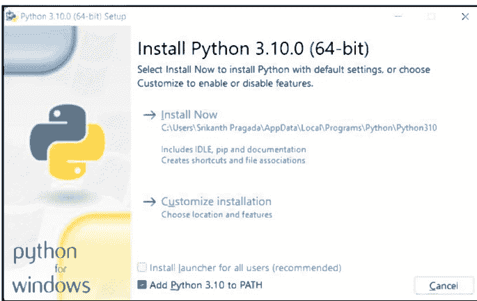
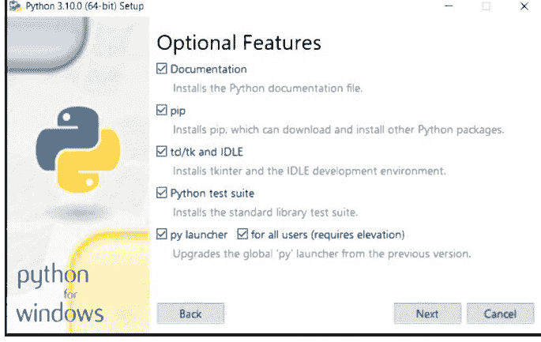
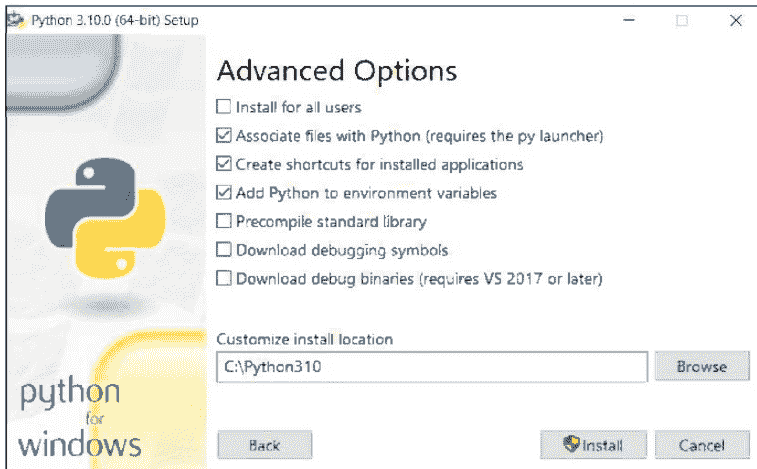
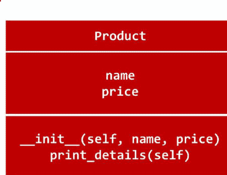
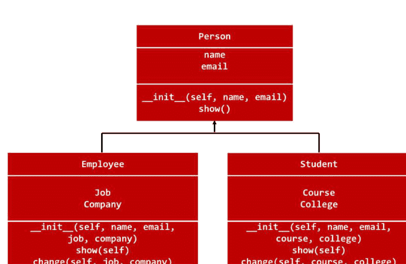
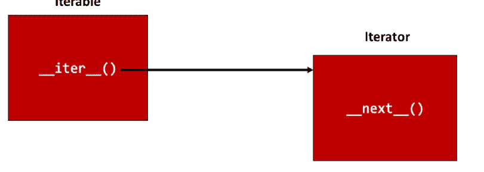
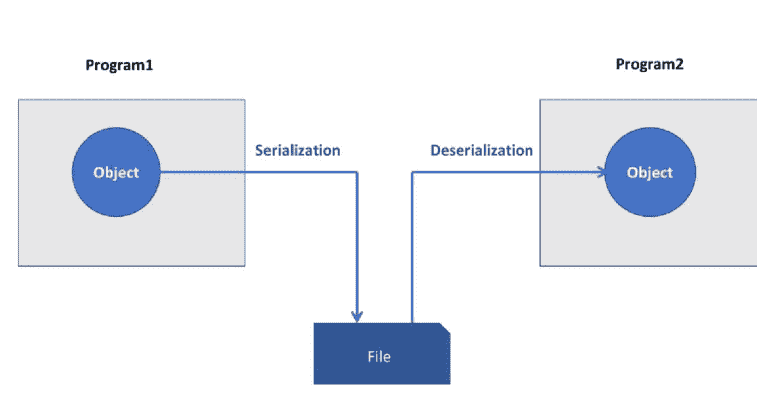

# Python 课程资料

Python 编程快速参考


Srikanth Pragada


Srikanth Technologies

## Python 语言与库

作者

Srikanth Pragada

## 版权信息

版权所有 @ 2022 **Srikanth Technologies**。保留所有权利。

未经作者兼出版商 **Srikanth Pragada** 事先书面许可，不得以任何形式或任何方式复制或分发本书的任何部分，也不得将其存储在数据库或检索系统中，但程序可以输入、存储和执行在计算机系统中，但不得复制用于出版。

尽管在准备本书时已采取了所有预防措施，但作者对任何错误或遗漏不承担责任。对于因使用其中所含信息而造成的任何损害，也不承担任何责任。

## 关于作者

**Srikanth Pragada** 是软件培训公司 Srikanth Technologies 的总监。他于 90 年代初开始编程，并使用过超过 15 种不同的编程语言。

**Srikanth Pragada** 持有以下认证：

- Sun 认证 Java 程序员
- Sun 认证 Web 组件开发人员
- Sun 认证业务组件开发人员
- Oracle 数据库 SQL 认证专家
- Oracle PL/SQL 开发人员认证助理
- 微软 .NET 4.0（Web 应用程序）认证技术专家

他目前提供 C、Java、Oracle、Microsoft.NET、Python、数据科学、Angular、AWS 和 React 的在线、课堂和现场培训。

他的网站 [www.srikanthtechnologies.com](http://www.srikanthtechnologies.com) 提供在线考试、程序、项目、文章和他的博客。

他通过 [https://github.com/srikanthpragada](https://github.com/srikanthpragada) 提供大量各种语言和技术的示例程序。

当他不教学或学习时，他喜欢游览新地方、阅读书籍、进行体育运动和听音乐。

可以通过他的电子邮件地址 [srikanthpragada@gmail.com](mailto:srikanthpragada@gmail.com) 联系他。

## 如何使用本资料

建议您在上课前后阅读相关内容。

利用图片和文字来掌握概念。程序用于说明如何实现这些概念。请在您的系统中尝试本资料中给出的程序。

## 反馈请求

我们已付出相当大的努力来确保本资料内容的准确性。但是，如果您发现任何错误或有任何改进建议，请花几分钟宝贵时间发送电子邮件至 **srikanthpragada@gmail.com**。

或者，您可以访问我的网站 **http://www.srikanthtechnologies.com/feedback.aspx** 并在那里提供反馈。

## 目录

- 版权信息 ........................................................................................................................................ 2
- 关于作者 ............................................................................................................................ 3
- 如何使用本资料 .................................................................................................................. 4
- 反馈请求 ...................................................................................................................... 4
- 目录 .............................................................................................................................. 5
- Python 语言 ............................................................................................................................ 11
- Python 安装 ...................................................................................................................... 12
- 使用 Python 解释器 - REPL .................................................................................................... 15
- 交互模式 ............................................................................................................................. 15
- 变量 ......................................................................................................................................... 16
- 标识符规则 .......................................................................................................................... 16
- 运算符 ....................................................................................................................................... 17
    - 赋值运算符 (=) ............................................................................................................ 17
    - 算术运算符 ................................................................................................................... 18
    - 关系运算符 .................................................................................................................... 19
    - 逻辑运算符 ......................................................................................................................... 20
- 内置数据类型 ......................................................................................................................... 21
- 关键字 ....................................................................................................................................... 23
- 内置函数 ........................................................................................................................... 24
- 函数 input() .............................................................................................................................. 27
    - 使用 print() 函数 .................................................................................................................. 27
    - 格式化输出 ......................................................................................................................... 28
    - f-string .................................................................................................................................. 29
- if 语句 ............................................................................................................................. 30
- 条件表达式 ........................................................................................................ 31
- while 循环 ...................................................................................................................... 32
- range() 函数 ............................................................................................................ 33
- pass 语句 ............................................................................................................... 33
- for 语句 .................................................................................................................. 34
- break、CONTINUE 和 else ................................................................................................... 35
- 字符串 .................................................................................................................................... 37
- 列表数据结构 ......................................................................................................... 42
- 列表推导式 ............................................................................................................. 44
- del 语句 ................................................................................................................. 45
- 与序列类型相关的操作 .................................................................................. 46
- 元组数据结构 ....................................................................................................... 47
- 函数 zip() 和 Enumerate() .......................................................................................... 48
- sorted() 和 reversed() ....................................................................................................... 49
- 集合数据结构 ........................................................................................................... 50
- 集合推导式 ............................................................................................................... 52
- 列表 vs. 集合 vs. 元组 ............................................................................................................ 52
- 字典数据结构 ................................................................................................ 53
- 字典推导式 ................................................................................................... 55
- 结构化模式匹配 ................................................................................................... 56
- 函数 .............................................................................................................................. 59
- 默认参数值 ..................................................................................................... 60
- 可变参数 ............................................................................................................... 61
- 关键字参数 .............................................................................................................. 62
- 仅限关键字参数 ..................................................................................................... 63

## Python 语言与库

-   仅限位置参数
-   将函数作为参数传递
-   使用 filter、sorted 和 map 函数
    -   Filter 函数
    -   Sorted 函数
    -   Map 函数
-   Lambda 表达式
-   参数传递 - 按值传递与按引用传递
-   局部函数
-   变量的作用域
-   模块
    -   import 语句
    -   dir() 函数
    -   help() 函数
    -   模块搜索路径
        -   设置 PYTHONPATH
    -   将模块作为脚本执行
    -   使用命令行参数
    -   文档
-   包
    -   使用 * 导入
-   PIP 和 PyPI
-   类
    -   `__init__` 方法
    -   私有成员（名称修饰）
    -   静态方法和变量
    -   类方法
    -   方法比较
    -   与属性相关的内置函数
    -   内置类属性
    -   特殊方法
    -   关系运算符
    -   一元运算符
    -   二元运算符
    -   扩展赋值
    -   属性
    -   继承
    -   重写
    -   函数 `isinstance()` 和 `issubclass()`
    -   多重继承
    -   方法解析顺序（MRO）
    -   抽象类和方法
-   异常处理
    -   预定义异常
    -   raise 语句
    -   用户自定义异常和 raise 语句
-   迭代器
-   生成器
-   生成器表达式
-   文件处理
    -   函数 `open()`
    -   with 语句（上下文管理器）
    -   文件对象
    -   Pickle – Python 对象序列化
    -   JSON 模块
    -   sys 模块
    -   os 模块
    -   使用 re（正则表达式）模块
        -   匹配对象
    -   datetime 模块
        -   date 类型
        -   time 类型
        -   datetime 类型
        -   timedelta 类型
        -   格式化代码
    -   多线程
        -   threading 模块中的函数
        -   Thread 类
    -   requests 模块
        -   requests.Response 对象
    -   BeautifulSoup 模块
        -   标签对象
        -   方法 `find()` 和 `find_all()`
    -   数据库编程
        -   SQLite3 数据库
        -   sqlite3 模块
        -   方法 `connect()`
        -   连接对象
        -   游标对象
        -   向表中插入行
        -   从表中检索行
        -   更新表中的行
        -   从表中删除行
        -   使用其他数据库

## PYTHON 语言

- 简单而强大的语言。
- 支持不同的编程范式，如*结构化编程*和*面向对象编程*。
- 是一种解释型语言。
- 非常适合脚本编写和快速应用开发。
- 支持高级数据结构，如列表、集合、字典和元组。
- Python 的设计哲学强调代码可读性，其语法允许程序员用更少的代码行表达概念。
- 由 **Guido van Rossum** 创建，于 1991 年首次发布。
- Python 具有动态类型系统和自动内存管理。
- Python 2.0 于 2000 年 10 月 16 日发布。
- Python 3.0（最初称为 Python 3000 或 py3k）于 2008 年 12 月 3 日发布。
- Python 3.10 于 2021 年 10 月发布。

## PYTHON 的安装

1.  访问 python.org (https://www.python.org/downloads)。
2.  点击 Downloads 菜单并选择你的平台。
3.  它会带你到相关的下载页面。例如，对于 Windows，它会带你到 https://www.python.org/downloads/windows/。
4.  选择 Windows x86-64 可执行安装程序并下载安装程序 (python-3.10.0-amd64.exe)。
5.  运行安装程序并选择*自定义安装*。
6.  将安装程序安装 Python 的目录更改为类似 c:\python 的路径。
7.  同时确保你在安装窗口中选择了 *Add Python 3.10 to PATH* 选项。
8.  安装程序将所有必需的文件安装到选定的文件夹中。安装程序会自动将 Python 安装文件夹设置在系统路径中。

## Python 语言和库





## Srikanth Technologies



## 使用 PYTHON 解释器 - REPL

-   转到命令提示符。
-   确保系统 PATH 设置为 Python 安装的文件夹。如果情况并非如此，那么你需要进入安装 Python 的文件夹（例如，c:\python）。
-   运行 **python.exe** 来启动解释器。它也被称为*读取-求值-打印循环 (REPL)*。

```
c:\python>python
Python 3.10.0 (tags/v3.10.0:b494f59, Oct  4 2021, 19:00:18) [MSC v.1929 64 bit (AMD64)] on win32
Type "help", "copyright", "credits" or "license" for more information.
>>>
```

-   使用 CTRL-Z 或 exit() 结束解释器并返回到命令提示符。
-   解释器的行编辑功能包括交互式编辑、历史记录替换以及在支持读取行的系统上进行代码补全。

### 交互模式

-   当命令从键盘读取时，解释器被认为处于*交互模式*。
-   它使用*主提示符*（通常是三个大于号 `>>>`）提示下一个命令；对于续行，它使用*次提示符*（默认是三个点 `...`）进行提示。
-   在交互式解释器中，输出字符串用引号括起来，特殊字符用反斜杠转义。
-   *print()* 函数通过省略引号并打印转义字符和特殊字符，产生更易读的输出。
-   两个或多个相邻的*字符串字面量*（即用引号括起来的字符串）会自动连接。

### 变量

-   Python 是一种动态语言，变量通过直接赋值来创建。
-   根据赋给变量的值，其数据类型被确定。
-   内置函数 `type()` 可用于找出变量的类型。

```
>>> a = 10
>>> type(a)
<class 'int'>
>>> b = "Python"
>>> type(b)
<class 'str'>
>>>
```

> 注意：我们可以使用 type() 内置函数找出任何变量的数据类型。

### 标识符规则

在为变量、函数和其他标识符创建名称时，我们需要遵循以下规则：

-   可以包含 0-9、a-z、A-Z 和下划线
-   不能以数字开头
-   长度不受限制
-   区分大小写

### 运算符

以下是 Python 中可用的不同类型的运算符。

#### 赋值运算符 (=)

-   赋值运算符用于将值赋给变量。
-   如果变量不存在，它会创建变量；否则，它会更改其当前值。
-   可以在单个赋值语句中为多个变量赋多个值。

```
>>> # 创建变量
>>> a = 10
>>> b = 20.50
>>>
>>> # 为多个变量赋多个值
>>> a, b = 0, 1
>>>
>>> # 交换两个变量
>>> a, b = b, a
>>>
>>> # 将 10 赋给 a, b 和 c
>>> a = b = c = 10
```

#### 算术运算符

以下是可用的算术运算符：

| 运算符 | 含义 |
| --- | --- |
| + | 加法 |
| - | 减法 |
| * | 乘法 |
| ** | 幂运算 |
| / | 除法 |
| // | 整数除法 |
| % | 取模 |

```
>>> a, b = 10, 4
>>> a / b, a // b
(2.5, 2)
>>> a ** b
10000
>>> a % 4
2
```

### 关系运算符

以下是用于比较值的关系运算符：

| 运算符 | 含义 |
| --- | --- |
| < | 小于 |
| > | 大于 |
| <= | 小于或等于 |
| >= | 大于或等于 |
| == | 等于 |
| != | 不等于 |

```
>>> a = 10
>>> b = 20
>>> a < b
True
>>> a == b
False
>>> s1 = "Abc"
>>> s2 = "ABC"
>>> s1 > s2
True
>>> s1 == s2
False
>>> s1 > s2
True
```

#### 逻辑运算符

以下是用于组合条件的逻辑运算符：

| 运算符 | 含义 |
| :--- | :--- |
| **and** | 逻辑与 |
| **or** | 逻辑或 |
| **not** | 逻辑非 |

```
>>> a, b, c = 10, 20, 30
>>> a < b and a < c
True
>>> a < b < c    # 等同于 a < b and b < c
True
>>> a != b or b != c
True
```

> **注意：** 布尔运算符 **and** 和 **or** 被称为*短路运算符* - 它们的参数从左到右求值，一旦结果确定，求值就会停止。

### 内置数据类型

以下是 Python 中的内置数据类型。

| 数据类型 | 含义 |
|---|---|
| None | 有一个具有此值的单个对象。此对象通过内置名称 **None** 访问。它在许多情况下用于表示值的缺失，例如，从没有显式返回任何内容的函数返回。其真值为假。 |
| NotImplemented | 有一个具有此值的单个对象。此对象通过内置名称 **NotImplemented** 访问。如果数值方法和富比较方法未为提供的操作数实现该操作，则应返回此值。其真值为真。 |
| 整数 (int) | 这些表示无限范围内的数字，仅受可用（虚拟）内存的限制。 |
| 布尔值 (bool) | 这些表示真值 *False* 和 *True*。表示值 False 和 True 的两个对象是唯一的布尔对象。布尔类型是整数类型的子类型，布尔值在几乎所有上下文中分别表现得像值 0 (False) 和 1 (True)，例外情况是当转换为字符串时，分别返回字符串 "False" 或 "True"。 |
| 浮点数 (float) | 这些表示机器级双精度浮点数。对于接受的范围和溢出处理，你受底层机器架构的支配。Python 不支持单精度浮点数。 |
| 复数 (complex) | 这些将复数表示为一对机器级双精度浮点数。 |
| 字符串 (str) | 字符串是表示 Unicode 码点的值序列。 |
| 元组 (tuple) | 元组的项是任意的 Python 对象。由两个或多个项组成的元组由逗号分隔的表达式列表形成。 |
| 字节 (bytes) | 字节对象是一个不可变的数组。项是 8 位字节，由范围 0 <= x < 256 内的整数表示。 |
| 列表 (list) | 列表的项是任意的 Python 对象。列表通过将逗号分隔的表达式列表放在方括号中形成。 |
| 字节数组 (bytearray) | 字节数组对象是一个可变的数组。它们由内置的 bytearray() 构造函数创建。 |
| 集合 (set) | 这些表示由 set() 构造函数创建的唯一值的可变集合。 |
| 冻结集合 (frozenset) | 这些表示由内置的 frozenset() 构造函数创建的不可变集合。 |
| 字典 (dict) | 这些表示由几乎任意值索引的对象的有限集合。 |

### 关键字

以下是 Python 中的重要关键字。

| False | class | finally | is | return |
| None | continue | for | lambda | try |
| True | def | from | nonlocal | while |
| and | del | global | not | with |
| as | elif | if | or | yield |
| assert | else | import | pass | break |
| except | in | raise | | |

### 内置函数

以下是 Python 中的内置函数。

| 函数 | 含义 |
|---|---|
| abs(x) | 返回一个数字的绝对值。 |
| all(iterable) | 如果可迭代对象的所有元素均为真值（或可迭代对象为空），则返回 True。 |
| any(iterable) | 如果可迭代对象的任一元素为真值，则返回 True。如果可迭代对象为空，则返回 False。 |
| bin(x) | 将整数转换为以“0b”为前缀的二进制字符串。 |
| chr(i) | 返回一个表示 Unicode 码位为整数 i 的字符的字符串。 |
| dir([object]) | 不带参数时，返回当前局部作用域中的名称列表。带参数时，尝试返回该对象的有效属性列表。 |
| filter(function, iterable) | 从可迭代对象中那些函数返回真值的元素构造一个迭代器。 |
| format(value[, format_spec]) | 将值转换为“格式化”表示形式，由 format_spec 控制。 |
| getattr(object, name[, default]) | 返回对象 object 的命名属性 name 的值。 |
| hex(x) | 将整数转换为以“0x”为前缀的小写十六进制字符串。 |
| id(object) | 返回对象的“标识”。这是一个整数，在对象的生命周期内保证唯一且恒定。 |
| len(s) | 返回对象的长度（项目数量）。 |
| `max(iterable)`<br>`max(arg1, arg2, *args)` | 返回可迭代对象中的最大项，或两个或多个参数中的最大者。 |
| `input([prompt])` | 如果存在 prompt 参数，则将其写入标准输出且不带换行符。然后函数从输入读取一行，将其转换为字符串（去除末尾换行符）并返回。当读取到 EOF 时，引发 EOFError。 |
| `min(iterable)`<br>`min(arg1, arg2, *args)` | 返回可迭代对象中的最小项，或两个或多个参数中的最小者。 |
| `oct(x)` | 将整数转换为以“0o”为前缀的八进制字符串。 |
| `ord(c)` | 给定一个表示单个 Unicode 字符的字符串，返回表示该字符 Unicode 码位的整数。 |
| `print(*objects, sep=' ', end='\n', file=sys.stdout, flush=False)` | 将对象打印到文本流 file，以 sep 分隔并以 end 结尾。如果存在 sep、end、file 和 flush，则必须作为关键字参数给出。 |
| `reversed(seq)` | 返回一个反向迭代器。 |
| `round(number[, ndigits])` | 返回 number 四舍五入到小数点后 ndigits 位精度的值。 |
| `sorted(iterable, *, key=None, reverse=False)` | 从可迭代对象中的项返回一个新的排序列表。 |
| `sum(iterable[, start])` | 从左到右对可迭代对象的项和 start 求和并返回总计。start 默认为 0。 |
| `type(object)` | 带一个参数时，返回对象的类型。 |

```
>>> v1 = 10
>>> v2 = 10.50
>>> v3 = "Python"
>>> v4 = True
>>> type(v1)
<class 'int'>
>>> type(v2)
<class 'float'>
>>> type(v3)
<class 'str'>
>>> type(v4)
<class 'bool'>
```

```
>>> abs(-10)
10
>>> bin(10)
'0b1010'
>>> chr(65)        # char for ascii code
'A'
>>> a = 10
>>> id(a)          # Address of the object
140728047310784
>>> max(10, 20, 30)
30
>>> ord('a')       # Ordinal value (ascii code)
97
>>> round(10.566)
11
>>> type(True)
<class 'bool'>
>>>
```

### 函数 input()

- 内置函数 **input()** 用于从用户获取输入。
- 它总是返回一个字符串，因此我们需要使用其他内置函数（如 **int()**）将其转换为所需的类型。

```
>>> num = int(input("Enter a number :"))
Enter a number :25
>>> print("Square of", num, "is", num * num)
Square of 25 is 625
>>>
```

### 使用 print() 函数

- 内置函数 print() 用于打印一个或多个值。
- 可以指定分隔符和结束字符。

```
>>> print(1, 2, 3)
1 2 3
>>> print(1, 2, 3, sep = '-')
1-2-3
>>> print(1, 2, 3, end = '\n\n')
1 2 3
>>> print("Python", 3.10, sep= " - ", end = "\n\n")
Python - 3.10
>>>
```

### 格式化输出

- 可以使用 % 和转换字符（如 %d 和 %s）打印格式化输出。
- 字符串的 **format()** 方法可用于格式化输出。调用此方法的字符串可以包含字面文本或由花括号 {} 分隔的替换字段。
- 每个替换字段包含位置参数的数字索引或关键字参数的名称。返回字符串的副本，其中每个替换字段都替换为相应参数的字符串值。

```
str % (values)
```

```
str.format(*args, **kwargs)
```

```
>>> name = "Srikanth"
>>> mobile = "9059057000"
>>> print("%s %s" % (name, mobile))
Srikanth 9059057000
>>> print("Name = {0}".format(name))
Name = Srikanth
>>> print("Name = {}, Mobile = {}".format(name, mobile))
Name = Srikanth, Mobile = 9059057000
>>> print("{name} {ver}".format(name="Python", ver=3.10))
Python 3.10
>>>
```

### f-string

- F-string 是以 f 为前缀的字符串，当变量在字符串内用 {} 括起来时，会插入变量的值。
- Python 3.6 的新特性。

```
>>> name = "Srikanth"
>>> lang = "Python"
>>> f"{name} is a {lang} trainer"
'Srikanth is a Python trainer'
```

可以按如下方式格式化值：

```
>>> mode = "Cash"
>>> amount = 251.567
>>> print(f"{mode:10} {amount:8.2f} {amount*0.20:5.2f}")
Cash            251.57  50.31
>>> f"{10000.00:8.2}"
'   1e+04'
```

> 注意：在格式说明符中，8.2 表示；总列数（包括小数点）为 8，小数点后有 2 位数字。字符 f 表示定点格式，否则使用 E 格式。

### IF 语句

- 用于条件执行。
- 通过逐个计算表达式，直到找到一个为真的表达式，然后选择恰好一个代码块执行。
- 可以有零个或多个 elif 部分，else 部分是可选的。

```
if boolean_expression:
    statements
[elif boolean_expression:
    statements] ...
[else:
    statements]
```

```
if a > b:
    print(a)
else:
    print(b)
```

```
if a > 0:
    print("Positive")
elif a < 0:
    print("Negative")
else:
    print("Zero")
```

### 条件表达式

- 根据条件返回真值或假值。
- 如果条件为真，则返回 true_value，否则返回 false_value。

```
true_value if condition else false_value
```

```
>>> a = 10
>>> b = 20
>>> a if a > b else b
20
```

### WHILE 循环

**while** 语句用于在布尔表达式为真时重复执行。

```
while boolean_expression:
    statements
[else:
    statements]
```

> **注意：** while 的 **else** 部分仅在循环正常终止时执行，即没有 **break** 语句时。

```
#### 打印从 1 到 10 的数字的程序
i = 1
while i <= 10:
    print(i)
    i += 1
```

```
#### 逆序打印数字中各位数字的程序
num = int(input("Enter a number :"))
while num > 0:
    digit = num % 10   # 取最右边的数字
    print(digit)
    num = num // 10     # 移除最右边的数字
```

### RANGE() 函数

- 我们可以使用 range() 函数生成给定起始值和结束值（不包括结束值）之间的数字。
- 如果你确实需要遍历一系列数字，内置函数 range() 就派上用场了。它生成等差数列。
- 在许多方面，range() 返回的对象的行为类似于列表，但实际上它不是。它是一个对象，当你遍历时返回所需序列的连续项，但它并不真正创建列表，从而节省空间。

```
range([start,] end [, step])
```

如果未给出 start，则取 0；如果未给出 step，则取 1。

```
range (10)                # 将生成 0 到 9
range (1, 10, 2)          # 将生成 1,3,5,7,9
```

### PASS 语句

pass 语句什么都不做。当语法上需要一条语句但程序不需要执行任何操作时，可以使用它。

### FOR 循环语句

执行给定的语句，直到列表耗尽。

```
for target in expression_list:
    statements
[else:
    statements]
```

`expression_list` 会被求值一次；它应该产生一个可迭代对象。系统会为 `expression_list` 的结果创建一个迭代器。然后，对于迭代器提供的每个项目，语句集会按迭代器返回的顺序执行一次。

当项目耗尽时（当序列为空或迭代器引发 `StopIteration` 异常时会立即发生），如果存在 `else` 子句，则执行其中的语句，然后循环终止。

```
#### 从1到10横向打印数字
for n in range(1, 11):
    print(n, end = ' ')
```

```
#### 程序：输入一个数字并显示其阶乘
num = int(input("Enter a number :"))
fact = 1
for i in range(2, num + 1):
    fact *= i

print(f"Factorial of {num} is {fact}")
```

### BREAK、CONTINUE 和 ELSE

-   **break** 语句，与 C 语言中一样，会跳出最内层的 **for** 或 **while** 循环。
-   循环语句可以有一个 **else** 子句；当循环因列表耗尽（对于 `for`）或条件变为假（对于 `while`）而终止时，它会被执行，但当循环被 **break** 语句终止时则不会执行。
-   **continue** 语句，同样借鉴自 C 语言，会继续循环的下一次迭代。

```
python
#### 检查数字是否为质数
num = int(input("Enter a number :"))
for i in range(2, num//2 + 1):
    if num % i == 0:
        print('Not a prime number')
        break
else:
    print('Prime number')
```

```
python
#### 程序：打印1到100之间的质数
for num in range(1, 101):
    for i in range(2, num//2 + 1):
        if num % i == 0:
            break
    else:
        print(num)
```

### 字符串

-   字符串可以用单引号或双引号括起来。
-   Python 字符串不能被修改——它们是不可变的。
-   内置的 `len()` 函数返回字符串的长度。
-   字符串可以被*索引*（下标），第一个字符的索引为 0。
-   没有单独的字符类型；字符就是长度为一的字符串。
-   索引也可以是负数，从右边开始计数。
-   除了索引，还支持*切片*。索引用于获取单个字符，而*切片*允许你获取子字符串。
-   切片索引有有用的默认值；省略的第一个索引默认为零，省略的第二个索引默认为被切片字符串的大小。

以下是索引和切片的示例：

```
>>>name="Python"
>>>name[0]
'p'
>>>name[-1]        # 最后一个字符
'n'
>>>name[-3:]       # 从末尾第3个字符开始取
'hon'
>>>name[0:2]       # 从0到1
'Py'
>>>name[4:]        # 从第4个位置开始取字符
'on'
>>> name[::-1]     # 反向取字符
'nohtyP'
>>> name[-2:-5:-1] # 从-2到-5反向取字符
'oht'
```

| 方法 | 描述 |
|---|---|
| capitalize() | 返回字符串的副本，其首字符大写，其余字符小写。 |
| count(sub[, start[, end]]) | 返回子字符串 `sub` 在范围 `[start, end]` 内的非重叠出现次数。 |
| endswith(suffix[, start[, end]]) | 如果字符串以指定的后缀结尾则返回 `True`，否则返回 `False`。 |
| find(sub[, start[, end]]) | 返回子字符串 `sub` 在切片 `s[start:end]` 中找到的最低索引。如果未找到 `sub`，则返回 -1。 |
| format(*args, **kwargs) | 执行字符串格式化操作。 |
| index(sub[, start[, end]]) | 类似于 `find()`，但在未找到子字符串时引发 `ValueError`。 |
| isalnum() | 如果字符串中的所有字符都是字母数字且至少有一个字符，则返回 `true`，否则返回 `false`。 |
| isalpha() | 如果字符串中的所有字符都是字母且至少有一个字符，则返回 `true`，否则返回 `false`。 |
| isdecimal() | 如果字符串中的所有字符都是十进制字符且至少有一个字符，则返回 `true`，否则返回 `false`。 |
| isdigit() | 如果字符串中的所有字符都是数字且至少有一个字符，则返回 `true`，否则返回 `false`。 |
| islower() | 如果字符串中的所有字符都是小写且至少有一个有大小写的字符，则返回 `true`，否则返回 `false`。 |
| isupper() | 如果字符串中的所有字符都是大写且至少有一个有大小写的字符，则返回 `true`，否则返回 `false`。 |
| join(iterable) | 返回一个字符串，它是 `iterable` 中字符串的连接。 |
| lower() | 返回字符串的副本，所有字符都转换为小写。 |
| partition(sep) | 在第一次出现 `sep` 的地方分割字符串，并返回一个三元组，包含分隔符之前的部分、分隔符本身和分隔符之后的部分。 |
| replace(old, new[, count]) | 返回字符串的副本，所有出现的子字符串 `old` 都被替换为 `new`。如果给出了可选参数 `count`，则只替换前 `count` 次出现。 |
| split(sep=None, maxsplit=-1) | 返回字符串中的单词列表，使用 `sep` 作为分隔符字符串。如果给出了 `maxsplit`，则最多进行 `maxsplit` 次分割（因此，列表最多有 `maxsplit+1` 个元素）。如果未指定 `maxsplit` 或为 -1，则对分割次数没有限制（进行所有可能的分割）。 |
| startswith(prefix[, start[, end]]) | 如果字符串以指定的前缀开头则返回 `True`，否则返回 `False`。 |
| strip([chars]) | 返回字符串的副本，移除开头和结尾的字符。 |
| upper() | 返回字符串的副本，所有字符都转换为大写。 |
| zfill(width) | 返回字符串的副本，左侧用 ASCII '0' 数字填充，使其成为长度为 `width` 的字符串。 |

```
>>> name = "Srikanth Technologies"
>>> print(name.upper())
SRIKANTH TECHNOLOGIES
>>> print(name.count("i"))
2
>>> name.find('Tech')
9
>>> name.replace(' ', '-')
'Srikanth-Technologies'
>>> name.startswith('S')
True
>>> for c in name:
...     print(c,end = ' ')
...
S r i k a n t h   T e c h n o l o g i e s
>>> for c in name[:-4:-1]:  # 最后3个字符反向
...     print(c)
...
s
e
i
```

### 列表数据结构

-   表示一个值的列表。
-   支持重复项并保持元素的顺序。
-   列表可以被修改（可变）。
-   可以使用索引访问元素。

| 方法 | 含义 |
|---|---|
| append(x) | 将一个项目添加到列表的末尾。等同于 `a[len(a):] = [x]`。 |
| extend(iterable) | 通过附加可迭代对象中的所有项目来扩展列表。等同于 `a[len(a):] = iterable`。 |
| insert(i, x) | 在给定位置插入一个项目。第一个参数是要在其之前插入的元素的索引，因此 `a.insert(0, x)` 在列表前端插入，`a.insert(len(a), x)` 等同于 `a.append(x)`。 |
| remove(x) | 从列表中移除第一个值为 `x` 的项目。如果没有这样的项目，则会引发错误。 |
| pop([i]) | 移除列表中给定位置的项目并返回它。如果未指定索引，`a.pop()` 移除并返回列表中的最后一个项目。方法签名中 `i` 周围的方括号表示该参数是可选的，而不是你应该在该位置输入方括号。 |
| clear() | 从列表中移除所有项目。等同于 `del a[:]`。 |
| index(x[, start[, end]]) | 返回列表中第一个值为 `x` 的项目的从零开始的索引。如果没有这样的项目，则引发 `ValueError`。可选参数 `start` 和 `end` 的解释与切片表示法相同，用于将搜索限制在列表的特定子序列内。返回的索引是相对于整个序列的开头计算的，而不是 `start` 参数。 |

### 列表方法

| 方法 | 描述 |
|---|---|
| count(x) | 返回 x 在列表中出现的次数。 |
| sort(key=None, reverse=False) | 对列表的元素进行原地排序（参数可用于自定义排序，其说明请参见 sorted()）。 |
| reverse() | 对列表的元素进行原地反转。 |
| copy() | 返回列表的浅拷贝。等同于 a[:]。 |

```
>>> fruits = ['orange', 'apple', 'grape',
...           'banana', 'mango', 'apple']
>>> print(fruits.count('apple'))   # count of apple
2
>>> print(fruits.index('banana'))  # index of banana
3
>>> print(fruits.index('apple', 3)) # search from 3rd index
5
>>> fruits.reverse()
>>> print(fruits)
['apple', 'mango', 'banana', 'grape', 'apple', 'orange']
>>> fruits.append('kiwi')
>>> fruits
['apple', 'mango', 'banana', 'grape', 'apple', 'orange', 'kiwi']
>>> fruits.sort()
>>> fruits
['apple', 'apple', 'banana', 'grape', 'kiwi', 'mango', 'orange']
>>> print(fruits.pop())
orange
```

### 列表推导式

- 列表推导式提供了一种创建列表的简洁方式。
- 列表推导式由包含一个表达式的括号组成，后跟一个 **for** 子句，然后是零个或多个 **for** 或 **if** 子句。

```
[value for v in iterable [if condition]]
```

```
>>> [n * n for n in range(1,10)]
[1, 4, 9, 16, 25, 36, 49, 64, 81]
```

```
>>> nums = [5, 3, 4, 7, 8]
>>> [n * n for n in nums if n % 2 == 0]
[16, 64]
```

### DEL 语句

从列表中移除一个或多个项目。

```
del item
```

```
>>> a = [10, 20, 30, 40, 50]
>>> del a[0]
>>> a
[20, 30, 40, 50]
>>> del a[1:3]
>>> a
[20, 50]
>>> del a[:]
>>> a
[]
>>> del a
>>> a    # Throws error
```

### 与序列类型相关的操作

像 str、list 和 tuple 这样的序列支持以下常见操作：

| 操作 | 结果 |
|---|---|
| x in s | 如果 s 的某个元素等于 x 则为 True，否则为 False |
| x not in s | 如果 s 的某个元素等于 x 则为 False，否则为 True |
| s + t | s 与 t 的拼接 |
| s * n 或 n * s | 等同于将 s 与自身相加 n 次 |
| s[i] | s 的第 i 项，起始为 0 |
| s[i:j] | s 从 i 到 j 的切片 |
| s[i:j:k] | s 从 i 到 j 步长为 k 的切片 |
| len(s) | s 的长度 |
| min(s) | s 的最小项 |
| max(s) | s 的最大项 |

### 元组数据结构

- 元组由用逗号分隔的多个值组成。
- 元组是不可变的，通常包含异构的元素序列，可通过解包或索引访问。
- 不能为元组的单个项赋值，但是可以创建包含可变对象（如列表）的元组。
- 成员运算符 **in** 和 **not in** 可用于检查对象是否是元组的成员。
- 函数可以使用元组返回多个值。
- 空元组通过空括号构造；包含一个项的元组通过在值后跟一个逗号构造（仅将单个值括在括号中是不够的）。

```
>>> t1 = ()                     # Empty tuple
>>> t2 = (10, )                 # single value tuple
>>> t3 = ("Python", "Language", 1991) # Tuple with 3 values
>>> t4 = ((1, 2), (10, 20))     # Nested tuple
>>> t1
()
>>> t2
(10,)
>>> t3
('Python', 'Language', 1991)
>>> t3[0]                       # prints first element
Python
>>> n, t, y = t3                # Unpacking of tuple
>>> print(n, t, y)
Python Language 1991
>>>
```

### 函数 ZIP() 和 ENUMERATE()

- 在遍历序列时，可以使用 **enumerate()** 函数同时获取位置索引和对应的值。
- 要同时遍历两个或多个序列，可以使用 **zip()** 函数将条目配对。

```
enumerate(iterable, start=0)
```

```
01 l1 = [10, 20, 30]
02 for i, n in enumerate(l1, start = 1):
03     print(i, n)
```

输出

```
1 10
2 20
3 30
```

```
zip(*iterables, strict=False)
```

如果 **strict** 为 True，则所有可迭代对象必须具有相同的大小，否则它考虑给定序列的最小长度。

```
01 l1 = [10, 20, 30]
02 l2 = ['abc', 'xyz', 'pqr']
03 for fv, sv in zip(l1, l2):
04     print(fv, sv)
```

输出

```
10 abc
20 xyz
30 pqr
```

### SORTED() 和 REVERSED()

函数 **sorted()** 用于返回给定可迭代对象的新排序值列表。

```
sorted(iterable, *, key=None, reverse=False)
```

> 注意：参数 *key* 用于指定一个函数，其返回值用于值的比较。稍后将介绍将函数作为参数传递的更多内容。

```
>>> l = [4, 3, 5, 1, 2]
>>> sorted(l)
[1, 2, 3, 4, 5]
```

函数 **reversed()** 用于以相反的顺序提供可迭代对象。

```
reversed(iterable)
```

```
>>> l = [4, 3, 5, 1, 2]
>>> for n in reversed(l):
...     print(n)
...
2
1
5
3
4
```

### 集合数据结构

- 集合是一个*无序*的、*无重复*元素的集合。
- 集合对象还支持数学运算，如并集、交集、差集和对称差集。
- 可以使用花括号或 set() 函数创建集合。
- 要创建一个空集合，必须使用 set()，而不是 {}；后者创建一个空字典。
- 不能使用索引访问项目，即不可下标。

| 方法 | 含义 |
|---|---|
| isdisjoint(other) | 如果集合与 other 没有公共元素则返回 True。 |
| issubset(other) 或 set <= other | 测试集合中的每个元素是否都在 other 中。 |
| set < other | 测试集合是否是 other 的真子集，即 set <= other 且 set != other。 |
| issuperset(other) 或 set >= other | 测试 other 中的每个元素是否都在集合中。 |
| set > other | 测试集合是否是 other 的真超集，即 set >= other 且 set != other。 |
| union(*others) 或 set \| other \| ... | 返回一个新集合，包含集合和所有 other 中的元素。 |
| intersection(*others) 或 set & other & ... | 返回一个新集合，包含集合和所有 other 中的公共元素。 |
| difference(*others) 或 set - other - ... | 返回一个新集合，包含集合中不在 other 中的元素。 |
| symmetric_difference(other) 或 set ^ other | 返回一个新集合，包含在集合或 other 中但不同时在两者中的元素。 |
| update(*others) 或 set \|= other | 更新集合，添加所有 other 中的元素。 |

| 方法 | 描述 |
|---|---|
| add(elem) | 将元素 elem 添加到集合中。 |
| remove(elem) | 从集合中移除元素 elem。如果 elem 不在集合中，则引发 KeyError。 |
| discard(elem) | 如果元素 elem 存在，则从集合中移除它。 |
| pop() | 从集合中移除并返回一个任意元素。如果集合为空，则引发 KeyError。 |
| clear() | 从集合中移除所有元素。 |

```
>>> langs = {"Python","Java","C#","C","Pascal"}
>>> old_langs = {"C","Pascal","COBOL"}
>>> print("Java" in langs)
True
>>> letters = set("Python")   # Convert str to set
>>> print(letters)
{'t', 'o', 'h', 'y', 'P', 'n'}
>>> print("Union:", langs | old_langs)
Union: {'C#', 'COBOL', 'Python', 'C', 'Java', 'Pascal'}
>>> print("Minus:", langs - old_langs)
Minus: {'C#', 'Java', 'Python'}
>>> print("Intersection:", langs & old_langs)
Intersection: {'C', 'Pascal'}
>>> print("Exclusive Or:", langs ^ old_langs)
Exclusive Or: {'C#', 'COBOL', 'Python', 'Java'}
```

### 集合推导式

用于从给定的可迭代对象创建集合，可选择基于条件。

```
{value for v in iterable [if condition]}
```

```
>>> st = "abc123acdef456"
>>> {c for st in if c.isalpha() }
{'c', 'd', 'b', 'f', 'e', 'a'}
```

### 列表 vs. 集合 vs. 元组

下表比较了不同数据结构的特性。

| 特性 | 列表 | 集合 | 元组 |
| :--- | :--- | :--- | :--- |
| 支持重复 | 是 | 否 | 是 |
| 可变 | 是 | 是 | 否 |
| 可索引 | 是 | 否 | 是 |
| 插入顺序 | 是 | 否 | 是 |
| 可迭代 | 是 | 是 | 是 |

### 字典数据结构

- 字典通过键进行索引，键可以是任何不可变类型；字符串和数字始终可以作为键。
- 最好将字典视为*键:值*对的无序集合，要求键是唯一的（在一个字典内）。
- 在花括号内放置以逗号分隔的 *键:值* 对列表，可以向字典添加初始的 *键:值* 对。
- 使用不存在的键提取值是错误的。
- **dict()** 构造函数直接从键值对序列构建字典。
- 在遍历字典时，可以使用 **items()** 方法同时获取键和对应的值。

```
>>> dict1 = {"k1": "Value1", "k2": "Value2"}
>>> print(dict1)
{'k1': 'Value1', 'k2': 'Value2'}
>>> print(dict1.keys())
dict_keys(['k1', 'k2'])
>>> for k in dict1.keys():
...     print( k, ':', dict1[k])
...
k1 : Value1
k2 : Value2
>>> print('k3' in dict1)
False
>>> # Unpack tuple returned by items()
>>> for k, v in dict1.items():
...     print( k, ':', v)
...
k1 : Value1
k2 : Value2
```

### 字典推导式

可以通过从可迭代对象中获取值来创建字典。

以下是字典推导式的通用语法。

```
{key:value for v in iterable}
```

```
>>> # 从列表创建字典
>>> nums = [10, 4, 55, 23, 9]
>>> squares = {n:n*n for n in nums}
>>> print(squares)
{10: 100, 4: 16, 55: 3025, 23: 529, 9: 81}
>>> # 从字符串创建字典
>>> name = "Srikanth"
>>> codes = {ch:ord(ch) for ch in name}
>>> print(codes)
{'S': 83, 'r': 114, 'i': 105, 'k': 107, 'a': 97, 'n': 110, 't': 116, 'h': 104}
>>>
```

### 结构化模式匹配

- 结构化模式匹配以 **match 语句** 和带有相关操作的模式 **case 语句** 的形式添加。
- match 语句接受一个 **表达式**，并将其值与一个或多个 case 块中给出的连续 **模式** 进行比较。
- 模式由序列、映射、原始数据类型以及类实例组成。
- 此功能在 Python **3.10** 中引入。

```
match expression:
    case <pattern_1>:
        <action_1>
    case <pattern_2>:
        <action_2>
    case <pattern_3>:
        <action_3>
    case _:
        <action_wildcard>
```

```
match code:
    case 1:
        discount = 10
    case 2:
        discount = 20
    case 3:
        discount = 25
    case _:
        discount = 5
```

在模式匹配过程中，可以将值捕获到变量中。

```
point = (0, 10)  # 行，列
match point:
    case (0, 0):
        print("第一行，第一列")
    case (0, c):
        print(f"第一行，第 {c} 列")
    case (r, 0):
        print("第一列，第 {r} 行")
    case (r, c):
        print(f"第 {r} 行，第 {c} 列")
```

也可以在 case 语句中使用多个字面量，如下所示：

```
match month:
    case 2:
        nodays = 28
    case 4 | 6 | 9 | 11:
        nodays = 30
    case _:
        nodays = 31
```

当表达式是字典时，可以匹配键并将值捕获到变量中。

```
#### 假设 d 可能具有以下两种结构之一
d = {'name': 'Jack', 'email': 'jack@gmail.com'}
d = {'firstname': 'Scott'}

match d:
    case {'name': user}:
        pass
    case {'firstname': user}:
        pass
    case _:
        user = 'Unknown'

print(user)
```

### 函数

- 关键字 **def** 引入一个函数 *定义*。它必须后跟函数名和括号括起来的形式参数列表。构成函数体的语句从下一行开始，并且必须缩进。
- 函数体的第一条语句可以是字符串字面量；这个字符串字面量是函数的文档字符串，或 *docstring*。
- 变量引用首先在局部符号表中查找，然后在封闭函数的局部符号表中查找，接着在全局符号表中查找，最后在内置名称表中查找。
- 参数通过 *按值调用* 传递（其中 *值* 始终是对象 *引用*，而不是对象的值）。
- 事实上，即使没有 return 语句的函数也会返回一个值——None。

```
[decorators] "def" funcname "(" [parameter_list] ")"
["->" expression] ":" suite
```

```
#### 返回两个数之和的函数
def add(a,b):
    return a + b
```

```
#### 返回给定数字阶乘的函数
def factorial(num):
    fact=1
    for i in range(1,num + 1):
        fact *= i

    return fact
```

### 默认参数值

- 可以为一个或多个参数指定默认值。
- 默认值在函数 *定义* 时的 *定义* 作用域中求值，而不是在运行时求值。

```
def print_line(len=10, ch='-'):
    for i in range(len):
        print(ch, end='')
    else:
        print()  # 结束时换行
```

```
print_line(30, '*')  # 按位置传递值
print_line(20)       # 使用连字符(-)画线
print_line()         # 使用默认值画线
print_line(ch='*')   # 按关键字传递值

#### 使用关键字传递值
print_line(ch='*', len=15)
```

> **注意：** 默认值只求值一次。当默认值是可变对象（如列表、字典或大多数类的实例）时，这会产生影响。

### 可变参数

- 函数可以通过定义带前缀 * 的形式参数来接受任意数量的参数。
- 当函数有一个可变形式参数时，它可以接受任意数量的实际参数。
- 函数可以将可变参数与普通参数混合使用。
- 但是，普通参数可以通过名称传递值，或者它们必须出现在可变参数之前。

```
def print_message(*names, message = "Hi"):
    for n in names:
        print(message, n)

#### 调用函数
print_message("Bill", "Larry", "Tim")
print_message("Steve", "Jeff", message="Good Morning")
```

> 注意：参数名称是元组类型。

### 关键字参数

- 可以通过定义一个以 ** 为前缀的参数来定义函数，使其接受任意序列的关键字参数。
- 函数将此参数视为 **字典**，并将所有关键字参数作为字典中的键提供。
- 可以使用 **kwarg=value** 的形式调用函数并传递关键字参数，其中 kwarg 是关键字，value 是值。
- 在函数调用中，如果存在位置参数，关键字参数必须跟在位置参数之后。

```
def show(**kwargs):
    for k, v in kwargs.items():
        print(k, v)

def showall(*args, **kwargs):
    print(args)
    for k, v in kwargs.items():
        print(k, v)

show(a=10, b=20, c=20, msg="Hello")
showall(10, 20, 30, x=1, y=20)
```

上述程序将显示：

```
a 10
b 20
c 20
msg Hello
(10, 20, 30)
x 1
y 20
```

### 仅关键字参数

- 可以通过在参数前加上 * 来将参数定义为仅关键字参数。
- * 之后的所有参数都必须仅使用关键字传递值，而不能通过位置传递。

```
#### 参数 name 和 age 只能作为关键字参数传递，而不能作为位置参数传递

def details(*, name, age=30):
    print(name)
    print(age)

#### 调用 details()
details(name="Bill", age=60)
details(age=50, name="Scott")
details(name="Tom")
details("Bill")              # 错误
```

当你尝试使用位置参数调用 **details("Bill")** 时，Python 会抛出如下错误：

```
TypeError: details() takes 0 positional arguments but 1 was given
```

### 仅限位置参数

- 从 Python 3.8 开始，可以创建一个函数，该函数仅通过位置接收参数，而不通过关键字接收参数。
- 在所有需要仅限位置的参数之后添加一个 `/`（斜杠）。

```python
def add(n1, n2, /):
    return n1 + n2

print(add(10, 20)) # 参数通过位置传递
print(add(n1=10, n2=20))  # 不能使用关键字参数
```

```
30
Traceback (most recent call last):
File "<stdin>", line 1, in <module>
TypeError: add() got some positional-only arguments passed as keyword arguments: 'n1, n2'
```

### 将函数作为参数传递

- 函数可以接收另一个函数作为参数。
- 这在 Python 中是可行的，因为函数被视为对象，因此就像任何其他对象一样，函数也可以作为参数传递给另一个函数。

```python
def add(n1, n2):
    return n1 + n2

def mul(n1, n2):
    return n1 * n2

def math_operation(a, b, operation):
    return operation(a, b)

print(math_operation(10, 20, add))
print(math_operation(10, 20, mul))
```

### 使用 filter、sorted 和 map 函数

以下示例展示了如何将函数作为参数与内置函数 filter、sorted 和 map 一起使用。

#### Filter 函数

函数 **filter** 用于从可迭代对象中选择一组元素，对于这些元素，给定的函数返回 true。给定的函数必须接受一个值并返回 true 或 false。当函数返回 true 时，该值被选中；否则该值被忽略。

```
filter(function, iterable)
```

> 注意：传递给 filter 的函数应接受单个值并返回布尔值。

以下示例从给定的数字列表中选择所有偶数。

```python
def iseven(n):
    return n % 2 == 0

nums = [1, 4, 3, 5, 7, 8, 9, 2]

##### filter 调用 iseven 并选择偶数
for n in filter (iseven, nums):
    print(n)
```

> 注意：filter() 返回一个 filter 类型的对象，它是可迭代的，而不是列表。

#### Sorted 函数

对给定的可迭代对象进行排序，并返回一个包含排序后值的列表。

```
sorted(iterable, *, key=None, reverse=False)
```

**Key** 参数表示一个返回值的函数。

以下代码按名称长度而非字符对名称进行排序。

内置函数 **sorted()** 使用传递给 **key** 参数的函数来提取集合中元素的值，并使用这些值进行比较。如果未传递 **key**，则直接使用元素。

```python
names = ["Php", "Java", "C", "Python", "SQL", "C#"]
##### 根据长度对名称进行排序
for n in sorted(names, key=len):
    print(n)
```

```
C
C#
Php
SQL
Java
Python
```

#### Map 函数

返回一个迭代器，该迭代器将给定的函数应用于可迭代对象中的每个元素，产生新的值。

```
map (function, iterable, ...)
```

作为第一个参数给出的函数必须返回一个值。

以下示例展示了如何使用 map() 函数为给定值返回下一个偶数。

```python
def next_even(n):
    return n + 2 if n % 2 == 0 else n + 1

nums = [10, 11, 15, 20, 25]
for n in map(next_even,nums):
    print(n)
```

### Lambda 表达式

- Lambda 表达式指的是匿名函数。
- 在需要函数的地方，我们可以使用 lambda 表达式。
- 关键字 *lambda* 用于创建 lambda 表达式。

```
Lambda parameters: expression
```

参数用逗号 (,) 分隔，它们代表相关函数的参数。冒号 (:) 之后给出的表达式表示所需的操作。

以下示例展示了如何将 lambda 与 **filter()** 函数结合使用，该函数返回一个值列表，这些值由给定函数从给定列表中选择。

```python
nums = [10, 11, 33, 45, 44]

#### 使用 lambda，获取所有奇数
for n in filter (lambda v: v % 2 == 1, nums):
    print(n)
```

以下示例使用传递给 sorted() 函数 key 参数的 lambda 表达式，通过去除所有空白并将其转换为小写（以实现不区分大小写）来对所有名称进行排序。

```python
names = [" PHP", " JAVA", "c", "Python ",
          "JavaScript", "C#  ", "cobol"]
#### 去除空格并转换为小写后排序
for n in sorted(names,
                key=lambda s: s.strip().lower()):
    print(n)
```

### 参数传递 - 按值传递和按引用传递

- 在 Python 中，一切都是对象。
- *int* 是对象，*string* 是对象，*list* 也是对象。
- 有些对象是可变的，有些是不可变的。
- 所有对象都通过引用（地址）传递给函数。这意味着我们传递的是对象的引用，而不是对象本身。
- 但是函数是否可以修改对象的值取决于对象的可变性。
- 因此，如果你传递一个字符串，它的行为类似于按值传递，因为我们无法用形参改变实参。
- 如果你传递一个列表（可变对象），那么它的行为类似于按引用传递，因为我们可以使用形参来改变实参。

```python
#### 实际上是按引用传递
def add_num(v, num):
    v.append(num)    # 修改列表

nums = []
#### 使用列表和要添加到列表的值调用函数
add_num(nums, 10)
add_num(nums, 20)
print(nums)
```

```
[10, 20]
```

```python
#### 实际上是按值传递
def swap(n1, n2):
    n1, n2 = n2, n1
    print('Inside swap() :', 'id(n1)', id(n1),
               'id(n2)', id(n2))
    print('Values : ', n1, n2)

#### 使用两个整型变量调用 swap
a = 10
b = 20
print('Original Ids:', 'id(a)', id(a), 'id(b)', id(b))
swap(a, b)
print('Values after swap :', a, b)
```

输出：

```
Original Ids  : id(a) 503960768 id(b) 503960928
Inside swap() : id(n1) 503960928 id(n2) 503960768
Values :  20 10
Values after swap :  10 20
```

### 局部函数

- 在另一个函数内部定义的函数称为局部函数。
- 局部函数对于定义它们的函数是局部的。
- 它们在每次调用外部函数时定义。
- 它们遵循相同的 **LEGB**（局部、外部、全局、内置）规则。
- 它们可以访问外部作用域中的变量。
- 不能使用 *outerfunction.Localfunction* 表示法从外部函数外部调用。
- 它们可以包含多个语句，而 lambda 只能有一个语句。
- 局部函数可以从外部函数返回，然后可以从外部调用。
- 局部函数可以使用 **global** 关键字引用全局命名空间中的变量，使用 **nonlocal** 关键字引用外部命名空间中的变量。

```python
gv = 100  # 全局变量
def f1():
    v = 200  # 外部变量

    # 局部函数 f2
    def f2():
        lv = 300  # 局部变量
        # 局部、外部、全局、内置名称
        print(lv, v, gv, True)


    f2()  # 从外部函数调用局部函数


f1()
```

### 变量的作用域

- 在模块中所有函数外部定义的变量称为全局变量，可以从模块中的任何地方访问。
- 在函数内部创建的变量只能在函数内部使用。
- 关键字 **global** 用于从函数中访问全局变量，这样当你给变量赋值时，Python 不会创建一个同名的局部变量。
- Python 按照局部、外部、全局和内置（LEGB）的顺序查找变量。

```python
sum = 0   # 全局变量
def add_square(value):
    square = value * value # square 是局部变量
    global sum            # 引用全局变量
    sum += square         # 将 square 添加到全局 sum

def outerfun():
    a = 10
    def innerfun():
        nonlocal a
        a = a + 1         # 递增外部变量 a

    innerfun()
    print(a)

add_square(4)
add_square(5)
print(sum)
outerfun()
```

### 模块

- 模块是一个包含 Python 定义（函数和类）和语句的文件。
- 它可以在脚本（另一个模块）或解释器的交互式实例中使用。
- 模块可以被*导入*到其他模块中，或者作为脚本运行。
- 文件名是模块名加上后缀 .py。在模块内部，模块的名称（作为字符串）作为全局变量 `__name__` 的值可用。
- 模块可以包含可执行语句以及函数和类定义。这些语句旨在初始化模块。它们仅在模块名称在 import 语句中*第一次*遇到时执行。

num_funs.py

```python
def is_even(n):
    return n % 2 == 0

def is_odd(n):
    return n % 2 == 1

def is_positive(n):
    return n > 0
```

use_num_funs.py

```python
import num_funs          # 导入模块

print(num_funs.__name__)
print(num_funs.is_even(10))
```

### THE IMPORT STATEMENT

- 为了使用模块中的类和函数，我们必须首先使用 **import** 语句导入模块。
- 系统维护一个已初始化模块的表格，以模块名作为索引。该表格可通过 **sys.modules** 访问。
- 如果未找到匹配的文件，将引发 **ImportError**。如果找到文件，则对其进行解析，生成可执行代码块。如果发生语法错误，将引发 **SyntaxError**。
- 每当导入模块时，模块中的代码（而非类和函数）都会被执行。

```
import module [as name] (, module [as name])*
from module import identifier [as name]
                (, identifier [as name])*
from module import *
```

以下是 import 语句的示例：

```
#### import num_funs and refer to it by alias nf
import num_funs as nf

print(nf.is_even(10))
```

```
#### import all definitions of module num_funs
from num_funs import *

print(is_even(10))
```

```
#### import specific function from num_funs module
from num_funs import is_even, is_odd

print(is_odd(10))
```

### THE DIR() FUNCTION

它用于获取模块的成员。它返回一个排序后的字符串列表。

以下显示了 num_funs 模块的成员。

```
import num_funs
print(dir(num_funs))
```

输出：

```
['__builtins__', '__cached__', '__doc__', '__file__',
'__loader__', '__name__', '__package__', '__spec__',
'is_even', 'is_odd', 'is_positive']
```

> 注意：当 dir() 和 __name__ 在模块中使用时，它们指的是当前模块。

### THE HELP() FUNCTION

- 它调用内置的帮助系统。
- 如果未给出参数，交互式帮助系统将在解释器控制台启动。
- 如果参数是任何其他类型的对象，则会生成该对象的帮助页面。

```
help([object])
```

使用空格键转到下一页，按 Q 键退出帮助系统。

### MODULE SEARCH PATH

当导入模块时，解释器首先搜索具有该名称的内置模块。如果未找到，则在变量 **sys.path** 给出的目录列表中搜索名为 modulename.py 的文件。

**sys.path** 从以下位置初始化：

- 包含输入脚本的目录（或未指定文件时的当前目录）。
- PYTHONPATH（一个目录名列表，语法与 shell 变量 PATH 相同）。
- 与安装相关的默认值。

```
>>> import sys
>>> sys.path
['', 'C:\\python\\python38.zip', 'C:\\python\\DLLs', 'C:\\python\\lib', 'C:\\python', 'C:\\python\\lib\\site-packages']
>>>
```

### Setting PYTHONPATH

以下示例将 PYTHONPATH 设置为几个目录，以便将它们添加到模块搜索路径。

```
c:\python>set PYTHONPATH=c:\dev\python;c:\dev\projects
```

> 注意：可以向 **sys.path** 添加条目，因为它是一个列表。使用 r 作为前缀表示它是原始字符串，这样 \（反斜杠）将被视为普通字符而非特殊字符。

```
sys.path.append(r'c:\dev\python\projects')
```

### EXECUTING MODULE AS SCRIPT

- 模块可以包含可执行语句以及函数和类定义。这些语句旨在初始化模块。
- 当你将模块作为脚本运行以及使用 import 语句将模块导入另一个模块时，模块中的可执行语句都会被执行。
- 当你使用 `python filename.py` 运行 Python 模块时，模块中的代码将被执行，但 `__name__` 被设置为 `__main__`。
- 但如果我们只想在模块作为脚本运行时执行代码，则需要检查模块的名称是否设置为 `__main__`。

#### module1.py

```
##### this is simple module
def print_info():
    print("I am in module1.print_info()")

##### code executed when imported or when run as script
print("In Module1")

##### code executed only when run as script
if __name__ == "__main__":
    print("Running as script")
```

当你将上述代码作为脚本运行（`python.exe module1.py`）时，将生成以下输出：

```
In Module1
Running as script
```

但当你将此模块导入另一个文件时，如下所示，则会生成以下输出。

#### use_module1.py

```
import module1

module1.print_info()
```

仅导入模块并调用函数时的输出：

```
In Module1
I am in module1.print_info()
```

### USING COMMAND LINE ARGUMENTS

- 可以在从命令行调用模块时传递命令行参数。
- 命令行参数放在 **argv** 列表中，该列表存在于 **sys** 模块中。
- **sys.argv** 中的第一个元素始终是正在执行的模块的名称。

#### argv_demo.py

```
import sys
print("No. of arguments:", len(sys.argv))
print("File: ", sys.argv[0])
for v in sys.argv[1:]:
    print(v)
```

使用 python 如下所示将 **argv_demo.py** 作为脚本运行：

```
C:\python>python argv_demo.py first second
No. of arguments: 3
File: argv_demo.py
first
second
```

### DOCUMENTATION

- 按照惯例，每个函数都必须使用文档约定进行记录。
- 文档在三个双引号（"""）之间提供。
- 第一行应始终是对象用途的简短、简洁摘要。此行应以大写字母开头，并以句号结尾。

```
def add(n1,n2):
    """Adds two numbers and returns the result.

    Args:
        n1(int) : first number.
        n2(int) : second number.

    Returns:
        int : Sum of the given two numbers.
    """

    return n1 + n2

help(add)           # prints documentation for add()
print(add.__doc__)  # prints documentation
```

### PACKAGES

- 包是模块的集合。
- 导入包时，Python 会搜索 **sys.path** 上的目录以查找包子目录。
- 通常，**__init__.py** 文件用于使 Python 将目录视为包；这样做是为了防止具有通用名称（如 string）的目录无意中隐藏模块搜索路径上稍后出现的有效模块。但是，**__init__.py** 是可选的。
- 文件 **__init__.py** 可以只是一个空文件，但它也可以执行包的初始化代码或设置 **__all__** 变量。
- 包的用户可以从包中导入单个模块。

#### Folder Structure

```
use_st_lib.py
stlib
    __init__.py
    str_funs.py
    num_funs.py
    mis_funs.py
```

### stlib\str_funs.py

```
def has_upper(st):
    # code
def has_digit(st):
    # code
```

#### use_st_lib.py

```
##### Import module from package
import stlib.str_funs

##### call a function in module
print(stlib.str_funs.has_upper("Python"))

##### import a function from a module in a package
from stlib.str_funs import has_digit

##### call function after it is imported
print(has_digit("Python 3.10"))
```

#### Importing with *

- 为了在对包中的模块使用 * 时导入特定模块，我们必须在包的 `__init__.py` 中定义变量 `__all__` 以列出要导入的模块。
- 如果 `__init__.py` 中未定义变量 `__all__`，则 Python 确保包已被导入（运行 `__init__.py` 中的初始化代码），然后导入包中定义的任何名称，但不导入任何模块。

#### stlib\__init__.py

```
__all__ = ["num_funs", "str_funs"]
```

### PIP AND PYPI

- PyPI（Python 包索引）是 Python 包的存储库。
- URL https://pypi.org/ 列出了所有我们可以下载和使用的 Python 包。
- PIP 是 Python 包的通用安装工具。
- 从 python\scripts 文件夹运行 pip.exe。

以下是 PIP 提供的一些重要选项：

```
>pip install requests       # Installs requests package
>pip uninstall requests     # Uninstalls requests package
>pip list                   # Lists all installed packages
```

```
>pip show requests
Name: requests
Version: 2.27.1
Summary: Python HTTP for Humans.
Home-page: https://requests.readthedocs.io
Author: Kenneth Reitz
Author-email: me@kennethreitz.org
License: Apache 2.0
Location: c:\python\lib\site-packages
Requires: certifi, charset-normalizer, idna, urllib3
Required-by:
```

### 类

-   一个类封装了数据（数据属性）和代码（方法）。
-   创建一个新类会创建一个新的*类型*，允许创建该类型的新*实例*。
-   数据属性无需声明；就像局部变量一样，它们在第一次被赋值时就会出现。
-   类*实例化*使用函数表示法。只需将类对象视为一个无参数函数，该函数返回类的一个新实例。
-   方法的特殊之处在于，实例对象会作为函数的第一个参数（称为 self）传递。

```
class className:
    definition
```

### __init__ 方法

-   当一个类定义了 __init__() 方法时，类实例化会自动为新创建的类实例调用 __init__()。
-   传递给类实例化运算符的参数会传递给 __init__()。



```
01 class Product:
02     def __init__(self, name, price):
03         # Object attributes
04         self.name = name
05         self.price = price
06 
07     def print_details(self):
08         print("Name  : ", self.name)
09         print("Price : ", self.price)
10 
11 p = Product("Dell XPS Laptop",80000)  # create object
12 p.print_details()
```

### 私有成员（名称修饰）

-   Python 没有私有变量的概念。
-   然而，大多数 Python 程序员遵循的一个惯例是，以单下划线（_attribute）或双下划线（__attribute）为前缀的属性应被视为 API 的非公共（分别为受保护和私有）部分。
-   任何形如 __attribute（两个前导下划线）的标识符在文本上都会被替换为 _classname__attribute，其中 classname 是当前类名。这个过程称为**名称修饰**。
-   例如，*Employee* 类中的 __salary 会变成 _Employee__salary。
-   然而，仍然可以从类外部访问或修改被认为是私有的变量。

| 名称 | 表示法 | 行为 |
| :--- | :--- | :--- |
| name | 公共 | 可以从内部和外部访问。 |
| _name | 受保护 | 像公共成员一样，但不应从外部直接访问。 |
| __name | 私有 | 无法从外部看到和访问。 |

```
01 class Product:
02     def __init__(self, name, price):
03         self.__name = name
04         self.__price = price
05 
06     def print_details(self):
07         print("Name  : ", self.__name)
08         print("Price : ", self.__price)
```

由于属性 name 和 price 以 __（双下划线）为前缀，它们应被视为类的私有成员。Python 会为这些属性添加类名前缀。

以下代码无法访问 __name 属性，因为由于**名称修饰**，其名称已添加了类名前缀。

```
p = Product("Dell XPS Laptop", 80000)
print(p.__name)          # will throw error
```

```
AttributeError : 'Product' object has no attribute '__name'
```

但是，如果使用 _classname 作为前缀，您可以从外部访问私有属性，如下所示：

```
p = Product("Dell XPS Laptop", 80000)
print(p._Product__name)
```

> 注意：对象属性 __dict__ 返回一个属性字典，其中键是属性名称，值是属性值。

### 静态方法和变量

-   在类中声明的任何变量都称为类变量。它也称为静态变量和类属性。
-   使用 **@staticmethod** 装饰器创建的任何方法都成为静态方法。
-   默认情况下，静态方法不传递任何参数。
-   静态方法使用类名调用。
-   静态方法执行与类相关的操作，例如操作静态变量。

```python
class Point:
    # Static attributes
    max_x = 100
    max_y = 50
    def __init__(self, x, y):
        self.x = x
        self.y = y

    @staticmethod
    def isvalid(x,y):
        return x <= Point.max_x and y <= Point.max_y
```

为了调用静态方法，我们需要使用类名，如下所示：

```python
print(Point.isvalid(10,20))
```

### 类方法

-   当类中的方法用 **@classmethod** 装饰器装饰时，它被称为类方法。
-   类方法用作**工厂方法**来创建和返回类的对象。
-   它们总是将调用它们的类作为第一个参数传递。

```python
class Time:
    @classmethod
    def create(cls):
        return cls(0,0,0)

    def __init__(self,h,m,s):
        self.h = h
        self.m = m
        self.s = s

#### create an object
t = Time.create()   # Time is passed to create()
```

### 方法比较

下表列出了可以在类中创建的不同类型的方法及其特征。

| | 实例方法 | 静态方法 | 类方法 |
|---|---|---|---|
| 使用的装饰器 | 无 | @staticmethod | @classmethod |
| 调用者 | 对象 | 类名 | 类名 |
| 必须返回 | 无 | 无 | 一个对象 |
| 必需参数 | Self | 无 | 类 |

### 与属性相关的内置函数

-   可以随时通过使用对象为属性赋值来创建新属性。
-   如果类名与属性一起使用，它就成为类属性。
-   如果对象与属性一起使用，它就成为对象属性。
-   我们也可以使用以下预定义方法来操作类或对象的属性。

| 函数 | 含义 |
|---|---|
| getattr (object, name [, default]) | 返回对象的指定属性的值。如果找到属性，否则返回默认值（如果提供），否则引发错误。 |
| hasattr (object, name) | 如果对象具有该属性，则返回 True。 |
| setattr (object, name, value) | 使用给定值创建或修改属性。 |
| delattr (object, name) | 从给定对象中删除指定的属性。 |

```
01 class Product:
02     tax = 10
03     def __init__(self,name):
04         self.name = name
```

```
>>> p = Product("iPad Air 2")
>>> getattr(p,'qoh',0)
0
>>> setattr(p,'price',45000)
>>> hasattr(p,'price')
True
>>> delattr(p,'price')
>>> hasattr(p,'price')
False
```

### 内置类属性

每个 Python 类都有以下内置属性。

| 属性 | 描述 |
|---|---|
| __dict__ | 包含成员的字典。 |
| __doc__ | 类文档字符串，如果未定义则为 none。 |
| __name__ | 类名。 |
| __module__ | 定义类的模块名。当模块作为脚本运行时，此属性为 "__main__"。 |
| __bases__ | 包含基类的元组，按其在基类中出现的顺序排列。 |

```
>>> Product.__module__
'__main__'
>>> Product.__bases__
(<class 'object'>,)
>>> Product.__dict__
mappingproxy({'__module__': '__main__', 'tax': 10, '__init__': <function Product.__init__ at 0x00000269FF186280>, '__dict__': <attribute '__dict__' of 'Product' objects>, '__weakref__': <attribute '__weakref__' of 'Product' objects>, '__doc__': None})
```

### 特殊方法

-   Python 允许我们通过实现特殊方法来重载与我们的类相关的不同运算符和操作。
-   与操作相关的对象作为参数传递给函数。

### 关系运算符

以下特殊方法表示关系运算符。通过实现这些方法，我们为用户定义的类中的这些运算符提供支持。

| 运算符 | 方法 |
|---|---|
| < | object.__lt__(self, other) |
| <= | object.__le__(self, other) |
| == | object.__eq__(self, other) |
| != | object.__ne__(self, other) |
| >= | object.__ge__(self, other) |
| > | object.__gt__(self, other) |

### 一元运算符

以下是一元运算符的特殊方法。

| 运算符 | 方法 |
|---|---|
| - | object.__neg__(self) |
| + | object.__pos__(self) |
| abs() | object.__abs__(self) |
| ~ | object.__invert__(self) |
| complex() | object.__complex__(self) |
| int() | object.__int__(self) |
| float() | object.__float__(self) |
| oct() | object.__oct__(self) |
| hex() | object.__hex__(self) |

### 二元运算符

以下是与二元运算符相关的特殊方法。

| 运算符 | 方法 |
| :--- | :--- |
| + | object.__add__(self, other) |
| - | object.__sub__(self, other) |
| * | object.__mul__(self, other) |
| // | object.__floordiv__(self, other) |
| / | object.__truediv__(self, other) |
| % | object.__mod__(self, other) |
| ** | object.__pow__(self, other[, modulo]) |
| << | object.__lshift__(self, other) |
| >> | object.__rshift__(self, other) |
| & | object.__and__(self, other) |
| ^ | object.__xor__(self, other) |
| | | object.__or__(self, other) |

### 扩展赋值

以下是与扩展运算符相关的特殊方法。

| 运算符 | 方法 |
| --- | --- |
| += | object.__iadd__(self, other) |
| -= | object.__isub__(self, other) |
| *= | object.__imul__(self, other) |
| /= | object.__idiv__(self, other) |
| //= | object.__ifloordiv__(self, other) |
| %= | object.__imod__(self, other) |
| **= | object.__ipow__(self, other[, modulo]) |
| <<= | object.__ilshift__(self, other) |
| >>= | object.__irshift__(self, other) |
| &= | object.__iand__(self, other) |
| ^= | object.__ixor__(self, other) |
| |= | object.__ior__(self, other) |

以下程序展示了如何实现特殊方法。

```python
class Time:
    def __init__(self, h=0, m=0, s=0):
        """ Initializes hours, mins and seconds """
        self.h = h
        self.m = m
        self.s = s

    def total_seconds(self):
        """Returns total no. of seconds """
        return self.h * 3600 + self.m * 60 + self.s

    def __eq__(self, other):
        return self.total_seconds() == other.total_seconds()

    def __str__(self):
        return f"{self.h:02}:{self.m:02}:{self.s:02}"

    def __bool__(self):
        """Returns false if hours, mins and seconds
        are 0 otherwise true
        """
        return self.h != 0 or self.m != 0 or self.s != 0

    def __gt__(self, other):
        return self.total_seconds() > other.total_seconds()

    def __add__(self, other):
        return Time(self.h + other.h,
                    self.m + other.m, self.s + other.s)

t1 = Time(1, 20, 30)
t2 = Time(10, 20, 30)
print(t1)
print(t1 == t2)

t3 = Time()     # h,m,s are set to zeros
if t3:
    print("True")
else:
    print("False")

print(t1 < t2)

t4 = t1 + t2
print(t4)
```

```
01:20:30
False
False
True
11:40:60
```

### 属性

- 在 Python 中，可以使用两个装饰器来创建属性：**@property** 和 **@setter**。
- 属性的使用方式类似于属性，但其内部由两个方法实现——一个用于获取值（getter），一个用于设置值（setter）。
- 属性提供了诸如验证、抽象和延迟加载等优势。

```python
class Person:
    def __init__(self, first='', last=''):
        self.__first = first
        self.__last = last

    @property    # Getter
    def name(self):
        return self.__first + " " + self.__last

    @name.setter    # Setter
    def name(self, value):
        self.__first, self.__last = value.split(" ")

p = Person("Srikanth", "Pragada")
print(p.name)    # Calls @property getter method
p.name = "Pragada Srikanth" #Calls @name.setter method
```

### 继承

- 当一个新类从现有类创建时，称为继承。它使我们能够在创建新类的同时重用现有类。
- 新类可以从*一个或多个*现有类创建。
- 如果在类中找不到请求的属性，则搜索将继续在基类中查找。如果基类本身派生自其他类，则此规则将递归应用。
- 新类称为**子类**，被继承的类称为**超类**。
- 子类可以**重写**超类的方法，以增强或更改超类方法的功能。
- 函数 **super()** 用于从子类访问超类。
- 可以使用 super() 函数调用超类的方法——*super().methodname(arguments)*。
- 也可以直接调用超类方法——*superclassname.methodname(self, arguments)*。我们必须将 self 作为第一个参数传递。
- 继承也称为*泛化*，因为我们从最通用的类（超类）开始，然后创建更具体的类（子类）。

| Employee |
|---|
| Name<br>Email<br>Job<br>Company |
| __init__(...)<br>show()<br>change(job, company) |

| Student |
|---|
| Name<br>Email<br>Course<br>College |
| __init__(...)<br>show()<br>change(course, college) |

```python
class SubclassName (superclass [,superclass]...):
    <statement-1>
    ...
    <statement-N>
```

**注意：** 每个不是另一个类的子类的类都隐式继承 **object** 类。



```python
class Employee:
    def __init__(self, name, salary):
        self.__name = name
        self.__salary = salary
    def print(self):
        print(self.__name)
        print(self.__salary)
    def get_salary(self):
        return self.__salary

class Manager(Employee):
    def __init__(self, name, salary, hra):
        super().__init__(name, salary)
        self.__hra = hra
    def print(self):    # Overrides print()
        super().print()
        print(self.__hra)
    def get_salary(self):  # Overrides get_salary()
        return super().get_salary() + self.__hra

e = Employee("Scott", 100000)
m = Manager("Mike", 150000, 50000)
e.print()
print("Net Salary : ", e.get_salary())
m.print()
print("Net Salary : ", m.get_salary())
```

### 输出：

```
Scott
100000
Net Salary : 100000
Mike
150000
50000
Net Salary : 200000
```

### 重写

- 当子类中创建的方法与超类中的方法同名时，称为重写。
- 子类方法被称为重写了超类中的方法。
- 重写是为了通过在子类中创建新版本来改变超类继承方法的行为。

### 函数 isinstance() 和 issubclass()

- 函数 isinstance() 检查一个对象是否是某个类的实例。
- 函数 issubclass() 检查一个类是否是另一个类的子类。

```python
isinstance(object, class)
issubclass(class, class)

e = Employee(...)
print("Employee ??  ", isinstance(e, Employee)) # True
print("Manager subclass of Employee ?? ",
      issubclass(Manager, Employee))          # True
```

### 多重继承

Python 也支持一种多重继承形式。具有多个超类的类定义如下：

```python
class SubClassName(superclass1, superclass2, ...):
    . . .
```

Python 首先在子类中搜索属性。如果未找到，则在 superclass1 中搜索，然后（递归地）在 superclass1 的超类中搜索；如果仍未找到，则在 superclass2 中搜索，依此类推。

在以下示例中，由于在类 C 中未找到方法 process()，Python 调用类 A 中的 process() 方法，因为它是第一个超类。

```python
class A:
    def process(self):
        print('A process()')

class B:
    def process(self):
        print('B process()')

class C(A, B):
    pass

obj = C()
obj.process()  # will call process() of A
```

如果存在子类版本，Python 总是优先考虑子类版本。在以下示例中，调用类 C 中的 process()，因为 Python 优先考虑子类版本而非超类版本。因此，它不会考虑类 A 中的 process() 方法，因为类 A 是 C 的超类，且该方法存在于类 C 中。

```python
class A:
    def process(self):
        print('A process()')

class B(A):
    pass

class C(A):
    def process(self):
        print('C process()')

class D(B, C):
    pass

obj = D()
obj.process()    # Calls method from class C
```

### 方法解析顺序（MRO）

MRO 是 Python 在类层次结构中搜索方法的顺序。

对于上面的例子，在类 D 上调用 **mro()** 方法将返回以下内容：

```
[<class '__main__.D'>, <class '__main__.B'>, <class '__main__.C'>, <class '__main__.A'>, <class 'object'>]
```

> 请参考以下关于此主题的额外资源：

- 我的博客：http://www.srikanthtechnologies.com/blog/python/mro.aspx
- 我的视频教程：https://youtu.be/tViLEZXUO3U

### 抽象类和方法

- 模块 **abc** 提供了对抽象类和方法的支持。
- 使用 **abc** 模块的 **@abstractmethod** 装饰器标记的方法被设为抽象方法。
- 抽象方法是必须由子类实现的方法。
- 当类中存在抽象方法时，该类必须被声明为抽象类。
- 要成为抽象类的类必须扩展 **abc** 模块的 **ABC**（抽象基类）类。
- 无法创建抽象类的实例。

```
01 from abc import ABC, abstractmethod
02 class Student(ABC):
03     @abstractmethod
04     def getsubject(self):
05         pass
06 
07 class PythonStudent(Student):
08     def getsubject(self):
09         return "Python"
10 
11 s = Student()           # throws error as shown below
12 ps = PythonStudent()
```

> TypeError: Can't instantiate abstract class Student with abstract methods getsubject

### 异常处理

- 执行期间检测到的错误称为*异常*。
- 异常有不同的类型，类型会作为消息的一部分打印出来：类型包括 ZeroDivisionError、KeyError 和 AttributeError。
- **BaseException** 是所有内置异常的基类。
- **Exception** 是所有内置、非系统退出异常的基类。所有用户定义的异常也应派生自此类。
- 在 try 块之后，必须至少给出一个 except 块或 finally 块。

```
try:
    Statements
[except (exception [as identifier] [, exception] ...)] ... :
    Statements]
[else:
    Statements]
[finally:
    Statements]
```

| 子句 | 含义 |
|---|---|
| try | 指定一组语句的异常处理程序和/或清理代码。 |
| except | 指定一个或多个异常处理程序。一个 try 语句可以有多个 except 语句。每个 except 可以指定它处理的一个或多个异常。 |
| else | 当 try 成功退出时执行。 |
| finally | 无论 try 成功还是失败，都在 try 结束时执行。 |

> 注意：在 try 之后，必须给出一个 *except* 块或 *finally* 块。

```
01 a = 10
02 b = 20
03
04 try:
05     c = a / b
06     print(c)
07 except:
08     print("Error")
09 else:
10     print("Job Done!")
11 finally:
12     print("The End!")
```

输出：

```
0.5
Job Done!
The End!
```

以下示例产生不同的结果，因为 **b** 的值为 0。我们捕获异常并在 **except** 块中使用 **ex** 来引用它。由于 **ex** 包含错误消息，打印 ex 将产生错误消息。由于 try 因错误而失败，**else** 块未执行。

```
01 a = 10
02 b = 0
03
04 try:
05     c = a / b
06     print(c)
07 except Exception as ex:
08     print("Error :", ex)
09 else:
10     print("Job Done!")
11 finally:
12     print("The End!")
```

**输出：**

```
Error : division by zero
The End!
```

以下程序从用户处获取数字，直到输入 0，然后显示给定数字的总和。

```
01 total = 0
02 while True:
03     num = int(input("Enter number [0 to stop]: "))
04     if num == 0:
05         break
06 
07     total += num
08 
09 print(f"Total = {total}")
```

但该程序很脆弱，因为任何无效输入都会导致程序崩溃，如下所示：

```
Enter number [0 to stop]: 10
Enter number [0 to stop]: abc
Traceback (most recent call last):
  File "C:/dev/python/sum_demo.py", line 3, in <module>
    num = int(input("Enter number [0 to stop] :"))
ValueError: invalid literal for int() with base 10: 'abc'
```

为了使程序更健壮，以便在用户输入无效时仍能继续运行，我们需要将程序的敏感部分放在 try 块中，并在显示有关无效输入的错误消息后继续执行。

```
01 total = 0
02 while True:
03     try:
04         num = int(input("Enter number [0 to stop]: "))
05         if num == 0:
06             break
07         total += num
08     except ValueError:
09         print("Invalid Number!")
10 
11 print(f"Total = {total}")
```

在下面的输出中，每当给出无效输入时，都会显示错误，程序继续运行直到结束。

```
Enter number [0 to stop]: 10
Enter number [0 to stop]: abc
Invalid Number!
Enter number [0 to stop]: 30
Enter number [0 to stop]: xyz
Invalid Number!
Enter number [0 to stop]: 50
Enter number [0 to stop]: 0
Total = 90
```

### 预定义异常

以下是 Python 中的预定义异常。

```
BaseException
+-- SystemExit
+-- KeyboardInterrupt
+-- GeneratorExit
+-- Exception
    +-- StopIteration
    +-- StopAsyncIteration
    +-- ArithmeticError
    |   +-- FloatingPointError
    |   +-- OverflowError
    |   +-- ZeroDivisionError
    +-- AssertionError
    +-- AttributeError
    +-- BufferError
    +-- EOFError
    +-- ImportError
    |   +-- ModuleNotFoundError
    +-- LookupError
    |   +-- IndexError
    |   +-- KeyError
    +-- MemoryError
    +-- NameError
    |   +-- UnboundLocalError
    +-- OSError
    |   +-- BlockingIOError
    |   +-- ChildProcessError
    |   +-- ConnectionError
    |   |   +-- BrokenPipeError
    |   |   +-- ConnectionAbortedError
    |   |   +-- ConnectionRefusedError
    |   |   +-- ConnectionResetError
    |   +-- FileExistsError
    |   +-- FileNotFoundError
    |   +-- InterruptedError
    |   +-- IsADirectoryError
    |   +-- NotADirectoryError
    |   +-- PermissionError
    |   +-- ProcessLookupError
    |   +-- TimeoutError
    +-- ReferenceError
    +-- RuntimeError
    |   +-- NotImplementedError
    |   +-- RecursionError
    +-- SyntaxError
    |   +-- IndentationError
    |   +-- TabError
    +-- SystemError
    +-- TypeError
    +-- ValueError
        +-- UnicodeError
            +-- UnicodeDecodeError
            +-- UnicodeEncodeError
            +-- UnicodeTranslateError
```

### raise 语句

- 用于引发异常。
- 如果没有给出异常，它会重新引发当前作用域中活动的异常。

```
raise [expression]
```

给定的表达式必须是 BaseException 子类的类的对象。

### 用户定义的异常和 raise 语句

- 用户定义的异常是由我们的程序创建的异常。
- 使用 raise 语句引发异常，该异常是异常类的对象。
- 用户定义的异常类必须是 Exception 类的子类。
- Exception 类的子类可以创建自己的属性和方法。

```
01 # User-defined exception
02 class AmountError(Exception):
03     def __init__(self, message):
04         self.message = message
05     def __str__(self):
06         return self.message
```

```
01 try:
02     if amount < 1000:
03         raise AmountError("Minimum amount is 1000")
04 except Exception as ex:
05     print("Error : ", ex)
```

### 迭代器

- 迭代器是表示数据流的对象；该对象一次返回一个元素。
- Python 的几种内置数据类型支持迭代，最常见的是列表和字典。
- 如果你可以为一个对象获取一个**迭代器**，则该对象被称为**可迭代的**。
- 对象的 **iter()** 方法返回定义了 **__next__()** 方法的迭代器对象。
- **__next__()** 方法用于返回下一个元素，并在没有更多元素可返回时引发 **StopIteration** 异常。

以下示例展示了 **list** 类如何提供 **list_iterator** 来迭代列表的元素。

```
>>> l = [1, 2, 3]
>>> li = iter(l)
>>> type(l), type(li)
(<class 'list'>, <class 'list_iterator'>)
>>> next(li)
1
>>> next(li)
2
>>> next(li)
3
>>> next(li)
Traceback (most recent call last):
  File "<stdin>", line 1, in <module>
StopIteration
>>>
```

一个**可迭代**类是提供`__iter__()`方法的类，该方法返回一个**迭代器**对象，该对象提供`__next__()`方法以一次返回一个元素。



在下面的示例中，**Marks**是一个可迭代类，它提供**Marks_Iterator**类来对其进行迭代。

```python
class Marks_Iterator:
    def __init__(self, marks):
        self.marks = marks
        self.pos = 0

    def __next__(self):
        if self.pos == len(self.marks):
            raise StopIteration
        else:
            value = self.marks[self.pos]
            self.pos += 1  # move to next element
            return value
```

```python
class Marks:
    def __init__(self):
        self.marks = [20, 30, 40, 25, 66]

    def __iter__(self):
        return Marks_Iterator(self.marks)
```

可以将Marks的对象与for循环一起用作可迭代对象。

```python
m = Marks()
for v in m:
    print(v)
```

### 生成器

- 生成器是创建迭代器的简单而强大的工具。
- 它们像常规函数一样编写，但在需要返回数据时使用**yield**语句。
- 每次对其调用**next()**时，生成器都会从上次中断的地方继续执行。
- 生成器可以被视为可恢复的函数。
- 生成器可以在需要可迭代对象的地方使用。

```python
def leap_years(start, end):
    for year in range(start, end + 1):
        if year % 4 == 0 and year % 100 != 0 \
                           or year % 400 == 0:
            yield year

def alphabets(st):
    for ch in st:
        if ch.isalpha():
            yield ch

#### Get all leap years in the range  2000 and 2050
for year in leap_years(2000, 2050):
    print(year)

#### Get all alphabets from the given string
for ch in alphabets ("Python 3.10 version"):
    print (ch, end=' ')
```

### 生成器表达式

生成器表达式创建一个生成器对象，该对象一次返回一个值。

```
(expression for expr in sequence if condition)
```

```
>>> st = "Python 3.10"
>>> digits = (ch for ch in st if ch.isdigit())
>>> digits
<generator object <genexpr> at 0x0000026347C520B0>
>>> for d in digits:
...     print(d)
...
3
1
0
>>>
```

### 文件处理

以下是与文件处理相关的重要函数。

#### 函数 open()

以给定模式打开指定文件并返回文件对象。如果无法打开文件，则会引发OSError。

```
open(file, mode='r')
```

| 模式 | 含义 |
| :--- | :--- |
| 'r' | 以读取模式打开（默认）。 |
| 'w' | 以写入模式打开，首先截断文件。 |
| 'x' | 以独占创建模式打开，如果文件已存在则失败。 |
| 'a' | 以写入模式打开，如果文件存在则追加到文件末尾。 |
| 'b' | 二进制模式。 |
| 't' | 文本模式（默认）。 |
| '+' | 打开磁盘文件进行更新（读写）。 |

> 注意：Python不依赖于底层操作系统的文本文件概念；所有处理都由Python本身完成，因此是平台无关的。

> 注意：当字符串以r为前缀时，它被称为原始字符串。在原始字符串中，即使是像\这样的字符也被视为简单字符，而不是转义序列字符。

```python
f = open(r"c:\python\names.txt","wt")
names = ["Python", "C#", "Java", "JavaScript", "C++"]

for name in names:
    f.write(name + "\n")
f.close()
```

#### with语句（上下文管理器）

在处理文件对象时，使用**with**关键字是一个好习惯。其优点是，即使在某个点引发异常，文件也会在其代码块完成后正确关闭。

```
with expression [as variable]:
    with-block
```

通过使用括号，我们可以在上下文管理器中拥有多行。

```
with
(  open("a.txt", "r") as file1,
   open("b.txt", "r") as file2
):
    print("Do something!")
```

#### 文件对象

文件对象表示一个已打开的文件。内置函数**open()**在成功时返回文件对象。

以下是文件对象的重要属性。

| 属性 | 含义 |
|---|---|
| file.closed | 如果文件已关闭则返回true，否则返回false。 |
| file.mode | 返回打开文件时使用的访问模式。 |
| file.name | 返回文件的名称。 |

以下是文件对象的重要方法。

| 方法 | 含义 |
|---|---|
| read([count]) | 读取所有内容直到文件末尾，除非指定了count，否则只读取指定数量的字符。 |
| readline() | 读取单行。在EOF时返回空字符串。 |
| readlines() | 读取所有行并返回行列表。 |
| close() | 关闭文件并将内容刷新到文件。 |
| write(value) | 将给定内容写入文件。 |
| tell() | 返回文件的当前位置。 |
| seek(offset, base) | 将文件指针从给定的基位置移动到所需位置。 |

以下程序显示所有行及其行号。

```python
with open(r"c:\python\names.txt","r") as f:
    for idx, name in enumerate(f.readlines(), start = 1):
        print(f"{idx:03} : {name.strip()}")
```

**注意：** 从文件读取行时，**readlines()**会读取行以及行尾的换行符（\n）。

如有必要，请使用str类的**strip()**函数来去除它。

以下程序通过从**phones.txt**读取数据，按客户姓名排序显示所有客户姓名和电话号码，phones.txt内容如下：

```
Steve,9339933390
Jason,3939101911
Ben,2939991113
George,3939999999
Larry
Ellison,39393999393
```

```python
f = open("phones.txt","rt")
phones = {}      # Empty dictionary
for line in f:
    # Split line into two parts - name and phone
    parts = line.split(",")

    # Ignore line if it doesn't contain 2 parts
    if len(parts) != 2:
        continue

    # Add entry to dictionary
    phones[parts[0]]= parts[1].strip()

##### sort by names and print along with phone number
for name,phone in sorted(phones.items()):
    print(f"{name:20} - {phone}")
```

### PICKLE – Python对象序列化

- pickle模块用于序列化和反序列化Python对象。
- 它提供了像**dump()**用于序列化和**load()**用于反序列化的方法。
- 它使用二进制协议。



以下是pickle模块中的函数。

| 函数 | 含义 |
| :--- | :--- |
| dump(obj, file) | 将obj的序列化表示写入打开的文件对象*file*。 |
| dumps(obj) | 返回对象的序列化表示作为字节对象，而不是将其写入文件。 |
| load(file) | 从打开的文件对象*file*读取序列化的对象表示，并返回其中指定的重建对象层次结构。 |
| loads(bytes_object) | 从字节对象读取序列化的对象层次结构，并返回其中指定的重建对象层次结构。 |

```python
import pickle
class Person:
    def __init__(self, name, email):
        self.name = name
        self.email = email
    def __str__(self):
        return f"{self.name}-{self.email}"


f = open("person.dat", "wb")
p1 = Person("Srikanth", "srikanthpragada@yahoo.com")
pickle.dump(p1, f)                # pickle object
print("Dumped object to file!")
f.close()
```

以下程序打开person.dat并检索（反序列化）序列化到其中的对象。

```python
#### Unpickle object from person.dat
f = open("person.dat", "rb")
p1 = pickle.load(f)
print(p1)
```

### JSON模块

- JSON模块允许将对象序列化和反序列化为JSON格式。
- JSON代表JavaScript对象表示法。
- 它将Python中的字典转换为JSON对象。
- 它将JSON对象转换回Python中的字典对象。
- JSON数组转换为Python列表，其中包含字典作为元素。
- 任何Python可迭代对象都转换为JSON数组。

以下是**json**模块中可用的方法：

```
dump(object, file)
dumps(object)
Load(file)
Loads(str)
```

```python
import json

class Contact:
    def __init__(self, name, phone, email):
        self.name = name
        self.phone = phone
        self.email = email

c = Contact("Srikanth",
            "9059057000",
            "contact@srikanthtechnologies.com")
print(json.dumps(c.__dict__))
```

上述程序将生成以下 JSON：

```
{"name": "Srikanth", "phone": "9059057000", "email": "contact@srikanthtechnologies.com"}
```

以下代码使用 `map()` 函数将每个 Contact 对象转换为 dict 对象，然后将 dict 列表转换为 JSON 对象数组。

```
01 contacts = (Contact("A","8888899999","a@gmail.com"),
02             Contact("B","9999988888","b@yahoo.com"))
03 # 使用 map() 将每个 Contact 对象转换为 dict
04 clist = list(map(lambda c : c.__dict__, contacts))
05 print(json.dumps(clist))
```

函数 `map()` 用于将每个 Contact 对象转换为 dict。由于 `map()` 函数只返回一个 map 对象，我们需要使用 `list()` 将其转换为列表。

最终，我们将 dict 对象列表传递给 `dumps()` 以生成如下 JSON 对象数组：

```
[{"name": "A", "phone": "8888899999", "email": "a@gmail.com"}, {"name": "B", "phone": "9999988888", "email": "b@yahoo.com"}]
```

### SYS 模块

- 此模块提供对解释器使用或维护的某些变量的访问，以及与解释器紧密交互的函数。
- 它提供成员来访问命令行参数、退出程序等。

| 成员 | 含义 |
|---|---|
| argv | 传递给 Python 脚本的命令行参数列表。argv[0] 是脚本名称。 |
| exc_info() | 此函数返回一个包含三个值的元组，提供有关当前正在处理的异常的信息。 |
| exit([arg]) | 退出 Python。 |
| getsizeof (object [, default]) | 返回对象的大小（以字节为单位）。 |
| modules | 这是一个字典，将模块名称映射到已加载的模块。 |
| path | 一个字符串列表，指定模块的搜索路径。从环境变量 PYTHONPATH 初始化，加上一个与安装相关的默认值。 |
| platform | 此字符串包含平台标识符。 |
| stdin, stdout, stderr | 解释器用于标准输入、输出和错误的文件对象。 |
| version | 一个字符串，包含 Python 解释器的版本号以及有关构建号和所用编译器的附加信息。 |

### OS 模块

此模块提供了一种使用操作系统相关功能的可移植方式。

此模块中的所有函数在遇到无效或无法访问的文件名和路径，或其他类型正确但不被操作系统接受的参数时，都会引发 OSError。

| 函数 | 含义 |
|---|---|
| chdir(path) | 更改当前目录。 |
| getcwd() | 返回当前目录。 |
| getenv(key, default=None) | 如果环境变量 key 存在，则返回其值，否则返回 default。key、default 和结果都是字符串。 |
| putenv (key, value) | 将名为 key 的环境变量设置为字符串 value。 |
| listdir(path='.') | 返回一个列表，其中包含由 path 给定的目录中的条目名称。 |
| mkdir(path) | 创建一个名为 path 的目录。 |
| remove(path) | 移除（删除）文件 path。 |
| removedirs(name) | 递归删除目录。 |
| rename(src, dst) | 将文件或目录 src 重命名为 dst。 |
| rmdir(path) | 移除目录。 |
| walk(top) | 通过自顶向下或自底向上遍历目录树，生成目录树中的文件名。 |

```
01 import os
02 # 从给定文件夹获取所有文件
03 files = os.listdir(r"c:\python")
04 for file in files:
05     print(file)    # 打印文件名
```

```
01 import os
02 
03 # 从给定路径获取所有文件和文件夹
04 allfiles = os.walk(r"c:\dev\python")
05 
06 for  (dirname , directories , files) in allfiles:
07     # 打印目录名
08     print("Directory : ", dirname)
09     print("===============" + "=" *  len(dirname))
10 
11     # 打印该目录中的文件
12     for file in files:
13         print(file)
```

### 使用 RE（正则表达式）模块

- 模块 re 提供了使用正则表达式的方法。
- 正则表达式（或 RE）是一个包含特殊字符的字符串，用于指定哪些字符串与之匹配。
- 模块 re 提供函数，用于在给定字符串中搜索正则表达式的部分匹配和完全匹配。它提供函数来使用正则表达式分割字符串和提取字符串。

以下是正则表达式中使用的特殊字符（元字符）：

| 字符 | 描述 |
| :--- | :--- |
| [] | 一组字符 |
| \ | 表示一个特殊序列（也可用于转义特殊字符） |
| . | 任意字符（换行符除外） |
| ^ | 以...开头 |
| $ | 以...结尾 |
| * | 零次或多次出现 |
| + | 一次或多次出现 |
| {} | 恰好指定次数的出现 |
| \| | 或 |
| () | 表示一个组 |

以下是正则表达式中具有特殊含义的特殊序列。

| 字符 | 描述 |
|---|---|
| \d | 返回一个匹配，其中字符串包含一个数字（0-9 的数字）。 |
| \D | 返回一个匹配，其中字符串包含一个非数字。 |
| \s | 返回一个匹配，其中字符串包含一个空白字符。 |
| \S | 返回一个匹配，其中字符串包含一个非空白字符。 |
| \w | 返回一个匹配，其中字符串包含任何单词字符（a 到 Z 的字符、0-9 的数字和下划线 _ 字符）。 |
| \W | 返回一个匹配，其中字符串包含一个非单词字符。 |

以下是 re 模块提供的函数。

| 函数 | 含义 |
| :--- | :--- |
| compile(pattern, flags=0) | 将正则表达式模式编译为正则表达式对象，该对象可用于使用其 match()、search() 和其他方法进行匹配。 |
| search(pattern, string, flags=0) | 扫描字符串，查找正则表达式模式产生匹配的第一个位置，并返回相应的匹配对象。如果字符串中没有位置与模式匹配，则返回 None。 |
| match(pattern, string, flags=0) | 如果字符串开头的零个或多个字符与正则表达式模式匹配，则返回相应的匹配对象。如果字符串与模式不匹配，则返回 None。 |
| fullmatch(pattern, string, flags=0) | 如果整个字符串与正则表达式模式匹配，则返回相应的匹配对象。如果字符串与模式不匹配，则返回 None。 |
| split(pattern, string, maxsplit=0, flags=0) | 按模式的出现分割字符串。如果模式中使用了捕获括号，则模式中所有组的文本也将作为结果列表的一部分返回。如果 maxsplit 不为零，则最多发生 maxsplit 次分割，字符串的其余部分作为列表的最后一个元素返回。 |
| findall(pattern, string, flags=0) | 返回字符串中模式的所有非重叠匹配，作为字符串列表。字符串从左到右扫描，匹配按找到的顺序返回。 |
| sub(pattern, replace, string) | 将与模式匹配的字符串替换为给定的字符串。 |

```
>>> import re
>>> st ="abc 123 xyz pqr 456"
>>> re.match(r'\w+', st)   # 仅查看字符串开头
<re.Match object; span=(0, 3), match='abc'>
>>> re.match(r'\d+',st)    # 返回 None
```

```
>>> re.search(r'\d+', st)
<re.Match object; span=(4, 7), match='123'>
>>>
```

```
>>> re.findall(r'\d+', st)
['123', '456']
>>> re.split(r'\W+', st)
['abc', '123', 'xyz', 'pqr', '456']
```

```
>>> re.sub(r'[0-9]','.', st)
'abc ... xyz pqr ...'
```

### 匹配对象

匹配对象由 re 模块的 match()、search() 和 fullmatch() 函数返回。

| 函数 | 含义 |
| :--- | :--- |
| group ([group1, ...]) | 返回匹配的一个或多个子组。如果只有一个参数，结果是一个字符串；如果有多个参数，结果是一个元组，每个参数对应一个项目。没有参数时，group1 默认为零（返回整个匹配）。如果正则表达式使用 (?P<name>...) 语法，则 groupN 参数也可以是按组名标识组的字符串。 |
| groups() | 返回一个元组，包含匹配的所有子组，从 1 到模式中的组数。默认参数用于未参与匹配的组；它默认为 None。 |
| groupdict (default=None) | 返回一个字典，包含匹配的所有命名子组，以子组名称为键。 |
| start([group]), end([group]) | 返回由 group 匹配的子字符串的起始和结束索引。 |
| span([group]) | 对于匹配 m，返回 2 元组 (m.start(group), m.end(group))。 |
| pos | 返回传递给正则表达式对象的 search() 或 match() 方法的 pos 值。 |
| endpos | 返回传递给正则表达式对象的 search() 或 match() 方法的 endpos 值。 |
| lastindex | 返回最后匹配的捕获组的整数索引，如果根本没有匹配任何组，则返回 None。 |

### DATETIME 模块

- datetime 模块提供了以简单和复杂方式操作日期和时间的类。
- 提供了 **date**、**time**、**datetime** 和 **timedelta** 等类。
- timedelta 对象表示一个持续时间，即两个日期或时间之间的差值。
- **calendar** 和 **time** 模块提供了与日期和时间相关的额外功能。
- **date** 类型包含年、月和日。
- **time** 类型包含时、分、秒和微秒。
- **datetime** 类型是日期和时间的复合体。
- **timedelta** 类型包含天、秒、微秒。
- 它们都是不可变的。

### date 类型

一个 date 对象表示一个日期（年、月和日）。

```
datetime.date(year, month, day)
```

所有参数都是必需的。参数是整数，范围如下：

- MINYEAR <= year <= MAXYEAR
- 1 <= month <= 12
- 1 <= day <= 给定年份和月份的天数

类方法 **today()** 返回当前的本地日期。

类属性 **date.min** 和 **date.max** 包含最早和最晚的可表示日期 - date(MINYEAR, 1, 1) 和 date(MAXYEAR, 12, 31)。

| 操作 | 结果 |
|---|---|
| date1 + timedelta | 将 timedelta.days 加到 date1 上。 |
| date1 - timedelta | 从 date1 中减去 timedelta.days。 |
| date1 - date2 | 从 date1 中减去 date2，并返回表示日期之间间隔的 timedelta。 |
| date1 < date2 | 如果 date1 小于 date2，则返回 true。 |

| 属性 | 含义 |
|---|---|
| year | 在 MINYEAR 和 MAXYEAR 之间（含）。 |
| month | 在 1 和 12 之间（含）。 |
| day | 在 1 和给定年份给定月份的天数之间。 |

| 实例方法 | 含义 |
|---|---|
| replace (year, month, day) | 返回一个具有相同值的 date，但通过关键字参数指定的参数除外。 |
| weekday() | 返回星期几作为整数，其中星期一为 0，星期日为 6。 |
| isoweekday() | 返回星期几作为整数，其中星期一为 1，星期日为 7。 |
| isocalendar() | 返回一个三元组 (ISO 年, ISO 周数, ISO 星期几)。 |
| isoformat() | 返回一个表示 ISO 8601 格式日期的字符串，'YYYY-MM-DD'。 |
| ctime() | 返回一个表示日期的字符串。 |
| strftime(format) | 返回一个表示日期的字符串，由显式格式字符串控制。 |

### time 类型

一个 time 对象表示（本地）一天中的时间。

```
datetime.time(hour=0, minute=0, second=0, microsecond=0)
```

| 属性 | 含义 |
|---|---|
| hour | 小时，范围 0 到 23 |
| minute | 分钟，范围 0 到 59 |
| second | 秒，范围 0 到 59 |
| microsecond | 微秒，范围 0 到 999999 |

| 实例方法 | 含义 |
|---|---|
| replace(hour, minute, second, microsecond) | 返回一个具有相同值的 time，但通过关键字参数指定的属性除外。 |
| isoformat(timespec='auto') | 返回一个表示 ISO 8601 格式时间的字符串，HH:MM:SS.mmmmmm，或者如果微秒为 0，则为 HH:MM:SS。 |
| strftime(format) | 返回一个表示时间的字符串，由显式格式字符串控制。 |

### datetime 类型

一个 datetime 对象同时表示日期和时间。

```
datetime.datetime (year, month, day, hour=0, minute=0, second=0, microsecond=0, tzinfo=None, *, fold=0)
```

| 类方法 | 含义 |
|---|---|
| today() | 返回当前的本地日期时间，tzinfo 为 None。 |
| now() | 返回当前的本地日期和时间。 |
| utcnow() | 返回当前的 UTC 日期和时间。 |
| combine (date, time) | 返回一个结合日期和时间的新 datetime 对象。 |
| strptime (date_string, format) | 返回一个与 date_string 对应的 datetime，根据 format 解析。 |

| 属性 | 含义 |
|---|---|
| year | 在 MINYEAR 和 MAXYEAR 之间（含）。 |
| month | 在 1 和 12 之间（含）。 |
| day | 在 1 和给定年份给定月份的天数之间。 |
| hour | 在 range(24) 中。 |
| minute | 在 range(60) 中。 |
| second | 在 range(60) 中。 |
| microsecond | 在 range(1000000) 中。 |

| 实例方法 | 含义 |
| --- | --- |
| date() | 返回具有相同年、月、日的 date 对象。 |
| time() | 返回具有相同时、分、秒、微秒和 fold 的 time 对象。 |
| replace(year, month, day, hour, minute, second, microsecond) | 返回一个具有相同属性的 datetime，但通过关键字参数指定的属性除外。 |
| weekday() | 返回星期几作为整数，其中星期一为 0，星期日为 6。与 self.date().weekday() 相同。另见 isoweekday()。 |
| isoweekday() | 返回星期几作为整数，其中星期一为 1，星期日为 7。 |
| isocalendar() | 返回一个包含三个组件的命名元组 - 年、周和星期几。 |
| isoformat() | 返回一个表示 ISO 8601 格式日期和时间的字符串。 |
| ctime() | 返回一个表示日期和时间的字符串。 |
| strftime(format) | 返回一个表示日期和时间的字符串，由显式格式字符串控制。 |

### timedelta 类型

一个 timedelta 对象表示一个持续时间，即两个日期或时间之间的差值。

```
timedelta(days=0, seconds=0, microseconds=0,
          milliseconds=0, minutes=0, hours=0, weeks=0)
```

内部只存储 *days*、*seconds* 和 *microseconds*。参数会转换为这些单位：

- 一毫秒转换为 1000 微秒
- 一分钟转换为 60 秒
- 一小时转换为 3600 秒
- 一周转换为 7 天

以下是 timedelta 类型的实例属性：

| 属性 | 值 |
|---|---|
| days | 在 -999999999 和 999999999 之间（含） |
| seconds | 在 0 和 86399 之间（含） |
| microseconds | 在 0 和 999999 之间（含） |

### 格式代码

以下是 strftime() 和 strptime() 函数中使用的格式代码。

| 指令 | 含义 | 示例 |
| :--- | :--- | :--- |
| %a | 星期几作为区域设置的缩写名称。 | Sun, Mon, ..., Sat |
| %w | 星期几作为十进制数字，其中 0 是星期日，6 是星期六。 | 0, 1, ..., 6 |
| %d | 月份中的日期作为零填充的十进制数字。 | 01, 02, ..., 31 |
| %b | 月份作为区域设置的缩写名称。 | Jan, Feb, ..., Dec |
| %m | 月份作为零填充的十进制数字。 | 01, 02, ..., 12 |
| %y | 不含世纪的年份作为零填充的十进制数字。 | 00, 01, ..., 99 |
| %Y | 含世纪的年份作为十进制数字。 | 2018 |
| %H | 小时（24 小时制）作为零填充的十进制数字。 | 00, 01, ..., 23 |
| %I | 小时（12 小时制）作为零填充的十进制数字。 | 01, 02, ..., 12 |
| %p | 区域设置中 AM 或 PM 的等效表示。 | AM, PM |
| %M | 分钟作为零填充的十进制数字。 | 00, 01, ..., 59 |
| %S | 秒作为零填充的十进制数字。 | 00, 01, ..., 59 |
| %j | 一年中的天数作为零填充的十进制数字。 | 001, 002, ..., 366 |
| %c | 区域设置中适当的日期和时间表示。 | Tue Aug 16 21:30:00 1988 (en_US) |

```
>>> from datetime import *
>>> date.today()
datetime.date(2022, 4, 29)
>>> dob = date(1998, 10, 24)
>>> cd = date.today()
>>> cd - dob
datetime.timedelta(days=8588)
>>> cd + timedelta(days=10)
datetime.date(2022, 5, 9)
```

```
#### 将字符串转换为 datetime
>>> datetime.strptime("24-oct-1998", "%d-%b-%Y")
datetime.datetime(1998, 10, 24, 0, 0)
```

```
>>> cd = datetime.now()
>>> cd.strftime("%d-%m-%Y %H:%m:%S")
'29-04-2022 11:03:07'
```

| lastgroup | 返回最后一个匹配的捕获组的名称，如果该组没有名称或根本没有匹配到任何组，则返回 None。 |
| re | 返回其 match() 或 search() 方法生成此匹配实例的正则表达式对象。 |
| string | 返回传递给 match() 或 search() 的字符串。 |

以下示例使用分组概念从给定字符串中提取姓名和电话号码。

```
>>> st = "Srikanth Pragada 9059057000"
>>> m = re.fullmatch(r'([A-Za-z ]+)(\d+)',st)
>>> m.group(1)
'Srikanth Pragada '
>>> m.group(2)
'9059057000'
>>> m.span(2)
(17, 27)
>>> m.groups()
('Srikanth Pragada ', '9059057000')
```

以下程序从用户处获取出生日期，并以年、月、日的形式显示年龄。

```python
from datetime import *

dobstr = input("Enter your date of birth (yyyymmdd) : ")
dob = datetime.strptime(dobstr, "%Y%m%d")
now = datetime.now()
diff = now - dob
years = diff.days // 365
months = diff.days % 365 // 30
days = diff.days - (years * 365 + months * 30)
print(f"{years} y {months} m {days} d")
```

```
Enter your date of birth (yyyymmdd) : 19981024
23 y 6 m 13 d
```

### 多线程

- 线程是一种用于解耦非顺序依赖任务的技术。
- 线程可用于提高应用程序的响应速度，使其在接受用户输入的同时，其他任务能在后台运行。
- 使用 **threading** 模块和 **Thread** 类来实现多线程。
- 为了创建新线程，需要扩展 **Thread** 类并在 **run()** 方法中提供所需代码。
- Thread 类的子类如果重写了 `__init__()` 方法，则必须在其 `__init__()` 中调用 `Thread.__init__()`。

```python
#创建一个新线程来打印从1到10的数字

from threading import Thread

class PrintThread(Thread):
    def run(self):
        for i in range(1,11):
            print(i)

t1 = PrintThread()
t1.start()
```

### threading 模块中的函数

以下是多线程模块中提供的函数。

| 函数 | 含义 |
| --- | --- |
| active_count | 返回当前存活的 Thread 对象数量。 |
| current_thread | 返回当前的 Thread 对象，对应于调用者的控制线程。 |
| main_thread | 返回主 Thread 对象。在正常情况下，主线程是启动 Python 解释器的线程。 |
| enumerate | 返回当前所有存活的 Thread 对象的列表。 |

### Thread 类

Thread 对象代表一个线程。以下是 Thread 类的重要方法。

| 方法 | 含义 |
| --- | --- |
| start() | 启动线程的活动。 |
| run() | 表示线程活动的方法。 |
| join() | 等待直到线程终止。 |
| getName() | 返回线程的名称。 |
| setName() | 设置线程的名称。 |
| is_alive() | 返回线程是否存活。 |

以下程序创建一个线程来检查给定的数字是否为质数。

```python
def isprime(num):
    for n in range(2, math.floor(math.sqrt(num)) + 1):
        if num % n == 0:
            print(f"{num} is not a prime number!")
            break
    else:
        print(f"{num} is a prime number!")

nums = [393939393, 12121212121, 29292939327,
        38433828281, 62551414124111]

for n in nums:
    t = Thread(target=isprime, args=(n,))
    t.start()
```

```
393939393 is not a prime number!
29292939327 is not a prime number!
12121212121 is a prime number!
62551414124111 is not a prime number!
38433828281 is a prime number!
```

### REQUESTS 模块

Requests 是一个优雅且简单的 Python HTTP 库，专为人类设计。

它需要使用 **pip** 安装，如下所示：

```
pip install requests
```

以下是 **requests** 模块的重要方法：

```
request(method, url, **kwargs)
get(url, params=None, **kwargs)
post(url, data=None, json=None, **kwargs)
put(url, data=None, **kwargs)
delete(url, **kwargs)
```

### requests.Response 对象

Response 对象包含服务器对 HTTP 请求的响应。当使用 requests 模块发出请求时，它会返回一个 Response 类的对象。

| 属性 | 含义 |
|---|---|
| content | 响应的内容，以字节为单位。 |
| cookies | 服务器返回的 Cookie 的 CookieJar。 |
| headers | 不区分大小写的响应头字典。例如，`headers['content-encoding']` 将返回 'Content-Encoding' 响应头的值。 |
| json(**kwargs) | 返回响应的 JSON 编码内容（如果有的话）。 |
| reason | 响应的 HTTP 状态的文本原因，例如 "Not Found" 或 "OK"。 |
| request | 此响应对应的 PreparedRequest 对象。 |
| status_code | 响应的 HTTP 状态的整数代码，例如 404 或 200。 |
| text | 响应的内容，以 unicode 为单位。 |
| url | 响应的 URL 位置。 |

以下程序从 **restcountries.com** 检索国家信息，并显示国家名称、首都、接壤国家和人口。

```python
import requests

code = input("Enter country code :")
resp = requests.get(f"https://restcountries.com/v3.1/alpha/{code}")
if resp.status_code == 404:
    print("Sorry! Country code not found!")
elif resp.status_code != 200:
    print("Sorry! Could not get country details!")
else:
    # 取字典列表中的第一个元素
    details = resp.json()[0]
    print("Country Information");
    print("Name       : " + details["name"]["common"])
    print("Capital    : " + details["capital"][0])
    print("Population : " + str(details["population"]))
    print("Sharing borders with :")
    for c in details["borders"]:
        print(c)
```

### BEAUTIFULSOUP 模块

- Beautiful Soup 是一个用于解析 HTML 和 XML 文档的 Python 包。
- 它为解析的页面创建一个解析树，可用于从 HTML 和 XML 中提取数据，这对网络爬虫很有用。

使用 pip 安装 beautifulsoup，如下所示：

```
pip install beautifulsoup4
```

要处理 XML 文档，请安装 lxml 包，如下所示，并使用 xml 作为解析器。

```
pip install lxml
```

### 创建 BeautifulSoup 对象

- 我们需要使用所需内容创建一个 BeautifulSoup 对象。
- 内容可以是 XML 或 HTML。BeautifulSoup 会创建一个解析树。
- 像 `find_all()` 这样的方法在解析树中搜索并返回匹配的标签。

```
BeautifulSoup(content, type)
```

内容的类型指定了正在解析的内容类型以及要使用的解析器。可用选项如下：

| 类型 | 含义 |
|---|---|
| html.parser | 使用 Python 的 HTML 解析器 |
| lxml | 使用 lxml 的 HTML 解析器 |
| lxml-xml 或 xml | 使用 lxml 的 XML 解析器 |

```python
from bs4 import BeautifulSoup

with open("schedule.html") as f:
    soup = BeautifulSoup(f.read(), "html.parser")
```

以下程序显示来自 www.srikanthtechnologies.com/rss.xml 的 RSS 文档中的标题。

```python
from bs4 import BeautifulSoup
import requests

resp = requests.get("http://www.srikanthtechnologies.com/rss.xml")

#### 必须安装 lxml 才能使用 xml
soup = BeautifulSoup(resp.text, "xml")
for item in soup.find_all("item"):
    print(item.find("title").text.strip())
```

### Tag 对象

Tag 对象对应于文档中的 XML 或 HTML 标签。

| 属性 | 含义 |
| --- | --- |
| name | 标签的名称 |
| text | 标签的文本 |
| [attribute] | 提供 [] 中给定属性的值 |
| contents | 提供标签的所有子节点 |
| children | 允许迭代标签的子节点 |
| descendants | 提供标签的所有后代节点 |
| parent | 提供标签的父标签 |
| parents | 提供从标签到顶层的所有父节点 |
| next_sibling | 提供下一个兄弟节点 |
| previous_sibling | 提供上一个兄弟节点 |
| next_element | 返回下一个元素 |
| previous_element | 返回上一个元素 |
| attrs | 提供标签的所有属性 |

### find() 和 find_all() 方法

这些方法的参数可以是以下任何一种：

```python
#### 一个简单的字符串
soup.find_all('b')

#### 一个正则表达式
soup.find_all(re.compile("^b"))

#### 查找列表中的任何值
soup.find_all(["a", "b"])

#### 查找 id 为 link2 的元素
soup.find_all(id='link2')

#### 查找 CSS 类为 bright 的元素
soup.find_all("a", class_="bright")
```

### 数据库编程

- Python 支持不同的数据库。
- 已定义 Python 数据库 API 规范，以提供访问不同数据库的模块之间的相似性。
- 数据库 API 被称为 Python DB-API 2.0，对应 PEP 249，地址为 https://www.python.org/dev/peps/pep-0249
- 它使得代码通常具有更好的跨数据库可移植性，因为所有数据库模块都提供相同的 API。
- 访问数据库所需的模块需要下载。
- 用于访问 SQLite 数据库的模块 sqlite3 随 Python 一起提供。

### SQLite3 数据库

- SQLite 是一个 C 语言库，它提供了一个轻量级的、基于磁盘的数据库，该数据库不需要单独的服务器进程，并允许使用非标准的 SQL 查询语言变体来访问数据库。
- 可以使用 SQLite 来构建应用程序原型，然后将代码移植到更大的数据库，例如 Oracle。
- Python 自带 SQLite 数据库。

### SQLite3 中的数据类型

以下是 SQLite 数据库中可用的数据类型。

| 数据类型 | 含义 | Python 类型 |
| :--- | :--- | :--- |
| NULL | 值为 NULL 值。 | None |
| INTEGER | 值是有符号整数，根据值的大小存储在 1、2、3、4、6 或 8 字节中。 | int |
| REAL | 值是浮点值，存储为 8 字节 IEEE 浮点数。 | float |
| TEXT | 值是文本字符串，使用数据库编码（UTF-8、UTF-16BE 或 UTF-16LE）存储。 | str |
| BLOB | 值是数据块，完全按输入时的原样存储。 | bytes |

### 模块 SQLITE3

- 它是 SQLite 数据库的接口。
- 此模块是 Python 标准库的一部分。
- 它实现了 DB API 2.0 规范（PEP 249）。

### 方法 connect()

- 用于使用给定参数建立与数据库的连接。
- 参数是要连接的数据库的名称。如果数据库不存在，则会创建它。
- 它返回一个 Connection 对象。

```
connect(databasename)
```

### Connection 对象

Connection 对象表示与数据库的连接。

| 方法 | 含义 |
|---|---|
| close() | 关闭连接。 |
| commit() | 将事务中待处理的更改提交到数据库。 |
| rollback() | 使数据库回滚到任何待处理事务的开始。在未先提交更改的情况下关闭连接将导致执行隐式回滚。 |
| cursor() | 使用此连接返回一个游标对象。 |

### Cursor 对象

Cursor 表示数据库游标，用于管理获取操作的上下文。

从同一连接创建的游标不是隔离的，即一个游标对数据库所做的任何更改都会立即对其他游标可见。

| 方法 | 含义 |
|---|---|
| close() | 关闭游标。 |
| execute(operation [, parameters]) | 准备并执行一个数据库操作。 |
| executemany(operation, seq_of_parameters) | 准备一个数据库操作（查询或命令），然后针对在序列 seq_of_parameters 中找到的所有参数序列或映射执行它。 |
| fetchone() | 获取查询结果集的下一行，返回单个序列，或者当没有更多可用数据时返回 None。 |
| fetchmany([size=cursor.arraysize]) | 获取查询结果的下一组行，返回一个序列的序列（例如，元组列表）。当没有更多可用行时，返回一个空序列。 |
| fetchall() | 获取查询结果的所有（剩余）行，将它们作为序列的序列（例如，元组列表）返回。请注意，游标的 arraysize 属性可能会影响此操作的性能。 |

| 属性 | 含义 |
| --- | --- |
| rowcount | 此只读属性指定最后一个 execute() 方法检索或影响的行数。 |
| lastrowid | 只读属性，提供最后修改行的 rowid。 |
| arraysize | 读/写属性，控制 fetchmany() 返回的行数。默认值为 1，这意味着每次调用将获取单行。 |
| connection | 此只读属性提供 Cursor 对象使用的 SQLite 数据库 Connection。 |

**注意：** 使用 SQLite Studio（一个免费的 GUI 工具）来管理 SQLite 数据库。从 [https://sqlitestudio.pl/index.rvt](https://sqlitestudio.pl/index.rvt) 下载它。

以下程序展示了如何连接到数据库并关闭连接。

```python
import sqlite3
con = sqlite3.connect("test.db")
print("Connected to test database!")
con.close()
```

在 **test.db** 数据库中创建以下表：

```sql
create table expenses
(
    id integer primary key autoincrement,
    description text (30),
    amount real
)
```

### 向表中插入行

以下程序展示了如何从用户获取数据，将一行插入到 EXPENSES 表中。

```python
import sqlite3
con = sqlite3.connect("test.db")
cur = con.cursor()

#### insert a row into EXPENSES table
try:
    # take data from user
    des = input("Enter Description :")
    amt = input("Enter Amount      :")
    row = (des, amt)
    cur.execute(
    "insert into expenses(description,amount)values(?,?)"
    , row)
    con.commit()
    print("Added successfully!")
except Exception as ex:
    print("Sorry! Error: ", ex)
finally:
    con.close()
```

### 从表中检索行

以下程序展示了如何列出 EXPENSES 表中的所有行。

```python
import sqlite3

con = sqlite3.connect("test.db")
cur = con.cursor()

#### List rows from EXPENSES table
try:
    cur.execute("select * from expenses order by id")
    for row in cur.fetchall():
        print(f"{row[0]:3d} {row[1]:30s} {row[2]:10.2f}")

    cur.close()
except Exception as ex:
    print("Error : ", ex)
finally:
    con.close()
```

### 更新表中的行

以下程序更新 EXPENSES 表中的现有行。

```python
import sqlite3

con = sqlite3.connect(r"c:\dev\python\test.db")
cur = con.cursor()

#### Update EXPENSES table
try:
    # take data from user
    id = input("Enter Id       :")
    amount = input("Enter Amount :")
    cur.execute
    ("update expenses set amount=? where id = ?",
     (amount, id))
    if cur.rowcount == 1:
        con.commit()
        print("Updated successfully!")
    else:
        print('Sorry! Id not found!')
except Exception as ex:
    print("Sorry! Error: ", ex)
finally:
    con.close()
```

### 从表中删除行

以下程序删除 EXPENSES 表中的现有行。

```python
import sqlite3

con = sqlite3.connect("test.db")
cur = con.cursor()

#### Delete row from EXPENSES table
try:
    # take data from user
    id = input("Enter Id     :")
    cur.execute
        ("delete from expenses where id = ?", (id, ))
    if cur.rowcount == 1:
        con.commit()
        print("Deleted successfully!")
    else:
        print('Sorry! Id not found!')
except Exception as ex:
    print("Sorry! Error: ", ex)
finally:
    con.close()
```

### 使用其他数据库

以下是我的博客，关于如何从 Python 访问其他数据库系统。

#### 从 Python 访问 Oracle

[http://www.srikanthtechnologies.com/blog/python/using_cx_oracle.aspx](http://www.srikanthtechnologies.com/blog/python/using_cx_oracle.aspx)

#### 从 Python 访问 MySQL

[http://www.srikanthtechnologies.com/blog/python/using_mysql.aspx](http://www.srikanthtechnologies.com/blog/python/using_mysql.aspx)