# PYTHON

- 5 Books in 1 -

通过Python编程学习编码程序，并通过完整的Python初学者速成课程掌握数据分析与数据科学、机器学习

TechExp Academy

1.  PYTHON FOR BEGINNERS
2.  ADVANCED PYTHON PROGRAMMING
3.  PYTHON FOR DATA ANALYSIS & ANALYTICS
4.  PYTHON FOR DATA SCIENCE
5.  PYTHON MACHINE LEARNING

# PYTHON

5 Books in 1

通过Python编程学习编码程序，并通过完整的初学者速成课程掌握数据分析与数据科学、机器学习

by

TechExp Academy

2020 © Copyright

# Books Quick Access

- Book-1: [Python for Beginners](https://example.com)
- Book-2: [Advanced Python Programming](https://example.com)
- Book-3: [Python for Data Analysis and Analytics](https://example.com)
- Book-4: [Python for Data Science](https://example.com)
- Book-5: [Python Machine Learning](https://example.com)

# Copyright, Legal Notice and Disclaimer

Copyright 2020 - All rights reserved
In no way it is legal to reproduce, duplicate, or transmit any part of this document in either electronic means or in printed format. Recording of this publication is strictly prohibited and any storage of this document is not allowed unless with written permission from the publisher. All rights reserved.

The information provided herein is stated to be truthful and consistent, in that any liability, in terms of inattention or otherwise, by any usage or abuse of any policies, processes, or directions contained within is the solitary and utter responsibility of the recipient reader. Under no circumstances will any legal responsibility or blame be held against the publisher for any reparation, damages, or monetary loss due to the information herein, either directly or indirectly. Respective authors own all copyrights not held by the publisher.

**Legal Notice**
This book is copyright protected. This is only for personal use. You cannot amend, distribute, sell, use, quote or paraphrase any part of the content within this book without the consent of the author or copyright owner. Legal action will be pursued if this is breached.

# Consolidated Table of Content

## PYTHON for Beginners

Table of Contents

Chapter 1: Intro to Python

- What is Python?
- Features of Python
- Huge set of libraries
- What type of application I can create using Python?
- Who uses Python?

Chapter 2: Installing Python

- Choosing a Python Version
- General installations instruction
- Installation on Windows
- Installation on Linux (Ubuntu)
- Installation on Mac OS
- Running Programs
- Interactive Interpreter or Interactive Mode via Shell
- Script from Command Line
- Python IDE (Integrated Development Environment)

Chapter 3: IDLE and Python Shell

- Installing the Interpreter
- Python IDLE
- Using the Python Shell, IDLE and Writing our FIRST program
- Python Interactive Mode
- Python Script Mode
- How to Write a Python Program and Run it in IDLE
- Other Python Interactive Developer Environment (IDE)
- The Eclipse Python Plugin
- Types of Errors

Chapter 4: Data Types and Variables in Python

- Strings
- Numeric Data type
- Booleans in Python
- List Python
- Variables
- User-Input Values

Chapter 5: Numbers in Python

- Abs Function
- Ceil Function
- Max Function
- Min Function
- Pow Function
- Sqrt Function
- Random Function
- Randrange Function
- Sin Function
- Cos Function
- Tan Function

Chapter 6: Operators in Python

1. Arithmetic Operators
2. Comparison Operators
3. Logical Operators

Chapter 7: Strings Methods in Python

Chapter 8: Program Flow control and If-else, elif Statements in Python

- If ... else Flow Control Statements
- Incidental using the If Statement
- if...elif...else Flow Control Statement in Python
- Nested if Statements in Python
- Absolutes

Chapter 9: Loops in Python

- for Loop in Python
- Using for loop with else
- While Loop in Python
- Using While loop with else
- Python’s break and continue
- Continue statement in Python

## Advanced Python Programming

Chapter 1: Lists in Python

- A Look into What Lists Are
- 2-D Lists
- List Methods
- Tuples
- Unpacking
- Python Dictionaries

Chapter 2: Deep Dive on Python Tuples

- Tuple in Python
- Negative Indexing
- Slicing
- Inbuilt Python Functions with Tuple
- Escape Sequences in Python

Chapter 3: Sets in Python

- Sets
- Modules for Algorithms and Data Structures

Chapter 4: Functions in Python

- How to define and call function?
- Understanding Functions Better
- Return Statement
- Multiple Parameters
- Lambada function
- Global variables
- Local variables

Chapter 5: Modules in Python

- What are the Modules?
- How to Create a Module?
- [Locate a Module](Locate a Module)
- [Import Statement](Import Statement)
- [Module example One](Module example One)
- [Module example Two](Module example Two)

Chapter 6: Files Handling in Python

- [Creating new files](Creating new files)
- [What are the binary files?](What are the binary files?)
- [Opening your file up](Opening your file up)

Chapter 7: Exception Handling in Python

- [Raising an Exception](Raising an Exception)
- [Can I define my own exceptions?](Can I define my own exceptions?)

Chapter 8: Objects and Classes in Python

- [Defining a Class](Defining a Class)
- [Creating a new class](Creating a new class)
- [Creating an Object](Creating an Object)
- [Constructors](Constructors)
- [Deleting Attributes and Objects](Deleting Attributes and Objects)

Chapter 9: Inheritance and Polymorphism

- [Creating a Class in Python](Creating a Class in Python)
- [Class Attributes](Class Attributes)
- [Class Data Attributes](Class Data Attributes)
- [Python Class Inheritance](Python Class Inheritance)
- [Why is Inheritance Useful in Python Programming?](Why is Inheritance Useful in Python Programming?)
- [Inheritance Example](Inheritance Example)
- [Class Polymorphism and Abstraction](Class Polymorphism and Abstraction)
- [Abstraction](Abstraction)
- [Encapsulation](Encapsulation)

Conclusion

## PYTHON FOR DATA ANALYSIS & ANALYTICS

Table of Contents

Introduction

Chapter 1: Data Analysis the Basics

- What is Data Analysis?
- Why Data Analysis?
- Data Analysis Tools
- Types of Data Analysis: Techniques and Methods
- Text Analysis
- Statistical Analysis
- Descriptive Analysis
- Diagnostic Analysis
- Predictive Analysis
- Prescriptive Analysis
- Data Analysis Process
- 1- Data Requirement Gathering
- 2- Data Collection
- 3- Data Cleaning
- 4- Data Analysis
- 5- Data Interpretation
- 6- Data Visualization

Chapter 2: Applications of Data Analysis and Analytics

- eCommerce
- Predictive Analysis
- Smart searches
- Recommendation Engines
- Product Categorization and Pricing
- Customer Targeting and Segmentation
- Sales and Marketing Forecast
- [Programmatic Advertisement Targeting](Programmatic Advertisement Targeting)
- [Visual Search and Image Recognition](Visual Search and Image Recognition)
- [Healthcare Industry](Healthcare Industry)
- [Entertainment Industry](Entertainment Industry)
- [Marketing and Advertising](Marketing and Advertising)
- [Security](Security)
- [Transportation](Transportation)
- [Risk and Fraud Detection](Risk and Fraud Detection)
- [Logistics of Deliveries](Logistics of Deliveries)
- [Customer Interactions](Customer Interactions)
- [Healthcare](Healthcare)
- [Travel](Travel)
- [Digital Advertising](Digital Advertising)

Chapter 3: Setting Up the Environment

- [Installation Instructions for Python](Installation Instructions for Python)
- [Getting Started](Getting Started)
- [Python Variables](Python Variables)
- [Assigning Value to Variables](Assigning Value to Variables)
- [Assigning the Data Type to Variables](Assigning the Data Type to Variables)
- [Output Variables](Output Variables)

Chapter 4: Python Data Structures Essentials

- [Python Data Structures – Lists, Tuples, Sets, Dictionaries](Python Data Structures – Lists, Tuples, Sets, Dictionaries)
- [Python List](Python List)
- [How to Declare Python List?](How to Declare Python List?)
- [How to Access Python List?](How to Access Python List?)
- [Slicing](Slicing)
- [How to Delete a Python List?](How to Delete a Python List?)
- [Python Tuple](Python Tuple)
- [Accessing, Reassigning, and Deleting Items](Accessing, Reassigning, and Deleting Items)
- [Python Set](Python Set)
- [Python Dictionaries](Python Dictionaries)

## 第5章：IPython/Jupyter Notebook - 交互式计算环境

- Jupyter Notebook (IPython) 入门
- 创建新的 Notebook
- 常用命令
- 在 Jupyter 中运行你的第一段代码
- Jupyter Notebook 技巧与窍门
- `%%timeit` 和 `%%time`
- 代码块的注释/取消注释

## 第6章：NumPy - 科学计算与数值数据处理

- 什么是 Python NumPy 数组？
- 如何安装 NumPy
- 如何创建 NumPy 数组
- NumPy 广播机制如何工作
- 如何切片和索引数组

## 第7章：Matplotlib – 数据可视化

- 什么是 Matplotlib 库
- 导入 Matplotlib
- 简单图表
- 复杂图表
- 散点图

## 第8章：其他数据可视化库

- Pandas
- Seaborn
- ggplot
- Bokeh
- pygal
- Plotly
- geoplotlib
- Glimmer
- missingno
- Calfskin

## 第9章：大数据简介

- 大数据简史
- 大数据
- 数据战略
- 数据采集

## 第10章：神经网络

- 卷积神经网络
- 卷积神经网络如何工作？
- 步幅与填充
- 参数共享
- 矩阵乘法

## 结论

# - 用于数据科学的 Python -

## 简介

## 目录

## 第1章：数据科学基础

- 什么是数据科学？
- 理解数据收集、清洗、分析、建模和可视化的过程
- 为什么你应该为数据科学学习 Python？
- 章节总结

## 第2章：为数据科学设置 Python 环境

- 在 Mac OS X 上安装 Python
- 在 Windows 系统上安装 Python
- 在 Linux 操作系统上安装 Python

## 第3章：Python 中的 Seaborn 数据可视化模块

- 安装 Seaborn
- Seaborn 的绘图函数
- 分布图
- 联合图
- 配对图
- 地毯图
- 条形图
- Pandas 的作用
- 小提琴图
- 折线图
- 单变量折线图
- 设计实践：

## 第4章：机器学习算法简介

- 按学习风格分组的算法
- 监督学习
- 无监督学习
- 半监督学习
- 按相似性分组的算法
- 回归算法
- 基于实例的算法
- 正则化算法
- 决策树算法
- 贝叶斯算法
- 聚类算法
- 关联规则学习算法
- 人工神经网络算法
- 深度学习算法
- 降维算法
- 集成算法

## 第5章：使用 Scikit-Learn 进行数据科学和机器学习

- 应用 Scikit-Learn 库的前提条件
- 数据探索
- 数据可视化
- 数据预处理
- 训练集与测试集
- 构建模型
- 朴素贝叶斯
- K近邻分类器
- 性能比较
- 高斯朴素贝叶斯
- 线性支持向量分类器
- K近邻分类器
- 结论

## 第6章：数据科学与云计算

- 什么是云计算？
- 云端的数据科学
- 软件架构与质量属性
- 在云端共享大数据

## 第7章：数据科学应用示例

- 安全
- 交通
- 风险与欺诈检测
- 物流配送
- 客户互动
- 城市规划
- 医疗保健
- 旅行
- 数字广告

# - 用于机器学习的 Python -

## 简介

## 目录

## 第1章：机器学习概述

- 机器学习如何工作
- 为什么使用 Python 进行人工智能和机器学习？

## 第2章：机器学习流程的7个步骤

- 机器学习、人工智能与深度学习
- 机器学习系统的典型目标
- 机器学习系统的主要类别
- 监督学习
- 无监督学习
- 强化学习
- 监督学习与无监督学习总结
- 构建机器学习系统的步骤
- 机器学习场景
- 章节总结

## 第3章：机器学习类型

- 无监督学习
- 聚类与关联
- 生成模型
- 数据压缩
- 关联
- 什么是关联规则？
- 关联规则如何工作？
- 密度估计
- 核密度估计
- 潜在变量
- 高斯混合模型

## 第4章：机器学习在现实世界中的应用

- 机器学习何时有效？
- 复杂与自适应
- 大数据的作用
- 机器学习适用于哪些领域？
- 机器学习的一些应用

## 第5章：数据挖掘技术

- 决策树
- 贝叶斯分类器
- 支持向量方法
- 神经网络

## 第6章：为机器学习设置 Python 环境

- Python 安装说明
- 入门
- 章节总结

## 第7章：Python 机器学习应用的顶级库和模块

- NumPy
- Pandas
- Matplotlib
- Seaborn
- Bokeh
- Altair
- SciKit-learn
- MlPy
- NumPy (数值 Python)
- Matplotlib
- Scikit-Learn
- Pandas
- 数据框
- 索引与条件选择
- 对数据集应用函数
- 章节总结

## 结论

# - 面向初学者的 Python -

面向初学者的 Python 编程速成课程，通过实践练习在1周内学好 Python 编程

作者

TechExp Academy

2020 © 版权所有

## 目录

**第1章：Python 简介**

- 什么是 Python？
- Python 的特性
- 庞大的库集合
- 我可以使用 Python 创建什么类型的应用程序？
- 谁在使用 Python？

**第2章：安装 Python**

- 选择 Python 版本
- 通用安装说明
- 在 Windows 上安装
- 在 Linux (Ubuntu) 上安装
- 在 Mac OS 上安装
- 运行程序
- 通过 Shell 的交互式解释器或交互模式
- 从命令行运行脚本
- Python IDE（集成开发环境）

**第3章：IDLE 和 Python Shell**

- 安装解释器
- Python IDLE
- 使用 Python Shell、IDLE 并编写我们的第一个程序
- Python 交互模式
- Python 脚本模式
- 如何在 IDLE 中编写并运行 Python 程序
- 其他 Python 交互式开发环境 (IDE)
- Eclipse Python 插件
- 错误类型

**第4章：Python 中的数据类型和变量**

## 第一章：Python 简介

本书面向 Python 初学者，介绍 Python 编程语言的核心方面。Python 是一种高级、集成、通用的编程语言，由 Guido van Rossum 于 1991 年开发。Python 的设计哲学强调代码的可读性，其特点是使用大量的空白。Python 的面向对象方法和语言构造侧重于帮助程序员为大型和小型项目编写逻辑清晰的代码。本书旨在为初学者提供一个关于 Python 的简明介绍。它寻求提供一个平台，让你在一周内学好 Python 编程，包括逐步的实践示例、练习和技巧。在我们进入“为什么要编程”的讨论之前，让我们先了解什么是编程。编程是将一个方程转换成代码（一种编程语言）的过程，以便在机器上实现。或者简单地说，“编程是一种通过一组指令来教机器做什么的语言。”使用了各种类型的编程语言，例如：

- Python
- PHP
- C 语言
- JAVA 等。

那么，为什么它很重要？它有什么了不起的？为什么它很重要？首先，在当今世界，一切都通过计算机完成；从向远方的同事/朋友/亲戚发送电子邮件/报告，甚至简单到发送一张图片，到在 Skype 上举行重要会议！每个人都需要一台计算机/笔记本电脑已成为必需品，因为它速度快、非常可靠且易于使用。因此，当计算机成为你生活的一部分时，据说学习编程将提升你的生活！人们学习编程的主要原因之一是因为他们想通过为公司创建网站或移动应用程序来开创事业。但这并不是你需要学习编程的唯一原因；编程还可以帮助提高个人的效率和生产力！

## 什么是 Python？

Python 是由 Guido van Rossum 创建的一种多用途语言。与 HTML、CSS 和 JavaScript 不同，Python 可用于多种类型的编程和软件开发。Python 可用于以下方面：

- 后端软件开发
- 桌面应用程序
- 大数据和数学计算
- 系统脚本
- 数据分析
- 数据科学
- 人工智能
- 以及许多其他领域

Python 成为许多人的首选语言的原因可以总结为以下几点：

- 对初学者友好，因为它读起来几乎像英语
- 在构建功能方面没有硬性规定
- 更容易管理错误
- 拥有庞大且活跃的支持社区
- 职业机会
- 未来，特别是与数据科学和机器学习应用的契合度很高。

Python 是最强大的编程/编码语言之一。它是解释型语言之一，而不是编译型语言。这意味着 Python 解释器在 Python 程序上工作或操作，以向用户提供结果。Python 解释器以逐行方式工作。使用 Python，你可以做很多事情。Python 已被用于开发涵盖广泛领域的应用程序，从最基本的应用程序到最复杂的应用程序。Python 可用于开发基本的桌面计算机应用程序。它也是 Web 开发的良好编码语言。使用 Python 开发的网站以其提供的安全性和保护水平而闻名，使其免受黑客和其他恶意用户的攻击。Python 在游戏开发领域非常适用。它已被用于开发基本和复杂的计算机游戏。Python 目前是数据科学和机器学习中使用的最佳编程语言。它拥有最适合数据分析的库，使其适用于该领域。一个很好的例子是 scikit-learn (sklearn)，它已被证明是数据科学和机器学习的最佳选择。Python 以其易于使用的语法而闻名。它的编写目标是使编码变得容易。这使得它即使对于初学者来说也是最好的语言。它的语义也很简单，使得人们很容易理解 Python 代码。该语言经历了许多更改和改进，特别是在引入 Python 3 之后。以前，我们有 Python 2.7，它已经获得了很高的稳定性。Python 3 引入了新的库、函数和其他功能，并且一些语言构造发生了显著变化。

## Python 的特点

### Python 简单易用

Python 是一种易于上手的语言。其易用性体现在大多数用 Python 编写的程序看起来都与英语相似。因此，这种简单性使得 Python 成为入门级编程课程的理想学习语言，从而向学生介绍编程概念。

### Python 是可移植的/平台无关的

Python 具有高度的可移植性，这意味着 Python 程序可以在各种不同的操作系统上运行，而无需进行特定或广泛的更改。

### Python 是一种解释型语言

主要来说，Python 是一种解释型语言，而不是编译型语言；另一方面，C、C++ 是编译型语言的例子。在许多情况下，用高级语言编写的程序通常被称为源代码或源程序。因此，源代码中的命令被称为语句。计算机缺乏执行用高级语言编写的程序的能力。通常，计算机理解机器语言，它只包含 1 和 0。因此，当将高级语言转换为机器语言时，有两种类型的程序可供用户使用：编译器和解释器。

### 编译器

在其操作功能中，编译器将整个源代码一次性转换为可读的机器语言。然后执行机器语言。该过程如下图所示：

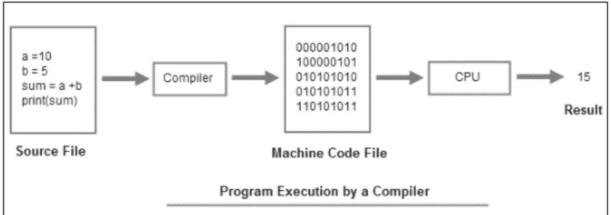

### 解释器

另一方面，解释器采用逐行方法将高级语言转换为机器语言，然后执行。Python 解释器从文件顶部开始，将第一行转换为机器语言，然后执行。该过程在整个文件中重复进行，如下图所示：

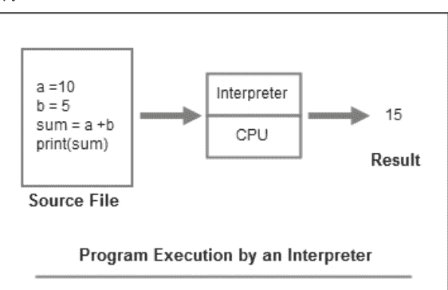

区分高级语言和编译型语言至关重要。例如，编译型语言如 C 和 C++ 使用编译器来翻译和解释（从高级语言到机器语言）。另一方面，像 Python 这样的解释型语言使用解释器来进行这种翻译和后续执行的方法。重要的是

## 第五章：Python 中的数字

- Abs 函数
- Ceil 函数
- Max 函数
- Min 函数
- Pow 函数
- Sqrt 函数
- Random 函数
- Randrange 函数
- Sin 函数
- Cos 函数
- Tan 函数

## 第六章：Python 中的运算符

1. 算术运算符
2. 比较运算符
3. 逻辑运算符

## 第七章：Python 中的字符串方法

## 第八章：Python 中的程序流程控制和 If-else、elif 语句

- If ... else 流程控制语句
- If 语句的偶然使用
- Python 中的 if...elif...else 流程控制语句
- Python 中的嵌套 if 语句
- 绝对值

## 第九章：Python 中的循环

- Python 中的 for 循环
- 使用带 else 的 for 循环
- Python 中的 While 循环
- 使用带 else 的 While 循环
- Python 的 break 和 continue
- Python 中的 Continue 语句

- 字符串
- 数值数据类型
- Python 中的布尔值
- Python 列表
- 变量
- 用户输入值

## Python 是动态类型的

Python 的另一个特点是动态类型，这意味着数据类型是在执行过程中即时检查的，而静态类型则是在运行前检查数据类型。

## Python 是强类型的

强类型语言的主要特点是它缺乏自动将一种形式（类型）的数据转换为另一种形式的能力。另一方面，像 PHP 和 JavaScript 这样的松散类型语言，则能够自由且自动地将数据从一种类型转换为另一种类型。考虑以下情况：

```
1 | price = 12
2 | str = "The total price = " + 12
3 | console.log(str)
```

输出：

```
The total price = 12
```

在这方面，在将 12 添加到字符串之前，JavaScript 语言会尝试将数字 12 转换为字符串 "12"，然后将其附加到字符串的末尾。然而，在像下面这样的 Python 语句中：

```
str = "The total price = " + 12
```

该语言（Python）会引发错误，因为它没有将数字 12 转换为字符串的能力。

综上所述，Python 是一种强类型语言，即变量的类型必须是已知的。这意味着一个值的类型不会以意想不到的方式改变。例如，一个只包含数字的字符串不会自动变成一个数字，这在 Perl 中可能会发生。在 Python 中，每种数据类型的更改都需要显式转换。

## 庞大的库集合

Python 为用户提供了广泛的库，这使得添加新功能和能力变得容易，而无需重新发明新的方法。以下是 Python 编程初学者最常提出的一些问题：

## 我可以使用 Python 创建什么类型的应用程序？

Python 的一些主要应用包括：
- 游戏
- 机器学习和人工智能
- 数据科学和数据可视化
- Web 开发
- 游戏开发
- 桌面 GUI
- 网页抓取应用程序
- 商业应用程序
- 音频和视频应用程序
- CAD 应用程序
- 嵌入式应用程序
- 系统管理应用程序
- GUI 应用程序。
- 控制台应用程序
- 科学应用程序
- Android 应用程序

以及此处未提及的许多其他应用。

## 谁在使用 Python？

一些主要使用 Python 的公司包括：
- i. YouTube
- ii. Mozilla
- iii. Dropbox
- iv. Quora
- v. Disqus
- vi. Reddit
- vii. Google
- viii. Disney
- ix. Mozilla
- x. Bit Torrent
- xi. Intel
- xii. Cisco
- xiii. 摩根大通、瑞银集团、Getco 和 Citadel 等银行将 Python 用于金融市场预测。
- xiv. NASA 用于科学编程任务
- xv. iRobot 用于商用机器人吸尘器
- xvi. 以及许多其他公司。

## 第 2 章：安装 Python

要在 Python 中编写代码，您必须在计算机上安装 Python 解释器。您还需要一个文本编辑器，用于编写和保存您的 Python 代码。Python 的优点在于它可以在各种平台上运行，如 Windows、Linux 和 Mac OS。这些操作系统的大多数当前版本都预装了 Python。您可以通过在终端或操作系统控制台中运行以下命令来检查您的操作系统是否已安装 Python：Python

在操作系统的终端中输入上述命令，然后按 Enter/Return 键。

该命令应返回您系统上安装的 Python 版本。如果未安装 Python，您将收到该命令无法识别的通知；因此您必须安装 Python。

## 选择 Python 版本

Python 的两个主要版本是 2.x 和 3.x。Python 3.x 显然是最新的版本，但截至今天，Python 2.x 可能仍然是使用最广泛的版本。然而，Python 3.x 在采用方面增长得更快。Python 2.x 仍在许多软件公司中使用。然而，越来越多的企业正在转向 Python 3.x。这两个版本之间存在一些技术差异。我们可以用非常简单的方式总结为：Python 2.x 是遗留版本，Python 3.x 是未来。给您的建议是选择最新的版本 Python 3.x。从 2020 年起，Python 2.x 将不再受支持。

## 通用安装说明

安装 Python 非常简单。您只需按照以下步骤操作：

1.  转到 Python 下载页面
    https://www.python.org/downloads/
2.  点击与您的操作系统相关的链接


3.  点击最新版本并根据您的操作系统进行下载
4.  启动安装包并按照安装说明操作（我们建议保留默认设置）
    确保点击 Add Python 3.x to PATH。安装完成后，您就可以开始了！

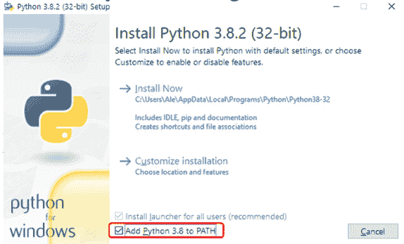

5.  访问您的终端 IDLE


通过编写您的第一个 Python 代码来测试一切是否正常：

```
print("I'm running my first Python code")
```

按回车键，您应该会得到以下结果

```
>>> print ("I'm running my first Python code")
I'm running my first Python code
```

您也可以通过使用文件来执行此操作。我们将在介绍 Python IDLE 或其他代码编辑器后讨论这一点。

## 在 Windows 上安装

要在 Windows 上安装 Python，请从其官方网站下载 Python，然后双击下载的安装包以启动安装。您可以通过点击此链接下载安装包：

https://www.python.org/downloads/windows/

下载并安装最新的 Python 包对您来说是很好的，因为您将能够享受使用最新的 Python 包。下载安装包后，双击它，您将通过屏幕上的说明指导如何在您的 Windows 操作系统上安装 Python。

## 在 Linux (Ubuntu) 上安装

在 Linux 中，有许多包管理器可用于在各种 Linux 发行版中安装 Python。例如，如果您使用的是 Ubuntu Linux，请运行此命令来安装 Python：

```
$ sudo apt-get install python3-minimal
```

Python 将被安装到您的系统上。但是，大多数最新版本的各种 Linux 发行版都预装了 Python。只需运行 "python" 命令。如果您得到一个 Python 版本作为返回，那么 Python 已经安装在您的系统上了。如果没有，请继续安装 Python。

## 在 Mac OS 上安装

要在 Mac OS 上安装 Python，您必须首先下载安装包。您可以通过在网页浏览器中打开以下链接来找到它：

https://www.python.org/downloads/mac-osx/

下载安装包后，双击它以启动安装。您将看到屏幕上的说明，指导您完成安装过程。最后，您将在 Mac OS 系统上运行 Python。

## 运行程序

可以通过两种主要方式运行 Python 程序：
- 交互式解释器
- 从命令行运行脚本

## 交互式解释器或通过 Shell 的交互模式

Python 附带一个命令行，通常称为交互式解释器。您可以直接在此解释器上编写 Python 代码，然后按回车键。您将立即获得结果。如果您在 Linux 上，您只需打开 Linux 终端，然后输入 "python"。按回车键，您将看到带有 >>> 符号的 Python 解释器。要在 Windows 上访问交互式 Python 解释器，请单击“开始”->“所有程序”，然后从程序列表中找到 "Python ..."。在我的情况下，我找到了 "Python 3.5"，因为我安装了 Python 3.5。展开此选项并单击 "Python ..."。在我的情况下，我单击 "Python 3.5(64-bit)"，然后我得到了交互式 Python 解释器。

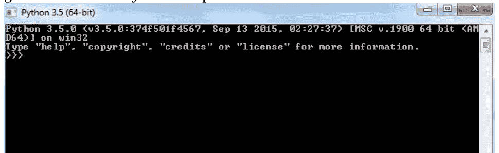

在这里，您可以直接编写和运行 Python 脚本。要编写 "Hello" 示例，请在解释器终端中输入以下内容：
print("Hello")
按回车/返回键，文本 "Hello" 将被打印在解释器上：

```
>>> print("Hello")
Hello
>>>
```

## 从命令行运行脚本

此方法涉及将 Python 程序写入文件，然后调用 Python 解释器来处理该文件。Python 文件应保存为 .py 扩展名。这是一个表示它是 Python 文件的指定。例如，script.py、myscript.py 等。在文件中编写代码并以 "mycode.py" 保存后，您可以打开操作系统命令行并调用 Python 解释器来处理该文件。对于例如，你可以在命令行上运行此命令来执行文件 mycode.py 中的代码：

```
python mycode.py
```

Python 解释器将处理该文件，并在终端上打印结果。

## Python IDE（集成开发环境）

如果你有一个支持 Python 的 GUI（图形用户界面）应用程序，你可以在 GUI 环境中运行 Python。以下是适用于各种操作系统的 Python IDE：

- UNIX - IDLE
- Windows - PythonWin

Macintosh 自带 IDLE IDE，可以从官方网站下载 MacBinary 或 BinHex'd 文件。

## 第 3 章：IDLE 和 Python Shell

正如我们所见，Python 可以在两种主要模式下使用：
1) 交互模式，也称为通过 Python Shell
2) 通过 Python IDLE

提醒一下，Python Shell（也称为提示符字符串）已准备好接受命令。Python Shell 允许输入 Python 代码并立即获得结果。Python Shell 非常适合测试一小段代码。而 Python IDLE（IDLE 或 IDE 代表集成开发环境）不仅允许这样做，还提供了更多功能。因此，我们建议你直接使用 Python IDLE。为了开始使用 Python IDLE，我们还建议创建一个新目录，例如“PythonPractice”，放在你希望的位置，你将在其中保存未来的 Python 文件。

## 安装解释器

提醒一下，如果尚未完成，在编写第一个 Python 程序之前，我们必须为我们的计算机下载适当的解释器。本书将使用 Python 3，因为正如 Python 官方网站所述，“Python 2.x 是遗留版本；Python 3.x 是该语言的现在和未来”。此外，“Python 3 消除了许多可能不必要地绊倒初学者程序员的怪癖”。然而，请注意 Python 2 目前仍然相当广泛使用。Python 2 和 3 大约有 90% 相似。因此，如果你学习 Python 3，你很可能在理解用 Python 2 编写的代码时不会遇到问题。

要安装 Python 3 的解释器，请访问 [https://www.python.org/downloads/](https://www.python.org/downloads/)。

正确的版本应在网页顶部标出。本书将使用版本 3.6.1。点击“Download Python 3.6.1”，软件将开始下载。


或者，如果你想安装其他版本，请向下滚动页面，你会看到其他版本的列表。点击你想要的发布版本。你将被重定向到该版本的下载页面。

向下滚动到页面末尾，你会看到一个表格，列出了该版本的各种安装程序。选择适合你计算机的正确安装程序。使用哪个安装程序取决于两个因素：
1. 操作系统（Windows、Mac OS 或 Linux）和
2. 你使用的处理器（32 位 vs 64 位）。

例如，如果你使用的是 64 位 Windows 计算机，你可能会使用“Windows x86-64 executable installer”。只需点击链接即可下载。如果你下载并运行了错误的安装程序，别担心。你会收到一条错误消息，解释器将不会安装。只需下载正确的安装程序，你就可以顺利进行了。一旦你成功安装了解释器，你就可以开始用 Python 编码了。

## Python IDLE

我们建议至少使用默认的 Python IDLE。然而，还有许多其他选项，你可以使用下表进行比较。IDLE 是 Python 的集成开发环境，它随 Python 一起自动安装。除了一个整洁的图形用户界面外，IDLE 还包含许多使使用 Python 进行开发变得轻松的功能，包括一个非常强大的功能：语法高亮。
通过语法高亮，保留关键字、字面文本、注释等都以不同的颜色高亮显示，使你更容易发现代码中的错误。除了使用 IDLE 编辑你的 Python 程序外，你还可以在 IDLE 中执行你的程序。

| 功能 | IDLE | Thonny | Eric Python | Atom | Wing | Sublime | Rodeo | PyDev | Spyder | PyCharm |
| :--- | :---: | :---: | :---: | :---: | :---: | :---: | :---: | :---: | :---: | :---: |
| 代码补全 | X | ✓ | ✓ | ✓ | ✓ | ✓ | ✓ | ✓ | ✓ | ✓ |
| 调试 | ✓ | ✓ | ✓ | 可用包 | ✓ | 可用包 | X | 远程调试器 | ✓ | ✓ |
| 内置单元测试 | X | X | ✓ | 可用包 | ✓ | 可用包 | X | ✓ | 插件 | ✓ |
| 开源 | ✓ | ✓ | ✓ | ✓ | X | X | ✓ | ✓ | ✓ | 社区版 |
| 轻量级 | ✓ | ✓ | X | ✓ | ✓ | ✓ | X | ✓ | X | X |
| 重构 | X | X | X | 可用包 | ✓ | 可用包 | X | ✓ | ✓ | ✓ |

当你安装 Python 时，你会得到 IDLE，一个集成的 IDE。要在 Windows 中启动它，请在你的计算机上找到 ArcGIS 文件夹。在 Python 文件夹内，你会看到 IDLE 作为一个选项——要启动 IDLE，选择它。IDLE 内置了一个交互式解释器，可以轻松运行完整的脚本。Python 内置的 GUI 模块用于编写 IDLE，因此它与将要执行的脚本是同一种语言。
IDLE 相对于 python.exe 的另一个优点是，脚本输出（包括 print 语句）会直接发送到 IDLE 中的交互式窗口，并且在脚本执行后不会消失。IDLE 还占用很少的内存。
也有缺点；代码辅助（即自动完成）方面不多，在逻辑项目的组织方面也不多。脚本中的每个变量都无法像在其他 IDE 中那样定位，并且“最近文件”菜单中列出的脚本数量有限——当需要查找一段时间未运行的脚本时，这有点不便。IDLE 不是一个糟糕的 IDE，如果没有其他选择，它是理想的选择，并且可以用来快速测试一段代码片段。

## 使用 Python Shell、IDLE 并编写我们的第一个程序

我们将使用随 Python 解释器捆绑的 IDLE 程序来编写代码。为此，让我们首先启动 IDLE 程序。你启动 IDLE 程序的方式与启动任何其他程序相同。例如，在 Windows 10 上，你可以通过在搜索框中输入“IDLE”来搜索它。找到后，点击 IDLE (Python GUI) 来启动它。你将看到下面所示的 Python Shell。

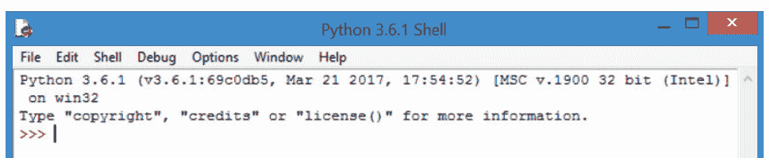

Python Shell 允许我们以交互模式使用 Python。这意味着我们可以一次输入一个命令。Shell 等待用户的命令，执行它，然后返回执行结果。之后，Shell 等待下一个命令。
尝试在 Shell 中输入以下内容。以 >>> 开头的行是你应该输入的命令，而命令之后的行显示结果。在本书中，我们将用符号“>”表示要写的命令，用“ □ ”表示结果。

- □ 2+3
- □ 5

- □ 3>2
- □ True

- □ print('Hello World')
- □ Hello World

当你输入 2+3 时，你是在向 Shell 发出一个命令，要求它计算 2+3 的值。因此，Shell 返回答案 5。当你输入 3>2 时，你是在问 Shell 3 是否大于 2。Shell 回复 True。接下来，print 是一个命令，要求 Shell 显示行 Hello World。

## Python 交互模式

Python Shell 是测试 Python 命令的一个非常方便的工具，尤其是当我们刚开始学习这门语言时。然而，如果你退出 Python Shell 并再次进入，你输入的所有命令都会消失。此外，你不能使用 Python Shell 来创建一个实际的程序。要编写一个实际的程序，你需要将代码写在一个文本文件中，并将其保存为 .py 扩展名。这个文件被称为 Python 脚本。

## Python 脚本模式

要创建一个 Python 脚本，请在 Python Shell 顶部菜单中点击 File > New File。这将打开我们将用来编写第一个程序——“Hello World”程序的文本编辑器。编写“Hello World”程序有点像所有新程序员的入门仪式。我们将使用这个程序来熟悉 IDLE 软件。

在文本编辑器（不是 Shell）中输入以下代码。

```
#Prints the Words "Hello World"
print("Hello World")
Hello World
```

你应该注意到，行 #Prints the Words "Hello World" 是红色的，而单词 print 是紫色的，"Hello World" 是绿色的。这是软件使我们的代码更易于阅读的方式。单词 print 和 "Hello World" 在我们的程序中服务于不同的目的，因此它们以不同的颜色显示。我们将在后面的章节中详细介绍。行 #Prints the Words "Hello World"（红色）实际上不是程序的一部分。它是一个注释，旨在使我们的代码对其他程序员更具可读性。Python 解释器会忽略这一行。要添加

## 如何编写 Python 程序并在 IDLE 中运行

要为我们的程序添加注释，我们在每行注释前输入 # 号，像这样：

- #这是一条注释
- #这也是一条注释
- #这还是一条注释

或者，我们也可以使用三个单引号（或三个双引号）进行多行注释，像这样：

```
"""
这是一条注释
这也是一条注释
这还是一条注释
"""
```

现在点击 文件 > 另存为... 来保存你的代码。确保你使用 .py 扩展名保存它。
完成了吗？瞧！你刚刚成功编写了你的第一个 Python 程序。
最后点击 运行 > 运行模块 来执行程序（或按 F5）。
你应该会在 Python Shell 中看到打印出的 Hello World 字样。

1.  启动 IDLE – 打开 开始>所有程序>IDLE
2.  一个标题为 Python Shell 的窗口将会打开
3.  点击 文件>新建窗口
4.  现在一个名为 Untitled 的新窗口将加载
5.  点击 文件>另存为 并为你的程序文件选择一个位置
6.  在 文件名 处，在框中输入 program1.py
7.  点击 保存
8.  一个空白窗口将打开 – 这是一个编辑器窗口，已准备好让你输入程序。
9.  完全按照所写输入以下语句 – 它适用于 Python 2.x 或 3.x：
10. 打开 运行 菜单并点击 运行模块 来运行程序
11. 你现在会看到一条消息要求你保存程序（它会说 Source），所以点击 确定
12. 你的程序现在将在 Python Shell 窗口中运行
13. 要退出 Python，请关闭所有 Python 窗口

```
print("Hello World")
```

**重要提示**
如果你想再次打开你的文件，在你保存它的文件夹中找到它。右键单击它，然后从菜单中选择 使用 IDLE 编辑 – 这将打开编辑器窗口。

## 其他 Python 交互式开发环境（IDE）

与 Python 配合使用的最佳 IDE 之一是 Eclipse，因此，如果你愿意，可以在你的计算机上安装它。

1.  访问 http://www.eclipse.org/downloads 并下载 Eclipse 安装程序。它将是 zip 文件格式。
2.  解压文件，就这样，不需要做其他任何事情；Eclipse 将安装在你的系统上。
3.  要启动 Eclipse，转到你解压文件的目录并双击 eclipse.exe。

## Eclipse Python 插件

PyDev 是一个 Eclipse Python IDE，它可以在几种不同的 Python 发行版中使用。它支持图形调试、代码重构、代码分析等等。PyDev 可以通过 Eclipse 更新管理器安装，方法是访问 [http://pydev.org/updates](http://pydev.org/updates)。只需勾选 PyDev 旁边的框，然后按照屏幕上的说明进行安装。接下来，你需要配置 Eclipse，因为它需要知道 Python 的位置。

1.  打开 窗口>首选项
2.  点击 PyDev 选项，然后点击 解释器 Python
3.  点击 新建配置
4.  添加 Python 的可执行路径

Eclipse IDE 现在已在你的计算机上设置好，可以与 Python 一起使用。

## 错误类型

在 Python 编程中，可能会遇到 3 种主要类型的错误：

- 语法错误。
- 运行时错误。
- 逻辑错误。

## 语法错误

语法是为在计算机语言中正确编写而需要遵循的一组准则。语法错误是缺少标点字符、拼写错误的关键字或缺少闭合括号等错误。语法错误由编译器或解释器检测。如果你尝试执行包含语法错误的 Python 程序，你将在屏幕上收到错误消息，并且程序将不会执行。你必须更正任何错误，然后再次尝试执行程序。通常这些类型的错误是由于拼写错误造成的。如果发生错误，Python 解释器将停止运行。一些常见的语法错误原因包括：

- 关键字书写错误
- 运算符使用不当
- 在函数调用中忘记括号
- 未将字符串放在单引号或双引号中

## 运行时错误

当代码的执行因无法执行的操作而停止时，就会发生这些错误。运行时错误可能导致程序突然结束，甚至导致系统关闭。此类错误可能是最难检测的错误。内存耗尽或除以零是运行时错误的例子。

## 逻辑错误

当代码产生错误结果时，就会发生逻辑错误。例如，将温度从华氏度转换为摄氏度：

```
print("20 degree Fahrenheit in degree Celsius is: ")
print(5 / 9 * 20 - 32)
```

结果：

```
20 degree Fahrenheit in degree Celsius is:
-20.88888888888889
```

上面的代码输出 -20.88888888888889，这是错误的。正确的结果是 -6.666。这些类型的错误被称为逻辑错误。要获得正确的答案，需要正确使用括号 5 / 9 * (20 - 32) 而不是 5 / 9 * 20 - 32。

逻辑错误是阻止你的程序执行你期望它执行的操作的错误。对于逻辑错误，你根本不会收到任何警告。你的代码编译并运行，但结果不是预期的。你必须彻底检查你的程序以找出错误所在。Python 程序正常执行。是程序员必须找到并更正错误编写的 Python 语句，而不是计算机或解释器。计算机毕竟没那么聪明。

## 第 4 章：Python 中的数据类型和变量

每个程序都有某些数据，使其能够以我们想要的方式运行和操作。数据可以是文本、数字或介于两者之间的任何其他东西。无论复杂还是简单，这些数据类型都是机器中的齿轮，允许其余机制连接和工作。Python 包含几种数据类型，并且与其竞争对手不同；它不处理广泛的范围。
这很好，因为尽管有疏漏，我们却需要担心的事情更少，却能获得准确的结果。Python 的创建是为了让我们作为程序员的生活轻松得多。

## 字符串

在 Python 和其他编程语言中，我们可能使用的任何文本值，例如名称、地点、句子，都被称为字符串。字符串是字符的集合，而不是单词或字母，它通过使用单引号或双引号来标记。要显示字符串，请使用 print 命令，打开一个括号，放入引号，然后写任何内容。
完成后，我们通常结束引号并关闭括号。如果你使用 PyCharm，IntelliSense 会检测我们即将做什么，并立即为我们提供其余部分。你可能已经注意到，当你只输入左括号时，它是如何跳出来救援的。它会自动为你提供一个右括号。同样，对于引号，一个或两个，它会为你提供右引号。
明白为什么我们使用 PyCharm 了吗？
它极大地帮助了我们。“我确实有个问题。如果两者提供相同的结果，为什么我们要使用单引号或双引号？”啊！观察得很敏锐。

我们使用这些是有原因的，让我用下面的例子来解释：
print('I'm afraid I won't be able to make it')
print("He said "Why do you care?"")
尝试在 PyCharm 中运行这个。
记住，要运行，只需点击界面右上角的绿色播放按钮。

```
"C:\Users\Programmer\AppData\Local\Programs\Python\Python37-32\python.exe"
"C:/Users/Programmer/PycharmProjects/PFB/Test1.py"
File "C:/Users/Programmer/PycharmProjects/PFB/Test1.py", line 1
print('I'm afraid I won't be able to make it')
SyntaxError: invalid syntax
Process finished with exit code 1
```

提示：这是一个错误！

- 那么这里发生了什么？
- 尝试重新审视输入。
- 看看我们是如何用单引号开始第一个 print 语句的？
- 我们立即用另一个引号结束了引号。
- 程序只接受了字母 ‘I’ 作为字符串。

你可能已经注意到，从 ‘m’ 到 ‘won’ 的每个字符的颜色可能发生了变化，之后程序检测到另一个引号，并将剩余部分作为另一个字符串接受。老实说，这相当令人困惑。

同样，在第二个语句中，发生了同样的事情。程序看到了双引号，并将其理解为一个字符串，直到第二个双引号出现的那一刻。它没有费心检查它是一个句子还是可能仍在继续。计算机不懂英语；它们理解二进制通信。编译器是在我们按下运行按钮时运行的。它编译我们的代码并将其解释为一系列 1 和 0，以便计算机可以理解我们要求它做什么。

这正是为什么它一发现第一个引号，就将其视为字符串的开始，并在发现第二个引号时立即结束它，即使句子仍在继续。为了克服这个障碍，当我们知道需要在句子中使用其中一个引号时，我们使用单引号和双引号的混合。尝试将第一个语句中的开头和结尾引号替换为两端的双引号。同样，将第二个语句的引号更改为单引号，如下所示：

## 数值数据类型

Python 能够很好地识别数字。数字分为两类：

- 整数 – 不带任何小数点的正数和/或负数。
- 浮点数 – 带有小数点表示的实数。

这意味着，如果你使用 100 和 100.00，一个会被识别为整数，而另一个则被视为浮点数。那么，为什么我们需要使用两种不同的数字表示方式呢？

如果你正在设计一个程序，假设一个小游戏，其中角色的生命值为 10，你可能希望程序在角色每次受到攻击时，生命值减少一两点。然而，为了使事情更精确一些，你可能需要使用浮点数。现在，每次攻击可能不同，可能会从生命值中扣除 1.5、2.1 或 1.8 点。使用浮点数使我们能够使用更高的精度，尤其是在需要进行计算时。如果你不太在意精度，或者你的编程只涉及整数，那就坚持使用整数。

## Python 中的布尔值

啊！这个有着有趣名字的家伙。布尔值（或 bool）是一种只能操作并返回两个值的数据类型：True 或 False。布尔值是任何程序的重要组成部分，除了那些你可能永远不需要它们的程序，比如我们的第一个程序。正是它们允许程序在结果为真或假时采取不同的路径。

这里有一个小例子。假设你要去一个从未去过的国家旅行。你很可能会面临两种选择。如果天气冷，你会打包冬装。如果天气暖和，你会打包适合温暖天气的衣服。很简单，对吧？布尔值的工作原理正是如此。我们稍后也会探讨它的编码方面。现在，只需记住，当涉及到真和假时，你处理的是一个布尔值。

## Python 列表

虽然对于处于这个学习阶段的人来说这稍微高级一些，但列表是一种顾名思义的数据类型。它在方括号（[]）中列出对象、值或存储数据。列表看起来像这样：

```
month = ['Jan', 'Feb', 'March', 'And so on!']
month
['Jan', 'Feb', 'March', 'And so on!']
```

我们将单独讨论这个，届时我们会讨论列表、元组和字典。我们将在后面更详细地了解这种数据类型。

## 变量

你有乘客，但没有交通工具；他们将无处可去。这些乘客只会是站在那里等待某种交通工具来接他们的人。同样，数据类型不能单独工作。它们需要被‘存储’在这些交通工具中。这些特殊的交通工具，或者我们程序员称之为容器的东西，被称为‘变量’，它们是为我们施展魔法的元素。变量是专门的容器，它们存储特定的值，然后可以在需要时被访问、调用、修改甚至删除。你创建的每个变量都将保存特定类型的数据。你不能在一个变量中添加多种类型的数据。在其他编程语言中，你会发现为了创建一个变量，你需要使用关键字‘var’，后跟一个等号‘=’，然后是值。

在 Python 中，这要容易得多，如下所示：

```
name = "John"
age = 33
weight = 131.50
is_married = True
```

在上面，我们创建了一个名为‘name’的变量，并赋予它一个字符值。如果你还记得字符串，我们使用了双引号来让程序知道这是一个字符串。然后我们创建了一个名为 age 的变量。这里，我们只写了 33，这是一个整数，因为后面没有小数。你完全不需要在这里使用引号。接下来，我们创建了一个变量‘weight’并赋予它一个浮点值。最后，我们创建了一个名为‘is_married’的变量，并赋予它一个‘True’布尔值。如果你将‘T’改为‘t’，系统将不会将其识别为布尔值，最终会给出一个错误。请注意我们如何为最后一个变量使用命名约定。我们将确保我们的变量遵循相同的命名约定。

如果你觉得以后可能需要这些变量，或者希望在应用程序开始时将它们初始化为无值，你甚至可以创建空变量。对于具有数值的变量，你可以创建一个你选择的名称的变量，并赋予它一个零值。或者，你也可以只使用开引号和闭引号来创建一个空字符串。

```
empty_variable1 = 0
empty_variable2 = ""
```

你不必非要这样命名它们；你可以想出更有意义的名字，这样你和任何其他阅读你代码的程序员都能理解。我给它们这些名字是为了确保任何人都能立即理解它们的用途。现在我们已经学会了如何创建变量，让我们学习如何调用它们。如果我们永远不使用这些变量，拥有它们有什么意义，对吧？让我们创建一组新的变量。

看看这里：

```
name = "James"
age = 43
height_in_cm = 163
occupation = "Programmer"
```

我鼓励你使用自己的值，如果你喜欢的话，可以玩玩变量。

为了调用 name 变量，我们只需要输入变量的名称。为了将其打印到控制台，我们将这样做：

```
print(name)
James
```

age、height 变量和 occupation 也是如此。但如果我们想把它们一起打印出来，而不是分开打印呢？尝试运行下面的代码，看看会发生什么：

```
print(name age height_in_cm occupation)
SyntaxError: invalid syntax
```

惊讶吗？你最终得到了这个吗？这就是发生这种情况的原因。当你使用单个变量时，程序知道那是哪个变量。当你添加第二个、第三个和第四个变量时，它试图寻找以那种方式写的东西。由于没有，它返回了一个错误，否则会说：“嗯……先生，你确定吗？我到处都找过了，但我找不到这个‘name age height_in_cm occupation’元素。”你所要做的就是添加一个逗号作为分隔符，像这样：

```
print(name, age, height_in_cm, occupation)
James 43 163 Programmer
```

现在，它知道我们在说什么了。系统调用了这些变量，并成功地向我们展示了它们的值。但是，如果你尝试将两个字符串相加会怎样？如果你希望合并两个单独的字符串并创建第三个字符串作为结果呢？

```
first_name = "John"
last_name = "Wick"
```

要将这两个字符串连接成一个，我们可以使用‘+’号。结果字符串现在将被称为字符串对象，由于我们处理的是 Python，这种语言中的所有内容都被视为对象，因此具有面向对象编程的特性。

```
first_name = "John"
last_name = "Wick"
first_name + last_name
```

这里，我们没有要求程序打印这两个字符串。如果你希望打印这两个字符串，只需添加 print 函数，并在括号内输入字符串变量，中间用 + 号连接。听起来不错，但结果可能不是你所期望的：

```
first_name = "John"
last_name = "Wick"
print(first_name + last_name)
JohnWick
```

嗯。你认为为什么会这样？当然，我们确实在两个变量之间使用了空格。问题是这两个字符串已经结合在一起了，这里非常字面地结合了，我们没有在 John 之后或 Wick 之前提供空格（空白）；它不会包含那个。即使是空格也可以是字符串的一部分。

要测试一下，在第一行代码中，在 John 之后按一下友好的空格键，添加一个空格字符。现在尝试再次运行相同的命令，你应该会看到“John Wick”作为你的结果。合并两个字符串的过程称为连接。虽然你可以连接任意多的字符串，但你不能将字符串和整数连接在一起。

如果你真的需要这样做，你需要使用另一种技术，先将整数转换为字符串，然后再连接。要转换整数，我们使用 str() 函数。

```
text1 = "Zero is equal to"
text2 = 0
print(text1 + str(text2))
Zero is equal to 0
```

Python 以逐行方式读取代码。首先，它会读取第一行，然后是第二行，然后是第三行，依此类推。这意味着我们也可以事先做一些事情，为自己节省一些时间。

```
text1 = "Zero is still equal to "
text2 = str(0)
```

## 用户输入值

假设我们正在尝试创建一个在线表单。这个表单将包含一些简单的问题，例如询问用户的姓名、年龄、城市、电子邮件地址等。必须有一种方式允许用户自行输入这些值，并让我们能够获取这些信息。
我们可以利用这些信息打印出一条消息，感谢用户使用该表单，并告知他们将通过电子邮件联系以进行后续步骤。为此，我们将使用 `input()` 函数。`input` 函数可以接受任何类型的输入。为了使用这个函数，我们需要为其提供一些提示信息，以便最终用户知道他/她需要填写什么。让我们看一个典型的例子，看看如何创建这样的表单：

```
print("Hello and welcome to my interactive tutorial.")
name = input("Your Name: ")
age = int(input("Your age: "))
city = input("Where do you live? ")
email = input("Please enter your email address: ")
print(f"Thank you very much {name}, you will be contacted at {email}.")
```

Hello and welcome to my interactive tutorial.
Your Name: Sam
Your age: 28
Where do you live? London. Please enter your email address: sam@something.com Thank you very much, Sam, you will be contacted at sam@something.com.

在上面的例子中，我们首先向用户打印了一条问候语，欢迎他们来到教程。接下来，我们创建了一个名为 `name` 的变量，并将用户慷慨提供的值赋给它。在年龄部分，你可能注意到我将输入转换为 `int()`，就像我们之前将整数转换为字符串一样。
这是因为 `input` 参数中的消息默认是字符串值，因为它在引号内。你始终需要确保你知道你需要什么类型的值，并进行相应的处理，如上所示。
接下来，我们询问了城市名称和电子邮件地址。现在，使用格式化字符串，我们打印出了最终的消息。“等等！我们怎么能打印出我们尚未收到或不知道的东西呢？”我确实提到过 Python 是逐行工作的。程序将从问候语开始，如输出所示。
然后，它将移动到下一行，并意识到它必须等待用户输入某些内容并按回车键。这就是为什么这里的输入值用粗体和斜体突出显示。程序然后移动到下一行，再次等待用户输入内容并按回车键，如此继续，直到最后一个输入命令处理完毕。现在程序已经存储了这些值，它立即调用这些值并打印出来供查看者最终查看。结果相当令人满意，因为它给用户提供了个性化的消息，我们也获得了所需的信息。
每个人都满意地离开了！直接从用户那里存储信息既是必要的，有时也是必需的。想象一个基于 Python 的游戏。这个游戏相当简单，当你点击屏幕时，球会跳动。问题是，由于某种原因，你的屏幕根本没有响应触摸。当这种情况发生时，程序要么让球一直运行直到检测到输入，要么根本无法工作。我们还使用输入函数来收集诸如登录 ID 和密码之类的信息，以便与数据库进行匹配，但这一点我们将在后面讨论语句时再讨论。目前听起来有点复杂，但一旦你理解了如何使用语句；你将比以往任何时候都更接近成为一名程序员。

## 第5章：Python中的数字

我们在数据类型章节中简要介绍了数字。在本章中，我们将更详细地介绍如何在 Python 中使用和操作数字。在继续之前，让我们简要回顾一下 Python 中可用的不同类型的数字。

- 整数 - 这些是没有分数或小数部分的整数。
- 浮点数 - 这些是具有用小数点表示的小数部分的数字。
- 复数 - 这些是使用 'J' 或 'j' 后缀表示的复数。

让我们快速看一下如何使用这些数字数据类型。这个程序展示了如何在 Python 中使用数字数据类型。

```
# This program looks at number data types
# An int data type
a=123
# A float data type
b=2.23
# A complex data type
c=3.14J
print(a)
print(b)
print(c)
```

这个程序的输出将如下所示：

```
123
2.23
3.14j
```

Python 中有多种函数可用于处理数字。让我们看一下它们的摘要，之后我们将更详细地介绍每个函数，并附带一个简单的例子。

## 数字函数

| 函数 | 描述 |
| --- | --- |
| abs() | 返回一个数字的绝对值 |
| ceil() | 返回一个数字的向上取整值 |
| max() | 返回一组数字中的最大值 |
| min() | 返回一组数字中的最小值 |
| pow(x,y) | 返回 x 的 y 次幂 |
| sqrt() | 返回一个数字的平方根 |
| random() | 返回一个随机值 |
| randrange(start,stop,step) | 从特定范围返回一个随机值 |
| sin(x) | 返回一个数字的正弦值 |
| cos(x) | 返回一个数字的余弦值 |
| tan(x) | 返回一个数字的正切值 |

## Abs 函数

此函数用于返回一个数字的绝对值。让我们看一个这个函数的例子。

以下程序展示了 abs 函数。

```
# This program looks at number functions
a=-1.23
print(abs(a))
```

这个程序的输出将如下所示：
1.23

## Ceil 函数

此函数用于返回一个数字的向上取整值。让我们看一个这个函数的例子。请注意，对于这个程序，我们需要导入 `math` 模块才能使用 `ceil` 函数。
示例 44：以下程序展示了 ceil 函数。

```
import math
# This program looks at number functions
a=1.23
print(math.ceil(a))
```

这个程序的输出将如下所示：
2

## Max 函数

此函数用于返回一组数字中的最大值。让我们看一个这个函数的例子。
下面的程序用于展示 max 函数。

```
# This program looks at number functions
print(max(3,4,5))
```

这个程序的输出将如下所示：
5

## Min 函数

此函数用于返回一组数字中的最小值。让我们来看一个该函数的示例。

以下程序展示了 min 函数的工作原理。

```python
# This program looks at number functions
print(min(3,4,5))
```

该程序的输出如下：
3

## Pow 函数

此函数用于返回 x 的 y 次幂的值，其语法为 `pow(x,y)`。让我们来看一个该函数的示例。

以下程序展示了 pow 函数。

```python
# This program looks at number functions
print(pow(2,3))
```

该程序的输出如下：
8

## Sqrt 函数

此函数用于返回一个数字的平方根。让我们来看一个该函数的示例。请注意，对于此程序，我们需要导入 `math` 模块才能使用 `sqrt` 函数。

下一个程序展示了 sqrt 函数的工作原理。

```python
import math
# This program looks at number functions
print(math.sqrt(9))
```

该程序的输出如下：

## Random 函数

此函数用于简单地返回一个随机值。让我们来看一个该函数的示例。

以下程序展示了 random 函数。

```python
import random
# This program looks at number functions
print(random.random())
```

输出将因生成的随机数而异。另请注意，对于此程序，我们需要使用 `random` Python 库。

在命令行中 → `pip3 install random`
然后输入

```python
import random
```

在我们的例子中，程序的输出是：

```
0.0054600853568235691
```

## Randrange 函数

此函数用于从特定范围返回一个随机值。让我们来看一个该函数的示例。请注意，此函数要正常工作，我们同样需要导入 `random` 库。

此程序用于展示 random 函数。

```python
import random
# This program looks at number functions
print(random.randrange(1,10,2))
```

输出将因生成的随机数而异。在我们的例子中，程序的输出是：

5

## Sin 函数

此函数用于返回一个数字的正弦值。让我们来看一个该函数的示例。
以下程序展示了如何使用 sin 函数。

```python
import math
# This program looks at number functions
print(math.sin(45))
```

该程序的输出如下：

0.8509035245341184

## Cos 函数

此函数用于返回一个数字的余弦值。让我们来看一个该函数的示例。
此程序用于展示 cos 函数。

```python
import math
# This program looks at number functions
print(math.cos(45))
```

该程序的输出如下：

0.5253219888177297

## Tan 函数

此函数用于返回一个数字的正切值。让我们来看一个该函数的示例。

以下程序展示了 tan 函数的使用。

```python
import math
# This program looks at number functions
print(math.tan(45))
```

该程序的输出如下：
1.6197751905438615

## 第六章：Python 中的运算符

### 1. 算术运算符

这些是能够执行数学或算术运算的运算符，它们在该编程语言中将是基础性的或广泛使用的，这些运算符又细分为：

1.1. 加法运算符：其符号是 `+`，其功能是将数值数据的值相加。其语法书写如下：

```
6 + 4
10
```

1.2 减法运算符：其符号是 `-`，其功能是减去数值数据类型的值。其语法可以这样书写：

```
4 - 3
1
```

1.3 乘法运算符：其符号是 `*`，其功能是将数值数据类型的值相乘。其语法可以这样书写：

```
3 * 2
6
```

1.4 除法运算符：其符号是 `/`；此运算符提供的结果是一个实数。其语法书写如下：

```
3.5 / 2
1.75
```

1.5 取模运算符：其符号是 `%`；其功能是返回两个运算符相除后的余数。在下面的例子中，我们看到 8 除以 5 等于 1 余 3，因此其模为 3。
其语法书写如下：

```
8 % 5
3
```

1.6 指数运算符：其符号是 `**`，其功能是计算数值数据类型值之间的指数。其语法书写如下：

```
3 ** 2
9
```

1.7 整除运算符：其符号是 `//`；在这种情况下，它返回的结果仅是整数部分。
其语法书写如下：

```
3.5 // 2
1.0
```

然而，如果使用整数运算符，Python 语言将确定它希望结果变量也是整数，这样你将得到以下结果：

```
3 / 2
3 // 2
```

如果我们想在这种特定情况下获得小数，一个选项是将我们的一个数字设为实数。例如：

```
3.0 / 2
```

### 2. 比较运算符

比较运算符是用于比较值并返回结果的运算符；根据情况，结果是 True 或 False，这是应用条件的结果。

2.1 等于运算符：其符号是 `==`，其功能是确定两个值是否完全相同。
例如：

- 3 == 3
- True
- 5 == 1
- False

2.2 不等于运算符：其符号是 `!=`；其功能是确定两个值是否不同，如果不同，结果将是 True。例如：

- 3 != 4
- True
- 3 != 3
- False

2.3 大于运算符：其符号是 `>`；其功能是确定左侧的值是否大于右侧的值，如果大于，它产生的结果是 True。例如：

- 5 > 3
- True
- 3 > 8
- False

2.4 小于运算符：其符号是 `<`；其功能是确定左侧的值是否小于右侧的值，如果小于，它给出 True 结果。例如：

- 3 < 5
- True
- 8 < 3
- False

2.5 运算符 `>=`，其功能是确定左侧的值是否大于或等于右侧的值，如果成立，返回的结果是 True。例如：

- 8 >= 1
- True
- 8 >= 8
- True
- 3 >= 8
- False

2.6 运算符 `<=`，其功能是评估左侧的值是否小于或等于右侧的值，如果成立，返回的结果是 True。例如：

- 8 <= 10
- True
- 8 <= 8
- True
- 10 <= 8
- False

### 3. 逻辑运算符

逻辑运算符是 *and, or, not*。它们的主要功能是检查两个或多个运算符是真还是假，并作为结果返回 True 或 False。这种类型的运算符在条件语句中非常常见，用于通过比较多个元素来返回一个布尔值。

在运算符方面，我们需要说明一下，Python 中 true 和 false 值的存储是 bool 类型，它是由英国数学家乔治·布尔命名的，他创立了布尔代数。布尔值只有 True 和 False 两个，重要的是要大写它们，因为在小写情况下，它们不是布尔值，而是简单的短语。这些运算符的语义或含义与其英语含义相似，例如，如果我们有以下表达式：

`X > 0 and x < 8`，如果 x 确实大于零且小于 8，这将为真。

在 or 的情况下，我们有以下例子：

- N=12
- N % 6 == 0 or n % 8 == 0
- True

如果任一条件确实为真，即如果 n 是能被 6 或 8 整除的数，它将为真。

在逻辑运算符 not 的情况下，发生的是它否定一个布尔表达式，所以，如果我们有，例如：
`not ( x < y )` 如果 `x < y` 为假，即如果 x 大于 y，它将为真。

## 第七章：Python 中的字符串方法

几乎可以肯定，你会有需要操作这个或那个字符串的时候。也许你需要获取它的长度，或者你需要拆分它或从中创建另一个字符串。也许你需要读取 x 位置的字符是什么。无论原因是什么，关键在于总有原因。

我们之所以要讨论这个，是因为它让我们能够更广泛地讨论对象的本质，我们将在后面更深入地探讨，但与此同时，我们也将涵盖 Python 语言提供的用于字符串的极其有用的方法。

请继续创建一个新文件。你可以随意命名。我的文件将命名为 strings.py。名字可能没什么创意，但相信我，我们将在本章中对字符串进行创造性的操作。

那么，字符串到底是什么？嗯，我们显然知道字符串是一行文本，这是不言而喻的。但其中包含了什么？

我们在这个列表中已经多次讨论过列表。列表实际上是另一种变量形式，在 Python 编程中很大程度上被避免使用，称为数组。数组是一组预先分配的数据，用最基本的术语来说，它们是相关的。

Python 源自并建立在一种称为 C 的语言之上。在 C 中，实际上有数据类型。Python 中也有数据类型，但 Python 通过为程序员设置数据类型而不是让程序员声明它来节省用户时间。

C 中的一种数据类型称为 char，它是一个字符。用计算机术语来说；没有对字符串的原生支持。字符串只是字符数组。例如，如果有人想创建一个名为 "hello" 的字符串，他们会这样做：

```c
char hello[6] = { ‘h’, ‘e’, ‘l’, ‘l’, ‘o’, ‘\0’ };
```

Python，以其最大抽象的优美习惯，使我们免于这些复杂性，让我们只需声明：

```python
hello = “hello”
```

关键在于，字符串最终只是数据集。和任何数据集一样，它们可以被操作。也会有我们需要操作它们的时候。

字符串操作最简单的形式是连接的概念。连接字符串是将字符串组合在一起形成新字符串。连接非常简单——你只需使用加号（+）将字符串字面相加即可。

```
sentence = "My" + "grandmother " + "baked " + "today."
print(sentence)
# 将打印 "My grandmother baked today."
```

处理字符串操作时，首先要记住的是，字符串与任何数据集一样，计数从0开始。因此，字符串"backpack"的计数方式如下：

```
backpack
01234567
```

仅凭这一知识，我们就能做几件不同的事情。第一件事是我们可以从中提取单个字母。

假设字符串"backpack"存储在一个名为`backpack`的变量中。我们可以通过输入以下内容来提取字母"p"：

```
letter = backpack[4]
print(letter)
p
```

这将提取字符串中索引为4的字符。当然，这里是p（从0开始计数，字母b位于位置0）。

如果我们想提取从"b"到"p"的字符，可以这样做：

```
substring = backpack[0:4]
```

这将为变量`substring`赋予一个等于`backpack`从索引0到索引4的值的字符串：

```
backpack
01234567
```

因此，`substring`的值将是"backp"。真是个奇怪的词。
为了获得更具体的结果，我们还可以对数据集（尤其是字符串）进行更多操作。

- `backpack[start:4]`
  将给你从开始到索引四的所有字符，就像之前一样。

- `backpack[4:end]`
  将给你从索引4到末尾的所有字符。

- `backpack[:2]`
  将给你前两个字符，而`backpack[-2:]`将给你最后两个字符。

- `backpack[2:]`
  将给你除前两个字符外的所有内容，而

- `backpack[:-2]`
  将给你除最后两个字符外的所有内容。

然而，这远不止这种简单的算术运算。
字符串变量还有内置函数，称为方法。Python中的大多数事物——或者更一般地说，面向对象语言中的大多数事物——都是称为对象的形式。这些本质上是具有与之关联的整套属性的变量类型。

每个字符串都是字符串类的一个实例，因此它是一个字符串对象。字符串类包含每个字符串对象作为字符串类实例可以访问的方法定义。

例如，让我们创建一个稍长一点的字符串。

```
tonguetwister = "Peter Piper picked a peck of pickled peppers"
```

字符串类有多种内置方法，你可以利用它们来处理其对象。

让我们看看`split`方法。如果你输入：

```
splitList = tonguetwister.split(' ')
```

它将在每个空格处分割句子，给你一个包含每个单词的列表。因此，`splitList`看起来会有点像这样：

['Peter', 'Piper', 'picked', 'a', 'peck', 'of', 'pickled', 'peppers']。打印`splitList[1]`

将给你值'Piper'。

还有`count`方法，它将计算某个字符的数量。输入：

```
tonguetwister.lower().count('p')
```

你会得到数字9。

还有`replace`方法，它将用另一个字符串替换给定的字符串。例如，如果你输入：

```
tonguetwister = tonguetwister.replace("peppers", "potatoes")
```

`tonguetwister`现在的值将是"Peter Piper picked a peck of pickled potatoes"。

还有`strip`、`lstrip`和`rstrip`方法，它们可以从字符串的两侧移除给定的字符或空白。当你试图解析用户输入时，这非常有用。未去除空白的用户输入可能导致不必要的大数据集，甚至导致代码错误。

最后一个主要方法是`join`方法，它将在字符串的每个字符之间插入某个字符。

```
print("-".join(tonguetwister))
"P-e-t-e-r-P-i-p-e-r-p-i-c-k-e-[...]"
```

还有各种布尔表达式，它们将返回真或假。`startswith(character)`和`endswith(character)`方法是两个很好的例子。如果你输入：

```
tonguetwister.startswith("P")
```

它最终将返回真。然而，如果你改为输入：

```
tonguetwister.startswith("H")
```

它最终将返回假。这些用于字符串的内部评估以及评估用户输入。

其他一些例子包括`string.isalnum()`，它将检查字符串中的所有字符是否为字母数字或是否有特殊字符；`string.isalpha()`，它将检查字符串中的所有字符是否为字母；`string.isdigit()`，它将检查字符串是否为数字；以及`string.isspace()`，它将检查字符串是否为空格。
这些对于解析给定字符串并根据字符串是否为某种方式来决定做什么都非常有用。

## 第8章：Python中的程序流程控制和If-else、elif语句

比较运算符是Python编程语言中的特殊运算符，它们评估条件的真或假状态。程序流程控制是指程序员明确指定程序代码行执行顺序的方式。通常，流程控制涉及在程序代码行上放置一些条件。这些条件语句最基本的形式是*if语句*。这将从一开始就给我们带来一些问题。但了解一点它将帮助我们让if else和其他控制语句按我们想要的方式工作。
首先，if语句将获取用户的输入，并将其与你设置的条件进行比较。如果这里的条件满足，那么代码将继续执行，通常显示你在代码中设置的某种消息。
然而，如果输入与你设置的条件不匹配，返回的值将为假。

### If ... else 流程控制语句

"if...else"语句将在测试条件为真时执行if的主体。如果if…else测试表达式评估为假，则将执行else的主体。程序块通过缩进表示。if…else在代码上放置条件时提供了更多的灵活性。if…else语法

```
if test condition:
    Statements
else:
    Statements
```

检查数字是正数还是负数的程序
启动IDLE。
导航到文件菜单并单击新建窗口。
输入以下内容：

```
number_mine = -56
if(number_mine < 0):
    print(number_mine, "The number is negative")
else:
    print(number_mine, "The number is a positive number")
```

## 作业

编写一个Python程序，使用if..else语句执行以下操作

- a. 给定number=9，编写一个程序来测试并显示该数字是偶数还是奇数。
- b. 给定marks=76，编写一个程序来测试并显示分数是否高于及格分数，及格分数为50。
- c. 给定number=78，编写一个程序来测试并显示该数字是偶数还是奇数。
- d. 给定marks=27，编写一个程序来测试并显示分数是否高于及格分数，及格分数为50。

## 作业

编写一个程序，接受用户输入的年龄，显式地将年龄转换为整数数据类型，然后使用if…else流程控制来测试该人是否未成年，法定年龄为21岁。包括注释和缩进以提高程序的可读性。

其他后续工作：仅使用if语句编写Python程序以执行以下操作：

- 1. 给定number=7，编写一个程序来测试并仅显示偶数。
- 2. 给定number1=8, number2=13，编写一个程序仅在总和小于10时显示。
- 3. 给定count_int=57，编写一个程序来测试计数是否大于45并显示，计数高于推荐数字。
- 4. 给定marks=34，编写一个程序来测试分数是否小于50并显示消息，分数低于平均水平。
- 5. 给定marks=78，编写一个程序来测试分数是否大于50并显示消息，表现优秀。
- 6. 给定number=88，编写一个程序来测试该数字是否为奇数并显示消息，是的，它是一个奇数。
- 7. 给定number=24，编写一个程序来测试并显示该数字是否为偶数。
- 8. h. 给定number=21，编写一个程序来测试该数字是否为奇数并显示字符串，是的，它是一个奇数。

### 临时使用If语句

你可以对值和变量做很多事情，但比较它们的能力将使你更容易尝试使用Python。无论他们拥有什么类型的值，人们都能够做到这一点，并且他们可以确保以正确的方式进行，以便他们的程序看起来尽可能流畅运行。
比较你的变量是Python为你提供的众多选项之一，最好的方法是通过"if语句"。
现在，你可以创建一个新文件。这是你需要能够做到的。
不要忘记缩进！
以下是临时语句的外观：

```
apples = 6
bus = "yellow"
```

if apples == 0:
    print("苹果在哪里？")
else:
    print("你知道公交车是%s吗？", bus)

通过你的 Python 程序运行这段代码。它看起来会是这样。
你知道公交车是黄色的吗？

理解输出为何如此的最简单方式是，苹果没有被包含在变化中。苹果的数量并非零，而这正是导致代码出现问题的原因。因此，它没有被放入输出中，因为无法做到这一点，也无法让它再次显示。

为了确保你能使用 `not` 语句，你可以将另一个 `if` 语句与 `not` 结合使用。

```
if not apples == 0
```

现在，你可以尝试再次通过你创建的程序运行代码。
你知道公交车是黄色的吗？
你代码中写的两个内容都包含在语句中，然后，你将能够尝试不同的事情。如果你不想写出 `not` 语句，你可以简单地使用“!”。

```
apples=5
if apples!= 0:
    print("苹果怎么样！"
```

当你的程序中有输入时，例如某人想要的苹果数量或他们可以教给你的事实，输出看起来会是一样的。他们要么会得到关于苹果的陈述，要么会得到关于公交车是黄色的陈述。如果没有苹果被放入等式中，那么你的输出将显示为“苹果在哪里”。

你使用的条件由简单的表达式组成。当你将它们分解成更小的部分时，就很容易理解它们如何使用，以及你能用你拥有的表达式做什么。它也会给你机会去展示，除了你最初拥有的变量和值之外，还有更多东西。

## Python 中的 if…elif…else 流程控制语句

现在想想我们需要评估多个条件的场景，不仅仅是一个，不仅仅是两个，而是三个或更多。想想你必须选择团队成员的情况，如果不是理查德，那么是梅西；如果不是理查德和梅西，那么是布莱恩；如果不是理查德、梅西和布莱恩，那么是伊冯娜。现实生活中的场景可能涉及编写程序时必须捕获的多个选择/条件。

记住，`elif` 只是 `else if` 的缩写，旨在允许检查多个表达式。首先评估 `if` 块，然后是 `elif` 块，最后是 `else` 块。在这种情况下，`else` 块更像是一个后备选项，当所有其他条件都返回 false 时使用。重要的是要记住，尽管在 `if..elif..else` 中有多个块可用，但一次只会执行一个块。

if…elif..else 语法：

```
if 测试表达式:
    if 的主体
elif 测试表达式:
    elif 的主体
else:
    else 的主体
```

示例
涵盖了三个条件，但在给定时刻只能执行一个。

启动 IDLE。
导航到“文件”菜单并单击“新建窗口”。
输入以下内容：

```
nNum = 1
if nNum == 0:
    print("数字是零。")
elif nNum > 0:
    print("数字是正数。")
else:
    print("数字是负数。"
```

## Python 中的嵌套 if 语句

有时会出现这样的情况：存在一个条件，但需要涵盖更多的子条件，这就引出了一个称为嵌套的概念。要嵌套的语句数量没有限制，但你应该谨慎，因为你会意识到嵌套在编写代码时可能导致用户错误。嵌套也可能使代码维护变得复杂。只有缩进可以帮助确定嵌套的级别。

示例
启动 IDLE。
导航到“文件”菜单并单击“新建窗口”。
输入以下内容：

```
my_charact=str(input("在此处输入一个字符，可以是 'a'、'b' 或 'c'："))
if (my_charact='a'):
    if(my_charact='a'):
        print("a")
else if:
    (my_charact='b')
    print("b")
else:
    print("c")
```

## 作业

编写一个使用 `if..else` 流程控制语句来检查非闰年并显示相应场景的程序。包括注释和缩进以增强程序的可读性。

## 绝对值

有一种方法可以创建条件，使得有一块代码可以向你展示是否存在条件，并且即使条件不为真且无法通过你所做的不同事情来验证，它也能做一些事情。

这就是绝对条件发挥作用的地方。
你需要看看是否有不同的东西可以放入。
创建变量
apples
现在，你需要用你创建的文件版本中不同的东西来输入。

- print "你的年龄是多少？"
- age = input()

这就是你能够看到某人年龄的方式。但是，这与你拥有的苹果数量有什么关系呢？
它没有关系，它只是向你展示变量是如何工作的，以便人们可以输入东西。

你将创建

```
apples = input("有多少个苹果？\n")
```

这是最简单的部分，它将帮助你创建其余部分所需的变量。

```
if apples == 1:
    print("我不知道只有一个苹果该怎么办！"
```

不过你会得到一个错误，因为 `apples` 实际上只是一个字符串，你需要将其转换为整数。
很简单：

```
int(string)
```

现在它看起来会是这样：

```
apples = input("有多少个苹果？\n")
apples = int(apples)
if apples == 1:
    print("我不知道只有一个苹果该怎么办！"
```

将这个完整的字符串放入你的文件中，或者稍微改变一下措辞，以便你能弄清楚你想用它做什么（这对你来说是真正的绝佳练习）。当你把它放进去后，运行它。

代码会工作，因为你创建了一个变量，你向它添加了不同的元素，并且你允许在序列中输入“苹果”，以便你能够展示它是如何工作的。

这是你可以做新事情的最佳方式之一，它也让你有机会尝试新事情，从而用它做更多事情。当你创建整数字符串时，你需要确保将它们转换为整数而不是简单的字符串，以确保它们显示出来并且没有错误代码。

## 第 9 章：Python 中的循环

在进入循环之前，让我们再次提醒一下 *if 语句*。Python 程序只会在测试表达式为真时执行语句。程序在执行语句之前首先评估测试表达式。如果测试表达式为假，程序将不会执行语句。按照惯例，它的主体通过缩进标记，而第一个非缩进行表示结束。

## Python 中的 for 循环

在 Python 中，缩进用于分隔 `for` 循环的主体。
注意：记住一个简单的线性列表采用以下语法：
变量名=[用逗号分隔的值]

示例
启动 IDLE。
导航到“文件”菜单并单击“新建窗口”。
输入以下内容：

```
numbers=[12,3,18,10,7,2,3,6,1]  #存储列表的变量名
sum=0              #使用前初始化总和，非常重要
for i in numbers:      #遍历列表
    sum=sum+i
    print("总和是",sum)
```

作业
启动 IDLE。
导航到“文件”菜单并单击“新建窗口”。
输入以下内容：
编写一个使用 `for` 循环对以下列表求和的 Python 程序。

- a. marks=[3, 8,19, 6,18,29,15]
- b. ages=[12,17,14,18,11,10,16]
- c. mileage=[15,67,89,123,76,83]
- d. cups=[7,10,3,5,8,16,13]

## Python 中的 range() 函数

Python 中的 `range` 函数 (`range()`) 可以帮助生成数字。记住在编程中，第一个项目的索引是 0。

因此，`range(11)` 将生成从 0 到 10 的数字。

示例
启动 IDLE。
导航到“文件”菜单并单击“新建窗口”。
输入以下内容：

```
print(range(7))
```

输出将是 0,1,2,3,4,5,6

作业
在不编写和运行 Python 程序的情况下，以下各项的输出是什么：

- a. range(16)
- b. range(8)
- c. range(4)

作业
在 Python 中创建一个程序，遍历以下列表并包含消息“我听”（每种音乐类型）。使用 `for` 循环、`len()` 和 `range()`。参考前面的语法示例。

```
folders=[‘Rumba’, ‘House’, ‘Rock’]
```

## 将 for 循环与 else 一起使用

可以在 `for` 循环中包含 `else` 块，但这只是一个可选项。如果序列中的所有项目都已耗尽，则会执行 `else` 块。

示例

启动 IDLE。
导航到“文件”菜单并点击“新建窗口”。
输入以下内容：

```
marks=[12, 15,17]
for i in marks:
    print(i)
else:
    print("No items left")
```

练习

编写一个 Python 程序，打印 1 到 50 之间的所有质数。

## Python 中的 While 循环

在 Python 中，`while` 循环用于只要测试条件为真，就重复执行一段程序代码。`while` 循环用于用户不知道需要多少次循环周期的场景；`while` 循环体通过缩进来确定。

示例

启动 IDLE。
导航到“文件”菜单并点击“新建窗口”。
输入以下内容：

```
i=0
while i<6:
    if i==5:
        break
    print(i)
    i=i+1
else:
    print("inside else")
```

注意：如果未包含计数器的值，将导致无限循环。

练习

- a. 编写一个 Python 程序，利用 `while` 流程控制语句显示 1 到 10 之间所有奇数的和。
- b. 编写一个 Python 程序，利用 `while` 流程控制语句显示 11 到 21 之间所有数字的和。
- c. 编写一个 Python 程序，利用 `while` 流程控制语句显示 1 到 10 之间所有偶数的和。

## 在 While 循环中使用 else

如果条件为假且没有发生 `break`，则 `while` 循环的 `else` 部分会运行。

示例

启动 IDLE。
导航到“文件”菜单并点击“新建窗口”。
输入以下内容：

```
track = 0
while track< 4:
    print("Within the loop")
    track = track + 1
else:
    print("Now within the else segment")
```

## Python 的 break 和 continue

让我们用一个现实生活中的类比来说明：我们需要在迭代完全完成之前强制停止它。想象一下，当使用简单的字典攻击来破解/破解密码时，该攻击会循环遍历所有可能的字符组合，你会希望程序在找到所搜索的密码时立即停止，而无需完成整个循环。再想象一下，当使用恢复软件恢复意外删除的照片时，你会希望恢复程序在找到指定范围内的项目后立即停止迭代文件。Python 中的 `break` 和 `continue` 语句的工作方式类似。

示例

启动 IDLE。
导航到“文件”菜单并点击“新建窗口”。
输入以下内容：

```
for tracker in "bring":
    if tracker == "i":
        break
    print(tracker)
print("The End")
```

## Python 中的 Continue 语句

当使用 `continue` 语句时，解释器仅跳过当前迭代中循环内的其余代码，而循环不会终止。循环将继续进行下一次迭代。
Python continue 的语法
continue

启动 IDLE。
导航到“文件”菜单并点击“新建窗口”。
输入以下内容：

```
for tracker in "bring":
    if tracker == "j":
        continue
    print(tracker)
print("Finished")
```

该程序的输出将是：

- b
- r
- n
- g
- Finished

类比：假设你正在运行数据恢复软件，并指定了跳过 Word 文件（.doc、dox 扩展名）。程序在跳过 Word 文件后必须继续迭代。

# 高级 Python 编程

作者

TechExp Academy

2020 © 版权所有

## 目录

**第 1 章：Python 中的列表**
- [深入了解列表是什么](#)
- [二维列表](#)
- [列表方法](#)
- [元组](#)
- [解包](#)
- [Python 字典](#)

**第 2 章：深入探讨 Python 元组**
- [Python 中的元组](#)
- [负索引](#)
- [切片](#)
- [Python 内置函数与元组](#)
- [Python 中的转义序列](#)

**第 3 章：Python 中的集合**
- [集合](#)
- [用于算法和数据结构的模块](#)

**第 4 章：Python 中的函数**
- [如何定义和调用函数？](#)
- [更好地理解函数](#)
- [Return 语句](#)
- [多个参数](#)
- [Lambda 函数](#)
- [全局变量](#)
- [局部变量](#)

**第 5 章：Python 中的模块**
- [什么是模块？](#)
- [如何创建模块？](#)
- [定位模块](#)
- [Import 语句](Import Statement)
- [模块示例一](Module example One)
- [模块示例二](Module example Two)

**第 6 章：Python 中的文件处理**
- [创建新文件](Creating new files)
- [什么是二进制文件？](What are the binary files?)
- [打开你的文件](Opening your file up)

**第 7 章：Python 中的异常处理**
- [引发异常](Raising an Exception)
- [我可以定义自己的异常吗？](Can I define my own exceptions?)

**第 8 章：Python 中的对象和类**
- [定义类](Defining a Class)
- [创建新类](Creating a new class)
- [创建对象](Creating an Object)
- [构造函数](Constructors)
- [删除属性和对象](Deleting Attributes and Objects)

**第 9 章：继承和多态**
- [在 Python 中创建类](Creating a Class in Python)
- [类属性](Class Attributes)
- [类数据属性](Class Data Attributes)
- [Python 类继承](Python Class Inheritance)
- [为什么继承在 Python 编程中有用？](Why is Inheritance Useful in Python Programming?)
- [继承示例](Inheritance Example)
- [类多态和抽象](Class Polymorphism and Abstraction)
- [抽象](Abstraction)
- [封装](Encapsulation)

**结论**

## 第 1 章：Python 中的列表

自从我们开始阅读本书以来，我们已经学到了很多东西。我们学习了运算符，了解了各种数据类型，还研究了循环和语句。在所有这些内容中，我们确实提到了“列表”这个词，并用方括号而不是花括号或圆括号来表示它们。本章现在将探索并解释列表到底是什么。在本章结束时，我们应该熟悉这些核心概念以及它们对任何类型的编程为何至关重要。

### 深入了解列表是什么

让我们来创建一个假想的家庭，成员包括史密斯、玛丽、他们的女儿艾丽西亚和他们的儿子以利亚。我们该怎么做呢？首先创建一个名为 `family` 的变量，如下所示：

```
family = ['Smith', 'Mary', 'Alicia', 'Elijah']
```

使用 `[]` 括号，我们向这个变量提供了数据。现在，这个特定的变量包含多个名称。这就是列表发挥作用的地方。通过列表，我们可以在一个变量中存储任意多的值。在这个例子中，我们只保留四个。如果你现在使用 `print` 命令打印 `family`，你应该会看到以下内容：

```
['Smith', 'Mary', 'Alicia', 'Elijah']
```

括号内存储的值或名称称为项目。要调用项目或检查特定索引号上存储的项目，你可以使用我们之前在字符串中使用过的方法。

```
print(family[0])
Smith
```

它显示的不是 'S'，而是完整的名称。同样，如果你使用其他函数，例如 `len()` 函数，它会提供列表的长度。在这种情况下，它会告诉你这个列表中有四个项目。让我们自己试一试。

```
print(len(family))
4
```

你可以使用 `[x:y]`，其中 `x` 和 `y` 是你可以设置的范围。如果你正在处理的列表包含数百个条目，这会很有帮助。你可以只筛选出你想查看的那些。你可以使用 `[-1]` 直接跳到列表末尾查看最后一个条目。组合方式是无穷无尽的。

这里有一个小脑筋急转弯。假设我们有一个包含大量数字的列表，大约 100 个。它们没有按时间顺序排列，我们也没有时间逐一滚动查看。我们需要找出这些数字中哪个是最大的。我们该怎么做呢？

这就是列表、循环和 `if` 语句结合使用的地方。如何结合？让我们立即看看：

```
numbers = [312, 1434, 68764, 4627, 84, 470, 9047, 98463, 389, 2]
high = numbers[0]
for number in numbers:
    if number > high:
        high = number
print(f"The highest number is {high}")
```

```
The highest number is 98463
```

是时候开动脑筋，看看刚才发生了什么。

我们首先提供了一些随机数字。其中肯定有一个是最大的。我们创建了一个变量，并将数字列表中的第一个项目赋值给它。我们不知道这个项目是否持有最大值。

接下来，我们启动了一个 `for` 循环，在其中创建了一个名为 `number` 的循环变量。这个 `number` 将遍历 `numbers` 中的每个值。我们使用了一个 `if` 语句来告诉解释器，如果循环变量 `number` 大于我们当前设定的最高数字 `high`，它应该立即用它持有的值替换 `high`。

一旦程序运行，Python 会看到我们将变量 ‘high’ 赋值为第一个元素的值，即 312。当循环和 if 语句开始执行时，Python 会分析第一个元素是否大于变量 ‘high’ 的值。显然，312 并不大于它自身。循环不会改变该值并结束。现在，‘for’ 循环重新开始，这次使用第二个元素的值。此时，值已经改变。这次，当执行 ‘if’ 语句时，Python 发现我们的变量值小于当前正在处理的值。312 远小于 1434。因此，它会执行语句内的代码，并将我们变量的值替换为新发现的较大值。这个过程将持续进行，直到所有值都被交叉检查，最终保留最大的值。然后，只会为我们打印出最大的值。

## 二维列表

在 Python 中，我们有另一种列表，称为二维列表。如果你打算掌握数据科学或机器学习，你会经常用到它们。二维列表是一个非常强大的工具。通常，在数学中，我们有所谓的矩阵。这些是在大括号内以矩形形式排列的数字数组。

与常规列表不同，它们包含如图所示的值和数据的行与列：

```
matrix = [
    [19, 11, 91],
    [41, 25, 54],
    [86, 28, 21]]
```

简单来说，可以将其想象为一个包含多个列表的列表。如上所示，每一行现在都作为一个独立的列表。如果这是一个常规列表，我们可以使用索引号打印一个值。你认为我们如何让控制台打印出第一个列表中第一个元素的值？

```
print(matrix[0][0])
```

使用上述代码，你现在可以命令解释器只打印出第一个列表中存储的第一个值。第一个方括号内的第一个零告诉解释器要访问哪个列表。紧随其后的是第二组方括号，它进一步将搜索定向到该项的索引号。在这种情况下，我们旨在打印出 19，因此 19 将是我们的结果。花点时间，尝试分别打印出 25、21 和 86。如果你能做到这一点，做得很好。

你可以更改列表中项目的值。如果你知道该项目的位置，你可以使用变量名后跟项目的 [x][y] 位置。使用单个等号和你希望它具有的值来分配一个新数字。

二维列表通常用于稍微高级的编程，你需要处理大量的值和数据类型。然而，最好记住它们，因为你永远不知道什么时候可能真的需要使用它们。

## 列表方法

在开始的某个地方，我们学习了所谓的“方法”。首先，让我们回到 PyCharm，创建我们自己的随机数列表。让我们使用以下数字序列：

```
numbers = [11, 22, 33, 44, 55, 66, 77]
```

我们不会将其打印到控制台。相反，我们想看看有哪些可用的方法供我们使用。在下一行，输入变量名后跟点运算符 “.” 来访问方法。

让我们输入 append 方法。

```
numbers.append(10)
```

append 方法允许我们向所选变量下的列表添加一个条目或值。继续添加你选择的任何数字。完成了吗？现在尝试打印名为 ‘numbers’ 的变量，看看会发生什么。

你应该能看到一个数字被添加到了列表的末尾。很好，但如果你不想在末尾添加数字呢？如果你想把它放在靠近开头的位置呢？

为此，我们需要一个名为 insert 的方法。

**numbers.insert()**

为了正确执行此操作，我们需要首先向此方法提供我们希望添加新数字的索引位置。如果你希望将其添加到开头，请使用零；如果你希望将其添加到任何其他索引，请使用该数字。在此数字后跟一个逗号和数字本身。

现在，如果你打印 numbers 变量，你应该能看到新数字被添加到了你想要的确切位置。

```
numbers.insert(2, 20)
print(numbers)
[11, 22, 20, 33, 44, 55, 66, 77]
```

类似地，你可以使用名为 remove 的方法来删除你希望从列表中移除的任何数字。使用 remove 方法时，请注意它只会删除该数字首次出现的位置。它不会删除同一列表中后续可能重复出现的相同数字，如下所示：

```
numbers = [11, 22, 33, 44, 55, 66, 77, 37, 77]
numbers.remove(77)
print(numbers)
[11, 22, 33, 44, 55, 66, 37, 77]
```

出于任何原因，如果你决定不再需要列表内容，可以使用 clear 命令。此命令不需要你在括号内传递任何对象。

```
numbers.clear()
```

使用另一个方法，你可以检查特定值首次出现的索引号。

```
numbers.index(44)
```

如果你运行上述代码，你将得到 ‘3’ 作为结果。为什么？在我们之前使用的列表中，索引位置三包含数字 44。如果你输入一个不在已定义列表值中的值，你最终会得到一个错误，如下所示：

```
print(numbers.index(120))
ValueError: 120 is not in list
```

还有一个有用的方法，当你处理一堆数字或其他数据类型时，它对你很有帮助。如果你不确定并希望找出特定数字是否存在于列表中，你可以使用 ‘in’ 运算符，如下所示：

```
numbers = [11, 22, 33, 44, 55, 66, 77, 37, 77]
print(43 in numbers)
```

你认为结果会是什么？错误？你可能错了。结果将显示 ‘False’。这是一个布尔值，表示我们想要搜索的数字不在我们的列表中。如果该数字确实存在，返回的布尔值将是 ‘True’。假设我们有一个包含大量项目的列表，我们希望找出特定数字在该列表中被使用或重复了多少次。有一种方法可以命令 Python 为我们完成。这就是你将使用 ‘count’ 方法的地方。在我们上面的列表中，数字 77 出现了两次。让我们看看如何使用此方法找出这两个实例。

```
print(numbers.count(77))
```

结果现在将显示 ‘2’ 作为我们的结果。继续向列表中添加随机数字，其中包含一些重复的数字。使用 count 方法找出出现次数，看看该命令对你如何工作。你练习得越多，记得就越牢。

现在我们已经看到了如何定位、更改、添加、清除和计算列表中的项目。如果我们希望将整个列表按升序或降序排序呢？我们能做到吗？

借助 sort 方法，你实际上可以实现这一点。sort() 方法默认只会将数据按升序排序。如果你尝试在 print 命令内访问该方法，控制台将显示 ‘none’ 作为返回值。要正确完成此操作，请始终在 print 命令之前或之后使用 sort 方法。要反转顺序，请使用 reverse() 方法。此方法与 sort() 方法一样，不需要你在括号内传递任何对象。

## 元组

在 Python 中，我们使用列表来存储各种值，这些值可以随时被访问、更改、修改或删除。如果你打算使用本质上很重要的数据，这可能不是最好的事情。为了克服这一点，有一种列表会为你存储数据，但之后不会进行任何额外的修改，即使你意外或故意尝试这样做。这些被称为元组。

元组是列表的一种形式，在 Python 中非常重要。与列表的方括号表示不同，它们用圆括号 () 表示。

```
numbers = (19, 21, 28, 10, 11)
```

元组被称为不可变项。这是因为你无法改变或修改它们。让我们故意尝试修改值，看看会发生什么。

一旦你输入点运算符来访问 append、remove 和其他类似方法，你应该会看到以下内容：

## 解包

既然我们刚刚讨论了元组，那么了解一个进一步简化了元组使用的特性就至关重要了。解包非常有帮助，也相当实用。假设你有一个元组，里面存储了几个值，你希望将它们分别赋给不同的变量。有两种方法可以做到这一点。让我们先看看第一种方法，然后再看看解包在比较中的应用。

第一种方法：

```
ages = (25, 30, 35, 40)
Drake = ages[0]
Emma = ages[1]
Sully = ages[2]
```

如果你现在打印这些值，你会看到相应的年龄。这意味着这些单独变量中存储的值已成功地按照我们的意愿从元组中取出。然而，这有点长。如果我们能在一行中完成所有这些操作呢？

第二种方法：

```
ages = (25, 30, 35, 40)
Drake, Emma, Sully, Sam = ages
```

现在这看起来有趣多了。我们没有使用多行，而是在同一行内完成了相同的工作。每个单独的变量仍然获得了与第一种方法相同的年龄，并且每个变量都可以被调用来执行完全相同的功能。这就是解包能为我们创造奇迹的方式。它为你节省了时间和精力，并允许我们保持代码的整洁、清晰和可读性，便于参考。

话虽如此，现在是时候向我们介绍 Python 中最重要的元素之一了，无论是初学者还是专家，几乎每次都会用到它。

## Python 字典

字典是一种数据结构，它能够以键值对的形式存储数据。

```
AlumniAge = {'Andrea': 23, 'John': 28}
```

这里有两个键：‘Andrea’ 和 ‘John’。与键 ‘Andrea’ 关联的值是 ‘23’，这是他的年龄。与键 John 关联的值是 ‘28’，这是他的年龄。

在使用 Python 字典时，你应该始终记住这些简单的事情。

字典中的键是唯一的。键是不可变的。你总是可以删除和添加一个新的键。但是，你不能更新键。

有时你会遇到某些信息是唯一的，并且具有键值。假设你需要设计一个软件来存储客户或用户的信息。这些信息可能包括但不限于姓名、号码、电子邮件、实际地址等等。这就是字典将发挥作用的地方。

如果你曾认为 Python 中的字典会像我们日常使用的语言词典一样，那么你可能并没有完全错。我们可以看到这些字典之间存在相似之处。每一个条目都是唯一的。如果一个条目试图复制自身，或者你试图再次存储相同的值，你将会收到一个错误。

那么，我们究竟如何使用字典呢？为此，让我们切换回我们新的好朋友 PyCharm，开始输入一些内容。

想一个虚构人物的名字、电子邮件地址、年龄和电话号码。现在不要开始赋值，因为我们想在这里使用字典来做同样的事情。准备好了吗？好的，让我们开始。

```
user_one = {  #字典用 {} 表示
    'name': 'Sam',
    'age': 40,
    'phone': 123456789,
    'married': False
}
```

我们输入了一些关于一个名叫 Sam 的虚拟角色的信息。你可以使用 print 命令并运行名为 ‘user_one’ 的字典，系统将为你打印出这些值。

对于字典，我们在值之间使用冒号 : 符号。对象名称放在字符串中，后跟冒号符号。之后，我们使用字符串、数字（整数或浮点数）或布尔值。你可以使用这些为每个对象分配其唯一的键值对。如果你感到困惑，键值对只是分配给对象的值的另一种说法。例如，‘name’ 的键值对是 ‘Sam’。

现在，让我们尝试看看如果我们添加另一个 ‘married’ 值会发生什么。一旦你输入完毕，系统会立即高亮显示它。请注意，你仍然可以输入新值，系统将继续运行。然而，它将使用的值是它能找到的最新值。这意味着，如果你最初将 married 的值设置为 False，后来又将其更改为 True，它将只显示 True。

```
user_one = { #字典用 {} 表示
    'name': 'Sam',
    'age': 40,
    'phone': 123456789,
    'married': False,
    'married': True}

print(user_one['married'])

    True
```

当从字典中调用值时，我们使用字符串的名称而不是索引号。如果你尝试运行索引号零，你将在回溯中看到 ‘KeyError: 0’。你能猜到为什么会发生这种情况吗？

字典存储的值是唯一的。如果你使用一个在已定义字典中不存在的数字或名称，你最终总会得到一个错误。你需要知道你试图访问的信息的确切名称或值。

同样，如果你试图访问 ‘Phone’ 而不是 ‘phone’，你会得到相同的错误，因为 Python 区分大小写，不会将前者识别为现有值。

如果情况需要，字典可以很容易地更新。假设我们为存储在 ‘user_one’ 中的客户存储了错误的电话号码，我们可以简单地使用以下过程立即更新条目：

```
user_one['phone'] = 345678910
print(user_one['phone'])
```

你现在应该能看到我们存储的新号码了。在你做这件事的时候，你可能已经注意到一件小事。看到那些疯狂的波浪线了吗？它们在这里是建议你重写该值，而不是单独更新它，以保持代码整洁。PyCharm 会不时地这样做，当它觉得你正在使代码变得复杂时。如果你看到这些线，没有必要惊慌。然而，如果这些线是红色的，那么肯定有问题，你可能需要检查一下。

同样，如果你想向字典中添加新的键信息，你可以使用几乎相同的过程轻松完成，如这里所示：

```
user_one['profession'] = 'programmer'
```

就是这么简单！现在尝试打印出信息，你应该能够看到这个以及所有以前的条目。

最后，你可以使用一种叫做 ‘get’ 的方法来防止程序在调用字典时，如果你或你的程序用户输入了错误或缺失的值而返回错误。你还可以为其分配一个默认值，比如一个符号，以通知你自己或用户该值不存在或无法被程序本身识别。这里有一个小例子，用户试图查找关于 ‘kids’ 的信息。我们为其提供了一个默认值 ‘invalid’：

```
print(user_one.get('kids', 'invalid'))
```

如果你运行这段代码，会得到一个名为‘invalid’的对象结果。我们将在测试中以更有意义的方式利用这一特性。

-   clear(): 从字典中移除所有项。
-   copy(): 返回字典的浅拷贝。
-   fromkeys(seq[, v]): 返回一个新字典，键来自seq，值等于v（默认为None）。
-   get(key[,d]): 返回键对应的值。如果键不存在，返回d（默认为None）。
-   items(): 返回字典项（键，值）的新视图。
-   keys(): 返回字典键的新视图。
-   pop(key[,d]): 移除指定键的项并返回其值，如果键未找到则返回‘d’。如果未提供d且键未找到，则引发KeyError。
-   popitem(): 移除并返回任意一项（键，值）。如果字典为空，则引发KeyError。
-   setdefault(key[,d]): 如果键在字典中，返回其值。如果不在，则插入键并设置值为d，然后返回d（默认为None）。
-   update([other]): 用other中的键/值对更新字典，覆盖现有键。
-   values(): 返回字典值的新视图。

还有一些内置函数可以与字典一起使用。

-   all(): 如果字典的所有键都为真（或字典为空），则返回True。
-   any(): 如果字典的任何键为真，则返回True。如果字典为空，则返回False。
-   len(): 返回字典的长度（项数）。
-   cmp(): 比较两个字典的项。
-   sorted(): 返回字典键的新排序列表。

## 第2章：深入探讨Python元组

## Python中的元组

元组类似于列表，但我们不能更改元组中的元素。这是我们在使用Python语言以及其他编程语言时，元组与列表的主要区别之一。

例如，当我们使用列表时，代码中有不同的项可用，我们能够更改它们，甚至在执行代码时也是如此。这是列表的一个优点；如果你想能够更改一些项，而不是让它们长期固定在那里，那么你会想使用列表。

另一方面，元组在语法上看起来与列表相似。但元素完全不可更改。如果你想使用一个选项，在放置好元素后始终保持它们不变，那么元组将是你的最佳选择。

示例：
启动IDLE。
导航到“文件”菜单并点击“新建窗口”。
输入以下内容：

```
tuple_mine = (21, 12, 31)
print(tuple_mine)
tuple_mine = (31, "Green", 4.7)
print(tuple_mine)
```

## 访问Python元组元素

```
tuple_mine=['t','r','o','g','r','a','m']
print(tuple_mine[1])#输出：'r'
print(tuple_mine[3])#输出：'g'
```

## 负索引

与列表一样，元组也可以使用负索引。
与列表类似，-1指列表中的最后一个元素，-2指倒数第二个元素。
示例：

启动IDLE。
导航到“文件”菜单并点击“新建窗口”。
输入以下内容：

```
tuple_mine=['t','r','o','g','r','a','m']
print(tuple_mine[-2])#输出将是'a'
```

### 切片

切片运算符，即冒号，用于访问元组中的一系列项。
示例：

启动IDLE。
导航到“文件”菜单并点击“新建窗口”。
输入以下内容：

```
tuple_mine=['t','r','o','g','r','a','m']
print(tuple_mine[2:5])#输出：'o','g','r','a'
print(tuple_mine[:-4])#'g','r','a','m'
```

重要
元组元素是不可变的，意味着它们不能被更改。但是，我们可以使用+（连接运算符）组合元组中的元素。我们也可以像列表一样，使用*运算符重复元组中的元素。
示例：
启动IDLE。
导航到“文件”菜单并点击“新建窗口”。
输入以下内容：

```
print((7,45,13)+(17,25,76))
print(("Several",)*4)
```

由于我们不能更改元组中的元素，因此也不能删除元素。但是，可以使用关键字del删除整个元组。

示例：
启动IDLE。
导航到“文件”菜单并点击“新建窗口”。
输入以下内容：

```
t_mine=['t','k','q','v','y','c','d']
del t_mine
```

## Python内置函数与元组

| 方法 | 描述 | 方法 | 描述 |
|---|---|---|---|
| enumerate() | 返回一个枚举对象。它包含元组所有项的索引和值作为对。 | tuple() | 将可迭代对象转换为元组。 |
| sorted() | 获取元组中的元素并返回一个新的排序列表（不排序元组本身） | max() | 返回元组中的最大元素。 |
| all() | 如果元组的所有元素都为真（或元组为空），则返回True。 | sum() | 返回元组中所有元素的和。 |
| len() | 返回元组的长度（项数）。 | min() | 返回元组中的最小项。 |
| | | any() | 如果元组的任何元素为真，则返回True。如果元组为空，则返回False。 |

## Python中的转义序列

转义序列使我们能够格式化输出，以增强对人类用户的清晰度。程序在不使用转义序列的情况下仍然可以成功运行，但输出对人类用户来说会非常混乱。以预期的格式编写和显示输出是良好编程实践的一部分。以下是常用的转义序列。

| 方法 | 描述 | 方法 | 描述 |
|---|---|---|---|
| \n | ASCII换行符 | \b | ASCII退格符 |
| " | 双引号 | \ | 反斜杠 |
| \f | ASCII换页符 | \a | ASCII响铃符 |
| \newline | 忽略反斜杠和换行符 | \' | 单引号 |
| \r | ASCII回车符 | \t | ASCII水平制表符 |
| \v | ASCII垂直制表符 | \000 | 八进制值为000的字符 |
| \xHH | 十六进制值为HH的字符 | | |

示例：
启动你的IDLE。
导航到“文件”菜单并点击“新建窗口”。
输入以下内容：

-   print("D:\Lessons\Programming")
-   print("Prints\n in two lines")

Python支持整数、浮点数和复数。有整数、浮点和复数类，有助于转换不同的数字数据类型。小数点的存在与否区分了整数和浮点数。例如，4是整数，而4.0是浮点数。程序员经常需要将十进制数转换为八进制、十六进制和二进制形式。我们可以通过简单地在特定数字前加上前缀来表示Python中的二进制、十六进制和八进制系统。有时称为强制转换，类型转换允许我们将一种数字类型更改为另一种。内置函数如int()允许我们直接转换数据类型。相同的函数也可用于从字符串转换。我们通过将称为元素的项放在方括号内并用逗号分隔来在Python中创建列表。在编程和Python中，第一个项的索引始终为零。对于一个包含五个项的列表，我们将从索引0访问到索引4。未能以这种方式访问列表中的项将导致索引错误。

## 第3章：Python中的集合

## 集合

Python集合是一个包含唯一项的无序集合。虽然集合是可变的，意味着我们可以向其中添加项和移除项，但每个项本身必须是不可变的。关于集合的一个重要事项是，其中不能有任何重复项。我们通常使用集合进行数学运算，如并集、交集、补集和差集。

与序列类型不同，集合类型不提供任何切片或索引操作。值没有与字典相关联的任何键。Python包含两种类型的集合——可变集合和不可变的frozenset。每种类型的集合都以相同的方式创建，使用一组花括号，其中包含用逗号分隔的值。但是，不能使用花括号创建空集合，因为a={}将创建一个字典！空集合通过使用a=set()或a=frozenset()创建。

以下是集合的方法和操作：

-   len(s): 将返回(s)中有多少个元素
-   s.copy(): 将返回(s)的浅拷贝
-   s.difference(t): 将返回一个包含在(s)中但不在(t)中的项的集合
-   s.intersection(t): 将返回一个包含同时在(s)和(t)中的项的集合
-   s.isdisjoint(t): 如果(s)和(t)之间没有共同项，则返回True
-   s.issubset(t): 如果(s)的内容在(t)中，则返回True

## 运算符方法：

-   s.difference(t)
-   s – t – t2 - ...
-   s.issubset(t)
-   s<=t
-   s<(t(s!=t)
-   s.issuperset(t)
-   s>=t
-   s>t(s!=t)
-   s.symmetric_difference(t)
-   s ^ t
-   s.union(t)
-   s | t1 | t2 | ...

对于可变集合对象，还有一些额外的方法：

s.add(item) 会将 item 添加到 (s) 中——如果该元素已存在，则不会发生任何变化。

s.clear() 会从 (s) 中移除所有元素。

s.difference_update(t) 会从 (s) 中移除也存在于 (t) 中的元素。

s.discard(item) 会从 (s) 中移除指定的元素。

s.intersection_update(t) 会从 (s) 中移除那些不在 (s) 和 (t) 交集中的元素。

s.pop() 会返回并移除 (s) 中一个给定的任意元素。

s.remove(item) 会从 (s) 中移除指定的元素。

s.symmetric_difference_update(t) 会从 (s) 中移除那些在 (s) 和 (t) 的对称差集中找不到的元素。

s.update(t) 会将可迭代对象 (t) 中的元素添加到 (s) 中。

下一个示例将向你展示一些集合操作及其结果：

```
s1={'ab', 3, 4, (5, 6)}
s2={'ab', 7, (7, 6)}
print(s1-s2) # identical to s1.difference(s2)
```

运行此代码将返回：

```
{(5, 6), 3, 4}
```

```
print(s1.intersection(s2))
```

运行此代码将返回：

```
{'ab'}
```

```
print(s1.union(s2))
```

运行此代码将返回：

```
{ 'ab', 3, 4, 7, (5, 6), (7, 6)}
```

集合对象并不关心其成员是否属于不同类型；它们只需全部是不可变的。如果你尝试在集合中使用可变对象，如列表或字典，将会抛出一个不可哈希类型错误。所有可哈希类型都有一个哈希值，该值在实例的整个生命周期中保持不变，并且所有内置的不可变类型都是可哈希类型。内置的可变类型不是可哈希类型，因此不能作为元素或字典键包含在集合中。请注意，当打印 s1 和 s2 的并集时，只有一个 ‘ab’ 值。请记住，集合不包含任何重复项。除了内置方法外，还可以对集合执行其他几种操作。例如，如果你想测试一个集合的成员资格，你可以这样做：

```
print('ab' in s1)
```

运行此代码将返回：

```
True
```

```
print('ab' not in s1)
```

运行此代码将返回：

```
False
```

遍历集合的元素看起来像这样：

```
for element in s1:
    print(element)
```

-   (5, 6)
-   ab
-   3
-   4

## 不可变集合

如前所述，Python 有一种不可变的集合类型，称为 frozenset。它的工作方式与 set 非常相似，但有一个区别——你不能使用任何可以更改值的操作或方法，例如 clear() 或 add() 方法。不可变性在许多方面都非常有用。例如，普通集合是可变的，这意味着它不可哈希，而这又意味着它不能成为另一个集合的成员。另一方面，frozenset 可以成为另一个集合的成员，因为它是不可变的。此外，frozenset 的这种不可变性意味着它可以用作字典键，像这样：

```
fs1 = frozenset(s1)
fs2 = frozenset(s2)
print({fs1: 'fs1', fs2: 'fs2'})
```

运行此代码将返回：

```
{ frozenset({(5, 6), 3, 4, 'ab'}): 'fs1', frozenset({(7, 6), 'ab', 7}); 'fs2'}
```

## 用于算法和数据结构的模块

除了这些内置类型外，Python 还有一些模块可用于扩展这些内置函数和类型。在很多情况下，这些模块可能更高效，并且可能在编程方面提供优势，使我们能够简化代码。

到目前为止，我们已经研究了字典、列表、集合和字符串的内置类型。这些通常被称为 ADT 或抽象数据类型，可以被视为对数据可执行操作的数学规范。定义它们的是它们的行为，而不是它们的实现。除了我们已经看过的 ADT 之外，还有一些 Python 库包含了内置数据类型的扩展，我们接下来将研究这些。

## Collections 模块

名为 collections 的模块包含这些数据类型的替代方案，高性能的专用替代方案，以及用于创建命名元组的实用函数。以下是数据类型、操作及其功能：

-   namedtuple() 将创建一个具有给定字段的元组子类
-   deque 提供具有快速追加功能且可在任一端弹出的列表
-   ChainMap 一个类似于字典的类，它创建一个显示多个映射的单一视图
-   Counter 一个用于计算可哈希对象的字典子类
-   OrderedDict 一个会记住条目顺序的字典子类
-   defaultdict 一个会调用一个可以提供缺失值的函数的字典子类
-   UserDict
-   UserList
-   UserString

这些数据类型用作每个类型底层基类的包装器。我们现在不太倾向于使用这些，而是直接子类化基类。然而，它们可以用于通过属性访问底层对象。

## Deques

双端队列（deque，发音为 deck）是一种双端队列。这些对象类似于列表，支持线程安全且内存高效的追加操作。双端队列是可变的，并支持一些列表操作，如索引。你可以通过索引为双端队列赋值，但不能直接对其进行切片。例如，如果你尝试 dq[1:2]，你会得到一个类型错误；不过有办法做到这一点，我们稍后会看到。

使用双端队列而不是列表的最大优势在于，在双端队列的开头插入项目比在列表的开头插入项目快得多。也就是说，在双端队列的末尾插入项目并不总是更快。所有双端队列都是线程安全的，我们可以使用名为 pickle 的模块对它们进行序列化。

也许使用双端队列最有用的方式之一是用于项目的填充和消耗。双端队列项目的填充和消耗是从每一端顺序发生的。

```
from collections import deque
dq = deque('abc') #the deque is created
dq.append('d') #value ‘d’ is added on the right
dq.appendleft('z') # value ‘z’ is added on the left
dq.extend('efg') # multiple items are added on the right
dq.extendleft('yxw') # multiple items are added on the left
print(dq)
```

运行此代码将返回：

```
deque([‘w’, ‘x’, ‘y’, ‘z’, ‘a’, ‘b’, ‘c’, ‘d’, ‘e’, ‘f’, ‘g’])
```

要消耗双端队列中的项目，我们可以使用 pop() 和 popleft() 方法：

```
print(dq.pop()) #item on the right is returned and removed
```

运行此代码将返回：

```
‘g’
```

```
print(dq.popleft()) # item on the left is returned and removed
```

运行此代码将返回：

```
‘w’
```

```
print(dq)
```

运行此代码将返回：

```
deque([‘x’, ‘y’, ‘z’, ‘a’, ‘b’, ‘c’, ‘d’, ‘e’, ‘f’])
```

我们还有一个名为 rotate(n) 的方法，它可以移动和旋转任何项目，对于正整数 n 向右移动 n 步，对于负整数 n 向左移动 n 步，参数使用正整数：

```
dq.rotate(2) #all the items are moved 2 steps to the right
print(dq)
```

运行此代码将返回：

```
deque([‘e’, ‘f’, ‘x’, ‘y’, ‘z’, ‘a’, ‘b’, ‘c’, ‘d’])
```

```
dq.rotate(-2) # all the items are moved 2 steps to the left
print(dq)
```

运行此代码将返回：

```
deque([‘x’, ‘y’, ‘z’, ‘a’, ‘b’, ‘c’, ‘d’, ‘e’, ‘f’])
```

我们也可以使用这些 pop() 和 rotate() 方法来删除元素。将切片作为列表返回的方法如下：

```
print(dq)
```

运行此代码将返回：

```
deque([‘x’, ‘y’, ‘z’, ‘a’, ‘b’, ‘c’, ‘d’, ‘e’, ‘f’])
```

```
import itertools
print(list(itertools.islice(dq, 3, 9)))
```

运行此代码将返回：
['a', 'b', 'c', 'd', 'e', 'f']

`itertools.islice()` 方法与列表切片类似，但其参数不是列表，而是一个可迭代对象，并使用起始和停止索引将选定的值作为列表返回。

`deque` 更实用的特性之一是支持可选的 `maxlen` 参数，用于限制双端队列的大小。这非常适合循环缓冲区，这是一种固定大小、首尾相连的数据结构。当需要缓冲数据流时，通常会使用这种结构。以下是一个示例：

```python
dq2 = deque([], maxlen=3)
for i in range(6):
    dq2.append(i)
    print(dq2)
```

我们从右侧填充，从左侧消耗。一旦缓冲区被填满，较旧的值就会被消耗，新值从右侧进入。

## 第四章：Python 中的函数

创建和调用函数很简单。函数的主要目的是让你能够组织、简化和模块化代码。每当你有一段需要不时按顺序执行的代码时，为这段代码定义一个函数将为你节省程序中的时间和空间。你无需反复输入代码甚至复制粘贴，只需定义一个函数即可。

我们开始时对 Python 几乎一无所知，只知道它是一种当今需求量很大的编程语言。现在看看你；能够创建简单的程序、执行代码并独立解决小规模问题。一点也不差！然而，学习总会到达一个事情变得相当棘手的阶段。

同样地，函数看起来很温顺；当你需要完成某件事时就调用它们。但你知道这些函数在背后有很多运作吗？想象每个函数都是一个迷你程序。它也是由像我们这样的程序员编写的，用于执行特定任务，而无需我们编写一行又一行的代码。你只需做一次，将其保存为函数，然后在适用或需要的地方调用该函数。

现在是时候深入函数的复杂世界了，我们不仅要学习如何有效使用它们，还要探究这些函数背后发生了什么，以及如何创建我们自己的个性化函数。这将略具挑战性，但我保证，会有更多参考资料让你享受并保持学习动力。

### 如何定义和调用函数？

首先，我们需要看看如何在这种语言中定义自己的函数。在 Python 中，当我们使用 "def" 语句，后跟函数名和一些括号时，函数就会被定义。这会让编译器知道你正在定义一个函数，以及你此时想要定义哪个函数。不过，在定义这些函数时会有一些规则，重要的是要以正确的方式执行这些规则，以确保你的代码按预期运行。

定义这些函数时需要遵循的一些 Python 规则包括：

1.  你想使用的任何参数或输入参数都必须放在括号内，以便编译器知道发生了什么。
2.  函数的第一条语句可以是可选的，比如随函数一起的文档字符串（如果需要）。
3.  我们处理的所有函数中的代码都需要以冒号开头，然后我们需要对其进行缩进。
4.  我们得到的 `return` 语句或表达式需要在此时退出函数。然后我们可以选择将值传递回调用者。没有参数的 `return` 语句将返回 `None`。

在我们过于熟悉这些 Python 函数可以完成的一些工作之前，我们需要花些时间理解在 Python 中声明这些函数时的缩进规则。同样的规则也适用于 Python 的其他一些元素，例如声明条件、变量和循环，因此了解这如何工作在这里很重要。

你会发现 Python 在缩进方面会遵循特定的风格来帮助定义代码，因为这种语言中的函数不会像其他语言中的花括号那样有任何显式的开始或结束来指示函数的开始和停止。这就是为什么我们将依赖缩进。当我们正确使用缩进时，我们能够真正看到一些好的结果，并确保编译器知道函数何时被使用。

### 更好地理解函数

函数就像容器，在其内部存储一行又一行的代码，就像包含一个特定值的变量一样。在 Python 中，我们有两种类型的函数可以处理。第一种是内置或预定义的，另一种是自定义或用户创建的函数。无论哪种方式，每个函数都有一个可以执行的特定任务。在创建任何函数之前编写的代码赋予了该函数一个身份和任务。现在，函数知道每次被调用时需要做什么。

当我们开始旅程时，我们在控制台上写下了 "I made it!" 作为我们的第一个程序？我们也在那里使用了我们的第一个函数：`print()` 函数。函数通常通过函数名后的括号来标识。在这些括号内，我们传递称为参数的参数。有些函数接受某种类型的括号，而其他函数接受不同的括号。

让我们更深入地看看函数如何极大地帮助我们减少工作量并更好地组织代码。想象一下，我们有一个在活动直播期间运行的程序。该程序的目的是为我们的用户提供个性化的问候。想象一下，如果有相当多的用户决定加入你的直播，你需要多少次重复编写相同的代码。使用函数，你可以轻松减少自己的工作量。

为了创建一个函数，我们首先需要“定义”它。这就是关键字 `def` 出现的地方。当你开始输入 `def` 时，Python 立即知道你即将定义一个函数。你会看到这三个字母的颜色变为橙色（如果你使用 PyCharm 作为 IDE）。这是另一个确认标志，表明 Python 知道你即将做什么。

```python
def say_hi():
```

这里，`say_hi` 是我决定使用的名字，你可以选择任何你喜欢的名字。记住，保持你的名字具有描述性，以便任何人都能理解并易于阅读。命名函数后，用括号将其括起来。最后，添加友好的冒号，让 Python 知道我们即将添加一个代码块。按回车键开始一个新的缩进行。

现在，我们将为每个加入直播的用户打印两条语句。

```python
print("Hello there!")
print('Welcome to My Live Stream!')
```

之后，空两行以消除你开始输入其他内容时立即出现的波浪线。现在，要轻松打印出来，只需输入函数名并运行程序即可。在我们的例子中，它将是：

- `say_hi()`
- Hello there!
- Welcome to My Live Stream!

看看这在未来对我们来说有多容易？我们不必一遍又一遍地重复这个。让我们通过给它一个参数使这个函数更有趣一点。就在顶行，写着 "def say_hi()" 的地方？让我们在这里添加一个参数。在括号内输入单词 'name' 作为参数。现在，这个单词应该变为灰色，以确认 Python 已将其理解为参数。

现在，你可以利用这一点，进一步个性化问候语，像这样：

如果你在 shell 上操作，你需要用以下命令删除之前定义的函数：

```python
del say_hi
```

现在让我们编写新函数：

```python
def say_hi(user):
    print(f"Hello there, {user}!")
    print('Welcome to My Live Stream!')
```

user = input("请输入您的姓名以开始：")
say_hi(user)

现在，输出会询问用户的姓名。这将被存储到一个名为 `user` 的变量中。由于这是一个字符串值，`say_hi()` 应该能轻松接受它。通过将 `user` 作为参数传递，我们得到如下输出：
请输入您的姓名以开始：Johnny

- 你好，Johnny！
- 欢迎来到我的直播！

这样就更像样了！个性化到完美。我们可以添加任意多行，函数会持续更新自身，并向不同名字的用户提供问候。
有时你可能需要的不仅仅是用户的名。你可能还想询问用户的姓。为此，请在第一行添加以下内容，并相应地遵循相同模式：

```python
def say_hi(first_name, last_name):
    print(f"你好，{first_name} {last_name}！")
    print('欢迎来到我的直播！')
```

```python
first_name = input("请输入您的名：")
last_name = input("请输入您的姓：")
say_hi(first_name, last_name)
```

现在，程序将首先询问用户的名，然后是姓。一旦完成，程序将提供一个包含名和姓的个性化问候。
然而，这些是位置参数，意味着你输入的每个值都是按顺序排列的。如果你要更改 John Doe 的名字顺序，Doe 将成为名，John 将成为姓。你可能需要对此稍加注意。

希望现在你对函数是什么以及如何访问和创建它们有了一个很好的了解。现在，我们将跳转到更复杂的“return”语句部分。
“等等！还有更多？”嗯，我本可以解释；但是，你可能没有完全理解。既然我们已经涵盖了所有基础内容，现在是时候让我们看看这些到底是什么，以及它们如何与函数结合在一起了。

## Return 语句

当你希望创建一个唯一工作就是返回某些值的函数时，Return 语句非常有用。这些值可以是给用户的，也可以是给程序员的。与其谈论理论，不如我们直接动手实践，这样更容易理解，所以让我们回到 PyCharm，创建另一个函数。
让我们从定义一个名为 `cube` 的函数开始，它基本上会将一个数字乘以自身三次。然而，由于我们希望 Python 返回一个值，我们将使用以下代码：

```python
def cube(number):
    return number * number * number
```

通过输入 `return`，你是在告知 Python 你希望它返回一个值给你，这个值稍后可以存储在变量中或在其他地方使用。这与 `input()` 函数非常相似，用户输入一些内容，然后它被返回给我们。

```python
def cube(number):
    return number * number * number
```

```python
number = int(input("请输入数字："))
print(cube(number))
```

请尝试运行代码，看看它是如何工作的。我们不一定非要定义这样的函数。你可以创建自己的复杂函数，将公斤转换为磅，英里转换为公里，甚至执行更庞大、更复杂的任务。唯一的限制是你的想象力。你练习得越多，探索得就越多。
话虽如此，是时候告别函数的世界，进入 Python 的高级领域了。到现在为止，你已经具备了开始编写自己代码所需的所有知识。

## 多个参数

你可以在一个函数中分配两个或更多参数。例如：

```python
def simpOp(x, y):
    z = x + y
```

- simpOp(1, 2)
- print(z)
- 3

## Lambda 函数

匿名函数或 Lambda
使用匿名函数是编写需要参数并返回值的单行函数的便捷方式。它使用关键字 `lambda`。尽管其目的是作为单行函数，但它可以拥有多个参数。例如：

```python
average = lambda x, y, z: (x + y + z) / 3
x = average(10, 20, 30)
x
```

- 20.0

average(12, 51, 231)
98.0

## 全局变量

Python 中使用的全局变量是一种多用途变量，可在 Python 环境的任何部分使用。所使用的变量可以在程序或模块的任何部分运行。

## 局部变量

与全局变量不同，局部变量在局部使用，在 Python 函数或模块内声明，并仅在特定的程序或 Python 模块中使用。当在特定模块或任务之外实现时，Python 解释器将无法识别这些单元，从而为未声明的值抛出错误消息。

Python 有两个内置方法，名为 `globals()` 和 `locals()`。它们允许你确定一个变量是全局命名空间的一部分还是局部命名空间的一部分。以下示例展示了如何使用这些方法：

```python
def calc():
    global place
    place = "Rome"
    name = "Leo"

    print("place in global:", 'place' in globals())
    print("place in local :", 'place' in locals())
    print("name in global :", 'name' in globals())
    print("name in local :", 'name' in locals())
    return
```

```python
place = "Berlin"
print(place)
calc()
```

## 第五章：Python 中的模块

### 什么是模块？

在 Python 中，模块是程序的一部分（一个扩展文件），可以通过其他程序调用，而无需在每个使用的程序中编写它们。此外，它们可以定义类和变量。这些模块包含相互关联的语句，可以随时使用。模块的使用基于使用已经存储在其中的代码（程序主体、函数、变量），称为 `import`。通过使用模块，可以观察到 Python 允许大大简化程序，因为它允许我们将问题分解成更小的部分，使代码更短，这样程序员在编写代码时就不会在数百行代码中迷失方向。

### 如何创建模块？

在 Python 中创建模块，我们不需要太多东西；这非常简单。

例如：如果你想创建一个打印城市的模块，我们在编辑器中编写代码并将其保存为 "mycity.py"。

完成后，我们将知道这将是我们的模块名称（省略 .py 部分），它将被分配给全局变量 `__city__`。

但是，除此之外，我们可以看到文件 "mycity.py" 非常简单，一点也不复杂，因为里面只有一个名为 "print_city" 的函数，它将一个字符串作为参数，它的作用是打印 "Hello, welcome to"，然后与作为参数输入的字符串连接。

### 定位模块

导入模块时，解释器会自动搜索当前地址的同一模块，如果不可用，Python（或其解释器）将在 `PYTHONPATH` 环境变量中执行搜索，该变量不过是一个包含与环境变量相同语法的目录名称的列表。
如果在任何特定情况下，上述操作失败，Python 将查找默认的 UNIX 路径（在 Windows 上位于 /user/local/lib/python）。模块在变量 `sys.path` 给出的目录列表中搜索。此变量包含当前目录、`PYTHONPATH` 目录以及安装时默认附带的所有目录。

### Import 语句

此语句用于导入模块。通过任何 Python 代码文件，其过程如下：Python 解释器在文件系统中搜索执行它的当前目录。然后，解释器在其配置中搜索其预定义路径。
当遇到第一个匹配项（模块名称）时，解释器会自动从头到尾执行它。第一次导入模块时，Python 将生成一个编译后的 .pyc 扩展文件。此扩展文件将用于后续导入此模块。当解释器检测到模块自上次生成以来已被修改时，它将生成一个新模块。

你必须将导入的文件保存在 Python 使用 `import` 语句的同一目录中，以便 Python 能够找到它。

正如我们在示例中看到的，导入模块允许我们通过外部文件改进程序的功能。

现在，让我们看一些例子。第一个是一个计算器，我们将创建一个执行所有数学函数的模块和另一个运行计算器本身的程序。

我们做的第一件事是模块 "calculator.py"，它负责执行所有必要的操作。其中包括加法、减法、除法和乘法，如你所见。
我们包含了条件语句的使用，如 `if`、`else` 和 `elif`。我们还包含了异常的使用，这样当用户在计算器的除法数字中输入错误值时，程序就不会每次都卡住。
之后，我们将创建一个程序，该程序必须导入前面提到的模块，以便它能够执行所有相关的数学函数。
但此时，你可能在想，唯一存在的模块是程序员创建的那些。答案是否定的，因为 Python 有集成的模块。
我们将用它们再制作两个程序：第一个是我们刚刚完成的那个的改进版，第二个将是

## 示例

创建一个名为 `dummymodule.py` 的 Python 模块，并在其中编写以下内容：

```
def testF():
    print("this is a module, goodbuy")
```

将该模块保存在 Python 的安装目录中。

在命令行中：

```
Import dummymodule
```

现在调用该函数：

```
dummymodule.testF()
```

你已经使用了你的第一个模块。

## 模块示例一

首先要做的是创建模块，但乍一看，我们有个惊喜，那就是导入了 `math` 模块。

这对我们意味着什么？
这意味着我们正在获取 Python 默认附带的 `math` 模块的属性。

我们看到创建了一个具有多个选项的计算器函数。
如果 `op` 的值等于 1，则执行加法运算。
如果等于 2，则执行减法运算，依此类推。

但 `op` 等于 5 的情况是全新的，因为如果条件成立，它将通过使用 `math.sqrt(num1)` 返回 `num1` 和 `num2` 的平方根值，该函数返回平方根的结果。

然后，如果 `op` 等于 6，使用函数 `math.radians()`，这意味着 `num1` 或 `num2` 将被转换为弧度，因为这是函数 `math.sin()` 接受的值类型，这意味着它将返回 `num1` 和 `num2` 的正弦值，这些值将是用户任意输入的数字，它们将被转换为弧度，然后返回相应的正弦值。

最后一步是创建主程序，如下所示：
这里，我们可以看到一个简单的程序，因为它只导入了模块 `calculator.py`，然后通过使用 `input` 为变量 `num1` 和 `num2` 赋值。
最后，选择要执行的操作，并调用 `calculator` 模块的 `calculator` 函数，我们将向其传递三个参数。

## 模块示例二

我们将创建一个模块，其中包含一个充当计时器的函数，以便在时间结束时返回 `true`。
在这个模块中，如你所见，导入了另一个名为 `time` 的模块，顾名思义，它包含用于处理时间的函数，并且拥有广泛的函数，从返回日期和时间到帮助创建计时器等。
我们首先要做的是创建 `cron()` 函数，它开始声明 `startAlarm` 变量将等于 `time.time`，这意味着我们正在为这个函数提供一个初始值，以了解函数初始化的确切时刻，然后进入一个无限循环。
由于限制条件始终为 `True`，因此这个循环永远不会结束，除非其中有 `break` 命令。
然后，在 `while` 循环中，有几条指令。
第一条是 `final` 变量等于 `time.time()`，以考虑我们所处的具体时刻，从而监控时间。
之后，创建另一个名为 `times` 的变量，它获取 `final` 减去 `startAlarm` 的值。
但你可能会想知道 `round` 函数的作用。它对值进行四舍五入；我们这样做是为了更容易处理。但这还不够，因此，我们使用一个 `if` 语句，因为如果 `final` 和 `start` 之间的差值大于或等于 60，则表示一分钟已经过去，这会发生什么？
为什么是 60？

这是因为 `time` 模块以秒为单位工作，要经过一分钟，必须经过 60 秒，因此，`final` 和 `start` 之间的差值必须大于或等于 60，在肯定的情况下，将返回 `True`，最后，我们将退出无限循环。
一旦 `alarm` 模块完成，我们继续编写程序，如下所示：
我们可以看到程序导入了两个模块，我们创建的 `alarm` 模块和 `time` 模块。
我们要做的第一件事是创建变量 `s` 作为输入，询问用户是否要开始。
如果回答是肯定的，那么代表时间的变量 `h` 将等于 `"time.strftime ("%H:%M:%S")"`，这意味着我们正在使用 `time` 模块的一个函数，该函数以指定格式返回小时，以便之后可以使用 `print` 函数打印。
下一个操作是使用 `alarm` 模块，使用命令 `alarm.cron()`，这意味着正在调用 `cron()` 函数。
当这个函数完成时，时间将再次赋值给变量 `h`，最后打印出来，以便观察其正确运行。
作为本章的结论，我们可以说模块对于程序员的正常工作至关重要，因为它们允许使代码更具可读性，此外，它允许细分问题，以便逐一解决，从而轻松完成任务。

## 第六章：Python 中的文件处理

在使用 Python 时，我们需要关注的下一件事是确保我们知道如何处理和操作文件。你可能正在处理一些数据，并希望存储它们，同时确保它们可访问，以便在需要时提取和使用。在保存数据的方式、它们以后如何被找到以及它们在代码中如何反应方面，你确实有一些选择。

在处理文件时，你会发现，在处理文件时，你可以选择一些操作或方法。其中一些选项包括：

-   关闭你正在处理的文件。
-   创建一个全新的文件来处理。
-   查找或将你拥有的文件移动到新位置，以便更容易找到。

## 创建新文件

我们要在这里看的第一个任务是创建文件。如果我们没有首先有一个文件来帮助我们，就很难完成其他许多任务。如果你想创建一个新文件并在其中添加一些代码，你首先需要确保文件在你的 IDLE 中打开。然后你可以选择编写代码时要使用的模式。

在 Python 中创建文件时，你会发现有三种模式可供使用。我们将在这里关注的三种主要模式包括追加（`a`）、模式（`x`）和写入（`w`）。

任何时候你想打开一个文件并在其中进行一些更改，那么你会想使用写入模式。这是三种模式中最容易使用的。写入方法将使你更容易设置代码的正确部分并最终为你工作。

写入函数将易于使用，并确保你可以对文件进行任何添加和更改。你可以向文件添加新信息，更改现有内容等等。如果你想看看使用写入方法可以对这部分代码做什么，那么你需要打开你的编译器并执行以下代码：

```
#file handling operations
#writing to a new file hello.txt
f = open('hello.txt', 'w', encoding = 'utf-8')
f.write("Hello Python Developers!")
f.write("Welcome to Python World")
f.flush()
f.close()
```

从这里开始，我们需要评估你可以对正在处理的目录做什么。默认目录始终是当前目录。你可以浏览并切换存储代码信息的目录，但你必须在开始时花时间更改该信息，否则它最终不会出现在你想要的目录中。
无论你在处理代码时花费时间的目录是哪个，当你以后想找到文件时，你都需要回到那个目录。如果你想让它出现在不同的目录中，请确保在保存文件和代码之前切换到该目录。使用我们上面编写的选项，当你转到当前目录（或你为此选择的目录）时，你将能够打开文件并看到你在那里写的消息。
对于这个，我们编写了简单的代码部分。当然，随着我们的进行，你将编写更复杂的代码。对于这些代码，有时你会想编辑或覆盖文件中的一些内容。这在 Python 中是可以做到的，只需要对你编写的语法进行小的更改。一个很好的例子包括：

```
#file handling operations
#writing to a new file hello.txt
```

f = open('hello.txt', 'w', encoding='utf-8')
f.write("Hello Python Developers!")
f.write("Welcome to Python World")
mylist = ["Apple", "Orange", "Banana"]
# writelines() 用于将多行写入文件
f.write(mylist)
f.flush()
f.close()

上面的例子非常适合在你想要对之前处理过的文件进行少量修改时使用，因为你只需要添加一行新内容。这个例子本身并不需要使用第三行，因为它只包含一些简单的文字，但你可以根据需要向程序中添加任何内容，只需使用上述语法并根据你的需求进行调整即可。

## 什么是二进制文件？

在继续之前，我们还需要关注另一个概念，那就是将你的部分文件和数据以二进制文件的形式写入代码中。这听起来可能有点令人困惑，但这是 Python 允许你做的一件简单的事情。要实现这一点，你需要做的就是将你拥有的数据转换为声音或图像文件，而不是将其保留为文本文件。
使用 Python，你可以将任何你想要的代码转换为二进制文件。无论它过去是什么类型的文件都没关系。但你确实需要确保以正确的方式处理数据，以确保后续能更容易地以你想要的方式呈现它。确保此操作能顺利进行的语法如下：

```
# 将二进制数据写入文件
# 以二进制写入模式写入文件 hello.dat
F = open('hello.dat', 'wb')
# 以字节字符串形式写入
f.write("I am writing data in binary file!\n")
f.write("Let's write another list\n")
f.close()
```

如果你花时间在你的文件中使用这段代码，它将帮助你创建你想要的二进制文件。一些程序员发现他们喜欢使用这种方法，因为它有助于他们整理内容，并且在需要时更容易提取信息。

## 打开你的文件

到目前为止，我们已经学习了如何创建并保存新文件，以及如何处理二进制文件。在这些示例中，我们掌握了文件操作的一些基础知识，这样你就可以让它们为你所用，并在任何时候调用它们。
现在这部分已经完成，是时候学习如何打开文件并使用它了，甚至可以在你想要的任何时候对其进行修改。一旦你打开了那个文件，你就可以随心所欲地反复使用它，这会变得容易得多。当你准备好查看打开和使用文件所需的步骤时，你需要以下语法。

```
# 从文件读取二进制数据
# 以追加二进制模式写入文件 hello.dat
with open("hello.dat", 'rb') as f:
    data = f.read()
    text = data.decode('utf-8')
    print(text)
```

将此代码放入系统后，你将得到如下输出：

- Hello, world!
- This is a demo using with
- This file contains three lines
- Hello world
- This is a demo using with
- This file contains three lines.
- 查找你需要的文件

最后，我们需要看看如何在这种编程语言中查找你需要的一些文件。我们已经了解了如何创建文件、如何以不同方式存储它们、如何打开并重写它们，以及如何定位文件。但有时你可能需要将你拥有的一个文件移动到新的位置。

例如，如果你正在处理一个文件，并且在处理过程中发现内容没有按照你希望的方式显示，那么就需要修复它。也许你没有正确拼写标识符的类型，或者目录不在你想要的位置，那么使用 seek 选项可能是实际找到这个丢失文件并进行修改的最佳方式，以便以后更容易找到。

通过这种方法，你将能够更改文件的存放位置，以确保它始终位于正确的位置，甚至在你需要时更容易找到它。你只需要使用类似上面的语法来帮助你进行这些更改。

掌握我们在这里讨论的所有不同方法，将帮助你在代码中完成许多不同的事情。无论你是想创建一个新文件、修改代码、移动文件还是其他操作；你都可以使用我们这里介绍的代码来完成所有这些。

# 第7章：Python中的异常处理

在本指南中，我们需要花时间探讨的下一个主题是异常处理。在你的代码执行过程中，有时会尝试显示一些错误或其他问题，这时就会发生异常。知道何时识别这些异常、如何处理它们，甚至如何创建一些你自己的异常，对于你在 Python 中进行编码的能力会产生很大的影响。

一个编译器会自动抛出的异常的好例子是，当你或用户试图除以零时。编译器会识别出这是用户无法执行的操作，并会将该异常作为警报发送出来。如果你作为程序员试图调用一个函数，但函数名拼写不正确，导致没有匹配项可以调用，也会触发类似的异常。

Python 库中自动包含了几种不同的异常。花些时间浏览并识别这些异常是一个好主意，这样你以后就能认出它们。你需要关注的一些最常见的异常包括：

- Finally—无论异常是否发生，你都希望使用此操作来执行清理操作。
- Assert—此条件将触发代码中的异常。
- Raise—raise 命令将在代码中手动触发一个异常。
- Try/except—当你想尝试执行一段代码块，然后由于你或 Python 代码引发的异常而恢复时使用。

## 引发异常

既然我们对这些异常及其含义有了更多了解，我们需要首先看看如何编写一个异常，以及如果这些异常最终出现在你自己的代码中，你可以采取的一些步骤。如果你在编写代码时开始注意到将会引发一个异常，请知道通常解决方案会很简单。但作为程序员，你需要花时间来修复它。为了帮助我们开始，让我们看看引发异常的代码语法是什么样的。

```
x = 10
y = 10
result = x/y # 尝试除以零
print(result)
```

当你尝试让解释器执行此代码时，你将得到的输出是：

```
Traceback (most recent call last):
File "D:\Python34\tt.py", line 3, in <module>
result = x/y
ZeroDivisionError: division by zero
```

当我们花点时间看看这里的例子时，我们可以看到程序将为我们引发一个异常，主要是因为我们试图将一个数字除以零，而这在 Python 代码（以及任何其他编程语言）中是不允许的。如果你决定此时不做任何更改，并继续运行程序，你最终可能会收到编译器发送的错误消息。代码会告诉用户问题所在，但正如你所看到的，问题没有以易于理解的方式列出，用户很可能完全不知道发生了什么或如何修复问题。

对于上面我们处理的这个例子，你有一些选择。如果你不懂任何编码，你可以选择保留这条有点令人困惑的消息，或者你可以添加一条更容易阅读的新消息，解释为什么首先会引发此错误。它不会包含很多只有对编码有一定了解的人才能理解的数字和随机字母，这使得整个事情对用户来说更加友好。你可以用来控制用户将看到的消息的语法包括：

x = 10
y = 0
result = 0
try:
    result = x/y
    print(result)
except ZeroDivisionError:
    print("You are trying to divide by zero.")

看看上面的两段代码。我们刚刚写的这段看起来和上面那段有点相似，但这段里面包含了一条消息。当用户引发这个特定异常时，这条消息就会显示出来。你不会再看到那些毫无意义的字母和数字串，有了这个，用户就能确切地知道哪里出了问题，并且可以修复这个错误。

## 我能定义自己的异常吗？

在上面的例子中，我们花了一些时间来定义和处理编译器提供给我们的、并且已经存在于 Python 库中的异常。现在，是时候让我们更进一步，学习如何在我们想要编写的任何代码中引发一些自己的异常了。也许你正在编写一个只允许用户进行有限选择的代码，一个只允许他们选择特定数字的代码，或者一个只允许他们有有限次猜测机会的代码。这些是我们在处理游戏程序时常见的东西，但在你设计的其他程序中也能很好地工作。

当你创建这类异常时，必须告诉编译器正在引发一个异常，因为它不会看出这部分代码有什么问题。程序员必须介入，让编译器知道它必须遵循什么规则，以及在这个过程中需要引发哪些异常。下面是一个很好的语法示例，你可以用它在自己的代码中实现这一点：

```python
class CustomException(Exception):
    def __init__(self, value):
        self.parameter = value

    def __str__(self):
        return repr(self.parameter)

CustomException("This is a CustomError!")
    except CustomException as ex:
        print("Caught:", ex.parameter)
```

在这段代码中，你已经成功地设置了你自己的异常，每当用户引发其中一个异常时，“Caught: This is a CustomError!”的消息就会出现在屏幕上。这是向你的用户展示你已经在程序中添加了自定义异常的最佳方式，特别是如果这只是你为这部分代码个人创建的异常，而不是编译器本身会识别的那种。

就像我们之前看过的其他例子一样，我们使用了一些通用的措辞来展示异常是如何工作的。你可以轻松地进行修改，从而获得一个针对你正在编写的代码的独特消息，并在用户看到错误消息时向他们解释发生了什么。

学习如何处理代码中可能出现的一些异常，是确保你的代码按预期工作、用户喜欢使用你的程序、以及一切都能正常进行并实现你期望功能的最佳方式之一。花些时间练习这些例子，看看它们如何帮助你处理代码中出现的任何异常。

## 第8章：Python中的对象与类

我们已经提到过 Python 是一种面向对象的编程语言。还有其他一些面向过程的语言强调函数，但在 Python 中，重点是对象。那么，对象是什么呢？

简单来说，对象是作用于数据（变量）的方法（函数）的集合，而这些数据本身也是对象。这些对象的蓝图是一个类。可以把类看作是一个草图或原型，它包含了关于一个对象的所有细节。如果你的程序是一辆汽车，那么类就会包含关于设计、底盘、轮胎位置以及挡风玻璃材质的所有细节。没有定义它的类，就不可能制造出一辆汽车。汽车就是对象。

因为可以基于原型制造许多汽车，所以我们可以从一个类创建许多对象。我们也可以将对象称为类的一个实例，而创建它的过程称为实例化。

### 定义一个类

类使用关键字 `class` 来定义。就像函数一样，一个类应该有一个文档字符串（docstring），简要解释这个类是什么以及它做什么。虽然文档字符串不是强制性的，但拥有它是一个好习惯。这是一个名为 `NewClass` 的类的简单定义：

```python
class NewClass:
    """This is the docstring of the class NewClass that we
    Just created. Our program now has a new class"""
    pass
```

当你创建一个新类时，会创建一个新的本地命名空间来定义它的所有属性。这里的属性可能包括函数和数据结构。它将包含以 `__`（双下划线）开头的特殊属性，例如 `__doc__`，它定义了类的文档字符串。

当定义一个类时，会创建一个同名的新类对象。这个新的类对象就是我们可以用来访问不同属性以及实例化新类对象的东西。

### 创建一个新类

```python
class NewClass:
    """This is our first class. What it does
    is display a string text and a value of
    variable name"""
    name = str(input("Enter your name: "))
    def greeting.(name):
        print ("Hello", name)

print (NewClass.name)
print (NewClass.greeting(NewClass.name))
print (NewClass. __doc__ )
```

当你运行脚本时，你的控制台显示什么？

### 创建一个对象

到目前为止，我们已经学会了可以使用类对象来访问类的不同属性。我们也可以使用这些对象，通过一个类似于调用函数的过程来实例化该类的新实例。

```python
MyObject =
NewClass()
```

在上面的例子中，创建了一个名为 `MyObject` 的新实例对象。这个对象可以用来访问 `NewClass` 类的属性，使用类名作为前缀。

这里的属性可能包括方法和变量。对象的方法是类的对应函数，这意味着任何类的属性函数对象都定义了该类对象的方法。

例如，因为 `NewClass.greeting` 是一个函数对象并且是 `NewClass` 的一个属性，所以 `MyObject.greeting` 将是一个方法对象。

### 创建一个对象

```python
class NewClass:
    """This is our first class. What it does
    is display a string text and a value of
    variable name"""
    name = str(input("Enter your name: "))
    def greeting(name):
        print("Hello", name)

MyObject = NewClass() #Creates a new NewClass object
print(NewClass.greeting)
print(MyObject.greeting)
MyObject.greeting() # Calling function greeting()
```

`name` 参数在类的函数定义中，但我们使用语句 `MyObject.greeting()` 调用该方法时没有指定任何参数，它仍然有效。这是因为当一个对象调用其内部定义的方法时，对象本身会作为第一个参数传递。因此，在这种情况下，`MyObject.greeting()` 等同于 `NewClass.greeting(MyObject)`。

一般来说，当你用一个包含 x 个参数的列表调用一个方法时，这等同于使用一个在方法对象插入到第一个参数之前创建的参数列表来调用相应的函数。

因此，类中的第一个函数参数需要是对象本身。在 Python 中，这通常被称为 `self`，但也可以分配任何其他名称。理解类对象、实例对象、函数对象和方法对象以及它们之间的区别非常重要。

### 构造函数

在 Python 中，`__init__()` 函数很特殊，因为当它的类的一个新对象被实例化时，它会被调用。这个对象也被称为构造函数，因为它用于初始化所有变量。

### 构造函数

```python
class ComplexNumbers:
    def __init__(self, x = 0, y = 0):
        self.real = x
        self.imagined = y
    def getNumbers(self):
        print("Complex numbers are: {0}+{1}j".format(self.real, self.imagined))

Object1 = ComplexNumbers(2, 3) #Creates a new ComplexNumbers object
Object1.getNumbers() #Calls getNumbers() function
Object2 = ComplexNumbers(10) #Creates another ComplexNumbers object
Object2.attr = 20 #Creates a new attribute 'attr'
print ((Object2.real, Object2.imagined, Object2.attr))
Object1.attr #Generates an error because c1 object doesn't have attribute 'attr'
```

在上面的练习中，我们定义了一个表示复数的新类。我们定义了两个函数：`__init__()` 函数用于初始化变量，`getNumbers()` 函数用于正确显示数字。

请注意，练习中对象的属性是动态创建的。例如，为 `Object2` 创建了新的属性 `attr`，但为 `Object1` 没有创建（因此出现了错误）。

### 删除属性和对象

你可以随时使用 `del` 语句删除对象的属性，甚至删除对象本身。

### 删除属性和对象

```python
class ComplexNumbers:
```

def __init__(self, x = 0, y = 0):
    self.real = x
    self.imagined = y
def getNumbers(self):
    print("Complex numbers are: {0}+{1}j".format(self.real, self.imagined))
Object1 = ComplexNumbers(2, 3) #创建一个新的ComplexNumbers对象
Object1.getNumbers() #调用getNumbers()函数
Object2 = ComplexNumbers(10) #创建另一个ComplexNumbers对象
Object2.attr = 20 #创建一个新属性'attr'
print((Object2.real, Object2.imagined, Object2.attr))
del ComplexNumbers.getNumbers
Object1.getNumbers()

运行脚本时出现的错误表明属性`getNumbers()`已被删除。但请注意，由于在创建对象的新实例时会在内存中创建一个新实例，因此即使对象被删除，它也可能继续存在于内存中，直到垃圾回收器自动销毁未被引用的对象。

## 第9章：继承与多态

在Python中，类使用关键字`class`定义，就像函数使用关键字`def`定义一样。因此，如果我们定义一个名为`ClassName`的类，语法如下：

```
class ClassName:
    "Class Documentation String"
    Class_Suite
```

在此语法中，关键字`class`用于定义一个新类，后跟类名`ClassName`和一个冒号。类文档字符串本质上是类的定义或描述。`Class_Suite`代表定义类成员、组成语句、函数和数据属性的全部内容。

由于类用于创建对象，它最好被视为一种为Python程序添加一致性的方法，使其更清晰、更高效，最重要的是，功能更完善。要创建一个可在代码任何位置实例化的类，必须在模块的顶层进行定义。

## 在Python中创建类

既然我们已经熟悉了在Python中创建类的语法，我们将介绍一个名为`Dog`的类示例。

```
class Dog:
    "Dog class"
    var1 = "Bark"
    var2 = "Jump"
```

## 类声明与定义

在Python 3中，类声明和类定义之间没有区别。这是因为两者同时发生。类定义紧随声明和文档字符串之后，如我们的示例所示。

## 类方法与属性

一个定义并创建的类，除非它具有一些功能，否则是不完整的。类中的功能通过设置其属性来定义，这些属性最好被视为与这些属性相关的函数和数据的容器。

类属性包括通过点表示法访问的数据成员，如变量和实例变量，以及方法。以下是它们的定义：

-   类变量：这是所有类实例和对象共享的变量。
-   实例变量：这是类实例独有的变量。它通常在方法内定义，并且仅适用于该类的实例。
-   方法：也称为函数，方法在类中定义，并定义对象的行为。

## 类属性

类属性是属于另一个对象并通过点属性表示法访问的功能元素。在Python中，复数具有数据属性，而列表和字典具有功能属性。当你访问属性时，你也可以访问可能具有自身属性的对象。

类属性链接到定义它们的类。面向对象编程中最常用的对象是实例对象。实例数据属性是使用的主要数据属性。当你需要一种不需要任何实例的数据类型时，你会发现类数据属性最有用。

## 类数据属性

数据属性是由程序员定义的类变量。在创建类时，它们可以像任何其他变量一样使用。方法可以在类内更新它们。程序员更熟悉这些类型的属性为静态成员、类变量或静态数据。它们代表与所属类对象绑定的数据，并且独立于任何类实例。

使用类数据属性（xyz）的示例：

```
class ABC:
    xyz = 10
    print(ABC.xyz)
    ABC.xyz = ABC.xyz + 1
    print (ABC.xyz)
```

此示例代码的输出将是11。

## Python类继承

继承是面向对象编程中的一个特性，它允许一个类从父类（也称为基类）继承方法和属性。这是编程中一个非常方便的特性，因为它允许程序员为单个类创建一套功能，然后将它们传递给子类或子类。因此，程序将能够在子类中创建新的甚至覆盖现有的功能，而不影响父类的功能。

继承创建的子类将具有父类的特化。Python中有四种类型的继承：单继承、多级继承、层次继承和多重继承。

## 单继承

没有继承特性的编程类可以准确地称为基于对象的编程。程序运行时应创建新的抽象数据类型，每个都有自己的操作。然而，面向对象编程与基于对象编程的区别在于继承。单继承是指一个类或子类从一个父类继承方法和属性。

## 多重继承

在多重继承中，子类或子类从多个类继承方法和属性。例如，一个类C可以同时继承类A和B的特性，就像孩子继承父母双方的特征一样。在某些情况下，子类可以继承两个以上父类的特性和功能。子类可以从中继承方法和属性的父类数量没有限制。请注意，虽然多重继承最著名的是减少程序冗余，但它也可能为程序引入更高程度的复杂性和模糊性，必须在实现之前在程序设计中进行适当的考虑。

## 多级继承

我们已经确定Python中的类可以继承多个父类的特性。当一个类继承其他类的方法和函数，而这些类又从其他类继承它们时，这个过程被称为多级继承。就像在C++和其他面向对象编程语言中一样，Python允许多级继承在任何深度实现。

## 层次继承

当多个类从单个父类或基类派生时，就会发生层次继承。子类或子类继承的特性包含在父类中。层次继承与多级继承的区别在于类之间关系建立的顺序。在多级继承中，顺序可能是随意的，父类可以从先前的子类继承特性。

## 为什么继承在Python编程中很有用？

继承是面向对象编程的一个非常方便的特性，因为它允许程序员轻松遵守软件开发最重要的原则之一——不要重复自己（DRY）。简单来说，在程序中实现类继承是用更少的代码行和更少的重复来完成更多工作的最有效方式。

继承还将迫使你更仔细地关注编程的设计阶段，以确保你编写的程序代码清晰、简洁且有效。

继承的另一个用途是为程序的各个部分添加功能。

## 继承示例

在Python中，这是通过派生类来完成的。假设我们有一个名为`SportsCar`的类。

```
class Vehicle(object):
```

def __init__(self, makeAndModel, prodYear, airConditioning):
    self.makeAndModel = makeAndModel
    self.prodYear = prodYear
    self.airConditioning = airConditioning
    self.doors = 4

def honk(self):
    print("%s says: Honk! Honk!" % self.makeAndModel)

现在，在下面，创建一个名为`SportsCar`的新类，但这次我们不从`object`派生，而是从`Vehicle`派生。

class SportsCar(Vehicle):
    def __init__(self, makeAndModel, prodYear, airConditioning):
        self.makeAndModel = makeAndModel
        self.prodYear = prodYear
        self.airConditioning = airConditioning
        self.doors = 4

这里我们省略了`honk`函数，只需要构造函数。现在声明一辆跑车。我就用法拉利吧。

ferrari = SportsCar("Ferrari LaFerrari", 2016, True)

## 现在通过调用来测试

ferrari.honk()

然后保存并运行。它应该能顺利执行。为什么会这样？这是因为继承的概念指出，子类从父类派生函数和类变量。这个概念很容易理解。下一个概念就有点难了。

## 类的多态性与抽象

在计算机科学中，多态性和抽象是高级编程特性，它们扩展了继承的应用和实用性。

多态性意味着，如果类Y继承自类X，它不一定必须继承该类的所有内容。它可以以不同的方式实现一些继承的方法和属性。Python是隐式多态的，可以根据不同的上下文重载运算符以赋予其所需的行为。多态性的核心思想是，根据情况的需要，相同的过程可以以不同的方式执行。在Python中，这可以通过两种不同的方式实现：*方法重载*和*方法重写*。

*方法重载*是指用不同的参数两次定义同一个函数。例如，我们可以为`Vehicle`类提供两个不同的初始化函数。目前，它只是假设一辆车有4个门。如果我们想具体说明一辆车有多少个门，我们可以在当前初始化函数下面创建一个新的初始化函数，添加一个*doors*参数，像这样（新的在下面）：

def __init__(self, makeAndModel, prodYear, airConditioning):
    self.makeAndModel = makeAndModel
    self.prodYear = prodYear
    self.airConditioning = airConditioning
    self.doors = 4

def __init__(self, makeAndModel, prodYear, airConditioning, doors):
    self.makeAndModel = makeAndModel
    self.prodYear = prodYear
    self.airConditioning = airConditioning
    self.doors = doors

现在，当有人创建`Vehicle`类的实例时，他们可以*选择*是否定义车门数量。如果不定义，车门数量默认为4。*方法重写*是指子类用自己的代码覆盖父类的函数。为了说明这一点，创建另一个扩展`Vehicle`的类，叫做`Moped`。将车门设置为0，因为这很荒谬，并将空调设置为`False`。只有型号/品牌和生产年份是相关的参数。它应该看起来像这样：

class Moped(Vehicle):
    def __init__(self, makeAndModel, prodYear):
        self.makeAndModel = makeAndModel
        self.prodYear = prodYear
        self.airConditioning = False
        self.doors = 0

现在，如果我们创建一个`Moped`类的实例并调用`honk()`方法，它会鸣笛。但众所周知，轻便摩托车不是鸣笛，而是发出“哔哔”声。所以让我们用我们自己的代码覆盖父类的`honk`方法。这非常简单。我们只需在子类中重新定义该函数：

def honk(self):
    print("%s says: Beep! Beep!" % self.makeAndModel)

我是那2.99亿美国人中的一员，即使性命攸关也说不出轻便摩托车的品牌和型号，但你可以通过声明一个`Moped`类的实例并尝试一下来测试这是否有效。

## 抽象

抽象对于当今编写的大量应用程序来说，总体上是一个净收益，这也是Python和其他面向对象编程语言如此受欢迎的原因。抽象是通过建模类来处理特定问题，从而简化复杂现实的过程。抽象类不能被实例化，你既不能为它们创建类实例，也不能创建对象。抽象类旨在从基类继承所有或仅特定的特性。抽象本质上使语言更易于理解、阅读和学习。虽然它通过剥夺用户对整个计算机架构的一些控制力，使语言的功能稍微减弱了一点，但这换来了能够快速高效地用该语言编程的能力，而无需浪费时间处理内存地址之类的琐事。这些在Python中同样适用，因为，嗯，它非常简单。你无法深入到计算机的底层细节，或者轻松地进行内存分配，甚至不能轻易地专门分配数组大小，但这是为了出色的可读性、在高度安全环境中的高度安全语言以及编程易用性所做的权衡。比较以下内容：

C语言的代码片段：

#include <stdio.h>
int main(void) {
    printf("hello world");
    return 0;
}

与实现相同功能的Python代码：

print("hello world")
# 就这样。仅此而已。

## 封装

面向对象编程的最后一个主要概念是封装。这个最容易解释。这是指将共同的数据放在一起，并且代码应该是模块化的。我不会花很长时间来解释这个，因为它是一个超级简单的概念。整个类的概念就是封装最简洁的例子：共同的特性和方法被绑定在一个连贯的结构下，使得创建这类事物变得超级容易，而无需为每个实例创建大量超级具体的变量。好了，就到这里。

## 结论

编程不仅仅是让电脑完成任务。它关乎编写对人们有用的代码。伟大的编程是通过编写符合我们直觉的代码来驾驭复杂性。伟大的代码将是那些我们只需极少设置就能使用的代码。

对你来说最重要的事情是练习Python编程。如果你已经读到这里，那么你已经吸收了很多东西。你需要练习你所学到的所有东西，以确保你巩固了这些知识（即让它牢记于心）。

知识没有应用就毫无用处。学习如何编程而不实际编程，只会浪费你在这里投入的时间。这就像通过阅读关于骑自行车的书籍或文章来学习如何骑自行车——那永远不够！你需要骑自行车才能学会骑自行车。

另外，确保熟悉那些在你需要帮助时可以轻松参考的有用资源。有三个显而易见的：[Python官方文档](https://docs.python.org/)，[Stack Exchange](https://stackexchange.com/)。

在你的编程之旅中，你会遇到看似不可能的问题。如果遇到这些问题，一定要寻求帮助。在那些时候，永远不要犹豫寻求帮助。

# 用于数据分析与分析的Python

作者

## TechExp Academy

2020 © 版权所有

## 目录

引言

## 第1章：数据分析基础

- 什么是数据分析？
- 为什么需要数据分析？
- 数据分析工具
- 数据分析的类型：技术与方法
- 文本分析
- 统计分析
- 描述性分析
- 诊断性分析
- 预测性分析
- 处方性分析
- 数据分析流程
- 1- 数据需求收集
- 2- 数据收集
- 3- 数据清洗
- 4- 数据分析
- 5- 数据解读
- 6- 数据可视化

## 第2章：数据分析与分析的应用

- 电子商务
- 预测性分析
- 智能搜索
- 推荐引擎
- 产品分类与定价
- 客户定位与细分
- 销售与市场预测
- 程序化广告定向
- 视觉搜索与图像识别

## 第三章：环境搭建

- Python 安装指南
- 入门指南
- Python 变量
- 变量赋值
- 变量数据类型
- 输出变量

## 第四章：Python 数据结构基础

- Python 数据结构——列表、元组、集合、字典
- Python 列表
- 如何声明 Python 列表？
- 如何访问 Python 列表？
- 切片操作
- 如何删除 Python 列表？
- Python 元组
- 访问、重新赋值和删除元素
- Python 集合
- Python 字典

## 第五章：IPython/Jupyter Notebook - 交互式计算环境

- Jupyter Notebook (IPython) 入门
- 创建新笔记本
- 常用命令
- 在 Jupyter 中运行你的第一段代码
- Jupyter Notebook 使用技巧与窍门
- `%%timeit` 和 `%%time` 魔法命令
- 代码块的注释与取消注释

## 第六章：NumPy - 科学计算与数值数据处理

- 什么是 Python NumPy 数组？
- 如何安装 NumPy
- 如何创建 NumPy 数组
- NumPy 广播机制的工作原理
- 如何对数组进行切片和索引

## 第七章：Matplotlib – 数据可视化

- 什么是 Matplotlib 库
- 导入 Matplotlib
- 简单图表
- 复杂图表
- 散点图

## 第八章：其他数据可视化库

- Pandas
- Seaborn
- ggplot
- Bokeh
- pygal
- Plotly
- geoplotlib
- Glimmer
- missingno
- Calfskin

## 第九章：大数据简介

- 大数据简史
- 大数据
- 数据战略
- 数据采集

## 第十章：神经网络

- 卷积神经网络
- 卷积神经网络如何工作？
- 步幅与填充
- 参数共享
- 矩阵乘法

## 结论

## 引言

数据分析在当今生活的许多方面都扮演着重要角色。从你醒来的那一刻起，你就在不同层面上与数据互动。许多重要的决策都是基于数据分析做出的。公司需要数据来帮助他们实现许多目标。随着世界人口不断增长，其客户群也在不断扩大。鉴于此，他们必须找到让客户满意的方法，同时实现其业务目标。

考虑到商业世界的竞争本质，让客户满意并非易事。竞争对手不断争夺彼此的客户，而获胜者又面临另一个挑战——如何留住客户，以免他们倒戈回原来的业务伙伴。这正是数据分析派上用场的领域之一。

为了更好地了解客户，公司依赖数据。他们在与客户互动的每个环节收集各种数据。数据在多个方面都很有用。公司可以更深入地了解客户，然后根据他们的具体需求进行分组。通过这种细分，公司可以更好地满足客户需求，并有望更长久地保持客户满意度。

但是，数据分析不仅仅关乎客户和利润动机。它也关乎治理。政府是全球最大的数据消费者。他们收集关于公民、企业以及他们在任何给定时间点互动的其他所有实体的数据。这些信息非常重要，因为它在许多情况下都能提供帮助。

出于规划目的，政府需要关于其人口的准确数据，以便相应地分配资金。没有适当的数据分析，就无法实现资源的公平分配。除了规划，还有安全方面。为了保护国家，政府必须为不同原因维护不同的数据库。有些重要人物必须配备特殊安保人员，有些顶级威胁必须时刻受到监控，等等。为了实现安全目标，政府必须随时获取并维护关于相关人员的最新数据。

数据分析的意义远不止于企业和政府决策。作为一名程序员，你正在进入一个既充满挑战又令人兴奋的行业。数据不会说谎，除非它被操纵，而在那种情况下，你需要极强的数据分析和处理技能。作为一名数据分析师，你将遇到许多挑战和问题，这些问题的解决方案只能通过数据分析来处理。你与数据互动的方式可能会产生巨大的影响，大到超乎你的想象。

有多种工具可用于数据分析。许多人使用 Microsoft Excel 进行数据分析，这对他们来说效果很好。然而，使用 Excel 存在一些局限性，你可以通过 Python 来克服。学习 Python 是一个很好的举措，因为它是最简单的编程语言之一。它是一种高级编程语言，因为它的语法非常接近我们日常使用的语言。这使得你更容易掌握 Python 的概念。

对于专业程序员来说，你已经超越了学习 Python 基础知识的阶段，进入了使用 Python 解决现实世界问题的阶段。许多问题都可以通过数据分析来解决。第一个挑战通常是理解手头的问题，然后为其制定数据解决方案。

本书遵循一系列精心编写的书籍，这些书籍向你介绍了使用 Python 进行数据分析。自本系列开始以来，一些重要的概念已被反复强调，以帮助你记住基础知识。了解 Python 库确实很重要。只有理解了这些库，你才能成为一名专业的 Python 数据分析师。

当你与数据打交道时，你确实理解了清理数据的重要性，以确保分析结果没有缺陷。你将学习如何做到这一点，并在此基础上确保你的工作完美无缺。许多组织面临的另一个挑战是保护数据的完整性。你应该努力保护你的组织免受污染数据的影响。你可以制定一些程序来确保你始终使用干净的数据。

我们生活在一个数据处于我们所做许多事情中心的世界。每天，自动化系统会产生和存储大量数据。通过 Python 学习数据分析应该能帮助你处理和提取数据中的信息，并从中得出有意义的结论。这些技能将派上用场的一个领域是预测。通过数据分析，你可以创建预测模型，这应该能帮助你的组织实现其目标。

一个好的预测模型的质量取决于引入其中的数据质量、数据建模方法，更重要的是，用于分析的数据集。除了数据处理和加工，数据分析的另一个重要方面是可视化。可视化关乎呈现。你的数据模型应该足够好，让受众在第一次接触时就能阅读和理解。除了受众，你还应该学习如何在不同的可视化图表上绘制数据，以帮助你大致了解所处理数据的性质。

当你完成数据分析后，你应该拥有一个完整的数据模型，其中包含视觉概念，这将有助于在进入测试阶段之前预测结果和响应。数据分析是目前在不同领域需求量很大的一门学科。知道该做什么，以及何时以及如何处理数据，是一项你不应忽视的重要技能。通过这一点，你可以构建和测试假设，并进一步更好地理解系统。

## 第一章：数据分析基础

## 什么是数据分析？

数据分析被定义为一个清洗、转换和建模数据的过程，旨在发现对商业决策有用的信息。数据分析的目的是从数据中提取有用信息，并基于数据分析结果做出决策。在我们的日常生活中，每当我们做出任何决定时，都是基于对上次发生情况的思考，或是对选择特定决定后可能发生情况的预判。这无非就是分析我们的过去或未来，并据此做出决策。为此，我们收集关于过去的记忆或对未来的憧憬。这其实就是数据分析。现在，分析师出于商业目的所做的同样的事情，就被称为数据分析。

数据分析也可以被视为一种实践，公司可以利用其原始数据，然后对其进行排序和组织。当数据被组织起来并通过预测模型运行时，它将帮助公司从中提取有用信息。组织和思考数据的过程将非常重要，因为这是帮助我们理解数据在任何给定时间包含和不包含什么的关键。许多公司已经收集数据很长时间了。他们可能从客户、调查、社交媒体以及许多其他来源收集这些数据。虽然收集数据是我们需要关注的重要一步，但另一个需要考虑的问题是我们能用这些数据做什么。你可以收集所有你想要的数据，但如果它只是存放在你的云存储或数据仓库中，从未被挖掘或使用，那么它对你来说将变得毫无价值，你浪费了大量的时间和金钱试图弄清楚这一切。这就是数据分析将发挥作用的地方。它能够获取所有这些原始数据，并真正将其用于某种有益的用途。它将使用各种模型和算法，通常借助机器学习和Python的帮助，来帮助我们理解数据中包含哪些重要的见解和信息，以及我们如何能够利用这些信息为我们自己谋利。

## 为什么需要数据分析？

数据分析和分析如此重要的原因在于它可以帮助企业整体优化其绩效。
当公司能够将良好的数据分析融入其商业模式时，这意味着他们能够降低日常运营成本。这是因为分析将帮助他们识别最佳、最高效的业务开展方式，并且因为他们能够存储大量数据，以帮助他们及时完成所有这些流程。
使用数据分析的另一个好处，也是它对许多公司真正重要的原因，在于公司可以利用这个过程做出最佳的商业决策。这些商业决策不再需要依赖其他公司的做法或关键决策者的直觉。相反，它们依赖于收集数据中提供的事实和见解。
许多公司也喜欢使用数据分析过程，因为它将帮助他们更好地了解和服务客户。数据分析可以帮助我们分析客户趋势和客户满意度水平，这可以帮助公司推出新的、更好的服务和产品。

## 数据分析工具

以下是你可用于数据分析的最佳工具：

- Python
- Xplenty
- IDEA
- Microsoft HDInsight
- Skytree
- Talend
- Splice Machine
- Spark
- Plotly
- Apache SAMOA
- Lumify

## 数据分析的类型：技术与方法

数据分析有不同的类型，以下是最常见的几种：

- 文本分析
- 统计分析
- 描述性分析
- 诊断性分析
- 预测性分析

让我们更深入地了解它们。

## 文本分析

这将是一种预测分析的形式，它可以帮助我们根据按键的力度和打字速度，提取文本背后的情感。

## 统计分析

统计分析涉及统计学的许多方面。该分析使用统计学中的概念，对公司十年来收集的数据进行某些假设和预测。例如，假设你是一家临床研究公司，一直在尝试收集有关公司销售的某些产品的信息。你将对产品类型、目标市场和竞争对手进行彻底研究。假设你打算向市场推出一种止痛药。在这种时候，你将试图更好地了解市场，并看看与市场上的其他公司相比，你能提供什么。为此，你需要进行彻底的统计分析。

## 描述性分析

这是数据挖掘和商业智能中使用的一个过程。在描述性分析中，你将能够查看数据并分析过去的事件。你将能够获得洞察力，以应对未来可能发生的事件。你将使用这个过程来分析和挖掘数据，以确定过去业务成功或失败背后的原因。公司的每个部门都会始终使用这种类型的分析来理解他们的成功和失败。

## 诊断性分析

顾名思义，这种类型的分析是为了“诊断”或理解为什么某个事件会发生，以及如何防止该事件在未来发生，或者在需要时复制该事件。例如，网络营销策略和活动经常利用社交媒体平台来获得宣传并提高其声誉。并非所有活动都像预期的那样成功；因此，从失败的活动中学习同样重要，甚至更重要。公司可以通过收集与活动相关的“社交媒体提及”、活动页面浏览量、个人在活动页面上花费的平均时间、活动的社交媒体粉丝和关注者数量、在线评论和其他相关指标的数据，对其活动进行诊断性分析，以了解活动失败的原因以及如何使未来的活动更有效。

### 预测性分析

预测性分析由预测模型驱动。它不完全是一个过程，而更像是一种方法。在数据科学领域，机器学习和预测性分析是相辅相成的。预测模型通常包含机器学习算法。这些模型经过一段时间的训练，以响应新的值或数据，并为业务需求提供必要的信息。预测建模基本上与机器学习重叠。
你可以找到两种预测模型，它们是分类模型和回归模型，分别预测类别成员资格和数字。这些模型是通过使用算法构建的。这些算法执行统计分析和数据挖掘，以确定从可用数据中出现的模式和趋势。有可用于预测分析的软件解决方案，它们带有内置算法，用于构建预测模型。这些算法被称为分类器，它们识别这组数据属于哪个类别。

## 规范性分析

规范性分析致力于优化和模拟数据，并为未来创建模型。这种类型的分析有助于综合大数据，并将帮助你理解业务规则，以帮助你对未来做出预测。

## 数据分析过程

在处理数据分析时，遵循一个定义良好的过程是一个好习惯。这将确保你能够以适当的方式处理数据，并且它将按照我们希望的方式工作。这将包括一些初始阶段，如清洗我们的数据、处理数据质量是否足够高、质量测量分析，然后我们进入主要的数据分析。以下是数据分析过程的主要宏观阶段：

- 数据需求收集
- 数据收集
- 数据清洗
- 数据分析
- 数据解释
- 数据可视化

## 1- 数据需求收集

了解需要收集哪些信息或数据以实现业务目标和目的是非常重要的。数据组织对于高效和准确的数据分析也至关重要。数据可以组织的一些类别包括性别、年龄、人口统计、位置、种族和收入。还必须决定用于分析所需的数据类型（定性和定量）和数据值（可以是数字或字母数字）。

## 2- 数据收集

搜索我们想要处理的数据。一旦我们对需要的信息和想要解决的业务问题有了清晰的认识，就该我们去寻找数据了。我们可以在许多地方找到这些数据，例如调查、社交媒体等，所以去这些地方搜索

## 3- 数据清洗

我们接下来需要关注的步骤是数据清洗。虽然它可能不像数据分析中的算法等部分那样有趣，但它们仍然很重要。这个过程包括匹配记录、检查数据中的多重项和重复项，并删除任何虚假或与当前目标不符的内容。

## 4- 数据分析

一旦完成了数据清洗、质量分析和测量，就该深入进行我们想要的分析了。我们可以对信息进行大量不同的分析，这通常取决于整个过程的目标。我们可以进行一些图形技术，包括散点图。我们可以处理一些频率计数，看看存在哪些百分比和数字。我们可以处理一些连续变量，甚至计算新变量。

## 5- 数据解读

审视在数据中发现的见解和隐藏模式。进行数据分析的全部意义在于确保我们能够处理大量数据，并从中发现重要的见解。我们研究数据越多，选择的算法越好，就越容易发现其中的见解和隐藏价值。然后，我们可以利用这些来帮助我们做出更好、更明智的决策。

## 6- 数据可视化

这绝对是一个不应错过的步骤。这些可视化将使负责审查信息的人更容易真正看到数据中出现的联系和关系。这使你更容易真正理解数据的含义，并据此决定应该做出哪些决策。

## 第二章：数据分析与分析的应用

## 电子商务

超过26亿且仍在增长的活跃社交媒体用户，包括了每家公司的客户和潜在客户。一场竞赛正在进行，旨在创建更有效的营销和社交媒体策略，由机器学习驱动，旨在提供增强的客户体验，将潜在客户转化为狂热的粉丝。筛选和分析海量数据的过程不仅变得可行，而且现在很容易。人工智能营销解决方案补充了弥合执行与大数据分析之间差距的能力。

人工智能（AI）营销可以定义为一种方法，即利用人工智能工具（如机器学习）处理可用的客户数据，以预测客户的需求和期望，同时显著改善客户旅程。营销人员可以在人工智能营销解决方案提供的大数据洞察下，以极少甚至无需额外努力来提升其活动绩效和投资回报率。使AI营销如此强大的关键要素包括：

- 大数据 - 营销公司以最少的人工工作汇总和细分海量数据的能力被称为大数据。然后，营销人员可以利用所需的媒介，确保在正确的时间向目标受众传递正确的信息。
- 机器学习 - 机器学习平台使营销人员能够识别趋势或常见事件，收集有效的见解和响应，从而破译根本原因和重复事件的概率。
- 直观平台 - 超快且易于操作的应用程序是AI营销不可或缺的一部分。人工智能技术能够像人类一样解读情感和交流，使基于AI的平台能够理解开放式内容，如电子邮件回复和社交媒体。

## 预测分析

所有基于人工智能技术的解决方案都能够从数据资产中提取信息以预测未来趋势。人工智能技术使得对以前只能事后确定的趋势进行建模成为可能。这些预测分析模型可以可靠地用于决策和分析客户的购买行为。该模型可以成功确定消费者何时更可能购买新物品或重新订购旧物品。营销公司现在能够逆向工程客户的体验和行动，以创建更有利可图的营销策略。例如，联邦快递（FedEx）和Sprint正在使用预测分析来识别可能转向竞争对手的客户。

## 智能搜索

仅仅十年前，如果你在Nike.com上输入“women's flip flops”，找到你想要的东西的概率几乎为零。但今天的搜索引擎不仅准确，而且快得多。这种升级很大程度上是由“语义搜索”和“自然语言处理”等创新带来的，这些创新使搜索引擎能够识别产品之间的联系，提供相关的搜索结果，推荐类似物品，并自动纠正输入错误。人工智能技术和大数据解决方案可以快速分析用户搜索模式，并确定营销公司应关注的关键领域。2015年，谷歌推出了第一个基于人工智能的搜索算法“RankBrain”。紧随谷歌的步伐，其他主要电子商务网站，包括亚马逊，都将大数据分析和人工智能纳入其搜索引擎，为客户提供智能搜索体验，即使客户不知道自己确切想要什么，也能找到所需产品。即使是小型电子商务商店也可以使用“Elasticsearch”等智能搜索技术。像“Indix”这样的数据即服务公司允许公司从其他更大的数据源学习，以训练其产品搜索模型。

## 推荐引擎

推荐引擎已迅速演变为粉丝的最爱，深受客户和营销公司的喜爱。“Apple Music”已经比你的伴侣更了解你的音乐品味，亚马逊总是向你展示你可能感兴趣的产品列表。这种能够筛选数百万可用选项并精准定位个人需求的发现辅助工具，对于拥有庞大实体和数字库存的大公司来说，已被证明是不可或缺的。

1998年，瑞典计算语言学家Jussi Karlgren在其题为“数字书架”的报告中，探讨了将客户行为聚类以预测未来行为的做法。同年，亚马逊实施了协同过滤来为客户生成推荐。基于预测分析的系统通过收集和分析消费者数据，并结合个人资料信息和人口统计数据，使系统能够根据消费者的活动（如对产品的喜好和厌恶）实时地持续学习和适应。例如，“Sky”公司实施了一个基于预测分析的模型，该模型能够根据观众的模式推荐内容。聪明的客户不仅期望从他们的音乐和点播娱乐供应商那里获得这种增强的体验，也期望从所有其他电子商务网站获得。

## 产品分类与定价

电子商务企业和营销公司越来越多地在其库存分类和标记过程中采用人工智能。营销公司需要处理糟糕的数据，其程度不亚于（甚至超过）处理组织良好、干净的数据。这些正反例的集合为基于预测分析的分类工具提供了训练资源。例如，不同的零售商可能对同一产品有不同的描述，如运动鞋、篮球鞋、训练鞋或乔丹鞋，但AI算法可以识别出这些都是同一产品，并相应地标记它们。或者，如果数据集缺少主要关键词（如裙子或衬衫），人工智能算法可以仅根据周围的上下文识别并将物品或产品分类为裙子或衬衫。

我们熟悉酒店客房的季节性价格变化，但随着人工智能的出现，产品价格可以被优化以满足机器学习算法通过分析客户数据模式，对客户愿意为特定产品支付的价格以及他们对特别优惠的接受程度进行近乎准确的预测，从而实现了**全新水平的精准需求把握**。这使企业能够以高精度定位消费者，并计算是否需要折扣来促成交易。动态定价还允许企业将其产品定价与市场领导者和竞争对手进行比较，并相应地调整价格以吸引销售。例如，“Airbnb”开发了其动态定价系统，该系统向房东提供“价格提示”，帮助他们确定房产的最佳挂牌价格。该系统考虑了多种影响因素，如地理位置、当地活动、房产图片、房产评论、挂牌特征，以及最重要的预订时间和市场需求。房东最终决定是否遵循或忽略提供的“价格提示”，而系统的成功与否也会被监控，系统随后会处理结果并相应地调整其算法。

## 客户定位与细分

为了使营销公司能够以高度个性化的方式触达客户，他们需要定位日益精细的细分市场。人工智能技术可以利用现有的客户数据，并使用“黄金标准”训练集来训练机器学习算法，以识别共同属性和重要变量。数据细分可以简单到地理位置、性别和年龄，也可以复杂到买家画像和过往行为。借助人工智能，动态细分成为可能，这考虑了客户行为不断变化的事实，并且人们在不同情境下可以扮演不同的角色。

## 销售与营销预测

人工智能在营销中最直接的应用之一是开发销售和营销预测模型。大量的可量化数据，如点击量、购买量、电子邮件回复和网页停留时间，为机器学习算法提供了训练资源。市场上一些领先的商业智能和制作公司包括Sisense、Rapidminer和Birst。营销公司不断升级其营销工作，借助人工智能和机器学习，他们可以预测其营销活动或电子邮件营销的成功率。人工智能技术可以分析过去的销售数据、经济趋势以及全行业比较，以预测短期和长期的销售表现并预测销售结果。销售预测模型有助于估算产品需求，并帮助公司管理其生产以优化销售。

## 程序化广告定向

随着人工智能技术的引入，基于程序的广告竞价和定向变得显著更加高效。程序化广告可以定义为“将广告库存自动买卖到连接广告商和出版商的交易所的过程”。为了实现跨社交媒体渠道、移动设备以及电视的库存实时竞价，使用了人工智能技术。这也回归到预测分析以及对以前只能事后确定的数据进行建模的能力。人工智能能够协助确定一天中投放特定广告的最佳时间、广告转化为销售的概率、用户的接受度以及与广告互动的可能性。程序化公司可以收集和分析访客客户的数据和行为，以优化实时活动并更精确地定向受众。程序化媒体购买包括使用“需求方平台”（促进在公开市场上购买广告库存的过程）和“数据管理平台”（使营销公司能够触达其目标受众）。为了使营销代表能够就其潜在客户做出明智的决策，数据管理平台旨在收集和分析大量的网站“Cookie数据”。例如，由Facebook、Twitter和Google等渠道实践的搜索引擎营销广告。为了高效管理网站和应用程序的大量浏览者库存，程序化广告提供了相对于竞争对手的显著优势。Google和Facebook作为高效有效广告的黄金标准，致力于提供一个用户友好的平台，使非技术型营销公司能够在线启动、运行和衡量其计划和活动。

## 视觉搜索与图像识别

基于人工智能的图像识别和分析技术的飞速进步，带来了令人惊叹的视觉搜索功能。随着Google Lens等技术和Pinterest等平台的引入，人们现在可以使用视觉搜索功能找到彼此视觉上相似的结果。视觉搜索的工作方式与传统的基于文本的搜索类似，后者显示主题相似的结果。主要零售商和营销公司越来越多地使用视觉搜索来提供增强和更具吸引力的客户体验。视觉搜索可用于改进商品推销，并根据产品风格而非消费者的过往行为或购买记录提供产品推荐。

Target和Asos已对其电子商务网站的视觉搜索技术开发进行了大量投资。2017年，Target宣布与Pinterest合作，允许将Pinterest的视觉搜索应用程序“Pinterest Lens”集成到Target的移动应用程序中。因此，购物者可以在外出时拍摄他们想购买的产品照片，并在Target的电子商务网站上找到类似商品。同样，Asos推出的视觉搜索应用程序“Asos’ Style Match”允许购物者在Asos网站或应用程序上拍摄照片或上传图像，并在其产品目录中搜索类似商品。这些工具通过帮助购物者即使不知道产品是什么也能购买到理想产品，从而吸引购物者前往零售商处购买他们在杂志上或外出时可能遇到的商品。

图像识别极大地帮助了营销公司在社交媒体上获得优势，使他们能够发现其品牌标志和产品在保持视觉趋势方面的多种用途。这种现象也被称为“视觉社交监听”，它使公司能够识别和理解客户在何处以及如何与他们的品牌、标志和产品互动，即使公司没有被直接提及名称。

## 医疗保健行业

随着医疗保健数据可用性的增加，大数据分析为医疗保健带来了范式转变。医疗保健行业大数据分析的主要重点是分析患者结果与所使用的治疗或预防技术之间的关系。大数据分析驱动的人工智能程序已成功开发用于患者诊断、治疗方案生成、药物开发以及患者监测和护理。强大的人工智能技术可以筛选大量临床数据，并帮助解锁临床相关信息以辅助决策。一些基于大数据分析的人工智能研究和应用日益增多的医学专业包括：

-   **放射学** – 人工智能解释成像结果的能力补充了临床医生检测图像中变化的能力，这些变化很容易被人眼忽略。斯坦福大学最近创建的一种人工智能算法可以检测肺炎患者肺部的特定部位。
-   **电子健康记录** – 优化信息传播和访问的数字健康记录需求，要求在系统中快速准确地记录所有健康相关数据。人为容易出错，并可能受到认知过载和倦怠的影响。这一过程已被人工智能成功自动化。在电子健康记录数据上使用预测模型，可以在基线水平以70-72%的准确率预测个体化治疗反应。
-   **成像** – 持续进行的人工智能研究正在帮助医生评估正颌手术的结果，以及评估腭裂治疗以预测面部吸引力。

## 娱乐行业

大数据分析与人工智能协调运行，日益成为从视频游戏到电影等各种娱乐来源的幕后力量，为我们提供更丰富、更具吸引力和更逼真的体验。Netflix和Hulu等娱乐提供商使用大数据分析，根据单个用户的历史活动和行为为用户提供个性化推荐。计算机图形学和

数字媒体内容制作人一直利用基于大数据分析的工具来提升其制作流程的速度和效率。电影公司越来越多地在电影预告片和广告制作以及前期和后期制作过程中使用机器学习算法。例如，大数据分析和一款名为“RivetAI”的人工智能工具使制作人能够自动化并出色地完成电影剧本分解、故事板以及预算编制、日程安排和镜头列表生成等流程。电影后期制作中某些耗时的任务，如电影片段的同步和组装，可以使用人工智能轻松实现自动化。

## 营销与广告

作为大数据分析成果开发的机器学习算法，可以轻松地使用文本、静态图像和视频片段作为数据源进行训练。然后，它可以从这些来源中提取对象和概念，并推荐高效的营销和广告解决方案。例如，阿里巴巴开发了一款名为“鲁班”的工具，与人类设计师相比，它能以闪电般的速度创建横幅广告。2016年，在中国名为“双十一”的在线购物狂欢节期间，鲁班以每秒8000张横幅设计的速度，生成了1.17亿张横幅设计。

“二十世纪福克斯”与IBM合作，使用其AI系统“沃森”为其恐怖电影《摩根》制作预告片。为了学习标准恐怖电影预告片中应出现的合适“时刻”或片段，沃森接受了训练，以对来自一百多部恐怖电影的视听和其他构成元素的输入“时刻”进行分类和分析。这次训练使得沃森在短短24小时内就制作出了一个六分钟的电影预告片，而人类专业人士制作则需要数周时间。

通过使用机器学习、计算机视觉技术、自然语言处理和预测分析，可以通过AI营销平台极大地加速营销流程。例如，Albert Intelligence Marketing开发的基于人工智能的营销平台可以生成自主的活动管理策略、创建定制解决方案并执行受众定位。该公司报告称，使用其基于AI的平台后，客户交易率提高了183%，对话效率提高了600%以上。

2016年3月，日本电通麦肯推出了名为“AI-CD β”的人工智能创意总监，这是有史以来开发的第一个机器人创意总监。“AI-CD β”接受了各种电视节目的精选元素以及过去10年全日本广播电视广告节获奖作品的培训。利用数据挖掘能力，“AI-CD β”可以提取满足每个客户个性化活动需求的创意和主题。

### 安全

全球有几个城市正在研究预测分析，以便预测城镇中哪些区域更有可能出现犯罪激增。这是借助一些过去的数据甚至该地区的地理数据来完成的。

这实际上是美国一些城市已经能够使用的东西，包括芝加哥。虽然我们可以想象，不可能用它来抓获所有发生的犯罪，但使用它所获得的数据将使警察更容易在正确的时间出现在正确的区域，从而帮助降低某些地区的犯罪率。未来，你会发现，当我们在大城市以这种方式使用数据分析时，有助于使这些城市和区域变得更加安全，风险也不必像以前那样让他们的生命处于危险之中。

## 交通

交通领域也能够利用数据分析。几年前，在筹备伦敦奥运会时，需要处理超过1800万次粉丝前往伦敦市的行程。此外，我们能够很好地处理这件事。

这项壮举是如何为这么多人实现的？火车运营商和伦敦交通局运营商与数据分析合作，以确保所有这些行程尽可能顺利进行。这些团队能够处理并输入当时发生的事件数据，然后利用这些数据来预测有多少人会前往该地。这个计划进行得非常顺利，整个活动期间，所有的观众和运动员都能及时地被运送到正确的地点。

### 风险与欺诈检测

这是数据分析最初的用途之一，常用于金融领域。许多组织在债务方面有过糟糕的经历，他们准备对此做出一些改变。由于他们掌握了客户每次申请贷款时收集的数据，他们能够利用这个过程，以减少在该过程中的损失。

这使得银行和其他金融机构能够深入挖掘并利用这些客户档案中的一些数据。当银行或金融机构能够利用其客户、最近产生的成本以及对这些工具重要的其他一些信息时，他们就能对向谁发放贷款做出更好的决策，从而整体降低风险。这有助于他们为客户提供更好的利率。

除了帮助这些金融机构确保他们能够向更有可能还款的客户发放贷款外，你还会发现这也可以用来帮助降低欺诈风险。欺诈每年可能给银行造成数十亿美元的损失，处理起来代价高昂。当银行能够利用他们所有的数据来帮助发现欺诈性交易，并使客户更容易将钱留在账户中，同时确保银行在这个过程中不会损失金钱时，情况就会好转。

## 配送物流

在数据分析方面，我们能够做的事情没有限制，你会发现它在物流和配送方面效果很好。有几家专注于物流的公司会使用这种数据分析，包括UPS、FedEx和DHL。他们将使用数据来提高其运营效率。

通过数据分析的应用，这些使用它的公司可以找到运输物品时最佳和最高效的路线，这些路线将确保物品准时送达等等。这有助于物品快速送达，同时将成本降至最低。除此之外，公司通过GPS收集的信息为他们未来使用数据科学和数据分析提供了更多机会。

### 客户互动

许多企业将利用数据分析的应用程序来与客户进行更好的互动。公司可以对他们的客户做很多事情，通常通过一些客户调查。例如，许多保险公司会在客户与其理赔员互动后发送客户调查。然后，保险公司能够了解他们的哪些服务是好的，客户喜欢哪些，以及他们希望改进哪些方面。

企业能够处理许多人口统计数据，并且可能需要多种不同的沟通方式，包括电子邮件、电话、网站和面对面互动。通过分析他们从客户人口统计数据和收到的反馈中获得的信息，将确保这些保险公司能够向这些客户提供正确的产品，这完全取决于经过验证的洞察力和客户行为。

## 医疗保健

医疗保健行业已经从数据分析中看到了许多好处。方法有很多，但我们将探讨医院将面临的主要挑战之一。此外，这就是他们在希望尽可能多地治疗患者的同时，仍能为患者提供高质量护理时，需要应对成本压力。

医生和其他工作人员偶尔会在某些工作上落后，难以跟上需求。

你会发现，我们在这里可以使用的数据量大幅增长，这使得医院能够优化并跟踪患者的治疗过程。这也是跟踪患者流量和医院不同设备使用情况的好方法。事实上，这非常强大，据估计，使用这种数据分析可以提供1%的效率提升，并可能在全球医疗服务中带来超过630亿美元的收益。想想这对你和你周围的人可能意味着什么。

医生将与数据分析合作，以便为他们提供一种帮助患者更多一点的方式。他们可以利用这一点进行一些诊断，并以及时、更高效的方式了解患者的情况。这可以让医生为客户提供更好的体验和更好的护理，同时确保他们能够跟上所有需要做的事情。

## 旅游

数据分析及其一些应用是帮助优化旅行者购买体验的好方法。这可以通过多种选择实现，包括对移动来源、网站或社交媒体的数据分析。这样做的原因是，客户的愿望和偏好可以从所有这些来源中获得，这使得公司开始销售他们的产品，这得益于网站上所有最近浏览的相关性以及任何当前销售以帮助提高购买转化率。他们能够利用所有这些来提供一些定制的套餐和优惠。数据分析的应用还可以帮助提供一些个性化的旅行推荐，这通常取决于公司从其社交媒体数据中获得的结果。

在数据分析方面，旅游还可以从其他方面受益。当酒店试图填满房间时，他们可以与数据分析合作，找出他们想向客户提供哪些广告。此外，他们可能会尝试利用这一点来帮助确定哪些夜晚、哪些客户会入住或出现。几乎旅游领域的所有不同部分都可以从数据分析中受益。

## 数字广告

除了帮助搜索之外，我们还能看到数据分析定期发生的另一个领域是数字广告。从一些网站上找到的横幅广告到你可能在一些更大城市看到的数字广告牌，所有这些都将通过我们数据的算法来控制。

这就是为什么数字广告比广告商过去更依赖的传统方法更有可能获得更高的点击率的原因。目标将更多地关注用户过去的行为，这可以为未来做出一些好的预测。

我们看到数据分析应用的重要性是无法过度强调的，因为它将几乎在我们生活的所有领域中使用，以确保事情比以前更容易一些。现在比以往任何时候都更容易看到，拥有数据是多么重要，因为它帮助我们做出一些最好的决策，而不会遇到太多问题。然而，如果我们没有这些数据，或者我们无法处理它，因为它太混乱，有太多点需要查看，那么我们的决策将基于其他东西。数据分析确保我们的决策经过深思熟虑，合理，并且能够满足我们的需求。

你可能还会发现，当我们低效地处理数据时，可能会导致许多问题。例如，它可能导致大公司中的一些部门，以便我们更好地了解如何使用数据以及我们能够找到的见解，这可能使你拥有的数据无法充分发挥其潜力。此外，如果情况变得太糟糕，那么数据可能根本没有任何用途。

然而，你会发现，随着数据比以往任何时候都更容易获取和使用，因此更多的人，它不再只是数据分析师和数据科学家能够处理而其他人不能处理的东西。正确使用这些数据很重要，但每个人都可以出去找到他们想要的数据。此外，这种趋势很可能在未来很长一段时间内持续下去。

## 第3章：设置环境

## Python安装说明

### WINDOWS

- 1. 从Python官方网站，点击“Downloads”图标并选择Windows。
- 2. 点击“Download Python 3.8.0”按钮查看所有可下载的文件。
- 3. 在随后的屏幕上，选择你想要下载的Python版本。我们将使用“Stable Releases”下的Python 3版本。因此向下滚动页面并点击“Download Windows x86-64 executable installer”链接，如下图所示。

- 1. 将显示一个标题为“python-3.8.0-amd64.exe”的弹出窗口。
- 2. 点击“Save File”按钮开始下载文件。
- 3. 下载完成后，双击保存的文件图标，将显示“Python 3.8.0 (64-bit) Setup”弹出窗口。
- 4. 确保你选中了“Install Launcher for all users (recommended)”和“Add Python 3.8 to PATH”复选框。注意 – 如果你的系统上已经安装了旧版本的Python，将出现“Upgrade Now”按钮而不是“Install Now”按钮，并且两个复选框都不会显示。
- 5. 点击“Install Now”，将显示“User Account Control”弹出窗口。
- 6. 将显示一条通知，询问“Do you want to allow this app to make changes to your device”，点击Yes。
- 7. 将显示一个新的标题为“Python 3.8.0 (64-bit) Setup”的弹出窗口，其中包含一个安装进度条。
- 8. 安装完成后，将显示“Set was successful”消息。点击Close。
- 9. 要验证安装，请导航到你安装Python的目录并双击python.exe文件。

### MACINTOSH

- 1. 从Python官方网站，点击“Downloads”图标并选择Mac。
- 2. 点击“Download Python 3.8.0”按钮查看所有可下载的文件。
- 3. 在随后的屏幕上，选择你想要下载的Python版本。我们将使用“Stable Releases”下的Python 3版本。因此向下滚动页面并点击Python 3.8.0下的“Download macOS 64-bit installer”链接，如下图所示。
- 4. 将显示一个标题为“python-3.8.0-macosx10.9.pkg”的弹出窗口。
- 5. 点击“Save File”开始下载文件。
- 6. 下载完成后，双击保存的文件图标，将显示“Install Python”弹出窗口。
- 7. 点击“Continue”继续，将出现条款和条件弹出窗口。
- 8. 点击Agree，然后点击“Install”。
- 9. 将显示一个请求管理员权限和密码的通知。输入你的系统密码开始安装。
- 10. 安装完成后，将出现“Installation was successful”消息。点击Close按钮，你就完成了。
- 11. 要验证安装，请导航到你安装Python的目录并双击Python启动器图标，这将带你进入Python终端。

## 入门

在你的计算机上安装了Python终端后，你现在可以开始编写和执行Python代码了。所有Python代码都写在文本编辑器中，作为(.py)文件，并在Python解释器命令行上执行，如下所示，其中“nineplanets.py”是Python文件的名称：
“C: \Users\Your Name\python nineplanets.py”
你将能够测试一小段代码，而无需将其写入文件，只需在Mac、Windows或Linux命令行上键入下面的代码，如下所示：
“C:\Users\Your Name\python”
如果上述命令不起作用，请使用以下代码代替：
“C:\Users\Your Name\py”

缩进 – 缩进的重要性，即代码前的空格数，对于Python编码结构至关重要。在大多数编程语言中，缩进是为了增强代码的可读性。然而，在Python中，缩进用于指示代码子集的执行，如下所示

```
If 7 > 2:
print (‘Seven is greater than two’)
```

缩进位于带有print命令的第二行代码之前。如果跳过缩进，代码写成如下形式，将触发错误：

```
If 7 > 2:
print (‘Seven is greater than two’)
```

空格数可以修改，但至少需要一个空格。例如，你可以使用更高的缩进执行下面的代码，但对于特定的代码集，必须使用相同数量的空格，否则你会收到错误。

```
If 7 > 2:
print (‘Seven is greater than two’)
```

添加注释 – 在Python中，可以通过以“#, ”开头的代码注释行向代码添加注释，如下例所示：

```
#Any relevant comments will be added here
print (‘Nine planets’)
```

注释作为代码的描述，不会被Python终端执行。请记住，代码行末尾的任何注释都会导致Python终端跳过整个代码行，如下所示。注释在测试代码时需要停止执行的情况下非常有用。

```
print (‘Nine Planets’)#Comments added here
```

可以通过以“#, ”开头的每一行代码添加多行注释，如下所示：

```
#Comments added here
#Supplementing the comments here
#Further adding the comments here
print (‘Nine Planets’)
```

## Python变量

在Python中，变量主要用于保存数据值，而无需为其执行命令。只需将所需值赋给变量即可创建变量，如下例所示：

```
A = 999
B = 'Patricia'
print(A)
print(B)
```

变量可以在没有特定数据类型的情况下声明。变量的数据类型也可以在初始声明后修改，如下例所示：

```
A = 999 # A的数据类型设置为int
A = 'Patricia' # A现在数据类型为str
print(A)
```

应用于Python变量名的一些规则如下：

1.  变量名可以短至单个字母，也可以是更具描述性的词语，如height、weight等。
2.  变量名只能以下划线字符或字母开头。
3.  变量名不能以数字开头。
4.  变量名可以包含下划线或字母数字字符。不允许使用其他特殊字符。
5.  变量名区分大小写。例如，'weight'、'Weight'和'WEIGHT'将被视为3个不同的变量。

## 为变量赋值

在Python中，可以在一行代码中为多个变量赋予不同的值，如下例所示：

```
A, B, C = 'violet', maroon, 'teal'
print(A)
print(B)
print(C)
```

或者，可以在一行代码中为多个变量赋予相同的值，如下例所示：

```
A, B, C = 'violet'
print(A)
print(B)
print(C)
```

要查看任何对象的数据类型，可以使用`type()`函数，如下例所示：

```
A = 'Violet'
print(type(A))
```

## 为变量指定数据类型

只需为新变量声明一个值即可创建它。这个设定的数据值将反过来为变量分配数据类型。
要为变量指定特定的数据类型，使用下面列出的构造函数：

| 构造函数 | 数据类型 |
| --- | --- |
| A = str('Nine Planets') | str |
| A = int(55) | int（必须是整数，正数或负数，无小数，无长度限制） |
| A = float(14e6) | float（浮点数必须是带有一个或多个小数的正数或负数；可以是科学计数法，用'e'指定10的指数幂） |
| A = complex(92j) | complex（必须用'j'作为虚数字符书写） |
| A = list(('teal', maroon, 'jade')) | list |
| A = range(3, 110) | range |
| A = tuple(('teal', maroon, 'jade')) | tuple |
| A = set(('teal', maroon, 'jade')) | set |
| A = frozenset(('teal', 'jade', maroon)) | frozenset |
| A = dict('color': maroon, 'year': 1988) | dict |
| A = bool(False) | bool |
| A = bytes(542) | bytes |
| A = bytearray(9) | bytearray |
| A = memoryview(bytes(525)) | memoryview |

练习 – 为了巩固你对数据类型的理解；查看下面表格的第一列，并写出该变量的数据类型。一旦你有了所有答案，查看第二列，并验证你的答案。

| 变量 | 数据类型 |
| :--- | :--- |
| A = 'Nine Planets' | str |
| A = 45 | int |
| A = 56e2 | float |
| A = 34j | complex |
| A = ['teal', maroon, 'jade'] | list |
| A = range(12, 103) | range |
| A = ('teal', maroon, 'jade') | tuple |
| A = {'teal', maroon, 'jade'} | set |
| A = frozenset({'teal', 'jade', maroon}) | frozenset |
| A = {'color': maroon, 'year': 1939} | dict |
| A = False | bool |
| A = b'Morning' | bytes |
| A = bytearray(5) | bytearray |
| A = memoryview(bytes(45)) | memoryview |

## 输出变量

为了以输出形式检索变量，在Python中使用`print`语句。你可以使用`+`字符将文本与变量组合以进行最终输出，如下例所示：

```
A = maroon
print('Flowers are' + A)
```
输出 – 'Flowers are maroon'

变量也可以使用`+`字符与另一个变量组合，如下例所示：

```
A = 'Flowers are'
B = maroon
AB = A + B
print(AB)
```
输出 – 'Flowers are maroon'

但是，当`+`字符与数值一起使用时，它保留其作为数学运算符的功能，如下例所示：

```
A = 22
B = 33
print(A + B)
```
输出 = 55

你将无法将字符串与数字组合，而是会触发错误，如下例所示：

```
A = yellow
B = 30
print(A + B)
```
输出 – 无 – 错误

# 第4章：Python数据结构基础

## Python数据结构 – 列表、元组、集合、字典

数据结构是一种组织和存储数据的方式，使我们能够高效地访问和修改数据。
让我们从第一个Python数据结构——列表开始。

## Python列表

在Python中，列表是可更改、可组织且包含重复值的数据类型集合。列表写在方括号内，如下语法所示。

```
X = ["string001", "string002", "string003"]
print(X)
```

与字符串数据类型相同的位置概念也适用于列表，即第一个字符串被认为在位置0。随后，后续的字符串被赋予位置1、2，依此类推。你可以通过在print命令中引用该字符串在方括号内的位置，有选择地显示列表中的所需字符串，如下所示。

```
X = ["string001", "string002", "string003"]
print(X[2])
```
输出 – [string003]

类似地，负索引的概念也适用于Python列表。让我们看下面的例子：

```
X = ["string001", "string002", "string003"]
print(X[-2])
```
输出 – [string002]

你还可以通过指定范围的开始和结束来指定索引范围。此命令在Python列表上的结果值将是一个仅包含指定项目的新列表。以下是一个示例供你参考。

```
X = ["string001", "string002", "string003", "string004", "string005", "string006"]
print(X[2 : 4])
```
输出 – ["string003", "string004"]

* 请记住，第一个项目在位置0，范围的最终位置（4）不包含在内。

现在，如果你不指定此范围的开始，它将默认为位置0，如下例所示：

```
X = ["string001", "string002", "string003", "string004", "string005", "string006"]
print(X[: 3])
```
输出 – ["string001", "string002", "string003"]

类似地，如果你不指定此范围的结束，它将显示从指定开始范围到列表末尾的所有项目，如下例所示：

```
X = ["string001", "string002", "string003", "string004", "string005", "string006"]
print(X[3 : ])
```
输出 – ["string004", "string005", "string006"]

你还可以为Python列表指定负索引范围，如下例所示：

```
X = ["string001", "string002", "string003", "string004", "string005", "string006"]
print(X[-3 : -1])
```
输出 – ["string004", "string005"]

* 请记住，最后一个项目在位置-1，此范围的最终位置（-1）不包含在输出中。

### 如何声明Python列表？

只需输入：

```
>>> languages=['C++','Python','Scratch']
```
你可以在列表中放入任何类型的值。

```
>>> list1=[1,[2,3],(4,5),False,'No']
```

### 如何访问Python列表？

要访问整个列表，只需在shell中输入其名称。

```
>>> list1
[1, [2, 3], (4, 5), False, 'No']
```

### 切片

如果你想查看一系列字符，可以通过指定所需位置的开始和结束索引，并用冒号分隔索引来实现。例如，要查看字符串中从位置2到位置5的字符，你的代码将是`print(variable[2:5])`。
你甚至可以使用“负索引”从字符串末尾开始查看字符，并从字符串末尾开始切片字符串。例如，要查看字符串中从位置3到位置1的字符，你的代码将是`print(variable[-3: -2])`。
要查看字符串的长度，可以使用`len()`函数。例如，要查看字符串的长度，你的代码将是`print(len(variable))`

## 如何删除 Python 列表？

要移除列表元素，如果你确切知道要删除哪个元素，可以使用 `del` 语句；如果不知道，则可以使用 `remove()` 方法。

删除整个列表：

```python
>>> a=[2,3,4]
>>> del a
```

删除列表中的一个元素：

```python
>>> a=[2,3,4]
>>> del a[0]
```

## Python 元组

在 Python 中，元组是数据类型的集合，其内容不可更改，但可以按特定顺序排列。元组允许重复项，并写在圆括号内，如下所示。

```python
Tuple = ("string001", "string002", "string003")
print (Tuple)
```

与 Python 列表类似，你可以通过在 print 命令中使用方括号引用字符串的位置，有选择地显示元组中所需的字符串，如下所示。

```python
Tuple = ("string001", "string002", "string003")
print (Tuple[1])
```

输出 – ("string002")

## 访问、重新赋值和删除项目

与 Python 列表不同，Python 元组在创建后无法直接更改其数据值。但是，将元组转换为列表，然后修改该列表的数据值，将允许你随后从该更新后的列表创建一个元组。让我们看下面的例子：

```python
Tuple1 = ("string001", "string002", "string003", "string004", "string005", "string006")
List1 = list(Tuple1)
List1[2] = "update this list to create new tuple"
Tuple1 = tuple(List1)
print(Tuple1)
```

输出 – ("string001", "string002", "update this list to create new tuple", "string004", "string005", "string006")

你也可以使用 `len()` 函数来确定 Python 元组的长度，如下例所示：

```python
Tuple = ("string001", "string002", "string003", "string004", "string005", "string006")
print(len(Tuple))
```

你不能有选择地从元组中删除项目，但可以使用 `del` 关键字完全删除元组，如下例所示：

```python
Tuple = ("string001", "string002", "string003", "string004")
del Tuple
print(Tuple)
```

输出 – name 'Tuple' is not defined

你可以使用 `+` 逻辑运算符连接多个元组。

```python
Tuple1 = ("string001", "string002", "string003", "string004")
Tuple2 = (100, 200, 300)
Tuple3 = Tuple1 + Tuple2
print(Tuple3)
```

输出 – ("string001", "string002", "string003", "string004", 100, 200, 300)

你也可以使用 `tuple()` 构造函数来创建元组，如下例所示：

```python
Tuple1 = tuple(("string001", "string002", "string003", "string004"))
print(Tuple1)
```

## Python 集合

在 Python 中，集合是无法组织和索引的数据类型集合。集合不允许重复项，必须写在花括号内，如下所示：

```python
set = {"string1", "string2", "string3"}
print(set)
```

与 Python 列表和元组不同，你不能通过引用项目的位置来有选择地显示集合中的所需项目，因为 Python 集合没有任何顺序。因此，项目没有任何索引。但是，可以在集合上使用 `for` 循环（本章稍后将详细介绍此主题）。

与 Python 列表不同，Python 集合在创建后无法直接更改其数据值。但是，你可以使用 `add()` 方法向集合添加单个项目，并使用 `update()` 方法向现有集合添加一个或多个项目。让我们看下面的例子：

```python
set = {"string1", "string2", "string3"}
set.add("newstring")
print(set)
```

输出 – {"string1", "string2", "string3", "newstring"}

```python
set = {"string1", "string2", "string3"}
set.update(["newstring1", "newstring2", "newstring3"])
print(set)
```

输出 – {"string1", "string2", "string3", "newstring1", "newstring2", "newstring3"}

## Python 字典

Python 字典用于通过为每个条目使用唯一的键来存储数据。当我们想要引用某个元素时，键在某种程度上与列表和元组中的索引具有相同的功能。每个键所引用的值不一定是唯一的。字典是可变的，因此我们可以添加、删除或修改其中的元素。字典的条目包含在花括号 {} 中。每个条目的形式为 键: 值。

```python
>>> mydict= { 1:2, 2:4, 3:6 }
>>> mydict
```

# 第 5 章：IPython/Jupyter Notebook - 交互式计算环境

## Jupyter Notebook (IPython) 入门

Jupyter Notebook 是一个开源 Web 应用程序，允许你创建和共享包含实时代码、公式、可视化和叙述性文本的文件。其用途包括数据清洗和转换、数学模拟、分析建模、数据可视化、人工智能等等。

Jupyter 支持超过 40 种不同的编程语言，Python 是其中之一。Python 是安装 Jupyter Notebook 本身的先决条件（Python 3.3 或更高版本，或 Python 2.7）。

使用 Anaconda 安装 Jupyter：

使用 Anaconda 发行版安装 Python 和 Jupyter，它包括 Python、Jupyter Notebook 以及其他常用于科学计算和数据科学的包。你可以下载 Anaconda 的最新 Python3 版本。

现在，安装下载的 Anaconda 版本。使用 PIP 安装 Jupyter Notebook：

```bash
python3 -m pip install --upgrade pip
```

```bash
python3 -m pip install jupyter
```

运行 Jupyter notebook 的命令：

```bash
jupyter notebook
```

这将在你的终端中打印有关笔记本服务器的一些信息，包括 Web 应用程序的 URL，默认为：

http://localhost:8888

然后将你的默认 Web 浏览器打开到此 URL。

当笔记本在你的 Web 浏览器中打开时，你将看到笔记本仪表板，它将显示启动笔记本服务器的目录中的笔记本、文件和子目录列表。大多数时候，你希望在包含笔记本的最高级别目录中启动笔记本服务器。通常这将是你的主目录。

## 创建新笔记本

现在在控制面板上，你可以在右上角看到一个新按钮。单击它打开一个下拉列表，然后，如果你单击 Python3，它将打开一个新笔记本。

## 有用命令

在当前运行的笔记本服务器中打开笔记本的命令。

```bash
jupyter notebook notebook_name.ipynb
```

默认情况下，笔记本服务器在端口 8888 上启动。如果端口 8888 不可用或正在使用，笔记本服务器将查找下一个可用端口。

```bash
jupyter notebook --port 9999
```

启动笔记本服务器而不打开 Web 浏览器的命令：

```bash
jupyter notebook --no-browser
```

笔记本服务器使用 help 标志提供其他命令行参数的帮助信息：

```bash
jupyter notebook --help
```

## 在 Jupyter 中运行你的第一段代码

步骤 #1：成功安装 Jupyter 后，在终端/命令提示符中输入 'jupyter notebook'。这将在你的 Web 浏览器中打开一个新的笔记本服务器。

步骤 #2：在左上角，单击新建按钮并选择 python3。这将在你的 Web 浏览器中打开一个新的笔记本标签页，你可以在其中开始编写你的第一段代码。

步骤 #3：按 Click 或在笔记本的第一个单元格中按 Enter 进入编辑模式。

步骤 #4：现在你可以自由编写任何代码。

步骤 #5：你可以通过按 Shift + Enter 或顶部提供的运行按钮来运行你的代码。

## Jupyter Notebook 提示和技巧

Python 是进行数据分析的绝佳语言，主要得益于以数据为中心的 Python 包的良好环境。使 Python 中的数据分析更高效、更有效的是 Jupyter Notebook，或者以前称为 IPython Notebook。

在这个领域，我们将探讨 Jupyter Notebook 的一些强大功能，这些功能能够提升信息专家的工作效率和效果。Jupyter Notebook 将基于控制台的技术扩展到一种全新的交互式计算指令中，提供了一个基于 Web 的应用程序，适合记录整个计算过程：创建、记录和执行代码，以及交互式展示结果。简而言之，它是一个完整的解决方案。
让我们看看 Jupyter Notebook 的一些功能，这些功能在进行数据分析时变得极其方便。

## %%timeit 和 %%time

对于数据研究人员来说，在进行数据分析时，针对给定问题有不止一种解决方案，这并不罕见。他们希望选择能在最短时间内完成任务的最佳方法。Jupyter Notebook 提供了一种非常有效的方法来检查特定代码块的运行时间。我们可以使用 `%%time` 命令来检查特定单元格的运行时间。让我们看看执行下面提到的代码所需的时间。

```
# For capturing the execution time

%%time
# Find the squares of a number in the # range from 0 to 14
for x in range(15):
    square = x**2 print(square)
```

```
0
1
4
9
16
25
36
49
64
81
100
121
144
169
196
Wall time: 999 µs
```

## 注释/取消注释代码块

在处理代码时，我们通常会添加新的代码行，并注释掉旧的代码片段，以提高效率或进行调试。Jupyter Notebook 提供了一种非常有效的方法来实现这一点——注释掉一个代码块。

```
1  df = pd.DataFrame({'Date':['10/2/2011','11/2/2011','12/2/2011','13/2/2011'],
2                     'Event':['Music','Poetry','Theatre','Comedy'],
3                     'Cost':[10000,5000,15000,2000]})
4  
5  df.index = ['A', 'B', 'A', 'D']
6  
7  print(df)
8  
9  df2 = pd.DataFrame({'Cost1':[10025,5700,2415,1800],
10                     'Cost2':[1000,500,150,20],
11                     'Cost3':[10000,5000,15000,2000]})
12 
13 print(df.columns)
```

我们需要选择所有想要注释掉的行，如下图所示：

```
df = pd.DataFrame({'Date':['10/2/2011','11/2/2011','12/2/2011','13/2/2011'],
                  'Event':['Music','Poetry','Theatre','Comedy'],
                  'Cost':[10000,5000,15000,2000]})

df.index = ['A', 'B', 'A', 'D']

# print(df)

# df2 = pd.DataFrame({'Cost1':[10025,5700,2415,1800],
#                      'Cost2':[1000,500,150,20],
#                      'Cost3':[10000,5000,15000,2000]})

print(df.columns)
```

接下来，在 Windows 计算机系统上，我们需要按下 `ctrl +/` 关键组合来注释掉代码的高亮部分。
这确实为数据专家节省了大量时间。

```
df = pd.DataFrame({'Date':['10/2/2011','11/2/2011','12/2/2011','13/2/2011'],
                  'Event':['Music','Poetry','Theatre','Comedy'],
                  'Cost':[10000,5000,15000,2000]})

df.index = ['A', 'B', 'A', 'D']

print(df)

df2 = pd.DataFrame({'Cost1':[10025,5700,2415,1800],
                     'Cost2':[1000,500,150,20],
                     'Cost3':[10000,5000,15000,2000]})

print(df.columns)
```

接下来，在 Windows 计算机系统上，我们需要按下 `ctrl +/` 关键组合来注释掉代码的高亮部分。

## 第六章：NumPy - 科学计算与数值数据处理

### 什么是 Python NumPy 数组？

NumPy 是当你想用 Python 进行科学计算时可用的基础包之一。它将是一个你可以选择使用的 Python 库，因为它会为你提供许多不同的东西，使科学计算变得稍微容易一些。首先，它将为你提供一个被视为多维的对象数组。然后它能够为我们提供各种派生对象，可能包括矩阵和掩码数组。然后还有一系列用于使数组操作更快的例程。
另一个需要考虑的事情是，NumPy 自带的数组将能够帮助你完成一些更高级的数学选项，包括旨在同时处理大量数据的操作。虽然如果你选择，使用 Python 序列也可以做到这一点，但依赖 NumPy 的数组将需要更少的代码，并且更高效。

### 如何安装 NumPy

要获取 NumPy，你应该下载 Anaconda Python 发行版。这很简单，可以让你快速开始！如果你还没有下载，现在就去下载吧。按照说明进行安装，然后你就可以开始了！你想知道为什么这实际上可能更容易吗？
获取这个 Python 发行版的好处在于，你不必太担心单独安装 NumPy 或你将用于数据分析的任何主要包，例如 pandas、scikit-learn 等。因为，特别是如果你对 Python、编程或终端非常陌生，Anaconda 已经包含了 100 个最受欢迎的用于数据科学的 Python、R 和 Scala 包，这确实是一种解脱。但对于更有经验的数据科学家来说，如果你想快速开始解决数据科学问题，Anaconda 是首选。
此外，Anaconda 还包括几个开源开发环境，如 Jupyter 和 Spyder。简而言之，考虑下载 Anaconda 来开始使用 numpy 和其他与数据科学相关的包吧！

### 如何创建 NumPy 数组

从这里开始，我们需要花一些时间学习如何创建这些数组。我们将假设你已经在计算机上安装了 NumPy 库并准备就绪。然后有两种主要方法可以创建这些数组，包括：
- 你可以通过嵌套列表或 Python 列表来创建其中一个数组。
- 我们也可以使用 NumPy 内置的一些方法来创建这些数组。
我们将首先研究从嵌套列表和 Python 列表创建数组所需的步骤。为此，我们只需要将 Python 列表作为参数传递给 `np.array()` 方法，然后就完成了。当你这样做时，你将得到一个向量或一维数组，这可以帮助你完成许多必要的工作。
有时我们也想更进一步。我们想要摆脱刚刚创建的一维数组，并希望将其转换为二维数组或矩阵。为此，我们只需要将 Python 的列表的列表传递给 `np.array()` 方法，然后它就为我们完成了。

### NumPy 广播的工作原理

广播是指 NumPy 对不同形状的数组执行算术运算的能力。如果两个数组具有相同的形状，那么算术运算很容易执行，因为它们是在对应元素之间进行的。在不同大小的数组的情况下，这变得不可能，但 NumPy 有一个解决方案。在 NumPy 中，较小的数组被“广播”到较大的数组上，以便它们具有相同的形状。通过这个例子会很清楚：
假设我有一个形状为 4X5 的数组 'A' 和一个大小为 1X5 的数组 'B'，那么较小的数组 B 被拉伸，使其也具有与 'A' 相同的 4X5 大小。B 中的新元素只是原始元素的副本。

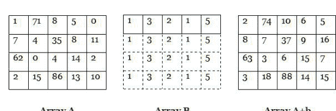

注意：NumPy 实际上并不复制元素，而是重复使用原始标量值，以使其在内存和计算上尽可能高效。

### 如何切片和索引数组

有时你只需要数据的子集或某些单个元素的值。那么你可以通过索引和切片来做到这一点。这是寻址单个元素的方法。要记住的一件重要事情是索引总是从 '0' 开始。对于单维矩阵，索引非常简单。
一维矩阵的索引语法为 `arr[n]`，这给你从零索引开始的第 n 个数字。
对于二维矩阵，你可以传递一个逗号分隔的索引列表来选择单个元素。它表示为 `arr[m,n]` 或 `arr[m][n]`，这给你从零索引开始的第 m 行第 n 列的元素。

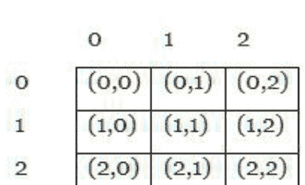

现在当我们谈论多维矩阵中的索引时，它变得有点困难。多维矩阵基本上是具有多层的列表的列表。
这里我将讨论一个三维矩阵。三维数组中的索引工作方式如下：语法：`arr[L,M,N]` 或 `arr[L][M][N]`，其中 L 是第一个索引，M 是行号，N 是列号。

如果在多维数组中省略后面的索引，那么将返回更高维度的所有数据。例如，在一个三维数组中，如果我们搜索 `arr[3]`，它将返回第3层的所有元素。
所有这些都在下面的示例中展示：

```python
>>> Array1 = np.array([1, 2, 3, 4, 5, 6])
>>> Array1[5]
6
>>> Array1 = Array1.reshape(2,3)
>>> Array1[0,1]
2
>>> array3d = np.array([[[1, 2, 5],[6,0,2]],[[5,9,8],[0,3,2]]])
>>> array3d[1,0,1]
9
>>> array3d[1]
array([[5, 9, 8],
       [0, 3, 2]])
```

另一方面，切片基本上是一种主要用于选择现有数组子集的操作。可以通过冒号（:）分隔来选择连续的值。在所有这些情况下，返回的数组都是视图。视图基本上是显示最新数据的虚拟表。然而，它不存储数据。这意味着数据不会被复制，任何修改都会反映在源数组中。因此，如果你觉得以后可能需要原始数据，最好创建该数组的副本。

一维数组中的切片：`arr[x : y]`，它返回索引从 `x` 到 `(y-1)` 的所有元素。
在多维数组中，你可以使用行和列来指定要包含的范围。通过以下方式可视化会更清楚：

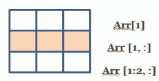

`Arr[1]`
`Arr [1, :]`
`Arr [1:2, :]`


`Arr[1:, :1]`

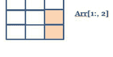

`Arr[1:, 2]`

## 第7章：Matplotlib – 数据可视化

### 什么是 Matplotlib 库

Matplotlib 是一个可以用来绘制二维和三维图形的库。要使用它，我们首先需要导入它，在导入时我们将利用 `pyplot`，它提供了一个类似于 MATLAB 的编程接口。

### 导入 Matplotlib

```python
import matplotlib.pyplot as plt
```

我们还导入一个非常强大的 numpy 数学库

```python
import numpy as np
```

### 简单图形

我们选择一个函数来绘图

```python
def straight_line(x):
    return 4 * x + 1
```

我们指出 x 的取值范围可以从 0 到 100

```python
x = np.arange(100)
```

我们构建这条线

```python
straight_y = straight_line(x)
```

让我们绘制图形

```python
plt.plot(x, straight_y)
```

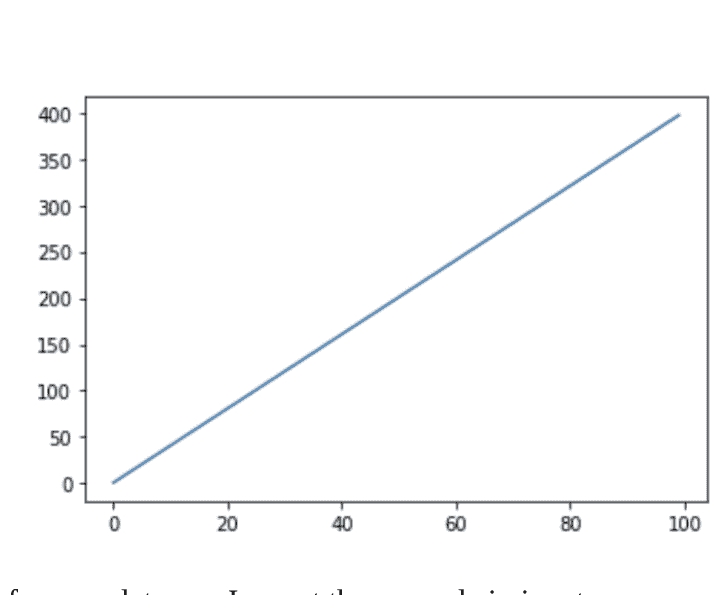

为了完整性，我在这里提供 jupyter 中的示例。

```python
import matplotlib.pyplot as plt
import numpy as np

def retta(x):
    return 4*x+1

x = np.arange(100)
y = retta(x)
plt.plot(x,y)
```

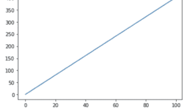

### 复杂图形

让我们尝试用一个稍微复杂的图形来做同样的例子

```python
import matplotlib.pyplot as plt
import numpy as np

def f(x):
    return 20 + 105 * np.cos(x) * np.sin(x + 30) + 144 * np.exp(0.5 / x + 1)

x = np.arange(-100,100)
y = f(x)
plt.plot(x,y)
```

我们尝试深入了解 `pyplot` 提供的可能性。

要更改图形的颜色，我们可以使用指令：

```python
plt.plot(x, y, color = "<color_RGB>")
```

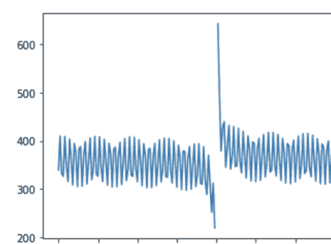

```python
plt.plot(x, y, color = '3412F3')
```

要更改坐标轴的范围，我可以使用以下指令：

```python
plt.xlim(left_x, right_x) or plt.ylim(bottom_y, top_y)
```

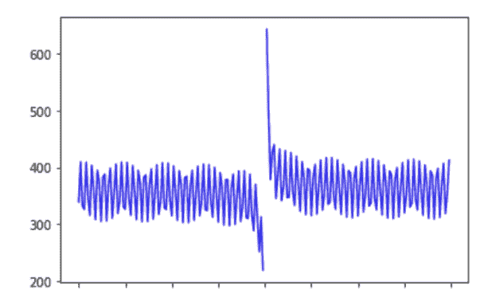

```python
plt.xlim(-10, 76)
plt.ylim(-100, 600)
plt.plot(x,y)
```

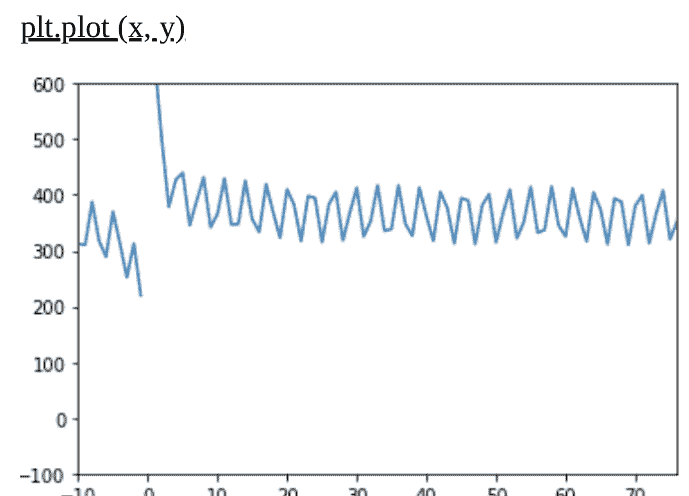

如果我们想，例如，绘制一个带有虚线或点线的图形，我们可以使用参数 `linestyle = "dashed"` 或 `linestyle = "dotted"`，例如：

```python
plt.plot(x,y, linestyle = "dashed")
```

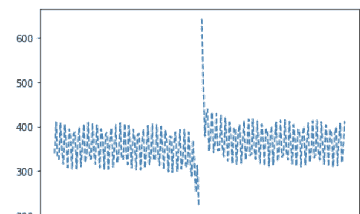

如果我们想使用标记，我们可以使用参数 `marker = 'o'`

```python
plt.plot(x, y, marker = 'o')
```

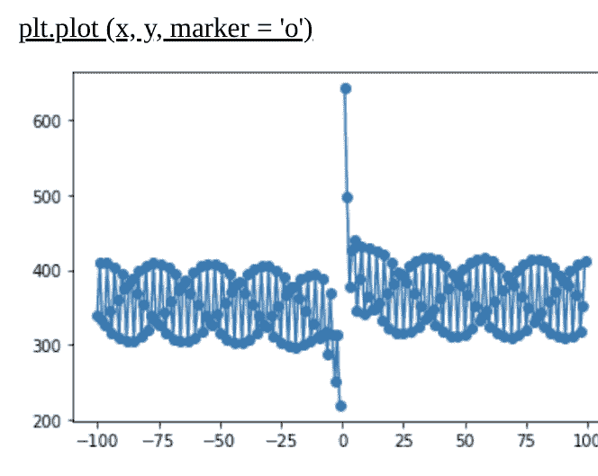

要向坐标轴添加信息或添加图例，我们可以使用以下指令：

```python
plt.plot(x, y, label = "y = f(x)")
plt.title("chart example")
plt.xlabel("x course")
plt.ylabel("trend of f(x)")
plt.legend()
```

要绘制多个图形，我们可以遵循以下方法：

- 我们定义要绘制的函数，
- 我们定义 x 的范围
- 我们通过为要表示的函数数量重复 `plot` 命令来“绘制”图形。

```python
import matplotlib.pyplot as plt
import numpy as np

def f(x):
    return 20 + 105 * np.cos(x) * np.sin(x + 30) + 144 * np.exp(0.5 / x + 1)

def straight_line(x):
    return 4 * x + 1

x = np.arange(-100,100)
plt.plot(x, f(x))
plt.plot(x, straight_line(x))
```

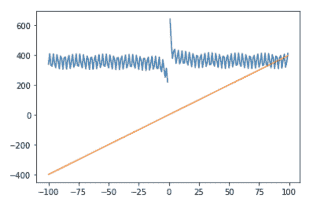

显然，可以在单个指令中使用各种参数，例如，要表示一个紫色、带有圆形标记和虚线样式的函数，我们可以写：

```python
plt.plot(x, y, color = '#8712F3', marker = 'o', linestyle = 'dashed', linewidth = 2, markersize = 12)
```

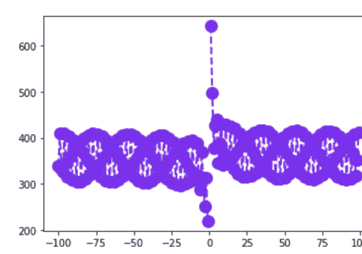

### 散点图

首先我们导入必要的库：

```python
import pandas as pd
import numpy as np
import matplotlib.pyplot as plt
```

为了在散点空间中生成点，我们使用 numpy。

```python
#Generate random points
randomPoints = np.random.randn(100,2);
```

`np.random.randn` 返回散点空间中的样本。

如果提供正整数参数，`randn` 会生成一个数组 `(d0, d1, ..., dn)`，其中填充了根据均值为 0、方差为 1 的“正态”（高斯）分布采样的随机浮点数。如果没有给出参数，它将返回标准分布的单个随机浮点样本。

前面的指令将随机生成 100 个点。结果将类似于这样：

```
array([[-0.28393081,  1.69444015],
       [ 1.18710769,  0.75168393],
       [-1.08797599,  0.16593107],
       [ 0.34718794,  1.50584947],
       [ 0.59907203,  0.34574815],
       [-1.17150305,  1.32782198],
       [-0.66961386,  0.13941936],
       [ 0.96038988, -0.04362326],
       [-0.42828503, -1.35202516],
       [-0.57520301, -0.5182515 ]])
```

此时，我们可以创建将用作 `pyplot` matplotlib 参数的 dataframe

```python
df = pd.DataFrame(randomPoints, columns = ['x','y'])
```

并打印散点图

```python
plt.plot(df['x'], df['y'], '.')
```

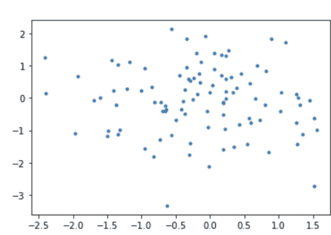

完整示例

```python
import pandas as pd
import numpy as np
import matplotlib.pyplot as plt

#Generiamo dei punti casuali
randomPoints = np.random.randn(100,2);

df = pd.DataFrame(randomPoints, columns=['x', 'y'])

df.head()
```

|    |         x |         y |
|----|-----------|-----------|
|  0 | -0.951031 |  0.925133 |
|  1 |  1.282889 |  0.020743 |
|  2 | -0.045163 | -0.401519 |
|  3 | -0.659605 | -0.225288 |
|  4 | -1.502277 | -1.175636 |

```python
plt.plot(df['x'], df['y'], '.')
```

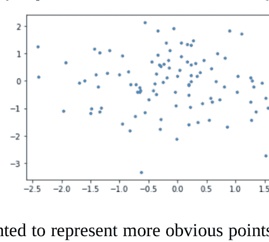

如果我们想表示更明显的点，我们可以使用 "o" 代替 "."

```python
plt.plot(df['x'], df['y'], 'o')
```

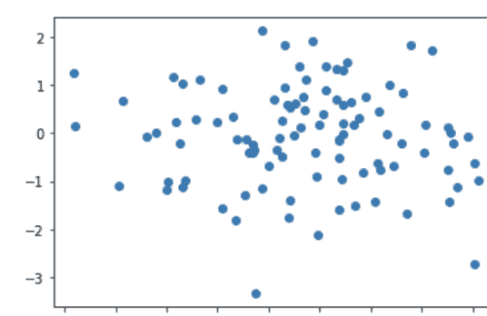

其他选项可能允许我们创建更有意义的图形，定义点的大小和颜色，但为此我们将必须使用 `scatter` 函数而不是 `plot`。

在我们的示例中，我们将为颜色和点的大小也使用随机数据；

```python
randomcolor = np.random.randn(100)
r_random_point = 1000*np.random.randn(100)
plt.scatter(df['x'], df['y'], s = r_random_point, alpha = 0.6, c = randomcolor)
```

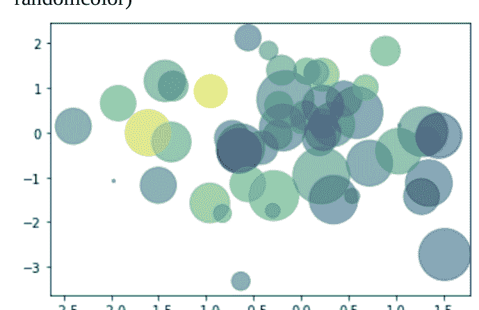

## 第8章：其他数据可视化库

## Pandas

*pandas* 包是当今在 Python 中工作的数据科学家和分析师可用的最重要的工具。强大的机器学习和华丽的可视化工具可能会吸引所有注意力，但 pandas 是大多数数据项目的支柱。[pandas] 源自术语“面板数据”，这是一个计量经济学术语，指包含对相同个体在多个时间段进行观察的数据集。如果你将数据科学视为职业，那么你必须做的第一件事就是学习 pandas。

# Seaborn

Seaborn 利用 matplotlib 的强大功能，只需几行代码就能制作出一流的图形。关键区别在于 Seaborn 的默认模式和阴影调色板，它们旨在更具审美愉悦感和现代感。由于 Seaborn 主要基于 matplotlib，你将需要了解 matplotlib 才能更改 Seaborn 的默认设置。

### ggplot

ggplot 依赖于 ggplot2，一个 R 绘图框架，以及《图形语法》中的思想。ggplot 的工作方式与 matplotlib 不同：它为你提供了一个分层组件以创建完整图形的机会。例如，你可以从坐标轴开始，然后添加点，然后是一条线、一条趋势线等等。尽管《图形语法》被誉为一种“直观”的绘图方法，但经验丰富的 matplotlib 用户可能需要时间来适应这种新视角。
根据其创建者的说法，ggplot 并非旨在创建高度定制的图形。它牺牲了复杂性，以换取更简单的绘图方法。
ggplot 与 pandas 紧密集成，因此在使用 ggplot 时，最好将你的数据存储在 DataFrame 中。

# Bokeh

## pygal

与 Bokeh 和 Plotly 类似，pygal 能够生成可直接嵌入网页的直观图表。其最大的优势在于能够将图表输出为 SVG 格式。当处理较小规模的数据集时，SVG 格式能为你提供极佳的体验。然而，如果图表包含大量数据点，SVG 可能会出现渲染问题并变得迟缓。
由于每种图表类型都封装在一个方法中，且内置样式美观，只需几行代码就能创建出外观精美的图表。

## Plotly

你可能也了解 Plotly 是一个在线数据可视化平台，但你知道也可以通过 Python 笔记本来使用它的功能吗？与 Bokeh 类似，Plotly 的专长在于创建交互式图表，但它还提供了一些在其他库中不常见的图表类型，例如形状图、树状图和 3D 图。

## geoplotlib

geoplotlib 是一个用于创建地图和绘制地理数据的工具包。你可以用它来创建多种数据类型，如分级统计图、热力图和点密度图。要使用 geoplotlib，你需要安装 Pyglet（一个面向对象的编程接口）。尽管大多数 Python 数据可视化库不提供地图功能，但拥有一个专门用于地图绘制的库是非常棒的。

## Glimmer

Glimmer 的灵感来源于 R 语言的 Shiny 包。它允许你仅使用 Python 脚本就能将分析快速转换为交互式网络应用，因此你无需了解 HTML、CSS 或 JavaScript 等其他语言。Glimmer 可与任何 Python 数据可视化库配合使用。创建图表后，你可以在其上构建控件，以便用户筛选和排序数据。

## missingno

处理缺失数据是一件令人头疼的事。missingno 允许你通过可视化图表快速评估数据集的完整性，而无需逐行查看表格。你可以根据数据的连续性或位置关系进行筛选和排序，并使用热力图或树状图进行分析。

## Calfskin

Calfskin 的创建者 Christopher Groskopf 对其描述得恰到好处：“Calfskin 是为那些需要快速生成图表且不追求完美的人设计的 Python 绘图库。”它旨在处理所有数据类型，并将图表输出为 SVG 格式，因此你可以缩放图表而不会损失图像质量。由于这个库相对较新，部分文档仍在完善中。你可以创建的图表非常基础——但这正是其目标。

# 第 9 章：大数据简介

## 大数据简史

海量数据的起源可以追溯到 20 世纪 60 年代和 70 年代，当时第三次工业革命刚刚开始兴起，关系型数据库的发展也随之启动，数据中心也开始建设。但大数据的概念直到最近才成为焦点，主要是因为 Google 和 Yahoo 等免费搜索引擎、YouTube 等免费在线娱乐平台以及 Facebook 等社交媒体平台的普及。2005 年，企业开始意识到这些平台和服务产生的海量用户数据，同年，一个名为“Hadoop”的开源框架被开发出来，用于收集和分析这些企业可用的大型数据集。在同一时期，一种名为“NoSQL”的非关系型或分布式数据库因其存储和提取非结构化数据的能力而开始流行。“Hadoop”使企业能够以相对较低的成本轻松处理大数据。

如今，随着前沿技术的兴起，不仅人类在产生数据，机器也在产生数据。“物联网”（IoT）和“系统互联网”（IoS）等智能设备技术极大地增加了大数据的规模。我们日常的家居用品和智能设备都连接到互联网，能够跟踪和记录我们的使用模式以及与这些产品的互动，并将所有这些数据直接输入大数据。机器学习技术的出现进一步增加了每日生成的数据量。

## 大数据

你可以将其理解为在各种情况下收集的关于人员或活动的大量看似随机的数据。就人员而言，这包括你在哪里购物、访问哪些网站、旅行目的地、购买的产品等数据。这些数据也可以收集与任何企业或组织相关的活动。例如，UPS 收集的关于其司机习惯和燃油使用情况的数据，或政府机构收集的与犯罪活动或流行病相关的数据。
数据本身是无用的。必须对其进行分析，由被称为数据科学家的专家指导计算机，以发现数据中可能存在的隐藏模式、关联和趋势。企业、政府和其他大型组织正在利用大数据寻找与其运营相关的人类行为信息，无论是提高自身效率、提供更好的服务，还是开发客户群想要的新产品。

## 数据战略

大数据战略将涉及数据的收集、存储、检索、分析和可操作的洞察。大数据战略的目标是构建一个能够驱动商业智能的大数据基础。
对于大多数企业来说，收集数据不是问题，但许多企业错误地预判了他们可以收集的数据的价值，因此没有收集到应有的数据量。到现在，你应该认识到数据可能包含不那么明显的洞察。这就是机器学习的优势及其在数据分析中的作用：发现人类不知道存在的隐藏模式——坦率地说，人类也不可能知道这些模式的存在。因此，你需要以开放的心态收集数据。企业可以收集的任何信息都可能有用。乍一看，它可能显得无关紧要，但以后可能用于建立意想不到的联系，从而为数据驱动的决策提供依据。
大数据战略需要解决的第二个问题是数据的存储和检索。处理大数据的规模和速度需要大量的基础设施。这包括大容量存储和强大的计算机。组织——尤其是中小型企业——很难建立能够有效处理大数据的数据驱动型基础设施。这样做可能确实需要数百台计算机服务器、庞大的数据存储库和高效的数据检索工具。此外，还需要高水平的网络安全来保护数据的完整性。
对于许多企业来说，这些需求意味着他们需要寻求外部组织的帮助来满足这些需求。云计算使这成为可能，世界上许多最大的公司正在提供易于访问的云计算资源，这些资源成本效益高、速度快且易于使用。

全天候存储和检索数据。此类服务的提供商包括亚马逊、微软和谷歌。这些公司提供多个层级的云服务，可以根据任何规模企业的需求进行定制，从运营家庭业务的单人公司到大型企业——甚至政府机构。例如，亚马逊的简单存储服务（称为 Amazon S3）可供任何规模的企业使用，以获取低成本的云计算服务。

能够部署自己大数据系统的企业可以利用开源工具来完成工作。这包括使用 Apache 工具，如 Hadoop 和 Spark，以及 MapReduce。必须进行仔细的考量。内部处理工作将使数据处于公司的直接控制之下。然而，这将需要构建或租用必须全天候维护的海量计算机存储容量。这还需要一套强大的信息安全措施，以确保数据的完整性并保护其免受黑客攻击、损坏和其他问题。这还需要雇佣大量人员。尽管许多大型企业可能有能力实施完全内部的大数据战略，但这样做是否总是最佳前进方向尚不清楚。每个组织都必须做出这个决定。然而，像微软和 IBM 这样的成熟公司能够提供已经过彻底测试且稳健的基础设施和服务，这使得将这些任务外包成为一个可行且更具成本效益的选择。

通过利用第三方服务，你可以大幅降低实施大数据战略的成本。大数据能力将由已经为存储、维护和保护数据开发了庞大计算机基础设施的成熟公司为你提供。像 IBM、谷歌和微软这样的第三方来源也可能能够协助进行分析。

一旦收集、存储和检索问题得到解决，就必须建立系统来理解数据。数据本身是无用的。要用于商业智能所要求的那种数据驱动决策，必须发现数据中的模式、关系和趋势，并将其以可呈现的形式供人类分析。这些步骤将涉及数据科学和机器学习的使用。这是公司必须决定是内部执行还是外包任务的另一个步骤。

对于中小型企业，有几个论点支持外包任务。许多像 IBM 这样的公司在开发人工智能和机器学习工具方面有着悠久的历史，并且他们正在以有效的成本将这些能力作为商业服务提供给客户。自人工智能首次成为一个领域以来，IBM 一直是该领域的领导者，因此你知道你获得的是高水平的可靠性。这不是对 IBM 的推荐或反对，而是让你知道这类服务是可用的。它们也可以从其他大公司获得，如微软、Facebook 和谷歌，以及许多较新的初创公司。

许多大公司正在内部进行这项工作。西南航空公司就是一个例子。

无论哪种方式，你的大数据战略的一部分都将包括组建一个数据科学团队。如果你将大数据分析外包，你可能仍然需要一名内部数据科学家与第三方团队合作，以充分利用数据。数据科学家可以在内部雇佣，你也可以与合同提供商合作。

用于数据分析的机器学习工具也可供内部使用，你可以雇佣数据科学家来开发他们自己的工具。根据你的具体需求，可能有现成的软件工具可供使用，并且它们已被证明是可靠和有效的。因此，你不一定需要雇佣一个数据科学家团队来开发自己的内部工具。当然，如果费用可以管理，并且公司有无法通过现成组件解决的特殊需求，这可以作为大数据战略的一部分来追求。另一个选择是利用像 IBM、谷歌和微软这样的公司提供的现有服务，将你的大数据转化为可以纳入商业智能的洞察力。

大数据战略的最后一部分是基于从该过程中得出的可操作洞察力进行数据驱动决策。这将成为业务流程、运营和组织的核心部分。这是因为这是一个持续的过程。机器学习不是一次性事件；随着大量数据的持续收集，它会不断进行。它以这种方式运行，以便在基础设施建立后，通常能够实时提供新的洞察力。

在每种情况下，该过程提供的可操作洞察力都将为商业智能提供基础，并为商业智能提供输入。在许多情况下，将运用人类的洞察力和独创性。并非每个洞察力对企业都具有同等价值。因此，必须应用所有现有的商业智能组件来确定组织可以并且应该采取哪些行动。成本效益等问题将是核心，以及公司从实际角度执行每项行动的能力。将有限资源分配给不同的可能行动是另一个因素。各级管理层的业务领导者必须权衡每项可能行动与其他行动。这并非新鲜事，企业可能不得不放弃一些可操作的洞察力，即使它们有价值，而选择那些将产生影响且更具成本效益的行动。随着更多数据的持续涌入，必须持续评估和重新评估情况。并非所有通过将机器学习和人工智能应用于大数据得出的可能行动都需要人类的输入。在许多情况下，这些系统将自主运行，无需人类输入，只需定期审查。这类应用的例子包括网络安全和金融事务中的欺诈检测。

## 数据收集

原始数据可以从不同的来源收集，例如社交媒体平台、计算机、摄像头、其他软件应用程序、公司网站，甚至第三方数据提供商。大数据分析本质上需要大量数据，其中大部分是非结构化的，只有少量结构化和半结构化数据。

## 第10章：神经网络

### 卷积神经网络

卷积神经网络（CNN）是深度神经网络的主要类别之一，已被证明在计算机科学的许多领域非常有效，如物体识别、物体分类和计算机视觉。卷积神经网络多年来一直用于区分人脸、识别物体、为自动驾驶汽车和机器人提供视觉能力。

卷积神经网络可以轻松识别无数的图像场景，并建议相关的标题。卷积神经网络也能够识别日常物体、动物或人类。最近，卷积神经网络也有效地用于自然语言处理问题，如句子分类。

因此，卷积神经网络是机器学习和深度学习任务中最重要的工具之一。LeNet 是第一个被引入的卷积神经网络，它极大地推动了整个深度学习领域的发展。这第一个卷积神经网络是由 Yann LeCun 在 1988 年提出的。它主要用于字符识别问题，如读取数字和代码。

如今经常用于无数计算机科学任务的卷积神经网络与 1988 年提出的第一个卷积神经网络非常相似。

就像今天的卷积神经网络一样，LeNet 被用于许多字符识别任务。就像在 LeNet 中一样，我们今天使用的标准卷积神经网络包含四个主要操作，包括卷积、ReLU 非线性激活函数、子采样或池化以及全连接层的分类。

这些操作是构建每个卷积神经网络的基本步骤。为了继续处理 Python 中的卷积神经网络，我们必须更深入地了解这四个基本功能，以便更好地理解卷积神经网络背后的直觉。

如你所知，每个图像都可以轻松表示为包含多个值的矩阵。我们将使用一个传统术语“通道”，其中指的是图像的特定组成部分。标准相机拍摄的图像通常包含三个通道：蓝色、红色和绿色。你可以将这些图像想象成三个堆叠在一起的二维矩阵。每个矩阵中的像素值都在0到255的特定范围内。

另一方面，如果是灰度图像，则只有一个通道，因为没有颜色信息，只有黑白。在我们这里的情况下，我们将考虑灰度图像，因此我们研究的示例只是一个代表灰度图像的二维矩阵。矩阵中每个像素的值必须在0到255之间。在这种情况下，0表示黑色，255表示白色。

## 卷积神经网络是如何工作的？

卷积神经网络结构通常用于各种深度学习问题。如前所述，卷积神经网络因其结构而被用于目标识别、目标分割、检测和计算机视觉。CNN直接从图像数据中学习，因此无需执行常规深度神经网络中通常需要的手动特征提取。

CNN的使用之所以流行，主要有三个原因。首先是CNN的结构，它消除了执行手动数据提取的需要，因为所有数据特征都由卷积神经网络直接学习。CNN日益普及的第二个原因是它们能产生惊人的、最先进的目标识别结果。第三个原因是CNN可以轻松地重新用于许多新的目标识别任务，以帮助构建其他深度神经网络。

一个CNN可以包含数百层，每一层都自动学习检测图像数据的许多不同特征。此外，通常会对每个训练图像应用不同分辨率的滤波器，因此每个卷积图像的输出都作为下一个卷积层的输入。

滤波器也可以从非常简单的图像特征（如边缘和亮度）开始，因此随着卷积层的推进，它们通常会增加定义目标的图像特征的复杂性。

因此，通常会对每个训练图像应用不同分辨率的滤波器，因为每个卷积图像的输出都作为下一个卷积层的输入。

卷积神经网络可以在数百、数千和数百万张图像上进行训练。

当你处理大量图像数据和一些非常复杂的网络结构时，你应该使用GPU，它可以显著加速训练神经网络模型所需的处理时间。

一旦你训练好你的卷积神经网络模型，你就可以将其用于实时应用，如目标识别、ADAS（高级驾驶辅助系统）中的行人检测等等。

在常规深度神经网络中，最后一个全连接层称为输出层，在每个分类设置中，这个输出层代表整体类别得分。

由于这些特性，常规深度神经网络无法扩展到完整图像。例如，在CIFAR-10中，所有图像的大小都是32x32x3。这意味着所有CIFAR-10图像都有3个颜色通道，并且宽度为32像素，高度为32像素。这意味着在第一个常规神经网络中，单个全连接神经网络将有32x32x3或3071个权重。这个数量并不像那些全连接结构那样易于管理，因为它们无法扩展到更大的图像。

此外，你可能希望拥有更多相似的神经元来快速增加更多参数。然而，在计算机视觉和其他类似问题的情况下，使用全连接神经元是浪费的，因为你的参数会导致模型很快过拟合。因此，卷积神经网络利用其输入由图像组成这一事实来解决这类深度学习问题。

由于其结构，卷积神经网络以更合理的方式约束了图像的架构。与常规深度神经网络不同，卷积神经网络中包含的层由排列在三维（深度、高度和宽度）中的神经元组成。例如，CIFAR-10输入图像是深度神经网络中所有层输入体积的一部分，该体积的尺寸为32x32x3。

这类层中的神经元只能连接到前一层的一小部分区域，而不是像常规深度神经网络那样所有层都是全连接的。此外，CIFAR-10的最终层输出尺寸将是1x1x10，因为卷积神经网络架构的末端会将完整图像缩减为一个类别得分向量，仅沿深度维度排列。

总而言之，与常规的三层深度神经网络不同，ConvNet将其所有神经元仅组合在三个维度中。此外，卷积神经网络中包含的每一层都将3D输入体积转换为包含各种神经元激活的3D输出体积。

卷积神经网络包含的层都具有一个简单的API，产生3D输出体积，该体积具有一个可微函数，该函数可能包含也可能不包含神经网络参数。

卷积神经网络由几个子采样层和卷积层组成，之后有时会跟随全连接层或密集层。如你所知，卷积神经网络的输入是一个n x n x r的图像，其中n代表输入图像的高度和宽度，而r是存在的通道总数。卷积神经网络也可能包含k个称为内核的滤波器。当存在内核时，它们被确定为q，q可以与通道数相同。

每个卷积神经网络映射都通过在p x p的连续区域上进行最大或平均池化进行子采样，其中p通常在小图像中为2，在大图像中大于5。在子采样层之后或之前，会对每个特征图应用S型非线性函数和加性偏置。在这些卷积神经层之后，可能有几个全连接层，这些全连接层的结构与标准多层神经网络的结构相同。

## 步幅和填充

其次，在指定深度之后，你还必须指定滤波器滑动的步幅。当步幅为1时，你必须一次移动一个像素。当步幅为2时，你可以一次移动两个像素，但这会在空间上产生更小的输出体积。默认情况下，步幅值为1。但是，如果你希望感受野之间的重叠较少，可以使用更大的步幅，但如前所述，这将导致特征图变小，因为你跳过了图像位置。

在使用较大步幅但希望保持相同维度的情况下，你必须使用填充，用零包围你的输入。你可以用边缘值填充，也可以用零填充。一旦你获得与输入匹配的特征图维度，你就可以继续添加池化层，填充通常在卷积神经网络中用于保留特征图的大小。

如果不使用填充，你的特征图将在每一层缩小。当你只想用零填充输入体积的整个边界时，添加零填充通常非常方便。

这称为零填充，它是一个超参数。通过使用零填充，你可以控制输出体积的大小。

你可以轻松地将输出体积的空间大小计算为输入体积大小、卷积层感受野大小、应用的步幅以及在卷积神经网络边界中使用的零填充量的简单函数。

例如，如果你有一个7x7的输入，并且使用一个3x3的滤波器，步幅为1，填充为0，根据公式你将得到一个5x5的输出。如果你的步幅为2，你将得到一个3x3的输出体积，依此类推，使用以下公式，其中W代表输入体积的大小，F代表卷积神经层的感受野大小，S代表应用的步幅，P代表使用的零填充量。

```
(W-F +2P)/S+1
```

使用这个公式，你可以轻松计算出有多少神经元可以放入你的卷积神经网络。尽可能考虑使用零填充。例如，如果你的输入和输出维度相等，都是五，你可以使用一个零填充来获得三个感受野。

在这种情况下，如果你不使用零填充，你将得到空间维度为3的输出体积，因为3是能够放入原始输入的神经元数量。

空间排列超参数通常具有相互约束。例如，如果你的输入大小为10，没有使用零填充，并且滤波器大小为三，则无法应用步幅。因此，你的超参数集将是无效的，你的卷积神经网络库将抛出异常或完全零填充到其余部分以使其适配。

幸运的是，合理调整卷积层的尺寸，使所有维度都能通过零填充正常工作，可以让任何任务都变得更简单。

## 参数共享

你可以在卷积层中使用参数共享方案来完全控制所用参数的数量。如果你将深度的单个二维切片表示为深度切片，你可以约束每个深度切片中的神经元使用相同的偏置和权重。使用参数共享技术，你将获得一组唯一的权重，每个深度切片对应一组，因此你可以显著减少卷卷积神经网络第一层中的参数数量。执行此步骤后，卷积网络每个深度切片中的所有神经元都将使用相同的参数。换句话说，在反向传播过程中，体积中的每个神经元都会自动计算其所有权重的梯度。然而，这些计算出的梯度会在每个深度切片上累加，因此你只需为每个深度切片更新一组权重。这样，一个深度切片中的所有神经元将使用相同的权重向量。因此，当你在每个深度切片中前向传播卷积层时，它是作为所有神经元权重与输入体积的卷积来计算的。这就是为什么我们将获得的权重集合称为核或滤波器，它与你的输入进行卷积。然而，在某些情况下，这种参数共享假设并不合理。这通常发生在许多输入图像具有某种中心结构的情况下，你必须根据图像位置学习不同的特征。例如，当你有多个以图像为中心的人脸输入时，你可能期望获得不同的头发特定或眼睛特定特征，这些特征可以在许多空间位置轻松学习。在这种情况下，通常会放宽此参数共享方案，而简单地使用局部连接层。

## 矩阵乘法

卷积操作通常执行输入局部区域与滤波器之间的点积。在这些情况下，卷积层的一种常见实现技术是充分利用这一事实，并将主卷积层的特定前向传播表示为一个大的矩阵乘法。矩阵乘法的实现是在一个称为im2col的操作期间，将输入图像的局部区域完全拉伸成不同的列。例如，如果你有一个大小为227x227x3的输入，并以步长4与其大小为11x11x3的滤波器进行卷积，你必须在输入中取大小为11x11x3的像素块，并将每个块拉伸成大小为363的列向量。然而，当你以步长4迭代此过程时，你会在宽度和高度上得到55个位置，从而导致一个输出矩阵，其中每一列都是最大拉伸的感受野，总共有3025个感受野。输入体积中的每个数字都可能在多个不同的列中重复出现。另外，请记住，卷积层的权重也非常相似地被拉伸成某些行。例如，如果你有95个大小为11x11x3的滤波器，你将得到一个大小为96x363的w行矩阵。

## 结论

Python的使用可以是你能选择的最佳编程语言之一。它对初学者来说很容易，但其背后是一个特性，即使你附加一个高级程序员，它也很稳固，使其成为一种很棒的编程语言。

有很多，你可以用Python程序做同样的事情，而且因为你可以将其与其他一些编程语言混淆，并且存在这样做的争议，你无法在你周围用Python做到这一点。

如果你真的对一种编程语言感兴趣，Python就像你熟悉母语一样，做一些真正令人惊叹的事情，而不用担心所有代码都会被查看。对某些人来说，使用编程语言的一半恐惧是一个事实。很难找到所有挂载点和其他问题。但这就是问题所在。

下一步是开始将数据科学实施到你自己的业务中，并看看通过这个可以获得哪些结果。数据科学正在接管商业世界，许多公司，无论他们处于哪个行业，都发现这种流程正是他们所需要的，不仅可以收集他们拥有的数据，还可以清理它并执行分析，以找到其中的见解和预测。当数据科学以适当的方式使用，并且我们添加一些Python来帮助创建模型以及更多所需的内容时，我们将能够找到最佳方式来做出改善我们在行业中地位的商业决策。

数据科学有很多不同的部分，能够将它们全部结合起来真的可以帮助我们更好地帮助客户，找到新产品推向市场等等。在这本指南的帮助下，我们希望能找到最佳方式来击败竞争对手，并看到对我们有效的结果。这需要一些时间，以及使用Python的正确算法进行良好的数据分析，但它可以是为你的业务做出明智和健全决策的最佳方式之一。

Python数据科学的过程并不容易，学习如何使其满足你的需求，并将所有部分结合起来，可以对你的业务运营方式以及未来业务增长时的成功程度产生重大影响。

当你准备好了解更多关于Python数据科学以及如何使其为你的业务工作时，请务必查看本指南以开始。

额外的一步是充分利用你新获得的Python编程知识；数据科学、数据分析和机器学习催生了“硅谷”这个强大的存在。各行各业中着眼于未来的企业正逐渐在其预期商业模式的阴影下转变为大型科技公司。这已被归因于全球金融机构和企业的“金融科技”行业的兴起所证明。

我们提供现实生活中的例子来帮助你理解底层概念的细节，以及你可以进一步探索并有选择性地实施的多个工具的名称和描述，以便为开发所需的机器学习模型做出明智的选择。既然你已经阅读并掌握了Python编程的使用，你就可以开始开发自己的基于Python的机器学习模型，并使用这里明确描述的所有现成开源工具执行大数据分析。你可以定位自己，利用你对所有获得的尖端技术的深入知识和理解，为任何公司的增长做出贡献，并为自己找到一份高薪且有回报的新工作！

几乎每个人都会同意大数据已经以一种大方式到来并席卷了商业世界的说法。但数据分析的未来是什么？它会增长吗？围绕它会增长哪些技术？大数据的未来是什么？它会增长更多吗？或者大数据很快就会成为博物馆的展品？什么是认知技术？快速数据的未来是什么？让我们看看这些问题的答案。我们将看看数据分析和大数据领域专家的一些预测，以获得更清晰的图景。

数据量将持续增长。人们心中几乎毫无疑问，我们将继续开发越来越大量的数据，特别是考虑到联网设备和手持设备的数量将呈指数级增长。我们进行数据分析的方式将在未来几年显示出显著的改进。虽然SQL仍将是标准工具，但我们将看到其他工具如Spark作为

## - 面向数据科学的Python -

作者

## TechExp学院

2020 © 版权所有

## 引言

本书聚焦于“面向数据科学的Python”，深入探讨Python编程语言的核心效用，特别是其在数据科学领域的应用。本书提供了一个平台，让你能够通过终极的Python数据科学速成课程，在一周内学好数据科学，课程包含清晰的示例和循序渐进的指导。

我们首先需要探讨的是，为什么数据科学对我们的需求如此重要且有益。这将使我们更容易地浏览数据并查看其中的内容，通常，商业智能工具就足以让我们了解可用信息以及需要做出哪些商业决策。

然而，我们今天能够审视的数据与以往大不相同。与传统上主要是结构化的数据系统不同，如今公司收集的数据通常是无结构的，或者至少是半结构化的。这将使得数据的分类和理解变得更加困难，这也正是数据科学流程得以扩展至今日形态的原因。

无论从事何种行业，许多企业都会发现，利用数据科学是他们的最佳选择之一。数据科学能够帮助他们真正了解自己的行业，甚至在竞争中获得优势。许多公司已经收集了大量关于竞争对手、行业和客户的数据和信息，而数据科学将帮助他们实际洞察这些数据中蕴含的见解和信息，并将其转化为自身优势。

考虑到以上几点，现在不仅要审视数据科学带来的一些益处，我们还需要进一步了解数据科学究竟是什么，以及企业如何利用数据科学满足自身需求。

数据科学在许多企业以及众多不同行业中的应用正变得日益突出。但这并未真正向我们解释数据科学的全部内涵？我们可能想弄清楚进行此类分析需要什么，需要哪些工具来进行预测，等等。这些都是我们能够在本指南的这一部分回答的问题，以使事情变得简单一些。

首先，我们需要了解数据科学的全貌。数据科学是算法、工具和机器学习原理的融合。所有这些不同的元素结合在一起，旨在从原始数据中发现隐藏的模式。这与我们多年来所见的统计学家的工作有何不同？对此问题的答案将在于“预测”与“解释”某事之间的区别。

数据分析师通常是那个通过整理数据历史来解释正在发生什么的人。但数据科学家则有些不同，因为他们不仅进行上述一些探索性分析，还会运用许多先进的机器学习算法来帮助他们判断未来某一事件发生的可能性。数据科学家能够从多个角度审视数据，并希望从一些过去未曾探索过的角度来观察它。

这些角度将包括以下内容：

-   **预测性因果分析** - 当我们有一个模型可以预测未来某事件发生的可能性时，我们就会想要使用这种方法。例如，如果你想向某人提供信用贷款，你会希望使用这种分析来评估客户未来还款的可能性。我们可以根据客户过去的还款表现，构建一个能够执行此类分析的模型。

-   接下来，我们可以转向一种称为**规定性分析**的方法。如果我们想使用一个具备智能和所需信息来做出自身判断的模型，并且你仍然能够根据自己的动态标准来修改模型，那么我们就会使用这种方法。这是一个较新的领域，仍有一些问题需要解决，但它通常能帮助我们获得建议，并从多个可用选项中了解应采取何种行动。

-   我们在这里将花时间关注的第三个选项是，如何利用机器学习帮助我们做出良好的预测。如果你正在处理金融领域的交易数据，并希望建立一个新模型来确定可能存在的未来趋势，那么你会发现一些与机器学习相关的算法将是最佳选择。

这将是监督学习的一种形式，因为我们必须向系统提供大量示例，以便它能够随着时间的推移学习如何运作。一个很好的例子是，当我们创建一个模型或算法，能够基于历史上被证实为欺诈的购买记录来检测欺诈行为时。

最后可以包含在其中的部分是利用机器学习帮助我们发现数据中的新模式。如果你正在深入研究数据，但不确定将使用哪些参数来进行一些预测，那么是时候深入挖掘，找出你这批数据中存在的模式，然后利用这些模式做出一些相当有意义的预测。这将与无监督学习模型相同，因为程序必须在没有任何来自你的选项或参数的情况下，遍历数据并查看其中的内容，找出你实际可以使用的部分。

数据分析的补充方法，其数量将根据报告持续增长。越来越多的工具将可用于数据分析，其中一些将不再需要分析师。微软和Salesforce已宣布了一些组合功能，允许非程序员创建用于查看业务数据的应用程序。

对大数据的实时流式洞察将成为未来数据赢家的标志。用户将寻求使用Spark和Kafka等程序，利用数据在实时环境中做出明智决策。将出现的首要战略趋势是机器学习。机器学习将成为企业未来大数据准备和预测分析的必备要素。

你可以预期大数据也将面临巨大挑战，尤其是在用户隐私领域。欧盟实施的新隐私法规旨在保护用户的个人信息。各种公司必须解决隐私控制和流程问题。据预测，未来几年大多数商业道德违规行为将与数据相关。

很快，你几乎可以预期所有公司都将设立首席数据官。Forrester表示，该职位的重要性将在短期内上升，但某些类型的企业和代际差距可能会降低其在未来的重要性。自主代理将继续发挥重要作用，并且根据Gartner的说法，它们将继续成为一个巨大的趋势。这些代理包括自动驾驶汽车、智能顾问、虚拟个人助理和机器人。

数据分析所需的人员配置将持续扩大，从科学家到分析师、架构师再到数据管理领域的专家都将被需要。然而，大数据人才的短缺可能会促使大型公司开发新的策略。一些大型机构预测，各种组织将使用内部培训来解决自身问题。一种以服务形式提供大数据的商业模式已初现端倪。

## 目录

[引言](Introduction)

[第1章：数据科学基础](Chapter 1: Data Science Basics)

- [什么是数据科学？](What is Data Science?)
- [理解数据收集、清洗、分析、建模和可视化的过程](Understanding the Process of Collecting, Cleaning, Analyzing, Modeling and Visualizing Data)
- [为什么你应该为数据科学学习Python？](Why should you Learn Python for Data Science?)
- [章节总结](Chapter Summary)

[第2章：为数据科学设置Python环境](Chapter 2: Setting Up the Python Environment for Data Science)

- [在Mac OS X上安装Python](Installing Python on Mac OS X)
- [在Windows系统上安装Python](Installing Python on a Windows System)
- [在Linux操作系统上安装Python](Installing Python on a Linux Operating System)

[第3章：Python中的Seaborn数据可视化模块](Chapter 3: Seaborn Data Visualization Module in Python)

- [安装Seaborn](Installing Seaborn)
- [Seaborn的绘图函数](Seaborn’s Plotting Functions)
- [分布图](The Dist Plots)
- [联合图](Joint Plot)
- [配对图](Pair Plot)
- [地毯图](Rug Plot)
- [条形图](Bar Plot)
- [Pandas的作用](Role of Pandas)
- [小提琴图](Violin Plot)
- [折线图](Line Chart)
- [单变量折线图](Line chart for a single variable)
- [设计实践：](Design practices:)

[第4章：机器学习算法简介](Chapter 4: Introduction to Machine Learning Algorithms)

- [按学习风格分组的算法](Algorithms Grouped by Learning Style)
- [监督学习](Supervised Learning)
- [无监督学习](Unsupervised Learning)
- [半监督学习](Semi-Supervised Learning)
- [按相似性分组的算法](Algorithms Grouped By Similarity)
- [回归算法](Regression Algorithms)
- [基于实例的算法](Instance-based Algorithms)
- [正则化算法](Regularization Algorithms)
- [决策树算法](Decision Tree Algorithms)
- [贝叶斯算法](Bayesian Algorithms)
- [聚类算法](Clustering Algorithms)
- [关联规则学习算法](Association Rule Learning Algorithms)
- [人工神经网络算法](Artificial Neural Network Algorithms)
- [深度学习算法](Deep Learning Algorithms)
- [降维算法](Dimensionality Reduction Algorithms)
- [集成算法](Ensemble Algorithms)

[第5章：使用Scikit-Learn进行数据科学和机器学习](Chapter 5: Data Science and Machine Learning with Scikit-Learn)

- [应用Scikit-Learn库的前提条件](Prerequisites for application of Scikit-Learn library)
- [数据探索](Data Exploration)
- [数据可视化](Data Visualization)
- [数据预处理](Data Pre-processing)
- [训练集与测试集](Training Set & Test)
- [构建模型](Building The Model)
- [朴素贝叶斯](Naive-Bayes)
- [K近邻分类器](K-Neighbors Classifier)
- [性能比较](Performance Comparison)
- [高斯朴素贝叶斯](GaussianNB)
- [线性支持向量分类器](LinearSVC)
- [K近邻分类器](KNeighborsClassifier)
- [结论](Conclusion)

[第6章：数据科学与云计算](Chapter 6: Data Science and Cloud)

- [什么是云计算？](What is the Cloud?)
- [云端的数据科学](Data Science in the Cloud)
- [软件架构与质量属性](Software Architecture and Quality Attributes)
- [在云端共享大数据](Sharing Big Data in the Cloud)

[第7章：数据科学应用示例](Chapter 7: Examples of Applications of Data Science)

- [安全](Security)
- [交通](Transportation)
- [风险与欺诈检测](Risk and Fraud Detection)
- [配送物流](Logistics of Deliveries)
- [客户互动](Customer Interactions)
- [城市规划](City Planning)
- [医疗保健](Healthcare)
- [旅行](Travel)
- [数字广告](Digital Advertising)

## 第1章：数据科学基础

### 什么是数据科学？

数据科学有许多定义。我们可以将数据科学视为不同算法、工具和机器学习原理的组合，旨在从原始数据中发现隐藏的模式。数据科学涉及许多学科和技能，如统计学、编码、商业等。然而，我们经常听到围绕数据科学的各种流行词。让我们试着澄清它们。

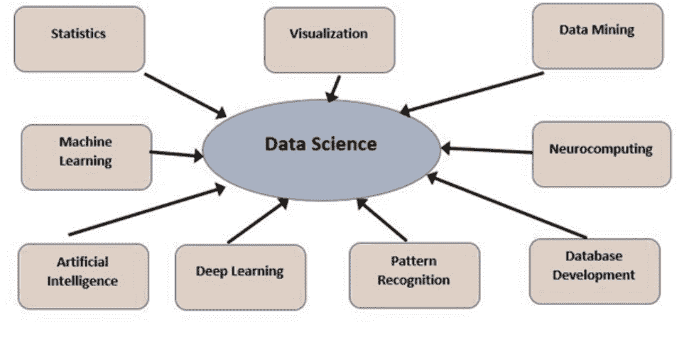

### 数据分析

数据分析包括使用数据的最常见方式。通常是运行分析以了解过去和现在的事件。

### 预测性分析

预测性分析涵盖了使用机器学习、数据和统计算法的技术，以帮助根据更历史性的数据识别未来结果的可能性。目标是超越我们已知的过去发生的事情，提供最佳预测并猜测未来会发生什么。

### 人工智能

人工智能是一种用于使机器模仿任何人类行为的技术。其目标是确保机器能够准确高效地模仿任何人类行为。人工智能机器的一些例子包括深蓝国际象棋和IBM的沃森。

### 机器学习

机器学习可以定义为人工智能技术的一部分，其驱动假设是机器能够通过识别模式并做出决策，从数据中学习，而几乎不需要人类协助。

### 深度学习

深度学习指的是机器学习的一个子分支，涉及受大脑功能和结构启发的算法，即人工神经网络。这使得机器能够做对人类来说很自然的事情，那就是从过去学习。这是无人驾驶汽车背后的理念。

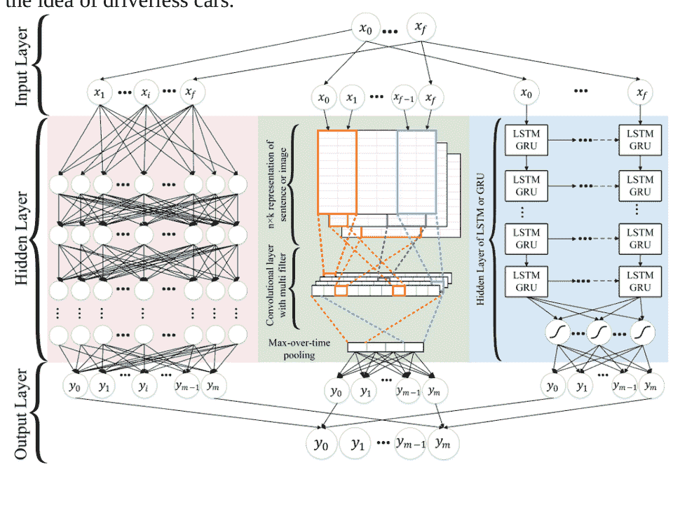

### 理解数据收集、清洗、分析、建模和可视化的过程

在着手数据科学项目时，遵循正确的过程至关重要。它需要多次迭代。要得到最终结果，数据科学家需要根据发现的信息完善每个步骤。让我们看看一般流程是什么。

**1. 问题或需求的定义**
通常，业务需求是什么并不明确，或者我们指出了并非真正问题所在，然后我们寻求（或尝试）解决方案，这在成本和时间上都付出了非常高的代价。

因此，在这个阶段，数据科学家必须与在业务环境中遇到问题的人进行沟通，并清晰明确地定义问题。

**2. 数据收集**
解决问题所需的数据可能来自不同的来源，例如所有网络渠道、网站和社交网络，但也包括公司档案、CRM、正在进行的营销活动、在市场或线下场所的 presence、在展会和活动中的结果，直至市场和竞争对手分析。

**3. 数据处理**
在这个阶段，纠正数据中的错误，或者简单地对它们进行分段或过滤，以获得一个有意义的基础，然后将其转化为有用的信息。

**4. 模型的创建和选择**
在考虑自动化并应用机器学习，或者更确切地说是一个自动学习系统之前，需要进行人工和手动的过渡。

首先，为了更深入地了解数据，并且通常也为了从大数据过渡到小数据，你需要进行数据挖掘活动。这项活动始于识别数据之间的关系，以便随后从人们执行的单个操作中提取有用信息。这里引用马丁·林斯特龙（Martin Lindstrom）的原话，我推荐他的书：

> “虽然大数据提供了用于预测未来方向的无限量的非个人信息，但只有个人数据才能揭示真相，并引导我们真正理解现实。”

**5. 结果展示**

在这个阶段，除了展示你的工作成果，你还可以尽情发挥创造力。这是一个我们承担重大责任的阶段，对初始问题得出结论，并提出解决方案或展示机会。

### 为什么你应该为数据科学学习Python？

Python语言是处理你想要进行的数据科学项目的最佳选择之一。有大量项目你可以用数据科学来处理，而Python甚至能够处理你试图解决的更复杂的问题。Python将成为帮助你完成这一切的最佳选择，原因有很多，包括：

**易于学习。** 这门语言，尽管有很多复杂之处，但对许多初学者来说很容易学习。如果你刚开始使用编码来辅助数据科学，并且担心如何开始，你会发现Python是完美的选择。它被设计得尽可能易于使用，即使是那些从未接触过编码的人也会发现使用Python并不像一开始看起来那么糟糕。

**数据科学库的选择。** Python有许多专门的扩展和库，非常适合数据科学和机器学习。尽管在使用Python语言仅借助标准库就能做很多事情，但也有一些库不仅适用于Python，同时还帮助我们同时完成更多数据科学工作。

**Python社区。** Python附带的社区将使这变得更容易。你将能够找到一大堆其他程序员，其中一些人长期使用Python，他们能够为你提供建议，提供一些有用的代码，并能帮助你解决在数据科学项目中遇到的问题。

**图形与可视化。** 数据可视化对每位数据科学家都至关重要。在项目初期，你需要进行探索性数据分析，以洞察数据中的信息。创建可视化图表能简化复杂问题，尤其适用于高维数据集。在项目收尾阶段，你需要以清晰且引人入胜的方式呈现最终结果，确保受众能够理解。

**总结。** 数据科学家选择使用Python语言有诸多原因。虽然可能存在其他可用的编程语言，但基于我们上述讨论的所有理由（以及更多），我们可以看到使用Python语言是最佳选择之一，它能帮助你构建所需的模型，利用各种机器学习库，并实现更多功能。

## 章节总结

在科技世界中，数据被定义为“由计算机处理和存储的信息”。我们的数字世界已被数据淹没。从网站的一次点击到智能手机每时每刻追踪记录我们的位置，我们的世界正沉溺于数据之中。从海量数据的深处，可以提取出解决我们尚未遇到的问题的方案。这个通过数学方程和统计学从可度量数据集中提取洞见的过程，可以被定义为“数据科学”。

## 第2章：为数据科学设置Python环境

Python能够与你希望使用的任何操作系统或平台协同工作。这是个好消息，因为它确保我们无需更改系统即可使用这门语言，无论我们当前使用的是什么系统，或希望为本项目使用什么系统。

首先需要考虑的是我们希望使用哪个版本的Python。这里有几个不同的选项，它们将确保我们能够选择适合你的版本。Python是一种开源语言，这意味着它可以免费安装和使用，并且可以根据你的需求进行修改。仍然有一个开发团队负责修复错误和进行必要的更新。这对你来说是个好消息，但这确实意味着你必须弄清楚哪个版本适合你。

目前有Python 2和Python 3，每个版本都有一些更新。它们相似，但通常取决于你希望使用的功能。如果你的计算机已经提供了Python 2版本，那么这是一个不错的选择，如果你不想在这个过程中更新它，也不必更新。它与Python 3以及本指南中我们将要编写的一些代码非常相似。

然而，大多数程序员将使用Python 3。这是Python语言的最新版本，它将包含一些最佳功能以及编码所需的更多特性。而且很可能在某个时候，负责Python 2的开发人员将停止对该版本的支持，因此选择更新的版本将是最佳选择。

你可以在在线平台上找到这两个版本的下载，因此你必须选择哪个最适合你。你也可以找到适用于所有主要操作系统的版本，因此将其添加到你正在使用的任何系统上应该不会太难。

这里需要记住的另一点是，对于下面我们将要查看的代码，以及我们将在三个主要操作系统上安装Python的步骤，我们将从www.python.org获取文件。Python将附带一个编译器、一个文本编辑器和一个IDE，以及其他一些文件。这些对于确保程序正常运行都很重要，如果缺少其中一个，你将无法运行任何你想要编写的代码。

可能还有一些其他第三方网站你可以查看，然后从那里下载。这是一个选项，根据你完成Python语言后想要做什么，你可能想要这样做。但并非所有网站都会提供你需要的所有额外内容。你必须逐一下载每个部分，以确保没有遗漏任何东西。

另一方面，当你从www.python.org提供的链接下载时，你能够确切地知道所有你需要的文件和部分都在那里。你只需访问该链接，点击你正在使用的操作系统，然后让它在你的系统上下载，整个过程不会有任何问题。

现在我们已经花了一些时间了解在计算机上安装Python的一些事项，无论你将使用哪个操作系统，现在是时候看看实现这一目标所需的具体步骤了。

### 在Mac OS X上安装Python

当需要在计算机上安装Python时，我们要看的第一个选项是Mac OS X。如果你使用的是依赖Mac操作系统的计算机，那么你应该尽早注意到计算机上已经有某种版本的Python 2。确切的版本可能会根据你使用计算机的时间长短而变化，但我们可以通过打开终端应用程序并使用下面的提示轻松检查版本。

`python –V`

这将显示你获得的版本，因此会出现一个数字。如果你愿意，也可以选择在此系统上安装Python 3，并且不需要卸载计算机上的2.X版本。要检查3.X安装，你只需打开终端应用程序，然后输入以下提示。

`python3 –V`

OS X的默认设置是Python 3根本不会安装。如果你想使用Python 3，可以使用Python.org上的一些安装程序进行安装。这是一个好地方，因为它将安装你使用Python编写和执行代码所需的一切。它将包含Python shell、IDLE开发工具和解释器。与Python 2.X不同，这些工具作为标准应用程序安装在Applications文件夹中。

你必须确保能够在你使用的任何计算机上运行Python IDLE和Python shell。能够运行这些工具也可能取决于你为系统选择的版本。在继续之前，你需要检查你的系统上安装了哪个版本的Python，然后根据需要确定使用哪个IDLE和shell。

### 在Windows系统上安装Python

当需要在操作系统上使用Python语言时，我们要看的第二个选项是在Windows计算机上。许多人依赖Windows操作系统，因此了解如何完成此过程以及如何设置Python非常重要。这个过程将比其他两个花费更长时间，主要是因为Windows已经预装了自己的编程语言，因此我们必须采取一些额外的步骤来完成此操作。

好消息是，即使Python不是你计算机上的自动选项，也不意味着它不能很好地工作。你会发现这种编程语言在Windows上运行良好，并且你可以在这些系统上用它做很多事情。只是需要提醒你，你必须采取一些额外的步骤。

现在我们已经解决了这个问题，为了确保Python语言设置并准备就绪，你需要遵循的一些步骤包括以下内容：

1.  要设置此功能，你需要访问Python官方下载页面并获取Windows安装程序。你可以选择最新的Python 3版本，或选择其他选项。默认情况下，安装程序将为你提供32位

## 在 Windows 操作系统上安装 Python

Python 的版本，但你可以选择切换到 64 位版本。通常最好使用 32 位版本，以确保与旧软件包没有兼容性问题，但如果你愿意，也可以尝试。

- 2. 现在，右键单击安装程序并选择“以管理员身份运行”。将有两个选项可供选择。你需要选择“自定义安装”。

- 3. 在接下来的屏幕上，确保“可选功能”下的所有复选框都被勾选，然后点击继续。

- 4. 当你仍在“高级选项”部分时，你需要花一些时间确定你希望将 Python 文件安装在哪里。然后你可以点击安装按钮。这将需要几分钟才能完成，所以请耐心等待。然后，当安装完成后，你就可以关闭它了。

- 5. 这部分完成后，现在我们需要为系统创建所需的 PATH 变量。我们希望设置它，使其包含目录以及以后需要的所有软件包和其他组件。

我们需要使用以下步骤来使所有这些协同工作：

- 1. 首先，我们需要打开控制面板。我们将通过点击任务栏，然后输入“控制面板”来完成此操作。然后我们将点击图标。

- 2. 在同一个控制面板内，搜索“环境变量”表。然后我们可以点击“编辑系统环境变量”按钮。当我们进入该部分时，我们能够点击“环境变量”部分。

- 3. 在“环境变量”内，我们将找到一个“用户变量”选项卡。你在这里有两个选择：要么编辑你找到的 PATH 变量，要么你可以创建一个全新的变量。

- 4. 如果你正在使用的系统上还没有 PATH 变量；那么现在是我们创建自己的时候了。你可以通过点击“新建”按钮来完成此操作，为该 PATH 变量命名，然后添加你想要的目录。

然后是时候点击或关闭所有为控制面板弹出的对话框，并进入下一步了。

- 1. 当你到达这一步时，你应该能够打开命令提示符。如果你去开始菜单，这很容易做到。然后点击 Windows 系统，然后点击命令提示符。输入单词 python。这将帮助我们启动并运行 Python 解释器，为我们做好准备。

当我们完成上述步骤后，这实际上只需要几分钟，而且不会像你刚开始时可能想象的那么糟糕，你将能够在你的 Windows 系统上使用 Python 程序。然后你可以选择打开 Python 解释器以及你需要的任何其他东西，并在短时间内编写出你需要的所有代码。

## 在 Linux 操作系统上安装 Python

最后，我们需要花一些时间看看确保我们能够在 Linux 操作系统上正确安装 Python 语言所需的一些步骤。Linux 不像我们在本指南中花时间介绍的其他两个操作系统那样广为人知。但它有很多用途，并且能够为我们提供许多巧妙的功能等等。许多程序员已经在使用这种语言，而且未来可能会有更多人使用它，所以当需要在它上面安装我们的 Python 编程语言时，多了解一点是件好事。

如果你依赖的是旧版本的 Ubuntu 或其他版本，那么你可能需要使用 dead snakes PPA 或其他工具来帮助你下载 Python 3.6 版本。

好消息是，如果你使用的是其他 Linux 发行版，那么你的系统上可能已经安装了 Python 3。

如果没有，你可以使用发行版的包管理器。如果 Python 3 包不够新，或者不适合你，你可以按照相同的步骤在你的计算机上安装更新版本的 Python。

就是这样！我们现在已经下载了 Python 到三大主要操作系统上。当你准备好处理一些你想要的编码时，这将使事情变得容易得多。如果你使用了我们描述的代码，并完成了我们讨论的其他步骤，你会发现使用 Python 语言将会很容易。你现在只需打开正确的文件和你需要的所有部分，它就会为你很好地工作！

## 第 3 章：Python 中的 Seaborn 数据可视化模块

Seaborn 是一个 Matplotlib 包装器，它简化了创建常见统计图表的过程。支持的图表列表包括单变量和双变量分布图、回归图以及许多用于跟踪分类变量的方法。Seaborn 提供的完整图表列表可以在 API 参考中找到。

在 Seaborn 中创建图表就像调用相应的图形函数一样简单。这是一个为随机生成的数据创建直方图、估计核密度和地毯纹理的示例。

```python
import numpy as np  # numpy used to create data from plotting
import seaborn as sns  # common form of importing seaborn

# Generate normally distributed data
data = np.random.randn(1000)

# Plot a histogram with both a rugplot and kde graph superimposed
sns.distplot(data, kde=True, rug=True)
```

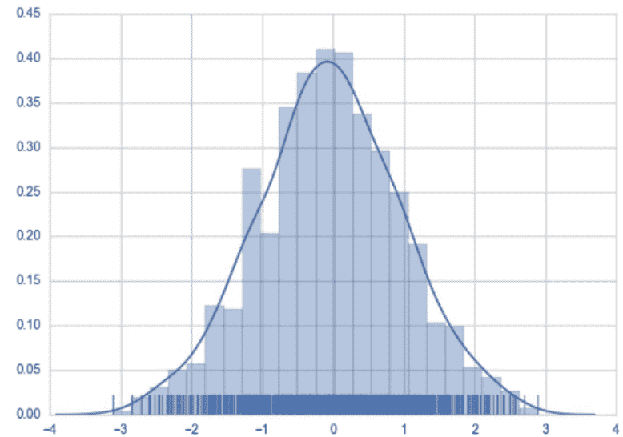

## 安装 Seaborn

要安装 Seaborn 库，你只需在命令终端执行以下命令：

```
$ pip install seaborn
```

在你开始绘制不同类型的图表之前，你需要导入一些库。以下脚本完成了此操作：

```python
import matplotlib.pyplot as plt
import seaborn as sns
plt.rcParams['figure.figsize'] = [10,8]
tips_data = sns.load_dataset('tips')
tips_data.head()
```

上述脚本导入了 Matplotlib 和 Seaborn 库。接下来，默认绘图大小增加到 10 x 8。之后，使用 Seaborn 模块的 load_dataset() 方法加载 tips 数据集。最后，tips 数据集的前五条记录已显示在控制台上。以下是输出。

输出：tips 数据集包含顾客在餐厅支付的账单记录。该数据集包含六列：total_bill、tip、sex、smoker、day、time 和 size。你不必下载此数据集，因为它随 Seaborn 库内置。我们将使用 tips 数据集来绘制一些 Seaborn 图表。那么，事不宜迟，让我们开始使用 Seaborn 绘图。

## Seaborn 的绘图函数

### 分布图

分布图，也称为分布图，用于绘制数据集中特定列的数据的直方图。要绘制分布图，你可以使用 Seaborn 库的 distplot() 函数。你想要绘制直方图的列名作为参数传递给 distplot() 函数。以下脚本绘制了 tips 数据集 total_bill 列的分布图。

脚本 1：

```python
plt.rcParams['figure.figsize'] = [10,8]
sns.distplot(tips_data['total_bill'])
```

类似地，以下脚本绘制了 tips 数据集 tip 列的分布图。

脚本 2：

```python
sns.distplot(tips_data['tip'])
```

直方图顶部的线显示了直方图的核密度估计。可以通过将 kde 属性的值设置为 False 来移除该线，如以下示例所示。

脚本 3：

```python
sns.distplot(tips_data['tip'], kde = False)
```

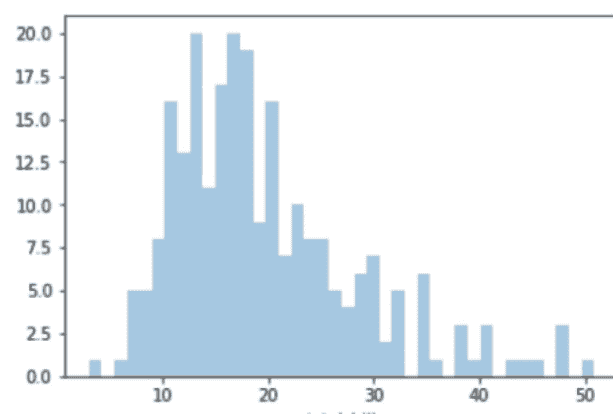

### 联合图

联合图用于绘制两列的直方图分布，一列在 x 轴上，另一列在 y 轴上。默认情况下，会为两列中的点绘制散点图。要绘制联合图，你需要调用 jointplot() 函数。以下脚本绘制了 tips 数据集 total_bill 和 tip 列的联合图。

脚本 4：

```python
sns.jointplot(x='total_bill', y='tip', data=tips_data)
```

在联合图中，散点图可以替换为回归线。为此，你需要将 kind 参数的值设置为 reg。

脚本 5：

```python
sns.jointplot(x='size', y='total_bill', data=tips_data, kind = 'reg')
```

## 成对图

成对图用于绘制数据集中所有数值列和布尔列组合的联合图。要绘制成对图，你需要调用 `pairplot()` 函数并将其传递给你的数据集。

脚本 6：

```python
sns.pairplot(data=tips_data)
```

你还可以为分类列中的每个值绘制多个成对图。为此，你需要将分类列的名称作为 `hue` 参数的值传递。以下脚本为数值或布尔列的每个组合绘制了两个成对图（一个用于午餐，一个用于晚餐）。

脚本 7：

```python
sns.pairplot(data=tips_data, hue='time')
```

## 地毯图

地毯图是所有 Seaborn 图中最简单的一种。地毯图基本上为特定列中的所有数据点绘制小矩形。`rugplot()` 函数用于在 Seaborn 中绘制地毯图。以下脚本为 tips 数据集的 `total_bill` 列绘制了一个 `rugplot()`。

脚本 8：

```python
sns.rugplot(tips_data['total_bill'])
```

输出：

你可以看到矩形在 10 到 20 之间高度集中，这表明大多数账单的总金额在 10 到 20 之间。

## 条形图

条形图用于捕捉分类列和数值列之间的关系。对于分类列中的每个唯一值，都会绘制一个条形图，默认情况下，它显示条形图指定的数值列中数据的平均值。

在以下脚本中，我们首先通过 `load_dataset()` 函数从 Seaborn 库导入内置的 Titanic 数据集。你也可以从资源文件夹中读取名为 `titanic_data.csv` 的 CSV 文件。

脚本 9：

```python
import matplotlib.pyplot as plt
import seaborn as sns
plt.rcParams['figure.figsize'] = [8, 6]
sns.set_style('darkgrid')
titanic_data = sns.load_dataset('titanic')
titanic_data.head()
```

以下是 Titanic 数据集的前五行。

接下来，我们将调用 Seaborn 库中的 `barplot()` 函数来绘制一个条形图，显示在 Titanic 船不同等级中旅行的乘客的平均年龄。

脚本 10：

```python
sns.barplot(x='pclass', y='age', data=titanic_data)
```

输出显示，乘坐头等舱的乘客的平均年龄在 35 到 40 之间。乘坐二等舱的乘客的平均年龄约为 30，而乘坐三等舱的乘客的平均年龄为 25。

你可以使用 `hue` 属性进一步分类条形图。例如，以下条形图绘制了在不同等级中旅行的乘客的平均年龄，并根据他们的性别进行了进一步分类。

脚本 11：

```python
sns.barplot(x='pclass', y='age', hue='sex', data=titanic_data)
```

输出显示，无论性别如何，乘坐较高等级的乘客平均年龄都大于乘坐较低等级的乘客。

你还可以根据分类列中唯一值的数量绘制多个条形图。为此，你需要调用 `catplot()` 函数，并将分类列名称作为 `col` 属性列的值传递。以下脚本绘制了两个条形图——一个用于在 Titanic 事故中幸存的乘客，另一个用于未幸存的乘客。

脚本 12：

```python
sns.catplot(x='pclass', y='age', hue='sex', col='survived', data=titanic_data, kind='bar');
```

输出：

## Pandas 的作用

### 筛选行

处理 Pandas 数据框时，你需要执行的最常见任务之一是根据列值筛选行。

要筛选行，首先，你必须确定要筛选的行的索引。对于这些索引，你需要在 Pandas 数据框名称后面的开方括号和闭方括号中传递 `True`。

以下脚本返回一个由 `True` 和 `False` 组成的序列。对于 `Pclass` 列值为 1 的索引，将返回 `True`。

脚本 2：

```python
titanic_pclass1 = (titanic_data.Pclass == 1)
titanic_pclass1
```

| 索引 | 值 |
|---|---|
| 0 | False |
| 1 | True |
| 2 | False |
| 3 | True |
| 4 | False |
| ... | ... |
| 886 | False |
| 887 | True |
| 888 | False |
| 889 | True |
| 890 | False |

Name: Pclass, Length: 891, dtype: bool

现在，包含 `True` 或 `False` 的 `titanic_pclass1` 序列可以传递到 `titanic_data` 数据框后面的开方括号和闭方括号中。结果将是 Titanic 数据集，仅包含 `Pclass` 列包含 1 的记录。

脚本 3：

```python
titanic_pclass1 = (titanic_data.Pclass == 1)
titanic_pclass1_data = titanic_data[titanic_pclass1]
titanic_pclass1_data.head()
```

列值的比较和行的筛选可以在一行中完成，如下所示。

脚本 4：

```python
titanic_pclass_data = titanic_data[titanic_data.Pclass == 1]
titanic_pclass_data.head()
```

另一个常用的筛选行的运算符是 `isin` 运算符。`isin` 运算符接受一个值列表，并仅返回用于比较的列包含传递给 `isin` 运算符作为参数的列表中的值的行。例如，以下脚本筛选年龄为 20、21 或 22 的行。

脚本 5：

```python
ages = [20, 21, 22]
age_dataset = titanic_data[titanic_data['Age'].isin(ages)]
age_dataset.head()
```

你可以使用逻辑与（`&`）和或（`|`）运算符根据多个条件筛选 Pandas 数据框中的行。以下脚本返回 Pandas 数据框中乘客等级为 1 且乘客年龄在 20、21 和 22 之间的行。

脚本 6：

```python
ages = [20, 21, 22]
ageclass_dataset = titanic_data[titanic_data['Age'].isin(ages) & (titanic_data['Pclass'] == 1)]
ageclass_dataset.head()
```

输出：

### 筛选列

要从 Pandas 数据框中筛选列，你可以使用 `filter()` 方法。你想要筛选的列的列表被传递给 `filter()` 方法。以下脚本从 Titanic 数据集中筛选 `Name`、`Sex` 和 `Age` 列，并忽略所有其他列。

脚本 7：

```python
titanic_data_filter = titanic_data.filter(['Name', 'Sex', 'Age'])
titanic_data_filter.head()
```

除了筛选列之外，你还可以删除数据集中不需要的列。为此，你需要调用 `drop()` 方法，并将其传递你想要删除的列的列表。例如，以下脚本从 Titanic 数据集中删除 `Name`、`Age` 和 `Sex` 列，并返回剩余的列。

脚本 8：

```python
titanic_data_filter = titanic_data.drop(['Name', 'Sex', 'Age'], axis=1)
titanic_data_filter.head()
```

输出：

### 连接数据框

通常，你需要水平或垂直连接或连接多个 Pandas 数据框。让我们首先看看如何垂直连接或连接 Pandas 数据框。我们将首先使用 Titanic 数据创建两个 Pandas 数据框。第一个数据框包含乘客等级为 1 的行，而第二个数据框包含乘客等级为 2 的行。

脚本 9：

```python
titanic_pclass1_data = titanic_data[titanic_data.Pclass == 1]
print(titanic_pclass1_data.shape)
titanic_pclass2_data = titanic_data[titanic_data.Pclass == 2]
print(titanic_pclass2_data.shape)
```

(216, 12)
(184, 12)

输出显示两个新创建的数据框都有 12 列。需要提到的是，在垂直连接数据时，两个数据框应具有相同数量的列。

有两种方法可以水平连接数据集。你可以通过第一个数据框调用 `append()` 方法，并将第二个数据框作为参数传递给 `append()` 方法。查看以下脚本。

脚本 10：

```python
final_data = titanic_pclass1_data.append(titanic_pclass2_data, ignore_index=True)
print(final_data.shape)
```

输出：
(400, 12)

输出现在显示总行数为 400，这是我们连接的两个数据框的行数之和。

连接两个数据框的另一种方法是将两个数据框作为参数传递给 Pandas 模块的 `concat()` 方法。以下脚本展示了如何操作。

脚本 11：

```python
final_data = pd.concat([titanic_pclass1_data, titanic_pclass2_data])
```

print(final_data.shape)

输出：
(400, 12)

要水平拼接数据框，请确保数据框具有相等的行数。你也可以使用 `concat()` 方法水平拼接数据框。但是，你需要将 `axis` 属性的值设置为 `1`。此外，要重置数据集索引，你需要将 `ignore_index` 属性的值设置为 `True`。

脚本 12：

```
df1 = final_data[:200]
print(df1.shape)
df2 = final_data[200:]
print(df2.shape)
final_data2 = pd.concat([df1, df2], axis = 1, ignore_index = True)
print(final_data2.shape)
```

输出：
(200, 12)
(200, 12)
(400, 24)

## 数据框排序

要对 Pandas 数据框进行排序，可以使用 Pandas 数据框的 `sort_values()` 函数。用于排序的列列表需要传递给 `sort_values()` 方法的 `by` 属性。以下脚本按乘客年龄的升序对泰坦尼克号数据集进行排序。

## 小提琴图

这种图表类型与箱线图相同，但通过小提琴图，我们可以显示与数据点对应的所有组件。要创建小提琴图，我们调用 `violinplot()` 函数。该函数的第一个参数是分类列的名称，第二个参数是数值列的名称，而第三个参数是数据集的名称。

让我们创建一个显示每个性别年龄分布的小提琴图。以下是脚本：

```
sns.violinplot(x='sex', y='age', data=data)
```

因此，整个脚本如下：

```
import pandas as pd
import numpy as np
import matplotlib.pyplot as plt
import seaborn as sns
import sys
sys.stdout = sys.stdout
data = sns.load_dataset('titanic')
sns.violinplot(x='sex', y='age', data=data)
plt.show()
```

执行脚本后应返回以下图表：

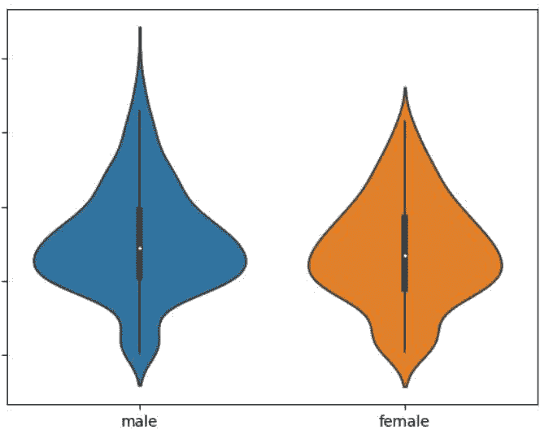

从上图可以非常清楚地看出，与箱线图相比，小提琴图可以提供有关底层数据的更多信息。小提琴图不仅绘制了四分位数，还向我们展示了与数据对应的所有组件。小提琴图中显示较厚的区域意味着该年龄段的实例数量较多。对于男性的小提琴图，很明显大多数男性年龄在 20 到 40 岁之间。

## 折线图

折线图用于在连续时间段内显示定量值，并将信息显示为一系列数据。折线图非常适合时间序列，其中数据点由直线段连接。
数值放置在 y 轴上，而 x 轴是时间尺度。
用途：对于较短的时间段，垂直条形图可能是更好的选择。

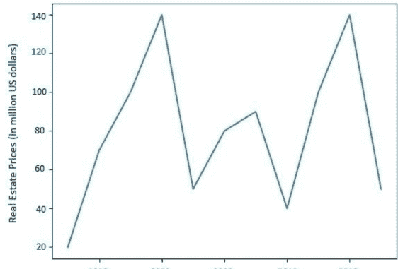

下图显示了二十年来房地产价格（以百万美元计）的趋势。折线图非常适合显示数据趋势：

### 单变量折线图

示例：
下图是一个多变量折线图，比较了谷歌、脸书、苹果、亚马逊和微软的股票收盘价。折线图非常适合比较数值和可视化股票趋势。正如我们所看到的，亚马逊显示出最高的增长：

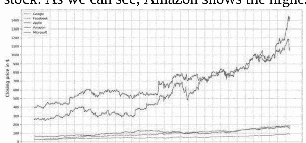

图：显示五家公司股票趋势的折线图

### 设计实践：

- 避免每个图表包含过多的线条
- 调整比例尺，使趋势清晰可见

注意
多变量图表的设计实践。应提供图例来描述每个变量。

## 条形图

条形长度编码数值。条形图有两种变体：垂直条形图和水平条形图。

### 用途：

虽然两者都用于比较不同类别的数值，但垂直条形图有时用于显示单个变量随时间的变化。
条形图的注意事项：
不要将垂直条形图与直方图混淆。条形图比较不同的变量或类别，而直方图显示单个变量的分布。
另一个常见错误是使用条形图来显示组或类别之间的集中趋势。在这种情况下，请使用箱线图或小提琴图来显示统计度量或分布。

### 示例：

下图显示了一个垂直条形图。每个条形显示五名学生在一次测试中获得的百分制分数：

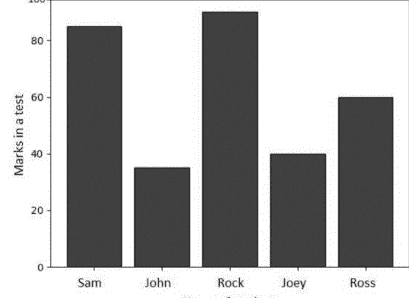

图：使用学生测试数据的垂直条形图
下图显示了一个水平条形图。每个条形显示五名学生在一次测试中获得的百分制分数：

图：使用学生测试数据的水平条形图

下图比较了电影评分，给出了两个不同的分数。烂番茄指数是给出正面评价的影评人百分比。观众评分是给出 3.5 分或更高（满分 5 分）的用户百分比。正如我们所看到的，《火星救援》是唯一一部同时拥有高烂番茄指数和高观众评分的电影。《霍比特人：意外之旅》的

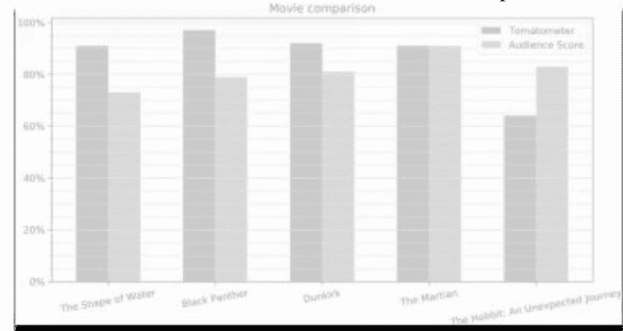

观众评分相对于烂番茄指数较高，这可能是由于庞大的粉丝基础：

比较条形图
设计实践：对应于数值变量的轴应从零开始。从其他值开始可能会产生误导，因为它会使小的数值差异看起来很大。
使用水平标签，即，只要条形数量不多且图表看起来不太杂乱。

## 第四章：机器学习算法简介

我们将介绍最受欢迎的机器学习算法。算法如此之多，当算法名称被抛出时，你可能会感到不知所措，并且期望你只知道它们是什么以及它们适合哪里。
我们想给你两种思考和分类你在该领域可能遇到的算法的方法。

- 第一种是按算法的**学习风格**进行分组。
- 第二种是按算法在形式或功能上的**相似性**进行分组（就像将相似的动物归为一类）。

两种方法都很有用，但我们将重点关注按相似性对算法进行分组，并介绍各种不同的算法类型。

### 按学习风格分组的算法

算法可以通过与经验或环境或我们想称之为输入数据的交互方式来建模问题，有多种不同的方式。

在机器学习和人工智能教科书中，首先考虑算法可以采用的学习风格是很常见的。

算法可以拥有的主要学习风格或学习模型只有少数几种，我们将在这里介绍它们，并提供一些适合它们的算法和问题类型的示例。

这种分类法或组织机器学习算法的方式很有用，因为它迫使你思考输入数据和模型准备过程的作用，并选择最适合你的问题的方法以获得最佳结果。

**让我们看看机器学习算法中的三种不同的学习风格：**

## 监督学习

输入数据称为训练数据，具有已知的标签或结果，例如垃圾邮件/非垃圾邮件或某个时间的股票价格。

模型通过训练过程准备，在该过程中需要进行预测，并在预测错误时进行纠正。训练过程持续进行，直到模型在训练数据上达到所需的准确度水平。示例问题包括分类和回归。示例算法包括：逻辑回归和反向传播神经网络。

### 无监督学习

输入数据未标记，也没有已知的结果。模型通过推断输入数据中存在的结构来准备。这可能是为了提取通用规则。它可能是通过数学过程系统地减少冗余，或者可能是通过相似性组织数据。示例问题包括聚类、降维和关联规则学习。示例算法包括：Apriori 算法和 K-Means。

### 半监督学习

输入数据是标记和未标记示例的混合。存在一个期望的预测问题，但模型必须学习组织数据的结构以及进行预测。示例问题包括分类和回归。

示例算法是对其他灵活方法的扩展，这些方法对如何建模未标记数据做出了假设。

### 机器学习算法概述

在处理数据以建模业务决策时，你最常使用的是监督和无监督学习方法。目前的一个热门话题是半监督学习方法，应用于图像分类等领域，这些领域有大型数据集但标记示例非常少。

### 按相似性分组的算法

算法通常根据其功能（工作原理）的相似性进行分组。例如，基于树的方法和受神经网络启发的方法。
我认为这是对算法进行分组最有用的方式，也是我们在此将采用的方法。
这是一种有用的分组方法，但并不完美。仍然有一些算法可以轻松归入多个类别，例如学习向量量化，它既是受神经网络启发的方法，也是基于实例的方法。还有一些类别名称相同，但描述的是问题和算法类别，例如回归和聚类。
我们可以通过将算法列出两次，或主观地选择“最合适”的分组来处理这些情况。在本节中，我们列出了许多流行的机器学习算法，按照我们认为最直观的方式进行分组。该列表在分组和算法方面都不是详尽无遗的，但我认为它具有代表性，并且将有助于您了解整体情况。

## 回归算法

回归关注的是对变量之间关系的建模，该关系通过模型预测的误差度量进行迭代优化。
回归方法是统计学的主力，并已被引入统计机器学习。这可能会令人困惑，因为我们可以用回归来指代问题类别和算法类别。实际上，回归是一个过程。
最流行的回归算法是：

- 普通最小二乘回归 (OLSR)
- 线性回归
- 逻辑回归
- 逐步回归
- 多元自适应回归样条 (MARS)
- 局部加权散点图平滑 (LOESS)

## 基于实例的算法

基于实例的学习模型是一种决策问题，其中训练数据的实例或示例被认为对模型很重要或必需。
此类方法通常建立一个示例数据库，并使用相似性度量将新数据与数据库进行比较，以找到最佳匹配并进行预测。因此，基于实例的方法也称为赢者通吃方法和基于记忆的学习。重点在于存储实例的表示以及实例之间使用的相似性度量。
最流行的基于实例的算法是：

- k-近邻 (kNN)
- 学习向量量化 (LVQ)
- 自组织映射 (SOM)
- 局部加权学习 (LWL)
- 支持向量机 (SVM)

## 正则化算法

对另一种方法（通常是回归方法）的扩展，它根据模型的复杂性对模型进行惩罚，倾向于更简单且泛化能力更好的模型。它们是流行、强大且通常对其他方法进行的简单修改。
最流行的正则化算法是：

- 岭回归
- 最小绝对收缩和选择算子 (LASSO)
- 弹性网络
- 最小角回归 (LARS)

## 决策树算法

决策树方法根据数据中属性的实际值构建决策模型。决策在树结构中分叉，直到为给定记录做出预测决策。决策树在分类和回归问题的数据上进行训练。决策树通常快速且准确，在机器学习中非常受欢迎。
最流行的决策树算法是：

- 分类和回归树 (CART)
- 迭代二分器 3 (ID3)
- C4.5 和 C5.0（一种强大方法的不同版本）
- 卡方自动交互检测 (CHAID)
- 决策树桩
- M5
- 条件决策树

## 贝叶斯算法

贝叶斯方法是明确应用贝叶斯定理来解决分类和回归等问题的方法。最流行的贝叶斯算法是：

- 朴素贝叶斯
- 高斯朴素贝叶斯
- 多项式朴素贝叶斯
- 平均单依赖估计器 (AODE)
- 贝叶斯信念网络 (BBN)
- 贝叶斯网络 (BN)

## 聚类算法

聚类与回归一样，描述了问题类别和方法类别。
聚类方法通常按建模方法组织，例如基于质心和层次聚类。所有方法都关注使用数据中的内在结构，将数据组织成具有最大共同性的组。
最流行的聚类算法是：

- k-均值
- k-中值
- 期望最大化 (EM)
- 层次聚类

## 关联规则学习算法

关联规则学习方法提取最能解释数据中变量之间观察到的关系的规则。这些规则可以在大型多维数据集中发现重要且具有商业价值的关联，供组织利用。最流行的关联规则学习算法是：

- Apriori 算法
- Eclat 算法

## 人工神经网络算法

人工神经网络是受生物神经网络结构和/或功能启发的模型。它们是一类模式匹配方法，通常用于回归和分类问题，但实际上是一个庞大的子领域，包含数百种算法和变体，适用于各种问题类型。由于该领域的巨大增长和普及，我们将深度学习从神经网络中分离出来。这里我们关注的是更经典的方法。
最流行的人工神经网络算法是：

- 感知机
- 多层感知机 (MLP)
- 反向传播
- 随机梯度下降
- Hopfield 网络
- 径向基函数网络 (RBFN)

## 深度学习算法

深度学习方法是人工神经网络的现代更新，利用了丰富且廉价的计算资源。它们关注于构建更大、更复杂的神经网络，如上所述，许多方法关注非常大的标记模拟数据集，例如图像、文本、音频和视频。最流行的深度学习算法是：

- 卷积神经网络 (CNN)
- 循环神经网络 (RNNs)
- 长短期记忆网络 (LSTMs)
- 堆叠自编码器
- 深度玻尔兹曼机 (DBM)
- 深度信念网络 (DBN)

## 降维算法

与聚类方法类似，降维寻求并利用数据中的内在结构，但在此情况下是以无监督的方式，以便使用更少的信息来总结或描述数据。这对于可视化高维数据或简化数据非常有用，简化后的数据可用于监督学习方法。其中许多方法可以调整用于分类和回归。

- 主成分分析 (PCA)
- 主成分回归 (PCR)
- 偏最小二乘回归 (PLSR)
- Sammon 映射
- 多维尺度分析 (MDS)
- 投影寻踪
- 线性判别分析 (LDA)
- 混合判别分析 (MDA)
- 二次判别分析 (QDA)
- 灵活判别分析 (FDA)

## 集成算法

集成方法是由多个弱模型组成的模型，这些弱模型独立训练，其预测以某种方式组合以做出整体预测。大量努力投入到组合哪些类型的弱学习器以及如何组合它们。这是一类非常强大的技术，因此非常流行。

- 提升法
- 自助聚合 (Bagging)
- AdaBoost
- 加权平均 (Blending)
- 堆叠泛化 (Stacking)
- 梯度提升机 (GBM)
- 梯度提升回归树 (GBRT)
- 随机森林

## 第五章：使用 Scikit-Learn 进行数据科学和机器学习

Scikit-Learn 库已发展成为使用 Python 开发机器学习模型的黄金标准，提供了各种监督和无监督的机器学习算法。它被誉为迄今为止最用户友好、最简洁的机器学习库之一。例如，决策树、聚类、线性和逻辑回归以及 K-均值。Scikit-learn 使用了几个基本的 Python 库：NumPy 和 SciPy，并添加了一组用于数据挖掘任务的算法，包括分类、回归和聚类。它还能够在几行代码内实现特征选择、数据转换和集成方法等任务。

2007 年，David Cournapeau 在参与 Google 的“代码之夏”项目期间开发了 Scikit-Learn 的基础代码。自 2007 年发布以来，Scikit-learn 已成为 Python 最著名的开源机器学习库之一。但直到 2010 年，Scikit-Learn 才正式发布供公众使用。Scikit-Learn 是一个开源且采用 BSD 许可的数据挖掘和数据分析工具，用于在 Python 上构建监督和无监督的机器学习算法。Scikit-learn 提供各种机器学习算法，如“分类”、“回归”、“降维”和“聚类”。它还提供用于特征提取、数据处理和模型评估的模块。

它被设计为“SciPy”库的扩展，Scikit-Learn 基于最受欢迎的 Python 库“NumPy”和“Matplotlib”。NumPy 扩展了 Python 以支持对大数组和多维矩阵的高效操作。Matplotlib 提供可视化工具，而 SciPy 提供科学计算模块。

对于学术研究，Scikit-Learn 很受欢迎，因为它拥有文档齐全、易于使用且灵活的 API。开发人员只需修改几行代码，即可利用 Scikit-Learn 进行各种算法的实验。Scikit-Learn 还提供各种训练数据集，使开发人员能够专注于算法而不是数据收集和清理。

Scikit-Learn 的许多算法都很快，并且可以扩展到所有拥有大型数据集的场景。Scikit-learn 以其可靠性而闻名，其大部分库都有自动化测试。Scikit-learn 极其受欢迎适合机器学习初学者开始实现简单的算法。

## 应用 Scikit-Learn 库的前提条件

Scikit-Learn 库基于 SciPy（科学 Python），在系统上使用 SciKit-Learn 之前需要先安装 SciPy。

## 安装 Scikit-Learn

Scikit-Learn 的最新版本可在“Scikit-Learn.org”上找到，并且需要“Python（版本 >= 3.5）；NumPy（版本 >= 1.11.0）；SciPy（版本 >= 0.17.0）；joblib（版本 >= 0.11）”。Scikit-learn 的绘图功能或函数以“plot_”开头，并且需要“Matplotlib（版本 >= 1.5.1）”。某些 Scikit-Learn 示例可能需要额外的应用程序：“Scikit-Image（版本 >= 0.12.3），Pandas（版本 >= 0.18.0）”。

必须确保使用 pip 文件时利用了二进制轮子，并且“NumPy”和“SciPy”没有从源代码重新编译，这在使用特定操作系统和硬件设置时可能会发生（例如，“树莓派上的 Linux”）。从源代码开发“NumPy”和“SciPy”往往很复杂（尤其是在 Windows 上）。因此，需要仔细设置它们，以确保线性代数例程的优化执行是可实现的。

## 使用 Scikit-Learn 库进行机器学习应用

为了理解 Scikit-Learn 库如何在机器学习算法开发中使用，让我们使用“来自 IBM Watson 仓库的 Sales_Win_Loss 数据集”，其中包含从汽车零部件批发供应商的销售活动中获得的数据。我们将创建一个 ML 模型来预测哪些销售活动会成功，哪些会亏损。

```python
#import necessary modules
import pandas as pd

#store the url in a variable
url = "https://community.watsonanalytics.com/wp-content/uploads/2015/04/WA_Fn-UseC_-Sales-Win-Loss.csv"
```

```python
#import necessary modules
import pandas as pd

#store the url in a variable
```

可以使用 Pandas 库导入数据集，并使用 Pandas 技术（如“head()、tail() 和 dtypes()”）进行探索。将使用“Seaborn”的绘图技术来可视化数据。为了处理数据，将使用 Scikit-Learn 的“preprocessing.LabelEncoder()”和“train_test_split()”将数据集分为训练子集和测试子集。

为了从我们的数据集生成预测，将使用三种不同的算法，即“线性支持向量分类和 K 近邻分类器”。为了比较这些算法的性能，将使用 Scikit-Learn 库技术“accuracy_score”。模型的性能分数可以使用 Scikit-Learn 和 Yellowbrick 可视化工具进行可视化。

## 导入数据集

要导入“来自 IBM Watson 仓库的 Sales_Win_Loss 数据集”，第一步是通过执行“import pandas as pd”命令导入“Pandas”模块。

对于新的“Pandas”用户，上面代码中的“pd.read_csv()”技术将生成一个称为“数据框架”的表格数据结构，其中第一列包含每行的索引，第一行的每列标签/名称是从数据集获取的初始列名。在上面的代码片段中，“sales data”变量生成一个表。

现在，使用“head() as Sales_data.head()”技术，可以显示数据框架中的记录，以“感受”数据集中包含的信息。

```python
# Using .head() method to view the first few records of the data set
sales_data.head()
```

| | Opportunity Number | Supplies Subgroup | Supplies Group | Region | Route To Market | Elapsed Days In Sales Stage | Opportunity Result | Sales Stage Change Count | Total Days Identified Through Closing | Total Days Identified Through Qualified | Opportunity Amount USD | Client Size By Revenue | Client Size By Employee Count | Revenue From Client Past Two Years | Competitor Type | Ratio Days Identified To Total Days | Ratio Days Validated To Total Days | Ratio Days Qualified To Total Days | Deal Size Category |
|---|---|---|---|---|---|---|---|---|---|---|---|---|---|---|---|---|---|---|---|
| 0 | 1641984 | Exterior Accessories | Car Accessories | Northwest | Fields Sales | 76 | Won | 13 | 104 | 101 | 0 | 5 | 5 | 0 | Unknown | 0.69636 | 0.11399 | 0.15422 | 1 |
| 1 | 1658010 | Exterior Accessories | Car Accessories | Pacific | Reseller | 63 | Loss | 2 | 163 | 163 | 0 | 3 | 5 | 0 | Unknown | 0 | 1 | 0 | 1 |
| 2 | 1674737 | Motorcycle Parts | Performance & Non-auto | Pacific | Reseller | 24 | Won | 7 | 82 | 82 | 7750 | 1 | 1 | 0 | Unknown | 1 | 0 | 0 | 1 |
| 3 | 1675224 | Shelters & RV | Performance & Non-auto | Midwest | Reseller | 16 | Loss | 5 | 124 | 124 | 0 | 1 | 1 | 0 | Known | 1 | 0 | 0 | 1 |
| 4 | 1689785 | Exterior Accessories | Car Accessories | Pacific | Reseller | 69 | Loss | 11 | 91 | 13 | 69756 | 1 | 1 | 0 | Unknown | 0 | 0.14113 | 0 | 4 |

## 数据探索

现在我们有了自己的数据集副本，它已被转换为“Pandas”数据框，我们可以快速探索数据，以了解从中可以收集哪些信息，并据此规划行动方案。

在任何 ML 项目中，数据探索往往是一个非常关键的阶段。即使是快速的数据集探索也能为我们提供重要的信息，否则这些信息很容易被忽略，并且这些信息可以提出重要的问题，然后我们可以根据项目尝试回答这些问题。

这里将使用一些第三方 Python 库来协助我们处理数据，以便我们能够高效地将这些数据与 Scikit-Learn 的强大算法一起使用。我们使用了相同的“head()”技术来查看导入数据集的一些初始记录。事实上，“(head)”实际上能够做的远不止显示数据记录，并且可以自定义“head()”技术，使用诸如“sales_data.head(n=2)”之类的命令仅显示选定的记录。

```python
# Using head() method with an argument which helps us to restrict the number of initial records that should be displayed
sales_data.head(n=2)
```

| | Opportunity Number | Supplies Subgroup | Supplies Group | Region | Route To Market | Elapsed Days In Sales Stage | Opportunity Result | Sales Stage Change Count | Total Days Identified Through Closing | Total Days Identified Through Qualified | Opportunity Amount USD | Client Size By Revenue | Client Size By Employee Count | Revenue From Client Past Two Years | Competitor Type | Ratio Days Identified To Total Days | Ratio Days Validated To Total Days | Ratio Days Qualified To Total Days | Deal Size Category |
|---|---|---|---|---|---|---|---|---|---|---|---|---|---|---|---|---|---|---|---|
| 0 | 1641984 | Exterior Accessories | Car Accessories | Northwest | Fields Sales | 76 | Won | 13 | 104 | 101 | 0 | 5 | 5 | 0 | Unknown | 0.69636 | 0.11399 | 0.15422 | 1 |
| 1 | 1658010 | Exterior Accessories | Car Accessories | Pacific | Reseller | 63 | Loss | 2 | 163 | 163 | 0 | 3 | 5 | 0 | Unknown | 0 | 1 | 0 | 1 |

此命令将选择性地显示数据集的前 2 条记录。乍一看，很明显像“Supplies Group”和“Region”这样的列包含字符串数据，而像“Opportunity Result”、“Opportunity Number”等列则由整数值组成。还可以看到“Opportunity Number”列中每条记录都有唯一标识符。类似地，要显示表格底部的选定记录，可以使用“tail() as sales_data.tail()”。

```python
# Using .tail() method to view the last few records from the dataframe
sales_data.tail()
```

| | Opportunity Number | Supplies Subgroup | Supplies Group | Region | Route To Market | Elapsed Days In Sales Stage | Opportunity Result | Sales Stage Change Count | Total Days Identified Through Closing | Total Days Identified Through Qualified | Opportunity Amount USD | Client Size By Revenue | Client Size By Employee Count | Revenue From Client Past Two Years | Competitor Type | Ratio Days Identified To Total Days | Ratio Days Validated To Total Days | Ratio Days Qualified To Total Days | Deal Size Category |
|---|---|---|---|---|---|---|---|---|---|---|---|---|---|---|---|---|---|---|---|
| 78020 | 1E+07 | Batteries & Lights | Car Accessories | Southeast | Reseller | 0 | Loss | 2 | 0 | 0 | 250000 | 1 | 1 | 3 | Unknown | 0 | 0 | 0 | 6 |
| 78021 | 1E+07 | Shelters & RV | Performance & Non-auto | Northeast | Reseller | 0 | Won | 1 | 0 | 0 | 180000 | 1 | 1 | 0 | Unknown | 0 | 0 | 0 | 5 |
| 78022 | 1E+07 | Exterior Accessories | Car Accessories | Southeast | Reseller | 0 | Loss | 2 | 0 | 0 | 90000 | 1 | 1 | 0 | Unknown | 0 | 0 | 0 | 4 |
| 78023 | 1E+07 | Exterior Accessories | Car Accessories | Southeast | Fields Sales | 0 | Loss | 2 | 0 | 0 | 120000 | 1 | 1 | 0 | Unknown | 1 | 0 | 0 | 5 |
| 78024 | 1E+07 | Interior Accessories | Car Accessories | Mid-Atlantic | Reseller | 0 | Loss | 1 | 0 | 0 | 90000 | 1 | 1 | 0 | Unknown | 0 | 0 | 0 | 4 |

要查看数据集中可用的不同数据类型，可以使用 Pandas 技术“dtypes() as sales_data.dtypes”。通过此信息，可以列出数据框架中可用的数据列及其各自的数据类型。例如，我们可以弄清楚“Supplies Subgroup”列是“object”数据类型，而“Client Size By Revenue”列是“integer data type”。因此，我们了解了包含整数值或字符串数据的列。

```python
# using the dtypes() method to display the different datatypes available
sales_data.dtypes
```

机会编号 int64
供应子组 object
供应组 object
区域 object
市场路线 object
销售阶段已过天数 int64
机会结果 object
销售阶段变更次数 int64
从识别到成交总天数 int64
从识别到合格总天数 int64
机会金额（美元） int64
按收入划分的客户规模 int64
按员工数划分的客户规模 int64
过去两年来自客户的收入 int64
竞争对手类型 object
识别天数占总天数比例 float64
验证天数占总天数比例 float64
合格天数占总天数比例 float64
交易规模类别 int64
dtype: object

## 数据可视化

至此，我们已经完成了基本的数据探索步骤，因此我们将尝试构建一些吸引人的图表来直观地呈现信息，并从数据集中发现其他隐藏的叙事。在所有提供数据可视化功能的可用Python库中，“Seaborn”是最佳选择之一，因此我们将使用它。请确保您的系统上已安装并准备好使用“Seaborn”提供的Python绘图模块。现在，请按照以下步骤操作，为数据集生成所需的图表：

步骤1 - 使用命令“import seaborn as sns”导入“Seaborn”模块。

步骤2 - 使用命令“import matplotlib.pyplot as plt”导入“Matplotlib”模块。

步骤3 - 要将图表的“背景颜色”设置为白色，请使用命令“sns.set(style=“whitegrid”, color_codes=True)”。

步骤4 - 要为所有图表设置“图表尺寸”，请使用命令“sns.set(rc={'figure.figsize':(11.7,8.27)})”。

步骤5 – 要生成“计数图”，请使用命令“sns.countplot('Route To Market', data=sales_data, hue = 'Opportunity Result')”。

步骤6 – 要移除顶部和底部边距，请使用命令“sns.despine(offset=10, trim=True)”。

步骤7 – 要显示图表，请使用命令“plt.show()”。

```python
# import the seaborn module
import seaborn as sns

# import the matplotlib module
import matplotlib.pyplot as plt

# set the background colour of the plot to white
sns.set(style="whitegrid", color_codes=True)

# setting the plot size for all plots
sns.set(rc={'figure.figsize':(11.7,8.27)})

# create a countplot
sns.countplot('Route To Market',data=sales_data,hue = 'Opportunity Result')

# Remove the top and down margin
sns.despine(offset=10, trim=True)

# display the plot
plt.show()
```

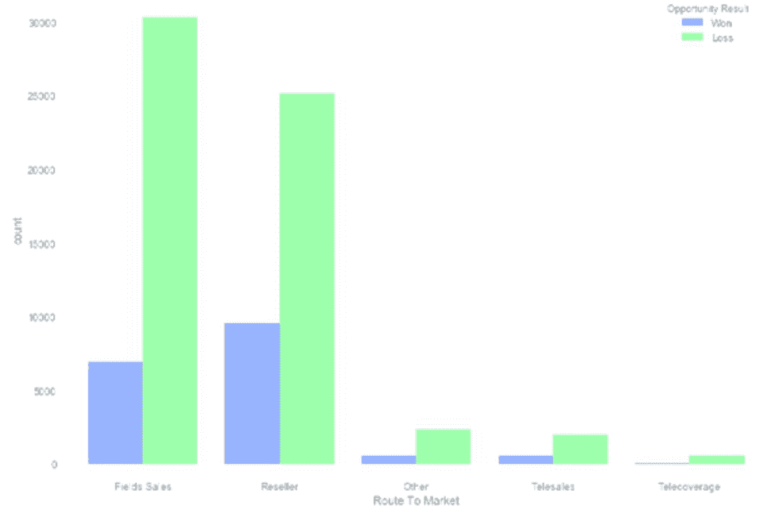

快速回顾 - 首先导入了“Seaborn”和“Matplotlib”模块。然后使用“set()”技术定义了图表的独特特征，例如图表样式和颜色。使用代码片段“sns.set(style= “whitegrid”, color_codes= True)”将图表背景定义为白色。接着使用命令“sns.set(rc={'figure.figsize': (11.7,8.27)})”定义了图表尺寸，将图表大小设置为“11.7px 和 8.27px”。

接下来，使用命令“sns.countplot('Route To Market',data= sales_data, hue='Opportunity Result')”生成了图表。“countplot()”技术能够创建计数图，它可以根据我们的需求暴露多个参数来自定义计数图。作为第一个“countplot()”参数，X轴被定义为数据集中的“Route To Market”列。下一个参数涉及数据集的来源，即“sales_data”数据框架。

第三个参数是条形图的颜色，其中标记为“won”的列定义为“蓝色”，标记为“loss”的列定义为“绿色”。

另一种显示数据的方法是使用Seaborn中的小提琴图。

```python
# plotting the violinplot

sns.violinplot(x="Opportunity Result",y="Client Size By Revenue",
hue="Opportunity Result", data=sales_data);

plt.show()
```


小提琴图显示了数据的分布情况。我们可以看到数据分为“蓝色”的“won”和“绿色”的“loss”，并且按客户收入规模来看，大部分数据对应客户规模为“1”。

## 数据预处理

到现在，您应该已经清楚地了解了数据集中包含哪些信息。从数据探索步骤中，我们确定数据集中的大多数列是“字符串数据”，但“Scikit-Learn”只能处理数值数据。幸运的是，Scikit-Learn库为我们提供了许多将字符串数据转换为数值数据的方法，例如“LabelEncoder()”技术。为了将数据集中的分类标签（如“won”和“loss”）转换为数值，我们将使用“LabelEncoder()”技术。

让我们看看下面的图片，了解我们试图用“LabelEncoder()”技术完成什么。第一张图片包含一个标记为“color”的列，其中有三条记录，即“Red”、“Green”和“Blue”。通过利用“LabelEncoder()”技术，同一“color”列中的记录可以转换为数值。

现在让我们开始真正的转换过程。使用“LabelEncoder()”提供的“fit_transform()”技术，可以对分类列（如“Route To Market”）中的标签进行编码，并转换为与上图所示类似的数值标签。函数“fit_transform()”需要用户指定的输入标签，然后返回编码后的标签。

为了了解编码是如何完成的，让我们快速看一个例子。下面的代码实例包含一个城市列表形式的字符串数据，例如["Paris", "Paris", "Tokyo", "Amsterdam"]，它将被编码为类似“[ 2, 2, 1,3]”的形式。

步骤1 - 要导入所需模块，请使用命令“from sklearn import preprocessing”。

步骤2 – 要创建Label encoder对象，请使用命令“le = preprocessing.LabelEncoder()”。

步骤3 – 将分类列转换为数值。

```python
#import the necessary module
from sklearn import preprocessing

# create the Labelencoder object
le = preprocessing.LabelEncoder()

#convert the categorical columns into numeric
encoded_value = le.fit_transform(["paris", "paris", "tokyo", "amsterdam"])

print(encoded_value)
[1 1 2 0]
```

就是这样！我们刚刚将字符串数据标签转换为了数值。第一步是导入提供“LabelEncoder()”技术的preprocessing模块。接着创建一个代表“LabelEncoder()”类型的对象。然后使用该对象的“fit_transform()”函数来区分列表[ "Paris", "Paris", "Tokyo", "Amsterdam"]中的不同类别，并输出编码值“[ 1 1 2 0]”。您是否注意到“LabelEncoder()”技术根据类别的首字母按字母顺序为类别分配了数值，例如“(A)msterdam”被分配代码“0”，“(P)aris”被分配代码“1”，“(T)okyo”被分配代码“2”。

```python
print("Supplies Subgroup' : ",sales_data['Supplies Subgroup'].unique())
print("Region : ",sales_data['Region'].unique())
print("Route To Market : ",sales_data['Route To Market'].unique())
print("Opportunity Result : ",sales_data['Opportunity Result'].unique())
print("Competitor Type : ",sales_data['Competitor Type'].unique())
print("'Supplies Group : ",sales_data['Supplies Group'].unique())
```

```
Supplies Subgroup' :  ['Exterior Accessories' 'Motorcycle Parts' 'Shelters & RV'
 'Garage & Car Care' 'Batteries & Accessories' 'Performance Parts'
 'Towing & Hitches' 'Replacement Parts' 'Tires & Wheels'
 'Interior Accessories' 'Car Electronics']
Region :  ['Northwest' 'Pacific' 'Midwest' 'Southwest' 'Mid-Atlantic' 'Northeast'
 'Southeast']
Route To Market :  ['Fields Sales' 'Reseller' 'Other' 'Telesales' 'Telecoverage']
Opportunity Result :  ['Won' 'Loss']
Competitor Type :  ['Unknown' 'Known' 'None']
'Supplies Group :  ['Car Accessories' 'Performance & Non-auto' 'Tires & Wheels'
 'Car Electronics']
```

一开始我们加载了提供LabelEncoder()函数的preprocessing模块。

然后我们创建了一个`LabelEncoder()`类型的对象`le`。在接下来的几行中，我们使用了`LabelEncoder()`提供的`fit_transform()`函数，将不同列（如‘Supplies Subgroup’、‘Region’、‘Route To Market’）的分类标签转换为数值标签。通过这样做，我们成功地将所有分类（字符串）列转换为数值。

现在我们的数据已经准备好并转换完毕，*几乎*可以用于构建我们的预测模型了。但我们仍然需要做一件关键的事情：

## 训练集与测试集

机器学习算法需要在一组数据上进行训练，以学习不同特征之间的关系以及这些特征如何影响目标变量。为此，我们需要将整个数据集分成两部分数据集。一个是训练集，我们将用它来训练算法以构建模型。另一个是测试集，我们将用它来测试模型，看看其预测的准确性如何。

但在进行所有这些划分之前，让我们先分离特征和目标变量。和本教程之前一样，我们将首先运行下面的代码，然后仔细看看它的作用：

```python
# select columns other than 'Opportunity Number','Opportunity Result'
cols = [col for col in sales_data.columns if col not in ['Opportunity Number','Opportunity Result']]

# dropping the 'Opportunity Number' and 'Opportunity Result' columns
data = sales_data[cols]

# assigning the Opportunity Result column as target
target = sales_data['Opportunity Result']

data.head(n=2)
```

| | Suppliers Subgroup | Suppliers Group | Region | Route To Market | Elapsed Days In Sales Stage | Sales Stage Change Count | Total Days Identified Through Closing | Total Days Identified Through Qualified | Opportunity Amount USD | Client Size By Revenue | Client Size By Employee Count | Revenue From Client Past Two Years | Competitor Type | Ratio Days Identified To Total Days | Ratio Days Validated To Total Days | Ratio Days Qualified To Total Days | Deal Size Category |
|---|---|---|---|---|---|---|---|---|---|---|---|---|---|---|---|---|---|
| 0 | 2 | 0 | 3 | 0 | 76 | 13 | 104 | 101 | 0 | 5 | 5 | 0 | 2 | 0.69636 | 0.11399 | 0.15422 | 1 |
| 1 | 2 | 0 | 4 | 2 | 63 | 2 | 163 | 163 | 0 | 3 | | | | | | | |

好的，那么我们刚才做了什么？首先，我们不需要“Opportunity Number”列，因为它只是每条记录的唯一标识符。另外，我们想要预测“Opportunity Result”，所以它应该是我们的“目标”而不是“数据”的一部分。因此，在上面代码的第一行中，我们只选择了与“Opportunity Number”和“Opportunity Result”不匹配的列，并将它们赋值给变量`cols`。接下来，我们用列表`cols`中的列创建了一个新的数据框`data`。这将作为我们的特征集。然后我们从数据框`sales_data`中取出“Opportunity Result”列，并创建了一个新的数据框`target`。

就是这样！我们已经完成了将特征和目标定义到两个独立数据框中的所有准备工作。接下来，我们将把数据框`data`和`target`划分为训练集和测试集。在划分数据集时，我们将保留30%的数据作为测试数据，其余70%作为训练数据。但请记住，这些数字是任意的，最佳划分取决于你正在处理的具体数据。如果你不确定如何划分数据，80/20原则是一个不错的默认选择，即保留80%的数据作为训练数据，使用剩余的20%作为测试数据。然而，对于本教程，我们将坚持之前的决定，保留30%的数据作为测试数据。scikit-learn中的`train_test_split()`方法可用于划分数据：

```python
# import the necessary module
from sklearn.model_selection import train_test_split

# split data set into train and test sets
data_train, data_test, target_train, target_test = train_test_split(data, target, test_size = 0.30, random_state = 10)
```

至此，我们已经成功准备了一个测试集和一个训练集。在上面的代码中，我们首先导入了`train_test_split`模块。接下来，我们使用`train_test_split()`方法将数据划分为训练集（`data_train`, `target_train`）和测试集（`data_test`, `target_test`）。`train_test_split()`方法的第一个参数是我们在上一节中分离出的特征，第二个参数是目标（“Opportunity Result”）。第三个参数`test_size`是我们希望分离出来作为测试数据的数据百分比。在我们的例子中是30%，尽管这可以是任何数字。第四个参数`random_state`只是确保我们每次都能得到可重现的结果。

现在，我们已经准备好了一切，接下来是本教程最重要和最有趣的部分：使用scikit-learn提供的大量算法库来构建预测模型。

## 构建模型

scikit-learn网站上有一个`machine_learning_map`，我们可以在选择算法时用作快速参考。它看起来像这样：

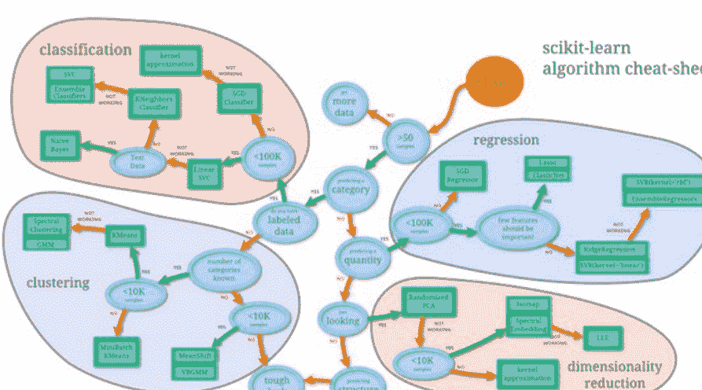

我们可以使用这张图作为备忘单，来筛选我们可以尝试用于构建预测模型的算法。使用检查清单，让我们看看我们属于哪个类别：

- 超过50个样本 – 符合
- 我们是在预测一个类别吗 – 符合
- 我们有标签数据吗？（*具有明确名称的数据，如机会金额等*） – 符合
- 少于10万样本 – 符合

根据我们上面准备的检查清单，并遵循`machine_learning_map`，我们可以尝试以下提到的算法。

- 朴素贝叶斯
- 线性支持向量机分类器
- K近邻分类器

scikit-learn库的真正美妙之处在于它为不同的算法提供了高级API，使我们更容易尝试不同的算法并比较模型的准确性，以查看哪种算法最适合我们的数据集。

让我们开始逐一尝试不同的算法。

## 朴素贝叶斯

Scikit-learn提供了一组分类算法，它们“天真地”假设在数据集中，每一对特征都是独立的。这个假设是贝叶斯定理的基本原理。基于这个原理的算法被称为朴素贝叶斯算法。

在非常高的层面上，朴素贝叶斯算法计算一个特征与目标变量之间关联的概率，然后选择概率最高的特征。让我们用一个非常简单的问题陈述来理解这一点：今天会下雨吗？假设我们有一组天气数据作为我们的特征集，而“下雨”的概率将是我们的目标。基于这个特征集，我们可以创建一个表格来显示特定特征/目标对出现的次数。它看起来会像这样：

| 天气 | 下雨 |
|---|---|
| 多云 | 否 |
| 阴天 | 是 |
| 多云 | 否 |
| 多云 | 是 |
| 多云 | 是 |
| 阴天 | 是 |
| 总计 | 6 |

在上表中，特征（列）“天气”包含标签（“多云”和“阴天”），而“下雨”列包含与特征“天气”相对应的下雨发生情况（是/否）。每当一个特征与下雨同时发生时，它被记录为“是”，当该特征没有导致下雨时，它被记录为“否”。我们现在可以使用发生表中的数据创建另一个称为“频率表”的表格，其中我们可以记录每个特征相关的“是”和“否”答案的数量：

| 天气 | 否 | 是 |
|---|---|---|
| 多云 | 2 | 2 |
| 阴天 | 0 | 2 |
| 总计 | 2 | 4 |

最后，我们结合“发生表”和“频率表”的数据，创建一个“似然表”。此表列出了每个特征的“是”和“否”的数量，然后使用这些数据计算每个特征对下雨发生的贡献概率：

| 天气 | 否 | 是 | 单独概率 | |
| :--- | :--- | :--- | :--- | :--- |
| 多云 | 2 | 2 | 4/6 | 0.6666666667 |
| 阴天 | 0 | 2 | 2/6 | 0.3333333333 |
| 总计 | 2 | 4 | | |
| 总概率 | 2/6 | 4/6 | | |
| | 0.3333333333 | 0.6666666667 | | |

注意上表中的“单独概率”列。从“发生表”中，我们有6次特征“多云”和“阴天”的出现，从“似然表”中可以清楚地看到，特征“多云”出现了4次（2次“否”和2次“是”）。当我们用某个特征的“否”和“是”的出现次数除以“发生表”的“总计”时，我们就得到了该特定特征的概率。在我们的例子中，如果我们需要找出哪个特征对下雨发生的贡献概率最强，那么我们取每个特征的“否”的总数，并将其与“频率表”中各自的“是”的数量相加，然后将总和除以“发生表”的“总计”。这给出了每个这些特征与下雨同时发生的概率。

我们将用于销售数据的算法是高斯朴素贝叶斯，它基于与我们刚才探讨的天气示例类似的概念，尽管在数学上要复杂得多。对于那些希望深入了解的人，可以在这里找到关于“朴素贝叶斯”算法的更详细解释。

现在，让我们从scikit-learn中实现高斯朴素贝叶斯或GaussianNB算法来创建我们的预测模型：

## 朴素贝叶斯

```python
# 导入必要的模块
from sklearn.naive_bayes import GaussianNB
from sklearn.metrics import accuracy_score

# 创建一个GaussianNB类型的对象
gnb = GaussianNB()

# 在训练数据上训练算法，并使用测试数据进行预测
pred = gnb.fit(data_train, target_train).predict(data_test)

# 打印模型的准确率分数
print("Naive-Bayes accuracy : ", accuracy_score(target_test, pred, normalize=True))
```

Naive-Bayes accuracy : 0.759056732741

现在让我们仔细看看我们刚才做了什么。首先，我们导入了`GaussianNB`方法和`accuracy_score`方法。然后，我们创建了一个`GaussianNB`类型的对象`gnb`。之后，我们使用`fit()`方法在训练数据(`data_train`)和训练目标(`target_train`)上训练了算法，然后使用`predict()`方法预测了测试数据中的目标。最后，我们使用`accuracy_score()`方法打印了分数，至此我们成功地应用了朴素贝叶斯算法来构建一个预测模型。

现在，让我们看看我们列表中的其他算法与朴素贝叶斯算法相比表现如何。

### LinearSVC

LinearSVC，即线性支持向量分类，是SVM（支持向量机）类的一个子类。我们不会深入探讨这类算法涉及的复杂数学原理，但在非常基础的层面上，LinearSVC试图将数据划分为不同的平面，以便找到不同类别的最佳可能分组。为了清晰地理解这个概念，让我们想象一个由“点”和“方块”组成的数据集，沿着两个轴被划分到一个二维空间中，如下图所示：

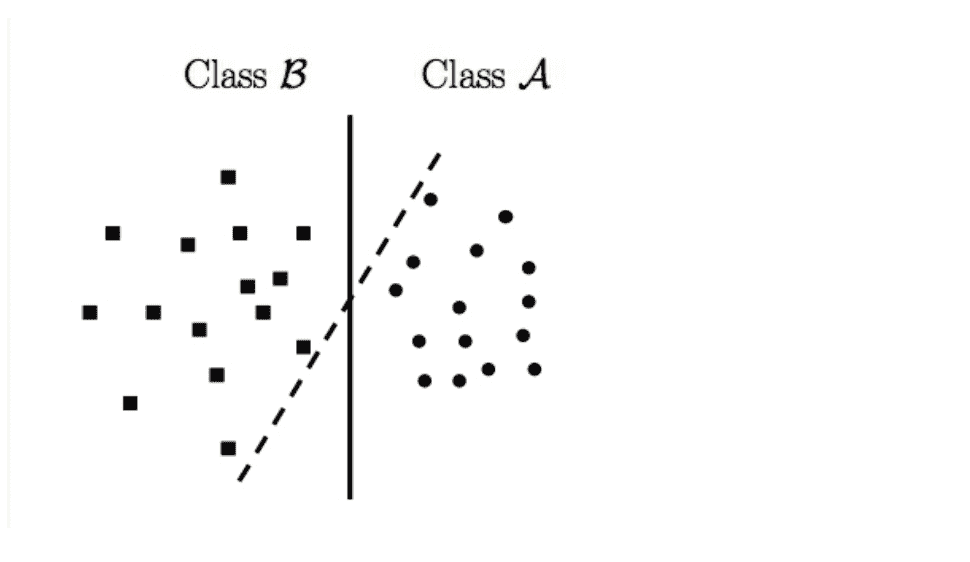

在上图中，一个LinearSVC实现试图以这样的方式划分二维空间：两类数据，即点和方块，被清晰地分开。这里的两条线在视觉上代表了LinearSVC试图实现的各种划分，以分离出两个可用的类别。

对于那些想了解更多细节的人，这里有一篇解释支持向量机（SVM）的优秀文章，但现在，让我们直接动手实践：

```python
# 导入必要的模块
from sklearn.svm import LinearSVC
from sklearn.metrics import accuracy_score

# 创建一个LinearSVC类型的对象
svc_model = LinearSVC(random_state=0)

# 在训练数据上训练算法，并使用测试数据进行预测
pred = svc_model.fit(data_train, target_train).predict(data_test)

# 打印模型的准确率分数
print("LinearSVC accuracy : ", accuracy_score(target_test, pred, normalize=True))
```

LinearSVC accuracy : 0.777811004785

与我们在实现`GaussianNB`时所做的类似，我们在前两行导入了所需的模块。然后，我们创建了一个`LinearSVC`类型的对象`svc_model`，并将`random_state`设置为‘0’。等等！什么是“`random_state`”？简单来说，`random_state`是给内置随机数生成器的一个指令，要求它以特定的顺序打乱数据。接下来，我们在训练数据上训练了LinearSVC，然后使用测试数据预测了目标。最后，我们使用`accuracy_score()`方法检查了准确率分数。

既然我们已经尝试了`GaussianNB`和`LinearSVC`算法，我们将尝试列表中的最后一个算法，即K近邻分类器。

## K近邻分类器

与我们之前使用的两种算法相比，这个分类器稍微复杂一些。出于本教程的目的，我们最好使用scikit-learn提供的`KNeighborsClassifier`类，而不必过多担心算法的工作原理。

现在，让我们实现K近邻分类器，看看它的得分如何：

```python
# 导入必要的模块
from sklearn.neighbors import KNeighborsClassifier
from sklearn.metrics import accuracy_score

# 创建分类器的对象
neigh = KNeighborsClassifier(n_neighbors=3)

# 训练算法
neigh.fit(data_train, target_train)

# 预测响应
pred = neigh.predict(data_test)

# 评估准确率
print("KNeighbors accuracy score : ", accuracy_score(target_test, pred))
```

KNeighbors accuracy score : 0.814550580998

上述代码可以像之前的实现一样解释。首先我们导入了必要的模块，然后创建了`KNeighborsClassifier`类型的对象`neigh`，其中邻居数量设置为`n_neighbors= 3`。接着我们使用`fit( )`方法在训练集上训练了算法，然后在测试数据上测试了模型。最后，我们打印出了准确率分数。

既然我们已经实现了列表中的所有算法，我们只需比较所有模型的分数，就可以选择得分最高的模型。但是，如果我们有一种方法可以直观地比较不同模型的性能，那不是更好吗？我们可以使用scikit-learn中的`yellowbrick`库，它提供了可视化表示不同评分方法的方法。

## 性能比较

在前面的章节中，我们使用了`accuracy_score( )`方法来衡量不同算法的准确率。现在，我们将使用Yellowbrick库提供的ClassificationReport类，为我们提供一个关于模型性能的可视化报告。

### GaussianNB

让我们从GaussianNB模型开始：

```python
from yellowbrick.classifier import ClassificationReport

# 实例化分类模型和可视化器
visualizer = ClassificationReport(gnb, classes=['Won','Loss'])

visualizer.fit(data_train, target_train) # 将训练数据拟合到可视化器
visualizer.score(data_test, target_test) # 在测试数据上评估模型
g = visualizer.poof() # 绘制/显示/呈现数据
```

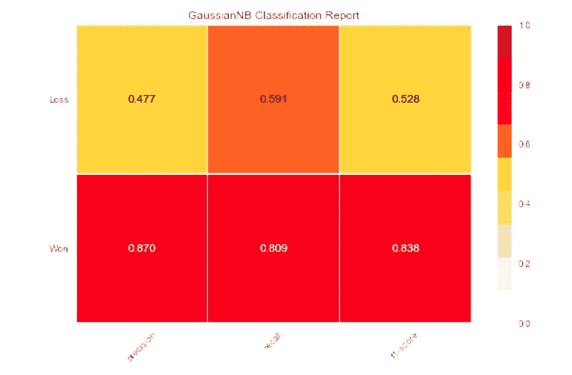

在上面的代码中，我们首先导入了`yellowbrick.classifier`模块提供的`ClassificationReport`类。接下来，创建了一个`ClassificationReport`类型的对象`visualizer`。这里的第一个参数是在“朴素贝叶斯”部分实现朴素贝叶斯算法时创建的`GaussianNB`对象`gnb`。第二个参数包含来自`sales_data`数据框中“Opportunity Result”列的标签‘Won’和‘Loss’。

接下来，我们使用`fit( )`方法训练可视化器对象。随后是`score( )`方法，它使用`gnb`对象根据`GaussianNB`算法进行预测，然后计算该算法所做预测的准确率分数。最后，我们使用`poof( )`方法绘制`GaussianNB`算法不同分数的图表。注意不同的分数是如何针对每个标签‘Won’和‘Loss’进行布局的；这使我们能够可视化不同目标类别的分数。

### LinearSVC

与我们在上一节中所做的类似，我们也可以绘制LinearSVC算法的准确率分数：

```python
from yellowbrick.classifier import ClassificationReport

# 实例化分类模型和可视化器
visualizer = ClassificationReport(svc_model, classes=['Won','Loss'])

visualizer.fit(data_train, target_train) # 将训练数据拟合到可视化器
visualizer.score(data_test, target_test) # 在测试数据上评估模型
g = visualizer.poof() # 绘制/显示/呈现数据
```

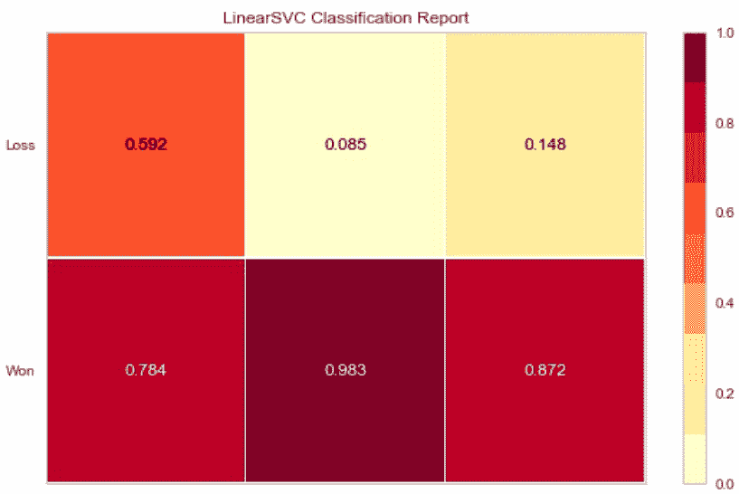

在上面的代码中，我们首先导入了`yellowbrick.classifier`模块提供的`ClassificationReport`类。接下来，创建了一个`ClassificationReport`类型的对象`visualizer`。这里的第一个参数是在“LinearSVC”部分实现`LinearSVC`算法时创建的`LinearSVC`对象`svc_model`。第二个参数包含来自`sales_data`数据框中“Opportunity Result”列的标签‘Won’和‘Loss’。

接下来，我们使用`fit()`方法训练了‘svc_model’对象。随后是`score()`方法，它使用`svc_model`对象根据`LinearSVC`算法进行预测，然后计算该算法所做预测的准确率分数。最后，我们使用`poof()`方法绘制了`LinearSVC`算法不同分数的图表。

### KNeighborsClassifier

现在，让我们对K近邻分类器的分数做同样的事情。

from yellowbrick.classifier import ClassificationReport

# 实例化分类模型和可视化器

visualizer = ClassificationReport(neigh, classes=['Won','Loss'])

visualizer.fit(data_train, target_train) # 将训练数据拟合到可视化器

visualizer.score(data_test, target_test) # 在测试数据上评估模型

g = visualizer.poof() # 绘制/显示/呈现数据

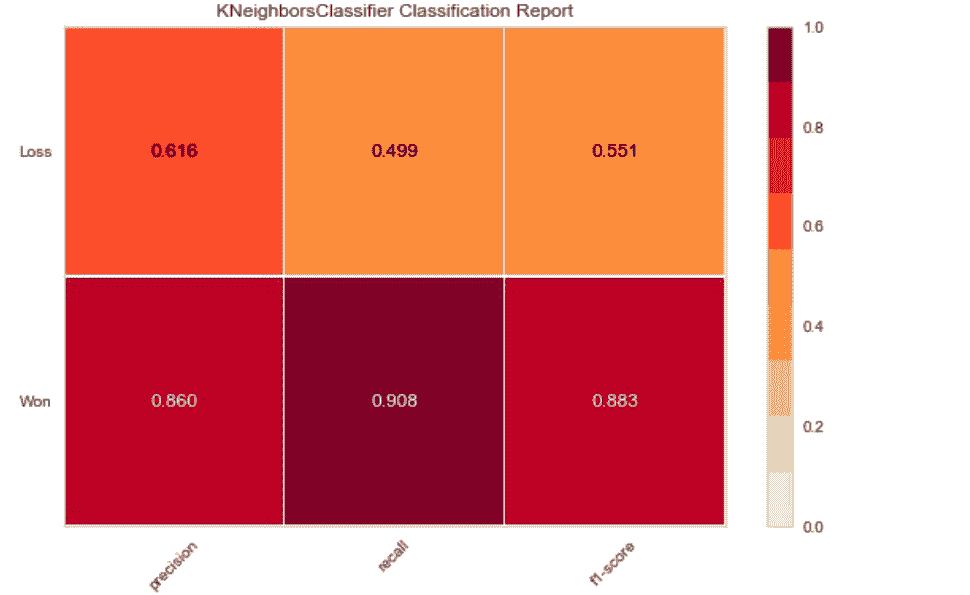

再次强调，我们首先导入了`yellowbrick.classifier`模块提供的`ClassificationReport`类。接下来，创建了一个`ClassificationReport`类型的对象`visualizer`。这里的第一个参数是`KNeighborsClassifier`对象`neigh`，它是在“KNeighborsClassifier”部分实现`KNeighborsClassifier`算法时创建的。第二个参数包含了来自`sales_data`数据框中“Opportunity Result”列的标签‘Won’和‘Loss’。

接下来，我们使用`fit()`方法来训练‘neigh’对象。随后是`score()`方法，它使用‘neigh’对象根据`KNeighborsClassifier`算法进行预测，然后计算该算法所做预测的准确率分数。最后，我们使用`poof()`方法绘制`KNeighborsClassifier`算法不同分数的图表。现在我们已经可视化了结果，这使得我们更容易比较分数并选择最适合我们需求的算法。

## 结论

scikit-learn库提供了许多不同的算法，这些算法可以导入到代码中，然后像导入任何其他Python库一样用于构建模型。这使得快速构建不同模型并比较这些模型以选择得分最高的模型变得更加容易。

在本教程中，我们仅仅触及了scikit-learn库可能性的皮毛。要充分利用这个机器学习库，scikit-learn官方页面上有许多资源，包含详细的文档，你可以深入研究。scikit-learn的快速入门指南可以在这里找到，对于刚刚开始探索机器学习世界的初学者来说，这是一个很好的起点。

但要真正领略scikit-learn库的真正威力，你真正需要做的是开始在不同的开放数据集上使用它，并使用这些数据集构建预测模型。开放数据集的来源包括Kaggle和Data.world。两者都包含许多有趣的数据集，人们可以在这些数据集上练习使用scikit-learn库提供的算法来构建预测模型。

## 第6章：数据科学与云计算

数据科学是许多概念的混合体。要成为一名数据科学家，具备一些编程技能很重要。即使你可能不了解与基础设施相关的所有编程概念，但具备计算机科学概念的基本技能是必须的。随着高级分析的不断扩展，数据科学继续在不同方向上展翅高飞。这需要协作解决方案，如预测分析和推荐系统。协作解决方案包括与代码源控制集成的研究和笔记本工具。数据科学也与云计算相关。信息也存储在云端。因此，本课程将向你介绍一些关于“云端数据”的事实。那么，让我们理解什么是云，数据是如何存储的，以及它是如何工作的。

## 什么是云？

云可以描述为一个全球服务器网络，每个服务器都有不同的独特功能。研究云需要理解网络。网络可以是信息或数据的简单或复杂集群。

## 网络

网络可以有简单或小型的计算机组连接，也可以有大型的计算机组连接。最大的网络是互联网。小型的可以是家庭本地网络，如Wi-Fi，以及局限于某些计算机或区域的局域网。存在共享网络，如媒体、网页、应用服务器、数据存储以及打印机和扫描仪。网络有节点，其中计算机被称为节点。这些计算机之间的通信是通过使用协议建立的。协议是为计算机设置的中间规则。像HTTP、TCP和IP这样的协议被大规模使用。所有信息都存储在计算机中，但每次在计算机上搜索信息变得很困难。此类信息通常存储在数据中心。数据中心的设计方式使其配备了数据支持安全和保护。由于计算机和存储的成本大幅下降，许多组织选择使用多台协同工作的计算机，以便进行扩展。这与其他扩展解决方案（如购买其他计算设备）不同。

这样做的目的是即使一台计算机发生故障，工作也能持续进行；其他计算机将继续操作。一些云应用程序也需要扩展。从更广泛的角度看，一些计算应用程序，如YouTube、Netflix和Facebook，需要进行一些扩展。我们很少遇到这些应用程序故障，因为它们已经将其系统设置在云端。云中有一个网络集群，其中许多计算机连接到相同的网络并完成相似的任务。你可以将其称为单一信息源或单一计算机，它管理一切以提高性能、可扩展性和可用性。

## 云端的数据科学

数据科学的整个过程在本地机器上进行，即提供给数据科学家的计算机或笔记本电脑。计算机或笔记本电脑内置了编程语言和一些其他先决条件。这可以包括常见的编程语言和一些算法。数据科学家随后必须根据其项目安装相关的软件和开发包。开发包可以使用Anaconda或类似管理器等管理器进行安装。你也可以选择手动安装。一旦你安装并进入开发环境，那么你的第一步，即工作流程就开始了，此时你的伙伴只有数据。在不同的开发机器上执行与数据科学或大数据相关的任务并非强制性的。请查看背后的原因：

- 在开发环境中执行任务所需的处理时间因处理能力不足而失败。
- 存在无法容纳在开发环境系统内存中的大型数据集。
- 交付物必须被安排到生产环境中，并作为大型应用程序的一个组件被整合。
- 建议使用快速而强大的机器。

数据科学家在遇到此类问题时会探索许多选项；他们使用本地机器或在云上运行的虚拟机。使用虚拟机和自动扩展集群有多种好处，例如，它们可以在需要时随时扩展和丢弃。虚拟机以满足个人计算能力和存储需求的方式进行定制。将信息部署到生产环境中以推送到大型数据管道中可能会遇到某些挑战。这些挑战需要由数据科学家来理解和分析。这可以通过了解软件架构和质量属性来理解。

## 软件架构和质量属性

基于云的软件系统由软件架构师开发。此类系统可能是依赖于计算系统的产品或服务。如果你正在构建软件，主要任务包括选择要编程的正确编程语言。系统的目的可能受到质疑；因此，需要加以考虑。开发和使用软件架构必须由技术娴熟的人员完成。大多数组织已经开始使用云计算实施有效且可靠的云环境。这些云环境部署在各种服务器、存储和网络资源上。由于其低成本和高投资回报率，它被广泛使用。

对数据科学家或其团队的主要好处是，他们正在利用云端的巨大空间来探索更多数据并创建重要的用例。你可以发布一个功能，并在下一秒对其进行测试，检查它是否增加了价值，或者是否值得继续推进。所有这些即时操作都是由于云计算才成为可能。

## 在云端共享大数据

大数据在处理云时也起着至关重要的作用，因为它使跟踪和分析洞察变得更加容易。一旦建立，大数据就为用户创造了巨大的价值。

传统的方法是处理有线数据。团队使用这种技术共享信息变得困难。通常的问题包括传输大量数据和协作。这就是云计算开始在竞争世界中播下种子的地方。由于云计算，所有这些问题都被消除了，团队逐渐能够从不同地点甚至海外协同工作。因此，云计算在数据科学和大数据中都至关重要。大多数组织都在使用

## 云与大数据治理

使用云计算是一种极佳的体验，因为它降低了资源成本、时间和人力投入。但随之而来的问题是，组织如何应对安全、合规和治理？对大多数公司而言，监管这些方面是一项挑战。这不仅限于大数据问题，使用云计算同样会引发与隐私和安全相关的议题。因此，有必要在您的云解决方案中制定强有力的治理策略。为确保您的云解决方案可靠、稳健且可治理，必须将其保持为开放架构。

## 数据云工具对实现数据高价值的必要性

当今时代对数据科学家的需求正在迅速增长。他们负责帮助各类组织从提供的数据或数据集中开发有用信息。大型组织拥有海量数据，需要持续进行分析。根据近期报告，组织收到的近80%的非结构化数据以社交媒体、电子邮件（如Outlook、Gmail等）、视频、图像等形式存在。随着云计算的快速发展，数据科学家需要处理来自物联网、人工智能、区块链、分析等管道的各种新型工作负载。处理所有这些新工作负载需要一个跨所有团队的稳定、高效且集中的平台。此外，还需要管理和记录新数据以及遗留文档。一旦数据科学家被分配任务并获得要处理的数据集，他们必须具备通过云技术分析不断增长的数据量的正确技能。他们需要将数据转化为有助于提升业务的有用洞察。数据科学家必须构建算法并编写程序。他们通常将80%的时间用于收集信息、创建和修改数据、必要时进行清理以及组织数据。剩余的20%则用于通过有效的编程分析数据。这就要求拥有特定的云工具来帮助数据科学家减少搜索合适信息的时间。组织应为其数据科学家提供新的云服务和云工具，以便他们能够快速组织海量数据。因此，云工具对于数据科学家在较短时间内分析大量数据至关重要。这将为公司节省时间，并有助于构建强大而稳健的数据模型。

## 第7章：数据科学应用示例

### 安全

全球多个城市正在开展预测分析，以便预测城市中哪些区域更有可能发生重大犯罪激增。这是借助一些历史数据甚至该地区的地理数据来实现的。这实际上是美国一些城市（包括芝加哥）已经能够应用的技术。尽管我们可以想象，用它来侦破所有犯罪是不可能的，但通过使用它获得的数据将使警察能够在正确的时间出现在正确的区域，从而有助于降低某些地区的犯罪率。未来，您会发现，当我们在大城市以这种方式使用数据分析时，有助于使这些城市和区域变得更加安全，风险也将不再像以前那样需要人们冒着生命危险。

### 交通运输

交通领域也能够运用数据分析。几年前，在筹备伦敦奥运会时，需要在赛事期间处理超过1800万次球迷前往伦敦的行程。此外，我们能够很好地处理这一任务。这一壮举是如何为这么多人实现的？列车运营商和伦敦交通局运营商与数据分析团队合作，确保所有行程尽可能顺利。这些团队能够梳理并输入当时发生的事件数据，然后以此预测有多少人将前往参加。该计划执行得非常成功，所有观众和运动员在整个赛事期间都能及时往返于正确的地点。

### 风险与欺诈检测

这是数据分析的原始用途之一，常用于金融领域。许多组织曾因债务问题有过不良经历，并准备对此做出改变。由于他们掌握了客户每次申请贷款时收集的数据，他们能够利用这一流程来减少过程中的资金损失。这使得银行和其他金融机构能够深入挖掘并利用这些客户的档案数据。当银行或金融机构能够利用其客户信息、近期产生的成本以及其他对这些工具重要的信息时，他们就能做出更明智的贷款决策，从而整体降低风险。这有助于他们为客户提供更优惠的利率。除了帮助这些金融机构确保向更有可能还款的客户发放贷款外，您会发现这也有助于降低欺诈风险。欺诈每年可能给银行造成数十亿美元的损失，处理起来代价高昂。当银行能够利用其所有数据来帮助发现欺诈交易，并使其客户更容易将资金保留在账户中，同时确保银行自身不会在此过程中蒙受损失时，情况就会好转。

### 物流配送

在数据分析的应用方面，我们所能做的没有限制，您会发现它在物流和配送领域同样表现出色。有几家专注于物流的公司会运用这种数据分析，包括UPS、FedEx和DHL。他们将使用数据来提高运营效率。通过应用数据分析，这些公司可以找到运输物品时最佳、最高效的路线，确保物品准时送达等等。这有助于物品快速送达，同时将成本降至最低。此外，公司通过GPS收集的信息为他们未来利用数据科学和数据分析提供了更多机会。

### 客户互动

许多企业将运用数据分析应用，以实现与客户更好的互动。公司可以通过客户调查等方式了解客户情况。例如，许多保险公司会在客户与其服务人员互动后发送客户调查。然后，保险公司可以了解哪些服务是好的、客户喜欢哪些服务，以及哪些服务需要改进。企业可以处理许多人口统计数据，并且可能需要多种不同的沟通方式，包括电子邮件、电话、网站和面对面互动。通过分析客户人口统计数据和收到的反馈，这些保险公司可以确保向客户提供合适的产品，这完全基于经过验证的洞察和客户行为。

### 城市规划

许多地方犯的一个重大错误是，在城市规划中并未使用和考虑分析，尤其是我们在本指南中讨论的步骤。网络流量和营销实际上被用于取代建筑和空间的创建。这将导致我们在讨论数据掌控权时出现许多问题，因为这些建筑分区和城市中新事物的创建会受到一些影响。构建良好的模型将有助于最大化特定服务和区域的可达性，同时确保不会同时存在使城市重要基础设施过载的风险。这有助于确保效率水平，让每个人都能尽可能地获得所需，而不会对城市造成过多负担和损害。我们通常会看到建筑物未被放置在正确的位置，或者企业被迁移到不属于它们的地方。您有多少次看到一座建筑位于看似合适且符合需求的位置，但却对周围其他地方产生了许多负面影响？这是因为这些潜在问题在规划期间未被纳入考量。

在规划阶段，数据分析和一些建模的应用有助于我们简化工作，因为我们可以预知在选定的位置放置建筑物或其他设施会产生什么效果。

## 医疗保健

医疗保健行业已从数据分析中获益良多。方法众多，但我们将探讨医院面临的主要挑战之一。此外，医院需要在尽可能多地治疗患者的同时，应对成本压力并提供高质量的医疗服务。这有时会导致医生和其他工作人员在部分工作上落后，难以跟上需求。

你会发现，我们在此可用的数据量已大幅增长，它使医院能够优化并跟踪患者的治疗过程。这也是跟踪患者流量和医院不同设备使用情况的好方法。事实上，其效果如此显著，据估计，使用数据分析可带来1%的效率提升，并可能在全球医疗保健服务中节省超过630亿美元。想想这对你和你周围的人可能意味着什么。

医生将与数据分析合作，以此为患者提供更多帮助。他们可以利用数据分析进行诊断，并及时、高效地了解患者的状况。这能让医生为患者提供更好的体验和更优质的护理，同时确保他们能完成所有必要的工作。

## 旅游

数据分析及其应用是优化旅行者购买体验的好方法。这可以通过多种方式实现，包括对移动来源、网站或社交媒体的数据分析。原因在于，客户的愿望和偏好可以从所有这些来源中获取，这使得公司能够根据用户近期的浏览记录和当前的销售情况来销售产品，从而提高购买转化率。他们能够利用所有这些信息提供定制化的套餐和优惠。数据分析的应用还可以提供个性化的旅行推荐，这通常取决于公司从其社交媒体数据中获得的结果。

在数据分析方面，旅游业还能从其他方面受益。当酒店试图提高入住率时，他们可以利用数据分析来确定向客户提供哪些广告。此外，他们可能会尝试利用数据分析来确定哪些夜晚、哪些客户会入住或出现。可以说，旅游领域的几乎所有不同部分都能从数据分析中受益。

## 数字广告

除了用于辅助搜索之外，我们还能在另一个领域定期看到数据分析的应用，那就是数字广告。从一些网站上的横幅广告，到你在一些大城市可能常见的数字广告牌，所有这些都将通过我们的数据算法进行控制。

这就是为什么数字广告比传统广告方法更有可能获得更高点击率的一个重要原因。目标将更多地基于用户过去的行为，这可以为未来做出良好的预测。

数据分析应用的重要性怎么强调都不为过，因为它将被用于我们生活中几乎所有的领域，以确保事情比以前更顺利。现在比以往任何时候都更容易看到，拥有数据是多么重要，因为它帮助我们在没有太多问题的情况下做出最佳决策。然而，如果我们没有数据，或者因为数据混乱、数据点太多而无法处理，那么我们的决策将基于其他因素。数据分析确保我们的决策经过深思熟虑、合理且能满足我们的需求。

你可能还会发现，当我们低效地处理数据时，可能会导致许多问题。例如，它可能导致大公司中的某些部门无法充分利用数据和我们在过程中发现的洞察力，这可能使你拥有的数据无法发挥其全部潜力。此外，如果情况变得太糟，数据可能完全失去作用。

然而，你会发现，随着数据比以往任何时候都更容易获取和使用，因此更多的人能够接触数据，它不再仅仅是数据分析师和数据科学家才能处理的东西。正确使用这些数据很重要，但每个人都能去找到他们想要的数据。此外，这种趋势很可能在未来很长一段时间内持续下去。

# PYTHON 机器学习

作者

TechExp Academy

2020 © 版权所有

## 引言

尽管我们对机器学习有所了解，但事实是，我们远未实现这些研究的真正潜力。机器学习目前是计算机科学中最热门的话题之一。如果你是一名数据分析师，这是一个你应该投入全部精力的领域，因为前景非常广阔。你将看到一个与机器互动将成为我们存在基础的未来。

在本系列中，我们的目的是从专家的角度探讨Python机器学习。假设你已经阅读了本系列早期的书籍，这些书籍向你介绍了机器学习、Python、库以及其他构成你机器学习知识基础的重要特性。考虑到这一点，除非必要，我们几乎不涉及入门概念。

即使在专家水平，提醒自己关注机器学习中必须考虑的重要问题总是很重要的。算法是你在机器学习中几乎所有工作的支柱。因此，我们简要介绍了一节内容，让你可以回顾重要的算法和其他有助于推进机器学习知识的要素。

机器学习既关乎编程，也关乎概率和统计。我们将使用许多统计方法来帮助我们不时获得最佳解决方案。因此，提醒自己一些必要的概率理论以及它们如何影响每种场景的结果非常重要。

在我们对机器学习的研究中，一个突出的概念是机器学习涉及不确定性。这是机器学习与编程的区别之一。在编程中，你编写的代码必须按原样执行。代码根据给定的指令产生预定的输出。然而，在机器学习中，我们无法享受这种奢侈。

一旦你构建了模型，你就会对其进行训练和测试，最终部署模型。由于这些模型是为与人类交互而构建的，你可以预期在每个层面上都会遇到不同类型的交互。一些输入参数可能是正确的，而另一些可能不是。在构建模型时，你必须考虑这些因素，否则你的模型将无法按预期运行。

机器学习的数学元素是我们必须研究的另一个领域。机器学习涉及许多数学计算，模型才能提供我们需要的输出。为了支持这一目标，我们必须学习如何根据特定指令对数据执行特定操作。

当你处理不同的数据集时，你总是有可能遇到海量数据集。这是正常的，因为随着我们的机器学习模型与不同的用户交互，它们会不断学习并构建知识。使用海量数据集的挑战在于，你必须学会如何将数据分解成小单元，以便你的系统能够毫无困难地处理和处理。在这种情况下，你试图避免使你的学习模型负担过重。

大多数基本计算机在处理海量数据时会崩溃。然而，当你学会如何分割数据集并在其上执行计算操作时，这应该不是问题。

在本书开头，我们提到将介绍在日常应用中使用机器学习的实践方法。基于这一陈述，我们探讨了一些使用机器学习的实用方法。

我们采取了谨慎的、循序渐进的方法，以确保你能够边学边做，更重要的是，我们试图解释每个过程，以帮助你理解你执行的操作及其原因。

最终，当你构建一个机器学习模型时，目标是将其集成到人们日常使用的某些应用程序中。考虑到这一点，你必须学会如何构建一个简单的解决方案来应对这一挑战。我们使用简单的解释来帮助你理解这一点，希望随着你继续处理不同的机器学习模型，你可以根据需要通过构建更复杂的模型来学习。

随着时间的推移，你将学习或遇到许多机器学习的概念。你必须认识到，只要你的模型与数据交互，这就是一个永无止境的学习过程。随着时间的推移，你将遇到比你习惯处理的更大的数据集。

## 目录

[引言](Introduction)

## 第一章：机器学习概述

- [机器学习如何运作](How Machine Learning Works)
- [为何选择Python进行人工智能与机器学习？](Why Use Python for AI and Machine Learning?)

## 第二章：机器学习流程的七个步骤

- [机器学习、人工智能与深度学习](Machine Learning, Artificial Intelligence and Deep Learning)
- [机器学习系统的典型目标](Typical Objectives of Machine Learning System)
- [机器学习系统的主要类别](Main Categories of Machine Learning Systems)
- [监督学习](Supervised Learning)
- [无监督学习](Unsupervised Learning)
- [强化学习](Reinforcement learning)
- [监督学习与无监督学习总结](Supervised Learning vs Unsupervised Learning in Summary)
- [构建机器学习系统的步骤](Steps in building a Machine Learning System)
- [机器学习应用场景](Machine Learning Scenarios)
- [本章小结](Chapter Summary)

## 第三章：机器学习类型

- [无监督学习](Unsupervised Learning)
- [聚类与关联](Clustering and Association)
- [生成模型](Generative Models)
- [数据压缩](Data Compression)
- [关联](Association)
- [什么是关联规则？](What Is An Association Rule?)
- [关联规则如何运作？](How Does An Association Rule Work?)
- [密度估计](Density Estimation)
- [核密度估计](Kernel Density Estimation)
- [潜变量](Latent Variables)
- [高斯混合模型](Gaussian Mixture Models)

## 第四章：机器学习在现实世界中的应用

- [机器学习何时有效？](When Does Machine Learning Work?)
- [复杂性与适应性](Complex and Adaptive)
- [大数据的作用](The Role of Big Data)
- [机器学习的定位](Where Does Machine Learning Fit In?)
- [机器学习的一些应用](Some Applications of Machine Learning)

## 第五章：数据挖掘技术

- [决策树](Decision Trees)
- [贝叶斯分类器](Bayes Classifier)
- [支持向量方法](Support Vector Method)
- [神经网络](Neural Networks)

## 第六章：为机器学习搭建Python环境

- [Python安装说明](Installation Instructions for Python)
- [入门指南](Getting Started)
- [本章小结](Chapter Summary)

## 第七章：Python机器学习应用的顶级库与模块

- [NumPy](NumPy)
- [Pandas](Pandas)
- [Matplotlib](Matplotlib)
- [Seaborn](Seaborn)
- [Bokeh](Bokeh)
- [Altair](Altair)
- [SciKit-learn](SciKit-learn)
- [MLPy](MLPy)
- [NumPy (数值Python)](NumPy (Numerical Python))
- [Matplotlib](Matplotlib)
- [Scikit-Learn](Scikit-Learn)
- [Pandas](Pandas)
- [数据框](Data Frame)
- [索引与条件选择](Indexing and a Conditional Selection)
- 将函数应用于数据集
- 本章小结

## 结论

## 第一章：机器学习概述

就计算机技术而言，机器学习实际上是一项古老的技术。第一个机器学习系统构建于20世纪50年代中后期。它在IBM开发，并在同行评审的文献中发表的一篇论文中被描述。这个系统能够学习如何玩跳棋。该系统有一些关键组成部分，使我们将其识别为机器学习。

首先需要注意的是，该系统并非被设计来玩跳棋。相反，该系统被设计用于学习和自我适应。它通过接触玩跳棋来学习如何玩。

其次需要考虑的是，系统玩跳棋的次数越多，它就玩得越好。这说明了这类计算机系统能够从经验中获益的能力。就像人类一样，他们在做某事上经验越多，就做得越好。

在考虑这样的程序时，你应该意识到一个关键方面。人类可以学习玩跳棋，也可以学习玩大富翁和弹吉他。尽管多年前，该领域的研究人员希望建造像这样的计算机，但当今使用的机器学习系统并非如此。简而言之，它们是“一招鲜”。因此，我们在这里描述的系统非常擅长玩跳棋。它不能做其他任何事情。一旦你有了一个能做某事的系统，那就是它能做的全部，句号。

第一个系统大约在60多年前建成，你可能想知道为什么直到最近这类计算机系统才与现实世界相关。原因有两个。其一是任何人类事业中研究发展的混乱方式。在这个发展之后几年，计算机科学家对通用人工智能的想法变得极其热衷。做出了巨大的承诺，并围绕该领域产生了大量的炒作。正是在这个时候，功能齐全的“仿生人”机器人的想法变得火热。这些将是类人的计算机系统，封装在类人的形态中，通常与人类无法区分。电影《异形》很好地捕捉了这个想法，其中的船上的科学家名叫阿什；其他船员甚至不知道他是一个仿生人。

人工智能的概念也在著名的科幻电影《2001太空漫游》中被描绘。这是一个更现实的描绘，计算机在形态上不像人类，但它显然有思想。电影的一个关键主题是系统存在缺陷，并可能因此做出错误的决定。这可能是我们应该铭记在心的警告，但我们可能不会。电影中的系统吹嘘它从不犯错，但它显然会犯错。不幸的是，今天的人们过于信任计算机。机器学习很棒，但不要崇拜它。

电影中描绘的HAL 9000计算机的另一个方面实际上反映了人工智能计算机系统在现实世界中实际能做什么，以及它们可能被用于什么。电影中的系统检测到通信设备中即将发生的故障。在电影中，结果证明是错误的，但关键在于，许多正在开发的机器学习系统有望在人类意识到之前检测到电子设备和机器中的故障。

我们不想过于沉迷于科幻故事，但考虑这些可能性的类比和解释是有趣的。事实证明，炒作占了上风，在追求人工智能这个圣杯几十年后，实际上是创造了一个像人脑一样工作的计算机系统，计算机科学家开始改变方向。他们将更多注意力转向机器学习，这可以被视为使用类人智能但应用于非常狭窄的任务。然而，缺失的是数据。

## 机器学习如何运作

机器学习始于以数据科学家形式存在的人类指导者。必须确定一个可以使用机器学习算法解决的问题。为了使该过程有效，必须有大量数据可用于在系统部署到现实世界之前训练系统。机器学习有两种基本方法。它们被称为监督学习和无监督学习。

在训练阶段，数据科学家将选择合适的训练数据，并让系统接触这些数据。随着系统接触数据，它将修改自身以变得更准确。这个阶段是系统开发的关键部分，数据科学家必须为手头的问题选择正确的数据集。换句话说，人类完全不参与的印象是完全错误的。人类是在选择和界定问题、选择合适的训练数据时，人类都参与其中。人类也参与评估系统性能的过程。正如我们将看到的，必须做出一些权衡，这些权衡对系统的可行性有重大影响。如果处理该问题的数据科学家在解读系统产生的结果时不够谨慎和准确，就可能部署一个功能失调的系统，导致其在执行任务时出错。

训练阶段可能需要多次迭代，具体取决于结果如何。

一旦系统部署，它或多或少会以自主方式运行，但参与这项工作的数据科学家应持续评估系统的性能。在某些时候，如果系统未能产生可接受的结果，可能需要对其进行替换或进一步训练。

## 为什么选择 Python 用于人工智能和机器学习？

有许多不同的编程语言可供学习和使用。那么，既然有这么多选择，为什么首先会选择 Python 编程语言呢？许多人，无论是专家还是初学者，都选择 Python，因为它易于学习、易于阅读，并且能够创建你可能想要编写的大型、具有挑战性的代码。选择使用这种编程语言有很多不同的原因，包括：

### 简单且一致

你会发现 Python 是一种简单且相当易于阅读的编程语言，即使你是初学者。与一些其他编程语言相比，它是最易读的语言之一。由于这是一种自然的编程语言，许多初学者喜欢他们能快速上手，并且很快就能理解自己在做什么。

### 丰富的库和框架选择

一旦你开始熟悉 Python，你会注意到它拥有丰富的库。这对初学者来说是个好消息，因为库包含了使语言为你工作所需的所有函数、代码和其他内容。这个库将帮助确保你在编写代码时能够做一些有用的事情。

### 平台无关性

无论你想在哪个平台上使用 Python，你都可以使用它。Linux 是许多人会选择的操作系统，但即使你在 Windows 或 Mac 电脑上，你仍然可以使用 Python。这是一个极好的消息，因为这意味着你可以在不对当前设置进行任何重大更改的情况下使用 Python。

### 庞大的社区和流行度

无论你过去是否使用过编程语言，知道有一个庞大的 Python 用户社区是件好事，如果你遇到困难，他们会帮助你。任何时候你需要一些想法，比如一个新项目，或者你有一个问题，或者你想学习新东西，都有一个庞大的群体为你提供所需的信息，帮助你入门。

## 第 2 章：机器学习过程的 7 个步骤

基于标记训练数据集的模型被称为监督机器学习模型。当孩子上学时，他们的老师和教授会给他们一些关于他们进展的反馈。同样，监督机器学习模型允许工程师向机器提供一些反馈。

让我们以一个输入 [红色，圆形] 为例。在这里，孩子和机器都会理解任何圆形且红色的物体都是苹果。现在让我们在机器或孩子面前放一个板球。你可以根据预测是错误还是正确，向机器提供响应 -1 或 0。如果需要，你总是可以添加更多属性。这是机器学习的唯一方式。这也是为什么如果你使用大型高质量数据集并花更多时间训练机器，机器会给你更好、更准确的结果。

在我们进一步讨论之前，你必须理解机器学习、人工智能和深度学习这些概念之间的区别。大多数人交替使用这些概念，但重要的是要知道它们并不相同。

### 机器学习、人工智能和深度学习

下面的图表将让你了解这些术语之间的关系。

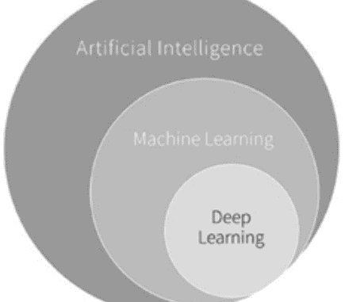

理解机器学习、人工智能和深度学习之间关系的插图

人工智能是一种用于使机器模仿任何人类行为的技术。其目标是确保机器能够准确高效地模仿任何人类行为。人工智能机器的一些例子包括深蓝国际象棋和 IBM 的 Watson。

如上所述，机器学习是使用统计和数学模型来帮助机器学习模仿人类行为。这是使用过去的数据完成的。

深度学习是机器学习的一个子集，它指的是工程师用来帮助机器自我训练的一些功能和算法。机器可以学习选择正确的选项来得出输出。神经网络和自然语言处理是深度学习生态系统的一部分。

### 机器学习系统的典型目标

机器学习系统通常设定以下目标之一：

- 预测类别
- 预测数量
- 异常检测系统
- 聚类系统

### 预测类别

机器学习模型帮助分析输入数据，然后预测输出将属于哪个类别。在这种情况下，预测通常是一个基于“是”或“否”的二元答案。例如，它有助于回答诸如“今天会下雨吗？”“这是水果吗？”“这封邮件是垃圾邮件吗？”等问题。这是通过参考一组数据来实现的，该数据将根据特定关键词指示某封电子邮件是否属于垃圾邮件类别。这个过程被称为分类。

### 预测数量

这个系统通常用于预测一个值，例如根据天气的不同属性（如温度、湿度百分比、气压等）预测降雨量。这种预测被称为回归。回归算法有各种细分，如线性回归、多元回归等。

### 异常检测系统

异常检测模型的目的是检测给定数据集中的任何异常值。这些应用程序用于银行和电子商务系统，其中系统被构建为标记任何异常交易。所有这些都有助于检测欺诈性交易。

### 聚类系统

这些形式的系统仍处于初始阶段，但其应用众多，并可能极大地改变业务开展方式。在这个系统中，用户根据各种行为因素（如他们的年龄组、居住地区甚至他们喜欢观看的节目类型）被分类到不同的集群中。根据这种聚类，业务现在可以根据用户在分类时所属的集群，向用户推荐他们可能感兴趣的节目或节目。

### 机器学习系统的主要类别

在传统机器的情况下，程序员会给机器一组指令和输入参数，机器将使用这些参数进行计算，并使用特定命令得出输出。然而，在机器学习系统的情况下，系统从不受工程师提供的任何命令的限制，机器将选择可用于处理数据集并以高准确度决定输出的算法。它通过使用由历史数据和输出组成的训练数据集来实现这一点。因此，在经典世界中，我们会告诉机器根据一组指令处理数据，而在机器学习世界中，我们从不指示系统。计算机必须与数据集交互，使用历史数据集开发算法，像人类一样做出决策，分析信息，然后提供输出。

机器与人类不同，能够在短时间内处理大型数据集并提供高精度的结果。
机器学习算法有多种类型，根据算法的目的进行分类。机器学习系统分为三类：

- 监督学习
- 无监督学习
- 强化学习

## 监督学习

在这种模型中，工程师向机器提供带标签的数据。换句话说，工程师将确定系统或特定数据集的输出应该是什么。这种类型的算法也称为预测算法。
例如，考虑以下表格：

| 货币（标签） | 重量（特征） |
| :--- | :--- |
| 1 USD | 10 gm |
| 1 EUR | 5 gm |
| 1 INR | 3 gm |
| 1 RU | 7 gm |

在上表中，每种货币都被赋予了重量属性。这里，货币是标签，重量是属性或特征。
监督机器学习系统首先会接收这个训练数据集，当遇到任何3克的输入时，它会预测这枚硬币是1 INR硬币。对于10克的硬币也可以同样预测。
分类和回归算法是监督机器学习算法的一种类型。回归算法用于预测比赛得分或房价，而分类算法则识别数据应属于哪个类别。
我们将在本书的后续部分详细讨论其中一些算法，届时你还将学习如何使用Python构建或实现这些算法。

### 无监督学习

在这种模型中，系统更为复杂，因为它将学会识别未标记数据中的模式并产生输出。这是一种用于从大型数据集中得出任何有意义推断的算法。这种模型也称为描述性模型，因为它使用数据并总结这些数据以生成数据集的描述。这种模型通常用于涉及大量非结构化输入数据的数据挖掘应用中。
例如，如果系统接收到姓名、得分和三柱门的输入，系统将在图表上可视化这些数据并识别聚类。将生成两个聚类——一个聚类用于击球手，另一个用于投球手。当输入任何新数据时，该人肯定会落入其中一个聚类，这将帮助机器预测该球员是击球手还是投球手。

| 姓名 | 得分 | 三柱门 |
| :--- | :--- | :--- |
| Rachel | 100 | 3 |
| John | 10 | 50 |
| Paul | 60 | 10 |
| Sam | 250 | 6 |
| Alex | 90 | 60 |

比赛的样本数据集。基于此，聚类模型可以将球员分为击球手或投球手。
一些常见的无监督机器学习算法包括密度估计、聚类、数据缩减和压缩。
聚类算法总结数据并以不同方式呈现。这是数据挖掘应用中使用的一种技术。当目标是可视化任何大型数据集并创建有意义的摘要时，会使用密度估计。这将引出数据缩减和维度的概念。这些概念解释说，分析或输出应始终提供数据集的摘要，而不丢失任何有价值的信息。简单来说，这些概念表明，如果派生输出有用，数据的复杂性可以降低。

## 强化学习

这种学习方式类似于人类的学习方式，因为系统将学会在特定环境中行为，并根据该环境采取行动。例如，人类不碰火，因为他们知道这会受伤，并且被告知这会受伤。有时，出于好奇，我们可能会把手指伸进火里，然后知道这会烫伤。这意味着我们以后会小心火。
下表将总结并概述监督和无监督机器学习之间的差异。它还将列出每种模型中使用的流行算法。

## 监督学习与无监督学习总结

| 监督学习 | 无监督学习 |
|---|---|
| 使用带标签的数据 | 使用未标记的数据 |
| 接受直接反馈 | 无反馈循环 |
| 基于输入数据预测输出。因此也称为“预测算法” | 从输入数据中发现隐藏的结构/模式。有时称为“描述性模型” |
| 一些常见的监督算法类别包括：<br>- 逻辑回归<br>- 线性回归（数值预测）<br>- 多项式回归<br>- 回归树（数值预测）<br>- 梯度下降<br>- 随机森林<br>- 决策树（分类）<br>- K近邻算法（分类）<br>- 朴素贝叶斯<br>- 支持向量机 | 一些常见的无监督算法类别包括：<br>- 聚类、压缩、密度估计和数据缩减<br>- K均值聚类（聚类）<br>- 关联规则（模式检测）<br>- 奇异值分解<br>- 模糊均值<br>- 偏最小二乘法<br>- 层次聚类<br>- 主成分分析 |

表格：监督学习与无监督学习

现在让我们看看机器学习应用的一些示例。通过示例来确定必须使用哪种类型的机器学习模型总是一个好主意。以下几点将在下一节中解释：

- Facebook人脸识别算法
- Netflix或YouTube根据过去的观看历史推荐节目
- 分析大量银行交易以猜测它们是有效交易还是欺诈交易。
- Uber的动态定价算法

## 构建机器学习系统的步骤

无论机器学习模型如何，设计机器学习系统的过程都涉及以下常见步骤。

### 定义目标

与任何其他任务一样，第一步是定义你希望系统完成的目的。你使用的数据类型、算法和其他因素主要取决于目标或你希望系统产生的预测类型。

### 收集数据

这可能是构建机器学习系统最耗时的步骤之一。你必须收集所有将用于训练算法的相关数据。

### 准备数据

这是一个通常被忽视的重要步骤。忽视这一步可能被证明是一个代价高昂的错误。你使用的数据越干净、越相关，预测或输出就越准确。

### 选择算法

你可以选择不同的算法，如结构化向量机（SVM）、k近邻、朴素贝叶斯、Apriori等。你使用的算法主要取决于你希望通过模型达到的目标。

### 训练模型

一旦你准备好所有数据，你必须将其输入机器，并且必须训练算法以进行预测。

### 测试模型

一旦你的模型训练完成，它现在就可以开始读取输入以生成适当的输出。

### 预测

将执行多次迭代，你也可以将反馈输入系统，以随着时间的推移改进其预测。

### 部署

一旦你测试了模型并对其工作方式感到满意，该模型将被标准化，并可以集成到你想要的任何应用程序中。这意味着它已准备好部署。

所有这些步骤可能因应用程序和你使用的算法类型（监督或无监督）而异。然而，这些步骤通常涉及设计机器学习系统的所有过程。在每个阶段，你可以使用各种语言和工具。在这里，你将学习如何使用Python设计机器学习系统。

## 机器学习场景

场景一
在标记相册中的一张图片中，Facebook识别出朋友的照片。
解释：这是监督学习的一个实例。在这种情况下，Facebook使用标记的照片来识别人。标记的照片将成为图片的标签。每当机器从任何形式的标记数据中学习时，它被称为监督学习。

场景二
根据某人过去的音乐偏好推荐新歌曲。
解释：这是监督学习的一个实例。模型在分类或预先存在的标签上进行训练——在这种情况下，是歌曲的流派。这正是Netflix、Pandora和Spotify所做的——它们收集你喜欢的歌曲/电影，根据你的偏好评估特征，然后根据相似的特征提出歌曲或电影的建议。

场景三
它侧重于分析银行数据以标记任何可疑或欺诈交易。
解释：这是无监督学习的一个实例。在这种情况下，可疑交易无法完全定义，因此没有特定的标签，如欺诈或非欺诈。模型将尝试通过检查异常交易来识别任何异常值。

场景四
它包含各种模型的组合。
解释：Uber的动态定价功能是不同机器学习模型的组合，如高峰时段预测、特定区域的交通状况、出租车可用性，以及聚类用于确定用户在城市不同区域的使用模式。

## 章节总结

机器学习是通过向机器提供相关的训练数据集来完成的。普通系统，即没有任何人工智能的系统，总是可以根据提供给系统的输入提供输出。然而，具有人工智能的系统可以通过训练学习、预测并改进其提供的结果。
我们来看一个简单的例子，说明儿童如何学习识别物体，或者换句话说，儿童如何将单词与物体关联起来。我们假设桌子上有一碗苹果和橙子。你作为成年人或父母，会将圆形的红色物体介绍为苹果，另一个物体为橙子。在这个例子中，单词苹果和橙子是标签，而形状和颜色是属性。你也可以使用一组标签和属性来训练机器。机器将学会根据作为输入提供的属性来识别物体。

## 第三章：机器学习类型

### 无监督学习

无监督学习模型进一步分为关联问题和聚类问题。机器学习中的传统数据集通过标签工作，并遵循“x 导致 y”的逻辑。在无监督学习模型的情况下，没有结果，模型仅通过输入进行分析。没有对机器进行训练，因此它们被编程为自行在未标记数据中发现未知结构。无监督学习也被称为对既未分类也未标记的人工智能算法进行训练。这使得算法能够在没有指导的情况下作用于信息。

人工智能系统能够处理无监督学习模型，它们通常使用基于检索的方法。与监督学习系统相比，它们还能够执行更复杂的处理任务。无监督学习模型的主要应用包括自动驾驶汽车、聊天机器人、专家系统和面部识别程序。

### 聚类与关联

#### 聚类

当我们必须发现数据中的固有分组时，就会出现聚类问题。在关联规则学习问题中，我们需要发现描述大部分数据的规则。聚类是无监督机器学习算法的主要类型之一，因为它遍历给定数据并发现任何自然存在的聚类。例如，可能存在根据几个标准区分的不同用户组。例如，标准可以是年龄、性别或身高。

主要的聚类类型定义如下：

-   概率聚类：这涉及将数据点聚类到特定概率尺度上的簇中。
-   K-means 聚类：K-means 聚类涉及将数据点聚类到一定数量（k）的互斥簇中，而该方法更侧重于为 K 选择正确的数量。
-   层次聚类：层次聚类将数据点分类为父簇和子簇。
-   高斯混合模型：这些是具有多元正态密度分量混合的模型。
-   隐马尔可夫模型：用于观察数据并恢复模型中的状态序列。
-   自组织映射：自组织映射使用学习数据分布和拓扑结构的神经网络。

### 生成模型

生成模型是无监督学习模型的重要组成部分。它们从给定训练数据的相同分布中创建新样本。通常，这些模型旨在学习和发现给定数据的本质，以生成类似的数据。图像数据集是生成模型的一个例子，它能够创建一组与给定集合相似的图像。生成模型完全基于无监督机器学习模型的特性。

### 数据压缩

数据压缩是使数据集尽可能小且高效的过程。无监督学习方法支持数据压缩，并通过降维过程执行任务。降维方法假设给定数据是冗余的，并利用与信息理论相同的概念。降维也称为数据集中的列数，可用于仅用实际内容的特定大小来表示数据集中的信息。

奇异值分解（SVD）和主成分分析（PCA）是数据压缩的主要方法。PCA 用于寻找传达数据方差的线性组合，而 SVD 模型将数据分解为三个其他较小矩阵的乘积。

为了从相同分布中生成新样本，使用了生成模型，它们也是无监督机器学习方法的重要组成部分。该模型还具有自动学习给定数据特征并将其应用于生成数据的能力。

### 关联

关联是一种基于规则的机器学习方法，用于发现数据库之间的关系。在大型数据项集中，我们可以通过关联规则发现有趣的关联，例如依赖关系和关系。在数据集中，项目通常以事务的形式存储，这些事务可以通过外部过程和关系数据库生成或提取。无监督机器学习为关联规则算法提供了完全的可扩展性，这反过来有助于处理不断增长的数据量。此外，评估和发现有趣的关联使公司和行业更容易处理大数据。

#### 什么是关联规则？

关联规则由后件和前件组成，因为它们都是列表项。项集是后件和前件中所有项目的列表。关联规则的一个典型例子是基于市场的分析，解释如下：

| TID | ITEMS |
|---|---|
| 1 | 面包，牛奶 |
| 2 | 面包，饼干，饮料，鸡蛋 |
| 3 | 牛奶，饼干，饮料，可乐 |
| 4 | 面包，牛奶，饼干，饮料 |
| 5 | 面包，牛奶，饮料，可乐 |

基本定义：
项集出现频率的支持计数：
这里 ({牛奶, 面包, 饼干}) = 2。
关联规则是形式为 X -> Y 的蕴含表达式，其中 X 和 Y 是任意两个项集；例如：
{牛奶, 饼干} -> {饮料}
频繁项集是支持度大于或等于数据最小阈值的项集。为了更好地理解项集之间关联的强度，我们可以利用以下指标：

-   支持度：支持度度量给出了项集在所有事务中出现的频率。以 itemset1 = {牛奶} 和 itemset2 = {饮料} 为例，包含牛奶的事务会比包含饮料的事务多。这意味着 itemset1 的支持度高于 itemset2。

为了计算项集出现的事务总数，我们可以通过以下数学方程进行计算：

$$Support(\{X\} \rightarrow \{Y\}) = \frac{同时包含\ X\ 和\ Y\ 的事务数}{事务总数}$$

-   置信度：在无监督机器学习中，置信度度量用于定义后件出现的可能性。假设购物车中已有前件，可以对项集的所有事务实施置信度度量。例如，在所有包含 {James} 的事务中，有多少包含 {饮料}？我们可以根据常识确定 {James} -> {饮料} 应该是一个高置信度规则。计算置信度的数学方程定义如下：

$$Confidence(\{X\} \rightarrow \{Y\}) = \frac{同时包含\ X\ 和\ Y\ 的事务数}{包含\ X\ 的事务数}$$

在频繁后件的情况下，前件中存在何种类型的项集并不重要，因为具有非常频繁后件的关联规则的置信度会很高。

-   提升度：在购物车中 {X} 导致 {Y} 的情况下，请记住提升度的值始终大于 1。表示提升度方法的数学方程定义如下：

$$Lift(\{X\} \rightarrow \{Y\}) = \frac{(同时包含\ X\ 和\ Y\ 的事务数)/(包含\ X\ 的事务数)}{包含\ Y\ 的事务比例}$$

#### 关联规则如何工作？

在机器学习和数据挖掘中，关联规则用于表示大型数据集中数据项之间关系的概率。实际上，它们是 if-then 语句，在各种模型中实现，以发现事务数据中的销售相关性。

在基本层面上，关联规则挖掘涉及使用数据模式和共现。机器学习模型用于识别频繁的 if-then 关联，这些关联也称为关联规则。

与关联规则相关的流行机器学习算法包括 SETM、AIS 和 A Priori。借助 AIS 算法，模型可以在扫描数据时生成和计数项集。这也有助于算法确定哪些大型项集包含一个事务，以及如何通过将大型项集与事务数据中的其他项一起输入来创建新的候选项集。此外，SETM 算法是模型扫描数据库时生成候选项集的另一种方式。

SETM 算法在扫描结束时负责项集，因为新的候选项集是以与 AIS 算法相同的方式生成的。除了此操作外，生成事务的事务 ID 会与候选项集一起保存，以形成顺序结构。A priori 算法仅允许候选项集在上一轮扫描的大型项集支持下生成。上一轮的大型项集可以连接以生成更大尺寸的特定项集。

关联规则是数据挖掘中的强大来源，因为它们用于预测客户行为、分析客户分析、产品聚类、商店布局和基于市场的分析。通常，程序员利用关联规则来构建能够处理机器学习的程序。关联规则挖掘实际上是在数据集中搜索频繁项，并用于在关系和事务数据库上的项集之间生成有趣的关联和相关性。

### 密度估计

密度是观测值与其概率之间的关系。随机变量的某些结果具有低概率密度，而其他结果则具有较高的概率密度。对于样本数据，概率密度被视为概率分布，这是机器学习模型的主要组成部分。
为了确定样本数据的概率密度函数，我们必须判断给定的观测值是否不太可能出现。选择需要输入数据的适当学习方法最适合获得特定的概率分布。
随机样本数据的概率密度函数之所以被计算，是因为概率密度被假定通过概率密度估计过程来近似。密度估计使用统计模型来寻找潜在的概率分布，这反过来又产生了观测到的变量。

## 核密度估计

核密度估计是一种估计连续变量概率密度函数的方法。作为一种非参数方法，核密度估计不假设变量有任何潜在分布，而是完全基于数据创建。
然后通过将所有给定的核函数相加并除以总数来估计概率密度函数，以确保概率密度函数的每个可能值都是非负的，并且概率密度函数在其支撑集上的定积分等于1。

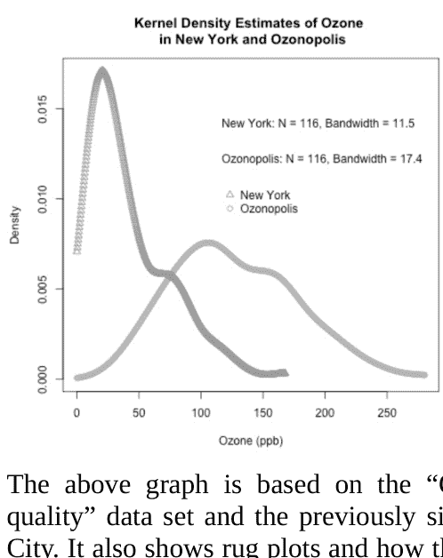

例如：
上图基于内置“空气质量”数据集中的“臭氧”数据以及之前为奥佐诺波利斯市模拟的臭氧数据。它还显示了地毯图以及它们如何影响核密度图。可以确定，与纽约市相比，奥佐诺波利斯有更多的臭氧污染，这是密度图在特定位置出现更高凸起的主要原因。
带宽和光滑参数等参数能够控制来自数据样本的范围，这些样本有助于估计给定样本的概率。此外，核密度也被称为帕森-罗森布拉特窗口。
核估计的伪代码：

- 输入：核函数 K(x)，核宽度 w，训练数据实例 x1, xn。
- 输出：训练数据潜在概率密度函数的估计。
- 过程：在所有点 x 处初始化 dens(x) = 0

```
for i = 1 to n:
    for all x:
        dens(x) += (1/n)*(1/w)*K((x-xi)/w)
```

## 潜变量

### 什么是潜变量？

潜变量是从其他变量推断出来且未被直接观测到的变量。被观测到的变量也称为直接测量变量，并在经济学、机器学习、人工智能、心理学和自然语言处理中被数学化地用于设计潜变量模型。潜变量在训练和测试阶段都无法被观测到。这些变量也无法在定量尺度上进行测量。
以新闻文章的概率语言模型为例，我们可以注意到每篇文章 x 都聚焦于一个特定的主题 y。例如，体育、经济、政治或金融文章各自聚焦于其相应的主题。利用这一知识，我们可以构建一个更精确的模型，该模型也可以表示为
p (x | t)p(t)
其中额外添加的变量 t 是未被观测到的。然而，我们不能使用学习方法，因为它是未被观测到的，而未被观测到的变量通常使学习成为一项困难的任务。

### 高斯混合模型

高斯混合模型也被视为潜变量模型。这些模型在机器学习中被广泛使用，因为它们假设我们观测到的数据由 k 个簇组成。假设每个簇由 π1,...,πK 指定；而每个簇内的分布被称为高斯分布。

## 第四章：机器学习在现实世界中的应用

### 机器学习何时有效？

当面临一个适合部署计算机系统的问题时，你应该首先问这个问题：它是刚性且不变的，还是需要一个自适应系统？
乍一看，这似乎是一个简单的问题。例如，假设你正在考虑一个用于军事的弹道程序。弹道遵循物理定律。这些定律是精确已知的，因此进行计算以获得所需准确结果应该是一件简单的事情。硬编码的计算机程序可用于预测事物在实际情况下的运作方式。事实上，一旦牛顿定律在17和18世纪被知晓，军队就使用人工进行计算，这有助于彻底改变战争和军事效率。如今，使用强大的计算机技术，这项工作做得更好、更快。
但最近的一个例子表明，任何情况往往比表面看起来更复杂。考虑一下心电图，它可以为医生提供心脏功能的图像。心电图用于诊断心脏病发作、心律失常和许多其他问题。它的关注点非常狭窄，心电图上的模式与特定状况相关。医疗专业人员经过培训可以识别这些模式，他们可以研究心电图表并确定哪些患者需要医疗干预，哪些不需要。这就像弹道问题一样直接。
然而，当使用机器学习开发人工智能系统来研究心电图时，发现它们的表现显著优于医生。已开发的机器学习系统能够以85%的准确率预测哪些患者将在一年内死亡。相比之下，医生进行相同预测的准确率在65%到最多80%之间。
这里的关键是差异。当有些心电图在人眼看来完全正常时——机器学习系统能够确定它们实际上并不正常。设计该系统的工程师无法解释这一点。他们不知道机器学习系统为何以及如何做出预测。但一般来说，它的工作方式是机器学习系统能够检测到人脑无法检测到的数据中的模式。
这个例子说明，自适应学习几乎可以在任何情况下使用。即使在弹道学中，也可能有许多人类工程师没有适当考虑的不同因素。谁知道它们是什么，可能是湿度、风或其他因素。可以推测，尽管逐行编码的软件在确定性情况下运行良好，但未经编程、仅用数据训练的自适应软件会做得更好。

### 复杂与自适应

在任何情况下，如果经验——即接触更多数据——可以提高性能，那么机器学习绝对是必要的。如果数据很复杂，这是机器学习可以大放异彩的另一种情况。想想人脑如何处理数学问题。即使是微积分和微分方程中的二维问题对大多数人来说也很困难，即使是最聪明的人在第一次学习时也会感到吃力。当你转向三维时，情况变得更加困难，复杂性增加得越多，人们就越难以消化。
如果你正在查看一个数据集，你将面临同样的情况。如果我们有一个包含20个项目的小数据集，每个项目有3个字段和一个输出，人类操作员可能能够提取输入和输出之间的关系。他们甚至可以手动进行线性回归，或者将其输入像Microsoft Excel这样的简单程序。甚至仅仅目测数据也能揭示关系。
但你向问题添加的数据越多，人类操作员就越无法确定关系是什么。输出相同但有20个输入的问题可能会使其变得非常困难。如果没有输出，你要求人类操作员查看数据中是否存在任何模式，这可能变得几乎不可能。
我们在现实世界中应对复杂性的一种方法是用标准方式为计算机编程。这有助于人类解决许多大数据问题以及涉及繁琐工作的难题。考虑天气预测，早期预测天气的努力或气候建模最初是基于标准的逐行编码，运用物理学定律和操作员认为重要的输入数据。
然而，当问题存在大量复杂性时，例如预测天气，这表明机器学习很可能将以巨大优势超越任何方法。想想气候建模。使用传统技术，科学家和程序员将估算哪些因素（如二氧化碳水平）是重要的。
但使用机器学习，只需在原始数据上训练系统，系统就可能检测到人类观察者甚至不知道存在的数据模式，并且它可能会构建一个更准确的系统，从而更好地进行未来预测。
总之，当你面对一个自适应且复杂的问题时，它就非常适合机器学习。但还有第三个组成部分，那就是大数据。

## 大数据的作用

在过去的二三十年里，计算能力经历了一场悄然的革命，起初并未引起注意。技术的发展使得开发更大的存储容量成为可能，而这种存储容量的成本也在持续下降。这一现象与互联网相结合，使得大大小小的组织都能轻松收集和存储海量信息。大数据的概念由此诞生。
大数据当然是大量的数据。然而，专家们从四个方面来描述大数据。
仅仅拥有静态的大量数据是没有用的，除非你能快速访问它。大数据的特点是“四个V”。

-   体量：全球计算机系统正在创建和存储海量数据。
-   速度：数据移动的速度持续增加。数据速度意味着计算机系统可以更快地收集和分析更大量的数据。
-   多样性：大数据的另一个特点是来自不同来源的收集方法。例如，消费者档案可以包括一个人在线行为的数据，但也包括来自其智能手机的移动数据，以及来自智能手表等可穿戴技术的数据。
-   真实性：数据的真实性很重要。企业领导者是否信任他们使用的数据？如果数据有误，它就不会有用。

这里需要关注的关键是，大数据在机器学习中扮演着核心角色。事实上，如果没有足够数量的、可快速访问的准确（真实）数据，机器学习将无法工作。机器学习的基本原理在几十年前就已发展起来，但直到我们进入21世纪，收集和传输数据的能力才赶上我们对机器学习的了解。大数据的到来，才将机器学习从一种学术上的好奇心，转变为可以在现实世界中部署并获得实际成果的真实技术。

## 机器学习适用于哪些领域？

既然我们理解了机器学习与大数据的关系，让我们看看机器学习在计算机科学的其他概念中处于什么位置。我们从人工智能开始。人工智能是一个总体概念，指的是能够学习并随经验改进的计算机系统。人工智能可以概括为以下一般特征：

-   从数据中学习的能力。
-   从经验中改进的能力。
-   推理能力。
-   它像人脑一样完全通用。因此，它可以学习任何东西，也可以学习多项任务。

机器学习是人工智能的一个子集。它并非完全通用或进行类人推理，而是专注于特定任务。机器学习有四个主要领域，每个领域内又有专业分支：

-   监督学习——适合预测未来的输出。
-   无监督学习——适合对对象进行分类。
-   强化学习——一种通过给予奖励来鼓励理想行为的学习类型。
-   深度学习——一种试图使用神经网络模拟人脑的计算机系统。它可以被训练来执行特定任务。

## 机器学习的一些应用

我们已经提到了机器学习在现实世界中的一些应用方式。为了更好地理解机器学习及其应用，让我们来看看它正在被使用的一些最具影响力的方式。

### 犯罪与犯罪活动

当你想到机器学习时，想想模式。机器学习一个非常实际的应用是让系统接触过去的犯罪活动数据。
这些数据可以包含许多不同的字段或特征。它们可能包括：

-   所犯罪行的类型。
-   犯罪地点。
-   一天中的时间。
-   关于犯罪者或多名犯罪者的信息。
-   关于受害者的信息。
-   使用的武器。
-   星期几和月份中的日期。
-   犯罪发生的年份。

通过研究数据并寻找隐藏的模式，可以构建一个机器学习系统来预测未来犯罪事件的发生。这并不意味着它能够预测特定的犯罪，比如“下午6点在主街615号会发生抢劫”，而是它会预测犯罪活动的整体模式。这种活动的变化方式可能连经验丰富的执法人员也无法预测——回想一下心电图的例子。
这在现实世界中如何提供帮助？它可以帮助执法机构更有效地部署资源。即使他们不理解为什么一个给定的系统会做出它所做的预测，他们也可以受益于将更多的执法资源转移到系统告诉他们的、在特定日期和时间将经历更多犯罪活动的地区。这可以帮助警察和应急人员更快地响应犯罪，也可以通过增加警力存在来帮助威慑犯罪。

### 医院人员配置

医院人员配置面临类似的问题。人类管理者试图猜测何时何地最需要医生和护士。虽然这些估计相当准确，但通过部署使用机器学习的系统可以做出改进。再次回想心电图的例子——医生表现相当不错，准确率在65-80%。但机器学习系统甚至更好，达到85%，能识别出医生遗漏的情况。在大型医院中高效分配人员时，这种差异可能关乎生死大事。
为了构建此类系统，大型医疗机构跟踪了护士的位置和移动。这使他们能够向系统提供输入数据，系统能够识别出浪费的区域。举一个简单的例子，它可能发现大量护士在7楼无所事事，而医院的另一个病房护士不足，因此那里的病人没有得到应有的关注，有些人可能因此死亡。

### 流失客户问题

对于企业来说，一个忠诚的客户价值连城——甚至远超于此。忠诚的客户是会回来重复购买的客户。或者更好的是，他们会订阅。你认为对于像Verizon和T-Mobile这样的公司来说，是卖给你手机更有价值，还是你签约可能长达数年的定期月付更有价值？
由于忠诚的客户使企业保持盈利，了解客户为何离开非常重要。即使在十年前，这也只能通过猜测来完成。但现在，大公司已经收集了大量关于客户的数据。防止客户转向其他公司是他们高度关注的事情，而机器学习使他们能够寻找数据中的模式，从而帮助识别客户流失的原因，甚至预测客户何时可能流失。这些数据可以包括基本人口统计信息、使用模式、联系客户支持的尝试等。机器学习可以应用的第一步是识别出已经转向其他公司的客户，然后系统可以学习其中存在的潜在模式，从而预测哪些客户未来可能会流失。

这些数据的另一种用途是研究客户留存策略。一旦识别出可能流失的客户，或许可以向他们提供特别优惠。例如，手机公司可以提供新手机的大幅折扣，前提是客户再签订两年合同。或者可以提供免费通话时长或无限流量。

随着时间的推移，将收集到更多数据。机器学习可以再次应用，这次是为了确定哪些方法最有效，以及存在哪些模式——换句话说，就是什么方法对什么客户最有效。你可能会发现，不同年龄、性别、居住地或从事不同类型工作的客户，对留存优惠的反应会有所不同。

这种分析将使公司能够为每位额外的客户量身定制响应策略，提高留住客户的可能性。客户本身也会更满意，觉得公司关心他们的个人需求。数据还将帮助公司预测未来的市场变化，并利用预测分析帮助他们适应变化。

## 机器人技术

利用机器学习开发更好、更强大的机器人技术是一个巨大的研究领域。机器人技术起初很简单，执行不需要大量思考的重复性任务。例如，在20世纪80年代，机器人被引入装配线，用于拧螺丝或执行其他任务。当时的问题很简单，机器人会执行少量精确的、可预编程的重复性任务。

现在，机器人技术正变得越来越复杂，使用认知系统来执行许多单调乏味但曾被认为只有人类才能完成的任务。例如，最近开发出了可以担任快餐厨师的机器人。这将对非技术性劳动力产生重大影响，因为当前环境中有两个因素在起作用。社会活动正在推高从事非技术性工作的小时工的工资，而能够执行相同任务的机器人成本却在下降。此外，机器人执行这些任务的能力也在不断提高。

将达到一个盈亏平衡点。也就是说，购买和操作机器人的成本将低于雇佣人类员工的成本。机器人在效率上永远不会波动，不需要支付就业税，也永远不会提起诉讼或指控歧视。从雇主的角度来看，自动化将是更可取的，这种趋势可能无法阻止。

在过去的一年里，许多复杂的机器人已经向公众展示。例如，波士顿动力公司制造了可以在仓库工作的机器人。它们能够识别需要移动的包裹，将其拾起，然后放置到需要的位置。目前，阻碍此类技术广泛采用的唯一因素是成本。

像这样的工作机器人除了执行所需任务外，还必须能够与其所处的环境进行交互。这意味着机器人内部必须有一个复杂的计算机系统，其中包含许多机器学习系统。机器学习系统将包括执行任务所需的运动，以及避免撞到人或其他机器人的能力。另一种形式的人工智能——计算机视觉，在机器人技术的发展中发挥着重要作用，帮助机器人识别其环境中的物体（和人）。

由于现代机器人技术正在使用机器学习，机器人完成工作和在其所处环境中导航的能力将随着时间的推移而提高。

## 第5章：数据挖掘技术

数据挖掘可以定义为一个发现数据中的模式、关联、变化和事件的过程。发现的模式必须有意义并带来某种优势，通常是在经济方面带来优势。有用的模式应该能让我们轻松预测新数据。数据挖掘在信息产业中非常普遍，主要是因为数据量巨大，并且迫切需要处理这些数据。获得的样本可用于允许我们自己进行分析、检测欺诈、控制生产和开展研究的应用程序。

数据挖掘和机器学习是两个不同但相关的领域。机器学习为数据挖掘提供了技术基础；它提供了我们从特定集合中提取数据模式的方法。因此，通过机器学习，我们教计算机如何处理数据并预测数据会发生什么。然而，通过数据挖掘，我们获得的是新知识，而不仅仅是预测。

我们知道许多不同的数据挖掘技术。下面，我们简要描述数据挖掘任务中使用的技术。

## 决策树

决策树的起源可以追溯到20世纪60年代。然而，其应用的真正繁荣稍晚一些，在1986年，当时昆兰引入了ID3算法，当然他后来进一步升级、改进并重命名为C4.5。最新版本称为C5.0 / See5，这是两个可用于构建决策树的程序。它专为UNIX和Windows两个操作系统设计。昆兰因其卓越的工作，被认为是第一个使用决策树的人。

决策树是一种非常流行的方法，既可用于分类，也可用于预测事件。它们是机器学习的符号方法，允许快速理解和学习。它们的结构是树形的。它用于将大量记录细分为按特定顺序排列的较小集合（类别）。

决策树可以看作是一系列旨在对记录进行分类的连续问题。每个问题之后都有一个新问题，这取决于之前的答案。这个过程持续到我们确定特定记录属于哪个组。这一系列问答可以图形化地描绘为一个倒置的决策树。它由以下部分组成：

-   根节点 - 没有任何输入信号，也没有任何输出信号或有多个输出信号；
-   内部节点 - 有一个输入信号和两个或更多输出信号；
-   终端节点 - 恰好有一个输入信号，没有输出。

记录从源节点进入决策树。在这里进行测试，以确定记录将进入哪个内部节点。不同的算法用于此测试，但原理始终相同：选择最能区分目标类别的测试。此过程重复进行，直到记录到达最终节点。从源到最终节点的每条路径都是唯一的，并代表一条规则，然后用于分类。所有结束于同一最终节点的记录属于同一类别。

决策树由树顶部的根或节点以及各个内部节点、分支和叶子组成。内部节点用属性名称标记，并包含一些条件，将学习集划分为更小的集合。用属性的可能值标记的分支或链接是属性值的子集。叶子是对应于类别的外部节点。从根到叶子的路径对应于一条决定性规则。属性的选择取决于学习模式的多样性、环境、执行测量的能力。决策是如果我们决定，将在不久的将来发生的事件。通过决策树，我们可以尝试预测在做出决策时将发生的事件，或者通过它，我们可以找到达到目标的其他最佳选项。通过它们，我们创建越来越简单的规则，这些规则在尽可能多的模式中有效，我们必须记住不要变得过于笼统。

决策树可以在由一些模式组成的学习群体的帮助下构建。样本的属性由多个属性或它们所属的属性和类别（结果）来描述。在这种情况下，一个教学样本被认为属于一个类别。在构建时，我们还必须记住，多个模式可能

## 决策树

决策树是一种使用一组规则对数据进行分类的模型。构建决策树的过程称为归纳。该树通过基于属性值递归地分割数据来构建。目标是创建一个能够预测新实例类别的模型。

有几种不同类型的决策树，其中我们将提到最著名的二元决策树和回归决策树。我们识别二元决策树，其中每个内部节点恰好有两个后继节点。任何“普通”决策树都可以转换为二元决策树。它们为我们提供了更好的分类准确性。

回归树同时使用连续和离散属性，其数量必须预先已知。构建回归树的算法与构建排序决策树的算法非常相似。此类树可用于确定新案例的因变量实例的值。或者，我们可以构建一个二元回归树，允许我们评估属性的方差差异。这会产生更小的树，进而为我们提供更好的准确性。

决策树可以简要地说是像带有流程块的流程图。一个缺点是，当数据量增加且分支数量过多时，决策树非常难以编辑。我们知道有许多不同的工具专门用于构建决策树，例如 Weka、See5、Gattree，我们将在后面描述。当然，还有许多其他工具。

## 贝叶斯分类器

贝叶斯分类器是统计分类器之一。这些分类器通过预测单个记录属于特定类别的可能性来工作。贝叶斯分类器使用贝叶斯定理作为其基础。

贝叶斯定理以其发明者托马斯·贝叶斯命名。贝叶斯是一位生活在18世纪伦敦的英国数学家和长老会修士。他在去世两年后发表的论文《机会学说中一个问题的求解》中写下了他的概率研究发现（国际贝叶斯分析学会，2009）。

实践中使用两种方法：

- 朴素贝叶斯分类假设属性对记录类别的影响独立于同一记录的其他属性值。做出此假设是为了简化所需的转换量。由于这个假设，我们也说这个分类器是朴素的。
- 贝叶斯信念网络是图形模型，与前一种方法相反，它们还考虑了变量之间的依赖关系。

## 分类规则

基于规则的分类是一种基于 IF-THEN 类型规则的技术。IF 部分表示必须满足的条件（例如，年龄 = 29，子女数量 = 4），THEN 部分表示此规则的“后果”（例如，已婚 = 是）。此规则 if - then 的一个示例将是：
IF 年龄 = 29 AND 子女数量 = 4 THEN 已婚 = 是

通常，有两种获取分类规则的方法：

- 从决策树派生的规则通过首先从决策树中总结规则，然后删除那些不会提高规则准确性的规则来工作。这是使用 C4.5 算法完成的。
- 通过顺序覆盖算法获得的规则。该算法通过为匹配它的记录创建一个规则（从一般到具体的方向）来工作。然后从数据集中删除这些行，并重复该过程，直到记录用完。最流行的算法是 CN2、AQ 和 RIPPER。

## 随机森林

随机森林是一种通用的机器学习方法，可以执行预测和分类任务。它还处理缺失值、极端值、变量重要性以及其他基本的数据挖掘步骤。森林选择获得最多票数（多于森林中的其他树）的分类，在回归的情况下，使用不同树结果的平均值。随机森林方法可以处理数千个输入变量，识别最重要的变量。因此，它属于降维方法（降维意味着消除不相关的输入变量）。使用案例：

- 客户转向竞争移动运营商（具有特定特征和使用模式的人）。
- 股票走势预测（根据市场、过去增长、其他股票价值等进行预测）。

使用的积极特征是在大数据量上的有效性能和对缺失值的良好估计。负面特征：与决策树不同，结果难以解释。此外，重叠案例的频率较高。

## 支持向量方法

第一项 SVM 研究发表于 1992 年，其设计可追溯到 1960 年。SVM 是一种最近备受关注的新方法。专家界对这种方法充满热情，主要是因为它能够形成复杂的非线性和多维平面，完美地划分对象组。另一个优点是它们提供了所获模型的简洁描述。SVM 方法的一个主要缺点是训练它们需要很长时间，并且需要大量的处理能力。

SVM 是一种监督学习算法，用于分类和预测。SVM 通过在多维空间中创建一个或多个超平面来工作，以分隔各个组。分隔两个组的平面将它们分隔开，使得它们之间存在最大距离（W）。通过这种方式，过拟合被最小化。该概念在下图中以二维空间展示。

SVM 模型将数据表示为空间中的点，排列方式使得分离类别的案例被尽可能宽的清晰距离分开。该方法在预测、冗余消除和分类方面表现良好。使用示例：

- 人脸识别（图像的哪个部分是人脸）。
- 图像分类。
- 生物信息学（蛋白质分类）。
- 手写识别。

使用的积极特征：在多空间中的效率和内存效率。负面特征是在大数据量和重叠目标类别上的性能不佳。

## 神经网络

神经网络在概念上由神经心理学家沃伦·麦卡洛克和逻辑学家沃尔特·皮茨于 1943 年设计，试图解释人体中神经元的工作方式。尽管他们的目的是解释人脑的功能，但该模型已被证明为神经生物学之外的问题解决提供了一种新方法。在 1950 年代，感知器被开发出来，其设计基于麦卡洛克和皮茨的工作。他们在实验室中取得了一些成功，但总体上没有达到预期。原因在于当时计算机的极低容量以及这些简单神经网络的理论缺陷。这些缺陷在 1982 年被约翰·霍普菲尔德通过一种新的神经网络学习方法消除。他称之为“反向传播”，可以解释为反向或向后学习。“向后学习”是一种在更新较低级别权重之前更新较高级别权重的方法。此过程允许我们使用较高级别神经元的错误来评估较低级别神经元的错误。

“向后学习”的发现引发了神经网络探索的复兴。在 1980 年代，它们的使用从实验室转移到商业领域，几乎无处不在。一些使用示例包括实时检测信用卡欺诈、识别支票上书写的数字、评估房地产价值、检测患者的疾病等。

神经网络的优点是：

- 我们可以处理广泛的问题。它们非常灵活。
- 它们在复杂领域也表现出色。
- 可以使用连续和离散变量。
- 它们非常普遍且易于获取。它们几乎存在于所有商业数据挖掘应用中。

神经网络非常灵活。它们可用于预测连续变量——在这种情况下，它们执行预测，但我们可以用它们来预测离散变量——在这种情况下，它们执行分类。如果我们稍微重新排列网络中的神经元，神经网络可用于检测数据中的组。

神经网络在处理连续和离散变量作为输入或输出方面表现良好。然而，需要投入大量工作进行数据准备。因为神经网络只处理 0 到 1 之间的数字，所以所有变量都必须简化为此形式。

神经网络的缺点如下：

-   输入数据必须是0到1范围内的数字形式。
-   我们无法解释结果为何如此。
-   它们有可能找不到最优解。

神经网络的运行要求输入数据是0到1范围内的数字形式。这当然需要大量工作来转换数据。选择数据转换技术也至关重要，并且可能对挖掘结果产生重大影响。

神经网络的运行可以想象成一个“黑匣子”，我们输入数据并得到结果。然而，我们无法看到我们是如何得到这个结果的，也无法像在关联规则或决策树中那样，像首相一样“拉缰绳”（进行干预或解释）。图6展示了一个具有输入层、隐藏层和输出层的神经网络。

我们可以看到，我们知道我们自己定义的输入层，我们知道作为整个操作目标的输出层，但我们不知道隐藏层，因此，无法从中提取任何规则。

神经网络在大多数预测和分类任务中表现良好，在这些任务中，结果比理解模型如何工作更重要。神经网络在聚类方面也表现良好。我们可以使用SOM（自组织映射）技术来实现这一点。使用该技术时，我们得到各个分组，但我们不知道为什么组内的元素是相似的，我们需要使用每个组中元素的平均值来分析它们。

神经网络表现不佳的唯一情况是当我们拥有具有数百或数千个属性的元素时。由于神经网络属性数量庞大，很难找到模式，并且训练模型所需的时间显著增加。解决这个问题的一种方法是结合使用决策树的神经网络，决策树在识别重要属性方面表现良好。

## 第6章：为机器学习设置Python环境

## Python安装说明

### WINDOWS

1.  从Python官方网站，点击“Downloads”图标并选择您的操作系统。
2.  点击“Download Python 3.8.0”按钮以查看所有可下载的文件。
3.  在后续屏幕上，选择您想要下载的Python版本。我们将使用“Stable Releases”下的Python 3版本。因此，向下滚动页面并点击“Download Windows x86-64 executable installer”链接，如下图所示。

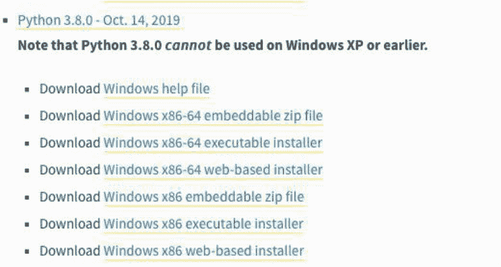

4.  将显示一个标题为“python-3.8.0-amd64.exe”的弹出窗口。
5.  点击“Save File”按钮开始下载文件。
6.  下载完成后，双击保存的文件图标，将显示“Python 3.8.0 (64-bit) Setup”弹出窗口。
7.  确保选中“Install Launcher for all users (recommended)”和“Add Python 3.8 to PATH”复选框。注意 – 如果您的系统上已经安装了旧版本的Python，将出现“Upgrade Now”按钮而不是“Install Now”按钮，并且两个复选框都不会显示。
8.  点击“Install Now”，将显示“User Account Control”弹出窗口。
9.  将显示一条通知，询问“Do you want to allow this app to make changes to your device”，请点击“是”。
10. 将显示一个新的标题为“Python 3.8.0 (64-bit) Setup”的弹出窗口，其中包含一个安装进度条。
11. 安装完成后，将显示“Set was successful”消息。点击“Close”。
12. 要验证安装，请导航到您安装Python的目录并双击python.exe文件。

### MACINTOSH

1.  从Python官方网站，点击“Downloads”图标并选择Mac。
2.  点击“Download Python 3.8.0”按钮以查看所有可下载的文件。
3.  在后续屏幕上，选择您想要下载的Python版本。我们将使用“Stable Releases”下的Python 3版本。因此，向下滚动页面并点击Python 3.8.0下的“Download macOS 64-bit installer”链接，如下图所示。

-   Python 3.7.5 - 2019年10月15日
    -   Download macOS 64-bit/32-bit installer
    -   Download macOS 64-bit installer
-   Python 3.8.0 - 2019年10月14日
    -   Download macOS 64-bit installer
-   Python 3.7.4 - 2019年7月8日
    -   Download macOS 64-bit/32-bit installer
    -   Download macOS 64-bit installer
-   Python 3.6.9 - 2019年7月2日

4.  将显示一个标题为“python-3.8.0-macosx10.9.pkg”的弹出窗口。
5.  点击“Save File”开始下载文件。
6.  下载完成后，双击保存的文件图标，将显示“Install Python”弹出窗口。
7.  点击“Continue”继续，将出现条款和条件弹出窗口。
8.  点击“Agree”，然后点击“Install”。
9.  将显示一个请求管理员权限和密码的通知。输入您的系统密码以开始安装。
10. 安装完成后，将出现“Installation was successful”消息。点击“Close”按钮，一切就绪。
11. 要验证安装，请导航到您安装Python的目录并双击Python启动器图标，这将带您进入Python终端。

### LINUX

对于Red Hat、CentOS或Fedora，请安装python3和python3-devel软件包。

1.  从Python官方网站，点击“Downloads”图标并选择Linux/UNIX。
2.  点击“Download Python 3.8.0”按钮以查看所有可下载的文件。
3.  在后续屏幕上，选择您想要下载的Python版本。我们将使用“Stable Releases”下的Python 3版本。因此，向下滚动页面并点击Python 3.8.0下的“Download Gzipped source tarball”链接，如下图所示。

-   Download Gzipped source tarball
-   Download XZ compressed source tarball
-   Python 3.8.0 - 2019年10月14日
    -   Download Gzipped source tarball
    -   Download XZ compressed source tarball
-   Python 3.7.4 - 2019年7月8日
    -   Download Gzipped source tarball
    -   Download XZ compressed source tarball

4.  将显示一个标题为“python-3.7.5.tgz”的弹出窗口。
5.  点击“Save File”开始下载文件。
6.  下载完成后，双击保存的文件图标，将出现“Install Python”弹出窗口。
7.  按照屏幕上的提示完成安装过程。

## 入门

在您的计算机上安装了Python终端后，您现在可以开始编写和执行Python代码了。所有Python代码都写在文本编辑器中，作为（.py）文件，并在Python解释器命令行上执行，如下所示，其中“nineplanets.py”是Python文件的名称：
“C:\Users\Your Name\python_nineplanets.py”
您无需将代码写入文件，只需在Mac、Windows或Linux命令行上键入以下代码，即可测试一小段代码，如下所示：
“C:\Users\Your Name\python”
如果上述命令不起作用，请改用以下代码：
“C:\Users\Your Name\py”

缩进 – 缩进的重要性，即代码前的空格数，对于Python编码结构至关重要。在大多数编程语言中，添加缩进是为了增强代码的可读性。然而，在Python中，缩进用于指示代码子集的执行，如下所示

```
If 7 > 2:
    print(‘Seven is greater than two’)
```

缩进位于带有print命令的第二行代码之前。如果跳过缩进，代码写成如下形式，将触发错误：

```
If 7 > 2:
print(‘Seven is greater than two’)
```

空格数可以修改，但至少需要一个空格。例如，您可以使用更高的缩进执行以下代码，但对于特定的代码集，必须使用相同数量的空格，否则会收到错误。

```
If 7 > 2:
    print(‘Seven is greater than two’)
```

添加注释 – 在Python中，可以通过在代码注释行开头添加“#”来向代码添加注释，如下例所示：

# Python 变量

在 Python 中，变量主要用于保存数据值，而无需为其执行命令。只需将所需值赋给变量即可创建变量，如下例所示：

```
A = 999
B = 'Patricia'
print(A)
print(B)
```

变量可以在没有特定数据类型的情况下声明。变量的数据类型也可以在初始声明后修改，如下例所示：

```
A = 999 # A 的数据类型设置为 int
A = 'Patricia' # A 现在的数据类型为 str
print(A)
```

应用于 Python 变量名的一些规则如下：

- 1. 变量名可以短至单个字母，也可以是更具描述性的词语，如 height、weight 等。
- 2. 变量名只能以下划线字符或字母开头。
- 3. 变量名不能以数字开头。
- 4. 变量名可以包含下划线或字母数字字符。不允许使用其他特殊字符。
- 5. 变量名区分大小写。例如，‘weight’、‘Weight’ 和 ‘WEIGHT’ 将被视为三个独立的变量。

我们建议阅读本系列的第一本书来学习 Python 基础知识。

# 章节摘要

本章提供了在您的操作系统上下载和安装 Python 时需要遵循的核心说明。2019 年中期发布的最新 Python 版本是 Python 3.8.0。请确保下载并安装当时最新且稳定的 Python 版本。

# 第 7 章：Python 机器学习应用的顶级库和模块

# NumPy

在计算方面，Python 最基础的开源库之一是 NumPy（Numerical Python）。
它主要提供对数据执行操作的数学函数。
它具有函数执行非常快速和高效的特点。

## Pandas

Pandas 是由 Wes McKinney 创建的免费开源库，用于处理带标签和关系型数据。
它旨在实现快速、便捷的数据操作、聚合、过滤等。
它有两种数据结构：Series 和 DataFrame。

# Matplotlib

Matplotlib 库旨在实现轻松而强大的数据可视化，已有超过 16 年的历史。最新的稳定版本是 3.1.1，于 2019 年 7 月发布。该库与 NumPy 和 Pandas 一起，是科学界知名工具（但相当昂贵）如 MatLab 和 Mathematica 的有力竞争者。
Matplotlib 的一个缺点是它相当底层，这意味着需要更多代码行来实现一些更高级的可视化，这比使用高级付费工具需要更多的努力和时间，但当然，这种努力是值得尝试的。

# Seaborn

Seaborn 库主要专注于创建统计图形的吸引人可视化，如热图视图、数据分布等。该库基于并依赖于 Matplotlib 库。

# Bokeh

另一个专注于可视化的库。与 Seaborn 不同，Bokeh 独立于 Matplotlib。
该库的主要重点是通过现代 Web 浏览器（如 D3.js）实现可视化交互性和呈现。

# Altair

Altair 是一个较新的统计可视化库。只需最少的代码，就可以生成高效且美观的可视化，并且该库的 API 简单，建立在强大的 Vega-Lite 之上。
由于其持续活跃的开发，未来可以期待新的图表类型和可视化。

# SciKit-learn

SciKit-Learn 是一个开源库，目前是 Python 机器学习领域的行业标准之一。它也可以作为数据挖掘和数据分析的非常有效的工具。它基于 NumPy、SciPy 和 Matplotlib 构建。
该库结合了高质量的代码和良好的文档、易用性以及卓越的性能。具有分类、回归、聚类、预处理等功能。它旨在与 Numpy 和 SciPy 库配合使用。
它包含机器学习算法，并且可以非常轻松地将机器学习与生产系统集成。

# MLPy

MLPy 是一个基于 Numpy-SciPy 库构建的 Python 机器学习库。
它提供了广泛的机器学习方法，包括监督和无监督学习。这是一个多平台库，这意味着它可以在 Python v2 和 Python v3 上运行。

# Scrapy

Scrapy 是一个用于制作称为蜘蛛机器人的爬虫程序的库，用于从互联网交付结构化数据，如联系信息或 URL。
它是开源的，用 Python 编写，最初严格为网络抓取而设计。随着时间的推移，Scrapy 已发展成为一个成熟的框架，能够从 API 收集数据，也可以作为通用爬虫。

# Statsmodels

Statsmodels 是一个 Python 库，允许用户研究数据、评估统计模型并执行统计测试。它具有全面的描述性统计、统计测试列表，并且适用于不同类型的数据。
它提供了广泛的可视化功能，主要为统计分析而设计，其特点是高性能，尤其是在处理大型数据集时。

# NLTK

该库的缩写代表自然语言工具包（The Natural Language Toolkit），用于 Python 中自然语言统计处理的常见任务。它主要旨在促进 NLP 及其相关领域（语言学、认知科学和人工智能）的学习和探索。

# Gensim

Gensim 是一个 Python 开源库，实现了处理向量建模的工具。它通过使用 NumPy 数据结构和 SciPy 操作来实现效率，并且在处理大型文本时表现出色。
Gensim 用于原始和非结构化的数字文本，并实现了各种无监督算法。

# NumPy（Numerical Python）

Numpy 是一个由多维向量和处理它们所需的功能组成的库。它最常用于向量的数学和逻辑运算、傅里叶变换、形状操作、线性代数所需的操作，还包含一个随机数生成器。我们将使用以下命令安装该包：

```
$ pip install numpy
```

最重要的组件是 ndarray（多维向量），它是一个包含相同大小和类型元素的“容器”。每个元素都是一个数据类型，dtype 对象。调用 shape 参数检查向量的维度，而调用 dtype 参数则揭示向量内部的数据类型。
数据类型对象是为向量设计的固定内存块。它占用的块大小取决于数据类型、数据大小、字节顺序等。NumPy 包含众多数学运算，例如三角函数（sin、cos、arcsin、arccos、degrees）、算术运算（加、减、乘、除、取模）、复数运算（real、imag、conj、angle）以及许多其他运算。它还包含统计运算，如向量中给定元素的最小值、最大值、百分位数、算术平均值、标准差和方差。它还使我们更容易处理线性结构，如矩阵。它包含矩阵乘法、行列式计算、求逆等操作。
NumPy 和 Matplotlib 的结合使我们能够可视化函数和图形。使用 numpy，我们定义 x 轴和 y 轴，同时使用从 matplotlib 导入的 pyplot() 函数绘制图形。我们可以通过添加第三个参数来进一步“装饰”图形，其中第一部分是函数的外观，第二部分是函数的颜色，所有内容都在引号内。
Pyplot 函数具有绘制条形图（bar）的能力。频率和数据分布最常见的可视化是直方图，我们也可以使用 numPy 来显示它，定义值和区间。

# Matplotlib

Matplotlib 库用于可视化数据和绘制二维图形。通过向 plot() 方法添加另一对参数来显示多个数据集，而通过 subplot 方法（行数、列数、序号）在同一“图形”上实现多个子图。
对于绘制多个图形，此方法不是最优的，因此使用 subplots（nrows, ncolumns, figsize）方法。我们像在矩阵系统中一样处理每个图形（a [行: 列]））。
条形图包含另外两个重要方法：legend() - 显示显示的颜色，xticks() - 调整 x 轴上的列标签。我们使用 pie() 方法绘制饼图。我们可以使用 explode 参数为图表添加阴影并突出显示某些元素。
为了可视化散点图（回归问题），我们使用 scatter（height, weight）、xlim（int）和 ylim（int）方法。我们还可以通过包含 mplot3d 模块并在方法中分配 projection = '3d' 轴参数来可视化三维模型上的散点图。

# Scikit-Learn

Scikit-Learn 是与 NumPy 和 Pandas 一起使用最多的库，用于数据建模。用于分类、回归和分组。Scikit 附带几个标准数据集，如 iris 和 digits。

数据始终以二维矩阵（n个样本，n个特征）的形式存在，无论其原始格式如何。我们也可以使用子图方法来可视化数据。线性回归预测因变量y相对于自变量x的值。我们使用`read_csv (path)`函数加载pandas数据，通过`shape`属性检查数据集的形状，该属性返回数据量和特征数，并使用`head()`方法打印实际数据。通过调用`describe()`方法，我们可以查看数据集的统计信息。线性回归的第一步是将数据分为因变量和自变量，并将学习数据和测试数据分开。然后，我们创建一个线性回归对象，随后向其描述学习模型。我们通过调用`predict()`方法进行测试。我们只需绘制两个线性回归模型，一个使用学习数据，另一个使用测试数据。

## Pandas

Pandas是数据分析中最常用的库之一，因为从CSV、TSV文件或SQL数据库中提取数据时，它会创建一个称为数据框的对象。

## 数据框

数据作为Python组件、本地文件或通过URL加载，然后转换为数据框。`pd.read_filetype()` `pd.DataFrame()` 在处理数据时，我们也可以使用`to_filetype (filename)`方法保存数据框。我们还可以通过将键值对存储在字典中来创建自己的数据框。在这种情况下，列名是键，列值是值，然后将该字典赋值给数据框。使用`loc`属性的'key'来访问单个数据。

### 从数据库读取

要从数据库读取数据，我们需要建立与数据库的连接，因此首先需要下载数据库的Python库。例如，要使用SQLite数据库，我们需要安装`pysqlite3`库。`import sqlite3` `con = sqlite3.connect ("database.db")` `df = pd.read_sql_query ("SELECT * FROM table_name", con)`

### 最重要的数据框操作

加载数据集时，查看前几行以了解数据结构很有用。这可以通过`head (n)`方法实现，该方法默认输出前几行，但我们也可以为其指定任意数字。要查看最后几行，我们使用`tail (n)`方法。调用`info()`方法，我们可以获得数据集的基本信息，例如变量和特征的数量、数据类型以及占用的空间。

`shape`属性给出行数和列数，这对于排序和过滤数据（以了解之后剩余多少数据）很有用。`append()`方法返回原始数据框的副本，其中包含新值，而`drop_duplicates()`方法返回删除了重复项的副本。

如果我们不想不断将修改后的数据集赋值给新的数据框，那么我们在进行更改的方法中使用`inplace = True`参数。`temp_df.drop_duplicates (inplace = True)`

`drop_duplicates()`还包含一个`keep`参数，有三个选项：
- First - 删除除第一个之外的所有重复项
- Last - 删除除最后一个之外的所有重复项
- False - 删除所有重复项

如果我们想重命名列，我们将使用字典`rename()`方法。

要检查数据集中有多少空值，我们使用`isnull()`和`sum()`方法的聚合。`data.isnull (). sum ()`

要删除空值，我们使用`dropna()`方法，该方法将删除至少有一个空值的每一行，并将新数据集保存为副本。除了行，我们还可以通过添加`axis = 1`参数来删除包含空值的列。为了不因为列中只有一两个空值就删除包含有价值数据的列，我们将使用一种称为填充（'padding'）的技术。技术人员经常用它来将每个空值替换为该列的算术平均值或中位数。我们使用`fill (new value)`方法填充空白值。在Scikit-Learn - 基础部分，我们看到`describe()`方法查看连续变量的分布。除了整个数据集，它也可以用于分类特征（列），在那里我们可以获得唯一值、类别等的详细视图。相关系数显示了两个变量之间的关系。如果为正，意味着一个变量上升，另一个也上升（一个下降，另一个也下降）；如果为负，意味着它们的关系是一个下降，另一个上升。数字1.0表示变量之间的最佳相关性。我们使用`corr()`方法打印相关系数。

## 索引和条件选择

要访问行，我们使用两个参数：`loc`和`iloc`。`loc`用于按名称搜索，`iloc`用于按索引搜索。我们可以通过写from-to来选择多行，与Python列表相同。唯一的区别是，当使用名称索引（`loc`）时，包含最后指定的边界，而Python列表和`iloc`则不包含。
如果我们想要具有特定值的行，我们应用布尔条件。它返回TRUE或FALSE，取决于是否满足条件。如果我们想过滤数据框使其没有FALSE值，那么我们将条件设置为数据框本身。
对于更复杂的条件，我们使用与（`&`）和或（`|`）运算符，或使用`isin()`方法进行简化。

## 将函数应用于数据集

当我们想要更改某些内容或添加新列，其值是使用原始数据集获得时，最佳做法是编写一个函数，然后将其应用于数据框的`apply()`方法。

## 图表

结合Matplotlib，Pandas可以用各种图表可视化数据框。箱线图基于一组描述数据集的不同数字（最小值、第一四分位数Q1、中位数、第三四分位数Q3和最大值）。它告诉我们数据集的对称性、分布密度等。有两种方法显示矩形图。第一种是在`plot`方法中设置`kind = ”box”`，或者调用`boxplot`方法（`column = ”column_name”` `by = ”sort_by_column”`）。

## 有趣的事实

当我们没有已保存的数据文件，并且不想浪费时间保存文件时，Pandas提供了从剪贴板读取数据的功能。因此，我们可以从Excel文件中复制表格，调用`read_clipboard()`方法，Pandas将像加载任何其他文件一样加载它。处理完数据后，我们可以通过在`to_filetype (filename)`方法中添加`compression = "gzip / zip / bz2"`参数，立即将文件保存为gzip、zip或bz2格式。我们可以使用CSS属性来设置表格样式。

## 章节总结

库是一组功能和模块，旨在使编写代码更容易，这样我们使用现有功能，而不必自己编写。数据科学/分析中最常用的Python库包括NumPy、Pandas、SciPy、Scikit Learn、Matplotlib、Seaborn等许多其他库。我们可以通过为库分配昵称来包含它，或者在不使用别名的情况下包含库中的全部或部分功能，之后我们只能通过函数名调用它们。

## 结论

Python是一种广泛使用的编程语言，适用于不同的应用，特别是机器学习。我们涵盖了基本的Python编程以及使用Python库进行机器学习的指南。

我们使用真实数据集介绍机器学习应用，以帮助您增强Python编程技能以及通过本书获得的机器学习基础知识。这些应用提供了使用线性回归开发预测机器学习模型、使用逻辑回归和人工神经网络开发分类器的示例。通过这些应用，介绍了使用Python进行数据探索和可视化的示例。

机器学习是一个活跃的研究领域，特别是人工神经网络。如今，机器学习应用于各个领域，例如营销、医疗保健系统、银行系统、股票市场、游戏应用等。我们的目标是提供对机器学习主要分支以及人工神经网络背后哲学的基本理解。本书还旨在为没有Python或任何其他编程语言编程经验的初学者提供机器学习的Python编程技能。

一旦您掌握了技能并理解了此处介绍的机器学习模型背后的推理，您将能够使用这些技能通过机器学习解决复杂问题。您还将能够轻松获得其他技能并使用更高级的机器学习方法。

到现在为止，您已经能够应用各种机器学习算法进行监督学习、无监督学习和强化学习。当您想探索其他与机器学习相关的问题时，这些知识非常有益。但是，我们随后重要的是给您更多建议，特别是关于如何处理与机器学习相关的问题。其中一些步骤概述如下：

### 处理机器学习问题

在第一次处理机器学习问题时，必须非常有条理。努力回答以下问题：

假设你对欺诈检测感兴趣，那么请考虑以下问题：

- 我应该衡量什么以及如何衡量，才能建立一个有效的欺诈预测模型？
- 我是否具备评估特定算法的知识？
- 如果我的模型取得成功，其最终意义（无论是商业上还是学术上）是什么？

## 人在回路中

为模型中的每一位人类参与者，恰当地识别并分配角色。

## 从原型到生产

构建使用 scikit-learn 库功能的原型，并让生产团队参与进来，他们应使用包括 Python、R、Go、Scala、C#、C++ 和 C 语言在内的编程语言进行工作。

## 测试生产系统

在将产品推向市场之前，请确保进行适当的测试，以确定你的产品是否正常工作。正是在这个阶段，你可以发现各种故障，甚至找到改进点。

下一步：在此，我们为机器学习提供了一个完美的示例，最终你有望成为一名强大的机器学习专家。然而，如果你需要更多信息，以下提供了一些参考来源。

1.  随时可以查阅其他文献，以了解那些你可能不太清楚的概念。一些好书可能包括：Tibshirani 和 Friedman 的《统计学习基础》以及 Stephen Marsland 的《算法视角》（Chapman and Hall/CRC）。

机器学习包：目前市场上有许多机器学习包，旨在增强你对各种算法的理解。一些最常见的包包括 scikit-learn（最具交互性且显然是首选）、statsmodels 包、vowpal wabbit (vw) 以及最后的 mllib（一个基于 Spark 构建的 Scala 库）。

对推荐系统和其他类型的机器学习系统进行性能排序，以识别出最优中的最优。

同时，进行概率建模、概率编程和接口开发，以增加你对机器学习算法的知识。

其他更推荐但非常复杂的主题包括神经网络、大数据集扩展和深度学习。

我希望你现在对机器学习——这个构建新应用和对象（项目操作）的新领域——深信不疑。

继续深入这个新领域，永不放弃，更多精彩即将到来。