# 轻松掌握Python

面向初学者和中级用户的Python编程与数据分析分步指南

尼拉布·尼什哈尔

# Notion Press

地址：泰米尔纳德邦钦奈市迈拉波尔CIT殖民区第三十字街8号，邮编600004

由Notion Press于2020年首次出版
版权所有 © 尼拉布·尼什哈尔 2020
保留所有权利。

电子书号 978-1-64983-726-4

本书在作者同意后，已尽一切努力确保材料无误。但是，作者和出版商不承担且特此否认因任何错误或遗漏而对任何一方造成的任何损失、损害或中断的责任，无论此类错误或遗漏是由于疏忽、事故还是任何其他原因造成的。

虽然已尽一切努力避免任何错误或遗漏，但本出版物的销售条件和理解是，作者、出版商或印刷商均不对任何人因本出版物中的任何错误或遗漏，或因基于本作品采取或未采取的任何行动、或提供或接受的任何建议而承担任何责任。对于印刷或装订的任何缺陷，出版商仅负责用当时可用的本作品另一副本替换有缺陷的副本。

# 献词

献给普拉巴，我的第一位老师。我的萨拉斯瓦蒂。我的母亲。
献给苏纳亚娜，人人都说她是拉克什米。我在她身上看到了萨拉斯瓦蒂。
我将自己献给玛·莎尔达……

हस्ते स्फाटिक मालिकां विद्यधारीं पत्रासने संस्थिताम्।
वन्दे तां परमेश्वरीं भगवतीं बुद्धिप्रदां शारदाम्॥

# 目录

从本书中可以期待什么

前言

致谢

## 1. 数据科学与编程基础导论

- 1.1 数据科学简介
  - 1.1.1 为什么是数据科学？
  - 1.1.2 数据科学的组成部分
  - 1.1.3 数据科学的历史
  - 1.1.4 数据的古代历史
  - 1.1.5 数据的现代历史
  - 1.1.6 数据科学的现在与未来
  - 1.1.7 数据科学家做什么？
  - 1.1.8 他如何做？
  - 1.1.9 数据科学的先决条件
  - 1.1.10 数据科学工作角色
- 1.2 数据科学导论总结
- 1.3 计算机编程基础
  - 1.3.1 什么是编程？
  - 1.3.2 计算机算法
  - 1.3.3 流程图
  - 1.3.4 什么是编程语言？
  - 1.3.5 什么是源代码？
  - 1.3.6 如何运行源代码？
  - 1.3.7 编译器
  - 1.3.8 解释器
  - 1.3.9 什么是IDE（集成开发环境）
- 1.4 总结：
- 1.5 练习：
  - 1.5.1 回答以下问题：
  - 1.5.2 判断对错：
  - 1.5.3 为此编写你自己的代码：
  - 1.5.4 待办事项：

## 2. Python简介

- 2.1 什么是Python？
  - 2.1.1 为什么是Python？
  - 2.1.2 Python的起源
  - 2.1.3 Python与其他编程语言的比较
  - 2.1.4 Python的哲学
- 2.2 Python相对于其他语言的优势
  - 2.2.1 简单
  - 2.2.2 易于学习
  - 2.2.3 免费且开源
  - 2.2.4 高级语言
  - 2.2.5 可移植
  - 2.2.6 解释型
  - 2.2.7 Python解释器
  - 2.2.8 面向对象
  - 2.2.9 可扩展
  - 2.2.10 可嵌入
  - 2.2.11 丰富的库
  - 2.2.12 Python适合初学者！
- 2.3 Python版本
  - 2.3.1 Python 2
  - 2.3.2 Python 2.7
  - 2.3.3 Python 3
  - 2.3.4 主要区别
- 2.4 如何安装和使用Python
  - 2.4.1 Anaconda Python发行版
  - 2.4.2 为什么选择Anaconda？
  - 2.4.3 在Windows上安装Anaconda
  - 2.4.4 在macOS上安装Anaconda
- 2.5 在终端上运行Python
- 2.6 Anaconda应用程序简介
- 2.7 IPython Qt控制台
- 2.8 Spyder（科学Python开发环境）
  - 2.8.1 组件
- 2.9 Jupyter Notebook
  - 2.9.1 简介
  - 2.9.2 Web应用程序的主要功能
  - 2.9.3 Notebook文档
  - 2.9.4 启动notebook服务器
  - 2.9.5 创建新的notebook文档
  - 2.9.6 打开notebooks
  - 2.9.7 Notebook用户界面
  - 2.9.8 Notebook文档的结构
  - 2.9.9 代码单元格
  - 2.9.10 Markdown单元格
  - 2.9.11 原始单元格
  - 2.9.12 基本工作流程
  - 2.9.13 键盘快捷键
  - 2.9.14 绘图
  - 2.9.15 浏览器兼容性
- 2.10 使用哪个？
- 2.11 总结：
- 2.12 练习：
  - 2.12.1 回答以下问题：
  - 2.12.2 判断对错：

## 3. Python基础

- 3.1 运行Python
  - 3.1.1 使用Spyder IDE
  - 3.1.2 使用Jupyter Notebook
- 3.2 从Hello world!开始
- 3.3 将Python用作计算器
  - 3.3.1 数字
  - 3.3.2 字符串
- 3.4 Python中的代码语法
  - 3.4.1 语句
  - 3.4.2 变量和赋值
  - 3.4.3 变量名和关键字
  - 3.4.4 表达式
- 3.5 编程的第一步
  - 3.5.1 关于Print()的更多信息
  - 3.5.2 一种很酷的打印输出方式
  - 3.5.3 使用强大的print()绘制基本形状
- 3.6 故障排除
  - 3.6.1 语法错误
  - 3.6.2 运行时错误
  - 3.6.3 语义错误
  - 3.6.4 当一切都失败时...
- 3.7 总结
- 3.8 练习：
  - 3.8.1 回答以下问题：
  - 3.8.2 判断对错：
  - 3.8.3 为此编写你自己的代码：
  - 3.8.4 待办事项：

## 4. Python中的对象和运算符

- 4.1 变量
  - 4.1.1 赋值变量
  - 4.1.2 命名变量
- 4.2 概念层次结构
- 4.3 对象
  - 4.3.1 对象的分类
  - 4.3.2 内置对象的优势
  - 4.3.3 对象的标识、值和类型
  - 4.3.4 可变和不可变对象
- 4.4 标准类型层次结构
- 4.5 Python中对象的操作
- 4.6 运算符
  - 4.6.1 算术运算符
  - 4.6.2 赋值运算符
  - 4.6.3 比较运算符
  - 4.6.4 逻辑运算符
  - 4.6.5 条件运算符
- 4.7 缩进
- 4.8 Python注释
- 4.9 Python中的求值顺序
  - 4.9.1 改变求值顺序
  - 4.9.2 结合性
  - 4.9.3 矩形面积
- 4.10 动态类型
- 4.11 强类型
- 4.12 分支
- 4.13 逻辑行和物理行
- 4.14 总结
- 4.15 练习：
  - 4.15.1 回答以下问题：
  - 4.15.2 判断对错：
  - 4.15.3 为此编写你自己的代码：
  - 4.15.4 待办事项：

## 5. 控制流语句

- 5.1 控制流工具
- 5.2 if语句
  - 5.2.1 if语句
  - 5.2.2 if– else语句
  - 5.2.3 if– elif– else语句
- 5.3 for语句（for循环）
  - 5.3.1 带else的for循环
- 5.4 range()函数
- 5.5 While循环
- 5.6 break和continue语句
  - 5.6.1 break语句
  - 5.6.2 Continue语句
- 5.7 pass语句
- 5.8 总结
- 5.9 练习：
  - 5.9.1 回答以下问题：
  - 5.9.2 判断对错：
  - 5.9.3 为此编写你自己的代码：

## 6. 函数

- 6.1 定义函数
- 6.2 函数类型
- 6.3 内置函数
  - 6.3.1 一些内置函数定义
- 6.4 用户定义函数
  - 6.4.1 为什么创建函数？
  - 6.4.2 创建和调用函数
  - 6.4.3 设置参数和实参
  - 6.4.4 从函数返回
- 6.5 关于定义函数的更多信息
  - 6.5.1 默认参数值（或默认实参值）
  - 6.5.2 任意参数（*args）
  - 6.5.3 关键字参数
  - 6.5.4 任意关键字参数（**kwargs）
- 6.6 生成器
  - 6.6.1 如何定义生成器？
  - 6.6.2 示例代码解释
- 6.7 总结：
- 6.8 练习：
  - 6.8.1 回答以下问题：
  - 6.8.2 判断对错：
  - 6.8.3 为此编写你自己的代码：
  - 6.8.4 待办事项：

## 7. 项目1：使用循环和函数绘制图案

- 7.1 使用*（星号）绘制图案
  - 7.1.1 *的L形图案（也像直角三角形）
  - 7.1.2 *的倒L形图案
  - 7.1.3 使用*的金字塔图案（也像等边三角形）
  - 7.1.4 倒L形图案或倒直角三角形
  - 7.1.5 使用*的倾斜金字塔图案
  - 7.1.6 *的练习图案
- 7.2 数字图案
  - 7.2.1 数字图案1 - 数字的L形图案
  - 7.2.2 数字图案2 - 数字的半金字塔
  - 7.2.3 数字图案3 - 倒半金字塔
  - 7.2.4 数字图案4 - 反转数字
  - 7.2.5 数字图案5 - 反转数字的平方
  - 7.2.6 数字图案6 - 数字菱形图案1
  - 7.2.7 数字图案7 - 数字菱形图案2
  - 7.2.8 数字图案8 - 倾斜金字塔
  - 7.2.9 数字图案的练习图案
- 7.3 总结

## 8. 数据结构与序列

- 8.1 字符串
  - 8.1.1 字符串操作
  - 8.1.2 格式化
  - 8.1.3 连接和重复
  - 8.1.4 分割和连接
  - 8.1.5 索引
  - 8.1.6 切片
- 8.2 列表
  - 8.2.1 索引和切片
  - 8.2.2 列表对象的方法
  - 8.2.3 列表推导式
  - 8.2.4 del语句
- 8.3 元组
  - 8.3.1 元组方法
- 8.4 集合

### 8.4 集合操作
### 8.4.1 集合操作演示
### 8.4.2 集合方法

## 8.5 字典
### 8.5.1 字典方法

### 8.6 序列上的循环技术

## 8.7 总结

### 8.8 练习
#### 8.8.1 回答以下问题
#### 8.8.2 判断对错
#### 8.8.3 为此编写你自己的代码
#### 8.8.4 待办事项

## 9. 输入-输出、文件和异常处理

## 9.1 输入

## 9.2 输出
#### 9.2.1 更花哨的输出格式化

## 9.3 读写文件
### 9.3.1 文件对象的方法
#### 9.3.2 创建文件并写入
#### 9.3.3 打开文件并读取内容
### 9.3.4 逐行读取
#### 9.3.5 读写非文本文件

## 9.4 总结

### 9.5 练习
#### 9.5.1 回答以下问题
#### 9.5.2 判断对错
#### 9.5.3 为此编写你自己的代码
#### 9.5.4 待办事项

## 10. 项目 2：自动化多图像处理任务

## 10.1 更改文件类型（扩展名）
## 10.2 调整照片大小
## 10.3 转换为黑白
## 10.4 旋转图像
### 10.5 更改图像的 DPI
### 10.6 总结
### 10.7 待办事项

## 11. 类

### 11.1 类
### 11.2 类对象
## 11.2.1 使用 `__init__()` 方法创建类
## 11.3 实例对象
### 11.3.1 实例化对象
#### 11.3.2 工作原理
### 11.3.3 现在让我们结合类和实例，看看一些魔法
#### 11.3.4 让我们看看这里发生了什么
### 11.4 方法对象
## 11.5 继承
### 11.6 多重继承
### 11.6.1 方法重写
## 11.7 多态
## 11.8 抽象与封装
## 11.9 如何控制访问
### 11.9.1 私有变量
## 11.10 总结
### 11.11 练习
#### 11.11.1 回答以下问题
#### 11.11.2 判断对错
### 11.11.3 为此编写你自己的代码
### 11.11.4 待办事项

## 12. 错误和异常处理

### 12.1 错误和异常
### 12.1.1 语法错误
### 12.1.2 异常
### 12.2 抛出异常
#### 12.2.1 `raise` 语句
#### 12.2.2 `AssertionError` 异常
## 12.3 处理异常
#### 12.3.1 `try` 和 `except` 语句
#### 12.3.2 `else` 子句
## 12.4 定义清理操作
## 12.5 总结
### 12.6 练习
#### 12.6.1 回答以下问题
#### 12.6.2 判断对错
#### 12.6.3 为此编写你自己的代码

## 13. 模块和包

### 13.1 模块
#### 13.1.1 模块的定义
### 13.2 关于模块的更多信息
### 13.3 导入模块
#### 13.3.1 从其他模块导入模块
#### 13.3.2 直接从模块导入名称
### 13.3.3 直接从模块导入所有名称
### 13.3.4 将模块导入为其他名称
### 13.4 标准模块
### 13.5 `dir()` 函数
## 13.6 包
#### 13.6.1 我们的示例包：sound
#### 13.6.2 调用包以使用
#### 13.6.3 Python 中流行的包
## 13.7 总结
### 13.8 练习
#### 13.8.1 回答以下问题
#### 13.8.2 判断对错
#### 13.8.3 待办事项

## 14. 项目 3 - 基于 GUI 的货币转换器

### 14.1 Tkinter 简介
## 14.2 Tkinter 基础
## 14.3 货币转换器 GUI 窗口
#### 14.3.1 使用 `.pack()`
#### 14.3.2 使用 `.grid()`
### 14.4 货币转换代码
## 14.5 最终应用 - 货币转换器
## 14.6 总结
## 14.7 待办事项

## 15. NUMPY

### 15.1 欢迎使用 NumPy！
### 15.2 安装 NumPy
### 15.3 如何导入 NumPy
### 15.4 Python 列表和 NumPy 数组的区别
### 15.5 为什么使用 NumPy？
### 15.6 什么是数组？
## 15.6.1 NumPy 数组 (ndarray)
## 15.7 如何创建基本数组
### 15.7.1 零、一和随机数
### 15.7.2 使用 range 函数创建序列
### 15.7.3 指定数据类型
#### 15.7.4 打印数组
## 15.8 添加、删除和排序元素
### 15.8.1 排序
### 15.8.2 添加（连接）
#### 15.8.3 删除
## 15.9 数组的形状和大小
### 15.10 重塑
### 15.11 为数组添加轴
## 15.12 索引和切片
### 15.13 从现有数据创建数组
### 15.14 副本和视图
#### 15.14.1 完全不复制
### 15.14.2 视图或浅拷贝
### 15.14.3 深拷贝
## 15.15 NumPy 数组在现实生活中是什么样子的？
#### 15.15.1 表格和电子表格
#### 15.15.2 音频和时间序列
### 15.15.3 图像
### 15.16 总结

## 16. NUMPY 操作

### 16.1 基本数组操作
#### 16.1.1 通用函数
### 16.2 广播
### 16.3 更多有用的数组操作
## 16.4 创建矩阵
### 16.5 唯一项和计数
## 16.6 转置和重塑矩阵
## 16.7 反转数组
### 16.7.1 反转一维数组
### 16.7.2 反转二维数组
## 16.8 重塑和展平多维数组
### 16.9 使用数学公式
### 16.10 如何保存和加载 NumPy 对象
## 16.11 总结

## 17. PANDAS 简介

## 17.1 什么是 Pandas
### 17.2 为什么使用 Pandas？
### 17.3 Pandas 安装和导入
### 17.4 Pandas 处理的数据
## 17.5 DataFrame
#### 17.5.1 创建 DataFrame
#### 17.5.2 DataFrame 中的索引
#### 17.5.3 来自 DataFrame 的 Series
### 17.6 DataFrame 中的列
#### 17.6.1 DataFrame 中的新列
#### 17.6.2 DataFrame 中的列删除
### 17.6.3 更改列中的值
### 17.7 DataFrame 中的行
### 17.7.1 行选择
### 17.7.2 行切片（多行选择）
## 17.8 DataFrame 上的操作
### 17.9 从文件读取 Pandas 数据
### 17.9.1 理解此数据集
### 17.10 将数据从 Pandas 写入文件
### 17.11 DataFrame 的首次检查
### 17.11.1 dtypes
### 17.11.2 info()
### 17.11.3 head()
### 17.11.4 tail()
## 17.12 选择 DataFrame 的一部分
### 17.12.1 选择列
#### 17.12.2 选择行（过滤行）
### 17.12.3 同时选择行和列
### 17.13 总结

## 18. PANDAS 实战

### 18.1 从旧列创建新列
### 18.2 从 DataFrame 中删除列
### 18.3 重命名列
### 18.4 汇总统计
### 18.5 按类别分组
### 18.6 对表行排序
### 18.7 合并多个表的数据
### 18.7.1 连接对象
#### 18.7.2 使用公共标识符连接
### 18.8 总结

## 19. PYTHON 中的可视化

### 19.1 可视化
#### 19.1.1 数据可视化的重要性
#### 19.1.2 基本可视化
#### 19.1.3 Pandas 中的基本线图
### 19.1.4 Pandas 中的基本散点图
### 19.1.5 其他绘图方法
### 19.1.6 Pandas 中的基本箱线图
### 19.1.7 子图
#### 19.1.8 保存绘图
## 19.2 Python 中的数据可视化
### 19.2.1 Matplotlib
#### 19.2.2 Seaborn
### 19.2.3 ggplot
#### 19.2.4 Bokeh
#### 19.2.5 Folium
### 19.2.6 Gleam
## 19.3 总结

## 20. 使用 MATPLOTLIB.PYPLOT 进行可视化

### 20.1 简介和历史
### 20.2 如何使用 Matplotlib？
#### 20.2.1 Matplotlib 对象层次结构
#### 20.2.2 绘图函数的输入类型
### 20.3 图的组成部分
#### 20.3.1 图 (Figure)
#### 20.3.2 坐标区 (Axes)
#### 20.3.3 坐标轴 (Axis)
#### 20.3.4 艺术家 (Artist)
## 20.4 Matplotlib 接口
#### 20.4.1 面向对象接口
#### 20.4.2 pyplot 接口
#### 20.4.3 选择哪种方式？
## 20.5 使用函数重复绘图
### 20.6 Pyplot
### 20.7 `plot()` 函数
### 20.7.1 绘制带标签的数据
### 20.7.2 绘制多组数据
#### 20.7.3 格式化样式
### 20.8 `plot(参数)`
### 20.8.1 x, y
### 20.8.2 格式字符串 (fmt)
### 20.8.3 data
### 20.9 `plot()` 返回值
### 20.10 `plot(**kwargs)`
## 20.11 使用分类变量绘图
## 20.12 控制线条属性
### 20.13 使用多个图形和坐标区
### 20.14 在绘图中插入文本
## 20.15 在文本中使用数学表达式
### 20.15.1 文本注释
## 20.16 对数和其他非线性坐标轴
### 20.17 总结

## 21. MATPLOTLIB 面向对象接口和示例绘图

### 21.1 面向对象 API 与 Pyplot
### 21.2 我们的数据
### 21.3 第一步
### 21.4 控制样式
### 21.5 自定义绘图
### 21.6 组合多个可视化
### 21.7 绘图上的文本格式化
### 21.7.1 基本文本命令
### 21.8 保存绘图
### 21.9 示例绘图
### 21.9.1 直方图
### 21.9.2 路径
### 21.9.3 三维绘图
### 21.9.4 饼图
### 21.9.5 子图示例
## 21.10 总结

## 参考文献

# 本书的预期内容

# 关于本书

本书是编程和数据分析的入门书籍，使用 Python 作为初学者的首选语言。它教你如何在你的机器上安装 Python 和其他必要的软件，如何用 Python 编写程序，并进一步教你使用 Python 编程语言制作自己的应用程序。本书还详细介绍了用于数据分析和可视化的 Python 库，如 Numpy、Pandas 和 Matplotlib。你还将接触到 Python 的其他一些库，如用于图像修改的 Pillow、用于创建 GUI 的 Tkinter 以及用于与操作系统交互的 OS。本书的核心是从基础到中级水平教授你 Python 语言，并在此过程中，重点是将 Python 基础知识应用于解决现实世界的问题。

# 如何使用本书以获得最佳效果

本书采用主动学习的方法。我为完全初学者编写了它，假设你没有任何编程经验。因此，从本书的最开始开始，并按照书中的建议安装软件和库。之后，在你选择的与 Python 交互的软件上多加练习。我更喜欢使用 Jupyter Notebook，并强烈推荐它。

你将学习如何在代码中编写注释的方法，这些注释被解释器视为“注释”。

任何在“#”之后的内容都会被Python解释器视为注释，而不会作为代码的一部分执行。

接下来，你将阅读本书，并始终保持Jupyter笔记本打开，以便从最开始就练习代码，从而很好地掌握语言基础。同时，当你在电脑上看到运行结果时，也会获得信心。我还会将本书中使用的所有代码上传到我的Github账户，相关链接已在书中提供，方便你随时参考。

每章末尾都设有理论问卷、判断题以及需要运用你迄今所学的编程技能解决的实际问题。我强烈建议你边学边练。除此之外，还有3个实际项目可供学习。请尝试在自己的机器上解决问题，并亲眼看到结果呈现。

在本书的后半部分，你将接触到Python的数据分析生态系统。在那里，你将看到用于学习基础知识的真实数据集。这些数据集以csv（逗号分隔值）文件的形式存放在我的Github账户中，各章节开头会介绍如何下载它们。你必须下载这些数据集，并跟随本书进行练习，以全面掌握Numpy、Pandas以及使用Matplotlib进行可视化的核心基础。

## 本书内容

本书包含21章。章节顺序经过精心安排，让你能够循序渐进地学习，复杂度逐步提升。因此，即使是完全的初学者，也能像阅读母语一样轻松理解。

**第1章**将带你了解编程基础，并深入探索激动人心的数据分析世界。即使你有编程经验，我也建议你浏览本章，其中关于计算机编程基础的类比非常有趣。你将学习到关于解释器、编译器和IDE等复杂概念的简化介绍。你还将了解数据科学家和分析师的不同角色，以及执行这些角色所需的技能组合。

**第2章**将向你介绍Python编程语言。本章将教你如何通过Anaconda包安装Python软件。然后，你将接触Ipython、Spyder、Jupyter笔记本，并首次看到Python的实际运行。

**第3章**将介绍Python界面、如何使用它，并让你开始编写第一个简单的源代码。在这里，你还将学习Python源代码的语法。

**第4章**将教你Python中的变量和对象。然后，你将了解操作的层次结构，并初步接触Python中的运算符。

**第5章**将带你学习循环技术，并介绍Python中的控制流语句。

**第6章**将全面讲解Python中的函数。你将学习如何使用内置函数、有哪些可用函数，以及如何编写自己的用户定义函数。除了函数，你还将接触生成器。

**第7章**是你的第一个项目，旨在巩固你迄今所学的技能。你将使用循环创建图案，然后编写一个函数来执行重复性任务。

**第8章**将全面介绍Python为用户提供的数据结构。你将详细学习字符串、列表、元组、集合和字典。你还将学习针对所有类型序列的循环技术。

**第9章**将教你如何在Python中导入文本文件、对其进行操作，以及保存在Python中创建或修改的文件。这也将让你了解Python中的输入和输出技术。

**第10章**是你的第二个项目。这是一个与大家生活息息相关的实际项目。在这个项目中，你还将接触Pillow图像处理库。本项目旨在教你如何使用Python自动化任务，从而节省时间和精力，用于更具创造性的工作。

**第11章**将详细介绍类和面向对象编程的概念。

**第12章**将教你可能遇到的错误类型以及如何进行故障排除。此外，你将学习如何使用异常处理方法来处理错误。

**第13章**将全面讲解Python中的模块和包。你将学习如何创建自己的模块，然后调用它们，并使用公开可用的模块和库。

**第14章**是你的第三个项目。在这里，你将学习Python的Tkinter库，并使用它创建基于GUI（图形用户界面）的应用程序来解决实际问题。你还将学习如何使用API方法，直接且重复地从网站导入数据。

第15章和第16章将全面讲解Numpy。你将接触这个Python中最广泛使用的库，并学习如何使用其革命性的ndarray来处理各种类型的数据，即从电子表格到音频文件、图像文件等等。

第17章和第18章将教你如何使用Pandas导入数据并将其转换为DataFrame。随后，你将学习对这些数据进行各种操作。

第19章将介绍Python中可用的各种可视化工具和技术，包括使用pandas进行简单而强大的可视化。

第20章和第21章将把你的可视化之旅提升到新的高度。你将全面了解Matplotlib及其强大的可视化能力。你将看到各种示例代码和图表，以满足你的所有需求。

## 前言

我所认识的尼拉布（Nilabh）充满热情、活力和强烈的自我表达欲望。自从我认识他以来，他就具备了成为一名杰出教师和导师的所有特质。在我们当年的工程学习生涯中，我只会与少数几个人讨论工程问题，而尼拉布正是其中的佼佼者！在认识他超过15年的时间里，我一直钦佩他独特的品质组合——他既能深入钻研一个主题，又有耐心倾听反对意见，同时始终不忘现实世界的实际应用。今天，在我为他这本关于Python的书撰写前言时，我欣喜地看到他将同样的严谨、朴实和坚定的决心带给了读者，致力于为他们创造价值。

众所周知，世界正在经历加速变革，尤其是在技术的推动下。这些产业变革的核心是机器学习和人工智能的兴起。这本关于Python的书之所以如此重要，是因为它为编码经验极少或没有经验的人提供了一条学习路线图。精通Python为任何人参与机器学习革命奠定了基础。

我记得我刚开始学习编码和Python时的日子，以及我个人在理解数据结构的几个概念、查找正确的库甚至进行简单的NumPy操作时所经历的挣扎。大多数Python文献的问题在于它们内容零散，没有考虑到读者可能没有编码背景。尼拉布通过这本书所做的，是为初学者构建了一条通往专业精通的简单路径。“编程入门”部分消除了没有软件经验的初学者的顾虑。

我发现本书的内容编排非常贴切且务实。一个典型的例子是：本书从安装和使用软件的最基础知识开始，而这通常是令人沮丧的第一步。尽管安装和使用Python的方法有很多，但正如本书所建议的，使用Anaconda可能是初学者最有效的入门方式。

对于高级程序员，本书提供了生动的细节以及实际的例子和推论。例如，Python中的对象和操作，以及控制流语句，为掌握Python打下了坚实的基础。本书中值得特别提及的几个部分包括函数、类的概念、数据结构和序列，以及模块和包的创建。

如今，存在数百个Python库，任何称职的Python专家都应该能够利用它们。仅仅利用NumPy和Pandas库，就能为精明的程序员节省数月甚至数年的艰苦工作。我很高兴看到尼拉布广泛地涵盖了NumPy和Pandas。

数据分析的一个关键方面，也是大多数Python书籍未能充分涵盖的，就是数据可视化。但尼拉布对此进行了详尽的介绍，包括各种可视化库和Matplotlib。扎实掌握可视化可以帮助程序员向未来的管理角色转型。

在代码实践中获得的信心，是任何理论理解都无法比拟的。本书采用主动学习的方法，鼓励读者探索和实验，而不仅仅是阅读和理论化。这与我自己的信念一致：学习编码的最佳方式是动手实践。

如果多年前我有这本书作为指导，就能省下数月时间，不必再查阅众多博客、书籍和在线门户以获取多样化的见解。当今行业需要的是能够立即投入工作并解决业务问题的专业人士。那种以牺牲组织利益为代价、漫长而低效、几乎学不到东西的培训期，已不再是奢侈。希望这些书能帮助填补这一空白。

在我每一次创业经历中，始终面临的一个困境是：既要构建可扩展的技术产品以应对未来的业务增长，又要同时应对初创企业的生存难题。对Python的实践知识不仅帮助我在Cobodh快速搭建了我们的教育科技平台，还帮助我们招募到合适的人才来推进增长计划。即使在今天，作为云计算行业的新任业务主管，我的编码经验仍帮助我管理团队、设定合理预期，并在与财富500强客户的会议中回答关键问题。在这个颠覆性技术时代，要想赢得尊重，没有比学习编码更好的方式了！

总的来说，我发现这本书对于刚开始Python编程之旅的人来说，是一套完整的解决方案。它有望为技术爱好者打开通往海量编码知识和众多职业机会的大门。对于勤奋的读者和实践者来说，除了关于Python的广泛知识外，本书还将培养一种宝贵的持续探索和测试代码的习惯——这正是优秀数据科学家的标志。

祝所有读者编程之旅愉快，希望你们能有充足的机会运用Python技能造福人类！

~ 安基特·库什

Cobodh创始人兼首席执行官
Searce亚太区云营销分析业务负责人
（为技术奇点做准备的技术爱好者）

## 致谢

很高兴看到你是那些会阅读致谢部分的人之一。我的朋友，这是我们众多共同点之一，包括我们对本书主题的热爱。

写书如同养育孩子，需要时间、劳力，最重要的是耐心。而这份耐心不仅属于那个将名字印在封面上的人。由于这是我的第一个孩子——哦，是第一本书——我像一个经验不足的父母，需要更多的帮助、理解和建议。以下人士提供了帮助，名字出现的顺序完全是随机的。

感谢普里蒂和苏纳亚娜，她们为我牺牲了时间、空间，甚至部分宝贵的生活，让我得以追求梦想。你们在这段旅程中与我同行。你们在这本书中倾注的耐心和爱，与我一样多，有时甚至比我更多，因为你们还得应对我这个急躁的人。非常感谢你们一直陪伴并参与这段旅程，一如既往。

感谢埃舒、加内什·纳达尔、斯瓦米纳特·戈斯瓦米、杰迪普·波特达尔、梅格拉杰·蓬贾比、阿克谢·格希、普拉纳夫·米什拉，以及一些要求匿名的朋友，感谢你们阅读初稿并提供反馈。正因如此，那些初稿从未面世，而一个全新的、更好的作品在你们的建议下诞生了。

感谢我的导师和引路人苏迪普托·穆克吉，他始终是坚实的后盾，安排必要的联系并始终激励我追求新知识。你们全方位的帮助和指导，让这段旅程更加丰富。

感谢我的好友安基特·库什，他承担了阅读全部内容并撰写前言的艰巨任务。老兄，你做得非常出色。

感谢拉迪卡·马图尔，她是将我引入出版界的人。感谢你在整个过程中手把手指导，并用时间表督促我完成工作。没有你，这个项目不会呈现出最终的形态。

感谢我的团队成员和工作场所的朋友们，他们以同样的热情参与我的热情，并不时提供宝贵的意见。特别提及桑迪普、阿舒托什、帕拉维、比伦、阿尼梅什、哈尔沙尔、斯瓦普尼尔、普拉纳伊、安基特，以及更多我知道会原谅我未能在此一一列出名字的人，但请知道，我多么重视他们的意见。特别感谢瓦伊什纳维，她让我在最后一刻进行了一些改进，并始终提供极其坦诚的反馈。

感谢Notion Press的整个团队，他们都是真正的专业人士，超越职责要求交付成果。特别提及西蒙、基尔塔纳·库马尔，以及幕后负责所有设计、排版和内页设计的团队。特别感谢我的出版经理赫玛·普里亚达希尼，她忍受了我永无止境的要求，并处理了我在她高效运转的出版机器中投入的种种障碍。谢谢你们，你们让我的第一次旅程不那么艰辛，艰辛程度大大降低，以至于我有信心开始第二次旅程，并在未来迎接更多旅程。

# 1 数据科学与编程基础简介

## 1.1 数据科学简介

自古以来，世界各地的哲学家和智者一直在争论：什么将统治世界？

是**物质**还是**信仰**？

当然，他们从未想过**数据**。

数据对行业的革命性影响，不亚于电力。它已经引发了**数字革命**，这就像一个自我实现的预言。它是一个引擎，自我供能并依靠自身运行。

不必惊慌。像所有科学一样，它既有造福人类的潜力，也有作恶的可能。但这绝不是一门新科学。计算机的出现和强大的数据处理能力为其提供了所需的推动力。

如今，数据确实在统治着世界。数据或许不是国王，但在生活的方方面面，它都是造王者。这个说法可能听起来过于牵强或夸张，但事实并非如此。它是真实的，就在此时此地。

当亚马逊和Flipkart根据你可能感兴趣的商品进行销售时，它们就是在利用数据做出决策。

当全球政治家选择使用社交媒体并利用其数据进行社会画像时，他们就是在利用数据做出关键决策，比如选择哪个候选人、哪个地区以及采取什么策略来获胜。

当谷歌地图为你提供每条路线的交通状况时，它们就是在利用实时数据或实时信息为你做出决策。

当股票市场分析师预测个股和Sensex指数的未来价格时，他们就是在使用数据分析。

如今，数据分析及其所有相关领域，比以往任何时候都更具吸引力，日复一日。随着我们生活的方方面面日益数字化，我们每秒产生的数据量，比我们父母一生产生的还要多。这些数据被用于做出关键决策，无论是实时决策还是回顾性决策。

简而言之，**数据科学**是对数据的研究，旨在让数据变得有意义并提供可用的见解。它不是某个特定的事物或领域，而是多个学科的组合，专注于分析数据并从中提供智能结果或最佳解决方案。

**数据科学**是一个研究领域，涉及使用各种科学方法、算法和流程从海量数据中提取见解。它有助于从原始数据中发现隐藏的模式。

这是一个跨学科领域，帮助我们从结构化或非结构化数据中提取知识。

### 1.1.1 为什么需要数据科学？

数据科学或数据驱动科学能够从原始数据中实现更好的决策制定、模式发现、预测分析和可视化呈现，以促进沟通。它让我们能够：

- 引导我们提出正确的问题。
- 揭示问题的主要原因。
- 帮助在看似随机的原始数据中发现模式。
- 为预测分析准备模型。
- 通过图表、仪表板等可视化并传达结果。
- 允许赋予机器智能能力。
- 可以使用情感分析来测试客户忠诚度。
- 使我们能够做出更好、更快的决策。
- 帮助我们向合适的客户推荐合适的产品，以提升业务。

### 1.1.2 数据科学的组成部分

- 数据挖掘
- 数据分析
- 数据工程
- 可视化
- 统计分析

### 1.1.3 数据科学的历史

当今的数据科学，不过是旧瓶装新酒。或者说，用“旧精灵装新瓶”来比喻可能更为贴切。

数据的收集并从中得出有意义的结论，并非近期才出现的现象。从其真正意义上看，数据的收集自史前时代就已开始。最早的牧民需要清点他们的牲畜，所使用的数字便是最早的数据集。形式可能不同，规模也各异，但他们正是基于这些数据做出关乎生死的决定。

| 动物 | 数量 |
| :--- | :--- |
| 绵羊 | **23** |
| 牛 | **11** |
| 山羊 | **31** |

### 1.1.4 数据的古代史¹

#### 约公元前18,000年

人类存储和分析数据的最早实践可追溯至约公元前18,000年。1960年在现今乌干达地区发现的伊尚戈骨，被认为是史前数据存储的最早证据之一。旧石器时代的部落居民会在木棍或骨头上刻下刻痕，以记录交易活动或物资储备。他们会比较木棍和刻痕来进行基础计算，从而做出预测，例如他们的食物储备还能维持多久。

#### 约公元前2400年

算盘——第一种专门为执行计算而制造的专用工具——开始在巴比伦使用。第一批图书馆也大约在此时出现，代表了我们对大规模数据存储的首次尝试。

### 1.1.5 数据的近代史²

#### 统计学的兴起

##### 1663年

在伦敦，约翰·格朗特进行了有记录的首次统计数据分析实验。通过记录死亡率信息，他提出理论，认为可以设计一个早期预警系统来应对当时肆虐欧洲的腺鼠疫。

##### 1865年

理查德·米勒·德文斯在其《商业与商业轶事百科全书》中首次使用了“**商业智能**”一词，描述了银行家亨利·弗内斯如何通过以结构化方式收集和分析与其商业活动相关的信息，从而获得竞争优势。这被认为是企业将数据分析用于商业目的的首个研究案例。

##### 1880年

美国人口普查局遇到了一个问题——据估计，处理1880年人口普查收集的所有数据需要8年时间，而预计1890年人口普查产生的数据将需要超过10年，这意味着在1900年人口普查使其过时之前，这些数据甚至还没来得及查看。1881年，该局的一位年轻工程师——赫尔曼·霍尔瑞斯——发明了后来被称为霍尔瑞斯制表机的设备。利用穿孔卡片，他将10年的工作量缩短至三个月，并因此确立了其作为现代自动计算之父的历史地位。他创立的公司后来成为了IBM。

#### 现代数据存储的早期

##### 1926年

在接受《科利尔》杂志采访时，发明家尼古拉·特斯拉表示，当无线电技术“被完美应用时，整个地球将被改造成一个巨大的大脑，事实上它本就是，万物都是一个真实且有节奏的整体的组成部分……而我们将能够实现这一点的工具，与我们现有的电话相比，将简单得惊人。一个人将能够把它装在马甲口袋里随身携带。”

##### 1928年

德裔奥地利工程师弗里茨·普弗莱默发明了一种将信息磁性存储在磁带上的方法。他所开发的原理至今仍在使用，绝大多数数字数据都以磁性方式存储在计算机硬盘上。

#### 大型数据中心的开端

##### 1965年

美国政府规划了世界上第一个数据中心，用于在磁带上存储7.42亿份纳税申报单和1.75亿套指纹。

#### 互联网的出现

##### 1991年

计算机科学家蒂姆·伯纳斯-李宣布了后来成为我们今天所知的互联网的诞生。

##### 1997年

谷歌搜索首次亮相，在接下来的20年里，其名称成为在互联网上搜索数据的代名词。

同年，《数据挖掘与知识发现》期刊创刊；其标题中两个术语顺序的颠倒，反映了“数据挖掘”作为指代“从大型数据库中提取信息”这一更流行方式的崛起。

##### 2000年

Python 2.0于2000年10月16日发布，带来了许多重要的新特性，包括循环检测垃圾回收器和对Unicode的支持。

##### 2010年

谷歌执行董事长埃里克·施密特在一次会议上表示，如今每两天产生的数据量，相当于从人类文明开始到2003年所产生的数据总量。

##### 2011年

麦肯锡报告指出，到2018年，美国将面临14万至19万专业数据科学家的短缺，并指出在充分实现大数据价值之前，必须解决包括隐私、安全和知识产权在内的问题。

##### 2012年

2012年9月，汤姆·达文波特和D.J.·帕蒂尔在《哈佛商业评论》上发表了《数据科学家：21世纪最性感的职业》一文。

##### 2014年

移动设备的兴起——首次出现使用移动设备访问数字数据的人数超过使用办公室或家用电脑的人数。通用电气与埃森哲合作调查的88%的企业高管表示，大数据分析是他们业务的首要任务。

### 1.1.6 数据科学的现在与未来

- 人工智能是专注于创造能够像人类一样工作和反应的智能机器的领域。作为一门学科，人工智能的研究可追溯至1936年艾伦·图灵制造出第一台人工智能驱动的机器。尽管历史相当悠久，但如今人工智能在大多数领域仍无法完全替代人类。人工智能与人类在国际象棋和数据加密方面的竞争，是同一枚硬币的两面。
- 机器学习是从数据中提取知识的创造工具。在机器学习中，模型可以独立或分阶段地在数据上进行训练：有教师训练，即使用人类准备的数据；或无教师训练，即处理自发、带噪声的数据。
- 深度学习是在需要更高级或快速分析、而传统机器学习无法应对的领域中，创建多层神经网络。“深度”意味着网络中存在不止一个隐藏神经元层来进行数学计算。
- 大数据——处理海量的、通常是结构化程度不高的数据。该领域的特点是拥有能够承受高负载的工具和系统。

### 1.1.7 数据科学家做什么？

数据科学家分析业务数据以提取有意义的见解。换句话说，数据科学家通过一系列步骤来解决业务问题，包括：

- 提出正确的问题以理解问题
- 从多个来源收集数据——企业数据、公共数据等
- 处理原始数据并将其转换为适合分析的格式
- 将数据输入分析系统——机器学习算法或统计模型
- 准备结果和见解，以便与相关利益相关者分享

这些步骤引导他回答许多引人入胜的问题，以下是一些例子：

- 欺诈检测和异常检测。例如，客户信用卡的取款或消费模式发生变化。
- 定向和个性化营销——个人电子邮件通讯、电子商务网站上的推荐系统。
- 指标预测——绩效指标、广告活动质量及其他活动。
- 决策评分——处理大量数据并帮助做出决策，例如，根据信用评分决定是否批准贷款。
- 预测建模——基于天文数据预测陨石撞击地球。

这些只是数据科学家所做工作的冰山一角。

### 1.1.8 他是如何做到的？

我们将在本书的后续章节中逐步学习。但下图对其进行了总结。

### 1.1.9 数据科学的前提条件

#### 编程

要成功执行一个数据科学项目，需要具备一定的编程能力。最常见的编程语言是 Python 和 R。Python 尤其受欢迎，因为它易于学习，并且支持多种用于数据科学和机器学习的库。

#### 统计学

统计学是数据科学的核心。扎实掌握统计学可以帮助你提取更多信息，并获得更有意义的结果。

#### 数据库

作为一名有能力的数据科学家，你需要了解数据库的工作原理、如何管理数据库以及如何从中提取数据。

#### 建模

数学模型使你能够根据已有的数据知识进行快速计算和预测。建模也是机器学习的一部分，涉及确定哪种算法最适合解决给定问题以及如何训练这些模型。

### 1.1.10 数据科学的工作角色

最突出的数据科学家职位头衔包括：

- 1. 数据科学家
- 2. 数据工程师
- 3. 数据分析师
- 4. 统计学家
- 5. 数据架构师
- 6. 数据管理员
- 7. 业务分析师
- 8. 数据/分析经理

让我们详细了解一下每个角色的职责：

#### 数据科学家：

**职责：**

数据科学家是管理海量数据的专业人士，他们使用各种工具、技术、方法论、算法等，提出引人注目的商业见解。

**使用的语言：**
R, SAS, Python, SQL, Hive, Matlab, Pig, Spark

#### 数据工程师：

**职责：**
数据工程师的角色是处理海量数据。他负责开发、构建、测试和维护大规模处理系统和数据库等架构。

**使用的语言：**
SQL, Hive, R, SAS, Matlab, Python, Java, Ruby, C++, and Perl

#### 数据分析师：

**职责：**
数据分析师负责挖掘海量数据。他或她会寻找数据中的关系、模式和趋势。之后，他或她将提供引人注目的报告和可视化，以分析数据并做出最可行的商业决策。

**使用的语言：**
R, Python, HTML, JS, C, C++, SQL

#### 统计学家：

**职责：**
统计学家使用统计理论和方法收集、分析和理解定性与定量数据。

**使用的语言：**
SQL, R, Matlab, Tableau, Python, Perl, Spark, and Hive

#### 数据管理员：

**职责：**
数据管理员应确保所有相关用户都能访问数据库。他还需确保数据库运行正常，并防止其受到黑客攻击。

**使用的语言：**
Ruby on Rails, SQL, Java, C#, and Python

#### 业务分析师：

**职责：**
这位专业人士需要改进业务流程。他/她是业务执行团队和 IT 部门之间的桥梁。

**使用的语言：**
SQL, Tableau, Power BI and, Python

**注意：** 你注意到哪种或哪些语言是所有角色共有的了吗？

## 1.2 数据科学导论总结

数据科学是近来的热门词汇，已渗透到生活和商业的方方面面。它最初是利用计算机将人类需要数年才能完成的工作加速到几分钟内完成，而在过去十年里，这已经完全变成了另一回事。现在，数据科学本身已成为一个主要且极具吸引力的领域。

到现在为止，你已经对数据科学是什么以及对它的期望有了一些概念。但请相信我，我们甚至还没有看到冰山一角。可能性是无限的，字面意义上的无限。

一些非常近期且令人兴奋的、基于数据科学的技术包括自动驾驶汽车、个人数字助理（Alexa、Google Assistant、Siri 等）、数字地图上的实时交通和路线，当然，还有个性化的购物体验。

现在是成为一名数据科学家的激动人心的时代。但仅仅知道可能性并不有趣，不是吗？

所以，让我们动手实践，学习如何编写程序，利用数据为我们提供有意义的见解。

## 1.3 计算机编程基础

让我和你分享一些事情。不久前，我听到**编程**这个词时也感到不太自在。幸运的是，我决定迎难而上，结果发现，这没什么好怕的。我面临的唯一问题不是缺乏阅读材料（事实上恰恰相反。阅读材料多到让人应接不暇。），而是从哪里开始以及正确的学习路径是什么。

这正是我要帮助你的地方。我将牵着你的手，与你一起踏上这段激动人心的旅程，在你的学习经历中开启新的篇章。让我们学习如何与你的计算机对话，这本质上就是**计算机编程**。

### 1.3.1 什么是编程？

我们都体验过计算机编程的最终成果。当我们在手机或电脑上玩喜欢的游戏，打开任何手机应用或电脑软件，拍摄数字照片，在任何屏幕上查看照片，甚至发送电子邮件时。计算机程序都在后台运行，完成所有我们从未见过的工作。

计算机是一个顺从的仆人，但并不十分明智。它们完全理解我们告诉它们的内容，不多也不少。因此，当我们给它们指令（通过程序）时，这些指令必须是**具体的**和**按顺序的**。

我能想到的最贴切的类比是食谱。让我们拿一个简单的面包食谱（印度薄饼或烤面包，或两者兼有）为例。只有几种原料，如面粉、水和酵母（如果是烘焙的话）。每种原料都必须是**特定**的比例。你放一杯水而不是半杯，面团就会太稀而无法成型。同样，我们给计算机的指令必须具体，才能得到预期的结果。计算机非常字面化。它们试图完全执行我们的命令。如果我们给它们错误的指令，命令可能根本无法运行。或者更糟的是，它可能会出现错误或完全崩溃。

计算机程序的另一个特点是，它们是**按顺序的**，就像食谱中的步骤一样。步骤的顺序将决定最终产品。如果在制作印度薄饼时，我们直接把它放在火上，而不是先在热板（Tava）上加热一会儿，会怎么样？它们会直接碎裂并失去形状。同样，如果先把面粉放进烤箱，然后再加水和面，会怎么样？煮熟的面粉无法做成面团。行动的顺序很重要。编程也是如此。关键在于给计算机正确的指令和正确的步骤顺序，以产生预期的结果。

所以，总结一下，编程是我们与计算机沟通的方式。它的特点是指令具体且按顺序。就像食谱一样，当我们正确编写程序时，我们就能享受最终成果。

简单来说，编程是将想法转化为计算机可以理解的“逐步”指令。这种逐步指令被称为**算法**。

### 1.3.2 计算机算法

为了指示计算机做任何事情，指令必须以**计算机程序**的形式编写。要编写计算机程序，你必须一步一步地告诉计算机，你希望它做什么。然后计算机运行或执行程序，并逐步遵循它来完成任务。

当你告诉计算机做什么时，你也告诉了它*如何*做。这个“如何”就是计算机算法。

**定义：** 在计算机科学中，算法是一系列定义明确、可由计算机执行的指令的有限序列，通常用于解决问题或执行计算。算法总是明确无误的，并被用作执行计算、数据处理、自动推理和其他任务的规范。

在计算机系统中，算法是软件开发者用软件编写的逻辑实例，旨在对预期目标有效

#### 算法的现实示例

编写一个泡茶的算法。原料是水、糖、牛奶和茶叶，用于制作两杯茶。

- 步骤 1：开始
- 步骤 2：取一个装有一杯水的锅。
- 步骤 3：点燃炉灶，将锅放在上面。
- 步骤 4：将水烧开。
- 步骤 5：在沸水中加入两汤匙糖和两汤匙茶叶。
- 步骤 6：向沸腾的混合物中加入一杯牛奶。
- 步骤 7：将锅中的内容物煮沸一分钟。
- 步骤 8：关闭炉灶。
- 步骤 9：用筛子过滤掉茶叶。
- 步骤 10：将茶倒入杯中并上桌。
- 步骤 11：停止

#### 算法的计算示例

编写一个计算 2+2 得到结果 4 的算法。

- 步骤 1：开始
- 步骤 2：输入 2 + 2
- 步骤 3：按回车键
- 步骤 4：停止

算法由 3 种语句组成。任何算法中都可以存在这 3 种语句的组合。

1. 顺序语句
2. 选择语句
3. 循环或迭代语句

##### 1.3.2.1 顺序语句

在这些程序中，一个语句在另一个语句之后按顺序执行。

上面的两个例子，泡茶和计算 2+2，都是顺序语句的例子。让我们再看一个例子。

**示例** 计算一个人的年龄，已知其出生年份。

- 步骤 1：开始
- 步骤 2：获取出生年份并存储在 YOB 中。
- 步骤 3：获取当前年份并存储在 CY 中。
- 步骤 4：用 CY 减去 YOB 并将结果保存在 Age 中。
- 步骤 5：打印 Age。
- 步骤 6：停止

##### 1.3.2.2 选择语句

在这些程序中，程序的某些部分根据某个条件是否满足来执行。如果条件满足，计算机将执行程序的一部分；如果条件不满足，则执行程序的另一部分。

**示例** 编写一个算法来检查一个人是否发烧。条件是，如果温度高于 99 华氏度，则为发烧。

- 步骤 1：开始
- 步骤 2：获取温度并存储在 TEMP 中。
- 步骤 3：检查 TEMP 值。如果大于 99 华氏度，则转到步骤 4，否则转到步骤 5。
- 步骤 4：打印 "He has Fever" 并转到步骤 6。
- 步骤 5：打印 "He does not have Fever"。
- 步骤 6：停止

##### 1.3.2.3 循环或迭代语句

在某些程序中，某些步骤根据条件测试被一遍又一遍地执行。这些重复称为迭代。迭代使用一种或多种循环技术完成。因此，这类程序被称为循环或迭代语句。

**示例** 打印从 1 到 10 的所有数字。

- 步骤 1：开始
- 步骤 2：将 1 存储在 i 中。
- 步骤 3：检查 i 的值是否 <= 10。如果是，转到步骤 4。如果为假，转到步骤 7。
- 步骤 4：打印 i。
- 步骤 5：将 i 的值增加 1。
- 步骤 6：转到步骤 3。
- 步骤 7：停止

在这个例子中，步骤 3 到 5 被迭代，直到步骤 3 中的条件满足。一旦返回假，循环结束。

### 1.3.3 流程图

算法可以使用一些符号以图形形式编写。这种图形表示称为流程图。

流程图有一些用于表示功能的标准符号。下表列出了这些符号。

| 符号 | 功能 |
| :---: | :---: |
| (椭圆形) | 开始/停止 |
| (平行四边形) | 输入/输出 |
| (矩形) | 处理 |
| (菱形) | 判断框 |
| (箭头) | 控制流 |
| (圆形) | 连接符 |

#### 图 1-4 流程图符号

让我们看一个流程图的例子。

**示例** 编写程序来检查一个数字是偶数还是奇数。

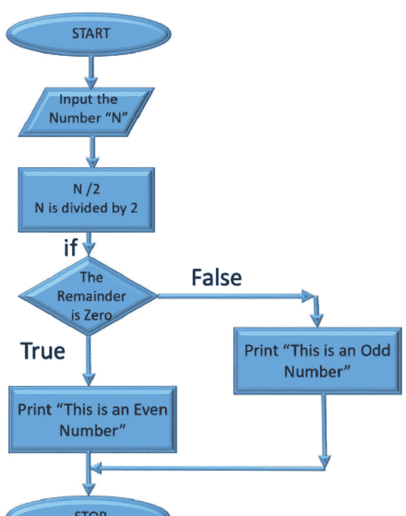

#### 图 1-5 奇偶数选择流程图

我们在数据科学简介中稍微谈到了编程语言。现在让我们理解它们是什么？它们与我们说和写的语言有何相似之处，又有何不同？

### 1.3.4 什么是编程语言？

当我们想给计算机发出指令时，我们使用编程语言。有数百种编程语言。就像人类语言一样，不同的编程语言有不同的规则（语法）和含义（语义）。我们在不同的语言中使用不同的单词、拼写和发音来表达相同的单词，同样，相同的信息在不同的语言中写法也大不相同。

为了展示编程语言如何改变以及改变什么，我将向你展示一个例子，同一个程序或指令，用不同的语言编写。你自己会注意到其中的差异。

#### C++ 中的 "Hello World!" 程序

```
#include <iostream>

int main() {
    std::cout << "Hello World!";
    return 0;
}
```

#### Java 中的 "Hello World!" 程序

```
class HelloWorld {
    public static void main(String[] args) {
        System.out.println("Hello, World!");
    }
}
```

#### Python 中的 "Hello World!" 程序

```
print("Hello World !")
```

这是许多语言中最简单的代码行，因此大多数时候被用来展示。我不期望你理解程序是如何编写或执行的，因为我们稍后会讲到。至于现在，让我们强调一下语言之间语法的差异。

首先，看看名为 C++ 的编程语言。上面的图片将展示我们如何让程序在运行时显示 Hello world。我希望你只注意该语言中使用的语法。这包括围绕 Hello, world 单词的**双引号**，语句末尾使用的**分号**，以及在闭合**花括号**之前有一个 **return** 关键字。所有这些都是 C++ 编程语言语法或规则的一部分。

第二个例子是用名为 Java 的编程语言编写的。这是当今移动应用和其他软件开发中最流行的语言之一。注意我们如何使用 Java 显示 Hello world!。注意不同语法的使用。

另外，看看用另一种名为 Python 的编程语言编写的同一个 Hello World! 程序。这是数据科学和机器学习环境中最流行的语言之一。注意这里的语法完全不同，而且更干净、更简单。

你一定在想，为什么要用这么多编程语言把事情复杂化。为什么不用一种所有人都使用的编程语言呢？原因是，所有的编程语言都有其优点和缺点。有些非常适合制作网站，而有些则用于制作移动应用程序，还有一些则用于处理非常复杂的数学计算。

无论你选择哪种**编程语言**，计算机都不理解它。计算机理解一种非常不同的语言，那就是**机器语言**。机器语言对我们来说很难直接编写，因为它非常复杂，并且主要由一系列数字组成。这就是为什么我们称这些编程语言为**高级语言**，因为它们更接近实际的人类语言。我很快会告诉你高级语言是如何转换为机器语言的，以及为什么你完全不需要担心它。

### 1.3.5 什么是源代码？

源代码是所有编程语言的程序员编写的内容。它是我们给计算机的指令，用纯文本编写。纯文本中没有粗体、斜体或下划线等格式。因此，像 MS Word、Libre Office 或 Google Docs 这样的文字处理器不是编写源代码的合适软件。因为当我们在文字处理器中书写时，它们默认会在文本中嵌入其他信息，如字体类型、缩进或粗体/斜体，或任何其他格式，这使得它们不是纯文本。源代码必须是实际的字符。

相反，你可以使用**文本编辑器**。在所有 Windows PC 中，记事本是默认的。Mac 用户可以使用 TextEdit。还有很多其他文本编辑器可用。所以要记住的一点是，**富文本格式**不适合源代码，只有**纯文本**才适合。

现在，你准备好编写你的第一个计算机程序或源代码了吗？

我们将编写长期以来用于教授初学者的同一个程序。"Hello World!" 程序。我们现在将使用 Python 语言语法。

所以，打开你的记事本或任何文本编辑器，写下这一行

```
print("Hello World! ")
```

恭喜你...

你已经写下了你的第一行源代码。

源代码可以只有一行，就像我们刚刚写的这样简单，也可以有数千行，极其复杂。这取决于你的程序的需求或目的。

现在让我们保存我们的源代码。每种编程语言都有其文件类型或扩展名。默认情况下，文本编辑器会将其保存为 **.txt** 或文本文件。但我们将把它保存为 Python 扩展名，因为我们编写的是 Python 源代码。Python 文件的扩展名是 **.py**。所以让我们把这个文件保存为 Hello_World.py。

现在我们知道如何编写源代码，也知道如何保存它了。是时候学习如何将其翻译成计算机能理解的语言——机器语言了。

## 1.3.6 如何运行源代码？

你刚刚写下了你的第一行源代码。现在是时候运行它了。

让我们尝试我们通常在电脑上运行程序的方式——双击文件。

发生了什么？

文件只是作为一个文本文件打开了，或者在某些情况下，它会询问使用哪个程序来打开它，如果你使用记事本，它还是会作为文本文件打开。这有点出乎意料。这有点虎头蛇尾...不是吗？

一个无法运行的源代码有什么意义？

原因很简单。代码不是用机器能理解的语言写的，我们既没有 "**编译**" 也没有 "**解释**" 源代码。你可能更困惑了，因为你从未在计算机编程术语中听过这些。

让我解释一下。

将源代码翻译成机器代码主要有三种方式：

- 1. 编译它
- 2. 解释它
- 3. 两者结合

**编译**和**解释**源代码是一个非常复杂的过程，我们不会深入探讨其底层的技术细节。但我肯定会用简单的语言让你对这些术语的含义有个大致的了解。让我们通过这个类比来理解。

## 1.3.7 编译器

编译器是将源代码转换为机器代码的程序。

让我们举个例子。

你用英语给家乡的朋友写了一封信，而那位朋友只懂印地语。所以，你用英语写了信，然后使用一个*翻译*软件将英文信件翻译成印地语信件。类似地，编译器将源代码从**高级编程语言***翻译*或者更准确地说*编译*成**机器语言**。


图 1-6 英语到印地语的翻译器

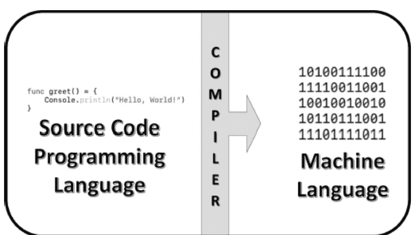

图 1-7 从高级编程语言到机器语言的编译器

上图是对一个非常复杂过程的过度简化，我们有意不深入探讨。这超出了本书的范围。如果你好奇，可以在线搜索“编译器”，你会找到大量材料来满足你的好奇心。

## 1.3.8 解释器

在计算机编程中，解释器是一种计算机程序，它直接执行用编程语言编写的指令，而无需事先将其编译成机器语言程序。

延续之前的类比，你给只懂印地语的朋友写了英文信。你没有将信翻译成印地语，而是直接把英文信寄给了他。然后，他反过来请来一位*解释员*，让解释员逐行向他解释信件的含义。每次他想重读信件时，都需要请*解释员*为他读信。

这本质上就是计算机解释器的工作方式：它们在每次运行时逐行处理你的源代码，并且用户需要在其机器上安装所需的解释器。

有些编程语言被称为编译型语言，如 C、C++ 和 Objective C。另一些编程语言是解释型语言，如 PHP、JavaScript 等。

还有一些编程语言，两者结合使用。例如 Python、Java、C#。

### 1.3.8.1 编译器与解释器的比较

- 1) 编译器和解释器都将源代码（文本文件）转换为机器语言。基本区别在于，编译器系统生成一个独立的机器代码程序，而解释器系统则直接执行高级程序描述的操作。
- 2) 程序一旦编译完成，运行代码时就不再需要其源代码。但对于解释型程序，我们每次运行程序都需要源代码。
- 3) 通常，解释型程序的运行速度比编译型程序慢。

因此，我们需要额外的步骤在我们的计算机上运行源代码。

我们将在这里使用 Python 语言，你不必担心如何使用编译器或解释器。当我们安装 Python 软件（或任何编程语言软件）时，解释器也会随之安装。它会自动完成我们需要的工作，我们无需担心。

## 1.3.9 什么是 IDE（集成开发环境）

你可以在文本编辑器中编写整个程序，就像你编写第一行源代码那样。但这并不是最有效或最优雅的方式。

特定的任务需要专门的软件。例如，当我们需要处理数据、表格和计算时，我们使用电子表格程序（如 Microsoft Excel），使用 PowerPoint 进行演示。我们打开文字处理器来创建或打开 Word 文档。同样，也有用于编写计算机程序（或他们所说的代码）的 IDE（集成开发环境）。它们提供了编写、调试和编译代码所需的专用工具。

由于我们将使用 Python，我们将使用支持 Python 的 IDE。Python 的 IDE 不胜枚举，你可以使用任何一个。但我建议你跟着我一起，从标准软件开始，以便于安装和使用。很可能你会一直使用它们，因为它们是非常强大的软件包。

我们将使用的 IDE 是 **Spyder**。我们稍后会下载并安装它，但我会先向你介绍它，以便你能体会到 IDE 为代码编写（或计算机编程）带来的效率和优雅。

## 1.3.10 Spyder（科学 Python 开发环境）IDE

**Spyder**，即**科学 Python 开发环境**，是一个免费的集成开发环境（IDE），包含在 Anaconda（Python 的打包软件——我们将在下一章学习）中。它包括编辑、内省、调试和交互式测试功能。

我们将在接下来的章节中详细学习如何使用 Spyder，但在这里，我们将从 IDE 相比普通文本编辑器的优势角度来审视它。

上图展示了 Spyder 的典型界面。左侧黑色框内的区域是编辑器窗格。这相当于文本编辑器窗口。我们在这里用纯文本编写程序。

首先引起注意的是我们简单的文本编辑器和更复杂的 IDE 之间的区别。我们的源代码编辑器左侧有行号。这使我们能够更快地引用代码中的单个语句。还使用了颜色，称为语法高亮，以帮助指出重要的关键字并提高代码的可读性。最后，注意你甚至可以预览代码在真实设备上编译和运行后的样子。这绝对是改进编码过程的绝佳工具。

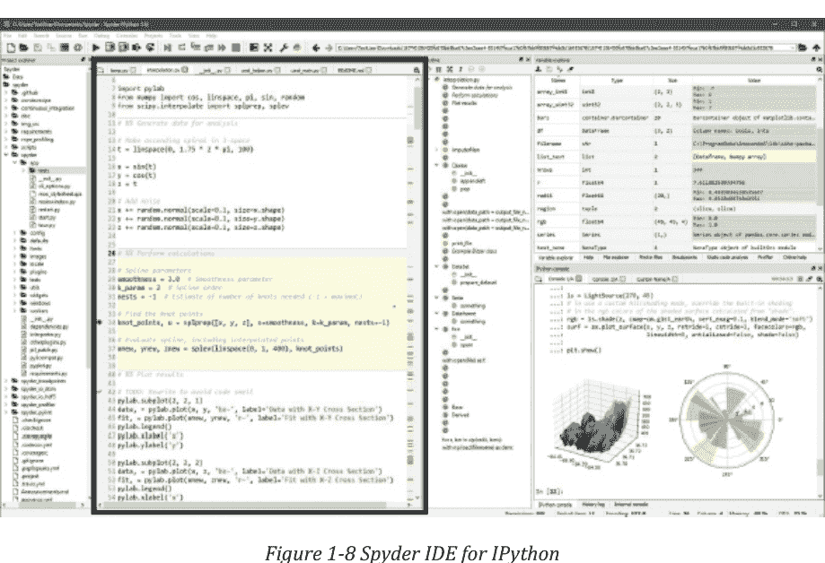

## 1.4 总结：

我们初步了解了激动人心的数据科学世界，我们看到，尽管命名和技术改变了整个游戏规则，但我们的祖先也重视数据分析的重要性。统计学是所有数据相关决策的支柱。强大的计算能力使几十年前还只是理论的事情成为可能。

我们还了解了数据科学家的工作内容，以及他与数据分析师、数据挖掘师或其他数据相关专业人员的异同。我们还注意到 Python 是如何成为所有数据科学相关领域中共同出现的语言。

我们还接触了计算机编程这个有趣的领域。不仅仅是入门，你还编写了你的第一段源代码。对代码的编写、编译和执行过程有了更简单的理解。

在下一章中，我们将学习更多关于Python的知识，并下载和安装Python软件及包，包括本章中看到的Spyder IDE。我们还将进一步了解该IDE和Python的功能方面。

## 1.5 练习：

### 1.5.1 回答以下问题：

- 1. 数据科学涉及哪些不同的领域？它们之间有什么共同点，又有什么区别？
- 2. 你如何理解算法？它与流程图有什么关系？
- 3. 编写一个算法来计算本金的单利。
- 4. 什么是好的程序？记下你能想到的所有参数。
- 5. 计算机理解什么语言？
- 6. 编程语言与我们日常说的语言有何不同？

### 1.5.2 判断正误：

- 1. 机器学习是从数据中提取知识的工具。
- 2. 深度学习与机器学习相同。
- 3. 所有软件工程师都可以被视为数据科学家。
- 4. 统计学是数据科学家的重要工具。
- 5. 计算机可以根据变化的环境，在给定指令之外做出决策。
- 6. 计算机直接理解编程语言。
- 7. 有些编程语言是编译型的，有些是解释型的，还有些两者兼有。
- 8. 所有程序都是顺序执行的。
- 9. IDE同时具备文本编辑器和控制台功能。
- 10. 编译器和解释器是像CD驱动器一样的硬件设备。

### 1.5.3 为你自己编写代码：

- 1. 编写一个算法来计算本金的单利。
- 2. 编写一个算法来计算矩形的面积。
- 3. 编写一个算法来计算圆的周长。
- 4. 编写一个算法来找出所有小于100的质数。
- 5. 编写一个算法将全大写句子转换为句首大写格式。
- 6. 为在冰箱中用开水制冰制作一个流程图。
- 7. 为找出所有小于一百的偶数之和制作一个流程图。
- 8. 为计算1到15之间（包括1和15）所有奇数的平方制作一个流程图。
- 9. 为编写3的乘法表制作一个流程图。
- 10. 为计算复利制作一个流程图。

### 1.5.4 实践任务：

- 1. 科学家们认为数据科学的未来会是什么样子？研究并与你的朋友分享。
- 2. 列出Python语言的IDE。研究它们有何相似之处，以及是什么让它们有所不同。
- 3. 列出所有编译型和解释型语言。找出每种语言比另一种更有用的情况。
- 4. 为你日常生活中看到的一些常见问题创建算法。同时准备它们的流程图。
- 5. 你认为学习计算机编程会帮助你自动化一些重复性任务吗？列出此类任务清单，并在学习本书新概念的过程中不断尝试自动化它们。

## 2 Python简介

### 2.1 什么是Python？

Python是一种免费且开源的**解释型、高级、通用**编程语言。

由Guido van Rossum创建，于1991年首次发布。它支持多种编程范式，包括结构化（特别是过程式）、面向对象和函数式编程。其语言结构和面向对象的方法旨在帮助程序员为小型和大型项目编写清晰、逻辑性强的代码。³

Python是一种易于学习、功能强大的编程语言。Python优雅的语法和动态类型，结合其解释型特性，使其成为在大多数平台上进行脚本编写和快速应用开发的理想语言。⁴

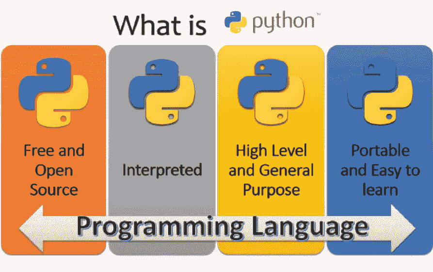

图2-1 什么是Python

#### 2.1.1 为什么选择Python？

当我在选择要学习的编程语言时，从数百种语言中选择的标准很简单。它应该**易于学习**且**易于使用**，并且应该是程序员中**流行的**编码语言。

就流行度而言，数据科学家最流行的编程语言是

- Python
- R
- SQL
- C++
- Java
- Matlab

如果你刚开始你的编程生涯，或者你想学习你的第一门编程语言，那么明智的做法是学习一门主流且成熟的编程语言。因此，我们选择的语言应该满足以下所有标准：

- 它是主流编程语言之一，并在软件开发行业中牢固确立。
- 在编程语言排名网站和文章中，在同类语言中名列前茅。
- 流行度稳定，或者更确切地说，流行度在增长而非急剧下降。
- 它们拥有大量的库、工具支持、框架，以及一个为其发展做出贡献的庞大社区。
- 它们在就业市场需求量大，并有望获得高薪。

在上述最流行的语言中，符合所有这些标准且最容易学习和使用的语言是Python。不仅如此，Python还具有高度的可定制性，并且可以扩展到其他平台。就其本身而言，它也是一种功能强大的语言，适用于各种任务。它是开源的，并且被广泛协作。模块和库是免费提供的，并且每天都在增长。

Python也非常擅长数据挖掘、数据分析和机器学习。编程语言能力与数据分析模块相结合，使其成为每位分析师武器库中的强大武器。

#### 2.1.2 Python的起源

Python于1980年代末由Guido van Rossum在荷兰的Centrum Wiskunde & Informatica（CWI）构想，作为ABC语言的后继者。其实现于1989年12月开始。Van Rossum一直担任Python的首席开发者，直到2018年7月12日，他宣布从其作为Python终身仁慈独裁者的职责中“永久休假”，这是Python社区授予他的头衔，以反映他作为项目首席决策者的长期承诺。2019年1月，活跃的Python核心开发者选举了Brett Cannon、Nick Coghlan、Barry Warsaw、Carol Willing和van Rossum组成一个五人“指导委员会”来领导该项目。

Python 2.0于2000年10月16日发布，带来了许多重要的新特性，包括循环检测垃圾回收器和对Unicode的支持。

Python 3.0于2008年12月3日发布。这是该语言的一次重大修订，不完全向后兼容。其许多主要特性被移植回Python 2.6.x和2.7.x版本系列。Python 3的发布包含2to3工具，该工具可以自动化（至少部分地）将Python 2代码翻译为Python 3。

Python 2.7的生命周期结束日期最初定于2015年，后因担心大量现有代码无法轻松移植到Python 3而推迟到2020年。2017年1月，Google宣布开发一个Python 2.7到Go的转译器，以提高并发工作负载下的性能。

顺便说一句，该语言以BBC节目“Monty Python's Flying Circus”命名，与爬行动物无关。在文档中引用Monty Python的小品不仅是允许的，而且是鼓励的！⁶

#### 2.1.3 Python与其他编程语言的比较⁷

在使用计算机和软件工作时，你可能会发现你的很多工作是重复性的，但又很耗时。你会希望自动化这些不增加价值的工作。例如，你可能希望在大量文本文件中执行查找和替换，或者以复杂的方式重命名和重新排列一堆照片文件。也许你想编写一个小型自定义数据库，或一个专门的GUI应用程序，或一个简单的游戏。

如果你是一名专业的软件开发人员，你可能需要使用多个C/C++/Java库，但发现通常的编写/编译/测试/重新编译周期太慢了。也许你正在为这样的库编写测试套件，并发现编写测试代码是一项乏味的任务。或者也许你编写了一个可以使用扩展语言的程序，而你不想为你的应用程序设计和实现一种全新的语言。

你可以为其中一些任务编写UNIX shell脚本或Windows批处理文件，但shell脚本最擅长移动文件和更改文本数据，不太适合GUI应用程序或游戏。你可以编写C/C++/Java程序，但即使编写一个初稿程序也可能需要大量的开发时间。Python使用更简单，可在Windows、Mac OS X和UNIX操作系统上使用，并将帮助你更快地完成工作。

Python使用简单，但它是一种真正的编程语言，比shell脚本或批处理文件所能提供的。

另一方面，Python比C语言提供了更多的错误检查，并且作为一种非常高级的语言，它内置了高级数据类型，例如灵活的数组和字典。由于其更通用的数据类型，Python适用于比Awk甚至Perl大得多的问题领域，然而许多事情在Python中至少与在那些语言中一样容易。

Python允许你将程序分割成模块，这些模块可以在其他Python程序中重用。它附带了一个大型的标准模块集合，你可以将它们用作程序的基础——或者作为开始学习Python编程的示例。其中一些模块提供了诸如文件I/O、系统调用、套接字，甚至像Tk这样的图形用户界面工具包接口等功能。

Python是一种解释型语言，这可以在程序开发期间为你节省大量时间，因为不需要编译和链接。解释器可以交互式使用，这使得尝试语言特性、编写一次性程序或在自底向上的程序开发过程中测试函数变得容易。它也是一个方便的桌面计算器。

Python使程序能够以紧凑且可读的方式编写。用Python编写的程序通常比等效的C、C++或Java程序短得多，原因有几个：

- 高级数据类型允许你在单个语句中表达复杂操作；
- 语句分组通过缩进而不是开始和结束括号来完成；
- 不需要变量或参数声明。

Python是可扩展的：如果你知道如何用C编程，很容易向解释器添加新的内置函数或模块，要么以最大速度执行关键操作，要么将Python程序链接到可能仅以二进制形式可用的库（例如供应商特定的图形库）。一旦你真正着迷，你可以将Python解释器链接到用C编写的应用程序中，并将其用作该应用程序的扩展或命令语言。

再次，如果上述许多术语目前尚未听说或不清楚，请不要担心。我们将在需要使用它们时学习它们。这只是对各种编程语言的总结比较，以确保我们在这里走在正确的轨道上。

### 2.1.4 Python的哲学

该语言的核心哲学在文档《*Python之禅 (PEP 20)*》<sup>8</sup>中进行了总结，其中包括诸如以下的格言：

- 美丽优于丑陋
- 显式优于隐式
- 简单优于复杂
- 复杂优于繁琐
- 可读性很重要

## 2.2 Python相对于其他语言的优势

### 2.2.1 简单

Python就像“规范的英语”一样简单。我这里的意思是，它不像一种外星语言，普通人无法理解。

但与此同时，需要一些规范。阅读Python代码感觉就像阅读英语。简单是Python的核心优势之一。因此，它让我们能够更多地关注解决方案，而不是编码语言的语法。这难道不值得欢呼吗？

### 2.2.2 易于学习

正如你将在本书后面看到的，Python是一门极其容易上手的语言。它的语法极其简单。

### 2.2.3 免费和开源

Python是免费的。正如我们将在接下来的几页中看到的，我们下载和安装Python时，它是完全免费的。使用或分发你的作品没有隐藏费用。

Python是FLOSS（自由/自由软件和开源软件）的一个案例。基本上，你可以公开分发该产品的副本，阅读其源代码，对其进行更改，并在新的免费项目中使用其部分代码。FLOSS依赖于共享信息的网络理念。这是Python如此受欢迎的原因之一——它是由一个只需要看到更好的Python的网络制作并持续改进的。

### 2.2.4 高级语言

高级编程语言是一种你不需要担心许多细节的语言，而使用低级编程语言时你需要这些细节。例如，在Python中，你不需要担心低级细节，如管理程序使用的内存。简单来说，低级语言比高级编程语言更接近硬件，而高级编程语言更接近人类语言。

### 2.2.5 可移植

可移植意味着Python可以在不同类型的机器上使用，不受硬件或操作系统限制的约束。由于其开源特性，它已被移植到许多平台。Python可以在Windows、GNU/Linux、Macintosh、Solaris、Palm OS、PlayStation、Sharp Zaurus、Windows CE和PocketPC上使用！

### 2.2.6 解释型

当你用C或C++等语言编写程序时，它会从源语言（即C或C++代码）转换为二进制代码（0和1），因为那是计算机理解的语言。这个过程是使用编译器完成的。当程序运行时，链接器/加载器软件将程序复制到内存并开始运行它。

另一方面，Python不需要编译成二进制。程序直接从源代码运行。在内部，Python将源代码转换为称为字节码的中间形式，然后将其转换为计算机的本机语言，然后运行它。

这对你有什么帮助？

- 不需要担心编译程序。
- 不需要担心是否链接和加载了正确的库。
- 这使得Python程序更具可移植性，即只需将程序复制到另一台计算机上即可无缝工作。

作为2020年发展最快的编程语言，Python的解释器并不短缺。让我们快速了解一下解释器。

### 2.2.7 Python解释器

#### 什么是解释器？

根据定义，解释器是一种计算机程序，它直接执行以某种编程或脚本语言编写的指令。直接执行意味着它不需要先将指令编译成机器语言程序。

让我们继续简要总结7种最受欢迎的Python解释器：

##### 2.2.7.1 IPython

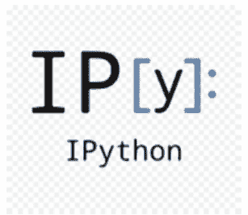

当你直接安装Python时，默认解释器也会安装。你可以在计算机终端中输入“python”来启动默认解释器。当解释器加载时，可以在终端中使用解释器运行Python代码。虽然这是默认的，但Python解释器有其局限性。例如，Python解释器不提供适当的缩进、语法高亮、制表符补全以及许多其他解释器提供的功能。

IPython是一个替代的Python解释器。这是一个用于Python计算的交互式shell。它比默认的Python解释器具有更多有用的功能。

在本章后面，你将学习如何使用Anaconda发行版安装Python，这是分步指南。在那里，我们将使用Python Anaconda发行版安装IPython。当我们通过Anaconda安装Python时，IPython将自动安装。

Ipython附带Jupyter Notebook，这是Python编程初学者最常用的工具。

##### 2.2.7.2 CPython

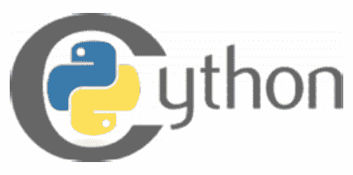

支持 – 最高到Python 3.7

它是Python编程语言的默认且最广泛使用的实现。用C和Python编写，CPython是一个提供与C和其他编程语言的外部函数接口的解释器。

CPython也可以被归类为编译器，因为它在解释之前将Python代码转换为字节码。它使用GIL（全局解释器锁），这可能会带来限制，因为它禁用了进程的并发Python线程。

作为Python的参考实现，CPython提供了与Python包和C扩展模块的最佳兼容性。因此，所有版本的Python编程语言都是用C实现的。

CPython是使用依赖C扩展才能正常运行的Python包的唯一选择。如果希望为用Python编程语言开发的程序吸引尽可能广泛的受众，那么针对CPython是必须的。

##### 2.2.7.3 IronPython


支持 – 最高到Python 2.7

IronPython是Python编程语言在.NET框架上的实现，它同时使用Python和.NET框架库。它还可以将Python代码暴露给.NET框架相关的其他语言。

IronPython提供对动态编译的支持，并附带一个交互式控制台。使用Python解释器允许*Python脚本*与.NET对象交互。通过Visual Studio的Python工具，IronPython直接集成到Visual Studio IDE中。

### 2.2.7.4 Jython

### 2.2.7.4 Jython

支持版本 – 最高至 Python 2.7

Jython 前身是 JPython，是一个运行在 Java 平台上的 Python 实现。它由 Java 和 Python 编写，能将 Python 代码转换为 Java 字节码，从而允许 Python 代码在任何拥有 JVM 的机器上运行。

Jython 同时支持静态和动态编译。这个流行的 Python 解释器的一个重要特性是，它允许像导入和使用 Python 模块一样，导入和使用任何 Java 类。

无论你是需要与现有的 Java 代码库交互，还是为 JVM 编写 Python 代码，都可以放心选择 Jython。

### 2.2.7.5 PyPy

支持版本 – 最高至 Python 2.7、Python 3.5 和 Python 3.6

PyPy 是 Python 编程语言的一个快速、兼容的替代实现。其 Python 解释器是用 RPython 实现的，RPython 是 Python 编程语言的一个受限的静态类型子集。

PyPy 的特色是拥有一个 JIT 编译器，支持 C、CLI 和 JVM 后端。PyPy 的首要目标是在提供与参考实现 CPython 最大兼容性的同时，提升性能。

PyPy 被那些希望提升特定 Python 代码性能的 Python 开发者所使用。根据 *PyPy 官方网站* 的数据，这个流行的 Python 解释器比 CPython 快约 4.4 倍。

### 2.2.7.6 PythonNet

*支持版本 – Python 2.6 至 Python 3.5*

PythonNet 提供了原生 Python 安装与 .NET CLR 之间近乎无缝的集成。其方法可以看作是与 IronPython 所采用的方法相反。

与 Mono 一起，PythonNet 允许在非 Windows 操作系统上的原生 Python 安装在 .NET 框架内运行。PythonNet 可以与 IronPython 并行运行，不会有任何问题。

### 2.2.7.7 Stackless Python

支持版本 – 最高至 Python 3.7

CPython 和其他流行的 Python 解释器依赖 C 调用来管理其栈。然而，Stackless Python 解释器并非如此。

尽管 Stackless Python 使用 C 栈，但它在函数调用之间会清空栈。因此，Python 解释器不依赖 C 调用来管理其栈。与 CPython 类似，Stackless Python 使用 C 和 Python 编写。

除了提供对线程的支持外，Stackless Python 还支持通信通道、协程、预编译二进制文件、轮询调度、任务序列化和任务微线程。

Stackless Python 最重要的特性或许是微线程。该特性有助于避免与典型操作系统线程相关的大部分开销。

以上对解释器的介绍是为了让你更好地了解有哪些不同的解释器可用，以及它们有何不同。我们不会在任何地方直接使用它们，所以你不必担心我们将使用哪一个。

但你一定很好奇，不是吗？

那么，答案是：我们将使用 Anaconda 发行版，这是初学者的最佳工具（即使是高级用户也对其多功能性和实用性赞不绝口）。Anaconda 发行版为我们提供了一个 IPython 解释器。但同样，你完全不必担心。因为它会嵌入到你将使用的 IDE、Jupyter Notebook 或控制台中。

### 2.2.8 面向对象

Python 既支持面向过程编程，也支持面向对象编程。在面向过程的语言中，程序围绕过程或函数构建，它们不过是可重用的程序片段。在面向对象的语言中，程序围绕对象构建，对象结合了数据和功能。Python 有一种非常强大但简洁的面向对象编程方式，尤其是与 C++ 或 Java 这样的大型语言相比。

### 2.2.9 可扩展

如果你需要一段关键代码运行得非常快，或者希望某些算法不公开，你可以用 C 或 C++ 编写程序的那部分，然后从你的 Python 程序中使用它。Python 可以轻松地用 C/C++/Java 代码进行扩展，也可以轻松地嵌入到应用程序中。

### 2.2.10 可嵌入

Python 可以嵌入到 C/C++ 程序中，为程序用户提供脚本功能。

### 2.2.11 丰富的库

Python 庞大的标准库通常被认为是其最大的优势之一，它提供了适用于多种任务的工具。对于面向互联网的应用程序，支持许多标准格式和协议，如 MIME 和 HTTP。它包括用于创建图形用户界面、连接关系数据库、生成伪随机数、任意精度十进制数运算、操作正则表达式和单元测试的模块。

截至 2018 年 3 月，Python 包索引（PyPI）——官方的第三方 Python 软件仓库——包含超过 130,000 个具有广泛功能的软件包，包括：

- 1. 图形用户界面
- 2. Web 框架
- 3. 多媒体
- 4. 数据库
- 5. 网络
- 6. 测试框架
- 7. 自动化
- 8. 网页抓取
- 9. 文档
- 10. 系统管理
- 11. 科学计算
- 12. 文本处理
- 13. 图像处理

### 2.2.12 Python 适合初学者！13

**Python** 是最适合那些几乎没有或完全没有计算机编程经验的初学者的语言。

让学生从过程式和静态类型语言（如 Pascal、C，或 C++ 或 Java 的子集）开始学习仍然很常见。但让学生以 Python 作为第一门语言可能会更好。Python 具有非常简单且一致的语法，拥有庞大的标准库，最重要的是，在入门编程课程中使用 Python 可以让学生专注于重要的编程技能，如问题分解和数据类型设计。使用 Python，学生可以快速接触到循环和过程等基本概念。他们甚至可能在第一门课程中就能使用用户定义的对象。

对于一个从未编程过的学生来说，使用静态类型语言似乎不自然。它带来了学生必须掌握的额外复杂性，并减慢了课程的进度。学生们正试图学习像计算机一样思考，分解问题，设计一致的接口，并封装数据。虽然从长远来看学习使用静态类型语言很重要，但在学生的第一门编程课程中，它不一定是最佳主题。

Python 的许多其他方面使其成为一门很好的第一门语言。像 Java 一样，Python 有一个庞大的标准库，因此可以很早就在课程中布置能完成实际任务的编程项目。作业不限于标准的四功能计算器和支票余额程序。通过使用标准库，学生可以在学习编程基础知识的同时，获得处理实际应用程序的满足感。使用标准库还能教会学生代码重用。像 PyGame 这样的第三方模块也有助于扩展学生的能力范围。

Python 的交互式解释器使学生能够在编程时测试语言特性。他们可以在一个窗口中运行解释器，同时在另一个窗口中输入程序的源代码。

## 2.3 Python 版本<sup>14</sup>

### 2.3.1 Python 2

Python 2 于 2000 年底发布，通过实施 PEP（Python 增强提案）——一种为 Python 社区成员提供信息或描述语言新特性的技术规范——标志着比早期 Python 版本更透明和包容的语言开发过程。此外，Python 2 包含了更多编程特性，包括用于自动化内存管理的循环检测垃圾收集器、用于标准化字符的增强 Unicode 支持，以及用于基于现有列表创建列表的列表推导式。随着 Python 2 的持续发展，更多特性被添加进来，包括在 Python 2.2 版本中将 Python 的类型和类统一到一个层次结构中。

### 2.3.2 Python 2.7

在 2008 年发布 Python 3.0 之后，Python 2.7 于 2010 年 7 月 3 日发布，并计划作为 2.x 系列的最后一个版本。Python 2.7 的意图是通过提供两个版本之间的某种兼容性，使 Python 2.x 用户更容易将功能移植到 Python 3。这种兼容性支持包括为 2.7 版本增强的模块，如用于支持测试自动化的 unittest、用于解析命令行选项的 argparse，以及 collections 中更方便的类。由于 Python 2.7 在早期 Python 2 迭代版本和 Python 3.0 之间的独特地位，它因其与许多强大的库兼容。当我们今天谈论 Python 2 时，通常指的是 Python 2.7 版本，因为这是最常用的版本。然而，Python 2.7 被视为一种遗留语言，其持续开发（目前主要是错误修复）将在 2020 年完全停止。

### 2.3.3 Python 3

Python 3 被视为 Python 的未来，是当前正在开发的语言版本。作为一次重大修订，Python 3 于 2008 年底发布，旨在解决和修正该语言先前版本的内在设计缺陷。Python 3 开发的重点是清理代码库并消除冗余，明确执行给定任务只有一种方式。Python 3.0 的主要修改包括将 `print` 语句更改为内置函数、改进整数除法方式以及提供更多 Unicode 支持。起初，由于该语言与 Python 2 不向后兼容，需要人们决定使用哪个版本，Python 3 的采用速度较慢。此外，许多软件包库仅适用于 Python 2，但随着 Python 3 背后的开发团队重申 Python 2 支持将有终止日期，更多的库已被移植到 Python 3。Python 3 采用率的增加可以从现在提供 Python 3 支持的 Python 软件包数量中看出，在撰写本文时，这包括了 360 个最受欢迎的 Python 软件包中的 339 个。

### 2.3.4 关键差异

虽然 Python 2.7 和 Python 3 共享许多相似的功能，但不应认为它们完全可以互换。尽管你可以在任一版本中编写良好的代码和有用的程序，但值得理解的是，在代码语法和处理方面会有一些相当大的差异。

## 2.4 如何安装和使用 Python

可以从以下链接下载并安装独立的 Python。

下载最新版本的 Python - https://www.python.org/downloads/

使用此方法，你将只安装 Python 软件及其解释器。但你需要单独下载并安装 Python IDE、Python 控制台、Jupyter Notebook 以及许多 Python 软件包。

有一种更高效的方法。我们将采用这种方法。唯一的缺点是，当你安装独立的 Python 时，它占用的内存空间较少（显然，因为它缺少其他软件）。

我们将使用 Anaconda Python 发行版。让我们下载并安装它。以下是分步指南。

### 2.4.1 Anaconda Python 发行版

Anaconda 软件包是安装 Python 和其他支持软件包最简单、最常用的方法。它是免费提供的，易于安装。

开源的 Anaconda 发行版是在 Linux、Windows 和 Mac OS X 上进行 Python/R 数据科学和机器学习的最简单方式。在全球拥有超过 1100 万用户，它是开发、测试和在单机上训练的行业标准，使个人数据科学家能够：

1.  快速下载 1500 多个 Python/R 数据科学软件包
2.  使用 Conda 管理库、依赖项和环境
3.  使用 scikit-learn、TensorFlow 和 Theano 开发和训练机器学习和深度学习模型
4.  使用 Dask、NumPy、pandas 和 Numba 以可扩展性和高性能分析数据
5.  使用 Matplotlib、Bokeh、Datashader 和 Holoviews 可视化结果

### 2.4.2 为什么选择 Anaconda？

1.  用户级安装你想要的 Python 版本
2.  能够完全独立于系统库或管理员权限安装/更新软件包
3.  **conda** 工具安装二进制软件包，而不是像 pip 那样需要编译资源——同样，如果你安装必要库的权限有限，这很方便。
4.  基本上消除了试图弄清楚哪个版本/发行版的软件包 X 与哪个版本/发行版的软件包 Y 兼容的麻烦，而这两者都是安装软件包 Z 所必需的
5.  提供完整版本，包含 NumPy、Scipy、PyQt、Spyder IDE 等，或者提供某种最小化或按需选择的方式（miniconda），你可以选择你需要的并安装你想要的。
6.  没有搞乱所需系统库的风险

### 2.4.3 在 Windows 上安装 Anaconda<sup>15</sup>

-   下载 Anaconda 安装程序 (https://www.anaconda.com/download/#windows)。
-   双击安装程序启动。

> **注意**

为防止权限错误，请不要从“收藏夹”文件夹启动安装程序。

如果在安装过程中遇到问题，请在安装期间暂时禁用防病毒软件，安装完成后重新启用。如果你为所有用户安装，请卸载 Anaconda 并仅为“仅限用户”重新安装，然后重试。

-   单击“下一步”。
-   阅读许可条款并单击“我同意”。
-   选择“仅为我”安装，除非你要为所有用户安装（这需要 Windows 管理员权限），然后单击“下一步”。
-   选择安装 Anaconda 的目标文件夹，然后单击“下一步”按钮。参见 *常见问题解答*

> **注意**

将 Anaconda 安装到不包含空格或 Unicode 字符的目录路径。

除非需要管理员权限，否则不要以管理员身份安装。

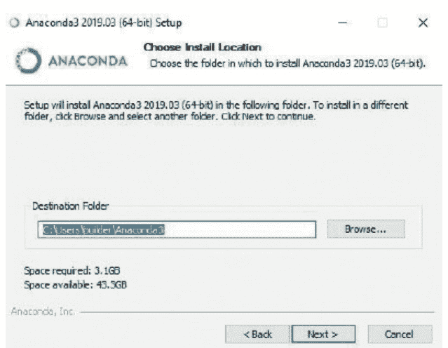

图 2-2 目标文件夹

-   选择是否将 Anaconda 添加到你的 PATH 环境变量。我们建议不要将 Anaconda 添加到 PATH 环境变量，因为这可能会干扰其他软件。相反，通过从“开始”菜单打开 Anaconda Navigator 或 Anaconda Prompt 来使用 Anaconda 软件。

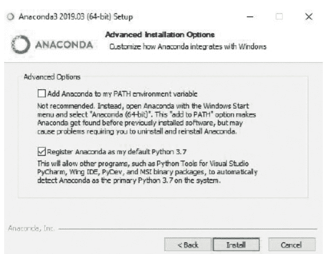

图 2-3 安装选项

-   选择是否将 Anaconda 注册为你的默认 Python。除非你计划安装和运行多个版本的 Anaconda 或多个版本的 Python，否则接受默认设置并保持此框选中。
-   单击“安装”按钮。如果你想查看 Anaconda 正在安装的软件包，请单击“显示详细信息”。
-   单击“下一步”按钮。
-   可选：要为 Anaconda 安装 PyCharm，请单击链接 https://www.anaconda.com/pycharm。


图 2-4 安装选项

或者，要安装不带 PyCharm 的 Anaconda，请单击“下一步”按钮。
安装成功后，你将看到“感谢安装 Anaconda”对话框：


图 2-5 安装完成

-   如果你想了解更多关于 Anaconda Cloud 以及如何开始使用 Anaconda 的信息，请勾选“了解更多关于 Anaconda Cloud”和“了解如何开始使用 Anaconda”框。单击“完成”按钮。
-   安装完成后，通过打开 Anaconda Navigator（Anaconda 附带的程序）来验证它：从 Windows 开始菜单中，从最近添加的项目中选择快捷方式 Anaconda Navigator，或输入“Anaconda Navigator”。如果 Navigator 打开，则表示你已成功安装 Anaconda。如果没有，请检查你是否完成了上述每个步骤，然后参阅我们的帮助页面。


图 2-6 Anaconda Navigator

你可以探索以下链接，获取有关如何为你的操作系统安装 Anaconda 的文档。

https://docs.anaconda.com/anaconda/install/windows/
https://docs.anaconda.com/anaconda/install/mac-os/
https://docs.anaconda.com/anaconda/install/linux/

### 2.4.4 在 macOS 上安装 Anaconda<sup>16</sup>

你可以使用图形安装程序（“向导”）或下面的命令行（“手动”）说明来安装 Anaconda。如果不确定，请选择图形安装。

#### macOS 图形安装

-   下载适用于你的 Python 版本的图形 macOS 安装程序 ([https://www.anaconda.com/downloads#macos](https://www.anaconda.com/downloads#macos))。
-   双击下载的文件并单击继续以开始安装。
-   回答“介绍”、“自述文件”和“许可”屏幕上的提示。
-   单击“安装”按钮，将 Anaconda 安装到你的主用户目录（推荐）：

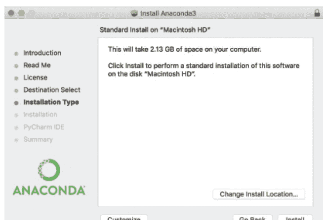

图 2-7 MacOs Anaconda 安装

-   或者，单击“更改安装位置”按钮以安装到其他位置（不推荐）。在“目标选择”屏幕上，选择“仅为我安装”。

> **注意**

如果你收到错误信息“无法在此位置安装Anaconda”，请重新选择“仅为我安装”。


图 2-8 MacOS 仅为我安装

- 点击继续按钮。
- 可选：要安装适用于Anaconda的PyCharm，请点击链接 [https://www.anaconda.com/pycharm](https://www.anaconda.com/pycharm)。


图 2-9 MacOS Anaconda PC

或者，要安装不带PyCharm的Anaconda，请点击继续按钮。

- 成功安装后，将显示以下屏幕：

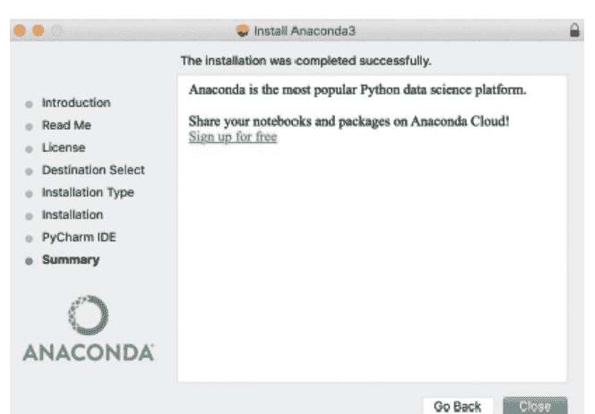

图 2-10 MacOS Anaconda 安装完成

- 安装完成后，通过打开Anaconda Navigator（Anaconda附带的程序）来验证：从启动台中选择Anaconda Navigator。如果Navigator打开，则表示你已成功安装Anaconda。如果没有，请检查你是否完成了上述每个步骤，然后参阅我们的*帮助页面*。

> **提示**

有关使用Anaconda-Navigator的更多信息，请参阅*Navigator*。

(https://docs.anaconda.com/anaconda/navigator/)

## 2.5 在终端上运行Python

尽管这是在你的计算机（无论是Mac OS、Windows还是Linux）上运行任何软件（包括Python）最高效的方式，但我们只会介绍一次，并且掌握终端命令超出了本书的范围。虽然通过终端操作计算机很酷，但图形用户界面（GUI）的开发是有其目的的。这样，新用户和那些对计算机不太深入的人也能使用全部功能。因此，我们将主要了解Python在终端中如何工作，然后转向专用的Python控制台（IPython）、集成开发环境（IDE - Spyder）或集成笔记本程序（Jupyter Notebook）。

终端是一个应用程序，允许你运行命令来探索目录、执行脚本，当然，也可以使用Python。

控制台（或“终端”，或“命令提示符”）是一种与操作系统交互的文本方式，就像“桌面”与鼠标结合是与系统交互的图形方式一样。

**在Mac OS中，** 要打开终端，我们将进入Finder，然后进入应用程序。进入实用工具并打开终端。你也可以通过快捷方式完成此操作：输入command + space，然后拼写terminal并按回车键。

**在Windows PC中，** 这被称为命令提示符（CMD）。
或者在任何操作系统中，打开Anaconda命令提示符。请参见下图左侧的高亮框。


图 2-11 Anaconda 命令提示符

让我们打开Anaconda命令提示符，并尝试几个命令。
Anaconda命令提示符看起来像一个终端窗口，其行为也类似。它将直接显示Anaconda以及Python解释器的安装基础目录。按照我们之前的方式，为“用户”而非“所有用户（需要管理员权限）”安装，它将显示提示符为

```
C:\Users\yourusername>
```

让我们继续启动Python解释器。我们将使用**Python**命令。

要运行python，只需输入**python**并按**回车**。

让我们在这里停一下，看看我们刚刚在终端屏幕上收到了什么信息。

我们现在可以看到已安装并准备使用的Python版本。此外，现在命令行已更改为

```
>>>
```

现在我们进入了Python提示符。这意味着计算机已准备好接受我们的指令。

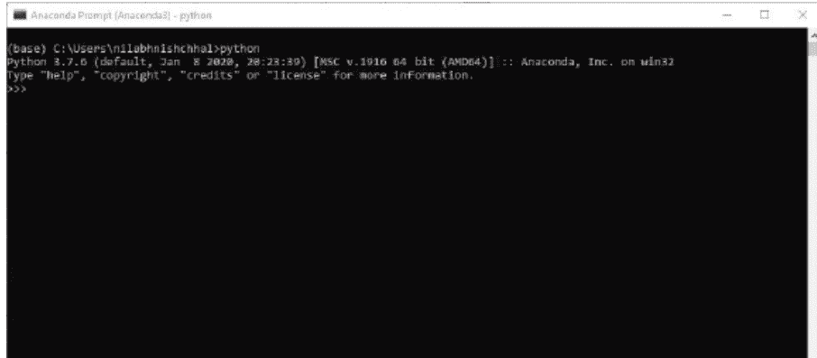

*图 2-12 Anaconda 命令提示符运行 python*

现在让我们在Python中尝试一个简单的数学问题。

**二加二。**

首先，我们将用普通英语的方式尝试——**二加二等于多少？**

让我们问问Python。

（我建议你打开命令提示符窗口并同步操作。这样你将获得第一手经验）

你会看到这条消息 **SyntaxError: invalid syntax.**

回想一下，**语法**指的是编程语言的规则。当你编写的代码违反了预期规则时，就会发生语法错误。在这种情况下，我们用纯英语编写了代码。但解释器不理解*英语*，它只理解*Python*。让我们再试一次。

这次我们将输入**2+2**（别忘了按回车运行）

我们得到的答案是**4**。

这是因为**2+2**是一个有效的Python表达式。

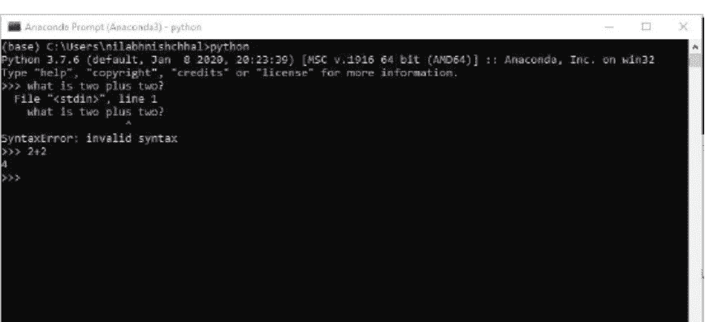

*图 2-13 Python 终端代码运行*

现在让我们使用命令**exit()**关闭这个命令提示符窗口。然后让我们继续学习Anaconda附带的应用程序，这将推动我们的学习进程。

> **注意：** 第一次**exit()**会将你带出Python（**>>>**），然后你需要再次输入**exit()**来关闭终端。

## 2.6 Anaconda 应用程序简介

Anaconda Navigator打开后看起来像这样。有几个应用程序可用于各种功能和工作。但我们将从3个最常用的主要软件开始。

1. I-Python 控制台
2. Spyder
3. Jupyter Notebook


## 2.7 IPython Qt 控制台<sup>17</sup>

一个基于Qt的丰富控制台，用于与Jupyter内核协作，支持富媒体输出、会话导出等功能。

Qt控制台是一个非常轻量级的应用程序，很大程度上感觉像一个终端，但提供了许多只有在GUI中才可能实现的增强功能，如内联图形、带语法高亮的正确多行编辑、图形化调用提示等。

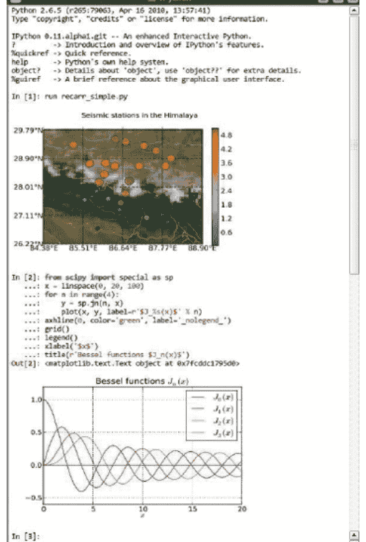

图 2-15 IPython 的 Qt 控制台

要熟悉Qt控制台，请输入 ? 以查看其主要功能的快速介绍。

Qt前端具有手工编码的emacs风格文本导航绑定。这目前尚不可配置。

IPython控制台允许你在任何数量的全功能IPython解释器中执行命令、输入、交互和可视化数据。每个控制台都在单独的进程中执行，允许你运行脚本、中断执行、重启或终止shell而不影响其他控制台，并轻松地在干净的环境中测试代码，而不会干扰你的主要会话。

> **提示**

由于Qt控制台努力表现得像一个终端，默认情况下它会立即执行完整的单行输入。如果你想强制进行多行输入，请在第一行末尾按Ctrl-Enter而不是Enter，它将打开一个新行用于输入。在多行块中的任何时候，你都可以通过Shift-Enter强制执行（无需到达底部）。

## 2.8 Spyder（科学Python开发环境）¹⁸

Spyder，科学Python开发环境，是一个免费的集成开发环境（IDE），包含在Anaconda中。它包括编辑、交互式测试、调试和内省功能。

安装Anaconda后，通过运行命令Spyder在Windows、macOS或Linux上启动Spyder。

Spyder也预装在Anaconda Navigator中，包含在Anaconda中。在Navigator的主页选项卡上，点击Spyder图标。

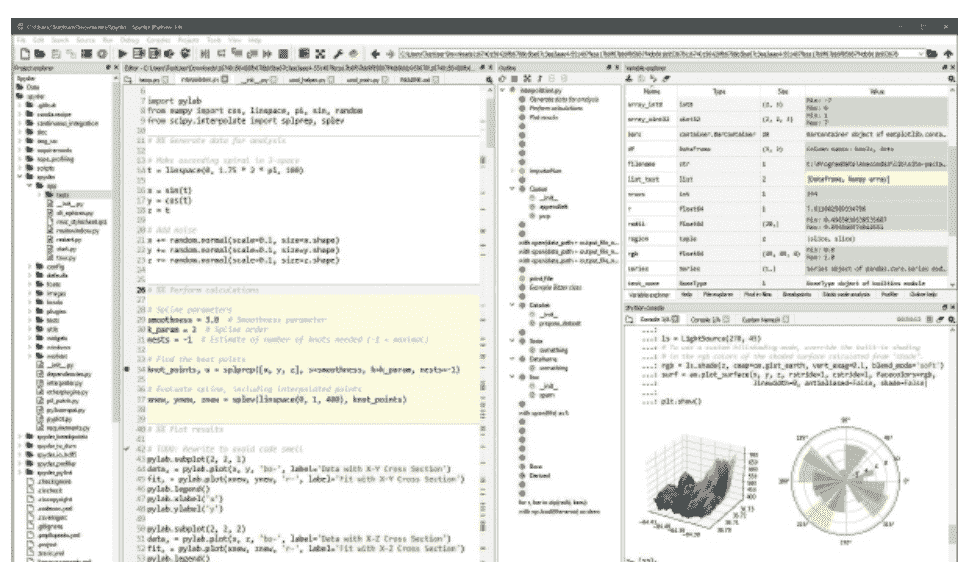

图 2-16 Python 的 Spyder IDE

Spyder是一个强大的科学环境，用Python编写，为Python设计，并由科学家、工程师和数据分析师设计和使用。它具有独特组合：一方面是全面开发工具的高级编辑、分析、调试和性能分析功能，另一方面是科学包的数据探索、交互执行、深度检查和精美可视化能力。此外，Spyder提供了与许多流行科学包的内置集成，包括NumPy、SciPy、Pandas、IPython、QtConsole、Matplotlib、SymPy等。

### 2.8.1 组件

强大IDE的核心构建块

#### 2.8.1.1 编辑器

Spyder 的多语言**编辑器**集成了许多开箱即用的强大工具，提供易于使用、高效的编辑体验。编辑器的关键功能包括语法高亮（**pygments**）；实时代码和风格分析（**pyflakes 和 pycodestyle**）；按需补全、调用提示和跳转到定义功能（**rope 和 jedi**）；函数/类浏览器、水平和垂直分割等等。

#### IPython 控制台

在灵活的完整图形用户界面中，随心所欲地使用多个 IPython 控制台；按行、单元格或文件运行代码；并直接在行内渲染绘图。

### 2.8.1.2 IPython 控制台

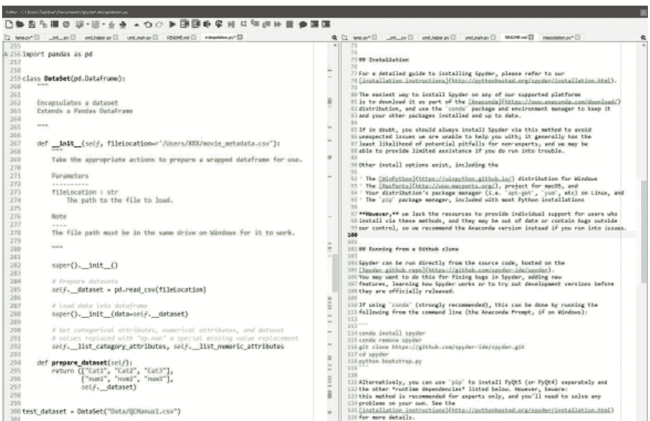

图 2-17 IDE 编辑器水平分割

IPython 控制台允许你在任意数量的全功能 **IPython** 解释器中执行命令、输入、交互和可视化数据。每个控制台在单独的进程中执行，允许你运行脚本、中断执行、重启或终止一个 shell 而不影响其他控制台或 Spyder 本身，并且可以轻松地在干净的环境中测试代码，而不会干扰你的主要会话。

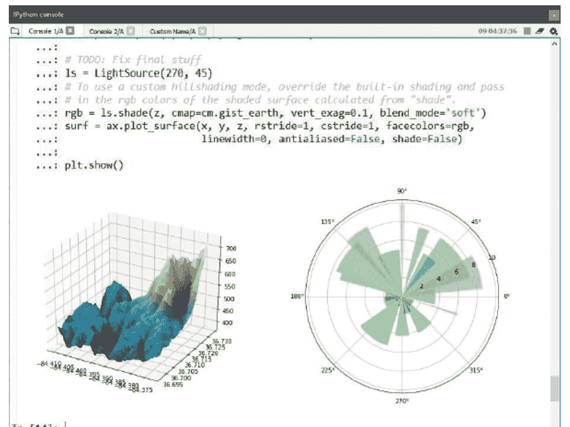

*图 2-18 IDE 控制台标准*

### 2.8.1.3 变量资源管理器

变量资源管理器显示当前选定的 IPython 控制台会话的命名空间内容（所有全局对象引用，如变量、函数、模块等），并允许你通过各种基于图形用户界面的编辑器与它们进行交互。

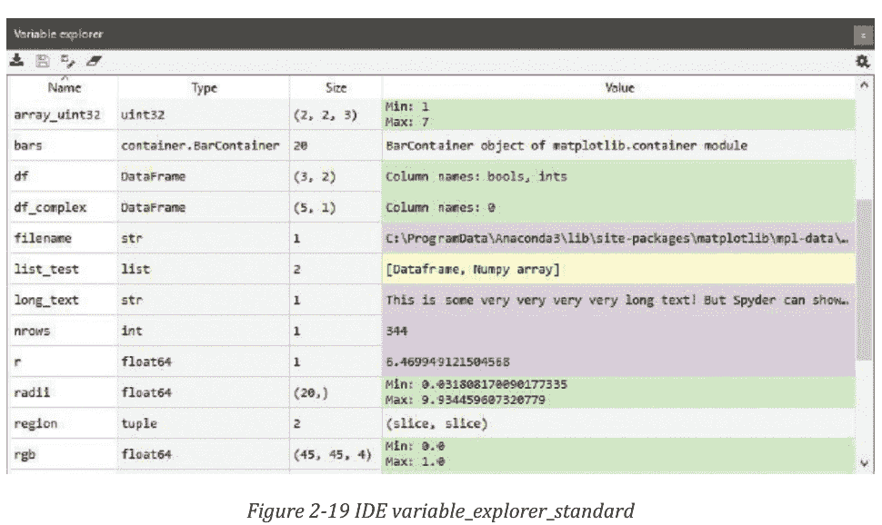

### 2.8.1.4 帮助

你可以使用**帮助**窗格来查找、渲染和显示任何具有文档字符串的对象的丰富文档，包括模块、类、函数和方法。帮助可以通过静态分析**编辑器**中打开的文件来获取，也可以通过动态检查 **IPython 控制台**中的对象来获取。

你可以通过手动将对象名称输入到对象框中、按下可配置的帮助快捷键（默认为 Ctrl-I），甚至在函数或方法名称后输入左括号 "(" 时自动触发帮助（如果需要）。自动帮助可以在首选项 ▶ 帮助 + 自动连接下分别为编辑器和控制台启用，并且可以通过帮助窗格右上角的锁图标动态开启和关闭。

## 2.9 Jupyter Notebook

### 2.9.1 简介

Notebook 将基于控制台的交互式计算方法扩展到一个全新的方向，提供了一个适合捕获整个计算过程的基于 Web 的应用程序：开发、记录和执行代码，以及交流结果。Jupyter notebook 结合了两个组件：

一个 Web 应用程序：一个基于浏览器的工具，用于交互式创作结合了解释性文本、数学、计算及其丰富媒体输出的文档。

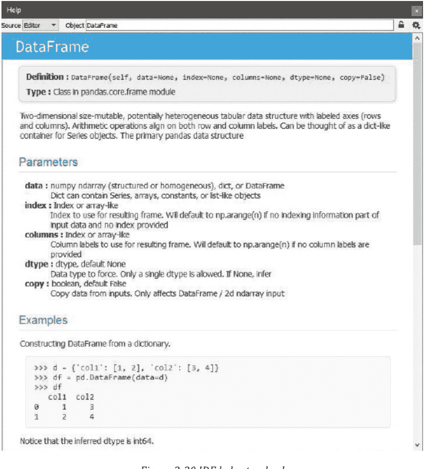

图 2-20 IDE 帮助标准

Notebook 文档：Web 应用程序中所有可见内容的表示，包括计算的输入和输出、解释性文本、数学、图像和对象的丰富媒体表示。

### 2.9.2 Web 应用程序的主要功能

在浏览器中编辑代码，具有自动语法高亮、缩进和制表符补全/自省功能。能够从浏览器执行代码，计算结果附加到生成它们的代码上。使用丰富媒体表示（如 HTML、LaTeX、PNG、SVG 等）显示计算结果。例如，可以内联包含由 Matplotlib 库渲染的出版级图表。使用 Markdown 标记语言在浏览器中编辑富文本，可以为代码提供注释，不限于纯文本。能够轻松地在 markdown 单元格中使用 LaTeX 包含数学符号，并由 MathJax 原生渲染。

### 2.9.3 Notebook 文档

Notebook 文档包含交互式会话的输入和输出，以及伴随代码但不打算执行的附加文本。通过这种方式，notebook 文件可以作为会话的完整计算记录，将可执行代码与解释性文本、数学和结果对象的丰富表示交织在一起。这些文档内部是 JSON 文件，并以 **.ipynb** 扩展名保存。由于 JSON 是纯文本格式，它们可以进行版本控制并与同事共享。

Notebook 可以通过 nbconvert 命令导出为多种静态格式，包括 HTML（例如，用于博客文章）、restructured Text、LaTeX、PDF 和幻灯片。

此外，任何可从公共 URL 获取的 **.ipynb** notebook 文档都可以通过 Jupyter Notebook Viewer (nbviewer) 共享。此服务从 URL 加载 notebook 文档并将其渲染为静态网页。因此，结果可以与同事共享，或作为公共博客文章发布，而其他用户无需自己安装 Jupyter notebook。实际上，nbviewer 只是作为 Web 服务的 nbconvert，因此你可以使用 nbconvert 进行自己的静态转换，而不依赖于 nbviewer。

### 2.9.4 启动 notebook 服务器

你可以使用以下命令从命令行启动 notebook 服务器：

#### Jupyter notebook

这将在你的控制台中打印一些关于 notebook 服务器的信息，并打开一个 Web 浏览器访问 Web 应用程序的 URL（默认为 http://127.0.0.1:8888）。

此外，你可以从 Anaconda Navigator 打开 Jupyter notebook。

Jupyter notebook Web 应用程序的登录页面（仪表板）显示了 notebook 目录中当前可用的 notebook（默认为启动 notebook 服务器的目录）。

你可以使用仪表板上的 New Notebook 按钮创建新的 notebook，或通过单击其名称打开现有的 notebook。你还可以将 .ipynb notebook 和标准 .py Python 源代码文件拖放到 notebook 列表区域。

从命令行启动 notebook 服务器时，你也可以使用 Jupyter notebook my_notebook.ipynb 直接打开特定的 notebook，绕过仪表板。如果未给出扩展名，则假定为 .ipynb 扩展名。

当你在打开的 notebook 内部时，文件 | 打开... 菜单选项将在新的浏览器标签页中打开仪表板，允许你从 notebook 目录打开另一个 notebook 或创建新的 notebook。

> **注意**

如果你想在不同的目录中处理 notebook，可以同时启动多个 notebook 服务器。默认情况下，第一个 notebook 服务器在端口 8888 上启动，后续的 notebook 服务器会搜索附近的端口。你也可以使用 --port 选项手动指定端口。

### 2.9.5 创建新的 notebook 文档

可以随时创建新的 notebook，可以从仪表板创建，也可以从活动 notebook 中使用 :menu-selection: **文件 --> 新建** 菜单选项创建。新的 notebook 在同一目录中创建，并将在新的浏览器标签页中打开。它也将在仪表板的 notebook 列表中作为新条目显示。

### 2.9.6 打开 notebook

一个打开的 notebook 恰好有一个连接到内核的交互式会话，该内核将执行用户发送的代码并返回结果。如果关闭 Web 浏览器窗口，此内核将保持活动状态，并且从仪表板重新打开同一个 notebook 将重新连接 Web 应用程序到同一个内核。在仪表板中，具有活动内核的 notebook 旁边有一个关闭按钮，而没有活动内核的 notebook 则在其位置有一个删除按钮。

### 2.9.7 Notebook 用户界面

当你创建一个新的 notebook 文档时，你将看到 notebook 名称、菜单栏、工具栏和一个空的代码单元格。


图 2-21 notebook 空白

**Notebook 名称：** 页面顶部显示的名称，位于 Jupyter 徽标旁边，反映了 .ipynb 文件的名称。单击 notebook 名称会弹出一个对话框，允许你重命名它。因此，在浏览器中将 notebook 从 "Untitled0" 重命名为 "My first notebook"，会将 "Untitled0.ipynb" 文件重命名为 "My first notebook.ipynb"。

**菜单栏：** 菜单栏提供了可用于操作 notebook 功能方式的不同选项。

**工具栏：** 工具栏通过单击图标，提供了一种快速执行 notebook 中最常用操作的方法。

**代码单元格：** 默认的单元格类型；请继续阅读以了解单元格的说明。

### 2.9.8 Notebook 文档的结构

Notebook 由一系列单元格组成。单元格是一个多行文本输入字段，其内容可以通过使用 Shift-Enter，或单击工具栏上的 "Play" 按钮，或菜单栏中的 : GUI 标签: **单元格**, : GUI 标签: **运行** 来执行。单元格的执行行为由单元格的类型决定。有三种类型的单元格：代码单元格、markdown 单元格和原始单元格。每个单元格最初都是代码单元格，但其类型可以通过工具栏上的下拉菜单（初始为“Code”）或通过参考：**键盘快捷键 <keyboard-shortcuts>** 来更改。

有关在笔记本中可以执行的不同操作的更多信息，请参阅示例集合。

### 2.9.9 代码单元格

代码单元格允许你编辑和编写新代码，并提供完整的语法高亮和制表符补全功能。你使用的编程语言取决于内核，默认内核（IPython）运行 Python 代码。

当执行代码单元格时，其中包含的代码会被发送到与笔记本关联的内核。计算返回的结果随后会作为单元格的输出显示在笔记本中。输出不仅限于文本，还可以是许多其他形式，包括 Matplotlib 图形和 HTML 表格（例如，在 Pandas 数据分析包中使用）。这被称为 IPython 的富显示能力。

### 2.9.10 Markdown 单元格

你可以使用富文本，以一种文学化的方式记录计算过程，交替使用描述性文本和代码。在 IPython 中，这是通过使用 Markdown 语言标记文本来实现的。相应的单元格称为 Markdown 单元格。Markdown 语言提供了一种简单的方法来进行这种文本标记，即指定文本的哪些部分应该被强调（斜体）、加粗、形成列表等。

如果你想为文档提供结构，可以使用 Markdown 标题。Markdown 标题由 1 到 6 个井号 # 后跟一个空格和你的章节标题组成。Markdown 标题将被转换为笔记本中某个章节的可点击链接。在导出为其他文档格式（如 PDF）时，它也被用作提示。

当执行 Markdown 单元格时，Markdown 代码会被转换为相应的格式化富文本。Markdown 允许使用任意 HTML 代码进行格式化。

在 Markdown 单元格中，你还可以直接使用标准 LaTeX 符号来包含数学公式：用于行内数学公式和显示数学公式。当执行 Markdown 单元格时，LaTeX 部分会自动在 HTML 输出中渲染为具有高质量排版的方程式。这由 MathJax 实现，它支持 LaTeX 功能的很大一部分。

### 2.9.11 原始单元格

原始单元格提供了一个可以直接写入输出的地方。原始单元格不会被笔记本评估。当通过 nbconvert_ 传递时，原始单元格会原封不动地到达目标格式。例如，你可以在原始单元格中输入完整的 LaTeX，它只会在 nbconvert 转换后由 LaTeX 渲染。

### 2.9.12 基本工作流程

因此，笔记本中的正常工作流程与标准的 IPython 会话非常相似，不同之处在于你可以多次就地编辑单元格，直到获得所需的结果，而不必使用 **%run 魔术命令** 重新运行单独的脚本。

通常，你会分部分处理一个计算问题，将相关的想法组织到单元格中，并在前面的部分正确运行后继续前进。这比将计算分解成必须一起执行的脚本要方便得多，尤其是当其中某些部分运行时间很长时。

要中断一个耗时过长的计算，请使用：GUI 标签：**Kernel**，GUI 标签：**Interrupt** 菜单选项或 **“i,i”** 键盘快捷键。同样，要重新启动整个计算过程，请使用：GUI 标签：**Kernel**，GUI 标签：**Restart** 菜单选项，或 **0,0** 快捷键。

笔记本可以下载为 **.ipynb** 文件，或使用菜单选项：GUI 标签：**File**，GUI 标签：**Download as** 转换为其他几种格式。

### 2.9.13 键盘快捷键

笔记本中的所有操作都可以通过鼠标执行，但最常用的操作也有键盘快捷键可用。需要记住的基本快捷键如下：

**Shift-Enter**：运行单元格

执行当前单元格，显示任何输出，并跳转到下方的下一个单元格。如果在最后一个单元格上使用 Shift-Enter，它会在下方创建一个新单元格。这等同于单击：GUI 标签：**Cell**，GUI 标签：**Run** 菜单项，或工具栏中的播放按钮。

**Esc**：命令模式

在命令模式下，你可以使用键盘快捷键在笔记本中导航。

**Enter：** 编辑模式

在编辑模式下，你可以编辑单元格中的文本。

**H**（在命令模式下时）：显示所有其他键盘快捷键的列表。

### 2.9.14 绘图

Jupyter Notebook 的一个主要功能是能够显示运行代码单元格的输出图表。IPython 内核旨在与 matplotlib_ 绘图库无缝协作以提供此功能。特定的绘图库集成是内核的一个特性。

### 2.9.15 浏览器兼容性

Jupyter Notebook 旨在支持这些浏览器的最新版本：

- 1. Chrome
- 2. Safari
- 3. Firefox
- 4. Edge

已知使用带有 HTTPS 和不受信任证书的 Safari 无法工作（Web 套接字会失败）。

## 2.10 使用哪个？

我们看到了四种使用 Python 或在 Python 中运行代码的方法。每种方法都有其优点。此外，大多数经验丰富的程序员都会根据他们正在处理的项目类型或当前需求使用所有这些方法。让我们简要比较一下它们的用途。

**终端**窗口是运行 Python 的起点和最基本的方式，正如我们之前所见。但它肯定不是最优雅的方式。在这里编写和运行长代码相当繁琐，在终端中调试它们也不是一件容易的事。我们只会偶尔使用终端，用于非常特定的目的，视需要而定。

**IPython Qt 控制台**是一个非常轻量级的应用程序，很大程度上感觉像一个终端，但提供了许多只有在 GUI 中才可能实现的增强功能，例如内联图形、带有语法高亮的正确多行编辑、图形化调用提示等。它们可以作为测试代码或脚本的一种简洁方式。然而，控制台的好处在 IDE 中也可用。因此，当我们使用 IDE 时，控制台看起来有点过时了。

**Spyder IDE** 是大多数程序员用来编写、调试和测试运行代码行的应用程序。在这里，我们可以逐行运行代码，或者将它们组合在一个单元格中并一起运行整个单元格。当我们开始使用它时，我们将详细学习这一点。此外，结果会打印在我们面前，图形和对象也可以在另一个窗口中查看。一旦你熟悉了 Python，你就会喜欢在这里工作。值得一提的是，这不是 Python 的唯一 IDE。还有许多其他可用的 IDE，但我们将使用这个，因为它随 Anaconda 默认提供，并且在功能方面无与伦比。

**Jupyter Notebook** 是一个基于 Web 的交互式计算平台。该笔记本结合了实时代码、方程式、叙述性文本、可视化、交互式仪表板和其他媒体。当需要分析的数据还需要呈现时（大多数情况下都是如此），这成为一个非常有用的工具。你可以在一个地方编写代码、描述、创建图表并给出解释。

以上所有方法都运行 Python 语言，并且在所有这些方法中语法是相同的。它们只是 Python 内核的接口。使用哪一个取决于用户的熟练程度以及他期望什么样的输出。

我使用 Spyder 作为首选 IDE，使用 Jupyter Notebook 来呈现完整的分析。

> 有趣的事实：这本书完全使用 Jupyter Notebook 编写。

## 2.11 总结：

本章向你介绍了 Python 的神奇世界。Python 作为一种编程语言无与伦比。它简单、通用，并且同时非常专注于特定任务，如数据分析、数据整理和机器学习。

在本章中，我们了解了 Python 是什么，它代表什么，以及为什么程序员如此喜爱它。我们还学习了安装和使用 Python 最简单、最强大的方法，即通过 Anaconda Navigator。我们学习了如何安装 Anaconda，它会自动在你的机器上安装 Python。

我们还介绍了 Python 控制台、Spyder 和 Jupyter Notebook。

这些是我们无法进一步学习和实践的工具。因此，强烈建议你安装并掌握我们在本章中学到的工具。

## 2.12 练习：

### 2.12.1 回答以下问题：

1.  Python 是开源软件。这与它是免费软件是一回事吗？
2.  所有免费软件都是开源的吗？如果不是，区别是什么？
3.  Python 支持动态类型。你如何理解动态类型？
4.  回想一下数据科学家最常用的 5 种编程语言？
5.  相较于 C 语言，Python 的优势是什么？
6.  Python 是可移植软件。在此上下文中，“可移植性”意味着什么？
7.  “可扩展”和“可嵌入”有什么区别？
8.  IDE 是什么意思？它与终端有何不同？
9.  如何打开一个现有的 Jupyter notebook？它与打开 pdf 或文本文件有何不同？
10. 在 Jupyter notebook 中，“markdown 单元格”与“代码单元格”有何不同？它们各自的用途是什么？

### 2.12.2 判断正误：

-   Python 编程语言是以蟒蛇物种 Python 命名的。
-   Python 是一种高级通用语言。
-   Python 是编译型语言，而非解释型语言。
-   在 Python 中，二加二等于四。
-   IPython 控制台与终端窗口是相同的。
-   在 Jupyter notebook 中输出的图表在 notebook 内部查看。
-   Chrome 和 Firefox 浏览器随 Anaconda 包捆绑提供。
-   “简单胜于复杂”是 Python 的哲学之一。
-   FLOSS 意为自由/自由软件和开源软件。
-   Python 仅支持面向对象编程。

### 2.12.3 实践任务：

-   尝试并体验一些基本的终端命令。
-   在终端、IDE 和 Jupyter Notebook 中尝试相同的代码行或数学运算。感受它们在使用方式和结果输出方式上的差异。
-   搜索并学习 IPython 和 Jupyter notebooks 中的魔法命令。
-   按照本章的说明安装 Anaconda 包并启动 Spyder IDE。熟悉其布局和功能。
-   启动 Jupyter Notebook。熟悉其布局和功能。欣赏其简洁的布局和内置的单元格特性。

# 3 PYTHON 基础

## 3.1 运行 Python

现在我们将学习 Python 编程语言的非常基础的知识。我希望你通过亲身体验来学习。因此，我们现在将打开 Spyder IDE 或 Jupyter Notebook。我将首先带你了解 IDE 和 Notebook 的基础知识，然后你可以通过自己的实验来学习更多。

我使用 Jupyter Notebook 来编写这本书。如果你使用 Jupyter Notebook，你会看到相似之处。作为初学者开始学习，Jupyter notebook 是一个很好的起点。你可以在代码单元格中运行代码，并在 markdown 单元格中编写文本。

### 3.1.1 使用 Spyder IDE

我们将使用 GUI（图形用户界面）方法来打开 Spyder。我们安装了 Anaconda，其中包含了 Spyder。所以我们将首先打开 Anaconda。窗口将如下图所示。


图 3-1 Anaconda Navigator 点击 **Spyder** 下方的 **Launch** 按钮以打开 Spyder IDE。首次打开时，窗口将类似于下图。

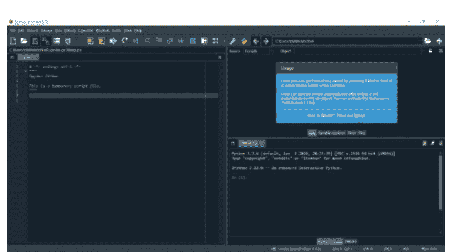

图 3-2 Spyder 首次文件 要开始探索 Spyder IDE，需要识别 3 个主要组件。随着你开始使用它，你将了解更多关于这些组件或功能的信息。

-   **编辑器：** Spyder 编辑器在许多方面优于文本编辑器。请记住，这是一个 IDE，因此它具有高级功能，如行号、语法高亮（语法中的彩色关键字）、自动完成功能等等。你可以在这个多语言编辑器中高效工作，它具有函数/类浏览器、代码分析工具、自动代码补全、水平/垂直分割以及跳转到定义等功能。
-   **IPython 控制台：** 在完整的 GUI 界面灵活性中，根据需要使用任意数量的 IPython 控制台；按行、单元格或文件运行代码；并直接在行内渲染绘图。
-   **变量资源管理器：** 动态交互和修改变量：绘制直方图或时间序列、编辑数据框或 NumPy 数组、对集合排序、深入嵌套对象等等！

请参考下图，以识别 Spyder 的上述 3 个组件在屏幕上的位置。随着你在该主题上的进展，以及不断学习新知识并在 IDE 中进行实验，这些细节将变得越来越清晰。

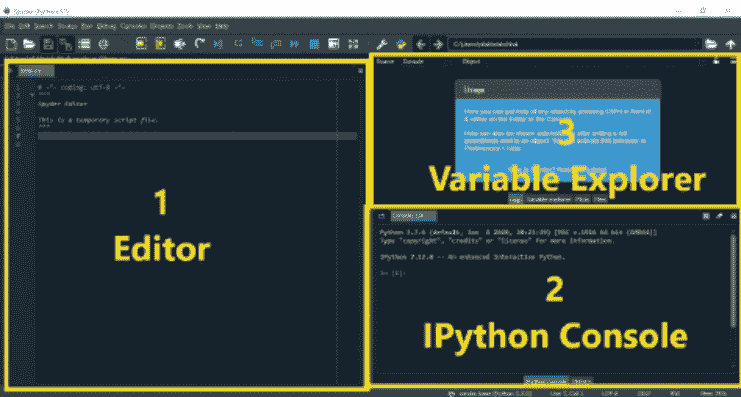

> 图 3-3 Spyder 组件 简单来说，在编辑器中，我们编写内容（包括代码）。IPython 控制台是类似终端的控制台窗口，你将在这里看到代码的结果，它也可以独立于编辑器代码使用。在变量资源管理器窗口中，我们将看到在这里创建的对象。例如新变量、类、数据框、图表、绘图等。

### 3.1.2 使用 Jupyter Notebook

我们将使用 GUI（图形用户界面）方法来打开 Jupyter Notebook。我们安装了 Anaconda，其中包含了 Jupyter。所以我们将首先打开 Anaconda。窗口将类似于你上面看到的图像，**图 3-1 Anaconda Navigator**。

点击 **Jupyter Notebook** 下方的 **Launch** 按钮以打开 Jupyter Notebook。首次打开时，窗口将类似于下图。

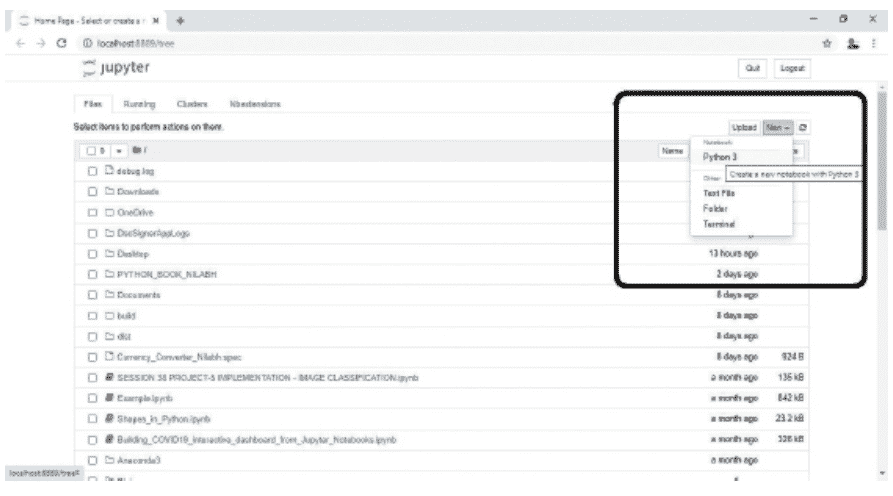

*图 3-4 Jupyter Notebook 基础页面 你屏幕上的文件夹可能与我的不同，因为默认情况下，Jupyter Notebook 的第一个窗口会在你的基础目录/文件夹中打开。如你所见，我的基础目录中已经有一些 **.ipynb** 文件。我可以直接点击它们来打开。*

但既然你是第一次打开，你需要创建你的第一个 Notebook。

要创建你的 notebook，请点击右上角的 "**New**" 下拉按钮，然后选择 **Python 3**。这将打开一个新网页，其中有一个空白单元格，并且没有名称（名称处显示为 Untitled）。

现在你可以根据需要添加、插入任意数量的单元格，之后还可以删除它们、更改它们的显示顺序以及做很多事情。下面是我本章的 Jupyter notebook 页面的图像，向你展示 notebook 的不同部分。随着你持续使用 notebook 进行练习，你将学会如何使用不同的功能。

要运行一行代码，只需在单元格中输入该行代码，将单元格类型保持为“code”（这也是默认类型），然后使用以下任一选项：**使用鼠标：** 转到菜单栏中的“Cell”。根据你的需求使用任何运行选项。

**使用键盘：** “cell”菜单栏选项中的相同选项也有键盘快捷键。以下是运行代码最常用的 3 个键盘快捷键。

**Shift-Enter：** 运行单元格，选择下方单元格 **Ctrl-Enter：** 运行选定的单元格 **Alt-Enter：** 运行单元格并在下方插入新单元格

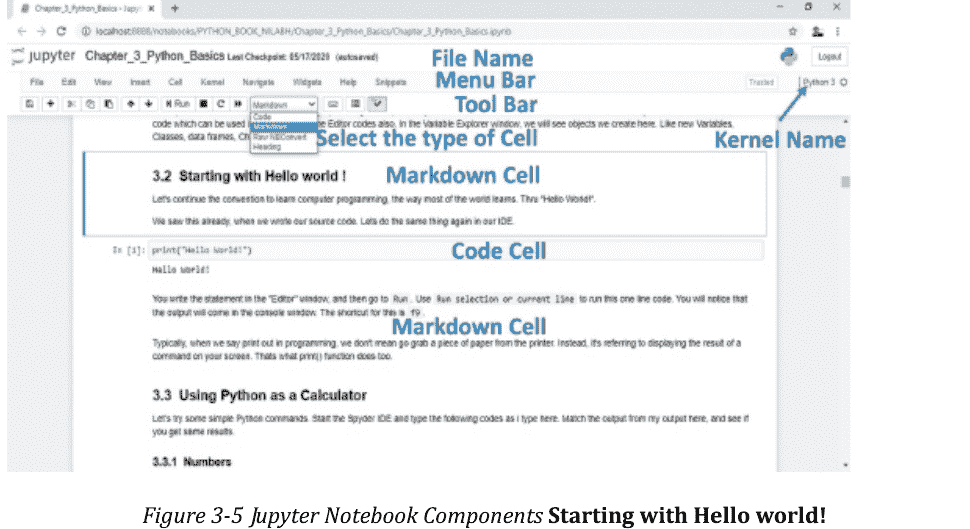

让我们继续沿用学习计算机编程的惯例，这也是世界上大多数人学习的方式。通过“Hello World!”。

我们在编写源代码时已经见过这个了。让我们在 IDE 或 Notebook 中再做一次同样的事情。

```
In [1]: print("Hello World! ")
```

**Hello World!**

你在“编辑器”窗口中编写语句，然后转到 **Run**。使用 **Run selection or current line** 来运行这一行代码。你会注意到输出将出现在控制台窗口中。此操作的快捷键是 **f9**。

如果你使用 Jupyter Notebook，请使用前面提到的键盘快捷键或鼠标点击来运行代码。

通常，当我们说在编程中打印输出时，并不是指你从打印机上拿一张纸。相反，它指的是在屏幕上显示命令的结果。**print()** 函数的作用也是如此。

## 3.3 将 Python 用作计算器²¹

让我们尝试一些简单的 Python 命令。启动 Spyder IDE 并按照我在这里输入的方式输入以下代码。将我的输出与你的输出进行比较，看看你是否得到相同的结果。

### 3.3.1 数字

解释器也像一个简单的计算器：我们可以向它输入一个表达式，它将返回值。**表达式语法非常直观：运算符 +、-、* 和 / 的工作方式与你可能用过的任何计算机程序（如数字计算器或电子表格（如 Excel））中的完全一样；可以使用圆括号（()）进行分组。例如：**

```
In [2]: 2+2
Out[2]: 4
In [3]: 50 - 5*6
Out[3]: 20
In [4]: (50 - 5*6) / 4
Out[4]: 5.0
In [5]: 8 / 5 # 除法总是返回浮点数
Out[5]: 1.6
```

整数（例如 **2, 4, 20**）的类型是 **int**，带有小数部分的数（例如 **5.0, 1.6**）的类型是 **float**。我们将在本书后面更详细地介绍数值类型。

除法（/）总是返回一个 **float**。要进行整数除法并得到整数结果（丢弃任何小数部分），可以使用 // 运算符；要计算余数，可以使用 %：

```
In [6]: 17 / 3 # 经典除法返回浮点数
Out[6]: 5.666666666666667
```

```
In [7]: 17 // 3 # 整数除法丢弃小数部分
Out[7]: 5
```

```
In [8]: 17 % 3 # % 运算符返回除法的余数
Out[8]: 2
```

```
In [9]: 5 * 3 + 2 # 结果 * 除数 + 余数
Out[9]: 17
```

在 Python 中，可以使用 ** 运算符来计算幂：

```
In [10]: 5 ** 2 # 5 的平方
Out[10]: 25
```

```
In [11]: 2 ** 7 # 2 的 7 次方
Out[11]: 128
```

等号（=）用于将值赋给变量。之后，在下一个交互式提示符之前不会显示任何结果：

```
In [12]: width = 20
        height = 5 * 9
```

#### 注意，这里当我们运行这些行时，将没有输出。

### 3.3.2 字符串

除了数字，Python 还可以操作字符串，字符串可以用多种方式表示。它们可以包含在单引号（'...'）或双引号（"..."）中，效果相同。可以使用 "\" 来转义引号：

```
In [13]: 'python strings' # 单引号
Out[13]: 'python strings'
In [14]: 'doesn\'t' # 使用 \ ' 来转义单引号...
Out[14]: "doesn't"
In [15]: "doesn't" # ...或者使用双引号代替
Out[15]: "doesn't"
```

在交互式解释器中，输出字符串被包含在引号中，特殊字符用反斜杠转义。虽然这有时看起来可能与输入不同（包含的引号可能会改变），但这两个字符串是等价的。如果字符串包含单引号但不包含双引号，则字符串用双引号括起来；否则，用单引号括起来。

**print()** 函数通过省略包含的引号并打印转义和特殊字符，产生更易读的输出：

```
In [16]:  '"Isn\'t," they said.'
```

```
Out[16]:  '"Isn\'t," they said.'
```

```
In [17]:  print('"Isn\'t," they said.')
```

```
"Isn't," they said.
```

如果你不希望以 "\" 为前缀的字符被解释为特殊字符，可以通过在第一个引号前添加 r 来使用原始字符串：

```
In [18]:  print('C:\some\name') # 这里 \n 表示换行！
```

```
C:\some ame
```

```
In [19]:  print(r'C:\some\name') # 注意引号前的 r
```

```
C:\some\name
```

#### 连接和重复

字符串可以使用 + 运算符连接（粘合在一起），使用 * 运算符重复。要记住这一点很简单。+ 运算符用于加法，* 运算符用于乘法（见示例）

```
In [20]:  'a'+'b'
```

```
Out[20]:  'ab'
```

```
In [21]:  't'*5
```

```
Out[21]:  'ttttt'
```

```
In [22]:  'no'*3+'dip'
```

```
Out[22]: 'nononodip'
```

两个或多个字符串字面量（即用引号括起来的）相邻放置时会自动连接。

```
In [23]: 'nil' 'abh'
```

```
Out[23]: 'nilabh'
```

当你想要拆分长字符串时，这个特性特别有用

```
In [24]: text = ('Put several strings within parentheses-'
'-to have them joined together.')
text
```

```
Out[24]: 'Put several strings within parentheses--to have them joined together.'
```

##### 3.3.2.2 索引

字符串可以被索引（下标），第一个字符的索引为 0。没有单独的字符类型；字符只是大小为 1 的字符串。

| p | y | t | h | o | n |
|---|---|---|---|---|---|
| 0 | 1 | 2 | 3 | 4 | 5 |
| -6 | -5 | -4 | -3 | -2 | -1 |

第一行数字给出了字符串中索引 0...6 的位置；第二行给出了相应的负索引。从 i 到 j 的切片由分别标记为 i 和 j 的边缘之间的所有字符组成。

```
In [25]: word = 'Python'
        word[0] # 位置 0 的字符
```

```
Out[25]: 'P'
```

```
In [26]: word[5] # 位置 5 的字符
```

```
Out[26]: 'n'
```

索引也可以是负数，从右边开始计数：

```
In [27]: word[-4]
```

```
Out[27]: 't'
```

注意，由于 -0 与 0 相同，负索引从 -1 开始。

##### 3.3.2.3 切片

除了索引，还支持切片。索引用于获取单个字符，而切片允许你获取子字符串：

```
In [28]: word[0:2] # 从位置 0（包含）到 2（不包含）的字符
```

```
Out[28]: 'Py'
```

```
In [29]: word[2:5] # 从位置 2（包含）到 5（不包含）的字符
```

```
Out[29]: 'tho'
```

注意起始位置总是包含的，结束位置总是不包含的。这确保了 **s[:i] + s[i:]** 总是等于 **s**

```
In [30]: word[:2]+word[2:]
Out[30]: 'Python'
```

```
In [31]: word[:4]+word[4:]
Out[31]: 'Python'
```

切片索引有有用的默认值；省略的第一个索引默认为零，省略的第二个索引默认为被切片字符串的大小。

记住切片工作方式的一种方法是将索引想象为指向字符之间，第一个字符的左边缘编号为 0。那么，一个包含 n 个字符的字符串的最后一个字符的右边缘索引为 n，例如：

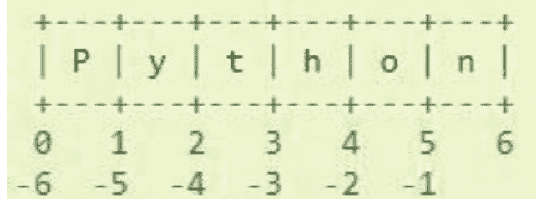

*图 3-6 python-slicing 第一行数字给出了字符串中索引 0...6 的位置；第二行给出了相应的负索引。从 i 到 j 的切片由分别标记为 i 和 j 的边缘之间的所有字符组成。*

Python 字符串不能被更改——它们是不可变的。因此，给字符串的索引位置赋值会导致错误。所以，如果你尝试在字符串中赋一个新值，它会给你一个错误。

```
In [32]: word[2] = '1'
```

```
---------------------------------------------------------------------------
TypeError                                 Traceback (most recent call last)
<ipython-input-32-27e525a0336b> in <module>
----> 1 word[2] = 'l'

TypeError: 'str' object does not support item assignment
```

如果你需要一个新的字符串，你需要创建一个新的。

```
In [33]: # 内置函数 len() 返回
        # 字符串的长度：len(word)
```

```
Out[33]: 6
```

```
In [34]: s = 'supercalifragilisticexpialidocious'
        len(s)
```

```
Out[34]: 34
```

## 4.4 Python 中的代码语法

在源代码中编写的用于执行的指令称为语句。Python 中有不同类型的语句，如赋值语句、条件语句、循环语句等。这些都有助于用户获得所需的输出。例如，n = 20 是一个赋值语句。

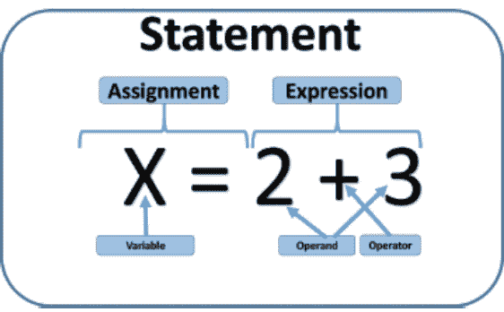

**图 3-7 Python 中的语句** 语句可以是单行或多行语句。多行语句可以使用圆括号 ()、花括号 {}、方括号 []、分号 (;)、续行符反斜杠 (\) 扩展到多行。当程序员需要进行长计算且语句无法放入一行时，他可以使用这些字符。

为了便于理解上述概念，下面是一些语句的示例。

```
#使用续行符 (\) 声明：
s = 1 + 2 + 3 + \
    4 + 5 + 6 + \
    7 + 8 + 9
#使用圆括号 () 声明：
n = (1 * 2 * 3 + 7 + 8 + 9)

#使用方括号 [] 声明：
footballer = ['MESSI',
              'NEYMAR',
              'SUAREZ']
#使用花括号 {} 声明：
x = {1 + 2 + 3 + 4 + 5 + 6 +
    7 + 8 + 9}

#### 一行中的多个语句，使用分号(;)声明：
flag = 2; ropes = 3; pole = 4
```

语句是任何程序的基本构建块。它们是你希望程序执行的操作。没有语句，就不可能有任何程序。每条语句由关键字、表达式和运算符组成。

### 3.4.1.1 终结一条语句
在 Python 中，行的结束意味着语句的结束。我们在上面已经看到了如何将一条语句写在多行中。

分号可以有选择地终结一条语句。有时，它可以用来在单行上放置多条语句。

例如：

使用分号（;）在单行上声明多条语句：`flag = 2; ropes = 3; pole = 4`

## 3.4.2 变量和赋值
编程语言最强大的特性之一是操作变量的能力。变量是引用一个值的名称。请注意，变量只是引用被赋予它的值。它并不等于那个值。一旦它被赋予另一个值，旧的赋值就会自动失效。

赋值语句创建新变量并为其赋值：

```
In [35]: # 我们将值 45 赋给变量 a
         a = 45

         # 然后打印 a
         print(a)
```
```
45
```

```
In [36]: # 现在我们给同一个变量 a 赋另一个值
         a = 3+2

         # 然后再次打印 a
         print(a)
```
```
5
```

你会注意到，一旦 a 被赋予新值，它就会立即采用新值，并且按照赋值的顺序。

## 3.4.3 变量名和关键字
你应该选择对数据有意义的变量名。例如，当处理孟买商店的销售数据时，变量名 Sales_mumbai 是有意义的。这显然不是一条规则，但对于提高代码的可读性大有帮助。而且因为你可能需要在代码中多次使用变量名，使用相关且有意义的名称对你作为程序员也有帮助。

变量名可以是任意长度，可以包含字母和数字。它们可以是大写或小写，但同名不同大小写是不同的变量，你必须记住，Python 是**区分大小写**的语言。现在是一些命名变量的规则。

- 它必须以字母开头（不能是数字）
- 下划线（_）可以出现在名称中。它用于连接变量的两个或多个单词，因为不允许使用空格。
- Python 关键字不能用作变量名。Python 有这些关键字：

| and | def | exec | if | not | return |
|---|---|---|---|---|---|
| assert | del | finally | import | or | try |
| break | elif | for | in | pass | while |
| class | else | from | is | print | yield |
| continue | except | global | lambda | raise | |

请保留此列表以备参考。

如果你给变量一个非法的名称，你会得到一个语法错误：所以我列出 10 个名称，你需要识别并查看其中哪些在 Python 中不能合法地作为变量名。

| 2nd_wife | man_vs_wild | "national geographic" | data_science | sudhir22 |
|---|---|---|---|---|
| python123 | class | global | tomorrow | Sundar_ban |

自己试试看，给这些名称赋一些随机值，然后运行它们，检查它们是否被接受或抛出语法错误。

## 3.4.4 表达式
表达式是值、变量和运算符的混合体。当你在命令行上输入一个表达式时，解释器会评估它并显示结果：

```
In [37]: 2+3
Out[37]: 5
```

尽管表达式包含值、变量和运算符，但并非每个表达式都包含所有这些元素。一个单独的值被认为是一个表达式，变量也是如此。

```
In [38]: 15
Out[38]: 15
```

```
In [39]: a
Out[39]: 5
```

评估表达式与打印其值不是一回事。通过一个字符串示例，这一点会变得更清楚。

```
In [40]: 'Hello World! '
Out[40]: 'Hello World! '
```

```
In [41]: print('Hello World! ')
Hello World!
```

当 Python 解释器显示表达式的值时，它使用与你输入值相同的格式。对于字符串，这意味着它包含引号。但如果你使用 print 语句，Python 会显示字符串的内容而不带引号。

## 3.5 编程的第一步<sup>22</sup>
当然，我们可以用 Python 来完成比将两个二加在一起更复杂的任务。例如，我们可以编写斐波那契数列的初始子序列，如下所示：

```
In [42]: # 斐波那契数列：
         # 两个元素的和定义下一个元素
         a = 0
         b = 1
         while a < 10:
             print(a)
             a, b = b, a+b
```
```
0
1
1
2
3
5
8
```

让我们玩一下我们刚刚编写的这段简单代码。这次我们将改变变量 **a** 和 **b** 的赋值方式。值将保持不变，但这种方式 Python 让你减少代码行数。此外，我们将改变一个小条件来展示它如何影响结果。

```
In [43]: # 相同的斐波那契数列：
         # 两个元素的和定义下一个元素
         a, b = 0, 1
         while a < 15:
             print(a)
             a, b = b, a+b
```
```
0
1
1
2
3
5
8
13
```

你注意到这些程序行的运行方式与之前相同吗？另外，你可能已经注意到 "**a**" 的上限现在是 15，因此多打印了一个结果 **13**。

这个例子引入了几个新特性。

1. 第一行包含多个赋值：变量 "**a**" 和 "**b**" 同时获得新值 0 和 1。在最后一行，这再次被使用，演示了右侧的表达式在任何赋值发生之前都会先被评估。右侧的表达式从左到右进行评估。
2. while 循环只要条件（这里是：**a < 10**，我们后来修改为 **a<15**）保持为真就会执行。在 Python 中，任何非零整数值都是真；零是假。条件也可以是字符串或列表值，实际上，任何序列；任何具有非零长度的东西都是真，空序列是假。示例中使用的测试是一个简单的比较。标准比较运算符的写法与以下相同：<（小于）、>（大于）、==（等于）、<=（小于或等于）、>=（大于或等于）和 !=（不等于）。
3. 循环体是**缩进的**：缩进是 Python 对语句进行分组的方式。在交互式提示符（在终端窗口中），你必须为每个缩进的行输入制表符或空格。在实践中，你将使用文本编辑器为 Python 准备更复杂的输入；所有体面的文本编辑器都有自动缩进功能。当交互式输入复合语句时，它后面必须跟一个空行以表示完成（因为解析器无法猜测你何时输入了最后一行）。请注意，基本块内的每一行必须缩进相同的量。
4. **print()** 函数写入其给定参数的值。它与直接写你想写的表达式（就像我们之前在计算器示例中所做的那样）的不同之处在于它处理多个参数、浮点数和字符串的方式。字符串打印时不带引号，并且在项目之间插入空格，因此你可以很好地格式化内容，像这样：

```
In [44]:  i = 256*256
          print('The value of i is', i)
```
```
The value of i is 65536
```

### 3.5.1 关于 Print() 的更多信息
我们现在将看到一些非常重要和强大的概念，以 print() 作为我们方便的借口。由于 print() 是你将最常使用的函数之一，掌握它是一个额外的奖励。

到目前为止，我们已经看到 **print()** 函数打印我们在括号内给出的任何参数。它还有更多内容。让我们在 X 光下看看 **print()** 函数。

**print()** 的实际语法如下。

```
print(*objects, sep=' ', end='\n', file=sys.stdout, flush=False)
```

这让我可以介绍 Python 编程的另外两个基本概念。

- 参数（有时表示为 **args.**）
- 关键字参数（有时表示为 **kwargs.**）

就像我们到目前为止所做的那样，我们将以最简单的方式理解这些复杂的概念。这意味着可能会有一些遗漏，但我们将尝试为初学者捕捉其本质。

**参数**是我们传递给函数的任何东西。例如，字符串或变量是我们传递给 **print()** 函数的参数。当有多个变量要传递，并且在定义函数时你不知道将来函数可能需要多少个变量作为参数时，我们使用特殊的语法 **\*args**。这里，\* 象征着我们可以传递任意数量的变量，而 **args** 只是为了提高代码可读性的约定。它可以被任何其他单词替换，使其更有意义。正如你所见，在 **print()** 函数的语法中，**\*objects** 代替了 **\*args**。现在你知道这意味着，可以有多个对象（变量、字符串、类或任何其他对象）传递给 **print()** 函数。

**关键字参数**是你在将变量传递给函数时为其提供**名称**的参数。记住这个想法。我们将通过使用上面的 **print()** 函数语法来学习它。

你注意到 **print()** 语法中的 **sep=**、**end=**、**file=** 和 **flush=** 了吗？这些是**关键字**参数。正如我刚才在段落中提到的

### 3.5.1 参数与关键字参数

如上所述，它们带有一个**名称**，而等号右侧的值是分配给它的值。你在语法中看到的值是**默认**值。这意味着，如果你没有分配不同的值，将传递默认值，并且不会出现语法错误。

现在，理解了参数和关键字参数，让我们来理解**print()**语法的含义，以及如何灵活运用它。

**语法：** `print(*objects, sep=' ', end='\n', file=sys.stdout, flush=False)`

**参数：**

- **\*objects**：任意对象，数量不限。打印前会转换为字符串。
- **sep=' '**：（可选）指定如果有多个对象时，如何分隔它们。默认值是空格，由' '指定。
- **end='\n'**：（可选）指定在末尾打印什么。默认值是**换行符**，由'\n'指定。
- **file=sys.stdout**：（可选）一个具有write(string)方法的对象。如果省略，将使用默认的**sys.stdout**，它会在屏幕上打印对象。
- **flush=False**：（可选）一个布尔值，指定输出是刷新（True）还是缓冲（False）。默认为False。

现在让我们来实践一下。注意以下代码行中的变化。为了更好地理解，我们将使用之前编写的同一个简单的斐波那契数列代码。

```
In [45]: # Same Fibonacci series # the sum of two elements defines the next a, b = 0, 1
while a < 15: print(a, end=',') a, b = b, a+b
```

0,1,1,2,3,5,8,13,

现在，你可以在各种程序中自行尝试其他**关键字参数**，看看它们如何改变输出。

### 3.5.2 一种很酷的打印输出方式

这不是一个概念，而是向你介绍一种打印结果或任何语句的很酷的方式。你将在后面的字符串格式化部分作为概念学习这个。但在那之前，你完全可以先尝试一下，玩玩看。

```
In [46]: a = 5
        b = 6
        ab = 5*6

        print("when {} is multiplied by {}, the result is {}".format(a, b, ab))
```

when 5 is multiplied by 6, the result is 30

```
In [47]: # One string variant name = "Nilabh"
        lastname = "Nishchhal"
        place = "Mumbai"

        print("{} {} lives in {}".format(name, lastname, place))
```

Nilabh Nishchhal lives in Mumbai

在上面的两个例子中，当变量的值改变时，输出也会相应改变。这将在接下来的章节中成为一个非常有用的工具。

### 3.5.3 强大的print()绘制基本形状

我们已经看到了print的用法及其语法。下面让我展示一个非常简单的技巧。让我们用基本代码画一个三角形。

```
In [48]: print("      /|")
        print("     / |")
        print("    /  |")
        print("   /   |")
        print("  /    |")
        print(" /____|")
```


这是一种非常基础和简单的制作形状的方法。在接下来的章节中，当我们学习循环和控制流语句时，我们将制作一些更有趣的形状。这样，我们也将了解循环是如何工作的。

这个三角形只是对未来内容的一个预览。

## 3.6 故障排除<sup>23</sup>

当我们的代码没有给出预期的结果，或者根本没有给出结果时，就需要进行故障排除。当代码没有给出结果时，它可能会抛出一个错误。Python中的错误信息非常详细，能准确指出错误是什么以及错误在哪里。

对于编程新手来说，看到错误信息是很常见的。他们的倾向是不假思索地立即关闭它，然后盯着自己的代码，仿佛问题会自动解决一样。虽然逐行检查代码最终会让你找到问题，但错误信息可以为你提供一条解决问题的捷径。

我们将在这里看到最常发生的三种主要错误类型。

- 语法错误
- 运行时错误
- 语义错误

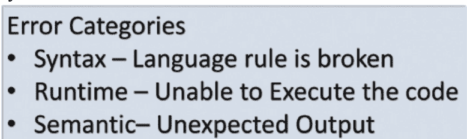

图3-8 错误类别

### 语法错误

这类错误通常是打字错误，但更普遍地说，它意味着你的程序结构存在某些问题。当未使用正确的Python语法时，就会发生这种情况。Python的错误信息会指向语法中的错误。

```
In [49]: # notice the absence of closing " in the string print("Hello World! )
```

```
File "<ipython-input-49-9d0e3bd45f27>", line 3
    print("Hello World!)
          ^
SyntaxError: EOL while scanning string literal
```

如果你注意到，错误信息提到了"**SyntaxError**: EOL while scanning string literal"，并暗示它与字符串字面量有关。它还从物理上指向了错误可能所在的位置。

```
In [50]:  # there is a space between 4 and 5

        x = 3+ 4 5

        x
```

```
File "<ipython-input-50-44afb4dc20cc>", line 3
    x = 3+ 4 5
          ^
SyntaxError: invalid syntax
```

在这种情况下，错误信息也提到了错误类型，并指向了语法无效的位置。

我们这里只看到了单行代码的例子。在代码较长的情况下，如果这种方法不起作用，你可能需要扫描整个文件来寻找问题。最好的解决方案是通过每写几行代码就运行一次程序来避免这个问题。如果你遇到这个错误，那么你可以检查你最近的更改，将其作为可能的嫌疑对象。

### 3.6.2 运行时错误

运行时错误在程序执行时发生。由于Python是一种解释型语言，这些错误直到程序的控制流到达有问题的行时才会发生。

常见原因：

- 变量或函数名拼写错误。
- 在定义变量之前使用它。
- 名称本应被引号括起来。
- 除以零

当Python理解了你的意思，但在执行你的指令时遇到麻烦，就会发生运行时错误。这被称为运行时错误，因为它发生在程序开始运行之后。

```
In [51]: 5/0
```

```
ZeroDivisionError Traceback (most recent call last)
<ipython-input-51-0106664d39e8> in <module>
----> 1 5/0

ZeroDivisionError: division by zero
```

这里的语法是正确的，但解释器或Python不知道如何将某个数除以"0"。因此，程序运行了，但遇到了错误。这是一种运行时错误。

### 3.6.3 语义错误

语义或逻辑错误是程序设计上的问题。这些通常不会产生任何错误信息，而是导致你的程序行为不正确。这类错误可能很难追踪。

这些错误通常是由于意外地在应该使用一个变量的地方使用了另一个变量，或者仅仅是某些数学计算错误造成的。

```
In [52]: # We want to print Hello Nilabh name = "Nilabh"
print("Hello name")
```

> **Hello name**

你可能注意到，在上面的例子中，没有错误信息。但我们也没有得到预期的结果。原因是，我们以为我们传递的是"name"**变量**，Python会理解它的值。而根据**字符串**语法，Python是**按字面意思**理解的。

语义错误是最难排查的。

### 3.6.4 当所有方法都失败时...

你可能会遇到无法追踪到导致程序严重失败的错误的情况。你可以采取以下几个步骤来恢复：

1. **查阅** - 最好的查阅地方是[stackoverflow.com](http://stackoverflow.com)
2. **避免** - 希望你不会走到这一步。你应该尝试只写几行代码，然后执行你的程序。再写几行，再执行。如果你遇到问题，你将能够查看你最后修改的几处内容来找到问题。
3. **准备** - 你应该在每次开始新部分时保存你的程序。如果你达到了一个里程碑，做一个备份副本。你所要做的就是选择"另存为..."，并将你的文件命名为filename2.py，然后是filename3.py，等等。如果你正在处理filename7.py，并且无法修复你弄坏的东西，你可以直接回到filename6.py。完成后，你可以将所有旧文件复制到一个子目录中，并根据你的需要重命名最终解决方案。

-   4. **注释掉** - 你可以尝试注释掉有问题的代码部分，看看是否是它导致了问题。你可以使用 IDLE 中的“格式”菜单，在选中一段代码后在其前面放置注释字符。尝试隔离不同的代码部分，以便缩小问题范围。

-   5. **从头开始** - 当所有其他方法都失败时，你可以从一个新的空文件开始。然后，一次复制并粘贴一小部分你的代码。每次添加一部分后，运行你的程序，看看新添加的部分是否导致了问题。

## 3.7 总结

程序，并在适当的时候学习了一些 Python 的编码原则，比如多重赋值、缩进、循环迭代和输出打印。然后我们深入探讨了 `print()` 世界及其语法，进一步巩固了诸如参数和关键字参数等概念。我们遇到的最后一个主题是故障排除。其重要性再怎么强调也不为过。掌握了 Python 的基本操作知识后，让我们来理解一些 Python 语言的理论基础。

### 3.7.1 练习：回答以下问题：

1.  Spyder IDE 编辑器相对于简单文本编辑器有哪些优势？
2.  Python 中加法、减法、乘法和除法的运算符是什么？
3.  `*` 和 `**` 运算符有什么区别？它们在 Python 中表示什么？
4.  Python 中的语句是什么？它的重要性是什么？
5.  Python 中的变量是什么？如何给变量赋值？
6.  你能在 Python 中将一个变量命名为 `import` 吗？请说明理由。
7.  在 Python 中，`"math"` 和 `"Math"` 与 `"MATH"` 是相同的。这个说法正确吗？请给出理由来证明你的答案。
8.  在 Python 中，将语句分组的方法是什么？
9.  语法错误和语义错误有什么区别？
10. 在 `print` 函数语法中，`sep` 和 `end` 关键字的默认值是什么？

### 3.8.2 判断正误：

1.  任何偶数除以二都会返回一个 `int`（整数）类型的对象。
2.  字符串的正索引从 `"0"` 开始，负索引从 `"-1"` 开始。
3.  Python 字符串可以被更改，换句话说，它们是可变的。
4.  `"Dream Team"` 是 Python 中一个有效的变量名。
5.  你可以在 Python 中将一个变量命名为 `"lambda"`。
6.  在 Python 中，语句使用“句号”符号终止。
7.  在 Python 中，`"a = 25"` 和 `"a == 25"` 是相同的。
8.  使用 `print` 函数打印和表达式，与计算该表达式是不同的。
9.  语义错误也是语法错误的一种。
10. 除以零是运行时错误。

### 3.8.3 为此编写你自己的代码：

1.  编写一个代码来连接你的名字和姓氏。两者之间应有一个空格。
2.  矩形的长度为 `"l"`，高度为 `"h"`。对于一个高度为 8、长度为 23 的矩形，编写代码来计算其面积。代码应包含对 `"l"` 和 `"h"` 的值赋值，以便相同的代码可以重用。矩形面积的公式是 `"area = length X height"`。
3.  32 的平方和 27 的立方是多少？编写计算它们的语句。
4.  用 Python 写出这个方程式。为变量赋数值并计算结果。\begin{equation} (a+b)^2 = a^2 + b^2 + 2ab \end{equation}
5.  通过编写一行 Python 代码来查找你的名字的长度。
6.  仅使用 `print` 语句绘制一个矩形。
7.  仅使用 `print` 语句绘制一个字母 "P"。
8.  写下你的名字并将其赋值给 `"Name"` 变量。写下你的年龄并将其赋值给 `"Age"` 变量。然后编写一个 `print` 语句来打印以下内容：My name is "Name" and my age is "Age"。这里的 `"Name"` 和 `"Age"` 应分别是字符串和数字。
9.  修正以下代码行中的语法错误

```
words = [cat, window, defenestrate]
for w in words:
    print(w, len(w))
```

10. 修正以下代码行中的语法错误

```
a, b = 0, 1
while a < 15:
    print(a, end=',')
    a, b = b, a+b
```

### 3.8.4 待办事项：

1.  写下你的名字。在名字下方，写出该字符串的正索引和负索引。
2.  开始使用 IDE 或 Jupyter Notebook 作为计算器一段时间。
3.  访问网站 [stackoverflow.com](https://stackoverflow.com)。当你试图从编码错误中学习时，这将成为你最好的朋友。

## 4 PYTHON 中的对象和运算符

本章将重点介绍 Python 语言的基本语义。与我们在前一章看到的语法相反，语言的语义包括语句的含义。

本章将涵盖变量和对象的语义。这些是在 Python 脚本中存储、引用和操作数据的主要方式。

### 4.1 变量

Python 中的**变量**只是指针。它们本身没有任何值，而是指向它们被赋值的对象。从技术上讲，变量只是计算机内存中存储某些信息的部分。变量正如其名所示——它们的值可以变化。这意味着你可以使用变量存储任何东西。

我们在前一章已经见过一些变量。现在让我们借助以下示例深入理解这一点。

```
In [1]: x = 38

        y = "emailid@pyhton.com"
```

```
In [2]: print(x)

        print(y)
```

**38**
emailid@pyhton.com

你注意到当我们打印两个变量时，输出之间的区别了吗？

`x` 按其赋值方式打印，但 `y` 打印时，`""` 不是输出的一部分。

原因是，Python 会识别你赋给变量的值的**类型**。而且这是自动的。我这里的意思是，你不需要单独定义或创建变量类型。你只需命名一个变量，给它赋值，Python 就会自动识别该变量的类型。

```
In [3]: print(type(x))
       print(type(y))
```

```
<class 'int'>
<class 'str'>
```

#### 4.1.1 变量赋值

当我们引入一个变量 `x = 38` 时，`x` 是变量名，`=` 是赋值运算符，`38` 是被赋的值。

这里，与算术不同，`=` 不表示**等于**。它表示**赋值给**。在 Python 中，“等于”写作 `==`。我们将在后面学习运算符时看到它。

#### 4.1.2 变量命名

我们在前一章已经简要了解了如何命名变量。为了强调，这里重复一下，因为这里的任何错误都可能导致运行代码时出现语法错误。让我们看看命名变量的规则以及我们需要记住的事项。

1.  变量名应仅包含字母、数字和下划线。
2.  即使允许使用数字，名称也不应以数字开头。`5fingers` 不会是一个有效的名称。
3.  名称中不允许有空格。`"sales data"` 不会是一个有效的名称。我们可以将其命名为 `"sales_data"`。
4.  名称区分大小写。因此，`"Sales"` 与 `"sales"` 不同。
5.  最后，变量不能是关键字。这些是保留字，对 Python 解释器有特殊含义，例如 **and**、**break** 或 **try**。

要获取关键字列表，可以使用以下方法。下面是关键字列表。

```
In [4]: import keyword
       print(keyword.kwlist)
```

```
['False', 'None', 'True', 'and', 'as', 'assert', 'async', 'await', 'break',
'class', 'continue', 'def', 'del', 'elif', 'else', 'except', 'finally', 'for',
'from', 'global', 'if', 'import', 'in', 'is', 'lambda', 'nonlocal', 'not',
'or', 'pass', 'raise', 'return', 'try', 'while', 'with', 'yield']
```

### 4.2 概念层次结构

在我们进一步之前，让我们解构一下编程或脚本的层次结构。不要让新概念在这里压倒你，因为我们稍后会详细学习每一个。

Python 程序可以分解为模块、语句、表达式和对象，如下所示：

1.  程序由模块组成。
2.  模块包含语句。

## 4.3 对象

最简单地说，以下陈述概括了我们在 Python 中所做的事情。

**我们对对象执行操作。**

简单操作的例子包括数字（对象）的加法、乘法，或字符串（对象）的连接。

在 Python 中，数据以**对象**的形式存在。这些对象可以是 Python 提供的内置对象，也可以是我们使用 Python 类创建的对象。

目前，要理解什么是对象，我们可以将其理解为“只是一块内存”，附带有值和一组操作。我们将在本章后面介绍其正式定义。

正如我们将看到的，Python 中的一切都是**对象**。无论是简单的数字，还是对它们执行的操作。对于 Python 脚本来说，它们都是对象。现在，回想一下，Python 也是一种 OOP 或面向对象编程语言。

Python 语言的一个重要特性是其对象模型非常一致。每个数据结构、数字、字符串、类、函数、模块等，都存在于 Python 解释器各自的“容器”中，这些容器被称为 Python 对象。每个对象都有一个关联的类型（例如，整数、字符串等）和内部数据。

在实践中，这使得语言非常灵活，因为即使是函数也可以像任何其他对象一样被对待。

### 4.3.1 对象的分类

- 1. 内置对象
- 2. 用户定义对象

它们也可以被分类为

- 1. 可变对象
- 2. 不可变对象

下表显示了内置对象、它们的示例以及它们是可变还是不可变。

| 对象类型 | 示例 | 可变还是不可变？ |
| :--- | :--- | :--- |
| **数字** | 1234, 3.1415, 3+4j, 0b111, Decimal(), Fraction() | **不可变** |
| **字符串** | 'nilabh', "Bob's" | **不可变** |
| **列表** | [1,[2,'three'],4.5], list(range(10)) | **可变** |
| **字典** | {'food':'spam','taste':'yum'}, dict(hours=10) | **可变** |
| **元组** | (1,'spam',4,'U'), tuple('spam') | **不可变** |
| **集合** | set('abc'), {'a','b','c'} | **可变** |
| **布尔值** | 0, 1 | **不可变** |
| **程序单元类型** | 函数、模块、类 | |

### 4.3.2 内置对象的优势

内置对象使得 Python 成为“高级语言”的一个重要方面。在像 C 或 C++ 这样的低级语言中，大部分工作都花在*实现对象*或创建数据结构上。在那里，程序员需要定义对象类型、规划内存结构、管理内存分配等等。这些繁琐且容易出错的工作使注意力从真正的事情——**解决问题**——上转移开。

在大多数 Python 程序中，所有这些艰苦、繁琐和重复性的工作都被消除了。因为 Python 在语言中内置了强大的对象类型，所以在解决问题之前，大多数时候不需要编写对象实现代码。

让我举一个现实生活中的类比，以便更容易理解这一点。

建造桥梁时，有两种方法。一种是每次都从头开始建造一切，即每个桥墩都现场浇筑，桥墩上的桥板也一块一块地浇筑，这既繁琐又耗时。这是低级语言的方法。从头开始建造一切。


图 4-1 从头建造的桥梁


图 4-2 通过连接对象建造的桥梁

第二种方法是使用预制材料。在这里，桥墩、桥板以及所有其他结构部件都是预制的。它们只是被运到建造桥梁的地方并连接在一起。这是一种不繁琐、省时且不易出错的方法。这就是 Python 采用的方法。这里的对象是预制的。它们已经被定义好了，用户不需要从头开始创建他需要的所有对象。这节省了大量时间、精力，并减少了错误。

除非有内置类型不提供的特殊处理需求，否则几乎总是使用内置对象而不是自己实现更好。以下是一些原因：

- 1. 内置对象使程序易于编写。
- 2. 内置对象是扩展的组件。
- 3. 内置对象通常比自定义数据结构更高效。
- 4. 内置对象是语言的标准部分。

换句话说，内置对象类型不仅使编程更容易，而且比大多数从头开始创建的东西更强大、更高效。无论你是否实现新的对象类型，内置对象都构成了每个 Python 程序的核心。

### 4.3.3 对象的标识、值和类型

对象是 Python 对数据的抽象。Python 程序中的任何数据都由对象或对象之间的关系表示。

你可以将对象视为三样东西的组合。

- 标识
- 类型
- 值

每个对象都有一个标识、一个类型和一个值。

对象的标识一旦创建就永远不会改变。它成为对象的**内存地址**。在 Python 中，每个对象的标识（或内存地址）都由一个数字表示。你可以使用 **id()** 函数查看该数字。

```
In [5]: a = 5 # a 是一个变量，被赋值为 5。这里 "a = 5" 是对象。

id(a) # 输出的数字代表“内存地址”或对象的标识。

Out[5]: 140703750332944
```

对象的类型决定了对象支持的操作，也定义了该类型对象的可能值。**type()** 函数返回对象的类型。与其标识一样，对象的**类型**也是不可更改的。

让我们看一些我们在上表中看到的“对象类型”的例子。我们将在后面的章节中了解更多关于这些不同类型的对象。

```
In [6]: type(a) # a 被赋值为 5，这是一个整数。所以，对象的类型是 "int"
```

```
Out[6]: int
```

```
In [7]: type('nilabh') # str 表示字符串。
```

```
Out[7]: str
```

```
In [8]: type(3.5)
```

```
Out[8]: float
```

```
In [9]: type(['x','yz','abc']) # 包含 3 个字符串的列表
```

```
Out[9]: list
```

```
In [10]: type(['x','y', 1 ]) # 包含 2 个字符串和一个数字的列表
```

```
Out[10]: list
```

```
In [11]: type({'food':'spam','taste':'yum'}) # 字典
```

```
Out[11]: dict
```

还有一些其他类型，你可以自己在 Jupyter notebook 中使用 **type()** 函数查看。

### 4.3.4 可变和不可变对象<sup>24</sup>

某些对象的**值**可以改变。值可以改变的对象被称为**可变**对象；一旦创建，值就不可改变的对象被称为**不可变**对象。对象的可变性由其类型决定；例如，数字、字符串和元组是不可变的，而字典和列表是可变的。

一些对象包含对其他对象的引用；这些被称为**容器**。容器的例子有**元组**、**列表**和**字典**。引用是容器值的一部分。在大多数情况下，当我们谈论容器的值时，我们指的是所包含对象的值，而不是它们的标识；然而，当我们谈论容器的可变性时，仅指直接包含对象的标识。因此，如果一个不可变容器（如元组）包含对一个可变对象的引用，当该可变对象改变时，它的值也会改变。（包含对可变对象引用的不可变容器对象的值可以在后者的值改变时改变；然而，该容器仍被视为不可变，因为它包含的对象集合不能改变。所以，不可变性并不严格等同于拥有一个不可改变的值，它更为微妙。）

**标准类型层次结构**<sup>25</sup>

以下是 Python 内置类型的列表。使用上面学到的 **type()** 函数，你应该在你的 Jupyter notebook 中尝试所有下面提到的类型，以进行实践和实际理解。只有这样，最微妙的概念才会开始变得清晰明了。

- 1. **None**

此类型只有一个值。存在一个具有此值的单一对象。该对象通过内置名称 **None** 访问。它在许多情况下用于表示值的缺失，例如，从没有显式返回任何内容的函数中返回。其真值为假。

#### 2. **NotImplemented**

此类型只有一个值。存在一个具有此值的单一对象。该对象通过内置名称 **NotImplemented** 访问。数值方法和富比较方法如果未对提供的操作数实现该操作，则应返回此值。（然后解释器将尝试反射操作或其他一些后备操作，具体取决于运算符。）其真值为真。

#### 3. **Ellipsis**

此类型只有一个值。存在一个具有此值的单一对象。该对象通过字面量 `...` 或内置名称 **Ellipsis** 访问。其真值为真。

#### 4. **numbers.Number**

这些由数字字面量创建，并由算术运算符和算术内置函数作为结果返回。数字对象是不可变的；一旦创建，其值永远不会改变。Python 数字当然与数学数字密切相关，但受限于计算机中数值表示的局限性。

Python 区分整数、浮点数和复数：

##### **numbers.Integral**

这些表示来自数学整数集合（正数和负数）的元素。

有两种类型的整数：

##### 整数 (int)

这些表示无限范围内的数字，仅受可用（虚拟）内存的限制。出于移位和掩码操作的目的，假定使用二进制表示，负数以 2 的补码的变体表示，这给人一种符号位无限向左延伸的错觉。

##### 布尔值 (bool)

这些表示真值 **False** 和 **True**。表示值 False 和 True 的两个对象是唯一的布尔对象。布尔类型是整数类型的子类型，布尔值在几乎所有上下文中分别表现得像值 0 和 1，例外情况是当转换为字符串时，分别返回字符串 "**False**" 或 "**True**"。

##### numbers.Real (float)

这些表示机器级双精度浮点数。对于接受的范围和溢出处理，您受底层机器架构（以及 C 或 Java 实现）的支配。Python 不支持单精度浮点数；通常使用这些浮点数是为了节省处理器和内存使用，但在 Python 中使用对象的开销使其相形见绌，因此没有理由用两种浮点数来使语言复杂化。

##### numbers.Complex (complex)

这些将复数表示为一对机器级双精度浮点数。同样的注意事项适用于浮点数。复数 **z** 的实部和虚部可以通过只读属性 **z.real** 和 **z.imag** 检索。

#### 5. 序列

这些表示由非负数索引的有限有序集合。内置函数 **len()** 返回序列的项目数。当序列的长度为 n 时，索引集包含数字 0, 1, ..., n-1。序列 **a** 的项目 **i** 通过 **a[i]** 选择。

序列还支持切片：**a[i:j]** 选择所有索引 **k** 满足 **i <= k < j** 的项目。当用作表达式时，切片是相同类型的序列。这意味着索引集被重新编号，使其从 0 开始。

一些序列还支持带有第三个“步长”参数的“扩展切片”：**a[i:j:k]** 选择 a 中所有索引为 x 的项目，其中 **x = i + n*k, n >= 0 且 i <= x < j**。

序列根据其可变性进行区分：

##### 不可变序列

不可变序列类型的对象一旦创建就无法更改。（如果对象包含对其他对象的引用，这些其他对象可能是可变的并且可能被更改；但是，不可变对象直接引用的对象集合不能更改。）以下类型是不可变序列：

###### 字符串

字符串是表示 Unicode 码位的值的序列。Python 没有 **char** 类型；相反，字符串中的每个码位都表示为一个长度为 **1** 的字符串对象。

Python 中的字符串用单引号或双引号括起来。'hello' 与 "hello" 相同。

范围 U+0000 - U+10FFFF 中的所有码位都可以在字符串中表示。
内置函数 **ord()** 将码位从其字符串形式转换为范围 0 - 10FFFF 中的整数；**chr()** 将范围 0 - 10FFFF 中的整数转换为相应的长度为 **1** 的字符串对象。

```
In [12]: bytes(b'nilabh')
```

```
Out[12]: b'nilabh'
```

```
In [13]: 'nilabh' # 这是一个字符串。'n' 在第 0 位，'h' 在第 5 位 'nilabh'[3] # 切片。字符串 'nilabh' 在第 3 位的切片，得到 'a'
```

```
Out[13]: 'a'
```

```
In [14]: ord('nilabh'[3]) # 这与 ord('a') 相同
```

```
Out[14]: 97
```

```
In [15]: ord('a')
```

```
Out[15]: 97
```

```
In [16]: chr(97) # 函数 chr() 将整数转换为相应的长度为 1 的字符串对象
```

```
Out[16]: 'a'
```

```
In [17]: print(chr(96))
        print(chr(100))
        print(chr(99))
        print(chr(1045))
        print(chr(100009))
```

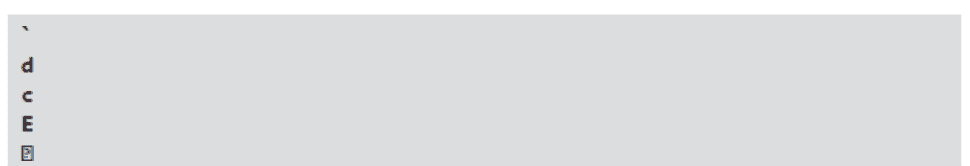

我建议您使用 **chr()** 函数进行随机试验，以掌握这样一个事实：每个长度为 1 的字符串对象都由某个整数表示。

然后，您可以反向使用 **ord()** 函数尝试长度为 1 的字符串，以查看相应的数字。

###### 元组

元组的项目是任意的 Python 对象。由两个或更多项目组成的元组由逗号分隔的表达式列表形成。一个项目的元组（“单例”）可以通过在表达式后附加逗号来形成（表达式本身不会创建元组，因为必须使用括号对表达式进行分组）。空元组可以通过一对空括号形成。

('xyz', 5, 'p') 是元组的一个例子。

###### 字节

字节对象是一个不可变数组。项目是 8 位字节，由范围 0 <= x < 256 中的整数表示。字节字面量（如 **b'abc'**）和内置 **bytes()** 构造函数可用于创建字节对象。此外，字节对象可以通过 **decode()** 方法解码为字符串。

##### 可变序列

可变序列在创建后可以更改。订阅和切片符号可以用作赋值和 del（删除）语句的目标。

目前有两种内在的可变序列类型：

###### 列表

列表的项目是任意的 Python 对象。列表通过将逗号分隔的表达式列表放在方括号中形成。（请注意，形成长度为 0 或 1 的列表不需要特殊情况。）['xyz', 5, 'p'] 是列表的一个例子。

###### 字节数组

字节数组对象是一个可变数组。它们由内置 **bytearray()** 构造函数创建。除了是可变的（因此不可哈希）之外，字节数组还提供与不可变字节对象相同的接口和功能。

#### 6. 集合类型

这些表示唯一、不可变对象的无序有限集合。因此，它们不能通过任何下标索引。但是，它们可以被迭代，并且内置函数 **len()** 返回集合中的项目数。

集合的常见用途是快速成员测试、从序列中删除重复项以及计算数学运算，如交集、并集、差集和对称差集。

对于集合元素，相同的不可变性规则适用于字典键。请注意，数字类型遵循数字比较的正常规则：如果两个数字比较相等（例如，**1** 和 **1.0**），则其中一个可以包含在集合中。

目前有两种内在的集合类型：

##### 集合

这些表示可变集合。它们由内置的 **set()** 构造函数创建，之后可以通过多种方法进行修改，例如 **add()**。

`{"apple", "banana", "cherry"}` 是一个集合的示例。

##### 冻结集合

这些表示不可变集合。它们由内置的 **frozenset()** 构造函数创建。由于冻结集合是不可变且可哈希的，因此可以再次用作另一个集合的元素，或用作字典的键。

> **注意：** 集合是无序的，因此项目将以随机顺序出现。在 Python 中，集合用花括号编写。由于集合是无序的，项目没有索引，因此无法通过索引访问集合中的项目。

#### 7. 映射

这些表示由任意索引集索引的对象有限集。下标表示法 **a[k]** 从映射 **a** 中选择由 **k** 索引的项目；这可以在表达式中使用，也可以作为赋值或 **del** 语句的目标。内置函数 **len()** 返回映射中的项目数。

目前只有一个内置映射类型：

##### 字典

这些表示由几乎任意值索引的对象有限集。唯一不能作为键的值类型是包含列表或字典或其他可变类型的值，这些类型是通过值而不是对象标识进行比较的，原因是字典的高效实现要求键的哈希值保持不变。用作键的数字类型遵循数字比较的正常规则：如果两个数字比较相等（例如，1 和 1.0），则它们可以互换使用来索引同一个字典条目。

字典是可变的；它们可以通过 `{...}` 表示法创建。

`{"brand": "Ford", "model": "Mustang", "year": 1964}` 是 Python 中字典的一个示例。

#### 8. 可调用类型

这些是可以应用函数调用操作的类型：

##### 用户定义函数

用户定义的函数对象由函数定义创建（在后面的章节中详细解释）。它应该用一个包含与函数形式参数列表相同数量项目的参数列表来调用。

##### 实例方法

实例方法对象结合了一个类、一个类实例和任何可调用对象（通常是用户定义的函数）。

##### 内置函数

函数是一段仅在调用时运行的代码。你可以将数据（称为参数）传递给函数。函数可以返回数据作为结果。内置函数的示例包括 `len()` 和 `math.sin()`（math 是一个标准内置模块）。

要调用函数，请使用函数名称后跟括号。例如，`len()` 是一个函数，它返回字符串的长度作为结果。

##### 内置方法

这实际上是内置函数的另一种伪装。Python 方法类似于函数，但它附加到一个对象上。我们在对象上调用一个方法，它可能会对该对象进行更改。因此，方法属于一个类。内置方法的一个示例是 **alist.append()**，假设 alist 是一个列表对象。

> **注意：**
> * Python 方法是在对象上调用的，这与函数不同。
> * 相反，我们调用 Python 函数相当通用——我们不会在任何对象上调用它。
> * 由于我们在对象上调用方法，因此它可以访问其中的数据。
> * 方法可能会改变对象的状态，但 Python 函数通常只对其进行操作，然后打印某些内容或返回一个值。

## 类

类是可调用的。类提供了一种将数据和功能捆绑在一起的方法。创建一个新类会创建一种新的对象类型，允许创建该类型的新实例。每个类实例都可以附加属性以维护其状态。类实例也可以有方法（由其类定义）来修改其状态。

#### 9. 模块

将模块视为与代码库相同。一个包含你希望包含在应用程序中的函数集的文件。要创建模块，只需将你想要的代码保存在扩展名为 .py 的文件中。现在我们可以使用我们刚刚创建的模块，通过使用 import 语句。

模块可以包含函数（如前所述），也可以包含所有类型的变量（数组、字典、对象等）。模块是 Python 代码的基本组织单元，由导入系统创建，该系统通过 import 语句或调用 **importlib.import_module()** 和内置 **import()** 等函数来调用。

## 4.5 Python 中的对象操作

到目前为止，我们已经学习了所有理论知识。现在我们将开始将其付诸实践。我们将从最简单的任务开始。Python 中的输入和打印。请注意：这里的打印是指在 Python 中打印输出，而不是从打印机打印硬拷贝。

```
In [18]: 14+26 # 整数加法
Out[18]: 40
```

```
In [19]: 1.5*4 # 浮点数乘法
Out[19]: 6.0
```

```
In [20]: 2**100 # 2 的 100 次方
Out[20]: 1267650600228229401496703205376
```

```
In [21]: 4/2 # 除法总是返回浮点数
Out[21]: 2.0
```

```
In [22]: 5>4 # 布尔运算符
Out[22]: True
```

在上面的单元格中，我们看到了简单的算术运算，这些运算可以使用 Jupyter Notebook、Spyder IDE 或控制台在 Python 中无缝完成。

这里需要注意几点

- 我们没有明确要求打印答案。一旦单元格运行，它们就会自动打印出来。
- # 后面写的文本被忽略了。它不被视为代码的一部分。
- 因此，在代码中 # 后面写注释是一个好习惯，可以使程序更具**可读性**。

## 4.6 运算符<sup>26</sup>

你编写的大多数语句（逻辑行）都将包含表达式。表达式的一个简单示例是 **2 + 3**。表达式可以分解为运算符和操作数。运算符是执行某些功能的东西，可以由符号（如 +）或特殊关键字表示。运算符需要一些数据来操作，这些数据称为操作数。在这种情况下，**2** 和 **3** 是操作数。

我们将详细查看运算符的工作原理，但在此之前，我将它们分为 4 大类。

### 4.6.1 算术运算符

| 运算符 | 操作 |
| :--- | :--- |
| + | 加法（求和） |
| - | 减法（减） |
| * | 乘法 |
| / | 除法 |
| % | 取模 |
| // | 整除 |
| ** | 幂运算（指数） |

以下是可用运算符的快速概览：

#### +（加）
- 将两个对象相加
- 4 + 3 得到 7。'a' + 'b' 得到 'ab'。

#### -（减）
- 从一个数中减去另一个数；如果缺少第一个操作数，则假定为零。
- -2.8 得到一个负数，70 - 34 得到 36。

#### *（乘）
- 返回两个数的乘积，或返回字符串重复多次的结果。
- 2 * 3 得到 6。
- 'ta' * 3 得到 'tatata'。

#### **（幂）
- x**y 返回 x 的 y 次方。2**3 返回 8。

#### /（除）
- x/y 将 x 除以 y。13 / 3 得到 4.333333333333333。

#### //（整除）
- x//y 将 x 除以 y，并将结果向下舍入到最接近的整数值。请注意，如果其中一个值是浮点数，你将得到一个浮点数。
- 13 // 3 得到 4
- -13 // 3 得到 -5
- 9//1.81 得到 4.0

#### %（取模）
- 返回除法的余数。13 % 3 得到 1。
- -25.5 % 2.25 得到 1.5。

### 4.6.2 赋值运算符

| 运算符 | 操作 | 等价形式 |
| :--- | :--- | :--- |
| = | a = b | a = b |
| += | a += b | a = (a + b) |
| -= | a -= b | a = (a - b) |
| *= | a *= b | a = (a * b) |
| /= | a /= b | a = (a / b) |
| %= | a %= b | a = (a % b) |
| //= | a //= b | a = (a // b) |
| **= | a **= b | a = (a ** b) |

以下是可用运算符的快速概览：

这些运算符用于为变量赋值。重要的是将 = 运算符理解为**赋值**而不是**等于**，以避免与 == 相等运算符混淆。

在上面的示例中，名为 **a** 的变量被赋予包含在名为 **b** 的变量中的值，因此该值成为存储在变量 **a** 中的新值。

在表格示例中，+= 运算符首先将变量 **a** 中包含的值与变量 **b** 中获得的值相加。然后将结果赋值给变量 **a**，使其成为存储的新值。

所有其他运算符的工作方式相同，首先对两个值进行算术运算，然后将该运算的结果赋值给第一个变量，使其成为其新的存储值。

使用 %= 运算符时，第一个操作数“a”除以第二个操作数“b”，然后将该运算的**余数**赋值给变量“a”。

### 4.6.3 比较运算符

| 运算符 | 操作 |
| --- | --- |
| == | 相等 |
| != | 不相等 |
| > | 大于 |
| < | 小于 |
| >= | 大于或等于 |
| <= | 小于或等于 |

以下是可用运算符的快速概览：

#### ==（等于）

- 比较对象是否相等。`x = 2; y = 2; x == y` 返回 **True**。`x = 'str'; y = 'stR'; x == y` 返回 **False**。`x = 'str'; y = 'str'; x == y` 返回 **True**。

#### !=（不等于）

- 比较对象是否不相等。`x = 2; y = 3; x != y` 返回 **True**。

#### <（小于）

- `x < y` 返回 x 是否小于 y。所有比较运算符都返回 **True** 或 **False**。
- 注意这些名称的大小写。
- **6 < 4** 的结果是 **False**，而 **4 < 6** 的结果是 **True**。
- 比较可以任意链接：`3 < 5 < 7` 的结果是 **True**。

#### >（大于）

- `x > y` 返回 x 是否大于 y。`6 > 4` 返回 **True**。如果两个操作数都是数字，它们首先会被转换为相同的类型。否则，它总是返回 **False**。

#### <=（小于或等于）

- `x <= y` 返回 x 是否小于或等于 y。`x = 3; y = 6; x <= y` 返回 **True**。

#### >=（大于或等于）

- `x >= y` 返回 x 是否大于或等于 y。`x = 4; y = 3; x >= 3` 返回 **True**。

#### 逻辑运算符

| 运算符 | 操作 |
| --- | --- |
| and | 逻辑与 |
| or | 逻辑或 |
| not | 逻辑非 |

##### not（布尔非）

- 如果 x 是 **True**，它返回 **False**。如果 x 是 **False**，它返回 **True**。
- `x = True; not x` 返回 **False**。

##### and（布尔与）

- `x and y` 如果 x 是 **False**，则返回 **False**，否则返回 y 的求值结果。`x = False; y = True; x and y` 返回 **False**，因为 x 是 **False**。在这种情况下，Python 不会求值 y，因为它知道 'and' 表达式的左侧是 **False**，这意味着无论其他值如何，整个表达式都将是 **False**。这被称为**短路求值**。

##### or（布尔或）

- 如果 x 是 **True**，它返回 **True**，否则返回 y 的求值结果。`x = True; y = False; x or y` 返回 **True**。短路求值也适用于此。

#### 4.6.5 条件运算符

| 运算符 | 操作 | |
| --- | --- | --- |
| 同一性运算符 | | |
| is | x is y | 如果 x 和 y 是同一个对象，则为 True |
| is not | x is not y | 如果 x 和 y 不是同一个对象，则为 True |
| 成员运算符 | | |
| in | x in y | 如果 x 是集合 y 的成员，则为 True |
| not in | x not in y | 如果 x 不是集合 y 的成员，则为 True |

**同一性运算符：** 它们检查比较对象的同一性。

**is**

- 如果 **x** 是 **y**，即 **x** 与 **y** 是同一个对象，则返回 **True**。否则，返回 **False**。

**is not**

- 如果 **x** 不是 **y**，即 **x** 与 **y** 不是同一个对象，则返回 **True**。否则，返回 **False**。

**成员运算符：** 它们检查给定对象是否是给定集合的成员。集合可以是序列或数据结构，如字符串、列表、元组或任何其他数据结构。

**in**

- **x in y**：如果 **x** 是集合 **y** 的成员，则返回 **True**，否则返回 **False**。
- **x not in y**：如果 **x** 不是集合 **y** 的成员，则返回 **True**，否则返回 **False**。

```
In [23]: 4 is 2*2
Out[23]: True
```

```
In [24]: "i" in "string"
Out[24]: True
```

```
In [25]: x = [1,2,3,"three", 4]

print(2 in x)           # 结果为 True
print(5 in x)           # 结果为 False
print("three" in x)     # 结果为 True
```

```
True
False
True
```

## 4.7 缩进

Python 最显著的特征之一是使用缩进来标记代码块。在大多数其他编程语言中，缩进仅用于美化代码。但在 Python 中，它用于指示语句属于哪个代码块。

大多数编程语言，如 C、C++、Java 使用花括号 { } 来定义代码块。Python 使用缩进。

代码块（函数体、循环等）以缩进开始，以第一个未缩进的行结束。缩进量由程序员决定，但必须在整个代码块中保持一致。

通常使用**四个空格**进行缩进，这比使用**制表符**更受青睐。例如：

```
In [26]: if True:
            print('Hello')
```

```
Hello
```

```
In [27]: if True:
            print('Hello')
```

```
File "<ipython-input-27-78e5790be1ca>", line 2
    print('Hello')
    ^
IndentationError: expected an indented block
```

不正确的缩进会导致 **IndentationError**。

**空格**在 Python 中很重要。实际上，行首的**空格**具有特殊意义。这被称为**缩进**。逻辑行开头的前导空格（空格和制表符）用于确定逻辑行的缩进级别，进而用于确定**语句**的分组。

因此，一起执行的**语句**必须具有相同的缩进。每个这样的**语句**组称为一个**代码块**。你应该始终记住的一点是，**错误的缩进**可能导致错误，如上例所示。

## 4.8 Python 注释

在编写程序时，注释非常有用。它使代码更具可读性，并说明程序内部发生了什么，这样查看源代码的人就不必费力去理解它。即使是程序员自己，也可能忘记几个月前编写的程序的细节。因此，努力以注释的形式解释这些概念总是有益的。

在 Python 中，我们使用井号 (#) 符号开始编写注释。Python 解释器会忽略注释。

## 4.9 Python 中的求值顺序

你会记得数学方程中的求值顺序。BODMAS（括号、乘方、除法、乘法、加法和减法，从左到右依次进行）。

类似地，Python 有其自己的**运算符优先级**<sup>27</sup>。

下表总结了 Python 中的运算符优先级，从最低优先级（最低绑定）到最高优先级（最高绑定）。同一方框中的运算符具有相同的优先级。除非语法明确给出，否则运算符都是二元运算符。同一方框中的运算符从左到右分组（乘方运算符除外，它从右到左分组）。

| 运算符 | 描述 |
|---|---|
| lambda | Lambda 表达式 |
| if-else | 条件表达式 |
| or | 布尔或 |
| and | 布尔与 |
| not x | 布尔非 |
| in, not in, is, is not, <, <=, >, >=, !=, == | 比较，包括成员测试和同一性测试 |
| ^ | 按位异或 |
| & | 按位与 |
| `<<`, `>>` | 移位 |
| `+`, `-` | 加法和减法 |
| `*`, `@`, `/`, `//`, `%` | 乘法、矩阵乘法、除法、整除、取余 |
| `+x`, `-x`, `~x` | 正号、负号、按位非 |
| `**` | 乘方 |
| `await x` | 等待表达式 |
| `x[index]`, `x[index:index]`, `x(arguments...)`, `x.attribute` | 下标、切片、调用、属性引用 |
| `(expressions...)`, `[expressions...]`, `{key: value...}`, `{expressions...}` | 绑定或元组显示、列表显示、字典显示、集合显示 |

### 4.9.1 改变求值顺序

为了使表达式更具可读性，我们将使用括号。例如，`2 + (3 * 4)` 肯定比 `2 + 3 * 4` 更容易理解，后者需要了解运算符优先级。与其他所有事情一样，括号应合理使用（不要过度），并且不应是多余的，例如 `(2 + (3 * 4))`。

使用括号还有一个额外的好处——它帮助我们改变求值顺序。例如，如果你想让加法在乘法之前求值，那么你可以写成 `(2 + 3) * 4`。

### 4.9.2 结合性

运算符通常从左到右结合。这意味着具有相同优先级的运算符从左到右求值。例如，`2 + 3 + 4` 被求值为 `(2 + 3) + 4`。

### 4.9.3 矩形面积

让我们编写我们的第一个代码，以理解我们到目前为止所理解的所有概念。这也将消除你到目前为止对编写代码的任何恐惧，无论你有什么恐惧，因为用 Python 编写代码是如此简单。正如我之前所说，它就像用英语写一个句子一样简单，只是需要一些规范。

```
In [28]: # 矩形的面积

Length = 5

Breadth = 8

Area = Length * Breadth print("矩形的面积是", Area)

print("矩形的周长是", 2* (Length + Breadth))
```

```
矩形的面积是 40
矩形的周长是 26
```

让我们解读一下我们刚刚编写的这段小代码。
矩形的长度和宽度存储在同名的变量中。但是有一个**陷阱**。**length** 与 **Length** 不同。
永远记住，Python 是区分大小写的。因此，**length** 不同于 **Length**，而 **Length** 又不同于 **LENGTH**。

我们使用这些**变量**，借助表达式来计算矩形的面积和周长。我们将表达式**长度 * 宽度**的结果存储在变量**面积**中，然后使用打印函数将其输出。

在第二种情况下，我们直接在打印函数中使用表达式**2 * (长度 + 宽度)**的值。

另外，请注意Python如何漂亮地格式化输出。即使我们没有在'**矩形的面积是**'和变量**面积**之间指定空格，Python也会自动为我们添加，从而得到整洁美观的输出，程序也因此更具可读性（因为我们无需担心输出字符串中的空格问题）。这是Python如何让程序员生活更轻松的一个例子。

## 4.10 动态类型

在Python中，尽管变量指向的值有类型，但变量本身在定义时没有严格的类型。你可以重用同一个变量来指向不同类型的对象。将变量视为与对象相关联的"标签"可能会有所帮助。

```
In [29]: six = 6
       six
Out[29]: 6
```

```
In [30]: six = 'six'
       six
Out[30]: 'six'
```

## 4.11 强类型

虽然Python允许你在类型上非常灵活，但你仍然必须清楚这些类型是什么。某些操作需要特定类型的参数。

```
In [31]:  'day'+1
```

```
---------------------------------------------------------------------------
TypeError                                 Traceback (most recent call last)
<ipython-input-31-91cbf6a1a000> in <module>
----> 1 'day'+1

TypeError: can only concatenate str (not "int") to str
```

然而，在Python中，可以通过内置函数改变对象的类型。

```
In [32]:  'day ' + str('1')
```

```
Out[32]:  'day 1'
```

## 4.12 分支

Python提供**if**语句，允许根据条件进行分支。也可以执行多个**elif**检查，后跟一个可选的else子句。**if**语句可以与任何真值评估一起使用。

```
In [33]:  i = 5
         if i<4: print('i is less than 4')
         elif i<7: print ('i is less than 7')
         else:
             print ('i is greater than 7')
```

i is less than 7

## 4.13 逻辑行与物理行

**物理行**是你编写程序时*看到*的行。**逻辑行**是Python*视为*单条语句的行。Python隐式地假设每个*物理行*对应一个*逻辑行*。

通过一些例子可以更容易地理解这一点。

```
In [34]:  print ('Hello Word')

         2+3
```

Hello Word

Out[34]:  5

这里，Print ('Hello World') 既是一个物理行，也是一个逻辑行。同样，2 + 3 是另一个物理行，也是一个逻辑行。

这一定会引发一个问题：那么这两者有何不同？

```
In [35]:  # Here are 2 Physical as well as 2 Logical
         # Lines again i = 5
         print(i)
```

5

```
In [36]:  # But Here, there is only one Physical line,
         # but 2 Logical lines.

         i = 5; print(i)
```

5

现在你看到区别了！

Python将它们视为2个不同的行（逻辑行），而程序员，也就是你，将其视为一个物理行。

那么我们在这里学到了什么？

如果你想在单个物理行上指定多个逻辑行，那么你必须使用分号（;）显式地指定这一点，分号表示一个逻辑行/语句的结束。

例如：

```
i = 5
```

```
print(i)
```

实际上等同于

```
i = 5;
```

```
print(i);
```

这也等同于

```
i = 5; print(i);
```

这又等同于

```
i = 5; print(i)
```

Python鼓励每行使用单条语句。这使你的代码更具可读性。

我也鼓励这样做。

我强烈建议你坚持在每个物理行上最多写一个逻辑行。核心思想是你永远不应该使用分号。这将使你的代码更具可读性，不仅对你自己，对任何阅读它的人来说都是如此。

## 4.14 总结

在本章中，我们学习了Python作为一门语言的语义，也回顾了我们在前一章看到的一些Python语法。这与英语的语法同等重要。用那个比喻来说，就是基本语法。我们学习了Python代码的层次结构和结构。Python中一切皆对象，以及对象的特征。我们学习了不同类型的对象及其层次结构。我们已经看到了如何使用运算符、操作数和表达式——这些是任何程序的基本构建块。接下来，我们将看到如何使用语句在程序中利用这些内容。

## 4.15 练习：

### 4.15.1 回答以下问题：

1. Python中的变量是什么？它与对象有何不同？
2. Python中命名变量的约定是什么？写出命名约定的注意事项。
3. Python中拥有内置对象有哪些优势？
4. 不可变是什么意思？Python中哪些对象是不可变的？
5. 对象的标识是什么意思？它与类型有何不同？
6. **chr()** 和 **ord()** 函数是做什么的？它们之间有什么关系？
7. 什么是运算符？Python中有多少种类型的运算符？全部列出。
8. / 和 // 都是除法运算符。它们之间有什么区别？
9. 逻辑运算符返回什么值？
10. 缩进在Python编程语言中的重要性是什么？
11. 如何在Python中编写注释？为什么它们很重要？
12. 如何改变Python中的求值顺序？
13. 逻辑行和物理行有什么区别？

### 4.15.2 判断正误：

1. Python中的变量获取分配给它们的值。
2. 在Python中，创建变量之前，你需要先定义其类型。
3. x = 38 和 x == 38 在Python中不是同一回事。
4. 我们在Python中对对象执行操作。
5. Python关键字可以用作变量名。
6. 自定义数据结构比内置对象更高效。
7. 对象的标识一旦创建就永远不会改变。
8. 程序中的注释使程序更具可读性且易于理解。
9. 缩进只是让程序看起来更好、更具可读性的一种方式。
10. %（取模）运算符用于找出两个数的除法是否产生余数。

### 4.15.3 编写你自己的代码：

1. 彼得的月薪是12000。如果他每月储蓄工资的20%，编写代码计算他年底的总储蓄额。
2. 孟买和德里之间的距离是1422公里。如果Sundar以平均每小时45英里的速度开车，他需要多长时间才能走完这段距离？
3. 正常人的体温范围是华氏97度到99度。这个范围在摄氏度下是多少？
4. 取任意一个6位数。编写一个程序计算该数字所有位数的总和。
5. 纽约市布鲁克林区5家书店的月销售额如下：A = $6500，B = $8000，C = $12000，D = $4900，E = $5600。假设布鲁克林只有这5家书店，找出每家店的市场份额。另外注意，所有书店的市场份额总和是多少？（市场份额是指一家店在市场所有存在者中的份额）
6. 三个数的平均值是45。第一个数比平均值多多少，第二个数就比平均值少多少。求第三个数。
7. 约翰在加尔各答以1800的价格购买了一部手机，并在孟买以25%的利润出售。如果他的间接费用是售价的5%，那么他的售价是多少？
8. 求一个对角线为5米的立方体的体积和表面积。（提示：$S = 2d^2$）
9. 三个金属立方体的棱长分别为3、4和5厘米，将它们熔化后形成一个单独的立方体。求新形成的立方体的棱长。
10. 写一个6位数。编写一个程序反转该数字中数字的顺序。

### 4.15.4 实践任务：

1. 阅读关于运算符及其在数学中的运算层次结构。
2. 要真正理解发生了什么，不要只是像读故事一样阅读。在你的IDE或Jupyter Notebook中，边阅读边尝试每一行代码。
3. 在尝试代码时，暂停阅读本书，自己进行实验。这里试一个运算符，那里改一下语法或语义，看看结果。感受其中的差异。
4. 阅读文本时，始终保持一个试验性的Jupyter Notebook打开。同时，在Jupyter Notebook中尝试使用markdown单元格。尝试不同的格式。

## 5 控制流语句

### 5.1 控制流工具

正如我们在上一章所看到的，我们编写的简单代码是按照其编写顺序执行的，即执行遵循自上而下的流程或顺序。

如果我们想要改变或调整流程怎么办？

如果我们想根据条件，让一个代码块在另一个之前执行怎么办？

如果你想让你的程序根据不同的情况做出一些决定并执行不同的操作呢？例如，根据输入的数字打印“偶数”或“奇数”。

对于所有这些以及更多需求，控制流工具就变得非常方便。它们是任何编程语言的基础，而 Python 拥有以下可用的工具。

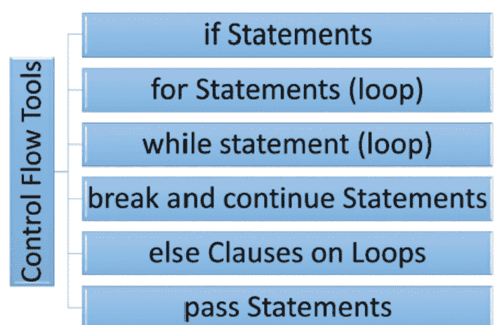

**if 语句**

**if 语句**

*if* 语句用于检查一个条件：如果条件为真，则执行语句块（称为 if 块）。

**语法：**

**if** 条件后跟一个冒号。**if** 语句的代码块位于下一行，并且必须**缩进**。缩进告诉 Python 这个代码块是用于 **if** 语句的。

```
if condition:
    do work
```

最后一行 **end if** 不需要写。语句会自行结束。你将在下面的例子中看到这一点。让我通过流程图解释这些控制*流*是如何工作的。

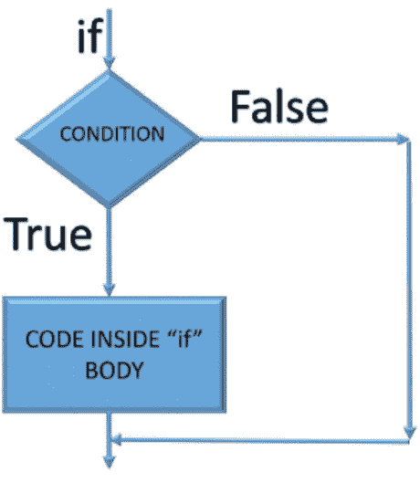

在你的 Jupyter Notebook 或 IPython 中尝试以下代码。为了练习，你可以尝试不同的输入以查看不同的结果。

```
In [1]: if 8>5: print("8 is greater than 5")
```

输出：
```
8 is greater than 5
```

让我们再看一个当条件不为真时会发生什么的例子。

```
In [2]: if 8<5: print("8 is less than 5")
```

正如你所看到的，这没有输出。因为 **if** 条件未满足，所以 **if** 代码块没有被执行。程序自行结束。

但大多数时候，如果条件不为真，或者换句话说，如果条件为假，会有其他事情需要处理。为此，我们有 **if-else** 语句。

让我们看看如何使用 if 语句来解决一个实际问题。

**实际情况：** 节日期间商场正在促销。如果你购买电子产品，且购买金额超过 50000，则可享受 20% 的折扣。一位顾客购买了任意数量的商品，每件商品的总金额通过键盘输入，编写一个程序来计算需要支付的总账单金额。

**解决方案：**

```
In [3]: a = int(input("Total amount for all items purchased:"))
        discount = 0
        if a > 50000:
            discount = (a * 20)/100
        bill_amount = a - discount
        print("Total Bill amount to be paid is {} and discount offered is {}".format(bill_amount, discount))
```

输出：
```
Total amount for all items purchased: 80000
Total Bill amount to be paid is 64000.0 and discount offered is 16000.0
```

### 5.2.2 if - else 语句

**if 语句用于检查一个条件：** *如果*条件为真，我们执行一个语句块（称为 if 块），*否则*我们处理另一个语句块（称为 else 块）。else 子句是可选的。

```
if condition:
    do work
else:
    do something else
```

**语法：**

**if** 条件后跟一个冒号。**if** 语句的代码块位于下一行，并且必须**缩进**。缩进告诉 Python 这个代码块是用于 **if** 语句的。然后 **else** 出现在另一行，没有缩进，后跟一个冒号。**else** 语句的代码块位于下一行，并且必须**缩进**。缩进告诉 Python 这个代码块是用于 **else** 语句的。

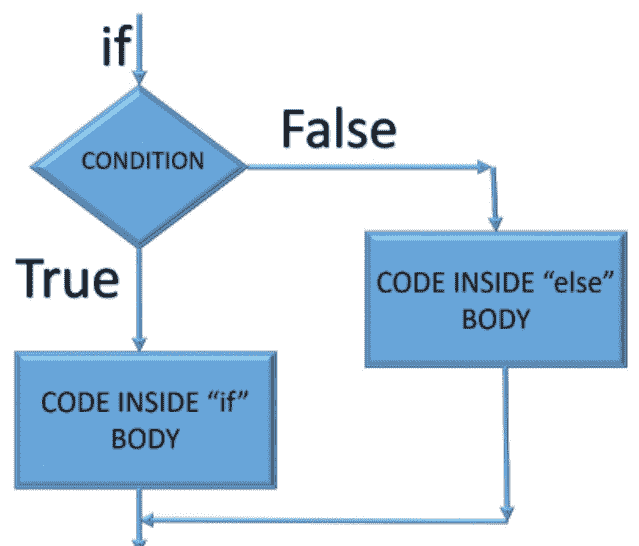

在你的 Jupyter Notebook 或 IPython 中尝试以下代码。为了练习，我们在这里使用了 **input()** 函数，它会请求用户输入。你可以尝试不同的输入以查看不同的结果。

```
In [4]: num = int(input("Enter a number: "))
        if num > 11:
            print("{} is greater than 11".format(num))
        else:
            print("{} is smaller than 11".format(num))
```

输出：
```
Enter a number: 15
15 is greater than 11
```

让我们看看如何使用 if-else 语句来解决一个实际问题。

**实际情况：** 节日期间商场正在促销。如果你购买服装和时尚饰品（FA），且购买金额超过 25000，则可享受 20% 的折扣，否则可享受 5% 的固定折扣。一位顾客购买了任意数量的商品，每件商品的总金额通过键盘输入，编写一个程序来计算需要支付的总账单金额。

**解决方案：**

```
In [5]: a = int(input("Total amount for clothes and FA purchased: "))
        if a > 25000:
            discount = (a * 20)/100
        else:
            discount = (a * 5)/100
        bill_amount = a - discount
        print("The final bill amount is {} and discount is {}".format(bill_amount, discount))
```

输出：
```
Total amount for clothes and FA purchased: 20000
The final bill amount is 19000.0 and discount is 1000.0
```

### 5.2.3 if - elif - else 语句

从名称本身就可以看出，elif 是 else 和 if 的组合。这个语句的流程图将使这个概念更容易理解。

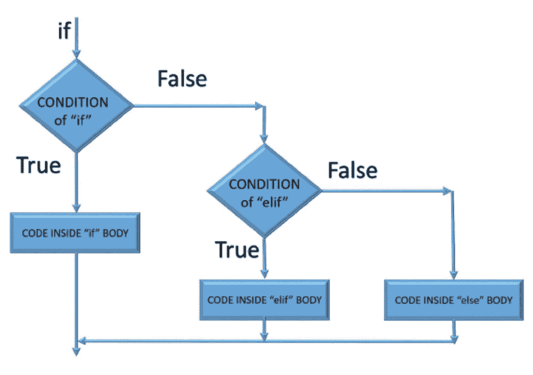

```
In [6]: x = int(input("Please enter an integer: "))
        # using input() function here, which asks for user input.
        if x < 0:
            print('Negative Number')
        elif x == 0:
            print('Zero')
        elif x == 1:
            print('Single')
        else:
            print('More')
```

输出：
```
Please enter an integer: 4
More
```

可以有零个或多个 **elif** 部分，else 部分是可选的。关键字 ‘elif’ 是 ‘else if’ 的缩写，对于避免过多的缩进很有用。

让我们看看如何使用 if-elif-elif 语句来解决一个实际问题。

**实际情况：** 有一家公司在全国各地雇佣员工。人力资源部门根据人口将城市分为三类：A、B 和 C。根据城市类别，住房补贴（HRA）有所不同，如下所示：
- A 类城市 - 基本工资的 30%
- B 类城市 - 基本工资的 20%
- C 类城市 - 基本工资的 10%

员工的基本工资和城市类别通过键盘输入。计算该员工应得的 HRA。

**解决方案：**

```
In [7]: name = "Nilabh"
        basic_salary = int(input("Basic Salary of {} is Rs ".format(name)))
        city_class = input("{} lives in class of city: ".format(name))
        if city_class == ("a" or "A"):
            HRA = (basic_salary * 30)/100
        elif city_class == ("b" or "B"):
            HRA = (basic_salary * 20)/100
        elif city_class == ("c" or "C"):
            HRA = (basic_salary * 10)/100
        print("The HRA for {} is {} as he lives in {} Class of City".format(name, HRA, city_class))
```

输出：
```
Basic Salary of Nilabh is Rs 100000
Nilabh lives in class of city: b
The HRA for Nilabh is 20000.0 as he lives in b Class of City
```

**elif** 和 **else** 语句也必须在逻辑行末尾有一个冒号，后跟相应的语句块（当然要有适当的缩进）。你可以在一个 **if** 语句的 **if 块**内部再放一个 if 语句，依此类推——这被称为**嵌套 if 语句**。

### 5.3 for 语句（for 循环）

Python 中的 for 语句遍历任何序列（列表或字符串）中的项目，按照它们在序列中出现的顺序。

循环在编程中用于重复执行特定的代码块。

> **注意：** 迭代意味着一个过程或话语的重复。

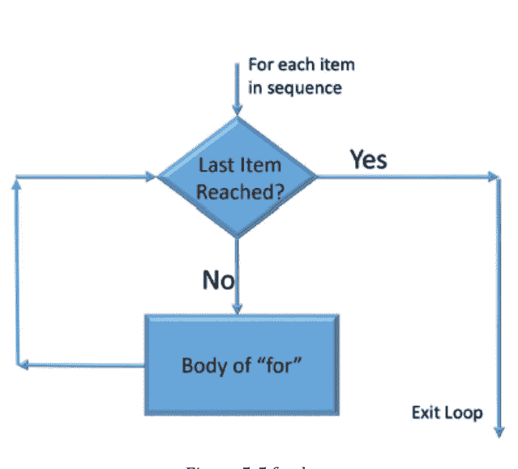

```
In [8]: # Measure some strings:
        words = ['cat', 'window', 'defenestrate']
        for w in words:
            print(w, len(w))
```

输出：
```
cat 3
window 6
defenestrate 12
```

这里，在语句 **for w in words:** 中，w 只是一个符号，并没有原始字母的含义。它的意思是你可以在那里写任何东西。同样的例子使用另一个这样的符号 **i**。

```
In [9]: # Measure some strings:
        words = ['cat', 'window', 'defenestrate']
        for i in words:
            print(i, len(i))
```

输出：
```
cat 3
```

## 5.3.1 带 else 的 for 循环

for 循环也可以有一个可选的 else 块。当 for 循环中使用的序列中的所有元素都耗尽时，else 部分会被执行。

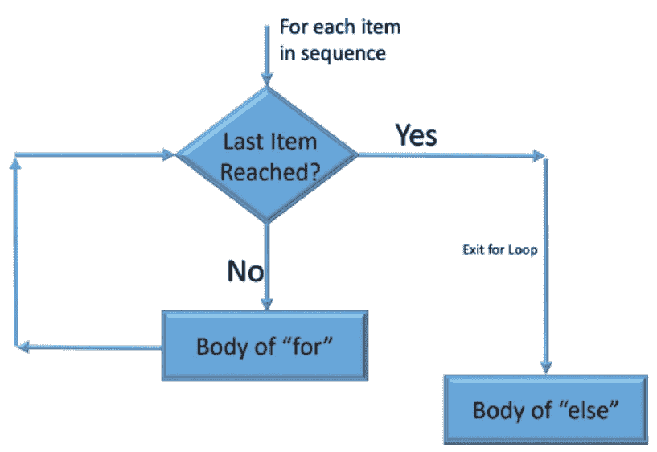

图 5-6 带 else 的 for 循环

看一个简单的例子来理解带 else 的 for 循环。

```python
In [10]: numbers = [1,2,3,4,5]

for i in numbers: print(i) else:
    print("this is end of the code! ")
```

```
1
2
3
4
5
this is end of the code!
```

## 5.4 range() 函数²⁹

如果你确实需要遍历一个数字序列，内置函数 **range()** 就派上用场了。它生成算术级数：

```python
In [11]: for i in range(5): print(i)
```

```
0
1
2
3
4
```

给定的端点永远不会成为生成序列的一部分；**range(10)** 生成 10 个值，即长度为 10 的序列的合法索引。可以让 range 从另一个数字开始，或者指定不同的增量（甚至可以是负数；有时这被称为“步长”）：

```
range(5, 10) 5, 6, 7, 8, 9
range(0, 10, 3) 0, 3, 6, 9
range(-10, -100, -30) -10, -40, -70
```

要遍历序列的索引，可以组合使用 **range()** 和 **len()**，如下所示：

```python
In [12]: a = ['Mary', 'had', 'a', 'little', 'lamb']
        for i in range(len(a)): print(i, a[i])
```

```
0 Mary
1 had
2 a
3 little
4 lamb
```

如果你只是打印一个 range，会发生一件奇怪的事情：

```python
In [13]: print(range(10))
```

```
range(0, 10)
```

正如我们在这里看到的，range() 本身并没有给出你所期望的任何东西。那么这里发生了什么变化呢？

让我们更深入地理解一下**迭代器**。在很多方面，**range()** 返回的对象表现得就像一个**列表**，但它不是。

它是一个对象，当你**迭代**它时，它会返回所需序列的连续项，但它不会创建列表，从而节省空间。

我们说这样的对象是*可迭代的*，也就是说，它适合作为期望从中获取连续项直到供应耗尽的函数和构造的目标。

我们已经看到 **for** 语句就是这样的一个迭代器。函数 **list()** 是另一个；它从可迭代对象创建列表：

```python
In [14]: list(range(5))
Out[14]: [0, 1, 2, 3, 4]
```

在后面的章节中，我们将看到更多返回可迭代对象和接受可迭代对象作为参数的函数。

## 5.5 While 循环

while 循环用于只要条件为真就遍历一段代码块。while 循环通常在我们不知道要迭代多少次时使用。

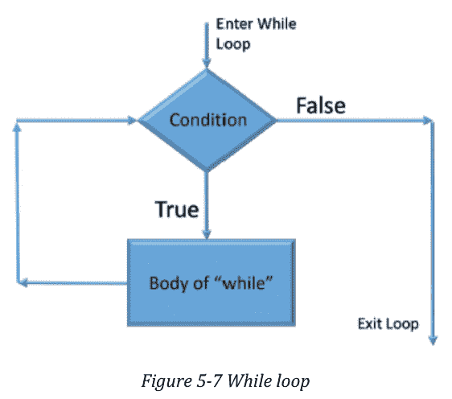

图 5-7 While 循环

```python
In [15]:  n = 10

        # assign variables sum = 0

        i = 1

        while i <= n: sum = sum + i i = i+1    # update counter print("The sum is", sum)
```

**The sum is 55**

在上面的例子中，只要 **while** 的条件返回 "True"，循环就会运行。当它结束时，它会进入下一条语句，即 print。

计数器变量的值需要在循环体内增加。这一点非常重要（而且经常被遗忘）。如果不这样做，将导致无限循环（永无止境的循环）。

与 **for** 循环类似，**else** 块也可以选择性地与 **while** 循环一起使用。用法与 **for** 循环相同。

## 5.6 break 和 continue 语句

### break 语句³⁰

**break** 语句会跳出最内层的 **for** 或 **while** 循环。

循环语句可以有一个 **else** 子句；当循环通过耗尽列表（使用 **for**）或条件变为假（使用 **while**）而终止时，它会被执行，但当循环被 **break** 语句终止时则不会执行。

为了更好地比较，我们将采用在 **for else** 语句中看到的同一个例子。但这次，**for** 循环中会有 **break**。注意结果如何变化。

```python
In [16]: numbers = [1,2,3,4,5]

        for i in numbers: print(i) break else:
        print("this is end of the code! ")

        print("this line is outside the loop")
```

```
1
this line is outside the loop
```

你注意到了吗，与之前没有 **break** 语句的相同代码输出 6 行相比，现在只有 1 行？因为 **break** 语句在第一次运行后就停止了 **for** 循环，没有将其传递给下一次迭代或之后的 **else** 块。

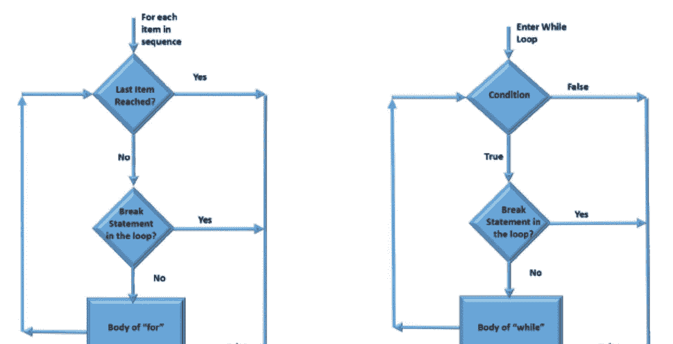

图 5-8 Break 语句流程图

我们将再举一个例子来更好地理解循环和 break 语句。这次我们将使用一个**嵌套循环**。在嵌套循环中，一个循环内部有一个或多个循环。

以下循环就是这样一个例子，它用于查找素数：

```python
In [17]: for n in range(2, 10): for x in range(2, n): if n % x == 0: print(n, 'equals', x, '*', n//x) break else: # Loop fell through without finding a factor print(n, 'is a prime number')
```

```
2 is a prime number
3 is a prime number
4 equals 2 * 2
5 is a prime number
6 equals 2 * 3
7 is a prime number
8 equals 2 * 4
9 equals 3 * 3
```

仔细看：else 子句属于 **for** 循环，而不是 if 语句。

这个例子可以给你带来极大的启发。我鼓励你在你的机器上尝试同样的操作，并寻找所有变化，看看结果如何变化。

1. 当 **else** 语句成为 **if** 语句块的一部分时会发生什么？
2. 当 **else** 语句成为外部 **for** 循环的一部分时会发生什么？
3. 尝试所有上述变化，有和没有 break，看看会发生什么？它与有 break 的情况有何不同？

### Continue 语句

continue 语句用于仅跳过当前迭代中循环内的其余代码。循环不会终止，而是继续下一次迭代。<sup>31</sup>

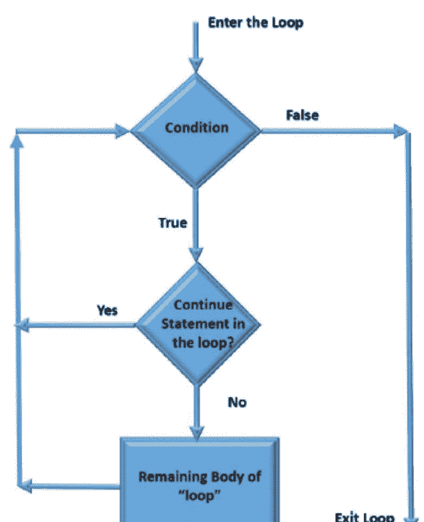

图 5-9 Continue 语句流程图

**continue 语句**继续循环的下一次迭代：

```python
In [18]: for alphabet in "python": if alphabet == "t":
        continue print(alphabet) print("The end")
```

```
p
y
h
o
n
The end
```

你注意到 **python** 中的 **t** 在输出中明显缺失了吗？

让我们再看一个例子：

```python
In [19]: for num in range(2, 10): if num % 2 == 0:
            print("Found an even number", num) continue
            print("Found a number", num)
```

```
Found an even number 2
Found a number 3
Found an even number 4
Found a number 5
Found an even number 6
Found a number 7
Found an even number 8
Found a number 9
```

你可能注意到，上述结果与我们使用 **if-else** 块时相同。

```python
In [20]: for num in range(2, 10): if num % 2 == 0:
            print("Found an even number", num) else:
            print("Found a number", num)
```

```
Found an even number 2
Found a number 3
Found an even number 4
Found a number 5
Found an even number 6
Found a number 7
Found an even number 8
Found a number 9
```

## 5.7 pass 语句

**pass** 语句什么都不做。当语法上需要一条语句但程序不需要任何操作时，可以使用它。例如：这通常用于创建最小化的类：

```python
In [21]: class MyEmptyClass: pass
```

## 5.8 总结

`pass` 的另一个用途是作为函数或条件语句体的占位符，当你在编写新代码时，可以让你在更抽象的层面上进行思考。**pass** 会被静默忽略：

```
In [22]: def initlog(*args): pass    # 记得实现这个！
```

在本章中，我们学习了非常有趣的概念，即如何控制代码的流程。如果没有 `if` 语句或循环，代码只能是单向的。它们将被逐行读取并按相同顺序执行。正是这些工具使得程序员的工作更加轻松，并使他们能够完成有趣的事情。`if` 语句的默认作用域是 `if` 语句之后缩进的语句块。因此，要执行多条语句，它们必须在 `if` 语句之后缩进。一个 `if` 块不一定总是与一个 `else` 块关联。然而，一个 `else` 块总是与一个 `if` 语句关联。Python 中可用的两种循环类型是 `for` 和 `while`。`break` 语句将执行控制权移出循环。`continue` 语句跳过其后的语句执行，并将控制权返回到循环的开头。我们看到了如何中断循环，或者如何有条件地继续循环而不退出。为了成为一名体面的程序员，甚至为了对编程逻辑有基本的理解，你必须掌握这些语句和循环。

## 5.9.1 练习：回答以下问题：

1.  Python 程序中语句的执行顺序是什么？我们如何改变它？
2.  以下程序的输出是什么？
    i) `a = 50`
    ```
    if a >= 100: print("Value of a is {}".format(a))
    ```
    ii) `a = 90`
    ```
    if a <= 100: print("Value of a is {}".format(a))
    ```
    iii) `x = 50`
    ```
    if x >= 10: print("Value of x is {}".format(x))
    else: print("Value of x is less than 10")
    ```
    iv) `x = 5`
    ```
    if x >= 10: print("Value of x is {}".format(x))
    else: print("Value of x is less than 10")
    ```
    v) `x = 0`
    ```
    while x < 5: print(x) x += 1
    ```
    vi) `for i in range(5, 25, 5): print(i)`
3.  以下程序是否有错误？如果有，请指出。
    i) `a = 12, b = 15`
    ```
    if a == 10
        print("a is equal to 10")
    ```
    ii) `a = 90`
    ```
    if a <= 100: print("Value of a is less than 100")
    ```
    iii) `x = 22`
    ```
    if x >= 10: print("x is bigger than 10")
    else
        print("x is less than 10")
    ```
    iv) `x = 5`
    ```
    if x >= 10: print("Value of x is {}".format(x))
    else
        x < 10: print("Value of x is less than 10")
    ```
    v) `x = 5`
    ```
    if x > 10: print("Value of x is more than 10)
    else:
        print("Value of x is less than 10")
    elif x == 10:
        print("Value of x is equal to 10")
    ```
    vi) `x = 0`
    ```
    while x < 5
        print(x) x=+ 1
    ```

## 5.9.2 判断正误：

1.  当 `if` 语句为真时，它只会运行代码中的一条指令。
2.  紧跟在 **if** 语句之后的代码块是 if 块，当 if 条件返回 true 时执行。
3.  每个 **if** 语句之后都必须有 **Else** 语句。
4.  **elif** 是 **else** 和 **if** 语句的组合，在一行中。
5.  **else** 语句也可以与 **for** 循环一起使用。
6.  **for** 循环只要条件为真，就会迭代一段代码块。
7.  **while** 循环体中的对象必须是迭代器对象。
8.  **break** 语句会跳出最内层的 **for** 循环。
9.  **continue** 语句用于跳过循环中所有迭代的代码体。
10. **pass** 语句什么都不做。

## 5.9.3 为此编写你自己的代码：

1.  一位交易者想要一个程序来检查他在一笔交易中是盈利还是亏损。编写程序，通过键盘输入买入和卖出价格，程序告诉交易者是盈利还是亏损。程序还应计算出盈利或亏损的金额。
2.  编写一个程序，检查通过键盘输入的年份是否是闰年。
3.  三位员工 Sameer、Pravin 和 Mohit 通过键盘输入他们的工作年限。编写一个程序来确定三人中经验最丰富和最不丰富的人。
4.  三角形内三个角的和是 180 度。当三个角作为输入给出时，编写一个程序来检查该形状是否是三角形。
5.  当给定三角形的三个角时，编写一个程序来检查它是否是直角三角形。（一个角必须是 90 度）
6.  使用 1、2 和 3 在不同位置可以组成多少个数字？编写一个程序来创建所有这些数字。（提示：使用 for 循环）
7.  编写代码，输出作为输入给出的任何数字的乘法表。
8.  一台机器在其使用寿命内每年产生 2000 卢比的收益。它的成本是 10000 卢比，报废时可以卖 2500 卢比。如果将相同金额投资于其他替代投资，每年可获得 8% 的收益，那么这台机器的最低使用寿命是多少，才能使其成为比替代投资更具吸引力的投资？
9.  编写一个程序，打印 1 到 500 之间的所有质数。
10. 打印所有小于 300 的 9 的倍数。（提示：你可以使用 range 函数）

# 6 函数

函数使程序更易于理解和阅读。函数简单来说，就是一段只有在被调用时才会运行的代码块，并且它有一个名字。嗯，这个解释太简单了，但完全正确。

函数帮助程序员避免一遍又一遍地编写相同的代码行。

## 6.1 定义函数

这里需要回答的第一个问题是：什么是函数？

在 Python 中，函数是一组执行特定任务的相关语句。

借助函数，我们将程序分解成更小、更模块化的块。随着我们的程序变得越来越大，函数对于保持其组织性和可管理性变得越来越必要。

就像 Python 中的其他一切一样，函数也是一个对象。

你可以将数据（称为**参数**）传递给一个函数。函数可以返回数据作为结果。要调用一个函数，使用函数名后跟括号 **()**。例如，**len(x)** 函数给出参数 **x** 的长度。

## 6.2 函数类型

广义上，它们分为两种类型：
- 内置函数：它们是预定义的，可以直接调用。
- 用户定义函数：用户定义的函数对象由函数定义创建。调用它时，应包含与函数形式参数数量相同的参数项。

这里，当我们谈论**定义函数**时，我们本质上是在谈论**用户定义函数**。

## 6.3 内置函数

Python 解释器内置了多个函数和类型，它们始终可用。这里按字母顺序列出。

我们已经看到并使用了其中许多。例如 **print()**、**int()**、**input()**、**len()** 等。

| 内置函数 | | | | |
|---|---|---|---|---|
| abs() | delattr() | hash() | memoryview() | set() |
| all() | dict() | help() | min() | setattr() |
| any() | dir() | hex() | next() | slice() |
| ascii() | divmod() | id() | object() | sorted() |
| bin() | enumerate() | input() | oct() | staticmethod() |
| bool() | eval() | int() | open() | str() |
| breakpoint() | exec() | isinstance() | ord() | sum() |
| bytearray() | filter() | issubclass() | pow() | super() |
| bytes() | float() | iter() | print() | tuple() |
| callable() | format() | len() | property() | type() |
| chr() | frozenset() | list() | range() | vars() |
| classmethod() | getattr() | locals() | repr() | zip() |
| compile() | globals() | map() | reversed() | __import__() |
| complex() | hasattr() | max() | round() | |

### 6.3.1 一些内置函数定义

有一些内置函数，我们将比其他函数更频繁地使用。让我们看看其中一些函数的定义。

在括号内，提到了作为参数传入函数的对象类型。

**abs(x)** 返回一个数字的绝对值。参数可以是整数或浮点数。如果参数是复数，则返回其模。

**any(iterable)** 如果可迭代对象的任何元素为真，则返回 True。如果可迭代对象为空，则返回 False。

**chr(i)** 返回一个字符串，表示其 Unicode 码位为整数 i 的字符。例如，chr(97) 返回字符串 'a'，而 chr(8364) 返回字符串 '€'。这是 ord() 的逆操作。

**dir([object])** 不带参数时，返回当前本地作用域中的名称列表。带参数时，尝试返回该对象的有效属性列表。

**float([x])** 返回一个从数字或字符串 x 构造的浮点数。

**help([object])** 调用内置帮助系统。（此函数旨在用于交互式使用。）如果未给出参数，则交互式帮助系统在解释器控制台启动。如果参数是字符串，则将该字符串作为模块、函数、类、方法、关键字或文档主题的名称进行查找，并在控制台上打印帮助页面。如果参数是任何其他类型的对象，则会生成关于该对象的帮助页面。

## 6.4 用户自定义函数

这是大多数编程语言最强大的工具之一，它允许用户编写自己的函数。这为程序员提供了无限的机会，可以为重复性任务创建可重用的代码。

内置函数是有限的。当程序员需要使用一个不在内置函数库中的函数时，他就会创建一个。这个用户创建的函数被称为**用户自定义函数**。

为了更好地理解这一点，让我们创建自己的函数。

### 6.4.1 为什么要创建函数？

一个自然的问题会浮现：为什么我们要编写单独的函数？为什么不把所有逻辑都放在一个函数里？嗯，以下几点可能有助于更好地阐明这个问题。

-   通过编写函数，用户可以避免一遍又一遍地重写相同的代码。假设你的程序中有一段计算“利率”的代码块。如果在程序的后面，你想为不同的本金和时间周期计算利率，你肯定不希望不得不重新编写所有相同的指令。相反，你会更愿意跳转到一个计算利息的“代码块”，然后跳回到你离开的地方。这个代码块就是一个函数。
-   编写不同的函数，而不是将所有逻辑合并在一个函数中，是更好的方法，因为它为程序提供了模块化结构。不同的函数可以在相同的情况下再次使用，但如果所有逻辑都合并在一个函数中，那么对于属于该大函数一部分的相同工作，我们又需要编写另一段代码。
-   将代码分离到函数中，使程序更容易设计和理解。如果程序的操作可以被划分为独立的活动，并且每个活动被放置在不同的函数中，这也使得独立编写和检查代码变得容易。

### 6.4.2 创建和调用函数

与所有函数代码一样，创建或定义函数的方式有其自己的语法。语法非常简单。

```
def function_name():
    body of the function
```

当我们编写一个 **def()** 语句时，Python 解释器就知道我们将要定义一个函数。很明显，“def”是“define”的缩写。现在我们必须给我们的函数一个唯一的名称。在 **def** 之后是**函数名**，后面跟着一对括号()，然后是一个冒号 :。从下一行开始，是**函数体**。它以一个**缩进**开始，这告诉 Python 这些代码块构成了函数体。函数体就是函数将要执行的代码行。

我们给函数起的名字必须是唯一的，就像变量一样。我们可以给函数起任何名字，但我们必须确保遵守 Python 语言的规则。此外，我们应该给函数起一个与其执行的操作相关的名字，换句话说，要有意义。这将帮助阅读我们代码的其他程序员轻松理解它的作用。

让我们创建或定义一个简单的函数，来理解我们刚刚学到的概念。

```
In [1]: def greeting():
            print("Good Morning")
```

现在，在你自己的机器上编写上面定义函数 "greetings" 的代码行，并运行它。

你得到任何输出了吗？

嗯，你不会得到！

这是因为我们只是定义了我们的函数。我们还没有调用它。

让我们用一个类比来理解这一点。假设，我刚刚教了你如何跳舞。但要让你跳舞，我需要叫你“我们跳舞吧”。同样，通过定义一个函数，我们教会了计算机执行一些任务。但要让那个任务完成，我们需要调用该函数。在 Python 中，我们通过在括号对后输入函数名来调用函数。

让我们看看。

```
In [2]: # 让我们调用函数 greeting()
        greeting()
```

> Good Morning

你一定在想，为什么我们要编写一个函数来完成本可以用一行代码就能实现的事情。这是一个简单的函数，是为了一步一步地教你。通常，函数会稍微复杂一些。

现在我们将了解用户自定义函数的其他方面。

### 6.4.3 设置参数和实参

你口渴了，当你去一个柠檬水（nimbu-pani 或 nimb-soda）摊位时，你会得到两个选择。如果你愿意花 5 卢比，你会得到 Nimbu-Pani，但如果你准备多花一点，比如 10 卢比，你可能会升级到 Nimbu-Soda Masala。


> 图 6-1 柠檬水摊位示例

每次你都可以获得不同的体验。花 5 卢比，你得到 nimbu-pani；花 10 卢比，你得到 Nimbu masala soda。你需要告诉摊主，你需要这两种产品中的哪一种。根据你的需求，他会为你服务。

类似地，在编程中，不同的用户（输入）需要不同的输出。函数帮助我们做到这一点。让我们在一个函数中模拟我们的柠檬苏打水摊位。

```
In [3]: def lemonade_stall():
            print("Nimbu Pani Which is made of")
            print("Lemon Juice")
            print("Water")
            print("Salt")
            print("Sugar")
            print("Nimbu Soda Masala Which is made of")
            print("Lemon Juice")
            print("Club Soda")
            print("Salt")
            print("Sugar")
            print("Secret Spice")
```

现在，当我们调用我们的 "lemonade_stall" 函数时，我们得到什么？

```
In [4]: lemonade_stall()
```

```
Nimbu Pani Which is made of
Lemon Juice
Water
Salt
Sugar
Nimbu Soda Masala Which is made of
Lemon Juice
Club Soda
Salt
Sugar
Secret Spice
```

#### 6.4.3.1 参数

我们得到了柠檬水和柠檬苏打水两种。

如果我们想在支付 5 卢比时只得到柠檬水，在支付 10 卢比时得到柠檬苏打水，该怎么办？
我们将以一种让函数知道区别的的方式来定义它。

```
In [5]: # 我将通过将 l 和 s 大写来稍微改变函数名。
```

**id(object)** 返回对象的“身份标识”。这是一个整数，在对象的生命周期内保证是唯一且恒定的。两个生命周期不重叠的对象可能具有相同的 **id()** 值。CPython 实现细节：这是对象在内存中的地址。

**input([prompt])** 如果存在 prompt 参数，则将其写入标准输出，不带尾随换行符。

**int([x])** 返回一个从数字或字符串 x 构造的整数对象。

**isinstance(object, classinfo)** 如果 object 参数是 classinfo 参数的实例或其（直接、间接或虚拟）子类，则返回 True。如果 object 不是给定类型的对象，函数始终返回 False。

**len(s)** 返回对象的长度（项目数量）。参数可以是序列（如字符串、字节、元组、列表或范围）或集合（如字典、集合或冻结集合）。

**map(function, iterable, ...)** 返回一个迭代器，该迭代器将函数应用于 iterable 的每个项目，产生结果。如果传递了额外的 iterable 参数，函数必须接受那么多参数，并应用于所有可迭代对象的项目。使用多个可迭代对象时，当最短的可迭代对象耗尽时，迭代器停止。

**max(arg1, arg2, *args[, key])** 返回可迭代对象中的最大项，或两个或多个参数中的最大项。

**min(arg1, arg2, *args[, key])** 返回可迭代对象中的最小项，或两个或多个参数中的最小项。

**open(file)** 打开文件并返回相应的文件对象。

**ord(c)** 给定一个表示单个 Unicode 字符的字符串，返回表示该字符 Unicode 码位的整数。例如，ord('a') 返回整数 97，ord('€')（欧元符号）返回 8364。这是 **chr()** 的逆操作。

**print(*objects, sep=' ', end='\n', file=sys.stdout, flush=False)** 将对象打印到文本流文件，用 sep 分隔，后跟 end。sep、end、file 和 flush（如果存在）必须作为关键字参数给出。所有非关键字参数都像 str() 一样转换为字符串并写入流，用 sep 分隔，后跟 end。sep 和 end 都必须是字符串；它们也可以是 None，这意味着使用默认值。如果没有给出对象，print() 将只写入 end。

**repr(object)** 返回一个包含对象可打印表示形式的字符串。

**reversed(seq)** 返回一个反向迭代器。

**round(number[, ndigits])** 返回四舍五入到小数点后 **ndigits** 位精度的数字。如果省略 ndigits 或为 None，则返回最接近其输入的整数。

**sorted(iterable, *, key=None, reverse=False)** 从 iterable 中的项目返回一个新的排序列表。

**type(object)** 带有一个参数时，返回对象的类型。

def 柠檬水摊():
    if(价格 == 5):
        print("Nimbu Pani，它由以下材料制成")
        print("柠檬汁")
        print("水")
        print("盐")
        print("糖")
    if(价格 == 10):
        print("Nimbu Soda Masala，它由以下材料制成")
        print("柠檬汁")
        print("苏打水")
        print("盐")
        print("糖")
        print("秘制香料")
    else:
        print("请支付正确的金额")

In [6]: # 调用我们的新函数 柠檬水摊()

NameError                                 Traceback (most recent call last)
<ipython-input-6-149842be07ba> in <module>
      1 # 调用我们的新函数
      2 
----> 3 柠檬水摊()

<ipython-input-5-d9c3cdcb52a5> in 柠檬水摊()
      2 
      3 def 柠檬水摊():
----> 4     if(价格 == 5):
      5         print("Nimbu Pani，它由以下材料制成")
      6         print("柠檬汁")

NameError: name '价格' is not defined

##### 出了什么问题？

是的，如果你阅读了错误描述，你可能已经猜对了。我们在这里的函数中使用了一个变量“价格”，但它在任何地方都没有定义。Python不知道如何处理这个变量，因此出现了错误。

这个失误是故意的，为了强调参数的重要性。

让我们修正代码，再次运行，然后我会告诉你什么是**参数**。

In [7]: # 注意函数名后括号内的变量 价格
def 柠檬水摊(价格):
    if(价格 == 5):
        print("Nimbu Pani，它由以下材料制成")
        print("柠檬汁")
        print("水")
        print("盐")
        print("糖")
    if(价格 == 10):
        print("Nimbu Soda Masala，它由以下材料制成")
        print("柠檬汁")
        print("苏打水")
        print("盐")
        print("糖")
        print("秘制香料")
    else:
        print("请支付正确的金额")

我们将想要在函数中使用的变量“价格”包含在了函数括号内。这个在函数定义中列在括号内的变量被称为**参数**。

所以，我们将**参数**定义为：参数是函数定义中列在括号内的变量。

### 6.4.3.2 实参
让我们调用上面刚定义的函数，看看输出结果。

In [8]: 柠檬水摊()

---------------------------------------------------------------------------
TypeError                                 Traceback (most recent call last)
<ipython-input-8-54701b5c8c30> in <module>
----> 1 柠檬水摊()

TypeError: 柠檬水摊() missing 1 required positional argument: '价格'

哎呀... **现在又出了什么问题？** 这是一个与之前不同的错误。

你应该注意到，在错误信息中，错误语句仍然指向我们的变量“价格”，但这次用了不同的名称。它说的是**“位置参数”**。

**实参**是在**调用**函数时传递给参数的值。我们调用的函数感到困惑，因为函数中定义了一个参数，但在调用时我们没有为它提供任何值。

所以，我们将**实参**定义为：调用函数时发送给函数的值。

In [9]: # 让我们再次调用这次带有实参的函数
柠檬水摊(5)

Nimbu Pani，它由以下材料制成
柠檬汁
水
盐
糖
请支付正确的金额

In [10]: # 再次调用，这次使用不同的实参
柠檬水摊(8)

**请支付正确的金额**
现在请自行调用函数“柠檬水摊”，并将实参设置为10。

享受你的柠檬苏打水吧！

现在我们的函数知道该为谁提供什么了。你成功定义了第一个带参数的函数。

那么，让我们再看一次什么是参数和实参。

**参数**是函数定义中列在括号内的变量

def 函数名(参数):
    函数体

而

**实参**是调用函数时发送给函数的值。

> 函数名(实参)

**实参的数量**
当你调用一个函数时，必须使用正确数量的实参来调用它。我的意思是，如果你的函数期望2个实参，你就必须用2个实参来调用函数，不能多也不能少。

In [11]: def 我的名字(名, 姓):
            print(名 + " " + 姓)

In [12]: 我的名字("nilabh", "nishchhal")

> **nilabh nishchhal**
尝试用多于或少于2个实参调用上面的函数，自己看看结果。

### 6.4.4 从函数返回
我们上面创建了一些函数并打印了输出。但这些函数只打印，没有返回任何东西。

听起来很困惑。嗯，我知道这听起来是什么感觉。

让我们用另一个例子来理解。

我们可以创建一个函数来编写斐波那契数列：

In [13]: def fib(n):
            # 编写斐波那契数列直到 n
            """打印斐波那契数列直到 n。"""
            a, b = 0, 1
            while a < n:
                print(a, end=' ')
                a, b = b, a+b
            print()

In [14]: # 现在调用我们刚定义的函数：
        fib(100)

0 1 1 2 3 5 8 13 21 34 55 89

这看起来好像这个函数 **fib()** 最终返回了一些值。但实际上，它没有。它只是打印了值。

这确实返回了一个值，但它与打印的值不同。由于函数定义不包含 **return()** 函数，这个函数返回的值是“None”。如果 **None** 是唯一要写的值，解释器通常会抑制它的写入。如果你想使用 **print()**，你可以看到它：

In [15]: print(fib(100))

0 1 1 2 3 5 8 13 21 34 55 89
None

正如你可能注意到的，上面的函数 *fib* 没有返回任何东西。它只是打印了数字。

一旦我们创建另一个函数 ***fib2***，它将返回一个斐波那契数字列表，差异就会凸显出来。

编写一个返回斐波那契数列数字列表而不是打印它的函数很简单：

In [16]: def fib2(n):
            # 返回斐波那契数列直到 n
            """返回一个包含斐波那契数列直到 n 的列表。"""
            result = []
            a, b = 0, 1
            while a < n:
                result.append(a) # 见下文
                a, b = b, a+b
            return result

In [17]: fib2(100) # 注意结果现在是一个列表 ([])

Out[17]: [0, 1, 1, 2, 3, 5, 8, 13, 21, 34, 55, 89]

当我说我们定义的函数 **fib** 只**打印**，而不**返回**任何**值**时，我是什么意思？

让我们尝试对上面定义的两个函数进行一些操作。

In [18]: x = fib(20)*2 # 乘以 2

0 1 1 2 3 5 8 13
---------------------------------------------------------------------------
TypeError                                 Traceback (most recent call last)
<ipython-input-18-630c287ba55a> in <module>
----> 1 x = fib(20)*2 # 乘以 2

TypeError: unsupported operand type(s) for *: 'NoneType' and 'int'

In [19]: fib2(20) * 2

[0, 1, 1, 2, 3, 5, 8, 13, 0, 1, 1, 2, 3, 5, 8, 13]

##### 你注意到区别了吗？

乘法运算无法在 **fib()** 的结果上执行，因为它没有返回**值**，而只是打印数字。返回类型是 'NoneType'，如错误消息所示。

而 **fib2()** 返回一个列表，可以对列表执行加法操作。（它不是在算术上乘以数字，而是将两个**列表**相加，因此值会重复。）

这个例子展示了一些新的 Python 特性：

1.  *return* 语句从函数返回一个值。没有表达式参数的 **return** 返回 **None**。函数执行到末尾也会返回 **None**。
2.  语句 **result.append(a)** 调用列表对象 **result** 的一个*方法*。方法是“属于”一个对象的函数，命名为 **obj.methodname**，其中 **obj** 是某个对象（这可能是一个表达式），**methodname** 是由对象类型定义的方法的名称。不同的类型定义不同的方法。不同类型的方法可以有相同的名称而不会引起歧义。（可以使用类定义自己的对象类型和方法，我们将在后面详细学习类。）示例中显示的 **append()** 方法是为列表对象定义的；它在列表末尾添加一个新元素。在这个例子中，它等同于 **result = result + [a]**，但更高效。

### 6.5 关于定义函数的更多内容
也可以定义具有可变数量参数的函数

##### 参数。我们已经定义了具有0个和1个参数的函数。现在让我们定义具有多个参数的函数。

参数有四种形式，可以组合使用。

- 默认参数值
- 任意参数（*args）
- 关键字参数
- 任意关键字参数（**kwargs）

首先，让我们逐一了解它们，然后看看它们如何组合使用。

### 6.5.1 默认参数值（或默认参数值）

最有用的形式是为一个或多个参数指定默认值。这创建了一个可以用比定义时更少的参数调用的函数。例如：

```python
In [20]: def my_address(city, state, country = "India"):
             print("I live in ", city, ",", state,",", country)
```

```python
In [21]: my_address("Mumbai", "Maharashtra")
```

```
I live in Mumbai , Maharashtra , India
```

默认参数并不意味着默认值是它唯一能取的值。该值可以根据用户输入而改变。它只意味着当用户没有为该参数提供参数时，它将采用默认值。让我们在我们的示例中看看这一点，使用一个不同的国家地址。

```python
In [22]: my_address("Sydney", "New South Wales", "Australia")
```

```
I live in Sydney , New South Wales , Australia
```

### 任意参数（*args）

当你不知道会有多少个参数传递给你的函数时，在函数定义中的参数名前添加一个*。

这样函数将接收一个参数元组，并可以相应地访问这些项：

```python
In [23]: def fruit_basket(*fruit):
             print(fruit)
```

```python
In [24]: fruit_basket('apple', "grapes", "strawberry")
```

```
('apple', 'grapes', 'strawberry')
```

并非我们传递的所有参数都需要成为输出的一部分。这完全取决于函数定义。

```python
In [25]: def todays_fruit(*fruit):
             print(fruit[1]) # this statement takes the second fruit in the fruit tuple.
```

```python
In [26]: todays_fruit('apple', "grapes", "strawberry")
```

```
grapes
```

在可变数量的参数之前，可以出现零个或多个普通参数。在Python文档中，任意参数通常缩写为**\*args**。

```python
In [27]: def write_multiple_items(file, separator,
                  *args):
             file.write(separator.join(args))
```

尝试自己使用上面定义的**write_multiple_items()**函数。看看它提供了哪些可能性。

### 6.5.3 关键字参数

到目前为止，你已经看到参数的顺序很重要。Python理解参数的顺序（调用函数）与参数的顺序（定义函数）相同。

参数也可以使用**key = value**语法发送。当你这样做时，参数的顺序并不重要。

下面这个例子将使你更容易理解所有内容。

以下函数接受一个必需参数（voltage）和三个可选参数（state、action和type）。

```python
In [28]: def parrot(voltage, state='a stiff',
                  action='voom', type='Norwegian Blue'):
             print("-- This parrot wouldn't", action,
                   end=' ')
             print("if you put", voltage,
                   "volts through it.")
             print("-- Lovely plumage, the", type)
             print("-- It's", state, "! ")
```

这个函数可以用以下任何一种方式调用：

```python
parrot(1000)                        # 1 positional argument
parrot(voltage=1000)                 # 1 keyword argument
parrot(voltage=1000000, action='VOOOOOOM')   # 2 keyword arguments
parrot(action='VOOOOOOM', voltage=1000000)   # 2 keyword arguments
parrot('a million', 'bereft of life', 'jump')# 3 positional arguments
parrot('a thousand', state='pushing up the daisies')  # 1 positional, 1 keyword
```

但以下所有调用都是无效的：

```python
parrot()                             # required argument missing
parrot(voltage=5.0, 'dead')          # non-keyword argument after a keyword argument
parrot(110, voltage=220)             # duplicate value for the same argument
parrot(actor='John Cleese')          # unknown keyword argument
```

尝试在你的机器上以所有上述方式调用函数**parrot()**，并查看结果。比较所有变体的结果。

在函数调用中，关键字参数必须跟在位置参数之后。传递的所有关键字参数必须与函数接受的参数之一匹配（例如，actor不是parrot函数的有效参数），并且它们的顺序并不重要。这也包括非可选参数（例如，parrot(voltage=1000)也是有效的）。任何参数都不能多次接收值。

这是一个由于此限制而失败的示例：

```python
In [29]: def function(a): pass
```

```python
In [30]: function(0, a=0)
```

```
---------------------------------------------------------------------------
TypeError                                 Traceback (most recent call last)
<ipython-input-30-34e44d693230> in <module>
----> 1 function(0, a=0)

TypeError: function() got multiple values for argument 'a'
```

### 6.5.4 任意关键字参数（**kwargs）

如果传递给你的函数的关键字参数数量未知，你可以在函数定义中的参数名前添加两个星号**。

这样你的函数将接收一个参数字典，从中可以相应地访问这些项：

```python
In [31]: def try_function(*args,**kwargs):
             print("args: ", args)
             print("kwargs: ", kwargs)
```

```python
In [32]: try_function("monday", "tuesday",
             "wednesday", fourth = "thursday", fifth =
             "friday", weekend1 = "saturday", weekend2 =
             "sunday")
```

```
args: ('monday', 'tuesday', 'wednesday')
kwargs: {'fourth': 'thursday', 'fifth': 'friday', 'weekend1': 'saturday', 'weekend2': 'sunday'}
```

## 6.6 生成器

生成器是返回一个对象（迭代器）的函数。

生成器是在Python中创建迭代器的一种简单方式。这些函数生成一个我们可以迭代的对象，一次一个值。

生成器是一种特殊的函数类别。生成器函数不是返回单个值，而是返回一个值流（迭代器对象）。为了实现这一点，**return**被**yield**替代。我们将在稍后定义生成器时仔细研究这一点。

### 6.6.1 如何定义生成器？

定义生成器函数就像定义任何其他函数一样。唯一的区别是，**return**语句被**yield**语句替代。如果一个函数包含至少一个**yield**语句（它可能包含其他**yield**或**return**语句），它就变成了一个生成器函数。**return**和**yield**的区别在于**return**语句完全终止一个函数。而**yield**语句暂停函数，保存其所有状态，并在后续调用或迭代中从那里继续。

让我们看一个例子。这个例子包含许多重要的概念，其中一些你可能在本书中还没有接触到。我将在例子之后解释它们。你不必对其中任何一个感到不知所措，因为你将在接下来的章节中学习它们，然后你会一遍又一遍地回顾这个例子以更好地理解。

你知道**range()**函数。range函数返回的值不包括参数值。所以我们创建一个用户定义的生成器函数，它的工作方式与range完全相同，但它产生的值将包括参数值。

```python
In [33]: def inclusive_range(*args):
             numargs = len(args)
             start = 0
             step = 1

             # Initialise Parameters
             if numargs < 1:
                 raise TypeError("expected atleast one argument, got {}")
```

调用生成器函数将给出一个对象，这是一个生成器对象或迭代对象。

```python
In [34]: inclusive_range()
```

```
Out[34]: <generator object inclusive_range at 0x000001ED088F8AC8>
```

我们可以使用**for**循环迭代生成器对象。

```python
In [35]: for i in inclusive_range(25):
             print(i, end=" ")
```

```
0 1 2 3 4 5 6 7 8 9 10 11 12 13 14 15 16 17 18 19 20 21 22 23 24 25
```

### 6.6.2 示例代码解释

我们从标准的def语句开始，我们在用户定义的函数中见过。然后我们传递任意参数，因为参数的数量可以变化。然后我们给其中两个参数赋予了默认值可能的参数是“start”和“step”，这样如果只给出一个参数，另外两个将采用默认值。

初始化参数部分主要涉及错误和异常处理。我们将在本书后面的章节中详细学习这部分内容。但它本质上告诉我们，如果只传递一个参数，它应该是“stop”。并且，如果传递的参数数量过多或过少，错误信息会很明确。

最后4行，这个最小的代码块才是实际的生成器函数。注意那里使用了 **yield** 而不是 **return** 语句。

## 6.7 总结
函数是让编程真正变得有趣的东西。它们是程序员手中最强大的武器，适用于任何编程语言。在本章中，我们学习了内置函数，并了解了最常用的一些函数及其定义。我们进一步了解了如何定义自己的函数以及如何调用它们。我们更进一步，探究了函数内部的工作原理，包括它们的参数和实参。学习了如何更有效地使用参数来调用函数。掌握了这个强大的武器，让我们继续前进，用它来让生活更轻松。

## 6.8.1 练习
回答以下问题：
1.  函数和方法有什么区别？
2.  用户定义自己函数的灵活性如何帮助程序员？
3.  函数的作用域是什么？
4.  模块内部的函数能否用于该模块外部的对象？
5.  为什么要编写独立的函数？
6.  函数中的参数和实参有何相似之处，又有何不同？
7.  在定义函数时，“return”语句的作用是什么？当函数定义中没有“return”语句时，函数返回什么？
8.  什么是任意参数？它们在什么时候使用？
9.  什么是生成器函数？它与其他函数有何不同？
10. **args** 和 **kwargs** 有什么区别？它们分别代表什么？

## 6.8.2 判断正误
1.  要从函数返回一个值，我们必须使用 return 语句。
2.  函数中的每个 return 语句可能返回不同的值。
3.  函数必须返回某个值。
4.  不返回任何值的函数返回 "None"。
5.  定义函数时，我们必须至少提供一个参数。
6.  **args 只是一个约定。我们可以使用任何其他名称代替 "args"。
7.  打印一个值的函数与返回一个值是相同的。
8.  不同形式的参数不能在一个函数中组合使用。
9.  在关键字参数的情况下，参数的顺序无关紧要。
10. 生成器函数中只使用 **yield** 语句。生成器中不能使用 **return**。

## 6.8.3 编写你自己的代码
1.  编写一个函数来检查给定的年份是否是闰年。
2.  编写一个函数 f(x) 来获取任意数字 x 的质因数。（质因数示例：36 - 2 2 3 3，30 - 2 3 5）
3.  编写一个函数将摄氏温度转换为华氏温度。再编写一个函数进行反向转换。
4.  编写一个函数来计算任意数字的阶乘值。
5.  编写一个函数将 1 到 100 之间的任意数字转换为罗马数字。
6.  编写一个函数 f(x)，返回 x 的乘法表。
7.  编写一个函数，接受一个列表作为输入，并返回一个位置与输入列表相反的列表。
8.  编写你的函数来计算复利。
9.  编写一个函数 f(x)，其中 x 是任意一个 6 位数，函数返回该数字 6 位数的总和。
10. 编写一个函数来检查给定的数字是否是质数。

## 6.8.4 实践任务
1.  思考你生活中可以自动化的任务。你可能还不知道如何自动化它们，但可以开始行动。列一个清单。
2.  你在电脑上重复做的事情有哪些？列出这些事情，然后思考如何将它们自动化。

# 7 项目 1：使用循环和函数绘制图案

## 7.1 使用 *（星号）绘制图案
### 7.1.1 * 图案（也像直角三角形）

让我先用文字详细描述一下这个形状，以便我们清楚地了解如何进行。我们需要绘制 6 行星号，每行的星号数量等于行号。此外，每个星号后面有一个空格。

所以，让我们先为代码制定步骤。
-   我们需要打印 1 个星号。
-   我们需要打印 2 个星号。
-   我们需要打印 3 个星号。
-   我们需要打印 4 个星号。
-   我们需要打印 5 个星号。
-   我们需要打印 6 个星号。

让我们为同样的内容编写代码。

```
In [1]: print("* ")
       print("* * ")
       print("* * * ")
       print("* * * *")
       print("* * * * * ")
       print("* * * * * * ")
```

这样我们就得到了想要的形状。我们只需要输入 6 行简单的打印代码。

现在让我们停下来思考一下，如果是一个 50 行的结构呢？如果我们自己做重复性的工作，学习编程的意义何在？如何让计算机工作起来？

让我们利用循环的力量来简化我们的任务。你思路中的步骤应该是这样的：一个循环打印 6 行，另一个循环打印每行中的星号。

```
In [2]: row = 6 # row 是行数或金字塔的大小
       for i in range (0,row): # 这将遍历行数
           for j in range (0, i+1): # 这将遍历每行中从 0 到 1+行号的范围
               print("* ", end=" ") # 这将打印星号，与行号相同
           print("")
```

你可以很容易地在这里更改行数，但为此，你需要复制粘贴整个代码并更改行数。这不是一个很好的自动化方式，对吧？这时函数就来拯救我们了。让我们创建一个函数，它接受行数作为参数，并打印上述图案作为输出。

最棒的是，函数的主体我们已经有了。我们只需要用函数定义语法将其包装起来，你现在对此已经非常熟悉了。让我们称这个为“L”图案。

```python
def pattern_L(n):
    for row in range (0 , n):
        for stars in range (0, row + 1):
            print( "* ", end= " ")
        print("")
```

```python
pattern_L(6)
```

我们从输入 6 行代码来打印 6 行，到定义一个函数，并将其用于任意行数、任意次数，我们走了很长一段路。

这个基础知识将永远是你的指南。

### 7.1.2 倒置的 L 形 * 图案

我们将再次从最基础的部分开始，就像上面的例子一样。我们将编写 6 行代码来打印 6 行。我这样做只是为了让你理解这个图案是由什么构成的。

```
In [5]: print("          *")
        print("        * *")
        print("      * * *")
        print("    * * * *")
        print("  * * * * *")
        print("* * * * * *")
```

上面的代码行向我们展示了，这一次，第一行不仅有一个 *，还有 10 个空格。这个数字 10 是剩余行数的两倍（如果我们从 6 行中去掉第一行，还剩 5 行）。现在我们理解了形状，就可以编写循环了。

```
In [6]: row = 6
        spaces = (row-1)*2          # 第一行要打印的空格数
        for i in range(0, row):     # 遍历行，一次一行
            for j in range(0 , spaces): # 现在我们正在打印这一行。
                print(" ", end="")  # 首先打印空格
            for j in range(0, i+1): # 我们仍在打印同一行
                print("* ", end = "") # 打印星号 *
            spaces = spaces - 2     # 为下一行减少 2 个空格
            print("")               # 一次打印一行
```

现在让我们将其转换为一个函数。

```
In [7]: def pattern_L_inverse(n):
            spaces = (n-1)*2
            for i in range (0, n):
                for j in range(0, spaces):
                    print(" ", end="")
                for j in range(0, i+1):
                    print("* ", end = "")
                spaces = spaces - 2
            print("")
```

```
In [8]: pattern_L_inverse(6)
```

### 7.1.3 使用 * 的金字塔图案（也是等边三角形）

这次我们将跳过输入6行代码这个基础的第一步。你已经理解了它是如何工作的。但我仍然建议，如果你无法正确识别形状，可以尝试一次那个方法。

这里我们看到，第一行的空格数是5。这等于（行数 - 1）。这与之前的问题类似，那里的空格数是我们这里的两倍。所以现在你能够从代码中找出规律，并且能够通过稍微修改上面的示例，轻松地复制出代码行。这在开发者的世界里是个好主意。但既然你还在学习基础知识，每次自己输入代码，犯一些愚蠢的错误，然后纠正它们并继续前进，你就在学习。不要错过这个学习机会。我强烈建议你再次输入代码，不要看之前的代码示例。我在这里也将这样做。

```
In [9]:    row = 6
          spaces = row - 1
```

```
for i in range(0, row):
    for j in range(0, spaces):
        print(" ", end = "")
    for j in range(0, i+1):
        print("* ", end = "")
    spaces = spaces - 1
    print("")
```

让我们为这个图案编写函数。记住我的建议，从概念理解的层面，一遍又一遍地输入每一行。不要复制或查看上面的内容。

```
In [10]: def pattern_pyramid(n):
             spaces = n - 1
             for row in range(0, n):
                 for space in range(0, spaces):
                     print(" ", end = "")
                 for star in range(0, row + 1):
                     print("* ", end="")
                 spaces = spaces - 1
                 print("")
```

```
In [11]: pattern_pyramid(6)
```

### 7.1.4 倒置的L形图案或倒置的直角三角形

```
In [12]: row = 6
          for i in range(row , 0, -1):   # range的顺序被反转，用于下一个循环
              for j in range(0, i):        # 这里i需要从6到1，因此前一个循环的range被反转
                  print("* ", end="")
              print("")
```

在这个例子中，我特意将函数代码留给你自己练习。我知道，现在这对你来说是小菜一碟，因为你的基础已经很扎实了。记住，函数定义只是你循环的一个包装器。

### 7.1.5 使用 * 的倾斜金字塔图案

```
python
In [13]:  row = 11
          peak = row//2 + 1
          for i in range(0, peak):
              for j in range (0, i):
                  print("* ", end="")
              print("")
          for i in range(peak, 0, -1):
              for j in range (0, i):
                  print("* ", end="")
              print("")
```

### 7.1.6 * 的练习图案

#### 练习形状

形状 1:

```
  * * * * * *
   * * * * *
    * * * *
     * * *
      * *
       *
```

形状 2:

```
*
* *
* * *
* * * *
* * * * *
* * * * * *

* * * * * *
 * * * * *
  * * * *
   * * *
    * *
     *
```

形状 3:

```
    *
   * *
  * * *
 * * * *
* * * * *
 * * * *
  * * *
   * *
    *
```

## 7.2 数字图案

我们使用 * 创建图案的方式，同样可以使用任何其他符号来完成。都是一样的。但当涉及到数字时，数字可以进行其他操作，而像 * 这样的符号则不行。我们将在这里采用相同的方法。从更简单的开始，以使概念更清晰，并更好地理解其背后的编码原理。

### 7.2.1 数字图案 1 - L形数字图案

```
1
2 2
3 3 3
4 4 4 4
5 5 5 5 5
6 6 6 6 6 6
```

这个图案与我们之前看到的类似，但区别在于形状被数字取代，并且数字之间存在关系。

```
In [14]: row = 6
          for i in range(0, row + 1):
              for j in range (0, i):
                  print(i, end=" ")    #按行打印数字
              print("")
```

```
1
2 2
3 3 3
4 4 4 4
5 5 5 5 5
6 6 6 6 6 6
```

为这个图案编写函数。

```
In [15]: def numpattern1(n):
             for i in range(0, n + 1):
                 for j in range (0, i):
                     print(i, end=" ")
                 print("")
```

```
In [16]: numpattern1(6)
```

```
1
2 2
3 3 3
4 4 4 4
5 5 5 5 5
6 6 6 6 6 6
```

### 7.2.2 数字图案 2 - 数字半金字塔

```
1
1 2
1 2 3
1 2 3 4
1 2 3 4 5
1 2 3 4 5 6
```

```
In [17]: row = 6
          for i in range(0, row + 1):
              for j in range(1, i + 1):
                  print(j, end = " ")
              print("")
```

```
1
1 2
1 2 3
1 2 3 4
1 2 3 4 5
1 2 3 4 5 6
```

数字图案的函数。

```
In [18]: def numpattern2(n):
             for i in range(0, row + 1):
                 for j in range(1, i + 1):
                     print(j, end = " ")
                 print("")
```

```
In [19]: numpattern2(6)
```

```
1
1 2
1 2 3
1 2 3 4
1 2 3 4 5
1 2 3 4 5 6
```

### 7.2.3 数字图案 3 - 倒置半金字塔

```
1 1 1 1 1 1
2 2 2 2 2
3 3 3 3
4 4 4
5 5
6
```

```
In [20]: row = 6
          num = 1
          for i in range(row, 0, -1):
              for j in range(0, i):
                  print(num, end=" ")
              num = num + 1
              print("")
```

```
1 1 1 1 1 1
2 2 2 2 2
3 3 3 3
4 4 4
5 5
6
```

图案的函数。

```
In [21]: def numpattern3(n):
             num = 1
             for i in range(n, 0, -1):
                 for j in range(0, i):
                     print(num, end = " ")
                 num = num + 1
                 print("")
```

```
In [22]: numpattern3(6)
```

```
1 1 1 1 1 1
2 2 2 2 2
3 3 3 3
4 4 4
5 5
6
```

### 7.2.4 数字图案 4 - 反向数字

```
1
2 1
3 2 1
4 3 2 1
5 4 3 2 1
6 5 4 3 2 1
```

```
In [23]: row = 6
          for i in range(0, row + 1):
              for j in range(i, 0, -1):
                  print(j, end=" ")
              print("")
```

```
1
2 1
3 2 1
4 3 2 1
5 4 3 2 1
6 5 4 3 2 1
```

自己练习为这个图案编写函数。记住，你只需要将循环包装在函数定义中。

### 7.2.5 数字图案 5 - 反向数字的平方

```
1
4 1
9 4 1
16 9 4 1
25 16 9 4 1
36 25 16 9 4 1
```

```
In [24]: row = 6
          for ROW in range(0, row + 1):
              for COLUMN in range(ROW, 0, -1):
                  print(COLUMN**2, end=" ")
              print("")
```

```
1
4 1
9 4 1
16 9 4 1
25 16 9 4 1
36 25 16 9 4 1
```

### 7.2.6 数字图案 6 - 数字菱形图案 1

```
python
In [25]:  row = 6
          spaces = row - 1
          b = 1
          for i in range(1,row + 1):
              for j in range(0, spaces):
                  print(" ", end="")
              for j in range(0, b):
                  print(i, end=" ")
              spaces = spaces - 1
              b = b + 1
              print("")
          row = 6
          spaces = 1
          b = row - 1
          for i in range(row-1, 0, -1):
              for j in range(0, spaces):
                  print(" ", end="")
              for j in range(0, b):
                  print(i, end = " ")
              spaces = spaces + 1
              b = b -1
              print("")
```

让我们为这个图案定义一个函数。

```
python
def numpattern6(n):
    spaces = n - 1
    num_count = 1
    for row in range(1, n + 1):
        for i in range(0, spaces):
            print(" ", end= "")
        for num in range(0, num_count):
            print(row, end= " ")
        print("")
        spaces = spaces - 1
        num_count = num_count + 1

    spaces = 1
    num_count = n - 1
    for row in range(n - 1, 0, -1):
        for i in range(0, spaces):
            print(" ", end = "")
        for num in range(0, num_count):
            print(row, end= " ")
        spaces = spaces + 1
        num_count = num_count - 1
        print("")
```

```
python
numpattern6(6)
```

### 7.2.7 数字图案 7 - 数字菱形图案 2

```
python
row = 6
spaces = row
num_count = 1
for row in range(0, row + 1):
    for i in range(0, spaces):
        print(" ", end= "")
    for num in range(1, num_count):
        print(num, end= " ")
    print("")
    spaces = spaces - 1
    num_count = num_count + 1

    spaces = 1
```

### 7.2.8 数字模式 8 - 倾斜金字塔

```
        0
       01
      012
     0123
    01234
   012345
    01234
     0123
      012
       01
        0
```

```python
In [31]: row = 6
        spaces = row-1
        num_count = 1
        for i in range(0, row):
            for j in range(0, spaces):
                print(" ", end= "")
            for num in range(0, num_count):
                print(num, end= "")
            print("")
            spaces = spaces - 1
            num_count = num_count + 1

        spaces = 1
        num_count = row -1
        for i in range(row, 0, -1):
            for j in range(0, spaces):
                print(" ", end = "")
            for num in range(0, num_count):
                print(num, end="")
            spaces = spaces + 1
            num_count = num_count - 1
        print("")
```

```
0
01
012
0123
01234
012345
01234
0123
012
01
0
```

请自行编写此模式的函数作为练习。

### 7.2.9 数字模式的练习模式

```
形状 1:
6 6 6 6 6 6
6 6 6 6 6
6 6 6 6
6 6 6
6 6
6
```

```
形状 2:
6 6 6 6 6 6
5 5 5 5 5
5 5 5 5
5 5 5
5 5
5
```

```
形状 3:
        1
      2   1
    4   2   1
  8   4   2   1
16   8   4   2   1
32  16   8   4   2   1
64  32  16   8   4   2   1
128  64  32  16   8   4   2   1
```

```
形状 4:
1
2 3
4 5 6
7 8 9 10
```

```
形状 5:
6 5 4 3 2 1 1 2 3 4 5 6

6 5 4 3 2       2 3 4 5 6

6 5 4 3           3 4 5 6

6 5 4               4 5 6

6 5                   5 6

6                       6
```

## 7.3 总结

本章的目的是从实践和直观的角度解释循环在 Python 中是如何工作的。同时，你也在趣味中练习了使用 Python 的循环和函数。你看到了如何将执行某些操作的代码轻松地转换为函数，并使其变得可复用。你获得了许多概念的第一手经验和实践，例如：

- 如何制作不同的形状
- 如何使用 for 循环
- 在循环和函数中初始化和使用变量
- 使用 print() 函数
- 创建你自己的函数
- 将你的代码转换为函数

# 8 数据结构与序列

数据结构正如其名。它们是将一定量的*数据*组合在一起的*结构*。

Python 中有 4 种内置数据结构。

1.  列表
2.  元组
3.  集合
4.  字典

我们将在本章中学习所有这四种数据结构以及更多关于它们的知识。这将构成理解 Python 的基础，因为内置数据结构被广泛使用，更好地理解它们将对掌握 Python 大有裨益。

在深入数据结构之前，让我们先学习字符串操作的基础知识，这是在理解数据结构之前有用的知识。我们在“Python 基础”中已经见过其中一些。让我们看看我们还能用字符串做些什么。

## 8.1 字符串

字符串在 Python 中也是对象。它们是 `str` 类的实例。

嗯，不要被这两行不同的描述搞混，因为它们指的是同一件事。让我来澄清一下。

在 Python 中，所有数据类型都是类。所以字符串属于 `str` 类，整数属于 `int` 类，浮点数属于 `float` 类，等等。在 Python 中，类是一个定义，而对象是类的一个实例。我们将在接下来的章节中学习更多关于类的知识，届时你会更好地理解这一点。

字符串可以用多种方式表示。它们可以包含在单引号 (`'...'`) 或双引号 (`"..."`) 中，效果相同。它们也可以用三个引号包裹，单引号或双引号均可。三个引号包裹的方式使得字符串可以写在多行。例如：

'string'
"string"
""" string """

这些都是相同的。在你的 Jupyter notebook 中输入它们并运行以查看结果。检查它们的类型，并打印出来。你会注意到它们产生相同的结果和类型。尝试更多使用三个引号。在引号后按回车键在引号和字符串之间插入行，然后再打印。现在注意区别。

### 8.1.1 字符串操作

字符串是对象，像任何其他对象一样，它们有方法，这些方法可以像应用于其他对象一样应用于它们。让我们看看 `.capitalize()`、`.upper()`、`.lower()`、`.swapcase()`、`.format()` 方法的例子，这些都是字符串方法。这意味着这个方法对象是 `str` 类的一个实例。

```python
In [1]: x = "nilabh"
        print(x)
```

```
nilabh
```

```python
In [2]: x = "nilabh".capitalize()
        print(x)
```

```
Nilabh
```

```python
In [3]: x = "nilabh".upper()
        print(x)
```

```
NILABH
```

```python
In [4]: x = "Nilabh".swapcase()
        print(x)
```

```
nILABH
```

> **注意：** 字符串是不可变对象。那么当我们进行字符串操作时发生了什么？你一定很好奇，我们是如何能够修改一个不可变对象的。它们真的是不可变的吗？

答案是，是的，它们是不可变对象。这里发生的是，每个字符串操作都会创建一个新对象，因为它不能改变一个不可变对象。让我们在实践中看看这一点。

```python
In [5]: s1 = "nilabh"
        s2 = "nilabh"
```

```python
In [6]: # 检查 s1 和 s2 是否是同一个对象
        s1 is s2
```

```
Out[6]: True
```

```python
In [7]: # 通过检查它们的 id 来再次确认
        print(id(s1))
        print(id(s2))
```

```
3083324156592
3083324156592
```

你可以看到它们是相同的对象，占据内存中的相同空间。现在让我们对它们应用一些字符串操作。

```python
In [8]: s3 = s1.upper()
        print(s3 is s1)
        print(id(s3))
        print(id(s1))
```

```
False
3083324020464
3083324156592
```

如你所见，s1 仍然是同一个对象，但在字符串操作后创建了新对象 s3。

### 8.1.2 格式化

现在让我们看看 `.format()` 方法的作用。我们之前在 `print()` 函数中简要见过它。但这本质上是一个字符串方法，可以独立地与字符串一起使用。

要使用此方法，字符串应包含占位符，当执行时，**.format()** 方法的参数将填充到这些占位符中。除非另有指定，否则这是一个位置方法。这意味着参数将按照它们在 **.format()** 中出现的相同位置进行填充。让我们通过例子来看看。

```python
In [9]: # 8, 9, 和 'ten' 将按顺序填充到
        # 占位符中。
        x = "seven, {}, {} and {}".format(8,9,"ten")
        print(x)
```

```
seven, 8, 9 and ten
```

但我们可以通过在占位符中指定参数的位置来改变位置。让我们看看如何做到这一点：

```python
In [10]: # 8, 9, 和 ten 将根据指定的位置
         # 填充到占位符中。
         x = "seven, {2}, {1} and {0}".format(8,9,"ten")
         print(x)
```

```
seven, ten, 9 and 8
```

**.format()** 方法也可用于对齐字符串并创建所需长度的字符串。如果原始字符串长度较短，它将用空格填充。让我们看看它是如何工作的：

```python
In [11]: # 8, 9 和 ten 将根据 ':' 后的 '<' 或
         # '>' 符号，在它们的右侧或左侧用空格填充。
         x = "seven, {2:<9}, {1:>9} and {0:9}.".format(8,9,"ten")
         print(x)
```

```
seven, ten      ,         9 and 8        .
```

如果你注意到，字符串是向 "<" 尖端的方向缩进的。所以 "ten" 是左缩进的，其右侧由空格填充。

如果我们愿意，我们可以用 "0" 而不是空格来填充空间。

```python
In [12]: # 8, 9 和 ten 将根据 ':' 后的 '<' 或
         # '>' 符号，在它们的右侧或左侧用零填充。
         x = "seven, {2:<09}, {1:>09} and {0:>09}.".format(8,9,"ten")
         print(x)
```

```
seven, ten000000, 000000009 and 000000008.
```

现在注意，零的数量根据占位符的不同而不同。原因是，":" 后的数字指定了字符串的总长度，只填充剩余的空间。因为 "ten" 已经有长度 3，所以只有 6 个位置用零填充。

我们还有另一种格式化字符串的方式，但这种新方式仅适用于 Python 3.6 及更高版本。不适用于 3.6 之前的版本。这被称为 "fstring" 方法。

```python
In [13]: # f string 方法可以直接在占位符中
         # 接受变量
         a = "8"
         b = "9"
         c = "ten"
         x = f"seven, {a}, {b} and {c}."
         print(x)
```

### 8.1.3 连接与重复
字符串可以使用 `+` 运算符进行连接（粘合在一起），使用 `*` 运算符进行重复。

```python
In [14]: 'a'+'b'
Out[14]: 'ab'
```

```python
In [15]: 't'*5
Out[15]: 'ttttt'
```

```python
In [16]: 'no'*3+'dip'
Out[16]: 'nononodip'
```

两个或多个字符串字面量（即用引号括起来的字符串）相邻放置时，会自动连接。

```python
In [17]: 'nil''abh'
Out[17]: 'nilabh'
```

当你想要拆分长字符串时，这个特性特别有用。

```python
In [18]: text = ('Put several strings within parentheses '
                  'to have them joined together.')
text
```

```python
Out[18]: 'Put several strings within parentheses to have them joined together.'
```

### 8.1.4 分割与连接
我们可以使用 `.split()` 方法来分割字符串。Python 会折叠字符串中的空格甚至换行符，并返回一个由空格分隔的所有单词组成的列表。

```python
In [19]: print(text.split())
```

```python
['Put', 'several', 'strings', 'within', 'parentheses', 'to', 'have', 'them', 'joined', 'together.']
```

这是 `.split()` 方法的默认行为，即按空白字符分割。但我们可以改变这种行为。让我们改为按字母 "i" 来分割上面的字符串，而不是按空白字符。

```python
In [20]: print(text.split("i"))
```

```python
['Put several str', 'ngs w', 'th', 'n parentheses to have them jo', 'ned together.']
```

我们在这里看到了 `split()` 方法。现在让我们看看如何将它们连接起来。

```python
In [21]: split_text = text.split()
        print(split_text)
```

```python
['Put', 'several', 'strings', 'within', 'parentheses', 'to', 'have', 'them', 'joined', 'together.']
```

```python
In [22]: join_text = " ".join(split_text)
        print(join_text)
```

```python
Put several strings within parentheses to have them joined together.
```

正如你在这里看到的，我们在 `.join()` 之前给出了一个空格 `" "`，并将要连接的单词列表作为参数传入。我们可以指定任何我们希望用来连接单词的字符。例如，让我们用 "-" 符号来连接这些单词。

```python
In [23]: join_text1 = "-".join(split_text)
        print(join_text1)
```

```python
Put-several-strings-within-parentheses-to-have-them-joined-together.
```

分割和连接是相对复杂的操作。但 Python 的对象模型使得这些操作变得非常简单。

### 8.1.5 索引
字符串可以被索引（下标），第一个字符的索引为 0。没有单独的字符类型；字符就是一个大小为 1 的字符串。

| p | y | t | h | o | n |
|---|---|---|---|---|---|
| 0 | 1 | 2 | 3 | 4 | 5 |
| -6 | -5 | -4 | -3 | -2 | -1 |

```python
In [24]: word = 'Python'
        word[0]    # 位置 0 的字符

Out[24]: 'P'
```

```python
In [25]: word[5]    # 位置 5 的字符

Out[25]: 'n'
```

索引也可以是负数，从右边开始计数：

```python
In [26]: word[-4]

Out[26]: 't'
```

> 注意，由于 -0 与 0 相同，负索引从 -1 开始。

### 8.1.6 切片<sup>37</sup>
除了索引，还支持切片。索引用于获取单个字符，而切片允许你获取子字符串：

```python
In [27]: word[0:2] # 从位置 0（包含）到 2（不包含）的字符

Out[27]: 'Py'
```

```python
In [28]: word[2:5] # 从位置 2（包含）到 5（不包含）的字符
Out[28]: 'tho'
```

注意起始位置总是包含的，而结束位置总是不包含的。这确保了 `s[:i] + s[i:]` 总是等于 `s`。

```python
In [29]: word[:2]+word[2:]
Out[29]: 'Python'
```

```python
In [30]: word[:4]+word[4:]
Out[30]: 'Python'
```

切片索引有有用的默认值；省略的第一个索引默认为零，省略的第二个索引默认为被切片字符串的大小。

记住切片工作原理的一种方法是将索引想象为指向字符之间的位置，第一个字符的左边缘编号为 0。那么，一个包含 n 个字符的字符串的最后一个字符的右边缘索引为 n，例如：

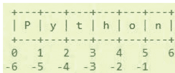

图 8-1 python-slicing
第一行数字给出了字符串中索引 0...6 的位置；第二行给出了对应的负索引。从 i 到 j 的切片由分别标记为 i 和 j 的边缘之间的所有字符组成。

Python 字符串不能被更改——它们是不可变的。因此，给字符串的索引位置赋值会导致错误。所以，如果你尝试给字符串赋一个新值，它会给你一个错误。

```python
In [31]: word[2] = 'l'
```

```python
TypeError
Traceback (most recent call last)
<ipython-input-31-27e525a0336b> in <module>
----> 1 word[2] = 'l'

TypeError: 'str' object does not support item assignment
```

如果你需要一个新字符串，你需要创建一个新的。

```python
In [32]: # 内置函数 len() 返回字符串的长度：
        len(word)
```

```python
Out[32]: 6
```

```python
In [33]: s = 'supercalifragilisticexpialidocious'
        len(s)
```

```python
Out[33]: 34
```

## 8.2 列表
要简单理解 Python 中列表代表什么，可以拿你日常生活中准备的任何列表为例。待办事项列表、购物清单，甚至是待观看的电影和网络剧集列表，或者待玩游戏列表。

在我们继续之前，让我们记住 Python 列表的这 3 个属性。它们是：
- 有序集合
- 顺序性
- 可迭代

这些列表本质上由什么组成？
- 项目、电影或游戏的名称（基本上是文本）
- 一些数字
- 一些特殊字符
- 其他任何东西

现在，Python 列表与你的普通列表没什么不同。你只需要注意两点：
- 用逗号分隔项目。（日常列表中的项目大多在不同的行上）
- 列表中的项目用方括号 `[]` 括起来，以便 Python 理解这是一个列表。

下面有两个列表示例，一个是普通的日常列表，你可能很容易理解。另一个是相同的列表，用 Python 表示。


图 8-2 电影和网络剧集列表

```python
In [34]: ListofMovies = ['The Shawshank Redemption',
            'The Godfather', 'Avatar', 'Terminator 2 - The Judgment day',
            24, '12 Angry Men', '¡Three Amigos!', 'GOT']
```

一旦你创建了一个列表，这个 *列表* 就会被分配一个内存空间，并在被调用时返回其值。

```python
In [35]: ListofMovies
```

```python
Out[35]: ['The Shawshank Redemption',
        'The Godfather',
        'Avatar',
        'Terminator 2 - The Judgment day',
        24,
        '12 Angry Men',
        '¡Three Amigos!',
        'GOT']
```

一旦 *列表* 被创建，你就可以使用各种函数和列表操作来修改列表。你可以在列表中添加、删除和搜索项目。由于我们可以修改列表，所以 **列表** 是一种 **可变数据类型**。

列表可以包含：
- 数字
- 字符串
- 表达式
- 以上三者的任意组合

此外，列表还可以包含嵌套的列表。因此，本质上，列表只是一个容器。这个容器有一些特性，使其在功能上非常重要且易于使用。

### 8.2.1 索引与切片
像字符串（以及所有其他内置序列类型）一样，列表可以被索引和切片：我们将创建一个简单的数字列表，来理解索引和切片。38

```python
In [36]: even = [2,4,6,8,10,12,14]
```

```python
In [37]: even[0] # 索引返回项目
Out[37]: 2
```

```python
In [38]: even[-1]
Out[38]: 14
```

```python
In [39]: even[1:4] # 切片返回一个新列表
Out[39]: [4, 6, 8]
```

列表也支持连接等操作：

```python
In [40]: even+[16,18,20,22]
Out[40]: [2, 4, 6, 8, 10, 12, 14, 16, 18, 20, 22]
```

与 **不可变** 的字符串不同，列表是 **可变** 类型，即可以更改其内容：

```python
In [41]: squares = [1, 4, 9, 17, 25] # 这里有点问题 # 4 的平方是 16，不是 17！
        squares
Out[41]: [1, 4, 9, 17, 25]
```

```python
In [42]: squares[3] = 16 # 替换错误的值
        squares
Out[42]: [1, 4, 9, 16, 25]
```

内置函数 **len()** 也适用于列表。

### 8.2.2 列表对象的方法

| 方法 | 描述 |
|---|---|
| **list.append(x)** | 在列表末尾添加一个元素。等价于 **a[len(a):] = [x]**。 |
| **list.extend(iterable)** | 通过将可迭代对象中的所有元素追加到列表末尾来扩展列表。等价于 **a[len(a):] = iterable**。 |
| **list.insert(i, x)** | 在指定位置插入一个元素。第一个参数是元素插入位置之前的索引，因此 a.insert(0, x) 会在列表开头插入，而 **a.insert(len(a), x)** 等价于 **a.append(x)**。 |
| **list.remove(x)** | 从列表中移除第一个值等于 **x** 的元素。如果没有这样的元素，则引发 ValueError。 |
| **list.pop([i])** | 移除列表中指定位置的元素并返回它。如果未指定索引，**a.pop()** 会移除并返回列表中的最后一个元素。（方法签名中 **i** 周围的方括号表示该参数是可选的，而不是你应该在该位置输入方括号。你将在 Python 库参考中频繁看到这种表示法。） |
| **list.clear()** | 移除列表中的所有元素。等价于 **del a[:]**。 |
| **list.index(x[, start[, end]])** | 返回列表中第一个值等于 x 的元素的从零开始的索引。如果没有这样的元素，则引发 ValueError。可选参数 start 和 end 的解释与切片表示法相同，用于将搜索限制在列表的特定子序列内。返回的索引是相对于整个序列的开头计算的，而不是相对于 start 参数。 |
| **list.count(x)** | 返回 x 在列表中出现的次数。 |
| **list.sort(key=None, reverse=False)** | 对列表中的元素进行原地排序（参数可用于自定义排序，其解释请参见 **sorted()**）。 |
| **list.reverse()** | 原地反转列表中的元素。 |
| **list.copy()** | 返回列表的浅拷贝。等价于 a[:]。 |

上述方法应用于一个名为 "**fruits**" 的列表，其结果及方法说明如下图所示。为了在单帧中解释清楚，代码是在 iPython 控制台中执行的，而不是 Jupyter notebook。你必须在你的笔记本中进行同样的练习，并自行实验以深入理解。

```
>>> fruits = ['orange', 'apple', 'pear', 'banana', 'kiwi', 'apple', 'banana']
>>> fruits.count('apple')
2
>>> fruits.count('tangerine')
0
>>> fruits.index('banana')
3
>>> fruits.index('banana', 4)  # Find next banana starting a position 4
6
>>> fruits.reverse()
>>> fruits
['banana', 'apple', 'kiwi', 'banana', 'pear', 'apple', 'orange']
>>> fruits.append('grape')
>>> fruits
['banana', 'apple', 'kiwi', 'banana', 'pear', 'apple', 'orange', 'grape']
>>> fruits.sort()
>>> fruits
['apple', 'apple', 'banana', 'banana', 'grape', 'kiwi', 'orange', 'pear']
>>> fruits.pop()
'pear'
```

图 8-3 列表方法示例

**列表推导式** 列表推导式提供了一种简洁而优雅的方式来创建列表。

列表推导式的基本结构如下：`result = [expression for item in list if conditional]`

这等价于一个 **for 循环**，但正如我所说，列表推导式是一种*优雅*的创建列表的方式。

上述列表推导式的等效循环如下：

```
for item in list:
    if conditional:
        expression
```

让我们看一些列表推导式的例子。

```
In [44]: # to produce a simple list of ['a','s','i','a']
[i for i in 'asia']
```

```
Out[44]: ['a', 's', 'i', 'a']
```

```
In [45]: # to create a list of numbers of a range
mylist = [i for i in range(10)]
mylist
```

```
Out[45]: [0, 1, 2, 3, 4, 5, 6, 7, 8, 9]
```

在上面的例子中，我们没有给出任何条件。

```
In [46]: # to create a list of even numbers from 0 to 20
evans = [i for i in range(20) if i%2==0]
evans
```

```
Out[46]: [0, 2, 4, 6, 8, 10, 12, 14, 16, 18]
```

```
In [47]: # to create the following list using list comprehension, from a simple list # create [x,xx,xxx,y,yy,yyy, z, zz, zzzz]
mylist = ['x','y','z']
[i*n for i in mylist for n in range(1,5)]
```

```
Out[47]: ['x', 'xx', 'xxx', 'xxxx', 'y', 'yy', 'yyy', 'yyyy', 'z', 'zz', 'zzz', 'zzzz']
```

让我们看一个例子，并将列表推导式与 **for** 循环在产生相同结果时进行比较。你会惊讶于两者之间的相似性，并欣赏列表推导式为代码带来的简洁和优雅。

我们想创建这个列表 [(1, 3), (1, 4), (2, 3), (2, 1), (2, 4), (3, 1), (3, 4)]

```
In [48]: # Getting to answer by for loop combs = []
for x in [1,2,3]: for y in [3,1,4]: if x != y: combs.append((x, y)) combs
```

```
Out[48]: [(1, 3), (1, 4), (2, 3), (2, 1), (2, 4), (3, 1), (3, 4)]
```

```
In [49]: # Getting to answer by List comprehensions
[(x, y) for x in [1,2,3] for y in [3,1,4] if x != y]
```

```
Out[49]: [(1, 3), (1, 4), (2, 3), (2, 1), (2, 4), (3, 1), (3, 4)]
```

注意这两个代码片段中 **for** 和 **if** 语句的顺序是相同的。

使用列表推导式创建元素列表、元组列表、字典、集合。

### 8.2.4 del 语句

你想从列表中移除一个值，但给出的是它的索引而不是它的值？你可以使用 del 语句。

这与 .pop() 方法不同，后者会返回一个值。

**del 语句** 也可以用于从列表中移除切片或清空整个列表。例如：

```
In [50]: x = [-2, -4, 5, 8, 2.2, 44]
        del x[0]
        x
```

```
Out[50]: [-4, 5, 8, 2.2, 44]
```

```
In [51]: del x[2:4]
        x
```

```
Out[51]: [-4, 5, 44]
```

**del** 也可以用于删除整个变量：

```
In [52]: del x
```

```
In [53]: x
```

```
---------------------------------------------------------------------------
NameError                                 Traceback (most recent call last)
<ipython-input-53-6fcf9dfbd479> in <module>
----> 1 x

NameError: name 'x' is not defined
```

此后引用名称 **x** 将是一个错误（至少在另一个值被赋给它之前）。

## 8.3 元组

元组由逗号分隔的多个值组成，例如：

```
In [54]: t = 1234, 5678, 'xyz' # t is a tuple here
```

```
In [55]: t # notice, how a tuple when called, comes with 'paranthesis', i.e ()
```

```
Out[55]: (1234, 5678, 'xyz')
```

```
In [56]: u = t, ('a', 'b', 'c') # u is a nested tuple
```

```
In [57]: u
```

```
Out[57]: ((1234, 5678, 'xyz'), ('a', 'b', 'c'))
```

如你所见，输出时元组总是用括号括起来，这样嵌套元组才能被正确解释；它们可以在输入时带或不带括号，尽管通常括号是必要的（如果元组是更大表达式的一部分）。不能给元组的单个元素赋值，但是可以创建包含可变对象（如列表）的元组。

1. 元组与列表相似，有两个区别：元组是不可变的，而列表是可变的。
2. 元组用括号 () 括起来，而列表用方括号 [] 括起来。

然而，问题随之而来，为什么 Python 需要两个独立的内置数据结构，元组和列表。这更多是历史原因，关于 Python 如何演变，但现在已成定局。我们有两种数据结构。我们将更感兴趣的是这两种在 Python 中的不同用途，这使它们有所区别。

1. 尽管元组可能看起来与列表相似，但它们通常用于不同的情况和不同的目的。
2. 元组是不可变的，通常包含异构的元素序列，通过解包或索引（或在命名元组的情况下甚至通过属性）访问。
3. 列表是可变的，它们的元素通常是同构的，并通过迭代列表来访问。

正如我们之前看到的，我们可以不使用括号来创建元组，但这不是一个好的做法。在本书中，我们将始终使用括号来创建或定义元组。

为什么以及在何处使用元组而不是列表？

1. 当程序执行速度很重要时，元组是首选。与等效的列表相比，使用元组程序执行更快。但这在小元组或列表中并不明显。
2. 当数据完整性很重要，并且你不希望你的数据在整个程序中被更改时。使用元组而不是列表可以防止程序执行期间意外的数据修改。（记住，元组是不可变的）Python 还有另一种数据类型，称为字典。它要求其组件之一是不可变的数据类型。元组可以用于此，而列表则不能。

### 8.3.1 元组方法

几乎所有列表方法也适用于元组。到现在，你一定已经理解了，元组

## 8.4 集合

Python 还包含一种用于集合的数据类型。集合是一个无重复元素的无序集合。基本用途包括成员测试和消除重复条目。集合对象还支持数学运算，如并集、交集、差集和对称差集。

**定义：** 集合是一种无序的集合数据类型，它是可迭代的、可变的，并且没有重复元素。Python 的集合类表示了数学中集合的概念。<sup>41</sup>

由于集合是无序的，因此无法通过引用来访问集合中的项目。

可以使用花括号或 **set()** 函数来创建集合。

**注意：** 要创建一个空集合，必须使用 **set()**，而不是 **{}**；后者创建的是一个空字典，我们将在下一节讨论这种数据结构。

```
In [58]: colours = {'red', 'black','blue','orange',
            'red', 'pink', 'white', 'black'}

        # 在 colours 集合中，创建时存在一些
        # 重复项。看看当集合被调用或打印时
        # 它们是如何被移除的
```

```
Out[58]: {'black', 'blue', 'orange', 'pink', 'red',
          'white'}
```

```
In [59]: # 对集合进行快速成员测试 'red' in
        colours
```

```
Out[59]: True
```

```
In [60]: 'purple' in colours
```

```
Out[60]: False
```

### 8.4.1 集合操作演示

集合支持数学集合的集合操作。

```
In [61]: # 演示两个单词中唯一字母的集合操作
        a = set('abracadabra')
        b = set('alacazam')
```

```
In [62]: a # a 中的唯一字母
```

```
Out[62]: {'a', 'b', 'c', 'd', 'r'}
```

```
In [63]: b # b 中的唯一字母
```

```
Out[63]: {'a', 'c', 'l', 'm', 'z'}
```

```
In [64]: # 仅作比较，对于相同的文本，列表会发生什么，
        # 以及集合如何剔除重复项？

triallist = list('abracadabra')
triallist # 'abracadabra' 的所有字母都按原样保留，
          # 并按列表中的出现顺序排列
```

```
Out[64]: ['a', 'b', 'r', 'a', 'c', 'a', 'd', 'a',
'b', 'r', 'a']
```

```
In [65]: a - b # 在 a 中但不在 b 中的字母
```

```
Out[65]: {'b', 'd', 'r'}
```

```
In [66]: a | b # 在 a 或 b 中或两者都有的字母
```

```
Out[66]: {'a', 'b', 'c', 'd', 'l', 'm', 'r', 'z'}
```

```
In [67]: a & b # 同时在 a 和 b 中的字母
```

```
Out[67]: {'a', 'c'}
```

```
In [68]: a ^ b # 在 a 或 b 中但不同时在两者中的字母
Out[68]: {'b', 'd', 'l', 'm', 'r', 'z'}
```

与列表推导式类似，也支持集合推导式：

```
In [69]: a = {x for x in 'abracadabra' if x not in 'abc'}
a
Out[69]: {'d', 'r'}
```

### 8.4.2 集合方法

几乎所有列表方法也适用于集合。集合是无序的，因此使用索引的方法不适用于集合。

我希望你尝试在集合上使用所有列表方法，亲眼看看集合可以如何被使用、迭代和修改。

以下是集合的方法，你可能会注意到，有一些额外的方法是基于数学集合操作的。<sup>42</sup>

| 方法 | 描述 |
|---|---|
| add() | 向集合中添加一个元素 |
| copy() | 返回集合的一个副本 |
| clear() | 从集合中移除所有元素 |
| discard() | 移除指定的项目 |
| pop() | 从集合中移除一个元素 |
| remove() | 移除指定的元素 |
| symmetric_difference() | 返回一个包含两个集合对称差集的集合 |
| symmetric_difference_update() | 从该集合和另一个集合中插入对称差集 |
| union() | 返回一个包含集合并集的集合 |
| difference() | 返回一个包含两个或多个集合差集的集合 |
| difference_update() | 从该集合中移除也包含在另一个指定集合中的项目 |
| update() | 用该集合与其他集合的并集更新该集合 |
| intersection() | 返回一个集合，它是另外两个集合的交集 |
| intersection_update() | 从该集合中移除未在其他指定集合中出现的项目 |
| isdisjoint() | 返回两个集合是否有交集 |
| issubset() | 返回另一个集合是否包含该集合 |
| issuperset() | 返回该集合是否包含另一个集合 |

## 8.5 字典

字典是 Python 中另一种内置的数据类型。这是一个数据值的无序集合。

在现实生活的字典中，有一个“键”，即被详细解释的单词或项目。详细内容是它的“值”。

这在 Python 中是一样的。

最好将字典视为 **键：值** 对，要求键在字典中是唯一的。一对花括号创建一个空字典：{}。在花括号内放置一个逗号分隔的 **键：值** 对列表，可以向字典添加初始的 **键：值** 对；这也是字典在输出时的书写方式。

字典也可以通过内置函数 **dict()** 创建。<sup>43</sup>

字典中的 **键** 是唯一且不可变的数据类型，例如字符串、整数或元组。换句话说，只有简单的数据类型才能用作 **键**。

```
In [70]: # 这是一个字典的小例子
        # 这是一个家庭的电话号码目录
        household = {'ramesh':9893200000, 'surabhi':9893200311}

        household

Out[70]: {'ramesh': 9893200000, 'surabhi': 9893200311}
```

```
In [71]: # 向家庭中添加一个新成员
household['sush'] = 9893200422

household
```

```
Out[71]: {'ramesh': 9893200000, 'surabhi': 9893200311, 'sush': 9893200422}
```

```
In [72]: # 字典通过键进行索引。它不像列表或字符串那样是有序索引的
household['surabhi']
```

```
Out[72]: 9893200311
```

**dict()** 构造函数直接从 **键值** 对序列构建字典：

```
In [73]: dict([('sape', 4139), ('guido', 4127), ('jack', 4098)])
```

```
Out[73]: {'sape': 4139, 'guido': 4127, 'jack': 4098}
```

就像列表推导式一样，字典推导式可用于从任意键和值表达式创建字典：

```
In [74]: # 生成数字的平方
        {x : x**2 for x in (2, 3, 4 ,5)}
```

当键是简单的字符串时，使用关键字参数指定对有时更容易：

```
In [75]: dict(sape=4139, guido=4127, jack=4098)
```

```
Out[75]: {'sape': 4139, 'guido': 4127, 'jack': 4098}
```

### 8.5.1 字典方法

| 方法 | 描述 |
|---|---|
| copy() | **copy()** 返回字典的浅拷贝 |
| clear() | **clear()** 从字典中移除所有项目 |
| pop() | **pop()** 移除并返回具有给定键的字典中的一个元素 |
| popitem() | **popitem()** 从字典中移除任意的键值对，并将其作为元组返回 |
| get() | **get()** 是访问键对应值的常规方法 |
| dictionary_name.values() | 它返回给定字典中所有可用值的列表 |
| str() | **str()** 生成字典的可打印字符串表示 |
| update() | **update()** 将字典 dict2 的键值对添加到 dict 中 |
| setdefault() | 如果键不在 dict 中，则设置 **dict[key]=default** |
| keys() | **keys()** 返回一个包含字典键的列表 |
| items() | **items()** 返回一个包含每个键值对元组的列表 |
| has_key() | 如果键在字典 dict 中则返回 true，否则返回 false |
| fromkeys() | 它创建一个新字典，键来自 seq，值设置为 value |
| type() | **type()** 返回传递变量的类型 |
| cmp() | **cmp()** 比较两个字典的元素 |

## 8.6 序列上的循环技术<sup>45</sup>

在循环遍历字典时，可以使用 **items()** 方法同时检索键和相应的值。

```
In [76]: knights = {'gallahad': 'the pure', 'robin':
            'the brave'}
        for k, v in knights.items(): print(k, v)
```

gallahad the pure robin the brave

在循环遍历序列时，可以使用 **enumerate()** 函数同时检索位置索引和相应的值。

```
In [77]: for i, v in enumerate(['tic', 'tac',
            'toe']): print(i, v)
```

0 tic 1 tac
2 toe

要同时遍历两个或更多序列，可以使用 **zip()** 函数将条目配对。

```
In [78]: questions = ['name', 'quest', 'favorite color']
        answers = ['lancelot', 'the holy grail', 'blue']
        for q, a in zip(questions, answers):
            print('What is your {0}? It is {1}.'.format(q, a))
```

```
What is your name? It is lancelot.
What is your quest? It is the holy grail.
What is your favorite color? It is blue.
```

要反向遍历序列，首先按正向指定序列，然后调用 **reversed()** 函数。

```
In [79]: for i in reversed(range(1, 10, 2)):
            print(i)
```

```
9
7
5
3
1
```

要按排序顺序遍历序列，可以使用 **sorted()** 函数，它返回一个新的已排序列表，同时保持原序列不变。

```
In [80]: basket = ['apple', 'orange', 'apple', 'pear', 'orange', 'banana']
        for f in sorted(set(basket)): print(f)
```

```
apple
banana
orange
pear
```

在遍历列表时修改它有时很诱人；然而，创建一个新列表通常更简单、更安全。

```
In [81]: import math
        raw_data = [56.2, float('NaN'),
        51.7, 55.3, 52.5, float('NaN'), 47.8]
        filtered_data = []
        for value in raw_data:
            if not math.isnan(value):
                filtered_data.append(value)
```

```
In [82]: filtered_data
```

```
Out[82]: [56.2, 51.7, 55.3, 52.5, 47.8]
```

## 8.7 总结
本章主要介绍了 Python 的数据结构，包括内置数据结构和序列。我们学习了字符串及其方法、格式化和操作。我们看到了如何修改字符串，尽管它们是不可变对象。接着是列表，这是最受欢迎的数据结构类型之一，可以包含任何内容。它们是可变的，并且有一种优雅的操作方式——列表推导式。我们列出了几种可用的列表方法。然后是元组，它们与列表非常相似，但不可变的特性区分了它们的用途。接着是集合，它们在各个方面都与列表和元组不同。它们是无序的，因此不能像列表那样进行索引或切片。它们只包含唯一值，并在需要此功能的地方使用。最后是字典，它是唯一以键值对形式存储数据的数据结构。字典具有键和值的组合。它们在许多情况下都非常有用，你稍后会看到。序列是可迭代的，因此可以循环遍历。我们在上一节中看到了其中一些技术。

## 8.8.1 练习
回答以下问题：
1. Python 中“数字”和“字符串”有什么区别？它们可以互换使用吗？
2. 自 Python 3.6 版本以来引入了什么新的字符串格式化方法？
3. 列表可以包含哪些类型的数据或序列？
4. 以下语句的输出是什么？并说明理由。

```
print('let\'s get back to work')
```

5. 列表是可变的，但元组是不可变的。你如何理解这个陈述？这如何影响两者的使用？
6. 列表推导式等价于 Python 中的哪种控制结构？为什么它们更有用？
7. 元组是有序集合，而集合是无序集合。你如何理解这个陈述？这如何影响两者的使用？
8. 如果你必须存储任何文本或集合的唯一元素，你会使用什么？举一个实际的例子说明这可能有用。
9. 字典是可迭代的吗？详细说明你的答案。

## 8.8.2 判断正误
1. 同一个字符串可以使用字符串方法进行修改，并保存在相同的内存空间中。
2. 字符串的乘法操作返回一个包含重复值的字符串。
3. 字符串根据包裹它们的引号类型而不同。
4. 索引适用于字符串和列表，但不适用于集合。
5. 一个列表一次只能包含一种数据类型。
6. 无法在元组中插入新值。
7. 列表推导式是一种优雅的列表操作方法。
8. 元组可以在一个元组中包含混合数据类型。
9. 元组用括号 () 括起来，而列表用方括号 [] 括起来。
10. 在字典中，键和值的数量不必相同。

## 8.8.3 编写你自己的代码
1. 使用列表推导式生成以下列表。
    a. ['C','O','U','N','T','R','Y']
    b. ['C','A','T','CC','AA','TT', 'CCC', 'AAA', 'TTT']
    c. [[2], [3], [4], [3], [4], [5], [4], [5], [6]]
    d. [[2, 3, 4, 5], [3, 4, 5, 6], [4, 5, 6, 7], [5, 6, 7, 8]]
    e. [(1, 1), (2, 1), (3, 1), (1, 2), (2, 2), (3, 2), (1, 3), (2, 3), (3, 3)]
    f. [0, 1, 4, 9, 16, 25, 36, 49, 64, 81]
2. 创建一个空列表。假设该列表名为 my_list。用 50 个数字填充 my_list，这些数字在 1 到 25 之间。（数字可以重复。）
3. 在上一题创建的列表 my_list 中，搜索数字 11、18 和 20 是否存在。编写你的代码来搜索这些数字。此外，代码应打印这些数字出现的次数。
4. 编写一个程序，打印列表 "my_list" 中有多少个数字是偶数，有多少个是奇数。
5. 编写一个程序，从 "my_list" 创建另一个列表，该列表包含 "my_list" 中数字的平方，但顺序相反。
6. 编写一个名为 sorted_list 的函数，该函数接受一个列表作为参数，如果列表按升序排序则返回 True，否则返回 False。作为前提条件，你可以假设列表的元素可以使用关系运算符 <, > 等进行比较。
7. 编写一个 Python 程序，输入你 10 个朋友的姓名和电话号码，将其存储在字典中，并打印特定姓名的电话号码。
8. 编写一个名为 remove_duplicates 的函数，该函数接受一个列表并返回一个新列表，其中只包含原始列表中的唯一元素。提示：它们不必保持相同的顺序。
9. 编写一个函数来查找列表元素的乘积。当使用字符串列表调用该函数时会发生什么？

## 8.8.4 实践任务
1. 尝试在元组上使用所有列表方法，亲自看看它们的行为如何相似却又如此不同。
2. 在上面的练习中，为所有列表推导式编写循环。

# 9 输入-输出、文件和异常处理

## 9.1 输入
在 Python 中，有两种方式来思考输入。一种是我们已经在学习过程中一直在做的。我们输入代码文本、用于计算的数字，并编写函数。这些都是我们将数据输入 Python 的方式。我们为此使用 IDE（集成开发环境）。就像我在这里使用 Jupyter Notebook，并在代码单元格块中编写输入，当它们运行时，要么产生输出供查看，要么不产生输出（但在内存中保存某些内容）。我们将在本章稍后介绍输出的方法。

当我们**输入**代码并让它们执行操作时，我们是在进行静态操作。我们的变量被定义并硬编码到源代码中。

还有另一种提供**输入**的方式。为了允许灵活性，我们可以从**用户**那里获取一些输入。在 Python 中，有一个内置函数 **input()**，它正是做这个的。**input()** 函数的语法是：`input(Prompt)` 其中 `[Prompt]` 是我们希望在屏幕上显示的字符串。这完全是可选的，仅用于使输入决策对最终用户更清晰。

当我们运行这段代码 `greetings = input("Say your Greetings:")` 时，它会提示用户输入他想要的任何内容。


当用户在框中输入他的问候语 **Good Morning** 时，它会像下面这样输出：

```
In [1]: greetings = input("Say your greetings:")
Say your greetings:Good Morning
```

我们也可以在数学计算中提示用户输入。这只是为了说明这里的输入不一定是字符串，可以在任何地方使用。

```
In [2]: num = int(input("Enter the Number:"))
        def even_odd(num):
            if num % 2 == 0:
                print("This is an Even Number")
            else:
                print("This is an odd Number")
        even_odd(num) # calling the function
```

```
Enter the Number:9
This is an odd Number
```

我们上面做的是，首先定义了一个名为 "num" 的变量，并为其赋值，该值是一个动态整数（由用户输入）。然后我们定义了一个函数 even_odd()，它接受 num 作为其参数。此函数检查用户输入的数字是奇数还是偶数。我邀请你在你的 IDE 或 Jupyter Notebook 中输入这些代码行，亲自看看会发生什么。

> 注意：input() 函数总是返回一个字符串。如果你想要一个数字类型，那么你需要使用 int()、float() 或 complex() 内置函数将字符串转换为适当的类型，因此在上面的例子中使用了 int() 函数将其转换为整数。

```
In [3]: # let's write an interactive code, which shows how input() works
        print("Hi, How are you Doing?")
        name = input("What is Your
```

## 9.2 输出

在 Python 中，有多种方式可以呈现程序的输出。数据可以以人类可读的形式打印在屏幕上，也可以写入文件以供将来使用。本章将讨论其中一些可能性。

我们已经见过 **print()** 函数及其语法。现在，我们将探讨更多输出结果的方法。

### 9.2.1 更花哨的输出格式化<sup>46</sup>

到目前为止，我们已经遇到了两种写入值的方式：表达式语句和 **print()** 函数。

通常，你希望对输出的格式有更多控制，而不仅仅是打印空格分隔的值。有几种格式化输出的方法。其中一个例子是：

```
In [4]: Name = "nilabh"
       Year = 1998

       f'{Name} was born in {Year}'

Out[4]: 'nilabh was born in 1998'
```

#### 9.2.1.1 格式化字符串字面值

格式化字符串字面值（也简称为 f-字符串）允许你通过在字符串前加上 "f" 或 "F" 并将表达式写为 {expression}，将 Python 表达式的值包含在字符串中。

以下示例以用户期望的字符串格式打印圆周率的值：

```
In [5]: import math print(f'The value of pi is approximately {math.pi}')
```
圆周率的值约为 3.141592653589793

表达式后面可以跟一个可选的格式说明符。这允许对值的格式化方式有更大的控制。以下示例将圆周率四舍五入到小数点后三位：

```
In [6]: import math print(f'The value of pi is approximately {math.pi:.3f}')
```
圆周率的值约为 3.142

在 ':' 后传递一个整数将使该字段成为最小字符宽度。这对于使列对齐很有用。在下面的示例中，我们将看到它如何影响输出。

```
In [7]: # 在 ':' 后没有整数
table = {'Sjoerd': 4127, 'Jack': 4098, 'Dcab': 7678}
for name, phone in table.items():
    print(f'{name} ==> {phone}')
```
Sjoerd ==> 4127
Jack ==> 4098
Dcab ==> 7678

```
In [8]: # 在 ':' 后传递一个整数将使该字段成为最小字符宽度
table = {'Sjoerd': 4127, 'Jack': 4098,
'Dcab': 7678}
for name, phone in table.items():
    print(f'{name:10} ==> {phone:10}')
```
```
Sjoerd ==> 4127
Jack ==> 4098
Dcab ==> 7678
```

可以使用其他修饰符在格式化之前转换值。'!a' 应用 ascii()，'!s' 应用 str()，'!r' 应用 repr()：

```
In [9]:   animals = 'eels'
         print(f'My hovercraft is full of {animals}.')
         # 使用 `!r`

         print(f'My hovercraft is full of
{animals!r}.')
```
```
My hovercraft is full of eels.
My hovercraft is full of 'eels'.
```

有关这些格式规范及其更多细节的进一步参考，请参阅此链接上的格式规范迷你语言参考指南：https://docs.python.org/3.7/library/string.html#formatspec

#### 9.2.1.2 字符串 format() 方法

**str.format()** 方法的基本用法如下所示：

```
In [10]: print('We are the {} who say "{}!"'.format('knights', 'Ni'))
```
We are the knights who say "Ni!"

括号及其内部的字符（称为格式字段）将被替换为传递给 **str.format()** 方法的对象。括号中的数字可用于引用传递给 **str.format()** 方法的对象的位置。

```
In [11]: print('{0} and {1}'.format('spam', 'eggs'))
        print('{1} and {0}'.format('spam', 'eggs'))
```
spam and eggs eggs and spam

如果在 **str.format()** 方法中使用关键字参数，则通过使用参数的名称来引用它们的值。

```
In [12]: print('This {food} is {adjective}.'.format(food='spam',
        adjective='absolutely horrible'))
```
This spam is absolutely horrible.

位置参数和关键字参数可以任意组合：

```
In [13]: print('The story of {0}, {1}, and {other}.'.format('Bill',
        'Manfred', other='Georg'))
```
The story of Bill, Manfred, and Georg.

如果你有一个不想拆分的长格式字符串，如果你能按名称而不是按位置引用要格式化的变量，那就太好了。这可以通过简单地传递 **dict** 并使用方括号 '[]' 来访问键来完成。

```
In [14]: table = {'Sjoerd': 4127, 'Jack': 4098,
            'Dcab': 8637678}

        print('Jack: {0[Jack]:d}; Sjoerd:
        {0[Sjoerd]:d}; Dcab:
        {0[Dcab]:d}'.format(table))
```
**Jack: 4098; Sjoerd: 4127; Dcab: 8637678**

你一定想知道，这些 **d** 在 : 后面是做什么的。它们将数据转换为你想要的**某种格式**，然后打印出来。观察这里代码的调整，并亲自看看结果的变化。

```
In [15]: table = {'Sjoerd': 4127, 'Jack': 4098,
            'Dcab': 8637678}

        print('Jack: {0[Jack]:d}; Sjoerd:
        {0[Sjoerd]:c}; Dcab:
        {0[Dcab]:b}'.format(table))
```
**Jack: 4098; Sjoerd: □; Dcab: 100000111100110011101110**

##### 这里发生了什么？

我不会直接给你答案。但如果你好奇，我会引导你到一个地方，在那里你不仅能得到答案，还能得到更多像上面那样的变体。

访问 https://docs.python.org/3.7/library/string.html#formatspec

现在继续原来的示例。

相同的输出也可以通过使用 '**' 符号将 table 作为关键字参数传递来完成。

```
In [16]: table = {'Sjoerd': 4127, 'Jack': 4098,
            'Dcab': 8637678}

        print('Jack: {Jack:d}; Sjoerd: {Sjoerd:d};
        Dcab: {Dcab:d}'.format(**table))
```
Jack: 4098; Sjoerd: 4127; Dcab: 8637678

这与内置函数 **vars()** 结合使用特别有用，该函数返回一个包含所有局部变量的字典。例如，以下几行生成一组整齐对齐的列，给出整数及其平方和立方：

```
In [17]: for x in range(1, 11): print('{0:2d} {1:3d}
        {2:4d}'.format(x, x*x, x*x*x))
```
1  1  1
2  4  8
3  9  27
4  16  64
5  25  125
6  36  216
7  49  343
8  64  512
9  81  729
10 100 1000

#### 9.2.1.3 手动字符串格式化

这是相同的平方和立方表，手动格式化：

```
In [18]: for x in range(1, 11):
            print(repr(x).rjust(2),
            repr(x*x).rjust(3),repr(x*x*x).rjust(4))
```
```
 1   1   1
 2   4   8
 3   9  27
 4  16  64
 5  25 125
 6  36 216
 7  49 343
 8  64 512
 9  81 729
10 100 1000
```
（请注意，每列之间的一个空格是由 **print()** 的工作方式添加的：它总是在其参数之间添加空格。）字符串对象的 **str.rjust()** 方法通过在左侧填充空格，将字符串在给定宽度的字段中右对齐。还有类似的方法 **str.ljust()** 和 **str.center()**。这些方法不写入任何内容，它们只返回一个新字符串。

还有另一个方法 **str.zfill()**，它在数字字符串的左侧填充零。它理解加号和减号：

```
In [19]: '12'.zfill(5)
```
```
Out[19]: '00012'
```
```
In [20]: '-12'.zfill(5)
```
```
Out[20]: '-0012'
```
```
In [21]: '-3.14'.zfill(7)
```

### 9.2.1.4 str() 与 repr()

在 Python 中，`str()` 和 `repr()` 都用于获取对象的字符串表示。请看下面示例中的区别：

```python
In [23]: s = 'Hello, Geeks.'
         print(str(s))
         print(str(3.0/11.0))
```

```
Hello, Geeks.
0.2727272727272727
```

```python
In [24]: s = 'Hello, Geeks.'
         print(repr(s))
         print(repr(3.0/11.0))
```

```
'Hello, Geeks.'
0.2727272727272727
```

从上面的输出可以看出，如果使用 `repr()` 函数打印字符串，它会带有一对引号。

以下是它们的区别：
- **str()** 用于为最终用户创建输出，而 **repr()** 主要用于调试和开发。
- **repr** 的目标是**明确无误**，而 **str** 的目标是**可读性**。例如，如果我们怀疑一个浮点数有微小的舍入误差，**repr** 会显示出来，而 **str** 可能不会。
- **repr()** 计算对象的“**官方**”字符串表示（一种包含对象所有信息的表示），而 **str()** 用于计算对象的“**非正式**”字符串表示（一种对打印对象有用的表示）。

让我们通过一个例子来理解：

```python
In [25]: import datetime
         today = datetime.datetime.now()
         # 打印日期时间对象的可读格式
         print(str(today))
         # 打印日期时间对象的官方格式
         print(repr(today))
```

```
2020-05-31 17:26:36.783561
datetime.datetime(2020, 5, 31, 17, 26, 36, 783561)
```

**str()** 以用户能理解日期和时间的方式显示今天的日期。

**repr()** 打印日期时间对象的“官方”表示（意味着使用这个“官方”字符串表示我们可以重建该对象）。

### 9.2.1.5 旧式字符串格式化

`%` 运算符也可用于字符串格式化。它解释左侧参数的方式类似于 `sprintf()` 风格的格式字符串，该字符串将应用于右侧参数，并返回此格式化操作产生的字符串。例如：

```python
In [26]: import math
         print('The value of pi is approximately %abs.' % math.pi)
```

```
The value of pi is approximately 3.141592653589793bs.
```

```python
In [27]: import math
         print('The value of pi is approximately %.3f.' % math.pi)
```

```
The value of pi is approximately 3.142.
```

## 9.3 读写文件

**open()** 返回一个文件对象，最常与两个参数一起使用：**open(filename, mode)**。

```python
f = open('workfile', 'w')
```

第一个参数是包含文件名的字符串。第二个参数是另一个字符串，包含几个描述文件将如何使用的字符。模式可以是：
- `'r'` 表示文件将只被读取，
- `'w'` 表示只写入（同名的现有文件将被擦除），
- `'a'` 打开文件用于追加；任何写入文件的数据都会自动添加到末尾。
- `'r+'` 打开文件用于读写。

模式参数是可选的；如果省略，则假定为 `'r'`。

通常，文件以文本模式打开，这意味着你从文件读取字符串和向文件写入字符串，这些字符串以特定编码进行编码。

**open()** 的完整语法如下：
```python
open(file, mode='r', buffering=-1, encoding=None, errors=None, newline=None, closefd=True, opener=None)
```

*mode* 中的默认选项是 `'r'`。请查看下表中的所有其他选项。

| 字符 | 含义 |
| :--- | :--- |
| 'r' | 打开用于读取（默认） |
| 'w' | 打开用于写入，首先截断文件 |
| 'x' | 打开用于独占创建，如果文件已存在则失败 |
| 'a' | 打开用于写入，如果文件存在则追加到文件末尾 |
| 'b' | 二进制模式 |
| 't' | 文本模式（默认） |
| '+' | 打开磁盘文件进行更新（读写） |

图 9-2 Python 中打开文件可用的模式

处理文件对象时，使用 **with** 关键字是一个好习惯。其优点是，即使在某个点引发异常，文件在其代码块完成后也会被正确关闭。

```python
with open('workfile') as f:
    read_data = f.read()
```

如果你不使用 **with** 关键字，那么你应该调用 **f.close()** 来关闭文件，并立即释放它使用的任何系统资源。

### 9.3.1 文件对象的方法

本节中的其余示例将假设一个名为 `f` 的文件对象已被创建。

要读取文件的内容，请调用 **f.read(size)**，它读取一定数量的数据并将其作为字符串（在文本模式下）或字节对象（在二进制模式下）返回。

**Size** 是一个可选的数字参数。当 size 被省略或为负数时，将读取并返回文件的全部内容；如果文件大小是机器内存的两倍，那就是你的问题了。

否则，最多读取并返回 size 个字符（在文本模式下）或 size 个字节（在二进制模式下）。如果已到达文件末尾，**f.read()** 将返回一个空字符串（`''`）。

```python
>>> f.read()
'This is the entire file.\n'
>>> f.read()
''
```

**f.readline()** 从文件中读取一行。此方法每次运行时都会持续读取下一行。

```python
>>> f.readline()
'This is the first line of the file.\n'
>>> f.readline()
'Second line of the file\n'
>>> f.readline()
''
```

要从文件中读取行，你可以循环遍历文件对象。这节省内存、速度快，并且代码简洁：

```python
>>> for line in f:
...     print(line, end='')
...
This is the first line of the file.
Second line of the file
```

如果你想将文件的所有行读入一个列表，你也可以使用 **list(f)** 或 **f.readlines()**。

**f.write(string)** 将 *string* 的内容写入文件，返回写入的字符数。

```python
>>> f.write('This is a test\n')
15
```

其他类型的对象需要先转换为字符串（在文本模式下）或字节对象（在二进制模式下），然后再写入：

```python
>>> s = str(value)  # 将元组转换为字符串
>>> f.write(s)
18
```

### 9.3.2 创建文件并写入内容

我们上面已经看到了如何在 Python 中打开、读取和写入文件。我邀请你和我一起尝试一个非常简单的例子。我们将创建一个文件，向其中写入一些文本，关闭它，然后打开文件在这里读取它。

```python
In [28]: # 写入一些文本并将其传递给一个变量
         story = '''
Lets write a small story.
There was a curious student. He wanted to learn Python.
His age was... Well, how does it matter.
One can be student at any age.
Lets say, he was a good student and within a short time, learnt all about programming and python. He combined that with his business acumen, and became a good data scientist.
'''

         # 创建一个新的文本文件
         f = open("small_story.txt", mode="w")
```

当我们运行上面的代码行时，我们创建了一个名为 `small_story.txt` 的新文件。你可以进入你的基础文件夹自己查看。目前它将是一个空白文件，因为我们还没有向文件中写入任何内容。

现在让我们写入文件。我们将使用我们刚刚在上面写的故事，并将该文本写入我们新创建的文件。

```python
In [29]: # 将文本 "story" 写入文件 "f"
         f.write(story)  # 结果给出写入文件 "f" 的字符数
```

```
Out[29]: 337
```

```python
In [30]: f.close()
```

### 9.3.3 打开文件并读取其内容

有趣的是，同一个函数如何既创建文件又打开它。如果你仔细观察，唯一的区别是 "mode="。其详细信息已在上表中描述。

```python
In [31]: # 默认打开是只读
         f = open("small_story.txt", mode='r')
```

```python
In [32]: # 现在只通过变量名调用，不会给出文件的内容。
         # 它只会给出文件的内存位置。
         f
```

```
Out[32]: <_io.TextIOWrapper name='small_story.txt' mode='r' encoding='cp1252'>
```

要读取文件的内容，请使用 `read()` 方法。

```python
In [33]: f.read()
```

```
Out[33]: '\nLets write a small story.\nThere was a curious student. He wanted to learn Python. \nHis age was... Well, how does it matter. One can be student at any age. \nLets say, he was a good student and within a short time, learnt all about \nprogramming and python. He combined that with his business acumen, and became \na good data scientist.\n'
```

我们也可以将内容传递给一个变量。

### 9.3.4 逐行读取

我们可以一次读取一行内容。

```python
In [34]: f = open("small_story.txt")
         f.readline()
```

```
Out[34]: '\n'
```

```python
In [35]: f.readline()
```

```
Out[35]: 'Lets write a small story.\n'
```

```python
In [36]: f.readline(12)
```

### 9.3.5 读写文本文件以外的文件

上述方法对于文本文件非常有效。然而，对于当今数据存在的各种文件类型来说，这仍然不够。这正是Python的优势所在，也是许多其他语言所缺乏的。在Python中，由于它是开源的，并且有许多聪明的人致力于使其变得更好，每一天，它都有不同的模块来处理各种事情。嗯，几乎是所有事情。

对于文件处理、读写，有不同的模块使这项工作变得更容易和有趣。

在本书的后面，我们将学习这样一个模块——Pandas。它是程序员和使用Python的数据科学家最常用的模块之一。

## 9.4 总结

在本章中，我们学习了如何在Python中获取结果作为输出。我们还学习了如何优雅高效地展示输出。我们更进一步，了解了如何在Python环境中创建文本文件，然后向其中写入内容。这对于将输出或结果保存到单独的文本文件中非常有用，该文件可以在Python环境之外保存、读取和流通。然而，我们在本章中仅限于文本文件，并承诺稍后将使用Pandas模块介绍其他有用的文件类型。字符串操作和文件输出将在你的编程生涯中证明具有巨大的实用性。

## 9.5.1. 练习：回答以下问题：

1. `input()` 函数的作用是什么？
2. 写出字符串格式化的格式。注意其语法。
3. 在Python中读取文件时，如何限制要读取的文件大小？为什么这很重要？
4. 为什么我们需要在Python中打开外部文件？

```python
file = open('textfile.txt', 'w')
word = ''
while word.upper() != 'END':
    word = raw_input('Enter a word use END to quit')
    file.write(word + '\n')
file.close()
```

上述程序用于创建一个存储单词列表的文件。在硬盘上包含单词列表的文件名是什么？

5. 比较 `read()`、`readline()` 和 `readlines()`。它们之间有什么异同？
6. 比较 `write()` 和 `writelines()`。它们之间有什么异同？
7. `open()` 函数可以使用多少种文件模式来打开文件？写出每种模式的用法。
8. 用一个例子解释 `read()` 和 `readline()` 函数的用法。
9. `str()` 和 `repr()` 函数有什么区别？

## 9.5.2. 判断正误：

1. `input` 函数中的字符串提示是强制性的。
2. `input()` 函数总是返回一个字符串。
3. `input()` 函数只接受字符串作为输入。
4. 在 `str.format()` 方法中，`{}` 用作占位符。
5. 如果在 `str.format()` 方法中使用关键字参数，可以通过使用参数的名称来引用它们的值。
6. 格式字符串中对象的顺序无论如何都不能改变。
7. `str()` 用于字符串，`repr()` 用于数字。
8. `open()` 函数的 "r" 和 "r+" 参数具有相同的用途。
9. 我们只能在Python中打开现有文件，不能创建新文件。
10. 我们只能在Python中读取文本文件。

## 9.5.3. 编写你自己的代码：

1. 编写代码从用户那里获取数字输入，结果是输入数字的平方。
2. 从用户那里获取用户的年龄。用当前年份减去年龄，得到用户的出生年份。以 "I was born in the year ----" 的格式打印结果。
3. 编写一个函数，接受三个参数：第一个是输入文件，第二个是输出文件，第三个是转换函数。第一个参数是为读取而打开的文件，第二个参数是为写入而打开的文件，第三个参数是一个函数，该函数接受一个字符串并执行你选择的转换，然后返回转换后的字符串。该函数应读取输入文件中的每一行，将该行传递给转换函数，然后将转换后的行写入输出文件。转换可以是——将每个单词的首字母大写。
4. 编写一个函数来创建一个包含以下数据的文本文件：
    The 344-sq. km. the periphery of Navi Mumbai starts on the East with Kalundre village, on the West is the hill range that starts from Digha and runs up to Taloja; in the North is Digha village while Chanje village lies in the South, Dronagiri is on the South-East. The area comprised of 95 villages of Thane and Raigad Districts.
    - i. 使用 `read()` 或 `readlines()` 读回整个文件内容并显示在屏幕上。
    - ii. 在文件中追加你选择的更多文本，并显示文件内容，每行前加上行号。
    - iii. 显示文件的最后一行。
    - iv. 显示从第10个字符开始的第一行。
    - v. 从文件中读取并显示一行。要求用户提供要读取的行号。
5. 编写一个程序，从用户那里接受一个文件名，并显示文件中所有包含Python注释字符 '#' 的行。
6. 从开头逐行读取文件是一项常见任务，但如果你想反向读取文件呢？当你需要读取日志文件时会发生这种情况。编写一个程序，从文件末尾到开头读取并显示文件内容。

## 9.5.4. 动手实践：

1. 在Python中打开一些小的文本文件玩玩。尝试你在本章中学到的函数。
2. 在你的Jupyter Notebook markdown单元格中写一篇小文章。将其保存为文本文件。

# 10 项目2：自动化多图像处理任务

我们正在学习一门编程语言的细微之处。我们知道这是我们与计算机对话所需的语言。但我们为什么要与计算机对话？

我们试图实现什么？

计算机因其相对于人类的两个主要优势而被广泛使用。

- 它们速度快。
- 它们擅长执行重复性任务。它们既不会感到厌烦，也不会自己犯错误。

因此，我们将使用像Python这样的编程语言来完成上述所有任务，以及更多。

现在让我们解决一个我们生活中迟早都会遇到的实际问题。我们希望有一个神奇的工具，可以毫不费力地为我们完成这项枯燥而重复的工作。我将向你展示Python如何凭借其所有的库和模块为你服务，成为那个神奇的工具。

你去美丽的山间车站进行了一次大学旅行。那里有白雪皑皑的山脉和郁郁葱葱的绿色山谷。山坡上到处散布着成群的山羊和绵羊。山谷旁有一条河流。水是如此清澈，你可以看到底部的鱼和鹅卵石。

多么美妙的地方啊。你忍不住用你的数码单反相机不停地拍照，直到存储卡和备用卡都无法容纳更多的照片。你对自己的摄影技巧和周围的美景感到满意和满足，几天后回来了。精神焕发，精力充沛，渴望展示你去过的一个美丽地方。你继续前进，打开电脑，将所有照片从存储卡复制到你的电脑上。现在你想在社交媒体上与你的朋友分享，在你的博客上与你的粉丝分享，并且发布在你的网站上。

现在你意识到，如果你想做所有这些事情，你手头有很多工作。为什么？

- 照片很大（每张在2 MB到40 MB之间，有时甚至更多）。
- 许多照片方向错误，你需要旋转它们，以便观众能够理解。
- 在你的博客中，你只能上传一种特定格式的照片（例如.png），而你的照片是.jpg格式。
- 许多照片在黑白效果下会看起来很棒，尤其是远景和风景照。
- 当你想打印它们时，你保存的jpeg图像的dpi达不到打印机的要求。

你知道电脑上有一些工具可以完成所有这些任务，但你需要一个一个地做。而且，不是一张图片一张图片地做，而是一张图片一个任务地做，依此类推。

那么，让你的电脑来拯救你吧。你知道电脑不会介意重复性任务。更重要的是，现在你知道如何与电脑交流了。是的，你懂它的语言。你懂Python。所以，让我们写几行简单的代码，告诉电脑对文件夹里的所有照片执行这些任务。是的，你没听错。一次性处理所有照片。你需要做的就是，把你想进行某种操作的照片都放在一个文件夹里。你将在本项目的过程中看到，这比用老方法处理提供了更大的灵活性。

我们将在这里使用两个Python库。一个是**Pillow**，这是一个图像处理库；另一个是**os**，这是一个与操作系统交互的库。Pillow通过**PIL**（Python Imaging Library）调用，它为你的Python解释器添加了图像处理能力。

```
In [1]: from PIL import Image import os
```

```
In [2]: os.getcwd()
```

```
Out[2]: 'C:\Users\nilabhnishchhal\PYTHON_BOOK_NILABH\Project2_Automating_Multiple_Photo_processing'
```

OS是Python的一个操作系统模块，它有助于直接与操作系统交互。当我们需要在任何文件夹/目录中同时访问多个文件时，就需要这样做。


图 10-1 在Jupyter Notebook中打开图像

Pillow允许我们处理和操作图像。我们将在这里使用Pillow库，以及Python的其他函数。这将帮助我们对选定的照片执行多项任务。任务包括在这里打开它们、调整大小、旋转、修改颜色，以及将它们保存回文件夹。

我将要处理的图像文件与我正在使用的这个Jupyter文件位于同一文件夹中。这将帮助我避免总是需要写图像文件的完整路径。

```
In [3]: image1 = Image.open("pic1.jpg") image1
```

```
Out[3]:
```

如果你想在Jupyter Notebook外部打开图像文件，请使用**.show()**方法。

```
image1.show()
```

## 10.1 更改文件类型（扩展名）

```
In [4]: image1.save("pic1.png")
```

嗯，对一张图片这样做很简单，但如果我们能对多个文件这样做就太棒了。为此，我们将使用**os**模块来访问目录中的文件。一旦我们获得了文件列表，我们就能看到目录中是否包含我们想要处理的文件。然后，一个巧妙的编程技巧就派上用场了。是的，就是那个老朋友——循环。我们将根据文件扩展名识别文件类型，并循环处理所有具有相同扩展名或相同类型的文件。

```
In [5]: # 列出当前工作目录中的所有文件和文件夹 os.listdir()
```

```
Out[5]: ['.ipynb_checkpoints',
 'b&w',
 'dpi_300',
 'image2.jpg',
 'image3.jpg',
 'NewExtnsn',
 'pic1.jpg',
 'pic1.png',
 'pic1300.jpg',
 'pic2.jpg',
 'pic3.jpg',
 'pic4.jpg',
 'pic5.jpg',
 'Project - Automating task of Multiple image processing.ipynb',
 'resize',
 'rotate']
```

```
In [6]: # 循环处理图像文件 for f in os.listdir("."):
    if f.endswith(".jpg"):
        print(f)
```

```
image2.jpg
image3.jpg
pic1.jpg
pic1300.jpg
pic2.jpg
pic3.jpg
pic4.jpg
pic5.jpg
```

这个OS方法返回目录中所有以特定扩展名结尾的文件。这样，我们就可以列出所有同类型的文件以便采取行动。

现在，既然我们有办法访问所有图像文件，我们将分离文件名和扩展名。这可以通过使用另一个os方法**os.path.splitext()**来完成，我们可以分离文件的名称和扩展名。

```
In [7]: for f in os.listdir("."): if
        f.endswith(".jpg"):
            i = Image.open(f) fn, fext =
            os.path.splitext(f) print(fn, "&", fext)
```

```
image2 & .jpg
image3 & .jpg
pic1 & .jpg
pic1300 & .jpg
pic2 & .jpg
pic3 & .jpg
pic4 & .jpg
pic5 & .jpg
```

现在，当我们分离了文件名和扩展名，我们就可以用相同的名称和新的扩展名保存文件了。

```
In [8]: for f in os.listdir("."): if
        f.endswith(".jpg"):
            i = Image.open(f) fn, fext =
            os.path.splitext(f)
            i.save("NewExtnsn/{}.pdf".format(fn))
```

#### 那里的 "NewExtnsn/{}" 是做什么的？

还记得打印格式化吗？我们使用了经典的打印格式化来创建新的文件名，并将它们放入新目录，该目录的地址是 "NewExtnsn/"。你需要先在你的工作目录中创建一个新的文件夹/目录，然后在地址中使用它的名称。我创建了一个名为 "NewExtnsn" 的文件夹。

在本章中，对于每种我们创建的新文件类型，我们都会将新文件保存在它们各自的子文件夹或目录中。这些文件夹将首先被创建，然后按照上面相同的方式访问。

## 10.2 调整照片大小

我们可以按照我们想要的尺寸和宽高比来调整图像大小。我们将在我们正在工作的基础文件夹内再创建一个名为 "resize" 的文件夹，在该文件夹内，我们将再创建两个文件夹。我想要为两种不同用途准备照片，一种是作为明信片发布在网页上，另一种是这些明信片的较小缩略图。所以我会把它们保存在不同的文件夹中。让我们把文件夹命名为 "small" 和 "tiny"。

.thumbnail() 是这里用来更改大小的方法，参数是一个包含我们想要的大小的元组。

```
In [9]: size_small = (600,600) size_tiny =
(200,200) for f in os.listdir("."):
if f.endswith(".jpg"):
    i = Image.open(f) fn, fext = 
    os.path.splitext(f) i.thumbnail(size_small) 
    i.save("resize/small/{}_small. 
    {}".format(fn, fext)) 

    i.thumbnail(size_tiny) 
    i.save("resize/tiny/{}_tiny. 
    {}".format(fn, fext))
```

## 10.3 转换为黑白

**Pillow或PIL**库允许进行许多转换。我们不会全部介绍，但让我向你展示如何将彩色图像转换为黑白图像。

```
In [10]: image1.convert(mode='L').save("image2.jpg") 
        Image2 = Image.open("image2.jpg")
```

```
In [11]: Image2
```

```
Out[11]:
```


图 10-2 黑白转换

```
python
In [12]: for f in os.listdir("."): if
    f.endswith(".jpg"):
        i = Image.open(f) fn, fext =
        os.path.splitext(f) im = i.convert(mode =
        'L') im.save("b&w/{}_bw.{}".format(fn,
        fext))
```

## 10.4 旋转图像

我们拍摄的照片有纵向和横向两种方向。有时候，我们有相当多的图像方向与我们习惯的观看方向不同。所以我们就在照片查看器中一个一个地更改它们，而大多数时候，当我们关闭窗口时，它们又恢复了原始方向，这增加了我们的挫败感，下次当你选择查看它们或在演示文稿中使用它们或制作拼贴画时，又得重新做一遍。不仅如此。假设你想将图像旋转到一些独特的角度，比如55度或120度。并非所有的图像编辑器都能很好地做到这一点，而那些能做到的，操作起来也不是一件很有趣的事情。

使用**.rotate()**方法，我们可以将图像旋转到所需的角度，如下例所示。

```
In [13]: # 将图像旋转到55度角
image1.rotate(55).save("image3.jpg")

Image3 = Image.open("image3.jpg")
```

```
In [14]: Image3
```

Out[14]:


图 10-3 旋转图像

对所有图像执行相同的操作，并将它们保存到新的子文件夹 "rotate" 中。

```
In [15]: for f in os.listdir("."): if
        f.endswith(".jpg"):
            i = Image.open(f) fn, fext =
            os.path.splitext(f) im = i.rotate(90)
            im.save("rotate/{}_rot.{}".format(fn,
            fext))
```

## 10.5 更改图像的DPI

DPI是什么可能是很多人会问的第一个问题。它为什么重要？

DPI代表每英寸点数（Dots per Inch），技术上指每英寸的打印机点数。如今，这个术语经常被误用，通常用来表示PPI，即每英寸像素数（Pixels per Inch）。所以当有人说他们想要一张300 dpi的照片时，他们的意思是想要300 PPI。

现在，一个显而易见的问题出现了：为什么要更改DPI？

我将给你一个现实生活中的例子，你可以感同身受。在写这本书的过程中，为了让它更有趣、更容易理解，我使用了许多图片来解释。当我把书的电子版发给我的出版商时，他们说图像质量不够好。他们需要至少300 dpi的图像用于印刷。

现在我陷入了困境。有些网站允许你这样做，但如果你是免费使用，就需要一个一个来。而且，有些软件可以完成这项工作，但同样，你需要对所有图像手动一个一个操作。这本书大约有200张图片，要一个一个地更改它们的dpi简直是一场噩梦。

就在这时，Python再次拯救了我。只需几行代码和背后PILLOW的强大功能，这项艰巨的任务就完成了。

几秒钟内即可完成。

无需额外的方法。在使用 **.save()** 方法保存图像时，你可以通过关键字参数指定一个元组作为 dpi 值，这样就完成了。

```
In [16]: for f in os.listdir("."): if
        f.endswith(".jpg"):
            i = Image.open(f) fn, fext =
            os.path.splitext(f)
            i.save("dpi_300/{}_dpi_300.{}".format(fn,
            fext), dpi = (300,300) )
```

## 10.6 总结：

在这个项目中，我试图向你介绍两个主要方面。一个是显而易见的，另一个是隐含的。显而易见的是如何使用 **pillow** 和 **os** 库，以及如何利用它们来处理你的图像。主要的学习点是如何遍历特定类型的文件并对其进行修改。现在，同样的方法可以应用于任何类型的文件。我们分离文件名和扩展名的方式，也可以用于其他文件类型，并且类似的操作同样适用。

这个项目中隐含的学习是，你可以通过自动化来使用 Python 让你的日常任务或重复性任务变得简单。对于某些事情，可能没有直接的解决方案，但如果你有心寻找，手头有足够的资源可以找到出路。你可以参考本书中的混合搭配知识，在网上寻找类似的任务，或者像我们之前讨论的那样，在 "[https://stackoverflow.com/](https://stackoverflow.com/)" 上提出你的问题。

重要的是，让机器为你工作。并自动化那些平凡的任务。

## 10.7 待办事项：

-   想想你日常生活中有哪些任务，你认为可以完全或部分通过编程实现自动化？
-   列出这样的任务清单，并挑选出最困扰你的那个。尝试使用 Python 来自动化它。
-   将上述内容作为你自己的项目来完成。这将是你学习 Python 乃至掌握编程艺术的最快途径。

# 11
## 类

### 11.1 类
类提供了一种将数据和功能捆绑在一起的方式。创建一个新类就是创建一种新的对象类型，允许创建该类型的新实例。每个类实例都可以附加属性以维护其状态。类实例也可以有方法（由其类定义）来修改其状态。⁴⁹

上面的陈述现在感觉信息量太大难以吸收吗？没关系。我们将把信息分解成易于理解的小块，使其更清晰。但在此之前，让我们看看类试图实现什么。它们帮助程序员在 Python 中使用面向对象编程范式。随着你对这门学科的深入，它们的效用将变得更加明显。

#### 11.1.1 面向对象编程简介
Python 支持不同的编程方法。解决编程问题的一种流行方法是通过创建对象。这被称为面向对象编程。

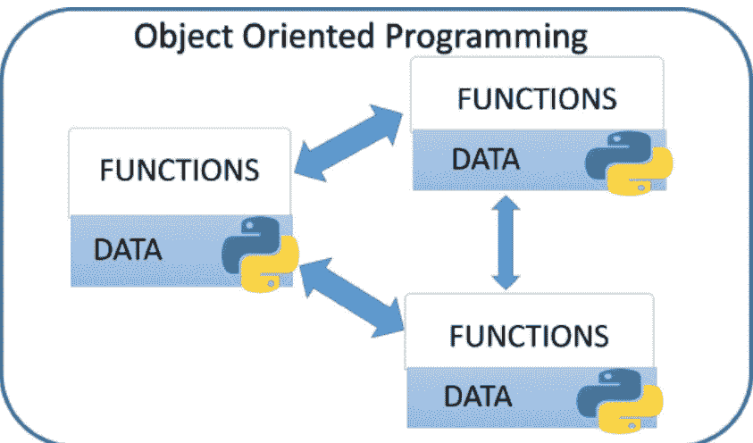

图 11-1 面向对象编程
面向对象编程，简称 OOP，是一种编程范式，它提供了一种构建程序的方式，使得属性和行为被捆绑到单个对象中。

换句话说，OOP 是一种对具体的、现实生活中的事物（如汽车）以及事物之间的关系（如学院与学生、球员与教练等）进行建模的方法。OOP 将现实世界的事物建模为软件中的对象。这些对象拥有一些与之关联的数据，并且可以执行某些功能。

另一种常见的编程范式是**过程式编程**。在那里，我们像流程图或食谱一样逐步组织程序。有以代码块和函数形式存在的步骤，它们按顺序执行以完成特定任务。

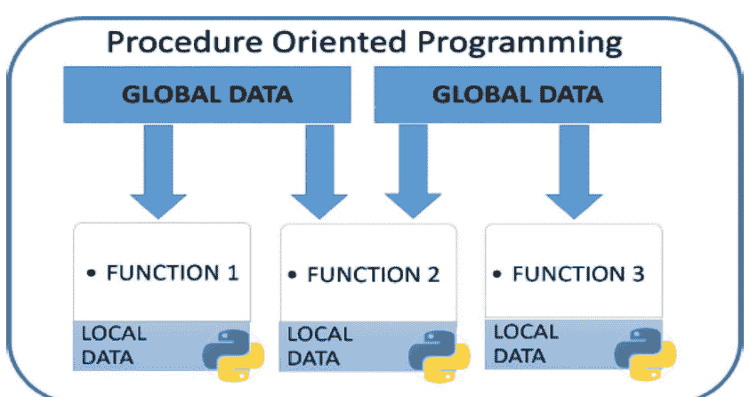

图 11-2 面向过程编程
在我们迄今为止编写的所有程序中，我们都是围绕函数来设计程序的，即操作数据的语句块。这被称为面向过程的编程方式。还有另一种组织程序的方式，那就是将数据和功能组合并包装在一个称为对象的东西里。这被称为面向对象编程范式。大多数时候你可以使用过程式编程，但在编写大型程序或遇到更适合这种方法的问题时，你可以使用面向对象编程技术。⁵⁰

1.2. 对象有两个特征：属性和行为
例如，一个人作为一个**类**，具有**属性**，如姓名、年龄、身高、体重、地址等，以及**行为**，如行走、说话、睡觉、吃饭等。

#### 11.1.2 类概念简介

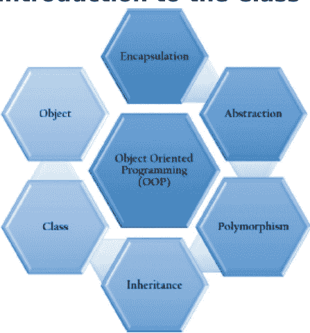

图 11-3 面向对象编程
正如我们之前看到的，Python 中的一切都是对象。

Python 中的数据结构（数字、字符串、列表等）旨在表示简单的事物，比如一个人的名字、年龄或薪水、颜色以及其他类似的东西。

如果我们想表示更复杂的东西呢？例如，表示一个人的详细信息，他的名字、年龄、薪水、教育资格和员工 ID。我们可以创建一个列表，将所有这些细节记录在一个地方。这样一个列表的例子是 ["nilabh", 34, 50000, graduate, 9469]

现在，这只是一个人。如果我们有公司里 100 名员工的这些详细信息呢？如何查看某些人的年龄或资格是否缺失？如果我们想为这些人添加一些其他属性呢？如果我们想对所有这些人执行某些操作呢？

需要将这些数据组织到一起。这正是**类**的作用。

类用于创建新的**用户定义**数据结构，其中包含关于某事物的信息。在我们上面的例子中，我们可以创建一个 **Employee()** 类来组织公司所有员工的信息，并且还可以对他们执行一些操作或功能。

需要注意的是，类只提供结构。它是一个**蓝图**，展示某物应如何定义，但它本身不提供任何实际内容。Employee() 类可能规定定义员工需要姓名、资格和年龄，但它不会说明特定员工的姓名、资格或年龄是什么。

记住，**类**是**蓝图**。

广义上讲，类内部有两种类型的对象。

-   实例对象
-   方法对象

实例对象可以理解为具有**属性**。

方法对象可以理解为具有**行为**。

这些只是为了提供一个类比，而不是技术定义。一旦你很好地理解了概念，你就会深入理解这些。同时，为了使学习更容易，你可以带着上述类比，慢慢跟我一起走。

现在让我们深入探讨我们刚刚看到的三个对象。

### 11.2 类对象、实例对象、方法对象

**类对象**
**类**是对象的**蓝图**。

我们可以把类想象成一个带有标签的员工档案。它包含关于姓名、联系电话、部门、年龄、员工 ID 等的所有详细信息。基于这些描述，我们可以了解员工的情况。在这里，员工是一个对象。

将**类**想象成某物应如何存在的*想法*会很有帮助。

空白的身份证相当于类对象。公司里会有成百上千这样的员工。他们的数据，在这个模板中，将被组织在 **Employee** 类中。

| 员工身份证 | |
|---|---|
| | **公司名称：Python Enterprises**
部门：
出生日期：
电话号码：
*紧急情况下请致电：* |
| **名** | |
| **姓** | |
| 员工编号 # | 签名 |

*图 11-4 类作为蓝图 - 员工身份证*

在 Python 中创建一个新的类对象非常容易。要创建一个名为 Employee 的类，只需运行以下两行代码。

```
In [1]: class Employee: pass
```

我们刚刚创建了一个名为 *Employee* 的类。

不多不少。

这里，我们使用 `class` 关键字来定义一个空的 `Employee` 类。我们从类中构建实例。实例是从特定类创建的具体对象。

现在我们可以创建 `Employee` 类的实例了。

我们创建了类，但这看起来不像一个蓝图，因为在 `Employee` 类中，我们没有定义任何用于实例化的内容。我们现在将学习如何优雅且高效地创建一个**类**、它的**实例**及其**方法**。

假设我们有两位名为 Nilabh 和 Sandip 的员工的详细信息。现在我们将看到如何构建类和实例对象。

## 11.2.1 使用 `__init__()` 方法创建类

```python
In [2]: class Employee: # class attribute (which is common for all the instances in the class)
    company = "Python Enterprises"

    # instance attribute
    def __init__(self, name, age, dept):
        self.name = name
        self.age = age
        self.department = dept
```

这里我们创建了 `Employee` 类并使用了 **`__init__()`** 方法。注意，**类**被创建出来，并且它具有**默认属性**，即员工的姓名、年龄和部门。现在，这个类看起来像一个蓝图，为所有员工定义了清晰的属性。让我解释一下这里用于实例化类属性的 **`__init__`** 方法。

**`__init__`** 方法在类的对象被实例化（即创建）时立即运行。该方法对于执行任何你想要对对象进行的初始化（即向对象传递初始值）非常有用。注意名称开头和结尾的双下划线。

现在，一旦我们创建了一个类，我们将创建该类的实例，或者换句话说，从蓝图创建副本。

## 11.3 实例对象

类是蓝图，而实例是类的一个带有实际值的副本，字面意思上是一个属于特定类的对象。它不再是一个概念；它是一个实际的 Employee，比如一个名为 Nilabh、员工编号为 9469 的员工。

| Employee ID Card | |
| :--- | :--- |
| | **Company Name:** Python Enterprises<br>Department: Production<br>DOB: 01.01.1998<br>Phone number: 9898989898<br>*In case of emergency call: 100* |
| **First Name** | Nilabh |
| **LAST NAME** | Nishchhal |
| Employee ID # 9469 | Signature |

图 11-5 实例作为类的真实副本 - 员工 Nilabh 的 ID

正如我们所看到的，类就像一个空白表格。它定义了所需的信息。表格填写后，特定的副本就是**类的实例**；它包含了与你相关的真实信息。

你可以填写多份表格来创建许多不同的实例，但如果没有表格作为蓝图或指南，你将无法追溯其结构，也不知道需要什么信息。因此，在创建对象的单个实例之前，你必须首先通过定义一个类来指定需要什么。

现在我们将看到，如何在类中创建实例对象。

### 11.3.1 实例化对象

实例化对象：实例化是一个华丽的术语，意思是 - 创建一个新的、唯一的类实例。

```python
In [3]: # instantiate the Employee class
nilabh = Employee("nilabh", 22, "production")
sandip = Employee("sandip", 28, "marketing")
```

这里我们创建了 `Employee` 类的两个实例。

创建实例的方法很简单。就是 **实例名 = 类名(参数)**

**工作原理**

这里，我们将 **`__init__`** 方法定义为接受一个参数 `name`（以及通常的 `self`）。

所有类都创建对象，所有对象都包含属性（或特征）。我们使用 **`__init__()`** 方法来初始化对象的初始属性。这是通过赋予它们默认值（或状态）来完成的。此方法必须有 "**self**" 变量，它指的是对象本身。此外，必须初始化至少一个参数。

在我们的 **`Employee()`** 类的情况下，每个员工都有特定的姓名和年龄，这在你开始创建不同员工时很重要。

**记住**：类只是用于定义 **Employee**（或创建蓝图），而不是创建具有特定姓名和年龄的单个员工实例。

"**self**" 变量也是类的一个实例。由于类的实例具有不同的值，我们可以写 **`employee.name = name`** 而不是 **`self.name = name`**。但由于并非所有员工都共享相同的姓名，我们需要能够为不同的实例分配不同的值。因此，需要特殊的 "**self**" 变量，它将有助于跟踪每个类的各个实例。

**注意**：你永远不需要专门调用 **`__init__()`** 方法。当你创建一个新的 "Employee" 实例时，它会自动被调用。

虽然实例属性是每个对象特有的，但类属性对所有实例都是相同的——在这种情况下，就是所有员工。

### 11.3.3 现在让我们结合类和实例，看看一些魔法

```python
In [4]: class Employee: # class attribute (which is common for all the instances in the class)
    company = "Python Enterprises"

    # instance attribute
    def __init__(self, name, age, dept):
        self.name = name
        self.age = age
        self.department = dept

#### instantiate the Employee class
nilabh = Employee("nilabh", 22, "production")
sandip = Employee("sandip", 28, "marketing")

#### Accessing the instance attributes
print("{} and {} are two employees of {} company".format(nilabh.name, sandip.name, Employee.company))
print("{} is {} and works in {} department of {}.".format(nilabh.name, nilabh.age, nilabh.department, nilabh.company))
print("{} is {} and works in {} department of {}.".format(sandip.name, sandip.age, sandip.department, sandip.company))
```

nilabh and sandip are two employees of Python Enterprises company
nilabh is 22 and works in production department of Python Enterprises.
sandip is 28 and works in marketing department of Python Enterprises.

### 11.3.4 让我们看看这里发生了什么：

我们创建了 `Employee()` 类的一个新实例，并将其赋值给变量 `nilabh`。然后我们传递了三个参数："nilabh"、22 和 "production"，它们分别代表该员工的姓名、年龄和部门。然后这些参数被传递给 `__init__()` 方法，该方法在每次创建新实例时都会被调用，将参数 `name`、`age` 和 `department` 附加到对象上。你可能好奇为什么我们在创建类的新实例时不需要传递 `self` 参数。

这是 Python 的魔法；当我们创建类的新实例时，Python 会自动确定 `self` 是什么（在这种情况下是一个员工），并将其传递给 `__init__()` 方法。

此外，我们看到了如何调用实例的参数。它就是 `实例名.参数`。如果你仔细看，我们将参数定义为 `self.参数`。所以，`__init__()` 方法接受 `self` 参数，而无需为同一类的所有实例专门调用它。

另外，你可能在上面的例子中注意到，对于第一个输出，`Employee.company` 给出的结果与接下来两个输出中的 `nilabh.company` 和 `sandip.company` 相同。这是因为 `company` 属性是 `Employee` 类的属性，因此会自动传递给 `Employee` 类的所有实例。它对同一类的所有实例都是通用的。但是，我们在创建实例时作为参数传递的实例属性，例如 `name`、`age` 和 `department`，仅对传递给它的每个实例是特定的。

这里，在我们创建了 `Employee` 类的实例（即 `nilabh` 和 `sandip`）之后，我们使用了 `print()` 函数来生成一个文本字符串，我们是在类定义之外单独编写的（注意 `print()` 函数前没有缩进）。

如果我们直接调用实例本身会怎样？

```python
In [5]: print(nilabh)
```

```
<__main__.Employee object at 0x000001E183BC8208>
```

如上所示的输出看起来很抽象。它只是打印或输出其在内存中的位置。但是，我们可以借助类的内置方法，让它变得更有趣一些。

正如我们之前看到的，如果你对类名使用 **`dir()`** 函数，例如 **`dir(Employee)`**，你会看到所有内置方法。我们刚刚使用了其中一个来初始化类（**`__init__()`**）。一个类似的方法是 **`__str__()`**，它以字符串的形式给出输出。

让我们看看它是如何工作的，如果你养成用 **`__init__()`** 构造类并用 **`__str__()`** 结尾的习惯，这可能是一个良好的开端。

```python
In [6]: class Employee: # class attribute (which is common for all the instances in the class)
    company = "Python Enterprises"

    # instance attribute
    def __init__(self, name, age, dept):
        self.name = name
        self.age = age
        self.dept = dept

    def __str__(self):
        return "My name is {}, my age is {} and I work in {} department of {}".format(self.name, self.age, self.dept, self.company)

#### instantiate the Employee class
nilabh = Employee("nilabh", 22, "production")
sandip = Employee("sandip", 28, "marketing")
```

```python
In [7]: print(nilabh)
```

我的名字是nilabh，今年22岁，在Python Enterprises的生产部门工作。方法对象 方法是在类体内定义的函数。它们用于定义对象的行为。

我们将看到一个在同一个类和我们在此定义的实例上的方法。该方法将根据年龄（作为实例的属性）和当前年份（作为方法的属性）告诉我们员工的出生年份。

正如你可能注意到的，方法**YOB()**的创建方式与用户定义的函数相同。然而，区别在于它的调用方式。这就是**函数**和**方法**之间的基本区别。

```python
class Employee: # class attribute (which is common for all the instances in the class)
    company = "Python Enterprises"

    # instance attribute
    def __init__(self, name, age, dept):
        self.name = name
        self.age = age
        self.department = dept

    #creating method object
    def YOB(self, current_year):
        return current_year - self.age

#### instantiate the Employee class
nilabh = Employee("nilabh", 22, "production")
sandip = Employee("sandip", 28, "marketing")
print("nilabh was born in {}.".format(nilabh.YOB(2020)))
```

nilabh was born in 1998.

这里，方法位于Employee类内部，因此，它不是一个全局方法。它仅在此类中适用。

## 11.5 继承
继承是面向对象编程中的一个强大特性。

它的含义与字面英语语言中的含义相似，即从父母那里继承某些东西。在这里，子类（或派生类）从其父类（或基类）继承属性和方法。

它指的是在对现有类进行很少或不进行修改的情况下定义一个新类。新类称为派生（或子）类，从中继承的类称为基（或父）类。

继承使我们能够定义一个类，该类从父类获取所有功能。我们还可以进一步向派生类添加更多内容。

继承被认为是面向对象编程最重要的方面之一，因为它提供了可重用性功能，从而使代码片段更加可靠。

#### Python中的继承

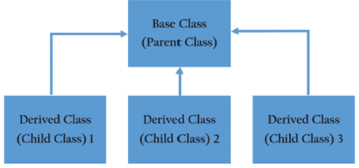

图 11-6 继承

**Python继承语法**

```python
class BaseClass:
    Body of base class

class DerivedClass(BaseClass):
    Body of derived class
```

派生类从基类继承特性，并为其添加新特性。这导致了代码的可重用性。

继承是一个类从另一个类派生或继承属性的能力。继承的好处是：它很好地表示了现实世界的关系。

- 它提供了代码的可重用性。我们不必一遍又一遍地编写相同的代码。此外，它允许我们在不修改类的情况下向其添加更多特性。
- 它本质上是传递性的，这意味着如果类B从另一个类A继承，那么B的所有子类都将自动从类A继承。

下面的例子将解释继承的概念：

```python
class Person:
    def __init__(self, name):
        self.name = name

##### Inherited or child class
##### (Note Person in bracket)
##### super() function used to inherit the parent class
class Employee(Person):
    def __init__(self, employee_id, name):
        super().__init__(name)
        self.employee_id = employee_id
```

```python
employee = Employee(52, "pratik")
print(employee)
```

```
<__main__.Employee object at 0x000001E183BC0908>
```

**多重继承**
当一个**子类**从多个**父类**继承时，称为多重继承。

在多重继承中，所有基类的特性都被继承到派生类中。多重继承和单继承的语法相似。

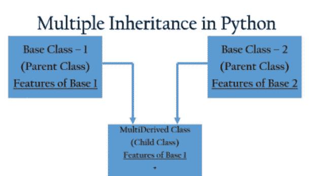

图 11-7 多重继承

**Python多重继承语法：**

```python
class Base1:
    Body of Base1 class

class Base2:
    Body of Base2 class

class MultiDerived(Base1, Base2):
    Body of MultiDerived class
```

注意**MultiDerived**类中两个基类的名称用逗号分隔。可以有**n**个父类，子类可能从中派生其特性。

对于大多数目的，在最简单的情况下，你可以将从父类继承的属性的搜索视为深度优先、从左到右，在层次结构中重叠的同一类中不搜索两次。因此，如果在DerivedClassName中未找到某个属性，则在Base1中搜索，然后（递归地）在Base1的基类中搜索，如果在那里未找到，则在Base2中搜索，依此类推。

```python
##### Python example to show the working of multiple inheritances
class Base1:
    def __init__(self):
        self.str1 = "Person1"
        print("Base1")

class Base2:
    def __init__(self):
        self.str2 = "Person2"
        print("Base2")

class Derived(Base1, Base2):
    def __init__(self):
        Base1.__init__(self) # Calling constructors of Base1
        Base2.__init__(self) # and Base2 classes
        print("Derived")

    def printStrs(self):
        print(self.str1, self.str2)

##### creating a new object of Derived class
##### this will print the class names as defined in the classes
person = Derived()
##### method printStrs on the Derived class object person will give Base class names
##### Person1 Person 2
person.printStrs()
```

```
Base1
Base2
Derived
Person1 Person2
```

继承不限于一个**父类**对应一个**子类**。它的使用非常混合。下图解释了所有可能的关系类型。定义新的**派生类**的方法也非常简单。只需在括号中用逗号分隔写出它获得**继承**的所有类的名称即可。

使用下图并自己编写所有类定义。这个简单的练习将使你理解这个概念的深度。

到目前为止，我们已经从理论上理解了继承是如何工作的。现在让我写一些简单的代码，以便在实践中更清楚地理解理论。与上面示例的唯一区别是，我们将使用**super()**功能从继承它的派生类访问基类中的方法。

#### 继承 – 派生-多级 - 混合

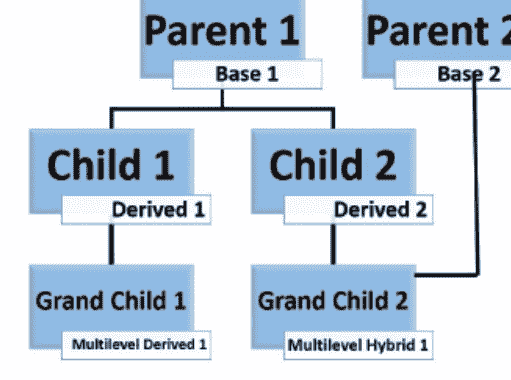

```python
class Person:
    def __init__(self, name, surname, year_of_birth):
        self.name = name
        self.surname = surname
        self.year_of_birth = year_of_birth

    def age(self, current_year):
        return current_year - self.year_of_birth

    def __str__(self):
        return "{} {} was born in year {}".format(self.name, self.surname, self.year_of_birth)
```

```python
nilabh = Person("nilabh", "nishchhal", 1998)
print(nilabh)
```

nilabh nishchhal was born in year 1998

```python
##### Inheritance
class Student(Person):
    def __init__(self, student_id, name, surname, year_of_birth):
        super().__init__(name, surname, year_of_birth)
        self.student_id = student_id

siddharth = Student(1, 'Siddharth', 'Tiwari', 1985)
print(siddharth)
```

**Siddharth Tiwari was born in year 1985**

**siddharth**现在具有与Person相同的行为，但他的状态也包含一个学生ID。Person是Student的基类之一，而Student是Person的子类之一。请注意，子类知道其超类，但反之则不然。子类不仅从其基类继承，还从其基类继承，形成一个从对象（每个类的基类）开始的继承树。

你还会注意到Student子类中没有`__str__()`方法，因此上面打印的结果是父类的字符串格式化。

如果我们在子类Student中定义一个新的字符串会怎样？

### 11.6.1 方法重写
继承允许向子类添加新的方法和属性。为了更改超类中定义的方法的行为，我们可以在子类中重写该方法。要重写一个方法，只需重新定义它即可。通过下面的例子更好地理解：

```python
class Student(Person):
    def __init__(self, student_id, name, surname, year_of_birth):
        super().__init__(name, surname, year_of_birth)
        self.student_id = student_id
```

def __str__(self): return "{} {} student id {} was born in year {}".format(self.name, self.surname, self.student_id, self.year_of_birth)

siddharth = Student(1, 'Siddharth', 'Tiwari', 1985)
print(siddharth)

Siddharth Tiwari student id 1 was born in year 1985

注意上面两个继承代码块中输出的差异。我们用子类中定义的新打印字符串结构，覆盖了基类的打印字符串结构。

有一种有趣的方法可以窥探类对象。使用 **help()** 函数，它会给你关于该对象的所有详细信息。此外，它还会告诉你方法解析的顺序。例如，查看我们作为 **Student()** 类实例创建的 **siddharth** 对象的详细信息。

它告诉你它属于哪个类，以及该类的父类。方法解析顺序从子类开始，沿着继承层次向上到父类，最后到内置对象。你还可以看到为该类定义的方法以及该类继承的方法。这是一个深入了解任何对象的重要函数。

```
In [16]: help(siddharth)
```

```
Help on Student in module __main__ object:

class Student(Person)
 |  Student(student_id, name, surname, year_of_birth)
 |  
 |  Method resolution order:
 |      Student
 |      Person
 |      builtins.object
 |  
 |  Methods defined here:
 |  
 |  __init__(self, student_id, name, surname, year_of_birth)
 |      Initialize self.  See help(type(self)) for accurate signature.
 |  
 |  __str__(self)
 |      Return str(self).
 |  
 |  ----------------------------------------------------------------------
 |  Methods inherited from Person:
 |  
 |  age(self, current_year)
 |  
 |  ----------------------------------------------------------------------
 |  Data descriptors inherited from Person:
 |  
 |  __dict__
 |      dictionary for instance variables (if defined)
 |  
 |  __weakref__
 |      list of weak references to the object (if defined)
```

## 11.7 多态

多态意味着具有生动或不同的形式。在编程世界中，多态指的是同名函数能够承载完全不同功能的能力。它创建了一种可以使用多种形式对象的结构。

这允许函数/参数在不同时间使用不同类型的实体。

在面向对象编程中，多态允许一个引用特定类的特定对象，以类似于引用完全不同类的另一个对象的方式被使用。

与许多其他流行的面向对象编程语言（如 Java）不同，Python 不支持编译时多态或方法重载。如果一个类或 Python 脚本有多个同名方法，最后定义的方法将覆盖之前的方法。

因此，我们可以说 Python 不支持方法多态。

## 11.8 抽象与封装

抽象和封装是面向对象编程的四个基本概念中的两个。另外两个是继承和多态。

**抽象**意味着隐藏复杂性，只显示对象的基本特征。所以从某种意义上说，抽象意味着隐藏真正的实现，而我们作为用户，只知道如何使用它。

一个现实世界的例子是我们使用的任何物体，比如我们无休止使用的手机，而不关心或知道其内部发生了什么。

我们不会在这里深入探讨抽象的概念，也不会看它在 Python 中是如何实现的。如果这增加了你的好奇心，请随意进一步探索。

**封装**是面向对象编程的基本概念之一。它描述了将数据和处理数据的方法包装在一个单元中的想法。这限制了直接访问变量和方法，并可以防止数据的意外修改。为了防止意外更改，对象的变量只能通过对象的方法来更改。这些类型的变量被称为私有变量。

在使用类和处理敏感数据时，为程序中使用的所有变量提供全局访问并不是一个好的选择。**封装**为我们提供了一种访问所需变量的方式，而无需让程序完全访问这些变量中的任何一个。

类是封装的一个例子，因为它封装了所有数据，包括成员函数、变量等。

考虑一个现实生活中的封装例子，在政府中，有不同的部委或部门，如财政部、国防部、内政部、外交部等。财政部处理所有财务问题，并保存所有与财务相关的数据记录。同样，国防部处理所有与国防相关的活动，并保存所有与国防相关的交易记录。现在可能出现这样一种情况：由于某种原因，财政部的一名官员需要特定月份所有关于国防采购的数据。在这种情况下，他不允许直接访问国防部的数据。他必须首先联系国防部的其他官员，然后请求他提供特定数据。这就是**封装**。在这里，国防部的数据和可以操作它们的员工被包装在一个名为“国防部”的单一名称下。使用封装也隐藏了数据。在这个例子中，任何部门（如国防、财政或外交事务）的数据都对其他任何部门隐藏。

在 Python 术语中，我们可以将它们理解为不同的**类**及其数据，作为各自财政部类或国防部类的不同实例和方法。

## 11.9 如何控制访问

如果类内部的一切都是公共的，那么在 Python 中如何进行访问控制以及如何实现适当的封装？

### 11.9.1 私有变量

Python 中不存在只能从对象内部访问的“私有”实例变量。但是，大多数 Python 代码遵循一个约定：以单下划线开头的名称（例如 _spam）应被视为 API 的非公共部分（无论是函数、方法还是数据成员）。它应被视为实现细节，可能会在不通知的情况下更改。

这里有 3 种类型的变量。

1.  公有
2.  受保护
3.  私有

当我们在 Python 类中命名变量时，它们本质上是**公有**变量。例如 **self.name = name**。要使其成为**受保护**变量，需要在变量名前放置一个下划线。例如 **self._name = name**。受保护变量可以被超类的子类访问。

要使其成为**私有**变量，需要在变量名前放置两个下划线。例如 **self.__name = name**。私有变量不能被超类的子类访问。

## 11.10 总结

本章向你介绍了面向对象编程和 Python 中类的概念。这些是非常强大的工具，会经常被引用。你看到了 Python 中一切皆为对象。学习了如何定义和初始化类，创建其实例对象。看到了类内部定义的函数如何作为该类对象的方法工作。然后我们学习了类的一个非常重要的概念：继承和多重继承。我们还触及了多态、抽象和封装。最后，我们学习了私有、受保护和公有变量以及它们的使用方法。

## 1.1.11 练习

回答以下问题：
什么是面向对象编程？它的

### 11.11.1 相较于过程式编程方法的优势？

1.  区分对象与类。
2.  类内部有哪些不同类型的对象？它们有何不同？
3.  类是对象的蓝图。这句话意味着什么？
4.  `__init__()` 方法的作用是什么？
5.  方法与函数有何区别？
6.  什么是继承？
7.  `super()` 函数的重要性是什么？
8.  当父类和子类拥有同名函数时会发生什么？
9.  在 Python 中如何将任何变量设为私有变量？

### 11.11.2 判断正误

1.  类代表一个模板、蓝图或契约，用于定义相同类型的对象。
2.  `class` 关键字标志着类定义的开始。
3.  创建类的新实例需要一个构造函数。
4.  引用变量是一个对象。
5.  引用变量指向一个对象。
6.  一个对象可以包含其他对象。
7.  一个对象可以包含对其他对象的引用。
8.  默认情况下，`__new__()` 方法会调用 `__init__` 方法。
9.  `__new__()` 方法定义在 `object` 类中。
10. 当我们为 Python 类中的变量命名时，它们本质上是私有变量。

### 11.11.3 为此编写你自己的代码

考虑以下类定义：

```python
class Yourclass:
    marks = 10
    name = "ABC"
    def __init__(self, marks, name):
        self.marks = marks
        self.name = name
    def display(self):
        print(marks)
        print(name)
```

1.  编写创建 `Yourclass` 类对象的语句。
2.  编写一个名为 `Rectangle` 的 Python 类，由长度和宽度构造，并包含一个计算矩形面积的方法。
3.  编写一个 Python 类，包含两个方法 `get_String` 和 `print_String`。`get_String` 从用户处接受一个字符串，`print_String` 以大写形式打印该字符串。
4.  编写一个 Python 类，逐词反转字符串。输入字符串：'hello world!' 预期输出：'! world hello'
5.  编写一个 Python 类，将整数转换为罗马数字。
6.  定义一个名为 `Shape` 的类及其子类 `Square`。`Square` 类有一个 `__init__` 函数，接受一个长度作为参数。两个类都有一个 `area` 函数，可以打印形状的面积，其中 `Shape` 的面积默认为 0。
7.  在 Python 中定义一个名为 `trainer` 的类，规格如下：
    -   实例变量：`Name`、`T_ID`
    -   方法：`getName()` 用于打印实例变量 `Name`。
8.  在 Python 中定义一个名为 `student` 的类，规格如下：
    -   实例变量：`Roll number`、`name`
    -   方法：
        -   `Getdata()` - 用于输入学号和姓名。
        -   `Printdata()` - 用于显示学号和姓名。
9.  定义另一个名为 `marks` 的类，它派生自 `student` 类：
    -   实例变量：五门学科的成绩。
    -   方法：
        -   `Inputdata()` - 用于调用 `Getdata()` 并输入 5 门学科的成绩。
        -   `Outdata()` - 用于调用 `printdata()` 并显示 5 门学科的成绩。
    在 Python 中实现上述程序。
10. XYZ 酒店提供住宿和餐饮服务。
    -   a. 创建一个 `Accommodation` 类，包含房间号、房间类型和租金等。
    -   b. 创建一个 `meals` 服务类，包含：餐食代码、名称、价格等。
    -   c. 创建一个 `customer` 类，包含客户编号、姓名、地址等。
    -   d. `Customer` 类通过使用 `Accommodation` 和 `meals` 类派生而来。

### 11.11.4 待办事项

1.  寻找现实生活中的场景，如学校、教室和学生等其他类似例子，其中可以应用类的概念。创建一些你自己的蓝图。
2.  阅读关于面向对象编程起源的资料。

# 12 错误与异常处理

## 12.1 错误与异常

Python 程序一旦遇到错误就会结束或终止。至少有两种可区分的错误类型：**语法错误和异常**。

### 12.1.1 语法错误

语法错误，也称为解析错误，可能是你在学习 Python 时（甚至之后！）最常遇到的错误类型。

让我们看一个你很容易理解的例子。`Print "Hello World"`。

你一定在想，这么简单的代码能出什么问题。嗯，它不应该出错，但仍然可能出错。

```python
In [1]: print(("Hello World")
```

```
File "<ipython-input-1-aa26dc90f998>", line 1
    print(("Hello World")
          ^
SyntaxError: unexpected EOF while parsing
```

我请你在这里暂停一下。在继续之前，首先注意是什么导致了这个 "SyntaxError"。

你注意到开头有两个括号，而结尾只有一个吗？这个小小的排版错误导致了最简单语句中的错误。

让我们看另一个例子。到现在你一定已经理解了什么是语法错误，但为了好玩，我们还是看看。

```python
In [2]: while True print('Hello world')
```

```
File "<ipython-input-2-2b688bc740d7>", line 1
    while True print('Hello world')
          ^
SyntaxError: invalid syntax
```

再次花点时间找出上面代码中的语法错误。
解析器会重复出错的行，并显示一个小**箭头**，指向行中最早检测到错误的位置。错误是由箭头前的标记引起的（或至少在此处检测到）：在示例中，错误在函数 `print()` 处检测到，因为其前面缺少一个冒号（`:`）。文件名和行号会被打印出来，这样你就知道如果输入来自脚本，该去哪里查看。

### 12.1.2 异常

即使语句或表达式在语法上是正确的，当尝试执行它时也可能导致错误。在执行期间检测到的错误称为**异常**。
大多数异常并非无条件致命。你很快就会学习如何在 Python 程序中处理它们。然而，大多数异常不会被程序处理，并导致如下所示的错误消息：

```python
In [3]: # ZeroDivisionError

        10*(3/0)
```

```
ZeroDivisionError Traceback (most recent call last)
<ipython-input-3-a08cece41bf0> in <module>
      1 # ZeroDivisionError
      2 
----> 3 10*(3/0)

ZeroDivisionError: division by zero
```

```python
In [4]: # NameError

4 + spam*3
```

```
NameError Traceback (most recent call last)
<ipython-input-4-c428111670b3> in <module>
      1 # NameError
      2 
----> 3 4 + spam*3

NameError: name 'spam' is not defined
```

```python
In [5]: # TypeError

'2' + 2
```

```
TypeError Traceback (most recent call last)
<ipython-input-5-9b532ade2a0a> in <module>
      1 # TypeError
      2 
----> 3 '2' + 2

TypeError: can only concatenate str (not "int") to str
```

Python 不是显示异常错误的消息，而是详细说明遇到了哪种类型的异常错误。错误消息的最后一行指示发生了什么。

异常有不同的类型，类型作为消息的一部分打印出来：示例中的类型是 **ZeroDivisionError**、**NameError** 和 **TypeError**。作为异常类型打印的字符串是发生的内置异常的名称。行的其余部分根据异常类型及其原因提供详细信息。

错误消息的前一部分以堆栈回溯的形式显示异常发生的上下文。通常，它包含列出源代码行的堆栈回溯；但是，它不会显示从标准输入读取的行。

## 12.2 引发异常

### 12.2.1 raise 语句

Python 带有各种内置异常以及创建自定义异常的可能性。`raise` 语句允许程序员强制引发指定的异常。该语句可以补充一个自定义异常。

```python
In [6]:    x = 15
          if x > 10:
              raise Exception("x should not exceed 10")
```

```
---------------------------------------------------------------------------
Exception                                 Traceback (most recent call last)
<ipython-input-6-31007f376f82> in <module>
      2 
      3 if x > 10:
----> 4     raise Exception("x should not exceed 10")

Exception: x should not exceed 10
```

另一个示例：

```python
In [7]:    raise NameError('HiThere')
```

### 12.2.2 AssertionError 异常

与其等待程序在中途失败，我们可以在 Python 中进行断言。我们**断言**某个条件成立。如果我们断言的条件结果为 True，程序可以继续执行。但如果条件结果为 False，你可以让程序抛出一个 **AssertionError** 异常。

```
NameError Traceback (most recent call last)
<ipython-input-7-72c183edb298> in <module>
----> 1 raise NameError('HiThere')

NameError: HiThere
```

请注意上面的示例，**raise** 是在强制引发一个异常，而且不是任何异常，而是“指定”要发生的异常。`raise` 的唯一参数指定了要引发的异常。这必须是一个异常实例或一个异常类（一个派生自 Exception 的类）。

```
In [8]: x = "Python"

#if condition returns True, then nothing happens:

assert x == "Python"
```

```
In [9]: #if condition returns False, AssertionError is raised:

assert x == "Julia"
```

```
AssertionError Traceback (most recent call last)
<ipython-input-9-28c8b221d28d> in <module>
      1 #if condition returns False, AssertionError is raised:
      2 
----> 3 assert x == "Julia"

AssertionError:
```

`assert` 关键字在调试代码时使用。
`assert` 关键字让你测试代码中的某个条件是否返回 True，如果不是，程序将引发一个 **AssertionError**。
你可以编写一条消息，当代码返回 False 时显示，查看下面的示例：

```
In [10]: x = "Python"

        #if condition returns False, AssertionError is raised:

        assert x == "Julia", "x should be 'Python'"
```

```
AssertionError Traceback (most recent call last)
<ipython-input-10-c4bdd07152aa> in <module>
      3 #if condition returns False, AssertionError is raised:
      4 
----> 5 assert x == "Julia", "x should be 'Python'"

AssertionError: x should be 'Python'
```

## 12.3 处理异常

### 12.3.1 try 和 except 语句

Python 中的 **try** 和 **except** 块分别用于捕获和处理异常。Python 将 `try` 语句之后的代码作为程序的“正常”部分执行。**except** 语句之后的代码是程序对前面 **try** 子句中任何异常的响应。

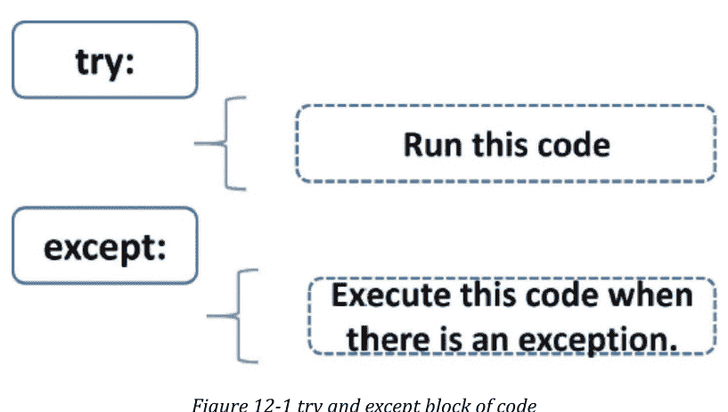

图 12-1 try 和 except 代码块

正如我们之前看到的，当语法正确的代码运行时遇到错误，Python 会抛出异常错误。如果未处理，这个异常错误将导致程序崩溃。你的程序如何响应异常由 **except** 子句决定。

以下示例可以帮助你理解 **try** 和 **except** 块：

```
In [12]: while True:
    try:
        x = int(input("Please enter a number: "))
        break
    except ValueError:
        print("Oops! That was no valid number. Try again...")
```

```
Please enter a number: T
Oops! That was no valid number. Try again...
Please enter a number: 5
```

`try` 语句的工作原理如下。

1. 首先，执行 **try** 子句（即 **try** 和 **except** 关键字之间的语句）。
2. 如果没有异常发生，则跳过 **except** 子句，`try` 语句执行完毕。
3. 如果在执行 **try** 子句期间发生异常，则跳过该子句的其余部分。然后，如果其类型与 **except** 关键字后指定的异常匹配，则执行 **except** 子句，然后继续执行 `try` 语句之后的代码。
4. 如果发生的异常与 **except** 子句中指定的异常不匹配，则将其传递给外层的 **try** 语句；如果没有找到处理程序，则它是一个未处理的异常，执行将停止并显示如上所示的消息。

一个 `try` 语句可以有多个 **except** 子句，以指定不同异常的处理程序。最多执行一个处理程序。处理程序只处理在相应 **try** 子句中发生的异常，而不是同一 `try` 语句的其他处理程序中的异常。

一个 **except** 子句可以将多个异常命名为一个带括号的元组，例如：

```
except (RuntimeError, TypeError, NameError):
```

**警告**：捕获 Exception 会隐藏所有错误，甚至是完全意想不到的错误。这就是为什么你应该避免在 Python 程序中使用裸 **except** 子句。相反，你应该引用你想要捕获和处理的具体异常类。

### 12.3.2 else 子句

`try-except` 语句有一个可选的 else 子句，如果存在，必须跟在所有 except 子句之后。它对于必须在 try 子句未引发异常时执行的代码很有用。

换句话说，使用 **else** 块，你可以指示程序仅在没有异常的情况下执行某个代码块。使用 **else** 子句比在 **try** 子句中添加额外代码更好，因为它避免了意外捕获未被 `try-except` 语句保护的代码引发的异常。

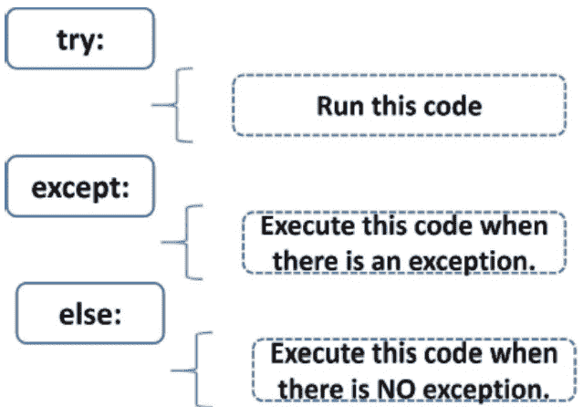

```
In [13]: import sys
    for arg in sys.argv[1:]:
        try:
            f = open(arg, 'r')
        except OSError:
            print('cannot open', arg)
        else:
            print(arg, 'has',
                  len(f.readlines()), 'lines')
                  f.close()
```

```
cannot open -f
C:\Users\nilabhnishchhal\AppData\Roaming\jupyter\runtime\kernel-39ffd819-807e-
4869-95d1-683d61028d75.json has 12 lines
```

异常处理程序不仅处理在 try 子句中立即发生的异常，也处理在 try 子句中调用（即使是间接调用）的函数内部发生的异常。例如：

```
In [14]: def this_fails():
            x = 1/0
        try:
            this_fails()
        except ZeroDivisionError as err:
            print('Handling run-time error:', err)
```

```
Handling run-time error: division by zero
```

## 12.4 定义清理操作

`try` 语句有另一个可选子句，旨在定义必须在所有情况下执行的清理操作。例如：

```
In [15]: try:
            raise KeyboardInterrupt
        finally:
            print('Goodbye, world! ')
```

```
Goodbye, world!
--------------------------------------------------------------------------------
KeyboardInterrupt                Traceback (most recent call last)
<ipython-input-15-7786db0b9fd1> in <module>
      1 try:
----> 2     raise KeyboardInterrupt
      3 finally:
      4     print('Goodbye, world!')

KeyboardInterrupt:
```

请注意，尽管发生了异常，最后一条语句（在 **finally** 块中）仍然被执行了。

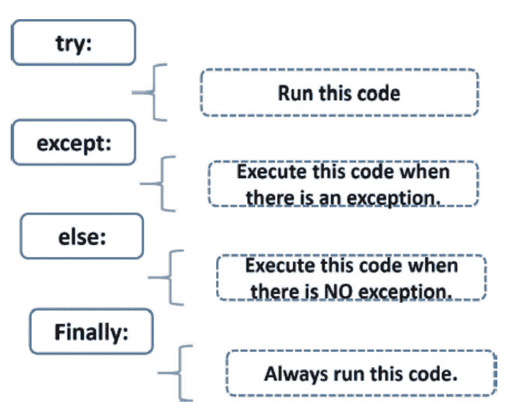

如果存在 **finally** 子句，则 **finally** 子句将作为 `try` 语句完成前的最后一个任务执行。无论 `try` 语句是否产生异常，**finally** 子句都会运行。以下几点讨论了发生异常时更复杂的情况：

1. 如果在执行 **try** 子句期间发生异常，该异常可能由 **except** 子句处理。如果异常未被 **except** 子句处理，则在 **finally** 子句执行后，异常将被重新引发。
2. 异常可能在执行 **except** 或 **else** 子句期间发生。同样，在 **finally** 子句执行后，异常将被重新引发。
3. 如果 `try` 语句到达 **break、continue** 或 **return** 语句，则 **finally** 子句将在 **break、continue** 或 **return** 语句执行之前执行。
4. 如果 **finally** 子句包含 **return** 语句，则返回值将是 **finally** 子句的 **return** 语句的值，而不是 **try** 子句的 **return** 语句的值。

## 12.5 总结

在本章中，你注意到了语法错误和异常之间的区别，你还学习了在 Python 中引发、捕获和处理异常的各种方法。在本章中，你看到了以下选项：

- **raise** 允许你随时抛出异常。
- **assert** 使你能够验证某个条件是否满足。如果不满足，它会抛出一个异常。
- 使用 **try** 子句，所有语句都会被执行，直到程序遇到异常。
- 如果在 **try** 子句中遇到异常，**except** 会捕获并处理该异常。

## 12.6 练习：

### 12.6.1 回答以下问题：

1.  何时会出现类型错误？
2.  列出代码可能导致 `IOError` 的情况。
3.  **yield** 语句的目的是什么？
4.  **yield** 与 **return** 有何不同？
5.  写出 **raise** 语句的语法。
6.  什么是异常？在 Python 中如何处理它们？
7.  "**finally**" 的作用是什么？
8.  何时以及为何使用 "**raise**" 语句？
9.  写出 "**try**" 和 "**except**" 语句的语法。
10. 在错误和异常处理中，**else** 子句何时可以使用？

### 12.6.2 判断正误：

1.  Python 程序在遇到错误时会终止。
2.  当我们代码中出现拼写错误时，会出现 SyntaxError。
3.  当代码语法正确时，就不会有其他错误。
4.  **raise** 语句强制引发指定的异常。
5.  **try** 块捕获异常。
6.  **except** 块也用于捕获异常。
7.  "**try**" 语句可以有多个 "**except**" 子句。
8.  捕获异常没有风险。
9.  "**else**" 子句是 "**try**" 语句的必需部分。
10. 无论 **try** 语句是否产生异常，**finally** 子句都会运行。

### 12.6.3 为此编写你自己的代码：

1.  编写一个名为 **oops** 的函数，该函数在被调用时显式引发 Index Error 异常。然后编写另一个函数，在 **try/except** 语句中调用 **oops** 以捕获错误。如果你将 **oops** 改为引发 Key Error 而不是 Index Error，会发生什么？
2.  编写一个函数来计算数字列表的平均值。你的函数应该能够处理空列表以及包含字符串的列表。
3.  编写一个程序，从用户那里接受一个日期（日、月和年），如果未提供合法值，则引发适当的错误。显示适当的消息，直到用户输入正确的值。
4.  创建一个 **Person** 类，用于存储一个人的个人信息（由你选择）。确保在接受数据时，不正确的输入得到妥善处理。

## 13 模块和包

### 13.1 模块

如果你退出 Python 解释器并再次进入，你所做的定义（函数和变量）将会丢失。因此，如果你想编写一个稍长的程序，最好使用文本编辑器（如记事本或其他任何文本编辑器软件）来准备解释器的输入，然后使用该文件作为输入来运行它。这被称为创建一个*脚本*。

随着你的程序变长，你可能希望将其拆分为多个文件以便于维护。

你还可能希望在多个程序中使用一个方便的函数，而不必将其定义复制到每个程序中。

为了支持这一点，Python 提供了一种将定义放在文件中并在脚本或交互式解释器实例中使用它们的方法。这样的文件称为模块；模块中的定义可以导入到其他模块或主模块中（主模块是在顶层执行的脚本和计算器模式中你可以访问的变量集合）。

#### 13.1.1 模块的定义：模块是包含 Python 定义和语句的文件。文件名是模块名加上后缀 .py。

在编程中，模块是一段具有特定功能的软件。例如，在构建视频游戏时，一个模块负责游戏逻辑，另一个模块负责在屏幕上绘制游戏。每个模块都是一个不同的文件，可以单独编辑。

在模块内部，模块的名称（作为字符串）作为全局变量 "**name**" 的值可用。例如，使用你最喜欢的文本编辑器（我使用标准的记事本）在当前目录中创建一个名为 fibo.py 的文件，内容如下：

提示：使用记事本时，使用扩展名 ".py" 并另存为 "所有文件" 而不是 "文本文档"。使用 ANSI 编码。

```
In [1]: # Fibonacci numbers module def fib(n): # write Fibonacci series up to n a, b = 0, 1 while a < n: print(a, end=' ') a, b = b, a+b print() def fib2(n): # return Fibonacci series up to n result = [] a, b = 0, 1 while a < n: result.append(a) a, b = b, a+b return result
```

现在让我解释一下我们刚才做了什么。

我们创建了一个名为 "**fibo**" 的模块。

这个模块 *fibo* 有两个用户定义的函数。本质上，我们也可以在这里定义函数 "**fib()**" 和 "**fib2()**"。但正如我之前所说，一旦我们关闭解释器，它们就会丢失。

如果我们想定期使用这些函数怎么办？

我们创建一个脚本，将其保存为 "文件名" 和文件扩展名 ".py"，然后瞧... 你的新模块就准备好了。随时可以使用。Python 有数千个内置模块，我们很快就会学到。同时，知道如何根据需要创建模块非常方便，经常用到。

现在，在我们调用新模块来协助我们之前，让我们看看 "fib" 函数的作用，而不调用新创建的模块：

```
In [2]:    fibo.fib(1000)
```

```
---------------------------------------------------------------------------
NameError                                 Traceback (most recent call last)
<ipython-input-2-a6a8744949b5> in <module>
----> 1 fibo.fib(1000)

NameError: name 'fibo' is not defined
```

如你所见，没有内置函数 "fib" 可用。现在我们将调用我们刚刚创建的模块。

要调用该模块，我们需要导入它。现在进入 Python 解释器并使用以下命令导入此模块：

```
In [3]:    import fibo
```

这不会将 **fibo** 中定义的函数名称直接放入当前符号表；它只将模块名 *fibo* 放入其中。使用模块名，你可以访问这些函数：

```
In [4]:    fibo.fib(1000)
```

```
0 1 1 2 3 5 8 13 21 34 55 89 144 233 377 610 987
```

```
In [5]:    fibo.fib2(100)
```

```
Out[5]:    [0, 1, 1, 2, 3, 5, 8, 13, 21, 34, 55, 89]
```

```
In [6]:    fibo.__name__
```

```
Out[6]: 'fibo'
```

如果你打算经常使用一个函数，可以将其分配给一个局部名称：

```
In [7]: fib = fibo.fib fib(500)
```

```
0 1 1 2 3 5 8 13 21 34 55 89 144 233 377
```

### 13.2 关于模块的更多信息

模块可以包含可执行语句以及函数定义。这些语句旨在初始化模块。它们仅在模块名在 import 语句中首次遇到时执行。

函数定义也是被 '执行' 的 '语句'；模块级函数定义的执行会将函数名放入模块的全局符号表中。

每个模块都有自己的私有符号表，该表被模块中定义的所有函数用作全局符号表。因此，模块的作者可以在模块中使用全局变量，而无需担心与用户的全局变量意外冲突。

### 13.3 导入模块

#### 13.3.1 从其他模块导入模块

我们已经看到了导入任何模块的简单方法。

模块也可以导入其他模块，这些模块位于模块脚本内部。通常（但不是必需的）将所有 import 语句放在模块（或脚本）的开头。导入的模块名被放入导入模块的全局符号表中。

#### 13.3.2 直接从模块导入名称

import 语句有一个变体，它将名称从模块直接导入到导入模块的符号表中。例如：

```
In [8]:    from fibo import fib
```

```
In [9]:    fib(500)
```

```
0 1 1 2 3 5 8 13 21 34 55 89 144 233 377
```

你可能注意到这里调用函数 "fib" 的方式不同。之前，当通过导入模块来调用模块时，函数用作 "模块名.函数()"。而在这里，函数现在直接导入到导入模块的符号表中。因此，可以独立使用。

然而，有一个陷阱。

这不会在本地符号表中引入导入来源的模块名称（因此在示例中，**fibo** 未被定义）。同理，其他未被导入的函数也未被定义。以下示例清楚地说明了这一点，其中 "**fib2()**" 函数会给出错误信息 "Not defined"。

```
In [10]:  fib2(500)
```

```
NameError                                 Traceback (most recent call last)
<ipython-input-1-a7b484686370> in <module>
----> 1 fib2(500)

NameError: name 'fib2' is not defined
```

### 13.3.3 直接从模块导入所有名称

还有一种变体可以导入模块定义的所有名称：

```
In [11]:  from fibo import *
```

```
In [12]:  fib2(500)
```

```
Out[12]: [0, 1, 1, 2, 3, 5, 8, 13, 21, 34, 55, 89, 144, 233, 377]
```

这会导入除以下划线（_）开头的名称之外的所有名称。在大多数情况下，Python 程序员不使用此功能，因为它会将一组未知的名称引入解释器，可能会隐藏你已经定义的一些内容。

请注意，通常从模块或包导入 * 的做法并不被推崇，因为它常常导致代码可读性差。然而，在交互式会话中使用它来节省输入是可以的。

### 13.3.4 将模块导入为其他名称

如果模块名称后跟 "as"，则 "as" 后的名称将直接绑定到导入的模块。

```
In [13]: import fibo as fibonacci # 通常用于缩短或使导入的模块名称更易记。
#### 我没有使用 "fib"，因为你可能会将其与模块中同名的函数混淆。
```

```
In [14]: fibonacci.fib(500)
```

```
0 1 1 2 3 5 8 13 21 34 55 89 144 233 377
```

这实际上与 *import fibo* 的导入方式相同，唯一的区别是它现在可以作为 "fibonacci" 使用。

它也可以与 "from" 一起使用，效果类似：

```
In [15]: from fibo import fib as fibonacci
fibonacci(500)
```

```
0 1 1 2 3 5 8 13 21 34 55 89 144 233 377
```

> **注意：** 出于效率原因，每个模块在每个解释器会话中只被导入一次。因此，如果你更改了模块，必须重启解释器——或者，如果你只想交互式地测试一个模块，可以使用 **importlib.reload()**，例如：import importlib; importlib.reload(modulename)。

## 13.4 标准模块⁶⁴

Python 自带一个标准模块库，在单独的文档（以下简称《Python 库参考》）中描述。一些模块内置于解释器中；这些模块提供对非语言核心部分但仍然是内置操作的访问，要么是为了效率，要么是为了提供对操作系统原语（如系统调用）的访问。此类模块的集合是一个配置选项，也取决于底层平台。例如，**winreg** 模块仅在 Windows 系统上提供。

有一个特定模块值得注意：**sys**，它内置于每个 Python 解释器中。变量 **sys.ps1** 和 **sys.ps2** 定义了用作主提示符和次提示符的字符串：

```
>>> import sys
>>> sys.ps1
'>>> '
>>> sys.ps2
'... '
>>> sys.ps1 = 'C> '
C> print('Yuck!')
Yuck!
C>
```

图 13-1 导入 sys 模块 上图是在命令提示符下运行代码的屏幕截图，而非在 Jupyter notebook 中。在 Jupyter notebook 中尝试相同操作，亲自看看区别。

```
In [16]: dir(fibo)
```

```
Out[16]: ['__builtins__',
         '__cached__',
         '__doc__',
         '__file__',
         '__loader__',
         '__name__',
         '__package__',
         '__spec__',
         'fib',
         'fib2']
```

## 13.5 dir() 函数<sup>65</sup>

内置函数 **dir()** 用于找出模块定义了哪些名称。它返回一个排序后的字符串列表：

```
In [18]: import fibo, sys dir(fibo)
```

```
Out[18]: ['__builtins__',
         '__cached__',
         '__doc__',
         '__file__',
         '__loader__',
         '__name__',
         '__package__',
         '__spec__',
         'fib',
         'fib2']
```

```
In [19]: dir(sys)
```

```
Out[19]: ['__breakpointhook__',
         '__displayhook__',
         ____________________________ (删除了部分行)
         'path_importer_cache',
         'platform',
         'prefix',
         'ps1',
         'ps2',
         'ps3',]
```

在你的 Jupyter notebook 中运行上述代码，查看完整输出。请注意，它列出了所有类型的名称：变量、模块、函数等。

**dir()** 不列出内置函数和变量的名称。如果你想获取这些名称的列表，它们定义在标准模块 **builtins** 中。

## 13.6 包

包是模块的集合。

我们可以用计算机上存储数据的方式来类比理解包。我们为不同类型的文件使用不同的文件夹（或目录）。例如，我们将音乐文件放在一个文件夹中，照片放在另一个文件夹中。我们可能在主文件夹内有子文件夹。与此类似，Python 用包对应文件夹（或目录），用模块对应文件。

随着我们的应用程序（或项目）因包含大量模块而变得越来越大，我们将相似的模块放在一个包中，不同的模块放在不同的包中。这使得项目易于管理且概念清晰。

同样，正如目录可以有子目录和文件一样，包也可以有子包和模块。一个目录必须包含一个名为 **\_\_init\_\_.py** 的文件，Python 才会将其视为一个包。此文件包含该包的初始化代码。

包是组织许多包和模块的一种方式，有助于建立数据集的良好组织层次结构，使目录和模块易于访问。

包是通过使用“点号模块名称”来组织 Python 模块命名空间的一种方式。例如，模块名 **A.B** 表示包 **A** 中名为 **B** 的子模块。就像使用模块可以让不同模块的作者不必担心彼此的全局变量名一样，使用点号模块名称可以让像 NumPy 或 Pillow 这样的多模块包的作者不必担心彼此的模块名。⁶⁶

### 13.6.1 我们的示例包：sound⁶⁷

假设你想设计一组模块（一个“包”）来统一处理声音文件和声音数据。有许多不同的声音文件格式（通常通过其扩展名识别，例如：.wav、.aiff、.au、.mp3 等）。因此，你可能需要创建并维护一个不断增长的模块集合，用于在各种文件格式之间进行转换。你可能还想对声音数据执行许多不同的操作（例如混合、添加回声、应用均衡器功能、创建人工立体声效果），因此，你还将编写源源不断的模块来执行这些操作。以下是你的包的一种可能结构（以分层文件系统表示）：

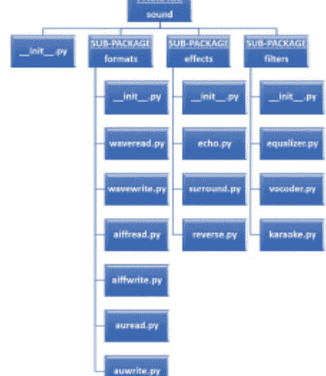

图 13-2 声音包、子包及其文件 上图只是包、子包和模块之间关系的简化表示。

包的代码实际上如下图所示。你可以看到子包位于包代码块内，同样，模块位于各自的子包内。

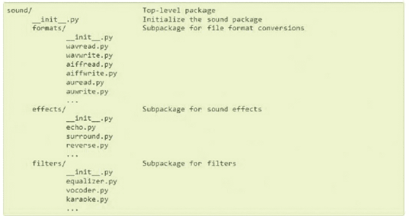

图 13-3 用于声音数据的声音文件包 __init__.py 文件是必需的，它使 Python 将包含该文件的目录视为包。这可以防止具有通用名称（如 string）的目录无意中隐藏模块搜索路径上后续出现的有效模块。在最简单的情况下，__init__.py 可以只是一个空文件，但它也可以执行包的初始化代码或设置 __all__ 变量。

### 13.6.2 调用包以使用⁶⁸

要使用一个包，我们需要先导入它。包的用户可以从包中导入单个模块。例如，要**导入**位于包 **sound** 内的子包 **effects** 中的模块 **echo**：**import sound.effects.echo** 这将加载子模块 **sound.effects.echo**。现在，当我们想使用函数 **echofilter**（位于模块 **echo** 中）时，我们需要按以下方式调用该函数

时尚。你可能会注意到，包和模块必须使用其全名进行引用。

```
sound.effects.echo.echofilter(input, output, delay=0.7, atten=4)
```

这听起来很繁琐或冗长，并且在编写长代码时容易出错。好消息是，有另一种导入子模块的方法：`from sound.effects import echo`。这也会加载子模块`echo`，并使其无需包前缀即可使用，因此可以这样使用：`echo.echofilter(input, output, delay=0.7, atten=4)`。还有一种变体可以直接导入所需的函数或变量：`from sound.effects.echo import echofilter`。同样，这会加载子模块`echo`，但这次它使得其函数`echofilter()`可以直接使用：`echofilter(input, output, delay=0.7, atten=4)`。

**请注意**，当使用`from package import item`时，`item`可以是包的子模块（或子包），也可以是包中定义的其他名称，例如函数、类或变量。导入语句首先检查`item`是否在包中定义；如果没有，它会假定它是一个模块并尝试加载它。如果找不到，将引发`ImportError`异常。

另一方面，当使用类似`import item.subitem.subsubitem`的语法时，除最后一个之外的每个`item`都必须是一个包；最后一个`item`可以是一个模块或一个包，但不能是前一个`item`中定义的类、函数或变量。

### 13.6.3 Python中的流行包⁶⁹

Python是数据科学家和软件开发人员在数据科学任务中最常用的语言之一。Python的优势之一是世界各地各种贡献者提供的公开可用的包。

虽然可以使用原生Python处理数据，但有许多开源库使得Python数据任务变得容易得多。

正如我们所看到的，包用于管理执行特定任务的类似模块和文件。因此，我们将介绍一些包，分为三个主要的数据科学领域。

1.  数据挖掘
2.  数据处理与建模
3.  数据可视化

#### 1. 数据挖掘

**Scrapy** 作为最受欢迎的Python数据科学库之一，Scrapy有助于构建爬虫程序（蜘蛛机器人），可以从网络上检索结构化数据——例如URL或联系信息。它是用于抓取数据（例如用于Python机器学习模型）的绝佳工具。

开发人员使用它从API收集数据。这个功能齐全的框架在其接口设计中遵循了“不要重复自己”的原则。因此，该工具激励用户编写通用代码，这些代码可以重用于构建和扩展大型爬虫。

#### 数据处理与建模

**NumPy** NumPy（数值Python）是科学计算和执行基础及高级数组操作的完美工具。

该库提供了许多便捷功能，用于在Python中对n维数组和矩阵执行操作。它有助于处理存储相同数据类型值的数组，并使对数组（及其向量化）执行数学操作变得更容易。事实上，对NumPy数组类型进行数学操作的向量化提高了性能并加速了执行时间。

3.  **SciPy** 这个有用的库包含用于线性代数、积分、优化和统计的模块。其主要功能建立在NumPy之上，因此其数组利用了这个库。SciPy非常适合各种科学编程项目（科学、数学和工程）。它在子模块中提供了高效的数值例程，如数值优化、积分等。广泛的文档使得使用这个库非常容易。

4.  **Pandas** Pandas是一个旨在帮助开发人员直观地处理“标记”和“关系”数据的库。它基于两个主要数据结构：“Series”（一维，像一个项目列表）和“Data Frames”（二维，像一个有多列的表格）。Pandas允许将数据结构转换为DataFrame对象、处理缺失数据、从DataFrame添加/删除列、填充缺失文件，以及使用直方图或箱线图绘制数据。它是数据整理、操作和可视化的必备工具。

5.  **SciKit-Learn** 这是基于Python的数据科学项目的行业标准。Scikits是SciPy Stack中的一组包，它们是为特定功能而创建的——例如图像处理。Scikit-learn使用SciPy的数学操作，为最常见的机器学习算法提供了一个简洁的接口。

数据科学家使用它来处理标准的机器学习和数据挖掘任务，如聚类、回归、模型选择、降维和分类。另一个优点是什么？它附带高质量的文档并提供高性能。

6.  **TensorFlow** TensorFlow是一个流行的用于机器学习和深度学习的Python框架，由Google Brain开发。它是对象识别、语音识别等任务的最佳工具。它有助于处理需要处理多个数据集的人工神经网络。该库包括各种层辅助工具（tflearn、tf-slim、skflow），使其功能更加强大。TensorFlow通过其新版本不断扩展——包括修复潜在的安全漏洞或改进TensorFlow与GPU的集成。

#### 数据可视化

**Matplotlib** 这是一个标准的数据科学库，有助于生成数据可视化，如二维图表和图形（直方图、散点图和非笛卡尔坐标系的图形）。Matplotlib是那些在数据科学项目中有用的绘图库之一——它提供了一个面向对象的API，用于将绘图嵌入到应用程序中。

正是由于这个库，Python才能与MatLab或Mathematica等科学工具竞争。然而，开发人员在使用此库生成高级可视化时需要编写比平时更多的代码。请注意，流行的绘图库可以与Matplotlib无缝协作。

8.  **Seaborn** Seaborn基于Matplotlib，是一个有用的Python机器学习工具，用于可视化统计模型——热图和其他类型的可视化，这些可视化总结数据并描绘整体分布。使用此库时，你可以受益于一个广泛的可视化图库（包括复杂的可视化，如时间序列、联合图和小提琴图）。

9.  **Bokeh** 这个库是使用JavaScript小部件在浏览器中创建交互式和可扩展可视化的绝佳工具。Bokeh完全独立于Matplotlib。它专注于交互性，并通过现代浏览器呈现可视化——类似于数据驱动文档（d3.js）。它提供了一组图形、交互能力（如链接绘图或添加JavaScript小部件）和样式。

10. **Plotly** 这个基于网络的数据可视化工具提供了许多有用的开箱即用的图形——你可以在Plot.ly网站上找到它们。该库在交互式Web应用程序中运行良好。其创建者正忙于扩展该库，添加新的图形和功能，以支持多个链接视图、动画和交叉对话集成。

在接下来的章节中，我们将使用其中一些包来执行各种数据科学和分析任务。与此同时，你可以查找它们并更好地了解它们。毕竟，“石匠必须了解他的工具，数据科学家也是如此”。

## 13.7 总结

在本章中，我们学习了如何组织Python项目并重复使用相同的代码。毕竟，如果程序不能被重复使用，编写它们有什么用？模块是Python以文件形式保存代码的方式，以便在需要时随时调用它们。包是组织这些文件或模块的一种方式。它们使得识别和找到适合手头任务的正确模块的任务变得容易，并创建了一个包含其他子包和模块的存储库。

Python是一种开源语言，许多人致力于使其变得更好。他们的努力产生了数百个已发布且公开可用的Python包，这使得该语言如此多功能。我们看到了一些这样的包，但相信我，它们甚至不是冰山一角。随着你学习并开始使用它，你会不断遇到更多专门为你的特定任务编写和设计的包。

### 3.8.3 练习

回答以下问题：创建一个

## 13.8.12 判断题：函数和变量一旦定义就始终可用，即使退出解释器也是如此。

- 2. 文本编辑器与任何文字处理软件（如 MS Word）相同。
- 3. 模块中的定义可以导入到其他模块中。
- 4. 模块文件名具有 ".py" 扩展名。
- 5. Python 没有内置模块。
- 6. 使用 "**from module import ***" 导入模块时，会导入除以 "_" 开头的所有名称之外的所有名称。
- 7. **dir()** 是一个内置函数，用于找出模块定义了哪些名称。
- 8. 一个包可以包含一个或多个模块。
- 9. Numpy 是 Python 中流行的数据挖掘包。
- 10. Python 中最流行的可视化库是 Matplotlib。

## 13.8 动手实践：搜索本章中给出的公开可用的 Python 包的名称。其中一些你将在后续章节中学习，其他的你可以自行探索。

- 2. 探索一些其他包，如用于图像处理的 pillow (PIL) 和用于 GUI 开发的 Tkinter (TK)。
- 3. 探索 Python 中用于网页抓取的最佳包有哪些。

## 14 项目 3 - 基于 GUI 的货币转换器

在这个项目中，我们将制作自己的货币转换器。国际货币汇率会根据其汇率变化。因此，我们将使用网页 API（应用程序编程接口）获取这些数据。对于外汇汇率，我们将使用 "https://fixer.io/" 网页。在你开始编写代码之前，你可以访问此网站并创建一个免费账户。注册后，你将免费获得自己的 API 密码。

GUI 意味着图形用户界面。这是用户在使用鼠标或触摸屏以及键盘时可以使用的界面，就像我们日常使用的大多数软件和应用程序一样。

Python 有一个用于创建 **GUI** 元素的内置模块。**Tkinter** 是 Python 的 GUI 创建模块。它易于学习和实现。我们将在本章中介绍 Tkinter，并学习其非常基础的内容。但这绝不是 Tkinter 教程。这个项目是为了让你了解 Python 能实现什么，并复习你必须在本书中学到的理论，并将它们转化为实际的解决方案。

因为这将是一段需要作为一个整体编写的稍大的代码块，所以，我们将首先看看并理解我们要做什么。然后我将把完整的代码写成一个整体。到那时，你将能够解读正在发生什么以及代码在做什么。

在这里，我们的目的是理解和实践我们到目前为止在本书中学到的概念。最终，你的努力将变为现实。

在我们开始这段旅程之前，让我向你展示最终结果会是什么样子。


图 14-1 货币转换器应用最终结果

### Tkinter 简介

Tkinter 是 Python 拥有的众多 GUI 框架之一，但它是唯一内置于 Python 标准库中的框架。这意味着 Tkinter 随 Python 标准提供，无需单独安装。为了介绍 Tkinter，我们将制作一个非常小的基于 GUI 的应用。我们将称之为 "Hello World!" 应用。首先看看这段代码，运行并查看结果，然后我们将学习 Tkinter 的基础知识。

```python
from tkinter import *

window = Tk()
window.title("Trial App")
window.geometry("250x250")
label_1 = Label(window, text = "Hello World! ")
label_1.pack()
window.mainloop()
```

上面的代码运行时，将在一个连续循环中运行，并打开一个新窗口。如果你在这里看不到那个窗口弹出，请查看桌面的任务栏。在那里你会看到一个新窗口已打开。它将是一个小窗口，就像我在这里的图片中展示的那样。

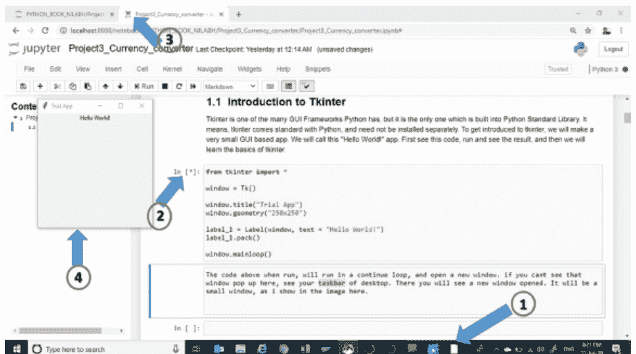

- 我们刚刚在运行上面的代码时创建的 GUI 界面在桌面任务栏上显示如下。
- 注意 **In[ ]** 中的 *。它表示代码正在运行。代码的最后一行有 **mainloop()** 方法。这使代码在 GUI 窗口打开时保持在无限循环中运行。一旦你关闭 GUI 窗口，这个 * 将被一个数字替换，表示代码已完成运行。
- 与上面类似。这表示网页正忙。这是因为 GUI 窗口已打开且循环正在运行。

这就是我们创建的 GUI 窗口。这是一个独立的窗口，独立于网页。你可以拖动它、最小化它、最大化它，并通过顶部的三个按钮关闭它。

让我们更近距离地看看 GUI。


图 14-3 first_app_screenshot

如你所见，这还没有任何功能，只是一个普通的画布。想象它是你用来玩耍的画布，你可以在上面放置任何东西。我们现在就要这样做。

## 14.2 Tkinter 基础

Tkinter 非常易于使用，并且本质上是模块化的，因此非常适合 Python 的面向对象编程方法。要使其运行，有 6 个非常基本的步骤，这些步骤可以重复任意次数。

- 导入 Tkinter（到现在你已经相当了解如何以及导入 Python 中的模块了）
- 创建你的基础或根或窗口（名称可以是任何）对象
- 更改窗口的标题（这完全是可选的）
- 创建小部件（有许多小部件，我们将看到其中一些）
- 将小部件放在屏幕上的窗口中（使用 **.pack()**，或 **.grid()** 或 **.place()**）
- 使用 **.mainloop()** 方法运行无限循环。

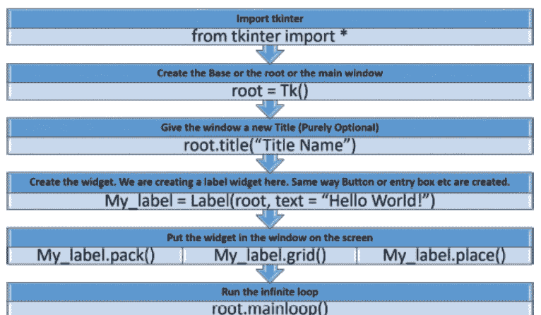

图 14-4 tkinter_steps_to_code

如果你记得遵循上述 Tkinter 基础知识，剩下的就轻而易举了。当然，有大量的附加选项和属性，其中一些我们将在本章后面看到。但这个基础总是被遵循，其余的是在此基础上的附加内容。

## 14.3 货币转换器 GUI 窗口

让我们创建我们想要制作的货币转换器的 GUI 窗口。现在，我们只打算制作 GUI 窗口，它还不是真正的转换器。我们将一步一步地看，首先是 GUI，然后是制作普通转换器的代码。最后，我们将这两者结合起来，制作基于 GUI 的货币转换器。

### 14.3.1 使用 .pack()

```python
from tkinter import *
#### 创建基础窗口，并将其传递给变量名 root
root = Tk()
#### 重命名标题
root.title("Currency Converter")
#### 创建我们的 Label 小部件。
label_1 = Label(root, text = " Input the Amount for Conversion", font = "arial 12 bold", borderwidth = 10)
label_2 = Label(root, text = " Convert From Currency :", font = "arial 10", borderwidth = 10)
label_3 = Label(root,text = " Convert to Currency :", font = "arial 10", borderwidth = 10 )
label_4 = Label(root,text = " Converted Amount :", font = "arial 10", borderwidth = 10 )
output = Label(root, text = "Print the output here", font = "arial 10", borderwidth = 10)
#### 创建我们的 Entry 框小部件。
Enter_1 = Entry(root, borderwidth = 5 )
Enter_2 = Entry(root, borderwidth = 5 )
Enter_3 = Entry(root, borderwidth = 5 )
#### 创建我们的 Button 小部件。
my_button = Button(root, text = " CONVERT",
font = "arial 10", borderwidth = 5 )
#### 将小部件放到根窗口上
label_1.pack()
label_2.pack()
label_3.pack()
label_4.pack()
output.pack()
Enter_1.pack()
Enter_2.pack()
Enter_3.pack()
my_button.pack()
#### 运行循环以激活 GUI
root.mainloop()
```

我希望你在你的 Jupyter notebook 或 IDE 中输入上面的代码。当你运行它时，你会看到这个 GUI 窗口。

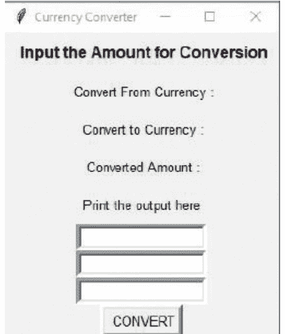

图 14-5 converter_GUI_first_cut_pack

### 使用 .grid()

这看起来不太清楚。输入框应该与其标签在同一行。我展示这个只是为了强调 **.pack()** 和 **.grid()** 之间的区别。

`.pack()` 方法会按照控件出现的顺序，将标签或部件紧密地打包在窗口中。但我们可以使用 `.grid()` 方法根据行号和列号来放置它们，而 `place()` 方法则可以将它们放置在窗口的特定位置。不过，`place()` 方法并不常用。

因此，现在我们将使用与上面相同的代码，但改用 `grid()` 方法。

```python
In [3]: from tkinter import *
#### 创建基础窗口，并将其赋值给变量名 root
root = Tk()
#### 重命名标题
root.title("Currency Converter")
#### 创建我们的 Label 部件。
label_1 = Label(root, text="Input the Amount for Conversion", font="arial 12 bold", borderwidth=10)
label_2 = Label(root, text="Convert From Currency :", font="arial 10", borderwidth=10)
label_3 = Label(root, text="Convert to Currency :", font="arial 10", borderwidth=10)
label_4 = Label(root, text="Converted Amount :", font="arial 12 bold", borderwidth=10)
#### 创建我们的 Entry 框部件。
Enter_1 = Entry(root, borderwidth=5)
Enter_2 = Entry(root, borderwidth=5)
Enter_3 = Entry(root, borderwidth=5)
output = Entry(root, text="Print the output here", font="arial 10", borderwidth=10)
#### 创建我们的 Button 部件。
my_button = Button(root, text="CONVERT", font="arial 10", borderwidth=5)
#### 将部件放置到根窗口上
label_1.grid(row=0, column=0)
label_2.grid(row=1, column=0)
label_3.grid(row=2, column=0)
label_4.grid(row=4, column=0)
Enter_1.grid(row=0, column=1)
Enter_2.grid(row=1, column=1)
Enter_3.grid(row=2, column=1)
my_button.grid(row=3, column=0, columnspan=2)
output.grid(row=4, column=1)
#### 运行循环以激活 GUI
root.mainloop()
```

这就是新的 GUI 窗口的样子。请在你的机器上输入这些代码，亲自看看效果。

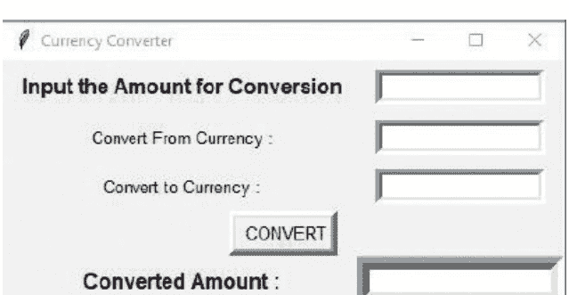

图 14-6 使用 grid 方法的货币转换器 GUI

## 货币转换代码

我们已经了解了如何制作货币转换器的“外壳”或主体。现在是时候制作在主体背后运行的引擎了。

我希望你回顾一下本书中学习的类的概念。在这里，我将给你一个创建和使用类的实际例子。

由于货币汇率基于市场并持续变化，我们将从一个提供大多数国际货币汇率的网站获取当前汇率，并使用 API（应用程序编程接口）。对于外汇汇率，我们将使用 "https://fixer.io/" 网页。在你开始编写代码之前，你可以访问这个网站并创建一个免费账户。注册后，你将免费获得你自己的 API 密钥。

为了从 API 获取数据，我们将使用内置的 **requests** 模块。

```python
In [4]: import requests
#### 创建货币转换器类
class Currency_Converter:
    # 创建一个空字典来存储汇率
    rates = {}
    def __init__(self, url):
        # 从 url 或网页请求数据
        data = requests.get(url).json()
        # 从数据中提取汇率
        self.rates = data["rates"]
    # 执行实际转换的函数
    def convert(self, from_currency, to_currency, amount):
        initial_amount = amount
        # 因为基础货币是 EUR，所以进行此转换
        if from_currency != 'EUR':
            amount = amount / self.rates[from_currency]
        output = amount * self.rates[to_currency]
        # 将转换结果四舍五入到两位小数
        output = round(amount * self.rates[to_currency], 2)
        # 以美观的打印格式输出
        print('{} {} = {} {}'.format(initial_amount, from_currency, output, to_currency))
#### 驱动代码
if __name__ == "__main__":
    # 此访问密钥可能对你无效。请生成你自己的访问密钥
    ACCESS_KEY = "1cf94c2fd27ab40a0b510ccec2d0014b"
    url = str.__add__('http://data.fixer.io/api/latest?access_key=', ACCESS_KEY)
    # 调用类实例
    converter = Currency_Converter(url)
    # 从用户获取输入
    from_country = input("Convert From Currency: ")
    to_country = input("Convert to Currency: ")
    amount = int(input("Amount to be Converted: "))
    converter.convert(from_country, to_country, amount)
```

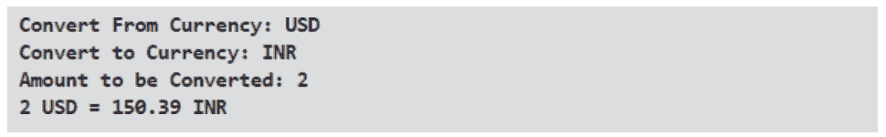

## 14.5 最终应用 - 货币转换器

到现在为止，你已经了解了如何制作应用的 Tkinter 外部主体，以及如何运行应用并生成实际转换结果的代码。

现在，我们将把上面两部分合并到一起。不过，这不会是简单地将这两段代码复制粘贴在一起。

**注意：** 在上面的代码示例中，我使用类示例只是为了让你体验类概念在现实世界中的应用。同样的功能也可以通过直接定义函数来完成，正如你将在下一节中看到的那样。

```python
import tkinter as tk
#### 为货币转换器创建 Frame
#### 初始化 tkinter 并赋值给变量 window
window = tk.Tk()
#### 更改窗口标题
window.title("Currency Convertor")
#### 创建所有标签
Input_label = tk.Label(window, text="Input the Amount for Conversion", font="arial 12 bold", borderwidth=10)
label_fc = tk.Label(window, text="Convert From Currency :", font="arial 12 ", borderwidth=10)
label_tc = tk.Label(window, text="Convert to Currency :", font="arial 12 ", borderwidth=10)
outputlabel = tk.Label(window, text="Converted Amount: ", font="arial 12 bold", borderwidth=10)
#### 创建所有操作点（输入和输出字段）
input_amount = tk.Entry(window, font="arial 12 bold", borderwidth=5)
from_currency = tk.Entry(window, font="arial 12 bold", borderwidth=5)
to_currency = tk.Entry(window, font="arial 12 bold", borderwidth=5)
output = tk.Entry(window, font="arial 12 bold", borderwidth=5)
#### 定义所有标签和部件的几何布局
Input_label.grid(row=0, column=0)
label_fc.grid(row=1, column=0)
label_tc.grid(row=2, column=0)
input_amount.grid(row=0, column=1)
from_currency.grid(row=1, column=1)
to_currency.grid(row=2, column=1)
outputlabel.grid(row=4, column=0)
output.grid(row=4, column=1)
#### 到目前为止，我们已经制作了转换器 GUI 的窗口
#### 现在我们将处理货币转换器程序的代码
#### 首先，我们将使用以下 url 从网页获取数据
##### www.fixer.io
##### 你需要登录并按照流程获取你自己的 API 访问密钥，这对用户是免费的
Access_Key = "1cf94c2fd27ab40a0b510ccec2d0014b"
##### 你从 www.fixer.io 获取你自己的访问密钥
url = str.__add__('http://data.fixer.io/api/latest?access_key=', Access_Key)
#### 导入 requests 库
import requests
#### 从上述 url 获取的货币汇率数据
data = requests.get(url).json()
#### rates 是来自上述数据的字典
rates = data["rates"]
#### 定义执行实际转换的函数
def currency_converter(from_currency, to_currency, input_amount):
    from_currency = from_currency.get()
    to_currency = to_currency.get()
    input_amount = float(input_amount.get())
    if from_currency != "EUR":
        Amount = input_amount / rates[from_currency]
        output.insert(0, round(Amount * rates[to_currency], 2))
    return

convert_button = tk.Button(window, text="CONVERT", font="arial 16 bold", borderwidth=10, padx=50, bg="powder blue", command=lambda: currency_converter(from_currency, to_currency, input_amount))
convert_button.grid(row=3, columnspan=2)
window.mainloop()
```

最终结果应如下图所示。


图 14-7 应用最终结果 - 空白窗口

```python
In [6]: # 此处可用于转换的货币列表
rates.keys()
```

```
Out[6]: dict_keys(['AED', 'AFN', 'ALL', 'AMD', 'ANG', 'AOA', 'ARS', 'AUD', 'AWG', 'AZN', 'BAM', 'BBD', 'BDT', 'BGN', 'BHD', 'BIF', 'BMD', 'BND', 'BOB', 'BRL', 'BSD', 'BTC', 'BTN', 'BWP', 'BYN', 'BYR', 'BZD', 'CAD', 'CDF', 'CHF', 'CLF', 'CLP', 'CNY', 'COP', 'CRC', 'CUC', 'CUP', 'CVE', 'CZK', 'DJF', 'DKK', 'DOP', 'DZD', 'EGP', 'ERN', 'ETB', 'EUR', 'FJD', 'FKP', 'GBP', 'GEL', 'GGP', 'GHS', 'GIP', 'GMD', 'GNF', 'GTQ', 'GYD', 'HKD', 'HNL', 'HRK', 'HTG', 'HUF', 'IDR', 'ILS', 'IMP', 'INR', 'IQD', 'IRR', 'ISK', 'JEP', 'JMD', 'JOD', 'JPY', 'KES', 'KGS', 'KHR', 'KMF', 'KPW', 'KRW', 'KWD', 'KYD', 'KZT', 'LAK', 'LBP', 'LKR', 'LRD', 'LSL', 'LTL', 'LVL', 'LYD', 'MAD', 'MDL', 'MGA', 'MKD', 'MMK', 'MNT', 'MOP', 'MRO', 'MUR', 'MVR', 'MWK', 'MXN', 'MYR', 'MZN', 'NAD', 'NGN', 'NIO', 'NOK', 'NPR', 'NZD', 'OMR', 'PAB', 'PEN', 'PGK', 'PHP', 'PKR', 'PLN', 'PYG', 'QAR', 'RON', 'RSD', 'RUB', 'RWF', 'SAR', 'SBD', 'SCR', 'SDG', 'SEK', 'SGD', 'SHP', 'SLL', 'SOS', 'SRD', 'STD', 'SVC', 'SYP', 'SZL', 'THB', 'TJS', 'TMT', 'TND', 'TOP', 'TRY', 'TTD', 'TWD', 'TZS', 'UAH', 'UGX', 'USD', 'UYU', 'UZS', 'VEF', 'VND', 'VUV', 'WST', 'XAF', 'XAG', 'XAU', 'XCD', 'XDR', 'XOF', 'XPF', 'YER', 'ZAR', 'ZMK', 'ZMW', 'ZWL'])
```

让我们看看 15 澳元（AUD）等于多少印度卢比（INR）。

我们将运行上面的代码行，应用将会启动。在第一个输入框中输入 15。然后分别输入 AUD 和 INR，并点击“转换”按钮。结果将如下所示。

> 注意：金额每天都会变化，因为汇率在变动，API 将从网站获取每日汇率。

## 14.6 总结

在本项目中，我们见证了理论付诸实践，这些理论我们能够看见、感受和触摸（嗯，至少通过你的鼠标可以）。我们在这个项目中接触了Python的GUI制作库，即Tkinter。我们学习了Python中任何GUI制作过程的基本构建模块，这将帮助我们在未来制作基于GUI的程序。你可以自己学习更精细的细节，但你在这里学到的基础知识将始终指引你在这个领域的探索。然后我们看到了类概念的实际应用，创建了一个类，实例化了它，在其中定义了函数，分配了局部变量，然后调用了一个类实例。最后，我们使用了基于类实例的函数来实现货币转换。我们还再次看到了如何创建和使用函数。并且，我们有效地使用了它们。最后，我们看到了如何制作一个漂亮的基于GUI的应用程序，然后编写函数让GUI执行实际工作。

## 14.7 待办事项

- 在上述应用程序中再添加一个按钮，用于清除输入内容。你需要添加一个“清除”按钮，并编写函数使其像“转换”按钮一样运作。
- 尝试将“转换来源货币”和“转换目标货币”的输入框改为下拉选择按钮，下拉菜单中仅包含此处可用的货币作为可选选项。
- 阅读关于Tkinter的资料，学习如何为其增添更多功能。

# 15 NUMPY

本章灵感来源于NumPy文档和通用手册，以及由“The SciPy community”发布的“NumPy：初学者绝对基础”教程。

解释NumPy数组行为和性能的图片取自上述NumPy教程页面，图片由以下来源提供，特此致谢。

图片来源：Jay Alammar http://jalammar.github.io/

这只是NumPy为各级程序员（从初学者、中级到专家级编码员）提供的众多文章和教程之一。我强烈建议你访问该网站，扩展你的学习。在本章中，我不会用过多内容让你应接不暇，而是带你领略由“The SciPy community”的贡献者和开发者所实现的、激动人心的NumPy和Python科学计算世界。

## 15.1 欢迎使用NumPy！

**NumPy (Numerical Python)** 是一个开源的Python库，几乎在科学和工程的每个领域都有应用。它是Python中处理数值数据的通用标准，也是科学Python和PyData生态系统的核心。NumPy的用户包括从初学者到进行前沿科学和工业研发的经验丰富的研究人员。NumPy API（应用程序编程接口）在Pandas、SciPy、Matplotlib、scikit-learn、scikit-image以及大多数其他数据科学和科学Python包中被广泛使用。

NumPy的基础是**ndarray**。与拥有多种数据结构的通用Python不同，NumPy只有一种。一个多维数组和各种派生对象，也包括矩阵（回忆一下高中代数）数据结构。

NumPy引入了**ndarray**，一个同质的n维数组对象，以及高效操作它的方法。NumPy可用于对数组执行各种数学运算。它为Python添加了强大的数据结构，保证了数组和矩阵的高效计算，并提供了一个庞大的高级数学函数库，用于操作这些数组和矩阵。

## 15.2 安装NumPy

由于NumPy不是基础Python的一部分，我们需要单独安装。好消息是，它是一个开源库，因此对所有人免费，且永久免费。

另一个好消息是，我们已经安装了NumPy。当我们通过Anaconda包安装Python时，最常用和流行的Python库及依赖项也会被安装。NumPy是最流行的Python包。

不过，为了你的知识，我仍然会告诉你如何单独安装它。在Python中，安装包或库最流行的两种方式是通过“**Conda**”或“**Pip**”。**Conda**和**Pip**是什么，我们稍后会看到。现在，我们只使用它们。

如果你已经有Python，你可以通过以下方式安装NumPy：打开你的Anaconda命令提示符并输入：`conda install numpy` 或 `pip install numpy`

**如何导入NumPy**

任何时候你想在代码中使用包或库，你首先需要使其可访问。

要开始使用NumPy及其所有可用函数，你需要导入它。这可以通过这个导入语句轻松完成：`import numpy as np`（我们将NumPy简写为np，以节省时间并保持代码标准化，这样任何使用你的代码的人都能轻松理解和运行它。）

**Python列表和NumPy数组的区别**

NumPy为你提供了大量快速高效的方法来创建数组和操作其中的数值数据。虽然Python列表可以在单个列表中包含不同的数据类型，但NumPy数组中的所有元素都应该是同质的。如果数组不是同质的，旨在对数组执行的数学运算将极其低效。

**列表**与**ndarray**的对比列于下表。

| Python列表 | Numpy数组 (ndarray) |
| :--- | :--- |
| Python列表可以是同质的，也可以是异质的。 | NumPy数组(ndarray)默认是同质的，这意味着数组内的数据必须是相同的数据类型。 |
| 列表不支持逐元素操作。 | 支持逐元素操作。 |
| Python列表默认是一维的。 | NumPy数组是多维的。ndarray意为“n”维数组。 |
| 列表的元素在内存中不必是连续的。 | 数组的元素在内存中是连续存储的。 |

## 15.5 为什么选择NumPy？

NumPy数组比Python列表更快、更紧凑。数组占用更少的内存，使用更方便。NumPy使用更少的内存来存储数据，并提供了指定数据类型的机制。这使得代码可以进一步优化。

NumPy比列表更快，因为NumPy数组在内存中占用的空间比列表少，因此加载更快。让我用一些图形解释来展示给你看。

让我们看看数字“5”在计算机语言中是如何表示的，然后在列表和NumPy数组中又是如何表示的。这本身就能解释很多问题。

如你所见，列表对象有4个属性：大小、引用计数、对象类型和对象值。所有这些占用28字节的内存。而NumPy数组中的相同对象仅占用4字节的内存。

NumPy数组还有另一个优势，即它是连续的。这意味着数据存储时中间没有空隙。而列表则不是连续的。让我们在下面的图像中更好地理解这一点。

**什么是数组？**

数组是NumPy库的核心数据结构。数组是一个值的网格，它包含关于原始数据、如何定位元素以及如何解释元素的信息。它有一个元素网格，可以通过各种方式索引。所有元素都是相同的类型，称为数组的**dtype**。

NumPy的数组类称为**ndarray**。它也以别名**array**而闻名。请注意，**numpy.array**与标准Python库类**array.array**不同，后者只处理一维数组，功能较少。

我们可以通过Python列表来初始化NumPy数组。

例如：

```
In [1]: import numpy as np
        a = np.array([1, 2, 3, 4, 5, 6])
        a

Out[1]: array([1, 2, 3, 4, 5, 6])
```

或者使用嵌套列表来处理二维或更高维的数据。

```
In [2]: b = np.array([[1, 2, 3, 4], [5, 6, 7, 8], [9, 10, 11, 12]])
        b

Out[2]: array([[ 1,  2,  3,  4],
               [ 5,  6,  7,  8],
               [ 9, 10, 11, 12]])
```

我们可以使用方括号访问数组中的元素。访问元素时，请记住NumPy中的索引从0开始。这意味着如果你想访问数组中的第一个元素，你将访问元素“0”。

```
In [3]: print(b[0])

[1 2 3 4]
```

## 15.6.1 NumPy 数组 (ndarray)

你可能偶尔会听到数组被称为 "ndarray"，这是 "N维数组" 的简称。N维数组就是具有任意维度的数组。你可能还会听到一维数组（1-D）、二维数组（2-D）等说法。NumPy 的 `ndarray` 类用于表示矩阵和向量。

**向量**是只有一个维度的数组（行向量和列向量没有区别）。

**矩阵**是指具有两个维度的数组。

对于**三维或更高**维的数组，术语**张量**也常被使用。

## 16.6.2 数组的属性

数组通常是一个固定大小的容器，其中的元素具有相同的类型和大小。数组的维度数和元素数量由其形状定义。数组的形状是一个非负整数元组，指定了每个维度的大小。

在 NumPy 中，维度被称为**轴**。这意味着如果你有一个如下所示的二维数组：

```
[[0., 0., 0.], [1., 1., 1.]]
```

你的数组有 2 个轴。第一个轴的长度为 2，第二个轴的长度为 3。

就像其他 Python 容器对象一样，数组的内容可以通过索引或切片来访问和修改。与典型的容器对象不同，不同的数组可以共享相同的数据，因此对一个数组所做的更改可能在另一个数组中可见。

## 15.7 如何创建基本数组

要创建一个 NumPy 数组，你可以使用函数 `np.array()`。

要创建一个简单的数组，你只需要将一个列表传递给它。

```
import numpy as np
a = np.array([1, 2, 3])
```

你可以这样可视化你的数组：

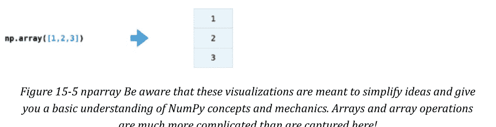

除了从元素序列创建数组外，你还可以轻松创建一个充满 0 的数组。
有几种创建数组的方法。
例如，你可以使用数组函数从常规的 Python 列表或元组创建数组。结果数组的类型是从序列中元素的类型推断出来的。

```
In [4]: a = np.array([2,3,4])
        a
```

```
Out[4]: array([2, 3, 4])
```

```
In [5]: b = np.array([1.2, 3.5, 5.1])
        b
```

```
Out[5]: array([1.2, 3.5, 5.1])
```

```
In [6]: a.dtype
```

```
Out[6]: dtype('int32')
```

```
In [7]: b.dtype
```

```
Out[7]: dtype('float64')
```

一个常见的错误是调用 `array` 时传递多个参数，而不是提供一个序列作为参数。

```
In [8]: a = np.array(1,2,3,4) # 错误
```

```
ValueError Traceback (most recent call last)
<ipython-input-8-7681c71c58ae> in <module>
----> 1 a = np.array(1,2,3,4) # 错误

ValueError: only 2 non-keyword arguments accepted
```

```
In [9]: a = np.array([1,2,3,4]) # 正确
        a
```

```
Out[9]: array([1, 2, 3, 4])
```

**array()** 将序列的序列转换为**二维数组**，将序列的序列的序列转换为**三维数组**，依此类推。

```
In [10]: b = np.array([(1.5,2,3), (4,5,6)])
         b
```

```
Out[10]: array([[1.5, 2. , 3. ],
               [4. , 5. , 6. ]])
```

通常，**数组**的元素最初是未知的，但其大小是已知的。因此，NumPy 提供了几个函数来创建具有初始占位符内容的数组。这最大限度地减少了增长数组的必要性，而增长数组是一个昂贵的操作。

函数 **zeros()** 创建一个充满零的数组，函数 **ones()** 创建一个充满一的数组，函数 **empty()** 创建一个初始内容随机且取决于内存状态的数组。默认情况下，创建的数组的 **dtype** 是 **float64**。⁷¹

### 15.7.1 零、一和随机数

**有方法可以生成仅由零、仅由一或由机器随机生成的随机数组成的 NumPy 数组。**

```
In [11]: np.zeros(2)
```

```
Out[11]: array([0., 0.])
```

```
In [12]: np.zeros((3, 4))
```

```
Out[12]: array([[0., 0., 0., 0.],
               [0., 0., 0., 0.],
               [0., 0., 0., 0.]])
```

```
In [13]: # 或者一个充满 1 的数组：
         np.ones(2)
```

```
Out[13]: array([1., 1.])
```

甚至是一个空数组！函数 `empty` 创建一个初始内容随机且取决于内存状态的数组。使用 `empty` 而不是 `zeros`（或类似函数）的原因是速度——只需确保之后填充每个元素即可！

我们经常希望 NumPy 初始化数组的值。NumPy 提供了像 **ones()** 和 **zeros()** 这样的函数，以及用于随机数生成的 **random.Generator** 类。你只需要传入你想要生成的元素数量：

```
In [14]: np.ones(3)
```

```
Out[14]: array([1., 1., 1.])
```

```
In [15]: np.zeros(3)
```

```
Out[15]: array([0., 0., 0.])
```

```
In [16]: rng = np.random.default_rng(0)
         rng.random(3)
```

```
Out[16]: array([0.63696169, 0.26978671, 0.04097352])
```

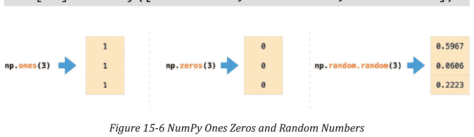

```
In [17]: np.ones((3,2))
```

```
Out[17]: array([[1., 1.],
               [1., 1.],
               [1., 1.]])
```

```
In [18]: np.zeros((3,2))
```

```
Out[18]: array([[0., 0.],
               [0., 0.],
               [0., 0.]])
```

```
In [19]: rng.random((3,2))
```

```
Out[19]: array([[0.01652764, 0.81327024],
               [0.91275558, 0.60663578],
               [0.72949656, 0.54362499]])
```

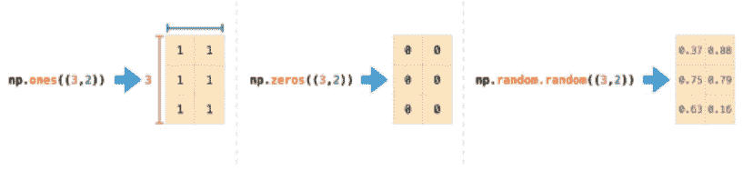

```
In [20]: # 创建一个包含 2 个元素的空数组
         np.empty( (2,3) ) # 未初始化
```

```
Out[20]: array([[0.01652764, 0.81327024, 0.91275558],
               [0.60663578, 0.72949656, 0.54362499]])
```

### 15.7.2 使用 range 函数创建序列

要创建数字序列，NumPy 提供了 `arange` 函数，它类似于 Python 内置的 `range`，但返回一个数组。

```
In [21]: np.arange(4)

Out[21]: array([0, 1, 2, 3])
```

甚至是一个包含一系列均匀间隔区间的数组。为此，你需要指定第一个数字、最后一个数字和步长。

```
In [22]: # 从 2 开始，在 9 之前结束，步长为 2
         np.arange(2, 9, 2)

Out[22]: array([2, 4, 6, 8])
```

当 **arange** 与浮点参数一起使用时，通常无法预测获得的元素数量，这是由于有限的浮点精度。因此，通常最好使用函数 **linspace**，它接收我们想要的元素数量作为参数，而不是步长：

```
In [23]: np.linspace( 0, 2, 9 ) # 从 0 到 2 的 9 个数字

Out[23]: array([0.  , 0.25, 0.5 , 0.75, 1.  , 1.25, 1.5 , 1.75, 2.  ])
```

### 15.7.3 指定数据类型

虽然默认数据类型是浮点数 (np.float64)，但你可以使用 `dtype` 关键字显式指定你想要的数据类型。

```
In [25]: x = np.ones(2, dtype=np.int64)
         x
```

```
Out[25]: array([1, 1], dtype=int64)
```

```
In [26]: np.ones( (2,3,4), dtype=np.int16 )
         # dtype 也可以这样指定
```

```
Out[26]: array([[[1, 1, 1, 1],
               [1, 1, 1, 1],
               [1, 1, 1, 1]],
              [[1, 1, 1, 1],
               [1, 1, 1, 1],
               [1, 1, 1, 1]]], dtype=int16)
```

### 15.7.4 打印数组<sup>72</sup>

当你打印一个数组时，NumPy 以类似于嵌套列表的方式显示它，但具有以下布局：最后一个轴从左到右打印，倒数第二个轴从上到下打印，其余轴也从上到下打印，每个切片之间用空行分隔。

一维数组打印为行，二维数组打印为矩阵，三维数组打印为矩阵列表。

```
In [27]: a = np.arange(6) # 一维数组
         print(a)
```

```
[0 1 2 3 4 5]
```

```
In [28]: b = np.arange(12).reshape(4,3) # 二维数组
         print(b)
```

```
[[ 0  1  2]
 [ 3  4  5]
 [ 6  7  8]
 [ 9 10 11]]
```

```
In [29]: c = np.arange(24).reshape(2,3,4) # 三维数组
         print(c)
```

```
[[[ 0  1  2  3]
  [ 4  5  6  7]
  [ 8  9 10 11]]

 [[12 13 14 15]
  [16 17 18 19]
  [20 21 22 23]]]
```

## 15.8 添加、删除和排序元素

### 15.8.1 排序

使用 `np.sort()` 对元素进行排序很简单。你可以在调用函数时指定轴、种类和顺序。

如果你从这个数组开始：

```
In [30]: arr = np.array([2, 1, 5, 3, 7, 4, 6, 8])
```

你可以使用以下方法快速将数字按升序排序：

```
In [31]: np.sort(arr)
```

```
Out[31]: array([1, 2, 3, 4, 5, 6, 7, 8])
```

除了返回数组排序副本的 `sort`，你还可以使用：**argsort**，它是沿指定轴的间接排序，**lexsort**，它是基于多个键的间接稳定排序，**searchsorted**，它将在已排序的数组中查找元素，以及 **partition**，它是部分排序。

### 15.8.2 添加（连接）

如果你从以下数组开始：

```python
In [32]: a = np.array([1, 2, 3, 4])
         b = np.array([5, 6, 7, 8])
```

你可以使用 **np.concatenate()** 将它们连接起来。

```python
In [33]: np.concatenate((a, b))
```

```
Out[33]: array([1, 2, 3, 4, 5, 6, 7, 8])
```

或者，如果你从以下数组开始：

```python
In [34]: x = np.array([[1, 2], [3, 4]])
         y = np.array([[5, 6]])
```

你可以使用以下方式连接它们：

```python
In [35]: np.concatenate((x, y), axis=0)
```

```
Out[35]: array([[1, 2], [3, 4], [5, 6]])
```

### 15.8.3 移除

要从数组中移除元素，可以简单地使用索引来选择你想要保留的元素。

## 15.9 数组的形状和大小

`ndarray.ndim` 会告诉你数组的轴数或维度数。

**ndarray.size** 会告诉你数组的元素总数。这是数组形状各元素的乘积。

**ndarray.shape** 会显示一个整数元组，表示沿数组每个维度存储的元素数量。例如，如果你有一个2行3列的二维数组，你的数组形状就是 (2, 3)。

例如，如果你创建这个数组：

```python
In [36]: array_example = np.array([[[0, 1, 2, 3], [4, 5, 6, 7]],
                                   [[0, 1, 2, 3], [4, 5, 6, 7]],
                                   [[0, 1, 2, 3], [4, 5, 6, 7]]])
```

要找出数组的维度数，运行：

```python
In [37]: array_example.ndim
```

```
Out[37]: 3
```

要找出数组中的元素总数，运行：

```python
In [38]: array_example.size
```

```
Out[38]: 24
```

要找出数组的形状，运行：

```python
In [39]: array_example.shape
```

```
Out[39]: (3, 2, 4)
```

## 15.10 使用 arr.reshape() 重塑

`reshape()`（一个方法）可以在不改变数据的情况下赋予数组新的形状。只需记住，当你使用 reshape 方法时，你想要生成的数组需要与原始数组具有相同的元素数量。如果你从一个有12个元素的数组开始，你需要确保你的新数组也总共有12个元素。

如果你从这个数组开始：

```python
In [40]: a = np.arange(6)
         print(a)
```

```
[0 1 2 3 4 5]
```

你可以使用 **reshape()** 来重塑你的数组。例如，你可以将这个数组重塑为一个有三行两列的数组：

```python
In [41]: b = a.reshape(3, 2)
         print(b)
```

```
[[0 1]
 [2 3]
 [4 5]]
```

我们上面看到了 **reshape()** 方法。Reshape 也是一个**函数**，它也有一些可选参数。它被用作 **np.reshape()**。

```python
In [42]: np.reshape(a, newshape=(2, 3))
```

```
Out[42]: array([[0, 1, 2], [3, 4, 5]])
```

```python
In [43]: np.reshape(a, newshape=(2, 3), order='C')
```

```
Out[43]: array([[0, 1, 2], [3, 4, 5]])
```

```python
In [44]: np.reshape(a, newshape=(2, 3), order='F')
```

```
Out[44]: array([[0, 2, 4], [1, 3, 5]])
```

```python
In [45]: np.reshape(a, newshape=(6), order='F')
```

```
Out[45]: array([0, 1, 2, 3, 4, 5])
```

**a** 是要被重塑的数组。

**newshape:** 是你想要的新形状。你可以指定一个整数或一个整数元组。如果你指定一个整数，结果将是一个该长度的数组。形状应与原始形状兼容。

**order:** C 表示使用类似 C（C 编程语言，也是默认值）的索引顺序读写元素，F 表示使用类似 Fortran 的索引顺序读写元素。（这是一个可选参数，不需要指定。）

### 为数组添加轴

可以使用 **np.newaxis** 和 **np.expand_dims()** 来增加数组的维度。

使用 **np.newaxis** 每使用一次，就会使你的数组维度增加一维。这意味着一个 **1D** 数组将变成一个 **2D** 数组，一个 **2D** 数组将变成一个 **3D** 数组，依此类推。

对于我们的例子，我们从这个数组开始：

```python
In [46]: a = np.array([1, 2, 3, 4, 5, 6])
         a
```

```
Out[46]: array([1, 2, 3, 4, 5, 6])
```

```python
In [47]: a.shape
```

```
Out[47]: (6,)
```

你可以使用 **np.newaxis** 来添加一个新轴：

```python
In [48]: a2 = a[np.newaxis, :]
         a2
```

```
Out[48]: array([[1, 2, 3, 4, 5, 6]])
```

乍一看，你可能会认为 **a** 和 **a2** 最终是一样的。形状没有变化。但仔细观察会发现，现在数组中多了一对 **[]**，表明添加了一个额外的轴。**shape** 方法会证实这一点。

```python
In [49]: a2.shape
```

```
Out[49]: (1, 6)
```

你可以使用 **np.newaxis** 将一维数组显式转换为行向量或列向量。例如，你可以通过沿第一个维度插入一个轴，将一维数组转换为行向量：

```python
In [50]: row_vector = a[np.newaxis, :]
         row_vector.shape
```

```
Out[50]: (1, 6)
```

或者，对于列向量，你可以沿第二个维度插入一个轴：

```python
In [51]: col_vector = a[:, np.newaxis]
         col_vector.shape
```

```
Out[51]: (6, 1)
```

```python
In [52]: col_vector
```

```
Out[52]: array([[1], [2], [3], [4], [5], [6]])
```

你可以使用 **np.expand_dims()** 在索引位置 1 添加一个轴：

```python
In [53]: b = np.expand_dims(a, axis=1)
         b.shape
```

```
Out[53]: (6, 1)
```

你可以在索引位置 0 添加一个轴：

```python
In [54]: c = np.expand_dims(a, axis=0)
         c.shape
```

```
Out[54]: (1, 6)
```

## 15.12 索引和切片

你可以使用与切片 Python 列表相同的方式来索引和切片 NumPy 数组。

```python
In [55]: data = np.array([1, 2, 3])
```

```python
In [56]: data[1]
```

```
Out[56]: 2
```

```python
In [57]: data[0]
```

```
Out[57]: 1
```

```python
In [58]: data[0:2]
```

```
Out[58]: array([1, 2])
```

```python
In [59]: data[1:]
```

```
Out[59]: array([2, 3])
```

```python
In [60]: data[-2:]
```

```
Out[60]: array([2, 3])
```

你可以这样可视化它：


图 15-8 NumPy 索引

你可能想要获取数组的一部分或特定的数组元素，以便在进一步分析或额外操作中使用。为此，你需要对数组进行子集选择、切片和/或索引。

如果你想从数组中选择满足特定条件的值，使用 NumPy 很简单。

例如，如果你从这个数组开始：

```python
In [61]: a = np.array([[1, 2, 3, 4], [5, 6, 7, 8],
                       [9, 10, 11, 12]])
```

你可以轻松打印出数组中所有小于 5 的值。

```python
In [62]: print(a[a < 5])
```

```
[1 2 3 4]
```

你也可以选择，例如，大于或等于 5 的数字，并使用该条件来索引数组。

```python
In [63]: five_up = (a >= 5)
         print(a[five_up])
```

```
[ 5 6 7 8 9 10 11 12]
```

你可以选择能被 2 整除的元素：

```python
In [64]: divisible_by_two = a[a % 2 == 0]
         print(divisible_by_two)
```

```
[ 2 4 6 8 10 12]
```

或者你可以使用 & 和 | 运算符选择满足两个条件的元素：

```python
In [65]: c = a[(a > 2) & (a < 11)]
         print(c)
```

```
[ 3 4 5 6 7 8 9 10]
```

你也可以利用逻辑运算符 & 和 | 来返回布尔值，这些值指明数组中的值是否满足特定条件。这对于包含名称或其他分类值的数组很有用。

```python
In [66]: five_up = (a > 5) | (a == 5)
         print(five_up)
```

```
[[False False False False]
 [ True  True  True  True]
 [ True  True  True  True]]
```

你也可以使用 **np.nonzero()** 从数组中选择元素或索引。

从这个数组开始：

```python
In [67]: a = np.array([[1, 2, 3, 4], [5, 6, 7, 8],
                       [9, 10, 11, 12]])
```

```python
In [68]: a
```

```
Out[68]: array([[ 1,  2,  3,  4],
               [ 5,  6,  7,  8],
               [ 9, 10, 11, 12]])
```

你可以使用 **np.nonzero()** 来打印，例如，小于 5 的元素的**索引**：

```python
In [69]: b = np.nonzero(a < 5)
         print(b)
```

```
(array([0, 0, 0, 0], dtype=int64), array([0, 1, 2, 3], dtype=int64))
```

在这个例子中，返回了一个数组元组：每个**维度**一个。第一个数组表示找到这些值的**行**索引，第二个数组表示找到这些值的**列**索引。

在此示例中，返回了一个数组元组：每个维度对应一个数组。第一个数组表示找到这些值的行索引，第二个数组表示找到这些值的列索引。

```
In [70]: print(a[b])
```

```
[1 2 3 4]
```

如果要查找的元素在数组中不存在，则返回的索引数组将为空。例如：

```
In [71]: not_there = np.nonzero(a == 42)
        print(not_there)
```

```
(array([], dtype=int64), array([], dtype=int64))
```

## 从现有数据创建数组

你可以轻松地从现有数组的一部分创建一个新数组。

假设你有这个数组：

```
In [72]: a = np.array([1, 2, 3, 4, 5, 6, 7, 8, 9, 10])
```

你可以随时通过指定要切片的位置，从数组的一部分创建一个新数组。

```
In [73]: arr1 = a[3:8]
        arr1
```

```
Out[73]: array([4, 5, 6, 7, 8])
```

这里，你从索引位置3到索引位置8抓取了数组的一部分。

你还可以垂直和水平地堆叠两个现有数组。假设你有两个数组，a1 和 a2：

```
In [74]: a1 = np.array([[1, 1], [2, 2]]) a2 = np.array([[3, 3], [4, 4]])
```

你可以使用 **vstack** 垂直堆叠它们：

```
In [75]: np.vstack((a1, a2))
```

```
Out[75]: array([[1, 1], [2, 2], [3, 3], [4, 4]])
```

或者使用 **hstack** 水平堆叠它们：

```
In [76]: np.hstack((a1, a2))
```

```
Out[76]: array([[1, 1, 3, 3], [2, 2, 4, 4]])
```

你可以使用 **hsplit** 将一个数组分割成几个较小的数组。你可以指定要返回的等形状数组的数量，或者指定分割发生的列。

假设你有这个数组：

```
In [77]: x = np.arange(1, 25).reshape(2, 12) x
```

```
Out[77]: array([[ 1, 2, 3, 4, 5, 6, 7, 8, 9, 10, 11, 12], [13, 14, 15, 16, 17, 18, 19, 20, 21, 22, 23, 24]])
```

如果你想将这个数组分割成三个等形状的数组，你可以运行：

```
In [78]: np.hsplit(x, 3)
```

```
Out[78]: [array([[ 1, 2, 3, 4], [13, 14, 15, 16]]), array([[ 5, 6, 7, 8], [17, 18, 19, 20]]),
```

```
array([[ 9, 10, 11, 12], [21, 22, 23, 24]])]
```

如果你想在第三列和第四列之后分割数组，你可以运行：

```
In [79]:  np.hsplit(x, (3, 4))
```

```
Out[79]: [array([[ 1, 2, 3], [13, 14, 15]]), array([[ 4], [16]]), array([[ 5, 6, 7, 8, 9, 10, 11, 12], [17, 18, 19, 20, 21, 22, 23, 24]])]
```

## 15.14 副本和视图<sup>73</sup>

在操作和处理数组时，它们的数据有时会被复制到新数组中，有时则不会。这常常是初学者的困惑来源。有三种情况：简单赋值（完全不复制）、视图或浅拷贝、副本或深拷贝。**完全不复制** 简单赋值不会复制对象或其数据。

```
In [80]:  a = np.array([[ 0, 1, 2, 3], [ 4, 5, 6, 7], [ 8, 9, 10, 11]]) b = a        # 没有创建新对象 b is a        # a 和 b 是同一个 ndarray 对象的两个名称
```

```
Out[80]:  True
```

Python 通过引用传递可变对象，因此函数调用不会复制。

```
In [81]:  def f(x): print(id(x)) id(a)        # id 是对象的唯一标识符
```

```
#### 2445066119408
```

```
In [82]: f(a) # 输出中的数字可能会有所不同
```

```
#### 2445066119408
```

### 15.14.2 视图或浅拷贝

不同的数组对象可以共享相同的数据。view 方法创建一个新的数组对象，该对象查看相同的数据。

```
In [83]: c = a.view() c is a
```

```
Out[83]: False
```

```
In [84]: c.base is a # c 是 a 拥有的数据的视图
```

```
Out[84]: True
```

```
In [85]: c.flags.owndata
```

```
Out[85]: False
```

```
In [86]: c = c.reshape((2, 6)) # a 的形状不会改变 a.shape
```

```
Out[86]: (3, 4)
```

```
In [87]: c[0, 4] = 1234 # a 的数据会改变 a
```

```
Out[87]: array([[  0,   1,   2,   3], [1234,   5,
        6,   7], [  8,   9,  10,  11]])
```

**注意：切片** 数组会返回其视图：

```
In [88]: s = a[ : , 1:3]

        # 添加空格是为了清晰；也可以写成 "s = a[:, 1:3]"

        s[:] = 10

        # s[:] 是 s 的视图。注意 s = 10 和 s[:] = 10 之间的区别

        a
```

```
Out[88]: array([[  0,  10,  10,   3], [1234,
        10,  10,   7], [  8,  10,  10,  11]])
```

### 15.14.3 深拷贝

copy 方法创建数组及其数据的完整副本。

```
In [89]: d = a.copy() # 创建了一个具有新数据的新数组对象 d is a
```

```
Out[89]: False
```

```
In [90]: d.base is a          # d 与 a 没有共享任何东西
```

```
Out[90]: False
```

```
In [91]: d[0,0] = 9999
        a                # d 不会改变 a 内部的任何内容
```

```
Out[91]: array([[  0,  10,  10,   3], [1234,  10,  10,   7], [  8,  10,  10,  11]])
```

如果不再需要原始数组，有时应在切片后调用 copy。例如，假设 **a** 是一个巨大的中间结果，而最终结果 **b** 只包含 **a** 的一小部分，那么在使用切片构造 **b** 时应进行深拷贝：

```
In [92]: a = np.arange(int(1e8)) b = a[:100].copy()
        del a                # ``a`` 的内存可以被释放。
```

如果使用 **b = a[:100]**，则 **b** 引用了 **a**，即使执行了 **del a**，**a** 也会保留在内存中。

## 15.15 NumPy 数组在现实生活中是什么样子的？

到目前为止，我们已经了解了什么是 NumPy 数组，以及如何从各种数据类型创建它。但当我第一次接触 NumPy 时，我连续思考了好几天，它为什么重要。每个人都说 NumPy 是最重要的库，但它看起来只是矩阵运算，而且还是在我们自己创建的矩阵上进行学习。它将如何帮助我解决现实世界的问题？

当我得到这个问题的答案时，我非常兴奋。我很高兴地看到，我们日常生活中分析的几乎所有内容，当转换为计算机可以理解的格式时，都采用多维数组格式（这正是 NumPy 数组格式）。

所以让我向你介绍一些这样的对象及其在矩阵格式中的表示。本节中使用的图片由 Jay Alammar<sup>74</sup> 提供，来自他的博客，可通过以下链接访问。

[http://jalammar.github.io/visual-numpy/](http://jalammar.github.io/visual-numpy/)

想想你需要处理和构建模型的所有数据类型（电子表格、图像、音频等）。其中许多都非常适合用 n 维数组表示：**表格和电子表格** 电子表格或值表是一个二维矩阵。电子表格中的每个工作表都可以是自己的变量。Python 中最流行的抽象是 pandas DataFrame，它使用 NumPy 并在其之上构建。

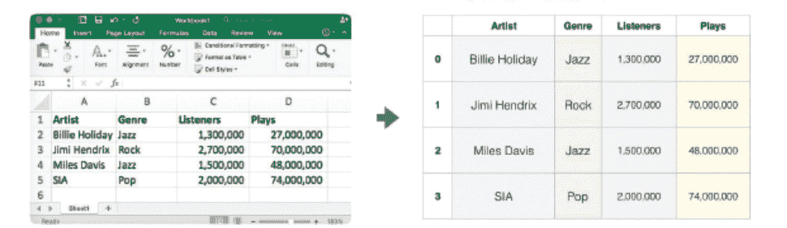

.2 图 15-9 excel-to-pandas **音频和时间序列** *音频文件是一个一维的采样数组。每个采样是一个代表音频信号一小部分的数字。CD 质量的音频可能每秒有 44,100 个采样，每个采样是一个介于 -32767 和 32768 之间的整数。这意味着如果你有一个十秒钟的 CD 质量 WAVE 文件，你可以将其加载到一个长度为 10 * 44,100 = 441,000 个采样的 NumPy 数组中。想提取前一秒钟的音频吗？只需将文件加载到一个我们称之为 audio 的 NumPy 数组中，然后获取 audio[:44100]。*

以下是音频文件的一个片段：

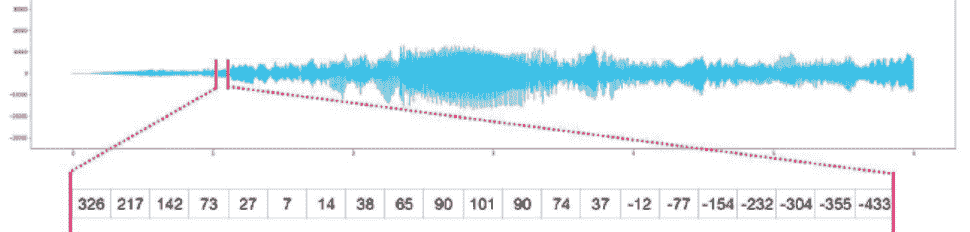

图 15-10 numpy-audio 时间序列数据（例如，股票随时间的价格）也是如此。

### 15.15.3 图像

图像是一个大小为（高度 x 宽度）的像素矩阵。

如果图像是黑白的（也称为灰度图），每个像素可以用一个数字表示（通常在 0（黑色）和 255（白色）之间）。想裁剪图像左上角 10 x 10 像素的部分吗？只需告诉 NumPy 获取 image[:10,:10]。

以下是图像文件的一个片段：

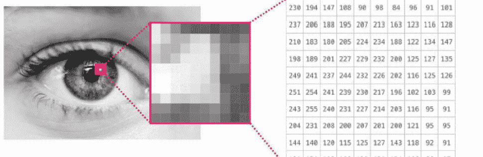

图 15-11 numpy-grayscale-image 如果图像是彩色的，那么每个像素由三个数字表示——红色、绿色和蓝色（RGB）各一个值。在这种情况下，我们需要第三个维度（因为每个单元格只能包含一个数字）。因此，彩色图像由一个维度为：（高度 x 宽度 x 3）的 **ndarray** 表示。

## 16 NumPy 操作

本章是上一章关于 NumPy 内容的延续。我们已经熟悉了**NumPy**和**ndarray**是什么，以及如何创建 ndarray 和一些基本函数。在本章中，我们将进一步学习在 NumPy 数组上执行的操作。

本章同样受到 NumPy 文档和通用手册的启发，以及由“SciPy 社区”发布的《NumPy：初学者绝对基础》教程的启发。<sup>75</sup>

### 16.1 基本数组操作

一旦你创建了数组，就可以开始使用它们了。假设你创建了两个数组，一个名为“data”，另一个名为“ones”。

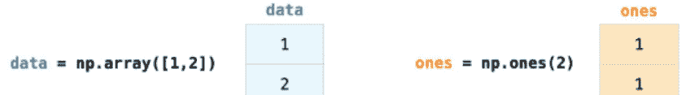

图 16-1 NumPy 数组

你可以使用加号将数组相加。

```
In [1]: import numpy as np
        data = np.array([1, 2])
        ones = np.ones(2, dtype=int)
        data + ones
Out[1]: array([2, 3])
```

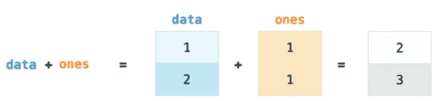

图 16-2 NumPy 数组加法

当然，你可以做的远不止加法！

```
In [2]: data - ones
Out[2]: array([0, 1])
```

```
In [3]: data * data
Out[3]: array([1, 4])
```

```
In [4]: data / data
Out[4]: array([1., 1.])
```

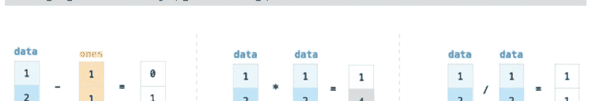

图 16-3 NumPy 数组的减法、乘法和除法

使用 NumPy 进行基本操作很简单。如果你想求数组元素的和，你会使用 **sum()**。这适用于一维数组、二维数组以及更高维度的数组。

```
In [5]: a = np.array([1, 2, 3, 4])
        a.sum()
Out[5]: 10
```

要对二维数组的行或列求和，你需要指定轴。

如果你从这个数组开始：

```
In [6]: b = np.array([[1, 1], [2, 2]])
```

你可以用以下方式对行求和：

```
In [7]: b.sum(axis=0)
Out[7]: array([3, 3])
```

你可以用以下方式对列求和：

```
In [8]: b.sum(axis=1)
Out[8]: array([2, 4])
```

数组上的算术运算符是逐元素应用的。会创建一个新数组并用结果填充。

```
In [9]: a = np.array( [20,30,40,50] )
        b = np.arange( 4 )
        b
Out[9]: array([0, 1, 2, 3])
```

```
In [10]: c = a-b
         c
Out[10]: array([20, 29, 38, 47])
```

```
In [11]: b*2
Out[11]: array([0, 2, 4, 6])
```

```
In [12]: 10*np.sin(a)
Out[12]: array([ 9.12945251, -9.88031624,  7.4511316 , -2.62374854])
```

```
In [13]: a<35
Out[13]: array([ True,  True, False, False])
```

与许多矩阵语言不同，乘法运算符 `*` 在 NumPy 数组中是逐元素操作的。矩阵乘积可以使用 `@` 运算符（在 Python >=3.5 中）或 **dot** 函数或方法来执行：

```
In [14]: A = np.array( [[1,1], [0,1]] )
         B = np.array( [[2,0], [3,4]] )
         A * B # elementwise product
Out[14]: array([[2, 0], [0, 4]])
```

```
In [15]: A @ B # matrix product
Out[15]: array([[5, 4], [3, 4]])
```

```
In [16]: A.dot(B) # another matrix product
Out[16]: array([[5, 4], [3, 4]])
```

许多一元操作，例如计算数组中所有元素的和，都是作为 **ndarray** 类的方法实现的。

```
In [17]: a = np.array([(1,2,3), (4,5,6)])
         a
Out[17]: array([[1, 2, 3], [4, 5, 6]])
```

```
In [18]: a.sum()
Out[18]: 21
```

```
In [19]: a.min()
Out[19]: 1
```

```
In [20]: a.max()
Out[20]: 6
```

默认情况下，这些操作会应用于整个数组，就好像它是一个数字列表一样，无论其形状如何。但是，通过指定 **axis** 参数，你可以沿着数组的指定轴应用操作：

```
In [21]: b = np.arange(12).reshape(3,4)
         b
Out[21]: array([[ 0,  1,  2,  3],
                [ 4,  5,  6,  7],
                [ 8,  9, 10, 11]])
```

```
In [22]: b.sum(axis=0) # sum of each column
Out[22]: array([12, 15, 18, 21])
```

```
In [23]: b.min(axis=1) # min of each row
Out[23]: array([0, 4, 8])
```

```
In [24]: b.cumsum(axis=1) # cumulative sum along each row
Out[24]: array([[ 0,  1,  3,  6],
                [ 4,  9, 15, 22],
                [ 8, 17, 27, 38]], dtype=int32)
```

#### 16.1.1 通用函数

NumPy 提供了熟悉的数学函数，如 sin、cos 和 exp。在 NumPy 中，这些被称为“通用函数”（ufunc）。在 NumPy 内部，这些函数对数组进行逐元素操作，并产生一个数组作为输出。⁷⁶

```
In [25]: B = np.arange(3)
         B
Out[25]: array([0, 1, 2])
```

```
In [26]: np.exp(B)
Out[26]: array([1.        , 2.71828183, 7.3890561 ])
```

```
In [27]: np.sqrt(B)
Out[27]: array([0.        , 1.        , 1.41421356])
```

```
In [28]: C = np.array([2., -1., 4.])
         np.add(B, C)
Out[28]: array([2., 0., 6.])
```

除了上面看到的 NumPy **ndarray** 上的方法之外，以下方法也应该自行尝试。这些方法的名称解释了它们的用途。请自行尝试查看。

| all | any | apply_along_axis | argmax | argmin |
| :--- | :--- | :--- | :--- | :--- |
| argsort | average | bincount | ceil | clip |
| conj | corrcoef | cov | cross | cumprod |
| cumsum | diff | dot | floor | inner |
| invert | lexsort | max | maximum | mean |
| median | min | minimum | nonzero | outer |
| prod | re | round | sort | std |
| sum | trace | transpose | var | vdot |
| vectorize | where | | | |

### 16.2 广播

有时你可能想在数组和单个数字（也称为向量和标量之间的操作）之间，或者在两个不同大小的数组之间执行操作。例如，你的数组（我们称之为“data”）可能包含以英里为单位的距离信息，但你想将信息转换为公里。你可以用以下方式执行此操作：

```
In [29]: data = np.array([1.0, 2.0])
         data * 1.6
Out[29]: array([1.6, 3.2])
```

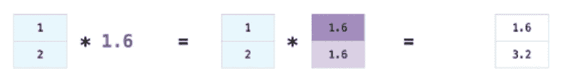

图 16-4 NumPy 广播

NumPy 理解乘法应该对每个单元格进行。这个概念称为**广播**。广播是一种允许 NumPy 对不同形状的数组执行操作的机制。你的数组的维度必须是兼容的，例如，当两个数组的维度相等或其中一个为 1 时。如果维度不兼容，你将得到一个 ValueError。

### 16.3 更多有用的数组操作

NumPy 还执行聚合函数。除了 min、max 和 sum 之外，你还可以轻松运行 mean 来获取平均值，prod 来获取元素相乘的结果，std 来获取标准差，等等。

```
In [30]: data.max()
Out[30]: 2.0
```

```
In [31]: data.min()
Out[31]: 1.0
```

```
In [32]: data.sum()
Out[32]: 3.0
```

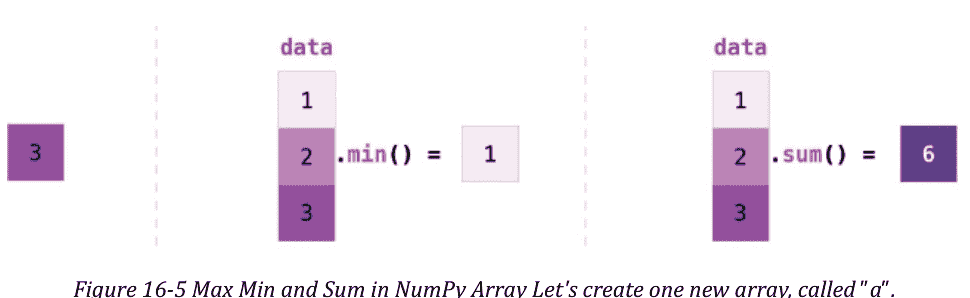

```
In [33]: a = np.array([[0.45053314, 0.17296777,
                       0.34376245, 0.5510652],
                      [0.54627315, 0.05093587,
                       0.40067661, 0.55645993],
                      [0.12697628, 0.82485143,
                       0.26590556, 0.56917101]])
```

沿着行或列进行聚合是非常常见的。默认情况下，每个 NumPy 聚合函数都会返回整个数组的聚合结果。要查找数组中元素的和或最小值，请运行：

```
In [34]: a.sum()
Out[34]: 4.8595784
```

或者

```
In [35]: a.min()
Out[35]: 0.05093587
```

当我们使用上述方法时，整个数组被聚合和计算。但你可以指定要在哪个轴上进行聚合。

要计算的函数。例如，你可以通过指定 **axis=0** 来查找每列的最小值，或者通过指定 **axis=1** 来查找每行的最小值。

```
In [36]: a.min(axis=0)
```

```
Out[36]: array([0.12697628, 0.05093587, 0.26590556, 0.5510652 ])
```

上面列出的四个值对应于你数组中的列数。对于一个四列的数组，你将得到四个结果值。

## 16.4 创建矩阵

你可以传递 Python 的列表的列表来创建一个二维数组（或“矩阵”），以在 NumPy 中表示它们。

```
In [37]: data = np.array([[1, 2], [3, 4]]) data
```

```
Out[37]: array([[1, 2], [3, 4]])
```

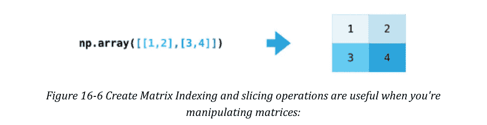

```
In [38]: data = np.array([[1,2],[3,4],[5,6]])
data[0,1] # 第一行第二列
```

```
Out[38]: 2
```

```
In [39]: data[1:3] # 第二到第三行，所有列
```

```
Out[39]: array([[3, 4], [5, 6]])
```

```
In [40]: data[0:2, 0] # 第一到第二行，第一列
```

```
Out[40]: array([1, 3])
```

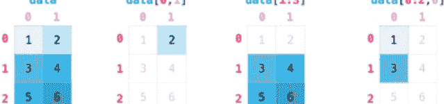

图 16-7 矩阵索引

你可以像处理向量一样对矩阵进行聚合。

```
In [41]: data.min()
```

```
Out[41]: 1
```

```
In [42]: data.max()
```

```
Out[42]: 6
```

```
In [43]: data.sum()
```

```
Out[43]: 21
```

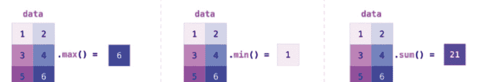

图 16-8 NumPy 矩阵聚合器

你可以聚合矩阵中的所有值，也可以使用 axis 参数按列或按行进行聚合：

```
In [44]: data.max(axis=0)
Out[44]: array([5, 6])
```

```
In [45]: data.max(axis = 1)
Out[45]: array([2, 4, 6])
```

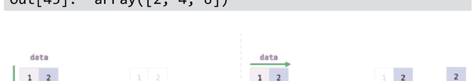

图 16-9 NumPy 矩阵聚合器

行和列

一旦你创建了矩阵，如果你有两个大小相同的矩阵，你可以使用算术运算符对它们进行加法和乘法运算。

```
In [46]: data = np.array([[1, 2], [3, 4]]) ones = np.array([[1, 1], [1, 1]]) data+ones
Out[46]: array([[2, 3], [4, 5]])
```

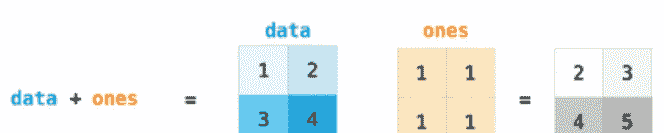

图 16-10 矩阵算术

你可以对不同大小的矩阵执行这些算术运算，但前提是其中一个矩阵只有一列或一行。在这种情况下，NumPy 将使用其广播规则进行运算。

```
In [47]: data = np.array([[1, 2], [3, 4], [5, 6]])
        ones_row = np.array([[1, 1]]) data +
        ones_row
```

```
Out[47]: array([[2, 3], [4, 5], [6, 7]])
```

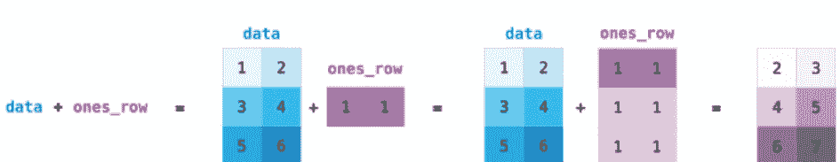

图 16-11 矩阵广播

**唯一项和计数**

你可以使用 **np.unique** 轻松找到数组中的唯一元素。

例如，如果你从这个数组开始：

```
In [48]: a = np.array([11, 11, 12, 13, 14, 15, 16, 17,
        12, 13, 11, 14, 18, 19, 20])
```

你可以使用 **np.unique** 来打印数组中的唯一值：

```
In [49]: unique_values = np.unique(a)
        print(unique_values)
```

```
[11 12 13 14 15 16 17 18 19 20]
```

在数组中查找唯一值有很多应用。一个很容易想到的例子是，在给定的杂货店所有商品的“零售价”列表中，价格在 1 美元到 10 美元之间。会有成千上万的商品及其价格。但如果你取这些价格的唯一值，你会注意到只有少数几个唯一的价格点，比如 1 美元、1.5 美元、2 美元等等。

要获取 NumPy 数组中唯一值的索引（数组中唯一值首次出现位置的数组），只需在 **np.unique()** 中传递 **return_index** 参数以及你的数组。

```
In [50]: unique_values, indices_list = np.unique(a, return_index=True) print(indices_list)
```

```
[ 0 2 3 4 5 6 7 12 13 14]
```

```
In [51]: np.unique(a, return_index=True) # 这会给出两个数组，一个是唯一值，另一个是索引
```

```
Out[51]: (array([11, 12, 13, 14, 15, 16, 17, 18, 19, 20]), array([ 0, 2, 3, 4, 5, 6, 7, 12, 13, 14], dtype=int64))
```

你可以在 **np.unique()** 中传递 **return_counts** 参数以及你的数组，以获取 NumPy 数组中唯一值的频率计数。

```
In [52]: unique_values, occurrence_count = np.unique(a, return_counts=True) print(occurrence_count)
```

```
[3 2 2 2 1 1 1 1 1 1]
```

```
In [53]: # 这会给出 3 个数组，第一个是唯一值，第二个是索引，第三个是唯一值的计数 np.unique(a, return_index=True,return_counts=True )
```

```
Out[53]: (array([11, 12, 13, 14, 15, 16, 17, 18, 19, 20]), array([ 0, 2, 3, 4, 5, 6, 7, 12, 13, 14], dtype=int64), array([3, 2, 2, 2, 1, 1, 1, 1, 1, 1], dtype=int64))
```

这也适用于二维数组！如果你从这个数组开始：

```
In [54]: a_2d = np.array([[1, 2, 3, 4], [5, 6, 7, 8], [9, 10, 11, 12], [1, 2, 3, 4]]) a_2d
```

```
Out[54]: array([[ 1, 2, 3, 4], [ 5, 6, 7, 8], [ 9, 10, 11, 12], [ 1, 2, 3, 4]])
```

你可以通过以下方式找到唯一值：

```
In [55]: unique_values = np.unique(a_2d)
print(unique_values)
```

```
[ 1 2 3 4 5 6 7 8 9 10 11 12]
```

如果没有传递 axis 参数，你的二维数组将被展平。
如果你想获取唯一的行或列，请确保传递 axis 参数。要查找唯一的行，指定 axis=0；要查找唯一的列，指定 axis=1。

```
In [56]: unique_rows = np.unique(a_2d, axis=0)
print(unique_rows)
```

```
[[ 1 2 3 4]
 [ 5 6 7 8]
 [ 9 10 11 12]]
```

要获取唯一的行、索引位置和出现次数，你可以使用：

```
In [57]: unique_rows, indices, occurrence_count = np.unique(a_2d, axis=0, return_counts=True, return_index=True)
```

```
In [58]: print(unique_rows)
```

```
[[ 1 2 3 4]
 [ 5 6 7 8]
 [ 9 10 11 12]]
```

```
In [59]: print(indices)
```

```
[0 1 2]
```

```
In [60]: print(occurrence_count)
```

```
[2 1 1]
```

## 16.6 转置和重塑矩阵

转置矩阵是常见的需求。NumPy 数组具有属性“T”，允许你转置矩阵。

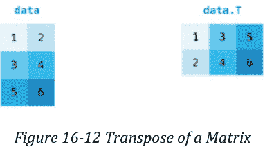

图 16-12 矩阵的转置

```
In [61]: data

Out[61]: array([[1, 2], [3, 4], [5, 6]])
```

```
In [62]: data.T

Out[62]: array([[1, 3, 5], [2, 4, 6]])
```

你可能还需要切换矩阵的维度。这可能发生在例如你有一个模型期望特定的输入形状，而该形状与你的数据集不同的情况下。这就是 **reshape** 方法可以派上用场的地方。你只需要传递你想要的矩阵的新维度。

```
In [63]: data.reshape(2, 3)

Out[63]: array([[1, 2, 3], [4, 5, 6]])
```

```
In [64]: data.reshape(3, 2)

Out[64]: array([[1, 2], [3, 4], [5, 6]])
```

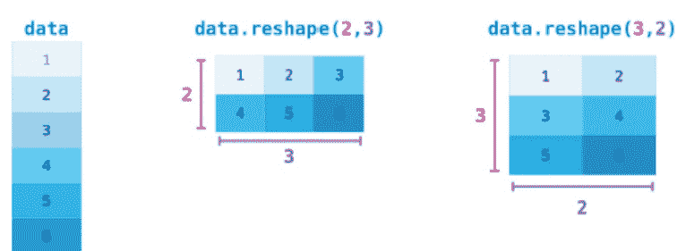

图 16-13 矩阵重塑

你也可以使用 **.transpose()** 来反转或根据你指定的值更改数组的轴。

如果你从这个数组开始：

```
In [65]: arr = np.arange(6).reshape((2, 3)) arr
```

```
Out[65]: array([[0, 1, 2], [3, 4, 5]])
```

你可以使用 **arr.transpose()** 来转置你的数组。

```
In [66]: arr.transpose()
```

```
Out[66]: array([[0, 3], [1, 4], [2, 5]])
```

## 16.7 反转数组

NumPy 的 np.flip() 函数允许你沿某个轴翻转或反转数组的内容。使用 np.flip 时，指定要反转的数组和轴。如果你不指定轴，NumPy 将沿输入数组的所有轴反转内容。

### 16.7.1 反转一维数组

如果你从这样一个一维数组开始：

```
In [67]: arr = np.array([1, 2, 3, 4, 5, 6, 7, 8])
你可以通过以下方式反转它：
In [68]: np.flip(arr)
Out[68]: array([8, 7, 6, 5, 4, 3, 2, 1])
```

### 16.7.2 反转二维数组

二维数组的工作方式非常相似。

```
如果你从这个数组开始：
In [69]: arr_2d = np.array([[1, 2, 3, 4], [5, 6, 7, 8], [9, 10, 11, 12]]) arr_2d
Out[69]: array([[ 1, 2, 3, 4], [ 5, 6, 7, 8], [ 9, 10, 11, 12]])
```

你可以通过以下方式反转所有行和所有列的内容：

```
In [70]: reversed_arr = np.flip(arr_2d)
print(reversed_arr)
[[12 11 10 9]
 [ 8 7 6 5]]
```

## 16.8 重塑和展平多维数组

展平数组，指的是将一个“多维”数组转换成一个常规的“一维”数组。

有两种常用的展平数组的方法：**.flatten()** 和 **.ravel()**。

两者的主要区别在于，使用 **ravel()** 创建的新数组是父数组的一个引用（即一个“视图”）。这意味着对新数组的任何更改也会影响父数组。由于 **ravel** 不创建副本，因此它内存效率更高。

如果你从这个数组开始：

```
In [75]: x = np.array([[1, 2, 3, 4], [5, 6, 7, 8],
            [9, 10, 11, 12]]) x
```

```
Out[75]: array([[ 1, 2, 3, 4], [ 5, 6, 7, 8], [ 9,
            10, 11, 12]])
```

```
In [76]: x.flatten()
```

```
Out[76]: array([ 1, 2, 3, 4, 5, 6, 7, 8, 9, 10, 11, 12])
```

当你使用 `flatten` 时，对新数组的更改不会改变父数组。

例如：

```
In [77]: a1 = x.flatten() a1[0] = 99

print(x) # Original Array
```

```
[[ 1 2 3 4]
 [ 5 6 7 8]
 [ 9 10 11 12]]
```

```
In [78]: print(a1)
```

```
[99 2 3 4 5 6 7 8 9 10 11 12]
```

但当你使用 `ravel` 时，你对新数组所做的更改会影响父数组。

例如：

```
In [79]: a2 = x.ravel() a2[0] = 95

print(x) # Original Array
```

```
[[95 2 3 4]
 [ 5 6 7 8]
 [ 9 10 11 12]]
```

```
In [80]: print(a2) # New array which is flattened
```

```
[95 2 3 4 5 6 7 8 9 10 11 12]
```

## 18.9 使用数学公式

在数组上实现数学公式的简便性，是 NumPy 在科学 Python 社区中如此广泛使用的原因之一。

例如，这是均方误差公式（一个用于处理回归的监督机器学习模型的核心公式）：

$MeanSquareError = \frac{1}{n} \sum_{i=1}^{n} (Y\_prediction_i - Y_i)^2$

图 16-14 均方误差

在 NumPy 中实现这个公式简单而直接：`error = (1/n) * np.sum(np.square(predictions - labels))`

图 16-15 均方误差实现

这之所以效果很好，是因为 `predictions` 和 `labels` 可以包含一个或一千个值。它们只需要大小相同。

你可以这样可视化它：

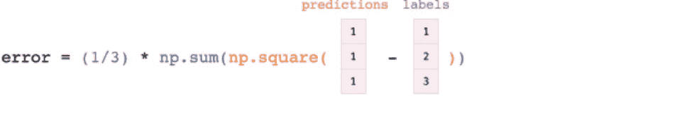

图 16-16 可视化均方误差实现

在这个例子中，`predictions` 和 `labels` 向量都包含三个值，意味着 `n` 的值为三。在我们进行减法之后，向量中的值被平方。然后 NumPy 对这些值求和，你的结果就是该预测的误差值以及模型质量的评分。

```
error = (1/3) * np.sum(np.square(
    0
    -1
    -2
))
```

```
error = (1/3) * np.sum(
    0
    1
    4
)
```

图 16-17 可视化均方误差实现

```
error = (1/3) * 5
```

图 16-18 可视化均方误差实现

## 如何保存和加载 NumPy 对象

在某个时候，你会希望将数组保存到磁盘，并在不重新运行代码的情况下将它们加载回来。幸运的是，有几种使用 NumPy 保存和加载对象的方法。**ndarray** 对象可以使用处理普通文本文件的 **loadtxt** 和 **savetxt** 函数保存到磁盘文件并从磁盘文件加载，使用处理具有 **.npy** 文件扩展名的 NumPy 二进制文件的 `load` 和 `save` 函数，以及处理具有 **.npz** 文件扩展名的 NumPy 文件的 **savez** 函数。

**.npy** 和 **.npz** 文件以一种允许数组被正确检索的方式存储数据、形状、**dtype** 和重建 **ndarray** 所需的其他信息，即使文件位于具有不同架构的另一台机器上。

如果你想存储单个 **ndarray** 对象，请使用 **np.save** 将其存储为 **.npy** 文件。如果你想将多个 **ndarray** 对象存储在单个文件中，请使用 **np.savez** 将其保存为 **.npz** 文件。你还可以使用 **savez_compressed** 将多个数组保存到单个 **压缩 npz** 格式的文件中。

使用 **np.save()** 保存和加载数组很容易。只需确保指定要保存的数组和文件名。例如，如果你创建了这个数组：

```
In [81]: a = np.array([1, 2, 3, 4, 5, 6])
```

你可以使用以下命令将其保存为 "filename.npy"：

```
In [82]: np.save('filename', a)
```

现在，如果你进入你的基础文件夹，你会找到一个名为 "filename.npy" 的新文件。

你可以使用 **np.load()** 来重建你的数组。

```
In [83]: b = np.load('filename.npy')
```

现在让我们通过运行以下命令来检查数组：

```
In [84]: print(b)
```

```
[1 2 3 4 5 6]
```

你可以使用 **np.savetxt** 将 NumPy 数组保存为纯文本文件，如 **.csv** 或 **.txt** 文件。

例如，如果你创建了这个数组：

```
In [85]: csv_arr = np.array([1, 2, 3, 4, 5, 6, 7, 8])
```

你可以轻松地将其保存为名为 "new_file.csv" 的 **.csv** 文件，如下所示：

```
In [86]: np.savetxt('new_file.csv', csv_arr)
```

现在，如果你进入你的基础文件夹，你会找到一个名为 "new_file.csv" 的新文件。

你可以使用 **loadtxt()** 快速轻松地加载你保存的文本文件：

```
In [87]: np.loadtxt('new_file.csv')
```

```
Out[87]: array([1., 2., 3., 4., 5., 6., 7., 8.])
```

**savetxt()** 和 **loadtxt()** 函数接受额外的可选参数，如 `header`、`footer` 和 `delimiter`。虽然文本文件可能更容易共享，但 **.npy** 和 **.npz** 文件更小且读取速度更快。

## 16.11 总结

在本章中，你了解了 NumPy 数组上的操作。有基本操作，如数组和矩阵的加法、减法和乘法。然后是通用函数，它们是数学运算。广播是另一种 NumPy 技术，其中较小的数组会重复自身以达到较大数组的长度，从而完成操作。你还看到了数组上更多有用的操作，如查找元素的最大值、最小值或总和。这些操作可以应用于整个矩阵或沿其中一个轴。你还看到了矩阵的转置和形状改变。同样轻松地，数组也可以被反转或展平。NumPy 对象可以根据你的需要直接从你的机器上保存和重新加载。

# 17 PANDAS 简介

## 17.1 什么是 Pandas


图 17-1 pandas_logo

如果你参考 Pandas 的官方网页，他们会希望被这样了解：

> > **Pandas** 是一个开源的、BSD 许可的库，为 Python 编程语言提供高性能、易于使用的数据结构和数据分析工具。⁷⁷

简单来说，Pandas 是一个建立在 NumPy 库之上的开源库。它是一个 Python 包，提供了各种用于操作数值数据和时间序列的数据结构和操作。它在那些想要分析数据的人中很受欢迎。Pandas 使得导入数据变得非常容易。它具有探索、清理、转换、可视化和从数据中学习的功能。Pandas 速度快，为用户提供了高性能和高生产力。

> > [pandas] 源自术语“面板数据”，这是一个计量经济学术语，指的是包含对相同个体在多个时间段进行观测的数据集。——维基百科

本章的灵感和内容主要来源于pandas官方教程。在pandas的官方网站pandas.pydata.org上，有针对各级别学习者的各种教程。我们选择了入门教程（Getting started tutorials）78，并从最基础的内容开始。本章和下一章关于pandas的许多图片都承蒙入门教程提供。

## 17.2 为什么选择Pandas？

如果你将数据科学视为职业，那么你首先必须做的事情之一就是学习pandas。这个工具本质上是你的数据的第一处理器。通过pandas，你可以从各种来源和格式将外部数据导入Python环境，并通过清洗、转换和分析数据来熟悉你的数据。

例如，假设你想探索存储在计算机**CSV**格式中的数据集。Pandas会将该**CSV**文件中的数据提取到一个**DataFrame**中，然后让你执行如下操作：

- 计算统计数据并回答关于数据的问题，例如
    - 每列的平均值、中位数、最大值或最小值是多少？
    - A列与B列是否相关？
    - C列的数据分布是什么样的？
- 通过移除缺失值、按某些条件筛选行或列等方式清洗数据
- 借助Matplotlib可视化数据。绘制条形图、折线图、直方图、气泡图等。
- 将清洗、转换后的数据存储回**csv**文件，或其他任何文件格式或数据库

Pandas构建在NumPy包之上，这意味着NumPy的许多结构在Pandas中被使用或复制。Pandas中的数据通常用于SciPy中的统计分析、Matplotlib的绘图函数以及Scikit-learn中的机器学习算法。79

在本章中，我们将介绍关于pandas的基本信息，包括如何安装它、它的用途，以及它如何与其他常见的Python数据分析包（如Matplotlib）协同工作。

## 17.3 Pandas的安装与导入

当你使用Anaconda发行版安装Python时，pandas会随之安装。无需单独安装pandas。但你应该知道如何安装，以防万一。

我们可以使用两种方法之一：**conda**安装或**pip**安装。

打开你的终端程序（Mac用户）或命令行（PC用户），使用以下任一命令进行安装：

```
conda install pandas
```

或者

```
pip install pandas
```

或者，如果你在Jupyter notebook中工作，可以运行此单元格：

```
!pip install pandas
```

要导入pandas，我们采用与导入NumPy相同的方式：

```
import pandas as pd
```

## 17.4 Pandas处理的数据

如果你曾经使用过任何电子表格程序，如MS Excel或Libre Office Calc，你会熟悉表格数据。Pandas引入了一种新的数据类型，使得在Python中处理表格数据非常方便。

它被称为**DataFrame**。

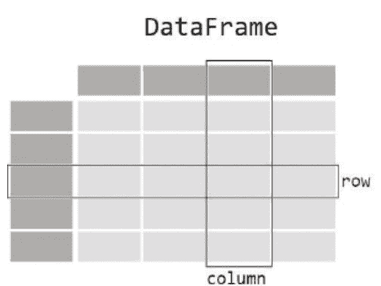

图17-2 Pandas中的DataFrame

DataFrame由Series组成。DataFrame中的每一列都是一个Series。

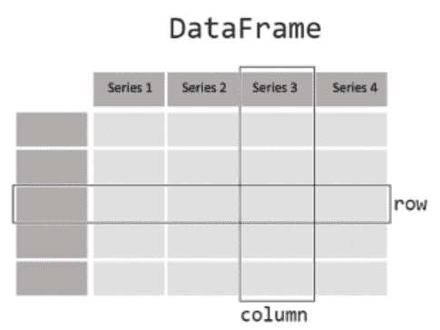

图17-3 Pandas DataFrame中的Series

## 17.5 DataFrame

### 17.5.1 创建DataFrame

创建DataFrame有多种方式。

pandas DataFrame可以使用多种输入创建，例如：

- 列表
- 字典
- Series
- NumPy ndarrays
- 另一个DataFrame

让我们在这里从一个Python字典创建它。这是一个来自杂货店的水果购买字典。

```
In [1]: data = {
        "apples":[4, 5, 8, 8, 9],
        "bananas":[10, 6, 9, 3, 4]
    }

    data
```

```
Out[1]: {'apples': [4, 5, 8, 8, 9], 'bananas': [10, 6, 9, 3, 4]}
```

pandas中的DataFrame构造函数是**pd.DataFrame()**。让我们用它来创建我们的DataFrame。但在做任何其他事情之前，我们需要导入pandas。

```
In [2]: import pandas as pd
```

```
pd.DataFrame(data)
```

```
Out[2]:
apples bananas
0       4      10
1       5       6
2       8       9
3       8       3
4       9       4
```

如果你注意到，字典的**键**变成了表格数据的列标签。字典中的每个**键:值**对都被转换为DataFrame（或Series）中的一列。

### 17.5.2 DataFrame中的索引

有一件额外的事情，我们没有指定。但它仍然存在。索引，从0到4，位于第一列的左侧。如果我们没有为索引提供任何值，pandas会自动生成索引。我们可以随时更改它。让我们将其更改为购买水果的人的名字。

让我们用客户姓名作为索引：

```
In [3]: import pandas as pd
       purchase = pd.DataFrame(data, index=
       ["Peter", "Mathew", "Simon", "Rohit",
       "Sunil"])
```

```
In [4]: purchase
```

```
Out[4]:
apples bananas
Peter       4      10
Mathew      5       6
Simon       8       9
Rohit       8       3
Sunil       9       4
```

现在我们可以查看谁购买了什么水果以及购买了多少。

### 17.5.3 DataFrame中的Series

DataFrame "purchase"中有两个Series。它们以各自的列标签命名。我们也可以通过相同的名称访问它们。

当选择pandas DataFrame的单列时，结果是一个pandas Series。要选择该列，请在方括号[]中使用列标签。

```
In [5]: purchase["apples"]
```

```
Out[5]:
Peter    4
Mathew   5
Simon    8
Rohit    8
Sunil    9
Name: apples, dtype: int64
```

如上获得的Series也可以赋值给一个变量。

```
In [6]: banana = purchase["bananas"]
       banana
```

```
Out[6]:
Peter    10
Mathew    6
Simon     9
Rohit     3
Sunil     4
Name: bananas, dtype: int64
```

注意，在这两种情况下，Series的名称与列标签相同。

你也在本章开头读到pandas有助于数据分析。让我们看几个小片段。

## 17.6 DataFrame中的列

### 17.6.1 DataFrame中的新列

可以向现有DataFrame添加列。这可以通过简单的赋值完成。

```
In [7]: purchase["oranges"] = pd.Series([8, 3, 9, 5, 2],index= ["Peter", "Mathew", "Simon", "Rohit", "Sunil"])

purchase
```

Out[7]:
| | apples | bananas | oranges |
|---|---|---|---|
| Peter | 4 | 10 | 8 |
| Mathew | 5 | 6 | 3 |
| Simon | 8 | 9 | 9 |
| Rohit | 8 | 3 | 5 |
| Sunil | 9 | 4 | 2 |

让我们再插入一列，给出所有购买水果的总和。

```
In [8]: purchase["Total"] = purchase["apples"] + purchase["bananas"] + purchase["oranges"]

purchase
```

Out[8]:
| | apples | bananas | oranges | Total |
|---|---|---|---|---|
| Peter | 4 | 10 | 8 | 22 |
| Mathew | 5 | 6 | 3 | 14 |
| Simon | 8 | 9 | 9 | 26 |
| Rohit | 8 | 3 | 5 | 16 |
| Sunil | 9 | 4 | 2 | 15 |

### 17.6.2 DataFrame中的列删除

在DataFrame中添加新列有多容易，删除一列也同样简单。让我们删除oranges列。

```
In [9]: del(purchase["oranges"])

purchase
```


你还会注意到，删除一列对其他列没有影响。甚至对"Total"列也没有影响。

### 17.6.3 更改列中的值

任何列中的数据值都可以通过简单地用新值重新赋值来更改。

```
In [10]: purchase["Total"] = purchase["apples"] + purchase["bananas"]

purchase
```

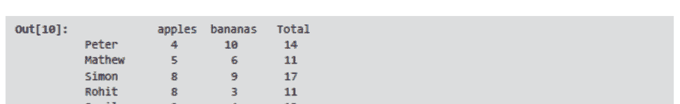

## 17.7 DataFrame中的行

### 17.7.1 行选择

DataFrame中的行可以通过两种方法选择。

- 按行标签选择

如果行有标签，可以使用相同的标签进行选择。.loc[]函数用于此目的。loc是locate的缩写。

```
In [11]: purchase.loc["Peter"]
```

```
Out[11]: apples    4
        bananas  10
        Total    14
        Name: Peter, dtype: int64
```

结果是一个Series，其标签是DataFrame的列名。并且，Series的名称是用于检索它的标签。

- 按整数（索引）位置选择

与.loc函数类似，还有另一个函数.iloc，它接受整数参数并返回该行作为Series。该整数应为该行的索引。

```
In [12]: purchase.iloc[2]
```

```
Out[12]: apples    8
        bananas   9
        Total    17
        Name: Simon, dtype: int64
```

### 17.7.2 行切片（多行选择）

可以使用":"运算符选择多行。

```
In [13]: purchase[1:3]
```

| | 苹果 | 香蕉 | 总计 |
|---|---|---|---|
| 马修 | 5 | 6 | 11 |
| 西蒙 | 8 | 9 | 17 |

当选择或切片多行时，结果是另一个 DataFrame。

## 17.8 DataFrame 上的操作

```
In [14]: purchase["bananas"].max()
```

```
Out[14]: 10
```

```
In [15]: banana.max()
```

```
Out[15]: 10
```

正如 **max()** 方法所示，你可以对 DataFrame 或 Series 进行操作。Pandas 提供了大量功能，每种功能都是一个可以应用于 DataFrame 或 Series 的方法。由于方法是函数，不要忘记使用括号 **()**。

还有一个有用的方法，**describe()**。这个 **describe()** 方法提供了 DataFrame 中数值数据的快速概览。如果存在一些包含文本数据的列，**describe()** 方法默认不会考虑这些列。

```
In [16]: purchase.describe()
```

```
Out[16]:
          apples  bananas  Total
count  5.000000  5.000000  5.000000
mean   6.800000  6.400000  13.200000
std    2.167948  3.049590  2.489980
min    4.000000  3.000000  11.000000
25%    5.000000  4.000000  11.000000
50%    8.000000  6.000000  13.000000
75%    8.000000  9.000000  14.000000
max    9.000000  10.000000  17.000000
```

## 17.9 在 Pandas 中从文件读取数据

你可以使用 pandas 读取你机器上的数据，或者从网页读取。为了便于理解和复现，以及在你端比较结果，我将使用一个公开可用的数据集，**mpg.csv**。这是用于教授数据操作和数据科学基础知识的最常用数据集之一。

你可以从下面的链接下载它：

[https://github.com/nilabhnishchhal/Python-Made-Easy/blob/master/mpg.csv](https://github.com/nilabhnishchhal/Python-Made-Easy/blob/master/mpg.csv)

这是一个 github 仓库链接。当你打开它时，你会看到 "raw" 标签页。右键单击该标签页，使用 "Save link as.." 选项。将文件保存到你机器的基础文件夹中，并将文件扩展名更改为 **.csv**。

现在你已经将数据集 **mpg.csv** 保存在你机器的基础文件夹中。让我们开始处理它。

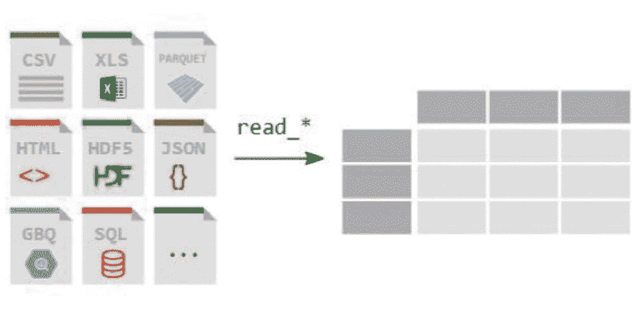

为了在 pandas 中读取各种格式的文件，我们使用 **pd.read_*** 函数。其中 * 表示需要读取的文件格式。例如，.csv 文件可以使用 **pd.read_csv** 函数读取。

```
In [17]: mpg = pd.read_csv("mpg.csv")

mpg
```

Out[17]:

| | 制造商 | 型号 | 排量 | 年份 | 气缸数 | 变速箱类型 | 驱动方式 | 城市油耗 | 高速油耗 | 燃料类型 | 车辆类别 |
|---|---|---|---|---|---|---|---|---|---|---|---|
| 0 | 奥迪 | a4 | 1.8 | 1999 | 4 | 自动(l5) | 前驱 | 18 | 29 | 汽油 | 紧凑型 |
| 1 | 奥迪 | a4 | 1.8 | 1999 | 4 | 手动(m5) | 前驱 | 21 | 29 | 汽油 | 紧凑型 |
| 2 | 奥迪 | a4 | 2.0 | 2008 | 4 | 手动(m6) | 前驱 | 20 | 31 | 汽油 | 紧凑型 |
| 3 | 奥迪 | a4 | 2.0 | 2008 | 4 | 自动(av) | 前驱 | 21 | 30 | 汽油 | 紧凑型 |
| 4 | 奥迪 | a4 | 2.8 | 1999 | 6 | 自动(l5) | 前驱 | 16 | 26 | 汽油 | 紧凑型 |
| ... | ... | ... | ... | ... | ... | ... | ... | ... | ... | ... | ... |
| 229 | 大众 | 帕萨特 | 2.0 | 2008 | 4 | 自动(s6) | 前驱 | 19 | 28 | 汽油 | 中型车 |
| 230 | 大众 | 帕萨特 | 2.0 | 2008 | 4 | 手动(m6) | 前驱 | 21 | 29 | 汽油 | 中型车 |
| 231 | 大众 | 帕萨特 | 2.8 | 1999 | 6 | 自动(l5) | 前驱 | 16 | 26 | 汽油 | 中型车 |
| 232 | 大众 | 帕萨特 | 2.8 | 1999 | 6 | 手动(m5) | 前驱 | 18 | 26 | 汽油 | 中型车 |
| 233 | 大众 | 帕萨特 | 3.6 | 2008 | 6 | 自动(s6) | 前驱 | 17 | 26 | 汽油 | 中型车 |

[234 行 x 11 列]

**注意：** 由于文件 **mpg.csv** 保存在我的基础文件夹中，我只需在函数中使用文件名。即使你的 **mpg.csv** 文件与你正在使用的 Jupyter notebook 在同一文件夹中，此方法也适用。如果它在其他文件夹或目录中，那么你需要在函数参数中提供包含文件名的完整文件路径。

请注意，我们不仅将数据从 csv 文件导入到 python 环境中，还将其分配给一个名为 "mpg" 的变量。变量 "mpg" 指向一个 DataFrame，其中包含来自 csv 文件的表格数据。

当我们调用该变量时，它会显示 DataFrame 并将其调整到窗口大小以进行显示。此外，它在底部给出了行数和列数信息。此文件有 234 行和 11 列。

### 17.9.1 理解此数据集

这是一个包含 234 行和 11 个变量（列）的数据框。变量在下表中进行了解释。

| 变量名 | 描述 |
|---|---|
| manufacturer | 制造商名称 |
| model | 型号名称 |
| displ | 发动机排量，单位为升 |
| year | 制造年份 |
| cyl | 气缸数量 |
| trans | 变速箱类型 |
| drv | 驱动类型，其中 f = 前轮驱动，r = 后轮驱动，4 = 四轮驱动 |
| cty | 城市油耗（英里/加仑） |
| hwy | 高速油耗（英里/加仑） |
| fl | 燃料类型 |
| class | 车辆“类型” |

## 17.10 将数据从 pandas 写入文件

**to_*** 方法用于存储数据。**to_excel()** 方法将数据存储为 excel 文件。

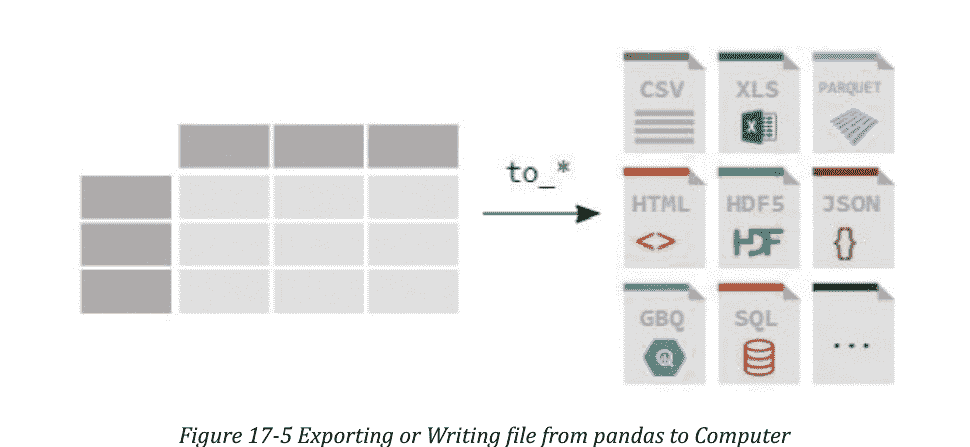

```
In [18]: mpg.to_excel('mpg.xlsx', sheet_name='cars', index=False)
```

现在，当你打开你的基础文件夹（目录）时，你会发现一个新文件 "mpg.xlsx"。你可以用 MS excel 打开该文件查看。

你是否注意到，工作表名称不是默认的 "Sheet1"，而是 "cars"。通过设置 index=False，行索引标签不会保存在电子表格中。如果你希望索引出现在 excel 文件中，可以设置 "index = True"。

## 17.11 DataFrame 的初步检查

**head/tail/info** 方法和 **dtypes** 属性对于初步检查 DataFrame 中的数据非常方便。

### 17.11.1 dtypes

可以通过请求 pandas 的 **dtypes** 属性来检查 pandas 如何解释每列的数据类型：

```
In [19]: mpg.dtypes
```

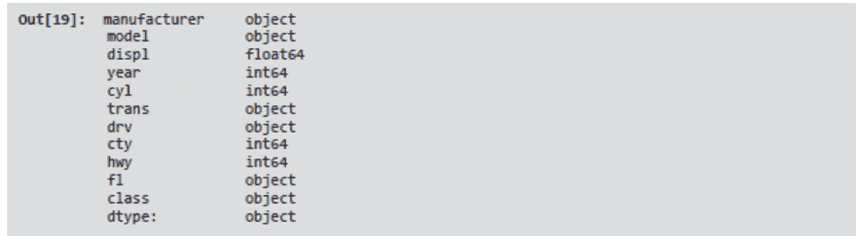

列出了每列使用的数据类型。此 DataFrame 中的数据类型包括整数（int64）、浮点数（float64）和字符串（object）。

### 17.11.2 info()

```
In [20]: mpg.info()
```

```
text
<class 'pandas.core.frame.DataFrame'>
RangeIndex: 234 entries, 0 to 233
Data columns (total 11 columns):
 #   Column            Non-Null Count  Dtype  
---  ------            --------------  -----  
 0   manufacturer      234 non-null    object 
 1   model             234 non-null    object 
 2   displ             234 non-null    float64
 3   year              234 non-null    int64  
 4   cyl               234 non-null    int64  
 5   trans             234 non-null    object 
 6   drv               234 non-null    object 
 7   cty               234 non-null    int64  
 8   hwy               234 non-null    int64  
 9   fl                234 non-null    object 
 10  class             234 non-null    object 
dtypes: float64(1), int64(4), object(6)
memory usage: 20.2+ KB
```

**注意：** 请求 **dtypes** 时，不使用括号！**dtypes** 是 DataFrame 和 Series 的一个**属性**。DataFrame 或 Series 的属性不需要括号。属性代表 DataFrame/Series 的一个特征，而**方法**（需要括号）则对 DataFrame/Series 执行某些操作。**.info()** 是一个方法。

### 17.11.3 head()

head 用于检查 DataFrame 对象的前几行。如果在 **.head()** 方法中没有传入任何参数，它默认返回前 5 行。但我们可以通过在 **.head()** 方法中传入所需的数字作为参数来查看更多或更少的行。

```
python
In [21]: mpg.head()
```

```
text
Out[21]:
```

| | 制造商 | 型号 | 排量 | 年份 | 气缸数 | 变速箱类型 | 驱动方式 | 城市油耗 | 高速油耗 | 燃料类型 | 车辆类别 |
|---|---|---|---|---|---|---|---|---|---|---|---|
| 0 | 奥迪 | a4 | 1.8 | 1999 | 4 | 自动(l5) | 前驱 | 18 | 29 | 汽油 | 紧凑型 |
| 1 | 奥迪 | a4 | 1.8 | 1999 | 4 | 手动(m5) | 前驱 | 21 | 29 | 汽油 | 紧凑型 |
| 2 | 奥迪 | a4 | 2.0 | 2008 | 4 | 手动(m6) | 前驱 | 20 | 31 | 汽油 | 紧凑型 |
| 3 | 奥迪 | a4 | 2.0 | 2008 | 4 | 自动(av) | 前驱 | 21 | 30 | 汽油 | 紧凑型 |
| 4 | 奥迪 | a4 | 2.8 | 1999 | 6 | 自动(l5) | 前驱 | 16 | 26 | 汽油 | 紧凑型 |

```
In [22]: # 让我们看看前 9 行。

mpg.head(9)
```

```
Out[22]:
```

| | 制造商 | 型号 | 排量 | 年份 | 气缸数 | 变速箱类型 | 驱动方式 | 城市油耗 | 高速油耗 | 燃料类型 | 车辆类别 |
|---|---|---|---|---|---|---|---|---|---|---|---|
| 0 | 奥迪 | a4 | 1.8 | 1999 | 4 | 自动(l5) | 前驱 | 18 | 29 | 汽油 | 紧凑型 |
| 1 | 奥迪 | a4 | 1.8 | 1999 | 4 | 手动(m5) | 前驱 | 21 | 29 | 汽油 | 紧凑型 |
| 2 | 奥迪 | a4 | 2.0 | 2008 | 4 | 手动(m6) | 前驱 | 20 | 31 | 汽油 | 紧凑型 |
| 3 | 奥迪 | a4 | 2.0 | 2008 | 4 | 自动(av) | 前驱 | 21 | 30 | 汽油 | 紧凑型 |
| 4 | 奥迪 | a4 | 2.8 | 1999 | 6 | 自动(l5) | 前驱 | 16 | 26 | 汽油 | 紧凑型 |
| 5 | 奥迪 | a4 | 2.8 | 1999 | 6 | 手动(m5) | 前驱 | 18 | 26 | 汽油 | 紧凑型 |
| 6 | 奥迪 | a4 | 3.1 | 2008 | 6 | 自动(av) | 前驱 | 18 | 27 | 汽油 | 紧凑型 |
| 7 | 奥迪 | a4 quattro | 1.8 | 1999 | 4 | 手动(m5) | 四驱 | 18 | 26 | 汽油 | 紧凑型 |
| 8 | 奥迪 | a4 quattro | 1.8 | 1999 | 4 | 自动(l5) | 四驱 | 16 | 25 | 汽油 | 紧凑型 |

如果我们想查看 DataFrame 的最后几行，而不是前几行呢？

你猜对了，毕竟它们是同一枚硬币的两面。

### 17.11.4 tail()

要查看最后的 "N" 行，请使用 .tail(N) 方法。

```
In [23]: mpg.tail(7)
```

```
Out[23]:
```

| | 制造商 | 型号 | 排量 | 年份 | 气缸数 | 变速箱 | 驱动形式 | 城市油耗 | 高速油耗 | 燃料类型 | 车辆类别 |
|---|---|---|---|---|---|---|---|---|---|---|---|
| 227 | 大众 | 帕萨特 | 1.8 | 1999 | 4 | 手动(m5) | 前驱 | 21 | 29 | 汽油 | 中型车 |
| 228 | 大众 | 帕萨特 | 1.8 | 1999 | 4 | 自动(l5) | 前驱 | 18 | 29 | 汽油 | 中型车 |
| 229 | 大众 | 帕萨特 | 2.0 | 2008 | 4 | 自动(s6) | 前驱 | 19 | 28 | 汽油 | 中型车 |
| 230 | 大众 | 帕萨特 | 2.0 | 2008 | 4 | 手动(m6) | 前驱 | 21 | 29 | 汽油 | 中型车 |
| 231 | 大众 | 帕萨特 | 2.8 | 1999 | 6 | 自动(l5) | 前驱 | 16 | 26 | 汽油 | 中型车 |
| 232 | 大众 | 帕萨特 | 2.8 | 1999 | 6 | 手动(m5) | 前驱 | 18 | 26 | 汽油 | 中型车 |
| 233 | 大众 | 帕萨特 | 3.6 | 2008 | 6 | 自动(s6) | 前驱 | 17 | 26 | 汽油 | 中型车 |

## 17.12 选择 DataFrame 的一部分

### 17.12.1 选择列

假设你对乘客的年龄和性别感兴趣。从 DataFrame 中截取两列是一个简单的操作。我们在本章前面看到，要选择单个列，可以使用方括号 `[]` 并指定感兴趣的列名。

类似地，要选择多个列，可以在 `[]` 内使用列标签的列表。

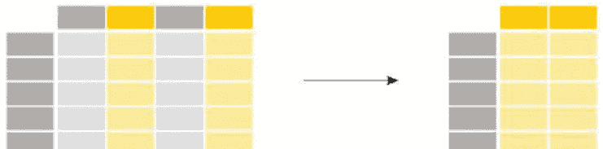

```
In [24]: model_year = mpg[["manufacturer","model",
        "year"]]

        model_year.head()
```

Out[24]:

| | 制造商 | 型号 | 年份 |
|---|---|---|---|
| 0 | 奥迪 | a4 | 1999 |
| 1 | 奥迪 | a4 | 1999 |
| 2 | 奥迪 | a4 | 2008 |
| 3 | 奥迪 | a4 | 2008 |
| 4 | 奥迪 | a4 | 1999 |

> **注意：** 内部的方括号定义了一个包含列名的 Python 列表，而外部的方括号用于从 pandas DataFrame 中选择数据，正如我们在本章前面从 DataFrame 创建 Series 时所见。

返回的数据类型也是一个 pandas DataFrame。

```
In [25]: type(model_year)
Out[25]: pandas.core.frame.DataFrame
```

```
In [26]: model_year.shape
Out[26]: (234, 3)
```

注意结果 DataFrame 的形状。它有 234 行和 3 列。DataFrame 对象是一个二维对象，其形状的第一个维度是行，第二个维度是列。

### 17.12.2 选择行（筛选行）

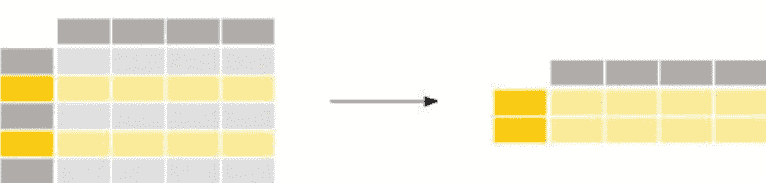

图 17-7 筛选行

我们可以根据某些条件来筛选行，这些条件由表示关系的运算符表达。

例如，如果我们只想筛选“中型车”。

```
In [27]: midsize = mpg[mpg["class"] == "midsize"]

midsize.head()
```

Out[27]:

| | 制造商 | 型号 | 排量 | 年份 | 气缸数 | 变速箱 | 驱动形式 | 城市油耗 | 高速油耗 | 燃料类型 | 车辆类别 |
|---|---|---|---|---|---|---|---|---|---|---|---|
| 15 | 奥迪 | a6 quattro | 2.8 | 1999 | 6 | 自动(l5) | 四驱 | 15 | 24 | 汽油 | 中型车 |
| 16 | 奥迪 | a6 quattro | 3.1 | 2008 | 6 | 自动(s6) | 四驱 | 17 | 25 | 汽油 | 中型车 |
| 17 | 奥迪 | a6 quattro | 4.2 | 2008 | 8 | 自动(s6) | 四驱 | 16 | 23 | 汽油 | 中型车 |
| 32 | 雪佛兰 | malibu | 2.4 | 1999 | 4 | 自动(l4) | 前驱 | 19 | 27 | 汽油 | 中型车 |
| 33 | 雪佛兰 | malibu | 2.4 | 2008 | 4 | 自动(l4) | 前驱 | 22 | 30 | 汽油 | 中型车 |

让我们理解一下这里发生了什么。

当我们传入条件 **mpg["class"] == "midsize"** 时，它会返回一个包含布尔值的 pandas Series。换句话说，它会检查 **class** 列中每一行的条件，并根据条件是否满足返回 **True** 或 **False**。因此，对于值为“midsize”的每一行，它返回 **True**，否则返回 **False**。

让我们在下面看看：

```
In [28]: mpg["class"] == "midsize"
```

```
Out[28]:
0       False
1       False
2       False
3       False
4       False
...
229     True
230     True
231     True
232     True
233     True
Name: class, Length: 234, dtype: bool
```

另外，请注意这个 Series 的长度与原始 DataFrame 对象相同。它表明对于每一行，都有一个 **True** 或 **False** 值。

现在，这样一个布尔值的 Series 可以通过将其放在选择方括号 `[]` 中来用于筛选 DataFrame。只有值为 **True** 的行会被选中。

通过这种方式，只有车辆类型或“class”为“midsize”的行被选中，现在它是一个名为“midsize”的新 DataFrame。让我们看看在总共 234 辆车中有多少辆中型车。

```
In [29]: midsize.shape
```

```
Out[29]: (41, 11)
```

在列表中的 234 辆车中，有 41 辆中型车。（新 DataFrame 中有 41 行）。

其他条件运算符如 (>, ==, !=, <, <=,... ) 也可以用于筛选行。

要使用多个条件，我们可以使用 `|` 和 `&` 运算符。

我想筛选 1999 年的 SUV。

```
In [30]: suv_99 = mpg[(mpg["class"] == "suv") &
            (mpg["year"] == 1999)]

suv_99.head()
```

Out[30]:

| | 制造商 | 型号 | 排量 | 年份 | 气缸数 | 变速箱 | 驱动形式 | 城市油耗 | 高速油耗 | 燃料类型 | 车辆类别 |
|---|---|---|---|---|---|---|---|---|---|---|---|
| 21 | 雪佛兰 | c1500 suburban 2wd | 5.7 | 1999 | 8 | 自动(l4) | 后驱 | 13 | 17 | 汽油 | SUV |
| 30 | 雪佛兰 | k1500 tahoe 4wd | 5.7 | 1999 | 8 | 自动(l4) | 四驱 | 11 | 15 | 汽油 | SUV |
| 31 | 雪佛兰 | k1500 tahoe 4wd | 6.5 | 1999 | 8 | 自动(l4) | 四驱 | 14 | 17 | 柴油 | SUV |
| 57 | 道奇 | durango 4wd | 3.9 | 1999 | 6 | 自动(l4) | 四驱 | 13 | 17 | 汽油 | SUV |
| 61 | 道奇 | durango 4wd | 5.2 | 1999 | 8 | 自动(l4) | 四驱 | 11 | 16 | 汽油 | SUV |

**注意：** 当组合多个条件语句时，每个条件都必须用括号 **()** 括起来。此外，你不能使用 **or/and**，而需要使用 **or** 运算符 **|** 和 **and** 运算符 **&**。

### 17.12.3 同时选择行和列

如何从 DataFrame 中选择特定的行和列？


让我们选择 2000 年之后制造的汽车的型号名称。

```
In [31]: model_99 = mpg.loc[mpg["year"] > 2000 ,
            "model"]

model_99.head()
```

```
Out[31]:
2        a4
3        a4
6        a4
9    a4 quattro
10   a4 quattro
Name: model, dtype: object
```

在这种情况下，行和列的子集是一次性创建的，仅仅使用选择方括号 `[]` 已经不够了。需要在选择方括号 `[]` 前面使用 **loc/iloc** 运算符。使用 **loc/iloc** 时，逗号前面的部分是你想要的行，逗号后面的部分是你想要选择的列。

当使用列名、行标签或条件表达式时，在选择方括号 `[]` 前面使用 **loc** 运算符。对于逗号前后的部分，你可以使用单个标签、标签列表、标签切片、条件表达式或冒号 `:`。使用冒号表示你想选择所有行或列。

如果我们想根据索引号选择某些行或列呢？在这种情况下，我们使用 **.iloc[]**。

让我们选择第 8 到 19 行，以及第 4 到 7 列。

```
In [32]: mpg.iloc[8:19 , 4:7]
```

```
   cyl      trans drv
8    4   auto(l5)   4
9    4  manual(m6)  4
10   4   auto(s6)   4
11   6   auto(l5)   4
12   6  manual(m5)  4
13   6   auto(s6)   4
14   6  manual(m6)  4
15   6   auto(l5)   4
16   6   auto(s6)   4
17   8   auto(s6)   4
18   8   auto(l4)   r
```

同样，行和列的子集是一次性创建的，仅仅使用选择方括号 `[]` 已经不够了。当特别关注基于它们在表格中的位置的某些行和/或列时，在选择方括号 `[]` 前面使用 **iloc** 运算符。

## 17.13 总结：

在本章中，我们介绍了 Python 的另一个有用包，这是一个基于 NumPy 的公共库。Pandas 是最有用的数据分析包之一。导入该包，即 `import pandas as **pd**`。数据表存储为 pandas DataFrame。DataFrame 中的每一列都是一个 Series。你可以通过对 DataFrame 或 Series 应用方法来执行操作。**read_*** 函数支持从许多不同的文件格式或数据源将数据导入 pandas。不同的 **to_*** 方法提供了将数据导出到 pandas 之外的功能。**head/tail/info** 方法和 **dtypes** 属性对于初步检查非常方便。选择数据子集时，使用方括号 `[]`。在这些括号内，你可以使用单个列/行标签、列/行标签列表、标签切片、条件表达式或冒号。当使用行和列名时，使用 **loc** 选择特定的行和/或列。当使用表格中的位置时，使用 **iloc** 选择特定的行和/或列。你可以基于 **loc/iloc** 为选择赋新值。

## 18 PANDAS 实战

我们将继续使用 mpg 数据集。如果你想用另一个数据集来练习，我们非常欢迎。但我建议，第一次使用时，最好使用相同的数据集，这样你可以比较结果，然后调整你的代码来尝试不同的操作。

```python
In [1]: import pandas as pd

mpg = pd.read_csv("mpg.csv", index_col = 0)

mpg.head()
```

Out[1]:

| manufacturer | model | displ | year | cyl | trans | drv | cty | hwy | fl | class |
|---|---|---|---|---|---|---|---|---|---|---|
| audi | a4 | 1.8 | 1999 | 4 | auto(l5) | f | 18 | 29 | p | compact |
| audi | a4 | 1.8 | 1999 | 4 | manual(m5) | f | 21 | 29 | p | compact |
| audi | a4 | 2.0 | 2008 | 4 | manual(m6) | f | 20 | 31 | p | compact |
| audi | a4 | 2.0 | 2008 | 4 | auto(av) | f | 21 | 30 | p | compact |
| audi | a4 | 2.8 | 1999 | 6 | auto(l5) | f | 16 | 26 | p | compact |

### 18.1 从旧列创建新列

让我们再创建一列。**hwy** 和 **cty** 列分别表示汽车在高速公路或城市道路上行驶时的每加仑英里数。让我们再创建一列，它将告诉我们“高速公路油耗”与“城市油耗”的比率。

```python
In [2]: mpg["hwy_vs_cty"] = mpg["hwy"] / mpg["cty"]

mpg.head()
```

Out[2]:

| manufacturer | model | displ | year | cyl | trans | drv | cty | hwy | fl | class | hwy_vs_cty |
|---|---|---|---|---|---|---|---|---|---|---|---|
| audi | a4 | 1.8 | 1999 | 4 | auto(l5) | f | 18 | 29 | p | compact | 1.611111 |
| audi | a4 | 1.8 | 1999 | 4 | manual(m5) | f | 21 | 29 | p | compact | 1.380952 |
| audi | a4 | 2.0 | 2008 | 4 | manual(m6) | f | 20 | 31 | p | compact | 1.550000 |
| audi | a4 | 2.0 | 2008 | 4 | auto(av) | f | 21 | 30 | p | compact | 1.428571 |
| audi | a4 | 2.8 | 1999 | 6 | auto(l5) | f | 16 | 26 | p | compact | 1.625000 |

请注意，我们只对列标签进行了一次操作，它就应用到了该列的所有元素上。这就是 pandas 的强大之处。你不需要使用循环来遍历每一行！

### 18.2 从 DataFrame 中删除列

数据中可能存在一些对操作不必要、你也不需要的变量。你可以轻松地删除整列，并更改 DataFrame。

```python
In [3]: del(mpg["hwy_vs_cty"])

mpg.head()
```

Out[3]:

| manufacturer | model | displ | year | cyl | trans | drv | cty | hwy | fl | class |
|---|---|---|---|---|---|---|---|---|---|---|
| audi | a4 | 1.8 | 1999 | 4 | auto(l5) | f | 18 | 29 | p | compact |
| audi | a4 | 1.8 | 1999 | 4 | manual(m5) | f | 21 | 29 | p | compact |
| audi | a4 | 2.0 | 2008 | 4 | manual(m6) | f | 20 | 31 | p | compact |
| audi | a4 | 2.0 | 2008 | 4 | auto(av) | f | 21 | 30 | p | compact |
| audi | a4 | 2.8 | 1999 | 6 | auto(l5) | f | 16 | 26 | p | compact |

### 18.3 重命名列

你可能想要重命名部分或全部列。你可以在同一个 DataFrame 中更改列名，也可以将其赋值给另一个 DataFrame。这里我们将其赋值给另一个 DataFrame，这样原始 DataFrame 保持不变。

```python
In [4]: mpg_1 = mpg.rename(columns=
    {"cyl":"cylinder", "trans":"transmission"})

mpg_1.head()
```

Out[4]:

| manufacturer | model | displ | year | cylinder | transmission | drv | cty | hwy | fl | class |
|---|---|---|---|---|---|---|---|---|---|---|
| audi | a4 | 1.8 | 1999 | 4 | auto(l5) | f | 18 | 29 | p | compact |
| audi | a4 | 1.8 | 1999 | 4 | manual(m5) | f | 21 | 29 | p | compact |
| audi | a4 | 2.0 | 2008 | 4 | manual(m6) | f | 20 | 31 | p | compact |
| audi | a4 | 2.0 | 2008 | 4 | auto(av) | f | 21 | 30 | p | compact |
| audi | a4 | 2.8 | 1999 | 6 | auto(l5) | f | 16 | 26 | p | compact |

**rename()** 函数既可用于**行**标签，也可用于**列**标签。提供一个字典，其键为当前名称，值为新名称，即可更新相应的名称。⁸⁰

映射不应仅限于固定名称，也可以是一个映射函数。例如，使用函数将列名转换为大写字母：

```python
In [5]: mpg_1 = mpg_1.rename(columns=str.upper)

mpg_1.head()
```

Out[5]:

| manufacturer | MODEL | DISPL | YEAR | CYLINDER | TRANSMISSION | DRV | CTY | HWY | FL | CLASS |
|---|---|---|---|---|---|---|---|---|---|---|
| audi | a4 | 1.8 | 1999 | 4 | auto(l5) | f | 18 | 29 | p | compact |
| audi | a4 | 1.8 | 1999 | 4 | manual(m5) | f | 21 | 29 | p | compact |
| audi | a4 | 2.0 | 2008 | 4 | manual(m6) | f | 20 | 31 | p | compact |
| audi | a4 | 2.0 | 2008 | 4 | auto(av) | f | 21 | 30 | p | compact |
| audi | a4 | 2.8 | 1999 | 6 | auto(l5) | f | 16 | 26 | p | compact |

你还会注意到，与之前我们创建一个带有重命名列的新 DataFrame 的例子不同，这里我们是在同一个 DataFrame 中进行更改。

### 18.4 汇总统计

聚合统计

让我们看看，所有汽车在城市道路上的平均油耗是多少？

```python
In [6]: mpg["cty"].mean()
Out[6]: 16.858974358974358
```

不同的统计量可用于包含数值数据的列。通常，操作会排除缺失数据，并默认按行进行计算。

让我们看看所有汽车在 **cty** 和 **hwy** 上的油耗中位数。

```python
In [7]: mpg[["cty", "hwy"]].median()
Out[7]:
cty    17.0
hwy    24.0
dtype: float64
```

应用于 DataFrame 多列（选择两列会返回一个 DataFrame）的统计量是针对每个数值列分别计算的。

聚合统计可以同时计算多列。让我们看看 `describe` 函数如何同时处理多列。

```python
In [8]: mpg[["cty", "hwy"]].describe()
```

Out[8]:

| | cty | hwy |
|---|---|---|
| count | 234.000000 | 234.000000 |
| mean | 16.858974 | 23.440171 |
| std | 4.255946 | 5.954643 |
| min | 9.000000 | 12.000000 |
| 25% | 14.000000 | 18.000000 |
| 50% | 17.000000 | 24.000000 |
| 75% | 19.000000 | 27.000000 |
| max | 35.000000 | 44.000000 |

除了预定义的统计量，还可以使用 **DataFrame.agg()** 方法为给定列定义特定的聚合统计组合：

```python
In [9]: mpg.agg({'cty': ['min', 'max', 'median',
                       'skew'],
               'hwy': ['min', 'max', 'median',
                       'mean']})
```

Out[9]:

| | cty | hwy |
|---|---|---|
| max | 35.000000 | 44.000000 |
| mean | NaN | 23.440171 |
| median | 17.000000 | 24.000000 |
| min | 9.000000 | 12.000000 |
| skew | 0.796561 | NaN |

### 18.5 按类别分组

统计方法以及其他方法可以应用于 pandas DataFrame，并且可以进一步按不同类别进行分组。通过下面的问题，这一点会更清楚。

如果我想知道，有多少种类型的气缸？以及每个气缸组中有多少辆汽车？

让我们先得到一些答案，然后我们将转向更复杂的问题。

```python
In [10]: mpg.groupby("cyl").count()
```

Out[10]:

| cyl | model | displ | year | trans | drv | cty | hwy | fl | class |
|---|---|---|---|---|---|---|---|---|---|
| 4 | 81 | 81 | 81 | 81 | 81 | 81 | 81 | 81 | 81 |
| 5 | 4 | 4 | 4 | 4 | 4 | 4 | 4 | 4 | 4 |
| 6 | 79 | 79 | 79 | 79 | 79 | 79 | 79 | 79 | 79 |
| 8 | 70 | 70 | 70 | 70 | 70 | 70 | 70 | 70 | 70 |

这表明有 81 辆 4 缸发动机汽车，4 辆 5 缸发动机汽车，79 辆 6 缸发动机汽车，以及 70 辆 8 缸发动机汽车。

这是否让你好奇为什么只有一个奇数缸发动机选项？另外，为什么 5 缸发动机不如其他偶数缸选项受欢迎？

知识只会降临到那些提出正确问题的人身上。在这里，我们看到数据分析如何让我们构建正确的问题。

回到我们最初的问题，如果我想知道，有多少种类型的气缸？以及每个气缸组中有多少辆汽车？

我们不想被每列的额外信息所淹没。所以，让我们只统计每个类别中有多少个型号。

```python
In [11]: mpg[["cyl",
        "model"]].groupby("cyl").count()
```

## 18.6 对表格行进行排序

我们可以按任意列甚至多列对数据进行升序或降序排序。让我们按发动机排量对 `mpg` 数据进行升序排序。

```
In [15]: mpg.sort_values(by="displ").head()
```

Out[15]:

| manufacturer | model | displ | year | cyl | trans | drv | cty | hwy | fl | class |
|---|---|---|---|---|---|---|---|---|---|---|
| honda | civic | 1.6 | 1999 | 4 | manual(m5) | f | 28 | 33 | r | subcompact |
| honda | civic | 1.6 | 1999 | 4 | manual(m5) | f | 25 | 32 | r | subcompact |
| honda | civic | 1.6 | 1999 | 4 | manual(m5) | f | 23 | 29 | p | subcompact |
| honda | civic | 1.6 | 1999 | 4 | auto(l4) | f | 24 | 32 | r | subcompact |
| honda | civic | 1.6 | 1999 | 4 | auto(l4) | f | 24 | 32 | r | subcompact |

让我们看看同一份 `mpg` 数据，先按高速公路油耗，再按发动机排量进行降序排序。

```
In [16]: mpg.sort_values(by=["hwy", "displ"],
        ascending= False).head()
```

Out[16]:

| manufacturer | model | displ | year | cyl | trans | drv | cty | hwy | fl | class |
|---|---|---|---|---|---|---|---|---|---|---|
| volkswagen | jetta | 1.9 | 1999 | 4 | manual(m5) | f | 33 | 44 | d | compact |
| volkswagen | new beetle | 1.9 | 1999 | 4 | manual(m5) | f | 35 | 44 | d | subcompact |
| volkswagen | new beetle | 1.9 | 1999 | 4 | auto(l4) | f | 29 | 41 | d | subcompact |
| toyota | corolla | 1.8 | 2008 | 4 | manual(m5) | f | 28 | 37 | r | compact |
| honda | civic | 1.8 | 2008 | 4 | auto(l5) | f | 25 | 36 | r | subcompact |

使用 **Series.sort_values()**，表格中的行会根据定义的列进行排序。索引将跟随行的顺序。

## 18.7 合并多个表格的数据

让我们首先从相同的 **mpg** 数据中创建三个表格。在现实生活中，会有这样不同的表格需要合并以进行进一步的分析或操作。为了便于理解和使用相同的数据集，我们从相同的 `mpg` 数据集中创建了 3 个表格。

```
In [17]: mpg_4 = mpg[mpg["drv"] == "4"]

        mpg_f = mpg[mpg["drv"] == "f"]

        mpg_r = mpg[mpg["drv"] == "r"]
```

```
In [18]: mpg_4.head()
```

Out[18]:

| manufacturer | model | displ | year | cyl | trans | drv | cty | hwy | fl | class |
|---|---|---|---|---|---|---|---|---|---|---|
| audi | a4 quattro | 1.8 | 1999 | 4 | manual(m5) | 4 | 18 | 26 | p | compact |
| audi | a4 quattro | 1.8 | 1999 | 4 | auto(l5) | 4 | 16 | 25 | p | compact |
| audi | a4 quattro | 2.0 | 2008 | 4 | manual(m6) | 4 | 20 | 28 | p | compact |
| audi | a4 quattro | 2.0 | 2008 | 4 | auto(s6) | 4 | 19 | 27 | p | compact |
| audi | a4 quattro | 2.8 | 1999 | 6 | auto(l5) | 4 | 15 | 25 | p | compact |

```
In [19]: mpg_r.head()
```

Out[19]:

| manufacturer | model | displ | year | cyl | trans | drv | cty | hwy | fl | class |
|---|---|---|---|---|---|---|---|---|---|---|
| chevrolet | c1500 suburban 2wd | 5.3 | 2008 | 8 | auto(l4) | r | 14 | 20 | r | suv |
| chevrolet | c1500 suburban 2wd | 5.3 | 2008 | 8 | auto(l4) | r | 11 | 15 | e | suv |
| chevrolet | c1500 suburban 2wd | 5.3 | 2008 | 8 | auto(l4) | r | 14 | 20 | r | suv |
| chevrolet | c1500 suburban 2wd | 5.7 | 1999 | 8 | auto(l4) | r | 13 | 17 | r | suv |
| chevrolet | c1500 suburban 2wd | 6.0 | 2008 | 8 | auto(l4) | r | 12 | 17 | r | suv |

```
In [20]: mpg_f.head()
```

Out[20]:

| manufacturer | model | displ | year | cyl | trans | drv | cty | hwy | fl | class |
|---|---|---|---|---|---|---|---|---|---|---|
| audi | a4 | 1.8 | 1999 | 4 | auto(l5) | f | 18 | 29 | p | compact |
| audi | a4 | 1.8 | 1999 | 4 | manual(m5) | f | 21 | 29 | p | compact |
| audi | a4 | 2.0 | 2008 | 4 | manual(m6) | f | 20 | 31 | p | compact |
| audi | a4 | 2.0 | 2008 | 4 | auto(av) | f | 21 | 30 | p | compact |
| audi | a4 | 2.8 | 1999 | 6 | auto(l5) | f | 16 | 26 | p | compact |

现在我们有了 3 个不同的 DataFrame 或表格，它们的形状如下所示。

```
In [21]: print(mpg_4.shape)

        print(mpg_f.shape)

        print(mpg_r.shape)
```

```
(103, 10)
(106, 10)
(25, 10)
```

### 18.7.1 连接对象

我们在字符串和列表中见过连接操作，同样的概念也适用于 DataFrame。

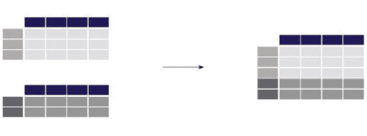

图 18-5 Pandas 中的连接

现在让我们看看如何使用 **pd.concat()** 函数合并这两个 DataFrame 中的数据。

```
In [22]: mpg_all = pd.concat([mpg_4, mpg_f, mpg_r],
                axis = 0)
```

```
In [23]: mpg_all
```

Out[23]:

| manufacturer | model | displ | year | cyl | trans | drv | cty | hwy | fl | class |
|---|---|---|---|---|---|---|---|---|---|---|
| audi | a4 quattro | 1.8 | 1999 | 4 | manual(m5) | 4 | 18 | 26 | p | compact |
| audi | a4 quattro | 1.8 | 1999 | 4 | auto(l5) | 4 | 16 | 25 | p | compact |
| audi | a4 quattro | 2.0 | 2008 | 4 | manual(m6) | 4 | 20 | 28 | p | compact |
| audi | a4 quattro | 2.0 | 2008 | 4 | auto(s6) | 4 | 19 | 27 | p | compact |
| audi | a4 quattro | 2.8 | 1999 | 6 | auto(l5) | 4 | 15 | 25 | p | compact |
| ... | ... | ... | ... | ... | ... | ... | ... | ... | ... | ... |
| ford | mustang | 4.6 | 2008 | 8 | auto(l5) | r | 15 | 22 | r | subcompact |
| ford | mustang | 5.4 | 2008 | 8 | manual(m6) | r | 14 | 20 | p | subcompact |
| lincoln | navigator 2wd | 5.4 | 1999 | 8 | auto(l4) | r | 11 | 17 | r | suv |
| lincoln | navigator 2wd | 5.4 | 1999 | 8 | auto(l4) | r | 11 | 16 | p | suv |
| lincoln | navigator 2wd | 5.4 | 2008 | 8 | auto(l6) | r | 12 | 18 | r | suv |

[234 行 x 10 列]

**pd.concat()** 接收一个 DataFrame 的 **列表** 作为输入，然后根据 **axis** 参数将它们合并。正如你所记得的，行（垂直轴）的 axis 值为 0，列（水平轴）的 axis 值为 1。

在这里，你会注意到，合并后，`mpg_all` DataFrame 有 234（103 + 106 + 25）行和 10 列。

如果你使用过任何电子表格程序，比如 Excel，你会认出这就是通过匹配列，将一行行数据上下合并的过程。

### 18.7.2 使用公共标识符进行连接

如果你使用过像 Microsoft Excel 这样的电子表格程序，你可能需要使用 "Vlookup" 函数，通过一个公共标识符来连接两个不同表中的列。这个标识符就是我们在 Excel 中进行 "查找" 的依据。在这里，这种方法更加强大和灵活。

如果你注意到 mpg 数据集，你会发现没有一个列具有唯一值。因此，使用其中任何一个进行连接都会导致错误。所以，我们将在这里使用泰坦尼克号数据集，但将其拆分为两个新的数据集，每个包含选定的列，以演示如何使用公共标识符将它们连接起来。

我们将使用 "Name" 作为公共标识符。

你可以从下面的链接下载它：

https://github.com/nilabhnishchhal/Python-Made-Easy/blob/master/titanic.csv

这是一个 Github 仓库链接。当你打开它时，你会看到 "raw" 标签页。右键单击该标签页，使用 "Save link as.." 选项。将文件保存到你机器的基础文件夹中，并将文件扩展名更改为 **.csv**。

现在你的机器基础文件夹中就有了 titanic.csv 数据集。让我们开始处理它。

```
In [24]: titanic = pd.read_csv("titanic.csv")

titanic.head()
```

```
Out[24]:
   PassengerId  Survived  Pclass  \n0            1         0       3   
1            2         1       1   
2            3         1       3   
3            4         1       1   
4            5         0       3   

                                                Name     Sex   Age  SibSp  \n0                            Braund, Mr. Owen Harris    male  22.0      1   
1  Cumings, Mrs. John Bradley (Florence Briggs Th...  female  38.0      1   
2                             Heikkinen, Miss. Laina  female  26.0      0   
3       Futrelle, Mrs. Jacques Heath (Lily May Peel)  female  35.0      1   
4                           Allen, Mr. William Henry    male  35.0      0   

   Parch            Ticket     Fare Cabin Embarked
0      0         A/5 21171   7.2500   NaN        S
1      0          PC 17599  71.2833   C85        C
2      0  STON/O2. 3101282   7.9250   NaN        S
3      0            113803  53.1000  C123        S
4      0            373450   8.0500   NaN        S
```

```
In [25]: dataset1 = titanic[["Name", "Sex", "Age"]]
        dataset1
```

```
Out[25]:
```

| | Name | Sex | Age |
|---|---|---|---|
| 0 | Braund, Mr. Owen Harris | male | 22.0 |
| 1 | Cumings, Mrs. John Bradley (Florence Briggs Th... | female | 38.0 |
| 2 | Heikkinen, Miss. Laina | female | 26.0 |
| 3 | Futrelle, Mrs. Jacques Heath (Lily May Peel) | female | 35.0 |
| 4 | Allen, Mr. William Henry | male | 35.0 |
| ... | ... | ... | ... |
| 886 | Montvila, Rev. Juozas | male | 27.0 |
| 887 | Graham, Miss. Margaret Edith | female | 19.0 |
| 888 | Johnston, Miss. Catherine Helen "Carrie" | female | NaN |
| 889 | Behr, Mr. Karl Howell | male | 26.0 |
| 890 | Dooley, Mr. Patrick | male | 32.0 |

```
[891 rows x 3 columns]
```

```
In [26]: dataset2 = titanic[["Name", "Pclass",
        "Cabin"]]
```

#### dataset2

Out[26]:

| | Name | Pclass | Cabin |
|---|---|---|---|
| 0 | Braund, Mr. Owen Harris | 3 | NaN |
| 1 | Cumings, Mrs. John Bradley (Florence Briggs Th... | 1 | C85 |
| 2 | Heikkinen, Miss. Laina | 3 | NaN |
| 3 | Futrelle, Mrs. Jacques Heath (Lily May Peel) | 1 | C123 |
| 4 | Allen, Mr. William Henry | 3 | NaN |
| ... | ... | ... | ... |
| 886 | Montvila, Rev. Juozas | 2 | NaN |
| 887 | Graham, Miss. Margaret Edith | 1 | B42 |
| 888 | Johnston, Miss. Catherine Helen "Carrie" | 3 | NaN |
| 889 | Behr, Mr. Karl Howell | 1 | C148 |
| 890 | Dooley, Mr. Patrick | 3 | NaN |

[891 rows x 3 columns]

现在我们有了两个 DataFrame 集，每个都有 891 行，并且每个都包含一个公共标识符列。当我们合并这两个 DataFrame 时，Pandas 会读取两个 DataFrame 中的公共标识符，并相应地连接行。我们使用 **pd.merge()** 函数来执行此操作。

```
In [27]: merged_dataset = pd.merge(dataset1,
                                dataset2, how="left", on= "Name")

        merged_dataset
```

Out[27]:

| | Name | Sex | Age | Pclass | Cabin |
|---|---|---|---|---|---|
| 0 | Braund, Mr. Owen Harris | male | 22.0 | 3 | NaN |
| 1 | Cumings, Mrs. John Bradley (Florence Briggs Th... | female | 38.0 | 1 | C85 |
| 2 | Heikkinen, Miss. Laina | female | 26.0 | 3 | NaN |
| 3 | Futrelle, Mrs. Jacques Heath (Lily May Peel) | female | 35.0 | 1 | C123 |
| 4 | Allen, Mr. William Henry | male | 35.0 | 3 | NaN |
| ... | ... | ... | ... | ... | ... |
| 886 | Montvila, Rev. Juozas | male | 27.0 | 2 | NaN |
| 887 | Graham, Miss. Margaret Edith | female | 19.0 | 1 | B42 |
| 888 | Johnston, Miss. Catherine Helen "Carrie" | female | NaN | 3 | NaN |
| 889 | Behr, Mr. Karl Howell | male | 26.0 | 1 | C148 |
| 890 | Dooley, Mr. Patrick | male | 32.0 | 3 | NaN |

[891 rows x 5 columns]

你可以看到，merged_dataset 具有相同的 891 行和 5 列（3+3 - 1 个公共列）。

两个表都有一个共同的列 "Name"，它被用作组合信息的键。通过选择左连接，只有 "dataset1"（左表）中存在的名称才会出现在结果表中。最终，这里两个数据集中的名称是相同的，但当你进行一些真实世界的数据连接，并且必须决定在公共标识符选择方面哪个表占主导地位时，这种方法特别有用。

## 18.8 总结：

通过将输出赋值给 DataFrame 并在 [] 之间指定新列名来创建新列。操作是按元素进行的，无需遍历行。使用 **rename** 配合字典或函数来重命名行标签或列名。聚合统计可以在整个列或行上计算。**groupby** 提供了拆分-应用-合并模式的强大功能。**value_counts** 是计算变量每个类别中条目数量的便捷快捷方式。**sort_values** 支持按一列或多列排序。多个表可以使用 **concat** 函数按行或按列进行连接。对于类似数据库的表合并/连接，请使用 **merge** 函数。

# 19
## PYTHON 中的可视化

### 19.1 可视化

> "一图胜千言"。Robert G Barnard

对于数据科学家或任何处理数据的人来说，没有比这更好的方式来解释可视化了。一个数据集，无论大小，当用图像、图表或图形表示时，它向分析师以及任何看到它的人传达了意义。数据可视化在表示小规模和大规模数据方面都起着至关重要的作用。

#### 19.1.1 数据可视化的重要性

数据科学家的关键技能之一是讲述引人入胜故事的能力。为了首先理解数据以编写那个故事，分析师会以多种形式可视化数据，直到原始数据开始对他有意义。数据中的模式以视觉形式更好地显现出来。

因此，学习如何利用软件工具来可视化数据，将使你能够提取信息，更好地理解数据，并做出更有效的决策。

Python 为任何人和每个人提供了丰富而庞大的资源来可视化数据。有许多库允许并协助制作和呈现各种图像和图表。我们将在本章中介绍一些最重要的库，但首先我们将了解数据可视化的基础知识。

#### 19.1.2 基础可视化

本章使用的数据是关于 NO2 的空气质量数据，由 openaq 提供，并使用 py-openaq 包。"air_quality_no2.csv" 数据集提供了位于巴黎、安特卫普和伦敦的测量站 FR04014、BETR801 和 London Westminster 的 NO2 值。

这是用于教授数据操作和数据科学基础知识的最常用数据集之一。

你可以从下面的链接下载它：

https://github.com/nilabhnishchhal/Python-Made-Easy/blob/master/air_quality_no2.csv

这是一个 Github 仓库链接。当你打开它时，你会看到 "raw" 标签页。右键单击该标签页，使用 "Save link as.." 选项。将文件保存到你机器的基础文件夹中，并将文件扩展名更改为 .csv。

现在你的机器基础文件夹中就有了 "air_quality_no2.csv" 数据集。让我们开始处理它。

让我们首先使用 pandas 在 python 中读取数据，并使用 Matplotlib 创建绘图。因此，按照惯例，我们将在开始时导入所有依赖项。

```
In [1]: import pandas as pd
        import matplotlib.pyplot as plt
        %matplotlib inline
```

> 注意：%matplotlib inline 是一个魔法命令，它告诉 Jupyter notebook 在 notebook 本身中渲染绘图和图像。

In [2]: air_quality =
        pd.read_csv("air_quality_no2.csv",
        index_col=0, parse_dates=True)

In [3]: air_quality.head()

Out[3]:
| datetime | station_antwerp | station_paris | station_london |
|---|---|---|---|
| 2019-05-07 02:00:00 | NaN | NaN | 23.0 |
| 2019-05-07 03:00:00 | 50.5 | 25.0 | 19.0 |
| 2019-05-07 04:00:00 | 45.0 | 27.7 | 19.0 |
| 2019-05-07 05:00:00 | NaN | 50.4 | 16.0 |
| 2019-05-07 06:00:00 | NaN | 61.9 | NaN |

注意：这里使用了 **read_csv** 函数的 **index_col** 和 **parse_dates** 参数，分别用于将第一列（第0列）定义为生成的 DataFrame 的索引，并将该列中的日期转换为 Timestamp 对象。

### 19.1.3 Pandas 中的基本折线图

使用 **matplotlib** 和 **pandas** 创建图表非常简单。只需一个简单的方法，而且方法名称也直观明了。

**plot()** 可以从 pandas DataFrame 以及 pandas Series 对象创建图表。这样创建的图表本身就是对象。⁸¹

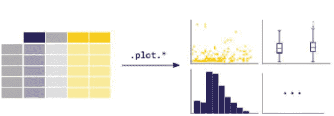

当我们想要快速检查数据时，可以绘制图表来看看。

In [4]: air_quality.plot()

Out[4]: <matplotlib.axes._subplots.AxesSubplot at 0x24f066ced08>

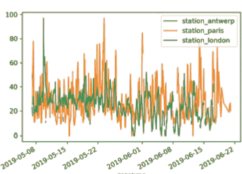

如上所示，我们没有为坐标轴、标签或任何颜色指定任何值。这是最简单的默认图表，它为我们提供了按日期和城市划分的 NO2 水平概览。

对于 DataFrame，pandas 默认为每个包含数值数据的列创建一条折线图。

如果我们只想查看一个城市（例如伦敦）的 NO2 水平怎么办？正如我们在 Pandas 中所学，我们可以轻松地提取出该列作为一个 pandas Series 对象。让我们这样做，正如我之前所说，Series 和 DataFrame 都有 .plot() 方法。那么，让我们看看 pandas Series 如何响应 plot。

In [5]: air_quality["station_london"].plot()

Out[5]: <matplotlib.axes._subplots.AxesSubplot at 0x24f0a5df908>

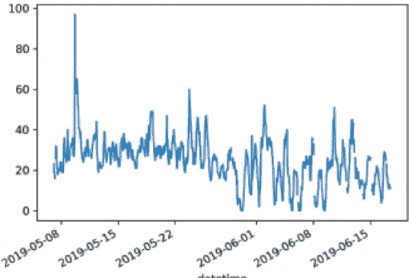

图 19-3 Pandas 绘图的折线图

要绘制特定列，你可以使用子集数据（Series）的选择方法与 **plot()** 方法结合使用。因此，**plot()** 方法同时适用于 Series 和 DataFrame。

### 19.1.4 Pandas 中的基本散点图

我们看到了以列对日期时间值形式绘制的内联图表。现在我们想比较两列，看看它们彼此之间的表现如何。当它们位于不同的坐标轴上时，就可以做到这一点。让我们在散点图中绘制伦敦与巴黎的数据。

In [6]: air_quality.plot.scatter(x = "station_london", y = "station_paris")

Out[6]: <matplotlib.axes._subplots.AxesSubplot at 0x24f0a31c308>

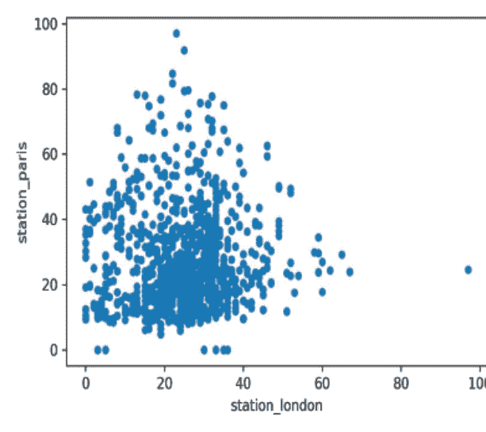

图 19-4 Pandas 绘图的散点图

这是一个基本的散点图。我们可以根据 **.plot()** 方法可用的参数和关键字参数更改许多设置。我们稍后会看到所有这些，但现在，我将向你展示一个。散点图的点可以设置得更透明一些，这样就更容易看出图表中哪些区域的数据点更密集。

In [7]: air_quality.plot.scatter(x = "station_london", y = "station_paris", alpha = 0.5)

Out[7]: <matplotlib.axes._subplots.AxesSubplot at 0x24f0a6c2508>

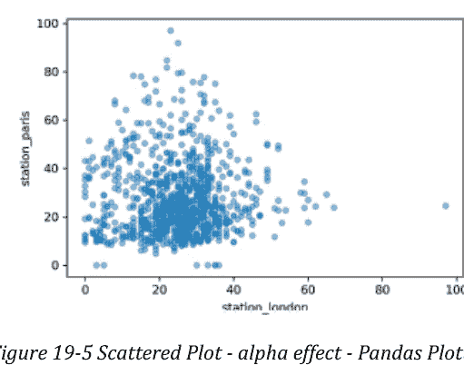

"alpha" 的值在 0 到 1 之间变化。更改上面代码中 "alpha" 的值，看看图表在不同值下有何不同。

### 19.1.5 其他绘图方法

除了使用 plot 函数时的默认折线图外，还有多种替代方法可用于绘制数据。让我们使用一些标准 Python 代码来概览可用的绘图方法：

In [8]: dir(air_quality.plot)

Out[8]: ['__annotations__',
         '__call__',
         '__class__',
         '__delattr__',
         '__dict__',
         '__dir__',
         '__doc__',
         '__eq__',
         '__format__',
         '__ge__',
         '__getattribute__',
         '__gt__',
         '__hash__',
         '__init__',
         '__init_subclass__',
         '__le__',
         '__lt__',
         '__module__',
         '__ne__',
         '__new__',
         '__reduce__',
         '__reduce_ex__',
         '__repr__',
         '__setattr__',
         '__sizeof__',
         '__str__',
         '__subclasshook__',
         '__weakref__',
         '_accessors',
         '_all_kinds',
         '_common_kinds',
         '_constructor',
         '_dataframe_kinds',
         '_deprecations',
         '_dir_additions',
         '_dir_deletions',
         '_ensure_type',
         '_get_call_args',
         '_kind_aliases',
         '_reset_cache',
         '_series_kinds',
         'area',
         'bar',
         'barh',
         'box',
         'density',
         'hexbin',
         'hist',
         'kde',
         'line',
         'pie',
         'scatter']

我们将从上面 **dir()** 函数生成的列表中移除所有以下划线 "_" 开头的项目。这将给出所有可用绘图方法的列表。我使用列表推导式来实现这个目的。

In [9]: [method_name for method_name in
        dir(air_quality.plot) if not
        method_name.startswith("_")]

Out[9]: ['area',
         'bar',
         'barh',
         'box',
         'density',
         'hexbin',
         'hist',
         'kde',
         'line',
         'pie',
         'scatter']

**注意：** 在许多开发环境（文本编辑器和 IDE）以及 ipython 和 jupyter notebook 中，可以使用 TAB 键来概览可用的方法。例如 **air_quality.plot. + TAB**。

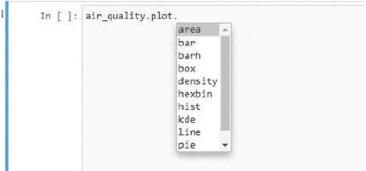

图 19-6 使用 TAB 查看绘图选项

### 19.1.6 Pandas 中的基本箱线图

其中一个选项是 DataFrame.plot.box()，它指的是箱线图。box 方法适用于我们的空气质量示例数据：

In [10]: air_quality.plot.box()

Out[10]: <matplotlib.axes._subplots.AxesSubplot at 0x24f0a738fc8>

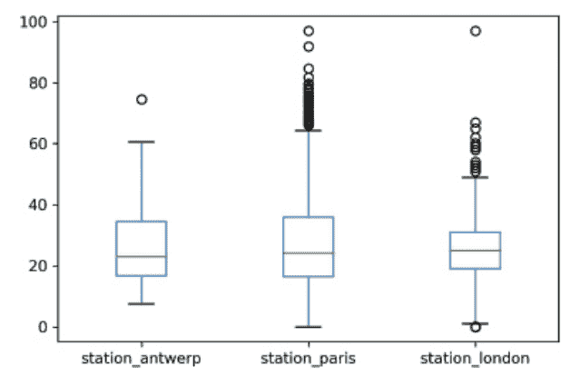

图 19-7 Pandas 绘图的箱线图

### 19.1.7 子图

我们可以将图表拆分为子图。让我们将上面看到的折线图拆分为所有列的独立折线图。

In [11]: air_quality.plot(figsize = (12,4), subplots = True)

Out[11]: array([<matplotlib.axes._subplots.AxesSubplot object at 0x0000024F0A7C3F08>,
       <matplotlib.axes._subplots.AxesSubplot object at 0x0000024F0A7FF248>,
       <matplotlib.axes._subplots.AxesSubplot object at 0x0000024F0A7D1E08>],
      dtype=object)

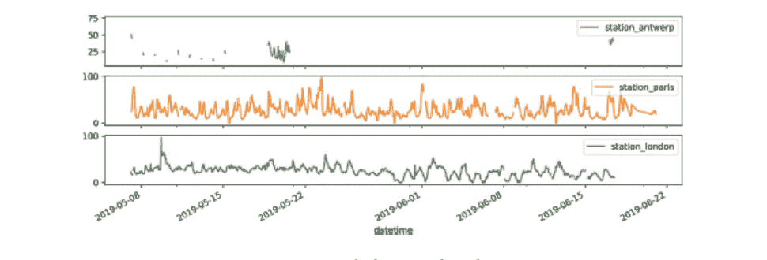

如果你不希望图表上方的输出中显示数组文本，最简单的方法是将绘图赋值给另一个对象。

In [12]: subplots = air_quality.plot(figsize = (12,4), subplots = True)

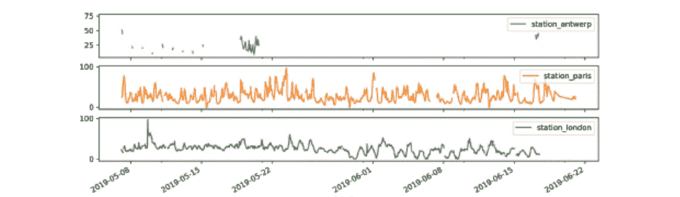

图 19-9 不带输出文本消息的绘图

### 19.1.8 保存图表

如果你想进一步自定义、扩展或保存生成的图表，你可以做到这些以及更多。让我们看看如何进行一些简单的自定义并将图表保存为 pdf 文件。

In [13]: fig, axs = plt.subplots(figsize=(12, 4))
        # 创建一个空的 matplotlib Figure 和 Axes
        air_quality.plot.area(ax=axs)
        # 使用 pandas 将面积图放置在准备好的 Figure/Axes 上
        axs.set_ylabel("NO$_2$ concentration")
        # 进行任何你喜欢的 matplotlib 自定义
        fig.savefig("no2_concentrations.pdf")
        # 使用现有的 matplotlib 方法保存 Figure/Axes。

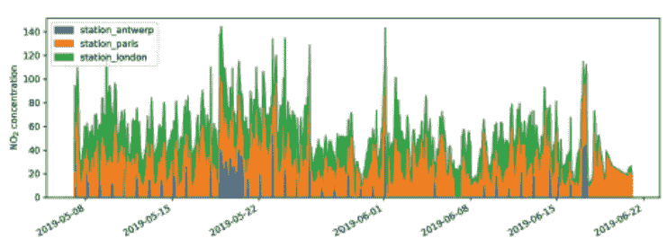

图 19-10 保存图表 Pandas 绘图

现在，如果你查看你的基础文件夹（即你正在处理此笔记本的位置），你会找到 "no2_concentrations.pdf" 文件，其中包含如上所示的图表图像。

pandas 创建的每个绘图对象都是一个 matplotlib 对象。Matplotlib 提供了大量自定义图表的选项，明确建立 pandas 和 Matplotlib 之间的联系，使得绘图能够利用 matplotlib 的全部功能。

## 19.2 Python 中的数据可视化

你已经看到了协作开发和维护的库和模块如何使 Python 成为现在的样子。这是 Python 作为编程语言的真正优势，使其在其他语言中脱颖而出。可视化也不例外。有许多库是基于 Python、NumPy、Pandas 构建的，然后是 Matplotlib，这是最大的可视化库。我们将在这里讨论的每个库都有其独特的价值主张。我们只会对这些库进行介绍，然后学习 pandas 和 Matplotlib 中可视化的基础知识。详细讨论所有其他库，或者甚至只详细讨论 Matplotlib，都需要单独写一本书。

- Matplotlib

### 19.2.1 Matplotlib


图 19-11 Matplotlib 标志

**Matplotlib** 是 Python 中进行数据图形化可视化的最基础库。它包含了几乎所有你能想到的图表类型。基础并不意味着不强大，我们即将讨论的许多其他数据可视化库都建立在它之上。

matplotlib 是 Python 数据可视化库中的王者。尽管已有十多年历史，它仍然是 Python 社区中使用最广泛的绘图库。它的设计初衷是与 MATLAB（一种在 1980 年代开发的专有编程语言）高度相似。

由于 matplotlib 是第一个 Python 数据可视化库，许多其他库都建立在它之上，或者在分析过程中被设计为与之协同工作。一些库，如 pandas 和 Seaborn，是 matplotlib 的“封装器”。它们允许你用更少的代码来访问 matplotlib 的多种方法。

Matplotlib 的图表由两个主要部分组成：坐标轴（界定图表区域的线条）和图形（我们在其中绘制坐标轴、标题以及超出坐标轴区域的内容）。我们已经在上面的图表中看到了 matplotlib 与 pandas 的实际应用。我们将在下一章看到更多关于 Matplotlib 的内容。

### 19.2.2 Seaborn<sup>82</sup>

如果你正在处理统计数据并需要对其进行可视化，**Seaborn** 是首选的库。

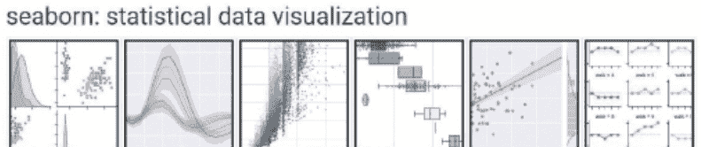

*图 19-12 Seaborn*

Seaborn 是一个基于 matplotlib 的 Python 数据可视化库。它提供了一个高级接口，用于绘制美观且信息丰富的统计图形。Seaborn 是一个用于在 Python 中制作统计图形的库。它建立在 matplotlib 之上，并与 pandas 数据结构紧密集成。

以下是 Seaborn 提供的一些功能：

-   一个面向数据集的 API，用于检查多个变量之间的关系
-   对使用分类变量来显示观测值或聚合统计量的专门支持
-   用于可视化单变量或双变量分布以及在数据子集之间进行比较的选项
-   用于不同类型因变量的线性回归模型的自动估计和绘图
-   查看复杂数据集整体结构的便捷视图
-   用于构建多图网格的高级抽象，让你轻松构建复杂的可视化
-   通过几个内置主题对 matplotlib 图形样式进行简洁控制
-   用于选择能忠实揭示数据中模式的调色板的工具

Seaborn 旨在使可视化成为探索和理解数据的核心部分。其面向数据集的绘图函数在包含整个数据集的 DataFrame 和数组上操作，并在内部执行必要的语义映射和统计聚合，以生成信息丰富的图表。

在我们继续介绍其他库之前，让我们先看一个 Seaborn 图表的例子。“tips”是 Seaborn 的一个内置数据集，在下面的示例中被加载。你可以在安装 Seaborn 后在你的机器上运行这段代码。

```
In [14]: import seaborn as sns
        sns.set()
        tips = sns.load_dataset("tips")
        sns.relplot(x="total_bill", y="tip",
                    col="time",
                    hue="smoker", style="smoker",
                    size="size",
                    data=tips);
```

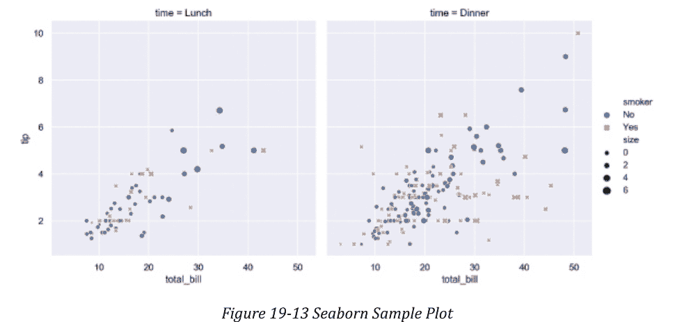

### 19.2.3 ggplot

ggplot 基于 R 的绘图系统 ggplot2 以及《图形语法》中的概念。ggplot 的操作方式与 matplotlib 不同：它允许你通过叠加组件来创建完整的图表。例如，你可以从坐标轴开始，然后添加点，再添加线条、趋势线等。尽管《图形语法》被誉为一种“直观的”绘图方法，但经验丰富的 matplotlib 用户可能需要时间来适应这种新的思维方式。

根据其创建者的说法，ggplot 并非为创建高度定制化的图形而设计。它牺牲了复杂性，以换取更简单的绘图方法。

ggplot 与 pandas 紧密集成，因此在使用 ggplot 时，最好将数据存储在 DataFrame 中。

### 19.2.4 Bokeh<sup>83</sup>


图 19-14 Bokeh 标志

与 ggplot 类似，**Bokeh** 也基于《图形语法》。但与 ggplot 不同的是，它是 Python 的原生库，而非从 R 移植而来。它的优势在于能够创建交互式的、适用于 Web 的图表，这些图表可以轻松输出为 JSON 对象、HTML 文档或交互式 Web 应用程序。Bokeh 还支持流式和实时数据。

Bokeh 是一个交互式可视化库，其目标是在现代 Web 浏览器中进行展示。它适用于：

-   在现代浏览器中进行交互式可视化
-   独立的 HTML 文档，或服务器支持的应用程序
-   表现力强且用途广泛的图形
-   大型、动态或流式数据
-   从 Python（或 Scala，或 R，或...）轻松使用

最重要的是：

无需 JavaScript

Bokeh 是一个面向现代 Web 浏览器的交互式可视化库。它提供了优雅、简洁的方式来构建多功能图形，并在大型或流式数据集上提供高性能的交互性。Bokeh 可以帮助任何想要快速轻松地创建交互式图表、仪表板和数据应用程序的人。

### 19.2.5 Folium<sup>84</sup>

**folium** 使得在交互式 Leaflet 地图上可视化在 Python 中处理过的数据变得容易。它既支持将数据绑定到地图以进行等值区域图可视化（等值区域图是一种专题地图，其中区域根据代表每个区域内地理特征聚合摘要（如人口密度或人均收入）的统计变量进行着色或图案填充），也支持将丰富的矢量/栅格/HTML 可视化作为标记传递到地图上。

该库包含许多来自 OpenStreetMap、Mapbox 和 Stamen 的内置图块集，并支持使用 Mapbox 或 Cloudmade API 密钥的自定义图块集。folium 支持 Image、Video、GeoJSON 和 TopoJSON 覆盖层。

Folium 是一个强大的 Python 库，可帮助你创建多种类型的 Leaflet 地图。Folium 结果具有交互性这一事实使得该库对于构建仪表板非常有用。要获得直观感受，只需在下面的地图上缩放/点击即可。Folium 的 GitHub 包含许多其他示例。

```
In [15]: import folium
        m = folium.Map(location=[45.5236,
        -122.6750])
```

```
In [16]: m
```

```
Out[16]: <folium.folium.Map at 0x24f0ce58948>
```


图 19-15 使用 folium 进行地理绘图

### 19.2.6 Gleam

**Gleam** 让你能够使用 Python 构建交互式 Web 数据可视化：无需 HTML 或 JS 知识！你可以选择用户可以控制的多个输入，然后使用任何 Python 绘图库根据这些输入创建图表。Gleam 将所有这些整合在一起，创建了一个 Web 界面，让任何人都可以实时地操作你的数据。现在，帮助他人理解和解释你的数据比以往任何时候都更加容易。Gleam 的灵感来源于 R 中的 Shiny 包。<sup>85</sup>

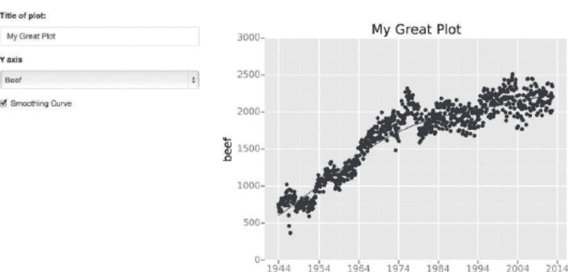

图 19-16 Gleam 绘图示例

## 19.3 总结

可视化是数据分析中不可或缺且重要的一部分。任何数据科学专业人士都必须很好地掌握可视化概念，并了解为此目的可用的各种库。我们在本章中看到了使用 pandas 进行的基本绘图。简单而有效的 **.plot()** 方法。**.plot.*** 方法同时适用于 Series 和 DataFrame。默认情况下，每一列都被绘制为不同的元素（折线图、箱线图等）。pandas 创建的任何图表都是一个 Matplotlib 对象。有各种图表选项可供使用，可以通过 TAB 键访问。子图也是绘制多个图表并进行并排比较的有效工具。Python 中有各种专门用于数据可视化的库。matplotlib 位居所有库之首，但较新的库在其特定任务中可能更强大。本章列出了一些流行的库。

## 20 使用 MATPLOTLIB.PYPLOT 进行可视化

在本章及接下来的两章中，我们将了解如何在 Python 中使用 Matplotlib 创建各种可视化图表、图形甚至图像。Matplotlib 的文档和教程是学习 Python 可视化基础知识的最佳途径。它们从基础内容开始，逐步深入到一些高级主题。本章及下一章关于可视化的讲解很大程度上依赖于 Matplotlib 教程，我谨在此向他们为用户创造的这绝佳学习体验表示感谢。⁸⁶

但在深入 Matplotlib 代码的细节之前，让我们先了解一下 Matplotlib 的起源以及这个库背后的设计理念。

## 20.1 简介与历史⁸⁷

Matplotlib 最初由 John D. Hunter 编写，此后一直拥有活跃的开发社区，并在 BSD 风格的许可证下分发。

**注意：** 以下介绍性文字由 Matplotlib 的原作者 John D. Hunter (1968-2012) 于 2008 年撰写。

Matplotlib 是一个用于在 Python 中绘制二维数组图形的库。虽然它起源于模仿 MATLAB 的图形命令，但它独立于 MATLAB，并且可以以 Pythonic 的、面向对象的方式使用。尽管 Matplotlib 主要用纯 Python 编写，但它大量使用了 NumPy 和其他扩展代码，即使对于大型数组也能提供良好的性能。

Matplotlib 的设计理念是，你应该能够只用几个命令，甚至一个命令，就能创建简单的图形。如果你想查看数据的直方图，你不需要实例化对象、调用方法、设置属性等等；它应该直接就能工作。

- Matplotlib 代码在概念上分为三个部分：**pylab 接口**是 matplotlib.pylab 提供的一组函数，允许用户使用与 MATLAB 图形生成代码非常相似的代码来创建图形。
- **Matplotlib 前端或 Matplotlib API** 是执行繁重工作的类集合，用于创建和管理图形、文本、线条、绘图等。这是一个抽象接口，对输出一无所知。
- **后端**是设备相关的绘图设备，也称为渲染器，它们将前端表示转换为硬拷贝或显示设备。
- **Matplotlib 的原始标志（2003 -- 2008）。**

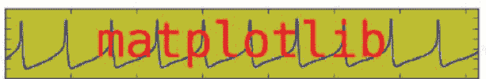

图 20-1 Matplotlib 的原始标志（2003 -- 2008）Matplotlib 标志（2008 - 至今）。

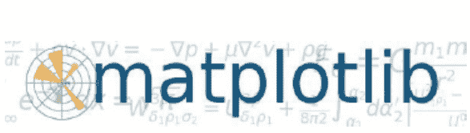

图 20-2 Matplotlib 标志（2008 - 至今）**如何使用 Matplotlib？**

本章包含一个更深入的 Matplotlib 使用指南。我们将从最基础的内容开始。

Matplotlib 将你的数据绘制在 **图形**（即窗口、Jupyter 小部件等）上，每个图形可以包含一个或多个坐标轴（即一个可以用 x-y 坐标（或极坐标图中的 theta-r，或三维图中的 x-y-z 等）指定点的区域）。创建带有坐标轴的 *图形* 最简单的方法是使用 **pyplot.subplots**。然后我们可以使用 **Axes.plot** 在坐标轴上绘制一些数据：

```
In [1]: import matplotlib.pyplot as plt import numpy as np
```

```
In [2]: fig, ax = plt.subplots() # 创建一个包含单个坐标轴的图形。
```

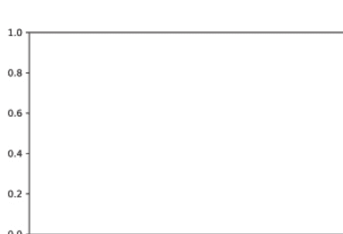

图 20-3 带有单个坐标轴的 Matplotlib 图形对象 上面的代码行创建了两个对象，并将它们分别赋值给 "fig" 和 "ax" 变量。让我们通过调用变量来看看这两个对象是什么。

```
In [3]:    fig
```

```
Out[3]:
```

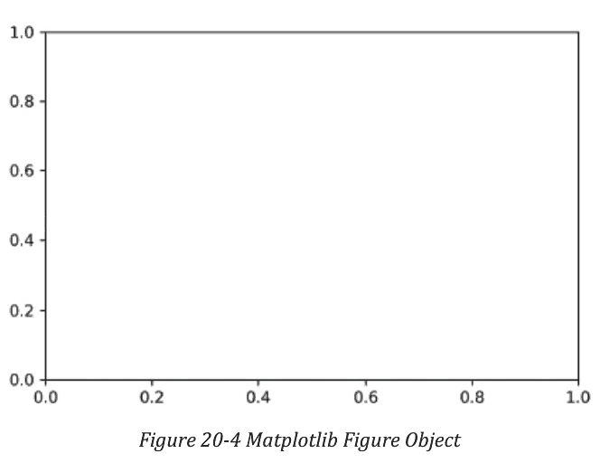

```
In [4]:    ax
```

```
Out[4]:    <matplotlib.axes._subplots.AxesSubplot at
0x1ab25c03708>
```

所以我们在这里创建了一个 "图形"。如你所见，它只是一个空白画布，你可以在上面绘制图形。那么让我们开始绘制吧。另一个对象是 **坐标轴** 对象，绘图将在此对象上进行。

```
In [5]:    fig, ax = plt.subplots() # 创建一个包含单个坐标轴的图形。
ax.plot([1, 2, 3, 4], [1, 4, 2, 3]) # 在坐标轴上绘制一些数据。
```

```
Out[5]:    [<matplotlib.lines.Line2D at 0x1ab27a5d248>]
```

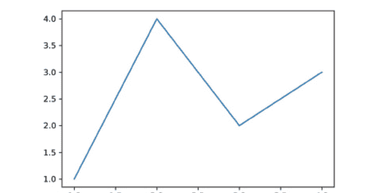

图 20-5 在坐标轴对象上的折线图 许多其他绘图库或语言不需要你显式地创建坐标轴。

你也可以在 Matplotlib 中这样做：对于每个 Axes 绘图方法，在 **matplotlib.pyplot** 模块中都有一个对应的函数，该函数在 "当前" 坐标轴上执行该绘图，如果坐标轴（及其父图形）尚不存在，则会创建它们。因此，前面的示例可以更简洁地写成

```
In [6]: plt.plot([1, 2, 3, 4], [1, 4, 2, 3]) # Matplotlib 绘图。
```

```
Out[6]: [<matplotlib.lines.Line2D at 0x1ab27de7f48>]
```

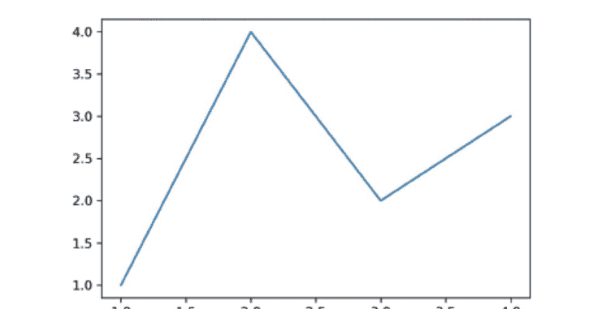

图 20-6 使用 plt.plot 方法的折线图 **Matplotlib 对象层次结构** *一个非常重要的 Matplotlib 概念是其对象层次结构。*

Matplotlib 图形的最外层容器是 Figure 对象，它可以包含多个 Axes 对象。Axes 这个名字对初学者来说可能有点令人困惑。一个 Axes 对象或 Axes 是单个绘图或单个图形。它不是 "axis"（轴）的复数形式，尽管听起来可能像。

你可以将 Figure 对象想象成一个盒子状的容器，里面装着一个或多个 Axes（实际的绘图）。然后是更小的对象，它们在层次结构中位于 Axes 之下，例如刻度线、单条线、图例和文本框。图表的几乎每个 "元素" 都是它自己的 Python 对象，可以被操作，一直到刻度和标签：88

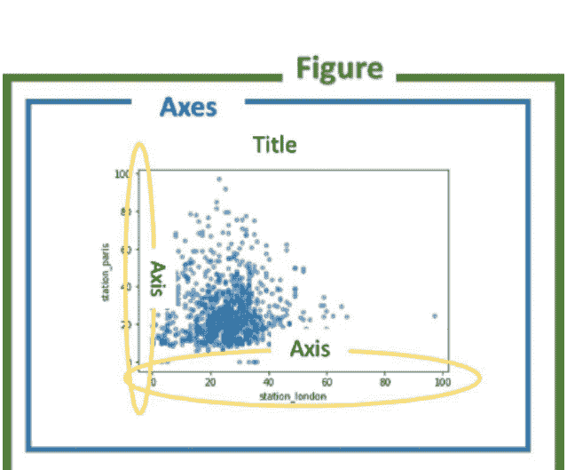

图 20-7 matplotlib 对象层次结构 **绘图函数的输入类型** *所有绘图函数都期望 **numpy.array** 或 **numpy.ma.masked_array** 作为输入。像 **pandas 数据对象** 和 **numpy.matrix** 这样的 '类数组' 类型可能按预期工作，也可能不工作。最好在绘图前将它们转换为 **numpy.array** 对象。*

例如，转换一个 pandas.DataFrame

```
a = pandas.DataFrame(np.random.rand(4,5), columns = list('abcde')) a_asarray = a.values
```

转换一个 numpy.matrix

```
b = np.matrix([[1, 2], [3, 4]]) b_asarray = np.asarray(b)
```

## 20.3 图形的组成部分 现在，让我们更深入地了解 Matplotlib 图形的组成部分。⁸⁹

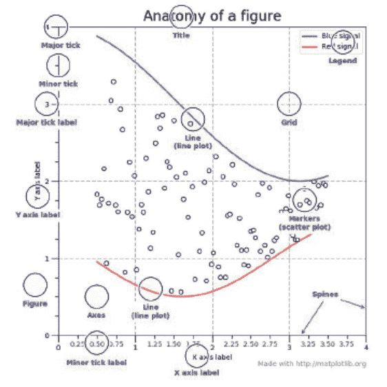

图 20-8 Matplotlib 图形的解剖 **图形** 整个图形。图形跟踪所有子 **Axes**、一些 '特殊' 艺术家（标题、图形图例等）以及 **画布**。（不要过于担心画布，它至关重要，因为它是绘制图形以获得你的绘图的对象，但作为用户，它对你来说或多或少是不可见的）。一个图形可以包含任意数量的 **Axes**，但通常至少有一个。

创建新图形最简单的方法是使用 **pyplot**：

```
In [7]: fig = plt.figure() # 一个没有 Axes 的空图形
fig, ax = plt.subplots() # 一个带有单个 Axes 的图形
fig, axs = plt.subplots(2, 2) # 一个带有 2x2 网格 Axes 的图形
```

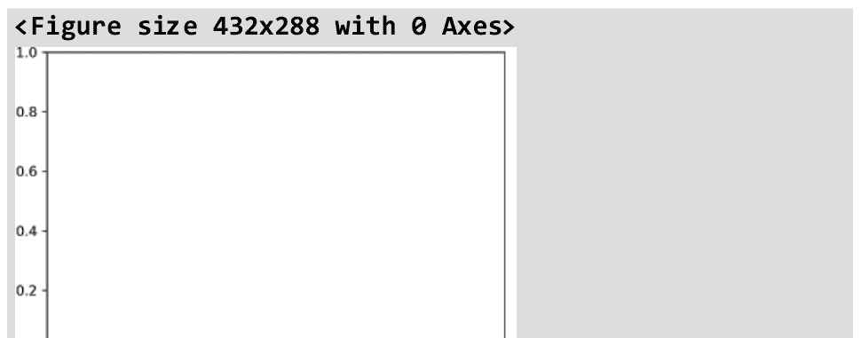

图 20-9 没有 Axes 的空图形

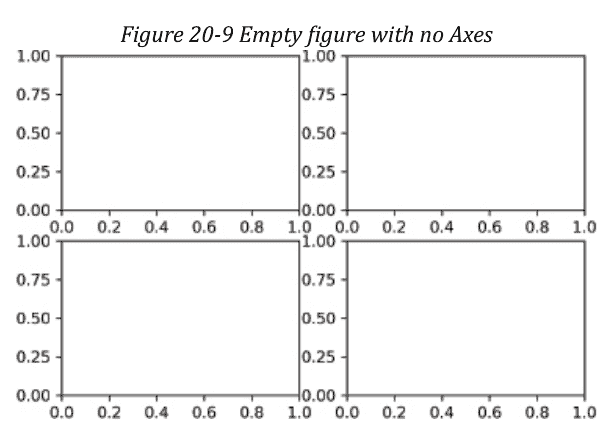

图 20-10 带有 2x2 网格中 4 个 Axes 的图形 将坐标轴与图形一起创建很方便，但你也可以稍后添加坐标轴，从而允许更复杂的坐标轴布局。

### 20.3.2 坐标轴

这就是你认为的 '一个绘图'，它是图像中具有数据空间的区域。一个给定的图形可以包含多个坐标轴，但一个给定的坐标轴对象只能在一个图形中。坐标轴包含两个（在三维情况下是三个）轴对象（注意 Axes 和 Axis 之间的区别），它们负责处理数据限制（数据限制也可以通过 axes.Axes.set_xlim() 和 axes.Axes.set_ylim() 方法控制）。每个坐标轴都有一个标题（通过 set_title() 设置）、一个 x 标签（通过 set_xlabel() 设置）和一个 y 标签（通过 set_ylabel() 设置）。

Axes 类及其成员函数是使用面向对象接口的主要入口点。

### 20.3.3 轴

这些是类似数轴的对象。它们负责设置图形限制并生成刻度（轴上的标记）和刻度标签（标记刻度的字符串）。刻度的位置由 Locator 对象确定，刻度标签字符串由 Formatter 格式化。正确的 Locator 和格式化器可以对刻度位置和标签进行非常精细的控制。

### 20.3.4 艺术家

基本上，你在图形上看到的所有东西都是一个艺术家（甚至 Figure、Axes 和 Axis 对象也是）。这包括 Text 对象、Line2D 对象、集合对象、Patch 对象……（你懂的）。当图形被渲染时，所有的艺术家都会被绘制到画布上。大多数艺术家都绑定到一个 Axes；这样的艺术家不能被多个 Axes 共享，也不能从一个 Axes 移动到另一个。

## 20.4 Matplotlib 接口

使用 Matplotlib 本质上主要有两种方式：面向对象接口和 pyplot 接口。

### 0.4.1

**面向对象接口** 在这种特定的接口中，或者我可以说，如果你选择这种特定的方式来使用 Matplotlib，那么你将显式地创建图形和坐标轴，并在它们上调用方法（“面向对象（OO）风格”）。

面向对象风格接口示例：

```
In [8]: x = np.linspace(0, 2, 100) # 创建一个numpy数组作为本例的绘图数据。

#### 注意即使在OO风格中，我们也使用`.pyplot.figure`来创建图形。

fig, ax = plt.subplots() # 创建一个图形和一个坐标轴 ax.plot(x, x, label = "linear") # 在坐标轴上绘制一些数据 ax.plot(x, x**2, label = "quardratic") # 在坐标轴上绘制更多数据...
ax.plot(x, x**3, label = "cubic") # 以及更多数据...
ax.set_xlabel('x label') # 为坐标轴添加x标签。
ax.set_ylabel('y label') # 为坐标轴添加y标签。
ax.set_title("Simple Plot") # 为坐标轴添加标题。
ax.legend() # 添加图例。
```

```
Out[8]: <matplotlib.legend.Legend at 0x1ab275ef3c8>
```

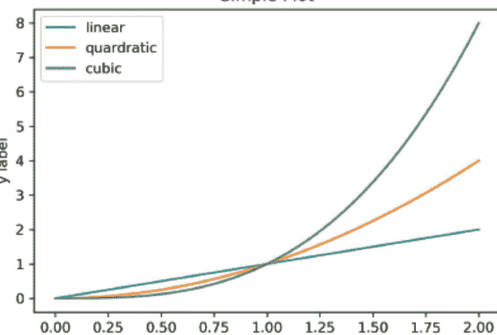

图 20-11 Matplotlib 中的面向对象绘图 **pyplot 接口** *在这种特定的接口中，或者我可以说，如果你选择这种特定的方式来使用 Matplotlib，你不是手动创建图形和坐标轴，而是依赖 pyplot 自动创建和管理图形和坐标轴，并使用 pyplot 函数进行绘图。*

我们现在将看到与上面相同的示例，但使用 pyplot 接口进行比较。

```
python
In [9]: x = np.linspace(0, 2, 100) plt.plot(x, x,
        label = "linear")       # 在坐标轴上绘制一些数据
        plt.plot(x, x**2, label =
        "quardratic")       # 在坐标轴上绘制更多数据...
        plt.plot(x, x**3, label = "cubic")       #
        以及更多数据...
        plt.xlabel('x label')       # 为坐标轴添加x标签。
        plt.ylabel('y label')       # 为坐标轴添加y标签。
        plt.title("Simple Plot")       # 为坐标轴添加标题。
```

```
plt.legend()    # 添加图例。
```

```
Out[9]: <matplotlib.legend.Legend at 0x1ab27a5dac8>
```

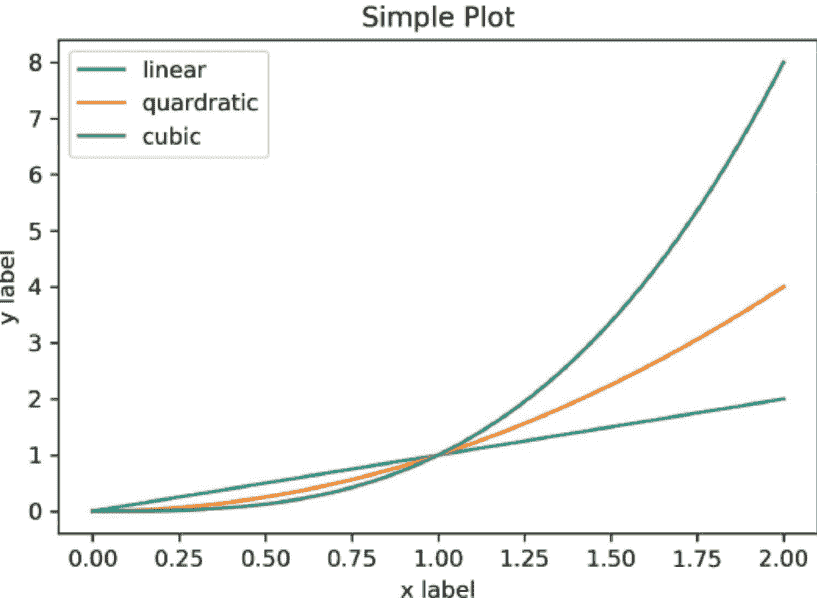

图 20-12 Matplotlib 中的 pyplot 接口绘图 **选择哪种方式？**

Matplotlib 的文档和示例同时使用了 **OO** 和 **pyplot** 两种方法。两者功能同样强大。你可以随意使用其中任何一种。但是，不建议交替使用两者。我建议你偏好并选择一种风格，并坚持下去。如果你不断混合使用它们，就容易出错。偏好也取决于你最常将 matplotlib 用于何种用途。总的来说，我建议：如果你更喜欢交互式绘图（例如，在 Jupyter notebook 中），或者换句话说，如果你正在创建图表和地图作为演示输出，那么 pyplot 方法更可取。

如果你更喜欢非交互式绘图（在打算作为更大项目一部分重用的函数和脚本中），那么面向对象风格更可取。

## 20.5 使用函数重复绘图

通常你可能会发现自己一遍又一遍地制作相同的图表，但使用不同的数据集，这就需要编写专门的函数来完成绘图。推荐的函数签名类似于：

```
In [10]: def my_plotter(ax, data1, data2, param_dict):
    """
        一个用于创建图表的辅助函数
        参数 ----------
        ax : Axes 要绘制到的坐标轴 data1 : array x数据 data2 : array y数据 param_dict : dict 要传递给ax.plot的关键字参数字典 返回值 -------
        out : list 添加的艺术家列表 """
        out = ax.plot(data1, data2, **param_dict)
        return out
```

此函数可用于以下示例。

```
In [11]: %matplotlib inline
```

```
In [12]: data1, data2, data3, data4 =
    np.random.randn(4, 100) fig, ax =
    plt.subplots(1, 1) my_plotter(ax, data1,
    data2, {'marker': 'x'})
```

Out[12]: [<matplotlib.lines.Line2D at 0x1ab280feac8>]

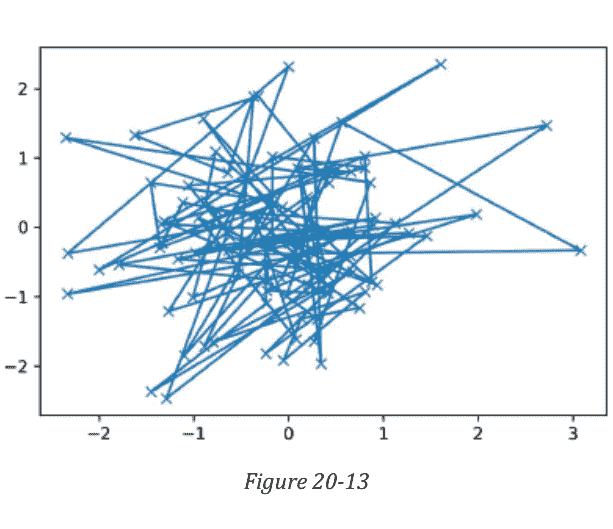

图 20-13

同一个函数也可以用来绘制子图。如果你想有2个子图：

```
In [13]: fig, (ax1, ax2) = plt.subplots(1, 2)
    my_plotter(ax1, data1, data2, {'marker':
    'x'}) my_plotter(ax2, data3, data4,
    {'marker': 'o'})
```

Out[13]: [<matplotlib.lines.Line2D at 0x1ab281c5588>]

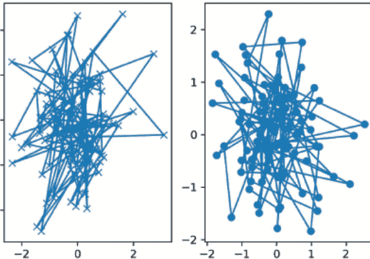

图 20-14

我们看的是非常简单的例子，你可能认为对于如此简单的任务，“函数”方法有些小题大做。但这只是为了说明这个过程。一旦图表开始变得稍微复杂一些，函数的一次性投入就会带来多次回报。

## 20.6 Pyplot<sup>90</sup>

**matplotlib.pyplot** 是一组命令式函数，使 matplotlib 的工作方式类似于 MATLAB。每个 **pyplot** 函数都会对图形进行一些更改：例如，创建一个图形、在图形中创建一个绘图区域、在绘图区域中绘制一些线条、用标签装饰绘图等。

在 **matplotlib.pyplot** 中，各种状态在函数调用之间得以保留，因此它会跟踪诸如当前图形和绘图区域之类的信息，并且绘图函数被定向到当前坐标轴（请注意，这里的“axes”以及文档中的大多数地方指的是图形的坐标轴部分，而不是严格的数学术语“多个轴”）。

**注意：** pyplot API 通常不如面向对象 API 灵活。你在这里看到的大多数函数调用也可以作为 Axes 对象的方法来调用。

使用 pyplot 生成可视化非常快捷：

```
In [14]: import matplotlib.pyplot as plt plt.plot([1, 2, 3, 4]) plt.ylabel('some numbers')
plt.show()
```

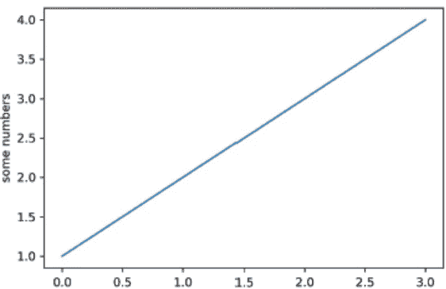

图 20-15

你可能想知道为什么 x 轴范围是 0-3，而 y 轴范围是 1-4。如果你向 **plot()** 命令提供单个列表或数组，matplotlib 会将其视为 y 值的序列，并自动为你生成 x 值。由于 python 的 range 从 0 开始，默认的 x 向量与 y 具有相同的长度，但从 0 开始。因此 x 数据是 [0, 1, 2, 3]。

**plot()** 是一个多功能的命令，可以接受任意数量的参数。例如，要绘制 x 对 y 的图，你可以发出命令：

```
In [15]: plt.plot([1, 2, 3, 4], [1, 4, 9, 16])
```

```
Out[15]: [<matplotlib.lines.Line2D at 0x1ab2824b748>]
```

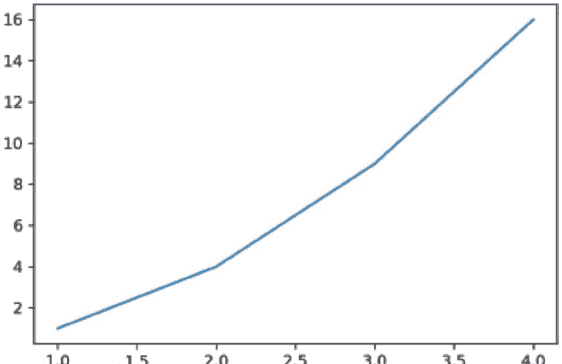

图 20-16

## 20.7 plot() 函数

```
matplotlib.pyplot.plot(\*args, scalex=True,
scaley=True, data=None, \*\*kwargs)
```

这是 plot 函数的定义。让我们看看它是如何被调用的。调用签名如下：

```
plot([x], y, [fmt],*, data = None, **kwargs) 或
plot([x], y, [fmt], [x2], y2, [fmt2], ..., **kwargs)
```

点或线节点的坐标由 x, y 给出。可选参数 **fmt** 是定义基本格式（如颜色、标记和线型）的一种便捷方式。它是下面章节中描述的一种快捷字符串表示法。以下几行解释了简单的 **plot()** 函数。

```
>>> plot(x, y)                # 使用默认线型和颜色绘制x和y
>>> plot(x, y, 'bo')        # 使用蓝色圆圈标记绘制x和y
>>> plot(y)                # 使用x作为索引数组0..N-1绘制y
```

### 20.7.1 绘制带标签的数据
有一种便捷的方法可以绘制带标签数据的对象（即可以通过索引 `obj['y']` 访问的数据）。无需在 `x` 和 `y` 中提供数据，你可以在 `data` 参数中提供对象，然后只需给出 `x` 和 `y` 的标签：

```python
>>> plot('xlabel', 'ylabel', data=obj)
```

所有可索引的对象都受支持。例如，可以是字典、`pandas.DataFrame` 或结构化的 `numpy` 数组。

### 20.7.2 绘制多组数据
有多种方法可以绘制多组数据。

1.  最直接的方法是多次调用 `plot`。示例：
    ```python
    >>> plot(x1, y1, 'bo')
    >>> plot(x2, y2, 'go')
    ```
2.  或者，如果你的数据已经是二维数组，你可以直接将其传递给 `x`、`y`。每一列将绘制一个独立的数据集。示例：一个数组 `a`，其中第一列代表 `x` 值，其他列是 `y` 列：
    ```python
    >>> plot(a[0], a[1:])
    ```
3.  第三种方法是指定多组 `[x]`、`y`、`[fmt]` 组：
    ```python
    >>> plot(x1, y1, 'g^', x2, y2, 'g-')
    ```
    在这种情况下，任何额外的关键字参数都适用于所有数据集。此外，此语法不能与 `data` 参数结合使用。

### 20.7.3 设置样式格式
对于每一对 `x`、`y` 参数，有一个可选的第三个参数，即格式字符串，用于指示绘图的颜色和线型。格式字符串的字母和符号来自 `MATLAB`，你将颜色字符串与线型字符串连接起来。默认格式字符串是 `'b-'`，即一条蓝色实线。在下一个示例中，我们对绘图进行了两项更改：
- 将蓝色实线替换为红色点
- 设置坐标轴的范围

```python
In [16]:  plt.plot([1, 2, 3, 4], [1, 4, 9, 16], 'ro')
         plt.axis([0, 6, 0, 20])
         plt.show()
```

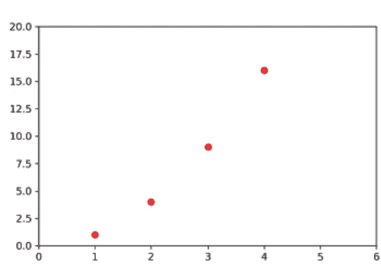

图 20-17

上面示例中的 **axis()** 命令接受一个 `[xmin, xmax, ymin, ymax]` 列表，并指定坐标轴的视口。

如果 `matplotlib` 仅限于处理列表，那么它在数值处理方面将相当无用。通常，你会使用 `NumPy` 数组。事实上，所有序列在内部都会被转换为 `NumPy` 数组。下面的示例说明了如何使用数组在一条命令中绘制多条不同格式样式的线。

```python
In [17]: import numpy as np
         # 以 200ms 间隔均匀采样的时间
         t = np.arange(0., 5., 0.2)
         # 红色虚线、蓝色方块和绿色三角形
         plt.plot(t, t, 'r--', t, t**2, 'bs', t, t**3, 'g^')
         plt.show()
```

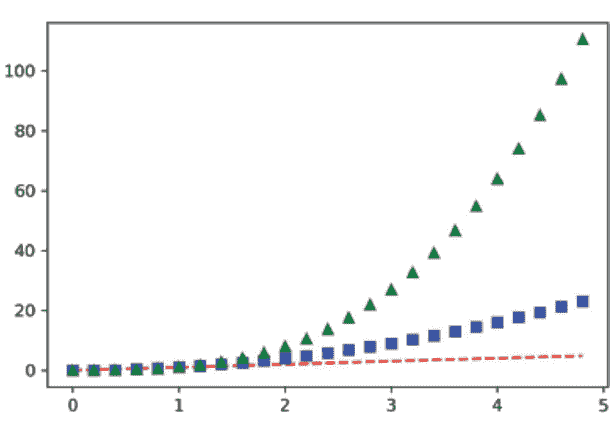

图 20-18

现在，让我们通过理解 **plot()** 函数的参数及其返回值来解析它。

## 20.8 plot(parameters)<sup>91</sup>

### 20.8.1 x, y
这些是类数组或标量。`x` / `y` 是数据点的水平/垂直坐标。如果你不提供 `x` 值，则它们被取为默认值。默认值是 `range(len(y))`。通常，这些参数是一维数组。

它们也可以是标量，或二维数组（在这种情况下，各列代表独立的数据集）。

这些参数不能作为关键字传递。

### 20.8.2 格式字符串 (fmt)
`str`，可选。这是格式字符串的缩写。格式字符串只是快速设置基本线条属性的缩写。此参数不能作为关键字传递。

格式字符串由颜色、标记和线型部分组成：`fmt = '[marker][line][color]'`

每一部分都是可选的。如果未提供，则使用样式循环中的值。例外情况：如果给出了线型，但没有标记，则数据将是一条没有标记的线。也支持其他组合，如 `[color][marker][line]`，但请注意它们的解析可能不明确。

#### 20.8.2.1 标记

| 字符 | 描述 |
| :--- | :--- |
| '.' | 点标记 |
| ',' | 像素标记 |
| 'o' | 圆形标记 |
| 'v' | 三角形向下标记 |
| '^' | 三角形向上标记 |
| '<' | 三角形向左标记 |
| '>' | 三角形向右标记 |
| '1' | 三叉向下标记 |
| '2' | 三叉向上标记 |
| '3' | 三叉向左标记 |
| '4' | 三叉向右标记 |
| 's' | 方形标记 |
| 'p' | 五边形标记 |
| '*' | 星形标记 |
| 'h' | 六边形1标记 |
| 'H' | 六边形2标记 |
| '+' | 加号标记 |
| 'x' | x 标记 |
| 'D' | 菱形标记 |
| 'd' | 细菱形标记 |
| '/' | 垂直线标记 |
| '_' | 水平线标记 |

#### 20.8.2.2 线型

| 字符 | 描述 |
| :--- | :--- |
| '-' | 实线样式 |
| '--' | 虚线样式 |
| '-.' | 点划线样式 |
| ':' | 点线样式 |

#### 20.8.2.3 颜色
支持的颜色缩写是单字母代码

| 字符 | 颜色 |
| :--- | :--- |
| 'b' | 蓝色 |
| 'g' | 绿色 |
| 'r' | 红色 |
| 'c' | 青色 |
| 'm' | 品红色 |
| 'y' | 黄色 |
| 'k' | 黑色 |
| 'w' | 白色 |

##### 格式字符串示例：

```python
'b'       # 蓝色标记，默认形状
'or'      # 红色圆形
'-g'      # 绿色实线
'--'      # 默认颜色的虚线
'^k:'     # 黑色三角形向上标记，由点线连接
```

### 20.8.3 data
可索引对象，可选。一个带标签数据的对象。如果提供，则提供要在 `x` 和 `y` 中绘制的标签名称。

## 20.9 plot() 返回值
`plot` 函数返回线条。

线条可以同时具有连接所有顶点的实线线型和每个顶点处的标记。此外，实线的绘制受绘制样式的影响，例如，可以创建各种样式的“阶梯”线。

## 20.10 plot(**kwargs)
这些是用于 `line2D` 属性的关键字参数。它们是可选的。`kwargs` 用于指定属性，如线条标签（用于自动图例）、线宽、抗锯齿、标记面颜色。示例：

```python
>>> plot([1, 2, 3], [1, 2, 3], 'go-', label='line 1', linewidth=2)
>>> plot([1, 2, 3], [1, 4, 9], 'rs', label='line 2')
```

如果你用一个 `plot` 命令创建多条线，`kwargs` 将应用于所有这些线。

以下是最有用的 `Line2D` 属性列表：

| 属性 | 描述 |
| :--- | :--- |
| alpha | 浮点数或 None |
| animated | 布尔值 |
| antialiased 或 aa | 布尔值 |
| color 或 c | 颜色 |
| contains | 可调用对象 |
| data | (2, N) 数组或两个一维数组 |
| drawstyle 或 ds | {'default', 'steps', 'steps-pre', 'steps-mid', 'steps-post'}，默认：'default' |
| figure | Figure |
| fillstyle | {'full', 'left', 'right', 'bottom', 'top', 'none'} |
| gid | 字符串 |
| label | 对象 |
| linestyle 或 ls | {'-', '--', '-.', ':', '', (offset, on-off-seq), ...} |
| linewidth 或 lw | 浮点数 |
| marker | 标记样式 |
| markeredgecolor 或 mec | 颜色 |
| markeredgewidth 或 mew | 浮点数 |
| markerfacecolor 或 mfc | 颜色 |
| markersize 或 ms | 浮点数 |
| pickradius | 浮点数 |
| url | 字符串 |
| visible | 布尔值 |
| xdata | **一维数组** |
| ydata | **一维数组** |

#### 使用关键字字符串绘图
在某些情况下，你的数据格式允许你通过字符串访问特定变量。例如，使用 `numpy.recarray` 或 `pandas.DataFrame`。

`Matplotlib` 允许你通过 `data` 关键字参数提供这样的对象。如果提供，那么你可以使用与这些变量对应的字符串生成绘图。

```python
In [18]: data = {'a': np.arange(50), 'c':
            np.random.randint(0, 50, 50), 'd':
            np.random.randn(50)}
        data['b'] = data['a'] + 10 *
        np.random.randn(50)
        data['d'] = np.abs(data['d']) * 100

        plt.scatter('a', 'b', c='c', s='d',
        data=data)
        plt.xlabel('entry a')
        plt.ylabel('entry b')
        plt.show()
```

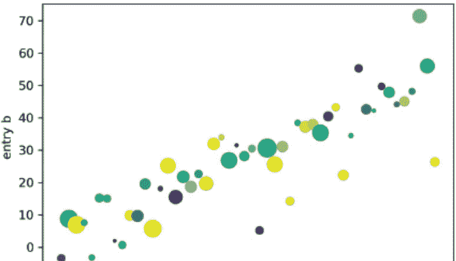

图 20-19

## 20.11 使用分类变量绘图
也可以使用分类变量创建绘图。`Matplotlib` 允许你将分类变量直接传递给许多绘图函数。例如：

```python
names = ['group_a', 'group_b', 'group_c']
values = [1, 10, 100]

plt.figure(figsize=(9, 3))
plt.subplot(131)  # 子图(1行，3列，第1个对象)
plt.bar(names, values)
plt.subplot(132)  # 子图(1行，3列，第2个对象)
```

plt.scatter(names, values)
plt.subplot(133)
#### Subplot(1行，3列，第3个对象)
plt.plot(names, values)
plt.suptitle('分类绘图')
plt.show()

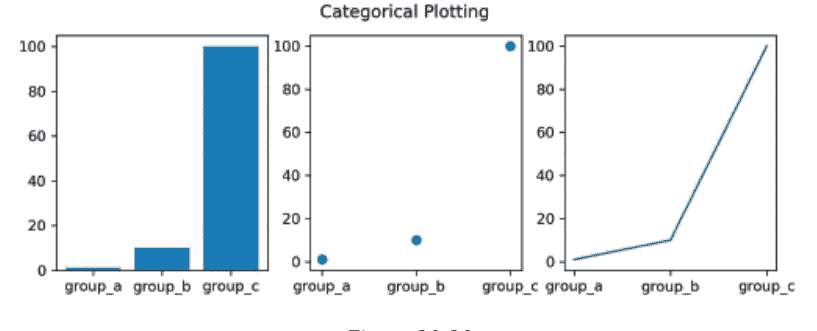

图 20-20

## 20.12 控制线条属性

线条有许多可以设置的属性：线宽、虚线样式、抗锯齿等；详见 plot(**kwargs) 中的 Line2D 属性。设置线条属性有几种方法。

1.  使用关键字参数：
    `plt.plot(x, y, linewidth=2.0)`
2.  使用 Line2D 实例的 setter 方法。plot 返回一个 Line2D 对象列表；例如，line1, line2 = plot(x1, y1, x2, y2)。在下面的代码中，我们假设只有一条线，因此返回的列表长度为 1。我们使用元组解包来获取该列表的第一个元素：

```
line, = plt.plot(x, y, '-')
line.set_antialiased(False)  # 关闭抗锯齿
```

3.  使用 **setp()** 命令。下面的示例使用 MATLAB 风格的命令来设置线条列表的多个属性。**setp** 可以透明地处理对象列表或单个对象。你可以使用 python 关键字参数或 MATLAB 风格的字符串/值对：

```
lines = plt.plot(x1, y1, x2, y2)
#### 使用关键字参数
plt.setp(lines, color='r', linewidth=2.0)
#### 或 MATLAB 风格的字符串值对
plt.setp(lines, 'color', 'r', 'linewidth', 2.0)
```

## 20.13 使用多个图形和坐标轴

pyplot 具有当前图形和当前坐标轴的概念。所有绘图命令都应用于当前坐标轴。函数 gca() 返回当前坐标轴（一个 matplotlib.axes.Axes 实例），gcf() 返回当前图形（matplotlib.figure.Figure 实例）。通常，你不必担心这一点，因为这一切都在幕后处理好了。下面是一个创建两个子图的脚本。

```
In [20]: def f(t): return np.exp(-t) * np.cos(2*np.pi*t)
        t1 = np.arange(0.0, 5.0, 0.1)
        t2 = np.arange(0.0, 5.0, 0.02)
        plt.figure()
        plt.subplot(211)
        plt.plot(t1, f(t1), 'bo', t2, f(t2), 'k')
        plt.subplot(212)
        plt.plot(t2, np.cos(2*np.pi*t2), 'r--')
        plt.show()
```

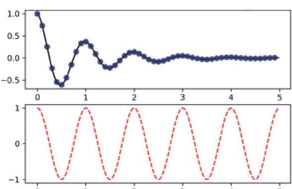

这里的 **figure()** 命令是可选的，因为默认情况下会创建 figure(1)，就像如果你没有手动指定任何坐标轴，subplot(111) 会被默认创建一样。**subplot()** 命令指定 numrows、numcols、plot_number，其中 plot_number 的范围是从 1 到 numrows*numcols。*如果 numrows*numcols<10，subplot 命令中的逗号是可选的。* 因此 subplot(211) 等同于 subplot(2, 1, 1)。

你可以创建任意数量的子图和坐标轴。如果你想手动放置一个坐标轴，即不在矩形网格上，可以使用 axes() 命令，它允许你将位置指定为 **axes([left, bottom, width, height])**，其中所有值都是分数坐标（0 到 1）。

你可以通过使用多个 **figure()** 调用并递增图形编号来创建多个图形。当然，每个图形可以包含任意多的坐标轴和子图：

```
In [21]: import matplotlib.pyplot as plt
        plt.figure(1)  # 第一个图形
        plt.subplot(211)  # 第一个图形中的第一个子图
        plt.plot([1, 2, 3])
        plt.subplot(212)  # 第一个图形中的第二个子图
        plt.plot([4, 5, 6])
        plt.figure(2)  # 第二个图形
        plt.plot([4, 5, 6])  # 默认创建 subplot(111)
        plt.figure(1)  # 图形1为当前；subplot(212) 仍为当前
        plt.subplot(211)  # 使图形1中的 subplot(211) 成为当前
        plt.title('Easy as 1, 2, 3')  # 子图 211 的标题
```

```
Out[21]: Text(0.5, 1.0, 'Easy as 1, 2, 3')
```

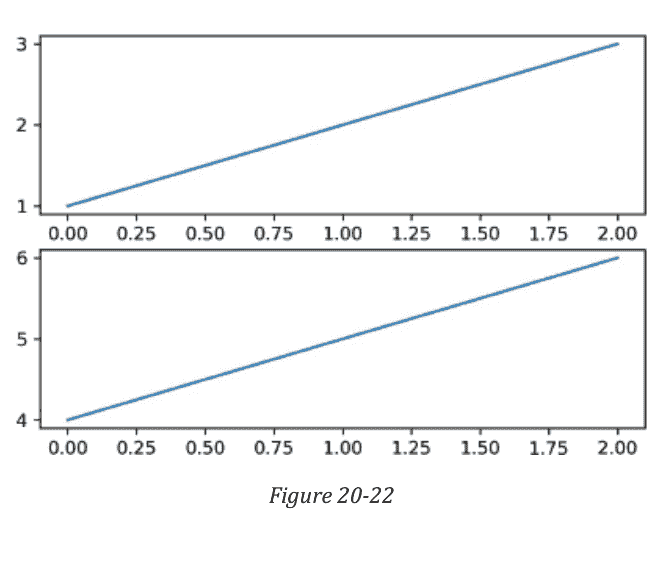

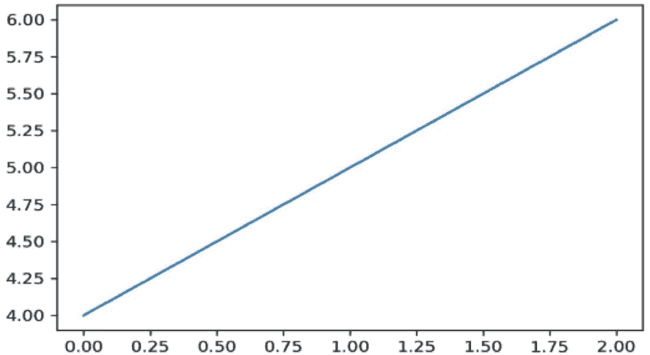

图 20-23

你可以使用 **clf()** 清除当前图形，使用 **cla()** 清除当前坐标轴。如果你觉得状态（特别是当前图像、图形和坐标轴）在幕后为你维护很烦人，不要绝望：这只是围绕面向对象 API 的一个薄薄的有状态包装器，你可以直接使用它（参见 Artist 教程）。如果你创建了很多图形，你还需要注意一件事：图形所需的内存不会完全释放，直到图形被 **close()** 显式关闭。删除对图形的所有引用，和/或使用窗口管理器关闭图形在屏幕上显示的窗口是不够的，因为 pyplot 会维护内部引用，直到调用 **close()**。

## 20.14 在绘图中/上插入文本

text() 命令可用于在任意位置添加文本，而 xlabel()、ylabel() 和 title() 用于在指定位置添加文本。

所有 **text()** 命令都返回一个 **matplotlib.text.Text** 实例。就像上面的线条一样，你可以通过向文本函数传递关键字参数或使用 **setp()** 来自定义属性：t = plt.xlabel('my data', fontsize=14, color='red')

```
In [22]: mu, sigma = 100, 15
        x = mu + sigma * np.random.randn(10000)  # 数据的直方图
        n, bins, patches = plt.hist(x, 50, density=1, facecolor='g', alpha=0.75)
        plt.xlabel('Smarts', fontsize=14, color='red')
        plt.ylabel('Probability')
        plt.title('Histogram of IQ')
        plt.text(60, .025, r'$\mu=100,\ \sigma=15$')
        plt.axis([40, 160, 0, 0.03])
        plt.grid(True)
        plt.show()
```

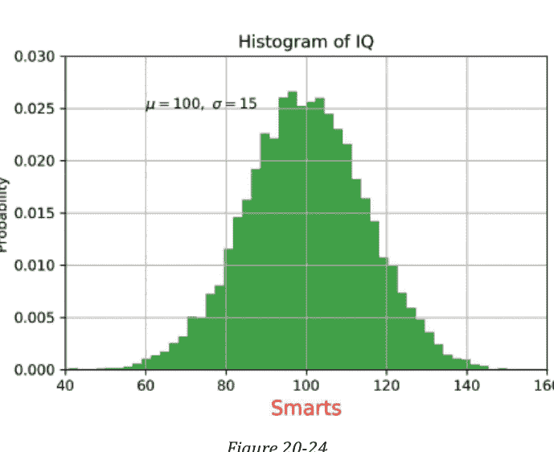

图 20-24

## 20.15 在文本中使用数学表达式

matplotlib 在任何文本表达式中都接受 TeX 方程表达式。例如，要在标题中写入表达式 σi=15，你可以编写一个用美元符号包围的 TeX 表达式：

```
plt.title(r'$\sigma_i=15$')
```

标题字符串前面的 r 很重要——它表示该字符串是原始字符串，不要将反斜杠视为 python 转义符。matplotlib 有一个内置的 TeX 表达式解析器和布局引擎，并自带其数学字体。因此，你可以在不同平台上使用数学文本，而无需安装 TeX。对于那些安装了 LaTeX 和 dvipng 的人，你也可以使用 LaTeX 来格式化你的文本，并将输出直接合并到你的显示图形或保存的 postscript 中。

### 20.15.1 文本注释

上面基本 text() 命令的用法是在坐标轴上的任意位置放置文本。文本的一个常见用途是注释绘图的某些特征，而 annotate() 方法提供了辅助功能，使注释变得容易。在注释中，有两个点需要考虑：被注释的位置（由参数 xy 表示）和文本的位置 xytext。这两个参数都是 (x, y) 元组。

```
In [23]: ax = plt.subplot(111)
        t = np.arange(0.0, 5.0, 0.01)
        s = np.cos(2*np.pi*t)
        line, = plt.plot(t, s, lw=2)
        plt.annotate('local max', xy=(2, 1), xytext=(3, 1.5),
                     arrowprops=dict(facecolor='black', shrink=0.05),
                     )
        plt.ylim(-2, 2)
        plt.show()
```

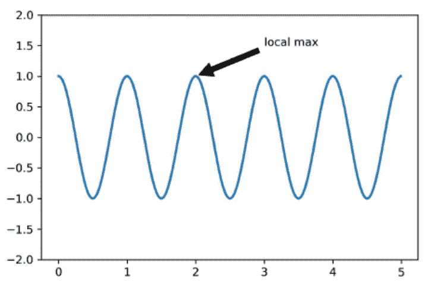

图 20-25

## 20.16 对数和其他非线性坐标轴

matplotlib.pyplot 不仅支持线性坐标轴刻度，还支持对数和 logit 刻度。如果数据跨越多个数量级，这通常很有用。更改坐标轴的刻度很容易：

`plt.xscale('log')`

下面显示了一个具有相同数据但 y 轴刻度不同的四个绘图的示例。

```
from matplotlib.ticker import NullFormatter  # 对 `logit` 刻度有用

#### 固定随机状态以确保可重复性
np.random.seed(19680801)

#### 在开区间 (0, 1) 中生成一些数据
y = np.random.normal(loc=0.5, scale=0.4, size=1000)
y = y[(y > 0) & (y < 1)]
y.sort()
x = np.arange(len(y))

#### 使用各种坐标轴刻度进行绘图
plt.figure()

##### 线性
plt.subplot(221)
plt.plot(x, y)
plt.yscale('linear')
plt.title('linear')
plt.grid(True)

##### 对数
plt.subplot(222)
plt.plot(x, y)
plt.yscale('log')
plt.title('log')
plt.grid(True)

##### 对称对数
plt.subplot(223)
plt.plot(x, y - y.mean())
plt.yscale('symlog', linthreshy=0.01)
plt.title('symlog')
plt.grid(True)

##### logit
plt.subplot(224)
plt.plot(x, y)
plt.yscale('logit')
plt.title('logit')
plt.grid(True)

#### 调整子图布局，因为 logit 那个可能比通常需要更多空间，
#### 由于 y 刻度标签如 "1 - 10^{-3}"
plt.subplots_adjust(top=0.99, bottom=0.05, left=0.10, right=0.99, hspace=0.50, wspace=0.65)
plt.show()
```

## 20.17 总结：Matplotlib 是最流行的可视化库，也是 Python 中最古老的库之一。我们了解了它如何基于 MATPLOTLIB，以及现在它如何发展得远超于此。你接触了两个流行的接口：pyplot 和面向对象接口。在本章中，我们重点介绍了 pyplot 接口。我们逐步了解了从创建空白图形、坐标轴，到绘制单个或多个子图的整个过程。图形或绘图的解剖结构是一个非常有启发性和重要的概念。当你开始处理数据时，使用函数来重复绘制相似的图表会非常有帮助。此外，我们还了解了绘图的精细方面，比如格式化坐标轴、标签和样式。对于初学者来说，使用 matplotlib 绘图有时会让人不知所措，但一旦掌握了基础，最复杂的图表也能被理解并创建出来，只需一步一步来。

## 21 可视化 MATPLOTLIB 面向对象接口与示例绘图

本章旨在展示使用 Matplotlib 进行单次可视化的开始、中间和结束过程。我们将从一些原始数据开始，最终保存一个自定义可视化的图形。在此过程中，我们将尝试突出介绍一些使用 Matplotlib 的巧妙功能和最佳实践。简而言之，我们将看到一个绘图<sup>92</sup>的生命周期，从开始（创建图形）到结束（保存在你的机器上）。

### 21.1 面向对象 API 与 Pyplot

Matplotlib 有两个接口。第一个是面向对象（OO）接口。在这种情况下，我们利用 axes.Axes 的实例在 figure.Figure 的实例上渲染可视化。

第二个基于 MATLAB，并使用基于状态的接口。这被封装在 pyplot 模块中。我们在上一章中已经详细介绍了 pyplot 接口。

大多数术语都很直接，但主要要记住的是：图形是最终的图像，可能包含一个或多个坐标轴。

- 坐标轴代表单个绘图（不要与“axis”一词混淆，后者指的是绘图的 x/y 轴）。

我们直接从坐标轴调用绘图方法，这为我们定制绘图提供了更大的灵活性和能力。

**注意：** 通常，如果你想在定制绘图时获得更大的灵活性和能力，建议使用面向对象接口而不是 pyplot 接口。

### 21.2 我们的数据

我们将使用以下字典 "data" 作为要绘制的数据。这个字典的值和键被制成两个列表并分配给两个变量。你将看到它们如何用于绘图。

```
In [1]: import numpy as np
        import matplotlib.pyplot as plt
        from matplotlib.ticker import FuncFormatter

        data = {'Barton LLC': 109438.50,
                'Frami, Hills and Schmidt': 103569.59,
                'Fritsch, Russel and Anderson': 112214.71,
                'Jerde-Hilpert': 112591.43,
                'Keeling LLC': 100934.30,
                'Koepp Ltd': 103660.54,
                'Kulas Inc': 137351.96,
                'Trantow-Barrows': 123381.38,
                'White-Trantow': 135841.99,
                'Will LLC': 104437.60}

        group_data = list(data.values())
        group_names = list(data.keys())
        group_mean = np.mean(group_data)
```

### 21.3 第一步

这些数据自然地可视化为条形图，每个组一个条形。使用面向对象方法来实现这一点，我们将首先生成一个 figure.Figure 和 axes.Axes 的实例。图形就像一块画布，坐标轴是画布的一部分，我们将在其上进行特定的可视化。一个图形可以有多个坐标轴，但我们现在只创建一个。

```
In [2]: fig, ax = plt.subplots()
```

现在我们有了一个坐标轴实例，就可以在其上进行绘图了。

```
In [3]: fig, ax = plt.subplots()
        ax.barh(group_names, group_data)

Out[3]: <BarContainer object of 10 artists>
```

### 21.4 控制样式

Matplotlib 中有许多可用的样式，可以让你根据需要定制可视化。要查看样式列表，我们可以使用 style。

```
In [4]: print(plt.style.available)

Out[4]: ['bmh', 'classic', 'dark_background', 'fast', 'fivethirtyeight', 'ggplot', 'grayscale', 'seaborn-bright', 'seaborn-colorblind', 'seaborn-dark-palette', 'seaborn-dark', 'seaborn-darkgrid', 'seaborn-deep', 'seaborn-muted', 'seaborn-notebook', 'seaborn-paper', 'seaborn-pastel', 'seaborn-poster', 'seaborn-talk', 'seaborn-ticks', 'seaborn-white', 'seaborn-whitegrid', 'seaborn', 'Solarize_Light2', 'tableau-colorblind10', '_classic_test']
```

上面的列表给出了我们可以使用的所有样式的名称。我们将使用以下方式应用其中一个样式：

```
In [5]: plt.style.use("ggplot")
```

现在让我们再次绘制图表，看看效果如何。

```
In [6]: fig, ax = plt.subplots()
        ax.barh(group_names, group_data)

Out[6]: <BarContainer object of 10 artists>
```

样式控制着许多东西，比如颜色、线宽、背景等。

### 21.5 定制绘图

现在我们得到了一个具有我们想要的总体外观的图表，所以让我们对其进行微调，使其适合打印。首先，让我们旋转 x 轴上的标签，使其显示得更清晰。我们可以通过 axes.Axes.get_xticklabels() 方法访问这些标签：

```
labels = ax.get_xticklabels()
```

现在我们将一次性设置多个项目的属性。pyplot.setp() 函数对此很有用。这个函数将接受一个（或多个）Matplotlib 对象的列表，并尝试设置每个对象的一些样式元素。

```
In [7]: fig, ax = plt.subplots()
        ax.barh(group_names, group_data)
        labels = ax.get_xticklabels()
        plt.setp(labels, rotation=45, horizontalalignment='right')

Out[7]: [None, None, None, None, None, None, None, None, None, None, None, None, None, None, None, None, None, None, None, None]
```

接下来，我们将为绘图添加标签。使用面向对象接口，我们可以使用 **axes.Axes.set()** 方法来设置此坐标轴对象的属性。

```
In [8]: fig, ax = plt.subplots()
        ax.barh(group_names, group_data)
        labels = ax.get_xticklabels()
        plt.setp(labels, rotation=45, horizontalalignment='right')
        ax.set(xlim=[-10000, 140000], xlabel='Total Revenue', ylabel='Company', title='Company Revenue')

Out[8]: [Text(0, 0.5, 'Company'), (-10000, 140000), Text(0.5, 0, 'Total Revenue'), Text(0.5, 1.0, 'Company Revenue')]
```

我们还可以使用 **pyplot.subplots()** 函数调整此绘图的大小。我们可以通过 **figsize** 关键字参数来实现。

> **注意：** 虽然 NumPy 中的索引遵循（行，列）的形式，但 figsize 关键字参数遵循（宽度，高度）的形式。这遵循了可视化中的惯例，不幸的是，这与线性代数的惯例不同。

```
In [9]: fig, ax = plt.subplots(figsize=(4, 4))
        ax.barh(group_names, group_data)
        labels = ax.get_xticklabels()
        plt.setp(labels, rotation=45, horizontalalignment='right')
        ax.set(xlim=[-10000, 140000], xlabel='Total Revenue', ylabel='Company', title='Company Revenue')

Out[9]: [Text(0, 0.5, 'Company'), (-10000, 140000), Text(0.5, 0, 'Total Revenue'), Text(0.5, 1.0, 'Company Revenue')]
```

我们的 x 轴标签是美元，而且数字很大。我们可以编辑它们或更改其格式以获得更好的视觉效果。对于标签，我们可以使用 **ticker.FuncFormatter** 类以函数的形式指定自定义格式化准则。下面我们将定义一个函数，该函数接受一个整数作为输入，并返回一个字符串作为输出。

```
In [10]: def currency(x, pos):
             """The two args are the value and tick position"""
             if x >= 1e6:
                 s = '${:1.1f}M'.format(x*1e-6)
             else:
                 s = '${:1.0f}K'.format(x*1e-3)
             return s

         formatter = FuncFormatter(currency)
```

然后我们可以将此格式化器应用于我们绘图上的标签。为此，我们将使用坐标轴的 **xaxis** 属性。这允许你对绘图上的特定坐标轴执行操作。

```
In [11]: fig, ax = plt.subplots(figsize=(8, 5))
         ax.barh(group_names, group_data)
         labels = ax.get_xticklabels()
         plt.setp(labels, rotation=45, horizontalalignment='right')
         ax.set(xlim=[-10000, 140000], xlabel='Total Revenue', ylabel='Company', title='Company Revenue')
         ax.xaxis.set_major_formatter(formatter)
```

## 21.6 组合多个可视化图表

可以在同一个 `Axes` 实例上绘制多个绘图元素。为此，我们只需在该 axes 对象上调用另一个绘图方法即可。我们将添加一条表示组均值的垂直线。

```python
In [12]: fig, ax = plt.subplots(figsize=(9, 6))
    ax.barh(group_names, group_data) labels =
    ax.get_xticklabels() plt.setp(labels,
    rotation=45, horizontalalignment='right')
    ax.set(xlim=[-10000, 140000], xlabel='Total
    Revenue', ylabel='Company', title='Company Revenue')
    ax.xaxis.set_major_formatter(formatter) #
    *添加一条垂直线，这里我们在函数调用中设置样式* ax.axvline(group_mean, ls='--', color='b')
```

Out[12]: <matplotlib.lines.Line2D at 0x1feeaadf088>

图 21-8

## 21.7 图表上的文本格式化

现在我们将了解如何格式化图表上的各种文本元素。Matplotlib 为您提供了无限的自由度来更改图表上使用的各种文本元素的字体大小、位置（文本位置）、注释、颜色等。我们现在将看到其中一些的实际应用。它们在保存图表以供发布、打印或分享之前，为其进行最后修饰时特别有用。

Matplotlib 具有广泛的文本支持，包括对数学表达式、用于光栅和矢量输出的 TrueType 字体、具有任意旋转的换行分隔文本以及 Unicode 的支持。由于它直接将字体嵌入输出文档中，例如用于 PostScript 或 PDF，因此您在屏幕上看到的内容就是您在硬拷贝中得到的内容。

### 21.7.1 基本文本命令

以下命令用于在 pyplot 接口和面向对象 API 中创建文本：

| pyplot API | OO API | 描述 |
|---|---|---|
| text | text | 在 Axes 的任意位置添加文本。 |
| Annotate | annotate | 在 Axes 的任意位置添加注释，可选择带箭头。 |
| xlabel | set_xlabel | 为 Axes 的 x 轴添加标签。 |
| ylabel | set_ylabel | 为 Axes 的 y 轴添加标签。 |
| title | set_title | 为 Axes 添加标题。 |
| figtext | text | 在 Figure 的任意位置添加文本。 |
| suptitle | suptitle | 为 Figure 添加标题。 |

所有这些函数都会创建并返回一个 Text 实例，该实例可以通过多种字体和其他属性进行配置。下面的示例展示了所有这些命令的实际应用。

```python
In [13]: fig = plt.figure() ax =
    fig.add_subplot(111)
    fig.subplots_adjust(top=0.85) # 分别为
    图形和子图设置标题
    fig.suptitle('bold figure suptitle',
    fontsize=14, fontweight='bold')
    ax.set_title('axes title')
    ax.set_xlabel('xlabel')
    ax.set_ylabel('ylabel') # 将 x 轴和 y 轴
    限制都设置为 [0, 10]，而不是默认的 [0, 1]
    ax.axis([0, 10, 0, 10]) ax.text(3, 8,
    'boxed italics text in data coords',
    style='italic', bbox={'facecolor': 'red',
    'alpha': 0.5, 'pad': 10}) ax.text(2, 6,
    r'an equation: $E=mc^2$', fontsize=15)
    ax.text(3, 2, 'unicode: Institut für
    Festkörperphysik') ax.text(0.95, 0.01,
    'colored text in axes coords',
    verticalalignment='bottom',
    horizontalalignment='right',
    transform=ax.transAxes, color='green',
    fontsize=15) ax.plot([2], [1], 'o')
    ax.annotate('annotate', xy=(2, 1), xytext=
    (3, 4), arrowprops=dict(facecolor='black',
    shrink=0.05)) plt.show()
```

现在我们将在我们开始处理的条形图中看到其中一些以及更多选项。

```python
In [14]: # 创建图形和 axes fig, ax =
    plt.subplots() # 绘制数据并获取平均值
    ax.barh(group_names, group_data)
    group_mean = np.mean(group_data) # 设置
    限制和标签 ax.set_xlim([-10000,
    140000]) ax.set(title='2014 Revenue',
    xlabel='Total Revenue', ylabel='Customer')
    # 添加一条表示平均值的线
    ax.axvline(x=group_mean, color='b',
    label='Average', linestyle='--',
    linewidth=1) # 注释新客户
    for x in [3, 5, 8]: ax.text(125000, x, "New
    Customer") # 格式化货币 formatter
    = FuncFormatter(currency)
    ax.xaxis.set_major_formatter(formatter) #
    隐藏图例
    ax.legend().set_visible(True)
```

图 21-10

## 21.8 保存图表

现在我们对图表的结果感到满意，我们想将其保存到磁盘。在 Matplotlib 中，我们可以保存为多种文件格式。要查看可用选项的列表，请使用：

```python
In [15]: print(fig.canvas.get_supported_filetypes())
```

```
{'ps': 'Postscript', 'eps': 'Encapsulated Postscript', 'pdf': 'Portable Document Format', 'pgf': 'PGF code for LaTeX', 'png': 'Portable Network Graphics', 'raw': 'Raw RGBA bitmap', 'rgba': 'Raw RGBA bitmap', 'svg': 'Scalable Vector Graphics', 'svgz': 'Scalable Vector Graphics', 'jpg': 'Joint Photographic Experts Group', 'jpeg': 'Joint Photographic Experts Group', 'tif': 'Tagged Image File Format', 'tiff': 'Tagged Image File Format'}
```

然后我们可以使用 **figure.Figure.savefig()** 将图形保存到磁盘。请注意，有几个有用的标志我们将在下面展示：

- **transparent=True** 使保存的图形背景透明（如果格式支持）。
- **dpi=300** 控制输出的分辨率（每平方英寸点数）。
- **bbox_inches="tight"** 使图形边界适应我们的绘图。

```python
In [16]: fig.savefig('sales.jpg', transparent=False, dpi=300, bbox_inches="tight")
```

您可以在您的基础目录/文件夹中看到一个名为 "sales.jpg" 的新文件已创建。

## 21.9 示例图表

### 21.9.1 直方图

`hist()` 函数自动生成直方图并返回分箱计数或概率。除了基本直方图外，此演示还展示了一些可选功能：设置数据分箱的数量。

- `normed` 标志，它会归一化分箱高度，使直方图的积分为 1。生成的直方图是概率密度函数的近似。
- 设置条形的填充颜色。
- 设置不透明度（alpha 值）。选择不同的分箱数量和大小会显著影响直方图的形状。

```python
In [17]: plt.style.use("default")
```

```python
In [18]: import matplotlib import numpy as np import matplotlib.pyplot as plt
    np.random.seed(19680801) # 示例数据 mu = 100 # 分布均值 sigma = 15 # 分布标准差 x = mu + sigma * np.random.randn(437) num_bins = 50
    fig, ax = plt.subplots() # 数据的直方图 n, bins, patches = ax.hist(x, num_bins, density=1) # 添加一条“最佳拟合”线 y = ((1 / (np.sqrt(2 * np.pi) * sigma)) * np.exp(-0.5 * (1 / sigma * (bins - mu))**2)) ax.plot(bins, y, '--')
    ax.set_xlabel('Smarts')
    ax.set_ylabel('Probability density')
    ax.set_title(r'Histogram of IQ: $\mu=100$, $\sigma=15$') # 调整间距以防止 ylabel 被裁剪 fig.tight_layout()
    plt.show()
```

图 21-11

### 21.9.2 路径

您可以使用 `matplotlib.path` 模块在 Matplotlib 中添加任意路径。此示例展示了如何通过 Matplotlib 的 API 创建 **Path** 和 **PathPatch** 对象。

```python
In [19]: import matplotlib.path as mpath import matplotlib.patches as mpatches import
    python
    import matplotlib.pyplot as plt
    import matplotlib.patches as mpatches
    import matplotlib.path as mpath

    fig, ax = plt.subplots()
    Path = mpath.Path
    path_data = [
        (Path.MOVETO, (1.58, -2.57)),
        (Path.CURVE4, (0.35, -1.1)),
        (Path.CURVE4, (-1.75, 2.0)),
        (Path.CURVE4, (0.375, 2.0)),
        (Path.LINETO, (0.85, 1.15)),
        (Path.CURVE4, (2.2, 3.2)),
        (Path.CURVE4, (3, 0.05)),
        (Path.CURVE4, (2.0, -0.5)),
        (Path.CLOSEPOLY, (1.58, -2.57)),
    ]
    codes, verts = zip(*path_data)
    path = mpath.Path(verts, codes)
    patch = mpatches.PathPatch(path, facecolor='r', alpha=0.5)
    ax.add_patch(patch)

    # 绘制控制点和连接线
    x, y = zip(*path.vertices)
    line, = ax.plot(x, y, 'go-')
    ax.grid()
    ax.axis('equal')
    plt.show()
```

### 21.9.3 三维绘图

mplot3d工具包支持简单的三维图形，包括曲面图、线框图、散点图和条形图。

我正在绘制一个使用coolwarm颜色映射着色的三维曲面。通过使用**antialiased=False**使曲面不透明。同时演示了LinearLocator和z轴刻度标签的自定义格式。

```python
import matplotlib.pyplot as plt
from matplotlib import cm
from matplotlib.ticker import LinearLocator, FormatStrFormatter
from mpl_toolkits.mplot3d import Axes3D
import numpy as np

fig = plt.figure()
ax = fig.add_subplot(projection='3d')

#### Make data.
X = np.arange(-5, 5, 0.25)
Y = np.arange(-5, 5, 0.25)
X, Y = np.meshgrid(X, Y)
R = np.sqrt(X**2 + Y**2)
Z = np.sin(R)

#### Plot the surface.
surf = ax.plot_surface(X, Y, Z, cmap=cm.coolwarm,
                       linewidth=0, antialiased=False)

#### Customize the z-axis.
ax.set_zlim(-1.01, 1.01)
ax.zaxis.set_major_locator(LinearLocator(10))
ax.zaxis.set_major_formatter(FormatStrFormatter('%.02f'))

#### Add a color bar that maps values to colors.
fig.colorbar(surf, shrink=0.5, aspect=5)

plt.show()
```

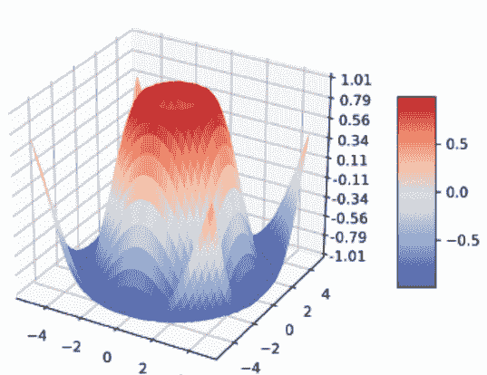

### 21.9.4 饼图

`pie()`函数允许你创建饼图。可选功能包括自动标注面积百分比、将一个或多个楔形从饼图中心分离出来以及阴影效果。仔细查看附带的代码，它仅用几行代码就生成了此图。

除了基本的饼图外，此演示还展示了一些可选功能：
- 切片标签
- 自动标注百分比
- 使用"explode"偏移切片
- 投影阴影
- 自定义起始角度

关于自定义起始角度的说明：默认的**startangle**为0，这将使"Frogs"切片从正x轴开始。此示例设置startangle = 90，使所有内容逆时针旋转90度，青蛙切片从正y轴开始。

```python
import matplotlib.pyplot as plt

#### Pie chart, where the slices will be ordered and plotted counter-clockwise:
labels = 'Frogs', 'Hogs', 'Dogs', 'Logs'
sizes = [15, 30, 45, 10]
explode = (0, 0.1, 0, 0)  # only "explode" the 2nd slice (i.e. 'Hogs')

fig1, ax1 = plt.subplots()
ax1.pie(sizes, explode=explode, labels=labels, autopct='%1.1f%%',
        shadow=True, startangle=90)
ax1.axis('equal')  # Equal aspect ratio ensures that pie is drawn as a circle.

plt.show()
```

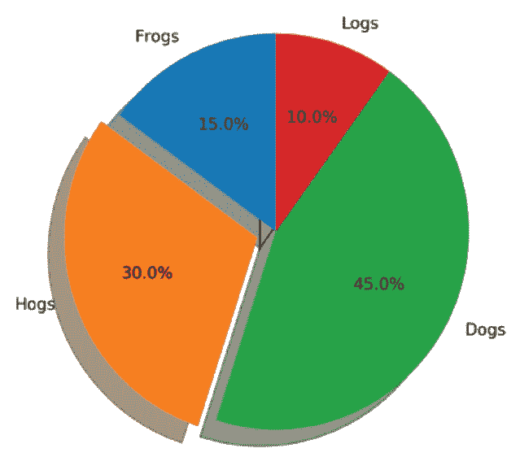

图 21-14

### 21.9.5 子图示例

许多绘图类型可以在一个图形中组合，以创建强大而灵活的数据表示。

```python
import matplotlib.pyplot as plt
import numpy as np

np.random.seed(19680801)
data = np.random.randn(2, 100)

fig, axs = plt.subplots(2, 2, figsize=(5, 5))
axs[0, 0].hist(data[0])
axs[1, 0].scatter(data[0], data[1])
axs[0, 1].plot(data[0], data[1])
axs[1, 1].hist2d(data[0], data[1])

plt.show()
```

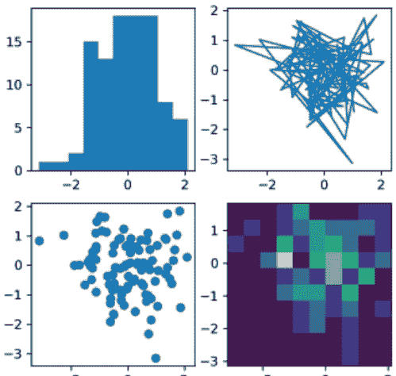

图 21-15

## 21.10 总结

我们在本章学习了可视化的许多方面，这张图片总结了所有内容。这张图片由[pbpython.com](http://pbpython.com)提供，它也启发了本章的概念，并且已被包含在matplotlib官方教程中。

下图中变量的名称可能会有所不同。

## matplotlib自定义示例

```python
fig, (ax0, ax1) = plt.subplots(nrows=1, ncols=2, sharey=True, figsize=(7, 4))

fig.suptitle('2014 Sales Analysis', fontsize=14, fontweight='bold')
```

```python
top_10.plot(kind='barh', y='Sales',
            x='Name', ax=ax0)
```

```python
top_10.plot(kind='barh', y='Purchases',
            x='Name', ax=ax1)
```

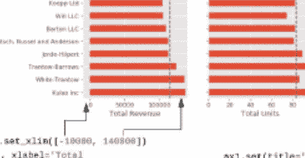

```python
ax1.axvline(x=avg, color='b',
           label='Average',
           linestyle='--',
           linewidth=1)
```

```python
ax0.set_xlim([-10000, 140000])
```

```python
ax0.set(title='Revenue', xlabel='Total Revenue', ylabel='Customers')
```

```python
ax1.set(title='Units',
        xlabel='Total Units', ylabel='')
```

```python
fig.savefig('sales.png', transparent=False, dpi=80, bbox_inches="tight")
```

pbpython.com

图 21-16 matplotlib-pbpython-example.png

## 注释

1 (Marr 2015)

2 (Marr 2015)

3 (Wikipedia contributors 2020) (Python Software Foundation 2020) (Wikipedia contributors 2020) (Python Software Foundation. 2020) (Python Software Foundation. 2020) (Wikipedia contributors 2020) (Kaushik 2020)

10 (Swaroop 2003) (Swaroop 2003) (scalablockchain.com 2019) (Python Software Foundation 2020) (Tagliaferri 2016) (Anaconda 2020) (Anaconda 2020) (IPython 2020) (Spyder 2018)

19 (Spyder 2018)

20 (Jupyter 2015) (Python Software Foundation 2020) (Python Software Foundation 2020) (Magee 2019)

25 (Python Software Foundation 2020) (Python Reference Manual 2002) (Swaroop 2003)

30 (Python Software Foundation 2020) (Swaroop 2003) (Python Software Foundation 2020)

32 (Python Software Foundation 2020) (Programiz 2020) (Python Software Foundation 2020) (Programiz 2020) (Python Software Foundation 2020) (Python Software Foundation 2020) (Python Software Foundation 2020) (Python Software Foundation 2020) (Python Software Foundation 2020) (Python Software Foundation 2020) (Python Software Foundation 2020) (W3Schools 2020) (Python Software Foundation 2020) (geeksforgeeks 2020) (Python Software Foundation 2020) (Python Software Foundation 2020) (Python Software Foundation 2020) (Watson 2020)

50 (Python Software Foundation 2020) (Swaroop 2003) (Swaroop 2003) (AskPython 2020) (Python Software Foundation 2020) (Python Software Foundation 2020) (Python Software Foundation 2020) (Python Software Foundation 2020) (W3Schools 2020) (Python Software Foundation 2020) (Python Software Foundation 2020) (Python Software Foundation 2020) (Python Software Foundation 2020) (Python Software Foundation 2020) (Python Software Foundation 2020) (Python Software Foundation 2020) (Python Software Foundation 2020) (Python Software Foundation 2020) (World Teach 2020) (The SciPy community 2020) (The SciPy community 2020) (The SciPy community 2020) (The SciPy community 2020) (Alammar 2019) (The SciPy community 2020) (The SciPy community 2020) (the pandas development team 2020) (the pandas development team 2020)

82 (George McIntire 2020) (the pandas development team 2020) (the pandas development team 2020) (Waskom 2020)

83 (Bokeh 2019)

84 (Story 2013)

85 (Robinson 2014) (Matplotlib development team 2020) (Matplotlib development team 2020) (Solomon 2020) (Matplotlib development team 2020) (Matplotlib development team 2020) (Matplotlib development team 2020) (Matplotlib development team 2020)

## 参考文献

1.  Alammar, Jay. 2019. *NumPy与数据表示的可视化入门*. 6月26日. 访问于2020年6月24日. http://jalammar.github.io/visual-numpy/.
2.  Anaconda. 2020. *在macOS上安装*. 访问于2020年6月17日. https://docs.anaconda.com/anaconda/install/mac-os/.
3.  —. 2020. *在Windows上安装*. 访问于2020年6月17日. https://docs.anaconda.com/anaconda/install/windows/.
4.  AskPython. 2020. *Python中的多态性*. 访问于2020年6月20日. https://www.askpython.com/python/oops/polymorphism-in-python.
5.  Bokeh. 2019. *快速入门*. 访问于2020年6月30日. https://docs.bokeh.org/en/2.1.1/.
6.  geeksforgeeks. 2020. *Python字典*. 访问于2020年6月19日. https://www.geeksforgeeks.org/python-dictionary/.
7.  George McIntire, Brendan Martin, Lauren Washington. 2020. *Pandas教程：初学者完整入门*. 访问于2020年6月24日. https://www.learndatasci.com/tutorials/python-pandas-tutorial-complete-introduction-for-beginners/.
8.  IPython. 2020. *IPython的Qt控制台*. 访问于2020年6月17日. https://ipython.org/ipython-doc/3/interactive/qtconsole.html.
9.  Jupyter. 2015. *Jupyter Notebook*. 访问于2020年6月17日. https://jupyter-notebook.readthedocs.io/en/stable/notebook.html.
10. Kaushik, Shruti. 2020. *Python解释器*. 4月9日. 访问于2020年6月17日. https://hackr.io/blog/python-interpreters.

11. Magee, John. 2019. *Python调试（修复问题）*. 访问于2020年6月18日. https://www.cs.bu.edu/courses/cs108/guides/debug.html.

12. Marr, Bernard. 2015. *每个人都应该阅读的大数据简史*. 2月24日. 访问于2020年6月16日. https://www.linkedin.com/pulse/brief-history-big-data-everyone-should-read-bernard-marr/.

13. Matplotlib开发团队. 2020. *历史*. 6月17日. 访问于2020年7月2日. https://matplotlib.org/3.2.2/users/history.html.

14. —. 2020. *matplotlib.pyplot.plot*. 6月. 访问于2020年7月2日. https://matplotlib.org/3.1.1/api/_as_gen/matplotlib.pyplot.plot.html.

15. —. 2020. *Pyplot教程*. 访问于2020年7月2日. https://matplotlib.org/3.2.2/tutorials/introductory/pyplot.html.

16. —. 2020. *绘图的生命周期*. 访问于2020年7月2日. https://matplotlib.org/3.2.1/tutorials/introductory/lifecycle.html.

17. —. 2020. *使用指南*. 6月18日. 访问于2020年7月2日. https://matplotlib.org/devdocs/tutorials/introductory/usage.html.

18. Programiz. 2020. *Python break和continue*. 访问于2020年6月18日. https://www.programiz.com/python-programming/break-continue.

19. —. 2020. *Python函数*. 访问于2020年6月18日. https://www.programiz.com/python-programming/function.

20. Python参考手册. 2002. *标准类型层次结构*. 4月2日. 访问于2020年6月18日. https://docs.python.org/2.1/ref/types.html.

21. Python软件基金会. 2020. *Python非正式入门*. 6月17日. 访问于2020年6月18日. https://docs.python.org/3/tutorial/introduction.html.

22. —. 2020. *内置函数*. 访问于2020年6月18日. https://docs.python.org/3/library/functions.html.

23. —. 2020. *类*. 访问于2020年6月20日. https://docs.python.org/3/tutorial/classes.html.

24. —. 2020. *数据模型*. 6月. 访问于2020年6月18日. https://docs.python.org/3.8/reference/datamodel.html.

25. —. 2020. *数据结构*. 访问于2020年6月19日. https://docs.python.org/3/tutorial/datastructures.html.

26. —. 2020. *错误和异常*. 访问于2020年6月21日. https://docs.python.org/3/tutorial/errors.html.

27. —. 2020. *Python常见问题解答*. 6月17日. 访问于2020年6月17日. https://docs.python.org/3.8/faq/general.html#id27.

28. —. 2020. *输入和输出*. 访问于2020年6月19日. https://docs.python.org/3/tutorial/inputoutput.html.

29. —. 2020. *模块*. 访问于2020年6月22日. https://docs.python.org/3/tutorial/modules.html.

30. —. 2020. *更多控制流工具*. 访问于2020年6月18日. https://docs.python.org/3/tutorial/controlflow.html.

31. —. 2020. *Python教程*. 访问于2020年6月16日. https://docs.python.org/3/tutorial/index.html.

32. Python软件基金会. 2020. *Python教程 - 吊起你的胃口*. 6月16日. 访问于2020年6月17日. https://docs.python.org/3.8/tutorial/appetite.html.

33. Robinson, David. 2014. *gleam*. 4月10日. 访问于2020年7月1日. https://github.com/dgrtwo/gleam?files=1.

34. scalablockchain.com. 2019. *Python*. 访问于2020年6月17日. https://www.scalablockchain.com/python.html.

35. Solomon, Brad. 2020. *使用Matplotlib进行Python绘图（指南）*. 访问于2020年7月2日. https://realpython.com/python-matplotlib-guide/.

36. Spyder. 2018. *Spyder：科学Python开发环境 — 文档*. 访问于2020年6月17日. https://docs.spyder-ide.org/index.html.

37. —. 2020. *Spyder文档编辑器*. 访问于2020年6月17日. https://docs.spyder-ide.org/editor.html.

38. Story, Rob. 2013. *Folium*. 访问于2020年6月30日. https://python-visualization.github.io/folium/.

39. Swaroop, C H. 2003. *Python一书*. 旧金山: Swaroop C H. https://python.swaroopch.com/.

40. Tagliaferri, Lisa. 2016. *Python 2 与 Python 3：实际考量*. 8月17日. 访问于2020年6月17日. https://www.digitalocean.com/community/tutorials/python-2-vs-python-3-practical-considerations-2.

41. pandas开发团队. 2020. *入门教程*. 访问于2020年6月24日. https://pandas.pydata.org/pandas-docs/version/1.0.4/getting_started/intro_tutorials/index.html.

42. —. 2020. *如何从现有列创建新列？* 访问于2020年6月30日. https://pandas.pydata.org/docs/getting_started/intro_tutorials/05_add_columns.html.

43. —. 2020. *如何在pandas中创建绘图？* 访问于2020年6月30日. https://pandas.pydata.org/pandas-docs/stable/getting_started/intro_tutorials/04_plotting.html.

44. —. 2020. *pandas文档.* 5月28日. 访问于2020年6月24日. https://pandas.pydata.org/pandas-docs/version/1.0.4/.

45. SciPy社区. 2020. *NumPy：初学者绝对基础.* 访问于2020年6月23日. https://numpy.org/devdocs/user/absolute_beginners.html.

46. —. 2020. *快速入门教程.* 访问于2020年6月23日. https://numpy.org/doc/1.17/user/quickstart.html.

47. W3Schools. 2020. *Python assert关键字.* 访问于2020年6月21日. https://w3schoolsrus.github.io/python/ref_keyword_assert.html.

48. —. 2020. *Python集合.* 访问于2020年6月19日. https://www.w3schools.com/python/python_sets.asp.

49. Waskom, Michael. 2020. *seaborn简介.* 访问于2020年6月30日. https://seaborn.pydata.org/introduction.html.

50. Wikipedia贡献者. 2020. *Python历史.* 6月6日. 访问于2020年6月17日. https://en.wikipedia.org/w/index.php?title=History_of_Python&oldid=961075111.

51. —. 2020. *Python（编程语言）.* 6月11日. 访问于2020年6月16日. https://en.wikipedia.org/w/index.php?title=Python_(programming_language)&oldid=961989641.

52. World Teach. 2020. *你应该知道的15个数据科学Python库.* 2月5日. 访问于2020年6月22日. https://www.youtube.com/watch?v=A_F3mK_kYYo.

## 关于作者

Nilabh Nishchhal是一位技术毕业生，拥有印度一流院校的管理学硕士学位。他对技术、汽车、指导、教育以及从数据海洋中挖掘信息充满热情。他是一名全职营销专业人士，并为能指导和辅导工程及管理专业的大学生而感到自豪。他担任SAE Baja的评委，这是印度最大的大学生汽车盛会。

他从数据中提取有意义的商业决策的热情将他引向了R和Python。当他没有过度思考解决关键业务问题时，他会沉浸在跑步、游泳和骑行中。他是一位Super Randenneur（享有盛誉的户外骑行头衔）和体育爱好者。

他居住在孟买，目前正在撰写另外两本关于Python的书，一本是关于从数据中进行商业决策，第二本是关于使用Python掌握数据可视化。他进一步计划撰写使用R进行数据分析的类似书籍。

- [GitHub](https://github.com/nilabhnishchhal/Python-Made-Easy)
- [Facebook](https://fb.me/Python.Made.Easy.by.Nilabh.Nishchhal)
- [Twitter](https://twitter.com/nilabhnishchhal)
- [YouTube](https://www.youtube.com/channel/UC8e_jg5BB4-B6Txq0cLx6Mg/) (频道名称：PythonMadeEasy by Nilabh Nishchhal)
- [LinkedIn](https://www.linkedin.com/in/nilabh-nishchhal/)