# PYTHON

仅需一本指南，精通 Python OOP 编程！

大量编码、实践与理论

通过动手项目学习 Python

Rick Sekulsoki

版权所有 © 2022 Rick Sekuloski
保留所有权利。
ISBN:

### 前言

### 本书适合谁？

### 如何充分利用本书？

### 下载文件

## 第1章 - Python 基础

### 什么是 Python？

### 为什么 Python 如此流行？

### Python 解释器

### 为什么有这么多编程语言？

### 入门 – 如何运行 Python 代码

### 编写我们的第一个 Python 代码

### Python 中的变量

### Python 中的注释

### 数据类型

#### INT – 整数（数据类型）

#### FLOAT – 浮点数（数据类型）

#### 整数和浮点数如何存储

#### Python 幂运算符 (**)

#### Python 双斜杠 (//) 运算符：整除

#### Python 取模运算符 (%)

#### 整数和浮点数数据类型的数学函数

#### ROUND()

#### ABS()

### 运算符优先级

### 优先级顺序：

### 变量命名规则

### 将变量重新赋值为新值

### Python 中的常量

### Dunder 变量或 Dunder 方法

### Python 中的表达式和语句

### 增强赋值运算符

### STR – 字符串（数据类型）

#### 字符串连接

#### 类型转换或类型强制转换

#### 隐式类型转换

#### 转义序列

#### 格式化字符串

#### 字符串如何存储？

#### 字符串切片 – 获取字符串的子串

#### 带步长的字符串切片

#### 字符串不可变性

### 练习时间

### 函数和方法 – 它们有何不同？

#### LEN()

#### UPPER()

#### CAPITALIZE()

#### LOWER()

#### FIND()

#### REPLACE()

#### JOIN()

### Python IN 关键字

### Python 中的布尔值（数据类型）

### Python 中的列表（数据类型）

#### 列表切片

#### Python IN 关键字与列表

#### 多维列表

### 列表方法

#### APPEND() 方法

#### INSERT() 方法

#### EXTEND() 方法

#### POP() 方法

#### REMOVE() 方法

#### CLEAR() 方法

#### INDEX() 方法

#### COUNT() 方法

#### SORT() 方法

#### COPY() 方法

#### REVERSE() 方法

#### 列表上使用的实用技巧和窍门

#### 使用切片方法复制列表

#### 使用 RANGE() 函数生成新列表

#### JOIN()

#### 列表解包

### Python 中的 NONE（数据类型）

### Python 中的字典（数据结构）

#### 字典 – 方法

#### GET() 方法

#### KEYS()

#### VALUES() 方法

#### ITEMS() 方法

#### CLEAR()

#### COPY()

#### POP()

#### POPITEM()

#### UPDATE()

#### SETDEFAULT() 方法

### Python 中的元组（数据类型）

#### 元组方法

#### COUNT()

#### INDEX()

### Python 中的集合（数据类型和数据结构）

#### 访问集合中的元素

#### 检查集合长度

#### 从列表创建集合

#### 将集合转换为列表

#### Python 集合方法

#### COPY() 方法

#### CLEAR() 方法

#### DIFFERENCE() 方法

#### DIFFERENCE_UPDATE() 方法

#### DISCARD() 方法

#### INTERSECTION() 方法

#### INTERSECTION_UPDATE() 方法

#### ISDISJOINT() 方法

#### UNION()

#### ISSUBSET()

#### ISSUPERSET()

### 总结

## 第2章 – Python 条件、逻辑运算符和循环

### 控制结构

#### IF 语句

#### IF-ELSE 语句

#### ELIF

#### 理解 Python 缩进

### Python 运算符

#### 算术运算符

#### 赋值运算符

##### 赋值运算符 ‘=’

##### 加并赋值 +=

##### 减并赋值 -=

##### 乘并赋值 *=

##### 除并赋值 /=

##### 取模并赋值 %=

##### 整除并赋值 //=

##### 幂并赋值 **=

##### 按位与 &=

##### 按位或 |=

##### 按位异或 ^=

##### 按位右移并赋值 >>=

##### 按位左移并赋值 <<=

#### 比较运算符

#### 逻辑运算符

#### 真值与假值

#### 布尔上下文

#### 内置 BOOL() 函数

#### 三元运算符

#### 短路求值

### Python 身份运算符

#### ‘IS’ 运算符与 ‘==’ 运算符

### 成员运算符

### Python 循环

#### 嵌套循环

#### WHILE 循环

### 可迭代对象

#### ITEMS() 方法

#### VALUES() 方法

#### KEYS() 方法

#### 内置 RANGE() 函数

#### ENUMERATE()

#### BREAK、CONTINUE 和 PASS 语句

### 练习时间

### 这是我的解决方案（仅代码）

### Python 函数

#### 函数参数和形参

#### 位置参数和关键字参数

#### 默认参数和形参

#### 函数返回值

#### 嵌套函数

#### Python 中的文档字符串

#### Python *ARGS 和 **KWARGS

### 作用域

### 关于作用域的更多信息

### Python NONLOCAL 关键字

## 第3章 Python 安装

### Python 安装

### macOS Python 安装

### Windows 操作系统 Python 安装

### 仅限 Linux 用户 - Python 安装

### 开发者工具

### 探索 Visual Studio Code

### 实用的终端/命令提示符命令

### 代码格式化

### 什么是 PEP？

### PyCharm 安装

### PyCharm 中的代码格式化如何处理？

### 总结

## 第4章 – 面向对象编程 – 高级 Python

### CLASS 关键字

### 为什么使用面向对象编程？

### 面向对象编程的原则

### 其他哪些语言支持面向对象编程？

### 我们如何在 Python 中创建类？

### Python 中的类和对象是什么？

### 类构造函数、属性、方法

### 类对象属性

### __INIT__ 构造函数

### 带有默认值的构造函数

### 使用 @CLASSMETHOD 创建类方法

### 静态方法 @STATICMETHOD

### OOP 的第一大支柱 - 封装

### OOP 的第二大支柱 – 抽象

### Python 私有变量与公共变量

### OOP 的第三大支柱 – 继承

### 方法重写

### ISINSTANCE() 函数 – Python

### OOP 的第四大支柱 – 多态

### SUPER() 函数

### Python 中的代码自省

#### ID()

#### DUNDER/魔术方法

#### 多重继承

#### MRO – 方法解析顺序

### 总结

## 第5章- Python – 模块和包

### 为什么我们需要 Python 模块？

### Python 包

### 使用 FROM-IMPORT 语法导入模块

### 使用 FROM-IMPORT * 语法导入模块

### Python 模块别名

### Python __NAME__

### Python 内置模块

### Python 成为优秀编程语言的最大原因

### 使用 PYPI 仓库安装 Python 包

### 总结

## 第6章 – 在 Python 中处理文件

### OPEN

### 写入和追加到文件

### 写入文件

### 追加

### 文件路径

### TRY – EXCEPT 块用于错误处理

### 总结

## 第7章 – 错误处理

### Python 中的错误

### 错误处理

### EXCEPT 块

### FINALLY 块

### 抛出异常

### 总结

## 项目

### 项目_1：猜随机数

#### 编码提示

### 项目_2：教师、学生应用

#### 让我们从删除和重命名文件开始

#### 密码哈希

#### DATETIME 模块

#### 截图和文件

#### 带有注释的起始代码，说明你应该添加什么代码

#### MAIN.PY 文件：

#### LOGIN.PY 文件：

#### REGISTER.PY

#### STUDENT_TASKS.PY

## 附录 A – 项目解决方案

### 项目_1：猜随机数解决方案：

### 项目_2：教师、学生应用解决方案

## 附录 B：我的畅销书

## 附录 C：更多练习并了解更多关于 JavaScript、HTML 和 PHP 的知识

## 附录 D：资源

### 前言

本书是想要学习 Python 的人的完美指南。你会发现本书以易于理解的方式解释了复杂概念。在涵盖基础知识之后，我们将把重点转向每位 Python 程序员都应该知道的一些中级特性。我不是专业作家，但我是一名专业的 Web 开发人员和程序员，因此我的目标是通过完美的示例以及干净且可执行的代码来教你编程。当我刚开始学习 Python 时，我曾担心这门语言会有多难，但我可以向你保证，Python 与任何其他编程语言一样，只需要耐心、实践，当然还需要一本带有实用示例的好指南。我这本书的目标是帮助你将当前的技能提升到专业水平。如果你正在寻找额外的参考资料，那么我只能建议你查阅 Python 文档。如果你已经看过 Python 文档，那么你知道它可能很长、很吓人、令人不知所措。不用担心，因为这本书将为你节省数月的研究、规划和不眠之夜。

你可以通过点击以下链接访问 Python 的官方网站：

[https://docs.python.org/3/](https://docs.python.org/3/)

我也想听听你的意见。如果你需要联系我，请通过我的任何社交媒体账户联系我，并请考虑留下评论和评价。

我的社交媒体账户：

- Twitter: [https://twitter.com/Rick29702077?s=09](https://twitter.com/Rick29702077?s=09)
- LinkedIn: [https://www.linkedin.com/in/rick-sekuloski](https://www.linkedin.com/in/rick-sekuloski)
- Facebook: [https://www.facebook.com/theodorecodingwebdevelopment/](https://www.facebook.com/theodorecodingwebdevelopment/)

+   - YouTube: https://www.youtube.com/channel/UCQanUcCNaBg-IM-k0u8z0oQ

## 这本书适合谁？

本书适合：

- **初学者** – 如果你是初学者，这本书将绝对能帮助你学习 Python
- **教师/教育工作者** – 你是在教授 Python 吗？那么这本书是一本有组织的指南，将通过实践示例和理论帮助你和你的学生学习新概念
- **开发者** – 你是一名开发者但需要温故知新？这将是你能找到的最佳参考指南
- **任何人** - 任何寻求深入理解 Python 语言的人

### 如何充分利用本书？

要充分利用本书，你需要以下工具：

- 互联网访问
- 以下任一设备：电脑、笔记本电脑、平板电脑、手机或电子书阅读器（如 Kindle）
- 一个最新的浏览器，例如 Google Chrome、Firefox、Edge 或 Safari
- 我将结合使用代码编辑器和 IDE，但你可以根据自己的需求决定使用哪个工具最合适的工具

如果你使用电子阅读器阅读本书，那么请坐好，放松，享受阅读，因为我会解释每一步并包含代码和截图。但如果你喜欢尝试运行示例代码，那么请使用电脑或笔记本电脑。本书将分为多个章节，每个章节都会有一个新的理论，辅以示例、输出和截图。前几章很简单，但同时它们也是最重要的章节。

### 下载文件

你可以通过以下链接访问我的 GitHub（源代码管理系统）仓库页面来下载整个代码：

[https://github.com/RickSekuloski/python_book1](https://github.com/RickSekuloski/python_book1)

在那里，你将找到我将在本书中使用的所有材料（代码示例和练习）。

文件下载到你的电脑后，你需要解压缩内容。请不要在压缩文件夹/目录内尝试打开或运行代码。确保将文件夹解压到你想要的目标位置，例如桌面。

你可以使用以下程序解压缩文件：

- Windows 系统使用 WinRAR/7-Zip
- Mac 系统使用 Zipeg/iZip/UnRarX
- Linux 系统使用 7-Zip/PeaZip

## 第一章 - Python 基础

欢迎来到第一章。到目前为止，这是最重要的一章。这里的目的是尝试理解 Python 的基本特性，因为没有它们，你将很难理解后面章节中介绍的更高级的特性。在本章中，我们将首先介绍 Python 的基础知识，比如 Python 是什么以及我们如何运行 Python 代码。虽然它被称为 Python 基础，但会有一些特性并不那么容易理解，因此，请确保你在进入下一节之前花足够的时间学习这些概念。

### 什么是 Python？

根据官方文档，Python 是“一种解释型、面向对象、具有动态语义的高级编程语言”。Python 是一种通用的计算机编程语言，意味着它可以用来创建解决不同问题的应用程序。Python 可以用来创建网站、软件，甚至进行数据分析。学习 Python 很简单，因为它使用简单的语法，因此，即使是编程新手也能学会它。Python 强调代码的可读性，这可以通过 Python 支持模块和包来实现。简单来说，这意味着我们不必拥有一个包含数千行代码的大文件，而是可以拥有多个文件，这些文件可以与主文件通信并共享代码。这降低了程序的维护成本，并且由于 Python 是免费使用的，它是一种完美的编程语言。Python 编程语言由 Guido van Rossum 创建，并于 1991 年 2 月 20 日首次发布。

### 为什么 Python 如此流行？

Python 是一种广泛使用的高级编程语言，因为代码是用类似英语的格式编写的，或者如果你仔细观察代码，你会发现它的编写方式类似于人类的思维方式。有些人可能会认为 Python 比其他高级语言如 **C、C++ 或 Java** 慢，但这并不影响最终用户。另一个巨大的优势是，与 **Java** 和 **C++** 相比，Python 的生产力更高，因为构建应用程序所需的时间、精力和代码行数更少。由于其流行度，Python 社区非常出色且庞大。拥有一个庞大的社区非常重要，因为 Python 允许我们创建可以与其他开发者共享的包和模块。这使得 Python 成为一种灵活的语言，具有不同的现实世界应用，例如：

- 游戏开发
- Web 开发
- 人工智能和机器学习
- 电子商务
- 图像处理和平面设计
- 科学计算

另一个好处是 Python 代码是解释型的，而不是编译型的。这意味着代码在运行时逐行解释，不需要运行前编译。因为 Python 代码使用解释器，它逐行执行语句，更容易调试和发现错误。有一些第三方工具可以用来优化性能和处理错误。一个巨大的好处是 Python 代码是可移植的，跨平台功能在当今的开发中是必须的。这意味着用 Python 创建的应用程序可以在任何操作系统上运行，如 Windows、macOS、Linux 和 Unix，无需修改。这些是使 Python 成为最受欢迎的编程语言之一的一些特性。

### Python 解释器

根据定义，我们知道 Python 是一种**解释型高级**语言。这意味着 Python 需要一个解释器来从我们的文件中读取代码并执行该文件中的指令。其他**高级**语言如 **C++** 要求我们编译代码。编译过程将人类可理解的代码转换为只有机器能理解的代码，称为**机器码**。机器码由 **CPU** 执行的基本级指令组成。编译过程后，会生成一个可执行文件。另一方面，**Python** 是一种解释型语言，意味着它不会将代码翻译成机器码，而是翻译成**字节码**，这将创建一个扩展名为（**.pyc**）的文件。Python 解释器在我们安装 Python 时就附带了，我们将在第 3 章中看到如何操作。这意味着当我们安装官方的 Python 语言时，我们也可以访问 Python 解释器。简而言之，Python 解释器是一个程序，它将读取我们的源代码并为我们运行它。那么，**字节码**文件和**编译**文件有什么区别呢？编译文件是在 **CPU** 上执行的一组指令，而字节码文件的指令是在一个称为 **CPython VM** 的虚拟机上执行的。正因为如此（CPython VM），**字节码**可以在任何操作系统或平台上执行。简单来说，开发者用 Python 编写代码，然后代码被编译成 Python **字节码**。这将创建一个扩展名为（**.pyc**）的文件，而**字节码**是我们作为开发者无法控制的，因为它是在后台发生的。所以，**字节码**是我们编写的代码的低级表示。**VM（Python 虚拟机）**也是我们不需要担心的东西，因为它是 Python 系统的一部分，用于运行我们的 Python 文件/脚本。有趣的是，Python 解释器是用 C 语言编写和实现的，这就是为什么它被称为 **CPython**。下图解释了解释器工作的整个过程：

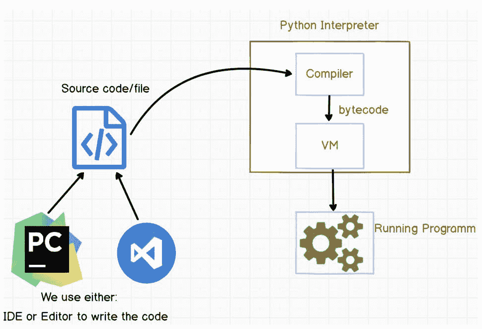

从上图中，我们可以看到我们使用不同的工具（如 IDE 和代码编辑器，我们将在第 3 章安装它们）编写 Python 代码，文件被解释器获取，解释器使用编译器创建扩展名为（**.pyc**）的**字节码**文件。这个文件被虚拟机获取并执行，虚拟机是平台无关的，让我们可以在任何想要的系统上使用 Python。在第 3 章中，我们将看到如何在我们的机器上安装 Python，以及如何使用不同的工具来专业地编写和执行 Python 代码。

### 为什么有这么多编程语言？

为什么有这么多编程语言的答案很简单。今天我们有不同的语言，因为没有一种语言能做我们想做的一切。这意味着没有一种单一的终极语言能完美地用于制作游戏、网站、软件应用程序等等。今天我们有如此多不同的应用需求，使得一种语言不可能支持所有功能。这将使语言变慢，并且需要大量的时间并且需要内存来运行和操作。每种语言都有其优缺点，例如，Python 作为一门语言比 **C++** 和 **Java** 慢，但它非常适合制作用于机器学习或 Web 服务器的应用程序，以及处理数百万个文件的脚本。这就是为什么我们有如此多的语言。我们只需要专注于最好的语言，而 Python 就位居前列。

## 入门指南 – 如何运行 Python 代码

我们可以通过不同的方式运行 Python 代码。如果你看过其他书籍或课程，你会看到它们通常在第一章或第二章就开始介绍 Python 的安装和工具设置。在本书中，我们将改变这一点。我们不会在第 3 章之前安装 Python 和工具，但我为什么采取这种方法呢？原因很简单，我希望你先学习 Python 的基础，而不会因为“为什么我需要所有这些不同的工具”或“为什么我需要安装 Python 并使用终端或命令提示符来运行某些功能”而感到压力。我保证你会学习到很多编写、运行和执行 Python 代码的方法。如今，我们可以在这个星球上的任何地方在线运行 Python，你所需要的就是访问互联网。这意味着你甚至可以从你的手机、平板电脑和笔记本电脑上编写和执行 Python 代码，无需安装任何软件。在第 3 章中，我将介绍专业 Web 开发人员用来编写和执行代码的工具，并且不仅仅向你展示一种方法，我将包含不同的工具，你可以选择你喜欢的。我保证没有任何一本书会包含所有这些。那么，我们如何运行 Python 代码呢？我们可以通过多种方式运行 Python 代码：

- 我们可以在终端或命令提示符（CMD）上运行它。
- 我们可以在不同的代码/文本编辑器上运行 Python 代码，例如：
    - VS Code
    - Atom
    - Sublime
    - Vim
- 我们可以在不同的集成开发环境（IDE）上运行 Python 代码，例如：
    - Spyder
    - PyCharm
    - Eclipse PyDev
    - IDLE
    - Wing
    - 像 Jupyter 这样的 Notebooks

如你所见，编写、运行和执行 Python 有不同的方式，但让我们从最简单的开始。有一个名为 **replit** 的网站，我们可以免费使用它来编写和运行 Python 代码。你甚至可以仅使用这个网站完成我整本 Python 书。这里是其官方网站的链接：

[https://replit.com/](https://replit.com/)


使用像 **replit** 这样的网站是我推荐给每位初学者的，老实说，它简直完美且易于使用。你需要做的只是创建一个账户，这是免费的：


创建账户后，你可以登录并创建你的第一个项目或第一个 repl。创建 Python 项目有不同的方式，在下图中我重点展示了其中一些：

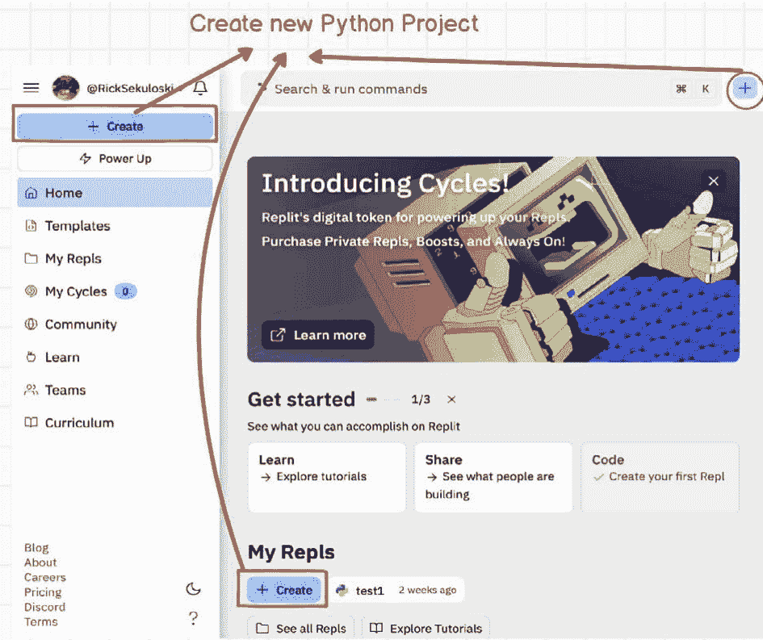

将来，**replit** 的界面可能会有轻微变化，但我相信创建新项目会变得更容易。点击加号或上图中的任何图标后，你需要为你第一个 repl 命名（我将其命名为 Project FirstPythonProject）：

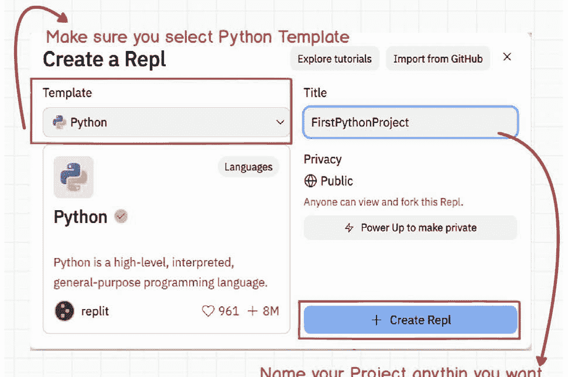

你需要做的最后一件事是点击（+ Create Repl）按钮，你的项目就准备好了。创建第一个项目后，你应该会看到一个类似于下图所示的界面：

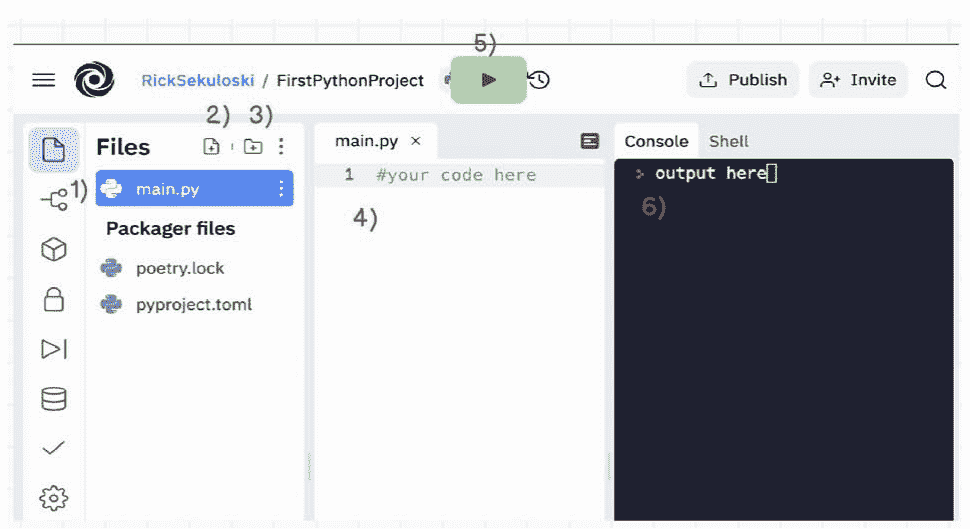

从图中可以看出，我用数字标记了重要项目，那么让我解释一下每个数字的含义：

1.  数字 1 是 **main.py** 文件。这是我们在创建新项目时 **replit** 为我们创建的文件。如你所见，我们需要使用 .py 扩展名来表明我们将要编写 Python 代码。
2.  数字 2 让我们能够向现有项目添加新文件。只需在命名文件时不要忘记添加 .py 扩展名。例如，你可以将文件命名为 **test.py**。
3.  数字 3 允许我们创建一个新文件夹，用来存放其他 Python 文件。
4.  数字 4 是我们编写实际 Python 代码的地方。
5.  数字 5（绿色的播放按钮）用于执行我们在 **main.py** 文件中编写的代码。
6.  数字 6 是我们点击运行按钮执行 main.py 文件后查看输出的地方。

在 replit 这类网站中，Python 的版本号低于我们从官方网站下载的官方 Python。例如，在第 3 章中，我们将安装最新的 Python 版本，但我只是想向你展示 replit 也使用 Python 解释器。如果我们访问官方 Python.org 网站并从菜单中点击下载选项卡，我们会看到类似这样的内容：

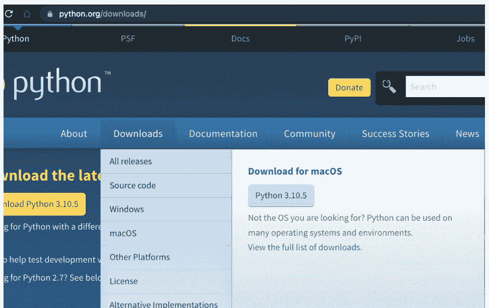

你可以访问以下链接执行相同操作：

[https://www.python.org/downloads/](https://www.python.org/downloads/)

从上图可以看出，Python 网站自动识别了我的操作系统，并为我提供了下载 macOS 版 Python 3.10.5 的选项。在你的情况下，取决于你阅读本书的时间，你会看到不同的版本。如果我们回到 replit 网站，点击 shell 选项卡并输入：**python -V**，或者如果不行就尝试 **python3 -V**，你会看到该网站用于运行我们代码的 Python 版本与官方 Python 页面显示的不同：

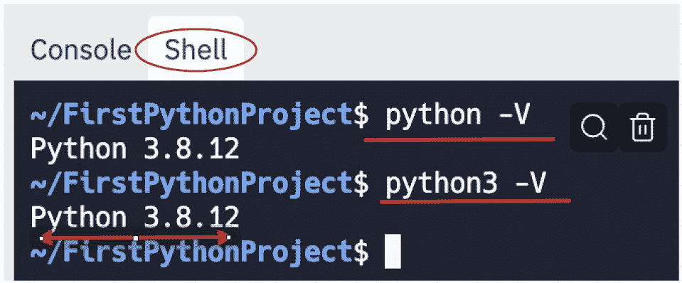

版本是 3.8.12，一个较旧的 Python 版本，但只要它和官方网站一样以相同的第一个数字（3）开头，我们就可以继续。这就是我想解释的关于 replit 网站的所有内容。它使用起来非常简单直接，所以在下一节中，我们将编写我们的第一个 Python 代码。

### 编写我们的第一个 Python 代码

我们可以编写的最简单代码将使用 print() 函数。为了编写和运行我们的第一个代码，首先，你需要打开 replit 网站，并在 main.py 文件中写入以下代码：

```python
print('Hi everyone!')
```

编写代码后，如果我们点击顶部的绿色播放按钮并确保选择了 “Console” 选项卡，我们就可以运行或执行它：

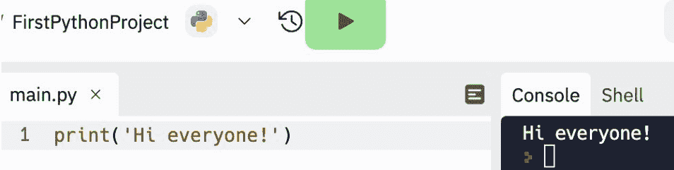

从上图中，我们可以看到右侧是输出 “Hi everyone!” 的地方。不用担心 print 函数或我们编写的代码，因为本章后面会讲到那部分。我通常收到的一个问题是，**replit** 网站是如何为我们提供这个输出的？在像我们当前使用的 **main.py** 这样的 Python 文件中，我们编写 Python 代码，它可以只有一行，也可以有数千行代码。这些行是单独的指令，在 **replit** 中运行的 Python 解释器将逐行读取 main.py 文件，并将它们转换为 **字节码**，以便最终使用 **CPython** 虚拟机来产生输出。让我们编写更多代码。如果在这个阶段你不理解代码也没关系，但通过这样做，我们帮助你熟悉 Python 语言，因此在 print() 函数下面，写入以下代码：

```python
input('What is your name?')
```

如果我们再次点击运行按钮，我们将看到以下输出：

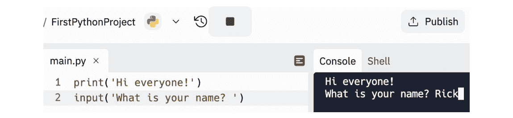

input 函数允许用户输入文本，我在问号后输入了 Rick。如你所见，我们编写了第一个程序，要求用户输入一些内容。在右侧的控制台中，我输入了我的名字（如果你想，也可以输入你的名字），但我还没有按下键盘上的回车键（return）或输入键（enter），正因为如此，程序仍在后台运行并等待我们。我们知道程序在等待，因为顶部没有绿色的播放按钮，取而代之的是一个黑色方块或停止按钮。一旦我们在键盘上按下回车键或输入键，这个按钮就会消失。

## Python中的变量

如果我们想让简单的程序变得更有趣，可以使用变量。本节后续会详细讨论变量，但你应该知道，Python中的变量就像是可以存储值的容器。就我们目前的情况而言，我希望将`input`函数获取的输入内容存储到一个变量中，如下所示：

```python
name = input('What is your name? ')
print(name)
```

如果点击运行按钮，输出将会是：

```
main.py
1 print('Hi everyone!')
2 name = input('What is your name? ')
3 print(name)

Console Shell
Hi everyone!
What is your name? Rick
Rick
>
```

在这个例子中，变量名为`name`，我们将其赋值为`input`函数返回的结果。`input`函数在用户输入内容后，会返回在控制台输入的任何内容。在这个例子里，我输入了'Rick'并按了回车键，`input()`函数便返回了'Rick'。这等同于我直接写了：

```python
name = 'Rick'
```

在第三行，我使用`print`函数将变量`name`的内容显示到控制台，因此输出中出现了'Rick'。总结一下，变量是我们为想要存储的数据所起的名称。我们需要变量是因为它们允许我们存储和操作不同的数据。我们名为`name`的变量现在可以在代码中反复使用。当我们创建一个变量时，程序会在内存中分配一块空间来存储数据。你需要了解的一个重点是，变量中的数据在程序运行后期是可以被更改为不同的值的。例如，在第三行之后，我们编写以下代码：

```python
name = 'Jason'
print(name)
```

如果我们运行这段代码，你认为输出会是'Rick'还是'Jason'？让我们运行文件来观察结果：

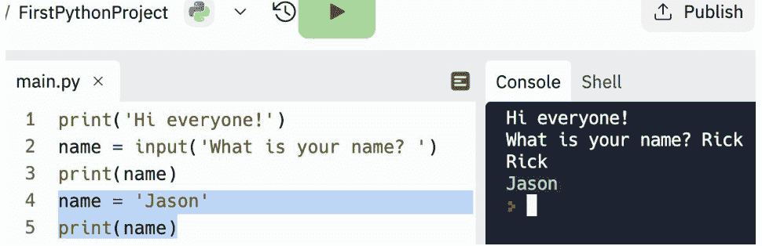

如你所见，我们可以将名为`name`的变量内容更改为不同的值。在本节中，有几个关键词需要你记住：

- 变量声明
- 初始化
- 初始值

以上关键词并非Python独有，它们已在大多数编程语言中使用。请看以下语句：

```python
my_age = 10
```

在这条语句中，我们定义了一个名为`my_age`的变量，这称为变量声明，因为我们正在给变量命名。我们使用等号`=`为变量赋值，这就是初始化过程。在变量声明时，建议赋予一个初始值或数据。在这个例子中，初始值是10，但在Python中，我们也可以创建没有值的变量，不过这是另一个主题。我们可以在一行中创建多个变量，如下所示：

```python
first, second = 1, 2
```

这等同于：

```python
first = 1
second = 2
```

当我们创建变量并用一个值初始化它们时，总是使用赋值运算符`=`。正是通过这个运算符（等号），我们实现了变量名与值之间的绑定。我们将学习一些关于如何在Python中命名变量的规则，但现在是时候继续学习其他Python特性了。以上是我们热身章节，希望你喜欢。

## Python中的注释

我们可以在代码中使用`#`符号来编写注释。注释不会包含在最终输出中，Python解释器会忽略它们。注释在Python中非常有用，因为它们不仅能让我们自己的代码更易读，也能帮助其他可能阅读我们代码的开发者理解。在Python中，我们可以像这样编写单行注释：

```python
# this is single line comment
```

我们也可以使用三个单引号或双引号来编写多行注释：

```python
'''
Hi,
this is multi-
line comment!
'''
```

一条经验法则是，代码中使用的注释必须提供有价值的信息。这些信息不仅有助于你未来阅读自己的代码，也能帮助其他开发者理解你的代码，因为并非所有功能都容易理解。请不要在你编写的每一行代码上都添加注释，否则会使你的代码显得杂乱。你编写的注释应简短而精炼。

### 数据类型

数据类型是Python中的值。Python中的每个值都有一个数据类型。Python中有多种数据类型。我将尝试按重要性将Python中的数据类型分为不同类别，并首先列出核心或基础数据类型：

- Int – 整数
- Float – 浮点数
- Complex – 用于整数和浮点数之外
- Bool – 布尔值
- Str – 字符串

Python中还有更高级的数据类型：

- List – 列表
- Tuple – 元组
- Set – 集合
- Dict – 字典

大多数书籍会解释上述基础数据类型，但在Python中，有些数据类型超出了核心类型范畴。Python允许我们使用以下方式创建自己的数据类型：

- 类（Classes）- 用于创建自定义类型

在Python中，我们还有所谓的专用数据类型。这些数据类型并非Python内置，包括：

- 包（Packages）
- 模块（Modules）

这些**包**和**模块**可以从不同的库中使用，当上述数据类型不满足我们的需求时，就会用到它们。另一个重要的数据类型是**None**。**None**数据类型用于表示值的缺失，类似于JavaScript语言中的**Null**。最后要提及的数据类型叫做**复数（Complex Numbers）**。复数由复数**类（Class）** 表示。在下图中，你可以清楚地看到数据类型是如何分类的：

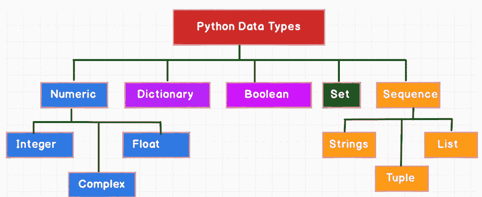

在本章中，我们将涵盖所有Python数据类型，但我不会完全按照上图所示的顺序进行讲解。还有很多其他Python特性值得一提，我认为在解释不同数据类型时包含它们，将有助于你理解Python。我保证前几个章节是最难的，因为我们对Python核心特性还不够了解，无法加快进度。因此，我建议你从现在开始仔细阅读所有章节。

## Int – 整数（数据类型）

Python包含三种数值类型（整数、浮点数和复数），以便我们表示数字。其中一种叫做整数或Int。整数是一个完整的数字，例如，它可以是零（0）、正整数或负整数。为什么我们需要整数？嗯，我们使用它们通过数学运算符（如`+`、`-`、`/`、`*`）来进行数学运算。我们可以做一些基础计算，如下所示：

```python
# Int
a = 6
b = 3
print(a + b)
print(a * b)
print(a / b)
print(a - b)
```

我们可以运行上述代码并检查输出：

# FirstPythonProject

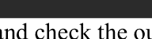

| 代码 (main.py) | 输出 (Console) |
|----------------|------------------|
| a = 6          | 9                |
| b = 3          | 18               |
| print(a + b)   | 2.0              |
| print(a * b)   | 3                |
| print(a / b)   |                  |
| print(a - b)   |                  |

如果你注意到了，当我们在Python中编写函数时，总是使用`()`（括号）或方括号。在访问函数时，括号是非常重要的部分。没有它们，函数将不会返回我们预期的结果。在Python中，我们可以使用`type()`函数来确定数据类型。如果你有其他编程语言如JavaScript的经验，你会注意到这两种语言有很多相似之处。在JavaScript中，我们使用`typeof()`函数来确定类型。从上图中，我们看到有两个变量的值是整数类型。让我们使用`type()`函数验证一下：

```python
print(type(a))
print(type(b))
```

如果我们在Replit中运行上述代码，将会得到以下输出：## 浮点数（Float）—— 浮点数（数据类型）

浮点数是带有小数部分的数字，例如 3.5、-9.7、11.023。以下是浮点数据类型的一个示例：

```python
#Float
m = 1.5
n = 3.22
print(m * n)
print(type(m))
print(type(n))
```

两个变量都属于 `int` 类，请不要担心现阶段 `class` 关键字的含义。总之，整数是没有小数部分的完整数字。

## 整数和浮点数是如何存储的

我们已经了解了整数和浮点数是什么，但浮点数和整数之间是否有重大区别？是的，有很大区别，因为浮点数在内存中的存储位置不同，因此与整数相比，它们占用更多的内存空间。以浮点数 4.5 为例。在内存中，它会存储为 4 和 5 在两个不同的位置，这就是为什么浮点小数占用更多内存空间。整数会被转换成二进制数然后存储在内存中。二进制数由 0 和 1 组成。有一个函数可以用来进行转换，称为 `bin()`（二进制），这个函数会返回整数的二进制表示形式。

例如，让我们尝试在 replit 中运行以下代码：

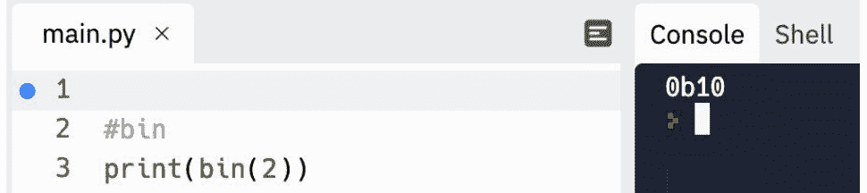

从上图我们可以看到，输出是 0b10，第一部分 `0b` 是一个前缀（zero b），用于区分二进制数和十进制数，或者简单地说，该前缀表示一个二进制字面量。实际数字 2 的二进制值由二进制 10 表示。既然我们已经了解了这两种数据类型（int 和 float），现在该学习可以对它们执行哪些数学运算了。

#### Python 幂运算符 (**)

像大多数编程语言一样，Python 允许我们使用整数和浮点数执行基本或复杂的数学运算。例如，双星号（**）用于将 Python 中的一个数字提升到另一个数字的幂次方。这个运算符被称为幂运算符，它需要两个值来进行计算。下面是一个如何使用幂运算符的示例：

2 ** 3

在这个表达式中，2 的 3 次幂，因此结果将是 8：

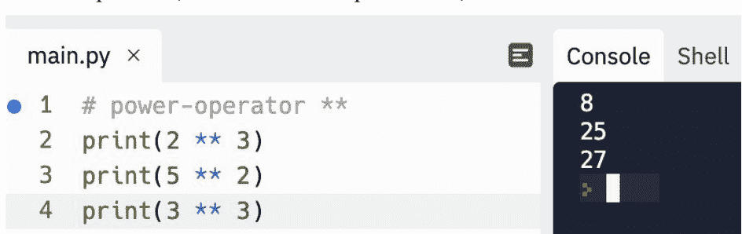

在下一节中，我们将讨论地板除。

## Python 双斜杠（//）运算符：地板除

在 Python 中，我们可以使用双正斜杠（//）来执行地板除。地板除也称为整数除法，其语法如下：

5 // 4

这个运算符将把第一个参数除以第二个参数，并将结果四舍五入到最接近的整数。在 Python 中，有一个名为 `math.floor()` 的函数可以做完全相同的事情，但为了使用这个函数，我们需要学习如何导入外部模块，而我们不打算在本章介绍导入模块，因此双斜杠（//）运算符是我们现在将使用的。如果我们在 main.py 文件中运行上面的例子，我们将得到输出 1：

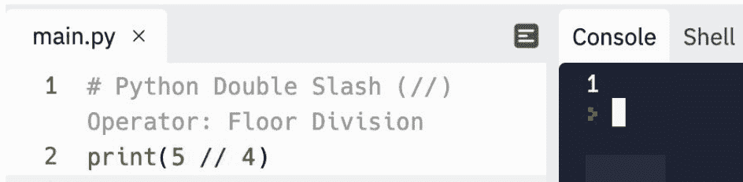

这个运算符将返回一个向下舍入到最接近整数的整数。

#### Python 取模运算符 (%)

这个运算符被称为取模运算符，我们需要使用的符号是 (%)。这个运算符用于返回左操作数除以右操作数的余数，如下面的示例所示：

```python
# Modulo operator
print(5 % 4)
```

结果是 1，因为取模运算符会给出这次除法的余数。如果你读过我的一些 JavaScript 书籍，你会看到我们在 JavaScript 中也使用取模运算符。取模运算符被认为是一种算术运算，与以下运算符同类：

```
+,-,/,*,**,//
```

在下一节中，我们将介绍可以使用哪些类型的数学函数来处理浮点数和整数。

## 整数和浮点数据类型的数学函数

本节我们将学习的这些数学函数是内置函数。这意味着 Python 让我们无需导入外部库即可访问这些数学函数。我们将讨论的第一个函数是 `round()` 函数。

### round()

`round` 函数将一个浮点数四舍五入到最接近的整数。例如，如果我们有一个浮点数 4.3 并使用 `round()` 函数，输出应该是 4。让我们测试更多示例，看看 `round()` 函数会返回什么：

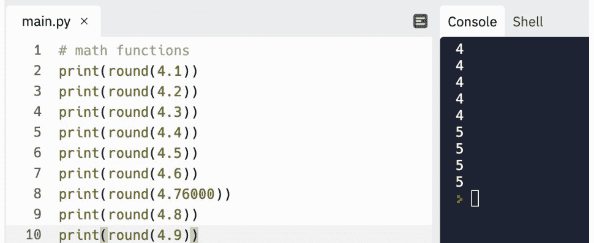

replit 网站的工作方式类似于安装了代码编辑器或我们正在使用 IDE 编写 Python 代码。让我告诉你为什么。如果我输入 `round` 并添加开括号和闭括号，而不按运行按钮，replit 网站会给我一个关于该函数在 Python 中作用的简短描述。

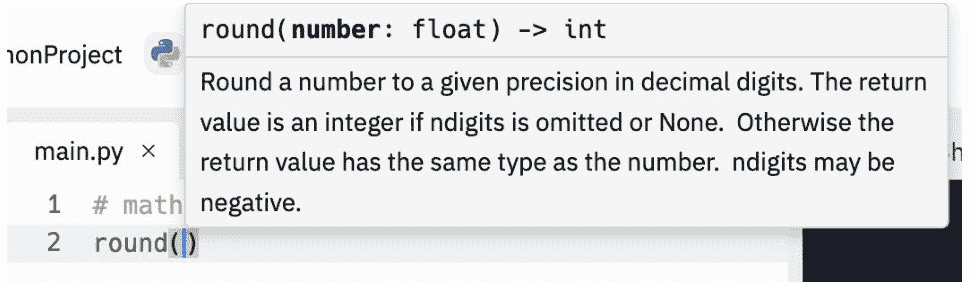

这正是如果我们使用代码编辑器或 IDE 在我们的机器上运行和执行 Python 代码时所会得到的行为。

### abs()

`abs()` 函数将返回参数的绝对值。如果你的数学不太好，那么绝对值函数永远不会返回负数：

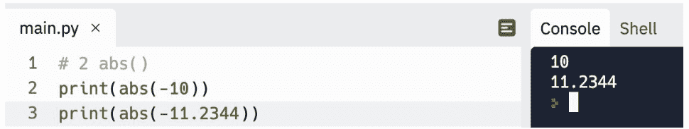

正如我们所看到的，负十的绝对值是正十。Python 官方网站上还有更多可用的数学函数，我们不会全部介绍，因为本书的目标是教你 Python，而不是如何学好数学。如果你打开下面的链接，你会看到 **math** 模块中包含的完整数学函数列表。但请记住，为了使用它们，你需要学习什么是模块以及如何导入它们，我们将在未来的章节中深入介绍这一点。你可以点击链接，看看 Python 中有哪些可用函数：

[https://www.programiz.com/python-programming/modules/math](https://www.programiz.com/python-programming/modules/math)

### 运算符优先级

到目前为止，我们已经学习了可以对 Python 的两种数据类型（整数和浮点数）执行数学运算。为了实现这一点，我们需要使用像 +, -, *, / 这样的运算符。通常，数学表达式是复杂的，我们使用不同运算符的组合来获得最终结果。这就是运算符优先级发挥作用的地方。运算符优先级意味着当不同的运算符组合在一个表达式中时，其中一些运算符会比其他运算符具有更高的优先级。Python 解释器知道这些规则并始终遵循它们。

例如，让我们考虑这个表达式：

```
7 - 3 * 2
```

从我们的数学课上，我们知道首先我们需要执行乘法（3 * 2），然后是减法。解释器知道这个规则，否则如果我们按照运算符的顺序进行计算，将会得到不同的结果：

**正确答案：**
1) 7 - 3 * 2 =
2) 7 - 6 =
3) 1

**错误答案：**
1) 7 - 3 * 2 =
2) 4 * 2 =
3) 8

优先级顺序：

1) () – 括号具有最高优先级；我们首先计算括号内的任何内容。
2) ** – (幂运算) 只有在括号 () 之后才执行。
3) * , / – 然后我们执行乘法和除法。
4) + , - 最后是加法和减法。

优先级顺序对于所有编程语言都相同，但了解它非常重要。在不查看答案的情况下，请计算以下表达式：
(7 - 3) * 2 + 2**2

答案：
第 1 步) 括号中的内容 (7-3) 因为优先级顺序而最先执行。因此，7-3 减法后的结果是 4。
第 2 步) 然后是幂运算符，2 ** 2 的结果等于 4。
第 3 步) 接着是乘法运算符，它将使用第 1 步操作的结果（即 4），这个 4 将乘以 2，结果是 8。
第 4 步) 最后，加法运算符执行，8 + 4 的和是 12。

你可以在 replit 中运行以下代码。只需将其包装在一个 `print` 函数中，你就可以看到输出：

```python
a = 6
b = 3
print(a + b)
print(a * b)
print(a / b)
print(a - b)

print(type(a))
print(type(b))
```## 变量的命名规则

我们知道，变量是用来存储数据或值的容器。但在 Python 中，给变量命名时需要遵循一些规则。例如，在 Python 中，变量名只能包含字母（a-z，A-Z）、数字或下划线（_）。首字符不能是数字或下划线。下面是一个关于有效和无效变量名的示例（以下变量的值属于不同的数据类型，我们将在本章稍后讨论）：

给变量命名时，至关重要的一点是始终想出一个具有描述性的好名字，以便每个人都能理解变量的含义。Python 是一种区分大小写的语言，这意味着变量 `user_name` 和变量 `user_Name` 是不同的变量。

在 Python 中，我们可以使用两种命名约定：

-   驼峰命名法
-   蛇形命名法

当我们使用复合词来创建一个变量名时，驼峰命名法就显而易见了。例如，我想创建一个由这两个词（first，name）组成的变量名。驼峰命名法的规则是：第一个单词以小写字母开头，之后每个单词的首字母应大写：

```
#camel case notation
firstName = 'Jason'
```

我将使用的另一种约定是蛇形命名法，我们使用下划线来分隔单词。让我们将驼峰命名法的 `firstName` 变量改写为蛇形命名法：

```
# snake case notation
first_name = 'Jason'
```

你可以使用任何你喜欢的命名法，但我建议只选择一种并坚持使用。在同一个代码中使用两种命名规范是不良实践。在 Python 中，我们有一组预定义的保留关键字，因此我们不能用它们来命名变量。我们如何查看这个预定义的保留关键字列表呢？在 Python 中这非常简单，因为我们可以使用 `help()` 函数并这样输入关键字：`help('keywords')`，输出如下：

内置的 `help()` 函数用于获取变量、类、函数和模块的文档。你会知道你的代码中是否使用了关键字，因为这些关键字会以与代码其余部分不同的颜色突出显示。例如，在我的情况下，颜色是蓝色。

## 为变量重新赋值

在 Python 中，我们可以为同一个变量赋予一个新值，这被称为重新赋值。例如，让我们创建一个名为 `num1` 的变量并赋予一个随机整数值：

```
# reassign values to variables
num1 = 10
print(num1)
```

现在让我们赋予一个新值，这次可以是浮点数：

```
# give num1 value of 13.4
num1 = 13.4
print(num1)
```

让我们查看输出：

如你所见，在 Python 中我们可以轻松地重新赋值。在 Python 中，我们可以使用一个变量的值，并将其赋给一个新变量。我知道这很令人困惑，但希望这个例子能澄清问题：

从上图中，我们有一个名为 **my_weight** 的变量，其值为 78。在第 4 行，有另一个名为 **your_weight** 的变量，但它的值是基于 **my_weight** 的值减去十。

### Python 中的常量

在 Python 中，常量是一种值不能更改的变量类型。但这并非完全正确，因为我们仍然可以更改其值。例如在 JavaScript 中，当我们创建一个常量变量时，其值不能更改，因为如果我们尝试更改，它会抛出错误。在 Python 中命名常量时，我们应该遵循一些新的命名约定。如果是一个复合名称，我们需要使用全大写字母和下划线。例如：

```
# Constants
PI = 3.14
EARTH_GRAVITY = 9.807
```

但尽管它被声明为常量，我们仍然可以更改其值：

```
# Constants
PI = 3.14
EARTH_GRAVITY = 9.807
print(PI)
print(EARTH_GRAVITY)

# Assign new value
PI = 3.1455
EARTH_GRAVITY = 9.8
print(PI)
print(EARTH_GRAVITY)
```

正如我们所看到的，常量就像普通变量一样，可以被重新赋新值。那么拥有它们的意义何在？所有开发者的规则是，当你看到使用常量的代码时，你绝不应试图更改它们的值，因为它们的值本意是保持不变。

## 双下划线变量或双下划线方法

“双下划线”（Dunder）一词代表“double underscore”，因为这些变量的名称被两个下划线包围：

```
__dunder__
```

在本章中，我将只提到存在称为 dunder 的变量，它们是一种特殊类型，在现阶段我们不应尝试更改、修改或重新赋值。我们将在后续章节中学习更多关于它们及其功能的知识。

## Python 中的表达式与语句

在 Python 中，表达式（Expression）是操作符和操作数的序列或组合，它会产生一个值。需要知道的是，表达式总会产生一个值。表达式是一段会产生值的代码。在大多数 Python 文献（书籍或在线教程）中，表达式和语句的解释都比较复杂。
在下图中，`current_year - year_born` 的结果/值就是一个表达式：

什么是语句（Statements）？语句比表达式更复杂，因为它们是完整的代码行：

```
current_year = 2023
year_born = 1990
user_age = current_year - year_born
```

这是一个 Python 语句

绿色行是一条语句，因为它执行了某种操作。这里的操作是将表达式产生的值赋给 `user_age`。这就是为什么整行都变成了语句，因为它是一个操作。在下图中，我突出了两条语句：

```
current_year = 2023
year_born = 1990
```

这两行是语句

```
user_age = current_year - year_born
```

这是一个 Python 语句

### 增强赋值运算符

我们知道我们使用赋值运算符（`=`）为变量赋值。增强赋值运算符是赋值运算符与算术或按位运算符的组合。示例：

```
# Augmented assignment operator
num1 = 10
num2 = 20

num1 += num2
print(num1)
```

`num1 += num2` 是什么意思？增强赋值运算符提供了一种简短的方式来执行二元运算并将结果赋回其中一个操作数。这是一种简短的语法，因为它等同于：

```
num1 = num1 + num2
```

结果如下：

上述运算符结合了算术加法和赋值的功能。在 Python 中，我们可以使用几种不同的增强赋值运算符：

-   `+=`，加法与赋值
-   `-=`，减法与赋值
-   `*=`，乘法与赋值
-   `/=`，除法与赋值
-   `//=`，整除与赋值
-   `**=`，幂运算与赋值
-   `%=`，取模与赋值

示例：

```
# Augmented assignment operator
num1 = 30
num2 = 10
# Addition & Assignment
num1 += num2
print(num1)
# Output: 40

num1 = 30
num2 = 10
# Subtraction & Assignment
num1 -= num2
print(num1)
# Output: 20

num1 = 30
num2 = 10
# Multiplication & Assignment
num1 *= num2
print(num1)
# Output: 300

num1 = 30
num2 = 10
# Division & Assignment
num1 /= num2
print(num1)
# Output: 3.0

num1 = 30
num2 = 10
# Floor Division & Assignment
num1 //= num2
print(num1)
# Output: 3

num1 = 30
num2 = 10
# Power & Assignment
num1 **= num2
print(num1)
# Output: 590490000000000

num1 = 30
num2 = 10
# Modulo & Assignment
num1 %= num2
print(num1)
# Output: 0
```

## Str – 字符串（数据类型）

字符串是 Python 中的另一种数据类型。Python 中的字符串（**str**）是用单引号或双引号括起来的文本。

字符串示例：

```
# Str - strings data type
my_name = 'Keanu'
my_lastname = "Reeves"
print(my_name)
print(my_lastname)
```

从上面的例子中，我们可以看到，我们既可以使用单引号也可以使用双引号来包裹文本，并且根据你所使用的编辑器，引号内的文本会显示为不同的颜色，比如绿色、蓝色或橙色，就像在 replit 中一样。如果我们在 replit 上运行相同的代码，将会看到以下输出：

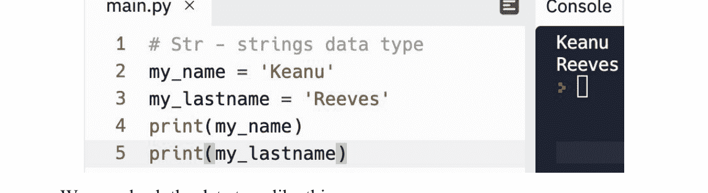

我们可以这样检查数据类型：

```
#check the data type
print(type(my_name))
print(type(my_lastname))
```

在 Python 中还有另一种编写字符串的方法，当我们有一个需要跨越多行的长字符串时，更推荐使用这种方法。例如，当我们有一段很长的文本需要跨越多行时，我们可以使用以下语法：

```
# Long string
text = """
first line
second line
third line
"""
print(text)
```

如你所见，我们需要使用三个连续的单引号，然后就可以在不同的行上编写字符串。如果我们运行相同的代码，输出将会是：

```
python
# Long string
text = '''
first line
second line
third line
'''
print(text)
```

输出是三行，与原始字符串相同，使用单引号无法实现这一点，因为它会导致语法错误：

```
python
# Long string
text = 'first line
second line
third line
'
print(text)
```

## 字符串拼接

字符串拼接简单来说就是使用加号运算符 `+` 将字符串连接在一起。`+` 运算符会将不同的字符串连接起来。从上面的例子中，我们有两个变量 `my_name` 和 `my_lastname`，它们的数据类型都是字符串，因此通过字符串拼接，我们可以实现以下效果：

```
python
# String Concatenation
my_name = 'Keanu'
my_lastname = "Reeves"
full_name = my_name + my_lastname
print(full_name)
```

很好，但是名字和姓氏之间没有空格，这是因为 `my_lastname` 变量中没有空格。所以我们有两种方法可以在两个字符串之间添加空格。第一种方法不是我推荐的做法，但它确实有效：

```
python
# String Concatenation
my_name = 'Keanu'
my_lastname = " Reeves"
full_name = my_name + my_lastname
print(full_name)
```

如你所见，我在 `my_lastname` 变量中第一个字母 'R' 前添加了一个空格。输出正是我们需要的，但还有另一种更优雅的方法，那就是在拼接时在两个变量之间添加一个空格：

```
python
# String Concatenation
my_name = 'Keanu'
my_lastname = "Reeves"
full_name = my_name + ' ' + my_lastname
print(full_name)
```

很好！现在你知道我们可以使用加号运算符来组合多个字符串了。在进行字符串拼接时，有一些有趣的情况需要注意。

## 示例：

```
python
# can't concatenate str to int
greet = 'hi'
five = 5
message = greet + five
print(message)
```

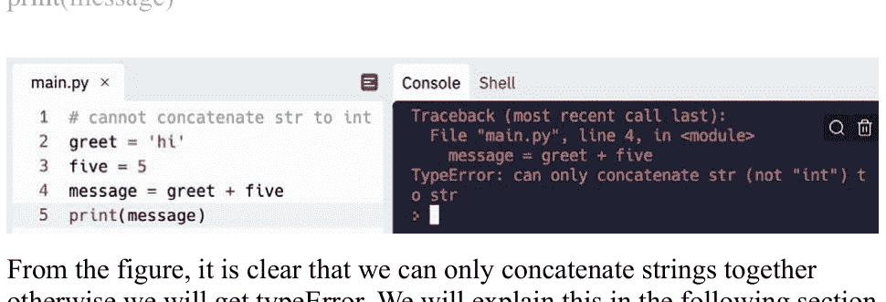

从图中可以清楚地看到，我们只能将字符串拼接在一起，否则会得到类型错误。我们将在下一节“类型转换”中解释这一点。

#### 类型转换或类型强制转换

在 Python 中，字符串写作 `str`，这是 Python 的一个内置函数。但如果 `str` 是一个函数，我们能否像使用其他内置函数一样使用括号呢？让我们使用 `str` 函数来传递一个整数作为值：

```
python
# type conversion
print(str(250))
```

如果我们在浏览器中运行这个，输出将是 250，但 250 是整数还是字符串？为了澄清这一点，让我们重写上面的代码，将 `str` 函数的结果存储到一个变量中，然后检查该变量的类型：

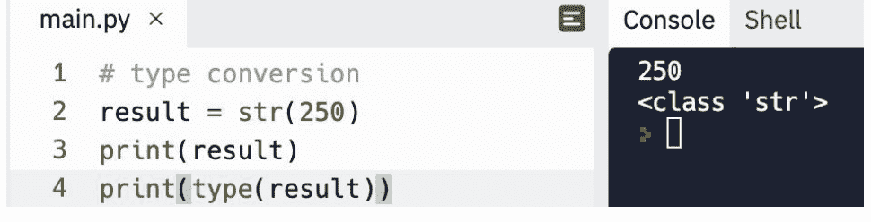

如你所见，结果或值 250 的类型是字符串。这意味着 `str()` 函数将我们最初传递给 `str` 函数的整数 250 转换成了字符串。因为 `result` 变量的值是字符串，我们不能进行正常的数学运算，比如：

```
# can only concatenate str (not "int") to str
print(result + 10)
```

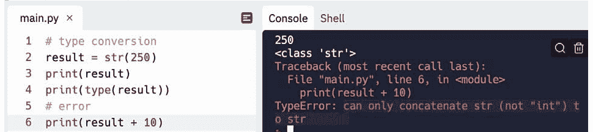

这被称为显式类型转换，即我们用户/开发者尝试将变量值从一种数据类型转换为所需的数据类型。我们可以使用内置函数如 `int()`、`float()`、`str()` 等来进行这种类型转换。让我们尝试将字符串转换为整数：

```
# type conversion from string to int
num0 = str(5)
print(type(num0))
num2 = 10
num1 = int(num0)
print(type(num1))
result1 = num1 + num2
print(result1)
```

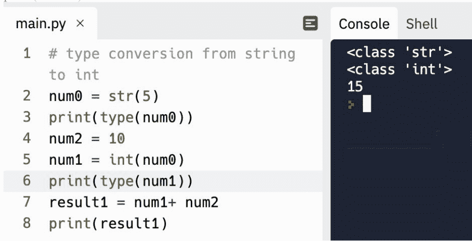

总结一下，类型转换就是将一种数据类型转换为另一种数据类型。

#### 隐式类型转换

我们已经看到，如果我们使用一些 Python 内置函数，可以进行显式类型转换或类型强制转换，但还有另一种转换叫做**隐式类型转换**。这种转换不需要我们参与或使用 Python 内置函数。隐式类型转换是 Python 在后台自动完成的。解释器会进行一些后台检查和计算，只是为了避免数据丢失。这里有一个例子，Python 会自动将整数转换为浮点数，只是为了避免数据丢失：

```
int_number1 = 12
flo_number2 = 12.456
print("data type of integer:", type(int_number1))
print("data type of floalat:", type(flo_number2))
sum_numbers = int_number1 + flo_number2
print("Value of num_new:", sum_numbers)
print("data type of the sum:", type(sum_numbers))
```

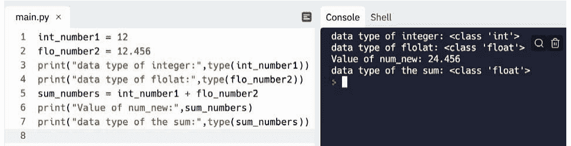

## 转义字符

我们讨论过，如果我们将文本包裹在单引号或双引号中，就可以创建字符串，但我们没有讨论的是，有些特殊字符需要我们采取一些措施。有些字符是非法的，我们需要使用转义字符。例如，如果我们想添加一个撇号，我们需要使用一个转义字符（`\`）后跟我们想要插入的字符（撇号）。

让我们看下面的例子：

```
text = 'I'm Rick'
```

上面的例子显然无法工作，因此我们需要使用反斜杠对其进行转义：

```
text = 'I\'m Rick'
print(text)
```

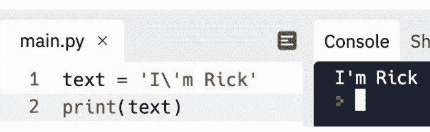

如果我们使用双引号来包裹文本，那么我们可以使用撇号：

```
python
text1 = "I'm Rick"
print(text1)
```

如果我们需要在字符串中包含反斜杠，那么我们可以这样转义它：

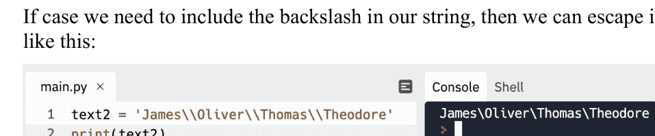

如果我们想在字符串前添加一个制表符并进行缩进，可以使用反斜杠 t（`\t`）：

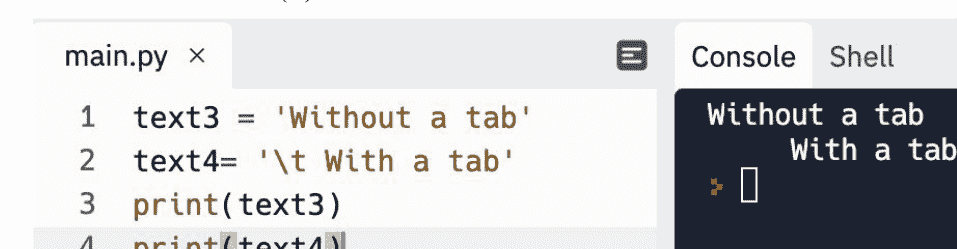

如果我们想在字符串中添加换行，需要使用反斜杠 n（`\n`）：

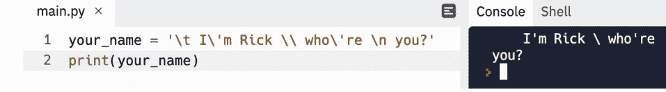

如果我们想在已经被双引号包围的字符串中使用双引号，那么你需要使用转义字符 `\"`：

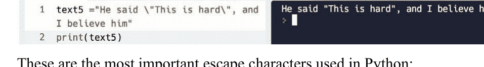

这些是 Python 中最重要的转义字符：

| 代码 | 结果 |
|------|------|
| \' | 单引号 |
| \\ | 反斜杠 |
| \n | 换行 |
| \t | 制表符 |
| \r | 回车 |
| \b | 退格 |
| \f | 换页 |
| \xhh | 十六进制值 |

#### 格式化字符串

如果我们想格式化字符串，可以使用 f-string。它们被称为 f-string 是因为字符串字面量前有一个前导字符 f。我们只需要在字符串前添加字母 f，这就会告诉 Python 解释器我们想要格式化我们的字符串。想象一下我们正在从注册表单中收集用户详细信息：

```
python
# f-strings to format the strings
first_name = 'James'
last_name = 'Bond'
age = 55

print(f'Dear {first_name} {last_name}, thank you for being 007 for so many years!')
```

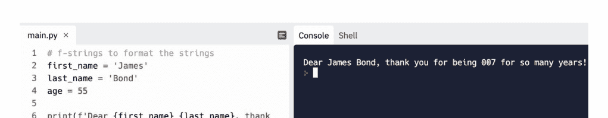

在 f-string 中，如果我们把变量名放在花括号 `{}` 中，就可以获取变量的值。使用字符串拼接也可以实现同样的效果，但如果你还记得，我们需要手动在名称之间添加空格，这将更加复杂且编写起来更长：## 字符串如何存储？

到目前为止，我们已经学习了整数和浮点数在内存中的存储方式。字符串在内存中以一系列独立字符序列的形式存储。这意味着单个字符被存储为长度为 1 的字符串，并且可以通过其索引进行访问。为了理解字符串的存储方式，我们需要看下面的例子：

```
my_name = 'Rick S'
```

如你所见，我们有一个变量 `my_name`，其数据类型是字符串。我们知道字符串是作为有序的字符序列存储的，第一个字符是‘R’，它将被存储在内存中的某个位置，即索引为零（0）的位置。下图说明了字符串在内存中的存储方式，每个字符都有自己的索引，从零开始：

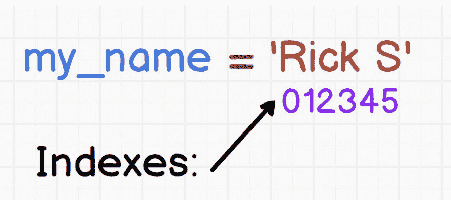

这非常强大，因为字符串的存储方式使我们能够轻松地根据字符的位置检索特定字符。我们如何从字符串中获取单个字符呢？我们可以使用变量名，后跟方括号，其中传递索引值。记住字符串从位置零开始，而不是 1。让我们使用以下语法获取上面字符串的第一个字符：

```
# 字符串索引
my_name = 'Rick S'
print(my_name[0])
```

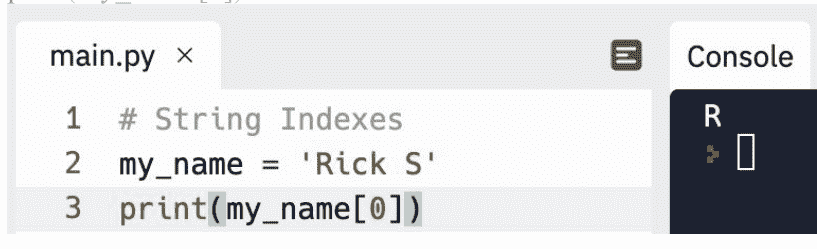

如你所见，我们只需要知道索引位置即可检索任何字符。如果我们尝试运行这段代码会发生什么：

```
print(my_name[4])
```

看起来什么都没有，但我们实际上得到了空格返回，因为即使是空格也存储在内存中。在下图的右侧，我高亮显示了实际打印出来的空格位置：

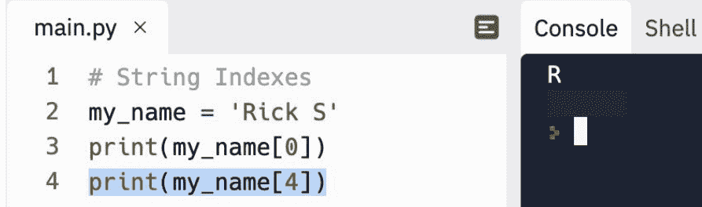

如果你使用一个不在字符串范围内的索引会发生什么？如果我们这样做，会得到一个 `IndexError`，这意味着我们试图通过该索引访问的字符根本不存在：

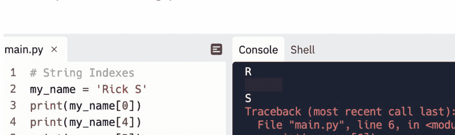

这种情况经常发生。初学者通常会犯这些错误，因为他们总忘记第一个字符存储在索引零（0）处。

## 字符串切片——获取字符串的子串

我们已经学会了如何根据索引提取单个字符，现在是时候学习如何根据指定范围返回多个字符了。这被称为字符串切片或提取字符串的子串，我们只需要使用以下语法：

```
[start:stop]
```

第一个索引称为 **起始索引**，它通过冒号与第二个索引（称为 **结束索引**）分隔。让我们尝试下面的例子：

```
# 字符串索引
my_name = 'Rick S'
print(my_name[0:4])
```

Rick

你应该知道，结束索引处的字符不会包含在输出中。在上面的例子中，那就是空格。如果我们想获取完整的字符串，我们需要这样写：

```
print(my_name[0:6])
```

```
# 字符串索引
my_name = 'Rick S'
print(my_name[0:6])
```

Rick S

从上面的图片中，我们可以看到结束索引是 6，但这个特定字符串的索引在位置 5 结束。这不会抛出错误，因为结束索引永远不会在输出中使用。

#### 带步长的字符串切片

步长语法如下：

```
[start:stop:stepover]
```

在上一节中，我们学习了如何根据起始和结束索引切片字符串，但现在我们可以包含第三个值，称为步长。步长的默认值是 1，我们不必显式写出。步长表示步幅大小，正如我提到的，默认值是 1，意味着我们逐个字符地移动，但如果我们增大步幅，那么我们将开始跳过字符，输出也会不同。让我们看看下面的例子：

```
# 步长
number_string = '012345678'
print(number_string[0:9:2])
```

从例子中，我们可以看到现在的步长值是 2，它将从第一个位置开始，然后步进 2 次打印 2，再步进 2 次打印 4，依此类推。这是我们的输出：

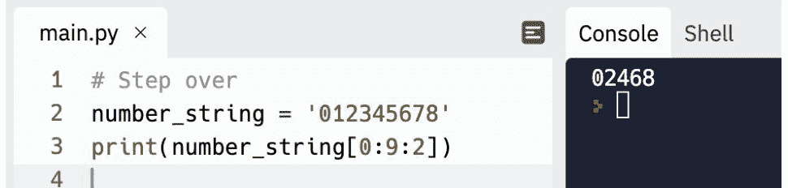

使用字符串切片非常有趣，因为有几种不同的场景我们需要了解。例如，如果我们只包含起始索引而省略结束索引，比如这样：

```
number_string[ 1 : ]
```

你能猜到会发生什么吗？输出如下：

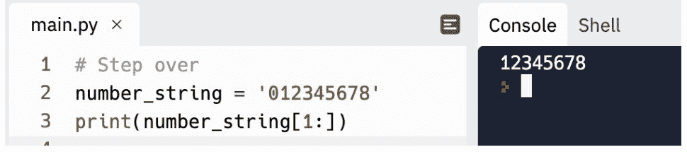

这基本上意味着我们需要从位置 1 开始，然后因为没有结束索引，它将一直运行到末尾。当我们有一个长字符串且不知道最后一个索引号是什么时，这非常有用。我们使用它是因为我们知道它会一直运行到最后。另一个有趣的场景是我们省略起始索引但包含结束/停止位置的索引，像这样：

```
number_string[:4]
```

你能猜到输出吗？如果不能，这里是截图：


这意味着从零开始（尽管值缺失），一直运行到索引 4，但不包括第四个位置的值。如果我们省略第一个起始索引和最后一个结束索引，只包含步长，像这样，会发生什么：

```
number_string[::1]
```

这将打印整个字符串，因为它从默认位置零开始，在字符串结束的地方结束，并且步长将是默认值 1。这里另一个例子是两个（起始，结束）索引都缺失的情况：

```
# 步长
number_string = '012345678'
print(number_string[::1])
print(number_string[::2])
```

太好了！我们已经学习了很多关于字符串切片的知识，那么让我们看看如果包含负值会发生什么：

```
# 步长
number_string = '012345678'
print(number_string[-1])
```

输出是 8，因为在 Python 中负索引意味着从字符串末尾开始，而不是位置零。负索引最常见的操作之一是这个：

```
# 步长
number_string = '012345678'
print(number_string[-1])
print(number_string[::-1])
```

这是一个完美的例子，说明了何时需要反转字符串。负值甚至可以用于跳过值。

#### 字符串不可变性

在前面的章节中，我们学习了大量关于字符串的知识——如何创建它们、它们如何存储在内存中，以及如何访问单个字符。字符串切片更加有用，因为我们可以随意切片字符串，如果指定正确的范围，可以获得特定的子串。在本节中，我们将学习一个重要的编程概念，称为 **不可变性**。**不可变性** 意味着什么？一旦 Python 中的字符串被创建，它们就是不可变的。你不应该将不可变性与值重新赋值混淆。例如，我们可以用简单的文本创建一个字符串，像这样：

```
python
my_text = 'Strings are immutable'
print(my_text)
```

我们知道可以将新值重新赋值给变量，并且它会生效：

```
python
my_text = 'Strings are immutable'
print(my_text)
my_text = 'New text'
print(my_text)
```

如果我们在 replit 上运行这个，我们会得到两个不同的输出：

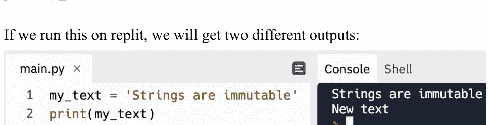

但字符串是不可变的，意味着我们不能更改字符串中的单个字符。我们知道在 Python 中可以通过索引访问字符串，例如，如果我想访问 `my_text` 的第一个字母，我需要使用索引零（0），像这样：

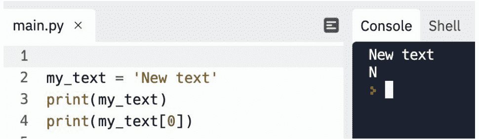

太好了！我们得到了预期的结果，但我能像这样将第一个字符更改为新字符吗：

```
python
my_text[0] = 'K'
print(my_text)
```

如果我们运行这段代码，会得到一个 `TypeError`，说我们不能为字符串元素赋新值：

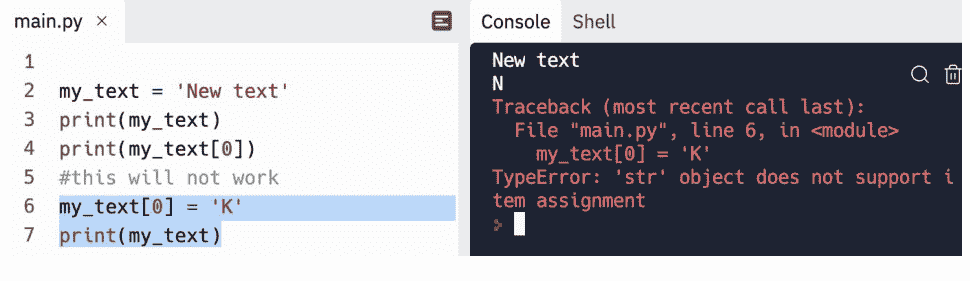

如我们上图所示，字符串不可变是不可能的，因为我们无法在创建后更换单个字符的值。单个字符被分配了索引并存储在内存中。我们唯一能做的就是完全为 `my_text` 变量重新赋一个新值。Python 解释器将从内存中删除旧内容并添加新内容，这就是为什么可以重新赋值。总结来说，我们无法重新赋值字符串的部分内容，比如单个字符，因为 Python 中的字符串是不可变的，但我们可以为现有字符串赋一个新值，因为 Python 会从内存中完全删除旧字符串。

### 练习时间

到目前为止，我们已经介绍了许多Python的基础特性，但还有很多内容需要涵盖，我认为你已经准备好编写你的第一个Python小程序了。想象一下，你想要创建一个小程序，它会询问用户输入两个数字并计算它们的和。我们该如何编写这个程序呢？为了提示用户输入值，我们需要使用一个名为`input()`的内置函数。`input()`函数的工作方式是等待用户输入，在我们的例子中是输入数字。以下是完整的代码：

```python
first_num = input('Please enter the first number:')
second_num = input('Please enter the second number:')
result = first_num + second_num
print(f'the sum of the two numbers is: {result}')
```

让我们运行上面的代码并输入12和6作为数字：

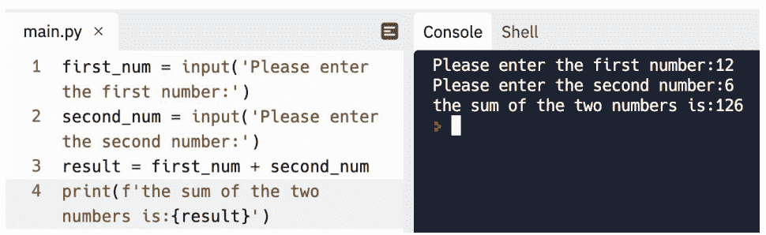

如果我们看上面的代码，和是126，但应该是18，对吧？这是怎么回事？如果你不确定为什么会这样，我们总是可以检查变量（`first_num`，`second_num`）的类型：

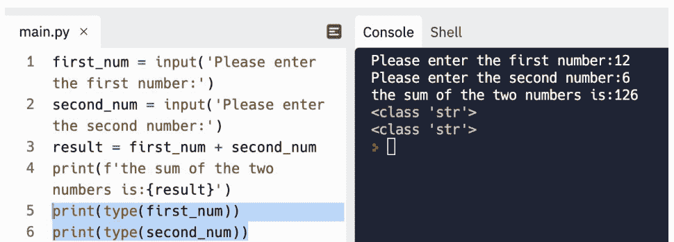

这两个变量的值是字符串类型，当我们使用`+`运算符时，Python解释器会认为我们想要进行字符串拼接。为了修复这个简单的问题，我们需要使用内置的`int()`函数进行显式的类型转换：

```python
first_num = input('Please enter the first number:')
second_num = input('Please enter the second number:')
result = int(first_num) + int(second_num)
print(f'the sum of the two numbers is:{result}')
print(type(first_num))
print(type(second_num))
```

控制台：
```
Please enter the first number:12
Please enter the second number:6
the sum of the two numbers is:18
<class 'str'>
<class 'str'>
```

从上面的图中，结果是18，你应该知道来自`input()`函数的值是字符串，而不是数字，因此我们需要将它们转换为正确的数据类型。

## 函数与方法——它们有什么区别？

在本章中，我们看到了一些内置函数，比如`str()`、`int()`、`round()`、`abs()`、`bin()`、`print()`，Python中还有更多内置函数。以下是内置函数的完整列表：

## 内置函数

| **A** | **E** | **L** | **R** |
|---|---|---|---|
| abs() | enumerate() | len() | range() |
| aiter() | eval() | list() | repr() |
| all() | exec() | locals() | reversed() |
| any() | | | round() |
| anext() | **F** | **M** | |
| ascii() | filter() | map() | **S** |
| | float() | max() | set() |
| **B** | format() | memoryview() | setattr() |
| bin() | frozenset() | min() | slice() |
| bool() | | | sorted() |
| breakpoint() | **G** | **N** | staticmethod() |
| bytearray() | getattr() | next() | str() |
| bytes() | globals() | | sum() |
| | | **O** | super() |
| **C** | **H** | object() | |
| callable() | hasattr() | oct() | **T** |
| chr() | hash() | open() | tuple() |
| classmethod() | help() | ord() | type() |
| compile() | hex() | | |
| complex() | | **P** | **V** |
| | **I** | pow() | vars() |
| **D** | id() | print() | |
| delattr() | input() | property() | **Z** |
| dict() | int() | | zip() |
| dir() | isinstance() | | |
| divmod() | issubclass() | | **_** |
| | iter() | | __import__() |

[https://docs.python.org/3/library/functions.html](https://docs.python.org/3/library/functions.html)

让我们探索一些作为开发者你将非常有用的内置函数。第一个叫做`len()`，代表长度（length）：

```python
len()
```

这个内置函数将返回一个对象的长度或项目数量。我们还没有介绍Python中的对象（Objects）是什么，但它们是最重要的一件事，因为基本上Python中的所有东西都是一个对象。我们传递给`len()`函数的参数可以是一个序列，比如字符串。因为关于字符串数据类型我们已经学了很多，我们可以使用这个函数并传递字符串作为参数，就像这样：

```python
# len() - 返回长度
text = 'A string'
print(len(text))
```

如果我们运行代码，输出将是8：

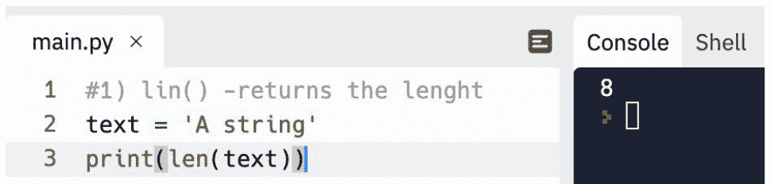

这意味着`len()`函数将从1开始计数，返回实际长度，而不是像索引那样从零开始。

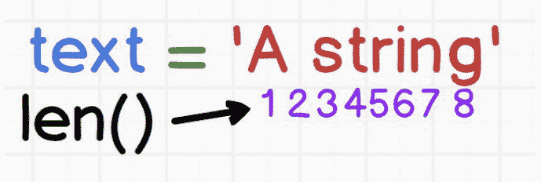

如你所见，我们正在使用的函数只有一个目的，那就是返回某个值。`len()`函数用于返回一个对象（如字符串）的实际长度。我们使用了“函数”这个术语，但我还没有解释什么是函数。你可以将函数视为包含一行或多行代码或语句的单元。函数的目的是用我们提供的数据运行一段代码。我们提供的数据称为参数（arguments），我们将其直接传递给函数。我们知道，函数有像这样的括号`()`。在括号内部，我们传递参数或数据。我们已经看到了一些内置函数，但在开始传递参数之前，我们需要知道该函数接受什么，因为我们不能传递我们想到的任何数据。我们也可以创建自己的函数，然后我们确切地知道需要传递什么数据，但对于内置函数，我们需要先阅读文档，然后才能自信地使用它们。我们将学习如何创建自己的函数、如何定义它们以及如何调用它们，但在现阶段，我们只需要知道它们是什么。总结一下，当我们使用一个函数时，我们需要知道应该提供什么参数/数据，例如，这里是`round`函数：

```python
round(number[, ndigits])
```

这个`round()`函数接受两个参数（`number`，`ndigits`），如果你阅读Python文档，你会知道第二个参数（`ndigits`）可以省略，或者是一个可选参数。函数调用是指我们在使用函数名时带上参数：

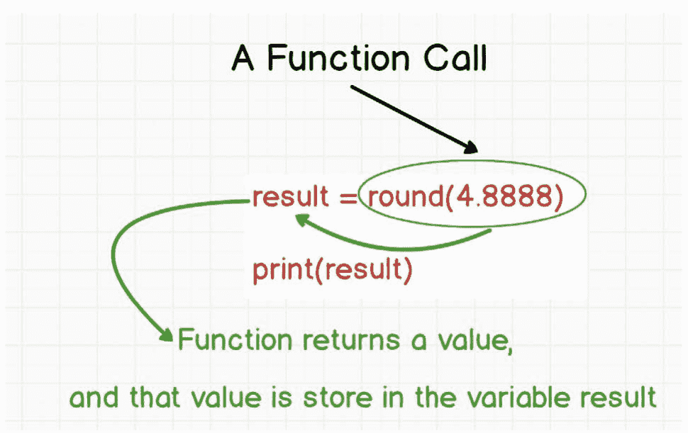

由我们创建的函数不是内置函数，它们被称为用户定义函数。让我们来谈谈方法（Methods）。Python中的方法是什么？Python中的方法与函数完全相同，它们之间没有区别。唯一的区别在于它们的调用方式。简单来说，方法属于某个东西或某人。这个“东西”实际上是我们将来会涵盖的对象。例如，字符串有自己的内置方法，但这些方法只能被字符串直接调用，而不是像我们调用`print`或`input`函数那样。那么字符串如何调用这些内置方法呢？字符串可以使用“点语法”来调用方法。让我们从名为`upper`的方法开始，介绍几个方便的字符串方法。

### Upper()

此方法将给定的字符串转换为大写。
以下是一个示例：

```python
# upper()
text = 'A string'
result = text.upper()
print(result)
```

如你所见，我们使用存储在名为`text`的变量中的字符串来调用/执行`upper()`方法。这也可以写成：

```python
print('A string'.upper())
```

输出是：

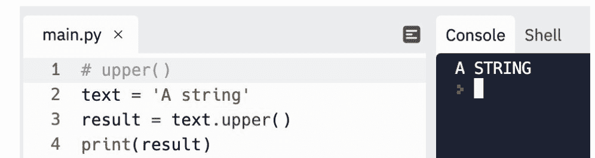

现在你知道方法是函数，但它们是由特定对象（如字符串）调用的。这意味着我们不能像这样调用`upper()`方法：

```python
upper()
```

字符串的方法对其他数据类型不起作用，它们只属于字符串。

### Capitalize()

字符串中经常使用的另一个有趣的方法是`capitalize`方法。此方法将第一个字符转换为大写字母：

```python
# capitalize()
print('hi there'.capitalize())
```

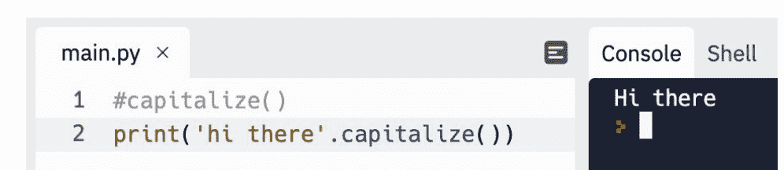

### lower()

此方法将给定的字符串转换为小写：

```python
# lower()
print('My Name Is Joshua'.lower())
```

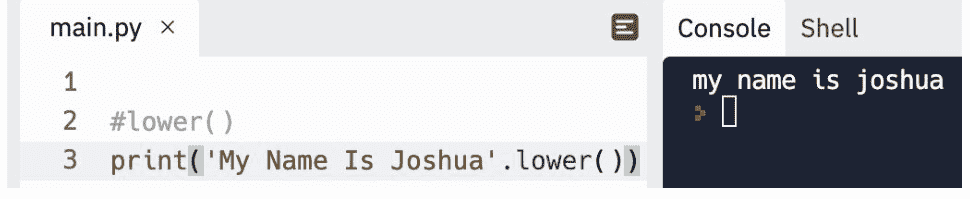

### find()

此方法将查找指定子字符串的第一次出现（索引）。

简单来说，这意味着此方法会检查某个子字符串是否存在于给定字符串中：

```python
# find()
result = 'My name is Rick, what is yours'.find('is')
print(result)
```

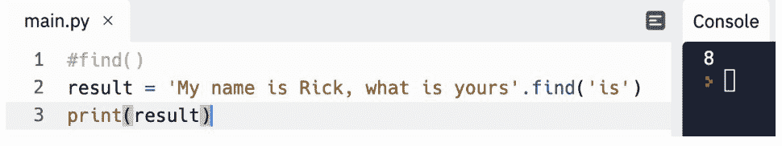

### replace()

当我们想要将字符串的一部分替换为新值时，会使用此方法。此方法返回整个字符串。此方法的语法更复杂，需要传递两个值：

```python
string.replace(oldvalue, newvalue)
```

第一个参数是要替换的子字符串/值，第二个参数是新值。例如，让我们将`'Rick'`替换为`'Mick'`：

```python
# replace()
result = 'My name is Rick, what is yours'.replace('Rick', 'Mick')
print(result)
```

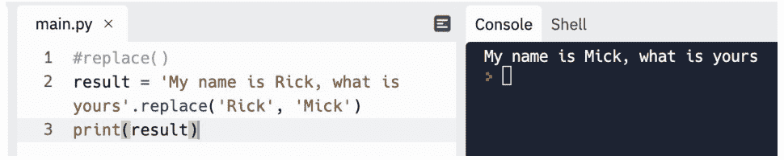

太好了！它起作用了，但是等等，我们说过字符串是不可变的，但这个方法似乎改变了字符串的一部分。这是怎么回事？这很令人困惑，因为我编写代码的方式是为了向你展示原始字符串无法被更改。让我们这样重写代码：

```
#replace()
original_string = 'My name is Rick, what is yours'
result = original_string.replace('Rick', 'Mick')
print(original_string)
print(result)
```

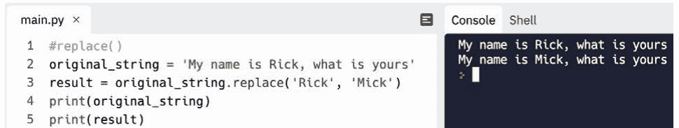

如你所见，`original_string` 并未改变。重要的是要理解，`replace()` 方法返回的是一个修改后的值，因此我们可以将该值存储在一个变量（`result`）中，但 `replace` 方法不会影响原始字符串。

## join()

此方法将连接或拼接一个字符串列表，并使用指定的分隔符创建一个新字符串。让我通过以下示例向你展示这是什么意思：

```
#join()
result = "-".join(["This", "book", "is", "awesome!"])
print(result)
```

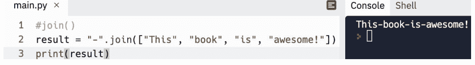

`join` 方法接受一个字符串列表，我们将在后面学习列表作为一种独立的数据类型。你可以在 Python 文档中找到其他有用的方法，但目前，这些是你应该掌握的基本方法。

### Python IN 关键字

就像 Python 中的内置函数和方法一样，我们也有保留关键字。这些关键字被称为标识符，不能用作普通标识符。关键字必须完全按照其拼写使用。在本节中，我们将讨论关键字 ‘in’，它非常有用，因为它有许多应用。保留关键字 ‘in’ 可以与字符串一起使用，如下所示：

```
python
# In Keyword with Strings
long_string = 'Andy is 5 years old!'
print('5' in long_string)
```

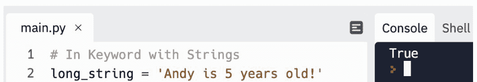

这个关键字有许多用途，其中之一是检查字符串的一部分是否存在于序列中。我们试图查找 ‘5’ 是否存在于 `long_string` 字符序列中。如我们所见，值 ‘5’ 存在，因此它返回输出 `True`。这个值 ‘True’ 属于 Python 中的另一种数据类型，称为布尔值。我们将在下一节介绍这种数据类型。以下是 Python 中保留关键字的列表：

## 2.3.1 关键字

以下标识符用作语言的保留字或*关键字*：

- and
- del
- from
- not
- while
- as
- elif
- global
- or
- with
- assert
- else
- if
- pass
- yield
- break
- except
- import
- print
- class
- exec
- in
- raise
- continue
- finally
- is
- return
- def
- for
- lambda
- try

https://docs.python.org/2.5/ref/keywords.html

### Python 中的布尔值（数据类型）

布尔值是 Python 中的另一种数据类型。Python 中的布尔值只表示两个可能的值之一：`True` 或 `False`。布尔值并非 Python 独有，几乎所有编程语言中都有布尔值。这允许我们将变量设置为 `True` 或 `False`，如以下示例所示：

```
# Boolean True or False
is_true = True
print(is_true)

is_false = False
print(is_false)
```

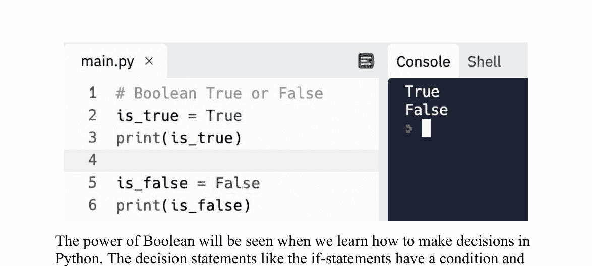

当我们学习如何在 Python 中做决策时，布尔值的强大之处就会显现出来。像 `if` 语句这样的决策语句有一个条件，该条件的求值结果总是布尔值 `True` 或 `False`。我们也可以将表达式求值为布尔值，如本例所示：

```
#compare values
print(2 > 1)
print(10 == 10)
print(10 < 6)
```

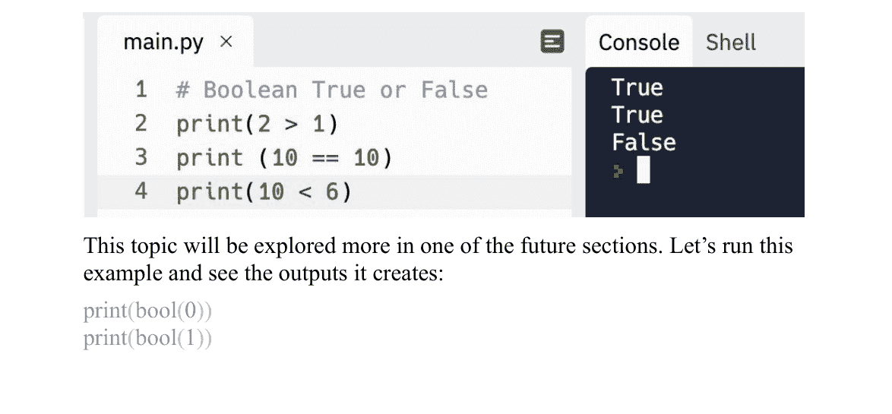

这个主题将在未来的某一节中进一步探讨。让我们运行这个示例，看看它产生的输出：

```
print(bool(0))
print(bool(1))
```

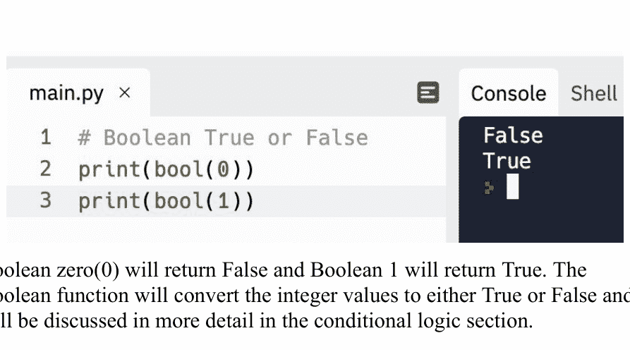

布尔值零（0）将返回 `False`，布尔值 1 将返回 `True`。`bool` 函数会将整数值转换为 `True` 或 `False`，这将在条件逻辑部分更详细地讨论。

### Python 中的列表（数据类型）

如你所见，我们正在快速学习各种数据类型，在此过程中，我们学习了许多新的、基础的 Python 特性。这就是为什么我决定按照这个特定的顺序创建本指南，因为它对我们来说更自然。我本可以在一开始就列出所有数据类型，然后再解释其余的特性，但我发现这种方式更容易学习。Python 中另一个重要的数据类型是列表。在 Python 中，列表是对象的有序序列，这些对象可以来自任何数据类型。如果你学过其他编程语言，你会注意到我即将教授的内容与其他编程语言中的数组相同，所以让我们创建一个名为 `my_list` 的变量：

```
# Lists - data type
my_list = [1,2,3,4,5,6]
my_list1 = ['a','b','c','d']
my_list2 = ['a',2,'c',3]

print(my_list)
print(my_list1)
print(my_list2)
```

```
[1, 2, 3, 4, 5, 6]
['a', 'b', 'c', 'd']
['a', 2, 'c', 3]
```

正如我提到的，列表可以保存数据的有序序列。到目前为止，我们只使用变量来存储单个值，但现在列表使变量成为一个复杂的容器，我们可以在其中存储不同类型的多个数据。如你所见，名为 `my_list` 的变量可以保存一个整数值的有序序列。第二个名为 `my_list1` 的变量是一个属于字符串数据类型的值的有序序列。最后一个变量具有混合数据类型，这是在一个容器中存储不同类型数据的正常行为。当我们创建列表时，需要使用方括号。方括号内的数据称为项或元素。项或元素之间用逗号分隔。这种数据类型（列表）与 JavaScript 中的数组完全相同。列表是项的集合或对象的有序序列。列表也是我们的第一个**数据结构**。数据结构允许我们将数据存储在有组织的容器中，这就是为什么我们需要使用方括号，因为我们需要将数据包含在一个单一的单元中。数据结构是一个非常重要的概念，因为它允许我们将信息以有组织的方式包含在一个容器或盒子中。如果我们使用 `print` 函数并传递列表变量，我们可以看到它会打印方括号中的所有项，但如何从列表中访问这些单独的项/元素呢？嗯，类似于字符串，我们可以使用索引位置。列表索引从位置零开始，就像字符串一样：

```
python
#individual items
print(my_list[0])
```

```
python
print(my_list1[1])
print(my_list2[2])
```

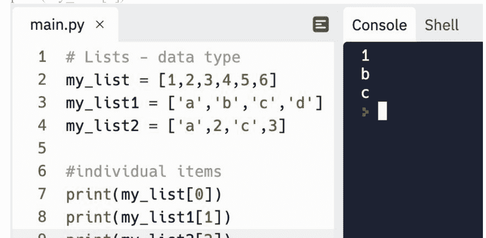

如果我们使用的索引与列表项的数量不匹配，最终会得到一个 `IndexError`：

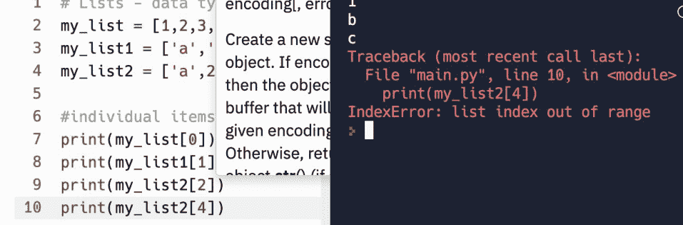

**IndexError** 表示我们使用的索引超出了范围。列表项在内存中的存储方式是按顺序一个接一个的。我们可以使用 `type` 函数检查列表的类型，如下所示：

```
python
#list type
print(type(my_list))
```

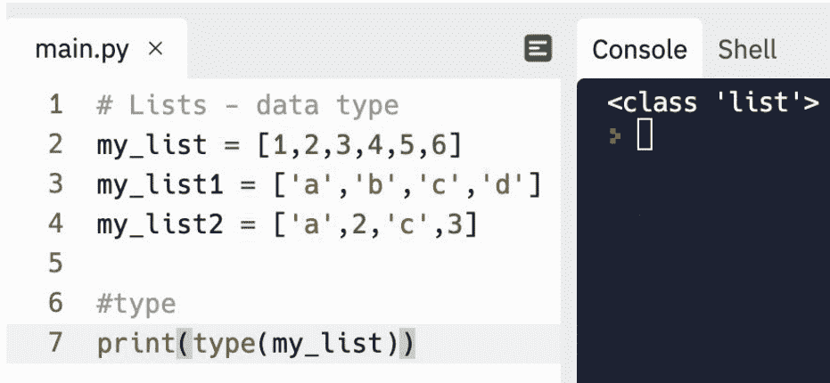

如果我们想知道列表中实际有多少项/元素，可以使用内置函数 `len()`。`len()` 函数将返回实际的项数，不要将它们与索引混淆，因为索引从零开始，而 `len()` 从 1 开始计数：

```
#length of list
print(len(my_list))
```

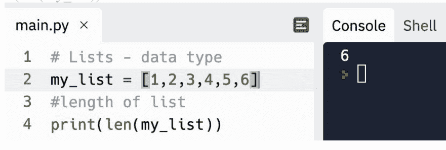

#### 列表切片

我们已经看到了切片在字符串上是如何工作的，我们也可以对列表项进行同样的操作。我们可以定义切片的开始和结束位置。与字符串一样，最后一项不会包含在输出中：

语法：

#### 列表切片

```python
#列表切片：
listname[start:stop]
```

例如，让我们对第一个列表进行切片，获取前3个项目：

```python
#列表切片
print(my_list[0:3])
```

输出将是：

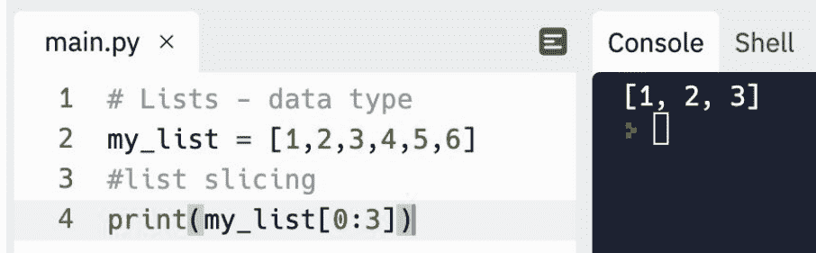

如果需要，我们也可以包含步长。让我们尝试一个步长为2的例子：

```python
# 带步长的列表切片
my_list3 = [0,1,2,3,4,5,6,7,8,9,10]
print(my_list3[0::2])
```

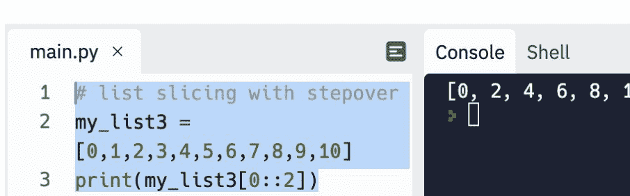

上面的例子意味着切片应从位置零开始，由于省略了停止索引，我们基本上是说以步长2一直走到末尾。Python中的字符串与列表不同吗？是的，它们不同，但它们也有很多相似之处。两者之间最大的区别是字符串是不可变的，这意味着一旦创建了字符串，我们就无法更改单个字符。然而，列表是可变的。这意味着我们可以像这样更改列表的单个项目：

```python
# 带步长的列表切片
my_list3 = [0,1,2,3,4,5,6,7,8,9,10]

#列表是可变的
my_list3[0] = -1
print(my_list3)
```

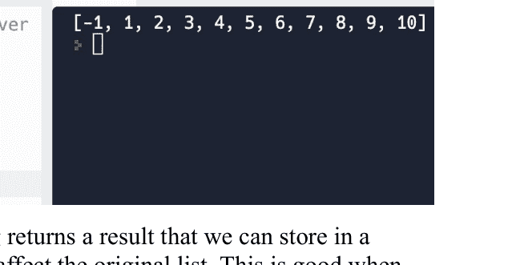

与字符串一样，列表切片返回一个我们可以存储在变量中的结果，并且切片不会影响原始列表。当我们想要创建原始列表的副本时，这很有用：

```python
#列表的副本
string_list = ['one','two','three']
string_list_copy = string_list[0:]
print(string_list_copy)
```

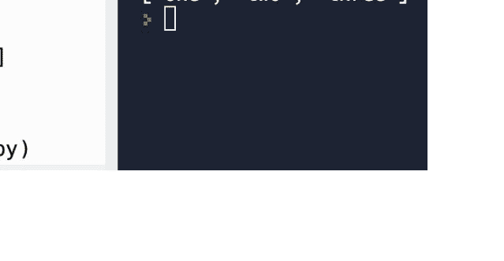

正如我们所看到的，我们已经成功地将第一个列表复制到了新列表中。这意味着在创建副本之后，我们可以修改`string_list_copy`中的一些元素，而不会影响原始列表：

```python
# 向复制的列表添加新元素
string_list = ['one','two','three']
string_list_copy = string_list[0:]
string_list_copy[2] = 'four'
print(string_list)
print(string_list_copy)
```

太好了！这两个列表彼此独立；这意味着它们存储在内存中的不同位置。大多数初级开发人员会尝试使用赋值运算符像这样创建列表的副本：

```python
#使用赋值运算符创建副本
string_list1 = ['one','two','three']
string_list_copy1 = string_list1
print(string_list_copy1)
```

嗯，这看起来像是在工作，但其实不是。现在让我们修改新复制列表的最后一个元素，并同时打印两个列表：

```python
#使用赋值运算符创建副本
string_list1 = ['one','two','three']
string_list_copy1 = string_list1
string_list_copy1[2] = 'four'
print(string_list_copy1)
print(string_list1)
```

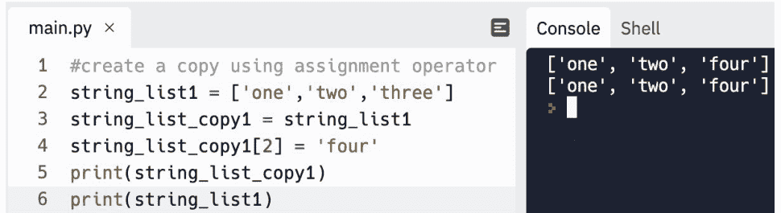

这里发生了什么？我们更改了`string_list_copy1`，而这个更改也影响了原始列表。发生这种情况是因为`string_list_copy1`不是`string_list1`的副本，而是对`string_list1`的引用。变量只是指向存储在内存中的值的指针。这意味着`string_list1`和`string_list_copy1`指向内存中的相同值：

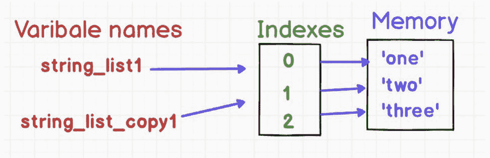

#### Python IN 关键字与列表

与字符串一样，我们可以使用`in`关键字来查找某个项目是否存在于列表中。输出将是布尔值`True`或`False`：

```python
#in关键字与列表
string_list1 = ['one', 'two', 'three']
print('two' in string_list1)
print('five' in string_list1)
```

```python
#in关键字与列表
string_list1 = ['one', 'two', 'three']
print('two' in string_list1)
print('five' in string_list1)
```

**控制台：**

True
False
>>>

这是一个非常有用的关键字，因为我们可以查找某个项目是否存在于一个非常长的列表中。

#### 多维列表

到目前为止，我们涵盖的列表示例都是一维的。多维列表是列表中的列表，当涉及到创建多维层级时，还有其他数据类型是更好的选择：

```python
# 二维列表
two_dimensional = [
    [1, 2, 3],
    [3, 4, 5]
]
```

上面的例子是一个二维列表，也称为矩阵。它可以用于不同的应用程序，如图像处理或机器学习。我们如何访问这个列表内部的元素？这里有一个例子：

```python
#二维列表
two_dimensional = [
    [1, 2, 3],
    [3, 4, 5]
]
print(two_dimensional[0])
print(two_dimensional[1])
```

**控制台：**

[1, 2, 3]
[3, 4, 5]
>>>

如果我们想从某些内部列表中获取一个元素，我们可以使用双方括号`[] []`。第一个括号将接收一个索引，该索引指示我们试图访问哪个内部列表，在第二个括号中，我们传递单个列表项的索引：

```python
#第一个内部列表元素
print('第一个内部列表项')
print(two_dimensional[0][0])
print(two_dimensional[0][1])
print(two_dimensional[0][2])
print('第二个内部列表项')
#第二个内部列表元素
print(two_dimensional[1][0])
print(two_dimensional[1][1])
print(two_dimensional[1][2])
```

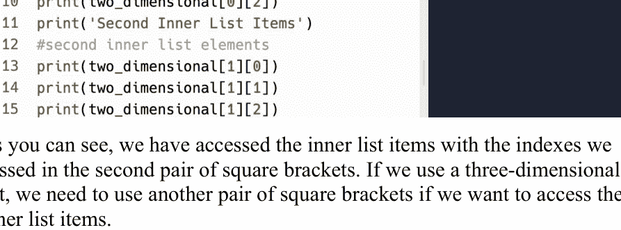

正如你所看到的，我们通过在第二对方括号中传递的索引访问了内部列表项。如果我们使用三维列表，如果我们想访问内部列表项，我们需要使用另一对方括号。

### 列表方法

与字符串数据类型一样，列表有自己的方法，我们需要使用点表示法来调用这些方法。有一些列表方法我们可以使用，这里是你可以阅读所有相关内容的链接：

https://docs.python.org/3/tutorial/datastructures.html

我们将涵盖最常用的方法。让我们从第一个叫做`append()`的方法开始

### append() 方法

我们简单地使用这个方法在列表末尾添加一个元素：

```python
# 1 追加
my_list = ['one','two','three'];
my_list.append('four')
print(my_list); ['one', 'two', 'three', 'four']
```

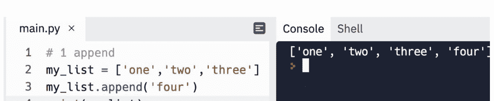

重要的是要知道，这个方法将通过在末尾添加新元素来修改现有数组。

### insert() 方法

此方法将在列表中的指定位置插入一个新元素。这意味着我们需要提供我们希望插入新项目的位罝/索引。例如，让我们在`my_list`的末尾添加元素`'five'`：

```python
# 2 插入
my_list.insert(4,'five')
print(my_list)
```

```python
# 1 追加
my_list = ['one','two','three'];
my_list.append('four')
# 2 插入
my_list.insert(4,'five')
print(my_list)
```

输出:

['one', 'two', 'three', 'four', 'five']

`insert`方法，就像`append`方法一样，将在指定索引处向列表添加一个新元素，并将修改原始列表。

### extend() 方法

此方法接受一个可迭代对象作为参数。可迭代对象意味着我们可以迭代或循环遍历的东西。`extend`方法的工作方式是将可迭代对象中的所有项目附加到原始列表的项目中。我知道这听起来很困惑，但这里有一个例子：

```python
# 3 扩展
my_list.extend(['six','seven'])
print(my_list)
```

```python
# 1 追加
my_list = ['one','two','three'];
my_list.append('four')
print(my_list)
# 2 插入
my_list.insert(4,'five')
print(my_list)
# 3 扩展
my_list.extend(['six','seven'])
print(my_list)
```

输出:

['one', 'two', 'three', 'four']
['one', 'two', 'three', 'four', 'five']
['one', 'two', 'three', 'four', 'five', 'six', 'seven']

正如我们在例子中看到的，可迭代对象是一个包含两个项目的列表，它被称为可迭代对象是因为我们可以使用循环（将在本章后面部分介绍）来循环或迭代这个列表。

### pop() 方法

此方法将从列表末尾移除一个项目，如果我们对现有列表执行此操作，它将弹出/移除项目`'seven'`

```python
# 4 弹出
my_list.pop()
print(my_list)
```

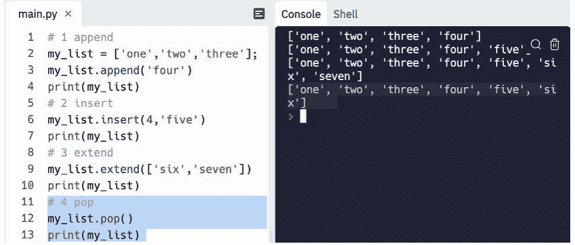

如果我们想从列表中移除特定项目，我们可以使用要移除项目的索引调用`pop()`方法，例如，假设我们想移除第一个项目，并且我们知道这个项目的索引将是零：

```python
# 移除第一个项目
my_list.pop(0)
print(my_list)
```

## remove() 方法

当我们想根据项目值从列表中删除一个项目时，就会使用此方法。例如，假设我们想要删除值为“four”的项目：

```python
#5 remove
my_list.remove('four')
print(my_list)
```

此方法与前几个方法类似，会修改现有列表，但在操作完成后不会返回任何其他内容。我们可以通过将 remove 方法包裹在 print 函数中来检查这一点，如下所示：

从上图可以看出，此方法返回 None，但它修改了原始列表。如果我们尝试打印其他方法，也会看到它们同样不返回任何值，但它们也改变了原始列表。

## clear() 方法

此方法会清除或删除指定列表中的所有项目。

```python
# 6 clear
my_list.clear()
print(my_list)
```

## index() 方法

此方法将返回我们传入方法作为参数的值的位置或索引：

```python
#new list
new_list = ['one','two','three','four','five']
# 7 index
print(new_list.index('three'))
```

这仅仅意味着在列表中查找项目“three”并返回该项目所在的索引。此方法接受两个额外的可选参数。当我们想要加快搜索过程时会使用这些参数，因为我们指定从索引 0 开始搜索并在索引 3 停止：

```python
# index method with 3 params
print(new_list.index('three',0,3))
```

从上图可以看出，结果将相同，但速度会快很多，因为我们没有搜索整个列表来获取项目位置。如果我们寻找的项目不在我们指定的范围内会发生什么？嗯，它将抛出一个值错误（Value Error），说明我们寻找的项目不在范围内：

```python
print(new_list.index('three',0,2))
```

## count() 方法

count 方法将计算相同值在列表中出现的次数：

```python
# 8 count
my_list1 = ['one','two','three','one','four']
print(my_list1.count('one'))
```

在上图中，值“two”的计数为二，因为在 **my_list1** 中可以在位置零和 3 找到项目 two。

## sort() 方法

为了解释此方法，让我们创建一个包含随机整数项目的列表：

```python
#9 sort
numbers_list = [3,6,7,1,5,2,4]
numbers_list.sort()
print(numbers_list)
```

从上图中，我们可以看到无序的列表现在已排序。在 Python 中，我们还有一个名为 sorted() 的内置函数，该函数会产生一个名为排序数组的新数组，但它不会像 sort() 方法那样影响原始数组：

```python
# sorted() function not a method
numbers_list1 = [3,6,7,1,5,2,4]
store_sorted =sorted(numbers_list1)
print(numbers_list1)
print(store_sorted)
```

这证明了内置函数不会修改现有列表。

## copy() 方法

当我们需要某个列表的副本时，可以使用此方法：

```python
#10 copy
numbers_list = [3, 6, 7, 1, 5, 2, 4]
new_list = numbers_list.copy()
print(new_list)
```

new_list 将是 numbers_list 的副本，如果我们想向 new_list 添加、插入或删除元素，这不会影响原始的 numbers_list。

## reverse() 方法

此方法将在不进行排序的情况下反转整个列表：

```python
#11 reverse
numbers_list2 = [3, 6, 7, 1, 5, 2, 4]
numbers_list2.reverse()
print(numbers_list2)
```

这是我想向你展示的最后一个方法，但在我们开始学习一些新的 Python 特性之前，我想提一下，你可以在项目中组合不同的列表方法，例如，如果你需要一个反转但已排序的列表，你可以先调用 sort() 方法，然后再调用 reverse 方法：

```python
# combining different list methods
numbers_list3 = [3,6,7,1,5,2,4]
numbers_list3.sort()
numbers_list3.reverse()
print(numbers_list3)
```

## 列表使用的实用技巧和诀窍

这些是开发者在 Python 列表上常用的一些技巧和诀窍，一旦你知道了它们，你也会使用它们。我们已经看到了返回列表中项目数量的 **len()** 函数。我们也看到了如何反转字符串，但同样也可以对列表执行此操作。

### 使用列表切片反转列表

```python
# reverse the list using slicing
num_list = [3,6,7,1,5,2,4]
print(num_list[::-1])
```

#### 使用切片方法复制列表

```python
# copy the list using the slicing:
num_list1 = [3,6,7,1,5,2,4]
new_list = num_list1[:]
print(new_list)
print(num_list1)
```

### 使用 range() 函数生成新列表

我们可以使用 range 函数生成并填充一个编号列表。例如，我想创建一个从 0 到 50 范围内的编号列表：

```python
#create and populate numbered list
num_list2 = list(range(0,50))
print(num_list2)
```

### .join()

此方法将获取列表（可迭代对象）中的所有项目，并将值连接成一个字符串。我们还需要指定分隔符：

```python
#.join()
usernames = ['andy','carol','steve','jason']
joined_usernames = ', '.join(usernames)
print(joined_usernames);
```

#### 列表解包

在 JavaScript 中，这被称为解构的概念，但在 Python 中，这被称为列表解包，当我们希望将列表中的值/项目存储在不同的变量中时，它非常有用：

```python
# list unpacking
andy,carol,steve,jason = ['andy','carol','steve','jason']
print(andy)
print(carol)
print(steve)
print(jason)
```

正如你现在所看到的，“=”运算符左侧的变量将拥有来自列表项目的值。这就是我们如何将列表项目解包到变量中。但是我们只能从列表中解包一部分值，其余项目作为列表存储在单个变量名中：

```python
andy,carol,*rest = ['andy','carol','steve','jason']
print(andy)
print(carol)
print(rest)
```

我认为我们在本节中已经涵盖了许多 Python 的基本和一些中级特性。让我们来学习 Python 中的其他数据类型。

## Python 中的 None（数据类型）

Python 中的 **None** 是一个关键字，用于定义**空**值或根本没有值。**None** 也是来自 **NoneType** 类的数据类型。**None** 简单地表示值缺失、**空**值或根本没有值。在 **JavaScript** 中，我们有 **Null**，我们有 **None**。一些开发者仍然不明白这个 **None** 不同于 0（零）或空字符串，它在某些场景下可能非常有用。例如，你想创建一个程序，在程序开头，你需要一个变量，该变量只声明但没有任何值。我们可以像这样将变量赋值为 None：

```python
# None Keyword and Data Type
no_value = None
print(no_value)
print(type(no_value))
```

在我们进入下一节之前，我希望你记住关于 **None** 数据类型的这一点：

- None 不同于 0（零）
- None 不同于 False
- None 不是空字符串 " "
- 将 None 与 None 比较将返回 True
- 将 None 与其他任何东西比较将始终返回 False

## Python 中的字典（数据结构）与Python列表相同，字典是一种数据类型和数据结构。它为我们提供了组织和访问数据的另一种方式。字典以**键值对**的形式存储数据。在Python 3.7版本之前，字典是无序的数据类型，但在此版本之后，它们现在是有序的。字典可以用花括号编写，并且可以包含一个或多个键值对：

```python
this_dictionary = {
    "car": "Ford",
    "model": "Mustang",
    "year": 1964
}
```

我们可以这样打印字典：

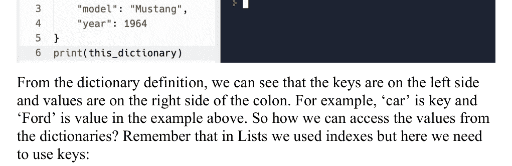

从字典的定义中，我们可以看到键位于冒号的左侧，值位于右侧。例如，在上面的例子中，‘car’是键，‘Ford’是值。那么，我们如何从字典中访问值呢？记住在列表中我们使用索引，但在这里我们需要使用键：

```python
# value Ford
print(this_dictionary["car"])
```

```python
this_dictionary = {
    "car": "Ford",
    "model": "Mustang",
    "year": 1964
}
print(this_dictionary)

# value Ford
print(this_dictionary["car"])
```

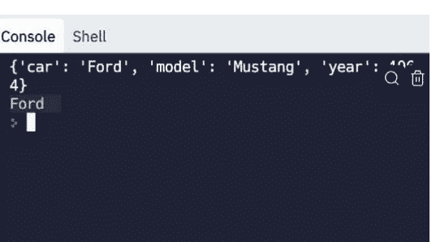

字典与JavaScript中的对象非常相似。值可以是任何数据类型，例如，值可以是整数、浮点数、字符串、列表等的组合：

```python
# dictionary with different data types as values
this_dictionary1 = {
  "car": True,
  "brands": ['Ford','Toyota', 'BMW'],
  "year": 2022
}
print(this_dictionary1['brands'][1])
```

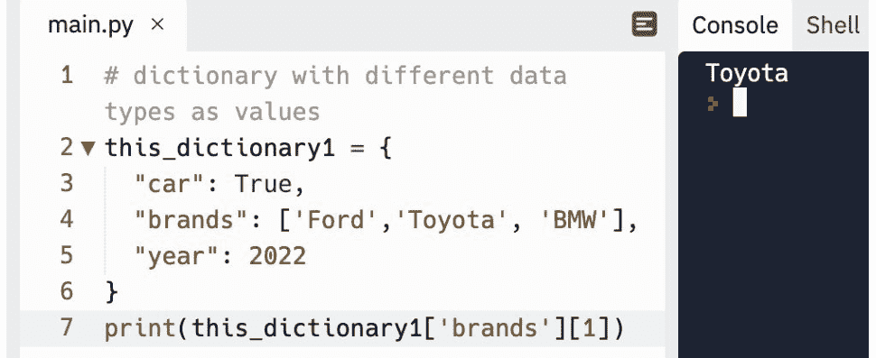

既然我们了解了这种新的数据类型，我们可以回到Python列表，因为有一些重要的事情需要讨论。列表可以包含来自不同数据类型的值，包括字典：

```python
# lists with dictionary as data type
new_list = [
    {
        "car": True,
        "brands": ['Ford', 'Toyota', 'BMW'],
        "year": 2022
    },
    {
        "car": False,
        "brands": ['Ranger', 'Kluger', 'X5'],
        "year": 2022
    }
]
```

如果我们想访问这个列表的第一个元素，我们需要这样写查询语句：

```python
print(new_list[0])
```

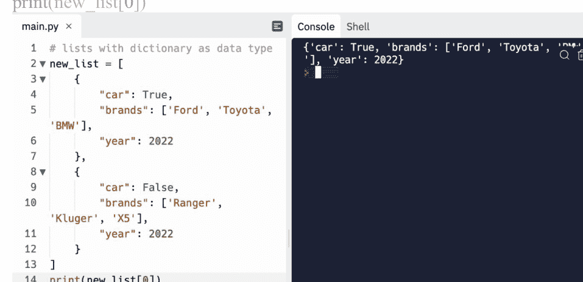

如果我们想找到键‘car’有什么值，我们可以这样做：

```python
print(new_list[0]['car'])
```

```python
# lists with dictionary as data type
new_list = [
    {
        "car": True,
        "brands": ['Ford', 'Toyota', 'BMW'],
        "year": 2022
    },
    {
        "car": False,
        "brands": ['Ranger', 'Kluge', 'X5'],
        "year": 2022
    }
]
print(new_list[0])
print(new_list[0]['car'])
```

我们也可以获取汽车品牌：`print(new_list[0]['brands'])`

```python
# lists with dictionary as data type
new_list = [
    {
        "car": True,
        "brands": ['Ford', 'Toyota', 'BMW'],
        "year": 2022
    },
    {
        "car": False,
        "brands": ['Ranger', 'Kluge', 'X5'],
        "year": 2022
    }
]
print(new_list[0])
print(new_list[0]['car'])
print(new_list[0]['brands'])
```

从这个结果中，我想使用索引号2来获取'BMW'品牌：`print(new_list[0]['brands'][2])`

我知道这变得有些复杂，但我可以向你保证，如果你花些时间思考列表和字典，你会发现它其实很容易。另一个我想讨论的重要事情是字典的值。字典的值可以是任何数据类型，但字典的键不能是可变的。这就是为什么我们使用字符串作为键，因为我们知道字符串是不可变的。我们也可以使用数字和布尔值，因为它们也是不可变的，但Python列表不能用作字典的键，因为它们是可变的。因此，我们不能在字典中使用列表作为键。键通常是具有描述性的字符串。字典中的键必须是唯一的，不应该有重复的键，就像这个例子中：

```python
this_dictionary1 = {
  "car": True,
  "brands": ['Ford','Toyota', 'BMW'],
  "car": 2022
}
```

正如我们所见，‘car’是键，它在两个不同的地方被使用了。我们想避免出现这样的错误，因为它们会使程序崩溃。我们还有另一种使用以下语法创建字典的方法：

```python
# second way of creating new dictionary
new_dict = dict(car = 'Tesla')
print(new_dict)
```

在上面的例子中，我们使用了Python的内置函数`dict()`来创建一个新的字典，这种语法不太常见。

#### 字典 – 方法

在本节中，我们将介绍一些可以在字典上使用的方法。在深入探讨字典方法之前，让我们先谈谈如何使用‘in’关键字。‘in’关键字可用于检查字典中是否存在特定的键。‘in’关键字用于检查键，而不是值：

```python
this_dictionary1 = {
  "car": True,
  "brands": ['Ford','Toyota', 'BMW'],
  "year": 2022
}
print('year' in this_dictionary1)
print(2022 in this_dictionary1)
```

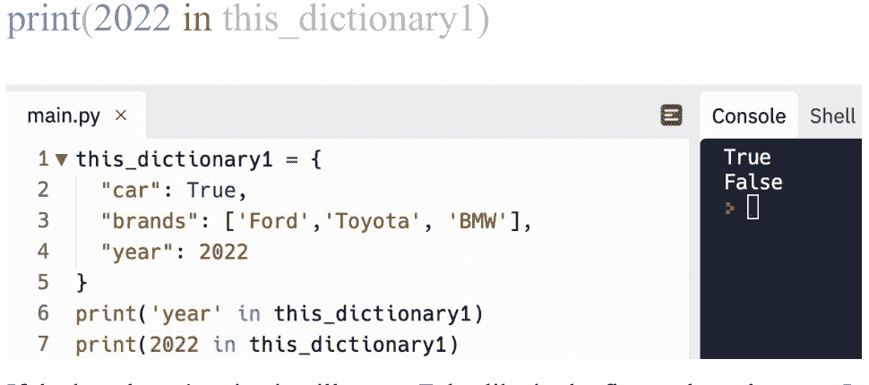

如果键不存在，它将返回False，如上图所示，因为我尝试查找年份2022，但没有‘key’2022。让我们从一些有用的字典方法开始。

### get()方法

get方法将接受一个参数，这个参数是字典中的‘键’。get方法将返回该键的值：

```python
print(this_dictionary1.get('car'))
```

```python
this_dictionary1 = {
    "car": True,
    "brands": ['Ford', 'Toyota', 'BMW'],
    "year": 2022
}
print(this_dictionary1.get('car'))
```

如果我们尝试获取的键不存在，我们将得到None。get方法可以接受第二个参数，称为value：

```python
dictionary.get(keyname, value)
```

value参数是可选的，我们通常将其指定为备选方案，因为如果没有找到键，我们希望这个方法返回什么值？让我们创建一个键不存在但我们指定了希望该方法返回的值的例子：

```python
print(this_dictionary1.get('cars', ['ford', 'audi']))
```

从上面的例子看，‘cars’键在字典中不存在，但会返回一个包含两个项目（Ford和Audi）的列表，因为我们提供了第二个参数：

```python
this_dictionary1 = {
    "car": True,
    "brands": ['Ford', 'Toyota', 'BMW'],
    "year": 2022
}
# get method with second parameter known as value
print(this_dictionary1.get('cars', ['ford', 'audi']))
```

### keys()

这个字典方法用于我们想要获取字典中所有存在的键。此方法将返回一个视图对象。此对象将包含字典中的所有键：

```python
# keys method
print(this_dictionary1.keys())
```

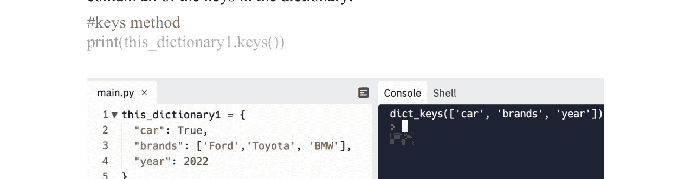

我们可以将keys()方法与‘in’关键字结合使用，这将返回布尔值True和False：

```python
# find a key from the view object
print('car' in this_dictionary1.keys())
```

### values()方法

此方法将返回一个视图对象，其形式为列表，包含字典中的所有值：

```python
# values method
print(this_dictionary1.values())
```

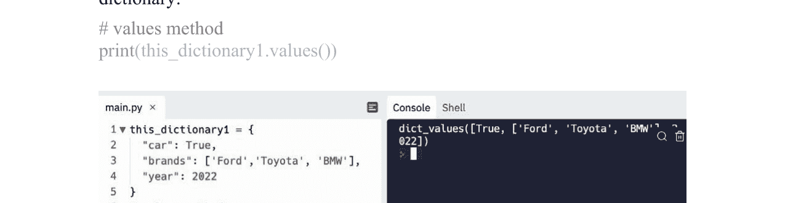

与键相同，values方法可以与‘in’关键字结合使用，以检查字典中是否存在任何值。

```python
print(2022 in this_dictionary1.values())
```

### items()方法

items方法稍微复杂一些，因为我们还没有使用过元组（另一种数据类型）。此方法将返回一个视图对象，其中包含以元组形式表示的字典的键值对。我们很快会讨论元组：

```python
# items method
print(this_dictionary1.items())
```

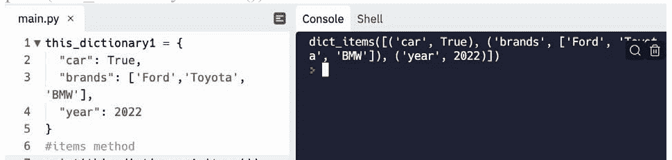

### clear()

此方法将从字典中移除所有键值对。clear方法不需要传递任何参数作为参数，它将返回一个空的字典：

```python
# clear method
print(this_dictionary1.clear())
print(this_dictionary1)
```

```python
this_dictionary1 = {
    "car": True,
    "brands": ['Ford', 'Toyota', 'BMW'],
    "year": 2022
}
# clear 方法
print(this_dictionary1.clear())
print(this_dictionary1)
```

## copy()

你可以使用此方法创建字典的副本，且副本将独立于原始字典：

```
#copy 方法
this_dictionary2 = {
    "car": True,
    "brands": ['Ford', 'Toyota', 'BMW'],
    "year": 2022
}
dict_copy = this_dictionary2.copy()
print(dict_copy)
```

## pop()

此方法接受一个参数，即字典的键。`pop()` 方法将根据键从字典中移除一个值。如果我们尝试打印此方法，它将返回从字典中移除的项：

```
python
#pop 方法
print(this_dictionary2.pop('year'))
print(this_dictionary2)
```

## popitem()

`popitem()` 用于弹出或移除字典中最后一个键值对。在之前的 Python 版本中，此方法会移除一个随机的键值对，但现在它将移除最后一个。

```
python
this_dictionary2 = {
    "car": True,
    "brands": ['Ford', 'Toyota', 'BMW'],
    "year": 2022
}
#popitem
this_dictionary2.popitem()
print(this_dictionary2)
```

```
python
this_dictionary2 = {
    "car": True,
    "brands": ['Ford', 'Toyota', 'BMW'],
    "year": 2022
}
#popitem
this_dictionary2.popitem()
print(this_dictionary2)

{'car': True, 'brands': ['Ford', 'Toyota', 'BMW']}
```

## update()

如果我们想根据指定的键更新值，此方法非常有用。让我们将年份更新为 2023：

```
#update
print(this_dictionary2.update({'year':2023}))
print(this_dictionary2)
```

```
python
this_dictionary2 = {
    "car": True,
    "brands": ['Ford', 'Toyota', 'BMW'],
    "year": 2022
}
#update
print(this_dictionary2.update({'year':2023}))
print(this_dictionary2)

None
{'car': True, 'brands': ['Ford', 'Toyota', 'BMW'], 'year': 2023}
```

如果我们尝试用一个在原始字典中不存在的错误键来更新值，会发生什么？在这种情况下你需要小心，因为 `update` 方法会查找字典，如果找不到该键，它会认为我们想插入一个新的键值对。假设我们想将 'car' 键更新为新值 'False'，但我们拼写错误，输入了 'cars' 而不是 'car'，将会发生以下情况：

```
print(this_dictionary2.update({'cars':False}))
```

```
python
# main.py
1
2 ▶ this_dictionary2 = {
3     "car": True,
4     "brands": ['Ford', 'Toyota', 'BMW'],
4     "year": 2022
5 }
6 #update
7 print(this_dictionary2.update({'cars':False}))
8 print(this_dictionary2)

# Console
None
{'car': True, 'brands': ['Ford', 'Toyota', 'BMW'], 'year': 2022, 'cars': False}
```

正如我们所见，新的键值对 'cars':False 被添加到了字典的末尾，这不是我们想要的结果。这就是为什么在使用 `update` 方法时需要小心。

## setdefault() 方法

`setdefault()` 方法将返回一个键的值（如果该键在字典中）。如果找不到该键，此方法将插入新的键值对。

```
python
#setdefault
year = this_dictionary2.setdefault('year')
print(year)
```

```
python
# main.py
1
2 ▶ this_dictionary2 = {
3     "car": True,
4     "brands": ['Ford', 'Toyota', 'BMW'],
5     "year": 2022
6 }
7 #setdefault
8 year = this_dictionary2.setdefault('year')
9 print(year)

# Console
2022
```

### Python 中的元组（数据类型）

与列表和字典类似，我们有元组，可用于在单个变量中存储多个值。元组是 Python 中四种最重要的内置数据类型之一，用于存储数据集合。我们还将学习另一种数据类型，称为集合。元组与列表相似，但主要区别在于我们不能修改它们，因此它们是不可变的，类似于字符串。简而言之，你可以想象使用元组就像使用不可变的列表。让我们创建第一个元组：

```
# 元组
new_tuple = (1, 2, 3)
print(new_tuple)
```

在元组中，我们使用圆括号，而不是字典中使用的花括号 `{}`。元组是有序的数据集合，一旦创建，我们就无法更改项目的顺序。我们已经打印了元组，但如果我们想访问单个项目，需要使用它们的索引。与列表相同，索引从位置零开始。与列表相同，要访问项目，我们需要使用方括号并传入索引位置：

```
#访问项目
print(new_tuple[2])
```

让我们检查元组是否确实不可变。在以下示例中，让我们修改位置/索引 2 处的元素：

```
# 修改元组
new_tuple[2] = 4
print(new_tuple)
```

正如我们所见，我们无法在位置 2 赋予新值，因为 Python 解释器将抛出 TypeError（'tuple' object does not support item assignment）。我们可以使用 `len()` 或 length 内置函数来获取元组中有多少个项目：

```
# 长度
print(len(new_tuple))
```

为什么我们需要使用像元组这样的另一种数据类型，而一切都可以用列表实现？使用元组比列表有优势，第一个优势是元组比列表更安全，因为它们一旦创建就保持不变。当我们在团队中工作时，我们可以使用元组而不是列表，从而间接告诉其他人使用元组是因为数据必须保持不变。另一个优势是元组的处理速度比列表快得多。但元组并非一切都那么美好。以下是一些缺点：

- 一旦创建就无法修改元组
- 无法对元组进行排序
- 无法反转元组
- 完全没有灵活性

如果你还记得，在字典部分，当我们使用其名为 **items()** 的方法之一时，我们提到了元组。此方法将返回一个由所有键值对组成的视图对象。

以下是能唤起你记忆的代码：

```
car = {
    'brand': 'toyota',
    'generations': [1,2,3,4],
    'year': 2023
}
print(car.items())
```

```
python
1 car = {
2     'brand': 'toyota',
3     'generations': [1,2,3,4],
4     'year': 2023
5 }
6 print(car.items())

# 输出：
text
dict_items([('brand', 'toyota'), ('generations', [1, 2, 3, 4]), ('year', 2023)])
```

我还提到过，字典中的键必须是唯一的，我们不能更改它们，因此不允许修改。因此，我们可以使用元组、数字和字符串作为键，但不能使用列表，因为它们是可变的。让我们创建一个以元组为键的字典：

```
python
car = {
    'brand': 'toyota',
    'generations': [1,2,3,4],
    'year': 2023,
    ('car','suv'): '2.5L engine'
}
```

当元组作为键时，我们可以这样从字典中访问值：

```
python
1 car = {
2     'brand': 'toyota',
3     'generations': [1,2,3,4],
4     'year': 2023,
5     ('car','suv'): '2.5L engine'
6 }
7 print(car['car','suv'])

# 输出：
text
2.5L engine
```

与列表类似，我们可以使用切片来创建新的元组：

```
python
# 切片元组
new_tuple = (1,2,3,4)
new_tuple1 = new_tuple[0:2]
print(new_tuple1)
```

我们可以将元组的值解包到变量中：

```
#元组解包
new_tuple = (1,2,3,4,6)
a,b,c, *rest = new_tuple

print(a)
print(b)
print(c)
print(rest)
```

从上图中，我们可以看到我们打印的最后一个项目（rest）不是元组，而是一个列表，如果我们尝试修改其中一个元素，比如将最后一个值 6 改为新值 7，就可以确认这一点：
```

#### 元组方法

让我们来演示一些元组方法。目前，我们只有两个（count 和 index）。

### count()

这是一个非常简单的方法，因为它会返回相同值在元组集合中出现的次数。

```
# count
new_tuple = (1, 2, 3, 4, 5, 6, 1)
print(new_tuple.count(1))
```

### index()

index 方法将返回元素的索引或位置：

```
# index
print(new_tuple.index(3))
```

元素 3 的索引是 2，但如果我们查找一个在元组中出现多次的值会发生什么？会返回哪个索引？

```
# index
print(new_tuple.index(3))
print(new_tuple.index(1))
```

当我们尝试 index(1) 时，索引将是 0。相同的元素位于索引 6，但 index 方法将返回索引 0，因为那是该值第一次出现的位置。

### Python 中的集合（数据类型和数据结构）

Python 中的最后一种数据结构是集合。Python 中的集合是唯一元素/对象的无序集合。集合是不包含重复元素的可迭代集合。我们可以像字典一样使用花括号来创建集合：

```
# Sets
new_set = {1, 2, 3, 4, 5, 6, 7}
print(new_set)
```

这是一个无序集合，因此你无法确定项目将以何种顺序出现。它也是一个唯一项目的集合，因此任何重复项都将被丢弃：

```
# Duplicates will be removed
new_set = {1, 2, 3, 4, 5, 6, 7, 1}
print(new_set)
```

我们可以使用 add() 方法向集合中添加新项目：

```
new_set = {1, 2, 3, 4, 5, 6, 7}
new_set.add(8)
print(new_set)
```

集合中的值在内存中没有特定顺序，但这不会在我们访问它们时引起问题，因为集合不包含重复值。

### 访问集合中的项目

我们知道集合是具有唯一值的无序集合，但我们如何访问其元素呢？我们可以这样做吗：

```
# Accessing Set Items
new_set = {1, 2, 3, 4, 5, 6, 7, 6}
print(new_set[0])
```

如果我们在 replit 网站上运行此代码，我们将得到此错误：

如我们所见，由于集合是项目的无序集合，因此无法通过引用来访问集合项目。但还有另一种方法可以访问集合项目，它需要使用循环，因此它会循环或迭代其元素。由于我们还没有介绍 Python 中的循环，我们将使用 `in` 关键字并询问指定值是否存在于集合中。如果项目存在，我们将得到布尔值 True，但如果我们询问的项目不存在，我们将得到 False：

```
# ask for item using the 'in' Python keyword
print(7 in new_set)
print(0 in new_set)
```

#### 检查集合长度

我们可以使用 len() 内置函数来获取集合中项目的准确数量：

```
print(len(new_set))
```

例如，如果集合中有重复值，len() 函数将给出不包括重复项的项目长度，因为它只计算唯一值。

#### 从列表创建集合

我们知道列表可以包含任何数据类型的项目，并且它们不必是唯一的，因此允许重复。这里的问题是我们如何将列表转换为集合并删除所有重复项。所有这些都由一个名为 set() 的函数处理，这是 Python 内置函数之一：

```
# create a Set from a List using the set() function
new_list = [1, 2, 3, 1, 5, 4, 5, 6, 7, 6]
new_set = set(new_list)
print(new_set)
```

#### 将集合转换为列表

Python 有一个名为 list() 的内置函数，我们可以使用它将现有集合转换为新列表：

```
# convert Set to a List
new_set = {1, 2, 3, 4, 5, 6, 7, 7}
new_list = list(new_set)
print(new_list)
```

#### Python 集合方法

与元组相比，集合有许多方法，我们已经使用了 add() 方法向集合中插入新项目。让我们在以下部分开始学习新方法。

### copy() 方法

我们可以使用 copy 方法创建集合的副本：

```
# copy() method
new_set = {1, 2, 3, 4, 5, 6, 7, 7}
new_set1 = new_set.copy()
print(new_set1)
```

### clear() 方法

此方法将从集合中删除所有元素

```
# clear
new_set = {1, 2, 3, 4, 5, 6, 7, 7}
new_set.clear()
print(new_set)
```

### difference() 方法

这是一个非常有用的方法，它返回两个或多个集合之间的差异作为一个新集合。这并不意味着它将包含两个集合中所有不同的项目。它的意思是它将返回一个新集合，其中包含存在于第一个/原始集合中的项目：

```
# difference
new_set = {1, 2, 3, 4, 5, 6, 7}
new_set1 = {5, 6, 7, 8, 9, 10, 11}
print(new_set.difference(new_set1))
```

如你所见，它将返回一个新集合，其中包含新集合中的不同项目，并且不会包含两个集合的重复项目。

### difference_update() 方法

此方法将修改现有集合。当我们想要删除存在于两个集合中的项目时，我们使用此方法。difference() 方法返回一个不包含不需要项目的新集合，而 difference_update 方法只会从原始集合中删除不需要的项目

```
# difference_update() method
new_set = {1, 2, 3, 4, 5, 6, 7}
new_set1 = {5, 6, 7, 8, 9, 10, 11}
new_set.difference_update(new_set1)
print(new_set)
```

### discard() 方法

此方法将从集合中删除或丢弃指定的项目：

```
# discard() method
new_set = {1, 2, 3, 4, 5, 6, 7}
new_set.discard(7)
print(new_set)
```

### intersection() 方法

返回一个新集合，其中包含两个或多个集合中相同的项目。新集合将包含存在于两个集合中的项目：

```
# intersection method
new_set = {1, 2, 3, 4, 5, 6, 7}
new_set1 = {5, 6, 7, 8, 9, 10, 11}
print(new_set.intersection(new_set1))
```

如果我们移除 intersection 方法并使用此简写符号 `&`，结果将是相同的：

`print(new_set & new_set1)`

```
# intersection method
new_set = {1, 2, 3, 4, 5, 6, 7}
new_set1 = {5, 6, 7, 8, 9, 10, 11}
print(new_set & new_set1)
```

**输出：**
{5, 6, 7}

### intersection_update() 方法

此方法将从第一个集合中删除不在第二个集合中的项目，并更新原始的第一个集合：

```
# intersection_update method
new_set = {1, 2, 3, 4, 5, 6, 7}
new_set1 = {5, 6, 7, 8, 9, 10, 11}
new_set.intersection_update(new_set1)
print(new_set)
```

**输出：**
{5, 6, 7}

### isdisjoint() 方法

此方法将返回布尔值 True 或 False 作为结果。只有当我们比较的集合具有不同的项目时，它才会返回 True，如果至少有一个集合中的项目可以在第二个集合中找到，它将返回 False。

```
# isdisjoint() method
new_set = {1, 2, 3, 4, 5, 6, 7}
new_set1 = {5, 6, 7, 8, 9, 10, 11}
print(new_set.isdisjoint(new_set1))
```

它返回 False，因为 5、6、7 是存在于两个集合中的项目。

```
# isdisjoint() method
new_set = {1, 2, 3, 4}
new_set1 = {5, 6, 7, 8, 9, 10, 11}
print(new_set.isdisjoint(new_set1))
```

如我们所见，**isdisjoint** 方法返回 True，因为两个集合中没有相同的项目。

### Union()一种非常容易理解的方法，因为它返回一个包含原始集合和指定集合中所有项目的新集合。即所有项目的并集。

```
# union 方法
new_set = {1, 2, 3, 4, 5, 6, 7}
new_set1 = {5, 6, 7, 8, 9, 10, 11}
print(new_set.union(new_set1))
```

如我们所见，`union` 方法创建了一个包含两个集合所有项目的新集合，但它排除了重复项。`union` 方法可以用我们通过按下 `shift + \` 键输入的竖线 `|` 来代替，结果完全相同：

```
print(new_set | new_set1)
```

## issubset()

此方法返回布尔值 True 或 False 作为结果。如果第一个/原始集合中的所有项目都包含在第二个集合中，它将返回 True：

```
# issubset()
new_set = {5, 6, 7}
new_set1 = {5, 6, 7, 8, 9, 10, 11}
print(new_set.issubset(new_set1))
```

以下是一个该方法返回 False 的示例：

```
# 返回 False 的 issubset()
new_set = {1, 2, 3, 4, 5, 6, 7}
new_set1 = {5, 6, 7, 8, 9, 10, 11}
print(new_set.issubset(new_set1))
```

## issuperset()

如果指定/第二个集合中的所有项目都存在于原始/第一个集合中，此方法将返回布尔值 True，否则返回布尔值 False。

```
# issuperset()
new_set = {5, 6, 7}
new_set1 = {5, 6, 7, 8, 9, 10, 11}
print(new_set.issuperset(new_set1))
```

让我们尝试一个该方法返回 True 的示例：

```
# issuperset() 返回 True
new_set = {1, 2, 3, 4, 5, 6, 7, 8, 9, 10, 11}
new_set1 = {5, 6, 7, 8, 9, 10, 11}
print(new_set.issuperset(new_set1))
```

```
True
```

### 总结

恭喜！这是最重要的章节之一，因为你已经涵盖了 Python 的许多基础但核心的功能。我们介绍了许多内置功能，如函数、方法和 Python 保留关键字。Python 数据类型非常重要，因为没有它们我们就无法继续学习新功能。我保证下一章会更具挑战性，也更有趣。

# 第二章 – Python 条件、逻辑运算符和循环

到目前为止，我们执行 Python 代码的方式是逐行执行的，或者正如大多数开发者所称的那样，顺序代码执行。在本章中，我们将学习如何编写基于给定条件跳过某些语句并执行其他语句的代码。这将使我们的程序更智能，因为它将能够做出选择和决定。在上一章中，我们提到使用循环可以迭代或遍历诸如字符串和列表之类的可迭代对象，因此，我们将使用循环来重复执行一系列语句多次。让我们首先从学习控制结构开始。

### 控制结构

控制结构将指导我们程序中语句的执行顺序。这意味着我们可以中断当前的语句执行流程。在上一章中，我们学习了布尔数据类型（True 和 False），在本章中，我们将看到它们对于控制结构是多么有用。我们将讨论的第一个控制结构称为 if 语句。

### If 语句

这个语句是我们可以用来控制流程的最常见语句之一。要开始使用 if 语句，我们需要使用关键字 `if`，以下是 if 语句的语法：

```
if <expr>:
    <statement>
```

从上面的语法中我们可以看到，在 `if` 关键字之后，有一个表达式或条件。该条件被求值为布尔值 True 或 False，并根据条件执行相应的语句。让我们创建一个名为 `is_developer` 的变量，它将具有布尔值 True：

```
is_developer = True
```

这个变量将总是被求值为布尔值 True，因此我们可以这样写出第一个 if 语句：

```
if is_developer:
    print('Wow this must be super exciting!')
```

确保在条件/表达式之后总是添加冒号（ `:` ）。你可以看到，`print` 函数是缩进的，这意味着它属于 if 语句体。在主体中，我们可以有一行或多行代码或语句。确保 `if is_developer` 之后的行总是缩进的，因为 Python 解释器依赖于缩进来确定代码的范围或代码所属的位置。如果我们没有正确的缩进，它将抛出错误。在 JavaScript 中，相同的 if 语句可以这样写：

```
If(is_developer){
    console.log('Wow this must be super exciting!');
}
```

在 JavaScript 中，我们使用花括号来定义范围或主体，但如果我们只有一行代码，则可以省略花括号。让我们回到 Python if 语句。这个语句实际上是如何工作的？基本上，在 `if` 关键字之后，我们需要设置条件，它可以像我们的例子中那样非常简单，也可以更复杂。条件必须被求值为 True，才能执行主体中的语句。主体就是紧跟在 if 语句下方的语句，并且必须缩进以表明该主体属于上面的 if 语句。现在，当解释器读到带有 `if` 关键字的第一行时，它会检查变量 `is_developer` 是否为 True，在我们的例子中，`is_developer` 将始终为 True，因为我们在 if 语句之前初始化了变量。因为条件为真，解释器将知道接下来应该进入主体并执行语句。在我们的例子中，主体中只有一个 `print()` 函数，但正如我提到的，我们可以有多行代码/语句。当解释器执行完主体中的语句后，它将退出 if 块。让我们在 if 块之后添加另一行，但这次不缩进，并在以下代码中运行：

```
# If 语句
is_developer = True
if is_developer:
    print('Wow this must be super exciting!')
print('New line')
```

第二个 `print()` 没有缩进，这将告诉 Python 解释器第二个 `print()` 函数不属于 if 代码块。注意，在上面图片的第二行，`if` 关键字旁边有一个向下的黑色三角形，我们可以点击它并观察会发生什么：

现在如你所见，主体不再可见了，因为它属于这个 if 块，如果我们再次点击它，我们将获得 if 语句的主体。这些是你应该知道的小细节，它们非常重要。在下图中，你将看到我们到目前为止学到的所有关键字：

如果我们运行以下代码，输出将是：

因为 if 语句条件被求值为 true，if 块将被执行。当 if 块中的最后一条语句被执行后，解释器将退出 if 块并执行下一个 `print()`。但是，如果我们将 `is_developer` 变量改为布尔值 False 会发生什么？

如我们所见，输出不同了。if 语句条件将被求值为 False，因此 if 块的主体将永远不会被执行。这意味着如果条件被求值为 False，if 块中的语句将永远不会运行。

### if-else 语句

if-else 语句是我们想要设置一个替代路径的情况，例如，如果条件被求值为 true，则执行主体内的语句；或者如果条件被求值为 False，则执行 else 子句中的语句。if-else 语句的语法是：

```
if < expr >:
    <statement(s) >
else:
    <statement(s) >
```

让我们重写之前的 if 块示例，加入 else 子句，但这次我们需要使条件被求值为 False：

```
# if-else
is_developer = False
```

## elif

if-else语句很好用，但它只涵盖两种情况——条件为真则执行此操作，条件为假则执行else子句语句。我们能做的远不止这两种操作，因为有一种语法允许我们定义两个以上的选项。这种语法叫做elif条件语句，是else-if的简写。elif的语法如下：

```
if <表达式>:
    <语句块>
elif <表达式>:
    <语句块>
elif <表达式>:
    <语句块>
    ...
else:
    <语句块>
```

也许这种语法一开始看起来有点令人困惑，但实际上并不那么难。**Python**解释器会首先计算**if-表达式**，如果结果为**真**，它将执行**if-语句**下方的代码；如果条件计算结果为假，它将跳转到第一个**elif**语句，这里有一个新的条件。解释器会计算该条件（在elif语句中）为**真**或**假**，如果为真，则执行**elif**块内的语句；如果为**假**，则跳出并继续检查下一个**elif**语句中的条件。最终，如果所有条件都计算为假，最终的**else-子句**语句将被执行。

这里有一个例子：

```
# elif
is_developer = False
is_employed = True
if is_developer:
    print('Wow this must be super exciting!')
elif is_employed:
    print('Great at least you have a job :)')
else:
    print('What is your profession then?')
```

```
# main.py 中的代码：
1 # elif
2 is_developer = False
3 is_employed = True
4 if is_developer:
5     print('Wow this must be super exciting!')
6 elif is_employed:
7     print('Great at least you have a job :)')
8 else:
9     print('What is your profession then?')

# 控制台输出：
Great at least you have a job
```

我们来解释一下上面这个例子是如何工作的。如我们所见，if条件将被计算为假，因为`is_developer`被设置为假，然后它将进入下一个elif语句，其条件将被计算为真。因为elif中的条件为真，所以elif块内的语句将被执行。在elif块内部，我们只有一行代码或一个简单的消息被打印。如果我们把if语句和elif语句的条件都设为假，并再次运行此代码，我们将得到：

else子句的语句将被执行。到目前为止，在if和elif条件中，我们使用的都是简单的布尔值，即真或假，这样是完全可以且正常的，但条件本身可以是一个更复杂的表达式，像这样：

```
python
x = 10

if x > 11:
    print('x的值小于11')
elif x > 5:
    print('x的值大于5')
else:
    print('x的值未定义')
```

## 理解Python缩进

在Python中，缩进非常重要，它指的是代码开头的空格。如果你是JavaScript开发者，那么你知道空格并没有那么重要，但我们（开发者）还是会这样做，只是为了美化代码风格。适当的缩进使代码更具可读性且更易于理解。在Python中，缩进将表明代码与上方的代码不同，属于另一个代码块，并且有自己的作用域。如果你不使用缩进，将会得到错误。只要至少有一个空格，空格的具体数量并不重要。如果你使用多个空格，请确保在整个文件中应用相同数量的空格，否则，你会得到一个名为**IndentationError**或意外缩进的错误：

正如你从上图所看到的，最后一个else子句下方的代码没有缩进，解释器会用红线标出它，如果我们尝试运行代码，就会抛出错误。另一个有趣的事情是，开发者喜欢通过按Tab键或简单地添加多个空格来进行缩进。他们通常添加的空格数是四个，但目前在replit.com上，系统为我们添加了两个空格。这可以在设置中更改，你可以在那里选择缩进类型（空格或Tab键）并设置缩进大小：

如果你想添加四个空格，那么将缩进类型设置为空格，并将缩进大小从二增加到四，如下图所示：

正如你所见，缩进在Python中非常重要。

## Python运算符

运算符在所有编程语言中都非常重要。Python将运算符分为不同的组：

- 算术运算符
- 赋值运算符
- 比较运算符
- 逻辑运算符
- 身份运算符
- 成员运算符
- 按位运算符

#### 算术运算符

算术运算符用于数字，以便我们进行一些数学计算：

| 运算符 | 名称 | 示例 |
|--------|------|------|
| + | 加法 | a + b |
| - | 减法 | a - b |
| * | 乘法 | a * b |
| / | 除法 | a / b |
| % | 取模（取余数） | a % b |
| ** | 指数（幂运算） | a ** b |
| // | 整除（地板除） | a // b |

我们在第一章中已经解释过算术运算符，所以我只是想让你有这个表格作为参考。我们也使用过`+`运算符来连接不同的字符串。

#### 赋值运算符

如我们所知，当我们想给变量赋值时使用赋值运算符。我们在前面的章节中已经介绍了基本赋值运算符和增强赋值运算符，因为它们在Python编程中扮演着非常特殊的角色。增强赋值运算符的功能是将算术和按位运算符的功能与赋值运算符结合起来。增强赋值运算符不过是简短语法，这样我们就可以执行二元运算并将结果赋给其中一个操作数。

例如：

```
a += 7
```

上面的表达式等同于下面的表达式：

```
a = a + 7
```

| 运算符 | 描述 | 示例 | 等效形式 |
|--------|------|------|----------|
| = | 赋值；将等号`=`右侧的值赋给左侧操作数 | a = 3 | a = 3 |
| += | 加并赋值；将右侧操作数与左侧操作数相加，然后将值赋给左侧操作数 | a += 2 | a = a + 2 |
| -= | 减并赋值；将左侧操作数减去右侧操作数，然后将值赋给左侧操作数。 | a -= 2 | a = a - 2 |
| *= | 乘并赋值；将右侧操作数与左侧操作数相乘，然后将值赋给左侧操作数 | a *= 4 | a = a * 4 |
| /= | 除并赋值；将左侧操作数除以右侧操作数，然后将值赋给左侧操作数 | a /= 3 | a = a / 3 |
| %= | 取模并赋值；对左右操作数取模，然后将结果赋给左侧操作数 | a %= 6 | a = a % 6 |
| //= | 整除并赋值；将左侧操作数除以右侧操作数，然后将整除后的值赋给左侧操作数 | a //= 4 | a = a // 4 |
| **= | 指数并赋值；使用操作数计算指数，然后将值赋给左侧操作数 | a **= 4 | a = a ** 4 |
| &= | 按位与并赋值；该运算符将对操作数执行按位与运算，然后将结果赋给左侧操作数 | a &= 2 | a = a & 2 |

| 运算符 | 描述 | 示例 | 输出 |
| :--- | :--- | :--- | :--- |
| &= | 对运算数执行按位与运算，并将结果赋值给左侧运算数 | a &= 3 | a = a & 3 |
| \|= | 此运算符将对运算数执行按位或运算，并将结果赋值给左侧运算数 | a \|= 3 | a = a \| 3 |
| ^= | 对运算数执行按位异或运算，并将结果赋值给左侧运算数 | a ^= 3 | a = a ^ 3 |
| >>= | 对运算数执行按位右移运算，并将结果赋值给左侧运算数 | a >>= 3 | a = a >> 3 |
| <<= | 对运算数执行按位左移运算，并将结果赋值给左侧运算数 | a <<= 3 | a = a << 3 |

以下是一些示例：

## 赋值运算符 `=`

```
m = 3
n = 4
x = m + n
print(x)
# 输出：7
```

## 加并赋值 `+=`

```
m = 3
n = 4
m += n
print(m)
# 输出：7
```

## 减并赋值 `-=`

```
m = 5
n = 3
m -= n
print(m)
# 输出：2
```

## 乘并赋值 `*=`

```
m = 5
n = 3
m *= n
print(m)
# 输出：15
```

## 除并赋值 `/=`

```
m = 5
n = 3
m /= n
print(m)
# 输出：1.6666666666666667
```

## 取模并赋值 `%=`

```
m = 5
n = 3
m %= n
print(m)
# 输出：2
```

## 整除并赋值 `//=`

```
m = 5
n = 3
m //= n
print(m)
# 输出：1
```

## 幂运算并赋值 `**=`

```
m = 5
n = 3
m **= n
print(m)
# 输出：125
```

## 按位与并赋值 `&=`

```
m = 5
n = 3
m &= n
print(m)
# 输出：1
```

## 按位或并赋值 `|=`

```
m = 5
n = 3
m |= n
print(m)
```

## 按位异或并赋值 `^=`

```
m = 5
n = 3
m ^= n
print(m)
# 输出：6
```

## 按位右移并赋值 `>>=`

```
m = 5
n = 3
m >>= n
print(m)
# 输出：0
```

## 按位左移并赋值 `<<=`

```
m = 5
n = 3
m <<= n
print(m)
# 输出：40
```

#### 比较运算符

当我们需要比较两个值时，可以使用比较运算符：

| 运算符 | 名称 | 示例 | 输出 |
| :--- | :--- | :--- | :--- |
| == | 等于 | x = 3<br>y = 4<br>print(x == y) | False; 因为 3 不等于 4 |
| > | 大于 | x = 4<br>y = 3<br>print(x > y) | True; 因为 4 大于 3 |
| < | 小于 | x = 4<br>y = 3<br>print(x < y) | False; 因为 4 不小于 3 |
| >= | 大于或等于 | x = 4<br>y = 3<br>print(x >= y) | True; 因为 4 大于或等于 3 |
| <= | 小于或等于 | x = 3<br>y = 3<br>print(x <= y) | True; 因为 3 大于或等于 3 |
| != | 不等于 | x = 4<br>y = 3<br>print(x != y) | True; 因为 4 不等于 3 |

代码：

```
#### 比较运算符
x = 4
y = 3

# == 等于
print(x == y)
# 输出：False

# > 大于
print(x > y)
# 输出：True

# < 小于
print(x < y)
# 输出：False

# >= 大于或等于
print(x >= y)
# 输出：True

# <= 小于或等于
print(x <= y)
# 输出：False

# != 不等于
print(x != y)
# 输出：True
```

#### 逻辑运算符

逻辑运算符非常有用，因为它们允许我们同时检查多个条件。逻辑运算符用于组合条件语句：

| 运算符 | 描述 | 示例 | 输出 |
|----------|-------------|---------|--------|
| and | 如果两个语句都为真，则返回真 | a = 4<br>print(a > 3 and a < 10) | True; 因为 4 大于 3 且 4 小于 10 |
| or | 只需其中一个语句为真即可返回真 | a = 4<br>print(a > 3 or a > 10) | True; 因为我们只需其中一个语句为真，而 "4 大于 3" 求值为 True，因此整个表达式求值为 True |
| not | 反转结果，如果结果为真则变为假，反之亦然 | a = 4<br>print(not(a > 3 and a > 10)) | False; `not` 关键字内的内部表达式求值为 True，但 `not` 关键字会反转结果，因此最终返回 False |

我知道这个表格一目了然，但让我们看看如何将这些运算符与 `if` 语句等条件语句结合使用。让我们创建一个程序，根据我们的年龄判断是否可以合法驾车。例如，假设我们有驾照并且 16 岁，所以我们被允许驾驶：

```
my_age = 16
is_licenced = True
if is_licenced and my_age >= 16:
    print('Hop on for a ride')
else:
    print('Sorry buddy, I\'m driving today!')
```

正如你从上面的代码中看到的，我使用了逻辑 `and` 运算符与比较运算符结合来求值 `if` 条件。逻辑运算符 `and` 的左侧和右侧都必须为真，整个表达式才能求值为 True。我们知道 **is_licenced** 会立即求值为 True，但对于表达式的第二部分，我们使用了比较运算符来检查驾驶员的年龄是否大于或等于 16 岁。我希望你能看到运算符的强大之处。如果将中间的逻辑运算符改为 `or` 运算符，那么两个语句（左侧或右侧）中只需有一个求值为真，整个条件就会求值为真。让我们只将变量 **my_age** 的值改为 15：

```
Hop on for a ride
```

正如我们所见，因为 **is_licenced** 求值为 True，所以整个条件将求值为 True，因此 `if` 代码块中的代码将被执行。

#### 真值与假值

我想我们目前对运算符的讨论已经足够了，我们将在本章后面介绍更多，但现在让我们将注意力转移到 Python 中更有趣的内容上。这个新主题被称为真值和假值。到目前为止，我们已经介绍了最常见的两种布尔值（True 和 False），但 Python 也有真值和假值。当我们想让程序变得智能并根据我们设定的条件做出决策时，布尔值非常重要。例如，让我们用一个简单的条件创建一个非常简单的 `if` 语句：

```
#### 真值与假值
if 6 > 4:
    print("True")
else:
    print("False")
```

输出将是 True，因为 6 大于 4。但你能猜出这个示例的输出吗？

```
m = 10
if m:
    print("True")
else:
    print("False")
```

输出是 True，但为什么？正如你在条件中看到的，我们实际上没有一个可以求值为 True 或 False 的表达式，只有一个在 `if` 语句前被赋值为 10 的单变量 `m`。问题是，为什么这个变量在条件中求值为 True？答案在于真值和假值。在 Python 中，为了将一个值求值为 True 或 False，它不一定是表达式的一部分，这是基于语言中内置的一些规则，当然，解释器也了解这些规则。在下一节中，我将讨论布尔上下文。

#### 布尔上下文

布尔上下文非常重要，因为它要求一个值处于 True 和 False 这两种状态之一，因此，我们在 `if` 条件中的任何语句或值在后台都必须先转换为 True 或 False。我知道这可能令人困惑，但在 Python 中，默认情况下，除以下值列表（它们始终为“假”）外，所有值都被视为真值：

- 常量 False
- 常量 None
- 任何数字类型的零（0）
- 浮点数 0.0
- 复数 0j
- 空列表 `[]`
- 空元组 `()`
- 空字典 `{}`
- 空集合 `set()`
- 空字符串 `""`
- 空范围 `range(0)`

让我们运行上面的值列表，检查它们是否真的被视为假值：

```
# 假值
n = 0
s = ''
print(bool(n))
print(bool(s))
print(bool(False))
print(bool(None))
print(bool([]))
print(bool({}))
print(bool(()))
```

输出：
```
False
False
False
False
False
False
False
```

## 内置的 `bool()` 函数我们可以通过 `bool()` 函数来检查一个值是真值（truthy）还是假值（falsy）。根据 Python 文档，该函数总是返回一个布尔值（`True` 或 `False`）。它接受一个参数/值，但我们需要使用 `print` 函数来获取结果。从上面的图中可以看到，我已经使用这个 `bool` 函数测试了一些假值。结果打印在右侧，它们都是 `False` 值。我希望你理解为什么 Python 需要这些值。我将提供一个非常简单的例子，帮助你理解这个新概念。例如，假设我们有一个订阅网站，我们希望用户在注册过程中正确填写所有信息。想象一下，注册表单包含三个需要用户填写的字段：姓名、电子邮件和密码。大多数情况下，我们会在后台检查用户输入的数据格式是否正确，但由于真值和假值的存在，我们现在可以省略至少一个步骤，或者当用户遗漏其中一个字段时：

```python
# user registration
username = 'rick'
password = ""
email = 'rick@gmail.com'

if username and password and email:
    print('All of the data is filled in correctly')
else:
    print('Some of the fields are empty, we can\'t register you')

```

从上面的代码可以看到，`password` 字段是一个空字符串，空字符串在 Python 中被评估为假值，这将不允许 if 块中的代码执行，并且例如，这个用户“rick”将永远无法在没有密码的情况下存储到数据库中：

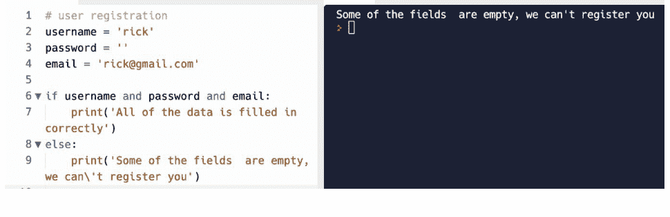

#### 三元运算符

到目前为止，我们已经使用了 if、else 和 elif 条件语句，并根据条件（`True` 或 `False`）执行一组语句。这使得我们的程序可以分支代码。但还有另一种方法可以使用一种称为**三元运算符**的简写语法来实现条件逻辑。在某些文献中，这被称为**条件表达式**。这将使你的代码更整洁，但我承认它可能看起来很奇怪。记住，语句和表达式是不同的。表达式是基于条件进行某种求值的操作。表达式是值的表示形式。在 Python 中，表达式相对较新，自 Python 2.5 版本起就已存在。

三元运算符的语法：

```
[condition_if_true] if [expression] else [condition_if_false]
```

让我们创建一个例子：

```python
is_old = True
is_allowed = "You can drink tonight" if is_old else "You cannot drink tonight coz of your age"
print(is_allowed)
```

如果我们运行上面的代码，输出将是“You can drink tonight.”。让我们开始解释这个运算符的工作原理。我们可以看到变量 **is_old** 具有布尔值 `True`，而变量 **is_allowed** 将是保存三元运算符返回结果的变量，因此其最终值将是“You can drink tonight”或“You cannot drink tonight coz of your age”。因为条件 **is_old** 被评估为 `True`，所以 **is_allowed** 将被赋值为“You can drink tonight”。如果条件被评估为 `False`，那么 else 子句之后的消息将被赋值给变量 **is_allowed**。在下图中，我解释了当条件为 `True` 时，三元运算符的哪部分会执行，以及当条件为 `False` 时哪部分会执行：

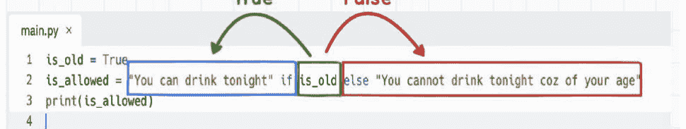

以下是两种场景的截图：

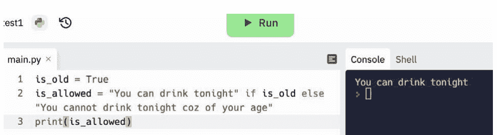

上图展示了如何根据给定条件（`is_old`）使用三元运算符为变量 **is_allowed** 赋值。

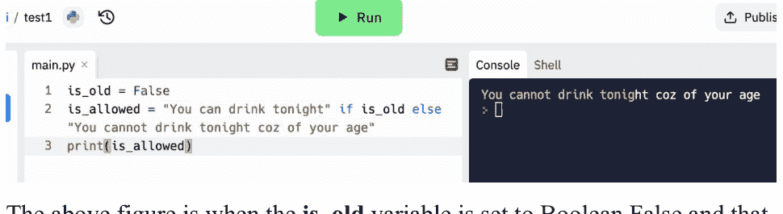

上图是当 **is_old** 变量被设置为布尔值 `False` 时的情况，这将使 if 条件评估为 `False`，因此 **else 子句** 消息将作为值赋给变量 **is_allowed**。我们可以看到，三元运算符并不可怕，但需要时间来适应这种语法。

#### 短路求值

为了解释 Python 中短路求值的工作原理，我将使用之前关于驾照的一个例子。

```python
my_age = 16
is_licenced = True
if is_licenced or my_age>=16:
    print('Hop on for a ride')
else:
    print('Sorry buddy, I\'m driving today!')

```

```
Hop on for a ride
```

如果 **is_licenced** 或 **my_age >= 16** 语句中只有一个评估为 `True`，则 if 条件将被评估为 `True`。短路求值很重要，因为它可以节省时间并提高程序性能。因此，当 Python 解释器评估涉及“or”运算符的表达式时，一旦其中一个操作数返回 `True`，它就会立即停止。让我们逐行解释 Python 解释器的工作原理：

1.  **my_age = 16**；解释器将在第一条语句中为变量 **my_age** 赋值 16。
2.  第二条语句为变量 **is_licenced** 赋值 `True`。
3.  第三条语句是 if 块：现在解释器将评估 if 关键字之后的内容，第一条语句是 **is_licenced**。显然，这个语句会立即评估为 `True`，解释器将继续评估下一条，但当它看到“or”运算符时，解释器会停止，因为第一个操作数已经返回了 `true`。
4.  然后它将执行 if 块下面的 `print()` 函数。

这就是 Python 中短路求值的工作原理，它可以跳过下一个表达式的评估，因为至少有一个返回了 `True`，从而节省时间并提高性能。

### Python 身份运算符

身份运算符将比较对象是否相同以及它们是否指向相同的内存位置。我们还没有学习对象是什么，但我知道你会理解这些例子，因为我将使用列表：

| 运算符 | 描述 | 示例 | 输出 |
| --- | --- | --- | --- |
| Is | 如果两个变量是同一个对象，则返回 true | a = ["apple"]<br>b = ["apple"]<br>c = a<br>print (a is c) | `True`；因为 c 和 a 是同一个对象 |
| Is not | 如果两个变量不是同一个对象，则返回 true | a = ["apple"]<br>b = ["apple"]<br>c = a<br>print (a is not b) | `True`；因为 a 和 b 不是同一个对象，尽管它们有相同的值 |

以下是“is”运算符的更多示例：

```python
# is operator
a = ["apple"]
b = ["apple"]
c = a
print (a is c)
# this returns true because a is same object as c

```

```python
# is operator

a = ["apple"]
b = ["apple"]
c = a
print (a is c)
# this returns true because a
# is same object as c
```

```
True
```

如果我们尝试检查列表/对象“a”是否等于对象“b”，那么结果将是 `false`，因为“a”和“b”不是同一个对象：

```python
print (a is b)
```

```
# is operator

a = ["apple"]
b = ["apple"]
c = a
print (a is b)
# this returns false because
# a is not same as b
```

```
False
```

如果我们使用比较运算符 `==` 来比较对象“a”和对象“b”，会发生什么？结果将是 `True`，因为对象“a”的内容等于“b”的内容：

```python
print (a == b)
```

```python
# is
a = ["apple"]
b = ["apple"]
c = a
print(a is c)
# this returns true because a is same object as c
print(a is b)
# this returns false because a is not same as object b
print(a == b)
# this returns true because the content of a is same as the content of object b
```

```
True
False
True
```

以下是“is not”运算符的更多示例：

```python
# is not
a = ["apple"]
b = ["apple"]
c = a

print(a is not c)
#this returns false because a is the same as object c
```

```python
print(a is not b)
# this will return true because object a is not same as the object as b even if they have the same content/values
```

## ‘is’ 运算符与 ‘==’ 运算符的比较

尽管我在上一节中已经介绍了 ‘is’ 和 ‘==’ 之间的区别，但我觉得你值得了解更多。你能猜出下面表达式的输出结果吗？

```
print(True == 1)
```

输出结果将是 True，但为什么呢？嗯，相等运算符会检查两个操作数是否相等。但这里我们评估的是两种不同的数据类型：左边是布尔值 True，右边是整数。因为它们是两种不同的类型，解释器会尝试将它们转换为相同的类型。因此，整数将使用 `bool()` 函数转换为布尔值，而 `bool(1)` 的计算结果为 True：

```
print(True == bool(1))
```

上面的代码与下面的代码完全相同：

```
print(True == True)
```

现在你知道为什么 `True == 1` 的计算结果为 True 了：

让我们检查一下这段代码的相等性：

```
#2 检查相等性
print('' == 1)
```

输出结果将是 False，因为空字符串在 Python 中被视为假值或布尔值 False，而整数 1 将被视为 True，所以我们试图检查 (False == True) 的相等性，这就是为什么我们一开始得到 False 的原因：

```
#2 检查相等性
print('' == 1)
print(bool('') == bool(1))
print(False == True)
```

当我们使用双等号时，最好的情况是比较属于相同数据类型的数据，但如果它们不同，那么我们只能希望 Python 使用真值和假值规则来为我们解决问题。现在你知道相等运算符会检查值的相等性。另一方面，‘is’ 运算符会检查两个对象存储值的内存位置是否完全相同。‘is’ 运算符不会使用 `bool()` 函数执行类型转换。让我们再看几个例子，看看 ‘is’ 与 == 相比是如何工作的：

```
# is 与 ==
print(True is True)
print([1, 2] is [1, 2])
```

输出结果是：

```
1
2
```

表达式 `(True is True)` 的计算结果为 True，因为布尔值 True 总是只有一个内存位置，无论我们在代码中做什么，它永远不会改变。第二个 print 会给我们 False 的输出，但为什么呢？这两个列表看起来一样。这两个列表具有完全相同的值，但每次创建一个新列表时，值都会存储在内存中的一个新位置。这两个列表在内存中的位置不同，尽管它们具有相同的值，但它们并不相同。请记住，列表不仅是数据类型，它们还是数据结构。这意味着与字符串、数字和布尔值等其他数据类型相比，存储像列表这样的数据结构需要更多的内存。

请考虑以下示例：

```
list1 = [1,2]
list2 = list1
print(list1 is list2)
```

输出结果将是 True。`list1` 被创建，值存储在内存中的某个位置。在下一行中，我们说 `list2` 等于 `list1`。这仅仅意味着 `list2` 不会创建新的内存来存储相同的值，因为它们已经被 `list1` 存储了。`list1` 和 `list2` 都将指向存储在内存中的相同值。现在如果我们修改 `list2` 并添加一个新项目，`list1` 也会受到影响，因为它们都指向存储在内存中的相同值：

```
list1 = [1,2]
list2 = list1
print(list1 is list2)
list2.append(3)
print(list1)
print(list2)
```

我希望你现在理解了 ‘is’ 运算符和 ‘==’ 运算符之间的区别。

### 成员运算符

在 Python 中，我们使用成员运算符来测试一个项目是否存在于对象中。我们在示例中已经使用过这个 ‘in’ 关键字，但现在你知道它们被称为成员运算符：

| 运算符 | 描述 | 示例 | 输出 |
|----------|-------------|---------|--------|
| in       | 仅当在对象中找到具有指定值的序列时才返回 true | # in<br>a = ["first", "second"]<br>print("second" in a) | True，因为 ‘second’ 存在于列表中 |
| not in   | 仅当在对象中未找到具有指定值的序列时才返回 true | # not in<br>a = ["first", "second"]<br>print("third" not in a) | True，因为项目 ‘three’ 未在列表中找到或不存在 |

### Python 循环

现在我们来介绍任何编程语言中最有趣的功能之一。到目前为止，我们已经介绍了控制结构和运算符，它们将指导语句的执行顺序。循环非常强大，因为根据指定的条件，我们可以让程序只要条件为 True 就反复执行一段代码。这非常强大，因为我们可以根据需要运行这些循环多次，而机器不会因为重复相同的指令而感到疲倦，因为它们不是人类。循环是你应该知道的最基本的功能之一。我们将要学习的其中一个循环叫做 ‘for’ 循环，为了创建一个，我们需要使用 ‘for’ 关键字。

以下是 for 循环的语法：

```
for val in sequence:
    loop body
```

在上面的语法中，我们使用了 ‘for’ 关键字，这是必须的，在 for 关键字之后，我们有一个变量名。变量名可以是任何你想要的名字，但应该适合循环。然后我们有 ‘in’ 关键字和项目序列。变量 ‘val’（可以称为 ‘item’）将为序列中的每个项目创建。请记住我们在上一章中提到过，字符串或列表是可迭代序列。这意味着我们可以迭代该序列中的每个项目。让我们做一个非常基础的例子，我们迭代字符串中的一个简单字符序列：

正如你所见，在上面的例子中，我使用了 ‘char’ 作为变量名。我决定将其命名为 ‘char’，因为它象征着序列 ‘Your name is?’ 中的每个单独字符。它将按顺序打印可迭代序列中的每个字符。我们也可以使用 for 循环来循环列表：

```
# 迭代列表
list1 = [1, 3, 5, 7, 9]
for item in list1:
    print(item)
```

让我们看另一个例子，我们循环集合中的项目：

```
# 迭代集合
set1 = {"apple", "banana", "cherry"}
for fruit in set1:
    print(fruit)
```

我们也可以循环元组：

```
tuple1 = ("apple", "banana", "cherry")
for fruit in tuple1:
    print(fruit)
```

我们也可以循环字典，但我们将在接下来的某些部分中进行。正如你所见，for 循环的语法类似于 if 语句。使用 for 循环，我们可以循环遍历数据集合，如列表、字符串、元组、集合等。与 if 语句一样，我们需要在集合后使用冒号 ‘:’，并且代码需要正确缩进。缩进很重要，因为它会向解释器指示以下代码属于 for 块。重要的是要知道，当到达集合中的最后一个项目时，循环将终止，解释器将跳出循环并开始执行 for 循环之后的代码。让我们使用 for 循环来计算列表中所有项目的总和：

```
# 数字列表
numbers = [1, 2, 4, 6, 5, 8, 11, 3, 14]

# 存储总和的变量
numbers_sum = 0
```

#### 嵌套循环

嵌套循环非常重要，因为它允许我们将一个循环嵌套在另一个循环中，只要保持适当的缩进即可。以下是嵌套两个 `for` 循环的一个示例：

```python
# nested for-loops

numbers1 = [1, 2, 3]
letters1 = ['x', 'l']

# iterate over the two lists

for val in numbers1:
    print(val)
    for letter in letters1:
        print(letter)
```

```
1   # nested for-loops
2   
3   numbers1 = [1, 2, 3]
4   letters1 = ['x', 'l']
5   
6   # iterate over the two lists
7   
8   for val in numbers1:
9       print(val)
10      for letter in letters1:
11          print(letter)

--- Console ---
1
x
l
2
x
l
3
x
l
> 
```

输出表明，在外层循环的第一次迭代中，打印的值是 1，这随后触发了内层 `for` 循环，该循环将依次打印字母 'x' 和 'l'。一旦内层循环的最后一个字母打印完成，程序将返回到外层循环的顶部，并打印 2。打印值 2 之后，内层循环再次运行，并将打印字母 'x'、'l'，依此类推。我们也可以像这样嵌套 `if` 语句：

```python
# nested if statements
grade = 80
if grade >= 60:
    if grade >= 90:
        print("A")
    elif grade >= 80:
        print("B")
    elif grade >= 70:
        print("C")
    elif grade >= 60:
        print("D")
else:
    print("Your grade is F")
```

## While 循环

在 Python 中，我们有两种基本循环，一种是我们已经讨论过的 `for` 循环，另一种是 `while` 循环。使用 `while` 循环，只要我们在 `while` 循环中设置的条件求值为 `True`，我们就可以执行一组语句。

语法：

```python
while test_expression:
    Body of while
```

`while` 循环的语法非常基础，如果你理解了 `for` 循环的工作原理，`while` 循环将更容易理解。那么，既然我们已经有了 `for` 循环，为什么还需要 `while` 循环呢？嗯，当我们不知道需要迭代或循环的确切次数时，我们可以使用这种循环。`while` 循环中的条件在循环开始之前进行求值。只有当条件为 `True` 时，`while` 循环的主体才会被执行。重要的是要知道，在每次迭代之后，测试表达式（条件）会再次被检查。当表达式求值为 `False` 时，此循环将停止。Python 中 `while` 循环的主体由缩进决定，而在其他编程语言中，可以使用花括号来完成，例如在 JavaScript 中。让我们来看这个例子：

```python
# while loop

# calc sum up to this number
the_number = 10
# initialize sum and counter
the_sum = 0
i = 1

while i <= the_number:
    the_sum = the_sum + i
    i = i + 1  # update/increment the counter

# print the sum
print('The sum is: ', the_sum)
```

```
# while loop

# calc sum up to this number
the_number = 10
# initialize sum and counter
the_sum = 0
i = 1

while i <= the_number:
    the_sum = the_sum + i
    i = i + 1  # update/increment the counter

# print the sum
print('The sum is: ', the_sum)

Console Output:
The sum is: 55
```

从上图可以看出，只要计数器变量 'i' 小于或等于 `the_number`（在我们的例子中是 10），测试表达式 `i <= the_number` 就会为 `True`。我们需要找到一种方法在每次迭代后增加计数器，因为如果我们不这样做，测试表达式将始终为真，我们将创建一个无限循环，这会阻塞我们的机器（请小心）。因此，在 `while` 循环的主体中，在求和计算之后，我们将计数器变量 'i' 的值增加一。当 'i' 的值变为 11 时，测试表达式将求值为 `False`，这将终止 `while` 循环。我想分享的另一个有趣的特性是 `break` 语句。这是我们停止 `while` 循环并强制循环终止或停止执行的方式。我们可以在 `while` 条件求值为 `False` 之前从 `while` 循环中跳出，如下所示：

如你所见，当计数器 'i' 达到数字 7 时，`while` 循环内部的 `if` 条件将求值为 `True`，`break` 语句将终止循环。这就是为什么其余的数字（8,9,10）永远不会被打印出来。我还使用了增强赋值运算符（`+=`）语法或更短的语法来将计数器增加一。如果我们希望 `else` 子句在 `while` 循环中的条件变为 `False` 时在末尾执行，那么 `while` 循环可以与 `else` 子句结合使用：

```python
# else clause statement
j = 0
while j <= 10:
    print(j)
    j += 1
else:
    print('This means the while condition is false')

print('This line is outside the while loop')
```

如你所见，当 `while` 条件变为 `False` 时，`else` 子句将被执行。在 `else` 子句内部，我们有一个非常简单的打印简单消息。但如果我们尝试之前使用 `break` 语句的示例，那么 `else` 子句将永远不会被执行，因为我们强制循环在某个点退出：

```python
# break statement
i = 0
while i <= 10:
    print(i)
    if(i == 7):
        break
    i += 1
else:
    print('This means the while condition is false')

print('This line is outside the while loop')
```

```python
# break statement
i = 0
while i <= 10:
    print(i)
    if(i == 7):
        break
    i += 1
else:
    print('This means the while conditon is false')

print('This line is outside the while loop')
```

### 可迭代对象

Python 中的可迭代对象非常重要，因为它们是一个对象或一个可以被迭代的项目集合。在 Python 中，可迭代对象包括元组、集合、字典、列表和字符串。另一个关键术语是“迭代”或“循环遍历”，这简单地意味着可以逐个访问集合中的每个项目。这个特性在其他编程语言如 JavaScript 中也能找到。总结一下，可迭代对象是集合，而“迭代”是我们对该集合执行的操作。我们已经介绍了如何迭代 Python 中的大多数集合，但没有包含字典的示例。让我们创建一个迭代字典集合的例子：

```python
# looping over a dictionary
# car dictionary
ford = {
    "brand": "Ford",
    "model": "Mustang",
    "year": 2023,
    "transmission": "Automatic"
}
```

```python
for item in ford:
    print(item)
```

当循环遍历字典时，返回的值将是字典数据类型的键。但我们可以使用其他方法来同时返回键和值。这些方法很流行，被开发者广泛使用：

### items() 方法

此方法将获取键/值对并以元组的形式返回它们：

```python
# items method
for item in ford.items():
    print(item)
```

```python
# looping over a dictionary
# car dictionary
ford = {
    "brand": "Ford",
    "model": "Mustang",
    "year": 2023,
    "transmission": "Automatic"
}

#items method
for item in ford.items():
    print(item)
```

### values() 方法

此方法将只给我们字典中的值，而不是键：

```python
# values method
for item in ford.values():
    print(item)
```

```python
# looping over a dictionary
# car dictionary
ford = {
    "brand": "Ford",
    "model": "Mustang",
    "year": 2023,
    "transmission": "Automatic"
}

# values method
for item in ford.values():
    print(item)
```

### keys() 方法

普通的 `for` 循环与这个方法做同样的工作，意思是它只返回字典的键，但我猜这样更具描述性：

```python
# keys method
for item in ford.keys():
    print(item)
```

但如果我们想获取键/值对而不返回元组呢？有一个简单的技巧，我们可以利用解包的力量，但我们需要使用 `items()` 方法，因为它将让我们同时访问键和值：

```python
# unpack the values and keys
for item in ford.items():
    key,value = item
    print(item)
```从字典中获取键和值的另一种方法是稍微改变一下 `for` 循环的语法：

```python
# 我们可以这样获取键和值
for key,value in ford.items():
  print(key,value)
```

最后一种语法在开发者中非常常见。在结束如何循环字典的讨论之前，我想提一下，变量名（`key`, `value`）可以由你自行决定。我使用了一些具有描述性的名称，但即使使用下面这样的代码也完全没问题且可执行：

```python
for k,v in ford.items():
    print(k,v)
```

## 内置的 `range()` 函数

`range()` 函数是 Python 的内置函数之一，它允许我们遍历一个数字序列。`range()` 函数将返回一个数字序列，默认从零（0）开始，每次递增 1，直到达到结束值（我们传入 `range` 函数的一个指定数字）。`range` 函数的语法如下：

```python
range(start, stop, step)
```

如你所见，`range` 可以接受 3 个参数，第一个称为 `start`，是可选的。这是一个整数，用于指定起始位置。如果省略，默认值将是零（0）。第二个参数是 `stop`，这是必需的，它是一个整数，用于指定结束位置。最后一个参数称为 `step`，与 `start` 参数一样，它也是可选的，用于指定步长。默认步长为 1。我们知道从参数来看，中间那个称为 `stop` 的参数是必需的，所以让我们打印一下当我们只提供一个参数时这个函数的作用：

```python
# range 函数
print(range(10))
```

从上图中，我们现在有了一个从零开始到十结束的范围，虽然我们没有指定起始值，但它被自动添加了。`range()` 在与循环结合使用时非常流行：

```python
# range() 与 for 循环
for number in range(0, 10):
    print(number)
```

从上图中，我们可以看到我们使用了 `range` 函数，因此 `for` 循环可以运行 10 次。我们不必像 `'number'` 那样指定变量名，我们可以使用 `'_'` 下划线，它仍然是有效的：

这意味着我们不关心变量的命名，但我们需要循环运行 `range` 函数中指定的特定次数。我们甚至可以指定步长参数：

```python
# 步长
for _ in range(0, 10, 2):
    print(_)
```

## `enumerate()`

类似于 `range()` 函数，我们有一个名为 `enumerate()` 的函数。`enumerate()` 函数将接受一个类似元组（Tuple）的集合，并将其作为枚举对象返回。此函数还会为集合中的每个项目添加一个计数器/索引作为键。这意味着该函数允许我们遍历一个序列，但同时跟踪元素和索引。例如，让我们将一个元组集合传递给这个新函数：

```python
# enumerate ()
x = ('first', 'second', 'third')
y = enumerate(x)

for item in y:
    print(item)
```

如我们所见，`enumerate()` 函数接受一个可迭代对象作为参数，并返回一个带有索引（作为键）的对象，现在元组可以像列表一样访问索引了。我们不必只打印变量 `'item'`，我们可以这样做：

```python
for key, item in y:
    print(key, item)
```

太棒了！现在我们不仅得到了集合的值，还得到了索引。我们也可以对字符串和列表实现同样的效果：

```python
# 字符串
for key, item in enumerate('Rick'):
    print(key, item)

# 列表
for key, item in enumerate([1, 2, 3]):
    print(key, item)
```

如我们所见，`enumerate()` 函数非常有用，因为我们可以遍历集合，同时还能访问索引和值。

## `break`、`continue` 和 `pass` 语句

我们看到 `break` 语句会停止循环的正常执行并终止该循环。在那个例子中，我们在 `while` 循环中使用了 `break` 语句，但如果需要，我们也可以在任何其他循环中使用 `break` 语句。`break` 语句可用于在循环遍历完所有项目之前停止循环：

```python
# break, continue 和 pass 语句
brands = ["ford", "bmw", "toyota", "audi", "mercedes"]
for brand in brands:
    print(brand)
    if brand == 'toyota':
        break
print('如果你读到这行，循环已经结束')
```

我们可以在循环中使用的另一个语句是 `'continue'` 语句。当我们使用这个语句时，我们不会像使用 `'break'` 语句那样退出循环，而是会停止当前迭代的循环，而不是像 `'break'` 语句那样停止整个循环。让我们使用 `continue` 语句在汽车品牌等于 `'bmw'` 时跳过该迭代，但我们需要继续遍历其余品牌：

```python
# continue
for brand in brands:
    if brand == 'bmw':
        continue
    print(brand)
print('如果你读到这行，循环已经结束')
```

第三个语句称为 `'pass'` 语句，它很少使用，因为它本身不做任何事情。`pass` 语句将用作未来代码的占位符。例如，当 `pass` 语句被执行时，它不会做任何事情，但你可以避免因为空代码不被允许而出现错误。我知道这很令人困惑，但让我们看看下面的例子：

```python
#pass
is_old = True
if is_old:
    #没有代码
print('这会给我们一个错误')
```

如你所见，我们得到了 `IndentationError`，因为 `if` 语句之后没有代码，解释器期望我们完成 `if` 语句并编写一些代码。解释器会查看下一行（第 5 行），看到没有缩进，就会抛出一个错误，因为解释器感到困惑，认为 `print` 消息应该放在 `if` 语句的主体中。因此，当我们不知道在 `if` 块中写什么时，我们可以使用 `pass` 语句：

```python
#pass
is_old = True
if is_old:
    #没有代码
    pass
print('这会给我们一个错误')
```

如我们所见，我们可以运行代码而不会出错。

### 练习时间

现在是练习本章涵盖的一些内容的合适时机，这包括循环、条件语句和方法。练习内容是清理一个脏列表。脏列表是一个包含重复值的列表，我们的程序应该创建一个没有任何重复项的干净列表。在我展示我的解决方案之前，我希望你思考一下，甚至尝试编写你自己的解决方案。这是一个脏列表：

```python
#第2章练习
dirty_list = [1, 2, 3, 2, 4, 1, 5, 6, 5, 5, 7, 8, 1, 9, 10, 9, 8, 3];
```

## 解决方案：

从上面的列表中我们可以看到，一些项目是重复的，所以我们需要创建一个新列表并将其命名为 **clean_list**。提示：有很多不同的方法可以解决这个问题，但我建议使用成员运算符之一来简化我们的工作。

这是我的解决方案（仅代码）

```python
# 第2章练习
dirty_list = [1, 2, 3, 2, 4, 1, 5, 6, 5, 5, 7, 8, 1, 9, 10, 9, 8, 3]
# 空列表
clean_list = []
# 遍历项目
for item in dirty_list:
    # 检查项目是否不在列表中
    if item not in clean_list:
        # 如果未找到该项目，则添加它
        clean_list.append(item)

print(clean_list)
```

如果我们运行代码，输出将是：## Python 函数

我们已经见过一些 Python 的内置函数，但我们也可以创建自己的函数。函数是 Python 的核心特性。我们如何创建一个函数呢？我们可以使用关键字 `def`，它表示定义一个函数。之后，我们需要为函数命名：

```python
# functions
def hi_function():
    print('Hi there')
```

为函数命名后，我们需要使用括号 `()` 和冒号 `:`，这会告诉解释器函数体将在下一行开始。但如果我们运行上面的代码，将看不到打印的消息，为什么呢？函数需要被调用才能执行，所以我们可以这样调用函数：

```python
def hi_function():
    print('Hi there')

hi_function()
```

```
Hi there
```

我们在函数体外部使用函数名加括号 `()` 来进行函数调用。函数非常有用，因为一旦创建，我们就可以根据需要调用任意多次。这非常方便，因为我们编写的每个函数都有其目的，并且每个函数都必须返回某些内容。一旦函数被创建，我们就不必一遍又一遍地重复编写相同的代码。这被称为 DRY 原则，意思是“不要重复自己”，即避免不必要的代码或重复。另一个你应该知道的重要事项是，我们不能在函数被创建或定义之前调用它。让我们尝试在声明之前调用一个函数：

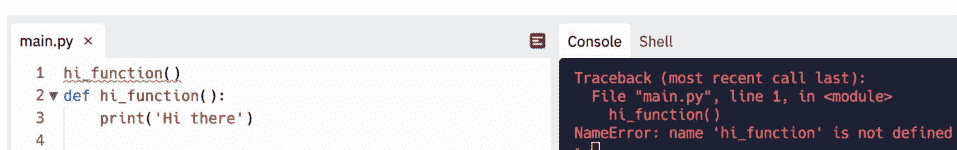

这将抛出一个 `NameError`，因为该函数未定义。Python 解释器会抛出上述错误，因为它试图调用一个在内存中不存在的函数。任何时候我们写一个不带括号的函数名，我们都是用该名称来指向该函数在内存中的存储位置。我们可以通过打印不带括号的函数来证明这一点：

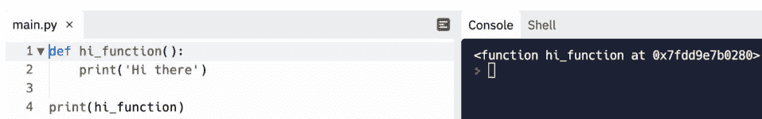

如我们所见，名为 **hi_function** 的函数存储在内存中的某个位置：0x7fdd9e7b0280。但当我们写 `hi_function()` 带括号时，解释器就知道我们试图执行函数体。

## 函数参数与形参

到目前为止，我们创建的函数都非常简单，因为它们只打印一条消息。但函数的存在是为了完成更复杂的事情。`hi_function()` 非常简单，因为它不接受任何参数。我们可以在函数括号内添加参数。这些参数的名称可以是任何东西，我们可以传递一个或多个参数，但它们需要用逗号分隔。让我们在函数内添加一个参数：

```python
def hi_function1(name):
    print('Hi there')
```

这意味着 `hi_function` 现在可以接收一个名为 `name` 的参数。如果用逗号分隔，我们可以添加多个参数：

```python
def hi_function2(name, lastname):
    print('Hi there')
```

这两个参数现在可以在函数体中作为局部变量使用：

```python
def hi_function3(name, lastname):
    print(f'Hi there {name} {lastname}')
```

现在我们使用格式化的 `f` 字符串来打印这些局部变量的值。但这两个参数/变量的值从哪里来呢？我们可以在函数调用时将它们传递进去。这是一个不带任何参数的函数调用：

```python
hi_function()
```

让我们传递两个参数：

```python
hi_function3('Rick', 'Sekuloski')
```

为什么我用两个不同的术语（parameters 和 arguments）来指代同一件事？在函数定义中，它们被称为 parameters（形参），而在我们调用/执行函数时，它们被称为 arguments（实参）。它们是同一件事，开发者们总是混用它们。但这不是什么大问题。让我们运行函数并查看输出：

```python
def hi_function3(name,lastname):
    print(f'Hi there {name} {lastname}')

hi_function3('Rick','Sekuloski')
```

```
Hi there Rick Sekuloski
```

所以 arguments 是我们发送给函数的实际值，而 parameters 是我们在函数体中用来访问这些值的变量。Parameters 在函数声明时使用，arguments 在函数调用时使用。你可能会在某个地方读到函数调用也被称为函数调用（function invocation）。所以这些是我希望你从本节中学到的术语：

- 函数声明
- 函数调用
- 函数调用或函数调用
- 函数实参
- 函数形参
- 定义一个函数

我希望你现在意识到，函数可以根据我们提供的参数进行一些计算。我们可以用不同的参数调用同一个函数，输出总会不同：

```python
def hi_function3(name,lastname):
    print(f'Hi there {name} {lastname}')

hi_function3('Rick','Sekuloski')
hi_function3('Joseph','Smith')
hi_function3('Abraham','Lincoln')
hi_function3('Morgan','Freeman')
```

```
Hi there Rick Sekuloski
Hi there Joseph Smith
Hi there Abraham Lincoln
Hi there Morgan Freeman
```

## 位置参数与关键字参数

在本节中，我们将讨论 Python 中位置参数和关键字参数的重要性。顾名思义，位置参数是需要按正确顺序或位置书写的参数。这意味着，如果我们想要获得期望的函数输出，参数必须按正确的位置和顺序提供。让我们再次查看前面的函数示例，并稍作修改，使其可以接受 3 个参数和 3 个形参：

```python
def hi_function4(name,lastname, age):
    print(f'Hi there {name} {lastname}. Are you {age} old?')

hi_function4('Rick','Sekuloski', 33)
```

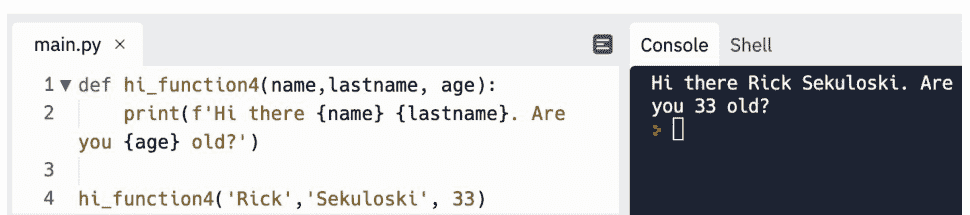

从上图可以看出，我们有一个接受 3 个值或参数的函数，最后一个是人的年龄。所以在这种情况下，参数的顺序很重要，例如，让我们交换一下 lastname 和 age：

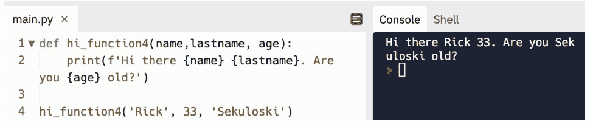

我们调用函数时，先传了 name，然后是 age，最后是 lastname。函数仍然会运行，但输出将毫无意义。因此，位置参数非常重要，因为它们的顺序或位置很重要。Python 中的关键字参数是什么？关键字参数不关心位置，因为参数是用关键字标记的。让我们创建一个使用关键字参数的例子：

```python
def hi_function5(name, lastname, age):
    print(f'Hi there {name}{lastname}. Are you {age} old?')

hi_function5(name='Rick', lastname='Sekuloski', age=33)
```

我必须给函数不同的名字，因为我把它们保存在一个文件里。在文件内部，不能有同名的函数，否则会报错。所以让我们运行这个函数：

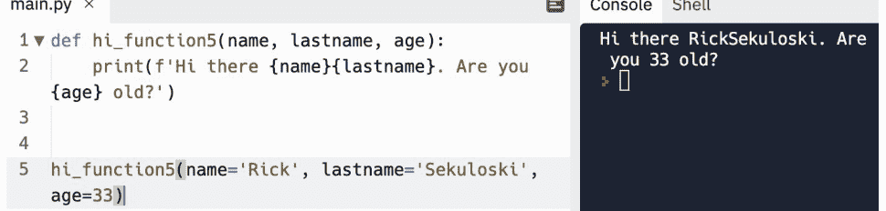

让我们关注函数调用：

```python
hi_function5(name='Rick', lastname='Sekuloski', age=33)
```

在函数调用中，我们有一个关键字，你可以将其视为变量名，我们为该关键字赋了一个值。如果我们查看输出，可以看到顺序是正确的，但让我们改变函数调用中关键字的顺序，然后再次运行：

```python
hi_function5(name='Rick', age=33, lastname='Sekuloski')
```

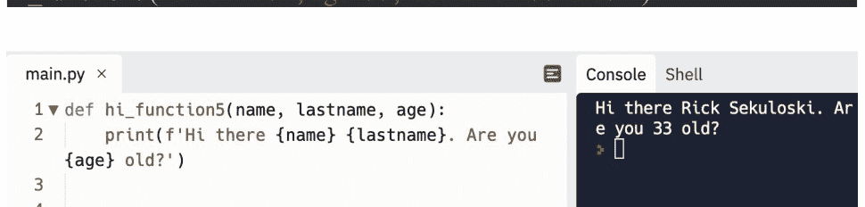

输出再次正确，这要归功于关键字参数。关键字参数非常好，因为它们会与函数定义中的形参匹配。就个人而言，这不是最佳实践，我们的函数调用看起来很乱。没有这些关键字的函数调用要干净得多。这就是你在 Python 中关于位置参数和关键字参数需要知道的一切。

## 默认参数与形参

在本节中，我们将讨论默认参数和实参是什么。默认参数允许我们在函数声明中直接给出默认值。请看这个例子：

```python
# name, lastname are parameters

def hi_function6(name='John', lastname='Doe', age=30):
    print(f'Hi there {name} {lastname}. Are you {age} old?')
```

如果我们仔细观察，会注意到这看起来像我们在函数调用中写的关键字参数，对吧？是的，这是正确的，这也是我不推荐使用关键字参数的另一个原因，因为大多数时候开发者会将它们与默认参数混淆。默认参数很有用，因为现在参数有了默认值或起始值。这很棒，因为如果我们忘记在函数调用中添加一个值，仍然会有输出。让我们先用 3 个参数调用函数：

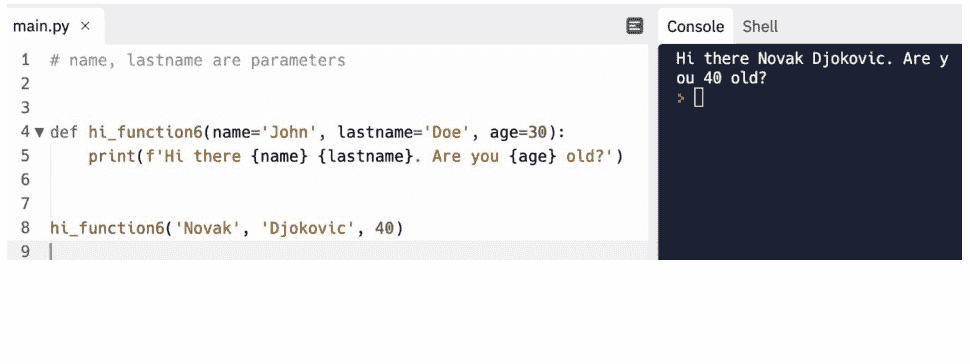

你刚才预料到上面的输出了吗？如果答案是肯定的，那么恭喜你，因为这说明你理解了默认参数在后台是如何工作的。当我们用所有参数调用函数时，默认参数值会被我们传入函数调用的参数所覆盖。但现在让我们仅用两个值来调用函数：

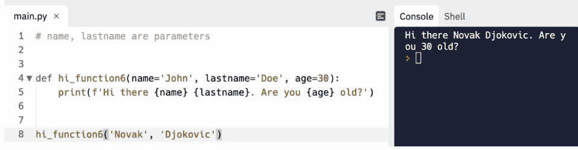

从上图中我们可以看到，函数调用没有提供所有参数，但在输出中，缺失的参数被默认值替换了。这就是为什么默认参数如此重要，因为现在我们即使不传任何参数来调用函数，它最终仍然能产生一个结果：

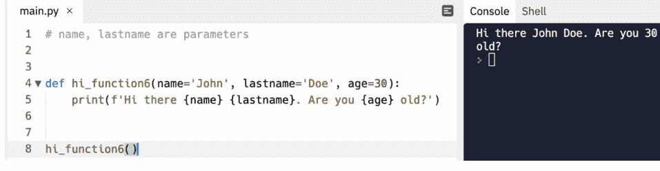

## 函数返回

`return` 是 Python 中的一个特殊关键字，在函数中非常有用且常见。其理念是函数总是返回一个值，我们可以使用该值做任何我们想做的事。让我们创建一个函数来计算两个整数的和：

```python
# 使用 return 关键字的求和函数
def calc_fun(num1, num2):
    num1 + num2

calc_fun(3, 4)
```

上面的函数会计算我们在函数调用中传入的两个参数的和，但当我们运行它时，输出结果却不见了。我知道你在想，是不是因为我们没有使用 `print` 函数来打印结果。我们并不总是必须使用 `print` 函数来获取值，函数的目标不是打印消息，而是返回一个值。我们可以这样返回结果：

```python
# 使用 return 关键字的求和函数
def calc_fun(num1, num2):
    return num1 + num2

calc_fun(3, 4)
```

很好！现在我们可以将函数调用包装在 `print` 函数中，这样就能得到结果：

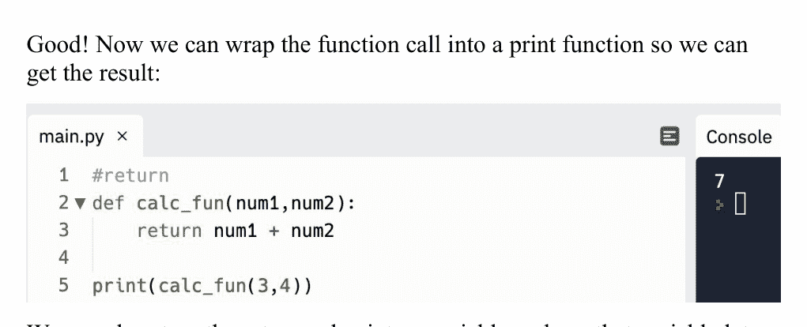

我们也可以将返回值存储到一个变量中，然后在代码中后续使用该变量：

```python
# return
def calc_fun(num1,num2):
    return num1 + num2

fn_result = calc_fun(3,4)
fn_result += 1
print(fn_result)
```

现在这个值是 8，因为我们可以操作这个变量的值。你需要知道的是，当解释器在函数体中看到 `return` 关键字时，函数将返回该值并终止执行。你需要小心在函数体中 `return` 关键字之后放置代码，因为那段代码将永远不会被执行，如下例所示：

```python
# return
def calc_fun(num1,num2):
    return num1 + num2
    print(num1+num2)

fn_result = calc_fun(3,4)
fn_result += 1
print(fn_result)
```

第 4 行将永远不会被执行，因为第 3 行的 `return` 关键字已经终止了函数。

#### 嵌套函数

嵌套函数非常有趣，因为我们可以拥有在一个函数内部定义的函数。与其只有一个函数，我们会有一个内部/嵌套函数，它可以访问外部或外层函数中定义的变量。我知道这可能令人困惑，但让我们创建一个简单的例子，以便你能理解嵌套是如何工作的。

```python
#### 嵌套函数
def outer_fn(num1, num2):
    def inner_fn(n1, n2):
        return n1 + n2
    total = inner_fn(num1, num2)
    return total

result = outer_fn(2, 3)
print(result)
```

输出将是 5，以下是截图：

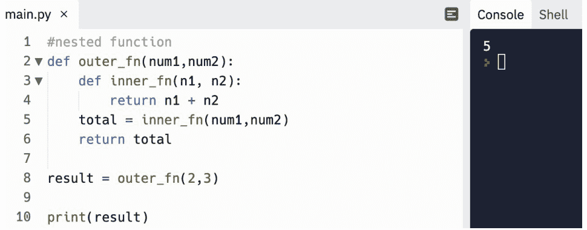

从上图中，我们有两个函数，一个是 **outer_fn**，它接受两个参数 **num1** 和 **num2**；第二个函数是 **inner_fn**。在第 8 行，我们用两个参数调用函数，返回的任何结果都会存储在名为 **result** 的变量中。当我们调用该函数（outer_fn）时，解释器会跳到第 2 行，此时两个函数参数 num1 和 num2 将分别访问值 2 和 3。然后它进入 **outer_fn** 的函数体，即第 3 行。在第 3 行，我们有另一个函数声明，它接受两个新参数 **n1** 和 **n2**。这个函数将被跳过，因为还没有人调用它。解释器继续到第 5 行，这里我们实际调用了 **inner_fn**，传入两个参数，这两个参数是 **outer_fn** 的参数。这等同于我们这样写：

```python
total = inner_fn(2,3)
```

接下来，解释器再次回到第 3 行，但这次参数 n1 和 n2 的值是 2 和 3，在函数体内我们返回这两个参数的和。函数返回后，跳到第 6 行，这里返回 **inner_fn** 的结果作为输出。在第 8 行，result 变量将拥有从 **outer_fn** 返回的值 5，接着，程序会跳到第 10 行打印结果。这就是 **inner_fn** 如何能够使用并访问 **outer_fn** 中的变量/参数的原理。记住这里的关键部分是 `return` 关键字，否则我们将永远无法得到这个返回结果。

#### Python 中的文档字符串

Python 中的文档字符串是位于函数、类、方法甚至模块定义之后的字符串字面量。首先，我们需要看看如何编写字符串字面量：

```python
""" This is string literal """
```

我们将字符串字面量写在三引号内。现在让我们创建一个函数来计算一个数字的平方：

```python
# 文档字符串
def num_square(num):
    """This function takes a number and returns the square of that number"""
    return num**2

result = num_square(4)
print(result)
```

如果我们运行上面的代码，输出将是：

```python
# 文档字符串
def num_square(num):
    '''This function takes a number and returns the square of that number'''
    return num**2

result = num_square(4)
print(result)
```

正如你所看到的，我们在函数声明之后，在三引号内编写了字符串字面量。如果我们运行这个函数，我们将不会看到字符串字面量本身。如果你阅读这个模板字面量中的注释，你会看到它是对该函数功能的简短描述或说明。如果我们把鼠标悬停在函数调用上，将会看到这个字符串字面量消息：

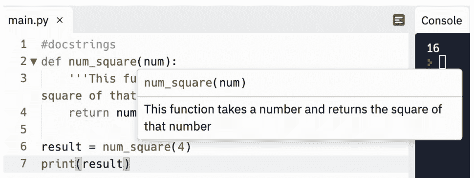

这被称为文档字符串，它基本上是函数内部的注释，用于解释函数的功能。这在大型应用程序开发中非常有用，如果其他开发人员想要加入，他们可以快速阅读函数说明，而不必通读整个文档。另一种了解函数功能的方法是使用 `help()` 函数。这是另一个内置的 Python 函数，开发人员用它来理解某些函数的作用：

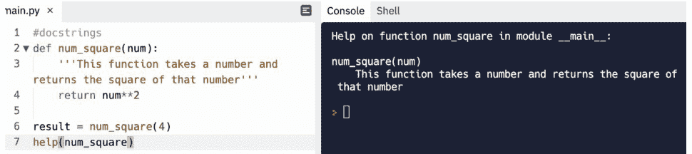

我们甚至可以这样做：

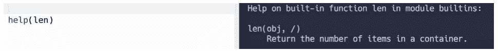

正如你所见，`len()` 函数将返回容器中的项目数量。还有其他方法可以了解函数的功能，例如，我们可以使用魔法方法或双下划线方法。Python 中的魔法方法或双下划线方法是以双下划线开始和结束的特殊方法：

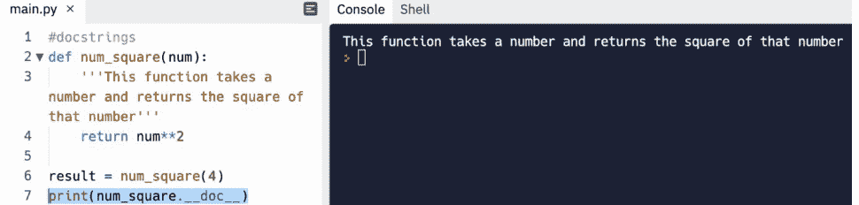

总结来说，文档字符串是我们希望他人看到的注释。这些注释应该是有意义的，并解释函数的功能。

## Python 的 *args 和 **kwargs

在本节中，我们将学习 ‘args’ 和 ‘kwargs’ 以及如何使用它们。我们知道我们定义的函数是可重用的代码片段，可以被多次调用或唤起。在我们的函数调用期间，我们传递特定的值，称为参数。让我们定义一个函数，根据出生年份和当前年份来计算你的年龄：

```python
# args 和 kwargs
def years_old(curr, dob):
    return curr - dob

age = years_old(2022, 1999)
print(age)
```

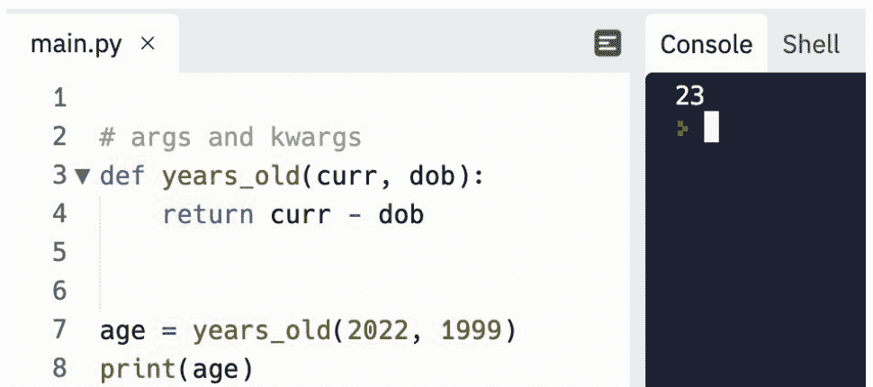

从上图中我们可以看到，当前年份是第一个参数，出生年份是第二个参数。如果我们传递三个参数而不是要求的两个参数到函数调用中会发生什么？让我们来找出答案：

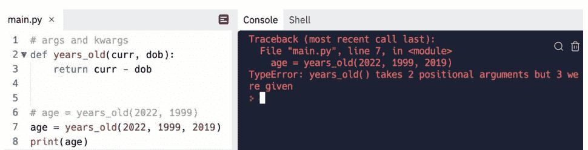

我们得到一个错误信息，提示我们传递了3个参数，但函数 **years_old()** 仅接受两个位置参数。这很好，因为它将帮助我解释Python中的 *args 和 **kwargs。*args 语法代表‘非关键字参数’，**kwargs 代表‘关键字参数’，但它们为何有用呢？嗯，当我们不知道需要传递给函数的确切参数数量时，可以使用 *args 作为参数。这将防止程序像上图那样崩溃，所以当不确定应传递多少个参数给函数时，它们非常有用。让我们通过使用星号 *args 来更改函数声明。这意味着我们可以使用任意数量的参数。让我们编写一个新函数来计算数字之和：

```python
# args and kwargs
def addition_fn(*args):
    print(*args)

addition_fn(1, 2, 3, 4, 5, 6)
```

如您所见，**addition_fn** 有6个参数，是从1到6的数字，但在函数声明中，我们仅将 *args 用作单个参数。在右侧，我们可以看到传递给 addition_fn 的参数是通过 *args 访问的。这使我们能够调用名为 sum() 的内置Python函数。该函数将返回来自可迭代集合（如元组）中所有项的和。但 *args 不是一个元组。使用 *args 的一种方式是省略前面的星号，如下所示：

```python
# args and kwargs
def addition_fn(*args):
    print(args)

addition_fn(1, 2, 3, 4, 5, 6)
```

```
(1, 2, 3, 4, 5, 6)
```

很好！现在我们得到了一个元组作为输出，因此我们可以毫无问题地调用 sum() 函数。让我们这样做并检查输出：

```python
# args and kwargs
def addition_fn(*args):
    return sum(args)

result = addition_fn(1, 2, 3, 4, 5, 6)
print(result)
```

```
21
```

正如我们所见，我们的逻辑有效，我们将得到和为21。总而言之，当我们不确定函数将接受多少个参数时，使用 *args。我们可以为 *args 使用不同的名称，例如 *nums。现在让我们关注 **kwargs。Kwargs 是一个关键字参数字典，双星号 '**' 允许我们传递任意数量的关键字参数。我们可以在函数调用中添加关键字，并在函数体内以字典形式访问它们：

```python
# args and kwargs
def addition_fn1(*args, **kwargs):
    print(kwargs)
    return sum(args)

result1 = addition_fn1(1, 2, 3, 4, 5, 6, n7=7, n8=8)
print(result1)
```

```
{'n7': 7, 'n8': 8}
21
```

但是，我们如何从 kwargs 中访问项及其值呢？我们可以使用循环来迭代字典项，然后使用 .values() 方法获取值：

```python
# args and kwargs
def addition_fn1(*args, **kwargs):
    result = 0
    for item in kwargs.values():
        result += item
    return sum(args) + result

result1 = addition_fn1(1, 2, 3, 4, 5, 6, n7=7, n8=8)
print(result1)
```

```
36
```

如您所见，函数调用可以使用 *args 语法接受任意数量的位置参数，但也可以接受命名关键字参数。但这还不是您需要知道的一切，因为在使用参数时有一个很好的规则需要遵循。规则是：如果在同一个函数中使用所有这些参数，那么它们的顺序非常重要。优先级最高的是普通参数，然后是 *args，接着是默认参数，最后是 **kwargs。现在是时候总结一下我们可以用 *args 和 **kwargs 做什么了：

1. *args 和 **kwargs 用于使函数参数列表灵活，它们是允许函数接受任意数量参数的特殊关键字
2. *args 表示非关键字参数，它们出现在函数定义中的 **kwargs 之前
3. **kwargs 是关键字参数，它们像字典一样在函数中使用
4. 如果你愿意，可以使用不同的名称；args 和 kwargs 只是约定，而不是强制要求

### 作用域

作用域在Python中很重要。作用域指的是我们对变量的访问权限。当我们尝试访问一个尚未创建的变量时，会得到如下错误：

```python
#scope
print(result)
```

```
Traceback (most recent call last):
  File "main.py", line 2, in <module>
    print(result)
NameError: name 'result' is not defined
```

这是一个 **NameError**，因为结果变量甚至没有定义，而我们正尝试访问它。发生这种情况是因为该变量不存在于该作用域中。这就是我们需要了解不同作用域存在的原因。如果在Python中，我们在任何函数外部声明并初始化一个变量，这意味着该变量属于全局作用域。全局作用域就是提供该变量访问权限的作用域。任何人都可以访问在全局作用域中声明的变量。让我们在全局作用域中声明一个变量，并创建一个函数来打印该变量：

```python
# local variable
result = 14.4

def num_func():
    print(result)

num_func()
```

如我们所见，名为 **result** 的变量属于其被声明并绑定到值14.4的全局作用域。由于全局作用域，我们可以安全地在函数体内使用此变量。但是Python中的函数有自己的块作用域。函数作用域意味着我们在函数体内定义的任何内容都只能在该函数内部访问和使用。如果我们有在函数中声明的变量，并尝试在函数体外部打印它们，我们将得到错误。这里是一个例子：

```python
def num_func1():
    num1 = 11.4
    print(num1)

num_func1()

print(num1)
```

第8行是我们尝试打印在名为 num_func1() 的函数内部声明的变量。这将导致解释器用红色下划线标记。如果我们运行此代码，我们将得到NameError，因为 num1 在全局作用域中未定义。请你猜测以下代码的输出：

```python
#guess the output
x = 1
def trick_me(x):
    x = 4
    return x
```

```python
print(x)
print(trick_me(5))
```

如果你无法得出答案，以下是输出：

如您在第8行所见，我们正在打印在第2行声明的变量 x 的值。不要与我们传递给函数的参数 x 混淆，因为我们本可以给这个参数起不同的名字。在第9行，我打印 trick_me 的值，其中我传递了一个值为5的参数，但这个参数不会产生任何差异，因为第5行将为该函数创建一个局部变量，并将该变量重新赋值为新值4。我之所以说是局部变量，是因为该变量对于函数来说是局部的。在第6行，我们返回 x 的最后一个值，该值将是4。这就是为什么函数 trick_me 的输出将是4。

### 关于作用域的更多信息

在上一节中，我提到函数参数是该函数的局部变量。它们属于定义它们的函数，而不属于全局作用域：

```python
#global and function scope
x = 1

def trick_me(x):
    #local variable
    x = 4
    return x

print(x)
print(trick_me(5))
```

如果你是初学者，另一个你会遇到的有趣错误是 UnboundLocalError。这个错误是什么意思？让我用这个例子来解释：

```python
#global and function scope
x = 1

def trick_me():
    x += 4
    return x

print(trick_me())
```

```
Traceback (most recent call last):
  File "main.py", line 8, in <module>
    print(trick_me())
  File "main.py", line 5, in trick_me
    x += 4
UnboundLocalError: local variable 'x' referenced before assignment
```如上图所示，我们在第二行创建了一个变量 **x** 并为其赋值为一。我们在 `trick_me` 函数中使用了这个全局变量，并将其值增加了四。请注意，在此时函数 `trick_me()` 不接受任何参数。在第八行，我们调用了 `print` 函数，并得到了 `UnboundLocalError` 错误，提示局部变量 ‘x’ 在赋值前就被引用了。但这并不成立，因为我们在第二行已经声明并给变量 ‘x’ 赋值为一。然而，函数 `trick_me` 不知道函数作用域外部创建了什么。一定有办法让函数使用全局变量 **x**，对吗？是的，幸运的是，我们可以在函数体内使用 `global` 关键字，告诉函数我们想要使用在全局作用域中定义的变量，比如我们的变量 ‘x’：

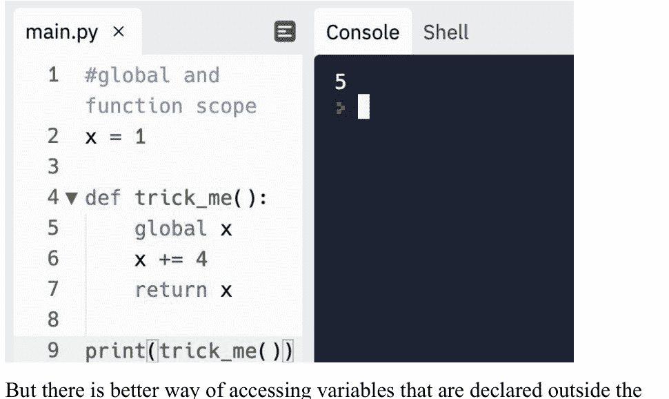

但还有一种更好的方式来访问在函数外部声明的变量，而且我们之前已经用过这个语法：

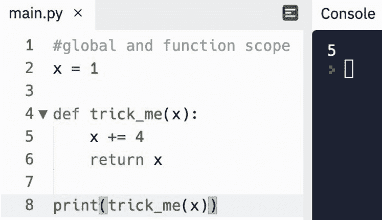

这正是我们到目前为止一直在做的：我们在第 8 行将全局变量 `x` 作为参数传递，并在函数体内通过参数 `x` 来使用它。这比在函数内部使用 `global` 关键字好多了，不是吗？

## Python nonlocal 关键字

`nonlocal` 关键字是在 Python 3 中引入的，我们可以通过嵌套函数来理解它，因此我们需要先看下面的例子：

```python
# nonlocal
def outer_fn():
    x = 'John'

    def inner_fn():
        nonlocal x
        x = 'hello'
    inner_fn()
    return x

print(outer_fn())
```

```python
#nonlocal
def outer_fn():
    x = "John"
    def inner_fn():
        nonlocal x
        x = "hello"
    inner_fn()
    return x

print(outer_fn())
```

```
hello
```

我们可以像第五行那样使用 `nonlocal` 关键字，从而操作在外层函数中声明的变量。我们使用 `nonlocal` 关键字来声明该变量不是当前函数的局部变量，意思是它属于上一级的函数。当解释器看到 `nonlocal 'x'` 时，它会自动明白我们不想为该函数创建另一个新的局部变量，而是要使用在外层函数中声明的那个变量。外层函数是内层函数的父级。在第五行，`nonlocal` 变量的值将是 ‘John’，它来自 **outer_fn** 函数体的第三行。第六行是我们将 `x` 的值从 ‘John’ 覆写为 ‘hello’ 的地方。这将修改 **outer_fn** 函数的 **x** 值，当我们返回 **x** 时，其值将是 ‘hello’。你认为如果我们删除第五行会发生什么？它会打印 John，因为 `x` 将成为 `inner_fn()` 的局部变量，并且这个变量从未在任何地方被使用。在 Python 中，当我们给一个变量赋值但从未使用时，会出现黄色下划线，这有点像一个软性警告。

```python
#nonlocal
def outer_fn():
    x = "John"
    def inner_fn():
        # nonlocal x
        x = "hello"
    inner_fn()
    return x

print(outer_fn())
```

```
> John
```

那么，在我们的代码中使用非局部变量有什么优点呢？首先，我们现在可以访问在上层作用域中声明的变量。当我们在内层函数中重用同一个变量时，我们不会在内存中的其他地方创建另一个变量，从而节省了内存空间并避免了额外的引用。缺点是，这个关键字只能在嵌套结构内部使用，我们不能用它来引用全局或局部变量。

## 第三章 Python 安装

在本节中，我们将学习如何在不同操作系统（如 Windows、macOS 和 Linux）上安装 Python。我们还将学习最重要的终端和命令提示符命令。最后，我们将安装一些工具（VS Code 和 PyCharm），你可以用它们来编写和执行 Python 代码。你不必两个都安装，因为这不是重点。你需要决定哪个工具最适合你。PyCharm 是市面上最好的 IDE 之一，我认为它最适合编写 Python 代码，因为它是为这门语言而构建的。在代码编辑器中，最好的则是 VS Code。编辑器之所以流行，是因为你可以用它们来编写和执行不同的编程语言。我决定为你提供市面上最好的工具。

### Python 安装

到目前为止，我们使用了 replit.com 网站来编写和执行 Python 代码，但如果你认真对待 Python 编程，这并不是长久之计。我们可以将 Python 安装到我们的机器上，并且应该知道每个操作系统的安装方式是不同的。如果你使用的是 macOS 或 Linux 操作系统，那么很可能已经预装了 Python。我将指导你如何在 macOS 和 Windows 操作系统上安装它，因为这是开发者最常用的两个系统。我也会为 Linux 用户提供一个额外的链接，以便他们也能在自己的机器上阅读并安装。让我们从 macOS 的 Python 安装开始。如果你是 Windows 用户，可以略过本节。

### macOS Python 安装

我们可以通过打开终端来检查 Python 是否已安装在你的 Mac 上。按下 Command + 空格键，这将打开搜索栏，你在其中输入 ‘terminal’ 并按回车键/Return 键，如下图所示：

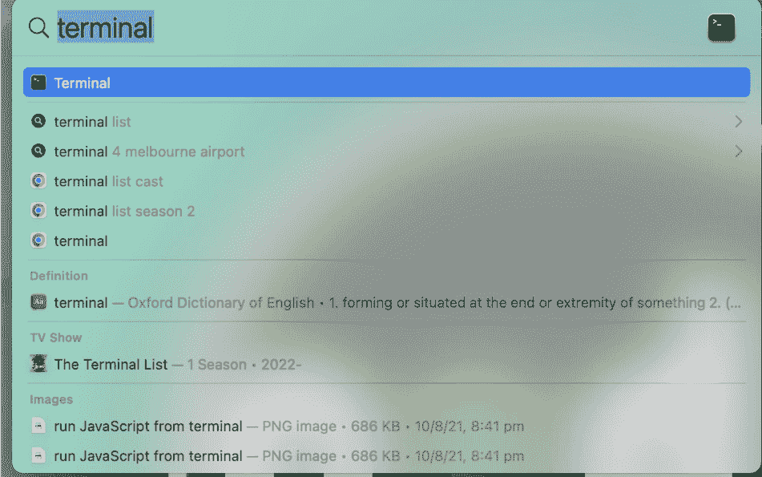

终端打开后，你可以输入 ‘python’ 并按回车键/Return 键，以下是你可能看到的一种输出结果：

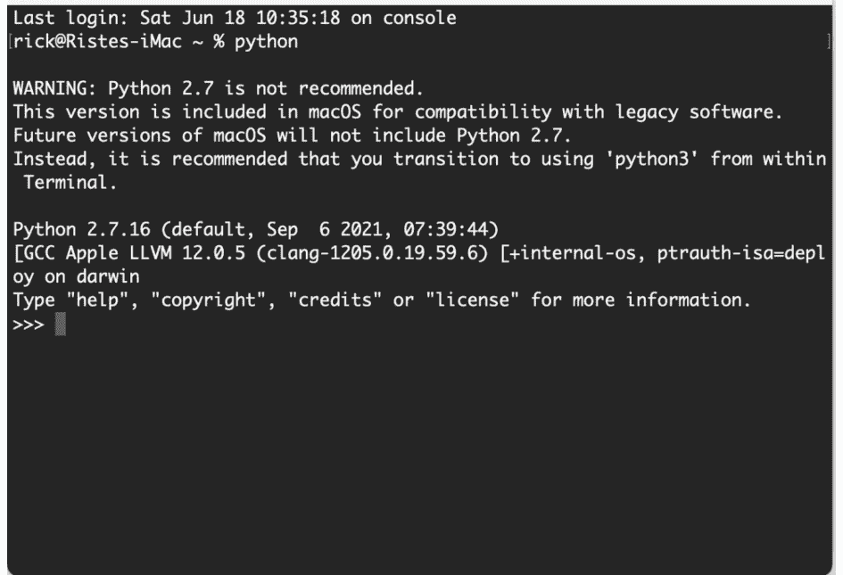

我已经安装了 Python 2.7 版本，但它提示我需要过渡到 Python3。我提到过你可能不会看到这条消息，而是会进入一个叫做 repl 或读取-求值-打印循环的环境。让我们看看是否能编写 Python 代码：

```
Last login: Sat Jun 18 10:35:18 on console
rick@Ristes-iMac ~ % python
WARNING: Python 2.7 is not recommended.
This version is included in macOS for compatibility with legacy software.
Future versions of macOS will not include Python 2.7.
Instead, it is recommended that you transition to using 'python3' from within Terminal.
Python 2.7.16 (default, Sep  6 2021, 07:39:44)
[GCC Apple LLVM 12.0.5 (clang-1205.0.19.59.6) [+internal-os, ptrauth-isa=deploy on darwin
Type "help", "copyright", "credits" or "license" for more information.
>>> print('hello')
hello
>>> 
```

如你所见，它像在 replit.com 上一样工作，但我当前的 Python 版本非常旧，甚至不是 Python3，所以让我们前往 python.org：

[https://www.python.org/](https://www.python.org/)

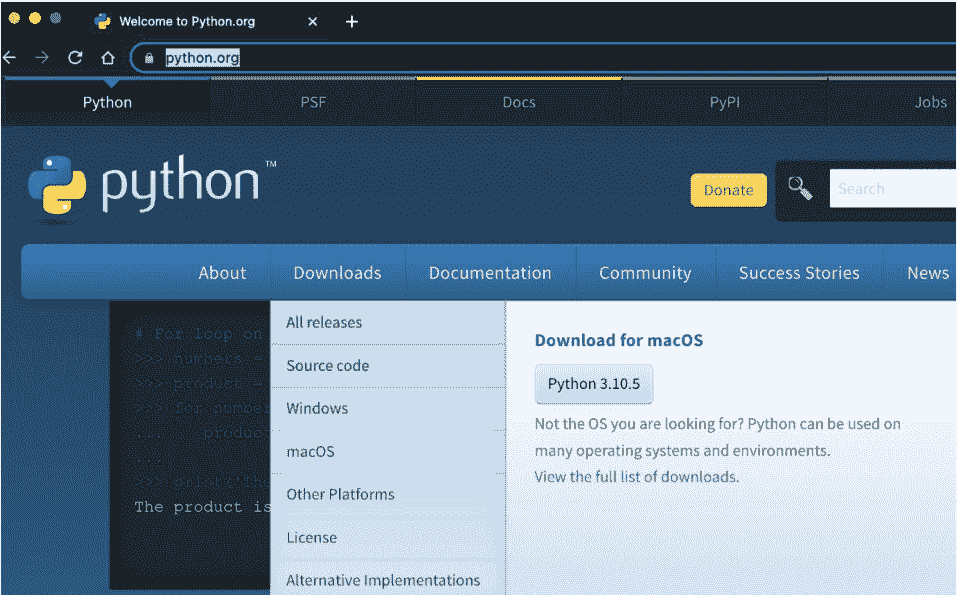

从这个网站，你需要进入下载选项卡，并下载适合你操作系统的版本。如你所见，它自动识别出我的操作系统是 macOS，并且我当前需要下载的 Python 版本是 3.10.5。当你阅读本书时，这个版本肯定会有所不同，但这不会是个问题，因为安装过程是一样的。所以点击安装，它将开始下载安装包：

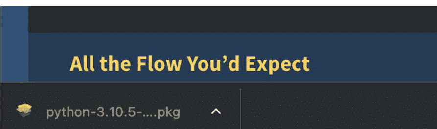

下载完安装包后，你可以点击它来打开安装向导：

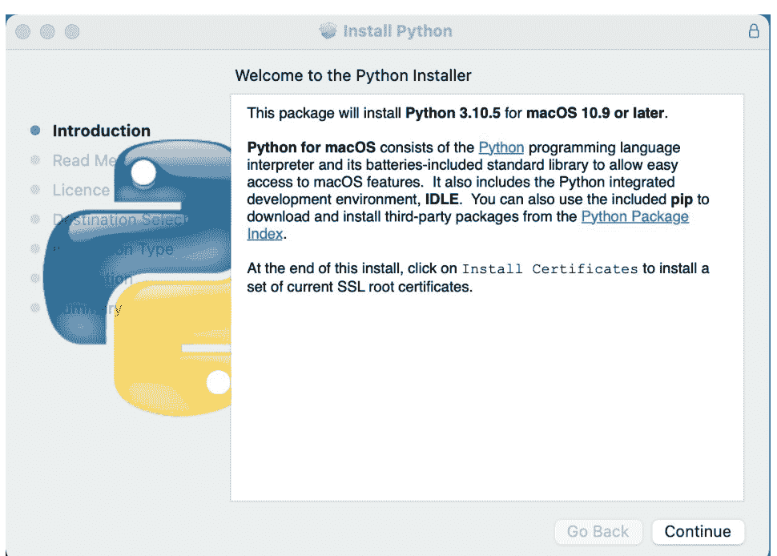

打开安装包后，你需要按下右下角的“继续”按钮，下一页应该是“阅读我”部分，你应该滚动到末尾（阅读文本是个好主意，但不读也不会有太大影响）：

# 安装 Python

-   * 简介
-   * **阅读我**
-   * 许可协议
-   * 目的地选择
-   * 安装类型
-   * 安装
-   * 摘要

# 重要信息

对于 Python 3.10 版本，我们提供了一个新的通用安装程序变体，它为 ARM64 和 Intel 64 架构都提供通用二进制文件，并且也支持所有运行 macOS 10.9 或更高版本的 Mac。新安装程序变体的一些优势：在 Apple Silicon Mac 上，原生 ARM64 代码的运行速度应该显著快于 Rosetta2 模拟的代码；自 10.9 以来 macOS 版本引入的一些操作系统功能和选项现在在可用时会暴露出来（主要在 `os` 模块中）；并且新的安装程序变体包含 Tcl/Tk 8.6.11 而不是 8.6.8。

在 Apple Silicon Mac 上，可以使用原生 ARM64 代码运行 Python，也可以使用 Rosetta2 在 Intel 64 模拟下运行。此选项可能对测试或当原生 ARM64 二进制文件尚不可用时的二进制 wheel 有用。要轻松地强制 Python 在模拟模式下运行，请从命令行 shell 中使用 `python3-intel64` 命令而不是简单的 `python3` 来调用它。

# 其他更改

有关此版本的其他更改，请参阅此版本的文档集中的“新增功能”部分及其链接于 https://www.python.org/downloads/ 的发行说明。

-   * 打印...
-   * 保存...
-   * 返回
-   * 继续

点击“继续”按钮继续，并“同意”许可协议，然后选择你希望安装发生的磁盘：

## 安装 Python

### 选择目标位置

-   简介
-   自述文件
-   许可证
-   选择目标位置
-   安装类型
-   安装
-   总结

选择你希望安装 Python 软件的磁盘。


安装此软件需要 153.9 MB 的空间。

你已选择将此软件安装在名为“Macintosh HD”的磁盘上。

然后，最终它会给你安装 Python 的选项：

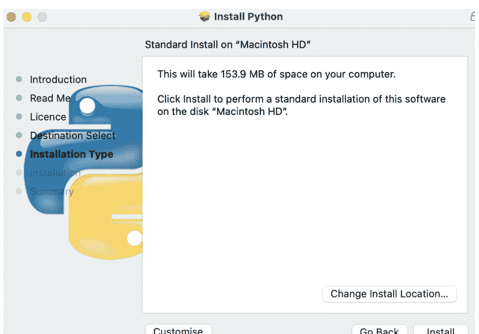

它将要求你输入密码或进行指纹识别，请提供你的详细信息，然后你就完成了此过程：

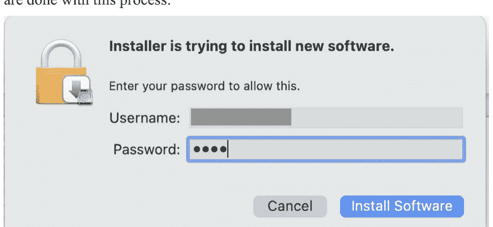

最后，稍等片刻，如果安装成功，你将看到此窗口：

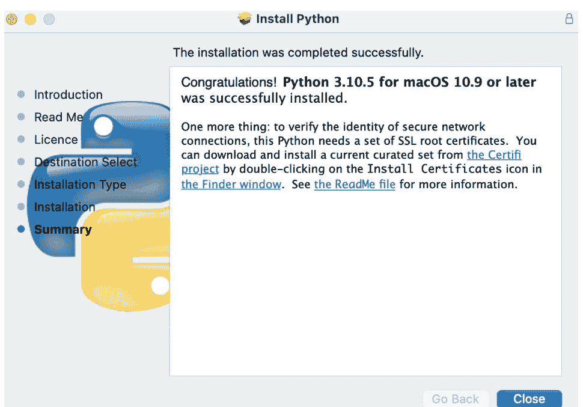

点击“关闭”按钮，现在你已经在 macOS 上安装了最新版本的 Python。如果安装成功，我们可以关闭之前的终端窗口，或者甚至可以输入 `exit()` 并按回车键。接下来是通过输入 `python:` 来检查最新版本：

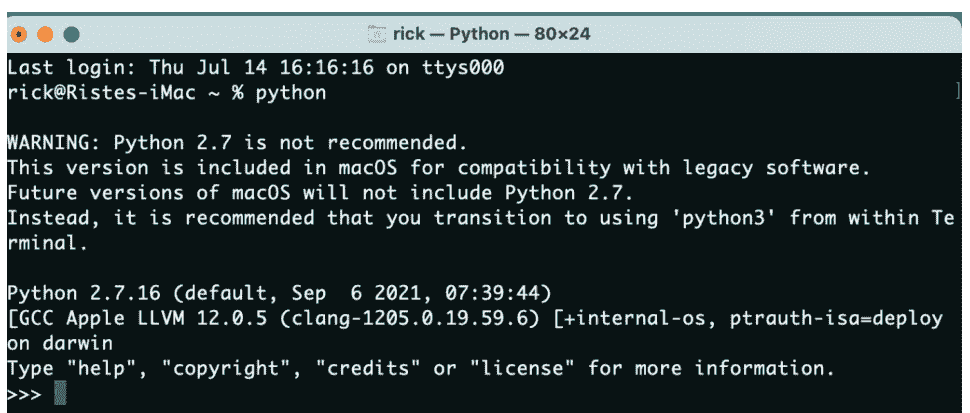

这可能不是你期望看到的窗口，但在安装 Python 时这是正常的，安装过程可能比较复杂，所以请输入 `exit()`：

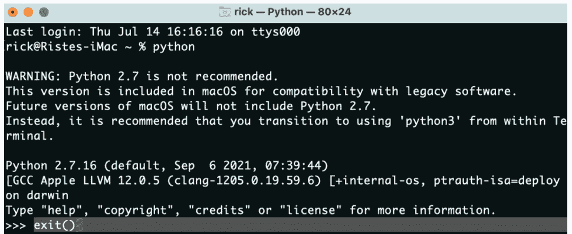

最后，我们可以再次尝试，但这次输入 `python3` 而不是 `python`，然后按回车或回车键：

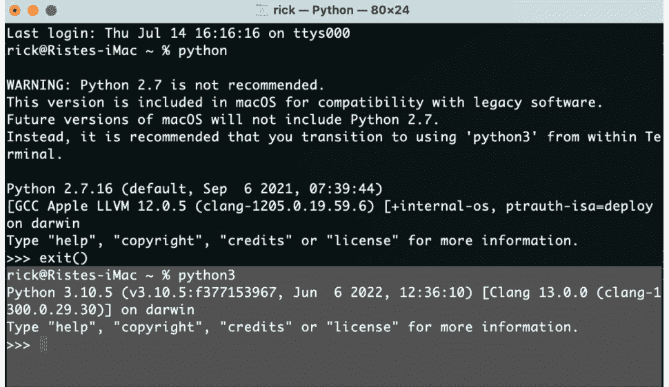

太好了！在提供了 Python 版本号后，我们成功了。将来，我们可能需要输入 `python4` 来查看最新版本是否已成功安装。如果由于某种原因你仍然无法安装 Python，我建议打开以下链接：
https://osxdaily.com/2018/06/13/how-install-update-python-3x-mac/

### Windows 操作系统 Python 安装

要开始安装过程，你需要在电脑上打开 python.org 网站：
https://www.python.org/

选择下载选项卡，然后单击 Python 版本 3.10.5，以便开始下载 Python 文件。它应该会识别你的操作系统版本。在我的情况下，它是一个 64 位系统，但你可能有其他版本，例如 32 位。如果有选择选项，请确保你选择的系统版本与你的计算机配置匹配。

重要提示，Python 3.10 版本不能在 Windows 7 或更早版本上使用。Python 版本号目前是 3.10.5，但当你阅读本书时，数字可能会有所不同，这是正常的，因为新版本往往会很快出现。你不必担心，因为这不会改变安装过程：

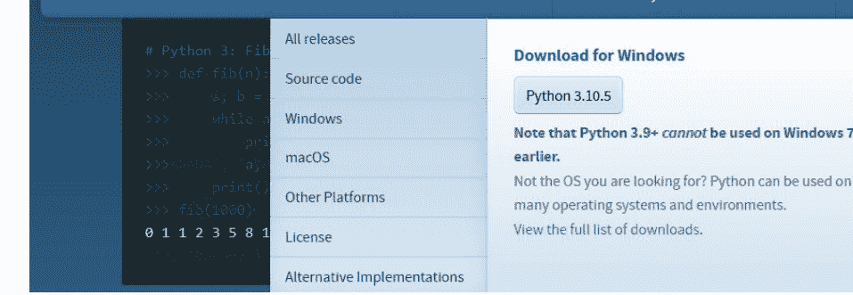

下载文件后，你可以在下载文件夹中找到它，因此请单击该文件以开始安装：

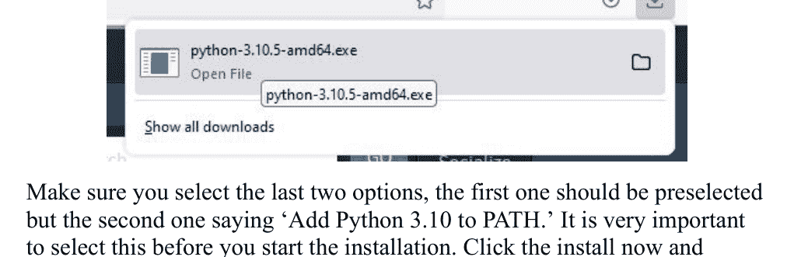

请确保选择最后两个选项，第一个选项应该已被预选，但第二个选项“将 Python 3.10 添加到 PATH”非常重要。在开始安装之前，请务必选中此选项。单击“立即安装”并按照安装向导操作：

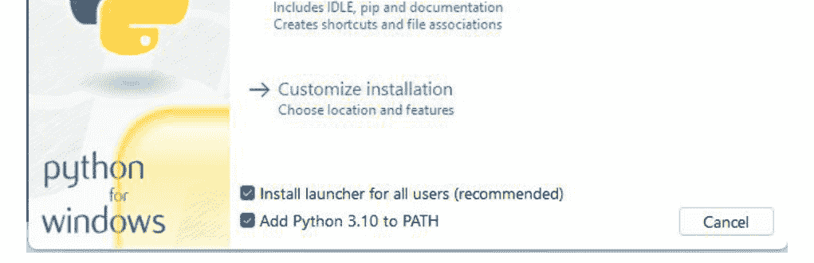

请确保你允许该应用对你的设备进行更改，因此单击“是”，安装应立即开始；稍等片刻，你应该会看到以下窗口：

### 安装成功

Python 新手？请从 [在线教程](https://docs.python.org/3/tutorial/) 和 [文档](https://docs.python.org/3/) 开始。在终端中，输入 `py` 来启动 Python，或在开始菜单中搜索 Python。

查看此版本的 [新增功能](https://docs.python.org/3/whatsnew/3.10.html)，或查找更多关于 [在 Windows 上使用 Python](https://docs.python.org/3/using/windows.html) 的信息。

> 禁用路径长度限制
更改你的机器配置，以允许程序（包括 Python）绕过 260 个字符的 “MAX_PATH” 限制。


单击“关闭”按钮并找到命令提示符。如果你有较旧版本的 Windows，你可以搜索它；或者如果你像我一样拥有最新版本，你可以单击 Windows 开始图标，然后在搜索栏中输入“命令提示符”：

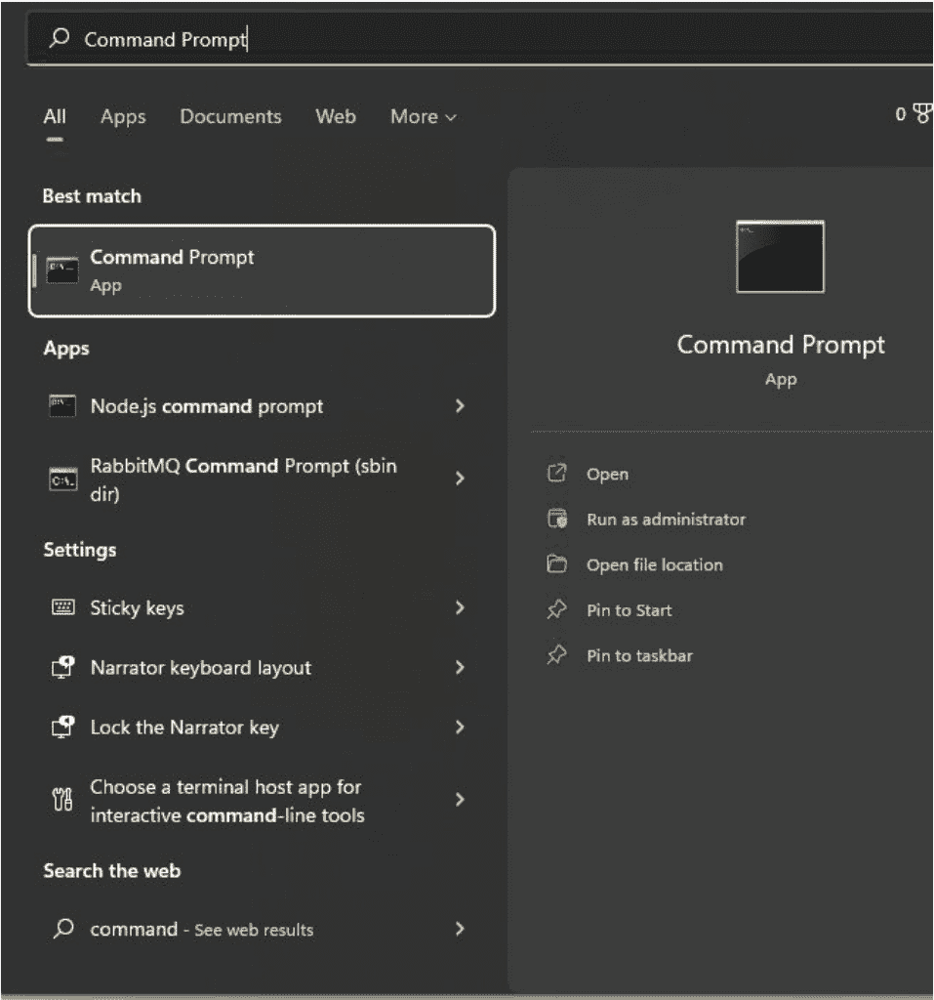

这将打开命令提示符，你应该在其中输入 `python` 并按回车键：

```
Microsoft Windows [Version 10.0.22000.739]
(c) Microsoft Corporation. All rights reserved.

C:\Users\riste>python
Python 3.10.5 (tags/v3.10.5:f377153, Jun  6 2022, 16:14:13) [MSC v.1929 64 bit (AMD64)] on win32
Type "help", "copyright", "credits" or "license" for more information.
>>> _

```

现在我们可以看到 Python 3.10.5 版本已成功安装并正在运行。在 Windows 中，我们甚至可以使用 PowerShell。PowerShell 在开发者中甚至更受欢迎，因为在 Linux 和 Mac 上运行的相同命令在这里也可以运行。所以就像我们搜索命令提示符一样，我们可以搜索 Windows PowerShell：

### Windows PowerShell

-   所有
-   应用
-   文档
-   网页
-   更多

-   Windows PowerShell
    -   应用
-   Windows Defender 防火墙
    -   控制面板
-   应用
-   Windows Media Player
-   Windows 传真和扫描
-   Windows 工具
-   Windows PowerShell ISE

-   Windows PowerShell
    -   应用
    -   打开
    -   以管理员身份运行
    -   以管理员身份运行 ISE
    -   Windows PowerShell ISE

我们可以打开 PowerShell，它看起来会是这样的：

```
Windows PowerShell
版权所有 (C) Microsoft Corporation。保留所有权利。

安装最新的 PowerShell 以获取新功能和改进！ https://aka.ms/PSWindows

PS C:\Users\riste>
```

如你所见，我还需要更新 PowerShell 版本，但如果你的 Windows 机器上没有 PowerShell，我建议你下载它，因为你将能够使用我在 Mac 上使用的相同命令。在 PowerShell 中输入 Python 并按回车键，你应该会看到我们刚刚安装的相同版本号的 Python：

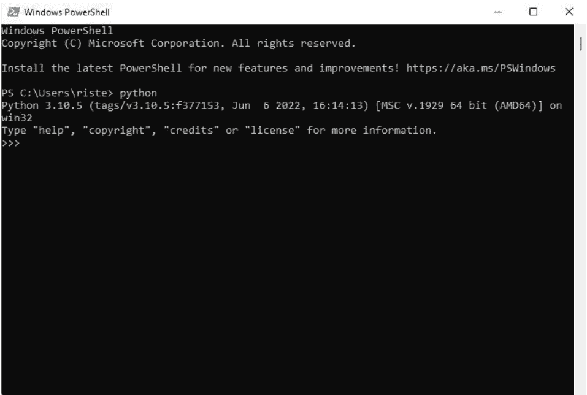

在 Windows 上运行 Python 代码的另一种方法是安装 Git Bash 或 Git for Windows。这本质上是一个 BASH 仿真，它是一个允许你使用 UNIX 命令的 shell：


总结一下，为了运行 Python，你可以使用命令提示符、PowerShell 或 Git Bash。我建议 Windows 用户坚持使用 PowerShell，并在需要时进行更新。现在我们勾选的添加 PATH 选项允许我们在 PowerShell 中运行 Python 命令。Python 的安装非常重要，现在在接下来的部分中，我们将学习如何安装不同的工具，以便我们可以编写和执行 Python 代码。

> Windows 宣布，如果你使用 Windows 10 或更高版本，可以安装 Windows 终端。这将允许你使用与其他 Linux 和 Mac 用户完全相同的命令。

通过单击此链接并按照步骤操作来安装并开始设置 Windows 终端：

[https://docs.microsoft.com/en-us/windows/terminal/install](https://docs.microsoft.com/en-us/windows/terminal/install)

### 仅限 LINUX 用户 - Python 安装

如果你是 Linux 用户，那么你可以阅读以下关于如何安装 Python 的资源：

直接链接下载 Python：

[https://www.python.org/](https://www.python.org/)

针对一些安装问题：

[https://realpython.com/installing-python/](https://realpython.com/installing-python/)

安装指南：

[https://realpython.com/installing-python/](https://realpython.com/installing-python/)

## 开发工具

到目前为止，我们是在名为 replit.com 的网站上执行代码，但我们希望能够使用一些工具来运行和编写 Python 代码。在上一节中，我们看到可以在 Windows 上使用命令提示符，在 Mac 上使用终端来运行 Python 代码。在终端或命令提示符中，我们运行想要快速测试的简单脚本，但开发者将使用代码编辑器或 IDE 来编写和执行 Python 代码。你可以在任何文本/代码编辑器甚至 Word 文档中编写代码，但我们无法感受到正在编写代码的那种感觉，这就像在写一段文本，我们很容易因为拼写和缩进而犯错。我们知道在 Python 中正确的缩进非常重要，所以不要用 Word 文档。因此，专业的开发者需要一些工具，比如代码编辑器：

-   Sublime
-   Atom
-   VS Code
-   Vim

我们甚至可以使用 IDE，例如：

-   Spyder
-   PyCharm
-   Thonny

## 代码编辑器与 IDE

代码编辑器和 IDE 有什么区别？代码编辑器是轻量级的工具，能够增强并简化编码过程。许多程序员都使用代码编辑器，因为它们内置了能加速编码过程的功能。例如，它们使用 **Emmet** 来自动补全代码，并在编写过程中提供建议；同时还具备 **linting** 功能，用于自动检查源代码中的程序错误和风格错误。另一方面，IDE 是一个更复杂的套件，它集成了代码编辑器、文本编辑器、调试器、编译器、代码测试器、代码格式化等多种功能。所有这些功能都整合在一个环境下。这就是为什么下载 IDE 时，其文件大小远大于普通编辑器。我不会安装图中提到的所有工具，但会指导你如何安装和使用其中最重要的。VS Code 是当今最受欢迎的代码编辑器，且完全免费。VS Code (Visual Studio Code) 编辑器可从以下网站下载：[https://code.visualstudio.com/](https://code.visualstudio.com/)

## 重新定义代码编辑。

免费。基于开源构建。处处运行。

下载 Mac 通用稳定版

|                     | 稳定版 | 内测版 |
|---------------------|--------|----------|
| macOS 通用版        | ↓      | ↓        |
| Windows x64 用户安装程序 | ↓      | ↓        |
| Linux x64 .deb 包   | ↓      | ↓        |
| .rpm 包             | ↓      | ↓        |

如上图所示，你需要为你的操作系统获取正确的版本。它会为你自动预选，在我这里就是标有“macOS – Universal”的选项。如果你使用的是 Windows 或 Linux，你需要为你的系统选择正确的版本。如果你点击“其他下载”链接，还可以找到 VS Code 的其他版本。他们有一个出色的入门页面，如果你遇到任何问题，它会提供帮助。不要因为他们网站上的截图感到困惑或害怕，因为其中包含了一些你现阶段可能还不理解的代码片段。[https://code.visualstudio.com/docs](https://code.visualstudio.com/docs)

这款编辑器是我的最爱，到目前为止我所有的项目都是用它完成的。我为 HTML 和 JavaScript 书籍编写的代码也是在这个编辑器中完成的。这意味着我们可以使用像 VS Code 这样的代码编辑器，不仅用于 Python 等特定语言，也适用于所有其他语言。你可以点击下载链接并将其安装到你的机器上，因为它非常简单直接。

### 探索 Visual Studio Code

希望你已经安装了 VS Code (Visual Studio Code 编辑器)。和许多其他代码编辑器一样，VS Code 拥有一个简洁但用户友好的界面。

请不要害怕上图中的代码、文件和文件夹，它们仅用于演示目的。如你所见，我们有一个非常基础的布局：左侧是资源管理器，显示所有已打开的文件和文件夹；右侧是编辑器，显示已打开文件的内容。**GUI** 或图形用户界面分为五个不同的区域（注意——在初始启动时，并非所有这些区域都可见）：

-   - **编辑器** – 这是我们可以编辑文件的主要区域。我们可以根据需要打开多个编辑器，它们将并排显示。
- **侧边栏** – 侧边栏包含不同的视图，如**资源管理器**，可以在编码过程中为我们提供帮助。
- **状态栏** – 状态栏显示当前正在编辑的文件的信息。
- **活动栏** – 此区域位于最左侧，允许我们在不同视图之间切换。当 **Git** 启用时，它还会显示更改的数量。
- **面板** – 编辑器下方是输出或调试信息区域——所有错误和警告都显示在这里。如果我们需要，甚至可以使用集成终端。

## 如何使用 Visual Studio Code

打开你的 VS Code。首次打开时，它可能看起来与我的不同，但没关系（因为我安装了一些扩展，我将在最后向你展示如何安装它们）：

从上图中可以看到，你可以创建新文件、打开文件夹等。选择顶部的“新建文件”，即可进入代码编辑器：

## 两端的点表示我们有未保存的更改

从上图中可以看到，我在第一行写了 `print (‘Hello World’`，但只要你开始输入代码，就会注意到两边出现了两个点或圆圈。这意味着我们写了代码但尚未保存更改。我们可以通过按 Mac 上的 `command + S` 或 Windows 上的 `Ctrl + S` 保存文件来解决这个问题。我们甚至可以使用菜单，转到文件 > 另存为：

如上图所示，我们将文件保存为 `.py` 扩展名，这意味着我们正在处理 Python 文件。此外，最佳实践是在桌面上或你认为代码文件应存放的位置创建一个文件夹，并将文件保存在那里。你可以按喜好命名文件，但请确保使用 `.py` 文件扩展名，然后点击保存，那些点就会消失。请确保在编写代码后保存更改。保存文件后，你会看到一些建议提示，指出未选择 Python 解释器，如果你想使用 Python，你需要安装推荐的扩展：

注意：未来这些消息可能会略有变化，但请继续阅读，因为即使不完全相同，你需要执行的操作也会相似。如果你看到上图中的消息，点击“安装”按钮开始安装 Python。

如上图所示，Python 已安装。之后，我收到了以下消息，告诉我接下来的步骤：

首先，我们需要点击“选择 Python 解释器”按钮，并选择我们之前安装的 Python 版本：

如图所示，我的 Mac 列出了先前安装的 Python 版本，这很好，因为它给了我选择最新版本的选项。如果你还记得，我安装的版本是 3.10.5，因此我需要选择那个版本，但你的版本可能不同，所以请确保选择你下载并安装的 Python 版本。如果你不记得版本号，可以回到官方网站的下载部分查看最新版本：[https://www.python.org/](https://www.python.org/)

选择正确的版本，目前就这些了。暂时不要担心安装 Linter pylint，因为你已经选择了 Python 解释器，我们可以开始编写代码，所以你可以点击“x”关闭消息。最好完全关闭 VS Code 然后重新打开。尝试通过选择保存它的文件夹来打开你创建的文件。所以你需要点击蓝色的“打开文件夹”链接：

然后你需要选择正确的文件夹，你会看到如下界面：

这会告诉你文件的名称和位置。

如图所示，在我的例子中，文件名为‘test.py’，位于名为“python-exercises”的文件夹中。如果你愿意，你的文件夹名称可以不同。让我们来谈谈 VS Code 编辑器，除了编写代码，它还能做什么。和许多其他代码编辑器一样，VS Code 自带终端，你可以通过进入菜单并选择终端来打开终端：这将打开终端：

那么在这个终端里我们能做什么呢？我们可以运行上面的文件，所以在终端输入命令之前，请确保你已保存了所有内容：**python test.py**

如你所见，我得到了“Hello World”的输出。在我的例子中，文件名是 test.py，但你的文件名可以是 first.py 之类的。在这种情况下，你需要输入 python first.py 来获取输出。现在让我们安装 Linter，也就是我们之前推荐的那个工具，所以如果你在屏幕上没看到它，可以关闭 VS Code 编辑器然后重新打开。当你重新打开你的文件夹/文件时，会弹出一条消息。什么是 Linter？Linter 将帮助你处理 Python 代码中可能出现的语法和风格问题。当你有拼写错误时，这会对你有很大帮助，并且会告诉你 Python 语法是否正确。Pylint 是实现此功能的较流行版本之一。市场上还有许多其他可用的包，但 VS Code 建议我们使用这个来处理 Python 代码。所以让我们点击安装按钮来安装它：

```
TERMINAL ...
2: Python
and similar are installed in '/Users/rick/Library/Python/3.10/bin' which is not on PATH.
Consider adding this directory to PATH or, if you prefer to suppress this warning, use --no-warn-script-location.
Successfully installed astroid-2.11.7 dill-0.3.5.1 isort-5.10.1 lazy-object-proxy-1.7.1 mccabe-0.7.0 platformdirs-2.5.2 pylint-2.14.4 tomli-2.0.1 tomlkit-0.11.1 wrapt-1.14.1
WARNING: You are using pip version 22.0.4; however, version 22.1.2 is available.
You should consider upgrading via the '/usr/local/bin/python3 -m pip install --upgrade pip' command.
rick@Ristes-iMac python-exercises %
```

安装完成后，你应该会看到与上图类似的消息。重要提示：你的终端中不应该有任何红色的错误消息。那么让我们回到代码，尝试故意制造一个错误。在我们故意犯错之前，让我们通过进入菜单 view > Command Palette 来启用 linting：

这应该会让你在 VS Code 中输入一些内容，如下图所示：

现在，当我们安装 Python 解释器时，我们在后台安装了许多其他 Python 工具，我们现在可以使用它们，所以如果你开始输入 **Python: Enable**，你将得到以下选项列表：

从上图中，选择 **Python: Enable/Disable Linting** 选项，点击它，然后选择 Enable 或 On：

启用 linting 后，让我们删除 print 函数的右括号，这样我们就故意制造了一个错误，最后保存 test.py 文件。这将立即为我们制造一个问题，因为 linting 会检测到缺少一个括号，并且在 PROBLEMS 标签页/面板中我们可以看到一个数字 1：

点击 PROBLEMS 标签页，这样你就可以阅读错误信息：

如我们所见，这是一个语法错误，可以很容易地修复，因为它甚至显示了错误发生的行号。这些就是你在开始编码之前需要采取的所有步骤。最后，让我向你展示如何在 VS Code 中安装扩展：

从上图中，你需要找到 marketplace 图标并点击它。在那里，我建议你安装一些 VS Code 图标包，这将使你的文件夹和文件看起来更好。你可以安装像 **drakula official** 这样的深色主题，在搜索栏中输入它，然后点击旁边的安装按钮。

现在你的 VS Code 已经准备好编写 Python 代码了。

## 有用的终端/命令提示符命令

作为一名未来的 Python 开发者，你应该知道如何使用终端或命令提示符。在本节中，我们将介绍一些非常有用的命令。在 Mac 上，你可以通过按 command + 空格键打开终端，然后输入 terminal 并按 return/enter 键。在 Windows 上，你需要找到开始 Windows 图标并搜索 Command Prompt。终端/命令提示符今天仍在使用，但过去使用得更多，因为它们运行代码。在 GUI（图形用户界面）出现之后，终端的使用减少了。作为一名开发者，你将使用终端来下载和运行脚本，与服务器和数据库通信。终端和命令提示符的命令并不相同，但我将提供截图和提示，以便你可以在 Windows、macOS 和 Linux 上练习这些命令。例如，打开你的终端或命令提示符，在 Mac 上输入‘ls’，在 Windows 上输入‘dir’。**ls** –（Windows 上是 **dir**）将列出当前目录中的所有内容：

如你所见，我在此目录中的所有内容都已列出。我们如何检查当前处于哪个目录？对于 Windows，我们需要输入‘cd’，对于 macOS，我们需要输入‘pwd’：

从上图可以看出，它显示我位于‘Users/rick/’目录中。上面列出的所有内容都是我可以访问的。那么我如何导航到我的桌面并查看那里有什么呢？嗯，对于 Mac 和 Windows，我们都可以写‘**cd Desktop**’。cd 表示更改目录：

如果出于某种原因你想退出当前目录，可以写‘cd ..’，这将从桌面返回到 /Users/rick：

终端现在有很多文本，看起来很乱。你可以在 Mac 上使用‘clear’命令，在 Windows 上使用‘cls’来清理终端窗口：

如果出于某种原因你想导航到根目录，可以使用命令‘cd /’，不要忘记正斜杠。如果你想列出所有内容，使用‘ls’或 Windows 上的‘dir’：

如果你想返回用户目录，可以使用以下命令：cd ~

```
bash
rick@Ristes-iMac ~ % cd /
rick@Ristes-iMac / % ls
Applications  Volumes  etc  sbin
Library       bin      home tmp
System        cores    opt  usr
Users         dev      private var
rick@Ristes-iMac / % cd ~
rick@Ristes-iMac ~ % ls
Applications  Movies  Users
Desktop       Music   evalonly.txt
Documents     Pictures pitchshiftLogFile.txt
Downloads     Postman
Library       Public
rick@Ristes-iMac ~ %
```

希望到目前为止你喜欢这一节，但我们还没完成。让我们在桌面上的某个地方创建一个名为‘p1’的文件夹。我们不会为此使用终端，所以请转到你的桌面并创建文件夹 p1，我们稍后可以在其中创建子文件夹。我需要导航到桌面，目前我处于 Users 目录中，输入‘cd Desktop’：

```
bash
rick@Ristes-iMac ~ % ls
Applications  Movies  Users
Desktop       Music   evalonly.txt
Documents     Pictures pitchshiftLogFile.txt
Downloads     Postman
Library       Public
rick@Ristes-iMac ~ % cd Desktop
rick@Ristes-iMac Desktop %
```

如果你输入‘ls’或‘dir’，你应该能够看到桌面上有什么：

```
rick@Ristes-iMac ~ % ls
Applications   Movies         Users
evalonly.txt
Desktop        Music          pitchshiftLogFile.txt
ebook         
Documents      Pictures       
everything      ~$rina-Low-Content-KDP.docx
Downloads      Postman        
Library        Public         
rick@Ristes-iMac ~ % cd Desktop
rick@Ristes-iMac Desktop % ls
ebook         
everything      ~$rina-Low-Content-KDP.docx
rick@Ristes-iMac Desktop % 
```

从上图可以看出，我有我创建的文件夹（p1）。现在如果我想在这个文件夹内创建其他文件夹，我需要再次使用 cd 命令。所以让我们输入‘cd p1’：

```
rick@Ristes-iMac ~ % ls
Applications   Movies         Users
evalonly.txt
Desktop        Music          pitchshiftLogFile.txt
Documents      Pictures       
everything      ~$rina-Low-Content-KDP.docx
Downloads      Postman        
Library        Public         
rick@Ristes-iMac ~ % cd Desktop
rick@Ristes-iMac Desktop % ls
ebook         
everything      ~$rina-Low-Content-KDP.docx
rick@Ristes-iMac Desktop % cd p1
rick@Ristes-iMac p1 % 
```

你可以使用 ls 或‘dir’命令来确保里面没有任何内容。如果你想在 p1 内创建另一个文件夹，可以使用名为‘mkdir’的命令，它代表 make directory：

rick@Ristes-iMac ~ % ls
Applications          Movies                Users
Desktop               Music                 valdo
Documents             Pictures              pichu
Downloads             Postman               Library
Library               Public
rick@Ristes-iMac ~ % cd Desktop
rick@Ristes-iMac Desktop % ls
ebook                p1
everything
rick@Ristes-iMac Desktop % cd p1
rick@Ristes-iMac p1 % ls
rick@Ristes-iMac p1 % mkdir first
rick@Ristes-iMac p1 %

因为我们现在在 p1 文件夹内，所以可以使用 `open .` 命令（Mac）或 `start .` 命令（Windows）来打开当前目录。

```
[rick@Ristes-iMac Desktop % cd p1
[rick@Ristes-iMac p1 % ls
[rick@Ristes-iMac p1 % mkdir first
[rick@Ristes-iMac p1 % open .
[rick@Ristes-iMac p1 %
```

接下来会发生以下情况：

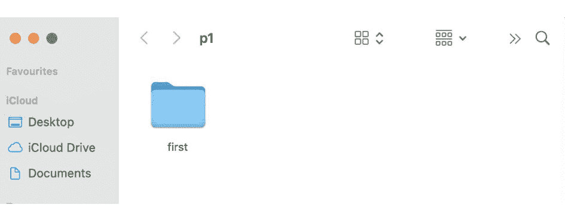

如你所见，在 p1 文件夹内，我们使用 `mkdir` 命令创建了一个名为 `first` 的新文件夹。`first` 文件夹目前是空的，让我们在其中创建一个文件，例如一个名为 **index.html** 的 HTML 文件。首先，我们需要进入名为 `first` 的文件夹，使用 `cd first` 命令，然后使用 `**touch index.html**` 命令（Mac）或 `echo > index.html` 命令（Windows）来创建文件。

```
[rick@Ristes-iMac Desktop % cd p1
[rick@Ristes-iMac p1 % ls
[rick@Ristes-iMac p1 % mkdir first
[rick@Ristes-iMac p1 % open .
[rick@Ristes-iMac p1 % cd first
[rick@Ristes-iMac first % touch index.html
rick@Ristes-iMac first %
```

你应该在 p1 > first > 文件夹中看到以下内容：

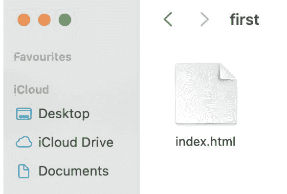

我们可以使用 `open index.html` 或 `start index.html` 命令来打开该文件（index.html）：

```
rick@Ristes-iMac Desktop % cd p1
rick@Ristes-iMac p1 % ls
rick@Ristes-iMac p1 % mkdir first
rick@Ristes-iMac p1 % open .
rick@Ristes-iMac p1 % cd first
rick@Ristes-iMac first % touch index.html
rick@Ristes-iMac first % ls
index.html
rick@Ristes-iMac first % open index.html
rick@Ristes-iMac first %
```

最后一条命令将在我们的浏览器中打开该文件：

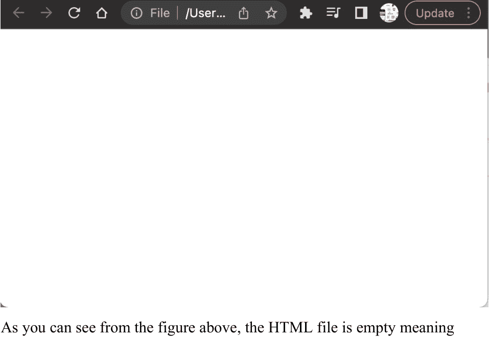

从上图可以看出，HTML 文件是空的，意味着没有内容。我们可以直接从终端打开 Visual Studio Code，如下所示：

```
rick@Ristes-iMac first % open -a 'Visual Studio Code'
rick@Ristes-iMac first %
```

这将为我们启动 VS Code，但如果我们想直接打开 index.html 文件，可以在命令中包含文件名：

```
rick@Ristes-iMac first % open -a 'Visual Studio Code'
rick@Ristes-iMac first % open -a 'Visual Studio Code' index.html
rick@Ristes-iMac first %
```

这将在 VS Code 中打开 index.html 文件，这样你就可以开始编写基本的 HTML 代码了：

```html
<!DOCTYPE html>
<html lang="en">
<head>
    <meta charset="UTF-8">
    <meta http-equiv="X-UA-Compatible" content="IE=edge">
    <meta name="viewport" content="width=device-width, initial-scale=1.0">
    <title>Document</title>
</head>
<body>
    <h1>HTML file</h1>
</body>
</html>
```

让我们再次输入 `open index.html` 来打开 index 文件，看看我们所做的更改是否可见（在尝试打开之前，请先保存 index.html 文件）：

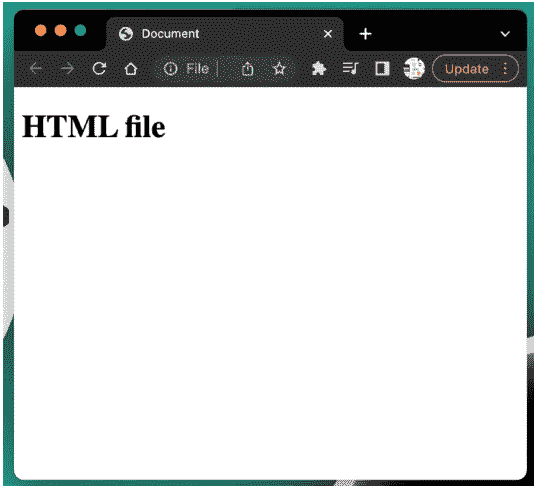

如你所见，通过终端，你可以完成与使用鼠标和键盘相同的操作。如果你想更改文件名，例如从 index.html 改为 app.html，Mac 用户可以使用以下命令 `mv index.html app.html`，Windows 用户可以使用 `rename index.html app.html`：

```
rick@Ristes-iMac first % open -a 'Visual Studio Code'
rick@Ristes-iMac first % open -a 'Visual Studio Code' index.html
rick@Ristes-iMac first % open index.html
rick@Ristes-iMac first % mv index.html app.html
rick@Ristes-iMac first %
```

现在，如果我们访问网页浏览器，将会看到以下情况：


## 你的文件无法访问

它可能已被移动、编辑或删除。

ERR_FILE_NOT_FOUND

这是因为我们重命名了 index 文件。如果你不想一遍又一遍地输入相同的命令，可以按键盘上的向上箭头键，它会开始列出你之前使用过的命令。假设你有两个以字母 `a` 开头的文件：

- app.html
- about.html

如果你想访问 about.html 文件并从终端打开它，一旦你开始输入 `open ab`，你可以按 Tab 键，它会自动补全并给出正确的文件名，因为终端知道你试图访问 about.html 文件。如果你输入 `open a` 并按 Tab 键，它不会自动补全文件名，因为它不知道你指的是哪个文件，因为两个文件都以相同的字母 `a` 开头。让我们使用 `touch` 命令（Mac）或 `echo >` 命令（Windows）创建另一个名为 app1.html 的文件，并使用 **ls** 命令来确认我们有哪些文件：

```
bash
rick@Ristes-iMac first % open -a 'Visual Studio Code'
rick@Ristes-iMac first % open -a 'Visual Studio Code' index.html
rick@Ristes-iMac first % open index.html
rick@Ristes-iMac first % mv index.html app.html
rick@Ristes-iMac first % touch app1.html
rick@Ristes-iMac first % ls
app.html       app1.html
rick@Ristes-iMac first %
```

让我们使用 `rm app1.html` 命令（Mac）或 `del app1.html` 命令（Windows）来删除我们刚刚创建的文件：

```
bash
rick@Ristes-iMac first % rm app1.html
rick@Ristes-iMac first % ls
app.html
rick@Ristes-iMac first %
```

让我们删除我们之前创建的 `first` 文件夹，但要删除整个文件夹及其内部的 app.html 文件，我们需要使用 `cd ..` 命令返回上一级目录，即 p1 文件夹：

```
[rick@Ristes-iMac first % rm app1.html
[rick@Ristes-iMac first % ls
app.html
[rick@Ristes-iMac first % pwd
/Users/rick/Desktop/p1/first
[rick@Ristes-iMac first % cd ..
[rick@Ristes-iMac p1 % pwd
/Users/rick/Desktop/p1
rick@Ristes-iMac p1 % 
```

现在我们可以使用 `rm -r first` 命令（Mac）或 `deltree first` 命令（Windows）来删除 first 文件夹：

```
/Users/rick/Desktop/p1
rick@Ristes-iMac p1 % rm -r first
rick@Ristes-iMac p1 % ls
rick@Ristes-iMac p1 % pwd
/Users/rick/Desktop/p1
rick@Ristes-iMac p1 % 
```

最后，我们可以删除 p1 文件夹，因为这个名字不是我通常会在桌面上使用或想要的，使用 `rm -r p1` 命令：

```
rick@Ristes-iMac p1 % cd ..
rick@Ristes-iMac Desktop % ls
ebook p1
everything ~$rina-Low-Content-KDP.docx
rick@Ristes-iMac Desktop % rm -r p1
rick@Ristes-iMac Desktop % 
```

### 代码格式化

当你编写代码时，了解我们可以格式化代码是一个好主意。我们已经安装了 VS Code 编辑器，因此可以安装其他扩展来帮助我们自动格式化代码。在本节中，你将了解 PEP-8 及其使用的好处。

你可以阅读更多关于 PEP 的内容：

[https://peps.python.org/](https://peps.python.org/)

### 什么是 PEP？

PEP 是 Python Enhancement Proposal（Python 增强提案）的缩写。PEP-8 是一份文档，提供了关于如何编写遵循正确逻辑和编码风格的代码的指南。PEP-8 是最受欢迎的，但还有许多其他增强提案。PEP-8 将帮助我们编写整洁、可读且风格优美的代码。PEP-8 是 Python 代码的风格指南，文档非常详细但很长（幸运的是，你不需要阅读整个文档）：

[https://peps.python.org/pep-0008/](https://peps.python.org/pep-0008/)

在同一个 test.py 文件中，我添加了两个基本函数：

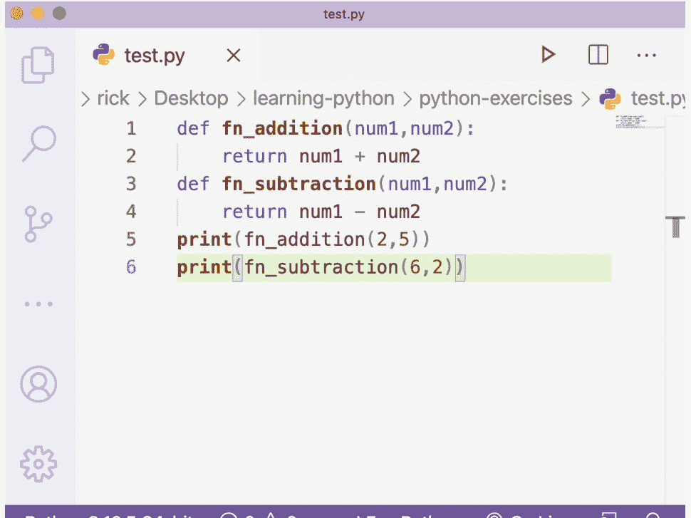

```python
def fn_addition(num1,num2):
    return num1 + num2
def fn_subtraction(num1,num2):
    return num1 - num2
print(fn_addition(2,5))
print(fn_subtraction(6,2))
```

缩进是可见的，如果我们运行终端中的代码，应该得到以下输出：

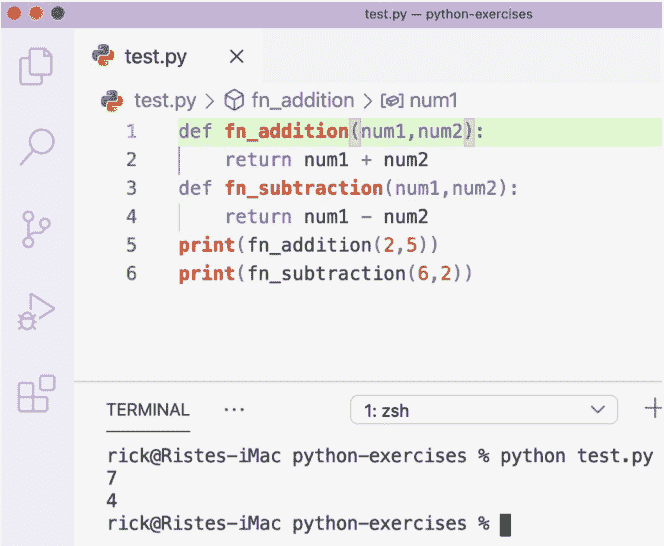

但我们的代码没有按照 PEP-8 指南进行格式化。如果我们进入菜单视图 > 命令面板，输入 `Format Document` 并点击它：

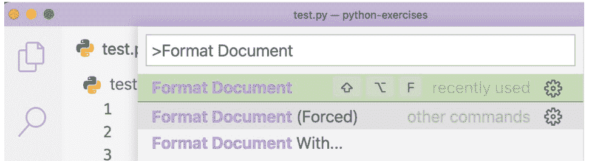

然后你会看到以下消息，提示你需要安装 Autopep8 代码格式化器：

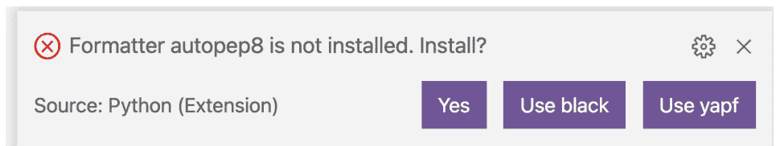Autopep8 是 VS Code 中的一个扩展，启用后可以按照 PEP-8 准则调整代码样式，因此我们应该点击“是”按钮并安装该扩展：

```
Consider adding this directory to PATH or, if you prefer to suppress
this warning, use --no-warn-script-location.
WARNING: The script autopep8 is installed in '/Users/rick/Library/Python/3.10/bin' which is not on PATH.
Consider adding this directory to PATH or, if you prefer to suppress
this warning, use --no-warn-script-location.
Successfully installed autopep8-1.6.0 pycodestyle-2.8.0 toml-0.10.2
WARNING: You are using pip version 22.0 however there is a newer version available.
You should consider upgrading via the '/usr/local/bin/python3 -m pip install --upgrade pip' command.
rick@Ristes-iMac python-exercises %
```

如果你有留意到，test.py 文件中的代码保持不变，因此再次通过“查看” > “命令面板”，输入“Format Document”并点击它：

```python
def fn_addition(num1, num2):
    return num1 + num2

def fn_subtraction(num1, num2):
    return num1 - num2

print(fn_addition(2, 5))
print(fn_subtraction(6, 2))
```

正如你所见，我们的代码看起来有些不同，函数声明之间有了更多的空格。代码现在已按照 PEP-8 格式化。为什么代码变成这样，函数之间有很多空格呢？根据 PEP-8 文档，函数之间应该有两个空行。在文件中编写代码后，你应该运行格式化程序，代码就会自动为你格式化。为了不必每次都手动操作，你可以自动化这个过程。你可以通过菜单 **代码 > 首选项 > 设置**，然后输入“format”来启用保存时格式化：

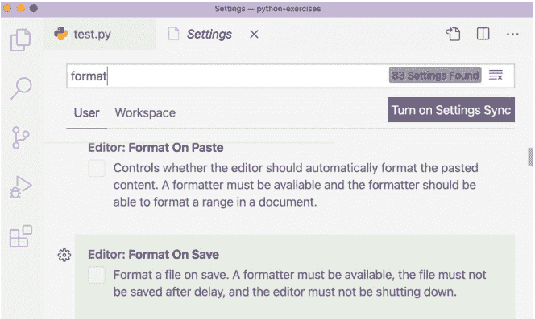

将会出现一个选项列表，在“用户”面板下，你可以向下滚动并选择 **编辑器：保存时格式化**，这样你的格式化操作就会自动完成。现在，每次保存代码（**Command + S** 或 Windows 上的 **Control + S**）时，代码格式化都会自动进行。如果想了解更多关于 pylint、pep8 或其他扩展的信息，请阅读 VS Code 文档：

[https://code.visualstudio.com/docs/python/linting](https://code.visualstudio.com/docs/python/linting)

## 安装 PyCharm

在本节中，你将学习如何在你的机器上安装 PyCharm。我选择这个 IDE 是因为在编写、执行和格式化 Python 代码方面，它是最好的。一个缺点是作为一个 IDE，它占用更多的机器内存，因为它是一个完整的软件包。与其他代码编辑器相比，它的众多优势之一是你无需安装扩展和插件即可运行/执行 Python。有人可能会认为代码编辑器非常好，因为它们可以用于多种语言。IDE 和代码编辑器各有优缺点，但我想给你一个选项，使用你认为最适合你的工具。PyCharm 由 JetBrains 公司开发，他们有一个免费版本可以用来运行你的 Python 代码，还有一个功能齐全的专业版本需要付费。付费版本将包括扩展和 17 种不同的工具，而你在现阶段并不需要这些。

[https://www.jetbrains.com/pycharm/](https://www.jetbrains.com/pycharm/)


当你点击下载按钮时，它会带你到下载页面，你可以选择合适的版本。它会自动检测你的操作系统，如果没有，请选择操作系统并下载免费的社区版。

### 下载 PyCharm

-   Windows
-   macOS
-   Linux

### 专业版

适用于科学计算和 Web Python 开发。支持 HTML、JS 和 SQL。

提供免费 30 天试用

### 社区版

适用于纯 Python 开发

免费、开源

我的操作系统是 macOS，我应该下载的版本叫做 Community，它是免费的、开源的，专为 Python 开发。点击下载按钮并按照安装向导操作。如果你是 Windows 用户，安装过程会与我的略有不同，但最终你将得到相同的 IDE。在开始下载 PyCharm 之前，你还需要提供你的电子邮件地址：

### 入门

在评估期间向我发送有用的教育材料


下载后，你可以开始安装过程：


macOS 用户将看到这个屏幕，你需要将 **PyCharm CE** 拖到 **应用程序** 文件夹中，而在 Windows 上，将会有一个安装向导：

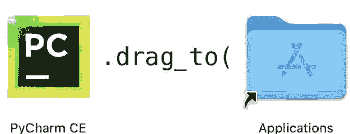

拖动图标后，你可以双击 **PyCharm CE** 图标来打开 IDE。如果你之前安装过 PyCharm，你可以进行全新安装，不必导入设置。双击图标后，它会显示以下窗口：


阅读 **JETBRAINS** 使用条款，勾选左下角的方框，然后点击 **继续** 按钮：

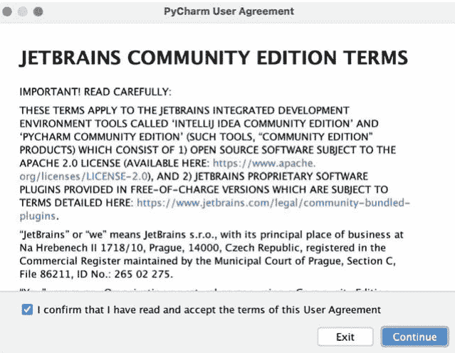

之后，你应该看到欢迎页面：


你可以点击 **开始导览**，阅读所有提示和技巧，以便熟悉 PyCharm：

**开始熟悉**

- 01  **项目视图**位于左侧。它包含项目目录、项目库和草稿文件。你可以按 **Cmd 1** 预览演示项目。
- 02  展开项目目录...
- 03  双击以打开文件...
- 04  切换到 **学习** 选项卡...
- 05  PyCharm 已经为这门课程设置了 Python 解释器。你可以运行你的项目。选择了简单的 Python 解释器。

- **到处搜索** **Double ⇧**
- **项目视图** **⌘1**
- **前往文件** **⇧⌘O**
- **最近文件** **⌘E**
- **导航栏** **⌥↑**
- **拖放文件到此处以打开**

如果你想创建一个新项目，你可以选择 **文件 > 新建项目**：

位置：  /Users/rick/PycharmProjects/firstproject

▼ Python 解释器： 新的 Virtualenv 环境

- ○ 使用 Virtualenv 创建新环境 ▼
    - 位置：  /Users/rick/PycharmProjects/firstproject/venv
    - 基础解释器：  /usr/local/bin/python3.10
    - □ 继承全局 site-packages
    - □ 对所有项目可用
- ○ 之前配置的解释器
    - 解释器：  <无解释器>
- ✅ 创建 main.py 欢迎脚本
    创建一个 Python 脚本，为 PyCharm 中的编码提供入口点。

确保你设置了 PyCharm 文件的保存位置，你可以随意命名项目，在我的情况下，我将其命名为“firstproject”。基础解释器应该是你已安装的最新 Python 版本。对我来说，这是版本 3.10，并且已被预先选择。最后，你可以点击“创建”按钮来创建项目。如果在创建项目后出现此消息，你可以选择“此窗口”

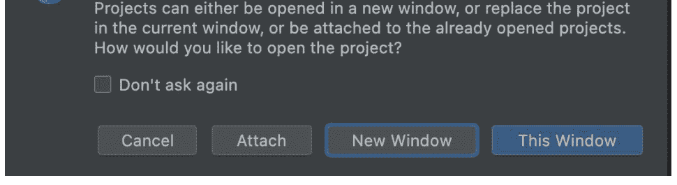

项目将为你创建，你将拥有一个通常名为 main.py 的文件：

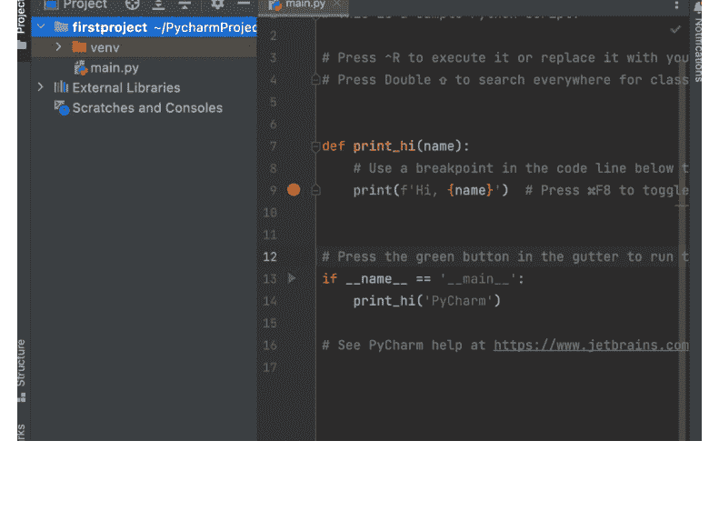

如你所见，**firstproject** 已创建，里面有一个名为 main.py 的文件，包含一些初始代码。如果你想创建一个新文件，你可以选择 **firstproject** 文件夹，右键单击它，然后选择 **新建文件**：

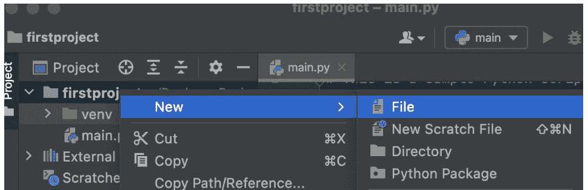

按你的喜好命名文件，我的将是 first.py（确保输入正确的扩展名）：

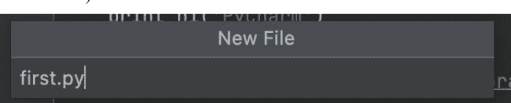

点击回车键，文件将在 firstproject 内创建。如果你进入菜单 **PyCharm > 偏好设置**，可以对 PyCharm 进行进一步自定义：

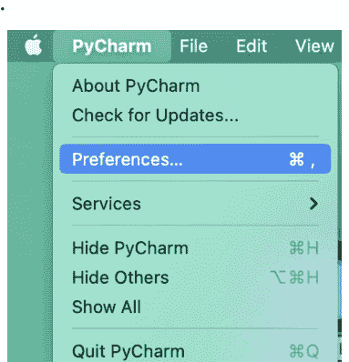

或者你可以点击 **IDE 和项目设置** 图标，它将直接带你进入 **偏好设置** 部分：

我刚刚把字体调大了，这样在编码时就不用太费眼睛了。让我们从编写一段简单的 `print()` 函数代码开始，这里故意拼写错误：

如你所见，单词‘Stundents’应该是‘Students’，所以我们不仅得到了一个自动的语法错误检测，闭合的右括号‘)’还被黄色下划线标出。黄色下划线意味着我们需要添加一个新行，然后这个警告就会消失。你可以点击那个灯泡图标，它会帮助你修复这个问题。

最后，我们如何运行 `first.py` 文件中的代码呢？嗯，你需要进入菜单并选择“运行”，如下图所示：

因为现在有两个文件：`main.py` 和 `first.py`，所以它会询问我们想运行哪个文件：

选择正确的文件后，终端将在底部打开，并显示来自 `print` 函数的消息：

PyCharm 是一个非常好的集成开发环境，因为它不需要你安装包、扩展等就能编写和执行你的 Python 代码。请阅读 PyCharm 文档，了解它的一些功能。

## 在 PyCharm 中如何进行代码格式化？

如果你的代码超过一行，比较长，我们可以进入“代码”>“重新格式化代码”，代码就会为你自动重新格式化。这是从我们在 VS Code 部分创建的文件中复制的一个例子：

```
def fn_addition(num1, num2):
    return num1 + num2
def fn_subtraction(num1, num2):
    return num1 - num2
print(fn_addition(2, 5))
print(fn_subtraction(6, 2))
```

我们只需要进入菜单部分并选择“代码”>“重新格式化代码”：

让我们看看我们的 `first.py` 文件，检查代码是否现在格式化正确了：

如上图所示，重新格式化代码的功能与在 VS Code 中一样。以下是一些链接，如果你想进一步了解 PyCharm，可能会用到：

- 安装指南：
https://www.jetbrains.com/help/pycharm/installation-guide.html

- 学习 PyCharm：
https://www.jetbrains.com/pycharm/learn/

- PyCharm 指南：
https://www.jetbrains.com/pycharm/guide/

### 总结

在本章中，你学到了很多东西。我们首先在不同的操作系统上安装 Python，然后安装了不同的编程工具。我们安装了 VS Code 编辑器，它是市场上最好的代码编辑器之一，但如果你不喜欢编辑器，那么我提供了专为 Python 设计的最佳集成开发环境——PyCharm。你不必两者都用，决定哪个最适合你，完全由你自己。你在本章学到的所有东西都会让你成为一个更好的 Python 开发者。我们不应该忘记提一下，你已经了解了保持代码整洁和格式化的重要性，结合终端命令，你现在正在成为一个专业的开发者。

# 第四章 – 面向对象编程 – 进阶 Python

Python 是一门面向对象编程语言。这个术语被许多其他语言使用，是基础概念。理解“对象”的概念非常重要，因为在 Python 中，一切都可以被视为一个对象。面向对象语言围绕对象组织，这些对象可以在运行时被创建和修改。我们将在接下来的章节中学习这些对象从何而来，但每个对象都被称为一个类的实例。面向对象编程中的类是允许我们创建对象的模板。在本章中，我们将学习什么是面向对象编程以及它最重要的特性是什么。

## class 关键字

在前面的章节中，当我们尝试使用 `type()` 函数确认数据类型时，我们已经见过 `class` 关键字：

`class` 关键字在 Python 中无处不在。我提到过 Python 中的一切都可以被视为一个对象。每个对象都可以访问属性、方法和特性。Python 中的类将允许我们创建对象，所以它们是创建对象的蓝图。这意味着类可以帮助我们创建新的对象并扩展初始的数据类型列表。这也意味着我们可以发挥创造力，创建与内置类型不同的自定义数据类型。本章将帮助你深入理解这些概念。因此，面向对象编程是最基本的范式。在面向对象编程出现之前，我们的代码是一系列过程，每个过程按特定顺序执行，但当面向对象编程被引入时，这种情况就改变了。请注意，你可以继续使用 replit.com 来运行本章将介绍的代码，或者使用我们在前面章节中安装的一些工具。为了满足你的好奇心，让我们开始学习面向对象编程。

### 为什么使用面向对象编程？

面向对象编程非常有用，因为我们编写一段代码，就可以通过创建不同的类和这些类的实例来重用该代码。这些类中的每一个都可以添加新功能，而无需编写、更改或修改现有代码。复杂的程序需要我们使用类和对象，因为我们可以创建多个可管理的代码块。

### 面向对象编程的原则

以下原则通常适用于所有面向对象编程语言。

- 抽象
- 封装
- 继承
- 多态

### 其他哪些语言支持面向对象编程？

最古老和最知名的面向对象语言是 Java。然后是 C#，这是微软开发的另一种面向对象语言。一些更著名的面向对象语言包括 PHP、Ruby、TypeScript 和 Python。

## 如何在 Python 中创建类？

要创建一个类，我们需要使用关键字 `class`，然后提供类名。

示例：

```
class Student:
```

如你所见，类名以大写字母开头，这是你应该习惯的命名约定。另一个规则是类名应该是单数形式，例如，你不应该这样命名你的类：`class Students`。如果类名需要由两个单词组成，那么你应该使用以下约定：

```
class StudentObj:
```

我们可以看到，每个单词都以大写字母开头，这与我们目前使用的蛇形命名法不同。蛇形命名法使用下划线连接多个单词，例如 `student_obj`。在类名之后，我们有一个冒号（`:`），这里我们需要编写类体。但在此之前，让我们为这个类创建一个对象。如果我们让代码保持这个样子，它会报错，所以我们添加 `pass` 关键字并创建我们的第一个对象。

在图的右侧，我们看到了输出，其中有类型 `class`，暂时忽略 `main` 关键字，因为我们在未来的章节中会解释它的含义。

### Python 中的类和对象是什么？

你需要理解这两个关键词：类和对象/实例。类是创建对象的蓝图或模板。当我们创建类时，我们定义一组将代表该类基础的属性和方法。类的方法就像函数，属性就像变量。对象将使用类模板，因此它可以访问类中属性和方法的副本。

到目前为止的关键字：

- 类
- 对象
- 属性
- 方法

从上图中，我们有几个新关键字需要解释。在左侧，我们有一个类，它代表了我们想要创建的东西，以及我们希望这个类拥有什么样的属性和方法。所以，它是一个蓝图或模板。在右侧绿色背景的部分，有对象。当我们想要从特定类创建一个对象时，我们需要实例化那个类。我们创建的对象被称为类实例，我们可以创建任意数量的实例。如果你学过其他面向对象语言，那么你应该熟悉这种语法，因为它们都共享相同或相似的语法：

```
# 类模板
class StudentObj:
    pass
```## 通过实例化 StudentObj 类来创建新对象

```python
s_obj1 = StudentObj()

print(type(s_obj1))
```

**s_obj1** 是 StudentObj 类的一个对象或实例。

### 类构造函数、属性、方法

在本节中，我们将创建一个名为 Person 的类，并学习一些新的特性。如果一开始不理解所有内容，请不要担心，这需要时间，但请相信我，将来这对你来说会变得非常容易。那么，让我们创建第一个真正的类，名为 Person：

```python
class Person:
    def __init__(self, name):
        self.name = name

    def greet(self):
        print(f'{self.name}')
```

在 Python 中，类方法以双下划线 `__` 开头，也以双下划线结尾。通常，在 Python 中，方法是特殊类型的函数。我们在前一章已经介绍了函数，因此我们使用完全相同的语法，只是在前面加上了关键字 ‘**def**’。所以，函数和方法的区别在于方法是特定于类的，它们属于该类，而函数属于全局作用域。这就是为什么在大多数文献中，作者在描述类时使用函数而不是方法，它们很容易被混淆。在我们的例子中，带有双下划线的方法是特殊的，它们被称为 **dunder** 方法或魔术方法。类声明顶部的方法被称为 **构造函数** 方法或 **init**()。当我们从 Person 类实例化对象时，此方法将自动调用。在这个阶段我们没有任何对象，但此方法将立即被调用。让我们创建一个 **person_obj1**，它将是 Person 类的一个实例，并尝试运行以下代码：

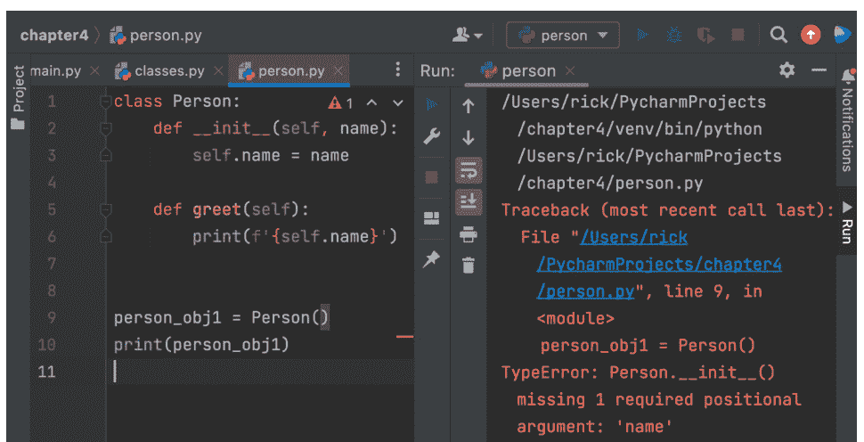

从上图中，右侧有一个 **TypeError**，提示 Person 方法 **__init__()** 缺少 **name** 参数，但它怎么知道的呢？嗯，我们正在创建 Person 类的一个实例，因此当创建 Person 类的对象时，该类的构造函数将被调用：

```python
person_obj1 = Person()
print(person_obj1)
```

这将运行构造函数 **init()**，并尝试进行以下赋值：
`self.name = name`
但问题在于，我在构造函数调用期间从未提供任何参数，因为我们像这样调用了类 `Person()` 而没有传递参数。在构造函数方法中，在 self 关键字之后，我们需要提供一个参数名：

```python
def __init__(self, name):
```

这意味着在 self 关键字之后，如果我们有参数，我们必须在类调用中提供它们，例如，`Person('Jason')`。我们需要像下图那样将它们关联起来：

```python
class Person:
    def __init__(self, name):
        self.name = name
    def greet(self):
        print(f'{self.name}')

person_obj1 = Person()
print(person_obj1)
```

因此，当我们实例化 Person 类的一个对象时，我们需要提供在 init 构造函数中列出的参数。在我们的例子中，init 构造函数只需要一个参数，那就是 ‘name’。

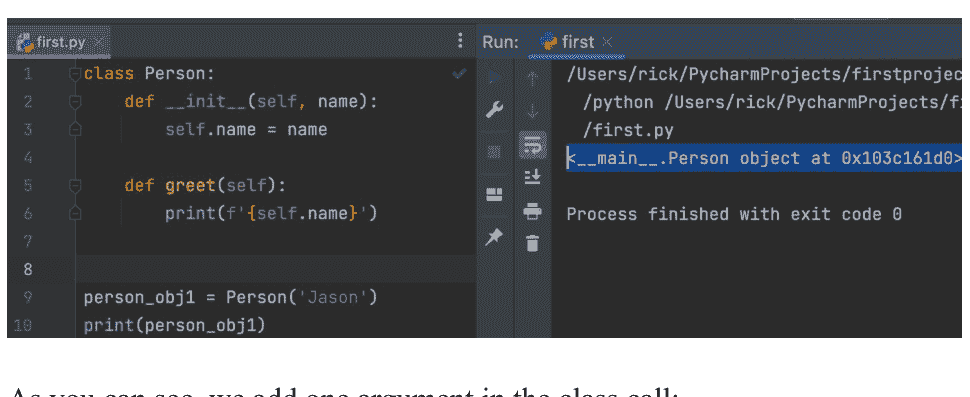

如你所见，我们在类调用中添加了一个参数：

```python
person_obj1 = Person('Jason')
```

现在，如果我们再次运行代码，错误将消失。我们在 init() 方法中的 ‘self’ 关键字指的是类的当前实例（person_obj1）。在我们的例子中，self 参数是对 person_obj1 的引用，它是该类的唯一实例，因此 person_obj1 将能够访问类的方法和属性。‘self’ 关键字可以随意命名，但它必须是构造函数中的第一个参数，因为它被认为是类中任何方法的默认参数。这就是幕后发生的事情：

```python
class Person:
    def __init__(self, name):
        self.name = name # Jason

    def greet(self):
        print(f'{self.name}')

#self refers to person_obj1

person_obj1 = Person('Jason')
print(person_obj1.name)
```

让我们从对象访问该 name 属性，因为对象是类的实例，它们可以访问类的方法和属性：

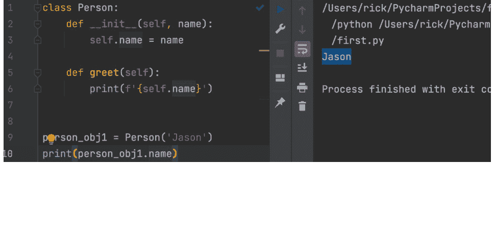

让我们从 Person 类创建另一个实例/对象，这次使用不同的名字：

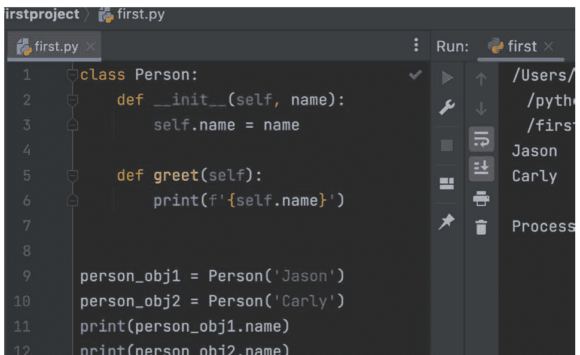

如你所见，我们创建了 Person 类的另一个实例，这个实例现在有一个不同的 name 属性（Carly），当调用 `__init__` 方法时，name 参数将分配 ‘Carly’，因为 ‘self’ 关键字会告诉构造函数该参数属于 person_obj2 对象。因此，我们遵循了良好的 DRY（不要重复自己）原则，因为我们能够创建两个独立的实例/对象，它们调用同一个类但具有不同的 name 属性。这些对象访问同一个类及其方法和属性。如果这不是面向对象编程，那么我们将不得不为这两个对象编写相同的代码。这使得代码更加动态。self 关键字绑定到被实例化的对象。在 Person 类中，**init** 构造函数非常简单，只接受一个参数，但它可以复杂得多，例如，假设我们希望构造函数被调用时带有 name、lastname 和 age 参数，我们还可以更改 greet() 函数以打印所有详细信息：

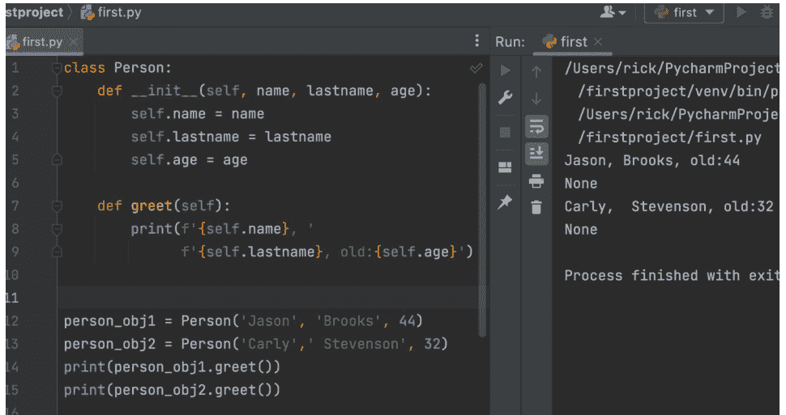

现在，当我们从 Person 类实例化一个对象时，我们需要传递两个额外的参数，如 lastname 和 age。name、lastname 和 age 是类属性，它们可以被对象/实例访问。类属性是对象使用点表示法和属性可以访问的属性：

```python
print(person_obj1.name)
print(person_obj2.age)
```

如你所见，person_obj1 和 person_obj2 可以访问类属性而不需要括号，因为它们不是方法。如果我们想直接访问类方法，我们必须使用括号 `()`，像这样：

```python
print(person_obj1.greet())
print(person_obj2.greet())
```

最后，person_obj1 和 person_obj2 是 Person 类的实例，但它们是唯一的且彼此不同，请不要混淆它们。我们使用 Person 类作为模板来创建/实例化存储在计算机内存不同位置的对象。如果我们只打印以下内容，可以很容易地找到这一点：

```python
print(person_obj1)
print(person_obj2)
```

输出将是：

```
<__main__.Person object at 0x10cddfdf0>
<__main__.Person object at 0x10cddebf0>
```

如你所见，两个 Person 对象存储在计算机内存的不同位置。这很完美，因为现在每个对象都可以有自己的方法和属性，这些方法和属性对其他对象是隐藏的。

总之，类可以有属性和方法。属性由构造函数方法初始化，该方法将有一个 ‘self’ 关键字作为默认参数。当我们创建一个新的对象或 Person 类的实例时，我们立即调用构造函数，并将所有参数初始化为该对象特有的值。Person 类的每个实例都可以访问类方法和属性，并且它们彼此独立，这意味着它们存储在不同的内存位置。

### 类对象属性

类对象属性与类中的其他属性不同。让我们先创建一个：

```python
class Person:
    # Class Object Attribute
    is_person = True

    # Constructor
    def __init__(self, name, lastname, age):
        self.name = name # name attribute
        self.lastname = lastname # lastname attribute
        self.age = age # age attribute
    # Method
```

## `__init__` 构造函数

我在上面的章节中已经解释了什么是 `__init__` 构造函数，但我想补充一些我认为在类构造函数方面很重要的内容。让我们再来看一下构造函数：

```python
def __init__(self, name, lastname, age):
    self.name = name  # name attribute
    self.lastname = lastname  # lastname attribute
    self.age = age  # age attribute
```

以及将立即调用该构造函数的对象/实例：

```python
person_obj1 = Person('Jason', 'Brooks', 44)
```

一旦 `person_obj1` 从 `Person` 类实例化，构造函数就会被调用。为什么构造函数如此重要？嗯，构造函数会完成它的工作，它会构造一个新的 `Person` 类的对象或实例，以便新对象可以使用类的属性和方法。构造函数的第一个参数是 `self` 关键字。正如你所看到的，这个 `self` 关键字与构造函数的其他参数相比颜色不同。当我刚开始学习 Python 时，我理解 `self` 只是对调用对象的引用，每个对象都有自己的 `self`。我们创建的每个对象都是唯一的，因此 `self` 关键字必须只属于一个对象。

请查看下图：

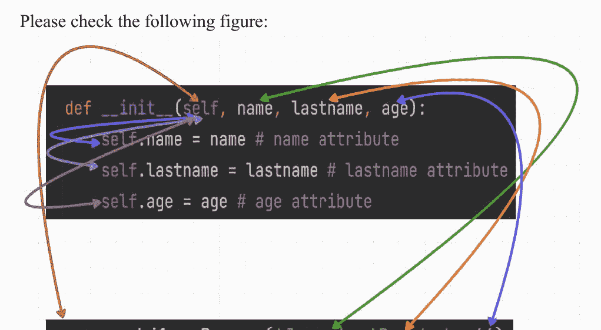

我希望你现在理解为什么在实例化对象时会调用构造函数。请不要被我这幅毕加索式的画吓到。构造函数可以复杂得多，例如，让我们允许新对象在满足特定条件（如年龄限制）时从 `Person` 类实例化。例如，让我们在构造函数中添加一个条件，以便在创建实际对象之前检查年龄。请看完整的代码：

```python
class Person:
    # Class Object Attributes
    is_person = True

    # Constructor
    def __init__(self, name, lastname, age):
        if age >= 18:
            self.name = name  # name attribute
            self.lastname = lastname  # lastname attribute
            self.age = age  # age attribute

    # Method
    def greet(self):
        print(f'{self.name}, '
              f'{self.lastname}, old: {self.age}. '
              f'Called by the class itself: {Person.is_person}. '
              f'Called by the self keyword {self.is_person}')

person_obj1 = Person('Jason', 'Brooks', 17)
print(person_obj1.greet())
```

由于 **init** 构造函数内部的 if 条件，我们将永远不会实例化 `person_obj1`，因为我们传递的当前年龄参数是 17。这将使条件评估为布尔值 False。如果我们尝试运行此代码，我们将得到 **AttributeError**：

```
<__main__.Person object at 0x10b6cbdc0>
Traceback (most recent call last):
  File "/Users/rick/PycharmProjects/firstproject/first.py", line 22, in <module>
    print(person_obj1.name)
AttributeError: 'Person' object has no attribute 'name'
```

非常好，现在如果我们把年龄改为 18 或更大，if 条件将评估为 true，对象将被成功创建：

```python
person_obj2 = Person('Andy', 'Garcia', 20)
print(person_obj2.greet())
```

上面的代码将打印出：

> Andy, Garcia, old: 20. Called by the class itself: True. Called by the self keyword True

### 带有默认值的构造函数

我们知道函数可以为其参数设置默认值，以防调用对象遗漏任何值。构造函数是一个函数，一个特殊的函数，你可能因为前面的 ‘def’ 关键字而知道这一点，所以它也可以有默认值：

```python
# Constructor
def __init__(self, name='John', lastname='Doe', age=18):
    if age >= 18:
        self.name = name  # name attribute
        self.lastname = lastname  # lastname attribute
        self.age = age  # age attribute
```

现在，这允许我们通过这样调用构造函数从 `Person` 类创建对象或实例：

```python
person_obj3 = Person()
print(person_obj3.name)
```

上面代码的输出将是 John，即使我们没有向 `Person()` 构造函数传递任何参数。我们代码中的默认值被称为安全措施，以便我们可以适当地控制如何从类实例化对象。

## 使用 @classmethod 创建类方法

在本节中，我们将创建一个属于类的类方法。为此，我们需要使用 `@classmethod` 关键字，它被称为装饰器。我们需要在函数声明之前使用装饰器：

```python
# Class Method
@classmethod
def date_created(today_date, year):
    print(today_date, year)
```

正如我们所看到的，在方法声明之前，我们使用了 `@classmethod` 装饰器，然后方法的其余语法与以前相同。`Person` 类的对象可以访问这个方法吗？让我们尝试运行以下代码：

```python
person_obj3.date_created('14/05', 2023)
```

这将导致以下错误：

```
Traceback (most recent call last):
  File "/Users/rick/PycharmProjects/firstproject/first.py", line 32, in <module>
    person_obj3.date_created('14/05', 2023)
TypeError: Person.date_created() takes 2 positional arguments but 3 were given
```

错误说我们提供了 2 个参数，但给出了 3 个。如果你记得，类中的每个方法都应该有 `self` 关键字作为第一个参数，但这里我们缺少这个关键字。类方法不属于对象，因此不再需要 ‘self’ 关键字，但我们需要使用一个关键字将此方法绑定到类。因此，我们使用 ‘cls’，它代表 class，现在是标准做法。类方法必须接收 class 关键字作为第一个参数：

```python
# Class Method
@classmethod
def date_created(cls, today_date, year):
    print(today_date, year)
```

现在对象可以调用此方法：

```python
person_obj3.date_created('11/11', 2023)
```

那么，为什么我们需要这种类型的方法，当对象可以像访问其他方法一样访问它时？嗯，这种方法属于类本身，因此你不需要实例化类就可以使用它：

```python
# the class can call this method without objects
Person.date_created('12/12', 2023)
```

这仍然会打印输出，因为该方法是类方法，不需要对象来访问它。这类方法在 Python 中很少见，但了解它们是有好处的。

总结一下我们关于类方法所学到的内容：

- 类方法绑定到类而不是对象
- 类方法可以访问类及其状态，例如该类的所有属性
- 它可以访问和修改类的状态和属性

## 静态方法 @staticmethod

静态方法与类方法非常相似，但区别在于我们不必使用类的隐式关键字 ‘cls’。静态方法无法访问类状态，因此无法修改类。那么，为什么我们需要这些静态类方法呢？嗯，这些方法可以用作实用程序类型的方法，可以接受参数并执行某些操作。要创建静态方法，我们需要使用装饰器 `@staticmethod`：

```python
def greet(self):
    print(f"{self.name}, {self.lastname}, old: {self.age}")

person_obj1 = Person('Jason', 'Brooks', 44)
person_obj2 = Person('Carly', 'Stevenson', 32)
print(person_obj1.greet())
print(person_obj2.greet())
```

从上图中，我们有 **is_person** 类对象属性，它被设置为布尔值 True。此属性与其余属性之间的区别在于类对象属性是 **静态** 的。在方法 `greet(self)` 中，我们传递 `self` 关键字，以便我们可以从调用该方法的对象获取 name、lastname 和 age，因为 `self` 绑定到对象。但这个静态属性也可以由类本身调用：

```python
class Person:
    # Class Object Attributes
    is_person = True

    # Constructor
    def __init__(self, name, lastname, age):
        self.name = name  # name attribute
        self.lastname = lastname  # lastname attribute
        self.age = age  # age attribute

    # Method
    def greet(self):
        print(f'{self.name}, '
              f'{self.lastname}, old: {self.age}. '
              f'Called by the class itself: {Person.is_person}. '
              f'Called by the self keyword {self.is_person}')

person_obj1 = Person('Jason', 'Brooks', 44)
person_obj2 = Person('Carly', 'Stevenson', 32)
print(person_obj1.greet())
print(person_obj2.greet())
```

类对象属性是那些不会改变的属性，它们是静态的，可以直接由类本身或实例/对象访问。类对象属性属于类，它们在类本身中被初始化为某个值，而在构造函数或其他方法（如 name、age 和 lastname）中定义的属性将具有由调用对象动态分配的值。如果我们运行上面的代码，输出是：

```
Jason, Brooks, old: 44. Called by the class itself: True.
Called by the self keyword True
None
Carly, Stevenson, old: 32. Called by the class itself:
  True. Called by the self keyword True
None
```## OOP三大支柱

### 面向对象编程的第一支柱——封装

封装是面向对象编程四大最重要原则之一。我们已经介绍过这个概念，现在希望这个定义能让你理解。封装指的是将数据与操作或处理该数据的函数和方法绑定在一起。数据将成为属性，而函数将成为方法。在我们的示例中，有一个名为 `Person` 的类，它将数据（如姓名和年龄等属性）封装到处理这些数据的函数或方法中。你可以将封装理解为一个包裹，因为它将数据和函数封装在一个单一的盒子里：

```python
class Person:

    # Constructor
    def __init__(self, name='John', lastname='Doe', age=18):
        if age >= 18:
            self.name = name  # name attribute
            self.lastname = lastname  # lastname attribute
            self.age = age  # age attribute

    # Method
    def greet(self):
        print(f'The data and functions are encapsulated, \n'
              f'My name is: {self.name},\n'
              f'My last name: {self.lastname},\n'
              f'and I\'m old:{self.age} ')

person_obj1 = Person('Jason', 'Mamoa', 53)
person_obj1.greet()

@staticmethod
def is_adult(age):
    return age >= 18

print(Person.is_adult(19))
```

这将返回 true，因为年龄（19 >= 18）的计算结果为真。

### 面向对象编程的第二支柱——抽象

抽象意味着隐藏信息，只提供必要内容的访问接口。抽象是我们将要在OOP中讲解的第二重要原则。换句话说，我们通过只提供对有限数据的访问，向外部用户隐藏方法的内部实现方式。请看以下调用 `greet()` 方法的对象：

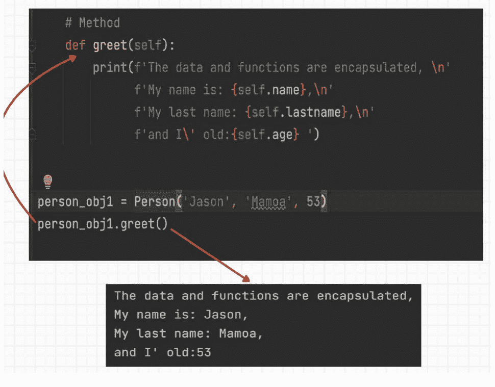

对象 **person_obj1** 不知道 `greet()` 方法在 `Person` 类中是如何实现的，因此该信息被隐藏了，但对象获得了输出，这意味着它只获取了 `greet()` 方法提供的必要数据。`person_obj1` 知道 `greet()` 函数做什么并能获取输出，但它不知道内部实现。

### Python 私有变量与公有变量

在本节中，我们将讨论什么是私有和公有变量，它们的含义，以及如何在代码中使用它们。请查看以下代码：

```python
# private and public variables
class Person:
    # Constructor
    def __init__(self, name='John', lastname='Doe', age=18):
        if age >= 18:
            self.name = name
            self.lastname = lastname
            self.age = age

    # Class method
    def greet(self):
        print(f'The data and functions are encapsulated, \n'
              f'My name is: {self.name}, \n'
              f'My last name is: {self.lastname}, \n'
              f'and I\'m {self.age} old.')

person_obj1 = Person('Jason', 'Mamoa', 53)
person_obj1.greet()
person_obj1.lastname = 'Bourne'

print('-------------------')
person_obj1.greet()
```

这是最后一个 `greet` 方法的输出结果：

```
The data and functions are encapsulated,
My name is: Jason,
My last name is: Mamoa,
and I'm 53 old.
---------------------
The data and functions are encapsulated,
My name is: Jason,
My last name is: Bourne,
and I'm 53 old.
```

我知道你没想到这个结果，因为我使用了 `Person` 类的一个实例并更改了 `lastname` 属性的值。这与面向对象编程的第二支柱——抽象——完全相反，因为该原则认为对象不应该能够访问和修改数据，而应该只是获取数据/信息。在 Java 中，我们可以创建私有变量，它们对实例来说保持私有。这是 Java 中一个很好的概念，我们所要做的就是在前面写上 `private` 关键字：

```java
// Private
private String name;
private String lastname;
private int age;
```

但我们在 Python 中无法做同样的事情。在 Python 中，当我们想表示这个属性或变量是私有的时，需要在它前面写一个下划线：

```python
self._name = name # name attribute
self._lastname = lastname # lastname attribute
self._age = age # age attribute
```

这与 Java 中的不完全一样。如果我们再次运行上面的代码，它不会报错，因为 `lastname` 的值会被更改，那么写下划线的意义何在？嗯，意义在于当其他程序员看到这种命名约定时，他们会明白我们是在表示这个属性是私有的，我们不应试图更改其值。所有其他变量被认为是公有的，而带下划线的则被认为是私有的。这就是我们在 Python 中模拟私有性的方式——通过在前面添加下划线，但如果有人试图修改它，仍然会生效。在 Python 中，我们无法像在其他 OOP 语言中那样实现真正的私有，但至少我们有一种命名约定，即在属性名前使用单个下划线。当我们使用 `_lastname` 时，我们表明这是 Python 中的一个私有变量/属性。例如，`greet()` 方法现在也必须在变量前包含下划线，这样它才能无错误地工作：

```python
# Method
def greet(self):
    print(f'The data and functions are encapsulated, \n'
          f'My name is: {self._name},\n'
          f'My last name: {self._lastname},\n'
          f'and I\'m old:{self._age} ')
```

### 面向对象编程的第三支柱——继承

继承是 OOP 的核心原则之一。继承允许我们创建一个类，该类将继承另一个类的方法和属性。被继承的类称为父类或基类，而从父类继承方法和属性的类称为子类或派生类。到目前为止，我们一直使用 `Person` 类作为示例来解释 OOP 的一些原则。`Person` 类有 `name`、`lastname` 和 `age` 作为属性，以及一个名为 `greet` 的方法来打印这些属性。为了向你展示继承，我需要创建另一个名为 `Student` 的类，该类将从父类 `Person` 继承功能。让我们看看如何在 Python 中实现这一点：

```python
# inheritance
class Person:
    # Constructor
    def __init__(self, name='John', lastname='Doe', age=18):
        if age >= 18:
            self._name = name  # name attribute
            self._lastname = lastname  # lastname attribute
            self._age = age  # age attribute

    # Method
    def greet(self):
        print(f'The data and functions are encapsulated, \n'
              f'My name is: {self._name},\n'
              f'My last name: {self._lastname},\n'
              f'and I\'m old:{self._age} ')

print('------- Person Class -------')

person_obj1 = Person('Jason', 'Mamoa', 53)
person_obj1.greet()

class Student(Person):
    pass

print('------- Student Class -------')

student_obj1 = Student('Rick', 'Jameson', 33)

print(student_obj1.greet())
```

输出：

```
------- Person Class ------
The data and functions are encapsulated,
My name is: Jason,
My last name: Mamoa,
and I'm old:53

------- Student Class ------
The data and functions are encapsulated,
My name is: Rick,
My last name: Jameson,
and I'm old:33
```

这是 Python 中继承的语法：

```python
class Student(Person):
```

父类应包含在子类的括号中，仅此而已。在这个例子中，`Student` 类没有自己的属性和方法，但它可以拥有新方法，并且这些新方法不会与父类共享。这意味着子类可以从父类继承所有内容，并且可以拥有自己的属性和方法。当我们不想包含任何代码时，我们使用 `pass` 关键字。让我们讨论以下代码：

```python
student_obj1 = Student('Rick', 'Jameson', 33)
print(student_obj1.greet())
```

如你所见，学生类能够使用父类 `Person` 的 `__init__` 构造函数方法来初始化 `name`、`lastname` 和 `age`，之后再使用 print 方法来打印 `student_obj1` 的详细信息。到目前为止，我们的子类继承了所有属性/特性而从父类继承属性和方法，我们还可以为子类添加新的构造函数，使其拥有自己的属性。Person 和 Student 类的共同属性包括：

- name
- lastname
- age

我们可以为 Student 类添加以下新属性：

```python
class Student(Person):
    def __init__(self, name, lastname, age, dob, address):
        Person.__init__(self, name, lastname, age)
        self.dob = dob
        self.address = address
```

从上面的代码可以看到，Student 的构造函数将包含父类 Person 的所有属性，外加两个新属性：出生日期（dob）和地址（address）。我们不需要为所有父类属性编写 `self.name = name` 这样的代码，而是可以直接调用 Person 的 `__init__` 构造函数，并将父类属性包含在 Student 类中：

```python
Person.__init__(self, name, lastname, age)
```

对于 Student 类，我们添加了 `self.dob = dob` 和 `self.address = address`，因为它们是属于学生类的新属性，不是从其他类继承而来的。现在，学生对象需要包含 `dob` 和 `address` 属性：

```python
student_obj1 = Student('Rick', 'Jameson', 33,
                       '29/09/1987', 'Melbourne/Australia')
```

如果没有继承机制，Student 类和 Person 类将会是这样的：

```python
class Person:
    # 构造函数
    def __init__(self, name='John', lastname='Doe', age=18):
        if age >= 18:
            self._name = name # name 属性
            self._lastname = lastname # lastname 属性
            self._age = age # age 属性
```

```python
class Student:
    def __init__(self, name, lastname, age, dob, address):
        if age >= 18:
            self._name = name # name 属性
            self._lastname = lastname # lastname 属性
            self._age = age # age 属性
        self.dob = dob
        self.address = address
```

正如你所见，我们没有遵循 **DRY（Don't Repeat Yourself）原则**，因为相同的属性代码被重复编写了两次。想象一下，如果我们还有更多的类，比如 Undergraduate（本科生）和 Postgraduate（研究生），那么我们就需要把相同的代码重复写四次。我希望你现在能理解为什么继承在面向对象编程语言中如此重要了。

### 方法重写

当我们希望在子类中使用相同的方法名，但又希望其输出与父类方法不同时，就会发生方法重写。两个方法必须具有相同的名称。例如，在父类中，我们有一个 `greet()` 方法，它适用于 Person 类并且工作得很好。尽管子类 Student 可以访问它，但它无法使用该方法打印其独有的两个新属性。以下是父类的 `greet()` 方法：

```python
# 方法
def greet(self):
    print(f'The data and functions are encapsulated, \n'
          f'My name is: {self._name},\n'
          f'My last name: {self._lastname},\n'
          f'and I\' old:{self._age} ')
```

得益于继承，Student 类实例化的 `student_obj1` 对象可以访问此方法，如下所示：

```python
student_obj1 = Student('Rick', 'Jameson', 33,
                       '29/09/1987', 'Melbourne/Australia')

print(student_obj1.greet())
```

输出将会是：

```
------- Student Class -------
The data and functions are
    encapsulated,
My name is: Rick,
My last name: Jameson,
and I' old:33
```

很好！它能工作，但是 Student 类独有的 `dob` 和 `address` 属性呢？我们希望它们能包含在输出中。这就是方法重写发挥作用的地方。我们可以使用相同的方法名 `greet()`，并为 Student 类创建它（我们应该在 Student 类中编写这个方法）：

```python
### 方法重写
def greet(self):
    print(f'My name is: {self._name},\n'
          f'My last name: {self._lastname},\n'
          f'and I\' old:{self._age}. I\'m student: \n'
          f'born at: {self.dob},\n'
          f'that lives in : {self.address}')
```

输出将会是：

```
------- Student Class ------
My name is: Rick,
My last name: Jameson,
and I' old:33. I'm student:
born at: 29/09/1987,
that lives in : Melbourne/Australia
```

完美！现在我们有两个类，其中包含同名的方法。当创建 Person 类的实例并调用 `greet()` 方法时，将调用 Person 类中定义的方法；但当创建子类的实例并调用 `greet()` 方法时，解释器将从 Student 类中获取该方法。

以下是完整代码：

```python
# 继承
class Person:
    # 构造函数
    def __init__(self, name='John', lastname='Doe', age=18):
        if age >= 18:
            self._name = name # name 属性
            self._lastname = lastname # lastname 属性
            self._age = age # age 属性

    # 方法
    def greet(self):
        print(f'The data and functions are encapsulated, \n'
              f'My name is: {self._name},\n'
              f'My last name: {self._lastname},\n'
              f'and I\' old:{self._age} ')

print('------- Person Class ------')

person_obj1 = Person('Jason', 'Mamoa', 53)
person_obj1.greet()

class Student(Person):
    def __init__(self, name, lastname, age, dob, address):
        Person.__init__(self, name, lastname, age)
        self.dob = dob
        self.address = address

    # 方法重写
    def greet(self):
        print(f'My name is: {self._name},\n'
              f'My last name: {self._lastname},\n'
              f'and I\' old: {self._age}. I\'m student: \n'
              f'born at: {self.dob},\n'
              f'that lives in : {self.address}')

print('------- Student Class ------')

student_obj1 = Student('Rick', 'Jameson', 33, '29/09/1987',
                       'Melbourne/Australia')

print(student_obj1.greet())
```

## isinstance() 函数 – Python

在我们开始学习 Python 中新的 `isinstance()` 函数之前，我想再给你举一个继承的例子，并回顾一下我们目前学到的关于 Python 类的一些重要特性。类，不仅在 Python 中，在任何编程语言中，起初都可能是一个难以理解的概念，这也是我想进行总结的原因之一。让我们从类的基本构建块开始。每个类都可以有属性和方法。属性和方法的数量取决于类的具体内容，这意味着它可以有许多属性，也可以完全没有属性。类最重要的方法是构造函数 `__init__`。在这个方法中，第一个参数称为 `self`，其余参数是类的属性。类可以被实例化，意味着我们可以从该类创建对象。创建新对象的过程称为实例化。因此，对象是类的实例。当我们创建一个实例时，构造函数方法会立即被调用。但是，类如何知道哪个对象被实例化，以及如何将属性初始化为特定的值呢？构造函数的第一个参数将告诉类当前正在使用哪个对象。类内部的方法本质上就是函数，但我们不称它们为函数，因为这些方法可以被类内部或其对象/实例使用。类的实例/对象可以访问所有的属性和方法。类可以有自己的类属性和方法，它们与普通的属性和方法不同，因为我们不需要实例化类就可以使用它们。类本身可以直接调用它们。类继承是面向对象编程的一个非常重要的支柱，因为它允许我们使用一个类来创建一个子类，该子类可以继承父类的所有属性和方法。这节省了时间，因为我们不会创建重复的代码。在某些文献中，你会发现子类也被称为：

- Subclass（子类）
- Derived class（派生类）
- Concrete class（具体类）

父类（其他类继承的类）可以被称为：

- Parent（父类）
- Super（超类）
- Abstract class（抽象类）

我希望现在一切都开始变得清晰了，这里是另一个继承的例子：## 继承

```python
class Mammal:
    def __init__(self, name):
        self.name = name

    # eat method
    def eat(self):
        print(f'{self.name} eats different types of foods!')

    # walk method
    def walk(self):
        if self.name != 'bat':
            print(f'{self.name} can walk!')
        else:
            print(f'The {self.name} is the only mammal that can fly!')


print('******** Mammal class instances output! ********')
mammal_obj1 = Mammal('Elephant')
mammal_obj1.eat()
mammal_obj1.walk()
mammal_obj2 = Mammal('bat')
mammal_obj2.eat()
mammal_obj2.walk()


class Dog(Mammal):
    def __init__(self, name, breed, legs):
        Mammal.__init__(self, name)
        self.breed = breed
        self.legs = legs

    # eat method overriding
    def eat(self):
        print(f'{self.name} eats only dog food!')

    # details method - unique for the class Dog
    def details(self):
        print(f'The {self.name} is a {self.breed} \n'
              f'and like all dogs have {self.legs}-legs!')

print('******** Dog class instances output! ********')
dog_obj1 = Dog('Benn', 'labrador', 4)
dog_obj1.eat()
dog_obj1.walk()
```

输出结果：

```
******** Mammal class instances output! ********
Elephant eats different types of foods!
Elephant can walk!
bat eats different types of foods!
The bat is the only mammal that can fly!
******** Dog class instances output! ********
Benn eats only dog food!
Benn can walk!
```

正如你在上面的继承示例中所见，我们有一个 `Mammal` 类作为父类，而 `Dog` 类是继承它的子类。我们使用了继承，这样 `Dog` 类可以从其父类 `Mammal` 类继承所有的属性和方法，例如 `eat` 和 `walk`。在 `Dog` 类中，我们也进行了**方法重写**，因为父类的 `eat` 方法不适用于 `Dog` 类的实例。`Dog` 类还可以拥有自己的方法，例如 `details`。这个方法不能被 `Mammal` 类的实例访问。

## isinstance()

这是 Python 的一个内置函数，允许我们检查某个对象是否是某个类的实例。
其语法如下：

```python
isinstance(instance, Class)
```

根据前面的例子，我们可以检查 `dog_obj1` 是否是 `Dog` 类的实例：

```python
print(isinstance(dog_obj1, Dog))
```

如果我们运行这段代码，它会返回 `True`，因为狗对象是 `Dog` 类的实例。但如果我们尝试查看 `dog_obj1` 是否是 `Mammal` 类的实例，你认为会发生什么？

```python
print(isinstance(dog_obj1, Mammal))
```

输出结果：

```
print(isinstance(dog_obj1, Dog))     True
print(isinstance(dog_obj1, Mammal))  True
```

这将打印 `True`，因为 `dog_obj1` 在技术上也是一个 `Mammal` 的实例。毕竟，`Dog` 类是 `Mammal` 类的子类。这可能会让人困惑，但逻辑上是正确的，因为 `Dog` 类是 `Mammal` 的子类，因此 `Dog` 类的每个实例也必然是 `Mammal` 类的实例。如果你还记得，我提到过在 Python 中，**一切皆对象**。如果我输入实例名然后加一个点号，就像这样，我可以证明这一点：

```
dog_obj1.
eat(self)
walk(self)
breed
name
legs
__init__(self, name, breed, legs)
details(self)
__annotations__
__class__
__delattr__(self, name)
__dict__
```

正如你所见，`dog_obj1` 可以访问来自 `Dog` 和 `Mammal` 类的所有属性和方法，这是继承的结果。但如果我继续往下看，会发现这个 `dog_obj1` 实例还有更多可用的函数：

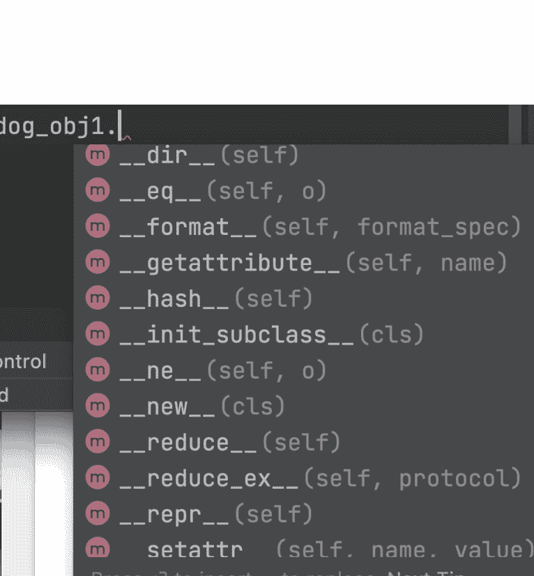

这些函数从何而来？我们知道，Python 自带预定义的方法和函数。在这种情况下，`dog_obj1` 或任何实例都会从 Python 内置的基类 `Object` 继承。这意味着 `dog_obj1` 是 `Dog` 类、`Mammal` 类和 `Object` 类的实例。如果我尝试打印以下代码，结果必须是 `True`：

```python
print(isinstance(dog_obj1, Dog))  True
print(isinstance(dog_obj1, Mammal))  True
print(isinstance(dog_obj1, object))  True
```

这就是为什么 `dog_obj1` 可以访问 `Dog`、`Mammal` 和 `Object` 基类的所有方法。Python 的字符串、列表、字典等也可以访问这些方法：

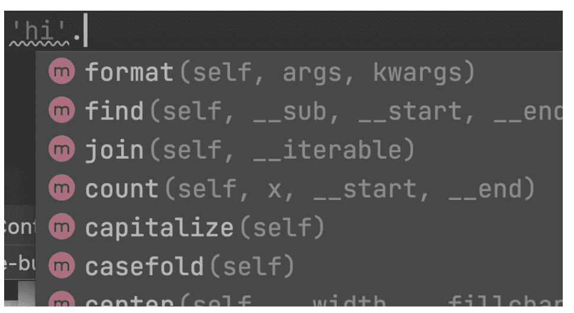

现在我们知道，尽管 `Mammal` 类是第一个定义的父类，但它同样也继承自基类 `Object`，因此我们甚至可以这样写：

```python
class Mammal(object):
```

## 面向对象编程的第4大支柱——多态

这个支柱有一个非常长且不寻常的名字，因为它源于希腊语，意思是“多种形态”（poly - 多，morphism - 形式）。多态是指一个函数或类方法具有相同的名称，但在不同的场景和用法中以不同的方式使用。多态是面向对象编程最基本的支柱之一。在前面的父类-子类例子中，我们看到不同的类可以共享它们的方法，因此 `eat` 方法被这两个类共享，但每个类使用这个方法做的事情不同。方法名相同，但功能和输出不同：

```
******** Mammal class instances output! ********
Elephant eats different types of foods!
******** Dog class instances output! ********
Benn eats only dog food!
```

多态的另一个简单例子是我们使用 Python 内置的 `len()` 函数。这些函数可以被许多不同的 Python 数据类型调用/使用：

```python
print("******** len() function polymorphism example! ********")
str_obj = "Polymorphism"
list_obj = ["Java", "Python", "Ruby", "C#", "PHP", "C++"]
dict_obj = {
    "brand": "Tesla",
    "model": "Funny names :)",
    "year": 2023
}
print(len(str_obj))
print(len(list_obj))
print(len(dict_obj))
```

输出结果：

```
******** len() function polymorphism example! ********
12
6
3
```

这证明了 `len()` 函数适用于不同的数据类型，如字符串、列表和字典，并给出结果，因此 `len()` 函数实际上具有多种形态。演示多态的另一种方法是使用 `for` 循环，但使用不同的类实例调用相同的方法：

```python
animals = [mammal_obj1, dog_obj1]

for animal in animals:
    animal.eat()
```

列表中的两个对象都属于 `Mammal-Dog` 继承的例子，结果将是：

```
Elephant eats different types of foods!
Benn eats only dog food!
```

从上面的代码可以看出，我们得到两个不同的输出，因为在 `for` 循环中，实际发生的是：

```
mammal_obj1.eat()
dog_obj1.eat()
```

## super() 函数

为了解释 **super()** 函数，我想给你们一个例子，其中有两个类 - `Person` 和 `Employee`。如果你愿意，你可以根据下面的描述自己尝试编写代码，但如果做不到，也不要太苛责自己。

**描述：**

程序应该有两个类。第一个类叫做 `Person`，第二个类叫做 `Employee`。你需要推测它们的关系，以便正确地编写继承。`Person` 类将有以下属性：

-   `name`
-   `dob`（出生日期）
-   `id_number`

在 `Person` 类中，你应该有一个 `info()` 方法，该方法在新行中打印所有 `Person` 的详细信息。`Employee` 类应该能够使用父类的所有属性和方法，但它也应该有新的属性：

-   `salary`
-   `position`

`Employee` 类将有自己的 `info()` 方法，与 `Person` 类中的方法同名，以便它能打印父类的详细信息加上新的 `Employee` 详细信息（方法重写）。最后，你需要创建一个 `Person` 类的实例并调用 `info` 方法，然后创建一个 `Employee` 类的实例并调用 `info()` 方法。

以下是最终代码：

```python
# Parent class
class Person(object):

    def __init__(self, name, dob, id_number):
        self.name = name
        self.dob = dob
        self.id_number = id_number

    def info(self):
        print(f"name: {self.name} \n"
              f"dob: {self.dob} \n"
              f"id: {self.id_number}")

# child class
class Employee(Person):
    def __init__(self, name, dob, id_number, salary, position):
        # invoking the __init__ of the parent class
        Person.__init__(self, name, dob, id_number)
```self.salary = salary
self.position = position

def info(self):
    print(f'姓名: {self.name} \n'
          f'出生日期: {self.dob} \n'
          f'身份证号: {self.id_number} \n'
          f'薪水: {self.salary} \n'
          f'职位: {self.position}')
```

```
# Person 类的实例
print('# Person 类的实例')
person_obj = Person('Andy', '29/09/1999', 1334524)
person_obj.info()
```

```
# Employee 类的实例
print('# Employee 类的实例')
employee_obj = Employee('James', '29/09/1999', 1334524, 7000,
                        'accountant')
employee_obj.info()
```

正如你在 Employee 类中看到的，我们直接从 Person 类调用了 `__init__` 构造函数，因此我们不需要在 Employee 构造函数中再次编写 Person 拥有的所有属性。这将是浪费时间和不必要的代码重复。但这是一种实现方式，还有另一种方式需要我们使用 `super()` 函数。`super()` 函数需要在子类中调用，在我们的例子中就是 Employee 类。`super()` 函数甚至不需要 `self` 关键字：

```
class Employee(Person):
    def __init__(self, name, dob, id_number, salary, position):
        super().__init__(name, dob, id_number)
```

`super()` 被称为 super 是因为它指的是父类（Person），而父类也被称为超类或抽象类。这就是我们如何使用 `super()` 来连接父类和子类。

### Python 中的代码自省

自省允许我们在运行时确定对象的类型。众所周知，Python 中的一切都被视为对象，每个对象都有属性和方法。我们还了解到，父类继承自称为 Object 的基类。在 Python 中，我们有一个内置函数可用于代码自省。第一个函数是一个众所周知的函数，到目前为止我们已经使用过很多次了：

## Type()

```
# 1 type()
str_obj = 'Hi'
list_obj = [1, 5, 7]
int_obj = 10
float_obj = 10.3
dict_obj = {
    "type": "1"
}

print(type(str_obj))
print(type(list_obj))
print(type(int_obj))
print(type(float_obj))
print(type(dict_obj))
```

输出：

```
<class 'str'>
<class 'list'>
<class 'int'>
<class 'float'>
<class 'dict'>
```

## dir()

此函数将返回与对象关联的方法和属性列表。

```
print(dir(dict_obj))
```

输出：

```
['__class__', '__class_getitem__', '__contains__', '__delattr__', '__delitem__', '__dir__', '__doc__', '__eq__', '__format__', '__ge__', '__getattribute__', '__getitem__', '__gt__', '__hash__', '__init__', '__init_subclass__', '__ior__', '__iter__', '__le__', '__len__', '__lt__', '__ne__', '__new__', '__or__', '__reduce__', '__reduce_ex__', '__repr__', '__reversed__', '__ror__', '__setattr__', '__setitem__', '__sizeof__', '__str__', '__subclasshook__', 'clear', 'copy', 'fromkeys', 'get', 'items', 'keys', 'pop', 'popitem', 'setdefault', 'update', 'values']
```

## str()

此函数将所有内容转换为字符串。

```
# 3 str()
list_obj1 = [1, 2, 4]
print(type(list_obj1))
# 转换为字符串
print(type(str(list_obj1)))
```

输出：

```
<class 'list'>
<class 'str'>
```

## id()

此函数将返回对象的 id。

```
# 4 id()
m = [1, 2, 3, 4, 5]
# 打印 m 的 id
print(id(m))
```

输出：

```
4478974848
```

其他有用的代码自省方法包括：

- help()
- hasattr()
- getattr()
- repr()
- callable()
- isinstance
- issubclass
- __doc__
- __name__

如果你打开以下 Python 文档链接，可以阅读更多关于它们的信息：

https://docs.python.org/3/library/functions.html

| 内置函数 | | | |
|---|---|---|---|
| **A** | **E** | **L** | **R** |
| `abs()` | `enumerate()` | `len()` | `range()` |
| `aiter()` | `eval()` | `list()` | `repr()` |
| `all()` | `exec()` | `locals()` | `reversed()` |
| `any()` | | | `round()` |
| `anext()` | **F** | **M** | |
| `ascii()` | `filter()` | `map()` | **S** |
| | `float()` | `max()` | `set()` |
| **B** | `format()` | `memoryview()` | `setattr()` |
| `bin()` | `frozenset()` | `min()` | `slice()` |
| `bool()` | | | `sorted()` |
| `breakpoint()` | **G** | **N** | `staticmethod()` |
| `bytearray()` | `getattr()` | `next()` | `str()` |
| `bytes()` | `globals()` | | `sum()` |
| | | **O** | `super()` |
| **C** | **H** | `object()` | |
| `callable()` | `hasattr()` | `oct()` | **T** |
| `chr()` | `hash()` | `open()` | `tuple()` |
| `classmethod()` | `help()` | `ord()` | `type()` |
| `compile()` | `hex()` | |
| `complex()` | | **P** | **V** |
| | **I** | `pow()` | `vars()` |
| **D** | `id()` | `print()` | |
| `delattr()` | `input()` | `property()` | **Z** |
| `dict()` | `int()` | | `zip()` |
| `dir()` | `isinstance()` | |
| `divmod()` | `issubclass()` | |
| | `iter()` | | |
| | | | **-** |
| | | | `__import__()` |

# Dunder/魔术方法

Dunder 或魔术方法在 Python 中非常重要。我们已经简要提到过它们，但在本节中，我们将更详细地讨论它们。我们使用过的一个 dunder 方法的例子是 `__init__` 方法，也称为构造函数。`__init__` 是一个魔术方法，因为当从该类创建一个实例（对象）时，它会被自动调用。幸运的是，Python 提供了许多 dunder/魔术方法，如 `len()`、`print()` 和 `[]`。它们都是 dunder 方法。我们在上一节中看到，当我们在类实例上使用 `dir()` 函数时，输出将是从基类 Object 继承的方法列表：

```
print(dir(person_obj))
```

输出：

```
['__class__', '__class_getitem__', '__contains__',
 '__delattr__', '__delitem__', '__dir__', '__doc__', '__eq__',
 '__format__', '__ge__', '__getattribute__', '__getitem__',
 '__gt__', '__hash__', '__init__', '__init_subclass__',
 '__ior__', '__iter__', '__le__', '__len__', '__lt__',
 '__ne__', '__new__', '__or__', '__reduce__', '__reduce_ex__',
 '__repr__', '__reversed__', '__ror__', '__setattr__',
 '__setitem__', '__sizeof__', '__str__', '__subclasshook__',
 'clear', 'copy', 'fromkeys', 'get', 'items', 'keys', 'pop',
 'popitem', 'setdefault', 'update', 'values']
```

我们说过双下划线使这些方法被视为 dunder 或特殊方法，但 `len()` 函数没有下划线，而我却说它是一个 dunder 方法。嗯，`len()` 实际上是在 dunder 方法的帮助下实现的。`len()` 函数将给我们长度，例如，如果我们有一个像这样的列表：

```
list_obj = [1, 3, 5, 7, 9]
```

我们可以使用 `len()` 函数来获取列表长度：

```
print(len(list_obj))
```

结果将是 5，因为上面的列表中有五个项目。在后台，`len()` 是作为 dunder 方法实现的，Python 允许我们直接在对象或我们类的实例上使用这种方法。我将创建一个 Car 类和一个实例，只是为了向你展示如何从上图中调用一些 dunder 方法：

```
# 汽车类

class Car(object):
    def __init__(self, color, make, year, size):
        self.color = color
        self.make = make
        self.year = year
        self.size = size
```

```
bmw_car = Car('red', 'bmw', 2022, 'sedan')
```

现在我们可以在这个类上直接调用一些 dunder/魔术方法，比如在 `bmw_car` 实例上直接调用 `__str__()`，像这样：

```
print(bmw_car.__str__())
```

输出将是：

```
<__main__.Car object at 0x10976bd30>
```

`__str__()` dunder 方法将返回对象的字符串版本。str 是内置的字符串类。但是，如果你认为如果我们使用内置的 `str()` Python 函数而不是 dunder 方法会发生什么？

```
print(str(bmw_car))
```

输出将完全相同，我为什么要向你展示这个？嗯，dunder 方法 `__str__()` 允许我们使用 Python 内置函数 `str()` 并避免复杂性。如果你想阅读关于 dunder 方法的内容，你可以点击以下链接，但有时 Python 文档可能会让人不知所措：

https://docs.python.org/3/reference/datamodel.html#specialnames

如果你只阅读上面链接中的几段，你会发现我们可以对这些方法进行基本的自定义，这正是我想教的。简而言之，我们可以修改现有的 dunder 方法并创建我们自己的方法。魔术/dunder 方法可以帮助我们覆盖内置函数的功能，并使它们针对特定类进行自定义。例如，让我们修改 `__str__()` dunder 方法以返回一些内容而不是内存位置：

```
# 汽车类

class Car(object):
    def __init__(self, color, make, year, size):
        self.color = color
        self.make = make
        self.year = year
        self.size = size

    def __str__(self):
        return f'{self.make}'


bmw_car = Car('red', 'bmw', 2022, 'sedan')

# 调用 dunder __str__ 方法：
print(bmw_car.__str__())

# 与上面完全相同的是内置的 str() 函数
print(str(bmw_car))
```

如果我们现在运行相同的代码，输出应该会改变：

##  dunder 魔术方法

正如你所看到的，我们使用了 dunder 方法来改变方法的返回值，并且可以完全覆盖其功能。你不应该修改 dunder 方法，但需要注意这些修改不会对每个类都起作用，因为它们不是永久的，也不是全局的。在我们的例子中，我们并没有完全改变 Python 方法 `__str__()`。它只会对 `Car` 类及其该类的实例生效。这意味着如果我有另一个类并创建该类的实例，然后尝试使用 dunder 字符串方法 `__str__()`，其输出将与原始的 Python 实现相同。让我们看看另一个 dunder 方法 `__del__`。这个方法与 C++ 中的析构函数非常相似，这些析构函数用于销毁对象状态。所以，与其销毁变量或对象，不如修改这个 `__del__` 来打印 “Deleted”：

```python
def __del__(self):
    print('Deleted')
```

我们可以这样调用它：

```python
# 调用 del 方法
del bmw_car

# 如果我们尝试访问 bmw_car 对象，将会出现错误
print(bmw_car)
```

输出：

```
Deleted
Traceback (most recent call last):
  File "/Users/rick/PycharmProjects/chapter4/dunder_magic_methods.py", line 41, in <module>
    print(bmw_car)
NameError: name 'bmw_car' is not defined
```

它仍然会在程序结束时运行析构函数，并删除对该对象的所有引用。`del` 在 Python 中通常不那么受欢迎，如果你使用它可能会遇到一些问题，因为它不会只删除单个对象或变量，而是删除连接到该对象或变量的所有引用。但知道它存在总是好的。还有另一个 dunder 方法叫做 `delete`。`__del__` 和 `__delete__` 都是 Python 中的 dunder 方法。`__delete__` 会删除描述符属性，我们可以在需要时执行它。它不会在程序结束时像 `__del__` 那样运行。

```python
# 调用 __delete__
def __delete__(self, instance):
    print("Deleted")
```

让我们来谈谈另一个 dunder 方法 `__call__`。`call` 将赋予我们的类独特的功能：

```python
def __call__(self):
    return 'Called!'
```

现在我们实际的对象 `bmw_car` 可以使用这些括号 `()` 来调用，或者像调用函数一样调用：

```python
print(bmw_car())
```

结果将是：

```
5
bmw
bmw
Called!
Deleted
Traceback (most recent call last):
  File "/Users/rick/PycharmProjects/chapter4/dunder_magic_methods.py", line 48, in <module>
    print(bmw_car)
NameError: name 'bmw_car' is not defined
```

我想提到的另一个 dunder 方法是 `__getitem__()`。如果在类中使用此方法，它将允许该类的实例使用方括号 `[]` 并传递索引以从列表、字典或元组中获取项或值。所以让我们在类中定义另一个字典类型的属性：

```python
class Car(object):
    def __init__(self, color, make, year, size):
        self.color = color
        self.make = make
        self.year = year
        self.size = size
        self.engine_dict = {
            'automatic': 'Yes',
            'manual': 'No'
        }
```

现在我们可以创建 dunder `__getitem__()` 方法：

```python
def __getitem__(self, index):
    return self.engine_dict[index]
```

最后，我们可以这样调用我们类的实例，在本例中是 `bmw_car`：

```python
# 使用方括号调用 bmw_car 实例
print(bmw_car['manual'])
```

这将给我们键 `'manual'` 的值，即 `'No'`。我想你现在明白我们可以修改 dunder 方法并自定义它们的返回值。修改 dunder 方法不是最好的主意，但有时我们的代码逻辑需要我们这样做。dunder 方法确实是魔术般的，因为它们可以帮助我们改变特定类的方法返回内容的方式。这就是关于 dunder 方法的全部内容，但如果你愿意，可以阅读文档以了解更多信息。在下一节中，我们将关注另一个 OOP 特性，称为多重继承。

#### 多重继承

继承允许我们拥有一个称为子类的类，该类可以继承另一个类的属性和方法。但继承可以有不同类型：

- 单一继承
- 多级继承
- 多重继承
- 多路径继承
- 混合继承
- 层次继承

在我们的案例中，我们想要探索多重继承，它的作用，以及它在 Python 中意味着什么。到目前为止，我们已经完成了单一继承，其中子类只有一个父类/基类，但子类可以有多个父类。派生（子）类可以从多个类继承所有属性和方法。请看下面的图：

我们有多个父类，子类可以继承父类中定义的所有方法和属性。这非常强大，并非所有的编程 OOP 语言都允许这样做。在下面的例子中，我们将有一个父亲类和一个母亲类，它们将被子类继承：

```python
#### 多重继承

# 父亲类
class Father(object):
    def __init__(self, name, age):
        self.name = name
        self.age = age

    def get_name(self):
        print(f'Name: {self.name}')

    def get_age(self):
        print(f"Age: {self.age}")
```

```python
class Mother:
    def __init__(self, name, eyes):
        self.name = name
        self.eyes = eyes

    def get_name(self):
        print(f"Name: {self.name}")

    def get_eyes(self):
        print(f"Color of eyes: {self.eyes}")
```

```python
class Child(Father, Mother):
    def __init__(self, name, personality, gender):
        self.name = name
        self.personality = personality
        self.gender = gender

    def child_info(self):
        print(f"Name: {self.name}\n"
              f"Last name: {self.personality}\n"
              f"gender: {self.gender}\n")
```

```python
# 子类对象

morgan = Child('Morgan', 'cheeky', 'male')
morgan.child_info()
```

正如你所看到的，如果我们依次传递类的名称，并用逗号分隔，我们可以进行多重继承：

```python
class Child(Father, Mother):
```

如果我们运行以下代码，`'morgan'` 实例将调用自己的方法 `'child_info'`：

```
运行: multiple_inheritance
/Users/rick/PycharmProjects/chapter4/venv/bin/python /Users/rick/PycharmProjects/chapter4/multiple_inheritance.py
Name: Morgan
Last name: cheeky
gender: male
```

但由于我们有多重继承，这自动意味着我们可以访问所有父亲和母亲的功能（属性和方法）。如果我们键入实例名称和点，我们将拥有 `‘morgan'` 对象可用的每个属性和方法的列表：

从上面的图中，我们可以看到由于继承，我们可以访问在父亲类中定义的 `name` 属性和 `get_name()` 方法。所以让我们调用 `get_name()` 方法并打印其结果：

这工作得很好，现在让我们测试一下 `get_age()` 方法：

从上面的图中，我们看到一个属性错误，说 `‘Child'` 对象没有 `age` 属性，这是正确的，因为这是我们 `Morgan` 对象：

```python
morgan = Child('Morgan', 'cheeky', 'male')
```

我们可以通过在末尾添加 `age` 来解决这个问题。例如，让我们添加 2（代表两岁）：

现在我们得到一个 `TypeError`，说子构造函数 `__init__()` 方法不接受 5 个参数，那么我们能做什么呢？好吧，有一件事我们还没做，就是我们从未在子构造函数中调用父亲构造函数，所以让我们来改变这一点，并在 `Child` 构造函数函数中添加几行代码：## MRO – 方法解析顺序

在处理多重继承时，我们可能会遇到问题。这就是为什么我提到多重继承并非所有面向对象编程语言都支持的特性，因为它们希望避免复杂性。例如，我们有一个类 A，它继承自另外两个类 B 和 C，这与上一节中我们看到的“子类、父类和母类”场景完全相同。但想象一下这两个类（B 和 C）都继承自第四个类 D。让我们看一下下面的图示：

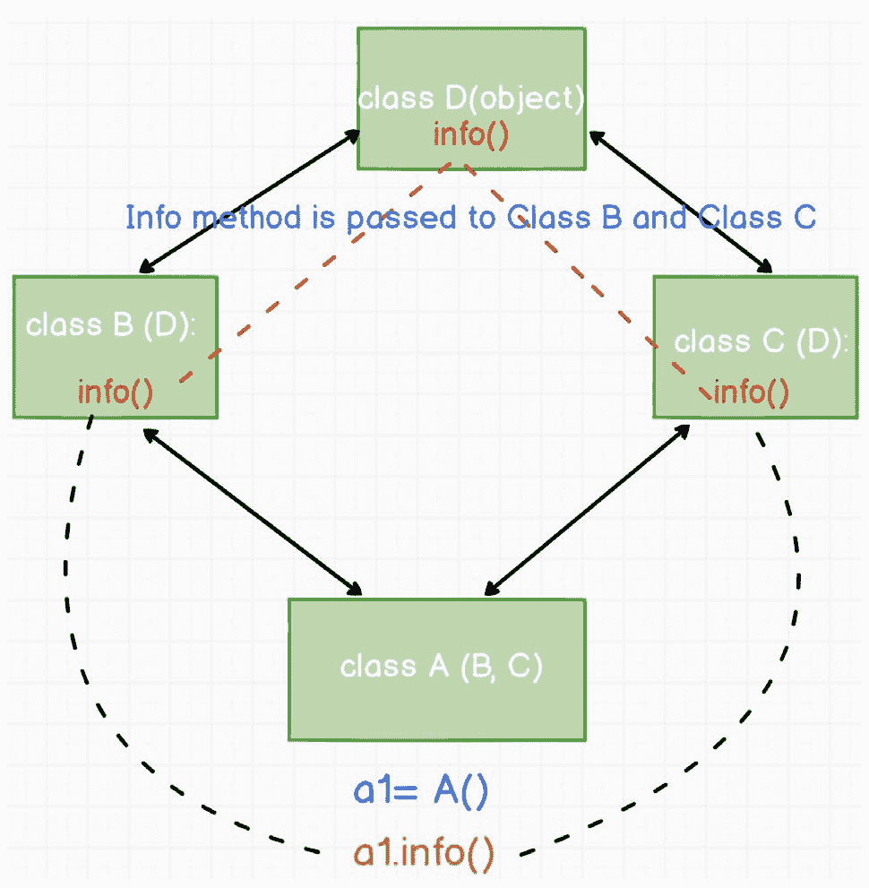

我知道这张图令人困惑，所以让我解释一下发生了什么。类 B 和类 C 都继承自父类 D，其中我们有一个名为 `info()` 的方法。由于继承关系，这个方法现在在类 B 和类 C 中都可用。另一方面，类 A 继承了类 B 和类 C 的所有功能。当我们实例化类 A 并调用 `info()` 方法时，这个方法来自哪里？它来自类 B 还是类 C？这由线性化算法决定。MRO（方法解析顺序）是一种算法，它将决定如何排列类以及使用哪个类的方法。因此，线性化将创建一个包含所有祖先类（包括类本身）的列表，并通过将最靠近的放在前面、最远离的放在后面来排序。简单来说，MRO 是 Python 遵循的一条规则，用于确定首先调用哪个对象。好的，让我们创建一个新的例子来看看 MRO 算法是如何工作的：

```python
# MRO - Method Resolution Order

# class A

class A:
    def __init__(self, length=5):
        self.length = length

    def info(self):
        return self.length


class B(A):
    pass


class C(A):
    def __init__(self, length=2):
        self.length = length

    def info(self):
        return self.length


class D(B, C):
    pass

# instance of class D
d_ob1 = D()
print(d_ob1.info())
```

如果我们勾勒出整个关系，最终会得到这张图：

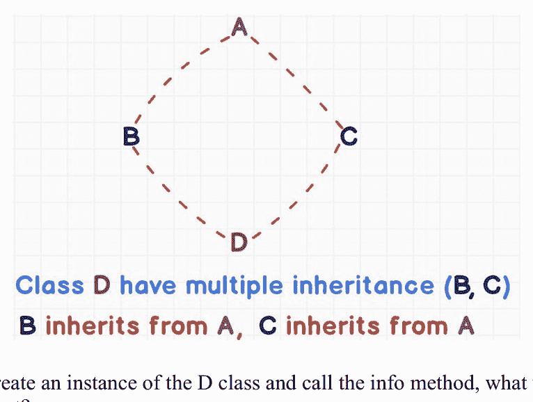

如果我们创建一个 D 类的实例并调用 `info` 方法，输出会是什么？

```python
# instance of class D
d_ob1 = D()
print(d_ob1.info())
```

输出将是 2 而不是 5，为什么呢？嗯，这是因为 MRO 算法的工作原理不会遵循我们人类的逻辑，它不会顺时针从类 A 直接获取方法：

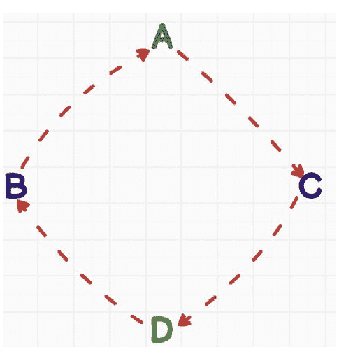

因此，当我们有同名的方法或属性时，MRO 将考虑哪个在先。它将考虑应该首先从哪个类继承：

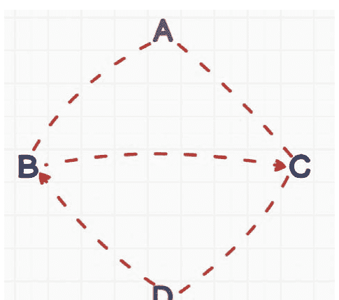

在 Python 中，有一个名为 `mro()` 的方法，它会告诉我们算法将使用的精确顺序，所以我们需要做的就是输入：

```python
print(D.mro())
```

输出：

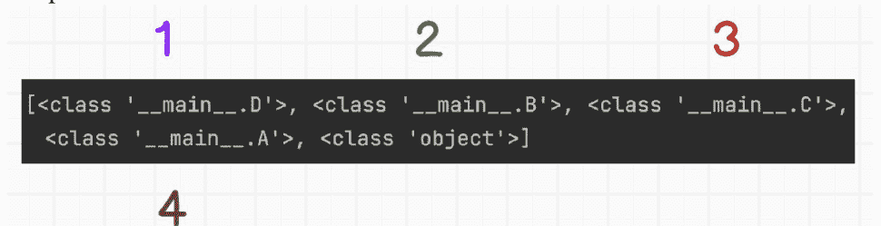

从上图中，我们可以看到算法的顺序。首先，它会检查 `info` 方法是否在类 D 中，然后进入类 B 并检查，接着是类 C，然后是类 A，最后是每个类都继承的基础 Object 类。方法解析顺序在更复杂的场景中并不容易理解。你能猜出下面的输出吗：

```python
class First:
    pass

class Second:
    pass

class Third:
    pass

class Fourth(First, Second):
    pass

class Fifth(Second, Third):
    pass

class Sixth(Fifth, Fourth, Third):
    pass
```

```python
print(Sixth.mro())
```

这种关系的图示：

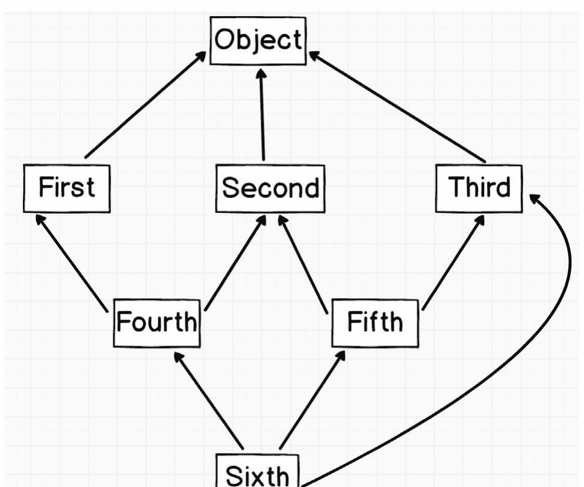

以下是输出（请尝试猜测输出）：

```
[<class '__main__.Sixth'>, <class '__main__.Fifth'>, <class '__main__.Fourth'>, <class '__main__.First'>, <class '__main__.Second'>, <class '__main__.Third'>, <class 'object'>]
```

为什么 MRO 在上图中先访问 Sixth 然后 Fifth 而不是 Fourth 类？嗯，因为对于 MRO 来说，我们传递类的顺序很重要。看看代码的最后一行：

```python
class Sixth(Fifth, Fourth, Third):
```

从上面的代码来看，顺序从 Fifth 开始，然后是 Fourth，最后是 Third。但从上图中，我们可以看到它从 Sixth 开始，然后到 Fifth 和 Fourth，但它没有进入 Third，而是直接进入 First、Second，最后是 Third。这是因为 MRO 使用的一种叫做**深度优先搜索**的算法造成的，但这是一个更高级的概念，不在本书的范围内。MRO 的算法与 Python 以前版本中使用的不同。

### 总结

本章包含大量信息和新概念。我知道对你们中的一些人来说这是迄今为止最困难的一章。我的建议是不要气馁，因为我可以向你保证，只要你持续练习和阅读，你将学会所有的面向对象特性。慢慢来，重新阅读某些章节，永不放弃。让我们准备好进入名为“模块”的新章节，我承诺，最困难的部分已经涵盖。

## 第5章 – Python – 模块与包

在本章中，我们将学习关于 Python 模块和包的所有内容。Python 模块只是一个包含 Python 代码的文件。在模块内部，我们可以定义类、函数和变量。在模块中，我们组织相关的代码。到目前为止，我们已经以几种不同的方式组织和分组了代码。第一种方式是使用文件，所以这里是我上一章创建的一些文件：

- `chapter4` (~/PycharmProjects/chapter4)
    - `venv`
    - `class_constructor.py`
    - `class_methods.py`
    - `class_object_attributes.py`
    - `classes.py`
    - `code_introspection.py`
    - `dunder_magic_methods.py`
    - `encapsulation.py`
    - `inheritance.py`
    - `inheritance_example.py`
    - `main.py`
    - `method_overriding.py`
    - `mro.py`
    - `multiple_inheritance.py`
    - `person.py`
    - `person_employee.py`
    - `polymorphism.py`
    - `public_private_variables.py`
    - `static_class_method.py`
- `External Libraries`
- `Scratches and Consoles`

将代码组织到不同的文件中是一种方式，但我们也可以将代码组织成函数。如你所知，Python 中的函数被视为单个单元或代码块，因此我们可以在需要时调用和运行它们。组织代码的第三种方式是使用类。类是蓝图或模板，我们可以从中实例化或创建对象。Python 为我们提供了不同的方式来组织和分组相关代码。在下一节中，我们将讨论如何使用模块来组织和分组代码。

### 为什么我们需要 Python 模块？

我们需要模块，是因为我们希望将大型代码拆分成有意义的较小部分。如果我们想编写复杂的程序，类、函数和文件并不是解决方案。这就是为什么我们需要模块。那么，什么是模块？模块是一个单独的 Python 文件（`.py`），其中包含代码。我们使用模块将代码划分到多个相关文件中。在我的 **PyCharm** IDE 中，我将创建几个文件来帮助解释模块是如何工作的。首先，让我们创建一个名为 chapter5 的新项目（如果你自己尝试，可以随意命名你的文件夹）。那么，如何在 PyCharm 中创建新项目呢？很简单，转到菜单并选择 **文件 > 新建项目：**

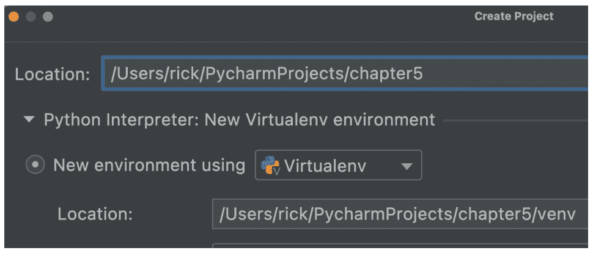

创建文件夹后，你会得到一个名为 **venv** 的目录，在这个阶段你不必担心它的作用和含义：

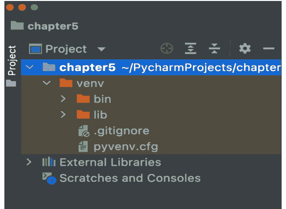

当你创建新文件或我们现在称之为模块的文件时，你不应该将它们创建在 **venv** 文件夹内，而应该创建在 **chapter5** 目录之外。让我们创建一个名为 **main.py** 的文件：

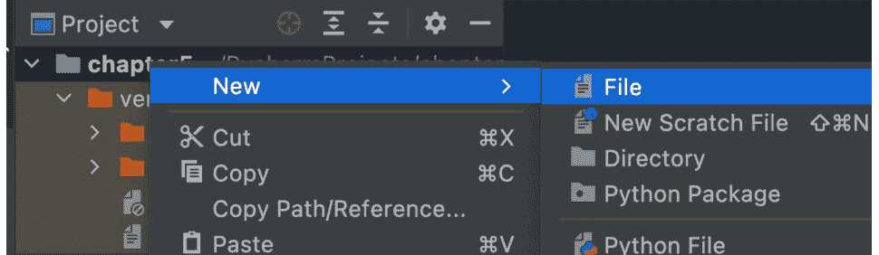

这是新文件现在的样子：

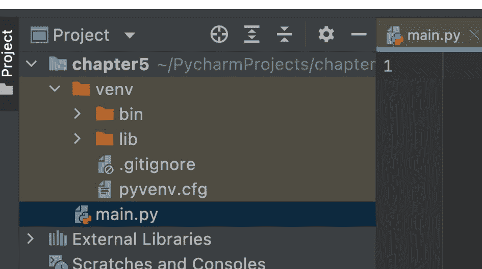

我们可以重复相同的步骤，创建另一个名为 **utility.py** 的 Python 文件。现在我们的 chapter5 文件夹看起来像这样：

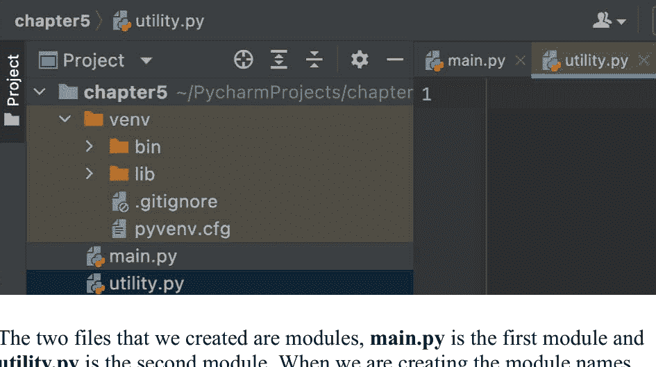

我们创建的两个文件就是模块，**main.py** 是第一个模块，**utility.py** 是第二个模块。当我们创建模块名称时，我们需要使用 **snake_case** 语法，就像我们为变量所做的那样。这意味着如果模块名称由两个单词组成，我们需要在它们之间使用下划线。所有字母都应该是小写的：

在 **utility.py** 模块中，我们可以编写一些基本的数学函数，而 **main.py** 模块将调用和使用这些函数。让我们先在 **utility.py** 模块中编写几个简单的数学函数：

```python
def sum_fun(num1, num2):
    return num1 + num2

def divide_fun(num1, num2):
    return num1 / num2

def multiply_fun(num1, num2):
    return num1 * num2
```

我的 **main.py** 模块的目的是什么？嗯，我想在 main.py 模块中使用在 utility 中定义的函数。问题是我如何将它们连接起来？在 Python 中，当我们想导入一个文件时，可以使用关键字 `import`。在 main.py 文件中，我们使用导入语法：

```python
import utility
```

如上图所示，我没有包含扩展名 `import utility.py`，因为默认模块就是 Python 文件。如果我们打印 utility，你认为输出会是什么：

```python
import utility
print(utility)
```

输出：

```
<module 'utility' from
  '/Users/rick/PycharmProjects/chapter5/utility.py'>
```

如你所见，它将打印 **utility.py** 文件的实际文件路径。如果你在自己的机器上尝试，或者你仍然使用 `replit`，路径会有所不同。它会为你提供不同的路径，因为该网站会为你生成一个路径。现在我们的文件/模块已经链接起来，我们只需要使用点语法就可以开始使用这些函数：

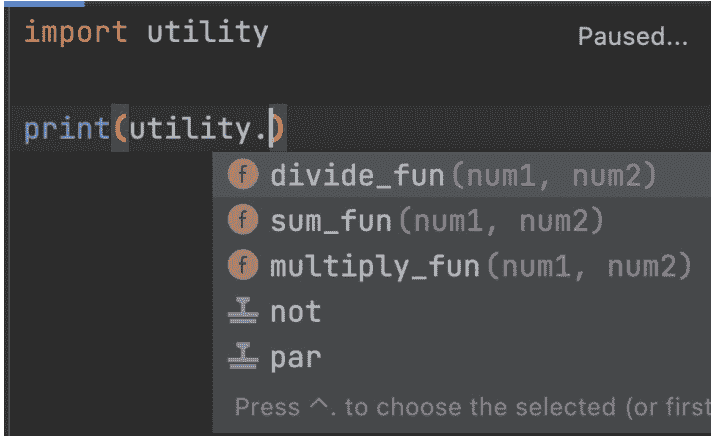

如你所见，我们在 utility 模块中声明的任何内容现在都可以在 main.py 模块中访问。让我们使用 utility 文件中的函数进行一些基本的数学计算：

```python
import utility

num1 = 6
num2 = 3

sum_result = utility.sum_fun(num1, num2)
divide_result = utility.divide_fun(num1, num2)
multiply_result = utility.multiply_fun(num1, num2)

print(sum_result)
print(divide_result)
print(multiply_result)
```

输出是：

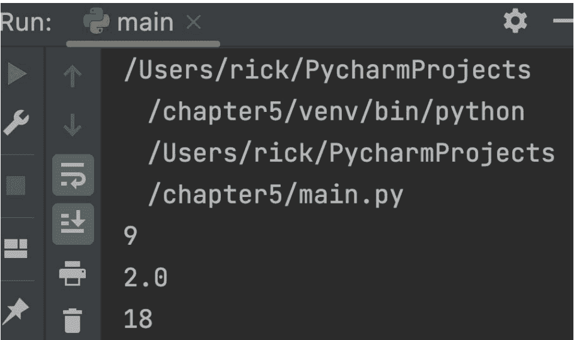

如果我有一个非常大的项目，有很多文件需要导入怎么办？嗯，你可以在主文件中进行多次导入，像这样：

```python
import utility
import utility1
import utility2
import utility3
```

### Python 包

想象一下，我们的项目变得越来越大，我们每天都在添加新功能，并且我们希望将这些功能包含在单独的文件夹或包中。在 Python 中，如果我们右键单击 chapter5，然后选择 新建 > Python 包，并将包命名为 `exponents`（如果你愿意，可以使用不同的名称），我们就可以创建新的包：

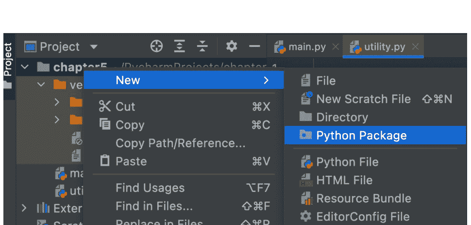

如你所见，我们甚至可以创建一个包，甚至是一个新目录，但让我们选择包：

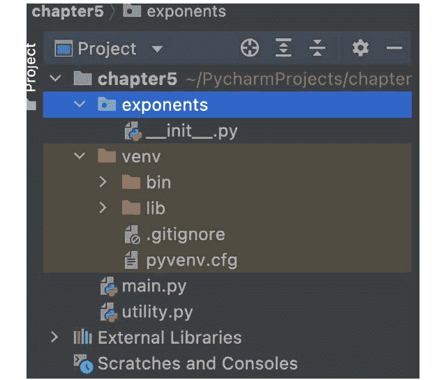

在 chapter5 内部，我们创建了一个名为 **exponents** 的包，里面有一个名为 `__init__.py` 的文件。如果我们打开它，这个文件将是空的，它随我们创建的包一起提供。在这个 **exponents** 文件夹中，我们需要创建一个名为 **pow_of.py** 的新文件。

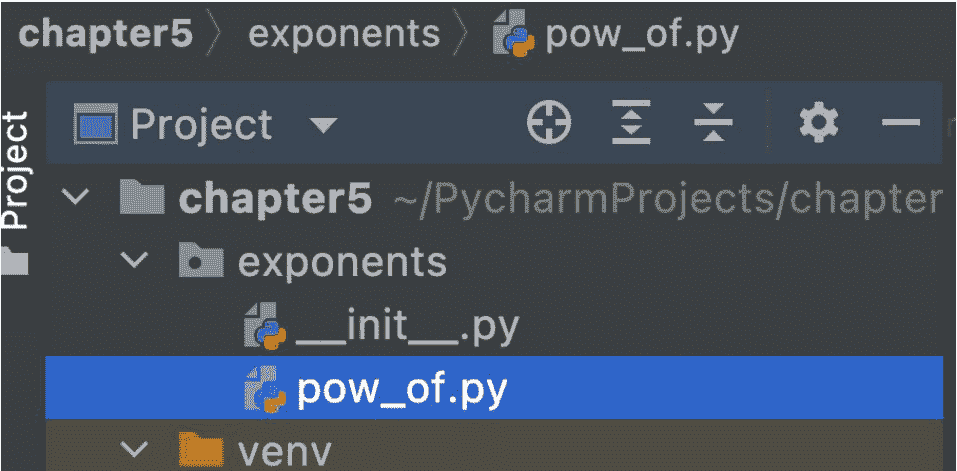

在这个文件中，我将添加一个函数来计算一个数的平方：

```python
def pow_fun(num):
    return num ** 2
```

让我们尝试在 `main.py` 文件中使用 import 语法导入 `pow_of`：

```python
import utility
import pow_of
```

现在让我们打印以下代码：

```python
pow_result = pow_of.pow_fun(num1)
print(pow_result)
```

输出将是：

```
Traceback (most recent call last):
  File "/Users/rick/PycharmProjects/chapter5/main.py", line 2, in <module>
    import pow_of
ModuleNotFoundError: No module named 'pow_of'
```

如你所见，找不到该模块。为什么会出现这个错误？我们创建的名为 `exponents` 的包可能看起来像一个普通的文件夹或目录，但它被认为是一个包。这个包与 `main` 和 `utility` 等其他模块处于不同的层级。因此，这个包中的文件可以这样导入到 Python 中：

```python
import exponents.pow_of
```

在我们做任何事情之前，让我们打印这个并查看输出：

```python
print(exponents.pow_of)
```

输出将是一个路径，指向位于 `exponents` 包中的 `pow_of` 文件（如果你在自己的计算机上尝试相同的示例，路径会有所不同）：

```
<module 'exponents.pow_of' from '/Users/rick/PycharmProjects/chapter5/exponents/pow_of.py'>
```

最后，让我们检查一下我们在 `pow_of` 模块中声明的函数现在是否可以在主文件中访问：

```python
print(exponents.pow_of.pow_fun(num1))
```

输出：

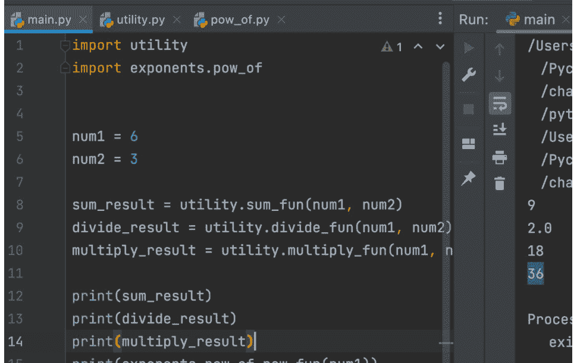

看起来我们所做的一切都正常工作，因为我们得到了结果 36，而 6 的 2 次方正好是 36。好的，现在让我们谈谈当我们创建包时为我们创建的 `__init__.py` 文件。如果你使用 replit.com，你将没有这个文件，因为该网站通常隐藏这类文件。为什么 Python 会创建这个空文件？创建这个文件是为了告诉 Python 这是一个包，你需要从这里导入文件。

### 使用 from-import 语法导入模块

在本节中，我们将学习导入模块的不同方式。让我们在现有的 `exponents` 包内创建另一个名为 `extra_functions` 的包在 `extra_functions` 目录中，我们可以创建一个名为 `modulo_fun.py` 的新文件，并在此文件中添加以下函数：

```
def modulo_fn(num1, num2):
    return num1 % num2
```

然后，我们使用之前学过的 `import` 语句，在我们的 `main.py` 模块中调用这个模块：

```
import exponents.extra_functions.modulo_fun
```

如你所见，`import` 行变得越来越长，看起来不太美观。让我们尝试在 `main.py` 文件中使用 `modulo_fn`：

```
import utility
import exponents.pow_of
import exponents.extra_functions.modulo_fun

num1 = 6
num2 = 3
print(exponents.extra_functions.modulo_fun.modulo_fn(num1, num2))
```

这就是所有文件的连接方式：

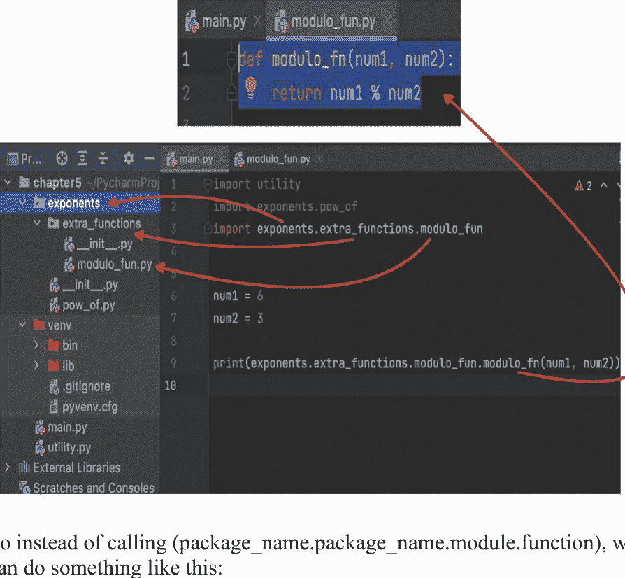

因此，我们不必调用 `(package_name.package_name.module.function)`，可以这样做：

```
from exponents.extra_functions.modulo_fun import modulo_fn
```

现在，`modulo_fn` 就可以像在 `main.py` 中直接声明的一样使用了：

```
print(modulo_fn(num1, num2))
```

如果模块中有多个我们想导入的函数会发生什么？让我们将 `import utility` 语句重写为：

```
from utility import sum_fun, divide_fun, multiply_fun
```

如你所见，我们列出了所有函数，用逗号分隔，并且我们可以像这样从 `main.py` 模块中调用这些函数：

```
print(sum_fun(num1, num2))
print(divide_fun(num1, num2))
print(multiply_fun(num1, num2))
```

只要我们遵循 `from-import` 规则，语法就非常简单：

```
from module_name import things
```

但如果我们想导入整个模块并像以前一样使用模块名来访问其函数，我们可以简单地这样做：

```
from exponents.extra_functions import modulo_fun
```

当我们想避免名称冲突时，这种方法更好。什么是名称冲突？这意味着我们可以在不同模块中拥有同名函数，而当我们使用最后一种方法导入它们时，就不会产生名称冲突。

## 使用 `from-import *` 语法导入模块

还有另一种方法可以导入模块中的所有内容，那就是在末尾使用星号。让我们创建一个新文件，它是 `utility.py` 文件的副本，并将其命名为 `utility1.py`：

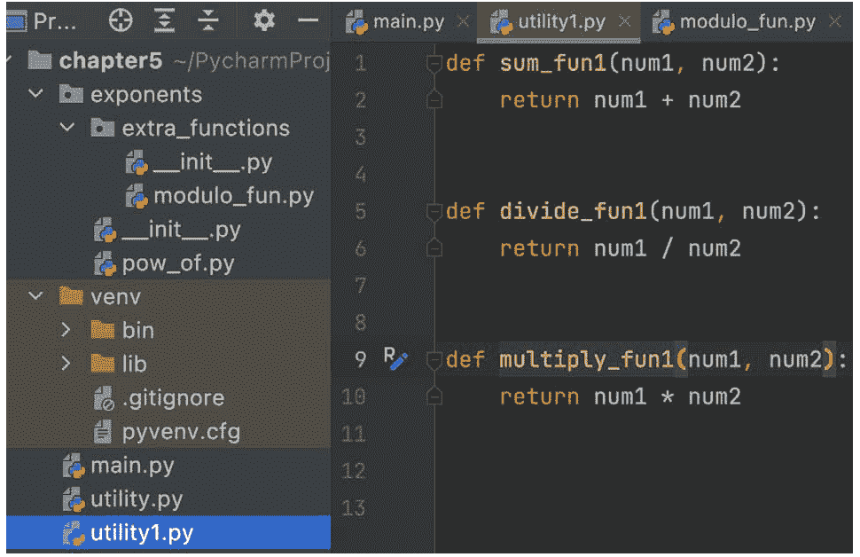

如你所见，我还更改了函数名称以避免任何命名冲突，现在让我们测试这个语法：

```
python
from utility1 import *

```

末尾的星号意味着从 `utility1` 模块导入所有内容，现在你可以这样调用此模块的函数：

```
python
print(utility1.sum_fun1(num1, num2))
print(utility1.divide_fun1(num1, num2))
print(utility1.multiply_fun1(num1, num2))

```

没有一条必须使用的导入语法规则，请选择你最习惯的那一种。

### Python 模块别名

让我们看看如何在 Python 中使用别名来导入特定模块。为了向你展示这一点，我将创建另一个具有长且不寻常名称 `'unnecessary_long_module_name.py'` 的模块：

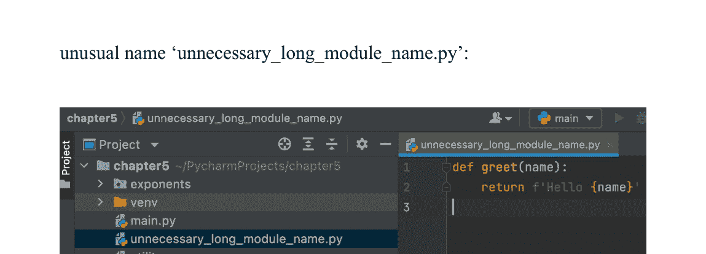

如你所见，我那里只有一个函数来问候用户。现在我们可以使用众所周知的 `from-import` 语法导入此函数：

```
from unnecessary_long_module_name import greet
```

或者，如果我们像这样创建别名，我们可以让它更短、更有意义：

```
import unnecessary_long_module_name as long_module
```

除了 `long_module` 这个名字，我们甚至可以只用一个字母 `'u'` 来让它更短。现在让我们看看是否可以使用 `greet()` 函数：

```
print(long_module.greet('Kevin Hart'))
```

如果我们运行主模块，我们将得到：

```
Hello Kevin Hart
```

通过这样做，我们绝对可以创建避免命名冲突的自定义名称。

## Python `__name__`

我认为现在是解释双下划线 `__name__` 含义的合适时机。如果你到现在还没有见过这段代码，我向你保证有一天你会发现并使用这段代码。那么，Python 变量 `__name__` 是什么？这个变量名前后有两个下划线，当涉及模块时，它对 Python 具有特殊含义。为了展示它的含义，我复制了以前的模块并创建了一个名为 **chapter5.1** 的新文件夹。在此文件夹中，有 `utility.py` 和 `pow_of.py`，我在其中添加了以下代码：`print(__name__)`：

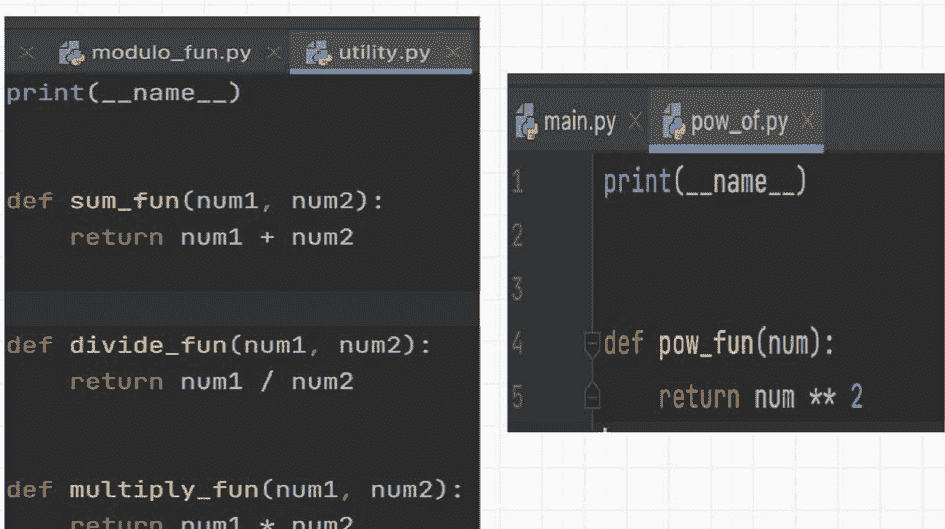

现在当我运行 `main.py` 时，我得到以下输出：

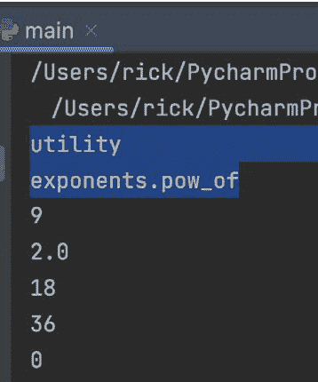

这打印回模块的名称，因为 Python 解释器从我们的 `main.py` 文件开始工作，并从那里调用其余模块。每次解释器访问主文件以外的文件时，它都会运行该文件并将其存储在内存中，包括模块的名称。这是高效的，因为在 `main.py` 文件中，我们可以多次调用属于外部文件的函数，解释器不会一次又一次地运行 `utility` 或 `pow_of` 文件，而是会从内存中获取它们，因为它可以直接访问。你认为如果我们尝试在 `main.py` 文件中直接打印模块名称会发生什么？

```
python
print(__name__)
```

输出将是：

```
python
main
```

让我们将 **main.py** 文件名更改为 **main_file.py**。我们所需要做的就是右键单击 `main.py` 文件，然后选择 `重构` > `重命名`：

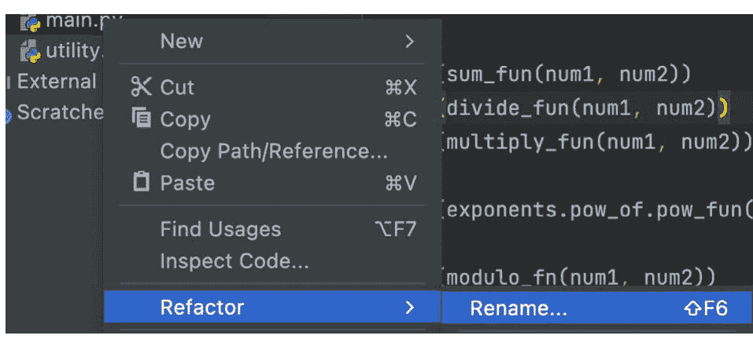

在你重命名此文件后，让我们运行 `main_file.py`：

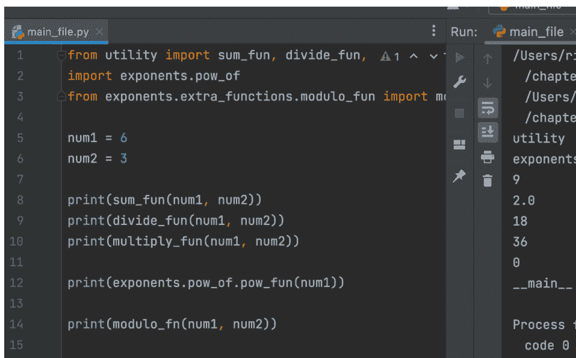

正如我们从上图中看到的，文件名仍然是 `__main__` 而不是 **main_file**，但这是为什么呢？在 PyCharm 中，当我们想要运行代码时，我们通常单击 `RUN` 按钮，它会询问我们想要执行哪个文件。我们选择的文件将是主 Python 文件，这就是为什么 `__main__` 被打印出来，因为无论当前运行的文件叫什么名字，它都是主文件。现在让我们讨论这行著名的代码：

```
python
if __name__ == '__main__':
```

这个 `if` 语句仅在此行位于主文件中时才为真，它在 `utility` 或其他任何不是主文件的文件中不起作用。我们现在可以这样包装其余代码：

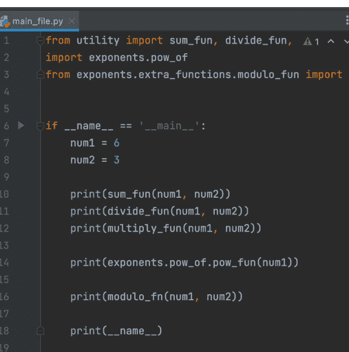

这意味着如果我们在 Python 中运行的文件是主文件，缩进的代码将被执行。

### Python 内置模块

是时候学习 Python 内置模块了。如果我们访问官方 Python 文档，会发现有大量的内置模块：

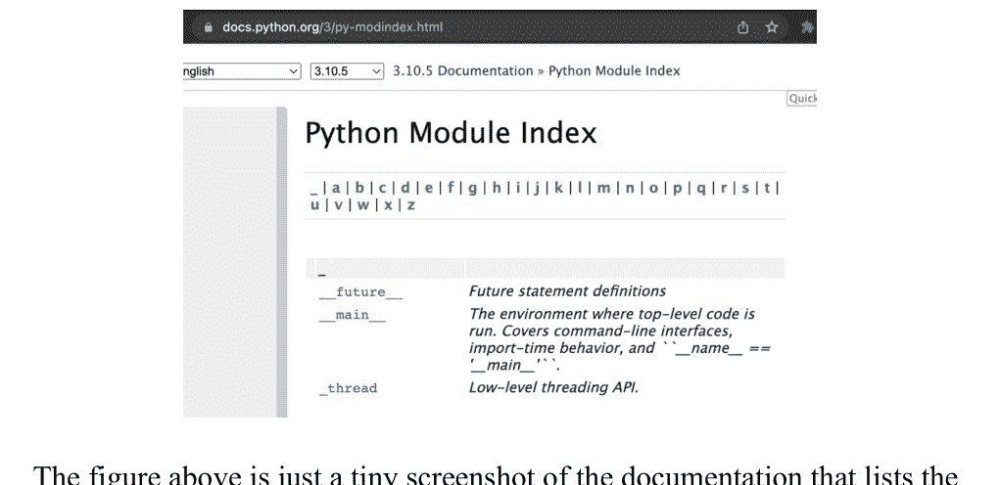

上图只是列出这些模块的文档的一小部分截图，我们不需要记住所有模块，但我们需要熟悉 Python 提供的内容，以便在需要时使用这些内置功能。

文档链接：
https://docs.python.org/3/py-modindex.html

Python 内置模块在 shell 启动时自动加载。我们已经看到了 Python 内置函数，但我们也在模块中有这样的函数，我们只需要知道如何导入它们。为什么需要 Python 内置模块？想象一下你想创建一个应用程序向客户列表发送电子邮件，你可以检查是否存在此类模块，以便可以使用它并快速完成项目，而不是尝试从头开始编码整个应用程序。这些模块随 Python 安装提供，但如果我们想在代码中使用它们，就需要导入它们。例如，到目前为止，我们已经创建了简单的数学函数，但有一个模块处理复杂数学计算，因此我们可以使用这些函数而无需创建它们。该模块名为 `'math'`。在其他编程语言中，这些内置模块被称为库，它们的功能相同。我们实际上可以看到这些模块

当我们使用 PyCharm 创建一个新项目时，在项目中点击“外部库”列表：

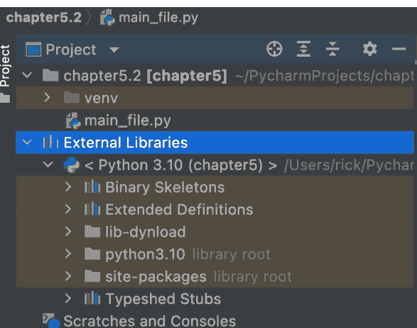

你也可以通过导航到‘python 3.10 library root’来找到它们。你的路径可能略有不同，但点击它，它会展开并显示已安装的包和模块的列表。作为一个练习，让我们导入一些现有的模块，比如 `math` 模块，并尝试打印出它的来源位置：

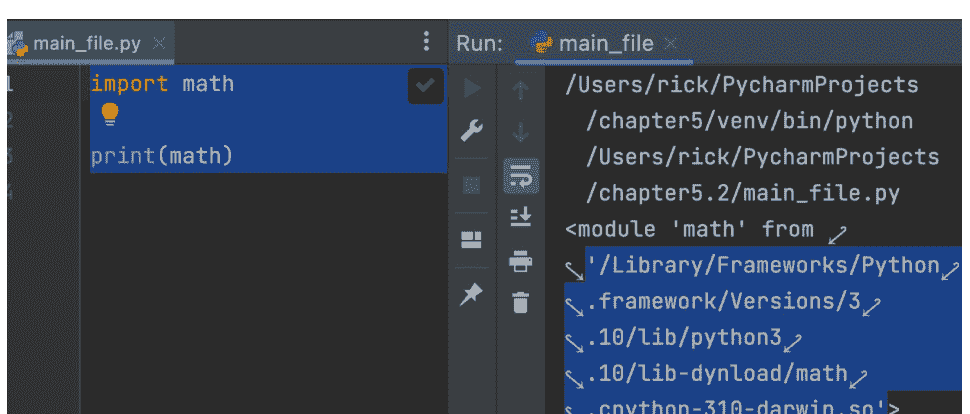

从上图中，我们可以看到这个模块的实际来源路径。另一种显示可用模块列表的方法是使用 `help` 命令：

```
help('modules')
```

以下是模块列表的一部分：

```
Please wait a moment while I gather a list of all available modules...

/Users/rick/PycharmProjects/chapter5/venv/lib/python3.10/site-packages/distutils/_distutils.py:36: UserWarning: Setuptools is replacing distutils.
  warnings.warn("Setuptools is replacing distutils.")
__future__          _testmultiphase   getpass         sched
_abc                _thread          gettext         secrets
_aix_support        _threading_local glob            select
_ast                _tkinter         graphlib        selectors
_asyncio            _tracemalloc     grp             setuptools
_bisect             _uuid            gzip            shelve
_blake2             _virtualenv      hashlib         shlex
_bootsubprocess     _warnings        heapq           shutil
_bz2                _weakref         hmac            signal
_codecs             _weakrefset      html            site
_codecs_cn          _xxsubinterpreters http          smtpd
_codecs_hk          _xxtestfuzz      idlelib         smtplib
_codecs_iso2022     _zoneinfo        imaplib         sndhdr
_codecs_jp          abc              imghdr          socket
_codecs_kr          aifc             imp             socketserver
_codecs_tw          antgravity       importlib       sqlite3
_collections         argparse         inspect         sre_compile
_collections_abc    array            io              sre_constants
```

回到 `math` 模块，如果你有兴趣了解该模块提供了哪些功能，我们可以再次使用 `help` 关键字，并将模块名作为参数提供，像这样：

```
help(math)
```

`help(math)` 会给我们一个关于该模块内容的完整概览。如果我们只对该模块中的方法感兴趣，可以使用 `dir()` 函数：

```
print(dir(math))
```

以下是完整的列表：

```
/Users/rick/PycharmProjects/chapter5/venv/bin/python
/Users/rick/PycharmProjects/chapter5.2/main_file.py
['__doc__', '__file__', '__loader__', '__name__',
 '__package__', '__spec__', 'acos', 'acosh', 'asin',
 'asinh', 'atan', 'atan2', 'atanh', 'ceil', 'comb',
 'copysign', 'cos', 'cosh', 'degrees', 'dist', 'e', 'erf',
 'erfc', 'exp', 'expm1', 'fabs', 'factorial', 'floor',
 'fmod', 'frexp', 'fsum', 'gamma', 'gcd', 'hypot', 'inf',
 'isclose', 'isfinite', 'isinf', 'isnan', 'isqrt', 'lcm',
 'ldexp', 'lgamma', 'log', 'log10', 'log1p', 'log2', 'modf',
 'nan', 'nextafter', 'perm', 'pi', 'pow', 'prod',
 'radians', 'remainder', 'sin', 'sinh', 'sqrt', 'tan',
 'tanh', 'tau', 'trunc', 'ulp']
```

让我们使用其中的一些方法，例如 `log()`，它将返回不同数字的自然对数：

```
print(math.log(2.35657))
print(math.log(3))
print(math.log(1))
```

输出将是：

```
0.8572071720115416
1.0986122886681098
0.0
```

我们甚至可以使用 `math.pow()` 方法，它将返回 x 的 n 次方的值。

```
print(math.pow(3, 3))
```

输出：

```
27.0
```

最后，让我们求一个数的平方根：

```
print(math.sqrt(9))
print(math.sqrt(25))
print(math.sqrt(16))
```

输出：

```
3.0
5.0
4.0
```

## Python 成为一门优秀编程语言的最大原因

到目前为止，我们已经学习了如何创建模块和包，以及如何从包中导入这些模块。在前面的章节中，我们学习了随 Python 一起安装的内置模块库。但还有一点我想提及，它使得 Python 成为有史以来最伟大的语言之一。那就是由各种 Python 开发者创建并共享的数百万个 Python 模块，这样我们就不必浪费时间从头创建它们。这些模块可以被下载并导入到我们的项目中，因为它们是由 Python 社区开发的。来自世界各地的 Python 开发者创建了我们可以使用的不同模块。我们如何使用其他开发者的代码？你可以使用 `pip install` 命令，它能让你在几秒钟内就在你的项目中使用这些模块和代码片段。但我在哪里可以找到并了解更多关于其他开发者创建和共享的内容呢？有一个专门的网站叫做 `pypi.org`，即 Python 包索引。**PyPi** 是一个 Python 编程语言的软件仓库，它帮助我们查找和安装由 Python 社区开发的软件。以下是 Python 包索引 (PyPi) 的实际链接和截图：

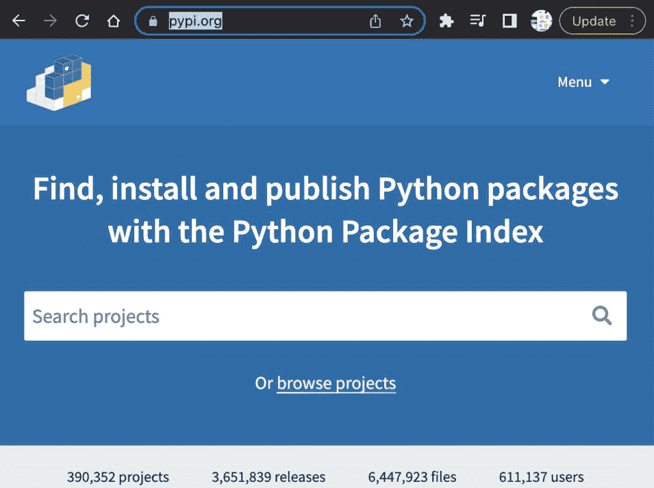

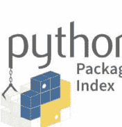

**Python 包索引 (PyPI) 是一个面向 Python 编程语言的软件仓库。**

PyPI 帮助你查找和安装由 Python 社区开发和共享的软件。[了解如何安装包](url)。

包作者使用 PyPI 来分发他们的软件。[了解如何为 PyPI 打包你的 Python 代码](url)。

[https://pypi.org/](https://pypi.org/)

目前，我们拥有 611,137 名用户和超过 390,352 个项目，并且这些数字未来只会增长。这向你展示了 Python 的真正力量。例如，如果你想让你的网站更快，所有图片都得到优化，你可以搜索 pypi 上是否存在这样的东西：

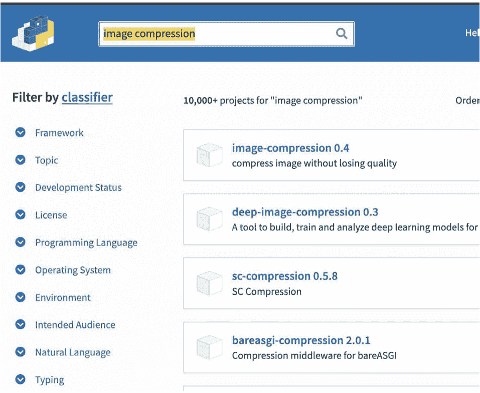

你可能会看到一个包含不同项目的列表，你需要做的就是找到一个适合你项目的包并安装它。并非所有的包都适合并且会定期维护，所以你需要决定哪个包最适合你的项目。我向你展示了这两个网站（Python 模块索引文档和 PyPi），这样你就可以找到帮助你更快构建程序的模块和包。

## 使用 PyPi 仓库安装 Python 包

我们知道 **PyPi** 是一个仓库网站，我们可以在那里查找、安装甚至发布 Python 包。只是为了向你演示如何使用 PyCharm 查找和安装包，我进行了一个非常简单的 Google 搜索，并发现了一些非常有趣的东西。我们将安装的这个包很有趣但没什么用，意思是它只会告诉我们 Python 笑话，没有别的。Google 上有很多这样的包。当你输入“Fun/Weird Python Packages”时，你会找到非常有趣的包和实验。我们将要安装的包叫做 **pyjokes**。让我们打开网站 [pypi.org](https://pypi.org/) 并在搜索栏中搜索名为 **pyjokes** 的项目，像这样：


这将列出所有项目，但请确保你点击那个写着“One-line Jokes for programmers (jokes as a service)”的条目：

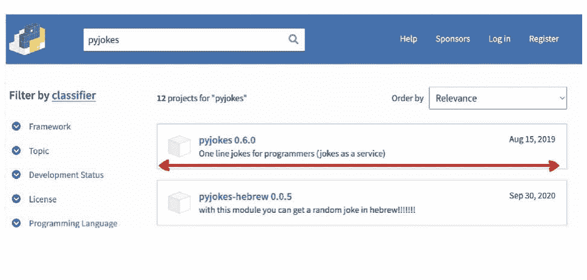

正如你所见，pyjokes 已经有几个版本，目前最新的版本是 0.6。如果你打开这个包，可以找到额外的信息：

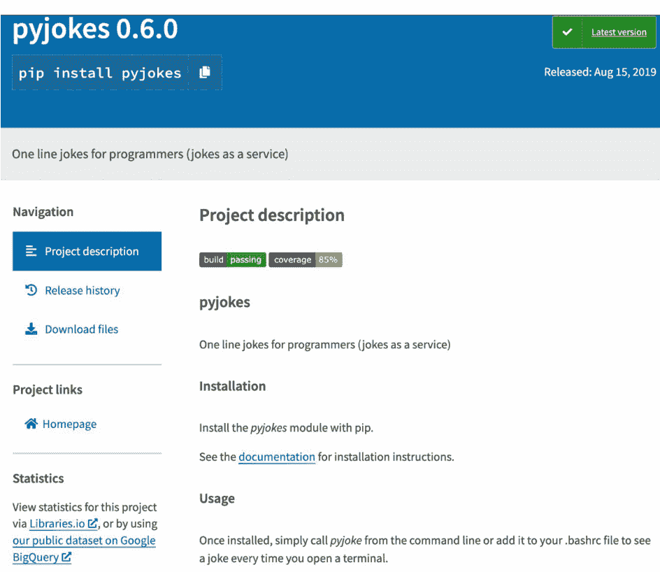

在这个页面上，你可以阅读更多关于这个项目的信息、如何使用 pip 安装 pyjokes 模块以及如何使用它。你可以下载文件，或者访问 GitHub 页面。GitHub 对程序员来说就像是 Facebook (Meta) 或 Twitter。它是一个社交网络，你可以在那里上传你的作品，以便其他开发者克隆和下载。你还可以看到一些统计数据，例如有多少人喜欢了你的项目（会有点赞），或者有多少人复刻并在他们自己的项目中使用了你的代码。我们可以通过多种方式安装这个包/模块，首先我将向你展示如何使用 PyCharm 来完成。我已经创建我之前项目的一个副本，我将其命名为“chapter5.3-packages”。如果你自己尝试，可以将项目命名为任意你想要的名字。现在让我们打开菜单，选择 **PyCharm>偏好设置**，然后 **选择项目：**，接着找到并选择 **Python解释器：**

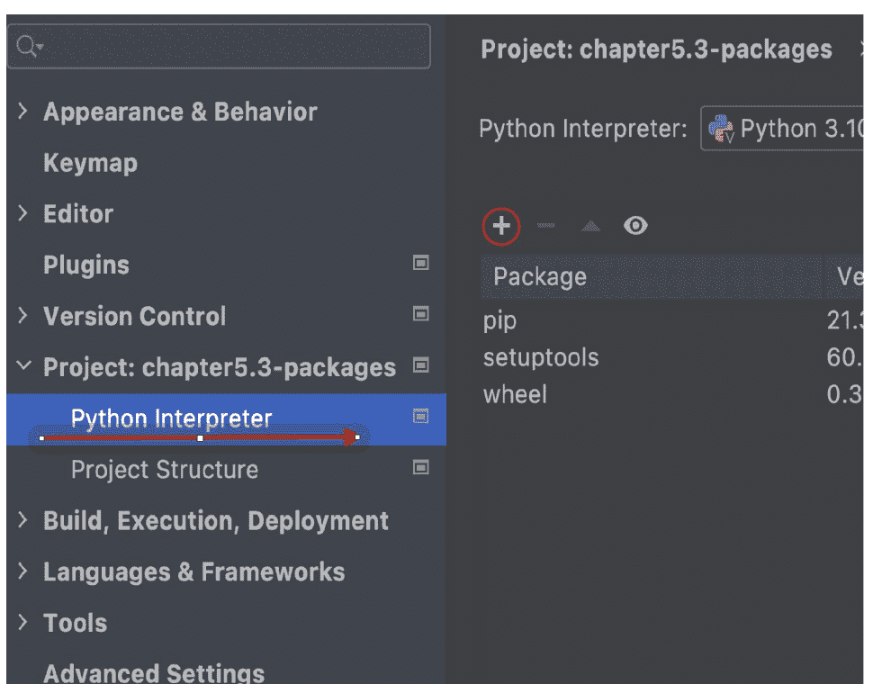

如我们所见，在右侧，已经预安装了一些包，比如 **pip** 和 **setuptools**，所以你只需找到加号位置，在那里可以添加或搜索新包。在我们的例子中，需要安装的包是 **pyjokes**：

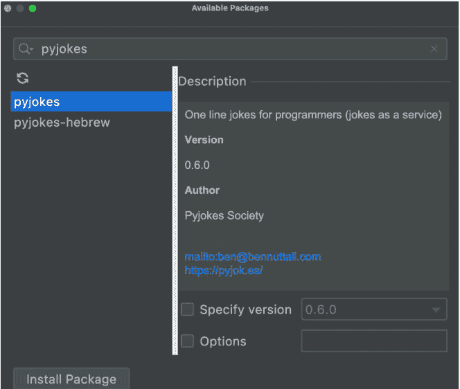

确保选中了正确的包，然后点击标有 **安装包** 的按钮。安装完成后，你会收到一条消息，说明你已成功安装 **pyjokes** 包。我们可以返回到 Python解释器界面确认，看看该包是否已列出：

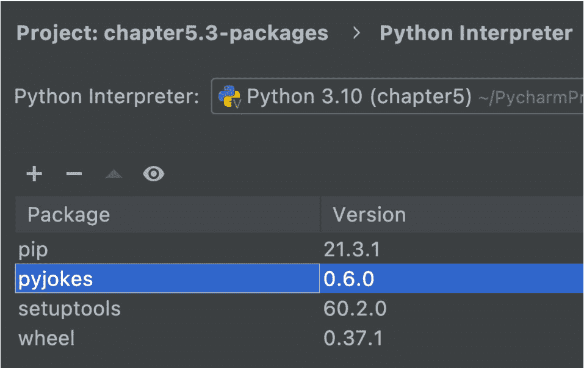

该包也会出现在 External Libraries > Site Packages > pyjokes 路径下：

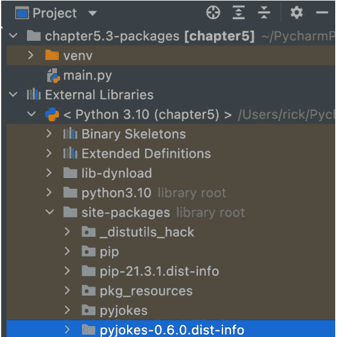

现在让我们查看 [PyPi](https://pypi.org/) 网站上的简要说明，上面提到我们可以通过先导入 **pyjokes** 然后使用两个函数中的任意一个（**get_joke** 或 **get_joke**）来获取笑话：

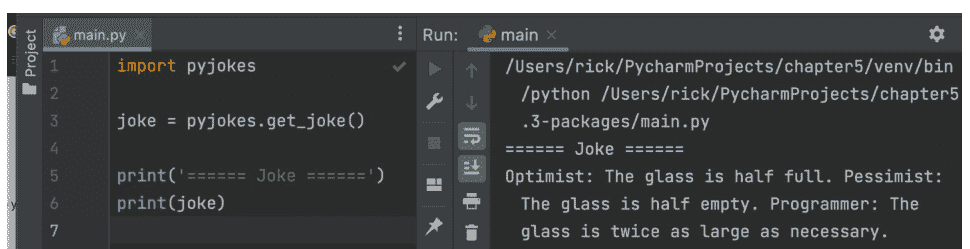

如你所见，我们可以轻松地使用PyCharm安装包，但这并非大多数开发者安装包的方式。另一种更专业的安装包方式是使用终端或命令提示符。在我的桌面上，我创建了一个名为chapter5.4-packages的文件夹，并使用VS Code编辑器打开了它，在此文件夹内创建了一个名为test.py的文件：

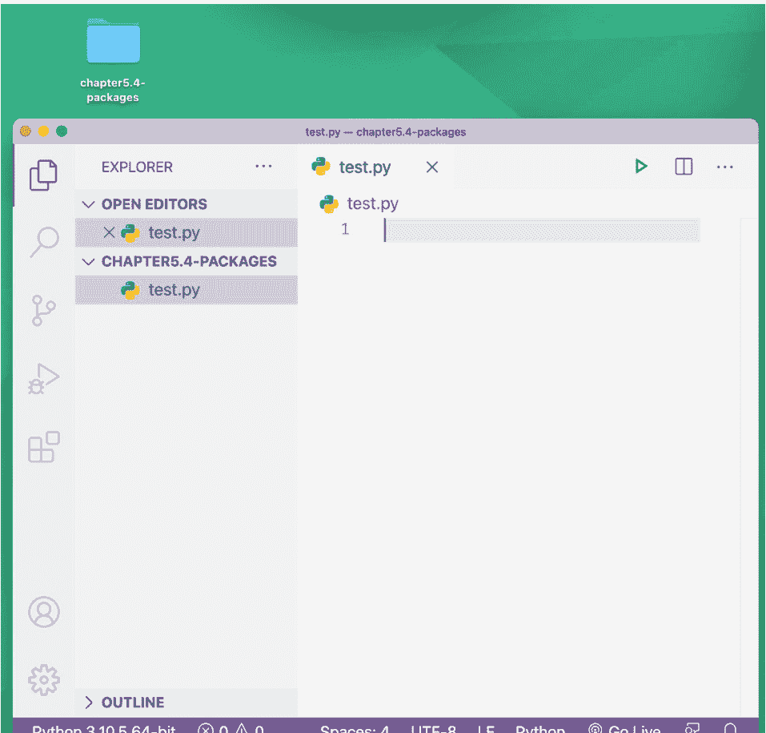

test.py文件目前是空的，但让我们从PyCharm中添加pyjokes代码：

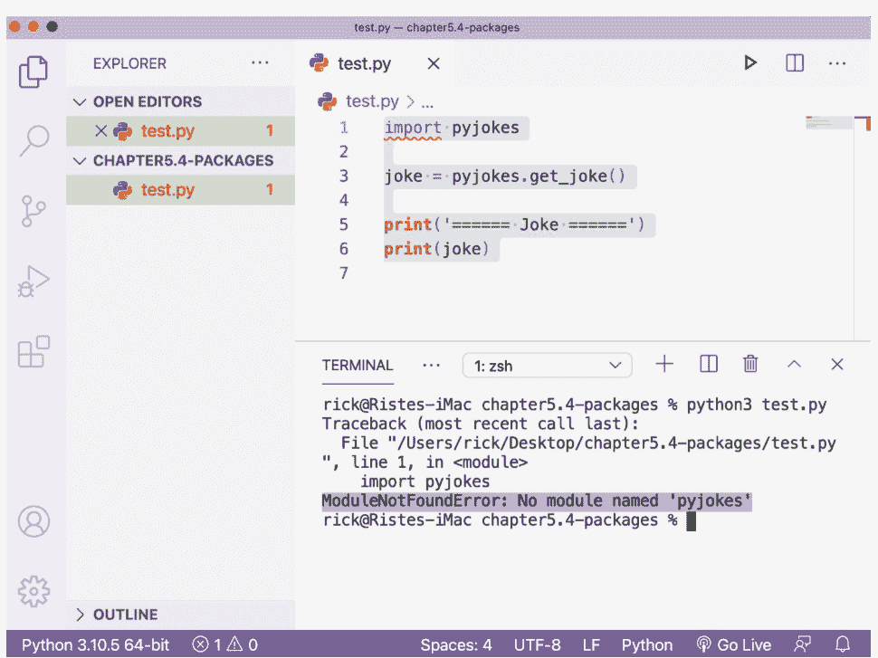

出现ModuleNotFoundError，因为pyjokes包仅为PyCharm IDE安装，我们不能在所有地方使用它。那么如何解决这个问题呢？如果我们返回pypi.org，可以看到有一个pip命令用于在我们的终端或命令提示符中安装包：

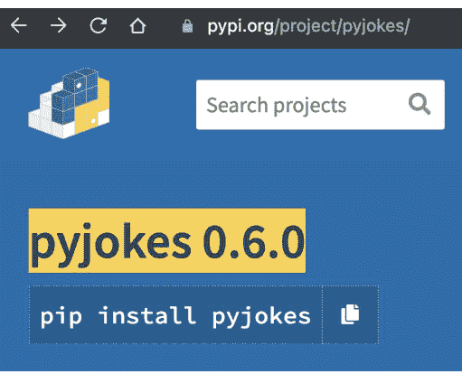

复制命令‘pip install pyjokes’，然后打开终端或命令提示符。如果你忘记了某些终端命令，建议你返回重新阅读该部分。我将使用系统终端，而不是VS Code编辑器的内置终端，并使用‘pwd’命令检查当前目录：

```
rick — -zsh — 80×24
rick@Ristes-iMac ~ % pwd
/Users/rick
rick@Ristes-iMac ~ % 
```

现在我需要进入桌面的‘chapter5.4-packages’文件夹，我的test.py文件就在那里：

```
chapter5.4-packages — -zsh — 80×24
rick@Ristes-iMac ~ % cd Desktop/chapter5.4-packages
rick@Ristes-iMac chapter5.4-packages % 
```

如你所见，我们现在位于chapter5.4文件夹中。让我们列出该文件夹中所有可用的文件：

```
chapter5.4-packages — -zsh — 80×
rick@Ristes-iMac ~ % pwd
/Users/rick
rick@Ristes-iMac ~ % cd Desktop/chapter5.4-packages
rick@Ristes-iMac chapter5.4-packages % ls
test.py
rick@Ristes-iMac chapter5.4-packages % 
```

test.py文件是我chapter5.4-packages文件夹中唯一的文件。最后，我们可以检查pip版本。当我们安装Python时，它也安装了**pip**。让我们输入pip -V来检查pip版本，根据你的机器情况，这可能有效，也可能像下面这样给你一个错误：

```
chapter5.4-packages — -zsh — 80×24
rick@Ristes-iMac chapter5.4-packages % pip -V
zsh: command not found: pip
```

如果是这种情况，我们可以输入pip3 -V，现在我们应该能得到正确的版本信息：

```
rick@Ristes-iMac chapter5.4-packages % pip3 -V
pip 22.0.4 from /Library/Frameworks/Python.framework/Versions/3.10/lib/python3.10/site-packages/pip (python 3.10)
rick@Ristes-iMac chapter5.4-packages %
```

对我来说，这意味着我可以使用pip3命令（pip3 install pyjokes）来安装pyjokes，而不是使用pip命令：

```
rick@Ristes-iMac chapter5.4-packages % pip3 install pyjokes
Collecting pyjokes
  Using cached pyjokes-0.6.0-py2.py3-none-any.whl (26 kB)
Installing collected packages: pyjokes
Successfully installed pyjokes-0.6.0
WARNING: You are using pip version 22.0.4; however, version 22.2.1 is available.
You should consider upgrading via the '/Library/Frameworks/Python.framework/Versions/3.10/bin/python3.10 -m pip install --upgrade pip' command.
rick@Ristes-iMac chapter5.4-packages %
```

运行‘pip3 install pyjokes’后，你应该会收到‘Successfully installed pyjokes’的消息。我们也可以升级包版本。如你所见，我有一些绿色警告，提示有pip的新版本可用：

```
pip install --upgrade pip
```

就我而言，我需要使用以下命令：

```
pip3 install --upgrade pip
```

如你所见，运行pip3 install命令后，我看到了以下窗口：

```
rick@Ristes-iMac chapter5.4-packages % pip3 install --upgrade pip
Requirement already satisfied: pip in /Library/Frameworks/Python.framework/Versions/3.10/lib/python3.10/site-packages (22.0.4)
Collecting pip
  Downloading pip-22.2.1-py3-none-any.whl (2.0 MB)
     ━━━━━━━━━━━━━━━━━━━━━━━━━━━━━━━━━━━━━━━━ 2.0/2.0 MB 4.3 MB/s eta 0:00:00
Installing collected packages: pip
  Attempting uninstall: pip
    Found existing installation: pip 22.0.4
    Uninstalling pip-22.0.4:
      Successfully uninstalled pip-22.0.4
Successfully installed pip-22.2.1
rick@Ristes-iMac chapter5.4-packages %
```

现在让我们测试一下pyjokes包是否真的能用。为此，我们可以使用VS Code的内置终端或系统终端。我将向你展示两种方式，以下是终端输出：

```
rick@Ristes-iMac chapter5.4-packages % python3 test.py
===== Joke =====
There are 10 types of people: those who understand binary, those who don't, and those who were expecting this joke to be in trinary.
rick@Ristes-iMac chapter5.4-packages %
```

如果我们返回到VS Code编辑器并使用内置终端，你应该会看到这个输出：

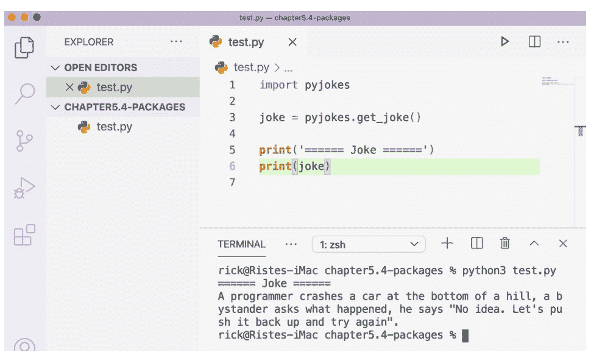

VS Code终端也能正常工作。基本上，这就是我想向你展示的关于如何在Python Package Index网站上查找、安装和运行包的内容。最后，如果你想卸载一些已安装的包，可以使用命令pip3 uninstall加包名。例如，如果你想完全卸载之前的包，可以使用以下任一命令：

```
pip uninstall pyjokes
```

或者，如果你只使用pip命令：

```
pip3 uninstall pyjokes
```

如果出于某种原因你想安装包的特定版本，只要你知道版本号，也可以从终端完成。大多数包会有不同的版本号，比如pyjokes有0.6.0，这被称为版本控制，因为每个新版本都会带来一些新内容，也许0.5.0版本中发现了某个bug，他们在0.6.0新版本中进行了修正和更新。因此，版本号是有意义的，而不仅仅是随机数字。如果你需要安装不同版本的包，可以这样做：

```
pip3 install pyjokes==0.5.0
```

这将安装pyjokes的上一个版本。你也可以使用以下命令列出所有已安装的包：

```
pip3 list
```

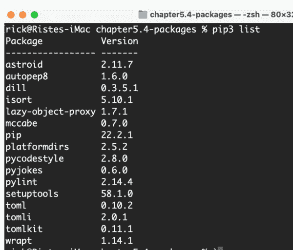

### 总结

本章是我最喜欢的章节之一，因为我们学习了很多关于模块和包的知识。我希望到现在你能看到Python的真正威力，因为无论你是一位多么出色的开发者或程序员，如果没有社区的支持，你将很难脱颖而出。在下一章中，我们将重点讲解文件的读写操作。

## 第6章 – 在Python中处理文件

在大多数编程语言中，你都会看到**FILE I/O**这个短语，但它是什么意思呢？字母'I'代表**输入**，'O'代表**输出**。在本章中，我们将介绍如何在Python中处理文件。Python有几个用于处理文件的函数，如`open`、`write`和`read`。在Python中处理文件的关键函数是`open()`函数，所以让我们从它开始。

### 打开文件

在本章中，我将使用VS Code编辑器而不是PyCharm，因为我希望你拥有一本同时使用两种开发工具的书籍。我将在桌面上创建一个名为**'chapter6.1-files'**的文件夹，并在其中添加两个文件：第一个是名为`main.py`的Python文件，第二个是名为`text.txt`的文本文件：

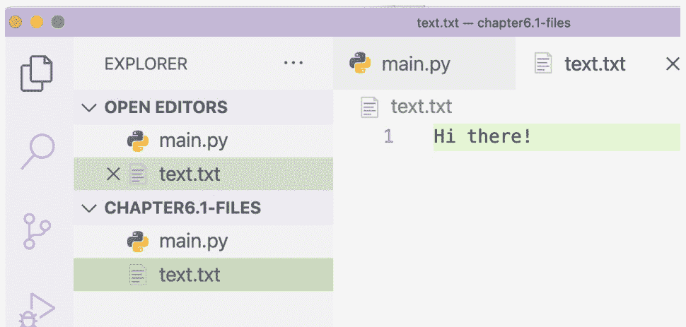

从上图可以看出，`text.txt`文件包含简单的文本'Hi there!'，而`main.py`文件目前是空的。我们的想法是使用`text.txt`文件，并从我们的`main.py`文件中打开它。如果你想这样做，可以使用Python内置的`open()`函数：

```
text_file = open('text.txt')
```

这里我们将使用`open`函数，它接受一个参数。参数是文件名，我们需要将其作为字符串或用引号（单引号或双引号）传递。无论`open()`函数返回什么，结果都将存储在一个名为`text_file`的变量中。让我们运行主文件并打印**text_file**中的内容（我将使用VS Code终端）：

```
text_file = open('text.txt')
print(text_file)
```

输出如下：

```
<io.TextIOWrapper name='text.txt' mode='r' encoding='UTF-8'>
```

我们可以看到有一个名为**TextIOWrapper**的**IO**对象，然后是文件名、模式'r'（我们稍后会学习这是什么意思），最后是编码**UTF-8**。编码告诉我们文件是如何编码的。目标是读取这个文件的内容，幸运的是，Python为我们提供了名为`read()`的读取函数：

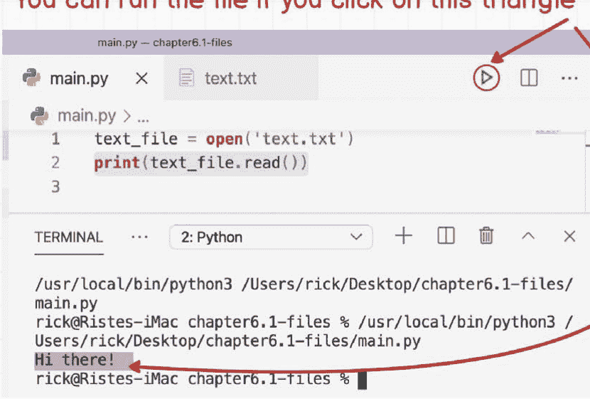

从上图可以看出，我们可以点击三角形来运行代码，而不是在终端中输入**python3 main.py**。无论你如何执行`main.py`脚本，输出结果都是一样的，但要注意，由于`open()`函数的原因，我们只能读取文件一次。Python将`open`函数视为一个游标，因此如果你想多次读取同一个文件，会遇到一些问题。好的，让我们测试一下，多次调用`read()`函数：

```
print(text_file.read())
print(text_file.read())
print(text_file.read())
print(text_file.read())
```

如果你运行上面的代码，只有第一个`read`函数会工作并产生输出，其余的`read`函数不会产生结果。这意味着文件内容是作为游标读取的，一次读取一个字符，在第一次`read()`结束时，游标将到达文件末尾。如果我们使用`seek()`方法，可以修复这个问题，我们可以传递一个索引来确定读取应该开始的位置。如果我们想从头开始，索引应该是零：

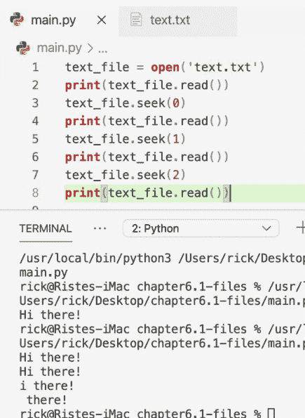

如果你的`text.txt`文件有多行内容，而你只需要读取第一行，可以使用名为`readline()`的方法。让我们在`text.txt`文件中添加几行内容，并测试这个`readline()`方法：

```
text.txt
1   Hi there!
2   My Name is Rick
3   What is your name?
```

让我们调用`readline()`方法：

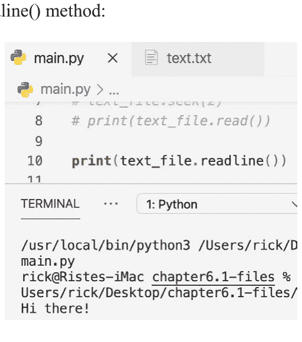

如果你需要读取所有行，可以使用名为`readlines()`的方法，但此方法将返回一个包含文件中所有行的列表数据类型。该列表还将包含我们用于创建新行的换行符'\n'。让我们使用此方法并检查输出：

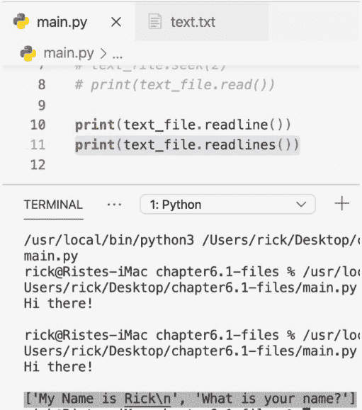

作为良好的实践，我们需要在最后关闭文件，因为你可能想在其他地方使用它，所以关闭已打开的文件是常见的做法。为此，我们可以调用`close()`方法：

```
text_file.close()
```

在下一节中，我将教你另一种使用'with'语句打开和关闭文件的方法。

### 写入和追加文件

在上一节中，我们看到了如何打开文件，使用一些方法从中读取，最后我们必须关闭它们以便再次使用。如今，有一种更好的方式进行I/O操作，以避免手动关闭文件。这种新的打开和关闭文件的方法可以通过使用'with'语句来实现。我将复制`main.py`文件并将其重命名为`main1`，以便我可以展示本节的新功能。让我们使用`with`语句打开`text.txt`文件：

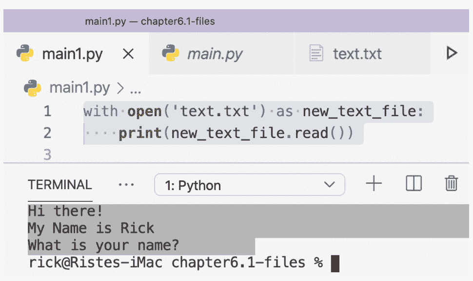

如你所见，使用'with'语句，我不需要在最后关闭文件。这就是开发者们今天正在使用的方式。

### 写入文件

还记得本章开头我们打印文件时，我们访问了`mode='r'`：

```
<io.TextIOWrapper name='text.txt' mode='r' encoding='UTF-8'>
```

`mode='r'`代表读取，我们甚至可以直接在'with'语句中指定模式，如下所示：

```
with open('text.txt', mode='r') as new_text_file:
    print(new_text_file.read())
```

'r'是默认参数，我们不需要指定它，但如果你有兴趣写入文件，我们需要使用`mode='w'`，其中'w'代表写入文件。如果我们把模式改为写入并运行同一个文件，最终会出错，因为我们试图从文件中读取，但模式设置为写入：

```
with open('text.txt', mode='w') as new_text_file:
    print(new_text_file.read())
```

```
File "/Users/rick/Desktop/chapter6.1-files/main1.py", line 2, in <module>
    print(new_text_file.read())
io.UnsupportedOperation: not readable
```

在我们解决这个问题之前，请检查你的`text.txt`文件内容是否还在。嗯，文本文件会是空的，因为我们试图在没有指定要写入什么内容的情况下写入文件，这将删除现有内容，因此在使用写入模式时必须小心。如果你想在同一个文件中读取和写入怎么办？如果我们想读取和写入，可以使用`mode='r+'`。好的，让我们先向`text.txt`文件写回一些内容：

```
with open('text.txt', mode='r+') as new_text_file:
    content = new_text_file.write('Hi there!\n' 'my name is Rick\n' 'What is your name?')
```

```
/usr/local/bin/python3 /Users/rick/Desktop/chapter6.1-files/main1
```

如果我们打开`text.txt`文件，可以看到我们已经成功写入了新内容：

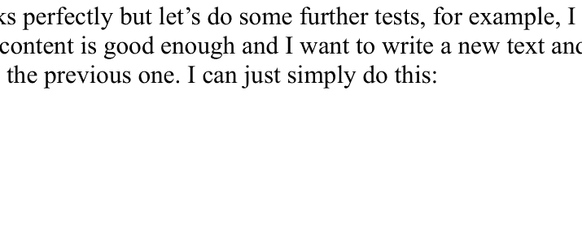

这工作得很好，但让我们做一些进一步的测试，例如，我认为内容不够好，我想写入新的文本并覆盖之前的内容。我可以简单地这样做：

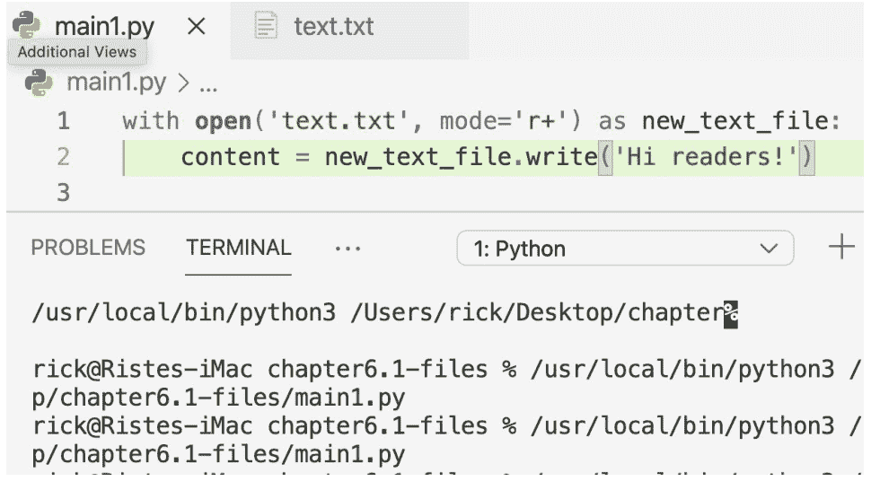

让我们打开文本文件，检查新内容'Hi readers!'是否已添加：

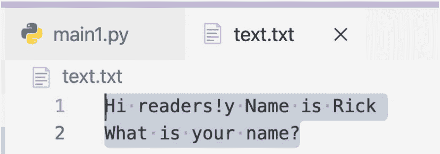

从上图可以看出，我们有了新内容，同时也有一些旧内容。为什么会发生这种情况？发生这种情况的原因是'with'语句会重置`open()`方法或为我们关闭它，因此游标将回到零索引，而我们实际上是在旧内容的开头添加了内容。

### 追加

当我们想在现有内容的末尾添加文本或内容时，可以使用追加模式。我们只需要在模式中添加字母'a'，如下所示：

```
mode='a'
```

例如，让我们将文本'I love Python'追加到现有文件中：

```
with open('text.txt', mode='a') as new_text_file:
    content = new_text_file.write('I love Python!')
```

如果我们打开`text.txt`文件，文本应该被添加到末尾：

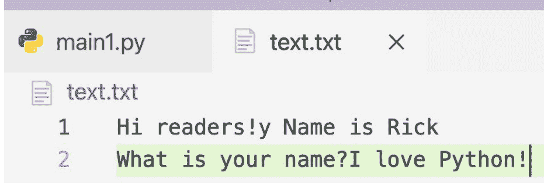

作为练习，复制`main1.py`文件并创建一个名为`main2.py`的新文件。我希望你稍微实验一下。在`open()`方法中，不要加载文件`text.txt`，尝试使用一个在你的目录/文件夹中不存在的文件，例如，使用一个名为'file.txt'的文件。完成所有操作后，运行文件并观察会发生什么。以下是我点击运行按钮之前`main2.py`文件的样子：如果我运行 main2.py 文件，输出将会如下：

如上图所示，一个名为 **file.txt** 的新文件被创建，内容为‘I love Python!’。关键问题是为什么会发生这种情况。我们尝试写入一个不存在的文件，因此 open 方法会尝试查找此文件，但由于找不到，它会为我们创建一个新文件并写入‘I love Python!’。让我们删除‘file.txt’并将模式更改为追加（append），然后再次运行文件。两种模式的结果将相同。最后，让我们删除 file.txt 并使用读写模式（mode=’r+’）再次运行文件，你认为会发生什么？输出如下：

从上图可以看到，没有创建任何文件，我们得到了 FileNotFoundError。这是因为我们试图从一个不存在的文件中读取。

### 文件路径

在本节中，我们将讨论文件路径的重要性。路径非常重要，有时可能会变得复杂，因为我们尝试打开/加载/读取的文件并不总是位于与主文件相同的层级/目录中。到目前为止，我们的文件（main.py, main1, main2, text.txt, file.txt）都位于同一个文件夹中，但我们不能期望所有文件都位于同一目录或文件夹中。让我们在 chapter6.1-files 文件夹内创建一个名为‘scripts’的文件夹：

在这个文件夹内，让我们创建一个名为 readme.txt 的文件，并添加以下简单文本：

很好！现在让我们创建一个新的 main3.py 文件，并像之前一样尝试打开 readme.txt 文件：

如上所示，我们尝试打开一个与 main3.py 文件不在同一层级的文件。这就是我们得到 FileNotFoundError 的原因。简单的解决方案是在实际路径中列出目录名称（在我们这里是‘scripts’），并在文件名前添加一个正斜杠。我知道这听起来令人困惑且困难，但这就是你需要写的代码：

```python
with open('scripts/readme.txt', mode='r') as new_text_file:
    print(new_text_file.read())
```

在指定了正确的文件路径后运行 main3.py 文件，你将得到我们期望的输出：

**File Paths Read Me!**

有时对于 Windows 用户，需要使用反斜杠而不是正斜杠来加载正确的文件，如下所示：

```python
with open('scripts\readme.txt', mode='r') as new_text_file:
    print(new_text_file.read())
```

这被称为相对路径。还有另一种路径称为绝对路径，为了找出文件所在的绝对路径，我们可以打开终端或使用内置的 VS Code 终端，输入 pwd 命令（Windows 使用 cd）：

如上所示，我的绝对路径将是‘/Users/rick/Desktop/chapter6.1-files’，我可以使用绝对路径（你的路径将与我的不同）而不是相对路径：

```python
with open('/Users/rick/Desktop/chapter6.1-files/scripts/readme.txt', mode='r') as new_text_file:
    print(new_text_file.read())
```

如果使用绝对路径运行文件，你应该得到相同的输出。与相对路径相比，绝对路径并不那么常用，因为相对路径更简洁易写。作为开发者，你会看到这种相对路径：

```python
with open('./scripts/readme.txt', mode='r') as new_text_file:
    print(new_text_file.read())
```

前面的点和正斜杠表示从当前文件夹开始查找，这就是我在处理文件路径时一直使用的。另一个重要的语法是双点和正斜杠，表示从当前目录向上移动一级：

```python
with open('../scripts/readme.txt', mode='r') as new_text_file:
    print(new_text_file.read())
```

这意味着查找位于‘chapter6.1-files’当前目录之外的名为 scripts 的文件夹。为了使其工作，我将按照下图所示，将 scripts 文件夹从 chapter6.1 拖放到桌面，并使用双点正斜杠来加载文件：

让我们运行 main3 文件并读取内容：

```python
# 向上一级
with open('../scripts/readme.txt', mode='r') as new_text_file:
    print(new_text_file.read())
```

```
PROBLEMS OUTPUT DEBUG CONSOLE TERMINAL
/usr/local/bin/python3 /Users/rick/Desktop/chapter6.1-files/main3.py
rick@Ristes-iMac chapter6.1-files % /usr/local/bin/python3 /Users/rick/
File Paths Read Me!
```

在 Python 中，自版本 3.4 起，我们有了一个叫做 **pathlib** 的东西，它代表面向对象的文件系统路径。这个库允许我们操作路径，以便我们可以在每个操作系统上使用相同的路径语法。你可以从官方 Python 文档中阅读更多关于 **pathlib** 及其使用方法：[https://docs.python.org/3/library/pathlib.html](https://docs.python.org/3/library/pathlib.html)

## 用于错误处理的 Try – Except 块

Try – Except 块非常适合捕获和处理 I/O 操作期间可能发生的错误。你想要测试的任何代码都应包装在 try 块内，而 except 块则是你捕获和处理错误的地方（如果有的话）。在 JavaScript 中，我们有 try-catch 块，它使用完全相同的逻辑。同样的概念也存在于许多其他编程语言中。我创建了另一个名为 chapter6.2-errors 的文件夹，并在其中复制了 readme.txt 文件和 main.py 文件。现在让我们尝试一下 try-except 块：

如上所示，我们正确缩进了所有内容，在 try 块内是我们将始终放置要测试或尝试的代码的地方，而在 except 块内我们将捕获错误，到目前为止我们已经看到当我们尝试打开的文件不存在时会出现 FileNotFoundError。以下是完整的代码，因为有时图片可能会变得模糊：

```python
# try - except 块
try:
    with open('readme1.txt', mode='r') as new_text_file:
        print(new_text_file.read())

except FileNotFoundError as err:
    print('File cannot be found!')
```

如果我们运行此文件，解释器将看到我们有一个 try-except 块，它会进入其中并尝试运行代码。如果我们看 open() 方法，我们可以看到文件 readme1.txt 在当前目录中不存在，但 readme.txt 文件存在。try 块中会抛出一个错误，该错误将被 except 块处理，我们只是打印错误消息。Python 为不同类型错误预定义了默认错误消息。现在，如果我们想访问默认错误消息，我们可以使用一个在‘as’关键字后声明的变量（err）。可以将此变量视为存储默认错误消息的容器，我们可以打印‘err’变量而不是打印自定义消息。如果我们愿意，可以给这个变量起不同的名字：

```python
# try - except 块
try:
    with open('readme1.txt', mode='r') as new_text_file:
        print(new_text_file.read())

except FileNotFoundError as err:
    print(err)
```

让我们尝试运行代码并观察输出：

如上所示，由于打开和读取此文件时出错，我们在 except 块中放置的内容被打印出来了。在 except 块中还可以做另一件事，那就是像这样抛出当前错误：

```python
# try - except 块
try:
    with open('readme1.txt', mode='r') as new_text_file:
        print(new_text_file.read())

except FileNotFoundError as err:
    print('File cannot be found!')
    raise err
```

现在的输出将会稍有变化并且更加详细：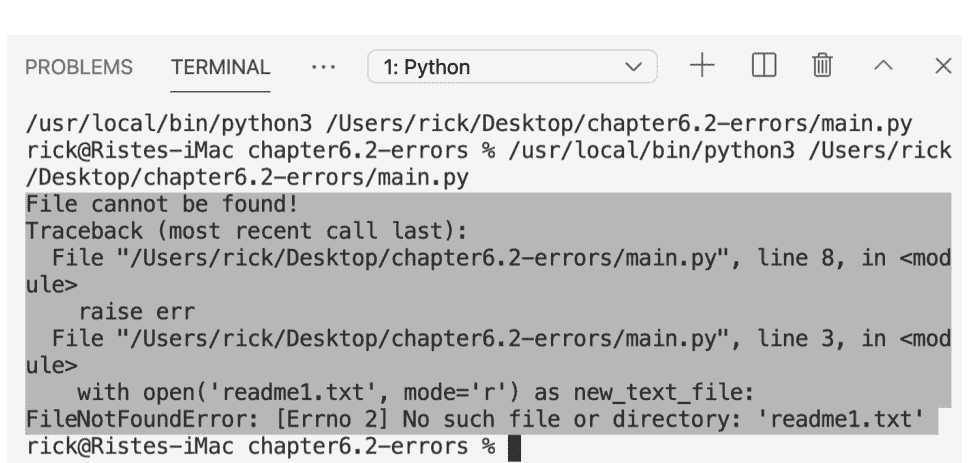

另一个通常会发生的是 **IOError**。这个错误可能在任何模式下发生，例如读写文件时。执行 I/O 操作时遇到的任何问题都会抛出此错误：

```python
# try - except 块
try:
    with open('readme1.txt', mode='r') as new_text_file:
        print(new_text_file.read())

except FileNotFoundError as err:
    print('File cannot be found!')
    raise err
except IOError as err1:
    print('IOError!')
    raise err1
```

Python 中其他常见错误有：

-   **ImportError** – 当 `import` 语句未能加载模块时，会引发此错误。
-   **IndexError** – 当序列（列表、元组）索引超出定义范围时，会引发此错误。
-   **TypeError** – 当我们尝试使用不适用于某种类型对象的操作或函数时，会引发此错误。
-   **NameError** – 当找不到局部或全局名称时，会引发此错误。
-   **KeyError** – 当我们尝试使用无法在字典中找到的键访问其项时，会引发此错误。

这就是我们如何处理不同错误的方法，希望你现在已学会在处理文件时如何处理可能遇到的任何错误。

### 总结

恭喜！本章我们学习了很多内容。我相信你现在能够执行任何 I/O 操作，并使用 try 和 except 块来处理错误。

## 第7章 – 错误处理

在最后一章，我们将学习如何处理代码中可能遇到的错误。成为一名程序员具有挑战性，并非因为你需要编写的代码量，而是因为你需要编写无错误的高质量代码。编写无错误的代码是我们应始终追求的目标，但我告诉你，这并不简单，错误可能随时发生。关键在于，当我们识别出这些错误后需要做什么，以及应该使用何种机制来处理它们，以避免程序崩溃。让我们开始学习如何处理这些错误。

### Python 中的错误

在我们目前的代码中，我们已经看到一些错误，我是故意制造这些错误的，因为你不应该害怕它们。最重要的部分是学习它们的含义，并在识别出其含义后采取适当的行动来处理它们。例如，最基本的 `print` 函数如果写得不正确，就会给我们抛出错误：

```
# 1 SyntaxError
print(')'
```

如果我们运行这个文件：

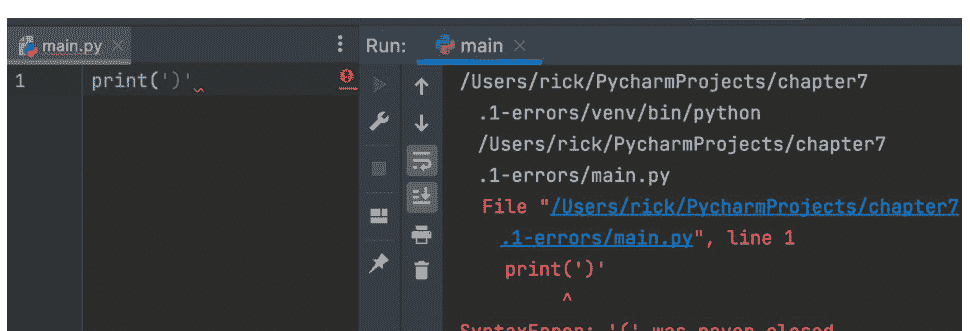

如你所见，我们遇到了一个 **SyntaxError**，因为我们没有正确地关闭 `print` 函数。另一个可能发生的常见错误是 **TypeError**，它由 Python 解释器引发，因为我们试图使用两个彼此不兼容的数据类型：

```
# 2 TypeError

print(1 + '2')
```

输出：

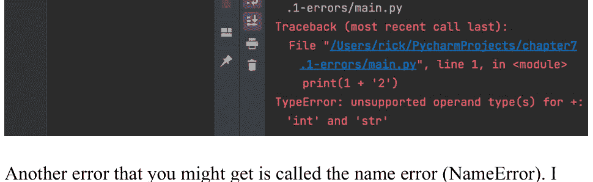

另一个你可能遇到的错误是 **NameError**（名称错误）。我在前面章节中已经列出这些错误，但让我再给你一个例子：

```
# 3 NameError

result = 1 + two
```

如你所见，我们正试图用一个未定义的变量来计算整数值。输出：

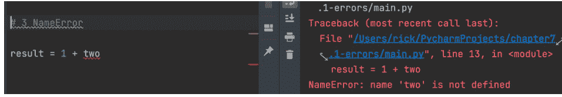

**IndexError**（索引错误）是当我们有一个列表数据类型，并尝试使用超出列表范围的索引访问元素时常见的错误。例如：

```
# 4 IndexError
list_ob = [1, 2, 3, 4]
print(list_ob[3])
print(list_ob[4])
```

输出：

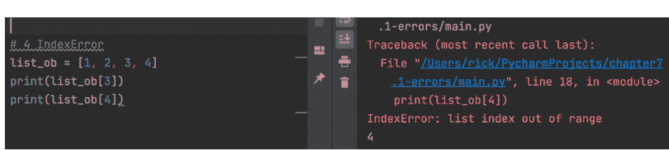

类似地，在使用字典时，我们可能会犯一些无心之失。通常可能发生的情况是，我们试图从字典中访问的键不存在。这将引发 **KeyError**，以下是一个我们将 ‘model’ 关键字拼错的例子：

```
# 5 KeyError

car_dict = {
    'car': 'Ford',
    'model': 'Mustang',
    'engine': '5.0',
}

print(car_dict['car'])
print(car_dict['Model'])
```

输出：

```
Ford
Traceback (most recent call last):
  File "/Users/rick/PycharmProjects/chapter7.1-errors/main.py", line 28, in <module>
    print(car_dict['Model'])
KeyError: 'Model'
```

从图中，我使用了 ‘Model’ 这个键，而不是全小写的 ‘model’。这将抛出一个 **KeyError**，因为字典中没有名为 ‘Model’ 的键。

下一个错误叫做 **ZeroDivisionError**，当我们尝试用零除一个数时会发生这种情况。对你们中的一些人来说，这可能有点好笑，但相信我，这些错误发生的频率比你想象的要高：

```
# 6 ZeroDivisionError

print(3 / 0)
```

错误将是：

```
Traceback (most recent call last):
  File "/Users/rick/PycharmProjects/chapter7.1-errors/main.py", line 31, in <module>
    print(3 / 0)
ZeroDivisionError: division by zero
```

你可以访问以下 Python 文档来阅读不同类型的异常及其含义：

https://docs.python.org/3/library/exceptions.html

这些错误会崩溃我们的程序，并阻止代码的其余部分完成执行。目前，我们的代码只有几行，如果错误发生在第一行，下面的代码将永远不会执行，如下例所示：

```
print(1 + '2')

if 5 > 3:
    print('5 is bigger than 3')
```

尽管 `if` 语句的条件为真，但第二个 `print` 永远不会执行，因为导致程序停止的错误发生在第一行。这些会停止我们代码执行的错误被称为**异常**。解释器将逐行执行，当它遇到这类问题时，会引发异常导致程序停止。这就是为什么我们需要学习如何**处理错误**。

### 错误处理

此机制允许我们在某个地方发生错误后继续执行 Python 脚本。为了解释错误处理，我将创建另一个文件并提示用户输入其出生年份：

```
# Error Handling
dob = input('Enter year of birth')
print(dob)
```

如果我们输入 1999 并按下回车键，我们将得到预期的输出：

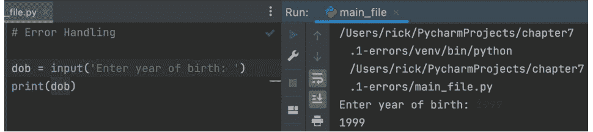

如你所见，程序运行良好，但让我们再次运行它，这次输入一个文本/字符串而不是数字：

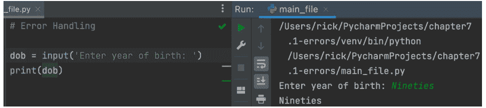

它对字符串也处理得很好，但这是我们想要的输出吗？答案是否定的，因为我们希望得到的是数字形式的年份，或许稍后可以进行进一步的数学计算，例如计算你是否有资格考取驾照。那么，解决方案是什么？我们可以将输入转换为整数，这样我们总能得到整数输出而不是字符串：

```
# Error Handling
dob = int(input('Enter year of birth: '))
print(dob)
```

如果用整数运行此代码，不会有任何问题，但如果用户再次输入字符串，我们将得到：

```
Enter year of birth: Ninetines
Traceback (most recent call last):
  File "/Users/rick/PycharmProjects/chapter7.1-errors/main_file.py", line 3, in <module>
    dob = int(input('Enter year of birth: '))
ValueError: invalid literal for int() with base 10: 'Ninetines'
```

从上图可以看出，我们的代码现在抛出了一个 **ValueError**，这不是我们想要的。就像在 I/O 章节一样，我们可以使用 **try-except** 块来处理错误。我们将需要执行的代码放在 **try** 块中，但如果有任何错误，**except** 块将处理它们。请确保使用正确的缩进：

```
# Error Handling
try:
    dob = int(input('Enter year of birth: '))
    print(dob)

except:
    print('You have entered invalid value, please enter a valid number!')
```

以下是如果用户输入字符串而非数字时会发生的情况：如上图所示，我们没有遇到会阻塞并终止整个程序的错误，而是通知用户他/她做错了什么以及接下来需要做什么。现在即使用户犯了错误，Python解释器也会继续工作并执行其余的语句。让我们在try-except块之后添加一个新的print函数，确认程序将继续正常执行：

太好了！控制台中不再有红色错误，但我们的代码远非完美。例如，用户输入一个字符串，这个错误会被捕获并在except块中处理，但如果用户想重新输入一个新数字来修正之前的错误，他/她将需要再次运行文件。为了解决这个问题，你可以简单地使用一个while循环，并将条件设置为True，然后像这样包裹整个try-except块：

```python
# Error Handling
while True:
    try:
        dob = int(input('Enter year of birth: '))
        print(dob)
    except:
        print('You have entered invalid value, please'
              ' enter a valid number!')
print('This is printed after while loop!')
```

如果我们现在运行代码，如果用户输入一个字符串，将会发生以下情况：

太好了！我们的逻辑有效！嗯，它有效但不完美，因为即使用户输入了一个数字，它也会继续提示用户输入值：

```
Enter year of birth: Nineties
You have entered invalid value, please enter a valid number!
Enter year of birth: Again
You have entered invalid value, please enter a valid number!
Enter year of birth: 99
99
Enter year of birth: 1221
1221
Enter year of birth: |
```

我们可以通过在except块之后添加一个else子句来修复这个问题，这样我们就可以使用break语句跳出这个循环：

```python
# Error Handling
while True:
    try:
        dob = int(input('Enter year of birth: '))
        print(dob)

    except:
        print('You have entered invalid value, please'
              ' enter a valid number!')
    else:
        break

print('This is printed after while loop!')
```

现在的输出是：

如你所见，在用户输入一个数字后，while循环将结束。

## Except块

正如我们在I/O章节中看到的，except块可以接受不同的内置错误，我们可以打印它们。Python给了我们一个选项，可以指定我们希望except块处理哪些类型的错误。想象一下，在用户输入出生年份后，我们想通过用当前年份减去出生年份来计算用户的年龄。为此，我们需要使用**datetime**模块，它允许我们使用日期和时间，因此我希望你在空闲时间访问Python文档并浏览此模块提供的基本函数：
[https://docs.python.org/3/library/datetime.html](https://docs.python.org/3/library/datetime.html)

以下是代码：

```python
# Error Handling
from datetime import date
current_year = date.today().year
```

```python
while True:
    try:
        dob = int(input('Enter year of birth: '))
        print(current_year - dob)
    except:
        print('You have entered invalid value, please'
              ' enter a valid number!')
    else:
        break
```

```python
print("This is printed after while loop!")
```

如果我们运行文件并输入1999，我们将得到以下输出（根据你阅读本书的年份，你可能会得到与23不同的值）：

```
main_file ×
/Users/rick/PycharmProjects/chapter7
.1-errors/venv/bin/python
/Users/rick/PycharmProjects/chapter7
.1-errors/main_file.py
Enter year of birth: 1999
23
This is printed after while loop!
Process finished with exit code 0
```

这有效，现在你甚至可以更改except块以仅处理ValueError，如下所示：

```python
except ValueError as err:
    print('You have entered invalid value, please'
          ' enter a valid number!')
```

我们可以在try块中进行大量计算，如果发生任何错误，它们将由except块处理，但在我们的例子中，我们只要求它处理ValueError错误。让我们找出我们的应用程序是否能处理ZeroDivisionError：

```python
# Error Handling
from datetime import date
current_year = date.today().year

while True:
    try:
        dob = int(input('Enter year of birth: '))
        print(current_year - dob)
        print(current_year / dob)
    except ValueError as err:
        print('You have entered invalid value, please'
              ' enter a valid number!')
    else:
        break

print('This is printed after while loop!')
```

我故意用当前年份除以出生年份，因为如果用户现在输入零（0）作为年份，这应该会引发ZeroDivisionError：

```
main_file
/Users/rick/PycharmProjects/chapter7.1-errors/venv/bin/python
/Users/rick/PycharmProjects/chapter7.1-errors/main_file.py
Enter year of birth: 0
2022
Traceback (most recent call last):
  File "/Users/rick/PycharmProjects/chapter7.1-errors/main_file.py", line 9, in <module>
    print(current_year / dob)
ZeroDivisionError: division by zero
```

如你所见，except块并没有像我们想象的那样处理ZeroDivisionError，那么解决方案是什么？嗯，我们可以创建另一个except块来处理ZeroDivisionError，如下所示：

```python
# Error Handling
from datetime import date
current_year = date.today().year

while True:
    try:
        dob = int(input('Enter year of birth: '))
        print(current_year - dob)
        print(current_year / dob)
    except ValueError as err:
        print('You have entered invalid value, please'
              ' enter a valid number!')
    except ZeroDivisionError as err:
        print('The age should not be zero!')
    else:
        break

print('This is printed after while loop!')
```

如果我们现在运行应用程序，用户输入零（0），这应该会被第二个except块处理：

让我们创建另一个函数来除两个数字。这是除法函数的代码：

```python
# Error Handling

def div_numbers(a, b):

    return a / b
```

```python
result = div_numbers(10, '2')
print(result)
```

如果我们按原样运行该函数，我们将得到TypeError，因为我们传递给div_numbers函数的第二个操作数是字符串类型。为了处理这个问题，我们可以简单地在函数中直接使用try-except块：

```python
# Error Handling

def div_numbers(a, b):
    try:
        return a / b
    except TypeError:
        print('Make sure the operands are '
              'numbers')

result = div_numbers(10, '2')
print(result)
```

输出将是打印消息，告诉我们传递给函数的至少一个操作数不是数字：

```
text
main_file1 x
/Users/rick/PycharmProjects/chapter7
.1-errors/venv/bin/python
/Users/rick/PycharmProjects/chapter7
.1-errors/main_file1.py
Make sure the operands are numbers
None
```

在I/O章节中，我提到如果我们将其分配给一个变量并打印该变量（该变量将是错误对象本身），我们可以打印内置的Python错误消息：

```python
except TypeError as err:
    print('Make sure the operands are '
          'numbers' + err)
```

现在，如果我们使用相同的操作数运行代码，你将看到我们的自定义打印消息加上来自Python的整个内置错误：

```
python
/Users/rick/PycharmProjects/chapter7.1-errors/venv/bin/python
/Users/rick/PycharmProjects/chapter7.1-errors/main_file1.py
Traceback (most recent call last):
  File "/Users/rick/PycharmProjects/chapter7.1-errors/main_file1.py",
    line 5, in div_numbers
    return a / b
TypeError: unsupported operand type(s) for /: 'int' and 'str'

During handling of the above exception, another exception occurred:

Traceback (most recent call last):
  File "/Users/rick/PycharmProjects/chapter7.1-errors/main_file1.py",
    line 11, in <module>
    result = div_numbers(10, '2')
  File "/Users/rick/PycharmProjects/chapter7.1-errors/main_file1.py",
    line 7, in div_numbers
    print('Make sure the operands are '
TypeError: can only concatenate str (not "TypeError") to str
```

作为开发者，我们有时需要这个错误消息，以便真正了解发生了什么，因为如果我们有成千上万行代码，这将很难找到，但现在从错误消息中，我们可以看到问题位于第5行。我们甚至可以像这样使用‘f’字符串：

```python
except TypeError as err:
    print(f'Make sure the operands are numbers {err}')
```

让我们保存文件并再次运行它：## 错误处理

让我们测试一下，如果函数的第二个参数为零会发生什么：

```
result = div_numbers(10, 0)
print(result)
```

这将导致解释器抛出一个 `ZeroDivisionError`：

这意味着我们需要处理这个错误，但与其编写多个 **except** 块，不如这样做：

```
except (TypeError, ZeroDivisionError) as err:
    print(f'We got an error: {err}')
```

输出结果将是：

以下是现在的完整代码：

```
# Error Handling

def div_numbers(a, b):
    try:
        return a / b

    except (TypeError, ZeroDivisionError) as err:
        print(f'We got an error: {err}')

result = div_numbers(10, 0)
print(result)
```

## Finally 块

我们已经了解了 try-except-else 块，但在处理异常时，我们还可以使用一个额外的块。这个块称为 **finally**，它会在其他所有操作完成后执行。以下是一个 try-catch-else-finally 块的示例：

```
# Error Handling finally

try:
    number = int(input('Enter a number: _'))
    number >= 3
except (TypeError, ValueError) as err:
    print(f'Something went wrong: {err}')
else:
    print(f'Everything is ok and the result'
          f' is {number * 3}')
finally:
    print("The try-except block is finished")
```

如果我们使用字符串而不是数字来运行它，那么 except 块应该会运行并处理错误：

```
/Users/rick/PycharmProjects/chapter7.1-errors/venv/bin/python /Users/rick/PycharmProjects/chapter7.1-errors/finally.py
Enter a number: not a number
Something went wrong: invalid literal for int() with base 10: 'not a number'
The try-except block is finished
```

但即使在出错的情况下，我们也可以看到 finally 块被执行了，并且打印出了其中的消息。finally 关键字块用于定义一个代码块，该代码块会在 try-except-else 块完成后运行。无论前面块中发生了什么，我们放在 finally 块中的任何代码都会执行。

### 抛出异常

有时，作为开发者，你需要在代码中出现特定条件时抛出异常，而 Python 允许我们使用 `raise` 关键字抛出自己的异常。请看下面的例子：

```python
# Error Handling finally

try:
    number = int(input('Enter a number: _ '))
    if number < 0:
        raise Exception('Enter a number bigger than zero')
    number >= 3
except (TypeError, ValueError) as err:
    print(f'Something went wrong: {err}')
else:
    print(f'Everything is ok and the result'
          f' is {number * 3}')
finally:
    print("The try-except block is finished")
```

正如你从 if 语句中看到的，我们手动抛出了一个带有消息的异常。如果我们用 -1 来运行相同的代码，将会得到如下结果：

从上图中，我们可以看到 **finally** 语句在最后被执行了。如果我们不想让错误像这样显示，我们可以通过在 **except 块**中添加 **Exception** 来捕获这个错误：

```python
except (TypeError, ValueError, Exception) as err:
    print(f'Something went wrong: {err}')
```

如果我们再次使用值 -1 运行相同的代码，将会得到以下输出：

很好！现在我们知道如何抛出自己的错误或异常了。如果我们把它们列在 except 块中，我们可以抛出任何特定的内置 Python 错误，比如 TypeError。这就是我想在本章教给你的所有内容，你应该知道，在任何编程中错误都是不可避免的，但一个优秀的程序员会知道如何处理这些错误，而不会使应用程序崩溃。

### 总结

恭喜你！每当我完成最后一章时，我总是有些伤感。错误处理是一个非常重要的概念，而大多数时候它都被程序员忽视了，这就是为什么我决定将其作为最后一章。我们在本书中做了很多工作，我们从零开始，我猜你们大多数人一开始对 Python 一无所知，但现在已经不是这样了。从这里开始，你的道路将非常简单，因为你已经有了足够的知识来继续学习新的、更高级的 Python 特性。这是我的第一本关于 Python 的书，我希望你喜欢它，因为很快我将宣布我的第二本书，它将比这本高级得多。在导言章节中，我提到过需要你在任何社交媒体上与我联系，因为我经常会把我的书的价格降到一美元以下，这样每个人基本上都可以免费获得。在说再见之前，我希望你看看下面的“项目”部分，并尝试自己编写一些编码挑战。我们一起经历了一段有趣的旅程，现在是时候各自前行了。

## 项目

在本节中，我们将有一些项目，这些项目将帮助你理解 Python 的工作原理。你应该尝试自己编写编码挑战，但如果你做不到，也没问题，因为最终代码将在附录部分提供。请仔细阅读项目说明，并尝试编写代码：

### 项目1：猜随机数

这个项目是一个你需要用 Python 编写的小型交互式游戏。电脑将生成一个 1 到 10 之间的随机数，用户将有 3 次尝试机会来猜测它。在每次尝试中，程序必须引导用户，并在随机数高于或低于电脑生成的随机数时提供最少的提示信息。这是用户在三次尝试内未能猜中数字时的输出：

这是用户猜中数字时的输出：

### 编程提示

编写这个程序有多种方法，没有完美的解决方案。这意味着每个人都可以提出不同的有效解决方案。我提供的以下提示将包含最终代码的一些片段，因此你可以更改我创建的任何变量，并按你想要的方式命名它们。我之前提到过，这个问题没有单一的解决方案。第一个提示是你需要导入一个能帮助你生成随机数的模块。该模块名为 **random**，这是来自 Python 文档的链接，它将解释如何使用此模块（你需要阅读文档中 **Functions for integers** 部分）：

[https://docs.python.org/3/library/random.html](https://docs.python.org/3/library/random.html)

第二个提示是使用 input 函数，以便用户可以输入数字，但要小心，因为用户的输入不会是数字形式，它们始终是字符串。这意味着需要将用户输入从字符串转换为整数。第三个提示是使用一个 while 循环来统计用户尝试猜测随机数的次数。在 while 循环之前，你需要某种计数器变量，如下所示：

```python
number_of_guesses = 1
```

这个变量将是 while 循环中的实际条件：

```
while number_of_guesses < 3:
```

在 while 循环内部，你需要将 `number_of_guesses` 变量增加 1，以便它能跟踪用户尝试猜测数字的次数。内部将有几个 if 语句，例如，一个用于判断用户输入的数字是否大于电脑生成的随机数：

```
if player_number > the_number:
```

你还需要另一个 if 语句来检查相反的情况。在 if 语句内部，你需要打印一条消息，说明用户接下来应该做什么，并再次使用 input 函数提示用户输入一个新数字。每次失败后，我们需要给用户一个再次输入数字的机会，因此 input 函数是必不可少的。最终的第三个 if 语句应该用于判断用户输入的数字是否与电脑生成的随机数相同。在这种情况下，你应该使用以下语句之一（请思考当用户猜对数字时，你应该使用哪个语句）：

- Break
- Pass
- Continue

在 while 循环之后，你可以有另一个 if-else 语句，其中你说明用户猜了多少次数字，或者如果用户没有猜中数字，你需要打印出随机数是什么。如果你无法自己解决，答案将在附录A，项目1：猜随机数解决方案中。

## 项目二：教师与学生应用

这个项目相比第一个会稍有难度。本项目将编写一个简单的程序，允许创建一个教师账户。创建后，教师可以登录系统，查看所有学生及其成绩。此外，教师可以添加新学生并更新学生的成绩。学生数据将来自一个名为`student_scores.txt`的文件。在我们深入项目之前，以下是本项目将包含的一些内容：

-   I/O 文件操作
-   密码哈希
-   教师登录
-   教师注册
-   添加新学生
-   更新学生信息
-   删除文件
-   更新文件
-   使用 `datetime` 模块

我们即将编写的应用程序将如下所示：

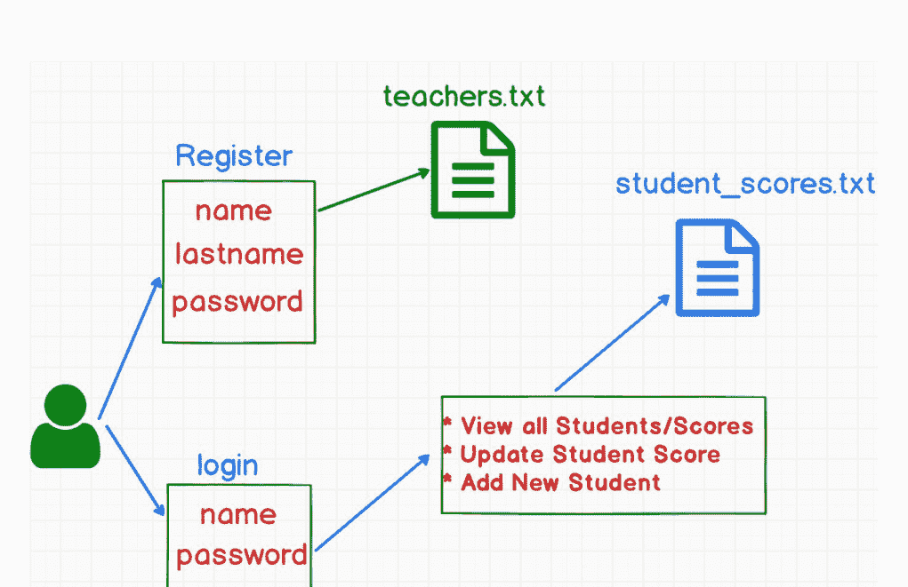

如图所示，教师需要先注册。注册后，详细信息将存储在`teachers.txt`文件中。然后教师可以使用姓名和密码登录，并能够：

-   查看所有学生及其成绩
-   更新学生成绩
-   添加新学生

学生详细信息位于`student_scores.txt`文件中。教师对学生进行的所有操作都将记录在`student_scores.txt`中。我将一步步指导你如何编写此应用程序，但如果你觉得自己能独立完成，可以直接开始编码。在尝试编写代码之前，以下是本书中尚未讨论但完成此应用所需的一些功能：

-   删除和重命名文件
-   使用来自pypi.org的bcrypt包进行密码哈希
-   使用 `datetime` 模块创建当前日期和时间

## 从删除和重命名文件开始

要删除和重命名文件，可以使用名为OS的模块。该模块提供了一些可用于与文件系统交互的函数。你将只使用两个方法：`remove` 和 `rename` 方法。`os.remove()` 方法用于移除或删除一个文件路径。语法：

```
remove('file.txt')
```

第二个方法是 `rename`，用于重命名现有文件：

```
rename('old_file_name.txt', 'new_file_name.txt')
```

这意味着我们将把 `old_file_name.txt` 重命名为 `new_file_name.txt`。

#### 密码哈希

这个应用程序并非真实的注册和登录系统，但我希望给你一个可以安装一些包的应用实例，这正是一个完美的机会。你将使用 pypi.org 网站，在那里我们可以找到并安装一个名为bcrypt的包：

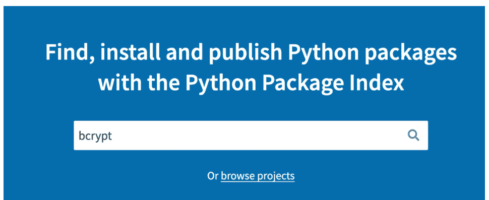

[https://pypi.org/project/bcrypt/](https://pypi.org/project/bcrypt/)

这对于密码哈希非常有用，例如，教师将尝试用字符串‘MyPassword’进行注册。这个包会接收这个字符串，并使用哈希函数将其转换为类似这样的形式：

```
b'$2b$12$fwBh8IUk4pC917unYjStSuwmJXyOlWH2jCXKOazcXikZS7J1wzF9q'
```

我们可以使用bcrypt中的另一个函数，将原始密码与哈希后的密码进行比较，以便让教师登录系统。这个应用程序非常简单，但在处理更大的应用程序时，安全性和密码哈希非常、非常重要。要安装此包，你需要使用：

```
pip install bcrypt
```

或者

```
pip3 install bcrypt
```

如果你使用PyCharm IDE，可以创建一个新项目，然后进入PyCharm > 偏好设置，找到项目名称，选择解释器，然后安装该包：

▼ Project: pythonProject2

Python Interpreter

Project Structure

> Build, Execution, Deployment

> Languages & Frameworks

> Tools

Advanced Settings

## datetime 模块

你可以在这里阅读关于日期时间的内容：
[https://docs.python.org/3/library/datetime.html](https://docs.python.org/3/library/datetime.html)
我们需要 `datetime` 模块，因为每次教师操作学生文件时，都应记录时间，或者你可以创建某种时间戳。请阅读下一节，我将提供一些我为这个项目构建的应用程序的截图。

#### 截图和文件

为了创建这个应用程序，我想提供一些截图，以便你了解如何编写它。在这个项目中，我创建了四个Python文件和两个文本文件。Python文件是`login`、`main`、`register`和`student_tasks`。文本文件是`student_scores`和`teachers`。我使用PyCharm来创建和运行此应用程序：

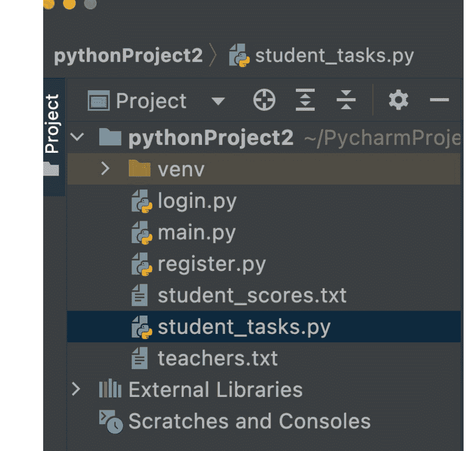

以下是我们运行`main`文件时得到的结果：

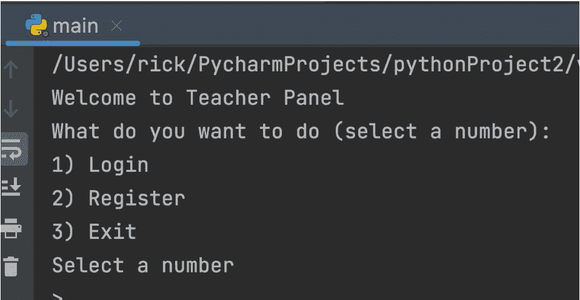

教师可以通过选择左侧的数字来选择登录、注册和退出，例如，如果教师需要登录，应该按1。让我们从最简单的开始，数字3将使应用程序终止：

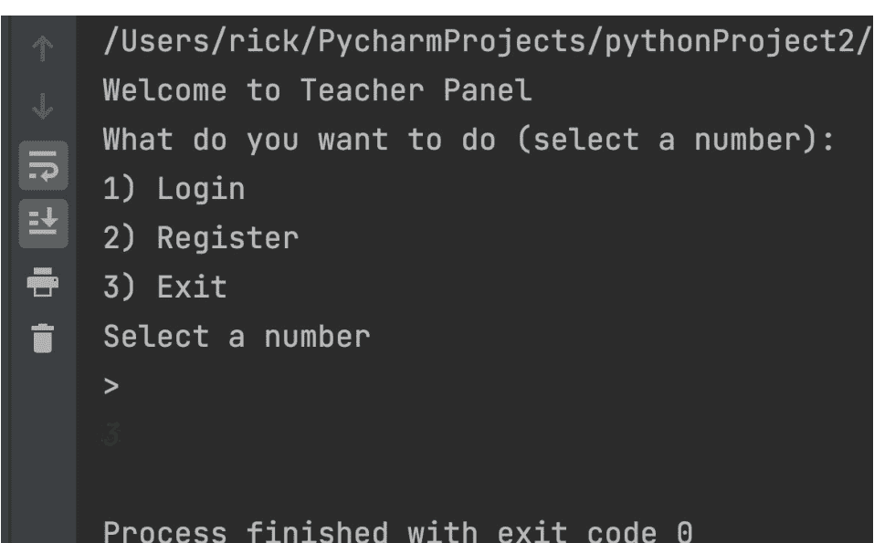

如你所见，应用程序已终止。现在让我们再次运行应用程序，并通过选择数字2来注册新教师：

```
/Users/rick/PycharmProjects/pythonProject2/venv/bin/
Welcome to Teacher Panel
What do you want to do (select a number):
1) Login
2) Register
3) Exit
Select a number
>
2
************** Teacher Registration **************

Your first name
Rick
Your last name
Sekuloski
Your login password
password|
```

如果按回车/返回键，相同的菜单将再次出现，但如果我们打开`teachers.txt`文件，应该看到以下内容：

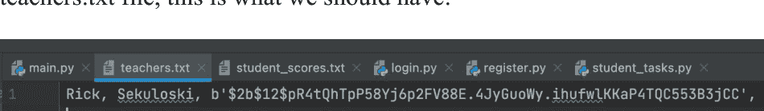

新教师已创建，包含名、姓和哈希后的密码。它们都是逗号分隔的值。

现在既然教师已创建，我们可以尝试登录：

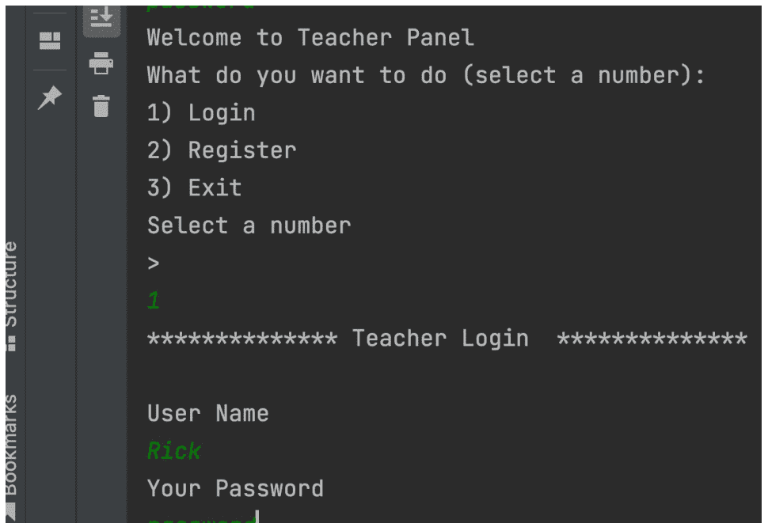

如果按返回或回车键，应该会出现一个新菜单，我们可以添加新学生、更新学生成绩和获取学生成绩：

```
*************** Teacher Login  ***************

User Name
Rick
Your Password
password
Welcome back teacher Rick
What you want to do (select a number):
1) Get Student Scores
2) Update Student Score
3) Enroll New Student
4) Exit
>
```

因为学生文件是空的，让我们选择选项3来创建一个新学生：

```
Welcome back teacher Rick
What you want to do (select a number):
1) Get Student Scores
2) Update Student Score
3) Enroll New Student
4) Exit
>
3
Enroll new student
Student name
Jason
Student score
134
```

按回车/返回键后，让我们检查`student_scores.txt`文件：

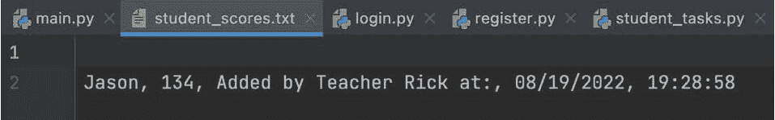

如你所见，我们有学生的姓名、成绩、教师姓名和时间戳。此后，你可以使用选项2将学生成绩从134更新为199：

```
Welcome back teacher Rick
What you want to do (select a number):
1) Get Student Scores
2) Update Student Score
3) Enroll New Student
4) Exit
>
2
Input student details
Student name
Jason
New student score
199|
```

如果按回车/返回键，我们不需要去检查`student_scores`文件，因为我们可以使用菜单中的选项1，它将列出该文件中的所有内容，包括我们所做的更改：

```
What you want to do (select a number):
1) Get Student Scores
2) Update Student Score
3) Enroll New Student
4) Exit
>
1
Jason, 199, Updated by Teacher:Rick, 08/19/2022, 20:00:19
```

如我们所见，Jason的成绩已从134更新为199。仅为确认，`student_scores.txt`文件也已更新：

这就是这个应用程序的所有功能。接下来，我将提供每个文件的起始代码，这样你只需编写主要函数：

## 包含注释的起始代码，提示你应该添加什么代码

Main.py 文件：

```
# 从login中导入teacher_login函数
# 从register中导入teacher_register
# 从student_tasks中导入get_student_scores, update_student_score, add_new_student
# 这个变量将使主菜单出现
# 只要while循环的评估结果为true
# 当用户选择数字3时，while循环将停止
teacher_selection = 0

while teacher_selection != 3:
    print(f'Welcome to Teacher Panel \n'
          f'What do you want to do (select a number): \n'
          f'1) Login\n'
          f'2) Register\n'
          f'3) Exit\n'
          f'Select a number \n'
          f'>')
    teacher_selection = int(input(''))
    if teacher_selection == 2:
        print('************** Teacher Registration ************** \n')
        print('Your first name')
```

## Login.py 文件：

```python
# 导入 bcrypt，在你安装 bcrypt
# 包之后，import bcrypt 将不会导致错误
import bcrypt

# 编写登录函数，该函数有 2 个参数：
# 教师的名字和密码
def teacher_login(user_name, password):
    # Encode 方法返回给定字符串的编码版本。
    # 如果你阅读了 bcrypt 文档，你需要字符串
    # 被编码以便能够被哈希或验证
    new_password = password.encode('utf-8')
    try:
        # 删除上面的 pass 语句。
        # 在 try-except 块中，你需要尝试
        # 使用模式 r 打开 teachers.txt 文件。
        # 示例：
        # with open('teachers.txt', mode='r') as teachers:
        # 使用 for-in 循环遍历 teachers.txt
        # 文件中的所有行。
        # 目前只有一行，但是
        # 如果注册了更多的教师，
        # teachers.txt 文件将包含多行。
        # 重要提示：你可以使用 split() 方法，该方法
        # 将字符串分割成一个列表。
        # 语法是 split(separator, maxsplit)
        # 这是最难的函数，这里是一个
        # 辅助代码：
        # for teacher in teachers:
        #     result = teacher.split(', ')
        # 在这之后，你需要检查作为参数传递的 user_name
        # 对应的教师是否存在于某一行中。
        # 你可以使用关键字 'in' 来检查 user_name
        # 是否可以在某一行中找到。
        # 如果找到了用户，那么传递并编码的密码
        # 与文件中存储的哈希密码匹配。
        # 为此，你将需要使用
        # bcrypt.checkpw 方法来比较
        # 传递的密码与 teachers.txt 文件中的哈希密码。
        # 如果 user_name 没有匹配项，
        # 这意味着该教师未注册，
        # 因此打印以下消息：
        # print(f'Sorry you are not registered as a teacher \n'
        #       f' please contact the administration for access')
        # 打印消息后，使用 return 语句返回 -1
    except FileNotFoundError as err:
        print('文件未找到！')
```

## Register.py

```python
import bcrypt

# 使用 user_name, user_lastname 和 password 注册新教师
def teacher_register(user_name, user_lastname, password):
    # try - except 块
    try:
        # 这里你需要调用 hash_password() 函数，
        # 该函数将返回
        # 使用 bcrypt 哈希后的密码。
        # 你现在不需要了解 hash_password() 函数，
        # 只需遵循以下说明：
        # 1) 将 password 参数传递给 hash_password(password)。
        # 2) 将上述函数返回的任何内容存储在一个名为 password_hashed 的变量中
        with open('teachers.txt', mode='a') as new_text_file:
            # 删除 pass。
            # 使用 new_text_file 写入 teachers.txt 文件
            # 记住你需要遵循以下格式：
            # user_name, last_name, password_hashed, \n
        # 写入 teachers.txt 文件后，返回一个格式化的字符串，如下所示：
        # f'{user_name} , Your registration is successful, go back and log in!'
        # 确保 return 与 with-open 块处于同一级别。
    except FileNotFoundError as err:
        print('文件未找到！')

# 用于哈希上述密码的哈希函数
def hash_password(user_password):
    # 对密码进行编码
    bytePwd = user_password.encode('utf-8')
    # 生成盐值
    mySalt = bcrypt.gensalt()
    # 哈希密码
    user_password_hashed = bcrypt.hashpw(bytePwd, mySalt)
    return user_password_hashed
```

## student_tasks.py

```python
from os import remove, rename
from datetime import datetime

# 这是获取学生分数的函数
def get_student_scores():
    try:
        with open('student_scores.txt', mode='r') as students:
            # 你可以像我们在书中那样使用简单的 read() 函数
            # 返回所有学生。
    except FileNotFoundError as err:
        print('文件未找到！')

# 这是一个根据 3 个参数更新用户分数的函数
def update_student_score(student_name, student_score, teacher_username):
    try:
        # 为了创建时间戳，我使用了：
        # now = datetime.now()
        # 和 date_time = now.strftime("%m/%d/%Y, %H:%M:%S")
        # 如果你想创建不同的内容，欢迎尝试。
        # 我使用了旧的 open 方法而不是嵌套的 with open，
        # 但我们最后需要关闭它
        # tmp 代表模式为写入的临时文件
        tmp = open('student_scores.tmp', mode='w')
        # 这将以读取模式打开原始文件
        original_file = open('student_scores.txt', mode='r')
        # 思路是在新文件中更新 student_score，
        # 然后将带有更改的临时文件重命名为原始文件
        for line in original_file:
            content = line.split(', ')
            if student_name in content:
                # 删除 pass 语句。
                # 如果在内容中找到 student_name，
                # 你需要使用 tmp.write() 将
                # 从原始文件获得的内容写入临时文件
                # f'{student_name}, {student_score}, Updated by Teacher: {teacher_username}, {date_time}\n'
            else:
                # 删除 pass
                # 你可以将整行写入 tmp 文件
        # 你需要关闭 tmp 和 original_file
        # 接下来是使用 remove 函数删除 student_scores.txt
        # 接下来是将 student_scores.tmp 重命名为 student_scores.txt
    except FileNotFoundError as err:
        print('文件未找到！')

def add_new_student(student_name, student_score, teacher_username):
    try:
        # 删除上面的 pass 语句
        # 使用上面函数中的 now 和 date_time
        with open('student_scores.txt', mode='a') as new_text_file:
            # 删除上面的 pass
            # 使用 write 函数向文件写入以下字符串：
            # f'\n{student_name}, {student_score}, Added by Teacher {teacher_username} at:, {date_time}'
            # 打印消息 f'Student with the {student_name} successfully added in the system '
    except FileNotFoundError as err:
        print('文件未找到！')
```

解决方案将在附录 A Project_2: Teacher, Student App Solution 中。所有项目文件都在文件夹 pythonProject2_starter 中。

## 附录 A – 项目解决方案

### 项目 1：猜随机数解决方案：

你可以运行以下代码并试玩这个猜数字游戏：

```python
import random

the_number = random.randint(1, 10)

player = input('Hello stranger what is your name? \n>')
print(f'Excellent {player}! Can you try and guess a number between 1 and 10:')
player_number = int(input(''))

number_of_guesses = 1
while number_of_guesses < 3:
    number_of_guesses += 1
    if player_number < the_number:
        print(f'The number we are looking is greater than {player_number}')
        player_number = int(input(''))
    if player_number > the_number:
        print(f'The number we are looking is smaller than {player_number}')
        player_number = int(input(''))
    if player_number == the_number:
        break

if player_number == the_number:
    if number_of_guesses == 1:
        print(f'You guessed the number in your {number_of_guesses}-st attempt!')
    elif number_of_guesses == 2:
        print(f'You guessed the number in your{number_of_guesses}-nd attempt')
    else:
        print(f'You guessed the number in your {number_of_guesses}-rd attempt!')
else:
    print(f'The number we were looking was {the_number}')
```

### 项目 2：教师、学生应用解决方案

#### Main.py

```python
from login import teacher_login
from register import teacher_register
from student_tasks import get_student_scores, update_student_score, add_new_student

teacher_selection = 0

while teacher_selection != 3:
    print(f'Welcome to Teacher Panel \n'
          f'What do you want to do (select a number): \n'
          f'1) Login\n'
          f'2) Register\n'
          f'3) Exit\n'
          f'Select a number \n'
          f'>')
    teacher_selection = int(input(''))
    if teacher_selection == 2:
        print('*************** Teacher Registration  *************** \n')
        print('Your first name')
        teacher_name = input('')
        print('Your last name')
        teacher_lastname = input('')
        print('Your login password')
        teacher_password = input('')
        teacher_register(teacher_name, teacher_lastname, teacher_password)
    elif teacher_selection == 1:
        print('*************** Teacher Login  *************** \n')
        print('User Name')
        teacher_username = input('')
        print('Your Password')
        teacher_password = input('')
        login_result = teacher_login(teacher_username, teacher_password)

        while login_result != -1:
            print(f'Welcome back teacher {teacher_username} \n'
                  f'What you want to do (select a number): \n'
                  f'1) Get Student Scores \n'
                  f'2) Update Student Score \n'
                  f'3) Enroll New Student \n'
                  f'4) Exit \n'
                  f'>')
            teacher_login_input = int(input(''))
            if teacher_login_input == 4:
                break
            if teacher_login_input == 1:
                print(get_student_scores())
            elif teacher_login_input == 2:
                print('Input student details')
                print('Student name')
                student_name = input('')
                print('New student score')
                student_score = int(input(''))
                update_student_score(student_name, student_score, teacher_username)
            elif teacher_login_input == 3:
                print('Enroll new student')
                print('Student name')
                student_name = input('')
                print('Student score')
                student_score = int(input(''))
                add_new_student(student_name, student_score, teacher_username)
            else:
                print('You have entered a wrong choice')
```

#### login.py

```python
import bcrypt

def teacher_login(user_name, password):
    new_password = password.encode('utf-8')
    try:
        with open('teachers.txt', mode='r') as teachers:
            for teacher in teachers:
                result = teacher.split(', ')
                if user_name in result:
                    striped_string = result[2][2:-1]
                    if bcrypt.checkpw(new_password, striped_string.encode('utf-8')):
                        return True
        print(f'Sorry you are not registered as a teacher \n'
              f'please contact the administration for access')
        return -1
    except FileNotFoundError as err:
        print('File cannot be found!')
```

#### student_tasks.py

```python
from os import remove, rename
from datetime import datetime

def get_student_scores():
    try:
        with open('student_scores.txt', mode='r') as students:
            return students.read()
    except FileNotFoundError as err:
        print('File cannot be found!')

def update_student_score(student_name, student_score, teacher_username):
    try:
        now = datetime.now()
        date_time = now.strftime("%m/%d/%Y, %H:%M:%S")
        tmp = open('student_scores.tmp', mode='w')
        original_file = open('student_scores.txt', mode='r')
        for line in original_file:
            content = line.split(', ')
            if student_name in content:
                tmp.write(f'{student_name}, {student_score}, Updated by Teacher: {teacher_username}, {date_time}\n')
            else:
                tmp.write(line)
        tmp.close()
        original_file.close()
        remove('student_scores.txt')
        rename('student_scores.tmp', 'student_scores.txt')

    except FileNotFoundError as err:
        print('File cannot be found!')

def add_new_student(student_name, student_score, teacher_username):
    try:
        now = datetime.now()
        date_time = now.strftime("%m/%d/%Y, %H:%M:%S")
        with open('student_scores.txt', mode='a') as new_text_file:
            new_text_file.write(
                f'{student_name}, {student_score}, Added by Teacher {teacher_username} at: {date_time}')
            print(f'Student with the {student_name} successfully added in the system ')

    except FileNotFoundError as err:
        print('File cannot be found!')
```

#### register.py

```python
import bcrypt

# register new teacher
def teacher_register(user_name, user_lastname, password):
    # try - except block
    try:
        password_hashed = hash_password(password)
        with open('teachers.txt', mode='a') as new_text_file:
            new_text_file.write(f'{user_name}, {user_lastname}, {password_hashed}, \n')
        return f'{user_name} , Your registration is successful, go back and log in!'
    except FileNotFoundError as err:
        print('File cannot be found!')

# hashing function
def hash_password(user_password):
    # encode the password
    bytePwd = user_password.encode('utf-8')
    # Generate salt
    mySalt = bcrypt.gensalt()
    # Hash password
    user_password_hashed = bcrypt.hashpw(bytePwd, mySalt)
    return user_password_hashed
```

## 附录 B：我的畅销书

如果你仍想了解更多关于 JavaScript、HTML 和 CSS 从基础到中级的知识，我建议你获取我的畅销电子书：


https://www.amazon.com/Web-Design-HTML5-CSS-responsive-ebook/dp/B097DWX99H/ref=sr_1_1?

## 快速掌握现代 JavaScript

最全面的初学者指南


以及揭秘那些“奇怪的部分”

Rick Sekulowski


## JavaScript
从入门到精通

有史以来最全面的指南，即使你编程新手，也能精通现代 JavaScript

Rick Sekuloski

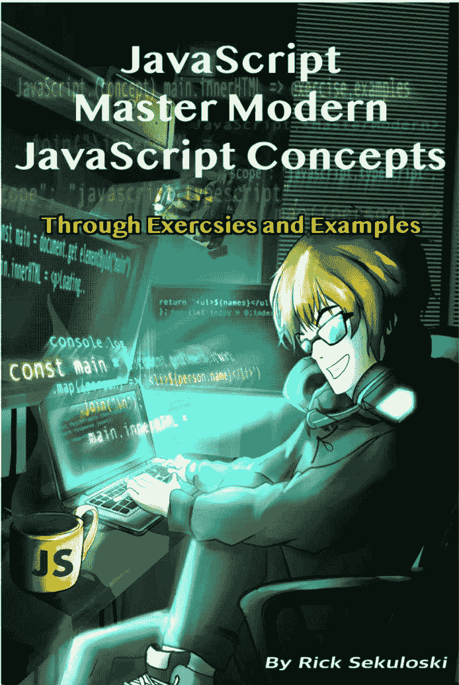

https://www.amazon.com/JavaScript-Concepts-Exercises-Mastering-exercises-ebook/dp/B0B4W92N3R/ref=sr_1_8?crid=1D8WW0MGX5WL0&keywords=rick+sekuloski&qid=1657010993&sprefix=rick+sekulosk%2Caps%2C290&sr=8-8&asin=B0B4W92N3R&revisionId=&format=2&depth=1

## HTML 和 CSS

### 最全面的 Web 开发指南


Rick Sekuloski

https://www.amazon.com/HTML-CSS-Complete-Development-Guide-ebook/dp/B09YNQFRYN/ref=sr_1_4?crid=1D8WW0MGX5WL0&keywords=rick+sekuloski&qid=1657010950&sprefix=rick+sekulosk%2Caps%2C290&sr=8-4&asin=B09YNQFRYN&revisionId=e1f1dcc3&format=1&depth=1

# JavaScript 面试：掌握你的下一场面试

用我最新的面试问题助你获得理想工作

Rick Sekuloski

[https://www.amazon.com/JavaScript-Interview-questions-Up-Date-ebook/dp/B0B5V4ZS51/ref=sr_1_9?](https://www.amazon.com/JavaScript-Interview-questions-Up-Date-ebook/dp/B0B5V4ZS51/ref=sr_1_9?)

# 附录 C：更多练习，深入了解 JavaScript、HTML 和 PHP

如果你想学习更多关于 JavaScript 或其他 Web 开发语言的知识，请查看我的课程。我保证你将在真实案例中获得丰富的经验。你可以在 Udemy 上找到我的课程：

https://www.udemy.com/user/riste3/


**终极 PHP, Laravel, CSS & Sass！**
学习 PHP、Laravel 和 Sass
Rick Sekuloski
4.4 ★★★★☆ (128)
总计 95.5 小时 • 444 节课 • 所有级别
A$13.99 ~~A$109.99~~


**精通 JavaScript - 2021年最全面的 JavaScript 课程**
Rick Sekuloski
4.2 ★★★★☆ (27)
总计 45.5 小时 • 181 节课 • 所有级别
A$16.99 ~~A$129.99~~


**现代 Web 训练营，使用 PHP、SASS、CSS-GRID 和 FLEX 进行设计**

## 附录 D：资源

[https://docs.python.org/3/](https://docs.python.org/3/)

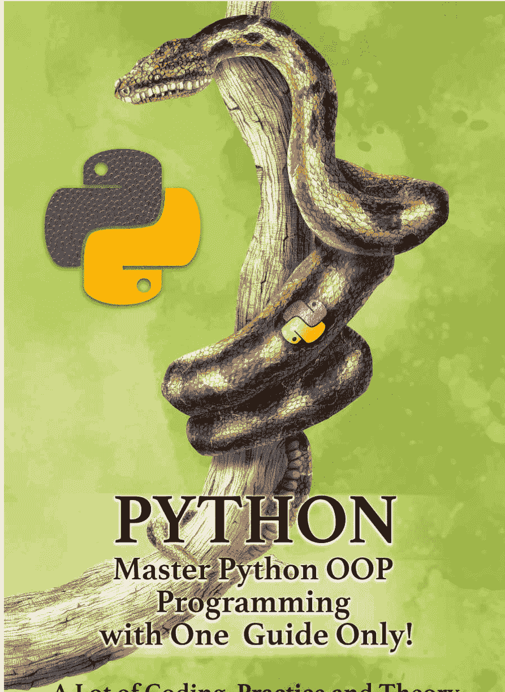

# PYTHON

仅凭一本指南，精通 Python OOP 编程！

大量编码、实践和理论