# 面向初学者的Python精通之道


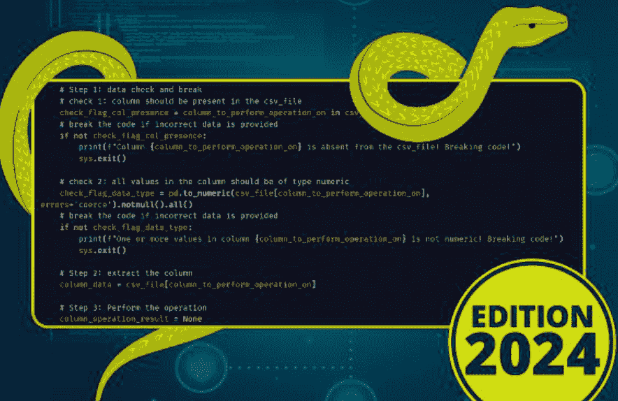

```python
# Step 1: data check and break
# check 1: column should be present in the csv_file
check_flag_col_presence = column_to_perform_operation_on in csv_file.columns
# break the code if incorrect data is provided
if not check_flag_col_presence:
    print(f"Column {column_to_perform_operation_on} is absent from the csv_file! Breaking code!")
    sys.exit()

# check 2: all values in the column should be of type numeric
check_flag_data_type = pd.to_numeric(csv_file[column_to_perform_operation_on], errors='coerce').notnull().all()
# break the code if incorrect data is provided
if not check_flag_data_type:
    print(f"One or more values in column {column_to_perform_operation_on} is not numeric! Breaking code!")
    sys.exit()

# Step 2: extract the column
column_data = csv_file[column_to_perform_operation_on]

# Step 3: Perform the operation
column_operation_result = None
```

# 2024版

10天完整指南，附带实践练习和爆炸性秘诀，助你精通Python编程，迈向理想工作！

罗伯特·马特

# 面向初学者的Python精通之道

10天完整指南，附带实践练习和爆炸性秘诀，助你精通Python编程，迈向理想工作！

作者

罗伯特·马特

© 版权所有 2023 罗伯特·马特 - 保留所有权利。

本文档旨在提供有关所涵盖主题和问题的准确可靠信息。

- 源自美国律师协会委员会以及出版商和协会委员会共同接受和批准的原则声明。

以电子方式或印刷格式复制、复制或传输本文档的任何部分均属非法。保留所有权利。

本文提供的信息据称真实且一致。对于因疏忽或其他原因，对本文所含任何政策、流程或指示的任何使用或滥用所造成的任何责任，均由接收读者独自承担。在任何情况下，出版商均不对因本文信息直接或间接造成的任何赔偿、损害或金钱损失承担任何法律责任或指责。

相应作者拥有出版商未持有的所有版权。

本文信息仅供参考，具有普遍性。信息的呈现不附带合同或任何类型的保证。

所使用的商标未经任何同意，商标的发布未经商标所有者许可或支持。本书中的所有商标和品牌仅用于说明目的，归所有者所有，与本文档无关。

# 目录

引言

第1章：Python简介

- 1.1：Python简史
- 1.2：Python为何重要？
- 1.3：Python的多功能性
- 1.4：安装Python
- 1.5：如何在MAC、Linux上安装Python
- 1.6：练习、解答与解释

第2章：Python基础

- 2.1：基本语法
- 2.2：变量与数据类型
- 2.3：Python中的运算符
- 2.4：控制结构（if、else、while、for）
- 2.5：矩形面积与奇偶数练习

第3章：函数与模块

- 3.1：创建和使用函数
- 3.2：将代码组织成模块
- 3.3：导入外部模块
- 3.4：自定义模块与计算阶乘练习

第4章：异常管理

- 4.1：什么是异常？
- 4.2：使用try-except进行异常处理
- 4.3：使用自定义异常
- 4.4：练习

第5章：列表与字典操作

- 5.1：列表简介及其操作
- 5.2：Python中字典的使用
- 5.3：练习

第6章：高级文件与数据管理

- 6.1：文件访问模式
- 6.2：理解Python中的XML和JSON
- 6.3：实践练习

第7章：Python高级面向对象编程

- 7.1：面向对象编程的高级概念
- 7.2：特殊方法与高级继承的使用
- 7.3：练习

第8章：流行的Python库

- 8.1：Python库资源：更深入的探讨
- 8.2：Numpy
- 8.3：Pandas

第9章：使用Flask进行Web开发

- 9.1：使用Flask创建简单的Web应用程序
- 9.2：集成数据库以存储用户数据
- 9.3：练习

第10章：自动化与脚本编写

- 10.1：行业特定应用
- 10.2：探索复杂的脚本编写方法
- 10.3：实践练习

第11章：Python实践项目

- 11.1：基础计算器项目
- 11.2：任务列表管理项目详解
- 11.3：猜数字游戏项目

第12章：Python高级主题

- 12.1：简介
- 12.2：使用virtualenv
- 12.3：Python 3简介
- 12.4：未来学习与深入研究的资源

术语表

结语

# 引言

Python是一种高级编程语言，可用于各种应用程序，并因其易用性和可读性而备受赞誉。它是全球使用最频繁的语言之一，许多企业和组织都在使用它，例如谷歌、Facebook和美国国家航空航天局（NASA）等。

如果你是初学者，Python是一门极佳的语言，因为它简单直接。然而，它也是一门强大的语言，适用于广泛的活动，例如机器学习、数据分析和网站构建。

本书将通过遵循书中的步骤，在短短十天内教你成为Python编程专家所需的一切知识。书中充满了实用的活动和爆炸性的见解，这些将使你学习Python变得更简单、更快捷。

读完本书，你将能够：

- 编写自己的Python代码
- 使用Python模块和库
- 开发Python应用程序
- 迈向你的理想工作

# 第1章：Python简介

## 1.1：Python简史

Python是一种在设计上注重清晰度和可访问性的编程语言。由于它支持多种范式，程序员可以根据自己的偏好以面向对象、结构化或函数式的方式编写代码。如今，它被广泛应用于各个领域，包括Web开发、机器学习（通过TensorFlow和Keras等框架）等。它是全球第二大最受欢迎的编程语言，仅次于JavaScript。

Python的旅程始于20世纪80年代末和90年代初，自那时起，它已成为在众多行业中使用最广泛、最受喜爱的编程语言之一。荷兰程序员范·罗苏姆于1989年12月在荷兰数学与计算机科学研究所（CWI）度假时开始着手开发Python。

Python 2.0 已发布，带来了新增功能和升级。然而，随着时间的推移，Python 2 的设计决策导致了一些变化，使得继续开发和维护该语言变得更加困难。

作为回应，Python 3 被开发出来并于 2008 年 12 月 3 日向公众发布。Python 3 标志着一个重大的进步，这得益于实施了向前不兼容的增强功能，以提高程序的一致性并消除被认为是多余的代码。

但 Python 3 与 Python 2 部分向后兼容，而 Python 2 已经超过了其生命周期终点，不再持续开发。在版本之间迁移时，你需要对代码进行一些修改以适应这些差异。

Python 的可读性、多功能性和易用性促成了该编程语言多年来日益普及。其语法的清晰性和简洁性使其在开发者中广受欢迎，因为它使他们更容易编写和理解代码。到 2010 年代，Python 已经确立了自己作为最广泛使用的编程语言之一的地位，此后其在行业中的使用只增不减。各种信息技术公司、初创公司和其他组织使用 Python 作为项目语言，有助于促进 Python 社区和环境的发展。

Python 是一种强大且可塑的编程语言，由于其适应性，可用于各种应用。在某些情况下，它可能不是最佳选择。实时系统、需要大量资源的软件、移动应用程序开发、高频交易、系统级程序编程、内存密集型软件、移动设备或游戏机上的游戏以及特定的加密技术都是这类软件的例子。

然而，至关重要的是要记住，Python 的限制通常可以通过使用必要的库和工具来解决。这一点应该记住。最终，项目的需求、团队的知识和开发目标将决定使用哪种编程语言。Python 是一种广泛使用且有用的编程语言，可以独立使用或与其他语言合作以完成各种任务。Python 可以单独使用，也可以与其他语言结合使用。

## 1.2：为什么 Python 很重要？

Python 是一种先进的编程语言，它是面向对象的、可解释的，并用于交互式脚本。由于 Python 被设计得相对容易理解，它通常使用英语短语而不是其他语言中常见的标点符号。此外，与其他语言相比，Python 的语法结构数量显著减少。

Python 编程是一项多才多艺的技能，几乎在每个行业都有应用，包括以下领域：

- 数据研究
- 科学和数学计算
- 游戏的基础构建模块
- Web 开发
- 商业和金融交易
- 通用和特定应用程序的脚本编写
- 系统自动化和管理
- 计算机图形学
- 制图和地理学（通常使用 GIS 软件）
- 安全系统漏洞检查

### 潜在的经济收益：

根据 Indeed 的数据，Python 是平均工资第二高的编程语言。平均年收入可能约为 110,026 美元。无需担心！如果你在 Selby Jennings 获得工作，可以赚到最多的钱。那里的平均年薪是 245,862 美元。

### 便于理解：

Python 编程语言的易用性和普遍可用性是其最公认的优势之一。由于其语法是用英语编写的，与其他编程语言的语法相比，学习它只需要付出很少的努力，不像学习其他编程语言那样费力。由于它以 Monty Python's Flying Circus 命名，我们可以确定设计这段代码的人具有幽默感。这是它如此易于实现的原因之一，也是它以该节目命名的原因之一。它在处理复杂性方面表现出色，这让你可以专注于了解 Python 编程的好处，而不是学习细节的烦恼。由于它在处理复杂性方面表现出色，它让你能够专注于掌握 Python 编程的积极方面。它免费提供并采用开源许可证，这更是锦上添花。

### 移动性和适应性：

Python 是一种以其多功能性和快速学习过程而闻名的编程语言，其特点是学习曲线平缓。由于有超过 125,000 个第三方 Python 库可用，因此可以使用 Python 来完成包括机器学习、网络内容处理甚至生物学在内的任务。此外，它还预装了面向数据的模块，如 pandas、NumPy 和 matplotlib。这些库在数据处理、操作和呈现方面提供了卓越的功能，有助于其在数据分析中的广泛应用。

## 1.3：Python 的多功能性

由于其众多优势，Python 编程在当今竞争激烈的劳动力市场中正迅速变得更有价值。根据 ZDNet 的数据，Python 现在是全球三大编程语言之一，并且正在成为最常用的语言。PYPL 的数据显示，Python 是世界上使用最广泛的编程语言。因此，那些渴望在其他国家获得职业机会的人，在瑞士或澳大利亚等国家可能有良好的前景。你渴望在哪个地方获得工作？将 Python 添加到你的技能中可能正是让你到达那里所需要的。

Python 很棒，但应该费心去学习它吗？正确的回答是肯定的。首先，使用 Python 有多种职业道路。如果你精通 Python，你可以从事数据科学家或机器学习工程师、Web 开发人员、软件开发人员，甚至是 DevOps 工程师或安全分析师等职业。Python 在这些角色中经常使用，包括但不限于脚本、框架和数据模型。

使用 Python 的工作非常有利可图。这可能是我们大多数人学习 Python 的最大好处之一。根据评论网站 Glassdoor 的数据，美国 Python 开发人员的平均年薪为 102,000 美元，而机器学习工程师的平均年薪为 132,000 美元。多么诱人！薪资水平与需求水平相称。

### 网站开发：

Python 被广泛认为是一种非常通用的编程语言，为简化复杂互联网产品的创建过程提供了潜力。Python 的许多 Web 框架，如著名的 Django，非常有用。这样的框架可以简化和加速开发后端和客户端功能的过程。即使是最大的公司也使用 Python 进行 Web 开发；例如，YouTube 和 Google 都在其许多技术基础设施中大量使用了 Python。

### 数据科学：

在 Kaggle（一个面向数据科学工作者的在线社区）进行的一项调查显示，Python 是数据科学家中最受欢迎的编程语言。不仅仅是节省时间的模块促成了 Python 的成功；该编程语言快速分析海量数据集和完成高度重复性任务的能力也是主要因素。

### 应用程序开发：

任何对应用程序开发感兴趣的人都应该认真考虑学习 Python 作为他们的首选语言。由于减少了时间和精力

## 1.4：安装 Python

步骤 1：下载 Python 安装程序：

-   前往 Windows 官方网站的 Python 下载页面。
-   找到一个可靠的 Python 版本。本课程测试使用的是 Python 3.10.10 版本。
-   要下载可执行文件，请选择与你的操作系统相关的链接：适用于 64 位 Windows 的 Windows 安装程序，或适用于 32 位 Windows 的 Windows 安装程序。

步骤 2：运行可执行安装程序：

-   下载完成后，双击 `.exe` 文件（例如 `python-3.10.10-amd64.exe`）将开始 Python 安装。
-   通过选择“为所有用户下载启动器”选项，你将允许所有计算机用户访问 Python 启动器程序。
-   用户可以通过选择“将 python.exe 添加到 PATH”复选框，从而能够从终端运行 Python。
-   如果这是你第一次使用 Python，并且希望使用默认功能进行安装，请点击“立即安装”按钮，然后继续执行步骤 4 以验证 Python 是否成功安装，如对话框所示。要安装其他功能（包括基本和高级功能），请选择“自定义安装”按钮，然后继续。
-   即使你不打算使用 Python 可选功能中包含的任何工具或资源，你仍然可以将它们全部下载到你的计算机上。
-   建议你使用 Python 测试套件进行测试和学习。
-   Python 启动器及以下内容适用于所有用户：建议为用户提供通过命令提示符启动 Python 的能力。
-   根据你的偏好，从可用选项中进行选择：
-   为每个用户安装：如果你不是这台机器的唯一使用者，强烈建议选择此项。
-   将文件与 Python 关联：强烈推荐，因为选择此选项会将所有 Python 脚本类型与编辑器或启动器关联。
-   为已安装的应用程序创建桌面快捷方式：建议你为 Python 程序启用快捷方式。
-   将 Python 添加到环境变量：建议添加，以便能够启动它。
-   预编译标准库：不必要，这样做可能会减慢安装速度。
-   获取用于调试的符号和调试二进制文件：仅在你希望开发 C 或 C++ 附加组件时建议获取。
-   记下 Python 安装的目录，以防你以后需要返回该目录。
-   要开始安装，请点击“安装”按钮。
-   安装完成后，将显示一条通知，说明设置成功。

步骤 3：将 Python 添加到环境变量（可选）：

-   如果你在步骤 2 中选择了相应选项，请跳过此步骤。在安装过程中，将 Python 添加到环境变量。
-   即使你在安装期间未将 Python 添加到系统变量，你也可以通过命令行访问 Python。如果你希望通过命令行使用 Python，可以手动执行此操作。
-   开始之前，请在你的计算机上找到 Python 安装的目录。
-   Python 可以在位于 `C:\Users\Sarah\AppData\Local\Programs\Python\Python310` 的文件夹中找到：如果你在安装时未选择“为所有用户安装”，该目录将位于 Windows 用户路径中。

需要注意的是，文件夹的标题会根据安装的 Python 版本而有所不同。但是，它始终以“Python”一词开头。

-   点击“开始”按钮，然后在搜索窗口中输入“高级系统设置”。
-   要查看高级系统选项，请点击“查看”按钮。
-   要更改计算机的环境变量，请打开“系统属性”对话框并转到“高级”选项卡。

根据你的配置：

-   在安装过程中，如果你选择了“为所有用户安装”选项，请从系统变量的可用列表中选择“Path”，然后点击“编辑”按钮。
-   选择“新建”并输入 Python 列表的路径后，多次点击“确定”，直到所有对话框消失。

步骤 4：检查 Python 安装是否成功：

-   如果你决定安装它，可以使用命令行或集成开发环境（IDLE）程序来检查 Python 安装是否成功。无论哪种方式，你都可以验证安装是否成功完成。
-   要启动该过程，请找到“开始”按钮，然后在指定的搜索字段中输入命令“cmd”。选择“命令提示符”按钮。
-   在命令输入提示符处，输入以下命令：`Python --version`。

## 1.5：如何在 MAC、Linux 上安装 Python

在 MAC 上安装 Python：

macOS 预装了 Python 2.7，但如果你想更新到最新版本的编程语言，则需要遵循以下说明：

-   首先，检查你的计算机上当前安装的 Python 版本。为此，你必须启动终端，输入“python –version”，然后按回车键。这将为你提供 Mac 设备上安装的 Python 版本。
-   要在你的计算机上安装最新版本的 Python，请访问以下网站：[https://www.python.org/downloads/](https://www.python.org/downloads/)。选择 macOS 作为你的操作系统，然后转到可以下载 `.pkg` 文件的页面。
-   现在，打开下载的 `.pkg` 文件以在你的 Mac 系统上安装 Python，然后按照屏幕上的说明完成安装。
-   在这一点上，你需要点击几次“继续”，然后，如下图所示，你将看到一个安装程序的按钮。
-   如下图所示，在你按下安装按钮后，系统将提示你输入系统密码，然后才能开始安装。
-   输入密码后，点击“安装软件”按钮，它将立即开始安装最新版本的 Python。你可以使用开始时用于获取 Python 版本的相同命令来确认安装是否成功。
-   在终端中使用命令“python3.11 --version”来确定你的计算机上安装的最新 Python 版本。

在 LINUX 上安装 Python：

正如我们刚才所讨论的，Linux 操作系统预装了 Python，但如果你希望在你的机器上设置 Python，则需要遵循以下说明：

下载并设置作为在 Debian 和 Fedora 上安装 Python 先决条件所需的开发包。这些包可以在 `python-devel` 包中找到。要在你的机器上安装必要的开发依赖项，你必须在终端中执行以下命令：执行命令 `sudo apt-get build-dep python3`。

成功安装这些包后，你需要从以下地址获取最新版本的 Python：[https://www.python.org/downloads/](https://www.python.org/downloads/)，并且你需要针对你的系统（例如 Linux）进行特别选择。之后，你可以继续下一步。

现在，你只需解压 tar 文件并在终端中输入一些标准参数和指令即可完成安装，从而在 Linux 上安装 Python：

```
tar -xf archive.tar.xz (command prompt)
```

请注意，在某些情况下，下载文件的名称可能会更改，如下例所示：“python-3.11.2.tar.xz”。因此，最好使用与你下载时相同的名称来解压下载的文件。

在过程的最后阶段，你必须使用代码或文本编辑器来检查安装是否成功。你可以使用任何文本编辑器将以下代码写入一个新的 Python 文件，然后保存。`print('Installation Completed Successfully')`。并在保存时将此代码命名为“test.py”。

要确定代码是否正常工作，你必须启动设备并转到你最初存储此 Python 文件的位置。应使用以下命令运行该文件：`python script.py`。

### 在 Ubuntu 上安装 Python：

Python 在所有 Linux 发行版中都是预装的；然而，你可能并非总能在 Ubuntu 操作系统上找到它预装。根据具体情况，可以通过多种方式安装 Python。借助 APT（Advanced Package Tool，Ubuntu 上的标准包管理器），Python 将被安装到你的 Ubuntu 计算机上。要在 Ubuntu 上设置 Python，请参考以下列出的说明：

- 在 Ubuntu 上，你可以通过同时按下以下键来启动终端：Control、Option 和 Tab。
- 现在，要在终端中运行以下命令以访问系统仓库：
- 使用 `sudo` 更新 apt。
- 要在 Ubuntu 上设置 Python，请使用命令 `sudo apt install python3`。
- 然后，APT 将搜索 Python 安装包并将其安装到你的计算机上，无需进一步干预。

## 1.6：练习、解答与解释

在这个例子中，我们使用了内置的 `print()` 方法在屏幕上显示字符串 "Hello, world!"。一系列字符被称为字符串。在 Python 中，字符串可以用单引号、双引号或三引号括起来。

**练习 1：**

在 Python 中打印 "Hello World"。

**代码：**

```python
# Print Hello World
print("Hello World")
```

**输出：**

```
PS C:\Users\TOWER TECH\Desktop\Codes> & "C:/Program Files/Python311/python.exe" "c:/Users/TOWER TECH/Desktop/Codes/Chapter1_codes.py"
Hello World
PS C:\Users\TOWER TECH\Desktop\Codes>
```

**解释：**

我们可以在屏幕上看到字符串 "Hello World"，因为我们的应用程序使用了名为 `print()` 的内置方法。构成字符串的字符被称为字符串。在 Python 中，字符串可以用单引号、双引号甚至三引号括起来。

**练习 2：**

编写一个打印你名字的 Python 程序。

**代码：**

```python
# Get the user's name
name = input("Enter your name: ")
# Print the name
print("Hello, " + name + "!")
```

**输出：**

```
PS C:\Users\TOWER TECH\Desktop\Codes> & "C:\Program Files\Python311\python.exe" "c:/Users/TOWER TECH/Desktop/Codes/Chapter1_codes.py"
Enter your name: Jhon
Hello, Jhon!
PS C:\Users\TOWER TECH\Desktop\Codes> |
```

**解释：**

为了与该程序的用户交流，我们使用了 `input()` 方法。`input()` 方法通过显示文本 "Enter your name:" 来提示用户输入他们的名字，然后等待他们这样做。变量 `name` 将保存用户输入的任何内容的字符串表示形式。

下一步涉及使用 `print()` 方法显示消息。该消息是通过使用 `+` 运算符连接（拼接）三个字符串创建的："Hello, "、用户的名字（保存在 `name` 变量中）和 "!"。

该过程的最后一步是程序打印欢迎消息。此消息将包含用户的名字。

**练习 3：**

开发一个计算机软件，计算用户输入的两个数值的总和。

**代码：**

```python
# Get two numbers from the user
num1 = float(input("Enter the first number: "))
num2 = float(input("Enter the second number: "))
# Calculate the sum
sum = num1 + num2
# Print the result
print("The sum of {} and {} is: {}".format(num1, num2, sum))
```

**输出：**

```
PS C:\Users\TOMER TECH\Desktop\Codes> & "C:/Program Files/Python311/python.exe" "c:/Users/TOMER TECH/Desktop/Codes/Chapter1_codes.py"
Enter the first number: 1
Enter the second number: 17
The sum of 1.0 and 17.0 is: 18.0
PS C:\Users\TOMER TECH\Desktop\Codes>
```

**解释：**

在应用程序的第一阶段，我们使用 `input()` 函数，以便最终用户可以向我们提供两个数值。我们要求用户输入他们的第一个数字，当他们这样做时，我们将其保存在一个名为 `num1` 的变量中。此外，我们将要求输入另一个数字，并将此信息保存在指定为 `num2` 的变量中。我们使用 `float(input())` 方法将用户的输入转换为浮点数，以便我们可以将其视为浮点数。浮点数可以包含小数位。这样做是为了确保输入被正确处理。

一旦我们有了这两个值，我们就使用加号 (`+`) 将它们相加，计算完成后，我们将结果存储在一个名为 `sum` 的变量中。

为了显示结果，我们使用 `print()` 函数与一个预先创建的表达式结合使用。在准备好的字符串中，这些字符已被用作占位符，分别表示 `num1`、`num2` 和 `sum` 的内容。`.format()` 方法将用实际值替换这些占位符。结果是一个具有教育意义且易于使用的工具。

## 第 2 章：Python 基础

## 2.1：基本语法

Python 是一种从头开始设计为易于阅读的计算机语言。Python 正迅速成为初学者和经验丰富的开发者都使用的编程语言之一。这主要是因为该语言在开发时就考虑到了用户。由于 Python 的语法与英语非常相似，因此编写、阅读和理解 Python 脚本比使用其他编程语言（如 C 或 Java）编写的程序要容易得多。

语言的“语法”指的是其结构，或者更准确地说，是构成格式良好的程序的组成部分。此外，Python 语法由一组规则和构建块组成，这些规则和构建块共同构成了 Python 的语法。

### Python 的行结构：

Python 源代码的结构包括实际的文本行以及解释每一行作用的语句和行。在 Python 编写的程序中，一个物理行由一系列字符组成，当输入该行的最后一个字符时，行序列就完成了。这与 C 和 C++ 等其他编程语言形成对比，在这些语言中，需要使用分号来表示语句已完成。在 Python 中，一旦输入了该行的最后一个字符，行序列就可以被认为是完整的。另一方面，一个有序的路径是通过使用一个或多个物理边界作为其基本构建块在整个构建过程中创建的。虽然 Python 程序员在代码中不强制使用分号，但该语言并不阻止他们这样做。NEWLINE 标记的出现表示推理链已到达其逻辑终点。

### Python 多行语句：

正如你所看到的，Python 中新语句的开始由编程语言中的新行开始表示。尽管如此，Python 可以将多个语句合并到一个逻辑行中，并将单个语句更改为跨越多行的语句。句子的可读性还有改进的空间。

### 显式行连接：

在计算机编程中，一种称为显式行连接的方法可用于将单个语句拆分为多行代码。只需使用反斜杠表示语句延伸到下一行即可实现此目标。

**代码：**

```python
# Explicit line joining with \
result = 10 + 20 + 30 + \
         40 + 50 + 60
print(result)
```

**输出：**

```
PS C:\Users\TOMER TECH\Desktop\Codes> & "C:\Program Files\Python311\python.exe" "C:\Users\TOMER TECH\Desktop\Codes\chapter1_codes.py"
210
PS C:\Users\TOMER TECH\Desktop\Codes>
```

**解释：**

所指示的反斜杠字符是用于显式行连接的字符。显式行连接是一种将一个逻辑行分成多个物理行的方法。这是通过使用反斜杠来表示该行将继续来实现的。指定该行持续存在是实现此目标的方式。它指示 Python 将当前处理行之后的下一行视为当前处理行的延伸。完成此过程后，此范围内（从 10 到 60）的数字之和将得到 210 的值。

### 隐式行连接：

括在方括号、花括号或圆括号内的语句可以分成多个物理行，而无需使用反斜杠。

**代码：**

## 使用括号进行隐式行连接

```python
numbers = (1 + 2 + 3 +
          4 + 5 + 6)
print(numbers)
```

## 输出：

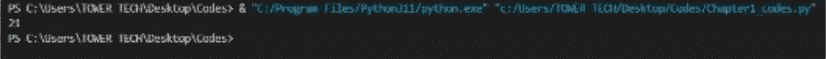

## 解释：

这里使用了括号来以一种更微妙的方式将多行连接在一起。Python 允许你使用括号将一个概念上的单行代码拆分成多个物理行。为了使加法运算更容易理解，代码被拆分到了多行中。如果 Python 遇到一个左括号（因为它知道看到左括号时计算尚未完成），它会继续扫描下一行，直到找到匹配的右括号。在这个例子中，当数字 1 到 6 被组合在一起时，最终结果的总和是 21。

## 空白符与缩进：

与许多编程语言不同，Python 依赖缩进来表示一个新代码块的开始。这与大多数编程语言的做法相反。

大多数计算机编程语言将代码缩进视为可选的，但它们提供缩进是为了让程序呈现得更清晰高效。然而，Python 强制要求缩进。在 Python 中正确使用缩进的重要性怎么强调都不为过。

## 代码：

```python
variable = 1
if variable > 0:
    print("There is no indentation in this program")
```

## 输出：

```
PS C:\Users\TOWER TECH\Desktop\Codes> & "C:/Program Files/Python311/python.exe" "c:/Users/TOWER TECH/Desktop/Codes/Chapter1_codes.py"
File "c:\Users\TOWER TECH\Desktop\Codes\Chapter1_codes.py", line 3
    print("There is no indentation in this statement")
    ^
IndentationError: expected an indented block after 'if' statement on line 2
PS C:\Users\TOWER TECH\Desktop\Codes>
```

## Python 引号：

在 Python 编程语言中处理字符串时，可以使用单引号或双引号。这两种方式没有优劣之分。如果我们用单引号开始一个字符串，就必须用单引号结束它。使用双引号时也是同样的道理。

## 代码：

```python
print ('Single quote example')
print ("Double quote example")
```

## 输出：

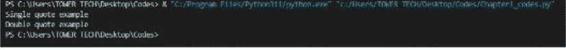

## 2.2：变量与数据类型

### Python 中的变量是什么？

顾名思义，Python 中的变量和数据类型是可以在程序执行期间随时更改的值对。在处理计算机语言时，你可以使用一个称为变量的内存区域来存储一个值。变量非常常见。你存储的值可能会在未来根据施加于它的条件而改变。

Python 认为，一旦一个变量被赋予了值，它就已经被创建了；换句话说，在 Python 中，值被赋给变量的那一刻，变量就形成了。Python 不需要额外的命令或语法来声明一个变量。

### 变量定义与声明：

在 Python 中声明一个变量不需要任何额外的指令。一旦值被放入变量中，该变量就被认为已经声明了。在定义变量时，我们需要始终牢记一些准则：

- 变量名不能以数字开头。它必须始终以字符或下划线开头。
- Python 的变量名是区分大小写的。
- 变量名只能包含字母、数字和下划线字符。
- 不能使用特殊字符。

## 代码：

```python
# Variable declaration with type annotations
name: str # A string variable
age: int # An integer variable
height: float # A floating-point variable

# Variable assignments
name = "Alice"
age = 25
height = 5.8

# You can also declare and assign in one step
city: str = "New York"

print(name)
print(age)
print(height)
print(City)
```

## 输出：

```
PS C:\Ebooks> & "C:/Program Files/Python311/python.exe" c:/Ebooks/Book_Codes.py
Alice
25
5.8
New York
PS C:\Ebooks>
```

## 解释：

提供的代码中包含了带有类型注解的变量声明；更具体地说，'name' 被声明为字符串，'age' 被声明为整数，'height' 被声明为浮点数。这些变量的值在后面被确定。'City' 变量同样被初始化为一个字符串，其值被设置为 "New York"。之后，程序进入下一步：显示分配给变量的值。

### Python 中的数据类型：

Python 有六种不同的数据类型，其属性对每种类型进行了分类。

### Python 中的数值数据类型：

数值数据类型存储一个数字的值。在数值数据领域，还有四个子类型。数值数据类型的多种子类型包括：

- 整数
- 浮点数
- 复数
- 布尔值

### 整数：

整数是用于表示整数的值。我们可以使用 `type()` 方法来确定我们使用的任何变量的数据类型。它将返回与给定变量相关联的数据类型。

## 代码：

```python
# Integer variable
age = 25

# Performing operations with integers
x = 10
y = 5
sum = x + y
difference = x - y
product = x * y
quotient = x / y
remainder = x % y

# Printing integer values and results
print("Age:", age)
print("Sum:", sum)
print("Difference:", difference)
print("Product:", product)
print("Quotient:", quotient)
print("Remainder:", remainder)
```

## 输出：

```
PS C:\Users\HOMER TECH\Desktop\Codes> & "C:\Program Files\Python311\python.exe" "C:\Users\HOMER TECH\Desktop\Codes\chapter1_codes.py"
Age: 25
Sum: 15
Difference: 5
Product: 50
Quotient: 2.0
Remainder: 0
```

## 解释：

这段 Python 代码将值 25 赋给整数变量 age，执行基本的数学运算（加法、减法、乘法、除法和取余），然后显示结果以及 age 的值。x 和 y 分别被赋予值 10 和 5。计算机软件计算并输出以下数字到控制台：总和（15）、差值（5）、乘积（50）、商（2.0）和余数（0）。

### 布尔值：

由于布尔值的结论是真或假，因此它用于生成分类输出。

## 代码：

```python
# Boolean variables
is_python_fun = True
is_raining = False

# Using boolean values in conditional statements
if is_python_fun:
    print("Python is fun!")

if not is_raining:
    print("It's not raining!")

# Comparing values and storing boolean results
x = 10
y = 5
is_greater = x > y
is_equal = x == y

print("Is x greater than y?", is_greater)
print("Is x equal to y?", is_equal)
```

## 输出：

```
PS C:\Users\TOWER TECH\Desktop\Codes> & "C:/Program Files/Python311/python.exe" "c:/Users/TOWER TECH/Desktop/Codes/Chapter1_codes.py"
Python is fun!
It's not raining!
Is x greater than y? True
Is x equal to y? False
PS C:\Users\TOWER TECH\Desktop\Codes>
```

## 解释：

这段 Python 代码展示了条件语句和布尔变量的用法。它首先声明了两个布尔变量，其中一个 `is_python_fun` 的值为 True，另一个 `is_raining` 的值为 False。然后，它在条件表达式中使用这些布尔值来检查 Python 是否有趣（这是 True，所以它打印 "Python is fun!"），以及是否没有下雨（这也是 True，所以它输出 "It's not raining!"）。两个条件都满足，因此它分别输出了 "Python is fun!" 和 "It's not raining!"。在过程的最后一步，代码比较了整数 x 和 y 的值，并将布尔结果存储在变量 `is_greater`（其值为 True，因为 x 大于 y）和 `is_equal`（其值为 False，因为 x 不等于 y）中。代码将这些比较结果与消息 "Is x greater than y? True" 和 "Is x equal to y? False" 一起打印到控制台。

### 字符串：

Python 通过使用字符串来表示 Unicode 字符值。Python 没有字符数据类型；单个字符在编程语言中被视为任何其他字符串。由于字符串的不可变性，一旦字符串被替换，就无法修改它。

## 代码：

```python
# Define a string variable
message = "Hello, World!"

# Print the string
print(message)
```

## 输出：

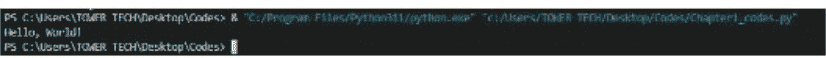

## 解释：

以下 Python 代码创建了一个名为 `message` 的字符串变量，并将文本 "Hello, World!" 赋值给它。这段代码的输出将被发送到控制台，并且会包含存储在 `message` 变量中的任何内容。这是通过使用 `print` 语句来实现的。由于 `print` 函数在调用时会显示 `message` 变量的内容，因此当代码运行时，屏幕上将显示 "Hello, World!"。这段代码以最基本的形式展示了字符串变量的概念，并解释了如何在 Python 中使用 `print` 命令来呈现文本。

## 2.3：Python 中的运算符

一种描述将运算符定义为一个符号，当它被放置在两个操作数之间时，会触发执行特定的操作。用特定编程语言编写的程序的逻辑是建立在运算符之上的，运算符是该语言的基本构建块。每种编程语言中的某些运算符负责不止一种功能。

## 算术运算符：

算术运算符被放置在给定算术运算的两个操作数之间。有多种算术运算符可用。除了指数运算符 (`**`) 外，它还包括 `+`（加法）、`-`（减法）、`*`（乘法）、`/`（除法）、`%`（取余）和 `//`（整除）运算符。

## 加法：

它用于将两个操作数相加的过程。例如，如果 `a` 等于 10，`b` 等于 10，那么 `a + b` 等于 20。

## 代码：

```
# 加法
a = 10
b = 10
result = a + b
print("加法:", result)
```

## 输出：

```
PS C:\Ebooks> & "C:/Program Files/Python311/python.exe" c:/Ebooks/Book_Codes.py
加法: 20
PS C:\Ebooks>
```

## 解释：

在这段代码中，我们定义了两个名为 `a` 和 `b` 的变量，分别给它们赋值 10，使用加号 (`+`) 执行加法运算，然后将总和保存在一个名为 `result` 的变量中。之后，代码显示 `a` 和 `b` 的总和，即 20。

## 减法：

它从第一个操作数中减去第二个操作数所代表的值。当第一个操作数的值小于第二个操作数时，计算出的值为负数。例如，如果 `a` 等于 20，`b` 等于 5，那么 `a - b` 等于 15。

## 代码：

```
# 减法
a = 20
b = 5
result = a - b
print("a - b =", result)
```

## 输出：

```
PS C:\Ebooks> & "C:/Program Files/Python311/python.exe" c:/Ebooks/Book_Codes.py
a - b = 15
PS C:\Ebooks>
```

## 解释：

在这段代码中，我们将值 20 和 5 分别赋给变量 `a` 和 `b`。我们使用减号运算符 (`-`) 进行减法运算，然后将结果保存在名为 `result` 的变量中。之后，代码输出 `a` 和 `b` 之间的差值，即 15。

## 除法：

将第一个操作数除以第二个操作数后，它将返回得到的商。例如，如果 `a` 等于 20，`b` 等于 10，那么 `a / b` 等于 2.0。

## 代码：

```
# 除法
a = 20
b = 10
result = a / b
print("a / b =", result)
```

## 输出：

```
PS C:\Ebooks> & "C:/Program Files/Python311/python.exe" c:/Ebooks/Book_Codes.py
a / b = 2.0
PS C:\Ebooks>
```

## 解释：

在这部分定义中，我们将相应地给参数 `a` 和 `b` 赋值 20 和 10。我们使用 `/` 运算符执行除法，然后将结果保存在名为 `result` 的变量中。代码输出 `a` 除以 `b` 得到的商，即 2.0。

## 乘法：

它用于将一个操作数乘以另一个操作数的过程。例如，方程 `a * b = 80`，其中 `a = 20`，`b = 4`。

## 代码：

```
# 乘法
a = 20
b = 4
result = a * b
print("a * b =", result)
```

## 输出：

```
PS C:\Ebooks> & "C:/Program Files/Python311/python.exe" c:/Ebooks/Book_Codes.py
a * b = 80
PS C:\Ebooks>
```

## 解释：

在这段代码中，我们将值 20 和 4 分别赋给变量 `a` 和 `b`。我们使用 `*` 运算符执行乘法，然后将结果放入名为 `result` 的变量中。代码接下来显示 `a` 和 `b` 的乘积，等于 80。

## 取余：

在完成第一个操作数除以第二个操作数后，它返回余数。例如，如果 `a` 等于 20，`b` 等于 10，那么 `a % b = 0`。

## 代码：

```
# 取余（模运算）
a = 20
b = 10
result = a % b
print("a % b =", result)
```

## 输出：

```
PS C:\Ebooks> & "C:/Program Files/Python311/python.exe" c:/Ebooks/Book_Codes.py
a % b = 0
PS C:\Ebooks>
```

## 解释：

在这部分定义中，我们将变量 `a` 和 `b` 赋值为 20 和 10。我们将使用 `%` 运算符执行模运算，然后将结果保存在名为 `result` 的变量中。代码随后打印出 `a` 除以 `b` 时的余数，即零。

## 指数：

它被称为指数运算符，因为它确定第一个操作数相对于第二个操作数的幂。

## 代码：

```
# 指数运算
base = 2
exponent = 3
result = base ** exponent
print("base ** exponent =", result)
```

## 输出：

```
PS C:\Ebooks> & "C:/Program Files/Python311/python.exe" c:/Ebooks/Book_Codes.py
base ** exponent = 8
PS C:\Ebooks>
```

## 解释：

这段代码中的 `base` 和 `exponent` 变量已分别初始化为值 2 和 3。指数运算是通过使用 `**` 运算符完成的。在底数计算增加指数的幂之后，它将结果保存在 `result` 变量中。在上面的例子中，将 2 进行指数为 3 的幂运算得到的结果是 8。随后，代码继续显示结果 8。

## 整除：

此运算符提供通过除两个操作数得到的商的整数值（向下取整）。

## 代码：

```
# 整除
a = 21
b = 5
result = a // b
print("a // b =", result)
```

## 输出：

```
PS C:\Ebooks> & "C:/Program Files/Python311/python.exe" c:/Ebooks/Book_Codes.py
a // b = 4
PS C:\Ebooks>
```

## 解释：

在这段代码中定义时，变量 `a` 和 `b` 分别被赋值为整数 21 和 5。在执行整除时，我们使用 `//` 运算符并将结果保存在名为 `result` 的变量中。然后代码打印 `a` 除以 `b` 的整除结果，得到值 4。整除的结果是小于或等于除法商的最大整数。

## 练习：

编写一个 Python 代码，对两个变量 `a` 和 `b` 执行数学运算。这些变量最初分别被赋值为 32 和 6。要执行的运算包括加法、减法、乘法、除法、取余、指数运算和整除。代码应报告每个运算的结果。

## 代码：

```
# 初始化两个变量并赋值
a = 32
b = 6

# 加法：将 a 和 b 的值相加
addition_result = a + b
print('两个数的加法:', addition_result)

# 减法：从 a 中减去 b 的值
subtraction_result = a - b
print('两个数的减法:', subtraction_result)

# 乘法：将 a 和 b 的值相乘
multiplication_result = a * b
print('两个数的乘法:', multiplication_result)

# 除法：将 a 的值除以 b
division_result = a / b
print('两个数的除法:', division_result)

# 取余（模运算）：求 a 除以 b 的余数
remainder_result = a % b
print('两个数的取余:', remainder_result)

# 指数：计算 a 的 b 次幂
exponent_result = a ** b
print('两个数的指数:', exponent_result)

# 整除：将 a 除以 b 并向下取整到最近的整数
floor_division_result = a // b
print('两个数的整除:', floor_division_result)
```

## 输出：

```
PS C:\Users\TOWER TECH\Desktop\Codes> & "C:\Program Files\Python311\python.exe" "c:/Users/TOWER TECH/Desktop/Codes/Chapter1_codes.py"
两个数的加法: 38
两个数的减法: 26
两个数的乘法: 192
两个数的除法: 5.333333333333333
两个数的取余: 2
两个数的指数: 1073741824
两个数的整除: 5
PS C:\Users\TOWER TECH\Desktop\Codes>
```

## 解释：

初始化时，数字 32 和 6 分别被赋值给变量 `a` 和 `b`。`addition_result`、`subtraction_result`、`multiplication_result`、`division_result`、`remainder_result`、`exponent_result` 和 `floor_division_result` 返回的值代表了各自运算的结果。

## 比较运算符：

比较运算符的主要功能是比较。比较运算符用于比较两个操作数的结果，然后根据结果产生一个真或假的布尔值。比较运算符的例子有 `==`、`!=`、`<=`、`>=`、`>`、`<`。

## 等于：

在此用法中，`==`

## 等于

如果 a 的值等于 b 的值，该表达式将返回 True，否则返回 False。

## 代码：

```python
# 等于
a = 10
b = 10
result = a == b
print("a == b:", result)
```

## 输出：

```
PS C:\Ebooks> & "C:/Program Files/Python311/python.exe" c:/Ebooks/Book_Codes.py
a == b: True
PS C:\Ebooks>
```

## 解释：

这段代码中使用了 == 运算符来判断 a 的值是否等于 b 的值。如果不相等，则返回 False；如果相等，则返回 True。在这个演示中，a 和 b 都等于 10，因此程序输出语句 "a == b: True"。

## 不等于

此处使用 !=

如果 a 的值不等于 b 的值，该表达式将返回 True，否则返回 False。

## 代码：

```python
## 不等于
a = 10
b = 5
result = a != b
print("a != b:", result)
```

## 输出：

```
PS C:\Ebooks> & "C:/Program Files/Python311/python.exe" c:/Ebooks/Book_Codes.py
a != b: True
PS C:\Ebooks>
```

## 解释：

不等于 (!=) 运算符用于判断 a 的值是否与 b 的值不同。如果它们不相等，则返回 True；如果相等，则返回 False。在这个特定实例中，a 是 10，b 是 5。因此，程序输出语句 "a != b: True"。

## 小于

此处使用 <

如果 a 的数值小于 b 的数值，则此函数返回 True；否则返回 False。

## 代码：

```python
## 小于
a = 5
b = 10
result = a < b
print("a < b:", result)
```

## 输出：

```
PS C:\Ebooks> & "C:/Program Files/Python311/python.exe" c:/Ebooks/Book_Codes.py
a < b: True
PS C:\Ebooks>
```

## 解释：

通过比较两者，该运算符判断 a 的值是否小于 b 的值。如果 a 的值小于 b 的值，则返回 True；否则返回 False。因为在这个示例中 a 等于 5，b 等于 10，所以代码输出 "a < b: True"。

## 小于或等于

此处使用 <=

如果 a 的值小于或等于 b 的值，则返回 True；否则返回 False。

## 代码：

```python
## 小于或等于
a = 5
b = 5
result = a <= b
print("a <= b:", result)
```

## 输出：

```
PS C:\Ebooks> & "C:/Program Files/Python311/python.exe" c:/Ebooks/Book_Codes.py
a <= b: True
PS C:\Ebooks>
```

## 解释：

<= 运算符判断 a 的值是否小于 b 的值或两者是否相等。如果 a 的值小于或等于 b 的值，则返回 True；否则返回 False。在这个演示中，a 和 b 都等于 5，因此程序输出语句 "a <= b: True"。

## 大于

此处使用 >

如果 a 的值大于 b 的值，则该表达式将返回 True；否则返回 False。

## 代码：

```python
## 大于
a = 10
b = 5
result = a > b
print("a > b:", result)
```

## 输出：

```
PS C:\Ebooks> & "C:/Program Files/Python311/python.exe" c:/Ebooks/Book_Codes.py
a > b: True
PS C:\Ebooks>
```

## 解释：

> 运算符通过比较两个数字来判断 a 的数值是否大于 b 的数值。如果 a 的值大于 b 的值，则返回 True；否则返回 False。在这个特定实例中，a 是 10，b 是 5。因此，程序输出语句 "a > b: True"。

## 大于或等于

此处使用 >=

如果 a 的值大于或等于 b 的值，则返回 True；否则返回 False。

## 代码：

```python
## 大于或等于
a = 10
b = 10
result = a >= b
print("a >= b:", result)
```

## 输出：

```
PS C:\Ebooks> & "C:/Program Files/Python311/python.exe" c:/Ebooks/Book_Codes.py
a >= b: True
PS C:\Ebooks>
```

## 解释：

>= 运算符判断 a 的值是否大于 b 的值或两个值是否相等。如果 a 的值大于或等于 b 的值，则返回 True；否则返回 False。在这个演示中，a 和 b 都是 10，因此程序输出语句 "a >= b: True"。

## 练习

在 Python 中，我如何使用不同的比较函数来比较值 a 和 b？这些比较的作用是什么？

## 代码：

```python
# 定义两个用于比较的变量
a = 10
b = 5

# 等于 (==)
result_equal = a == b
print(f"等于: {a} == {b} -> {result_equal}")

# 不等于 (!=)
result_not_equal = a != b
print(f"不等于: {a} != {b} -> {result_not_equal}")

# 小于 (<)
result_less_than = a < b
print(f"小于: {a} < {b} -> {result_less_than}")

# 小于或等于 (<=)
result_less_than_equal = a <= b
print(f"小于或等于: {a} <= {b} -> {result_less_than_equal}")

# 大于 (>)
result_greater_than = a > b
print(f"大于: {a} > {b} -> {result_greater_than}")

# 大于或等于 (>=)
result_greater_than_equal = a >= b
print(f"大于或等于: {a} >= {b} -> {result_greater_than_equal}")
```

## 输出：

```
PS C:\Users\TOWER TECH\Desktop\Codes> & "C:\Program Files\Python311\python.exe" "C:\Users\TOWER TECH\Desktop\Codes\Chapter1_codes.py"
等于: 10 == 5 -> False
不等于: 10 != 5 -> True
小于: 10 < 5 -> False
小于或等于: 10 <= 5 -> False
大于: 10 > 5 -> True
大于或等于: 10 >= 5 -> True
```

## 解释：

上面的代码演示了六种不同比较运算符的应用。它将变量 a 和 b 分别初始化为 10 和 5。首先，(==) 运算符判断 a 和 b 是否相等，并将结果保存在 result_equal 变量中。类似地，它使用不等于 (!=) 运算符检查 a 是否不等于 b，然后将结果保存在名为 result_not_equal 的变量中。之后，使用小于 (<) 运算符判断 a 是否小于 b，并将结果保存在变量 result_less_than 中。此外，它使用“小于或等于” (<=) 运算符判断 a 是否小于或等于 b，然后将结果保存在名为 "result_less_than_equal" 的变量中。同时，它使用大于 (>) 运算符判断 a 是否大于 b，然后将结果保存在变量 result_greater_than 中。最后，它使用大于或等于 (>=) 运算符判断 a 是否大于或等于 b，然后将结果保存在名为 result_greater_than_equal 的变量中。代码随后输出每个比较的结果，并指出每个前提条件是否满足。

## Python 中的赋值运算符

赋值运算符在编程中用于为变量赋值。赋值有时是直接进行的；有时，运算符执行数学运算并将值赋给操作数。

### 赋值运算符

此处使用 =

它用于将右侧的值赋给左侧的参数。例如，表达式 a = 10 告诉计算机将变量 a 赋值为 10。

### 加法赋值运算符

此处使用 +=

它将右侧的值与左侧变量的值相加，然后将结果分配给左侧的变量。例如，表达式 a += 5 等同于 a = a + 5。

### 减法赋值运算符

此处使用 -=

它通过取右侧的值并从左侧的变量中减去它来进行减法运算，然后将结果传递给左侧的变量。例如，表达式 a -= 3 等同于表达式 a = a - 3。

### 乘法赋值运算符

此处使用 *=

右侧的值乘以左侧的变量，然后将乘积赋给左侧的变量。例如，表达式 a *= 2 等同于 a = a * 2。

### 取模赋值运算符

此处使用 %

它执行必要的计算，以确定在将其右侧的值应用于左侧变量后剩余的值，然后将该结果应用于其左侧的参数。例如，`a%=4` 的值等同于 `a=a%4`。

## 幂赋值运算符：

在此用法中 **

其右侧的值乘以其左侧的变量，所得值被赋给其左侧的变量。它通过将左侧的值提升到右侧的幂次来实现这一点。例如，表达式 `a **= 3` 等同于表达式 `a = a ** 3`。

## 整除赋值运算符：

在此用法 //

它将左侧的变量除以右侧的值，然后将商分配给左侧的变量。此操作称为整除。例如，表达式 `a //= 2` 等同于表达式 `a = a // 2`。

## 代码：

```
A = 13  # Initialize a to 13

# Using assignment operators
a += 5  # Equivalent to a = a + 5
a -= 3  # Equivalent to a = a - 3
a *= 2  # Equivalent to a = a * 2
a %= 4  # Equivalent to a = a % 4
a **= 3  # Equivalent to a = a ** 3
a //= 2  # Equivalent to a = a // 2

print("Result:", a)  # Output will be the final value of 'a'
```

## 输出：

```
PS C:\Users\TOWER TECH\Desktop\Codes> & "C:\Program Files\Python311\python.exe" "c:/Users/TOWER TECH/Desktop/Codes/Chapter1_codes.py"
Result: 4
PS C:\Users\TOWER TECH\Desktop\Codes>
```

## 解释：

在此代码中，我们将 `a` 设置为 13，然后利用各种赋值运算符来改变其值。在所有这些过程执行完毕后，我们将最终显示结果：赋给 `a` 的值。

## Python 中的逻辑运算符：

条件语句是逻辑运算符最常见的用途。AND、OR 和 NOT 是可以在语句中使用的三种逻辑运算符。

## 逻辑与：

如果双方的条件都满足，则结果将被视为有效；否则，将被视为无效。

## 逻辑或：

如果至少满足一个条件，则结果为真；否则，为假。

## 逻辑非：

反转当前情况。

## 代码：

```
# Logical AND, OR, and NOT operators
x = True
y = False

# AND operator
result_and = x and y  # False because both x and y are not True
print(f"x AND y = {result_and}")

# OR operator
result_or = x or y    # True because x is True (at least one condition is True)
print(f"x OR y = {result_or}")

# NOT operator
result_not_x = not x  # False because x is True, and NOT negates it
result_not_y = not y  # True because y is False, and NOT negates it
print(f"NOT x = {result_not_x}")
print(f"NOT y = {result_not_y}")
```

## 输出：

```
PS C:\Users\TOMER TECH\Desktop\Codes> & "C:\Program Files\Python311\python.exe" "c:/Users/TOMER TECH/Desktop/Codes/chapter1_codes.py"
x AND y = False
x OR y = True
NOT x = False
NOT y = True
PS C:\Users\TOMER TECH\Desktop\Codes>
```

## 解释：

我们首先定义两个布尔变量 `x` 和 `y`，然后通过将逻辑运算符 `and`、`or` 和 `not` 应用于它们来展示这些变量的行为。

## 2.4：控制结构（if、else、while、for）

控制结构是编程的重要组成部分，因为它们使你能够确定代码执行的顺序。以下是 Python 中控制语句的示例：

- Break 语句
- Continue 语句。
- Pass 语句

## Break 语句：

Python 的 `break` 语句可用于退出当前执行的循环并将控制权从循环中移除。这也可以称为“跳出”循环。要退出 `while` 或 `for` 循环，特别是嵌套循环（也称为循环内的循环），这是使用 `break` 语句之前必须满足的条件。然后，当内部循环结束时，控制权移动到外部循环内的语句。

## 代码：

```
While True:
    age = input("Please enter your age: ")

    if int(age) >= 18:
        print("You are eligible to vote.")
        break
    Else:
        print("You are not eligible to vote.")
```

## 输出：

```
PS C:\Users\TOWER TECH\Desktop\Codes> & "C:\Program Files\Python311\python.exe" "C:/Users/TOWER TECH/Desktop/Codes/Chapter1_codes.py"
Please enter your age: 21
You are eligible to vote.
PS C:\Users\TOWER TECH\Desktop\Codes> []
```

## 解释：

我们使用 `input("Please enter your age:")` 显示问题，并在解析时将用户输入作为字符串获取。

为了进行年龄比较，我们使用函数 `int(age)` 将用户的输入转换为整数。

程序确定用户是否大于 18 岁或等于该阈值。如果答案是肯定的，程序将发布消息“You are eligible to vote”，然后跳出循环。如果情况并非如此，则会通知用户他们不符合投票要求，并且该过程将重复进行，直到提供合法的年龄。

## Continue 语句：

假设一个 Python 程序遇到 `continue` 语句。在这种情况下，即使条件已满足，程序也会让循环进入下一次迭代，即使程序不会执行当前迭代的剩余指令。它允许应用程序在执行过程中遇到 `break` 后继续运行，这得益于此功能的使用。

## 代码：

```
for i in range(1, 6):
    if i == 3:
        continue # Skip iteration when i is 3
    print("Number:", i)
```

## 输出：

```
PS C:\Users\TOMER TECH\Desktop\Codes> & "C:/Program Files/Python311/python.exe" "c:/Users/TOMER TECH/Desktop/Codes/Chapter4_codes.py"
Number: 1
Number: 2
Number: 4
Number: 5
PS C:\Users\TOMER TECH\Desktop\Codes> []
```

## 解释：

我们使用 `range(1, 6)` 和 `for` 循环按顺序遍历数字 1 到 5。循环内包含一个 `if` 语句，用于测试 `i` 的值是否等于 3。如果 `i` 等于 3，则将执行 `continue` 语句，这将导致跳过当前迭代。因此，当 `i` 等于 3 时，显示“Number: 3”的行将被忽略，但循环照常继续，打印数字 1、2、4 和 5。

## Pass 语句：

`pass` 语句是空操作符的一个示例，它用于程序员不希望计算机在满足条件时采取任何操作的情况。Python 中的此控制语句既不会中止执行，也不会进入下一次迭代；它只是进入下一次迭代。不可能让一个循环为空，因为这会导致解释器生成错误；程序员可以通过使用 `pass` 语句来规避此问题。

## 代码：

```
for i in range(1, 4):
    if i == 2:
        pass # This does nothing
    Else:
        print("Number:", i)
```

## 输出：

```
PS C:\Users\TOMER TECH\Desktop\Codes> & "C:\Program Files\Python311\python.exe" "c:/Users/TOWER TECH/Desktop/Codes/Chapter1_codes.py"
Number: 1
Number: 3
PS C:\Users\TOWER TECH\Desktop\Codes>
```

## 解释：

我们使用 `range(1, 4)` 和 `for` 循环按顺序遍历数字 1 到 3。

循环内包含一个 `if` 语句，用于测试 `i` 的值是否等于 2。当 `i` 达到值 2 时，将执行 `pass` 语句。此语句没有任何作用，只是进入下一次迭代。对于所有其他可能的变量值 `i`，它输出“Number: i”。

## 2.5：矩形面积和偶数/奇数练习

### 练习 1：

给定矩形的尺寸，计算其面积。

## 代码：

```
# As requested, Provide the rectangle's dimensions,
# specifically the length, as requested.
length = float(input("Please enter the desired length for the rectangle: "))
width = float(input("Please enter the desired width for the rectangle: "))

# Calculate the Area of the rectangle
area = length * width

# Display the result
print(f"The area of the rectangle with length {length} and width {width} is {area}.")
```

## 输出：

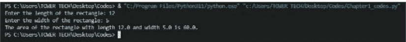

## 解释：

用户向计算机提供矩形的长度和宽度，然后应用程序使用

### 练习 2：

创建一个程序，用于判断一个数字是偶数还是奇数。

## 代码：

```python
# 获取用户输入的数字
num = int(input("Enter a number: "))

# 检查数字是偶数还是奇数
if num % 2 == 0:
    print(f"{num} is an even number.")
else:
    print(f"{num} is an odd number.")
```

## 输出：

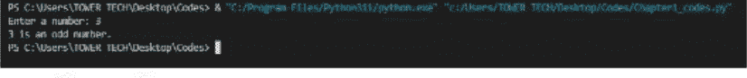

## 解释：

该程序首先使用 `input()` 方法从用户处获取一个数值。随后，使用 `int()` 函数将上述值转换为整数。在此之上，它使用取模运算符（用 `%` 表示）来确定该整数除以 2 后的余数是否等于 0。如果余数为 0，程序将显示该数字是偶数的消息；如果余数不为 0，则打印该数字是奇数的消息。这个程序演示了 Python 中条件逻辑的基础知识，并提供了一种判断数字是偶数还是奇数的直接方法。

## 第三章：函数与形式

### 3.1：创建和使用函数

在计算机编程中，函数用于将一组你希望多次使用或因其复杂性而更适合封装在子程序中、仅在需要时调用的命令组合在一起。根据这个定义，函数是执行特定操作的代码段。函数可能需要多个输入来完成该任务，但这并非必然。根据任务完成后的状态，函数可能会也可能不会返回一个或多个值。

在 Python 中，函数分为三个不同的类别：

- 内置函数，例如 `help()` 可用于查询帮助；`min()` 可用于获取最小值；`print()` 可用于将对象输出到控制台。
- 用户定义函数，缩写为 UDFs，是由个别用户开发的辅助性函数。
- 匿名函数有时也称为 lambda 函数，因为在声明它们时不使用常规的 `def` 关键字。

在 Python 编程语言中定义一个函数涉及四个不同的步骤。这些步骤可以列举如下：

- 使用 "def" 定义一个函数，后跟函数名。
- 通过将参数括在函数的圆括号中来将参数添加到函数中。请以冒号结束该行。
- 包含函数执行特定任务的指令。
- 如果函数的预期结果是产生输出，则通过包含 `return` 语句来结束函数。

如果没有 `return` 语句，函数将返回一个 `None` 对象作为其输出。

调用函数涉及通过 Python 控制台直接操作或通过另一个函数来执行一个已定义的函数，如“嵌套函数”部分所示。

## 代码：

```python
def greet():
    name = input("Enter your name: ")
    if name:
        print("Hello, " + name)
    else:
        print("Hello, World")

greet() # 调用 greet 函数
```

## 输出：

```
PS C:\Users\TOWER TECH\Desktop\Codes> & "C:\Program Files\Python311\python.exe" "c:\Users\TOWER TECH\Desktop\Codes\Chapter1_codes.py"
Enter your name: sarah
Hello, sarah
PS C:\Users\TOWER TECH\Desktop\Codes>

PS C:\Users\TOWER TECH\Desktop\Codes> & "C:\Program Files\Python311\python.exe" "c:\Users\TOWER TECH\Desktop\Codes\Chapter1_codes.py"
Enter your name:
Hello, World
PS C:\Users\TOWER TECH\Desktop\Codes> []
```

## 解释：

该函数被命名为 "greet"。在函数内部，获取用户输入的姓名。程序会验证是否存在指定的姓名以及该姓名是否为非空字符串，并生成和显示个性化的问候语。如果没有指定姓名，程序将输出 "Hello, World"。

### 3.2：将代码组织成模块

一个人的 Python 代码随着时间的推移变得混乱的可能性，与他们编写的 Python 代码量成正比。当代码与项目扩展存储在同一目录中时，可能难以维护。得益于包和模块，Python 文件夹可以帮助组织和分类内容。包含声明和语句的 Python 代码位于一个称为模块的文件中。这些组织工具使得在单个文件中组织多个相互依赖的操作、类或代码段变得更加容易。将大型 Python 代码段拆分为由 0 到 400 个单词组成的模块，通常被认为是应该遵循的方法。包用于将具有相似功能的模块组织和分类到单独的目录中，其主要目标就是实现这一点。这些目录包含相互关联的模块以及一个 `__init__.py` 脚本，该脚本允许在包级别进行可选的初始化。你的 Python 程序可能需要你将创建的模块组织成子包，包括 `doc`、`core`、`utils`、`data`、`examples` 和 `test`。如果情况如此，请继续尝试。

## 开发 Python 模块的过程：

要成功构建一个模块，将相关代码保存在使用 ".py" 文件类型的文件中至关重要。之后，该模块的名称将作为 Python 文件的赋值。

## 使用 Python 模块：

将使用 `import` 关键字将模块包含在我们的程序中。此外，`from` 关键字允许从模块中选择性地导入某些过程或方法。在使用模块的结果时，必须记住使用正确的语法。

## 将代码组织成模块的优点：

用 Python 编写的模块提供了几个优点，其中最显著的是该语言日益增长的普及度和适应性。为了促进更好的代码结构和可读性，开发者有机会将代码组织成独立且可重用的组件。使用模块可以封装代码，这有助于隐藏实现细节，并减少操作、变量和类之间名称冲突的风险。模块化简化了可维护性，通过允许开发者独立处理不同的模块，然后再无缝集成，从而简化了开发者之间的有效协作。

Python 广泛的核心库包含涵盖各种功能的模块，这有助于扩展该语言的功能。模块对于管理代码的不同版本至关重要，因为它们使得精确跟踪对代码所做的任何更改成为可能，并通过将有问题的代码区域封装到更易于管理的子部分中来帮助调试。Python 模块提供了一种开发系统化和可扩展软件的方法。这种方法可用于构建小型脚本和大型系统。Python 作为一种编程语言，得益于这一特性，其弹性和适应性得到了增强。

**代码：**

数学运算模块：
math_operations.py

```python
# math_operations.py
def add(num1, num2):
    return num1 + num2

def subtract(num1, num2):
    return num1 - num2

def multiply(num1, num2):
    return num1 * num2

def divide(num1, num2):
    if num2 != 0:
        return num1 / num2
    else:
        return "Cannot divide by zero."
```

用户输入模块：
input_values.py

## input_values.py

```python
def get_input():
    num1 = float(input("Enter the first number: "))
    num2 = float(input("Enter the second number: "))
    return num1, num2
```

用于打印结果的模块：
print_results.py

```python
# print_results.py

def print_results(sum_result, difference_result, product_result, quotient_result):
    print(f"Sum: {sum_result}")
    print(f"Difference: {difference_result}")
    print(f"Product: {product_result}")
    print(f"Quotient: {quotient_result}")
```

主程序：

## Main.py

```python
# main.py

from math_operations import add, subtract, multiply, divide
from input_values import get_input
from print_results import print_results

# Get input values
num1, num2 = get_input()

# Perform mathematical operations
sum_result = add(num1, num2)
difference_result = subtract(num1, num2)
product_result = multiply(num1, num2)
quotient_result = divide(num1, num2)

# Print results
print_results(sum_result, difference_result, product_result, quotient_result)
```

## 输出：

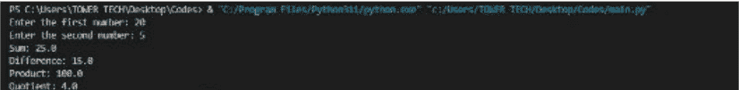

## 3.3：导入外部模块

除了由 Python 核心团队构建的库之外，许多其他旨在扩展 Python 编程语言功能的库也由第三方程序员制作。这些扩展并非 Python 编程语言的固有部分，尽管在必要时可以作为可选附加组件添加。这些组件在行业中被称为“外部模块”。要使用外部模块，必须首先在所使用的机器上安装它。从互联网来源获取相关文件对于启动安装过程至关重要。一旦这些文件被包含在核心 Python 库中，编程语言就可以确定模块的位置。“pip”一词指的是一个非常微小的、标准化的计量单位，在大多数情况下经常使用；模块的个人设置是一个可行的选择；然而，这个过程可能有些费力。Python 提供的 pip 模块很幸运，因为它提供了一种安装模块的简单方法。此功能可以检测在 Python 包索引中编译的模块，该索引是常用模块的集合。它可能会继续下载这些模块并尝试安装它们。传统上，程序员使用终端执行 pip 命令操作。用户可以通过提供命令界面直接修改其计算机系统。

### 执行 pip 命令：

在解释器中使用以下语法运行 pip 命令：`pip install module-name`。此技术将识别模块以及后续的下载和安装过程。如果一个模块在没有预先安装另一个模块的情况下无法安装，则可能导致称为依赖错误的错误。通常需要安装必要的模块并运行 pip 命令来解决问题。

### 使用预安装的软件组件：

模块正确安装后，可以在 Python 文件的顶部写入 `import module-name`。这将允许将模块的名称导入文件。由于此步骤，模块将像集成库一样加载。

## 3.4：自定义模块和计算阶乘练习

### 练习 1：

开发一个计算过程来确定给定数值的阶乘。

## 代码：

```python
def factorial(n):
    """
    Determine the factorial of a positive integer 'n'.

    Args:
        n (int): The non-negative integer for which the factorial is calculated.

    Returns:
        int: The factorial of 'n'.
    """
    if n == 0:
        result = 1
    else:
        result = n * factorial(n - 1)

    print(f"The factorial of {n} is {result}")
    return result

def main():
    try:
        # Get user input for the number to calculate the factorial.
        n = int(input("Enter a non-negative integer: "))
        if n < 0:
            print("Please enter a non-negative integer.")
        else:
            result = factorial(n)
            print(f"The factorial of {n} is {result}")
    except ValueError:
        print("Invalid input. Please enter a non-negative integer.")

if __name__ == "__main__":
    main()
```

## 输出：

```
PS C:\Ebooks> & "C:/Program Files/Python311/python.exe" c:/Ebooks/Book_Codes.py
Enter a non-negative integer: 3
The factorial of 0 is 1
The factorial of 1 is 1
The factorial of 2 is 2
The factorial of 3 is 6
The factorial of 3 is 6
PS C:\Ebooks> []
```

## 解释：

代码中添加了一个文档字符串，以解释阶乘运算的含义、其参数以及它返回的结果。这有助于记录该函数，以便将来可以参考。

处理用户的逻辑现在被封装在我添加到程序中的 `main()` 方法后面。它首先提示用户输入一个正数，然后在运行阶乘方法计算并显示阶乘之前验证该输入。

错误处理得到了增强。如果用户输入错误的数据（例如，不是整数或负数），应用程序将向用户显示错误消息并帮助他们输入正确的输入。

### 练习 2：

创建一个自定义模块来执行数学运算。

## 代码：

```python
# my_module.py
# Define a function to multiply two numbers
def multiply_numbers(a, b):
    return a * b
```

```python
# main.py
# Import the multiply_numbers function from my_module
from my_module import multiply_numbers

# Use the function
result = multiply_numbers(5, 7)
print("The result is:", result)
```

## 输出：

```
PS C:\Users\TONER TECH\Desktop\Codes> & "C:/Program Files/Python311/python.exe" "c:/Users/TONER TECH/Desktop/Codes/main.py"
The result is: 35
PS C:\Users\TONER TECH\Desktop\Codes>
```

## 解释：

提供的代码由两个名为 `my_module.py` 和 `main.py` 的 Python 文件组成，它们分别说明了代码重用和模块化编程的概念。在文件 `my_module.py` 中创建了一个名为 `multiply_numbers` 的 Python 模块，该模块封装了该方法。调用时，此函数返回其两个输入（由字母 a 和 b 表示）的乘积。它是一个专门为数学乘法过程开发的可重用组件。

我们使用模块化方法，在 `main.py` 中，我们通过使用语法 `from... import...` 从 `my_module` 集成 `multiply_numbers` 函数来实现这一点。在当前脚本的上下文中，这授予我们访问和使用 `multiply_numbers` 函数提供的功能的能力。之后，我们通过使用输入 '5' 和 '7' 调用此导入的方法，计算结果并将其保存在 `result` 变量中，从而使用此导入的方法。在最后一步，结果显示在屏幕上，并显示通知：“结果是 35”。

这段代码是模块化编程原则的一个极好例证，它改善了代码结构、可读性和可重用性。Python 开发人员可以轻松地管理和重用不同项目和脚本中的某些代码部分，因为函数可以封装在它们各自的模块中。这有助于促进可持续和高效的软件开发技术。

## 第 4 章：异常管理

## 4.1：什么是异常？

“exception”一词是“exceptional event”的缩写。

### 定义：

在程序执行期间发生并干扰程序正在执行的指令的正常流程的事件被称为异常。

如果在方法执行期间发生错误，该方法将生成一个对象，然后将其传递给系统的运行时。这个对象被称为异常对象，它存储有关错误的信息，例如错误发生时程序状态中发生的错误类型。构造异常对象并将其传递给系统运行时的过程被称为抛出异常。

当一个方法生成异常时，运行时环境会在异常抛出后寻找处理它的方法。在错误发生之前被调用的方法的顺序列表，构成了可用于管理异常的潜在“某些东西”集合。这些方法是为了到达问题发生的方法而被调用的。这组方法被称为调用栈（更多信息请参考以下表示）。

运行时系统将遍历调用栈，寻找可能包含处理异常代码段的方法。这段代码被称为异常处理器。搜索从错误出现的函数开始，并按照方法被调用的相反顺序，沿着调用栈继续进行。运行时系统在找到适合当前情况的处理器后，会将异常发送给该处理器。如果抛出的异常对象类型与处理器能够处理的类型相同，则认为该异常处理器是合适的。

据称，被选中的异常处理器“捕获”了异常。假设运行时系统详细检查了调用栈上的每个方法，但未能找到可接受的异常处理器，如下图所示。在这种情况下，系统的运行时（以及随之而来的程序）将会终止。

## 4.2：使用 try-except 进行异常处理

### Python 中的 try 和 except：

可以使用 try-except 语句来处理异常。在执行程序时可能会发生程序异常。

异常是程序运行时出现的错误。当 Python 遇到语法问题时，它会突然终止，而不是显示错误消息。

突然终止对开发者或最终用户都不利。

为了妥善处理这种情况，你可以选择使用 try-except 子句来代替紧急停止。如果未能正确处理异常，你将会遇到紧急停止。

### 什么是 Python 异常？

Python 中的内置异常可能会产生错误。异常是程序运行时出现的缺陷。

如果出现异常，会显示这种类型的异常。如果异常未被处理，应用程序可能会崩溃。异常通过 try-catch 块来处理。

有几种异常，其中一些你可能熟悉：FileNotFoundError、ZeroDivisionError 和 ImportError。

所有 Python 异常都派生自 BaseException 类。如果你打开 Python 交互式 shell 并输入以下语句，它将报告所有内置异常：

```
>>> import builtins
>>> print(dir(builtins))
```

try-except 子句的目的是处理异常或运行时问题。try-except 块的写法如下：

```
try:
    <do something>
except exception:
    <handle the error>
```

try-except 块的概念如下：

- **try**：包含需要捕获的异常的代码。如果异常被触发，首先会到达 except 块。
- **except**：仅当 try 块抛出异常时，此代码才会运行。即使 try 块包含 pass 语句，包含 except 的块仍然是必需的。

它可以与 otherwise 和 lastly 等术语配对使用。

- **else**：如果 try 块中没有抛出异常，则仅执行 else 部分内的代码。
- **finally**：无论是否触发异常，finally 部分内的代码总会运行。

### Python 异常捕获：

可以使用 try-except 块来处理异常。因此，只有在一切正常的情况下，软件才会突然结束。在下面的例子中，我们故意创建了一个异常。

```
try:
    1 / 0
except ZeroDivisionError:
    print('Divided by 0')

print('Should reach this point')
```

这结束了 unless 块；程序继续执行。如果没有 try-except 块，程序将会终止，因此最后一行将不会被执行。

```
Divided by zero
Should reach here
```

在上面的例子中，我们捕获了特定的错误 ZeroDivisionError。任何异常都可以用这种方式处理：

```
try:
    open("fantasy.txt")
except:
    print('Something went wrong')
```

```
print('Should reach here')
```

## 输出：

```
Something went wrong
Should reach here
```

可以为每种发生的异常类型定义不同的逻辑：

```
try:
    # your code here
except FileNotFoundError:
    # handle FileNotFoundError exception
except IsADirectoryError:
    # handle IsADirectoryError exception
except:
    # deal with all other kinds of exceptions

print('Should reach here')
```

### try-except：

让我们看看一个实际的 try-except 块是如何工作的。程序要求用户输入数字。用户却在输入区域输入了字符。通常情况下，程序会崩溃。但使用 try-except 块可以妥善处理这种情况。

try-except 行妥善处理了异常，防止了程序崩溃。

```
try:
    y = float(input("Kindly enter a number: "))
    y = y + 1
    print(y)
except ValueError:
    print("Invalid input. Please enter a valid number.")
```

当输入错误数据时，程序正常运行：

```
Kindly enter a number: one
Invalid input. Please enter a valid number.
```

异常有多种形式：ZeroDivisionError、NameError、TypeError 等。有时模块可以自行声明异常。

try-except 块也适用于函数调用：

```
def fail():
    1 / 0

try:
    fail()
except:
    print('Exception occured')

print('Program continues')
```

结果如下：

```
Exception occured
Program continues
```

### 处理用户输入期间的异常：

## 代码：

```
try:
    user_input = input("Enter a number: ")
    result = int(user_input)
    print("You entered:", result)

except ValueError:
    print("Invalid input. Kindly enter a valid number.")

except exception as e:
    print("An error occurred:", e)
```

## 输出：

```
Enter a number: one
Invalid input. Please enter a valid number.
```

## 解释：

1. try：try 块内的代码包含可能出错的操作。这里，它试图执行以下操作：
   - input ("Enter a number:") = user_input：请求用户输入一个数字，并将其输入保存为字符串存储在 user_input 变量中。
   - result = int(user_input)：这是尝试使用 int() 函数将用户输入（保存为字符串）转换为整数。如果输入的值不是有效的整数，可能会触发一个名为 ValueError 的异常。
   - print ("You entered:", result)：如果转换为整数的任务成功完成，则打印输入的数字。

2. except ValueError：这是用于异常的处理器。具体来说，它检测 ValueError 异常，当用户提供了无效的整数（如字符、符号或浮点数）导致 int(user_input) 转换失败时，会抛出此异常。
   - 此 except 块输出以下消息："Invalid input. Please enter a valid number." 此警报通知用户输入的数字无效。

3. except exception as e：这是一个更广泛的异常处理器。它捕获在执行 try 块期间可能发生的任何其他异常。它使用 exception as e 显式捕获异常对象，使你能够根据需要获取有关异常的信息。
   - 此 except 块生成以下消息："An error occurred:"，然后是存储在变量 e 中的异常详细信息。作为处理非 ValueError 的意外问题的兜底方案，会发送此消息。

总之，此代码管理两种不同类型的异常，并提供了一种便捷的方式来获取用户的数字输入：
- 如果用户输入的内容无法转换为整数，它会通知用户其输入无效。

## 4.3：使用自定义异常

Python 自定义异常：

Python 的自定义异常是一项强大的功能，它使程序员能够设计适合特定项目需求的异常类。错误管理和报告是 Python 程序中两个非常重要的方面，而这些有时被称为程序化或定制异常的异常在这两个方面都扮演着重要角色。在这次深入探讨中，我们将研究自定义异常的概念、它们的重要性，以及如何在 Python 程序中有效地构建和使用它们。

Python 是一种灵活且动态的编程语言，它有许多内置异常可用于处理程序执行过程中可能出现的各种错误。然而，在某些情况下，需要修改这些标准异常以传达错误的确切性质，或为开发者或用户提供有用的信息。这就是自定义异常发挥作用的地方。

Python 的基本 `Exception` 类或其子类之一可以被扩展，以创建所谓的“自定义异常”，即用户定义的异常类。借助这些类，开发者可以构建适合其项目组织和规范的异常层次结构。通过定义自己独特异常的能力，程序员对如何分类和处理问题有了更大的控制权。

Python 的 `raise` 关键字用于有意引发异常。当发生异常情况时，`raise` 语句可以指示程序中发生了错误，也可以用于将问题信息传播到程序的更高层级或用户。当程序中发生异常情况时，可以使用 `raise` 语句。自定义异常通常会在满足程序员预设的某些条件时被程序抛出，从而传达问题的性质及其发生的上下文。

自定义异常提供了以下几个好处：

### 1. 清晰性和可读性：

在代码中添加自定义异常有助于使其更易于理解，并允许其自我记录。如果为异常赋予有意义的名称，例如 `FileNotFoundError` 和 `PermissionError`，开发者和维护者就能清楚地理解错误的性质。

### 2. 特异性：

使用自定义异常可以实现更细粒度的错误处理。开发者可以捕获自定义异常，然后执行必要的步骤，而不是捕获通用的 `Exception` 并试图确定其根本原因。

### 3. 有组织的错误处理：

自定义异常使得创建异常层次结构成为可能，这反过来又使开发者能够以有组织的方式处理相关问题。对于任何与文件相关的问题，你可以创建一个基本的自定义异常类，然后从该类派生出其他专门的异常。

### 4. 调试和故障排除：

自定义异常在错误上下文中提供了有用的信息。当抛出异常时，它会携带在异常类中声明的任何数据或消息。这使得调试和找出问题所在变得更加容易。

### 5. 一致性：

通过创建自己的自定义异常，开发者可以确保错误处理技术在整个项目中保持一致。这种一致性导致了一个更可靠且更易于维护的代码库。

### 6. 用户友好的错误消息：

开发者可以借助自定义异常构建用户友好的错误消息。这些错误消息为最终用户提供了有益的信息，使他们更容易理解和报告问题。

如果想进一步提高自定义异常的可用性，考虑异常层次结构至关重要。Python 允许将用户定义的异常类组织成层次结构，其中更具体的异常继承自更通用的异常。由于这种结构，开发者可以在不同粒度级别上检测和处理异常。

既然我们已经很好地理解了自定义异常的优点和结构，现在来探讨一些有效使用自定义异常的最佳实践：

- 1. 自定义异常非常有用，但重要的是要记住只在必要时使用它们。建议将它们保留用于现有的 Python 异常不足的情况，或者你需要传达关于问题的特殊信息的情况。
- 2. 你应该为你的自定义异常使用描述性名称，并确保使用正确的命名约定，例如 CamelCase。这将使你的代码更具可读性并符合 Python 的命名约定。
- 3. 确保你从正确的基异常类继承非常重要。在大多数情况下，建议从 `Exception` 或相关的内置异常类（如 `ValueError` 或 `TypeError`）派生自己的异常类。
- 4. 确保你的自定义异常类具有指导性的错误消息。这些消息需要包含关于错误的一些背景信息，并指导用户和开发者如何修复它。
- 5. 你应该像记录代码库的任何其他组件一样记录你的自定义异常。包括文档字符串，描述每个异常何时应该被抛出、为什么应该被抛出以及应该如何处理。
- 6. 每当你抛出自定义异常时，你需要确保你的代码能够捕获它们并正确处理它们。这有助于避免未预料到的崩溃，并为用户提供无缝的体验。
- 7. 如果你的项目需要自定义异常层次结构的复杂性，请确保仔细规划。保持合理和简单的结构，并记录层次结构以帮助参与项目的其他开发者。
- 8. 创建单元测试以确保你的自定义异常被正确地抛出和处理。这有助于在开发过程中尽早发现错误。
- 9. 设置日志记录方法，以便记录任何异常及其详细信息。这对于在生产环境中运行程序时进行监控和故障排除非常必要。

简而言之，Python 的自定义异常是一个有用的功能，可以提高程序源代码的可读性、可靠性和可维护性。它们使你能够描述精确的错误情况，提供相关的错误消息，并有效地组织你的错误处理逻辑。通过遵循最佳实践并谨慎使用自定义异常，你可以创建更易于开发和维护的 Python 程序。这些应用程序将因此更加健壮和用户友好。

## 创建 Python 自定义异常的步骤：

首先，我们需要创建一个处理我们异常的类。由于所有异常都是类，程序员需要将他们的异常设计为一个类。生成的类必须是现有“Exception”类的子类。

## 语法：

```
class MyException(Exception):
    def __init__(self,arg):
        self.arg=arg
```

第二步，在必要时引发异常。当程序员认为可能出现异常时，可以使用 `raise` 关键字引发他们的异常。

## 语法：

```
raise MyException("message")
```

## 程序：使用 Python 创建自定义异常

```
class NegativeError(Exception):
    def __init__(self, negdata):
        self.data = negdata

try:
    x = int(input("Enter a number within the positive integer range: "))
    if x < 0:
        raise NegativeError(x)
except NegativeError as e:
    print("You provided {}. Please provide positive integers only".format(e))
```

## 输出：

```
Enter a number between positive integer: -3
You provided -3. Please provide positive integer values only
```

## 程序：Python 自定义异常

```python
class TooYoungException(Exception):
    def __init__(self, youngarg):
        self.msg = youngarg

class TooOldException(Exception):
    def __init__(self, oldarg):
        self.msg = oldarg

def check_marriage_eligibility(age):
    if age > 60:
        raise TooOldException("You are too old to get married. There's no possibility of getting married.")
    elif age < 18:
        raise TooYoungException("Please wait a bit longer; you will soon find the perfect match!")
    else:
        print("You'll shortly receive an email with match information!")

try:
    age = int(input("Enter your age: "))
    check_marriage_eligibility(age)
except ValueError:
    print("Invalid input. Please enter a valid age.")
except (TooYoungException, TooOldException) as e:
    print(e)
```

## 输出：

```
Enter your age: 78
You are too old to get married. There's no possibility of getting married.
```

## 创建自定义异常：

## 代码：

```python
class SalaryNotInRangeError(Exception):
    """exception raised for the errors within the input salary.

    Attributes:
        salary -- input salary, which caused the error
        message -- explanation of the error
    """

    def __init__(self, rsalary, rmessage="Salary's not in the(5000, 15000) range"):
        self.salary = rsalary
        self.message = rmessage
        super().__init__(self.message)

salary = int(input("Kindly enter salary amount: "))
if not 5000 < salary < 15000:
    raise SalaryNotInRangeError(salary)
```

## 输出：

```
Enter salary amount: 2000
Traceback (most recent call last):
  File "c:\Users\Areej\OneDrive\Desktop\Book.py", line 17, in <module>
    raise SalaryNotInRangeError(salary)
SalaryNotInRangeError: Salary is not in (5000, 15000) range
```

## 解释：

1. `class SalaryNotInRangeError(Exception):`
   - 这行代码创建了一个全新的异常类，名为 `SalaryNotInRangeError`，它派生自 Python 内置的 `Exception` 类。
   - 它有一个文档字符串，描述了该异常的特性和意图。

2. `def __init__(self, salary, message="Salary is not in (5000, 15000) range"):`
   - 这是 `SalaryNotInRangeError` 类的构造函数。当创建异常对象时，会初始化两个属性：
     - `salary`：导致错误的工资金额。
     - `message`：一个可选的、用于解释错误的语句。默认的通知信息是 "Salary is not in (5000, 15000) range"。
   - 为了设置错误消息，它进一步使用 `super().__init__(self.message)` 调用了底层 `Exception` 类的构造函数。

3. `salary = int(input("Enter salary amount: "))`
   - 这行代码要求用户输入他们的工资，然后将其作为整数保存在 `salary` 变量中。

4. `if not 5000 < salary < 15000:`
   - 这行代码判断输入的工资是否超出了指定的 5000 到 15000 的范围。
   - 如果工资超出此范围，则运行后续代码：

5. `raise SalaryNotInRangeError(salary);`
   - 这行代码以工资值作为参数，生成一个 `SalaryNotInRangeError` 异常的实例。
   - 由于我们在此特定情况下没有提供自定义消息，因此异常对象是使用指定的工资金额和默认错误消息（"Salary is not within the (5000, 15000) range"）创建的。

简而言之，当用户提交的工资超出指定范围时，此代码使你能够抛出一个自定义异常（`SalaryNotInRangeError`）。这在某些需要验证工资数据的情况下可能很有帮助，如果验证失败，它会清晰地显示错误通知。

## 4.4：练习

### 练习 1：
处理除以零时的异常。

代码：

```python
try:
    numerator = int(input("Enter the numerator: "))
    den = int(input("Kindly enter the denominator: "))

    output = numerator/den

except ZeroDivisionError:
    # Handle the ZeroDivisionError exception
    print("Error: Division by 0 is not permitted.")
except ValueError:
    # Handle the ValueError exception (invalid input)
    print("Error: Please enter valid integer values for numerator and denominator.")
except exception as e:
    # Handle any other exceptions that may occur
    print(f"An error occurred: {e}")

# Code continues here after handling exceptions
if 'result' in locals():
    print(f"Result of division: {result}")
```

## 输出：

```
Enter the numerator: 3
Kindly enter the denominator: 0
Error: Division by 0 is not permitted.
```

## 解释：

1. `try:` 容易出错的操作被放在 `try` 块内的代码中。在这个例子中，它试图执行以下操作：
   - 它请求用户输入分子和分母，并期望得到整数值。
   - 在 `try` 块的范围内，它尝试执行除法函数（`numerator/denominator`）。

2. `except ZeroDivisionError:` 这个 `except` 块负责捕获 `ZeroDivisionError` 异常，该异常在分母等于零时生成。
   - 它发出以下错误消息："Error: Division by zero is not allowed."

3. `except ValueError:` 这个 `except` 块负责捕获 `ValueError` 异常，该异常可能在用户提供了不正确的输入（例如，非整数值）时抛出。
   - 它将打印出一条错误消息："Error: Please enter valid integer values for numerator and denominator."

4. `except exception as e:` 这是一个更通用的异常处理器。它负责捕获在执行 `try` 块时可能出现的任何其他异常。
   - 它生成一条包含有关异常（`e`）更多信息的错误消息。

5. 在处理完可能抛出的任何异常后，代码使用语句 `if 'result' in locals():` 来检查变量 `result` 是否在本地作用域中声明。

6. 假设检查了 `result` 的值，并发现它已定义。在这种情况下，这表明除法已成功完成，因此变量 `result` 持有一个准确的结果。
   - 它通过输出 `f"Result of division: {result}"` 来报告除法的结果。

你可以以这种方式组织你的代码；这样做可以让你处理涉及除以零以及其他可能错误的异常。代码只有在已有合法结果的情况下才会继续运行，并在适当时报告结果。

## 第五章：使用列表和字典

## 5.1：列表及其操作简介

### 定义列表：

列表被包含在方括号 `[ ]` 中。

```python
# Defining a list
z = [3, 7, 4, 2]
```

列表是对象的集合，有时包含多种类型，并按顺序存储。正如你可能在下面观察到的，列表中并非所有项都需要具有相同的类型。上面创建的列表中的元素看起来都具有相同的类型（`int`）。

```python
# Defining a list
heterogenousElements = [3, True, 'Michael', 2.0]
```

该列表包含一个整数、一个布尔值、一个字符串和一个浮点数。

### 访问列表值：

列表中的每个项目都被分配一个唯一的索引值。必须记住的一个事实是，Python 是一种零索引语言。这仅仅表明列表中的第一个项目位于索引 0 处。

```python
# Define a list
z = [3, 7, 4, 2]
# Access a list's initial entry at index 0.
print(z[0])
```

输出：

```
3
```

Python 也支持负索引。负索引从末尾开始。有时使用负索引来获取列表中的最后一个项目会更实用，因为你无需知道列表的长度即可找到最后一个项目。

```python
# Define a list
z = [3, 7, 4, 2]
# display the final item within the list
print(z[-1])
```

输出：

```
2
```

## 列表切片：

你可以通过使用切片来获取列表中值的子集。下面的代码示例将提供一个包含从索引0到索引2（不包括索引2）的元素的列表。

```python
# 定义一个列表
z = [3, 7, 4, 2]
print(z[0:2])
```

输出：

```
[3, 7]
```

```python
# 定义一个列表
z = [3, 7, 4, 2]
# 除索引3外的所有提及项
print(z[:3])
```

输出：

```
[3, 7, 4]
```

下面的代码返回一个包含从第一个索引到列表最后一项的项目的列表：

```python
# 定义一个列表
z = [3, 7, 4, 2]
# 索引1到列表末尾
print(z[1:])
```

输出：

```
[7, 4, 2]
```

## 更新列表中的项目：

在Python中，列表是可以更改的。这意味着列表中的每个项目在定义后都可以被更新。

```python
# 定义一个列表
z = [3, 7, 4, 2]
# 将索引1处的项目替换为字符串 "fish"
z[1] = "fish"
print(z)
```

输出：

```
[3, 'fish', 4, 2]
```

## 列表技术：

Python列表中的几种技术使你能够修改列表。本课程的这一部分涵盖了Python中的几种列表技术。

### 索引方法：

```python
# 定义一个列表
z = [4, 5, 1, 4, 10, 4]
```

索引方法返回一个值首次出现的索引。下面的代码将返回0。

```python
# 定义一个列表
z = [4, 5, 1, 4, 10, 4]
print(z.index(4))
```

输出：

```
0
```

此外，你可以选择指定开始搜索的位置。

```python
# 定义一个列表
z = [4, 1, 5, 4, 10, 4]
print(z.index(4, 3))
```

输出：

```
3
```

### 计数方法：

计数方法正如其名所示。它跟踪一个值在列表中出现的频率。

```python
random_list = [4, 5, 1, 4, 10, 4]
random_list.count(5)
```

### 排序方法：

排序技术对初始列表进行排序和修改。

```python
z = [3, 7, 4, 2]
z.sort()
print(z)
```

输出：

```
[2, 3, 4, 7]
```

上面的代码将列表从低到高排序。你也可以将列表从高到低排序，如下所示：

```python
z = [3, 7, 4, 2]
# 对原始列表进行排序和修改
# 从高到低
z.sort(reverse = True)
print(z)
```

输出：

```
[7, 4, 3, 2]
```

### 追加方法：

追加函数将一个元素放置在列表的末尾。这是就地进行的。

```python
z = [7, 4, 3, 2]
z.append(3)
print(z)
```

输出：

```
[7, 4, 3, 2, 3]
```

### 移除方法：

移除方法从列表中删除给定值的第一个实例。

```python
z = [7, 4, 3, 2, 3]
z.remove(2)
print(z)
```

输出：

```
[7, 4, 3, 3]
```

### 弹出方法：

弹出技术删除指定索引处的项目。此方法还将返回你从列表中删除的项目。如果你不指定索引，默认情况下将删除最后一个索引处的项目。

```python
z = [7, 4, 3, 3]
print(z.pop(1))
print(z)
```

输出：

```
4
[7, 3, 3]
```

### 扩展方法：

该方法向列表添加项目以使其变长。这样做的一个优点是可以将列表相加。

```python
z = [7, 3, 3]
z.extend([4,5])
print(z)
```

输出：

```
[7, 3, 3, 4, 5]
```

### 插入方法：

使用插入技术时，一个项目会被插入到提供的索引之前。

```python
z = [7, 3, 3, 4, 5]
z.insert(4, [1, 2])
print(z)
```

输出：

```
[7, 3, 3, 4, [1, 2], 5]
```

## 列表的优势：

1.  列表是项目有序集合的示例。这表明列表中的组件是按特定顺序排列的，你可以通过引用它们的位置或索引号在列表中访问它们。这种排序使你能够系统地组织数据序列，例如数字、名称或日期的列表。
2.  Python列表的多功能性在于它们不限于只保存单一数据类型的数据组件。在单个列表中，你可以组合不同的数据类型，如整数、浮点数、文本，甚至其他数据结构，如列表和字典。由于它们的适应性，列表是满足各种数据存储需求的有用选择。
3.  列表是可变的，这意味着它们的内容在首次创建后可以被更改。你可以根据情况自由地向列表添加、更改或删除项目。这种可变性在需要在程序执行期间动态更新或更改数据的情况下特别有用。
4.  Python中的列表在添加或删除项目时可以动态地增加或减少大小。此功能称为动态大小调整。你无需预先声明它们的大小，这使得处理具有不同长度的集合变得简单。
5.  列表提供了通过索引访问项目的有效方法，并用于组织元素。这使你能够通过利用它们在列表中的位置快速访问项目。Python使用的从零开始的索引使得访问项目既简单又直观。
6.  列表是可迭代对象，这意味着你可以使用循环或其他迭代技术遍历它们的成员。这是因为列表是可迭代的。因此，无需手动维护索引即可轻松地对列表中的每个成员执行操作。
7.  列表支持广泛的操作和过程，使其适用于各种日常活动。如果你想编辑列表，可以使用诸如追加、插入、删除、弹出和扩展之类的方法。如果你想访问有关列表的信息，可以使用诸如 `len`、`min`、`max` 和 `sum` 之类的函数。
8.  Python有列表推导式，这是一种简洁且富有表现力的方法，用于基于其他可迭代数据或已存在的列表创建列表。使用单行代码对列表组件执行转换、过滤或计算等操作变得简单。
9.  列表是存储必须在短时间内检索和更改的数据的绝佳方法。例如，列表通常用作存储通过数据库、人工输入或文件获得的数据的手段。使用列表操作，你将能够轻松地检索和操作这些数据。
10. 列表是灵活的。列表可用于构建更复杂的数据结构，如栈、队列、链表和各种其他数据结构。由于它们的多功能性，列表是构建各种不同数据结构和算法的重要组成部分。
11. 列表与NumPy和Pandas等库结合使用，在执行与数据分析和操作相关的活动中被广泛使用。因为它们提供了一种存储和处理数据集的直接方法，列表在数据科学和分析领域是不可或缺的。
12. 因为它们易于使用，列表适合所有经验水平的程序员，包括新手。Python用于构建列表和与列表交互的语法易于理解且清晰。
13. Python丰富的生态系统由许多模块和框架组成，列表是Python使用的关键数据结构之一。学习如何操作Python中的列表使得可以将这些库用于各种目的，例如Web开发、科学计算和机器学习。

总之，Python中的列表提供了广泛的优势，其中包括它们的有序性、适应性、可变性、动态缩放、访问和索引的简单性、对常见操作的支持、与迭代和循环的兼容性，以及它们在实现更复杂数据结构中的作用。在Python中组织和处理数据时，无论你的编程经验水平如何，列表都是一个非常有用的工具。要有效地使用Python语言进行编程，必须对其优势和能力有扎实的理解。

## 5.2：Python中字典的使用

Python中的字典是一种集合，允许我们以键值对的形式存储信息。

```python
# 将 ___ 替换为你的代码

# 创建变量 number1，值为 9
number1 = 9
```

## 创建字典：

通过将键值对放在花括号 `{}` 内并用逗号分隔，我们可以创建字典。例如，

```python
# 创建一个字典
country_capitals = {
    "United States": "Washington D.C.",
    "England": "London",
    "Italy": "Rome"
}
```

```python
# 打印字典
print(country_capitals)
```

输出：

```
{'United States': 'Washington D.C.', 'Italy': 'Rome', 'England': 'London'}
```

键值对构成了 `country_capitals` 字典的三个组成部分。

元组、字符串、整数和其他不可变数据类型不能用作字典的键。可变（可更改）对象，如列表，也不能用作键。

```python
# 有效的字典示例
my_dict = {
    1: "Hello",
    (1, 2): "Hello Hi",
    3: [1, 2, 3]
}
print(my_dict)

# 无效的字典示例
# 错误：不允许使用列表作为键
my_dict = {
    1: "Hello",
    [1, 2]: "Hello Hi",
}
print(my_dict)
```

输出：

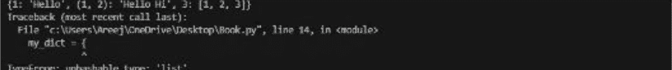

## Python 字典的长度：

借助 `len()` 方法，我们可以确定字典的大小。

```python
country_capitals = {
    "United States": "Washington D.C.",
    "England": "London",
    "Italy": "Rome"
}

# 获取字典的长度
print(len(country_capitals)) # 3
```

输出：

```
3
```

## 访问字典项：

如果我们将键放在方括号内，就可以获取字典条目的值。

```python
country_capitals = {
    "United States": "Washington D.C.",
    "Italy": "Rome",
    "England": "London"
}

print(country_capitals["United States"])
print(country_capitals["England"]) # London
```

输出：


也可以使用 `get()` 函数来获取字典条目。

## 修改字典项：

Python 提供了可变的字典。可以通过查询其键来更改字典元素的值。例如，

```python
country_capitals = {
    "United States": "Washington D.C.",
    "England": "London",
    "Italy": "Naples"
}

# 将 "Italy" 键的值更改为 "Rome"
country_capitals["Italy"] = "Rome"

print(country_capitals)
```

输出：

```
{'United States': 'Washington D.C.', 'Italy': 'Rome', 'England': 'London'}
```

## 在字典中添加项：

通过为一个新键（字典中尚不存在的键）赋予一个值，我们可以向字典中添加一个新条目。例如，

```python
country_capitals = {
    "United States": "Washington D.C.",
    "Italy": "Naples"
}

# 以 "Germany" 为键，"Berlin" 为值
country_capitals["Germany"] = "Berlin"

print(country_capitals)
```

输出：

```
{'United States': 'Washington D.C.', 'Italy': 'Naples', 'Germany': 'Berlin'}
```

也可以使用 `update()` 方法来添加或修改字典条目。

## 删除字典项：

要从字典中删除一个项，我们使用 `del` 语句。例如，

```python
country_capitals = {
    "United States": "Washington D.C.",
    "Italy": "Naples"
}

# 移除键为 "United States" 的项
del country_capitals["United States"]

print(country_capitals)
```

输出：

```
{'Italy': 'Naples'}
```

我们也可以使用 `pop()` 方法从字典中移除任何内容。

可以使用 `clear()` 函数一次性删除字典中的所有条目。

```python
country_capitals = {
    "United States": "Washington D.C.",
    "Italy": "Naples"
}

country_capitals.clear()

print(country_capitals) # {}
```

输出：

```
{}
```

## 字典成员测试

使用 `in` 运算符，我们可以确定一个键是否存在于字典中。

```python
my_list = {1: "Hello", "Howdy": 100, "Hi": 25}

print(1 in my_list) # True

# `not in` 运算符检查键是否不存在
print("Howdy" not in my_list)

print("Hello" in my_list) # False
```

输出：

```
True
False
False
```

`in` 运算符不是判断一个值是否存在，而是判断一个键是否存在。

## 迭代遍历字典：

从 Python 3.7 开始，字典构成一个有序的元素集合。换句话说，字典会保持其元素的插入顺序。

使用 `for` 循环，我们可以按顺序遍历字典的键。

```python
country_capitals = {
    "United States": "Washington D.C.",
    "Italy": "Naples"
}

# 逐个打印每个字典条目
for country in country_capitals:
    print(country)

print("----------")

# 逐个打印每个字典条目
for country in country_capitals:
    capital = country_capitals[country]
    print(capital)
```

输出：


## 字典的优势：

1.  字典条目存储在哈希表中，这使得数据能够根据与之关联的键非常快速地检索。这意味着，无论字典有多大，通过其关联键查找一项通常是一个耗时恒定的操作。

2.  字典的键值关联特性使得字典条目能够以键值对的形式保存数据。在尝试描述不同数据片段之间的关系时，这种键值关联非常有帮助。由于可以根据与之关联的键轻松查找值，字典是数据检索和映射的绝佳工具。

3.  字典本质上是无序的；然而，从 Python 3.7 版本开始，字典会保持插入顺序。这意味着条目会按照它们被添加到字典中的顺序保存。这使得字典更加高效。Python 3.6 及更早版本不保证顺序；但 Python 3.7 及更高版本会保证。无论条目以何种顺序呈现，字典查找仍然非常高效。

4.  字典中的键不限于字符串；它们可以是多种数据类型，例如字符串、整数、浮点数，甚至更复杂的结构，如元组。这种灵活性使你能够构建专门满足你需求的字典。

5.  字典中的每个键都必须是唯一的。当你使用相同的键向现有数据库添加新的键值对时，每个键值对的唯一性确保你不会意外地替换现有值。这保证了数据的正确性和完整性。

6.  就像列表可以动态扩展或收缩一样，字典也可以。由于不需要预先声明它们的大小，它们适用于数据量未知或可变的情况。

7.  字典的使用非常适合需要快速有效地关联事实的情况。字典适用于这类场景。例如，字典条目可用于表示数据缓存、配置设置或从文件或数据库派生的数据。

8.  Python 字典预先打包了各种内置方法，便于执行常用任务。当你想要处理字典数据而无需编写大量代码时，可以使用 `get()`、`keys()`、`values()`、`items()`、`pop()` 和 `update()` 等方法，以及其他许多方法。

9.  Python 提供了字典推导式，这是一种从可迭代对象或其他字典创建字典的简洁方法。利用此功能，你将能够通过对现有数据应用转换、过滤或计算来构建新的字典。

10. 字典的使用在需要频繁进行数据查找的场景中很常见，因为字典促进了高效的查找。例如，在线应用程序中使用字典来快速查找用户会话或路由信息。

## 5.3：练习

### 练习 1：

#### 从列表中提取随机元素：

## 代码：

```python
import random

def extract_random_elements(input_list, num_elements):
    """
    Extracts random elements from a list.

    Args:
        input_list (list): The list from which to extract random elements.
        num_elements (int): The number of random elements to extract.

    Returns:
        list: A list containing the randomly extracted elements.
    """
    if num_elements > len(input_list):
        raise ValueError("There are more components to extract than there are in the input list.")

    # Use random.sample to generate a list of unique random indices
    random_indices = random.sample(range(len(input_list)), num_elements)

    # Extract elements at the random indices
    random_elements = [input_list[i] for i in random_indices]

    return random_elements

# Example usage:
List1 = [1, 2, 3, 4, 5, 6, 7, 8, 9, 10]
num_to_extract = 3

random_elements = extract_random_elements(my_list, num_to_extract)
print("Randomly extracted elements:", random_elements)
```

## 输出：

```
Randomly extracted elements: [4, 2, 9]
```

## 解释：

1.  我们要做的第一件事是导入 `random` 模块，它使我们能够处理任意整数，并负责生成随机数。

2.  `input_list` 和 `num_elements` 参数是名为 `extract_random_elements` 的函数所必需的。`num_elements` 参数决定了要从列表中提取的随机元素的数量，而 `input_list` 参数描述了要从中提取随机元素的列表。

3.  我们执行一个检查，以确保 `num_elements` 的数量不超过输入列表中包含的总项目数。如果超过，我们将引发一个 `ValueError`，因为从列表中可以移除的元素数量有一个最大值。这个限制由列表的大小决定。

4.  我们使用名为 `random.sample(range(len(input_list)), num_elements)` 的方法，它允许我们生成一个彼此唯一的随机索引列表。`random.sample` 通过防止重复来确保每个索引都是唯一的，并且不会出现多次。

5.  之后，我们使用列表推导式从 `input_list` 中提取与我们在前一步中收集的随机索引相对应的组件。这一步在第 4 步“收集随机索引”之后。

6.  在此过程结束时，我们将返回随机提取的组件列表。

7.  在示例用法中，我们首先生成一个名为 `my_list` 的示例列表，并指定我们想从该列表中随机选择三个成员。将这些输入插入到我们调用的 `extract_random_elements` 函数后，我们报告结果。

这段代码将为你构建以下列表，该列表由从你的输入列表中选择的预定义数量的随机元素组成。这些条目的数量将预先确定。由于没有替换，组件将被随机选择，这意味着每个组件只会被提供一次选择机会。

### 练习 2：

#### 使用字典处理联系人列表。

## 代码：

```python
# Initialize an empty dictionary to store contacts
contacts = {}

def add_contact(cname, cphone, cemail):
    """
    Add a contact to the dictionary.

    Args:
        cname (str): The name of the contact.
        cphone (str): Contact's phone number.
        cemail (str): Contact's email address.
    """
    contacts[cname] = {'phone': cphone, 'email': cemail}

def get_contact(cname):
    """
    Retrieve contact information by name.

    Args:
        name (str): The name of the contact to retrieve.

    Returns:
        dict: A dictionary containing the contact's phone number and email address.
    """
    return contacts.get(cname, "Contact not found")

def list_contacts():
    """
    List all contacts in the dictionary.
    """
    for name, info in contacts.items():
        print("Name:", cname)
        print("Phone:", info['phone'])
        print("Email:", info['email'])
        print("---")

# Add contacts
add_contact("Alice", "123-456-7890", "alice@example.com")
add_contact("Bob", "987-654-3210", "bob@example.com")

# Retrieve and print contact information
contact_name = "Alice"
contact_info = get_contact(contact_name)
if contact_info != "Contact not found":
    print(f"Contact information for {contact_name}:")
    print("Phone:", contact_info['phone'])
    print("Email:", contact_info['email'])
else:
    print(f"{contact_name} not found in contacts.")

# List all contacts
print("\nList of all contacts:")
list_contacts()
```

## 输出：

```
Contact information for Alice:
Phone: 123-456-7890
Email: alice@example.com

List of all contacts:
Name: Alice
Phone: 123-456-7890
Email: alice@example.com
---
Name: Bob
Phone: 987-654-3210
Email: bob@example.com
---
```

## 解释：

1.  首先，初始化一个空字典，用于存储联系人信息。每个联系人将被保存为一个键值对，其中联系人的姓名作为键，另一个包含该人电子邮件地址和电话号码的字典作为值。

2.  我们将定义以下三个函数：

    -   `add_contact` 是一个函数，当被调用时，通过要求用户提供联系人的姓名、电话号码和电子邮件地址，将联系人插入到 `contacts` 字典中。

    -   `get_contact` 函数需要联系人的姓名来获取联系信息。它将返回一个包含联系人电话号码和电子邮件地址的字典，或者在找不到联系人时返回一条消息。

    -   `list_contacts` 是一个函数，给定一组键，它将遍历这些键并打印出 `contacts` 字典中每个联系人的联系信息。

3.  使用 `add_contact` 方法，我们向列表中添加了 2 个联系人：“Alice”和“Bob”。

4.  使用 `get_contact` 方法，我们获取“Alice”的联系信息并打印出来。

5.  最后，我们通过使用 `list_contacts` 方法列出所有已保存的联系人，来显示字典中保存的每个联系人的数据。

以下代码行解释了如何通过使用字典来有效地存储和维护联系人列表。你可以轻松地添加新联系人、恢复先前保存的联系人，并根据姓名、电话号码或电子邮件地址列出联系人。

## 第六章：高级文件与数据管理

Python 提供了丰富的内置函数，用于创建、编写和读取文件。在 Python 领域中，主要会遇到两种文件类型：常规文本文件和二进制文件，后者以二进制语言编码，仅由 0 和 1 组成。

在文本文件领域，每一行都以一个特定字符结尾，称为 EOL（行结束符）。在 Python 中，默认的 EOL 字符是换行符（'\n'）。另一方面，二进制文件没有这样的行终止符，而是以机器可读的二进制格式存储数据。

本文档将专注于处理文本文件的艺术，从创建到关闭，涵盖读写数据的各个方面。

## 6.1：文件访问模式

访问模式在塑造已打开文件内允许的操作性质方面起着关键作用。这些模式决定了文件在被访问后预期如何使用，并定义了文件句柄在文件中的位置——一个类似光标的实体，指示读写操作的位置。Python 提供了六种不同的访问模式。

1.  只读（'r'）：此模式仅以读取方式打开文本文件。文件句柄位于文件开头。如果文件不存在，则会引发 I/O 错误。这是文件打开的默认模式。
2.  读写（'r+'）：在此模式下，文件以读写方式打开，句柄位于文件开头。如果文件缺失，则会引发 I/O 错误。
3.  只写（'w'）：当以这种模式打开文件时，专门用于写入。如果打开一个现有文件，其内容将被截断，新数据会覆盖旧数据。文件句柄设置在文件开头，如果文件不存在则创建该文件。
4.  写读（'w+'）：类似于 'w'，此模式允许读写。如果文件存在，它会截断并覆盖现有数据，句柄位于文件开头。
5.  追加（'a'）：在 'a' 模式下，文件指定用于写入，即使文件不存在也会创建。文件句柄位于文件末尾，新写入的数据将追加到现有内容之后。
6.  追加读取（'a+'）：此模式结合了读写。它打开文件以进行两种操作，必要时创建文件。文件句柄位于文件末尾，新数据追加到现有数据之后。

## 文件如何加载到主内存中：

在计算机领域，存在两种不同的内存形式：主内存和辅内存。任何保存的文件，无论是由您还是其他用户保存的，都存储在辅内存中。相比之下，主内存在计算机关机时会丢失其内容。要在 Python 中操作文本文件或进行任何更改，必须将文件加载到主内存中。Python 通过“文件句柄”与驻留在主内存中的文件进行交互，这些句柄充当允许 Python 与文件交互的管道。本质上，操作系统在其内存中搜索文件，如果找到，则返回一个文件句柄，使您能够处理该文件。

## 打开文件：

打开文件的过程通过 `open()` 函数执行，无需导入任何外部模块。打开文件的语法如下：

```
File_object = open(r"File_Name", "Access_Mode")
```

如果文件不在与 Python 程序文件相同的目录中，则应提供其完整地址而不是文件名。文件应与 Python 程序文件位于同一文件夹中。请注意，字母 `r` 插入在文件名之前，以便文件名字符串中的每个字符都不会被解释为特殊字符。这可以防止文件名字符串以任何方式被更改。例如，如果文件地址包含 `temp` 符号，`t` 符号将被解释为制表符，并且由于地址非法而引发错误。`r` 字符将字符串转换为原始格式；更具体地说，它表示该字符串不包含任何具有特殊含义的字符。如果文件位于同一位置且未插入其地址，则可以忽略 `r`，因为它不是必需的。

```
# 使用 Open 函数以追加模式打开文件 "MyFile1.txt"
# （同一目录），并将
file1 = open("MyFile1.txt","a")
# 其引用存储在变量 file1 中
# 以及 D:\Text 中的 "MyFile2.txt" 存储在 file2 中
file2 = open(r"D:\Text\MyFile2.txt","w+")
```

这里，file1 被创建为 MyFile1 的对象，file2 被创建为 MyFile2 的对象。

## 关闭文件

`close()` 函数关闭文件并释放该文件占用的内存空间。它在文件不再重要或需要以不同文件模式启动时使用。

```
File_object.close()

# 打开并关闭文件 "MyFile.txt"
# 对象名为 file1。
file1 = open("MyFile.txt","a")
file1.close()
```

## 写入文件

有两种方式可以写入文件。

1.  `write()`：将字符串 `str1` 插入文本文件的单独一行中。
    `File_object.write(str1)`
2.  `writelines()`：对于字符串列表，每个字符串都追加到文本文件中。用于一次插入多个字符串。
    `File_object.writelines(L) for L = [str1, str2, str3]`

## 从文件读取

要从文本文件读取数据：

1.  `read()`：以字符串格式返回已读取的字节。读取 `n` 个字节；如果未提供 `n`，则读取整个文件。
    `File_object.read([n])`
2.  `readline()`：读取文件的一行并以字符串形式返回。对于指定的 `n`，最多读取 `n` 个字节。但不能读取超过一行。
    `File_object.readline([n])`
3.  `readlines()`：遍历所有行，并将它们作为列表中的每个字符串部分返回。
    `File_object.readlines()`

注意：'\n' 被视为两个字节的特殊字符。

### 练习 1：

创建一个程序，展示在文件中读写数据的各种方式。

## 代码：

```
file1 = open("myfile.txt","w")
L = ["This is Delhi \n","This is Paris \n","This is London \n"]

# \n 用于表示 EOL（行结束符）
file1.write("Hello \n")
file1.writelines(L)
file1.close() # 用于更改文件访问模式

file1 = open("myfile.txt","r+")

print("Read 函数的输出是 ")
print(file1.read())
print()

# seek(n) 将文件句柄移动到从开头算起的第 n 个字节。
file1.seek(0)

print("Readline 函数的输出是 ")
print(file1.readline())
print()

file1.seek(0)

# 为了展示 read 和 readline 的区别
print("Read(9) 函数的输出是 ")
print(file1.read(9))
print()

file1.seek(0)

print("Readline(9) 函数的输出是 ")
print(file1.readline(9))

file1.seek(0)
# readlines 函数
print("Readlines 函数的输出是 ")
print(file1.readlines())
print()
file1.close()
```

## 输出：

Myfile.txt：


## 解释：

-   代码首先使用 `file1 = open("myfile.txt","w")` 以写入模式（'w'）打开名为 "myfile.txt" 的文件。
-   它定义了一个列表 `L`，包含三个字符串，每个字符串代表一行文本，格式为 "This is..."，每行以换行符（'\n'）结尾。
-   代码使用 `file1.write("Hello \n")` 将 "Hello" 后跟一个换行符写入文件。
-   然后，它使用 `writelines()` 方法将列表 `L` 写入文件。这会将三行追加到现有内容之后。
-   最后，使用 `file1.close()` 关闭文件。
-   接下来，代码以 'r+' 模式打开同一文件进行读写，使用 `file1 = open("myfile.txt","r+")`。
-   它使用 `file1.read()` 读取文件的全部内容并打印出来。这会显示文件的全部内容。
-   然后，它使用 `file1.seek(0)` 将文件位置设置回开头（偏移量 0）。
-   在 `seek(0)` 操作之后，它使用 `file1.readline()` 从文件中读取一行。这会读取并返回文件的第一行，即 "Hello "（包括换行符）。
-   代码再次使用 `file1.seek(0)` 定位到文件开头。
-   它使用 `file1.read(9)` 从文件中读取接下来的 9 个字符，包括空格。

## 追加到文件：

使用 'a' 模式可以将数据追加到文件，这会在文件末尾添加新内容而不覆盖现有数据。相反，'w' 模式会用新数据覆盖现有内容。

```python
# Python 程序演示追加与写入模式
file1 = open("myfile.txt", "w")
L = ["This is Delhi \n", "This is Paris \n", "This is London \n"]
file1.writelines(L)
file1.close()
```

```python
# 追加-在末尾添加
file1 = open("myfile.txt", "a") # 追加模式
file1.write("Today \n")
file1.close()
```

```python
file1 = open("myfile.txt", "r")
print("追加后读取行的输出")
print(file1.readlines())
print()
file1.close()
```

```python
# 写入-覆盖
file1 = open("myfile.txt", "w") # 写入模式
file1.write("Tomorrow \n")
file1.close()
```

```python
file1 = open("myfile.txt", "r")
print("写入后读取行的输出")
print(file1.readlines())
print()
file1.close()
```

总之，Python 提供了强大的文件处理功能，便于对文本文件执行一系列操作。理解文件访问模式、将文件加载到主内存，以及掌握打开、关闭、写入和读取文件的方法，是任何 Python 程序员必备的技能。这种熟练程度使程序员能够有效地管理和操作存储在文本文件中的数据，这是许多实际应用的基本方面。

## 6.2：理解 Python 中的 XML 和 JSON

XML 和 JSON 是编程世界中两种常用的数据格式，尤其用于存储和交换数据。它们提供了一种结构化的方式来表示信息，人类和机器都能轻松理解。在 Python 中，你可以使用为此目的设计的库高效地处理 XML 和 JSON 数据。

### XML（可扩展标记语言）

XML 是一种标记语言，这意味着它使用标签来定义数据的结构。这些标签有助于组织和描述文档中包含的信息。以下是 XML 的一个基本示例：

代码：

```xml
<book>
    <title>Python Programming</title>
    <author>John Doe</author>
    <price>29.99</price>
</book>
```

解释：

在这个 XML 中，`<book>` 是根元素，它包含像 `<title>`、`<author>` 和 `<price>` 这样的子元素，每个元素存储特定的信息。

### 在 Python 中读写 XML

Python 提供了 `xml.etree.ElementTree` 库来处理 XML 数据。你可以使用它来解析（读取）和生成（写入）XML 文件。

#### 读取 XML：

```python
import xml.etree.ElementTree as ET

# 解析 XML 文件
tree = ET.parse("my_file.xml")
root = tree.getroot()

# 访问 XML 中的元素
title = root.find("title").text
author = root.find("author").text
price = root.find("price").text

print("Title:", title)
print("Author:", author)
print("Price:", price)
```

#### 写入 XML：

```python
import xml.etree.ElementTree as ET

# 创建 XML 结构
book = ET.Element("book")
title = ET.SubElement(book, "title")
title.text = "Python Programming"
author = ET.SubElement(book, "author")
author.text = "John Doe"
price = ET.SubElement(book, "price")
price.text = "29.99"

# 创建树并写入文件
tree = ET.ElementTree(book)
tree.write("my_file.xml")
```

### JSON（JavaScript 对象表示法）

JSON 是一种非常轻量级的数据传输格式。人类和机器都能轻松读写这种语言。由于它以键值对的形式存储数据，JSON 是一种常用于在线 API 和配置文件的格式。以下是 JSON 的一个简单示例：

```json
{
    "title": "Python Programming",
    "author": "John Doe",
    "price": 29.99
}
```

在这个 JSON 对象中，你有像 "title"、"author" 和 "price" 这样的键，它们与各自的值相关联。

### 在 Python 中读写 JSON

Python 包含一个名为 `json` 的内置库，用于处理 JSON 数据。

#### 读取 JSON：

```python
import json

# 从文件中读取 JSON 数据
with open("my_file.json", "r") as f:
    data = json.load(f)

# 访问 JSON 数据
print("Name:", data["name"])
print("Age:", data["age"])
```

#### 写入 JSON：

```python
import json

# 创建 Python 字典
data = {
    "name": "John Doe",
    "age": 30
}

# 将 JSON 数据写入文件
with open("my_file.json", "w") as f:
    json.dump(data, f)
```

总之，XML 和 JSON 是在 Python 和许多其他编程语言中有价值的数据格式，用于结构化和交换信息。Python 提供了像 `xml.etree.ElementTree` 和 `json` 这样的库来无缝处理这些格式。理解如何读写 XML 和 JSON 数据对于数据交换、配置管理和 Web 开发等任务至关重要。

## 6.3：动手练习

### 练习 1：

你有一个名为 "books.xml" 的 XML 文件，其中包含一个书籍列表。每本书都有标题、作者和价格。编写一个 Python 程序来解析这个 XML 文件并打印每本书的详细信息。

#### 代码：books.xml

```xml
<library>
  <book>
    <title>Python Programming</title>
    <author>John Doe</author>
    <price>29.99</price>
  </book>
  <book>
    <title>Data Science Handbook</title>
    <author>Jane Smith</author>
    <price>39.95</price>
  </book>
</library>
```

#### 解决方案：

```python
import xml.etree.ElementTree as ET

# 解析 XML 文件
tree = ET.parse("books.xml")
root = tree.getroot()

# 遍历每本书并打印详细信息
for book in root.findall("book"):
    title = book.find("title").text
    author = book.find("author").text
    price = book.find("price").text
    print("Title:", title)
    print("Author:", author)
    print("Price:", price)
    print()
```

## 输出：

```
Title: Python Programming
Author: John Doe
Price: 29.99

Title: Data Science Handbook
Author: Jane Smith
Price: 39.95
```

## 解释：

- 我们首先将 `xml.etree.ElementTree` 模块导入为 `ET`，这允许我们在 Python 中处理 XML 数据。
- 接下来，我们使用 `ET.parse("books.xml")` 解析 XML 文件 "books.xml"，并使用 `tree.getroot()` 获取 XML 树的根元素。在这种情况下，根元素是 `<library>`。
- 然后，我们使用 for 循环遍历 `<library>` 内的每个 `<book>` 元素。
- 对于每个 `<book>`，我们使用 `find()` 方法提取 `<title>`、`<author>` 和 `<price>` 元素内的文本。此方法允许我们在当前 `<book>` 中定位特定的子元素。
- 我们打印每本书的详细信息，包括标题、作者和价格。

### 练习 2：

你有一个名为 "data.json" 的 JSON 文件，其中包含产品及其价格的信息。编写一个 Python 程序来读取这个 JSON 文件，计算所有产品的总价，然后将结果保存到一个名为 "total_price.json" 的新 JSON 文件中。

#### 代码：data.json

```json
{
    "products": [
        {
            "name": "Laptop",
            "price": 799.99
        },
        {
            "name": "Mouse",
            "price": 19.99
        },
        {
            "name": "Keyboard",
            "price": 49.99
        }
    ]
}
```

#### 解决方案：

```python
import json

# 从 data.json 读取 JSON 数据
with open("data.json", "r") as f:
    data = json.load(f)

# 计算所有产品的总价
total_price = sum(product["price"] for product in data["products"])

# 创建一个包含总价的新 JSON 对象
result = {"total_price": total_price}

# 将结果写入 total_price.json
with open("total_price.json", "w") as f:
    json.dump(result, f)

print("Total Price:", total_price)
```

## 输出：

```
Total Price: 869.97
```

## 解释：

在这个练习中，我们首先从"data.json"，通过累加所有产品的价格来计算总价，然后创建一个包含总价的新JSON对象。最后，我们将这个结果保存到"total_price.json"中。

- 我们导入了json模块来处理JSON数据。
- 我们从"data.json"读取JSON数据，并将其存储在变量data中。
- 我们通过遍历JSON数据中"products"键内的产品列表并累加它们的价格来计算总价。
- 我们创建了一个名为result的新JSON对象，其中包含一个键"total_price"，并将计算出的总价赋值给它。
- 最后，我们将结果JSON对象保存到一个新文件"total_price.json"中，该文件现在包含了所有产品的总价。

## 第7章：Python中的高级面向对象编程

### 7.1：面向对象编程的高级概念

Python是一种适应性强的编程语言，可以与多种不同的编程方法配合使用。其中一种被称为面向对象编程（OOP）的风格，可以在Python中借助对象和类来实现。

一个同时具有属性和行为的实体被称为对象。一只鸟，比如鹦鹉，就是一个对象的例子。它具有：

- 属性，如名字、颜色、年龄等。
- 行为，如跳舞、唱歌等。

同样，类可以被视为对象的模板。

### Python类与对象：

```python
class Parrot:
    # attribute of a class
    name = ""
    age = 0

# creating object parrot1
parrot1 = Parrot()
parrot1.name = "Blu"
parrot1.age = 10

# create an additional object par2
par2 = Parrot()
par2.name = "Woo"
par2.age = 15

# access attributes
print(f"{parrot1.name} is {parrot1.age} years old")
print(f"{par2.name} is {par2.age} years old")
```

## 输出：

```
Blu is 10 years old
Woo is 15 years old
```

在上面的例子中，我们创建了一个名为Parrot的类，它具有name和age两个属性。

接下来，我们构造了Parrot类的实例。parrot1和parrot2代表了对新对象的引用（值）。

然后，我们使用对象名和点号表示法来访问实例属性并更改它们的值。

### Python继承：

使用继承允许你创建一个新类，该类可以使用先前创建的类的信息，而无需修改它。

新创建的类是子类，也称为派生类。当前类也是基类，也称为父类。

```python
# parent class
class Animal:

    def eat(self):
        print("I can eat!!")

    def sleep(self):
        print("I can sleep!!")
```

```python
# child class
class Dog(Animal):

    def bark(self):
        print("I can bark!! Woof woof!!")
```

```python
# Create an object of the Dog class
dog1 = Dog()
```

```python
# Calling members of the parent class
dog1.eat()
dog1.sleep()
```

```python
# Calling a member of the derived class
dog1.bark()
```

## 输出：

```
I can eat!
I can sleep!
I can bark! Woof woof!!
```

在这个例子中，派生类Dog的对象dog1可以访问父类Animal的成员。这是因为Dog派生自Animal。

```python
# Calling members of the parent class
dog1.eat()
dog1.sleep()
```

### Python封装：

封装是面向对象编程的关键部分，也是其主要组成部分之一。将多个类的方法和属性组合成一个的过程被称为“封装”。

它阻止其他类访问一个类的方法和属性，因此其他类无法修改它们。此外，这也有助于数据的隐藏。

在Python中，前缀下划线用于表示私有特性，例如单下划线 _，双下划线 __。例如，

```python
class Computer:
    def __init__(self):
        self.__maximumprice = 900

    def sell(self):
        print("Selling Price: {}".format(self.__maximumprice))

    def setMaxPrice(self, price):
        self.__maximumprice = price

c = Computer()
c.sell()

# change the price
c.__maximumprice = 1000
c.sell()

# using the setter function
c.setMaxPrice(1000)
c.sell()
```

## 输出：

```
Selling Price: 900
Selling Price: 900
Selling Price: 1000
```

在上面提到的程序中，我们创建了一个Computer类。

我们使用了__init__()函数来保存计算机的最高售价。看看这里的代码。

```python
c.__maximumprice = 1000
```

在这里，我们试图独立于类来更改__maximumprice的值。但是，由于__maximumprice是一个私有变量，输出并没有反映这个变化。

如所见，为了修改该值，我们必须使用setter方法setMaxPrice()，该方法需要价格作为参数。

### 多态：

多态是面向对象编程的另一个基本概念。它简单地意味着多种不同的形式。

换句话说，同一个实体（方法、运算符或对象）可以根据其执行的上下文执行不同的活动。

以此为例：

```python
class Polygon:
    # method for displaying a shape
    def render(self):
        print("Rendering a Polygon...")

class Square(Polygon):
    # renders a Square
    def render(self):
        print("Rendering a Square...")

class Circle(Polygon):
    # renders a circle
    def render(self):
        print("Rendering a Circle...")

# creating Square class object
s1 = Square()
s1.render()
```

```python
# creating Circle class object
c1 = Circle()
c1.render()
```

## 输出：

```
Rendering Square...
Rendering Circle...
```

在刚刚展示的例子中，我们创建了一个名为Polygon的超类，以及两个名为Square和Circle的子类。考虑一下render()函数的应用。

render()方法的主要重点是准确表示正在绘制的形状。然而，生成一个正方形的过程需要与生成一个圆不同的步骤。

因此，render()方法可能会根据类的不同而表现不同。或者，render()函数有多种用途。

### 7.2：特殊方法和高级继承的使用

### Dunder方法是如何工作的？

你可以通过使用Python的特殊方法（一组预定义的方法）来增强类的功能。由于它们以一对双下划线开始和结束，例如__init__和__str__，因此很容易识别它们。

“under-under-method-under-under”这个说法很快就变得乏味了；因此，Python开发者们想出了“dunder methods”这个词，它是“double under”的缩写。

有时，这些Python中的“dunders”或“特殊方法”也被称为“魔法方法”。然而，使用这个词可能会给人留下它们比实际更复杂的印象；最终，它们并没有什么“魔法”之处。将这些方法视为语言中被认为是常规的特性。

通过使用Dunder方法，你可以模拟内置类型的行为。例如，要获取字符串的长度，你可以使用len('string')函数。然而，一个空的类声明在默认状态下不会自动启用此行为：

```python
class NoLenSupport:
    pass

obj = NoLenSupport()
len(obj)
```

输出：

```
Traceback (most recent call last):
  File "C:\Users\Areej\OneDrive\Desktop\Book.py", line 4, in <module>
    len(obj)
TypeError: object of type 'NoLenSupport' has no len()
```

你可以通过在类中添加一个`__len__` dunder函数来修正这一点：

```python
class LenSupport:
    def __len__(self):
        return 42

obj = LenSupport()
len(obj)
```

切片是另一个例子。实现一个`__getitem__`函数使你能够利用Python的列表切片语法，即`obj[start:stop]`。

### 独特方法与Python数据模型：

程序员可以利用Python数据模型提供的高级架构来使用大量的语言特性。这些功能包括属性访问、运算符重载、迭代和序列。

如果你实现几个dunder方法，你就可以将Python的数据架构作为一个强大的API来使用。如果你想编写更符合Python风格的代码，你必须对何时以及如何使用dunder方法有扎实的理解。

然而，对于初学者来说，这最初可能看起来相当令人生畏。无需担心；例如，在本文中，我们将通过处理一个简单的Account类来使用dunder方法。

### 增强一个基本的Account类：

为了启用以下语言特性，许多dunder方法将被添加到一个基本的Python类中：

## 新对象初始化
- 对象的表示
- 启用迭代
- 运算符重载（比较）
- 运算符重载（加法）
- 方法的调用
- 对上下文管理器（with语句）的支持

```python
class Account:
    """一个普通的账户类"""

    def __init__(self, accowner, accamount=0):
        """
        这是允许我们为该类创建
        对象的构造函数
        """
        self.owner = accowner
        self.amount = accamount
        self._transactions = []
```

构造函数处理对象的配置。在这个实例中，所有者姓名、可选的起始金额以及内部交易列表的定义都被传递给它，以便它可以监控存款和取款。

这使我们能够创建像这样的新账户：

```python
acc1 = Account('bob') # 默认金额 = 0
acc1 = Account('bob', 10)
```

## 表示对象：__str__、__repr__

在Python中，通常会为类的用户提供与该对象相关的字符串表示（有点像API文档）。使用双下划线方法，有两种方式可以做到这一点：

__repr__ 表示对象的“官方”字符串表示。你会以这种方式创建该类的一个对象。__repr__ 的目标是清晰明了。

__str__ 是对象的“非正式”或易于阅读的字符串表示。这是为最终用户准备的。

现在，让我们在Account类中使用这两种方法：

```python
class Account:
    """一个简单的账户类"""

    def __init__(self, owner, amount=0):
        """
        这是使我们能够从该类创建
        对象的构造函数
        """
        self.owner = owner
        self.amount = amount
        self._transactions = []

    def __repr__(self):
        return 'Account({!r}, {!r})'.format(self.owner, self.amount)

    def __str__(self):
        return 'Account of {} with starting amount: {}'.format(
            self.owner, self.amount)
```

如果你不想硬编码“Account”作为其名称，你可以使用 `self.__class__.__name__` 以编程方式检索类名。

如果你只打算在一个Python类上实现其中一个字符串转换函数，请确保它是 __repr__。

我现在可以用多种方式查询对象，并始终获得漂亮的字符串表示：


## 迭代：__getitem__、__len__ 和 __reversed__

我们需要添加一些交易，以便我可以遍历我们的账户对象。我将首先提供一个添加交易的基本过程。由于这只是解释双下划线方法的设置代码，而不是一个生产就绪的会计系统，我将保持简单：

```python
class Account:
    """一个普通的账户类"""

    def __init__(self, accowner, accamount=0):
        """
        我们可以使用其构造函数为该类创建实例
        """
        self.owner = accowner
        self.amount = accamount
        self._transactions = []

    def __repr__(self):
        return 'Account({!r}, {!r})'.format(self.owner, self.amount)

    def __str__(self):
        return 'Account of {} with starting amount: {}'.format(
            self.owner, self.amount)

    #acc = Account('bob')  # 默认金额 = 0
    #acc = Account('bob', 10)

    def add_transaction(self, accamount):
        if not isinstance(accamount, int):
            raise ValueError('please use int for amount')
        self._transactions.append(accamount)
```

为了能够轻松地使用 `account.balance` 访问账户余额，我还开发了一个计算账户余额的属性。此方法将每笔交易的总额加到起始金额上：

```python
class Account:
    """一个简单的账户类"""

    def __init__(self, owner, amount=0):
        """
        我们可以使用其构造函数为该类创建实例
        """
        self.owner = owner
        self.amount = amount
        self._transactions = []

    def __repr__(self):
        return 'Account({!r}, {!r})'.format(self.owner, self.amount)

    def __str__(self):
        return 'Account of {} with starting amount: {}'.format(self.owner, self.amount)

    #acc = Account('bob') # 默认金额 = 0
    #acc = Account('bob', 10)

    def add_transaction(self, accamount):
        if not isinstance(accamount, int):
            raise ValueError('please use int for amount')
        self._transactions.append(accamount)

    @property
    def balance(self):
        return self.amount + sum(self._transactions)
```

让我们继续处理账户的存款和取款：

```python
class Account:
    """一个简单的账户类"""

    def __init__(self, owner, amount=0):
        """
        我们可以使用其构造函数为该类创建实例
        """
        self.owner = owner
        self.amount = amount
        self._transactions = []

    def __repr__(self):
        return 'Account({!r}, {!r})'.format(self.owner, self.amount)

    def __str__(self):
        return 'Account of {} with starting amount: {}'.format(
            self.owner, self.amount)

    def add_transaction(self, accamount):
        if not isinstance(accamount, int):
            raise ValueError('please use int for amount')
        self._transactions.append(accamount)

    @property
    def balance(self):
        return self.amount + sum(self._transactions)

acc = Account('bob', 10)
acc.add_transaction(20)
acc.add_transaction(-10)
acc.add_transaction(50)
acc.add_transaction(-20)
acc.add_transaction(30)
```

使用这些数据，我们想知道：

1. 发生了多少笔交易？
2. 要获取交易编号，请索引账户对象...
3. 循环遍历交易

目前，只有拥有类定义才可行。以下所有语句都会导致TypeError异常：

```python
len(acc)
TypeError
```

```python
for t in acc:
    print(t)
TypeError
```

```python
acc[1]
TypeError
```

输出：

```
Traceback (most recent call last):
  File "c:\Users\Areej\OneDrive\Desktop\Book.py", line 36, in <module>
    len(acc)
TypeError: object of type 'Account' has no len()
```

双下划线方法登场！要使类可迭代，请添加以下少量代码：

```python
class Account:
    """一个简单的账户类"""

    def __len__(self):
        return len(self._transactions)

    def __getitem__(self, accposition):
        return self._transactions[accposition]
```

输出：

```
20
-10
50
-20
30
```

前面的命题现在有效了：

```python
len(acc)
5

for t in acc:
    print(t)
20
-10
50
-20
30

acc[1]
-10
```

输出：

```
20
-10
50
-20
30
```

使用 __reversed__ 特殊方法，你可以反向遍历交易：

```python
def __reversed__(self):
    return self[::-1]

list(reversed(acc))
[30, -20, 50, -10, 20]
```

Python中的反向列表切片技术用于反转交易列表。因为 reversed() 产生的是一个反向迭代器，而不是一个可以在REPL中优雅打印的列表对象，所以我还必须将 reversed(acc) 的输出包装在 list() 调用中。

## 使用运算符重载比较账户：__eq__、__lt__

每天，为了比较Python对象，我们都会编写数百条语句：

```python
2 > 1
True

'a' > 'b'
False
```

尽管这一切看起来如此自然，但幕后发生的事情相当不可思议。> 的行为对于字符串、整数和其他相同类型的对象是相同的，因为这些实体实现了几个不同的比较双下划线方法；多态行为是可能的。

使用内置的 dir() 函数是确认这一点的简单方法：

```python
dir('a')
['__add__',
...
'__eq__', <------------------
'__format__',
'__ge__', <------------------
'__getitem__',
'__getattribute__',
'__getnewargs__',
'__gt__', <-----------------
...]
```

当我们为以后的使用添加一些交易时，让我们创建另一个账户对象，然后将其与第一个进行比较：

```python
acc2 = Account('tim', 100)
acc2.add_transaction(20)
acc2.add_transaction(40)
acc2.balance
160

acc2 > acc
TypeError:
'>' not supported between instances of 'Account' and 'Account'
```

输出：

```
Traceback (most recent call last):
  File "c:\Users\Wreej\OneDrive\Desktop\Book.py", line 37, in <module>
    acc2 > acc
TypeError: '>' not supported between instances of 'Account' and 'Account'
```

由于我们尚未构建任何比较函数，也未从父类继承任何比较函数，因此会引发 `TypeError`。

请添加它们。使用 `functools.total_ordering` 装饰器，我可以绕过实现所有比较的魔术方法，只需实现 `__eq__` 和 `__lt__`。

```python
from functools import total_ordering

@total_ordering
class Account:
    """An ordinary account class"""

    def __init__(self, accowner, accamount=0):
        """
        This is the constructor that enables us to create
        objects for this class
        """
        self.owner = accowner
        self.amount = accamount
        self._transactions = []

    def __eq__(self, other):
        return self.balance == other.balance

    def __lt__(self, other):
        return self.balance < other.balance
```

现在我们可以毫无问题地比较 `Account` 实例了：

```
acc2 > acc
True

acc2 < acc
False

acc == acc2
False
```

## 用于合并账户的运算符重载：`__add__`

在 Python 中，一切皆对象。使用 `+`（加号）连接两个字符串或两个数字是完全可行的，并且其行为符合预期：

```
1 + 2
3

'hello' + ' world'
'hello world'
```

多态性再次显现：你是否注意到 `+` 根据其操作对象的不同而表现不同？它连接文本并对整数求和。通过再次对项目执行快速的 `dir()`，可以揭示数据模型内部相关的“魔术”接口：

```
dir(1)
[...
'__add__',
...
'__radd__',
...]
```

当你尝试将两个 `Account` 对象实例相加时，会引发 `TypeError`，因为它尚未启用加法操作：

```
acc + acc2
TypeError
```

```
Traceback (most recent call last):
  File "c:\Users\Areej\OneDrive\Desktop\Book.py", line 46, in <module>
    acc + acc2
TypeError: unsupported operand type(s) for +: 'Account' and 'Account'
```

让我们将 `__add__` 投入实践，以便合并两个账户。根据预期行为，所有者姓名、初始金额和交易记录都应合并。我们可以利用之前添加的迭代支持来帮助我们完成此操作：

```python
def __add__(self, other):
    if not isinstance(other, Account):
        raise ValueError('Can only add another Account')
    owner = '{}&{}'.format(self.owner, other.owner)
    start_amount = other.amount + self.amount
    acc = Account(owner, start_amount)
    for t in self._transactions + other._transactions:
        acc.add_transaction(t)
    return acc
```

然而，之前的方法可能更符合该类用户的预期。

我们现在有了一个新的合并账户，总余额约为 240 美元（160 + 80），初始金额为 110 美元（10 + 100）：

```
acc3 = acc2 + acc
acc3
Account('tim&bob', 110)

acc3.amount
110
acc3.balance
240
acc3._transactions
[20, 40, 20, -10, 50, -20, 30]
```

请记住，由于我们添加的是相同类型的项目，因此此操作是双向的。通常，如果你将一个内置类型（int, str,...）与你的对象相加，其 `__add__` 函数不会知道你的对象。如果是这种情况，你还需要使用反向加法技术（`__radd__`）。以下是其实际应用示例。

## Python 可调用对象：`__call__`

可以将 `__call__` 魔术方法添加到对象中，以提供类似于标准函数的回调功能。我们可以为我们的账户类创建一个漂亮的报告，其中包含构成其余额的所有交易：

```python
def __call__(self):
    print('Start amount: {}'.format(self.amount))
    print('Transactions: ')
    for transaction in self:
        print(transaction)
    print('\nBalance: {}'.format(self.balance))
```

现在，当我们使用双括号 `acc()` 语法访问对象时，我会得到一个漂亮的账户报表，显示当前金额以及所有交易的摘要：

```
Start amount: 10
Transactions:
20
-10
50
-20
30
Balance: 80
```

请记住，这只是一个玩具示例。如果你对一个“真实”账户类的实例使用函数调用语法，控制台不太可能输出任何内容。在你创建的对象上使用 `__call__` 方法的缺点是，它可能需要帮助来理解为什么对象被调用。

因此，通常最好添加一个对该类明确的方法。在这种情况下，拥有一个不同的 `Account.print_statement()` 函数会更清晰。

## `with` 语句和上下文管理器支持：`__enter__`、`__exit__`

Python 现已发展到包含上下文管理器，并增加了对使用 `with` 语句的支持。

你的对象必须遵守一个称为上下文管理器的简单“协议”（或接口），才能与“with”语句一起使用。只需将 `__enter__` 和 `__exit__` 函数添加到对象中，即可使其成为上下文管理器。

让我们使用上下文管理器支持扩展我们的 `Account` 类，添加一个回滚机制。

如果在添加另一笔交易后余额变为负数，我们将恢复到原始状态。

通过添加两个额外的魔术方法，我们可以使用 Pythonic 的 `with` 语句。此外，我添加了一些打印调用，以便在演示时澄清示例：

```python
def __enter__(self):
    print('ENTER WITH: Storing transaction backups for rollback')
    self._copy_transactions = list(self._transactions)
    return self

def __exit__(self, exc_type, exc_val, exc_tb):
    print('EXIT WITH:', end=' ')
    if exc_type:
        self._transactions = self._copy_transactions
        print('Rolling back to previous transactions')
        print('Transaction resulted in {} ({})'.format(
            exc_type.__name__, exc_val))
    else:
        print('Transaction OK')
```

我们创建了一个快速的辅助函数来验证账户中的交易，因为回滚需要引发异常：

```python
def validate_transaction(acc, amount_to_add):
    with acc as a:
        print('Adding {} to account'.format(amount_to_add))
        a.add_transaction(amount_to_add)
        print('New balance would be: {}'.format(a.balance))
        if a.balance < 0:
            raise ValueError('sorry cannot go in debt!')
```

我们现在可以将该语句与 `Account` 对象一起使用。当我们发起一笔添加正金额的交易时，一切正常：

```
Balance start: 10
ENTER WITH: Making backup of transactions for rollback
Adding 20 to account
New balance would be: 30
EXIT WITH: Transaction OK

Balance end: 30
```

然而，当我试图提取过多资金时，`__exit__` 中的逻辑会激活并撤销该交易：

```python
acc4 = Account('sue', 10)

print('\nBalance start: {}'.format(acc4.balance))

try:
    acc4.validate_transaction(-50)
except ValueError as exc:
    print(exc)

print('\nBalance end: {}'.format(acc4.balance))
```

在这个例子中，结果有所不同：

```
Balance: 80

Balance start: 10
ENTER WITH: Making backup of transactions for rollback
Adding -50 to account
New balance would be: -40
EXIT WITH: Rolling back to previous transactions
Transaction resulted in ValueError (sorry cannot go in debt!)
sorry cannot go in debt!

Balance end: 10
```

## Python 继承：

继承是面向对象编程（OOP）语言的基本概念之一。通过继承来自另一个类的类，你可以使用此过程构建共享一组属性和方法的类结构。一个类从另一个类获取或继承属性的能力称为继承。

继承的优点是：

- 从一个类（或基类）继承属性到另一个类（或派生类）的能力称为继承。以下是 Python 中继承的一些优点：
- 能够很好地表示现实世界中的关系。
- 它提供了代码的重用能力。我们不需要重写代码。此外，它使我们能够在不更改类的情况下扩展其功能。
- 由于其传递性，如果类 B 派生自另一个类 A，那么类 B 的所有子类都将不可避免地从类 A 继承。
- 通过继承提供的模型结构易于理解。
- 继承通常意味着更低的开发和维护成本。

## 通过继承的 Python 语法：

在 Python 中，基本继承的语法如下：

```
Class BaseClass:
    {Body}
Class DerivedClass(BaseClass):
    {Body}
```

## 创建父类：

子类继承其属性的类被称为父类。为了展示人员数据，让我们构建一个名为 `Person` 的父类，并包含一个 `show` 函数。

```python
# 一个说明继承的 Python 程序
class Person(object):

    # 构造函数
    def __init__(self, pname, pid):
        self.name = pname
        self.id = pid

    # 判断此人是否为员工
    def Display(self):
        print(self.name, self.id)

# 驱动代码
emp = Person("Satyam", 102) # Person 类对象
emp.Display()
```

输出：

```
Satyam 102
```

## 创建子类：

继承父类属性的类称为子类。在这种情况下，`Person` 类的属性将被另一个名为 `Emp`（基类）的类继承。

```python
class Emp(Person):

    def Print(self):
        print("Emp (Employee) class called")

Emp_details = Emp("Mayank", 103)

# 调用父类的函数
Emp_details.Display()

# 调用子类的函数
Emp_details.Print()
```

输出：

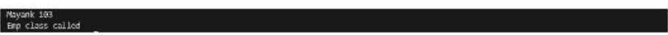

## Python 继承示例：

让我们看一个基本的 Python 继承示例，其中子类接收其父类的属性。在这个例子中，父类是 "Person"，子类是 "Employee"。

```python
# 演示继承的 Python 程序

# 父类或超类。注意括号中的 object。
# （通常，object 是所有类的祖先构成的。）
# 在 Python 3.x 中 "Person class" 等同于 "Person(object) class"

class Person(object):
    # 构造函数
    def __init__(self, name):
        self.name = name

    # 获取姓名
    def getName(self):
        return self.name

    # 判断此人是否为员工
    def isEmployee(self):
        return False

# 继承类 / 子类（注意括号中的 Person）
class Employee(Person):

    # 这里，我们返回 true
    def isEmployee(self):
        return True

# 驱动代码
person1 = Person("Geek1") # Person 的一个对象
print(person1.getName(), person1.isEmployee())

employee1 = Employee("Geek2") # Employee 的一个对象
print(employee1.getName(), employee1.isEmployee())
```

输出：

```
Geek1 False
Geek2 True
```

## 在 Python 中，object 类是什么？

在 Python（截至 3.x 版本）中，`object` 是所有类的基类，与 Java 的 `Object` 类非常相似。

- 在 Python 3.x 中，"class Test(object)" 和 "class Test" 是等价的。
- 在 Python 2.x 中，"class Test(object)" 生成一个新式类，即以 `object` 作为父类的类；而 "class Test" 创建一个旧式类（在没有 `object` 父类的情况下）。

## 子类化（调用父类的构造函数）：

必须确定子类的父类。一种方法是在子类规范中包含父类名称。

例如：`Class subclass_name (superclass_name)`！

在这个例子中，"A" 是为特定类 `Person` 创建的实例。它调用了该类的 `__init__()`。`Person` 类的声明中写有 "object"。Python 中的所有类都派生自一个内置的基类 'object'。通过调用构造函数（通常称为类的 "__init__" 函数）来创建对象变量或类实例。

实例变量（有时也称为对象）是在 `__init__()` 中声明的变量。因此，"name" 和 "idnumber" 是 `Person` 类的对象。同样，`Employee` 类的对象是 "salary" 和 "post"。由于 `Employee` 类派生自 `Person` 类，"Name" 和 "idnumber" 也是 `Employee` 类型的对象。

```python
# 演示调用父类构造函数的 Python 代码

# 父类
class Person(object):

    # __init__ 是构造函数
    def __init__(self, pname, pidnumber):
        self.name = pname
        self.idnumber = pidnumber

    def display(self):
        print(self.name)
        print(self.idnumber)

# 派生类
class Employee(Person):
    def __init__(self, empname, empidnumber, empsalary, emppost):
        self.salary = empsalary
        self.post = emppost

        # 调用父类的 __init__
        Person.__init__(self, pname, pidnumber)

# 创建一个对象变量的实例
a = Employee('Rahul', 886012, 200000, "Intern")

# 使用 Person 类的实例调用函数
a.display()
```

输出：


## 如果未调用父类的 `__init__()` 方法则显示错误的 Python 程序：

只有调用父类的 `__init__()` 方法，子类才能访问父类的实例变量。因此，下面的代码会产生错误。

```python
class A:
    def __init__(self, n='Rahul'):
        self.name = n

class B(A):
    def __init__(self, broll):
        self.roll = broll

object = B(23)
print(object.name)
```

输出：

```
Traceback (most recent call last):
  File "c:\Users\Areej\OneDrive\Desktop\Book.py", line 10, in <module>
    print(object.name)
AttributeError: 'B' object has no attribute 'name'
```

## `super()` 函数：

一个名为 `super()` 的内置方法用于检索构成父类的对象。它允许子类访问父类的属性和方法。

例如，使用基本 Python 继承的 `super()` 代码！

在这个例子中，我们生成了子类的对象，即 "obj"。当我们调用它时，继承类 "Student" 的构造函数根据创建对象时提供的值初始化了其数据成员。然后，通过使用 `super()` 方法调用了父类构造函数。

```python
# 基类
class Person():
    def __init__(self, pername, perage):
        self.name = pername
        self.age = perage

    def display(self):
        print(self.name, self.age)

# 派生类
class Student(Person):
    def __init__(self, name, age):
        self.sName = name
        self.sAge = age
        # 接收父类的属性
        super().__init__("Rahul", age)

    def displayInfo(self):
        print(self.sName, self.sAge)

obj = Student("Mayank", 23)
obj.display()
obj.displayInfo()
```

输出：

```
Rahul 23
Mayank 23
```

## 添加属性：

继承提供的能力之一是能够向子类添加我们自己的额外属性，并继承父类的属性。首先，让我们看一个例子：

```python
# 父类
class Person():
    def __init__(self, name, age):
        self.name = name
        self.age = age

    def display(self):
        print(self.name, self.age)

# 子类
class Student(Person):
    def __init__(self, name, age, dob):
        self.sName = name
        self.sAge = age
        self.dob = dob
        # 接收父类的属性
        super().__init__("Rahul", age)

    def displayInfo(self):
        print(self.sName, self.sAge, self.dob)

obj1 = Student("Mayank", 23, "16-03-2000")
obj1.display()
obj1.displayInfo()
```

输出：

如我们所见，我们已将出生日期（dob）作为新属性添加到了子类中。


## Python 继承的各种类型：

在 Python 中，有五种不同类型的继承。它们如下所列：

- **单继承：**
  如果一个子类只从一个父类继承，则称其具有单继承。我们在上面看到了一个例子。

- **多重继承：**
  当一个子类从多个父类派生时，称其具有多重继承。

```python
# 演示多重继承工作原理的 Python 示例

class Base1(object):
    def __init__(self):
        self.str1 = "Geek1"
        print("Base1")

class Base2(object):
    def __init__(self):
        self.str2 = "Geek2"
        print("Base2")

class Derived(Base1, Base2):
    def __init__(self):
        # 调用 Base1 的构造函数
```

## 以及 Base2 类
Base1.__init__(self)
Base2.__init__(self)
print("Derived")

def printStrs(self):
    print(self.str1, self.str2)

ob = Derived()
ob.printStrs()

## 输出：
Base1
Base2
Derived
Geek1 Geek2

- 多级继承：
当存在子类和孙类关系时，就会发生多级继承。因此，一个子类将从父类继承，而父类又会从其父类继承，依此类推。

```python
# 一个演示继承的 Python 程序

# 基类或超类。注意括号中的 object。
# （通常，object 是所有类的祖先）
# 在 Python 3.x 中，“Person class”
# 等同于 “Person(object) class”

class Base(object):

    # 构造函数
    def __init__(self, name):
        self.name = name

    # 获取名字
    def getName(self):
        return self.name


# 继承类/子类（注意括号中的 Person）
class Child(Base):

    # 构造函数
    def __init__(self, cname, cage):
        Base.__init__(self, cname)
        self.age = cage

    # 获取名字
    def getAge(self):
        return self.age


# 继承类/子类（注意括号中的 Person）
class GrandChild(Child):

    # 构造函数
    def __init__(self, gname, gage, gaddress):
        Child.__init__(self, gname, gage)
        self.address = address

    # 获取地址
    def getAddress(self):
        return self.address


# 驱动代码
gchild = GrandChild("Geek1", 23, "Noida")
print(g.getName(), g.getAge(), g.getAddress())
```

## 输出：
Geek1 23 Noida

- 层次继承：
单个基类可用于构建多个派生类。

- 混合继承：
这种类型融合了多种继承模式。它是多种继承类型的组合。

## 父类私有成员：
我们可以将某些父类实例变量设为私有，这样，如果我们有时希望父类实例变量通过子类继承，子类将只能访问它们。

在 Python 继承中，可以通过在实例变量名前加上两个双下划线来使其成为私有变量。例如：

```python
# 演示父类私有成员的 Python 程序
class C(object):
    def __init__(self):
        self.c = 21

        # d 是一个私有实例变量
        self.__d = 42

class D(C):
    def __init__(self):
        self.e = 84
        C.__init__(self)

object1 = D()

# 会产生错误，因为 d 是一个私有实例变量
print(object1.c)
print(object1.__d)
```

## 输出：
在这里，我们观察到变量 "c" 打印了其值 21，如控制台所示。然而，当我们尝试打印字母 "d" 时，产生了一个错误。这是由于使用下划线将变量 "d" 设为私有所致。错误发生是因为子类 "D" 无法访问它。

```
Traceback (most recent call last):
  File "c:\Users\Nreej\OneDrive\Desktop\Book.py", line 21, in <module>
    print(object1.__d)
AttributeError: 'D' object has no attribute '_d'
```

## 7.3：练习

### 练习 1：
创建一个用于管理人类的类层次结构。

代码：
```python
class Human:
    def __init__(self, name, age, gender):
        self.name = name
        self.age = age
        self.gender = gender

    def introduce(self):
        print(f"My name is {self.name}, I am {self.age} years old, and I am a {self.gender}.")

class Student(Human):
    def __init__(self, name, age, gender, student_id):
        super().__init__(name, age, gender)
        self.student_id = student_id

    def study(self, subject):
        print(f"{self.name} is studying {subject}.")

class Employee(Human):
    def __init__(self, name, age, gender, employee_id, position):
        super().__init__(name, age, gender)
        self.employee_id = employee_id
        self.position = position

    def work(self):
        print(f"{self.name} is working as a {self.position}.")

# 创建 Human、Student 和 Employee 的实例
person1 = Human("Alice", 30, "Female")
student1 = Student("Bob", 20, "Male", "S12345")
employee1 = Employee("Charlie", 25, "Male", "E98765", "Software Developer")

# 演示方法
person1.introduce()
student1.introduce()
student1.study("Math")
employee1.introduce()
employee1.work()
```

## 输出：
My name is Alice, I am 30 years old, and I am a Female.
My name is Bob, I am 20 years old, and I am a Male.
Bob is studying Math.
My name is Charlie, I am 25 years old, and I am a Male.
Charlie is working as a Software Developer.

## 解释：
1. 首先，我们定义了基本的人类类。名字、年龄和性别是 Human 类的三个特征。此外，它还包含一个名为 introduce 的特性，用于输出人类数据。
2. 接下来，我们使用 super() 方法构建了两个子类 Student 和 Employee，它们都直接继承自 Human 类。
3. Student 类有一个 study 方法，使学生能够声明他们正在学习某个主题的事实，以及一个名为 student_id 的额外特性。
4. Employee 类有一个 work 方法，使员工能够声明他们从事某个职位的事实，以及两个新属性：employee_id 和 position。
5. 为了表示不同的人，我们创建了 Human、Student 和 Employee 类的实例。每个实例都初始化了特定的属性。
6. 最后，我们使用相应的实例调用 introduce、work 和 study 方法来展示这些方法。这使我们能够观察到每个类如何以不同的身份关联和表示人。

这段代码展示了一个用于管理人的基本类结构。它演示了继承，通过使用 Student 和 Employee 类，你可以表示具有特定角色和行为的人，这些类从 Human 类继承方法和属性。根据你的具体用例，你可以进一步扩展这个层次结构，添加更多专门的类方法。

## 第 8 章：流行的 Python 库
库是程序员可以用来在软件应用程序中执行特定任务或创建不同功能的、预先编写的代码片段和函数的宝贵集合。在编程世界中，库被称为代码存档或代码仓库。这些库与工具包非常相似，它们提供了各种各样的组件，程序员可以使用这些组件以更高效、更有效的方式组装他们的软件。库最基本的形式是作为可重用代码模块的仓库，这简化了编写代码的过程，并加快了复杂程序的开发。

库的基本目标是通过提供针对编程中常见问题的现成解决方案来简化开发过程。为了加快项目进度，开发人员可以利用库的力量，而不是从头开始重写每一行代码。这使他们免于“重新发明轮子”。这些库是由经验丰富的开发人员开发的，他们已经克服了某些障碍。因此，它们使其他人能够从开发人员的知识和先前的工作中受益。库对于现代软件的创建至关重要，因为它们促进了代码的可重用性、模块化和维护的简便性。

### 8.1：Python 库资源：更深入的了解
特别是，Python 库是预先编写的代码模块的集合，旨在扩展 Python 编程语言的功能。Python 是一种常用的编程语言，由于其用户友好性和适应性，在多个领域获得了认可。这些领域包括 Web 开发、数据分析和机器学习。

Python 库通过提供一系列可定制的功能，极大地扩展了该语言的实用性，以满足不同程序员的特定需求。

这些库作为 Python 的重要附加组件，扩展了其能力，使其能在更广泛的场景中应用。这些库被设计为易于开发者集成到 Python 应用程序中，从而节省了大量的时间和精力。它们这样做也是为了能够汲取 Python 社区的集体智慧和协作精神，该社区持续为这些库的创建和改进做出贡献。具体来说，它们利用了 Python 社区的集体智慧。

Python 库可以被概念化为专门的工具包，每个工具包都旨在处理特定的编程问题或应用领域。让我们来看一些最受欢迎的 Python 库以及它们最适合的项目类型：

- NumPy：NumPy 是 Python 编程语言中进行数值计算的基础库。它支持大型多维数组和矩阵，并提供丰富的数学函数库，可用于对这些数组和矩阵执行操作。由于任何涉及数值计算的任务都需要此库，因此它被认为是数据科学和科学计算等领域不可或缺的组成部分。
- Pandas：Pandas 是一个数据操作和分析包，简化了处理表格和数据框等结构化数据的过程。由于它使得数据清洗、转换和探索等活动成为可能，因此是数据科学家和分析师的关键工具。
- Matplotlib：Matplotlib 是一个绘图包，简化了在 Python 中创建各种可视化图表的过程，包括交互式、动画或静态图表。它在数据可视化中起着至关重要的作用，有助于数据的展示和理解。
- Scikit-Learn：一个机器学习库，为创建和部署机器学习模型提供了广泛的资源。由于它支持多种算法、模型评估方法和预处理方法，机器学习从业者通常选择使用它。
- Django：Django 是一个为 Python 设计的高级 Web 框架，专门用于简化 Web 应用程序的开发。它提供了大量功能和标准，可用于快速开发安全可靠的 Web 应用程序。
- Flask：另一方面，Flask 是一个轻量级的 Web 框架，非常适合构建更紧凑的 Web 应用程序和 API。它为开发者提供了 Web 开发的基础，同时允许他们根据自己的需求选择和添加额外的组件。
- Requests：如果你想在 Python 中发出 HTTP 请求，绝对需要使用 Requests 包。它简化了发送 GET 和 POST 请求、处理身份验证以及管理 Cookie 等操作，使其成为网络爬虫、API 集成和 Web 应用程序构建不可或缺的组件。

这些库仅代表了 Python 所支持的庞大生态系统的一小部分。由于每个库都针对不同的需求集，开发者可以选择最适合其项目规格的工具。通过使用这些库，程序员能够构建功能丰富且可靠的程序，而无需从头开始设计每个单独的功能模块。

简而言之，编程库是开发者的最佳伙伴，因为它们提供了大量预先编写的代码和函数，加速了软件创建过程。Python 是一种非常开放的编程语言，它拥有庞大的库集合，允许将其能力扩展到许多其他领域。这些库为开发者提供了有效处理复杂任务所需的工具，促进了代码的重用，并利用了 Python 社区的集体智慧。

随着技术的不断发展，Python 库将继续成为软件开发者开发尖端且强大的软件解决方案的重要工具。

## 8.2: NumPy

NumPy 是 Python 编程语言最重要的库之一，其名称是“Numerical Python”的缩写。对于数据科学家、工程师、研究人员以及从事各种项目的程序员来说，它是一个必不可少的软件，因为它在实现高效的数值计算和数据操作方面起着关键作用。本全面分析将深入探讨 NumPy 库的复杂性，涵盖其应用示例以及它生成的输出。

### 了解 NumPy

NumPy 是一种编程语言，它提供对多维数组和矩阵的支持，以及可用于对这些数组执行操作的各种数学函数。这些函数可用于执行加法、减法和乘法等操作。由于上述特性，使用 NumPy 作为广泛的科学和数据驱动项目的基础是开发过程中的关键一步。该库对公众免费开放，学术界和企业界都广泛使用其资源。

从本质上讲，NumPy 引入了 NumPy 数组的概念，也称为 ndarray。ndarray 是一个同质的多维数组，能够包含相同数据类型的对象。NumPy 数组也称为 numpy 数组。由于它们是同质的且大小固定，这些数组对于执行数值计算非常有用。NumPy 提供了一个数组对象，它不仅比 Python 的内置数据结构更易于使用，还提供了针对数值工作需求的广泛操作。NumPy 是由 Python 软件开发团队开发的。

以下是 NumPy 拥有的特性和功能列表：

### 1. 多维数组

NumPy 的基本数据结构是 ndarray，它在整个库中使用。它允许你创建各种维度的数组，例如一维（向量）、二维（矩阵）甚至更高维度的数组。例如，你可以创建二维矩阵、一维向量等等。由于其多功能性，它能够适应各种环境，从而可以在从简单数值计算到复杂数据操作的各种场景中高效使用。

### 代码

```python
import numpy as np

# Creating a one-dimensional NumPy array
arr1d = np.array([1, 2, 3, 4, 5])

# Creating a two-dimensional NumPy array
arr2d = np.array([[1, 2, 3], [4, 5, 6]])
```

### 2. 数学运算过程

NumPy 提供了一个广泛的数学函数和运算符库，可以与 ndarray 对象无缝结合使用。通过使用这些函数，可以跨数组执行逐元素的加法、减法、乘法、除法等操作，这对于进行数值计算非常有价值。

### 代码

```python
import numpy as np
```

arr1 = np.array([1, 2, 3])
arr2 = np.array([4, 5, 6])

# 逐元素相加
result = arr1 + arr2 # 输出：[5, 7, 9]

# 逐元素相乘
result = arr1 * arr2 # 输出：[4, 10, 18]

## 3. 信号的传输

NumPy 的广播特性使得对不同形状和大小的数组执行操作成为可能，而无需手动将它们转换为相同的形状。这一特性通过避免复制多余的数据，简化了代码编写并提高了效率。

### 代码

```python
import numpy as np

arr1 = np.array([1, 2, 3])
scalar = 2

# 广播：将标量与数组相乘
result = arr1 * scalar # 输出：[2, 4, 6]
```

## 4. 通用函数（Ufuncs）

NumPy 通用函数是对 `ndarray` 对象进行逐元素操作的函数。这类操作使得计算既快速又高效。这类函数包含了各种各样的数学和逻辑运算。

### 代码

```python
import numpy as np

arr = np.array([1, 2, 3, 4])

# 应用通用函数（ufunc）
squared = np.square(arr) # 输出：[1, 4, 9, 16]
```

## 5. 数组的切片和索引

NumPy 提供了简单而强大的方法来对数组进行切片和索引。借助此功能，可以轻松地从数组中提取特定的项或子集。

### 代码

```python
import numpy as np

arr = np.array([10, 20, 30, 40, 50])

# 切片以获取数组的子集
subset = arr[1:4] # 输出：[20, 30, 40]

# 索引以访问特定元素
element = arr[2] # 输出：30
```

## 6. 随机数的生成

NumPy 的 `random` 子模块提供了生成随机数的例程。模拟、统计分析和人工智能等应用都能从中受益匪浅。

### 代码

```python
import numpy as np

# 生成随机数
random_numbers = np.random.rand(5)  # 输出：包含5个0到1之间随机数的数组
```

## NumPy 在现实世界中的多种用途

由于其灵活性和高性能，NumPy 已成为许多不同领域不可或缺的库。以下是一些能想到的 NumPy 现实应用：

- 1. 数据分析和统计模型

数据科学家和分析师经常使用 NumPy 作为数据处理和分析的有效工具。它为用户提供了执行数据清洗、聚合和统计分析等任务的关键工具。NumPy 提供的 `ndarray` 数据结构是其他数据结构（如 pandas DataFrame）的基础，并能与其他数据分析库实现无缝交互。

### 代码

```python
import numpy as np

# 计算均值和标准差
data = np.array([10, 15, 20, 25, 30])
mean = np.mean(data)
std_dev = np.std(data)
```

- 2. 计算科学和数学

学术界和该领域的专业人士广泛使用 NumPy 进行科学计算任务。NumPy 解决微分方程、模拟物理系统和处理实验数据的能力都是这些数值技能应用的例子。

### 代码

```python
import numpy as np

# 求解线性方程组
coeff_matrix = np.array([[2, 3], [1, -2]])
constants = np.array([8, -4])
solution = np.linalg.solve(coeff_matrix, constants)
```

- 3. 图像处理

包括计算机视觉和医学成像在内的各种图像处理应用都使用 NumPy，因为它促进了高效的像素级计算和转换。

### 代码

```python
import numpy as np
import matplotlib.pyplot as plt

# 使用 NumPy 读取和操作图像
image = plt.imread('image.jpg')
image_gray = np.mean(image, axis=2)  # 转换为灰度图
```

- 4. 机器学习

NumPy 是 Scikit-Learn 和 TensorFlow 等其他机器学习框架的基础。NumPy 数组用于有效地表示数据以及模型参数，从而实现更有效的训练和推理过程。

### 代码

```python
import numpy as np
from sklearn.datasets import load_iris
from sklearn.model_selection import train_test_split
from sklearn.linear_model import LogisticRegression

# 加载数据集并训练机器学习模型
data = load_iris()
X_train, X_test, y_train, y_test = train_test_split(data.data, data.target, test_size=0.2)
model = LogisticRegression()
model.fit(X_train, y_train)
```

- 5. 建模和计算机模拟

利用 NumPy 随机数生成能力的模拟和建模工具至关重要。研究人员和工程师能够模拟复杂系统，并分析它们在各种不同场景下的行为。

### 代码

```python
import numpy as np

# 模拟随机游走
steps = np.random.choice([-1, 1], size=1000)
positions = np.cumsum(steps)
```

### 结果

NumPy 的输出主要由 `ndarray` 对象组成，它们是数值数据的有效存储容器。根据应用程序和手头的具体任务，这些数组可以以多种不同的方式使用。

## 8.3：Pandas

近年来，名为 Pandas 的 Python 包已成为数据处理和分析领域的领导者。它为数据科学家、分析师和开发者提供了广泛的工具和数据格式，使管理、清洗和分析数据的过程变得更加简单。在这次深入探讨中，我们将深入研究 Pandas 库的内部工作原理，并附带解释、实际应用和代码示例。

Pandas 是 "Python Data Analysis Library" 的缩写，由 Wes McKinney 开发，并于 2008 年首次发布。从那时起，它已经发展成为数据专业人士和数据爱好者必不可少的工具。Series 和 DataFrame 是 Pandas 在其核心框架中引入的两个基本数据结构。

Series 是一个类似于一维数组的对象，可以存储多种数据类型，包括字符串、整数和浮点数等。它类似于电子表格中的一列或数据集中的一个特征。

DataFrame：DataFrame 是一种类似于表格的二维数据结构。它由行和列组成。它可以在各种场景中使用，看起来像电子表格或 SQL 表。可以将 DataFrame 视为 Series 对象的集合，其中 DataFrame 中的每一列代表其中一个 Series。

Pandas 在从各种来源（如 CSV 文件、Excel 电子表格、SQL 数据库等）摄取数据方面表现出色。数据被加载到 Pandas DataFrame 后，该 DataFrame 就变成了探索、操作和分析数据的游乐场。

Pandas 包含以下功能：

## 1. 数据清洗和转换

Pandas 简化数据清洗和转换过程的能力是其最显著的特点之一。它提供了多种处理缺失数据、删除非必要列和重新组织数据的策略。

### 示例 1：处理缺失数据

假设我们有一个包含用符号 'NaN' 表示的缺失值的数据集。Pandas 使我们能够轻松地处理这些缺失数据。

### 代码

```python
import pandas as pd

data = {'A': [1, 2, None, 4, 5], 'B': [None, 2, 3, 4, 5]}
df = pd.DataFrame(data)

# 用特定值（例如 0）填充缺失值
df.fillna(0, inplace=True)
```

## 2. 数据的聚合和分类

利用 Pandas 提供的强大功能，数据聚合和汇总变得更加轻松。数据可以根据预定标准进行分组，然后对每个类别执行均值、求和或计数等数学运算。

## 示例 2：分组与聚合

假设我们有一个销售数据集，想要计算每个产品类别对总销售额的贡献。

代码：

```python
import pandas as pd

data = {'Product': ['A', 'B', 'A', 'C', 'B'],
        'Sales': [100, 200, 150, 120, 180]}
df = pd.DataFrame(data)

# 按 'Product' 分组并计算 'Sales' 的总和
result = df.groupby('Product')['Sales'].sum()
```

## 3. 数据的表示

Pandas 可以轻松地与 Matplotlib 和 Seaborn 等流行的数据可视化工具集成，没有任何问题。这使得用户能够生成有意义的图表和图形，从而帮助他们可视化数据趋势。

## 示例 3：条形图

假设我们想要为前面示例中的销售数据创建一个可视化表示。

代码：

```python
import pandas as pd
import matplotlib.pyplot as plt

data = {'Product': ['A', 'B', 'A', 'C', 'B'],
        'Sales': [100, 200, 150, 120, 180]}
df = pd.DataFrame(data)

# 按 'Product' 分组并计算 'Sales' 的总和
result = df.groupby('Product')['Sales'].sum()

# 创建条形图
result.plot(kind='bar')
plt.xlabel('Product')
plt.ylabel('Total Sales')
plt.title('Total Sales by Product Category')
plt.show()
```

## 4. 数据的合并与连接

与 SQL JOIN 操作类似，Pandas 使得合并和连接数据集的过程变得更加简单直接。你可以使用共同的列或索引来合并 DataFrame。

## 示例 4：合并数据框

假设我们有两个数据集：一个包含客户信息，另一个包含客户过往的购买信息。我们可以使用标准化的 'CustomerID' 列作为基础将它们合并。

代码：

```python
import pandas as pd

# 创建两个 DataFrame
customers = pd.DataFrame({'CustomerID': [1, 2, 3],
                         'Name': ['Alice', 'Bob', 'Charlie']})

purchases = pd.DataFrame({'CustomerID': [2, 3, 1],
                         'Product': ['Widget', 'Gadget', 'Widget']})

# 在 'CustomerID' 上合并 DataFrame
merged_data = pd.merge(customers, purchases, on='CustomerID')
```

## Pandas 的实际应用

Pandas 的实用性可以在非常广泛的领域和应用中得到体现。以下是一些 Pandas 表现出色的实际场景：

- 1. 数据分析与探索性研究

对于涉及数据分析和探索的工作，Pandas 是首选工具。Pandas 作为一个数据分析工具，使得分析数据分布、汇总统计信息和定位异常值的过程变得更加容易。

## 示例 5：数据调查

假设我们有一个包含各种房产价格的数据集，我们希望研究该数据集的基本统计信息。

代码：

```python
import pandas as pd

# 从 CSV 文件加载房价数据
data = pd.read_csv('housing_prices.csv')

# 获取 'Price' 列的基本统计信息
summary_stats = data['Price'].describe()
```

- 2. 机器学习数据预处理

在使用机器学习模型进行训练之前，通常需要对数据进行预处理。Pandas 对于编码分类变量、缩放和特征选择非常有用。

## 示例 6：准备数据

在一个机器学习项目中，我们可能需要使用 Pandas 来缩放数值特征。

代码：

```python
import pandas as pd
from sklearn.preprocessing import StandardScaler

# 加载包含数值特征的数据集
data = pd.read_csv('numerical_data.csv')

# 初始化 StandardScaler
scaler = StandardScaler()

# 缩放数值特征
scaled_data = scaler.fit_transform(data[['Feature1', 'Feature2']])
```

- 3. 时间序列分析

由于其处理时间序列数据的卓越能力，Pandas 对于预测、金融分析和传感器数据处理等应用来说是一个无价的工具。

## 示例 7：时间序列分析

让我们考虑一个例子，我们想要使用历史股票价格数据计算每日收益率。

代码：

```python
import pandas as pd

# 加载历史股票价格数据
data = pd.read_csv('stock_prices.csv', index_col='Date', parse_dates=True)

# 计算每日收益率
daily_returns = data['Close'].pct_change()
```

- 4. 数据转换与清洗

来自不同来源的数据通常需要进行转换和清洗。Pandas 使得这些任务变得更容易，让数据科学家能够专注于洞察而非数据操作。

## 示例 8：转换数据

假设我们想要从一组用户评价中提取情感评分。

代码：

```python
import pandas as pd
from textblob import TextBlob

# 加载用户评论数据集
data = pd.read_csv('user_reviews.csv')

# 定义一个函数来获取情感分数
def get_sentiment(text):
    analysis = TextBlob(text)
    return analysis.sentiment.polarity

# 将该函数应用于 'Review' 列
data['Sentiment'] = data['Review'].apply(get_sentiment)
```

Pandas 已经改变了数据分析和操作的世界。凭借其用户友好的数据结构、全面的工具箱以及与其他 Python 模块的无缝集成，它已成为数据专业人士和学者不可或缺的工具。无论是检查数据、为机器学习准备数据、可视化趋势，还是执行复杂的数据转换，Pandas 都能加速这一过程，为你节省时间和精力。

在这次探索中，我们研究了 Pandas 的核心数据结构、主要功能和实际应用。你可以使用 Pandas 从数据中提取有价值的见解，为明智的决策和数据驱动的创新铺平道路。随着数据在我们数字世界中继续扮演基础性角色，Pandas 成为任何处理数据的人工具包中必不可少的工具。

## 第 9 章：使用 Flask 进行 Web 开发

### 9.1：使用 Flask 创建简单的 Web 应用程序

使用 Python 构建网站：

许多模块和框架，如 Flask、Django 和 Bottle，使你能够使用 Python 创建网页。然而，Django 和 Flask 是最受欢迎的。与 Flask 相比，Django 更易于使用，而 Flask 提供了更多的编程灵活性。

为了理解 Flask 是什么，你必须熟悉一些常见的术语。

### 1. WSGI

Web 服务器网关接口（WSGI）正被采纳为开发 Python 在线应用程序的行业标准。Web 服务器网关接口（WSGI）是 Web 服务器和 Web 应用程序之间的标准接口。

### 2. Werkzeug

它是一个 WSGI 工具包，提供实用函数、响应对象和请求对象。这使得在其之上创建 Web 框架成为可能。Werkzeug 是 Flask 框架的基础之一。

### 3. Jinja2

Jinja2 是一个流行的 Python 模板引擎。Web 模板系统将模板与特定的数据源集成，以显示动态网页。

Flask 是一个用 Python 编写的 Web 应用程序框架。

Flask 基于 Jinja2 模板引擎和 Werkzeug WSGI 工具。两者都来自 Pocco 项目。

### 安装

配置你的环境需要两个包。virtualenv 允许用户并排创建多个 Python 环境。因此，它可以防止不同库版本之间的兼容性问题，接下来是 Flask 本身。

### virtualenv

```bash
pip install virtualenv
```

### Flask

```bash
pip install Flask
```

### 代码

```python
# 将 flask 模块导入项目是必须的
# 我们的 WSGI 应用程序是 Flask 类的一个对象。
from flask import Flask

# Flask 构造函数接受当前模块的名称
# (__name__) 作为参数。
app = Flask(__name__)

# Flask 类的 route() 函数是一个装饰器，
# 它指示应用程序使用哪个 URL 来调用
# 关联的函数。
```

@app.route('/')
# '/' URL 与 hello_world() 函数绑定。
def hello_world():
    return 'Hello World'

# 主驱动函数
if __name__ == '__main__':
    # Flask 类的 run() 方法在本地开发服务器上运行应用。
    app.run()

将其保存为文件并运行脚本后，输出应如下所示：

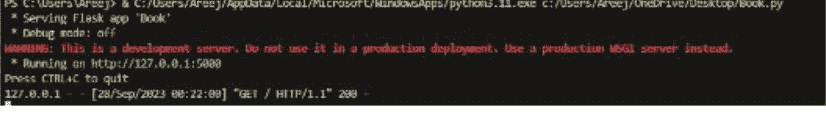

接下来，访问提供的 URL，即可在本地服务器上看到你的第一个网站，它将显示 "hello world"。

我们还可以在 Web 应用中包含变量。这将使我们能够创建动态 URL。因此，让我们用一个例子来说明：

```python
# 必须将 Flask 模块导入项目。
# 我们的 WSGI 应用是 Flask 类的一个对象。
from flask import Flask

# Flask 构造函数接受当前模块的名称（__name__）作为参数。
app = Flask(__name__)

# Flask 类的 route() 函数是一个装饰器，
# 它指示应用使用哪个 URL 来调用关联的函数。
@app.route('/hello/<name>')
def hello_name(name):
    return 'Hello %s!' % name

if __name__ == '__main__':
    app.run()
```

## 输出：

访问 URL http://127.0.0.1:5000/hello/geeksforgeeks 时，将出现以下输出：


让我们看看如何利用 Flask 提供的 HTTP 方法。

互联网上数据传输的基础是 HTTP 协议。该协议定义了从特定 URL 获取数据的多种方式。下面对这些方法进行解释。

- **GET：**
以未加密或基本格式向服务器传递信息。
- **HEAD：**
以未加密或基本格式向服务器传递数据，但不需要消息体。表单数据通过 HEAD 发送到服务器。它不缓存数据。
- **PUT：**
将修改后的内容附加到目标资源。
- **DELETE：**
通过其 URL 删除指定的资源。

Flask 路由默认响应 GET 请求。通过向 route() 装饰器提供 method 参数，可以更改此选择。为了说明 POST 方法在 URL 路由中的使用，我们首先开发一个使用 POST 方法将表单数据传输到 URL 的 HTML 表单。现在让我们构建 HTML 页面。

文件的源代码如下所示：

```html
<!DOCTYPE html>
<html lang="en" dir="ltr">
<head>
    <meta charset="utf-8">
    <title>Flask Tutorial</title>
</head>
<body>
  <h1> My First Try Using Flask </h1>
  <p> Flask is Fun </p>
</body>
</html>
```

要构建服务器，请保存此 HTML 页面并运行 Python 脚本。

```python
from flask import Flask, render_template

app = Flask(__name__)

@app.route("/")
def home():
    return render_template("home.html")

@app.route("/geeksforgeeks!")
def salvador():
    return "Hello, geeksforgeeks!"

if __name__ == "__main__":
    app.run(debug=True)
```

## 输出：

# My First Try Using Flask

Flask is Fun

## 9.2：集成数据库以存储用户数据

### 1. MySQL 的安装和配置：

在开始之前，请检查 MySQL 是否已成功安装并设置在你的计算机上。为了使用 Python 与 MySQL 数据库进行交互，你还需要在 Python 中安装 mysql-connector-python 包。可以使用 pip 来安装它：

```
pip install mysql-connector-python
```

### 2. 与 MySQL 建立连接

要连接到你的 MySQL 数据库服务器，你需要提供一些连接设置。这些参数包括数据库的主机名、用户名和密码。以下是建立连接的一种示例方式：

```python
import mysql.connector

# MySQL 连接参数
config = {
    "host": "localhost",
    "user": "DESKTOP-6DMAKER",
    "password": "Windows Authentication",
    "database": "user_data",
}

# 创建连接
conn = mysql.connector.connect(**config)
```

### 3. 数据库设计

接下来，创建你的 MySQL 数据库结构，该结构将用于存储用户数据。应为用户配置文件、身份验证数据以及任何其他相关信息定义表。为了构建和查看数据库结构，你可以使用 MySQL Workbench 等程序。

### 4. 创建表

完成数据库架构后，你可以开始使用 SQL 命令来构建表。以下是创建用户表以存储用户信息的示例：

```python
# 构建游标对象以运行 SQL 查询。
cursor = conn.cursor()

# 定义创建用户表的 SQL 命令
create_table_sql = """
CREATE TABLE users (
    id INT AUTO_INCREMENT PRIMARY KEY,
    username VARCHAR(255) UNIQUE NOT NULL,
    email VARCHAR(255) UNIQUE NOT NULL,
    pwd VARCHAR(255) NOT NULL
)
"""

# 执行创建表的 SQL 命令
cursor.execute(create_table_sql)
```

### 5. CRUD 操作方法

MySQL 使你能够执行 CRUD 过程来管理用户数据。以下是每种操作的一些示例：

#### 创建用户：

```python
def create_user(username, email, password):
    cursor = conn.cursor()

    insert_user_sql = 'INSERT INTO users (username, email, password) VALUES (%s, %s, %s)'
    values = (username, email, password)

    cursor.execute(insert_user_sql, values)

    conn.commit()
    cursor.close()
```

#### 检索用户信息：

```python
def get_user_by_username(username):
    cursor = conn.cursor()

    select_user_sql = 'SELECT * FROM users WHERE username = %s'
    cursor.execute(select_user_sql, (username,))

    user = cursor.fetchone()

    cursor.close()

    if user:
        return {
            'id': user[0],
            'username': user[1],
            'email': user[2],
            'password': user[3]
        }
    else:
        return None
```

#### 更新用户信息：

```python
def update_user_email(username, new_email):
    cursor = conn.cursor()

    update_email_sql = 'UPDATE users SET email = %s WHERE username = %s'
    values = (new_email, username)

    cursor.execute(update_email_sql, values)

    conn.commit()
    cursor.close()
```

#### 删除用户：

```python
def delete_user(username):
    cursor = conn.cursor()

    delete_user_sql = 'DELETE FROM users WHERE username = %s'

    cursor.execute(delete_user_sql, (username,))

    conn.commit()
    cursor.close()
```

### 6. 数据验证

在 SQLite 中验证数据至关重要，在这里也是如此。在执行任何数据库操作之前，你可以在 Python 中选择应用验证检查。可以使用正则表达式和 Python 包来验证电子邮件地址、密码强度以及其他用户输入。

### 7. 身份验证和授权流程

实施身份验证和授权系统对于确保用户数据的安全至关重要。你可以选择使用令牌或会话来构建自己的身份验证系统，或者你可以使用 Flask-Login 等库。确保只有被允许的用户才能访问你程序的特定区域及其包含的数据。

### 8. 错误管理

处理数据库时，错误处理是一项必备技能。为了在你的 Python 代码中正确处理连接失败、SQL 语法错误和数据库约束违规等问题，请确保包含适当的错误处理和异常捕获。

总之，将 MySQL 集成到你的 Python 应用程序中以管理用户数据，需要设置 MySQL 服务器、建立连接、定义数据库架构，并实现 CRUD 操作以及数据验证、身份验证和错误处理。在集成完成之前，所有这些步骤都必须完成。需要可扩展性和强大数据管理能力的应用程序通常选择 MySQL 作为其数据库平台，因为它功能强大。

## 9.3：练习

练习 1：

扩展 Web 应用程序的新功能。

代码：

HTML：

```html
<!DOCTYPE html>
<html lang="en" dir="ltr">
<head>
  <meta charset="utf-8">
  <title>About Flask</title>
</head>
<body>
  <h1> About Flask </h1>
```

基于Python的Flask是一个微型Web框架。使用Flask框架的应用程序包括Pinterest、LinkedIn以及Flask自身的社区网页。

# main.py:

```python
from flask import Flask, render_template

app = Flask(__name__)

@app.route("/")
def home():
    return render_template("home.html")

@app.route("/about")
def about():
    return render_template("about.html")

if __name__ == "__main__":
    app.run(debug=True)
```

## 输出：

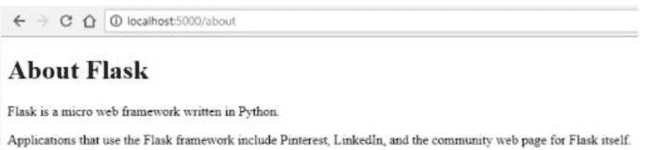

## 解释：

**HTML (home.html & about.html)：** 有两个不同的HTML文件，即"home.html"和"about.html"。这些文件描述了Flask应用程序将提供的网页的结构和内容。

- **<!DOCTYPE html>：** 此声明指明了所使用的文档类型和HTML版本。
- **<"html lang="en" dir="ltr">：** 指明了文档的语言以及内容的书写方向。
- **<head>：** 此部分包含描述文档的信息，例如字符编码和页面标题。
- **<meta charset="utf-8">：** 此meta标签将字符编码设置为UTF-8，这是一种在网站和网页中相当常用的编码。
- **<title>About Flask</title>：** 这完成了网页标题的设置。
- **<body>：** 页面的主要内容包含在此标签内。
- **<h1>：** 这是一个一级标题，显示文本"About Flask"。
- **<p>：** 这些是段落，包含关于Flask及其使用方式的文本。

**Python的main.py文件：** Python代码的执行创建了一个具有两个路由的Flask Web应用程序，然后运行该应用程序。

- **from flask import Flask, render_template：** 此行将render_template函数和Flask类引入当前作用域。
- **app = Flask(__name__)：** 此构造创建了一个Flask类的实例。需要找到`__name__`变量（在我们的例子中代表当前活动的模块main.py）以获取应用程序的根路径。
- **@app.route("/")**：这是一个装饰器，为根URL（"/"）提供路由。每次用户访问网站的根URL时，home函数将被执行。
- **def home()：** 此方法是home路由的视图函数。此函数返回使用render_template("home.html")函数渲染"home.html"模板的结果。
- **@app.route("/about")**：此装饰器使用"/about"路径作为其参数，为"/about" URL建立路由。当用户导航到此URL时，名为about的函数将被执行。
- **def about()：** 此函数是about路由的视图函数。它返回使用render_template("about.html")渲染"about.html"模板的结果。
- **if __name__ == "__main__"：** 此条件语句确保Flask应用程序仅在脚本直接运行时执行（而不是作为模块导入时）。将脚本作为模块导入不会触发Flask应用程序的执行。
- **app.run(debug=True)：** 此行允许在启用调试的情况下执行Flask应用程序，这对开发目的很有帮助。程序将监听发送给它的任何请求并进行适当处理。

简而言之，此代码创建了一个具有两个路由的Flask Web应用程序。这些路由是根URL（"/"）和"/about"。当用户访问这些URL时，他们将在浏览器中看到相应的HTML模板（"home.html"和"about.html"）被渲染并显示。这是一个非常简单的演示，展示了如何将Flask与Python结合使用来构建Web应用程序。

# 第10章：自动化与脚本

以下是对自动化脚本的简要概述，自动化脚本是旨在自动化重复性任务的计算机程序。

“自动化脚本”可以定义为旨在自动化计算机系统或软件应用程序内特定任务或流程的指令集或代码。自动化脚本由简短且特定的代码段组成，可以使用基于图形用户界面（GUI）的向导执行。后端机器人流程自动化（RPA）过程通常使用脚本语言执行，例如Perl、PHP、Jython、VBScript、JavaScript和Python。一个例子是，客户关系管理（CRM）超级管理员使用向导工具建立工作流，该工作流可以自动向客户发送电子邮件，告知他们有关所提供产品或服务的促销优惠。一旦客户提交接受，机器人流程自动化（RPA）就会启动销售漏斗中交易向关闭阶段的转换。此外，它还会将相应的记录转移到会计系统以进行开票。

研究结果表明，在美国运营的组织中，大约31%的组织已在其公司运营的至少一个关键方面成功实施了完全自动化。超过94%的专业人士表示更喜欢一个能有效自动化所有与应用程序相关操作的一体化平台。2022年印度实施机器人流程自动化（RPA）的预计增长率为57%。大约76%的受访公司表示打算使用自动化来简化和优化基于规则和重复性的流程，主要目标是减少与这些活动相关的时间和成本。为了提供投资回报率（ROI）数据的背景理解，一家跨国健康技术公司有效使用了机器人流程自动化（RPA），节省了高达2400万欧元的成本，并减少了100万个工作小时。在大型企业中，40%的企业使用自动化，而小型企业的采用率为25%。企业通过使用脚本来增强其自动化工作具有巨大潜力。

# 使用自动化脚本的优势

人工智能（AI）在各种工作流自动化技术中的接受率为18%，而机器人流程自动化（RPA）为31%，并且其受欢迎程度正在迅速增长。在此背景下，理解将机器人流程自动化（RPA）与上述客户关系管理（CRM）场景结合使用的优势至关重要。

服务器端执行涉及使用基于云的机器人流程自动化（RPA）技术在高性能后端服务器上执行脚本，而不是依赖本地系统或Web浏览器。无论系统执行脚本的频率如何，这都有助于快速执行该过程。

RPA服务提供商通过在云服务器上实施新功能，然后将其作为更新交付给客户的系统，确保系统正常运行时间为100%。这意味着在部署自动化脚本期间不会发生系统中断。

该系统设计为易于导航和访问。在上述CRM示例中，超级管理员在CRM系统内配置流程时会遇到默认且用户友好的变量，从而增强其实用性。他们不需要掌握脚本或API方面的技术技能。

一对多映射的概念是指单个脚本能够根据作为输入提供的变量生成多个结果。这意味着负责配置系统的自动化管理员的工作量减少。劳动力可以用于需要人工交互的各种应用程序。

基于脚本的自动化是一种可靠的方法，可以有效减少错误，并防止因人为疏忽或培训不足而导致的遗漏操作。在上述示例中，客户关系管理（CRM）系统会立即为计费系统启动通知，从而消除手动过程中可能出现的任何延迟。

# 自动化脚本在各种应用程序中的使用。

机器人流程自动化（RPA）使用脚本自动化内部和外部流程。

在许多领域都有应用。以下是一些实例。

该应用程序基于一系列流程。就销售而言，企业有望将每月潜在客户生成量提高多达三倍，提升销售部门效率，并降低运营成本。培育潜在客户的行为可能会提高转化率，并促进产品的快速追加销售或交叉销售。

营销和广告专业人士有望提高其营销投资回报率并改善客户留存率。大多数财富500强公司都使用营销自动化，且这种采用率持续稳步增长，这并不令人意外。

## 10.1：特定行业的应用

在金融领域，一家著名的印度银行在750个大型自动化机器人的协助下，成功将处理客户有关ATM现金问题投诉所需的时间从12小时缩短至仅4小时。机器人流程自动化（RPA）有望将账单处理时间显著减少10%。

网络安全措施可以有效缩短企业识别和应对网络钓鱼攻击所需的时间，从而保护其财务资源并维护其品牌形象。

据预测，到2030年，美国的保险公司希望将其约46%的理赔流程自动化，包括报价生成、审核和赔付等活动。

在制造业，超过57%的企业主表示希望利用自动化来提高运营效率和产品质量。根据一项研究，预计到2022年，机器人将负责自动化约42%的工业岗位。

以下是十个可以通过Python编程语言自动化的简单任务示例：

- 1. 文件管理流程的自动化，特别是涉及复制、重命名和删除文件的操作。
- 2. 数据录入：通过自动化技术简化将数据输入电子表格或数据库的过程，其中数据从文件或在线表单中提取。
- 3. 电子邮件管理包括电子邮件发送和接收流程的自动化，以及过滤器和排序机制的实施。此外，它还涉及使用自动回复系统。
- 4. 网页抓取是通过创建和实施旨在从网页抓取相关信息的程序，从网站自动提取数据。
- 5. 社交媒体管理包括内容发布的自动化、社交媒体活动的监控以及社交媒体数据的分析。
- 6. 图像处理过程可以通过使用Python的Pillow包实现自动化，该包有助于调整大小、裁剪和转换图像等任务。
- 7. 数据备份和恢复过程的自动化至关重要，包括文件、数据库和服务器。
- 8. 数据分析可以通过使用Python的数据处理工具（如Pandas和NumPy）来简化。
- 9. 网站性能监控的自动化，包括正常运行时间和响应时间等指标，可以通过使用Python脚本和工具来实现。
- 10. PyAutoGUI包支持图形用户界面功能的自动化，例如按钮点击、表单填写和菜单导航。

以下旨在对关键流程的自动化进行全面考察。它旨在提供一系列说明性实例，展示此类工作流自动化已成功实施的情况。

Python是一种编程语言，能够在多个行业自动化关键操作。以下是十个此类实例。

- 1. 本研究旨在探讨使用Python脚本和API自动化供应链管理各个方面（包括库存管理、订单处理和交付）的潜在益处。
- 2. 财务报告的自动化可以通过利用Python的数据处理和可视化库从多个来源提取数据并生成综合报告来实现。
- 3. 客户关系管理的自动化涉及利用自动化库来简化客户互动跟踪、潜在客户管理以及促进个性化沟通。
- 4. 欺诈检测：欺诈检测的自动化是通过使用Python的机器学习工具实现的，这些工具能够分析大量数据集以发现模式和异常。
- 5. 网络安全的自动化可以通过使用Python的网络自动化包来识别并快速响应安全风险来实现。
- 6. 医疗保健数据管理的自动化涉及使用数据处理和可视化库来简化电子健康记录、临床试验和患者数据的管理。
- 7. 数据中心管理的自动化包括使用Python的网络自动化模块来简化服务器配置、网络设置和负载平衡等各种任务。
- 8. 法律文档管理的自动化：利用Python的自然语言处理和机器学习库来简化法律文档管理流程，包括合同审查、文档检索和分析等任务。
- 9. 电子商务订单处理的自动化涉及使用自动化库来简化支付处理、发货和退货处理等各种任务。
- 10. 营销分析的自动化包括通过使用数据处理和可视化库来简化数据收集、分析和报告等各种任务。

## 示例1：从网站检索信息的过程

在这个说明性实例中，我们将提供一个Python脚本，该脚本利用requests和beautifulsoup4库从《纽约时报》网站检索最新文章的标题和URL。

```python
import requests
from bs4 import BeautifulSoup

# Make a GET request to the New York Times homepage
url = "https://www.nytimes.com/"
response = requests.get(url)

# Parse the HTML content using Beautiful Soup
soup = BeautifulSoup(response.content, 'html.parser')

# Find all the article titles and links
articles = soup.find_all('a', class_='css-1vvhd4r e1xfvim30')

# Print the titles and links
for article in articles:
    title = article.get_text()
    link = article['href']
    print(title)
    print(link)
```

## 输出：

该脚本生成从《纽约时报》网站检索到的文章标题及其各自超链接的汇编。

## 解释：

该Python脚本旨在向《纽约时报》主页发送GET请求，具体请求网站的HTML内容。

Beautiful Soup库用于解析HTML文本并从中提取数据。具体来说，它查找所有满足soup.find_all()指定条件的HTML元素。在此特定场景中，程序搜索具有所需CSS类的锚点（<a>）组件。

为了从每个找到的文章中获取所需信息，标题使用article.get_text()方法提取，而链接则使用article['href']属性检索。

最终，程序将标题和相应的URL输出到控制台。

必须认识到，网络抓取涉及多个方面，并具有法律和道德影响。在进行数据抓取活动时，务必仔细审查网站的服务条款并遵守相关法律法规。某些网站可能会使用反网络抓取措施，例如速率限制或验证码。因此，承认并理解这些障碍至关重要。必须始终进行负责任和合乎道德的实践。

## 10.2：高级脚本编写方法探索

在编程领域，掌握自动化和高级脚本编写方法可以显著提升开发者的技能水平和工作效率。本节将探讨高级脚本编写场景，特别关注那些通常需要复杂自动化的系统管理任务。

我们关注的主题是用于系统管理的脚本编写。系统管理员在网络、服务器和基础设施的维护与管理中扮演着至关重要的角色。Python因其灵活性和强大的库支持，已成为系统管理员的首选编程语言，使他们能够自动化任务并保持系统顺畅运行。在本次讨论中，我们将通过两个练习来展示Python在系统管理领域的实用性。

## 10.3：实践练习

### 练习1：监控系统资源

开发一个Python程序，用于监控系统资源的使用情况，并报告任何异常情况，例如CPU使用率过高或磁盘空间不足。

代码：

```python
import psutil
import smtplib
import time

# Define monitoring parameters
cpu_threshold = 90 # Alert if CPU usage exceeds 90%
memory_threshold = 80 # Alert if memory utilization exceeds 80%
disk_threshold = 70 # Alert if disk usage exceeds 70%

# Email configuration
sender_email = 'your_email@gmail.com'
sender_password = 'your_password'
recipient_email = 'recipient_email@gmail.com'

while True:
    # Get system resource usage
    cpu_usage = psutil.cpu_percent(interval=1)
    memory_usage = psutil.virtual_memory().percent
    disk_usage = psutil.disk_usage('/').percent

    # Check for resource anomalies
    if cpu_usage > cpu_threshold:
        message = f'High CPU Usage: {cpu_usage}%'
    elif memory_usage > memory_threshold:
        message = f'High Memory Usage: {memory_usage}%'
    elif disk_usage > disk_threshold:
        message = f'High Disk Usage: {disk_usage}%'
    else:
        message = None

    # Send email alert if there's an anomaly
    if message:
        with smtplib.SMTP('smtp.gmail.com', 587) as server:
            server.starttls()
            server.login(sender_email, sender_password)
            server.sendmail(sender_email, recipient_email, message)

    # Sleep for a minute before checking again
    time.sleep(60)
```

输出：

每当任何资源（CPU、内存或磁盘）的使用率超过预设阈值时，程序将通过电子邮件向收件人提供的邮箱地址发送警报。收件人邮箱地址可在脚本中指定。

说明：

此脚本使用`psutil`库持续监控系统资源使用情况。它将当前的CPU、内存和磁盘使用率与预先设定的参数进行比较。如果任何资源的使用率超过其阈值，`smtplib`库将生成电子邮件警报并发送给您指定的收件人。随后，脚本会暂停一分钟，然后再次进行检查，确保资源使用情况得到持续监控。

### 练习6：自动化电子邮件警报

创建一个Python脚本，当满足特定条件时（例如CPU使用时间超过某个限制），自动发送电子邮件通知。

代码：

```python
import psutil
import smtplib
import time

# Define alert conditions
cpu_threshold = 90  # Trigger an alert if CPU usage exceeds 90%
memory_threshold = 80 # Trigger an alert if memory utilization exceeds 80%

# Email configuration
sender_email = 'your_email@gmail.com'
sender_password = 'your_password'
recipient_email = 'recipient_email@gmail.com'

while True:
    # Get system resource usage
    cpu_usage = psutil.cpu_percent(interval=1)
    memory_usage = psutil.virtual_memory().percent

    # Check for conditions that trigger alerts
    if cpu_usage > cpu_threshold:
        message = f'High CPU Usage Alert: {cpu_usage}%'
    elif memory_usage > memory_threshold:
        message = f'High Memory Usage Alert: {memory_usage}%'
    else:
        message = None

    # Send email alert if there's a condition met
    if message:
        with smtplib.SMTP('smtp.gmail.com', 587) as server:
            server.starttls()
            server.login(sender_email, sender_password)
            server.sendmail(sender_email, recipient_email, message)

    # Sleep for 5 minutes before checking again
    time.sleep(300)
```

输出：

如果CPU使用时间百分比超过阈值，或RAM使用量超过设定的限制，程序将向收件人提供的邮箱地址发送电子邮件警告。

说明：

此脚本使用`psutil`库持续监控系统资源使用情况。它将当前的CPU和内存使用情况与一组预设的限制进行比较。如果满足生成警报所需的任何条件，`smtplib`库将生成电子邮件警报并发送给您指定的收件人。脚本在休息五分钟后再次检查条件，确保仅在必要时生成自动通知。

## 第11章：Python实践项目

### 11.1：基础计算器项目

代码：

```python
# Define a function for addition
def add(x, y):
    return x + y

# Define a function for subtraction
def subtract(x, y):
    return x - y

# Define a function for multiplication
def multiply(x, y):
    return x * y

# Define a function for division
def divide(x, y):
    if y == 0:
        return "Cannot divide by zero."
    return x / y

# Main calculator loop
while True:
    # Display a menu to the user
    print("Options:")
    print("Enter 'add' for addition")
    print("Enter 'subtract' for subtraction")
    print("Enter 'multiply' for multiplication")
    print("Enter 'divide' for division")
    print("Enter 'quit' to end the program")

    # Take user input for operation choice
    user_input = input(": ")

    # Please confirm if you indeed intend to exit the calculator.
    if user_input == "quit":
        break

    # Check for valid input and perform the chosen operation
    if user_input in ("add", "subtract", "multiply", "divide"):
        num1 = float(input("Enter first number: "))
        num2 = float(input("Enter second number: "))

        if user_input == "add":
            result = add(num1, num2)
        elif user_input == "subtract":
            result = subtract(num1, num2)
        elif user_input == "multiply":
            result = multiply(num1, num2)
        elif user_input == "divide":
            result = divide(num1, num2)

        print("Result: " + str(result))
    else:
        print("Invalid input. Please enter a valid operation.")
```

输出：

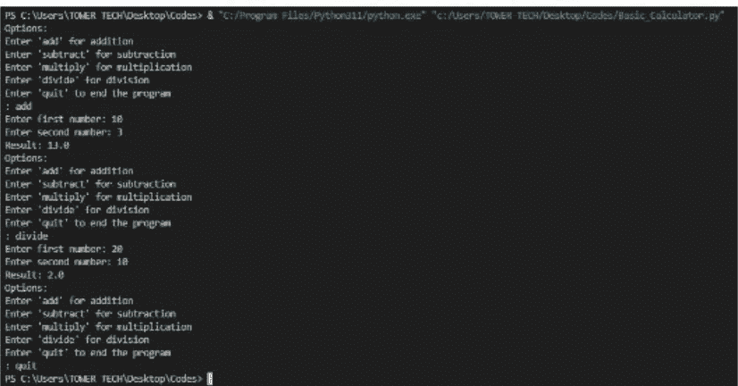

说明：

一个基础计算器应用程序可以执行四种主要的算术运算：加法、减法、乘法和除法。程序向用户提供菜单，接受其选择的运算，然后要求输入两个将进行该运算的数字。软件执行计算并显示结果；用户可以多次使用该程序，直到输入“quit”退出。该应用程序将持续运行，直到用户退出。此外，它还具备基本的错误处理功能，可以防止除以零并提醒用户输入错误。这个计算器是使用Python编写基于文本的交互式应用程序的一个简单示例。

该应用程序首先向用户显示一个选项菜单，通常包括四种主要数学运算的列表：乘法、除法、加法和减法。用户可以通过输入与该运算对应的数字或符号（例如，输入1表示加法，2表示减法等）来选择一个过程。直观且简单的界面引导用户完成每一步。

## 输入与计算：

在用户决定要执行何种操作后，程序会要求他们输入两个整数。这两个整数将作为所选操作的运算对象。软件会读取这些输入值并将其保存在内存中。随后，根据用户的偏好执行选定的算术运算，进行计算，并将结果保存。

## 错误处理：

错误处理系统是本应用程序的一个关键组件。它确保程序不会因为用户的意外输入而变得无法使用或提供不准确的结果。例如，它会判断用户是否试图除以零，如果是，则显示错误警告并请求用户进行适当的输入。此外，它还能妥善处理错误的菜单选择或非数字输入，引导用户做出正确的选择或提交合法数据。

## 反复执行：

在大多数情况下，软件会为用户提供选择，是继续执行计算还是关闭应用程序。用户完成操作后，可以使用标准的退出短语（如“quit”或“exit”）来结束在软件中的会话。如果用户选择点击“继续”选项，选项将再次显示，整个过程将从头开始。

这个计算器应用程序展示了如何使用Python编程与用户交互、处理输入、执行计算以及处理错误。在此基础上，开发者可以为各种目的设计日益复杂的交互式程序和用户界面，从基础计算器到复杂的分析程序和游戏。这些程序和用户界面可用于多种应用。

## 11.2：任务列表管理项目

代码：

```python
class Task:
    def __init__(self, title, description, due_date):
        self.title = title
        self.description = description
        self.due_date = due_date
        self.completed = False

    def mark_as_completed(self):
        self.completed = True

    def __str__(self):
        status = "Completed" if self.completed else "Pending."
        return f"Title: {self.title}\nDescription: {self.description}\nDue Date: {self.due_date}\nStatus: {status}"
```

```python
class TaskManager:
    def __init__(self):
        self.tasks = []

    def add_task(self, task):
        self.tasks.append(task)

    def list_tasks(self):
        if not self.tasks:
            print("No tasks found.")
            return

        for index, task in enumerate(self.tasks, start=1):
            print(f"Task {index}:\n{task}\n")
```

```python
def complete_task(self, task_index):
    if 1 <= task_index <= len(self.tasks):
        task = self.tasks[task_index - 1]
        task.mark_as_completed()
        print(f"Task '{task.title}' marked as completed.")
    else:
        print("Invalid task index.")
```

```python
def remove_task(self, task_index):
    if 1 <= task_index <= len(self.tasks):
        removed_task = self.tasks.pop(task_index - 1)
        print(f"Task '{removed_task.title}' removed.")
    else:
        print("Invalid task index.")
```

```python
def main():
    task_manager = TaskManager()
```

```python
while True:
    print("\nTask Manager Menu:")
    print("1. Add Task")
    print("2. List Tasks")
    print("3. Mark Task as Completed")
    print("4. Remove Task")
    print("5. Exit")
    choice = input("Enter your choice: ")

    if choice == "1":
        title = input("Enter task title: ")
        description = input("Enter task description: ")
        due_date = input("Enter due date (e.g., YYYY-MM-DD): ")
        task = Task(title, description, due_date)
        task_manager.add_task(task)
        print("Task added successfully.")

    elif choice == "2":
        task_manager.list_tasks()
```

```python
elif choice == "3":
    task_manager.list_tasks()
    task_index = int(input("Enter the index of the task to mark as completed: "))
    task_manager.complete_task(task_index)

elif choice == "4":
    task_manager.list_tasks()
    task_index = int(input("Enter the index of the task to remove: "))
    task_manager.remove_task(task_index)

elif choice == "5":
    print("Exiting Task Manager. Goodbye!")
    break

else:
```

```python
print("Invalid choice. Please try again.")

if __name__ == "__main__":
    main()
```

## 输出：

```
PS C:\Users\TOMER TECH\Desktop\Codes> & "C:/Program Files/Python311/python.exe" "c:/Users/TOMER TECH/Desktop/Codes/Task_Manager.py"

Task Manager Menu:
1. Add Task
2. List Tasks
3. Mark Task as Completed
4. Remove Task
5. Exit
Enter your choice: 1
Enter task title: Learn Python
Enter task description: Read 3 python books
Enter due date (e.g., YYYY-MM-DD): 2023-09-22
Task added successfully.

Task Manager Menu:
1. Add Task
2. List Tasks
3. Mark Task as Completed
4. Remove Task
5. Exit
Enter your choice: 2
Task 1:
Title: Learn Python
Description: Read 3 python books
Due Date: 2023-09-22
Status: Pending
```

```
Task Manager Menu:
1. Add Task
2. List Tasks
3. Mark Task as Completed
4. Remove Task
5. Exit
Enter your choice: 3
Task 1:
Title: Learn Python
Description: Read 3 python books
Due Date: 2023-08-22
Status: Pending

Enter the index of the task to mark as completed: 1
Task 'Learn Python' marked as completed.

Task Manager Menu:
1. Add Task
2. List Tasks
3. Mark Task as Completed
4. Remove Task
5. Exit
Enter your choice: 5
Exiting Task Manager. Goodbye!
PS C:\Users\YOMI-TECH\Desktop\Codes>
```

## 解释：

`Task`类封装了单个任务的所有特性和行为。每个任务实例都有一个标题、一个描述、一个截止日期（格式为“YYYY-MM-DD”），以及一个默认为`False`的完成状态。该类包含两个重要方法：`mark_as_completed()`，用于将完成状态设置为`True`，表示任务已完成；以及`__str__()`，用于在打印任务时提供其字符串表示形式。这两个方法都可以在相关方法列表中找到。

## 任务管理器类：

管理一组已编译的任务属于`TaskManager`类的职责范围。它在首次启动时初始化一个空的任务列表。该类提供了多种与任务交互的方式，包括：

-   `__init__()` 初始化一个空的任务列表。
-   `add_task(task)` 将一个任务对象追加到已处理任务的列表中。
-   `list_tasks()` 显示所有待完成任务的详细列表。
-   `complete_task(task_index)` 是一个函数，调用时会根据提供的任务索引更新任务的完成状态，从而将任务标记为已完成。
-   `remove_task(task_index)` 是一个函数，调用时会根据提供的任务索引从列表中移除一个任务。

## 主函数：

用户交互的入口点位于程序的`main()`函数内。它创建一个`TaskManager`类的新实例，并将其命名为`task_manager`。程序的主循环持续向用户显示一个基于文本的菜单界面。用户可以通过此界面执行各种操作，例如输入任务、注册任务、将任务标记为已完成或删除任务。此软件迭代将持续进行，直到用户离开或终止应用程序。

简而言之，这段代码展示了在计算机软件应用程序中管理任务的基础知识。用户可以通过一个简单的基于文本的菜单来添加新任务、列出现有任务、勾选已完成的任务以及删除任务。任务是`Task`类的实例，并由`TaskManager`类处理。这为深入理解Python中的面向对象编程概念和用户交互奠定了基础。为了进一步扩展系统，可以对用户界面进行改进。界面、数据存储功能可以被包含在内，并且系统可以与第三方服务集成，以提供更复杂的任务管理能力。

## 11.3：猜数字游戏项目

代码：

```python
import random

secret_number = random.randint(1, 100)

# Initialize the number of guesses
guesses = 0

print("Welcome to Guess the Number Game!")
print("I'm currently thinking of a number between 1 and 100. Can you guess it?")

while True:
    try:
        # Get a guess from the player
        guess = int(input("Enter your guess: "))
        guesses += 1

        # Check if the guess is correct
        if guess == secret_number:
            print(f"Congratulations! You've guessed the number {secret_number} in {guesses} tries.")
            break
        elif guess < secret_number:
            print("Try a higher number.")
        else:
            print("Try a lower number.")
    except ValueError:
        print("Invalid input. Please re enter a valid number to guess.")
```

## 输出：

```
PS C:\Users\TOMER TECH\Desktop\Codes> & "C:\Program Files\Python311\python.exe" "c:\Users\TOMER TECH\Desktop\Codes\Guess_Number.py"
Welcome to Guess the Number Game!
I'm thinking of a number between 1 and 100. Can you guess it?
Enter your guess: 40
Try a higher number.
Enter your guess: 60
Try a higher number.
Enter your guess: 80
Try a higher number.
Enter your guess: 90
Congratulations! You've guessed the number 90 in 4 tries.
PS C:\Users\TOMER TECH\Desktop\Codes>
```

## 解释：

要开始这个“猜数字”游戏，我们首先导入 `random` 模块来生成一个随机数。计算机会在 1 到 100 之间随机选择一个隐藏的数字。游戏开始时，猜测次数被初始化为零，然后程序开始一个循环，在循环中要求玩家确定隐藏的数字。它会判断玩家的猜测是否准确，并根据猜测是太高还是太低提供提示。这个过程会重复进行，直到玩家成功猜出正确的数字。如果玩家提供了错误的输入（例如非数字值），程序将通过显示错误消息来优雅地处理这种情况。这个游戏是猜数字游戏的一个简单示例。如果你想让它更有趣，可以通过添加额外功能或增加其复杂性来增强它。以下是详细解释。

所描述的“猜数字”活动为玩家提供了一个简单但有趣的互动游戏机会。游戏开始时，导入 `random` 模块的一个实例来生成一个 1 到 100 之间的任意数字。这个数字代表玩家需要找出的秘密数值。由于应用了随机性，游戏变得更加不可预测和刺激。

游戏开始时，会初始化一个变量来统计玩家尝试的总次数或猜测次数。然后启动一个循环，玩家可以进行估计，直到他们能正确确定隐藏的数字。每次玩家进行猜测时，计算机会判断玩家的估计是否准确。如果玩家的猜测正确，游戏结束，并祝贺玩家做得好。然后显示玩家成功之前进行了多少次猜测。然而，如果玩家的估计不准确，计算机会指出玩家的估计是过高还是过低。这些提示将帮助玩家缩小下一次猜测的范围。

错误管理是整体游戏体验的重要组成部分。如果玩家输入了错误的输入，例如非数字值，它将提供错误消息，并礼貌地处理这些情况。这确保了游戏能够顺利进行，不会因为玩家的意外输入而崩溃。

“猜数字”游戏的目标是在尽可能基础的层面上，对 Python 编程和用户交互进行一般性介绍。你可以通过集成诸如跟踪分数、跟踪不同难度级别或在线游戏功能等特性，在其基础上构建更复杂的游戏或应用程序。由于游戏的易用性，任何对学习如何编写代码和开发交互式应用程序感兴趣的人，将其作为教育的入门都会获得显著的优势。

## 第 12 章：高级 Python 主题

### 12.1：简介

在本章中，我们将深入探讨一些可以显著提升你编程体验的 Python 高级主题。我们将探讨虚拟环境（virtualenv）的使用，并讨论从 Python 2.x 到 Python 3.x 的过渡。此外，我们还将为你提供用于进一步学习和研究的宝贵资源。

### 12.2：使用 virtualenv

#### 什么是 virtualenv？

Virtualenv 是一个多功能工具，它使 Python 开发者能够为他们的项目创建隔离的环境。这些隔离的环境就像独立的沙箱，确保每个项目的依赖关系被清晰地封装。这种方法有几个优点：

#### 使用 Virtualenv 的好处

1.  隔离性：Virtualenv 允许你测试新的 Python 版本或包，而不会干扰其他项目。这对于确保一个项目中的更改不会破坏其他项目至关重要。
2.  项目隔离：你可以同时处理多个项目，每个项目都有其独特的依赖关系集。这可以防止版本冲突并简化项目管理。
3.  部署：共享你的代码变得更加简单，因为你可以将虚拟环境与你的项目一起分发。这样，你的用户可以轻松复制运行你的代码所需的确切环境。

#### 创建和使用 Virtualenv

1.  创建 Virtualenv：要创建一个 virtualenv，请使用以下命令。

代码：

```bash
virtualenv venv
```

此命令创建一个名为 `venv` 的新目录，其中包含 Python 解释器的副本和必要的文件。

2.  激活 Virtualenv：创建 virtualenv 后，使用此命令激活它。

代码：

```bash
source venv/bin/activate
```

一旦激活，所有 Python 命令和包安装都将被限制在虚拟环境中。

3.  安装包：你可以在 virtualenv 中使用 `pip` 命令安装包：

```bash
pip install package_name
```

4.  停用 Virtualenv：要停用 virtualenv 并返回全局 Python 环境，请使用：

```bash
deactivate
```

### 12.3：Python 3 简介

#### 什么是 Python 3？

Python 3 是 Python 编程语言的最新主要版本。它相对于 Python 2 引入了一些重大更改和改进。一些关键特性包括：

#### Python 2 和 Python 3 之间的区别

1.  Unicode 支持：Python 3.x 提供了对 Unicode 字符的原生支持，使得处理国际文本和字符更加容易。
2.  Print 函数：Python 2.x 使用 `print` 语句，而 Python 3.x 使用 `print()` 函数，提供了更大的灵活性和一致性。
3.  除法运算符：在 Python 3.x 中，除法运算符 `/` 默认返回浮点数，而在 Python 2.x 中，除非显式转换为浮点数，否则返回整数。
4.  字符串格式化：Python 3.x 引入了 f-strings，这是一种比 Python 2.x 中的 `%` 运算符更易读、更高效的字符串格式化方式。
5.  Collections 模块：Python 3.x 的 collections 模块包含了一些新的数据结构和增强功能，与 Python 2.x 相比。
6.  Asyncio 模块：Python 3.x 引入了 asyncio 模块，提供了对异步编程的支持，这在 Python 2.x 中不可用。

#### 为什么你应该使用 Python 3？

如果你是 Python 新手或开始一个新项目，强烈建议使用 Python 3.x。Python 2.x 已于 2020 年停止支持，这意味着它不再接收更新，包括安全修复。通过使用 Python 3.x，你可以确保你的代码库保持最新和安全。

### 12.4：未来学习和进一步研究的资源

要继续你的 Python 之旅并加深你的知识，有许多可用的资源：

## 书籍

-   《Python编程从入门到实践》 作者：埃里克·马瑟斯
    引用：马瑟斯，埃里克。《Python编程从入门到实践》。
-   《笨办法学Python》 作者：泽德·肖
    引用：肖，泽德。《笨办法学Python》。
-   《流畅的Python》 作者：卢西亚诺·拉马略
    引用：拉马略，卢西亚诺。《流畅的Python》。
-   《利用Python进行数据分析》 作者：韦斯·麦金尼
    引用：麦金尼，韦斯。《利用Python进行数据分析》。
-   《Effective Python》 作者：布雷特·斯拉特金
    引用：斯拉特金，布雷特。《Effective Python》。

## 在线课程

-   Python Subreddit：加入Python subreddit (https://www.reddit.com/r/python/)，与Python社区互动，提问，并了解最新动态。
-   Python Discord服务器：Python Discord服务器 (https://discord.gg/python) 是另一个社区中心，你可以在这里与Python爱好者和专家交流。
-   《Python编程从入门到实践》 作者：埃里克·马瑟斯：这本书提供了对Python编程的入门级友好介绍。
-   《笨办法学Python》 作者：泽德·肖：对于更全面、更具挑战性的Python学习方法，强烈推荐此资源。
-   《流畅的Python》 作者：卢西亚诺·拉马略：深入探讨Python高级主题，精通Pythonic编码风格。
-   《利用Python进行数据分析》 作者：韦斯·麦金尼：学习如何利用Python进行数据分析和操作。
-   《Effective Python》 作者：布雷特·斯拉特金：这本书提供了关于编写高效、有效Python代码的见解。

通过使用推荐的资源继续你的Python学习之旅，将使你能够成为一名熟练的Python开发者，有能力应对各种项目和挑战。

## 术语表

### 算法

算法是一种解决问题的方法，它由一系列必须按特定顺序执行的指令组成。这就像试图理解一台机器是如何思考的。

### 参数或争论

可以通过使用一种叫做参数的东西向函数提供额外信息。之后，函数在运行时就能像变量一样利用这些信息。（请继续阅读以获取有关变量的更多信息。）

### 数组

数组是一种可以容纳变量的容器；它也可以用来将相似的变量分组在一起。你可以将数组比作宠物店里的货架。货架代表数组，而关在笼子里的动物代表其中包含的变量。

### 算术运算符

算术运算符在几乎所有应用中都是必需的，但在游戏中尤为重要。如果玩家角色在游戏中获得经验值，该经验值必须加到总经验值中。如果对手被箭射中，必须计算对对手造成的伤害量。

### 赋值运算符

赋值运算符是将变量赋值（=）与算术运算符结合在一起的运算符。赋值运算符的一些例子包括（+=、-=、*= 和 /=）。当程序员需要执行修改变量值的操作时，他们可以使用这些运算符作为快捷方式来完成任务。如果玩家在游戏中被石头击中头部，他们的生命值将从总分中扣除，依此类推。

### 增强现实

增强现实（AR）是一种交互式体验，其中数字对象被实时叠加在物理位置的照片或视频上。与虚拟现实生成完全虚构的环境不同，增强现实利用现实世界，但在此基础上叠加额外数据。一个著名的例子是游戏《精灵宝可梦Go》，它使用智能手机的摄像头记录真实环境的图像，并在其上叠加数字形象。

### 自主和独立

自主机器人、自动驾驶汽车和配送机器人这些术语都用来描述能够利用传感器在极少或无人类输入的情况下导航其环境的机器人。

### 二进制数制

计算机使用一种叫做二进制数的东西来表示信息。计算机每分钟可以处理数百万个1和0，使用多种规则将它们解释为数字、字符、运算符以及输入到计算机中的所有其他内容。

### 位

构成二进制的单个数字1和0被称为位。

### 积木式编程

基于积木的编程中的代码“积木”可以像拼图一样拼接在一起。使用积木编写代码时，你首先选择你希望程序运行的第一个积木，将其连接到另一个积木，然后继续这样做，直到程序完成。

### C++

C++是一种应用广泛的低级编程语言。初学者一旦掌握了这门语言，就能够处理复杂问题并理解程序是如何运行的。

### 驼峰命名法

驼峰命名法是指命名变量时，名称的第一个单词用小写字母书写，之后每个新单词的首字母都用大写字母书写。之所以被称为驼峰命名法，是因为当它以原始形式CamelCase书写时，大写的C看起来像骆驼的驼峰。驼峰命名法的实际应用包括iPhone、eBay、YouTube，当然还有“iD Tech”中的iD！

### 输入代码

编码是人们为计算机制定指令的过程。不同的计算机程序，就像不同的人一样，说着不同的语言。然而，Roblox是用编程语言Lua构建的，而Minecraft是用Java开发的。

## 编程语言

编程语言使计算机能够理解人们要求它们执行的任务。人类使用C++和Java等编程语言与计算机交流，就像人类使用英语或日语等语言相互交流一样。JavaScript、Scratch和Python是儿童可以学习的三种最受欢迎的编程语言。

### 计算机软件

由计算机执行的一组指令被称为程序。在大多数情况下，这些指令用于解决问题或使人类的复杂任务更易于管理和缩短时间。

### 条件语句

条件语句的求值结果要么为真，要么为假。在各种情况下使用它们来打印信息或推进程序流程。

### 语句

如果if语句中包含的条件未满足，代码将执行else语句并执行之前指定的操作。

当if语句的条件未满足，但在执行otherwise语句之前，你可以使用else if语句执行某些操作。此外，if-else表达式会检查预设条件。

### For循环

与while循环不同，for循环允许你多次运行单个代码段。另一方面，for循环将执行一段代码特定的次数。（重要的是要记住，while循环执行不确定或不定的次数；稍后会详细介绍。）

### 函数

函数是一段代码，可以通过其名称调用以执行其中包含的代码。

### 头文件

可以在头文件中创建代码，然后在其他文件中使用，这使得在文件之间共享代码以及随着项目扩展组织代码变得更加容易。

### If语句

在计算机编程中，“if”语句是一种条件语句，用于确定是否应执行另一部分代码。

### 递增和递减运算符

自增（++）和自减（--）运算符会获取与其相邻变量的数值，并对其加一或减一。当你只想将数值精确调整一（例如升级或消耗生命值）时，它们非常方便，因为可以轻松实现这一操作。

## 入口点

用户与软件之间的任何交互都被视为输入。在电子游戏中，这可以通过使用键盘移动或使用鼠标查看不同区域来实现。

## 集成开发环境（也称为 IDE）

集成开发环境（IDE）是一种软件，允许你为应用程序编写代码并执行该代码。此类软件的一个例子是 Visual Studio。集成开发环境（IDE）本质上是使编码更简单的软件。

IntelliJ 如果你想开始用 Java 编写代码，可以使用 IntelliJ，这是一个专为编写和运行代码而设计的集成开发环境（IDE）。

## Java

Java 是一种强大的编程语言，可在多个平台上使用。它被广泛应用于各种专业和商业应用中，例如所有可用的 Android 应用程序，甚至 Android 操作系统本身！

Markus Persson 负责整个 Minecraft 的 Java 开发。选择 Java 开发 Gmail 是因为它提供了高性能和在线应用程序的坚实基础。

对于儿童学习 Java，孩子们能够使用 Java 创建各种各样的游戏和应用程序。

## JavaScript

JavaScript 是目前使用最广泛的编程语言之一，也是程序员可以使用的众多基于文本的编程语言之一。它被用于 95% 的网站，并在移动设备和机器人编程中也有应用。

## Jupyter 笔记本

Jupyter Notebook 中可以找到多种集成开发环境（IDE）。Jupyter 专门设计用于与 Python 配合工作。

## 库

库是由其他程序员编写的一组代码，你可以导入并使用。

## OS X Linux

Linux 是一个开源操作系统，旨在在各种设备上运行，包括计算机、手机、平板电脑、机器人以及许多其他类型的设备。事实上，Linux 是 Android 操作系统的基础。

## 循环

循环执行条件检查，然后执行代码块。循环将继续检查和执行，直到满足给定的条件。

## 主活动

程序必须有一个“主函数”，这是程序启动时首先执行的函数。你的大部分代码将被放入程序的“主”函数中。

## 机器学习（ML）

机器学习的目标是让计算机在没有被明确教导的情况下以特定方式运行。在这种人工智能应用中，我们向计算机提供数据，然后让它们自己进行推断并从数据中学习。了解更多关于儿童机器学习领域的知识。

## Micro:bit

Micro:bit 是一个微控制器开发板，可以作为这种小型可编程计算机的更正式名称的替代品。

## 神经网络

训练算法是机器学习的核心概念。神经网络是训练算法所必需的，因为它们是模仿人类大脑中生物神经网络的算法集合。软件的“大脑”实际上是一个人工神经网络。

## 神经元

在机器学习中，神经元是一个简单但相互连接的处理单元，负责分析来自外部世界的数据。

## 指针

指针指向存储在计算机内存中特定地址的特定值。可以将其视为存储另一个变量地址的变量。

## 编程

编程是为计算机编写代码或一组指令的过程。可以将其想象成一种人类和机器人都能说的语言。编程最常用于简化和加速繁琐且耗时的操作。

## 编程语言

程序员使用各种不同的编程语言向计算机发送指令。Python、C++、Java 和 JavaScript 只是其中的一些例子。

## PyCharm

PyCharm 是一个专门为 Python 程序员设计的集成开发环境（IDE）。

## Python 语法

Python 是一种编程语言，随着其支持的库集合中引入的每个新库，其功能日益强大。它管理一切，从创建网站和设计游戏到实现机器学习和人工智能。Python 与许多其他编程语言（如 Java 和 C++）不同，其语法以易于理解和编写而闻名。

## Scratch

Scratch 是麻省理工学院开发的一种图形化编程语言，允许初学者学习拖放编程基础，以创建交互式故事和漫画。Scratch 由麻省理工学院开发。

## 脚本

在计算机编程中，脚本是一系列为计算机编写的步骤指令。计算机从上到下逐行处理这些步骤。编写一条语句就构成了每个步骤的创建。

## SFML

简单快速多媒体库（SFML）是一个库，例如与 C++ 结合使用时，允许用户创建音效、制作图形，甚至连接多台计算机。

## 精灵

精灵是一种可以通过代码移动的计算机图形；动画精灵就像一个行走的 2D 玩家。Scratch 中的精灵为儿童提供了友好且有趣的计算机编程入门。

## 命题

你可以通过口头指示或写下短语来命令计算机执行特定任务，这些短语阐明了你希望它执行的操作。再次强调，这与用英语写句子非常相似，但根据编程语言的不同，可能包含额外的单词、数字和标点符号。

## 字符串

除了数字，单词也可以存储在变量中。在计算机编程中，存储单词的变量被称为字符串。

## TensorFlow

TensorFlow 是 Google 开发的一个框架，旨在简化创建机器学习模型和神经网络以及训练这些模型的过程。

## 终端

终端是用于向计算机发送命令的基于文本的用户界面，缩写为终端。

## 文本编码

文本编码是一种使用字母、数字和标点符号创建代码行和程序的方法。文本编码比块编码提供了更大的灵活性，并且是专业程序员首选的方法。

## 训练

训练是向算法提供大量数据以使其改变和改进自身的过程，使其看起来像是在学习。

## Ubuntu

Ubuntu 是 Linux 发行版之一，是该操作系统最广泛使用的版本之一。

## 变量

变量是一个容器，用于存储单个数字、短语或其他信息，这些信息可以在程序的其他地方使用。变量可以是命名的或未命名的。变量类似于一个可以装有各种值的容器。你给箱子命名以便以后找到它们。变量由由三个部分组成：类型、名称和值。

## Visual Studio IDE

在使用C++进行编程时，Visual Studio是首选的集成开发环境。它是一个在整个业务中使用的平台，为你提供了各种有用的工具和功能！

## While 循环

if语句和while循环的构造是相同的。它们会检查一个条件，然后继续执行其中包含的代码，直到条件不再满足。while循环会无限期地继续执行（直到条件满足）。

## 结论

在这次对Python的广泛探索中，我们涵盖了从基础到高级应用的广泛主题。你现在对Python的功能以及如何将其用于各种应用有了扎实的了解。

我们首先通过深入研究Python的基本概念和语法，为其打下了坚实的基础。这些原则构成了我们理解这门语言的基石。我们探索了函数的潜力，并发现了如何编写可重用的代码，从而提高我们应用程序的模块化和可维护性。

在学习异常处理的过程中，错误处理成为了一项关键技能。编写强大且可靠的软件需要能够预见问题并优雅地处理它们。我们还学习了Python数据结构的多功能性，特别是字典和列表，这帮助我们有效地处理和操作数据。

随着学习的深入，我们的专业知识扩展到了高级文件和数据管理。我们研究了各种文件读取、写入和操作策略——这些都是处理现实世界数据的基本技能。我们还更深入地理解了面向对象编程，这帮助我们优雅而清晰地创建和执行复杂的软件系统。

通过探索知名的Python库，我们了解了适用于机器学习、数据分析和可视化等多个领域的众多资源和工具。这些模块为Python提供了更多功能，并开启了人工智能和数据科学领域的迷人机遇。

通过Flask Web开发，我们接触到了创建动态Web应用程序的领域。我们学习了如何设计交互式Web应用程序、管理用户输入以及构建Web界面——这些都是当今数字世界中的关键技能。

自动化和脚本编写展示了Python的实用性，帮助我们自动化繁琐的任务并改进流程。这项技能对许多行业的效率和生产力都有重大影响。

我们的旅程以将所学知识应用于解决现实世界问题的实用项目告终。这些项目向我们展示了如何使用Python解决实际问题，这加深了我们的理解并带来了成就感。

最后，我们认识到Python是一门动态的、而非静态的语言。它在不断变化、调整并拓展到新的领域，包括自动化、Web开发和数据科学。读完本书后，你应该已经拥有了强大的工具包，并准备好探索和贡献于不断发展的Python社区。

总而言之，Python不仅仅是一种编程语言——它是一种促进创造力、创新和解决问题的手段。凭借本书中的知识和技能，你可以自信地开始你的编程生涯。Python的社区驱动精神鼓励分享、学习和协作，让你成为一个充满活力和支持性社区的一员。