Jarrel E.

## Python 精通释放

高级编程技术

由 Indy Pub 于 2023 年首次出版

版权所有 © 2023 Jarrel E.

保留所有权利。未经出版商书面许可，不得以任何形式或任何方式（电子、机械、影印、录音、扫描或其他方式）复制、存储或传播本出版物的任何部分。未经许可复制本书、将其发布到网站或以任何其他方式分发均属非法。

Jarrel E. 声明其作为本作品作者的道德权利。

Jarrel E. 对本出版物中提及的外部或第三方互联网网站的 URL 的持续性或准确性不承担任何责任，并且不保证此类网站上的任何内容现在或将来是准确或适当的。

第一版


## 目录

- [致谢](#)
- [前言](#)
- [序言](#)
- [引言](#)
- [计算机图形学](#)
- [Python 海龟图形](#)
- [计算机生成艺术](#)
- [Matplotlib 简介](#)
- [使用 Matplotlib pyplot 绘图](#)
- [图形用户界面](#)
- [wxPython GUI 库](#)
- [wxPython 用户界面中的事件](#)
- [PyDraw wxPython 示例应用程序](#)
- [游戏编程简介](#)
- [使用 pygame 构建游戏](#)
- [StarshipMeteors pygame](#)
- [测试简介](#)
- [PyTest 测试框架](#)
- [用于测试的 Mocking](#)
- [文件、路径和 IO 简介](#)
- [读写文件](#)
- [StreamIO](#)
- [处理 CSV 文件](#)
- [处理 Excel 文件](#)
- [Python 中的正则表达式](#)
- [数据库简介](#)
- [Python DB-API](#)
- [PyMySQL 模块](#)
- [日志记录简介](#)
- [Python 中的日志记录](#)
- [高级日志记录](#)
- [并发与并行简介](#)
- [线程](#)
- [多进程](#)
- [线程/进程间同步](#)
- [Futures](#)
- [使用 AsyncIO 实现并发](#)
- [响应式编程简介](#)
- [RxPy 可观察对象、观察者和主题](#)
- [RxPy 操作符](#)
- [套接字和 Web 服务简介](#)
- [Python 中的套接字](#)
- [Python 中的 Web 服务](#)
- [书店 Web 服务](#)
- [参考文献](#)

## 致谢

作为作者，我站在这个项目的最前沿，但必须认识到，正是集体的努力和支持，才使得本书得以最终完成。Python 编程的世界广阔且不断演变，正是凭借众多个人的专业知识和奉献精神，我们才得以呈现这本关于高级 Python 技术的综合指南。

### 无名英雄：编辑和审稿人

首先，我向编辑团队表示衷心的感谢，他们一丝不苟地审阅了手稿，确保每个词都放置得当，每个概念都解释清楚，每个代码示例都经过了细致的测试。他们对细节的敏锐洞察力和对卓越的追求，对于本书的精心打造不可或缺。

### Python 社区

Python 社区是一个充满活力且慷慨的社区，在这里知识被自由分享，开源项目蓬勃发展。我谨向整个 Python 社区——从开发者到教育者和爱好者——表示感谢，感谢他们营造了一个持续学习和协作的环境。

### 我的家人和支持者

我深深感谢我的家人和朋友，他们在整个写作过程中给予了我支持。他们的耐心、鼓励和理解，是这项事业得以建立的支柱。

## 前言

在不断发展的技术世界中，Python 作为创新和效率的灯塔而屹立。本书献给那些已经掌握了 Python 基础知识，并准备探索这门多功能编程语言更深层次领域的读者。

### Python 的力量揭示

Python 不仅仅是一种语言；它是塑造计算未来的工具。当我们深入探讨本书中的高级技术和概念时，你将发现自己具备了应对挑战和创造解决方案的能力，而这些曾是你力所不及的。无论你是寻求优化代码的专业开发者、深入机器学习的数据科学家，还是对编程充满热情的爱好者，本书都是你通往 Python 精通之路的门户。

### 旅程开始

在《Python 精通释放》的书页中，你将踏上一段从熟练到精通的旅程。本书旨在成为你穿越高级 Python 编程复杂路径的指路明灯。当你读到最后一章时，你将掌握应对复杂项目、优化代码以及探索数据科学、Web 开发等领域所需的知识和技能。

### 期待什么

本书不仅仅是代码片段的集合；它是对 Python 编程艺术与科学的全面探索。我鼓励你以开放的心态和学习的意愿来阅读本书。Python 的适应性和强大功能触手可及，但能否充分发挥其潜力取决于你自己。《Python 精通释放》将成为你这段旅程中值得信赖的伙伴，提供能将你的编程技能提升到新高度的见解和指导。

## 序言

我怀着极大的喜悦和热情向您呈现《Python 精通释放：高级编程技术》。本书是为那些渴望将 Python 编程技能提升到高级水平的个人提供全面指南的辛勤努力的结晶。作为一名对 Python 充满热情的专业作者，我的使命是赋予您所需的知识和技能，以制作专业级的 Python 应用程序。

Python 已从一门对初学者友好的语言迅速发展成为全球开发者使用的多功能且强大的工具。无论您是经验丰富的程序员，还是刚刚踏上 Python 之路的新手，本书都经过精心设计，以满足您的需求。

本书充满了真实世界的示例、实践练习和启发性的案例研究，旨在巩固您的理解。我们的目标不仅仅是将您转变为熟练的 Python 程序员，而是让您具备以坚定信心克服复杂编程挑战的能力。

Python 进入高级编程领域的旅程可能艰辛，但回报丰厚。我们邀请您与本书互动，探索提供的代码，并将所学知识应用到您的项目中。Python 是您编程创造力的广阔画布，本书将为您提供创作数字杰作的工具。

感谢您在《Python 精通释放：高级编程技术》中对我们的信任。让我们一起踏上这段变革之旅，目标是成为真正的 Python 大师。

## 引言

### 1.1 引言

多年来，我听到许多人说 Python 是一门易于学习的语言，也是一门简单的语言。在某种程度上，这两种说法都是正确的；但也仅限于某种程度。虽然 Python 语言的核心易于学习且相对简单（部分归功于其一致性）；但语言结构的丰富性和可用的灵活性可能会让人不知所措。此外，Python 环境、其生态系统、可用的库范围、常常相互竞争的选项等等，都可能让进阶变得令人生畏。

一旦你学会了语言的核心元素，例如类和继承的工作原理、函数的工作原理、什么是协议和抽象基类等，接下来该往哪里走？本书的目标就是深入探讨这些后续步骤。本书分为八个不同的主题：

## 计算机图形学

### 计算机图形学导论

计算机图形学无处不在；它们出现在你的电视上、电影广告中、许多电影的核心部分、你的平板电脑或手机上，当然也存在于你的个人电脑或苹果电脑上，以及汽车仪表盘、智能手表和儿童电子玩具中。

然而，我们所说的“计算机图形学”这个术语是什么意思呢？这个术语可以追溯到许多（大多数）计算机在输入和输出方面纯粹是文本的时代，当时很少有计算机能够生成图形显示，更不用说通过这种显示进行输入了。但是，就本书而言，我们将“计算机图形学”这个术语理解为包括创建图形用户界面（或GUI）、图表（如条形图或数据折线图）、计算机游戏中的图形（如《太空侵略者》或《飞行模拟器》），以及生成二维和三维场景或图像。我们也将计算机生成艺术包含在这个术语中。

计算机图形学的可用性对于过去40年来非计算机科学家对计算机系统的广泛接受至关重要。正是部分得益于通过计算机图形界面访问计算机系统，现在几乎每个人都使用某种形式的计算机系统（无论是个人电脑、平板电脑、手机还是智能电视）。

图形用户界面（GUI）能够捕捉一个想法或情境的本质，通常避免了长篇文本或文本命令的需要。这也是因为一幅画可以胜过千言万语；只要它是正确的图画。

在许多必须传达大量信息之间关系的情况下，用户通过图形方式吸收这些信息比通过文本方式容易得多。同样，通过操作屏幕上的某些系统实体来传达某些含义，通常也比通过文本命令的组合更容易。

例如，一个精心选择的图表可以清晰地呈现从同一数据的表格中难以确定的信息。反过来，一个冒险风格的游戏可以通过计算机图形变得引人入胜且身临其境，这与20世纪80年代的文本版本形成鲜明对比。这突显了视觉呈现相对于纯文本呈现的优势。

### 背景

每个交互式软件系统都有一个人机界面，无论是单行文本系统还是先进的图形显示。它是开发者用来从用户那里获取信息的工具，反过来，每个用户也必须面对某种形式的计算机界面才能执行任何所需的计算机操作。

历史上，计算机系统没有图形用户界面，也很少生成图形视图。这些来自20世纪60年代、70年代和80年代的系统通常专注于数值或数据处理任务。它们通过面向文本的终端上的绿色或灰色屏幕进行访问。几乎没有或根本没有图形输出的机会。

然而，在这一时期，斯坦福大学、麻省理工学院、贝尔电话实验室和施乐公司等实验室的各种研究人员正在研究图形系统可能为计算机提供的可能性。事实上，早在1963年，伊万·萨瑟兰就通过他关于Sketchpad系统的博士论文展示了交互式计算机图形学的可行性。

### 图形计算机时代

图形计算机显示和交互式图形界面在20世纪80年代成为人机交互的常用手段。这样的界面可以省去用户学习复杂命令的需要。它们不太可能吓到计算机新手，并且可以以用户容易吸收的形式快速提供大量信息。

高质量图形界面（如苹果麦金塔电脑和早期Windows界面提供的界面）的广泛使用，使得许多计算机用户期望他们使用的任何软件都具有这样的界面。事实上，这些系统为现在在个人电脑、苹果电脑、Linux机器、平板电脑和智能手机等设备上无处不在的那种界面铺平了道路。这种图形用户界面基于WIMP范式（窗口、图标、菜单和指针），这是当今使用的主流图形用户界面类型。

任何基于窗口的系统，尤其是WIMP环境的主要优势在于，它只需要少量的用户培训。无需学习复杂的命令，因为大多数操作都可以通过图标、对图标的操作、用户操作（如滑动）或菜单选项来获得，并且易于使用。（图标是一个小的图形对象，通常象征着一个操作或一个更大的实体，如应用程序或文件）。

本书涵盖以下主题：

1.  计算机图形学。本书涵盖Python中的计算机图形学和计算机生成艺术，以及通过MatPlotLib实现的图形用户界面和图表绘制。
2.  游戏编程。本主题使用pygame库进行介绍。
3.  测试与模拟。测试是任何软件开发的重要方面；本书介绍了通用测试和PyTest模块的详细内容。它还考虑了测试中的模拟，包括模拟什么以及何时模拟。
4.  文件输入/输出。本书涵盖文本文件的读写，以及CSV和Excel文件的读写。虽然与文件输入没有严格关系，但本节也包含了正则表达式，因为它们可用于处理文件中保存的文本数据。
5.  数据库访问。本书介绍了数据库，特别是关系数据库。然后介绍了Python DB-API数据库访问标准及其一个实现——用于访问MySQL数据库的PyMySQL模块。
6.  日志记录。一个经常被忽视的主题是日志记录。因此，本书介绍了日志记录的必要性、记录什么和不记录什么，以及Python的日志记录模块。
7.  并发与并行。本书广泛涵盖了并发主题，包括线程、进程以及线程间或进程间同步。它还介绍了Futures和AsyncIO。
8.  响应式编程。本书的这一部分介绍了使用PyRx响应式编程库进行响应式编程。
9.  网络编程。本书最后介绍了Python中的套接字和Web服务通信。

每个部分都由一个章节引入，提供该主题的背景和关键概念。随后的章节则涵盖该主题的各个方面。

例如，第一个涵盖的主题是计算机图形学。本节有一个关于计算机图形学的总体介绍章节。然后介绍了Turtle Graphics Python库，该库可用于生成图形显示。

接下来的章节探讨了计算机生成艺术的主题，并使用Turtle Graphics库来阐释这些思想。因此，展示了几个可能被认为是艺术的例子。本章最后介绍了著名的科赫雪花和曼德博集合。

随后是一个介绍MatPlotLib库的章节，该库用于生成二维和三维图表（如折线图、条形图或散点图）。本节最后是一个关于使用wxpython库的图形用户界面（或GUI）的章节。本章探讨了GUI的含义以及Python中创建GUI的一些可用替代方案。

后续主题遵循类似的模式。

每个面向编程或库的章节也包含大量可以从GitHub仓库下载并执行的示例程序。这些章节还包括一个或多个章节末尾的练习（示例解决方案也在GitHub仓库中）。

本书中的主题大多可以相互独立阅读。这允许读者根据需要随时深入特定领域。例如，文件输入/输出部分和数据库访问部分可以相互独立阅读（尽管在这种情况下，评估这两种技术可能有助于为特定系统中的数据长期持久存储选择合适的方法）。

在每个部分内通常存在依赖关系，例如，在探索“星际飞船流星游戏”章节中介绍的案例研究之前，有必要理解“使用pygame构建游戏”介绍章节中的pygame库。同样，在阅读“线程/进程间同步”章节之前，有必要先阅读“线程”和“多进程”章节。

通常，基于WIMP的系统易于学习、直观易用、便于记忆且操作直接。

这些WIMP系统的典型代表是Apple Macintosh界面（参见Goldberg和Robson以及Tesler的工作），它受到了帕洛阿尔托研究中心在Xerox Star机器上开创性工作的影响。然而，正是Macintosh将此类界面带入了大众市场，并首次使其作为商业、家庭和工业工具获得广泛接受。这种界面改变了人们期望与计算机交互的方式，成为事实上的标准，迫使其他制造商在自己的机器上提供类似的界面，例如PC上的Microsoft Windows。

这种类型的界面可以通过提供直接操作图形来增强。这些图形是用户可以使用鼠标抓取和操作以执行某些操作或动作的图形。图标是这种图形的简单版本，“打开”图标会触发相关应用程序执行或显示相关窗口。

## 交互式与非交互式图形

计算机图形学大致可分为两类：

- 非交互式计算机图形学
- 交互式计算机图形学。

在非交互式计算机图形学（也称为被动计算机图形学）中，图像通常由计算机在计算机屏幕上生成；用户可以查看此图像（但无法与图像交互）。本书后面介绍的非交互式图形示例包括使用Python Turtle图形库生成图像的计算机生成艺术。用户可以查看此类图像但无法修改。另一个例子可能是使用MatPlotLib生成的基本条形图，用于呈现某组数据。

相比之下，交互式计算机图形学涉及用户以某种方式与屏幕上显示的图像交互，这可能是修改正在显示的数据或更改图像的渲染方式等。其典型代表是交互式图形用户界面（GUI），用户通过菜单、按钮、输入字段、滑块、滚动条等进行交互。然而，其他视觉显示也可以是交互式的。例如，滑块可以与MatplotLib图表一起使用。此显示可以呈现特定日期的销售数量；随着滑块的移动，数据发生变化，图表也随之修改以显示不同的数据集。

另一个例子是所有计算机游戏，它们本质上是交互式的，大多数（如果不是全部）会根据某些用户输入更新其视觉显示。例如，在经典的飞行模拟器游戏中，当用户移动操纵杆或鼠标时，模拟的飞机会相应移动，呈现给用户的显示也会更新。

## 像素

所有计算机图形系统的一个关键概念是像素。像素最初是由picture（或pix）和element两个词组合并缩写而成的词。像素是计算机屏幕上的一个单元格。每个单元格代表屏幕上的一个点。这个点或单元格的大小以及可用单元格的数量会根据屏幕的类型、大小和分辨率而变化。例如，早期的Windows PC通常具有640 x 480分辨率的显示（使用VGA显卡）。这指的是像素的宽度和高度数量。这意味着屏幕横向有640个像素，纵向有480行像素。相比之下，今天的4K电视显示器具有4096 x 2160像素。

可用像素的大小和数量影响呈现给用户的图像质量。在较低分辨率的显示器上（单个像素较少），图像可能显得块状或不清晰；而在较高分辨率下，图像可能显得清晰锐利。

每个像素可以通过其在显示网格中的位置来引用。通过用不同颜色填充屏幕上的像素，可以创建各种图像/显示。例如，在下图中，在4x4的位置填充了一个像素：

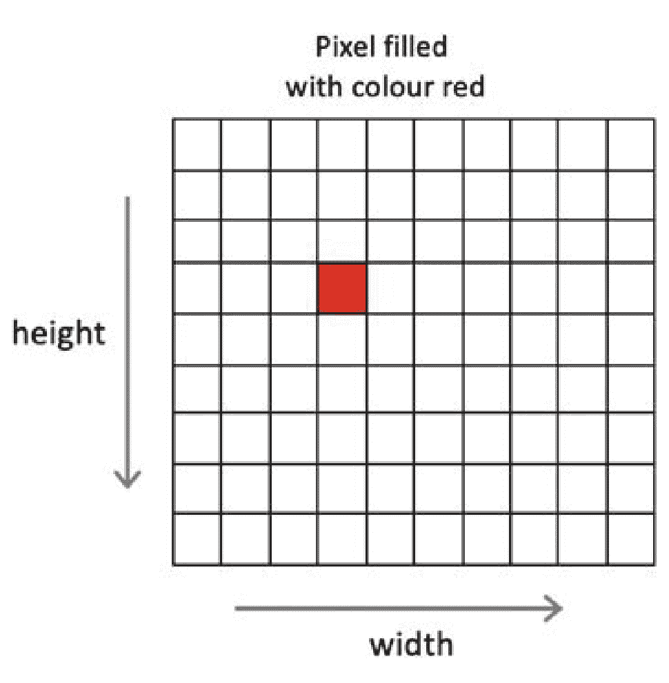

一系列像素可以形成一条线、一个圆或任何数量的不同形状。然而，由于像素网格基于单个点，对角线或圆可能需要使用多个像素，放大时可能会出现锯齿状边缘。例如，下图显示了我们放大后的圆的一部分：


每个像素都可以关联一种颜色和一种透明度。可用的颜色范围取决于所使用的显示系统。例如，单色显示器只允许黑白两色，而灰度显示器只允许显示各种深浅的灰色。在现代系统中，通常可以使用传统的RGB颜色代码（其中R代表红色，G代表绿色，B代表蓝色）来表示广泛的颜色范围。在这种编码中，纯红色由[255, 0, 0]这样的代码表示，纯绿色由[0, 255, 0]表示，纯蓝色由[0, 0, 255]表示。基于这个想法，各种深浅可以通过这些代码的组合来表示，例如橙色可能由[255, 150, 50]表示。下图说明了使用不同红、绿、蓝值的一组RGB颜色：

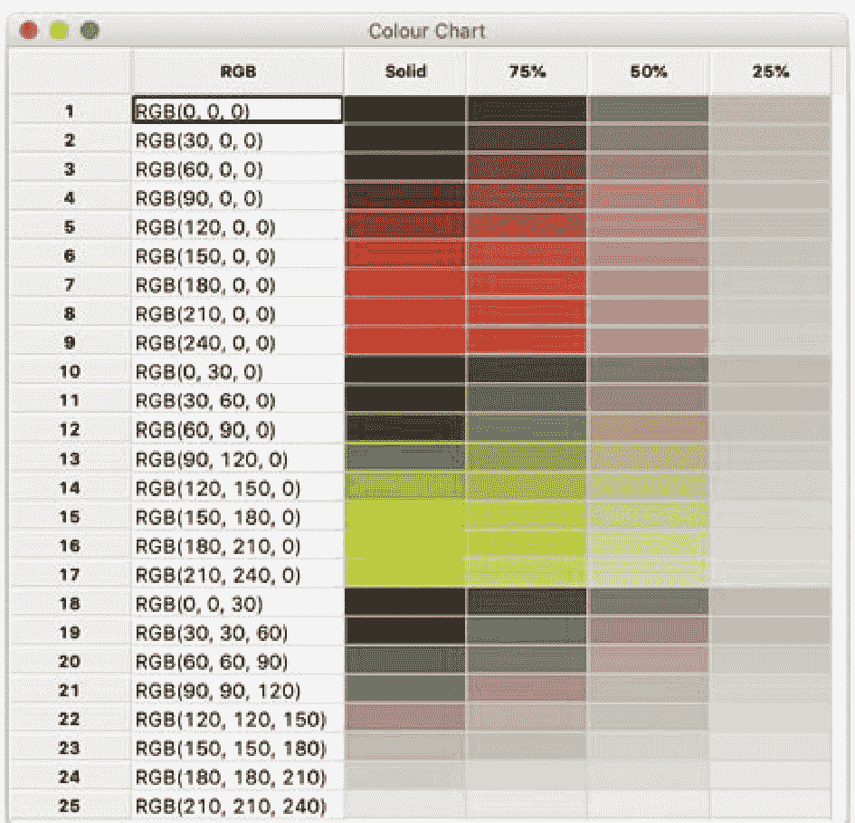

此外，可以为像素应用透明度。这用于指示填充颜色的实心程度。上面的网格说明了在使用Python wxPython GUI库显示的颜色上应用75%、50%和25%透明度的效果。在此库中，透明度被称为alpha不透明度值。其值范围为0–255，其中0表示完全透明，255表示完全实心。

## 位图与矢量图形

有两种方法可以在屏幕上的像素之间生成图像/显示。一种方法称为位图（或光栅）图形，另一种称为矢量图形。在位图方法中，每个像素被映射到要显示的值以创建图像。在矢量图形方法中，描述几何形状（如线条和点），然后将其渲染到显示器上。光栅图形更简单，但矢量图形提供了更大的灵活性和可伸缩性。

## 缓冲

交互式图形显示的一个问题是尽可能平滑、干净地更改显示的能力。如果显示卡顿或似乎从一个图像跳到另一个图像，用户会感到不适。因此，通常在内存中的某个结构上绘制下一个显示；通常称为缓冲区。一旦整个图像创建完成，就可以将此缓冲区渲染到显示器上。例如，Turtle图形允许用户定义在渲染（或绘制）到屏幕之前应对显示进行多少次更改。这可以显著提高图形应用程序的性能。

在某些情况下，系统会使用两个缓冲区；通常称为双缓冲。在这种方法中，一个缓冲区正在渲染或绘制到屏幕上，而另一个缓冲区正在更新。这可以显著提高系统的整体性能，因为现代计算机执行计算和生成数据的速度通常比绘制到屏幕上的速度快得多。

## Python与计算机图形学

在本书本节的剩余部分，我们将探讨使用Python Turtle图形库生成计算机图形。我们还将讨论使用此库创建计算机生成艺术。之后，我们将探索用于生成图表和数据图的MatPlotLib库，例如条形图、散点图、线图和热图等。然后，我们将探索使用Python库通过菜单、字段、表格等创建GUI。

## Python 海龟图形

### 简介

Python 在图形库方面有很好的支持。其中使用最广泛的图形库之一就是本章介绍的海龟图形库。这部分是因为它使用起来非常直接，部分原因是它默认随 Python 环境提供（因此你无需安装任何额外的库即可使用它）。

本章最后简要介绍了其他一些图形库，包括 PyOpenGL。PyOpenGL 库可用于创建复杂的 3D 场景。

## 海龟图形库

## 海龟模块

该模块提供了一系列功能，允许创建所谓的矢量图形。矢量图形指的是可以在屏幕上绘制的线条（或向量）。绘图区域通常被称为绘图平面或绘图板，并具有 x、y 坐标的概念。

海龟图形库仅被设计为一个基本的绘图工具；其他库可用于绘制二维和三维图形（例如 MatPlotLib），但这些库往往专注于特定类型的图形显示。

海龟模块（及其名称）背后的理念源于 60 和 70 年代的 Logo 编程语言，该语言旨在向儿童介绍编程。它有一个屏幕上的海龟，可以通过诸如 forward（使海龟向前移动）、right（使海龟向右转一定角度）、left（使海龟向左转一定角度）等命令来控制。这个理念延续到了当前的 Python 海龟图形库中，其中诸如 `turtle.forward(10)` 这样的命令会使海龟（或现在的光标）向前移动 10 像素等。通过组合这些看似简单的命令，可以创建出精细且相当复杂的形状。

## 基本海龟图形

尽管海龟模块内置于 Python 3 中，但在使用前必须导入该模块：

```python
import turtle
```

实际上有两种使用海龟模块的方式；一种是使用库中提供的类，另一种是使用一组更简单的函数，这些函数隐藏了类和对象。在本章中，我们将重点介绍你可以用来使用海龟图形库创建绘图的函数集。

我们将做的第一件事是设置用于绘图的窗口；`TurtleScreen` 类是所有屏幕实现的父类，无论你运行的是什么操作系统。

如果你使用的是海龟模块提供的函数，那么屏幕对象会根据你的操作系统进行适当的初始化。这意味着你可以专注于以下函数来配置布局/显示，例如这个屏幕可以有标题、大小、起始位置等。

关键函数有：

- `setup(width, height, startx, starty)` 设置主窗口/屏幕的大小和位置。参数如下：
  - `width`——如果是整数，则为像素大小；如果是浮点数，则为屏幕的比例；默认为屏幕的 50%。
  - `height`——如果是整数，则为像素高度；如果是浮点数，则为屏幕的比例；默认为屏幕的 75%。
  - `startx`——如果是正数，则为从屏幕左边缘开始的像素位置；如果是负数，则为从右边缘开始；如果是 `None`，则水平居中窗口。
  - `starty`——如果是正数，则为从屏幕顶边缘开始的像素位置；如果是负数，则为从底边缘开始；如果是 `None`，则垂直居中窗口。
- `title(title string)` 设置屏幕/窗口的标题。
- `exitonclick()` 当用户点击屏幕时关闭海龟图形屏幕/窗口。
- `bye()` 关闭海龟图形屏幕/窗口。
- `done()` 启动主事件循环；这必须是海龟图形程序中的最后一条语句。
- `speed(speed)` 设置绘图速度，默认为 3。值越高，绘图速度越快，接受 0–10 范围内的值。
- `turtle.tracer(n = None)` 这可用于批量更新海龟图形屏幕。当绘图变得庞大而复杂时，它非常有用。通过将数字 (`n`) 设置为一个较大的数字（例如 600），那么在实际屏幕一次性更新之前，将在内存中绘制 600 个元素；这可以显著加快例如分形图像的生成速度。不带参数调用时，返回当前存储的 `n` 值。
- `turtle.update()` 执行海龟屏幕的更新；当使用了 `tracer()` 时，应在程序结束时调用此函数，因为它将确保所有元素都已绘制，即使尚未达到 `tracer` 阈值。
- `pencolor(color)` 用于设置在屏幕上绘制线条的颜色；颜色可以通过多种方式指定，包括使用命名颜色如 `'red'`、`'blue'`、`'green'`，或使用 RGB 颜色代码，或通过十六进制数字指定颜色。有关要使用的命名颜色和 RGB 颜色代码的更多信息，请参见 https://www.tcl.tk/man/tcl/TkCmd/colors.htm。请注意，所有颜色方法都使用美式拼写，例如此方法是 `pencolor`（而不是 `pen colour`）。
- `fillcolor(color)` 用于设置用于填充绘制线条内封闭区域的颜色。同样请注意 `color` 的拼写！

以下代码片段说明了其中一些函数：

```python
import turtle

# 为你的画布窗口设置标题
turtle.title('My Turtle Animation')
# 设置屏幕大小（以像素为单位）
# 设置海龟的起始点 (0, 0)
turtle.setup(width=200, height=200, startx=0, starty=0)
# 将画笔颜色设置为红色
turtle.pencolor('red')

# ...
# 添加此行以便点击时窗口会关闭
turtle.exitonclick()
```

我们现在可以看看如何实际在屏幕上绘制形状。

屏幕上的光标有几个属性；这些属性包括光标移动时画笔的当前绘图颜色，以及其当前位置（屏幕的 x、y 坐标）和当前朝向。我们已经看到你可以使用 `pencolor()` 方法控制其中一个属性，其他方法用于控制光标（或海龟），如下所示。

光标指向的方向可以使用几个函数来改变，包括：

- `right(angle)` 将光标向右转 angle 个单位。
- `left(angle)` 将光标向左转 angle 个单位。
- `setheading(to_angle)` 将光标的朝向设置为 to_angle。

其中 0 是东，90 是北，180 是西，270 是南。你可以使用以下命令移动光标（如果画笔放下，这将绘制一条线）：

- `forward(distance)` 将光标沿当前指向的方向向前移动指定的距离。如果画笔放下，则绘制一条线。
- `backward(distance)` 将光标沿与当前指向相反的方向向后移动 distance。

你也可以显式地定位光标：

- `goto(x, y)` 将光标移动到屏幕上指定的 x、y 位置；如果画笔放下，则绘制一条线。你也可以使用 `steps` 和 `set position` 来做同样的事情。
- `setx(x)` 设置光标的 x 坐标，y 坐标保持不变。
- `sety(y)` 设置光标的 y 坐标，x 坐标保持不变。

也可以通过修改画笔是抬起还是放下，在不绘制的情况下移动光标：

- `penup()` 抬起画笔——移动光标将不再绘制线条。
- `pendown()` 放下画笔——移动光标现在将使用当前画笔颜色绘制线条。

画笔的大小也可以控制：

- `pensize(width)` 将线条粗细设置为 width。方法 `width()` 是此方法的别名。

也可以绘制一个圆或一个点：

- `circle(radius, extent, steps)` 使用给定的半径绘制一个圆。`extent` 决定绘制圆的多少部分；如果未给出 `extent`，则绘制整个圆。`steps` 表示用于绘制圆的步数（它可用于绘制正多边形）。
- `dot(size, color)` 使用指定的颜色绘制一个直径为 size 的实心圆。

你现在可以使用上面的一些方法在屏幕上绘制形状。对于第一个例子，我们将保持非常简单，绘制一个简单的正方形：

```python
# 绘制一个正方形
turtle.forward(50)
turtle.right(90)
turtle.forward(50)
turtle.right(90)
turtle.forward(50)
turtle.right(90)
turtle.forward(50)
turtle.right(90)
```

以上代码将光标向前移动 50 像素，然后旋转 90°，并重复这些步骤三次。最终结果是在屏幕上绘制了一个 50 x 50 像素的正方形。

## 绘制形状

当然，绘制形状时不必只使用固定值，你可以使用变量或根据表达式计算位置等。

例如，以下程序创建了一系列围绕中心位置旋转的正方形，从而生成一幅引人入胜的图像：

```python
import turtle

def setup():
    """ Provide the config for the screen """
    turtle.title('Multiple Squares Animation')
    turtle.setup(100, 100, 0, 0)
    turtle.hideturtle()

def draw_square(size):
    """ Draw a square in the current direction """
    turtle.forward(size)
    turtle.right(90)
    turtle.forward(size)
    turtle.right(90)
    turtle.forward(size)
    turtle.right(90)
    turtle.forward(size)

setup()
for _ in range(0, 12):
    draw_square(50)
    # Rotate the starting direction
    turtle.right(120)

# Add this so that the window will close when clicked on
turtle.exitonclick()
```

在这个程序中定义了两个函数：一个用于设置屏幕或窗口，包括标题、大小以及关闭光标显示；另一个函数接受一个尺寸参数，并用它来绘制一个正方形。程序的主体部分随后设置窗口，并使用一个 `for` 循环，通过在每个正方形之间持续旋转 120°，绘制了 12 个边长为 50 像素的正方形。请注意，由于我们不需要引用循环变量，因此使用了 `_` 格式，这在 Python 中被视为一个匿名循环变量。

该程序生成的图像如下所示：

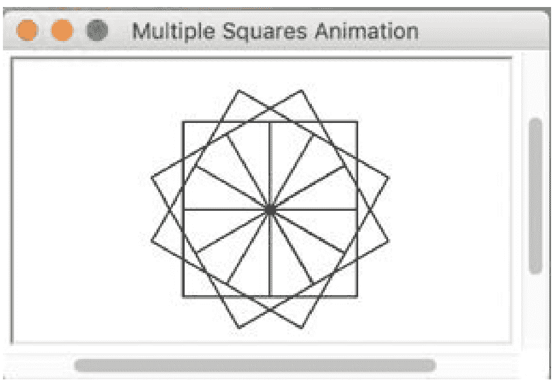

## 填充形状

也可以填充已绘制形状内部的区域。例如，你可能希望填充我们绘制的其中一个正方形，如下所示：

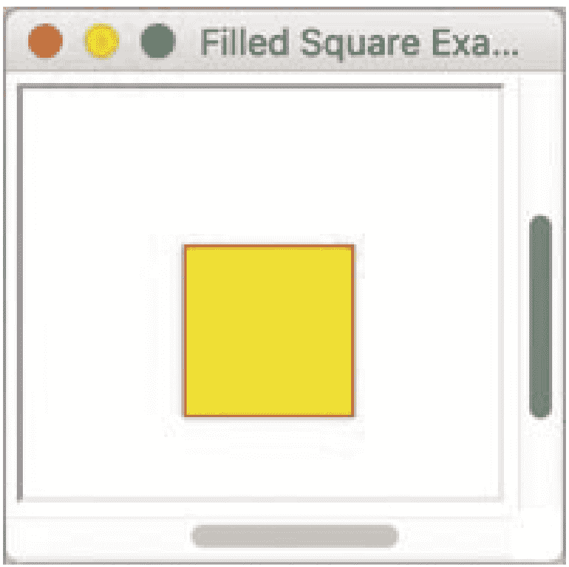

为此，我们可以使用 `begin_fill()` 和 `end_fill()` 函数：

- `begin_fill()` 表示形状应使用当前填充颜色进行填充，此函数应在绘制要填充的形状之前调用。
- `end_fill()` 在要填充的形状绘制完成后调用。这将导致自上次调用 `begin_fill()` 以来绘制的形状使用当前填充颜色进行填充。
- `filling()` 返回当前填充状态（如果正在填充则为 True，否则为 False）。

以下程序使用此功能（以及前面的 `draw_square()` 函数）来绘制上述填充的正方形：

```python
turtle.title('Filled Square Example')
turtle.setup(100, 100, 0, 0)
turtle.hideturtle()
turtle.pencolor('red')
turtle.fillcolor('yellow')
turtle.begin_fill()
draw_square(60)
turtle.end_fill()
turtle.done()
```

## 其他图形库

当然，Turtle Graphics 并不是 Python 唯一可用的图形选项；然而，其他图形库并非 Python 预装，必须使用 Anaconda、PIP 或 PyCharm 等工具下载。

- PyQtGraph。PyQtGraph 库是一个纯 Python 库，面向数学、科学和工程图形应用以及 GUI 应用。更多信息请参见 http://www.pyqtgraph.org。
- Pillow。Pillow 是一个 Python 图像处理库（基于 PIL，即 Python Imaging Library），为 Python 提供图像处理功能。有关 Pillow 的更多信息，请参见 https://pillow.readthedocs.io/en/stable。
- Pyglet。pyglet 是另一个用于 Python 的窗口和多媒体库。请参见 https://bitbucket.org/pyglet/pyglet/wiki/Home。

## 3D 图形

虽然开发者当然可以使用 Turtle Graphics 创建逼真的 3D 图像；但这并非该库的主要目标。这意味着除了基本的光标移动功能和程序员的技巧外，没有直接支持创建 3D 图像。

然而，Python 有可用的 3D 图形库。其中一个库是 Panda3D (https://www.panda3d.org)，另一个是 VPython (https://vpython.org)，第三个是 pi3d (https://pypi.org/project/pi3d)。不过，我们将简要介绍 PyOpenGL 库，因为它构建在非常广泛使用的 OpenGL 库之上。

## PyOpenGL

PyOpenGL 是一个开源项目，提供了一组对 OpenGL 库的绑定（或包装）。OpenGL 是开放图形库，它是一个跨语言、跨平台的 API，用于渲染 2D 和 3D 矢量图形。OpenGL 被广泛应用于从游戏、虚拟现实到数据和信息可视化系统以及计算机辅助设计 (CAD) 系统等众多领域。PyOpenGL 提供了一组 Python 函数，可以从 Python 调用底层的 OpenGL 库。这使得使用行业标准的 OpenGL 库在 Python 中创建基于 3D 矢量的图像变得非常容易。下面是一个使用 PyOpenGL 创建图像的非常简单的示例：

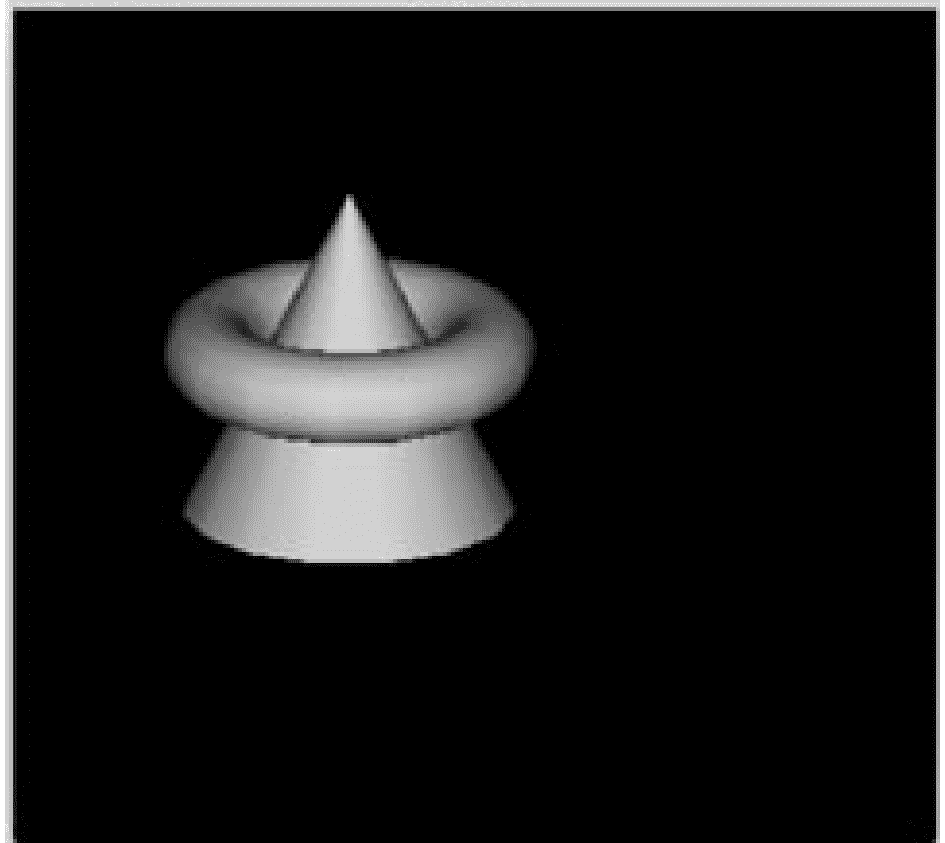

## 计算机生成艺术

### 创建计算机艺术

计算机艺术被定义为任何使用计算机的艺术。然而，在本书的上下文中，我们指的是由计算机或更具体地说是计算机程序生成的艺术。以下示例说明了如何使用 Turtle 图形库，仅用几行 Python 代码，就能创建可能被视为计算机艺术的图像。

以下图像是由一个递归函数生成的，该函数在给定的 x、y 位置绘制指定大小的圆形。该函数通过修改参数递归调用自身，从而在不同位置绘制越来越小的圆形，直到圆形的尺寸小于 20 像素。

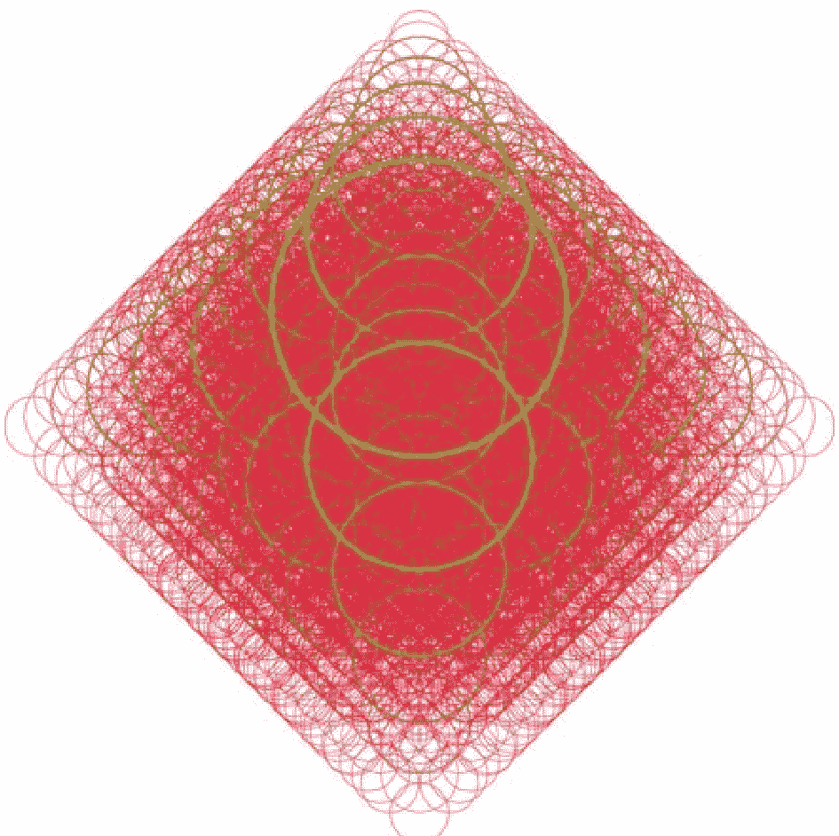

用于生成此图片的程序如下，仅供参考：

```python
import turtle

WIDTH = 640
HEIGHT = 360

def setup_window():
    # Set up the window
    turtle.title('Circles in My Mind')
    turtle.setup(WIDTH, HEIGHT, 0, 0)
    turtle.colormode(255)   # Indicates RGB numbers will be in the range 0 to 255
    turtle.hideturtle()   # Batch drawing to the screen for faster rendering
    turtle.tracer(2000)   # Speed up drawing process
    turtle.speed(10)
    turtle.penup()

def draw_circle(x, y, radius, red=50, green=255, blue=10, width=7):
    """ Draw a circle at a specific x, y location.
    Then draw four smaller circles recursively"""
    colour = (red, green, blue)
    # Recursively drawn smaller circles
    if radius > 50:
        # Calculate colours and line width for smaller circles
        if red < 216:
            red = red + 33
            green = green - 42
            blue = blue + 10
            width -= 1
        else:
            red = 0
            green = 255
        # Calculate the radius for the smaller circles
        new_radius = int(radius / 1.3)
        # Drawn four circles
        draw_circle(int(x + new_radius), y, new_radius, red, green, blue, width)
        draw_circle(x - new_radius, y, new_radius, red, green, blue, width)
        draw_circle(x, int(y + new_radius), new_radius, red, green, blue, width)
        draw_circle(x, int(y - new_radius), new_radius, red, green, blue, width)
    # Draw the original circle
    turtle.goto(x, y)
    turtle.color(colour)
    turtle.width(width)
    turtle.pendown()
    turtle.circle(radius)
    turtle.penup()

# Run the program
print('Starting')
setup_window()
draw_circle(25, -100, 200)
# Ensure that all the drawing is rendered
turtle.update()
print('Done')
turtle.done()
```

关于这个程序有几点需要注意。它使用递归来绘制圆形，绘制越来越小的圆形，直到圆形的半径低于某个阈值（终止点）。

它还使用了 `turtle.tracer()` 函数来加速绘制过程，因为在屏幕更新之前会缓冲 2000 次更改。

最后，用于圆形的颜色在每个递归级别都会改变；这里使用了一种非常简单的方法，即更改红、绿、蓝代码，从而产生不同颜色的圆形。此外，还使用了线宽来减小圆形轮廓的大小，为图像增添更多趣味。

## 计算机艺术生成器

作为另一个如何使用海龟图形创建计算机艺术的示例，以下程序会随机生成RGB颜色用于绘制线条，这使得图像更具趣味性。它还允许用户输入一个角度，用于改变线条绘制的方向。由于绘图是在循环中进行的，即使对绘制线条所用角度进行这样简单的改变，也能生成非常不同的图像。

```python
# Lets play with some colours
import turtle
from random import randint

def get_input_angle():
    """ Obtain input from user and convert to an int"""
    message = 'Please provide an angle:'
    value_as_string = input(message)
    while not value_as_string.isnumeric():
        print('The input must be an integer!')
        value_as_string = input(message)
    return int(value_as_string)

def generate_random_colour():
    """Generates an R,G,B values randomly in range
    0 to 255 """
    r = randint(0, 255)
    g = randint(0, 255)
    b = randint(0, 255)
    return r, g, b

print('Set up Screen')
turtle.title('Colourful pattern')
turtle.setup(640, 600)
turtle.hideturtle()
turtle.bgcolor('black')  # Set the background colour of the screen
turtle.colormode(255)    # Indicates RGB numbers will be in the
                         # range 0 to 255
turtle.speed(10)
angle = get_input_angle()
print('Start the drawing')
for i in range(0, 200):
    turtle.color(generate_random_colour())
    turtle.forward(i)
    turtle.right(angle)
print('Done')
turtle.done()
```

下面给出了一些由此程序生成的示例图像。最左边的图片是通过输入38度角生成的，右边的图片使用了68度角，底部的图片使用了98度角。

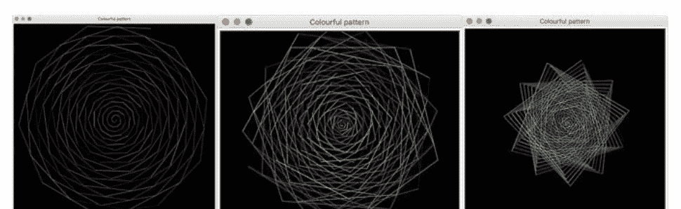

以下图片分别使用了118度、138度和168度角。

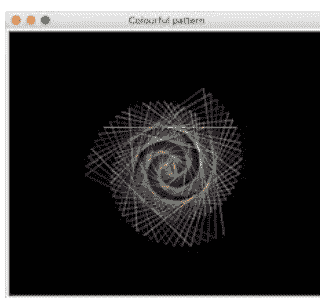

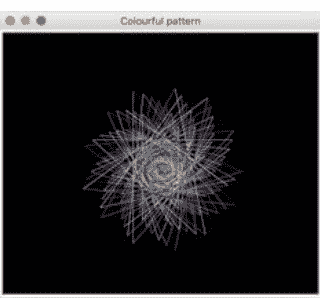

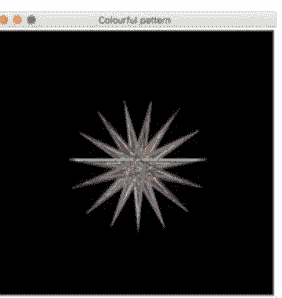

这些图像的有趣之处在于，尽管它们使用完全相同的程序，但每一张都如此不同。这说明了算法或计算机生成的艺术可以像任何其他艺术形式一样微妙和灵活。它也说明了，即使在这样的过程中，最终决定哪张图像（如果有的话）在美学上最令人愉悦的，仍然是人类。

## Python中的分形

在计算机艺术领域，分形是一种非常知名的艺术形式。分形是重复的图案，可以通过迭代方法（如for循环）或递归方法（当函数调用自身但参数被修改时）来计算。分形真正有趣的特征之一是，它们在连续的粒度级别上表现出相同的模式（或几乎相同的模式）。也就是说，如果你放大一个分形图像，你会发现相同的模式在越来越小的放大倍数下不断重复。这被称为扩展对称性或展开对称性；如果这种复制在每个尺度上都完全相同，则称为仿射自相似。

分形起源于17世纪的数学世界，而“分形”一词是由数学家本华·曼德博在1975年创造的。曼德博经常被引用的描述几何分形的一句话是：一种粗糙或破碎的几何形状，可以被分割成若干部分，每一部分（至少近似地）是整体的缩小版。

自20世纪后期以来，分形已成为创建计算机艺术的常用方法。计算机艺术中常用的一种分形是科赫雪花，另一种是曼德博集。本章将这两者作为示例，说明如何使用Python和海龟图形库创建基于分形的艺术。

## 科赫雪花

科赫雪花是一种分形，它从等边三角形开始，然后将每条线段的中间三分之一替换为一对形成等边凸起的线段。这种替换可以执行到任意深度，生成越来越精细（越来越小）的三角形，直到整体形状类似于雪花。

以下程序可用于生成具有不同递归深度的科赫雪花。递归深度越大，每条线段被分割的次数就越多。

```python
import turtle

# Set up Constants
ANGLES = [60, -120, 60, 0]
SIZE_OF_SNOWFLAKE = 300

def get_input_depth():
    """ Obtain input from user and convert to an int"""
    message = 'Please provide the depth (0 or a positive integer):'
    value_as_string = input(message)
    while not value_as_string.isnumeric():
        print('The input must be an integer!')
        value_as_string = input(message)
    return int(value_as_string)

def setup_screen(title, background='white', screen_size_x=640, screen_size_y=320, tracer_size=800):
    print('Set up Screen')
    turtle.title(title)
    turtle.setup(screen_size_x, screen_size_y)
    turtle.hideturtle()
    turtle.penup()
    turtle.backward(240)
    # Batch drawing to the screen for faster rendering
    turtle.tracer(tracer_size)
    turtle.bgcolor(background)  # Set the background colour of the screen

def draw_koch(size, depth):
    if depth > 0:
        for angle in ANGLES:
            draw_koch(size / 3, depth - 1)
            turtle.left(angle)
    else:
        turtle.forward(size)

depth = get_input_depth()
setup_screen('Koch Snowflake (depth ' + str(depth) + ')',
             background='black',
             screen_size_x=420, screen_size_y=420)
# Set foreground colours
turtle.color('sky blue')
# Ensure snowflake is centred
turtle.penup()
turtle.setposition(-180, 0)
turtle.left(30)
turtle.pendown()
# Draw three sides of snowflake
for _ in range(3):
    draw_koch(SIZE_OF_SNOWFLAKE, depth)
    turtle.right(120)
# Ensure that all the drawing is rendered
turtle.update()
print('Done')
turtle.done()
```

下面展示了程序的几次不同运行，深度分别设置为0、1、3和7。

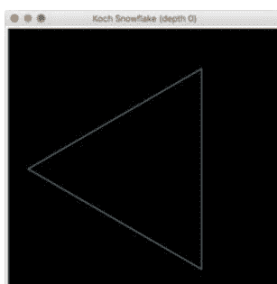

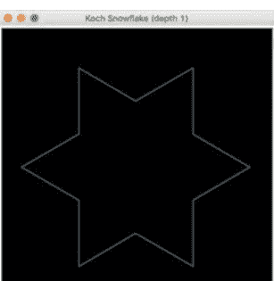

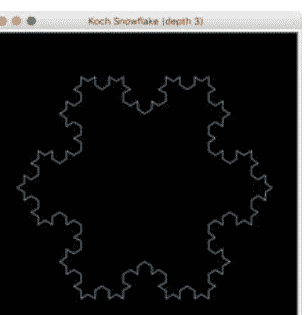

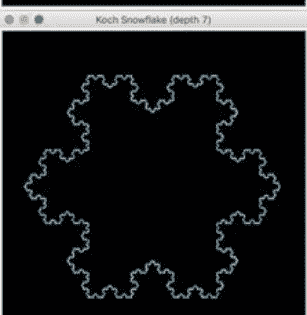

运行简单的`draw_koch()`函数并设置不同的深度，可以很容易地看出三角形的每条边是如何被分割成更小的三角形形状的。这可以重复多次，形成更精细的结构，其中相同的形状被一次又一次地重复。

## 曼德博集

可能最著名的分形图像之一是基于曼德博集。曼德博集是复数c的集合，对于这些复数，函数z * z + c在从z = 0开始迭代时不会发散，即函数序列（func(0), func(func(0)) 等）的绝对值保持有界。曼德博集的定义及其名称归功于法国数学家阿德里安·杜阿迪，他以此向数学家本华·曼德博致敬。

曼德博集图像可以通过对复数进行采样并测试每个采样点c来创建，测试序列func(0), func(func(0)) 等是否趋向无穷大（在实践中，这意味着进行测试以查看在预定的迭代次数后，它是否离开了0的某个预定有界邻域）。将c的实部和虚部视为复平面上的图像坐标，然后可以根据序列跨越任意选择的阈值的速度对像素进行着色，对于序列在预定的迭代次数后未跨越阈值的c值，使用特殊颜色（通常是黑色）（这对于清晰地区分曼德博集图像与其补集的图像是必要的）。

以下图像是使用Python和海龟图形为曼德博集生成的。

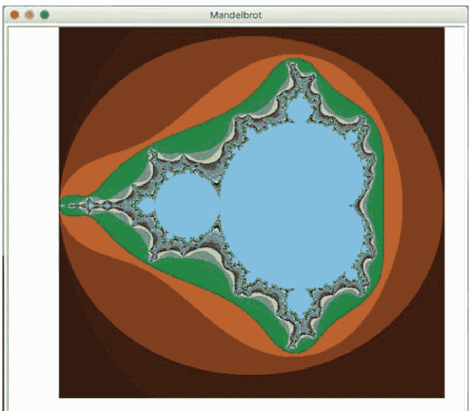

用于生成此图像的程序如下：

```python
for y in range(IMAGE_SIZE_Y):
    zy = y * (MAX_Y - MIN_Y) / (IMAGE_SIZE_Y - 1) + MIN_Y
    for x in range(IMAGE_SIZE_X):
        zx = x * (MAX_X - MIN_X) / (IMAGE_SIZE_Y - 1) + MIN_X
        z = zx + zy * 1j
        c = z
        for i in range(MAX_ITERATIONS):
            if abs(z) > 2.0:
                break
```

z = z * z + c
turtle.color((i % 4 * 64, i % 8 * 32, i % 16 * 16))
turtle.setposition(x - SCREEN_OFFSET_X,
                   y - SCREEN_OFFSET_Y)
turtle.pendown()
turtle.dot(1)
turtle.penup()

## Matplotlib 简介

Matplotlib 是一个 Python 绘图和制图库，能够以多种不同格式生成各种类型的图表。它可以用来生成折线图、散点图、热力图、条形图、饼图和 3D 图。它甚至支持动画和交互式显示。

下面是一个使用 Matplotlib 生成的图表示例。该图展示了一个用于绘制简单正弦波的折线图：

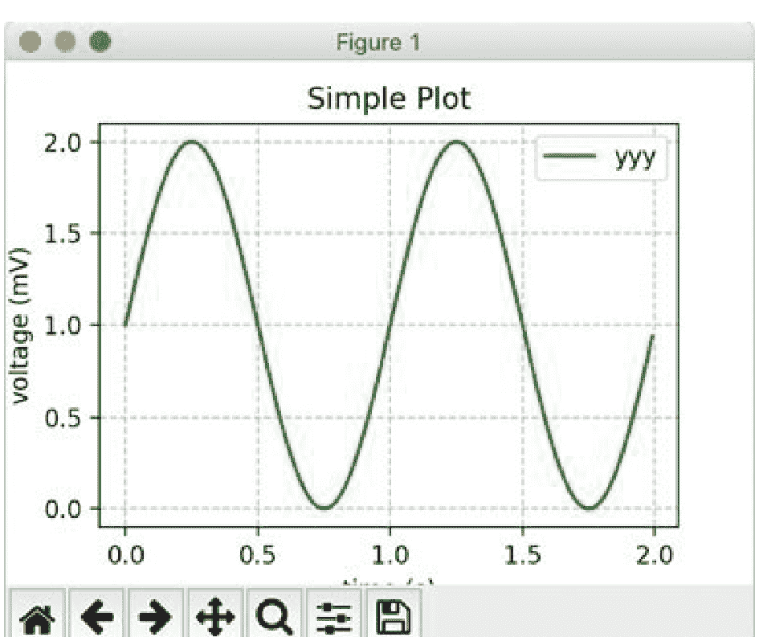

Matplotlib 是一个非常灵活且功能强大的绘图库。它支持多种不同的 Python 图形平台和操作系统窗口环境。它还可以生成多种不同格式的输出图形，包括 PNG、JPEG、SVG 和 PDF 等。

Matplotlib 可以单独使用，也可以与其他库结合使用，以提供广泛的功能。一个经常与 Matplotlib 结合使用的库是 NumPy，这是一个常用于数据科学应用的库，它提供了多种函数和数据结构（如 n 维数组），在处理用于图表显示的数据时非常有用。

然而，Matplotlib 并未预装在 Python 环境中；它是一个可选模块，必须添加到你的环境或 IDE 中。

在本章中，我们将介绍 Matplotlib 库、其架构、构成图表的组件以及 pyplot API。pyplot API 是程序员与 Matplotlib 交互的最简单、最常用的方式。然后，我们将探索各种不同类型的图表以及如何使用 Matplotlib 创建它们，从简单的折线图、散点图，到条形图和饼图。最后，我们将看一个简单的 3D 图表。

## Matplotlib

Matplotlib 是一个用于 Python 的图表绘制库。对于简单的图表，Matplotlib 非常易于使用，例如，要为一组 x 和 y 坐标创建一个简单的折线图，你可以使用 matplotlib.pyplot.plot 函数：

```python
import matplotlib.pyplot as pyplot
# Plot a sequence of values
pyplot.plot([1, 0.25, 0.5, 2, 3, 3.75, 3.5])
# Display the chart in a window
pyplot.show()
```

这个非常简单的程序生成了以下图表：

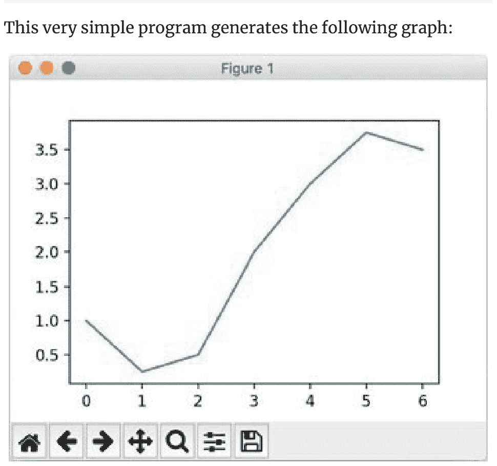

在这个例子中，plot() 函数接受一个值序列，这些值将被视为 y 轴的值；x 轴的值则由 y 值在列表中的位置隐式决定。因此，由于列表中有六个元素，x 轴的范围是 0–6。同样，由于列表中的最大值是 3.75，y 轴的范围是从 0 到 4。

## 图表组件

尽管它们看起来很简单，但构成 Matplotlib 图表或绘图的元素有很多。这些元素都可以独立地进行操作和修改。因此，熟悉与这些元素相关的 Matplotlib 术语（如刻度、图例、标签等）是很有用的。

构成图表的元素如下图所示：

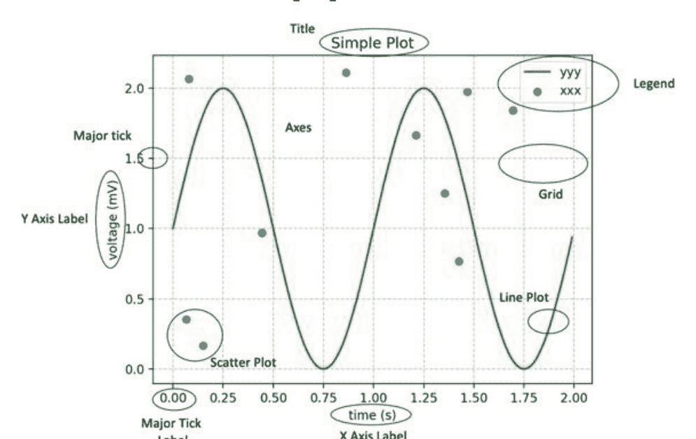

该图说明了以下元素：

- **坐标区 (Axes)**：坐标区由 matplotlib.axes.Axes 类定义。它用于维护图形的大部分元素，即 X 和 Y 轴、刻度、线图、任何文本和任何多边形形状。
- **标题 (Title)**：这是整个图形的标题。
- **刻度 (Ticks)（主刻度和次刻度）**：刻度由 matplotlib.axis.Tick 类表示。刻度是轴上表示新值的标记。可以有主刻度，它们较大，并且可能带有标签。还有次刻度，它们可能较小（也可能带有标签）。
- **刻度标签 (Tick Labels)（主刻度和次刻度）**：这是刻度上的标签。
- **轴 (Axis)**：matplotlib.axis.Axis 类定义了父坐标区实例内的一个轴对象（如 X 轴或 Y 轴）。它可以拥有用于格式化主刻度和次刻度标签的格式器。也可以设置主刻度和次刻度的位置。
- **轴标签 (Axis Labels)（X、Y，有时是 Z）**：这些是用于描述轴的标签。
- **图表类型 (Plot types)**：如折线图和散点图。Matplotlib 支持各种类型的图表和图形，包括折线图、散点图、条形图和饼图。
- **网格 (Grid)**：这是显示在图表、图形或绘图后面的可选网格。网格可以以多种不同的线型（如实线或虚线）、颜色和线宽显示。

## Matplotlib 架构

Matplotlib 库采用分层架构，隐藏了与不同窗口系统和图形输出相关的大部分复杂性。该架构有三个主要层：脚本层 (Scripting Layer)、艺术家层 (Artist Layer) 和后端层 (Back end Layer)。每一层都有特定的职责和组件。例如，后端负责读取和交互正在生成的图形或绘图。艺术家层负责创建将由后端层渲染的图形对象。最后，脚本层供开发者用来创建图形。

该架构如下图所示：

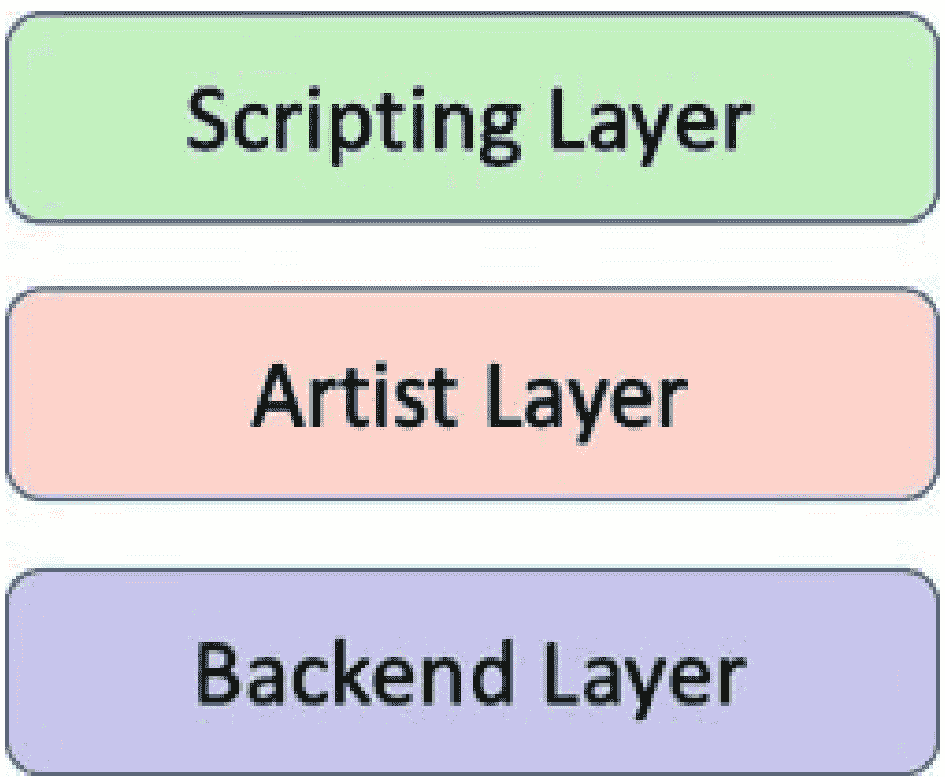

## 后端层

Matplotlib 后端层处理向不同目标格式的输出生成。Matplotlib 本身可以以多种不同方式使用，以生成多种不同的输出。

Matplotlib 可以交互式使用，可以嵌入到应用程序（或图形用户界面）中，也可以作为批处理应用程序的一部分使用，将绘图存储为 PNG、SVG、PDF 或其他图像等。

为了支持所有这些用例，Matplotlib 可以针对不同的输出，而这些能力中的每一个都被称为一个后端；“前端”是面向开发者的代码。后端层维护所有不同的后端，程序员可以使用默认后端，也可以根据需要选择不同的后端。

要使用的后端可以通过 matplotlib.use() 函数设置。例如，要设置后端以渲染 Postscript，请使用：matplotlib.use('PS')，如下所示：

```python
import matplotlib
import sys

if 'matplotlib.backends' not in sys.modules:
    matplotlib.use('PS')

import matplotlib.pyplot as pyplot
```

需要注意的是，如果你使用 matplotlib.use() 函数，这必须在导入 matplotlib.pyplot 之前完成。在导入 matplotlib.pyplot 之后调用 matplotlib.use() 将不会生效。请注意，传递给 matplotlib.use() 函数的参数是区分大小写的。

默认渲染器是 'Agg'，它使用 Anti-Grain Geometry C++ 库来生成图形的栅格（像素）图像。这会产生基于数据绘图的高质量栅格图形图像。

选择 'Agg' 后端作为默认后端是因为它在广泛的 Linux 系统上都能工作，因为其支持要求相当小；其他后端可能在某个特定系统上运行，但可能在另一个系统上无法工作。如果特定系统没有加载指定的 Matplotlib 后端所依赖的所有依赖项，就会发生这种情况。

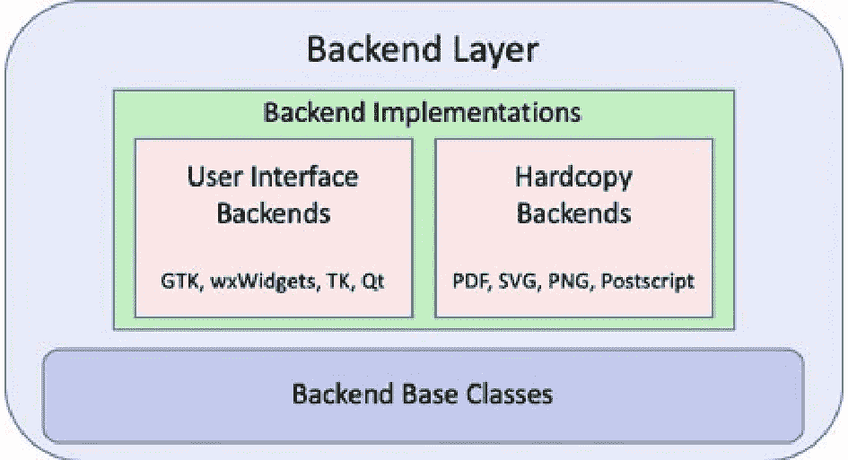

后端层可以分为两类：

- **用户界面后端（交互式）**：支持各种 Python 窗口系统，如 wxWidgets（将在下一章讨论）、Qt、TK 等。
- **硬拷贝后端（非交互式）**：支持栅格和矢量图形输出。

用户界面和硬拷贝后端都建立在称为后端基类的通用抽象之上。

## 艺术家层

艺术家层提供了你可能认为是 Matplotlib 实际功能的大部分内容；即生成将被渲染/显示给用户（或以特定格式输出）的绘图和图形。

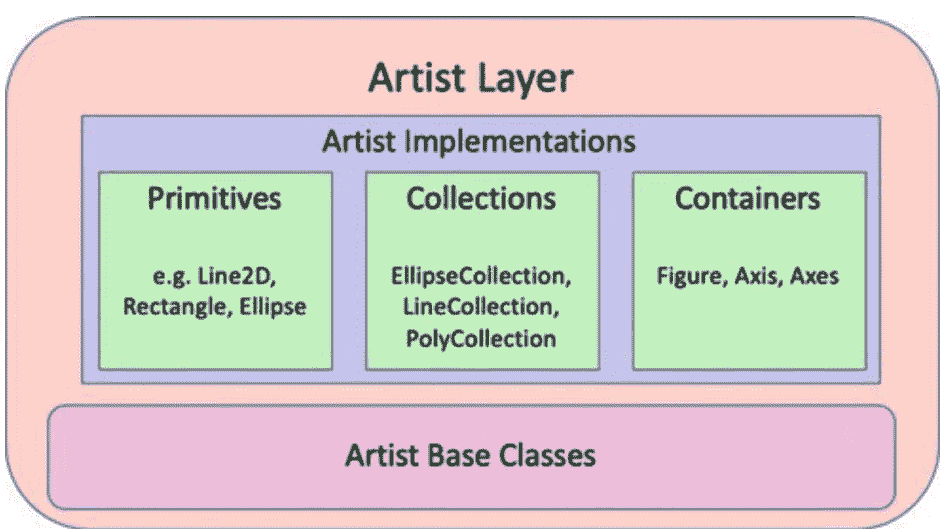

艺术家层关注的是构成图表的线条、形状、坐标轴、文本等元素。

艺术家层使用的类可以分为以下三组：图元、容器和集合：

- 图元是用于表示将绘制在图形画布上的图形对象的类。
- 容器是持有图元的对象。例如，通常会实例化一个图形（figure）并用它来创建一个或多个坐标轴（Axes）等。
- 集合用于高效处理大量相似类型的对象。

虽然了解这些类很有用；但在许多情况下，你不需要直接与它们打交道，因为 pyplot API 隐藏了大部分细节。但是，如果需要，也可以在图形、坐标轴、刻度等层面进行操作。

## 脚本层

脚本层是面向开发者的接口，它简化了与其他层交互的任务。

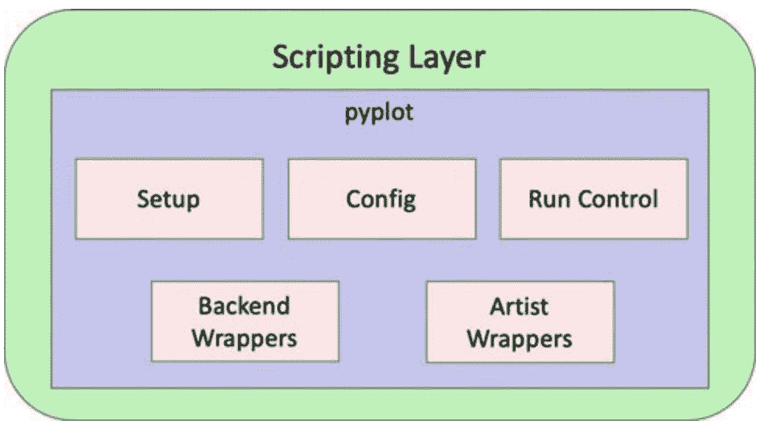

请注意，从程序员的角度来看，脚本层由 pyplot 模块表示。在底层，pyplot 使用模块级对象来跟踪数据状态、处理图形绘制等。

当导入 pyplot 时，它会选择系统的默认后端或已配置的后端；例如通过 `matplotlib.use()` 函数配置的后端。
然后它会调用一个 `setup()` 函数，该函数：

- 创建一个图形管理器工厂函数，当调用该函数时，将为所选后端创建一个新的图形管理器，
- 准备应与所选后端一起使用的绘图函数，
- 识别与后端主循环函数集成的可调用函数，
- 提供所选后端的模块。

pyplot 接口通过提供诸如 `plot()`、`pie()`、`bar()`、`title()`、`savefig()`、`draw()` 和 `figure()` 等方法，简化了与内部包装器的交互。

下一章中的大多数示例将使用 pyplot 模块提供的函数来创建所需的图表；从而隐藏底层细节。

## 使用 Matplotlib pyplot 绘图

### 简介

在本章中，我们将探索 Matplotlib pyplot API。这是开发者使用 Matplotlib 生成不同类型图形或图表的最常见方式。

### pyplot API

pyplot 模块及其提供的 API 的目的是简化 Matplotlib 图表和图形的生成与操作。总的来说，Matplotlib 库力求使简单的事情变得容易，使复杂的事情成为可能。它实现第一个目标的主要方式是通过 pyplot API，因为该 API 具有诸如 `bar()`、`plot()`、`scatter()` 和 `pie()` 等高级函数，使得创建条形图、线图、散点图和饼图变得容易。

关于 pyplot API 提供的函数，需要注意的一点是它们通常可以接受非常多的参数；然而，这些参数中的大多数都有默认值，在许多情况下会给你一个合理的默认行为/默认视觉表示。因此，你可以忽略大多数可用参数，直到你确实需要做一些不同的事情；那时你应该参考 Matplotlib 文档，因为它有广泛的材料和大量的示例。

当然，有必要导入 pyplot 模块；因为它是 Matplotlib（例如 `matplotlib.pyplot`）库中的一个模块。在程序中，它通常被赋予一个别名以便于引用。该模块的常见别名是 `pyplot` 或 `plt`。

pyplot 模块的典型导入如下所示：

```
import matplotlib.pyplot as pyplot
```

pyplot API 可用于

- 构建图表，
- 配置标签和坐标轴，
- 管理颜色和线条样式，
- 处理事件/允许图表交互，
- 显示（show）图表。

我们将在以下部分看到使用 pyplot API 的示例。

### 折线图

折线图或线图是一种图表，其中图表上的点（通常称为标记）通过线连接，以显示某个值如何随着一组值（通常是 x 轴）的变化而变化；例如，随着时间间隔序列（也称为时间序列）的变化。时间序列折线图通常按时间顺序绘制；此类图表被称为运行图。

下图是一个运行图的示例；它在底部（x 轴）绘制时间，与速度（由 y 轴表示）相对应。

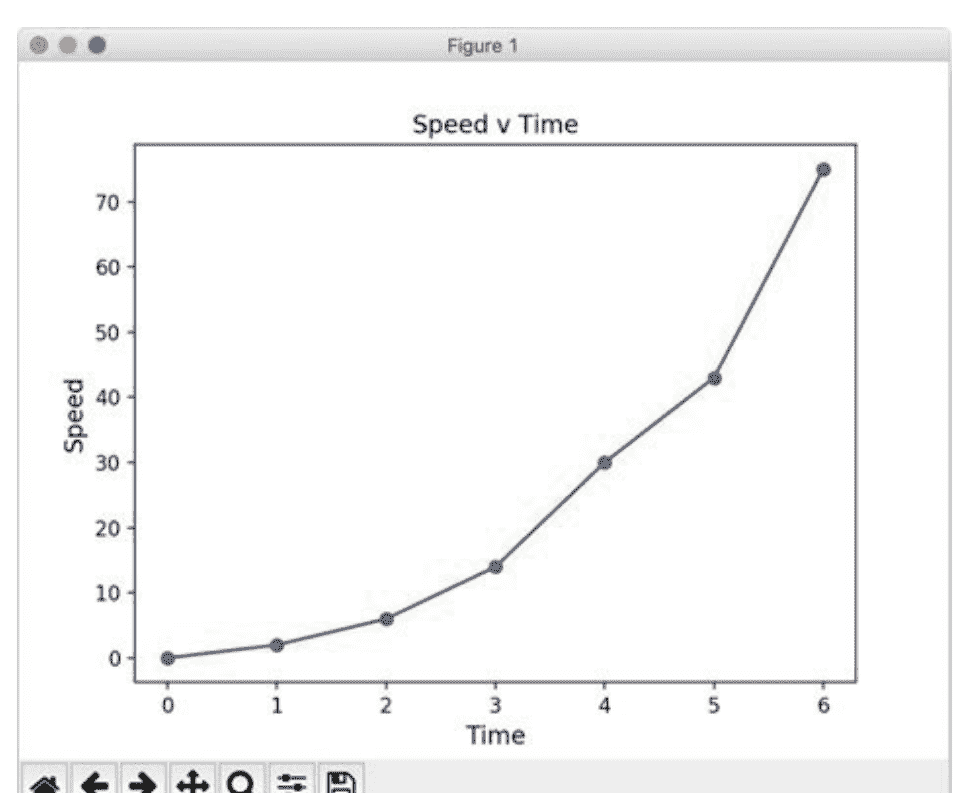

用于生成此图表的程序如下所示：

```python
import matplotlib.pyplot as pyplot

# Set up the data
x = [0, 1, 2, 3, 4, 5, 6]
y = [0, 2, 6, 14, 30, 43, 75]

# Set the axes headings
pyplot.ylabel('Speed', fontsize=12)
pyplot.xlabel('Time', fontsize=12)

# Set the title
pyplot.title("Speed v Time")

# Plot and display the graph
# Using blue circles for markers ('bo')
# and a solid line ('-')
pyplot.plot(x, y, 'bo-')
pyplot.show()
```

该程序首先导入 `matplotlib.pyplot` 模块并为其指定别名 `pyplot`（因为这是一个更短的名称，它使代码更易于阅读）。

然后为每个标记或绘图点的 x 和 y 坐标创建两个值列表。

接着，通过为 x 轴和 y 轴提供标签（使用 pyplot 函数 `xlabel()` 和 `ylabel()`）来配置图表本身。然后设置图表的标题（同样使用 pyplot 函数）。

之后，x 和 y 值被绘制为图表上的折线图。这是通过 `pyplot.plot()` 函数完成的。该函数可以接受广泛的参数，唯一的强制参数是用于定义绘图点的数据。在上面的示例中，提供了第三个参数；这是一个字符串 `'bo-'`。这是一个编码的格式字符串，其中字符串的每个元素对 `pyplot.plot()` 函数都有意义。字符串的元素是：

- `b` — 这表示绘制线条时使用的颜色；在这种情况下，字母 `'b'` 表示蓝色（同样，`'r'` 表示红色，`'g'` 表示绿色）。
- `o` — 这表示每个标记（每个被绘制的点）应该用一个圆圈表示。标记之间的线则构成了折线图。
- `'-'` — 这表示要使用的线条样式。单破折号（`'-'`）表示实线，而双破折号（`'--'`）表示虚线。

最后，程序使用 `show()` 函数在屏幕上渲染图形；或者也可以使用 `savefig()` 将图形保存到文件。

### 编码格式字符串

可以通过格式字符串提供许多选项，下表总结了其中一些：

格式字符串支持以下颜色缩写：

| 字符 | 颜色 |
|---|---|
| 'b' | 蓝色 |
| 'g' | 绿色 |
| 'r' | 红色 |
| 'c' | 青色 |
| 'm' | 品红色 |
| 'y' | 黄色 |
| 'k' | 黑色 |
| 'w' | 白色 |

还支持不同的方式来表示由线连接的标记（图表上的点），包括：

| 字符 | 描述 |
|---|---|
| '.' | 点标记 |
| ',' | 像素标记 |
| 'o' | 圆圈标记 |
| 'v' | 三角形向下标记 |
| '^' | 三角形向上标记 |
| '<' | 三角形向左标记 |
| '>' | 三角形向右标记 |
| 's' | 正方形标记 |
| 'p' | 五边形标记 |
| '*' | 星形标记 |
| 'h' | 六边形1标记 |
| '+' | 加号标记 |
| 'x' | 叉号标记 |
| 'D' | 菱形标记 |

最后，格式字符串支持不同的线条样式：

| 字符 | 描述 |
|---|---|
| '-' | 实线样式 |
| '--' | 虚线样式 |
| '-.' | 点划线样式 |
| ':' | 点线样式 |

一些格式字符串的示例：

- `'r'` 红色线条，使用默认标记和线条样式。
- `'g-'` 绿色实线。
- `'--'` 虚线，使用默认颜色和默认标记。
- `'yo:'` 黄色点线，带圆圈标记。

### 散点图

散点图或散点图是一种图表类型，其中使用笛卡尔（或 x 和 y）坐标来显示各个值。每个值通过图表上的一个标记（如圆圈或三角形）来表示。它们可用于表示从两个不同变量获得的值；一个绘制在 x 轴上，另一个绘制在 y 轴上。

下面是一个包含三组散点值的散点图示例

在这张图中，每个点代表不同年龄段的人在三种不同活动上花费的时间。

用于生成上述图形的程序如下所示：

```python
import matplotlib.pyplot as pyplot
# Create data
riding = ((17, 18, 21, 22, 19, 21, 25, 22, 25, 24), (3, 6, 3.5, 4, 5, 6.3, 4.5, 5, 4.5, 4))
swimming = ((17, 18, 20, 19, 22, 21, 23, 19, 21, 24), (8, 9, 7, 10, 7.5, 9, 8, 7, 8.5, 9))
sailing = ((31, 28, 29, 36, 27, 32, 34, 35, 33, 39), (4, 6.3, 6, 3, 5, 7.5, 2, 5, 7, 4))
# Plot the data
pyplot.scatter(x=riding[0], y=riding[1], c='red', marker='o', label='riding')
pyplot.scatter(x=swimming[0], y=swimming[1], c='green', marker='^', label='swimming')
pyplot.scatter(x=sailing[0], y=sailing[1], c='blue', marker='*', label='sailing')
# Configure graph
pyplot.xlabel('Age')
pyplot.ylabel('Hours')
pyplot.title('Activities Scatter Graph')
pyplot.legend()
# Display the chart
pyplot.show()
```

在上面的示例中，`plot.scatter()` 函数用于为 `riding`、`swimming` 和 `sailing` 元组定义的数据生成散点图。

标记的颜色已使用命名参数 `c` 指定。该参数可以接受一个表示颜色名称的字符串，或者一个单行的二维数组，其中该行中的每个值代表一个 RGB 颜色代码。标记指示了标记样式，例如 ‘o’ 表示圆形，‘^’ 表示三角形，‘*’ 表示星形。标签用于图表图例中的标记。

`pyplot.scatter()` 函数上可用的其他选项包括：

- `alpha`：表示 alpha 混合值，介于 0（透明）和 1（不透明）之间。
- `linewidths`：用于指示标记边缘的线宽。
- `edgecolors`：如果与用于标记的填充颜色（由参数 ‘c’ 指示）不同，则指示用于标记边缘的颜色。

## 何时使用散点图

一个值得思考的有用问题是：何时应该使用散点图？通常，当需要显示两个变量之间的关系时，会使用散点图。散点图有时也被称为相关图，因为它们显示了两个变量之间的相关性。

在许多情况下，可以在散点图上绘制的点之间辨别出一种趋势（尽管可能存在异常值）。为了帮助可视化趋势，沿着散点图绘制一条趋势线会很有用。趋势线有助于更清晰地展示散点图与总体趋势之间的关系。

下图将一组值表示为散点图，并绘制了该散点图的趋势线。如图所示，一些值比其他值更接近趋势线。

在这种情况下，趋势线是使用 numpy 函数 `polyfit()` 创建的。

`polyfit()` 函数对其接收的数据执行最小二乘多项式拟合。然后基于 `polyfit()` 返回的数组创建一个 `poly1d` 类。这个类是一个一维多项式类。它是一个便捷类，用于封装多项式的“自然”操作。然后使用 `poly1d` 对象生成一组值，以与函数 `pyplot.plot()` 的 x 值集合一起使用。

```python
import numpy as np
import matplotlib.pyplot as pyplot
x = (5, 5.5, 6, 6.5, 7, 8, 9, 10)
y = (120, 115, 100, 112, 80, 85, 69, 65)
# Generate the scatter plot
pyplot.scatter(x, y)
# Generate the trend line
z = np.polyfit(x, y, 1)
p = np.poly1d(z)
pyplot.plot(x, p(x), 'r')
# Display the figure
pyplot.show()
```

## 饼图

饼图是一种图表类型，其中圆被分成若干扇形（或楔形），每个扇形代表整体的一部分。圆的一个楔形代表一个类别对总体的贡献。因此，该图类似于一个被切成不同大小切片的馅饼。

通常，饼图的不同扇形以不同的颜色呈现，并围绕图表按大小顺序顺时针排列。然而，如果有一个切片不包含单一的数据类别，而是总结了多个类别，例如“其他类型”或“其他答案”，那么即使它不是最小的类别，通常也会将其显示在最后，以免影响感兴趣的命名类别。

下图说明了一个用于表示特定组织内编程语言使用情况的饼图。

该饼图是使用 `pyplot.pie()` 函数创建的。

```python
import matplotlib.pyplot as pyplot

labels = ('Python', 'Java', 'Scala', 'C#')
sizes = [45, 30, 15, 10]

pyplot.pie(sizes, labels=labels, autopct='%1.f%%',
           counterclock=False, startangle=90)

pyplot.show()
```

`pyplot.pie()` 函数接受多个参数，其中大部分是可选的。唯一必需的参数是第一个参数，它提供了用于楔形或扇形大小的值。上面的示例中使用了以下可选参数：

- `labels` 参数是一个可选参数，可以接受一个字符串序列，用于为每个楔形提供标签。
- `autopct` 参数接受一个字符串（或函数），用于格式化与每个楔形一起使用的数值。
- `counterclockwise` 参数。在 pyplot 中，默认情况下楔形是逆时针绘制的，因此为了确保布局更像传统的顺时针方法，将 `counterclock` 参数设置为 `False`。
- `startangle` 参数。起始角度也使用 `startangle` 参数移动了 90°，以便第一个扇形从图表的顶部开始。

## 展开扇形

通过展开饼图的特定扇形来强调它会很有用；即将其与饼图的其余部分分离。这可以使用 `pie()` 函数的 `explode` 参数来完成，该参数接受一个值序列，指示每个扇形应被展开的程度。

在这种情况下，通过使用命名的 `shadow` 布尔参数为扇形添加阴影，也可以增强饼图的视觉效果。这些效果如下所示：

生成此修改后图表的程序如下，供参考：

```python
import matplotlib.pyplot as pyplot
labels = ('Python','Java','Scala','C#')
sizes = [45, 30, 15, 10]
# only "explode" the 1st slice (i.e. 'Python')
explode = (0.1, 0, 0, 0)
pyplot.pie(sizes, explode=explode, labels=labels,
autopct='%1.f%%', shadow=True, counterclock=False,
startangle=90)
pyplot.show()
```

## 何时使用饼图

考虑什么数据可以/应该使用饼图来呈现是有用的。通常，饼图适用于显示可以分类为名义或有序类别的数据。名义数据是根据描述性或定性信息进行分类的，例如编程语言、汽车类型、出生国家等。有序数据类似，但类别也可以进行排序，例如在调查中，可能会要求人们将某事物归类为非常差、差、一般、好、非常好。

饼图也可用于显示百分比或比例数据，通常每个类别所代表的百分比会显示在相应的馅饼切片旁边。

饼图通常也仅限于呈现六个或更少类别的数据。当类别更多时，眼睛很难区分不同扇形的相对大小，因此图表变得难以解释。

## 条形图

条形图是一种用于呈现不同离散类别数据的图表类型。数据通常垂直呈现，尽管在某些情况下可能会使用水平条形图。每个类别由一个条形表示，其高度（或长度）代表该类别的数据。

由于条形图易于解释，以及每个类别如何相互关联，它们是最常用的图表类型之一。还有几种不同的常见变体，例如分组条形图和堆叠条形图。

以下是一个典型条形图的示例。五种编程语言类别沿 x 轴呈现，而 y 轴表示使用百分比。然后每个条形代表与每种编程语言相关的使用百分比。

用于生成上图的程序如下：

```python
import matplotlib.pyplot as pyplot
# Set up the data
labels = ('Python','Scala','C#','Java','PHP')
index = (1, 2, 3, 4, 5) # provides locations on x axis
sizes = [45, 10, 15, 30, 22]
# Set up the bar chart
pyplot.bar(index, sizes, tick_label=labels)
# Configure the layout
pyplot.ylabel('Usage')
pyplot.xlabel('Programming Languages')
# Display the chart
pyplot.show()
```

该图表的构建方式使得不同条形的长度与其所代表类别的大小成比例。x轴代表不同的类别，因此没有刻度。为了强调类别是离散的这一事实，x轴上的条形之间留有间隙。y轴则有刻度，用于指示测量单位。

## 水平条形图

条形图通常绘制为垂直条形，这意味着条形越高，类别越大。然而，也可以绘制条形为水平的条形图，这意味着条形越长，类别越大。当页面空间不足以容纳垂直条形图所需的所有列时，这是一种呈现大量不同类别的特别有效的方式。

在 Matplotlib 中，可以使用 `pyplot.barh()` 函数生成水平条形图：

在这种情况下，与上一个示例相比，唯一需要更改的代码行是：

```python
pyplot.barh(x_values, sizes, tick_label = labels)
```

## 彩色条形

在图表中为不同的条形着以不同的颜色或使用不同的色调也是很常见的。这有助于区分一个条形与另一个条形。下面给出一个示例：

每个类别要使用的颜色可以通过 `bar()`（和 `barh()`）函数的 `color` 参数提供。这是一个要应用的颜色序列。例如，上面的彩色条形图可以使用以下代码生成：

```python
pyplot.bar(x_values, sizes, tick_label=labels, color=('red', 'green', 'blue', 'yellow', 'orange'))
```

## 堆叠条形图

条形图也可以堆叠。这可以是一种显示多个类别总值（以及哪些因素促成了这些总值）的方式。也就是说，这是一种基于不同元素如何贡献于总数来查看多个不同类别整体总计的方式。

不同的颜色用于构成整体条形的不同子组。在这种情况下，通常会提供一个图例或关键来指示每种阴影/颜色代表哪个子组。图例可以放置在绘图区域内，也可以位于图表下方。

例如，在下面的图表中，特定编程语言的总使用量由其在游戏、网络开发以及数据科学分析中的使用构成。

从这个图中，我们可以看到该编程语言的每种用途对其总体使用量的贡献有多大。生成此图表的程序如下：

```python
import matplotlib.pyplot as pyplot
# Set up the data
labels = ('Python', 'Scala', 'C#', 'Java', 'PHP')
index = (1, 2, 3, 4, 5)
web_usage = [20, 2, 5, 10, 14]
data_science_usage = [15, 8, 5, 15, 2]
games_usage = [10, 1, 5, 5, 4]
# Set up the bar chart
pyplot.bar(index, web_usage, tick_label=labels, label='web')
pyplot.bar(index, data_science_usage, tick_label=labels,
           label='data science', bottom=web_usage)
web_and_games_usage = [web_usage[i] + data_science_usage[i]
                       for i in range(0, len(web_usage))]
pyplot.bar(index, games_usage,
           tick_label=labels, label='games', bottom=web_and_games_usage)
# Configure the layout
pyplot.ylabel('Usage')
pyplot.xlabel('Programming Languages')
pyplot.legend()
# Display the chart
pyplot.show()
```

从这个例子中需要注意的一点是，在使用 `pyplot.bar()` 函数添加第一组值之后，有必要使用 `bottom` 参数指定下一组条形的底部位置。我们可以仅使用已经用于 `web_usage` 的值来为第二个条形图做这件事；然而，对于第三个条形图，我们必须将用于 `web_usage` 和 `data_science_usage` 的值相加（在这种情况下使用 for 列表推导式）。

## 分组条形图

最后，分组条形图是一种显示主要类别不同子组信息的方式。在这种情况下，通常会提供一个图例或关键来指示每种阴影/颜色代表哪个子组。图例可以放置在绘图区域内，也可以位于图表下方。

对于特定类别，为每个子组绘制单独的条形图。例如，在下面的图表中，显示了两组团队在一系列实验练习中获得的结果。因此，每个团队都有一个用于 lab1、lab2、lab3 等的条形。每个类别之间留有空格，以便更容易比较子类别。

以下程序生成了实验练习示例的分组条形图：

```python
import matplotlib.pyplot as pyplot
BAR_WIDTH = 0.35
# set up grouped bar charts
teama_results = (60, 75, 56, 62, 58)
teamb_results = (55, 68, 80, 73, 55)
# Set up the index for each bar
index_teama = (1, 2, 3, 4, 5)
index_teamb = [i + BAR_WIDTH for i in index_teama]
# Determine the mid point for the ticks
ticks = [i + BAR_WIDTH / 2 for i in index_teama]
tick_labels = ('Lab 1', 'Lab 2', 'Lab 3', 'Lab 4', 'Lab 5')
# Plot the bar charts
pyplot.bar(index_teama, teama_results, BAR_WIDTH, color='b',
           label='Team A')
pyplot.bar(index_teamb, teamb_results, BAR_WIDTH, color='g',
           label='Team B')
# Set up the graph
pyplot.xlabel('Labs')
pyplot.ylabel('Scores')
pyplot.title('Scores by Lab')
pyplot.xticks(ticks, tick_labels)
pyplot.legend()
# Display the graph
pyplot.show()
```

注意上面的程序，由于我们希望条形并排呈现，因此有必要计算第二个团队的索引。因此，团队的索引包含了每个索引点的条形宽度，所以第一个条形位于索引位置 1.35，第二个位于索引位置 2.35，依此类推。最后，刻度位置因此必须位于两个条形之间，所以是通过考虑条形宽度来计算的。

此程序生成以下分组条形图：

## 图形与子图

Matplotlib 图形是包含绘图上显示的所有图形元素的对象。即坐标轴、图例、标题以及折线图或条形图本身。因此，它代表整个窗口或页面，是顶层图形组件。

在许多情况下，当开发者与 pyplot API 交互时，图形是隐式的；但是，如果需要，可以直接访问图形。

`matplotlib.pyplot.figure()` 函数生成一个图形对象。此函数返回一个 `matplotlib.figure.Figure` 对象。然后可以直接与图形对象交互。例如，可以向图形添加坐标轴，向图形添加子图等。

如果要向图形添加多个子图，则需要直接使用图形。如果需要能够并排比较同一数据的不同视图，这将非常有用。每个子图都有自己的坐标轴，可以在图形内共存。

可以使用 `figure.add_subplot()` 方法向图形添加一个或多个子图。此方法将一个坐标轴作为一组一个或多个子图之一添加到图形中。可以使用一个 3 位整数（或三个单独的整数）来添加子图，该整数描述子图的位置。这些数字表示行数、列数以及子图在生成矩阵中的索引。

因此，2, 2, 1（和 221）都表示子图将占据两行两列网格中的第 1 个索引位置。相应地，2, 2, 3（223）表示子图将位于索引 3，即第

## 图表

三维图表用于绘制三组数值之间的关系（而非本章目前示例中使用的两组）。在三维图表中，除了 x 轴和 y 轴外，还有一个 z 轴。

以下程序使用通过 numpy range 函数生成的两组数值创建一个简单的 3D 图表。然后，这些数值通过 numpy meshgrid() 函数转换为坐标矩阵。z 轴数值使用 numpy sin() 函数创建。3D 图表曲面使用 futures axes 对象的 plot_surface() 函数绘制。该函数接受 x、y 和 z 坐标。函数还被指定了一个颜色映射表，用于渲染曲面（此处使用了 Matplotlib 的 cool to warm 颜色映射表）。

```python
import matplotlib.pyplot as pyplot
# Import matplotlib colour map
from matplotlib import cm as colourmap
# Required for 3D Projections
from mpl_toolkits.mplot3d import Axes3D
# Provide access to numpy functions
import numpy as np
# Make the data to be displayed
x_values = np.arange(-6, 6, 0.3)
y_values = np.arange(-6, 6, 0.3)
# Generate coordinate matrices from coordinate vectors
x_values, y_values = np.meshgrid(x_values, y_values)
# Generate Z values as sin of x plus y values
z_values = np.sin(x_values + y_values)
# Obtain the figure object
figure = pyplot.figure()
# Get the axes object for the 3D graph
axes = figure.gca(projection='3d')
# Plot the surface.
surf = axes.plot_surface(x_values, y_values, z_values,
                        cmap=colourmap.coolwarm)
# Add a color bar which maps values to colors.
figure.colorbar(surf)
# Add labels to the graph
pyplot.title("3D Graph")
axes.set_ylabel('y values', fontsize=8)
axes.set_xlabel('x values', fontsize=8)
axes.set_zlabel('z values', fontsize=8)
# Display the graph
pyplot.show()
```

此程序生成以下 3D 图表：

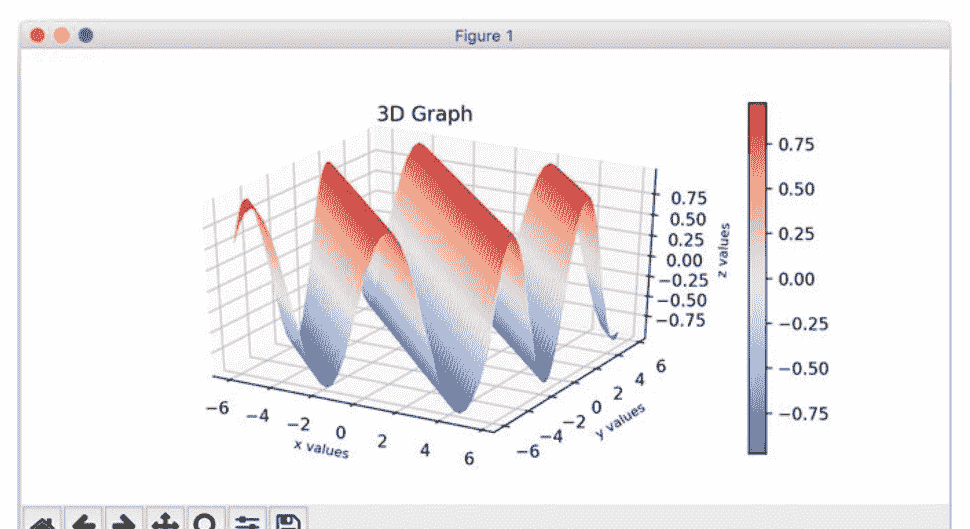

关于三维图表需要注意的一点是，它们并非被普遍认为是呈现数据的好方法。数据可视化的一条准则是保持简单/保持清晰。许多人认为三维图表未能做到这一点，可能难以看清实际展示的内容，或者难以正确解读数据。例如，在上面的图表中，与任何峰值相关的数值是多少？这很难确定，因为很难看清峰值相对于 X、Y 和 Z 轴的位置。许多人认为此类 3D 图表只是“眼球糖果”；看起来漂亮，但提供的信息不多。因此，应尽量减少使用 3D 图表，仅在确实必要时使用。

## 图形用户界面

图形用户界面可以捕捉一个想法或情境的本质，通常避免了长篇大论的需要。此类界面可以使用户免于学习复杂的命令。它们不太可能让计算机用户感到畏惧，并且可以快速提供大量信息，其形式易于用户吸收。

高质量图形界面的广泛使用使得许多计算机用户期望他们使用的任何软件都具备此类界面。大多数编程语言要么集成了图形用户界面库，要么有第三方库可用。

Python 当然是一种跨平台编程语言，这带来了额外的复杂性，因为底层操作系统可能根据程序是在 Unix、Linux、Mac OS 还是 Windows 操作系统上运行而提供不同的窗口设施。

在本章中，我们将首先介绍 GUI 的含义，特别是基于 WIMP 的 UI。然后，我们将考虑 Python 可用的库范围，再选择一个来使用。本章随后将描述如何使用其中一个 GUI 库创建丰富的客户端图形显示（桌面应用程序）。因此，在本章中，我们将探讨如何创建窗口、按钮、文本字段和标签等，将它们添加到窗口中，以及如何定位和组织它们。

### GUI 和 WIMPS

GUI（图形用户界面）和 WIMP（窗口、图标、鼠标和弹出菜单）风格的界面在计算机系统中已存在多年，但它们仍然是已发生的最重要的发展之一。这些界面最初是为了解决纯文本界面的许多感知弱点而开发的。

操作系统的文本界面以专横的提示符为典型特征。例如，在 Unix/Linux 系统中，提示符通常只是一个字符，如 %、> 或 $，这可能会让人感到畏惧。即使对于经验丰富的计算机用户，如果他们不熟悉 Unix/Linux 系列操作系统，情况也是如此。

例如，希望将文件从一个目录复制到另一个目录的用户可能需要输入类似以下内容：

```
> cp file.pdf ~otheruser/projdir/srcdir/newfile.pdf
```

这一长串内容需要毫无错误地输入才能被接受。此命令中的任何错误都会导致系统生成错误消息，该消息可能有用也可能没用。即使系统试图通过命令历史记录等功能变得更“用户友好”，通常也需要大量输入箭头键和文件名。

输入和输出的主要问题在于带宽。例如，在必须描述大量信息之间关系的情况下，如果输出以图形方式显示，而不是以数字表格形式显示，则更容易吸收这些信息。在输入方面，鼠标操作的组合可以被赋予含义，否则这些含义只能通过几行文本来传达。

WIMP 代表窗口（或窗口管理器）、图标、鼠标和弹出菜单。WIMP 界面允许用户克服其文本对应物的至少一些弱点——可以提供操作系统的图像表示，该表示可以基于用户能够理解的概念，菜单可以代替文本命令，并且信息通常可以以图形方式显示。

通过 WIMP 界面呈现的基本概念最初是在 XEROX 的帕洛阿尔托研究中心开发的，并在 Xerox Star 机器上使用，但通过 Apple Macintosh 和 IBM PC 对 WIMP 界面的实现获得了更广泛的接受。

大多数 WIMP 风格的环境使用桌面类比（尽管对于手机和平板电脑等移动设备来说，这一点不太适用）：

- 整个屏幕代表一个工作表面（桌面），
- 可以重叠的图形窗口代表该桌面上的纸张，
- 图形对象用于特定概念，例如文件柜代表磁盘或废纸篓用于文件处理（这些可以被视为桌面附件），
- 各种应用程序显示在屏幕上，这些代表您可能在桌面上使用的工具。

为了与此显示进行交互，WIMP 用户配备了一个鼠标（或光笔或触摸屏），可用于选择图标和菜单或操作窗口。

任何WIMP风格环境的软件基础都是窗口管理器。它控制着屏幕上显示的多个、可能重叠的窗口和图标。它还负责将这些窗口中发生的事件信息传递给相应的应用程序，并生成所使用的各种菜单和提示。

窗口是图形屏幕上的一个区域，可以在其中显示一页或一页信息的一部分；它可以显示文本、图形或两者的组合。这些窗口可以是重叠的，并且与同一进程相关联，或者它们可能与不同的进程相关联。窗口通常可以被创建、打开、关闭、移动和调整大小。

图标是一个小的图形对象，通常象征着一个操作或一个更大的实体，如应用程序或文件。打开一个图标会导致关联的应用程序执行或关联的窗口显示。

用户与这种基于WIMP的程序交互能力的核心是事件循环。该循环监听事件，例如用户单击按钮、选择菜单项或进入文本字段。当此类事件发生时，它会触发相关的行为（例如运行与按钮链接的函数）。

## Python的窗口框架

Python是一种跨平台编程语言。因此，Python程序可以在一个平台（如Linux机器）上编写，然后在该平台或另一个操作系统平台（如Windows或Mac OS）上运行。然而，这可能会给需要在多个操作系统平台上可用的库带来问题。图形用户界面领域尤其是一个问题，因为为利用Microsoft Windows系统中可用功能而编写的库在Mac OS或Linux系统上可能不可用（或可能看起来不同）。

Python运行的每个操作系统可能有一个或多个为其编写的窗口系统，这些系统可能在其他操作系统上可用，也可能不可用。这使得为Python提供图形用户界面库的工作变得更加困难。

Python图形用户界面的开发者采取了两种方法之一来处理这个问题：

- 一种方法是编写一个包装器，抽象底层的图形用户界面设施，使开发者在特定窗口系统设施之上的层次上工作。然后，Python库（尽其所能）将这些设施映射到当前正在使用的底层系统。
- 另一种方法是更紧密地包装底层图形用户界面系统上的特定设施集，并且只针对支持这些设施的系统。

下面列出了一些可用于Python的库，并将其分为平台无关库和平台特定库：

## 平台无关的图形用户界面库

- Tkinter。这是标准的内置Python图形用户界面库。它建立在Tcl/Tk小部件集之上，该小部件集已经存在了很多年，适用于许多不同的操作系统。Tcl代表工具命令语言，而Tk是Tcl的图形用户界面工具包。
- wxPython。wxWidgets是一个免费、高度可移植的图形用户界面库。它是用C++编写的，可以在Windows、Mac OS、Linux等操作系统上提供原生的外观和感觉。wxPython是wxWidgets的一组Python绑定。这是我们在本章中将要使用的库。
- PyQt或PySide，这两个库都包装了Qt工具包设施。Qt是一个跨平台的软件开发系统，用于实现图形用户界面和应用程序。

## 平台特定的图形用户界面库

- PyObjc是一个Mac OS特定的库，它提供了一个到Apple Mac Cocoa图形用户界面库的Objective-C桥接。
- PythonWin提供了一组围绕Microsoft Windows基础类的包装，可用于创建基于Windows的图形用户界面。

## wxPython图形用户界面库

**wxPython库**

wxPython库是一个用于Python的跨平台图形用户界面库（或工具包）。它允许程序员使用常见的概念（如菜单栏、菜单、按钮、字段、面板和框架）为其程序开发高度图形化的用户界面。

在wxPython中，图形用户界面的所有元素都包含在顶级窗口中，例如wx.Frame或wx.Dialog。这些窗口包含称为小部件或控件的图形组件。这些小部件/控件可以分组到面板中（面板可能有也可能没有可见的表示）。

因此，在wxPython中，我们可能从以下内容构建图形用户界面：

- 框架，提供窗口的基本结构：边框、标签和一些基本功能（例如调整大小）。
- 对话框，类似于框架，但提供较少的边框控制。
- 小部件/控件，是在框架中显示的图形对象。其他一些语言将它们称为UI组件。小部件的示例包括按钮、复选框、选择列表、标签和文本字段。
- 容器是由一个或多个其他组件（或容器）组成的组件。容器（如面板）中的所有组件都可以被视为一个单一实体。

因此，图形用户界面是由一组小部件、容器和一个或多个框架（或在弹出对话框的情况下是对话框）分层构建的。下图说明了一个包含多个面板和小部件的窗口：

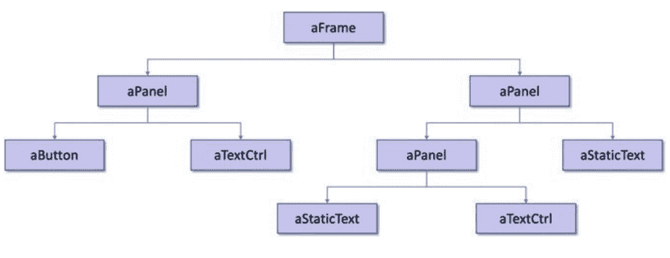

像框架和对话框这样的窗口有一个组件层次结构，该层次结构（除其他外）用于确定窗口元素如何以及何时被绘制和重绘。组件层次结构以框架为根，可以在其中添加组件和容器。

上图说明了一个框架的组件层次结构，其中包含两个容器面板和一些基本的小部件/UI组件。请注意，一个面板可以包含另一个具有不同小部件的子面板。

## wxPython模块

wxPython库由许多不同的模块组成。这些模块提供不同的功能，从核心wx模块到面向HTML的wx.html和wx.html2模块。这些模块包括：

- wx，包含wx库中的核心小部件和类。
- wx.adv，提供不太常用或更高级的小部件和类。
- wx.grid，包含支持表格数据显示和编辑的小部件和类。
- wx.richtext，包含用于显示多种文本样式和图像的小部件和类。
- wx.html，包含用于通用HTML渲染器的小部件和支持类。
- wx.html2，为原生HTML渲染器提供进一步的小部件和支持类，支持CSS和JavaScript。

## 窗口作为对象

在wxPython中，框架和对话框及其内容都是相应类（如Frame、Dialog、Panel、Button或Static Text）的实例。因此，当你创建一个窗口时，你创建了一个知道如何在计算机屏幕上显示自己的对象。你必须告诉它要显示什么，然后告诉它向用户显示其内容。

在阅读本章时，你应该记住以下几点；它们将帮助你理解你需要做什么：

- 你通过实例化一个Frame或Dialog对象来创建一个窗口。
- 你通过创建一个具有适当父组件的小部件来定义窗口显示的内容。这会将小部件添加到容器中，例如一种类型的面板或框架。
- 你可以向窗口发送消息以更改其状态、执行操作和显示图形对象。
- 窗口或窗口中的组件可以向其他对象发送消息以响应用户（或程序）操作。
- 窗口显示的所有内容都是一个类的实例，并且可能受到上述所有内容的影响。
- wx.App处理图形用户界面应用程序的主事件循环。

## 一个简单的例子

下面给出了一个使用wxPython创建非常简单的窗口的示例。运行这个简短程序的结果在Mac和Windows PC上显示如下：

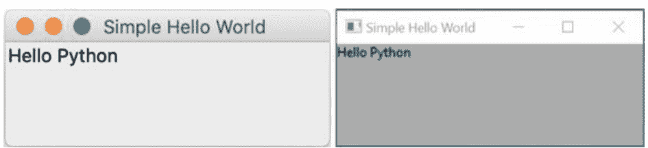

这个程序创建了一个顶级窗口（wx.Frame）并给它一个标题。它还创建了一个标签（一个wx.StaticText对象）要在框架内显示。

要使用wxPython库，需要导入wx模块。

```python
import wx
# Create the Application Object
app = wx.App()
# Now create a Frame (representing the window)
frame = wx.Frame(parent=None, title='Simple Hello World')
# And add a text label to it
text = wx.StaticText(parent=frame, label='Hello Python')
# Display the window (frame)
frame.Show()
# Start the event loop
app.MainLoop()
```

该程序还会创建一个名为 `wx.App()` 的应用程序对象新实例。

每个 wxPython GUI 程序都必须有一个应用程序对象。它相当于许多非 GUI 应用程序中的 `main()` 函数，因为它会为你运行 GUI 应用程序。它还提供定义启动和关闭操作的默认功能，并且可以被子类化以创建自定义行为。

`wx.StaticText` 类用于创建单行（或多行）标签。在此例中，标签显示字符串 'Hello Python'。StaticText 对象的构造需要引用其父容器。这是将显示文本的容器。在此例中，StaticText 直接显示在 Frame 内，因此 frame 对象是其包含的父对象。相比之下，Frame 作为顶级窗口，没有父容器。

还需注意，必须显示（展示）框架，用户才能看到它。这是因为应用程序可能需要在不同情况下显示（或隐藏）多个不同的窗口。

最后，程序启动应用程序的主事件循环；在此循环中，程序监听任何用户输入（例如请求关闭窗口）。

## wx.App 类

`wx.App` 类代表应用程序，用于：

- 启动 wxPython 系统并初始化底层 GUI 工具包，
- 设置和获取应用程序范围的属性，
- 实现原生窗口系统主消息或事件循环，并将事件分派到窗口实例。

每个 wxPython 应用程序都必须有一个 `wx.App` 实例。所有 UI 对象的创建都应延迟到 `wx.App` 对象创建之后，以确保 GUI 平台和 wxWidgets 已完全初始化。

通常会子类化 `wx.App` 类并重写 `OnPreInit` 和 `OnExit` 等方法以提供自定义行为。这确保了所需行为在适当的时间运行。为此目的可以重写的方法有：

- `OnPreInit`，可以重写此方法以定义在应用程序对象创建后、但在 `OnInit` 方法被调用之前应运行的行为。
- `OnInit`，预期用于创建应用程序的主窗口、显示该窗口等。
- `OnRun`，这是用于启动主程序执行的方法。
- `OnExit`，可以重写此方法以提供在应用程序退出前应调用的任何行为。

例如，如果我们希望设置一个 GUI 应用程序，使得主框架在 `wx.App` 实例化后初始化并显示，那么最安全的方法是在合适的子类中重写 `wx.App` 类的 `OnInit()` 方法。该方法应返回 `True` 或 `False`；其中 `True` 用于指示应继续处理应用程序，`False` 表示应用程序应立即终止（通常是由于某些意外问题）。

下面是一个 `wx.App` 子类的示例：

```python
class MainApp(wx.App):
    def OnInit(self):
        """Initialise the main GUI Application"""
        frame = WelcomeFrame()
        frame.Show()
        # Indicate whether processing should continue or not
        return True
```

现在可以实例化此类并启动 MainLoop，例如：

```python
# Run the GUI application
app = MainApp()
app.MainLoop()
```

也可以重写 `OnExit()` 以清理在 `OnInit()` 方法中初始化的任何内容。

## 窗口类

wxPython 应用程序中常用的窗口或控件容器类有：

- `wx.Dialog` 对话框是一个顶级窗口，用于弹出窗口，用户与该窗口的交互能力有限。在许多情况下，用户只能输入一些数据和/或接受或拒绝一个选项。
- `wx.Frame` 框架是一个顶级窗口，其大小和位置可以设置，并且（通常）可以由用户控制。
- `wx.Panel` 是一个容器（非顶级窗口），可以在其上放置控件/小部件。这通常与对话框或框架结合使用，以管理 GUI 内小部件的定位。

这些类的继承层次结构如下所示，仅供参考：

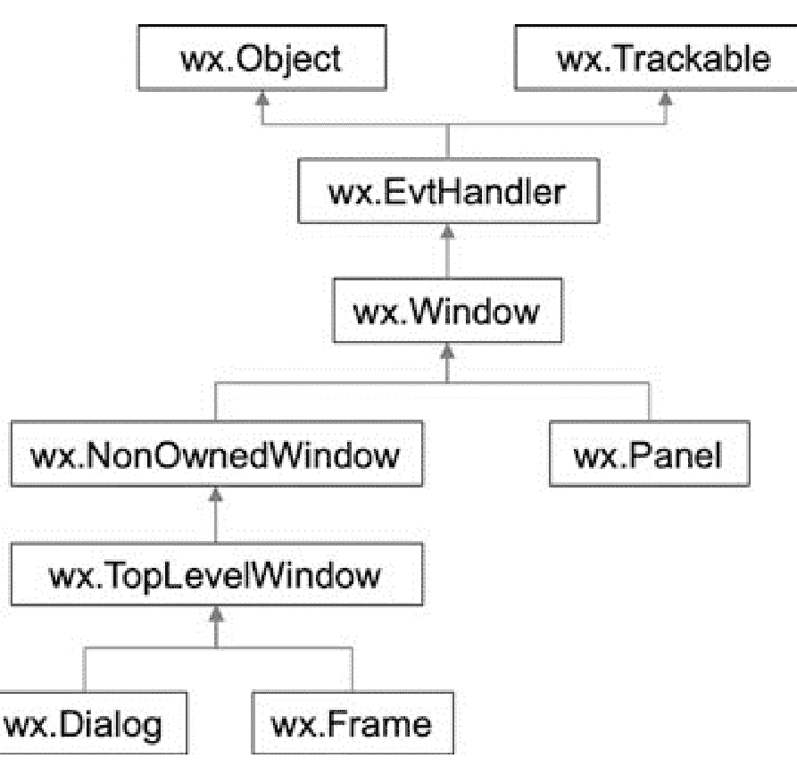

作为使用 Frame 和 Panel 的示例，以下应用程序创建两个 Panel 并将它们显示在一个顶级 Frame 内。Frame 的背景色是默认的灰色；而第一个 Panel 的背景色是蓝色，第二个 Panel 的背景色是红色。显示结果如下所示：

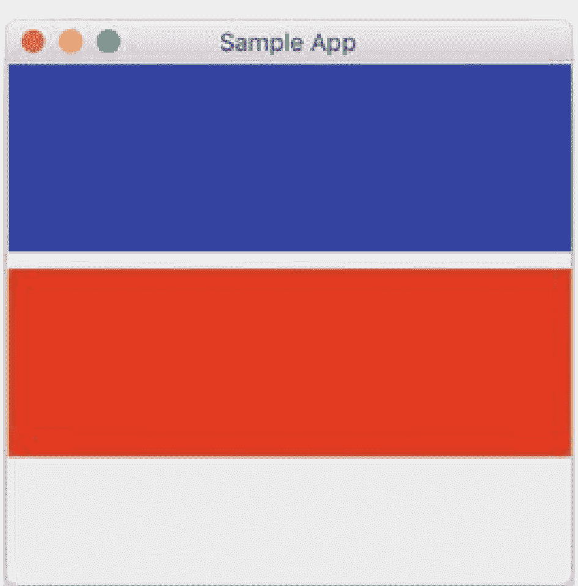

生成此 GUI 的程序如下：

```python
import wx

class SampleFrame(wx.Frame):
    def __init__(self):
        super().__init__(parent=None, title='Sample App', size=(300, 300))
        # Set up the first Panel to be at position 1, 1
        # (The default) and of size 300 by 100
        # with a blue background
        self.panel1 = wx.Panel(self)
        self.panel1.SetSize(300, 100)
        self.panel1.SetBackgroundColour(wx.Colour(0, 0, 255))
        # Set up the second Panel to be at position 1, 110
        # and of size 300 by 100 with a red background
        self.panel2 = wx.Panel(self)
        self.panel2.SetSize(1, 110, 300, 100)
        self.panel2.SetBackgroundColour(wx.Colour(255, 0, 0))

class MainApp(wx.App):
    def OnInit(self):
        """ Initialise the main GUI Application"""
        frame = SampleFrame()
        frame.Show()
        return True

# Run the GUI application
app = MainApp()
app.MainLoop()
```

`SampleFrame` 是 `wx.Frame` 类的子类；因此它继承了顶级 Frame（窗口）的所有功能。在 `SampleFrame` 的 `init()` 方法中，调用了超类的 `init()` 方法。这用于设置 Frame 的大小并为 Frame 赋予标题。请注意，Frame 还表明它没有父窗口。

创建 Panel 时，需要指定它将在其中显示的窗口（或在此例中为 Frame）。这是 wxPython 中的常见模式。

还需注意，Panel 类的 `SetSize` 方法也允许指定位置，并且 Color 类是 wxPython 的颜色类。

## 小部件/控件类

尽管开发者可以使用非常多的小部件/控件，但最常用的包括：

- `wx.Button`/`wx.ToggleButton`/`wx.RadioButton` 这些是在 GUI 中提供类似按钮行为的小部件。
- `wx.TextCtrl` 此小部件允许显示和编辑文本。根据配置，它可以是单行或多行小部件。
- `wx.StaticText` 用于显示一行或多行只读文本。在许多库中，此小部件被称为标签。
- `wx.StaticLine` 对话框中用于分隔控件组的线条。该线条可以是垂直或水平的。
- `wx.ListBox` 此小部件用于允许用户从选项列表中选择一个选项。
- `wx.MenuBar`/`wx.Menu`/`wx.MenuItem`。可用于为用户界面构建一组菜单的组件。
- `wx.ToolBar` 此小部件用于显示一个按钮和/或其他小部件的栏，通常放置在 `wx.Frame` 中菜单栏的下方。

这些小部件的继承层次结构如下所示。请注意，它们都继承自 `Control` 类（因此它们也常被称为控件，以及小部件或 GUI 组件）。

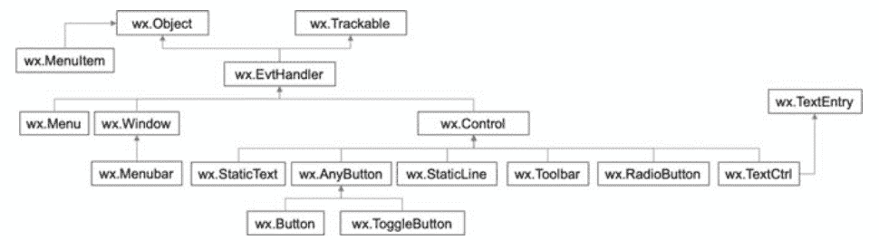

每当创建一个小部件时，都需要提供将容纳它的容器窗口类，例如 Frame 或 Panel，例如：

```python
enter_button = wx.Button(panel, label='Enter')
```

在此代码片段中，正在创建一个 `wx.Button`，其标签为 'Enter'，并将显示在给定的 Panel 内。

## 对话框

通用的 `wx.Dialog` 类可用于构建你所需的任何自定义对话框。它可用于创建模态和非模态对话框：

- 模态对话框会阻止程序流和用户在其他窗口上的输入，直到它被关闭。

## 在容器内排列部件

部件可以通过特定坐标（例如向下10像素、向右5像素）定位在窗口中。然而，如果你考虑跨平台应用程序，这可能会成为一个问题，这是因为按钮在Mac上的渲染（绘制）方式与Windows不同，与Linux/Unix等系统的窗口系统也不同。这意味着在不同平台上必须提供不同的间距。此外，文本框和标签使用的字体在不同平台之间也存在差异，这也需要部件布局的相应调整。

为了克服这个问题，wxPython提供了Sizers（布局管理器）。Sizers与容器（如Frame或Panel）协同工作，以确定所包含的部件应如何布局。部件被添加到一个sizer中，然后该sizer被设置到容器（如Panel）上。

因此，Sizer是一个与容器和宿主窗口平台协同工作的对象，用于确定在窗口中显示对象的最佳方式。开发者无需担心用户调整窗口大小或在不同窗口平台上运行程序时会发生什么。

- 因此，Sizers有助于创建可移植、美观的用户界面。实际上，一个Sizer可以放置在另一个Sizer内部，以创建复杂的组件布局。

有几种可用的sizer，包括：

- wx.BoxSizer 此sizer可用于将多个部件组织成一行或一列，具体取决于方向。创建BoxSizer时，可以使用`wx.VERTICAL`或`wx.HORIZONTAL`指定方向。
- wx.GridSizer 此sizer将部件布局在二维网格中。网格中的每个单元格大小相同。创建GridSizer对象时，可以指定网格的行数和列数。还可以指定单元格之间水平和垂直的间距。
- wx.FlexGridSizer 此sizer是GridSizer的一个稍微灵活的版本。在此版本中，并非所有列和行都需要相同大小（尽管同一列中的所有单元格宽度相同，同一行中的所有单元格高度相同）。
- wx.GridBagSizer 是最灵活的sizer。它允许部件相对于网格定位，也允许部件跨越多行和/或多列。

要使用Sizer，必须首先实例化它。创建部件时，应将它们添加到sizer中，然后将sizer设置到容器上。

例如，以下代码使用一个与Panel一起使用的GridSizer来布局四个部件，包括两个按钮、一个StaticText标签和一个TextCtrl输入字段：

```python
# 创建面板
panel = wx.Panel(self)
# 创建用于4行1列的sizer
# 并且每个单元格周围有5像素的间距
grid = wx.GridSizer(4, 1, 5, 5)
# 创建部件
text = wx.TextCtrl(panel, size=(150, -1))
enter_button = wx.Button(panel, label='Enter')
label = wx.StaticText(panel, label='Welcome')
message_button = wx.Button(panel, label='Show Message')
# 将部件添加到网格sizer
grid.AddMany([text, enter_button, label, message_button])
# 将sizer设置到面板上
panel.SetSizer(grid)
```

结果显示如下：

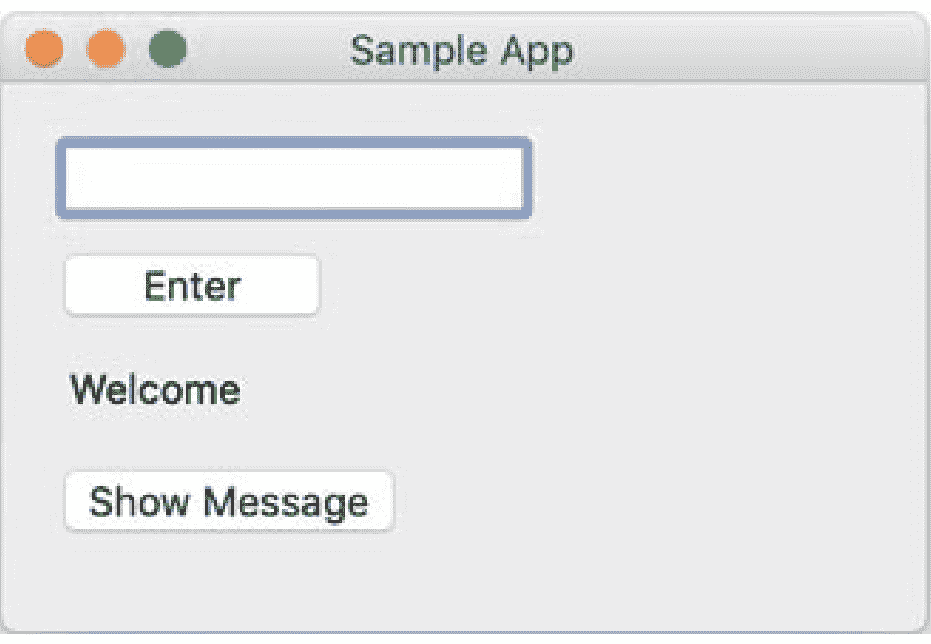

## 绘制图形

在前面的章节中，我们了解了用于在Python中生成矢量和光栅图形的Turtle图形API。wxPython库提供了自己的设施，用于使用线条、矩形、圆形、文本等生成跨平台图形显示。这是通过设备上下文（Device Context）提供的。

设备上下文（通常简称为DC）是一个可以在其上绘制图形和文本的对象。它旨在允许不同的输出设备都拥有一个通用的图形API（也称为GDI或图形设备接口）。可以根据程序是使用计算机屏幕上的窗口还是其他输出介质（如打印机）来实例化特定的设备上下文。

有几种可用的设备上下文类型，例如`wx.WindowDC`、`wx.PaintDC`和`wx.ClientDC`：

- `wx.WindowDC` 用于在窗口的整个区域上绘制（仅限Windows）。这包括窗口装饰。
- `wx.ClientDC` 用于在窗口的客户区域上绘制。客户区域是窗口中没有装饰（标题和边框）的区域。
- `wx.PaintDC` 也用于在客户区域上绘制，但旨在支持窗口刷新绘制事件处理机制。

请注意，`wx.PaintDC`应仅在`wx.PaintEvent`处理程序中使用，而`wx.ClientDC`绝不应在`wx.PaintEvent`处理程序中使用。

无论使用哪种设备上下文，它们都支持一组类似的方法来生成图形，例如：

- `DrawCircle(x, y, radius)` 绘制一个具有给定中心和半径的圆。
- `DrawEllipse(x, y, width, height)` 绘制一个包含在指定矩形内的椭圆，该矩形由给定的左上角和大小或直接指定。
- `DrawPoint(x, y)` 使用当前画笔的颜色绘制一个点。
- `DrawRectangle(x, y, width, height)` 绘制一个具有给定角坐标和大小的矩形。
- `DrawText(text, x, y)` 在指定点绘制文本字符串，使用当前文本字体以及当前文本前景色和背景色。
- `DrawLine(pt1, pt2)` / `DrawLine(x1, y1, x2, y2)` 此方法从第一个点绘制一条线到第二个点。

理解设备上下文何时刷新/重绘也很重要。例如，如果你调整窗口大小、最大化、最小化、移动窗口或修改其内容，窗口将被重绘。这会生成一个事件，即PaintEvent。你可以将一个方法绑定到PaintEvent（使用`wx.EVT_PAINT`），该方法在每次窗口刷新时被调用。

此方法可用于绘制窗口应显示的任何内容。如果你在此类方法中不重绘设备上下文的内容，那么窗口刷新时将显示你之前绘制的内容。

以下简单程序说明了使用上述一些Draw方法以及如何将方法绑定到绘制事件，以便在使用设备上下文时适当地刷新显示：

```python
import wx

class DrawingFrame(wx.Frame):
    def __init__(self, title):
        super().__init__(None, title=title, size=(300, 200))
        self.Bind(wx.EVT_PAINT, self.on_paint)

    def on_paint(self, event):
        """设置用于绘制的设备上下文（DC）"""
        dc = wx.PaintDC(self)
        dc.DrawLine(10, 10, 60, 20)
        dc.DrawRectangle(20, 40, 40, 20)
        dc.DrawText("Hello World", 30, 70)
        dc.DrawCircle(130, 40, radius=15)

class GraphicApp(wx.App):
    def OnInit(self):
        """初始化GUI显示"""
        frame = DrawingFrame(title='PyDraw')
        frame.Show()
        return True

# 运行GUI应用程序
app = GraphicApp()
app.MainLoop()
```

运行此程序时，将生成以下显示：

## wxPython 用户界面中的事件

## 事件处理

事件是任何图形用户界面（GUI）不可或缺的一部分；它们代表了用户与界面的交互，例如点击按钮、在字段中输入文本、选择菜单选项等。

主事件循环监听事件；当事件发生时，它会处理该事件（通常会导致调用一个函数或方法），然后等待下一个事件的发生。这个循环在 wxPython 中通过调用 `wx.App` 对象的 `MainLoop()` 方法来启动。

这就引出了一个问题：“什么是事件？”。事件对象是一段信息，代表了通常与 GUI 发生的某种交互（尽管事件可以由任何东西生成）。事件由事件处理器处理。这是一个在事件发生时被调用的方法或函数。事件作为参数传递给处理器。事件绑定器用于将事件绑定到事件处理器。

## 事件定义

总结事件的定义很有用，因为所使用的术语可能令人困惑且非常相似：

-   **事件** 代表来自底层 GUI 框架的信息，描述了已发生的事情以及任何相关数据。具体可用的数据会因发生的事情而异。例如，如果窗口被移动，那么相关数据将与窗口的新位置有关。而由 ListBox 的选择操作生成的 `CommandEvent` 则提供所选项目的索引。
-   **事件循环** 是 GUI 的主处理循环，等待事件发生。当事件发生时，会调用关联的事件处理器。
-   **事件处理器** 是在事件发生时被调用的方法（或函数）。
-   **事件绑定器** 将一种事件类型与一个事件处理器关联起来。不同类型的事件有不同的事件绑定器。例如，与 `wx.MoveEvent` 关联的事件绑定器名为 `wx.EVT_MOVE`。

事件、事件处理器（通过事件绑定器）之间的关系如下图所示：

上面的三个框说明了概念，而下面的三个框提供了一个具体的示例，展示了如何通过 `EVT_MOVE` 绑定器将 `Move_Event` 绑定到 `on_move()` 方法。

## 事件类型

事件有多种不同类型，包括：

-   `wx.CloseEvent` 用于指示框架或对话框已关闭。此事件的事件绑定器名为 `wx.EVT_CLOSE`。
-   `wx.CommandEvent` 用于按钮、列表框、菜单项、单选按钮、滚动条、滑块等控件。根据生成事件的控件类型，可能会提供不同的信息。例如，对于按钮，`CommandEvent` 表示按钮被点击；而对于 `ListBox`，则表示选择了一个选项，等等。不同的事件情况使用不同的事件绑定器。例如，要将命令事件绑定到按钮的事件处理器，则使用 `wx.EVT_BUTTON` 绑定器；而对于 `ListBox`，则可以使用 `wx.EVT_LISTBOX` 绑定器。
-   `wx.FocusEvent` 当窗口的焦点发生变化（失去或获得焦点）时发送此事件。你可以使用 `wx.EVT_SET_FOCUS` 事件绑定器来捕获窗口获得焦点。`wx.EVT_KILL_FOCUS` 用于绑定一个事件处理器，该处理器将在窗口失去焦点时被调用。
-   `wx.KeyEvent` 此事件包含与按键或释放键相关的信息。
-   `wx.MaximizeEvent` 当顶层窗口被最大化时生成此事件。
-   `wx.MenuEvent` 此事件用于与菜单相关的操作，例如菜单被打开或关闭；但应注意，当选择菜单项时不会使用此事件（菜单项生成 `CommandEvents`）。
-   `wx.MouseEvent` 此事件类包含有关鼠标生成的事件的信息：包括按下了哪个鼠标按钮（以及释放）、鼠标是否被双击等信息。
-   `wx.WindowCreateEvent` 此事件在实际窗口创建后立即发送。
-   `wx.WindowDestroyedEvent` 此事件在窗口销毁过程中尽早发送。

## 将事件绑定到事件处理器

事件通过事件生成对象（如按钮、字段、菜单项等）的 `Bind()` 方法，使用命名的事件绑定器绑定到事件处理器。

例如：

```
button.Bind(wx.EVT_BUTTON, self.event_handler_method)
```

## 实现事件处理

为控件或窗口实现事件处理涉及四个步骤：

1.  确定感兴趣的事件。许多控件在不同情况下会生成不同的事件；因此可能需要确定你感兴趣的是哪个事件。
2.  找到正确的事件绑定器名称，例如 `wx.EVT_CLOSE`、`wx.EVT_MOVE` 或 `wx.EVT_BUTTON` 等。同样，你可能会发现你感兴趣的控件支持许多不同的事件绑定器，这些绑定器可用于不同的情况（即使是同一事件）。
3.  实现一个事件处理器（即一个合适的方法或函数），该处理器将在事件发生时被调用。事件处理器将接收事件对象。
4.  使用控件或窗口的 `Bind()` 方法，通过绑定器名称将事件绑定到事件处理器。

为了说明这一点，我们将使用一个简单的例子。

我们将编写一个非常简单的事件处理应用程序。该应用程序将有一个包含面板（Panel）的框架（Frame）。面板将包含一个使用 `wx.StaticText` 类的标签。

我们将定义一个名为 `on_mouse_click()` 的事件处理器，当按下鼠标左键时，它会将 `StaticText` 标签移动到当前鼠标位置。这意味着我们可以将标签在屏幕上移动。

为此，我们首先需要确定将用于生成事件的控件。在本例中，是包含文本标签的面板。确定后，我们可以查看 `Panel` 类，看看它支持哪些事件和事件绑定。结果发现，`Panel` 类仅直接定义了对 `NavigationKeyEvents` 的支持。这实际上不是我们想要的；然而，`Panel` 类扩展了 `Window` 类。

`Window` 类支持许多事件绑定，从与设置焦点相关的绑定（`wx.EVT_SET_FOCUS` 和 `wx.EVT_KILL_FOCUS`）到按键（`wx.EVT_KEY_DOWN` 和 `wx.EVT_KEY_UP`）以及鼠标事件。然而，鼠标事件绑定有许多种。这些绑定允许捕获左、中、右鼠标按钮的点击，识别按下点击，以及鼠标进入或离开窗口等情况。但是，我们感兴趣的 `MouseEvent` 绑定是 `wx.EVT_LEFT_DOWN` 绑定；它在按下鼠标左键时捕获 `MouseEvent`（还有一个 `wx.EVT_LEFT_UP` 绑定可用于捕获鼠标左键释放时发生的事件）。

我们现在知道，我们需要通过 `wx.EVT_LEFT_DOWN` 事件绑定器将 `on_mouse_click()` 事件处理器绑定到 `MouseEvent`，例如：

```
self.panel.Bind(wx.EVT_LEFT_DOWN, self.on_mouse_click)
```

所有事件处理器方法都接受两个参数：`self` 和鼠标事件。因此，`on_mouse_click()` 方法的签名是：

```
def on_mouse_click(self, mouse_event):
```

鼠标事件对象定义了许多方法，允许获取有关鼠标的信息，例如涉及的鼠标点击次数（`GetClickCount()`）、按下了哪个按钮（`GetButton()`）以及鼠标在包含控件或窗口内的当前位置（`GetPosition()`）。因此，我们可以使用最后一个方法获取当前鼠标位置，然后使用 `StaticText` 对象的 `SetPosition(x, y)` 方法设置其位置。

最终结果是下面显示的程序：

```
import wx

class WelcomeFrame(wx.Frame):
    """ The Main Window / Frame of the application """
    def __init__(self):
        super().__init__(parent=None, title='Sample App', size=(300, 200))
        # Set up panel within the frame and text label
        self.panel = wx.Panel(self)
        self.text = wx.StaticText(self.panel, label='Hello')
        # Bind the on_mouse_click method to the
        # Mouse Event via the
        # left mouse click binder
        self.panel.Bind(wx.EVT_LEFT_DOWN, self.on_mouse_click)

    def on_mouse_click(self, mouse_event):
        """When the left mouse button is clicked This method is called.
        It will obtain the current mouse coordinates, and reposition the
        text label
        to this position. """
        x, y = mouse_event.GetPosition()
        print(x, y)
        self.text.SetPosition(wx.Point(x, y))

class MainApp(wx.App):
    def OnInit(self):
        """ Initialise the main GUI Application"""
        frame = WelcomeFrame()
        frame.Show()
        # Indicate that processing should continue
        return True

# Run the GUI application
app = MainApp()
app.MainLoop()
```

当运行此程序时，窗口会显示一个‘Hello’ StaticText标签，位于Frame的左上角（实际上它被添加到了Panel上，但在本例中Panel填满了Frame）。如果用户随后在Frame内的任意位置点击鼠标左键，那么‘Hello’标签就会跳转到该位置。

下图展示了初始设置以及窗口内两个不同位置的情况。

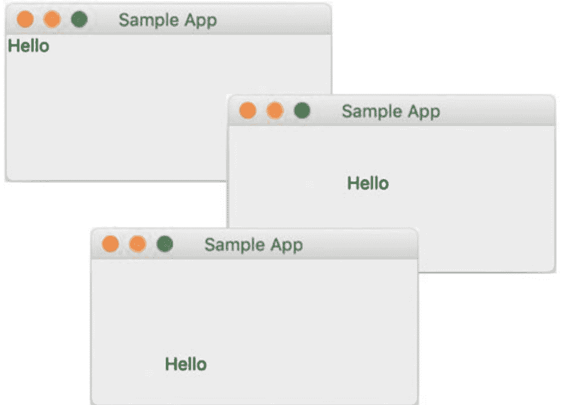

## 一个交互式 wxPython GUI

下面给出一个稍大的GUI应用程序示例，它综合了本章介绍的许多概念。

在这个应用中，我们有一个文本输入框（一个 `wx.TextCtrl`），允许用户输入他们的名字。当他们点击“Enter”按钮（`wx.Button`）时，欢迎标签（一个 `wx.StaticText`）会更新为他们的名字。“Show Message”按钮用于显示一个 `wx.MessageDialog`，其中也会包含他们的名字。

下图展示了在Mac和Windows PC上的初始显示效果，请注意Frame的默认背景色在Windows PC和Mac上是不同的，因此尽管GUI在两个平台上都能运行，但外观有所不同：

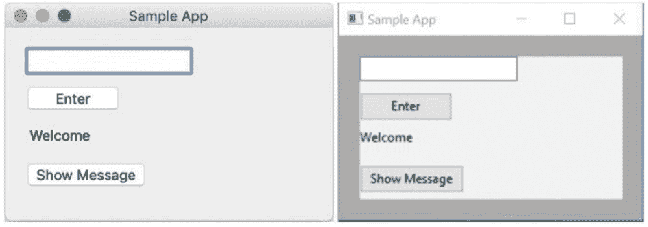

实现此GUI应用程序的代码如下：

```python
import wx
class HelloFrame(wx.Frame):
    def __init__(self, title):
        super().__init__(None, title=title, size=(300,200))
        self.name = '<unknown>'
        # Create the BoxSizer to use for the Frame
        vertical_box_sizer = wx.BoxSizer(wx.VERTICAL)
        self.SetSizer(vertical_box_sizer)
        # Create the panel to contain the widgets
        panel = wx.Panel(self)
        # Add the Panel to the Frames Sizer
        vertical_box_sizer.Add(panel,
            wx.ID_ANY,
            wx.EXPAND | wx.ALL,
            20)
        # Create the GridSizer to use with the Panel
        grid = wx.GridSizer(4, 1, 5, 5)
        # Set up the input field
        self.text = wx.TextCtrl(panel, size=(150, -1))
        # Now configure the enter button
        enter_button = wx.Button(panel, label='Enter')
        enter_button.Bind(wx.EVT_BUTTON, self.set_name)
        # Next set up the text label
        self.label = wx.StaticText(panel, label='Welcome',
            style=wx.ALIGN_LEFT)
        # Now configure the Show Message button
        message_button = wx.Button(panel, label='Show Message')
        message_button.Bind(wx.EVT_BUTTON, self.show_message)
        # Add the widgets to the grid sizer to handle layout
        grid.AddMany([self.text, enter_button, self.label,
            message_button])
        # Set the sizer on the panel
        panel.SetSizer(grid)
        # Centre the Frame on the Computer Screen
        self.Centre()
    def show_message(self, event):
        """ Event Handler to display the Message Dialog using the
        current value of the name attribute. """
        dialog = wx.MessageDialog(None,
            message='Welcome To Python ' + self.name, caption='Hello',
            style=wx.OK)
        dialog.ShowModal()
    def set_name(self, event):
        """Event Handler for the Enter button.
        Retrieves the text entered into the input field and sets the
        self.name attribute. This is then used to set the text label """
        self.name = self.text.GetLineText(0)
        self.label.SetLabelText('Welcome ' + self.name)
class MainApp(wx.App):
    def OnInit(self):
        """Initialise the GUI display"""
        frame = HelloFrame(title='Sample App')
        frame.Show()
        # Indicate whether processing should continue or not
        return True
    def OnExit(self):
        """Executes when the GUI application shuts down"""
        print('Goodbye')
        # Need to indicate success or failure
        return True
# Run the GUI application
app = MainApp()
app.MainLoop()
```

如果用户在顶部的TextCtrl字段中输入他们的名字，例如‘Phoebe’，那么当他们点击‘Enter’按钮时，欢迎标签会变为‘Welcome Phoebe’：

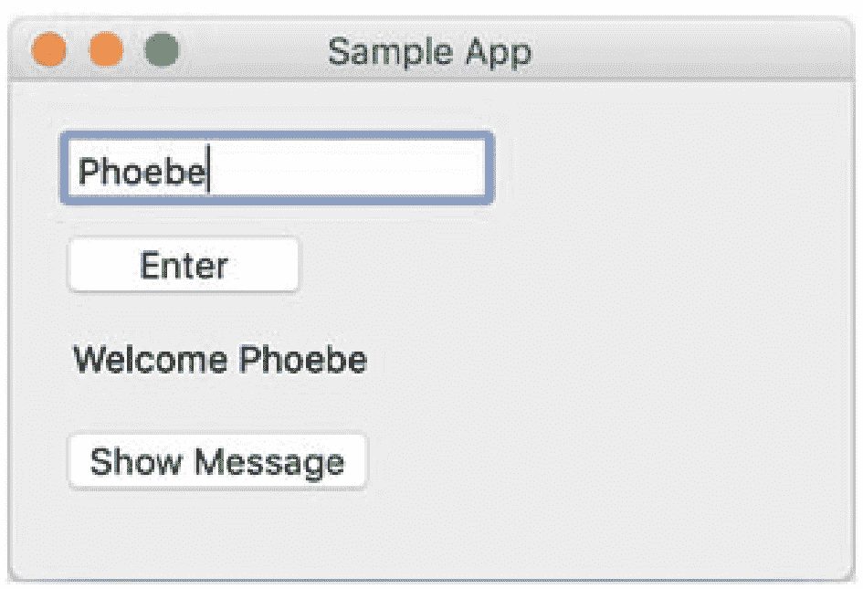

如果他们现在点击‘Show Message’按钮，那么 `wx.MessageDialog`（一种特定类型的 `wx.Dialog`）将显示一条欢迎Phoebe的消息：

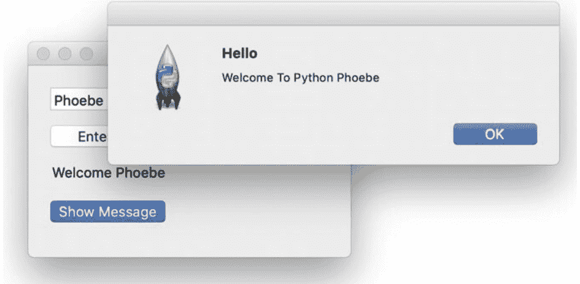

## 在线资源

有许多在线参考资料支持GUI开发，特别是Python GUI开发，包括：

- [https://docs.wxpython.org](https://docs.wxpython.org) wxPython的文档。
- [https://www.wxpython.org](https://www.wxpython.org) wxPython主页。
- [https://www.wxwidgets.org](https://www.wxwidgets.org) 关于底层的wxWidgets跨平台GUI库的信息。

## 简单的GUI应用程序

这个练习建立在你在上一章创建的GUI基础上。

该应用程序应允许用户输入他们的姓名和年龄。你需要检查输入到年龄字段的值是否为数值（例如使用 `isnumeric()`）。如果该值不是数字，则应显示一个错误消息对话框。

应提供一个标有‘Birthday’的按钮；点击它时，年龄应增加一岁，并显示一条生日快乐的消息。年龄应在GUI中更新。

下图是你在上一章创建的用户界面示例：

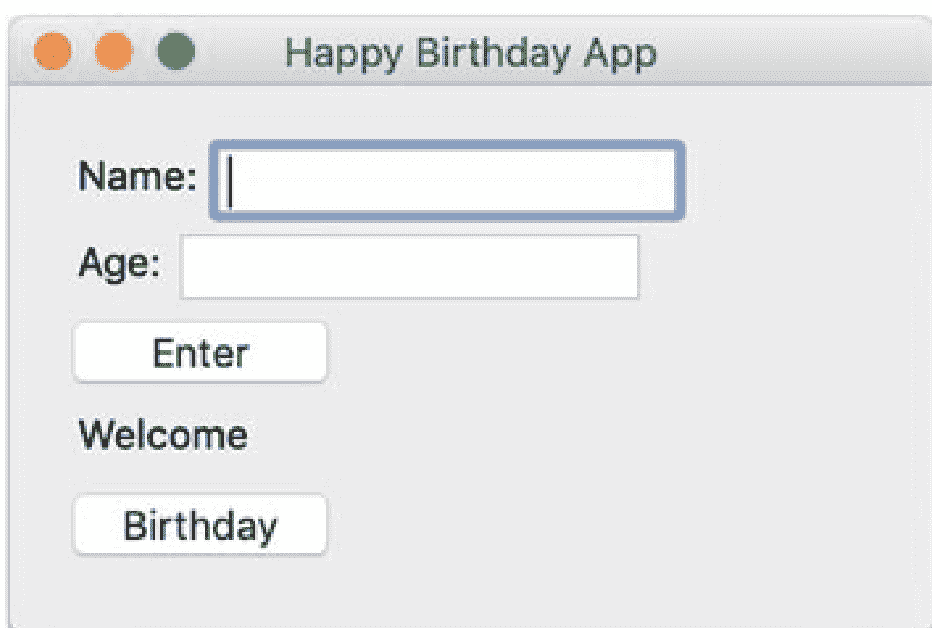

例如，用户可能会如下输入他们的姓名和年龄：

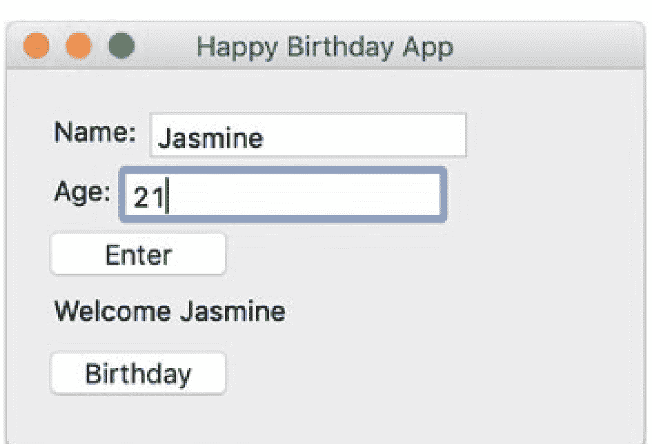

当用户点击‘birthday’按钮时，将显示生日快乐消息对话框：


## 井字棋游戏的GUI界面

本练习的目标是实现一个简单的井字棋游戏。该游戏应允许两名用户使用同一鼠标进行交互式游戏。第一名用户将作为‘X’玩家，第二名用户作为‘o’玩家。

当每个用户选择一个按钮时，你可以将该按钮的标签设置为他们的符号。每次移动后，你需要检查两次是否有人获胜（或者游戏是否平局）。

你仍然需要一个网格的内部表示，以便确定谁（如果有的话）获胜。

下图展示了井字棋游戏GUI可能的外观示例：


你还可以添加对话框来获取玩家姓名，并通知他们谁赢了或是否平局。

## PyDraw wxPython 示例应用程序

### 简介

本章建立在前两章介绍的GUI库基础上，说明如何构建一个更大的应用程序。它提供了一个类似于Visio等工具的绘图工具案例研究。

### PyDraw 应用程序

PyDraw应用程序允许用户使用正方形、圆形、线条和文本绘制图表。目前没有提供选择、调整大小、重新定位或删除选项（尽管如果需要可以添加）。PyDraw使用wxPython 4.0.6版本中定义的组件集实现。

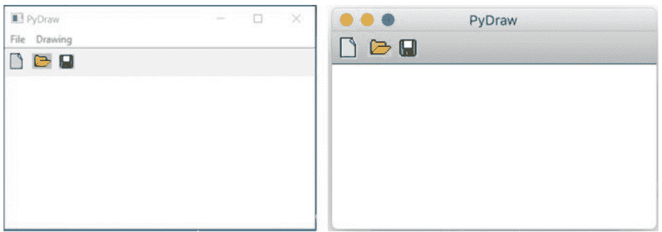

当用户启动PyDraw应用程序时，他们会看到上图所示的界面（适用于Microsoft Windows和Apple Mac操作系统）。根据操作系统不同，顶部有一个菜单栏（在Mac上，此菜单栏位于Mac显示区域的顶部），菜单栏下方是一个工具栏，再下方是一个可滚动的绘图区域。

工具栏上的第一个按钮用于清除绘图区域。第二个和第三个按钮目前仅实现为在Python控制台中打印消息，但旨在允许用户加载和保存绘图。

工具栏按钮在应用程序定义的菜单中重复出现，还包括一个绘图工具选择菜单，如下所示：


### 应用程序的结构

为PyDraw应用程序创建的用户界面由多个元素组成（见下文）：PyDrawMenuBar、包含窗口顶部一系列按钮的PyDrawToolbar、绘图面板以及窗口框架（由PyDrawFrame类实现）。

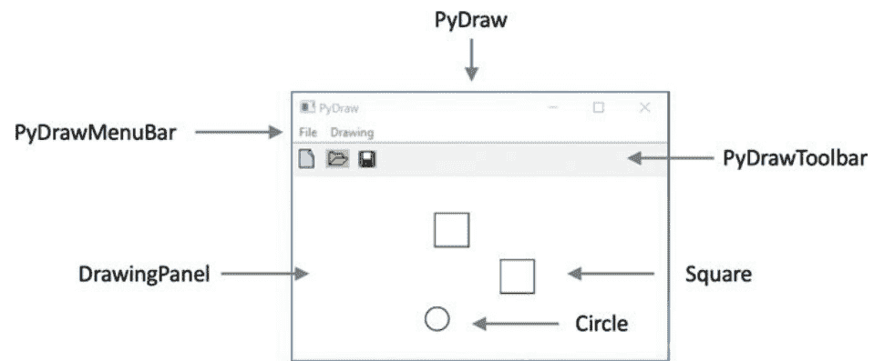

下图展示了与上述相同的信息，但以包含层次结构呈现，这意味着该图说明了一个对象如何被包含在另一个对象中。低级对象包含在高级对象内部。

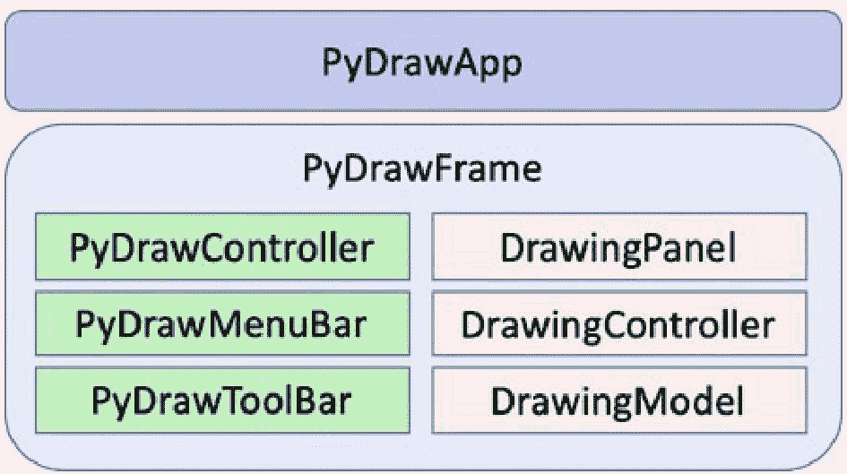

可视化这一点很重要，因为大多数wxPython界面都是通过这种方式构建的，使用容器和布局管理器。

PyDraw应用程序中使用的类之间的继承结构如下所示。这种类层次结构是结合了用户界面功能与图形元素的典型应用程序结构。

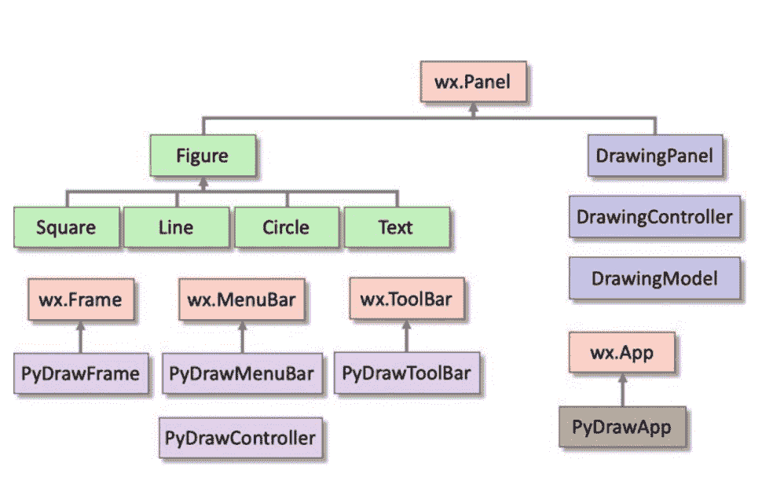

## 模型、视图和控制器架构

该应用程序采用了成熟的模型-视图-控制器（或MVC）设计模式，用于分离视图元素（例如框架或面板）、控制元素（处理用户输入）和模型元素（保存要显示的数据）之间的职责。

这种关注点分离并非新概念，它允许构建反映模型-视图-控制器架构的GUI应用程序。MVC架构的意图是将用户显示、用户输入控制与底层信息模型分离，如下图所示。

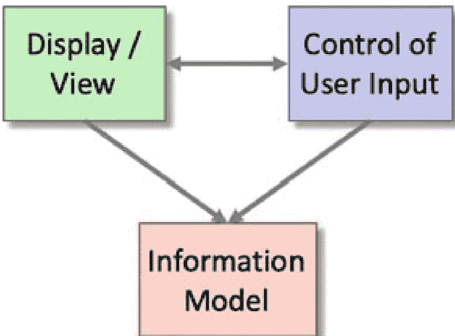

这种分离之所以有用，有以下几个原因：

-   应用程序和/或用户界面组件的可重用性，
-   能够独立开发应用程序和用户界面，
-   能够从类层次结构的不同部分继承，
-   能够定义控制样式类，这些类提供与这些功能如何显示分开的通用功能。

这意味着不同的界面可以与同一个应用程序一起使用，而应用程序无需知道这一点。这也意味着系统的任何部分都可以更改，而不会影响其他部分的操作。例如，可以更改图形界面（外观）显示信息的方式，而无需修改实际应用程序或输入处理方式（感觉）。实际上，应用程序根本不需要知道当前连接的是哪种类型的界面。

## PyDraw MVC架构

PyDraw应用程序的MVC结构有一个顶层控制器类PyDrawController和一个顶层视图类PyDrawFrame（没有模型，因为顶层MVC三元组本身不保存任何显式数据）。如下所示：

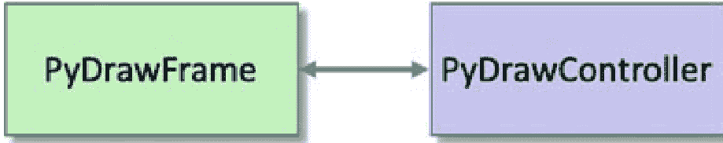

在下一层级，还有另一个MVC结构；这次是针对应用程序的绘图元素。有一个DrawingController，以及一个DrawingModel和一个DrawingPanel（视图），如下图所示：

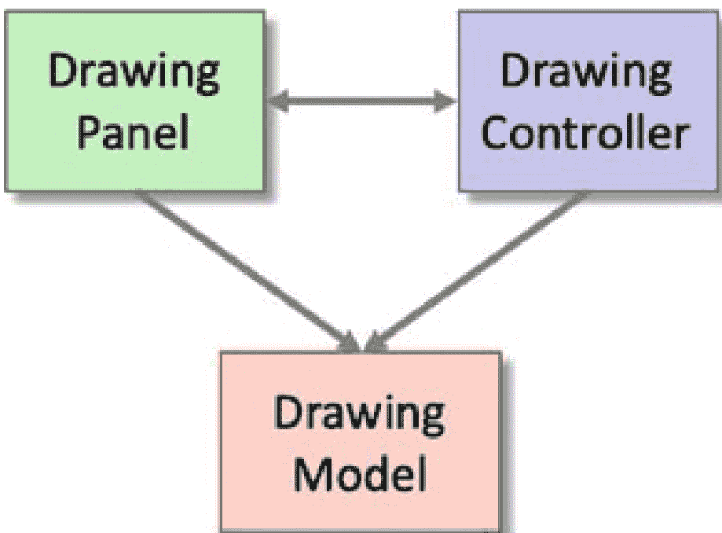

DrawingModel、DrawingPanel和DrawingController类展示了经典的MVC结构。视图和控制器类（DrawingPanel和DrawingController）彼此了解，并且了解绘图模型，而DrawingModel对视图或控制器一无所知。视图通过paint事件获知绘图中的更改。

## 附加类

还有四种类型的绘图对象（Figure）：Circle、Line、Square和Text图形。这些类之间的唯一区别在于on_paint()方法中在图形设备上下文上绘制的内容。它们都继承自Figure类，该类定义了Drawing中所有对象使用的通用属性（例如表示x和y位置以及大小的点）。

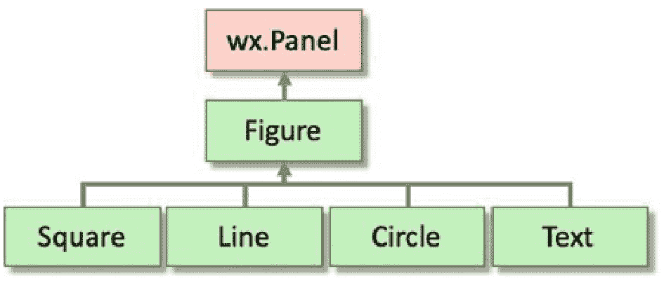

PyDrawFrame类还使用了PyDrawMenuBar和PyDrawToolBar类。前者扩展了wx.MenuBar，添加了PyDraw应用程序中使用的菜单项。后者扩展了wx.ToolBar，并提供了PyDraw中使用的图标。

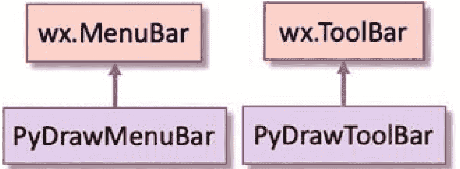

最后一个类是PyDrawApp类，它扩展了wx.App类。


## 对象关系

然而，继承层次结构只是任何面向对象应用程序故事的一部分。下图说明了在运行的应用程序中对象之间如何相互关联。

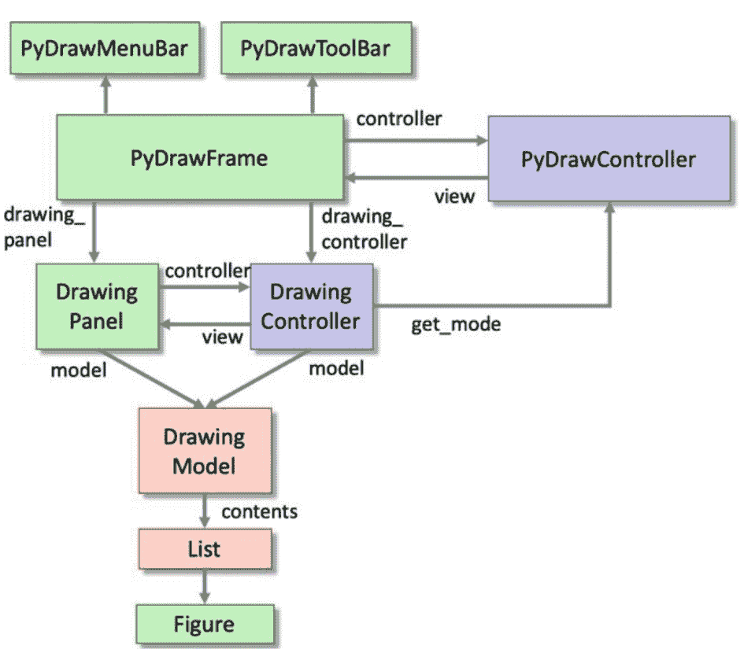

PyDrawFrame负责设置控制器和DrawingPanel。PyDrawController负责处理菜单和工具栏的用户交互。这将图形元素与用户触发的行为分离开来。

DrawingPanel负责显示DrawingModel持有的任何图形。DrawingController管理与DrawingPanel的所有用户交互，包括向模型添加图形和清除模型中的所有图形。DrawingModel保存要显示的图形列表。

## 对象之间的交互

我们现在已经检查了应用程序的物理结构，但尚未检查该应用程序中的对象如何交互。在许多情况下，这可以从应用程序的源代码中提取出来（难度不一）。然而，对于像PyDraw这样由多个不同交互组件组成的应用程序，明确描述系统交互是有用的。

说明对象之间交互的图使用以下约定：

-   实线箭头表示消息发送，
-   方框表示类，
-   括号中的名称表示实例类型，
-   数字表示消息发送的顺序。

这些图基于UML（统一建模语言）符号中的协作图。

## PyDrawApp

当PyDrawApp被实例化时，PyDrawFrame被创建并使用OnInit()方法显示。然后调用MainLoop()方法。如下所示：

```python
class PyDrawApp(wx.App):
    def OnInit(self):
        """ Initialise the GUI display"""
        frame = PyDrawFrame(title='PyDraw')
        frame.Show()
        return True

# Run the GUI application
app = PyDrawApp()
app.MainLoop()
```

## PyDrawFrame构造函数

PyDrawFrame构造函数方法设置UI应用程序的主显示，并初始化控制器和绘图元素。下面使用协作图进行说明：

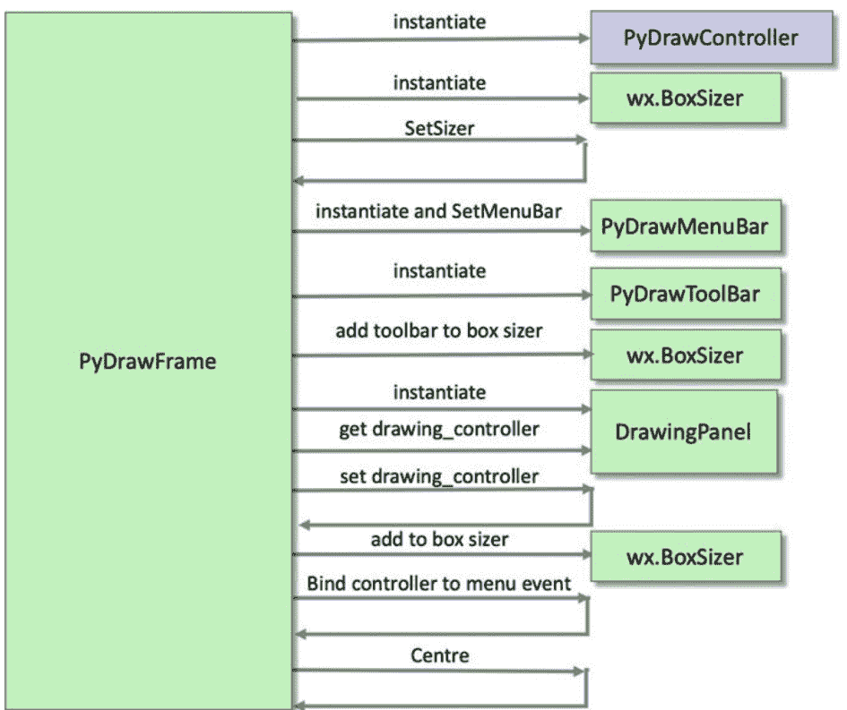

PyDrawFrame构造函数为应用程序设置环境。它创建顶层PyDrawController。它创建DrawingPanel并初始化显示布局。它初始化菜单栏和工具栏。它将控制器的菜单处理程序绑定到菜单，并将自身居中。

## 更改应用程序模式

一个值得注意的有趣之处是当用户从“绘图”菜单中选择一个选项时会发生什么。这允许将模式更改为正方形、圆形、线条或文本。下图展示了当用户在“绘图”菜单上选择“圆形”菜单项时涉及的交互（使用协作图）：

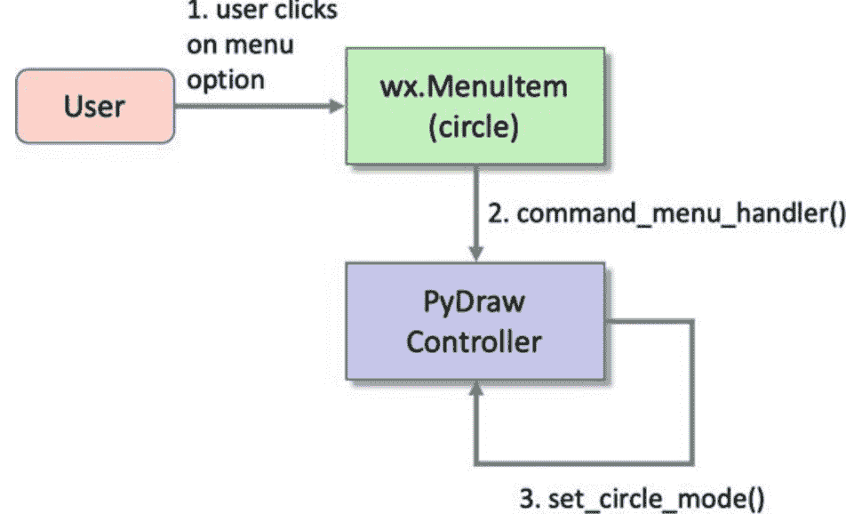

当用户选择其中一个菜单项时，PyDrawController的command_menu_handler()方法被调用。此方法确定选择了哪个菜单项；然后调用相应的设置方法（例如set_circle_mode()或set_line_mode()等）。这些方法将控制器的mode属性设置为适当的值。

## 添加图形对象

用户通过按下鼠标按钮，将图形对象添加到DrawingPanel显示的绘图中。当用户点击绘图面板时，DrawingController的响应如下所示：

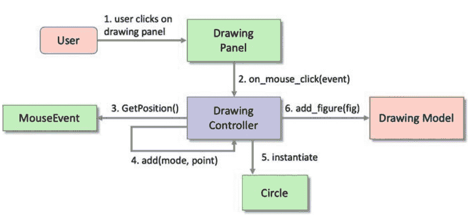

上图说明了用户在绘图面板上按下并释放鼠标按钮以创建新图形时发生的情况。当用户按下鼠标按钮时，会向DrawingController发送一个鼠标点击消息，控制器决定执行什么操作作为响应（见上文）。在PyDraw中，它通过调用mouse_event上的GetPosition()方法来获取事件发生的光标位置。

然后，控制器调用自己的add()方法，传入当前模式和当前鼠标位置。控制器获取当前模式（通过DrawingController实例化时提供的回调方法从PyDrawController获取），并将相应类型的图形添加到DrawingModel中。

add()方法随后根据指定的模式向绘图模型添加一个新图形。

## 类

本节介绍PyDraw应用程序中的类。由于这些类建立在前几章已介绍的概念之上，因此将完整呈现它们，并附上注释以突出其特定实现要点。请注意，代码从wxPython库导入了wx模块，例如：

```python
import wx
```

## PyDrawConstants 类

此类的目的是提供一组常量，可在应用程序的其余部分中引用。它用于为菜单项和工具栏工具使用的ID提供常量。它还提供了用于表示当前模式的常量（以指示应向显示中添加直线、正方形、圆形还是文本）。

```python
class PyDrawConstants:
    LINE_ID = 100
    SQUARE_ID = 102
    CIRCLE_ID = 103
    TEXT_ID = 104
    SQUARE_MODE = 'square'
    LINE_MODE = 'line'
    CIRCLE_MODE = 'circle'
    TEXT_MODE = 'Text'
```

## PyDrawFrame 类

PyDrawFrame类为应用程序提供主窗口。请注意，由于通过MVC架构引入了关注点分离，视图类仅关心组件的布局：

```python
class PyDrawFrame(wx.Frame):
    """ Main Frame responsible for the layout of the UI."""
    def __init__(self, title):
        super().__init__(None, title=title, size=(300, 200))
        # Set up the controller
        self.controller = PyDrawController(self)
        # Set up the layout for the UI
        self.vertical_box_sizer = wx.BoxSizer(wx.VERTICAL)
        self.SetSizer(self.vertical_box_sizer)
        # Set up the menu bar
        self.SetMenuBar(PyDrawMenuBar())
        # Set up the toolbar
        self.vertical_box_sizer.Add(PyDrawToolBar(self), wx.ID_ANY,
                                    wx.EXPAND | wx.ALL)
        # Setup drawing panel
        self.drawing_panel = DrawingPanel(self,
                                          self.controller.get_mode)
        self.drawing_controller = self.drawing_panel.controller
        # Add the Panel to the Frames Sizer
        self.vertical_box_sizer.Add(self.drawing_panel, wx.ID_ANY,
                                    wx.EXPAND | wx.ALL)
        # Set up the command event handling for the menu bar and toolbar
        self.Bind(wx.EVT_MENU, self.controller.command_menu_handler)
        self.Centre()
```

## PyDrawMenuBar 类

PyDrawMenuBar类是wx.MenuBar类的子类，它定义了PyDraw应用程序菜单栏的内容。它通过创建两个wx.Menu对象并将它们添加到菜单栏来实现这一点。每个wx.Menu实现菜单栏上的一个下拉菜单。要添加单个菜单项，使用wx.MenuItem类。这些菜单项被追加到菜单中。菜单本身被追加到菜单栏。请注意，每个菜单项都有一个id，可用于在事件处理程序中识别命令事件的来源。这允许单个事件处理程序处理由多个菜单项生成的事件。

```python
class PyDrawMenuBar(wx.MenuBar):
    def __init__(self):
        super().__init__()
        fileMenu = wx.Menu()
        newMenuItem = wx.MenuItem(fileMenu, wx.ID_NEW, text="New",
                                  kind=wx.ITEM_NORMAL)
        newMenuItem.SetBitmap(wx.Bitmap("new.gif"))
        fileMenu.Append(newMenuItem)
        loadMenuItem = wx.MenuItem(fileMenu, wx.ID_OPEN, text="Open",
                                   kind=wx.ITEM_NORMAL)
        loadMenuItem.SetBitmap(wx.Bitmap("load.gif"))
        fileMenu.Append(loadMenuItem)
        fileMenu.AppendSeparator()
        saveMenuItem = wx.MenuItem(fileMenu, wx.ID_SAVE, text="Save",
                                   kind=wx.ITEM_NORMAL)
        saveMenuItem.SetBitmap(wx.Bitmap("save.gif"))
        fileMenu.Append(saveMenuItem)
        fileMenu.AppendSeparator()
        quit = wx.MenuItem(fileMenu, wx.ID_EXIT,
                           '&Quit\tCtrl+Q')
        fileMenu.Append(quit)
        self.Append(fileMenu, '&File')
        drawingMenu = wx.Menu()
        lineMenuItem = wx.MenuItem(drawingMenu,
                                   PyDrawConstants.LINE_ID, text="Line", kind=wx.ITEM_NORMAL)
        drawingMenu.Append(lineMenuItem)
        squareMenuItem = wx.MenuItem(drawingMenu,
                                     PyDrawConstants.SQUARE_ID, text="Square",
                                     kind=wx.ITEM_NORMAL)
        drawingMenu.Append(squareMenuItem)
        circleMenuItem = wx.MenuItem(drawingMenu,
                                     PyDrawConstants.CIRCLE_ID, text="Circle",
                                     kind=wx.ITEM_NORMAL)
        drawingMenu.Append(circleMenuItem)
        textMenuItem = wx.MenuItem(drawingMenu,
                                   PyDrawConstants.TEXT_ID, text="Text", kind=wx.ITEM_NORMAL)
        drawingMenu.Append(textMenuItem)
        self.Append(drawingMenu, '&Drawing')
```

## PyDrawToolBar 类

DrawToolBar类是wx.ToolBar的子类。该类的构造函数初始化在工具栏中显示的三个工具。Realize()方法用于确保工具被适当地渲染。请注意，使用了适当的id，以便事件处理程序能够识别哪个工具生成了特定的命令事件。通过为相关的菜单项和命令工具重用相同的id，可以使用单个处理程序来管理来自这两种来源的事件。

```python
class PyDrawToolBar(wx.ToolBar):
    def __init__(self, parent):
        super().__init__(parent)
        self.AddTool(toolId=wx.ID_NEW, label="New",
                     bitmap=wx.Bitmap("new.gif"), shortHelp='Open drawing',
                     kind=wx.ITEM_NORMAL)
        self.AddTool(toolId=wx.ID_OPEN, label="Open",
                     bitmap=wx.Bitmap("load.gif"), shortHelp='Open drawing',
                     kind=wx.ITEM_NORMAL)
        self.AddTool(toolId=wx.ID_SAVE, label="Save",
                     bitmap=wx.Bitmap("save.gif"), shortHelp='Save drawing',
                     kind=wx.ITEM_NORMAL)
        self.Realize()
```

## PyDrawController 类

此类提供顶层视图的控制元素。它维护当前模式，并实现一个可以处理来自菜单项和工具栏工具的事件的处理程序。使用id来标识每个单独的菜单或工具，这允许向框架注册单个处理程序。

```python
class PyDrawController:
    def __init__(self, view):
        self.view = view
        # Set the initial mode
        self.mode = PyDrawConstants.SQUARE_MODE
    def set_circle_mode(self):
        self.mode = PyDrawConstants.CIRCLE_MODE
    def set_line_mode(self):
        self.mode = PyDrawConstants.LINE_MODE
    def set_square_mode(self):
        self.mode = PyDrawConstants.SQUARE_MODE
    def set_text_mode(self):
        self.mode = PyDrawConstants.TEXT_MODE
    def clear_drawing(self):
        self.view.drawing_controller.clear()
    def get_mode(self):
        return self.mode
    def command_menu_handler(self, command_event):
        id = command_event.GetId()
        if id == wx.ID_NEW:
            print('Clear the drawing area')
            self.clear_drawing()
        elif id == wx.ID_OPEN:
            print('Open a drawing file')
        elif id == wx.ID_SAVE:
            print('Save a drawing file')
        elif id == wx.ID_EXIT:
            print('Quit the application')
            self.view.Close()
        elif id == PyDrawConstants.LINE_ID:
            print('set drawing mode to line')
            self.set_line_mode()
        elif id == PyDrawConstants.SQUARE_ID:
            print('set drawing mode to square')
            self.set_square_mode()
        elif id == PyDrawConstants.CIRCLE_ID:
            print('set drawing mode to circle')
            self.set_circle_mode()
        elif id == PyDrawConstants.TEXT_ID:
            print('set drawing mode to Text')
            self.set_text_mode()
        else:
            print('Unknown option', id)
```

## DrawingModel 类

DrawingModel类有一个contents属性，用于保存绘图中的所有图形。它还提供了一些便捷方法来重置内容和向内容中添加图形。

```python
class DrawingModel:
    def __init__(self):
        self.contents = []
    def clear_figures(self):
        self.contents = []
    def add_figure(self, figure):
        self.contents.append(figure)
```

DrawingModel是一个相对简单的模型，它仅仅在列表中记录一组图形对象。这些可以是任何类型的对象，并且只要它们实现了on_paint()方法，就可以以任何方式显示。正是对象本身决定了它们在绘制时的外观。

## DrawingPanel 类

DrawingPanel 类是 wx.Panel 类的子类。它为绘图数据模型提供视图。这采用了经典的 MVC 架构，包含一个模型（DrawingModel）、一个视图（即 DrawingPanel）和一个控制器（DrawingController）。

DrawingPanel 会实例化自己的 DrawingController 来处理鼠标事件。

它还注册了绘图事件，以便知道何时刷新显示。

```python
class DrawingPanel(wx.Panel):
    def __init__(self, parent, get_mode):
        super().__init__(parent, -1)
        self.SetBackgroundColour(wx.Colour(255, 255, 255))
        self.model = DrawingModel()
        self.controller = DrawingController(self, self.model, get_mode)
        self.Bind(wx.EVT_PAINT, self.on_paint)
        self.Bind(wx.EVT_LEFT_DOWN, self.controller.on_mouse_click)

    def on_paint(self, event):
        """set up the device context (DC) for painting"""
        dc = wx.PaintDC(self)
        for figure in self.model.contents:
            figure.on_paint(dc)
```

## DrawingController 类

DrawingController 类为与 DrawingModel（模型）和 DrawingPanel（视图）类一起使用的顶层 MVC 架构提供控制类。特别是，它通过 `on_mouse_click()` 方法处理 DrawingPanel 中的鼠标事件。

它还定义了一个 `add` 方法，用于向 DrawingModel 添加图形（具体图形取决于 PyDrawController 的当前模式）。最后一个方法 `clear()` 会从绘图模型中移除所有图形并刷新显示。

```python
class DrawingController:
    def __init__(self, view, model, get_mode):
        self.view = view
        self.model = model
        self.get_mode = get_mode

    def on_mouse_click(self, mouse_event):
        point = mouse_event.GetPosition()
        self.add(self.get_mode(), point)

    def add(self, mode, point, size=30):
        if mode == PyDrawConstants.SQUARE_MODE:
            fig = Square(self.view, point, wx.Size(size, size))
        elif mode == PyDrawConstants.CIRCLE_MODE:
            fig = Circle(self.view, point, size)
        elif mode == PyDrawConstants.TEXT_MODE:
            fig = Text(self.view, point, size)
        elif mode == PyDrawConstants.LINE_MODE:
            fig = Line(self.view, point, size)
        self.model.add_figure(fig)

    def clear(self):
        self.model.clear_figures()
        self.view.Refresh()
```

## Figure 类

Figure 类（Figure 类层次结构中的抽象超类）捕获了绘图中显示的图形对象的共同元素。`point` 定义了图形的位置，而 `size` 属性定义了图形的大小。请注意，Figure 是 wx.Panel 的子类，因此显示是通过内部面板构建的，各种图形形状绘制在这些面板上。

Figure 类定义了一个抽象方法 `on_paint(dc)`，所有具体子类都必须实现此方法。此方法应定义如何在绘图面板上绘制形状。

```python
class Figure(wx.Panel):
    def __init__(self, parent, id=wx.ID_ANY, pos=None,
                 size=None, style=wx.TAB_TRAVERSAL):
        wx.Panel.__init__(self, parent, id=id, pos=pos,
                          size=size, style=style)
        self.point = pos
        self.size = size

    @abstractmethod
    def on_paint(self, dc):
        pass
```

## Square 类

这是 Figure 的一个子类，指定了如何在绘图中绘制正方形。它实现了从 Figure 继承的 `on_paint()` 方法。

```python
class Square(Figure):
    def __init__(self, parent, pos, size):
        super().__init__(parent=parent, pos=pos, size=size)

    def on_paint(self, dc):
        dc.DrawRectangle(self.point, self.size)
```

## Circle 类

这是 Figure 的另一个子类。它通过绘制一个圆来实现 `on_paint()` 方法。请注意，形状将在通过 Figure 类（使用 `super` 调用）定义的面板大小内绘制。因此，需要确保圆适合这些边界。这意味着必须使用 `size` 属性来生成适当的半径。另请注意，设备上下文的 `DrawCircle()` 方法接受一个作为圆心的点，因此这也必须计算。

```python
class Circle(Figure):
    def __init__(self, parent, pos, size):
        super().__init__(parent=parent, pos=pos, size=wx.Size(size, size))
        self.radius = (size - 10) / 2
        self.circle_center = wx.Point(self.point.x + self.radius, self.point.y + self.radius)

    def on_paint(self, dc):
        dc.DrawCircle(pt=self.circle_center, radius=self.radius)
```

## Line 类

这是 Figure 的另一个子类。在这个非常简单的例子中，为线条生成了一个默认的终点。或者，程序可以查找鼠标释放事件，获取该位置的鼠标坐标，并将其用作线条的终点。

```python
class Line(Figure):
    def __init__(self, parent, pos, size):
        super().__init__(parent=parent, pos=pos,
                         size=wx.Size(size, size))
        self.end_point = wx.Point(self.point.x + size, self.point.y + size)

    def on_paint(self, dc):
        dc.DrawLine(pt1=self.point, pt2=self.end_point)
```

## Text 类

这也是 Figure 的一个子类。使用默认值作为要显示的文本；但是，可以向用户显示一个对话框，允许他们输入希望显示的文本：

```python
class Text(Figure):
    def __init__(self, parent, pos, size):
        super().__init__(parent=parent, pos=pos, size=wx.Size(size, size))

    def on_paint(self, dc):
        dc.DrawText(text='Text', pt=self.point)
```

## 参考资料

以下提供了一些关于用户界面中模型-视图-控制器架构的背景信息。

- G.E. Krasner, S.T. Pope, A cookbook for using the model-view controller user interface paradigm in small talk-80. JOOP 1(3), 26–49 (1988).

## 尝试

你可以通过添加以下功能来进一步开发 PyDraw 应用程序：

- **删除选项**：你可以在窗口中添加一个标记为“删除”的按钮。它应将模式设置为“删除”。必须修改 DrawingPanel，以便 `mouseReleased` 方法向绘图发送删除消息。绘图必须找到并移除相应的图形对象，并向自身发送更改消息。
- **调整大小选项**：这涉及识别选择了哪个形状，然后使用对话框输入新大小，或提供某种选项，允许使用鼠标指示形状的大小。

## 游戏编程简介

### 简介

游戏编程由开发人员/编码员执行，他们实现驱动游戏的逻辑。

历史上，游戏开发人员做所有事情；他们编写代码、设计精灵和图标、处理游戏玩法、处理声音和音乐、生成所需的任何动画等。然而，随着游戏行业的成熟，游戏公司已经发展出特定的角色，包括计算机图形（CG）动画师、艺术家、游戏开发人员以及游戏引擎和物理引擎开发人员等。

参与代码开发的人员可能开发物理引擎、游戏引擎、游戏本身等。这些开发人员专注于游戏的不同方面。例如，游戏引擎开发人员专注于创建游戏运行的框架。反过来，物理引擎开发人员将专注于实现模拟游戏世界物理背后的数学（例如重力对该世界中角色和组件的影响）。在许多情况下，还会有开发人员从事游戏 AI 引擎的工作。这些开发人员将专注于提供允许游戏或游戏中的角色智能运行的设施。

那些开发实际游戏玩法的人将使用这些引擎和框架来创建最终的整体结果。正是他们赋予了游戏生命，并使其成为一种愉快（且可玩）的体验。

## 游戏框架和库

有许多框架和库可用，允许你创建从简单游戏到具有无限世界的大型复杂角色扮演游戏的任何内容。

一个例子是 Unity 框架，可以与 C# 编程语言一起使用。另一个这样的框架是 Unreal 引擎，与 C++ 编程语言一起使用。

Python 也被用于游戏开发，一些著名的游戏标题以某种方式依赖于它。例如，Digital Illusions CE 的《战地 2》是一款军事模拟第一人称射击游戏。《战地英雄》使用 Python 处理涉及游戏模式和得分的部分游戏逻辑。

其他使用Python的游戏包括《文明IV》（用于许多任务）、《加勒比海盗Online》和《守望先锋》（其选择逻辑由Python实现）。

Python还作为脚本引擎嵌入在Autodesk Maya等工具中，Maya是一款常用于游戏的计算机动画工具包。

## Python游戏开发

对于想要了解更多游戏开发知识的人；Python能提供很多帮助。网上有许多示例，以及几个面向游戏的框架。

Python游戏开发可用的框架/库包括：

- Arcade。这是一个用于创建2D风格视频游戏的Python库。
- pyglet是一个用于Python的窗口和多媒体库，也可用于游戏开发。
- Cocos2d是一个构建在pyglet之上的2D游戏框架。
- pygame可能是Python世界中用于创建游戏最广泛使用的库。pygame还有许多扩展，有助于创建各种不同类型的游戏。

我们将在本书接下来的两章中重点介绍pygame。Python游戏开发者感兴趣的其他库包括：

- PyODE。这是OpenDynamics Engine的开源Python绑定，OpenDynamics Engine是一个开源物理引擎。
- pymunk Pymunk是一个易于使用的2D物理库，当你需要在Python中进行2D刚体物理模拟时可以使用它。当你在游戏、演示或其他应用中需要2D物理效果时，它非常有用。它构建在2D物理库Chipmunk之上。
- pyBox2D pybox2d是一个用于游戏和简单模拟的2D物理库。它基于用C++编写的Box2D库。它支持多种形状类型（圆形、多边形、细线段）以及多种关节类型（旋转、棱柱、车轮等）。
- Blender。这是一个开源的3D计算机图形软件工具集，用于创建动画电影、视觉特效、艺术作品、3D打印模型、交互式3D应用和视频游戏。Blender的功能包括3D建模、纹理贴图、光栅图形编辑、骨骼绑定和蒙皮等。Python可以用作创建、原型设计、游戏逻辑等的脚本工具。
- Quake Army Knife，这是一个用于开发基于Quake引擎的3D游戏地图的环境。它用Delphi和Python编写。

## 使用Pygame

在接下来的两章中，我们将探索核心pygame库以及如何使用它来开发交互式计算机游戏。下一章将探讨pygame本身及其提供的功能。随后的章节将开发一个简单的交互式游戏，用户在其中移动一艘星际飞船，避开垂直向下滚动的流星。

## 在线资源

有关游戏编程和本章提到的库的更多信息，请参阅：

- [https://unity.com/](https://unity.com/) 用于游戏开发的C#框架。
- [https://www.unrealengine.com](https://www.unrealengine.com) 用于C++游戏开发。
- [http://arcade.academy/](http://arcade.academy/) 提供Arcade游戏框架的详细信息。
- [http://www.pyglet.org/](http://www.pyglet.org/) 获取pyglet库的信息。
- [http://cocos2d.org/](http://cocos2d.org/) 是Cocos2d框架的主页。
- [https://www.pygame.org](https://www.pygame.org) 获取pygame的信息。
- [http://pyode.sourceforge.net/](http://pyode.sourceforge.net/) 获取PyODE对Open Dynamics Engine绑定的详细信息。
- [http://www.pymunk.org/](http://www.pymunk.org/) 提供pymunk的信息。
- [https://github.com/pybox2d/pybox2d](https://github.com/pybox2d/pybox2d) 这是pyBox2d的GitHub仓库。
- [https://git.blender.org/gitweb/gitweb.cgi/blender.git](https://git.blender.org/gitweb/gitweb.cgi/blender.git) Blender的GitHub仓库。
- [https://sourceforge.net/p/quark/code](https://sourceforge.net/p/quark/code) Quake Army Knife的SourceForge仓库。
- [https://www.autodesk.co.uk/products/maya/overview](https://www.autodesk.co.uk/products/maya/overview) 获取Autodesk Maya计算机动画软件的信息。

## 使用pygame构建游戏

### 简介

pygame是一个跨平台、免费且开源的Python库，旨在简化构建多媒体应用程序（如游戏）的过程。pygame的开发始于2000年10月，pygame 1.0版本在六个月后发布。本章讨论的pygame版本是1.9.6。如果你使用的是更新的版本，请检查所做的更改，看看它们是否对这里介绍的示例有任何影响。

pygame构建在SDL库之上。SDL（或简单直接媒体层）是一个跨平台开发库，旨在通过OpenGL和Direct3D提供对音频、键盘、鼠标、游戏杆和图形硬件的访问。为了提高可移植性，pygame还支持多种额外的后端，包括WinDIB、X11、Linux帧缓冲等。

SDL官方支持Windows、Mac OS X、Linux、iOS和Android（尽管其他平台也非官方支持）。SDL本身是用C编写的，pygame提供了对SDL的封装。然而，pygame添加了SDL中没有的功能，使创建图形或视频游戏变得更容易。这些功能包括向量数学、碰撞检测、2D精灵场景图管理、MIDI支持、摄像机、像素数组操作、变换、滤波、高级FreeType字体支持和绘图。

本章的其余部分将介绍pygame、关键概念；关键模块、类和函数，以及一个非常简单的第一个pygame应用程序。下一章将逐步开发一个简单的街机风格视频游戏，展示如何使用pygame创建游戏。

### 显示表面

显示表面（也称为显示器）是pygame游戏最重要的部分。它是游戏的主窗口显示，可以是任何大小，但你只能有一个显示表面。

在许多方面，显示表面就像一张空白的纸，你可以在上面绘画。表面本身由像素组成，像素从左上角的0,0开始编号，像素位置在x轴和y轴上索引。如下所示：

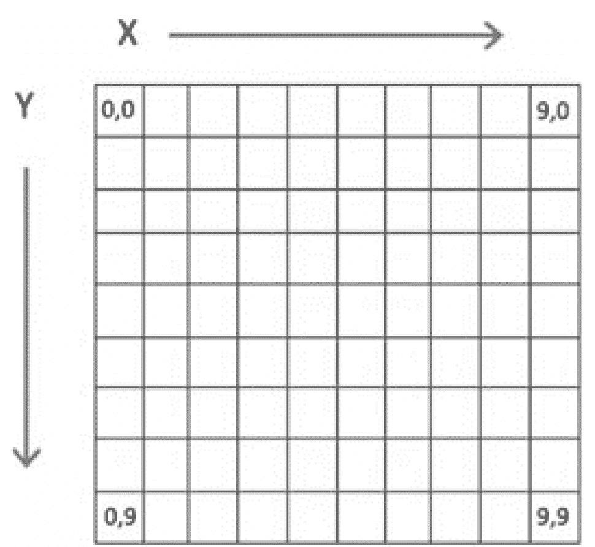

上图说明了表面内像素的索引方式。实际上，表面可以用来绘制线条、形状（如矩形、正方形、圆形和椭圆）、显示图像、操作单个像素等。线条从一个像素位置绘制到另一个像素位置（例如，从位置0,0到位置9,0，这将在上面的显示表面顶部绘制一条线）。图像可以在显示表面内显示，给定一个起始点，如1, 1。

显示表面由`pygame.display.set_mode()`函数创建。该函数接受一个元组，可用于指定要返回的显示表面的大小。例如：

```
display_surface = pygame.display.set_mode((400, 300))
```

这将创建一个400x300像素的显示表面（窗口）。

一旦你有了显示表面，你可以用合适的背景颜色填充它（默认是黑色），但如果你想要不同的背景颜色或想要清除表面上之前绘制的所有内容，那么你可以使用表面的`fill()`方法：

```
WHITE = (255, 255, 255)
display_surface.fill(WHITE)
```

`fill`方法接受一个元组，该元组用于定义红、绿、蓝（或RGB）颜色。尽管上面的例子使用了一个有意义的名称来表示白色所用的RGB值；当然没有要求这样做（尽管这被认为是良好的实践）。

为了提高性能，你对显示表面所做的任何更改实际上都在后台发生，并且在你调用表面的`update()`或`flip()`方法之前，不会渲染到用户看到的实际显示上。例如：

- `pygame.display.update()`
- `pygame.display.flip()`

`update()`方法将使用后台对显示所做的所有更改重绘显示。它有一个可选参数，允许你指定要更新的显示区域（这使用一个Rect定义，Rect表示屏幕上的一个矩形区域）。`flip()`方法总是刷新整个显示（因此与不带参数的`update()`方法完全相同）。

另一个方法，虽然不是专门的显示表面方法，但在创建显示表面时经常使用，它为顶级窗口提供标题或标题。这就是`pygame.display.set_caption()`函数。例如：

```
pygame.display.set_caption('Hello World')
```

这将给顶级窗口设置标题（或标题）为“Hello World”。

### 事件

正如前面章节描述的图形用户界面系统拥有一个事件循环，允许程序员了解用户正在做什么（在那些情况下，通常是选择菜单项、点击按钮或输入数据等）；pygame 也有一个事件循环，允许游戏了解玩家正在做什么。例如，用户可能按下左或右箭头键。这由一个事件来表示。

## 事件类型

发生的每个事件都有相关信息，例如该事件的类型。例如：

-   按下一个键将产生 `KEYDOWN` 类型的事件，而释放一个键将产生 `KEYUP` 事件类型。
-   选择窗口关闭按钮将生成 `QUIT` 事件类型等。
-   使用鼠标可以生成 `MOUSEMOTION` 事件以及 `MOUSEBUTTONDOWN` 和 `MOUSEBUTTONUP` 事件类型。
-   使用操纵杆可以生成几种不同类型的事件，包括 `JOYAXISMOTION`、`JOYBALLMOTION`、`JOYBUTTONDOWN` 和 `JOYBUTTONUP`。

这些事件类型告诉你发生了什么来生成该事件。这意味着你可以选择要处理哪些类型的事件，并忽略其他事件。

## 事件信息

每种类型的事件对象都提供与该事件相关的信息。例如，一个键盘导向的事件对象将提供实际按下的键，而一个鼠标导向的事件对象将提供鼠标位置、按下了哪个按钮等信息。如果你尝试访问一个事件对象上不支持的属性，则会产生错误。

以下列出了不同事件类型可用的一些属性：

-   `KEYDOWN` 和 `KEYUP`，事件有一个 `key` 属性和一个 `mod` 属性（指示是否还按下了其他修饰键，如 Shift）。
-   `MOUSEBUTTONUP` 和 `MOUSEBUTTONDOWN` 有一个 `pos` 属性，它包含一个元组，表示鼠标在底层表面上的 x 和 y 坐标位置。它还有一个 `button` 属性，指示按下了哪个鼠标按钮。
-   `MOUSEMOTION` 有 `pos`、`rel` 和 `buttons` 属性。`pos` 是一个元组，表示鼠标光标的 x 和 y 位置。`rel` 属性表示鼠标移动的量，`buttons` 表示鼠标按钮的状态。

例如，如果我们想检查键盘事件类型，然后检查按下的键是否是空格键，那么我们可以这样写：

```
if event.type == pygame.KEYDOWN:
    # Check to see which key is pressed
    if event.key == pygame.K_SPACE:
        print('space')
```

这表示如果是一个按键事件，并且实际按键是空格键；则打印字符串 'space'。

有许多键盘常量用于表示键盘上的键，上面使用的 `pygame.K_SPACE` 常量只是其中之一。

所有键盘常量都以 'K_' 为前缀，后跟键或键的名称，例如：

-   `K_TAB`、`K_SPACE`、`K_PLUS`、`K_o`、`K_1`、`K_AT`、`K_a`、`K_b`、`K_z`、`K_DELETE`、`K_DOWN`、`K_LEFT`、`K_RIGHT`、`K_UP` 等。

还提供了用于修饰键状态的进一步键盘常量，可以与上述常量组合使用，例如 `KMOD_SHIFT`、`KMOD_CAPS`、`KMOD_CTRL` 和 `KMOD_ALT`。

## 事件队列

事件通过事件队列提供给 pygame 应用程序。事件队列用于在事件发生时将它们收集在一起。例如，假设用户在程序有机会处理它们之前点击了两次鼠标并按了两次键；那么事件队列中将有四个事件，如下所示：

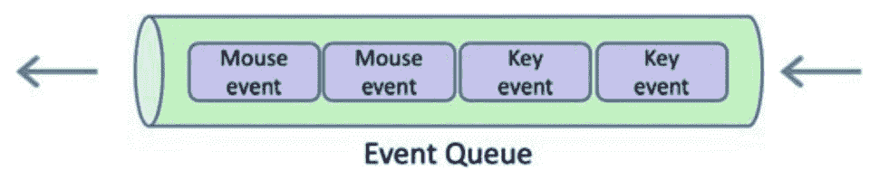

然后应用程序可以从事件队列获取一个可迭代对象，并依次处理事件。当程序正在处理这些事件时，可能会发生更多事件，并将它们添加到事件队列中。当程序完成处理初始事件集合后，它可以获取下一组要处理的事件。

这种方法的一个显著优点是永远不会丢失任何事件；也就是说，如果用户在程序处理前一组事件时点击了两次鼠标；它们将被记录并添加到事件队列中。另一个优点是事件将按照它们发生的顺序呈现给程序。

`pygame.event.get()` 函数将读取事件队列中当前的所有事件（将它们从事件队列中移除）。该方法返回一个事件列表，这是一个包含已读取事件的可迭代列表。然后可以依次处理每个事件。例如：

```
for event in pygame.event.get():
    if event.type == pygame.QUIT:
        print('Received Quit Event:')
    elif event.type == pygame.MOUSEBUTTONDOWN:
        print('Received Mouse Event')
    elif event.type == pygame.KEYDOWN:
        print('Received KeyDown Event')
```

在上面的代码片段中，从事件队列获取了一个包含当前事件集的事件列表。然后 `for` 循环依次处理每个事件，检查类型并打印相应的消息。

你可以使用这种方法来触发适当的行为，例如在屏幕上移动图像或计算玩家得分等。但是，请注意，如果此行为耗时过长，可能会使游戏难以进行（尽管本章和下一章的示例足够简单，这不是问题）。

## 第一个 pygame 应用程序

我们现在到了可以将到目前为止所学的内容整合起来，创建一个简单的 pygame 应用程序的时候了。

在使用新的编程语言或新的应用程序框架时，创建一个 "hello world" 风格的程序是很常见的。其目的是探索语言或框架的核心元素，以使用该语言或框架生成最基本形式的应用程序。因此，我们将使用 pygame 实现尽可能基本的应用程序。

我们将创建的应用程序将显示一个 pygame 窗口，标题为 'Hello World'。然后我们将能够退出游戏。虽然严格来说这不是一个游戏，但它确实具备了 pygame 应用程序的基本架构。

简单的 Hello World 游戏将初始化 pygame 和图形显示。然后它将有一个主游戏循环，该循环将持续运行，直到用户选择退出应用程序。然后它将关闭 pygame。程序创建的显示在 Mac 和 Windows 操作系统下如下所示：


要退出程序，请单击你所使用的窗口系统的退出按钮。

简单的 Hello World 游戏如下所示：

```python
import pygame

def main():
    print('Starting Game')
    print('Initialising pygame')
    pygame.init()   # Required by every pygame application
    print('Initialising HelloWorldGame')
    pygame.display.set_mode((200, 100))
    pygame.display.set_caption('Hello World')
    print('Update display')
    pygame.display.update()
    print('Starting main Game Playing Loop')
    running = True
    while running:
        for event in pygame.event.get():
            if event.type == pygame.QUIT:
                print('Received Quit Event:', event)
                running = False
    print('Game Over')
    pygame.quit()

if __name__ == '__main__':
    main()
```

这个例子突出了几个关键步骤，这些步骤是：

1.  导入 pygame。pygame 当然不是 Python 中默认可用的模块之一。你必须首先将 pygame 导入到你的代码中。`import pygame` 语句将 pygame 模块导入到你的代码中，并使 pygame 中的函数和类对你可用（注意大小写 - pygame 与 PyGame 不是同一个模块名）。通常还会发现程序从 `pygame.locals import`。这会将几个常量和函数添加到你的程序的命名空间中。在这个非常简单的例子中，我们不需要这样做。
2.  初始化 pygame。几乎每个 pygame 模块都需要以某种方式初始化，最简单的方法是调用 `pygame.init()`。这将执行设置 pygame 环境以供使用所需的步骤。如果你忘记调用此函数，通常会收到错误消息，例如 `pygame.error: video system not initialized`（或类似的消息）。如果你收到这样的消息，请检查你是否调用了 `pygame.init()`。请注意，如果需要，你可以初始化单个 pygame 模块（例如，可以使用 `pygame.font.init()` 初始化 `pygame.font` 模块）。然而，`pygame.init()` 是设置 pygame 最常用的方法。

3.  设置显示。初始化 pygame 框架后，你就可以设置显示了。在上面的代码示例中，显示是通过 `pygame.display.set_mode()` 函数设置的。该函数接受一个元组，用于指定要创建的窗口大小（本例中为宽 200 像素，高 100 像素）。请注意，如果你尝试通过传递两个参数而不是一个元组来调用此函数，将会出错。该函数返回绘图表面或屏幕/窗口，可用于在游戏中显示图标、消息、形状等项目。由于我们的示例非常简单，我们没有费心将其保存到变量中。然而，任何比这更复杂的程序都需要这样做。我们还设置了窗口/框架的标题（或标题）。这会显示在窗口的标题栏中。

4.  渲染显示。我们现在调用 `pygame.display.update()` 函数。此函数会绘制显示的当前细节。目前这是一个空白窗口。然而，在游戏中，通常会在后台对显示执行一系列更新，然后在程序准备好更新显示时调用此函数。这会将一系列更新批处理在一起，并导致显示刷新。在复杂的显示中，可以指定显示的哪些部分需要重绘，而不是重绘整个窗口。这是通过向 `update()` 函数传递一个参数来指示要重绘的矩形区域来实现的。然而，我们的示例非常简单，重绘整个窗口就可以了，因此我们不需要向该函数传递任何参数。

5.  主游戏循环。通常有一个主游戏循环，用于驱动用户输入的处理、修改游戏状态和更新显示。这在上面由 `while running:` 循环表示。局部变量 `running` 初始化为 `True`。这意味着 `while` 循环确保游戏持续运行，直到用户选择退出游戏，此时 `running` 变量被设置为 `False`，导致循环退出。在许多情况下，此循环会调用 `update()` 来刷新显示。上面的示例没有这样做，因为显示内容没有变化。然而，本章后面开发的示例将说明这个概念。

6.  监视驱动游戏的事件。如前所述，事件队列用于允许用户输入排队，然后由游戏处理。在上面显示的简单示例中，这由一个 `for` 循环表示，该循环使用 `pygame.event.get()` 接收事件，然后检查事件是否为 `pygame.QUIT` 事件。如果是，则将 `running` 标志设置为 `False`。这将导致游戏的主 `while` 循环终止。

7.  完成后退出 pygame。在 pygame 中，任何具有 `init()` 函数的模块都有一个等效的 `quit()` 函数，可用于执行任何清理操作。由于我们在程序开始时调用了 `pygame` 模块的 `init()`，因此我们需要在程序结束时调用 `pygame.quit()`，以确保所有内容都得到适当的清理。

此程序示例运行生成的输出如下：

```
pygame 1.9.6
Hello from the pygame community.
https://www.pygame.org/contribute.html Starting Game
Initialising pygame Initialising HelloWorldGame Update display
Starting main Game Playing Loop
Received Quit Event: <Event(12-Quit {})> Game Over
```

## 进一步概念

pygame 中有许多功能超出了本书所能涵盖的范围，但下面将讨论一些更常见的功能。

**表面是分层的。** 顶层显示表面可以包含其他表面，这些表面可用于绘制图像或文本。反过来，像面板这样的容器可以渲染表面以显示图像或文本等。

**其他类型的表面。** 主要的显示表面并不是 pygame 中唯一的表面。例如，当图像（如 PNG 或 JPEG 图像）加载到游戏中时，它会被渲染到一个表面上。然后，该表面可以显示在另一个表面（如显示表面）中。这意味着你可以对显示表面执行的任何操作，也可以对任何其他表面执行，例如在其上绘制、放置文本、着色、添加另一个图标等。

**字体。** `pygame.font.Font` 对象用于创建字体，该字体可用于将文本渲染到表面上。`render` 方法返回一个带有渲染文本的表面，该表面可以显示在另一个表面（如显示表面）中。请注意，你不能将文本写入现有表面，你必须始终获取一个新表面（使用 `render`），然后将其添加到现有表面。文本只能以单行显示，并且保存文本的表面将具有渲染文本所需的尺寸。例如：

```
text_font = pygame.font.Font('freesansbold.ttf', 18)
text_surface = text_font.render('Hello World',
antialias=True, color=BLUE)
```

这会使用指定的字体和指定的字体大小（本例中为 18）创建一个新的 Font 对象。然后，它将使用指定的字体和字体大小，以蓝色将字符串 'Hello World' 渲染到一个新表面上。指定 `antialias` 为 `True` 表示我们希望平滑屏幕上文本的边缘。

**矩形（或 Rects）。** `pygame.Rect` 类是一个用于表示矩形坐标的对象。一个 Rect 可以由左上角坐标加上宽度和高度组合创建。为了灵活性，许多期望 Rect 对象的函数也可以接受一个类似 Rect 的列表；这是一个包含创建 Rect 对象所需数据的列表。Rects 在 pygame 游戏中非常有用，因为它们可用于定义游戏对象的边界。这意味着它们可以在游戏中用于检测两个对象是否发生碰撞。这变得特别容易，因为 Rect 类提供了几种碰撞检测方法：

- `pygame.Rect.contains()` 测试一个矩形是否在另一个矩形内部
- `pygame.Rect.collidepoint()` 测试一个点是否在矩形内部
- `pygame.Rect.colliderect()` 测试两个矩形是否重叠
- `pygame.Rect.collidelist()` 测试列表中的一个矩形是否相交
- `pygame.Rect.collidelistall()` 测试列表中的所有矩形是否相交
- `pygame.Rect.collidedict()` 测试字典中的一个矩形是否相交
- `pygame.Rect.collidedictall()` 测试字典中的所有矩形是否相交

该类还提供了其他几种实用方法，例如 `move()` 用于移动矩形，`inflate()` 用于增大或缩小矩形的大小。

**绘制形状。** `pygame.draw` 模块有许多函数可用于在表面上绘制线条和形状，例如：

```
pygame.draw.rect(display_surface, BLUE, [x, y, WIDTH, HEIGHT])
```

这将在显示表面上绘制一个填充的蓝色矩形（默认）。矩形将位于由 `x` 和 `y` 指示的位置（在表面上）。这表示矩形的左上角。矩形的宽度和高度表示其大小。请注意，这些尺寸是在一个列表中定义的，这种结构被称为类似 rect（见下文）。如果你不想要填充的矩形（即你只想要轮廓），那么你可以使用可选的 `width` 参数来指定外边缘的厚度。其他可用的方法包括：

- `pygame.draw.polygon()` 绘制具有任意边数的形状
- `pygame.draw.circle()` 绘制围绕一个点的圆
- `pygame.draw.ellipse()` 在矩形内绘制一个圆形形状
- `pygame.draw.arc()` 绘制椭圆的一部分
- `pygame.draw.line()` 绘制一条直线段
- `pygame.draw.lines()` 绘制多条连续的线段
- `pygame.draw.aaline()` 绘制精细的抗锯齿线
- `pygame.draw.aalines()` 绘制连接的抗锯齿线序列

**图像。** `pygame.image` 模块包含用于加载、保存和转换图像的函数。当图像加载到 pygame 中时，它由一个 Surface 对象表示。这意味着可以以与任何其他表面完全相同的方式绘制、操作和处理图像，这提供了极大的灵活性。

该模块至少仅支持加载未压缩的 BMP 图像，但通常也支持 JPEG、PNG、GIF（非动画）、BMP、TIFF 以及其他格式。

然而，在保存图像时，它只支持有限的格式集；这些格式是 BMP、TGA、PNG 和 JPEG。

可以使用以下命令从文件加载图像：

```
image_surface = pygame.image.load(filename).convert()
```

这将把指定文件中的图像加载到一个Surface上。你可能会对`pygame.image.load()`函数返回的对象上调用`convert()`方法感到疑惑。该函数返回一个用于显示文件中图像的Surface。我们在这个Surface上调用`convert()`方法，并非为了将图像从特定文件格式（如PNG或JPEG）转换，而是用于转换Surface所使用的像素格式。如果Surface使用的像素格式与显示格式不同，那么每次在屏幕上显示图像时都需要进行实时转换；这可能是一个相当耗时（且不必要）的过程。因此，我们在加载图像时一次性完成此操作，这意味着它不会阻碍运行时性能，并且可能在某些系统上显著提升性能。

一旦你有了一个包含图像的Surface，就可以使用`Surface.blit()`方法将其渲染到另一个Surface上，例如显示Surface。例如：

```
display_surface.blit(image_surface, (x, y))
```

请注意，位置参数是一个元组，指定了图像在显示Surface上的x和y坐标。严格来说，`blit()`方法是将一个Surface（源Surface）绘制到另一个Surface的目标坐标上。因此，目标Surface不一定是顶层的显示Surface。

Clock。一个Clock对象是一个可用于跟踪时间的对象。具体来说，它可以用于定义游戏的帧率，即每秒渲染的帧数。这是通过`Clock.tick()`方法实现的。该方法应在每帧调用一次（且仅一次）。如果你向`tick()`函数传递可选的帧率参数，那么pygame将确保游戏的刷新率低于给定的每秒tick数。这可用于帮助限制游戏的运行时速度。通过每帧调用`clock.tick(30)`，程序将永远不会以超过每秒30帧的速度运行。

## 一个更具交互性的pygame应用

我们之前看到的第一个pygame应用只是显示了一个标题为“Hello World”的窗口。我们现在可以通过使用上面讨论的一些功能来稍微扩展一下这个应用。

新应用将添加一些鼠标事件处理。这将允许我们在用户点击窗口时获取鼠标位置，并在该点绘制一个小的蓝色方框。

如果用户多次点击鼠标，我们将绘制多个蓝色方框。如下所示。

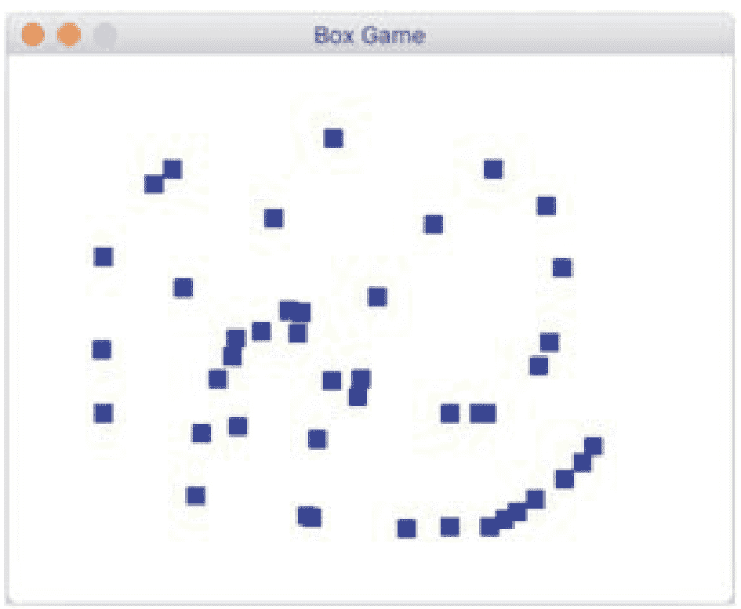

这仍然算不上一个游戏，但确实使pygame应用更具交互性。

用于生成此应用的程序如下所示：

```
import pygame
FRAME_REFRESH_RATE = 30
BLUE = (0, 0, 255)
BACKGROUND = (255, 255, 255) # White
WIDTH = 10
HEIGHT = 10
def main():
    print('Initialising PyGame')
    pygame.init() # Required by every PyGame application
    print('Initialising Box Game')
    display_surface = pygame.display.set_mode((400, 300))
    pygame.display.set_caption('Box Game')
    print('Update display')
    pygame.display.update()
    print('Setup the Clock')
    clock = pygame.time.Clock()
    # Clear the screen of current contents
    display_surface.fill(BACKGROUND)
    print('Starting main Game Playing Loop')
    running = True
    while running:
        for event in pygame.event.get():
            if event.type == pygame.QUIT:
                print('Received Quit Event:', event)
                running = False
            elif event.type == pygame.MOUSEBUTTONDOWN:
                print('Received Mouse Event', event)
                x, y = event.pos
                pygame.draw.rect(display_surface, BLUE, [x, y, WIDTH, HEIGHT])
        # Update the display
        pygame.display.update()
        # Defines the frame rate - the number of frames per second
        # Should be called once per frame (but only once)
        clock.tick(FRAME_REFRESH_RATE)
    print('Game Over')
    # Now tidy up and quit Python
    pygame.quit()
```

```
if __name__ == '__main__':
    main()
```

请注意，我们现在需要将显示Surface记录在一个局部变量中，以便我们可以用它来绘制蓝色矩形。我们还需要在主while循环的每次迭代中调用`pygame.display.update()`函数，以便将我们在事件处理for循环中绘制的新矩形显示给用户。

我们还在主while循环的每次迭代中设置帧率。这应该每帧发生一次（且仅一次），并使用程序开始时初始化的clock对象。

## 处理输入设备的替代方法

实际上，有两种方法可以处理来自设备（如鼠标、摇杆或键盘）的输入。一种方法是前面描述的基于事件的模型。另一种方法是基于状态的方法。

尽管基于事件的方法有许多优点，但它有两个缺点：

- 每个事件代表一个单一动作，连续动作没有被明确表示。因此，如果用户同时按下X键和Z键，这将生成两个事件，程序需要判断它们是同时被按下的。
- 程序还需要判断用户是否仍在按住一个键（通过注意没有发生KEYUP事件）。
- 这两种情况都是可能的，但可能容易出错。

一种替代方法是使用基于状态的方法。在基于状态的方法中，程序可以直接检查输入设备（如按键、鼠标或键盘）的状态。例如，你可以使用`pygame.key.get_pressed()`，它返回所有按键的状态。这可用于确定特定按键在当前时刻是否被按下。例如，`pygame.key.get_pressed()[pygame.K_SPACE]`可用于检查空格键是否被按下。

这可用于决定采取什么动作。如果你持续检查按键是否被按下，你就可以持续执行相关动作。这对于游戏中的连续动作（如移动物体等）非常有用。

然而，如果用户按下一个键然后在程序检查键盘状态之前释放它，那么该输入将被错过。

## pygame模块

pygame提供了众多模块以及相关的库。一些核心模块如下所列：

- **pygame.display** 此模块用于控制显示窗口或屏幕。它提供了初始化和关闭显示模块的设施。它可用于初始化窗口或屏幕。它也可用于使窗口或屏幕刷新等。
- **pygame.event** 此模块管理事件和事件队列。例如，`pygame.event.get()`从事件队列中检索事件，`pygame.event.poll()`从队列中获取单个事件，`pygame.event.peek()`测试队列中是否有任何事件类型。
- **pygame.draw** draw模块用于在Surface上绘制简单形状。例如，它提供了绘制矩形（`pygame.draw.rect`）、多边形、圆形、椭圆、线条等的函数。
- **pygame.font** font模块用于创建TrueType字体并将其渲染到新的Surface对象中。与字体相关的大多数功能都由`pygame.font.Font`类支持。独立的模块函数允许模块被初始化和关闭，以及访问字体的函数，如`pygame.font.get_fonts()`，它提供当前可用字体的列表。
- **pygame.image** 此模块允许保存和加载图像。请注意，图像被加载到Surface对象中（与许多其他面向GUI的框架不同，没有Image类）。
- **pygame.joystick** joystick模块提供Joystick对象和几个支持函数。这些可用于与摇杆、游戏手柄和轨迹球进行交互。
- **pygame.key** 此模块提供对键盘输入处理的支持。这允许获取输入按键并识别修饰键（如Control和Shift）。它还允许指定按键重复的方法。
- **pygame.mouse** 此模块提供处理鼠标输入的设施，例如获取当前鼠标位置、鼠标按钮状态以及用于鼠标的图像。
- **pygame.time** 这是pygame中用于管理游戏内计时的模块。它提供了`pygame.time.Clock`类，可用于跟踪时间。

## StarshipMeteors pygame

## 创建一个飞船游戏

在本章中，我们将创建一个游戏，你将驾驶一艘星际飞船穿越一片陨石区。你玩的时间越长，遇到的陨石数量就越多。下面展示了游戏在 Apple Mac 和 Windows PC 上的典型显示效果：

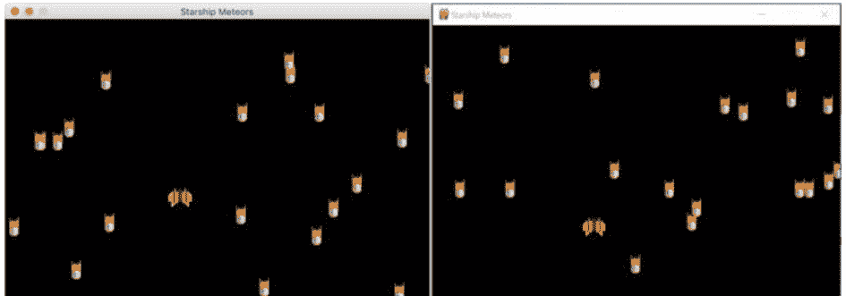

我们将实现几个类来表示游戏中的实体。使用类并不是实现游戏的必要方式，需要注意的是，许多开发者会避免使用类。然而，使用类可以将与游戏中对象相关的数据集中维护在一个地方；它还简化了在游戏中创建同一对象（例如陨石）的多个实例的过程。

这些类及其关系如下所示：

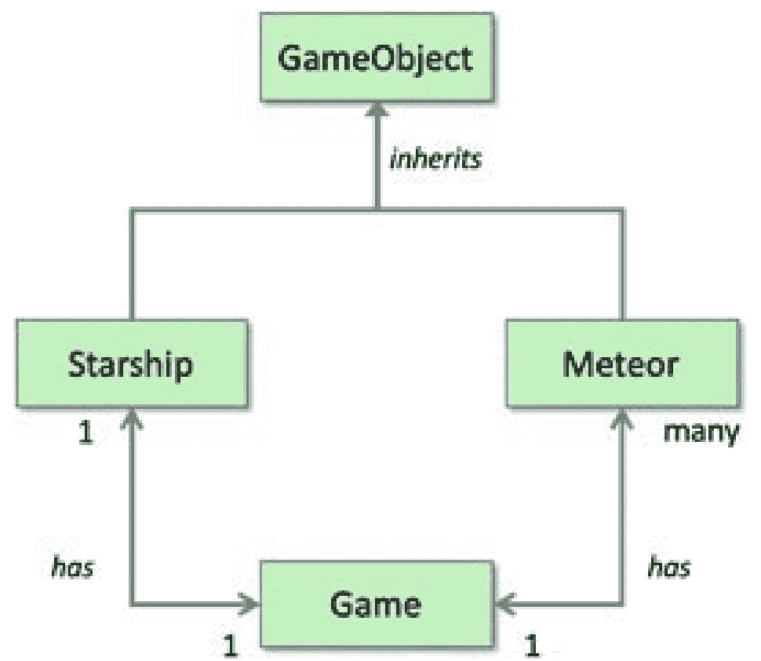

该图显示 `Starship` 和 `Meteor` 类将扩展一个名为 `GameObject` 的类。它还显示 `Game` 与 `Starship` 类具有一对一的关系。也就是说，`Game` 持有一个 `Starship` 的引用，而 `Starship` 又持有一个指向 `Game` 的单一引用。

相比之下，`Game` 与 `Meteor` 类具有一对多的关系。也就是说，`Game` 对象持有多个 `Meteor` 的引用，而每个 `Meteor` 都持有一个指向单一 `Game` 对象的引用。

## 主游戏类

我们将要查看的第一个类是 `Game` 类本身。`Game` 类将保存陨石列表和飞船，以及主游戏循环。它还将初始化主窗口显示（例如设置窗口的大小和标题）。

在这种情况下，我们将把 `pygame.display.set_mode()` 函数返回的显示表面存储在 `Game` 对象的一个名为 `display_surface` 的属性中。这是因为我们稍后需要使用它来显示飞船和陨石。我们还将保留一个 `pygame.time.Clock()` 类的实例，我们将在每次主游戏 while 循环中使用它来设置帧率。

我们游戏的基本框架如下所示；此代码清单提供了基本的 `Game` 类和启动游戏的主方法。游戏还定义了三个全局常量，用于定义帧刷新率和显示尺寸。

```python
import pygame

# Set up Global constants
FRAME_REFRESH_RATE = 30
DISPLAY_WIDTH = 600
DISPLAY_HEIGHT = 400

class Game:
    """ Represents the game itself and game playing loop """
    def __init__(self):
        print('Initialising PyGame')
        pygame.init()
        # Set up the display
        self.display_surface = pygame.display.set_mode((DISPLAY_WIDTH, DISPLAY_HEIGHT))
        pygame.display.set_caption('Starship Meteors')
        # Used for timing within the program.
        self.clock = pygame.time.Clock()

    def play(self):
        is_running = True
        # Main game playing Loop
        while is_running:
            # Work out what the user wants to do
            for event in pygame.event.get():
                if event.type == pygame.QUIT:
                    is_running = False
                elif event.type == pygame.KEYDOWN:
                    if event.key == pygame.K_q:
                        is_running = False
            # Update the display
            pygame.display.update()
            # Defines the frame rate
            self.clock.tick(FRAME_REFRESH_RATE)
        # Let pygame shutdown gracefully
        pygame.quit()

def main():
    print('Starting Game')
    game = Game()
    game.play()
    print('Game Over')

if __name__ == '__main__':
    main()
```

`Game` 类的主要 `play()` 方法包含一个循环，该循环将持续运行，直到用户选择退出游戏。他们可以通过两种方式之一来实现：按下 'q' 键（由事件键 `K_q` 表示）或点击窗口关闭按钮。无论哪种情况，这些事件都会在主 while 循环方法内的主事件处理 for 循环中被捕获。

如果用户不想退出游戏，则会更新（刷新）显示，然后设置 `clock.tick()`（或帧）速率。当用户选择退出游戏时，主 while 循环将终止（`is_running` 标志被设置为 `False`），并调用 `pygame.quit()` 方法来关闭 pygame。

目前，这还不是一个非常具有交互性的游戏，因为它除了允许用户退出外什么也不做。在下一节中，我们将添加行为，以便能够在显示区域内显示飞船。

## GameObject 类

`GameObject` 类定义了三个方法：

`load_image()` 方法可用于加载用于在视觉上表示特定类型游戏对象的图像。然后，该方法使用图像的宽度和高度来定义游戏对象的宽度和高度。

`rect()` 方法返回一个矩形，表示游戏对象在底层绘图表面上当前使用的区域。这与图像自身的 `rect()` 不同，后者与游戏对象在底层表面上的位置无关。矩形对于比较一个对象与另一个对象的位置非常有用（例如在确定是否发生碰撞时）。

`draw()` 方法使用游戏对象当前的 x 和 y 坐标，将游戏对象的图像绘制到游戏持有的显示表面上。如果子类希望以不同的方式绘制，可以重写该方法。

`GameObject` 类的代码如下所示：

```python
class GameObject:
    def load_image(self, filename):
        self.image = pygame.image.load(filename).convert()
        self.width = self.image.get_width()
        self.height = self.image.get_height()

    def rect(self):
        """ Generates a rectangle representing the objects location
        and dimensions"""
        return pygame.Rect(self.x, self.y, self.width, self.height)

    def draw(self):
        """ draw the game object at the current x, y coordinates """
        self.game.display_surface.blit(self.image, (self.x, self.y))
```

`GameObject` 类被 `Starship` 类和 `Meteor` 类直接扩展。

目前只有两种类型的游戏元素：飞船和陨石；但这在未来可以扩展到行星、彗星、流星等。

## 显示飞船

这个游戏的人类玩家将控制一艘可以在显示区域内移动的星际飞船。`Starship` 将由 `Starship` 类的一个实例表示。该类将扩展 `GameObject` 类，该类包含游戏中表示的任何类型元素的通用行为。

`Starship` 类定义了自己的 `__init__()` 方法，该方法接受一个指向飞船所属游戏的引用。此初始化方法将 `Starship` 的初始起始位置设置为显示宽度的一半作为 x 坐标，显示高度减去 40 作为 y 坐标（这在屏幕结束前提供了一点缓冲）。然后，它使用 `GameObject` 父类中的 `load_image()` 方法加载用于表示 `Starship` 的图像。该图像存储在名为 `starship.png` 的文件中。目前，我们将保持 `Starship` 类不变（然而，我们将在下一节中返回此类，以便将其制作成可移动的对象）。

`Starship` 类的当前版本如下所示：

```python
class Starship(GameObject):
    """ Represents a starship"""
    def __init__(self, game):
        self.game = game
        self.x = DISPLAY_WIDTH / 2
        self.y = DISPLAY_HEIGHT - 40
        self.load_image('starship.png')
```

现在，我们将在 `Game` 类的 `__init__()` 方法中添加一行来初始化 `Starship` 对象。这一行是：

```python
# Set up the starship
self.starship = Starship(self)
```

我们还将在 `play()` 方法内的主 while 循环中，在刷新显示之前添加一行。这一行将调用飞船对象的 `draw()` 方法：

```python
# Draw the starship
self.starship.draw()
```

这将产生在刷新显示之前，将飞船绘制到窗口绘图表面背景上的效果。现在，当我们运行这个版本的 StarshipMeteor 游戏时，我们会在显示中看到飞船：

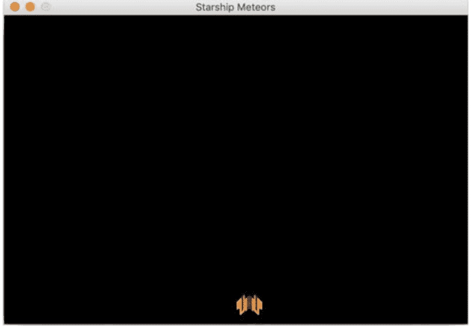

当然，目前飞船不会移动；但我们将在下一节中解决这个问题。

## 移动飞船

我们希望能够将飞船在显示屏幕的边界内移动。为此，我们需要改变星际飞船的 x 和 y 坐标会根据用户按下不同按键而改变。

我们将使用方向键来控制飞船在屏幕上上下左右移动。为此，我们将在 Starship 类中定义四个方法；这些方法将分别使飞船向上、向下、向左和向右移动等。

更新后的 Starship 类如下所示：

```python
class Starship(GameObject):
    """ Represents a starship"""

    def __init__(self, game):
        self.game = game
        self.x = DISPLAY_WIDTH / 2
        self.y = DISPLAY_HEIGHT - 40
        self.load_image('starship.png')

    def move_right(self):
        """ moves the starship right across the screen"""
        self.x = self.x + STARSHIP_SPEED
        if self.x + self.width > DISPLAY_WIDTH:
            self.x = DISPLAY_WIDTH - self.width

    def move_left(self):
        """ Move the starship left across the screen"""
        self.x = self.x - STARSHIP_SPEED
        if self.x < 0:
            self.x = 0

    def move_up(self):
        """ Move the starship up the screen """
        self.y = self.y - STARSHIP_SPEED
        if self.y < 0:
            self.y = 0

    def move_down(self):
        """ Move the starship down the screen """
        self.y = self.y + STARSHIP_SPEED
        if self.y + self.height > DISPLAY_HEIGHT:
            self.y = DISPLAY_HEIGHT - self.height

    def __str__(self):
        return 'Starship(' + str(self.x) + ', ' + str(self.y) + ')'
```

这个版本的 Starship 类定义了各种移动方法。这些方法使用一个新的全局值 `STARSHIP_SPEED` 来决定飞船移动的距离和速度。如果你想改变飞船的移动速度，可以修改这个全局值。

根据预期的移动方向，我们需要修改飞船的 x 或 y 坐标。

- 如果飞船向左移动，则 x 坐标减少 `STARSHIP_SPEED`，
- 如果向右移动，则 x 坐标增加 `STARSHIP_SPEED`，
- 相应地，如果飞船向上移动，则 y 坐标减少 `STARSHIP_SPEED`，
- 但如果向下移动，则 y 坐标增加 `STARSHIP_SPEED`。

当然，我们不希望飞船飞出屏幕边缘，因此必须进行测试，看它是否已到达屏幕边界。所以需要测试 x 或 y 值是否低于零或超过 `DISPLAY_WIDTH` 或 `DISPLAY_HEIGHT` 的值。如果满足任何这些条件，则将 x 或 y 值重置为适当的默认值。

我们现在可以将这些方法与玩家输入结合使用。玩家输入将指示玩家希望移动飞船的方向。由于我们使用左、右、上、下方向键来实现此功能，我们可以扩展已经为主游戏循环定义的事件处理循环。与字母 q 一样，事件键以字母 K 和下划线为前缀，但这次键名为 `K_LEFT`、`K_RIGHT`、`K_UP` 和 `K_DOWN`。

当按下其中一个键时，我们将调用 Game 对象已持有的飞船对象上的相应移动方法。

主要的事件处理循环现在如下：

```python
# Work out what the user wants to do
for event in pygame.event.get():
    if event.type == pygame.QUIT:
        is_running = False
    elif event.type == pygame.KEYDOWN:
        # Check to see which key is pressed
        if event.key == pygame.K_RIGHT:
            # Right arrow key has been pressed
            # move the player right
            self.starship.move_right()
        elif event.key == pygame.K_LEFT:
            # Left arrow has been pressed
            # move the player left
            self.starship.move_left()
        elif event.key == pygame.K_UP:
            self.starship.move_up()
        elif event.key == pygame.K_DOWN:
            self.starship.move_down()
        elif event.key == pygame.K_q:
            is_running = False
```

然而，我们还没有完全完成。如果我们尝试运行这个版本的程序，屏幕上会出现一串飞船的轨迹；例如：

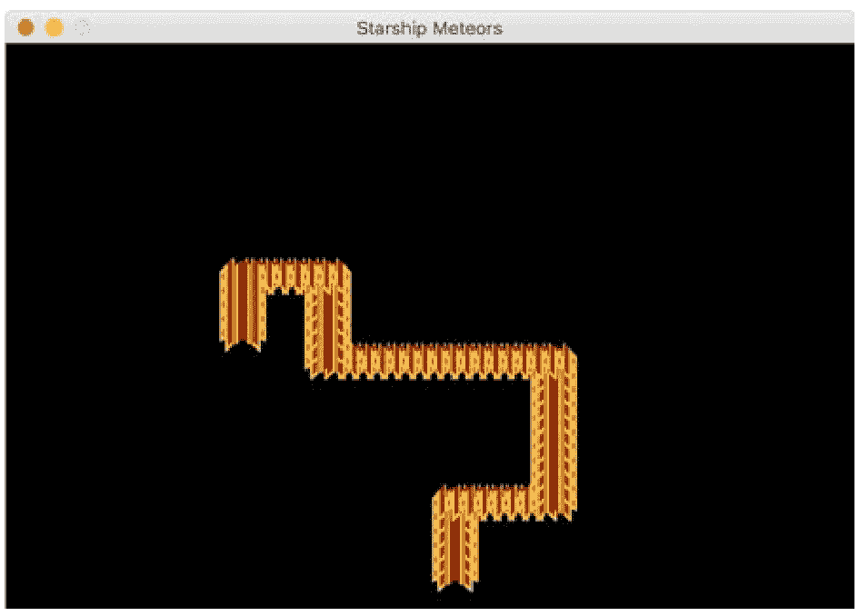

问题在于我们在不同位置重绘了飞船；但之前的图像仍然存在。

我们现在有两个选择：要么用黑色填充整个屏幕，有效地隐藏之前绘制的所有内容；要么只覆盖之前图像位置所在的区域。采用哪种方法取决于你的游戏所代表的特定场景。由于一旦添加了陨石，屏幕上会有很多陨石；最简单的选项是在重绘飞船之前覆盖屏幕上的所有内容。因此，我们将添加以下行：

```python
# Clear the screen of current contents
self.display_surface.fill(BACKGROUND)
```

这行代码添加在主游戏循环中绘制飞船之前。现在，当我们移动飞船时，旧图像会在绘制新图像之前被移除：

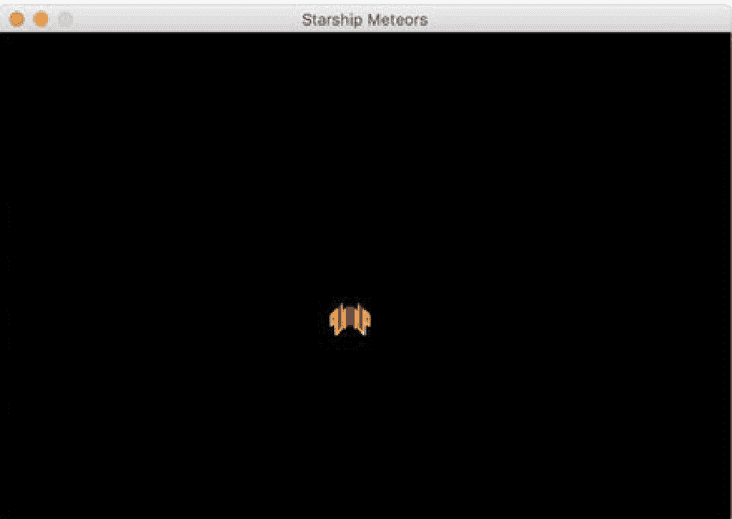

需要注意的一点是，我们还定义了另一个全局值 `BACKGROUND`，用于保存游戏画面的背景颜色。如下所示，它被设置为黑色：

```python
# Define default RGB colours
BACKGROUND = (0, 0, 0)
```

如果你想使用不同的背景颜色，可以修改这个全局值。

## 添加陨石类

陨石类也将是 GameObject 类的子类。然而，它只提供一个 `move_down()` 方法，而不是像飞船那样的多种移动方法。

它还需要一个随机的起始 x 坐标，这样当陨石被添加到游戏中时，其起始位置会有所不同。这个随机位置可以使用 `random.randint()` 函数生成，值在 0 和绘图表面的宽度之间。陨石也将从屏幕顶部开始，因此其初始坐标与飞船不同。最后，我们还希望我们的陨石具有不同的速度；这可以是 1 到某个指定的最大陨石速度之间的另一个随机数。为了支持这些，我们需要将 `random` 添加到导入的模块中，并定义几个新的全局值，例如：

```python
import pygame, random
INITIAL_METEOR_Y_LOCATION = 10
MAX_METEOR_SPEED = 5
```

我们现在可以定义陨石类：

```python
class Meteor(GameObject):
    """represents a meteor in the game """
    def __init__(self, game):
        self.game = game
        self.x = random.randint(0, DISPLAY_WIDTH)
        self.y = INITIAL_METEOR_Y_LOCATION
        self.speed = random.randint(1, MAX_METEOR_SPEED)
        self.load_image('meteor.png')

    def move_down(self):
        """Move the meteor down the screen """
        self.y = self.y + self.speed
        if self.y > DISPLAY_HEIGHT:
            self.y = 5

    def __str__(self):
        return 'Meteor(' + str(self.x) + ', ' + str(self.y) + ')'
```

陨石类的 `__init__()` 方法与飞船的步骤相同；不同之处在于 x 坐标和速度是随机生成的。用于陨石的图像也不同，是 'meteor.png'。我们还实现了一个 `move_down()` 方法。这与飞船的 `move_down()` 本质上相同。

注意，在这一点上，我们可以创建一个名为 MoveableGameObject 的 GameObject 子类（它扩展了 GameObject），并将移动操作推入该类，让陨石和飞船类扩展该类。然而，我们实际上并不希望允许陨石在屏幕上的任何地方移动。

我们现在可以将陨石添加到 Game 类中。我们将添加一个新的全局值来表示游戏中初始陨石的数量：

```python
INITIAL_NUMBER_OF_METEORS = 8
```

接下来，我们将为 Game 类初始化一个新属性，该属性将保存一个陨石列表。我们在这里使用列表，因为我们希望随着游戏的进行增加陨石的数量。为了使这个过程简单，我们将使用列表推导式，它允许一个 for 循环运行，并将表达式的结果捕获到列表中：

```python
# Set up meteors
self.meteors = [Meteor(self) for _ in range(0, INITIAL_NUMBER_OF_METEORS)]
```

我们现在有一个需要显示的陨石列表。因此，我们需要更新 `play()` 方法的 while 循环，不仅要绘制飞船，还要绘制所有陨石：

```python
# Draw the meteors and the starship
self.starship.draw()
for meteor in self.meteors:
    meteor.draw()
```

最终结果是在屏幕顶部随机位置创建一组流星对象：

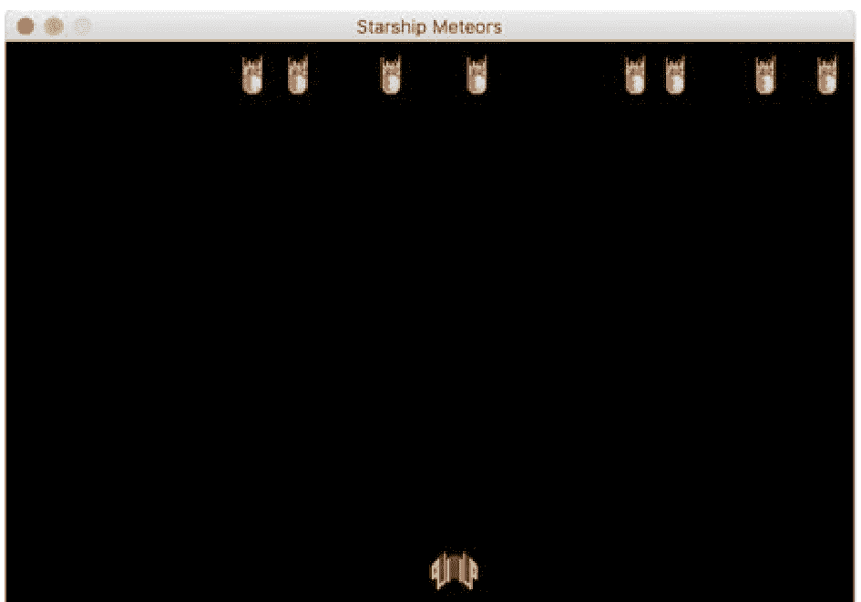

# 移动流星

我们现在希望能让流星在屏幕上向下移动，以便星际飞船需要避开一些物体。这可以非常容易地实现，因为我们已经在流星类中实现了 `move_down()` 方法。因此，我们只需要在主游戏循环中添加一个 for 循环来移动所有流星。例如：

```python
# 移动流星
for meteor in self.meteors:
    meteor.move_down()
```

这可以添加在事件处理 for 循环之后，屏幕刷新/重绘或更新之前。现在当我们运行游戏时，流星会移动，玩家可以在下落的流星之间操控星际飞船。

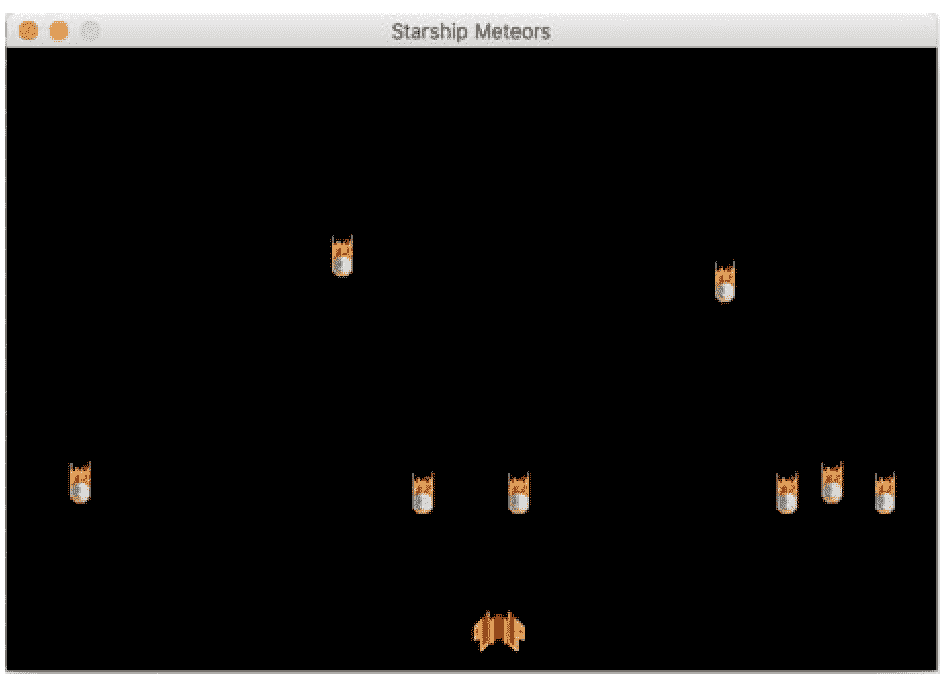

## 识别碰撞

目前游戏会无限进行下去，因为没有结束状态，也没有尝试识别星际飞船是否与流星相撞。我们可以使用 PyGame 矩形来添加流星/星际飞船的碰撞检测。如上一章所述，矩形是 PyGame 中用于表示矩形坐标的类。它特别有用，因为 `pygame.Rect` 类提供了几种碰撞检测方法，可用于测试一个矩形（或点）是否在另一个矩形内部。因此，我们可以使用其中一种方法来测试星际飞船周围的矩形是否与任何流星周围的矩形相交。

GameObject 类已经提供了一个 `rect()` 方法，该方法将返回一个 Rect 对象，表示对象相对于绘图表面的当前矩形（本质上是代表其在屏幕上位置的对象周围的方框）。

因此，我们可以使用 GameObject 生成的矩形和 Rect 类的 `colliderect()` 方法为 Game 类编写一个碰撞检测方法：

```python
def _check_for_collision(self):
    """ 检查是否有流星与星际飞船相撞"""
    result = False
    for meteor in self.meteors:
        if self.starship.rect().colliderect(meteor.rect()):
            result = True
            break
    return result
```

请注意，我们在这里遵循了在方法名前加下划线的惯例，表示该方法应被视为类的私有方法。因此，它不应被 Game 类以外的任何东西调用。此惯例在 PEP 8（Python 增强提案）中定义，但语言本身并不强制执行。

我们现在可以在游戏的主 while 循环中使用此方法来检查碰撞：

```python
# 检查是否有流星击中飞船
if self._check_for_collision():
    starship_collided = True
```

此代码片段还引入了一个新的局部变量 `starship_collided`。我们最初将其设置为 `False`，这是主游戏循环终止的另一个条件：

```python
is_running = True
starship_collided = False

# 主游戏循环
while is_running and not starship_collided:
```

因此，如果用户选择退出或星际飞船与流星相撞，游戏循环将终止。

## 识别胜利

我们目前有输掉游戏的方法，但没有赢的方法！然而，我们希望玩家能够通过在指定时间内生存下来来赢得游戏。我们可以用某种计时器来表示这一点。然而，在我们的例子中，我们将它表示为主游戏循环的特定循环次数。如果玩家在这个循环次数内存活下来，那么他们就赢了。例如：

```python
# 检查玩家是否获胜
if cycle_count == MAX_NUMBER_OF_CYCLES:
    print('WINNER!')
    break
```

在这种情况下，会打印一条消息说明玩家获胜，然后主游戏循环终止（使用 `break` 语句）。`MAX_NUMBER_OF_CYCLES` 全局值可以根据需要设置，例如：

```python
MAX_NUMBER_OF_CYCLES = 1000
```

## 增加流星数量

我们可以将游戏保持在当前状态，因为现在可以赢得或输掉游戏。然而，有一些可以轻松添加的功能可以增强游戏体验。其中之一是增加屏幕上的流星数量，使游戏随着进展变得更难。我们可以使用 `NEW_METEOR_CYCLE_INTERVAL` 来实现这一点。

```python
NEW_METEOR_CYCLE_INTERVAL = 40
```

当达到此间隔时，我们可以向当前流星列表中添加一个新的流星；然后它将被 Game 类自动绘制。例如：

```python
# 确定是否应添加新流星
if cycle_count % NEW_METEOR_CYCLE_INTERVAL == 0:
    self.meteors.append(Meteor(self))
```

现在，每隔 `NEW_METEOR_CYCLE_INTERVAL`，就会在随机 x 坐标处向游戏添加另一个流星。

## 暂停游戏

许多游戏具有的另一个功能是能够暂停游戏。这可以通过监控暂停键（这可以是字母 p，由事件键 `pygame.K_p` 表示）轻松添加。当按下此键时，游戏可以暂停，直到再次按下该键。

暂停操作可以实现为一个 `_pause()` 方法，该方法将消耗所有事件，直到按下相应的键。例如：

```python
def _pause(self):
    paused = True
    while paused:
        for event in pygame.event.get():
            if event.type == pygame.KEYDOWN:
                if event.key == pygame.K_p:
                    paused = False
                    break
```

在此方法中，外部 while 循环将循环，直到 `paused` 局部变量设置为 `False`。这仅在按下 'p' 键时发生。在将 `paused` 设置为 `False` 的语句之后的 `break` 确保内部 for 循环终止，允许外部 while 循环检查 `paused` 的值并终止。

`_pause()` 方法可以在游戏循环期间通过在事件 for 循环中监控 'p' 键并从那里调用 `_pause()` 方法来调用：

```python
elif event.key == pygame.K_p:
    self._pause()
```

请注意，我们再次通过在方法名前加下划线（'_'）来表示我们不希望 `_pause()` 方法从游戏外部调用。

## 显示游戏结束消息

PyGame 没有提供简单的方法来创建弹出对话框来显示诸如“你赢了”或“你输了”之类的消息，这就是为什么我们到目前为止一直使用 print 语句。然而，我们可以使用像 wxPython 这样的 GUI 框架来做到这一点，或者我们可以在显示表面上显示一条消息来指示玩家是赢了还是输了。

我们可以使用 `pygame.font.Font` 类在显示表面上显示消息。这可用于创建一个 Font 对象，该对象可以渲染到一个表面上，然后可以显示到主显示表面上。

因此，我们可以向 Game 类添加一个 `_display_message()` 方法，该方法可用于显示适当的消息：

```python
def _display_message(self, message):
    """在屏幕上向用户显示消息"""
    print(message)
    text_font = pygame.font.Font('freesansbold.ttf', 48)
    text_surface = text_font.render(message, True, BLUE, WHITE)
    text_rectangle = text_surface.get_rect()
    text_rectangle.center = (DISPLAY_WIDTH / 2, DISPLAY_HEIGHT / 2)
    self.display_surface.fill(WHITE)
    self.display_surface.blit(text_surface, text_rectangle)
```

同样，方法名中的前导下划线表示它不应从 Game 类外部调用。

我们现在可以修改主循环，以便向用户显示适当的消息，例如：

```python
# 检查是否有流星击中飞船
if self._check_for_collision():
    starship_collided = True
    self._display_message('Collision: Game Over')
```

当发生碰撞时运行上述代码的结果如下所示：


## 星际飞船流星游戏

最终版本的星际飞船流星游戏的完整代码如下：

### 测试简介

### 测试简介

本章探讨了在使用 Python 开发系统时可能需要执行的不同类型的测试。同时，本章也介绍了测试驱动开发。

### 测试类型

关于测试，至少有两种思考方式：

1.  它是执行程序以发现错误/缺陷的过程（参见 Glenford Myers 的《软件测试艺术》）。
2.  它是用于确认软件组件是否满足为其确定的需求的过程，即它们是否按预期执行。

测试的这两个方面在软件生命周期的不同阶段往往被强调。错误测试是开发过程的内在组成部分，并且越来越强调将测试作为软件开发的核心部分（参见测试驱动开发）。

应当指出，要证明软件能够正常工作且完全没有错误是极其困难的——在许多情况下甚至是不可能的。一组测试没有发现缺陷并不能证明软件是无错误的。“没有证据不等于不存在证据！”。这一点在 20 世纪 60 年代末和 70 年代初由 Dijkstra 讨论过，可以总结为：

> 测试只能证明缺陷的存在，而不能证明缺陷的不存在

通过测试来确认软件组件是否履行其契约，涉及根据其需求检查操作。虽然这在开发阶段确实会发生，但它构成了质量保证（QA）和用户验收测试的主要部分。应当指出的是，随着测试驱动开发的出现，在开发过程中针对需求进行测试的重视程度已显著提高。

当然，测试还有许多其他方面，例如性能测试，它用于识别当影响系统的各种因素发生变化时，系统将如何表现。例如，随着并发请求数量的增加，

## 尝试

使用本章中介绍的示例，添加以下内容：

-   提供一个分数计数器。这可以基于玩家存活的周期数，或者从屏幕顶部重新出现的流星数量等。
-   添加另一种类型的 GameObject，可以是一个水平穿过屏幕的流星；或许使用随机的起始 y 坐标。
-   允许在开始时指定游戏难度。这可以影响初始流星的数量、流星的最大速度、流星的数量等。

```python
import pygame, random, time

FRAME_REFRESH_RATE = 30
DISPLAY_WIDTH = 600
DISPLAY_HEIGHT = 400
WHITE = (255, 255, 255)
BACKGROUND = (0, 0, 0)
INITIAL_METEOR_Y_LOCATION = 10
INITIAL_NUMBER_OF_METEORS = 8
MAX_METEOR_SPEED = 5
STARSHIP_SPEED = 10
MAX_NUMBER_OF_CYCLES = 1000
NEW_METEOR_CYCLE_INTERVAL = 40

class GameObject:
    def load_image(self, filename):
        self.image = pygame.image.load(filename).convert()
        self.width = self.image.get_width()
        self.height = self.image.get_height()

    def rect(self):
        """ Generates a rectangle representing the objects location
        and dimensions """
        return pygame.Rect(self.x, self.y, self.width, self.height)

    def draw(self):
        """ draw the game object at the current x, y coordinates """
        self.game.display_surface.blit(self.image, (self.x, self.y))

class Starship(GameObject):
    """ Represents a starship"""
    def __init__(self, game):
        self.game = game
        self.x = DISPLAY_WIDTH / 2
        self.y = DISPLAY_HEIGHT - 40
        self.load_image('starship.png')

    def move_right(self):
        """ moves the starship right across the screen """
        self.x = self.x + STARSHIP_SPEED
        if self.x + self.width > DISPLAY_WIDTH:
            self.x = DISPLAY_WIDTH - self.width

    def move_left(self):
        """ Move the starship left across the screen """
        self.x = self.x - STARSHIP_SPEED
        if self.x < 0:
            self.x = 0

    def move_up(self):
        """ Move the starship up the screen """
        self.y = self.y - STARSHIP_SPEED
        if self.y < 0:
            self.y = 0

    def move_down(self):
        """ Move the starship down the screen """
        self.y = self.y + STARSHIP_SPEED
        if self.y + self.height > DISPLAY_HEIGHT:
            self.y = DISPLAY_HEIGHT - self.height

    def __str__(self):
        return 'Starship(' + str(self.x) + ', ' + str(self.y) + ')'

class Meteor(GameObject):
    """ represents a meteor in the game """
    def __init__(self, game):
        self.game = game
        self.x = random.randint(0, DISPLAY_WIDTH)
        self.y = INITIAL_METEOR_Y_LOCATION
        self.speed = random.randint(1, MAX_METEOR_SPEED)
        self.load_image('meteor.png')

    def move_down(self):
        """ Move the meteor down the screen """
        self.y = self.y + self.speed
        if self.y > DISPLAY_HEIGHT:
            self.y = 5

    def __str__(self):
        return 'Meteor(' + str(self.x) + ', ' + str(self.y) + ')'

class Game:
    """ Represents the game itself, holds the main game playing loop """
    def __init__(self):
        pygame.init()
        # Set up the display
        self.display_surface = pygame.display.set_mode((DISPLAY_WIDTH, DISPLAY_HEIGHT))
        pygame.display.set_caption('Starship Meteors')
        # Used for timing within the program.
        self.clock = pygame.time.Clock()
        # Set up the starship
        self.starship = Starship(self)
        # Set up meteors
        self.meteors = [Meteor(self) for _ in range(0, INITIAL_NUMBER_OF_METEORS)]

    def _check_for_collision(self):
        """ Checks to see if any of the meteors have collided with the starship """
        result = False
        for meteor in self.meteors:
            if self.starship.rect().colliderect(meteor.rect()):
                result = True
                break
        return result

    def _display_message(self, message):
        """ Displays a message to the user on the screen """
        text_font = pygame.font.Font('freesansbold.ttf', 48)
        text_surface = text_font.render(message, True, BLUE, WHITE)
        text_rectangle = text_surface.get_rect()
        text_rectangle.center = (DISPLAY_WIDTH / 2, DISPLAY_HEIGHT / 2)
        self.display_surface.fill(WHITE)
        self.display_surface.blit(text_surface, text_rectangle)

    def _pause(self):
        paused = True
        while paused:
            for event in pygame.event.get():
                if event.type == pygame.KEYDOWN:
                    if event.key == pygame.K_p:
                        paused = False
                        break

    def play(self):
        is_running = True
        starship_collided = False
        cycle_count = 0
        # Main game playing Loop
        while is_running and not starship_collided:
            # Indicates how many times the main game loop has
            # been run
            cycle_count += 1
            # See if the player has won
            if cycle_count == MAX_NUMBER_OF_CYCLES:
                self._display_message('WINNER!')
                break
            # Work out what the user wants to do
            for event in pygame.event.get():
                if event.type == pygame.QUIT:
                    is_running = False
                elif event.type == pygame.KEYDOWN:
                    # Check to see which key is pressed
                    if event.key == pygame.K_RIGHT:
                        # Right arrow key has been pressed
                        # move the player right
                        self.starship.move_right()
                    elif event.key == pygame.K_LEFT:
                        # Left arrow has been pressed
                        # move the player left
                        self.starship.move_left()
                    elif event.key == pygame.K_UP:
                        self.starship.move_up()
                    elif event.key == pygame.K_DOWN:
                        self.starship.move_down()
                    elif event.key == pygame.K_p:
                        self._pause()
                    elif event.key == pygame.K_q:
                        is_running = False
            # Move the Meteors
            for meteor in self.meteors:
                meteor.move_down()
            # Clear the screen of current contents
            self.display_surface.fill(BACKGROUND)
            # Draw the meteors and the starship
            self.starship.draw()
            for meteor in self.meteors:
                meteor.draw()
            # Check to see if a meteor has hit the ship
            if self._check_for_collision():
                starship_collided = True
                self._display_message('Collision: Game Over')
            # Determine if new meteors should be added
            if cycle_count % NEW_METEOR_CYCLE_INTERVAL == 0:
                self.meteors.append(Meteor(self))
            # Update the display
            pygame.display.update()
            # Defines the frame rate. The number is number of
            # frames per second. Should be called once per frame (but only once)
            self.clock.tick(FRAME_REFRESH_RATE)
            time.sleep(1)
        # Let pygame shutdown gracefully
        pygame.quit()

def main():
    print('Starting Game')
    game = Game()
    game.play()
    print('Game Over')

if __name__ == '__main__':
    main()
```

随着底层硬件使用的处理器数量变化、数据库规模增长等情况而变化。

无论你如何看待测试，对系统应用的测试越多，系统按预期工作的置信度就越高。

## 应该测试什么？

一个有趣的问题是：“你的软件系统的哪些方面应该接受测试？”一般来说，任何可重复的内容都应接受正式（且最好是自动化的）测试。这包括（但不限于）：

- 所有相关技术的构建过程。
- 部署到所有目标平台的过程。
- 所有运行时环境的安装过程。
- 所有支持版本的升级过程（如适用）。
- 随着负载增加，系统/服务器的性能。
- 需要运行任意时间段（例如 7x24 小时）的系统的稳定性。
- 备份过程。
- 系统的安全性。
- 系统故障时的恢复能力。
- 系统的功能性。
- 系统的完整性。

请注意，上述列表中只有最后两项可能被认为是通常需要测试的领域。然而，为了确保所考虑系统的质量，所有上述方面都相关。事实上，测试应涵盖软件开发生命周期的所有方面，而不仅仅是质量保证阶段。在需求收集阶段，测试是寻找缺失或模糊需求的过程。

在此阶段，还应考虑如何在最终的软件系统中测试整体需求。

测试计划还应关注被测软件的所有方面，包括功能性、可用性、法律合规性、符合监管约束、安全性、性能、可用性、弹性等。测试应由识别和降低风险的需求驱动。

## 测试软件系统

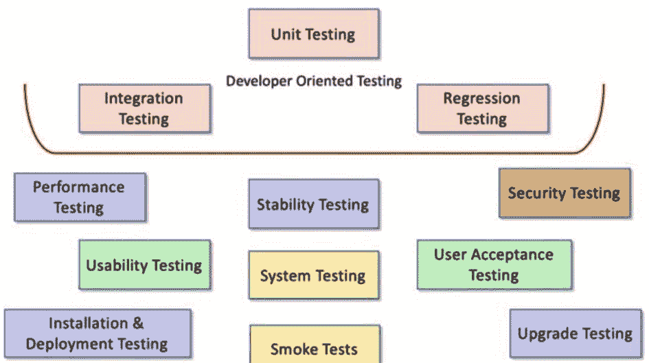

如上所述，行业内通常使用多种不同类型的测试。这些类型包括：

- 单元测试，用于验证单个组件的行为。
- 集成测试，测试当单个组件组合在一起提供更高级别的功能单元时，这些单元的组合是否能正常运行。
- 回归测试。当新组件添加到系统或现有组件发生更改时，需要验证新功能是否破坏了任何现有功能。此类测试称为回归测试。
- 性能测试，用于确保系统性能符合要求，在设计参数范围内，并且能够随着利用率的增加而扩展。
- 稳定性测试代表一种测试风格，旨在模拟系统在较长时间内的运行。例如，对于一个预期 7x24 小时运行的在线购物应用，稳定性测试可能确保在平均负载下，系统确实能够每天运行 24 小时，每周运行 7 天。
- 安全性测试确保根据要求对系统访问进行适当控制。例如，对于在线购物系统，根据你是浏览商店、购买产品还是维护产品目录，可能有不同的安全要求。
- 可用性测试，可由专业的可用性小组执行，可能涉及在用户使用系统时进行录像。
- 系统测试验证整个系统是否确实满足用户要求并符合所需的应用完整性。
- 用户验收测试是一种面向用户的测试形式，用户确认系统确实按照他们预期的方式运行和表现。
- 安装、部署和升级测试。这三种类型的测试验证系统是否可以适当地安装和部署，包括可能需要的任何升级过程。
- 冒烟测试用于检查大型系统的核心元素是否正常运行。它们通常可以快速运行，所需时间只是运行完整系统测试的一小部分。

本节剩余部分将讨论关键的测试方法。

## 单元测试

单元可以小到单个函数，也可以大到一个子系统，但通常是一个类、对象、独立的库（API）或网页。通过关注一个小型独立的组件，可以开发出一套广泛的测试来检验单元的定义需求和功能。

单元测试通常遵循白盒方法（也称为玻璃盒或结构化测试），其中测试利用对代码及其结构的知识和理解，而不仅仅是其接口（这被称为黑盒方法）。

在白盒测试中，测试覆盖率通过已测试的代码路径数量来衡量。单元测试的目标是提供 100% 的覆盖率：执行每条指令、每个逻辑分支的所有侧面、所有被调用的对象、所有数据结构的处理、所有循环的正常和异常终止等。当然，这可能并不总是可行，但这是一个应该努力实现的目标。许多自动化测试工具会包含代码覆盖率度量，以便你了解任何给定测试集执行了多少代码。

单元测试几乎总是自动化的——有许多工具可以帮助完成这项工作，其中最著名的可能是 xUnit 系列测试框架，例如用于 Java 的 JUnit 和用于 Python 的 PyUnit。该框架允许开发人员：

- 专注于测试单元，
- 模拟调用另一个单元的数据或结果（代表性的正确和错误结果），
- 创建数据驱动的测试以实现最大的灵活性和可重复性，
- 依赖于模拟对象，这些对象代表单元必须与之交互的单元外部元素。

将测试自动化意味着它们可以频繁运行，至少在初始开发之后以及每次影响单元的更改之后运行。

一旦对一个单元的正确功能建立了信心，开发人员就可以使用它来帮助测试与其接口的其他单元，形成更大的单元，这些单元也可以进行单元测试，或者随着规模变大，进行集成测试。

## 集成测试

集成测试是将几个单元（或模块）组合在一起作为一个独立的实体进行测试。通常，集成测试旨在确保模块正确交互，并且各个单元开发人员以一致的方式解释了需求。

一组集成的模块可以被视为一个单元，并以与组成模块大致相同的方式进行单元测试，但通常在“更高”级别的功能上工作。集成测试是单元测试和完整系统测试之间的中间阶段。

因此，集成测试侧重于两个或多个单元之间的交互，以确保这些单元能够成功且适当地协同工作。此类测试通常自下而上进行，但也可以自上而下进行，使用模拟对象或存根来表示被调用或调用的函数。需要注意的一个重要点是，你不应该试图一次性测试所有内容（所谓的“大爆炸”测试），因为这样更难隔离错误以便修复。这就是为什么更常见的是发现集成测试是以自下而上的方式进行的。

## 系统测试

系统测试旨在验证所有模块、单元、数据、安装、配置等的组合是否适当地运行，并满足为整个系统指定的要求。对整个系统进行测试通常涉及测试系统的最顶层功能或行为。这种基于行为的测试通常涉及最终用户和其他技术性较弱的利益相关者。为了支持此类测试，已经发展出一系列技术，允许使用更接近英语风格的测试描述。这种测试风格可以作为需求收集过程的一部分，并可能导致行为驱动开发（BDD）过程。Python 模块 pytest-bdd 为核心 pytest 框架提供了 BDD 风格的扩展。

## 安装/升级测试

安装测试是对完整、部分或升级安装过程的测试。它还验证将产品迁移到新版本所需的安装和过渡软件是否正常运行。通常，它

## 冒烟测试

冒烟测试是一种用于验证系统基本功能是否正常的测试或测试套件。冒烟测试可以在新部署或补丁部署后运行，以验证安装是否运行良好，足以进行进一步测试。如果未能通过冒烟测试，则应暂停任何进一步的测试，直到冒烟测试通过为止。该名称源于早期电子学：如果设备在通电后开始冒烟，测试人员就知道没有必要再对其进行测试了。对于软件技术，执行冒烟测试的优势包括：

-   冒烟测试通常是自动化的，并且在不同构建版本之间是标准化的。
-   因为冒烟测试验证的是预期应该正常工作的部分，当它们失败时，通常表明某些基础部分出了问题（例如使用了错误版本的库），或者新的构建在系统核心方面引入了错误。
-   如果系统是每日构建的，那么也应该每日进行冒烟测试。
-   随着系统新功能的增加，需要定期更新冒烟测试。

## 测试自动化

测试编写和执行的实际方式需要仔细考虑。通常，我们希望尽可能地自动化测试过程，因为这使得运行测试变得容易，并且不仅确保所有测试都被运行，还确保它们每次都以相同的方式运行。此外，一旦设置了自动化测试，重新运行该自动化测试通常比手动重复一系列测试更快。然而，并非系统的所有功能都可以通过自动化测试工具轻松测试，在某些情况下，物理环境可能使自动化测试变得困难。

通常，大多数单元测试是自动化的，而大多数验收测试是手动的。你还需要决定必须进行哪些形式的测试。大多数软件项目应将单元测试、集成测试、系统测试和验收测试作为必要要求。并非所有项目都会实施性能或稳定性测试，但你应该谨慎对待省略任何测试阶段，并确保它确实不适用。

## 测试驱动开发

测试驱动开发（或 TDD）是一种开发技术，开发人员在编写任何实现代码之前先编写测试用例。因此，测试驱动或决定了开发的代码。实现只提供通过测试所需的功能，因此测试充当了代码功能的规范（有些人认为测试因此成为该规范的一部分，并提供了系统能力的文档）。

TDD 的好处在于，由于必须先编写测试，因此始终有一组可用的测试来执行单元测试、集成测试、回归测试等。这是好的，因为开发人员可能会发现编写和维护测试很枯燥，不如实际代码本身有趣，因此可能不会像期望的那样重视测试流程。TDD 鼓励并确实要求开发人员维护一套详尽的可重复测试，并且这些测试的开发质量和标准与主体代码相同。

Robert Martin 定义了 TDD 的三条规则，它们是：

1.  除非是为了让失败的单元测试通过，否则不允许编写任何生产代码。
2.  不允许编写超出足以使测试失败的单元测试代码；编译失败也是失败。
3.  不允许编写超出足以通过那一个失败单元测试的生产代码。

这引出了下一节描述的 TDD 循环。

## TDD 循环

以 TDD 方式工作时，开发有一个循环。这个循环的最短形式是 TDD 口诀：

红 / 绿 / 重构

这与单元测试工具套件相关，其中可以编写单元测试。在 PyCharm 等工具中，当你运行 pyunit 或 pytest 测试时，会显示一个测试视图，红色表示测试失败，绿色表示测试通过。因此，红/绿，换句话说，编写测试并让它失败，然后实现代码以确保它通过。这个口诀的最后一部分是重构，表示一旦它工作了，就通过重构使代码更清晰、更好、更合适。重构是系统行为不变但实现被改变以改进它的过程。

完整的 TDD 循环如下图所示，突出了 TDD 的测试优先方法：

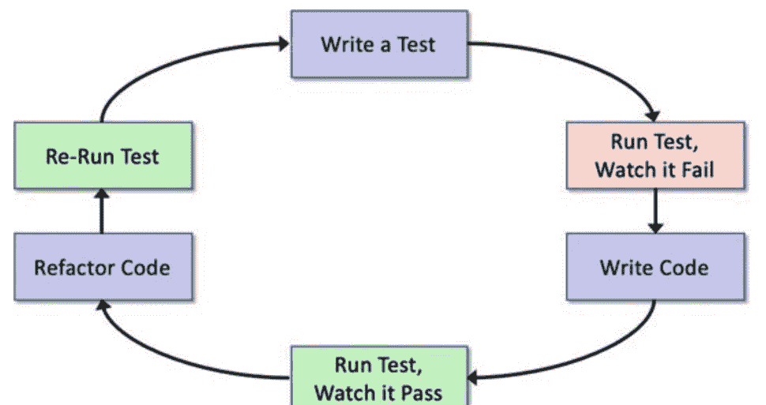

TDD 口诀可以在上面显示并在下面更详细描述的 TDD 循环中看到：

1.  编写一个测试。
2.  运行测试并看到它失败。
3.  实现刚好足以让测试通过的代码。
4.  运行测试并看到它通过。
5.  为清晰起见进行重构，并处理任何重用等问题。
6.  为下一个测试重复此过程。

## 测试复杂性

目标是在 TDD 中的所有工作中力求简单。因此，你编写一个失败的测试，然后做刚好足以让该测试通过的事情（但不要更多）。然后你重构实现代码（即改变被测单元的内部结构）以改进代码库。你继续这样做，直到单元的所有功能都完成。就每个测试而言，你应该再次力求简单，每个测试只测试一件事，每个测试只有一个断言（尽管这在 TDD 界是一个备受争议的话题）。

## 重构

TDD 中对重构的强调使其不仅仅是测试或测试优先开发。这种对重构的关注实际上是（重新）设计和增量改进的关注。测试提供了所需内容的规范以及现有行为得以维持的验证，但重构带来了更好的软件设计。因此，没有重构，TDD 就不是 TDD！

## 可测试性设计

可测试性有几个方面：

-   可配置性。将被测对象设置为适合测试的配置。
-   可控制性。控制输入（和内部状态）。
-   可观察性。观察其输出。
-   可验证性。我们能够以适当的方式验证该输出。

## 可测试性经验法则

1.  如果你无法测试代码，那就改变它，使其可以测试！
2.  如果你的代码难以验证，那就改变它，使其不再难以验证！
3.  每个单元测试只应测试一个具体类，其余的使用模拟对象！
4.  如果你的代码难以重新配置以与模拟对象一起工作，那就让你的代码可以使用模拟对象！
5.  为可测试性设计你的代码！

## 书籍资源

《软件测试的艺术》，G.J. Myers、C. Sandler 和 T. Badgett，John Wiley & Sons，第 3 版（2011 年 12 月），1118031962。

## PyTest 测试框架

### 简介

Python 有几种可用的测试框架，尽管只有 unit test 是典型 Python 安装的一部分。典型的库包括 Unit test（默认包含在 Python 发行版中）和 PyTest。

在本章中，我们将探讨 PyTest 以及如何使用它在 Python 中为函数和类编写单元测试。

### 什么是 PyTest？

PyTest 是一个 Python 测试库；它目前是最流行的 Python 测试库之一（其他包括 unit test 和 doc test）。PyTest 可用于各种级别的测试，尽管其最常见的应用是作为单元测试框架。它也经常在基于 TDD 的开发项目中用作测试框架。事实上，Mozilla 和 Dropbox 都将其用作他们的 Python 测试框架。

## 设置 PyTest

你可能需要设置 PyTest，以便在你的环境中使用它。如果你使用的是 PyCharm 编辑器，那么你需要将 PyTest 模块添加到当前的 PyCharm 项目中，并告诉 PyCharm 你希望使用 PyTest 来运行所有测试。

## 一个简单的 PyTest 示例

### 需要测试的内容

为了探索 PyTest，我们首先需要一些测试对象；因此，我们将定义一个简单的 Calculator 类。该计算器会持续记录所执行操作的累计总和；它允许设置一个新值，然后可以将该值加到或从累计总和中减去。

```python
class Calculator:
    def __init__(self):
        self.current = 0
        self.total = 0

    def set(self, value):
        self.current = value

    def add(self):
        self.total += self.current

    def sub(self):
        self.total -= self.current

    def total(self):
        return self.total
```

将这个类保存到名为 `calculator.py` 的文件中。

### 编写测试

我们现在将为 Calculator 类创建一个非常简单的 PyTest 单元测试。这个测试将定义在一个名为 `test_calculator.py` 的类中。你需要将我们上面编写的 calculator 类导入到你的 `test_calculator.py` 文件中（记住在 Python 中每个文件都是一个模块）。

具体的导入语句取决于你将 calculator 文件相对于测试类放置的位置。在这种情况下，两个文件都在同一个目录中，因此我们可以这样写：

```python
from calculator import Calculator
```

我们现在将定义一个测试，测试函数必须以 `test_` 为前缀，以便 PyTest 能够找到它们。实际上，PyTest 使用几种约定来查找测试，这些约定是：

- 搜索 `test_*.py` 或 `*_test.py` 文件。
- 从这些文件中，收集测试项：
    - 以 `test_` 为前缀的测试函数，
    - 以 `Test` 为前缀的测试类内部以 `test_` 为前缀的测试方法（没有 `__init__` 方法）。

请注意，我们将测试文件和包含被测试代码的文件分开；实际上，在许多情况下，它们被保存在不同的目录结构中。这意味着开发者不太可能意外地在生产代码中使用测试等。

现在我们将在文件中添加一个定义测试的函数。我们将这个函数命名为 `test_add_one`；根据上述约定，它必须以 `test_` 开头。然而，我们试图让函数名的其余部分具有描述性，以便清楚它测试的是什么。函数定义如下：

```python
from calculator import Calculator

def test_add_one():
    calc = Calculator()
    calc.set(1)
    calc.add()
    assert calc.total == 1
```

测试函数创建一个新的 Calculator 类实例，然后调用它的几个方法；设置要添加的值，然后调用 `add()` 方法本身等。

测试的最后一部分是断言。断言验证计算器的行为是否符合预期。PyTest 的 assert 语句会弄清楚正在测试什么以及应该如何处理结果——包括向测试运行报告添加信息。它避免了必须学习一堆 `assert Something` 类型方法的需要（不像一些其他测试框架）。

请注意，没有断言的测试不是测试；也就是说，它没有测试任何东西。许多 IDE 直接支持测试框架，包括 PyCharm。例如，PyCharm 现在会检测到你编写了一个包含 assert 语句的函数，并在编辑器左侧的灰色区域添加一个“运行测试”图标。这可以在下图中看到，第 4 行添加了一个绿色箭头；这就是“运行测试”按钮：

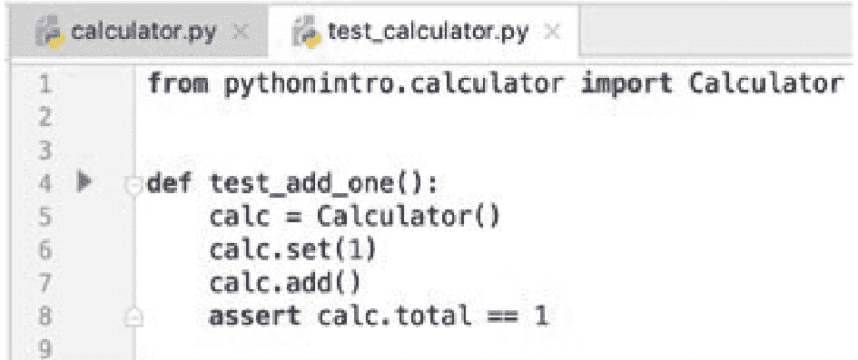

开发者可以点击绿色箭头来运行测试。然后他们将看到一个预配置为使用 PyTest 的运行菜单：


如果开发者现在选择运行选项；这将使用 PyTest 运行器来执行测试，收集发生的情况信息，并在 IDE 底部的 PyTest 输出视图中呈现：

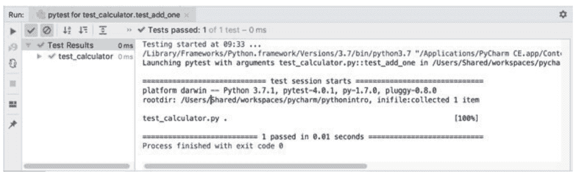

在这里，你可以看到左侧面板中有一个树状结构，目前包含在 `test_calculator.py` 文件中定义的一个测试。这个树状结构显示测试是通过还是失败。在这种情况下，我们有一个绿色勾号，表示测试通过。

在这个树状结构的右侧是主输出面板，显示运行测试的结果。在这种情况下，它显示 PyTest 只运行了一个测试，即在 `test_calculator.py` 中定义的 `test_add_one` 测试，并且 1 个测试通过。

如果你现在将测试中的断言更改为检查结果是否为 0，测试将会失败。运行时，IDE 显示将相应更新。

左侧面板中的树状结构现在显示测试失败，而右侧面板提供了有关失败测试的详细信息，包括失败断言在测试中的定义位置。这在尝试调试测试失败时非常有帮助。

## 使用 PyTest

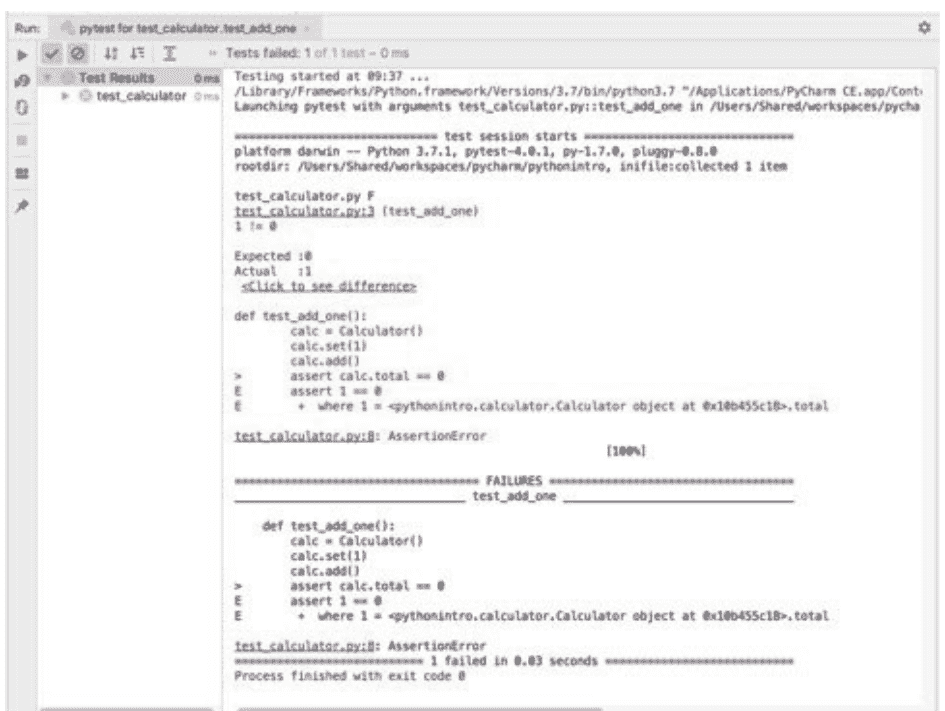

### 测试函数

我们可以使用 PyTest 测试独立函数以及类。例如，给定下面的 `increment` 函数（它只是将传入的任何数字加一）：

```python
def increment(x):
    return x + 1
```

我们可以为它编写一个 PyTest 测试，如下所示：

```python
def test_increment_integer_3():
    assert increment(3) == 4
```

唯一的真正区别是我们不必创建类的实例：

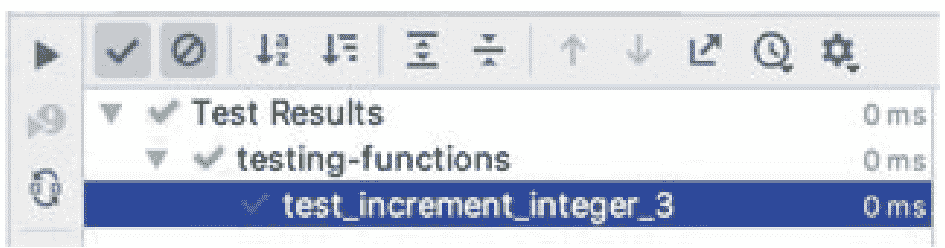

### 组织测试

测试可以分组到一个或多个文件中；PyTest 将在指定位置搜索所有遵循命名约定（文件名以 'test' 开头或结尾）的文件：

- 如果运行 PyTest 时未指定任何参数，则从 `test paths` 环境变量（如果已配置）或当前目录开始搜索适当命名的测试文件。或者，可以使用命令行参数的任何组合，如目录或文件名等。
- PyTest 将递归地搜索子目录，除非它们匹配 `no recurs dirs` 环境变量。
- 在这些目录中，它将搜索匹配命名约定 `test_*.py` 或 `*_test.py` 的文件。

测试也可以在测试文件内安排到测试类中。使用测试类有助于将测试分组在一起，并管理不同测试组的设置和拆卸行为。但是，通过将与不同函数或类相关的测试分离到不同的文件中，也可以达到相同的效果。

### 测试夹具

在每个测试之前或之后，或者在一组测试之前或之后运行一些行为是很常见的。这种行为通常在所谓的测试夹具中定义。

我们可以添加特定代码来运行：

- 在测试类模块的测试代码的开头和结尾（`setup__module`/`teardown__module`）
- 在测试类的开头和结尾（`setup__class`/`teardown__class`）或使用类级别夹具的替代样式（`setup`/`teardown`）
- 在测试函数调用之前和之后（`setup__function`/`teardown__function`）
- 在测试方法调用之前和之后（`setup__method`/`teardown__method`）

为了说明我们为什么可能使用夹具，让我们扩展我们的 Calculator 测试：

```python
def test_initial_value():
    calc = Calculator()
    assert calc.total == 0

def test_add_one():
    calc = Calculator()
    calc.set(1)
    calc.add()
    assert calc.total == 1

def test_subtract_one():
    calc = Calculator()
    calc.set(1)
    calc.sub()
    assert calc.total == -1

def test_add_one_and_one():
    calc = Calculator()
    calc.set(1)
    calc.add()
    calc.set(1)
    calc.add()
    assert calc.total == 2
```

我们现在有四个测试要运行（我们可以进一步扩展，但这目前足够了）。这组测试的问题之一是我们在每个测试开始时都重复创建 Calculator 对象。虽然这本身不是一个问题，但它确实导致了代码重复，并且如果我们想更改创建计算器的方式，未来可能会出现维护问题。它也可能不如为每个测试重用 Calculator 对象高效。

然而，我们可以定义一个夹具，该夹具可以在每个单独的测试函数执行之前运行。为此，我们将编写一个新函数，并在该函数上使用 `pytest.fixture` 装饰器。这将该函数标记为特殊函数，并且它可以用作单个函数的夹具。

需要夹具的函数应接受对夹具的引用作为单个测试函数的参数。对于

## 参数化测试

测试的一个常见需求是使用多个不同的输入值多次运行相同的测试。这可以大大减少必须定义的测试数量。此类测试被称为参数化测试；测试的参数值使用 [@pytest.mark.parametrize](https://docs.pytest.org/en/latest/how-to/parametrize.html) 装饰器指定。

```python
@pytest.mark.parametrize('input1,input2,expected', [
    (3, 1, 4),
    (3, 2, 5),
])
def test_calculator_add_operation(calculator, input1, input2, expected):
    calculator.set(input1)
    calculator.add()
    calculator.set(input2)
    calculator.add()
    assert calculator.total == expected
```

这展示了为计算器设置参数化测试，其中两个输入值相加并与预期结果进行比较。请注意，参数在装饰器中命名，然后使用元组列表来定义参数要使用的值。在这种情况下，`test_calculator_add_operation` 将运行两次，分别传入 3、1 和 4，然后传入 3、2 和 5 作为参数 `input1`、`input2` 和 `expected`。

## 异常测试

你可以编写测试来验证是否引发了异常。这很有用，因为测试负面行为与测试正面行为同样重要。例如，我们可能希望验证在尝试从银行账户取款导致超过透支限额时，是否会引发特定异常。

要在 PyTest 中验证异常的存在，请使用 `with` 语句和 `pytest.raises`。这是一个上下文管理器，它将在退出时验证是否引发了指定的异常。其用法如下：

```python
with pytest.raises(accounts.BalanceError):
    current_account.withdraw(200.0)
```

## 忽略测试

在某些情况下，为尚未实现的功能编写测试是有用的；这可能是为了确保测试不会被遗忘，或者因为它有助于记录被测试项应该做什么。然而，如果运行该测试，整个测试套件将会失败，因为该测试是针对尚未编写的行为运行的。

解决这个问题的一种方法是使用 `@pytest.mark.skip` 装饰器装饰测试：

```python
@pytest.mark.skip(reason='not implemented yet')
def test_calculator_multiply(calculator):
    calculator.multiply(2, 3)
    assert calculator.total == 6
```

这表明 PyTest 应该记录该测试的存在，但不应尝试执行它。然后 PyTest 会注意到该测试被跳过了，例如在 PyCharm 中，这通过一个带斜线的圆圈来表示。

通常认为最佳实践是提供测试被跳过的原因，以便于跟踪。当 PyTest 跳过测试时，此信息也可用。

## 尝试

创建一个可用于测试目的的简单 Calculator 类。这个简单的计算器可以用于加、减、乘和除数字。

这将是一个纯粹的命令驱动应用程序，允许用户指定：

- 要执行的操作，以及
- 要与该操作一起使用的两个数字。

然后 Calculator 对象将返回一个结果。同一个对象可以用于重复这一系列步骤。计算器的这种一般行为在下面的流程图中进行了说明。

你还应该提供一个记忆功能，允许将当前结果加到或从当前记忆总数中减去。还应该能够检索记忆中的值并清除记忆。接下来，为 Calculator 类编写一组 PyTest 测试。

思考你需要编写哪些测试；记住你无法为操作可能使用的每个值编写测试；但要考虑边界值，如 0、-1、1、-10、+10 等。

当然，你还需要考虑计算器记忆功能行为的累积效应；即多次记忆加法或记忆减法以及它们的组合。

当你确定测试时，你可能会发现必须更新 Calculator 类的实现。你是否考虑了所有输入选项，例如除以零——在这些情况下应该发生什么。

## 用于测试的模拟

## 引言

测试软件系统并非易事；任何程序中涉及的函数、对象、方法等本身就可能是复杂的实体。在许多情况下，它们依赖于其他函数、方法和对象并与之交互；很少有函数和方法是孤立运行的。因此，一个函数或方法的成功或失败，或一个对象的整体状态，都取决于其他程序元素。

然而，一般来说，单独测试一个单元要比将其作为更大、更复杂系统的一部分进行测试容易得多。例如，让我们以一个Python类作为待测试的单个单元。如果我们能单独测试这个类，那么在编写测试和确定预期结果时，我们只需考虑该类对象的状态以及为该类定义的行为。

但是，如果该类与外部系统（如外部服务、数据库、第三方软件、数据源等）交互，那么测试过程就会变得更加复杂：

现在可能需要验证对数据库的数据更新，或发送到远程服务的信息等，以确认类对象的操作是否正确。这不仅使被测软件更加复杂，也使测试本身更加复杂。这意味着测试失败的可能性更大，测试本身可能包含缺陷或问题，并且测试将更难被人理解和维护。因此，编写单元测试或子系统测试的一个共同目标是能够隔离地测试元素/单元。

问题是，当一个函数或方法依赖于其他元素时，如何做到这一点？

将函数、方法和对象与其他程序或系统元素解耦的关键是使用模拟。这些模拟可用于将一个对象与另一个对象、一个函数与另一个函数、一个系统与另一个系统解耦；从而简化测试环境。这些模拟仅用于测试目的，例如，上述场景可以通过模拟每个外部系统来简化，如下所示：

模拟并非Python特有的概念，许多不同的语言都有许多可用的模拟库。然而，在本章中，我们将重点介绍`unittest.mock`库，该库自Python 3.3起就已成为Python标准发行版的一部分。

## 为什么使用模拟？

关于软件测试中的模拟，一个值得首先考虑的有用问题是“为什么要模拟？”。也就是说，为什么要一开始就使用模拟的概念；为什么不直接用真实的东西进行测试？

对此有几个答案，其中一些将在下面讨论：

隔离测试更容易。如引言所述，隔离测试一个单元（无论是类、函数、模块等）比依赖外部类、函数、模块等进行测试更容易。

真实的东西不可用。在许多情况下，需要模拟系统的部分或与其他系统的接口，因为真实的东西根本不可用。这可能有几个原因，包括它尚未开发出来。在软件开发的自然过程中，系统的某些部分可能比其他部分更早开发完成并准备好进行测试。如果某个部分依赖于另一部分来执行其操作的某些元素，那么尚未可用的系统就可以被模拟出来。在其他情况下，开发团队或测试团队可能无法访问真实的东西。这可能是因为它只在生产环境中可用。例如，如果一个软件开发机构正在开发一个子系统，它可能无法访问另一个子系统，因为它是专有的，只有在软件部署到客户组织内部后才能访问。

真实元素可能很耗时。我们希望测试运行得尽可能快，当然在持续集成环境中，我们希望它们运行得足够快，以便我们可以在一天内反复测试系统。在某些情况下，真实的东西可能需要大量时间来处理测试场景。由于我们想测试自己的代码，我们可能不关心我们无法控制的系统是否正确运行（至少在这个测试级别；它可能仍然是集成和系统测试的关注点）。因此，如果我们模拟真实系统并用提供更快响应时间（可能是因为它使用了预设响应）的模拟来替换它，我们就可以提高测试的响应时间。

真实的东西需要时间来设置。在持续集成环境中，系统的新的构建会定期和重复地进行测试（例如，每当其代码库发生更改时）。在这种情况下，可能需要将最终系统配置和部署到合适的环境以执行适当的测试。如果外部系统的配置、部署和初始化很耗时，那么模拟该系统可能更有效。

难以模拟某些情况。在测试场景中模拟特定情况可能很困难。这些情况通常与错误或异常情况有关，这些情况在正常运行的环境中绝不应该发生。然而，很可能需要验证如果这种情况确实发生，软件能否处理该场景。如果这些场景与外部（被测单元）系统如何失败或错误运行有关，那么可能需要模拟这些系统以能够生成这些场景。

我们希望测试可重复。就其本质而言，当你运行一个测试时，你希望它在每次使用相同输入运行时都通过或失败。你当然不希望测试有时通过有时失败。这意味着对测试没有信心，人们常常开始忽略失败的测试。如果测试所依赖的系统提供的数据不是可重复的，就可能发生这种情况。

这可能由几个不同的原因引起，但一个常见原因是它们返回真实数据。这样的真实数据可能会发生变化，例如，考虑一个使用资金与美元当前汇率数据馈送的系统。如果相关测试确认一笔以美元计价的交易使用当前汇率正确转换为资金，那么该测试每次运行时都可能产生不同的结果。在这种情况下，最好模拟当前汇率服务，以便使用固定/已知的汇率。

真实系统不够可靠。在某些情况下，真实系统本身可能不够可靠，无法进行可重复的测试。真实系统可能不允许测试被重复。最后，真实系统可能不允许测试被轻松重复。例如，一个涉及向交易订单管理系统提交一定数量IBM股票交易的测试，可能不允许该交易、该股票、该客户被运行多次（因为它看起来会是多笔交易）。然而，出于测试目的，我们可能希望在多个不同场景中多次测试提交这样的交易。因此，可能需要模拟真实的订单管理系统，以便能够编写此类测试。

## 什么是模拟？

上一节给出了使用模拟的几个原因；接下来要考虑的是什么是模拟？

模拟，包括模拟函数、方法和模拟对象，是这样的东西：

- 拥有与真实事物相同的接口，无论是模拟函数、方法还是整个对象。因此，它们接受相同范围和类型的参数，并使用相似的类型返回类似的信息。
- 定义的行为在某种程度上代表/模仿真实示例行为，但通常以非常受控的方式进行。这种行为可能是硬编码的，可能依赖于一组规则或简化的行为；可能非常简单，也可能本身相当复杂。

因此，它们模拟真实系统，并且从模拟外部看，实际上可能看起来就是真实系统。

在许多情况下，术语“模拟”用于涵盖模拟真实事物的各种不同方式；每种类型的模拟都有其自身的特征。因此，区分不同类型的模拟是有用的，因为这有助于确定在特定测试场景中要采用的模拟风格。

有不同类型的模拟，包括：

## 常见的模拟框架概念

如前所述，不仅Python，还有Java、C#和Scala等其他语言都存在多种模拟框架。所有这些框架都具有一个共同的核心行为。这种行为允许基于真实对象所呈现的接口来创建模拟函数、方法或对象。当然，与C#和Java等语言不同，Python没有正式的接口概念；然而，这并不妨碍模拟框架仍然使用相同的理念。

通常，一旦创建了模拟对象，就可以定义该模拟对象应如何表现；这通常涉及为函数或方法指定要使用的返回结果。还可以验证模拟对象是否按预期被调用，并使用了预期的参数。

实际的模拟对象可以通过编程方式或通过某种形式的装饰器添加到测试或一组测试中。无论哪种方式，在测试期间，模拟对象都将被用来替代真实对象。

然后可以使用断言来验证被测单元返回的结果，而模拟特定的方法通常用于验证（监视）在模拟对象上定义的方法。

## Python的模拟框架

由于Python的动态特性，它非常适合构建模拟函数、方法和对象。事实上，Python有几种广泛使用的模拟框架，包括：

- unittest.mock：unittest.mock（从Python 3.3开始包含在Python发行版中）。这是Python附带的默认模拟库，用于在Python测试中创建模拟对象。
- pymox：这是一个广泛使用的模拟框架。它是一个开源框架，具有一套更完整的设施来强制执行模拟类的接口。
- Mocktest：这是另一个流行的模拟框架。它有自己的DSL（领域特定语言）来支持模拟，并为模拟对象提供了一套广泛的期望匹配行为。

在本章的剩余部分，我们将重点介绍unittest.mock库，因为它作为标准Python发行版的一部分提供。

## unittest.mock库

标准的Python模拟库是unittest.mock库。它自Python 3.3起就包含在标准Python发行版中，并为单元测试定义模拟对象提供了一种简单的方法。

unittest.mock库的关键是Mock类及其子类MagicMock。Mock和MagicMock对象可用于模拟函数、方法甚至整个类。这些模拟对象可以定义预设响应，以便当它们被被测单元调用时，它们会做出适当的响应。现有对象也可以模拟其属性或单个方法，从而允许以已知状态和指定行为来测试对象。

为了方便使用模拟对象，该库提供了`@unittest.mock.patch()`装饰器。此装饰器可用于将真实函数和对象替换为模拟实例。装饰器背后的函数也可以用作上下文管理器，允许在with-as语句中使用，从而在需要时对模拟的作用域进行细粒度控制。

## Mock和MagicMock类

unittest.mock库提供了Mock类和MagicMock类。Mock类是模拟对象的基类。MagicMock类是Mock类的子类。它被称为MagicMock类，因为它为几个魔术方法（如`__len__()`、`__str__()`和`__iter__()`）提供了默认实现。

作为一个简单的例子，考虑以下要测试的类：

```python
class SomeClass():
    def _hidden_method(self):
        return 0
    def public_method(self, x):
        return self.hidden_method() + x
```

这个类定义了两个方法；一个旨在作为类公共接口的一部分（`public_method()`），另一个仅用于内部或私有使用（`_hidden_method()`）。注意，隐藏方法使用了以下划线（`_`）开头的命名约定。

假设我们希望测试`public_method()`的行为，并希望模拟出`_hidden_method()`。

我们可以通过编写一个测试来实现这一点，该测试将创建一个模拟对象并用它来替代真实的`_hidden_method()`。我们可能可以使用Mock类或MagicMock类来完成此操作；然而，由于MagicMock类提供了额外的功能，通常的做法是使用该类。因此，我们将做同样的事情。

要创建的测试将在测试类的一个方法内定义。测试方法和测试类的名称按照惯例是描述性的，因此将描述正在测试的内容，例如：

```python
from unittest.mock import *
from unittest import TestCase
from unittest import main

class test_SomeClass_public_interface(TestCase):
    def test_public_method(self):
        test_object = SomeClass()
        # Set up canned response on mock method
        test_object._hidden_method = MagicMock(name='hidden_method')
        test_object._hidden_method.return_value = 10
        # Test the object
        result = test_object.public_method(5)
        self.assertEqual(15, result, 'return value from public_method incorrect')
```

在这种情况下，请注意首先实例化被测类。然后实例化MagicMock并将其分配给要模拟的方法的名称。这实际上替换了test_object的该方法。MagicMock对象被赋予一个名称，因为这有助于处理unittest框架生成的报告中的任何问题。接下来，定义了模拟版本的`_hidden_method()`的预设响应；它将始终返回值10。

此时，我们已经设置了用于测试的模拟对象，现在准备运行测试。这在下一行完成，其中在test_object上调用`public_method()`并传入参数5。然后存储结果。

然后测试验证结果以确保其正确；即返回的值是15。

尽管这是一个非常简单的例子，但它说明了如何使用MagicMock类来模拟一个方法。

## 补丁工具

`unittest.mock.patch()`、`unittest.mock.patch.object()`和`unittest.mock.patch.dict()`装饰器可用于简化模拟对象的创建。

- patch装饰器接受一个补丁目标，并返回一个MagicMock对象来替代它。它可以用作TestCase方法或类装饰器。作为类装饰器，它会自动装饰类中的每个测试方法。

也可以通过 `with` 和 `with-as` 语句用作上下文管理器。

- `patch.object` 装饰器可以接受两个或三个参数。当提供三个参数时，它会将要修补的对象替换为给定属性/方法名称的模拟对象。当提供两个参数时，要修补的对象会为指定的属性/函数提供一个默认的 `MagicMock` 对象。
- `patch.dict` 装饰器用于修补字典或类似字典的对象。

例如，我们可以使用 `@patch.object` 装饰器重写上一节中的示例，为 `__hidden__method()` 提供模拟对象（它返回一个链接到 `SomeClass` 的 `MagicMock`）：

```python
class test_SomeClass_public_interface(TestCase):
    @patch.object(SomeClass, '_hidden_method')
    def test_public_method(self, mock_method):
        # Set up canned response
        mock_method.return_value = 10
        # Create object to be tested
        test_object = SomeClass()
        result = test_object.public_method(5)
        self.assertEqual(15, result, 'return value from public_method incorrect')
```

在上面的代码中，`__hidden__method()` 在 `test_public_method()` 方法内被替换为 `SomeClass` 的模拟版本。请注意，该方法的模拟版本作为参数传递给测试方法，以便可以指定预设响应。你也可以使用 `@patch()` 装饰器来模拟模块中的函数。

例如，假设某个外部模块有一个 `api_call` 函数，我们可以使用 `@patch()` 装饰器来模拟该函数：

```python
@patch('external_module.api_call')
def test_some_func(self, mock_api_call):
```

这里使用 `patch()` 作为装饰器，并传递了目标对象的路径。目标路径是 `'external_module.api_call'`，它由模块名称和要模拟的函数组成。

## 模拟返回的对象

在目前看到的示例中，从模拟函数或方法返回的结果都是简单的整数。然而，在某些情况下，返回值本身也必须被模拟，因为真实系统会返回一个具有多个属性和方法的复杂对象。

以下示例使用 `MagicMock` 对象来表示从模拟函数返回的对象。该对象有两个属性，一个是响应代码，另一个是 JSON 字符串。JSON 代表 JavaScript 对象表示法，是 Web 服务中常用的格式。

```python
import external_module
from unittest.mock import *
from unittest import TestCase
from unittest import main
import json

def some_func():
    # Calls out to external API - which we want to mock
    response = external_module.api_call()
    return response

class test_some_func_calling_api(TestCase):
    @patch('external_module.api_call')
    def test_some_func(self, mock_api_call):
        # Sets up mock version of api_call
        mock_api_call.return_value = MagicMock(status_code=200,
                                               response=json.dumps({'key': 'value'}))
        # Calls some_func() that calls the (mock) api_call() function
        result = some_func()
        # Check that the result returned from some_func() is what was expected
        self.assertEqual(result.status_code, 200, "returned status code is not 200")
        self.assertEqual(result.response, '{"key": "value"}', "response JSON incorrect")
```

在这个例子中，被测试的函数是 `some_func()`，但 `some_func()` 调用了被模拟的函数 `external_module.api_call()`。这个模拟函数返回一个 `MagicMock` 对象，其中预设了 `status_code` 和 `response`。然后断言验证 `some_func()` 返回的对象包含正确的状态码和响应。

## 验证模拟是否被调用

使用 `unittest.mock`，可以通过 `assert_called()`、`assert_called_with()` 或 `assert_called_once_with()` 来验证模拟函数或方法是否被适当调用，具体取决于函数是否接受参数。

以下版本的 `test_some_func_with_params()` 测试方法验证了模拟的 `api_call()` 函数是否使用正确的参数被调用。

```python
@patch('external_module.api_call_with_param')
def test_some_func_with_param(self, mock_api_call):
    # Sets up mock version of api_call
    mock_api_call.return_value = MagicMock(status_code=200,
                                           response=json.dumps({'age': '23'}))
    result = some_func_with_param('Phoebe')
    # Check result returned from some_func() is what was expected
    self.assertEqual(result.response, '{"age": "23"}', 'JSON result incorrect')
    # Verify that the mock_api_call was called with the correct params
    mock_api_call.api_call_with_param.assert_called_with('Phoebe')
```

如果我们希望验证它只被调用了一次，可以使用 `assert_called_once_with()` 方法。

## Mock 和 MagicMock 的用法

### 为模拟对象命名

给你的模拟对象起个名字会很有用。当模拟对象出现在测试失败消息中时，会使用这个名称。该名称也会传播到模拟对象的属性或方法：

```python
mock = MagicMock(name='foo')
```

### 模拟类

除了模拟类上的单个方法外，还可以模拟整个类。这是通过向 `patch()` 装饰器提供要修补的类的名称（不带命名的属性/方法）来完成的。在这种情况下，整个类将被一个 `MagicMock` 对象替换。然后你必须指定该类应如何表现。

```python
import people
from unittest.mock import *
from unittest import TestCase
from unittest import main

class MyTest(TestCase):
    @patch('people.Person')
    def test_one(self, MockPerson):
        self.assertIs(people.Person, MockPerson)
        instance = MockPerson.return_value
        instance.calculate_pay.return_value = 250.0
        payroll = people.Payroll()
        result = payroll.generate_payslip(instance)
        self.assertEqual('You earned 250.0', result, 'payslip incorrect')
```

在这个例子中，`people.Person` 类被模拟了。这个类有一个 `calculate_pay()` 方法，这里正在被模拟。`Payroll` 类有一个 `generate_payslip()` 方法，它期望接收一个 `Person` 对象。然后它使用 person 对象的 `calculate_pay()` 方法提供的信息来生成 `generate_payslip()` 方法返回的字符串。

### 模拟类上的属性

模拟对象上的属性可以很容易地定义，例如，如果我们想在模拟对象上设置一个属性，我们只需为该属性赋值：

```python
import people
from unittest.mock import *
from unittest import TestCase

class MyTest(TestCase):
    @patch('people.Person')
    def test_one(self, MockPerson):
        self.assertIs(people.Person, MockPerson)
        instance = MockPerson.return_value
        instance.age = 24
        instance.name = 'Adam'
        self.assertEqual(24, instance.age, 'age incorrect')
        self.assertEqual('Adam', instance.name, 'name incorrect')
```

在这种情况下，属性 `age` 和 `name` 已被添加到 `people.Person` 类的模拟实例中。

如果属性本身需要是一个模拟对象，那么只需将一个 `MagicMock`（或 `Mock`）对象赋值给该属性即可：

```python
instance.address = MagicMock(name='Address')
```

### 模拟常量

模拟常量非常容易；这可以使用 `@patch()` 装饰器并提供常量的名称和要使用的新值来完成。这个值可以是字面值，如 `42` 或 `'Hello'`，也可以是模拟对象本身（例如 `MagicMock` 对象）。例如：

```python
@patch('mymodule.MAX_COUNT', 10)
def test_something(self):
    # Test can now use mymodule.MAX_COUNT
```

### 模拟属性

也可以模拟 Python 属性。这同样使用 `@patch` 装饰器，但使用 `unittest.mock.PropertyMock` 类和 `new_callable` 参数。例如：

```python
@patch('mymodule.Car.wheels', new_callable=mock.PropertyMock)
def test_some_property(self, mock_wheels):
    mock_wheels.return_value = 6
    # Rest of test method
```

### 使用模拟对象引发异常

在创建模拟对象时可以指定的一个非常有用的属性是 `side_effect`。如果你将其设置为一个异常类或实例，那么当模拟对象被调用时，将引发该异常，例如：

```python
mock = Mock(side_effect=Exception('Boom!'))
mock()
```

这将导致在调用 `mock()` 时引发 `Exception`。

### 将 Patch 应用于每个测试方法

如果你想在测试类中为每个测试模拟（mock）某个对象，可以装饰整个类，而不是逐个装饰每个方法。装饰类的效果是，补丁（patch）将自动应用于该类中的所有测试方法（即所有以‘test’开头的方法）。例如：

```python
import people
from unittest.mock import *
from unittest import TestCase
from unittest import main

@patch('people.Person')
class MyTest(TestCase):
    def test_one(self, MockPerson):
        self.assertIs(people.Person, MockPerson)

    def test_two(self, MockSomeClass):
        self.assertIs(people.Person, MockSomeClass)

    def do_something(self):
        return 'something'
```

在上面的测试类中，测试方法 `test_one` 和 `test_two` 会接收到 `Person` 类的模拟版本。然而，`do_something()` 方法不受影响。

## 将 Patch 用作上下文管理器

`patch` 函数可以用作上下文管理器。这提供了对模拟对象作用域的精细控制。

在下面的示例中，`test_one()` 方法包含一个 `with-as` 语句，我们用它来将 `person` 类补丁（模拟）为 `MockPerson`。这个模拟类仅在 `with-as` 语句内部可用。

```python
import people
from unittest.mock import *
from unittest import TestCase
from unittest import main

class MyTest(TestCase):
    def test_one(self):
        with patch('people.Person') as MockPerson:
            self.assertIs(people.Person, MockPerson)
            instance = MockPerson.return_value
            instance.calculate_pay.return_value = 250.0
            payroll = people.Payroll()
            result = payroll.generate_payslip(instance)
            self.assertEqual('You earned 250.0', result, 'payslip incorrect')
```

## 在使用的地方进行模拟

使用 `unittest.mock` 库的人最常犯的错误是在错误的地方进行模拟。规则是：你必须在**使用**它的地方进行模拟；或者换句话说，你必须始终在**导入**真实对象的地方进行模拟，而不是在它被**导出**的地方。

## 补丁顺序问题

可以在一个测试方法上使用多个 `patch` 装饰器。然而，你定义 `patch` 装饰器的顺序很重要。理解正确顺序的关键是**反向推导**，这样当模拟对象被传递给测试方法时，它们会被传递给正确的参数。例如：

```python
@patch('mymodule.sys')
@patch('mymodule.os')
@patch('mymodule.os.path')
def test_something(self, mock_os_path, mock_os, mock_sys):
    # 测试方法的其余部分
```

请注意，最后一个 `patch` 的模拟对象被传递给 `test_something()` 方法的第二个参数（`self` 是所有方法的第一个参数）。依次类推，第一个 `patch` 的模拟对象被传递给最后一个参数。因此，模拟对象传递给测试方法的顺序与它们定义的顺序**相反**。

## 应该使用多少个模拟对象？

一个值得思考的有趣问题是：每个测试应该使用多少个模拟对象？

这是软件测试社区内大量辩论的主题。关于这个话题的一般经验法则如下，但请记住这些是指导方针，而非硬性规定。

-   **避免每个测试使用超过 2 或 3 个模拟对象。** 你应该避免使用超过 2-3 个模拟对象，因为模拟对象本身会变得难以管理。许多人还认为，如果你需要每个测试使用超过 2-3 个模拟对象，那么可能存在一些需要考虑的底层设计问题。例如，如果你正在测试一个 Python 类，那么该类可能有太多的依赖项。或者，该类可能承担了太多的责任，应该被分解成几个独立的类；每个类都有一个明确的职责。另一个原因可能是该类的行为封装得不够，你允许其他元素以更非正式的方式与该类交互（即该类与其他元素之间的接口不够清晰/明确）。结果是，在继续开发和测试之前，可能需要重构你的类。
-   **只模拟你的“最近邻居”。** 你只应该模拟你的“最近邻居”，无论它是一个函数、方法还是对象。你应该尽量避免模拟依赖项的依赖项。如果你发现自己这样做，那么配置、维护、理解和开发都会变得更加困难。而且，你越来越有可能是在测试模拟对象本身，而不是你自己的函数、方法或类。

## 模拟注意事项

以下提供了一些在测试中使用模拟时的经验法则：

-   **不要过度模拟**——如果你这样做，最终可能只是在测试模拟对象本身。
-   **决定模拟什么**，典型的模拟对象包括那些尚未可用的元素、那些默认不可重复的元素（如实时数据馈送）或系统中那些耗时或复杂的元素。
-   **决定在哪里模拟**，例如被测单元的接口。你想测试该单元，因此它与另一个系统、函数、类的任何接口都可能是模拟的候选对象。
-   **决定何时模拟**，以便确定测试的边界。
-   **决定如何实现你的模拟对象。** 例如，你需要考虑将使用哪个模拟框架，或者如何模拟较大的组件（如数据库）。

## 尝试

模拟的原因之一是确保测试是可重复的。在这个练习中，我们将模拟随机数生成器的使用，以确保我们的测试可以轻松重复。

以下程序生成一副扑克牌，并从中随机抽取一张牌：

```python
import random

def create_suite(suite):
    return [(i, suite) for i in range(1, 14)]

def pick_a_card(deck):
    print('You picked')
    position = random.randint(0, 52)
    print(deck[position][0], "of", deck[position][1])
    return (deck[position])

# 设置数据
hearts = create_suite('hearts')
spades = create_suite('spades')
diamonds = create_suite('diamonds')
clubs = create_suite('clubs')

# 组成一副牌
deck = hearts + spades + diamonds + clubs

# 从牌堆中随机抽取一张
card = pick_a_card(deck)
```

每次运行程序都会抽到不同的牌，例如在连续两次运行中，会得到如下输出：

```
You picked
13 of clubs
You picked
1 of hearts
```

我们现在想为 `pick_a_card()` 函数编写一个测试。你应该为此模拟 `random.randint()` 函数。

## 文件、路径和 IO 简介

### 简介

操作系统是任何计算机系统的关键组成部分。它由管理 CPU 上运行的进程、内存如何利用和管理、外围设备（如打印机和扫描仪）如何使用的元素组成，它允许计算机系统与其他系统通信，并为所使用的文件系统提供支持。

文件系统允许程序永久存储数据。这些数据随后可以在以后被应用程序检索；可能是在整个计算机关闭并重新启动之后。

文件管理系统负责管理文件中数据的长期存储的创建、访问和修改。这些数据可以存储在本地或远程的磁盘、磁带、DVD 驱动器、USB 驱动器等上。

尽管情况并非总是如此；但大多数现代操作系统将文件组织成层次结构，通常采用倒置树的形式。例如，在下图中，目录结构的根目录显示为‘/’。这个根目录包含六个子目录。依次地，Users 子目录包含另外 3 个目录，依此类推：

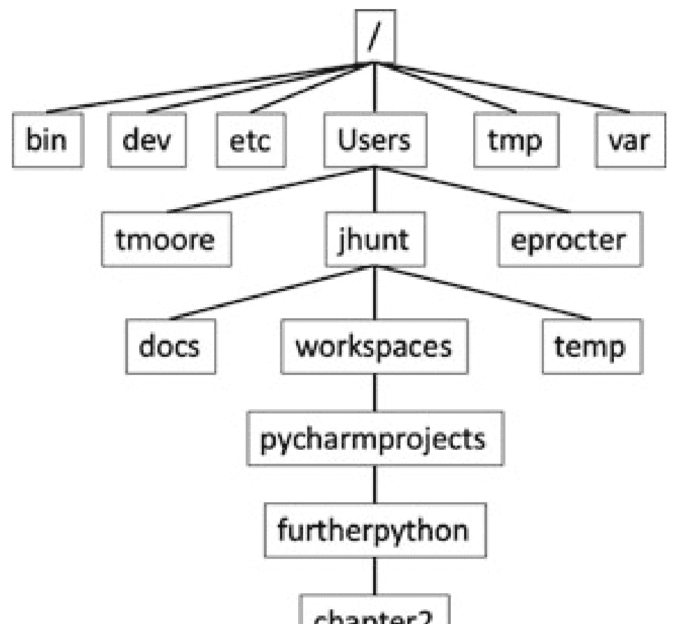

每个文件都包含在一个目录中（在某些操作系统如 Windows 上也称为文件夹）。一个目录可以包含零个或多个文件，以及零个或多个目录。

对于任何给定的目录，它与其他目录存在如下所示的关系（以目录 jhunt 为例）：

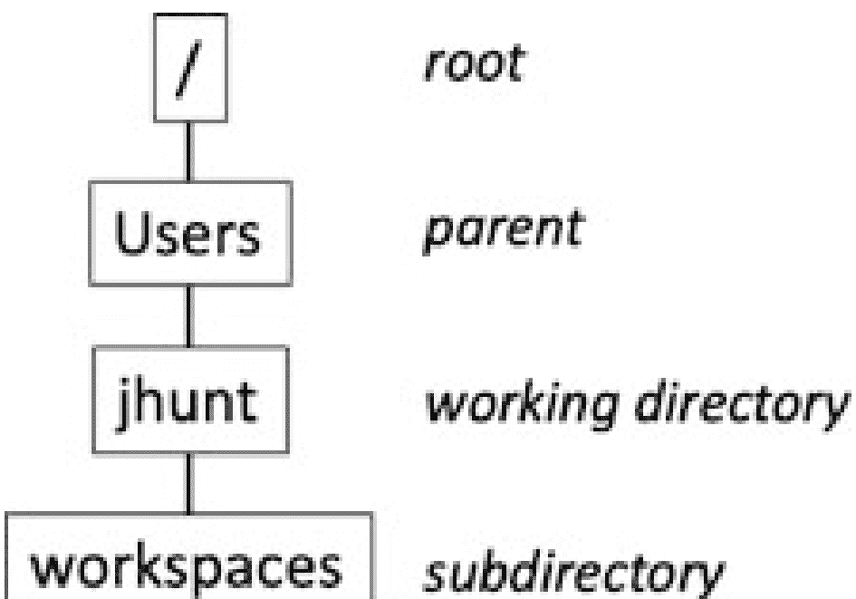

根目录是层次目录树结构的起点。给定目录的子目录称为子目录。包含给定目录的目录称为父目录。

目录被称为父目录。在任何时刻，程序或用户当前所在的目录被称为当前工作目录。

用户或程序可以根据需要在这个目录结构中移动。为此，用户通常可以在终端或命令窗口中发出一系列命令。例如使用 `cd` 来更改目录，或使用 `pwd` 来打印工作目录。或者，操作系统的图形用户界面（GUI）通常包含某种形式的文件管理器应用程序，允许用户以树状结构查看文件结构。下面展示了 Mac 的 Finder 程序，其中显示了一个 pycharm 项目目录的树状结构。Windows 资源管理器程序也提供了类似的视图。

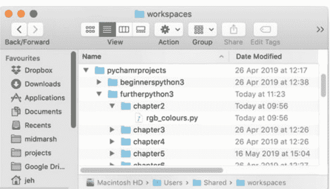

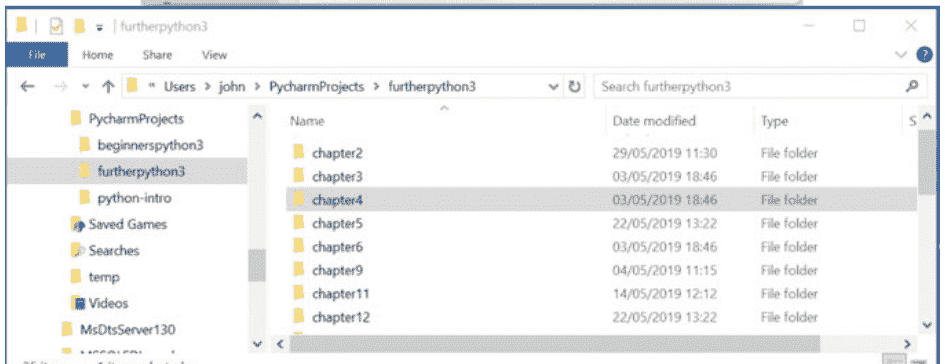

## 文件属性

文件会有一组与之关联的属性，例如创建日期、最后更新/修改日期、文件大小等。它通常还会有一个属性来指示文件的所有者是谁。这可能是文件的创建者；但是，文件的所有权可以通过命令行或 GUI 界面进行更改。例如，在 Linux 和 Mac OS X 上，可以使用 `chown` 命令来更改文件所有权。

它还可以有其他属性，指示谁可以读取、写入或执行该文件。在类 Unix 系统（如 Linux 和 Mac OS X）中，这些访问权限可以为文件所有者、文件所属的组以及所有其他用户指定。

文件所有者可以拥有读取、写入和执行文件的权限。这些通常分别用符号 ‘r’、‘w’ 和 ‘x’ 表示。例如，以下使用了与 Unix 文件相关的符号表示法，表示允许文件所有者读取、写入和执行文件：

```
-rwx------
```

这里第一个破折号留空，因为它与特殊文件（或目录）有关，接下来的三个字符代表所有者的权限，随后的三个字符代表所有其他用户的权限。由于此示例在第一组三个字符中是 *rwx*，这表示用户可以读取 ‘r’、写入 ‘w’ 和执行 ‘x’ 文件。然而，接下来的六个字符都是破折号，表示组和所有其他用户根本无法访问该文件。文件所属的组是一个可以拥有任意数量用户的组。组的成员将拥有文件上组设置所指示的访问权限。对于文件所有者，这些权限可以是读取、写入或执行文件。例如，如果允许组成员读取和执行文件，则使用符号表示法显示为：

```
---r-x---
```

现在这个示例表明只有组成员可以读取和执行文件；请注意，组成员不能写入文件（因此他们不能修改文件）。

如果用户既不是文件的所有者，也不是文件所属组的成员，那么他们的访问权限属于“所有其他用户”类别。同样，该类别可以有读取、写入或执行权限。例如，使用符号表示法，如果所有用户都可以读取文件但不能执行其他任何操作，则显示为：

```
-----r--
```

当然，文件可以混合上述权限，例如允许所有者读取、写入和执行文件，组可以读取和执行文件，但所有其他用户只能读取文件。这将显示为：

```
-rwx-xr--
```

除了符号表示法，类 Unix 系统还使用数字表示法。数字表示法使用三个数字来表示权限。最右边的三个数字中的每一个代表权限的不同组成部分：所有者、组和其他用户。

这些数字中的每一个都是其在二进制系统中的组成部分位的总和。因此，特定的位会加到总和中，如下所示：

- 读取位为其总和增加 4（二进制 100），
- 写入位为其总和增加 2（二进制 010），以及
- 执行位为其总和增加 1（二进制 001）。

以下符号表示法可以用等效的数字表示法表示：

| 符号表示法 | 数字表示法 | 含义 |
| :--- | :--- | :--- |
| rwx------ | 0700 | 仅所有者可读、写和执行 |
| -rwxrwx--- | 0770 | 所有者和组可读、写和执行 |
| -rwxrwxrwx | 0777 | 所有者、组和其他用户可读、写和执行 |

路径是通向特定子目录或文件的特定目录组合。

这个概念很重要，因为 Unix/Linux/Max OS X 和 Windows 文件系统表示目录和文件的倒置树。因此，能够唯一地引用树中的位置非常重要。

例如，在下图中，路径 `/Users/jhunt/workspaces/pycharmprojects/furtherpython/chapter2` 被高亮显示：

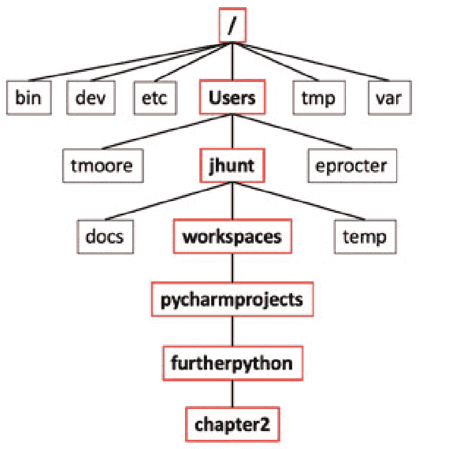

路径：`/Users/jhunt/workspaces/pycharmprojects/furtherpython/chapter2`

路径可以是绝对路径或相对路径。绝对路径是从文件系统根目录到特定子目录或文件的完整目录序列。

相对路径是从当前工作目录到特定子目录或文件的序列。

无论程序或用户当前在目录树中的哪个位置，绝对路径都有效。然而，相对路径可能仅在特定位置有意义。

例如，在下图中，相对路径 `pycharmprojects/furtherpython/chapter2` 仅相对于目录 workspace 有意义：

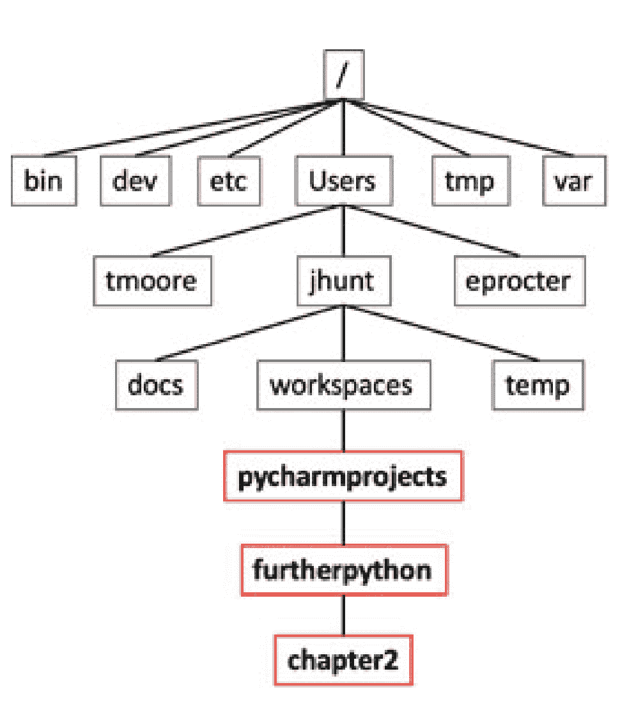

相对路径：`pycharmprojects/furtherpython/chapter2`

请注意，绝对路径从根目录（用 ‘/’ 表示）开始，而相对路径从特定子目录（如 `pycharm projects`）开始。

## 文件输入/输出

文件输入/输出（通常简称为文件 I/O）涉及从文件读取数据和向文件写入数据。写入的数据可以是不同的格式。

例如，Unix/Linux 和 Windows 系统中常用的一种格式是 ASCII 文本格式。ASCII 格式（或美国信息交换标准代码）是一组表示各种字符的代码，被操作系统广泛使用。下表说明了一些 ASCII 字符代码及其表示的内容：

| 十进制代码 | 字符 | 含义 |
|---|---|---|
| 42 | * | 星号 |
| 43 | + | 加号 |
| 48 | 0 | 零 |
| 49 | 1 | 一 |
| 50 | 2 | 二 |
| 51 | 3 | 三 |
| 65 | A | 大写 A |
| 66 | B | 大写 B |
| 67 | C | 大写 C |
| 68 | D | 大写 D |
| 97 | a | 小写 a |
| 98 | b | 小写 b |
| 99 | c | 小写 c |
| 100 | d | 小写 d |

ASCII 是一种非常有用的文本文件格式，因为它们可以被各种编辑器和浏览器读取。这些编辑器和浏览器使得创建人类可读的文件变得非常容易。然而，像 Python 这样的编程语言通常使用不同的字符编码集，例如 Unicode 字符编码（如 UTF-8）。Unicode 是另一个使用各种代码表示字符的标准。Unicode 编码系统提供了比 ASCII 更广泛的可能字符编码范围，例如，2019 年 5 月发布的最新版本 Unicode 12.1 包含 137,994 个字符的集合，涵盖了 150 种现代和历史文字，以及多个符号集和表情符号。

然而，这意味着在 Python 中读取和写入 ASCII 文件时，可能需要将 ASCII 转换为 Unicode（例如 UTF-8），反之亦然。

另一个选择是使用二进制格式存储文件中的数据。使用二进制数据的优点是，从 Python 程序中使用的内部数据表示到文件中存储的格式，几乎不需要或完全不需要转换。它通常也比等效的 ASCII 格式更简洁，程序读写更快，并且占用更少的磁盘空间等。然而，二进制格式的缺点是它不是易于人类阅读的格式。对于其他程序来说，它也可能难以处理，特别是那些用其他编程语言（如 Java 或 C#）编写的程序，需要读取文件中的数据。

## 顺序访问与随机访问

数据可以从文件中读取（或写入），既可以采用顺序访问方式，也可以采用随机访问方式。

顺序访问文件中的数据意味着程序按顺序读取（或写入）数据，从文件开头开始，一次处理一个数据项，直到到达文件末尾。读取过程只会向前移动，并且只移动到下一个要读取的数据项。

随机访问数据文件意味着程序可以在任何时候读取（或写入）文件中的任何位置。也就是说，程序可以定位到文件中的特定点（或者更准确地说，一个指针可以定位在文件内），然后从该点开始读取（或写入）。如果是读取，它将相对于指针读取下一个数据项，而不是从文件开头读取。如果是写入数据，它将从该点开始写入数据，而不是在文件末尾写入。如果该点在文件中已有数据，则会被覆盖。这种访问方式也称为直接访问，因为计算机程序需要知道数据在文件中的存储位置，从而直接前往该位置获取数据。在某些情况下，数据的位置记录在索引中，因此也称为索引访问。

当程序每次读取数据时都需要按相同顺序访问信息时，顺序文件访问具有优势。此外，顺序读取或写入所有数据也比通过直接访问更快，因为无需移动文件指针。

然而，随机访问文件更灵活，因为数据无需按获取顺序写入或读取。也可以直接跳转到所需数据的位置并读取该数据（而无需顺序读取所有数据以找到感兴趣的数据项）。

## Python 中的文件与 I/O

在本书本节的剩余部分，我们将探讨 Python 中为读写文件提供的基本功能。我们还将了解文件 I/O 底层的流模型。之后，我们将探讨广泛使用的 CSV 和 Excel 文件格式以及支持这些格式的可用库。本节最后将探讨 Python 中的正则表达式功能。虽然最后一个主题严格来说不属于文件 I/O，但它通常用于解析从文件读取的数据，以筛选出不需要的信息。

## 读写文件

### 简介

从文件读取数据和向文件写入数据在许多程序中非常常见。Python 为处理各种类型的文件提供了大量支持。本章将向你介绍 Python 中核心的文件 I/O 功能。

### 获取文件引用

在 Python 中读取和写入文本文件相对简单。内置的 `open()` 函数会为你创建一个文件对象，你可以使用该对象从文件读取和/或向文件写入数据。

该函数至少需要你想要操作的文件名作为参数。你还可以选择指定访问模式（例如，读取、写入、追加等）。如果不指定模式，则文件以只读模式打开。你还可以指定是否希望与文件的交互是缓冲的，这可以通过将数据读取分组来提高性能。

`open()` 函数的语法如下：

```
file_object = open(file_name, access_mode, buffering)
```

其中

- `file_name` 表示要访问的文件。
- `access_mode` 访问模式决定了文件的打开方式，即读取、写入、追加等。下表列出了所有可能的值。这是一个可选参数，默认的文件访问模式是读取（`r`）。
- `buffering` 如果 `buffering` 值设置为 0，则不进行缓冲。如果 `buffering` 值为 1，则在访问文件时执行行缓冲。

访问模式值如下表所示。

| 模式 | 描述 |
|---|---|
| `r` | 以只读方式打开文件。文件指针置于文件开头。这是默认模式 |
| `rb` | 以二进制格式打开文件进行只读。文件指针置于文件开头。这是默认模式 |
| `r+` | 打开文件进行读写。文件指针置于文件开头 |
| `rb+` | 以二进制格式打开文件进行读写。文件指针置于文件开头 |
| `w` | 打开文件进行只写。如果文件存在则覆盖。如果文件不存在，则创建一个新文件用于写入 |
| `wb` | 以二进制格式打开文件进行只写。如果文件存在则覆盖。如果文件不存在，则创建一个新文件用于写入 |
| `w+` | 打开文件进行读写。如果文件存在则覆盖现有文件。如果文件不存在，则创建一个新文件用于读写 |
| `wb+` | 以二进制格式打开文件进行读写。如果文件存在则覆盖现有文件。如果文件不存在，则创建一个新文件用于读写 |
| `a` | 打开文件进行追加。如果文件存在，文件指针位于文件末尾。即文件处于追加模式。如果文件不存在，则创建一个新文件用于写入 |
| `ab` | 以二进制格式打开文件进行追加。如果文件存在，文件指针位于文件末尾。即文件处于追加模式。如果文件不存在，则创建一个新文件用于写入 |
| `a+` | 打开文件进行追加和读取。如果文件存在，文件指针位于文件末尾。文件以追加模式打开。如果文件不存在，则创建一个新文件用于读写 |
| `ab+` | 以二进制格式打开文件进行追加和读取。如果文件存在，文件指针位于文件末尾。文件以追加模式打开。如果文件不存在，则创建一个新文件用于读写 |

文件对象本身有几个有用的属性，例如

- `file.closed` 如果文件已关闭（因为已对其调用 `close()` 方法而无法再访问），则返回 `True`。
- `file.mode` 返回文件打开时的访问模式。
- `file.name` 文件的名称。

`file.close()` 方法用于在完成文件操作后关闭文件。这将把任何未写入的信息刷新到文件（这可能是由于缓冲造成的），并关闭文件对象到实际底层操作系统文件的引用。这样做很重要，因为保持文件引用打开可能会在较大的应用程序中引起问题，因为通常一次只能有一定数量的文件引用可用，长时间运行后这些引用可能全部用尽，导致未来无法打开文件而抛出错误。

以下简短的代码片段说明了上述概念：

```
file = open('myfile.txt', 'r+')
print('file.name:', file.name)
print('file.closed:', file.closed)
print('file.mode:', file.mode)
file.close()
print('file.closed now:', file.closed)
```

输出如下：

- file.name: myfile.txt
- file.closed: False
- file.mode: r+
- file.closed now: True

### 读取文件

当然，设置好文件对象后，我们希望能够访问文件内容或向该文件写入数据（或两者兼做）。从文本文件读取数据由 `read()`、`readline()` 和 `readlines()` 方法支持：

- `read()` 方法 此方法将返回文件的全部内容作为一个字符串。
- `readline()` 方法从文件中读取下一行文本。它返回一行上的所有文本，直到并包括换行符。可用于一次读取文件的一行。
- `readlines()` 方法返回文件中所有行的列表，其中列表的每个元素代表一行。

请注意，一旦你使用上述任一操作从文件中读取了某些文本，那么该行就不会再次读取。因此，无论文件内容如何，再次使用 `readlines()` 都会返回一个空列表。

以下示例说明了如何使用 `readlines()` 方法将文本文件中的所有文本读入程序，然后依次打印每一行：

```
file = open('myfile.txt', 'r')
lines = file.readlines()
for line in lines:
    print(line, end='')
file.close()
```

请注意，在 `for` 循环中，我们向 `print` 函数指示我们希望结束字符是 `''` 而不是

## 文件内容迭代

如前一个示例所示，逐行处理文件内容是非常常见的需求。事实上，Python 通过让文件对象支持迭代，使得这一操作变得极其简单。文件迭代会访问文件中的每一行，并将该行提供给 for 循环。因此，我们可以这样编写：

```
file = open('myfile.txt', 'r')
for line in file:
    print(line, end='')
file.close()
```

也可以使用列表推导式，以一种非常简洁的方式将文件中的行加载并处理到列表中。这与 `readlines()` 的效果类似，但我们现在能够在创建列表之前预处理数据：

```
file = open('myfile.txt', 'r')
lines = [line.upper() for line in file]
file.close()
print(lines)
```

## 将数据写入文件

`write()` 方法支持将字符串写入文件。当然，我们创建的文件对象必须具有允许写入的访问模式（例如 'w'）。请注意，`write` 方法不会在字符串末尾添加换行符（表示为 '\n'）——你必须手动完成此操作。

下面是一个写入文本文件的简短程序示例：

```
print('Writing file')
f = open('my-new-file.txt', 'w')
f.write('Hello from Python!\n')
f.write('Working with files is easy...\n')
f.write('It is cool ...\n')
f.close()
```

这将创建一个名为 my-new-file.txt 的新文件。然后，它向文件写入三个字符串，每个字符串末尾都有一个换行符；之后关闭文件。

其效果是创建一个名为 myfile.txt 的新文件，其中包含三行内容：

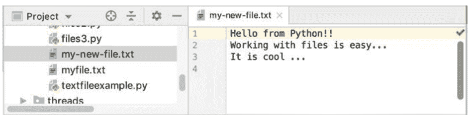

## 使用文件和 with 语句

与几种其他需要关闭资源的类型一样，文件对象类实现了上下文管理器协议，因此可以与 `with` 语句一起使用。因此，通常会编写使用 `with as` 结构打开文件的代码，从而确保在代码块执行完毕后文件会被关闭，例如：

```
with open('my-new-file.txt', 'r') as f:
    lines = f.readlines()
    for line in lines:
        print(line, end='')
```

## 文件输入模块

在某些情况下，你可能需要一次性从多个文件读取输入。你可以通过独立打开每个文件，然后读取内容并将该内容附加到列表等方式来实现。然而，这是一个足够常见的需求，以至于 `fileinput` 模块提供了一个函数 `fileinput.input()`，它可以接受一个文件列表，并将所有文件视为单个输入，从而大大简化了这个过程，例如：

```
with fileinput.input(files=('spam.txt', 'eggs.txt')) as f:
    for line in f:
        process(line)
```

`fileinput` 模块提供的功能包括：

-   返回当前正在读取的文件名。
-   返回当前文件的整数“文件描述符”。
-   返回刚刚读取的行的累计行号。
-   返回当前文件中的行号。在读取第一行之前，此函数返回 0。
-   一个布尔函数，指示刚刚读取的当前行是否是其文件的第一行。

其中一些功能在下面进行了说明：

```
with fileinput.input(files=('textfile1.txt',
    'textfile2.txt')) as f:
    line = f.readline()
    print('f.filename():', f.filename())
    print('f.isfirstline():', f.isfirstline())
    print('f.lineno():', f.lineno())
    print('f.filelineno():', f.filelineno())
    for line in f:
        print(line, end='')
```

## 重命名文件

可以使用 `os.rename()` 函数重命名文件。此函数接受两个参数：当前文件名和新文件名。它是 Python `os` 模块的一部分，该模块提供了可用于执行一系列文件处理操作（如重命名文件）的方法。要使用该模块，你首先需要导入它。下面是使用重命名函数的一个示例：

```
import os
os.rename('myfileoriginalname.txt', 'myfilenewname.txt')
```

## 删除文件

可以使用 `os.remove()` 方法删除文件。此方法删除通过文件名传递给它的指定文件。同样，它是 `os` 模块的一部分，因此必须先导入：

```
import os
os.remove('somefilename.txt')
```

## 随机访问文件

到目前为止的所有示例都表明文件是按顺序访问的，先读取第一行，然后是第二行，依此类推。虽然这（可能）是最常见的方法，但它不是 Python 支持的唯一方法；也可以使用随机访问方法来处理文件中的内容。

要理解随机文件访问的概念，了解我们可以维护一个指向文件的指针来指示我们在该文件中读取或写入数据的位置是很有帮助的。在从文件读取任何内容之前，指针位于文件开头之前，例如，读取第一行文本会将指针推进到文件中第二行的开头，依此类推。这个概念在下面进行了说明：

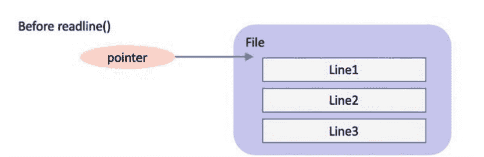

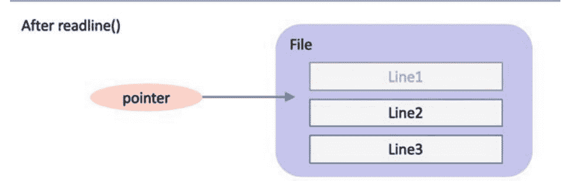

当随机访问文件内容时，程序员手动将指针移动到所需位置，并相对于该指针读取或写入文本。这意味着他们可以在文件中来回移动以读取和写入数据。

文件的随机访问功能由文件对象的 `seek` 方法提供：

-   `file.seek(offset, whence)` 此方法确定下一次读取或写入操作（取决于 `open()` 调用中使用的模式）发生的位置。

在上面，`offset` 参数表示读/写指针在文件中的位置。移动也可以是向前或向后（由负偏移量表示）。可选的 `whence` 参数表示偏移量相对于什么。`whence` 使用的值为：

-   0 表示偏移量相对于文件开头（默认值）。
-   1 表示偏移量相对于当前指针位置。
-   2 表示偏移量相对于文件末尾。

因此，我们可以将指针移动到相对于文件开头、文件末尾或当前位置的位置。

例如，在下面的示例代码中，我们创建一个新的文本文件并向该文件写入一组字符。此时，指针位于文件中的 'z' 之后。然而，我们随后使用 `seek()` 将指针移动到文件中的第 10 个字符，现在写入 'Hello'，接下来我们将指针重新定位到文件中的第 6 个字符并写出 'BOO'。然后我们关闭文件。最后，我们使用 `with as` 语句和 `open()` 函数从文件中读取所有行，由此我们将看到文件中的文本现在是 abcdefBOOjHELLOpqrstuvwxyz：

```
f = open('text.txt', 'w')
f.write('abcdefghijklmnopqrstuvwxyz\n')
f.seek(10, 0)
f.write('HELLO')
f.seek(6, 0)
f.write('BOO')
f.close()
with open('text.txt', 'r') as f:
    for line in f:
        print(line, end='')
```

## 目录

类 Unix 系统和 Windows 操作系统都是由目录和文件组成的层次结构。`os` 模块有几个函数可以帮助创建、删除和更改目录。这些包括：

-   `mkdir()` 此函数用于创建目录，它接受要创建的目录的名称作为参数。如果目录已存在，则会引发 `FileExistsError`。
-   `chdir()` 此函数可用于更改当前工作目录。这是应用程序默认读取/写入的目录。
-   `getcwd()` 此函数返回一个表示当前工作目录名称的字符串。
-   `rmdir()` 此函数用于删除/移除目录。它接受要删除的目录的名称作为参数。
-   `listdir()` 此函数返回一个列表，其中包含作为函数参数指定的目录中的条目名称（如果未给出名称，则使用当前目录）。

下面是一个简单的示例，说明了其中一些函数的用法：

```
import os
print('os.getcwd():', os.getcwd())
print('List contents of directory')
print(os.listdir())
print('Create mydir')
os.mkdir('mydir')
print('List the updated contents of directory')
print(os.listdir())
print('Change into mydir directory')
os.chdir('mydir')
print('os.getcwd():', os.getcwd())
print('Change back to parent directory')
os.chdir('..')
print('os.getcwd():', os.getcwd())
print('Remove mydir')
os.rmdir('mydir')
print('List the final contents of directory')
print(os.listdir())
```

## 临时文件

在许多应用程序的执行过程中，可能需要创建一个临时文件，该文件会在某个时刻创建，并在应用程序结束前被删除。当然，你可以自己管理这些临时文件，但是，`tempfile` 模块提供了一系列功能来简化这些临时文件的创建和管理。

在 `tempfile` 模块中，`TemporaryFile`、`NamedTemporaryFile`、`TemporaryDirectory` 和 `SpooledTemporaryFile` 是高级文件对象，它们提供了对临时文件和目录的自动清理功能。这些对象实现了上下文管理器协议。

`tempfile` 模块还提供了较低级别的函数 `mkstemp()` 和 `mkdtemp()`，可用于创建需要开发者自行管理并在适当时候删除的临时文件。

`tempfile` 模块的高级功能包括：

-   `TemporaryFile(mode='w+b')` 返回一个匿名的类文件对象，可用作临时存储区域。在托管上下文完成（通过 `with` 语句）或文件对象被销毁后，临时文件将从文件系统中移除。请注意，默认情况下所有数据都以二进制格式写入临时文件，这通常更高效。
-   `NamedTemporaryFile(mode='w+b')` 此函数的运行方式与 `TemporaryFile()` 完全相同，不同之处在于该文件在文件系统中有一个可见的名称。
-   `SpooledTemporaryFile(max_size=0, mode='w+b')` 此函数的运行方式与 `TemporaryFile()` 完全相同，不同之处在于数据会先在内存中暂存，直到文件大小超过 `max_size`，或者调用文件的 `fileno()` 方法，此时内容将被写入磁盘，后续操作与 `TemporaryFile()` 相同。
-   `TemporaryDirectory(suffix=None, prefix=None, dir=None)` 此函数创建一个临时目录。在上下文完成或临时目录对象被销毁后，新创建的临时目录及其所有内容将从文件系统中移除。

较低级别的函数包括：

-   `mkstemp()` 创建一个仅创建用户可读或可写的临时文件。
-   `mkdtemp()` 创建一个临时目录。该目录仅创建用户 ID 可读、可写和可搜索。
-   `gettempdir()` 返回用于临时文件的目录名称。这定义了本模块中其他函数使用的默认临时目录的默认值。

下面是一个使用 `TemporaryFile` 函数的示例。此代码导入 `tempfile` 模块，然后打印出用于临时文件的默认目录。接着，它创建一个 `TemporaryFile` 对象并打印其名称和模式（默认模式是二进制，但在此示例中我们已将其覆盖为使用纯文本）。然后我们向文件写入了一行内容。使用 `seek`，我们将位置重新定位到文件开头，然后读取刚刚写入的那一行。

```python
import tempfile
print('tempfile.gettempdir():', tempfile.gettempdir())
temp = tempfile.TemporaryFile('w+')
print('temp.name:', temp.name)
print('temp.mode:', temp.mode)
temp.write('Hello world!')
temp.seek(0)
line = temp.readline()
print('line:', line)
```

在 Apple Mac 上运行时的输出如下：

```
tempfile.gettempdir():
/var/folders/6n/8nrnt9f93pn66ypg9s5dq8y80000gn/T
temp.name: 4
temp.mode: w+
line: Hello world!
```

请注意，文件名是 '4'，并且临时目录不是一个有意义的名称！

## 处理路径

`pathlib` 模块提供了一组表示文件系统路径的类；即操作系统文件结构中目录和文件层次结构中的路径。它在 Python 3.4 中引入。此模块的核心类是 `Path` 类。

`Path` 对象非常有用，因为它提供了允许你操作和管理文件或目录路径的操作。`Path` 类还复制了 `os` 模块中可用的一些操作（如 `mkdir`、`rename` 和 `rmdir`），这意味着无需直接使用 `os` 模块。

路径对象使用 `Path` 构造函数创建；此函数实际上根据所使用的操作系统类型返回特定类型的 `Path`，例如 `WindowsPath` 或 `PosixPath`（用于 Unix 风格系统）。

`Path()` 构造函数接受要创建的路径，例如 Windows 上的 `'D:/mydir'`，Mac 上的 `'/Users/user1/mydir'`，或 Linux 上的 `'/var/temp'` 等。

然后你可以对 `Path` 对象使用几种不同的方法来获取有关路径的信息，例如：

-   `exists()` 根据路径是否指向现有文件或目录返回 `True` 或 `False`。
-   `is_dir()` 如果路径指向目录则返回 `True`。如果引用文件则返回 `False`。如果路径不存在也返回 `False`。
-   `is_file()` 如果路径指向文件则返回 `True`，如果路径不存在或路径引用目录则返回 `False`。
-   `absolute()` 如果一个 `Path` 对象既有根目录又有（如果适用）驱动器，则被认为是绝对路径。
-   `is_absolute()` 返回一个布尔值，指示 `Path` 是否为绝对路径。

下面是一个使用其中一些方法的示例：

```python
from pathlib import Path
print('Create Path object for current directory')
p = Path('.')
print('p:', p)
print('p.exists():', p.exists())
print('p.is_dir():', p.is_dir())
print('p.is_file():', p.is_file())
print('p.absolute():', p.absolute())
```

此代码片段产生的示例输出：

```
Create Path object for current directory
p: .
p.exists(): True
p.is_dir(): True
p.is_file(): False
p.absolute():
/Users/Shared/workspaces/pycharm/pythonintro/textfiles
```

`Path` 类上还有几种可用于创建和删除目录及文件的方法，例如：

-   `mkdir()` 用于在目录路径不存在时创建它。如果路径已存在，则会引发 `FileExistsError`。
-   `rmdir()` 删除此目录；目录必须为空，否则会引发错误。
-   `rename(target)` 将此文件或目录重命名为给定的目标。
-   `unlink()` 移除路径对象引用的文件。
-   `joinpath(*other)` 将元素附加到路径对象，例如 `path.joinpath('/temp')`。
-   `with_name(new_name)` 返回一个名称已更改的新路径对象。
-   `/` 运算符也可用于从现有路径创建新路径对象，例如 `path / 'test' / 'output'`，这会将 `test` 和 `out` 目录附加到路径对象。

`Path` 类有两个方法可用于获取表示关键目录的路径对象，例如当前工作目录（程序在该时刻逻辑上所在的目录）和运行程序的用户的主目录：

-   `Path.cwd()` 返回一个表示当前目录的新路径对象。
-   `Path.home()` 返回一个表示用户主目录的新路径对象。

下面是一个使用上述几个功能的示例。此示例获取一个表示当前工作目录的路径对象，然后将 `'text'` 附加到该路径。然后检查结果路径对象以查看路径是否存在（在运行程序的计算机上），假设路径不存在，则创建它并重新运行 `exists()` 方法。

```python
p = Path.cwd()
print('Set up new directory')
newdir = p / 'test'
print('Check to see if newdir exists')
print('newdir.exists():', newdir.exists())
print('Create new dir')
newdir.mkdir()
print('newdir.exists():', newdir.exists())
```

创建目录的效果可以在输出中看到：

```
Set up new directory
Check to see if newdir exists
newdir.exists(): False
Create new dir
newdir.exists(): True
```

`Path` 对象中一个非常有用的方法是 `glob(pattern)` 方法。此方法返回路径中所有符合指定模式的元素。

例如，`path.glob('*.py')` 将返回当前路径下所有以 `.py` 结尾的文件。

请注意，`'**/*.py'` 表示当前目录及其所有子目录。例如，以下代码将返回给定路径下所有文件名以 `'.txt'` 结尾的文件：

```
print('-' * 10)
for file in path.glob('*.txt'):
    print('file:', file)
print('-' * 10)
```

此代码生成的输出示例如下：

```
----------
file: my-new-file.txt
file: myfile.txt
file: textfile1.txt
file: textfile2.txt
----------
```

引用文件的路径也可用于读写该文件中的数据。例如，`open()` 方法可用于打开一个文件，默认情况下允许读取该文件：

- `open(mode='r')` 可用于打开路径对象引用的文件。

下面使用此方法逐行读取文件内容（注意这里使用了 `with` 语句，以确保由 Path 表示的文件被关闭）：

```
p = Path('mytext.txt')
with p.open() as f:
    print(f.readline())
```

然而，也有一些高级方法可以让你轻松地向文件写入数据或从文件读取数据。这些方法包括 Path 的 `write_text` 和 `read_text` 方法：

- `write_text(data)` 以文本模式打开指向的文件，将数据写入其中，然后关闭文件。
- `read_text()` 以读取模式打开文件，读取文本并关闭文件；然后将文件内容作为字符串返回。

下面使用这些方法：

```
dir = Path('./test')
print('Create new file')
newfile = dir / 'text.txt'
print('Write some text to file')
newfile.write_text('Hello Python World!')
print('Read the text back again')
print(newfile.read_text())
print('Remove the file')
newfile.unlink()
```

生成以下输出：

```
Create new file
Write some text to file
Read the text back again
Hello Python World!
Remove the file
```

## 练习

本练习的目的是探索文件的创建和内容访问。

你应该编写两个程序，这些程序概述如下：

1.  创建一个程序，将今天的日期写入文件——文件名可以硬编码或由用户提供。你可以使用 `datetime.today()` 函数获取当前日期和时间。你可以使用 `str()` 函数将此日期时间对象转换为字符串，以便将其写入文件。
2.  创建第二个程序，从文件中重新加载日期并将字符串转换为日期对象。你可以使用 `datetime.strptime()` 函数将字符串转换为日期时间对象（有关此函数的文档，请参见 [https://docs.python.org/3/library/datetime.html#datetime.datetime.strptime](https://docs.python.org/3/library/datetime.html#datetime.datetime.strptime)）。

此函数接受一个包含日期和时间的字符串，以及第二个定义预期格式的字符串。如果你使用上述步骤 1 中概述的方法将字符串写入文件，那么你应该会发现以下格式适合解析 `date_str`，以便创建日期时间对象：

```
datetime_object = datetime.strptime(date_str, '%Y-%m-%d %H:%M:%S.%f')
```

## 流式IO

### 简介

在本章中，我们将探讨支撑数据从数据源读取和写入数据接收器的流式 I/O 模型。数据源或接收器的一个例子是文件，但另一个可能是字节数组。

这个模型实际上是上一章讨论的文件访问机制的基础。

实际上，要能够从文件读取和写入数据，并不需要理解这个模型，但在某些情况下，理解这个模型是有用的，以便在必要时修改默认行为。

本章的其余部分首先介绍流模型，然后讨论 Python 流的一般概念，接着介绍 Python 提供的类。然后，它考虑使用上一章介绍的 `open()` 函数的实际效果。

### 什么是流？

流是作为数据源或数据接收器的对象。起初这个概念可能有点奇怪。思考流的最简单方式是将其视为数据从或流入一个池的管道。一些流直接从“数据源”读取数据，而另一些流则从其他流读取数据。这些后一种流随后对数据进行一些“有用的”处理，例如将原始数据转换为特定格式。下图说明了这个概念。

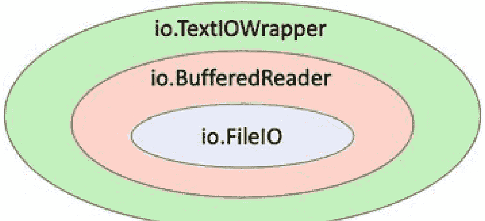

在上图中，初始的 `FileIO` 流从实际数据源（本例中为文件）读取原始数据。然后 `BufferedReader` 为提高效率而缓冲数据读取过程。最后，`TextIOWrapper` 处理字符串编码；即它将文件中使用的典型 ASCII 表示形式的字符串转换为 Python 内部使用的表示形式（使用 Unicode）。

你可能会问，为什么要有流模型；毕竟我们在上一章读写文件时不需要了解流？答案是，流可以从数据源读取或写入数据，而不仅仅是文件。当然，文件可以是数据源，但套接字、管道、字符串、Web 服务等也可以是数据源。因此，它是一种更灵活的数据 I/O 模型。

### Python 流

Python 的 `io` 模块提供了 Python 处理数据输入和输出的主要设施。主要有三种类型的输入/输出：文本 I/O、二进制 I/O 和原始 I/O。这些类别可用于各种类型的数据源/接收器。

无论属于哪个类别，每个具体的流都可以具有许多属性，例如只读、只写或读写。它还可以支持顺序访问或随机访问，具体取决于底层数据接收器的性质。例如，从套接字或管道读取数据本质上是顺序的，而从文件读取数据可以顺序执行，也可以通过随机访问方式执行。

然而，无论使用哪种流，它们都能识别其可以处理的数据类型。例如，尝试向只写二进制流提供字符串将引发 `TypeError`。同样，向文本流提供二进制数据等也会引发错误。

正如所暗示的，Python `io` 模块提供了多种不同类型的流，其中一些如下所示：

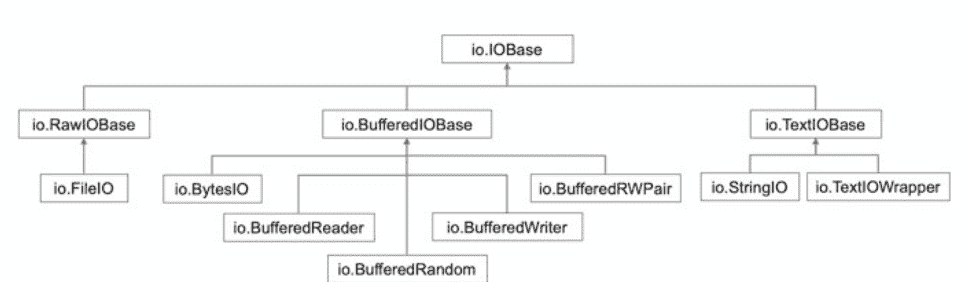

抽象的 `IOBase` 类是流 IO 类层次结构的根。在此类之下是用于无缓冲和缓冲 IO 以及面向文本 IO 的流类。

### IOBase

这是所有 I/O 流类的抽象基类。该类提供了许多子类需要实现的抽象方法。

`IOBase` 类（及其子类）都支持迭代器协议。这意味着 `IOBase` 对象（或其子类的对象）可以迭代底层流中的输入数据。

`IOBase` 还实现了上下文管理器协议，因此可以与 `with` 和 `with-as` 语句一起使用。

`IOBase` 类定义了一组核心方法和属性，包括：

- `close()` 刷新并关闭流。
- `closed` 一个指示流是否已关闭的属性。
- `flush()` 如果适用，刷新流的写缓冲区。
- `readable()` 如果流可读则返回 `True`。
- `readline(size=-1)` 从流中返回一行。如果指定了 `size`，则最多读取 `size` 个字节。
- `readlines(hint=-1)` 读取行列表。如果指定了 `hint`，则用于控制读取的行数。
- `seek(offset[, whence])` 此方法将当前流位置/指针移动到给定的偏移量。偏移量的含义取决于 `whence` 参数。`whence` 的默认值为 `SEEK_SET`。- SEEK_SET 或 0：从流的起始位置进行查找（默认值）；偏移量必须是 `TextIOBase.tell()` 返回的数字或零。任何其他偏移值都会导致未定义行为。
- SEEK_CUR 或 1：定位到当前位置；偏移量必须为零，这是一个空操作（不支持其他值）。
- SEEK_END 或 2：定位到流的末尾；偏移量必须为零（不支持其他值）。
- seekable() 检查流是否支持 `seek()`。
- tell() 返回当前流位置/指针。
- writeable() 如果可以向流写入数据则返回 true。
- writelines(lines) 将行列表写入流。

## 原始 IO/无缓冲 IO 类

原始 IO 或无缓冲 IO 由 `RawIOBase` 和 `FileIO` 类提供。`RawIOBase` 此类是 `IOBase` 的子类，是原始二进制（即无缓冲）I/O 的基类。原始二进制 I/O 通常提供对底层操作系统设备或 API 的低级访问，并不尝试将其封装在高级原语中（这是可以包装原始 I/O 流的缓冲 I/O 和文本 I/O 类的职责）。该类添加了以下方法：

- read(size=-1) 此方法从流中读取最多 size 字节并返回它们。如果未指定 size 或为 -1，则读取所有可用字节。
- readall() 此方法读取并返回流中所有可用字节。
- readint(b) 此方法将流中的字节读入预分配的、可写的类字节对象 b（例如字节数组）中。它返回读取的字节数。
- write(b) 此方法将 b（一个类字节对象，如字节数组）提供的数据写入底层原始流。

`FileIO` `FileIO` 类表示链接到操作系统级文件的原始无缓冲二进制 IO 流。当 `FileIO` 类被实例化时，可以给它一个文件名和模式（如 'r' 或 'w' 等）。也可以给它一个标志，指示是否应关闭与底层操作系统级文件关联的文件描述符。

此类用于二进制数据的低级读取，是所有面向文件的数据访问的核心（尽管它通常被另一个流包装，如缓冲读取器或写入器）。

## 二进制 IO/缓冲 IO 类

二进制 IO 即缓冲 IO，是一种包装较低级别 `RawIOBase` 流（如 `FileIO` 流）的过滤流。实现缓冲 IO 的所有类都扩展了 `BufferedIOBase` 类，它们是：

`BufferedReader` 从此对象读取数据时，可能会从底层原始流请求更大量的数据，并保存在内部缓冲区中。然后可以在后续读取中直接返回缓冲的数据。

`BufferedWriter` 写入此对象时，数据通常被放入内部缓冲区。缓冲区将在各种条件下写入到底层 `RawIOBase` 对象，包括：

- 当缓冲区对于所有待处理数据来说变得太小时；
- 当调用 `flush()` 时；
- 当 `BufferedWriter` 对象被关闭或销毁时。

`BufferedRandom` 随机访问流的缓冲接口。它支持 `seek()` 和 `tell()` 功能。

`BufferedRWPair` 一个缓冲 I/O 对象，将两个单向 `RawIOBase` 对象——一个可读，另一个可写——组合成一个双向端点。

上述每个类都包装一个较低级别的面向字节的流类，例如 `io.FileIO` 类：

```
f = io.FileIO('data.dat')
br = io.BufferedReader(f)
print(br.read())
```

这允许从文件 'data.dat' 中读取字节形式的数据。当然，你也可以从不同的源读取数据，例如内存中的 `BytesIO` 对象：

```
binary_stream_from_file = io.BufferedReader(io.BytesIO(b'starship.png'))
bytes = binary_stream_from_file.read(4)
print(bytes)
```

在此示例中，数据由 `BufferedReader` 从 `BytesIO` 对象读取。然后使用 `read()` 方法读取前 4 个字节，输出为：

b‘star’

注意字符串 'starship.png' 和结果 'star' 前面的 'b'。这表明字符串字面量在 Python 3 中应成为字节字面量。字节字面量总是以 'b' 或 'B' 为前缀；它们产生 `bytes` 类型的实例而不是 `str` 类型。它们只能包含 ASCII 字符。

缓冲流支持的操作包括，用于读取：

- peek(n) 返回最多 n 字节的数据，而不推进流指针。返回的字节数可能少于或多于请求的数量，具体取决于可用数据量。
- read(n) 返回 n 字节的数据作为字节，如果未提供 n（或为负数），则读取所有可用数据。
- readl(n) 使用对原始数据流的单次调用读取最多 n 字节的数据

缓冲写入器支持的操作包括：

- write(bytes) 写入类字节数据并返回写入的字节数。
- flush() 此方法强制将缓冲区中保存的字节写入原始流。

## 文本流类

文本流类是 `TextIOBase` 类及其两个子类 `TextIOWrapper` 和 `StringIO`。

`TextIOBase` 这是所有文本流类的根类。它提供基于字符和行的流 I/O 接口。此类提供了其父类中定义的几个额外方法：

- read(size=-1) 此方法将从流中返回最多 size 个字符作为单个字符串。如果 size 为负数或 None，它将读取所有剩余数据。
- readline(size=-1) 此方法将返回一个表示当前行的字符串（直到换行符或数据结束，以先到者为准）。如果流已到达 EOF，则返回空字符串。如果指定了 size，则最多读取 size 个字符。
- seek(offset, [, whence]) 通过指定的偏移量更改流位置/指针。可选的 whence 参数指示查找应从哪里开始：
  - SEEK_SET 或 0：（默认值）从流的起始位置查找。
  - SEEK_CUR 或 1：定位到当前位置；偏移量必须为零，这是一个空操作。
  - SEEK_END 或 2：定位到流的末尾；偏移量必须为零。
- tell() 以不透明数字的形式返回当前流位置/指针。该数字通常不代表底层二进制存储中的字节数。
- write(s) 此方法将字符串 s 写入流并返回写入的字符数。

`TextIOWrapper`。这是一个缓冲文本流，包装了一个缓冲二进制流，是 `TextIOBase` 的直接子类。

创建 `TextIOWrapper` 时，有一系列选项可用于控制其行为：

```
io.TextIOWrapper(buffer, encoding=None, errors=None, newline=None, line_buffering=False, write_through=False)
```

其中

- buffer 是缓冲二进制流。
- encoding 表示使用的文本编码，例如 UTF-8。
- errors 定义错误处理策略，例如 strict 或 ignore。
- newline 控制如何处理行尾，例如它们应该被忽略（None）还是表示为换行符、回车符或换行符/回车符等。
- line_buffering 如果为 True，则当对 write 的调用包含换行符或回车符时，隐式调用 `flush()`。
- write_through 如果为 True，则保证对 write 的调用不会被缓冲。

`TextIOWrapper` 包装在较低级别的二进制缓冲 I/O 流周围，例如：

```
f = io.FileIO('data.txt')
br = io.BufferedReader(f)
text_stream = io.TextIOWrapper(br, 'utf-8')
```

`StringIO` 这是一个用于文本 I/O 的内存流。`StringIO` 对象持有的缓冲区的初始值可以在创建实例时提供，例如：

```
in_memory_text_stream = io.StringIO('to be or not to be that is the question')
print('in_memory_text_stream', in_memory_text_stream)
print(in_memory_text_stream.getvalue())
in_memory_text_stream.close()
```

这将生成：

in_memory_text_stream <_io.StringIOobject at 0x10fdfaee8>

To be or not to be that is the question

请注意，当调用 `close()` 方法时，底层缓冲区（由传递给 `StringIO` 实例的字符串表示）将被丢弃。`getvalue()` 方法返回一个包含缓冲区全部内容的字符串。如果在流关闭后调用它，则会产生错误。

## 流属性

可以查询流以确定它支持哪些类型的操作。这可以使用 `readable()`、`seekable()` 和 `writeable()` 方法来完成。例如：

## 关闭流

所有打开的流都必须关闭。不过，你可以关闭顶层流，这将自动关闭其下层的流，例如：

```python
f = io.FileIO('data.txt')
br = io.BufferedReader(f)
text_stream = io.TextIOWrapper(br, 'utf-8')
print(text_stream.read())
text_stream.close()
```

## 回到 open() 函数

既然流这么好，为什么你不一直使用它们呢？实际上在 Python 3 中你确实在一直使用！核心的 open 函数（以及 io.open() 函数）都返回一个流对象。返回对象的实际类型取决于指定的文件模式、是否使用缓冲等。例如：

```python
import io
# 文本流
f1 = open('myfile.txt', mode='r', encoding='utf-8')
print(f1)
# 二进制 IO，也称为缓冲 IO
f2 = open('myfile.dat', mode='rb')
print(f2)
f3 = open('myfile.dat', mode='wb')
print(f3)
# 原始 IO，也称为无缓冲 IO
f4 = open('starship.png', mode='rb', buffering=0)
print(f4)
```

运行这个简短示例后的输出是：

```
<__io.TextIOWrapper name='myfile.txt' mode='r' encoding='utf-8'>
<__io.BufferedReader name='myfile.dat'>
<__io.BufferedWriter name='myfile.dat'>
<__io.FileIO name='starship.png' mode='rb' closefd=True>
```

从输出中可以看到，open() 函数返回了四种不同类型的对象。第一个是 TextIOWrapper，第二个是 BufferedReader，第三个是 BufferedWriter，最后一个是 FileIO 对象。这反映了传入 open() 函数的参数差异。例如，f1 引用的是一个 io.TextIOWrapper，因为它必须使用 UTF-8 编码方案将输入文本编码（转换）为 Unicode。而 f2 持有一个 io.BufferedReader，因为模式表明我们想要读取二进制数据；f3 持有一个 io.BufferedWriter，因为使用的模式表明我们想要写入二进制数据。最后一次调用 open 返回一个 FileIO，因为我们指定了不缓冲数据，因此可以使用最低级别的流对象。

通常，根据指定的模式和编码，应用以下规则来确定返回对象的类型：

| 类 | 模式 | 缓冲 |
|---|---|---|
| FileIO | 二进制 | 否 |
| BufferedReader | 'rb' | 是 |
| BufferedWriter | 'wb' | 是 |
| BufferedRandom | 'rb+' 'wb+' 'ab+' | 是 |
| TextIOWrapper | 任何文本 | 是 |

请注意，并非所有模式组合都有意义，因此某些组合会产生错误。

因此，通常你不需要担心正在使用哪个流或该流的作用；尤其是因为所有流都扩展了 IOBase 类，因此具有一组通用的方法和属性。

然而，理解你所做事情的含义是有用的，这样你才能做出更明智的选择。例如，二进制流（处理较少）比必须从 ASCII 转换为 Unicode 的面向 Unicode 的流更快。

此外，理解流在输入和输出中的作用也可以让你在不重写整个应用程序的情况下更改数据的源和目标。因此，你可以使用文件或 stdin 进行测试，而在生产环境中使用套接字读取数据。

## 尝试

使用底层的流模型创建一个将二进制数据写入文件的应用程序。你可以使用 'b' 前缀创建要写入的二进制字面量，例如 b'Hello World'。

接下来创建另一个应用程序，从文件重新加载二进制数据并打印出来。

## 处理 CSV 文件

### 简介

本章介绍一个支持生成 CSV（或逗号分隔值）文件的模块。

### CSV 文件

CSV（逗号分隔值）格式是电子表格和数据库最常见的导入和导出格式。然而，CSV 并不是一个精确的标准，多个不同的应用程序有不同的约定和特定标准。

Python csv 模块实现了读取和写入 CSV 格式表格数据的类。作为其中的一部分，它支持方言的概念，即特定应用程序或程序套件使用的 CSV 格式，例如，它支持 Excel 方言。

这允许程序员说，“以 Excel 首选的格式写入此数据”，或“从由 Excel 生成的此文件读取数据”，而无需知道 Excel 使用的 CSV 格式的精确细节。

程序员还可以描述其他应用程序理解的 CSV 方言，或定义自己的专用 CSV 方言。

csv 模块提供了一系列函数，包括：

- csv.reader(csvfile, dialect='excel', **fmtparams) 返回一个 reader 对象，它将遍历给定 csvfile 中的行。可以提供一个可选的 dialect 参数。这可以是 Dialect 类子类的实例，或者是 list_dialects() 函数返回的字符串之一。其他可选的 fmtparams 关键字参数可以用来覆盖当前方言中的单个格式参数。
- csv.writer(csvfile, dialect='excel', **fmtparams) 返回一个 writer 对象，负责将用户数据转换为给定 csvfile 上的分隔字符串。提供了一个可选的 dialect 参数。fmtparams 关键字参数可以用来覆盖当前方言中的单个格式参数。
- csv.list_dialects() 返回所有已注册方言的名称。例如，在 Mac OS X 上，默认的方言列表是 ['excel', 'excel-tab', 'unix']。

### CSV Writer 类

CSV Writer 通过 csv.writer() 函数获得。csv writer 支持两种用于将数据写入 CSV 文件的方法：

- csvwriter.writerow(row) 将 row 参数写入 writer 的文件对象，根据当前方言进行格式化。
- csvwriter.writerows(rows) 将 rows 中的所有元素（如上所述的行对象的可迭代对象）写入 writer 的文件对象，根据当前方言进行格式化。
- Writer 对象还具有以下公共属性：
- csvwriter.dialect 一个只读的描述，说明 writer 正在使用的方言。

以下程序演示了 csv 模块的一个简单用法，它创建一个名为 sample.csv 的文件。

由于我们没有指定方言，将使用默认的 'excel' 方言。writerow() 方法用于将每个逗号分隔的字符串列表写入 CSV 文件。

```python
print('Creating CSV file')
with open('sample.csv', 'w', newline='') as csvfile:
    writer = csv.writer(csvfile)
    writer.writerow(['She Loves You', 'Sept 1963'])
    writer.writerow(['I Want to Hold Your Hand', 'Dec 1963'])
    writer.writerow(['Cant Buy Me Love', 'Apr 1964'])
    writer.writerow(['A Hard Days Night', 'July 1964'])
```

生成的文件可以如下所示查看：


然而，由于它是一个 CSV 文件，我们也可以在 Excel 中打开它：


### CSV Reader 类

CSV Reader 对象通过 csv.reader() 函数获得。它实现了迭代协议。

如果 csv reader 对象与 for 循环一起使用，那么每次循环时，它都会从 CSV 文件中提供下一行作为列表，根据当前的 CSV 方言进行解析。

Reader 对象还具有以下公共属性：

- csvreader.dialect 一个只读的描述，说明解析器正在使用的方言。
- csvreader.line_num 从源迭代器读取的行数。

这与返回的记录数不同，因为记录可以跨越多行。

以下提供了一个使用 csv reader 对象读取 CSV 文件的非常简单的示例：

```python
print('Starting to read csv file')
with open('sample.csv', newline='') as csvfile:
    reader = csv.reader(csvfile)
    for row in reader:
        print(*row, sep=', ')
print('Done Reading')
```

基于之前创建的 sample.csv 文件，此程序的输出是：

开始读取csv文件

- She Loves You, 1963年9月
- I Want to Hold Your Hand, 1963年12月
- Cant Buy Me Love, 1964年4月
- A Hard Days Night, 1964年7月

读取完成

## CSV DictWriter 类

在许多情况下，CSV文件的第一行包含一组名称（或键），用于定义CSV文件其余部分中的字段。也就是说，第一行为列以及CSV文件其余部分中保存的数据赋予了含义。因此，捕获这些信息，并根据第一行中的键来结构化写入CSV文件或从CSV文件加载的数据，是非常有用的。

`csv.DictWriter` 返回一个对象，该对象可用于基于此类命名列的使用，将值写入CSV文件。与 `DictWriter` 一起使用的文件在类实例化时提供。

```python
import csv
with open('names.csv', 'w', newline='') as csvfile:
    fieldnames = ['first_name', 'last_name', 'result']
    writer = csv.DictWriter(csvfile, fieldnames=fieldnames)
    writer.writeheader()
    writer.writerow({'first_name': 'John',
                     'last_name': 'Smith',
                     'result': 54})
    writer.writerow({'first_name': 'Jane',
                     'last_name': 'Lewis',
                     'result': 63})
    writer.writerow({'first_name': 'Chris',
                     'last_name': 'Davies',
                     'result': 72})
```

请注意，创建 `DictWriter` 时，必须提供一个键列表，这些键用于CSV文件中的列。

然后使用 `writeheader()` 方法将标题行写入CSV文件。

`writerow()` 方法接受一个字典对象，该对象的键基于为 `DictWriter` 定义的键。然后使用这些键将数据写入CSV（请注意，字典中键的顺序并不重要）。

在上面的示例代码中，其结果是创建了一个名为 `names.csv` 的新文件，该文件可以在Excel中打开：

当然，由于这是一个CSV文件，它也可以在纯文本编辑器中打开。

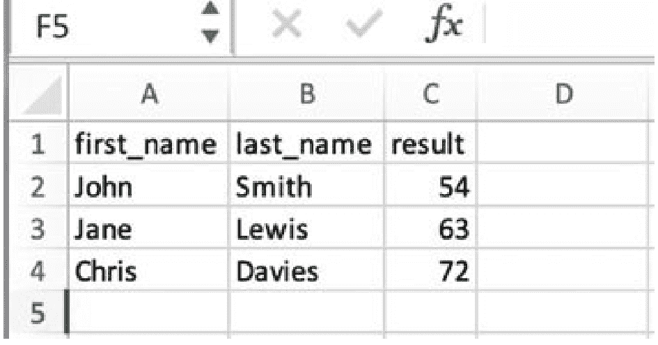

## CSV DictReader 类

除了 `csv.DictWriter`，还有一个 `csv.DictReader`。与 `DictReader` 一起使用的文件在类实例化时提供。与 `DictWriter` 类似，`DictReader` 类接受一个键列表，用于定义CSV文件中的列。如果提供了用于第一行的标题，这是可选的（如果没有提供一组键，则CSV文件第一行中的值将用作字段名）。

`DictReader` 类提供了几个有用的功能，包括 `fieldnames` 属性，该属性包含由文件第一行定义的CSV文件的键/标题列表。

`DictReader` 类还实现了迭代协议，因此可以在 `for` 循环中使用，其中每一行（第一行之后）依次作为字典返回。表示每一行的字典对象随后可用于基于第一行中定义的键访问每个列值。

下面是一个针对前面创建的CSV文件的示例：

```python
import csv
print('Starting to read dict CSV example')
with open('names.csv', newline='') as csvfile:
    reader = csv.DictReader(csvfile)
    for heading in reader.fieldnames:
        print(heading, end=' ')
    print('\n-----------------------------------')
    for row in reader:
        print(row['first_name'], row['last_name'],
              row['result'])
print('Done')
```

这将生成以下输出：

```
Starting to read dict CSV example first_name last_name result
-----------------------------------
John Smith 54
Jane Lewis 63
Chris Davies 72
Done
```

## 尝试

在本练习中，你将基于存储在活期账户中的一组交易来创建一个CSV文件。

1.  为此，首先定义一个新的 `Account` 类来表示一种银行账户类型。
2.  当类实例化时，你应该提供账号、账户持有人姓名、开户余额和账户类型（可以是表示“活期”、“定期”或“投资”等的字符串）。这意味着必须有一个 `__init__` 方法，并且你需要将数据存储在对象中。
3.  为 `Account` 提供三个实例方法：`deposit(amount)`、`withdraw(amount)` 和 `get_balance()`。这些方法的行为应如预期，`deposit` 将增加余额，`withdraw` 将减少余额，`get_balance()` 返回当前余额。

你的 `Account` 类还应保留其参与的交易历史记录。

交易是存款或取款以及金额的记录。请注意，账户中的初始金额可以视为初始存款。

历史记录可以实现为一个列表，包含按顺序排列的交易序列。交易本身可以由一个类定义，该类包含一个操作（存款或取款）和一个金额。每次进行取款或存款时，都应将新的交易记录添加到交易历史列表中。接下来，提供一个函数（可以命名为类似 `write_account_transactions_to_csv()` 的名称），该函数可以接受一个账户，然后将其持有的每笔交易写入CSV文件，每笔交易的类型和金额用逗号分隔。

以下示例应用程序说明了如何使用此函数：

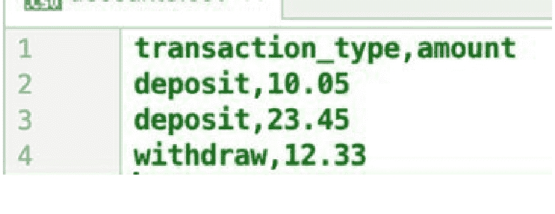

## 处理 Excel 文件

### 简介

本章介绍 `openpyxl` 模块，该模块可用于处理Excel文件。Excel是Microsoft开发的一款软件应用程序，允许用户处理电子表格。它是一个非常广泛使用的工具，使用Excel文件格式的文件在许多组织中很常见。它实际上是电子表格的行业标准，因此是开发者工具箱中一个非常有用的工具。

### Excel 文件

尽管CSV文件是处理数据的一种便捷且简单的方式；但直接读取或写入Excel文件的需求非常普遍。为此，Python中有几个可用的库。一个广泛使用的库是OpenPyXL库。该库最初是为了支持访问Excel 2010文件而编写的。它是一个开源项目，并且文档齐全。

OpenPyXL库提供了以下功能：

-   读取和写入Excel工作簿，
-   创建/访问Excel工作表，
-   创建Excel公式，
-   创建图表（需要额外模块的支持）。

由于OpenPyXL不是标准Python发行版的一部分，你需要使用Anaconda或pip等工具自行安装该库（例如 `pip install openpyxl`）。或者，如果你使用PyCharm，你将能够将OpenPyXL库添加到你的项目中。

OpenPyXL库中的关键元素是 `Workbook` 类。可以从模块中导入它：

```python
from openpyxl import Workbook
```

可以使用 `Workbook` 类创建一个新的（内存中的）工作簿实例（请注意，此时它纯粹是Python程序中的一个结构，必须在创建实际的Excel文件之前保存）。

```python
wb = Workbook()
```

### Openpyxl 工作表对象

工作簿创建时总是至少包含一个工作表。你可以使用 `Workbook.active` 属性获取当前活动的工作表：

```python
ws = wb.active
```

你可以使用工作簿的 `create_sheet()` 方法创建额外的工作表：

```python
ws = wb.create_sheet('Mysheet')
```

你可以使用 `title` 属性访问或更新工作表的标题：

```python
ws.title = 'New Title'
```

持有此标题的选项卡的背景颜色默认为白色。你可以通过向 `worksheet.sheet_properties.tabColor` 属性提供RRGGBB颜色代码来更改它，例如：

```python
ws.sheet_properties.tabColor = "1072BA"
```

### 处理单元格

可以访问工作表中的单元格。单元格可以直接作为工作表上的键来访问，例如：

```python
ws['A1'] = 42
```

## 示例 Excel 文件创建应用程序

以下简单应用程序创建一个包含两个工作表的工作簿。它还包含一个简单的 Excel 公式，用于对另外两个单元格中的值求和：

```python
from openpyxl import Workbook

def main():
    print('Starting Write Excel Example with openPyXL')
    workbook = Workbook()
    # Get the current active worksheet
    ws = workbook.active
    ws.title = 'my worksheet'
    ws.sheet_properties.tabColor = '1072BA'
    ws['A1'] = 42
    ws['A2'] = 12
    ws['A3'] = '=SUM(A1, A2)'
    ws2 = workbook.create_sheet(title='my other sheet')
    ws2['A1'] = 3.42
    ws2.append([1, 2, 3])
    ws2.cell(column=2, row=1, value=15)
    workbook.save('sample.xlsx')
    print('Done Write Excel Example')

if __name__ == '__main__':
    main()
```

由此生成的 Excel 文件可以在 Excel 中查看，如下所示：


## 从 Excel 文件加载工作簿

当然，在许多情况下，不仅需要创建 Excel 文件用于数据导出，还需要从现有的 Excel 文件中导入数据。这可以使用 OpenPyXL 的 `load_workbook()` 函数来完成。此函数打开指定的 Excel 文件（默认以只读模式），并返回一个 Workbook 对象。

```python
from openpyxl import load_workbook

workbook = load_workbook(filename='sample.xlsx')
```

现在，你可以使用工作簿对象提供的属性来访问工作表列表、它们的名称、获取当前活动的工作表等：

- `workbook.active` 返回活动的工作表对象。
- `workbook.sheetnames` 返回此工作簿中工作表的名称（字符串）。
- `workbook.worksheets` 返回一个工作表对象列表。

以下示例应用程序读取本章前面创建的 Excel 文件：

```python
from openpyxl import load_workbook

def main():
    print('Starting reading Excel file using openPyXL')
    workbook = load_workbook(filename='sample.xlsx')
    print(workbook.active)
    print(workbook.sheetnames)
    print(workbook.worksheets)
    print('-' * 10)
    ws = workbook['my worksheet']
    print(ws['A1'])
    print(ws['A1'].value)
    print(ws['A2'].value)
    print(ws['A3'].value)
    print('-' * 10)
    for sheet in workbook:
        print(sheet.title)
    print('-' * 10)
    cell_range = ws['A1':'A3']
    for cell in cell_range:
        print(cell[0].value)
    print('-' * 10)
    print('Finished reading Excel file using openPyXL')

if __name__ == '__main__':
    main()
```

此应用程序的输出如下所示：

```
Starting reading Excel file using openPyXL
<Worksheet "my worksheet">
['my worksheet', 'my other sheet']
[<Worksheet "my worksheet">, <Worksheet "my other sheet">]
----------
<Cell 'my worksheet'.A1>
42
12
=SUM(A1, A2)
----------
my worksheet
my other sheet
----------
42
12
=SUM(A1, A2)
----------
Finished reading Excel file using openPyXL
```

## 尝试

使用你在上一章创建的 Account 类；将账户交易信息写入 Excel 文件，而不是 CSV 文件。

为此，请创建一个名为 `write_account_transaction_to_excel()` 的函数，该函数接受 Excel 文件的名称和要存储的账户。然后，该函数应使用 Excel 格式将数据写入文件。

以下示例应用程序说明了如何使用此函数：

```python
print('Starting')
acc = accounts.CurrentAccount('123', 'John', 10.05, 100.0)
acc.deposit(23.45)
acc.withdraw(12.33)
print('Writing Account Transactions')
write_account_transaction_to_excel('accounts.xlsx', acc)
print('Done')
```

Excel 文件的内容将是：

| 交易类型 | 金额 |
| --- | --- |
| 存款 | 10.05 |
| 存款 | 23.45 |
| 取款 | 12.33 |

## Python 中的正则表达式

### 简介

正则表达式是处理文本并查找重复模式的一种非常强大的方法；它们通常用于处理纯文本文件（如日志文件）、CSV 文件以及 Excel 文件中的数据。本章介绍正则表达式，讨论用于定义正则表达式模式的语法，并介绍 Python 的 `re` 模块及其使用。

### 什么是正则表达式？

正则表达式（也称为 regex 或简称 re）是一系列字符（字母、数字和特殊字符），它们形成一个模式，可用于搜索文本以查看该文本是否包含与该模式匹配的字符序列。

例如，你可能定义了一个模式，由三个字符后跟三个数字组成。此模式可用于在其他字符串中查找此类模式。因此，以下字符串要么匹配（或包含）此模式，要么不匹配：

| 字符串 | 结果 |
| :--- | :--- |
| Abc123 | 匹配该模式 |
| A123A | 不匹配该模式 |
| 123AAA | 不匹配该模式 |

正则表达式被广泛用于在文件中查找信息，例如：

- 在日志文件中查找与特定用户或特定操作相关的所有行，
- 用于验证输入，例如检查字符串是否是有效的电子邮件地址或邮政编码/ZIP 代码等。

对正则表达式的支持在 Java、C#、PHP 以及特别是 Perl 等编程语言中非常普遍。Python 也不例外，它拥有内置模块 `re`（以及额外的第三方模块）来支持正则表达式。

### 正则表达式模式

你可以使用任何 ASCII 字符或数字来定义正则表达式模式。因此，字符串 'John' 可用于定义一个正则表达式模式，该模式可用于匹配任何其他包含字符 'J'、'o'、'h'、'n' 的字符串。因此，以下每个字符串都将匹配此模式：

- 'John Hunt'
- 'John Jones'
- 'Andrew John Smith'
- 'Mary Helen John'
- 'John John John'
- 'I am going to visit the John'
- 'I once saw a film by John Wayne'

但以下字符串不会匹配该模式：

- 'Jon Davies'，因为 John 的拼写不同。
- 'john Williams'，因为大写 J 与小写 j 不匹配。
- 'David James'，因为该字符串不包含字符串 John！

正则表达式（regexs）使用特殊字符来允许描述更复杂的模式。例如，我们可以使用特殊字符 '[]' 来定义一组可以匹配的字符。例如，如果我们想表示 J 可以是大写或小写字母，那么我们可以写 '[Jj]'——这表示 'J' 或 'j' 都可以匹配第一个字符。

- `[Jj]ohn`—这表示模式以大写 J 或小写 j 开头，后跟 'ohn'。

现在 'john Williams' 和 'John Williams' 都将匹配此正则表达式模式。

### 模式元字符

有几个特殊字符（通常称为元字符）在正则表达式模式中具有特定含义，这些字符在下表中列出：

| 字符 | 描述 | 示例 |
| :--- | :--- | :--- |
| [] | 一组字符 | [a-d] 表示序列 "a" 到 "d" 中的字符 |
| \ | 表示特殊序列（也可用于转义特殊字符） | "\d" 表示该字符应为整数 |
| . | 除换行符外的任何字符 | "J.hn" 表示 'J' 之后和 'h' 之前可以有任何字符 |
| ^ | 表示字符串必须以以下模式开头 | "^hello" 表示字符串必须以 'hello' 开头 |
| $ | 表示字符串必须以前面的模式结尾 | "world$" 表示字符串必须以 'world' 结尾 |
| * | 前面模式的零次或多次出现 | "Python*" 表示我们正在寻找字符串中出现零次或多次的 Python |
| + | 前面模式的一次或多次出现 | "info+" 表示我们必须在字符串中至少找到一次 info |
| ? | 表示前面模式的零次或一次出现 | "john?" 表示 'John' 的零次或一次出现 |
| {} | 恰好指定的出现次数 | "John{3}" 表示我们期望在字符串中看到 'John' 三次。"X{1,2}" 表示字符串中可以有一个或两个相邻的 X |
| \| | 或 | "True\|OK" 表示我们正在寻找 True 或 OK |
| () | 将正则表达式分组在一起；然后可以对整个组应用另一个运算符 | "(abc\|xyz){2}" 表示我们正在寻找字符串 abc 或 xyz 重复两次 |

### 特殊序列

特殊序列是由一个反斜杠（`\`）后跟一个字符组合构成的，该组合具有特殊含义。下表列出了正则表达式中常用的一些特殊序列：

| 序列 | 描述 | 示例 |
| :--- | :--- | :--- |
| \A | 如果后续字符位于字符串开头，则返回匹配 | "\AThe" 必须以 'The' 开头 |
| \b | 返回匹配，其中指定字符位于单词的开头或结尾 | "\bon" 或 "on\b" 表示字符串必须以 'on' 开头或结尾 |
| \B | 表示后续字符必须出现在字符串中，但不能位于单词的开头（或结尾） | r"\Bon" 或 r"on\B" 必须不以 'on' 开头或结尾 |
| \d | 返回匹配，其中字符串包含数字（0-9） | "\d" |
| \D | 返回匹配，其中字符串不包含数字 | "\D" |
| \s | 返回匹配，其中字符串包含空白字符 | "\s" |
| \S | 返回匹配，其中字符串不包含空白字符 | "\S" |
| \w | 返回匹配，其中字符串包含任何单词字符（a 到 z 的字符、0-9 的数字以及下划线 _ 字符） | "\w" |
| \W | 返回匹配，其中字符串不包含任何单词字符 | "\W" |
| \Z | 如果后续字符位于字符串末尾，则返回匹配 | "Hunt\Z" |

## 集合

集合是位于一对方括号内的字符序列，具有特定含义。下表提供了一些示例。

| 集合 | 描述 |
| :--- | :--- |
| [jeh] | 返回匹配，其中存在指定字符（j、e 或 h）之一 |
| [a-x] | 返回匹配，适用于任何小写字母，按字母顺序在 a 和 x 之间 |
| [^zxc] | 返回匹配，适用于除 z、x 和 c 之外的任何字符 |
| [0123] | 返回匹配，其中存在指定数字（0、1、2 或 3）之一 |
| [0-9] | 返回匹配，适用于 0 到 9 之间的任何数字 |
| [0-9][0-9] | 返回匹配，适用于从 00 到 99 的任何两位数 |
| [a-zA-Z] | 返回匹配，适用于按字母顺序在 a 和 z 之间或 A 和 Z 之间的任何字符 |

## Python re 模块

Python re 模块是 Python 内置的用于处理正则表达式的模块。

您可能还想研究第三方 regex 模块（参见 [https://pypi.org/project/regex](https://pypi.org/project/regex)），它向后兼容默认的 re 模块，但提供了额外的功能。

## 使用 Python 正则表达式

### 使用原始字符串

关于用于定义正则表达式模式的许多字符串，需要注意的一个重要点是它们前面有一个 'r'，例如 r'/bin/sh$'。

字符串前的 'r' 表示该字符串应被视为原始字符串。

原始字符串是 Python 字符串，其中所有字符都被视为其本身；即单个字符。这意味着反斜杠（'\'）被视为字面字符，而不是用于转义下一个字符的特殊字符。

例如，在标准字符串中，'\n' 被视为表示换行符的特殊字符，因此如果我们编写以下代码：

```
s = 'Hello \n world'
print(s)
```

我们将得到输出：

```
Hello
World
```

但是，如果我们在字符串前加上 'r'，那么我们就是在告诉 Python 将其视为原始字符串。例如：

```
s = r'Hello \n world'
print(s)
```

现在的输出是

```
Hello \n world
```

这对于正则表达式很重要，因为像反斜杠（'\'）这样的字符在模式中用于具有特殊的正则表达式含义，因此我们不希望 Python 以正常方式处理它们。

### 简单示例

以下简单的 Python 程序说明了 re 模块的基本用法。在使用 re 模块之前，必须先导入它。

```
import re
text1 = 'john williams'
pattern = '[Jj]ohn'
print('looking in', text1, 'for the pattern', pattern)
if re.search(pattern, text1):
    print('Match has been found')
```

运行此程序时，我们得到以下输出：

```
looking in john williams for the pattern [Jj]ohn
Match has been found
```

如果我们查看代码，可以看到我们正在检查的字符串包含 'john williams'，并且与此字符串一起使用的模式表明我们正在寻找一个 'J' 或 'j' 后跟 'ohn' 的序列。为了执行此测试，我们使用 re.search() 函数，将正则表达式模式和要测试的文本作为参数传递。此函数返回 None（If 语句将其视为 False）或一个 Match 对象（其布尔值始终为 True）。由于 text1 开头的 'john' 确实与模式匹配，re.search() 函数返回一个匹配对象，我们看到打印出了 'Match has been found' 消息。

Match 对象和 search() 方法将在下面更详细地描述；但是，这个简短的程序说明了正则表达式的基本操作。

## Match 对象

Match 对象由 search() 和 match() 函数返回。它们的布尔值始终为 True。当没有匹配时，match() 和 search() 函数返回 None，当找到匹配时返回 Match 对象。因此，可以将 Match 对象与 if 语句一起使用：

```
import re
match = re.search(pattern, string)
if match:
    process(match)
```

Match 对象支持一系列方法和属性，包括：

- match.re 产生此匹配实例的 match() 或 search() 方法所属的正则表达式对象。
- match.string 传递给 match() 或 search() 的字符串。
- match.start([group])/ match.end([group]) 返回由 group 匹配的子字符串的起始和结束索引。
- match.group() 返回字符串中匹配的部分。

## search() 函数

search() 函数在字符串中搜索匹配项，如果找到匹配项则返回一个 Match 对象。该函数的签名是：

```
re.search(pattern, string, flags=0)
```

参数的含义是：

- pattern 这是要在匹配过程中使用的正则表达式模式。
- string 这是要搜索的字符串。
- flags 这些（可选）标志可用于修改搜索的操作。

re 模块定义了一组标志（或指示符），可用于指示与模式相关的任何可选行为。这些标志包括：

| 标志 | 描述 |
| --- | --- |
| re.IGNORECASE | 执行不区分大小写的匹配 |
| re.LOCALE | 根据当前区域设置解释单词。此解释影响字母组（\w 和 \W）以及单词边界行为（\b 和 \B） |
| re.MULTILINE | 使 $ 匹配行尾（而不仅仅是字符串末尾），并使 ^ 匹配任何行的开头（而不仅仅是字符串开头） |
| re.DOTALL | 使句点（点）匹配任何字符，包括换行符 |
| re.UNICODE | 根据 Unicode 字符集解释字母。此标志影响 \w、\W、\b、\B 的行为 |
| re.VERBOSE | 忽略模式中的空白字符（集合 [] 内部或由反斜杠转义的情况除外），并将未转义的 # 视为注释标记 |

如果存在多个匹配项，则只返回第一个匹配项：

```
import re
line1 = 'The price is 23.55'
containsIntegers = r'\d+'
if re.search(containsIntegers, line1):
    print('Line 1 contains an integer')
else:
    print('Line 1 does not contain an integer')
```

在这种情况下，输出是

```
Line 1 contains an integer
```

下面给出了使用 search() 函数的另一个示例。在这种情况下，要查找的模式定义了三个备选字符串（即字符串必须包含 Beatles、Adele 或 Gorillaz 之一）：

```
import re
# Alternative words
music = r'Beatles|Adele|Gorillaz'
request = 'Play some Adele'
if re.search(music, request):
    print('Set Fire to the Rain')
else:
    print('No Adele Available')
```

在这种情况下，我们生成输出：

```
Set Fire to the Rain
```

## match() 函数

此函数尝试在字符串开头匹配正则表达式模式。此函数的签名如下：

```
re.match(pattern, string, flags=0)
```

- pattern 这是要匹配的正则表达式。
- string 这是要搜索的字符串。
- flags 可用的修饰符标志。

re.match() 函数成功时返回 Match 对象，失败时返回 None。

## 匹配与搜索的区别

Python 提供了两种基于正则表达式的原始操作：

-   `match()` 仅在字符串开头检查匹配。
-   `search()` 在字符串中的任意位置检查匹配。

## `findall()` 函数

`findall()` 函数返回一个包含所有匹配项的列表。该函数的签名如下：

```
re.findall(pattern, string, flags=0)
```

此函数返回字符串中模式的所有非重叠匹配项，以字符串列表的形式呈现。

字符串从左到右扫描，匹配项按发现的顺序返回。如果模式中存在一个或多个分组，则返回一个分组列表；如果模式有多个分组，则返回一个元组列表。如果没有找到匹配项，则返回一个空列表。

下面是一个使用 `findall()` 函数的示例。此示例查找一个以两个字母开头，后跟 'ai' 和一个字符的子字符串。它应用于一个句子，并仅返回子字符串 'Spain' 和 'plain'。

```
import re
str = 'The rain in Spain stays mainly on the plain'
results = re.findall('[a-zA-Z]{2}ai.', str)
print(results)
for s in results:
    print(s)
```

此程序的输出为：

```
['Spain', 'plain']
Spain
plain
```

## `finditer()` 函数

此函数返回一个迭代器，该迭代器为提供的字符串中的正则表达式模式生成匹配对象。此函数的签名如下：

```
re.finditer(pattern, string, flags=0)
```

字符串从左到右扫描，匹配项按发现的顺序返回。空匹配项包含在结果中。可以使用标志来修改匹配项。

## `split()` 函数

`split()` 函数返回一个列表，其中字符串在每个匹配项处被分割。`split()` 函数的语法如下：

```
re.split(pattern, string, maxsplit=0, flags=0)
```

结果是根据模式的出现来分割字符串。如果在正则表达式模式中使用了捕获括号，则模式中所有分组的文本也将作为结果列表的一部分返回。如果 `maxsplit` 不为零，则最多发生 `maxsplit` 次分割，字符串的剩余部分作为列表的最后一个元素返回。同样可以使用标志来修改匹配项。

```
import re
str = 'It was a hot summer night'
x = re.split('\s', str)
print(x)
```

输出为：

```
['It', 'was', 'a', 'hot', 'summer', 'night']
```

## `sub()` 函数

`sub()` 函数将字符串中正则表达式模式的出现替换为 `repl` 字符串。

```
re.sub(pattern, repl, string, max=0)
```

此方法将字符串中正则表达式模式的所有出现替换为 `repl`，除非提供了 `max`，否则替换所有出现。此方法返回修改后的字符串。

```
import re
pattern = '(England|Wales|Scotland)'
input = 'England for football, Wales for Rugby and Scotland for the Highland games'
print(re.sub(pattern, 'England', input))
```

生成：

*England for football, England for Rugby and England for the Highland games*

你可以通过指定 `count` 参数来控制替换次数：以下代码替换前 2 次出现：

```
import re
pattern = '(England|Wales|Scotland)'
input = 'England for football, Wales for Rugby and Scotland for the Highland games'
x = re.sub(pattern, 'Wales', input, 2)
print(x)
```

产生：

```
Wales for football, Wales for Rugby and Scotland for the Highland games
```

你也可以使用 `subn()` 函数来了解进行了多少次替换。此函数以元组形式返回新字符串和替换次数：

```
import re
pattern = '(England|Wales|Scotland)'
input = 'England for football, Wales for Rugby and Scotland for the Highland games'
print(re.subn(pattern, 'Scotland', input))
```

此操作的输出为：

```
('Scotland for football, Scotland for Rugby and Scotland for the Highland games', 3)
```

## `compile()` 函数

大多数正则表达式操作既可作为模块级函数（如上所述），也可作为已编译正则表达式对象的方法使用。

模块级函数通常是使用已编译正则表达式的简化或标准化方式。在许多情况下，这些函数就足够了，但如果需要更细粒度的控制，则可以使用已编译的正则表达式。

```
re.compile(pattern, flags=0)
```

`compile()` 函数将正则表达式模式编译成一个正则表达式对象，该对象可用于使用其 `match()`、`search()` 和其他方法进行匹配，如下所述。

可以通过指定 `flags` 值来修改表达式的行为。语句：

```
prog = re.compile(pattern)
result = prog.match(string)
```

等同于

```
result = re.match(pattern, string)
```

但是，当表达式将在单个程序中多次使用时，使用 `re.compile()` 并保存生成的正则表达式对象以供重用效率更高。

已编译的正则表达式对象支持以下方法和属性：

-   `Pattern.search(string, pos, endpos)` 扫描字符串，查找此正则表达式产生匹配的第一个位置，并返回相应的 `Match` 对象。如果字符串中没有位置匹配该模式，则返回 `None`。如果提供了 `pos`，则从 `pos` 开始；如果提供了 `endpos`，则在 `endpos` 结束（否则处理整个字符串）。
-   `Pattern.match(string, pos, endpos)` 如果字符串开头的零个或多个字符匹配此正则表达式，则返回相应的匹配对象。如果字符串不匹配该模式，则返回 `None`。`pos` 和 `endpos` 是可选的，指定搜索的起始和结束位置。
-   `Pattern.split(string, maxsplit=0)` 与 `split()` 函数相同，使用已编译的模式。
-   `Pattern.findall(string[, pos[, endpos]])` 类似于 `findall()` 函数，但也接受可选的 `pos` 和 `endpos` 参数，这些参数限制搜索区域，类似于 `search()`。
-   `Pattern.finditer(string[, pos[, endpos]])` 类似于 `finditer()` 函数，但也接受可选的 `pos` 和 `endpos` 参数，这些参数限制搜索区域，类似于 `search()`。
-   `Pattern.sub(repl, string, count=0)` 与 `sub()` 函数相同，使用已编译的模式。
-   `Pattern.subn(repl, string, count=0)` 与 `subn()` 函数相同，使用已编译的模式。
-   `Pattern.pattern` 编译此模式对象的模式字符串。

下面是一个使用 `compile()` 函数的示例。要编译的模式定义为包含 1 个或多个数字（0 到 9）：

```
import re
line1 = 'The price is 23.55'
containsIntegers = r'\d+'
rePattern = re.compile(containsIntegers)
matchLine1 = rePattern.search(line1)
if matchLine1:
    print('Line 1 contains a number')
else:
    print('Line 1 does not contain a number')
```

然后可以使用已编译的模式将 `search()` 等方法应用于特定字符串（本例中为 `line1`）。此操作生成的输出为：

*Line 1 contains a number*

当然，已编译的模式对象除了 `search()` 之外还支持一系列方法，如 `split` 方法所示：

```
p = re.compile(r'\W+')
s = '20 High Street'
print(p.split(s))
```

此操作的输出为：

```
['20', 'High', 'Street']
```

## 尝试

编写一个 Python 函数来验证给定字符串是否仅包含字母（大写或小写）和数字。因此不允许空格和下划线（'_'）。使用此函数的一个示例可能是：

```
print(contains_only_characters_and_numbers('John'))  # True
print(contains_only_characters_and_numbers('John_Hunt')) # False
print(contains_only_characters_and_numbers('42'))  # True
print(contains_only_characters_and_numbers('John42')) # True
print(contains_only_characters_and_numbers('John 42')) # False
```

编写一个函数来验证英国邮政编码格式（将其命名为 `verify_postcode`）。邮政编码的格式是两个字母后跟 1 或 2 个数字，然后是一个空格，接着是一个或两个数字，最后是两个字母。邮政编码的一个示例是 `SY23 4ZZ`，另一个邮政编码可能是 `BB1 3PO`，最后我们可能有 `AA1 56NN`（注意这是英国邮政编码系统的简化版本，但适合我们的目的）。

使用此函数的输出，你应该能够运行以下测试代码：

## 数据库简介

## 引言

当今常用的数据库系统有多种类型，包括对象数据库、NoSQL数据库以及（可能是最常见的）关系型数据库。本章重点介绍关系型数据库，以Oracle、Microsoft SQL Server和MySQL等数据库系统为代表。本书中我们将使用的数据库是MySQL。

## 什么是数据库？

数据库本质上是一种存储和检索数据的方式。通常，会使用某种形式的查询语言与数据库配合，以帮助选择要检索的信息，例如SQL或结构化查询语言。

在大多数情况下，会定义一个用于存放数据的结构（尽管对于较新的NoSQL或非关系型非结构化数据库，如CouchDB或MongoDB，情况并非如此）。

在关系型数据库中，数据存储在表中，其中列定义了数据的属性或特征，而每一行定义了实际存储的值，例如：

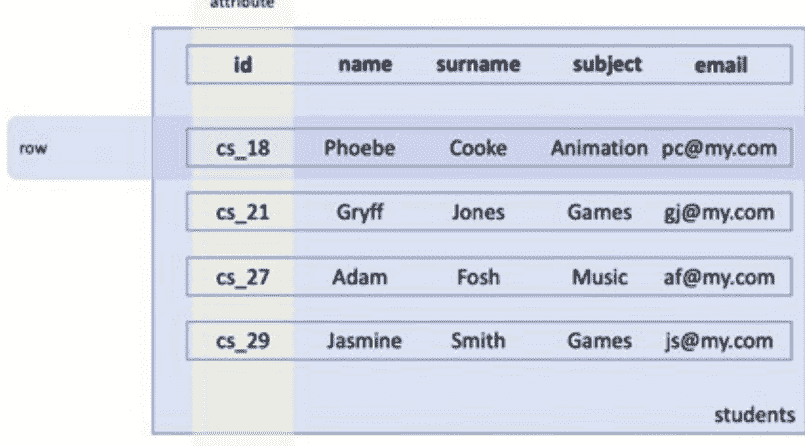

在此图中，有一个名为`students`的表；它用于存储参加会议的学生信息。该表定义了5个属性（或列），分别是`id`、`name`、`surname`、`subject`和`email`。

在这种情况下，`id`可能就是所谓的主键。主键是一种用于唯一标识学生行的属性；它不能被省略，并且必须是唯一的（在表内）。显然，姓名和科目很可能会重复，因为可能有多个学生学习动画或游戏，并且学生可能有相同的名字或姓氏。`email`列也可能是唯一的，因为学生可能不会共享电子邮件地址，但这也未必总是如此。

你可能会在此时疑惑，为什么关系型数据库中的数据被称为“关系型”而不是“表”或“表格”？原因在于一个称为关系代数的主题，它是关系型数据库理论的基础。关系代数的名称源于一个称为“关系”的数学概念。然而，就本章而言，你无需担心这一点，只需记住数据存储在表中即可。

## 数据关系

当一个表中存储的数据与另一个表中存储的数据存在链接或关系时，会使用索引或键将一个表中的值链接到另一个表。下图说明了地址表和居住在该地址的人员表之间的关系。例如，它显示了“Phoebe Gates”居住在地址“addr2”，即布里斯托尔皇后街12号，邮编BS42 6YY。

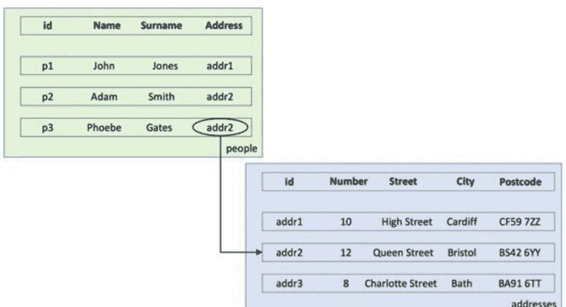

这是一个多对一（通常写作many:1）关系的例子；也就是说，许多人可以居住在一个地址（在上例中，Adam Smith也居住在地址“addr2”）。在关系型数据库中，可能存在几种不同类型的关系，例如：

-   一对一：一个表中的一行仅引用另一个表中的一行。一对一关系的一个例子可能是从一个人到一件独特珠宝的订单。
-   一对多：这与上述地址示例相同，但在此情况下关系的方向相反（也就是说，地址表中的一个地址可以引用人员表中的多个人员）。
-   多对多：这是一个表中的多行可能引用第二个表中的多行的情况。例如，许多学生可能选修一门特定的课程，而一个学生可能选修多门课程。这种关系通常涉及一个中间（连接）表来存储行之间的关联。

## 数据库模式

关系型数据库的结构使用数据定义语言或数据描述语言（DDL）来定义。

通常，这种语言的语法仅限于定义表结构所需的语义（含义）。这种结构被称为数据库模式。通常，DDL包含诸如`CREATE TABLE`、`DROP TABLE`（用于删除表）和`ALTER TABLE`（用于修改现有表的结构）等命令。

许多随数据库提供的工具允许你在不深入纠结DDL语法的情况下定义数据库结构；然而，了解它并理解数据库可以通过这种方式创建是有用的。例如，我们将在本章中使用MySQL数据库。MySQL Workbench是一个工具，允许你使用MySQL数据库来管理和查询特定数据库实例中存储的数据。有关MySQL和MySQL Workbench的参考资料，请参阅本章末尾的链接。

例如，在MySQL Workbench中，我们可以使用数据库上的菜单选项创建一个新表：


使用此功能，我们可以交互式地定义将构成表的列：

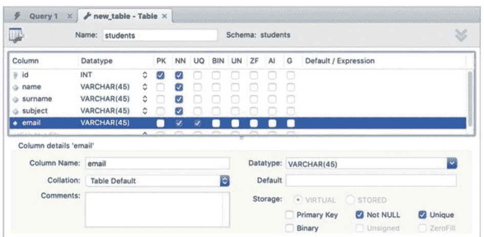

这里指定了每个列名、其类型以及它是否是主键（PK）、非空（或Not Null NN）或唯一（UQ）。当应用更改时，该工具还会显示将用于创建数据库的DDL：

```sql
CREATE TABLE `students`.`students` (
  `id` INT NOT NULL,
  `name` VARCHAR(45) NOT NULL,
  `surname` VARCHAR(45) NOT NULL,
  `subject` VARCHAR(45) NOT NULL,
  `email` VARCHAR(45) NOT NULL,
  PRIMARY KEY (`id`),
  UNIQUE INDEX `email_UNIQUE` (`email` ASC));
```

应用此DDL后，将在数据库中创建一个新表，如下所示：

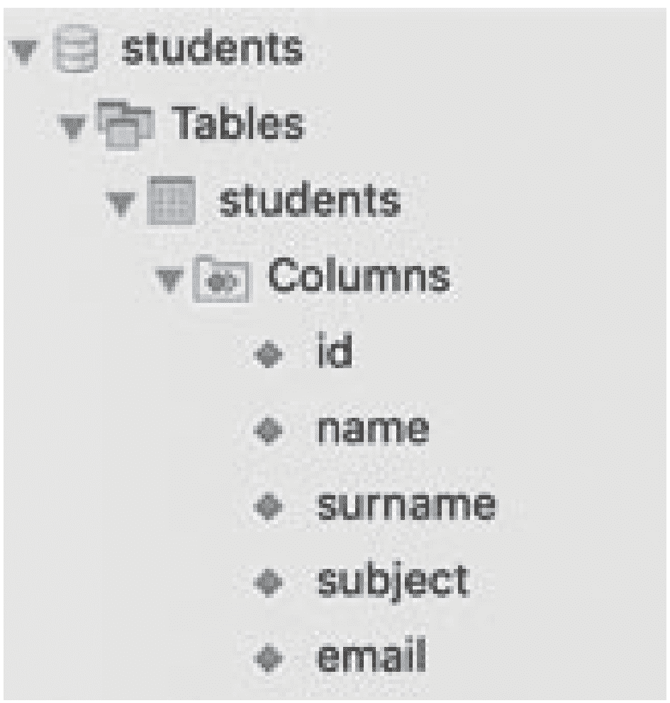

该工具还允许我们将数据填充到表中；这是通过在网格中输入数据并点击应用来完成的，如下所示：

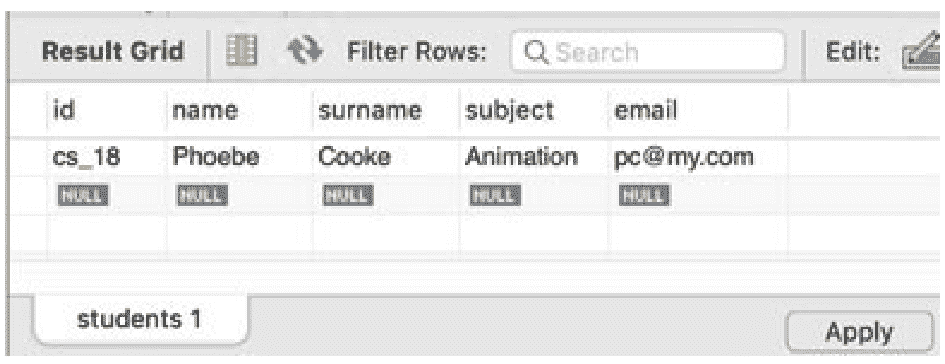

## SQL与数据库

我们现在可以使用查询语言来识别和返回数据库中存储的数据，通常使用特定的条件。

例如，假设我们想从下表中返回所有姓氏为Jones的人：

| id | name | surname | subject | email |
|---|---|---|---|---|
| cs_18 | Phoebe | Cooke | Animation | pc@my.com |
| cs_21 | Gryff | Jones | Games | gj@my.com |
| cs_27 | Adam | Fosh | Music | af@my.com |
| cs_29 | Jasmine | Smith | Games | js@my.com |
| cs_31 | Tom | Jones | Music | tj@my.com |

我们可以通过指定在姓氏等于‘Jones’时返回数据来实现；在SQL中，这看起来像：

```sql
SELECT * FROM students where surname='Jones';
```

上述`SELECT`语句表示，当姓氏等于‘Jones’时，将返回`students`表中一行的所有属性（列或特征）。结果是返回了两行：

| id | name | surname | subject | email |
|---|---|---|---|---|
| 2 | Gryff | Jones | Games | gj@my.com |
| 5 | Tom | Jones | Music | tj@my.com |

注意，我们需要指定感兴趣的表以及想要返回的数据（`select`后的`*`表示我们想要所有数据）。如果我们只对他们的名字感兴趣，那么可以使用：

```sql
SELECT name FROM students where surname='Jones';
```

这将只返回学生的名字：

```python
# True
print("verify_postcode('SY23 3AA'):", verify_postcode('SY23 3AA'))
# True
print("verify_postcode('SY23 4ZZ'):", verify_postcode('SY23 4ZZ'))
# True
print("verify_postcode('BB1 3P0'):", verify_postcode('BB1 3P0'))
# False
print("verify_postcode('AA111 NN56'):", verify_postcode('AA111 NN56'))
# True
print("verify_postcode('AA1 56NN'):", verify_postcode('AA1 56NN'))
# False
print("verify_postcode('AA156NN'):", verify_postcode('AA156NN'))
# False
print("verify_postcode('AA NN'):", verify_postcode('AA NN'))
```

编写一个函数，用于提取两个字符串或字符（如‘<’和‘>’）之间持有的值。该函数应接受三个参数：起始字符、结束字符和要处理的字符串。例如，以下代码片段：

```python
print(extract_values('<', '>', '<John>'))
print(extract_values('<', '>', '<42>'))
print(extract_values('<', '>', '<John 42>'))
print(extract_values('<', '>', 'The <town> was in the <valley>'))
```

应生成如下输出：

```
['John']
['42']
['John 42']
['town', 'valley']
```

| 姓名 |
| --- |
| Gryff |
| Tom |

## 数据操作语言

数据也可以插入到表中，或者表中的现有数据可以被更新。这是通过数据操作语言（DML）来完成的。

例如，要向表中插入数据，我们只需编写一个 INSERT SQL 语句，提供要添加的值以及它们如何映射到表中的列：

```sql
INSERT INTO 'students'('id', 'name', 'surname', 'subject', 'email') VALUES ('6', 'James', 'Andrews', 'Games', 'ja@my.com');
```

这将向 students 表中添加第 6 行，结果是该表现在将多出一行：

| id | 姓名 | 姓氏 | 科目 | 邮箱 |
|---|---|---|---|---|
| 1 | Phoebe | Cooke | Animation | pc@my.com |
| 2 | Gryff | Jones | Games | gj@my.com |
| 3 | Adam | Fosh | Music | af@my.com |
| 4 | Jasmine | Smith | Games | js@my.com |
| 5 | Tom | Jones | Music | tj@my.com |
| 6 | James | Andrews | Games | ja@my.com |

更新现有行稍微复杂一些，因为首先需要确定要更新的行，然后才是要修改的数据。因此，UPDATE 语句包含一个 where 子句以确保修改正确的行：

```sql
UPDATE 'students' SET 'email'='grj@my.com' WHERE 'id'='2';
```

此代码的效果是 students 表中的第二行被修改为新的电子邮件地址：

| id | 姓名 | 姓氏 | 科目 | 邮箱 |
|---|---|---|---|---|
| 1 | Phoebe | Cooke | Animation | pc@my.com |
| 2 | Gryff | Jones | Games | grj@my.com |
| 3 | Adam | Fosh | Music | af@my.com |
| 4 | Jasmine | Smith | Games | js@my.com |
| 5 | Tom | Jones | Music | tj@my.com |
| 6 | James | Andrews | Games | ja@my.com |

## 数据库中的事务

数据库中的另一个重要概念是事务。事务代表在数据库管理系统（或类似系统）中针对数据库实例执行的一个工作单元，并且独立于任何其他事务。

数据库环境中的事务有两个主要目的：

- 提供一个工作单元，允许从故障中恢复，并在系统故障（完全或部分停止执行）的情况下保持数据库一致。这是因为事务中的所有操作要么全部执行，要么全部不执行。因此，如果一个操作导致错误，那么该事务迄今为止所做的所有更改都将被回滚，并且都不会被实际执行。
- 为并发访问数据库的程序提供隔离。这意味着一个程序正在进行的工作不会与另一个程序的工作相互作用。

根据定义，数据库事务必须是原子的、一致的、隔离的和持久的：

- **原子性**：这表明事务代表一个原子工作单元；即事务中的所有操作要么全部执行，要么全部不执行。
- **一致性**：一旦完成，事务必须使数据处于一致状态，并满足任何数据约束（例如，在一对多关系中，一个表中的行不能引用另一个表中不存在的行等）。
- **隔离性**：这与并发事务所做的更改有关；这些更改必须彼此隔离。也就是说，一个事务在第二个事务完成并且所有更改都永久保存到数据库之前，无法看到另一个事务所做的更改。
- **持久性**：这意味着一旦事务完成，它所做的更改就永久存储到数据库中（直到未来的某个事务修改该数据）。

数据库从业者经常使用首字母缩写词 ACID（代表 Atomic, Consistent, Isolated, Durable）来指代数据库事务的这些属性。

并非所有数据库都支持事务，尽管所有商业、生产级数据库（如 Oracle、Microsoft SQL Server 和 MySQL）都支持事务。

## 延伸阅读

如果你想了解更多关于数据库和数据库管理系统的知识，这里有一些在线资源：

- [https://en.wikipedia.org/wiki/Database](https://en.wikipedia.org/wiki/Database) 这是维基百科上关于数据库的条目，因此可以作为有用的快速参考和其他材料的起点。
- [https://en.wikibooks.org/wiki/Introduction_to_Computer_Information_Systems/Database](https://en.wikibooks.org/wiki/Introduction_to_Computer_Information_Systems/Database) 提供了数据库的简要介绍。
- [https://www.techopedia.com/6/28832/enterprise/databases/introduction-to-data-bases](https://www.techopedia.com/6/28832/enterprise/databases/introduction-to-data-bases) 另一个深入研究数据库的有用起点。
- [https://en.wikipedia.org/wiki/Object_database](https://en.wikipedia.org/wiki/Object_database) 关于对象数据库的信息。
- [https://en.wikipedia.org/wiki/NoSQL](https://en.wikipedia.org/wiki/NoSQL) 关于 NoSQL 或非关系型数据库的介绍。
- [https://www.mysql.com/](https://www.mysql.com/) MySQL 数据库主页。
- [https://dev.mysql.com/downloads/workbench](https://dev.mysql.com/downloads/workbench) MySQL Workbench 主页。
- [https://www.mongodb.com/](https://www.mongodb.com/) MongoDB 网站主页。
- [http://couchdb.apache.org/](http://couchdb.apache.org/) Apache Couch 数据库主页。

如果你想探索数据库设计（即数据库中表和表之间链接的设计）的主题，那么这些参考资料可能会有所帮助：

- [https://en.wikipedia.org/wiki/Database_design](https://en.wikipedia.org/wiki/Database_design) 维基百科上关于数据库设计的条目。
- [https://www.udemy.com/cwdatabase-design-introduction/](https://www.udemy.com/cwdatabase-design-introduction/) 涵盖了数据库设计中的大部分核心思想。
- [http://en.tekstenuitleg.net/articles/software/database-design-tutorial/intro.html](http://en.tekstenuitleg.net/articles/software/database-design-tutorial/intro.html) 提供了另一个涵盖数据库设计大部分核心要素的教程。

如果你想进一步探索 SQL，请参阅：

- [https://en.wikipedia.org/wiki/SQL](https://en.wikipedia.org/wiki/SQL) SQL 的维基百科站点。
- [https://www.w3schools.com/sql/sql_intro.asp](https://www.w3schools.com/sql/sql_intro.asp) W3Schools 上关于 SQL 的材料，因此是一个极好的资源。
- [https://www.codecademy.com/learn/learn-sql](https://www.codecademy.com/learn/learn-sql) Codecademy 上的 SQL 学习站点。

## Python DB-API

## 从 Python 访问数据库

在 Python 中访问数据库的标准是 Python DB-API。它为希望允许 Python 访问特定数据库的模块指定了一组标准接口。该标准在 PEP 249 ([https://www.python.org/dev/peps/pep-0249](https://www.python.org/dev/peps/pep-0249)) 中有描述——PEP 是 Python 增强提案。

几乎所有 Python 数据库访问模块都遵循此标准。这意味着如果你从一个数据库迁移到另一个数据库，或者尝试将 Python 程序从一个数据库移植到另一个数据库，那么你遇到的 API 应该非常相似（尽管不同数据库处理的 SQL 也可能不同）。大多数常见数据库（如 MySQL、Oracle、Microsoft SQL Server 等）都有可用的模块。

## DB-API

DB-API 有几个关键元素，它们是：

- connect 函数。用于连接到数据库并返回一个连接对象的 connect() 函数。
- 连接对象。在 DB-API 中，对数据库的访问是通过连接对象实现的。这些连接对象提供了对游标对象的访问。
- 游标对象用于在数据库上执行 SQL 语句。
- 执行的结果。这些是可以作为序列的序列（例如元组的元组）获取的结果。因此，该标准可用于选择、插入或更新数据库中的信息。

这些元素如下图所示：

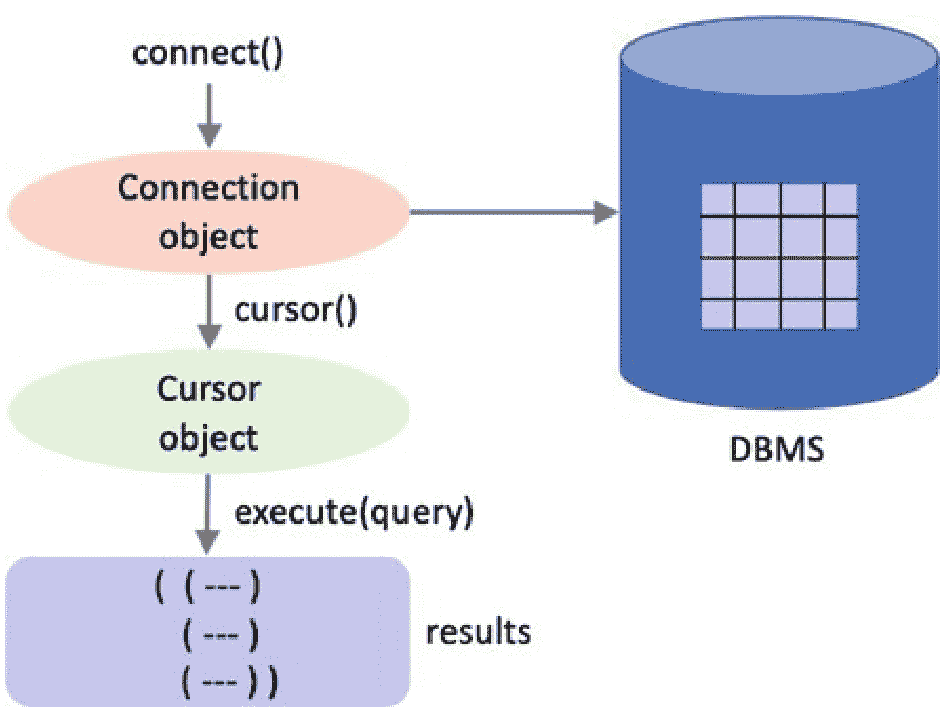

该标准规定了一组用于连接数据库的函数和对象。这些包括连接函数、连接对象和游标对象。

以下将对上述元素进行更详细的描述。

## 连接函数

连接函数定义如下：

```
connect(parameters...)
```

它用于建立与数据库的初始连接。该连接返回一个连接对象。连接函数所需的参数取决于具体的数据库。

## 连接对象

连接对象由 `connect()` 函数返回。连接对象提供了多种方法，包括：

- `close()` 用于在不再需要连接时关闭它。此后该连接将不可用。
- `commit()` 用于提交一个待处理的事务。
- `rollback()` 用于回滚自上次事务提交以来对数据库所做的所有更改（此方法是可选的，并非所有数据库都提供事务支持）。
- `cursor()` 返回一个新的游标对象，用于与该连接进行交互。

## 游标对象

游标对象由 `connection.cursor()` 方法返回。游标对象代表一个数据库游标，用于管理获取操作或数据库命令执行的上下文。游标支持多种属性和方法：

- `cursor.execute(operation, parameters)` 准备并执行一个数据库操作（例如查询语句或更新命令）。参数可以作为序列或映射提供，并将绑定到操作中的变量。变量以数据库特定的表示法指定。
- `cursor.rowcount` 一个只读属性，提供上次 `cursor.execute()` 调用返回（对于 SELECT 类语句）或影响（对于 UPDATE 或 INSERT 类语句）的行数。
- `cursor.description` 一个只读属性，提供 SELECT 操作返回的任何结果中包含的列的信息。
- `cursor.close()` 关闭游标。此后该游标将不可用。

此外，游标对象还提供了多种获取样式的方法。这些方法用于返回数据库查询的结果。返回的数据由一系列序列（例如元组的元组）组成，其中每个内部序列代表 SELECT 语句返回的单行。标准定义的获取方法包括：

- `cursor.fetchone()` 获取查询结果集的下一行，返回一个单独的序列，如果没有更多可用数据则返回 None。
- `cursor.fetchall()` 获取查询结果的所有（剩余）行，将它们作为序列的序列返回。
- `cursor.fetchmany(size)` 获取查询结果的下一组行，返回一个序列的序列（例如元组的元组）。当没有更多行可用时，返回一个空序列。每次调用要获取的行数由参数指定。

## 数据库类型到 Python 类型的映射

DB-API 标准还规定了一组从数据库中使用的类型到 Python 中使用的类型的映射。完整列表请参阅 DB-API 标准本身，但关键映射包括：

| 函数 | 描述 |
| :--- | :--- |
| `Date(year, month, day)` | 表示数据库日期 |
| `Time(hour, minute, second)` | 表示数据库时间值 |
| `Timestamp(year, month, day, hour, minute, second)` | 保存数据库时间戳值 |
| `String` | 用于表示类似字符串的数据库数据（例如 VARCHAR） |

## 生成错误

该标准还规定了一组可在不同情况下抛出的异常。

这些异常如下表所示：

上图说明了与该标准相关的错误和警告的继承层次结构。请注意，DB-API 的 Warning 和 Error 都扩展了标准 Python 的 Exception 类；然而，根据具体实现，在这些类之间可能存在一个或多个额外的类层次结构。例如，在 PyMySQL 模块中，有一个扩展了 Exception 的 MySQLError 类，然后 Warning 和 Error 都扩展了它。

另请注意，Warning 和 Error 之间没有关系。这是因为警告不被视为错误，因此具有单独的类层次结构。但是，Error 是所有数据库错误类的根类。

下面提供了每个 Warning 或 Error 类的描述。

| 异常类 | 描述 |
| :--- | :--- |
| Warning | 用于警告诸如插入期间数据截断等问题。 |
| Error | 所有其他错误异常的基类 |
| InterfaceError | 为与数据库接口而非数据库本身相关的错误引发的异常 |
| DatabaseError | 为与数据库相关的错误引发的异常 |
| DataError | 为由数据问题引起的错误引发的异常，例如除以零、数值超出范围等。 |
| OperationalError | 为与数据库操作相关且不一定由程序员控制的错误引发的异常，例如发生意外断开连接等。 |
| IntegrityError | 当数据库的关系完整性受到影响时引发的异常 |
| InternalError | 当数据库遇到内部错误时引发的异常，例如游标不再有效、事务不同步等。 |
| ProgrammingError | 为编程错误引发的异常，例如找不到表、SQL 语句语法错误、指定的参数数量错误等。 |
| NotSupportedError | 当使用数据库不支持的方法或数据库 API 时引发的异常，例如在不支持事务或已关闭事务的连接上请求 `.rollback()` |

## 行描述

游标对象有一个属性 `description`，它提供一个序列的序列；每个子序列提供 SELECT 语句返回的数据的一个属性的描述。描述该属性的序列最多由七个项目组成，包括：

- `name` 表示属性的名称，
- `type_code` 指示该属性已映射到哪种 Python 类型，
- `display_size` 用于显示属性的大小，
- `internal_size` 内部用于表示值的大小，
- `precision` 如果是实数值，表示属性支持的精度，
- `scale` 表示属性的标度，
- `null_ok` 指示该属性是否接受空值。

前两个项目（`name` 和 `type_code`）是必需的，其他五个是可选的，如果无法提供有意义的值，则设置为 None。

## PyMySQL 中的事务

在 PyMySQL 中，事务通过数据库连接对象进行管理。该对象提供以下方法：

- `connection.commit()` 这会导致当前事务将所做的所有更改永久提交到数据库。然后开始一个新的事务。
- `connection.rollback()` 这会导致所有已做出但尚未永久存储到数据库中（即未提交）的更改被移除。然后开始一个新的事务。

该标准没有规定数据库接口应如何管理事务的开启和关闭（尤其是因为并非所有数据库都支持事务）。但是，MySQL 确实支持事务，并且可以以两种模式工作；一种支持如上所述的事务使用；另一种使用自动提交模式。在自动提交模式下，发送到数据库的每个命令（无论是 SELECT 语句还是 INSERT/UPDATE 语句）都被视为一个独立的事务，并且在语句结束时任何更改都会自动提交。可以在 PyMySQL 中使用以下方法开启此自动提交模式：

- `connection.autocommit(True)` 开启自动提交（False 关闭自动提交，这是默认设置）。

其他相关方法包括：

- `connection.get_autocommit()` 返回一个布尔值，指示自动提交是否开启。
- `connection.begin()` 显式开始一个新事务。

## 在线资源

## PyMySQL 模块

PyMySQL 模块提供了从 Python 访问 MySQL 数据库的功能。它实现了 Python DB-API v 2.0。该模块是一个纯 Python 数据库接口实现，这意味着它可以在不同的操作系统之间移植；这一点值得注意，因为一些数据库接口模块仅仅是其他（原生）实现的包装器，这些实现可能在不同操作系统上可用，也可能不可用。例如，一个基于 Linux 的原生数据库接口模块可能在 Windows 操作系统上不可用。当然，如果你从不打算在不同操作系统之间切换，那么这就不成问题。

要使用 PyMySQL 模块，你需要在你的计算机上安装它。这将涉及使用诸如 Anaconda 之类的工具或将其添加到你的 PyCharm 项目中。你也可以使用 pip 来安装它：

```
> pip install PyMySQL
```

## 使用 PyMySQL 模块

要使用 PyMySQL 模块访问数据库，你需要遵循以下步骤。

1.  导入模块。
2.  连接到运行数据库的主机以及你正在使用的数据库。
3.  从连接对象获取游标对象。
4.  使用 cursor.execute() 方法执行一些 SQL。
5.  使用游标对象获取 SQL 的结果（例如 fetchall、fetchmany 或 fetchone）。
6.  关闭数据库连接。

这些步骤本质上是样板代码，无论何时通过 PyMySQL（或任何符合 DB-API 的模块）访问数据库，你都会用到它们。

我们将依次介绍这些步骤。

### 导入模块

由于 PyMySQL 模块不是 Python 默认提供的内置模块之一，你需要将模块导入到你的代码中，例如使用

```
import pymysql
```

注意这里使用的大小写，因为代码中的模块名是 pymysql（如果你尝试导入 PyMySQL，Python 将找不到它！）。

### 连接到数据库

每个数据库模块都有自己连接到数据库服务器的特定方式；这些通常涉及指定数据库运行所在的机器（因为数据库可能相当耗费资源，它们通常运行在单独的物理计算机上）、用于连接的用户以及所需的安全信息（如密码）和要连接的数据库实例。在大多数情况下，数据库由数据库管理系统（DBMS）管理，该系统可以管理多个数据库实例，因此有必要指定你感兴趣的数据库实例。

对于 MySQL，MySQL 数据库服务器确实是一个可以管理多个数据库实例的 DBMS。因此，pymysql.connect 函数在连接到数据库时需要以下信息：

-   托管 MySQL 数据库服务器的机器名称，例如 dbserver.mydomain.com。如果你想连接到与你的 Python 程序运行在同一台机器上，那么你可以使用 localhost。这是一个为本地机器保留的特殊名称，可以避免你担心本地计算机的名称。
-   用于连接的用户名。大多数数据库将其数据库的访问权限限制为命名用户。这些用户不一定是登录系统的人类用户，而是被允许连接到数据库并执行某些操作的实体。例如，一个用户可能只能读取数据库中的数据，而另一个用户则被允许向数据库插入新数据。这些用户通过要求提供密码进行身份验证。
-   用户的密码。
-   要连接的数据库实例。如前一章所述，数据库管理系统（DBMS）可以管理多个数据库实例，因此有必要说明你感兴趣的数据库实例。

例如：

```
# 打开数据库连接
connection = pymysql.connect('localhost', 'username', 'password', 'uni-database')
```

在这种情况下，我们连接的机器是 'localhost'（即与 Python 程序本身运行在同一台机器上），用户由 'username' 和 'password' 表示，感兴趣的数据库实例名为 'uni-database'。

这将返回一个符合 DB-API 标准的 Connection 对象。

### 获取游标对象

你可以使用 cursor() 方法从连接中获取游标对象：

```
# 使用 cursor() 方法准备一个游标对象
cursor = connection.cursor()
```

### 使用游标对象

一旦你获得了游标对象，你就可以用它来执行 SQL 查询或 DML 插入、更新或删除语句。以下示例使用一个简单的 select 语句来选择 students 表中当前存储的所有行的所有属性：

```
# 使用 execute() 方法执行 SQL 查询。
cursor.execute('SELECT * FROM students')
```

请注意，此方法执行 SELECT 语句，但不会直接返回结果集。相反，execute 方法返回一个整数，指示受修改影响的行数或作为查询一部分返回的行数。对于 SELECT 语句，返回的数字可用于确定使用哪种类型的获取方法。

### 获取有关结果的信息

游标对象也可用于获取有关要获取的结果的信息，例如结果中有多少行以及结果中每个属性的类型：

-   cursor.rowcount() 这是一个只读属性，指示 SELECT 语句返回的行数或 UPDATE 或 INSERT 语句影响的行数。
-   cursor.description() 这是一个只读属性，提供结果集中每个属性的描述。每个描述提供属性的名称和类型指示（通过 type_code），以及有关值是否可以为 null 的进一步信息，对于数字，还有比例、精度和大小信息。

下面给出了使用这两个属性的示例：

```
print('cursor.rowcount', cursor.rowcount)
print('cursor.description', cursor.description)
```

这些行生成的输出示例如下：

```
cursor.rowcount 6
cursor.description (('id', 3, None, 11, 11, 0, False), ('name', 253, None, 180, 180, 0, False), ('surname', 253, None, 180, 180, 0, False), ('subject', 253, None, 180, 180, 0, False), ('email', 253, None, 180, 180, 0, False))
```

### 获取结果

现在，针对数据库成功运行了 SELECT 语句，我们可以获取结果。结果以元组的元组形式返回。如上一章所述，有几种不同的获取选项可用，包括 fetchone()、fetchmany(size) 和 fetchall()。在下面的示例中，我们使用 fetchall() 选项，因为我们知道最多只能返回六行。

```
# 获取所有行，然后遍历数据
data = cursor.fetchall()
for row in data:
    print('row:', row)
```

在这种情况下，我们遍历数据集合中的每个元组并打印该行。然而，我们同样可以轻松地将元组中的信息提取到各个元素中。然后可以使用这些元素来构造一个对象，该对象随后可以在应用程序中进行处理，例如：

```
for row in data:
    id, name, surname, subject, email = row
    student = Student(id, name, surname, subject, email)
    print(student)
```

### 关闭连接

一旦你完成了数据库连接，就应该关闭它。

```
# 从服务器断开连接
connection.close()
```

## 完整的 PyMySQL 查询示例

下面给出了一个完整的代码清单，演示了连接到数据库、运行 SELECT 语句并使用 Student 类打印结果：

```
import pymysql

class Student:
    def __init__(self, id, name, surname, subject, email):
        self.id = id
        self.name = name
```

有关 Python 数据库 API 的更多信息，请参阅以下在线资源：

-   [https://www.python.org/dev/peps/pep-0249/](https://www.python.org/dev/peps/pep-0249/) Python 数据库 API 规范 V2.0。
-   [https://wiki.python.org/moin/DatabaseProgramming](https://wiki.python.org/moin/DatabaseProgramming) Python 中的数据库编程。
-   [https://docs.python-guide.org/scenarios/db/](https://docs.python-guide.org/scenarios/db/) 数据库与 Python。

## 向数据库插入数据

除了从数据库读取数据外，许多应用程序还需要向数据库添加新数据。这通过 DML（数据操作语言）INSERT 语句来完成。此过程与使用 SELECT 语句对数据库运行查询非常相似；也就是说，你需要建立连接、获取游标对象并执行语句。这里的一个区别是，你不需要获取结果。

```python
import pymysql
# Open database connection
connection = pymysql.connect('localhost', 'user', 'password', 'uni-database')
# prepare a cursor object using cursor() method
cursor = connection.cursor()
try:
    # Execute INSERT command
    cursor.execute("INSERT INTO students (id, name, surname, subject, email) VALUES (7, 'Denise', 'Byrne', 'History', 'db@my.com')")
    # Commit the changes to the database
    connection.commit()
except:
    # Something went wrong
    # rollback the changes
    connection.rollback()
# Close the database connection
connection.close()
```

运行此代码的结果是数据库被更新，添加了第七行数据，对应‘Denise Byrne’。如果在 MySQL Workbench 中查看 students 表的内容，可以看到这一点：


关于此代码示例，有几点需要注意。首先，我们在定义 INSERT 命令的字符串周围使用了双引号——这是因为双引号字符串允许我们在该字符串内包含单引号。这是必要的，因为我们需要引用传递给数据库的任何字符串值（例如‘Denise’）。

其次需要注意的是，默认情况下，PyMySQL 数据库接口要求程序员决定何时提交或回滚事务。事务在上一章中被介绍为一个原子工作单元，必须作为一个整体完成或回滚，以确保不进行任何更改。然而，我们表示事务完成的方式是通过调用数据库连接上的 `commit()` 方法。相应地，我们可以通过调用 `rollback()` 来表示我们希望回滚当前事务。无论哪种情况，一旦调用了该方法，就会为任何进一步的数据库活动开始一个新的事务。

在上面的代码中，我们使用了一个 try 块来确保如果一切成功，我们将提交所做的更改，但如果抛出任何异常，我们将回滚事务——这是一种常见的模式。

## 更新数据库中的数据

如果我们能够向数据库插入新数据，我们可能还希望更新数据库中的数据，例如更正某些信息。这使用 UPDATE 语句完成，该语句必须指明正在更新的现有行以及新数据应该是什么。

```python
import pymysql
# Open database connection
connection = pymysql.connect('localhost',
    'user',
    'password',
    'uni-database')
# prepare a cursor object using cursor() method
cursor = connection.cursor()
try:
    # Execute UPDATE command
    cursor.execute("UPDATE students SET email = 'denise@my.com' WHERE id = 7")
    # Commit the changes to the database
    connection.commit()
except:
    # rollback the changes if an exception / error
    connection.rollback()
# Close the database connection
connection.close()
```

在此示例中，我们正在更新 id 为 7 的学生，使其电子邮件地址更改为‘denise@my.com’。这可以通过在 MySQL Workbench 中检查 students 表的内容来验证：

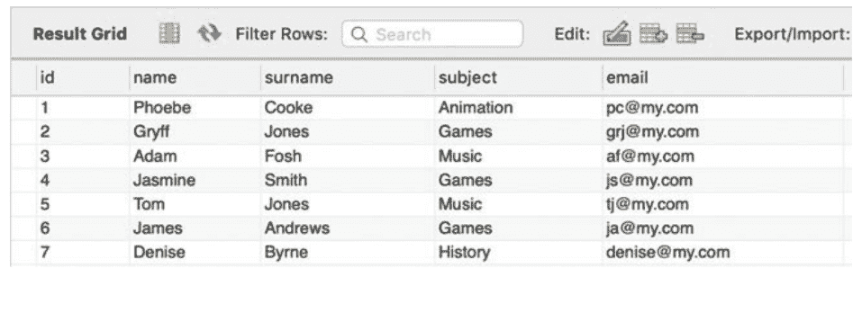

## 删除数据库中的数据

最后，也可以从数据库中删除数据，例如当学生离开课程时。这遵循与前两个示例相同的格式，不同之处在于使用 DELETE 语句：

```python
import pymysql
# Open database connection
connection = pymysql.connect('localhost',
    'user',
    'password',
    'uni-database')
# prepare a cursor object using cursor() method
cursor = connection.cursor()
try:
    # Execute DELETE command
    cursor.execute("DELETE FROM students WHERE id = 7")
    # Commit the changes to the database
    connection.commit()
except:
    # rollback the changes if an exception / error
    connection.rollback()
# Close the database connection
connection.close()
```

在这种情况下，我们删除了 id 为 7 的学生。我们可以在 MySQL Workbench 中通过检查运行此代码后 students 表的内容再次看到这一点：


## 创建表

你不仅可以向数据库添加数据；如果你愿意，你还可以以编程方式创建新表以供应用程序使用。此过程遵循与用于 INSERT、UPDATE 和 DELETE 完全相同的模式。唯一的区别是发送到数据库的命令包含一个 CREATE 语句，其中包含要创建的表的描述。下面对此进行了说明：

```python
import pymysql
# Open database connection
connection = pymysql.connect('localhost',
    'user',
    'password',
    'uni-database')
# prepare a cursor object using cursor() method
cursor = connection.cursor()
try:
    # Execute CREATE command
    cursor.execute("CREATE TABLE log (message VARCHAR(100) NOT NULL)")
    # Commit the changes to the database
    connection.commit()
except:
    # rollback the changes if an exception / error
    connection.rollback()
# Close the database connection
connection.close()
```

这将在 uni-database 中创建一个新表 log；可以通过查看 MySQL Workbench 中 uni-database 列出的表来看到这一点。


## 在线资源

有关 Python 数据库 API 的更多信息，请参阅以下在线资源：

- [https://pymysql.readthedocs.io/en/latest/ PyMySQL](https://pymysql.readthedocs.io/en/latest/ PyMySQL) 文档站点。
- [https://github.com/PyMySQL/PyMySQL](https://github.com/PyMySQL/PyMySQL) PyMySQL 库的 GitHub 仓库。

## 尝试

在本练习中，你将基于一组存储在活期账户中的事务来创建数据库和表。你可以使用你在 CSV 和 Excel 章节中创建的 Account 类来完成此操作。

你需要两个表，一个用于账户信息，一个用于交易历史。账户信息表的主键可以用作交易历史表的外键。然后编写一个函数，该函数接受一个 Account 对象并用适当的数据填充这些表。

要创建账户信息表，你可以使用以下 DDL：

```sql
CREATE TABLE acc_info (idacc_info INT NOT NULL, name VARCHAR(255) NOT NULL, PRIMARY KEY (idacc_info))
```

而对于交易表，你可以使用：

```sql
CREATE TABLE transactions (idtransactions INT NOT NULL, type VARCHAR(45) NOT NULL, amount VARCHAR(45) NOT NULL, account INT NOT NULL, PRIMARY KEY (idtransactions))
```

## 日志简介

## 引言

许多编程语言都有通用的日志库，包括 Java 和 C#，当然 Python 也有一个日志模块。事实上，Python 的日志模块自 Python 2.3 起就一直是内置模块的一部分。

本章将讨论为什么你应该在程序中添加日志，你应该（以及不应该）记录什么，以及为什么仅仅使用 `print()` 函数是不够的。

## 为什么要记录日志？

日志通常是任何生产应用程序的关键方面；这是因为提供适当的信息非常重要，以便在应用程序发生某些事件或问题后进行后续调查。这些调查包括：

-   诊断故障；即应用程序为何失败/崩溃。
-   识别异常或意外行为；这些行为可能不会导致应用程序失败，但可能使其处于意外状态，或者数据可能被损坏等。
-   识别性能或容量问题；在这种情况下，应用程序按预期运行，但未满足与其运行速度或随着数据量或用户数量增长而扩展能力相关的某些非功能性需求。
-   处理试图进行的恶意行为，即某些外部代理试图影响系统的行为或获取其不应访问的信息等。例如，如果你正在创建一个 Python Web 应用程序，而用户试图入侵你的 Web 服务器，就可能发生这种情况。
-   监管或法律合规性。在某些情况下，出于监管或法律原因，可能需要保留程序执行记录。这在金融行业尤其如此，因为必须保留多年的记录，以防需要调查组织或个人的行为。

## 记录日志的目的是什么？

因此，通常有两个普遍原因来记录应用程序在运行期间所做的事情：

-   用于诊断目的，以便在出现问题时，记录的事件/步骤可用于分析系统的行为。
-   用于审计目的，以便后续出于业务、法律或监管目的分析系统的行为。例如，在这种情况下，确定谁在何时对什么做了什么。

如果没有此类记录的信息，事后就不可能知道发生了什么。例如，如果你只知道应用程序崩溃了（意外停止执行），你如何确定应用程序当时处于什么状态，正在执行哪些函数、方法等，以及运行了哪些语句？

请记住，尽管开发人员在开发期间可能使用 IDE 运行他们的应用程序，并且可能使用可用的调试设施来查看正在执行哪些函数或方法、语句甚至变量值；但这并不是大多数生产系统的运行方式。通常，生产 Python 系统将从命令行运行，或者可能通过快捷方式（在 Windows 机器上）来简化程序的运行。用户所知道的只是某些东西失败了，或者他们期望的行为没有发生——如果他们确实意识到了任何问题的话！

因此，日志是事后分析故障、意外行为或出于业务原因分析系统运行的关键。

## 你应该记录什么？

此时你可能正在考虑的一个问题是“我应该记录什么信息？”。应用程序应记录足够的信息，以便事后调查人员能够了解发生了什么、何时以及何地。通常，这意味着你需要记录日志消息的时间、模块/文件名、正在执行的函数名或方法名、可能使用的日志级别（稍后介绍），以及在某些情况下涉及的参数值/环境、程序或类的状态。

在许多情况下，开发人员记录函数或方法的入口（在较小程度上也记录出口）。然而，记录函数或方法内分支点发生的情况也可能很有用，以便可以跟踪应用程序的逻辑。

所有应用程序都应记录所有错误/异常。尽管需要注意确保以适当的方式进行。例如，如果一个异常被捕获然后重新抛出多次，则无需在每次捕获时都记录它。实际上，这样做会使日志文件变得更大，在调查问题时造成混淆，并导致不必要的开销。一种常见的方法是在异常首次引发和捕获时记录它，之后不再记录。

## 不应该记录什么

接下来要考虑的问题是“我不应该记录什么信息？”。一个普遍不应记录的领域是任何个人或敏感信息，包括任何可用于识别个人的信息。这类信息被称为 PII 或个人身份信息。

此类信息包括：

-   用户 ID 和密码，
-   电子邮件地址，
-   出生日期、出生地，
-   可识别个人的财务信息，如银行账户详情、信用卡详情等，
-   生物识别信息，
-   医疗/健康信息，
-   政府颁发的个人信息，如护照详情、驾照号码、社会安全号码、国民保险号码等，
-   官方组织信息，如专业注册和会员号码，
-   实际地址、电话（固定电话）号码、手机号码，
-   验证相关信息，如母亲的婚前姓名、宠物名字、高中、小学、最喜欢的电影等，
-   它也越来越多地包括与社交媒体相关的在线信息，例如 **Facebook 或 LinkedIn 账户。**

以上所有都是敏感信息，其中大部分可用于识别个人；这些信息都不应直接记录。

这并不意味着你不能也不应该记录用户登录的事实；你很可能需要这样做。但是，信息应至少经过混淆处理，并且不应包含任何不需要的信息。例如，你可以记录由某个 ID 代表的用户在特定时间尝试登录以及他们是否成功。但是，你不应记录他们的密码，也不应记录实际的用户 ID，而是可以记录一个可用于映射到其实际用户 ID 的 ID。

你还应该小心直接将输入到应用程序的数据记录到日志文件中。恶意代理攻击应用程序（特别是 Web 应用程序）的一种方式是尝试向其发送大量数据（作为字段的一部分或作为操作的参数）。如果应用程序盲目地记录所有提交给它的数据，那么日志文件可能会很快填满。这可能导致应用程序使用的文件存储被填满，并给使用相同文件存储的所有软件带来潜在问题。这种攻击形式被称为日志（或日志文件）注入攻击，并且有充分的文档记录（参见 [https://www.owasp.org/index.php/Log_Injection](https://www.owasp.org/index.php/Log_Injection)，这是备受尊敬的开放式 Web 应用程序安全项目的一部分）。

另一点需要注意的是，仅仅记录一个错误是不够的。这不是错误处理；记录错误并不意味着你已经处理了它；只是意味着你已经注意到了它。应用程序仍然应该决定如何管理错误或异常。

通常，你还应该力求在生产系统中保持日志为空；即只记录生产系统中需要记录的信息（通常是关于错误、异常或其他意外行为的信息）。然而，在测试期间需要更多的细节，以便可以跟踪系统的执行。因此，应该能够根据代码运行的环境（即在测试环境中或在生产环境中）选择记录多少信息。

最后需要注意的一点是，将信息记录到正确的位置非常重要。许多应用程序（和组织）会将常规信息记录到一个日志文件，将错误和异常记录到另一个，将安全信息记录到第三个。因此，了解你的日志信息被发送到哪里，并避免将信息发送到错误的日志中，这一点至关重要。

## 为什么不用打印（Print）？

假设你想在应用程序中记录信息，那么下一个问题就是：你应该怎么做？在本书中，我们一直使用 Python 的 `print()` 函数来打印出表明代码生成结果的信息，但有时也用于显示函数或方法等的运行情况。

因此，我们需要考虑使用 `print()` 函数是否是记录信息的最佳方式。

实际上，在生产系统中使用 `print()` 来记录信息几乎从来都不是正确的答案，这有几个原因：

- `print()` 函数默认将字符串写入标准输出（stdout）或标准错误输出（stderr），而后者默认将输出定向到控制台/终端。例如，当你在 IDE 中运行应用程序时，输出会显示在控制台窗口中。如果你从命令行运行应用程序，那么输出会定向回该命令/终端窗口。这两种情况在开发期间都没问题，但如果程序不是从命令窗口运行的呢？也许它是由操作系统自动启动的（就像许多服务，如打印服务或 Web 服务器那样）。在这种情况下，没有终端/控制台窗口来接收数据；数据就丢失了。实际上，stdout 和 stderr 输出流可以被定向到一个文件（或多个文件）。然而，这通常是在程序启动时完成的，并且很容易被忽略。此外，你只能选择将所有 stdout 发送到特定文件，或将所有错误输出发送到 stderr。

- 使用 `print()` 函数的另一个问题是，所有对 `print` 的调用都会被输出。使用大多数日志记录器时，可以指定所需的日志级别。这些不同的日志级别允许根据场景生成不同数量的信息。例如，在一个经过充分测试、可靠的生产系统中，我们可能只希望记录与错误相关或关键的信息。这将减少我们收集的信息量，并降低日志记录对应用程序引入的性能影响。然而，在测试阶段，我们可能希望有更详细的日志级别。

- 在其他情况下，我们可能希望更改正在运行的生产系统所使用的日志级别，而无需修改实际代码（因为这有可能在代码中引入错误）。相反，我们希望能够从外部更改日志记录系统的行为方式，例如通过配置文件。这允许系统管理员修改正在记录的信息的数量和详细程度。它通常也允许更改日志信息的指定位置。

- 最后，当使用 `print()` 函数时，开发者可以使用他们喜欢的任何格式，他们可以在消息中包含时间戳，也可以不包含；可以包含模块或函数/方法名称，也可以不包含；可以包含参数，也可以不包含。使用日志系统通常会标准化生成的信息以及日志消息。因此，所有日志消息都会有（或没有）时间戳，或者所有消息都会包含（或不包含）生成它们的函数或方法的信息等。

## Python 中的日志记录

### 日志模块

Python 自 2.3 版本起就包含了一个内置的日志模块。这个模块，即 `logging` 模块，定义了实现灵活日志框架的函数和类，该框架可用于任何 Python 应用程序/脚本或 Python 库/模块中。

尽管不同的日志框架在提供的具体细节上有所不同；但几乎所有框架都提供相同的核心元素（尽管有时使用不同的名称）。Python 的 `logging` 模块也不例外，构成日志框架及其处理管道的核心元素如下所示（请注意，对于 Java、Scala、C++ 等语言中的日志框架，也可以绘制非常类似的图表）。

下图说明了一个使用内置 Python 日志框架将消息记录到文件的 Python 程序。

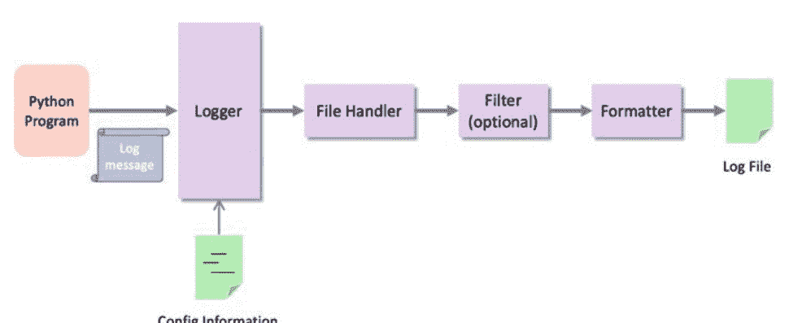

日志框架的核心元素（其中一些是可选的）如上所示，并在下面描述：

- 日志消息：这是来自应用程序的要记录的消息。
- 日志记录器（Logger）：为程序员提供进入日志系统的入口点/接口。`Logger` 类提供了多种方法，可用于记录不同级别的消息。
- 处理器（Handler）：处理器决定将日志消息发送到哪里，默认处理器包括将消息发送到文件的文件处理器和将消息发送到 Web 服务器的 HTTP 处理器。
- 过滤器（Filter）：这是日志管道中的一个可选元素。它们可用于进一步过滤要记录的信息，提供对哪些日志消息实际输出（例如输出到日志文件）的细粒度控制。
- 格式器（Formatter）：这些用于根据需要格式化日志消息。这可能涉及向原始日志消息添加时间戳、模块和函数/方法信息等。
- 配置信息：日志记录器（以及相关的处理器、过滤器和格式器）可以在 Python 中以编程方式配置，也可以通过配置文件配置。这些配置文件可以使用键值对编写，也可以使用 YAML 文件（一种简单的标记语言）编写。YAML 代表“另一种标记语言”！

值得注意的是，日志框架的大部分内容对开发者是隐藏的，开发者实际上只看到日志记录器；日志管道的其余部分要么通过默认配置，要么通过日志配置信息（通常以日志配置文件的形式）进行配置。

### 日志记录器

日志记录器为程序员提供了进入日志管道的接口。`Logger` 对象通过 `logging` 模块中定义的 `getLogger()` 函数获取。以下代码片段演示了获取默认日志记录器并使用它记录错误消息。注意必须导入 `logging` 模块：

```python
import logging
logger = logging.getLogger()
logger.error('This should be used with something unexpected')
```

这个简短应用程序的输出被记录到控制台，因为这是默认配置：

This should be used with something unexpected

### 控制记录的信息量

日志消息实际上与一个日志级别相关联。这些日志级别旨在指示被记录消息的严重性。Python 日志框架关联了六个不同的日志级别，它们是：

- NOTSET：在此级别不进行任何日志记录，日志记录实际上被关闭。
- DEBUG：此级别旨在提供详细信息，通常在开发者诊断应用程序中的错误或问题时感兴趣。
- INFO：此级别预期提供的详细程度低于 DEBUG 日志级别，因为它预期提供可用于确认应用程序按预期工作的信息。
- WARNING：用于提供有关意外事件的信息，或指示开发者或系统管理员可能希望进一步调查的某些可能问题。
- ERROR：用于提供有关应用程序无法处理的某些严重问题或故障的信息，这可能意味着应用程序无法正常运行。
- CRITICAL：这是最高级别的问题，保留用于关键情况，例如程序无法继续执行的情况。

日志级别是相互关联的，并以层次结构定义。每个日志级别都有一个与之关联的数值，如下所示（尽管你永远不需要使用这些数字）。因此，INFO 是比 DEBUG 更高的日志级别，而 ERROR 又是比 WARNING、INFO、DEBUG 等更高的日志级别。

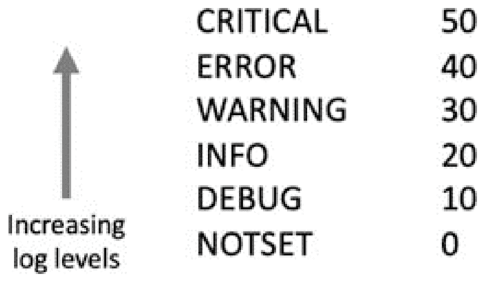

与消息记录的日志级别相关联，日志记录器（Logger）本身也关联着一个日志级别。日志记录器会处理所有处于其日志级别或更高级别的消息。因此，如果一个日志记录器的日志级别设置为 WARNING，那么它将记录所有使用 warning、error 和 critical 日志级别记录的消息。

一般来说，应用程序在生产系统中不会使用 DEBUG 级别。这通常被认为是不合适的，因为它仅用于调试场景。INFO 级别可能被认为适用于生产系统，尽管它可能会产生大量信息，因为它通常跟踪函数和方法的执行。如果一个应用程序经过了充分的测试和验证，那么真正应该发生或需要关注的就只有警告和错误。因此，在生产系统中默认使用 WARNING 级别并不少见（事实上，这就是为什么 Python 日志系统中的默认日志级别设置为 WARNING）。

如果我们现在查看以下代码，该代码获取默认的日志记录器对象，然后使用几种不同的日志记录器方法，我们可以看到日志级别对输出的影响：

```python
import logging
logger = logging.getLogger()
logger.debug('This is to help with debugging')
logger.info('This is just for information')
logger.warning('This is a warning!')
logger.error('This should be used with something unexpected')
logger.critical('Something serious')
```

默认日志级别设置为 warning，因此只有在 warning 级别或更高级别记录的消息才会被打印出来：

```
This is a warning!
This should be used with something unexpected
Something serious
```

由此可见，以 debug 和 info 级别记录的消息已被忽略。

然而，Logger 对象允许我们通过 `setLevel()` 方法以编程方式更改日志级别，例如 `logger.setLevel(logging.DEBUG)`，或者通过 `logging.basicConfig(level = logging.DEBUG)` 函数；这两种方法都会将日志级别设置为 DEBUG。请注意，必须在获取日志记录器之前设置日志级别。

如果我们在前面的程序中添加上述设置日志级别的方法之一，我们将改变生成的日志信息量：

```python
import logging
logging.basicConfig(level=logging.DEBUG)
logger = logging.getLogger()
logger.warning('This is a warning!')
logger.info('This is just for information')
logger.debug('This is to help with debugging')
logger.error('This should be used with something unexpected')
logger.critical('Something serious')
```

现在这将输出所有日志消息，因为 debug 是最低的日志级别。当然，我们可以通过将日志级别设置为 NOTSET 来关闭日志记录：

```python
logger.setLevel(logging.NOTSET)
```

或者，你可以将 Logger 的 disabled 属性设置为 True：

```python
logging.Logger.disabled = True
```

## 日志记录器方法

Logger 类提供了许多可用于控制记录内容的方法，包括：

- `setLevel(level)` 设置此日志记录器的日志级别。
- `getEffectiveLevel()` 返回此日志记录器的日志级别。
- `isEnabledFor(level)` 检查此日志记录器是否为指定的日志级别启用。
- `debug(message)` 记录 debug 级别的消息。
- `info(message)` 记录 info 级别的消息。
- `warning(message)` 记录 warning 级别的消息。
- `error(message)` 记录 error 级别的消息。
- `critical(message)` 记录 critical 级别的消息。
- `exception(message)` 此方法在 error 级别记录一条消息。但是，它只能在异常处理程序中使用，并包含任何相关异常的堆栈跟踪，例如：

```python
import logging
logger = logging.getLogger()
try:
    print('starting')
    x = 1 / 0
    print(x)
except:
    logger.exception('an exception message')
print('Done')
```

- `log(level, message)` 记录第一个参数指定的日志级别的消息。

此外，还有几种用于管理处理器（handlers）和过滤器（filters）的方法：

- `addFilter(filter)` 此方法将指定的过滤器添加到此日志记录器。
- `removeFilter(filter)` 从此日志记录器对象中移除指定的过滤器。
- `addHandler(handler)` 将指定的处理器添加到此日志记录器。
- `removeHandler(handler)` 从此日志记录器中移除指定的处理器。

## 默认日志记录器

日志框架始终提供一个默认（或根）日志记录器。可以通过 logging 模块中定义的函数访问此日志记录器。这些函数允许使用 info()、error()、warning() 等方法在不同级别记录消息，而无需首先获取对日志记录器对象的引用。例如：

```python
import logging
# Set the root logger level
logging.basicConfig(level=logging.DEBUG)
# Use root (default) logger
logging.debug('This is to help with debugging')
logging.info('This is just for information')
logging.warning('This is a warning!')
logging.error('This should be used with something unexpected')
logging.critical('Something serious')
```

此示例将根或默认日志记录器的日志级别设置为 DEBUG（默认为 WARNING）。然后它使用默认日志记录器生成一系列不同级别（从 DEBUG 到 CRITICAL）的日志消息。此程序的输出如下所示：

```
DEBUG:root:This is to help with debugging
INFO:root:This is just for information
WARNING:root:This is a warning!
ERROR:root:This should be used with something unexpected
CRITICAL:root:Something serious
```

请注意，根日志记录器默认使用的格式打印日志级别、生成输出的日志记录器名称和消息。由此你可以看出，是根日志记录器在生成输出。

## 模块级日志记录器

大多数模块不会使用根日志记录器来记录信息，而是使用命名的或模块级的日志记录器。这样的日志记录器可以独立于根日志记录器进行配置。这允许开发者仅为某个模块而不是整个应用程序开启日志记录。如果开发者希望调查位于单个模块内的问题，这会很有用。

本章前面的代码示例使用了不带参数的 `getLogger()` 函数来获取日志记录器对象，例如：

```python
logger = logging.getLogger()
```

这实际上是获取对根日志记录器引用的另一种方式，该根日志记录器被独立的日志记录函数（如 logging.info()、logging.debug() 函数）使用，因此：

```python
logging.warning('my warning')
```

和

```python
logger = logging.getLogger()
logger.warning('my warning')
```

具有完全相同的效果；唯一的区别是第一种版本涉及的代码更少。

然而，也可以创建一个命名的日志记录器。这是一个独立的日志记录器对象，它有自己的名称，并且可能拥有自己的日志级别、处理器和格式化器等。要获取命名的日志记录器，请向 `getLogger()` 方法传入一个名称字符串：

```python
logger1 = logging.getLogger('my logger')
```

这将返回一个名为 'my logger' 的日志记录器对象。请注意，这可能是一个全新的日志记录器对象，但是，如果当前系统中的任何其他代码之前请求过名为 'my logger' 的日志记录器，那么该日志记录器对象将被返回给当前代码。因此，使用相同名称多次调用 `getLogger()` 将始终返回对同一个 Logger 对象的引用。

通常的做法是使用模块的名称作为日志记录器的名称；因为在任何特定系统中，应该只存在一个具有特定名称的模块。模块的名称不需要硬编码，因为它可以使用 `__name__` 属性获取，因此常见写法是：

```python
logger2 = logging.getLogger(__name__)
```

我们可以通过打印每个日志记录器来查看每条语句的效果：

```python
logger = logging.getLogger()
print('Root logger:', logger)
logger1 = logging.getLogger('my logger')
print('Named logger:', logger1)
logger2 = logging.getLogger(__name__)
print('Module logger:', logger2)
```

运行上述代码时，输出为：

```
Root logger: <RootLogger root (WARNING)>
Named logger: <Logger my logger (WARNING)>
Module logger: <Logger main (WARNING)>
```

这表明每个日志记录器都有自己的名称（代码在 main 模块中运行，因此模块名称是 main）。

main_) 且所有三个日志记录器的有效日志级别均为 WARNING（这是默认值）。

## 日志记录器层次结构

实际上存在一个日志记录器层次结构，根日志记录器位于该层次结构的顶部。所有命名的日志记录器都位于根日志记录器之下。日志记录器的名称实际上可以是一个以句点分隔的层次值，例如 `util`、`util.lib` 和 `util.lib.printer`。在层次结构中更靠下的日志记录器是更靠上的日志记录器的子级。

例如，假设有一个名为 `lib` 的日志记录器，那么它将位于根日志记录器之下，但位于名为 `util.lib` 的日志记录器之上。这个日志记录器又将位于名为 `util.lib.printer` 的日志记录器之上。这在下图中得到了说明：

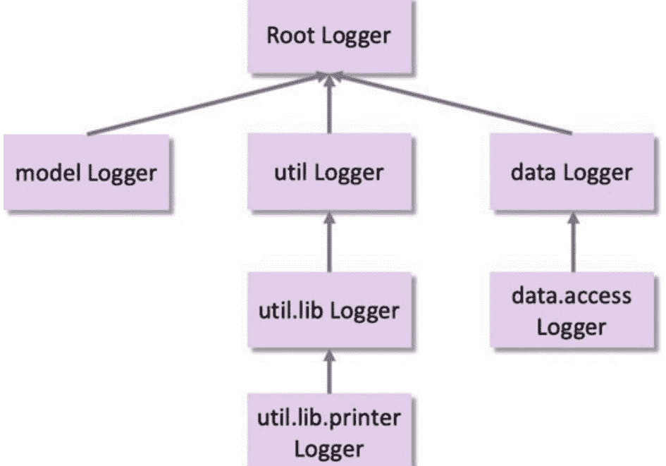

日志记录器名称层次结构类似于 Python 包层次结构，如果你按照推荐的构造方式 `logging.getLogger(__name__)` 按模块组织日志记录器，那么它与包层次结构是相同的。

在考虑日志级别时，这个层次结构很重要。如果当前日志记录器未设置日志级别，它将查看其父级，以检查该日志记录器是否设置了日志级别。如果设置了，那将就是使用的日志级别。这种在日志记录器层次结构中向上回溯的搜索将持续进行，直到找到显式设置的日志级别或遇到根日志记录器（其默认日志级别为 WARNING）。

这很有用，因为不必为应用程序中使用的每个日志记录器对象显式设置日志级别。相反，只需设置根日志级别（或者对于模块层次结构，在模块层次结构中的适当位置设置）。然后可以在特定需要的地方覆盖此设置。

## 格式化

你可以在两个层面上格式化记录的消息：一是在传递给日志记录方法（如 `info()` 或 `warn()`）的日志消息内部，二是通过顶级配置来指示可以向单个日志消息添加哪些附加信息。

### 格式化日志消息

日志消息可以包含控制字符，这些字符指示应在消息中放置哪些值，例如：

```
logger.warning('%s is set to %d', 'count', 42)
```

这表示格式字符串期望接收一个字符串和一个数字。要替换到格式字符串中的参数以逗号分隔的值列表的形式跟在格式字符串后面。

### 格式化日志输出

可以配置日志管道，以便在每条日志消息中包含标准信息。这可以为所有处理程序全局设置。也可以通过编程方式为单个处理程序设置特定的格式化器；这将在下一节中讨论。

要全局设置日志消息的输出格式，请使用 `logging.basicConfig()` 函数的 `format` 命名参数。

`format` 参数接受一个字符串，该字符串可以包含你认为合适的 `LogRecord` 属性。有一个全面的 `LogRecord` 属性列表，可以在 https://docs.python.org/3/library/logging.html#logrecord-attributes 处参考。关键属性有：

- `args`：一个元组，列出了调用关联函数或方法时使用的参数。
- `asctime`：指示日志消息创建的时间。
- `filename`：包含日志语句的文件名。
- `module`：模块名称（文件名的名称部分）。
- `funcName`：包含日志语句的函数或方法的名称。
- `levelname`：日志语句的日志级别。
- `message`：提供给日志方法的日志消息本身。

其中一些属性的效果如下所示。

```
import logging
logging.basicConfig(format='%(asctime)s %(message)s',
level=logging.DEBUG)
logger = logging.getLogger(__name__)
def do_something():
    logger.debug('This is to help with debugging')
    logger.info('This is just for information')
    logger.warning('This is a warning!')
    logger.error('This should be used with something unexpected')
    logger.critical('Something serious')
do_something()
```

上述程序生成以下日志语句：

```
2019-02-20 16:50:34,084 This is to help with debugging
2019-02-20 16:50:34,084 This is just for information
2019-02-20 16:50:34,085 This is a warning!
2019-02-20 16:50:34,085 This should be used with something unexpected
2019-02-20 16:50:34,085 Something serious
```

然而，了解与日志语句关联的日志级别以及日志语句是从哪个函数调用的可能会很有用。可以通过更改传递给 `logging.basicConfig()` 函数的格式字符串来获取此信息：

```
logging.basicConfig(format='%(asctime)s[%(levelname)s] %(funcName)s: %(message)s', level=logging.DEBUG)
```

这现在将生成包含日志级别信息和相关函数的输出：

```
2019-02-20 16:54:16,250[DEBUG] do_something: This is to help with debugging
2019-02-20 16:54:16,250[INFO] do_something: This is just for information
2019-02-20 16:54:16,250[WARNING] do_something: This is a warning!
2019-02-20 16:54:16,250[ERROR] do_something: This should be used with something unexpected
2019-02-20 16:54:16,250[CRITICAL] do_something: Something serious
```

我们甚至可以使用 `logging.basicConfig()` 函数的 `datefmt` 参数来控制与日志语句关联的日期时间信息的格式：

```
logging.basicConfig(format='%(asctime)s %(message)s',
    datefmt='%m/%d/%Y %I:%M:%S%p', level=logging.DEBUG)
```

此格式字符串使用 `datetime.strptime()` 函数使用的格式化选项（有关控制字符的信息，请参见 [https://docs.python.org/3/library/datetime.html#strftime-strptime-behavior](https://docs.python.org/3/library/datetime.html#strftime-strptime-behavior)），在此情况下：

- `%m` — 月份，作为零填充的十进制数字，例如 01、11、12。
- `%d` — 月份中的日期，作为零填充的十进制数字，例如 01、12 等。
- `%Y` — 包含世纪的年份，作为十进制数字，例如 2020。
- `%I` — 小时（12 小时制），作为零填充的十进制数字，例如 01、10 等。
- `%M` — 分钟，作为零填充的十进制数字，例如 0、01、59 等。
- `%S` — 秒，作为零填充的十进制数字，例如 00、01、59 等。
- `%p` — AM 或 PM。

因此，使用上述 `datefmt` 字符串生成的输出是：

```
02/20/2019 05:05:18 PM This is to help with debugging
02/20/2019 05:05:18 PM This is just for information
02/20/2019 05:05:18 PM This is a warning!
02/20/2019 05:05:18 PM This should be used with something unexpected
02/20/2019 05:05:18 PM Something serious
```

要为单个处理程序设置格式化器，请参见下一节。

## 在线资源

有关 Python 日志框架的更多信息，请参见以下内容：

- [https://docs.python.org/3/library/logging.html](https://docs.python.org/3/library/logging.html) Python 标准库中关于日志设施的文档。
- [https://docs.python.org/3/howto/logging.html](https://docs.python.org/3/howto/logging.html) Python 标准库文档中的日志记录操作指南。
- [https://pymotw.com/3/logging/index.html](https://pymotw.com/3/logging/index.html) Python 模块之周日志页面。

## 高级日志记录

### 简介

在本章中，我们将进一步探讨 Python 日志模块的配置和修改。特别是，我们将研究处理程序（用于确定日志消息的目标）、过滤器（处理程序可以使用过滤器来提供更细粒度的日志输出控制）以及日志记录器配置文件。本章最后我们将考虑与日志记录相关的性能问题。

### 处理程序

在日志管道中，是处理程序将日志消息发送到其最终目的地。默认情况下，处理程序被设置为将输出定向到与运行程序关联的控制台/终端。但是，这可以更改为将日志消息发送到文件、电子邮件服务、Web 服务器等。或者实际上可以是这些的任何组合，因为可以为日志记录器配置多个处理程序。这在下图中显示：在上图中，日志记录器已被配置为将所有日志消息发送到四个不同的处理器，从而允许将日志消息写入控制台、Web服务器、文件和电子邮件服务。这种行为可能是必需的，因为：

-   Web服务器将允许开发者访问一个Web界面，即使他们没有权限访问生产服务器，也能查看日志文件。
-   日志文件确保所有日志数据永久存储在文件存储中的一个文件内。
-   可以向通知系统发送电子邮件消息，以便有人被通知有需要调查的问题。
-   控制台可能仍然可供系统管理员使用，他们可能希望查看生成的日志消息。

Python日志框架附带了几个不同的处理器，如上所述并列于下方：

-   `logging.StreamHandler` 将消息发送到输出，如 `stdout`、`stderr` 等。
-   `logging.FileHandler` 将日志消息发送到文件。除了基本的 `FileHandler` 外，还有几种 `FileHandler` 的变体，包括 `logging.handlers.RotatingFileHandler`（它将基于最大文件大小轮转日志文件）和 `logging.handlers.TimeRotatingFileHandler`（它在指定的时间间隔轮转日志文件，例如每天）。
-   `logging.handlers.SocketHandler` 将消息发送到TCP/IP套接字，TCP服务器可以接收。
-   `logging.handlers.SMTPHandler` 通过SMTP（简单邮件传输协议）将消息发送到电子邮件服务器。
-   `logging.handlers.SysLogHandler` 将日志消息发送到Unix syslog程序。
-   `logging.handlers.NTEventLogHandler` 将消息发送到Windows事件日志。
-   `logging.handlers.HTTPHandler` 将消息发送到HTTP服务器。
-   `logging.NullHandler` 对错误消息不执行任何操作。这通常由库开发者使用，他们希望在应用程序中包含日志记录，但期望开发者在使用库时设置适当的处理器。
-   所有这些处理器都可以通过编程方式或通过配置文件进行配置。

## 设置根输出处理器

以下示例使用 `logging.basicConfig()` 函数来设置根日志记录器，以使用一个 `FileHandler`，该处理器将日志消息写入名为“example.log”的文件：

```python
import logging
# 在根日志记录器上设置一个文件处理器，以
# 将日志消息保存到 example.log 文件
logging.basicConfig(filename='example.log', level=logging.DEBUG)
# 如果没有在命名日志记录器上显式设置处理器，
# 它将把消息委托给父日志记录器处理
logger = logging.getLogger(__name__)
logger.debug('This is to help with debugging')
logger.info('This is just for information')
logger.warning('This is a warning!')
logger.error('This should be used with something unexpected')
logger.critical('Something serious')
```

请注意，如果未为命名日志记录器指定处理器，则它会将输出委托给父级（在此情况下为根）日志记录器。

上述程序生成的文件如下所示：

从图中可以看出，默认格式化器现在已为 `FileHandler` 配置。此 `FileHandler` 在日志消息本身之前添加了日志消息级别。

## 以编程方式设置处理器

也可以通过编程方式创建处理器并将其设置为日志记录器的处理器。这是通过实例化一个现有的处理器类（或通过子类化现有处理器，如根 `Handler` 类或 `FileHandler` 等）来完成的。然后可以将实例化的处理器作为处理器添加到日志记录器（请记住，日志记录器可以有多个处理器，这就是为什么该方法称为 `addHandler()` 而不是类似 `setHandler()` 的名称）。

下面给出了一个为日志记录器显式设置 `FileHandler` 的示例：

```python
import logging
# 空的基本配置会关闭默认的控制台处理器
logging.basicConfig()
logger = logging.getLogger(__name__)
logger.setLevel(logging.DEBUG)
# 创建文件处理器，将日志记录到指定文件
file_handler = logging.FileHandler('detailed.log')
# 将处理器添加到日志记录器
logger.addHandler(file_handler)
# “应用程序”代码
def do_something():
    logger.debug('debug message')
    logger.info('info message')
    logger.warning('warn message')
    logger.error('error message')
    logger.critical('critical message')
logger.info('Starting')
do_something()
logger.info('Done')
```

运行此代码的结果是创建了一个包含已记录消息的日志文件：

鉴于这比使用 `basicConfig()` 函数需要更多的代码；这里的问题可能是“为什么要这么麻烦？”。答案是双重的：

-   你可以为不同的日志记录器设置不同的处理器，而不是集中设置要使用的处理器。
-   每个处理器都可以有自己的格式设置，因此记录到文件的日志格式与记录到控制台的格式不同。

我们可以通过使用适当的格式字符串实例化 `logging.Formatter` 类来为处理器设置格式。然后可以使用处理器对象上的 `setFormatter()` 方法将格式化器对象应用于处理器。

例如，我们可以修改上面的代码以包含一个格式化器，然后将其设置在文件处理器上，如下所示。

```python
# 创建文件处理器，将日志记录到指定文件
file_handler = logging.FileHandler('detailed.log')
# 为 file_handler 创建格式化器
formatter = logging.Formatter('%(asctime)s - %(funcName)s - %(message)s')
file_handler.setFormatter(formatter)
logger.addHandler(file_handler)
```

现在生成的日志文件已修改，使得每条消息都包含时间戳、函数名（或在模块级别时为模块名）以及日志消息本身。

## 多个处理器

如上一节所述，我们可以创建多个处理器将日志消息发送到不同的位置；例如，从控制台到文件，甚至电子邮件服务器。以下程序说明了为模块级日志记录器设置文件处理器和控制台处理器。

为此，我们创建两个处理器：`file_handler` 和 `console_handler`。作为附带效果，我们还可以为它们设置不同的日志级别和不同的格式化器。在这种情况下，`file_handler` 继承日志记录器本身的日志级别（即 `DEBUG`），而 `console_handler` 的日志级别被显式设置为 `WARNING`。这意味着记录到日志文件的信息量将与控制台输出不同。

我们还为每个处理器设置了不同的格式化器；在这种情况下，日志文件处理器的格式化器比控制台处理器的格式化器提供更多信息。

然后在使用日志记录器之前，将两个处理器都添加到日志记录器。

```python
# 多个处理器和格式化器
import logging
# 设置默认的根日志记录器不执行任何操作
logging.basicConfig(handlers=[logging.NullHandler()])
# 获取模块级日志记录器并将级别设置为 DEBUG
logger = logging.getLogger(__name__)
logger.setLevel(logging.DEBUG)
# 创建文件处理器
file_handler = logging.FileHandler('detailed.log')
# 创建具有更高日志级别的控制台处理器
console_handler = logging.StreamHandler()
console_handler.setLevel(logging.WARNING)
# 为文件处理器创建格式化器
fh_formatter = logging.Formatter(
    '%(name)s.%(funcName)s: %(message)s',
    datefmt='%m-%d-%Y %I:%M:%S %p')
file_handler.setFormatter(fh_formatter)
# 为控制台处理器创建格式化器
console_formatter = logging.Formatter('%(asctime)s %(funcName)s - %(message)s')
console_handler.setFormatter(console_formatter)
# 将处理器添加到日志记录器
logger.addHandler(console_handler)
logger.addHandler(file_handler)
# “应用程序”代码
def do_something():
    logger.debug('debug message')
    logger.info('info message')
    logger.warning('warn message')
```

`logger.error('error message') logger.critical('critical message')`
`logger.info('Starting') do_something() logger.info('Done')`

该程序的输出现在被分割到日志文件和控制台输出中，如下所示：

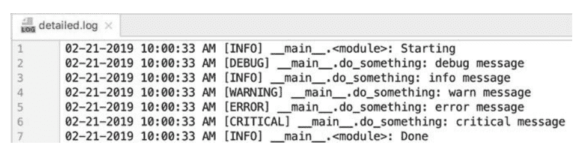

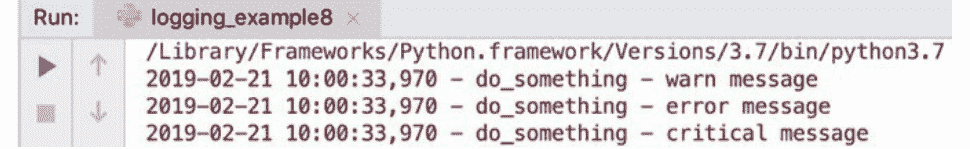

## 过滤器

过滤器可被处理器用来对日志输出提供更细粒度的控制。可以使用 `logger.addFilter()` 方法为日志记录器添加过滤器。可以通过继承 `logging.Filter` 类并实现 `filter()` 方法来创建过滤器。此方法接收一个日志记录。可以验证此日志记录以确定是否应输出该记录。如果应输出，则返回 `True`；如果应忽略该记录，则应返回 `False`。

在以下示例中，定义了一个名为 `MyFilter` 的过滤器，它将过滤掉所有包含字符串 'John' 的日志消息。它被添加为日志记录器的过滤器，然后生成了两条日志消息。

```python
import logging
class MyFilter(logging.Filter):
    def filter(self, record):
        if 'John' in record.msg:
            return False
        else:
            return True
logging.basicConfig(format='%(asctime)s %(message)s',
                    level=logging.DEBUG)
logger = logging.getLogger()
logger.addFilter(MyFilter())
logger.debug('This is to help with debugging')
logger.info('This is information on John')
```

输出显示只有不包含字符串 'John' 的日志消息被输出：

```
2019-02-20 17:23:22,650 This is to help with debugging
```

## 日志记录器配置

本章到目前为止的所有示例都使用了日志框架的编程配置。正如示例所示，这当然是可行的，但如果你希望更改任何特定日志记录器的日志级别，或更改特定处理器路由日志消息的位置，则需要更改代码。

对于大多数生产系统，更好的解决方案是使用外部配置文件，该文件在应用程序运行时加载，并用于动态配置日志框架。这允许系统管理员和其他人员更改日志级别、日志目标、日志格式等，而无需更改代码。

日志配置文件可以使用多种标准格式编写，从 JSON（JavaScript 对象表示法）到 YAML（另一种标记语言）格式，或作为 conf 文件中的一组键值对。有关可用不同选项的更多信息，请参阅 Python 日志模块文档。

在本书中，我们将简要探讨用于配置日志记录器的 YAML 文件格式。

```yaml
version: 1
formatters:
  myformatter:
    format: '%(asctime)s [%(levelname)s] %(name)s.%(funcName)s: %(message)s'
handlers:
  console:
    class: logging.StreamHandler
    level: DEBUG
    formatter: myformatter
    stream: ext://sys.stdout
loggers:
  myLogger:
    level: DEBUG
    handlers: [console]
    propagate: no
root:
  level: ERROR
  handlers: [console]
```

上述 YAML 代码存储在名为 `logging.conf.yaml` 的文件中；但是，你可以将此文件命名为任何有意义的名称。

YAML 文件始终以版本号开头。这是一个整数值，表示 YAML 模式版本（目前只能是值 1）。文件中的所有其他键都是可选的，它们包括：

-   `formatters` — 列出一个或多个格式化器；每个格式化器有一个名称作为键，然后是一个格式值，该值是定义日志消息格式的字符串。
-   `filters` — 这是过滤器名称列表和一组过滤器定义。
-   `handlers` — 这是命名处理器列表。每个处理器定义由一组键值对组成，其中键定义了处理器使用的类（必需）、处理器的日志级别（可选）、与处理器一起使用的格式化器（可选）以及要应用的过滤器列表（可选）。
-   `loggers` — 提供一个或多个命名的日志记录器。每个日志记录器可以指示日志级别（可选）和处理器列表（可选）。`propagate` 选项可用于阻止消息传播到父日志记录器（将其设置为 `False`）。
-   `root` — 这是根日志记录器的配置。

此文件可以使用 PyYAML 模块加载到 Python 应用程序中。它提供了一个 YAML 解析器，可以将 YAML 文件加载为字典结构，然后传递给 `logging.config.dictConfig()` 函数。由于这是一个文件，必须打开和关闭它以确保资源得到适当处理；因此最好使用 `with-as` 语句进行管理，如下所示：

```python
with open('logging.config.yaml', 'r') as f:
    config = yaml.safe_load(f.read())
    logging.config.dictConfig(config)
```

这将以只读模式打开 YAML 文件，并在执行两条语句后关闭它。此代码片段用于以下应用程序，该应用程序从 YAML 文件加载日志记录器配置：

```python
import logging
import logging.config
import yaml
with open('logging.config.yaml', 'r') as f:
    config = yaml.safe_load(f.read())
    logging.config.dictConfig(config)
logger = logging.getLogger('myLogger')
# 'application' code
def do_something():
    logger.debug('debug message')
    logger.info('info message')
    logger.warning('warn message')
    logger.error('error message')
    logger.critical('critical message')
logger.info('Starting')
do_something()
logger.info('Done')
```

使用前面的 YAML 文件，此程序的输出为：

```
2019-02-21 16:20:46,466 [INFO] myLogger.<module>: Starting
2019-02-21 16:20:46,466 [DEBUG] myLogger.do_something: debug message
2019-02-21 16:20:46,466 [INFO] myLogger.do_something: info message
2019-02-21 16:20:46,466 [WARNING] myLogger.do_something: warn message
2019-02-21 16:20:46,466 [ERROR] myLogger.do_something: error message
2019-02-21 16:20:46,466 [CRITICAL] myLogger.do_something: critical message
2019-02-21 16:20:46,466 [INFO] myLogger.<module>: Done
```

## 性能考虑

日志记录时的性能应始终是一个考虑因素。通常，你应该力求在日志记录被禁用（或对正在使用的级别禁用）时避免执行任何不必要的工作。这似乎显而易见，但它可能以几种意想不到的方式发生。

一个例子是字符串拼接。如果要记录的消息涉及字符串拼接；那么当调用日志方法时，该字符串拼接将始终执行。例如：

```python
logger.debug('Count: ' + count + ', total:' + total)
```

这将始终在调用 `debug` 函数之前生成 `count` 和 `total` 的字符串；即使调试级别未开启。然而，使用格式化字符串将避免这种情况。只有当字符串要用于日志消息时，才会执行相关的格式化。因此，你应始终使用字符串格式化来填充日志消息。例如：

```python
logger.debug('Count: %d, total: %d', count, 42)
```

另一个潜在的优化是使用 `logger.isEnabledFor(level)` 方法作为防止运行日志语句的守卫。这在必须执行关联操作以支持日志记录操作且该操作开销很大的情况下非常有用。例如：

```python
if logger.isEnabledFor(logging.DEBUG):
    logger.debug('Message with %s, %s', expensive_func1(),
                 expensive_func2())
```

现在，只有在设置了 DEBUG 日志级别时，才会执行这两个开销大的函数。

## 尝试

使用你在上一章为 `Account` 类添加的日志记录，你应该从一个类似于本章使用的 YAML 文件加载日志配置信息。

这应该被加载到用于驱动账户类的应用程序中。

# 并发与并行简介

### 简介

在本章中，我们将介绍并发和并行的概念。我们还将简要考虑相关的分布式主题。之后，我们将考虑进程同步、为什么面向对象的方法非常适合并发和并行，最后简要讨论线程与进程。

## 并发

并发在字典中被定义为两个或多个事件或情况同时发生或存在。在计算机科学中，并发指的是程序、算法或问题的不同部分或单元能够同时执行的能力，可能在多个处理器或多个内核上。

这里，处理器指的是计算机的中央处理单元（或 CPU），而内核指的是 CPU 芯片可以拥有多个核心或处理器。

最初，CPU芯片只有一个核心。也就是说，CPU芯片上只有一个处理单元。然而，随着时间的推移，为了提高计算机性能，硬件制造商在芯片上增加了额外的核心或处理单元。因此，双核CPU芯片有两个处理单元，而四核CPU芯片则有四个处理单元。这意味着，就计算机的操作系统而言，它拥有多个CPU来运行程序。

在多个CPU上同时运行处理任务，可以显著提升应用程序的整体性能。

例如，假设我们有一个程序将调用三个独立的函数，这些函数分别是：

-   备份程序当前持有的数据，
-   打印程序当前持有的数据，
-   使用当前数据运行一个动画。

假设这些函数按顺序运行，所需时间如下：

-   备份函数耗时13秒，
-   打印函数耗时15秒，
-   动画函数耗时10秒。

这将导致执行所有三个操作总共需要38秒。下图对此进行了图示说明：

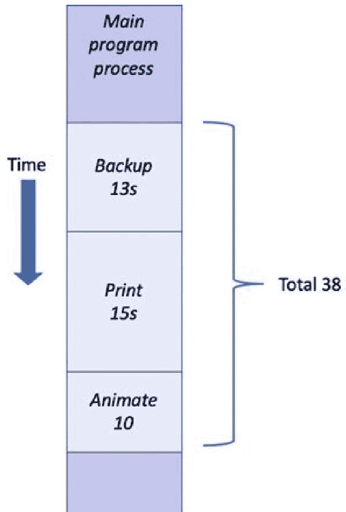

然而，这三个函数彼此完全独立。也就是说，它们不依赖彼此的任何结果或行为；它们不需要等待其他函数完成才能完成等。因此，我们可以并发地运行每个函数。

如果底层的操作系统和所使用的编程语言支持多进程，那么我们就可以潜在地在单独的进程中同时运行每个函数，从而显著加快整体执行时间。

如果应用程序同时启动所有三个函数，那么主进程可以继续执行之前的最大等待时间将是15秒，因为这是执行时间最长的函数所需的时间。然而，主程序可能在所有三个函数启动后就能继续执行，因为它也不依赖于任何函数的结果；因此，延迟可能可以忽略不计（尽管通常会有一些小的延迟，因为每个进程都需要设置）。下图对此进行了图示说明：

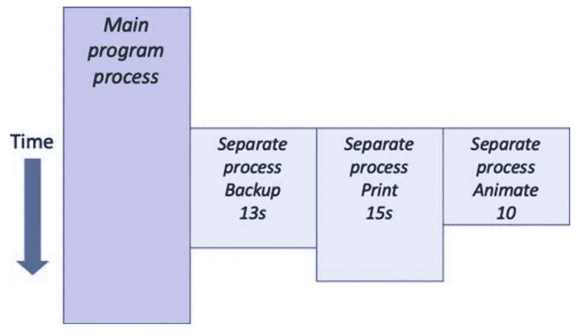

## 并行性

计算机科学中经常区分并发和并行。在并发中，独立的任务可能同时执行。在并行中，一个大型复杂任务被分解为一组子任务。这些子任务代表了整体问题的一部分。每个子任务可以同时执行。通常需要将子任务的结果组合起来以生成整体结果。这些子任务即使不是功能上完全相同，也非常相似（尽管通常每次子任务调用都会提供不同的数据）。

因此，并行性是指相同功能的多个副本同时运行，但处理不同的数据。可以应用并行性的一些例子包括：

-   网络搜索引擎。这样的系统可能会查看非常多的网页。每次查看时，它必须向相应的网站发送请求，接收结果并处理获得的数据。无论是BBC网站、微软网站还是剑桥大学网站，这些步骤都是相同的。因此，这些请求可以按顺序运行，也可以并行运行。
-   图像处理。一张大图像可以被分割成多个切片，以便每个切片可以并行分析。

下图说明了并行性的基本思想；一个主程序启动三个子任务，每个子任务并行运行。然后主程序等待所有子任务完成，再将子任务的结果组合起来，之后才能继续执行。

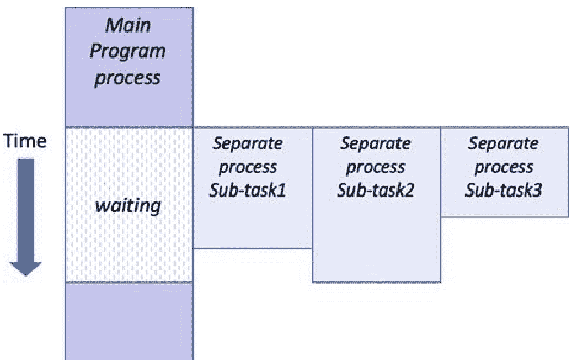

## 分布式

在实现并发或并行解决方案时，生成的进程在哪里运行通常是一个实现细节。从概念上讲，这些进程可以在同一个处理器、物理机器上运行，也可以在远程或分布式机器上运行。因此，分布式计算——通过在多个物理机器之间共享工作来解决问题或执行过程——通常与并发和并行相关。

然而，并没有要求必须将工作分布到物理机器上，实际上这样做通常会涉及额外的工作。

要将工作分发到远程机器，数据以及在许多情况下的代码，必须被传输并提供给远程机器。这可能导致远程运行代码时出现显著延迟，并可能抵消使用物理上独立的计算机所带来的任何潜在性能优势。因此，许多并发/并行技术默认在同一台机器上的单独进程中执行代码。

## 网格计算

网格计算基于使用一组松散耦合的计算机网络，其中每台计算机都可以接收提交给它的作业，该作业将运行完成，然后返回结果。

在许多情况下，网格由一组异构的计算机组成（而不是所有计算机都相同），并且可能在地理上分散。这些计算机可能包括物理计算机和虚拟机。

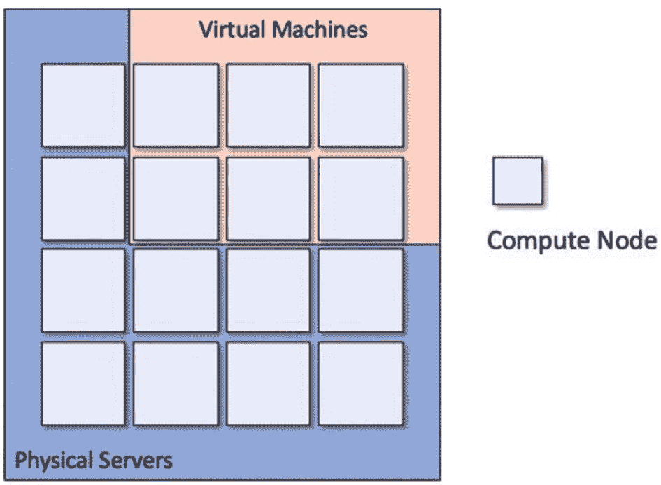

## 网格

虚拟机是一种模拟整个计算机的软件，它运行在与其他虚拟机共享的底层硬件上。每台虚拟机都认为自己是硬件上唯一的计算机；然而，所有虚拟机都共享物理计算机的资源。因此，多台虚拟机可以同时在同一台物理计算机上运行。每台虚拟机提供自己的虚拟硬件，包括CPU、内存、硬盘驱动器、网络接口和其他设备。然后，虚拟硬件被映射到物理机器上的真实硬件，这通过减少对物理硬件系统及其相关维护成本的需求，以及降低多台计算机的功耗和冷却需求来节省成本。

在网格内部，软件用于管理网格节点并向这些节点提交作业。此类软件将从网格的客户端接收要执行的作业（要运行的程序以及有关环境的信息，如要使用的库）。这些作业通常被添加到作业队列中，然后由作业调度程序将它们提交到网格中的某个节点。当作业产生任何结果时，这些结果会从节点收集并返回给客户端。下图对此进行了说明：

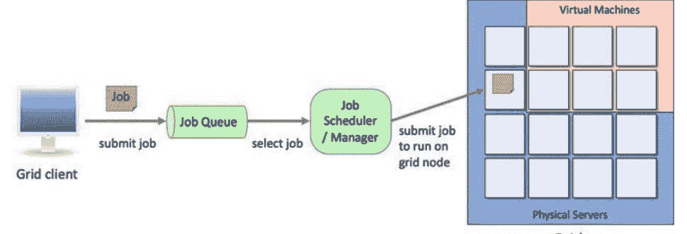

使用网格可以使在一组物理和虚拟机之间分发并发/并行进程变得更加容易。

## 并发与同步

并发涉及同时执行多个任务。在许多情况下，这些任务彼此不相关，例如打印文档和刷新用户界面。在这些情况下，各个任务完全独立，可以同时执行而无需任何交互。

在其他情况下，多个并发任务需要交互；例如，一个或多个任务产生数据，而一个或多个其他任务消耗这些数据。这通常被称为生产者-消费者关系。在其他情况下，所有并行进程必须达到相同的点，然后才能执行其他行为。

另一种可能发生的情况是，我们希望确保一次只有一个并发任务执行一段敏感代码；因此，这段代码必须受到保护，防止并发访问。

并发和并行库需要提供允许此类同步发生的设施。

## 面向对象与并发

面向对象编程背后的概念与并发相关的概念特别契合。例如，一个系统可以被描述为一组离散对象之间在必要时进行通信。在Python中，单个解释器内同一时刻只能有一个对象执行。然而，至少在概念上，没有理由必须强制执行这种限制。即使每个对象在独立的进程中执行，面向对象背后的基本概念仍然成立。

传统上，消息发送被视为过程调用，调用对象的执行会阻塞直到收到响应。然而，我们可以相当简单地扩展这个模型，将每个对象视为一个可并发执行的程序，其活动在对象创建时开始，即使在向另一个对象发送消息时也继续执行（除非需要响应进行进一步处理）。在这个模型中，可能同时有非常多（并发的）对象在执行。当然，这引入了与资源分配等相关的问题，但并不比任何并发系统更严重。

并发对象模型的一个含义是，对象比传统单执行线程方法中的对象更大，因为每个对象作为独立执行线程存在开销。诸如需要调度器来处理这些执行线程和资源分配机制等开销意味着将整数、字符等作为单独进程是不可行的。

## 线程与进程

作为讨论的一部分，理解进程的含义很有用。进程是操作系统正在执行的计算机程序的实例。任何进程都有三个关键要素：正在执行的程序、该程序使用的数据（例如程序使用的变量）以及进程的状态（也称为程序的执行上下文）。

（Python）线程是一个抢占式轻量级进程。
线程被认为是抢占式的，因为每个线程都有机会在某个时刻作为主线程运行。当一个线程获得执行权时，它将执行直到

-   完成，
-   等待某种形式的I/O（输入/输出），
-   休眠一段时间，
-   已运行15毫秒（Python 3中的当前阈值）。

如果线程在上述情况之一发生时未完成，它将放弃成为执行线程，另一个线程将被运行。这意味着一个线程可能在执行一系列相关步骤的中途被中断。

线程被认为是轻量级进程，因为它不拥有自己的地址空间，并且不被主机操作系统视为独立实体。相反，它存在于单个机器进程中，使用相同的地址空间。

清楚地了解线程（在单个机器进程中运行）与使用底层硬件上独立进程的多进程系统之间的区别很有用。

## 一些术语

并发编程的世界充满了你可能不熟悉的术语。下面概述了其中一些术语和概念：

-   异步与同步调用。你在编程中看到的大多数方法、函数或过程调用代表同步调用。同步方法或函数调用会阻塞调用代码执行直到返回。此类调用通常在单个执行线程内。异步调用是控制流立即返回给调用者，并且调用者能够在自己的执行线程中执行的调用。允许调用者和被调用者继续处理。

-   非阻塞与阻塞代码。阻塞代码是一个术语，用于描述在一个执行线程中运行的代码，等待某个活动完成，这会导致一个或多个单独的执行线程也被延迟。例如，如果一个线程是某些数据的生产者，而其他线程是该数据的消费者，那么消费者线程在生产者生成供其消费的数据之前无法继续。相反，非阻塞意味着没有线程能够无限期地延迟其他线程。

-   并发与并行代码。并发代码和并行代码相似，但在一个重要方面有所不同。并发表示两个或多个活动都在取得进展，即使它们可能不在同一时间点执行。这通常通过在执行和非执行之间不断交换竞争进程来实现。这个过程重复进行，直到至少一个执行线程（线程）完成其任务。这可能是因为两个线程共享同一个物理处理器，每个线程在另一个获得一小段时间进展之前被给予一小段时间来进展。这两个线程被称为使用一种称为时间片的技术共享处理时间。另一方面，并行意味着有多个处理器可用，允许每个线程在自己的处理器上同时执行。

## 在线资源

有关本章主题的信息，请参阅以下在线资源：

-   [https://en.wikipedia.org/wiki/Concurrency_(computer_science)](https://en.wikipedia.org/wiki/Concurrency_(computer_science)) 维基百科关于并发的页面。
-   [https://en.wikipedia.org/wiki/Virtual_machine](https://en.wikipedia.org/wiki/Virtual_machine) 维基百科关于虚拟机的页面。
-   [https://en.wikipedia.org/wiki/Parallel_computing](https://en.wikipedia.org/wiki/Parallel_computing) 维基百科关于并行计算的页面。
-   [http://tutorials.jenkov.com/java-concurrency/concurrency-vs-parallelism.html](http://tutorials.jenkov.com/java-concurrency/concurrency-vs-parallelism.html) 并发与并行教程。
-   [https://www.redbooks.ibm.com/redbooks/pdfs/sg246778.pdf](https://www.redbooks.ibm.com/redbooks/pdfs/sg246778.pdf) IBM关于网格计算入门的红皮书。

### 线程

### 简介

线程是Python允许你编写多任务程序的方式之一；即看起来同时做多件事情。本章介绍线程模块，并使用一个简短示例说明如何使用这些功能。

### 线程

在Python中，来自threading模块的Thread类表示在单个进程内的单独执行线程中运行的活动。这些执行线程是轻量级的、抢占式的执行线程。线程是轻量级的，因为它不拥有自己的地址空间，并且不被主机操作系统视为独立实体；它不是一个进程。相反，它存在于单个机器进程中，与其他线程使用相同的地址空间。

### 线程状态

当线程对象首次创建时，它存在但尚不可运行；它必须被启动。一旦启动，它就变为可运行状态；即，它有资格被调度执行。它可能在调度器的控制下在运行和可运行状态之间来回切换。调度器负责管理所有希望获取一些执行时间的多个线程。

线程对象保持可运行或运行状态，直到其run()方法终止；此时它已完成执行并已死亡。从未声明到死亡之间的所有状态都被认为表示线程是活动的（因此可能在某个时刻运行）。如下所示：

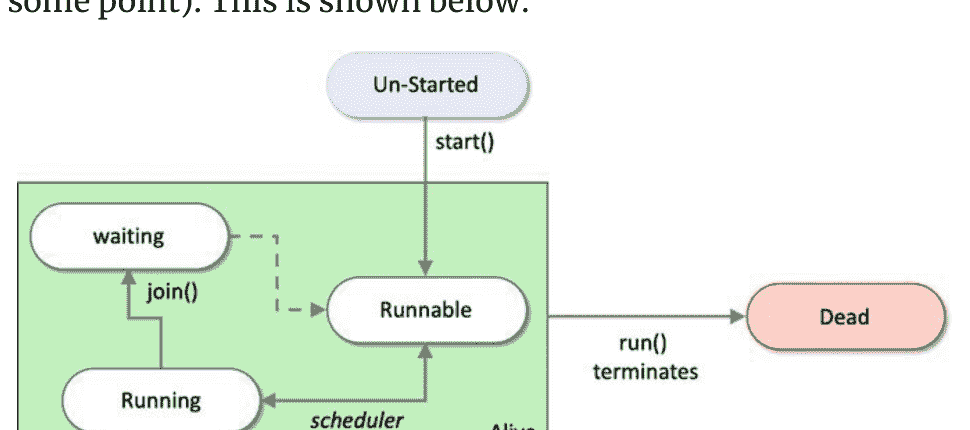

线程也可能处于等待状态；例如，当它等待另一个线程完成其工作后再继续（可能因为它需要该线程产生的结果才能继续）。这可以使用join()方法实现，如上图所示。一旦第二个线程完成，等待的线程将再次变为可运行状态。

当前正在执行的线程称为活动线程。关于线程状态有几点需要注意：

-   除非线程的run()方法终止，否则线程被认为是活动的，之后可以认为是死亡的。
-   活动线程可以是运行中、可运行、等待等状态。
-   可运行状态表示线程可以被处理器执行，但当前未执行。这是因为一个相等或更高优先级的进程已经在执行，线程必须等待处理器空闲。因此，该图显示调度器可以在运行和可运行状态之间移动线程。事实上，这可能发生多次，因为线程执行一段时间后，被调度器从处理器中移除并添加到等待队列，然后在稍后时间点再次返回给处理器。

### 创建线程

启动新执行线程有两种方式：

-   将可调用对象（如函数或方法）的引用传递给Thread类构造函数。该引用作为Thread执行的目标。
-   创建Thread类的子类并重新定义`run()`方法，以执行线程预定的操作集。

我们将探讨这两种方法。

由于线程是对象，因此可以像处理任何其他对象一样处理线程：可以发送消息、拥有实例变量并提供方法。因此，Python的多线程方面都符合面向对象模型。这极大地简化了多线程系统的创建，以及最终软件的可维护性和清晰度。

创建线程的新实例后，必须启动它。启动前，线程虽然存在但无法运行。

## 实例化Thread类

Thread类位于`threading`模块中，因此使用前必须导入。Thread类定义了一个构造函数，最多接受六个可选参数：

```python
class threading.Thread(group=None,
    target=None,
    name=None,
    args=(),
    kwargs={},
    daemon=None)
```

Thread构造函数应始终使用关键字参数调用；这些参数的含义如下：

-   `group`应为`None`；为将来实现ThreadGroup类时的扩展保留。
-   `target`是由`run()`方法调用的可调用对象。默认为`None`，表示不调用任何内容。
-   `name`是线程名称。默认情况下，会构造一个格式为"Thread-N"的唯一名称，其中N是整数。
-   `args`是目标调用的参数元组。默认为`()`。如果提供单个参数，则不需要元组。如果提供多个参数，则每个参数都是元组中的一个元素。
-   `kwargs`是目标调用的关键字参数字典。默认为`{}`。
-   `daemon`指示此线程是否作为守护线程运行。如果非`None`，`daemon`显式设置线程是否为守护线程。如果为`None`（默认值），则守护属性从当前线程继承。

创建Thread后，必须使用`Thread.start()`方法启动它才能执行。以下示例展示了一个非常简单的程序，该程序创建一个Thread来运行`simple_worker()`函数：

```python
from threading import Thread
def simple_worker():
    print('hello')
# 创建新线程并启动它
# 该线程将运行函数simple_worker
t1 = Thread(target=simple_worker)
t1.start()
```

在此示例中，线程`t1`将执行函数`simple_worker`。主代码将由程序启动时存在的主线程执行；因此上述程序中使用了两个线程：主线程和`t1`。

## Thread类

Thread类定义了创建可在其自身轻量级进程中执行的对象所需的所有设施。关键方法包括：

-   `start()` 启动线程的活动。每个线程对象最多只能调用一次。它安排在单独的控制线程中调用对象的`run()`方法。如果在同一对象上调用多次，此方法将引发`RuntimeError`。
-   `run()` 表示线程活动的方法。可以在子类中重写此方法。标准`run()`方法调用传递给对象构造函数作为`target`参数的可调用对象（如果有），并使用分别从`args`和`kwargs`参数获取的位置参数和关键字参数。不应直接调用此方法。
-   `join(timeout=None)` 等待发送此消息的线程终止。这会阻塞调用线程，直到调用`join()`方法的线程终止。当`timeout`参数存在且不为`None`时，它应是一个浮点数，指定操作的超时时间（以秒为单位，或其分数）。一个线程可以被多次`join()`。
-   `name` 仅用于标识目的的字符串。它没有语义。多个线程可以被赋予相同的名称。初始名称由构造函数设置。为线程命名对于调试目的很有用。
-   `ident` 此线程的"线程标识符"，如果线程尚未启动则为`None`。这是一个非零整数。
-   `is_alive()` 返回线程是否存活。此方法在`run()`方法开始之前返回`True`，直到`run()`方法终止之后。模块函数`threading.enumerate()`返回所有活动线程的列表。
-   `daemon` 布尔值，指示此线程是否为守护线程（`True`）或不是（`False`）。必须在调用`start()`之前设置，否则会引发`RuntimeError`。其默认值从创建线程继承。当没有活动的非守护线程时，整个Python程序退出。

下面给出一个使用其中一些方法的示例：

```python
from threading import Thread
def simple_worker():
    print('hello')
t1 = Thread(target=simple_worker)
t1.start()
print(t1.getName())
print(t1.ident)
print(t1.is_alive())
```

输出如下：

```
hello
Thread-1
123145441955840
True
```

`join()`方法可以使一个线程等待另一个线程完成。例如，如果我们希望主线程在打印完成消息之前等待某个线程完成；那么我们可以让它加入该线程：

```python
from threading import Thread
from time import sleep
def worker():
    for i in range(0,10):
        print('.', end='', flush=True)
        sleep(1)
    print('Starting')
# 创建引用worker函数的线程对象
t = Thread(target=worker)
# 启动线程对象
t.start()
# 等待线程完成
t.join()
print('\nDone')
```

现在，"Done"消息应该在工作线程完成后才打印出来，如下所示：

```
Starting
........
Done
```

## Threading模块函数

有一组`threading`模块函数支持线程操作；这些函数包括：

-   `threading.active_count()` 返回当前活动的Thread对象数量。返回的计数等于`enumerate()`返回的列表长度。
-   `threading.current_thread()` 返回当前Thread对象，对应于调用者的控制线程。如果调用者的控制线程不是通过`threading`模块创建的，则返回一个功能有限的虚拟线程对象。
-   `threading.get_ident()` 返回当前线程的"线程标识符"。这是一个非零整数。当线程退出并创建另一个线程时，线程标识符可能会被回收。
-   `threading.enumerate()` 返回当前所有活动的Thread对象列表。该列表包括守护线程、由`current_thread()`创建的虚拟线程对象和主线程。它不包括已终止的线程和尚未启动的线程。
-   `threading.main_thread()` 返回主Thread对象。

## 向线程传递参数

许多函数在运行时需要一组参数值；当通过单独的线程运行时，这些参数仍然需要传递给函数。这些参数可以通过`args`参数传递给要执行的函数，例如：

```python
from threading import Thread
from time import sleep
def worker(msg):
    for i in range(0,10):
        print(msg, end='', flush=True)
        sleep(1)
print('Starting')
t1 = Thread(target=worker, args='A')
t2 = Thread(target=worker, args='B')
t3 = Thread(target=worker, args='C')
t1.start()
t2.start()
t3.start()
print('Done')
```

在此示例中，`worker`函数接受一个消息，在循环中打印10次。在循环内，线程将打印消息，然后休眠一秒。这允许其他线程执行，因为线程必须等待休眠超时结束才能再次变为可运行状态。

然后创建三个线程`t1`、`t2`和`t3`，每个线程有不同的消息。请注意，`worker()`函数可以与每个Thread重用，因为每次调用该函数时都会传递自己的参数值。

然后启动这三个线程。这意味着此时存在主线程和三个可运行的工作线程（尽管一次只能运行一个线程）。

## 扩展 Thread 类

前面提到的创建线程的第二种方法是继承 Thread 类。为此，你需要：

1.  定义一个新的 Thread 子类。
2.  重写 `run()` 方法。
3.  定义一个新的 `__init__()` 方法，该方法调用父类的 `__init__()` 方法，将所需的参数传递给 Thread 类的构造函数。

下面的示例展示了 WorkerThread 类如何将 `name`、`target` 和 `daemon` 参数传递给 Thread 超类的构造函数。

```python
from threading import Thread
from time import sleep

class WorkerThread(Thread):
    def __init__(self, daemon=None, target=None, name=None):
        super().__init__(daemon=daemon, target=target,
                         name=name)
    def run(self):
        for i in range(0, 10):
            print('.', end='', flush=True)
            sleep(1)
```

完成上述步骤后，你就可以创建新的 WorkerThread 类的实例，然后启动该实例。

```python
print('Starting')
t = WorkerThread()
t.start()
print('\nDone')
```

上述代码的输出为：

```
Starting
.........
Done
```

请注意，通常会将 Thread 类的任何子类命名为 SomethingThread，以明确表示它是 Thread 类的子类，并应将其视为一个线程（它当然是）。

## 守护线程

可以通过在构造函数中设置 `daemon` 属性为 `true`，或在之后通过访问器属性来设置，从而将线程标记为守护线程。

例如：

```python
from threading import Thread
from time import sleep

def worker(msg):
    for i in range(0, 10):
        print(msg, end='', flush=True)
        sleep(1)

print('Starting')
# 创建一个守护线程
d = Thread(daemon=True, target=worker, args='C')
d.start()
sleep(5)
print('Done')
```

这将创建一个后台守护线程来运行 `worker()` 函数。此类线程通常用于执行后台管理任务（例如后台数据备份等）。

如上所述，仅将线程标记为守护线程并不足以阻止当前程序终止。这意味着守护线程将持续循环，直到主线程结束。由于主线程休眠了 5 秒，这使得守护线程在主线程终止前能够打印出大约 5 个字符串。下面的输出说明了这一点：

```
Starting
CCCCCDone
```

## 命名线程

线程可以被命名；这在调试具有多个线程的应用程序时非常有用。

在下面的示例中，创建了三个线程；其中两个被显式地赋予了与其功能相关的名称，而中间的一个则使用了默认名称。然后我们启动所有三个线程，并使用 `threading.enumerate()` 函数遍历所有当前活动的线程，打印它们的名称：

```python
import threading
from threading import Thread
from time import sleep

def worker(msg):
    for i in range(0, 10):
        print(msg, end='', flush=True)
        sleep(1)

t1 = Thread(name='worker', target=worker, args='A')
t2 = Thread(target=worker, args='B')  # 使用默认名称，例如 Thread-1
d = Thread(daemon=True, name='daemon', target=worker, args='C')

t1.start()
t2.start()
d.start()

print()
for t in threading.enumerate():
    print(t.getName())
```

该程序的输出如下：

```
ABC MainThread worker Thread-1 daemon
ABCBACACBCBACBAABCCBACBACBA
```

如你所见，除了 worker 线程和 daemon 线程外，还有一个 MainThread（它启动整个程序）和一个 Thread-1，后者是变量 `t2` 引用的线程，并使用了默认的线程名称。

## 线程局部数据

在某些情况下，每个线程需要其正在处理的数据的独立副本；这意味着共享（堆）内存难以使用，因为它本质上是在所有线程之间共享的。

为了克服这个问题，Python 提供了一个称为线程局部数据的概念。线程局部数据是其值与线程相关联而非与共享内存相关联的数据。这个概念如下图所示：

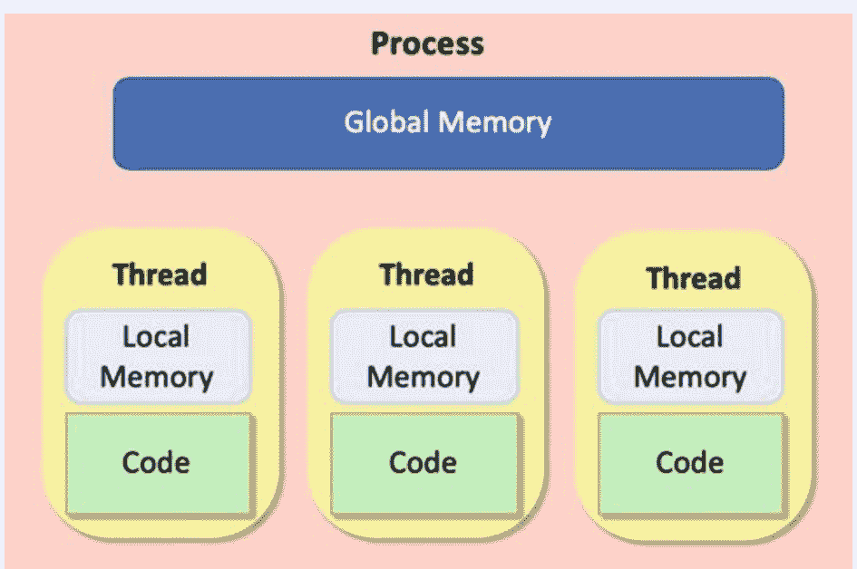

要创建线程局部数据，只需创建一个 `threading.local`（或其子类）的实例，并将属性存储到其中。这些实例将是线程特定的；这意味着一个线程将看不到另一个线程存储的值。

```python
from threading import Thread, local, currentThread
from random import randint

def show_value(data):
    try:
        val = data.value
    except AttributeError:
        print(currentThread().name, ' - No value yet')
    else:
        print(currentThread().name, ' - value =', val)

def worker(data):
    show_value(data)
    data.value = randint(1, 100)
    show_value(data)

print(currentThread().name, ' - Starting')
local_data = local()
show_value(local_data)
for i in range(2):
    t = Thread(name='W' + str(i),
               target=worker, args=[local_data])
    t.start()
show_value(local_data)
print(currentThread().name, ' - Done')
```

上述代码的输出为：

```
MainThread - Starting
MainThread - No value yet
W0 - No value yet
W0 - value = 20
W1 - No value yet
W1 - value = 90
MainThread - No value yet
MainThread - Done
```

上面给出的示例定义了两个函数：

-   第一个函数尝试访问线程局部数据对象中的一个值。如果该值不存在，则会引发异常（`AttributeError`）。`show_value()` 函数捕获该异常或成功处理数据。
-   worker 函数调用两次 `show_value()`，一次是在它在局部数据对象中设置值之前，一次是在之后。由于此函数将由不同的线程运行，因此 `show_value()` 函数会打印当前线程的名称。

主函数使用 threading 库中的 `local()` 函数创建一个局部数据对象。然后它自己调用 `show_value()`。接下来，它创建两个线程来执行 worker 函数，并将 `local_data` 对象传递给它们；然后启动每个线程。最后，它再次调用 `show_value()`。

从输出可以看出，一个线程无法看到另一个线程在 `local_data` 对象中设置的数据（即使属性名称相同）。

## 定时器

Timer 类表示一个在经过一定时间后执行的操作（或任务）。Timer 类是 Thread 的子类，因此也作为创建自定义线程的一个示例。

与线程一样，定时器通过调用其 `start()` 方法来启动。可以在定时器的操作开始之前通过调用 `cancel()` 方法来停止定时器。定时器在执行其操作之前等待的时间间隔可能与用户指定的间隔不完全相同，因为当定时器希望启动时，可能有另一个线程正在运行。

Timer 类构造函数的签名是：

```
Timer(interval, function, args=None, kwargs=None)
```

下面是一个使用 Timer 类的示例：

```python
from threading import Timer

def hello():
    print('hello')

print('Starting')
t = Timer(5, hello)
t.start()
print('Done')
```

在这种情况下，Timer 将在初始延迟 5 秒后运行 `hello` 函数。

## 全局解释器锁

全局解释器锁（或称 GIL）是底层 CPython 解释器中的一个全局锁，旨在避免多任务之间可能出现的死锁。它通过防止多个线程同时执行，来保护对 Python 对象的访问。

在大多数情况下，您无需担心 GIL，因为它所处的层级低于您将编写的程序。然而，值得注意的是，GIL 存在争议，因为在某些情况下，它阻止了多线程 Python 程序充分利用多处理器系统的优势。

这是因为，为了执行，一个线程必须获取 GIL，并且同一时间只能有一个线程持有 GIL（即它所代表的锁）。这意味着 Python 的行为类似于单 CPU 机器；同一时间只能运行一件事。线程只有在休眠、需要等待某些事物（例如某些 I/O）或已持有 GIL 达到一定时间时，才会放弃 GIL。如果线程持有 GIL 的最长时间已到，调度器将从该线程释放 GIL（导致其停止执行，现在必须等待 GIL 被归还），并选择另一个线程来获取 GIL 并开始执行。

因此，标准 Python 线程无法利用现代计算机硬件上通常可用的多个 CPU。解决此问题的一个方案是使用下一章描述的 Python 多进程库。

## 多进程

### 简介

多进程库支持生成独立的（操作系统级别的）进程来执行行为（例如函数或方法），其使用的 API 类似于上一章介绍的线程 API。

它可用于避免全局解释器锁（GIL）引入的限制，方法是使用独立的操作系统进程，而不是轻量级线程（线程在单个进程内运行）。

这意味着多进程库允许开发者充分利用现代计算机硬件的多处理器环境，该环境通常具有多个处理器核心，允许多个操作/行为并行运行；这对于数据分析、图像处理、动画和游戏应用可能非常重要。

多进程库还引入了一些新功能，最显著的是用于并行化可调用对象（例如函数和方法）执行的 Pool 对象，这在线程 API 中没有等效物。

### Process 类

Process 类是多进程库中与线程库中的 Thread 类等效的类。它可用于在单独的进程中运行可调用对象，例如函数。为此，需要创建 Process 类的新实例，然后调用其 start() 方法。join() 等方法也可用，以便一个进程可以等待另一个进程完成后再继续等。

主要区别在于，当创建新的 Process 时，它在底层操作系统（如 Windows、Linux 或 Mac OS）上的单独进程中运行。相比之下，Thread 在与原始程序相同的进程中运行。这意味着进程由底层计算机硬件上的某个处理器直接管理和执行。

这样做的好处是您能够利用物理计算机硬件固有的并行性。缺点是设置 Process 比设置更轻量级的 Thread 需要更多的工作。Process 类的构造函数提供与 Thread 类相同的参数集，即：

```python
class multiprocessing.Process(group=None,
    target=None,
    name=None,
    args=(),
    kwargs={}, daemon=None)
```

- group 应始终为 None；它仅为了与线程 API 兼容而存在。
- target 是要被 run() 方法调用的可调用对象。默认为 None，表示不调用任何内容。
- name 是进程名称。
- args 是目标调用的参数元组。
- kwargs 是目标调用的关键字参数字典。
- daemon 参数将进程守护标志设置为 True 或 False。如果为 None（默认值），此标志将从创建进程继承。

与 Thread 类一样，Process 构造函数应始终使用关键字参数调用。

Process 类还提供与 Thread 类类似的一组方法：

- start() 启动进程的活动。每个进程对象最多只能调用一次此方法。它安排在单独进程中调用对象的 run() 方法。
- join([timeout]) 如果可选参数 timeout 为 None（默认值），该方法将阻塞，直到被连接的进程终止。如果 timeout 是正数，则最多阻塞 timeout 秒。请注意，如果其进程终止或方法超时，该方法将返回 None。
- is_alive() 返回进程是否存活。大致来说，从 start() 方法返回的那一刻起，直到子进程终止，进程对象都是存活的。

Process 类还有几个属性：

- name 进程的名称。名称是仅用于标识目的的字符串。它没有语义。多个进程可以被赋予相同的名称。它可用于调试目的。
- daemon 进程的守护标志，一个布尔值。必须在调用 start() 之前设置。默认值从创建进程继承。当进程退出时，它会尝试终止其所有守护子进程。请注意，守护进程不允许创建子进程。
- pid 返回进程 ID。在进程生成之前，这将是 None。
- exit_code 进程退出代码。如果进程尚未终止，这将是 None。负值 -N 表示子进程被信号 N 终止。

除了这些方法和属性外，Process 类还定义了其他与进程相关的方法，包括：

- terminate() 终止进程。
- kill() 与 terminate() 相同，但在 Unix 上使用 SIGKILL 信号而不是 SIGTERM 信号。
- close() 关闭 Process 对象，释放与其关联的所有资源。如果底层进程仍在运行，将引发 ValueError。一旦 close() 成功返回，Process 对象的大多数其他方法和属性将引发 ValueError。

### 使用 Process 类

以下简单程序创建三个 Process 对象；每个对象分别运行 worker() 函数，字符串参数为 A、B 和 C。然后使用 start() 方法启动这三个进程对象。

```python
from multiprocessing import Process
from time import sleep

def worker(msg):
    for i in range(0, 10):
        print(msg, end='', flush=True)
        sleep(1)

print('Starting')
t2 = Process(target=worker, args='A')
t3 = Process(target=worker, args='B')
t4 = Process(target=worker, args='C')
t2.start()
t3.start()
t4.start()
print('Done')
```

它本质上与线程的等效程序相同，只是使用了 Process 类而不是 Thread 类。

此应用程序的输出如下：
Starting Done ABCABCABCABCABCABCABCACBACBACB

线程版本和进程版本之间的主要区别在于，进程版本在单独的进程中运行 worker 函数，而在线程版本中，所有线程共享同一个进程。

### 启动进程的替代方法

当在 Process 上调用 start() 方法时，有三种不同的方法可用于启动底层进程。这些方法可以使用 multiprocessing.set_start_method() 进行设置，该方法接受一个字符串来指示要使用的方法。实际可用的进程启动机制取决于底层操作系统：

- ‘spawn’ 父进程启动一个新的 Python 解释器进程。子进程将仅继承运行进程对象 run() 方法所必需的资源。特别是，不会继承父进程中不必要的文件描述符和句柄。使用此方法启动进程比使用 fork 或 fork server 慢。在 Unix 和 Windows 上可用。这是 Windows 上的默认值。
- ‘fork’ 父进程使用 os.fork() 来分叉 Python 解释器。子进程在开始时实际上与父进程相同。父进程的所有资源都由子进程继承。仅在 Unix 类型的操作系统上可用。这是 Unix、Linux 和 Mac OS 上的默认值。
- ‘fork server’ 在这种情况下，会启动一个服务器进程。从那时起，每当需要新进程时，父进程就连接到服务器并请求其分叉一个新进程。fork 服务器进程是单线程的，因此使用 os.fork() 是安全的。不会继承不必要的资源。在支持通过 Unix 管道传递文件描述符的 Unix 风格平台上可用。

应使用 set_start_method() 来设置启动方法（并且在程序中应只设置一次）。

下图展示了指定 `spawn` 启动方法的情况：

```python
from multiprocessing import Process
from multiprocessing import set_start_method
from time import sleep
import os

def worker(msg):
    print('module name:', __name__)
    print('parent process:', os.getppid())
    print('process id:', os.getpid())
    for i in range(0, 10):
        print(msg, end='', flush=True)
        sleep(1)

def main():
    print('Starting')
    print('Root application process id:', os.getpid())
    set_start_method('spawn')
    t = Process(target=worker, args='A')
    t.start()
    print('Done')

if __name__ == '__main__':
    main()
```

其输出如下所示：

```
Starting
Root application process id: 6281
Done
module name: main
parent process: 6281 process id: 6283
AAAAAAAAAA
```

请注意，`worker()` 函数打印了父进程和当前进程的 ID，而 `main()` 方法只打印了其自身的 ID。这表明主应用进程的 ID 与工作进程的父进程 ID 相同。

或者，也可以使用 `get_context()` 方法来获取一个上下文对象。上下文对象拥有与 `multiprocessing` 模块相同的 API，并允许你在同一个程序中使用多种启动方法，例如：

```python
ctx = multiprocessing.get_context('spawn')
q = ctx.Queue()
p = ctx.Process(target=foo, args=(q,))
```

## 使用进程池

创建进程在计算机资源方面开销很大。因此，能够在应用程序中重用进程将非常有用。`Pool` 类提供了这样的可重用进程。

`Pool` 类代表一个工作进程池，可用于执行一组并发、并行的操作。`Pool` 提供了允许将任务卸载到这些工作进程的方法。

`Pool` 类提供了一个构造函数，它接受多个参数：

```python
class multiprocessing.pool.Pool(processes,
    initializer, initargs, maxtasksperchild, context)
```

这些参数代表：

- `processes` 是要使用的工作进程数量。如果 `processes` 为 `None`，则使用 `os.cpu_count()` 返回的值。
- `initializer` 如果 `initializer` 不是 `None`，那么每个工作进程在启动时都会调用 `initializer(*initargs)`。
- `maxtasksperchild` 是一个工作进程在退出并被一个新的工作进程替换之前可以完成的任务数量，以便释放未使用的资源。默认的 `maxtasksperchild` 是 `None`，这意味着工作进程将与进程池共存。
- `context` 可用于指定用于启动工作进程的上下文。通常使用 `multiprocessing.Pool()` 函数创建进程池。或者，也可以使用上下文对象的 `Pool()` 方法来创建进程池。

`Pool` 类提供了一系列方法，可用于向由池管理的工作进程提交工作。请注意，`Pool` 对象的方法应仅由创建该池的进程调用。

下图说明了向池提交一些工作或任务的效果。从可用进程列表中选择一个进程，并将任务传递给该进程。然后该进程将执行该任务。完成后，任何结果都会被返回，并且该进程会返回到可用列表。如果在向池提交任务时没有可用进程，那么该任务将被添加到等待队列，直到有进程可以处理该任务为止。

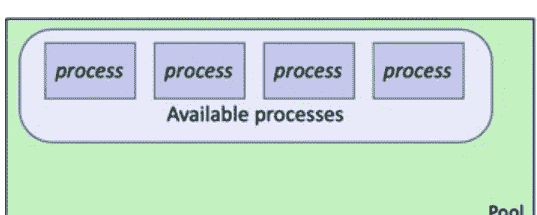

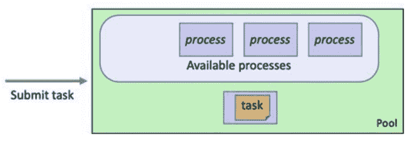

`Pool` 提供的用于提交工作的最简单方法是 `map` 方法：

```python
pool.map(func, iterable, chunksize=None)
```

此方法返回一个列表，其中包含通过对 `iterable` 参数中的每个项并行执行函数所获得的结果。

- `func` 参数是要执行的可调用对象（例如函数或方法）。
- `iterable` 用于向函数传递任何参数。
- 此方法将 `iterable` 切分成多个块，并将它们作为单独的任务提交给进程池。这些块的（近似）大小可以通过将 `chunksize` 设置为正整数来指定。该方法会阻塞，直到结果准备就绪。

以下示例程序说明了 `Pool` 和 `map()` 方法的基本用法。

```python
from multiprocessing import Pool

def worker(x):
    print('In worker with: ', x)
    return x * x

def main():
    with Pool(processes=4) as pool:
        print(pool.map(worker, [0, 1, 2, 3, 4, 5]))

if __name__ == '__main__':
    main()
```

请注意，一旦使用完 `Pool` 对象，就必须关闭它；因此，我们使用本书前面描述的 `with as` 语句来干净地处理 `Pool` 资源（它将确保在 `with as` 语句内的代码块完成时关闭 `Pool`）。

此程序的输出为：

```
In worker with: 0
In worker with: 1
In worker with: 2
In worker with: 3
In worker with: 4
In worker with: 5
[0, 1, 4, 9, 16, 25]
```

从这个输出可以看出，`map()` 函数用于使用整数列表提供的值运行六个不同的 `worker()` 函数实例。每个实例都由 `Pool` 管理的一个工作进程执行。

但是，请注意 `Pool` 只有 4 个工作进程，这意味着最后两个 `worker` 函数实例必须等到两个工作进程完成它们正在做的工作并可以被重用。这可以作为一种节流或控制并行工作量的方式。

`map()` 方法的一个变体是 `imap_unordered()` 方法。此方法也将给定的函数应用于一个可迭代对象，但不尝试保持结果的顺序。结果可以通过函数返回的可迭代对象访问。这可能会提高最终程序的性能。

以下程序修改了 `worker()` 函数，使其返回结果而不是打印结果。然后，可以通过 `for` 循环在结果产生时迭代它们来访问这些结果：

```python
from multiprocessing import Pool

def worker(x):
    print('In worker with: ', x)
    return x * x

def main():
    with Pool(processes=4) as pool:
        for result in pool.imap_unordered(worker,
                                         [0, 1, 2, 3, 4, 5]):
            print(result)

if __name__ == '__main__':
    main()
```

由于新方法在结果可用时立即获取结果，因此返回结果的顺序可能不同，如下所示：

```
In worker with: 0
In worker with: 1
In worker with: 3
In worker with: 2
In worker with: 4
In worker with: 5
0
1
9
16
4
25
```

`Pool` 类上另一个可用的方法是 `Pool.apply_async()` 方法。此方法允许异步执行操作/函数，使方法调用可以立即返回。也就是说，一旦进行方法调用，控制权就会立即返回给调用代码，调用代码可以继续执行。可以从异步操作中收集的任何结果，可以通过提供回调函数或使用阻塞的 `get()` 方法来获取。

下面展示了两个示例，第一个使用阻塞的 `get()` 方法。此方法将等待直到结果可用才继续。第二种方法使用回调函数。当结果可用时，会调用回调函数；结果被传递给该函数。

```python
from multiprocessing import Pool

def collect_results(result):
    print('In collect_results: ', result)

def worker(x):
    print('In worker with: ', x)
    return x * x

def main():
    with Pool(processes=2) as pool:
        # 基于 get 的示例
        res = pool.apply_async(worker, [6])
        print('Result from async: ', res.get(timeout=1))
    with Pool(processes=2) as pool:
        # 基于回调的示例
        pool.apply_async(worker, args=[4], callback=collect_results)

if __name__ == '__main__':
    main()
```

其输出为：

```
In worker with: 6
Result from async: 36
In worker with: 4
In collect_results: 16
```

## 进程间交换数据

在某些情况下，两个进程需要交换数据。然而，由于这两个进程对象运行在独立的操作系统级进程中，它们并不共享内存。为了解决这个问题，`multiprocessing`库提供了`Pipe()`函数。

`Pipe()`函数返回一对通过管道连接的`connection.Connection`对象，默认情况下是双工的（双向）。`Pipe()`返回的两个连接对象代表管道的两端。每个连接对象都有`send()`和`recv()`方法（以及其他方法）。这允许一个进程通过连接对象一端的`send()`方法发送数据。反过来，第二个进程可以通过另一个连接对象的`recv()`方法接收该数据。下图说明了这一点：

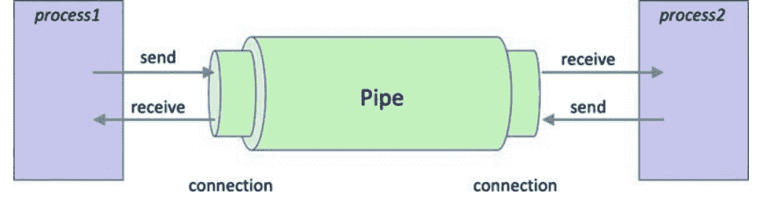

一旦程序使用完连接，就应该使用`close()`将其关闭。

以下程序说明了如何使用管道连接：

```python
from multiprocessing import Process, Pipe
from time import sleep

def worker(conn):
    print('Worker - started now sleeping for 1 second')
    sleep(1)
    print('Worker - sending data via Pipe')
    conn.send('hello')
    print('Worker - closing worker end of connection')
    conn.close()

def main():
    print('Main - Starting, creating the Pipe')
    main_connection, worker_connection = Pipe()
    print('Main - Setting up the process')
    p = Process(target=worker, args=[worker_connection])
    print('Main - Starting the process')
    p.start()
    print('Main - Wait for a response from the child process')
    print(main_connection.recv())
    print('Main - closing parent process end of connection')
    main_connection.close()
    print('Main - Done')

if __name__ == '__main__':
    main()
```

此管道示例的输出为：

- Main - Starting, creating the Pipe
- Main - Setting up the process
- Main - Starting the process
- Main - Wait for a response from the child process
- Worker - started now sleeping for 1 second
- Worker - sending data via Pipe
- Worker - closing worker end of connection hello
- Main - closing parent process end of connection
- Main - Done

请注意，如果两个进程同时尝试从管道的同一端读取或写入，管道中的数据可能会损坏。但是，如果进程同时使用管道的不同端，则不存在损坏的风险。

## 在进程间共享状态

通常，如果可以避免，就不应该在独立的进程之间共享状态。然而，如果无法避免，`multiprocessing`库提供了两种共享状态（数据）的方式：共享内存（由`multiprocessing.Value`和`multiprocessing.Array`支持）和服务器进程。

## 进程共享内存

可以使用`multiprocessing.Value`或`multiprocessing.Array`将数据存储在共享内存映射中。多个进程可以访问此数据。

`multiprocessing.Value`类型的构造函数是：

```python
multiprocessing.Value(typecode_or_type, *args, lock=True)
```

其中：

- `typecode_or_type`决定返回对象的类型：它是一个ctypes类型或一个字符类型代码。例如，‘d’表示双精度浮点数，‘i’表示有符号整数。
- `*args`传递给该类型的构造函数。
- `lock`如果`lock`为`True`（默认值），则会创建一个新的递归锁对象来同步对值的访问。如果`lock`为`False`，则对返回对象的访问不会自动受到锁的保护，因此不一定是进程安全的。

`multiprocessing.Array`的构造函数是：

```python
multiprocessing.Array(typecode_or_type, size_or_initializer, lock=True)
```

其中：

- `typecode_or_type`决定返回数组元素的类型。
- `size_or_initializer`如果`size_or_initializer`是一个整数，则它决定数组的长度，并且数组最初将被清零。否则，`size_or_initializer`是一个用于初始化数组的序列，其长度决定数组的长度。
- 如果`lock`为`True`（默认值），则会创建一个新的锁对象来同步对值的访问。如果`lock`为`False`，则对返回对象的访问不会自动受到锁的保护，因此不一定是“进程安全”的。

下面给出了一个同时使用`Value`和`Array`类型的示例：

```python
from multiprocessing import Process, Value, Array

def worker(n, a):
    n.value = 3.1415927
    for i in range(len(a)):
        a[i] = -a[i]

def main():
    print('Starting')
    num = Value('d', 0.0)
    arr = Array('i', range(10))
    p = Process(target=worker, args=(num, arr))
    p.start()
    p.join()
    print(num.value)
    print(*arr)
    print('Done')

if __name__ == '__main__':
    main()
```

## 尝试

编写一个程序，可以计算任何给定数字的阶乘。例如，计算数字5的阶乘（通常写作5!），即1 * 2 * 3 * 4 * 5，等于120。

负数的阶乘未定义，零的阶乘是1；即0! = 1。

接下来修改程序以并行运行多个阶乘计算。将所有结果收集到一个列表中并打印该列表。

你可以使用任何你喜欢的方法来运行多个进程，尽管使用`Pool`可能是一个好方法。你的程序应该并行计算5、8、10、15、3、6和4的阶乘。

## 线程/进程间同步

### 简介

在本章中，我们将探讨`threading`和`multiprocessing`库都支持的几种功能，这些功能允许线程或进程之间的同步和协作。

在本章的剩余部分，我们将探讨Python支持多个线程和进程之间同步的一些方式。请注意，大多数库在`threading`和`multiprocessing`之间是镜像的，因此相同的基本思想适用于这两种方法，并且API非常相似。但是，你不应该混合使用线程和进程。如果你使用线程，那么你应该只使用`threading`库中的功能。同样，如果你使用进程，那么你应该只使用`multiprocessing`库中的功能。本章给出的示例将使用其中一种技术，但对两种方法都适用。

### 使用屏障

使用`threading.Barrier`（或`multiprocessing.Barrier`）是同步一组线程（或进程）执行的最简单方法之一。参与屏障的线程或进程被称为参与屏障的各方。屏障中的每一方都可以独立工作，直到它到达代码中的屏障点。

屏障代表一个终点，所有各方必须到达该终点才能触发任何进一步的行为。当所有各方都到达屏障时，可以选择触发一个后阶段动作（也称为屏障回调）。这个后阶段动作代表当所有各方到达屏障时应该运行的一些行为，但在允许这些各方继续之前。后阶段动作（回调）在单个线程（或进程）中执行。一旦完成，所有各方都将被解除阻塞并可以继续。

下图说明了这一点。线程t1、t2和t3都参与了屏障。当线程t1到达屏障时，它必须等待，直到被屏障释放。同样，当t2到达屏障时，它也必须等待。当t3最终到达屏障时，回调被调用。一旦回调完成，屏障释放所有三个线程，然后它们可以继续。

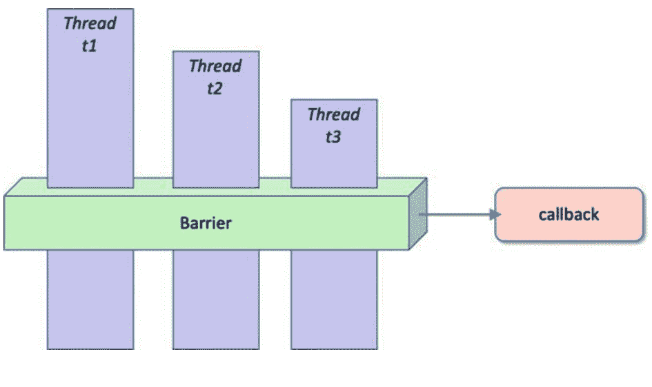

下面给出了一个使用`Barrier`对象的示例。请注意，在每个线程中调用的函数也必须协作使用屏障，因为代码将运行到`barrier.wait()`方法，然后等待所有其他线程也到达此点，然后才被允许继续。

`Barrier`是一个可用于创建屏障对象的类。当`Barrier`类被实例化时，可以提供三个参数：

其中

## 屏障（Barrier）

-   parties：将参与屏障的独立参与方数量。
-   action：一个可调用对象（例如函数），如果提供，它将在所有参与方进入屏障后、释放它们之前被调用。
-   timeout：如果提供了‘timeout’，它将用作该屏障上所有后续`wait()`调用的默认值。

因此，在以下代码中

```python
b = Barrier(3, action=callback)
```

表示将有三个参与方参与屏障，并且当所有三个都到达屏障时（然而超时保持默认值None），回调函数将被调用。

屏障对象在线程（或进程）之外创建，但必须提供给线程（或进程）正在执行的函数。处理此问题最简单的方法是将屏障作为参数之一传递给函数；这意味着该函数可以根据上下文与不同的屏障对象一起使用。

下面是一个使用屏障类与一组线程的示例：

```python
from threading import Barrier, Thread
from time import sleep
from random import randint

def print_it(msg, barrier):
    print('print_it for:', msg)
    for i in range(0, 10):
        print(msg, end='', flush=True)
        sleep(1)
    sleep(randint(1, 6))
    print('Wait for barrier with:', msg)
    barrier.wait()
    print('Returning from print_it:', msg)

def callback():
    print('Callback Executing')

print('Main - Starting')
b = Barrier(3, callback)
t1 = Thread(target=print_it, args=('A', b))
t2 = Thread(target=print_it, args=('B', b))
t3 = Thread(target=print_it, args=('C', b))
t1.start()
t2.start()
t3.start()
print('Main - Done')
```

其输出为：

```
Main - Starting
print_it for: A
print_it for: B
print_it for: C
ABC
Main - Done
ABCACBACBABCACBCABACBACBBAC
Wait for barrier with: B
Wait for barrier with: A
Wait for barrier with: C
Callback Executing
Returning from print_it: A
Returning from print_it: B
Returning from print_it: C
```

由此你可以看到，`print_it()`函数被并发运行了三次；所有三个调用都到达了`barrier.wait()`语句，但顺序与它们启动的顺序不同。一旦这三个都到达了这个点，回调函数就会在`print_it()`函数调用能够继续之前执行。

屏障类本身提供了几种用于管理或查找屏障信息的方法：

| 方法 | 描述 |
|---|---|
| `wait(timeout=None)` | 等待直到所有线程都通知了屏障（除非达到超时）——返回通过屏障的线程数 |
| `reset()` | 将屏障恢复到默认状态 |
| `abort()` | 将屏障置于损坏状态 |
| `parties` | 返回通过屏障所需的线程数 |
| `n_waiting` | 当前正在等待的线程数 |

屏障对象可以为相同数量的线程重复使用任意次数。

上述示例可以轻松地通过更改导入语句并创建一组进程而不是线程来改为使用进程运行：

```python
from multiprocessing import Barrier, Process
...
print('Main - Starting')
b = Barrier(3, callback)
t1 = Process(target=print_it, args=('A', b))
```

请注意，你应该只将线程与`threading.Barrier`一起使用。相应地，你应该只将进程与`multiprocessing.Barrier`一起使用。

## 事件信号（Event Signaling）

尽管使用多个线程或进程的目的是并发执行独立操作，但有时能够允许两个或多个线程或进程在它们行为的时序上进行协作是很重要的。上面介绍的屏障对象是一种相对高级的方法；然而，在某些情况下需要更细粒度的控制。`threading.Event`或`multiprocessing.Event`类可以用于此目的。

事件管理一个内部标志，调用者可以`set()`或`clear()`它。其他线程可以`wait()`该标志被`set()`，这实际上会阻塞它们自己的进度，直到被事件允许继续。内部标志最初设置为`False`，这确保了如果一个任务在事件被设置之前到达事件，它必须等待。

事实上，你可以使用可选的超时来调用`wait`。如果你不包含可选的超时，那么`wait()`将永远等待，而`wait(timeout)`将等待给定的秒数。如果达到超时，则`wait`方法返回`False`；否则`wait`返回`True`。

例如，下图说明了两个进程共享一个事件对象。第一个进程运行一个等待事件被设置的函数。相应地，第二个进程运行一个将设置事件并因此释放等待进程的函数。

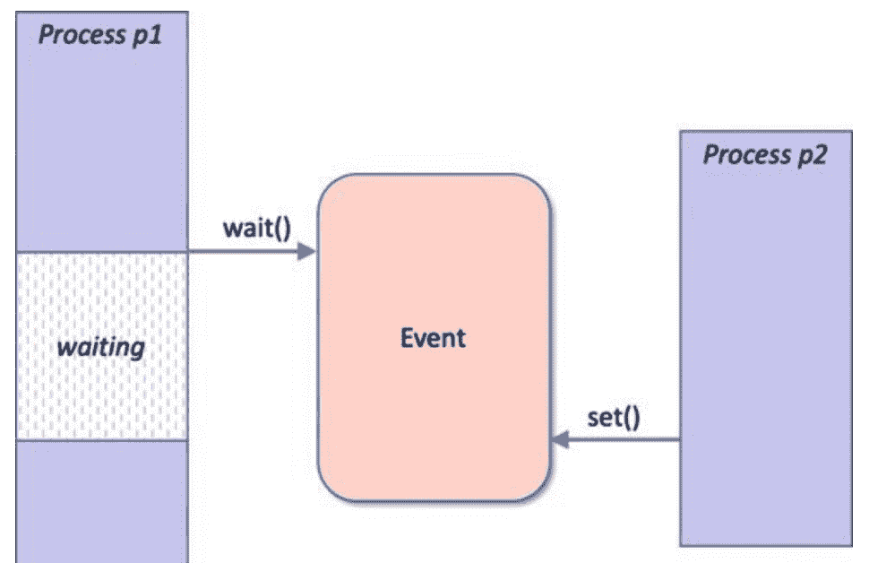

以下程序实现了上述场景：

```python
from multiprocessing import Process, Event
from time import sleep

def wait_for_event(event):
    print('wait_for_event - Entered and waiting')
    event_is_set = event.wait()
    print('wait_for_event - Event is set: ', event_is_set)

def set_event(event):
    print('set_event - Entered but about to sleep')
    sleep(5)
    print('set_event - Waking up and setting event')
    event.set()
    print('set_event - Event set')

print('Starting')
# Create the event object
event = Event()
# Start a Process to wait for the event notification
p1 = Process(target=wait_for_event, args=[event])
p1.start()
# Set up a process to set the event
p2 = Process(target=set_event, args=[event])
p2.start()
# Wait for the first process to complete
p1.join()
print('Done')
```

此程序的输出为：

```
Starting
wait_for_event - Entered and waiting
set_event - Entered but about to sleep
set_event - Waking up and setting event
set_event - Event set
wait_for_event - Event is set: True
Done
```

要将其更改为使用线程，我们只需要更改导入并创建两个线程：

```python
from threading import Thread, Event
...
print('Starting')
event = Event()
t1 = Thread(target=wait_for_event, args=[event])
t1.start()
t2 = Thread(target=set_event, args=[event])
t2.start()
t1.join()
print('Done')
```

## 同步并发代码

确保代码的关键区域免受多个线程或进程并发执行的保护并不罕见。这些代码块通常涉及共享数据的修改或访问。因此，有必要确保一次只有一个线程或进程正在更新共享对象，并且在此更新发生时，消费者线程或进程被阻塞。

当一个或多个线程或进程是数据的生产者，而一个或多个其他线程或进程是该数据的消费者时，这种情况最为常见。下图说明了这一点。

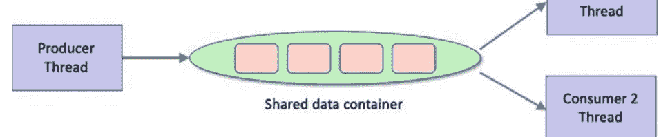

在此图中，生产者在其自己的线程中运行（尽管它也可以在单独的进程中运行），并将数据放置到某个公共共享数据容器上。随后，多个独立的消费者可以在数据可用且它们有空闲处理数据时消费该数据。然而，消费者反复检查容器中的数据是没有意义的，因为这将浪费资源（例如，在处理器上执行代码以及在多个线程或进程之间进行上下文切换）。

因此，我们需要生产者和消费者之间的某种形式的通知或同步来管理这种情况。

Python在`threading`（以及`multiprocessing`）库中提供了几个类，可用于管理关键代码块。这些类包括`Lock`、`Condition`和`Semaphore`。

## Python锁（Locks）

在`threading`和`multiprocessing`库中定义的`Lock`类提供了一种同步访问代码块的机制。锁对象可以处于两种状态之一：锁定和解锁（初始状态为解锁）。锁授予单个一次只能有一个线程执行；其他线程必须等待锁释放后才能继续。

Lock 类提供了两个基本方法：获取锁（`acquire()`）和释放锁（`release()`）。

- 当 Lock 对象的状态为未锁定时，`acquire()` 会将状态更改为锁定并立即返回。
- 当状态为锁定时，`acquire()` 会阻塞，直到另一个线程调用 `release()` 将其更改为未锁定，然后 `acquire()` 调用会将其重置为锁定并返回。
- `release()` 方法应仅在锁定状态下被调用；它会将状态更改为未锁定并立即返回。如果尝试释放一个未锁定的锁，将引发运行时错误。

下面展示了使用 Lock 对象的示例：

```python
from threading import Thread, Lock

class SharedData(object):
    def __init__(self):
        self.value = 0
        self.lock = Lock()

    def read_value(self):
        try:
            print('read_value Acquiring Lock')
            self.lock.acquire()
            return self.value
        finally:
            print('read_value releasing Lock')
            self.lock.release()

    def change_value(self):
        print('change_value acquiring lock')
        with self.lock:
            self.value = self.value + 1
            print('change_value lock released')
```

上面展示的 `SharedData` 类使用锁来控制对关键代码块的访问，特别是对 `read_value()` 和 `change_value()` 方法的访问。Lock 对象在 `SharedData` 对象内部持有，两个方法在执行其行为之前都尝试获取锁，但使用后必须释放锁。

`read_value()` 方法使用 `try: finally:` 块显式地执行此操作，而 `change_value()` 方法使用 `with` 语句（因为 Lock 类型支持上下文管理器协议）。两种方法都实现了相同的结果，但 `with` 语句风格更简洁。

下面使用两个简单的函数来使用 `SharedData` 类。在这种情况下，`SharedData` 对象被定义为全局变量，但它也可以作为参数传递给 `reader()` 和 `updater()` 函数。`reader` 和 `updater` 函数都循环运行，尝试在 `shared_data` 对象上调用 `read_value()` 和 `change_value()` 方法。

由于两个方法都使用锁来控制对方法的访问，因此一次只能有一个线程进入锁定区域。这意味着 `reader()` 函数可能在 `updater()` 函数更改数据之前开始读取数据（反之亦然）。

这从输出中可以看出，读取线程在更新器记录值 '1' 之前两次访问了值 '0'。然而，`updater()` 函数在读取器获得对锁定代码块的访问权限之前运行了第二次，这就是为什么值 2 被错过了。根据应用程序的不同，这可能是一个问题，也可能不是。

```python
shared_data = SharedData()

def reader():
    while True:
        print(shared_data.read_value())

def updater():
    while True:
        shared_data.change_value()

print('Starting')
t1 = Thread(target=reader)
t2 = Thread(target=updater)
t1.start()
t2.start()
print('Done')
```

此程序的输出如下：
```
Starting
read_value Acquiring Lock
read_value releasing Lock
0
read_value Acquiring Lock
read_value releasing Lock
0
Done
change_value acquiring lock
change_value lock released
1
change_value acquiring lock
change_value lock released
change_value acquiring lock
change_value lock released
3
change_value acquiring lock
change_value lock released
4
```

Lock 对象只能被获取一次；如果一个线程尝试多次获取同一个 Lock 对象的锁，则会引发运行时错误。

如果需要重新获取 Lock 对象的锁，则应使用 `threading.RLock` 类。这是一个可重入锁，允许同一个线程（或进程）多次获取锁。但是，代码必须释放锁的次数与获取锁的次数相同。

## Python 条件变量

条件变量可用于同步两个或多个线程或进程之间的交互。条件变量对象支持通知模型的概念；非常适合多个消费者和生产者访问的共享数据资源。

条件变量可用于通知一个或所有等待的线程或进程它们可以继续（例如从共享资源读取数据）。支持此功能的方法有：

- `notify()` 通知一个等待的线程，该线程可以继续
- `notify_all()` 通知所有等待的线程它们可以继续
- `wait()` 使线程等待，直到被通知可以继续

条件变量始终与一个内部锁关联，在调用 `wait()` 和 `notify()` 方法之前必须获取和释放该锁。条件变量支持上下文管理器协议，因此可以通过 `with` 语句（这是使用条件变量最典型的方式）来获取此锁。例如，要获取条件锁并调用 `wait` 方法，我们可以这样写：

```python
with condition:
    condition.wait()
    print('Now we can proceed')
```

在下面的示例中使用了条件变量对象来说明生产者线程和两个消费者线程如何协作。定义了一个 `DataResource` 类，它将保存一个在消费者和一组生产者之间共享的数据项。它还（在内部）定义了一个条件变量属性。请注意，这意味着条件变量完全内置于 `DataResource` 类中；外部代码不需要知道或关心条件变量及其使用。相反，外部代码只需根据需要在单独的线程中调用 `consumer()` 和 `producer()` 函数即可。

`consumer()` 方法使用 `with` 语句获取条件变量对象上的（内部）锁，然后等待被通知数据可用。同样，`producer()` 方法也使用 `with` 语句获取条件变量对象上的锁，然后生成数据属性值，然后通知任何在条件变量上等待的线程它们可以继续。请注意，尽管 `consumer` 方法获取了条件变量对象上的锁；如果它必须等待，它将释放锁，并在被通知可以继续后重新获取锁。这是一个经常被忽视的微妙之处。

```python
from threading import Thread, Condition, currentThread
from time import sleep
from random import randint

class DataResource:
    def __init__(self):
        print('DataResource - Initialising the empty data')
        self.data = None
        print('DataResource - Setting up the Condition object')
        self.condition = Condition()

    def consumer(self):
        """wait for the condition and use the resource"""
        print('DataResource - Starting consumer method in',
              currentThread().name)
        with self.condition:
            self.condition.wait()
            print('DataResource - Resource is available to',
                  currentThread().name)
            print('DataResource - Data read in',
                  currentThread().name, ':', self.data)

    def producer(self):
        """set up the resource to be used by the consumer"""
        print('DataResource - Starting producer method')
        with self.condition:
            print('DataResource - Producer setting data')
            self.data = randint(1, 100)
            print('DataResource - Producer notifying all waiting threads')
            self.condition.notifyAll()

print('Main - Starting')
print('Main - Creating the DataResource object')
resource = DataResource()
print('Main - Create the Consumer Threads')
c1 = Thread(target=resource.consumer)
c1.name = 'Consumer1'
c2 = Thread(target=resource.consumer)
c2.name = 'Consumer2'
print('Main - Create the Producer Thread')
p = Thread(target=resource.producer)
print('Main - Starting consumer threads')
c1.start()
c2.start()
sleep(1)
print('Main - Starting producer thread')
p.start()
print('Main - Done')
```

此程序一次运行的输出如下：

```
Main - Starting
Main - Creating the DataResource object
DataResource - Initialising the empty data
DataResource - Setting up the Condition object
Main - Create the Consumer Threads
Main - Create the Producer Thread
Main - Starting consumer threads
DataResource - Starting consumer method in Consumer1
DataResource - Starting consumer method in Consumer2
Main - Starting producer thread
DataResource - Starting producer method
DataResource - Producer setting data
Main - Done
DataResource - Producer notifying all waiting threads
DataResource - Resource is available to Consumer1
DataResource - Data read in Consumer1 : 36
DataResource - Resource is available to Consumer2
DataResource - Data read in Consumer2 : 36
```

## Python 信号量

Python 的 `Semaphore` 类实现了 Dijkstra 的计数信号量模型。

通常，信号量就像一个整型变量，其值旨在表示某种可用资源的数量。信号量上通常有两个可用操作；这些操作是 `acquire()` 和 `release()`（尽管在某些库中使用了 Dijkstra 原始的 `p()` 和 `v()` 名称）。

and v() 被使用，这些操作名称基于原始的荷兰语短语）。

- acquire() 操作将信号量的值减一，除非该值为 0，在这种情况下它会阻塞调用线程，直到信号量的值再次增加到 0 以上。
- signal() 操作将值加一，表示资源池中添加了一个新的实例。

threading.Semaphore 和 multiprocessing.Semaphore 类也支持上下文管理协议。与 Semaphore 构造函数一起使用的一个可选参数用于设置内部计数器的初始值；默认值为 1。如果给定的值小于 0，则会引发 ValueError。

以下示例展示了 5 个不同的线程都运行同一个 worker() 函数。worker() 函数尝试获取一个信号量；如果成功获取，则继续执行 with 语句块；如果没有成功，则等待直到能够获取它。由于信号量初始化为 2，因此一次只能有两个线程获取信号量。

然而，示例程序启动了五个线程，这意味着前 2 个运行的线程将获取信号量，而其余三个线程必须等待获取信号量。一旦前两个线程释放信号量，另外两个线程就可以获取它，依此类推。

```python
from threading import Thread, Semaphore, currentThread
from time import sleep

def worker(semaphore):
    with semaphore:
        print(currentThread().getName() + " - entered")
        sleep(0.5)
        print(currentThread().getName() + " - exiting")

print('MainThread - Starting')
semaphore = Semaphore(2)
for i in range(0, 5):
    thread = Thread(name='T' + str(i),
                    target=worker, args=[semaphore])
    thread.start()
print('MainThread - Done')
```

该程序运行的输出如下：

```
MainThread - Starting
T0 - entered
T1 - entered
MainThread - Done
T0 - exiting
T2 - entered
T1 - exiting
T3 - entered
T2 - exiting
T4 - entered
T3 - exiting
T4 - exiting
```

## 并发队列类

正如预期的那样，生产者线程或进程生成数据供一个或多个消费者线程或进程处理的模型非常常见，以至于 Python 提供了比使用锁、条件或信号量更高层次的抽象；这就是由 threading.Queue 或 multiprocessing.Queue 类实现的阻塞队列模型。

这两个队列类都是线程和进程安全的。也就是说，它们使用内部锁来适当地管理来自并发线程或进程的数据访问。

下面展示了一个使用队列在工作进程和主进程之间交换数据的示例。

工作进程执行 worker() 函数，休眠 2 秒后将字符串 'Hello World' 放入队列。主应用程序函数设置队列并创建进程。队列作为参数之一传递给进程。然后启动进程。主进程随后通过（阻塞的）get() 方法等待队列中可用的数据。一旦数据可用，主进程在终止前检索并打印出数据。

```python
from multiprocessing import Process, Queue
from time import sleep

def worker(queue):
    print('Worker - going to sleep')
    sleep(2)
    print('Worker - woken up and putting data on queue')
    queue.put('Hello World')

def main():
    print('Main - Starting')
    queue = Queue()
    p = Process(target=worker, args=[queue])
    print('Main - Starting the process')
    p.start()
    print('Main - waiting for data')
    print(queue.get())
    print('Main - Done')

if __name__ == '__main__':
    main()
```

其输出如下所示：

```
Main - Starting
Main - Starting the process
Main - waiting for data
Worker - going to sleep
Worker - woken up and putting data on queue
Hello World
Main - Done
```

然而，这并不能清楚地展示两个进程的执行是如何交织的。下图以图形方式说明了这一点：

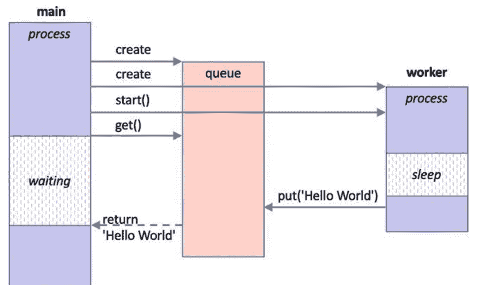

在上图中，主进程在调用 get() 方法后等待从队列返回结果；在等待期间，它不使用任何系统资源。反过来，工作进程休眠两秒，然后将一些数据放入队列（通过 put('Hello World')）。在此值发送到队列后，该值返回给主进程，主进程被唤醒（移出等待状态），并可以继续执行主函数的其余部分。

## Futures

### 简介

Future 是一个承诺在未来返回值的线程（或进程）；一旦关联的行为完成。因此它是一个未来的值。它提供了一种非常简单的方式来触发那些执行起来耗时或可能因昂贵操作（如输入/输出）而延迟的行为，这些行为可能会减慢程序其他元素的执行。本章讨论 Python 中的 futures。

### 为什么需要 Future

在正常的方法或函数调用中，方法或函数的执行与调用代码（调用者）同步，调用者必须等待函数或方法（被调用者）返回。只有在此之后，调用者才能继续执行下一行代码。在许多（大多数）情况下，这正是你想要的，因为下一行代码可能依赖于上一行代码返回的结果等。

然而，在某些情况下，下一行代码与上一行代码无关。例如，假设我们正在填充用户界面（UI）。第一行代码可能从某个外部数据源（如数据库）读取用户名，然后将其显示在 UI 的一个字段中。下一行代码可能将今天的日期添加到 UI 的另一个字段中。这两行代码彼此独立，可以并发/并行运行。

在这种情况下，我们可以使用线程或进程来独立于调用者运行这两行代码，从而实现一定程度的并发性，并允许调用者继续执行第三行代码等。然而，线程或进程默认都不提供从此类独立操作获取结果的简单机制。这可能不是问题，因为操作可能是自包含的；例如，它们可能从数据库或今天的日期获取数据，然后更新 UI。然而，在许多情况下，计算将返回一个结果，该结果需要由原始调用代码（调用者）处理。这可能涉及执行长时间运行的计算，然后使用返回的结果生成另一个值或更新另一个对象等。

Future 是一种简化此类并发任务定义和执行的抽象。Futures 在许多不同的语言中可用，包括 Python，以及 Java、Scala、C++ 等。使用 Future 时；一个可调用对象（如函数）被传递给 Future，Future 将其作为单独的线程或单独的进程执行，然后在生成结果后返回结果。结果可以通过回调函数（在结果可用时调用）处理，也可以通过使用等待结果提供的操作来处理。

### Python 中的 Futures

concurrent.futures 库在 Python 3.2 版本中引入（也可在 Python 2.5 及更高版本中使用）。concurrent.futures 库提供了 Future 类和用于处理 Futures 的高级 API。concurrent.futures.Future 类封装了可调用对象（例如函数或方法）的异步执行。Future 类提供了一系列方法，可用于获取有关 future 状态的信息、检索结果或取消 future：

- cancel() 尝试取消 Future。如果 Future 当前正在执行且无法取消，则该方法将返回 False，否则调用将被取消，该方法将返回 True。
- canceled() 如果 Future 已成功取消，则返回 True。

## Future 的创建

Future 由执行器创建和执行。执行器提供了两个可用于执行 Future（或多个 Future）的方法，以及一个用于关闭执行器的方法。

在执行器类层次结构的根部是 `concurrent.futures.Executor` 抽象类。它有两个子类：

- `ThreadPoolExecutor` 和
- `ProcessPoolExecutor`。

`ThreadPoolExecutor` 使用线程来执行 Future，而 `ProcessPoolExecutor` 使用独立的进程。因此，你可以通过指定这两种执行器之一来选择希望 Future 如何被执行。

## 简单示例：Future

为了说明这些概念，我们将看一个使用 Future 的非常简单的例子。为此，我们将使用一个简单的 worker 函数；类似于前面章节中使用的：

```python
from time import sleep
# define function to be used with future
def worker(msg):
    for i in range(0, 10):
        print(msg, end='', flush=True)
        sleep(1)
    return i
```

这个版本的 worker 唯一的区别是它还会返回一个结果，即 worker 打印消息的次数。

我们当然可以像下面这样内联调用此方法：

```python
res = worker('A')
print(res)
```

我们可以将此方法的调用转换为一个 Future。为此，我们使用从 `concurrent.futures` 模块导入的 `ThreadPoolExecutor`。然后我们将 worker 函数提交到池中执行。这将返回一个 Future 的引用，我们可以用它来获取结果：

```python
from time import sleep
from concurrent.futures import ThreadPoolExecutor
print('Setting up the ThreadPoolExecutor')
pool = ThreadPoolExecutor(1)
# Submit the function to the pool to run
# concurrently - obtain a future from pool
print('Submitting the worker to the pool')
future = pool.submit(worker, 'A')
print('Obtained a reference to the future object', future)
# Obtain the result from the future - wait if necessary
print('future.result():', future.result())
print('Done')
```

输出如下：

*Setting up the ThreadPoolExecutor*
*Submitting the worker to the pool*
*Obtained a reference to the future object <Future at 0x1086ea8do state=running>*
*AAAAAAAAAA future.result(): 9*
*Done*

注意主程序和 worker 的输出是如何交织在一起的，在打印以 'Obtained a...' 开头的消息之前，已经打印了两个 'A'。

在这种情况下，创建了一个新的 `ThreadPoolExecutor`，池中有一个线程（通常池中会有多个线程，但这里为了说明目的只使用一个）。然后使用 `submit()` 方法将带有参数 'A' 的 worker 函数提交给 `ThreadPoolExecutor`，由其调度执行该函数。`submit()` 方法返回一个 Future 对象。

主程序随后等待 future 对象返回结果（通过调用 future 上的 `result()` 方法）。此方法也可以接受一个超时时间。

要将此示例改为使用进程而非线程，只需将池执行器更改为 `ProcessPoolExecutor`：

```python
from concurrent.futures import ProcessPoolExecutor
print('Setting up the ProcessPoolExecutor')
pool = ProcessPoolExecutor(1)
print('Submitting the worker to the pool')
future = pool.submit(worker, 'A')
print('Obtained a reference to the future object', future)
print('future.result():', future.result())
print('Done')
```

此程序的输出与上一个非常相似：

```
Setting up the ProcessPoolExecutor
Submitting the worker to the pool
Obtained a reference to the future object <Future at 0x109178630 state=running>
AAAAAAAAAA future.result(): 9
Done
```

唯一的区别是在这次特定的运行中，打印以 'Obtained a..' 开头的消息是在打印任何 'A' 之前；这可能是由于进程初始设置比线程需要更长时间。

## 运行多个 Future

`ThreadPoolExecutor` 和 `ProcessPoolExecutor` 都可以通过池配置为支持多个线程/进程。提交到池中的每个任务都将在一个单独的线程/进程中运行。如果提交的任务多于可用的线程/进程数量，那么提交的任务将等待第一个可用的线程/进程，然后被执行。这可以作为一种管理并发工作量的方式。

例如，在下面的例子中，`worker()` 函数被提交到池中四次，但池被配置为使用线程。因此，第四个 worker 将需要等待前三个中的一个完成才能执行：

```python
from concurrent.futures import ThreadPoolExecutor

print('Starting...')
pool = ThreadPoolExecutor(3)
future1 = pool.submit(worker, 'A')
future2 = pool.submit(worker, 'B')
future3 = pool.submit(worker, 'C')
future4 = pool.submit(worker, 'D')
print('\nfuture4.result():', future.result())
print('All Done')
```

当它运行时，我们可以看到 A、B 和 C 的 Future 都并发运行，但 D 必须等待其他中的一个完成：

```
Starting...
ABCACBCABCBCABCACBACABCBCACABCBADDDDDDDDDD
future4.result(): 9
All Done
```

主线程也等待 future4 完成，因为它请求结果，这是一个阻塞调用，只有在 future 完成并生成结果后才会返回。

同样，要使用进程而非线程，我们只需将 `ThreadPoolExecutor` 替换为 `ProcessPoolExecutor`：

```python
from concurrent.futures import ProcessPoolExecutor

print('Starting...')
pool = ProcessPoolExecutor(3)
future1 = pool.submit(worker, 'A')
future2 = pool.submit(worker, 'B')
future3 = pool.submit(worker, 'C')
future4 = pool.submit(worker, 'D')
print('\nfuture4.result():', future4.result())
print('All Done')
```

## 等待所有 Future 完成

可以在继续之前等待所有 future 完成。在上一节中，假设 future4 将是最后一个完成的 future；但在许多情况下，可能无法知道哪个 future 将是最后一个完成的。在这种情况下，能够在继续之前等待所有 future 完成非常有用。这可以使用 `concurrent.futures.wait` 函数来完成。此函数接受一个 future 集合，以及可选的超时时间和 `return_when` 指示器。

```python
wait(fs, timeout=None, return_when=ALL_COMPLETED)
```

其中：

- `timeout` 可用于控制返回前等待的最大秒数。`timeout` 可以是 int 或 float。如果未指定 `timeout` 或为 None，则等待时间没有限制。
- `return_when` 指示此函数应何时返回。它必须是以下常量之一：
  - `FIRST_COMPLETED`：当任何 future 完成或被取消时，函数将返回。
  - `FIRST_EXCEPTION`：当任何 future 通过引发异常完成时，函数将返回。如果没有 future 引发异常，则等同于 `ALL_COMPLETED`。
  - `ALL_COMPLETED`：当所有 future 完成或被取消时，函数将返回。

`wait()` 函数返回两个集合：`done` 和 `not_done`。第一个集合包含在等待完成之前已完成（完成或被取消）的 future。第二个集合 `not_done` 包含未完成的 future。

我们可以使用 `wait()` 函数来修改我们之前的示例，这样我们就不再依赖于 future4 最后完成：

from concurrent.futures import ProcessPoolExecutor
from concurrent.futures import wait
from time import sleep

def worker(msg):
    for i in range(0, 10):
        print(msg, end='', flush=True)
        sleep(1)
    return i

print('Starting...setting up pool')
pool = ProcessPoolExecutor(3)
futures = []
print('Submitting futures')
future1 = pool.submit(worker, 'A')
futures.append(future1)
future2 = pool.submit(worker, 'B')
futures.append(future2)
future3 = pool.submit(worker, 'C')
futures.append(future3)
future4 = pool.submit(worker, 'D')
futures.append(future4)
print('Waiting for futures to complete')
wait(futures)
print('\nAll Done')

这段代码的输出是：

*Starting...setting up pool*
*Submitting futures*
*Waiting for futures to complete*
*ABCABCABCABCABCABCBCACBACBABCADDDDDDDDDDD*
*All Done*

请注意每个 future 是如何被添加到 futures 列表中，然后该列表被传递给 `wait()` 函数的。

## 处理已完成的结果

如果我们想处理由 futures 集合返回的每个结果该怎么办？我们可以在上一节中，等到所有结果都生成后，再遍历 futures 列表。然而，这意味着我们必须等待它们全部完成才能处理列表。

在许多情况下，我们希望在结果生成后立即处理它们，而不关心它是第一个、第三个、最后一个还是第二个等等。`concurrent.futures.as_completed()` 函数正是做这件事；它会在每个 future 完成后立即依次提供该 future；所有 future 最终都会被返回，但不保证顺序（只保证一旦 future 完成生成结果，它就会立即可用）。

例如，在下面的示例中，`is_even()` 函数会休眠一个随机的秒数（确保此函数的不同调用将花费不同的时间），然后计算结果：

```python
from concurrent.futures import ThreadPoolExecutor, as_completed
from time import sleep
from random import randint

def is_even(n):
    print('Checking if', n, 'is even')
    sleep(randint(1, 5))
    return str(n) + ' ' + str(n % 2 == 0)

print('Started')
data = [1, 2, 3, 4, 5, 6]
pool = ThreadPoolExecutor(5)
futures = []
for v in data:
    futures.append(pool.submit(is_even, v))
for f in as_completed(futures):
    print(f.result())
print('Done')
```

第二个 for 循环将在每个 future 完成时遍历它们，并打印出每个的结果，如下所示：

```
Started
Checking if 1 is even
Checking if 2 is even
Checking if 3 is even
Checking if 4 is even
Checking if 5 is even
Checking if 6 is even
1 False
4 True
5 False
3 False
2 True
6 True
Done
```

从这个输出可以看出，尽管六个 future 是按顺序启动的，但返回的结果顺序不同（返回的顺序是 1, 4, 5, 3, 2，最后是 6）。

## 使用回调处理 Future 结果

`as_complete()` 方法的替代方案是提供一个函数，该函数将在结果生成后被调用。这样做的好处是主程序永远不会暂停；它可以继续执行任何需要的操作。

结果生成后被调用的函数通常被称为回调函数；即 future 在结果可用时回调此函数。

每个 future 可以有一个单独的回调，因为要调用的函数是使用 `add_done_callback()` 方法在 future 上设置的。此方法接受要调用的函数的名称。

例如，在这个修改过的上一个示例版本中，我们指定了一个回调函数，该函数将用于打印 future 的结果。这个回调函数名为 `print_future_result()`。它以已完成的 future 作为其参数：

```python
from concurrent.futures import ThreadPoolExecutor
from time import sleep
from random import randint

def is_even(n):
    print('Checking if', n, 'is even')
    sleep(randint(1, 5))
    return str(n) + ' ' + str(n % 2 == 0)

def print_future_result(future):
    print('In callback Future result: ', future.result())

print('Started')
data = [1, 2, 3, 4, 5, 6]
pool = ThreadPoolExecutor(5)
for v in data:
    future = pool.submit(is_even, v)
    future.add_done_callback(print_future_result)
print('Done')
```

当我们运行这个程序时，可以看到回调函数是在主线程完成后被调用的。同样，顺序是不确定的，因为 `is_even()` 函数仍然会休眠一个随机的时间量。

```
Started
Checking if 1 is even
Checking if 2 is even
Checking if 3 is even
Checking if 4 is even
Checking if 5 is even
Done
In callback Future result: 1 False
Checking if 6 is even
In callback Future result: 5 False
In callback Future result: 4 True
In callback Future result: 3 False
In callback Future result: 2 True
In callback Future result: 6 True
```

## 使用 AsyncIO 实现并发

### 简介

Python 中的 Async IO 功能是相对较新的补充，最初在 Python 3.4 中引入，并在 Python 3.7 中不断演进。截至 Python 3.7，它们由两个新的关键字 `async` 和 `await`（在 Python 3.7 中引入）以及 Async IO Python 包组成。

在本章中，我们首先讨论异步 IO，然后介绍 `async` 和 `await` 关键字。接着，我们将介绍 Async IO 任务，以及它们是如何创建、使用和管理的。

### 异步 IO

异步 IO（或 Async IO）是一种与语言无关的并发编程模型（或范式），已在多种不同的编程语言（如 C# 和 Scala）以及 Python 中实现。

异步 IO 是你在 Python 中构建并发应用程序的另一种方式。在许多方面，它是 Python 中 Threading 库所提供功能的替代方案。然而，Threading 库更容易受到与 GIL（全局解释器锁）相关问题的影响，这可能会影响性能，而 Async IO 功能则能更好地隔离此问题。

Async IO 的运行方式也比 multiprocessing 库提供的功能更轻量级，因为 Async IO 中的异步任务在单个进程内运行，而不需要在底层硬件上生成单独的进程。

因此，Async IO 是实现问题并发解决方案的另一种替代方式。应该注意的是，它并不基于 Threading 或 Multi Processing；相反，Async IO 基于协作式多任务处理的概念。这些协作任务异步运行；我们的意思是这些任务：

-   能够与其他任务独立运行，
-   能够在需要时等待另一个任务返回结果，
-   因此能够在等待时允许其他任务运行。

Async IO 名称中的 IO（输入/输出）方面是因为这种形式的并发程序最适合 I/O 密集型任务。

在 I/O 密集型任务中，程序大部分时间都在向某种外部设备（例如数据库或一组文件等）发送数据或从中读取数据。这种通信是耗时的，意味着程序大部分时间都在等待来自外部设备的响应。

此类 I/O 密集型应用程序（看起来）加速的一种方式是重叠不同任务的执行；因此，当一个任务正在等待数据库返回一些数据时，另一个任务可以正在将数据写入日志文件等。

### AsyncIO 事件循环

当你使用 Async IO 功能开发代码时，你不需要担心 Async IO 库内部是如何工作的；然而，至少在概念层面，理解一个关键概念是有用的；即 Async IO 事件循环；这个循环控制每个任务如何以及何时运行。为了本讨论的目的，一个任务代表一些可以独立于其他工作运行的工作。

事件循环知道每个要运行的任务以及该任务当前的状态（例如，它是否正在等待某事发生/完成）。它从可用任务列表中选择一个准备运行的任务并执行它。该任务完全控制 CPU，直到它完成其工作或将控制权交还给事件循环（例如，因为它现在必须等待从数据库提供一些数据）。

事件循环现在检查是否有任何等待的任务准备好继续执行，并记录它们的状态。然后事件循环选择另一个准备运行的任务并启动该任务。这个循环持续进行，直到所有任务都完成。这如下图所示：

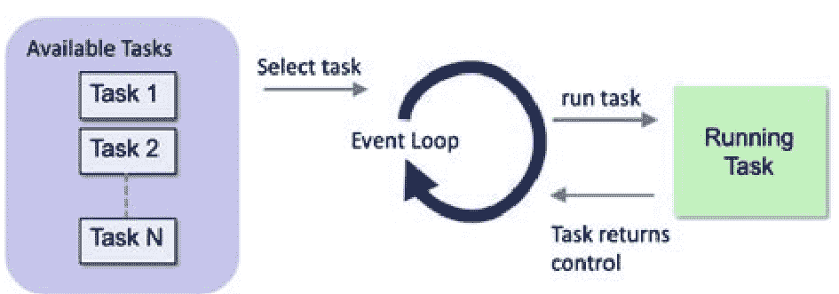

上述描述中需要注意的一个重要点是，任务不会放弃处理器，除非它决定这样做，例如必须等待其他事情。它们永远不会在操作过程中被中断；这避免了

## Async 和 Await 关键字

`async` 关键字在 Python 3.7 中引入，用于标记一个函数为使用 `await` 关键字的函数（我们稍后会回到这一点，因为 `async` 关键字还有另一个用途）。使用 `await` 关键字的函数可以作为单独的任务运行，并且当它对另一个异步函数调用 `await` 并必须等待该函数完成时，可以放弃对处理器的控制。然后，被调用的异步函数可以作为单独的任务运行，依此类推。

要调用一个异步函数，需要启动 Async IO 事件循环，并让该函数被事件循环视为一个任务。这是通过调用 `asyncio.run()` 方法并传入根异步函数来实现的。

`asyncio.run()` 函数在 Python 3.7 中引入（较旧版本的 Python，如 Python 3.6，需要你显式获取事件循环的引用并通过该循环运行根异步函数）。关于此函数需要注意的一点是，它在 Python 3.7 中被标记为临时性的。这意味着未来版本的 Python 可能支持也可能不支持该函数，或者可能以某种方式修改该函数。因此，你应该检查你所使用的 Python 版本的文档，以查看 `run` 方法是否已被更改。

## 使用 Async 和 Await

我们将从上到下研究一个非常简单的 Async IO 程序。该程序的 `main()` 函数如下所示：

```python
def main():
    print('Main - Starting')
    asyncio.run(do_something())
    print('Main - Done')

if __name__ == '__main__':
    main()
```

`main()` 函数是程序的入口点，它调用：

```python
asyncio.run(do_something())
```

这将启动 Async IO 事件循环运行，并导致 `do_something()` 函数被包装在一个由循环管理的 Task 中。请注意，在 Async IO 中你不会显式创建 Task；它们总是由某个函数创建的，但了解 Task 是有用的，因为你可以与它们交互以检查其状态或检索结果。

`do_something()` 函数用关键字 `async` 标记：

```python
async def do_something():
    print('do_something - will wait for worker')
    result = await worker()
    print('do_something - result:', result)
```

如前所述，这表明它可以作为单独的 Task 运行，并且可以使用关键字 `await` 来等待其他函数或行为完成。在这种情况下，`do_something()` 异步函数必须等待 `worker()` 函数完成。

`await` 关键字的作用不仅仅是表明 `do_something()` 函数必须等待 worker 完成。它触发创建另一个将执行 `worker()` 函数的 Task，并释放处理器，允许事件循环选择下一个要执行的任务（该任务可能是也可能不是运行 `worker()` 函数的任务）。`do_something` 任务的状态现在是等待中，而 `worker()` 任务的状态是就绪（准备运行）。

worker 任务的代码如下所示：

```python
async def worker():
    print('worker - will take some time')
    time.sleep(3)
    print('worker - Done it')
    return 42
```

`async` 关键字再次表明此函数可以作为单独的任务运行。然而，这次函数体没有使用 `await` 关键字。这是因为这是一个称为 Async IO 协程函数的特殊情况。这是一个从 Task 返回值的函数（它与标准 Python 协程的概念相关，后者是一个数据消费者）。

遗憾的是，计算机科学中有很多例子，同一个术语被用于不同的事物，也有不同的术语被用于同一个事物的例子。在这种情况下，为了避免混淆，只需记住 Async IO 协程是用 `async` 标记的函数，可以作为单独的任务运行，并且可能调用 `await`。

程序的完整清单如下所示：

```python
import asyncio
import time

async def worker():
    print('worker - will take some time')
    time.sleep(3)
    print('worker - done it')
    return 42

async def do_something():
    print('do_something - will wait for worker')
    result = await worker()
    print('do_something - result:', result)

def main():
    print('Main - Starting')
    asyncio.run(do_something())
    print('Main - Done')

if __name__ == '__main__':
    main()
```

当执行此程序时，输出为：

*Main - Starting*
*do_something - will wait for worker*
*worker - will take some time*
*worker - done it*
*do_something - result: 42*
*Main - Done*

运行时，在两次 worker 打印之间有一个暂停，因为它在休眠。虽然这里不完全明显，但 `do_something()` 函数作为一个任务运行，该任务在遇到 `worker()` 函数时等待，而 `worker()` 函数作为另一个 Task 运行。一旦 worker 任务完成，`do_something` 任务就可以继续并完成其操作。一旦发生这种情况，Async IO 事件循环就可以终止，因为没有更多可用的任务了。

## AsyncIO 任务

任务用于并发执行用 `async` 关键字标记的函数。任务从不直接创建，而是通过关键字 `await` 或通过上述的 `asyncio.run()` 等函数，以及 `asyncio.create_task()`、`asyncio.gather()` 和 `asyncio.as_completed()` 隐式创建。这些额外的任务创建函数描述如下：

- `asyncio.create_task()` 此函数接受一个用 `async` 标记的函数，将其包装在一个 Task 中，并安排由 Async IO 事件循环执行。此函数在 Python 3.7 中添加。
- `asyncio.gather(*aws)` 此函数将所有传递给它的异步函数作为单独的 Task 运行。它将每个单独任务的结果收集在一起，并以列表形式返回。结果的顺序对应于 `aws` 列表中异步函数的顺序。
- `asyncio.as_completed(aws)` 运行传递给它的每个异步函数。

Task 对象支持几个有用的方法：

- `cancel()` 取消正在运行的任务。调用此方法将导致 Task 抛出 `CancelledError` 异常。
- `cancelled()` 如果 Task 已被取消，则返回 `True`。
- `done()` 如果任务已完成、引发异常或被取消，则返回 `True`。
- `result()` 如果任务已完成，则返回 Task 的结果。如果 Task 的结果尚不可用，则该方法引发 `InvalidStateError` 异常。
- `exception()` 如果 Task 引发了异常，则返回该异常。如果任务被取消，则引发 `CancelledError` 异常。如果任务尚未完成，则引发 `InvalidStateError` 异常。

还可以添加一个回调函数，以便在任务完成时调用（或者如果已添加，则移除该函数）：

- `add_done_callback(callback)` 添加一个回调，以便在 Task 完成时运行。
- `remove_done_callback(callback)` 从回调列表中移除回调。

请注意，该方法名为 `add` 而不是 `set`，这意味着当任务完成时可以调用多个函数（如果需要）。

以下示例说明了上述一些内容：

```python
import asyncio

async def worker():
    print('worker - will take some time')
    await asyncio.sleep(1)
    print('worker - Done it')
    return 42

def print_it(task):
    print('print_it result:', task.result())

async def do_something():
    print('do_something - create task for worker')
    task = asyncio.create_task(worker())
    print('do_something - add a callback')
    task.add_done_callback(print_it)
    await task
    # Information on task
    print('do_something - task.cancelled():', task.cancelled())
    print('do_something - task.done():', task.done())
    print('do_something - task.result():', task.result())
    print('do_something - task.exception():', task.exception())
    print('do_something - finished')

def main():
    print('Main - Starting')
    asyncio.run(do_something())
    print('Main - Done')

if __name__ == '__main__':
    main()
```

在此示例中，`worker()` 函数被包装在一个任务对象中，该对象由 `asyncio.create_task(worker())` 调用返回。

一个函数（`print_it()`）使用 `asyncio.create_task(worker())` 函数注册为任务上的回调。请注意

## 运行多个任务

在许多情况下，能够同时运行多个任务非常有用。为此提供了两种选择：`asyncio.gather()` 函数和 `asyncio.as_completed()` 函数；我们将在本节中探讨这两种方法。

## 整合多个任务的结果

通常，将一组任务的所有结果收集在一起，并在获得所有结果后才继续执行，这非常有用。当使用线程或进程时，可以通过启动多个线程或进程，然后使用其他对象（如屏障）来等待所有结果就绪后再继续。在异步IO库中，只需使用 `asyncio.gather()` 函数并传入要运行的异步函数列表即可，例如：

```python
import asyncio
import random

async def worker():
    print('Worker - will take some time')
    await asyncio.sleep(1)
    result = random.randint(1, 10)
    print('Worker - Done it')
    return result

async def do_something():
    print('do_something - will wait for worker')
    # Run three calls to worker concurrently and collect results
    results = await asyncio.gather(worker(), worker(), worker())
    print('results from calls:', results)

def main():
    print('Main - Starting')
    asyncio.run(do_something())
    print('Main - Done')

if __name__ == '__main__':
    main()
```

在这个程序中，`do_something()` 函数使用

```python
results = await asyncio.gather(worker(), worker(), worker())
```

在三个独立的任务中运行三个 `worker()` 函数调用，并等待所有三个任务的结果就绪，然后将它们作为值列表返回并存储在 `results` 变量中。

这使得处理多个并发任务并整合其结果变得非常容易。

请注意，在此代码示例中，`worker` 异步函数返回一个1到10之间的随机数。

该程序的输出为：

```
Main - Starting
do_something - will wait for worker
Worker - will take some time
Worker - will take some time
Worker - will take some time
Worker - Done it
Worker - Done it
Worker - Done it
results from calls: [5, 3, 4]
Main - Done
```

如你所见，所有三个worker调用都已启动，但在它们休眠时释放了处理器。之后，三个任务被唤醒并完成，然后结果被收集在一起并打印出来。

## 在任务结果可用时进行处理

运行多个任务的另一个选项是在结果可用时立即处理，而不是等待所有结果都提供后再继续。此选项由 `asyncio.as_completed()` 函数支持。该函数返回一个异步函数的迭代器，这些函数将在完成工作后立即被提供。

可以将for循环结构与该函数返回的迭代器一起使用；然而，在for循环内，代码必须对返回的异步函数调用 `await`，以便获取任务的结果。例如：

```python
async def do_something():
    print('do_something - will wait for worker')
    # Run three calls to worker concurrently and collect results
    for async_func in asyncio.as_completed((worker('A'), worker('B'), worker('C'))):
        result = await async_func
        print('do_something - result:', result)
```

请注意，`asyncio.as_completed()` 函数接受一个容器，例如异步函数的元组。

我们还稍微修改了 `worker` 函数，以便在生成的随机数上添加标签，从而清楚哪个 `worker` 函数调用返回了哪个结果：

```python
async def worker(label):
    print('Worker - will take some time')
    await asyncio.sleep(1)
    result = random.randint(1, 10)
    print('Worker - Done it')
    return label + str(result)
```

当我们运行这个程序

```python
def main():
    print('Main - Starting')
    asyncio.run(do_something())
    print('Main - Done')
```

输出为

```
Main - Starting
do_something - will wait for worker
Worker - will take some time
Worker - will take some time
Worker - will take some time
Worker - Done it
Worker - Done it
Worker - Done it
do_something - result: C2
do_something - result: A1
do_something - result: B10
Main - Done
```

如你所见，结果并非按照任务创建的顺序返回，任务'C'最先完成，其次是'A'和'B'。这说明了 `asyncio.as_completed()` 函数的行为。

## 尝试

本练习将使用AsyncIO库中的功能来计算一组阶乘数。

正整数n的阶乘是所有小于或等于n的正整数的乘积。例如，

5! = 5 x 4 x 3 x 2 x 1 = 120

请注意，0! 的值为1。

创建一个应用程序，使用 `async` 和 `await` 关键字来计算一组数字的阶乘。阶乘函数应在每次用于计算数字阶乘的循环中等待0.1秒（使用 `asyncio.sleep(0.1)`）。

你可以使用 `asyncio.as_completed()` 或 `asyncio.gather()` 来收集结果。你也可以使用列表推导式来创建对阶乘函数的调用列表。

主函数可能如下所示：

```python
def main():
    print('Main - Starting')
    asyncio.run(calculate_factorials([5, 7, 3, 6]))
    print('Main - Done')

if __name__ == '__main__':
    main()
```

## 响应式编程简介

### 简介

在本章中，我们将介绍响应式编程的概念。响应式编程是一种编写程序的方式，它允许系统对发布给它的数据做出反应。我们将探讨RxPy库，它提供了ReactiveX响应式编程方法的Python实现。

### 什么是响应式应用程序？

响应式应用程序是必须对数据做出反应的应用程序；通常是对新数据的存在或现有数据的变化做出反应。响应式宣言将响应式系统的关键特征呈现为：

-   响应性。这意味着此类系统能够及时响应。当然，及时性会因应用程序和领域而异；在一种情况下，一秒钟可能是及时的，而在另一种情况下，它可能太慢了。
-   韧性。此类系统在面临故障时仍能保持响应。因此，系统必须设计为能够优雅地处理故障，并在故障后继续正常工作。
-   弹性。随着工作负载的增长，系统应继续保持响应。
-   消息驱动。响应式系统的元素之间使用消息交换信息。这确保了这些组件之间的松耦合、隔离性和位置透明性。

举个例子，考虑一个基于最新市场股票价格数据列出一组股票交易价值的应用程序。该应用程序可能在表格中显示每笔交易的当前价值。当新的市场股票价格数据发布时，应用程序必须更新表格中交易的价值。这样的应用程序可以被描述为响应式的。

响应式编程是一种编程风格（通常由库支持），它允许编写遵循响应式系统思想的代码。当然，仅仅因为应用程序的一部分使用了响应式编程库，并不意味着整个应用程序就是响应式的；实际上，可能只需要应用程序的一部分表现出响应式行为。

## ReactiveX 项目

ReactiveX 是响应式编程范式中最著名的实现。ReactiveX 基于观察者-可观察者设计模式。然而，它是该设计模式的扩展，因为它扩展了该模式，使得该方法支持数据和/或事件的序列，并添加了允许开发者以声明式方式组合序列的运算符，同时抽象了与低级线程、同步、并发数据结构和非阻塞 I/O 相关的顾虑。

ReactiveX 项目为多种语言提供了实现，包括 RxJava、RxScala 和 RxPy；后者是我们正在研究的版本，因为它适用于 Python 语言。

RxPy 被描述为：

> 一个使用可观察者集合和查询运算符函数在 Python 中组合异步和基于事件的程序的库

## 观察者模式

观察者模式是四人帮设计模式之一。四人帮模式（最初由 Gamma 等人于 1995 年描述）之所以如此命名，是因为这本关于设计模式的书是由四位非常著名的作者撰写的，即：Erich Gamma、Richard Helm、Ralph Johnson 和 John Vlissides。

观察者模式提供了一种确保当另一个对象的状态发生变化时，一组对象会被通知的方法。它已被广泛用于多种语言（如 Smalltalk 和 Java），也可以与 Python 一起使用。

观察者模式的意图是管理一个对象与那些对该对象的状态（特别是状态变化）感兴趣的对象之间的一对多关系。因此，当对象的状态发生变化时，感兴趣的（依赖的）对象会被通知这一变化，并可以采取任何适当的行动。

观察者模式中有两个关键角色，即观察者角色和可观察者角色。

- 可观察者。这是负责通知其他对象其状态已发生变化的对象。
- 观察者。观察者是一个会被通知可观察者状态变化并可以采取适当行动（例如触发其自身状态的变化或执行某些操作）的对象。

此外，状态通常被显式表示：

- 状态。此角色可以由一个用于共享可观察者内部已发生状态变化信息的对象来扮演。这可能像一个指示可观察者新状态的字符串一样简单，也可能是一个提供更详细信息的面向数据的对象。

这些角色在下图中进行了说明。

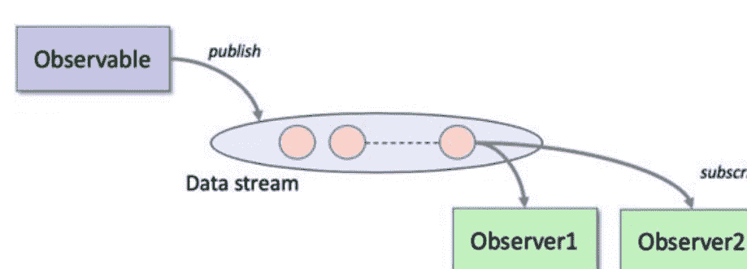

在上图中，可观察者对象将数据发布到数据流。数据流中的数据随后被发送给注册到该可观察者的每个观察者。通过这种方式，数据被广播给可观察者的所有观察者。

通常，可观察者只有在至少有一个观察者可用以处理该数据时才会发布数据。向可观察者注册的过程被称为订阅。因此，一个可观察者可以有零个或多个订阅者（观察者）。

如果可观察者发布数据的速度快于观察者可以处理的速度，那么数据将通过数据流排队。这允许观察者以自己的节奏一次处理接收到的数据；而无需担心数据丢失（只要有足够的内存用于数据流）。

## 热可观察者与冷可观察者

另一个需要理解的有用概念是热可观察者和冷可观察者。

- 冷可观察者是惰性可观察者。也就是说，冷可观察者只有在至少有一个观察者订阅它时才会发布数据。
- 相比之下，热可观察者无论是否有观察者订阅都会发布数据。

## 冷可观察者

冷可观察者除非至少有一个观察者订阅以处理该数据，否则不会发布任何数据。此外，冷可观察者只在观察者准备好处理数据时才向该观察者提供数据；这是因为可观察者-观察者关系更像是一种拉取关系。例如，给定一个将基于范围生成一组值的可观察者，那么该可观察者将在观察者请求时惰性地生成每个结果。

如果观察者花费一些时间处理可观察者发出的数据，那么可观察者将等待观察者准备好处理数据后再发出另一个值。

## 热可观察者

相比之下，热可观察者无论是否有观察者订阅都会发布数据。当观察者注册到可观察者时，它将从那时开始接收数据，只要可观察者发布新数据。如果可观察者已经发布了先前的数据项，那么这些数据将会丢失，观察者将不会收到该数据。

创建热可观察者最常见的场景是当源生产者代表的数据如果未立即处理可能无关紧要，或者可能被后续数据取代时。例如，股票市场价格数据源发布的数据就属于此类。当可观察者包装此数据源时，它可以发布该数据，无论是否有观察者订阅。

## 热可观察者与冷可观察者的影响

了解你拥有的是热可观察者还是冷可观察者很重要，因为这会影响你可以对提供给观察者的数据做出什么假设，从而影响你需要如何设计你的应用程序。如果确保不丢失数据很重要，那么需要注意确保在热可观察者开始发布数据之前订阅者已就位（而对于冷可观察者则无需担心）。

## 事件驱动编程与响应式编程的区别

在事件驱动编程中，事件是为响应某事发生而生成的；然后该事件连同任何关联数据一起表示该事件。例如，如果用户点击鼠标，则可能生成关联的 MouseClickEvent。此对象通常会保存有关鼠标 x 和 y 坐标以及点击了哪个按钮等信息。然后可以将某些行为（如函数或方法）与此事件关联，以便如果事件发生，则调用关联的操作，并将事件对象作为参数提供。这当然是本书前面介绍的 wxPython 库中使用的方法：


从上图可以看出，当生成 MoveEvent 时，会调用 on_move() 方法，并将事件传递给该方法。

在响应式编程方法中，观察者与可观察者相关联。可观察者生成的任何数据都将由观察者接收和处理。无论数据是什么，这都是正确的，因为观察者是可观察者生成数据的处理器，而不是特定类型数据的处理器（如事件驱动方法）。

这两种方法都可以在许多情况下使用。例如，我们可以有一个场景，其中每当股票价格发生变化时，就需要处理一些数据。

这可以使用与 StockPriceEventHandler 关联的 StockPriceChangeEvent 来实现。也可以通过 StockPriceChangeObservable 和 StockPriceChangeObserver 来实现。在任何一种情况下，一个元素处理另一个元素生成的数据。然而，RxPy 库简化了这一过程，并允许观察者在与可观察者相同的线程中运行，或者在单独的线程中运行，只需对代码进行微小的更改。

## 响应式编程的优势

使用响应式编程库有几个优势，包括：

- 它避免了多个回调方法。与使用回调相关的问题有时被称为回调地狱。当有多个回调，所有回调都定义为在生成某些数据或完成某些操作时运行时，就可能发生这种情况。理解、维护和调试此类系统可能很困难。
- 更简单的异步、多线程执行。RxPy 采用的方法使得在具有独立异步函数的多线程环境中执行操作/行为变得非常容易。
- 可用的运算符。RxPy 库预置了大量运算符，使得处理可观察者产生的数据变得更加容易。
- 数据组合。从两个或多个现有可观察者提供的数据组合新的数据流（可观察者）是直接了当的。

## 响应式编程的缺点

当你开始将操作符链接在一起时，很容易使事情变得过于复杂。如果使用了太多的操作符，或者操作符与过于复杂的函数组合，可能会导致难以理解代码的执行逻辑。

许多开发者认为响应式编程本质上是多线程的；但事实并非如此；实际上，RxPy（接下来两章将探讨的库）默认是单线程的。如果应用程序需要异步执行行为，则必须明确指出这一点。

对于某些响应式编程框架而言，另一个问题是存储数据流可能会消耗大量内存，以便观察者（Observers）能够在准备就绪时处理这些数据。

## RxPy 响应式编程框架

RxPy 库是更大的 ReactiveX 项目的一部分，为 Python 提供了 ReactiveX 的实现。它基于可观察对象（Observables）、观察者（Observers）、主题（Subjects）和操作符的概念构建。在本书中，我们使用 RxPy 版本 3。

在下一章中，我们将使用 RxPy 库讨论可观察对象、观察者、主题和订阅。随后的章节将探讨各种 RxPy 操作符。

## 参考资料

有关观察者-可观察对象设计模式的更多信息，请参阅四人组（Gang of Four）的《设计模式》一书：

- E. Gamma, R. Helm, R. Johnson, J. Vlissides, Design patterns: elements of reusable object-oriented software, Addison-Wesley (1995).

## RxPy 可观察对象、观察者和主题

### 简介

在本章中，我们将讨论可观察对象、观察者和主题。我们还将考虑观察者是否可能并发运行。

在本章的剩余部分，我们将探讨 RxPy 版本 3，这是从 RxPy 版本 1 的重大更新（因此，如果你在网上查找示例，需要小心，因为某些方面已经改变；最显著的是操作符的链接方式）。

### RxPy 中的可观察对象

可观察对象是一个发布数据的 Python 类，以便一个或多个观察者（可能在单独的线程中运行）可以处理这些数据。

可以创建可观察对象来发布来自静态数据或动态源的数据。可观察对象可以链接在一起，以控制数据发布的方式和时间，在发布前转换数据，并限制实际发布的数据。

例如，要从值列表创建可观察对象，我们可以使用 `rx.from_list()` 函数。此函数（也称为 RxPy 操作符）用于创建新的可观察对象：

```python
import rx
Observable = rx.from_list([2, 3, 5, 7])
```

### RxPy 中的观察者

我们可以使用 `subscribe()` 方法将观察者添加到可观察对象。此方法可以提供 lambda 函数、命名函数或其实现了观察者协议的对象。

例如，创建观察者最简单的方法是使用 lambda 函数：

```python
# 订阅一个 lambda 函数
observable.subscribe(lambda value: print('Lambda Received', value))
```

当可观察对象发布数据时，将调用 lambda 函数。发布的每个数据项将独立提供给该函数。上述订阅对先前可观察对象的输出是：

```
Lambda Received 2
Lambda Received 3
Lambda Received 5
Lambda Received 7
```

我们也可以使用标准或命名函数作为观察者：

```python
def prime_number_reporter(value):
    print('Function Received', value)
# 订阅一个命名函数
observable.subscribe(prime_number_reporter)
```

请注意，`subscribe()` 方法只使用函数的名称（因为这实际上将函数的引用传递给了该方法）。

如果我们现在使用先前的可观察对象运行此代码，将得到：

```
Function Received 2
Function Received 3
Function Received 5
Function Received 7
```

实际上，`subscribe()` 方法接受四个可选参数。它们是：

- `on_next`：为可观察对象生成的每个数据项调用的操作。
- `on_error`：在可观察对象序列异常终止时调用的操作。
- `on_completed`：在可观察对象序列正常终止时调用的操作。
- `Observer`：要接收通知的对象。你可以使用观察者或回调进行订阅，但不能同时使用两者。

以上每个参数都可以用作位置参数或关键字参数，例如：

```python
# 使用 lambda 设置所有三个函数
observable.subscribe(
    on_next = lambda value: print('Received on_next', value),
    on_error = lambda exp: print('Error Occurred', exp),
    on_completed = lambda: print('Received completed notification')
)
```

上面的代码定义了三个 lambda 函数，它们将根据可观察对象是否提供数据、是否发生错误或数据流何时终止而被调用。此代码的输出是：

```
Received on_next 2
Received on_next 3
Received on_next 5
Received on_next 7
Received completed notification
```

请注意，`on_error` 函数未运行，因为此示例中未发生错误。

`subscribe()` 方法的最后一个可选参数是一个观察者对象。观察者对象可以实现观察者协议，该协议具有以下方法：`on_next()`、`on_completed()` 和 `on_error()`，例如：

```python
class PrimeNumberObserver:
    def on_next(self, value):
        print('Object Received', value)
    def on_completed(self):
        print('Data Stream Completed')
    def on_error(self, error):
        print('Error Occurred', error)
```

此类的实例现在可以通过 `subscribe()` 方法用作观察者：

```python
# 订阅一个观察者对象
observable.subscribe(PrimeNumberObserver())
```

使用先前可观察对象的此示例的输出是：

```
Object Received 2
Object Received 3
Object Received 5
Object Received 7
Data Stream Completed
```

请注意，`on_completed()` 方法也被调用了；但是 `on_error()` 方法未被调用，因为没有产生异常。

观察者类必须确保实现的方法遵循观察者协议（即 `on_next()`、`on_completed()` 和 `on_error()` 方法的签名是正确的）。

### 多个订阅者/观察者

一个可观察对象可以有多个观察者订阅它。在这种情况下，每个观察者都会收到可观察对象发布的所有数据。可以通过多次调用 subscribe 方法将多个观察者注册到一个可观察对象。例如，以下程序有四个订阅者以及注册的 `on_error` 和 `on_completed` 函数：

```python
# 使用列表中的数据创建一个可观察对象
observable = rx.from_list([2, 3, 5, 7])

class PrimeNumberObserver:
    """ 一个观察者类 """
    def on_next(self, value):
        print('Object Received', value)
    def on_completed(self):
        print('Data Stream Completed')
    def on_error(self, error):
        print('Error Occurred', error)

def prime_number_reporter(value):
    print('Function Received', value)

print('Set up Observers / Subscribers')
# 订阅一个 lambda 函数
observable.subscribe(lambda value: print('Lambda Received', value))
# 订阅一个命名函数
observable.subscribe(prime_number_reporter)
# 订阅一个观察者对象
observable.subscribe(PrimeNumberObserver())
# 使用 lambda 设置所有三个函数
observable.subscribe(
    on_next=lambda value: print('Received on_next', value),
    on_error=lambda exp: print('Error Occurred', exp),
    on_completed=lambda: print('Received completed notification')
)
```

此程序的输出是：

```
Set up Observers / Subscribers
Lambda Received 2
Lambda Received 3
Lambda Received 5
Lambda Received 7
Function Received 2
Function Received 3
Function Received 5
Function Received 7
Object Received 2
Object Received 3
Object Received 5
Object Received 7
Data Stream Completed
Received on_next 2
Received on_next 3
Received on_next 5
Received on_next 7
Received completed notification
```

请注意，在下一个订阅者收到数据之前，每个订阅者都收到了所有数据（这是默认的单线程 RxPy 行为）。

### RxPy 中的主题

一个主体（Subject）既是观察者（Observer）也是可观察对象（Observable）。这使得主体能够接收数据项，然后重新发布该数据或由其派生的数据。

例如，想象一个主体接收由外部（相对于接收数据的组织而言）来源发布的股票市场价格数据。该主体可能会在将数据重新发布给其他内部观察者之前，为数据添加时间戳和来源位置。然而，需要注意主体与普通可观察对象之间存在一个微妙的区别。对可观察对象的订阅将在数据发布时触发其独立执行。请注意前一节中，所有消息都是在向下一个观察者发送任何数据之前，先发送给特定观察者的。

主体与所有订阅者共享发布操作，因此它们都将在下一个数据项之前，以链式方式接收相同的数据项。在类层次结构中，主体类是观察者类的直接子类。

以下示例创建了一个主体，它通过为每个数据项添加时间戳来丰富接收到的数据。然后，它将数据项重新发布给任何已订阅它的观察者。

```python
import rx
from rx.subjects import Subject
from datetime import datetime

source = rx.from_list([2, 3, 5, 7])

class TimeStampSubject(Subject):
    def on_next(self, value):
        print('Subject Received', value)
        super().on_next((value, datetime.now()))

    def on_completed(self):
        print('Data Stream Completed')
        super().on_completed()

    def on_error(self, error):
        print('In Subject- Error Occurred', error)
        super().on_error(error)

def prime_number_reporter(value):
    print('Function Received', value)

print('Set up')

# Create the Subject
subject = TimeStampSubject()

# Set up multiple subscribers for the subject
subject.subscribe(prime_number_reporter)
subject.subscribe(lambda value: print('Lambda Received', value))
subject.subscribe(
    on_next = lambda value: print('Received on_next', value),
    on_error = lambda exp: print('Error Occurred', exp),
    on_completed = lambda: print('Received completed notification')
)

# Subscribe the Subject to the Observable source
source.subscribe(subject)

print('Done')
```

请注意，在上面的程序中，观察者是在主体被添加到源可观察对象之前添加到主体的。这确保了观察者在主体开始接收可观察对象发布的数据之前就已经订阅。如果主体在观察者订阅主体之前就订阅了可观察对象，那么所有数据可能在观察者注册到主体之前就已经发布了。

该程序的输出如下：

```
Set up
Subject Received 2
Function Received (2, datetime.datetime(2019, 5, 21, 17, 0, 2, 196372))
Lambda Received (2, datetime.datetime(2019, 5, 21, 17, 0, 2, 196372))
Received on_next (2, datetime.datetime(2019, 5, 21, 17, 0, 2, 196372))
Subject Received 3
Function Received (3, datetime.datetime(2019, 5, 21, 17, 0, 2, 196439))
Lambda Received (3, datetime.datetime(2019, 5, 21, 17, 0, 2, 196439))
Received on_next (3, datetime.datetime(2019, 5, 21, 17, 0, 2, 196439))
Subject Received 5
Function Received (5, datetime.datetime(2019, 5, 21, 17, 0, 2, 196494))
Lambda Received (5, datetime.datetime(2019, 5, 21, 17, 0, 2, 196494))
Received on_next (5, datetime.datetime(2019, 5, 21, 17, 0, 2, 196494))
Subject Received 7
Function Received (7, datetime.datetime(2019, 5, 21, 17, 0, 2, 196548))
Lambda Received (7, datetime.datetime(2019, 5, 21, 17, 0, 2, 196548))
Received on_next (7, datetime.datetime(2019, 5, 21, 17, 0, 2, 196548))
Data Stream Completed
Received completed notification
Done
```

从这个输出可以看出，一旦主体添加了时间戳，数字2、3、5和7就会被所有观察者接收一次。

## 观察者并发

默认情况下，RxPy使用单线程模型；即观察者和观察者在同一个执行线程中执行。然而，这只是默认设置，因为它是最简单的方法。

可以指定当观察者订阅可观察对象时，它应该在单独的线程中运行，方法是在`subscribe()`方法上使用`scheduler`关键字参数。该关键字被赋予一个合适的调度器，例如`rx.concurrency.NewThreadScheduler`。该调度器将确保观察者在单独的线程中运行。

要查看差异，请看以下两个程序。程序之间的主要区别在于使用了特定的调度器：

```python
import rx

Observable = rx.from_list([2, 3, 5])
observable.subscribe(lambda v: print('Lambda1 Received', v))
observable.subscribe(lambda v: print('Lambda2 Received', v))
observable.subscribe(lambda v: print('Lambda3 Received', v))
```

第一个版本的输出如下：

```
Lambda1 Received 2
Lambda1 Received 3
Lambda1 Received 5
Lambda2 Received 2
Lambda2 Received 3
Lambda2 Received 5
Lambda3 Received 2
Lambda3 Received 3
Lambda3 Received 5
```

`subscribe()`方法接受一个可选的关键字参数`scheduler`，允许提供一个调度器对象。现在，如果我们指定几个不同的调度器，我们将看到效果是并发运行观察者，导致输出交织在一起：

```python
import rx
from rx.concurrency import NewThreadScheduler, ThreadPoolScheduler, ImmediateScheduler

Observable = rx.from_list([2, 3, 5])
observable.subscribe(lambda v: print('Lambda1 Received', v),
                     scheduler=ThreadPoolScheduler(3))
observable.subscribe(lambda v: print('Lambda2 Received', v),
                     scheduler=ImmediateScheduler())
observable.subscribe(lambda v: print('Lambda3 Received', v),
                     scheduler=NewThreadScheduler())

# As the Observable runs in a separate thread need
# ensure that the main thread does not terminate
input('Press enter to finish')
```

请注意，我们必须确保运行程序的主线程不会终止（因为所有观察者现在都在自己的线程中运行），方法是等待用户输入。此版本的输出是：

```
Lambda2 Received 2
Lambda1 Received 2
Lambda2 Received 3
Lambda2 Received 5
Lambda1 Received 3
Lambda1 Received 5
Press enter to finish
Lambda3 Received 2
Lambda3 Received 3
Lambda3 Received 5
```

默认情况下，`subscribe()`方法上的`scheduler`关键字默认为`None`，表示当前线程将用于订阅可观察对象。

## 可用调度器

为了支持不同的调度策略，RxPy库提供了两个模块，它们提供不同的调度器：`rx.concurrency`和`rx.concurrency.mainloopscheduler`。这些模块包含各种调度器，包括下面列出的那些。

`rx.concurrency`模块中可用的调度器有：

-   `ImmediateScheduler` 此调度器安排一个操作立即执行。
-   `CurrentThreadScheduler` 此调度器为当前线程安排活动。
-   `TimeoutScheduler` 此调度器通过定时回调工作。
-   `NewThreadScheduler` 为每个工作单元在单独的线程上创建一个调度器。
-   `ThreadPoolScheduler` 这是一个利用线程池执行工作的调度器。此调度器可以作为限制并发执行工作量的一种方式。

`rx.concurrency.mainloopscheduler`模块还定义了以下调度器：

-   `IOLoopScheduler` 一个通过Tornado I/O主事件循环安排工作的调度器。
-   `PyGameScheduler` 一个为PyGame安排工作的调度器。
-   `WxScheduler` 一个用于wxPython事件循环的调度器。

## 尝试

给定以下表示股票/股权价格的元组集合：

```python
stocks = (('APPL', 12.45), ('IBM', 15.55), ('MSFT', 5.66), ('APPL', 13.33))
```

编写一个程序，基于股票数据创建一个可观察对象。接下来，订阅三个不同的观察者到该可观察对象。第一个应该打印股票价格，第二个应该打印股票名称，第三个应该打印整个元组。

## RxPy 操作符

### 简介

在本章中，我们将探讨 RxPy 提供的、可应用于 Observable 所发出数据的操作符类型。

## 响应式编程操作符

Observable 与 Observer 之间的交互背后是一条数据流。也就是说，Observable 向一个消费/处理该数据流的 Observer 提供数据流。可以对这条数据流应用操作符，用于过滤、转换以及总体上优化数据提供给 Observer 的方式和时机。

这些操作符主要定义在 `rx.operators` 模块中，例如 `rx.operators.average()`。不过，通常会使用一个别名来引用该模块，例如将操作符模块称为 `op`，如 **from rx import operators as op**。这样在引用操作符时就可以使用简写形式，例如 `op.average()`。

许多 RxPy 操作符会执行一个函数，该函数应用于 Observable 产生的每个数据项。另一些操作符可用于创建一个初始的 Observable（实际上你已经在 `from_list()` 操作符的形式中见过这些操作符了）。还有一组操作符可用于基于 Observable 产生的数据生成结果（例如 `sum()` 操作符）。

事实上，RxPy 提供了种类繁多的操作符，这些操作符可以分类如下：

-   创建型，
-   转换型，
-   组合型，
-   过滤型，
-   错误处理型，
-   条件与布尔型操作符，
-   数学型，
-   可连接型。

本节的其余部分将介绍其中一些类别的示例。

## 管道操作符

要将创建型操作符以外的操作符应用于 Observable，需要创建一个管道。管道本质上是一系列可以应用于 Observable 生成的数据流的一个或多个操作。应用管道的结果是生成一个新的数据流，该数据流代表了依次应用每个操作符后产生的结果。下图对此进行了说明：

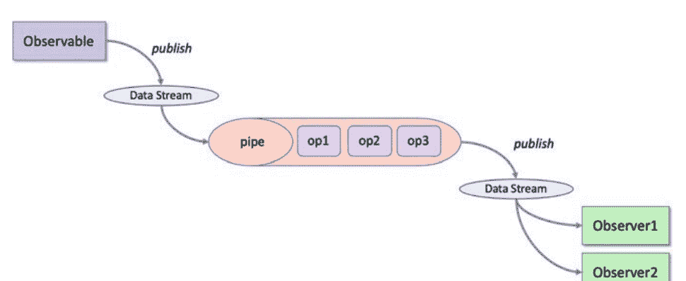

要创建管道，需使用 `Observable.pipe()` 方法。此方法接受一个以逗号分隔的一个或多个操作符列表，并返回一个数据流。然后，Observer 可以订阅该管道的数据流。这可以在本章其余部分关于转换、过滤、数学操作符等的示例中看到。

## 创建型操作符

你已经在本章前面的示例中见过创建型操作符的例子了。这是因为 `rx.from_list()` 操作符就是一个创建型操作符的例子。它用于基于存储在类似列表结构中的数据创建一个新的 Observable。

`from_list()` 的一个更通用的版本是 `from_()` 操作符。此操作符接受一个可迭代对象，并基于该可迭代对象提供的数据生成一个 Observable。任何实现了可迭代协议的对象都可以使用，包括用户定义的类型。还有一个操作符 `from_iterable()`。这三个操作符的功能相同，你可以根据哪个在你的上下文中最具语义意义来选择使用哪个。

以下三条语句具有相同的效果：

```
source = rx.from_([2, 3, 5, 7])
source = rx.from_iterable([2, 3, 5, 7])
source = rx.from_list([2, 3, 5, 7])
```

下图对此进行了图示说明：

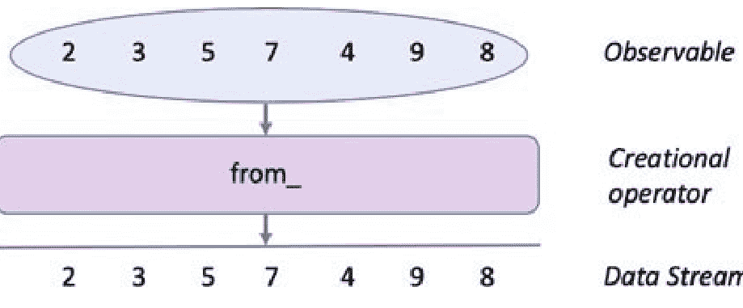

另一个创建型操作符是 `rx.range()` 操作符。此操作符为一个整数范围生成一个 Observable。该范围可以指定起始值（或不指定）以及增量（或不指定）。但是，范围中的最大值必须始终提供，例如：

```
obs1 = rx.range(10)
obs2 = rx.range(0, 10)
obs3 = rx.range(0, 10, 1)
```

## 转换型操作符

`rx.operators` 模块中定义了几个转换型操作符，包括 `rx.operators.map()` 和 `rx.operators.flat_map()`。`rx.operators.map()` 操作符将一个函数应用于 Observable 生成的每个数据项。

`rx.operators.flat_map()` 操作符也将一个函数应用于每个数据项，但随后对结果应用一个扁平化操作。例如，如果结果是一个列表的列表，那么 `flat_map` 会将其扁平化为一个单一的列表。在本节中，我们将重点关注 `rx.operators.map()` 操作符。

`rx.operators.map()` 操作符允许将一个函数应用于 Observable 生成的所有数据项。该函数的结果随后作为 `map()` 操作符的 Observable 的结果返回。该函数通常用于对提供的数据执行某种形式的转换。这可以是为所有整数值加一、将数据格式从 XML 转换为 JSON、用附加信息（如数据获取时间、数据提供者等）丰富数据。

在下面给出的示例中，我们将原始 Observable 提供的整数值集合转换为字符串。在图中，这些字符串包含引号以突出显示它们实际上是字符串：

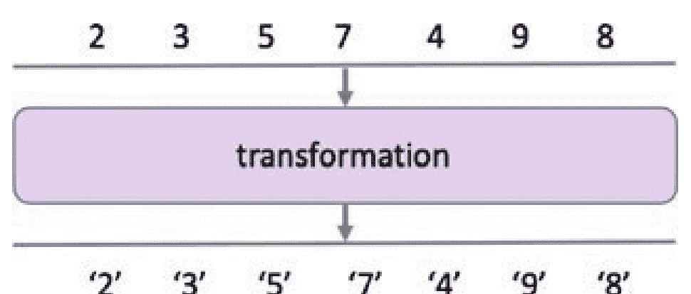

这是转换型操作符的典型用法；即将数据从一种格式更改为另一种格式，或向数据添加信息。

实现此场景的代码如下所示。请注意使用 `pipe()` 方法将操作符应用于 Observable 生成的数据流：

```
# Apply a transformation to a data source to convert
# integers into strings
import rx
from rx import operators as op
# Set up a source with a map function
source = rx.from_list([2, 3, 5, 7]).pipe(
    op.map(lambda value: "'" + str(value) + "'")
)
# Subscribe a lambda function
source.subscribe(lambda value: print('Lambda Received', value,
    ' is a string ', isinstance(value, str)))
```

此程序的输出为：

Lambda Received ‘2’ is a string True
Lambda Received ‘3’ is a string True
Lambda Received ‘5’ is a string True
Lambda Received ‘7’ is a string True

## 组合型操作符

组合型操作符以某种方式组合多个数据项。组合型操作符的一个例子是 `rx.merge()` 操作符。此操作符将两个 Observable 产生的数据合并到一个单一的 Observable 数据流中。例如：

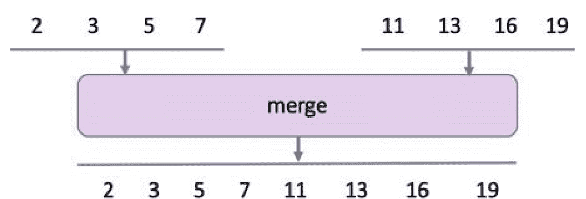

在上图中，两个 Observable 由序列 2, 3, 5, 7 和序列 11, 13, 16, 19 表示。这些 Observable 被提供给 merge 操作符，该操作符生成一个单一的 Observable，该 Observable 将提供源自两个原始 Observable 的数据。这是一个不接受函数而是接受两个 Observable 的操作符的例子。

表示上述场景的代码如下：

```
# An example illustrating how to merge two data sources
import rx
# Set up two sources
source1 = rx.from_list([2, 3, 5, 7])
source2 = rx.from_list([10, 11, 12])
# Merge two sources into one
rx.merge(source1, source2).subscribe(lambda v: print(v, end=','))
```

请注意，在这种情况下，我们直接订阅了 `merge()` 操作符返回的 Observable，而没有将其存储在中间变量中（这是一个设计决策，两种方法都是可以接受的）。

此程序的输出如下：

2,3,5,7,10,11,12,

请注意输出中原始 Observable 中的数据是如何交织在 `merge()` 操作符生成的 Observable 的输出中的。

## 过滤型操作符

此分类中包含多个运算符，例如 `rx.operators.filter()`、`rx.operators.first()`、`rx.operators.last()` 和 `rx.operators.distinct()`。`filter()` 运算符仅允许那些通过传入函数定义的测试表达式的数据项通过。该函数必须返回 `True` 或 `False`。任何导致函数返回 `True` 的数据项都允许通过过滤器。

例如，假设传入 `filter()` 的函数设计为仅允许偶数通过。如果数据流包含数字 2、3、5、7、4、9 和 8，则 `filter()` 将仅发出数字 2、4 和 8。如下图所示：

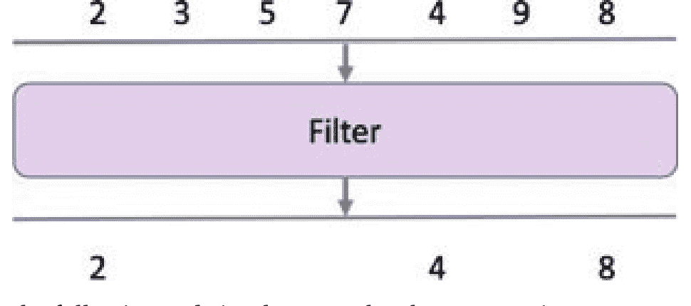

以下代码实现了上述场景：

```python
# Filter source for even numbers
import rx
from rx import operators as op
# Set up a source with a filter
source = rx.from_list([2, 3, 5, 7, 4, 9, 8]).pipe(
    op.filter(lambda value: value % 2 == 0)
)
# Subscribe a lambda function
source.subscribe(lambda value: print('Lambda Received', value))
```

在上面的代码中，`rx.operators.filter()` 运算符接受一个 lambda 函数，该函数将验证当前值是否为偶数（注意，这也可以是一个命名函数或对象的方法等）。它通过 `pipe()` 方法应用于 Observable 生成的数据流。此示例生成的输出为：

```
Lambda Received 2
Lambda Received 4
Lambda Received 8
```

`first()` 和 `last()` 运算符仅发出 Observable 发布的第一个和最后一个数据项。

`distinct()` 运算符抑制 Observable 发布的重复项。例如，在以下用作 Observable 数据的列表中，数字 2 和 3 是重复的：

```python
# Use distinct to suppress duplicates
source = rx.from_list([2, 3, 5, 2, 4, 3, 2]).pipe(
    op.distinct()
)
# Subscribe a lambda function
source.subscribe(lambda value: print('Received', value))
```

然而，当程序生成输出时，所有重复项都已被抑制：

```
Received 2
Received 3
Received 5
Received 4
```

## 数学运算符

数学和聚合运算符对 Observable 提供的数据流执行计算。例如，`rx.operators.average()` 运算符可用于计算 Observable 发布的一组数字的平均值。类似地，`rx.operators.max()` 可以选择最大值，`rx.operators.min()` 选择最小值，`rx.operators.sum()` 将对发布的所有数字求和等。

下面给出了使用 `rx.operators.sum()` 运算符的示例：

```python
# Example of summing all the values in a data stream
import rx
from rx import operators as op
# Set up a source and apply sum
rx.from_list([2, 3, 5, 7]).pipe(
    op.sum()
).subscribe(lambda v: print(v))
```

`rx.operators.sum()` 运算符的输出是 Observable 发布的数据项的总和（在本例中是 2、3、5 和 7 的总和）。订阅到 `rx.operators.sum()` 运算符 Observable 的 Observer 函数将打印出此值：

```
17
```

然而，在某些情况下，除了最终值之外，通知中间运行总计也可能很有用，以便链中的其他运算符可以对这些小计做出反应。这可以使用 `rx.operators.scan()` 运算符来实现。`rx.operators.scan()` 运算符实际上是一个转换运算符，但在此情况下可用于提供数学运算。`scan()` 运算符对 Observable 发布的每个数据项应用一个函数，并为接收到的每个值生成自己的数据项。每个生成的值都会传递给 `scan()` 函数的下一次调用，同时也会发布到 `scan()` 运算符的 Observable 数据流。因此，可以从先前的小计和获得的新值生成运行总计。如下所示：

```python
import rx
from rx import operators as op
# Rolling or incremental sum
rx.from_([2, 3, 5, 7]).pipe(
    op.scan(lambda subtotal, i: subtotal+i)
).subscribe(lambda v: print(v))
```

此示例的输出为：

```
2
5
10
17
```

这意味着每个小计以及最终总计都会被发布。

## 链式运算符

RxPy 数据流处理方法的一个有趣之处在于，可以对 Observable 生成的数据流应用多个运算符。

前面讨论的运算符实际上返回另一个 Observable。这个新的 Observable 可以基于原始数据流和应用运算符的结果提供自己的数据流。这允许将另一个运算符按顺序应用于新 Observable 产生的数据。这允许将运算符链接在一起，以提供对原始 Observable 发布的数据的复杂处理。

例如，我们可能首先过滤 Observable 的输出，使得仅发布某些数据项。然后我们可能以 `map()` 运算符的形式对该数据应用转换，如下所示：

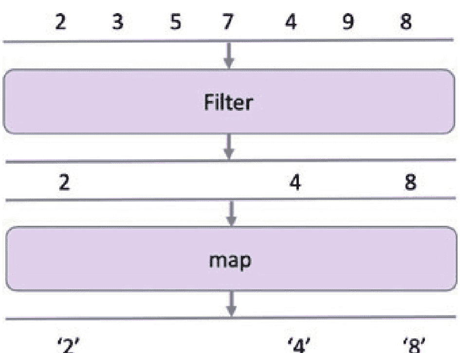

注意我们应用运算符的顺序；我们首先过滤掉不感兴趣的数据，然后应用转换。这比以相反顺序应用运算符更有效，因为在上面的示例中我们不需要转换奇数值。因此，通常会尝试将过滤运算符尽可能推到链的上游。

用于生成链式运算符集的代码如下所示。在这种情况下，我们使用 lambda 函数来定义 `filter()` 函数和 `map()` 函数。运算符应用于从提供的列表获得的 Observable。Observable 生成的数据流由 pipe 中定义的每个运算符处理。由于现在有两个运算符，pipe 包含两个运算符，并充当数据流经的管道。

用作 Observable 数据初始源的列表包含一系列偶数和奇数。`filter()` 函数仅选择偶数，`map()` 函数将整数值转换为字符串。然后我们将一个 Observer 函数订阅到由转换 `map()` 运算符产生的 Observable。

```python
# Example of chaining operators together
import rx
from rx import operators as op
# Set up a source with a filter
source = rx.from_list([2, 3, 5, 7, 4, 9, 8])
pipe = source.pipe(
    op.filter(lambda value: value % 2 == 0),
    op.map(lambda value: "'"+ str(value) + "'")
)
# Subscribe a lambda function
pipe.subscribe(lambda value: print('Received', value))
```

此应用程序的输出如下：

```
Received '2'
Received '4'
Received '8'
```

这清楚地表明，只有三个偶数（2、4 和 8）被允许通过到 `map()` 函数。

## 在线资源

有关 RxPy 的信息，请参阅以下在线资源：

- [https://rxpy.readthedocs.io/en/latest/](https://rxpy.readthedocs.io/en/latest/) RxPy 库的文档。
- [https://rxpy.readthedocs.io/en/latest/operators.html](https://rxpy.readthedocs.io/en/latest/operators.html) 可用 RxPy 运算符列表。

## 尝试

给定以下表示股票/股权价格的元组集：

```python
stocks = (('APPL', 12.45), ('IBM', 15.55), ('MSFT', 5.66), ('APPL', 13.33))
```

提供以下问题的解决方案：

- 选择所有 'APPL' 股票
- 选择所有价格超过 15.00 的股票
- 查找所有 'APPL' 股票的平均价格。

现在使用第二组元组，并将它们与第一组股票价格合并：

```python
stocks2 = (('GOOG', 8.95), ('APPL', 7.65), ('APPL', 12.45), ('MSFT', 5.66), ('GOOG', 7.56), ('IBM', 12.76))
```

将每个元组转换为列表，并计算该股票 25 股的价值是多少，将此作为结果打印出来）。

- 查找价值最高的股票。
- 查找价值最低的股票。
- 仅发布唯一的数据项（即，抑制重复项）。

## 套接字与Web服务简介

## 引言

在接下来的两章中，我们将探讨基于套接字和Web服务的进程间通信方法。这些进程可能运行在同一台计算机上，也可能运行在同一局域网内的不同计算机上，甚至可能地理位置相距遥远。在所有情况下，信息都是通过互联网套接字，由一个进程中运行的程序发送到另一个独立进程中运行的程序。本章将介绍网络编程涉及的核心概念。

## 套接字

套接字，或者更准确地说是互联网协议套接字，为底层操作系统管理的网络协议栈提供了一个编程接口。使用这样的API意味着程序员可以抽象掉（可能位于）不同计算机上的进程之间如何交换数据的底层细节，转而专注于解决方案的更高层次方面。

有多种不同类型的IP套接字可用，但本书的重点是流套接字。流套接字使用传输控制协议来发送消息。这种套接字通常被称为TCP/IP套接字。

TCP确保数据在两个设备（或主机）之间的连接上进行有序且可靠的传输。这一点很重要，因为TCP保证对于发送的每一条消息，不仅会到达接收主机，而且消息会按正确的顺序到达。

TCP的一个常见替代方案是用户数据报协议。UDP不提供任何传输保证（即消息可能会丢失或乱序到达）。然而，UDP是一种更简单的协议，对于广播系统特别有用，在这种系统中，多个客户端可能需要接收服务器主机发布的数据（特别是当数据丢失不是问题时）。

## Web服务

Web服务是由主机计算机提供的一种服务，远程客户端可以使用超文本传输协议来调用它。HTTP可以在任何可靠的流传输协议上运行，尽管它通常在TCP/IP上使用。

它最初设计用于允许数据在HTTP服务器和Web浏览器之间传输，以便数据可以以人类可读的形式呈现给用户。然而，当与Web服务一起使用时，它用于支持客户端和服务器之间使用机器可读数据格式的程序到程序通信。目前，这种格式最典型的是JSON，尽管过去经常使用XML。

## 服务寻址

连接到互联网的每个设备（主机）都有一个唯一的标识（我们在此忽略私有网络）。这个唯一标识表示为一个IP地址。使用IP地址，我们可以将套接字连接到互联网上任何地方的特定主机。因此，通过这种方式可以连接到各种各样的设备类型，从打印机到收银机再到冰箱，以及服务器、大型机和PC等。

IP地址具有通用格式，例如144.124.16.237。IPv4地址始终是由句点分隔的四个数字组成。每个数字的范围是0–255，因此IP地址的完整范围是从0.0.0.0到255.255.255.255。

IP地址可以分为两部分：表示主机所连接网络的部分和主机的ID，例如：

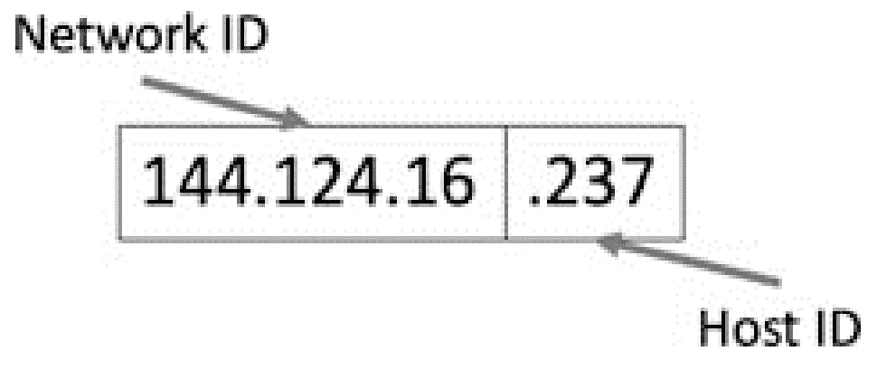

因此：

- IP地址的网络ID部分标识主机当前所在的特定网络。
- 主机ID是IP地址中指定网络上特定设备（如你的计算机）的部分。

在任何给定的网络上，可能有多个主机，每个主机都有自己的主机ID，但共享一个网络ID。例如，在一个私有家庭网络中，可能有：

- 192.168.1.1 Jasmine的笔记本电脑。
- 192.168.1.2 Adam的PC
- 192.168.1.3 家用打印机
- 192.168.1.4 智能电视

在许多方面，IP地址的网络ID和主机ID部分就像街道上房屋的邮政地址。街道可能有一个名称，例如柯勒律治大道，并且街道上可能有多栋房屋。每栋房屋都有一个唯一的号码；因此，柯勒律治大道10号通过门牌号与柯勒律治大道20号区分开来。

此时，你可能想知道在Web浏览器中看到的URL（如[www.bbc.co.uk](http://www.bbc.co.uk)）是如何起作用的。这些是文本名称，实际上映射到一个IP地址。这种映射由称为域名系统的服务器执行。DNS服务器充当查找服务，为特定的文本URL名称提供实际的IP地址。主机地址存在英文文本版本是因为人类更容易记住（希望是有意义的）名称，而不是看起来像随机数字序列的东西。

有几个网站可以用来查看这些映射（本章末尾提供了一个）。下面给出了一些英文文本名称如何映射到IP地址的示例：

- [www.aber.ac.uk](http://www.aber.ac.uk) 映射到 144.124.16.237
- [www.uwe.ac.uk](http://www.uwe.ac.uk) 映射到 164.11.132.96
- [www.bbc.net.uk](http://www.bbc.net.uk) 映射到 212.58.249.213
- [www.gov.uk](http://www.gov.uk) 映射到 151.101.188.144

请注意，这些映射在撰写本文时是正确的；它们可能会发生变化，因为可以向DNS服务器提供新的条目，导致特定的文本名称映射到不同的物理主机。

## Localhost

有一个特殊的IP地址通常在主机计算机上可用，对开发人员和测试人员非常有用。这个IP地址是：

127.0.0.1

它也被称为localhost，通常更容易记住。Localhost（和127.0.0.1）用于在程序运行时指代你当前所在的计算机；即你的本地主机计算机（因此得名localhost）。

例如，如果你在本地计算机上启动一个套接字服务器，并希望在同一台计算机上运行的客户端套接字程序连接到服务器程序；你可以通过让它连接到localhost来告诉它这样做。

当你不知道本地计算机的IP地址，或者因为代码可能在多个不同的计算机上运行，而每台计算机都有自己的IP地址时，这特别有用。如果你正在编写测试代码，供开发人员在不同的开发（主机）机器上运行自己的测试时使用，这种情况尤其常见。

我们将在接下来的两章中使用localhost作为指定查找服务器程序位置的一种方式。

## 端口号

每个互联网设备/主机通常可以支持多个进程。因此，有必要确保每个进程都有自己独立的通信通道。为此，每个主机都有多个端口可供程序连接。例如，端口80通常保留给HTTP Web服务器，而端口25保留给SMTP服务器。这意味着如果客户端想要连接到特定计算机上的HTTP服务器，那么它必须指定该主机上的端口80，而不是端口25。

端口号写在主机的IP地址之后，并用冒号与地址分隔，例如：

- [www.aber.ac.uk:80](http://www.aber.ac.uk:80) 表示主机上的端口80，该主机通常运行HTTP服务器，在本例中是阿伯里斯特威斯大学的服务器。
- localhost:143 这表示你希望连接到端口143，该端口通常保留给本地机器上的IMAP服务器。
- [www.uwe.ac.uk:25](http://www.uwe.ac.uk:25) 这表示在布里斯托尔西英格兰大学运行的主机上的端口25。端口25通常保留给SMTP服务器。

IP系统中的端口号是16位数字，范围在0–65536之间。通常，低于1024的端口号保留给预定义的服务（这意味着除非你希望与这些服务之一通信，如telnet、SMTP邮件、ftp等，否则应避免使用它们）。因此，在设置自己的服务时，通常选择高于1024的端口号。

## IPv4与IPv6

我们在本章中描述的关于IP地址的内容，实际上是基于互联网协议第4版的。这个版本的互联网协议是在20世纪70年代开发的，并于1981年9月由IETF发布（取代了1980年1月发布的早期定义）。这个版本的标准使用32个二进制位作为主机地址的每个元素（因此地址的每个部分的范围是0到255）。这提供了总共42.9亿个可能的唯一地址。这在1981年看来是一个巨大的数量，对于当时构想的互联网来说无疑是足够的。

自1981年以来，互联网不仅已成为万维网本身的支柱，也成为物联网概念的支柱（在物联网中，从你的冰箱、中央供暖系统到烤面包机，每一个可能的设备都可能连接到互联网）。这种互联网可寻址设备/主机的潜在爆炸式增长，在1990年代中期引发了对使用IPv4可能耗尽互联网地址的担忧。因此，国际互联网工程任务组设计了一个新版本的互联网协议：互联网协议第6版（或IPv6）。该协议于2017年7月被批准为互联网标准。

IPv6为每个主机地址中的元素使用128位地址。它还使用八组数字（而不是四组），并用冒号分隔。每组数字包含四个十六进制数字。

以下展示了IPv6地址的外观：

```
2001:0DB8:AC10:FE01:EF69:B5ED:DD57:2CLE
```

IPv6协议的采用速度比最初预期的要慢，这部分是因为IPv4和IPv6在设计上并不兼容，但也因为IPv4地址的使用速度没有许多人最初担心的那么快（部分原因是私有网络的使用）。然而，随着时间的推移，随着更多组织转向使用IPv6，这种情况很可能会改变。

## 38.8 Python中的套接字与Web服务

接下来的两章将讨论如何在Python中实现套接字和Web服务。第一章讨论通用套接字和HTTP服务器套接字。第二章探讨如何使用Flask库创建通过HTTP运行的Web服务，这些服务使用TCP/IP套接字。

## 在线资源

有关信息，请参阅以下在线资源

- [https://en.wikipedia.org/wiki/Network_socket](https://en.wikipedia.org/wiki/Network_socket) 维基百科关于套接字的页面。
- [https://en.wikipedia.org/wiki/Web_service](https://en.wikipedia.org/wiki/Web_service) 维基百科关于Web服务的页面。
- [https://codebeautify.org/website-to-ip-address](https://codebeautify.org/website-to-ip-address) 提供从URL到IP地址的映射。
- [https://en.wikipedia.org/wiki/IPv4](https://en.wikipedia.org/wiki/IPv4) 维基百科关于IPv4的页面。
- [https://en.wikipedia.org/wiki/IPv6](https://en.wikipedia.org/wiki/IPv6) 维基百科关于IPv6的页面。
- [https://www.techopedia.com/definition/28503/dns-server](https://www.techopedia.com/definition/28503/dns-server) DNS简介。

## Python中的套接字

### 简介

套接字是独立进程之间通信链路中的一个端点。在Python中，套接字是对象，它们提供了一种直接且与平台无关的方式在两个进程之间交换信息。

在本章中，我们将介绍套接字通信的基本概念，然后展示一个简单的套接字服务器和客户端应用程序。

### 套接字到套接字通信

当两个操作系统级别的进程希望通信时，它们可以通过套接字进行通信。每个进程都有一个套接字连接到另一个进程的套接字。然后，一个进程可以将信息写入套接字，而第二个进程可以从套接字读取信息。

每个套接字都关联着两个流，一个用于输入，一个用于输出。因此，要将信息从一个进程传递到另一个进程，你需要将信息写入一个套接字对象的输出流，并从另一个套接字对象的输入流中读取它（假设两个套接字已连接）。

有几种不同类型的套接字可用，但在本章中，我们将重点讨论TCP/IP套接字。这种套接字是面向连接的套接字，它将保证数据的交付（或在数据交付失败时发出通知）。TCP/IP，即传输控制协议/互联网协议，是一套通信协议，用于在互联网或私有内网中互连网络设备。TCP/IP实际上规定了数据如何在互联网上的程序之间交换，它提供端到端通信，指明数据应如何分解成数据包、寻址、传输、路由并在目的地接收。

### 建立连接

要建立连接，一个进程必须运行一个等待连接的程序，而另一个进程必须尝试连接到第一个程序。第一个被称为服务器套接字，而第二个则简称为套接字。

第二个进程要连接到第一个（服务器套接字），它必须知道第一个进程运行在哪台机器上以及它连接到哪个端口。

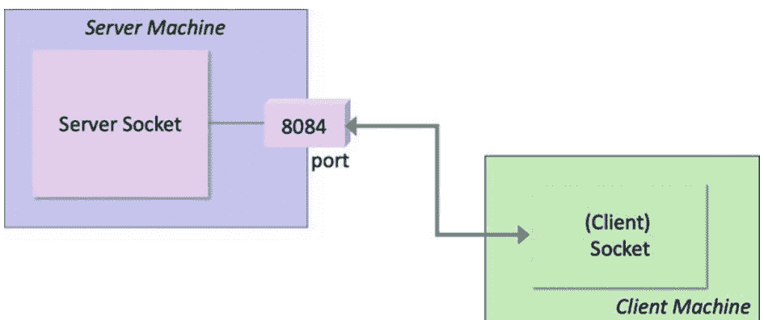

例如，在上图中，服务器套接字连接到端口8084。反过来，客户端套接字连接到服务器运行的机器以及该机器上的端口号8084。

在服务器套接字接受连接之前，什么都不会发生。在那一刻，套接字连接起来，套接字流相互绑定。这意味着服务器的输出流连接到客户端套接字的输入流，反之亦然。

### 一个客户端-服务器应用示例

#### 系统结构

上图说明了我们试图构建的系统的基本结构。将有一个服务器对象在一台机器上运行，一个客户端对象在另一台机器上运行。客户端将使用套接字连接到服务器以获取信息。

本示例中实现的实际应用程序是一个通讯录查询应用程序。公司员工的地址保存在一个字典中。这个字典在服务器程序中设置，但同样可以保存在数据库等中。当客户端连接到服务器时，它可以获取员工的办公室地址。

#### 实现服务器应用程序

我们将首先描述服务器应用程序。这是将服务于客户端应用程序请求的Python应用程序。为此，它必须提供一个服务器套接字供客户端连接。这是通过首先将服务器套接字绑定到服务器机器上的一个端口来完成的。然后服务器程序必须监听传入的连接。以下清单展示了服务器程序的源代码。

```python
import socket
def main():
    # Setup names and offices
    addresses = {'JOHN': 'C45',
                 'DENISE': 'C44',
                 'PHOEBE': 'D52',
                 'ADAM': 'B23'}
    print('Starting Server')
    print('Create the socket')
    sock = socket.socket(socket.AF_INET,
                         socket.SOCK_STREAM)
    print('Bind the socket to the port')
    server_address = (socket.gethostname(),
                      8084)
    print('Starting up on', server_address)
    sock.bind(server_address)
    # specifies the number of connections allowed
    print('Listen for incoming connections')
    sock.listen(1)
    while True:
        print('Waiting for a connection')
        connection, client_address = sock.accept()
        try:
            print('Connection from', client_address)
            while True:
                data = connection.recv(1024).decode()
                print('Received: ', data)
                if data:
                    key = str(data).upper()
                    response = addresses[key]
                    print('sending data back to the client: ', response)
                    connection.sendall(response.encode())
                else:
                    print('No more data from', client_address)
                    break
        finally:
            connection.close()

if __name__ == '__main__':
    main()
```

上述清单中的服务器设置地址以包含一个包含姓名和地址的字典。

然后它等待客户端连接。这是通过创建一个套接字并将其绑定到特定端口（本例中为端口8084）来完成的：

```python
print('Create the socket')
sock = socket.socket(socket.AF_INET,
                     socket.SOCK_STREAM)
print('Bind the socket to the port')
server_address = (socket.gethostname(),
                  8084)
```

套接字对象的构造将在下一节中更详细地讨论。接下来，服务器监听来自客户端的连接。注意，sock.listen()方法接受值1，表示它一次处理一个连接。

然后设置一个无限循环来运行服务器。当客户端发起连接时，连接和客户端地址信息会被提供。当客户端有数据可用时，会使用`recv`函数读取数据。请注意，从客户端接收的数据被假定为字符串。然后，该字符串将用作键，在地址字典中查找对应的地址。

一旦获取到地址，就可以将其发送回客户端。在Python 3中，需要对字符串格式进行`decode()`和`encode()`操作，以转换为通过套接字流传输的原始数据。请注意，使用完套接字后应始终将其关闭。

## 套接字类型与域

当我们在上面创建套接字类时，向套接字构造函数传递了两个参数：

```python
socket(socket.AF_INET, socket.SOCK_STREAM)
```

要理解传递给`socket()`构造函数的这两个值，需要了解套接字是根据两个属性来表征的：其域和其类型。

套接字的域本质上定义了用于在进程之间传输数据的通信协议。它还包含了套接字的命名方式（以便在建立通信时可以引用它们）。

Unix系统上提供两个标准域：`AF_UNIX`代表系统内通信，数据通过内核内存缓冲区在进程间移动；`AF_INET`代表使用TCP/IP协议套件进行通信；在这种情况下，进程可能在同一台机器上，也可能在不同的机器上。

套接字的类型表示数据如何通过套接字传输。这里主要有两种选择：
- 数据报套接字支持基于消息的模型，不涉及连接，通信不保证可靠。
- 流套接字支持虚拟电路模型，数据以字节流形式交换，连接是可靠的。

根据域的不同，可能还有其他套接字类型可用，例如支持在可靠连接上传递消息的类型。

## 实现客户端应用程序

客户端应用程序本质上是一个非常简单的程序，它创建与服务器应用程序的连接。为此，它创建一个套接字对象，连接到服务器的主机机器，在我们的例子中，该套接字连接到端口8084。

一旦建立连接，客户端就可以将编码后的消息字符串发送给服务器。服务器随后会发回一个响应，客户端必须对其进行解码。然后关闭连接。

客户端的实现如下所示：

```python
import socket

def main():
    print('Starting Client')
    print('Create a TCP/IP socket')
    sock = socket.socket(socket.AF_INET, socket.SOCK_STREAM)
    print('Connect the socket to the server port')
    server_address = (socket.gethostname(), 8084)
    print('Connecting to: ', server_address)
    sock.connect(server_address)
    print('Connected to server')
    try:
        print('Send data')
        message = 'John'
        print('Sending: ', message)
        sock.send(message.encode())
        data = sock.recv(1024).decode()
        print('Received from server: ', data)
    finally:
        print('Closing socket')
        sock.close()

if __name__ == '__main__':
    main()
```

两个程序的输出需要结合在一起考虑。

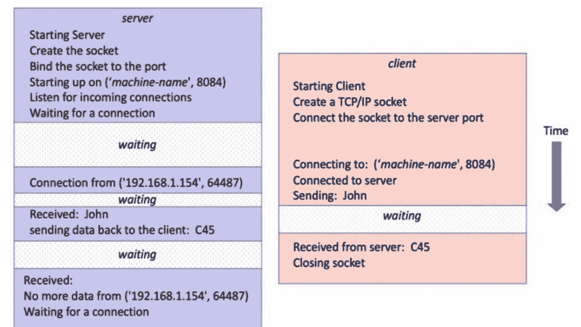

从这个图中可以看出，服务器等待来自客户端的连接。当客户端连接到服务器时；服务器等待从客户端接收数据。此时，客户端必须等待从服务器发送过来的数据。然后服务器设置响应数据并将其发送回客户端。客户端接收并打印出来，然后关闭连接。与此同时，服务器一直在等待查看是否有来自客户端的更多数据；当客户端关闭连接时，服务器知道客户端已完成，并返回等待下一个连接。

## Socket Server模块

在上面的例子中，服务器代码比客户端更复杂；而且这只是一个单线程服务器；如果服务器需要是多线程服务器（即一个可以同时处理来自不同客户端的多个请求的服务器），情况可能会变得复杂得多。

然而，`socket server`模块提供了一种更方便的、面向对象的方法来创建服务器。此类应用程序所需的大部分样板代码都在类中定义，开发人员只需提供自己的类或重写方法来定义所需的具体功能。

`socket server`模块中定义了五个不同的服务器类。

- `BaseServer`是服务器类层次结构的根；它实际上并不打算直接实例化和使用。相反，它被`TCPServer`和其他类扩展。
- `TCPServer`使用TCP/IP套接字进行通信，可能是最常用的套接字服务器类型。
- `UDPServer`提供对数据报套接字的访问。
- `UnixStreamServer`和`UnixDatagramServer`使用Unix域套接字，仅在Unix平台上可用。

处理请求的责任在服务器类和请求处理程序类之间划分。服务器处理通信问题（在套接字和端口上监听、接受连接等），而请求处理程序处理请求问题（解释传入数据、处理它、将数据发送回客户端）。

这种责任划分意味着在许多情况下，你可以简单地使用现有的服务器类之一而无需任何修改，并为其提供一个自定义的请求处理程序类来协同工作。

以下示例定义了一个请求处理程序，它在构造`TCPServer`时被插入。请求处理程序定义了一个`handle()`方法，该方法将用于处理请求处理。

```python
import socketserver

class MyTCPHandler(socketserver.BaseRequestHandler):
    """
    The RequestHandler class for the server.
    """
    def __init__(self, request, client_address, server):
        print('Setup names and offices')
        self.addresses = {'JOHN': 'C45',
                          'DENISE': 'C44',
                          'PHOEBE': 'D52',
                          'ADAM': 'B23'}
        super().__init__(request, client_address, server)

    def handle(self):
        print('In Handle')
        # self.request is the TCP socket connected
        # to the client
        data = self.request.recv(1024).decode()
        print('data received:', data)
        key = str(data).upper()
        response = self.addresses[key]
        print('response:', response)
        # Send the result back to the client
        self.request.sendall(response.encode())

def main():
    print('Starting server')
    server_address = ('localhost', 8084)
    print('Creating server')
    server = socketserver.TCPServer(server_address, MyTCPHandler)
    print('Activating server')
    server.serve_forever()

if __name__ == '__main__':
    main()
```

请注意，之前的客户端应用程序完全不需要更改；服务器的更改对客户端是隐藏的。然而，这仍然是一个单线程服务器。我们可以通过将`socketserver.ThreadingMixIn`混入`TCPServer`，非常简单地将其变成一个多线程服务器（一个可以并发处理多个请求的服务器）。这可以通过定义一个新类来实现，该类仅仅是同时扩展`ThreadingMixIn`和`TCPServer`的类，并创建这个新类的实例，而不是直接创建`TCPServer`的实例。例如：

```python
class ThreadedEchoServer(socketserver.ThreadingMixIn, socketserver.TCPServer):
    pass

def main():
    print('Starting')
    address = ('localhost', 8084)
    server = ThreadedEchoServer(address, MyTCPHandler)
    print('Activating server')
    server.serve_forever()
```

事实上，你甚至不需要创建自己的类（如`ThreadedEchoServer`），因为`socketserver.ThreadingTCPServer`已经作为`TCPServer`和`ThreadingMixIn`类的默认混合提供。因此，我们只需编写：

```python
def main():
    print('Starting')
    address = ('localhost', 8084)
    server = socketserver.ThreadingTCPServer(address, MyTCPHandler)
    print('Activating server')
    server.serve_forever()
```

## HTTP服务器

除了`TCPServer`，你还可以使用`http.server.HTTPServer`；它的使用方式与`TCPServer`类似，但用于创建响应Web浏览器使用的HTTP协议的服务器。换句话说，它可以用来创建一个非常简单的Web服务器（尽管应该注意，它实际上只适用于创建测试Web服务器，因为它只实现了非常基本的安全检查）。

或许值得简要说明一下Web服务器和Web浏览器是如何交互的。下图展示了基本的交互过程：

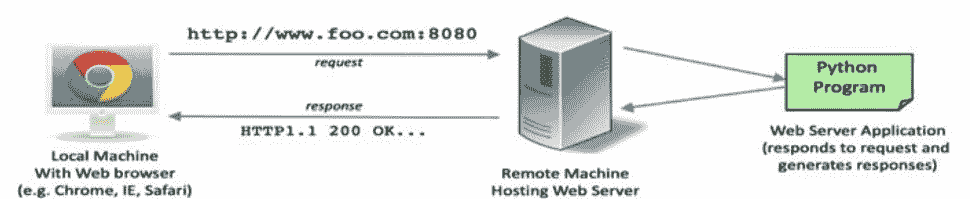

在上图中，用户正在使用浏览器（如Chrome、IE或Safari）访问Web服务器。浏览器运行在用户的本地机器上（可以是PC、Mac、Linux系统、iPad、智能手机等）。

要访问Web服务器，用户需要在浏览器中输入一个URL（统一资源定位符）地址。该地址还表明用户希望连接到8080端口（而不是用于HTTP连接的默认端口80）。远程机器接收到这个请求后，会决定如何处理它。如果没有程序监听8080端口，它将拒绝该请求。在我们的例子中，有一个Python程序（实际上就是Web服务器程序）正在监听该端口，请求会被传递给它。然后，该程序会处理这个请求并生成一个响应消息，该消息将被发送回用户本地机器上的浏览器。响应消息会指明它支持的HTTP协议版本，以及一切是否正常（这就是图中的200状态码——你可能见过404状态码，表示网页未找到等）。本地机器上的浏览器随后会将数据渲染为网页，或以适当的方式处理数据。

要创建一个简单的Python Web服务器，可以直接使用`http.server.HTTPServer`，或者可以将其与`socketserver.ThreadingMixIn`一起子类化，以创建一个多线程的Web服务器，例如：

```python
class ThreadingHTTPServer(ThreadingMixIn, HTTPServer):
    """Simple multi-threaded HTTP server """
    pass
```

自Python 3.7起，`http.server`模块现在内置提供了这个类，因此不再需要自己定义它（参见`http.server.ThreadingHTTPServer`）。

要处理HTTP请求，你必须实现一个HTTP请求方法，例如`do_GET()`或`do_POST()`。每个方法对应一种HTTP请求类型，例如：

- `do_GET()`对应HTTP Get请求，当你在Web浏览器的地址栏中输入网址时就会生成这种请求，或者
- `do_POST()`对应HTTP Post请求，例如当网页上的表单用于向Web服务器提交数据时使用。

`do_GET(self)`或`do_POST(self)`方法必须处理请求中提供的任何输入，并生成适当的响应返回给浏览器。这意味着它必须遵循HTTP协议。

以下简短程序创建了一个简单的Web服务器，该服务器将生成一条欢迎消息和当前时间作为对GET请求的响应。它通过使用`datetime`模块的`today()`函数创建一个日期和时间的时间戳来实现这一点。然后使用UTF-8字符编码将其转换为字节数组（UTF-8是网页中文本表示最广泛使用的方式）。我们需要一个字节数组，因为这是稍后`write()`方法将要执行的内容。

完成此操作后，需要设置各种元数据，以便浏览器知道它将要接收什么数据。这些元数据被称为头部数据，可以包括发送的内容类型和传输的数据（内容）量。在我们这个非常简单的例子中，我们需要通过‘Content-type’头部信息告诉它我们发送的是纯文本（而不是用于描述典型网页的HTML）。我们还需要使用Content-length告诉它我们发送了多少数据。然后，我们可以表明我们已经完成了头部信息的定义，现在开始发送实际数据。

数据本身通过继承自`BaseHTTPRequestHandler`的`wfile`属性发送。实际上有两个相关属性`rfile`和`wfile`：

- `rfile`：这是一个输入流，允许你读取输入数据（本例中未使用）。
- `wfile`：保存输出流，可用于向浏览器写入（发送）数据。该对象提供了一个`write()`方法，该方法接受一个类似字节的对象，该对象将被写入（最终）到浏览器。

使用一个`main()`方法来设置HTTP服务器，这遵循了用于`TCPServer`的模式；然而，该服务器的客户端将是一个Web浏览器。

```python
from http.server import BaseHTTPRequestHandler, ThreadingHTTPServer
from datetime import datetime

class MyHttpRequestHandler(BaseHTTPRequestHandler):
    """Very simple request handler. Only supports GET."""
    def do_GET(self):
        print("do_GET() starting to process request")
        welcome_msg = 'Hello From Server at ' + str(datetime.today())
        byte_msg = bytes(welcome_msg, 'utf-8')
        self.send_response(200)
        self.send_header("Content-type", 'text/plain; charset=utf-8')
        self.send_header('Content-length', str(len(byte_msg)))
        self.end_headers()
        print('do_GET() replying with message')
        self.wfile.write(byte_msg)

def main():
    print('Setting up server')
    server_address = ('localhost', 8080)
    httpd = ThreadingHTTPServer(server_address, MyHttpRequestHandler)
    print('Activating HTTP server')
    httpd.serve_forever()

if __name__ == '__main__':
    main()
```

一旦服务器启动并运行，就可以使用浏览器连接到服务器，并在浏览器的URL字段中输入适当的网址。这意味着在你的浏览器中（假设它与上述程序在同一台机器上运行），你只需要在地址栏中输入`http://localhost:8080`（这表明你想使用http协议连接到本地机器的8080端口）。

当你这样做时，你应该会看到带有当前日期和时间的欢迎消息：

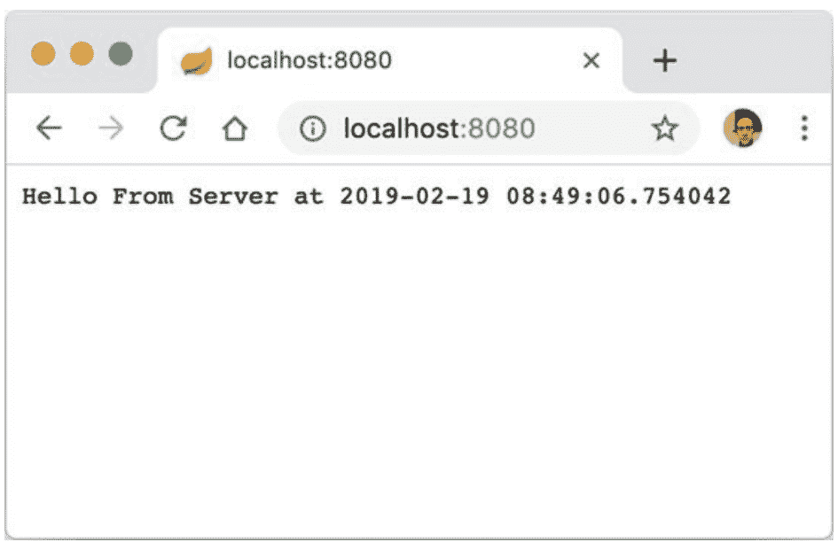

Hello From Server at 2019-02-19 08:49:06.754042

## Python中的Web服务

### 简介

本章探讨使用Flask框架实现的RESTful Web服务。

### RESTful服务

REST代表表述性状态转移，是Roy Fielding在其博士论文中创造的一个术语，用于描述支撑Web的轻量级、面向资源的架构风格。HTTP的主要作者之一Fielding，当时正在寻找一种方法来概括HTTP和Web的操作。他将网页的提供概括为一种按需向客户端提供数据的形式，其中客户端持有交互的当前状态。基于此状态信息，客户端请求下一个相关数据项，并在请求中发送所有识别所需信息的必要信息。因此，请求是独立的，不是持续的有状态对话的一部分（因此称为状态转移）。

应该注意的是，虽然Fielding旨在创建一种描述Web内行为模式的方法，但他也着眼于创建比使用专有企业集成框架或基于SOAP的服务更轻量级的基于Web的服务。这些更轻量级的基于HTTP的Web服务已经变得非常流行，现在广泛应用于许多领域。遵循这些原则的系统被称为RESTful服务。

RESTful服务的一个关键方面是，客户端（无论是浏览器中运行的JavaScript还是独立应用程序）之间的所有交互都是使用简单的基于HTTP的操作完成的。HTTP支持四种操作：HTTP Get、HTTP Post、HTTP Put和HTTP Delete。这些可以用作动词来指示所请求的操作类型。通常它们的使用方式如下：

- 检索信息（HTTP Get），
- 创建信息（HTTP Post），
- 更新信息（HTTP Put），
- 删除信息（HTTP Delete）。

应该注意的是，REST并不是像HTML那样的标准。相反，它是一种设计模式，可用于创建可以通过HTTP调用的Web应用程序，并赋予Get、Post、Put和针对特定资源（或数据类型）的删除HTTP操作。

与某些其他方法（例如也可通过HTTP调用的基于SOAP的服务）相比，使用RESTful服务作为技术的优势在于：

-   实现往往更简单，
-   维护更容易，
-   它们运行在标准的HTTP和HTTPS协议上，并且
-   不需要昂贵的基础设施和许可证来使用。

这意味着服务器和服务器端成本更低。对供应商或技术的依赖性很小，客户端无需了解有关创建服务所使用的实现细节或技术的任何信息。

## RESTful API

1.  RESTful API 是指你必须首先确定所表示或管理的关键概念或资源的API。
2.  这些可能是书籍、商店中的产品、酒店的房间预订等。例如，一个与书店相关的服务可能提供有关书籍、CD、DVD等资源的信息。在此服务中，书籍只是一种资源类型。我们将忽略DVD和CD等其他资源。
3.  基于书籍作为资源的概念，我们将为这些RESTful服务确定合适的URL。请注意，尽管URL经常用于描述网页——那只是一种资源类型。例如，我们可能开发一个资源，如

/bookservice/book

由此我们可以开发一个基于URL的API，例如

/bookservice/book/<isbn>

其中ISBN（国际标准书号）表示一个用于标识特定书籍的唯一编号，其详细信息将通过此URL返回。

我们还需要设计服务可以提供的表示或格式。这些可能包括纯文本、JSON、XML等。JSON代表JavaScript对象表示法，是一种简洁的方式来描述从服务器上运行的服务传输到浏览器中运行的客户端的数据。这是我们在下一节中将使用的格式。作为其中的一部分，我们可能会根据用于调用服务的HTTP方法类型和提供的URL内容，确定一系列由我们的服务提供的操作。例如，对于一个简单的图书服务，这可能是：

-   GET /book/<isbn>——用于检索给定ISBN的书籍。
-   GET /book/list——用于以JSON格式检索所有当前书籍。
-   POST /book（消息正文中的JSON）——支持创建新书。
-   PUT /book（消息正文中的JSON）——用于更新现有书籍上保存的数据。
-   DELETE /book/<isbn>——用于表示我们希望从保存的书籍列表中删除特定书籍。

请注意，上述URL中的参数isbn实际上是URL路径的一部分。

## Python Web框架

Python中有非常多的框架和库可供你创建基于JSON的Web服务；可用的选择数量之多可能会让你不知所措。例如，你可能会考虑

-   Flask，
-   Django，
-   Web2py 和
-   CherryPy，仅举几例。

这些框架和库提供不同的功能集和复杂程度。例如，Django是一个全栈Web框架；也就是说，它不仅旨在开发Web服务，还旨在开发完整的网站。然而，对于我们的目的来说，这可能有些大材小用，而且Django Rest接口只是一个更大基础设施的一部分。这当然并不意味着我们不能使用Django来创建我们的书店服务；但是有更简单的选择可用。Web2py是另一个全栈Web框架，出于同样的原因，我们也将不考虑它。

相比之下，Flask和CherryPy被认为是非全栈框架（尽管你可以使用它们创建全栈Web应用程序）。这意味着它们更轻量级，上手更快。CherryPy最初更侧重于提供远程函数调用功能，允许通过HTTP调用函数；然而，这已经扩展到提供更类似REST的功能。在本章中，我们将重点介绍Flask，因为它是Python中最广泛使用的轻量级RESTful服务框架之一。

## Flask

Flask是一个用于Python的Web开发框架。它自称是Python的微框架，这有点令人困惑；以至于他们的网站上有一个专门的页面来解释它的含义以及这对Flask意味着什么。根据Flask的说法，其描述中的“微”与其主要目标有关，即保持Flask核心简单但可扩展。与Django不同，它不包含旨在帮助你将应用程序与数据库集成的功能。相反，Flask专注于Web服务框架所需的核心功能，并允许根据需要使用扩展来添加额外功能。

Flask也是一个约定优于配置的框架；也就是说，如果你遵循标准约定，你将不需要处理太多额外的配置信息（尽管如果你希望遵循不同的约定，你可以提供配置信息来更改默认值）。由于大多数人（至少在最初）会遵循这些约定，这使得快速启动并运行某些东西变得非常容易。

## Flask中的Hello World

按照所有编程语言的传统，我们将从一个简单的“Hello World”风格的应用程序开始。这个应用程序将允许我们创建一个非常简单的Web服务，将特定URL映射到一个返回JSON格式数据的函数。我们将使用JSON数据格式，因为它在基于Web的服务中被广泛使用。

## 使用JSON

JSON代表JavaScript对象表示法；它是一种轻量级的数据交换格式，也易于人类读写。尽管它源自JavaScript编程语言的子集；但它实际上是完全语言无关的，许多语言和框架现在支持自动处理它们自己的格式与JSON之间的转换。这使其成为RESTful Web服务的理想选择。

JSON实际上建立在一些基本结构之上：

-   一组名称/值对，其中名称和值由冒号':'分隔，每对可以由逗号','分隔。
-   一个有序的值列表，包含在方括号('[]')中。

这使得构建代表任何数据集的结构变得非常容易，例如，一本具有ISBN、书名、作者和价格的书籍可以表示为：

```
{
"author": "Phoebe Cooke", "isbn": 2,
"price": 12.99, "title": "Java"
}
```

反过来，书籍列表可以表示为方括号内用逗号分隔的一组书籍。例如：

```
[ {"author": "Gryff Smith","isbn": 1, "price": 10.99, "title": "XML"},
{"author": "Phoebe Cooke", "isbn":2, "price": 12.99, "title": "Java"},
{"author": "Jason Procter", "isbn": 3, "price": 11.55, "title": "C#"}]
```

## 实现Flask Web服务

创建Flask Web服务涉及几个步骤，这些步骤是：

1.  导入flask。
2.  初始化Flask应用程序。
3.  实现一个或多个函数（或方法）来支持你希望发布的服务。
4.  提供路由信息，以便从URL路由到函数（或方法）。
5.  启动Web服务运行。

我们将在本章的其余部分中查看这些步骤。

## 一个简单的服务

我们现在将创建我们的hello world Web服务。为此，我们必须首先导入flask模块。在此示例中，我们将使用Flask类和jsonify()函数元素。

然后我们需要创建主应用程序对象，它是Flask类的一个实例：

```
from flask import Flask, jsonify
app = Flask(__name__)
```

传递给Flask()构造函数的参数是应用程序模块或包的名称。由于这是一个简单的示例，我们将使用模块的`__name__`属性，在这种情况下将是‘__main__’。在更大、更复杂的应用程序中，有多个包和模块，你可能需要选择一个合适的包名。

Flask应用程序对象实现了Python的WSGI（Web服务器网关接口）标准。该标准最初在2003年的PEP-333中规定，并在2010年发布的PEP-3333中针对Python 3进行了更新。它为Web服务器应如何处理对应用程序的请求提供了一个简单的约定。Flask应用程序对象是能够将URL请求路由到Python函数的元素。

## 提供路由信息

我们现在可以为 Flask 应用程序对象定义路由信息。这些信息会将一个 URL 映射到一个函数。例如，当该 URL 被输入到 Web 浏览器的地址栏时，Flask 应用程序对象将接收该请求并调用相应的函数。

为了提供路由映射信息，我们在函数或方法上使用 `@app.route` 装饰器。例如，在下面的代码中，`@app.route` 装饰器将 URL /hello 映射到用于 HTTP Get 请求的函数 welcome()：

```
@app.route('/hello', methods=['GET'])
def welcome():
    return jsonify({'msg': 'Hello Flask World'})
```

关于这个函数定义，有两点需要注意：

- `@app.route` 装饰器用于声明式地指定函数的路由信息。这意味着 URL '/hello' 将被映射到函数 welcome()。该装饰器还指定了支持的 HTTP 方法；在本例中支持 GET 请求（这实际上是默认值，因此不需要在此处包含，但从文档角度来看很有用）。

- 第二点是我们将使用 JSON 格式返回数据；因此我们使用 jsonify() 函数，并向其传递一个包含单个键/值对的 Python 字典结构。在本例中，键是 ‘msg’，与该键关联的数据是 ‘Hello Flask World’。jsonify() 函数会将此 Python 数据结构转换为等效的 JSON 结构。

## 运行服务

我们现在准备运行我们的应用程序。为此，我们调用 Flask 应用程序对象的 run() 方法：

```
app.run(debug=True)
```

此方法有一个可选的关键字参数 debug，可以设置为 True；如果这样做，当应用程序运行时，会生成一些调试信息，允许你查看正在发生的情况。这在开发中很有用，但通常不会在生产环境中使用。

整个程序如下所示：

```
from flask import Flask, jsonify
app = Flask(__name__)
@app.route('/hello', methods=['GET'])
def welcome():
    return jsonify({'msg': 'Hello Flask World'})
app.run(debug=True)
```

运行此程序时，生成的初始输出如下所示：

```
* Serving Flask app "hello_flask_world" (lazy loading)
* Environment: production
WARNING: This is a development server. Do not use it in a
production deployment.
Use a production WSGI server instead.
* Debug mode: on
* Running on http://127.0.0.1:5000/ (Press CTRL+C to quit)
* Restarting with stat
* Debugger is active!
* Debugger PIN: 274-630-732
```

当然，我们还没有看到任何来自我们自己程序的输出。这是因为我们还没有通过 /hello URL 调用 welcome() 函数。

## 调用服务

我们将使用 Web 浏览器来访问 Web 服务。为此，我们必须输入完整的 URL，该 URL 将把请求路由到我们正在运行的应用程序以及 welcome() 函数。

该 URL 实际上由两个元素组成，第一部分是运行应用程序的机器及其用于监听请求的端口。这实际上在上面的输出中列出——查看以 ‘Running on’ 开头的行。这意味着 URL 必须以 http://127.0.0.1:5000 开头。这表明应用程序正在 IP 地址为 127.0.0.1 的计算机上运行，并在端口 5000 上监听。当然，我们也可以使用 localhost 代替 127.0.0.1。

URL 的其余部分必须提供允许 Flask 从计算机和端口路由到我们要运行的函数的信息。因此完整的 URL 是 http://127.0.0.1:5000/hello，并在下面显示的 Web 浏览器中使用：


如你所见，返回的结果是我们提供给 jsonify() 函数的文本，但现在以纯 JSON 格式显示在 Web 浏览器中。你还应该能够在控制台输出中看到 Flask 框架接收到了映射到 /hello URL 的 GET 请求：

```
127.0.0.1 - - [23/May/2019 11:09:40] "GET /hello HTTP/1.1" 200 -
```

这种方法的一个有用特性是，如果你对程序进行了更改，Flask 框架在开发模式下运行时会注意到此更改，并可以使用部署的代码更改重新启动 Web 服务。如果你这样做，你会看到输出通知你发生了更改：

```
* Detected change in 'hello_flask_world.py', reloading
* Restarting with stat
```

这允许即时进行更改，并且可以立即看到其效果。

## 最终解决方案

我们可以通过定义一个可用于创建 Flask 应用程序对象的函数，并确保仅在代码作为主模块运行时才运行应用程序，来稍微整理一下这个示例：

```
from flask import Flask, jsonify, url_for
def create_service():
    app = Flask(__name__)
    @app.route('/hello', methods=['GET'])
    def welcome():
        return jsonify({'msg': 'Hello Flask World'})
    with app.test_request_context():
        print(url_for('welcome'))
        return app
if __name__ == '__main__':
    app = create_service()
    app.run(debug=True)
```

我们为此程序添加的一个特性是使用了 test_request_context()。返回的测试请求上下文对象实现了上下文管理器协议，因此可以通过 with 语句使用；这对于调试目的很有用。它可以用于验证为任何指定了路由信息的函数使用的 URL。在本例中，print 语句的输出是 ‘/hello’，因为这是 @app.route 装饰器定义的 URL。

## 书店 Web 服务

### 构建 Flask 书店服务

上一章说明了一个非常简单的 Web 服务应用程序的基本结构。我们现在可以探索为更现实的内容创建一组 Web 服务；书店 Web 服务应用程序。

在本章中，我们将为前面章节中描述的每个简单书店实现一组 Web 服务。这意味着我们将定义服务来处理不仅 GET 请求，还有用于 RESTful 书店 API 的 PUT、POST 和 DELETE 请求。

### 设计

在查看书店 RESTful API 的实现之前，我们将考虑服务需要哪些元素。

一个经常引起混淆的问题是 Web 服务如何与传统的设计方法（如面向对象设计）相关联。这里采用的方法是，Web 服务 API 提供了一种实现接口的方式，该接口用于实现应用程序/领域模型的适当函数、对象和方法。

这意味着我们仍然会有一组类来表示书店以及书店中持有的书籍。反过来，实现 Web 服务的函数将访问书店以检索、修改、更新和删除书店持有的书籍。

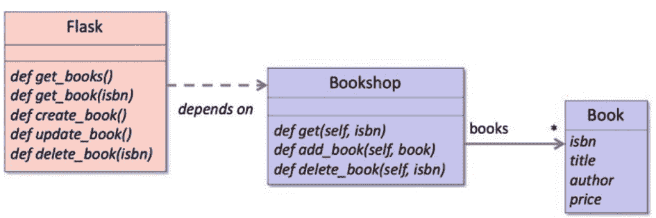

这显示了一个 Book 对象将具有 isbn、title、author 和 price 属性。

反过来，Bookshop 对象将具有一个 books 属性，该属性将保存零个或多个 Book。books 属性实际上将保存一个列表，因为书籍列表需要在添加新书或删除旧书时动态更改。Bookshop 还将定义三个方法，这些方法将

- 允许通过其 isbn 获取一本书，
- 允许将一本书添加到书籍列表中，
- 以及启用删除一本书（基于其 isbn）。

将为一组函数提供路由信息，这些函数将调用 Bookshop 对象上的适当方法。要用 @app.route 装饰的函数以及要使用的映射如下所列：

- get_books() 映射到 /book/list URL，使用 HTTP Get 方法请求。
- get_book(isbn) 映射到 /book/<isbn> URL，其中 isbn 是将传递给函数的 URL 参数。这也将使用 HTTP GET 请求。
- create_book() 映射到 /book URL，使用 HTTP Post 请求。
- update_book() 映射到 /book URL，但使用 HTTP Put 请求。
- delete_book() 映射到 /book/<isbn> URL，但使用 HTTP Delete 请求。

### 领域模型

领域模型由 Book 和 Bookshop 类组成。它们如下所示。

Book 类是一个简单的值类型类（即它是数据导向的，没有自己的行为）：

## 将书籍编码为JSON

我们面临的一个问题是，尽管 `jsonify()` 函数知道如何将字符串、整数、列表、字典等内置类型转换为适当的JSON格式；但它不知道如何为 `Book` 这样的自定义类型执行此操作。因此，我们需要定义某种将 `Book` 转换为适当JSON格式的方法。

一种可行的方法是定义一个可调用的方法，将 `Book` 类的实例转换为JSON格式。我们可以将此方法命名为 `to_json()`。例如：

```python
class Book:
    """Represents a book in the bookshop"""
    def __init__(self, isbn, title, author, price):
        self.isbn = isbn
        self.title = title
        self.author = author
        self.price = price
    def __str__(self):
        return self.title + ' by ' + self.author + ' @ ' + str(self.price)
    def to_json(self):
        return {
            'isbn': self.isbn,
            'title': self.title,
            'author': self.author,
            'price': self.price
        }
```

现在我们可以将此方法与 `jsonify()` 函数一起使用，将一本书转换为JSON格式：

```python
jsonify({'book': book.to_json()})
```

这种方法确实有效，并提供了一种非常轻量级的方式来将书籍转换为JSON。

然而，上述方法确实意味着每次我们想要将一本书转换为JSON时，都必须记得调用 `to_json()` 方法。在某些情况下，这意味着我们还需要编写一些稍微复杂的代码。例如，如果我们希望将 `Bookshop` 中的书籍列表作为JSON列表返回，我们可能会这样写：

```python
jsonify({'books': [b.to_json() for b in bookshop.books]})
```

这里我们使用了列表推导式来生成一个包含书店中所有书籍JSON版本的列表。这开始显得过于复杂，容易忘记，并且可能容易出错。Flask本身使用编码器将类型编码为JSON。Flask提供了一种创建自定义编码器的方法，这些编码器可用于将自定义类型（如 `Book` 类）转换为JSON。这样的编码器可以被 `jsonify()` 函数自动使用。

为此，我们必须实现一个编码器类；该类将扩展 `flask.json.JSONEncoder` 超类。该类必须定义一个方法 `default(self, obj)`。此方法接受一个对象并返回该对象的JSON表示。因此，我们可以为 `Book` 类编写一个编码器，如下所示：

```python
class BookJSONEncoder(JSONEncoder):
    def default(self, obj):
        if isinstance(obj, Book):
            return {
                'isbn': obj.isbn,
                'title': obj.title,
                'author': obj.author,
                'price': obj.price
            }
        else:
            return super(BookJSONEncoder, self).default(obj)
```

此类中的 `default()` 方法检查传递给它的对象是否是 `Book` 类的实例，如果是，则创建 `Book` 的JSON版本。此JSON结构基于 `isbn`、`title`、`author` 和 `price` 属性。如果不是 `Book` 类的实例，则将对象传递给父类。

现在我们可以将此编码器注册到Flask应用程序对象，以便在必须将 `Book` 转换为JSON时自动使用它。这是通过将自定义编码器分配给Flask应用程序对象的 `app.json_encoder` 属性来完成的：

```python
app = Flask(__name__)
app.json_encoder = BookJSONEncoder
```

现在，如果我们希望编码单本书或书籍列表，上述编码器将自动使用，因此我们不需要做任何其他事情。因此，我们之前的示例可以简单地通过引用书籍或 `bookshop.books` 属性来编写：

```python
jsonify({'book': book})
jsonify({'books': bookshop.books})
```

## 设置GET服务

我们现在可以设置两个支持GET请求的服务，即 `/book/list` 和 `/book/<isbn>` 服务。

这些URL映射到的函数如下：

```python
@app.route('/book/list', methods=['GET'])
def get_books():
    return jsonify({'books': bookshop.books})
```

```python
@app.route('/book/<int:isbn>', methods=['GET'])
def get_book(isbn):
    book = bookshop.get(isbn)
    return jsonify({'book': book})
```

第一个函数仅使用键 `books` 以JSON结构返回书店当前持有的书籍列表。第二个函数接受一个 `isbn` 号作为参数。这是一个URL参数；换句话说，用于调用此函数的URL的一部分实际上是动态的，并将被传递到函数中。这意味着用户只需更改URL的ISBN部分即可请求不同ISBN的书籍详细信息，例如：

- `/book/1` 表示我们想要ISBN为1的书籍信息。
- `/book/2` 表示我们想要ISBN为2的书籍信息。

在Flask中，为了表示某物是URL参数而不是URL的硬编码元素，我们使用尖括号（`<>`）。它们包围URL参数名称，并允许将参数传递到函数中（使用相同的名称）。

在上面的示例中，我们还（可选地）指定了参数的类型。默认情况下，类型将是字符串；然而，我们知道ISBN实际上是一个整数，因此我们通过在参数名称前加上类型 `int`（并用冒号 `:` 将类型信息与参数名称分隔开）来表示这一点。实际上有几种可用的选项，包括：

- `string`（默认），
- `int`（如上所用），
- `float` 用于正浮点值，
- `uuid` 用于uuid字符串，
- `path` 类似于字符串但接受斜杠。

我们可以再次使用浏览器查看调用这些服务的结果；这次的URL将是：

- `http://127.0.0.1:5000/book/list` 和
- `http://127.0.0.1:5000/book/1`

例如：

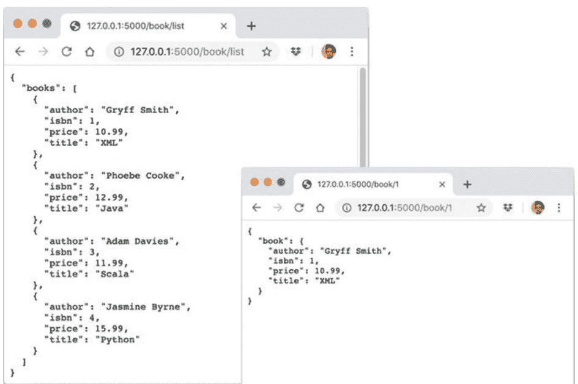

从图中可以看出，书籍信息以JSON格式的键/值对集合返回。

## 删除书籍

删除书籍的Web服务与获取书籍服务非常相似，因为它接受 `isbn` 作为URL路径参数。然而，在这种情况下，它仅返回删除成功的确认：

```python
@app.route('/book/<int:isbn>', methods=['DELETE'])
def delete_book(isbn):
    bookshop.delete_book(isbn)
    return jsonify({'result': True})
```

然而，我们不能再仅通过使用Web浏览器来测试此功能。这是因为Web浏览器对URL字段中输入的所有URL都使用HTTP Get请求方法。但是，删除Web服务与HTTP Delete请求方法相关联。

因此，要调用 `delete_book()` 函数，我们需要确保发送的请求使用DELETE请求方法。这可以从能够指示所使用请求方法类型的客户端完成。示例可能包括另一个Python程序、JavaScript网站等。

然而，出于测试目的，我们将使用 `curl` 程序。此程序在大多数Linux和Mac系统上可用，如果尚未可用，可以轻松安装在其他操作系统上。

`curl` 是一个命令行工具和库，可用于通过互联网发送和接收数据。它支持广泛的协议和标准，特别是支持HTTP和HTTPS协议，可用于使用不同的请求方法通过HTTP/S发送和接收数据。例如，要使用DELETE请求方法调用 `delete_book()` 函数，我们可以使用：

## 添加新书

我们还希望支持向书店添加新书。新书的详细信息可以直接作为URL路径参数添加到URL中；然而，随着需要添加的数据量增长，这种方式将变得越来越难以维护和验证。事实上，尽管微软Internet Explorer（IE）历史上曾有2083个字符的限制（理论上自IE8起已移除），但实际上URL大小通常仍有限制。大多数Web服务器的限制为8 KB（或8192字节），尽管这通常是可配置的。客户端也可能有限制（例如IE或Apple Safari施加的限制，通常为2 KB）。如果浏览器或服务器超出限制，大多数系统只会截断超出限制的字符（有时甚至没有任何警告）。

因此，此类数据通常作为HTTP Post请求的一部分，在HTTP请求体中发送。Post请求消息体的大小限制要高得多（通常高达2 GB）。这意味着它是向Web服务传输数据更可靠、更安全的方式。然而，应该注意的是，这并不意味着数据比作为URL一部分时更安全；只是发送方式不同。从作为HTTP Post方法请求结果而调用的Python函数的角度来看，这意味着数据不作为URL的参数提供给函数。相反，在函数内部，需要获取请求对象，然后使用它来获取请求体中包含的信息。

当HTTP请求包含JSON数据时，请求对象上有一个关键属性可用，即`request.json`属性。该属性包含一个类似字典的结构，其中保存了与JSON数据结构中键关联的值。

下面在`create_book()`函数中展示了这一点。

**from flask import request, abort**

```python
@app.route('/book', methods=['POST'])
def create_book():
    print('create book')
    if not request.json or not 'isbn' in request.json:
        abort(400)
    book = Book(request.json['isbn'], request.json['title'],
                request.json.get('author', ""), float(request.json['price']))
    bookshop.add_book(book)
    return jsonify({'book': book}), 201
```

上述函数访问代表当前HTTP请求的`flask.request`对象。该函数首先检查它是否包含JSON数据，以及要添加的书籍的ISBN是否是该JSON结构的一部分。如果ISBN不存在，则调用`flask.abort()`函数，并传入适当的HTTP响应状态码。在这种情况下，错误代码表示这是一个错误请求（HTTP错误代码400）。

然而，如果JSON数据存在且确实包含ISBN号，则获取键`isbn`、`title`、`author`和`price`的值。请记住，JSON是一个类似字典的键值结构，因此以这种方式处理它使得提取JSON结构持有的数据变得容易。这也意味着我们可以同时使用方法和键导向的访问风格。上面展示了我们使用`get()`方法以及一个默认值，以便在未指定作者时使用。

最后，由于我们希望将价格视为浮点数，必须使用`float()`函数将JSON提供的字符串格式转换为浮点数。使用提取的数据，我们可以实例化一个新的`Book`实例，该实例可以添加到书店中。正如Web服务中常见的，我们返回新创建的书籍对象作为创建书籍的结果，以及HTTP响应状态码201，表示资源创建成功。

我们现在可以使用`curl`命令行程序测试此服务：

```bash
curl -H "Content-Type: application/json" -X POST -d '{"title":"Read a book", "author":"Bob", "isbn":"5", "price":"3.44"}' http://localhost:5000/book
```

此命令使用的选项指示请求体中发送的数据类型（`-H`）以及要包含在请求体中的数据（`-d`）。运行此命令的结果是：

```json
{
    "book": {
        "author": "Bob",
        "isbn": "5",
        "price": 3.44,
        "title": "Read a book"
    }
}
```

表明Bob的新书已被添加。

## 更新书籍

更新书店对象已持有的书籍与添加书籍非常相似，只是使用了HTTP Put请求方法。

同样，实现所需行为的函数必须使用`flask.request`对象来访问随PUT请求提交的数据。然而，在这种情况下，指定的ISBN号用于查找要更新的书籍，而不是指定一本全新的书。

`update_book()`函数如下所示：

```python
@app.route('/book', methods=['PUT'])
def update_book():
    if not request.json or not 'isbn' in request.json:
        abort(400)
    isbn = request.json['isbn']
    book = bookshop.get(isbn)
    book.title = request.json['title']
    book.author = request.json['author']
    book.price = request.json['price']
    return jsonify({'book': book}), 201
```

此函数重置从书店检索到的书籍的标题、作者和价格。它再次返回更新后的书籍作为运行函数的结果。

`curl`程序可以再次用于调用此函数，尽管这次必须指定HTTP Put方法：

```bash
curl -H "Content-Type: application/json" -X PUT -d '{"title":"Read a Python Book", "author":"Bob Jones","isbn":"5", "price":"3.44"}' http://localhost:5000/book
```

此命令的输出为：

```json
{
    "book": {
        "author": "Bob Jones",
        "isbn": "5",
        "price": "3.44",
        "title": "Read a Python Book"
    }
}
```

这表明书籍5已用新信息更新。

## 如果我们搞错了会怎样？

为书店Web服务提供的代码并非特别具有防御性，因为有可能尝试添加一本与现有书籍ISBN相同的新书。然而，它确实检查了`create_book()`和`update_book()`函数是否提供了ISBN号。但是，如果没有提供ISBN号会怎样？在这两个函数中，我们都调用了`flask.abort()`函数。默认情况下，如果发生这种情况，将向客户端发送错误消息。例如，在以下命令中，我们忘记了包含ISBN号：

```bash
curl -H "Content-Type: application/json" -X POST -d '{"title":"Read a book", "author":"Tom Andrews", "price":"13.24"}' http://localhost:5000/book
```

这会产生以下错误输出：

```html
<!DOCTYPE HTML PUBLIC "-//W3C//DTD HTML 3.2 Final//EN">
<title>400 Bad Request</title>
<h1>Bad Request</h1>
<p>The browser (or proxy) sent a request that this server could not understand.</p>
```

这里奇怪的是错误输出是HTML格式，这可能不是我们所期望的，因为我们正在创建一个Web服务并处理JSON。问题在于Flask默认生成一个错误HTML网页，它期望在Web浏览器中渲染。

我们可以通过定义自己的自定义错误处理函数来克服这个问题。这是一个用`@app.errorhandler()`装饰器装饰的函数，该装饰器提供它处理的响应状态码。例如：

```python
@app.errorhandler(400)
def not_found(error):
    return make_response(jsonify({'book': 'Not found'}), 400)
```

现在，当通过`flask.abort()`函数生成400代码时，将调用`not_found()`函数，并使用`flask.make_response()`函数提供的信息生成JSON响应。例如：

```bash
curl -H "Content-Type: application/json" -X POST -d '{"title":"Read a book", "author":"Tom Andrews", "price":"13.24"}' http://localhost:5000/book
```

此命令的输出为：

```
{
"book": "Not found"
}
```

## 书店服务列表

书店网络服务应用的完整列表如下：

```python
from flask import Flask, jsonify, request, abort, make_response
from flask.json import JSONEncoder

class Book:
    def __init__(self, isbn, title, author, price):
        self.isbn = isbn
        self.title = title
        self.author = author
        self.price = price

    def __str__(self):
        return self.title + ' by ' + self.author + ' @ ' + str(self.price)

class BookJSONEncoder(JSONEncoder):
    def default(self, obj):
        if isinstance(obj, Book):
            return {
                'isbn': obj.isbn,
                'title': obj.title,
                'author': obj.author,
                'price': obj.price
            }
        else:
            return super(BookJSONEncoder, self).default(obj)

class Bookshop:
    def __init__(self, books):
        self.books = books

    def get(self, isbn):
        if int(isbn) > len(self.books):
            abort(404)
        return list(filter(lambda b: b.isbn == isbn, self.books))[0]

    def add_book(self, book):
        self.books.append(book)

    def delete_book(self, isbn):
        self.books = list(filter(lambda b: b.isbn != isbn, self.books))

bookshop = Bookshop([Book(1, 'XML', 'Gryff Smith', 10.99),
                     Book(2, 'Java', 'Phoebe Cooke', 12.99),
                     Book(3, 'Scala', 'Adam Davies', 11.99),
                     Book(4, 'Python', 'Jasmine Byrne', 15.99)])

def create_bookshop_service():
    app = Flask(__name__)
    app.json_encoder = BookJSONEncoder

    @app.route('/book/list', methods=['GET'])
    def get_books():
        return jsonify({'books': bookshop.books})

    @app.route('/book/<int:isbn>', methods=['GET'])
    def get_book(isbn):
        book = bookshop.get(isbn)
        return jsonify({'book': book})

    @app.route('/book', methods=['POST'])
    def create_book():
        print('create book')
        if not request.json or not 'isbn' in request.json:
            abort(400)
        book = Book(request.json['isbn'], request.json['title'],
                    request.json.get('author', ''), float(request.json['price']))
        bookshop.add_book(book)
        return jsonify({'book': book}), 201

    @app.route('/book', methods=['PUT'])
    def update_book():
        if not request.json or not 'isbn' in request.json:
            abort(400)
        isbn = request.json['isbn']
        book = bookshop.get(isbn)
        book.title = request.json['title']
        book.author = request.json['author']
        book.price = request.json['price']
        return jsonify({'book': book}), 201

    @app.route('/book/<int:isbn>', methods=['DELETE'])
    def delete_book(isbn):
        bookshop.delete_book(isbn)
        return jsonify({'result': True})

    @app.errorhandler(400)
    def not_found(error):
        return make_response(jsonify({'book': 'Not found'}), 400)

    return app

if __name__ == '__main__':
    app = create_bookshop_service()
    app.run(debug=True)
```

## 尝试

本章的练习涉及创建一个提供股票市场价格信息的网络服务。需要实现的服务如下：

GET 方法：

-   `/stock/list` 将返回可查询价格的股票列表。
-   `/stock/ticker` 将返回由 ticker 指示的股票的当前价格，例如 `/stock/APPL` 或 `/stock/MSFT`。

POST 方法：

-   `/stock` 请求体包含新股票代码和价格的 JSON，例如 `{'IBM': 12.55}`。

PUT 方法：

-   `/stock` 请求体包含现有股票代码和价格的 JSON。

DELETE 方法：

-   `/stock/<ticker>` 将导致由 ticker 指示的股票从服务中被删除。

你可以用一组默认的股票和价格来初始化服务，例如 `[('IBM', 12.55), ('APPL', 15.66), ('GOOG', 5.22)]`。

你可以使用 curl 命令行工具来测试这些服务。

## 参考文献

Smith, John. “*Python Programming for Advanced Users: An In-Depth Exploration of Python’s Advanced Features and Techniques.*” 在这本由 Wiley 于 2021 年出版的综合性著作中，Smith 深入探讨了 Python 的复杂性，为高级用户提供了对该语言的透彻理解。主题包括元类、装饰器和高级面向对象编程，使其成为那些寻求在高级水平上掌握 Python 的人的必备资源。

Brown, Alice. “*Mastering Python: Advanced Tips and Techniques for the Discerning Programmer.*” 由 O’Reilly Media 于 2029 年出版，Brown 的书是高级 Python 编程的杰作。它提供了关于元编程、多线程和高级数据操作等主题的深入指导。注重实际应用，这部作品使程序员能够将他们的 Python 技能提升到新的水平。

Davis, Richard. “*Effective Python: 90 Specific Ways to Write Better Python Code.*” 这本由 Addison-Wesley Professional 于 2020 年发布的权威书籍超越了单纯的语法，探索了编写优雅高效的 Python 代码的艺术。Davis 提供了 90 个简洁、实用的技巧和方法，使其成为那些努力编写不仅功能齐全而且可维护和优雅的 Python 代码的人的必备参考。

Johnson, Sarah. “*Python in Practice: Create Better Programs Using Concurrency, Libraries, and Design Patterns.*” 由 Addison-Wesley Professional 于 2013 年出版，Johnson 的作品是寻求在现实世界应用中利用 Python 强大功能的开发者的知识宝库。它涵盖了并发、第三方库和设计模式等主题，以帮助程序员创建健壮高效的软件。

White, Robert. “*Fluent Python: Clear, Concise, and Effective Programming.*” O’Reilly Media, 2015. 在这本书中，White 为高级程序员提供了关于 Python 惯用和表达性特性的见解。它提供了关于编写 Pythonic 代码、理解数据结构以及有效使用 Python 动态功能的指导。这部作品对于那些希望编写真正体现 Python 独特哲学的代码的人来说是不可或缺的。

Lewis, Emily. “*Python Cookbook: Recipes for Mastering Python.*” O’Reilly Media, 2013. Lewis 的书是实用 Python 食谱的汇编，涵盖了从数据操作到网络编程的广泛主题。每个食谱都提供了一种解决实际问题的实践方法，使其成为高级 Python 程序员的宝贵资源。

Clark, Michael. “*Python for Data Analysis: Harness the Power of Python for Data Exploration and Analysis.*” 由 O’Reilly Media 于 2017 年出版，Clark 的书是数据专业人士和分析师的首选指南。它全面介绍了使用 Python 进行数据分析，包括数据整理、可视化和统计分析。对于任何希望在数据科学和分析背景下掌握 Python 的人来说，这个资源都是必不可少的。

Turner, William. “*Python Tricks: A Buffet of Awesome Python Features for the Astute Programmer.*” 由 Dan Bader 于 2017 年出版，这本书是 Python 技巧和方法的精选合集。它涵盖了广泛的 Python 特性和最佳实践，为读者提供了多样化的技能以增强他们的 Python 熟练度。

King, Laura. “*Advanced Python Programming: Unlock the Full Potential of Python with Advanced Techniques.*” 这本书由 Packt Publishing 于 2016 年出版，是高级 Python 技术的宝库。King 探索了元编程、函数式编程和并发编程等主题，以赋予 Python 开发者高级能力。

Roberts, Daniel. “*Mastering Python Design Patterns: Harness the Power of Python for Software Design.*” 由 Packt Publishing 于 2016 年出版，Roberts 的书是掌握 Python 中软件设计模式的指南。它涵盖了各种设计模式，为每种模式提供了深入的解释和实际示例。对于那些旨在使用 Python 在软件架构和设计方面表现出色的人来说，这个资源是必备的。

E. Gamma, R. Helm, R. Johnson, J. Vlissades, *Design patterns: elements of reusable object-oriented software*, Addison-Wesley (1995).