# PYTHON 系列

## PYTHON 包

```python
from collections import Counter
from string import punctuation

def load_text(input_file):
    """Load text from a file.

    Parameters
    ----------
    input_file : str
        Path to text file.

    Returns
    -------
    str
        Contents of the text

    Examples
    --------
    >>> fpath = "text.txt"
    >>> load_text(fpath)
    """
    with open(input_file, "r") as file:
        text = file.read()
    return text
```

```python
def count_words(text):
    """Count the words in a string.

    String is lowercased and punctuation
    is removed before words are counted.

    Parameters
    ----------
    text : str
        Text to count words in.

    Returns
    -------
    collections.Counter
        dict-like object where keys are
        words values are their counts.

    Examples
    --------
    >>> count_words("Hello, world!")
    """
    text = text.lower()
    for p in punctuation:
        text = text.replace(p, "")
    words = text.split()
    return Counter(words)
```

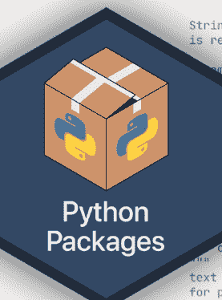

### 托马斯·博森
蒂芙尼·廷伯斯


查普曼与霍尔图书

### Python 包

### 查普曼与霍尔/CRC
Python 系列

### 关于本系列

Python 已被评选为最受欢迎的编程语言，并在教育和工业界得到广泛应用。本系列丛书将为学生和专业人士提供一系列关于 Python 的书籍。系列中的书籍将帮助用户在入门和高级水平上学习这门语言，并探索其在数据科学、人工智能和机器学习领域的众多应用。系列书籍还可通过 Jupyter notebooks 进行补充学习。

**《使用 Python 进行图像处理与获取，第二版》**
*Ravishankar Chityala, Sridevi Pudipeddi*

**《Python 包》**
*Tomas Beuzen and Tiffany Timbers*

如需了解本系列更多信息，请访问：[https://www.crcpress.com/Chapman-HallCRC/book-series/PYTH](https://www.crcpress.com/Chapman-HallCRC/book-series/PYTH)

### Python 包

托马斯·博森
蒂芙尼·廷伯斯


CRC 出版社
泰勒与弗朗西斯集团
博卡拉顿 伦敦 纽约

CRC 出版社是
泰勒与弗朗西斯集团的旗下品牌，一家 Informa 企业
查普曼与霍尔图书

第一版于 2022 年出版
由 CRC 出版社出版
地址：6000 Broken Sound Parkway NW, Suite 300, Boca Raton, FL 33487-2742

以及由 CRC 出版社出版
地址：4 Park Square, Milton Park, Abingdon, Oxon, OX14 4RN

*CRC 出版社是泰勒与弗朗西斯集团有限责任公司的旗下品牌*

© 2022 Tomas Beuzen and Tiffany Timbers

我们已尽合理努力确保所发布数据和信息的可靠性，但作者和出版商无法对所有材料的有效性或其使用后果承担责任。作者和出版商已尽力追溯本出版物中所有复制材料的版权持有者，如果未获得以本形式出版的许可，我们向版权持有者致歉。如有任何版权材料未被确认，请来信告知，以便我们在未来的任何重印中予以更正。

除非美国版权法允许，否则本书的任何部分不得以任何形式（无论是电子、机械或其他方式，无论是现在已知或未来发明的，包括影印、缩微胶片和录音）进行转载、复制、传播或利用，也不得用于任何信息存储或检索系统，除非获得出版商的书面许可。

如需获得影印或以电子方式使用本作品材料的许可，请访问 [www.copyright.com](http://www.copyright.com) 或联系版权结算中心 (CCC)，地址：222 Rosewood Drive, Danvers, MA 01923, 978-750-8400。对于在 CCC 上不可用的作品，请联系 [mpkbookspermissions@tandf.co.uk](mailto:mpkbookspermissions@tandf.co.uk)

*商标声明：* 产品或公司名称可能是商标或注册商标，仅用于识别和说明，无意侵权。

ISBN: 978-1-032-03825-4 (精装)
ISBN: 978-1-032-02944-3 (平装)
ISBN: 978-1-003-18925-1 (电子书)

DOI: [10.1201/9781003189251](https://doi.org/10.1201/9781003189251)

*出版者注：* 本书由作者提供的最终稿整理而成。

献给你，读者。

永不停止学习。你无所不能。


### 泰勒与弗朗西斯

泰勒与弗朗西斯集团

http://taylorandfrancis.com

## 目录

- 图表列表

## 目录

- 3.5 测试运行你的包代码

## 目录

- 5.3.3 集成测试

## 目录

8 持续集成与部署 185

8.1 CI/CD 简介 185

8.2 CI/CD 工具 186

8.3 GitHub Actions 简介 187

8.3.1 核心概念 187

8.3.2 一个简单的示例 188

8.3.3 Actions 与命令 192

8.4 设置持续集成 193

8.4.1 设置 193

8.4.2 运行测试 196

8.4.3 记录代码覆盖率 196

8.4.4 构建文档 197

8.4.5 测试持续集成 198

8.5 设置持续部署 200

8.5.1 设置 201

8.5.2 自动创建新的软件包版本 204

8.5.3 上传到 TestPyPI 和 PyPI 207

8.5.4 测试持续部署 210

8.6 总结 214

参考文献 219

索引 221

## 图表列表

- 2.1 在 Visual Studio Code 中安装 Python 扩展。. . . . . 7
- 2.2 从 Visual Studio Code 的集成终端执行一个名为 hello-world.py 的简单 Python 文件。. . . . . . . . . . . . . . . . . . . . . . . . . . . . . . . . . . . . . . . . . . . . . . . . . . . . . . . . . . . . . . . . . . . . . . . . . . . . . . . . . . . . . . . . . . . . . . . . . . . . . . . . . . . . . . . . . . . . . . . . . . . . . . . . . . . . . . . . . . . . . . . . . . . . . . . . . . . . . . . . . . . . . . . . . . . . . . . . . . . . . . . . . . . . . . . . . . . . . . . . . . . . . . . . . . . . . . . . . . . . . . . . . . . . . . . . . . . . . . . . . . . . . . . . . . . . . . . . . . . . . . . . . . . . . . . . . . . . . . . . . . . . . . . . . . . . . . . . . . . . . . . . . . . . . . . . . . . . . . . . . . . . . . . . . . . . . . . . . . . . . . . . . . . . . . . . . . . . . . . . . . . . . . . . . . . . . . . . . . . . . . . . . . . . . . . . . . . . . . . . . . . . . . . . . . . . . . . . . . . . . . . . . . . . . . . . . . . . . . . . . . . . . . . . . . . . . . . . . . . . . . . . . . . . . . . . . . . . . . . . . . . . . . . . . . . . . . . . . . . . . . . . . . . . . . . . . . . . . . . . . . . . . . . . . . . . . . . . . . . . . . . . . . . . . . . . . . . . . . . . . . . . . . . . . . . . . . . . . . . . . . . . . . . . . . . . . . . . . . . . . . . . . . . . . . . . . . . . . . . . . . . . . . . . . . . . . . . . . . . . . . . . . . . . . . . . . . . . . . . . . . . . . . . . . . . . . . . . . . . . . . . . . . . . . . . . . . . . . . . . . . . . . . . . . . . . . . . . . . . . . . . . . . . . . . . . . . . . . . . . . . . . . . . . . . . . . . . . . . . . . . . . . . . . . . . . . . . . . . . . . . . . . . . . . . . . . . . . . . . . . . . . . . . . . . . . . . . . . . . . . . . . . . . . . . . . . . . . . . . . . . . . . . . . . . . . . . . . . . . . . . . . . . . . . . . . . . . . . . . . . . . . . . . . . . . . . . . . . . . . . . . . . . . . . . . . . . . . . . . . . . . . . . . . . . . . . . . . . . . . . . . . . . . . . . . . . . . . . . . . . . . . . . . . . . . . . . . . . . . . . . . . . . . . . . . . . . . . . . . . . . . . . . . . . . . . . . . . . . . . . . . . . . . . . . . . . . . . . . . . . . . . . . . . . . . . . . . . . . . . . . . . . . . . . . . . . . . . . . . . . . . . . . . . . . . . . . . . . . . . . . . . . . . . . . . . . . . . . . . . . . . . . . . . . . . . . . . . . . . . . . . . . . . . . . . . . . . . . . . . . . . . . . . . . . . . . . . . . . . . . . . . . . . . . . . . . . . . . . . . . . . . . . . . . . . . . . . . . . . . . . . . . . . . . . . . . . . . . . . . . . . . . . . . . . . . . . . . . . . . . . . . . . . . . . . . . . . . . . . . . . . . . . . . . . . . . . . . . . . . . . . . . . . . . . . . . . . . . . . . . . . . . . . . . . . . . . . . . . . . . . . . . . . . . . . . . . . . . . . . . . . . . . . . . . . . . . . . . . . . . . . . . . . . . . . . . . . . . . . . . . . . . . . . . . . . . . . . . . . . . . . . . . . . . . . . . . . . . . . . . . . . . . . . . . . . . . . . . . . . . . . . . . . . . . . . . . . . . . . . . . . . . . . . . . . . . . . . . . . . . . . . . . . . . . . . . . . . . . . . . . . . . . . . . . . . . . . . . . . . . . . . . . . . . . . . . . . . . . . . . . . . . . . . . . . . . . . . . . . . . . . . . . . . . . . . . . . . . . . . . . . . . . . . . . . . . . . . . . . . . . . . . . . . . . . . . . . . . . . . . . . . . . . . . . . . . . . . . . . . . . . . . . . . . . . . . . . . . . . . . . . . . . . . . . . . . . . . . . . . . . . . . . . . . . . . . . . . . . . . . . . . . . . . . . . . . . . . . . . . . . . . . . . . . . . . . . . . . . . . . . . . . . . . . . . . . . . . . . . . . . . . . . . . . . . . . . . . . . . . . . . . . . . . . . . . . . . . . . . . . . . . . . . . . . . . . . . . . . . . . . . . . . . . . . . . . . . . . . . . . . . . . . . . . . . . . . . . . . . . . . . . . . . . . . . . . . . . . . . . . . . . . . . . . . . . . . . . . . . . . . . . . . . . . . . . . . . . . . . . . . . . . . . . . . . . . . . . . . . . . . . . . . . . . . . . . . . . . . . . . . . . . . . . . . . . . . . . . . . . . . . . . . . . . . . . . . . . . . . . . . . . . . . . . . . . . . . . . . . . . . . . . . . . . . . . . . . . . . . . . . . . . . . . . . . . . . . . . . . . . . . . . . . . . . . . . . . . . . . . . . . . . . . . . . . . . . . . . . . . . . . . . . . . . . . . . . . . . . . . . . . . . . . . . . . . . . . . . . . . . . . . . . . . . . . . . . . . . . . . . . . . . . . . . . . . . . . . . . . . . . . . . . . . . . . . . . . . . . . . . . . . . . . . . . . . . . . . . . . . . . . . . . . . . . . . . . . . . . . . . . . . . . . . . . . . . . . . . . . . . . . . . . . . . . . . . . . . . . . . . . . . . . . . . . . . . . . . . . . . . . . . . . . . . . . . . . . . . . . . . . . . . . . . . . . . . . . . . . . . . . . . . . . . . . . . . . . . . . . . . . . . . . . . . . . . . . . . . . . . . . . . . . . . . . . . . . . . . . . . . . . . . . . . . . . . . . . . . . . . . . . . . . . . . . . . . . . . . . . . . . . . . . . . . . . . . . . . . . . . . . . . . . . . . . . . . . . . . . . . . . . . . . . . . . . . . . . . . . . . . . . . . . . . . . . . . . . . . . . . . . . . . . . . . . . . . . . . . . . . . . . . . . . . . . . . . . . . . . . . . . . . . . . . . . . . . . . . . . . . . . . . . . . . . . . . . . . . . . . . . . . . . . . . . . . . . . . . . . . . . . . . . . . . . . . . . . . . . . . . . . . . . . . . . . . . . . . . . . . . . . . . . . . . . . . . . . . . . . . . . . . . . . . . . . . . . . . . . . . . . . . . . . . . . . . . . . . . . . . . . . . . . . . . . . . . . . . . . . . . . . . . . . . . . . . . . . . . . . . . . . . . . . . . . . . . . . . . . . . . . . . . . . . . . . . . . . . . . . . . . . . . . . . . . . . . . . . . . . . . . . . . . . . . . . . . . . . . . . . . . . . . . . . . . . . . . . . . . . . . . . . . . . . . . . . . . . . . . . . . . . . . . . . . . . . . . . . . . . . . . . . . . . . . . . . . . . . . . . . . . . . . . . . . . . . . . . . . . . . . . . . . . . . . . . . . . . . . . . . . . . . . . . . . . . . . . . . . . . . . . . . . . . . . . . . . . . . . . . . . . . . . . . . . . . . . . . . . . . . . . . . . . . . . . . . . . . . . . . . . . . . . . . . . . . . . . . . . . . . . . . . . . . . . . . . . . . . . . . . . . . . . . . . . . . . . . . . . . . . . . . . . . . . . . . . . . . . . . . . . . . . . . . . . . . . . . . . . . . . . . . . . . . . . . . . . . . . . . . . . . . . . . . . . . . . . . . . . . . . . . . . . . . . . . . . . . . . . . . . . . . . . . . . . . . . . . . . . . . . . . . . . . . . . . . . . . . . . . . . . . . . . . . . . . . . . . . . . . . . . . . . . . . . . . . . . . . . . . . . . . . . . . . . . . . . . . . . . . . . . . . . . . . . . . . . . . . . . . . . . . . . . . . . . . . . . . . . . . . . . . . . . . . . . . . . . . . . . . . . . . . . . . . . . . . . . . . . . . . . . . . . . . . . . . . . . . . . . . . . . . . . . . . . . . . . . . . . . . . . . . . . . . . . . . . . . . . . . . . . . . . . . . . . . . . . . . . . . . . . . . . . . . . . . . . . . . . . . . . . . . . . . . . . . . . . . . . . . . . . . . . . . . . . . . . . . . . . . . . . . . . . . . . . . . . . . . . . . . . . . . . . . . . . . . . . . . . . . . . . . . . . . . . . . . . . . . . . . . . . . . . . . . . . . . . . . . . . . . . . . . . . . . . . . . . . . . . . . . . . . . . . . . . . . . . . . . . . . . . . . . . . . . . . . . . . . . . . . . . . . . . . . . . . . . . . . . . . . . . . . . . . . . . . . . . . . . . . . . . . . . . . . . . . . . . . . . . . . . . . . . . . . . . . . . . . . . . . . . . . . . . . . . . . . . . . . . . . . . . . . . . . . . . . . . . . . . . . . . . . . . . . . . . . . . . . . . . . . . . . . . . . . . . . . . . . . . . . . . . . . . . . . . . . . . . . . . . . . . . . . . . . . . . . . . . . . . . . . . . . . . . . . . . . . . . . . . . . . . . . . . . . . . . . . . . . . . . . . . . . . . . . . . . . . . . . . . . . . . . . . . . . . . . . . . . . . . . . . . . . . . . . . . . . . . . . . . . . . . . . . . . . . . . . . . . . . . . . . . . . . . . . . . . . . . . . . . . . . . . . . . . . . . . . . . . . . . . . . . . . . . . . . . . . . . . . . . . . . . . . . . . . . . . . . . . . . . . . . . . . . . . . . . . . . . . . . . . . . . . . . . . . . . . . . . . . . . . . . . . . . . . . . . . . . . . . . . . . . . . . . . . . . . . . . . . . . . . . . . . . . . . . . . . . . . . . . . . . . . . . . . . . . . . . . . . . . . . . . . . . . . . . . . . . . . . . . . . . . . . . . . . . . . . . . . . . . . . . . . . . . . . . . . . . . . . . . . . . . . . . . . . . . . . . . . . . . . . . . . . . . . . . . . . . . . . . . . . . . . . . . . . . . . . . . . . . . . . . . . . . . . . . . . . . . . . . . . . . . . . . . . . . . . . . . . . . . . . . . . . . . . . . . . . . . . . . . . . . . . . . . . . . . . . . . . . . . . . . . . . . . . . . . . . . . . . . . . . . . . . . . . . . . . . . . . . . . . . . . . . . . . . . . . . . . . . . . . . . . . . . . . . . . . . . . . . . . . . . . . . . . . . . . . . . . . . . . . . . . . . . . . . . . . . . . . . . . . . . . . . . . . . . . . . . . . . . . . . . . . . . . . . . . . . . . . . . . . . . . . . . . . . . . . . . . . . . . . . . . . . . . . . . . . . . . . . . . . . . . . . . . . . . . . . . . . . . . . . . . . . . . . . . . . . . . . . . . . . . . . . . . . . . . . . . . . . . . . . . . . . . . . . . . . . . . . . . . . . . . . . . . . . . . . . . . . . . . . . . . . . . . . . . . . . . . . . . . . . . . . . . . . . . . . . . . . . . . . . . . . . . . . . . . . . . . . . . . . . . . . . . . . . . . . . . . . . . . . . . . . . . . . . . . . . . . . . . . . . . . . . . . . . . . . . . . . . . . . . . . . . . . . . . . . . . . . . . . . . . . . . . . . . . . . . . . . . . . . . . . . . . . . . . . . . . . . . . . . . . . . . . . . . . . . . . . . . . . . . . . . . . . . . . . . . . . . . . . . . . . . . . . . . . . . . . . . . . . . . . . . . . . . . . . . . . . . . . . . . . . . . . . . . . . . . . . . . . . . . . . . . . . . . . . . . . . . . . . . . . . . . . . . . . . . . . . . . . . . . . . . . . . . . . . . . . . . . . . . . . . . . . . . . . . . . . . . . . . . . . . . . . . . . . . . . . . . . . . . . . . . . . . . . . . . . . . . . . . . . . . . . . . . . . . . . . . . . . . . . . . . . . . . . . . . . . . . . . . . . . . . . . . . . . . . . . . . . . . . . . . . . . . . . . . . . . . . . . . . . . . . . . . . . . . . . . . . . . . . . . . . . . . . . . . . . . . . . . . . . . . . . . . . . . . . . . . . . . . . . . . . . . . . . . . . . . . . . . . . . . . . . . . . . . . . . . . . . . . . . . . . . . . . . . . . . . . . . . . . . . . . . . . . . . . . . . . . . . . . . . . . . . . . . . . . . . . . . . . . . . . . . . . . . . . . . . . . . . . . . . . . . . . . . . . . . . . . . . . . . . . . . . . . . . . . . . . . . . . . . . . . . . . . . . . . . . . . . . . . . . . . . . . . . . . . . . . . . . . . . . . . . . . . . . . . . . . . . . . . . . . . . . . . . . . . . . . . . . . . . . . . . . . . . . . . . . . . . . . . . . . . . . . . . . . . . . . . . . . . . . . . . . . . . . . . . . . . . . . . . . . . . . . . . . . . . . . . . . . . . . . . . . . . . . . . . . . . . . . . . . . . . . . . . . . . . . . . . . . . . . . . . . . . . . . . . . . . . . . . . . . . . . . . . . . . . . . . . . . . . . . . . . . . . . . . . . . . . . . . . . . . . . . . . . . . . . . . . . . . . . . . . . . . . . . . . . . . . . . . . . . . . . . . . . . . . . . . . . . . . . . . . . . . . . . . . . . . . . . . . . . . . . . . . . . . . . . . . . . . . . . . . . . . . . . . . . . . . . . . . . . . . . . . . . . . . . . . . . . . . . . . . . . . . . . . . . . . . . . . . . . . . . . . . . . . . . . . . . . . . . . . . . . . . . . . . . . . . . . . . . . . . . . . . . . . . . . . . . . . . . . . . . . . . . . . . . . . . . . . . . . . . . . . . . . . . . . . . . . . . . . . . . . . . . . . . . . . . . . . . . . . . . . . . . . . . . . . . . . . . . . . . . . . . . . . . . . . . . . . . . . . . . . . . . . . . . . . . . . . . . . . . . . . . . . . . . . . . . . . . . . . . . . . . . . . . . . . . . . . . . . . . . . . . . . . . . . . . . . . . . . . . . . . . . . . . . . . . . . . . . . . . . . . . . . . . . . . . . . . . . . . . . . . . . . . . . . . . . . . . . . . . . . . . . . . . . . . . . . . . . . . . . . . . . . . . . . . . . . . . . . . . . . . . . . . . . . . . . . . . . . . . . . . . . . . . . . . . . . . . . . . . . . . . . . . . . . . . . . . . . . . . . . . . . . . . . . . . . . . . . . . . . . . . . . . . . . . . . . . . . . . . . . . . . . . . . . . . . . . . . . . . . . . . . . . . . . . . . . . . . . . . . . . . . . . . . . . . . . . . . . . . . . . . . . . . . . . . . . . . . . . . . . . . . . . . . . . . . . . . . . . . . . . . . . . . . . . . . . . . . . . . . . . . . . . . . . . . . . . . . . . . . . . . . . . . . . . . . . . . . . . . . . . . . . . . . . . . . . . . . . . . . . . . . . . . . . . . . . . . . . . . . . . . . . . . . . . . . . . . . . . . . . . . . . . . . . . . . . . . . . . . . . . . . . . . . . . . . . . . . . . . . . . . . . . . . . . . . . . . . . . . . . . . . . . . . . . . . . . . . . . . . . . . . . . . . . . . . . . . . . . . . . . . . . . . . . . . . . . . . . . . . . . . . . . . . . . . . . . . . . . . . . . . . . . . . . . . . . . . . . . . . . . . . . . . . . . . . . . . . . . . . . . . . . . . . . . . . . . . . . . . . . . . . . . . . . . . . . . . . . . . . . . . . . . . . . . . . . . . . . . . . . . . . . . . . . . . . . . . . . . . . . . . . . . . . . . . . . . . . . . . . . . . . . . . . . . . . . . . . . . . . . . . . . . . . . . . . . . . . . . . . . . . . . . . . . . . . . . . . . . . . . . . . . . . . . . . . . . . . . . . . . . . . . . . . . . . . . . . . . . . . . . . . . . . . . . . . . . . . . . . . . . . . . . . . . . . . . . . . . . . . . . . . . . . . . . . . . . . . . . . . . . . . . . . . . . . . . . . . . . . . . . . . . . . . . . . . . . . . . . . . . . . . . . . . . . . . . . . . . . . . . . . . . . . . . . . . . . . . . . . . . . . . . . . . . . . . . . . . . . . . . . . . . . . . . . . . . . . . . . . . . . . . . . . . . . . . . . . . . . . . . . . . . . . . . . . . . . . . . . . . . . . . . . . . . . . . . . . . . . . . . . . . . . . . . . . . . . . . . . . . . . . . . . . . . . . . . . . . . . . . . . . . . . . . . . . . . . . . . . . . . . . . . . . . . . . . . . . . . . . . . . . . . . . . . . . . . . . . . . . . . . . . . . . . . . . . . . . . . . . . . . . . . . . . . . . . . . . . . . . . . . . . . . . . . . . . . . . . . . . . . . . . . . . . . . . . . . . . . . . . . . . . . . . . . . . . . . . . . . . . . . . . . . . . . . . . . . . . . . . . . . . . . . . . . . . . . . . . . . . . . . . . . . . . . . . . . . . . . . . . . . . . . . . . . . . . . . . . . . . . . . . . . . . . . . . . . . . . . . . . . . . . . . . . . . . . . . . . . . . . . . . . . . . . . . . . . . . . . . . . . . . . . . . . . . . . . . . . . . . . . . . . . . . . . . . . . . . . . . . . . . . . . . . . . . . . . . . . . . . . . . . . . . . . . . . . . . . . . . . . . . . . . . . . . . . . . . . . . . . . . . . . . . . . . . . . . . . . . . . . . . . . . . . . . . . . . . . . . . . . . . . . . . . . . . . . . . . . . . . . . . . . . . . . . . . . . . . . . . . . . . . . . . . . . . . . . . . . . . . . . . . . . . . . . . . . . . . . . . . . . . . . . . . . . . . . . . . . . . . . . . . . . . . . . . . . . . . . . . . . . . . . . . . . . . . . . . . . . . . . . . . . . . . . . . . . . . . . . . . . . . . . . . . . . . . . . . . . . . . . . . . . . . . . . . . . . . . . . . . . . . . . . . . . . . . . . . . . . . . . . . . . . . . . . . . . . . . . . . . . . . . . . . . . . . . . . . . . . . . . . . . . . . . . . . . . . . . . . . . . . . . . . . . . . . . . . . . . . . . . . . . . . . . . . . . . . . . . . . . . . . . . . . . . . . . . . . . . . . . . . . . . . . . . . . . . . . . . . . . . . . . . . . . . . . . . . . . . . . . . . . . . . . . . . . . . . . . . . . . . . . . . . . . . . . . . . . . . . . . . . . . . . . . . . . . . . . . . . . . . . . . . . . . . . . . . . . . . . . . . . . . . . . . . . . . . . . . . . . . . . . . . . . . . . . . . . . . . . . . . . . . . . . . . . . . . . . . . . . . . . . . . . . . . . . . . . . . . . . . . . . . . . . . . . . . . . . . . . . . . . . . . . . . . . . . . . . . . . . . . . . . . . . . . . . . . . . . . . . . . . . . . . . . . . . . . . . . . . . . . . . . . . . . . . . . . . . . . . . . . . . . . . . . . . . . . . . . . . . . . . . . . . . . . . . . . . . . . . . . . . . . . . . . . . . . . . . . . . . . . . . . . . . . . . . . . . . . . . . . . . . . . . . . . . . . . . . . . . . . . . . . . . . . . . . . . . . . . . . . . . . . . . . . . . . . . . . . . . . . . . . . . . . . . . . . . . . . . . . . . . . . . . . . . . . . . . . . . . . . . . . . . . . . . . . . . . . . . . . . . . . . . . . . . . . . . . . . . . . . . . . . . . . . . . . . . . . . . . . . . . . . . . . . . . . . . . . . . . . . . . . . . . . . . . . . . . . . . . . . . . . . . . . . . . . . . . . . . . . . . . . . . . . . . . . . . . . . . . . . . . . . . . . . . . . . . . . . . . . . . . . . . . . . . . . . . . . . . . . . . . . . . . . . . . . . . . . . . . . . . . . . . . . . . . . . . . . . . . . . . . . . . . . . . . . . . . . . . . . . . . . . . . . . . . . . . . . . . . . . . . . . . . . . . . . . . . . . . . . . . . . . . . . . . . . . . . . . . . . . . . . . . . . . . . . . . . . . . . . . . . . . . . . . . . . . . . . . . . . . . . . . . . . . . . . . . . . . . . . . . . . . . . . . . . . . . . . . . . . . . . . . . . . . . . . . . . . . . . . . . . . . . . . . . . . . . . . . . . . . . . . . . . . . . . . . . . . . . . . . . . . . . . . . . . . . . . . . . . . . . . . . . . . . . . . . . . . . . . . . . . . . . . . . . . . . . . . . . . . . . . . . . . . . . . . . . . . . . . . . . . . . . . . . . . . . . . . . . . . . . . . . . . . . . . . . . . . . . . . . . . . . . . . . . . . . . . . . . . . . . . . . . . . . . . . . . . . . . . . . . . . . . . . . . . . . . . . . . . . . . . . . . . . . . . . . . . . . . . . . . . . . . . . . . . . . . . . . . . . . . . . . . . . . . . . . . . . . . . . . . . . . . . . . . . . . . . . . . . . . . . . . . . . . . . . . . . . . . . . . . . . . . . . . . . . . . . . . . . . . . . . . . . . . . . . . . . . . . . . . . . . . . . . . . . . . . . . . . . . . . . . . . . . . . . . . . . . . . . . . . . . . . . . . . . . . . . . . . . . . . . . . . . . . . . . . . . . . . . . . . . . . . . . . . . . . . . . . . . . . . . . . . . . . . . . . . . . . . . . . . . . . . . . . . . . . . . . . . . . . . . . . . . . . . . . . . . . . . . . . . . . . . . . . . . . . . . . . . . . . . . . . . . . . . . . . . . . . . . . . . . . . . . . . . . . . . . . . . . . . . . . . . . . . . . . . . . . . . . . . . . . . . . . . . . . . . . . . . . . . . . . . . . . . . . . . . . . . . . . . . . . . . . . . . . . . . . . . . . . . . . . . . . . . . . . . . . . . . . . . . . . . . . . . . . . . . . . . . . . . . . . . . . . . . . . . . . . . . . . . . . . . . . . . . . . . . . . . . . . . . . . . . . . . . . . . . . . . . . . . . . . . . . . . . . . . . . . . . . . . . . . . . . . . . . . . . . . . . . . . . . . . . . . . . . . . . . . . . . . . . . . . . . . . . . . . . . . . . . . . . . . . . . . . . . . . . . . . . . . . . . . . . . . . . . . . . . . . . . . . . . . . . . . . . . . . . . . . . . . . . . . . . . . . . . . . . . . . . . . . . . . . . . . . . . . . . . . . . . . . . . . . . . . . . . . . . . . . . . . . . . . . . . . . . . . . . . . . . . . . . . . . . . . . . . . . . . . . . . . . . . . . . . . . . . . . . . . . . . . . . . . . . . . . . . . . . . . . . . . . . . . . . . . . . . . . . . . . . . . . . . . . . . . . . . . . . . . . . . . . . . . . . . . . . . . . . . . . . . . . . . . . . . . . . . . . . . . . . . . . . . . . . . . . . . . . . . . . . . . . . . . . . . . . . . . . . . . . . . . . . . . . . . . . . . . . . . . . . . . . . . . . . . . . . . . . . . . . . . . . . . . . . . . . . . . . . . . . . . . . . . . . . . . . . . . . . . . . . . . . . . . . . . . . . . . . . . . . . . . . . . . . . . . . . . . . . . . . . . . . . . . . . . . . . . . . . . . . . . . . . . . . . . . . . . . . . . . . . . . . . . . . . . . . . . . . . . . . . . . . . . . . . . . . . . . . . . . . . . . . . . . . . . . . . . . . . . . . . . . . . . . . . . . . . . . . . . . . . . . . . . . . . . . . . . . . . . . . . . . . . . . . . . . . . . . . . . . . . . . . . . . . . . . . . . . . . . . . . . . . . . . . . . . . . . . . . . . . . . . . . . . . . . . . . . . . . . . . . . . . . . . . . . . . . . . . . . . . . . . . . . . . . . . . . . . . . . . . . . . . . . . . . . . . . . . . . . . . . . . . . . . . . . . . . . . . . . . . . . . . . . . . . . . . . . . . . . . . . . . . . . . . . . . . . . . . . . . . . . . . . . . . . . . . . . . . . . . . . . . . . . . . . . . . . . . . . . . . . . . . . . . . . . . . . . . . . . . . . . . . . . . . . . . . . . . . . . . . . . . . . . . . . . . . . . . . . . . . . . . . . . . . . . . . . . . . . . . . . . . . . . . . . . . . . . . . . . . . . . . . . . . . . . . . . . . . . . . . . . . . . . . . . . . . . . . . . . . . . . . . . . . . . . . . . . . . . . . . . . . . . . . . . . . . . . . . . . . . . . . . . . . . . . . . . . . . . . . . . . . . . . . . . . . . . . . . . . . . . . . . . . . . . . . . . . . . . . . . . . . . . . . . . . . . . . . . . . . . . . . . . . . . . . . . . . . . . . . . . . . . . . . . . . . . . . . . . . . . . . . . . . . . . . . . . . . . . . . . . . . . . . . . . . . . . . . . . . . . . . . . . . . . . . . . . . . . . . . . . . . . . . . . . . . . . . . . . . . . . . . . . . . . . . . . . . . . . . . . . . . . . . . . . . . . . . . . . . . . . . . . . . . . . . . . . . . . . . . . . . . . . . . . . . . . . . . . . . . . . . . . . . . . . . . . . . . . . . . . . . . . . . . . . . . . . . . . . . . . . . . . . . . . . . . . . . . . . . . . . . . . . . . . . . . . . . . . . . . . . . . . . . . . . . . . . . . . . . . . . . . . . . . . . . . . . . . . . . . . . . . . . . . . . . . . . . . . . . . . . . . . . . . . . . . . . . . . . . . . . . . . . . . . . . . . . . . . . . . . . . . . . . . . . . . . . . . . . . . . . . . . . . . . . . . . . . . . . . . . . . . . . . . . . . . . . . . . . . . . . . . . . . . . . . . . . . . . . . . . . . . . . . . . . . . . . . . . . . . . . . . . . . . . . . . . . . . . . . . . . . . . . . . . . . . . . . . . . . . . . . . . . . . . . . . . . . . . . . . . . . . . . . . . . . . . . . . . . . . . . . . . . . . . . . . . . . . . . . . . . . . . . . . . . . . . . . . . . . . . . . . . . . . . . . . . . . . . . . . . . . . . . . . . . . . . . . . . . . . . . . . . . . . . . . . . . . . . . . . . . . . . . . . . . . . . . . . . . . . . . . . . . . . . . . . . . . . . . . . . . . . . . . . . . . . . . . . . . . . . . . . . . . . . . . . . . . . . . . . . . . . . . . . . . . . . . . . . . . . . . . . . . . . . . . . . . . . . . . . . . . . . . . . . . . . . . . . . . . . . . . . . . . . . . . . . . . . . . . . . . . . . . . . . . . . . . . . . . . . . . . . . . . . . . . . . . . . . . . . . . . . . . . . . . . . . . . . . . . . . . . . . . . . . . . . . . . . . . . . . . . . . . . . . . . . . . . . . . . . . . . . . . . . . . . . . . . . . . . . . . . . . . . . . . . . . . . . . . . . . . . . . . . . . . . . . . . . . . . . . . . . . . . . . . . . . . . . . . . . . . . . . . . . . . . . . . . . . . . . . . . . . . . . . . . . . . . . . . . . . . . . . . . . . . . . . . . . . . . . . . . . . . . . . . . . . . . . . . . . . . . . . . . . . . . . . . . . . . . . . . . . . . . . . . . . . . . . . . . . . . . . . . . . . . . . . . . . . . . . . . . . . . . . . . . . . . . . . . . . . . . . . . . . . . . . . . . . . . . . . . . . . . . . . . . . . . . . . . . . . . . . . . . . . . . . . . . . . . . . . . . . . . . . . . . . . . . . . . . . . . . . . . . . . . . . . . . . . . . . . . . . . . . . . . . . . . . . . . . . . . . . . . . . . . . . . . . . . . . . . . . . . . . . . . . . . . . . . . . . . . . . . . . . . . . . . . . . . . . . . . . . . . . . . . . . . . . . . . . . . . . . . . . . . . . . . . . . . . . . . . . . . . . . . . . . . . . . . . . . . . . . . . . . . . . . . . . . . . . . . . . . . . . . . . . . . . . . . . . . . . . . . . . . . . . . . . . . . . . . . . . . . . . . . . . . . . . . . . . . . . . . . . . . . . . . . . . . . . . . . . . . . . . . . . . . . . . . . . . . . . . . . . . . . . . . . . . . . . . . . . . . . . . . . . . . . . . . . . . . . . . . . . . . . . . . . . . . . . . . . . . . . . . . . . . . . . . . . . . . . . . . . . . . . . . . . . . . . . . . . . . . . . . . . . . . . . . . . . . . . . . . . . . . . . . . . . . . . . . . . . . . . . . . . . . . . . . . . . . . . . . . . . . . . . . . . . . . . . . . . . . . . . . . . . . . . . . . . . . . . . . . . . . . . . . . . . . . . . . . . . . . . . . . . . . . . . . . . . . . . . . . . . . . . . . . . . . . . . . . . . . . . . . . . . . . . . . . . . . . . . . . . . . . . . . . . . . . . . . . . . . . . . . . . . . . . . . . . . . . . . . . . . . . . . . . . . . . . . . . . . . . . . . . . . . . . . . . . . . . . . . . . . . . . . . . . . . . . . . . . . . . . . . . . . . . . . . . . . . . . . . . . . . . . . . . . . . . . . . . . . . . . . . . . . . . . . . . . . . . . . . . . . . . . . . . . . . . . . . . . . . . . . . . . . . . . . . . . . . . . . . . . . . . . . . . . . . . . . . . . . . . . . . . . . . . . . . . . . . . . . . . . . . . . . . . . . . . . . . . . . . . . . . . . . . . . . . . . . . . . . . . . . . . . . . . . . . . . . . . . . . . . . . . . . . . . . . . . . . . . . . . . . . . . . . . . . . . . . . . . . . . . . . . . . . . . . . . . . . . . . . . . . . . . . . . . . . . . . . . . . . . . . . . . . . . . . . . . . . . . . . . . . . . . . . . . . . . . . . . . . . . . . . . . . . . . . . . . . . . . . . . . . . . . . . . . . . . . . . . . . . . . . . . . . . . . . . . . . . . . . . . . . . . . . . . . . . . . . . . . . . . . . . . . . . . . . . . . . . . . . . . . . . . . . . . . . . . . . . . . . . . . . . . . . . . . . . . . . . . . . . . . . . . . . . . . . . . . . . . . . . . . . . . . . . . . . . . . . . . . . . . . . . . . . . . . . . . . . . . . . . . . . . . . . . . . . . . . . . . . . . . . . . . . . . . . . . . . . . . . . . . . . . . . . . . . . . . . . . . . . . . . . . . . . . . . . . . . . . . . . . . . . . . . . . . . . . . . . . . . . . . . . . . . . . . . . . . . . . . . . . . . . . . . . . . . . . . . . . . . . . . . . . . . . . . . . . . . . . . . . . . . . . . . . . . . . . . . . . . . . . . . . . . . . . . . . . . . . . . . . . . . . . . . . . . . . . . . . . . . . . . . . . . . . . . . . . . . . . . . . . . . . . . . . . . . . . . . . . . . . . . . . . . . . . . . . . . . . . . . . . . . . . . . . . . . . . . . . . . . . . . . . . . . . . . . . . . . . . . . . . . . . . . . . . . . . . . . . . . . . . . . . . . . . . . . . . . . . . . . . . . . . . . . . . . . . . . . . . . . . . . . . . . . . . . . . . . . . . . . . . . . . . . . . . . . . . . . . . . . . . . . . . . . . . . . . . . . . . . . . . . . . . . . . . . . . . . . . . . . . . . . . . . . . . . . . . . . . . . . . . . . . . . . . . . . . . . . . . . . . . . . . . . . . . . . . . . . . . . . . . . . . . . . . . . . . . . . . . . . . . . . . . . . . . . . . . . . . . . . . . . . . . . . . . . . . . . . . . . . . . . . . . . . . . . . . . . . . . . . . . . . . . . . . . . . . . . . . . . . . . . . . . . . . . . . . . . . . . . . . . . . . . . . . . . . . . . . . . . . . . . . . . . . . . . . . . . . . . . . . . . . . . . . . . . . . . . . . . . . . . . . . . . . . . . . . . . . . . . . . . . . . . . . . . . . . . . . . . . . . . . . . . . . . . . . . . . . . . . . . . . . . . . . . . . . . . . . . . . . . . . . . . . . . . . . . . . . . . . . . . . . . . . . . . . . . . . . . . . . . . . . . . . . . . . . . . . . . . . . . . . . . . . . . . . . . . . . . . . . . . . . . . . . . . . . . . . . . . . . . . . . . . . . . . . . . . . . . . . . . . . . . . . . . . . . . . . . . . . . . . . . . . . . . . . . . . . . . . . . . . . . . . . . . . . . . . . . . . . . . . . . . . . . . . . . . . . . . . . . . . . . . . . . . . . . . . . . . . . . . . . . . . . . . . . . . . . . . . . . . . . . . . . . . . . . . . . . . . . . . . . . . . . . . . . . . . . . . . . . . . . . . . . . . . . . . . . . . . . . . . . . . . . . . . . . . . . . . . . . . . . . . . . . . . . . . . . . . . . . . . . . . . . . . . . . . . . . . . . . . . . . . . . . . . . . . . . . . . . . . . . . . . . . . . . . . . . . . . . . . . . . . . . . . . . . . . . . . . . . . . . . . . . . . . . . . . . . . . . . . . . . . . . . . . . . . . . . . . . . . . . . . . . . . . . . . . . . . . . . . . . . . . . . . . . . . . . . . . . . . . . . . . . . . . . . . . . . . . . . . . . . . . . . . . . . . . . . . . . . . . . . . . . . . . . . . . . . . . . . . . . . . . . . . . . . . . . . . . . . . . . . . . . . . . . . . . . . . . . . . . . . . . . . . . . . . . . . . . . . . . . . . . . . . . . . . . . . . . . . . . . . . . . . . . . . . . . . . . . . . . . . . . . . . . . . . . . . . . . . . . . . . . . . . . . . . . . . . . . . . . . . . . . . . . . . . . . . . . . . . . . . . . . . . . . . . . . . . . . . . . . . . . . . . . . . . . . . . . . . . . . . . . . . . . . . . . . . . . . . . . . . . . . . . . . . . . . . . . . . . . . . . . . . . . . . . . . . . . . . . . . . . . . . . . . . . . . . . . . . . . . . . . . . . . . . . . . . . . . . . . . . . . . . . . . . . . . . . . . . . . . . . . . . . . . . . . . . . . . . . . . . . . . . . . . . . . . . . . . . . . . . . . . . . . . . . . . . . . . . . . . . . . . . . . . . . . . . . . . . . . . . . . . . . . . . . . . . . . . . . . . . . . . . . . . . . . . . . . . . . . . . . . . . . . . . . . . . . . . . . . . . . . . . . . . . . . . . . . . . . . . . . . . . . . . . . . . . . . . . . . . . . . . . . . . . . . . . . . . . . . . . . . . . . . . . . . . . . . . . . . . . . . . . . . . . . . . . . . . . . . . . . . . . . . . . . . . . . . . . . . . . . . . . . . . . . . . . . . . . . . . . . . . . . . . . . . . . . . . . . . . . . . . . . . . . . . . . . . . . . . . . . . . . . . . . . . . . . . . . . . . . . . . . . . . . . . . . . . . . . . . . . . . . . . . . . . . . . . . . . . . . . . . . . . . . . . . . . . . . . . . . . . . . . . . . . . . . . . . . . . . . . . . . . . . . . . . . . . . . . . . . . . . . . . . . . . . . . . . . . . . . . . . . . . . . . . . . . . . . . . . . . . . . . . . . . . . . . . . . . . . . . . . . . . . . . . . . . . . . . . . . . . . . . . . . . . . . . . . . . . . . . . . . . . . . . . . . . . . . . . . . . . . . . . . . . . . . . . . . . . . . . . . . . . . . . . . . . . . . . . . . . . . . . . . . . . . . . . . . . . . . . . . . . . . . . . . . . . . . . . . . . . . . . . . . . . . . . . . . . . . . . . . . . . . . . . . . . . . . . . . . . . . . . . . . . . . . . . . . . . . . . . . . . . . . . . . . . . . . . . . . . . . . . . . . . . . . . . . . . . . . . . . . . . . . . . . . . . . . . . . . . . . . . . . . . . . . . . . . . . . . . . . . . . . . . . . . . . . . . . . . . . . . . . . . . . . . . . . . . . . . . . . . . . . . . . . . . . . . . . . . . . . . . . . . . . . . . . . . . . . . . . . . . . . . . . . . . . . . . . . . . . . . . . . . . . . . . . . . . . . . . . . . . . . . . . . . . . . . . . . . . . . . . . . . . . . . . . . . . . . . . . . . . . . . . . . . . . . . . . . . . . . . . . . . . . . . . . . . . . . . . . . . . . . . . . . . . . . . . . . . . . . . . . . . . . . . . . . . . . . . . . . . . . . . . . . . . . . . . . . . . . . . . . . . . . . . . . . . . . . . . . . . . . . . . . . . . . . . . . . . . . . . . . . . . . . . . . . . . . . . . . . . . . . . . . . . . . . . . . . . . . . . . . . . . . . . . . . . . . . . . . . . . . . . . . . . . . . . . . . . . . . . . . . . . . . . . . . . . . . . . . . . . . . . . . . . . . . . . . . . . . . . . . . . . . . . . . . . . . . . . . . . . . . . . . . . . . . . . . . . . . . . . . . . . . . . . . . . . . . . . . . . . . . . . . . . . . . . . . . . . . . . . . . . . . . . . . . . . . . . . . . . . . . . . . . . . . . . . . . . . . . . . . . . . . . . . . . . . . . . . . . . . . . . . . . . . . . . . . . . . . . . . . . . . . . . . . . . . . . . . . . . . . . . . . . . . . . . . . . . . . . . . . . . . . . . . . . . . . . . . . . . . . . . . . . . . . . . . . . . . . . . . . . . . . . . . . . . . . . . . . . . . . . . . . . . . . . . . . . . . . . . . . . . . . . . . . . . . . . . . . . . . . . . . . . . . . . . . . . . . . . . . . . . . . . . . . . . . . . . . . . . . . . . . . . . . . . . . . . . . . . . . . . . . . . . . . . . . . . . . . . . . . . . . . . . . . . . . . . . . . . . . . . . . . . . . . . . . . . . . . . . . . . . . . . . . . . . . . . . . . . . . . . . . . . . . . . . . . . . . . . . . . . . . . . . . . . . . . . . . . . . . . . . . . . . . . . . . . . . . . . . . . . . . . . . . . . . . . . . . . . . . . . . . . . . . . . . . . . . . . . . . . . . . . . . . . . . . . . . . . . . . . . . . . . . . . . . . . . . . . . . . . . . . . . . . . . . . . . . . . . . . . . . . . . . . . . . . . . . . . . . . . . . . . . . . . . . . . . . . . . . . . . . . . . . . . . . . . . . . . . . . . . . . . . . . . . . . . . . . . . . . . . . . . . . . . . . . . . . . . . . . . . . . . . . . . . . . . . . . . . . . . . . . . . . . . . . . . . . . . . . . . . . . . . . . . . . . . . . . . . . . . . . . . . . . . . . . . . . . . . . . . . . . . . . . . . . . . . . . . . . . . . . . . . . . . . . . . . . . . . . . . . . . . . . . . . . . . . . . . . . . . . . . . . . . . . . . . . . . . . . . . . . . . . . . . . . . . . . . . . . . . . . . . . . . . . . . . . . . . . . . . . . . . . . . . . . . . . . . . . . . . . . . . . . . . . . . . . . . . . . . . . . . . . . . . . . . . . . . . . . . . . . . . . . . . . . . . . . . . . . . . . . . . . . . . . . . . . . . . . . . . . . . . . . . . . . . . . . . . . . . . . . . . . . . . . . . . . . . . . . . . . . . . . . . . . . . . . . . . . . . . . . . . . . . . . . . . . . . . . . . . . . . . . . . . . . . . . . . . . . . . . . . . . . . . . . . . . . . . . . . . . . . . . . . . . . . . . . . . . . . . . . . . . . . . . . . . . . . . . . . . . . . . . . . . . . . . . . . . . . . . . . . . . . . . . . . . . . . . . . . . . . . . . . . . . . . . . . . . . . . . . . . . . . . . . . . . . . . . . . . . . . . . . . . . . . . . . . . . . . . . . . . . . . . . . . . . . . . . . . . . . . . . . . . . . . . . . . . . . . . . . . . . . . . . . . . . . . . . . . . . . . . . . . . . . . . . . . . . . . . . . . . . . . . . . . . . . . . . . . . . . . . . . . . . . . . . . . . . . . . . . . . . . . . . . . . . . . . . . . . . . . . . . . . . . . . . . . . . . . . . . . . . . . . . . . . . . . . . . . . . . . . . . . . . . . . . . . . . . . . . . . . . . . . . . . . . . . . . . . . . . . . . . . . . . . . . . . . . . . . . . . . . . . . . . . . . . . . . . . . . . . . . . . . . . . . . . . . . . . . . . . . . . . . . . . . . . . . . . . . . . . . . . . . . . . . . . . . . . . . . . . . . . . . . . . . . . . . . . . . . . . . . . . . . . . . . . . . . . . . . . . . . . . . . . . . . . . . . . . . . . . . . . . . . . . . . . . . . . . . . . . . . . . . . . . . . . . . . . . . . . . . . . . . . . . . . . . . . . . . . . . . . . . . . . . . . . . . . . . . . . . . . . . . . . . . . . . . . . . . . . . . . . . . . . . . . . . . . . . . . . . . . . . . . . . . . . . . . . . . . . . . . . . . . . . . . . . . . . . . . . . . . . . . . . . . . . . . . . . . . . . . . . . . . . . . . . . . . . . . . . . . . . . . . . . . . . . . . . . . . . . . . . . . . . . . . . . . . . . . . . . . . . . . . . . . . . . . . . . . . . . . . . . . . . . . . . . . . . . . . . . . . . . . . . . . . . . . . . . . . . . . . . . . . . . . . . . . . . . . . . . . . . . . . . . . . . . . . . . . . . . . . . . . . . . . . . . . . . . . . . . . . . . . . . . . . . . . . . . . . . . . . . . . . . . . . . . . . . . . . . . . . . . . . . . . . . . . . . . . . . . . . . . . . . . . . . . . . . . . . . . . . . . . . . . . . . . . . . . . . . . . . . . . . . . . . . . . . . . . . . . . . . . . . . . . . . . . . . . . . . . . . . . . . . . . . . . . . . . . . . . . . . . . . . . . . . . . . . . . . . . . . . . . . . . . . . . . . . . . . . . . . . . . . . . . . . . . . . . . . . . . . . . . . . . . . . . . . . . . . . . . . . . . . . . . . . . . . . . . . . . . . . . . . . . . . . . . . . . . . . . . . . . . . . . . . . . . . . . . . . . . . . . . . . . . . . . . . . . . . . . . . . . . . . . . . . . . . . . . . . . . . . . . . . . . . . . . . . . . . . . . . . . . . . . . . . . . . . . . . . . . . . . . . . . . . . . . . . . . . . . . . . . . . . . . . . . . . . . . . . . . . . . . . . . . . . . . . . . . . . . . . . . . . . . . . . . . . . . . . . . . . . . . . . . . . . . . . . . . . . . . . . . . . . . . . . . . . . . . . . . . . . . . . . . . . . . . . . . . . . . . . . . . . . . . . . . . . . . . . . . . . . . . . . . . . . . . . . . . . . . . . . . . . . . . . . . . . . . . . . . . . . . . . . . . . . . . . . . . . . . . . . . . . . . . . . . . . . . . . . . . . . . . . . . . . . . . . . . . . . . . . . . . . . . . . . . . . . . . . . . . . . . . . . . . . . . . . . . . . . . . . . . . . . . . . . . . . . . . . . . . . . . . . . . . . . . . . . . . . . . . . . . . . . . . . . . . . . . . . . . . . . . . . . . . . . . . . . . . . . . . . . . . . . . . . . . . . . . . . . . . . . . . . . . . . . . . . . . . . . . . . . . . . . . . . . . . . . . . . . . . . . . . . . . . . . . . . . . . . . . . . . . . . . . . . . . . . . . . . . . . . . . . . . . . . . . . . . . . . . . . . . . . . . . . . . . . . . . . . . . . . . . . . . . . . . . . . . . . . . . . . . . . . . . . . . . . . . . . . . . . . . . . . . . . . . . . . . . . . . . . . . . . . . . . . . . . . . . . . . . . . . . . . . . . . . . . . . . . . . . . . . . . . . . . . . . . . . . . . . . . . . . . . . . . . . . . . . . . . . . . . . . . . . . . . . . . . . . . . . . . . . . . . . . . . . . . . . . . . . . . . . . . . . . . . . . . . . . . . . . . . . . . . . . . . . . . . . . . . . . . . . . . . . . . . . . . . . . . . . . . . . . . . . . . . . . . . . . . . . . . . . . . . . . . . . . . . . . . . . . . . . . . . . . . . . . . . . . . . . . . . . . . . . . . . . . . . . . . . . . . . . . . . . . . . . . . . . . . . . . . . . . . . . . . . . . . . . . . . . . . . . . . . . . . . . . . . . . . . . . . . . . . . . . . . . . . . . . . . . . . . . . . . . . . . . . . . . . . . . . . . . . . . . . . . . . . . . . . . . . . . . . . . . . . . . . . . . . . . . . . . . . . . . . . . . . . . . . . . . . . . . . . . . . . . . . . . . . . . . . . . . . . . . . . . . . . . . . . . . . . . . . . . . . . . . . . . . . . . . . . . . . . . . . . . . . . . . . . . . . . . . . . . . . . . . . . . . . . . . . . . . . . . . . . . . . . . . . . . . . . . . . . . . . . . . . . . . . . . . . . . . . . . . . . . . . . . . . . . . . . . . . . . . . . . . . . . . . . . . . . . . . . . . . . . . . . . . . . . . . . . . . . . . . . . . . . . . . . . . . . . . . . . . . . . . . . . . . . . . . . . . . . . . . . . . . . . . . . . . . . . . . . . . . . . . . . . . . . . . . . . . . . . . . . . . . . . . . . . . . . . . . . . . . . . . . . . . . . . . . . . . . . . . . . . . . . . . . . . . . . . . . . . . . . . . . . . . . . . . . . . . . . . . . . . . . . . . . . . . . . . . . . . . . . . . . . . . . . . . . . . . . . . . . . . . . . . . . . . . . . . . . . . . . . . . . . . . . . . . . . . . . . . . . . . . . . . . . . . . . . . . . . . . . . . . . . . . . . . . . . . . . . . . . . . . . . . . . . . . . . . . . . . . . . . . . . . . . . . . . . . . . . . . . . . . . . . . . . . . . . . . . . . . . . . . . . . . . . . . . . . . . . . . . . . . . . . . . . . . . . . . . . . . . . . . . . . . . . . . . . . . . . . . . . . . . . . . . . . . . . . . . . . . . . . . . . . . . . . . . . . . . . . . . . . . . . . . . . . . . . . . . . . . . . . . . . . . . . . . . . . . . . . . . . . . . . . . . . . . . . . . . . . . . . . . . . . . . . . . . . . . . . . . . . . . . . . . . . . . . . . . . . . . . . . . . . . . . . . . . . . . . . . . . . . . . . . . . . . . . . . . . . . . . . . . . . . . . . . . . . . . . . . . . . . . . . . . . . . . . . . . . . . . . . . . . . . . . . . . . . . . . . . . . . . . . . . . . . . . . . . . . . . . . . . . . . . . . . . . . . . . . . . . . . . . . . . . . . . . . . . . . . . . . . . . . . . . . . . . . . . . . . . . . . . . . . . . . . . . . . . . . . . . . . . . . . . . . . . . . . . . . . . . . . . . . . . . . . . . . . . . . . . . . . . . . . . . . . . . . . . . . . . . . . . . . . . . . . . . . . . . . . . . . . . . . . . . . . . . . . . . . . . . . . . . . . . . . . . . . . . . . . . . . . . . . . . . . . . . . . . . . . . . . . . . . . . . . . . . . . . . . . . . . . . . . . . . . . . . . . . . . . . . . . . . . . . . . . . . . . . . . . . . . . . . . . . . . . . . . . . . . . . . . . . . . . . . . . . . . . . . . . . . . . . . . . . . . . . . . . . . . . . . . . . . . . . . . . . . . . . . . . . . . . . . . . . . . . . . . . . . . . . . . . . . . . . . . . . . . . . . . . . . . . . . . . . . . . . . . . . . . . . . . . . . . . . . . . . . . . . . . . . . . . . . . . . . . . . . . . . . . . . . . . . . . . . . . . . . . . . . . . . . . . . . . . . . . . . . . . . . . . . . . . . . . . . . . . . . . . . . . . . . . . . . . . . . . . . . . . . . . . . . . . . . . . . . . . . . . . . . . . . . . . . . . . . . . . . . . . . . . . . . . . . . . . . . . . . . . . . . . . . . . . . . . . . . . . . . . . . . . . . . . . . . . . . . . . . . . . . . . . . . . . . . . . . . . . . . . . . . . . . . . . . . . . . . . . . . . . . . . . . . . . . . . . . . . . . . . . . . . . . . . . . . . . . . . . . . . . . . . . . . . . . . . . . . . . . . . . . . . . . . . . . . . . . . . . . . . . . . . . . . . . . . . . . . . . . . . . . . . . . . . . . . . . . . . . . . . . . . . . . . . . . . . . . . . . . . . . . . . . . . . . . . . . . . . . . . . . . . . . . . . . . . . . . . . . . . . . . . . . . . . . . . . . . . . . . . . . . . . . . . . . . . . . . . . . . . . . . . . . . . . . . . . . . . . . . . . . . . . . . . . . . . . . . . . . . . . . . . . . . . . . . . . . . . . . . . . . . . . . . . . . . . . . . . . . . . . . . . . . . . . . . . . . . . . . . . . . . . . . . . . . . . . . . . . . . . . . . . . . . . . . . . . . . . . . . . . . . . . . . . . . . . . . . . . . . . . . . . . . . . . . . . . . . . . . . . . . . . . . . . . . . . . . . . . . . . . . . . . . . . . . . . . . . . . . . . . . . . . . . . . . . . . . . . . . . . . . . . . . . . . . . . . . . . . . . . . . . . . . . . . . . . . . . . . . . . . . . . . . . . . . . . . . . . . . . . . . . . . . . . . . . . . . . . . . . . . . . . . . . . . . . . . . . . . . . . . . . . . . . . . . . . . . . . . . . . . . . . . . . . . . . . . . . . . . . . . . . . . . . . . . . . . . . . . . . . . . . . . . . . . . . . . . . . . . . . . . . . . . . . . . . . . . . . . . . . . . . . . . . . . . . . . . . . . . . . . . . . . . . . . . . . . . . . . . . . . . . . . . . . . . . . . . . . . . . . . . . . . . . . . . . . . . . . . . . . . . . . . . . . . . . . . . . . . . . . . . . . . . . . . . . . . . . . . . . . . . . . . . . . . . . . . . . . . . . . . . . . . . . . . . . . . . . . . . . . . . . . . . . . . . . . . . . . . . . . . . . . . . . . . . . . . . . . . . . . . . . . . . . . . . . . . . . . . . . . . . . . . . . . . . . . . . . . . . . . . . . . . . . . . . . . . . . . . . . . . . . . . . . . . . . . . . . . . . . . . . . . . . . . . . . . . . . . . . . . . . . . . . . . . . . . . . . . . . . . . . . . . . . . . . . . . . . . . . . . . . . . . . . . . . . . . . . . . . . . . . . . . . . . . . . . . . . . . . . . . . . . . . . . . . . . . . . . . . . . . . . . . . . . . . . . . . . . . . . . . . . . . . . . . . . . . . . . . . . . . . . . . . . . . . . . . . . . . . . . . . . . . . . . . . . . . . . . . . . . . . . . . . . . . . . . . . . . . . . . . . . . . . . . . . . . . . . . . . . . . . . . . . . . . . . . . . . . . . . . . . . . . . . . . . . . . . . . . . . . . . . . . . . . . . . . . . . . . . . . . . . . . . . . . . . . . . . . . . . . . . . . . . . . . . . . . . . . . . . . . . . . . . . . . . . . . . . . . . . . . . . . . . . . . . . . . . . . . . . . . . . . . . . . . . . . . . . . . . . . . . . . . . . . . . . . . . . . . . . . . . . . . . . . . . . . . . . . . . . . . . . . . . . . . . . . . . . . . . . . . . . . . . . . . . . . . . . . . . . . . . . . . . . . . . . . . . . . . . . . . . . . . . . . . . . . . . . . . . . . . . . . . . . . . . . . . . . . . . . . . . . . . . . . . . . . . . . . . . . . . . . . . . . . . . . . . . . . . . . . . . . . . . . . . . . . . . . . . . . . . . . . . . . . . . . . . . . . . . . . . . . . . . . . . . . . . . . . . . . . . . . . . . . . . . . . . . . . . . . . . . . . . . . . . . . . . . . . . . . . . . . . . . . . . . . . . . . . . . . . . . . . . . . . . . . . . . . . . . . . . . . . . . . . . . . . . . . . . . . . . . . . . . . . . . . . . . . . . . . . . . . . . . . . . . . . . . . . . . . . . . . . . . . . . . . . . . . . . . . . . . . . . . . . . . . . . . . . . . . . . . . . . . . . . . . . . . . . . . . . . . . . . . . . . . . . . . . . . . . . . . . . . . . . . . . . . . . . . . . . . . . . . . . . . . . . . . . . . . . . . . . . . . . . . . . . . . . . . . . . . . . . . . . . . . . . . . . . . . . . . . . . . . . . . . . . . . . . . . . . . . . . . . . . . . . . . . . . . . . . . . . . . . . . . . . . . . . . . . . . . . . . . . . . . . . . . . . . . . . . . . . . . . . . . . . . . . . . . . . . . . . . . . . . . . . . . . . . . . . . . . . . . . . . . . . . . . . . . . . . . . . . . . . . . . . . . . . . . . . . . . . . . . . . . . . . . . . . . . . . . . . . . . . . . . . . . . . . . . . . . . . . . . . . . . . . . . . . . . . . . . . . . . . . . . . . . . . . . . . . . . . . . . . . . . . . . . . . . . . . . . . . . . . . . . . . . . . . . . . . . . . . . . . . . . . . . . . . . . . . . . . . . . . . . . . . . . . . . . . . . . . . . . . . . . . . . . . . . . . . . . . . . . . . . . . . . . . . . . . . . . . . . . . . . . . . . . . . . . . . . . . . . . . . . . . . . . . . . . . . . . . . . . . . . . . . . . . . . . . . . . . . . . . . . . . . . . . . . . . . . . . . . . . . . . . . . . . . . . . . . . . . . . . . . . . . . . . . . . . . . . . . . . . . . . . . . . . . . . . . . . . . . . . . . . . . . . . . . . . . . . . . . . . . . . . . . . . . . . . . . . . . . . . . . . . . . . . . . . . . . . . . . . . . . . . . . . . . . . . . . . . . . . . . . . . . . . . . . . . . . . . . . . . . . . . . . . . . . . . . . . . . . . . . . . . . . . . . . . . . . . . . . . . . . . . . . . . . . . . . . . . . . . . . . . . . . . . . . . . . . . . . . . . . . . . . . . . . . . . . . . . . . . . . . . . . . . . . . . . . . . . . . . . . . . . . . . . . . . . . . . . . . . . . . . . . . . . . . . . . . . . . . . . . . . . . . . . . . . . . . . . . . . . . . . . . . . . . . . . . . . . . . . . . . . . . . . . . . . . . . . . . . . . . . . . . . . . . . . . . . . . . . . . . . . . . . . . . . . . . . . . . . . . . . . . . . . . . . . . . . . . . . . . . . . . . . . . . . . . . . . . . . . . . . . . . . . . . . . . . . . . . . . . . . . . . . . . . . . . . . . . . . . . . . . . . . . . . . . . . . . . . . . . . . . . . . . . . . . . . . . . . . . . . . . . . . . . . . . . . . . . . . . . . . . . . . . . . . . . . . . . . . . . . . . . . . . . . . . . . . . . . . . . . . . . . . . . . . . . . . . . . . . . . . . . . . . . . . . . . . . . . . . . . . . . . . . . . . . . . . . . . . . . . . . . . . . . . . . . . . . . . . . . . . . . . . . . . . . . . . . . . . . . . . . . . . . . . . . . . . . . . . . . . . . . . . . . . . . . . . . . . . . . . . . . . . . . . . . . . . . . . . . . . . . . . . . . . . . . . . . . . . . . . . . . . . . . . . . . . . . . . . . . . . . . . . . . . . . . . . . . . . . . . . . . . . . . . . . . . . . . . . . . . . . . . . . . . . . . . . . . . . . . . . . . . . . . . . . . . . . . . . . . . . . . . . . . . . . . . . . . . . . . . . . . . . . . . . . . . . . . . . . . . . . . . . . . . . . . . . . . . . . . . . . . . . . . . . . . . . . . . . . . . . . . . . . . . . . . . . . . . . . . . . . . . . . . . . . . . . . . . . . . . . . . . . . . . . . . . . . . . . . . . . . . . . . . . . . . . . . . . . . . . . . . . . . . . . . . . . . . . . . . . . . . . . . . . . . . . . . . . . . . . . . . . . . . . . . . . . . . . . . . . . . . . . . . . . . . . . . . . . . . . . . . . . . . . . . . . . . . . . . . . . . . . . . . . . . . . . . . . . . . . . . . . . . . . . . . . . . . . . . . . . . . . . . . . . . . . . . . . . . . . . . . . . . . . . . . . . . . . . . . . . . . . . . . . . . . . . . . . . . . . . . . . . . . . . . . . . . . . . . . . . . . . . . . . . . . . . . . . . . . . . . . . . . . . . . . . . . . . . . . . . . . . . . . . . . . . . . . . . . . . . . . . . . . . . . . . . . . . . . . . . . . . . . . . . . . . . . . . . . . . . . . . . . . . . . . . . . . . . . . . . . . . . . . . . . . . . . . . . . . . . . . . . . . . . . . . . . . . . . . . . . . . . . . . . . . . . . . . . . . . . . . . . . . . . . . . . . . . . . . . . . . . . . . . . . . . . . . . . . . . . . . . . . . . . . . . . . . . . . . . . . . . . . . . . . . . . . . . . . . . . . . . . . . . . . . . . . . . . . . . . . . . . . . . . . . . . . . . . . . . . . . . . . . . . . . . . . . . . . . . . . . . . . . . . . . . . . . . . . . . . . . . . . . . . . . . . . . . . . . . . . . . . . . . . . . . . . . . . . . . . . . . . . . . . . . . . . . . . . . . . . . . . . . . . . . . . . . . . . . . . . . . . . . . . . . . . . . . . . . . . . . . . . . . . . . . . . . . . . . . . . . . . . . . . . . . . . . . . . . . . . . . . . . . . . . . . . . . . . . . . . . . . . . . . . . . . . . . . . . . . . . . . . . . . . . . . . . . . . . . . . . . . . . . . . . . . . . . . . . . . . . . . . . . . . . . . . . . . . . . . . . . . . . . . . . . . . . . . . . . . . . . . . . . . . . . . . . . . . . . . . . . . . . . . . . . . . . . . . . . . . . . . . . . . . . . . . . . . . . . . . . . . . . . . . . . . . . . . . . . . . . . . . . . . . . . . . . . . . . . . . . . . . . . . . . . . . . . . . . . . . . . . . . . . . . . . . . . . . . . . . . . . . . . . . . . . . . . . . . . . . . . . . . . . . . . . . . . . . . . . . . . . . . . . . . . . . . . . . . . . . . . . . . . . . . . . . . . . . . . . . . . . . . . . . . . . . . . . . . . . . . . . . . . . . . . . . . . . . . . . . . . . . . . . . . . . . . . . . . . . . . . . . . . . . . . . . . . . . . . . . . . . . . . . . . . . . . . . . . . . . . . . . . . . . . . . . . . . . . . . . . . . . . . . . . . . . . . . . . . . . . . . . . . . . . . . . . . . . . . . . . . . . . . . . . . . . . . . . . . . . . . . . . . . . . . . . . . . . . . . . . . . . . . . . . . . . . . . . . . . . . . . . . . . . . . . . . . . . . . . . . . . . . . . . . . . . . . . . . . . . . . . . . . . . . . . . . . . . . . . . . . . . . . . . . . . . . . . . . . . . . . . . . . . . . . . . . . . . . . . . . . . . . . . . . . . . . . . . . . . . . . . . . . . . . . . . . . . . . . . . . . . . . . . . . . . . . . . . . . . . . . . . . . . . . . . . . . . . . . . . . . . . . . . . . . . . . . . . . . . . . . . . . . . . . . . . . . . . . . . . . . . . . . . . . . . . . . . . . . . . . . . . . . . . . . . . . . . . . . . . . . . . . . . . . . . . . . . . . . . . . . . . . . . . . . . . . . . . . . . . . . . . . . . . . . . . . . . . . . . . . . . . . . . . . . . . . . . . . . . . . . . . . . . . . . . . . . . . . . . . . . . . . . . . . . . . . . . . . . . . . . . . . . . . . . . . . . . . . . . . . . . . . . . . . . . . . . . . . . . . . . . . . . . . . . . . . . . . . . . . . . . . . . . . . . . . . . . . . . . . . . . . . . . . . . . . . . . . . . . . . . . . . . . . . . . . . . . . . . . . . . . . . . . . . . . . . . . . . . . . . . . . . . . . . . . . . . . . . . . . . . . . . . . . . . . . . . . . . . . . . . . . . . . . . . . . . . . . . . . . . . . . . . . . . . . . . . . . . . . . . . . . . . . . . . . . . . . . . . . . . . . . . . . . . . . . . . . . . . . . . . . . . . . . . . . . . . . . . . . . . . . . . . . . . . . . . . . . . . . . . . . . . . . . . . . . . . . . . . . . . . . . . . . . . . . . . . . . . . . . . . . . . . . . . . . . . . . . . . . . . . . . . . . . . . . . . . . . . . . . . . . . . . . . . . . . . . . . . . . . . . . . . . . . . . . . . . . . . . . . . . . . . . . . . . . . . . . . . . . . . . . . . . . . . . . . . . . . . . . . . . . . . . . . . . . . . . . . . . . . . . . . . . . . . . . . . . . . . . . . . . . . . . . . . . . . . . . . . . . . . . . . . . . . . . . . . . . . . . . . . . . . . . . . . . . . . . . . . . . . . . . . . . . . . . . . . . . . . . . . . . . . . . . . . . . . . . . . . . . . . . . . . . . . . . . . . . . . . . . . . . . . . . . . . . . . . . . . . . . . . . . . . . . . . . . . . . . . . . . . . . . . . . . . . . . . . . . . . . . . . . . . . . . . . . . . . . . . . . . . . . . . . . . . . . . . . . . . . . . . . . . . . . . . . . . . . . . . . . . . . . . . . . . . . . . . . . . . . . . . . . . . . . . . . . . . . . . . . . . . . . . . . . . . . . . . . . . . . . . . . . . . . . . . . . . . . . . . . . . . . . . . . . . . . . . . . . . . . . . . . . . . . . . . . . . . . . . . . . . . . . . . . . . . . . . . . . . . . . . . . . . . . . . . . . . . . . . . . . . . . . . . . . . . . . . . . . . . . . . . . . . . . . . . . . . . . . . . . . . . . . . . . . . . . . . . . . . . . . . . . . . . . . . . . . . . . . . . . . . . . . . . . . . . . . . . . . . . . . . . . . . . . . . . . . . . . . . . . . . . . . . . . . . . . . . . . . . . . . . . . . . . . . . . . . . . . . . . . . . . . . . . . . . . . . . . . . . . . . . . . . . . . . . . . . . . . . . . . . . . . . . . . . . . . . . . . . . . . . . . . . . . . . . . . . . . . . . . . . . . . . . . . . . . . . . . . . . . . . . . . . . . . . . . . . . . . . . . . . . . . . . . . . . . . . . . . . . . . . . . . . . . . . . . . . . . . . . . . . . . . . . . . . . . . . . . . . . . . . . . . . . . . . . . . . . . . . . . . . . . . . . . . . . . . . . . . . . . . . . . . . . . . . . . . . . . . . . . . . . . . . . . . . . . . . . . . . . . . . . . . . . . . . . . . . . . . . . . . . . . . . . . . . . . . . . . . . . . . . . . . . . . . . . . . . . . . . . . . . . . . . . . . . . . . . . . . . . . . . . . . . . . . . . . . . . . . . . . . . . . . . . . . . . . . . . . . . . . . . . . . . . . . . . . . . . . . . . . . . . . . . . . . . . . . . . . . . . . . . . . . . . . . . . . . . . . . . . . . . . . . . . . . . . . . . . . . . . . . . . . . . . . . . . . . . . . . . . . . . . . . . . . . . . . . . . . . . . . . . . . . . . . . . . . . . . . . . . . . . . . . . . . . . . . . . . . . . . . . . . . . . . . . . . . . . . . . . . . . . . . . . . . . . . . . . . . . . . . . . . . . . . . . . . . . . . . . . . . . . . . . . . . . . . . . . . . . . . . . . . . . . . . . . . . . . . . . . . . . . . . . . . . . . . . . . . . . . . . . . . . . . . . . . . . . . . . . . . . . . . . . . . . . . . . . . . . . . . . . . . . . . . . . . . . . . . . . . . . . . . . . . . . . . . . . . . . . . . . . . . . . . . . . . . . . . . . . . . . . . . . . . . . . . . . . . . . . . . . . . . . . . . . . . . . . . . . . . . . . . . . . . . . . . . . . . . . . . . . . . . . . . . . . . . . . . . . . . . . . . . . . . . . . . . . . . . . . . . . . . . . . . . . . . . . . . . . . . . . . . . . . . . . . . . . . . . . . . . . . . . . . . . . . . . . . . . . . . . . . . . . . . . . . . . . . . . . . . . . . . . . . . . . . . . . . . . . . . . . . . . . . . . . . . . . . . . . . . . . . . . . . . . . . . . . . . . . . . . . . . . . . . . . . . . . . . . . . . . . . . . . . . . . . . . . . . . . . . . . . . . . . . . . . . . . . . . . . . . . . . . . . . . . . . . . . . . . . . . . . . . . . . . . . . . . . . . . . . . . . . . . . . . . . . . . . . . . . . . . . . . . . . . . . . . . . . . . . . . . . . . . . . . . . . . . . . . . . . . . . . . . . . . . . . . . . . . . . . . . . . . . . . . . . . . . . . . . . . . . . . . . . . . . . . . . . . . . . . . . . . . . . . . . . . . . . . . . . . . . . . . . . . . . . . . . . . . . . . . . . . . . . . . . . . . . . . . . . . . . . . . . . . . . . . . . . . . . . . . . . . . . . . . . . . . . . . . . . . . . . . . . . . . . . . . . . . . . . . . . . . . . . . . . . . . . . . . . . . . . . . . . . . . . . . . . . . . . . . . . . . . . . . . . . . . . . . . . . . . . . . . . . . . . . . . . . . . . . . . . . . . . . . . . . . . . . . . . . . . . . . . . . . . . . . . . . . . . . . . . . . . . . . . . . . . . . . . . . . . . . . . . . . . . . . . . . . . . . . . . . . . . . . . . . . . . . . . . . . . . . . . . . . . . . . . . . . . . . . . . . . . . . . . . . . . . . . . . . . . . . . . . . . . . . . . . . . . . . . . . . . . . . . . . . . . . . . . . . . . . . . . . . . . . . . . . . . . . . . . . . . . . . . . . . . . . . . . . . . . . . . . . . . . . . . . . . . . . . . . . . . . . . . . . . . . . . . . . . . . . . . . . . . . . . . . . . . . . . . . . . . . . . . . . . . . . . . . . . . . . . . . . . . . . . . . . . . . . . . . . . . . . . . . . . . . . . . . . . . . . . . . . . . . . . . . . . . . . . . . . . . . . . . . . . . . . . . . . . . . . . . . . . . . . . . . . . . . . . . . . . . . . . . . . . . . . . . . . . . . . . . . . . . . . . . . . . . . . . . . . . . . . . . . . . . . . . . . . . . . . . . . . . . . . . . . . . . . . . . . . . . . . . . . . . . . . . . . . . . . . . . . . . . . . . . . . . . . . . . . . . . . . . . . . . . . . . . . . . . . . . . . . . . . . . . . . . . . . . . . . . . . . . . . . . . . . . . . . . . . . . . . . . . . . . . . . . . . . . . . . . . . . . . . . . . . . . . . . . . . . . . . . . . . . . . . . . . . . . . . . . . . . . . . . . . . . . . . . . . . . . . . . . . . . . . . . . . . . . . . . . . . . . . . . . . . . . . . . . . . . . . . . . . . . . . . . . . . . . . . . . . . . . . . . . . . . . . . . . . . . . . . . . . . . . . . . . . . . . . . . . . . . . . . . . . . . . . . . . . . . . . . . . . . . . . . . . . . . . . . . . . . . . . . . . . . . . . . . . . . . . . . . . . . . . . . . . . . . . . . . . . . . . . . . . . . . . . . . . . . . . . . . . . . . . . . . . . . . . . . . . . . . . . . . . . . . . . . . . . . . . . . . . . . . . . . . . . . . . . . . . . . . . . . . . . . . . . . . . . . . . . . . . . . . . . . . . . . . . . . . . . . . . . . . . . . . . . . . . . . . . . . . . . . . . . . . . . . . . . . . . . . . . . . . . . . . . . . . . . . . . . . . . . . . . . . . . . . . . . . . . . . . . . . . . . . . . . . . . . . . . . . . . . . . . . . . . . . . . . . . . . . . . . . . . . . . . . . . . . . . . . . . . . . . . . . . . . . . . . . . . . . . . . . . . . . . . . . . . . . . . . . . . . . . . . . . . . . . . . . . . . . . . . . . . . . . . . . . . . . . . . . . . . . . . . . . . . . . . . . . . . . . . . . . . . . . . . . . . . . . . . . . . . . . . . . . . . . . . . . . . . . . . . . . . . . . . . . . . . . . . . . . . . . . . . . . . . . . . . . . . . . . . . . . . . . . . . . . . . . . . . . . . . . . . . . . . . . . . . . . . . . . . . . . . . . . . . . . . . . . . . . . . . . . . . . . . . . . . . . . . . . . . . . . . . . . . . . . . . . . . . . . . . . . . . . . . . . . . . . . . . . . . . . . . . . . . . . . . . . . . . . . . . . . . . . . . . . . . . . . . . . . . . . . . . . . . . . . . . . . . . . . . . . . . . . . . . . . . . . . . . . . . . . . . . . . . . . . . . . . . . . . . . . . . . . . . . . . . . . . . . . . . . . . . . . . . . . . . . . . . . . . . . . . . . . . . . . . . . . . . . . . . . . . . . . . . . . . . . . . . . . . . . . . . . . . . . . . . . . . . . . . . . . . . . . . . . . . . . . . . . . . . . . . . . . . . . . . . . . . . . . . . . . . . . . . . . . . . . . . . . . . . . . . . . . . . . . . . . . . . . . . . . . . . . . . . . . . . . . . . . . . . . . . . . . . . . . . . . . . . . . . . . . . . . . . . . . . . . . . . . . . . . . . . . . . . . . . . . . . . . . . . . . . . . . . . . . . . . . . . . . . . . . . . . . . . . . . . . . . . . . . . . . . . . . . . . . . . . . . . . . . . . . . . . . . . . . . . . . . . . . . . . . . . . . . . . . . . . . . . . . . . . . . . . . . . . . . . . . . . . . . . . . . . . . . . . . . . . . . . . . . . . . . . . . . . . . . . . . . . . . . . . . . . . . . . . . . . . . . . . . . . . . . . . . . . . . . . . . . . . . . . . . . . . . . . . . . . . . . . . . . . . . . . . . . . . . . . . . . . . . . . . . . . . . . . . . . . . . . . . . . . . . . . . . . . . . . . . . . . . . . . . . . . . . . . . . . . . . . . . . . . . . . . . . . . . . . . . . . . . . . . . . . . . . . . . . . . . . . . . . . . . . . . . . . . . . . . . . . . . . . . . . . . . . . . . . . . . . . . . . . . . . . . . . . . . . . . . . . . . . . . . . . . . . . . . . . . . . . . . . . . . . . . . . . . . . . . . . . . . . . . . . . . . . . . . . . . . . . . . . . . . . . . . . . . . . . . . . . . . . . . . . . . . . . . . . . . . . . . . . . . . . . . . . . . . . . . . . . . . . . . . . . . . . . . . . . . . . . . . . . . . . . . . . . . . . . . . . . . . . . . . . . . . . . . . . . . . . . . . . . . . . . . . . . . . . . . . . . . . . . . . . . . . . . . . . . . . . . . . . . . . . . . . . . . . . . . . . . . . . . . . . . . . . . . . . . . . . . . . . . . . . . . . . . . . . . . . . . . . . . . . . . . . . . . . . . . . . . . . . . . . . . . . . . . . . . . . . . . . . . . . . . . . . . . . . . . . . . . . . . . . . . . . . . . . . . . . . . . . . . . . . . . . . . . . . . . . . . . . . . . . . . . . . . . . . . . . . . . . . . . . . . . . . . . . . . . . . . . . . . . . . . . . . . . . . . . . . . . . . . . . . . . . . . . . . . . . . . . . . . . . . . . . . . . . . . . . . . . . . . . . . . . . . . . . . . . . . . . . . . . . . . . . . . . . . . . . . . . . . . . . . . . . . . . . . . . . . . . . . . . . . . . . . . . . . . . . . . . . . . . . . . . . . . . . . . . . . . . . . . . . . . . . . . . . . . . . . . . . . . . . . . . . . . . . . . . . . . . . . . . . . . . . . . . . . . . . . . . . . . . . . . . . . . . . . . . . . . . . . . . . . . . . . . . . . . . . . . . . . . . . . . . . . . . . . . . . . . . . . . . . . . . . . . . . . . . . . . . . . . . . . . . . . . . . . . . . . . . . . . . . . . . . . . . . . . . . . . . . . . . . . . . . . . . . . . . . . . . . . . . . . . . . . . . . . . . . . . . . . . . . . . . . . . . . . . . . . . . . . . . . . . . . . . . . . . . . . . . . . . . . . . . . . . . . . . . . . . . . . . . . . . . . . . . . . . . . . . . . . . . . . . . . . . . . . . . . . . . . . . . . . . . . . . . . . . . . . . . . . . . . . . . . . . . . . . . . . . . . . . . . . . . . . . . . . . . . . . . . . . . . . . . . . . . . . . . . . . . . . . . . . . . . . . . . . . . . . . . . . . . . . . . . . . . . . . . . . . . . . . . . . . . . . . . . . . . . . . . . . . . . . . . . . . . . . . . . . . . . . . . . . . . . . . . . . . . . . . . . . . . . . . . . . . . . . . . . . . . . . . . . . . . . . . . . . . . . . . . . . . . . . . . . . . . . . . . . . . . . . . . . . . . . . . . . . . . . . . . . . . . . . . . . . . . . . . . . . . . . . . . . . . . . . . . . . . . . . . . . . . . . . . . . . . . . . . . . . . . . . . . . . . . . . . . . . . . . . . . . . . . . . . . . . . . . . . . . . . . . . . . . . . . . . . . . . . . . . . . . . . . . . . . . . . . . . . . . . . . . . . . . . . . . . . . . . . . . . . . . . . . . . . . . . . . . . . . . . . . . . . . . . . . . . . . . . . . . . . . . . . . . . . . . . . . . . . . . . . . . . . . . . . . . . . . . . . . . . . . . . . . . . . . . . . . . . . . . . . . . . . . . . . . . . . . . . . . . . . . . . . . . . . . . . . . . . . . . . . . . . . . . . . . . . . . . . . . . . . . . . . . . . . . . . . . . . . . . . . . . . . . . . . . . . . . . . . . . . . . . . . . . . . . . . . . . . . . . . . . . . . . . . . . . . . . . . . . . . . . . . . . . . . . . . . . . . . . . . . . . . . . . . . . . . . . . . . . . . . . . . . . . . . . . . . . . . . . . . . . . . . . . . . . . . . . . . . . . . . . . . . . . . . . . . . . . . . . . . . . . . . . . . . . . . . . . . . . . . . . . . . . . . . . . . . . . . . . . . . . . . . . . . . . . . . . . . . . . . . . . . . . . . . . . . . . . . . . . . . . . . . . . . . . . . . . . . . . . . . . . . . . . . . . . . . . . . . . . . . . . . . . . . . . . . . . . . . . . . . . . . . . . . . . . . . . . . . . . . . . . . . . . . . . . . . . . . . . . . . . . . . . . . . . . . . . . . . . . . . . . . . . . . . . . . . . . . . . . . . . . . . . . . . . . . . . . . . . . . . . . . . . . . . . . . . . . . . . . . . . . . . . . . . . . . . . . . . . . . . . . . . . . . . . . . . . . . . . . . . . . . . . . . . . . . . . . . . . . . . . . . . . . . . . . . . . . . . . . . . . . . . . . . . . . . . . . . . . . . . . . . . . . . . . . . . . . . . . . . . . . . . . . . . . . . . . . . . . . . . . . . . . . . . . . . . . . . . . . . . . . . . . . . . . . . . . . . . . . . . . . . . . . . . . . . . . . . . . . . . . . . . . . . . . . . . . . . . . . . . . . . . . . . . . . . . . . . . . . . . . . . . . . . . . . . . . . . . . . . . . . . . . . . . . . . . . . . . . . . . . . . . . . . . . . . . . . . . . . . . . . . . . . . . . . . . . . . . . . . . . . . . . . . . . . . . . . . . . . . . . . . . . . . . . . . . . . . . . . . . . . . . . . . . . . . . . . . . . . . . . . . . . . . . . . . . . . . . . . . . . . . . . . . . . . . . . . . . . . . . . . . . . . . . . . . . . . . . . . . . . . . . . . . . . . . . . . . . . . . . . . . . . . . . . . . . . . . . . . . . . . . . . . . . . . . . . . . . . . . . . . . . . . . . . . . . . . . . . . . . . . . . . . . . . . . . . . . . . . . . . . . . . . . . . . . . . . . . . . . . . . . . . . . . . . . . . . . . . . . . . . . . . . . . . . . . . . . . . . . . . . . . . . . . . . . . . . . . . . . . . . . . . . . . . . . . . . . . . . . . . . . . . . . . . . . . . . . . . . . . . . . . . . . . . . . . . . . . . . . . . . . . . . . . . . . . . . . . . . . . . . . . . . . . . . . . . . . . . . . . . . . . . . . . . . . . . . . . . . . . . . . . . . . . . . . . . . . . . . . . . . . . . . . . . . . . . . . . . . . . . . . . . . . . . . . . . . . . . . . . . . . . . . . . . . . . . . . . . . . . . . . . . . . . . . . . . . . . . . . . . . . . . . . . . . . . . . . . . . . . . . . . . . . . . . . . . . . . . . . . . . . . . . . . . . . . . . . . . . . . . . . . . . . . . . . . . . . . . . . . . . . . . . . . . . . . . . . . . . . . . . . . . . . . . . . . . . . . . . . . . . . . . . . . . . . . . . . . . . . . . . . . . . . . . . . . . . . . . . . . . . . . . . . . . . . . . . . . . . . . . . . . . . . . . . . . . . . . . . . . . . . . . . . . . . . . . . . . . . . . . . . . . . . . . . . . . . . . . . . . . . . . . . . . . . . . . . . . . . . . . . . . . . . . . . . . . . . . . . . . . . . . . . . . . . . . . . . . . . . . . . . . . . . . . . . . . . . . . . . . . . . . . . . . . . . . . . . . . . . . . . . . . . . . . . . . . . . . . . . . . . . . . . . . . . . . . . . . . . . . . . . . . . . . . . . . . . . . . . . . . . . . . . . . . . . . . . . . . . . . . . . . . . . . . . . . . . . . . . . . . . . . . . . . . . . . . . . . . . . . . . . . . . . . . . . . . . . . . . . . . . . . . . . . . . . . . . . . . . . . . . . . . . . . . . . . . . . . . . . . . . . . . . . . . . . . . . . . . . . . . . . . . . . . . . . . . . . . . . . . . . . . . . . . . . . . . . . . . . . . . . . . . . . . . . . . . . . . . . . . . . . . . . . . . . . . . . . . . . . . . . . . . . . . . . . . . . . . . . . . . . . . . . . . . . . . . . . . . . . . . . . . . . . . . . . . . . . . . . . . . . . . . . . . . . . . . . . . . . . . . . . . . . . . . . . . . . . . . . . . . . . . . . . . . . . . . . . . . . . . . . . . . . . . . . . . . . . . . . . . . . . . . . . . . . . . . . . . . . . . . . . . . . . . . . . . . . . . . . . . . . . . . . . . . . . . . . . . . . . . . . . . . . . . . . . . . . . . . . . . . . . . . . . . . . . . . . . . . . . . . . . . . . . . . . . . . . . . . . . . . . . . . . . . . . . . . . . . . . . . . . . . . . . . . . . . . . . . . . . . . . . . . . . . . . . . . . . . . . . . . . . . . . . . . . . . . . . . . . . . . . . . . . . . . . . . . . . . . . . . . . . . . . . . . . . . . . . . . . . . . . . . . . . . . . . . . . . . . . . . . . . . . . . . . . . . . . . . . . . . . . . . . . . . . . . . . . . . . . . . . . . . . . . . . . . . . . . . . . . . . . . . . . . . . . . . . . . . . . . . . . . . . . . . . . . . . . . . . . . . . . . . . . . . . . . . . . . . . . . . . . . . . . . . . . . . . . . . . . . . . . . . . . . . . . . . . . . . . . . . . . . . . . . . . . . . . . . . . . . . . . . . . . . . . . . . . . . . . . . . . . . . . . . . . . . . . . . . . . . . . . . . . . . . . . . . . . . . . . . . . . . . . . . . . . . . . . . . . . . . . . . . . . . . . . . . . . . . . . . . . . . . . . . . . . . . . . . . . . . . . . . . . . . . . . . . .

## 图表列表

- 6.3 Jupyter Notebook 的后半部分，演示了使用 pycounts 包的示例工作流程。

## 表格列表

- 0.1 本书假设读者已基本熟悉的概念。xvi
- 3.1 py-pkgs-cookiecutter 模板提示的描述。24
- 3.2 pyproject.toml 中表格的描述。34
- 3.3 典型的 Python 包文档。50
- 4.1 绝对和相对包内导入的演示。94
- 6.1 典型的 Python 包文档。139
- 7.1 Python 主版本、次版本和补丁版本的示例。167
- 8.1 GitHub Actions 中使用的术语。187
- 8.2 Python Semantic Release 配置选项的描述。205

### Taylor & Francis

Taylor & Francis Group

http://taylorandfrancis.com

## 前言

Python 包是 Python 中可共享代码的基本单元。包使得组织、重用和维护代码变得容易，也便于在项目之间、与同事以及更广泛的 Python 社区共享代码。*Python Packages* 是一本开源书籍，描述了创建 Python 包的现代高效工作流程。本书的重点极其注重实践；我们将演示你可以用来快速、可重复且尽可能自动化地开发和维护包的方法和工具——这样你就可以专注于编写和分享代码！

## 为什么阅读本书？

尽管包很重要，但对于初学者和经验丰富的开发者来说，它们可能难以理解且创建过程繁琐。本书旨在以易于理解和实用的水平，为数据科学家、开发者和程序员描述打包过程。在此过程中，我们将开发一个真实的 Python 包，并探索 Python 打包的所有关键要素，包括：创建包文件和目录结构、何时以及为何编写测试和文档，以及如何借助自动化持续集成和持续部署（CI/CD）流水线来维护和更新你的包。

通过阅读本书，你将：

- 理解什么是 Python 包，以及何时以及为何应该使用它们。
- 能够从零开始构建自己的 Python 包。
- 学习如何为你的 Python 代码和包编写文档。
- 为你的代码编写软件测试并实现自动化。
- 学习如何在 Python 包索引（PyPI）上发布你的包，并发现更新和版本控制代码的最佳实践。
- 实现 CI/CD 工作流，以自动构建、测试和部署你的包。
- 获取关于 Python 编码风格、最佳实践打包工作流以及其他有用开发工具的提示。

## 本书结构

**第 1 章：引言** 首先简要介绍了 Python 中的包以及为什么你应该了解如何创建它们。

**第 2 章：系统设置** 描述了如何设置你的开发环境以开发包并遵循本书中的示例。

在 **第 3 章：如何打包 Python 包** 中，我们从头到尾开发了一个示例包，作为打包过程关键步骤的实践演示。本章构成了本书的基础，并将作为读者未来创建包的参考手册。

其余章节则更详细地介绍了此过程中的每个步骤，大致按工作流中的顺序组织：

- **第 4 章：包结构和分发**
- **第 5 章：测试**
- **第 6 章：文档**
- **第 7 章：发布和版本控制**
- **第 8 章：持续集成和部署**

## 假设

虽然本书旨在以初学者水平介绍 Python 打包，但我们假设读者已基本熟悉表 0.1 中列出的概念：

**表 0.1：** 本书假设读者已基本熟悉的概念。

| 项目 | 学习资源 |
| :--- | :--- |
| 如何使用 `import` 语句导入 Python 包 | Python 文档 |
| 如何编写条件语句（if/elif/else）和循环（for） | Python 文档 |
| 如何使用和编写 Python 函数 | *Plotting and Programming in Python: Writing Functions* (The Carpentries, 2021) |
| （可选）基本熟悉版本控制以及 Git 和 GitHub（或类似工具） | *Happy Git and GitHub for the useR* (Bryan et al., 2021) 或 *Research Software Engineering with Python* (Irving et al., 2021) |

## 约定

在本书中，我们使用 `foo()` 指代函数，`bar` 指代内联命令/变量/函数参数/包名，`__init__.py` 和 `src/` 分别指代文件和目录。

在命令行输入的命令如下所示，其中 `$` 表示命令提示符：

```
$ mkdir my-first-package
$ cd my-first-package
$ python
```

在 Python 解释器中输入的代码如下所示：

```
>>> import math
>>> round(math.pi, 3)
```

```
3.142
```

代码块如下所示：

```
def is_even(n):
    """Check if n is even."""
    if n % 2 == 0:
        return True
    else:
        return False
```

如果你正在阅读本书的电子版本，例如 [https://py-pkgs.org](https://py-pkgs.org)，所有代码都已渲染，因此你可以轻松地从浏览器直接复制粘贴到 Python 解释器或编辑器中。

## 持续性

Python 软件生态系统在不断发展。虽然我们旨在使本书中讨论的打包工作流和概念与工具无关，但我们在书中使用的工具在你阅读时可能已经更新。如果这些工具的维护者通过记录、版本控制和正确弃用其代码（我们将在 **第 7 章：发布和版本控制** 中探讨这些概念）来正确行事，那么应该可以轻松地调整书中任何过时的代码。

## 版权页

本书使用 JupyterLab¹ 编写，并使用 Jupyter Book² 编译。源代码托管在 GitHub³ 上，并通过 Netlify⁴ 在线部署于 https://py-pkgs.org。

#### 致谢

我们要感谢所有为 *Python Packages* 开发做出贡献的人。这是一本开源书籍，最初是不列颠哥伦比亚大学数据科学硕士项目的补充材料，随后在 GitHub 上公开开发，得到了许多学生、教育工作者、从业者和爱好者的阅读、修订和支持。没有你们所有人，这本书不会像现在这样好，我们深表感谢。特别感谢那些通过 GitHub 对文本做出贡献或提供反馈的人（按 GitHub 用户名字母顺序排列）：benjy765、Carreau、chendaniely、dcslagel、eliasdabbas、fegue、firasm、Midnighter、mtkerbeR、NickleDave、SamEdwardes、tarensanders。

本书的范围和意图受到了 Hadley Wickham 和 Jenny Bryan 所著的精彩 *R Packages*⁵ 一书的启发，该书多年来一直是 R 社区的重要资源。我们希望 *Python Packages* 最终能在 Python 社区中发挥类似的作用。

¹ https://jupyterlab.readthedocs.io/en/stable/index.html
² https://jupyterbook.org/intro.html
³ https://github.com/UBC-MDS/py-pkgs
⁴ https://www.netlify.com/
⁵ https://r-pkgs.org

## 关于作者

Tomas Beuzen 是一位居住在澳大利亚悉尼的数据科学家和教育工作者。他拥有海岸工程和气候科学背景，曾任不列颠哥伦比亚大学数据科学硕士项目（温哥华选项）的教学研究员。Tomas 目前在可再生能源领域担任数据科学家，喜欢在业余时间开发开源的、教育性的数据科学材料，并利用数据科学解决自然和工程世界中的问题。

Tiffany Timbers 是不列颠哥伦比亚大学统计系的教学助理教授，也是数据科学硕士项目（温哥华选项）的联合主任。在这些职位上，她教授并开发围绕负责任地应用数据科学解决现实世界问题的课程。她最喜欢教授的课程之一是一门关于协作软件开发的研究生课程，重点是教授如何使用现代工具和工作流创建 R 和 Python 包。

## 1 引言

Python 包是 Python 编程语言的核心要素，也是你在 Python 中编写可复用和可共享代码的方式。本书假设读者熟悉如何使用 pip 或 conda 等包安装器安装包，以及如何使用 Python 中的 `import` 语句导入和使用包。

例如，下面的命令使用 pip 安装 numpy（Harris 等人，2020），这是 Python 的核心科学计算包：

```
$ pip install numpy
```

安装包后，就可以在 Python 解释器中使用它了。例如，将圆周率四舍五入到三位小数：

```
$ python
```

```
>>> import numpy as np
>>> np.round(np.pi, decimals=3)
```

```
3.142
```

一个包至少将代码（如函数、类、变量或脚本）打包在一起，以便在不同项目中轻松复用。然而，包通常还辅以额外内容，如文档和测试，如果你希望与他人共享你的包，这些内容的重要性会呈指数级增长。

截至 2022 年 1 月，Python 官方在线软件仓库 Python Package Index (PyPI)¹ 上已有超过 350,000 个包。包是 Python 成为如此强大且广泛使用的编程语言的关键原因之一。很可能已经有人解决了你正在处理的问题，你可以通过下载和安装他们的包来受益于他们的工作。简而言之，包是你让 Python 代码尽可能易于使用、维护、共享和与他人协作的方式，无论他们是你的朋友、同事、全世界，还是未来的你自己！

即使你从未打算与他人共享代码，制作包最终也会为你节省时间。包使你能够更轻松地在项目内部和跨项目复用和维护代码。编程一段时间后，大多数人最终都会达到一个阶段，希望在一个项目中复用另一个项目的代码。对于初学者来说，这通常通过将现有代码复制粘贴到新项目中来实现。尽管效率低下，这种做法也使得跨项目改进和维护代码变得困难。创建一个简单的 Python 包将解决这些问题。

无论你的动机是什么，本书的目标都是向你展示如何轻松地开发 Python 包。重点完全在于实践——我们将利用现代方法和工具高效、可复现且尽可能自动化地开发和维护包，以便你可以专注于编写和共享代码。在此过程中，我们还将阐明 Python 打包和 Python 编程语言中一些有趣且相关的底层细节。

### 1.1 为什么你应该创建包

开发 Python 包有很多理由！

-   有效地与他人共享你的代码。
-   它们为你节省时间。即使你不打算与他人共享你的包，它们也能帮助你轻松地在多个项目中复用和维护代码。
-   它们迫使你组织和记录你的代码，以便日后易于理解和使用。
-   它们隔离了代码的依赖项，并提高了其可复现性。
-   它们是练习编写良好代码的好方法。
-   包可用于有效地打包可复现的数据分析和编程项目。
-   最后，开发和分发包支持了 Python 生态系统和其他可以从你的工作中受益的 Python 用户。

## 2 系统设置

如果你打算跟随本书中的代码实践，我们建议你遵循以下设置说明，以减少遇到的技术问题。

### 2.1 命令行界面

命令行界面（CLI）是一种基于文本的界面，用于与你的计算机交互。我们将在本书中使用 CLI 执行各种任务。我们将假设 Mac 和 Linux 用户使用“终端”，Windows 用户使用“Anaconda Prompt”（我们将在下一节安装）作为 CLI。

### 2.2 安装软件

第 2.2.1 节和第 2.2.2 节描述了如何安装开发 Python 包以及跟随本书文本和示例所需的软件。但是，我们也支持使用 Docker 的替代设置，其中已包含入门所需的一切。对于在特定操作系统上安装或使用以下任何软件时遇到问题的人，或者只是更喜欢使用 Docker 的人，推荐使用 Docker 方法——如果是你，请先跳到第 2.3 节，我们将在后面的第 2.6 节描述 Docker 设置。

#### 2.2.1 安装 Python

我们建议通过 Miniconda 发行版安装最新版本的 Python，具体说明请参阅 Miniconda 文档¹。Miniconda 是流行的 Anaconda 发行版的轻量级版本。如果你之前安装过 Anaconda 或 Miniconda 发行版，请随意跳到 **第 2.2.2 节**。

如果你不熟悉 Miniconda 和 Anaconda，它们是 Python 的发行版，同时也包含 conda 包和环境管理器，以及许多其他有用的包。Anaconda 和 Miniconda 的区别在于，Anaconda 安装了超过 250 个额外的包（其中许多你可能永远不会使用），而 Miniconda 是一个小得多的发行版，只捆绑了几个关键包；然后你可以使用命令 `conda install` 根据需要安装额外的包。

conda 是一款支持安装和更新软件（如 Python 包）过程的软件。它也是一个环境管理器，这将是我们在本书中使用它的关键功能。环境管理器帮助你在机器上创建“虚拟环境”，你可以在隔离的位置安全地安装不同的包及其依赖项。将所有需要的包安装在同一位置（即系统默认位置）可能会有问题，因为不同的包通常依赖于同一依赖项的不同版本；随着你安装更多的包，你不可避免地会遇到依赖项冲突，你的代码将开始出错。虚拟环境帮助你将用于不同项目的包进行分区和隔离，以避免此问题。你可以在 conda 文档²中阅读更多关于虚拟环境的信息。虽然存在替代的包和环境管理器，但我们选择在本书中使用 conda，因为它流行、易于使用，并且能够处理任何软件栈（不仅仅是 Python）。

#### 2.2.2 安装打包软件

安装 Miniconda 发行版后，请在命令行运行以下命令以确保 Python 和 conda 是最新的：

```
$ conda update --all
```

现在我们将安装本书中用于帮助我们创建 Python 包的两个主要软件：

1.  poetry³：将帮助我们构建自己的 Python 包的软件。poetry 正在积极开发中，因此我们建议参考官方 poetry 文档⁴获取详细的安装说明和支持。
2.  cookiecutter⁵：将帮助我们从预制模板创建包的软件。可以使用 conda 安装如下：

```
$ conda install -c conda-forge cookiecutter
```

### 2.3 注册 PyPI 账户

Python Package Index (PyPI) 是 Python 的官方在线软件仓库。软件仓库是可下载软件（如 Python 包）的存储位置。在本书中，我们将向 PyPI 发布一个包。在向 PyPI 发布包之前，通常会在 TestPyPI（PyPI 的测试版本）上“试运行”发布。要跟随本书，你应该在 TestPyPI 网站⁶上注册一个 TestPyPI 账户，并在 PyPI 网站⁷上注册一个 PyPI 账户。

### 2.4 设置 Git 和 GitHub

如果你没有使用版本控制系统，我们强烈建议你养成使用习惯！版本控制系统以清晰、有组织的方式跟踪项目文件的更改（不再有“document_1.doc”、“document_1_new.doc”、“document_final.doc”等）。因此，版本控制系统包含项目所有修订的完整历史记录，你可以随时查看和检索。阅读本书你*不需要*使用或熟悉版本控制，但如果你认真对待创建 Python 包，版本控制将成为你工作流程中不可或缺的一部分，所以现在是学习的好时机！

有许多可用的版本控制系统，但最常见的是 Git，我们将在本书中使用它。你可以按照 Git 文档⁸中的说明下载 Git。Git 有助于跟踪本地计算机上项目的更改，但如果我们想与他人协作怎么办？或者，如果你的计算机崩溃并丢失了所有工作怎么办？这就是 GitHub 的用武之地。GitHub 是众多托管 Git 管理项目的在线服务之一。GitHub 帮助你创建项目的在线副本，这可以作为备份和协作的中心点。

¹ https://pypi.org
² https://conda.io/projects/conda/en/latest/user-guide/concepts/environments.html
³ https://python-poetry.org/
⁴ https://python-poetry.org/docs/
⁵ https://github.com/cookiecutter/cookiecutter
⁶ https://test.pypi.org/account/register/
⁷ https://pypi.org/account/register/
⁸ https://git-scm.com/book/en/v2/Getting-Started-Installing-Git

你的本地 Git 仓库，它作为你本地工作的备份，并允许他人轻松、透明地协作你的项目。你可以在 GitHub 网站上注册一个免费的 GitHub 账户。⁹ 注册后，你还应该按照官方 GitHub 文档¹⁰ 中的步骤设置 SSH 认证，以便从 GitHub 推送和拉取文件。

我们假设选择遵循本书可选版本控制部分的读者，对 Git 和 GitHub（或等效工具）有基本的熟悉度。两个优秀的学习资源是 *Happy Git and GitHub for the useR*¹¹ (Bryan et al., 2021) 和 *Research Software Engineering with Python*¹² (Irving et al., 2021)。

### 2.5 Python 集成开发环境

Python 集成开发环境（IDE）将使创建 Python 包的过程变得显著更容易。IDE 是一种为代码开发提供高级功能的软件，例如目录和文件创建与导航、自动补全、调试和语法高亮等。IDE 将为你节省时间并帮助你编写更好的代码。常用的免费 Python IDE 包括 Visual Studio Code¹³、Atom¹⁴、Sublime Text¹⁵、Spyder¹⁶ 和 PyCharm Community Edition¹⁷。对于更熟悉 Jupyter 生态系统的用户，JupyterLab¹⁸ 是一个合适的基于浏览器的 IDE。最后，对于 R 社区，RStudio IDE¹⁹ 也支持 Python。

无论你选择使用哪种 IDE 来开发 Python 代码，你都能够跟随本书中介绍的示例进行操作。如果你不知道使用哪个 IDE，我们建议从 Visual Studio Code 开始。下面我们简要描述如何将 Visual Studio Code、JupyterLab 和 RStudio 设置为 Python IDE（这些是我们日常工作中个人使用的 IDE）。如果你想使用 Docker 来帮助开发 Python 包并跟随本书学习，我们将在 **第 2.6 节** 描述如何使用 Visual Studio Code 或 JupyterLab 来实现。

⁹ https://www.github.com
¹⁰ https://docs.github.com/en/authentication/connecting-to-github-with-ssh
¹¹ https://happygitwithr.com
¹² https://merely-useful.tech/py-rse/git-cmdline.html
¹³ https://code.visualstudio.com/
¹⁴ https://atom.io/
¹⁵ https://www.sublimetext.com/
¹⁶ https://www.spyder-ide.org/
¹⁷ https://www.jetbrains.com/pycharm/
¹⁸ https://jupyter.org/
¹⁹ https://rstudio.com/products/rstudio/download/

#### 2.5.1 Visual Studio Code

你可以从 Visual Studio Code 网站<sup>20</sup> 下载 Visual Studio Code（VS Code）。安装 VS Code 后，你应该从 VS Code Marketplace 安装 “Python” 扩展。为此，请按照以下步骤操作，如图 2.1 所示：

1.  点击 VS Code 活动栏上的 *Extensions* 标签页打开 Marketplace。
2.  在搜索栏中搜索 “Python”。
3.  选择名为 “Python” 的扩展，然后点击 *Install*。

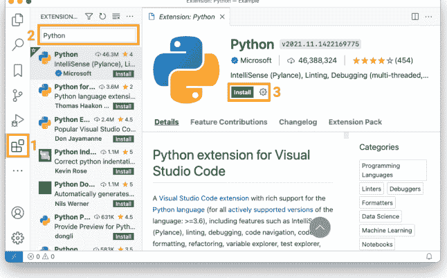

**图 2.1：** 在 Visual Studio Code 中安装 Python 扩展。

完成后，你就拥有了开始创建包所需的一切！例如，你可以从 VS Code 活动栏的 *File Explorer* 标签页创建文件和目录，也可以通过从 *View* 菜单中选择 *Terminal* 来打开集成命令行界面。图 2.2 展示了在 VS Code 中从命令行执行 Python .py 文件的示例。

我们建议你查看 VS Code 入门指南<sup>21</sup> 以了解更多关于使用 VS Code 的信息。虽然你不需要安装任何额外的扩展就可以开始在 VS Code 中创建包，但有许多可用的扩展可以支持和简化你在 VS Code 中的编程工作流程。以下是我们推荐安装的一些扩展，以支持我们在本书中使用的工作流程（你可以像之前一样在 “Marketplace” 中搜索并安装它们）：

- Python Docstring Generator<sup>22</sup>：一个快速为 Python 函数生成文档字符串（docstrings）的扩展。
- Markdown All in One<sup>23</sup>：一个为 Markdown 文件提供键盘快捷键、自动目录和预览功能的扩展。Markdown<sup>24</sup> 是一种纯文本标记语言，我们将在本书中使用和学习它。

<sup>20</sup> https://code.visualstudio.com/
<sup>21</sup> https://code.visualstudio.com/docs
<sup>22</sup> https://marketplace.visualstudio.com/items?itemName=njpwerner.autodocstring
<sup>23</sup> https://marketplace.visualstudio.com/items?itemName=yzhang.markdown-all-in-one
<sup>24</sup> https://www.markdownguide.org

#### 2.5.2 JupyterLab

对于熟悉 Jupyter 生态系统的用户，可以继续使用它来创建你的 Python 包！JupyterLab 是一个基于浏览器的 IDE，支持我们创建包所需的所有核心功能。根据 JupyterLab 安装说明<sup>25</sup>，你可以使用以下命令安装 JupyterLab：

```
$ conda install -c conda-forge jupyterlab
```

安装后，你可以在终端中输入以下命令从当前目录启动 JupyterLab：

```
$ jupyter lab
```

在 JupyterLab 中，你可以从 *File Browser* 创建文件和目录，也可以从 *File* 菜单打开集成终端。图 2.3 展示了在 JupyterLab 中从命令行执行 Python .py 文件的示例。

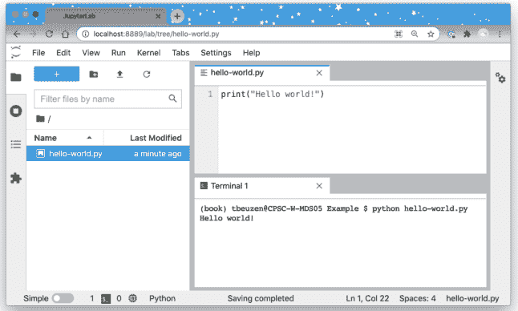

**图 2.3：** 在 JupyterLab 的终端中执行一个名为 hello-world.py 的简单 Python 文件。

我们建议你查看 JupyterLab 文档<sup>26</sup> 以了解更多关于如何使用 JupyterLab 的信息。特别地，我们将指出，与 VS Code 类似，JupyterLab 支持一个扩展生态系统，可以为 IDE 添加额外的功能。我们不会在这里安装任何扩展，但如果你感兴趣，可以在 JupyterLab 的 *Extension Manager* 中浏览它们。

<sup>25</sup> https://jupyterlab.readthedocs.io/en/stable/getting_started/installation.html
<sup>26</sup> https://jupyterlab.readthedocs.io/en/stable/index.html

#### 2.5.3 RStudio

有 R 背景的用户可能更愿意留在 RStudio IDE 中。我们建议从 RStudio 网站<sup>27</sup> 安装最新版本的 IDE（我们建议至少安装 ^1.4 版本），然后从 CRAN<sup>28</sup> 安装最新版本的 R。要在 RStudio 中使用 Python，你需要通过在 RStudio 内的 R 控制台中输入以下命令来安装 reticulate<sup>29</sup> R 包：

```
install.packages("reticulate")
```

安装 reticulate 时，你可能会被提示安装 Anaconda 发行版。我们已经在 **第 2.2.1 节** 安装了 Miniconda Python 发行版，因此请对此提示回答 “no”。在能够在 RStudio 中使用 Python 之前，你需要配置 reticulate。我们将在下面简要描述如何针对不同操作系统进行此操作，但我们鼓励你查看 reticulate 文档<sup>30</sup> 以获取更多帮助。

##### Mac 和 Linux

1.  在命令行输入 `which python` 以找到使用 Miniconda 安装的 Python 解释器的路径。
2.  在你的 HOME 目录中打开（或创建）一个 `.Rprofile` 文件，并添加行 `Sys.setenv(RETICULATE_PYTHON = "path_to_python")`，其中 `"path_to_python"` 是在步骤 1 中确定的路径。
3.  在你的 HOME 目录中打开（或创建）一个 `.bash_profile` 文件，并添加行 `export PATH="/opt/miniconda3/bin:$PATH"`，将 `/opt/miniconda3/bin` 替换为你在步骤 1 中确定的路径，但不要包含末尾的 `python`。
4.  重启 R。
5.  尝试在 RStudio 中使用 Python，通过在 R 控制台中运行以下命令：

```
library(reticulate)
repl_python()
```

##### Windows

1.  通过从开始菜单打开 Anaconda Prompt 并在终端中输入 `where python`，找到使用 Miniconda 安装的 Python 解释器的路径。

<sup>27</sup> https://rstudio.com/products/rstudio/download/
<sup>28</sup> https://cran.r-project.org/
<sup>29</sup> https://rstudio.github.io/reticulate/
<sup>30</sup> https://rstudio.github.io/reticulate/

### 2.6 使用 Docker 进行开发

1.  在你的 HOME 目录中打开（或创建）一个 .Rprofile 文件，并添加一行 `Sys.setenv(RETICULATE_PYTHON = "path_to_python")`，其中 "path_to_python" 是在步骤 1 中确定的路径。请注意，在 Windows 中，你需要使用 `\` 而不是 `/` 来分隔目录；例如，你的路径可能看起来像：`C:\Users\miniconda3\python.exe`。
2.  在你的 HOME 目录中打开（或创建）一个 .bash_profile 文件，并添加一行 `export PATH="/opt/miniconda3/bin:$PATH"`，将 `/opt/miniconda3/bin` 替换为你在步骤 1 中确定的路径，但不要包含末尾的 python。
3.  重启 R。
4.  尝试在 RStudio 中使用 Python，方法是在 R 控制台中运行以下代码：

```
library(reticulate)
repl_python()
```

图 2.4 展示了在 RStudio 控制台中交互式执行 Python 代码的示例。

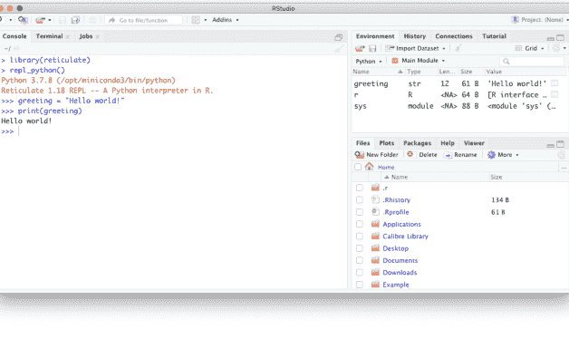

图 2.4：在 RStudio 中执行 Python 代码。

如果你在特定操作系统上安装或使用本书中的任何软件时遇到问题，或者更倾向于使用 Docker 来帮助开发你的 Python 包，我们提供了一个使用 Docker 的替代软件设置，其中包含了你入门所需的一切。Docker$^{31}$ 是一个平台，允许你在称为 *容器* 的隔离环境中运行和开发软件。*镜像* 包含创建容器所需的指令。

我们已经开发了 Docker 镜像，以支持在 Visual Studio Code 或 JupyterLab 中进行 Python 包开发，并在以下章节中描述了使用这些镜像跟随本书学习的最小工作流程。请随意自定义这些镜像和/或工作流程，以适应你的特定用例。我们将通过其 GitHub 仓库（py-pkgs/docker-vscode$^{32}$ 和 py-pkgs/docker-jupyter$^{33}$）继续维护这些 Docker 镜像，以在未来支持本书的读者。

#### 2.6.1 Docker 与 Visual Studio Code

要在 Visual Studio Code 中使用 Docker 进行开发，你可以查阅 Visual Studio Code 官方容器教程$^{34}$，或者尝试按照以下步骤操作：

1.  从官方网站$^{35}$安装 Visual Studio Code。
2.  按照官方网站$^{36}$上的说明，为你的操作系统安装和配置 Docker Desktop。
3.  安装 docker 后，打开命令行界面，并通过运行以下命令拉取 pypkgs/vscode docker 镜像：

```
$ docker pull pypkgs/vscode
```

4.  从 Visual Studio Code 中，打开/创建你想要在其中开发的工作目录（这个目录可以是任何名称，并且可以位于文件系统上的任何位置）。
5.  在 Visual Studio Code 中，打开活动栏上的 *扩展* 选项卡，并在搜索栏中搜索 "Remote - Containers" 扩展。如果尚未安装，请安装此扩展。
6.  在当前工作目录中创建一个名为 *.devcontainer.json* 的文件（请确保包含文件名开头的句点）。此文件将告诉 Visual Studio Code 如何在 Docker 容器中运行。你可以在官方文档$^{37}$中阅读更多关于此配置的信息，但目前，最小设置需要向该文件添加以下内容：

```
{
    "name": "poetry",
    "image": "pypkgs/vscode",
    "extensions": ["ms-python.python"],
}
```

7.  现在，打开 Visual Studio Code 命令面板$^{38}$，搜索并选择命令 “Remote-Containers: Reopen in Container”。此命令将打开 Visual Studio Code，该实例运行在使用 pypkgs/vscode Docker 镜像创建的容器中。在 Visual Studio Code 在容器中完成打开后，通过打开集成终端$^{39}$并尝试以下命令来测试你是否可以访问我们需要的三个预安装的打包软件：

```
$ poetry --version
$ conda --version
$ cookiecutter --version
```

8.  你的开发环境现在已设置完毕，你可以像所有内容都在本地机器上运行一样使用 Visual Studio Code（只不过现在你的开发环境存在于容器内）。如果你退出 Visual Studio Code，你的容器将停止，但会保留在你的机器上。可以使用我们在步骤 7 中使用的 “Remote-Containers: Reopen in Container” 命令在以后重新打开它。
9.  如果你想完全移除你的开发容器以释放机器上的内存，首先找到容器的 ID：

```
$ docker ps -a
```

| CONTAINER ID | IMAGE |
|---|---|
| 762bca6eb51e | pypkgs/vscode |

10. 然后使用 docker rm 命令结合容器的 ID。这将移除容器，包括其中安装的任何包或虚拟环境。但是，你创建的任何文件和目录将保留在你的机器上。

```
$ docker rm 762bca6eb51e
```

#### 2.6.2 Docker 与 JupyterLab

要在 JupyterLab 中使用 Docker 进行开发，请按照以下说明操作。有用的信息和教程也可以在 Jupyter Docker Stacks 文档<sup>40</sup>中找到。

1.  按照官方网站<sup>41</sup>上的说明，为你的操作系统安装和配置 Docker Desktop。
2.  安装 Docker 后，打开命令行界面，并通过运行 docker pull 命令如下拉取 pypkgs/jupyter Docker 镜像：

```
$ docker pull pypkgs/jupyter
```

3.  从命令行，导航到你想要在其中开发的目录（这个目录可以是任何名称，并且可以位于文件系统上的任何位置）。
4.  通过从命令行运行以下命令，从该目录启动一个新容器：

```
$ docker run -p 8888:8888 \
    -v "${PWD}":/home/jovyan/work \
    pypkgs/jupyter
```

在上面的命令中，`-p` 将容器中的端口 8888 绑定到主机上的端口 8888，`-v` 将当前目录挂载到容器中的 `/home/jovyan/work` 位置。遇到上述命令问题的 Windows 用户可能需要尝试在卷挂载路径中使用双斜杠，例如：`-v /$(pwd) ://home//jovyan//work`。你可以在 Docker 命令行界面文档<sup>42</sup>中阅读更多关于 docker run 命令及其参数的信息。

5.  将打印到屏幕的唯一 URL（看起来像这样：`http://127.0.0.1:8888/lab?token=45d53a348580b3acfafa`）复制到你的浏览器中。这将打开一个在 Docker 容器内运行的 JupyterLab 实例。
6.  在 JupyterLab 中导航到 work 目录。这是你可以开发和创建新文件和目录的地方，这些文件和目录将保留在你启动容器的目录中。
7.  通过在 JupyterLab 中打开终端并尝试以下命令来测试你是否可以访问我们需要的三个预安装的打包软件：

```
$ poetry --version
$ conda --version
$ cookiecutter --version
```

8.  当你完成一个工作会话后，你可以退出 JupyterLab，并关闭你的终端，你的容器将保留。你可以通过首先找到其 ID 来重启容器并再次启动 JupyterLab：

```
$ docker ps -a
```

| CONTAINER ID | IMAGE |
|---|---|
| 653daa2cd48e | pypkgs/jupyter |

9.  然后，要重启容器并启动 JupyterLab，使用 docker start -a 命令结合容器的 ID：

```
$ docker start -a 653daa2cd48e
```

10. 如果你想完全移除容器，可以使用 docker rm 命令。这将移除容器，包括其中安装的任何包或虚拟环境。但是，添加到 work 目录的所有文件和目录将保留在你的机器上。

```
$ docker rm 653daa2cd48e
```

## 3 如何打包一个 Python 包

在本章中，我们将从头到尾开发一个完整的示例 Python 包，以演示开发包所涉及的关键步骤。本章构成了本书的基础。它包含了你需要知道的关于创建 Python 包的所有内容，并且可以在未来创建包时用作参考手册。后面的章节将更详细地探讨打包过程中的每个单独步骤。

我们将在本章中创建的示例包将帮助我们计算文本文件中的单词数。我们将称它为 `pycounts`，它将有助于计算小说、研究论文、新闻文章、日志文件等文本中的单词使用情况。

### 3.1 计算文本文件中的单词数

#### 3.1.1 开发我们的代码

在考虑制作一个包之前，我们将首先开发我们想要打包的代码。我们将要创建的 `pycounts` 包将帮助我们计算文本文件中的单词数。Python 有一个有用的 `Counter` 对象，可用于计算一组元素（如单词列表）的计数，并将它们存储在字典中。

我们可以通过首先在命令行输入 `python` 打开 Python 解释器来演示 `Counter` 的功能：

```
$ python
```

然后我们可以从 `collections` 模块导入 `Counter` 类：

```
>>> from collections import Counter
```

现在我们将定义并使用一个示例单词列表来创建一个 `Counter` 对象：

### 3.1 在文本文件中统计单词

```python
>>> words = ["a", "happy", "hello", "a", "world", "happy"]
>>> word_counts = Counter(words)
>>> word_counts
```

```
Counter({'a': 2, 'happy': 2, 'hello': 1, 'world': 1})
```

请注意，Counter 对象如何自动计算了输入列表中每个唯一单词的计数，并以“单词”：计数对的字典形式返回结果！有了这个功能，我们如何使用 Counter 来统计文本文件中的单词呢？嗯，我们需要用 Python 加载文件，将其拆分成单词列表，然后从该单词列表创建一个 Counter 对象。

我们首先需要一个文本来帮助我们构建这个工作流。“Python 之禅<sup>1</sup>”是关于 Python 编程语言的十九条格言列表，可以通过在 Python 解释器中运行 `import this` 来查看：

```python
>>> import this
```

```
The Zen of Python, by Tim Peters

Beautiful is better than ugly.
Explicit is better than implicit.
Simple is better than complex.
...
```

让我们创建一个名为 `zen.txt` 的文本文件，包含上面的“Python 之禅”文本。你可以通过使用你选择的编辑器手动将上述输出复制到当前目录中名为 `zen.txt` 的文件中来完成此操作，或者通过在命令行运行以下命令：

```bash
$ python -c "import this" > zen.txt
```

> 在上面的命令中，`-c` 选项允许你传递一个字符串供 Python 执行，而 `>` 将命令的输出重定向到一个文件（在我们的例子中，该文件名为 "zen.txt"，位于当前目录）。

现在我们有了一个可供操作的文本文件，我们可以回到开发我们的单词计数工作流。要在 Python 中打开 `zen.txt`，我们可以使用 `open()` 函数打开文件，然后使用 `.read()` 方法将其内容读取为 Python 字符串。下面的代码在 Python 解释器中运行，将 `zen.txt` 的内容作为字符串保存在变量 `text` 中：

```python
>>> with open("zen.txt") as file:
...     text = file.read()
```

让我们看看 `text` 是什么样子：

```python
>>> text
```

```
"The Zen of Python, by Tim Peters\n\nBeautiful is better\nthan ugly.\nExplicit is better than implicit.\nSimple is\nbetter than complex.\nComplex is better than complicated\n..."
```

我们可以看到 `text` 变量是一个单一的字符串，其中的 `\n` 符号表示字符串中的换行符。

在我们将上述文本拆分成单个单词以使用 `Counter` 进行统计之前，我们应该将所有字母转换为小写并移除标点符号，这样如果同一个单词以不同的大小写或标点符号出现多次，它就不会被 `Counter` 视为不同的单词。例如，我们希望 "Better"、"better" 和 "better!" 都被计为单词 "better" 的三次出现。

要将 Python 字符串中的所有字母转换为小写，我们可以使用 `.lower()` 方法：

```python
>>> text = text.lower()
```

要移除标点符号，我们可以在字符串中找到它们，并使用 `.replace()` 方法将其替换为空。Python 在 `string` 模块中提供了一组常见的标点符号：

```python
>>> from string import punctuation
>>> punctuation
```

```
'!"#$%&\'()*+,-./:;<=>?@[\]^_`{|}~'
```

我们可以使用 `for` 循环，通过将每个标点符号替换为空字符串（即 ""）来从 `text` 变量中移除它们：

```python
>>> for p in punctuation:
        text = text.replace(p, "")
```

移除标点符号并将 `text` 中的字母全部转换为小写后，我们现在可以使用 `.split()` 方法将其拆分成单个单词。此方法使用空格、换行符（`\n`）和制表符（`\t`）作为分隔符将字符串拆分成字符串列表：

```python
>>> words = text.split()
>>> words
```

```
['the', 'zen', 'of', 'python', 'by', 'tim', 'peters',
'beautiful', 'is', 'better', 'than', 'ugly', ...]
```

我们已经成功加载、预处理并拆分了 `zen.txt` 文件，将其转换为单个单词，现在可以通过创建 Counter 对象来确定单词计数：

```python
>>> from collections import Counter
>>> word_counts = Counter(words)
>>> word_counts
```

```
Counter({'is': 10, 'better': 8, 'than': 8, 'the': 6,
'to': 5, 'of': 3, 'although': 3, 'never': 3, ... })
```

#### 3.1.2 将我们的代码转化为函数

在**第 3.1.1 节**中，我们开发了一个用于统计文本文件中单词的工作流。但是，每次我们想统计一个文件中的单词时都运行所有这些代码会很麻烦！为了提高效率，让我们通过在 Python 解释器中定义它们，将上述代码转化为三个可重用的函数，分别名为 `load_text()`、`clean_text()` 和 `count_words()`：

> 我们在这里使用三重引号为每个函数添加了一个简短的文档字符串（docstring）。我们将在**第 3.8.2 节**中更详细地讨论文档字符串。

```python
>>> def load_text(input_file):
    """Load text from a text file and return as a string."""
    with open(input_file, "r") as file:
        text = file.read()
    return text
```

```python
>>> def clean_text(text):
    """Lowercase and remove punctuation from a string."""
    text = text.lower()
    for p in punctuation:
        text = text.replace(p, "")
    return text
```

```python
>>> def count_words(input_file):
    """Count unique words in a string."""
    text = load_text(input_file)
    text = clean_text(text)
    words = text.split()
    return Counter(words)
```

我们现在可以如下使用我们的单词计数功能：

```python
>>> count_words("zen.txt")
```

```
Counter({'is': 10, 'better': 8, 'than': 8, 'the': 6,
'to': 5, 'of': 3, 'although': 3, 'never': 3, ... })
```

不幸的是，如果你退出 Python 解释器，我们刚刚定义的函数将会丢失，你将不得不在新的会话中重新定义它们。

Python 包的全部理念是，我们可以将 Python 代码（比如我们的 `load_text()`、`clean_text()` 和 `count_words()` 函数）存储在一个包中，这样我们和其他人就可以在任何时间、任何项目中安装、导入和使用它。在本章的剩余部分，我们将致力于将我们编写的代码打包成一个名为 `pycounts` 的 Python 包。

### 3.2 包结构

#### 3.2.1 简要介绍

要开发我们的 `pycounts` 包，我们首先需要创建一个合适的目录结构。Python 包由特定的目录结构组成，通常包括以下内容：

- 一个以包名命名的根目录，例如 `pycounts/`；
- 一个或多个 Python 模块（包含 Python 代码的 `.py` 扩展名文件）位于子目录 `src/pycounts/` 中；
- 关于如何在计算机上构建和安装包的说明，位于名为 `pyproject.toml` 的文件中；
- 重要的文档，如根目录中的 README，以及 `docs/` 子目录中的附加文档；以及，
- `tests/` 子目录中的测试。

下面展示了一个名为 "pycounts" 的包的示例结构，其中包含两个模块（"moduleA" 和 "moduleB"）。这里有很多文件，但不用担心；包通常是从预制模板创建的，我们将在下一节中展示。目前，我们只是对包结构有一个概览。在本章的学习过程中，我们将创建并探索此结构中的每个元素。

```
pycounts
├── CHANGELOG.md
├── CONDUCT.md
├── CONTRIBUTING.md
├── docs
│   └── ...
├── LICENSE
├── README.md
├── pyproject.toml
├── src
│   └── pycounts
│       ├── __init__.py
│       ├── moduleA.py
│       └── moduleB.py
└── tests
    └── ...
```

看到两个具有包名的目录（根目录 `pycounts/` 和子目录 `src/pycounts/`）可能会令人困惑，但这就是 Python 包的典型设置方式。我们将在本章的其余部分更深入地探讨这种结构，并在**第 4 章：包结构与分发**中详细讨论它。

#### 3.2.2 创建包结构

大多数开发者使用预制模板来设置 Python 包的目录结构。我们将使用 `cookiecutter` 工具（我们在**第 2.2.2 节**中安装过）来为我们创建包结构。

`cookiecutter` 是一个用于从预制模板填充目录结构的工具。人们已经开发并开源了许多用于不同项目的 `cookiecutter` 模板，例如用于创建 Python 包、R 包、网站等。你可以通过在线托管服务（如 GitHub²）搜索找到这些模板。我们开发了自己的 `py-pkgs-cookiecutter` Python 包模板来支持本书；它托管在 GitHub³ 上。

要使用此模板创建包目录结构，你可以从命令行导航到要创建包的目录，然后运行下面的命令。执行此命令后，系统将提示你提供用于创建包文件和目录结构的信息。我们在下面提供了一个如何响应这些提示的示例，并在**表 3.1** 中解释了它们的含义。

```bash
$ cookiecutter https://github.com/py-pkgs/py-pkgs-cookiecutter.git
```

```
author_name [Monty Python]: Tomas Beuzen
package_name [mypkg]: pycounts
package_short_description []: Calculate word counts in a text file!
package_version [0.1.0]:
python_version [3.9]:
Select open_source_license:
1 - MIT
2 - Apache License 2.0
```

### 3.2 包结构

| 提示关键词 | 描述 |
| :--- | :--- |
| author_name, package_name, package_short_description | 这些不言自明。请注意，我们将把 pycounts 包发布到 Python 的主要包索引 PyPI，其中名称必须唯一。**如果你打算跟着本教程操作，你应该为你的包选择一个唯一的名称。** 类似 pycounts_[你的姓名首字母] 的名称可能合适，但你可以通过在 PyPI 上搜索来检查名称是否已被占用。我们在[第 4.2.2 节](#section-4.2.2)中提供了关于选择好的包名的指导。 |
| package_version | 你的包的版本。大多数包使用语义化版本控制，其中版本号由三个整数 A.B.C 组成。A 是“主”版本，B 是“次”版本，C 是“补丁”版本。包的第一个版本通常从 0.1.0 开始，然后递增。我们将在[第 7 章：发布与版本控制](#chapter-7-releasing-and-versioning)中讨论版本控制。 |
| python_version | 你的包将支持的最低 Python 版本。我们将在[第 3.6.1 节](#section-3.6.1)中更多地讨论版本和约束。 |
| open_source_license | 规定他人如何使用你的包的许可证。我们在第 6.2.2 节讨论许可证。我们在示例中选择的 MIT 许可证是一种宽松许可证，常用于开源项目。如果你的项目不是开源的，你可以选择不包含许可证。 |
| include_github_actions | 一个选项，用于包含用于 GitHub Actions 的持续集成和持续部署文件。我们将在第 8 章：持续集成与部署中探讨这些主题，因此目前，我们建议回答“否”。 |

响应 py-pkgs-cookiecutter 提示后，我们得到了一个名为 pycounts 的新目录，其中包含适合构建功能齐全的 Python 包的内容！在本章中开发 pycounts 包的过程中，我们将探索此目录结构的每个元素。

```
pycounts
├── .readthedocs.yml
├── CHANGELOG.md
├── CONDUCT.md
├── CONTRIBUTING.md
├── docs
│   ├── changelog.md
│   ├── conduct.md
│   ├── conf.py
│   ├── contributing.md
│   ├── example.ipynb
│   ├── index.md
│   ├── make.bat
│   ├── Makefile
│   └── requirements.txt
├── LICENSE
├── README.md
├── pyproject.toml
└── src
    └── pycounts
        ├── __init__.py
        └── pycounts.py
tests/
    └── test_pycounts.py
```

包源代码、元数据和构建说明

包测试

### 3.3 将你的包置于版本控制之下

在继续开发我们的包之前，将其置于本地和远程版本控制之下是一个好习惯。这对于开发包来说不是必需的，但强烈推荐这样做，以便你可以更好地管理和跟踪包随时间的变化。如果你计划与他人协作开发你的包，版本控制尤其有用。如果你不想使用版本控制，请随时跳到第 3.4 节。本书中我们将用于版本控制的工具是 Git 和 GitHub（我们在第 2.4 节中进行了设置）。

> 对于本书，我们假设读者对 Git 和 GitHub（或类似工具）有基本的了解。要了解更多关于 Git 和 GitHub 的信息，我们推荐以下资源：*Happy Git and GitHub for the useR*（Bryan 等人，2021）和 *Research Software Engineering with Python*（Irving 等人，2021）。

#### 3.3.1 设置本地版本控制

要设置本地版本控制，请导航到根 *pycounts/* 目录并初始化一个 Git 仓库：

```
$ cd pycounts
$ git init
Initialized empty Git repository in /Users/tomasbeuzen/pycounts/.git/
```

接下来，我们需要告诉 Git 要跟踪哪些文件进行版本控制（此时将是所有文件），然后在本地提交这些更改：

```
$ git add .
$ git commit -m "initial package setup"
[master (root-commit) 51795ad] initial package setup
 20 files changed, 502 insertions(+)
 create mode 100644 .gitignore
 create mode 100644 .readthedocs.yml
 create mode 100644 CHANGELOG.md
 ...
 create mode 100644 src/pycounts/__init__.py
 create mode 100644 src/pycounts/pycounts.py
 create mode 100644 tests/test_pycounts.py
```

#### 3.3.2 设置远程版本控制

现在我们已经设置了本地版本控制，我们将在 GitHub[^6] 上创建一个仓库，并将其设置为该项目的远程版本控制主目录。首先，我们需要在 GitHub[^7] 上创建一个新仓库，如图 3.1 所示：

接下来，在设置你的 GitHub 仓库时选择以下选项，如图 3.2 所示：

1.  给 GitHub 仓库起一个与你的 Python 包相同的名称，并给它一个简短的描述。
2.  你可以选择将你的仓库设为公开或私有——我们将把我们的设为公开，以便与他人分享。
3.  不要用任何文件初始化仓库（我们已经使用 py-pkgs-cookiecutter 模板在本地创建了所有文件）。

现在，使用 GitHub 上显示的命令（如图 3.3 所示）来链接你的本地和远程仓库，并将你的本地内容推送到 GitHub：


图 3.1：在 GitHub 中创建新仓库。

> 下面的命令应特定于你的 GitHub 用户名和你的 Python 包的名称。它们使用 SSH 身份验证连接到 GitHub，你需要按照官方 GitHub 文档⁸中的步骤进行设置。

```
$ git remote add origin git@github.com:TomasBeuzen/pycounts.git
$ git branch -M main
$ git push -u origin main
```

⁸https://docs.github.com/en/authentication/connecting-to-github-with-ssh

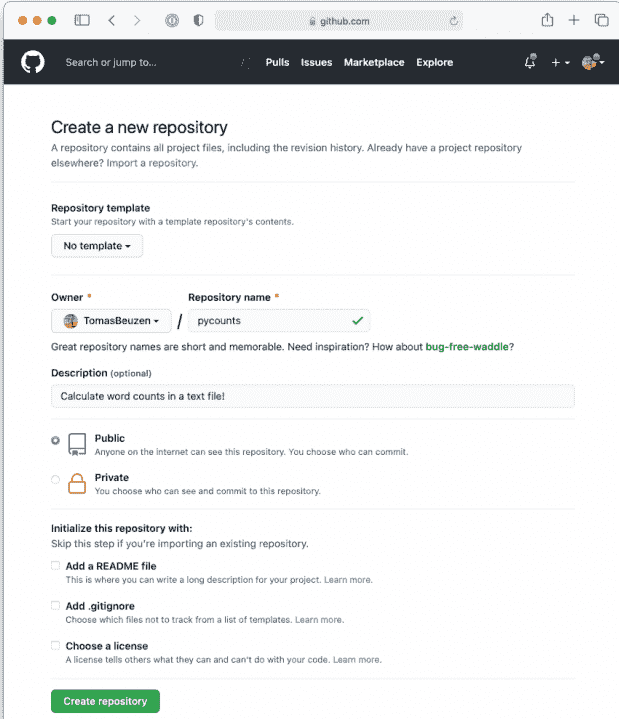

图 3.2：在 GitHub 中设置新仓库。

```
Enumerating objects: 26, done.
Counting objects: 100% (26/26), done.
Delta compression using up to 8 threads
Compressing objects: 100% (19/19), done.
Writing objects: 100% (26/26), 8.03 KiB | 4.01 MiB/s, done.
Total 26 (delta 0), reused 0 (delta 0)
To github.com:TomasBeuzen/pycounts.git
```

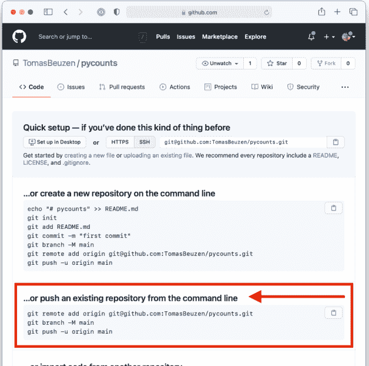

图 3.3：关于如何链接本地和远程版本控制仓库的说明。

```
* [new branch]      main -> main
Branch 'main' set up to track remote branch 'main' from 'origin'.
```

### 3.4 打包你的代码

我们现在已经设置了 pycounts 包结构，并准备用我们在本章开头 **第 3.1.2 节** 中开发的 load_text()、clean_text() 和 count_words() 函数来填充我们的包。我们应该把这些函数放在哪里？让我们回顾一下我们包的结构：

```
pycounts
├── .readthedocs.yml
├── CHANGELOG.md
├── CONDUCT.md
├── CONTRIBUTING.md
├── docs
│   └── ...
├── LICENSE
├── pyproject.toml
├── README.md
├── src
│   └── pycounts
│       ├── __init__.py
│       └── pycounts.py
└── tests
    └── ...
```

我们包的 Python 代码应该放在 *src/pycounts/* 目录中的模块里。py-pkgs-cookiecutter 模板已经为我们创建了一个名为 *src/pycounts/pycounts.py* 的 Python 模块来放置代码（请注意，这个模块可以命名为任何名称，但模块与包同名是常见的做法）。我们现在将把在 **第 3.1.2 节** 中创建的函数复制到模块 *src/pycounts/pycounts.py* 中。我们的函数依赖于 collections.Counter 和 string.punctuation，因此我们也需要在文件顶部导入它们。以下是 *src/pycounts/pycounts.py* 现在应该的样子：

```
from collections import Counter
from string import punctuation

def load_text(input_file):
    """Load text from a text file and return as a string."""
    with open(input_file, "r") as file:
        text = file.read()
    return text

def clean_text(text):
    """Lowercase and remove punctuation from a string."""
    text = text.lower()
    for p in punctuation:
        text = text.replace(p, "")
```

### 3.5 试运行你的包代码

#### 3.5.1 创建虚拟环境

在安装和测试我们的包之前，强烈建议设置一个虚拟环境。正如之前在[第2.2.1节](#section-2.2.1)中讨论的，虚拟环境提供了一个安全且隔离的空间来开发和安装包。如果你不想使用虚拟环境，可以随时跳转到[第3.5.2节](#section-3.5.2)。

在创建和管理虚拟环境方面，有多种选择（例如，conda 或 venv）。我们将使用 conda（我们在[第2.2.1节](#section-2.2.1)中安装的），因为它是一个简单、常用且有效的虚拟环境管理工具。

要使用 conda 创建一个名为 `pycounts` 的新虚拟环境（其中包含 Python），请在终端中运行以下命令：

```
$ conda create --name pycounts python=3.9 -y
```

> 我们指定 `python=3.9` 是因为这是我们在[第3.2.2节](#section-3.2.2)中指定的包将支持的最低 Python 版本。

要使用这个新环境来开发和安装软件，我们需要“激活”它：

```
$ conda activate pycounts
```

在大多数命令行中，conda 会在你的命令行提示符前添加一个类似 `(pycounts)` 的前缀，以指示你当前正在哪个环境中工作。任何时候你希望处理你的包，都应该激活其虚拟环境。你可以使用 `conda list` 命令查看 conda 环境中当前安装的包，并使用 `conda deactivate` 退出 conda 虚拟环境。

> poetry，我们将在本章后面用于开发包的打包工具，也支持虚拟环境管理，无需 conda。然而，我们发现 conda 是一个更直观和明确的环境管理器，这就是为什么我们在本书中提倡使用它。

#### 3.5.2 安装你的包

我们已经设置好了包结构，并用 Python 代码填充了它。我们如何安装和使用我们的包呢？有多种工具可用于开发可安装的 Python 包。最常见的是 poetry、flit 和 setuptools，我们将在第4.3.3节中进行比较。在本书中，我们将使用 poetry（我们在第2.2.2节中安装的）；它是一个现代的打包工具，提供简单高效的命令来开发、安装和分发 Python 包。

在一个由 poetry 管理的包中，`pyproject.toml` 文件存储了包的所有元数据和安装说明。py-pkgs-cookiecutter 为我们的 `pycounts` 包创建的 `pyproject.toml` 如下所示：

```
[tool.poetry]
name = "pycounts"
version = "0.1.0"
description = "Calculate word counts in a text file."
authors = ["Tomas Beuzen"]
license = "MIT"
readme = "README.md"

[tool.poetry.dependencies]
python = "^3.9"

[tool.poetry.dev-dependencies]

[build-system]
requires = ["poetry-core>=1.0.0"]
build-backend = "poetry.core.masonry.api"
```

表3.2简要描述了该文件中的每个标题（在TOML文件术语中称为“表”）。

**表3.2：** pyproject.toml 中表的描述。

| TOML 表 | 描述 |
|---|---|
| [tool.poetry] | 定义包元数据。包的名称、版本、描述和作者是必需的。 |
| [tool.poetry.dependencies] | 标识包的依赖项——即包所依赖的软件。我们的 `pycounts` 包仅依赖于 Python 3.9 或更高版本，但我们将在本章后面为包添加其他依赖项。 |
| [tool.poetry.dev-dependencies] | 标识包的开发依赖项——开发所需的依赖项，例如运行测试或构建文档。我们将在本章后面为 `pycounts` 包添加开发依赖项。 |
| [build-system] | 标识构建包所需的构建工具。我们将在第3.10节中进一步讨论这一点。 |

由于我们的 *pyproject.toml* 文件已由 py-pkgs-cookiecutter 模板设置好，我们可以使用 poetry 在命令行中从包根目录运行 `poetry install` 命令来安装我们的包：

```
$ poetry install
```

```
Updating dependencies
Resolving dependencies... (0.1s)

Writing lock file

Installing the current project: pycounts (0.1.0)
```

> 当你运行 `poetry install` 时，poetry 会创建一个 `poetry.lock` 文件，其中记录了你在开发包过程中安装的所有依赖项。对于任何其他参与你项目的人（包括未来的你），运行 `poetry install` 会从 `poetry.lock` 安装依赖项，以确保他们拥有与你开发包时相同版本的依赖项。我们不会在本书中重点讨论 `poetry.lock`，但它可能是一个有用的开发工具，你可以在 poetry 文档[^10]中阅读更多相关信息。

包安装好后，我们现在可以在 Python 会话中 `import` 并使用它。在此之前，我们需要一个文本来测试我们的包。你可以使用任何文本文件，但我们将通过在命令行中运行以下命令来创建本章前面使用过的同一个“Python 之禅”文本文件：

```
$ python -c "import this" > zen.txt
```

现在我们可以打开一个 Python 解释器，并使用以下代码 `import` 并使用 `pycounts` 模块中的 `count_words()` 函数：

```
>>> from pycounts.pycounts import count_words
>>> count_words("zen.txt")
```

```
Counter({'is': 10, 'better': 8, 'than': 8, 'the': 6,
'to': 5, 'of': 3, 'although': 3, 'never': 3, ... })
```

[^10]: https://python-poetry.org/docs/basic-usage/#installing-dependencies

看起来一切正常！我们现在创建并安装了一个简单的 Python 包！你现在可以在任何你希望的项目中使用这个 Python 包（如果使用虚拟环境，你需要在其中 `poetry install` 这个包才能使用）。

`poetry install` 实际上是以“可编辑模式”安装包，这意味着它安装的是指向你计算机上包代码的链接（而不是将其作为独立的软件安装）。可编辑安装是开发者常用的，因为它意味着对包源代码所做的任何编辑在下次导入时立即可用，无需再次运行 `poetry install`。我们将在**第3.10节**中进一步讨论安装包。

在下一节中，我们将展示如何向我们的包中添加依赖于另一个包的代码。但对于使用版本控制的人来说，最好将我们对 `src/pycounts/pycounts.py` 所做的更改提交到本地和远程版本控制：

```
$ git add src/pycounts/pycounts.py
$ git commit -m "feat: add word counting functions"
$ git push
```

在本书中，我们使用 Angular 风格<sup>11</sup>的 Git 提交消息。我们将在**第7.2.2节**中进一步讨论这种风格，但我们的提交消息格式为“类型：主题”，其中“类型”表示所做的更改类型，“主题”包含更改的描述。我们将为我们的提交使用以下“类型”：

- “build”：表示对构建系统或外部依赖项的更改。
- “docs”：表示对文档的更改。
- “feat”：表示向代码库添加新功能。
- “fix”：表示错误修复。
- “test”：表示对测试框架的更改。

<sup>11</sup> https://github.com/angular/angular.js/blob/master/DEVELOPERS.md#-git-commit-guidelines

### 3.6 为你的包添加依赖项

现在让我们向包中添加一个新函数，该函数可以绘制一个柱状图，显示词频计数 `Counter` 对象中前 n 个单词。假设我们想出了以下 `plot_words()` 函数来实现此功能。该函数使用 `Counter` 对象方便的 `.most_common()` 方法，以 `(word, count)` 的格式返回前 n 个单词计数的元组列表。然后，它使用 Python 函数 `zip(*...)` 将该元组列表解包为两个单独的列表 `word` 和 `count`。最后，使用 `matplotlib` (Hunter, 2007) 包绘制结果（`plt.bar(...)`），如图3.4所示。

> 如果你对这段代码不熟悉，不用担心！代码本身对于我们的打包讨论来说并不是特别重要。你只需要知道我们正在向包中添加一些依赖于 `matplotlib` 包的新代码。

```
import matplotlib.pyplot as plt

def plot_words(word_counts, n=10):
    """Plot a bar chart of word counts."""
    top_n_words = word_counts.most_common(n)
    word, count = zip(*top_n_words)
    fig = plt.bar(range(n), count)
    plt.xticks(range(n), labels=word, rotation=45)
    plt.xlabel("Word")
    plt.ylabel("Count")
    return fig
```

我们应该把这个函数放在包的哪个位置？你当然可以把所有的包代码都放在一个模块中（例如 `src/pycounts/pycounts.py`），但随着你向包中添加功能，该模块很快就会变得拥挤且难以管理。相反，随着你编写更多的代码，将其组织成多个逻辑模块是一个好主意。考虑到这一点，我们将创建一个名为 `src/pycounts/plotting.py` 的新模块来存放我们的绘图函数 `plot_words()`。现在就在你选择的编辑器中创建这个新模块。

### 3.6 为你的包添加依赖

完成此操作后，如果我们尝试在 Python 解释器中导入新函数，将会得到一个错误：

> 如果使用 conda 虚拟环境，请确保在使用或处理你的包之前，通过运行 `conda activate pycounts` 来激活该环境。

```
>>> from pycounts.plotting import plot_words
```

```
ModuleNotFoundError: No module named 'matplotlib'
```

这是因为 matplotlib 不是 Python 标准库的一部分；我们需要安装它并将其添加为 pycounts 包的依赖项。我们可以使用 poetry 的 `poetry add` 命令来完成此操作。此命令会将指定的依赖项安装到当前虚拟环境中，并更新 `pyproject.toml` 文件的 `[tool.poetry.dependencies]` 部分：

```
$ poetry add matplotlib
```

```
Using version ^3.4.3 for matplotlib

Updating dependencies
Resolving dependencies...

Writing lock file

Package operations: 8 installs, 0 updates, 0 removals

• Installing six (1.16.0)
• Installing cycler (0.10.0)
• Installing kiwisolver (1.3.1)
• Installing numpy (1.21.1)
• Installing pillow (8.3.1)
• Installing pyparsing (2.4.7)
• Installing python-dateutil (2.8.2)
• Installing matplotlib (3.4.3)
```

如果你打开 `pyproject.toml` 文件，现在应该能在 `[tool.poetry.dependencies]` 部分看到 `matplotlib` 被列为依赖项（如我们在 [第 3.5.2 节](#section-3-5-2) 中所见，该部分之前仅包含 Python 3.9 作为依赖项）：

```
[tool.poetry.dependencies]
python = "^3.9"
matplotlib = "^3.4.3"
```

现在，我们可以在 Python 解释器中按如下方式使用我们的包（如果你运行以下代码，请确保我们之前创建的 `zen.txt` 文件位于当前目录中）：

```
>>> from pycounts.pycounts import count_words
>>> from pycounts.plotting import plot_words
>>> counts = count_words("zen.txt")
>>> fig = plot_words(counts, 10)
```

如果在交互式 IPython shell 或 Jupyter Notebook 中运行上述 Python 代码，图表将自动显示。如果你从 Python 解释器运行，则需要运行 `matplotlib` 命令 `plt.show()` 来显示图表，如下所示：

```
>>> import matplotlib.pyplot as plt
>>> plt.show()
```

在本节中，我们通过添加一个新模块和一个依赖项，对包进行了一些重要更改。使用版本控制的用户应提交这些更改：

```
$ git add src/pycounts/plotting.py
$ git commit -m "feat: add plotting module"
$ git add pyproject.toml poetry.lock
$ git commit -m "build: add matplotlib as a dependency"
$ git push
```

#### 3.6.1 依赖版本约束

版本控制是为包的唯一发布版本分配唯一标识符的做法。例如，语义化版本控制[^12]是一个常见的版本控制系统，由三个整数 A.B.C 组成。A 是“主”版本号，B 是“次”版本号，C 是“补丁”版本标识符。包版本通常从 0.1.0 开始，并根据随时间对包所做的更改类型，从那里开始正向递增主版本号、次版本号和补丁版本号。

[^12]: https://semver.org

我们将在**第 7 章：发布与版本控制**中更详细地讨论版本控制，但现在需要了解的是，我们通常会约束包依赖项所需的版本号，以确保我们使用的是包含所需功能的最新版本。你可能已经注意到，poetry 在我们的 *pyproject.toml* 文件的 [tool.poetry.dependencies] 部分中的依赖版本前添加了一个脱字符（^）运算符：

```
[tool.poetry.dependencies]
python = "^3.9"
matplotlib = "^3.4.3"
```

脱字符运算符是“需要此版本或任何不修改最左侧非零版本数字的更高版本”的简写。例如，我们的包依赖于任何 >=3.9.0 且 <4.0.0 的 Python 版本。因此，有效的版本示例包括 3.9.1 和 3.12.0，但 4.0.1 将是无效的。还有许多其他语法可用于以不同方式指定版本约束，你可以在 *poetry 文档*<sup>13</sup> 中阅读更多相关信息。那么，我们为什么关心这个呢？脱字符运算符对我们的包所需的依赖版本施加了上限。这种方法的一个问题是，它迫使任何依赖你的包的人指定相同的约束，因此可能使添加和解析依赖变得困难。

这个问题最好通过示例来说明。流行的 numpy (Harris et al., 2020) 包的 1.21.5 版本对 Python 有绑定的版本约束，要求版本 >=3.7 且 <3.11（参见源代码<sup>14</sup>）。看看如果我们尝试将此版本的 numpy 添加到我们的 pycounts 包中会发生什么（我们使用 `--dry-run` 参数来显示会发生什么，而不实际执行任何操作）：

```
$ poetry add numpy=1.21.5 --dry-run
```

```
Updating dependencies
Resolving dependencies... (0.1s)

SolverProblemError

The current project's Python requirement (>=3.9,<4.0) is not compatible
with some of the required packages Python requirement:
```

<sup>13</sup> https://python-poetry.org/docs/dependency-specification
<sup>14</sup> https://github.com/numpy/numpy/blob/c3d0a09342c08c466984654bc4738af595fba896/setup.py#L409

- numpy 需要 Python >=3.7,<3.11，因此对于 Python >=3.11,<4.0 将无法满足

这里的问题是，我们的包目前支持 Python 版本 ^3.9（即 >=3.9.0 且 <4.0.0），因此如果我们发布它，使用 Python 3.12.0 的用户在技术上将能够安装它。然而，numpy 1.21.5 仅支持 >=3.7 且 <3.11，这与 Python 3.12.0（或任何 >=3.11 的版本）不兼容。由于这种不一致性，poetry 拒绝将 numpy 1.21.5 添加为我们的包的依赖项。要添加它，我们有三个主要选择：

1. 将我们包的 Python 版本约束更改为 >=3.7 且 <3.11。
2. 等待一个与我们包的 Python 约束兼容的 numpy 版本。
3. 手动指定可以安装该依赖项的 Python 版本，例如：`poetry add numpy=1.21.5 --python ">=3.7, <3.11"`。

这些选项都不是真正理想的，特别是如果你的包有大量具有不同绑定版本约束的依赖项。然而，解决此问题的一个简单方法是，如果 numpy 1.21.5 没有对所需的 Python 版本设置上限。事实上，在随后的 numpy 次版本发布 1.22.0 中，移除了对 Python 的版本上限，仅要求版本 >=3.8（参见源代码<sup>15</sup>），我们将能够成功将其添加到我们的包中：

```
$ poetry add numpy=1.22.0 --dry-run
```

最终，版本约束是一个重要问题，可能会影响你的包的可用性。如果你打算分享你的包，对依赖版本设置上限可能会使其他开发者很难在他们自己的项目中将你的包用作依赖项。在撰写本文时，包括 Python 打包权威机构<sup>16</sup>在内的许多打包社区通常建议不要对版本约束使用上限，除非绝对必要。因此，我们建议通过手动将 poetry 的默认脱字符运算符（^）更改为大于或等于符号（>=）来指定没有上限的版本约束。例如，我们将按如下方式更改 pyproject.toml 文件的 [tool.poetry.dependencies] 部分：

<sup>15</sup> https://github.com/numpy/numpy/blob/4adc87dff15a247e417d50f10cc4def8e1c17a03/setup.py#L410
<sup>16</sup> https://github.com/pypa/packaging.python.org/pull/850

### 3.7 测试你的包

#### 3.7.1 编写测试

至此，我们已经开发了一个可以统计文本文件中单词数量并绘制结果的包。但我们如何确定我们的包能正常工作并产生可靠的结果呢？

我们可以做的一件事是为我们的包编写测试，以检查包是否按预期工作。如果你打算与他人共享你的包，这一点尤为重要（你肯定不想共享无法工作的代码！）。但即使你不打算共享你的包，编写测试仍然有助于捕获代码中的错误，并在编写新代码时不会破坏任何经过验证的现有功能。如果你不想为你的包编写测试，请随时跳转到[第 3.8 节](#section-3.8)。

我们许多人已经通过在 Python 会话中多次运行代码来进行非正式测试，以查看它是否按预期工作，如果不是，则更改代码并重复此过程。这被称为“手动测试”或“探索性测试”。然而，在编写软件时，最好以更正式和可重现的方式定义你的测试。

Python 中的测试通常使用 `assert` 语句编写。`assert` 检查表达式的真假；如果表达式为真，Python 不做任何事情并继续运行，但如果为假，代码将终止并显示用户定义的错误消息。例如，考虑在 Python 解释器中运行以下代码：

```python
>>> ages = [32, 19, 9, 75]
>>> for age in ages:
...     assert age >= 18, "Person is younger than 18!"
...     print("Age verified!")
```

```
Age verified!
Age verified!
Traceback (most recent call last):
  File "<stdin>", line 2, in <module>
AssertionError: Person is younger than 18!
```

请注意前两个“年龄”（32 和 19）是如何被验证的，并在屏幕上打印了“Age verified!”消息。但第三个年龄 9 未能通过断言，因此引发了一条错误消息，并且程序在检查最后一个年龄 75 之前就终止了。

使用 assert 语句，让我们为 pycounts 包的 count_words() 函数编写一个测试。有不同类型的测试用于测试软件（单元测试、集成测试、回归测试等）；我们将在第 5 章：测试中讨论这些。现在，我们将编写一个单元测试。单元测试评估软件的单个“单元”，例如一个 Python 函数，以检查它是否产生预期的结果。单元测试包括：

1. 一些用于测试代码的数据（称为“测试夹具”）。测试夹具通常是函数通常处理的数据的小型或简单版本。
2. 代码在给定测试夹具时产生的实际结果。
3. 测试的预期结果，使用 assert 语句与实际结果进行比较。

我们将编写的单元测试将断言 count_words() 函数在给定某个测试夹具时产生预期的结果。我们将使用阿尔伯特·爱因斯坦的以下名言作为我们的测试夹具：

> “Insanity is doing the same thing over and over and expecting different results.”

实际结果是当我们输入此测试夹具时 count_words() 输出的结果。我们可以通过手动计算名言中的单词（忽略大小写和标点符号）来获得*预期*结果：

```python
einstein_counts = {'insanity': 1, 'is': 1, 'doing': 1,
                  'the': 1, 'same': 1, 'thing': 1,
                  'over': 2, 'and': 2, 'expecting': 1,
                  'different': 1, 'results': 1}
```

要在 Python 代码中编写我们的单元测试，让我们首先创建一个包含爱因斯坦名言的文本文件作为我们的测试夹具。我们将把它添加到我们包的 `tests/` 目录中，文件名为 `einstein.txt`——你可以手动创建该文件，也可以在包根目录启动的 Python 会话中使用以下代码创建它：

```python
>>> quote = "Insanity is doing the same thing over and over and \n...         expecting different results."
>>> with open("tests/einstein.txt", "w") as file:
...     file.write(quote)
```

现在，我们的 `count_words()` 函数的单元测试将如下所示：

```python
>>> from pycounts.pycounts import count_words
>>> from collections import Counter
>>> expected = Counter({'insanity': 1, 'is': 1, 'doing': 1,
...                     'the': 1, 'same': 1, 'thing': 1,
...                     'over': 2, 'and': 2, 'expecting': 1,
...                     'different': 1, 'results': 1})
>>> actual = count_words("tests/einstein.txt")
>>> assert actual == expected, "Einstein quote counted incorrectly!"
```

如果上述代码运行没有错误，我们的 `count_words()` 函数就能正常工作，至少符合我们的测试规范。在下一节中，我们将讨论如何使此测试过程更高效。

#### 3.7.2 运行测试

像我们上面那样手动编写和执行包代码的单元测试将是繁琐且低效的。相反，通常使用“测试框架”来自动为我们运行测试。`pytest` 是用于 Python 包的最常见的测试框架。要使用 `pytest`：

1. 测试被定义为以 `test_` 为前缀的函数，并包含一个或多个断言代码产生预期结果的语句。
2. 测试放在形式为 `test_*.py` 或 `*_test.py` 的文件中，通常放在包根目录中名为 `tests/` 的目录中。
3. 测试可以在命令行使用 `pytest` 命令执行，并指向测试所在的目录（即 `pytest tests/`）。`pytest` 将在该目录及其子目录中查找所有形式为 `test_*.py` 或 `*_test.py` 的文件，并执行任何名称以 `test_` 为前缀的函数。

`py-pkgs-cookiecutter` 为我们创建了一个 `tests/` 目录和一个名为 `test_pycounts.py` 的模块来存放我们的测试：

```
pycounts
├── CHANGELOG.md
├── CONDUCT.md
├── CONTRIBUTING.md
├── docs
│   └── ...
├── LICENSE
├── poetry.lock
├── pyproject.toml
├── README.md
├── src
│   └── ...
└── tests          <--------
    ├── einstein.txt <--------
    └── test_pycounts.py <--------
```

> 我们在**第 3.7.1 节**中自己创建了文件 `tests/einstein.txt`，它不是由 `py-pkgs-cookiecutter` 创建的。

如上所述，`pytest` 测试被编写为以 `test_` 为前缀的函数，并包含一个或多个检查某些代码功能的 `assert` 语句。基于此格式，让我们使用以下 Python 代码将我们在**第 3.7.1 节**中创建的单元测试作为测试函数添加到 `tests/test_pycounts.py` 中：

```python
from pycounts.pycounts import count_words
from collections import Counter

def test_count_words():
    """Test word counting from a file."""
    expected = Counter({'insanity': 1, 'is': 1, 'doing': 1,
                       'the': 1, 'same': 1, 'thing': 1,
                       'over': 2, 'and': 2, 'expecting': 1,
                       'different': 1, 'results': 1})
    actual = count_words("tests/einstein.txt")
    assert actual == expected, "Einstein quote counted incorrectly!"
```

在我们使用 pytest 运行测试之前，我们需要使用命令 `poetry add --dev` 将其添加为包的开发依赖项。开发依赖项是用户使用你的包不需要，但开发目的（如测试）所需的包：

> 如果使用 conda 虚拟环境，请确保在使用或处理包之前，通过运行 `conda activate pycounts` 使该环境处于活动状态。

```bash
$ poetry add --dev pytest
```

如果你查看 `pyproject.toml` 文件，你会看到 `pytest` 被添加在 `[tool.poetry.dev-dependencies]` 部分下（正如我们在第 3.5.2 节中看到的，该部分之前是空的）：

```toml
[tool.poetry.dev-dependencies]
pytest = "^6.2.5"
```

要使用 pytest 运行我们的测试，我们可以从包根目录使用以下命令：

```bash
$ pytest tests/
```

```
============================= test session starts =============================
...
collected 1 item
```

tests/test_pycounts.py .
[100%]
============================== 1 passed in 0.01s ==============================

> 如果你不是在 conda 虚拟环境中开发你的包，poetry 会自动使用一个名为 venv 的工具为你创建一个虚拟环境（在文档<sup>18</sup>中了解更多）。你需要通过在任何命令前加上 `poetry run` 来告诉 poetry 使用这个环境，例如：`poetry run pytest tests/`。

从 pytest 的输出中我们可以看到我们的测试通过了！此时，我们可以通过编写更多的 `test_*` 函数来为我们的包添加更多测试。但我们将在**第 5 章：测试**中进行此操作。通常，你需要编写足够的测试来检查你包的所有核心代码。我们将在下一节中展示如何计算你的测试实际检查了你包代码的多少比例。

### 3.7.3 代码覆盖率

一个好的测试套件应包含尽可能多地检查你包代码的测试。你的测试实际使用了多少代码被称为“代码覆盖率”。最简单和最直观的代码覆盖率度量是行覆盖率。它是指你的包代码中被测试执行的行数所占的比例：

$$coverage = \frac{lines\ executed}{total\ lines} * 100\%$$

pytest 有一个有用的扩展叫做 `pytest-cov`，我们可以用它来计算覆盖率。首先，我们将使用 poetry 将 `pytest-cov` 作为我们 `pycounts` 包的开发依赖项添加进来：

```
$ poetry add --dev pytest-cov
```

我们可以通过运行以下命令来计算我们测试的行覆盖率，该命令告诉 `pytest-cov` 计算我们的测试对 `pycounts` 包的覆盖率：

<sup>18</sup> https://python-poetry.org/docs/managing-environments/

```
$ pytest tests/ --cov=pycounts
```

```
============================= test session starts =============================
...
Name                          Stmts   Miss  Cover
--------------------------------------------------
src/pycounts/__init__.py          2      0   100%
src/pycounts/plotting.py          9      9     0%
src/pycounts/pycounts.py         16      0   100%
--------------------------------------------------
TOTAL                            27      9    67%
============================== 1 passed in 0.02s ==============================
```

在上面的输出中，`Stmts` 是模块中的行数，`Miss` 是在测试期间未执行的行数，`Cover` 是测试覆盖的行数百分比。从上面的输出中，我们可以看到我们的测试目前没有覆盖 `pycounts.plotting` 模块中的任何行。我们将在第 5 章：测试中为我们的包编写更多测试，并讨论更高级的测试和计算代码覆盖率的方法。

对于使用版本控制的用户，请将我们对包测试所做的更改提交到本地和远程版本控制：

```
$ git add pyproject.toml poetry.lock
$ git commit -m "build: add pytest and pytest-cov as dev dependencies"
$ git add tests/*
$ git commit -m "test: add unit test for count_words"
$ git push
```

### 3.8 包文档

描述你的包做什么以及如何使用的文档对于你的包的用户（包括你自己）来说是无价的。支持一个包所需的文档量因其复杂性和目标受众而异。一个典型的包在其目录结构的各个部分包含文档，如表 3.3 所示。这里有很多内容，但别担心，我们将在接下来的部分中展示如何高效地编写所有这些文档。

#### 表 3.3：典型的 Python 包文档。

| 文档 | 典型位置 | 描述 |
| :--- | :--- | :--- |
| README | 根目录 | 提供关于包的高级信息，例如，它做什么，如何安装，以及如何使用。 |
| License | 根目录 | 解释谁拥有你包源代码的版权，以及如何使用和共享它。 |
| Contributing guidelines | 根目录 | 解释如何为项目做贡献。 |
| Code of conduct | 根目录 | 定义如何适当地参与和贡献项目的标准。 |
| Changelog | 根目录 | 按时间顺序排列的包随时间发生的重要更改列表，通常按版本组织。 |
| Docstrings | .py 文件 | 出现在 Python 函数、方法、类或模块中第一条语句的文本，描述代码的功能和使用方法。用户可以通过 `help()` 命令访问。 |
| Examples | docs/ | 逐步的、教程式的示例，更详细地展示包的工作原理。 |
| 应用程序编程接口 (API) 参考 | docs/ | 你包面向用户的功能（即函数、类等）的有组织列表，以及它们的功能和使用方法的简要描述。通常使用 sphinx 工具从你包的文档字符串自动生成，我们将在第 3.8.4 节中讨论。 |

我们的 `pycounts` 包是一个包含所有这些文档的包的好例子：

```
pycounts
├── .readthedocs.yml
├── CHANGELOG.md
├── CONDUCT.md
├── CONTRIBUTING.md
├── docs
│   ├── example.ipynb
│   └── ...
├── LICENSE
├── README.md
├── poetry.lock
├── pyproject.toml
├── src
│   └── ...
└── tests
    └── ...
```

记录 Python 包的典型工作流程包括三个步骤：

1.  **编写文档**：以纯文本格式手动编写文档。
2.  **构建文档**：使用文档生成器 sphinx 将文档编译并渲染为 HTML。
3.  **在线托管文档**：将构建好的文档在线共享，以便任何有互联网连接的人都可以轻松访问，使用像 Read the Docs<sup>19</sup> 或 GitHub Pages<sup>20</sup> 这样的免费服务。

在本节中，我们将详细讲解这些步骤中的每一步。

#### 3.8.1 编写文档

Python 包文档通常以纯文本标记格式编写，例如 Markdown<sup>21</sup> (`.md`) 或 reStructuredText<sup>22</sup> (`.rst`)。使用纯文本标记语言，文档以纯文本编写，并使用特殊语法来指定当文档被合适的工具渲染时应如何格式化。我们将在下面展示一个例子，但本书将使用 Markdown 语言，因为它被广泛使用，并且我们认为它的语法比 reStructuredText 更简洁、更直观（查看 Markdown 指南<sup>23</sup> 以了解更多关于 Markdown 语法的信息）。

大多数开发者从模板创建包，这些模板预先填充了许多标准包文档。例如，正如我们在**第 3.8 节**中看到的，我们用来创建 `pycounts` 包的 `py-pkgs-cookiecutter` 模板已经为我们创建了 *LICENSE*、*CHANGELOG.md*、贡献指南 (*CONTRIBUTING.md*) 和行为准则 (*CONDUCT.md*)！

也创建了一个 *README.md*，但它包含一个“用法”部分，目前是空的。既然我们已经开发了 `pycounts` 的基本功能，我们可以用 Markdown 文本填充该部分，如下所示：

在下面的 Markdown 文本中，使用了以下语法：

-   标题用井号 (#) 表示。井号的数量对应于标题级别。
-   代码块由三个反引号界定。可以在开始界定符后指定编程语言，以指定代码语法应如何高亮显示。
-   链接使用方括号 [] 括起链接文本，后跟括号 () 中的 URL 来定义。

<sup>19</sup> https://readthedocs.org
<sup>20</sup> https://pages.github.com
<sup>21</sup> https://en.wikipedia.org/wiki/Markdown
<sup>22</sup> https://www.sphinx-doc.org/en/master/usage/restructuredtext/index.html
<sup>23</sup> https://www.markdownguide.org

### pycounts

计算文本文件中的单词数！

#### 安装

```bash
$ pip install pycounts
```

#### 用法

`pycounts` 可用于计算文本文件中的单词数并绘制结果，如下所示：

```python
from pycounts.pycounts import count_words
from pycounts.plotting import plot_words
import matplotlib.pyplot as plt

file_path = "test.txt"  # 你的文件路径
counts = count_words(file_path)
fig = plot_words(counts, n=10)
plt.show()
```

#### 贡献

有兴趣贡献吗？请查看贡献指南。请注意，本项目是根据行为准则发布的。参与本项目即表示您同意遵守其条款。

#### 许可证

`pycounts` 由 Tomas Beuzen 创建。它根据 MIT 许可证的条款获得许可。

#### 致谢

`pycounts` 是使用 [`cookiecutter`](https://cookiecutter.readthedocs.io/en/latest/) 和 `py-pkgs-cookiecutter` [模板](https://github.com/py-pkgs/py-pkgs-cookiecutter) 创建的。

当我们稍后使用 sphinx 渲染这段 Markdown 文本时，它将呈现为图 3.5 的样子。我们将在第 3.8.4 节讨论 sphinx，但许多其他工具也能够原生渲染 Markdown 文档（例如 Jupyter、VS Code、GitHub 等），这就是它被广泛使用的原因。

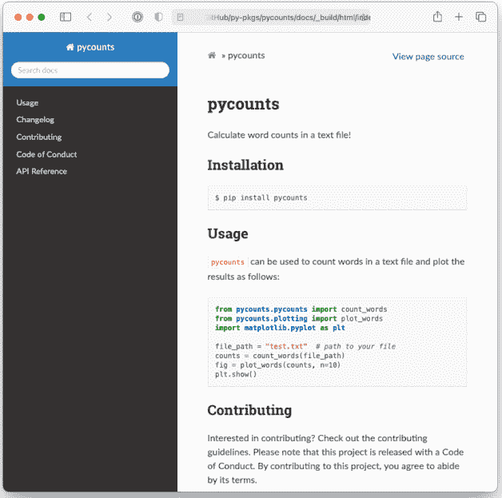

图 3.5：README.md 的渲染版本。

因此，我们现在有了 CHANGELOG.md、CONDUCT.md、CONTRIBUTING.md、LICENSE 和 README.md。在下一节中，我们将解释如何使用文档字符串来记录你的包的 Python 代码。

#### 3.8.2 编写文档字符串

文档字符串是 Python 中模块、类或函数开头（在任何代码之前）由三引号包围的字符串，用于提供关于该对象功能及使用方法的说明。文档字符串会自动成为被记录对象的文档，用户可以通过 `help()` 函数访问。文档字符串是用户尝试使用你的包时的首要参考，它们在创建包时确实是必不可少的，即使对你自己也是如此。

Python 中通用的文档字符串约定在 Python 增强提案（PEP）257——文档字符串约定<sup>24</sup>中有所描述，但如何编写文档字符串具有灵活性。一个最小的文档字符串包含一行描述对象功能的文字，这对于一个简单的函数或代码处于早期开发阶段时可能就足够了。然而，对于你打算与他人（包括未来的自己）分享的代码，应该编写更全面的文档字符串。一个典型的文档字符串将包括：

1.  不使用变量名或函数名的单行摘要。
2.  扩展描述。
3.  参数类型和描述。
4.  返回值类型和描述。
5.  使用示例。
6.  可能还有更多。

Python 中使用不同的“文档字符串风格”来组织这些信息，例如 numpydoc 风格<sup>25</sup>、Google 风格<sup>26</sup> 和 sphinx 风格<sup>27</sup>。我们将为我们的 pycounts 包使用 numpydoc 风格，因为它可读、常用且受 sphinx 支持。在 numpydoc 风格中：

-   节标题表示为带下划线的文本；

```
Parameters
----------
```

-   输入参数表示为：

```
name : type
    Description of parameter `name`.
```

-   输出值使用与上面相同的语法，但指定名称是可选的。

下面展示了我们 `count_words()` 函数的 numpydoc 风格文档字符串：

<sup>24</sup>https://www.python.org/dev/peps/pep-0257/
<sup>25</sup>https://numpydoc.readthedocs.io/en/latest/format.html#docstring-standard
<sup>26</sup>https://github.com/google/styleguide/blob/gh-pages/pyguide.md#38-comments-and-docstrings
<sup>27</sup>https://sphinx-rtd-tutorial.readthedocs.io/en/latest/docstrings.html#the-sphinx-docstring-format

```
def count_words(input_file):
    """Count words in a text file.

    Words are made lowercase and punctuation is removed
    before counting.

    Parameters
    ----------
    input_file : str
        Path to text file.

    Returns
    -------
    collections.Counter
        dict-like object where keys are words and values are counts.

    Examples
    --------
    >>> count_words("text.txt")
    """
    text = load_text(input_file)
    text = clean_text(text)
    words = text.split()
    return Counter(words)
```

我们包的用户可以通过在 Python 解释器中使用 `help()` 函数来访问这些文档字符串：

```
>>> from pycounts.pycounts import count_words
>>> help(count_words)
```

```
Help on function count_words in module pycounts.pycounts:

count_words(input_file)
    Count words in a text file.

    Words are made lowercase and punctuation is removed
    before counting.

    Parameters
    ----------
    ...
```

你可以根据自己的判断向文档字符串添加信息——你并不总是需要上面所有的部分，在某些情况下，你可能希望包含 numpydoc 风格文档<sup>28</sup>中的额外部分。我们已经为 pycounts 包的其余函数记录了文档，如下所示。如果你正在按照本教程操作，请将这些文档字符串复制到 `pycounts.pycounts` 和 `pycounts.plotting` 模块中的函数里：

```
def plot_words(word_counts, n=10):
    """Plot a bar chart of word counts.

    Parameters
    ----------
    word_counts : collections.Counter
        Counter object of word counts.
    n : int, optional
        Plot the top n words. By default, 10.

    Returns
    -------
    matplotlib.container.BarContainer
        Bar chart of word counts.

    Examples
    --------
    >>> from pycounts.pycounts import count_words
    >>> from pycounts.plotting import plot_words
    >>> counts = count_words("text.txt")
    >>> plot_words(counts)
    """
    top_n_words = word_counts.most_common(n)
    word, count = zip(*top_n_words)
    fig = plt.bar(range(n), count)
    plt.xticks(range(n), labels=word, rotation=45)
    plt.xlabel("Word")
    plt.ylabel("Count")
    return fig
```

```
def load_text(input_file):
    """Load text from a text file and return as a string.

    Parameters
    ----------
    input_file : str
        Path to text file.

    Returns
    -------
    str
        Text file contents.

    Examples
    --------
    >>> load_text("text.txt")
    """
    with open(input_file, "r") as file:
        text = file.read()
    return text
```

```
def clean_text(text):
    """Lowercase and remove punctuation from a string.

    Parameters
    ----------
    text : str
        Text to clean.

    Returns
    -------
    str
        Cleaned text.

    Examples
    --------
    >>> clean_text("Early optimization is the root of all evil!")
    'early optimization is the root of all evil'
    """
    text = text.lower()
    for p in punctuation:
        text = text.replace(p, "")
    return text
```

对于我们的包的用户来说，将所有函数和文档字符串汇编成一个易于浏览的文档会很有帮助，这样他们就可以访问这些文档，而无需导入它们并运行 `help()`，或者搜索我们的源代码。这样的文档被称为应用程序编程接口（API）参考。我们可以通过手动将所有函数名和文档字符串复制粘贴到一个纯文本文档中来创建一个，但那将是低效的。相反，我们将在 **第 3.8.4 节** 展示如何使用 sphinx 自动解析我们的源代码，提取我们的函数和文档字符串，并为我们创建一个 API 参考。

#### 3.8.3 创建使用示例

创建如何使用你的包的示例对新用户和现有用户都可能非常有价值。与我们在 **第 3.8.1 节** 的 README 中编写的简短基础的“用法”标题不同，这些示例更像是教程，包括文本和代码的混合，逐步演示你的包的功能和常见工作流程。

你可以使用像 Markdown 这样的纯文本格式从头开始编写示例，但这可能效率低下且容易出错。如果你更改了函数的工作方式或输出内容，你就必须重写示例。相反，在本节中，我们将展示如何使用 Jupyter Notebooks（Kluyver 等人，2016）作为一种更高效、交互式和可重现的方式为你的用户创建使用示例。如果你不想为你的包创建使用示例，或者对学习如何使用 Jupyter Notebooks 来创建示例不感兴趣，你可以跳到 **第 3.8.4 节**。

Jupyter Notebooks 是具有 `.ipynb` 扩展名的交互式文档，可以包含代码、方程式、文本和可视化。它们对于演示示例非常有效，因为它们直接导入并使用来自你的包的代码；这确保你在编写示例时不会出错，并允许用户下载、执行和与笔记本本身进行交互（而不仅仅是阅读文本）。要使用 Jupyter Notebook 为我们的 pycounts 包创建使用示例，我们首先需要将 jupyter 添加为开发依赖项：

> 如果使用 conda 虚拟环境，请确保在使用或处理你的包之前，通过运行 `conda activate pycounts` 使该环境处于活动状态。

### 3.8 包文档

我们的 py-pkgs-cookiecutter 模板已经在 `docs/example.ipynb` 为我们创建了一个 Jupyter Notebook 示例文档。要编辑该文档，我们首先从包根目录使用以下命令打开 Jupyter Notebook 应用程序：

```
$ jupyter notebook
```

> 如果你正在一个原生支持 Jupyter Notebook 的 IDE（如 Visual Studio Code 或 JupyterLab）中开发你的 Python 包，你可以直接打开 `docs/example.ipynb` 进行编辑，而无需运行上面的 `jupyter notebook` 命令。

在界面中，导航并打开 `docs/example.ipynb`。正如 Jupyter Notebook 文档<sup>29</sup> 中所解释的，笔记本由“单元格”组成，这些单元格可以包含 Python 代码或 Markdown 文本。我们的笔记本目前看起来如图 3.6 所示。

作为示例，我们将使用图 3.7 和图 3.8 所示的 Markdown 和代码单元格集合来更新我们的笔记本。

我们的 Jupyter Notebook 现在包含一个交互式教程，演示了我们包的基本用法。需要注意的是，代码和输出是使用我们包本身生成的，而不是手动编写的。我们的用户现在也可以下载我们的示例笔记本，并自行交互和执行它。但在下一节中，我们将展示如何使用 sphinx 自动执行笔记本，并将其内容（包括代码单元格的输出）包含到我们所有包文档的编译集合中，用户可以轻松阅读和浏览，甚至无需启动 Jupyter 应用程序！

#### 3.8.4 构建文档

我们现在已经编写了支持我们的 pycounts 包所需的所有单独文档部分。但所有这些文档都分散在我们包的目录结构中，使得共享和搜索变得困难。

这就是文档生成器 sphinx 的用武之地。sphinx 是一个用于将纯文本源文件集合编译和渲染成用户友好的输出格式（如 HTML 或 PDF）的工具。sphinx 还拥有丰富的扩展生态系统，可用于帮助自动生成内容——我们将在本节中使用其中一些扩展，从我们的文档字符串自动创建 API 参考表，并执行和渲染我们的 Jupyter Notebook 示例到我们的文档中。

首先让你了解我们将要构建的内容，图 3.9 展示了由 sphinx 编译成 HTML 的我们包文档的主页。

使用 sphinx 构建此类文档的源文件和配置文件通常位于包根目录的 `docs/` 目录中。py-pkgs-cookiecutter 自动为我们创建了此目录和必要的文件。我们将在下面讨论这些文件各自的用途。

```
pycounts
├── .readthedocs.yml
├── CHANGELOG.md
├── CONDUCT.md
├── CONTRIBUTING.md
├── docs
│   ├── changelog.md
│   ├── conduct.md
│   ├── conf.py
│   ├── contributing.md
│   ├── example.ipynb
│   ├── index.md
│   ├── make.bat
│   ├── Makefile
│   └── requirements.txt
├── LICENSE
├── poetry.lock
├── pyproject.toml
├── README.md
├── src
│   └── ...
└── tests
    └── ...
```

*docs/* 目录包括：

- *Makefile/make.bat*：包含使用 sphinx 构建文档所需命令的文件，无需修改。Make<sup>30</sup> 是一个用于运行命令以高效读取、处理和写入文件的工具。Makefile 定义了 Make 要执行的任务。如果你有兴趣了解更多关于 Make 的知识，我们推荐 Learn Makefiles<sup>31</sup> 教程。但对于使用 sphinx 构建文档，你只需要知道拥有这些 Makefile 允许我们使用简单的命令 `make html` 来构建文档，我们将在本节后面执行此操作。
- *requirements.txt*：包含在 Read the Docs<sup>32</sup> 上在线托管我们文档所需的特定于文档的依赖项列表，我们将在 **第 3.8.5 节** 中讨论。
- *conf.py* 是一个配置文件，控制 sphinx 如何构建你的文档。你可以在 sphinx 文档<sup>33</sup> 中阅读更多关于 *conf.py* 的信息，我们很快会再次提及，但目前它已被 py-pkgs-cookiecutter 模板预填充，无需修改。
- *docs/* 目录中的其余文件构成了我们生成文档的内容，我们将在本节剩余部分进行讨论。

*index.md* 文件将构成我们文档的着陆页（我们之前在图 3.9 中看到的那个）。可以将其视为网站的主页。对于你的着陆页，你通常需要一些关于你包的高级信息，然后链接到你希望向用户展示的其余文档。如果你在你选择的编辑器中打开 *index.md*，这正是我们包含的内容，使用了一种特定的语法，我们将在下面解释。

```
{include} ../README.md

```{toctree}
:maxdepth: 1
:hidden:

example.ipynb
changelog.md
contributing.md
conduct.md
autoapi/index
```

我们在此文件中使用的语法称为 Markedly Structured Text (MyST)<sup>34</sup>。MyST 基于 Markdown，但具有与 sphinx 兼容的额外语法选项。`{include}` 语法指定当此页面由 sphinx 渲染时，我们希望它包含来自我们包根目录的 *README.md* 的内容（可以将其视为复制粘贴操作）。

`{toctree}` 语法定义了哪些文档将列在我们渲染文档左侧的目录（ToC）中，如图 3.9 所示。参数 `:maxdepth: 1` 指示 ToC 应包含多少级标题，而 `:hidden:` 指定 ToC 应仅出现在侧边栏中，而不出现在欢迎页面本身中。然后 ToC 列出了要包含在我们渲染文档中的文档。

"example.ipynb" 是我们在 **第 3.8.3 节** 中编写的 Jupyter Notebook。sphinx 不支持 ToC 中的相对链接，因此要包含来自我们包根目录的文档 *CHANGELOG.md*、*CONTRIBUTING.md*、*CONDUCT.md*，我们创建了名为 *changelog.md*、*contributing.md* 和 *conduct.md* 的“存根文件”，它们使用我们之前看到的 `{include}` 语法链接到这些文档。例如，*changelog.md* 包含以下文本：

```
{include} ../CHANGELOG.md
```

ToC 中的最后一个文档 "autoapi/index" 是一个 API 参考表，当我们使用 sphinx 构建文档时，它将根据我们的包结构和文档字符串自动生成。

在我们能够继续使用 sphinx 构建文档之前，它依赖于一些需要安装和配置的 sphinx 扩展：

- myst-nb：使 sphinx 能够解析我们的 Markdown、MyST 和 Jupyter Notebook 文件的扩展（sphinx 默认仅支持 reStructuredText，`.rst` 文件）。
- sphinx-rtd-theme：用于设置我们文档外观样式的自定义主题。它看起来比默认主题好得多。
- sphinx-autoapi：解析我们的源代码和文档字符串以创建 API 参考表的扩展。
- sphinx.ext.napoleon：使 sphinx 能够解析 numpydoc 风格文档字符串的扩展。
- sphinx.ext.viewcode：在 API 参考表中为每个对象添加指向源代码的有用链接的扩展。

这些扩展对于使用 sphinx 创建文档并非必需，但它们都是 Python 包文档中常用的，并且显著改善了生成文档的外观和用户体验。没有 `sphinx.ext` 前缀的扩展需要安装。我们可以在 poetry 管理的项目中使用以下命令将它们作为开发依赖项安装：

> 如果使用 conda 虚拟环境，请确保在使用或处理你的包之前，通过运行 `conda activate pycounts` 使该环境处于活动状态。

```
$ poetry add --dev myst-nb --python "^3.9"
$ poetry add --dev sphinx-autoapi sphinx-rtd-theme
```

> 添加 myst-nb 是依赖版本上限可能带来麻烦的一个很好的例子，正如我们在 **第 3.8.5 节** 中讨论的那样。

<sup>29</sup> https://jupyter-notebook.readthedocs.io/en/stable/
<sup>30</sup> https://www.gnu.org/software/make/
<sup>31</sup> https://makefiletutorial.com
<sup>32</sup> https://readthedocs.org/
<sup>33</sup> https://www.sphinx-doc.org/en/master/usage/configuration.html
<sup>34</sup> https://myst-parser.readthedocs.io/en/latest/syntax/syntax.html
<sup>35</sup> https://myst-nb.readthedocs.io/en/latest/
<sup>36</sup> https://sphinx-rtd-theme.readthedocs.io/en/stable/
<sup>37</sup> https://sphinx-autoapi.readthedocs.io/en/latest/
<sup>38</sup> https://sphinxcontrib-napoleon.readthedocs.io/en/latest/
<sup>39</sup> https://www.sphinx-doc.org/en/master/usage/extensions/viewcode.html

#### 3.6.1. 在撰写本文时，myst-nb 的一个依赖项 mdit-py-plugins 对其所需的 Python 版本设置了低于 4.0 的上限，因此它与我们的包及其所有其他依赖项（均支持 Python >=3.9）不兼容。因此，除非 mdit-py-plugins 移除此上限，否则我们添加 myst-nb 最简单的方法是告诉 poetry 仅为 Python 版本 ~3.9（即 >=3.9 且 <4.0）安装它，使用参数 `--python "^3.9"`。

安装后，您想使用的任何扩展都需要添加到 `conf.py` 配置文件中名为 `extensions` 的列表中并进行配置。每个扩展的配置选项（如果存在）可以在其各自的文档中查看，但 `py-pkgs-cookiecutter` 已经通过在 `conf.py` 中定义以下变量为我们处理了一切：

```
extensions = [
    "myst_nb",
    "autoapi.extension",
    "sphinx.ext.napoleon",
    "sphinx.ext.viewcode"
]
autoapi_dirs = ["../src"]  # location to parse for API reference
html_theme = "sphinx_rtd_theme"
```

文档结构设置完成并配置好扩展后，我们现在可以导航到 `docs/` 目录，并使用以下命令通过 sphinx 构建文档：

```
$ cd docs
$ make html
```

```
Running Sphinx
...
build succeeded.
The HTML pages are in _build/html.
```

如果我们查看 `docs/` 目录内部，会看到一个新目录 `_build/html`，其中包含构建好的文档 HTML 文件。如果您打开 `_build/html/index.html`，应该会看到前面图 3.9 中所示的页面。

如果您对文档进行了重大更改，在重新构建之前删除 `_build/` 文件夹可能是个好主意。您可以通过将 `clean` 选项添加到 `make html` 命令中轻松完成此操作：`make clean html`。

sphinx-autoapi 扩展提取了我们在 **图 @ref(fig:03:Writing-docstrings)** 中为包函数编写的文档字符串，并将其渲染到我们的文档中。您可以通过点击目录中的“API Reference”找到生成的 API 参考表。例如，{numref}03-documentation-2-fig) 显示了 `pycounts.plotting` 模块中的函数和文档字符串。`sphinx.ext.viewcode` 扩展在我们的 API 参考表中每个函数旁边添加了“source”按钮，该按钮将读者直接链接到函数的源代码（如果他们想查看的话）。

最后，如果我们导航到“Example usage”页面，**图 3.11** 显示了我们在 **第 3.8.3 节** 中编写的 Jupyter Notebook，该 Notebook 已渲染到我们的文档中，包括 Markdown 文本、代码输入和执行输出。这得益于 `myst-nb` 扩展得以实现。

最终，您可以使用 sphinx 及其扩展生态系统高效地制作美观且功能丰富的文档。您现在可以自己使用此文档，或者可能与他人共享，但当您使用像 Read the Docs<sup>40</sup> 这样的免费服务将其托管在网络上时，它才会真正大放异彩，我们将在下一节中进行介绍。对于使用版本控制的用户，现在是时候返回到我们包的根目录，并使用以下命令提交我们的工作了：

```
$ cd ..
$ git add README.md docs/example.ipynb
$ git commit -m "docs: updated readme and example"
$ git add src/pycounts/pycounts.py src/pycounts/plotting.py
$ git commit -m "docs: created docstrings for package functions"
$ git add pyproject.toml poetry.lock
$ git commit -m "build: added dev dependencies for docs"
$ git push
```

<sup>40</sup>https://readthedocs.org/

### 3.8 包文档

69

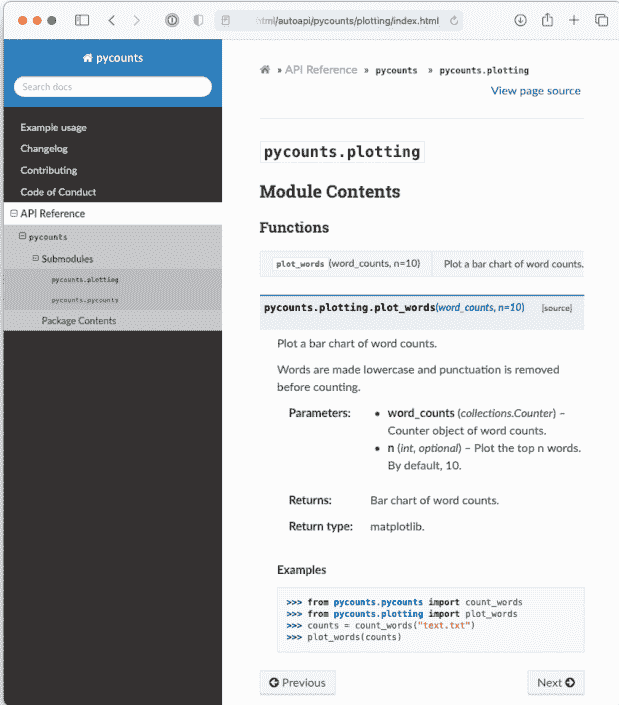

**图 3.10：** pycounts 绘图模块的文档。

#### 3.8.5 在线托管文档

如果您打算与他人共享您的包，使您的文档可在线访问将非常有用。将 Python 包文档托管在免费的在线托管服务 Read the Docs<sup>41</sup> 上是很常见的。Read the Docs 通过连接到托管您包文档的在线存储库（例如 GitHub 存储库）来工作。当您将更改推送到您的存储库时，Read the Docs 会自动构建文档的新副本（即运行 `make html`）并将其托管在 URL https://<pkgname>.readthedocs.io/

<sup>41</sup>https://readthedocs.org/

70

3 如何打包 Python

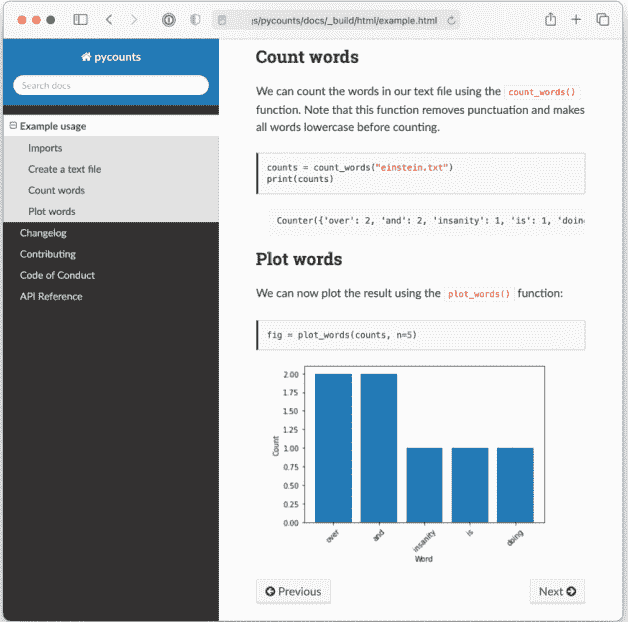

**图 3.11：** 渲染到 pycounts 文档中的 Jupyter Notebook 示例。

（您也可以配置 Read the Docs 使用自定义域名）。这意味着您对文档源文件所做的任何更改（并推送到链接的远程存储库）都会立即部署给您的用户。如果您需要文档是私有的（例如，仅对公司员工可用），Read the Docs 提供了具有此功能的付费“Business plan”。

### 3.8 包文档

GitHub Pages<sup>42</sup> 是另一个用于托管存储库文档的流行服务。但是，它不原生支持在您将更改推送到源文件时自动构建文档，这就是为什么我们在这里更喜欢使用 Read the Docs。如果您确实想在 GitHub Pages 上托管文档，我们建议使用 `ghp-import`<sup>43</sup> 包，或使用 `peaceiris/actions-gh-pages`<sup>44</sup> action 设置自动化的 GitHub Actions 工作流（我们将在 **第 8 章：持续集成和部署** 中了解更多关于 GitHub Actions 的信息）。

Read the Docs<sup>45</sup> 文档将提供在线托管文档所需的最新步骤。对于我们的 pycounts 包，这涉及以下步骤：

1. 访问 https://readthedocs.org/ 并点击“Sign up”。
2. 选择“Sign up with GitHub”。
3. 点击“Import a Project”。
4. 点击“Import Manually”。
5. 填写项目详细信息：
    1. 提供您的包名称（例如，pycounts）。
    2. 您包的 GitHub 存储库的 URL（例如，https://github.com/TomasBeuzen/pycounts）。
    3. 将默认分支指定为 main。
6. 点击“Next”，然后点击“Build version”。

按照上述步骤操作后，您的文档应已由 Read the Docs<sup>46</sup> 成功构建，您应该可以通过构建页面上的“View Docs”按钮访问它。例如，pycounts 的文档现在可在 https://pycounts.readthedocs.io/en/latest/ 获取。每次您将更改推送到 GitHub 存储库时，Read the Docs 都会自动重新构建此文档。

<sup>42</sup>https://pages.github.com
<sup>43</sup>https://github.com/c-w/ghp-import
<sup>44</sup>https://github.com/peaceiris/actions-gh-pages
<sup>45</sup>https://readthedocs.org
<sup>46</sup>https://readthedocs.org/

`py-pkgs-cookiecutter` 在我们 Python 包的根目录中为我们创建的 `.readthedocs.yml` 文件包含了 Read the Docs 正确构建我们文档所需的配置设置。它指定了要使用的 Python 版本，并告诉 Read the Docs 我们的文档需要 `pycounts/docs/requirements.txt` 中指定的额外包才能正确生成。

### 3.9 使用版本控制标记包发布

我们现在已创建了构成 `pycounts` 包 0.1.0 版本的所有源文件，包括 Python 代码、文档和测试——干得好！在下一节中，我们将把这些源文件转换成可以轻松共享和安装的分发包。但对于使用版本控制的用户，此时标记包存储库的发布版本会很有帮助。如果您不使用版本控制，可以跳到 **第 3.10 节**。

标记发布意味着我们永久“标记”存储库历史中的特定点，然后创建存储库中所有文件在标记时状态的可下载“发布”。通常会为包的每个新版本标记一个发布，我们将在 **第 7 章：发布和版本控制** 中进一步讨论。

标记发布是一个涉及 Git 和 GitHub 的两步过程：

1. 使用命令 `git tag` 创建一个标记，标记存储库历史中的特定点。
2. 在 GitHub 上，根据您的标签创建存储库中所有文件的发布（通常以 `.zip` 或 `.tar.gz` 等压缩存档的形式）。其他人如果希望查看或使用您包在标记创建时的源文件，可以下载此发布。

我们将通过标记 `pycounts` 包的 v0.1.0 版本（通常在标签前加上“v”表示“版本”）来演示此过程。首先，我们需要创建一个标签来标识存储库在 v0.1.0 时的状态，然后使用以下 `git` 命令将标签推送到 GitHub：

### 3.9 使用版本控制为软件包发布打标签

```
$ git tag v0.1.0
$ git push --tags
```

现在，如果你前往 GitHub 上的 `pycounts` 仓库并导航到“Releases”标签页，你应该能看到一个类似 [图 3.12](#fig-3-12) 所示的标签。

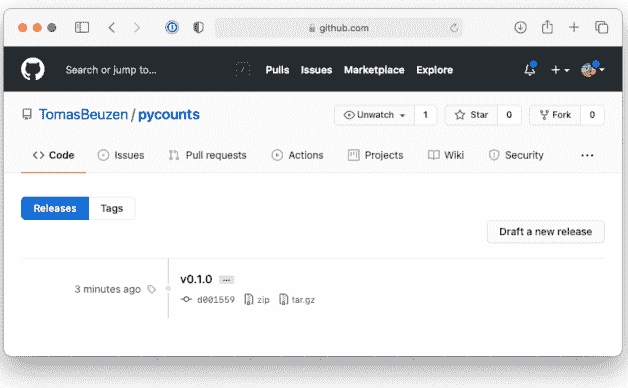

**图 3.12：** GitHub 上 pycounts 的 v0.1.0 标签。

要从此标签创建一个发布，请点击“Draft a new release”。然后，你可以选择用于创建发布的标签，并可选择添加一些关于发布的额外详情，如 [图 3.13](#fig-3-13) 所示。

点击“Publish release”后，GitHub 将自动从你的标签创建一个发布，其中包含 `.zip` 和 `.tar.gz` 格式的代码压缩包，如 [图 3.14](#fig-3-14) 所示。

我们将在**第 7 章：发布与版本控制**中更详细地讨论如何在更新软件包（例如，修改代码、添加功能、修复错误等）时创建新版本和发布。

> 实际上，拥有你 GitHub 仓库访问权限的人可以直接使用你的标签通过 `pip install` 安装你的软件包。我们将在**第 4.3.4 节**中更详细地讨论这一点。

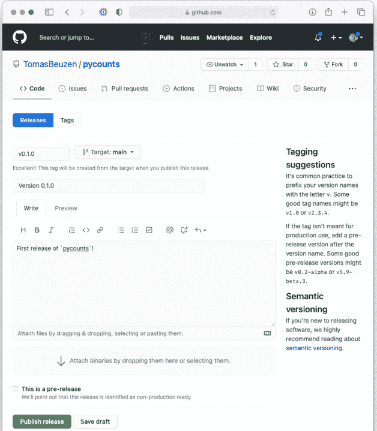

**图 3.13：** 在 GitHub 上为 pycounts 的 v0.1.0 创建发布。

### 3.10 构建和分发你的软件包

#### 3.10.1 构建你的软件包

目前，我们的软件包是一堆难以与他人共享的文件和文件夹。解决这个问题的方法是创建一个“分发包”。分发包是一个单一的归档文件，包含使用 pip 等工具安装软件包所需的所有文件和信息。分发包通常简称为“分发包”，它们是 Python 中共享软件包以及用户安装软件包的方式，通常使用命令 `pip install <some-package>`。

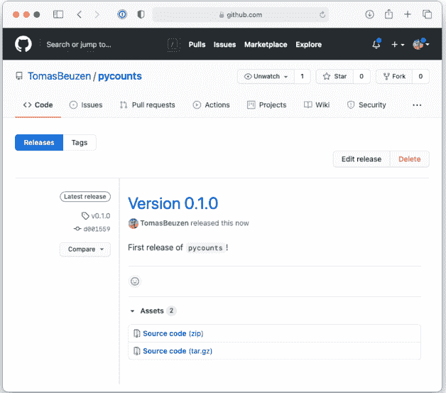

**图 3.14：** GitHub 上 pycounts 的 v0.1.0 发布。

Python 中主要的分发类型是源码分发包（称为“sdists”）和轮子包（wheels）。sdists 是所有源文件、元数据和构建可安装版本软件包所需指令的压缩归档文件。要从 sdist 安装，用户需要下载 sdist，解压其内容，然后使用构建指令在计算机上构建并最终安装软件包。

相比之下，轮子包是软件包的预构建版本。它们在开发者的机器上构建好后再与用户共享。它们是首选的分发格式，因为用户只需下载轮子包并将其移动到计算机上 Python 搜索软件包的位置；无需构建步骤。

`pip install` 可以处理从 sdist 或轮子包安装，我们将在第 4.3 节中更详细地讨论这些主题。你现在需要知道的是，在分发软件包时，通常会同时创建 sdist 和轮子包分发包。我们可以使用 `poetry build` 命令轻松地为软件包创建 sdist 和轮子包。现在，让我们通过在根软件包目录中运行以下命令来为我们的 pycounts 软件包执行此操作：

```
$ poetry build
```

```
Building pycounts (0.1.0)
 - Building sdist
 - Built pycounts-0.1.0.tar.gz
 - Building wheel
 - Built pycounts-0.1.0-py3-none-any.whl
```

运行此命令后，你会注意到软件包中有一个名为 `dist/` 的新目录：

```
pycounts
├── .readthedocs.yml
├── CHANGELOG.md
├── CONDUCT.md
├── CONTRIBUTING.md
├── dist
│   ├── pycounts-0.1.0-py3-none-any.whl  <- 轮子包
│   └── pycounts-0.1.0.tar.gz            <- sdist
├── docs
│   └── ...
├── LICENSE
├── poetry.lock
├── pyproject.toml
├── README.md
├── src
│   └── ...
└── tests
    └── ...
```

这两个新文件就是我们 pycounts 软件包的 sdist 和轮子包。现在，如果用户拥有其中一个分发包，他们就可以轻松地使用 `pip install` 安装我们的软件包。例如，要安装轮子包（首选的分发类型），你可以在终端中输入以下内容：

```
$ cd dist/
$ pip install pycounts-0.1.0-py3-none-any.whl
```

```
Processing ./pycounts-0.1.0-py3-none-any.whl
...
Successfully installed pycounts-0.1.0
```

要使用 sdist 安装，你必须在运行 `pip install` 之前解压 sdist 归档文件。此过程因你的特定操作系统而异。例如，在 Mac OS 上，可以使用命令行工具 `tar`，参数 `x`（解压输入文件）、`z`（解压输入文件）、`f`（对提供的输入文件应用操作）来解压 sdist：

```
$ tar xzf pycounts-0.1.0.tar.gz
$ pip install pycounts-0.1.0/
```

```
Processing ./pycounts-0.1.0-py3-none-any.whl
  Installing build dependencies ... done
  Getting requirements to build wheel ... done
  Preparing wheel metadata ... done
...
Successfully built pycounts
Successfully installed pycounts-0.1.0
```

请注意上面的输出，从 sdist 安装需要在安装之前有一个构建步骤。sdist 首先被构建为轮子包，然后进行安装。对于感兴趣的人，我们将在 [第 4.3 节](#section-4.3) 中讨论从 sdist 和轮子包构建和安装软件包的细微差别。

为我们的软件包创建分发包，如果将其发布到像 Python 包索引（PyPI）这样的在线仓库（Python 的官方在线软件仓库）上，将最为有用。这将允许用户只需运行 `pip install pycounts` 即可安装我们的软件包，而无需在本地拥有 sdist 或轮子包文件，我们将在下一节中进行此操作。但即使你不打算共享你的软件包，构建和安装分发包仍然很有用，原因有二：

1.  分发包是你的软件包源文件的独立副本，易于移动和存储在计算机上。它使得保留软件包不同版本的分发包变得容易，以便在需要时可以重复使用或共享它们。
2.  回想一下，poetry 以“可编辑模式”安装软件包，即安装的是指向软件包位置的链接，而不是软件包本身的独立分发包。这对于*开发目的*很有用，因为这意味着对源代码的任何更改在下次导入软件包时都会立即反映出来，而无需再次运行 `poetry install`。然而，对于你的软件包的*用户*（包括你自己在其他项目中使用你的软件包），通常最好安装软件包的“非可编辑”版本（当你 `pip install` sdist 或轮子包时的默认行为），因为非可编辑安装将保持稳定，并且不受计算机上对源文件所做的任何更改的影响。

#### 3.10.2 发布到 TestPyPI

此时，我们有了 `pycounts` 的分发包，我们希望通过发布到 PyPI<sup>47</sup> 来与世界分享。然而，良好的做法是先进行一次“演练”，通过先提交到 TestPyPI<sup>48</sup> 来检查一切是否按预期工作。`poetry` 有一个 `publish` 命令，我们可以用它来完成此操作，但默认行为是发布到 PyPI。因此，我们需要使用以下命令将 TestPyPI 添加到 `poetry` 知道的仓库列表中：

```
$ poetry config repositories.test-pypi https://test.pypi.org/legacy/
```

要发布到 TestPyPI，我们可以使用 `poetry publish`（系统会提示你输入 TestPyPI 的用户名和密码——我们在**第 2.3 节**中已经注册过）：

```
$ poetry publish -r test-pypi
```

```
Username: TomasBeuzen
Password:
Publishing pycounts (0.1.0) to test-pypi
 - Uploading pycounts-0.1.0-py3-none-any.whl 100%
 - Uploading pycounts-0.1.0.tar.gz 100%
```

你不必每次想将分发包发布到 TestPyPI 或 PyPI 时都输入用户名和密码，你可以按照 PyPI 文档<sup>49</sup> 中的描述配置一个 API 令牌。

现在我们应该能够在 TestPyPI 上访问我们的软件包了。我们的 pycounts 软件包的 URL 是：[https://test.pypi.org/project/pycounts/](https://test.pypi.org/project/pycounts/)。我们可以尝试使用 pip 从命令行安装我们的软件包，使用以下命令：

```
$ pip install --index-url https://test.pypi.org/simple/ \
    --extra-index-url https://pypi.org/simple \
    pycounts
```

默认情况下，`pip install` 会在 PyPI 中搜索指定的软件包。但是，我们希望搜索 TestPyPI，因为那是我们上传软件包的地方。参数 `--index-url` 将 pip 指向 TestPyPI 索引。然而，重要的是要注意，并非所有开发者都将他们的软件包上传到 TestPyPI；有些人只直接上传到 PyPI。如果你的软件包依赖于不在 TestPyPI 上的软件包，你可以告诉 pip 尝试在 PyPI 上查找它们。为此，你可以使用参数 `--extra-index-url`，就像我们在上面的命令中所做的那样。

#### 3.10.3 发布到 PyPI

如果你能够将你的软件包上传到 TestPyPI 并且没有错误地安装它，那么你就准备好将你的软件包发布到 PyPI 了。你可以使用不带任何参数的 `poetry publish` 命令发布到 PyPI：

```
$ poetry publish
```

然后你的软件包将在 PyPI 上可用（例如，[https://pypi.org/project/pycounts/](https://pypi.org/project/pycounts/)），任何人都可以使用 pip 安装它：

```
$ pip install pycounts
```

### 3.11 总结与后续步骤

本章提供了生成一个功能齐全的 Python 软件包所需关键步骤的实用概述。在接下来的章节中，我们将探讨

<sup>49</sup> [https://pypi.org/help/#apitoken](https://pypi.org/help/#apitoken)

### 3.11 总结与后续步骤

我们将更详细地探讨上述每个步骤，并继续为我们的 pycounts 包添加功能。我们尚未讨论的两个关键工作流程是：

1.  随着包的更新发布新版本。我们将在**第7章：发布与版本控制**中讨论此内容。
2.  设置持续集成和持续部署（CI/CD）——即用于运行测试、构建文档和部署包的自动化流水线。我们将在**第8章：持续集成与部署**中讨论 CI/CD。

在进入下一章之前，让我们总结一下本章中开发 Python 包所采取的所有步骤的参考清单：

1.  使用 cookiecutter 创建包结构（**第3.2.2节**）。

```
$ cookiecutter https://github.com/py-pkgs/py-pkgs-cookiecutter.git
```

2.  （可选）将你的包置于版本控制之下（**第3.3节**）。
3.  （可选）使用 conda 创建并激活虚拟环境（**第3.5.1节**）。

```
$ conda create --name <your-env-name> python=3.9 -y
$ conda activate <your-env-name>
```

4.  在 *src/* 目录的模块中添加 Python 代码（**第3.4节**），并根据需要添加依赖项（**第3.6节**）。

```
$ poetry add <dependency>
```

5.  在 Python 解释器中安装并试用你的包（**第3.5.2节**）。

```
$ poetry install
```

6.  （可选）在 *tests/* 目录中以 *test_* 为前缀的模块中为你的包编写测试。添加 pytest 作为开发依赖项以运行测试（**第3.7.2节**）。添加 pytest-cov 作为开发依赖项以计算测试覆盖率（第3.7.3节）。

```
$ poetry add --dev pytest pytest-cov
$ pytest tests/ --cov=<pkg-name>
```

7.  （可选）为你的包创建文档源文件（第3.8节）。使用 sphinx 编译并生成文档的 HTML 渲染版本，添加所需的开发依赖项（第3.8.4节）。

```
$ poetry add --dev myst-nb sphinx-autoapi sphinx-rtd-theme
$ cd docs
$ make html
$ cd ..
```

8.  （可选）使用 Read the Docs<sup>50</sup> 在线托管文档（第3.8.5节）。
9.  （可选）使用 Git 和 GitHub 或等效的版本控制工具为你的包打上发布标签（第3.9节）。
10. 为你的包构建 sdist 和 wheel 发行版（第3.10.1节）。

```
$ poetry build
```

11. （可选）将你的发行版发布到 TestPyPI<sup>51</sup> 并尝试安装你的包（第3.10.2节）。

```
$ poetry config repositories.test-pypi https://test.pypi.org/legacy/
$ poetry publish -r test-pypi
$ pip install --index-url https://test.pypi.org/simple/ --extra-index-url https://pypi.org/simple pycounts
```

12. （可选）将你的发行版发布到 PyPI<sup>52</sup>。现在任何人都可以使用 pip 安装你的包（**第3.10.3节**）。

```
$ poetry publish
$ pip install <pkg-name>
```

上述工作流程使用了一套特定的工具（例如 conda、poetry、sphinx 等）来开发 Python 包。虽然还有其他工具可用于帮助构建 Python 包，但本书的目标是使用现代工具，提供一个高层次、实用且高效的 Python 打包入门介绍，这影响了我们在本章和本书中对工具的选择。然而，无论你使用何种具体工具来开发 Python 包，此处讨论的概念和工作流程对于 Python 打包生态系统仍然适用。

### 4 包结构与分发

**第3章：如何打包 Python** 提供了如何创建、安装和分发 Python 包的实践概述。本章现在将更详细地介绍 Python 包究竟是什么，深入探讨包的结构、安装和分发方式。

我们首先讨论模块和包在 Python 中的表示方式及其使用原因。然后，我们讨论一些更高级的包结构主题，例如控制包的导入行为以及包含非代码文件（如数据）。本章最后讨论什么是包分发、如何构建它们以及如何安装它们。在此过程中，我们将通过继续开发上一章的 pycounts 包来演示关键概念。

### 4.1 打包基础

我们将从探索与包是什么、如何构建以及如何在 Python 中使用相关的一些底层实现细节开始本章。

Python 程序中的所有数据都由对象或对象之间的关系表示。例如，整数和函数是 Python 对象的种类。我们可以使用 `type()` 函数查找 Python 对象的类型。例如，下面的代码在 Python 解释器中运行，创建了一个整数对象和一个函数对象，分别映射到名称 `a` 和 `hello_world`：

```
>>> a = 1
>>> type(a)

int
```

```
>>> def hello_world(name):
        print(f"Hello world! My name is {name}.")
>>> type(hello_world)
```

function

对于我们讨论包而言，重要的 Python 对象是“模块”对象。模块是作为 Python 代码组织单元的对象。通常，你想重用的 Python 代码存储在具有 .py 后缀的文件中，并使用 import 语句导入。此过程创建一个与导入文件同名（不包括 .py 后缀）的模块对象，通过此对象，我们可以访问文件的内容。

例如，假设我们当前目录中有一个模块 greetings.py，其中包含用英语和 Squamish 语（Squamish 人¹ 是加拿大不列颠哥伦比亚省的原住民）打印“Hello World!”的函数：

```
def hello_world():
    print("Hello World!")

def hello_world_squamish():
    print("I chen tl'ik!")
```

我们可以使用 import 语句导入该模块，并可以使用 type() 函数验证我们创建了一个模块对象，该对象已映射到名称“greetings”（文件的名称）：

```
>>> import greetings
>>> type(greetings)
```

module

我们称模块对象为“代码的组织单元”，因为模块的内容（在本例中是两个“hello world”函数）可以通过模块名称和“点表示法”访问。例如：

¹https://en.wikipedia.org/wiki/Squamish_people

```
>>> greetings.hello_world()
```

```
"Hello World!"
```

```
>>> greetings.hello_world_squamish()
```

```
"I chen tl'ik!"
```

在我们讨论的这一点上，有必要提及 Python 的命名空间。Python 中的“命名空间”是从名称到对象的映射。从上面的代码示例中，我们已经将名称 a（一个整数）、hello_world（一个函数）和 greetings（一个模块）添加到当前命名空间，并可以使用这些名称来引用我们创建的对象。dir() 函数可用于检查命名空间。当不带参数调用时，dir() 返回当前命名空间中定义的名称列表：

```
>>> dir()
```

```
['__annotations__', '__builtins__', '__doc__', '__loader__',
 '__name__', '__package__', '__spec__', 'a', 'hello_world',
 'greetings']
```

在上面的输出中，我们可以看到本节中定义的三个对象的名称：a、hello_world 和 greetings。其他由双下划线包围的名称是在我们启动 Python 解释器时自动初始化的对象，是实现细节，对我们此处的讨论并不重要，但可以在 Python 文档²中阅读相关内容。

命名空间在不同的时刻创建，具有不同的生命周期，并且可以从 Python 程序的不同部分访问——但这些细节偏离了我们的讨论，我们建议感兴趣的读者参阅 Python 文档³以了解更多信息。这里要强调的重要一点是，当使用 import 语句导入模块时，会创建一个模块对象，它拥有自己的命名空间，其中包含模块中定义的 Python 对象的名称。例如，当我们之前导入 greetings.py 文件时，我们创建了一个 greetings 模块对象和一个包含名称的命名空间

²https://docs.python.org/3/reference/executionmodel.html?highlight=__builtins__#execution-model
³https://docs.python.org/3/tutorial/classes.html#python-scopes-and-namespaces

文件中定义的对象——`hello_world` 和 `hello_world_squamish`——我们可以通过点号表示法来访问它们，例如 `greetings.hello_world()` 和 `greetings.hello_world_squamish()`。

通过这种方式，模块对象将一组代码隔离开来，并为我们提供了一种清晰、逻辑化且有组织的方式来访问它。我们可以通过将模块对象作为输入传递给 `dir()` 函数来检查模块的命名空间：

```
>>> dir(greetings)
```

```
['__annotations__', '__builtins__', '__doc__', '__loader__',
 '__name__', '__package__', '__spec__', 'hello_world',
 'hello_world_squamish']
```

这里需要强调的一个重要点是，不同命名空间中的名称之间没有关联。这意味着在同一个 Python 会话中，如果对象存在于不同的命名空间，我们可以拥有完全同名的对象。例如，在我们本节一直在运行的 Python 会话中，我们可以访问两个 `hello_world` 函数；一个是在我们的交互式解释器中早先定义的，另一个是在 `greetings` 模块中定义的。虽然这两个函数名称完全相同，但它们之间没有关联，因为它们存在于不同的命名空间中；`greetings.hello_world()` 存在于 `greetings` 模块命名空间中，而 `hello_world()` 存在于我们解释器的“全局”命名空间中。因此，我们可以使用适当的语法来访问两者：

```
>>> hello_world("Tom")
```

```
"Hello world! My name is Tom."
```

```
>>> greetings.hello_world()
```

```
"Hello World!"
```

既然我们对模块有了基本的理解，我们可以进一步讨论包。包只是一个或多个模块的集合。它们通常被组织成一个目录（包），其中包含一个或多个 `.py` 文件（模块）和/或子目录（我们称之为子包）。一个名为 `__init__.py` 的特殊文件用于告诉 Python 一个目录是一个包（而不仅仅是计算机上的一个普通目录）。我们将在第 3.2 节更多地讨论 `__init__.py` 文件和包结构，但目前，这里有一个包含两个模块和一个子包的简单包结构示例：

### 4.1 包的基础知识

```
pkg
├── __init__.py
├── module1.py
└── subpkg
    ├── __init__.py
    └── module2.py
```

简而言之，包为我们的代码提供了另一层抽象，并允许我们在单个包命名空间下组织相关模块。将包视为包含其他模块的模块会很有帮助。事实上，Python 处理包的方式几乎就是这样。无论你是导入单个独立模块（即一个 `.py` 文件）还是一个包（即一个目录），Python 都会在当前命名空间中创建一个模块对象。例如，让我们导入我们在 **第 3 章：如何打包一个 Python** 中创建的 `pycounts` 包，并检查其类型（回想一下，这个包包含两个模块：`pycounts.py` 和 `plotting.py`）：

> 如果你是从 **第 3 章：如何打包一个 Python** 继续学习，并使用 conda 为你的 `pycounts` 包创建了虚拟环境，正如我们在 **第 3.5.1 节** 中所做的那样，请务必在继续本章之前通过在命令行运行 `conda activate pycounts` 来激活该环境。

```
>>> import pycounts
>>> type(pycounts)
```

```
module
```

请注意，尽管我们导入了 `pycounts` 包（其中包含两个模块），Python 仍然只创建了一个模块对象。就像之前一样，我们可以通过点号表示法来访问包的内容。例如，我们可以使用以下语法从 `pycounts` 包的 `plotting` 模块中导入 `plot_words()` 函数：

```
>>> from pycounts.plotting import plot_words
>>> type(plot_words)
```

function

虽然无论我们导入的是单个模块（单个 `.py` 文件）还是一个包（包含一个或多个 `.py` 文件的目录），我们都会得到一个模块对象，但 Python 中模块和包之间的一个技术区别是，包被导入为具有 `__path__` 属性的模块对象。

在导入包或模块时，Python 会在 `sys.path` 中定义的默认目录列表中搜索它：

```
>>> import sys
>>> sys.path
```

```
[
    '',
    '/opt/miniconda/base/envs/pycounts/lib/python39.zip',
    '/opt/miniconda/base/envs/pycounts/lib/python3.9',
    '/opt/miniconda/base/envs/pycounts/lib/python3.9/lib-dynload',
    '/opt/miniconda/base/envs/pycounts/lib/python3.9/site-packages'
]
```

> `sys.path` 显示的目录列表会根据你安装 Python 的方式以及你是否在虚拟环境中而变化。列表开头的空字符串代表当前目录。

但是，当从包中导入某些内容时，Python 使用包的 `__path__` 属性来查找该内容，而不是 `sys.path` 中的路径。例如，让我们检查 `pycounts` 对象的 `__path__` 属性：

```
>>> pycounts.__path__
```

```
['/Users/tomasbeuzen/pycounts/src/pycounts']
```

在 **第 3.5.2 节** 中，我们讨论了 poetry（我们用于开发 `pycounts` 包的工具）如何以“可编辑”模式安装包，这意味着它安装的是指向你计算机上包代码的链接，这就是我们在上面输出中看到的。如果你使用 `pip install` 或 `conda install` 安装 `pycounts`（或任何其他包）并检查其 `__path__` 属性，你会看到一个包含 `site-packages/` 目录的路径，这是 Python 默认放置已安装包的地方，例如：`['/opt/miniconda/base/envs/pycounts/lib/python3.9/site-packages/pycounts']`。

我们将在 **第 4.3 节** 更多地讨论包安装。

这一切意味着，当你输入 `import pycounts.plotting` 时，Python 首先在 `sys.path` 定义的搜索路径列表中搜索名为 `pycounts` 的模块或包。如果 `pycounts` 是一个包，那么它会使用 `pycounts.__path__` 作为搜索路径（而不是 `sys.path`）来搜索 `plotting` 模块或子包。此时，我们已经深入到 Python 导入系统的细微差别中，并偏离了本书的范围，但感兴趣的读者可以在 Python 文档[^4]中阅读更多关于 Python 导入系统的内容。

最终，本节的重要要点是，包是 Python 模块的集合。它们帮助我们更好地组织和访问我们的代码，以及将其分发给其他人，正如我们将在 **第 4.3 节** 中讨论的那样。

### 4.2 包结构

理论部分已经讲完，我们现在将在本节回到更实际的主题；我们将讨论包的结构、如何控制其 `import` 行为，以及如何将非代码文件（如数据）包含在我们的包中。

#### 4.2.1 包内容

正如我们在 **第 4.1 节** 中讨论的，包是组织和访问模块集合的一种方式。从根本上说，包被识别为包含 `__init__.py` 文件的目录，而模块是具有 `.py` 扩展名并包含 Python 代码的文件。下面是一个包含两个模块和一个子包的简单 Python 包的目录结构示例：

```
pkg
├── __init__.py
├── module1.py
└── subpkg
    ├── __init__.py
    └── module2.py
```

`__init__.py` 告诉 Python 将目录视为包（或子包）。`__init__.py` 文件通常为空，但它们也可以包含有用的初始化代码，以便在导入包时运行，正如我们将在 **第 4.2.4 节** 中讨论的那样。

上述结构满足 Python 包的标准，如果它位于当前工作目录中（或者其路径已手动添加到 `sys.path`），你将能够从本地计算机上的这个包导入内容。但这个包缺少使其可安装所需的内容。

要创建一个可安装的包，我们需要一个能够安装和构建包的工具。目前用于包开发的最常见工具是 poetry、flit 和 setuptools。在本书中，我们使用 poetry，但我们将在 **第 4.3.3 节** 比较这些工具。无论你使用哪种工具，它都将依赖于一个或多个配置文件，这些文件定义了包的元数据和安装说明。在 poetry 管理的项目中，该文件是 `pyproject.toml`。在包的根目录中包含一个 README 以提供有关包的高级信息也是一个好习惯，并将包的 Python 代码放在 `src/` 目录中（我们将在 **第 4.2.7 节** 讨论原因）。因此，可安装包的结构更像这样：

```
pkg
├── src
│   └── pkg
│       ├── __init__.py
│       ├── module1.py
│       └── subpkg
│           ├── __init__.py
│           └── module2.py
├── README.md
└── pyproject.toml
```

上述结构适用于简单的包，或仅打算供个人使用的包。但大多数包包含的功能远不止这些

[^4]: https://docs.python.org/3/reference/import.html

### 4.2 包结构

正如我们在**第3章：如何打包一个Python包**中看到的，这包括详细的文档、测试等内容。我们在那一章创建的`pycounts`包是一个更典型的Python包结构示例：

```
pycounts
├── .readthedocs.yml
├── CHANGELOG.md
├── CONDUCT.md
├── CONTRIBUTING.md
├── docs
│   └── ...
├── LICENSE
├── README.md
├── pyproject.toml
├── src
│   └── pycounts
│       ├── __init__.py
│       ├── plotting.py
│       └── pycounts.py
└── tests
    └── ...
```

并非所有这些内容都会包含在你安装或分发给其他人的包版本中。通常，只有Python代码（位于*src/*目录中）构成了你包的可安装版本（但我们将在**第4.2.5节**中展示如何指定要包含的额外内容）。其余内容，如文档和测试，是为了支持开发而存在的，你的包的用户并不需要这些内容，因此通常（如果需要的话）会通过像GitHub这样的协作平台共享，其他开发者可以访问并为其做出贡献。

本节描述的包结构在技术上被称为Python中的“常规包”，这是绝大多数Python包和开发者所使用的。然而，Python还支持第二种类型的包，称为“命名空间包”。命名空间包是一种将单个Python包拆分到多个目录中的方式。与常规包（所有内容都位于同一目录层次结构中）不同，命名空间包可以由文件系统上不同位置的目录组成，并且不包含`__init__.py`文件。

开发者可能想要使用命名空间包的主要原因是，如果他们希望单独开发、安装和分发包的各个部分，或者如果他们想要组合位于文件系统上不同位置的包。然而，命名空间包对于初学者来说可能是一个令人困惑的话题，大多数开发者永远不会创建命名空间包，因此我们不会在本书中进一步讨论它们。相反，我们建议有兴趣了解更多关于它们的读者参考PEP 420⁵和Python文档⁶。因此，当我们在本书中使用“包”这个术语时，我们特指“常规包”。

#### 4.2.2 包和模块命名

构建包时，为你的包及其模块选择合适的名称非常重要。Python包命名指南和约定在Python增强提案（PEP）8⁷和PEP 423⁸中有描述。基本指南是：

- 包和模块应该有一个单一的、简短的、全小写的名称。
- 如果能提高可读性，可以在名称中使用下划线来分隔单词，但通常不鼓励这样做。

关于为模块或包选择的实际名称，考虑以下“三个M”可能会有所帮助：

1.  **有意义**：名称应反映包的功能。
2.  **易记**：名称应便于用户查找、记忆，并与其他相关包联系起来。
3.  **易管理**：请记住，你的包的用户将通过点表示法访问其内容/命名空间。通过保持名称简短明了，尽可能让他们快速轻松地完成此操作。例如，想象一下，如果我们把我们的`pycounts`包命名为类似`wordcountingpackage`这样的名字。每次用户想要从`plotting`模块访问`plot_words()`函数时，他们都必须这样写：`from wordcountingpackage.plotting import plot_words()`——哎呀！

最后，你应该始终检查PyPI⁹和其他流行的托管网站，如GitHub、GitLab、BitBucket等，以确保你选择的包名称尚未被使用。

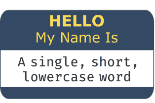

**图4.1：** 保持包名称有意义、易记且易管理。

#### 4.2.3 包内引用

构建包含多个模块的包时，通常希望在一个模块中使用另一个模块的代码。例如，考虑以下包结构：

```
src
└── package
    ├── __init__.py
    ├── moduleA.py
    ├── moduleB.py
    └── subpackage
        ├── __init__.py
        └── moduleC.py
```

开发者可能希望在`moduleB`中导入`moduleA`的代码。这是一种“包内引用”，可以通过“绝对”或“相对”导入来实现。

绝对导入在绝对上下文中使用包名称。相对导入使用点来指示相对导入应从何处开始。单个点表示相对于当前包（或子包）的导入，可以使用额外的点来进一步向上移动包层次结构，第一个点之后每个点代表一级。

表4.1基于前面显示的包结构，展示了一些绝对导入和相对导入的实际示例。

##### 表4.1：绝对和相对包内导入的演示。

| | 绝对导入 | 相对导入 |
|---|---|---|
| 在moduleB中导入moduleA | from package.moduleA import XXX | from .moduleA import XXX |
| 在moduleC中导入moduleA | from package.moduleA import XXX | from ..moduleA import XXX |
| 在moduleA中导入moduleC | from package.subpackage.moduleC import XXX | from .subpackage.moduleC import XXX |

虽然这里的选择主要取决于个人偏好，但PEP 8<sup>10</sup>建议使用绝对导入，因为它们是显式的。

#### 4.2.4 init文件

前面我们讨论了`__init__.py`文件如何用于告诉Python包含`__init__.py`文件的目录是一个包。`__init__.py`文件可以（并且经常）留空，仅用于将目录标识为包。然而，它也可以用于向包的命名空间添加对象、提供文档和/或运行其他初始化代码。

我们将使用我们在**第3章：如何打包一个Python包**中开发的`pycounts`包来演示此功能。考虑我们包的`__init__.py`：

```
pycounts
├── .readthedocs.yml
├── CHANGELOG.md
├── CONDUCT.md
├── CONTRIBUTING.md
├── docs
│   └── ...
├── LICENSE
├── pyproject.toml
├── README.md
└── src
    └── pycounts
        ├── __init__.py  <--------
        ├── plotting.py
        └── pycounts.py
```

当导入一个包时，`__init__.py`文件会被执行，它定义的任何对象都会绑定到包的命名空间。例如，在Python打包中，惯例是在两个地方定义包的版本：

1.  在包的配置文件`pyproject.toml`中，正如我们在[第3.5.2节](Section 3.5.2)中看到的。
2.  在包的`__init__.py`文件中使用`__version__`属性，这样用户可以快速检查他们使用的包的版本，使用如下代码：

```
>>> import pycounts
>>> pycounts.__version__
```

```
0.1.0
```

有时你会看到版本号在`__init__.py`文件中硬编码，比如`__version__ = "0.1.0"`。但这意味着每次你想要发布包的新版本时，你都必须记住在两个地方更新版本——`__init__.py`和`pyproject.toml`（我们将在[第7章：发布和版本控制](Chapter 7: Releasing and versioning)中讨论版本控制）。相反，最好只在`pyproject.toml`中定义包的版本，然后在`__init__.py`文件中使用`importlib.metadata.version()`函数以编程方式读取，该函数从包的已安装元数据（即`pyproject.toml`文件）中读取包的版本。

我们用来创建`pycounts`包的`py-pkgs-cookiecutter`（[第3.2.2节](Section 3.2.2)）已经为我们填充了`__init__.py`文件中的这段代码：

```
# read version from installed package
from importlib.metadata import version
__version__ = version("pycounts")
```

因为`__init__.py`中定义的任何对象在导入时都会绑定到包的命名空间，所以`__version__`变量可以从我们包的命名空间中访问，正如我们之前看到的。

`__init__.py`文件的另一个常见用例是控制包的导入行为。例如，目前用户通常只会使用我们`pycounts`包中的两个主要函数：`py-``counts.count_words()` 和 `plotting.plot_words()`。用户必须输入这些函数的完整路径才能导入它们：

```
from pycounts.pycounts import count_words
from pycounts.plotting import plot_words
```

我们可以通过在 pycounts 的 `__init__.py` 文件中导入这些核心函数来让用户的生活更轻松，这会将它们绑定到包的命名空间。例如，下面添加到 `__init__.py` 文件的代码，导入了我们的核心函数 `pycounts.count_words()` 和 `plotting.plot_words()`：

```
# read version from installed package
from importlib.metadata import version
__version__ = version(__name__)

# populate package namespace
from pycounts.pycounts import count_words
from pycounts.plotting import plot_words
```

> 如果你正在跟随本书开发 pycounts 包，并且在 3.10 节尝试从 TestPyPI 或 PyPI 安装了它，那么它将不再以“可编辑模式”安装，因此不会反映你对源代码所做的任何更改。你必须运行 `poetry install` 才能看到你的更改，并将你的包重新置于可编辑模式（这是你开发时想要的模式）。

这些函数现在已绑定到 pycounts 命名空间，因此用户可以这样访问它们：

```
>>> import pycounts
>>> pycounts.count_words
```

```
<function count_words>
```

最终，`__init__.py` 文件可用于自定义你的包及其内容的导入方式。访问大型 Python 包，例如 NumPy<sup>11</sup>、pandas<sup>12</sup> 或 scikit-learn<sup>13</sup>，看看它们在 `__init__.py` 文件中运行了哪些初始化代码，这是一个有趣的练习。

#### 4.2.5 在包中包含非代码文件

再次考虑我们 `pycounts` 包的完整结构：

```
pycounts
├── .readthedocs.yml
├── CHANGELOG.md
├── CONDUCT.md
├── CONTRIBUTING.md
├── docs
│   ├── changelog.md
│   ├── conduct.md
│   ├── conf.py
│   ├── contributing.md
│   ├── example.ipynb
│   ├── index.md
│   ├── make.bat
│   ├── Makefile
│   └── requirements.txt
├── LICENSE
├── README.md
├── poetry.lock
├── pyproject.toml
├── src
│   └── pycounts
│       ├── __init__.py
│       └── pycounts.py
└── tests
    ├── einstein.text
    └── test_pycounts.py
```

你分发给他人的可安装版本的包通常只包含 `src/` 目录中的 Python 代码。其余内容的存在是为了支持包的开发，用户实际使用包时并不需要。这些内容通常由开发者通过其他方式共享，例如 GitHub，以便其他开发者可以访问并在愿意时为其做出贡献。

但是，可以在你的包中包含任意的额外内容，这些内容将与通常的 Python 代码一起被用户安装。执行此方法取决于你使用的打包工具，但对于 poetry，你可以使用 `pyproject.toml` 中 `[tool.poetry]` 表下的 `include` 参数来指定你希望包含在包中的额外内容。例如，如果我们想将我们的 `tests/` 目录和 `CHANGELOG.md` 文件包含到我们的可安装包分发中，我们将在 `pyproject.toml` 中添加以下内容：

```
[tool.poetry]
name = "pycounts"
version = "0.1.0"
description = "Calculate word counts in a text file!"
authors = ["Tomas Beuzen"]
license = "MIT"
readme = "README.md"
include = ["tests/*", "CHANGELOG.md"]

...rest of file hidden...
```

大多数开发者不会像这样随包一起发布额外内容，而是更喜欢通过 GitHub 等服务共享，但这样做肯定有其用例——例如，如果你在组织内部私下共享一个包，你可能希望将所有内容（文档、测试等）随包一起发布。

#### 4.2.6 在包中包含数据

开发者确实希望包含在包中的一种非代码内容是数据。开发者可能希望在包中包含数据有几个原因：

1.  使用包的某些功能需要它。
2.  提供示例数据以帮助演示包的功能。
3.  作为分发和版本控制数据文件的一种方法。
4.  如果该包用于捆绑可重现的数据分析，并且将代码和数据放在一起很重要。

无论使用情况如何，在 Python 包中包含数据有两种典型方式：

1.  将原始数据作为可安装包的一部分包含，并提供代码以帮助用户加载它（如果需要）。此选项非常适合较小的数据文件，或包绝对依赖的数据。
2.  包中包含从外部源下载数据的脚本。此选项适用于大型数据文件，或用户可能只需要可选的数据。

我们将通过一个示例演示上述选项 1。我们的 *pycounts* 包帮助用户计算文本文件中的单词计数。为了向新用户演示我们包的功能，添加一个示例文本文件供他们练习可能会有所帮助。对于我们的包，我们将添加 Edwin Abbott 的小说 *Flatland*（Abbott, 1884）的文本文件（可在线获取<sup>14</sup>）。

要将此数据包含在我们的包中，我们需要做两件事：

1.  将原始 *.txt* 文件包含在我们的包中。
2.  包含代码以帮助用户访问数据。

我们将首先在我们的 *src/pycounts/* 目录中创建一个新的 *data* 子包，你应该在其中下载并放置链接的 *Flatland* 小说作为 *flatland.txt*。我们还将在我们的包中创建一个新模块 *datasets.py*，我们很快将用代码填充它以帮助用户加载数据。我们的 *pycounts* 目录结构现在如下所示：

```
pycounts
├── ...rest of package hidden...
├── src
│   └── pycounts
│       ├── __init__.py
│       ├── data          <--------
│       │   ├── __init__.py <--------
│       │   └── flatland.txt <--------
│       ├── datasets.py   <--------
│       ├── plotting.py
│       └── pycounts.py
└── ...rest of package hidden...
```

现在我们需要在 *datasets.py* 中添加一些 Python 代码来帮助用户加载示例数据。访问包中数据文件的推荐方式是使用 *importlib.resources* 模块<sup>15</sup>。我们 *pycounts* 包的主要函数 *pycounts.count_words()* 要求用户传递他们想要计算单词的文本文件的文件路径。因此，我们应该在我们的新 *datasets.py* 中编写一个函数，向用户返回示例 *flatland.txt* 文件的路径。*importlib.resources.path()* 函数可以帮助我们做到这一点。你可以在 Python 文档<sup>16</sup>中阅读关于此函数的信息；它在 *with* 语句中使用，需要两个参数：数据所在子包的位置（"pycounts.data"）和要在该子包中访问的数据文件的名称（"flatland.txt"）。下面添加到 *datasets.py* 的代码演示了其用法：

```
from importlib import resources

def get_flatland():
    """Get path to example "Flatland" [1]_ text file.

    Returns
    -------
    pathlib.PosixPath
        Path to file.

    References
    ----------
    .. [1] E. A. Abbott, "Flatland", Seeley & Co., 1884.
    """
    with resources.path("pycounts.data", "flatland.txt") as f:
        data_file_path = f
    return data_file_path
```

一旦你将此代码添加到 *datasets.py*，你就可以尝试它：

```
>>> from pycounts.datasets import get_flatland
>>> get_flatland()
```

```
PosixPath('/Users/tomasbeuzen/pycounts/src/pycounts/data/flatland.txt')
```

> 如果你正在跟随本书开发 pycounts 包，并且在 [3.10 节](#section-3.10)尝试从 TestPyPI 或 PyPI 安装了它，那么它将不再以“可编辑模式”安装，因此不会反映你对源代码所做的任何更改。你必须运行 `poetry install` 才能看到你的更改，并将你的包重新置于可编辑模式（这是你开发时想要的模式）。

<sup>11</sup> https://github.com/numpy/numpy/blob/main/numpy/__init__.py
<sup>12</sup> https://github.com/pandas-dev/pandas/blob/master/pandas/__init__.py
<sup>13</sup> https://github.com/scikit-learn/scikit-learn/blob/main/sklearn/__init__.py
<sup>14</sup> https://www.gutenberg.org/ebooks/97
<sup>15</sup> https://docs.python.org/3/library/importlib.html#module-importlib.resources
<sup>16</sup> https://docs.python.org/3/library/importlib.html#importlib.resources.path

### 4.2 包结构

用户可以在 `pycounts` 函数 `count_words()` 中直接使用此路径，如下所示：

```python
>>> from pycounts.pycounts import count_words
>>> from pycounts.datasets import get_flatland
>>> flatland_path = get_flatland()
>>> count_words(flatland_path)
```

```
Counter({'the': 2244, 'of': 1597, 'to': 1078, 'and': 1074,
'a': 902, 'i': 706, 'in': 698, 'that': 486, ... })
```

这只是我们如何将数据作为包的一部分并将其暴露给用户的一个例子。`importlib.resources` 模块可用于以不同方式加载任何类型的数据（作为路径、字符串、二进制文件等）。如果您正在开发包含面向用户数据的包，我们建议您查看 `importlib.resources` 文档<sup>17</sup>，以及 scikit-learn<sup>18</sup>、torchvision<sup>19</sup> 或 statsmodels<sup>20</sup> 等大型 Python 库中包含的“datasets”模块，以了解更多。

#### 4.2.7 源代码布局

在本书中描述和定义包结构时，我们一直将包的 Python 代码嵌套在 `src/` 目录中，如下例结构所示。这种布局被称为“src”/“源代码”布局，原因显而易见。

```
pkg
├── ...
├── src
│   └── pkg
│       ├── __init__.py
│       ├── module1.py
│       └── subpkg
│           ├── __init__.py
│           └── module2.py
└── ...
```

然而，将包的代码嵌套在 `src/` 目录中并不是构建包所必需的，也很常见看到没有它的包。我们将此称为“非 src”布局，并在下面展示一个示例。

```
pkg
├── ...
├── pkg
│   ├── __init__.py
│   ├── module1.py
│   └── subpkg
│       ├── __init__.py
│       └── module2.py
└── ...
```

总的来说，我们推荐使用“src”布局而不是“非 src”布局（Python 打包权威机构<sup>21</sup>也是如此），因为在开发和分发可安装的 Python 包时，它具有几个优势。我们在下面列出其中一些：

1.  对于使用 `pytest` 等测试框架的开发者，“src”布局强制您在测试之前安装您的包。大多数开发者会同意，您希望测试您的包，就像用户将安装它一样，而不是像它当前存在于您自己的机器上那样。“非 src”布局的问题在于，即使包未安装，Python 也可以 `import` 它。这是因为在大多数情况下，运行 `import` 时 Python 搜索的第一个位置是当前目录（通过导入 `sys` 并运行 `sys.path[0]` 来检查）。没有“src”文件夹，Python 将找到您当前目录中存在的包并导入它，而不是像它将安装在用户机器上那样使用它。有很多恐怖故事，开发者将损坏的分发上传到 PyPI，因为他们测试的是他们机器上存在的代码，而不是用户将安装的代码。这个问题在 Ionel Cristian Mărieș 的《打包 Python 库》<sup>22</sup> 和 Hynek Schlawack 的《测试与打包》<sup>23</sup> 这两篇优秀的博客文章中有详细描述，供感兴趣的人参考。
2.  “src”布局导致更干净的包可编辑安装。回顾**第 3.5.2 节**，在开发包时，通常以可编辑模式安装它（运行 `poetry install` 时的默认设置）。这会将项目 Python 代码的路径添加到 `sys.path` 列表中，以便对源代码的更改在 `import` 时立即可用，无需重新安装。使用“src”布局时，该路径如下所示：

```
'/Users/tomasbeuzen/pycounts/src'
```

相比之下，“非 src”布局会将项目的根目录添加到 `sys.path`（没有“src”目录提供分隔层）：

```
'/Users/tomasbeuzen/pycounts/'
```

该路径通常不仅仅包含 Python 代码。可能有测试模块、临时代码、数据文件、文档、示例脚本等，所有这些现在都可能在您的开发工作流中被导入！

3.  最后，“src”通常是源代码的通用识别位置，使其他人更容易快速浏览包的内容。

最终，虽然您当然可以使用“非 src 布局”来开发包，但使用“src”布局通常会减少开发和分发过程中出现问题的机会。

### 4.3 包分发与安装

在本节中，我们不会编写任何代码，而是讨论与包分发和安装相关的理论，供感兴趣的人参考。如果您不感兴趣，请随时跳转到**第 4.4 节**。

正如我们在**第 3 章：如何打包 Python** 中看到的，开发和分发 Python 包的典型工作流程如下：

1.  *开发者*在他们的机器上创建一个 Python 包。
2.  *开发者*使用像 `poetry` 这样的工具从该包构建一个分发。
3.  *开发者*共享该分发，通常是通过上传到像 PyPI<sup>24</sup> 这样的在线仓库。
4.  *用户*使用像 `pip` 这样的安装工具下载分发并将其安装在他们的机器上。
5.  （可选）*用户*向开发者提供关于包的反馈（识别错误、请求功能等），然后循环重复。

此工作流程如图 4.2 所示。

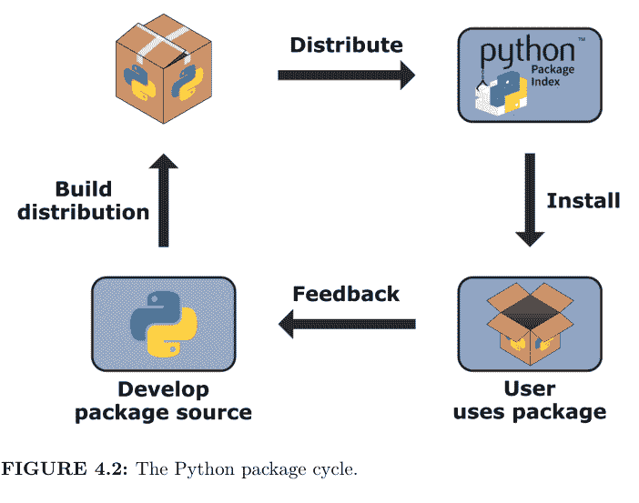

**图 4.2：** Python 包循环。

为了建立对这个过程步骤的直觉，我们将从用户端开始，讨论包是如何安装的。然后我们将反向工作，以更好地理解分发是什么以及它们是如何制作的。

#### 4.3.1 包安装

要被安装，一个包需要生成两个目录：

1.  `{package}`：包含包源文件（即模块和子包）的目录。
2.  `{package}-{version}.dist-info`：包含有关包信息的文件目录，例如包含包作者和支持的 Python 版本等信息的元数据文件（METADATA）、许可证文件（LICENSE）、指定用于安装包的工具的文件（INSTALLER）等。这些文件在 PEP 427<sup>25</sup> 中有详细描述。

我们稍后将讨论这些目录实际上是如何构建的，但现在，我们将讨论安装。当您使用像 pip 这样的安装程序安装包时，上述目录会被复制到 Python 安装的 *site-packages/* 目录中，这是 Python 导入包时查找的默认位置之一。*site-packages/* 目录的确切路径因您的操作系统、安装 Python 的方式以及是否使用虚拟环境而异。您可以使用 `sys.path` 变量检查路径。以下路径适用于 MacOS，Python 通过 Miniconda<sup>26</sup> 安装，并激活了名为 pycounts 的虚拟环境：

```python
>>> import sys
>>> sys.path
```

```
[
    '',
    '/opt/miniconda/base/envs/pycounts/lib/python39.zip',
    '/opt/miniconda/base/envs/pycounts/lib/python3.9',
    '/opt/miniconda/base/envs/pycounts/lib/python3.9/lib-dynload',
    '/opt/miniconda/base/envs/pycounts/lib/python3.9/site-packages'
]
```

如果您导航到 *site-packages/* 目录，您将看到每个已安装包的 *{package}* 和 *{package}-{version}.dist-info* 目录的示例。例如，如果我们 pip 安装我们在**第 3.10 节**上传到 PyPI 的 pycounts 包，我们将在 *site-packages* 文件夹中看到以下内容：

```
/opt/miniconda/base/lib/python3.9/site-packages/pycounts
├── __init__.py
├── __pycache__
├── plotting.py
└── pycounts.py
```

```
/opt/miniconda/base/lib/python3.9/site-packages/pycounts-0.1.0.dist-info
├── INSTALLER
├── LICENSE
├── METADATA
└── RECORD
```

<sup>17</sup> https://docs.python.org/3/library/importlib.html#module-importlib.resources
<sup>18</sup> https://github.com/scikit-learn/scikit-learn/tree/main/sklearn/datasets
<sup>19</sup> https://github.com/pytorch/vision/tree/main/torchvision/datasets
<sup>20</sup> https://github.com/statsmodels/statsmodels/tree/main/statsmodels/datasets
<sup>21</sup> https://packaging.python.org/tutorials/packaging-projects/
<sup>22</sup> https://blog.ionelmc.ro/2014/05/25/python-packaging/
<sup>23</sup> https://hynek.me/articles/testing-packaging/
<sup>24</sup> https://pypi.org
<sup>25</sup> https://www.python.org/dev/peps/pep-0427/
<sup>26</sup> https://docs.conda.io/en/latest/miniconda.html

### 4 包结构与分发

那么问题来了，我们如何提供安装包所需的 `{package}` 和 `{package}-{version}.dist-info` 目录呢？有两种选择：

1.  创建一个包含所有包源代码、元数据以及如何创建 `{package}` 和 `{package}-{version}.dist-info` 目录说明的单一归档文件，然后将该归档文件分享给用户。这被称为源码分发或 sdist。要从 sdist 安装你的包，用户需要下载归档文件，解压它，并使用其中包含的构建说明，在自己的计算机上将其构建为 `{package}` 和 `{package}-{version}.dist-info` 目录（我们将在第 4.3.2 节讨论这些目录是如何“构建”的）。最后，通过将这些目录复制到 `site-packages/` 目录来完成安装。
2.  在我们自己的机器上构建 `{package}` 和 `{package}-{version}.dist-info` 目录，将它们压缩成一个文件，并分享给用户。这个单一文件被称为 wheel。用户只需下载 wheel 并将内容解压到 `site-packages/` 文件夹；无需构建步骤。

`pip install` 可以处理从 sdist 或 wheel 安装，但将你的包作为 wheel（选项 2）分发给用户显然更可取；所有工作都已在开发者端完成，安装只涉及下载分发包并将其复制到用户计算机上的相应位置。这就是为什么 wheel 是 Python 包的首选分发格式。事实上，当你运行 `pip install <some-package>` 时，它总是会优先从 wheel（如果存在）安装指定的包。

此时你可能会想，为什么我们还要费心使用 sdist。原因是 wheel 并不总是对用户可用。一些 Python 包包含用其他语言（如 C/C++）编写的“扩展”，因为它们提供了功能和性能增强。虽然 Python 通常被称为解释型语言（即你的 Python 代码在执行时被翻译成机器码），但像 C/C++ 这样的语言需要在使用前由编译器程序进行编译（即你的代码必须在执行前被翻译成“机器码”）。编译是特定于平台的。因此，如果开发者想提供包含其他语言扩展的包的 wheel，他们必须为想要支持的每个平台（例如 MacOS-arm64、MacOS-x86、Win-32、Win-amd64 等）生成一个 wheel。因此，sdist 通常与 wheel 一起提供；如果用户的特定平台没有可用的 wheel，他们仍然可以从 sdist 构建包（这需要他们拥有相应的编译程序）。

### 4.3 包分发与安装

例如，流行的 numpy 包包含用 C 编写的扩展，因此其 wheel 是特定于平台的。Wheel 有特定的命名约定（在 PEP 427<sup>27</sup> 中描述），其中包括它们支持的平台名称；如果你查看 PyPI<sup>28</sup> 上的 numpy 分发包，你会看到适用于常见平台的 wheel，以及列表底部的 sdist。

特定于平台的 wheel 被称为“平台 wheel”。然而，绝大多数 Python 包使用纯 Python 代码（即它们不包含用其他语言编写的扩展），因此不需要担心生成平台 wheel。大多数开发者和本书的读者只会为他们的包生成一个 wheel：“通用 wheel”（兼容 Python 2 和 3）或“纯 Python wheel”（兼容 Python 2 或 3）。你用来制作分发包的构建工具会为你处理 wheel 的创建（我们将在下一节讨论），所以这不是你需要担心的事情，但了解这些事情很有趣！

#### 4.3.2 构建 sdist 和 wheel

在上一节中，我们讨论了包需要生成 {package} 和 {package}-{version}.dist-info 文件夹才能安装，以及 wheel 是一个包含这些文件的单一归档文件。那么我们到底如何构建 wheel 呢？

简而言之，构建过程包括：1. 开发者将包源代码构建为 sdist{分发!sdist}；2. 开发者或用户从 sdist 构建 wheel；3. 用户安装 wheel{分发!wheel}。

这里的构建步骤就是像 poetry、flit 或 setuptools 这样的打包工具发挥作用的地方。这些工具提供了构建 sdist 和 wheel 所需的代码。回想一下 poetry 用来管理包开发的 pyproject.toml 文件。在第 3.5.2 节介绍该文件时，我们没有讨论该文件中的一个表格 [build-system]：

```
...other file content hidden...

[build-system]
requires = ["poetry-core>=1.0.0"]
build-backend = "poetry.core.masonry.api"
```

此表指定了构建包的 sdist 和 wheel 所需的工具（requires）以及实际执行构建的函数在构建工具库中的位置（build-backend）。例如，上面的表格显示构建我们的包需要 poetry-core 库，并且构建函数位于 poetry.core.masonry.api 中。如果你查看 poetry-core 的 poetry.core.masonry.api 模块<sup>29</sup> 的源代码，你会看到像 build_wheel() 和 build_sdist() 这样的函数。具体的构建机制超出了本书的范围，因此我们不会详细讨论它们的工作原理。然而，作为一本打包书籍，不提及能够指定构建包 sdist 和 wheel 所需工具的能力是打包生态系统中相对较新的发展，这是不妥的。此功能在 PEP 517<sup>30</sup> 和 PEP 518<sup>31</sup> 中引入，以消除打包系统对遗留工具的依赖。对于那些热衷于深入了解构建和安装包分发包更多底层细节的人来说，这些 PEP 是有趣的读物。

#### 4.3.3 打包工具

本书的重点是使打包变得易于访问和高效的工作流程和工具。poetry 就是这些工具之一；它将包开发的底层细节抽象出来，让开发者可以专注于编写代码。poetry 完全通过单个 pyproject.toml 文件配置，并具有直观的命令来安装包（poetry install）、管理依赖项（poetry add）、构建分发包（poetry build）以及将这些分发包发布到像 PyPI 这样的仓库（poetry publish）。

另一种现代打包工具是 flit。flit 本质上是 poetry 的精简版。它也由 pyproject.toml 文件管理，并提供类似于 poetry 的命令来帮助安装包（flit install）、构建分发包（flit build）以及将这些分发包发布到像 PyPI 这样的仓库（flit publish）。flit 和 poetry 之间的主要区别在于，flit 不像 poetry 那样自动管理项目的依赖项；你必须手动将依赖项及其版本规范添加到 pyproject.toml 中。因此，我们更喜欢 poetry，因为这意味着少了一件需要担心的事情！

poetry 和 flit 的缺点是，在撰写本文时，它们只支持纯 Python 包，而不支持包含用其他语言编写的扩展的包，我们在第 4.3.1 节讨论过这一点。对于绝大多数开发者来说，这完全没问题。然而，对于那些希望构建包含非 Python 代码的更高级包的人来说，setuptools 是首选。长期以来，setuptools 是 Python 包的默认构建工具，因此许多存在已久的项目仍在使用它。setuptools 需要比 poetry 或

<sup>27</sup>https://www.python.org/dev/peps/pep-0427/
<sup>28</sup>https://pypi.org/project/numpy/#files
<sup>29</sup>https://github.com/python-poetry/poetry-core/blob/master/src/poetry/core/masonry/api.py
<sup>30</sup>https://www.python.org/dev/peps/pep-0517/
<sup>31</sup>https://www.python.org/dev/peps/pep-0518/

#### 4.3.4 包仓库

在**第3章：如何打包一个Python包**中，我们将pycounts包发布到了Python包索引（PyPI<sup>33</sup>），并讨论了PyPI是Python包的主要仓库。即使你从未听说过PyPI，但如果你运行过`pip install <some-package>`，那么你就是从那里安装的包。如果你有兴趣公开分享你的作品，PyPI可能是你发布包的地方，然而，它并非唯一的选择。

Anaconda<sup>34</sup>和conda-forge<sup>35</sup>仓库是Python包第二受欢迎的软件仓库。这些仓库上的包可以使用`conda install`从命令行安装（我们在**第2.2.1节**中安装了conda工具）。PyPI与这些仓库的主要区别在于，它们可以托管非Python软件（而PyPI只托管Python软件），并且conda包是二进制文件（永远不需要从sdist构建包或其依赖项）。因此，依赖非Python代码的包通常会发布到Anaconda或conda-forge。即使是纯Python包，开发者有时也会创建conda包并上传到Anaconda或conda-forge，以迎合那些使用conda而非pip作为包管理器的用户。对于感兴趣的读者，Anaconda提供了一个有用的教程<sup>36</sup>，帮助将PyPI上的包转换为conda包，但对于本书的大多数读者来说，构建sdist和wheel分发包并在PyPI上分享就足够了。

在某些情况下，你可能希望将包发布到私有仓库（例如，仅供公司内部使用）。Python包有许多私有仓库选项。像Anaconda<sup>37</sup>、PyDist<sup>38</sup>和GemFury<sup>39</sup>这样的公司都是提供（通常是付费的）私有Python包仓库托管服务的例子。你也可以在专用机器或云服务上设置自己的服务器——如本文<sup>40</sup>所述。你也可以选择将包托管在GitHub（或类似平台）上，而放弃发布到专门的软件仓库。`pip install`支持直接从你有权访问的GitHub仓库安装包，如文档<sup>41</sup>所述。你可以从仓库分支、特定提交或标签进行`pip install`。例如，我们在**第3.9节**中在GitHub上为我们的pycounts包的v0.1.0版本打上了标签。其他人现在可以使用以下命令直接从GitHub安装我们的包：

```
$ pip install git+https://github.com/TomasBeuzen/pycounts.git@v0.1.0
```

从GitHub安装对于想要使用尚未在PyPI上提供的包版本（例如，开发版本）的用户很有用，或者如果你想将包托管在私有仓库中，只与少数选定的协作者分享。但总的来说，我们不建议使用GitHub向广大受众分享Python包，因为绝大多数Python用户不会从GitHub安装包，而像PyPI这样的专门软件仓库提供了更好的可发现性、易安装性和真实性认证。

### 4.4 版本控制

在**第4.2.6节**中，我们对pycounts包进行了重要更改，添加了一个新的datasets模块和一些示例数据。我们将在**第7章：发布和版本控制**中发布包含此更改的新版本包。因此，如果你正在自己构建pycounts包并使用版本控制，请使用以下命令将这些更改提交到你的本地和远程仓库。如果你没有构建pycounts包或不使用版本控制，可以跳到下一章。

```
$ git add src/pycounts/datasets.py src/pycounts/data
$ git commit -m "feat: add example data and datasets module"
$ git push
```

# 5
## 测试

测试是Python包开发的重要组成部分，但由于感知到的额外工作量，它经常被忽视。然而，现实恰恰相反！在你的工作流程中引入正式的、自动化的测试有几个好处：

- 1. **更少的bug：** 你从开发者和用户的角度明确地构建和测试你的代码。
- 2. **更好的代码结构：** 编写测试迫使你构建和组织代码，使其更易于测试和理解。
- 3. **更轻松的开发：** 正式测试将帮助你和其他人向代码添加功能，而不会破坏经过验证的现有功能。

**第3.7节**简要介绍了Python包开发中的测试。本章现在将更详细地介绍如何编写测试、不同类型的测试（单元测试、回归测试、集成测试）以及代码覆盖率。

### 5.1 测试工作流程

一般来说，测试的目标是检查你的代码是否产生了你期望的结果。你可能已经在当前工作流程中对代码进行了非正式测试。在典型的工作流程中，我们编写代码，在Python会话中运行它以查看是否按预期工作，进行更改，然后重复。这有时被称为“手动测试”或“探索性测试”，在代码开发的早期阶段很常见。但是，当你开发打算打包、重用并可能与他人分享的代码时，你需要以更正式和可重现的方式进行测试。

在Python中，测试通常使用`assert`语句编写，该语句检查给定表达式的真假，如果表达式为假，则返回用户定义的错误消息。为了演示这个过程，假设我们想创建一个名为`count_letters()`的函数来计算字符串中的字母数量。我们提出了以下代码作为该函数的第一个版本：

```
def count_letters(text):
    """Count letters in a string."""
    return len(text)
```

我们可以使用assert语句为该函数编写一些测试，以检查它是否按预期工作。例如，我们期望函数计算字符串"Hello"中的五个字母和字符串"Hello world"中的十个字母：

```
>>> assert count_letters("Hello") == 5, "'Hello' should have 5 letters"
>>> assert count_letters("Hello world") == 10, "'Hello world' should \n    have 10 letters"
```

如果我们运行上面的assert语句，第一个会通过而没有错误，但第二个会引发错误：

```
AssertionError: 'Hello world' should have 10 letters
```

哪里出了问题？当我们对字符串调用len()时，它计算字符串中的所有字符，包括空格。因此，我们需要回到count_letters()函数，在计数字母之前移除空格。我们可以通过使用.replace()方法将空格替换为空字符串""（即，什么都没有）来实现：

```
def count_letters(text):
    """Count letters in a string."""
    return len(text.replace(" ", ""))
```

现在我们之前的assert语句应该都能通过了。我们刚刚经历的这个过程大致遵循了典型的测试工作流程：

- 1. 编写测试。
- 2. 编写要测试的代码。
- 3. 测试代码。
- 4. 重构代码（进行小的更改）。
- 5. 重复。

这个工作流程如图5.1所示。

在我们之前使用count_letters()函数的演示中，我们交换了步骤1和2；我们在编写测试之前编写了函数的第一个版本的代码，这也是一个常见的工作流程。然而，你可以看到编写测试（或至少思考测试）可能带来的好处

---
**脚注：**
<sup>32</sup> https://setuptools.readthedocs.io/en/latest/userguide/index.html
<sup>33</sup> https://pypi.org/
<sup>34</sup> https://anaconda.org/anaconda/repo
<sup>35</sup> https://conda-forge.org
<sup>36</sup> https://docs.conda.io/projects/conda-build/en/latest/user-guide/tutorials/build-pkgs-skeleton.html
<sup>37</sup> https://docs.anaconda.com/
<sup>38</sup> https://pydist.com/
<sup>39</sup> https://gemfury.com/
<sup>40</sup> https://medium.com/swlh/how-to-install-a-private-pypi-server-on-aws-76993e45c610
<sup>41</sup> https://pip.pypa.io/en/stable/topics/vcs-support/

### 5.2 测试结构

要将 pytest 用作测试框架，它期望测试按以下方式组织：

1.  测试被定义为以 `test_` 为前缀的函数，并包含一个或多个断言语句，用于验证代码是否产生预期结果或引发特定错误。
2.  测试被放置在名为 `test_*.py` 或 `*_test.py` 的文件中，通常位于包根目录下名为 `tests/` 的目录中。

可以在命令行使用 `pytest` 命令并指向测试所在的目录（即 `pytest tests/`）来执行测试。pytest 会查找该目录及其子目录中所有名为 `test_*.py` 或 `*_test.py` 的文件，并执行所有以 `test_` 为前缀的函数。

例如，考虑我们在第 3 章：如何打包一个 Python 包中开发的 `pycounts` 包的结构：

```
pycounts
├── .readthedocs.yml
├── CHANGELOG.md
├── CONDUCT.md
├── CONTRIBUTING.md
├── docs
│   └── ...
├── LICENSE
├── README.md
├── poetry.lock
├── pyproject.toml
├── src
│   └── ...
└── tests          <--------
    ├── einstein.txt    <--------
    └── test_pycounts.py <--------
```

文件 `einstein.txt` 是我们在第 3.7.1 节创建的用于测试的文本文件。它包含阿尔伯特·爱因斯坦的一句名言：

> "Insanity is doing the same thing over and over and expecting different results."

文件 `test_pycounts.py` 是我们希望用 pytest 运行的测试所在的位置。该文件包含我们在 **第 3.7.2 节** 编写的以下测试，使用了 pytest 期望的格式：一个以 `test_` 为前缀的函数，其中包含一个 assert 语句。

```python
from pycounts.pycounts import count_words
from collections import Counter

def test_count_words():
    """Test word counting from a file."""
    expected = Counter({'insanity': 1, 'is': 1, 'doing': 1,
                       'the': 1, 'same': 1, 'thing': 1,
                       'over': 2, 'and': 2, 'expecting': 1,
                       'different': 1, 'results': 1})
    actual = count_words("tests/einstein.txt")
    assert actual == expected, "Einstein quote counted incorrectly!"
```

要使用 pytest 运行此测试，应首先将其作为开发依赖项安装到你的包中。如果使用 poetry 作为打包工具（正如本书中所做的那样），可以使用以下命令完成：

> 如果你从 **第 3 章：如何打包一个 Python 包** 继续，并使用 conda 为你的 `pycounts` 包创建了虚拟环境（如我们在 **第 3.5.1 节** 所做的那样），请务必在继续本章之前通过在命令行运行 `conda activate pycounts` 来激活该环境。

```
$ poetry add --dev pytest
```

安装 pytest 后，我们从包的根目录使用以下命令运行测试：

```
$ pytest tests/
```

```
============================= test session starts =============================
...
collected 1 item

tests/test_pycounts.py .                                               [100%]

============================== 1 passed in 0.01s ===============================
```

pytest 的输出提供了一些基本的系统信息，以及运行了多少测试以及通过的百分比。如果测试失败，它将输出错误的回溯信息，这样你就可以确切地看到哪个测试失败以及失败的原因。在下一节中，我们将更详细地介绍如何在 pytest 中编写不同类型的测试。

### 5.3 编写测试

有几种常用于测试 Python 包的测试类型：单元测试、集成测试和回归测试。在本节中，我们将探讨并演示这些测试是什么以及如何在 pytest 中编写它们。

#### 5.3.1 单元测试

单元测试是你将编写的最常见的测试类型。单元测试验证一个独立的代码单元（例如，一个 Python 函数）在特定情况下是否按预期工作。它通常包括：

1.  一些用于测试代码的数据（称为“测试夹具”）。测试夹具通常是函数通常处理的数据类型的小型或简化版本。
2.  代码在给定测试夹具时产生的 *实际* 结果。
3.  测试的 *预期* 结果，通常使用 assert 语句与 *实际* 结果进行比较。

我们 `pycounts` 包中的 `test_count_words()` 函数就是单元测试的一个例子。回想一下，我们的 `count_words()` 函数可用于计算文本文件中的单词数。为了测试它，我们创建了一个名为 `einstein.txt` 的小型示例文本文件（我们的测试夹具），其中包含以下名言：

> "Insanity is doing the same thing over and over and expecting different results."

使用此测试夹具，我们的 `count_words()` 函数的结果是 *实际* 结果。测试夹具足够小，我们可以手动计算单词数，这构成了我们的 *预期* 结果。因此，我们 `test_pycounts.py` 中当前的单元测试如下所示：

```python
from pycounts.pycounts import count_words
from collections import Counter

def test_count_words():
    """Test word counting from a file."""
    expected = Counter({'insanity': 1, 'is': 1, 'doing': 1,
                        'the': 1, 'same': 1, 'thing': 1,
                        'over': 2, 'and': 2, 'expecting': 1,
                        'different': 1, 'results': 1})
    actual = count_words("tests/einstein.txt")
    assert actual == expected, "Einstein quote counted incorrectly!"
```

pytest 测试函数实际上可以包含多个 assert 语句，如果其中任何一个 assert 函数失败，整个测试就会失败。作为包含多个 assert 语句的单元测试示例，我们将在 `test_pycounts.py` 文件中为 `pycounts.plotting` 模块的 `plot_words()` 函数编写一个新测试。我们在 [第 3.6 节](#section-3-6) 开发了 `plot_words()` 函数，如下所示：

```python
import matplotlib.pyplot as plt

def plot_words(word_counts, n=10):
    """Plot a bar chart of word counts.

    Parameters
    ----------
    word_counts : collections.Counter
        Counter object of word counts.
    n : int, optional
        Plot the top n words. By default, 10.
    """
    top_n_words = word_counts.most_common(n)
    word, count = zip(*top_n_words)
    fig = plt.bar(range(n), count)
    plt.xticks(range(n), labels=word, rotation=45)
    plt.xlabel("Word")
    plt.ylabel("Count")
    return fig
```

我们的函数接受一个单词计数的 Counter 对象，并输出一个 matplotlib 条形图。为了通过单元测试验证其是否按预期工作，我们将：

-   使用爱因斯坦名言中手动计算的单词作为测试夹具。
-   将该测试夹具作为 `plot_words()` 函数的输入以创建条形图（实际结果）。
-   断言该图是一个 matplotlib 条形图（`matplotlib.container.BarContainer`），并断言条形图中有十个条形（如上所示，`n=10` 是 `plot_words()` 函数中绘制条形的默认数量）。

下面我们在 Python 代码中展示这个单元测试，并将其添加到我们的 `test_pycounts.py` 文件中：

```python
from pycounts.pycounts import count_words
from pycounts.plotting import plot_words
import matplotlib
from collections import Counter

def test_count_words():
    # ... same as before ...

def test_plot_words():
    """Test plotting of word counts."""
    counts = Counter({'insanity': 1, 'is': 1, 'doing': 1,
                      'the': 1, 'same': 1, 'thing': 1,
                      'over': 2, 'and': 2, 'expecting': 1,
                      'different': 1, 'results': 1})
    fig = plot_words(counts)
    assert isinstance(fig, matplotlib.container.BarContainer), \
        "Wrong plot type"
    assert len(fig.datavalues) == 10, \
        "Incorrect number of bars plotted"
```

### 5.3 编写测试

既然我们已经编写了一个新测试，就需要检查它是否正常工作。现在在命令行运行 `pytest` 应该会显示运行了两个测试：

```
$ pytest tests/
```

```
============================= test session starts =============================
...
collected 2 item

tests/test_pycounts.py .                                               [100%]

============================== 2 passed in 0.01s ===============================
```

看起来一切都在按预期工作！
在继续之前，还有一件重要的事情需要提及。我们知道 `assert` 语句可以与任何计算结果为布尔值（`True`/`False`）的表达式一起使用。但是，如果你的包使用了浮点数，并且你想在测试中断言浮点数的相等性，有一点需要注意。由于计算机中浮点数运算的限制，我们预期相等的数字有时并不相等。考虑以下著名的例子：

```
>>> assert 0.1 + 0.2 == 0.3, "Numbers are not equal!"
```

```
AssertionError: Numbers are not equal!
```

你可以在 Python 文档²中阅读更多关于浮点数运算细微差别的内容，但这里的重要一点是，当处理浮点数时，我们通常断言数字是*近似*相等，而不是*精确*相等。为此，我们可以使用 `pytest.approx()` 函数：

```
>>> import pytest
>>> assert 0.1 + 0.2 == pytest.approx(0.3), "Numbers are not equal!"
```

你可以通过使用 `pytest.approx()` 的 `abs` 和 `rel` 参数来控制你想要的近似程度，分别指定你希望允许的绝对误差或相对误差。

²https://docs.python.org/3/tutorial/floatingpoint.html

#### 5.3.2 测试是否引发了特定错误

有时，你不是断言代码在给定特定输入时产生特定输出，而是想检查代码在用户错误使用时是否引发了特定错误。再次考虑我们的 `pycounts.plotting` 模块中的 `plot_words()` 函数。从文档字符串中，我们看到该函数期望用户传递一个 `Counter` 对象：

```
import matplotlib.pyplot as plt

def plot_words(word_counts, n=10):
    """Plot a bar chart of word counts.

    Parameters
    ----------
    word_counts : collections.Counter <----------
        Counter object of word counts.
    n : int, optional
        Plot the top n words. By default, 10.

    ...rest of docstring hidden...
    """
    top_n_words = word_counts.most_common(n)
    word, count = zip(*top_n_words)
    fig = plt.bar(range(n), count)
    plt.xticks(range(n), labels=word, rotation=45)
    plt.xlabel("Word")
    plt.ylabel("Count")
    return fig
```

如果用户输入了不同的对象会怎样？为了论证，让我们考虑如果他们传递一个单词列表给我们的函数会发生什么：

```
>>> from pycounts.plotting import plot_words
>>> word_list = ["Pythons", "are", "non", "venomous"]
>>> plot_words(word_list)
```

```
AttributeError: 'list' object has no attribute 'most_common'
```

这个 `AttributeError` 消息对我们的用户来说不是很有用。问题在于我们的代码使用了 `.most_common()` 方法，这是 `Counter` 对象特有的，用于从该对象中检索前 n 个计数。为了改善用户体验，我们可能希望向用户引发一个更有帮助的错误消息，告诉他们是否传递了错误的对象类型。

### 5.3 编写测试

让我们修改我们的 `plot_words()` 函数，使用 `isinstance()` 函数检查 `word_counts` 参数是否为 `Counter` 对象，如果不是，则引发一个带有有用消息的 `TypeError`。`raise` 语句会终止程序，并允许你通知用户错误。有许多错误类型可供选择，你甚至可以创建自己的错误类型，如 Python 文档³中所述。我们这里将使用 `TypeError`，因为它用于指示对象类型错误。我们的函数，现在包含了这个新的检查代码，看起来像这样：

```
import matplotlib.pyplot as plt
from collections import Counter  <----------

def plot_words(word_counts, n=10):
    """Plot a bar chart of word counts.

    ...rest of docstring hidden...
    """
    if not isinstance(word_counts, Counter):  <----------
        raise TypeError("'word_counts' should be of type 'Counter'.")
    top_n_words = word_counts.most_common(n)
    word, count = zip(*top_n_words)
    fig = plt.bar(range(n), count)
    plt.xticks(range(n), labels=word, rotation=45)
    plt.xlabel("Word")
    plt.ylabel("Count")
    return fig
```

测试中使用的其他常见异常包括：

- `AttributeError`：当对象不支持引用的属性时（即 `object.attribute` 形式）。
- `ValueError`：当参数类型正确但值不恰当时。
- `FileNotFoundError`：当指定的文件或目录不存在时。
- `ImportError`：当 `import` 语句找不到模块时。

我们可以通过启动一个新的

³https://docs.python.org/3/library/exceptions.html

Python 会话并重试我们之前的代码（该代码向我们的函数传递了一个列表）来检查我们的新错误处理代码是否有效：

```
>>> from pycounts.plotting import plot_words
>>> word_list = ["Pythons", "are", "non", "venomous"]
>>> plot_words(word_list)
```

```
TypeError: 'word_counts' should be of type 'Counter'.
```

很好，我们的 `plot_words()` 函数现在在用户输入错误类型的对象时会引发一个有用的 `TypeError`。但是我们如何用 pytest 测试这个功能呢？我们可以使用 `pytest.raises()`。`pytest.raises()` 用作 `with` 语句的一部分，该语句包含你期望抛出错误的代码。让我们将下面显示的新单元测试 `test_plot_words_error()` 添加到我们的测试文件 `test_pycounts.py` 中，以演示此功能。

> 我们编写了一个名为 `test_plot_words_error()` 的新测试，而不是添加到我们现有的 `test_plot_words()` 测试中，因为单元测试应该编写为检查一个特定情况下的一个代码单元（即一个函数）。

```
from pycounts.pycounts import count_words
from pycounts.plotting import plot_words
import matplotlib
from collections import Counter
import pytest  <--------

def test_count_words():
    # ... same as before ...

def test_plot_words():
    # ... same as before ...

def test_plot_words_error():  <--------
    """Check TypeError raised when Counter not used."""
    with pytest.raises(TypeError):
        list_object = ["Pythons", "are", "non", "venomous"]
        plot_words(list_object)
```

### 5.3 编写测试

在上面的新测试中，我们故意向 `plot_words()` 传递了错误的对象类型（一个列表），并期望它引发一个 `TypeError`。让我们通过在终端运行 `pytest` 来检查这个新测试以及我们现有的测试是否都通过。`pytest` 现在应该会找到并执行三个测试：

```
$ pytest tests/
```

```
============================= test session starts =============================
...
collected 3 items

tests/test_pycounts.py .                                               [100%]

============================== 3 passed in 0.39s ===============================
```

#### 5.3.3 集成测试

我们上面编写的单元测试验证了我们包中的各个函数可以独立工作。但我们还应该测试它们是否能正确地协同工作。这样的测试称为“集成测试”（因为单个代码单元被集成到一个测试中）。

集成测试的结构与单元测试相同。我们使用一个 fixture 来用我们的代码产生一个实际结果，然后将其与预期结果进行比较。作为集成测试的一个例子，我们将：

- 使用“爱因斯坦名言”文本文件 `einstein.txt` 作为 fixture。
- 使用 `count_words()` 函数计算名言中的单词数。
- 使用 `plot_words()` 函数绘制单词计数。
- 断言创建了一个 matplotlib 条形图，该图有 10 个条形，并且图中的最大单词计数为 2（在 `einstein.txt` 文件中的名言里，没有单词出现超过两次）。

此测试的总体目标是检查我们包的两个核心函数 `count_words()` 和 `plot_words()` 是否能协同工作（至少符合我们的测试规范）。它可以如下编写并添加到我们的 `test_pycounts.py` 文件中：

```
from pycounts.pycounts import count_words
from pycounts.plotting import plot_words
import matplotlib
from collections import Counter
import pytest
```

def test_count_words():
    # ... 与之前相同 ...

def test_plot_words():
    # ... 与之前相同 ...

def test_plot_words_error():
    # ... 与之前相同 ...

def test_integration():
    """测试 count_words() 和 plot_words() 的工作流程。"""
    counts = count_words("tests/einstein.txt")
    fig = plot_words(counts)
    assert isinstance(fig, matplotlib.container.BarContainer), \
        "图表类型错误"
    assert len(fig.datavalues) == 10, \
        "绘制的柱状图数量不正确"
    assert max(fig.datavalues) == 2, "最高词频应为 2"

pytest 现在应该会找到并执行四个测试：

```
$ pytest tests/
```

```
============================= test session starts =============================
...
collected 4 items

tests/test_pycounts.py .                                               [100%]

============================== 4 passed in 0.39s ===============================
```

#### 5.3.4 回归测试

我们一直在用简单的“爱因斯坦名言”测试用例来测试我们的 pycounts 包，但它在真实数据上的表现如何呢？我们在[第 4.2.6 节](#section-4-2-6)中为我们的包添加了一些真实数据示例；一个埃德温·阿博特的小说《平面国》的 .txt 文件（[Abbott, 1884](#abbott-1884)）（可在线获取<sup>4</sup>）。然而，要手动统计该文本中的所有单词以得出一个“预期”结果是不可能的。

<sup>4</sup>https://www.gutenberg.org/ebooks/97

### 5.3 编写测试

相反，回归测试是关于测试你的代码是否产生一致的结果，而不是预期的结果。其思想是查看我们的包现在在此数据上的表现如何，并添加一个测试以检查随着我们为包添加更多功能，结果在未来是否保持一致。

例如，《平面国》中最常见的单词可以确定如下：

```
>>> from pycounts.datasets import get_flatland
>>> from pycounts.pycounts import count_words
>>> counts = count_words(get_flatland())
>>> counts.most_common(1)
```

```
[('the', 2244)]
```

毫不奇怪，最常见的单词是“the”，出现了 2245 次。因此，我们包的一个回归测试示例如下所示：

```
from pycounts.pycounts import count_words
from pycounts.plotting import plot_words
from pycounts.datasets import get_flatland
import matplotlib
from collections import Counter
import pytest

def test_count_words():
    # ... 与之前相同 ...

def test_plot_words():
    # ... 与之前相同 ...

def test_plot_words_error():
    # ... 与之前相同 ...

def test_integration():
    # ... 与之前相同 ...

def test_regression():
    """《平面国》的回归测试"""
    top_word = count_words(get_flatland()).most_common(1)
    assert top_word[0][0] == "the", "最常见的单词不是 'the'"
    assert top_word[0][1] == 2244, "'the' 的计数已改变"
```

pytest 现在应该会找到并执行五个测试：

```
$ pytest tests/
```

```
============================= test session starts =============================
...
collected 5 items

tests/test_pycounts.py .                                               [100%]

============================== 5 passed in 0.39s ===============================
```

#### 5.3.5 应该编写多少测试

既然你知道如何编写测试，那么实际上应该编写多少个呢？这个问题没有单一的答案。通常，你希望你的测试能够评估程序的核心功能。代码覆盖率（我们将在第 3.7.3 节讨论）是一个可以帮助你理解测试实际评估了多少代码的指标。但即使 100% 的覆盖率也不能保证你的代码是完美的，只能保证它通过了你编写的特定测试！

为你的包的每一个用例编写测试几乎是不可能的（你会惊讶于用户能找到多么奇怪而美妙的方式来无意中破坏你的代码！）。这就是为什么测试是一个迭代过程，正如我们在第 5.1 节讨论的：随着你重构和添加代码，随着用户找到你未曾预料到的使用函数的方式，或者它产生了你未曾预料到的结果，编写新的测试，编写新的代码，运行你的测试，然后重复。

### 5.4 高级测试方法

随着你编写的测试的复杂性和数量增加，以更高效和可访问的方式简化和组织你的测试会很有帮助。pytest fixtures 和参数化是两个有用的概念，可以在这里提供帮助。正如我们接下来将讨论的，pytest fixtures 可以用于更有效地定义测试的上下文（例如，它们运行的数据或目录结构），而参数化允许你使用不同的输入和输出值多次运行相同的测试。

### 5.4 高级测试方法

127

#### 5.4.1 Fixtures

我们当前的 `test_pycounts.py` 文件包含多次定义的相同 fixture；一个“爱因斯坦名言”中单词的 Counter 对象。

```
from pycounts.pycounts import count_words
from pycounts.plotting import plot_words
from pycounts.datasets import get_flatland
import matplotlib
from collections import Counter
import pytest

def test_count_words():
    """测试从文件中统计单词。"""
    expected = Counter({'insanity': 1, 'is': 1, 'doing': 1,
                       'the': 1, 'same': 1, 'thing': 1,
                       'over': 2, 'and': 2, 'expecting': 1,
                       'different': 1, 'results': 1})
    actual = count_words("tests/einstein.txt")
    assert actual == expected, "爱因斯坦名言统计错误！"

def test_plot_words():
    """测试词频图的绘制。"""
    counts = Counter({'insanity': 1, 'is': 1, 'doing': 1,
                      'the': 1, 'same': 1, 'thing': 1,
                      'over': 2, 'and': 2, 'expecting': 1,
                      'different': 1, 'results': 1})
    fig = plot_words(counts)
    assert isinstance(fig, matplotlib.container.BarContainer), \
        "图表类型错误"
    assert len(fig.datavalues) == 10, "绘制的柱状图数量不正确"

... 文件其余部分隐藏 ...
```

这是低效的，并且违反了软件开发的“不要重复自己”（DRY）原则。幸运的是，有一个解决方案。在 pytest 中，fixtures 可以定义为可在整个测试套件中重用的函数。在我们的例子中，我们可以创建一个 fixture 来定义“爱因斯坦名言”的 Counter 对象，并使其可供任何想要使用它的测试使用。

通过示例最容易看出 fixture 的效用。Fixtures 可以在 pytest 中使用 `@pytest.fixture` 装饰器创建。Python 中的装饰器使用 `@` 符号定义，并紧接在函数定义之前。装饰器为它们所“装饰”的函数添加功能；理解它们对于在此处使用它们并非必要，但对于那些有兴趣了解更多的人，请查看这个 Python 装饰器入门<sup>5</sup>。

在下面的代码中，我们定义了一个名为 `einstein_counts()` 的函数，并用 `@pytest.fixture` 装饰器装饰它。这个 fixture 返回爱因斯坦名言中手动统计的单词作为 `Counter` 对象。要在测试中使用它，我们将其作为参数传递给测试函数，就像通常指定函数参数一样，例如 `test_count_words(einstein_counts)`。我们将在下面的 `test_count_words()` 和 `test_plot_words()` 中都使用我们的新 fixture：

```
from pycounts.pycounts import count_words
from pycounts.plotting import plot_words
from pycounts.datasets import get_flatland
import matplotlib
from collections import Counter
import pytest

@pytest.fixture
def einstein_counts():
    return Counter({'insanity': 1, 'is': 1, 'doing': 1,
                    'the': 1, 'same': 1, 'thing': 1,
                    'over': 2, 'and': 2, 'expecting': 1,
                    'different': 1, 'results': 1})

def test_count_words(einstein_counts):
    """测试从文件中统计单词。"""
    expected = einstein_counts
    actual = count_words("tests/einstein.txt")
    assert actual == expected, "爱因斯坦名言统计错误！"

def test_plot_words(einstein_counts):
    """测试词频图的绘制。"""
    fig = plot_words(einstein_counts)
    assert isinstance(fig, matplotlib.container.BarContainer), \
        "图表类型错误"
    assert len(fig.datavalues) == 10, "绘制的柱状图数量不正确"

... 文件其余部分隐藏 ...
```

我们现在有了一种定义一次 fixture 但在多个测试中使用它的方法。此时你可能会想知道为什么我们使用了 `@pytest.fixture` 装饰器

<sup>5</sup>https://realpython.com/primer-on-python-decorators

### 5.4 高级测试方法

既然如此，为什么不直接像这样在脚本顶部正常定义一个变量呢：

```python
from pycounts.pycounts import count_words
from pycounts.plotting import plot_words
from pycounts.datasets import get_flatland
import matplotlib
from collections import Counter
import pytest

einstein_counts = Counter({'insanity': 1, 'is': 1, 'doing': 1,
                           'the': 1, 'same': 1, 'thing': 1,
                           'over': 2, 'and': 2, 'expecting': 1,
                           'different': 1, 'results': 1})

def test_count_words():
    """Test word counting from a file."""
    expected = einstein_counts

# ... rest of file hidden ...
```

简短的回答是，夹具（fixtures）提供的功能和可靠性远超手动定义的变量。例如，每次使用 pytest 夹具时，它都会触发夹具函数，这意味着每个测试都会获得一份全新的数据副本；你无需担心在测试会话中意外修改或删除夹具。你还可以控制这种行为：夹具是每次使用时执行一次，每个测试模块执行一次，还是每个测试会话执行一次？如果夹具很大或创建耗时，这会很有帮助。最后，我们只探讨了将夹具用作测试数据，但夹具也可用于设置测试环境。例如，测试应运行的目录结构，或应能访问的环境变量。pytest 夹具可以帮助你轻松设置这类上下文，你可以在 pytest 文档⁶中了解更多。

#### 5.4.2 参数化

参数化对于使用不同参数多次运行测试非常有用。例如，回顾第 5.3.2 节，我们向 pycounts 的 `plot_words()` 函数添加了一些代码，当用户向函数输入非 Counter 对象时会引发 TypeError。我们在 `test_pycounts.py` 文件中编写了一个测试来检查这一点，如下所示：

```python
# ... rest of file hidden ...

def test_plot_words_error():
    """Check TypeError raised when Counter not used."""
    with pytest.raises(TypeError):
        list_object = ["Pythons", "are", "non", "venomous"]
        plot_words(list_object)

# ... rest of file hidden ...
```

我们的测试仅测试了当传入列表对象作为输入时是否引发 TypeError，但我们还应该测试传入其他对象（如数字或字符串）时会发生什么。与其为每个我们想尝试的对象编写新的测试，我们可以用所有我们想尝试的不同数据来参数化这个测试，pytest 将为每条数据运行测试。

在 pytest 中，可以使用 `@pytest.mark.parametrize(argnames, argvalues)` 装饰器创建参数化。`argnames` 代表你想在测试函数中使用的测试变量的名称（你可以使用任何名称），`argvalues` 是这些测试变量将取的值的列表。

在下面的代码示例中，我们将其添加到 `test_pycounts.py` 文件，我们创建了一个名为 `obj` 的测试变量，它可以取三个值：一个浮点数（3.141）、一个字符串（"test.txt"）或一个字符串列表（["list", "of", "words"]）。通过这个参数化，pytest 将运行我们的测试三次，每次对应我们指定的 `obj` 要取的一个值。

```python
# ... rest of file hidden ...

@pytest.mark.parametrize(
    "obj",
    [
        3.141,
        "test.txt",
        ["list", "of", "words"]
    ]
)
def test_plot_words_error(obj):
    """Check TypeError raised when Counter not used."""
    with pytest.raises(TypeError):
        plot_words(obj)

# ... rest of file hidden ...
```

我们可以通过向 pytest 命令添加 `--verbose` 标志来明确显示 pytest 将运行我们的测试三次（每次对应我们指定的一个值）：

```bash
$ pytest tests/ --verbose
```

```
============================= test session starts =============================
...
collected 7 items

tests/test_pycounts.py::test_count_words PASSED                          [ 14%]
tests/test_pycounts.py::test_plot_words PASSED                           [ 28%]
tests/test_pycounts.py::test_plot_words_error[3.141] PASSED              [ 42%]
tests/test_pycounts.py::test_plot_words_error[test.txt] PASSED           [ 57%]
tests/test_pycounts.py::test_plot_words_error[obj2] PASSED               [ 71%]
tests/test_pycounts.py::test_integration PASSED                          [ [85%]
tests/test_pycounts.py::test_regression PASSED                           [100%]

============================== 7 passed in 0.52s ===============================
```

有时你会想对一个函数运行测试，其中输出取决于输入。例如，考虑下面的 `is_even()` 函数：

```python
def is_even(n):
    """Check if n is even."""
    if n % 2 == 0:
        return True
    else:
        return False
```

要用不同的输入/输出对来参数化这个测试，我们使用与之前相同的语法 `@pytest.mark.parametrize()`，只是我们在一个字符串中用逗号分隔测试参数（"n, result"），并将这些参数要取的值对分组在一个元组中（例如，(2, True), (3, False) 等）。在接下来的示例测试中，我们将故意添加一个错误的输入/输出对 ((4, False))，以展示在参数化失败的情况下 pytest 的输出是什么样子：

```python
@pytest.mark.parametrize(
    "n, result",
    [
        (2, True),
        (3, False),
        (4, False)  # this last pair is purposefully wrong so we can
        # show an example of the pytest error message
    ]
)
def test_is_even(n, result):
    assert is_even(n) == result
```

上述测试对于前两个参数化的输入/输出对会成功运行，但对于最后一个会失败，并显示以下有用的错误消息，该消息准确指出了哪个参数化失败了：

```
---
emphasize-lines: 4, 19
---
============================= FAILURES =============================
_______________________ testis_even[4-False] ________________________

n = 4, result = False

    @pytest.mark.parametrize(
        "n, result",
        [
            (2, True),
            (3, False),
            (4, False)
        ]
    )
    def testis_even(n, result):
>       assert is_even(n) == result

tests/test_example.py:13: AssertionError
========================= short test summary info ======================
FAILED tests/test_example.py:testis_even[4-False]: assert True == False
```

你可以在 pytest 文档<sup>7</sup>中了解更多关于参数化的内容。

### 5.5 代码覆盖率

一个好的测试套件应包含尽可能多地检查你包中代码的测试。你的测试实际使用了多少代码被称为“代码覆盖率”，有不同的计算方法，我们将在本节中学习。

#### 5.5.1 行覆盖率

最简单、最直观的代码覆盖率度量是行覆盖率。它是你的测试执行的包代码行数所占的比例：

$$coverage = \frac{\text{lines executed}}{\text{total lines}} * 100\%$$

考虑以下假设代码，共 9 行：

```python
def myfunc(x):                    # Line 1
    if x > 0:                      # Line 2
        print("x above threshold!") # Line 3
        print("Running analysis.")  # Line 4
        y = round(x)               # Line 5
        z = y ** 2                 # Line 6
    elif x < 0:                    # Line 7
        z = abs(x)                 # Line 8
    return z                       # Line 9
```

假设我们为该代码编写以下单元测试。此单元测试使用 x=10.25 作为测试夹具（如果你遵循上面的代码，你会看到该夹具的预期结果是 100）：

```python
def test_myfunc_1():
    assert myfunc(x=10.25) == 100
```

此测试仅覆盖了 `myfunc()` 函数的条件 x > 0，因此只会执行第 1 — 6 行和第 9 行；总共 9 行中的 7 行。因此覆盖率将是：

$$coverage = \frac{7}{9} * 100\% = 78\%$$

行覆盖率简单直观，许多开发者将其用作衡量其测试覆盖了多少包代码的指标。但你可以看到行覆盖率可能会产生误导。我们的 `myfunc()` 函数有两个可能的输出，取决于 if 语句的哪个条件被满足。这两个可能的代码路径称为“分支”，它们对我们的包可能同样重要，但我们的行覆盖率指标在很大程度上取决于我们实际测试了哪些分支。想象一下，如果我们对 `myfunc()` 函数使用下面的测试，它传递一个值 x <= 0：

<sup>7</sup>https://docs.pytest.org/en/6.2.x/parametrize.html

def test_myfunc_2():
    assert myfunc(x=-5) == 5

此测试仅覆盖了函数的第1、2行以及第7-9行，共计5行，覆盖率为56%。由于行覆盖率可能会因代码分支中的行数而产生偏差（或被人为夸大），一些开发者更倾向于计算分支覆盖率，我们将在下一节讨论这一点。

#### 5.5.2 分支覆盖率

与行覆盖率不同，分支覆盖率评估的是测试执行了代码中的多少个分支，其中分支是代码可能采取的执行路径，通常以`if`语句的形式出现。

```
def myfunc(x):
    # Branch 1
    if x > 0:
        print("x above threshold!")
        print("Running analysis.")
        y = round(x)
        z = y ** 2
    # Branch 2
    elif x < 0:
        z = abs(x)
    return z
```

$$coverage = \frac{\text{branches executed}}{\text{total branches}} * 100\%$$

使用分支覆盖率时，无论我们运行在[第5.5.1节](#section-5.5.1)中定义的`test_myfunc_1()`还是`test_myfunc_2()`测试函数，都会得到50%的覆盖率，因为每个测试都覆盖了一个分支。虽然行覆盖率可能比分支覆盖率更直观、更容易理解，但许多开发者认为分支覆盖率提供了一种更有用、更少偏见的覆盖率度量方式。在下一节中，我们将展示如何将行覆盖率和分支覆盖率混合计算，以结合两种指标的优点。

#### 5.5.3 计算覆盖率

我们可以使用扩展`pytest-cov`来通过pytest计算代码覆盖率。对于一个由poetry管理的包，可以使用以下命令将`pytest-cov`作为开发依赖项安装：

### 5.5 代码覆盖率

```
$ poetry add --dev pytest-cov
```

> pytest-cov是coverage包的一个实现。如果您想了解更多关于pytest-cov如何计算覆盖率的信息，有时访问后者的文档<sup>8</sup>会很有帮助。

代码覆盖率可以通过指定参数`--cov=<pkg-name>`的pytest命令来计算。例如，以下命令确定了我们的测试对pycounts包的覆盖率：

```
$ pytest tests/ --cov=pycounts
```

```
============================= test session starts ==============================
Name                          Stmts   Miss  Cover
----------------------------------------------------
src/pycounts/__init__.py          2      0   100%
src/pycounts/data/__init__.py     0      0   100%
src/pycounts/datasets.py          5      0   100%
src/pycounts/plotting.py         12      0   100%
src/pycounts/pycounts.py         16      0   100%
----------------------------------------------------
TOTAL                            35      0   100%
============================== 7 passed in 0.46s ===============================
```

输出总结了pycounts包中各个模块的覆盖率。默认情况下，pytest-cov将覆盖率计算为行覆盖率。Stmts是模块中的行数，Miss是测试未执行的行数，Cover是测试执行的行的百分比。在完成本章的学习后，我们已经编写了足够的测试，为我们的pycounts模块获得了100%的行覆盖率！但请注意，100%的覆盖率并不能保证我们的代码是完美的，只能说明它通过了我们编写的特定测试！

<sup>8</sup>https://coverage.readthedocs.io/en/latest/

如果我们想用pytest计算分支覆盖率，可以指定参数`--cov-branch`：

```
$ pytest --cov=pycounts --cov-branch
```

```
============================= test session starts ==============================
Name                          Stmts   Miss Branch BrPart  Cover
-----------------------------------------------------------------------------
src/pycounts/__init__.py          2      0      0      0   100%
src/pycounts/data/__init__.py     0      0      0      0   100%
src/pycounts/datasets.py          5      0      0      0   100%
src/pycounts/plotting.py         12      0      2      0   100%
src/pycounts/pycounts.py         16      0      2      0   100%
-----------------------------------------------------------------------------
TOTAL                            35      0      4      0   100%
============================== 5 passed in 0.46s ===============================
```

在此输出中，Branch是模块中的分支数，BrPart是测试执行的分支数。pytest-cov中的“分支覆盖率”实际上是使用分支和行覆盖率的混合计算得出的，这有助于结合两种指标的优点：

$$coverage = \frac{\text{lines executed} + \text{branches executed}}{\text{total lines} + \text{total branches}} * 100\%$$

#### 5.5.4 覆盖率报告

正如我们所看到的，`pytest --cov`在命令行上提供了一个有用的高级测试覆盖率摘要。但如果我们想看到更详细的输出，可以使用参数`--cov-report html`生成一个有用的HTML报告，如下所示：

```
$ pytest --cov=pycounts --cov-report html
```

报告将位于`htmlcov/index.html`（相对于您的工作目录），并如图5.2所示。

我们可以点击报告中的元素，例如`datasets.py`模块，以查看测试具体命中/遗漏了哪些行/分支，如图5.3所示：

### 5.5 代码覆盖率

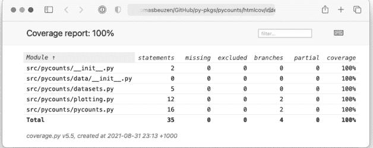

图5.2：HTML测试报告。

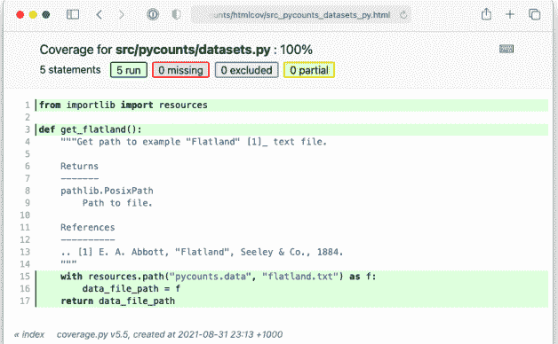

图5.3：HTML报告中datasets模块的详细视图。

### 5.6 版本控制

在本章中，我们在`test_pycounts.py`文件中添加了大量的测试，并在**第5.3.2节**中对`pycounts.plotting.plot_words()`函数做了一个小改动，使其检查用户是否传入了Counter对象作为输入参数。这些更改将构成我们将在**第7章：发布与版本控制**中开发的包的新版本的一部分。因此，如果您正在自己构建pycounts包并使用版本控制，请使用以下命令将这些更改提交到您的本地和远程仓库。如果您没有构建pycounts包或不使用版本控制，可以跳到下一章。

```
$ git add tests/test_pycounts.py
$ git commit -m "test: add additional tests for all modules"
$ git add src/pycounts/plotting.py
$ git commit -m "fix: check input type to plot_words function"
$ git push
```

## 6 文档

为您的包编写文档可以说是打包过程中最重要但可能最不令人兴奋的部分之一。文档的目的是帮助用户理解如何使用和与您的包交互，而无需阅读源代码。对于您代码的用户（包括未来的您），拥有可读且易于访问的文档是无价的。现实情况是，如果没有人知道如何使用您的包，它很可能就不会被使用！

在**第3.8节**中，我们介绍了创建文档、将其编译成用户友好且可共享的HTML格式，然后在线托管所需的步骤。我们将在此处回顾这些步骤，并提供有关文档工作流和包文档各个组成部分的更多细节。

### 6.1 文档内容和工作流

为了让您了解我们所说的“文档”是什么意思，**表6.1**展示了一个典型Python包中包含的文档及其通常在包目录结构中的位置。

表6.1：典型的Python包文档。

| 文档 | 典型位置 | 描述 |
| :--- | :--- | :--- |
| README | 根目录 | 提供有关包的高级信息，例如，它的功能、如何安装以及如何使用。 |
| License | 根目录 | 解释谁拥有包源代码的版权，以及如何使用和共享它。 |

### 6.1 文档内容与工作流程

我们将在**第3.8.1节**讨论这些文档的每一部分是什么以及如何编写它们。但首先，了解文档工作的整体流程以及我们想要构建的内容会很有帮助。

为Python包编写文档的典型工作流程包括三个步骤：

1.  **编写文档**：手动编写将支持你的包的文档源文件，例如表6.1中列出的那些。这些文件通常以纯文本格式编写，如Markdown<sup>1</sup>（.md）或reStructuredText<sup>2</sup>（.rst），我们将在**第3.8.1节**中解释。下面我们展示了为**第3章：如何打包Python**中开发的pycounts包编写的*README.md*文件示例。

```
### pycounts

Calculate word counts in a text file!

#### Installation

bash
$ pip install pycounts


#### Usage

`pycounts` can be used to count words in a text file and plot results as follows:

python
from pycounts.pycounts import count_words
from pycounts.plotting import plot_words
import matplotlib.pyplot as plt

file_path = "test.txt"  # path to your file
counts = count_words(file_path)
fig = plot_words(counts, n=10)
plt.show()


...rest of file hidden...
```

<sup>1</sup>https://en.wikipedia.org/wiki/Markdown
<sup>2</sup>https://www.sphinx-doc.org/en/master/usage/restructuredtext/index.html

2.  **构建文档**：使用文档生成器工具sphinx，将手动编写的文档编译并渲染成有组织、连贯且可共享的格式，如HTML或PDF。为了帮助你理解这意味着什么，图6.1展示了上述README文档在“构建”后的样子示例。

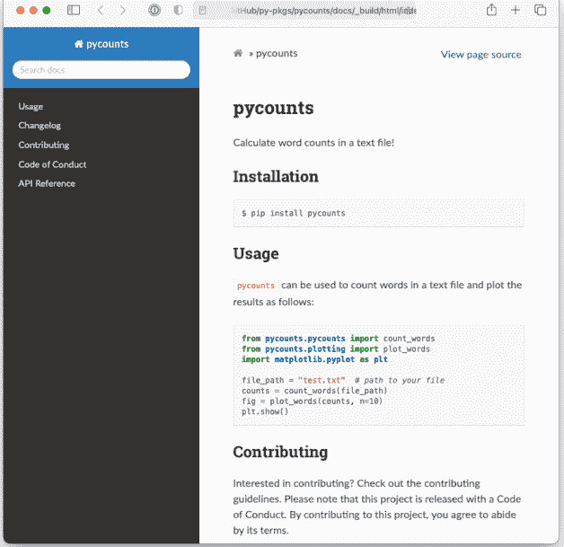

图6.1：由sphinx生成的HTML文档示例。

3.  **在线托管文档**：使用免费服务（如Read the Docs³或GitHub Pages⁴）在线共享文档，以便任何有互联网连接的人都能轻松访问。例如，我们在**第3.8节**为pycounts构建的文档可在线访问：https://pycounts.readthedocs.io/en/latest/。

³ https://readthedocs.org
⁴ https://pages.github.com

### 6.2 编写文档

表6.1展示了包中通常包含的文档类型及其在包目录结构中的常见位置。这里有很多内容需要考虑，但现实情况是，大多数开发者使用模板来创建Python包，这些模板会自动生成大部分此类文档。例如，考虑我们在**第3.2.2节**使用py-pkgs-cookiecutter模板创建的pycounts包：

```
pycounts
├── .readthedocs.yml
├── CHANGELOG.md       <--------
├── CONDUCT.md         <--------
├── CONTRIBUTING.md    <--------
├── docs               <--------
│   └── ...            <--------
├── LICENSE            <--------
├── README.md          <--------
├── poetry.lock
├── pyproject.toml
├── src
│   └── ...
└── tests
    └── ...
```

文档通常以纯文本标记格式编写，如Markdown<sup>5</sup>（*.md*）或reStructuredText<sup>6</sup>（*.rst*）。使用纯文本标记语言时，文档以纯文本编写，并使用特殊语法来指定文本在由合适工具渲染时应如何格式化。我们在**第6.1节**看到了原始和渲染后的Markdown文档示例。从上面pycounts包的结构可以看出，本书使用Markdown（*.md*），因为它被广泛使用，并且我们觉得它的语法比reStructuredText更简洁、更直观。自动Markdown渲染也受到各种IDE和网站的支持。我们将在后续章节展示Markdown语法和编写上述文档的示例，你可以查阅Markdown指南<sup>7</sup>以了解更多关于Markdown的信息。

<sup>5</sup>https://en.wikipedia.org/wiki/Markdown
<sup>6</sup>https://www.sphinx-doc.org/en/master/usage/restructuredtext/index.html

#### 6.2.1 README

README文件是你的包的“地图”。它通常是用户与你的包交互时首先看到和阅读的内容，应提供高层级信息，例如：你的包是做什么的、如何安装、使用简要演示、谁创建了该包、其许可证是什么以及如何为其做贡献。README是你的包的“入口”。没有它，用户将不知从何开始。

作为README文件的示例，我们在下方展示了pycounts包的完整README，该包是在[第3章：如何打包Python](Chapter 3: How to package a Python)中开发的。

在下面的Markdown文本中，使用了以下语法：

- 标题用井号（#）表示。井号的数量对应标题级别。
- 代码块由三个反引号界定。可以在开始界定符后指定编程语言，以指定代码语法应如何高亮显示。
- 链接使用方括号[]括起链接文本，后跟括号中的URL来定义。

```
### pycounts

Calculate word counts in a text file!

#### Installation

bash
$ pip install pycounts


#### Usage

`pycounts` can be used to count words in a text file and plot results as follows:

python
from pycounts.pycounts import count_words
from pycounts.plotting import plot_words
import matplotlib.pyplot as plt

file_path = "test.txt"  # path to your file
counts = count_words(file_path)
fig = plot_words(counts, n=10)
plt.show()
```

#### Contributing

Interested in contributing? Check out the contributing guidelines. Please note that this project is released with a Code of Conduct. By contributing to this project, you agree to abide by its terms.

#### License

`pycounts` was created by Tomas Beuzen. It is licensed under the terms of the MIT license.

#### Credits

`pycounts` was created with [`cookiecutter`](https://cookiecutter.readthedocs.io/en/latest/) and the `py-pkgs-cookiecutter` [template](https://github.com/py-pkgs/py-pkgs-cookiecutter).

需要再次强调的是，虽然上面的原始文本看起来没什么，但Markdown语法在通过sphinx等工具渲染时，能将文本格式化成如图6.1所示的漂亮样子。这就是为什么我们使用Markdown编写包文档——它可以用纯文本轻松编写，但渲染后却能呈现如此丰富的内容！

#### 6.2.2 许可证

许可证告诉其他人他们可以和不可以对你的代码做什么。开源倡议组织（OSI）⁸是了解不同许可证的好地方，GitHub也有一个有用的工具<sup>9</sup>可以帮助为你的包选择最合适的许可证。Python包常用的一些许可证包括：

- 知识共享CC0 1.0通用许可证（CC0 1.0）：将你的软件发布到公共领域，以便其他人可以将其用于任何目的。
- MIT许可证：允许用户对你的软件做任何他们想做的事情，只要他们在任何副本或实质性修改中包含原始版权声明和许可证通知。
- GNU通用公共许可证v3（GPL-3）：比上述许可证限制性更强。对你的软件所做的任何更改都必须记录，并且原始软件及其修改的完整源代码必须在相同的GPL-3许可证下提供。

如果你不包含许可证，则适用默认版权法，这通常意味着你保留源代码的所有权利，任何人都不得下载、复制、分发或从你的包创建衍生作品。如果你想将你的作品保留为私有或专有，这可能没问题，但如果你在没有许可证的情况下开源你的作品，其他人将无法使用或为其做贡献。

#### 6.2.3 贡献指南

贡献指南文件（通常命名为“CONTRIBUTING”）概述了用户如何为你的项目做贡献的流程。这些指南会因你与他人共享包源代码的方式而异，但通常包括关于你接受何种类型的贡献以及如何进行这些贡献（通常通过使用版本控制系统）的信息。GitHub提供了一个很好的指南<sup>10</sup>，用于向你的项目添加贡献文件。

拥有清晰的贡献指南可以简化将贡献整合到你的包中的过程。没有贡献指南，就不清楚其他人应如何有效地做贡献，或者你是否希望接受贡献。因此，你可能会收到不想要的贡献，或者以不想要的方式收到，这可能会浪费你和其他人的时间。

#### 6.2.4 行为准则

行为准则文件（通常命名为“CONDUCT”）用于定义社区标准，标识一个受欢迎且包容的项目，并概述

<sup>7</sup> https://www.markdownguide.org/
<sup>8</sup> https://opensource.org/
<sup>9</sup> https://choosealicense.com/
<sup>10</sup> https://help.github.com/en/github/building-a-strong-community/setting-guidelines-for-repository-contributors

| 文档 | 典型位置 | 描述 |
|---|---|---|
| 贡献指南 | 根目录 | 解释如何为项目做贡献。 |
| 行为准则 | 根目录 | 定义如何恰当地参与和贡献于项目及其社区的标准。 |
| 变更日志 | 根目录 | 按时间顺序排列的包随时间发生的重要变更列表，通常按版本组织。 |
| 文档字符串 | .py文件 | 出现在Python函数、方法、类或模块中第一条语句的文本，描述代码的功能和使用方法。用户可通过help()命令访问。 |
| 示例 | docs/ | 逐步的、教程式的示例，更详细地展示包的工作方式。 |
| API参考 | docs/ | 你的包面向用户的功能（即函数、类等）的有组织列表，以及它们的功能和使用方法的简要描述。通常使用sphinx工具从包的文档字符串自动生成，我们将在第3.8.4节讨论。 |

#### 6.2.5 变更日志

变更日志是一个文件，其中按时间顺序列出了对你的软件包所做的更改。这些更改通常按软件包的发布版本进行组织，这一点我们将在**第7章：发布与版本控制**中详细讨论。拥有变更日志有助于用户和贡献者了解软件包的历史及其随时间的演变。没有它，用户将很难理解你的软件包在何时、因何以及为何进行了更改。

变更日志是为人类阅读而制作的。它们通常包含针对软件包每个版本所做的重要更改的要点列表，并按类别分组，例如：“功能”、“修复”、“文档”、“测试”，并且最新版本位于文件顶部。下面是我们 `pycounts` 软件包的一个假设性变更日志示例。

> 在下面的 Markdown 文本中，语法 `<!-- ... -->` 表示注释。注释不会包含在文档的渲染版本中。

```
### Changelog

<!--next-version-placeholder-->

#### v0.2.1 (12/09/2021)

##### Fix

- Changed confusing error message in plotting.plot_words()

#### v0.2.0 (10/09/2021)

##### Feature

- Added a "stop_words" argument to pycounts.count_words()

##### Documentation

- Added new usage examples
- Now hosting documentation on Read the Docs

#### v0.1.0 (24/08/2021)

- First release of `pycounts`
```

<sup>11</sup> https://help.github.com/en/github/building-a-strong-community/adding-a-code-of-conduct-to-your-project

> 在**第8章：持续集成与部署**中，我们将展示如何在发布软件包新版本时，从版本控制提交信息中自动更新你的变更日志。

#### 6.2.6 示例

创建如何使用你的软件包的示例，对于新用户和现有用户来说都可能非常有价值。与**第6.2.1节**中 README 里简短的“用法”标题不同，这些示例更像是教程，包含文本、图表和代码的混合，逐步演示你的软件包的功能和常见工作流程。示例应该是真实的，并说明你的软件包用户可能实际执行的工作流程（而不是玩具示例）。

在这里考虑你的受众也很重要。有时，有必要为不同专业水平的用户创建示例。针对新用户的示例将逐步介绍软件包的基本功能，并提供大量关于每段代码的作用及其原因的注释。针对更熟练用户的示例可能更侧重于代码，对每个步骤的解释较少，并且可能会探索软件包更高级的用法。

你当然可以使用像 Markdown 这样的纯文本格式从头开始编写示例，但这可能效率低下且容易出错。相反，我们建议使用像 Jupyter Notebook (Kluyver et al., 2016) (.ipynb 文件) 这样的计算笔记本创建示例。Jupyter Notebooks 是交互式文档，可以包含代码、方程式、文本和可视化内容。它们对于演示示例非常有效，因为它们直接导入并使用你的软件包中的代码；这确保了你在编写示例时不会出错，并且允许用户下载、执行和交互式地使用这些笔记本（而不仅仅是阅读文本）。

要在 Jupyter notebook 中创建示例，你需要安装 Jupyter 软件。如果你使用的是像本书中那样的 poetry 管理的项目，你可以使用以下命令将 Jupyter 软件作为软件包的开发依赖项进行安装：

> 如果你正在从**第3章：如何打包一个 Python** 继续，并且像我们在**第3.5.1节**中那样为你的 `pycounts` 软件包使用 conda 创建了虚拟环境，请务必在继续之前通过在命令行运行 `conda activate pycounts` 来激活该环境。

```
$ poetry add --dev jupyter
```

安装完成后，你可以使用以下命令启动 Jupyter Notebook 应用程序：

```
$ jupyter notebook
```

> 如果你正在一个原生支持 Jupyter Notebooks 的 IDE（如 Visual Studio Code 或 JupyterLab）中开发你的 Python 软件包，你可以直接打开 `docs/example.ipynb` 进行编辑，而无需运行上面的 `jupyter notebook` 命令。

Notebooks 由“单元格”组成，这些单元格可以包含 Python 代码或 Markdown 文本。讨论如何使用 Jupyter 应用程序超出了本书的范围，我们建议读者参阅 Jupyter 文档[^12] 以了解更多信息。

[^12]: https://jupyter-notebook.readthedocs.io/en/latest/?badge=latest

然而，作为示例，图 6.2 和图 6.3 展示了我们在第 3.8.3 节中为支持我们的 `pycounts` 软件包而创建的示例 notebook。

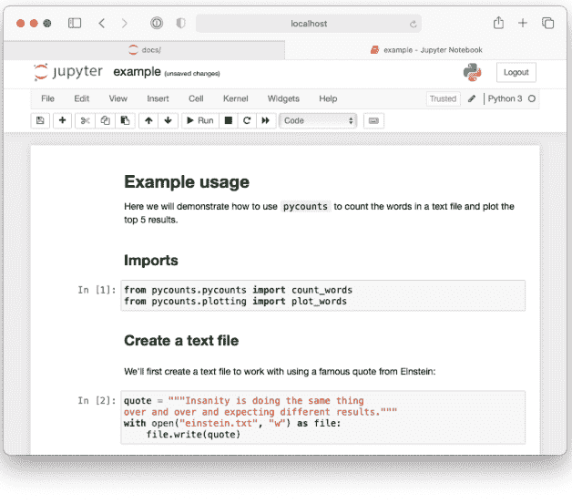

**图 6.2：** 展示使用 `pycounts` 软件包的示例工作流程的 Jupyter Notebook 的前半部分。

在第 3.8.4 节中，我们将展示如何使用 sphinx 自动执行 notebooks 并将其内容（包括代码单元格的输出）包含到我们构建的文档中，以便用户可以轻松地阅读和浏览它们，甚至无需启动 Jupyter 应用程序！

#### 6.2.7 文档字符串

文档字符串是位于 Python 模块、类或函数开头（在任何代码之前）的、用三引号括起来的字符串，它提供了关于该对象的功能以及如何使用它的文档。文档字符串会自动成为被文档化对象的文档，用户可以通过 `help()` 函数访问。当用户尝试使用你的软件包中的代码时，文档字符串是他们的首要参考；在创建软件包时，即使是为了你自己，它们也是必不可少的。

Python 中通用的文档字符串约定在 Python 增强提案 (PEP) 257 — 文档字符串约定<sup>13</sup> 中有描述，但在编写文档字符串的方式上具有灵活性。一个最小的文档字符串包含一行描述对象功能的文字，这对于一个简单的函数或代码处于早期开发阶段时可能就足够了。然而，对于你打算与他人（包括未来的你自己）共享的代码，应该编写更全面的文档字符串。

<sup>13</sup> https://www.python.org/dev/peps/pep-0257/

一个典型的文档字符串将包括：

1.  一个不使用变量名或函数名的单行摘要。
2.  一个扩展描述。
3.  参数类型和描述。
4.  返回值类型和描述。
5.  使用示例。
6.  可能还有更多。

Python 中使用不同的“文档字符串风格”来组织这些信息，例如 numpydoc 风格<sup>14</sup>、Google 风格<sup>15</sup> 和 sphinx 风格<sup>16</sup>。在本书中，我们一直使用 numpydoc 风格，因为我们发现它具有直观的语法且易于阅读。在 numpydoc 风格中：

-   章节标题表示为带下划线的文本：

```
Parameters
----------
```

-   输入参数表示为：

```
name : type
    Description of parameter `name`.
```

-   输出值使用与上面相同的语法，但指定名称是可选的。

作为文档字符串的一个示例，考虑我们 `pycounts` 软件包的 `count_words()` 函数：

```
def count_words(input_file):
    """Count words in a text file.

    Words are made lowercase and punctuation is removed
    before counting.

    Parameters
    ----------
    input_file : str
        Path to text file.

    Returns
    -------
    collections.Counter
```

类似字典的对象，其中键是单词，值是计数。

示例
--------
>>> count_words("text.txt")
"""
text = load_text(input_file)
text = clean_text(text)
words = text.split()
return Counter(words)
```

你可以根据需要向文档字符串添加信息——你并不总是需要上面所有的部分，在某些情况下，你可能希望包含来自numpydoc风格文档<sup>17</sup>的额外部分。

#### 6.2.8 应用程序编程接口（API）参考

应用程序编程接口（API）参考表是你的包面向用户的功能及其相关文档字符串的有组织索引。它帮助用户高效地理解和搜索你的包的功能，而无需深入源代码或对每个需要了解的对象运行Python help()命令。

作为我们所讨论内容的具体示例，图6.4展示了我们的pycounts包的API参考，图6.5展示了我们点击pycounts.plotting模块时获得的详细信息。

你可以通过手动复制粘贴你的包中所有Python对象（函数、模块、类等）的名称及其文档字符串到一个纯文本文件中来创建API参考，但这将极其繁琐且不可重现。相反，API参考通常使用sphinx自动生成，它可以解析你的源代码以提取Python对象及其文档字符串，并将它们渲染成API参考。我们将在[第3.8.4节](#section-3.8.4)中演示如何做到这一点。

#### 6.2.9 其他包文档

在本节中，我们只探讨了Python包中通常包含的核心文档。但你可以添加任何你想要的文档！例如，你可能希望为常见问题（FAQs）编写文档，一份参考你的项目与类似项目比较的文档，关于项目资金和归属的信息等。一般来说，文档越多越好！

<sup>17</sup>https://numpydoc.readthedocs.io/en/latest/format.html#docstring-standard

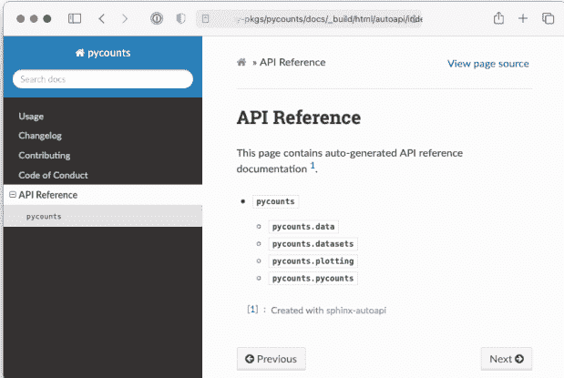

图6.4：pycounts包的API参考。

### 6.3 构建文档

目前，我们编写的文档以纯文本Markdown文件、Jupyter Notebooks和Python模块中的文档字符串的形式分散在我们包的目录结构中。与其要求用户搜索这个目录结构来查找文档，不如使用像sphinx这样的文档生成器来编译和渲染所有这些纯文本文档为用户友好的输出格式（如HTML或PDF），这样更容易查看、导航和与他人共享。我们在图6.1中展示了sphinx生成的文档示例。正如我们将在本节中看到的，sphinx还有一个丰富的扩展生态系统，可用于帮助自定义和自动生成内容，以补充你手动编写的文档。

我们将使用我们的pycounts包演示使用sphinx构建文档的过程。本节将有效地回顾我们在第3.8.4节中经历的相同步骤，因此对于最近阅读过该节的读者，可以跳到第3.8.5节。

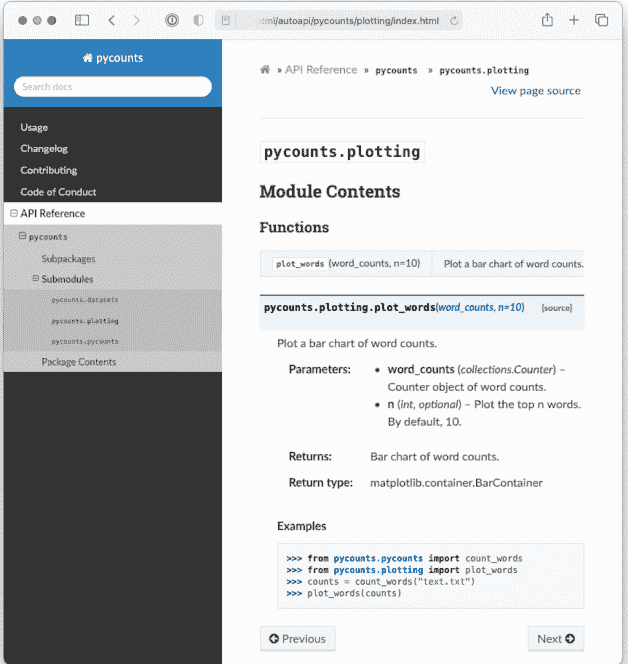

图6.5：pycounts.plotting包的API参考。

使用sphinx构建文档的源文件和配置文件位于你包根目录下的docs/文件夹中。py-pkgs-cookiecutter自动为我们创建了这个文件夹：

```
pycounts
├── .readthedocs.yml
├── CHANGELOG.md
├── CONDUCT.md
├── CONTRIBUTING.md
├── docs          <----------
│   ├── changelog.md
│   ├── conduct.md
│   ├── conf.py
│   ├── contributing.md
│   ├── example.ipynb
│   ├── index.md
│   ├── make.bat
│   ├── Makefile
│   ├── requirements.txt
├── LICENSE
├── pyproject.toml
├── README.md
├── src
│   └── ...
└── tests
    └── ...
```

> 如果你没有使用模板来创建你的Python包目录结构，可以使用sphinx命令sphinx-quickstart快速为你创建docs/目录中的源文件。

docs/目录包括：

- Makefile/make.bat：包含使用sphinx构建文档所需命令的文件，无需修改。Make<sup>18</sup>是一个用于运行命令以高效读取、处理和写入文件的工具。Makefile定义了Make要执行的任务。如果你有兴趣了解更多关于Make的知识，我们推荐Learn Makefiles<sup>19</sup>教程。但对于使用sphinx构建文档，你只需要知道拥有这些Makefile允许我们使用简单的命令`make html`构建文档，并使用命令`make clean`清理文档（即删除它以便我们可以制作一个全新的副本）。我们将在本节后面使用这些命令。
- requirements.txt：包含将我们的文档在线托管在Read the Docs<sup>20</sup>上所需的文档特定依赖项列表，我们将在**第3.8.5节**中讨论。

<sup>18</sup> https://www.gnu.org/software/make/
<sup>19</sup> https://makefiletutorial.com
<sup>20</sup> https://readthedocs.org/

- `conf.py`是一个配置文件，控制sphinx如何构建你的文档。你可以在sphinx文档<sup>21</sup>中阅读更多关于`conf.py`的信息，我们很快会再次提到它，但现在，它已被py-pkgs-cookiecutter模板预填充，无需修改。
- `docs/`目录中的其余文件构成了我们生成文档的内容，我们将在本节剩余部分讨论。

`index.md`文件将构成我们文档的着陆页。可以把它想象成一个网站的主页。对于你的着陆页，你通常需要一些关于你的包的高级信息，然后链接到你希望向用户展示的其余文档。例如，我们将要构建的着陆页将如图6.6所示。

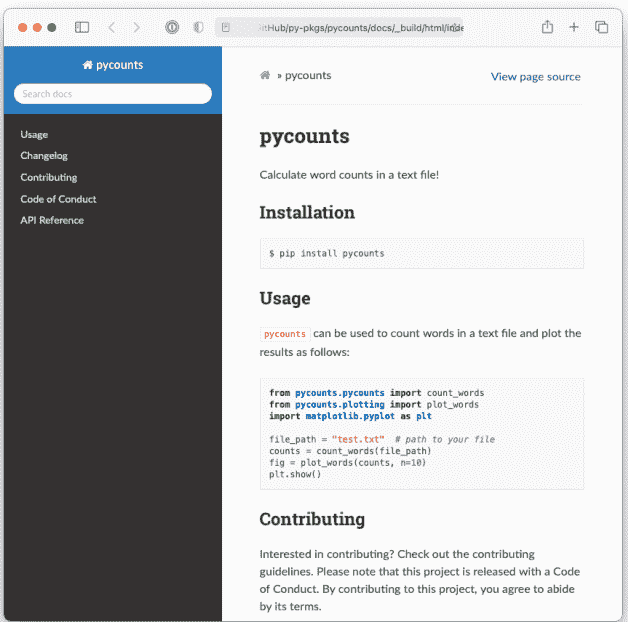

图6.6：由sphinx生成的文档主页。

> <sup>21</sup> https://www.sphinx-doc.org/en/master/usage/configuration.html

如果你在你选择的编辑器中打开*index.md*，你会看到我们正在使用下面解释的特定语法生成此内容。

```
{include} ../README.md
```

```
toctree
:maxdepth: 1
:hidden:

example.ipynb
changelog.md
contributing.md
conduct.md
autoapi/index
```

Sphinx原生支持reStructuredText<sup>22</sup>，但许多开发者更喜欢使用Markdown（正如我们在本书中所做的那样）。上面*index.md*中显示的语法是一种称为Markedly Structured Text (MyST)<sup>23</sup>的Markdown变体。MyST基于Markdown，但具有受reStructuredText启发并兼容sphinx使用的额外语法选项。例如，{include}语法指定我们希望*index.md*着陆页包含我们包根目录中*README.md*的内容（可以将其视为复制粘贴操作）。

{toctree}语法定义了哪些文档将列在**图6.6**左侧的目录（ToC）中。参数`:maxdepth: 1`表示ToC应包含多少级标题，`:hidden:`指定ToC应仅出现在侧边栏中，而不出现在索引页本身。然后，ToC列出了我们希望包含在文档中并链接到的文档。"example.ipynb"是我们在**第6.2.6节**中展示的Jupyter Notebook。sphinx不支持在ToC中使用相对链接，因此为了包含我们根目录中的*CHANGELOG.md*、*CONTRIBUTING.md*和*CONDUCT.md*，我们创建了"存根文件"*changelog.md*、*contributing.md*和*conduct.md*，它们包含使用之前支持相对链接的{include}语法链接到这些文档的内容。例如，*changelog.md*包含以下文本：

```
{include} ../CHANGELOG.md
```

<sup>22</sup>https://www.sphinx-doc.org/en/master/usage/restructuredtext/index.html
<sup>23</sup>https://myst-parser.readthedocs.io/en/latest/syntax/syntax.html

### 6.3 构建文档

目录中的最后一个文档“autoapi/index”是一个API参考手册，当我们使用sphinx构建文档时，它会根据我们的包结构和文档字符串自动生成。

在我们使用sphinx构建文档之前，它依赖于一些需要安装和配置的sphinx扩展：

- myst-nb：使sphinx能够解析Markdown、MyST和notebook文件的扩展（sphinx默认只支持reStructuredTex，即.rst文件）。
- sphinx-rtd-theme：一个用于设置文档外观样式的自定义主题。它比sphinx的默认主题好看得多。
- sphinx-autoapi：解析我们的源代码和文档字符串以创建API参考手册的扩展。
- sphinx.ext.napoleon：使sphinx能够解析numpydoc风格的文档字符串。
- sphinx.ext.viewcode：在API参考手册中为每个对象的源代码添加一个有用的链接。

这些扩展对于使用sphinx创建文档并非必需，但它们在Python包文档中都很常用，并且能显著改善生成文档的外观和用户体验。没有sphinx.ext前缀的扩展需要安装。我们可以在poetry管理的项目中将它们作为开发依赖项安装，使用以下命令：

```
$ poetry add --dev myst-nb --python "^3.9"
$ poetry add --dev sphinx-autoapi sphinx-rtd-theme
```

> 添加myst-nb是一个很好的例子，说明了为什么依赖版本的上限可能会带来麻烦，正如我们在3.6.1节中讨论的那样。在撰写本文时，myst-nb的一个依赖项mdit-py-plugins对其所需的Python版本有<4.0的上限，因此它与我们支持Python >=3.9的包不兼容。因此，除非mdit-py-plugins移除这个上限，否则我们添加myst-nb最简单的方法是告诉poetry只为Python版本^3.9（即>=3.9且<4.0）安装它，使用参数--python "^3.9"。

24 https://myst-nb.readthedocs.io/en/latest/
25 https://sphinx-rtd-theme.readthedocs.io/en/stable/
26 https://sphinx-autoapi.readthedocs.io/en/latest/
27 https://sphinxcontrib-napoleon.readthedocs.io/en/latest/
28 https://www.sphinx-doc.org/en/master/usage/extensions/viewcode.html

安装后，任何你想要使用的扩展都需要添加到`conf.py`配置文件中一个名为`extensions`的列表中，并进行配置。每个扩展的配置选项（如果存在）可以在其各自的文档中查看，但`py-pkgs-cookiecutter`已经通过在`conf.py`中定义以下变量为我们处理好了一切：

```
extensions = [
    "myst_nb",
    "autoapi.extension",
    "sphinx.ext.napoleon",
    "sphinx.ext.viewcode",
]
autoapi_dirs = ["../src"]  # 要解析以生成API参考的位置
html_theme = "sphinx_rtd_theme"
```

文档结构设置好并配置好扩展后，我们现在可以导航到`docs/`目录，并使用以下命令使用sphinx构建文档：

```
$ cd docs
$ make html
```

```
Running Sphinx
...
build succeeded.
The HTML pages are in _build/html.
```

如果我们现在查看`docs/`目录内部，会看到一个新的目录`_build/html`，其中包含我们构建好的文档，格式为HTML文件。如果你打开`_build/html/index.html`，应该会看到图6.6所示的着陆页。

> 如果你对文档进行了重大更改，在重新构建之前删除`_build/`文件夹可能是个好主意。你可以通过将`clean`选项添加到`make html`命令中轻松完成此操作：`make clean html`。

`sphinx-autoapi`和`sphinx.ext.napoleon`扩展提取了每个模块中的文档字符串，并将其渲染到我们的文档中。如果你点击“API Reference”，现在应该能够查看如图6.4和图6.5所示的页面。

如果你导航到“Example usage”页面，应该会看到我们Jupyter Notebook示例的渲染版本，如图6.7所示。这得益于myst-nb扩展得以实现。


**图6.7：** 渲染到pycounts文档中的Jupyter Notebook示例。

最终，你可以使用sphinx及其扩展生态系统高效地创建美观且功能丰富的文档。你现在可以自己使用此文档，或者可能与他人分享，但当它通过像Read the Docs<sup>29</sup>这样的免费服务托管在网络上时，它才真正大放异彩，我们将在下一节中进行介绍。

<sup>29</sup>https://readthedocs.org/

### 6.4 在线托管文档

如果你打算与他人分享你的包，将你的文档在线访问会很有用。通常将Python包文档托管在免费的在线托管服务Read the Docs<sup>30</sup>上，它可以自动化构建、部署和托管你的文档。Read the Docs通过连接到托管你的包文档的在线仓库（如GitHub仓库）来工作。当你将更改推送到你的仓库时，Read the Docs会自动构建一份新的文档副本（即运行`make html`），并将其托管在URL https://pkgname.readthedocs.io/（你也可以配置Read the Docs使用自定义域名）。这意味着你对文档源文件所做的任何更改都会立即部署给你的用户。如果你需要文档是私有的（即仅对公司员工可用），Read the Docs提供付费的“Business plan”来实现此功能。

GitHub Pages<sup>31</sup>是另一个用于从仓库托管文档的流行服务。然而，它不原生支持在你将更改推送到源文件时自动构建文档，这就是为什么我们在这里更喜欢使用Read the Docs。如果你确实想在GitHub Pages上托管文档，我们建议使用ghp-import<sup>32</sup>包，或者设置一个使用peaceiris/actions-gh-pages<sup>33</sup>操作的自动化GitHub Actions工作流（我们将在**第8章：持续集成和部署**中了解更多关于GitHub Actions的内容）。

Read the Docs<sup>34</sup>文档将提供在线托管文档所需的最新步骤。对于我们的`pycounts`包，这涉及以下步骤：

1. 访问 https://readthedocs.org/ 并点击“Sign up”。
2. 选择“Sign up with GitHub”。
3. 点击“Import a Project”。
4. 点击“Import Manually”。
5. 填写项目详细信息：
    * 提供你的包名（例如，pycounts）。
    * GitHub仓库URL（例如，https://github.com/TomasBeuzen/pycounts）。
    * 将默认分支指定为main。
6. 点击“Next”，然后点击“Build version”。

按照上述步骤操作后，你的文档应该会被Read the Docs<sup>35</sup>成功构建，你应该能够通过构建页面上的“View Docs”按钮访问它。例如，pycounts的文档现在可以在https://pycounts.readthedocs.io/en/latest/访问。每次你将更改推送到GitHub仓库的指定默认分支时，Read the Docs都会自动重新构建此文档。

> py-pkgs-cookiecutter在我们的Python包根目录中为我们创建的.readthedocs.yml文件包含了Read the Docs正确构建我们文档所需的配置设置。它指定了要使用的Python版本，并告诉Read the Docs我们的文档需要pycounts/docs/requirements.txt中指定的额外包才能正确生成。


### Taylor & Francis

Taylor & Francis Group

http://taylorandfrancis.com

## 7 发布与版本管理

前面的章节重点介绍了如何从零开始开发一个Python包：创建Python源代码、开发测试框架、编写文档，然后通过PyPI（如果需要）在线发布。本章将介绍打包工作流程的下一步——更新你的包！

在任何时间点，你的包的用户（包括你自己）都会在项目中安装一个特定版本的包。如果你更改了包的源代码，他们的代码可能会出错（想象一下，你更改了模块名称，或者移除了用户正在使用的函数参数）。为了解决这个问题，开发者为包的每个唯一状态分配一个唯一的版本号，并独立发布每个新版本。大多数时候，用户会希望使用你包的最新版本，但有时，他们需要使用与他们的项目兼容的旧版本。发布版本也是向用户传达你的包已发生变化（例如，修复了错误、添加了新功能等）的重要方式。

在本章中，我们将逐步介绍创建和发布Python包新版本的过程。

### 7.1 版本编号

版本管理是为你的包的不同版本添加唯一标识符的过程。你使用的唯一标识符可以是基于名称的，也可以是基于数字的，但大多数Python包使用语义化版本控制¹。在语义化版本控制中，版本号由三个整数A.B.C组成，其中A是“主”版本号，B是“次”版本号，C是“修订”版本号。软件的第一个版本通常从0.1.0开始，然后依次递增。我们称递增为“版本升级”，它包括将主版本号、次版本号或修订版本号加1，如下所示：

- **修订**版本发布（0.1.0 -> 0.1.1）：修订版本发布通常用于错误修复，这些修复是向后兼容的。向后兼容性指的是你的包与其自身先前版本的兼容性。例如，如果一个用户正在使用你的包的v0.1.0版本，他们应该能够升级到v0.1.1，并且他们之前编写的任何代码仍然可以正常工作。即使修订版本发布很多，需要使用两位数（例如0.1.27）也是可以的。

- **次**版本发布（0.1.0 -> 0.2.0）：次版本发布通常包含较大的错误修复或向后兼容的新功能，例如添加一个新函数。即使次版本发布很多，需要使用两位数（例如0.13.0）也是可以的。

- **主**版本发布（0.1.0 -> 1.0.0）：1.0.0版本通常用于你的包的第一个稳定版本发布。此后，主版本发布用于不向后兼容且可能影响许多用户的更改。不向后兼容的更改称为“破坏性更改”。例如，更改你的包中某个模块的名称将是一个破坏性更改；如果用户升级到你的新包，他们使用旧模块名称编写的任何代码将不再有效，他们必须进行更改。

大多数时候，你将进行修订版本和次版本发布。我们将在**第7.5节**中更详细地讨论主版本发布、破坏性更改以及如何弃用包功能（即移除它）。

即使有上述指南，包的版本管理也可能有点主观，需要你运用最佳判断。例如，小包可能为每个修复的错误进行一次修订版本发布，或为每个添加的新功能进行一次次版本发布。相比之下，较大的包通常会将多个错误修复合并到一个修订版本发布中，或将多个功能合并到一个次版本发布中，因为为每个单独的更改都进行发布会导致发布数量过多且令人困惑！**表7.1**展示了Python软件本身进行的一些主版本、次版本和修订版本发布的实际示例。为了规范在何种情况下应进行不同类型的发布，一些开发者会为其包创建“版本策略”文档；pandas的版本策略²就是一个很好的例子。

#### 表7.1：Python主版本、次版本和修订版本发布的示例。

| 发布类型 | 版本升级 | 描述 |
|---|---|---|
| 主版本 | 2.X.X -> 3.0.0（2008年12月） | 此版本包含破坏性更改，例如，`print()`变成了一个函数，整数除法结果为浮点数而非整数，内置对象（如字典和字符串）发生了重大变化，并且移除了许多旧功能。 |
| 次版本 | 3.8.X -> 3.9.0（2020年10月） | 此版本添加了新功能和优化，例如，添加了用于移除前缀和后缀的字符串方法（`.removeprefix()`/`.removesuffix()`），并为CPython（编译和执行你的Python代码的引擎）实现了一个新的解析器。 |
| 修订版本 | 3.9.5 -> 3.9.6（2021年6月） | 此版本包含错误和维护修复，例如，更新了`str.format()`方法中一个令人困惑的错误消息，将Python下载中捆绑的pip版本从21.1.2更新到了21.1.3，并更新了部分文档。 |

### 7.2 版本升级

虽然我们将在第7.3节讨论发布包新版本的完整工作流程，但我们首先想讨论版本升级。也就是说，在准备新版本发布时，如何递增你的包的版本号。这可以手动完成，也可以自动完成，如下所示。

#### 7.2.1 手动版本升级

一旦你决定了包的新版本是什么（即，你是进行修订版本、次版本还是主版本发布），你就需要在源代码中更新包的版本号。对于使用poetry管理的项目，该信息位于`pyproject.toml`文件中。考虑我们在第3章：如何打包Python中开发的pycounts包的`pyproject.toml`文件，其顶部如下所示：

```
[tool.poetry]
name = "pycounts"
version = "0.1.0"
description = "Calculate word counts in a text file!"
authors = ["Tomas Beuzen"]
license = "MIT"
readme = "README.md"

...rest of file hidden...
```

假设我们想为我们的包进行一次修订版本发布。我们可以简单地在此文件中手动将版本号更改为"0.1.1"，许多开发者确实采用这种手动方法。另一种方法是使用`poetry version`命令。`poetry version`命令可以与参数`patch`、`minor`或`major`一起使用，具体取决于你希望如何更新包的版本。例如，要进行修订版本发布，我们可以在命令行运行以下命令：

> 如果你正在和我们一起构建pycounts包，你不必运行下面的命令，它只是为了演示目的。我们将在本章后面为pycounts创建一个新版本。

```
$ poetry version patch
```

```
Bumping version from 0.1.0 to 0.1.1
```

此命令更改了pyproject.toml文件中的version变量：

```
[tool.poetry]
name = "pycounts"
version = "0.1.1"
description = "Calculate word counts in a text file!"
authors = ["Tomas Beuzen"]
license = "MIT"
readme = "README.md"

...rest of file hidden...
```

#### 7.2.2 自动版本升级

在本书中，我们希望尽可能地自动化打包工作流程。虽然第7.2.1节中描述的手动版本管理方法确实被许多开发者使用，但我们可以更高效地完成工作！要自动进行版本升级，你需要使用像Git这样的版本控制系统。如果你没有为你的包使用版本控制，可以跳到第7.3节。

Python Semantic Release (PSR)³ 是一个工具，可以根据它在提交消息中找到的关键词自动升级版本号。其思想是使用标准化的提交消息格式和语法，PSR可以解析这些格式来确定如何递增版本号。PSR使用的默认提交消息格式是Angular提交风格⁴，如下所示：

```
<type>(optional scope): short summary in present tense

(optional body: explains motivation for the change)

(optional footer: note BREAKING CHANGES here, and issues to be closed)
```

¹ https://semver.org
² https://python-semantic-release.readthedocs.io/en/latest/
³ https://github.com/angular/angular.js/blob/master/DEVELOPERS.md#commit-message-format

### 7.2 版本号递增

`<type>` 指的是所做的更改类型，通常是以下之一：

- feat：新功能。
- fix：错误修复。
- docs：文档更改。
- style：不影响代码含义的更改（空格、格式、缺少分号等）。
- refactor：既不修复错误也不添加功能的代码更改。
- perf：提高性能的代码更改。
- test：测试框架的更改。
- build：构建过程或工具的更改。

`scope` 是一个可选关键字，用于提供更改发生位置的上下文。它可以是与你的包或开发工作流相关的任何内容（例如，它可以是受更改影响的模块或函数名称）。

提交消息中的不同文本将触发 PSR 进行不同类型的发布：

- `<type>` 为 `fix` 会触发补丁版本号递增，例如：

```
$ git commit -m "fix(mod_plotting): fix confusing error message in \n    plot_words"
```

- `<type>` 为 `feat` 会触发次版本号递增，例如：

```
$ git commit -m "feat(package): add example data and new module to \n    package"
```

- 页脚中的文本 `BREAKING CHANGE:` 会触发主版本号递增，例如：

```
$ git commit -m "feat(mod_plotting): move code from plotting module \n    to pycounts module
$
$ BREAKING CHANGE: plotting module wont exist after this release."
```

要使用 PSR，我们需要安装并配置它。要将 PSR 作为 poetry 管理项目的开发依赖项安装，你可以使用以下命令：

```
$ poetry add --dev python-semantic-release
```

要配置 PSR，我们需要告诉它包的版本号存储在哪里。对于 poetry 管理的项目，包版本存储在 `pyproject.toml` 文件中。它作为 `[tool.poetry]` 表下的 `version` 变量存在。要告诉 PSR 这一点，我们需要在 `pyproject.toml` 文件中添加一个名为 `[tool.semantic_release]` 的新表，并在其中指定我们的 `version_variable` 存储在 `pyproject.toml:version`：

```
...rest of file hidden...

[tool.semantic_release]
version_variable = "pyproject.toml:version"
```

最后，你可以在命令行使用 `semantic-release version` 命令，让 PSR 自动递增你的包版本号。PSR 将解析自上一个标签以来的所有提交消息，以确定进行何种版本号递增。例如，假设自标签 `v0.1.0` 以来有以下三条提交消息：

1. "fix(mod_plotting): raise TypeError in plot_words"
2. "fix(mod_plotting): fix confusing error message in plot_words"
3. "feat(package): add example data and new module to package"

PSR 会注意到有两个 "fix" 和一个 "feat" 关键字。"fix" 触发补丁发布，但 "feat" 触发次版本发布，次版本发布优先于补丁发布，因此 PSR 会将版本号从 `v0.1.0` 递增到 `v0.2.0`。

为了更实际地演示 PSR 的工作原理，假设我们有一个版本为 `0.1.0` 的包，进行了一次错误修复，并使用以下消息提交了更改：

> 如果你正在和我们一起在本书中构建 pycounts 包，你不必运行下面的命令，它们仅用于演示目的。我们将在本章后面创建 pycounts 的新版本。

```
$ git add src/pycounts/plotting.py
$ git commit -m "fix(code): change confusing error message in \n    plotting.plot_words"
```

然后我们运行 `semantic-release version` 来更新版本号。在下面的命令中，我们将指定参数 `-v DEBUG`，要求 PSR 将额外信息打印到屏幕，以便我们深入了解 PSR 的工作原理：

```
$ semantic-release version -v DEBUG
```

```
Creating new version
debug: get_current_version_by_config_file()
debug: Parsing current version: path=PosixPath('pyproject.toml')
debug: Regex matched version: 0.1.0
debug: get_current_version_by_config_file -> 0.1.0
Current version: 0.1.0
debug: evaluate_version_bump('0.1.0', None)
debug: parse_commit_message('fix(code): change confusing error... )
debug: parse_commit_message -> ParsedCommit(bump=1, type='fix')
debug: Commits found since last release: 1
debug: evaluate_version_bump -> patch
debug: get_new_version('0.1.0', 'patch')
debug: get_new_version -> 0.1.1
debug: set_new_version('0.1.1')
debug: Writing new version number: path=PosixPath('pyproject.toml')
debug: set_new_version -> True
debug: commit_new_version('0.1.1')
debug: commit_new_version -> [main d82fa3f] 0.1.1
debug:  Author: semantic-release <semantic-release>
debug:  1 file changed, 5 insertions(+), 1 deletion(-)
debug: tag_new_version('0.1.1')
debug: tag_new_version ->
Bumping with a patch version to 0.1.1
```

我们可以看到 PSR 找到了我们的提交消息，并根据消息中的文本决定需要进行补丁发布。我们还可以看到该命令自动更新了 `pyproject.toml` 文件中的版本号，并为我们的包源代码创建了一个新的版本控制标签（我们在 [第 3.9 节](#section-3-9) 中讨论了标签）。在下一节中，我们将通过一个实际示例来演示如何将 PSR 与我们的 pycounts 包一起使用。

### 7.3 发布新包版本的检查清单

现在我们了解了版本控制以及如何递增包的版本号，我们准备好运行发布检查清单了。我们将对本书中一直在开发的 pycounts 包进行一次新的次版本发布，从 `v0.1.0` 到 `v0.2.0`，以演示发布检查清单中的每个步骤。

#### 7.3.1 步骤 1：对包源文件进行更改

这是一个显而易见的步骤，但在发布新版本之前，你需要对包的源代码进行更改，这些更改将构成你的新发布！

考虑我们的 pycounts 包。我们在 **第 3 章：如何打包 Python** 中发布了包的第一个版本 `v0.1.0`。自那时起，我们进行了一些更改。具体来说：

- 在 **第 4 章：包结构和分发** 中，我们向包中添加了一个新的 "datasets" 模块以及一些示例数据，即 Edwin Abbott 的小说 *Flatland* 的文本文件（Abbott, 1884），用户可以加载这些数据来试用我们包的功能。
- 在 **第 5 章：测试** 中，我们通过向 `tests/test_pycounts.py` 文件添加几个新的单元测试、集成测试和回归测试，显著升级了我们的测试套件。

> 在实践中，如果你使用版本控制，更改通常是通过分支对包的源代码进行的。分支隔离了你的更改，这样你就可以在不影响现有稳定版本的情况下开发你的包。只有当你对更改满意时，才将它们合并到现有源代码中。

#### 7.3.2 步骤 2：记录你的更改

在发布新版本之前，我们应该在变更日志中记录我们所做的所有更改。例如，这是 pycounts 更新后的 `CHANGELOG.md` 文件：

> 我们在 **第 6.2.5 节** 中讨论了变更日志文件的格式和内容。

```
### Changelog

<!--next-version-placeholder-->

#### v0.2.0 (10/09/2021)

##### Feature

- Added new datasets modules to load example data

##### Fix

- Check type of argument passed to `plotting.plot_words()`

##### Tests

- Added new tests to all package modules in test_pycounts.py

#### v0.1.0 (24/08/2021)

- First release of `pycounts`
```

如果使用版本控制，你应该提交此更改以确保它成为发布的一部分：

```
$ git add CHANGELOG.md
$ git commit -m "build: preparing for release v0.2.0"
$ git push
```

#### 7.3.3 步骤 3：递增版本号

一旦你为新发布的更改准备就绪，你需要手动（第 7.2.1 节）或使用 PSR 工具自动（第 7.2.2 节）递增包版本号。

我们将在这里使用 PSR 的自动方式，但如果你不使用 Git 作为版本控制系统，你需要手动执行此步骤。我们在上一节中对 pycounts 所做的更改构成了一次次版本发布（我们添加了一个加载示例数据的新功能，并对包的测试框架进行了一些重大更改）。当我们在第 4.4 节和第 4.4 节提交这些更改时，我们使用了以下提交消息集合：

### 7.3 发布新包版本的检查清单

```
$ git commit -m "feat: add example data and datasets module"
$ git commit -m "test: add additional tests for all modules"
$ git commit -m "fix: check input type to plot_words function"
```

正如我们在**第 7.2.2 节**中讨论的，PSR 可以自动解析这些提交信息来为我们递增包版本。如果你还没有安装，请使用 poetry 将 PSR 作为开发依赖项安装：

> 如果你是从**第 3 章：如何打包一个 Python 包**继续学习，并且像我们在**第 3.5.1 节**中所做的那样，使用 conda 为你的 pycounts 包创建了虚拟环境，请务必在继续之前通过在命令行运行 `conda activate pycounts` 来激活该环境。

```
$ poetry add --dev python-semantic-release
```

此命令更新了我们在 `pyproject.toml` 和 `poetry.lock` 中记录的包依赖项，因此在更新包版本之前，我们应该将这些更改提交到版本控制：

```
$ git add pyproject.toml poetry.lock
$ git commit -m "build: add PSR as dev dependency"
$ git push
```

现在我们可以使用 PSR 通过 `semantic-release version` 命令自动提升我们的包版本。如果你想确切地看到 PSR 在你的提交信息中发现了什么，以及它为什么决定进行补丁、次版本或主版本发布，你可以添加参数 `-v DEBUG`。

> 回想一下**第 7.2.2 节**，要使用 PSR，你需要通过在 `pyproject.toml` 的 `[tool.semantic_release]` 表下定义 `version_variable = "pyproject.toml:version"` 来告诉它你的包版本号存储在哪里。

```
$ semantic-release version
```

```
Creating new version
Current version: 0.1.0
Bumping with a minor version to 0.2.0
```

此步骤自动更新了我们 `pyproject.toml` 文件中的包版本，并为我们的包创建了一个新标签 "v0.2.0"，你可以通过在命令行输入 `git tag --list` 来查看：

```
$ git tag --list
```

```
v0.1.0
v0.2.0
```

#### 7.3.4 步骤 4：运行测试并构建文档

我们现在已经为发布准备好了包，但在发布之前，检查其测试是否运行以及文档是否成功构建非常重要。要对我们的 `pycounts` 包执行此操作，我们应该首先安装该包（我们应该重新安装，因为我们创建了一个新版本）：

```
$ poetry install
```

```
Installing the current project: pycounts (0.2.0)
```

现在我们将使用 `pytest` 和 `pytest-cov`（我们在**第 5 章：测试**中讨论了这些工具）来检查我们的测试是否仍然通过以及它们的覆盖率是多少：

```
$ pytest tests/ --cov=pycounts
```

```
============================= test session starts ==============================

----------- coverage: platform darwin, python 3.9.6-final-0 -----------
Name                          Stmts   Miss  Cover
-------------------------------------------------
src/pycounts/__init__.py          2      0   100%
src/pycounts/data/__init__.py     0      0   100%
src/pycounts/datasets.py          5      0   100%
src/pycounts/plotting.py          12     0   100%
src/pycounts/pycounts.py          16     0   100%
----------------------------------------------
TOTAL                             35     0   100%

========================= 7 passed in 0.41s ==========================
```

最后，为了检查文档是否仍然正确构建，你通常需要从头开始创建文档，即删除包中任何现有的已构建文档，然后重新构建。为此，我们首先需要在 `docs/` 目录下运行 `make clean`，然后再运行 `make html`（我们在**第 6 章：文档**中讨论了使用这些命令构建文档）。本着效率的精神，我们可以像下面这样将这两个命令组合在一起：

```
$ cd docs
$ make clean html
```

```
Running Sphinx
...
build succeeded.
The HTML pages are in _build/html.
```

看起来一切正常！

#### 7.3.5 步骤 5：使用版本控制标记发布

对于那些在 GitHub（或类似平台）上使用远程版本控制的人来说，是时候在 GitHub 上为你的仓库标记一个新发布了。如果你没有使用版本控制，可以跳到下一节。我们在**第 3.9 节**讨论了如何标记发布以及为什么这样做。回想一下，这是一个两步过程：

1. 使用命令 `git tag` 创建一个标签，标记仓库历史中的特定点。
2. 在 GitHub 上，基于该标签创建你的仓库的一个发布。

如果使用 PSR 来提升你的包版本，那么步骤 1 已经自动为你完成了。如果你没有使用 PSR，你可以使用以下命令手动创建标签：

```
$ git tag v0.2.0
```

你现在可以使用以下命令将任何本地提交和你的新标签推送到 GitHub：

```
$ git push
$ git push --tags
```

在为我们的 pycounts 包运行这些命令后，我们可以转到 GitHub 并导航到 "Releases" 标签页查看我们的标签，如图 7.1 所示。

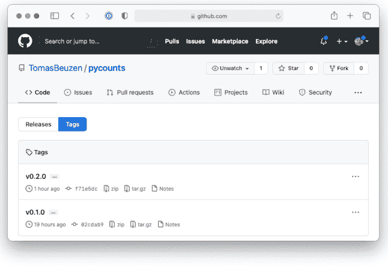

**图 7.1：** GitHub 上 pycounts 的 v0.2.0 标签。

要从此标签创建一个发布，请点击 "Draft a new release"。然后你可以指定要从中创建发布的标签，并可选择添加发布说明；通常，此说明会链接到变更日志，其中的更改已被记录。图 7.2 显示了 GitHub 上 pycounts 的 v0.2.0 发布。

#### 7.3.6 步骤 6：构建包并发布到 PyPI

现在是时候为我们的包构建新的分发文件了（即 sdist 和 wheel —— 我们在第 4.3 节讨论过这些）。我们可以使用 poetry 从包根目录运行以下命令来完成：

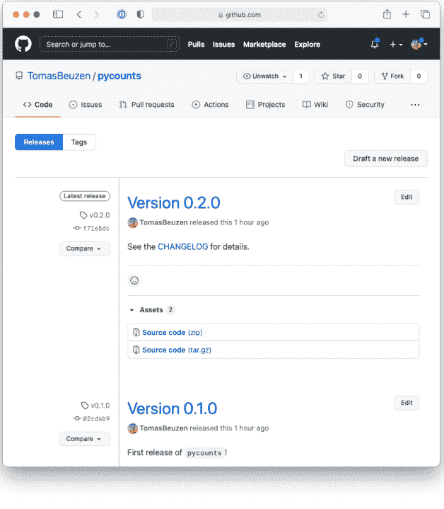

**图 7.2：** GitHub 上 pycounts 的 v0.2.0 发布。

```
$ poetry build
```

```
Building pycounts (0.2.0)
 - Building sdist
 - Built pycounts-0.2.0.tar.gz
 - Building wheel
 - Built pycounts-0.2.0-py3-none-any.whl
```

你现在可以随意使用和分享这些分发文件，但大多数开发者会希望将它们上传到 PyPI，这正是我们将要做的。

正如**第 3.10.2 节**所讨论的，在发布到 PyPI 之前，先在 TestPyPI<sup>6</sup> 上发布你的包是一个好习惯，以测试一切是否按预期工作。我们可以使用 poetry publish 来完成：

```
$ poetry publish -r test-pypi
```

> 上述命令假设你已经通过以下方式将 TestPyPI 添加到 poetry 知道的仓库列表中：`poetry config repositories.test-pypi https://test.pypi.org/legacy/`

现在你应该能够从 TestPyPI 下载你的包：

```
$ pip install --index-url https://test.pypi.org/simple/ \
    --extra-index-url https://pypi.org/simple pycounts
```

> 默认情况下，pip 会在 PyPI 中搜索指定的包。参数 `--index-url` 将 pip 指向 TestPyPI 索引。如果你的包有不在 TestPyPI 上的依赖项，你可能需要使用以下参数告诉 pip 也搜索 PyPI：`--extra-index-url https://pypi.org/simple`。

如果你对你新版本包的工作方式感到满意，你可以继续发布到 PyPI：

```
$ poetry publish
```

<sup>6</sup> https://test.pypi.org/

### 7.4 自动化发布

正如你在本章中所看到的，发布一个新版本的包需要经过相当多的步骤。在**第 8 章：持续集成和部署**中，我们将看到如何自动化整个发布过程，包括运行测试、构建文档以及发布到 TestPyPI 和 PyPI。

### 7.5 破坏性更改和弃用包功能

正如本章前面所讨论的，主版本发布可能伴随着向后不兼容的更改，我们称之为“破坏性更改”。破坏性更改会影响你的包的用户群。破坏性更改的影响和重要性与使用你包的人数成正比。这并不是说你应该避免破坏性更改——进行更改有充分的理由，例如改进软件设计错误、改进功能或使代码更简单、更易于使用。

如果你确实需要进行破坏性更改，最好通过向你的包的用户群提供充分的警告和建议（通过“弃用警告”）来逐步实施该更改。

我们可以通过使用 Python 标准库中的 `warnings` 模块<sup>7</sup>来向我们的代码添加弃用警告。例如，假设我们想在即将到来的主版本 v1.0.0 中从 `pycounts` 包的 `datasets` 模块中移除 `get_flatland()` 函数。我们可以通过向代码添加 `FutureWarning` 来实现，如下方的 `datasets.py` 模块所示（我们在**第 4.2.6 节**中创建了此模块）。

> 如果你以前使用过任何较大的 Python 库（如 NumPy、Pandas 或 scikit-learn），你可能已经见过弃用警告了！话虽如此，这些大型、成熟的 Python 库为学习如何正确管理自己的包提供了很好的资源——不要害怕查看它们在 GitHub 上的源代码和历史记录。

<sup>7</sup> https://docs.python.org/3/library/warnings.html

from importlib import resources
import warnings

def get_flatland():
    """获取示例 "Flatland" [1]_ 文本文件的路径。

    ...文档字符串其余部分已隐藏...
    """
    warnings.warn("此函数将在 v1.0.0 版本中弃用。",
                  FutureWarning)

    with resources.path("pycounts.data", "flatland.txt") as f:
        data_file_path = f
    return data_file_path

如果我们现在尝试使用此函数，我们将在输出中看到 FutureWarning 被打印出来：

```
>>> from pycounts.datasets import get_flatland
>>> flatland_path = get_flatland()
```

> FutureWarning: 此函数将在 v1.0.0 版本中弃用。

在进行破坏性变更时，还需要考虑以下几点：

- 如果你正在对一个函数进行重大修改，考虑在几个版本内同时保留旧版本（带有弃用警告）和新版本的函数，以帮助用户更平滑地过渡到使用新函数。
- 如果你正在弃用大量代码，考虑在多个版本中分小步骤进行。
- 如果你的破坏性变更是由于你的包的某个依赖项更改引起的，通常最好警告用户他们需要一个更新版本的依赖项，而不是立即将其设为你包的必需依赖项。
- 文档是关键！不要害怕在你的包文档和变更日志中详细记录破坏性变更。

### 7.6 更新依赖版本

如果你的包依赖于其他包，就像我们的 `pycounts` 包一样，你需要考虑随着依赖项新版本的发布，更新你的依赖版本约束。即使对于你的包支持的 Python 版本也是如此。

幸运的是，`poetry` 使这个过程相对简单。命令 `poetry update` 可用于在 `pyproject.toml` 文件的约束内，更新虚拟环境中已安装依赖项的版本。这对于测试你的包是否能按预期与更新版本的依赖项一起工作非常有用。例如，如果我们想安装与我们的 `pycounts` 包兼容的最新版本 `matplotlib`，我们可以使用以下代码：

```
$ poetry update matplotlib
```

然而，`poetry update` 不会更新你在 `pyproject.toml` 文件中指定的约束，也不会更新构建到你的包发布中的元数据。要更新这些，你有两个选择：

1. 手动修改 `pyproject.toml` 中的版本约束。
2. 使用 `poetry add` 将依赖项更新到特定版本。

例如，我们当前对 `matplotlib` 的版本约束显示在 `pyproject.toml` 中：

```
[tool.poetry.dependencies]
python = ">=3.9"
matplotlib = ">=3.4.3"
```

如果我们现在希望 `matplotlib` 的最低版本为 3.5.0，我们可以手动调整 `pyproject.toml` 文件，如下所示：

```
[tool.poetry.dependencies]
python = ">=3.9"
matplotlib = ">=3.5.0"
```

或者我们可以运行以下代码：

```
$ poetry add "matplotlib>=3.5.0"
```

我们在上面的命令中使用双引号，因为在许多 shell（如 bash）中，> 是一个重定向运算符。双引号用于保留所包含字符的字面值（在文档<sup>8</sup>中阅读更多）。

<sup>8</sup>http://www.gnu.org/software/bash/manual/html_node/Double-Quotes.html

## 8 持续集成与部署

如果你已经读到这里，你现在对如何创建一个功能齐全的 Python 包有了基本的了解！我们经历了很多才走到这里：我们学习了包结构、开发了源代码、创建了测试、编写了文档，并学习了如何发布包的新版本。

随着你继续开发你的包，自动化许多这些工作流将非常有帮助，这样你和你的协作者就可以更专注于编写代码，而减少对打包和测试细节的关注。这就是持续集成（CI）和持续部署（CD）的用武之地！CI/CD 通常指软件的自动化测试、构建和部署。在本章中，我们将首先介绍 CI/CD，并介绍如何使用 GitHub Actions 服务进行设置。之后，我们将展示如何为 Python 包设置 CI/CD，使用我们在本书中一直在开发的 pycounts 包来演示概念。

> 本章需要基本熟悉 Git 和 GitHub 或类似的版本控制工具。要了解更多关于 Git 和 GitHub 的信息，我们推荐以下资源：*Happy Git and GitHub for the useR* (Bryan et al., 2021) 和 *Research Software Engineering with Python* (Irving et al., 2021)。

### 8.1 CI/CD 简介

持续集成（CI）是指在你和贡献者更新代码时自动评估代码的过程，以尝试捕获你的更新可能引起的任何潜在问题。CI 工作流通常包括自动执行我们在本书中见过的许多步骤，例如运行测试、计算代码覆盖率和构建文档等。

持续部署（CD）是将软件的新版本自动部署到例如 PyPI 的过程，这些版本是通过 CI 的变更。

CI/CD 可以自动化我们在本书中手动完成的打包工作流，最终可以为你节省时间，并帮助你快速发布包的新版本。CI/CD 还有助于其他人贡献到你的包，因为更新包的过程是自动化的，不依赖于某个人（即你）手动发布包的专业知识。即使你的包不会经常更新，设置 CI/CD 仍然是有益的，因为这意味着你不必记住发布包所需的所有手动步骤（这可能令人生畏，并阻止你想要更新和维护你的包）。

### 8.2 CI/CD 工具

你可以手动编写和执行 CI/CD 工作流，例如，编写脚本来执行我们在前面章节中介绍的所有步骤（即运行测试、构建文档、构建和发布分发包等）。然而，这个过程效率不高且不可扩展，如果有多个人（即不止你）为你的代码做贡献，它效果不佳。

因此，更常见的做法是使用 CI/CD 服务来实现 CI/CD。这些服务本质上以自动化的方式执行我们上面描述的操作；我们定义一个工作流，这些服务将在特定的“触发事件”（我们也可以定义）时自动运行该工作流（例如，将新代码合并到 GitHub 仓库的“main”分支可能会触发软件新版本的自动部署）。

市面上有许多 CI/CD 服务——例如 GitHub Actions³、Travis CI⁴ 和 CircleCi⁵。我们将在本章中使用 GitHub Actions，这是一个为存储在 GitHub 仓库中的软件执行 CI/CD 工作流的服务。我们将在下一节介绍如何使用 GitHub Actions。

³https://docs.github.com/en/actions
⁴https://www.travis-ci.com
⁵https://circleci.com

GitHub Actions 对公共仓库免费，并为私有仓库提供慷慨的免费分钟数。在 GitHub Actions 文档<sup>6</sup>中阅读更多。

### 8.3 GitHub Actions 简介

#### 8.3.1 关键概念

GitHub Actions 是一个执行 CI/CD 工作流的服务。其基本思想是创建一组命令，GitHub Actions 将代表我们运行。我们称这组命令为“工作流”。GitHub Actions 工作流在 .yml 文件中定义，包含我们希望 GitHub Actions 为我们运行的“操作”集（例如，使用 pytest 运行我们的测试或使用 sphinx 构建我们的文档）。操作在工作流中组织为“步骤”（例如，步骤 1：运行测试，步骤 2：构建文档），这些步骤又组织成“作业”（例如，作业 1：持续集成）。工作流在由特定“事件”（如将代码合并到仓库的 main 分支）触发时，在 GitHub Actions 提供的称为“运行器”的机器上执行。

这需要消化很多内容，但别担心！所有这些术语都在表 8.1 中进行了总结，我们将在下一节通过一个使用 GitHub Actions 的示例来介绍这些术语。

**表 8.1：** GitHub Actions 中使用的术语。

| 关键词 | 描述 |
| :--- | :--- |
| 操作 | 你想要执行的单个任务。 |
| 工作流 | 操作的集合（在一个文件中一起指定）。 |
| 事件 | 触发工作流运行的事件。 |
| 运行器 | 可以运行 GitHub 操作的机器。 |
| 作业 | 在同一运行器上执行的一组步骤。 |
| 步骤 | 作业执行的一组命令或操作。 |

<sup>6</sup>https://docs.github.com/en/billing/managing-billing-for-github-actions/about-billing-for-github-actions

#### 8.3.2 一个简单示例

在本节中，我们将通过一个简单的示例来演示如何使用 GitHub Actions 运行工作流。该工作流将包含一些操作，当仓库内容发生更改时，这些操作会使用 `echo` 命令在 GitHub Actions 运行器的终端上打印一些信息。

- 步骤 1

在 GitHub 上创建一个新仓库，名称随意（我们将我们的仓库命名为“actions-example”）。点击“Actions”选项卡，然后点击“Set up this workflow”按钮，如图 8.1 所示。

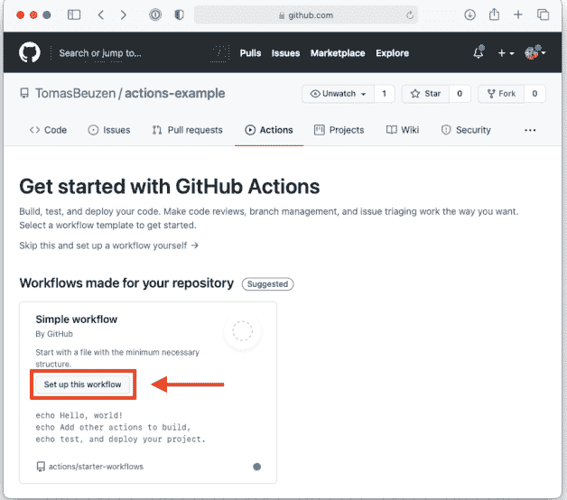

图 8.1：设置我们的第一个 GitHub Actions 工作流。

- 步骤 2

通过点击“Start commit”然后点击“Commit new file”，将为你创建的 `.yml` 文件提交到你的仓库。然后，在 GitHub 上打开该文件。你应该会看到以下内容。我们在**第 8.3.1 节**中定义的所有术语都存在于这个工作流文件中，并且每一行都有注释来准确描述其作用。例如，我们可以看到：

- 此工作流在向主分支进行任何推送或拉取请求时触发。
- 它包含一个名为 `build` 的作业。
- 该作业将在 `ubuntu-latest`（GitHub Actions 提供的最新版本 Ubuntu 运行器）上运行。
- 它包含三个步骤。第一个步骤“检出”仓库——这是运行器访问你的仓库所必需的。第二个步骤将在运行器的终端上打印“Hello, world!”。最后一个步骤将打印两行。我们将在**第 8.3.3 节**讨论步骤以及如何编写它们。

```yaml
# This is a basic workflow to help you get started with Actions

# Name of the workflow
name: CI

# Controls when the workflow will run
on:
  # Triggers the workflow on push or pull request events but only for
  # the main branch
  push:
    branches: [ main ]
  pull_request:
    branches: [ main ]

  # Allows you to run this workflow manually from the Actions tab
  workflow_dispatch:

# A workflow run is made up of one or more jobs that can run
# sequentially or in parallel
jobs:
  # This workflow contains a single job called "build"
  build:
    # The type of runner that the job will run on
    runs-on: ubuntu-latest

    # Steps represent a sequence of tasks that will be executed as
    # part of the job
    steps:
      # Checks-out your repository so your job can access it
      - name: Check-out repository
        uses: actions/checkout@v2

      # Runs a single command using the runners shell
      - name: Run a one-line script
        run: echo Hello, world!

      # Runs a set of commands using the runners shell
      - name: Run a multi-line script
        run: |
          echo Add other actions to build,
          echo test, and deploy your project.
```

- 步骤 3

现在，转到你的仓库的“Actions”选项卡。你应该会看到一个工作流运行，如图 8.2 所示。此工作流之所以运行，是因为在步骤 2 中，我们将工作流 `.yml` 文件提交到了仓库的主分支，并且工作流被设置为在向主分支进行任何推送或拉取请求时触发执行。

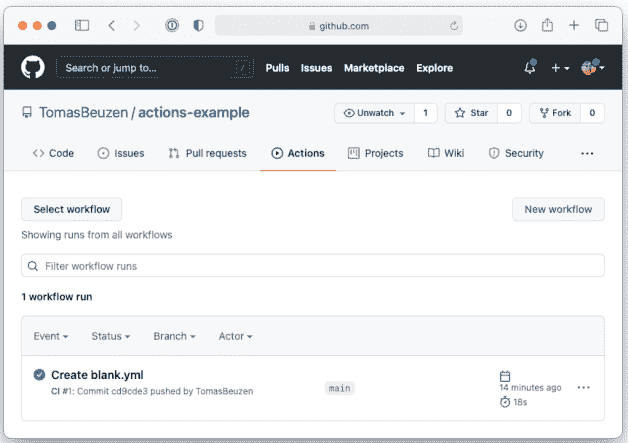

图 8.2：我们的第一个 GitHub Actions 工作流。

- 步骤 4

通过点击“Create blank.yml”工作流，然后点击左侧面板中的“build”作业，查看已执行工作流的日志。点击构建日志中的箭头以检查其输出。你应该能够看到我们工作流中“Run a one-line script”和“Run a multi-line script”步骤打印到屏幕上的输出，如图 8.3 所示。

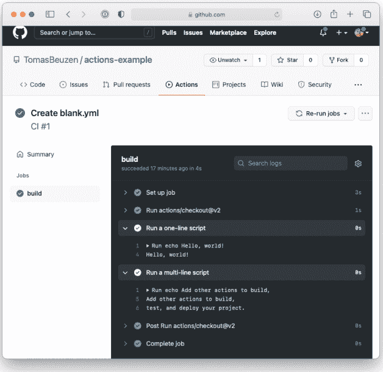

**图 8.3：** 我们的第一个 GitHub Actions 工作流的日志。

我们将在本章的后续部分练习编写用于为 Python 包实现 CI 和 CD 的工作流，但此时需要了解的高层概念是：

- 工作流是一组命令，由某些事件（如推送到仓库的主分支）触发执行。
- 工作流在称为运行器的机器上运行，该机器使用特定的操作系统，并由 CI/CD 服务托管。
- 工作流包含一个或多个作业。
- 每个作业包含一个或多个要执行的步骤。在 GitHub Actions 中，步骤由“操作”或“命令”组成，我们将在下一节讨论。

#### 8.3.3 操作与命令

正如我们在第 8.3.2 节的工作流文件中看到的，GitHub Actions 中的步骤可以是“操作”（使用关键字 `uses` 指定）或“命令”（使用关键字 `run` 指定）。我们将在此简要解释这两个概念之间的区别。

使用命令行命令的步骤由一个名称和一个 `run` 键组成，如下例所示：

```yaml
# Runs a single command using the runners shell
- name: Run a one-line script
  run: echo Hello, world!
```

`run` 键之后的任何内容都将在运行器的命令行上执行。你可以使用 `|` 字符在单个步骤中运行多个命令：

```yaml
# Runs a set of commands using the runners shell
- name: Run a multi-line script
  run: |
    echo Add other actions to build,
    echo test, and deploy your project.
```

与命令相反，操作是可重用的代码单元，无需编写任何命令即可执行特定任务。你通常会使用由他人创建并在 GitHub Marketplace⁷ 上共享的操作。操作使用 `uses` 关键字指定，后跟你要使用的操作名称。`@` 符号用于指定你要使用的操作版本，如下例所示：

```yaml
# Checks-out your repository so your job can access it
- name: Check-out repository
  uses: actions/checkout@v2
```

一些操作也可以使用 `with` 键配置输入，如下例所示：

```yaml
# Set up a Python environment for use in actions
- name: Set up Python
  uses: actions/setup-python@v2
  with:
    python-version: 3.9
```

⁷https://github.com/marketplace?type=

### 8.4 设置持续集成

既然我们已经对 GitHub Actions 有了基本的了解，在本节中，我们将为一个 Python 包构建一个持续集成工作流。我们将为本书中一直在开发的 `pycounts` 包创建此工作流。然而，它将适用于任何 Python 包，并且应该很容易看出如何根据你的需求进行修改。

我们的目标是创建一个 CI 工作流，每当有人向 `pycounts` GitHub 仓库的主分支推送更改或发起拉取请求时，该工作流将使用 `poetry` 安装我们的包，使用 `pytest` 运行包的测试，并使用 `sphinx` 构建其文档。这些是我们或协作者通常在每次更改包时在本地执行的步骤，因此将它们自动化是合理的。

#### 8.4.1 设置

要使用 GitHub Actions 设置工作流，我们需要创建一个工作流文件。工作流文件是位于根包目录中 `.github/workflows/` 目录下的 `.yml` 文件。我们将我们的文件命名为 `ci-cd.yml`。你可以在你选择的编辑器中创建该文件，或者从根包目录在命令行运行以下命令：

```bash
$ mkdir -p .github/workflows
$ touch .github/workflows/ci-cd.yml
```

你的包目录结构现在应该如下所示：

```
pycounts
├── .github          <----------
│   └── workflows    <----------
│       └── ci-cd.yml <----------
├── .readthedocs.yml
├── CHANGELOG.md
├── CONDUCT.md
├── CONTRIBUTING.md
├── docs
│   └── ...
├── LICENSE
├── README.md
├── poetry.lock
├── pyproject.toml
├── src
│   └── ...
└── tests
    └── ...
```

在编辑器中打开这个新的 `ci-cd.yml` 文件。我们将设置一个 CI 工作流，当有人向我们仓库的任何分支推送新内容或发起拉取请求时触发（请注意，这与**第 8.3.2 节**略有不同，那里我们的工作流仅在向“main”分支推送或拉取请求时运行）。要设置此工作流，请将以下文本复制并粘贴到 `ci-cd.yml` 中：

> 在构建我们的 CI 工作流时，我们将使用之前在**第 8.3 节**中描述的相同语法和术语。不要害怕根据需要复习该部分。

```yaml
name: ci-cd

on: [push, pull_request]
```

现在我们需要设置在发生上述触发事件之一时将执行的步骤。GitHub Actions 本质上为你提供了一个你选择的空白操作系统（一个“运行器”），我们需要根据我们希望它执行的步骤来设置它。在我们的例子中，我们需要在运行器上安装 Python 并安装 `poetry`，以便我们可以安装我们的包、运行其测试并构建其文档。因此，我们的设置将涉及以下步骤，我们已指明该步骤将使用操作还是命令（**第 8.3.3 节**）：

1. 指定一个操作系统。我们将使用 Ubuntu，语法为 `runs-on: ubuntu-latest`。如果你希望在 MacOS 和 Windows 系统上测试你的包，也可以使用它们，但 Ubuntu 是一个很好的默认选择——参见 GitHub Actions 文档<sup>8</sup>。
2. 安装 Python（操作：`actions/setup-python@v2`<sup>9</sup>）。

<sup>8</sup>https://docs.github.com/en/actions/using-github-hosted-runners/about-github-hosted-runners#supported-runners-and-hardware-resources
<sup>9</sup>https://github.com/actions/setup-python

### 8.4 设置持续集成

- 3. 检出我们的仓库以便访问其内容（操作：actions/checkout@v2<sup>10</sup>）。
- 4. 安装 poetry（操作：snok/install-poetry@v1<sup>11</sup>）。
- 5. 使用 poetry 安装 pycounts（命令：poetry install）。

我们将把这些步骤添加到名为“ci”的作业工作流中：

```yaml
name: ci-cd

on: [push, pull_request]

jobs:
  ci:
    # Set up operating system
    runs-on: ubuntu-latest

    # Define job steps
    steps:
    - name: Set up Python 3.9
      uses: actions/setup-python@v2
      with:
        python-version: 3.9

    - name: Check-out repository
      uses: actions/checkout@v2

    - name: Install poetry
      uses: snok/install-poetry@v1

    - name: Install package
      run: poetry install
```

上述步骤将设置我们的系统，为以下任务做准备：

- 1. 使用 pytest 运行 pycounts 的单元测试。
- 2. 检查我们测试的代码覆盖率。
- 3. 检查 pycounts 的文档是否正确构建。

我们将在接下来的章节中创建这些步骤。

<sup>10</sup> https://github.com/actions/checkout
<sup>11</sup> https://github.com/snok/install-poetry

#### 8.4.2 运行测试

还记得我们在**第5章：测试**中为编写包测试所付出的辛勤努力吗？嗯，我们很可能希望确保这些测试（以及我们添加的任何其他测试）在对包提出任何新更改时都能继续通过。

回想一下，我们使用 `pytest` 作为 `pycounts` 包的测试框架。它被列为包的开发依赖项，因此在执行 `poetry install` 时，它已经安装在我们的运行器上（来自“步骤5”）。因此，我们只需要向工作流添加一个新步骤，其中包含运行 `pytest` 的命令。因为我们的运行器没有使用 conda 虚拟环境，所以在执行 `poetry install` 时，poetry 会自动设置一个。我们需要通过在命令前加上 `poetry run` 来明确告诉 poetry 使用它为我们设置的这个虚拟环境，如下所示：

```yaml
- name: Test with pytest
  run: poetry run pytest tests/ --cov=pycounts --cov-report=xml
```

> 如果我们愿意，可以在运行器上安装 conda 并设置一个虚拟环境。但对于一个只是运行测试和构建文档的工作流来说，这开销太大了，所以我们决定不在这里这样做。

请注意，在上面的命令中，我们还通过 `--cov` 参数获取测试覆盖率，并通过 `--cov-report` 参数将报告输出为 `.xml` 格式（这些需要 `pytest-cov` 包，我们在**第5.5.3节**中使用并将其添加为包的依赖项）。在下一节中，我们将把另一个名为 Codecov<sup>12</sup> 的服务集成到我们的工作流中，该服务将使用 `.xml` 报告自动为我们记录测试覆盖率。

#### 8.4.3 记录代码覆盖率

在上一步中，我们运行了 `pycounts` 包的测试。但是，如果有人向你的包添加了新代码，却忘记为该新代码编写测试，你现有的测试仍然会通过，但覆盖率会降低。因此，我们可能希望在 CI 工作流中跟踪代码覆盖率。

<sup>12</sup> https://codecov.io/

为此，我们可以将覆盖率打印到运行器的构建日志中，但将覆盖率埋没在那些日志中并没有太大帮助。相反，通常使用像 Codecov<sup>13</sup> 这样的服务来为我们跟踪代码覆盖率。要设置 Codecov，首先通过将其与你的 GitHub 帐户关联来创建一个 Codecov 帐户，如 Codecov 文档<sup>14</sup>中所述（Codecov 也支持 GitLab 和 Bitbucket）。完成此操作后，Codecov 会自动与你有权访问的所有仓库同步。现在，要使用 Codecov 在我们的 CI 工作流中自动跟踪代码覆盖率，我们可以使用他们创建的名为 codecov/codecov-action@v2<sup>15</sup> 的操作，如下所示：

> 如果你的 GitHub 仓库是私有的，你需要提供一个“上传令牌”以允许 Codecov 访问它，如 Codecov 文档<sup>16</sup>中所述。

```yaml
- name: Use Codecov to track coverage
  uses: codecov/codecov-action@v2
  with:
    files: ./coverage.xml  # coverage report
```

在我们的工作流中加入此步骤后，每次对代码提出新的更改时，覆盖率都会自动记录。Codecov 可以向你展示覆盖率是增加还是减少，增减了多少，并会链接到包源代码的相关部分。这些信息将自动出现在任何人向 GitHub 主分支发起的任何拉取请求上，或者可以随时在 Codecov 网站上查看；例如，图 8.4 显示了一个名为 pypkgs 的包的覆盖率仪表板，其中覆盖率在最近一次提交后显著下降。

#### 8.4.4 构建文档

我们将添加到 CI 工作流的最后一步是检查我们的文档是否能顺利构建。我们将使用本书中一直使用的相同 `make html` 命令，通过 sphinx 来构建文档：

<sup>13</sup> https://codecov.io/
<sup>14</sup> https://docs.codecov.com/docs
<sup>15</sup> https://github.com/marketplace/actions/codecov
<sup>16</sup> https://github.com/marketplace/actions/codecov

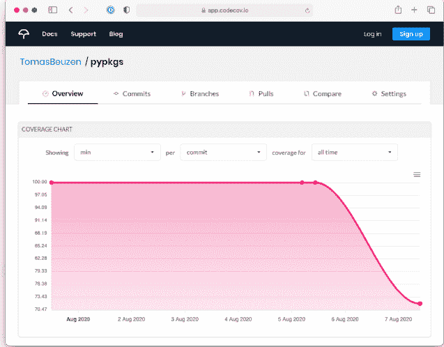

**图 8.4：** 与名为 pypkgs 的仓库关联的 Codecov 仪表板示例。覆盖率在最近一次提交后显著下降。

```yaml
- name: Build documentation
  run: poetry run make html --directory docs/
```

#### 8.4.5 测试持续集成

我们现在已设置好 CI 流水线！我们最终的 `.github/workflows/ci-cd.yml` 文件如下所示：

```yaml
name: ci-cd

on: [push, pull_request]

jobs:
  ci:
    # Set up operating system
    runs-on: ubuntu-latest

    # Define job steps
    steps:
    - name: Set up Python 3.9
      uses: actions/setup-python@v2
      with:
        python-version: 3.9

    - name: Check-out repository
      uses: actions/checkout@v2

    - name: Install poetry
      uses: snok/install-poetry@v1

    - name: Install package
      run: poetry install

    - name: Test with pytest
      run: poetry run pytest tests/ --cov=pycounts --cov-report=xml

    - name: Use Codecov to track coverage
      uses: codecov/codecov-action@v2
      with:
        files: ./coverage.xml   # coverage report

    - name: Build documentation
      run: poetry run make html --directory docs/
```

我们现在准备好测试我们的工作流了！让我们继续将工作流文件提交到版本控制并推送到 GitHub。这将触发我们的工作流，因为我们配置它在有人将新工作推送到仓库的任何分支时运行。

```bash
$ git add .github/workflows/ci-cd.yml
$ git commit -m "build: add CI workflow"
$ git push
```

现在，如果我们转到 pycounts GitHub 仓库并单击“Actions”选项卡，我们应该能看到我们的工作流，如图 8.5 所示：

我们可以通过单击“ci”作业来查看构建日志，如图 8.6 所示：

每当有人向主分支进行推送或拉取请求时，此工作流都会触发。现在，你或你的协作者不必担心记住所有这些步骤或手动运行它们！在下一节中，我们将把这种自动化提升到一个新的水平，并设置一个工作流，以便在提出的更改通过 CI 工作流时自动部署我们包的新版本。

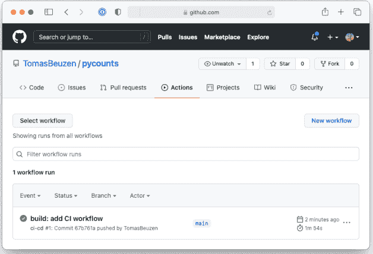

**图 8.5：** 在 GitHub 上成功运行的持续集成工作流。

### 8.5 设置持续部署

在上一步中，我们为包设置了 CI，以便在每次向仓库主分支推送或拉取新更改时，检查测试是否运行、代码覆盖率是否稳定以及文档是否仍然可以构建。

在本节中，我们将设置持续部署（CD）。如果我们推送到仓库的更改通过了 CI，那么我们希望有一个 CD 工作流能够自动：

- 1. 创建 pycounts 包的新版本。
- 2. 构建新的分发包（即 sdist 和 wheel）。
- 3. 将分发包上传到 TestPyPI 并测试包是否可以成功安装。

### 8.5 设置持续部署

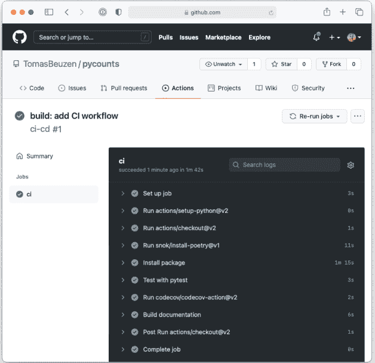

图 8.6：持续集成工作流日志。

- 4. 将分发包上传到 PyPI。

我们将在本节中逐步构建该 CD 工作流。

#### 8.5.1 设置

要设置 CD，我们将在 [8.4 节](#section-8-4) 创建的 `.github/workflows/ci-cd.yml` 工作流文件中进行添加。我们的目标是向此工作流添加一个名为 "cd" 的新作业，该作业将在每次更新的代码推送到我们仓库的主分支时触发我们包的部署。我们只希望此作业在以下情况下执行：

- 1. "ci" 作业通过——我们不希望在包未通过 CI 时部署新版本。我们可以使用 GitHub Actions 中的 `needs` 关键字指定此约束（文档<sup>17</sup>）。
- 2. 代码被推送到主分支——我们不希望在打开拉取请求时部署包的新版本，我们只希望在拉取请求合并到主分支或更改直接推送到主分支时部署新版本。我们可以使用 GitHub Actions 中的 `if` 语法指定此约束（文档<sup>18</sup>）。

我们可以使用以下语法设置一个新作业并添加上述两个约束：

```yaml
name: ci-cd

on: [push, pull_request]

jobs:
  ci:
    # ...
    # CI 步骤已隐藏
    # ...

  cd:
    # 仅当 "ci" 作业通过时才运行此作业
    needs: ci

    # 仅当新工作被推送到 "main" 分支时才运行此作业
    if: github.event_name == 'push' && github.ref == 'refs/heads/main'
```

现在我们可以设置我们的 CD 工作流。在 GitHub Actions 中，每个作业都在一个全新的运行器上运行，我们需要从头开始设置它。一旦完成，我们的 CD 工作流将有效地包含我们在 **第 7 章：发布和版本控制** 中手动执行的所有步骤。下面我们列出了设置 CD 工作流所需的所有步骤：

- 1. 指定操作系统。我们将再次使用 Ubuntu，语法为 `runs-on: ubuntu-latest`。
- 2. 安装 Python（action: `actions/setup-python@v2`<sup>19</sup>）。
- 3. 检出我们的仓库以便访问其内容（action: `actions/checkout@v2`<sup>20</sup>）。
- 4. 安装 poetry（action: `snok/install-poetry@v1`<sup>21</sup>）。
- 5. 使用 poetry 安装 pycounts（命令：`poetry install`）。
- 6. 发布 pycounts 的新版本（命令：`semantic-release publish`，这使用了我们在 7.2.2 节中描述并将在下文再次描述的 Python Semantic Release (PSR)<sup>22</sup> 工具）。
- 7. 将新版本上传到 TestPyPI（action: `pypa/gh-action-pypi-publish@release/v1`<sup>23</sup>）。
- 8. 测试新包版本是否能从 TestPyPI 成功安装（命令：`pip install`）。
- 9. 将新版本上传到 PyPI（action: `pypa/gh-action-pypi-publish@release/v1`<sup>24</sup>）。

步骤 1 到 5 与我们之前为 CI 工作流设置的相同，因此我们可以直接将它们复制并粘贴到我们的 "cd" 作业中，如下所示。这里唯一的新代码是我们为 `actions/checkout@v2`<sup>25</sup> action 指定了输入参数 `fetch-depth: 0`。此输入参数将允许 PSR 工具访问我们仓库的完整提交历史，以便它可以确定如何增加包的版本号。没有此参数，PSR 只能访问最近的单个提交消息。

```yaml
name: ci-cd

on: [push, pull_request]

jobs:
  ci:
    # ...
    # CI 步骤已隐藏
    # ...

  cd:
    # 仅当 "ci" 作业通过时才运行此作业
    needs: ci

    # 仅当新工作被推送到 "main" 时才运行此作业
    if: github.event_name == 'push' && github.ref == 'refs/heads/main'

    # 设置操作系统
    runs-on: ubuntu-latest

    # 定义作业步骤
    steps:
      - name: Set up Python 3.9
        uses: actions/setup-python@v2
        with:
          python-version: 3.9

      - name: Check-out repository
        uses: actions/checkout@v2
        with:
          fetch-depth: 0

      - name: Install poetry
        uses: snok/install-poetry@v1

      - name: Install package
        run: poetry install
```

我们将在下面的章节中讨论步骤 6 到 9。

#### 8.5.2 自动创建新的包版本

正如我们在 **第 7 章：发布和版本控制** 中所看到的，在创建包的新版本时需要经过几个关键步骤：

- 1. 在 *CHANGELOG.md* 中记录更改内容。
- 2. 增加包版本号。
- 3. 在 GitHub 上标记新版本。
- 4. 构建新的 sdist 和 wheel。

在 **7.2.2 节** 中，我们介绍了 Python Semantic Release (PSR)<sup>26</sup> 工具，它可以根据在提交消息中找到的关键字自动增加包的版本号。

然而，PSR 能做的不止这些！事实上，它可以完成我们上面列出的所有步骤。在 **7.2.2 节** 中，我们看到了如何使用 *pyproject.toml* 中名为 `[tool.semantic_release]` 的表来配置 PSR。要配置它执行上述所有步骤，我们需要在该表中添加几个键，如下所示：

<sup>26</sup> https://python-semantic-release.readthedocs.io/en/latest/

```toml
[tool.semantic_release]
version_variable = "pyproject.toml:version" # 版本位置
branch = "main" # 进行发布的分支
changelog_file = "CHANGELOG.md" # 变更日志文件
build_command = "poetry build" # 构建分发包
dist_path = "dist/" # 分发包存放位置
upload_to_release = true # 自动创建 GitHub 发布
upload_to_pypi = false # 不自动上传到 PyPI
remove_dist = false # 不删除分发包
patch_without_tag = true # 默认创建补丁版本
```

我们在上面添加了注释以阐明表中每个键的作用，并在表 8.2 中进行了描述。您也可以在 PSR 文档<sup>27</sup>中阅读更多关于这些配置选项的信息。

**表 8.2：Python Semantic Release 配置选项说明。**

| 键 | 描述 |
| :--- | :--- |
| version_variable | PSR 用于增加版本号的位置。 |
| branch | 进行发布的分支。 |
| changelog_file | PSR 使用提交消息更新的变更日志文件位置。 |
| build_command | 如何为发布构建新的分发包。 |
| dist_path | 运行 `build_command` 后分发包的位置。 |
| upload_to_release | 是否在 GitHub 上自动创建新包版本的发布。 |
| upload_to_pypi | 是否上传到 PyPI。默认为 true，但我们想先上传到 TestPyPI 进行测试，因此我们关闭了此选项。 |
| remove_dist | 上传后是否删除 `dist_path` 处的分发包。我们关闭了此选项，因为我们想自己将这些分发包上传到 TestPyPI 和 PyPI。 |
| patch_without_tag | 即使自上次发布以来的任何提交中没有触发标签（如 "fix" 或 "feat"），也始终创建新的补丁版本。 |

<sup>27</sup> https://python-semantic-release.readthedocs.io/en/latest/configuration.html

在 *pyproject.toml* 中配置好 PSR 后，我们现在可以将其作为步骤添加到我们的 CD 工作流中。

在 **7.2.2 节** 中，我们使用了命令 `semantic-release version` 来让 PSR 根据在自上次标签以来的所有提交消息中找到的关键字自动更新我们的版本。在我们的 CD 工作流中，我们将使用略有不同的命令 `semantic-release publish`，它将增加我们的版本、更新我们的变更日志、在 GitHub 上标记新版本，并构建新的 sdist 和 wheel。

PSR 需要与我们的 GitHub 仓库交互以修改我们的 *CHANGELOG.md* 文件并标记我们包的新版本。为了授予 PSR 执行此操作的权限，我们需要做几件事：

- 1. 向 PSR 提供一个名为 `GH_TOKEN` 的 GitHub 访问令牌<sup>28</sup>，以允许它读取/写入我们仓库中的文件。在每次工作流运行开始时，GitHub 会自动为我们创建<sup>29</sup>这样一个令牌，名为 `GITHUB_TOKEN`。我们可以使用 `env` 键和语法 `${{ secrets.GITHUB_TOKEN }}` 将此令牌传递给 PSR。您可以在 GitHub 文档<sup>30</sup>中阅读更多关于此语法的信息，但我们在下面显示的代码中已经为您完成了此操作。
- 2. 通过将用户名设置为 `github-actions`，电子邮件地址设置为 `github-actions@github.com` 来配置运行器机器的 Git 凭据。如果您不配置这些凭据，工作流将无法对我们的仓库进行更改，您可以在 GitHub 文档<sup>31</sup>中阅读更多相关信息。我们也在下面显示的代码中为您完成了此操作，因此您只需将此代码作为下一步添加到您的 CD 工作流文件中即可。

```yaml
- name: Use Python Semantic Release to prepare release
  env:
```

<sup>28</sup> https://python-semantic-release.readthedocs.io/en/latest/envvars.html#env-gh-token
<sup>29</sup> https://docs.github.com/en/actions/security-guides/automatic-token-authentication
<sup>30</sup> https://docs.github.com/en/actions/security-guides/encrypted-secrets#using-encrypted-secrets-in-a-workflow
<sup>31</sup> https://docs.github.com/en/get-started/getting-started-with-git/setting-your-username-in-git

#### 8.5.3 上传到 TestPyPI 和 PyPI

PSR 步骤将为我们的新包版本创建一个 sdist 和 wheel。接下来在我们的 CD 工作流中需要做的是尝试将这些分发包上传到 TestPyPI。这一步并非严格必要，但这是一个好主意，因为它可以帮助我们在将包上传到 PyPI 之前捕获任何意外错误。

与其从头开始编写完成所有这些工作所需的代码，我们将使用 `pypa/gh-action-pypi-publish@release/v1` action。此 action 依赖于与 TestPyPI 的令牌认证（而非经典的用户名和密码认证）。要使用此 action，你需要登录到 TestPyPI，创建一个 API 令牌，并将该令牌作为名为 `TEST_PYPI_API_TOKEN` 的 secret 添加到你的 GitHub 仓库中，如图 8.7 所示。

要使用 `pypa/gh-action-pypi-publish@release/v1` action，我们可以在 CD 工作流中添加以下步骤。注意我们如何配置该 action 以使用令牌用户方法，指定 `password` 为我们刚刚添加到仓库的 `TEST_PYPI_API_TOKEN`，并将 action 指向 TestPyPI 仓库（`repository_url: https://test.pypi.org/legacy/`）。

```yaml
- name: Publish to TestPyPI
  uses: pypa/gh-action-pypi-publish@release/v1
  with:
    user: __token__
    password: ${{ secrets.TEST_PYPI_API_TOKEN }}
    repository_url: https://test.pypi.org/legacy/
```

上述 action 将把你的包的新版本发布到 TestPyPI。我们现在想要测试是否可以使用以下命令从 TestPyPI 正确安装该包：

```yaml
- name: Test install from TestPyPI
  run: |
    pip install \
    --index-url https://test.pypi.org/simple/ \
    --extra-index-url https://pypi.org/simple \
    pycounts
```

最后，我们 CD 工作流的最后一步将是将我们的包发布到 PyPI。这使用与之前相同的 `pypa/gh-action-pypi-publish@release/v1` action，并且需要你从 PyPI 获取一个令牌，并将该令牌作为 `PYPI_API_TOKEN` 添加到你的 GitHub 仓库中，如图 8.8 所示。

```yaml
- name: Publish to PyPI
  uses: pypa/gh-action-pypi-publish@release/v1
  with:
    user: __token__
    password: ${{ secrets.PYPI_API_TOKEN }}
```

#### 8.5.4 测试持续部署

我们现在已设置好 CD 工作流！我们最终的 `.github/workflows/ci-cd.yml` 文件如下所示：

```yaml
name: ci-cd

on: [push, pull_request]

jobs:
  ci:
    # ...
    # CI 步骤与之前相同
    # ...

  cd:
    # 仅当 "ci" 作业通过时才运行此作业
    needs: ci

    # 仅当有新工作推送到 "main" 时才运行此作业
    if: github.event_name == 'push' && github.ref == 'refs/heads/main'

    # 设置操作系统
    runs-on: ubuntu-latest

    # 定义作业步骤
    steps:
      - name: Set up Python 3.9
        uses: actions/setup-python@v2
        with:
          python-version: 3.9

      - name: Check-out repository
        uses: actions/checkout@v2
        with:
          fetch-depth: 0

      - name: Install poetry
        uses: snok/install-poetry@v1

      - name: Install package
        run: poetry install

      - name: Use Python Semantic Release to prepare release
        env:
          GH_TOKEN: ${{ secrets.GITHUB_TOKEN }}
        run: |
            git config user.name github-actions
            git config user.email github-actions@github.com
            poetry run semantic-release publish

      - name: Publish to TestPyPI
        uses: pypa/gh-action-pypi-publish@release/v1
        with:
          user: __token__
          password: ${{ secrets.TEST_PYPI_API_TOKEN }}
          repository_url: https://test.pypi.org/legacy/

      - name: Test install from TestPyPI
        run: |
            pip install \
            --index-url https://test.pypi.org/simple/ \
            --extra-index-url https://pypi.org/simple \
            pycounts

      - name: Publish to PyPI
        uses: pypa/gh-action-pypi-publish@release/v1
        with:
          user: __token__
          password: ${{ secrets.PYPI_API_TOKEN }}
```

我们现在准备好测试完整的 CI/CD 工作流了！让我们继续将新的工作流文件和 *pyproject.toml* 文件（我们在添加 PSR 配置选项时修改了它）提交到版本控制并推送到 GitHub。这将触发我们的 CI/CD 工作流，因为我们配置了它在有人推送到我们仓库的 "main" 分支时运行。为了示例，我们将在提交消息中包含 "feat" 关键字，以触发 PSR 从这些更改中对我们包进行次版本发布。

> 我们在 **第 7.2.2 节** 描述了哪些关键字触发特定的版本升级，但请注意，即使任何提交中都没有关键字，我们在 **第 8.5.2 节** 配置了 PSR 默认进行补丁版本发布。

```bash
$ git add .github/workflows/ci-cd.yml pyproject.toml
$ git commit -m "feat: add CI/CD workflow"
$ git push
```

现在，如果我们转到 pycounts GitHub 仓库并单击 “Actions” 选项卡，我们应该会看到工作流的新运行，如图 8.9 所示。

如果我们单击该工作流，我们将看到它由两个作业组成，“ci” 和 “cd”，每个作业都成功运行，如图 8.10 所示。

如果我们单击 “cd” 作业以查看构建日志，我们可以看到 PSR 解析了我们的提交消息 —— “feat: add CI/CD workflow” —— 以确定我们的包应从 0.2.0 次版本升级到 0.3.0，如图 8.11 所示。

PSR 还自动更新了我们的变更日志并标记了包的新版本，分别如图 8.12 和图 8.13 所示。

最后，我们可以从构建日志中看到，我们包的新版本已发布到 TestPyPI 和 PyPI，如图 8.14 所示。

我们并没有花太长时间就实现了一个 CD 工作流，该工作流完全自动化了我们在发布包新版本时通常需要手动执行的所有步骤。将来，你可能选择或需要使用与我们在此处用于为包实现 CD 的不同工具和命令。但希望你能看到 CD 可能实现的各类事情，以及它如何有助于快速部署包的新版本，它如何让你免于记住自己执行此操作所需的所有命令，以及它如何降低潜在协作者为你的包做出贡献的门槛。

### 8.6 总结

在本章中，我们为 pycounts 包创建了 CI/CD 工作流。我们在此展示的只是一个示例和一组用于实现 CI/CD 的工具——但在阅读本章后，希望你能理解 CI/CD 的实用性以及将来可以为包设置的工作流类型。

需要注意的是，在本书中使用版本控制时，我们一直在直接修改仓库的主分支。然而，对包的更改通常是在分支上进行的。分支隔离了你的更改，这样你就可以在不影响现有稳定版本的情况下开发你的包。只有当你对更改感到满意并且它们通过了 CI，你才会将它们合并到现有源代码中并触发 CD 工作流（如果存在）。在协作环境中，这通常通过 “pull request” 完成，你可以在 GitHub 文档中阅读更多相关信息。开源项目是基于 pull request 构建的；去访问你最喜欢的 Python

### 8.6 总结

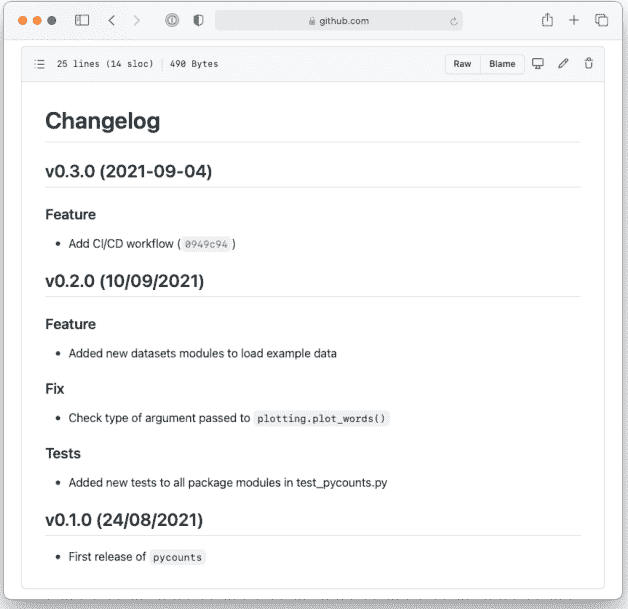

**图 8.12：** Python 语义发布工具根据提交信息自动更新了变更日志，并添加了 v0.3.0 的条目。

在 GitHub 上的包仓库中，点击“Pull requests”标签页，可以查看协作者正在合并哪些更改以及如何合并到包中，以及为处理这些更改而设置的 CI/CD 工作流类型。

最后，虽然我们在这里是从头开始开发工作流文件，但我们在**第 3.2.2 节**中用于设置包的 py-pkgs-cookiecutter 模板<sup>40</sup> 可以为你生成工作流 `.yml` 文件。回顾**第 3.2.2 节**，py-pkgs-cookiecutter 的其中一个提示如下：

```
Select include_github_actions:
1 - no
2 - ci
3 - ci+cd
Choose from 1, 2, 3 [1]:
```

<sup>40</sup> https://github.com/py-pkgs/py-pkgs-cookiecutter

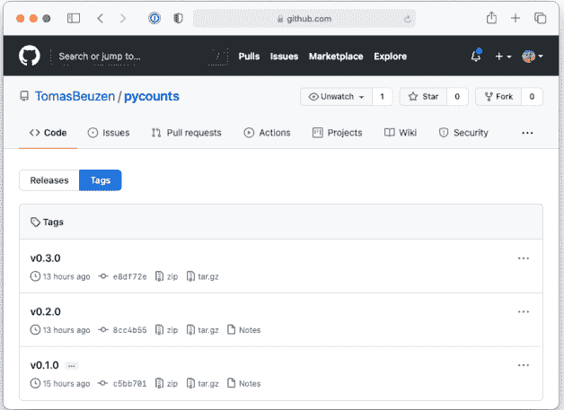

**图 8.13：** Python 语义发布工具自动创建了带标签的 v0.3.0 版本发布。

将来，你可以通过选择适当的响应来包含用于 CI 或 CI+CD 的工作流文件。

恭喜你读到了本书的结尾，祝你打包愉快！

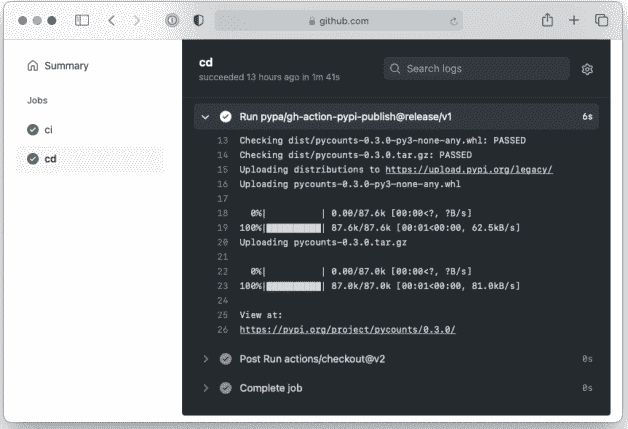

**图 8.14：** 将新包版本 0.3.0 部署到 PyPI。


### Taylor & Francis

Taylor & Francis Group

http://taylorandfrancis.com

## 参考文献

Abbott, E. A. (1884). *Flatland*. Seeley and Co.

Bryan, J., Hester, J., and Assistants, S. T. (2021). Happy git and GitHub for the user. https://happygitwithr.com/.

Fucci, D., Erdogmus, H., Turhan, B., Oivo, M., and Juristo, N. (2016). A dissection of the test-driven development process: Does it really matter to test-first or to test-last? *IEEE Transactions on Software Engineering*, 43(7):597–614.

Harris, C. R., Millman, K. J., van der Walt, S. J., Gommers, R., Virtanen, P., Cournapeau, D., Wieser, E., Taylor, J., Berg, S., Smith, N. J., Kern, R., Picus, M., Hoyer, S., van Kerkwijk, M. H., Brett, M., Haldane, A., del Río, J. F., Wiebe, M., Peterson, P., Gérard-Marchant, P., Sheppard, K., Reddy, T., Weckesser, W., Abbasi, H., Gohlke, C., and Oliphant, T. E. (2020). Array programming with NumPy. *Nature*, 585(7825):357–362.

Hunter, J. D. (2007). Matplotlib: A 2d graphics environment. *Computing in Science & Engineering*, 9(3):90–95.

Irving, D., Hertweck, K., Johnston, L., Ostblom, J., Wickham, C., and Wilson, G. (2021). *Research Software Engineering with Python*. Chapman and Hall/CRC.

Kluyver, T., Ragan-Kelley, B., Pérez, F., Granger, B. E., Bussonnier, M., Frederic, J., Kelley, K., Hamrick, J. B., Grout, J., Corlay, S., et al. (2016). *Jupyter Notebooks-a publishing format for reproducible computational workflows.*, volume 2016. IOS Press.

The Carpentries (2021). Plotting and programming in Python: Writing functions. https://swcarpentry.github.io/python-novice-gapminder/16-writing-functions/index.html.

Wickham, H. and Bryan, J. (2015). *R Packages*. O'Reilly Media, Inc.


### Taylor & Francis

Taylor & Francis Group

http://taylorandfrancis.com

## 索引

Anaconda, 3, 109
Anaconda Prompt, 3
应用程序编程接口, 51, 59, 153

破坏性变更, 166, 181

CI/CD, 185, 186
代码覆盖率, 48, 133
- 分支覆盖率, 134
- 覆盖率报告, 136
- 行覆盖率, 48, 133
命令行界面, 3
conda, 1, 4, 32, 109
conda-forge, 109
持续部署, 185, 186, 200
持续集成, 185, 193
cookiecutter, 5, 23

数据, 98
依赖项, 34, 39
- 开发依赖项, 34, 47, 48, 59, 115, 134
弃用, 181
分发包, 74, 83, 103, 178, 204
- 源码分发包, 75, 106
- 轮子包, 75, 106
Docker, 3, 11, 12
文档字符串, 8, 50, 54, 120, 150
文档, 49, 52, 60, 91, 139, 143
- 构建文档, 51, 62, 142, 154
- 变更日志, 50, 147, 173, 204
- 行为准则, 50, 146
- 贡献指南, 50, 146
- 托管文档, 52, 69, 142, 162

许可证, 50, 145
README, 50, 144

可编辑安装, 36, 89, 96

测试夹具, 127
flit, 33, 90, 107, 108

Git, 5, 26, 72
GitHub, 5, 26, 27, 72, 91, 110, 177
GitHub Actions, 186, 187
GitHub Pages, 52, 71, 162

导入, 1, 35, 84, 89, 90, 95
init.py, 86, 89, 94
- 版本, 95
可安装的 Python 包, 33, 76, 90, 105
集成开发环境, 6, 60, 143, 149
包内引用, 93
- 绝对引用, 93
- 相对引用, 93

Jupyter, 6, 8, 12, 59, 149
- notebook, 68, 149
- notebooks, 59

许可证, 25

Make, 64, 156
- Makefile, 64, 156
Markdown, 8, 52, 59, 143
Markedly Structured Text, 65
Miniconda, 3, 4
模块, 22, 31, 84

命名空间, 85, 94
命名空间包, 91

非代码文件, 97

版本控制, 5, 26, 27, 36, 40, 49, 68, 72, 110, 138, 169, 185

包名称, 92

发布, 72, 177, 204

包结构, 22, 23, 30, 38, 49, 83, 86, 89

标签, 72, 177, 204

参数化, 129

版本控制, 165, 172, 204

pip, 1, 75, 106, 109

自动, 169

poetry, 4, 33, 76, 78, 90, 98, 107, 108, 168

主版本号, 166

发布, 78, 79

手动, 168

py-pkgs-cookiecutter, 23, 46, 52, 63

次版本号, 166

PyPI, 1, 5, 24, 77–79, 92, 109, 180, 207

补丁版本号, 165

pyproject.toml, 22, 33, 39, 90, 95, 98, 108, 168, 204

Python Semantic Release, 169, 174, 204

虚拟环境, 4, 32, 39

Visual Studio Code, 6, 7, 12, 60, 149

R, 6, 10

Read the Docs, 52, 69, 142, 162

reStructuredText, 52, 143

reticulate, 10

RStudio, 6, 10

语义化版本控制, 24, 40, 165

setuptools, 33, 90, 107, 108

软件仓库, 5, 78

源码布局, 101

sphinx, 51, 62, 154

终端, 3

TestPyPI, 5, 78, 79, 180, 207

测试, 43, 45, 48, 91, 111
- 断言, 43, 111, 114, 116
- 错误, 120
- 测试夹具, 44, 116, 127
- 集成测试, 123
- 参数化, 129
- pytest, 45, 48, 114, 122, 134
- pytest-cov, 48, 134
- raises, 120
- 回归测试, 125
- 测试框架, 45
- 测试驱动开发, 113
- 测试工作流, 112
- 单元测试, 44, 116