# PYTHON PLAYGROUND

面向儿童和初学者的编程游戏与项目


L.D. KNOWINGS

# PYTHON PLAYGROUND：面向儿童和初学者的编程游戏与项目


L.D. KNOWINGS

**版权所有 © 2024 作者姓名。保留所有权利。**

未经作者或出版商直接书面许可，不得复制、转载或传播本书中的任何内容。

在任何情况下，出版商或作者均不对因本书所含信息直接或间接造成的任何损害、赔偿或金钱损失承担任何责任或法律责任。

**法律声明：**

本书受版权保护。仅供个人使用。未经作者或出版商同意，不得修改、分发、销售、使用、引用或转述本书中的任何内容。

**免责声明：**

请注意，本文档所含信息仅供教育和娱乐目的。我们已尽一切努力提供准确、最新、可靠和完整的信息。不声明或暗示任何类型的保证。读者承认作者不提供法律、财务、医疗或专业建议。本书内容源自多种来源。在尝试本书中概述的任何技术之前，请咨询持证专业人士。

阅读本文档即表示读者同意，在任何情况下，作者均不对因使用本文档所含信息而造成的任何直接或间接损失负责，包括但不限于错误、遗漏或不准确之处。

# 目录

引言

## 1. Python 基础
- Python 编程简介
- 环境搭建与编写你的第一个脚本
- 神奇时刻：见证你的代码运行起来
- 理解数据类型与基本操作：
- 互动环节
- 过渡

## 2. 数据处理与可视化
- 使用 Pandas 和 NumPy 进行数据处理
- 用 NumPy 解码：你的 Python 数学伙伴！
- 使用 Matplotlib 和 Seaborn 进行数据可视化：
- Seaborn 图表魅力：提升你的数据美感！
- Seaborn 实战：真实数据可视化探险
- 使用 Plotly 和 Bokeh 进行交互式可视化
- 互动环节
- 过渡

## 3. 使用 Python 构建与自动化
- Flask 和 Django Web 开发入门
- 什么是 Web 开发以及它为何如此酷
- 使用 Django 最大化开发速度和资源利用率
- Python 在自动化日常任务中的魔力
- 基础自动化脚本分步指南
- 命令行工具入门：Click 和 Argparse
- 互动环节
- 过渡：

## 4. 探索机器学习与人工智能
- 使用 Scikit-Learn 学习机器学习基础
- Scikit-learn：你通往 Python 机器学习的大门
- 使用 TensorFlow 和 Keras 神经网络入门
- 使用 TensorFlow 构建基础神经网络
- 使用 Keras 构建基础神经网络
- PyTorch 入门
- 趣味 PyTorch 项目：使用迁移学习的图像分类魔法
- 初学者 PyTorch 项目：构建逻辑回归模型
- 使用 PyTorch 开启超参数调优之旅
- 互动环节
- 过渡

## 5. 高级 Python 应用
- 网络安全与道德黑客脚本编写
- 使用 Python 进行网络安全基础脚本编写
- MicroPython：简化硬件控制及其他
- 项目概览：智能房间温度监测器
- 使用 NLTK 和 spaCy 进行自然语言处理
- 项目：从新闻文章中提取命名实体
- 开启旅程：Mathis André 和 Faqbot 的崛起
- 互动环节
- 过渡

## 6. 调试、测试与游戏开发
- 使用 PDB 和 ipdb 进行调试
- PDB 和 ipdb 伟大调试器指南
- 轻松调试：像专业人士一样解决代码错误
- 使用 Unittest 和 Pytest 编写测试
- 自信地测试你的代码：Pytest 入门
- 伟大的代码测试挑战
- 使用 Pygame 创建你的第一个游戏
- 像素先驱：年轻程序员使用 Pygame 创建第一个游戏的旅程

## 7. Python 项目与挑战
- 编程编年史：激发你创造力的 Python 项目
- 快速启动你的 Python 之旅
- 适合初学者的 Python 项目创意与代码片段
- 每个主要主题的指导性项目创意
- 互动环节
- 过渡

## 8. 代码之外
- 年轻程序员的最佳实践
- 在数字时代驾驭道德编码
- [干净代码在软件开发中的重要性](https://example.com)
- [一帆风顺：9 个成功项目管理技巧](https://example.com)
- [持续学习与成长的资源](https://example.com)
- [科技领域持续学习的必经之旅](https://example.com)
- [释放你的潜力：为何编程挑战很重要](https://example.com)
- [构建出色编程作品集的综合指南](https://example.com)
- [最大化社区力量：在编程论坛和俱乐部中蓬勃发展的蓝图](https://example.com)
- [打造你的编程叙事：交互式作品集规划器](https://example.com)
- [结论](https://example.com)
- [参考文献](https://example.com)

# 引言

## 理解早期的挣扎：我的编程奥德赛

几年前，我盯着满是神秘代码行的屏幕，心中交织着着迷与挫败。也许你也曾经历过——学习编程的那一刻，感觉就像在破译一门外星语言，每条错误信息都像是个人的挫败。

在那些早期的日子里，这不仅仅是学习编码，更是克服伴随新挑战而来的疑虑和困惑。想象一下，坐在空白屏幕前，质疑自己是否有能力解开 Python 的复杂性。最初的摇摆和对犯错的恐惧，都是我编程奥德赛的一部分，它们可能与你的旅程产生共鸣。

我承认——我的编程尝试伴随着错误的舞蹈。从似乎在嘲笑我每次按键的语法错误，到让我挠头的逻辑失误，学习过程充满了失误。有时，感觉就像前进两步后退一步，陷入错误的编舞中。

有些时刻的极度挫败会让你质疑自己投身编程世界的决定。为什么我的代码不能按预期运行？为什么一个看似简单的任务会演变成一连串的错误？这些问题贯穿了我的编程奥德赛。

然而，在挫败之中，一个转折点出现了。我开始将失败视为编程旅程中的伙伴，而非障碍。每一个错误都成为垫脚石，一堂学到的课。错误不再是绊脚石，而是指引我更深入理解编码的路标。

分享这些经历，我旨在坦诚面对我的挑战。无尽的试错循环是我编程叙事的重要部分。然而，我驾驭了这个循环，并通过坚持、愿意从错误中学习，以及承认失败不是终点而是垫脚石，最终成为了一个更成熟的程序员。

## 追求清晰：解码年轻心灵：

在繁忙的编程资源市场中，为年轻学习者找到完美的资源，就像大海捞针。这是一项充满挑战的任务，许多资源完全偏离了目标。

有些资源陷入了过度简化的陷阱，让渴望更多实质和深度的年轻程序员感到失望。这就像被端上了一道诱人的开胃菜，却永远尝不到主菜。

另一方面，这些资源让学习者淹没在技术术语和复杂解释的海洋中。这就像他们试图在没有任何绳索或安全网的情况下攀登一座高耸的山峰，被任务的巨大规模压得喘不过气来，感到不堪重负和挫败。

在这个编码资源的数字丛林中，找到简单与复杂、易用性与挑战性之间那难以捉摸的平衡，感觉就像一项不可能完成的任务，需要一盏指路明灯来引领方向。

尽管面临这些挑战，"Python Playground" 为有志于编码的人们带来了希望的灯塔。这本书不仅仅是又一个编码资源——它是那些首次涉足编程复杂领域的人的生命线。

## **自信地直面复杂性**

你为何决定探索编码世界？是对技术的好奇，对新挑战的渴望，还是我们数字时代的实际需求？你踏上编码之旅都有一个催化剂，一个独特的火花。理解你当前所处的人生阶段以及是什么促使你进行这次探索，是量身定制我们冒险之旅以满足你需求的关键。

"Python Playground" 正在一块砖一块砖地拆除复杂性的高墙，提供一种循序渐进的学习方法，让你在每一步都建立自信。

从简单易懂的概念开始，逐步深入到更高级的主题，这本书赋予学习者以勇气和好奇心去应对复杂性。打破障碍，培养成长型思维，将灌输你征服最具挑战性编码任务的信心。

## **数字创意的伙伴**

你是否曾有一个朋友，他熟知游戏中所有最好的技巧和捷径？把这本书当作你的编码伙伴，你在 Python 领域的博学朋友。

它分享内行技巧，提供捷径，并以资深玩家的专业知识引导你完成学习过程。学习 Python 不再是一项孤独的任务，而是一种互动、愉快的体验。

-   **精简学习**："Python Playground" 提供了精简学习过程的捷径，帮助你更快、更高效地掌握 Python 概念。
-   **清晰理解**：获得清晰解释的捷径，简化复杂的编码概念，使其易于理解。
-   **即时实践**：跳过理论，直接通过动手项目投入实践，快速获得实际经验。
-   **创意表达**：释放你的创造力，通过构建游戏、动画和网站的捷径，在每个项目中得到引导。
-   **参与感**：告别无聊，通过引人入胜的项目和示例的捷径，让学习变得愉快且充满动力。

阅读 "Python Playground" 不仅仅是获取编码技能，更是找到通往数字创意世界的捷径。三年前，如果有人递给我一本指南，能将编码难题变成有趣的活动，我一定会抓住机会。这正是这本书所提供的——一条通往创造你自己的游戏、动画和网站的道路。

## **从学习者到创造者**

快进到今天，我发现自己不仅是一个学会了编码的人，更是一个数字奇迹的创造者和架构师。想象一下你自己处于这种场景——自信、熟练，并通过代码创造性地表达自己。

每完成一个项目，成就感就会取代令人沮丧的错误。这种转变不仅是一种可能性；它正是我们在 Python Playground 中追求的目标。

想象一下，不仅能理解代码，还能创造你自己的数字奇迹。这本书带你超越理论，提供动手项目，将编码变成你创意的画布。

-   **掌握 Python 基础**：通过完成 "Python Playground" 中的项目和练习，你将扎实理解 Python 的基本概念，包括变量、循环、函数和数据结构。
-   **实用编码技能**：通过将 Python 应用于现实世界项目，你将获得实用的编码技能，并为应对书中之外的各种编码挑战做好准备。
-   **持续学习的基础**：凭借对 Python 的深刻理解和实际编码经验，你将能够应对更高级的主题，并在动态编程领域追求进一步的学习机会。

你将通过有趣的项目和优秀的示例，获得制作游戏、动画和网站的实用技能。这是一种将编码从抽象概念转变为有形、创造性实践的动手方法。

本指南旨在成为黑暗中的一盏明灯，一位理解你挣扎并提供清晰前进道路的伙伴。

## **作者的洞见：一本分享共同挣扎的指南**

为什么信任我作为你编码之旅的向导？因为我曾身处你的位置。我曾面对困惑、艰难的斗争以及掌握编码的胜利。这本书不仅仅是信息的汇编；它是一位分享在编码荒野中摸索所获得的经验和见解的伙伴。

重要的是要认识到，即使是经验丰富的编码者也会遇到挫折，而从失败中学习和适应的能力区分了编码者的旅程。通过这些经历，我希望能传达那些挑战和韧性，它们能将无尽的试错循环转变为持续成长和成功的道路。

## **弥合鸿沟：从编程理论到实践**

在 "Python Playground" 这样的资源出现之前，有抱负的程序员常常陷入一个令人沮丧的循环。他们会花数小时钻研教科书和在线教程，吸收理论知识，却不清楚如何在现实场景中应用它。理论与实践之间的鸿沟似乎难以逾越，让许多人感到幻灭和气馁。

想象一下，在一个巨大的图书馆里寻找答案，所有的书都用一种你看不懂的语言写成，没有图片或清晰的解释来帮助你。这对许多有抱负的编码者来说既令人沮丧又困惑。他们不知道从哪里开始或如何取得进展，就像试图在没有手电筒的黑暗森林中找到出路。

即使他们弄懂了一些零散的知识，他们仍然难以将其整合起来。这就像试图在没有蓝图的情况下建造一座房子——东西就是拼凑不到一起。此外，他们很少有机会练习和提高技能。这就像试图学习演奏一种乐器却从未有机会触碰它一样。

但现在，有了这本书，学习编码就像拥有了一张清晰的路线图。就像有一位说你语言的友好向导，确切地告诉你该做什么。

## **你的个人编码伙伴**

有了 "Python Playground"，你将发现许多引人入胜的项目和互动练习，将学习转变为一种有趣且有回报的体验。从构建你自己的游戏到创建动态动画，每一项活动都经过精心设计，旨在点燃你的好奇心，激发你对编码的热情。

一本编码资源，立刻让你感到一种联系感，仿佛它是为你量身定做的。这就是 "Python Playground" 的魔力——一本直接与有志于编码者的心灵对话的书，无论他们的专业水平如何。这就像偶然发现了一个编码冒险的宝库，正等待着被探索。

但真正让 "Python Playground" 与众不同的是它对实用性的强调。与其他让你淹没在抽象理论中的编码资源不同，这本书专注于现实世界的应用，向你展示如何将你的编码技能转化为展示你创造力和独创性的有形项目。这就像找到了一张明确根据你的需求和愿望量身定制的成功路线图。

所以，如果你曾在编码之旅中感到迷茫或不堪重负，请不要害怕。"Python Playground" 在此为你照亮道路，提供你作为编码者茁壮成长所需的指导、支持和灵感。

## PYTHON 基础

嘘，你想知道一个秘密吗？Python 不仅仅是一种编程语言——它是一个通往无限可能和无限创意世界的神奇门户。

给所有初出茅庐的程序员们透露一下：Python 不只是普通的编程语言——它是编程界的超级英雄！为什么？嗯，坐稳了，因为我马上就要揭晓答案。

有了 Python 这个可靠的得力助手，你施展魔法、编织数字奇迹的速度会比说出“阿布拉卡达布拉”还要快！

时间回到 20 世纪 80 年代末，荷兰程序员吉多·范罗苏姆面临一个困境——他需要一种既强大又易于学习、既多功能又简单易用的语言。

于是，天才灵光一闪，Python 诞生了！！

吉多的智慧结晶不仅仅是另一种编程语言——它是一场等待发生的革命。受他喜爱的英国喜剧《蒙提·派森的飞行马戏团》启发，吉多为他的创造物取了一个将永远巩固其在计算机科学史册中地位的名字。

### PYTHON 编程简介

Python 就像编程语言中的瑞士军刀。需要构建网站？Python 能搞定。想分析海量数据？Python 是你最好的朋友。从网页开发到人工智能，Python 样样精通——它就像一种能适应你抛出的任何挑战的超能力！

它的流行源于其易用性和用户友好性。凭借其简洁的语法和对自然语言的注重，Python 让编程变得轻而易举，使程序员能够快速编写和执行程序。

但最棒的是——Python 不仅仅是技术巫师和电脑极客的专利。不，它是为每个人准备的！无论你是经验丰富的程序员还是编程新手，Python 都张开双臂欢迎你。

我提到过 Python 比子弹还快吗？是的，你没听错！许多开发者认为 Python 比其他编程语言更高效、更可靠、速度更快。所以当你在编程风暴中驰骋时，Python 会为你保驾护航——无需披风！

### 简洁传奇：Python 的简单语法

编程可能像学习一门新语言，但用 Python，更像是和老朋友聊天。这门语言简单的语法和对自然语言的强调，使其学习和使用都变得轻而易举。它是编程界的莎士比亚——雄辩、富有表现力，深受喜爱。

把编程想象成烹饪一顿饭。就像厨师将食材组合成一道菜，程序员将代码组合成一个程序。每种食材（一行代码）都为菜肴（程序）的整体风味（功能）做出贡献。就像厨师根据口味调整调味料一样，程序员也会微调他们的代码以达到预期效果。

让我们来谈谈 Python 的三大超能力：可读性、可扩展性和可维护性。

**可读性：** Python 的语法非常清晰，就像阅读一本写得很好的书。这让你很容易理解自己的代码，也让其他人能轻松加入编程派对而不感到迷茫。

**可扩展性：** Python 对程序员来说就像乐高积木。你有一个小型的核心语言，就像基础的乐高积木，还有一个庞大的标准库——额外的零件。此外，你可以轻松添加自己的零件，创造出独特的杰作。

**可维护性：** Python 遵循“应该有一种——最好只有一种——显而易见的方法来做这件事”的原则。这不仅让编码标准感到满意，也让你的项目保持可读性和易于维护。

## *用 Python 挑战期望的年轻程序员们*

好了，未来的程序员们，准备好被激励吧！给你们讲讲现实生活中的超级英雄，他们用 Python 创造了一些非常酷的东西。

##### 马克·扎克伯格

Facebook 背后的智囊马克·扎克伯格并非一夜之间成为科技巨头。即使在早年，他也认识到学习编程的价值。马克的旅程始于 90 年代，当时他还是个孩子就掌握了 BASIC 编程。

他的父亲认识到他的潜力，聘请了软件开发人员大卫·纽曼在家提供私人编程课程。进入中学时，马克已经精通计算机，编程成了一种爱好。

他的早期作品甚至登上了杂志。马克·扎克伯格的故事说明，只要有决心和资源，编程可以成为一种与其他兴趣（比如他担任预备学校击剑队队长）并行追求的热情。

##### 拉里·佩奇

无处不在的谷歌的联合创始人拉里·佩奇，童年时期就被电脑和科学杂志包围。

他对编程的兴趣在很小的时候就被点燃了。拉里广泛的兴趣超越了编程；他是个狂热的读者，也深深欣赏音乐。

他将音乐教育归功于后来在谷歌发展中体现的速度和效率。

拉里·佩奇的遗产告诉我们，包括编程在内的全面兴趣可以塑造孩子的未来，并有助于建立创新的遗产。

##### 达芙妮·科勒

达芙妮·科勒的旅程挑战了编程领域的性别偏见。如今，作为斯坦福大学计算机科学教授的达芙妮，面对的是一个女性在编程领域鲜少出现的世界。

她毫不畏惧，开辟了自己的道路，从很小的时候就开始了她的编程之旅。她的坚持和不断进步使她达到了目前备受尊敬的职位。

除了教学，达芙妮还联合创立了 Coursera，这是一个提供由斯坦福等顶级机构策划的编程课程的在线平台。她的故事激励着人们打破障碍，并强调了培养多样化兴趣的重要性，尤其是对于科技界的女性。

##### 考蒂利亚·卡塔里亚

在英国，考蒂利亚·卡塔里亚在六岁时因成为最年轻的 AI 编程吉尼斯世界纪录保持者而成为头条新闻。他的秘诀是什么？完成了 IBM 的一系列计算机课程。考蒂利亚从自学开始，深入研究 Python 和 IBM 课程材料。

在完成了包括“AI 基础”在内的几门课程后，他展现了对学习的非凡奉献精神。考蒂利亚相信“很酷的事情是由计算机程序员运行的，或者使用编程制作的”。

他的热情，在支持他的父母和他的动力的推动下，使他能够在深入研究高级 AI 编程概念时在未来茁壮成长。

### 设置并编写你的第一个脚本

#### 如何在 Windows 上安装 Python

在 Windows 上安装 Python 是一个简单的过程。按照以下说明在你的 Windows 计算机上启动并运行 Python：

##### 1. 下载 Python 安装程序：

-   导航到 Python 网站。
-   点击“Downloads”标签页。
-   选择适用于 Windows 的最新版本 Python 并下载安装程序。


下载适用于 Windows 的最新版本

[下载 Python 3.11.4](https://www.python.org/downloads/release/python-3114/)

寻找适用于其他操作系统的 Python？适用于 [Windows](https://www.python.org/downloads/windows/)、[Linux/UNIX](https://www.python.org/downloads/source/)、[macOS](https://www.python.org/downloads/macos/)、[其他](https://www.python.org/download/other/) 的 Python

想帮助测试 Python 3.12 的开发版本吗？[预发布版](https://www.python.org/downloads/pre-releases/)、[Docker 镜像](https://hub.docker.com/_/python/)


| Python 版本 | 维护状态 | 首次发布 | 支持结束 | 发布计划 |
| :--- | :--- | :--- | :--- | :--- |
| **3.13** | 预发布 | 2024-10-01 (计划) | 2029-10 | [PEP 719](https://peps.python.org/pep-0719/) |
| **3.12** | 错误修复 | 2023-10-02 | 2028-10 | [PEP 693](https://peps.python.org/pep-0693/) |
| **3.11** | 错误修复 | 2022-10-24 | 2027-10 | [PEP 664](https://peps.python.org/pep-0664/) |
| **3.10** | 安全更新 | 2021-10-04 | 2026-10 | [PEP 619](https://peps.python.org/pep-0619/) |
| **3.9** | 安全更新 | 2020-10-05 | 2025-10 | [PEP 596](https://peps.python.org/pep-0596/) |
| **3.8** | 安全更新 | 2019-10-14 | 2024-10 | [PEP 569](https://peps.python.org/pep-0569/) |

##### 2. 运行安装程序：

- 下载安装程序后，找到已下载的文件（通常在“下载”文件夹中），双击运行安装程序。


##### 3. 自定义安装（可选）：

- 安装程序将打开一个设置窗口，您可以在其中自定义安装偏好设置。
- 您可以选择安装目录、将 Python 添加到系统 PATH，并选择可选的安装功能。
- 对于初学者，建议使用默认设置，但您可以根据需要进行自定义。

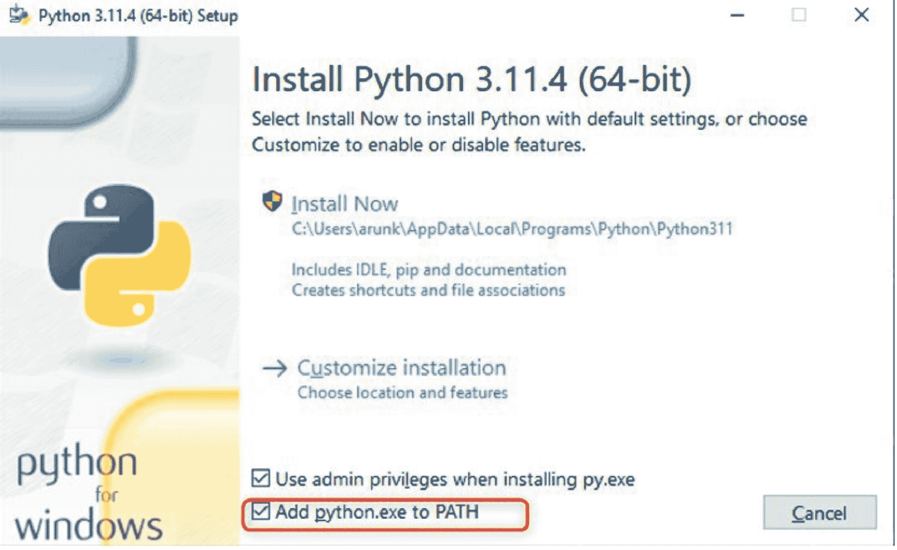

- 此时，选择您要安装的功能。如果所有功能都是必需的，请选中它们，然后点击“下一步”。

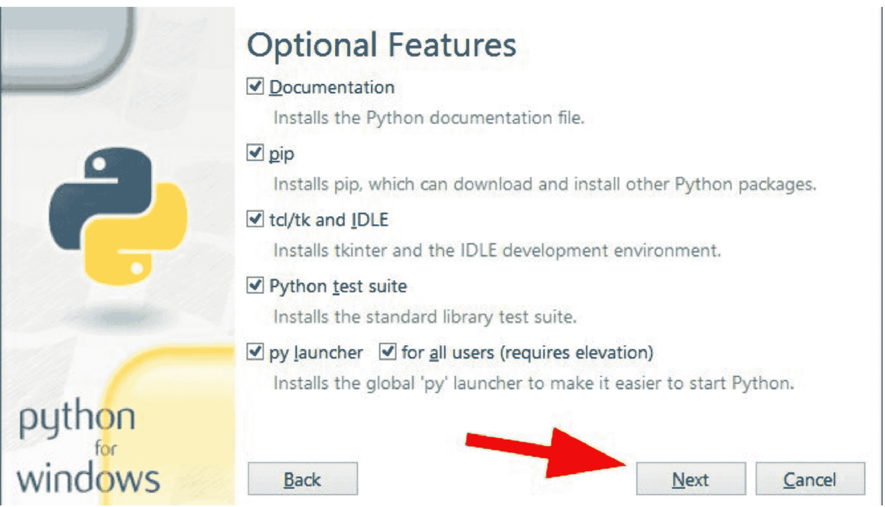

- 将出现一个高级选项列表。选择您需要的选项或全部选中。然后点击“安装”按钮开始安装过程。

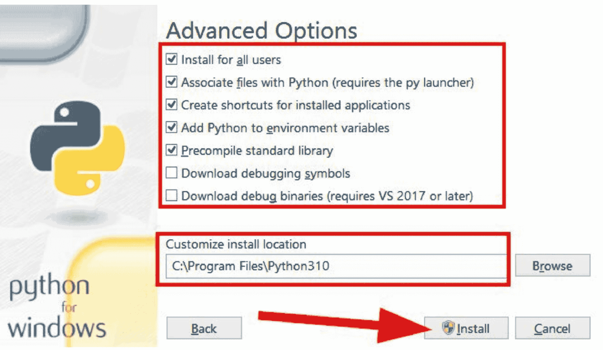

##### 4. 安装 Python：

- 自定义安装偏好设置后，点击“立即安装”按钮继续。
- 安装程序将开始在您的系统上安装 Python。此过程可能需要几分钟才能完成。

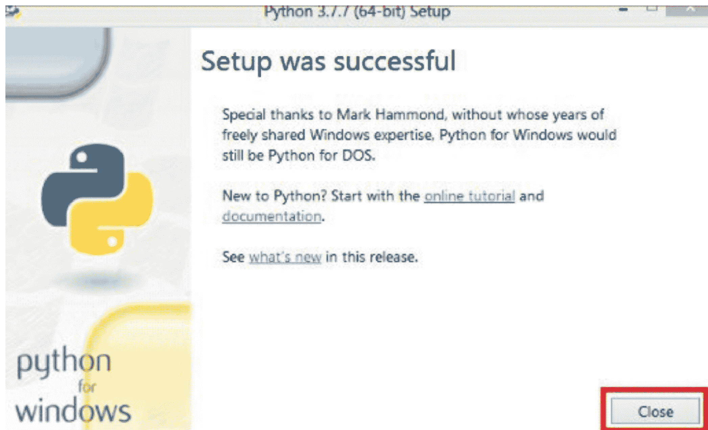

##### 5. 验证安装：

为确保 Python 已正确安装，请执行以下操作：

- 打开 PowerShell 或命令提示符。
- 在命令提示符窗口中输入 `python –version` 并按回车键。
- 如果您看到 Python 版本号，则表明 Python 已成功安装在 Windows 上。

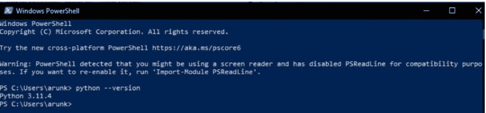

##### 6. 通过 Microsoft Store 替代安装：

- 或者，您可以从 Microsoft Store 安装 Python，以获得轻松无忧的安装体验。
- 在您的 Windows 计算机上打开 Microsoft Store 应用。
- 在搜索栏中搜索“Python”。
- 从搜索结果中选择所需的 Python 版本，然后点击“获取”进行安装。

#### 如何在 macOS 上安装 Python

在 macOS 上安装 Python 是一个简单直接的过程。请按照以下步骤在您的 Mac 上安装并运行 Python：

##### 1. 检查 Python 版本：

- 通过在 Spotlight 中搜索或导航到“应用程序” > “实用工具” > “终端”来打开终端。
- 输入以下命令并按回车键：

```
python --version
```

- 此命令检查您的 Mac 上是否安装了 Python，并显示已安装的 Python 版本。如果未安装 Python，您将看到一条消息提示未找到 Python。

##### 2. 访问 Python 网站：

- 打开您的网络浏览器，访问 Python 官方网站。
- 在这里您可以下载适用于 macOS 的 Python 安装程序。

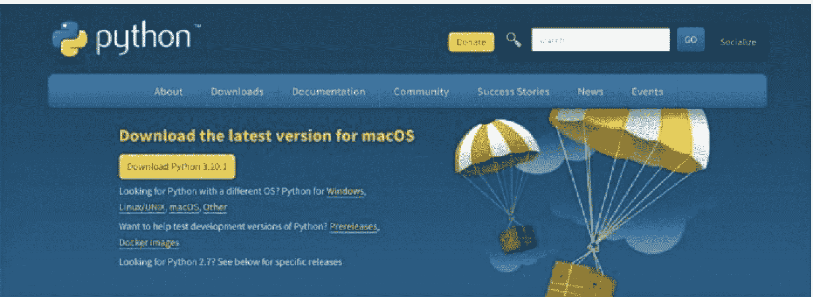

##### 3. 下载 macOS 安装程序：

- 在 Python 网站上，点击“下载 Python”按钮下载 macOS 安装程序。
- 确保下载与 macOS 兼容的最新版本的 Python。

##### 4. 运行安装程序并按照说明操作：

- 下载安装程序后，找到已下载的文件（通常在“下载”文件夹中），双击运行安装程序。
- 按照安装程序提供的屏幕说明完成安装过程。
- 您可能需要输入您的 macOS 用户密码以授权安装。

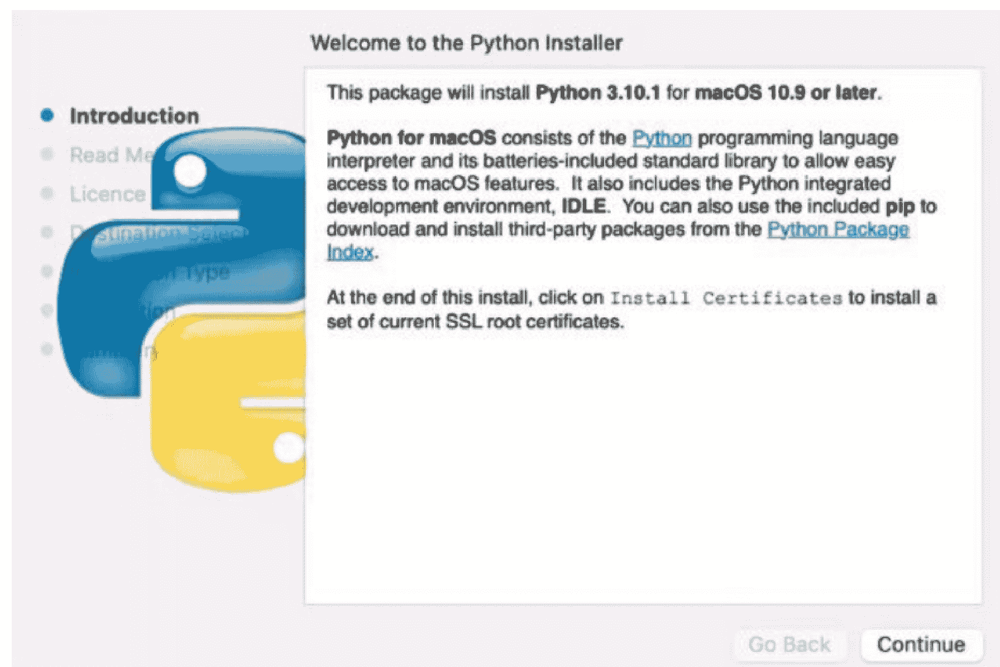

##### 5. 验证 Python 和 IDLE 是否正确安装：

- 安装后，桌面上会出现一个文件夹。点击此文件夹中的 IDLE。

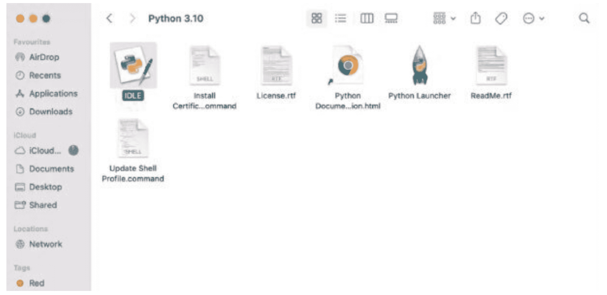

- 让我们确保 Python 和 IDLE 的最新版本已正确安装。为此，请双击 IDLE，这是 Python 附带的用于集成开发的工具。如果一切正常，IDLE 将显示如下所示的 Python shell：

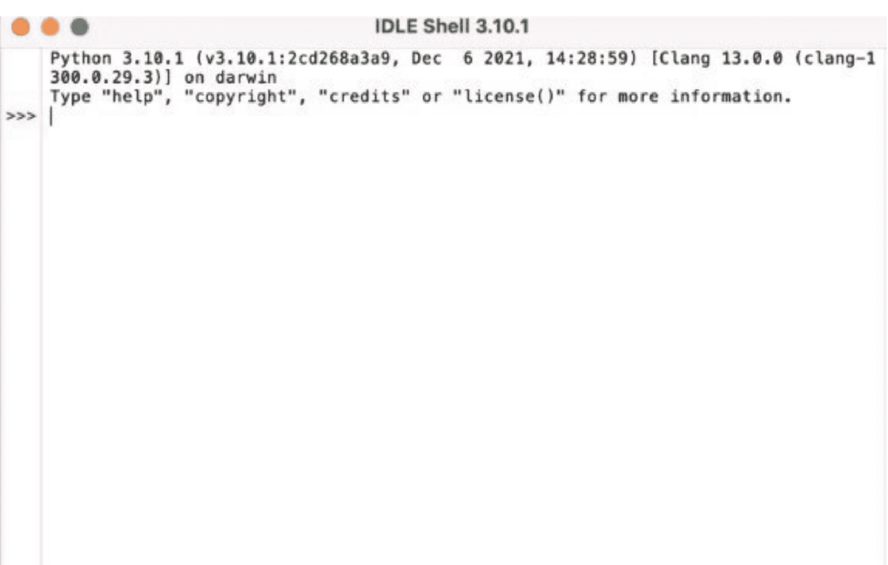

- 编写一些基本的 Python 代码并在 IDLE 中执行。输入以下内容并按回车键。

```
print("Hello, World!")
```

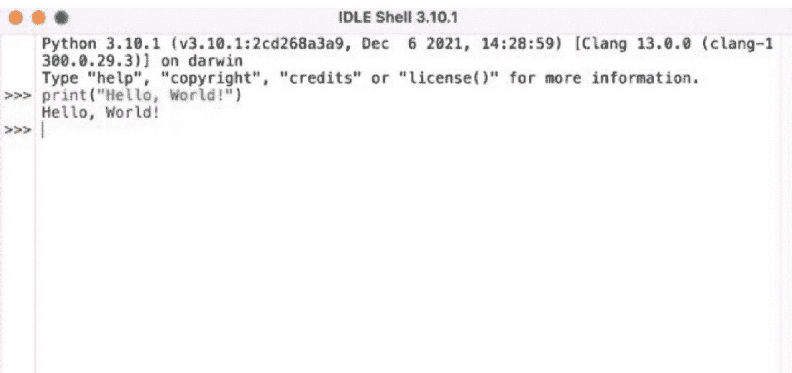

##### 6. 使用终端验证安装：

- 终端是检查安装是否完成的另一种方式。在终端中输入此命令：

```
python3 --version
```

- 按回车键查看您新安装的 Python 版本。这意味着 Python 已成功安装在您的 Mac 上。

#### 如何在 Linux 上安装 Python

在 Linux 上安装 Python 是一个相对简单的过程。请按照以下步骤在您的 Linux 系统上安装 Python：

##### 1. 检查预装的 Python：

- 打开一个终端窗口。
- 输入以下命令并按回车键：

```
python --version
```

- 此命令将检查您的 Linux 系统上是否安装了 Python，并显示已安装的 Python 版本。如果未安装 Python，您将看到一条消息提示未找到 Python。

##### 2. 通过包管理器安装：

- 大多数 Linux 发行版都预装了 Python。但是，如果未安装 Python 或您需要其他版本，您可以使用发行版的包管理器进行安装。
- 对于基于 Debian 的系统（例如 Ubuntu），使用以下命令：

```
sudo apt-get update
sudo apt-get install python3
```

- 对于基于 Red Hat 的系统（例如 CentOS），使用以下命令：

```
sudo yum install python3
```

##### 3. 下载最新版本的 Python：

- 如果您的发行版仓库中可用的 Python 版本不是您想要的，您可以从 Python 官方网站下载并安装最新版本。
- 访问 Python 网站 https://www.python.org/downloads/linux/ 下载适用于 Linux 的最新版本的 Python。

##### 4. 从源代码编译（可选）：

- 如果您更喜欢从源代码编译 Python，请从 Python 网站下载源代码 tarball。
- 解压 tarball 并按照 README 文件中的说明配置、编译和安装 Python。

##### 5. 验证安装：

- 安装后，您可以通过打开终端窗口并输入以下命令来验证 Python 是否正确安装：

```
python --version
```

- 此命令应显示已安装的 Python 版本。

瞧，就是这样！现在，您已准备好开始编写和运行 Python 脚本了。

#### 编写并运行您的第一个 Python 脚本

既然您已经安装了 Python，让我们创建一个简单的脚本并运行它。

- 使用文本编辑器，如 VSCode、Sublime Text，甚至 Windows 上的记事本。
- 在您的文本编辑器中，输入以下简单的 Python 脚本：

```
print("Hello, Python!")
```

- 将文件保存为 .py 扩展名，例如 first_script.py。

#### 运行您的 Python 脚本

##### 对于 Windows：

- 按“Win + R”，输入 cmd，然后按回车键。
- 使用“cd”命令转到脚本保存的目录。
- 输入 `python first_script.py` 并按回车键。

##### 对于 macOS/Linux：

- 在 macOS 上使用 Spotlight 或在 Linux 上按 Ctrl + Alt + T 打开终端。
- 使用 cd 命令转到脚本保存的目录。
- 输入 `python3 first_script.py` 并按回车键。

##### 验证输出：

如果一切设置正确，您将看到输出：

```
Hello, Python!
```

您刚刚编写并运行了您的第一个 Python 脚本。准备好探索更多吧。

#### 神奇时刻：见证您的代码焕发生机

在当今世界，并非每个人都精通编程。但如果您有这方面的天赋，您就握着一张黄金门票。随着信息技术占据主导地位，我们生活在一个能够快速创建数字杰作就能开启无限可能的时代。

#### 编程：从无到有创造

编程不仅仅是向计算机输入一行行文本。它是一种艺术形式，一种创造性的表达，您从无到有地塑造出某种东西。当然，您看到移动应用和网站如雨后春笋般涌现，但您是否想过它们是如何工作的？信不信由你，对许多人来说，这仍然是个谜。

让我们为您的代码第一次焕发生机的那个激动人心的时刻做好铺垫。

想象一下您的代码第一次焕发生机时那令人振奋的时刻。在投入了数小时的脑力、无数行代码和几声沮丧的叹息之后。您精心打造了每一个功能，调试了每一个故障，现在，当您点击那个“运行”按钮时，有一种屏息以待的期待感。

然后，它发生了。

您的屏幕因您的努力成果而亮起。也许是一个移动应用的流畅界面，或者是一个响应精美的网站。无论它是什么，它活了，它在工作，这一切都归功于您。这就像见证一个数字生命的诞生——一种令人振奋的肾上腺素激增，混合着深深的满足感。

那一刻不仅仅是几行代码的组合。它是对您技能的肯定，是您毅力的证明，也是对数字世界无限可能性的一瞥。那是所有深夜和咖啡因驱动的编码时光以最辉煌的方式得到回报的时刻。

所以，当我谈论编程的兴奋时，我指的就是这样的时刻。看到自己的创作变为现实，既令人上瘾又赋予人力量，这让我不断追求更多。

#### 提醒！

志存高远；即使失败，你仍将身处群星之中。

你看，在这个编程世界里，存在着等级——那些摇滚明星、编程忍者，他们让一切看起来都易如反掌。然后，是我们其余的人，牢牢扎根于调试和反复试错的现实世界中。

关键在于：对自己宽容一些。不要把标准定得太高；庆祝每一个小小的胜利，并接受编程是复杂的——这完全没问题。

##### 理解数据类型和基本操作：

数据类型就像代码超能力者，各有独特的技能。标准或内置的 Python 数据类型如下：

###### 数值型：

这包括整数（整数）和浮点数（小数）数据类型。

**示例：** 想象一下你在管理财务。你银行账户里的钱会是整数（比如 $1000），而你在杂货上花的钱可能是浮点数（比如 $42.56）。

###### 序列类型：

这些是相似或不同数据类型的有序集合。

**示例：** 想想购物清单。清单上的每一项就像序列中的一个元素。无论是杂货清单还是歌曲播放列表，序列类型都以特定顺序组织事物。

###### 布尔型：

这种数据类型只有两个可能的值：True 或 False。

**示例：** 想象一个交通灯——它要么是红色，要么是绿色。同样，编程中的布尔类型都是关于二元选择的——True 或 False。它们帮助我们在程序中做出决策。

###### 集合：

集合是唯一元素的无序集合。

**示例：** 想想一串独特的钥匙。钥匙圈上的每把钥匙就像集合中的一个元素。即使你有多把相同的钥匙，集合也只保留每把独特钥匙的一个。

###### 字典：

字典是键值对的集合，通过唯一的键访问每个值。

**示例：** 把字典想象成一本电话簿。名字就像键，对应的电话号码就是值。当你查找一个名字（键）时，你会得到相关的电话号码（值）。

###### 二进制类型（memoryview、bytearray、bytes）：

这些数据类型处理二进制数据，通常用于底层操作。

**示例：** 当你用手机拍照时，图像以二进制格式存储。Memoryview、bytearray 和 bytes 允许程序员直接处理这些二进制数据，执行图像处理或文件操作等任务。

###### 字符串：

字符串是字符序列，通常用于文本。

**示例：** 一个人的名字，如 "John" 或 "Alice"，就是一个字符串。它也可以是一个句子，如 "Hello, how are you today?"。

###### 1. 算术运算符：

- **加法 (+)：** 想象把几片披萨加在一起做成一个美味的披萨！
- **减法 (-)：** 想象从披萨上移除配料，按你的喜好定制。
- **乘法 (*)：** 就像把披萨盒排列成行和列，看看你有多少个。
- **除法 (/)：** 想想在朋友之间平分一个披萨，算出每人得到多少片。

**示例：** 感觉自己是个数学高手？让我们把一些数字加起来！试试这个：

```python
num1 = 10
num2 = 5
result = num1 + num2
print("The sum is:", result)
```

###### 2. 比较（关系）运算符：

- **大于 (>)：** 想象两摞披萨盒，你在决定哪一摞更高。
- **小于 (<)：** 想象比较两只动物的高度，看看哪只更矮。
- **等于 (==)：** 就像检查两个披萨是否有相同数量的片。
- **不等于 (!=)：** 比较两个披萨上的配料，看看它们是否不同。

**示例：** 想比较一些值吗？让我们看看十是否大于 5：

```python
print(10 > 5)  # True
```

###### 3. 赋值运算符：

- **赋值 (=)：** 把披萨片分给每个派对成员。
- **加法赋值 (+=)：** 给你的披萨片添加额外的配料。
- **减法赋值 (-=)：** 从你的披萨片上移除配料。
- **乘法赋值 (*=)：** 把你拥有的披萨片数量加倍。

**示例：** 是时候赋值了！让我们给一个变量一个新值。

```python
x = 5
x += 3  # Equivalent to x = x + 3
print("New value of x:", x)  # Should be 8
```

###### 4. 逻辑运算符：

- **与 (and)：** 想象只有在天气晴朗且温暖时才决定去海滩。
- **或 (or)：** 就像计划一次野餐，如果天气晴朗或风不大就很高兴去。
- **非 (not)：** 想象因为水不温暖而不去游泳。

**示例：** 让我们玩玩逻辑！两个条件都为真吗？

```python
sunny = True
warm = True
print(sunny and warm)  # True
```

###### 5. 位运算符：

- **与 (&)：** 想想两个维恩图之间的重叠区域。
- **或 (|)：** 想象组合两套拼图碎片，看看完整的画面。
- **异或 (^)：** 想象从两个不同的拼图中选择碎片，并以新的、独特的方式组合它们。

**示例：** 深入位的世界！让我们执行一个按位与操作。

```python
num1 = 10  # 1010 in binary
num2 = 7   # 0111 in binary
result = num1 & num2
print("Bitwise AND result:", result)  # Should be 2
```

###### 6. 成员运算符：

- **在 (in)：** 想象检查一个苹果是否在水果列表中。
- **不在 (not in)：** 就像看看某种水果是否不在水果列表中。

**示例：** 让我们检查 'apple' 是否在列表中：

```python
fruits = ['apple', 'banana', 'orange']
print('apple' in fruits)  # True
```

###### 7. 身份运算符：

- **是 (is)：** 想象两个披萨，检查它们是否大小相同且配料相同。
- **不是 (is not)：** 就像比较两个不同的披萨，确认它们不相同。

**示例：** 两个变量是同一个东西吗？让我们找出答案：

```python
x = [1, 2, 3]
y = [1, 2, 3]
print(x is y)  # False, because they refer to different objects
```

### 互动环节

###### Python 基础测验

让我们测试一下你对 Python 基础的了解！回答以下问题，看看你学到了多少：

1. 以下代码的输出是什么？

```python
print(2 + 3 * 4)
```

- a) 20
- b) 14
- c) 15
- d) 24

答案：b) 14

2. 以下代码片段的结果是什么？

```python
x = 10
y = 5
print(x > y)
```

- a) True
- b) False
- c) Error
- d) None

答案：a) True

3. 在 Python 中声明变量的正确方式是什么？

- a) var x = 5
- b) x = 5
- c) int x = 5
- d) variable x = 5

答案：b) x = 5

4. Python 中的 '+=' 运算符是做什么的？

- a) 将两个数字相加
- b) 将两个数字相减
- c) 将两个数字相乘
- d) 将右操作数加到左操作数，并将结果赋给左操作数

答案：d) 将右操作数加到左操作数，并将结果赋给左操作数

5. 如何在 Python 中创建注释？

- a) //This is a comment
- b) #This is a comment
- c) /This is a comment/
- d) <!--This is a comment-->

答案：b) #This is a comment

6. 以下哪项不是 Python 中的有效数据类型？

- a) int
- b) float
- c) char
- d) str

答案：c) char

7. 在 Python 中创建函数的正确方式是什么？

- a) function myFunction():
- b) def myFunction():
- c) create myFunction():
- d) func myFunction():

答案：b) def myFunction():

8. 以下代码的输出是什么？

```python
x = "Hello"
print(x[2:])
```

- a) lo
- b) llo
- c) Hell
- d) Hello

答案：a) lo

9. 如何在 Python 中打印 "Hello, World!"？

- a) print("Hello, World!")
- b) console.log("Hello, World!")
- c) echo "Hello, World!"
- d) printf("Hello, World!")

答案：a) print("Hello, World!")

10. Python 中的 'input()' 函数是做什么的？

- a) 向控制台显示输出
- b) 从用户读取输入
- c) 将字符串转换为整数
- d) 检查变量是否已定义

答案：b) 从用户读取输入

回答完所有问题后，请检查你的答案。祝你好运！

### 过渡

在本章中，我们踏上了一段激动人心的 Python 编程基础之旅。

### 关键要点：

- Python 的简洁性、可读性和灵活性使其成为初学者和编程专家的理想语言。

## 数据处理与可视化

嘿，数据探索者！你是否曾感觉自己淹没在数字和电子表格的海洋中，拼命寻找一艘救生艇，将你从无聊中解救出来？那么，准备好把这些救生衣扔到一边吧，因为我们即将踏上一段激动人心的冒险之旅，使用Python探索数据处理与可视化的世界！

告别枯燥的数据，迎接令人兴奋的图表、图形和视觉故事，它们将使你成为数据驱动任务中的英雄。准备好潜入其中吧，因为数据的海洋从未如此令人兴奋！

### 使用PANDAS和NUMPY进行数据操作

首先，我们向你介绍这对活力搭档：Pandas和NumPy。

你听说过Pandas吗？不是指可爱的熊猫，而是那个让处理表格数据变得如切黄油般顺滑的Python库！

它们是Python数据操作领域的超级英雄。它们是你值得信赖的助手，帮助你组织、筛选和转换数据。我们很快就能让你成为数据大师！

Pandas就像是Python世界中处理表格数据的巫师，尤其是你在Excel或那些逗号分隔的.csv文件中找到的数据。它是数据分析所需的超级英雄斗篷，因为它超级用户友好。

你可能会想，“Pandas与其他Python库有何不同？”问得好！虽然像XLSX和XLRD这样的库在幕后处理Excel数据，但Pandas在与Excel电子表格和CSV文件交互方面占据主导地位，使其成为像你这样的数据分析爱好者的首选。

但是等等，什么是.csv文件？它就像是表格数据俱乐部中的VIP格式。无论是.csv、.tsv还是任何其他变体，它都遵循相同的规则——一个独特的字符在表格中指引方向，引导你从一个单元格到下一个单元格。

#### DataFrame的本质

在Pandas迷人的领域中，DataFrame是一个关键角色。根据Pandas库文档，DataFrame是一个“二维、大小可变、可能包含异构数据的表格数据结构，具有带标签的轴（行和列）。”这听起来可能有点复杂，但别担心——让我们用初学者友好的术语来分解它。

#### 把它想象成一个表格：

简单来说，DataFrame就像你数据的数字表格。它是一个强大的工具，以结构化和有意义的方式组织信息。让我们探索使DataFrame成为游戏规则改变者的关键特征：

#### 1. 多行多列：

想象你的数据表是一个有多个行和列的棋盘。这个棋盘上的每个方格都可以容纳一条独特的信息，形成一幅丰富的数据织锦。

#### 2. 每一行，一个故事：

DataFrame中的每一行就像一个等待讲述的故事。它代表一个数据样本——一个特定的实例或观察，为大局做出贡献。

#### 3. 列，变量：

现在，把列想象成讲故事的人。每一列包含一个不同的变量，描述行所代表的样本。这就像你的数据故事中有不同的章节。

#### 4. 统一的数据类型：

在这个数字叙事中，每一列通常使用相同类型的数据。和谐的一致性使你的数据保持有序，无论是数字、字符串还是日期。

#### 5. 没有缺失值的戏剧：

这就是Pandas甚至超越Excel的地方——DataFrame避免了缺失值的戏剧。与有空白和空格的Excel数据集不同，DataFrame确保行与列之间的信息流无缝且完整。

### 用NUMPY破解代码：你在PYTHON中的数学伙伴！

认识你的新朋友——NumPy！它就像你身边有一位数学巫师，让复杂的计算变得轻而易举。让我们一起解锁魔法，发现NumPy如何成为你的终极伙伴。

#### 什么是NumPy？

NumPy就像是Python库中的摇滚明星。它代表“Numerical Python”，当你想处理数组（即组织好的数字列表）时，它是你的首选。

#### 数组，数组，数组！

想象你有一个最喜欢的数字列表：[3, 6, 9, 12, 15]。现在，你可以用NumPy把这个列表变成一个强大的数组。数组使得对数字进行数学运算变得超级容易。

```python
import numpy as np

numbers = np.array([3, 6, 9, 12, 15])
```

#### 让我们做些数学运算！

让我们像在学校时那样，进行一些数学运算。

- **加法和减法：**

```python
result_addition = numbers + 5
result_subtraction = numbers - 3
```

你给每个数字加了5，减了3。很简单，对吧？

- **乘法和除法：**

```python
result_multiplication = numbers * 2
result_division = numbers / 3
```

现在，你将每个数字乘以2，再除以3。这就像处理零花钱一样！

#### 玩转更高级的数学：

NumPy不仅仅处理基本运算；它也能处理更复杂的数学。

- **平方根：**

```python
result_sqrt = np.sqrt(numbers)
```

你刚刚计算了每个数字的平方根。真棒！

- **求和与平均值：**

```python
total_sum = np.sum(numbers)
average = np.mean(numbers)
```

现在，你已经找到了数组的总和和平均值——就像在数学考试中得了满分！

### 使用MATPLOTLIB和SEABORN可视化数据：

想象一下：你有一堆数字坐在那里，从屏幕上回望着你。它们只是……嗯，数字。但如果我告诉你，通过Matplotlib，这些数字可以活起来，变成讲述故事的美丽图表和图形呢？是的，没错——Matplotlib就像是数据世界的艺术家，将枯燥的数字变成引人入胜的视觉效果。

那么，Matplotlib是如何施展它的魔法的呢？让我为你分解一下：

#### 1. 轻松绘图：

首先，Matplotlib的核心就是让事情变得简单。它就像那个在你需要快速绘制图表时总是支持你的朋友。只需几行代码，你就能创造出将数据带入生活的惊艳视觉效果。

Matplotlib是Python可视化领域的毕加索。它不仅仅是让事情变得简单；它是将看似不可能的事情变为现实。

#### 2. 打造视觉组合：

把Matplotlib想象成你数据的造型师。从散发精致感的流畅折线图，到大胆声明的柱状图，Matplotlib根据数据的个性定制其视觉组合。

#### 3. 互动冒险：

但是等等，还有更多！Matplotlib不仅仅局限于静态视觉效果。不，它也关乎互动性。想象一下，放大图表、平移探索不同区域，甚至动态更新数据——只需点击或滑动几下。这就是Matplotlib带来的那种魔法。

#### 4. 无限定制：

现在，让我们谈谈个性化。使用Matplotlib，你不受限于千篇一律的图表。根据你的个性定制视觉效果——从流行色板到讲述故事的布局。你的数据，你的规则！

#### 5. 导出冒险——分享你的故事：

Matplotlib 确保你的创作不会局限于一隅。将你的视觉叙事导出为多种文件格式，使其准备好在报告、演示文稿甚至社交媒体舞台上大放异彩。

#### 6. 无缝集成 – JupyterLab 及更广阔天地：

无论你是 JupyterLab 的狂热爱好者，还是在图形用户界面中探索，Matplotlib 都能无缝融入你的工作空间。轻松嵌入你的创作，让你的数据叙事之旅变得轻而易举。

#### 7. 第三方包带来的无限可能：

Matplotlib 的魅力不仅在于其自身功能，更在于它所开启的无限可能。深入探索基于 Matplotlib 构建的丰富第三方包生态，每个包都提供独特的视角，为你的数据叙事锦上添花。

### SEABORN 的图表魅力：提升你的数据美学！

好了，各位，准备好让你们的图表更上一层楼吧，因为 Seaborn 即将让你的数据看起来更加不可思议！

那么，你知道图表和图形对于可视化数据有多棒吗？有了 Seaborn，它们不仅仅是棒——简直棒极了！这个 Python 库就像你数据的造型师，增添一丝风采，让你的视觉效果从“平平无奇”跃升为“惊艳四座”！

最棒的是？Seaborn 擅长让事情变得简单。它的绘图函数就像魔杖，挥散数据可视化的复杂性，让你能专注于最重要的事情：数字背后的故事。

有了 Seaborn，你可以用鲜艳的色彩、流畅的风格和引人注目的细节来为你的图表增添趣味。这就像给你的数据做了一次大改造，看着它前所未有地闪耀。Seaborn 与其它工具配合默契，能与 pandas 数据结构和 Matplotlib 无缝集成，让你的绘图体验轻松愉快。

### SEABORN 实战：真实世界的数据可视化冒险

你准备好见证数据可视化在实践中的变革力量了吗？请做好准备，我们将踏上一段引人入胜的旅程，深入探索 Seaborn 这个迷人的 Python 库在现实世界中的应用，它能将平凡的数据转化为视觉杰作。

#### 客户详情的分布图

想象一下：你为一家时尚的时装零售商工作，你的团队想要了解最忠实客户的年龄范围。你手头有海量数据，包括经常光顾你实体店和网站的购物者的年龄。

你求助于 Seaborn 及其可靠的分布图来理解这些数据。这些图也被称为直方图，就像是客户年龄分布的视觉快照。直方图中的每个条形代表一个不同的年龄组，条形的高度显示了属于该组的客户数量。

当你审视分布图时，趋势便显现出来。也许二十多岁的购物者数量激增，表明在年轻成年人中拥有强大的影响力。又或者年龄分布更为广泛，暗示着客户群体的多样性。

无论是推出针对千禧一代的新系列，还是为年长购物者提供特别促销，Seaborn 的分布图都能帮助你做出明智的决策，与客户产生共鸣，并吸引他们持续光顾。

#### 足球运动员活动的条形图：

想象一下，你坐在座无虚席的体育场里，热切期待着一场高风险足球比赛的开球，传奇人物利昂内尔·梅西步入球场。你不仅仅是一名观众，更是一位敏锐的观察者，渴望深入了解梅西令人着迷的表现。这时 Seaborn 登场了，它用动态的条形图让你一窥梅西的辉煌。

Seaborn 可以制作引人入胜的条形图，揭示梅西在整场比赛中的跑动和动作。想象一下：每个条形代表他比赛表现的一个不同方面——成功的盘带、精准的传球、射正次数和进球数。当你深入研究条形图时，你会享受到一场梅西在球场上统治力的视觉盛宴——无论是他用标志性的盘带突破防守，为队友送出毫米级精准的传球，还是轰出雷霆万钧的射门。

有了 Seaborn 直观的视觉效果，就像坐在梅西魔法的前排座位，让你能惊叹于他每一次触球所展现的技巧和创造力。

#### 治疗效果的箱线图

假设你是一家医疗研究机构的数据分析师，正在研究针对特定医疗状况的不同治疗方法的效果。你有一个数据集，包含了接受各种治疗方案的患者的康复时间。为了比较不同治疗方案下康复时间的分布，你决定使用箱线图。

在这种情况下，你可以为每个治疗组创建一个箱线图，其中箱体代表康复时间的四分位距，箱内的一条线表示中位数，须线延伸以显示数据的范围。如果有异常值，则表示为须线之外的单个点。

通过使用箱线图可视化康复时间的分布，你可以快速识别哪些治疗方案能带来更快的康复，以及任何可能需要进一步调查的显著差异或异常值。这有助于医疗专业人员对治疗方案做出明智的决策，并改善患者的治疗结果。

### 使用 PLOTLY 和 BOKEH 进行交互式可视化

嘿，未来的数据魔法师们！今天，我们来聊聊 Plotly 和 Bokeh——数据可视化界的活力二人组！忘掉你对图表的一切认知吧，因为与它们的伙伴 Matplotlib 和 Seaborn 不同，Plotly 和 Bokeh 不仅仅是 Python 玩家；它们是 HTML 和 JavaScript 大师，能将你的可视化提升到一个新高度！

#### 向 Plotly 问好

Plotly 就像交互式图表的魔术师。它的 Python 魔杖能变出不仅仅满足于静静展示美丽的图表。

是什么让 Plotly 与众不同？想象一下：工具提示会透露有趣标记的秘密。将鼠标悬停在一个点上，砰！Plotly 揭示了隐藏的宝藏，将你的数据变成洞察的宝库。这就像你的数据魔法师触手可及！

而最精彩的部分——Plotly 让你能够捕捉这份魔力。将你的交互式图表保存为 PNG，保留那些让数据栩栩如生的动态元素。无论是用于演示、报告还是分享见解，Plotly 都能确保你的可视化效果像你初次探索时一样引人入胜。

在幕后，Plotly 从著名的 d3.js JavaScript 库中汲取灵感，为其技能库增添了一层额外的精致。可以将 Plotly 视为你通往令人惊叹的交互式图表世界的 Python 友好桥梁。它不仅仅是一个工具；它是一份邀请，邀请你在 Python 的舒适怀抱中，将你的数据转化为视觉杰作。

#### Plotly 的力量：数据成为交互式冒险

准备好发现一个图表栩栩如生、见解随鼠标悬停而展开、每一次点击都让你更深入数据故事魔力的领域。这就是 Plotly——交互性的巫师，数据的讲述者。让冒险开始吧！

- **交互式魔杖魔法：** 是否曾希望你的图表能说话？Plotly 让它成真。通过交互式工具提示，每个数据点都变成了一个讲述者。将鼠标悬停在它们上面，瞧！见解像魔法一样弹出。这就像有一位私人向导，带你穿越数据的奇境。
- **缩放盛宴：** 忘掉静态视图。Plotly 赋予你深入细节的力量。有一个特定点需要关注？放大。正在探索某个特定区域的细微差别？放大。这就像拥有一个数据放大镜，在每个像素中揭示隐藏的宝石。
- **动态数据叙事：** Plotly 不仅仅是关于图表；它是关于创造动态的数据叙事。你的可视化变成了随着你探索而展开的故事。这就像把你的数据变成一本引人入胜的小说——每一次点击都揭示一个新的见解篇章。

**4. 魔法保存器——PNG版：你是否在交互式图表中捕捉到了**完美瞬间？Plotly允许你将其保存为PNG，定格那份动态的活力。无论是用于演示、报告，还是与世界分享，你的可视化作品都将像初次探索时一样引人入胜。

## *向Bokeh问好*

现在，让我们将注意力转向Bokeh——HTML和JavaScript魔法的大师。

Bokeh作为交互式数据可视化库的摇滚明星，大放异彩。与Python可视化领域的伙伴Matplotlib和Seaborn不同，Bokeh将HTML和JavaScript引入派对来渲染图形。不过，它不仅仅是个网络魔法师——请将Bokeh视为你多才多艺的得力助手，它既能解开数据之谜，也能创作出让你的项目和报告成为焦点的图表杰作！

但请坐稳，因为Bokeh并非只为网络魔法师准备。它也是任何想要深入数据或制作一些引人注目图表的人的强大工具。

现在，系好安全带，因为我们即将开启一段进入Bokeh世界的欢乐之旅！想象一下，你有一个学校项目或报告需要一些视觉上的强大冲击力——这就是Bokeh像超级英雄一样登场的地方。

##### 1. HTML和JavaScript——Bokeh的秘密武器：

那么，内部消息是这样的。Bokeh不仅会说Python；它是双语的！它与HTML和JavaScript调情，为你的图表增添额外的光彩。就像有一个多语言的朋友在派对上与每个人聊天。

##### 2. Bokeh适合每位数据探索者：

你可能会想，“我需要成为编程高手才能使用Bokeh吗？”不需要！Bokeh就像你友好的社区超级英雄，欢迎每个人。无论你是充满好奇心的数据探索者，还是擅长将数字转化为视觉诗歌的学生，Bokeh都是你的首选助手。

##### 3. 为学校项目打造引人注目的图表：

你正在做一个关于你最喜欢的动物的学校项目。Bokeh将你无聊的条形图变成了一个视觉动物园！想象一下，色彩丰富、交互式的图表让你的数据活了起来。突然间，你的项目不仅信息丰富；它还是一次进入你最喜欢的生物野生世界的旅程。

##### 4. Bokeh的绘图乐园：

Bokeh不仅仅是制作图表；它是为你的数据创造整个游乐场。使用Bokeh，你可以快速制作出讲述故事的图表。想展示一年中气温如何变化？Bokeh支持你。这就像拥有一个数字画布，你的数据在上面变成了一件艺术品。

##### 5. Bokeh效应——不仅仅是图表：

但是等等，还有更多！Bokeh并不局限于图表的世界。它是你创建交互式仪表板的创意犯罪伙伴。想象一下，拥有一个仪表板，让你像寻宝一样探索数据——点击、缩放，并像真正的数据冒险家一样发现洞察。

啊，让我告诉你那些让Bokeh比夜空中的流星更闪耀的不可思议的功能！

**交互魔法：** Bokeh不是你普通的绘图库——它是一个让数据活起来的魔法师！凭借其交互功能，你可以缩放、平移并将鼠标悬停在图表上，近距离探索每一个细节。这就像给你的观众一个数据表演的前排座位！

**网络友好：** 告别静态图表，迎接基于网络的奇迹！Bokeh为数字时代而生，使用HTML和JavaScript创建在任何屏幕上都闪耀的惊人可视化。无论你是在构建仪表板还是应用程序，Bokeh都以其网络友好的魔法支持你。

**多功能绘图：** 需要散点图？没问题！想要条形图？你得到了！Bokeh提供了丰富的绘图选项，从简单的折线图到复杂的热力图。其多功能工具包让你可以将数据转换成任何想要的图表。

**无缝集成：** 无论你是Python专家还是新手，Bokeh都能与你所有喜欢的工具和库良好协作。它与Pandas、NumPy和其他Python强大工具无缝集成，使其易于融入你的数据科学工作流程。

**跨平台兼容性：** 无论你使用的是Windows、Mac还是Linux，Bokeh都能覆盖你。它被设计为在不同平台上无缝工作，因此无论你身在何处或使用什么设备，都可以轻松创建和分享你的可视化作品。

### 交互元素

### *数据测验挑战*

准备好迎接我们数据测验的有趣互动挑战吧！

### **说明：**

-   仔细阅读每个问题。
-   选择最合适的答案。
-   选择你的答案，然后继续下一个问题。

### **问题1：**

你有一个显示过去一年不同产品销售业绩的数据集。哪种图表最适合比较每个产品的销售额？

a) 饼图
b) 条形图
c) 折线图
d) 散点图

答案：b) 条形图

##### 问题2：

哪种图表最适合可视化人口调查中的年龄分布？

a) 直方图
b) 箱线图
c) 折线图
d) 散点图

答案：a) 直方图

##### 问题3：

你正在分析温度与冰淇淋销量之间的相关性。哪种图表可以帮助你可视化这种关系？

a) 折线图
b) 散点图
c) 条形图
d) 饼图

答案：b) 散点图

##### 问题4：

你正在展示一项关于最受欢迎披萨配料的调查结果。每位受访者选择了多种配料。哪种图表能有效显示这些数据？

a) 饼图
b) 条形图
c) 折线图
d) 直方图

答案：a) 饼图

##### 问题5：

你想根据准确率分数比较不同机器学习模型的性能。哪种图表最合适？

a) 条形图
b) 折线图
c) 箱线图
d) 散点图

答案：a) 条形图

##### 问题6：

你有一个显示不同城市月降雨量的数据集。哪种图表最适合比较各城市的降雨量？

a) 饼图
b) 条形图
c) 折线图
d) 散点图

答案：b) 条形图

##### 问题7：

如果你正在分析一个班级考试成绩的分布，哪种图表最合适？

a) 箱线图
b) 直方图
c) 折线图
d) 散点图

答案：b) 直方图

##### 问题8：

如果你想可视化过去一年股票价格的趋势，哪种图表最合适？

a) 饼图
b) 条形图
c) 折线图
d) 散点图

答案：c) 折线图

##### 问题9：

你正在比较不同社交媒体平台在青少年中的受欢迎程度。哪种图表能有效显示这些数据？

a) 饼图
b) 条形图
c) 折线图
d) 散点图

答案：b) 条形图

##### 问题10：

你有关于产品客户满意度评分的调查数据。哪种图表最适合显示评分的分布？

a) 饼图
b) 条形图
c) 箱线图
d) 散点图

答案：c) 箱线图

过渡

你已经学会了如何使用Python库（如Matplotlib、Seaborn、Plotly和Bokeh）通过巧妙的图表和图形，将枯燥的数字变成引人入胜的故事。

### 关键要点：

-   可视化数据对于理解数据集中的趋势、模式和关系至关重要。
-   不同的图表适用于不同的数据类型，例如条形图用于比较，直方图用于分布，散点图用于相关性。
-   像Matplotlib、Seaborn、Plotly和Bokeh这样的库提供了强大的工具，用于创建交互式且视觉上吸引人的可视化作品。

现在，是时候将你新学到的技能付诸实践了！运用你在本章学到的概念，开始可视化你的数据集。无论你是在分析体育比赛成绩、调查结果还是股票价格，让你的创造力在可视化中闪耀。

在下一章中，我们将把你的Python技能提升到一个新的水平。准备好深入Python应用和自动化的精彩世界吧。你将学习像技术专家一样构建自己的应用程序并自动化繁琐的任务！所以，敬请期待，继续探索Python的无限可能。

现在，去用Python可视化你的世界吧！

## 使用Python进行构建与自动化

想象一下：你有一个关于网站的创意，并且对此充满热情。也许是一个可以分享想法的博客，一个展示创意作品的在线作品集，甚至是一个销售手工艺品的小型电子商务网站。无论是什么，将这个想法变为现实都让你兴奋不已，但技术障碍似乎令人生畏。

但Web开发仅仅是开始。Python的多功能性远不止于构建网站。从自动化重命名文件或发送电子邮件等日常任务，到开发复杂的机器学习算法，Python让你能够自动化几乎任何你能想象到的事情。

### 自动化的艺术：Python作为你的个人助手

如果我告诉你Python可以将你从繁琐的任务中解放出来呢？没错——Python可以自动化处理事务。需要整理文件？Python可以做到。想要自动发送电子邮件？Python能帮你搞定。这就像拥有一个永不疲倦的个人助手！

### Python的超能力：它为何如此特别？

- **多功能性：** Python可用于Web开发、数据分析、人工智能等多个领域。
- **社区：** 使用Python，你永远不会孤单。一个由学习者和专家组成的庞大社区随时准备提供帮助。
- **趣味性：** 是的，用Python编程是令人愉快的。这就像玩数字乐高积木一样。

### 准备好开始你的Python冒险了吗？

当我们一起踏上这段旅程时，请记住学习Python就像学习一门新的语言。它需要练习、耐心和一点创造力。但回报呢？它们是无限的。你不仅仅是在学习编程；你是在学习将想法变为现实。那么，你准备好解锁Python的魔力，看看它能带你走向何方了吗？让我们开始吧！

### Flask和Django Web开发入门

首先理解Web开发。Web开发是你的画布，而你的工具是技术和创造力。这是一种艺术形式，你通过它构建和维护存在于互联网虚拟生态系统中的数字结构——网站和Web应用程序。就像建筑师设计建筑，建造者将其变为现实一样，Web开发涉及设计和编程你的数字杰作。

### 构建你自己的数字王国：使用Python进行Web开发

现在，让我们来谈谈构建网站。借助Django和Flask等框架，Python让Web开发变得轻而易举。想象一下创建你的博客、照片库，甚至是一个小型在线游戏。Python为你提供了构建互联网城堡的砖瓦。

### Flask和Django：你旅途中的工具

虽然HTML、CSS和JavaScript是必不可少的，但创建更复杂的Web应用程序需要更强大的工具。这就是Flask和Django这两个基于Python的框架发挥作用的地方。

- **Flask：** 把Flask想象成一艘灵活的快艇。它轻量、易于操控，非常适合探索网络上的小岛屿。Flask允许你逐步构建Web应用程序，使其成为初学者和中小型项目的理想选择。
- **Django：** 现在，把Django想象成一艘雄伟的游轮。它更大、更强大，并配备了长途航行所需的一切。Django遵循“自带电池”的理念，为你提供了构建Web应用程序所需的几乎所有内置工具。它专为快速开发和处理复杂、大规模项目而设计。

### 为什么选择Flask或Django进行Web开发？

使用Flask或Django的美妙之处在于它们的Python根基。Python的可读性和简洁性使得这些框架对初学者易于上手，对经验丰富的开发者则高效实用。无论你是使用Flask构建一个小型个人项目，还是使用Django构建一个大型应用程序，Python都能让Web开发过程更加顺畅和愉快。

### Web开发是什么以及它为何如此酷

它是将想法变为现实的艺术与科学，从概念到现实，并确保它们在不断发展的数字生态系统中蓬勃发展。

想象你是一位数字建筑师和建造者。就像建筑师设计建筑，建造者将其变为现实一样，Web开发涉及设计（Web设计）和构建（Web编程）你的数字结构。它关乎于创建、构建和维护在互联网的神秘世界中运行的网站和Web应用程序。

Web开发者的工具箱里装满了各种强大的工具和技术，每一种在构建过程中都有其独特的用途。HTML是网络的骨架，提供结构；CSS增添风格和魅力；而JavaScript则为组合带来交互性和动态性。

但魔法不止于此。内容管理系统（CMS）登场了——它们是Web开发中默默无闻的英雄。像WordPress、Joomla!和Drupal这样的平台简化了开发流程，使开发者能够轻松构建和管理复杂的网站。

在快节奏的Web开发世界中，创新是游戏规则。从响应式设计到渐进式Web应用，可能性无穷无尽，未来不可限量。

### 乘上Web开发的浪潮：为何它是最酷的数字冒险

Web开发就像在浩瀚的互联网海洋中担任一艘船的船长。创建、构建和维护网站和Web应用程序是一段激动人心的旅程。每个网站都是一个待探索的新岛屿，每个应用程序都是一个等待被发现的宝藏库。

想想看：你可以打造一个激励数百万人的博客，一个在全球销售产品的在线商店，或者一个改变人们工作或娱乐方式的Web应用。互联网是你的游乐场，你的创作可以触及全世界的生活。

你的代码可以构建人们相遇、分享、购物、学习甚至坠入爱河的空间。从最简单的博客到最复杂的社交网络，Web开发将无形变为有形。

### 创建Web应用程序的简单方法

Flask是你通往Web应用开发世界的门户，它提供了一种直接且直观的方法来打造动态的在线体验。其极简的设计和用户友好的方式将开发者从传统框架的复杂性中解放出来。打造强大的Web体验变得轻而易举，让你能够专注于创造力而非基础设施问题。

作为一个用Python编写的轻量级且灵活的Web框架，Flask为开发者提供了一个简单而强大的工具包，用于构建健壮的Web应用程序。

使用Flask，你可以直接深入Web开发的核心，利用其简洁和优雅将你的愿景变为现实。因此，如果你正在寻找一种无麻烦的方式来创建Web应用程序，那么Flask就是你的不二之选——它是满足你所有Web开发需求的简单解决方案。

### 使用Django最大化开发速度和资源利用率

Django的设计核心目标是：促进快速开发。这就像有一支专家建造团队与你并肩工作，每个人负责复杂的建造部分，让你能够专注于定制你的梦想项目。

使用Django，从概念到完成的时间大大缩短。你花在Web开发繁琐方面的时间更少，而将更多时间用于将你独特的想法变为现实。

### 安全性：你数字堡垒的坚固城墙

在数字世界中，安全至关重要。Django深谙此道，并配备了开箱即用的强大安全功能。这就像建造一座城墙已经加固的堡垒。Django有助于防范常见的安全错误，如SQL注入、跨站脚本攻击、跨站请求伪造和点击劫持，使你的网站既快速又安全。

### 可维护性：着眼未来进行构建

网站是不断成长和发展的生命体。Django的设计简洁且可重用，促进了可维护性。它鼓励编写一次代码，随处使用，减少冗余和错误。这就像用乐高积木建造——每一块积木都可以用来构建新东西，或者重新排列以适应不断变化的需求。

### 无烦恼的开发：开发者的梦想

Django处理了与Web开发相关的许多麻烦事。想象一下，有一个个人助手处理所有的文书工作、后勤和基础工作，这样你就可以专注于构建网站的创造性方面。

这种无烦恼的方式意味着你不必重新发明轮子。你可以创建复杂的、数据库驱动的网站，而不会陷入Web开发的细枝末节中。

此外，Django作为一个开源框架，邀请全球开发者贡献，确保框架不断进化、改进并保持行业领先。

### 卓越的文档：你的Web开发指南

Django 最重要的资产之一就是其文档。它全面且结构清晰，就像一本详尽的指南，涵盖了从基础到高级主题的所有内容。对于新手和经验丰富的开发者来说，Django 的文档都是学习和参考的宝贵资源。

### 支持选项：永不独行

无论您偏好免费的社区支持还是专业的付费服务，Django 都为每个人提供了选择。丰富的教程、论坛、问答网站和开发服务确保了帮助始终触手可及，无论您是在排查问题还是寻求提升技能。

### John Sonmez：他的科技之旅概览

#### 早期兴趣与职业生涯开端

John Sonmez 在科技领域的旅程始于对编程和软件开发的浓厚兴趣。与该领域的许多人一样，随着他深入钻研，他对计算机和编码的迷恋与日俱增。他以软件开发者的身份开始了职业生涯，参与了各种项目，这些项目磨练了他的技术技能，并加深了他对行业的理解。

#### 从 PHP 到 Python：我使用 Django 和 Flask 进行 Web 开发的转型之旅

当我踏上 Web 应用开发之旅时，我的首选工具并非 Python。相反，是 PHP——当时，我认为它是 Web 开发领域无可争议的王者。

我如此深陷于 PHP 的方式，以至于任何替代方案的提议都近乎异端。

但是，哦，我大错特错了。

错得离谱。

转折点出现在我的朋友 Patrick 向我介绍 Django 的时候，这是一个 Python Web 框架。这简直是一次启示。我在 PHP 中耗费数小时才能完成的任务，用 Django 几分钟就能搞定。效率令人震惊。

不仅我的生产力飙升，我的产出质量也随之提高。我的代码变得更快、更可靠、也更稳定。差异犹如天壤之别。

我的探索并未止步于 Django。我很快发现了 Flask——另一个 Python 框架，但有所不同。Flask 更小、更模块化，并且具有无限的可定制性。在使用了多年笨重的工具之后，这就像被递上了一套精密工具。

转向 Django 和 Flask 是一个游戏规则改变者。我毫不犹豫地告别了 PHP。

诚然，PHP 仍然驱动着很大一部分网络。然而，Python，主要是通过 Django 和 Flask，正迅速成为现代 Web 应用开发的首选。它的崛起不仅仅是一种趋势；这是我们在思考和执行 Web 开发方式上的范式转变。

#### 建立个人品牌

他对个人发展和在科技社区内建立品牌的关注使 John 与众不同。早些时候，他就认识到，不仅仅要做一个优秀的程序员，还要成为一个全面发展的专业人士。这一认识促使他开始撰写博客“Simple Programmer”，在其中分享关于技术技能、软技能、职业发展和生产力的见解。

#### 对开发者社区的贡献

John 的影响最显著地体现在他指导和引导新兴开发者的努力上。他撰写了多本书籍，包括《软技能：软件开发者生存手册》，该书为开发者职业生涯中至关重要的非技术技能提供了全面的指南。他还创建了课程和视频，就科技职业的各个方面提供建议。

### Python 在自动化日常任务中的魔力

想象一下，有一位数字巫师听候您的差遣，随时准备接管那些您所畏惧的、乏味的日常任务。那么，欢迎来到 Python，这位编程世界的魔术师！借助 Python，您可以自动化几乎任何您能想到的事情——从整理杂乱的文件夹到发送电子邮件，甚至无需动手就能获取每日天气更新。

#### Python 的文件整理咒语书

您知道那些散落在电脑各处的成千上万张照片和文档吗？Python 可以像一位拥有超能力的图书管理员一样对它们进行分类。只需几行 Python 代码，您就可以：

-   根据类型、日期或大小将文件分类到文件夹中。
-   立即批量重命名文件。
-   清理不再需要的旧文件。

想象一下，一个脚本运行起来，片刻之间，您的数字混乱就变成了一个井然有序的图书馆。这就是 Python 的魔力！

#### Python 您的邮递员

发送电子邮件可能像在课堂上写一行行字一样重复。然而，Python 可以成为您的邮递员。无论是批量发送通讯、个性化问候，甚至是自动回复，Python 脚本都能处理。您编写规则，Python 就会投递邮件，而您无需每次都点击“发送”。

#### 您自己的天气预言家

是否曾希望您能预测天气？Python 可能无法控制天气，但它可以为您获取天气预报。借助 Python，您可以：

-   自动获取每日天气更新。
-   为特定天气条件设置警报。
-   甚至收集您所在地区的历史天气数据。

想象一下，每天开始时，您的收件箱里就有一份个性化的天气报告，这一切都归功于您的 Python 脚本。

#### 超越基础的自动化

这些例子只是冰山一角。Python 广泛的库和社区贡献的模块使得自动化大量任务成为可能：

-   自动备份您的重要文件。
-   整理您的音乐或电影收藏。
-   从数据生成报告和图表。

#### Python：您的数字魔杖

在这个时间宝贵的世界里，Python 就像一根数字魔杖，轻轻一挥就能让平凡的任务消失无踪。它是一个能为您节省时间的工具，让您能够专注于真正重要的事情——您的工作、您的爱好，或者只是在 Python 处理其他事情时享受一杯好咖啡。

### 基本自动化脚本的分步指南

#### 第 1 步：收集您的巫师工具

在我们开始之前，请确保您的计算机上安装了 Python——这就像拥有了您的巫师法杖。您还需要一个装满您想要重命名的文件的文件夹。它可以是您上次冒险收集的图片或文档。

#### 第 2 步：进入 Python 洞穴

打开您最喜欢的代码编辑器，您将在这里施展您的 Python 咒语。如果您是新手，IDLE（Python 的内置编辑器）或简单的文本编辑器就足够了。

#### 第 3 步：书写咒语（脚本）

现在，让我们写下重命名咒语。别担心，我会引导您完成魔法的每一行。

#### 第 4 步：施展您的咒语

运行脚本。您可以将文件保存为 .py 扩展名，然后在命令行、终端或支持它的编辑器中运行它。

#### 第 5 步：见证奇迹！

打开您的文件夹，见证奇迹——您所有的文件现在都有了新的名字，像士兵一样整齐排列。不再有混乱的文件名堆！

#### 您的巫师之旅额外提示

-   与 API 交互：在未来的冒险中，您可以使用 Python 与各种 API 对话，获取天气预报或股票价格等数据。
-   网页抓取：Python 还可以从网页中提取数据，这非常适合为您的任务收集信息。
-   重新格式化和组织数据：借助 Python，您可以转换和整理数据，即使是最混乱的数据集也能理清头绪。
-   整合任务：自动化多个任务，如发送电子邮件或备份文件，所有这些都可以通过一个脚本完成。
-   读写文件：轻松地将数据从一个文件读取并写入另一个文件，根据需要转换信息。

#### 提醒！

就是这样，一个基础但功能强大的 Python 脚本，用于重命名文件——这是您踏入自动化魔法世界的第一步。请记住，这仅仅是个开始。Python 真正的力量在于其多功能性。

#### 一位学生与 Python 的旅程

认识一下 Alex，一位主修计算机科学的大学生。Alex 需要应对繁忙的日程，包括多门课程、兼职工作和社交生活。跟踪作业、截止日期和项目交付日期变得具有挑战性。为了解决这个问题，Alex决定利用编程技能来自动化作业提醒。

Alex的自动化流程包括：

**邮件集成：** Alex设置了一个专门用于学术通知的邮箱，接收来自教授、助教和大学平台的作业截止日期邮件。

**脚本编写：** 使用Python，Alex自动化了解析邮件的过程，以提取作业详情，如截止日期和课程名称。

**任务管理：** Alex使用了Trello或Asana，Python脚本会为每个作业创建任务，并附上相关详情和邮件链接。

**通知系统：** 通过将任务工具与通知功能集成，Alex可以在手机和电脑上收到新作业的提醒。

**自定义提醒：** Alex编程设置了在截止日期前按间隔提醒，确保在一周、三天和一天前及时通知。

通过自动化作业提醒，Alex能够有效地管理工作量，而不用担心错过截止日期。这个过程节省了时间，减轻了压力，并让Alex能够专注于学业成功和个人兴趣。

### 命令行工具简介：Click 和 Argparse

这就像踏入计算机的一个秘密房间，在这里你有权运行程序、操作文件，并直接与机器交互。

命令行界面（CLI）是一种基于文本的与计算机交互的方式，允许你直接运行程序、管理文件和控制系统。这些也被称为命令行用户界面或控制台用户界面。

听起来很困惑？但别担心，Click和Argparse将引导你完成这次数字冒险！

Click为你的命令行应用程序增添了一层用户友好性，使其操作起来如黄油般顺滑。同时，Argparse是你解析命令行参数和选项的可靠伙伴，确保你的工具智能且适应性强。

告别手动工作的单调。命令行工具是你实现任务自动化、节省时间并减少出错机会的门票。你可以通过一些脚本魔法让你的计算机承担繁重的工作。

### 使用 Click 打造你的第一个命令行应用

#### 1. 确保已安装 Python 和 Click：

- 确保你的计算机上安装了Python。你可以从[python.org](https://python.org)下载。
- 使用pip安装Click。打开你的命令行或终端并运行：

```python
import click

@click.command()
def greet():
    """Simple greeting function."""
    click.echo("Hello, magical world of Click!")

if __name__ == '__main__':
    greet()
```

#### 2. 创建你的 Python 脚本：

- 打开一个文本编辑器或集成开发环境（IDE），如PyCharm或Visual Studio Code。
- 创建一个新文件并命名（例如，magic_cli.py）。
- 在文件中编写Click脚本。这是一个简单的例子：

#### 3. 保存并运行脚本：

- 保存文件。
- 打开命令行或终端。
- 导航到文件保存的目录。
- 使用Python运行脚本：

```
python magic_cli.py
```

#### 4. 查看结果：

- 运行脚本后，你应该能在终端中看到输出。在我们的例子中，它应该打印：

```
Hello, magical world of Click!
```

#### 5. 实验与学习：

- 尝试修改脚本以实现不同的功能。实验是学习更多关于Python和Click知识的好方法。
- 你可以添加更多的命令、选项，甚至用户提示。

### 使用 Argparse 打造你的命令行冒险

如果你认为构建命令行工具只适用于技术大师，那么你会有一个愉快的惊喜！Argparse让这变得轻而易举，我将一步步引导你完成。让我们深入其中，开始这段友好而有趣的编码冒险。

#### 步骤 1：设置你的脚本

创建一个新的Python脚本，我们称之为“greet.py”，并在你最喜欢的文本编辑器中打开它。这将是我们命令行应用的家。

#### 步骤 2：导入 Argparse 模块

在脚本的顶部，导入Argparse模块。这将让你能够访问Argparse提供的所有魔法。

```python
import argparse
```

#### 步骤 3：定义你的命令行参数

现在，让我们定义脚本将接受的参数。在这个例子中，我们将为用户的名字创建一个参数。

```python
import argparse

##### Step 3.1: Create the parser
parser = argparse.ArgumentParser(description='A friendly greeting program')

##### Step 3.2: Define the argument
parser.add_argument('name', type=str, help='Your name')

##### Step 3.3: Parse the argument
args = parser.parse_args()

##### Step 3.4: Implement your command
print(f"Hello, {args.name}! Welcome to the world of Argparse!")
```

#### 步骤 4：显示问候语

最后，让我们使用提供的名字来问候用户。

```python
print(f'Hello, {args.name}! Welcome to the world of command-line applications!')
```

### 互动环节

#### 任务：创建你的网页

通过创建一个关于你自己或你最爱好的基本网页，深入网页开发的世界。这个有趣的练习是你踏入HTML和CSS激动人心领域的第一步，在这里你将打造一个反映你个性或热情的数字空间。

##### 步骤 1：规划你的项目

决定你的Python项目的用途和功能。概述你希望它完成什么。

##### 步骤 2：设置你的环境

安装Python以及项目所需的任何库或框架。设置一个虚拟环境以更好地管理依赖项。

##### 步骤 3：编写代码

使用你首选的编辑器或IDE开始编写项目代码。将任务分解为更小的函数或模块，以便于开发。

##### 步骤 4：测试你的代码

定期测试你的代码，以便及早发现错误。使用单元测试和测试用例来确保每个组件都按预期工作。

##### 步骤 5：调试和完善

调试测试过程中出现的任何错误或问题。重构你的代码以提高可读性和性能。

##### 步骤 6：记录你的代码

使用注释和文档字符串来记录你的代码，解释其功能和用法。这将使其他人更容易理解和为你的项目做出贡献。

##### 步骤 7：分享你的项目

一旦你的项目完成，请在GitHub或PyPI等平台上与他人分享。鼓励社区的反馈和贡献。

### 过渡

在本章中，我们深入探讨了使用Python进行网页开发和自动化的迷人世界。从构建基本网页到自动化日常任务，你已经学会了Python如何赋能你创建有价值的工具和应用程序。

关键要点包括：

- Python为网页开发提供了广泛的库和框架，包括Flask和Django。
- 使用Python自动化可以简化重复性任务，为你节省时间和精力。
- 将Python与其他工具和平台集成可以提高生产力和效率。

现在，是时候将你新学到的知识付诸实践了。考虑创建你的迷你网页项目，或者自动化一个可以从Python能力中受益的任务。

展望未来，我们将深入机器学习和人工智能的激动人心的领域。想象一下，教你的计算机识别模式、做出决策并从经验中学习的可能性。准备好释放你的创造力，探索Python提供的无限机遇吧！

## 探索机器学习和人工智能

你是否曾好奇Netflix是如何确切知道你接下来会喜欢看哪些电影和电视节目的？或者像Siri或Alexa这样的虚拟助手是如何日益更好地理解你的？这一切都归功于机器学习和人工智能。

信不信由你，这些看似神奇的壮举并非巫术所为，而是机器学习和人工智能（AI）的卓越能力。它是科学、技术和数据驱动见解的迷人融合，为我们日常生活中日益依赖的智能功能提供动力。

机器学习算法会随着时间的推移不断学习和改进，根据反馈和新数据优化其预测和响应。因此，你与这些系统互动得越多，它们就越能理解你的偏好并预测你的需求。

### 机器学习与Scikit-learn基础

机器学习算法就像指引计算机学习之旅的藏宝图。它们从历史数据——过去的故事——出发，用它来进行预测、将信息分类、将相似的事物分组，甚至找到描述复杂数据的最简方式。

想象一下，如果你的计算机能像你一样从经验中学习。这正是机器学习（ML）的核心！它就像通过分析随时间积累的数据负载，来教会你的计算机变得更智能。

### 用ML将想法变为现实

更酷的是——机器学习不仅仅关乎预测。它还能帮助组织数据、创造新内容，甚至为创意项目生成想法。看看一些最新的ML驱动应用，比如ChatGPT、Dall-E 2和GitHub Copilot——它们正凭借独立思考和创造的能力改变游戏规则！

### 一个简单易懂的解释

假设你正在教一个朋友如何识别不同种类的水果。每次你提到苹果、香蕉、橙子时，都展示给他们看。渐渐地，你的朋友学会了自己识别每种水果。这很像机器学习（ML），只不过它不是教水果，而是教计算机识别模式并基于数据做出决策。

### 工作原理：

在看到足够多的例子后，计算机学会了基于从未见过的新数据做出决策。例如，在看过许多猫和狗的照片后，它就能在新图像中分辨出哪个是猫，哪个是狗。

计算机看到的数据越多，它做决策的能力就越强。就像你给朋友看的水果越多，他们识别水果的能力就越强。这就是为什么它被称为“机器学习”——计算机在不断学习和改进。

### SCIKIT-LEARN：通往Python机器学习的大门

Scikit-learn就像Python机器学习的瑞士军刀，提供了一套用于监督学习和无监督学习的广泛工具。

它不仅仅是一个库；它是连接Python编程语言与机器学习力量的桥梁。无论是进行科学研究、参与前沿商业项目，还是仅仅探索数据，scikit-learn都为你所有的机器学习需求提供了一个全面、易用的平台。

### 学习与创新的许可证

Scikit-learn在宽松的简化BSD许可下对所有人开放。这种开放的方式意味着它可以免费获取，并在众多Linux发行版中广泛分发。它为学术探索和商业应用亮起了绿灯，使其在不同领域都广受欢迎。

### 建立在科学Python基础之上

其核心，scikit-learn站在SciPy（科学Python）技术栈的肩膀上，这是一组用于Python科学计算的库。在深入scikit-learn之前，你需要这个技术栈，它包括：

- NumPy：可以将其视为基础构建块，支持多维数组和矩阵。
- SciPy库：这是科学和技术计算的引擎室。
- Matplotlib：这是你创建各种2D和3D可视化的画布。
- IPython：一个增强的交互式控制台，支持测试、调试和快速迭代。
- Sympy：轻松深入符号数学。
- Pandas：你进行数据操作和分析的首选工具，使数据更易读和可修改。

### Scikit-learn从SciPy中诞生

Scikit-learn是源自SciPy的众多扩展或模块之一，通常被称为SciKits。它专门专注于提供学习算法，因此得名scikit-learn。

### 拓展你的机器学习视野

通过scikit-learn，你打开了通往一系列机器学习可能性的大门。从构建分类模型到聚类数据，scikit-learn为你提供了分析和解释复杂数据集、进行预测以及揭示能够影响现实世界决策的洞见的工具。

### Brian Broll：计算机科学教育创新者与NetsBlox的创造者

很久以前，在科技与教育的世界里，有一位名叫Brian Broll的远见者。Brian的旅程不仅是个人抱负的道路，更是由一种改变年轻头脑学习复杂计算机科学方式的热情所驱动。

Brian的故事始于学术的神圣殿堂，他在那里深入钻研计算机科学。网络计算的世界，以其抽象的概念和技术术语，对年轻学习者来说常常像一座难以逾越的大山。Brian看到的不仅是挑战，更是机遇。

出于对教育的热情和对计算机科学的深刻理解，Brian设想了一个弥合这一鸿沟的工具。他想象一个既引人入胜又易于访问的平台，一个能将复杂想法转化为互动式教育冒险的平台。这个愿景是最终成长为NetsBlox的种子。

Brian Broll参与NetsBlox的经历展示了如何开发创新工具和平台来提升STEM教育的学习体验。

这段旅程并不容易。Brian孜孜不倦地工作，常常涉足未知领域，将分布式系统原理与基于块的编程的简洁性相结合。

随着NetsBlox的诞生，仿佛Brian给了学生一把解锁网络计算奥秘的魔法钥匙。该平台允许他们向世界各地发送消息、调用遥远地方的程序，并以前所未有的方式进行协作。曾经看似遥远而复杂的世界，如今就在他们指尖，等待着被探索和理解。

Brian的旅程提醒我们，在科技世界中，不仅有电路和代码，还有创意、学习和无限可能的画布。

### 使用TensorFlow和Keras的神经网络入门

你正在创造一个大脑，但一个由代码构成的大脑——这就是神经网络的全部意义！它们就像精心设计的神经元网络（不过是数字的），旨在模仿我们人类大脑的思考和学习方式。通过神经网络，你不仅仅是在编程；你是在教你的计算机识别模式、做出决策，甚至像侦探一样解决问题。

想象一下，你正在建造一个超级智能的机器人。要让它变得聪明，你需要给它一个大脑。计算机创造了一个非凡的大脑，称为神经网络。这就像为计算机制造一个迷你大脑，让它们能像我们一样思考和学习！

### 工作原理：团队合作成就梦想

将神经网络中的每个神经元想象成一场大赛中的团队成员。它们相互传递信息、做出决策，并找出解决问题的最佳方式，就像你和你的朋友们可能一起合作解开一个谜题一样。

### TensorFlow：你的神奇工具包

现在，认识一下TensorFlow，这是Google的开源库，深受AI爱好者和专业人士的喜爱。将TensorFlow视为你构建和训练神经网络的神奇工具包。无论是在处理一个简单的项目还是一个复杂的AI模型，TensorFlow都提供了必要的能力和灵活性。

### Keras：TensorFlow中的友好向导

现在，认识一下Keras——你在TensorFlow宇宙中的友好向导。Keras是一个运行在TensorFlow之上的API（应用程序编程接口）。它就像一位智慧的伴侣，让旅程更顺畅、更直观。Keras简化了构建和训练神经网络的过程，即使你是初学者也能轻松上手。

### 令人兴奋的前景在等待

当你踏入这个世界时，请记住你正站在一场技术革命的前沿。道路可能陡峭，但顶峰的景色令人叹为观止。神经网络是你的画布，TensorFlow和Keras是你的画笔和颜料。让我们一起创造一些独特的东西吧！

### 使用TensorFlow构建基础神经网络

让我们通过一个有趣且简单的TensorFlow示例来构建一个基础神经网络。这个网络将学习预测数字之间的关系。可以把它想象成教你的计算机理解一个模式或解决一个简单的谜题。

#### 第一步：准备工作

首先，确保你已经安装了TensorFlow。如果没有，你可以通过pip安装：

```bash
pip install tensorflow
```

#### 第二步：编写Python脚本

现在，让我们创建一个Python脚本。打开你喜欢的文本编辑器，创建一个新文件，并将其命名为`simple_neural_net.py`。

#### 第三步：导入TensorFlow

在脚本的开头，导入TensorFlow。我们还将导入NumPy来处理数值运算：

```python
import tensorflow as tf
import numpy as np
```

#### 第四步：准备数据

让我们创建一些简单的数据。例如，关系可以是“输入数字的两倍”。

```python
##### 输入 - X值
X = np.array([1, 2, 3, 4, 5, 6], dtype=float)

##### 输出 - Y值
Y = np.array([2, 4, 6, 8, 10, 12], dtype=float)
```

#### 第五步：构建模型

现在，让我们构建一个包含一层和一个神经元的简单神经网络。

#### 第六步：编译模型

在训练之前，我们需要编译模型。我们将指定优化器和损失函数。

```python
model.compile(optimizer='sgd', loss='mean_squared_error')
```

#### 第七步：训练模型

让我们在数据上训练（拟合）我们的模型，指定训练轮数。

```python
model.fit(X, Y, epochs=500)
```

#### 第八步：进行预测

训练完成后，让我们使用模型对新的输入进行预测。

```python
print(model.predict([10.0]))
```

这一行代码预测如果我们输入十，模型的输出是什么。

#### 第九步：运行脚本

保存你的`simple_neural_net.py`文件，并在命令行或终端中运行它：

```bash
python simple_neural_net.py
```

你刚刚使用TensorFlow构建并训练了你的第一个神经网络。尝试不同的数据类型、层数和神经元数量，看看你的预测结果如何变化。

### 使用Keras构建基础神经网络

让我们深入一个使用Keras的入门示例，Keras是一个用户友好的神经网络构建接口。我们将创建一个简单的模型，学习预测一个基本模式。想象一下，你正在教你的计算机一个数字的魔术！

#### 第一步：使用Keras进行准备

首先，确保你已经安装了TensorFlow，因为Keras是TensorFlow的一部分。如果没有安装，你可以通过pip安装：

```bash
pip install tensorflow
```

#### 第二步：创建Python脚本

打开你喜欢的文本编辑器，创建一个新文件，并将其命名为`simple_keras_model.py`。

#### 第三步：导入TensorFlow和Keras

在脚本开头导入TensorFlow。Keras是TensorFlow的一部分，所以你不需要单独导入Keras：

```python
import tensorflow as tf
```

#### 第四步：准备数据

在这个示例中，我们将使用一个简单的数据集。假设我们想要学习的关系是“输入数字的三倍”。

```python
##### 输入 - X值
X = [1, 2, 3, 4, 5, 6]

##### 输出 - Y值
Y = [3, 6, 9, 12, 15, 18]
```

#### 第五步：构建神经网络模型

现在，让我们使用Keras构建一个基础的神经网络模型。我们将创建一个包含一层和一个神经元的模型。

```python
##### 创建一个包含一个Dense层的Sequential模型
model = tf.keras.Sequential([tf.keras.layers.Dense(units=1, input_shape=(1,))])
```

#### 第六步：编译模型

我们必须通过指定优化器和损失函数来编译模型。

```python
model.compile(optimizer='sgd', loss='mean_squared_error')
```

#### 第七步：训练（拟合）模型

是时候在我们创建的数据集上训练模型了。

```python
model.fit(X, Y, epochs=500)
```

#### 第八步：进行预测

训练完成后，让我们使用模型对新的输入进行预测。

```python
print(model.predict([7]))
```

这一行代码预测当输入为7时的输出。

#### 第九步：运行脚本

保存你的`simple_keras_model.py`文件，并在命令行或终端中运行它：

```bash
python simple_keras_model.py
```

你刚刚使用Keras创建并训练了你的第一个神经网络。

### PyTorch入门

PyTorch是机器学习领域的一颗新星！PyTorch不仅仅是一个工具；它是将机器学习的复杂想法变为现实的门户。让我们踏上一段探索PyTorch及其在人工智能和深度学习中作用的冒险之旅。

### PyTorch：你在机器学习黑暗中的火炬

PyTorch是一个开源的机器学习框架，已成为许多人工智能研究和开发的领路人。它建立在Python编程语言和Torch库的基础上，就像一本强大的魔法书，供深入机器学习和密集神经网络的巫师们使用。

### 起源：从Torch到PyTorch

PyTorch的故事始于Torch，一个早期的机器学习库，因其灵活性和速度而备受珍视，但它是用Lua脚本语言编写的。PyTorch汲取了Torch的精髓，并将其与Python的简洁性和流行性相结合，使其更易于访问且功能更强大。

### 为何PyTorch如此耀眼

PyTorch迅速成为深度学习研究人员钟爱的平台，原因如下：

-   **研究与部署的和谐**：弥合了研究原型设计和生产部署之间的差距。PyTorch就像一列高速列车，能平稳地将你的实验想法转化为现实世界的应用。
-   **动态计算图**：与一些其他框架不同，PyTorch使用动态计算图，使其更直观、更灵活。这就像在手中塑造粘土——你可以在过程中改变模型的形状。
-   **Python化特性**：PyTorch感觉更像是在编写Python代码，使其成为Python爱好者的自然选择，对初学者来说学习曲线也更友好。
-   **社区与生态系统**：拥有一个蓬勃发展的社区，PyTorch不仅提供了广泛的库和工具，还提供了丰富的知识、教程和支持。

### PyTorch冒险：前方有什么

当你开始与PyTorch的旅程时，你将发现如何为数组和张量注入生命，训练神经网络从数据中学习，甚至看到它们进行预测。无论你对图像识别、语言处理，还是创建能玩游戏的AI感兴趣，PyTorch都是你在这段旅程中值得信赖的伙伴。

### 有趣的PyTorch项目：使用迁移学习的图像分类魔法

准备好开始一个激动人心的PyTorch项目了吗？让我们深入使用迁移学习的图像分类世界。这就像给你的计算机一副神奇的眼镜，让它能够看到并理解图片！

### 迁移学习的魔力

迁移学习就像利用计算机已有的知识教它一个新技巧。它涉及获取一个已经对某件事（比如识别猫和狗）了解很多的模型，并教它将这些知识应用到新的事情上（比如识别不同的文档）。这既高效又相当酷！

### 你的任务：使用PyTorch对图像进行分类

想象一下，你有很多图像——驾照、社会保障卡等等。你的任务是什么？构建一个模型，能够查看这些图像并说出每张图像是什么类型的文档。我们将使用PyTorch和一个名为ResNet的超级智能模型来完成这项工作。

#### 第一步：认识ResNet，你的AI助手

ResNet是一个强大的模型，它已经对图像有了很多了解。它就像一位睿智的图像学老教授。我们将采用这个模型，并加入我们自己的调整，使其擅长识别不同的文档。

#### 第二步：收集你的图像

我们神奇的原料是驾照和其他文档的图像。这些图像具有不同的形状和大小——就像在现实世界中一样。

#### 第三步：准备你的药剂（预处理图像）

在开始训练之前，我们需要准备图像。这意味着确保它们都是相同的大小和格式——就像在烹饪前切碎食材一样。

#### 第四步：使用PyTorch训练你的模型

现在到了有趣的部分！我们将准备好的图像输入到模型中。使用PyTorch，我们将教会模型理解每张图像的内容。这有点像教鹦鹉新单词。

#### 第五步：见证魔法发生

训练完成后，你可以向模型展示一张它从未见过的新图像，它将利用新学到的知识告诉你这是什么。是驾照还是社会保障卡？你的模型现在能够猜出来了！

### 初学者PyTorch项目：构建逻辑回归模型

嘿，年轻的程序员们，现在你们将从零开始使用PyTorch构建一个逻辑回归模型！想象自己是一位数字工匠，打造一个不仅仅是处理数字，更是理解概率并进行预测的模型。我们的任务是什么？深入二元图像分类的世界。听起来像科幻小说里的任务，对吧？

### 什么是逻辑回归？

逻辑回归就像是机器学习世界里的算命先生。它不仅仅预测结果；它根据给定信息计算某事发生的概率。例如，它可以判断一张图片是猫还是不是猫。它非常适合是/否（二元）问题。

### 你的任务：二元图像分类

你的任务是构建一个模型，让它观察图像并回答一个简单的问题：这是这个东西还是那个东西？我们将使用 PyTorch 来创建一个能理解图片并对其进行预测的模型。

#### 第一步：清理和准备你的数据

在我们的模型能够学习之前，我们需要整理好数据，就像在开始新项目之前打扫房间一样。我们将确保我们的图像具有正确的尺寸和格式。这一步对于帮助模型高效学习至关重要。

#### 第二步：构建逻辑回归模型

现在，我们戴上建造者的帽子，开始构建我们的模型。我们将使用 PyTorch 来打下基础并构建我们的逻辑回归模型。这就像组装一个拼图——每一块都需要完美契合。

#### 第三步：模型预测试

在我们全力推进之前，让我们先进行一次预测试，就像彩排一样。我们将运行初步测试，看看我们的模型是否正确地观察了数据。这有点像在做饭时品尝食物。

#### 第四步：训练你的模型

真正的魔法就在这里发生！我们将用准备好的图像来训练我们的模型，教它理解和预测。在机器学习中训练模型就像训练一项运动——你练习得越多，表现就越好。

### 与 PyTorch 一起踏上超参数调优的奥德赛之旅

想象一下，你是一名飞行员，正在微调宇宙飞船的控制装置，以实现最平稳、最快的星际航行。这就是超参数调优在机器学习中为神经网络所做的事。

### 超参数：神经网络的秘密旋钮

在神经网络的宇宙中，超参数就像秘密的旋钮和刻度盘。它们控制着网络如何学习，但不从数据中学习。相反，是你，这位才华横溢的程序员，来设置它们。我们谈论的是训练多少个轮次（epochs）、学习率、何时提前停止训练以避免过拟合（早停法），以及丢弃率（dropout rates）以防止网络过度依赖特定神经元。

### 你的任务：为卓越性能进行优化

使用 PyTorch，我们将探索如何理解和优化这些设置。这就像为赛道上的最佳表现而微调赛车的引擎和悬挂系统。

#### 第一步：了解你的控制装置

首先，你将深入了解每个超参数的作用。

-   轮次（Epochs）：网络看到整个数据集的次数。
-   学习率（Learning Rate）：学习速度；太慢可能永远学不完，太快则可能错过目标。
-   早停法（Early Stopping）：在情况开始变糟之前停止训练。
-   丢弃法（Dropout）：在训练期间随机忽略神经元以提高鲁棒性。

#### 第二步：使用 PyTorch 开始调优冒险

使用 PyTorch，你将开始实验：

-   调整学习率并观察变化。
-   尝试不同的轮次数量，看看它如何影响学习。
-   实现早停法和丢弃法来解决过拟合问题。

#### 第三步：见证魔法发生

当你调整这些超参数时，观察你的神经网络如何进化。这就像训练一条龙；通过适当的照料和训练，它会变得更强大、更聪明。

### 互动环节

让我们看看你从本章中学到了多少！

### AI 测验：测试你的机器学习知识

1.  在机器学习的背景下，什么是神经网络？
    A) 计算机网络
    B) 计算机中类似大脑的系统
    C) 一种编程语言
    D) 一种计算机病毒

2.  在机器学习中，“训练模型”意味着什么？
    A) 修复模型中的错误
    B) 编程模型以执行任务
    C) 向模型提供数据以便它能学习
    D) 将模型连接到互联网

3.  在机器学习中，什么是“过拟合”？
    A) 模型在训练数据上表现得过于出色
    B) 模型无法放入计算机内存
    C) 模型的尺寸太大
    D) 模型在训练过程中过热

4.  “丢弃法”在神经网络中扮演什么角色？
    A) 它删除不必要的数据
    B) 它在训练期间随机忽略一些神经元
    C) 它降低学习率
    D) 它阻止网络工作

5.  在机器学习中，什么是“超参数”？
    A) 一个非常重要的参数
    B) 一个高级编程参数
    C) 在训练模型之前设置的值
    D) 用于超高速计算的参数

### 答案

1: B
2: C
3: A
4: B
5: C

### 过渡

随着本章的结束，让我们花点时间惊叹于我们已经踏上的旅程。你已经解锁了神经网络、TensorFlow、Keras 和 PyTorch 的奥秘——这些是人工智能和机器学习领域的前沿工具。从理解神经网络的基础知识到调整超参数以获得最佳性能，你已经打开了一扇通往计算机学习和思考世界的大门。

本章的关键要点包括：

-   Python 的易用性和可读性使其成为初学者以及人工智能和机器学习专家的理想选择。
-   Python 提供了丰富的库和框架生态系统，如 TensorFlow、scikit-learn 和 PyTorch，这些工具使开发者能够创建强大的人工智能应用。
-   我们讨论了数据在人工智能中的重要性，以及 Python 如何帮助进行数据收集、预处理和分析，这些是构建人工智能模型的关键步骤。
-   你了解了模型训练的重要性，以及 Python 的库如何为模型选择、优化和评估提供工具。
-   最后，我们探讨了 Python 在人工智能伦理和负责任地开发人工智能系统方面的潜力。

从尝试使用 Python 开始，探索讨论过的库，并将你的知识应用到现实世界的项目中，以增强你的人工智能和机器学习技能。

在下一章中，我们将探索 Python 高级应用的世界。想象一下使用 Python 来自动化日常任务、解码人类语言的复杂性，甚至创建电子游戏。

## 高级 Python 应用


你知道吗？Python 可以做一些非常酷的事情。它可以帮助保护计算机免受黑客攻击，教小工具做惊人的事情，甚至让计算机理解人类语言！这听起来像是科幻电影里的情节，对吧？

设想这样一个场景：作为开发者首选语言的 Python，是抵御网络入侵者的坚固盾牌，在微型设备中释放无限潜力，并促进人与机器之间的无缝通信。

既然我们已经完成了神经网络和机器学习的旅程，是时候探索 Python 的高级应用了。把 Python 想象成一个多功能工具，几乎可以做任何你能想到的事情！

### 用于网络安全和道德黑客的脚本编写

把网络安全想象成计算机的超级英雄。就像城市需要保护免受恶棍侵害一样，我们的计算机、智能手机和网络也需要保护免受数字坏人——黑客的侵害。这些黑客就像鬼鬼祟祟的窃贼，试图窃取信息或破坏你的数字家园（计算机和在线账户）。

### 道德黑客：网络世界的善良巫师

道德黑客听起来可能像一个矛盾的说法——黑客怎么能是好的呢？道德黑客就像被雇佣来发现计算机系统弱点的特工，但他们不是造成伤害，而是帮助修复这些问题。他们是优秀的巫师，运用他们的力量来发现并修复我们数字城墙上的裂缝。

### 简化概念

-   **防火墙：** 就像保护城堡免受入侵者侵害的城墙一样，防火墙保护你的计算机免受来自互联网的未授权访问。
-   **防病毒软件：** 这就像有一位医生，在病毒让你的计算机生病之前检查并治愈它们。
-   **网络钓鱼：** 想象一下渔夫使用假的、美味的诱饵来捕鱼。在网络世界中，网络钓鱼是指黑客使用伪造的电子邮件或消息作为诱饵，诱骗你提供个人信息。

### 加密

这就像用一种只有你和收信人才能理解的密码写一封秘密信件。即使别人找到了你的数据，它也能确保其安全。

通过这些简单而引人入胜的视角来看待网络安全和道德黑客，我们可以更好地理解它们在我们这个日益互联的世界中的重要性。这关乎构建数字盾牌，并拥有技艺娴熟的盟友来保护我们宝贵的在线信息，免受潜伏在阴影中的网络恶棍的侵害。

让我们来看一些基础的编码示例，它们以引人入胜且简化的方式阐释了网络安全和道德黑客的概念。

#### 1. 用 Python 创建一个简单的密码检查器

这个脚本将帮助你理解强密码对于网络安全的重要性。

```python
def check_password_strength(password):
    if len(password) < 8:
        return "Weak: Password too short!"
    elif not any(char.isdigit() for char in password):
        return "Weak: Password needs a number!"
    elif not any(char.isupper() for char in password):
        return "Weak: Password needs an uppercase letter!"
    else:
        return "Strong Password!"

user_password = input("Enter your password to check its strength: ")
print(check_password_strength(user_password))
```

#### 2. 用 Python 实现基础端口扫描器

道德黑客经常使用端口扫描器来检查系统中开放的端口，这些端口可能是黑客的入口点。这是一个基础示例：

```python
import socket

def scan_port(ip, port):
    scanner = socket.socket(socket.AF_INET, socket.SOCK_STREAM)
    scanner.settimeout(1)
    try:
        scanner.connect((ip, port))
        return True
    except:
        return False

ip_to_test = "192.168.1.1"  # Replace with the IP you want to check
for port in range(1, 1025):
    if scan_port(ip_to_test, port):
        print(f"Port {port} is open on {ip_to_test}!")
```

#### 3. 用 Python 实现简单的加密和解密

这个示例展示了数据如何被加密（变得秘密）然后解密（再次变得可读）：

```python
from cryptography.fernet import Fernet

##### Generating a key and instancing a Fernet object
key = Fernet.generate_key()
cipher_suite = Fernet(key)

##### Encrypting a message
def encrypt_message(message):
    return cipher_suite.encrypt(message.encode())

##### Decrypting a message
def decrypt_message(encrypted_message):
    return cipher_suite.decrypt(encrypted_message).decode()

original_message = "This is a secret message!"
encrypted = encrypt_message(original_message)
decrypted = decrypt_message(encrypted)

print(f"Original Message: {original_message}")
print(f"Encrypted Message: {encrypted}")
print(f"Decrypted Message: {decrypted}")
```

这些示例为网络安全和道德黑客的某些编码方面提供了基础而实用的见解。虽然经过简化，但它们展示了保护数据、扫描漏洞以及加密在保护信息方面重要性的原则。

### 使用 Python 进行网络安全基础脚本编写

想象 Python 是一根魔杖。凭借其简单、可读的语法——如同咒语般清晰、简洁的词语——Python 让你能够高效地执行复杂的网络安全咒语。Python 脚本编写是任何网络法师武器库中的必备技能，从驱逐恶意软件到在敏感数据周围召唤防护屏障。

### 安全的脚本咒语

- **附魔网络扫描器：** 使用 Python，你可以创建扫描广阔数字景观的咒语（脚本），检测潜在的入侵者和漏洞。这就像在夜晚派出侦察兵，时刻警惕敌军的迹象。
- **数据分析药剂：** Python 帮助你酿造强大的药剂（脚本）来分析海量数据。这些药剂可以筛选无尽的数字卷轴，寻找隐藏的模式和线索，揭示网络威胁的秘密。
- **抵御黑魔法：** Python 使你能够打造强大的护盾（防火墙和入侵检测系统），阻挡黑客的黑魔法。这些护盾守卫在你数字王国的大门，击退来自网络地下世界的咒语。
- **自动化咒语：** 使用 Python 的脚本魔法自动化重复性任务。就像召唤一群不知疲倦的石像鬼，这些脚本不知疲倦地监控、记录并响应潜在威胁，确保你的防御永不休眠。

### 你的魔法书（脚本指南）

- **从基础开始：** 通过学习 Python 的语法——你咒语的词汇——来开启你的旅程。理解变量、循环和函数，这些是你脚本魔法书中的基本咒语。
- **打造你的第一个咒语：** 创建一个简单的脚本，也许是一个在有人试图未经授权进入你的数字领域时提醒你的药剂。这个网络安全脚本的“Hello World”是你迈向更广阔世界的第一步。
- **进阶到复杂的附魔：** 随着你知识的加深，你的魔法曲目也会扩展。转向更复杂的脚本，分析网络流量、检测异常，甚至自动响应网络威胁。

### 前方的旅程

Python 脚本法师的道路既令人兴奋又充满挑战。当你深入钻研网络安全的奥秘艺术时，请记住每一行代码都是掌握这种数字巫术的一步。你的旅程将充满学习、发现，以及运用你的力量保护数字领域的满足感。

所以，年轻的巫师，拿起 Python 武装自己，准备施放咒语来巩固网络世界吧。冒险在等待，数字安全的未来掌握在像你这样技艺娴熟的巫师手中。

### MicroPython 在物联网中的应用

物联网，通常缩写为 IoT，就像一张连接各种设备到云端的数字蛛网。这些设备，从智能家电到工业机械，都配备了传感器和软件，以实现无缝通信、数据交换，并支持各种功能和应用。

想象这样一个世界：你的烤面包机与咖啡机聊天，你的冰箱与智能手机分享购物清单，你的恒温器根据你的日程自动调节。

这就是物联网（IoT）的实际运作——一个由智能且简单的设备组成的活跃网络，所有设备相互连接并与云端交换数据。从智能传感器到复杂的软件，物联网设备无缝融入我们的日常生活，将普通物品转变为智能、互联的奇迹。

MicroPython 是 Python 的一个微型化、精简版本，专为适应微小设备而设计。它易于学习和使用，但足够紧凑，可以在微控制器——物联网设备的大脑——这样的小型设备上运行。

- **灯光、摄像机、自动化！：** 想象一个智能灯泡。使用 MicroPython，你可以编程让它改变颜色或在特定时间开关。这就像每个灯泡里都有一个小巫师，听从你的命令，营造完美的氛围。
- **你的健康助手：** 你的健身追踪器，由运行 MicroPython 的微控制器驱动，可以计步、监测心率，甚至在你久坐时提醒你活动一下。它就像你手腕上的小教练！
- **智能园艺：** 想象你花园里的一个智能灌溉系统。MicroPython 可以帮助编程该系统，根据土壤湿度数据在需要时精确地为你的植物浇水。你的花园现在将自我照料，几乎就像有一个园艺高手在打理。
- **指尖上的家：** 使用 MicroPython，你的家用电器可以相互通信。你的闹钟可以告诉你的咖啡机在你醒来时开始煮咖啡。这就像有一群小机器人在确保你的早晨顺利开始。

在这个有趣、互联的物联网世界中，MicroPython 是赋予无生命物体生命的魔法咒语，使它们变得智能且响应迅速。这是迈向更大、更自动化世界的一小步，在这个世界里，每个设备协同工作，让我们的生活更轻松、更高效、更有趣！

### MICROPYTHON：简化硬件控制及更多

MicroPython 不是你常见的编程语言——它是一个运行在小型嵌入式开发板上的微型动力源，将它们转变为控制硬件的动态工具。不再需要与 C 或 C++ 等复杂的底层语言搏斗；使用 MicroPython，你可以快速编写干净、简单的 Python 代码来指挥你的设备。

但关键在于：MicroPython 不仅仅适用于经验丰富的程序员。其用户友好的界面和 Python 直观的语法，使其成为初学者涉足编程和硬件世界的梦想成真。即使你是 Python 专家，MicroPython 的熟悉感和多功能性也会让你着迷并渴望探索。

是什么让MicroPython在众多选择中脱颖而出？让我们深入了解其独特功能：

**交互式REPL：** 告别编译和上传代码的繁琐。借助MicroPython的交互式REPL，你可以连接到开发板并即时执行代码——非常适合快速学习和硬件实验！

**丰富的软件库：** 与其“大哥”Python一样，MicroPython内置了丰富的库资源。从解析JSON数据到网络套接字编程，MicroPython为你提供了应对各种任务的工具。

**可扩展性：** 对于渴望更强大功能的用户，MicroPython提供了两全其美的方案。将其可扩展性与C/C++结合，可以无缝地将表达力强的高级代码与闪电般快速的低级功能集成在一起。

因此，无论你是渴望将项目变为现实的初学者，还是寻求新挑战的经验丰富的开发者，MicroPython都是你开启嵌入式系统无限可能世界的钥匙。

### 将日常物品转变为智能设备

以下是一些使用MicroPython可以控制和交互的日常物品的实际示例：

#### 1. LED灯控制：

- **日常物品：** LED灯泡
- **代码输入：**

```python
from machine import Pin
import time

led = Pin(2, Pin.OUT)  # Pin 2 is connected to the LED

while True:
    led.value(1)  # Turn LED on
    time.sleep(2)  # Wait for 2 seconds
    led.value(0)  # Turn LED off
    time.sleep(2)  # Wait for 2 seconds
```

**代码输出：** 连接到引脚2的LED灯泡每隔2秒交替亮灭。

#### 2. 智能门铃：

- **日常物品：** 按钮
- **代码输入：**

```python
from machine import Pin
import time

button = Pin(0, Pin.IN)  # Pin 0 is connected to the push button

while True:
    if button.value() == 0:
        print("Someone is at the door!")
        time.sleep(0.5)  # Debounce delay
```

**代码输出：** 每当按下连接到引脚0的按钮时，就会打印消息“有人在门口！”。添加了0.5秒的消抖延迟，以防止单次按压被多次检测。

让我们探索一个简单的项目想法：使用MicroPython创建一个智能室温监测器。该项目涉及使用温度传感器监测房间温度，并在小屏幕上显示当前温度。如果温度超过设定阈值，将触发警报。

### 项目概述：智能室温监测器

#### 目标

创建一个持续监测室温并提供实时更新的设备。如果温度超过或低于某些预设限制，它将向用户发出警报。

#### 所需组件

- 与MicroPython兼容的微控制器（如ESP32或ESP8266）
- 温度传感器（如DS18B20或DHT11/DHT22）
- OLED显示屏（可选，用于显示温度）
- 面包板和跳线
- 蜂鸣器或LED（用于警报）

#### 构建步骤

##### 在微控制器上设置MicroPython：

- 将MicroPython固件刷写到微控制器上。
- 建立用于编程的串行连接。

##### 连接温度传感器：

- 使用跳线将温度传感器连接到微控制器。确保正确连接数据、电源和地线引脚。

##### 编写微控制器程序：

- 编写一个MicroPython脚本，从传感器读取温度数据。
- 在OLED屏幕上显示当前温度。
- 设置一个温度阈值。如果室温超过此阈值，触发蜂鸣器或LED。

##### 测试和校准：

- 在不同温度设置下测试设备。
- 如有必要，校准传感器以获得更准确的读数。

#### 代码片段示例

以下是MicroPython代码可能的简化版本：

```python
import dht
import machine

##### Set up the sensor
sensor = dht.DHT11(machine.Pin(4))  # The number 4 is where you connect

def check_temperature():
    sensor.measure()
    temp = sensor.temperature()
    print("It's", temp, "degrees Celsius right now!")

##### Let's check the temperature!
check_temperature()
```

##### 查看温度：

- 当你运行此代码时，你的微控制器会询问传感器当前温度，并向你显示结果。

##### 玩转与学习：

- 尝试改变传感器的位置——可以放在窗户附近或冰箱里。看看温度如何变化！

这个项目是初学者的绝佳起点。就像为你的房间制作一个小型气象站！记住，犯错和寻求帮助都没关系。这就是你学习和进步的方式。享受你的温度检测器吧！

#### 项目扩展

- 将设备连接到Wi-Fi，并通过电子邮件或移动应用程序发送温度警报。
- 随时间记录温度数据，以跟踪房间的气候趋势。
- 添加湿度监测，以进行更全面的环境检查。

### 使用NLTK和spaCy进行自然语言处理

自然语言处理（NLP）赋予计算机理解人类语音和文本的超能力——就像魔法一样！它是人工智能（AI）的关键组成部分，已有50多年的历史，其根源深深植根于引人入胜的语言学世界。

从解码医学术语到驱动搜索引擎，再到革新商业洞察，NLP在广泛的现实世界应用中施展其魅力。

自然语言处理（NLP）就像教计算机理解和说人类语言。有点像学习一门新语言，只不过是为计算机学习。其中两个最流行的工具是NLTK（自然语言工具包）和spaCy。它们就像计算机的语言教科书，充满了语言学练习和课程。

让我们通过一些使用NLTK和spaCy的有趣且引人入胜的例子来揭开NLP的神秘面纱：

#### 1. 情感侦探：情感分析

想象一下，你的计算机可以阅读一本书或一条推文，并告诉你它是快乐、悲伤还是愤怒。这就是情感分析。你将文本输入计算机，它会告诉你这些词语的情绪。

**使用NLTK：**

- 你可以使用NLTK扫描电影评论。计算机可以分析这些评论，并告诉你哪些是正面的，哪些是负面的。
- 这就像你的计算机里有一个小评论家，为你阅读和评分电影！

```python
from nltk.sentiment import SentimentIntensityAnalyzer

##### Initialize the sentiment analyzer
sia = SentimentIntensityAnalyzer()

text = "I love this movie, it was fantastic and thrilling!"

##### Get sentiment scores
sentiment = sia.polarity_scores(text)

print("Sentiment Scores:", sentiment)
```

#### 2. 词语魔术师：词性标注

词性标注是计算机阅读句子并识别名词、动词、形容词等的过程。就像教计算机理解句子的各个部分。

**使用spaCy：**

- 给spaCy一个句子，比如“The quick brown fox jumps over the lazy dog,”，它会告诉你‘quick’和‘brown’是形容词，‘fox’和‘dog’是名词，等等。
- 就像你的计算机是一位语法老师，为你分解句子结构。

```python
import spacy

###### Load the English model
nlp = spacy.load("en_core_web_sm")

text = "The quick brown fox jumps over the lazy dog."

###### Process the text
doc = nlp(text)

##### Print part-of-speech tags
for token in doc:
    print(f"{token.text}: {token.pos_}")
```

#### 3. 谜题解决者：分词

分词是将文本切分成称为标记（tokens）的片段。可以把它想象成切披萨。每一片（或每个标记）是文本中的一个单词或一个句子。

**使用NLTK：**

- 将一个巨大的段落输入NLTK，它会为你将其切分成单个单词或句子。
- 这有助于分析或处理特定的文本部分。

```python
from nltk.tokenize import word_tokenize

text = "NLTK makes text processing so easy and enjoyable!"

##### Tokenize the text
tokens = word_tokenize(text)

print("Tokens:", tokens)
```

#### 4. 语言探索者：命名实体识别（NER）

NER 就像是在文本中进行寻宝游戏。计算机会寻找人名、地名、组织机构、日期等等。

使用 spaCy：

- 如果你给 spaCy 一篇新闻文章，它可以提取出人名、地名，甚至日期。
- 想象一下，把一本历史书交给 spaCy，它为你列出所有重要的名字和地点——这真是一个极好的学习工具！

```python
import spacy

###### Load the English model
nlp = spacy.load("en_core_web_sm")

text = "Albert Einstein was born in Germany."

###### Process the text
doc = nlp(text)

##### Extract named entities
for entity in doc.ents:
    print(f"{entity.text}: {entity.label_}")
```

总而言之，NLTK 和 spaCy 使得用文本完成这些奇妙的事情成为可能。它们将你的计算机变成语言专家，帮助你理解、分析和预测人类语言。这有点像给你的计算机上了一门语言学课程，然后看着它成为语言高手！

### 项目：从新闻文章中提取命名实体

让我们通过一个使用 spaCy 的入门级自然语言处理（NLP）项目来实践。我们将创建一个简单的项目，从文本中提取命名实体（如人名、地名和组织机构名）。这是一个常见的 NLP 任务，也是熟悉 spaCy 功能的好方法。

#### 目标：

识别并分类新闻文章中的命名实体。这对于内容摘要、文章分类或快速提取有用信息非常有用。

#### 步骤：

##### 设置环境

- 安装 spaCy：在命令行中运行 `pip install spaCy`。
- 下载英文模型：安装 spaCy 后，通过运行 `python -m spacy download en_core_web_sm` 下载英文语言模型。

##### 选择一篇新闻文章

- 对于本项目，选择一篇你选择的新闻文章。你可以使用在线新闻源或任何文本内容。

##### 编写 Python 脚本处理文本

- 你将编写一个 Python 脚本，使用 spaCy 处理选定的新闻文章并提取命名实体。

##### Python 脚本：

```python
import spacy

###### Load the English model
nlp = spacy.load("en_core_web_sm")

###### Sample text (replace this with your news article)
text = """Google CEO Sundar Pichai introduced the new Pixel"""

###### Process the text
doc = nlp(text)

###### Extract entities
for entity in doc.ents:
    print(f"{entity.text}: {entity.label_}")
```

##### 运行脚本：

- 使用你的 Python 解释器运行脚本。
- 输出将列出文本中的实体及其类别（如 PERSON 表示人名，ORG 表示组织机构，GPE 表示国家、城市等）。

##### 进一步探索：

- 尝试使用不同类型的文本，看看模型的表现如何。
- 尝试提取其他类型的信息，如名词短语或动词短语。
- 你还可以使用 spaCy 的 displaCy 模块可视化命名实体，以获得更交互式的体验。

##### 可视化示例：

```python
from spacy import displacy

###### Using displacy to visualize named entities
displacy.serve(doc, style="ent")
```

这个项目让你初步体验了像 spaCy 这样强大的 NLP 工具如何从文本中提取有意义的信息。它为更复杂的应用打开了大门，例如情感分析、文本摘要和语言生成。记住，这只是一个开始，你还可以用 NLP 和 spaCy 做更多事情！

### 开启旅程：马蒂斯·安德烈与 FAQBOT 的崛起

认识一下马蒂斯·安德烈，一位法国少年，他在 16 岁时辍学，他的成功之路由此发生了意想不到的转折。最初对网站开发感兴趣的安德烈，兴趣转向了聊天机器人——这种软件在客户服务和电子商务方面具有巨大潜力。

快进到今天。安德烈现在 17 岁，居住在布鲁塞尔，他与他人共同创立了 Faqbot，这是一家开创性的企业，致力于通过聊天机器人革新传统的“常见问题解答”（FAQ）页面。

“在 Faqbot，我们的目标是通过将冗长的常见问题解答转化为交互式聊天机器人来简化用户体验，”安德烈解释道。“这是一项具有挑战性的任务，因为准确性至关重要，而机器学习技术在这个领域仍然面临障碍。”

尽管围绕聊天机器人的最初热潮可能已经消退，但市场持续蓬勃发展，预测显示未来几年将有显著增长。尽管环境不断变化，Faqbot 仍然处于前沿，不断改进其软件以适应不断变化的用户需求。

但这段旅程并非一帆风顺。安德烈涉足聊天机器人是在一次 TedX 会议上遇到了他未来的 Faqbot 联合创始人丹尼·黄之后。他们一起开始了各种项目，包括开发一个网站构建机器人，然后才将精力集中到 Faqbot 上。

如今，Faqbot 是安德烈决心和创新的证明，未来的扩张计划已在酝酿之中。尽管前路可能充满挑战，但安德烈毫不畏惧，一路上学到的宝贵经验是他最坚实的武器。

### 互动环节

### 网络寻宝：Python 安全谜题冒险

你偶然发现了一个古老的、废弃的计算机系统，据传其中包含宝贵的网络安全秘密。要进入这个知识宝库，你必须破解线索并克服系统神秘创造者留下的挑战。

#### 挑战 1：破解防火墙

第一个挑战是绕过系统的防火墙。你获得了一个 Python 脚本（`firewall_bypass.py`），其中包含防火墙的算法。分析代码，找到漏洞，并执行脚本以关闭防火墙。

```python
##### firewall_bypass.py
def bypass_firewall():
    # Firewall algorithm
    print("Firewall bypassed! Access granted.")

##### Your task: Analyze and execute the script to bypass the firewall
bypass_firewall()
```

#### 挑战 2：解密访问密钥

防火墙禁用后，你获得了系统访问权限。然而，宝藏受到加密访问密钥的保护。你会发现一个文件（`access_key.txt`），其中包含加密的密钥。编写一个 Python 脚本来解密访问密钥，并进入宝藏库。

```python
##### access_key.txt
encrypted_key = "hgy XliWevmrk 5x7*"
##### Your task: Write a Python script to decrypt the access key
def decrypt_access_key(encrypted_key):
    decrypted_key = ''
    for char in encrypted_key:
        if char.isalpha():
            decrypted_key += chr(ord(char) - 3)
        else:
            decrypted_key += char
    return decrypted_key

access_key = decrypt_access_key(encrypted_key)
print("Decrypted Access Key:", access_key)
```

#### 挑战 3：穿越迷宫

进入宝藏库后，你会遇到一个由安全措施守护的虚拟迷宫。编写一个 Python 程序（`maze_solver.py`）来穿越迷宫并到达宝藏室。小心陷阱和死胡同！

```python
##### maze_solver.py
maze = [
    ['#', '#', '#', '#', '#', '#', '#', '#', '#', '#'],
    ['#', ' ', ' ', ' ', '#', ' ', ' ', ' ', ' ', '#'],
    ['#', ' ', '#', ' ', '#', ' ', '#', '#', ' ', '#'],
    ['#', ' ', '#', ' ', ' ', ' ', ' ', '#', ' ', '#'],
    ['#', ' ', '#', '#', '#', '#', '#', '#', ' ', '#'],
    ['#', ' ', ' ', ' ', '#', ' ', ' ', ' ', ' ', '#'],
    ['#', '#', '#', ' ', '#', '#', '#', '#', ' ', '#'],
    ['#', ' ', ' ', ' ', ' ', ' ', ' ', ' ', ' ', '#'],
    ['#', '#', '#', '#', '#', '#', '#', '#', '#', '#']
]

def solve_maze(maze):
    # Your maze-solving algorithm here
    pass

##### Your task: Write a Python program to solve the maze
solve_maze(maze)
```

#### 挑战 4：破解保险库密码

在宝藏室的核心，有一个由数字密码保护的保险库。你发现了一组加密信息（`vault_codes.txt`），其中可能包含密码的线索。解密这些信息并破解保险库密码，以揭示最终的奖品。

```python
##### vault_codes.txt
encrypted_codes = [
    "jfEgW oeqPkf?",
    "shC sldo?G"
]
##### Your task: Write a Python script to decrypt the vault codes
def decrypt_vault_codes(encrypted_codes):
    decrypted_codes = []
    for code in encrypted_codes:
        decrypted_code = ''
        for char in code:
            if char.isalpha():
                decrypted_code += chr(ord(char) - 2)
            else:
                decrypted_code += char
        decrypted_codes.append(decrypted_code)
    return decrypted_codes

decrypted_vault_codes = decrypt_vault_codes(encrypted_codes)
print("Decrypted Vault Codes:", decrypted_vault_codes)
```

#### 挑战 5：守护宝藏

恭喜！你已经找到了宝藏，但你的旅程尚未结束。编写一个 Python 脚本，使用高级加密技术对宝藏内容（treasure.txt）进行加密，防止未授权访问。

```python
##### treasure.txt
treasure_contents = "This is the treasure contents. Keep it safe!"
##### Your task: Write a Python script to encrypt the treasure contents
def encrypt_treasure(contents):
    encrypted_contents = ''
    for char in contents:
        encrypted_contents += chr(ord(char) + 3)
    return encrypted_contents

encrypted_treasure = encrypt_treasure(treasure_contents)
print("Encrypted Treasure:", encrypted_treasure)
```

### 过渡

本章完成了一段激动人心的 Python 网络安全与交互式谜题探索之旅。我们探讨了 Python 如何解密加密信息、识别代码漏洞以及解决现实世界的网络安全挑战。在此过程中，我们磨练了 Python 脚本编写技能，并对数字安全原理有了宝贵的见解。

本章的关键要点包括：

- Python 脚本编写可以成为网络安全的强大工具，使我们能够解密信息、分析代码并识别安全漏洞。
- 通过交互式谜题的练习，我们可以在学习网络安全核心概念的同时，提升 Python 技能。
- 实践本章的理念可以帮助我们更熟练地掌握 Python，并更好地应对现实世界中的网络安全挑战。

现在，是时候应用我们所学的概念了。我鼓励你进一步探索，尝试编写 Python 脚本，并持续学习网络安全原理和技术。

但我们的冒险并未在此结束！下一章将探索软件测试和游戏开发的迷人世界。准备好提升你的 Python 技能，迎接激动人心的新挑战吧。

## 调试、测试与游戏开发

在本章激动人心的内容中，我们将化身为代码侦探。我们的任务是什么？掌握发现并修复那些隐藏在程序角落里的狡猾小错误的艺术。但别担心，这段旅程充满了乐趣与发现！

而且，别急，还有更多！在磨练侦探技能的同时，我们还将扮演游戏创造者的角色。没错——你将使用 Python 设计并开发自己的电脑游戏！

### 使用 PDB 和 IPDB 进行调试

作为编程新手，你可能会想：“调试到底是什么？”调试就像在犯罪剧中扮演侦探，而“犯罪”就是你代码中的错误，你就是那个要破案的英雄。

在计算机编程和工程中，调试是一个分阶段展开的过程。它始于识别一个故障，然后定位其根源。一旦找到根本原因，接下来的步骤就是直接修复问题或设计替代方案来规避它。

最后，调试过程会彻底测试已应用的修复或变通方法，以确保其有效性和功能性。

#### 为什么调试很重要？

- 解决代码中的谜团：就像侦探破案一样，调试帮助你解决代码中的问题。它关乎理解你的程序为何未能按预期工作。
- 从错误中学习：你发现并修复的每一个错误都是一个学习机会。你会对自己的代码了如指掌——这是成为优秀程序员的关键一步。
- 节省时间和减轻压力：掌握调试将为你节省数小时的挫败感。想象一下，用几分钟而不是几小时解决问题！

#### 认识你的调试助手：pdb 和 ipdb

pdb（Python 调试器）：把 pdb 想象成你的放大镜。它让你可以暂停程序，查看每一步发生的情况，并测试更改。这就像按下电影的暂停按钮来理解一个复杂的场景。

#### 基本命令：

- list (l)：查看你正在检查的当前代码行。
- step (s)：移动到下一行代码，进入函数调用。
- next (n)：移动到下一行，不进入函数调用。
- break (b)：设置断点以暂停程序。

ipdb：想象 ipdb 是你的高科技侦探护目镜。它具备 pdb 的所有功能，但更加强大。它更用户友好，并允许你直接在调试器中编写 Python 命令。

#### 为什么选择 ipdb？

- 输出更易于阅读。
- 你可以利用 Python 的全部功能来检查你的程序。
- 它与 IPython 集成，使其更具交互性。

#### 成为代码侦探

- 从小处着手：从简单的调试任务开始。尝试设置一个断点，看看你的变量在做什么。
- 熟能生巧：你调试得越多，就会变得越好。尝试故意在代码中寻找错误，然后修复它们。
- 保持冷静，继续调试：有时调试可能会令人沮丧。记住，你修复的每一个错误都会让你成为一个更强大的程序员。

### PDB 和 IPDB 伟大调试器指南

认识 PDB，你值得信赖的内置调试器，准备好应对任何编码挑战。在 Python 编程中，存在一个隐藏的瑰宝——Python 调试器（PDB）。它是你对抗错误的可靠助手，拥有用户友好的命令行界面，简化了调试过程。

PDB 通过其简单的命令行界面高效地完成工作，提供所有必要的调试器功能，让你能像专业人士一样排查代码问题。

但既然可以将调试体验提升到新的高度，为何止步于此呢？IPDB 应运而生，它是你调试工具包的终极升级。凭借其更友好的命令行界面和与 IPython 的无缝集成，IPDB 为你的调试过程带来了全新的便捷和效率。

那么，如何开始这段史诗般的调试冒险呢？将 PDB 直接集成到你的代码中，就能开启一个充满调试可能性的世界。在这个简短的教程中，我们将向你展示如何利用 Python 内置调试器的力量来直面错误。

有时，咒语不会按预期生效。这就是我们的魔法工具 pdb 和 ipdb 发挥作用的地方。它们就像你的魔杖，帮助你窥探代码幕后的奥秘，并修复其中的问题。

#### 第一步：召唤 PDB——经典魔杖

想象你正在穿越一片神秘的森林（你的代码），遇到了一个岔路口（一个错误）。你需要地图和指南针（pdb）来导航。

召唤魔法：

阿布拉卡达布拉！在你认为谜团开始的地方，在代码中添加 `import pdb; pdb.set_trace()`。

```python
import pdb; pdb.set_trace()
```

正常运行你的脚本。你的程序会在你放置魔法咒语的地方暂停。

```python
##### Example Python script

def calculate_sum(a, b):
    import pdb; pdb.set_trace()  # Summoning PDB
    return a + b

result = calculate_sum(5, 10)
print(result)
```

这里，`pdb.set_trace()` 被放置在 `calculate_sum` 函数内部。当你运行此脚本时，执行将在 `return` 语句之前暂停。

#### 在森林中导航：

- l (list)：显示你代码周围的区域。
- n (next)：在代码中向前走一步。
- s (step into)：深入进入一个函数。
- c (continue)：继续行走，直到下一个断点或森林的尽头。

```python
##### Continuing from the previous snippet...

##### PDB is active here
##### Try these commands:

l           # List the code around the current line
p a, b      # Print the values of variables 'a' and 'b'
n           # Go to the next line
p result    # Print the value of 'result' (will show an error as 'result'
```

#### 第二步：使用 ipdb——增强型魔杖

现在，让我们添加一些闪光点！ipdb 就像一根带有额外闪光的魔杖。它更明亮、更易用，让你的调试之旅更加愉快。

#### 施放增强咒语：

- 安装 ipdb：在你的终端（你的魔法门户）中运行 `pip install ipdb`。
- 调用 ipdb：在你认为龙可能隐藏（错误所在）的代码处放置 `import ipdb; ipdb.set_trace()`。

#### 使用你的闪亮魔杖：

- 自动补全：就像猜测咒语的结尾一样，ipdb 会建议代码补全。
- 彩色输出：就像有一道彩虹指引你的道路，使阅读路径（代码）更容易。
- 直接 Python 命令：你可以直接在 ipdb 中施放任何 Python 咒语（命令）。

#### 第三步：掌握艺术

- 设置多个断点：放置多个魔法标记，在不同点停止。
- 检查变量：窥探你的咒语成分（变量），看看它们是否符合预期。
- 动态更改变量：就像在药水中改变成分一样，你可以实时更改变量以测试不同的结果。

#### 第四步：为错误设置陷阱

有时，你需要设下陷阱来捕捉程序中的错误。在PDB中，这些陷阱被称为断点：

- break（或b）：在指定的行号或函数处设置断点。当程序执行到该点时，会再次暂停。

```python
##### 示例Python脚本

def mystery_function(x):
    for i in range(5):
        x += i
    return x

##### 在第4行设置断点
import pdb; pdb.set_trace()
result = mystery_function(10)
```

运行此脚本时，你可以在循环内部设置断点：

```css
b 4, i == 3  # 当i等于3时，在第4行设置断点
```

#### 第五步：审问的艺术

作为代码侦探，有时你需要“审问”你的变量来找出罪魁祸首：

- !（感叹号）：在命令前加上!，可以将其作为Python命令执行。
- locals 和 globals：使用这些命令来检查局部变量和全局变量。

```python
##### 从PDB的任何暂停状态继续

where    # 显示调用栈
locals() # 打印局部变量
!x = 20  # 使用感叹号（!）命令更改'x'的值
c         # 继续执行，直到下一个断点或程序结束
```

#### 第六步：优雅地退出现场

一旦你收集了所有线索，准备离开调试器时：

- quit（或q）：优雅地退出PDB并结束你的调试会话。

```python
##### 在PDB中时

q           # 退出调试器并终止程序
```

#### 最后的诀窍：耐心与练习

请记住，即使是最高明的魔术师也不是一夜之间就学会他们的技艺的。对自己要有耐心。每次咒语不灵（你的代码出错）时，你都在学习。

### 轻松调试：像专家一样解决代码问题

假设我们有一个Python函数，本应计算列表中数字的平均值，但它没有按预期工作：

```python
def calculate_average(numbers):
    total_sum = 0
    for number in numbers:
        total_sum += number
    average = total_sum / len(numbers)
    return average

numbers_list = [2, 4, 6, 8, 10]
print("The average is:", calculate_average(numbers_list))
```

#### 识别错误

你运行这段代码，期望看到数字的平均值，但它抛出了一个错误：ZeroDivisionError: division by zero。这个错误信息是我们的第一个线索——看起来代码在尝试除以列表长度时出了问题。

#### 使用PDB进行调试

让我们在代码中添加一个PDB跟踪点，来检查发生了什么：

```python
def calculate_average(numbers):
    import pdb; pdb.set_trace()  # 添加PDB跟踪点
    total_sum = 0
    for number in numbers:
        total_sum += number
    average = total_sum / len(numbers)
    return average

numbers_list = []
print("The average is:", calculate_average(numbers_list))
```

注意，我将numbers_list改为了一个空列表，这模拟了导致错误的场景。

#### 逐步调试

运行你的脚本。脚本将在`pdb.set_trace()`行暂停。

**检查numbers列表：**

```css
p numbers
```

你会看到它是一个空列表`[]`。

#### 识别问题：

- 由于列表为空，`len(numbers)`返回0。
- 除以零导致了`ZeroDivisionError`。

#### 解决方案：

- 我们需要处理列表为空的情况。
- 让我们添加一个条件来检查列表是否为空，并返回0或一条表示列表为空的消息。

#### 修复代码：

按如下方式更新函数：

```python
def calculate_average(numbers):
    if not numbers:  # 检查列表是否为空
        return "List is empty, cannot compute average"
    total_sum = 0
    for number in numbers:
        total_sum += number
    average = total_sum / len(numbers)
    return average
```

#### 测试修复后的代码：

当你用空列表运行代码时，它应该返回"List is empty, cannot compute average"，而不是抛出错误。

通过使用PDB逐步执行代码，我们能够精确定位错误的位置和性质，然后实施修复。这个例子展示了像PDB这样的调试工具在高效解决代码问题方面的强大能力。请通过不同的场景不断练习，以提升你的调试技能。

### 使用UNITTEST和PYTEST编写测试

想象一下，你正在建造一艘宇宙飞船。你会想要测试每一个部件。你不会在没有确保一切完美运行的情况下就把自己绑在座位上发射升空。

编码中的测试也是如此。它关乎确保你的软件飞船准备好进行一次平稳的旅程。

让我们探讨一下使用unittest和pytest等工具进行测试为何至关重要，重点关注七个关键好处：

#### 1. 节省成本

在飞船还在机库时就发现一个错误，比在太空中修复它便宜得多！同样，通过测试在开发过程早期识别和修复问题可以节省成本。一个错误被忽视的时间越长，修复它的成本就越高。

#### 2. 安全性

软件安全就像你飞船上的护盾。测试充当第一道防线，帮助在漏洞被利用之前识别它们。定期测试确保软件的护盾始终开启，准备好抵御潜在威胁。

#### 3. 产品质量

测试是让你的飞船闪闪发光的抛光剂。它不仅仅关乎发现错误；更关乎确保软件运行顺畅、高效且符合预期。高质量的软件能带来更好的用户体验和更可靠的产品。

#### 4. 客户满意度

你的飞船乘客（用户）期望一次安全舒适的旅程。测试确保软件达到或超出客户的期望。满意的用户更有可能继续使用该产品并向他人推荐。

#### 5. 增强开发过程

测试就像你飞船的导航员，引导着开发过程。它帮助开发者更好地理解代码库，促进编写更清晰、更有组织的代码，并鼓励他们编写可测试的、通常更可靠的代码。

#### 6. 轻松添加新功能

想象一下给你的飞船添加一个新引擎。你会希望确保它能与飞船的其他部分无缝集成。测试使得添加新功能变得轻松，确保新的更改不会破坏现有功能。

#### 7. 确定软件性能

测试你飞船的速度和机动性，确保它在各种条件下都能表现良好。同样，测试评估你的软件性能，确保它在各种场景下都能快速、高效、可靠地运行。

### 信心满满地测试你的代码：PYTEST入门

#### 第一章：使用unittest进行测试的基石

unittest就像你工具箱里那把可靠的锤子。它是Python标准库的一部分，随时准备帮助你构建健壮的测试。

##### 一个简单的unittest示例：

假设我们有一个想要测试的函数`add_numbers`：

```python
###### 我们的简单函数
def add_numbers(a, b):
    return a + b
```

现在，让我们使用unittest编写一个基本测试：

```python
import unittest

class TestAddNumbers(unittest.TestCase):

    def test_addition(self):
        self.assertEqual(add_numbers(3, 4), 7)

if __name__ == '__main__':
    unittest.main()
```

我们创建了一个测试用例`TestAddNumbers`，它继承自`unittest.TestCase`。然后我们编写了一个测试方法`test_addition`，来断言我们的`add_numbers`函数给出了正确的输出。

#### 第二章：pytest的艺术——简洁而强大

pytest就像你测试工具箱里的高科技钻头。它不是Python内置的，但功能极其强大且用户友好。

##### 一个基本的pytest测试：

首先，确保你已经安装了pytest：

```bash
pip install pytest
```

现在，让我们为同一个`add_numbers`函数编写一个测试：

```python
###### 无需导入pytest，直接编写测试即可

def test_addition():
    assert add_numbers(3, 4) == 7
```

##### 运行测试

- 使用unittest时，你需要运行包含测试用例的脚本。

### 伟大的代码测试挑战

勇敢的程序员们，准备好迎接我们编码冒险中一个令人愉快的转折吧！是时候戴上你们的测试帽，投入到一个有趣、动手的练习中了。如果你接受这个任务，你的使命就是为一个简单却神秘的函数编写一个测试。准备好成为测试大师了吗？让我们开始这段探索之旅！

**你的目标：**

你有一个名为 `mystery_function` 的神奇函数。你的任务是通过编写一个测试来揭开它的秘密。函数如下：

```python
def mystery_function(a, b):
    return a * b
```

看起来很简单，对吧？但在代码的世界里，表象可能具有欺骗性！

**练习内容：**

选择你的工具：你将选择可靠的 `unittest` 还是简洁的 `pytest` 来完成你的旅程？选择权在你！

#### 设置你的测试环境：

- 如果你是 `unittest` 阵营，为你的测试创建一个新的 Python 文件。
- 如果你是 `pytest` 阵营，开始一个新的 Python 脚本。

#### 编写你的测试：

- 为 `mystery_function` 设想不同的场景。如果 `a` 和 `b` 是正数会怎样？负数呢？遇到零会发生什么？
- 编写断言来测试这些情况。例如，如果 `a = 5` 且 `b = 3`，函数应该返回 `15`。

```python
##### pytest 的示例测试用例
def test_mystery_function():
    assert mystery_function(5, 3) == 15
    # 在这里添加更多断言！
```

- 对于 `unittest`，将这些断言包装在一个继承自 `unittest.TestCase` 的类的测试方法中。

#### 运行你的测试：

- 对于 `unittest`，像运行普通 Python 脚本一样运行你的测试文件。
- 对于 `pytest`，在你的脚本所在目录的终端中运行 `pytest`。

#### 观察结果：

- 你所有的测试都通过了吗？
- 如果你改变函数的行为会发生什么？测试会如何反应？

#### 为什么这个练习很棒：

- 发现测试的力量：你将亲眼看到测试如何验证你函数的预期行为。
- 提升你的调试技能：编写测试就像戴上一副 X 光眼镜，让你能看透代码，使 bug 更容易被发现和修复。
- 释放你的创造力：测试没有唯一正确的方式。尽情尝试不同的场景吧！

#### 反思你的探索：

一旦你运行了测试，花点时间思考一下：

- 编写这些测试如何改变了你对 `mystery_function` 的理解？
- 你能想到其他用测试来破坏和捕获函数的方法吗？

记住，测试是你在宏大编码叙事中的强大盟友，确保你代码故事的每一章都完美无瑕。祝你测试愉快，愿你的编码之旅永远充满欢乐且没有 bug！

### 使用 PYGAME 创建你的第一个游戏

在这段旅程中，Pygame 是你的神秘卷轴——一个强大的盟友，它将 Python 的复杂语言转变为你的创意画布。无论你梦想的是遥远的星系、魔法森林还是未来城市，Pygame 都是开启这些宇宙的钥匙。

当你踏上这段冒险时，你将学习如何塑造虚拟环境、编排动作，并通过互动游戏玩法讲述故事。从绘制星空背景到用鼠标轻拂引导角色，每一步都是你宏伟杰作中的一笔。

#### 第一步：准备起飞——安装 Python 和 Pygame

在我们能够翱翔于星空之前，我们需要准备好我们的飞船：

- 安装 Python：确保你的计算机上安装了 Python。它是我们的 Pygame 飞船的燃料。
- 安装 Pygame：打开你的命令控制台，输入 `pip install pygame`。此命令安装 Pygame 模块，它们是我们游戏的构建块。

#### 第二步：打造宇宙——实现背景

每个游戏都需要一个迷人的背景；我们的数字画布：

##### 初始化 Pygame 并创建窗口：

```python
import pygame
pygame.init()
window = pygame.display.set_mode((800, 600))  # 游戏窗口的宽度和高度
```

##### 加载并显示背景：

- 为你的游戏背景找到或创建一张图片。
- 在 Pygame 中加载图片并将其绘制到窗口上。

```python
background = pygame.image.load('path/to/your/background.jpg')
window.blit(background, (0, 0))
pygame.display.update()
```

#### 第三步：让宇宙动起来——滚动背景

为了创造运动感，让我们让背景滚动起来：

##### 动画化背景：

- 持续移动背景图片的位置以创建滚动效果。
- 在循环中更新显示，并处理游戏窗口关闭时的事件。

#### 第四步：介绍我们的英雄——添加一个移动的精灵

我们的游戏需要一个明星！让我们添加一个由鼠标移动控制的角色（精灵）：

##### 创建精灵：

- 为你的角色加载一张图片。
- 将其绘制在窗口上，类似于背景。

##### 让它跟随鼠标：

- 在游戏循环中，获取鼠标位置。
- 将精灵放置在鼠标坐标处。

#### 第五步：盛大组装——将一切整合在一起

现在，让我们将所有这些元素组合起来：

##### 游戏循环：

- 这是魔法发生的地方。你的游戏将不断更新屏幕、处理用户输入并渲染图形。

##### 赋予生命：

- 实现滚动背景。
- 添加跟随鼠标的精灵。
- 确保更新显示并处理事件（如关闭窗口）。

Python 不仅仅是关于数据分析和网络开发；它也是一个出色的游戏开发平台。今天，我们将利用 Python 的力量来构建经典游戏：'Pong' 和 'Snake' 的基础版本。这些项目很有趣，也是加深你对 Python 理解的好方法。让我们开始吧！

### 制作 'Snake'——一个 Python 化的挑战

'Snake' 涉及玩家控制一条不断增长的线，而这条线本身就是一个主要的障碍。玩家操控蛇去吃掉物品，同时避免撞到墙壁或自己的尾巴。

#### 第一步：初始设置

- 初始化游戏环境：设置 Pygame 并创建主游戏窗口。
- 设计游戏区域：绘制蛇将要移动的网格。

#### 第二步：创建蛇

- 绘制蛇：从一条小蛇开始。你可以用一个方块列表来表示它。
- 蛇的移动：编程让蛇响应按键以改变方向。

#### 第三步：苹果

- 放置苹果：在网格上随机放置一个苹果，蛇可以吃掉它。
- 增长机制：每次蛇吃掉一个苹果，它的长度就会增加。

#### 第四步：游戏结束条件

- 检查碰撞：如果蛇撞到墙壁或自己，游戏结束。
- 重新开始游戏：在游戏结束后提供重新开始游戏的选项。

### 构建 'Pong'——复古经典

最早的街机视频游戏之一，Pong，是一个简单的乒乓球模拟。玩家通过在屏幕左侧或右侧垂直移动挡板来控制它。他们可以与另一个玩家或电脑对战。

#### 第一步：设置

- 初始化 Pygame：首先设置 Pygame，它提供游戏的图形界面。
- 创建游戏窗口：设置游戏将进行的窗口。

#### 第二步：挡板和球

- 绘制挡板：使用 Pygame 的绘图函数创建两个矩形挡板。
- 创建一个球：绘制一个圆形的球并定义它的运动。

#### 第三步：游戏机制

- 移动挡板：使用键盘输入来控制挡板。
- 球的运动：编程让球在屏幕上移动，从墙壁和挡板上反弹。

#### 第四步：计分和获胜

- 记分：每次球经过一个挡板时进行记录。
- 获胜条件：设定一个决定获胜者的分数。

#### 将一切整合在一起

准备好提升你对这个主题的理解了吗？点击下面的 YouTube 视频播放，让视觉效果和解释来完成剩下的工作。这是快速加深你的知识并获得宝贵见解的简单方法。

https://www.youtube.com/watch?v=E8fmDDtaHLU

### 像素先锋：年轻程序员用Pygame创造首款游戏的旅程

安德烈是一位年轻的远见者，他将好奇心转化为一场精彩的游戏开发展示。他的故事不仅仅是编写代码行；这是一个关于他如何将像素变成冒险的故事，这一切都得益于Clear Code的YouTube教程的魔力。

### 与Clear Code一起踏上Python探索之旅

在YouTube的迷宫中，安德烈偶然发现了一个将永远改变他数字生活的频道——Clear Code。这个频道不仅仅是一系列教程的集合；它是通往游戏开发秘密的藏宝图。Clear Code的叙述如同他们所模仿的游戏一样引人入胜，它揭开了编码复杂领域的神秘面纱，使得循环、函数和变量等概念像《超级马里奥》的关卡、《我的世界》的广阔景观或《塞尔达传说》的神秘领域一样引人入胜。

安德烈全身心投入这场学习冒险，目光锁定在目标上。“我选择YouTube学习是因为它是免费的，而且视频解释超越了任何文字指南，”他说，决心从他的话语中闪耀出来。

### 从观众到创作者：安德烈的游戏宇宙

在Clear Code的指导下，安德烈开始了他的编码征程，将一行行Python代码编织在一起，将他的游戏幻想变为现实。他不仅创造了一部，而是两部未命名的生存动作类杰作。想象一个数字竞技场，玩家通过快速移动和策略点击与无情的敌人战斗。在这里，每一次征服敌人浪潮，每一次升级，都是安德烈在游戏开发领域日益增长的技艺的证明。

### 隐藏的游戏巫师的启示

这是一段笼罩在神秘中的旅程，甚至对他的家人也是如此。安德烈的兄弟，根·索萨，揭示了他兄弟的新技能。“我们以为他只是在看视频；我们没想到，他正在拼凑自己的数字世界，”根表达道，声音中充满了敬畏。仅仅三周时间，安德烈就掌握了游戏制作的艺术，并深入探究了编程的复杂性。

### 轮到你踏上编码冒险了

安德烈的故事不仅仅是关于编码；它关乎我们每个人内在无限的学习和创造潜力。像安德烈一样，你也可以在游戏开发或任何其他召唤你的激情领域开启任何旅程。数字世界是你的牡蛎，而像Clear Code这样的资源是你的地图和指南针，引导你穿越学习和创造的海洋。

那么，还在等什么？拿起你的键盘；谁知道你会创造出多么不可思议的游戏，或者在这个过程中发现多么奇妙的技能？你的冒险在等待着你！

### 下一步：Python项目与挑战

当我们翻到下一章时，准备好将你所有的技能付诸实践。我们将潜入一个充满激动人心的Python项目和挑战的海洋。期待遇到那些将拓展你的想象力、加深你对Python的理解并增强你解决问题能力的项目。从自动化日常任务到分析数据，可能性是无限的。每个项目都是展示你才华的机会，并为你的编码作品集增添令人印象深刻的作品。

所以，准备好吧，各位程序员！一场激动人心的冒险在等待着你，在那里你将巩固你的编码技能并释放你的创造力。准备好向世界展示你的Python实力吧。下一章不仅仅是关于学习；它是关于将你的想法变为现实！

## PYTHON项目与挑战


所有有志成为Python先锋的人们！是时候超越传统编码的边界，探索Python项目的未知领域了。在本章中，你将摆脱教程和教科书的束缚，一头扎进动手构建项目的实践中。

从简单的脚本到复杂的应用程序，天空才是极限。所以，系好安全带，准备好释放你内心的Python巫师吧！

### 编码编年史：点燃你创造力的Python项目

每个项目都能巩固你对Python的理解，并鼓励你融入自己的创造力和个人风格。无论是构建Web应用程序、可视化数据、开发游戏，还是自动化日常任务，一个充满可能性的世界正等待着你！

#### 1. 小型Web应用程序：

**项目创意：** 创建一个个人博客或作品集网站。

**使用技能：** Flask或Django用于后端，HTML/CSS用于前端。

**定制提示：**

- 集成用户认证系统。
- 添加发布和编辑博客条目的功能。
- 实现评论区以进行互动。

#### 2. 数据可视化项目：

**项目创意：** 构建一个显示实时数据（如股票价格或天气）的交互式仪表板。

**使用技能：** Python库，如Pandas用于数据操作，Matplotlib或Seaborn用于可视化，Dash用于Web集成。

**定制提示：**

- 允许用户选择不同的数据源。
- 创建交互式元素，如下拉菜单来过滤数据。
- 实现响应式图表，随新数据更新。

#### 3. 简单游戏：

**项目创意：** 开发经典游戏，如井字棋、Pong或贪吃蛇。

**使用技能：** Pygame用于游戏开发，基本AI算法用于游戏逻辑。

**定制提示：**

- 添加不同的难度级别。
- 随着游戏进展引入强化道具或额外功能。
- 设计独特的图形和音效以增强游戏体验。

#### 4. 基础自动化脚本：

**项目创意：**

- 文件整理器：根据文件类型或名称将目录中的文件分类到文件夹中的脚本。
- 自动化邮件发送器：在预定时间发送电子邮件的程序。

**使用技能：** OS和shutil库用于文件操作，smtplib用于发送电子邮件。

**定制提示：**

- 对于文件整理器，添加按用户定义模式重命名文件的功能。
- 在邮件发送器中，实现附加文件或自定义电子邮件模板的功能。

### 快速启动你的Python之旅

关键是从小型、可管理的项目开始，这些项目建立在你在每一章中学到的技能之上。让我们探索各种有趣且引人入胜的项目，这些项目结合了不同的编程概念，鼓励创造力和定制化。

以下是一份帮助你入门的指南：

#### 1. 疯狂填词：

- 技能：基本输入/输出，字符串操作。
- 创意：创建一个互动故事游戏。

```python
noun = input("Enter a noun: ")
verb = input("Enter a verb: ")
adjective = input("Enter an adjective: ")
story = f"Today I saw a {noun} which was {verb} in a {adjective} way."
print(story)
```

提示：通过添加更多词性和更长的故事来增加复杂性。

#### 2. 猜数字游戏：

- 技能：循环，条件语句，随机模块。
- 创意：计算机选择一个随机数；用户猜测它。

```python
import random
number = random.randint(1, 100)
guess = None
while guess != number:
    guess = int(input("Guess a number between 1 and 100: "))
    if guess < number:
        print("Higher!")
    elif guess > number:
        print("Lower!")
print("You guessed it!")
```

提示：添加提示来引导用户。

#### 3. 石头、剪刀、布：

- 技能：用户输入，随机模块。
- 创意：与计算机对战。

```python
import random
choices = ["rock", "paper", "scissors"]
computer = random.choice(choices)
player = input("Rock, Paper, or Scissors? ")
print(f"Computer chose {computer}")
##### 添加逻辑来决定获胜者
```

提示：使用字典将选择映射到它们能击败的对象。

#### 4. 吊死鬼游戏：

- 技能：字符串操作，循环，条件语句。
- 创意：经典的猜词游戏。
- 提示：从预定义的单词列表开始，并随机选择一个用于游戏。

#### 5. 倒计时计时器：

- 技能：时间模块，循环。
- 创意：设置一个计时器并倒计时到零。

```python
import time
seconds = int(input("Enter time in seconds: "))
while seconds:
    mins, secs = divmod(seconds, 60)
    timer = f'{mins:02d}:{secs:02d}'
    print(timer, end="\r")
    time.sleep(1)
    seconds -= 1
print("Time's up!")
```

#### 6. 密码生成器：

- 技能：随机模块，字符串操作。
- 创意：生成一个随机、安全的密码。

#### 7. 二维码编码器/解码器

- 技能：使用二维码库。
- 项目构想：创建一个生成和解码二维码的工具。

```python
import qrcode
##### QR Code Generation
qr = qrcode.QRCode(version=1, box_size=10, border=5)
qr.add_data('https://example.com')
qr.make(fit=True)
img = qr.make_image(fill='black', back_color='white')
img.save('example_qr.png')
```

提示：
- 使用 QRcode 和 Pillow 库来生成和处理图像。
- 使用 Tkinter 添加图形用户界面，以获得更交互式的体验。

#### 8. 井字棋 AI

- 所用技能：基础 AI 算法、游戏逻辑、Python。
- 项目构想：通过实现一个使用 Minimax 算法的 AI 对手来增强一个简单的井字棋游戏。

```python
board = [" " for _ in range(9)]
def print_board():
    row1 = "|".join(board[0:3])
    row2 = "|".join(board[3:6])
    row3 = "|".join(board[6:9])
    print(row1, row2, row3, sep="\n")
```

提示：首先为棋盘创建一个二维数组。研究用于 AI 的 Minimax 算法，它非常适合此类零和游戏。

#### 9. 二分查找实现

- 技能：算法、递归。
- 项目简介：在 Python 中实现一个二分查找函数。

```python
def binary_search(arr, target):
    low, high = 0, len(arr) - 1
    while low <= high:
        mid = (low + high) // 2
        if arr[mid] == target:
            return mid
        elif arr[mid] < target:
            low = mid + 1
        else:
            high = mid - 1
    return -1
```

提示：理解如何将搜索空间一分为二并递归搜索。用大型数据集测试你的算法。

#### 10. 扫雷

- 所用技能：多维数组、事件处理。
- 项目构想：开发扫雷游戏，其中包含一个由含有地雷的单元格组成的网格。

```python
import random

def create_board(dim_size, num_bombs):
    # Create the board and plant bombs
    board = [[0 for _ in range(dim_size)] for _ in range(dim_size)]
    bombs_planted = 0
    while bombs_planted < num_bombs:
        loc = random.randint(0, dim_size**2 - 1)
        row = loc // dim_size
        col = loc % dim_size
        if board[row][col] == -1:
            continue  # Skip if there's already a bomb

        board[row][col] = -1  # Plant a bomb
        bombs_planted += 1

        # Add 1 to neighboring cells
        for r in range(max(0, row-1), min(dim_size-1, row+1)+1):
            for c in range(max(0, col-1), min(dim_size-1, col+1)+1):
                if board[r][c] != -1:
                    board[r][c] += 1
    return board

def print_board(board):
    for row in board:
        print(" ".join(str(cell) for cell in row))

##### Example usage
dim_size = 5
num_bombs = 5
board = create_board(dim_size, num_bombs)
print_board(board)
```

提示：在转向使用 Pygame 或 Tkinter 等库进行图形用户界面编程之前，先从基于文本的版本开始，以理解游戏的逻辑。

#### 11. 数独求解器

- 所用技能：回溯算法。
- 项目构想：一个可以解决数独谜题的程序。

```python
def is_valid(board, num, pos):
    # Check if the number can be placed in the position
    row, col = pos
    # Check row
    if num in board[row]:
        return False
    # Check column
    if num in [board[i][col] for i in range(9)]:
        return False
    # Check box
    box_x, box_y = row // 3, col // 3
    for i in range(box_x*3, box_x*3 + 3):
        for j in range(box_y*3, box_y*3 + 3):
            if board[i][j] == num:
                return False
    return True

def solve_sudoku(board):
    empty = find_empty(board)
    if not empty:
        return True  # Puzzle solved
    row, col = empty

    for num in range(1, 10):
        if is_valid(board, num, (row, col)):
            board[row][col] = num

            if solve_sudoku(board):
                return True

            board[row][col] = 0  # Reset the cell
    return False  # Trigger backtracking

def find_empty(board):
    for i in range(len(board)):
        for j in range(len(board[0])):
            if board[i][j] == 0:
                return (i, j)
    return None

##### Example board (0 represents an empty cell)
board = [
    [5, 3, 0, 0, 7, 0, 0, 0, 0],
    [6, 0, 0, 1, 9, 5, 0, 0, 0],
    ...
]

solve_sudoku(board)
for row in board:
    print(row)
```

提示：理解回溯算法的工作原理。它是一种递归方法，尝试用数字填充单元格，并在遇到无效状态时回溯。

#### 12. Python 中的图像处理

- 所用技能：使用 PIL 或 OpenCV 等库。
- 项目构想：创建一个用于基本图像编辑的脚本，如调整大小、滤镜或旋转。

```python
from PIL import Image

##### Load an image
img = Image.open('photo.jpg')

##### Resize the image
img = img.resize((300, 300))

##### Save the edited image
img.save('resized_photo.jpg')
```

提示：Python Imaging Library (PIL) 功能非常强大。探索其不同的图像处理方法，如裁剪、旋转和应用滤镜。

#### 13. 马尔可夫链文本合成器

- 所用技能：数据结构、概率。
- 项目构想：基于马尔可夫链模型生成随机、连贯的文本。

```python
import random

def build_markov_chain(text, k=3):
    # Build the chain
    pass

def generate_text(chain, size=100):
    # Generate text using the chain
    pass

##### Use a sample text to build the chain and then generate new text
```

提示：从一个小文本和一个简单的马尔可夫链（如 2 阶或 3 阶）开始，看看不同的输入如何影响生成文本的连贯性。

#### 14. 乒乓游戏

- 所用技能：基础游戏开发、图形用户界面编程。
- 项目构想：创建一个经典的乒乓游戏。

```python
import pygame

##### Initialize pygame and set up the game window
pygame.init()
screen = pygame.display.set_mode((800, 600))

##### Game loop
while True:
    # Handle events
    for event in pygame.event.get():
        if event.type == pygame.QUIT:
            pygame.quit()
            exit()

    # Update game state

    # Draw everything
    pygame.display.flip()
```

提示：将游戏分解为更小的组件，例如挡板、球和计分系统。分别实现和测试每个组件。

#### 15. 贪吃蛇

- 所用技能：键盘事件处理、游戏逻辑。
- 项目构想：经典的贪吃蛇游戏，蛇在吃到物品时会变长。

```python
import pygame

##### Initialize pygame and set up game window, snake, and food positions
##### Game loop
while True:
    # Handle events and snake movement
    # Check for snake colliding with food or itself
    # Update game state and redraw
```

提示：专注于让蛇的移动正确。

#### 16. 四子棋

- 所用技能：数组操作、获胜条件检查。
- 项目构想：开发四子棋游戏，玩家将棋子投入网格中。

```python
def create_board():
    return [[None for _ in range(7)] for _ in range(6)]

def drop_piece(board, row, col, piece):
    board[row][col] = piece

def is_valid_location(board, col):
    # Check if column is not full
    pass

def check_winner(board, piece):
    # Check horizontal, vertical and diagonal win
    pass

##### Game initialization and loop
```

提示：注意如何检查获胜条件。你需要检查水平、垂直和对角线方向。

#### 17. 俄罗斯方块

- 所用技能：复杂游戏逻辑、碰撞检测。
- 项目构想：构建俄罗斯方块游戏，包含下落的几何形状。

```python
import random

##### Define the shapes and the board
shapes = [...]
board = [...]

def check_valid_position(board, shape, offset):
    # Check if the shape can be placed at the offset position
    pass

def clear_rows(board):
    # Clear completed rows
    pass

##### Game loop
while True:
    # Handle piece movement and rotation
    # Check for game over
```

提示：管理不同的俄罗斯方块形状及其旋转可能具有挑战性。建议将每个形状及其旋转定义为一组坐标。

#### 18. 在线多人游戏

- 使用技能：网络编程、实时数据处理。
- 项目构想：创建一个简单的多人游戏，让玩家在线互动。

```python
##### 这是一个简化示例。你需要一个服务器脚本和一个客户端脚本。
import socket

##### 服务器设置
server = socket.socket(socket.AF_INET, socket.SOCK_STREAM)
server.bind((socket.gethostname(), 1234))
server.listen(5)

##### 客户端设置
client = socket.socket(socket.AF_INET, socket.SOCK_STREAM)
client.connect((socket.gethostname(), 1234))

##### 发送和接收数据
##### 记得在服务器和客户端脚本中都处理这个。
```

提示：要理解游戏中的网络通信基础，可以从一个基本的文本游戏或简单的图形游戏开始。

#### 19. 网页抓取程序

- 所需技能：HTTP 请求、HTML/CSS 知识、解析 HTML/XML。
- 项目构想：创建一个 Python 脚本来抓取网站数据。

```python
import requests
from bs4 import BeautifulSoup

URL = 'http://example.com'
page = requests.get(URL)

soup = BeautifulSoup(page.content, 'html.parser')
##### 通过 ID、class 或标签查找元素
```

提示：熟悉你想要抓取的 HTML 内容的结构。浏览器开发者工具等工具会很有帮助。

#### 20. 批量文件重命名器

- 所需技能：文件 I/O、正则表达式、对文件系统的基本理解。
- 项目构想：开发一个程序，根据目录中的特定模式或规则重命名多个文件。

```python
import os

def bulk_rename(dir_path, old_ext, new_ext):
    for filename in os.listdir(dir_path):
        if filename.endswith(old_ext):
            new_name = filename.replace(old_ext, new_ext)
            os.rename(os.path.join(dir_path, filename), os.path.join(dir_path, new_name))

##### 示例用法：bulk_rename('/path/to/directory', '.txt', '.md')
```

提示：始终先在安全环境中测试你的脚本，以避免意外重命名重要文件。

#### 21. 天气程序

- 所需技能：使用 API、JSON 数据处理以及基本的 GUI（可选）。
- 项目构想：编写一个程序，从 API 获取并显示天气信息。用户可以输入城市名称，程序将显示当前天气状况、温度或预报。

```python
import requests

def get_weather(city):
    API_KEY = 'your_api_key'
    URL = f"http://api.openweathermap.org/data/2.5/weather?q={city}&appid={API_KEY}"
    response = requests.get(URL)
    return response.json()

##### 示例用法
weather_data = get_weather('London')
```

提示：你必须从 OpenWeatherMap 等天气数据提供商处注册获取 API 密钥。

#### 22. 使用 Python 编写 Discord 机器人

- 所需技能：对 API 的基本理解、异步编程和 Python。
- 项目构想：创建一个 Discord 机器人来执行任务，如发送自动消息、响应用户命令或管理 Discord 服务器。

```python
import discord
from discord.ext import commands

bot = commands.Bot(command_prefix='!')

@bot.event
async def on_ready():
    print(f'Logged in as {bot.user}')

@bot.command()
async def ping(ctx):
    await ctx.send('pong')

bot.run('your_token_here')
```

提示：从简单的命令开始，逐步添加功能，如响应事件或处理用户输入。

#### 23. 太空侵略者游戏

- 所需技能：基本游戏开发、碰撞检测、GUI 编程。
- 项目构想：开发经典游戏《太空侵略者》的克隆版。你的版本可以包含多个关卡、分数追踪和难度递增。

```python
import pygame

##### 初始化 pygame 并设置游戏窗口、玩家、敌人和子弹
##### 游戏循环
while True:
    # 处理玩家移动和射击
    # 移动敌人并处理碰撞
    # 更新游戏状态并重绘
```

提示：将游戏分解为可管理的部分：玩家移动、敌人行为、子弹机制和碰撞检测。

### 适合初学者的 Python 项目创意及代码片段

#### 1. 数学练习

所需技能：基本算术运算、循环、用户输入/输出。

项目构想：创建一个程序，生成随机的数学问题（如加法、减法、乘法、除法），并要求用户解答。这是练习基本编程概念和操作的好方法。

```python
import random

def generate_math_problem():
    operation = random.choice(['+', '-', '*', '/'])
    num1 = random.randint(1, 10)
    num2 = random.randint(1, 10)
    problem = f"{num1} {operation} {num2}"
    return problem, eval(problem)

problem, answer = generate_math_problem()
user_answer = float(input(f"Solve the problem: {problem} = "))
print("Correct!" if user_answer == answer else "Wrong!")
```

#### 2. 疯狂填词生成器

所需技能：字符串操作、用户输入/输出。

项目构想：编写一个程序，获取用户输入（如名词、动词和形容词），并将其插入预先制作的故事模板中。这个有趣的项目帮助你理解如何处理字符串和获取用户输入。

```python
noun = input("Enter a noun: ")
verb = input("Enter a verb: ")
adjective = input("Enter an adjective: ")

story = f"Today I saw a {noun}. It was {adjective} and decided to {verb}!"
print(story)
```

#### 3. 猜数字游戏

所需技能：条件语句、循环、随机数生成。

项目构想：创建一个游戏，计算机随机选择一个数字，用户必须猜出它。每次猜测后，计算机可以给出提示，如“太高”或“太低”。这是熟悉循环和条件的好方法。

```python
import random

secret_number = random.randint(1, 100)
guess = None

while guess != secret_number:
    guess = int(input("Guess a number between 1 and 100: "))
    if guess < secret_number:
        print("Too low!")
    elif guess > secret_number:
        print("Too high!")

print("Congratulations! You guessed it right.")
```

#### 4. 密码生成器

所需技能：处理字符串和随机化。

项目构想：开发一个程序，每次运行时生成一个随机的强密码。你可以尝试包含特殊字符、数字和不同的长度。这个项目介绍了随机性和字符串操作。

```python
import random
import string

def generate_password(length):
    characters = string.ascii_letters + string.digits + string.punctuation
    return ''.join(random.choice(characters) for i in range(length))

password = generate_password(10)
print("Generated password:", password)
```

#### 5. 石头、剪刀、布

所需技能：基本 Python、条件语句。

项目构想：实现经典游戏“石头、剪刀、布”与计算机对战。这是练习条件逻辑的好练习。

```python
import random

choices = ["rock", "paper", "scissors"]
computer_choice = random.choice(choices)
user_choice = input("Choose rock, paper, or scissors: ")

if user_choice == computer_choice:
    print("It's a tie!")
elif (user_choice == "rock" and computer_choice == "scissors") or \
    (user_choice == "scissors" and computer_choice == "paper") or \
    (user_choice == "paper" and computer_choice == "rock"):
    print("You win!")
else:
    print("You lose!")
```

#### 6. 猜单词游戏

所需技能：字符串操作、循环、基本数据结构。

项目构想：编写经典游戏《猜单词》，玩家一次猜一个字母。这个项目增强了你处理字符串和循环的技能。

```python
import random

words = ['python', 'java', 'kotlin', 'javascript']
chosen_word = random.choice(words)
display = ['_' for _ in chosen_word]

while '_' in display:
    letter = input("Guess a letter: ")
    if letter in chosen_word:
        for i in range(len(chosen_word)):
            if chosen_word[i] == letter:
                display[i] = letter
    print(' '.join(display))

print("You guessed the word!")
```

#### 7. 联系人列表

所需技能：基本数据结构和文件 I/O（可选）。

项目构想：创建一个程序，用于添加、删除、修改和显示联系人（如姓名和电话号码）。你甚至可以尝试将这些信息存储在文件中。这个项目将向你介绍数据处理和基本文件操作。

```python
contacts = {}

def add_contact(name, phone):
    contacts[name] = phone

def remove_contact(name):
    contacts.pop(name, None)

add_contact("Alice", "123-456-7890")
add_contact("Bob", "987-654-3210")
remove_contact("Alice")

print(contacts)
```

#### 8. 井字棋

所需技能：多维数组，基本游戏逻辑。

项目构想：构建一个简单的井字棋游戏，可以在控制台中进行。这是理解数组和游戏逻辑的绝佳练习。

```python
board = [" " for _ in range(9)]

def print_board():
    for i in range(3):
        print(board[i*3] + "|" + board[i*3+1] + "|" + board[i*3+2])

def player_move(player):
    position = int(input(f"Player {player}, choose your position (1-9): "))
    board[position-1] = player

##### Simplified game loop
for turn in range(9):
    print_board()
    player_move("X" if turn % 2 == 0 else "O")
```

#### 9. 网页爬虫

所需技能：HTTP 请求，解析 HTML/XML，对网页内容的基本理解。

项目构想：编写一个脚本，从网站（如新闻网站头条）提取特定信息。这个项目将帮助你学习如何获取和解析网页内容。

```python
import requests
from bs4 import BeautifulSoup

URL = 'http://example.com'
page = requests.get(URL)
soup = BeautifulSoup(page.content, 'html.parser')

##### Example: Find all paragraphs
for para in soup.find_all('p'):
    print(para.get_text())
```

#### 10. 闹钟

所需技能：处理时间和日期以及用户输入/输出。

项目构想：开发一个闹钟，你可以设置一个特定时间；当时间到达时，程序会通知你。这个项目将向你介绍日期和时间的处理。

```python
import datetime
import time

alarm_time = input("Set alarm time (HH:MM:SS): ")
while True:
    current_time = datetime.datetime.now().strftime("%H:%M:%S")
    if current_time == alarm_time:
        print("Alarm ringing!")
        break
    time.sleep(1)
```

#### 11. 货币转换器

所需技能：API 使用，处理 JSON 数据，基本数学运算。

项目构想：创建一个程序，使用从 API 获取的实时汇率，将一种货币的金额转换为另一种货币。这是学习 API 和 JSON 的绝佳方式。

```python
import requests

def convert_currency(amount, from_currency, to_currency):
    API_KEY = 'your_api_key'
    url = f"https://api.exchangerate-api.com/v4/latest/{from_currency}"
    response = requests.get(url)
    rates = response.json()['rates']
    return
```

#### 12. 自动化社交媒体消息

所需技能：理解 API 和自动化概念。

项目构想：编写一个脚本，在预定时间自动向社交媒体平台发布消息或更新。这个项目将向你介绍社交媒体 API 和自动化的概念。

```python
import tweepy

def send_tweet(tweet):
    consumer_key = 'your_consumer_key'
    consumer_secret = 'your_consumer_secret'
    access_token = 'your_access_token'
    access_token_secret = 'your_access_token_secret'

    auth = tweepy.OAuthHandler(consumer_key, consumer_secret)
    auth.set_access_token(access_token, access_token_secret)

    api = tweepy.API(auth)
    api.update_status(tweet)

##### Example Usage
send_tweet("Hello world! This is my first automated tweet.")
```

### 每个主要主题的指导性项目构想

让我们通过将每个主要主题变为现实的项目构想，开启一段激动人心的编码世界之旅。想象一下，从智能机器到引人入胜的网站等等，亲手打造你的创作。

以下是你如何实现它：

#### 数据处理：发掘数据中隐藏的故事

通过一个将原始数据转化为引人入胜故事的项目，成为一名数据侦探。想象你有一个天气数据的宝库。你的任务是什么？使用 Python 的 Pandas 库解开它的秘密，并使用 Matplotlib 或 Seaborn 通过引人注目的可视化将其呈现出来。

**任务：**

-   收集你的工具：用 pandas 和 matplotlib.pyplot 武装自己。
-   探索数据：加载一个数据集，也许是一个充满有趣天气模式的 CSV 文件。
-   清理和准备：整理你的数据——处理那些恼人的缺失值和异常值。
-   分析：深入挖掘。平均值、最大值和模式讲述了什么故事？
-   可视化：通过图表和图形，将你的发现转化为视觉盛宴。
-   结论：成为数据的福尔摩斯，从你的视觉叙事中推断出见解。

#### 机器学习：锻造你的 AI

使用 scikit-learn 和一个住房数据集，你将创建一个水晶球，将房地产价格投射到未来。

**步骤：**

-   召唤库：召集你的盟友——numpy、pandas、matplotlib 和 scikit-learn。
-   准备战场：加载并规范化你的住房数据集。
-   训练和测试：将你的数据分为盟友和挑战者。
-   创建神谕：锻造你的线性回归模型。
-   训练你的模型：教你的神谕房地产市场的规律。
-   测试你的创造：在测试数据上释放你的模型，并惊叹于它的预测。

#### 网络开发：编织你的网络

想象一下，打造一个个人作品集网站，一个展示你旅程和成就的数字画布。使用 HTML、CSS 和 JavaScript，你将构建一个独一无二的网站。

**蓝图：**

-   设计你的世界：勾勒布局——一个欢迎的页眉、一个“关于我”的故事、一个项目画廊和一个联系门户。
-   用 HTML 创作：将你的设计变为现实，一个部分接一个部分。
-   用 CSS 美化：为你的网站穿上颜色、字体和样式。让它脱颖而出！
-   用 JavaScript 动画：添加一点交互性，增添额外的魅力。
-   发布：将你的网站推向世界，或许可以使用 GitHub Pages 作为你的载体。

#### 数据库管理：掌握数据保存的艺术

通过创建一个图书库存应用程序，进入数据库的世界。你的工具？SQL 和 Python。你的目标？一个无缝的系统来管理图书的进出。

**旅程：**

-   规划你的数据库：设计一个包含作者和冒险故事的模式。
-   说 SQL：低语查询来创建你的数据库及其房间（表）。
-   Python 的力量：用 Python 为你的应用程序注入活力——添加、查找、更新和删除图书。
-   界面魔法：召唤一个简单而强大的命令行界面。
-   测试与胜利：运行你的应用程序，看着它无缝地管理一个图书馆的书籍。

#### 网络与安全：安全地连接世界

踏上构建一个基本聊天应用程序的征程，一个思想和话语瞬间传递的虚拟房间。你的工具？Python 的 socket 库和一点线程魔法。

**路径：**

-   构建服务器：创建一个数字塔，倾听互联网的低语。
-   制作客户端：锻造连接到服务器领域的钥匙。
-   多线程精通：用线程的艺术同时处理多个对话。
-   话语交流：编织发送和接收消息的功能。
-   加强防护：实施基本的安全措施，保护你的对话安全。

#### 移动应用开发：将想法带到指尖

梦想：想象一个待办事项列表应用，一个住在智能手机里的个人助理。使用像 Flutter 或 React Native 这样的框架，你将创建一个组织生活的应用，一次处理一个任务。

**创造：**

-   为触摸而设计：勾勒一个用户友好的界面——一个容纳任务的列表和指挥行动的按钮。
-   环境设置：用 Flutter 或 React Native 准备你的工作坊。
-   制作前端：用 UI 组件为你的应用上色。
-   后端逻辑：赋予你的应用生命——让它添加、显示和管理任务。
-   模拟和测试：在模拟器或实际设备中观看你的应用变为现实。

这些项目中的每一个都是通往编码新领域的大门，在那里你将学习、创造、探索，最重要的是，玩得开心。所以，拿起你的键盘，让冒险开始吧。

### 利用胸部 X 光片制作基于 CNN 的 COVID-19 检测器：综合教程

使用卷积神经网络（CNN）从胸部 X 光图像中检测 COVID-19 是深度学习在医学领域的一个迷人应用。这个项目涉及图像处理、机器学习和数据分析。以下是所用工具和技术的分解，以及实施此项目的分步指南。

#### 使用的工具和技术

-   Python：项目的主要编程语言。
-   TensorFlow 和 Keras：用于构建和训练 CNN 模型的流行深度学习库。
-   OpenCV 或 PIL：用于图像处理任务的 Python 库。
-   NumPy 和 Pandas：用于数据操作和数值计算。
-   Scikit-learn：用于数据预处理和评估指标。

### 分步实施

#### 第一步：准备环境

- 安装Python及必要的库（tensorflow、keras、opencv-python、numpy、pandas、scikit-learn）。
- 获取胸部X光图像数据集。

#### 第二步：数据预处理

- 使用Pandas或直接使用Keras图像处理工具加载数据集。
- 预处理图像：
  - 将图像调整为统一尺寸（例如224x224像素）。
  - 归一化像素值。
  - 如有必要，进行数据增强以避免过拟合。
- 将数据集划分为训练集、验证集和测试集。

#### 第三步：构建CNN模型

- 在Keras中定义CNN架构：
  - 使用卷积层（Conv2D）并搭配ReLU等激活函数。
  - 包含池化层（MaxPooling2D）以降低维度。
  - 使用Dropout层以减少过拟合。
  - 展平输出，并使用全连接层（Dense）进行分类。
  - 最后一层应使用softmax激活函数进行多分类。
- 使用合适的优化器（如Adam）、损失函数（如categorical_crossentropy）和评估指标（如准确率）编译模型。

#### 第四步：训练模型

- 使用model.fit()在训练数据上拟合模型。
- 使用验证数据调整参数并避免过拟合。

#### 第五步：评估模型

- 训练完成后，在测试集上评估模型性能。
- 使用准确率、精确率、召回率和F1分数等指标。
- 混淆矩阵有助于查看模型在每个类别上的表现。

#### 第六步：模型调优与改进

- 根据评估结果，调整模型参数或尝试不同的架构。
- 尝试不同的层数、层大小和超参数。

#### 第七步：部署（可选）

- 一旦模型表现令人满意，可以将其部署为医学影像分析工具的一部分，或使用Flask或Django等框架集成到Web应用程序中。

#### 其他考虑因素

- 数据隐私：确保使用的数据集符合隐私法律和道德标准，尤其是在处理医疗数据时。
- 临床验证：临床部署需要广泛的验证和监管批准。
- 与医疗专业人员合作：与医疗专家合作，理解数据的细微差别以及模型预测的临床相关性。

这个项目不仅是应用深度学习技能的好方法，而且有潜力对医疗保健产生重大影响，尤其是在COVID-19大流行等情况下。

### 互动环节

准备好使用我们易于使用的项目规划工作手册来开启你的编程之旅吧！它旨在成为你的指南，帮助你将绝妙的想法变为现实。无论你是想构建下一个爆款应用，还是自动化日常任务，这本工作手册都是你从构思到完成的旅程伴侣。

#### 1. 目标设定：规划你的项目愿景

- 项目标题：给你的项目起一个朗朗上口且描述性的名字。
- 目标：你的项目解决什么问题，或增加什么价值？尽可能具体。
- 目标受众：谁会从你的项目中受益？了解你的受众有助于根据他们的需求定制项目。
- 成功标准：定义成功的样子。是一个功能齐全的应用、一定数量的用户，还是其他？

#### 2. 设计蓝图：绘制你的项目蓝图

- 草图/线框图：绘制项目界面或结构的基本布局。可以使用纸质草图或Balsamiq、Figma等数字工具。
- 功能列表：列出你计划包含的所有功能。从核心功能开始，然后添加可选功能。
- 用户流程：概述用户在你的项目中导航的步骤。这可以是一个显示不同用户交互的流程图。

#### 3. 技术栈：选择你的工具

- 编程语言：确定你将使用的主要语言。
- 框架和库：确定任何有助于开发的框架或库。
- 工具和软件：列出用于设计、编码和测试项目的工具。
- 平台：你的项目将部署在哪里？是Web应用、移动应用还是桌面软件？

#### 4. 分步实施：分解流程

- 里程碑：将你的项目分解为更小、可管理的里程碑。例如，“完成用户登录系统”或“设计主页”。
- 每个里程碑的任务：列出实现每个里程碑所需的具体任务。
- 时间线：根据你的可用性和复杂性，为每个任务和里程碑分配一个现实的时间线。

#### 5. 测试与验证：确保质量

- 测试计划：你将如何测试项目的每个部分？考虑单元测试、集成测试和用户测试。
- 反馈机制：计划如何收集反馈，无论是来自测试用户、调查还是分析工具。

#### 6. 发布与发布后计划

- 部署策略：你将如何部署你的项目？是分阶段推出还是一次性全部推出？
- 营销计划（如适用）：你将如何推广你的项目？考虑社交媒体、博客或社区论坛。
- 维护计划：发布后你将如何处理更新和错误修复？

#### 7. 反思与学习

- 挑战与解决方案：记录你遇到的任何重大挑战以及你是如何解决的。
- 收获：反思你在整个过程中学到了什么。
- 未来改进：考虑未来版本的潜在改进或附加功能。

完成这本项目规划工作手册，你将获得从一个单纯的想法到一个完全实现项目的全面路线图。这种结构化的方法使你的项目井然有序，并增强了你的学习体验，确保每一步都是你编程之旅中的宝贵一课。

### 过渡

至此，你编程故事中这激动人心的一章就圆满结束了！把它想象成一个你刚刚装满了闪亮、崭新编程宝石的宝箱。从构建你的第一个Python项目到掌握将代码行转化为实用工具的艺术，你所做的远不止是学习——你创造了，也成就了。

但不要让冒险就此结束。这些项目是你的游乐场。尝试它们，加入你个人的印记，并看着它们演变。你所做的每一次修改，添加的每一个新功能，都是你编程之旅的又一章。

接下来，我们将深入探索编程之外的世界——我们将探讨随着你在Python之旅中不断前进，可以采用的方法论、充满活力的社区以及各种途径。准备好学习如何将你的编程能力转化为一段充满持续学习和探索的持久旅程吧。

## 超越代码

你的Python之旅已为你准备好这一刻——将你的技能转化为超能力。本章不仅仅是一份指南；它是编程超级英雄的发射台。学习提升你的能力，保持在技术前沿，并将你的项目推向聚光灯下。编程超级英雄的时代已经到来，而你正引领着这场变革！

### 年轻程序员的最佳实践

编程道德、编写整洁且可读代码的重要性，以及保持好奇心的价值，是每位程序员（无论经验水平如何）的基础原则。

让我们深入探讨这些方面：

#### 编程道德：

编程中的道德考量涵盖广泛的原则，以确保开发的软件不仅功能完善，而且负责任且公平。这包括：

- 尊重隐私：程序员必须通过安全、透明地处理敏感数据来优先考虑用户隐私。
- 避免偏见：开发无偏见和歧视的算法和模型至关重要，因为有偏见的软件会加剧社会不平等。
- 确保安全：有道德的程序员优先构建安全的系统，以保护用户免受网络威胁和数据泄露。

#### 整洁且可读的代码：

编写整洁且可读的代码至关重要，原因如下：

- 可维护性：组织良好、易于理解的代码更易于维护和更新，从长远来看节省时间和精力。
- 协作：清晰可读的代码促进了团队成员之间的协作，实现更顺畅的沟通和更高效的团队合作。
- 调试：整洁的代码简化了调试过程，因为在结构良好的代码中更容易识别和修复错误。

#### 保持好奇心：

好奇心是持续学习和提升编程能力的驱动力。以下是其至关重要的原因：

-   学习机会：好奇心鼓励探索和实验，从而发现新技术、新技巧和新解决方案。
-   适应能力：在技术快速发展的领域，保持好奇心使程序员能够适应新趋势和发展，确保他们保持相关性和竞争力。
-   创新：充满好奇心的人更有可能突破界限并进行创新，为复杂问题创造突破性的解决方案。

### 在数字时代驾驭道德编码

软件对我们日常生活日益增长的影响凸显了道德编码的必要性。我们经常交互的许多应用程序都依赖于复杂的代码行，而这些代码所做的决策可能会对用户产生重大影响。

考虑一个简单的例子：一个使用机器学习评估贷款申请的AI模型：

```python
def approve_loan(model, applicant_data):
    return model.predict(applicant_data)
```

此函数使用训练好的模型来评估贷款申请是否值得批准。然而，如果模型对特定人口群体（如种族或性别）表现出偏见，就会引发道德问题。有偏见的训练数据可能导致模型做出歧视性决策，从而可能不公正地拒绝合格申请人的贷款。

### 清洁代码在软件开发中的重要性

在繁忙的软件开发世界中，代码的清晰度和整洁度是项目成败的基石。想象一下，初创公司和科技巨头都曾因技术债务而梦想破灭，只因为他们的代码比一盒圣诞灯还乱。

这不仅仅是一个警示故事；对于那些偏离清洁编码实践太远的人来说，这是现实。

弗里德里希·尼采在他的哲学杰作《偶像的黄昏》中写下了一句流传千古的名言：“知道为什么而活的人，几乎能承受任何如何活。”这句智慧箴言不仅适用于思考生命的意义；它也是任何在复杂软件开发海洋中航行的人的灯塔。当我们理解了清洁代码背后的“为什么”，我们就武装了自己，以应对最艰巨挑战的“如何”。

打破旧习惯就像试图穿着人字拖爬山——可能，但为什么要让自己这么辛苦呢？说服别人改变方式是一门微妙的艺术。这关乎向他们展示一个他们愿意改变路线去到达的迷人景象。这正是我们开启这段旅程的原因：深入探讨清洁代码的本质，并驱散笼罩在我们集体编码意识上的迷思。

让我们作为程序员，也作为艺术家和建筑师，踏上这段冒险之旅，去创造一个未来，在那里我们写的每一行代码都是天才的一笔，是持久而卓越之物的基石。

### 掌握项目管理的海洋

开始一个大型项目就像在浩瀚的海洋上启航。没有地图和指南针，很容易偏离航向。但不要害怕，勇敢的探险家！

以下是一些久经考验的技巧，可以让你的项目航行井然有序，并确保你带着理智抵达成功的彼岸。

1.  **组建你的团队：** 每一次探索都始于组建一支英雄团队。选择技能互补的个人，组成一个准备应对任何挑战的全面团队。
2.  **绘制领域地图：** 定义你的探索范围。了解地形，从高耸的山脉（主要里程碑）到最小的鹅卵石（次要任务）。这种清晰度将指引你的旅程。
3.  **时间线卷轴：** 在时间线卷轴上刻下你的截止日期和里程碑。这些是月亮对齐的关键日期，标志着你在项目各阶段前进的道路。
4.  **制定任务：** 为你的团队和团队中的每个成员设定明确的目标。每一项任务都为更伟大旅程的成功做出贡献。
5.  **集结号角：** 从一开始就设定基调。一个清晰、鼓舞人心的行动号召将在团队成员心中回响，推动他们带着目标和团结前进。
6.  **信鸽传书：** 尽早、频繁且有效地沟通。让信鸽在团队成员之间穿梭，传递新闻和更新，让每个人都保持知情和参与。
7.  **议事会议：** 让每一次聚会都发挥作用。无论是战前会议还是简短会面，确保每次会议都能推动探索前进，解决问题并制定下一步策略。
8.  **需求卷轴：** 像收集藏宝图一样收集你的需求。一旦你的团队清楚地理解了，就让他们启航，相信他们的专业知识来驾驭水域。
9.  **导航之星：** 确定关键绩效指标（KPI），作为指引你旅程的星辰。这些可衡量的灯塔确保你始终走在正确的道路上。
10. **烽火台：** 保持烽火燃烧，确保每个团队成员都得到更新并保持一致。在黑暗中，这些烽火将指引你的团队回家。
11. **成功军械库：** 为你的团队配备他们成功所需的一切。从工具到培训，确保他们装备精良，以应对前方的挑战。
12. **抵御危险的盾牌：** 预见风险，并准备好迅速解决问题。一面坚固的盾牌可以保护你的项目免受意外攻击。
13. **改进熔炉：** 测试、改进、再测试。你的项目将在熔炉中淬炼和强化，变得坚不可摧。
14. **吟游诗人的歌谣：** 认可你团队的辛勤工作和成就。让吟游诗人歌颂他们的勇气，提升士气，培养成就感。
15. **重访地图：** 定期根据地图评估你的进展。根据需要调整路线，从旅程中学习，以便未来更有效地航行。

将这些策略放入你的冒险者背包，你就能带领你的团队穿越广泛项目管理中危险而有益的领域。祝你成功，并期待关于你项目旅程的史诗故事被传颂！

### 一帆风顺：9个成功项目管理技巧

#### 使用管理软件潜入项目池

-   穿上你的脚蹼，潜入项目管理软件！这就像拥有一张可靠的水下地图，帮助你导航任务和截止日期。

#### 制定你的项目蓝图

-   每部杰作都始于一个计划，对吧？所以拿起你的工具，像经验丰富的建筑师一样制定那个项目蓝图，勾勒出你项目旅程的每一个细节。

#### 按照你的项目计划启航

-   扬起风帆，按照你的项目计划设定航线！像经验丰富的船长一样，规划你的旅程，设置航点和里程碑。

#### 与截止日期赛跑

-   准备，开始，跑！在截止日期前工作时，拥抱与时间赛跑的刺激，释放你内心的极速恶魔，以达成每个项目里程碑。

#### 像专业人士一样确定优先级

-   释放你内心的教练，明确你的优先事项！把它想象成创建你的自定义播放列表——按重要性排列那些任务，然后点击播放！

#### 掌握沟通的艺术

-   打开渠道，掌握沟通的艺术！这就像主持你自己的脱口秀，确保每个人都在同一页面上，准备好大干一场。

#### 使用看板驾驭数字浪潮

-   乘风破浪，使用看板驾驭数字浪潮！想象自己在任务中冲浪，每一次划水都轻松地从“待办”滑向“完成”。

#### 精确衡量你的进展

-   拿出你的卷尺，精确衡量你的进展！这就像追踪你的健身目标，庆祝每向项目成功靠近的一寸。

#### 拥抱敏捷与灵活

-   敏捷，迅速——像经验丰富的体操运动员一样拥抱敏捷与灵活！这意味着准备好转向和适应任何突如其来的项目变数。

### 持续学习和成长的资源

#### 支持多语言的在线学习平台

-   **Coursera：** 提供来自世界各地大学和学院的课程，许多课程提供多种语言版本，提供Python编程的全球视角。
-   **edX：** 与Coursera类似，edX提供来自世界各地机构的各种Python课程。一些课程提供不同语言版本，面向全球受众。
-   **Udacity：** 以其技术重点课程而闻名，Udacity提供Python编程纳米学位，包括真实项目、导师支持和职业服务。

#### 书籍

### 推荐书籍

-   《Python Crash Course》作者 Eric Matthes：一本面向初学者的、基于项目的Python实践入门指南。
-   《Automate the Boring Stuff with Python》作者 Al Sweigart：专注于为完全初学者提供实用编程指导，教授如何用Python自动化日常任务。
-   《Invent Your Own Computer Games with Python》作者 Al Sweigart：非常适合对游戏开发和编程感兴趣的年轻学习者。
-   《Python for Kids: A Playful Introduction to Programming》作者 Jason R. Briggs：通过引人入胜的示例和练习，让学习Python变得有趣。
-   《Learning Python》作者 Mark Lutz：这是一本更深入的Python探索指南，适合已掌握基础并希望深入学习的人。

### 社区

-   **Stack Overflow：** 一个庞大的开发者社区，在这里你可以提问、分享知识，并从他人的经验中学习。
-   **Reddit的 r/learnpython** 是一个友好且乐于助人的子版块，专注于学习Python。非常适合提问和分享项目。
-   **GitHub：** 探索开源项目、做出贡献，并与其他开发者协作。这是通过实践学习并了解真实世界Python应用的好方法。
-   **Discord Python社区：** 加入与Python相关的Discord服务器，爱好者和专家们聚集于此讨论想法、项目和挑战。
-   **PyCon：** 年度Python大会是结识其他Python爱好者、向专家学习并了解Python开发最新动态的好机会。

### 在线论坛和问答网站

-   **Quora** 是一个问答平台，你可以用多种语言提问，并收到来自全球社区的回答，包括关于Python编程的主题。
-   **Stack Overflow：** 面向非英语使用者，这些版本提供了一个用这些语言提问和回答编程问题（包括Python）的平台。

### 会议和研讨会

-   **EuroPython：** 欧洲领先的Python社区会议，提供演讲、培训课程和社交机会。
-   **PyCon Africa：** 汇聚非洲Python社区，讨论并推动Python在整个非洲大陆的使用。
-   **PyCon APAC：** PyCon的亚太版本，专注于亚太国家的Python社区。

### 技术领域持续学习的必经之旅

在技术不断演变的格局中，指引专业人士走向成功的指南针不仅仅是技能或天赋——而是对持续学习永不满足的渴望。想象技术是一个未知的星系，每颗星星都代表一种新工具、语言或框架。

穿越这片浩瀚星海的唯一途径，就是通过不懈的探索和学习，这段旅程扩展了我们的宇宙，并揭示其无限的可能性。

### 开启持续学习的航程

持续学习就像保持你的宇宙飞船调试良好、燃料充足，并为下一次冒险做好准备。它是一个超越传统课堂界限的广阔概念，包括正式与非正式、结构化与非结构化活动的万花筒。

无论是参加正式课程、跟随一位如导师般的资深开发者、热情地攻克一个陌生主题，还是仅仅在咖啡时间交流知识，每一刻都是学习的机会。

### 适应技术宇宙

随着新技术以光速涌现，停滞不前就等同于倒退。适应能力至关重要，而持续学习正是这种适应能力的引擎。它使专业人士能够驾驭从人工智能到量子计算的最新进展，将这些曾经新颖的概念转化为解决当今挑战的工具。

### 导航学习者的需求

在教育领域，持续学习是连接学习者与科技世界不断变化需求的桥梁。它根据学生的现状量身定制学习体验，将教育从一段静态的旅程转变为一场动态的冒险。

### 确保在银河市场中的相关性

在竞争激烈的科技行业，保持相关性不仅仅是跟上潮流——更是要引领潮流。持续学习推动专业人士和企业走在曲线之前，使他们成为先驱者而非追随者。

### 培养终身探索的文化

其核心在于，持续学习是培养好奇心和探索精神——一种将每个挑战视为新前沿、将每次失败视为一课、将每次成功视为垫脚石的心态。

### 挑战和黑客马拉松如何塑造明日的科技巨头

1.  **技能发展的熔炉：** 将编码挑战想象成终极训练场，每项任务都能磨练你的编码能力，将理论知识转化为实践专长。
2.  **面试无敌的钥匙：** 黑客马拉松和编码竞赛是你为终极挑战——在技术面试中脱颖而出——做准备的战场。它们不仅仅是测试；它们是你闪耀时刻的彩排。
3.  **从理论到胜利：** 在这些平台上，抽象概念与现实世界的问题相遇。理解一个编程概念是一回事；将其应用于创造令人惊叹且有效的解决方案则是另一回事。
4.  **持续教育的奥德赛：** 在编码挑战的领域里，学习永无止境。每个问题都是一堂新课，确保你的成长和精通之旅没有边界。
5.  **竞技编程的竞技场：** 在激动人心的竞技编程世界中追求卓越，每一次胜利都是你奉献、技能和战略才能的证明。
6.  **问题多样性的宇宙：** 随着挑战的不断扩展，这些平台是一个创意的宇宙，吸引你探索新领域，拓展解决问题的视野。
7.  **精通触手可及：** 在这个数字时代，成为编程冠军的道路只需点击即可到达。借助便捷的平台，唯一的障碍是你学习和征服的决心。
8.  **铸就你的传奇：** 每一次征服的挑战和主导的黑客马拉松都是一个胜利的故事，是你简历上闪耀的一笔，构建了一个展示真实世界问题解决能力的令人印象深刻的组合。
9.  **卓越的锋芒：** 在拥挤的科技领域脱颖而出至关重要。这些竞赛是你超越众人的机会，以一种引人入胜且引人注目的方式展示你的技能。
10. **解决问题的喜悦：** 除了赞誉和成就，编码挑战的真正乐趣在于解决问题的刺激——破解一个曾经看似不可能的问题所带来的振奋人心的快感。

### 释放你的潜能：为何编码挑战至关重要

**增强问题解决能力：** 参与编码挑战会引入你需要创造力和逻辑思维来解决的多样化问题。定期练习能提升问题解决技能，使你能够自信地应对现实世界的编码难题。

**编码熟练度提升：** 通过持续练习，你的编码熟练度会得到精进。你将更擅长驾驭首选编程语言的语法，并能熟练处理常见的数据结构和算法。

**算法思维培养：** 编码挑战通常要求为效率进行优化，促使你进行算法思考并设计出最优解决方案。

**有效的时间管理：** 许多编码挑战设有时间限制，需要培养实用的时间管理技能。这项技能在技术面试或处理有严格截止日期的项目时尤为宝贵。

**技术面试准备：** 对于瞄准科技行业职业生涯的人来说，编码挑战是宝贵的准备。它们高度模拟了技术面试中遇到的问题，确保你为这些评估做好充分准备。

**多样化技能集扩展：** 编码挑战涵盖各种主题，提供了探索多个编程领域的机会——从数据结构和算法到Web开发和机器学习。

### 构建卓越编码作品集的综合指南

以下是构建这座城堡的详细蓝图，确保它在数字王国中高高耸立，引以为傲。

#### 基石：构建你的作品集

#### 选择你的域名

你的域名是你城堡的旗帜，远在天边便能看见，吸引着访客前来。选择一个既容易记住又能体现你专业身份的名字。将你的名字与你的技艺相结合（例如 janedoe.codes 或 johnsmith.dev），既能显得专业，又独具特色。

### 设计与布局：你城堡的建筑

你作品集的设计就像城堡的建筑。它应该既吸引人又令人印象深刻，易于导航，并能反映你的风格。利用 GitHub Pages、Wix 或 Squarespace 等平台提供的可定制模板，优雅高效地构建你的网站。

### “关于我”部分：骑士背后的故事

这个部分是你城堡的核心，在这里你分享你的旅程故事、对编程的热情以及你追逐的梦想。保持真实和引人入胜，让你的个性闪耀出来。这段叙述能让你与观众建立个人联系，使你的作品集令人难忘。

### 精选项目：展示你的宝藏

你的项目是你城堡内的宝藏，每一个都是你技能和创造力的证明。突出展示一系列能体现你广度和深度的项目。对于每个项目，包括：

- 一个引人注目的标题
- 一个简洁的描述，概述挑战、你的解决方案以及使用的技术
- 视觉效果或演示，让项目栩栩如生
- 指向在线项目及其在 GitHub 上源代码的链接

确保你的项目文档齐全，让访客能够轻松理解和欣赏你的工作。

### 联系信息：打开城门

让其他冒险者、合作者和潜在雇主能够轻松联系到你。包括你的专业电子邮件地址以及指向你的 LinkedIn、GitHub 或其他专业社交网络的链接。嵌入你网站的联系表单也可以是访客直接联系你的便捷方式。

### 巩固你的城堡：让你的作品集脱颖而出

#### 打磨你的代码：盔甲上的光泽

确保你项目背后的代码像项目本身一样干净、精致。结构良好、有注释且整洁的代码反映了你的专业精神和对细节的关注。

#### 添加解释说明：知识卷轴

对于每个项目，包括详细的解释说明或 README 文件，引导访客了解项目的历程——问题、你的方法以及结果。这不仅展示了你的技术专长，还展示了你沟通复杂想法的能力。

#### 选择一个强有力的域名：你在数字领域的旗帜

一个坚定、令人难忘的域名能强化你的品牌，让访客更容易找到并记住你的作品集。考虑一个能反映你在科技领域细分市场或个人品牌的域名。

#### 美学吸引力：你城堡的宏伟

花时间让你的作品集在视觉上具有吸引力。在数字领域，美学很重要。一个设计精良、色彩和谐、布局直观的作品集，能显著影响人们对你工作的看法。

### 作品集的力量：解锁机会与展示技能

#### 展示技能与创造力

- 作品集展示了你的编程能力、解决问题的技能和创造力，为潜在雇主或客户提供了你能力的预览。

#### 展示专业知识

- 它突出了你在特定技术或编程语言方面的专业知识，将你定位为所选领域的专家。

#### 在就业市场中脱颖而出

- 在竞争激烈的就业市场中，强大的作品集能让你与其他候选人区分开来，使你成为雇主更有吸引力的选择。

#### 建立信心

- 创建和维护作品集能培养对工作的成就感和自豪感，提升你作为开发者的信心。

#### 促进持续成长

- 作品集是一个动态平台，鼓励持续学习和改进，展示了你对技艺的奉献精神和适应能力。

### 最大化社区力量：在编程论坛和俱乐部蓬勃发展的蓝图

随着编程技术和社区每天都在扩展，许多新人难以得到问题的解答，也无法解决错误或缺陷。

**解锁益处：** 踏入充满活力的编程论坛和俱乐部世界，在这里技能成长、人脉拓展和项目支持正等待着你。

**组织引人入胜的活动：** 通过激动人心的黑客马拉松、编程挑战和专家讲座来转变参与度，将学习变成一场庆典。

**分享知识资源：** 为成员提供教程和指南，揭示通往高级编程精通之路。

**培养包容性：** 创造一个培育性的空间，在这里问题是宝藏，每一次贡献都推动着集体成长。

**庆祝成就：** 突出社区内的胜利和贡献，激发参与热情并提升士气。

### 打造你的编程叙事：交互式作品集规划器

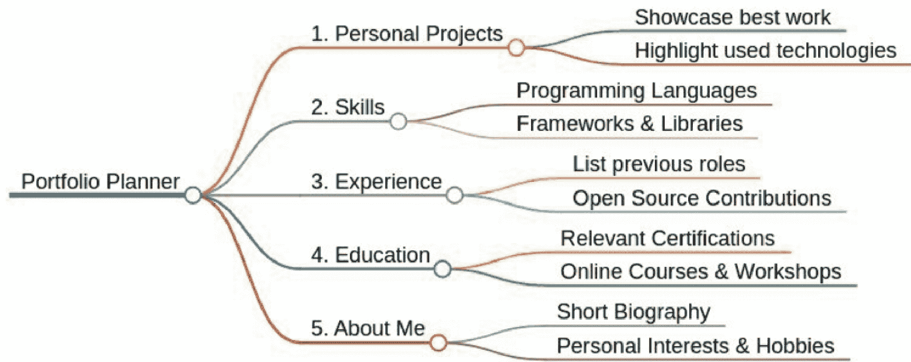

**个人项目：** 通过描述你的项目和技术来展示你的创造力和解决问题的能力。

**技能：** 列出你的技术技能，按熟练程度和与项目的相关性分类。

**经验：** 详细说明相关的工作经验、实习或自由职业项目，突出你的贡献。

**教育背景：** 包括你的学位、专业/辅修、课程和认证。

**关于我：** 介绍你自己，分享你对编程的热情、职业目标以及你在科技领域的动力。

### 关键要点：

- Python 是一个通用且强大的工具，拥有无限的可能性。
- 练习和坚持对于掌握 Python 和精通编程至关重要。
- 构建项目是巩固学习成果和展示技能的有效方式。
- 记住编写干净代码、遵循道德编码实践以及保持条理的重要性。

### 继续前进：

既然你已经达到了这个里程碑，请以热情和决心继续你的编程之旅。通过从事新项目、完善你的技能以及与他人分享你的知识，将所呈现的想法付诸实践。

### 结论

Python 不仅仅是一种编程语言，它更是一座机遇的灯塔，在全球范围内点燃了创造力、创新和赋能的火花。这本书是对 Python 简洁性的致敬，对其灵活性的颂扬，也是对其打破障碍、为所有人实现技术民主化这一巨大力量的认可。通过年轻开拓者和资深专家的视角，我们穿越了一片代码成为画布、想象力成为边界的风景。

踏上这段旅程，我们首先揭开在不同操作系统上安装 Python 的神秘面纱，确保进入编程世界的门槛尽可能友好。我们剖析了 Python 数据类型和操作的复杂性，奠定了一个既全面又易于理解的坚实基础。

从在任何设备上设置 Python，到解开数据类型、操作等的奥秘，我们奠定了一个既坚实又易于上手的基础。我们见证了 Python 如何充当雕刻家的凿子，在数据的巨大石块上雕刻出复杂的图案，并通过比语言更有力的可视化效果，将原始数字转化为引人入胜的故事。每一张图表、图形和绘图，都诞生了新的见解，这些见解由 Matplotlib、Seaborn、Plotly 和 Bokeh 等库中强大的工具精心打造。

我们穿越 Python 多领域版图的探险——通过 Flask 和 Django 等开发框架驰骋于广阔的网络世界，通过自动化简化日常事务，利用 TensorFlow 和 PyTorch 揭开人工智能和机器学习的复杂面纱，以及加固我们的数字领域以抵御网络威胁——这一切都证明了 Python 动态的适应性。

这段旅程中的每一章都揭示了 Python 变色龙般的特性，展示了它在我们数字时代不断变化的范式中无缝集成和进化的能力。TensorFlow 为算法思想注入生命、Django 构建虚拟领域、Python 脚本充当守护我们网络圣殿的警惕哨兵的故事，共同强调了一个单一的真理：Python 是未来的语言，而未来已在此刻。

当我们的道路蜿蜒至终点时，我们被提醒，精通并非来自最终的目的地，而是来自旅程本身。一个从 humble beginnings 崛起、用 Python 进行创新的年轻程序员的故事，是编程变革力量的证明。他们的成功不仅在于编写的代码，更在于他们打破的障碍。

所以，亲爱的读者，火炬已传递到你手中。继续编程，不是将其视为一项任务，而是作为一段发现的旅程。让你编写的每一行代码都成为迈向精通的一步。构建、分享、激发灵感，让创造力和学习的循环永不停歇地旋转。当你勇往直前，用 Python 开辟自己的道路时，请记得分享你的故事，因为它可能为其他刚刚踏上旅程的人照亮前路。

但正如任何史诗传奇，其精髓不在于终点，而在于旅程本身。我们的叙事弧线——从初学者睁大双眼仰望编程的星空，到成为数字宇宙的架构师——展现了当我们与Python相遇时所发生的深刻蜕变。这位年轻的编码者，曾经只是这门艺术的学徒，如今已成为创新的灯塔，提醒着我们重塑世界的潜能蕴藏于每个人心中。

因此，当我们合上这本书时，愿它不是终点，而是标志着你征程开始的灯塔。编码是一段发现之旅，是对技术与想象力无垠边疆的探索。愿你写下的每一行代码都成为你旅程的见证，成为你成就丰碑的基石。请分享你的故事，因为在分享中，我们拓展了集体旅程的版图，为后来者指引方向。

如果这本指南曾是你穿越Python宇宙的星图，照亮你的道路并激励你超越自我，那么我恳请你在宇宙的记录中留下一颗星，用你的评论来分享。分享你旅程的故事，你发现的奇迹，以及你敢于梦想的梦想。

让我们共同确保好奇的火焰与求知的渴望永远燃烧得更加明亮，为未来纪元中将穿越这些星辰的冒险者们照亮宇宙。

继续编码吧，因为在浩瀚的数字宇宙中，你的旅程才刚刚开始。愿你在Python领域的道路永远向上，永远向前，永远充满无限精彩。

### 参考资料

- https://blog.ktbyte.com/successful-programmers-started-coding-at-a-young-age/
- https://www.python.org/downloads/macos/
- https://kinsta.com/knowledgebase/install-python/
- https://www.geeksforgeeks.org/data-visualisation-in-python-using-matplotlib-and-seaborn/
- https://medium.com/@jsonmez/why-learn-python-61621ce49010
- https://www.stationx.net/python-for-cyber-security/
- http://crufti.com/program-all-the-things-how-to-develop-iot-devices-using-micropython/
- https://realpython.com/micropython/
- https://realpython.com/pytest-python-testing/
- https://www.smartparenting.com.ph/parenting/tweens-teens/two-grade-8-students-create-their-own-video-games-a00391-20220818-lfrm
- https://www.dataquest.io/blog/python-projects-for-beginners/
- https://www.freecodecamp.org/news/python-projects-for-beginners/
- https://www.linkedin.com/pulse/importance-code-quality-why-clean-matters-addant-systems/
- https://www.workast.com/blog/9-must-know-hacks-for-effective-project-management-in-2023/
- https://www.myhatchpad.com/insight/the-ultimate-guide-to-building-a-coding-portfolio/
- https://anywhere.epam.com/en/blog/programmer-portfolio