# Python 实践实验室

通过交互式示例学习编程


Angelica Lim • Victor Cheung

# Python 实践实验室


# Python 实践实验室

通过交互式示例学习编程

Angelica Lim · Victor Cheung


普林斯顿大学出版社
普林斯顿与牛津

版权所有 © 2026 普林斯顿大学出版社

普林斯顿大学出版社致力于保护我们作者所托付的版权和知识产权。版权促进人类所创造知识的进步与完整性。通过使用本作品的授权副本，您正在支持创作者和全球思想交流。由于本作品受版权保护，任何形式的复制或分发均需获得许可；许可请求应发送至 permissions@press.princeton.edu。严禁出于任何人工智能目的使用任何知识产权。

由普林斯顿大学出版社出版
新泽西州普林斯顿市威廉街41号，邮编08540
牛津班伯里路99号，邮编OX2 6JX

press.princeton.edu

GPSR 授权代表：Easy Access System Europe - Mustamäe tee 50, 10621 Tallinn, Estonia, gpsr.requests@easproject.com

保留所有权利

ISBN (平装) 978-0-691-24360-3
ISBN (epub) 978-0-691-28262-6
ISBN (PDF) 978-0-691-24363-4
美国国会图书馆控制号：2025948509

英国图书馆编目出版数据可查

编辑：Hallie Stebbins 和 Chloe Coy
制作编辑：Karen Carter
文本与封面设计：Wanda España
制作：Erin Suydam
宣传：William Pagdatoon

封面图片来源：Danil Cetvericov / Alamy Stock Vector

本书使用 Times New Roman 和 Halyard Display 字体排版

印刷于美国

10 9 8 7 6 5 4 3 2 1


# 目录

前言 ix
指导原则 xiii

## 1 计算机科学导论 1

- 1.1 欢迎来到计算机科学！ 1
  - 1.1.1 学习成果 3
  - 1.1.2 外星人解释 3
  - 1.1.3 编写和运行你的程序 4
  - 1.1.4 励志名言生成器 5
  - 1.1.5 复习题 6
  - 1.1.6 练习 7
  - 1.1.7 术语表 7

## 2 聊天机器人 9

- 2.1 有个性的聊天机器人 10
  - 2.1.1 学习成果 11
  - 2.1.2 问候聊天机器人 12
  - 2.1.3 “最近怎么样”机器人 18
  - 2.1.4 星座运势机器人 22
  - 2.1.5 复习题 26
  - 2.1.6 练习 27
  - 2.1.7 术语表 28
- 2.2 带循环的聊天机器人 29
  - 2.2.1 学习成果 29
  - 2.2.2 一个健壮的机器人 30
  - 2.2.3 美食机器人 32
  - 2.2.4 加拿大的度量衡 34
  - 2.2.5 珍珠奶茶菜单 36
  - 2.2.6 读心术游戏 38
  - 2.2.7 复习题 42
  - 2.2.8 练习 43
  - 2.2.9 术语表 44

## 3 推荐系统

- 3.1 人气竞赛 46
  - 3.1.1 学习成果 46
  - 3.1.2 热门咖啡馆查找器 46
  - 3.1.3 薯片评分器 50
  - 3.1.4 电影评分器 52
  - 3.1.5 复习题 54
  - 3.1.6 练习 56
  - 3.1.7 术语表 57
- 3.2 寻找你的匹配 57
  - 3.2.1 学习成果 57
  - 3.2.2 数据文件 58
  - 3.2.3 最喜欢的宠物 59
  - 3.2.4 相似度分数 65
  - 3.2.5 谁与你最相似？ 66
  - 3.2.6 复习题 68
  - 3.2.7 练习 70
  - 3.2.8 术语表 71

## 4 图形与计算机视觉

- 4.1 交互式绘图 73
  - 4.1.1 学习成果 73
  - 4.1.2 基本海龟命令 73
  - 4.1.3 使用海龟进行交互式绘图 74
  - 4.1.4 饼干绘制器 76
  - 4.1.5 复习题 79
- 4.2 图像处理 81
  - 4.2.1 学习成果 81
  - 4.2.2 是绿色吗？ 82
  - 4.2.3 图像魔法 91
  - 4.2.4 酷炫色彩模块 96
  - 4.2.5 复习题 100
  - 4.2.6 练习 101
- 4.3 绘制树木
  - 4.3.1 学习成果
  - 4.3.2 递归简介
  - 4.3.3 再探递归
  - 4.3.4 复习题
  - 4.3.5 练习

## 5 互联网与大数据

- 5.1 搜索
  - 5.1.1 学习成果
  - 5.1.2 线性搜索
  - 5.1.3 二分搜索
  - 5.1.4 复习题
  - 5.1.5 练习
- 5.2 排序
  - 5.2.1 学习成果
  - 5.2.2 选择排序
  - 5.2.3 归并排序
  - 5.2.4 复习题
  - 5.2.5 练习
- 5.3 映射、过滤、归约
  - 5.3.1 学习成果
  - 5.3.2 复习题
  - 5.3.3 练习

## 6 专家项目

- 6.1 视听语言学习聊天机器人
- 6.2 交互式图像处理器

索引


# 前言

交互式聊天机器人正在席卷全球！你是否对创建交互式程序感兴趣，但不知从何入手？你是否没有编程背景，想要一个有趣的计算机科学入门？或者，你可能是一位老师，正在寻找一个结构化的课程来涵盖计算机科学的各个领域，同时保持示例对学生来说既有趣又新鲜？

在本书中，你将通过编写模拟交互式聊天机器人的 Python 程序来学习基础编程。虽然这本入门书籍*并非*关于如何编写高级人工智能，但你将在学习人工智能概念（如推荐系统、计算机视觉和大数据）的同时，获得基础编码所需的技能。

本练习册中介绍的课程已在加拿大不列颠哥伦比亚省的西蒙弗雷泽大学作为计算机科学和编程入门课程教授给超过一千名学生，包括计算机科学专业的学生和非专业的学生。该课程旨在通过现实生活中的情境进行教学，并为学生提供创造性思维的机会。回顾这门课程，一位学生分享道：

> > 虽然我从高中起就对编程感兴趣，但总是因为害怕而不敢尝试。我真的很高兴最终选修了这门课，因为我发现我对编程和解决问题的喜爱超出了我的预期。整个学期我都乐在其中，今年夏天我将选修更多的计算机科学课程——希望我能辅修这个专业！

我们希望这本书能激发你同样的热情，去更深入地理解和欣赏计算机科学！

# 什么是聊天机器人？

在本书中，我们使用“聊天机器人”一词来描述使用文本作为输入和输出的交互式程序。具体来说，这些程序与用户进行对话，并拥有基于文本的界面，类似于消息应用程序。你将开发这些交互式程序，你的朋友和你可以尝试使用！

# 这本书有何不同？

本练习册旨在引人入胜、注重实践并以示例驱动，帮助你成为一名自信的程序员。与我们的主题——交互式聊天机器人——一致，自然语言和文本字符串被早期用作学习程序结构的主要构建块，而不是数学。这种方法展示了计算机科学在许多不同领域和学科中的应用。此外，传统上包含简洁、单字母变量的代码理解练习，被重写为具有包容性和易于理解的变量名的等效代码。在每一章中，读者都被要求根据主题和提供的示例编写一个完整的程序。最后，本书末尾提供了一系列项目，以整合所有章节中学到的概念。

读完本书后，你将精通传统的入门算法，并能熟练使用 Python 3 进行编程。本工具包的学习成果大致相当于《像计算机科学家一样思考》（第1-12章，第15章）(https://runestone.academy/ns/books/published/thinkcspy/index.html)。

# 这本书适合我吗？

本练习册的受众包括：

- 任何想通过编写有趣、可运行且逐渐变得复杂的程序来学习编程的人；
- 教授初学者 Python 的教师，他们需要课堂上的激励性示例和练习；以及
- 希望拥有教师所教示例的参考，并希望构建完整且功能齐全的程序的学生。

# 这本书不是什么？

本书不是一本独立的计算机科学教科书。它是一本实践练习册，通过示例和练习，涵盖了入门计算机科学所需的所有基本概念，而不会因单个主题背后的细节（例如，变量在内存中如何表示？什么是模块？）而使读者负担过重。本练习册链接了额外的解释和练习，以练习特定技能，作为本练习册的补充资源。

# 路线图

以下是本书内容的简要指南。第1章至第4.2章侧重于学习 Python 3 编程的基础知识，而第4.3章至第6章则介绍了经典算法和实践项目，以加深你对计算机科学的理解。

第1章“入门”解释了算法的概念，并让你开始运行你的第一个“Hello, World”程序。

第2章“聊天机器人”通过逐步构建越来越先进的程序（我们称之为“机器人”）来介绍广泛的概念。第2.1章侧重于字符串数据类型以及你可以用它做的许多事情：将其赋值给变量、连接它、

## 第2.2章介绍了for循环和整数，同时建立在先前知识的基础上，例如字符串方法和嵌套条件语句。

第3章“推荐系统”继续建立在第2章的基础上，进一步扩展了数据类型、数字操作（包括浮点数）、除法运算符、累加器以及使用索引的列表。它还通过引入嵌套循环并使用它们来访问文件，更深入地探索了循环。最后，本章介绍了字典。

第4章“图形与计算机视觉”介绍了while循环，通过定义你自己的函数和模块来扩展你对函数的理解。本章解释了二维数组和使用RGB图像的颜色表示。一个简单的Python课程可以在这里结束，但我们以递归的介绍来结束本章，这是计算机科学领域的一个重要概念。

第5章“互联网与大数据”假设你现在已掌握了Python编程的基础知识。它对经典的计算机科学排序和搜索算法，以及现代的列表处理算法（如map、filter和reduce）进行了基本介绍。

最后，第6章“专家项目”提供了一些示例应用，你可以利用从本书中学到的知识来构建它们。

## 深化你的理解

你的学习不会止步于此！通过复习并尝试我们配套网站 https://press.princeton.edu/books/paperback/9780691243603/python-practice-lab 上链接的活动来深化你对这些主题的理解。这些活动也在此列出以供参考：

### 第1章（摘自《像计算机科学家一样思考》）：
- 第1章：通用介绍

### 第2.1章（摘自《像计算机科学家一样思考》）：
- 第2章：简单的Python数据
- 第5章：Python模块
- 第7章：选择
- 第9.3节：字符串操作
- 第10.2节：列表值

### 第2.2章（摘自《像计算机科学家一样思考》）：
- 第1.7至1.9节：不同类型的错误
- 第9.5节 - 字符串方法
- 第9.13节 - `in`和`not in`运算符
- 第10.5节 - 列表成员关系
- 第4.4和4.5节 – for循环

### 第3.1章（摘自《像计算机科学家一样思考》）：
- 第2章 - 简单的Python数据（复习）
- 第4.4至4.7节 - for循环和带range函数的for循环（除turtle示例外）
- 第6.5.1节 - 累加模式
- 第9.5节 - 字符串方法
- 第9.13节 - `in`和`not in`运算符
- 第10.3至10.5节 - 列表长度到列表成员关系
- 第10.18节 - 累加器模式

### 第3.2章（摘自《像计算机科学家一样思考》）：
- 第10.1至10.8节 - 列表
- 第11.1至11.6节 - 文件

### 第4.1章（摘自《像计算机科学家一样思考》）：
- 第4.1至4.3节和第4.6至4.9节 - Python Turtle和Range函数
- 第6.1、6.4和6.11节 - 文件

### 第4.2章（摘自《像计算机科学家一样思考》）：
- 第6.2、6.5、6.6和6.7节 - 文件
- 第8.3至8.8节和8.11节 - 二维迭代：图像处理。注意：这个关于图像处理的在线参考资料对理论有帮助，但与我们本书中使用的（作为`csimage`模块提供）略有不同。

### 第4.3章（摘自《像计算机科学家一样思考》）：
- 第6.1节 - 什么是递归？
- 第6.3节 - 递归三定律
- 第6.5节 - 可视化递归
- 第6.6节 - 谢尔宾斯基三角形

### 第5.1章（摘自《使用Python的算法与数据结构问题解决》）：
- 第6.2节 - 搜索
- 第6.3节 - 线性搜索
- 第6.4节 - 二分搜索

### 第5.2章（摘自《使用Python的算法与数据结构问题解决》）：
- 第6.6节 - 排序
- 第6.8节 - 选择排序
- 第6.11节 - 归并排序

### 第5.3章（摘自MIT的软件构造课程（重点关注Python笔记，忽略lambda示例）：
- Map
- 函数作为值
- Filter
- Reduce

## 指导原则

这本书与那些采用传统方法学习计算机科学（CS）的书略有不同。它使用以下理念来教授计算机科学和编程。

- **与外语学习进行类比。** 我们承认计算机科学起初可能感觉很难，因为学习任何新语言，如中文或法语，都需要时间和练习。但一旦你变得流利，你就可以在脑海中将英语翻译出来，并与新朋友——计算机交流！
- **从第一天起就编写有用的代码。** 我们的方法在每一课中都以有用、端到端的程序来探索概念。你不必知道所有东西才能编写程序——我们将从你第一天就能编写的简单程序开始，并在此基础上构建更复杂的程序。
- **一次介绍一两个概念，并置于上下文中。** 示例程序经过精心设计，这样你就不会一次被多个概念压垮。就像学习一门自然语言一样，新概念被嵌入到真实的程序和情境中介绍，而不是孤立地介绍。
- **用英语设计算法。** 思考解决方案并将其转化为代码是两个不同的过程，尤其是在开始时。我们建议你先用英语设计算法流程，然后将其翻译成Python。
- **首先处理字符串。** 我们通过首先探索字符串（构成单词和句子的字符序列）及其所有可能性（条件语句、循环等）来减少认知负荷。这使你能够尽早编写有用且实用的程序，稍后再增加多种数据类型的复杂性。
- **创造性地构建。** 练习是开放式的，而不是寻找一个正确答案。我们从一开始就强化编程是一项创造性工作的理念。
- **与他人分享代码。** 我们让构建程序并与朋友和家人分享成为一件乐事。我们使用像online-python.com或trinket.io这样的在线编码空间，这样你就可以为自己的作品感到自豪，并让其他人来尝试！
- **注重流利度。** 我们的最终目标是帮助你成为一名流利的编码者。我们提供练习题，要求你从头开始编写完整的程序。
- **编写美观、易懂的代码。** 晦涩、复杂的代码常用于理解测试，但我们强调专业人员编写的实际代码具有高度可读性，并使用描述性的变量名。变量不再局限于i、j和k！
- **展示计算机科学领域。** 你将通过探索计算机科学当代领域的单元来学习编码，例如计算机视觉、自然语言处理和推荐系统。

## 如何使用本书

这本练习册旨在作为一本示例驱动的书籍，指导你学习计算机科学和Python编程中的概念。每个章节单元都以一个场景和一个示例交互式程序开始，然后是实现该程序所需的相关主题列表。随着章节的进展，会提供每个主题的详细信息和解释。在每章末尾，包含额外的练习以巩固这些主题。

我们建议根据你的身份以不同方式使用这本练习册。

## 如果你是自主学习者或学生……

如果你以前从未编码过，并想将本书作为学习指南，那么你来对地方了！通读每一章和程序列表，并尝试在你的Python解释器中运行示例程序。重新输入本书中的代码将帮助你学习和练习，所以不要跳过这一步！你还将能够运行交互式程序并修改它们，我们有时会要求你这样做。接下来，在每个小节之后，检查前言——“深化你的理解”中的外部资源列表，其中链接到在线资源和练习题以巩固你的学习。最后，通过完成练习编码测试来检验你对主题的掌握程度，每个练习都会创建一个小型聊天机器人。专注于从头开始编写要求的程序，然后与你的家人和朋友分享以供测试和玩耍！

## 如果你是教师……

使用这些场景作为激发性示例来吸引你的学生并驱动主题。从我们的配套网站下载幻灯片和代码（并随意根据你的班级进行调整），并在课堂上使用时间来挑战你的学生进行练习。引导你的学生查阅额外的阅读材料，以获取与每章相关的进一步解释和练习。

# Python 实践实验室


# 计算机科学导论

恭喜你迈出了计算机科学的第一步！
在本单元中，你将学习计算机科学（CS）是什么，它从何而来，并开始了解其工作原理。我们将为你设置后续章节中将使用的工具，帮助你在本书结束时成为一名熟练的计算机科学家。
本章涵盖的计算机科学主题：

- 算法
- 注释
- 输出

# 1.1 欢迎来到计算机科学！

# 计算机科学就是解决问题

如果你喜欢解决问题，那么你来对地方了！在计算机科学中，我们通过设计和开发两个组成部分来解决问题：

- **算法**，这是一种思维方式
- **代码**，这是一种交流方式

在本书中，我们将用英语设计算法，然后将其翻译成 Python 编程语言。这将使我们能够与计算机交流以解决问题。

# 什么是算法？

算法就是完成一项任务所需遵循的一系列步骤。例如，饼干食谱就是算法。它们以原料作为输入，并有一系列步骤来产生非常美味的输出：饼干！另一个例子是宜家家具的说明书。如果你能写出清晰、分步的说明（例如，如何组装一把椅子），那么你作为计算机科学家就具有巨大的潜力！

算法也可以针对不同的目标进行**优化**。你可能希望设计出能以最快速度完成任务的说明，或者以简单的方式完成，或者最小化所需的空间。例如，在我们的饼干食谱示例中，一些食谱标题可能是“15分钟巧克力曲奇”（快速）、“简易巧克力曲奇”（简单）或“一碗巧克力曲奇”（最小化空间），针对不同的需求进行优化。通常有多种食谱或算法可以达到类似的结果。

# 什么是编程语言？

计算机是我们快速进行数值运算以解决问题的工具。为了与计算机交流，我们需要使用它能理解的语言。编程语言被开发为一种人类和计算机都能解释和理解的通用语言。

Python、Java 和 C++ 是一些编程语言的名称。就像英语、日语、法语和其他自然语言一样，它们用于交流意义，并且各自有不同的语法、句法和词汇。

我们说一些编程语言，如 Python 和 JavaScript，是**解释型**语言，而 C、C++ 和 Java 是**编译型**语言。编译是什么意思？当你运行一个程序时，你对计算机的指令会从人类可读的语言（如 Python 或 C++）翻译成 0 和 1，这是计算机可以理解的数字信号。

翻译可以通过两种方式进行：逐行翻译或批量翻译。为了更好地理解这一点，想象一下在联合国。有专业的翻译人员坐在每位外交官旁边，实时翻译所说的一切。这些翻译人员被称为**口译员**。在同一次会议上，每张桌子上可能都有厚厚的文件堆，这些文件在会议前已经被**编译**成大型翻译报告。

同样，Python 是一种**解释型**语言，因为计算机上的 Python 解释器会在程序运行时实时地、动态地将每一行代码翻译成机器代码。而对于 C++，整个程序在运行之前会完全**编译**成机器代码。

> 既然你已经了解了解释型和编译型编程语言的区别，你能为每种类型列出两个编程语言的例子吗？

# 什么是编程？

一旦我们心中有了大致的算法设计，并选择了一种编程语言，我们就可以开始编程了！编程本身是一个将大型、复杂的任务分解成计算机可识别的较小子任务和结构的过程。

常见的编程结构包括：

- 输入
- 输出
- 条件
- 循环
- 数学或逻辑

我们将在接下来的章节中探讨所有这些内容！

> **你知道吗？** 第一位程序员是一位名叫阿达·洛芙莱斯夫人的英国数学家。1842年，她为查尔斯·巴贝奇的分析机（1837年）编写了第一个计算机程序。她的第一个程序计算了伯努利数，但她也设想了一个未来，她所处理的数字可以代表不仅仅是数字。她相信任何由数字表示的数据都可以由像分析机这样的机器来处理，以创作音乐、创建图像或进行科学研究。今天，有了我们现代的计算机，我们知道她是对的！

# 1.1.1 学习成果

在本单元结束时，你将能够……

- 编写 Python 注释
- 解释什么是伪代码
- 描述算法的主要特征
- 举一个通过将任务细分为子任务来解决问题的例子
- 编写程序头块（即包含作者、日期和代码用途等信息的初始注释）
- 使用 print() 输出 Hello World

# 1.1.2 外星人解释

你喜欢科幻小说吗？在本节中，我们将通过一个起初可能显得奇怪甚至怪异的例子来加深对算法的理解。一切很快就会变得清晰！
想象有一天，地球被来自另一个星球的外星人造访。你被选中与这个对外星人一无所知的外星人交流。你遇到了这个外星人，它滑稽地看起来就像一只戴着太空头盔的豌豆绿色章鱼。幸运的是，这个外星人恰好会说英语。它说的第一件事是：“我想了解人类物种。请告诉我一些关于你作为人类的日常生活的事情。”
你回答说：“嗯，我们每天都会做一件事。我们刷牙！”
外星人回答说：“请，人类，解释一下‘刷牙’。”

**练习**
向外星人解释“刷牙”的过程。你可以向附近扮演外星人的另一个人解释（尽可能好奇！），或者把解释写出来。

**总结**
首先，解释一些对我们来说如此简单的事情并不容易！你可能已经包含了涉及的工具或输入：一只手、一把牙刷……还有什么？牙膏？嘴巴？涉及许多组成部分。对于一个没有牙齿甚至没有手的外星人来说，这需要耐心和详细的解释。
其次，你的解释是什么样子的？它是一个带编号的步骤列表吗？它有多详细？你是否包含了诸如刷牙应该持续多久，或者你需要多少牙膏之类的方面？你的步骤越清晰，就越接近算法思维。

剧透警告：你的计算机就像这个外星人！它对人类世界一无所知。因此，我们需要对它有耐心，并非常清楚地解释我们的算法。幸运的是，为了与我们的计算机交流，我们有 Python 这种通用语言，我们将在本书中学习它。一旦我们学会了如何用 Python 清晰地交流，我们就可以让计算机做我们想做的事情！

# 1.1.3 编写和运行你的程序

在整本书中，你会看到很多以下内容：

```
1 print("Hello World!")
```

这些是代码示例，你可以复制并粘贴到 Python 解释器中自己尝试，或者通过修改它来进行实验（左边的数字是行号；你不需要在代码中写它）。你可以使用两种主要类型的带有 Python 解释器的编码环境。

# 在线编码环境

在线编码环境是网站，它们为你提供一个工作区，让你在互联网浏览器窗口中编写和运行程序。根据服务提供商的不同，有些提供将代码保存在用户帐户下和/或直接保存到你的计算机上的功能。有些还提供具有更多功能的订阅计划。以下是我们发现非常有用且在一些最常见操作系统（即 Windows、macOS、Linux）上可用的几个。

**Online Python** (https://www.online-python.com) 是一个基于浏览器的 Python 集成开发环境（IDE）。你可以将你的作品下载为 .py 或 .zip 文件，也可以上传文本文件。你不需要创建帐户即可使用其服务，但它有一些限制，例如无法上传图片。一个很棒的功能是，一旦你创建了一个程序，你就可以与你的朋友和家人分享它的链接。Online Python 是一个简单但好用的 IDE。

**Trinket** (https://trinket.io) 是另一个基于浏览器的 IDE，允许你在其在线平台上编写、运行和分享你的程序。它还包括一些课程，供用户学习编程，并提供其他一些编程方式（通过积木块）。它的功能比下面描述的离线编码环境少，但仍然运行良好。你需要注册一个免费帐户（有一些限制）才能使用其服务。

**Programiz** (https://www.programiz.com/) 是一个学习平台，提供各种编程语言（包括 Python）的免费和付费课程。与 Trinket 类似，它包含一个免费的在线编译器，让你无需注册即可编写、运行和分享你的代码。除了编程语言，它还提供数据结构和算法课程，如果你对计算机科学感兴趣，这些是重要的下一步。

# 离线编码环境

在线编码环境的一个明显缺点是你必须保持互联网连接才能使用它们。如果你想在你的

## 1.1.3 选择编程环境

如果你有一台无法连接互联网的电脑，安装离线应用程序是可行的方法。请注意，本书使用的是 Python 3。

**Python IDLE** (https://www.python.org/downloads) 来自 Python 语言的官方创建者。它虽然简单，但包含了用 Python 开发程序所需的一切。当你下载并安装某个 Python 版本时，它会同时安装解释器和一个名为 IDLE（集成开发与学习环境）的应用程序。安装完成后，你可以启动 IDLE，并使用顶部菜单来编写和运行你的程序。

**Mu** (https://codewith.mu) 是一个为编程初学者创建的 Python IDE。它包含了一些其他 IDE 可能需要单独安装的有用模块（例如 pygame），因此你可以快速开始，无需担心下载额外模块。其理念是尽量减少设置和下载，以便初学者在安装应用程序后就能立即开始。该应用程序还提供了一些有用的功能，供初学者自定义编辑器和检查代码。

**PyCharm** (https://www.jetbrains.com/pycharm) 是一个功能齐全的 Python 开发 IDE。它拥有许多开发工具，例如实时代码分析、图形调试器、单元测试器和版本控制（如果你不知道这些是什么，也完全没关系），这些对于较大规模的项目非常有用，但对初学者来说可能有些多余。有两个版本可供下载：付费的专业版（支持其他语言）和免费的社区版，后者在大多数情况下已经足够使用。

## 总结

还有一些我们未涉及的其他编程环境和工具，而且我们已介绍的工具也可能随时间变化。因此，选择使用哪一个取决于你自己。然而，无论你选择使用哪种编程环境和工具，核心理念都是一样的：规划你的算法，编写代码，运行它，并不断改进——这就是学习编程的方式。

## 1.1.4 励志名言生成器

太棒了！你已经来到了本书的第一个编程示例！在许多书中，你看到的第一个编程示例通常是“Hello World”程序。但让我们在这里做点不同的事情。

> “Hello World!” 是计算机科学家和程序员之间的一个内部笑话，因为这通常是他们学习一门编程语言时编写的第一个程序。Hello World 程序通过正确显示一条简单的问候语来展示该语言的基本语法。

我们都需要时不时地获得一些智慧或鼓励的话语——这就是为什么人们喜欢打开幸运饼干，或者张贴带有励志短语的海报。在本节中，让我们编写一个励志名言生成器程序，它可以向用户说一些激励人心、富有智慧或有趣的话（如果你喜欢的话）。

**谁是用户？** 程序员构建应用程序供人们使用。使用你应用程序的人被称为用户。

```python
### 励志名言生成器
# 作者：
# 日期：

print("If you can dream it, you can do it.")
```

在上面的代码示例中，让我们识别程序的几个重要部分：

- 第 1-3 行是**注释**，计算机不会解释或运行它们。相反，它们的目的是为阅读或编写代码的人提供有关代码的有用信息。在 Python 中，每行注释都以 # 符号开头。在本书中，我们将文件顶部的注释（通常包含标题、作者和日期等信息）称为**文件头**。
- 第 4 行是一个空行，计算机会忽略它。它的存在是为了在视觉上分隔代码，使代码更易于人类阅读。你可以根据需要使用任意多的空行，但最好有目的地、一致地使用它们。
- 第 5 行是计算机执行的代码。它代表一个单一的命令：向屏幕**打印**一个句子。尝试用其他词语（甚至是用逗号分隔的字符串和数字的组合）替换示例代码中的句子。句子必须用引号括起来。如果你想打印引号本身，必须在它前面加上一个反斜杠，像这样：`print("As they say, \"Practice makes perfect!\"")`。

> 注释是代码的重要组成部分。除了文件头，我们使用注释来解释代码、留下笔记和提供文档。如果你想写多行注释，可以使用**多行文档字符串**，即用三个双引号 `"""` 将这些行括起来。

## 1.1.5 复习题

是时候测试一下你对本章内容的理解程度了！如果需要，请随时回顾。

## 理论与理解

- 在这本练习册中，我们将学习计算机科学的哪两个组成部分？
- 算法的一个例子是什么？
- 我们在本书中将使用的编程语言叫什么名字？它是解释型的还是编译型的？
- 我们可以在哪里在线练习编程？离线呢？
- 程序的文件头包含什么？
- 学习一门编程语言与学习一门自然语言有什么共同点？

### 语法自测

以下函数和关键字是什么意思？

- `print("Hello, World")`
- `print("I have", 1)`
- `#`
- `"a string"`
- `"""
  a multiline string
  another line
  """`

## 1.1.6 练习

### 编程

现在轮到你通过编写一些代码来练习了。完成后，你可以访问我们配套网站上的“解答”部分，将你的答案与我们的进行比较。请注意，同一个问题可能有多种答案，所以如果你的代码与我们的不完全相同，也不必担心。目前，重要的是你的代码能产生你预期的结果。

### 显示句子

编写一行代码，将以下句子输出到屏幕：

```
Dr. Evil: Back in the 60's, we developed a sophisticated heat beam we called a "laser".
```

### 励志名言生成器

编写你自己的 Python 程序来显示一句励志名言。以一个包含你想要的标题、你的名字和日期的文件头开始。然后根据我们之前展示的示例代码，将名言替换为你选择的一句。使用“运行”按钮确保它按预期打印在屏幕上。

## 1.1.7 术语表

- **代码（又称源代码）**，编写计算机程序时使用的词汇。代码有不同的种类/层次，包括伪代码（人类易于阅读）、编程代码（遵循特定语言的规则）和机器代码（计算机能理解，但通常人类无法理解）。
- **伪代码**，用自然语言编写的代码，以便人类阅读。伪代码通常遵循一些结构约定，如换行和缩进，以指示执行顺序。它使用一些标准关键字（如 repeat 和 if-then）和符号（如 + 和 :=）来表示编程逻辑，但省略了特定于语言的细节，如变量声明。许多算法都以这种形式编写，以便计算机科学家能够快速交流他们的想法，而不必拘泥于特定的编程语言。
- **编程**，将一个大型、复杂的任务分解成越来越小的任务，直到它们足够简单，可以用基本构造（包括输入/输出、循环、条件和逻辑）的序列来执行，并使用代码编写它们的过程。
- **算法**，完成一项任务或解决一个问题的逐步指令列表。通常有许多不同的方法来完成同一任务或解决同一问题，每个步骤越清晰越好（有多种方法可以使算法更好，例如更快或需要更少的空间）。
- **文件头**，位于代码之前的一块注释，提供有关程序的一些信息。它包括作者姓名、创建和修改日期以及程序的高级描述。
- **注释**，与代码相邻的特殊部分，用自然英语编写，解释该代码的作用。它是供人类读者理解代码的，并通过特殊符号（Python 中是 #）表示，以便计算机在执行代码时忽略它。它可以是一个句子或一个短段落。
- **解释**，计算机执行源代码的过程。对于解释型编程语言，源代码在执行期间直接翻译成机器代码。Python 和 JavaScript 就是例子。
- **编译**，计算机执行源代码的另一种过程，其中源代码首先被翻译成机器/目标代码（又称编译代码），然后执行。C/C++ 和 Java 是编译型编程语言的例子。

## 聊天机器人

许多现代计算机应用程序支持计算机与用户之间的某种形式的交互，甚至是对话。在这里，你将学习如何在Python中创建交互式聊天机器人应用程序。

在本单元中，你将通过一些练习来学习编程的基础知识，这些练习主要围绕类似亚马逊Alexa或苹果Siri这样的交互式聊天机器人展开。你将编写的聊天机器人程序包括：

- 问候聊天机器人
- 星座机器人
- 幸运饼干生成器
- 美食机器人
- 读心术游戏
- 新年机器人
- 星球大战机器人

ChatGPT和其他近期的“大型语言模型”聊天机器人由在海量数据上训练的神经网络驱动，不一定像你将在这里学习的方式那样进行手工编程。但是，早期的聊天机器人编程方式与你将在本章探索的方式类似，而Python是人工智能开发中事实上的标准编程语言。通过用Python编写这些聊天机器人程序，你将学习如何向屏幕输出、创建列表、处理文本以及根据条件改变输出。

本单元的计算机科学主题：

- 变量
- 字符串连接
- 输入
- 列表
- random模块
- 条件语句
- 布尔语句和表达式
- 错误类型
- 程序的健壮性
- 字符串方法
- in关键字
- 函数链
- for循环
- 从输入创建列表

## 2.1 有个性的聊天机器人

在本单元中，你将学习如何构建可以与之交流的基本交互式聊天机器人！这里有一个例子：

你也可以自己尝试示例代码：

```python
# Your age in 2049 bot
# Author:
# Date:
# Description: This bot will ask you
# what year it is in and how old you
# currently are, then it'll tell you
# your age in 2049

# Ask user what year it is in
print("What year are we in?")

# Get the user's reply
currentYear = input()

# Ask user what age they currently are
print("How old are you currently?")

# Get the user's reply
userAge = input()

# Calculate how old the user will be in 2049
yearsAhead = 2049 - int(currentYear)
userFutureAge = int(userAge) + yearsAhead

# Tell the user how old they will be in 2049
print("You will be", userFutureAge, "years old in 2049!")
```

运行这个程序时会发生一些有趣的事情：

- 它向用户提出两个问题并获取答案
- 它将用户输入转换为可用于计算的值
- 它执行一些计算并打印结果

你可能已经注意到，当用户提供不同的答案时，程序会打印不同的结果。那么，程序是否可能根据用户在2049年的年龄说出一些合适的话呢？答案是肯定的，你将在本单元中了解如何实现。

### 2.1.1 学习成果

在本单元结束时，你将能够……

#### 设计和规划程序

- 设计/规划一个算法，例如，使用注释或伪代码
- 应用一些常见的问题解决策略，例如将问题分解成更小的部分

#### 控制台输入和输出

- 在Python中从终端获取输入到变量
- 从终端接收输入而不将其保存到变量

#### 变量和数据类型

- 使用=为变量赋值
- 阐明变量命名的约束和惯例
- 给出不同类型数据的例子，尽管目前重点是字符串

#### 字符串和列表基础

- 识别字符串数据类型，" "
- 在print语句中输出字符串变量
- 使用+连接两个字符串
- 创建一个字符串列表并使用[ ]将其赋值给一个变量

#### 条件语句

- 使用if和elif语句以及==
- 使用else子句

#### 布尔表达式、逻辑和关系运算符

- 使用逻辑运算符and、or和not
- 在条件语句中使用比较运算符如<、>和==
- 分析布尔表达式可以求值为True/False的情况
- 组合布尔表达式，例如x or y，目前仅使用字符串
- 打印布尔表达式

#### 导入模块

- 对列表使用random.choice()函数（包括import random）
- 解释模块名后的.的作用
- 理解模块包含函数
- 始终将import语句放在程序顶部，在标题之后

### 2.1.2 问候聊天机器人

让我们从创建一个问候聊天机器人开始。你认为聊天机器人在开始对话时应该说什么？也许它会说嗨或某种问候语。如果能个性化一点，说出用户的名字也不错。这意味着程序需要能够读取用户输入的文本（例如，名字）并将其存储在程序中的某个地方。

打开你的Python文件，输入以下内容。首先，从编写标题开始，包括标题、你的名字和日期。然后，通过使用注释写出算法步骤来设计你的程序。

```python
# Greetings Chatbot
# Author:
# Date:

# Say hi, what’s your name?
# Get the user’s name
# Respond nice to meet you, <name>
```

现在我们已经设计了聊天机器人的大致流程，让我们看看如何将我们的算法逐行翻译成Python。第一个注释应该很容易翻译成Python。想想你在上一章写的励志名言生成器！

```python
# Greetings Chatbot
# Author:
# Date:

# Say hi, what’s your name?
print("Hi, what’s your name?")

# Get the user’s name
# Respond nice to meet you, <name>
```

接下来，我们将学习从用户获取输入文本并将其存储到变量中的代码。如你所见，你可以使用input()函数，它允许用户向程序输入一些文本。我们创建一个名为user的变量，并使用=将输入的名字存储到其中。

```python
# Greetings Chatbot
# Author:
# Date:

# Say hi, what’s your name?
print("Hi, what’s your name?")

# Get the user’s name
user = input()

# Respond nice to meet you, <name>
```

> print()和input()都是Python中称为**函数**的元素。目前，你可以将它们视为可以用来为程序添加功能的代码片段。我们将在第4章更深入地探讨函数是什么。

最后，我们可以获取用户的名字并重复给他们听。为此，我们取字符串"Nice to meet you"并使用+将变量user的内容附加到后面。这种粘合在一起的方式称为**字符串连接**。注意，我们还需要记住在前面写一个逗号和空格。

```python
# Greetings Chatbot
# Author:
# Date:

# Say hi, what’s your name?
print("Hi, what’s your name?")

# Get the user’s name
user = input()

# Respond nice to meet you, <name>
print("Nice to meet you, " + user)
```

> 我们说“Hi, what’s your name?”是一个**字符串**数据类型。“Nice to meet you,”也是一个字符串（代码中的引号用于表示它们之间的字符构成一个字符串；引号本身不是字符串的一部分）。最后，input()函数也返回一个包含用户输入字符的**字符串**，因此变量user也包含一个字符串！

你已经创建了你的第一个交互式聊天机器人！运行整个程序并与你的聊天机器人对话来试试吧。也尝试输入不同的名字。你会注意到程序会用用户的名字来回应，并且当用户输入不同的名字时会改变。这里发生的情况是，在第9行，程序做了两件事：(1) 它等待用户输入他们的名字，然后 (2) 它将用户输入（他们的名字）存储在一个名为user的变量中。之后，在第12行，它能够使用同一个变量回忆起用户输入。这很方便，因为如果程序想在以后再次回忆用户输入，它只需通过变量名再次引用该变量即可。

现在，让我们继续对话。我们将首先设计我们的对话流程，再次使用注释。让我们询问用户他们最喜欢的书并发表评论。

## 问候聊天机器人

# 作者：
# 日期：

# 打个招呼，你叫什么名字？
print("Hi, what's your name?")

# 获取用户的名字
user = input()

# 回应很高兴见到你，<名字>
print("Nice to meet you, " + user)

# 询问你最喜欢的书是什么
# 让用户回答
# 对此发表评论

现在，你能根据我们之前看到的例子，尝试用Python完成这个程序吗？

你做得怎么样？完成这个程序的方法有很多种。也许你询问了书名，并重复了书名。另一种完成程序的方法是*不*将用户的输入存储在变量中。这里有一个例子。

```
# Greetings Chatbot
# Author:
# Date:

# Say hi, what's your name?
print("Hi, what's your name?")

# Get the user's name
user = input()

# Respond nice to meet you, <name>
print("Nice to meet you, " + user)

# Ask what your favourite book is
print("What is your favourite book?")

# Let the user respond
input()

# Make a comment about it
print("Oh nice!")
```

请注意，在上面代码的第18行，我们没有将用户的响应存储在变量中。这是因为我们决定做一个通用的响应，并且不需要在第21行使用该响应。这是完成程序的另一种方式。无论如何，我们希望你喜欢创建你的第一个交互式聊天机器人！如果你使用了任何在线编程环境，请将你的聊天机器人的链接发送给朋友，让他们试试！

> 在这里，我们介绍一个基础的计算机科学主题：**变量**。如程序示例所示，它只是程序用来存储信息片段的东西，以便稍后可以回忆和使用。变量的名称用于唯一标识一段信息（挑战：关于什么是有效的变量名有一些规则；调查一下它们是什么！）。它们被称为变量，因为程序也可以更改存储在其中的信息；因此它们的内容是*可变的*。

在进入下一节之前，让我们尝试最后一件事：删除第6行，并将问候语“Hi, what's your name?”直接放入第9行input函数的括号中，如下所示：

```
user = input("Hi, what's your name?")
```

这将第6行和第9行合并为一行，并允许用户在问题的右侧输入答案，而不是在下方。这是使用input()的另一种方式，但对于交互式聊天机器人，我们建议使用我们之前展示的第一种方式，以模拟在单独行上的来回对话，类似于聊天或消息应用程序。

# 介绍列表

现在我们有了一个可以按名字问候用户、询问他们的书籍偏好并提供响应的聊天机器人！但当你多运行几次程序时，你会注意到响应总是相同的；这有点重复。我们如何让交互更逼真、更令人兴奋？
让我们考虑以下方法，我们创建几个可能的响应，并随机选择其中一个。

```
# Greetings Chatbot
# Author:
# Date:

import random

# Say hi, what's your name?
print("Hi, what's your name?")

# Get the person's name
user = input()

# Respond nice to meet you, <name>
print("Nice to meet you, " + user)

# Ask what your favourite book is
print("What is your favourite book?")

# Let the user respond
input()

# Make a not-too-repetitive response in 3 steps:
# Create a list of possible response
# Choose one randomly from the list
# Say that random response
```

例如，我们可以想到聊天机器人可以提供的一些响应，比如，“Oh, nice!”和“That's a good one.”。为了让程序使用这些响应之一，我们需要一种存储它们的方法。我们现在将介绍一种称为**列表**的编程构造，它允许我们将一系列值存储在单个变量中。我们称这种数据类型为列表，因为值存储的顺序将保持不变，就像你在纸上列出物品一样。当我们想要指定列表中的特定项目或逐一访问所有项目时，这将变得很方便。

要在Python中创建一个列表，我们使用一对方括号，[ 和 ]，并将我们想要存储的所有值放在里面（用逗号分隔）。有时列表可能很长，如果所有内容都在一行中，会使代码难以阅读。我们建议将其分成几行，如第25-27行所示。

> Python期望每行代码都在一行中。然而，为了帮助提高可读性，我们可以在每行末尾使用续行符 \ 来创建多行代码。但是，在编写列表内容时，我们不需要使用续行符，只要我们在逗号后换行即可。

```
# Greetings Chatbot
# Author:
# Date:

import random

# Say hi, what's your name?
print("Hi, what's your name?")

# Get the person's name
user = input()

# Respond nice to meet you, <name>
print("Nice to meet you, " + user)

# Ask what your favourite book is
print("What is your favourite book?")

# Let the user respond
input()

# Make a not-too-repetitive response in 3 steps:

# Create a list of possible response
responses = ["Oh, nice!", "That's a good one.",
            "Hmm, strange taste.", "blah blah blah",
            "Whoa there.", "Hahahhaa!"]

# Choose one randomly from the list
# Say that random response
```

如你所见，我们创建了一个包含六个可能值的列表。具体来说，这个列表包含六个字符串。现在我们有了一个可能的短语列表，我们需要找到一种方法来选择程序应该使用哪个短语作为响应。为了使选择随机（每次运行程序时都不同），我们添加了一个导入语句（第5行），允许我们使用一个名为random.choice的函数，该函数从它接收的列表中随机选择一个项目（第29行）。

> 我们已经将random模块导入到我们的程序中。模块是我们可以在程序中使用的一组有用函数。要访问模块中的函数，我们使用.（点）运算符。有些函数是Python内置的（如input()），所以我们不需要导入任何东西，而有些函数，如choice()，则需要导入。

```
# Greetings Chatbot
# Author:
# Date:

import random

# Say hi, what's your name?
print("Hi, what's your name?")

# Get the person's name
user = input()

# Respond nice to meet you, <name>
print("Nice to meet you, " + user)

# Ask what your favourite book is
print("What is your favourite book?")

# Let the user respond
input()

# Make a not-too-repetitive response in 3 steps:

# Make a list of possible response
responses = ["Oh, nice!", "That's a good one.",
            "Hmm, strange taste.", "blah blah blah",
            "Whoa there.", "Hahahhaa!"]

# Choose one randomly from the list
random_response = random.choice(responses)

# Say that random response
print(random_response)
```

最后，我们可以看到随机选择的项目随后被存储在变量random_response中（第30行）并打印到屏幕上（第33行）。
多次运行此程序，看看聊天机器人每次给出随机响应！

> **提示！** 如果你想在聊天机器人的计时中添加一些类似人类的停顿，请在程序顶部（就在import random语句下面）添加另一个导入语句“import time”，并在你希望程序暂停一秒钟的地方添加time.sleep(1)！尝试将1更改为其他数字，例如1.5或2。你的聊天机器人是否显得更深思熟虑了？

# 2.1.3 进展如何机器人

我们将编写的下一个程序是一个交互式的“进展如何”聊天机器人。这一次，我们的程序基于1964年在麻省理工学院人工智能实验室开发的ELIZA罗杰斯心理治疗师聊天机器人，该机器人会提问并与用户产生共鸣。
在这个程序中，我们将询问用户的感受，并做出适当的响应。我们的程序需要的是根据用户输入确定的情况，做出决策并执行不同代码片段的能力。我们将不同的选项称为“条件”。

# 使用条件语句（IF/ELIF/ELSE）进行分支

让我们从以下算法设计开始，同样先用英文注释编写。有时，计算机科学家称这样的程序草图为**伪代码**，因为它不完全是代码，但很接近！注意，我们的标题现在也包括了程序的简短描述，这可以在以后阅读时帮助提醒你程序的目的。

```
# How's it going bot
# Author:
# Date:
# Description: This bot will ask you how it's
# going and make a comment depending on
```

## 询问用户近况

如你所见，我们的程序草稿中包含一个可能的**条件**或分支：如果用户回复“Good”，聊天机器人应回复“Good!”；如果用户回复“Bad”，聊天机器人则回复“Oh no!”。你应该能够根据目前所学，将程序的前两步（第8行和第9行）翻译成Python代码。试试看吧！

现在，让我们看看如何将条件翻译成Python。我们需要两个关键字：`if`，用于检查第一个条件（用户输入了Good）；以及`elif`（else if的缩写），用于检查另一个条件（用户输入了Bad）。每个条件语句都使用`==`来比较`reply`变量的内容与用户输入的内容，后面跟着一个冒号。

```python
# How's it going bot
# Author:
# Date:
# Description: This bot will ask you how it's
# going and make a comment depending on
# how you answered

# Ask user how it's going
print("How's it going?")

# Get the user's reply
reply = input()

# If they said Good, reply Good!
if reply == "Good":
    print("Good!")

# Otherwise if they said Bad, reply Oh no!
elif reply == "Bad":
    print("Oh no!")
```

你会注意到上面代码的几个特点。首先，第16行是**缩进**的。事实上，只要第15行的条件为真（用户输入了Good），紧随其后的所有缩进行都会被执行。记住，在处理下一个情况（这里是`elif`语句）以及程序的其余部分时，要取消缩进。

> 要缩进代码，请按键盘上的**Tab**键。Python对缩进使用的字符相当灵活，只要保持一致即可（例如，两个空格或四个空格）。稍后，你还需要将代码缩进多个层级——我们会在需要时讲解！

那么，如果用户输入的既不是Good也不是Bad呢？我们的机器人如何处理这种情况？我们可以使用`else`关键字添加一个默认条件，如下所示。

```python
# How's it going bot
# Author:
# Date:
# Description: This bot will ask you how it's
# going and reply based on your answer

# Ask user how it's going
print("How's it going?")

# Get the user's reply
reply = input()

# If they said Good, then reply Good!
if reply == "Good":
    print("Good!")

# Otherwise if they said Bad, then reply Oh no!
elif reply == "Bad":
    print("Oh no!")

# Otherwise reply "I see..."
else:
    print("I see...")
```

> 在上面的第14行和第18行，你可以使用关键字`in`来检查用户回复中是否包含某个词。例如，第14行可以写成`if "Good" in reply`。你将在本章稍后部分学习更多关于这个关键字的知识。

## IF/ELSE 三明治

如上所示，我们为聊天机器人的回复创建了三个不同的潜在路径。聊天机器人只会根据用户输入的内容选择其中一条路径执行。这个结构起初可能令人困惑——我们什么时候使用`if`？什么时候使用`elif`？`if`是否总是需要放在`elif`之前？（是的。）以下是创建类似我们程序中条件块的通用模板。

```python
if condition: # 条件块中唯一必需的部分
    # do something
elif condition2: # 可选。可以重复。
    # do something else
else: # 可选。每个if只能有一个else。
    # do something else
```

在本书中，我们将非正式地称这种结构为**if/else三明治**。你可以在`if`和`else`之间放入任意多个美味的`elif`语句，或者一个都不放。同时，你也不需要三明治的底层（即`else`语句）。唯一必需的是第一个`if`语句以及在该条件下将要执行的语句。你可以尝试将程序精简到只有第一个`if`条件来亲自验证。

在下面的代码中，你可以看到一个重复使用`elif`语句的例子，它根据用户输入为我们的程序提供了更多选项。

```python
# How's it going bot
# Author:
# Date:
# Description: This bot will ask you how it's
# going and reply based on your answer

# Ask user how it's going
print("How's it going?")

# Get the user's reply
reply = input()

# If they said Good
# reply Good!
if reply == "Good":
    print("Good!")

# Otherwise if they said "Bad", reply "Oh no!"
elif reply == "Bad":
    print("Oh no!")

# Otherwise if they're "So so", reply "Hope you feel better!"
elif reply == "So so":
    print("Hope you feel better!")

# Otherwise reply "I see..."
else:
    print("I see...")
```

## 布尔表达式、逻辑与关系运算符

上面的模板将条件放在`if`和`elif`语句之后。我们称这些条件为布尔表达式。但什么是布尔表达式？布尔表达式是一段可以归结为真或假的代码。例如，`"apples" == "apples"`为真，而`"apples" == "oranges"`为假。

你可以将布尔表达式与其他表达式组合使用，例如使用关键字`or`。这很有用，比如，如果我们想让机器人无论用户输入Good、good还是great，都回复Good!。

```python
# How's it going bot
# Author:
# Date:
# Description: This bot will ask you how it's
# going and reply based on your answer

# Ask user how it's going
print("How's it going?")

# Get the user's reply
reply = input()

# If they said Good,
# reply Good!
if reply == "Good" or reply == "good" or reply == "great":
    print("Good!")

# Otherwise if they said Bad, reply Oh no!
elif reply == "Bad":
    print("Oh no!")

# Otherwise reply "I see..."
else:
    print("I see...")
```

我们代码中的`==`是**关系运算符**的一个例子。它比较其两侧的值，并指示它们是否具有相同的值（即，它们是否匹配）。它既可以比较数字，也可以比较单词，而且对单词的比较是严格且区分大小写的：如果大小写不同，这些值将被视为不同！因此，我们需要同时比较Good和good。我们将在本书稍后部分介绍的其他一些关系运算符包括`<`、`>`和`>=`等。

尝试在第19行添加几个可能的情况，使得当用户输入bad或poor时，我们的机器人仍然会回复Oh no!，而不仅仅是Bad。代码会变长，但当你测试程序时，你会看到它变得更加灵活。接下来，你将学习一些方法，使你的代码在保持灵活性的同时更加简洁！

## 2.1.4 星座机器人

在我们的下一个示例程序中，我们将探索创建一个星座聊天机器人！在中国文化中，据说一个人出生在某个年份，就会带有某个生肖（十二种动物之一），并表现出该动物的一些特征。这十二种动物的序列每十二年重复一次，因此，例如，出生在1996年、1984年、1972年或1948年的人都会属鼠。

我们可以编写一个星座聊天机器人，询问用户的出生年份并告诉他们他们的生肖。你已经学会了构建这个聊天机器人所需的所有工具。（提示：使用条件语句。）挑战自己，试试看吧！先用注释设计聊天机器人。我们在这里提供年份及其对应的生肖动物。

| 生肖 | 年份 |
| :--- | :--- |
| 鼠 | 1996, 1984, 1972, 1960, 1948 |
| 牛 | 1997, 1985, 1973, 1961, 1949 |
| 虎 | 1998, 1986, 1974, 1962, 1950 |
| 兔 | 1999, 1987, 1975, 1963, 1951 |
| 龙 | 2000, 1988, 1976, 1964, 1952 |
| 蛇 | 2001, 1989, 1977, 1965, 1953 |
| 马 | 2002, 1990, 1978, 1966, 1954 |
| 羊 | 2003, 1991, 1979, 1967, 1955 |
| 猴 | 2004, 1992, 1980, 1968, 1956 |
| 鸡 | 2005, 1993, 1981, 1969, 1957 |
| 狗 | 2006, 1994, 1982, 1970, 1958 |
| 猪 | 2007, 1995, 1983, 1971, 1959 |

> 你会注意到，随着我们学习的深入，你将编写更长的代码。使用续行符`\`可以将一行代码延续到下一行。将每行代码保持在80个字符以下被认为是一种良好的实践。

这是一个可能的解决方案，仅使用我们目前所学的知识。

```python
# Horoscope Bot
# Author:
# Date:
# Description: The bot asks what year you are
# born and tells you your Chinese Zodiac sign.

# Greet the user
print("Hello! I'm the Horoscope Bot. \nTell me, what year were you born?")

# Get users year of birth
birth_year = input()

# 1996/1984/1972/1960/1948 ==> Rat
if birth_year=="1996" or birth_year=="1984" \
   or birth_year=="1972" or birth_year=="1960" \
   or birth_year=="1948":
   print("You were born in the Year of the Rat!")

# 1997/1985/1973/1961/1949 ==> Ox
elif birth_year=="1997" or birth_year=="1985" \
   or birth_year=="1973" or birth_year=="1961" \
   or birth_year=="1949":
   print("You were born in the Year of the Ox!")

# 1998/1986/1974/1962/1950 ==> Tiger
elif birth_year=="1998" or birth_year=="1986" \
   or birth_year=="1974" or birth_year=="1962" \
   or birth_year=="1950":
   print("You were born in the Year of the Tiger!")
```

## 第2章 聊天机器人

```python
# Horoscope Bot
# Author:
# Date:
# Description: The bot asks what year you are
# born and tells you your Chinese Zodiac sign.

# Greet the user
print("Hello! I'm the Horoscope Bot. \nTell me, what year were you born?")

# Get users year of birth
birth_year = input()

# 1996/1984/1972/1960/1948 ==> Rat
if birth_year in ["1996","1984","1972","1960","1948"]:
    print("You were born in the Year of the Rat!")

# 1997/1985/1973/1961/1949 ==> Ox
elif birth_year in ["1997","1985","1973","1961","1949"]:
    print("You were born in the Year of the Ox!")

# ...

# 2007/1995/1983/1971/1959 ==> Pig
elif birth_year in ["2007","1995","1983","1971","1959"]:
    print("You were born in the Year of the Pig!")

# Error handling
else:
    print ("Please enter a year between 1948 and 2007.")
```

这段代码非常长。我们可以通过两种方式来改进这个程序，使其更简洁，同时保留聊天机器人的交互性和功能性。简化代码的第一种方法是将年份存储在列表中，并使用 `in` 关键字来检查用户输入是否是列表中的元素之一。以下是改进后的样子。

```python
# Horoscope Bot
# Author:
# Date:
# Description: The bot asks what year you are
# born and tells you your Chinese Zodiac sign.

# Greet the user
print("Hello! I'm the Horoscope Bot. \nTell me, what year were you born?")

# Get users year of birth
birth_year = input()

# 1996/1984/1972/1960/1948 ==> Rat
if birth_year in ["1996","1984","1972","1960","1948"]:
    print("You were born in the Year of the Rat!")

# 1997/1985/1973/1961/1949 ==> Ox
elif birth_year in ["1997","1985","1973","1961","1949"]:
    print("You were born in the Year of the Ox!")

# ...

# 2007/1995/1983/1971/1959 ==> Pig
elif birth_year in ["2007","1995","1983","1971","1959"]:
    print("You were born in the Year of the Pig!")

# Error handling
else:
    print ("Please enter a year between 1948 and 2007.")
```

你可能注意到这个程序只计算了1948年到2007年之间的年份。如果你想包含更多年份，你会如何修改它？

还有另一种更简洁的方法来计算你的中国生肖，而不是将用户的输入与所有60个年份进行比较：使用取模运算符。我们将在本书后面学习数字计算，但如果你想提前了解，可以查阅取模（余数）运算符的详细信息。提示：你还需要找到一种方法将用户输入转换为数字，以便取模运算符能正常工作。如果你愿意，可以在完成下一章后再回来挑战这个任务！

## 2.1.5 复习题

是时候测试一下你对本章内容的理解程度了。回顾一下也没关系！

## 理论与理解

- 我们如何在Python中创建一个列表？
- 我们需要导入哪个模块才能从列表中随机选择一个项目？你如何将这个模块导入到你的代码中？
- 我们如何测试Python代码中较小的部分？
- 什么是连接？
- Python中模块名后面的点号有什么作用？
- Python中变量名里唯一可以使用的符号是什么？
- 条件语句的作用是什么？
- 条件语句中的 `elif` 部分是必须的吗？`else` 部分呢？
- 这段代码片段有什么问题？

```python
if color = "purple":
    print("Cool!")
```

### 语法自测

以下函数和关键字是什么意思：

- =
- +
- " "
- [ ]
- random.choice()
- import
- if/elif/else
- ==, <, >, !=
- and, or, not
- True, False

## 2.1.6 练习

现在轮到你从头开始编写一些代码了！

### 幸运饼干生成器

编写一个幸运饼干生成器，当程序运行时，它会在屏幕上打印出一条随机的幸运签。它必须从以下幸运签中选择：

- 你将取得巨大成功。
- 你将变得富有。
- 你将找到真爱。

```
Welcome to Fortune Cookie Generator!
You will become rich.
```

图2.1 在屏幕上打印一条随机的幸运签。

```
Welcome to Fortune Cookie Generator!
You will have great success.
```

图2.2 在另一次运行中，在屏幕上打印另一条随机的幸运签。

### 咖啡机器人

编写一个CoffeeBot，询问你是否想要加奶油。它应该接受 Yes/yes 或 No/no 作为输入，并根据答案做出适当的回复。如果用户输入其他任何内容，它应该重复用户的回答并表示它不理解。

```
I'm CoffeeBot. Would you like cream with your coffee? (Yes/No)
Yes
Here's your coffee with cream.
```

图2.3 用户输入 Yes

```
I'm CoffeeBot. Would you like cream with your coffee? (Yes/No)
No
Here's your coffee, no cream.
```

图2.4 用户输入 No

```
I'm CoffeeBot. Would you like cream with your coffee? (Yes/No)
yes
Here's your coffee with cream.
```

**图2.5** 用户输入小写的 yes。

```
I'm CoffeeBot. Would you like cream with your coffee? (Yes/No)
Maybe
Sorry, I don't know what Maybe means.
```

**图2.6** 用户输入其他内容。

## 2.1.7 术语表

- **import**，将外部功能（作为模块）引入程序以执行额外操作的行为。这也是Python中用于告诉解释器执行此操作的关键字。
- **functions**，你可以用来为程序添加功能的代码片段。你之前见过的一些例子包括 `print()` 用于向屏幕输出内容，`input()` 用于从终端获取输入，以及 `random.choice()` 用于从列表中随机选择一个项目。函数非常适合代码重用和简化代码。你将在本书后面学习更多关于使用甚至创建自己的函数的知识。
- **operators**，编程中的特殊符号，程序通过它执行计算操作，例如加法（+）、比较（<）等。在大多数情况下，运算符需要两个操作数（例如，两个数字进行加法）才能发生，但在某些情况下只需要一个操作数（例如，将正数转换为负数）。
- **assignment**，编程中的一种常见操作，其中变量被设置为存储它被赋予的值。通常该操作由等号（=）表示，并且与具有相同符号的数学运算不同。在数学中，它表示=左边的表达式与右边的相同。但在编程中，它表示=左边显示的变量被设置为右边计算出的值。
- **conditional**，一种编程结构，允许程序根据程序的当前状态（例如，某个变量的值）执行不同的代码，即程序所处的条件。
- **the \ operator**，称为“转义”字符。在编程语言中，存在一些标准键盘上不可用的特殊字符（例如，用于开始新输出行的不可见回车符）或用于其他目的的字符（例如，双引号字符 "，用于表示字符串的开始和结束），但它们是输出的一部分。`\` 字符的存在表示其后的字符不应被视为其原始值，而是这些特殊字符之一（例如，`\n` 表示不可见的回车符，`\"` 表示双引号字符）。在Python中，如果单独使用此字符（作为反斜杠），它是“续行符”。

## 2.2 带循环的聊天机器人

恭喜！你已经成功创建了几个聊天机器人，其中一些还具有个性。现在让我们创建一些更高级的聊天机器人，包括能够检测和从错误中恢复、以及在需要时重复自身的机器人。这些是构建优秀交互式聊天机器人的基础。

### 2.2.1 学习成果

在本单元结束时，你将能够...

### 高级字符串方法

- 适当地应用字符串对象中的有用方法，例如：

```
mystring.lower()
mystring.upper()
mystring.strip()
```

### FOR 循环

- 使用 for 循环遍历列表中的元素

```
for variable in sequence:
    ...
```

- 使用变量（例如，来自用户输入）创建一个列表以进行遍历

### 整数基础

- 创建一个整数（int）类型的变量
- 将整数转换为字符串
- 当给定一个整数和一个字符串时，应用转换来连接两个字符串

### 高级布尔值

- 在布尔表达式中使用 `in` 关键字来 (1) 检查字符串是否在列表中，以及 (2) 检查字符是否在字符串中

### 高级条件语句

- 设计和实现嵌套条件语句

### 工具和编码过程

你还将能够...

- 使用 REPL 交互式控制台（或 IDLE shell）来测试方法和检查变量
- 描述优秀软件的特征：可用、易读、最小化重复、对错误具有鲁棒性
- 继续在程序头部包含简短的程序描述
- 交互式地测试基本程序的意外情况
- 通过注释掉代码块来测试较小的代码片段
- 解释解释器在捕获错误中的作用

### 2.2.2 一个健壮的机器人

高级聊天机器人的一个要求是它必须是**健壮的**。这是什么意思？

聊天机器人中的健壮性意味着即使发生错误，它也应该能够正常运行，例如，当用户输入了无法识别的内容、值与预期不符，或者某些所需资源不可用时。

> 编程中有三种主要的错误类型：(1) 语法错误，由关键字/结构的错误使用引起（例如，拼写错误）；(2) 语义错误，由对程序预期功能的误解引起；以及 (3) 运行时错误，由程序执行期间出现的错误输入或其他问题引起。

让我们回顾一下我们的 "How's It Going Bot"。

```python
# How's it going bot
# Author:
# Date:
# Description: This bot will ask you how it's
# going and reply based on your answer

# Ask user how it's going
print("How's it going?")

# Get the user's reply
reply = input()

# If they said Good,
# reply Good!
if reply == "Good" or reply == "good" or reply == "great":
    print("Good!")

# Otherwise if they said Bad
# reply Oh no!
elif reply == "Bad":
    print("Oh no!")

# Otherwise reply "I see..."
else:
    print("I see...")
```

如果用户输入 "I'm good." 会发生什么？我们的聊天机器人会回复 "I see..."，而不是我们期望它说的 "Good!"。这是一个语义错误的例子。我们的程序运行了，但没有产生预期或合适的结果。

这个错误发生的原因是我们的机器人在每个 if 语句中寻找完全匹配：它寻找 "Good"、"good"、"great" 和 "Bad"。由于输入以 "I'm" 开头并以 "." 结尾，聊天机器人将其视为与 "good" 或其他相关字符串不同，因此确定默认操作是正确的。

为了使我们的聊天机器人对额外的字符具有健壮性，我们需要让它知道在输入中进行匹配是可以的。在上一节中，我们发现了 `in` 关键字，它允许我们检查一个字符串是否包含在字符串列表中。在 Python 中，我们也可以使用 `in` 关键字来查看一个字符串是否包含在另一个字符串中。

将第 15 行替换为以下代码：

```python
if "Good" in reply or "good" in reply or "great" in reply:
    print("Good!")
```

现在，如果用户输入 "I'm good."，我们的聊天机器人将检查 "Good"、"good" 和 "great" 是否在输入中，在这种情况下确实如此，然后说 "Good!"。

> 关键字 `in` 是 Python 中一个非常有用的关键字，根据你使用它的对象不同而有不同的用途。在这里我们了解到，我们可以用它来检查一个字符串是否在另一个字符串中（即，是另一个字符串的“子串”）。我们将在本书后面看到其他用途。

现在，如果用户很沮丧，输入 "Very BAD!" 呢？即使使用了 `in` 关键字，我们的聊天机器人也无法回复 "Oh no!"。这是因为除了字母需要相同外，大小写也需要相同。所以 "BAD" 被视为与 "bad" 不同的字符串。

为了使我们的聊天机器人对大小写变化具有健壮性，我们可以先处理输入以消除对大写或小写字母的担忧。在 Python 中，`lower()` 方法将所有大写字母转换为小写字母（你能猜出执行相反操作的方法名称吗？）。将第 11 行替换为以下代码：

```python
reply = input().lower()
```

> 在编程语言中，函数和方法都是添加功能的代码片段。函数是独立的代码片段（例如，`input()`），而方法是与其他东西关联的代码片段，必须通过点运算符使用（例如，`random.choice()`）。

用户输入响应后，Python 对输入应用 `lower()` 方法，创建一个所有字母都是小写的响应版本。现在我们可以将我们的 "How's It Going Bot" 更新为一个更健壮的版本：

```python
# How's it going bot (a more robust version)
# Author:
# Date:
# Description: This bot will ask you how it's
# going and reply based on your answer

# Ask user how it's going
print("How's it going?")

# Get the user's reply, all lowercase
reply = input().lower()

# If they said Good,
# reply Good!
if "good" in reply or "great" in reply:
    print("Good!")

# Otherwise if they said Bad
# reply Oh no!
elif "bad" in reply:
    print("Oh no!")

# Otherwise reply "I see..."
else:
    print("I see...")
```

尝试不同的输入，例如 "Really great!"、"Bad, bad, bad ..." 和 "GOOD!!"。

> 如果用户输入类似 "not good" 的内容呢？当前版本的聊天机器人对这种情况不够健壮。我们将这作为你的一个挑战。

### 2.2.3 美食机器人

我们的下一个示例将结合我们迄今为止学到的各种结构。我们将创建一个美食机器人，它提供关于在哪里可以找到最好的当地美食的建议。

我们的美食机器人将询问用户他们最喜欢的菜肴，并建议一个提供他们最喜欢食物的地方。例如，让我们从日本料理开始。你可能熟悉日本菜肴，如天妇罗、寿司和生鱼片。在这个程序中，如果用户输入这些菜肴中的任何一个，我们的聊天机器人就识别出它是一种日本食物。在这里，我们再次使用 `in` 关键字，就像在我们的星座机器人中一样：如果 `in` 的右边是一个列表，Python 将检查左边的值是否与列表中的任何项目匹配。这非常类似于问这样一个问题：某物是否在列表中？

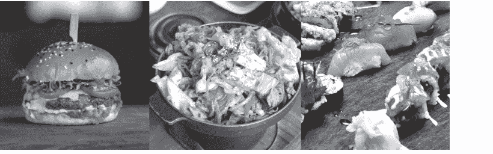

**图 2.7** 我们去哪里吃饭？

```python
# Food Bot (Japanese food expert)
# Author:
# Date:

# Asks your favourite dish?
print("What's your favourite dish?")

# Gets your reply, e.g., tempura
favourite = input().lower()

# Create a list of Japanese foods, including
# tempura, sushi, sashimi
japanese_foods = ["tempura", "sushi", "sashimi"]

# If your favourite food is in the Japanese
# food list, then give a recommendation
if favourite in japanese_foods:
    print("Oh! You should try Sushi Garden in Metrotown.")
else:
    print("Sorry, not sure. You could always try Cactus Club!")
```

我们通过接受大小写使我们的聊天机器人更加健壮，因此像 "Tempura" 和 "SUSHI" 这样的输入仍然会与列表中的项目匹配。那么来自非常兴奋的人（例如，"Sushi!!"）或犹豫不决的人（例如，"Sashimi ...?"）的输入呢？

带有标点符号的输入不会被我们的聊天机器人匹配，因为标点符号被视为字符串的一部分。我们可以使用 Python 中的另一个方法 `strip()`，它可以从字符串的前面或后面移除一组选定的字符。例如，`strip(".?!")` 会从字符串中移除所有 `.`、`?` 和 `!`。因此，如果我们用以下代码替换第 9 行，我们的聊天机器人现在将能够忽略标点符号。

```python
favourite = input().lower().strip(".?!")
```

## 方法链

上面的替换代码展示了一种特殊的使用方法，称为*链式调用*，其中一个方法的输出被用作下一个方法的输入。

当 `input()` 函数读取用户输入时，它会产生一个存储输入的字符串变量。然后，该变量被用作 `lower()` 方法的输入（通过 `.` 连接），该方法产生另一个字符串变量，将所有大写字母转换为小写字母。最后，这个字符串变量被用作 `strip(".?!"`) 方法的输入，以生成移除了开头和结尾的 `.`、`?` 和 `!` 的结果字符串变量。

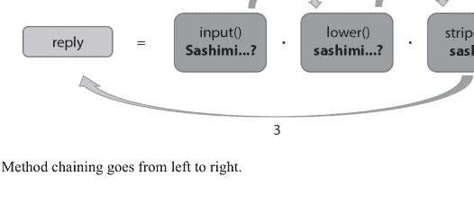

方法链对于保持代码简洁非常有用。然而，有时方法链的顺序会改变最终字符串的外观。例如，当用户输入 `APPLE` 时，以下两行代码产生的结果是不同的：

```
1  fruit_1 = input().lower().strip("a")
2  fruit_2 = input().strip("a").lower()
```

你能猜出代码运行后 `fruit_1` 和 `fruit_2` 中分别包含什么字符串吗？在你的 Python IDE 中检查一下，看看你是否正确！总之，使用方法链时，请注意方法的顺序。创建一些可能的输入来测试你的代码，并检查顺序是否给你预期的结果。

## 2.2.4 在加拿大测量事物

在下一个示例中，你将学习一种更高级的分支形式，称为**嵌套条件语句**。

根据你居住的地方，你可能会使用特定的测量系统：英制系统、公制系统，或两者兼用！例如，在法国，人们用克（公制单位）称量牛排，而在美国，人们用磅（英制单位）测量汉堡。在一些地方，如加拿大，人们根据情况使用两者。刚到加拿大的人可能需要使用如下所示的决策树来确定他们是使用公制单位还是英制单位。

### 嵌套条件语句

```
1  # How to Measure Things in Canada
2  # Authors:
3  # Date:
```

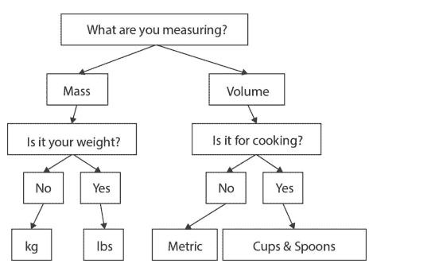

图 2.9 加拿大人决定使用哪种单位的决策树。

```python
4
5 print("I can tell you how to do measurements in Canada!")
6 measure = input("What are you measuring \n7                   (mass/volume)? ").lower().strip(".!")
8
9 # Left branch - mass.
10 # If weight, lbs. Otherwise kg
11 if measure == "mass":
12     is_weight = input("Is it your weight?").lower()
13     if is_weight == "yes":
14         print("Use lbs.")
15     else:
16         print("Use kg.")
17
18 # Right branch - volume.
19 # If cooking, cups & spoons. Otherwise metric.
20 elif measure == "volume":
21     # TODO: Add this branch
22     pass
```

这个示例代码演示了一种更复杂的编程结构，称为“嵌套条件语句”，其中一个条件结构（第 13 到 16 行之间的 if-else 语句）被放置在另一个条件结构内部，以进一步做出决策。在 Python 中，它通过缩进语句来表示，因此它们是“嵌套”的。流程如下：

如果用户输入单词 `mass`，那么它会进一步检查用户是否对问题“Is it your weight?”输入了 `yes`。这意味着只有当用户最初输入了单词 `mass` 时，才会检查关于体重的问题答案。

这种机制允许程序仅在有意义时才做出决策。例如，如果用户试图测量体积，询问他们是否想测量体重就没有意义。

> 第 22 行使用关键字 `pass` 告诉 Python，如果用户输入 `volume`，则什么也不做。它之所以存在，是因为 Python 要求每个条件下至少有一条语句。挑战一下自己！将 `pass` 关键字替换为嵌套条件语句，以帮助机器人确定单位应该是公制还是杯勺（提示：首先询问你测量的东西是否用于烹饪）。

## 2.2.5 珍珠奶茶菜单

在本节中，你将学习一种称为**循环**的结构！
你听说过珍珠奶茶吗？我们的下一个示例将以这种茶基饮料为主题，它有不同的口味，配有珍珠，可以热饮或冷饮。假设你正在创建一个聊天机器人，向顾客展示所有供应口味的菜单。
我们*可以*从技术上使用以下代码来打印菜单，如果我们想添加更多口味，我们可以复制/粘贴几行并修改文本：

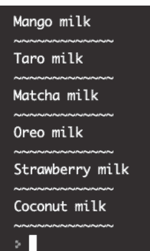

```
1  # Bubble Tea Menu (Version 1)
2  # Author
3  # Date
4  # Prints a bubble tea menu
5  
6  print("Mango milk")
7  print("~~~~~~~~~~~~~~~~~~")
8  print("Taro milk")
9  print("~~~~~~~~~~~~~~~~~~")
10 print("Matcha milk")
11 print("~~~~~~~~~~~~~~~~~~")
12 print("Oreo milk")
13 print("~~~~~~~~~~~~~~~~~~")
14 print("Strawberry milk")
15 print("~~~~~~~~~~~~~~~~~~")
16 print("Coconut milk")
17 print("~~~~~~~~~~~~~~~~~~")
```

然而，这段代码有些不尽如人意，因为存在相当多的代码重复。就像在英语文章中一样，我们更希望代码简洁。此外，如果我们以后想将分隔符从 `~` 改为 `#` 怎么办？我们真的必须更改每一行打印分隔符的代码吗？

### 重复代码的更好方法

我们可以使用**循环**将代码行数减少一半以上。以下是过程。首先，编写一次迭代的代码，如下所示：

```
1  # Bubble Tea Menu (Version 2)
2  # Author:
3  # Date:
4  # Prints a bubble tea menu
5
6  print("Mango milk")
7  print("~~~~~~~~~~~~~~~~")
```

测试它是否有效——它应该有效，打印一种口味和一个分隔符。现在，思考一下你的代码在重复之间会改变什么（如果有的话）。例如，这里的口味会随着每次重复而改变，但牛奶部分保持不变。因此，我们可以将口味元素提取到一个变量中。我们称这个变量为 `flavour`。

```
1  # Bubble Tea Menu (Version 2)
2  # Author:
3  # Date:
4  # Prints a bubble tea menu
5
6  flavour = "Mango"
7  print(flavour + " milk")
8  print("~~~~~~~~~~~~~~~~")
```

现在我们的代码变得更加灵活了。那么，我们如何让 `flavour` 变量取不同的口味值，比如芋头、抹茶等呢？让我们列出 `flavour` 可能的所有值（第 6 行）：

```
1  # Bubble Tea Menu (Version 2)
2  # Author:
3  # Date:
4  # Prints a bubble tea menu
5
6  flavours = ["Mango", "Taro", "Matcha", "Oreo",
7             "Strawberry", "Coconut"]
8  flavour = "Mango"
9  print(flavour + " milk")
10 print("~~~~~~~~~~~~~~~~")
```

最后，为了使变量 `flavour` 从列表中获取口味值，我们使用 `for-loop` 编程结构。`for-loop` 有两个可以更改的部分，这里用斜体表示：`for variable in sequence`。
第一部分是 `variable`，在本例中是 `flavour`，第二部分是 `sequence`，在本例中是列表 `flavours`，它存储了你希望变量取的所有值。

与其将 `flavour` 设置为 `Mango`，不如让 for 循环自动将 `flavour` 设置为 `flavours` 列表中的所有值，一次一个：

- 将第 8 行从 **flavour = "Mango"** 更改为 **for flavour in flavours:**
- 缩进循环体（第 9 和 10 行），即你想要重复的部分

```
1  # Bubble Tea Menu (Version 2)
2  # Author:
3  # Date:
4  # Prints a bubble tea menu
5  
6  flavours = ["Mango", "Taro", "Matcha", "Oreo",
7              "Strawberry", "Coconut"]
8  for flavour in flavours:
9      print(flavour + " milk")
10     print("~~~~~~~~~~~~~~~~~~")
```

注意机器人如何用仅仅几行代码就打印出包含所有口味的菜单！挑战：你如何向菜单添加更多口味？你将如何更改分隔符的外观？

## 2.2.6 读心术游戏

让我们结合到目前为止所涵盖的内容，创建一个作为游戏主持人的聊天机器人。

读心术游戏是一个双人游戏，第一个玩家读一个单词，并秘密输入他们联想到的单词。例如，玩家可能会将单词“cat”与“fluffy”、“cute”和“soft”联系起来。然后第二个玩家必须尝试猜测至少其中一个单词。如果匹配，两个玩家都获胜。

```
1   # Mind Reader Game
2   # Author:
3   # Date:
4   # This is a 2-player game.
5   # The 1st player reads a word and secretly
6   # enters 3 words they associate with it.
7   # The 2nd player must then try to guess at
8   # least one of the words.
9   # If it's a match, they win!
10  
11  # Introduce the game
12  print("Welcome to Mind Reader")
13  
14  # Ask the first player to enter 3 words
15  # associated with a given word
16  print("Player 1, enter 3 words you think \n17  of when I say cat:")
```

## 列表的 FOR 循环

如你所见，聊天机器人要求玩家1输入三个关联词，并使用 `in` 来判断玩家2是否正确猜中了其中任何一个词。如果我们想让这个游戏重复三次，每次为玩家1使用不同的词进行联想，该怎么办呢？

如果你的答案是使用 for 循环，那就对了！为了让一切正常工作，我们需要首先为 for 循环提供一个词序列，并提取出每次重复时都会改变的部分。在这个例子中，我们在第15行创建了一个列表，并在第22行和第34行提取出了变量 `word`。

```python
# Mind Reader Game (3 Rounds)
# Author:
# Date:
# This is a 2-player game.
# The 1st player reads a word and secretly
# enters 3 words they associate with it.
# The 2nd player must then try to guess at
# least one of the words.
# If it's a match, they win!

# Introduce the game
print("Welcome to Mind Reader")

# Make a list of words
word_list = ["cat", "dog", "apple"]

# Loop through all the items in words
for word in word_list:
    # Ask the first player to enter 3 words
    # associated with a given word
    print("Player 1, enter 3 words you think of when I say " + word)

    # Get the 3 words from the user
    first_word = input("First word: ").lower()
    second_word = input("Second word: ").lower()
    third_word = input("Third word: ").lower()

    # Clear the screen
    print(100*"\n")

    # Ask the 2nd player to guess
    print("Player 2, what is one word you think Player 1 associates with " + word + "?")
    guess = input().lower()

    # Check if they match and tell them if they win!
    if guess in [first_word, second_word, third_word]:
        print("You got it!")

    # Otherwise, if they got it wrong
    else:
        print("No match! They said " + first_word + ", " + second_word + " and " + third_word)
```

> 第25行打印了100行，这样玩家1输入的词就会对玩家2隐藏。你可以根据需要将100改为其他数字，以确保他们的输入被推出屏幕。

## 使用 RANGE 的 FOR 循环

在上面的代码示例中，for 循环的重复次数与其使用的列表中的项目数量相同（并且顺序也相同）。有时我们没有这样的列表，而我们希望 for 循环重复固定的次数。那么我们该怎么办呢？

让我们通过为游戏添加一个新功能来演示：除了重复三次之外，每次还从一个包含三个以上词的列表中随机抽取一个词。

为了控制 for 循环重复的次数，我们将列表替换为函数调用 `range(n)`，其中 `n` 是重复次数（见第19行）。我们向词列表中添加了更多可能的词，并使用之前介绍的 `random` 函数来随机选择一个词（见第22行）。

```python
# Mind Reader Game (3 Rounds with random words)
# Author:
# Date:
# This is a 2-player game.
# The 1st player reads a word and secretly
# enters 3 words they associate with it.
# The 2nd player must then try to guess at
# least one of the words.
# If it's a match, they win!

# Introduce the game
print("Welcome to Mind Reader")

# Make a list of words
word_list = ["cat", "dog", "apple", "hot",
             "coffee", "sport", "snow"]

# do 3 rounds
for i in range(3):
    # Ask the first player to enter 3 words
    # associated with a randomly selected word
    word = random.choice(word_list)
    print("Player 1, enter 3 words you think of when I say " + word)

    # Get the 3 words from the user
    first_word = input("First word: ").lower()
    second_word = input("Second word: ").lower()
    third_word = input("Third word: ").lower()

    # Clear the screen
    print(100*"\n")

    # Ask the 2nd player to guess
    print("Player 2, what is one word you think Player 1 associates with " + word + "?")
    guess = input().lower()

    # Check if they match and tell them if they win!
    if guess in [first_word, second_word, third_word]:
        print("You got it!")

    # Otherwise, if they got it wrong
    else:
        print("No match! They said " + first_word + ", " + second_word + " and " + third_word)
```

> `for` 循环中的变量 **i** 在每次 `for` 循环重复时存储一个数字！如果你使用 `print()` 来显示它的值，你会看到它从 0, 1, 2, ... 一直到 n-1。`range` 的作用是为 `for` 循环生成一个从 0 到 n-1 的数字序列，将其赋值给循环变量，从而使其重复 n 次。挑战：如果你想在每次重复时打印“第1轮”、“第2轮”等，该怎么做？

## 2.2.7 复习题

是时候测试一下你对本章内容的理解程度了。回顾一下也没问题！

## 理论与理解

- 我们学习了哪种编程结构可以帮助我们避免代码重复？我们需要哪些关键字？
- 判断对错：方法可以从左到右链式调用。
- 以下代码会输出什么？

```python
for i in ["0", "1", "2"]:
    print(i)
```

- 我们如何使用 `range(n)` 函数来打印与上面代码片段相同的内容？
- 以下代码会输出什么？

```python
print("!?.blah".strip("!.h").upper())
```

- 以下代码片段包含一些冗余（不必要的）代码。代码会输出什么？如何简化它？

```python
foods = ["Burger", "Taco", "Tempura"]
print("Tempura".lower().upper() in foods)
```

### 语法自测

以下函数和关键字是什么意思：

- `mystring.lower()`, `mystring.upper()`, `mystring.strip()`
- `in`（用于字符串/列表）
- `for <var> in <sequence>:`
- `str(...)`, `int(...)`
- 嵌套条件语句，即：

```python
if <condition>:
    if <condition>:
else:
```

- `range(4)`, `range(1,5)`, `range(1,10,2)`

## 2.2.8 练习

### 编程

现在轮到你通过编写一些代码来练习了。完成后，你可以访问我们配套网站上的“解答”部分，将你的答案与我们的进行比较。请注意，同一个问题可能有多种答案，所以如果你的代码与我们的不完全相同，也不用担心。目前，重要的是你的代码能产生你预期的结果。

### 新年机器人

编写一个新年机器人，从10倒数到1。它应该使用一个 for 循环，并且每个数字都应该在新的一行上。倒数结束后，它应该输出“新年快乐！”。

首先使用列表作为 for 循环序列来编写你的解决方案，然后使用 range 作为 for 循环序列编写另一个解决方案。

### 立场机器人

编写一个立场机器人，决定你是否可以加入黑暗面或光明面。成为黑暗领主的要求相当简单。如果你喜欢斗篷或红色，那么你就入选了！否则，它会推荐你加入光明面。你的机器人应该能够稳健地处理大写/小写的“是”和“否”答案。

## 2.2.9 术语表

- **健壮性**，指程序在发生错误（例如，无效的用户输入）时不易失败的特性。这通常通过仔细规划和编写在错误发生时能处理错误的代码来实现。
- **链式调用**，指通过将一个操作的结果作为输入传递给下一个操作，从而能够连续应用多个操作（方法）的能力。这使得代码紧凑而简洁。
- **方法**，类似于函数；方法是为程序添加功能的代码片段。然而，它们应用于程序中的某个东西（通常是一个变量），因此必须通过点运算符与其他东西关联（例如，`input().lower()` 将 `input()` 产生的字符串变量中的所有字符转换为小写）。
- **循环**，一种编程结构，根据条件或查找序列多次重复同一段代码。结合每次代码重复时都会改变的变量，可以编写出非常紧凑的代码来执行复杂的任务（例如，一次性且仅一次地访问一组数据）。

## 推荐系统

如今，许多服务会收集用户数据，并将相关信息作为推荐内容提供。在本章中，你将编写一些程序，运用基本的匹配技术来实现这一功能！

像 Netflix 和亚马逊的“猜你喜欢”这样的推荐系统，是帮助人们发现可能感兴趣的新事物的好方法。其背后是统计学和匹配算法。当今的推荐系统软件使用大型数据集和机器学习来生成推荐。它们先进的 AI 算法超出了本书的范围，但在本章中，你将学习如何编写聊天机器人，根据它们收集并存储在文件中的信息向用户提供推荐。

你将编写的聊天机器人程序包括：

-   热门咖啡馆发现器
-   芯片评分器
-   电影评分器
-   最爱宠物发现器
-   共同兴趣发现器
-   相似人群发现器

通过用 Python 编写这些聊天机器人程序，你将学习不同的数据类型及其转换、列表索引以及从文件中读取数据。你还将学习如何编写良好的代码。

本单元的计算机科学主题：

-   避免代码重复
-   使用范围的循环
-   累加器变量
-   字符串/整数/浮点数数据类型
-   类型转换
-   长度
-   除法
-   运算符优先级
-   列表的分割、索引和比较
-   打开和读取文件
-   比较运算符
-   嵌套循环

## 3.1 人气竞赛

你如何知道某样东西是最受欢迎的？你可能会从几个选项开始，也许问问别人的意见，或者自己做一点研究，然后根据你的发现做出决定。
计算机做的正是同样的事情：收集信息作为数据点，处理它们，并通过选择最符合某些标准的选项来产生答案。

### 3.1.1 学习成果

在本单元结束时，你将能够……

#### 算术与转换

-   使用整数和浮点数，并在变量中操作它们
-   初始化一个整数类型的变量
-   将字符串转换为整数类型（包括来自用户输入）
-   知道整数除法会将类型转换为浮点数
-   对数字执行算术运算

#### 累加模式

-   应用累加模式（包括初始化）和 `+=` 简写
-   将累加模式与其他算术运算符一起使用

#### 带范围的 FOR 循环

-   使用 `range` 函数，其参数可以是变量（而不仅仅是数字）
-   知道循环是减少代码重复的一种方式

### 3.1.2 热门咖啡馆发现器

假设你要和几个朋友去喝咖啡休息，你想找到最好的咖啡馆。附近有三个选择：星巴克、Artiggiano 和 Tim Hortons。这里我们将编写一个聊天机器人，询问五个人的意见并显示结果。

```python
# Most Popular Cafe Finder
# Author:
# Date:
# A survey to deduce the most popular cafe
# Starbucks - an international cafe
# Tim Hortons - a Canadian cafe
# Artiggiano - a local cafe
# The cafe which gets the most votes is the most popular

# Initialize tallies to 0
starbucks_tally = 0
tim_hortons_tally = 0
artiggiano_tally = 0

for i in range(5):
    # Ask the user what their favourite cafe is
    favourite_cafe = input("What's your favourite of Starbucks, Tim Hortons, Artiggiano? ").lower()

    # add 1 to the matching tally
    if favourite_cafe == "starbucks":
        starbucks_tally = starbucks_tally + 1

    elif favourite_cafe == "tim hortons":
        tim_hortons_tally = tim_hortons_tally + 1

    elif favourite_cafe == "artiggiano":
        artiggiano_tally = artiggiano_tally + 1

# Print out how many people who like each one
print("Starbucks:", starbucks_tally)
print("Tim Hortons:", tim_hortons_tally)
print("Artiggiano:", artiggiano_tally)
```

在上面的代码中，我们首先创建了三个计数变量，每个变量存储投给它所代表的咖啡馆的票数。这些变量中的每一个，例如 `starbucks_tally`，都包含一个整数。与字符串不同，整数是计算机科学中用于存储整数的数据类型。由于开始时没有投票，我们将计数值初始化为 0。

> 一个包含 "0" 的变量与一个包含 0 的变量是不同的。当数字 0 被引号包围时，它是一个包含字符 0 的字符串。当 0 没有引号时，它是一个整数数据类型。了解这一点很重要，因为 "1"+"2" 的结果是 "12"，而 1+2 的结果是 3！

for 循环重复问题五次，以从不同的人那里获得五张选票。每次我们得到一个答案，我们就与三个选项进行匹配，并将匹配选项的计数加 1。注意，之前的 `+` 符号执行的是连接操作，将两个字符串粘合在一起。由于我们的计数变量是整数，`+` 符号现在执行的是加法！

一种向变量添加值并减少代码重复的简写方式是使用 `+=` 结构。请参见下面我们如何替换了第 22、25 和 28 行。`+= 1` 表达式是一个复合赋值，是“将原始值增加 1”的简写。

```python
# Most Popular Cafe Finder
# Author:
# Date:
# A survey to deduce the most popular cafe
# Starbucks - an international cafe
# Tim Hortons - a Canadian cafe
# Artiggiano - a local cafe
# The cafe which gets the most votes is the most popular

# Initialize tallies to 0
starbucks_tally = 0
tim_hortons_tally = 0
artiggiano_tally = 0

for i in range(5):
    # Ask the user what their favourite cafe is
    favourite_cafe = input("What's your favourite of Starbucks, Tim Hortons, Artiggiano? ").lower()

    # add 1 to the matching tally
    if favourite_cafe == "starbucks":
        starbucks_tally += 1

    elif favourite_cafe == "tim hortons":
        tim_hortons_tally += 1

    elif favourite_cafe == "artiggiano":
        artiggiano_tally += 1

# Prints out how many people who like each one
print("Starbucks:", starbucks_tally)
print("Tim Hortons:", tim_hortons_tally)
print("Artiggiano:", artiggiano_tally)
```

当聊天机器人从所有五个人那里获得选票后，它会输出每个咖啡馆的总票数。我们可以使用另一种形式的 `print()`，它在不同类型的值之间使用逗号。这使我们能够轻松地输出一个字符串后跟一个数字。

我们还可以处理计数并计算每个咖啡馆的百分比。这需要我们使用额外的数学结构：乘法 (`*`) 和除法 (`/`)。这些数学运算符的使用遵循你可能从计算器中熟悉的运算顺序。

重要的是要知道，在 Python 中执行除法时，你的结果将是一种称为**浮点数**的数据类型。浮点数，有时称为浮点数，在计算机中存储小数。

```python
# Most Popular Cafe Finder
# Author:
# Date:
# A survey to deduce the most popular cafe
# Starbucks - an international cafe
# Tim Hortons - a Canadian cafe
# Artiggiano - a local cafe
# The cafe which gets the most votes is the most popular

# Initialize tallies to 0
starbucks_tally = 0
tim_hortons_tally = 0
artiggiano_tally = 0

for i in range(5):
    # Ask the user what their favourite cafe is
    favourite_cafe = input("What's your favourite of Starbucks, Tim Hortons, Artiggiano? ").lower()

    # add 1 to the matching tally
    if favourite_cafe == "starbucks":
        starbucks_tally += 1

    elif favourite_cafe == "tim hortons":
        tim_hortons_tally += 1

    elif favourite_cafe == "artiggiano":
        artiggiano_tally += 1

# Prints out the percentage of people who like
# each one, up to 2 decimal places
print("Starbucks: ", starbucks_tally/5*100)
print("Tim Hortons: ", tim_hortons_tally/5*100)
print("Artiggiano: ", artiggiano_tally/5*100)
```

> 提示：在代码中使用 `print()` 语句来检查变量的值。例如，如果你想检查 `i` 的值，可以在循环内添加一个临时的 `print(i)`。这种检查变量值的方法也称为跟踪。记得在完成后删除临时代码！

尝试运行该程序，对你的调查使用不同的用户输入，并检查结果！你可能会发现你的程序存在一个问题，即输出值可能会产生许多尾随小数位。我们如何将数字四舍五入到，比如说，两位小数？
我们可以使用 `format()` 方法来调整文本的打印方式：`{:.2f}` 意味着“将花括号的内容替换为一个保留两位小数的浮点值。”当我们有很多小数位的值而我们只想打印固定数量的小数位时，这特别有用。这是 Python 的一个高级功能，`format()` 的详细信息超出了本书的范围。

```python
# Most Popular Cafe Finder
# Author:
# Date:
```

## 3.1.3 薯片评分器

心理学家和实验者经常需要进行调查，以了解人们如何感知世界。有时这些调查相当有趣！在这个示例程序中，你将更深入地了解整数类型，并练习创建另一个调查。
2008年，搞笑诺贝尔奖得主马西米利亚诺·赞皮尼和查尔斯·斯彭斯进行了一项研究，探讨咀嚼薯片的声音如何影响人们对薯片脆度的感知。他们发现，仅仅通过听到更响亮的嘎吱声，薯片就会显得更脆！
让我们想象一下你是赞皮尼和斯彭斯的助手。你需要编写一个聊天机器人，询问研究参与者对薯片的评分。你会怎么做呢？

下面是一个示例代码，它要求一个人对薯片的三个不同特性进行评分，并计算一个总体评分：

```python
# Chip Rater
# Author:
# Date:
# To rate chips from 1-5 on various factors
# such as crispiness, taste, etc.
# and get an overall average score out of 5.

# Greet the participant
print("Welcome to our Chip Rater experiment.")
print("Please answer three questions on a scale of 1-5.")

# Make a list of questions about chip goodness
questions = ["How crispy are the chips? ",
             "How would you rate the taste? ",
             "How would you rate the packaging? "]

# Initialize overall score
score = 0

# For each question, get their response out of 5
# and convert it to an int
for question in questions:
    rating = input(question)
    score = score + int(rating)

# Calculate final overall score
# by taking the sum of all ratings
# and dividing by number of questions.
print("Overall score: " + str(score/len(questions)))
```

在上面的代码中，我们在第24行调用了函数 `int()`，将用户输入转换为整数数据类型。这是必要的，因为存储在变量 `rating` 中的值来自 `input()` 函数，该函数产生的是字符串数据类型；而我们不能将一个整数（变量 `score`）和一个字符串相加。

同样，在第29行，我们使用函数 `str()` 将除法运算的结果（这是一个数值数据类型）转换为字符串数据类型，以便它可以与 "Overall score" 进行拼接。还要注意我们如何使用 `len()` 函数来找出问题的数量。`len()` 函数给出了列表的长度。这比将数字3硬编码为分母要好得多，因为如果向我们的问题列表中添加了新问题，分母仍然会是正确的。

> 在这里，我们继续看到表示带小数的数字的Python数据类型，即 **float** 数据类型。**float** 数据类型在处理小数时对于保持数字的精度非常有用。与 **int** 和 **string** 一起，这三种数据类型允许创建各种各样的程序。

## 3.1.4 电影评分器

在我们之前的代码示例中，关于查找最受欢迎的附近咖啡馆，我们使用了多个变量来存储各个选项的计数：starbucks_tally、tim_hortons_tally 和 artiggiano_tally。

当选项数量较少时，这种方法效果很好。如果我们有更多选项呢？跟踪变量会变得更加困难，而且如果我们想打印结果，可能需要编写大量代码（我们输入得越多，就越容易出错，代码也越难修改）。

Python提供了一种有效的方式来存储键值对，类似于它在列表中存储单个值的方式。它被称为 **字典**。在字典中，每个条目都是一个由键（可以理解为标签）和值组成的对。使用我们最受欢迎的咖啡馆查找器示例，我们可以有一个包含三个条目的字典，使用咖啡馆名称作为键，每个条目的初始值为0。

让我们在这里使用另一个例子。假设我们希望编写一个电影评分聊天机器人，询问五个人关于他们的电影偏好并显示结果。为了简单起见，我们使用三部电影：《冰雪奇缘》、《X战警》和《哈利·波特》。

```python
# Movie Rater with Dictionaries
# Author:
# Date:
# Asks 5 people for their movie ratings
# and tracks them using dictionaries

# Initialize a dictionary of movies
movies = {"frozen": 0,
          "x-men": 0,
          "harry potter": 0}

# Ask 5 people for their movie preference
for i in range(5):
    preference = input("Which movie is your \n"
                       "favourite out of Frozen, X-Men \n"
                       "or Harry Potter? ").lower().strip(" .!")

    # Add 1 to the appropriate movie
    movies[preference] += 1

# Print out the results using a loop
for movie in movies:
    print(movie, movies[movie]) # Name and tally
```

字典相比单个变量和列表提供了许多优势：

- 我们可以为计数器（movies）起一个有意义的名字；
- 当引用字典中的一个键值对时，我们可以使用该对的键，而不是列表中的一个数字。

因此，我们不必使用 `if/elif/else` 语句来确定要增加哪个计数器，而是可以直接将用户输入作为键来引用该对并访问其值（第19行）。

此外，for循环编程结构也接受一个字典作为其 *序列* 部分，并在每次迭代中提取每个键值对的键（第22和23行）。当我们需要访问大量键值对时，这特别有用（我们也可以通过字典的 keys() 方法直接提取键）。

接下来，让我们继续改进我们的程序。例如，你会注意到运行上面的程序时，输出的电影名称没有首字母大写。我们可以使用Python字符串方法 capitalize()，它将使字符串中的第一个字母大写。其次，下面的示例（第23行）展示了另一种输出结果的方式，使用拼接和通过 str() 将数字计数转换为字符串类型。通过将数字转换为字符串类型，我们可以将两个字符串拼接在一起。

```python
# Movie Rater with Dictionaries
# Author:
# Date:
# Asks 5 people for their movie ratings
# and tracks them using dictionaries

# Initialize a dictionary of movies
movies = {"frozen": 0,
          "x-men": 0,
          "harry potter": 0}

# Ask 5 people for their movie preference
for i in range(5):
    preference = input("Which movie is your \n"
                       "favourite out of Frozen, X-Men \n"
                       "or Harry Potter? ").lower().strip(" .!")

    # Add 1 to the appropriate movie
    movies[preference] += 1

# Print out the results using a loop
for movie in movies:
    print(movie.capitalize() + ": " + str(movies[movie]))
```

能够使用键来引用字典中的键值对，使我们的代码更加清晰，因为我们可以想出一些能准确描述该对的内容。如果我们尝试访问一个不存在或输入错误的键对应的值会发生什么？如果字典中没有该键对应的键值对，Python将生成一个 KeyError，指出该键在字典中不存在，并终止程序。

为了使我们的程序更加健壮，我们可以使用 *in* 关键字包含一个条件检查。将第19行替换为以下代码：

```python
if preference in movies:
    movies[preference] += 1
else:
    print("Please type Frozen, X-Men, or Harry Potter")
```

另一种方法是利用字典的一个特性：当键在字典中未找到时，会自动添加一个键值对。与其使用上面的代码，不如将第19行替换为以下代码：

```
1 if movie in movies:
2     movies[preference] += 1
3 else:
4     # if the key is not there, add a new pair
5     movies[preference] = 1
```

这将向 `movies` 字典添加一个新的键值对，初始值为1（因为用户刚刚为该电影投了一票）。

> 字典数据类型对于存储无序的项目集合非常有用，并且不限于数字（例如，列表和字符串也可以）。它还提供了许多函数来访问键和值，以及通过添加或删除键值对来修改自身。虽然字典相对高级，但我们鼓励你探索它们的功能！

我们可以使用的另一种技术是引入两个“平行列表”，其中一个列表存储计数选项（名称），另一个列表存储计数（数字）。这允许我们在 `for` 循环中使用相同的索引来并行访问两个列表。以我们的“热门咖啡店查找器”为例，我们可以有一个列表存储咖啡店选项（Starbucks, Tim Hortons, Artiggiano），另一个列表存储计数（初始为0, 0, 0）。然后，索引0将允许我们访问第一个选项（Starbucks）和另一个列表中对应的第一个计数。这种技术常用于在没有字典的编程语言中模拟Python字典的行为。

## 3.1.5 复习题

是时候测试你对本章内容的理解程度了。回顾一下也没问题！

## 理论与理解

- 在对数字输入进行计算之前，你需要做什么？
- 数字的两种数据类型是什么？它们之间有什么区别？
- 你可以使用哪个函数来获取列表中的元素数量？
- 你将如何初始化一个名为 `tally` 的变量为0？
- 你将如何将一个已经初始化为0的变量 `tally` 增加1？
- 你使用哪个关键字将整数转换为字符串？
- 这段代码将输出什么？

```
1 print( 3 / 3)
```

- 在下面的代码中，变量 `mystery` 的数据类型是什么？`wonder` 呢？

```
1 mystery = 0
2 wonder = 0.
```

以下Python代码的第一行输出是什么？

```
1 for i in range(10,0,-1):
2     print("{:.2f} dollars".format(i*1/10))
```

这段代码能运行吗？如果不能，如何修复它？

```
1 score = 10
2 print("Your score is " + score)
```

在下面的代码片段中，用于存储数字的数据类型是什么？如果用户输入3，`nums[2]` 将是什么？

```
1 x = int(input())
2 nums = {}
3 for i in range(x):
4     nums[i] = "o"*i
```

## 语法自检

以下函数和关键字是什么意思？

- type(17)
- type(0.0)
- type("xoxo")
- type([1, 2, 3])
- type(True)
- 2 ** 2
- 3 * 4
- 5 - 3
- 4 + 4
- 5 / 3
- 5 // 3
- 12 % 5
- x = 1
- x = x+1
- x += 1
- int(4.3)
- float("123.45")
- str(12.3)
- len(myList)
- mylist[0]
- print("Number: :.3f".format(myfloat))
- emptyDicto = {}
- dicto = {"element1": 0}
- dicto["element1"] = 2

## 3.1.6 练习

### 编程

现在轮到你通过编写一些代码来练习了。完成后，你可以访问我们配套网站上的“解答”部分，将你的答案与我们的进行比较。请注意，同一个问题可能有多种答案，所以如果你的答案与我们的不同，也不用担心。重要的是它们能产生相同的结果，并且你能够指出差异所在以及为什么两种答案都可行。

### 奥运会裁判

编写一个**奥运会裁判**程序，输出五位不同裁判的平均分。每项评分最高为10分。允许半分（例如，7.5）。程序应接受五个输入并输出最终的平均分。
以下是一个示例运行：

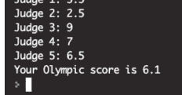

图3.1 显示五位不同裁判的平均分。

### 未来年龄

编写一个**未来年龄**程序，询问你的年龄，并输出30年（三个十年）后你将多大。
以下是两个示例运行：

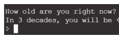

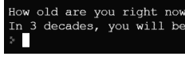

图3.2 如果用户现在10岁，那么他/她将是40岁。

图3.3 如果用户现在35岁，那么他/她将是65岁。

### 快餐点餐

编写一个**快餐点餐**程序，接受你的订单并输出总费用。它首先询问你是否想要一个汉堡（5美元）。然后询问你是否想要薯条（3美元）。输出包含14%税的总价。
你的解决方案应初始化一个包含两个项目（汉堡和薯条）及其价格（分别为5美元和3美元）的 `prices` 字典，并提供所有项目及其价格。含税总价应输出两位小数。
程序应能稳健地接受任何大小写组合的“是/否”。

以下是两个示例运行：

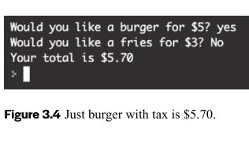

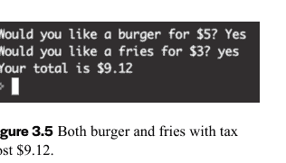

## 3.1.7 术语表

- **复合赋值**，将变量上的操作与该变量上的赋值操作相结合。例如，`i += 1` 是操作 `i + 1` 和将结果赋值给变量 `i` 的组合。它等价于表达式 `i = i + 1`。其他复合赋值包括 `-=`, `*=`, `/=`, `//=`。
- **字符串格式化**，一种指定字符串如何打印到显示的方式。格式在 `{` 和 `}` 内描述，并以 `:` 开头，而不是旧版Python中的 `%`。然后通过提供要打印的值来调用 `format()` 方法。详情请参考 https://docs.python.org/3/library/string.html。
- **类型转换**，将变量的数据类型转换为另一种数据类型的操作，也称为*类型转换*。此操作允许值被期望不同数据类型的操作使用。例如，`input()` 返回的变量是字符串数据类型。为了对其进行数学运算，需要将其转换为数值数据类型（例如，`int` 或 `float`）。有时Python会自动执行类型转换，但其他时候你必须通过显式调用类型转换函数来告诉它该怎么做。
- **平行列表**，一种使用两个相同长度的列表来存储选项及其对应值的技术。这允许使用一个索引来高效地访问大量选项中的对应值。

## 3.2 寻找你的匹配

在前面的章节中，我们解释了如何编写聊天机器人，这些机器人收集数据并基于少数用户的计数投票提供建议。
更复杂的推荐系统不仅仅询问几次投票。相反，它会查看数百或数千条记录，寻找模式和匹配项。
在本节中，我们将解释如何编写聊天机器人，从包含数千条条目的文件中读取数据，并基于这些数据提供建议。

### 3.2.1 学习成果

在本单元结束时，你将能够...

### 处理文本文件

- 了解二进制文件和纯文本文件之间的区别（两者都可以用于存储数据，但方式不同）
- 打开并从文本文件中读取行
- 打开并向文本文件中写入行

58 **第3章** 推荐系统

### 索引和切片字符串与列表

- 使用索引/切片访问列表的特定元素
- 使用索引/切片访问字符串中的特定字符

### 高级编码结构

- 执行数字之间的比较，考虑运算符的顺序（运算符优先级）
- 执行字符串之间的比较
- 理解并使用嵌套的 `for` 循环（例如，查找两个列表之间的共同元素）
- 将累积模式应用于字符串和列表（之前仅用于数字）

### 3.2.2 数据文件

在深入编写聊天机器人的细节之前，让我们花点时间了解数据是如何存储在文件中的。

我们使用文件来存储数据，因为它们允许我们在程序未运行且计算机关闭时保留数据记录。我们还可以通过发送这些文件与他人共享数据。

大多数文件以非常紧凑的方式（二进制文件）或更易于人类阅读的方式（纯文本文件）存储。在文本编辑器应用程序中打开二进制文件将显示奇怪的字符，因为其内容并非设计为人类可读。但是，如果你打开纯文本文件，你将能够使用我们熟悉的字符集看到其内容。

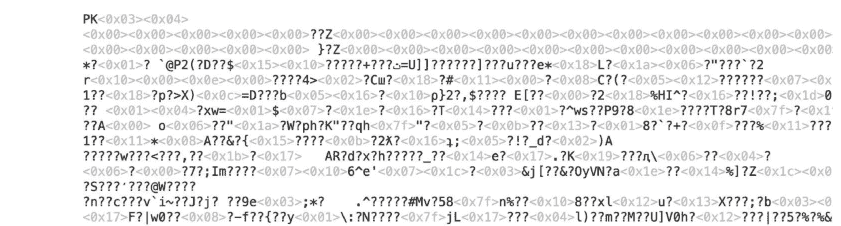

我们可以编写聊天机器人来读取这两种类型的文件。但为了简单起见，这里我们只关注纯文本文件。要继续本章其余的示例代码，请访问我们的配套网站，将数据文件 `favourites-survey.csv` 下载到你的计算机上。请注意保存位置，因为你需要将其放在与Python代码（.py文件）相同的文件夹中才能使其可用。

> 我们将使用的数据文件使用一种称为逗号分隔值（csv）的格式保存，其中每个数据项用逗号分隔，每个条目占一行。保持这种格式很重要，因为这将是聊天机器人提取和解释数据的方式。

时间戳，“你是谁？（请提供一个独特、令人难忘的*假*名）”，“什么宠物？”，“最喜欢的全球美食？”，“最喜欢的爱好？”，“你年轻时认为自己会从事什么职业？”，“你在哪个小组？”
9-30-2020 9:36:24，Zephyr，喜剧，狗，日本，玩电子游戏，建筑师，上午
9-30-2020 9:45:35，Brain，恐怖，狗，日本，玩电子游戏，工程师，晚上，V
9-30-2020 9:46:12，Victoria，喜剧，猫，意大利，玩电子游戏，教师，下午
9-30-2020 10:04:13，Yovarn，动作，狗，日本，其他，教师，晚上，Harinder Khang
9-30-2020 10:17:54，Clive Donnovan，喜剧，鸟，日本，健身，名人，晚上
9-30-2020 10:33:29，John Wood，动作，狗，日本，玩电子游戏，我从未想过
9-30-2020 10:33:32，Dana，动作，狗，日本，绘画或素描，医生，深夜，
9-30-2020 10:33:36，Thick，动画，狗，中国，玩电子游戏，列车长，
9-30-2020 10:33:41，Sarah Ho，剧情，狗，中国，玩电子游戏，主厨，上午，Har
9-30-2020 10:33:43，Charles Xavier，科幻，狗，泰国，玩电子游戏，作家，晚上
9-30-2020 10:33:48，Theo Von，喜剧，狗，日本，运动，运动员，晚上，Ha
9-30-2020 10:33:53，I LOVE U，喜剧，狗，马来西亚，玩电子游戏，教师，下午

图 3.7 纯文本文件中的内容。人类和计算机都可以读取它。

这个数据文件包含了一份发送给一组学生的调查结果。调查询问了学生关于他们在电影、宠物、学习时间等方面的偏好以及其他信息。

## 3.2.3 最喜欢的宠物

我们已经在线运行了一项调查，并将数据提取到一个文件中。让我们编写一个聊天机器人来查看数据文件，找出是喜欢猫作为宠物的受访者多，还是喜欢狗作为宠物的受访者多。我们将使用类似于“热门咖啡馆查找器”机器人的代码来统计猫和狗的票数（你也可以使用字典，如上面的“电影评分器”机器人示例所示）。

让我们从探索文件内容开始。首先，使用 `open` 函数创建一个对文件的引用（第 7 行）。接下来，我们调用这个引用的一个方法（`readline()`）来读取文件的第一行，即标题行（对于人类来说，了解逗号分隔值的含义很有用，但聊天机器人不需要这一行来统计票数）。我们再次调用 `readline()` 函数，它会捕获文件中的下一行。

```
1  # 最喜欢的宠物机器人
2  # 作者：
3  # 日期：
4  # 找出调查对象是更喜欢猫
5  # 还是更喜欢狗
6
7  file = open("favourites-survey.csv")
8
9  # 获取标题信息
10 header = file.readline()
11 print(header)
12
13 # 获取第一行数据
14 data = file.readline()
15 print(data)
```

代码和数据文件必须位于你计算机（或在线环境）上的同一文件夹中，代码才能正常工作。这是因为程序只会在与代码相同的文件夹中查找数据文件。如果你看到 `FileNotFoundError`，请确保情况确实如此。

如果我们打印包含 `readline()` 函数结果的变量值，我们将获得以下输出。

```
"Timestamp","Who are you? (Please provide a distinctive, memorable *fake* name)","What is your favourite movie genre?","Favourite animal as a pet?","Favourite world cuisine?","Favourite hobby?","What career did you think you'd have as a kid?","What time of the day do you prefer to study?"
"2021/02/03 11:06:01 AM PST","Jayrad","Comedy","Dog","Italian","Learning new languages","Teacher","Morning"
```

**图 3.8** favourites-survey.csv 文件的前两行。

现在，我们需要处理 `data` 变量的内容，它是字符串类型。一种方法是将字符串转换为列表。我们可以使用 `split()` 函数，它允许我们根据选择的分隔符将字符串分割成列表。在下面的代码中，我们指示程序按逗号字符进行分割。

```
1  # 最喜欢的宠物机器人
2  # 作者：
3  # 日期：
4  # 找出调查对象是更喜欢猫
5  # 还是更喜欢狗
6
7  file = open("favourites-survey.csv")
8
9  # 获取标题信息
10 header = file.readline()
11 print(header)
12
13 # 获取第一行数据
14 data = file.readline()
15 print(data)
16
17 # 将数据分割成列表
18 datalist = data.strip().split(",")
19 print(datalist)
```

我们可以在下面看到我们最新程序的输出。

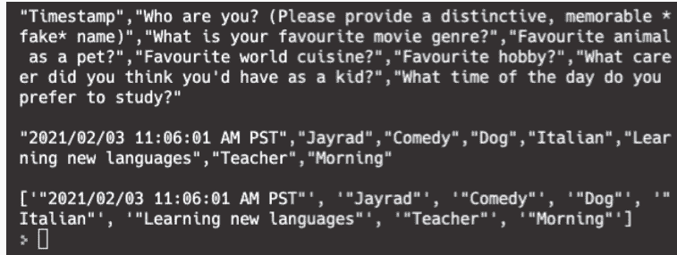

图 3.9 文件的前两行，加上与第一行数据对应的列表。

这种数据的列表表示非常有用，因为我们可以使用*索引*单独访问每条数据。索引允许我们指定希望访问列表中的哪个元素。第一个元素在索引 0 处，第二个元素在索引 1 处，依此类推。

```
1  # 最喜欢的宠物机器人
2  # 作者：
3  # 日期：
4  # 找出调查对象是更喜欢猫
5  # 还是更喜欢狗
6
7  file = open("favourites-survey.csv")
8
9  # 获取标题信息
10 header = file.readline()
11 print(header)
12
13 # 获取第一行数据
14 data = file.readline()
15 print(data)
16
17 # 将数据分割成列表
18 datalist = data.strip().split(",")
19 print(datalist)
20
21 # 访问第3个元素，索引为2
22 print(datalist[2])
```

试一试！程序现在应该会额外打印出 Comedy，这是索引 2 处的元素。注意：记住列表索引从 0 开始，而不是 1，这很重要！通常，计算机科学家喜欢从 0 开始计数！你将如何访问对应于 Dog 的值？

# 第 3 章 推荐系统

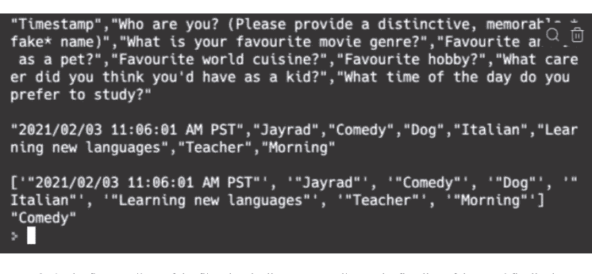

图 3.10 文件的前两行，加上与第一行数据对应的列表，最后是索引 2 处的元素。

既然我们已经理解了如何使用**索引**访问列表的元素，我们就可以看看如何访问文件中的每一行。下面的程序使用 for 循环范式来访问每一行，而不需要每次都调用 `readline()`。我们添加了一些其他功能，如下所述。

```
1  # 最喜欢的宠物机器人
2  # 作者：
3  # 日期：
4  # 找出调查对象是更喜欢猫
5  # 还是更喜欢狗
6
7  # 打开文件
8  file = open("favourites-survey.csv")
9
10  # 获取标题信息
11  header = file.readline()
12
13  # 初始化计数器
14  cat_tally = 0
15  dog_tally = 0
16
17  for line in file:
18
19      # 将数据分割成列表
20      datalist = line.strip().split(",")
21
22      # 访问列表中
23      # 对应宠物的元素
24      pet = datalist[3]
25
26      if "Cat" in pet:
27          cat_tally += 1
28      elif "Dog" in pet:
29     dog_tally += 1
30
31 # 打印猫和狗的计数
32 print("猫派:",cat_tally)
33 print("狗派:",dog_tally)
```

第 17-29 行代表一个 for 循环编程结构，它逐行遍历数据文件。每次循环重复时，会发生以下情况：

- 数据文件中的一行被读入程序，并通过变量 `line` 作为字符串提供
- 在方法链中调用 `split(",")` 方法，将行在出现逗号的地方分割成字符串列表
- 调用 `strip()` 方法移除行的首尾字符（包括回车符），csv 文件使用这些字符来维持其结构，但在使用 `split` 时可能导致错误
- 访问列表中的第四个（不是第三个，因为列表索引从 0 开始）项目，即宠物类型，并将其存储在 `pet` 字符串变量中

最后，根据调查数据文件的结果，if-elif 条件编程结构为相应的计数器增加一票，我们可以总结结果。

```
1  # 最喜欢的宠物机器人
2  # 作者：
3  # 日期：
4  # 找出调查对象是更喜欢猫
5  # 还是更喜欢狗
6
7  # 打开文件
8  file = open("favourites-survey.csv")
9
10 # 获取标题信息
11 header = file.readline()
12
13 # 初始化计数器
14 cat_tally = 0
15 dog_tally = 0
16
17 for line in file:
18
19     # 将数据分割成列表
20     datalist = line.strip().split(",")
21
22     # 访问列表中
23     # 对应宠物的元素
24     pet = datalist[3]
25
26     if "Cat" in pet:
```

## 写入文件

既然我们已经学会了如何打开和处理文件，我们也可以将报告内容放入新文件中，保存到电脑上。为此，请使用 `open()` 方法打开文件，但需添加参数 `w`，代表“写入”，如下所示：`outfile=open("favourites-report.txt","w")`。这将创建一个名为 `favourites-report.txt` 的新文本文件供你写入，或者，如果该文件已存在，则打开现有文件进行写入。请在之前的程序末尾添加以下代码片段来尝试一下。

```
49    outfile = open("favourites-report.csv","w")
50    outfile.write("Pet\tTally\n")
51    outfile.write("Cats"+"\t"+str(cat_tally)+"\n")
52    outfile.write("Dogs"+"\t"+str(dog_tally)+"\n")
53    file.close()
54    outfile.close()
```

请注意，你使用 `write()` 来写入文件，并且在行尾添加了 `\n`，表示换行。我们还使用 `\t` 在每个数据元素之间放置一个制表符。此外，请注意你需要使用 `str()` 函数将整数变量 `cat_tally` 和 `dog_tally` 转换为字符串。最后，最佳实践是使用 `close()` 方法关闭所有已打开的文件。

运行此代码后，你会发现一个新文件已创建在与你的 Python 文件相同的文件夹中。如果该文件已存在，它将被覆盖，因此请谨慎操作，因为 Python 不会警告你正在覆盖现有文件！

> 挑战：尝试创建一个报告，统计所有宠物类型的投票数。使用第 3.1.4 节中的并行列表技术，给定一个宠物列表（如 Dog、Cat、Turtle、Fish、Rat 和 Bird）以及你创建的相应计数列表。然后输出一份报告，显示每种宠物类型的投票数。作为额外挑战，报告哪种宠物类型的票数最多！

## 3.2.4 相似度分数

推荐系统的一种工作方式是找到彼此相似的人，即具有相似品味和偏好的人。

例如，如果 Alice 喜欢香蕉、樱桃和苹果，而 Bob 喜欢香蕉、樱桃和榴莲，我们可能会说 Alice 和 Bob 是相似的：他们有两种共同喜爱的水果。我们还可以猜测，也许 Alice 可能喜欢榴莲，而 Bob 可能喜欢苹果。

如何量化两个人的相似程度？一种方法是询问他们的偏好，并计算共同答案的数量。例如，假设 Charlie 喜欢橙子、菠萝和香蕉。那么 Alice 与 Bob 比与 Charlie 更相似，因为 Alice 和 Bob 有两种共同喜爱的水果（香蕉和樱桃）；而 Alice 和 Charlie 只有一种共同水果（香蕉）。

让我们编写一个小程序，计算两个人之间共同喜爱的电影数量：

```
1  # 比较两个人的最爱电影
2  # 作者：
3  # 日期：
4  # 描述：通过比较他们的最爱电影列表
5  # 找出两个人的相似程度
6
7  # 获取每个人的最爱电影
8  angelica_favourite_movies = ["Big Hero 6",
9                              "Inside Out",
10                             "Wall-E"]
11 victor_favourite_movies = ["Big Hero 6",
12                            "Star Wars",
13                            "Wall-E"]
14
15 # 初始化共同兴趣计数器
16 common_interests_counter = 0
17
18  # 遍历第一个人的所有最爱电影
19  for movie in angelica_favourite_movies:
20
21      # 那部电影是否也在第二个人的列表中？
22      if movie in victor_favourite_movies:
23
24          # 增加共同兴趣计数器
25          common_interests_counter += 1
26
27  # 打印结果
28  print(common_interests_counter)
```

如你所见，两个人共同答案的数量越多，相似度分数就越高。

这个小程序，连同上面的计数示例（以及 Favourite Cafe 程序），也展示了一种非常有用的计算技术，称为**累加器模式**：我们创建几个计数器变量，并将它们设置为初始值。当我们遍历数据并看到值得注意的内容时，我们通过加 1 来更新相应的计数器变量。在检查完所有数据后，我们可以查看值得注意的事件发生了多少次的摘要。换句话说，我们在检查数据时*累积*信息。

这种累加器模式的一个变体是，我们不是递增计数器变量，而是将一个变量更新为我们发现值得记录的某些信息的值。你将在下一节中看到一个示例。

## 3.2.5 谁与你最相似？

结合我们之前三节涵盖的内容（读取数据文件、计数系统和计算相似度分数），我们具备了编写一个基于相似度提供推荐的聊天机器人所需的一切！

这个推荐聊天机器人的目标是找到与你最相似的人，即与你拥有最多共同兴趣的人。

首先，修改 CSV 文件，在第二行（紧接标题行下方）添加一行，表明你的偏好。例如：
`2022/01/01 0:00:00 AM MDT,John Smith,Action,Dog,Italian,Playing video games,Dentist,Afternoon`

第一项是时间戳，聊天机器人不会使用它，因此你可以写任何时间。对于其余部分，你可以参考数据文件获取一些灵感。确保所有行的项目数量相同（八个）。完成后保存并关闭文件。

然后编写以下代码：

```
1  # 最相似的人查找器
2  # 作者：
3  # 日期：
4  # 描述：找出相似度分数最高的人
5
6 # 打开文件
7 # 移除/处理标题
8 file = open("favourites-survey.csv")
9 header = file.readline()
10
11 # 读取第一行数据
12 # 代表我的偏好
13 my_favourites = file.readline().strip().split(",")[2:]
14 print(my_favourites)
15
16 # 初始化变量，用于记录最佳朋友（目前无人）
17 # 和最高分数（0）
18 top_friend = ""
19 top_score = 0
20
21 # 遍历文件的每一行
22 for person in file:
23
24     # 获取他们的最爱
25     person_data = person.strip().split(",")
26     # 人名之后的所有元素
27     person_favourites = person_data[2:]
28     person_name = person_data[1]
29
30     # 获取相似度分数
31     common_interest_tally = 0
32     # 对于我喜爱的每样东西
33     # 检查它是否也在他们的列表中
34     for favourite in my_favourites:
35         if favourite in person_favourites:
36             common_interest_tally += 1
37
38     # 检查他们的分数是否高于
39     # 当前最高分数
40     if common_interest_tally > top_score:
41         # 如果是，将最佳朋友名字设置为他们
42         top_friend = person_name
43         # 并更新最高分数
44         top_score = common_interest_tally
45
46 # 打印最佳朋友
47 print(top_friend, top_score)
```

你可能在准备兴趣列表时注意到，代码在链式方法调用的末尾添加了 `[2:]`（第 16 行和第 30 行）。这段小代码称为**列表切片**，Python 使用原始列表中的内容创建一个“切片”。

## 3.2.6 复习题

是时候测试一下你对本章内容的理解程度了。如果需要，可以回去复习！

## 理论与理解

- 你会如何打开一个名为 `survey.txt` 的文件？
- 你会如何访问名为 `favourites` 的列表中的倒数第二个元素？
- 从文件中读取一行有哪两种方法？
- 你会如何将一个由单词组成的字符串分割成一个列表？假设单词之间用 `;` 分隔。
- 一个列表包含以下内容：

```
singers = ["elle", "anne", "snowman"]
```

`singers[2]` 中是谁？

这段代码会输出什么？

```
response = "I LOVE COFFEE!!"
words = response.lower().strip("!").split(" ")
if "coffee" in words or "starbucks" in words:
    print("Caffeine junkie, eh?")
else:
    print("Hmm...")
```

以下代码会输出什么？

```
pets = "cats, dogs, birds"
petlist = pets.split(",")
print("cats" in petlist)
print("dogs" in petlist)
```

这段代码会输出什么？

```
foods = ["cherries", "tomatoes"]
print(foods[1][0].upper())
```

### 语法自测

以下函数和关键字是什么意思？

- `file = open("myfile.txt")`
- `file.readline()`
- `for line in file:`
- `mystring.split(...)`
- `mystring.strip(...)`
- `mystring[0]`
- `mystring[-1]`
- `mystring[:]`
- `mystring[3:5]`
- `mystring[:3]`
- `mystring[3:]`
- `"a"*3`
- `["a"]*3`
- `alist[2][0]`
- `list1+list2`
- `list1 = list1 + [elem]`
- `alist[0]`
- `alist[:3]`
- `alist[1:3]`
- `alist[4:4]`
- `alist[4:]`
- `alist[3:-1]`
- `"a"<"b"`

## 3.2.7 实践练习

### 编程

现在轮到你通过编写一些代码来练习了。完成后，你可以访问我们配套网站上的“解答”部分，将你的答案与我们的进行比较。请注意，同一个问题可能有多种答案，所以如果你的答案与我们的不同，也不必担心。重要的是它们能产生相同的结果，并且你能够指出差异所在以及为什么两种答案都可行。

### 相似爱好发现器

编写一个程序，计算两个人爱好的相似度分数（定义为共同兴趣的数量）。程序应接受两个字符串作为输入，爱好之间用空格分隔。它应该对大小写和不同顺序具有鲁棒性。例如，“Skiing Drawing coding” 和 “Knitting skating Coding” 应该输出相似度分数为 1。
以下是两个示例运行：

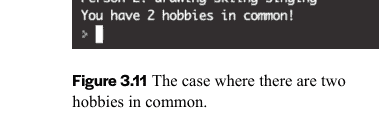

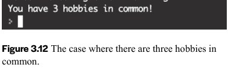

图 3.11 有两个共同爱好的情况。

图 3.12 有三个共同爱好的情况。

### 家长机器人

编写一个程序，询问四个问题。每次你说“是”，你的分数就会增加。问题是：

- 你吃饭了吗？
- 你学习了吗？
- 你洗衣服了吗？
- 你给奶奶打电话了吗？

最后，程序会这样回复你：

- 0 分：我这就过来
- 1–2 分：好吧。
- 3–4 分：很好！

你的代码应该使用循环来提问，并至少使用以下比较运算符之一（<, >, <=, >=, ==）。它还应该使用累加器模式来统计“是”的次数。

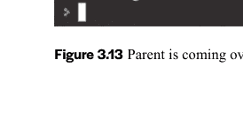

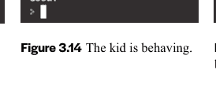

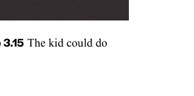

图 3.13 家长要过来了。

图 3.14 孩子表现不错。

图 3.15 孩子本可以做得更好。

## 3.2.8 术语表

- **CSV 文件**，人类可读的文本文件，其中数据项用逗号分隔（逗号分隔值），每个条目占一行。一些生产力应用程序（例如 Microsoft Excel）会自动将这些文件转换为表格，但你始终可以用普通文本编辑器打开它们来查看值，甚至进行修改。
- **标题行**，数据文件中的第一行，指示文件后续行中的值代表什么。通常，当程序从数据文件中检索数据时，这一行会被忽略，因为它不包含任何值（有些数据文件甚至没有这一行）。但是，当程序显示数据时，它对于用户理解数据非常有用。
- **累加器模式**，一种在程序处理数据时聚合信息的计算技术。该技术涉及设置一个计数器/累加器变量并为其分配一个初始值。当程序检查数据时，该变量会根据某些规则进行更新。一个例子是计算数据文件中偶数的数量：设置一个初始值为 0 的计数器变量，当程序检查值时，每次看到偶数就将该计数器变量加 1。当所有值都被检查完毕时，计数器变量就保存了偶数的数量。同样的技术可以用来以其他方式分析数据文件中的所有值，例如，计算所有值的总和（持续向变量添加），以及找到最大值（当出现更大的值时更新变量）。
- **列表切片**，Python 中用于提取列表一部分的功能。可以使用数字和冒号来指定要提取的部分，而不是使用索引来访问列表中的项目。例如，3:5 表示从索引 3 开始到索引 4（= 5 – 1）的部分。如果缺少其中一个数字，则表示提取该侧的所有项目。例如，:5 表示从索引 0 到索引 4 的部分；而 3: 表示从索引 3 到列表最后一个索引的部分。

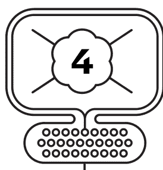

## 图形与计算机视觉

计算机的一大用途是处理和生成图形与图像。在本章中，你将学习计算机如何做到这一点，并使用它们来创造一些美好的东西！
如今的动画电影和视频游戏严重依赖 2D 和 3D 图形及动画技术来生成逼真的高分辨率内容。归根结底，这个过程就是弄清楚每个像素应该使用什么颜色。在许多情况下，计算机会收到做出该决定的指令：例如，在多个光源下应该是什么颜色，以及某个东西需要被重复绘制多少次。在这里，我们将向你展示如何使用 Python 创建简单的绘图和操作图像，这是更高级的计算机视觉和图形算法的基础。

> **有趣的事实：** 迪士尼电影《冰雪奇缘》中有一帧的渲染时间超过了 132 小时（超过五天）！真可谓计算机被“冻结”了。

你将编写的聊天机器人程序包括：

- 使用 turtle 进行交互式绘图
- 饼干绘制器
- 输入验证器
- 猜数字游戏
- 绿幕魔法机器人

通过用 Python 编写这些聊天机器人程序，你将学习存储和访问复杂数据的方法、创建函数、使用包/模块以及绘制图形。你还将了解一些计算机图形学的概念。
本单元的 CS 主题：

- turtle 模块
- while 循环
- 函数
- 参数

## 4.1 交互式绘图

如今你看到的许多动画电影，都是由代码生成的多帧图像组成的。其中一些代码相当简单。然而，当你将它们与一些编程结构结合时，就能生成复杂的图形，你甚至可以操控它们，甚至加入一些随机性。

在本节中，我们将介绍 Python turtle，这是一个基于命令创建图形的 Python 模块。我们将从一些基本命令开始，然后讨论如何通过高效地组合它们来绘制复杂的图案和形状。

### 4.1.1 学习成果

在本单元结束时，你将能够...

### TURTLE 模块

- 使用 turtle 模块创建图形
- 阅读并理解基本的 turtle 代码以可视化其输出
- 使用 turtle 颜色名称以及编码为 3 元组的 RGB 颜色值为海龟着色

### 定义函数

- 创建带参数和不带参数的函数
- 调用程序中先前创建的函数
- 从循环中调用函数，可能使用循环索引作为参数的一部分
- 识别变量的作用域，特别是与函数作用域相关的作用域

### 4.1.2 基本 Turtle 命令

Python turtle 的主要思想是让你完全控制一个“海龟”，它移动时会留下轨迹。轨迹是图形的一部分，你可以通过改变它们的颜色或外观来修改。

首先要做的是导入 turtle 模块，以便访问其定义和命令。然后，你可以创建一个海龟并给它一个名称，以便在代码的其余部分中引用它。

```python
# Basic Turtle Commands
# Author:
# Date:
# Description: Quick demo of some of the basic
# Turtle commands

import turtle

fred = turtle.Turtle()

fred.forward(100)
fred.stamp()
fred.penup()
fred.forward(100)
fred.pendown()
fred.stamp()
```

以下是我们海龟 fred 接受的一些运动/状态命令：

- forward(distance)——沿海龟当前朝向（尖端指向的方向）向前移动指定距离。
- right(units)——将海龟向右转指定单位。默认单位是度。
- left(units)——将海龟向左转指定单位。默认单位是度。
- circle(radius)——绘制一个指定半径的圆。圆心在海龟上方 radius 个单位处。你可以通过提供一些额外参数来控制圆的绘制方式。
- stamp——在当前海龟位置将海龟形状的副本印在画布上。你可以使用 shape 命令改变海龟的形状。
- penup——提起笔，这样移动时就不会留下轨迹。
- pendown——放下笔，这样移动时就会留下轨迹。

尝试一下，修改代码，看看你的图形与演示中的有何不同。

有关 turtle 支持的更多命令，请参阅 https://docs.python.org/3/library/turtle.html。

### 4.1.3 使用 Turtle 进行交互式绘图

让我们创建一个交互式聊天机器人，让用户通过其控制的海龟实时发出绘图命令。

首先，这个聊天机器人只会沿着海龟面向的方向画一条短线。但用户可以控制它画线的次数。

```python
# Interactive Drawing with Turtle
# Author:
# Date:
# The turtle will take commands to move and draw
# It will keep asking for a command until
# you say stop
# f: forward 10 pixels
# s: stamp
# stop: exit the loop

# Create a turtle
import turtle

anna = turtle.Turtle()

# Create a boolean sentinel/flag
keep_looping = True

while keep_looping:
    # Ask what the user wants to do
    command = input("What would you like me to do?").lower()

    # If the user types s, stamp
    if command == "s":
        anna.stamp()
    # If the user types f, go forward
    elif command == "f":
        anna.forward(10)
    elif command == "stop":
        keep_looping = False
```

> 这个聊天机器人相当简单，不是吗？尝试添加更多命令，例如，l 向左转 90 度，r 向右转 90 度。

在前面的章节中，当我们第一次构建聊天机器人时，我们没有办法让机器人在没有收到可接受响应时再次询问，或者只有在收到特定响应时才结束。

在上面的代码中，我们使用了一种新的编程结构——while 循环来实现这一点。与 for 循环类似，while 循环会重复执行内部的代码；但它不是使用列表来控制重复次数，而是使用一个布尔哨兵/标志来决定是否重复。

在第 17 行，我们创建了一个名为 **keep_looping** 的布尔变量，其初始值为 True。当 while 循环第一次开始时，它会检查变量的值是 True 还是 False。如果值为 True，则执行内部代码；否则，跳过代码且永不重复。每次重复后，while 循环会再次检查变量的值，并决定是重复还是跳过。因此，在 while 循环内部编写一些代码来更新哨兵/标志变量的值非常重要，这样循环最终才会结束（第 30 行）。

> 将布尔变量用作哨兵/标志与 while 循环一起使用，是输入验证中非常常见的技术。想象一下，布尔变量是输入字符串有效性检查的结果（例如，它包含数字吗？长度足够吗？）。你可以使用布尔变量来存储问题的答案：输入字符串是否无效？如果是，它将为 True，while 循环将重复；否则它将为 False，while 循环将结束。尝试编写这段代码！

### 4.1.4 饼干绘制器

现在让我们画一些更复杂的东西，例如，一块上面有巧克力碎片的饼干！

```python
import turtle

fred = turtle.Turtle()

fred.circle(30)
fred.penup()
fred.goto(5, 30) #where the middle chip is
fred.stamp()
for x in [-5, 15]:
    fred.goto(x, 20)
    fred.stamp()
    fred.goto(x, 40)
    fred.stamp();
```

**图 4.2** 一块巧克力碎片饼干！

上面的代码片段通过绘制一个圆，然后使用 `stamp()` 方法绘制一些巧克力碎片来画一块饼干。它使用了 `goto` 方法，该方法将海龟移动到参数指定的位置。我们使用 `penup()` 方法（第 6 行），这样当海龟移动到指定位置时就不会留下轨迹（就像跳过去一样）。我们还使用了一个 `for` 循环来缩短代码，这样每次循环迭代都会绘制一对巧克力碎片。

> turtle 使用二维坐标系来管理其位置。第一个值是 x 位置（水平），向左移动时变为负值，向右移动时变为正值。第二个值是 y 位置（垂直），向下移动时变为负值，向上移动时变为正值。画布的中心位置是 (0, 0)，也称为 **home**，你可以通过调用 `home()` 方法到达那里。

这看起来很棒。但如果我们想画更多饼干呢？我们需要多次复制这段代码吗？我们当然可以这样做，但这会使我们的代码变得很长。此外，如果我们想改变饼干的外观（例如，更大的饼干和更多的巧克力碎片），我们将不得不去所有副本中进行修改。

在编程中，我们有一种结构，允许我们在编写代码后重用它，并在重用方式上具有一定的灵活性。这种编程结构称为**函数**。事实上，你已经在我们的代码示例中多次见过它！例如，`print()` 是一个函数，我们多次重用它来向显示器打印内容，并且它足够灵活，我们可以让它打印不同的东西。另一个例子是 `random.choice()` 方法，它从我们提供的列表中随机选择一个项目。

> 如前所述，我们一直使用“函数”和“方法”来指代我们可以重用的代码片段。区别在于它是否与变量/对象相关联：如果不相关，我们称之为函数；否则我们称之为方法。由于 `choice()` 与 `random` 对象相关联，我们称其为 `random` 对象的方法。

创建这种可重用函数编程结构的过程称为“定义函数”。首先，我们使用 `def` 关键字来表明我们正在定义一个函数。然后，我们为函数决定一个名称以及它在被重用时需要什么信息。最后，我们将它执行的代码放在*函数体*中。例如，下面是一个绘制一块饼干的函数。

```python
def drawOneCookie(x_offset, y_offset):
    # goto the starting position
    fred.penup()
    fred.goto(x_offset, y_offset)
    fred.pendown()

    fred.circle(30)
    fred.penup()
    fred.goto(5+x_offset, 30+y_offset)
    fred.stamp()
    for x in [-5, 15]:
        fred.goto(x+x_offset, 20+y_offset)
        fred.stamp()
        fred.goto(x+x_offset, 40+y_offset)
        fred.stamp();
```

这个函数使用两个参数 `x_offset` 和 `y_offset`，将海龟移动到画布上所需的位置进行绘制。这就是函数如何在不同位置绘制一块饼干时变得灵活的方式。

如果你编写了上一页的代码（在导入模块并创建海龟对象之后）并运行它，你会发现什么都没有绘制出来。原因是这段代码只是一个定义，除非你“调用”它，否则Python不会执行它。

要调用一个函数，你需要使用它的名称，并提供所有必要的信息（作为参数），以便它确切知道该做什么。对于我们这个函数，名称是`drawOneCookie`，而信息将是它开始绘制饼干的位置。

以下是调用该函数三次以绘制三个饼干的完整代码：

```python
import turtle

fred = turtle.Turtle()

def drawOneCookie(x_offset, y_offset):
    # goto the starting position
    fred.penup()
    fred.goto(x_offset, y_offset)
    fred.pendown()

    fred.circle(30)
    fred.penup()
    fred.goto(5+x_offset, 30+y_offset)
    fred.stamp()
    for x in [-5, 15]:
        fred.goto(x+x_offset, 20+y_offset)
        fred.stamp()
        fred.goto(x+x_offset, 40+y_offset)
        fred.stamp();

drawOneCookie(-100, 0)
drawOneCookie(50, 50)
drawOneCookie(100, 20)
```

查看图4.3，看看我们绘制的多个饼干是什么样子！
真美味！试着再画几个饼干吧！

## 4.1.5 复习题

是时候测试一下你对本章内容的理解程度了。回顾一下也没关系！

## 理论与理解

- 定义函数有什么好处？
- 创建函数所必需的关键字是什么？
- 函数参数有什么用？
- 给定`turtle`模块，我们如何创建一个海龟对象？

80 **第4章** 图形与计算机视觉

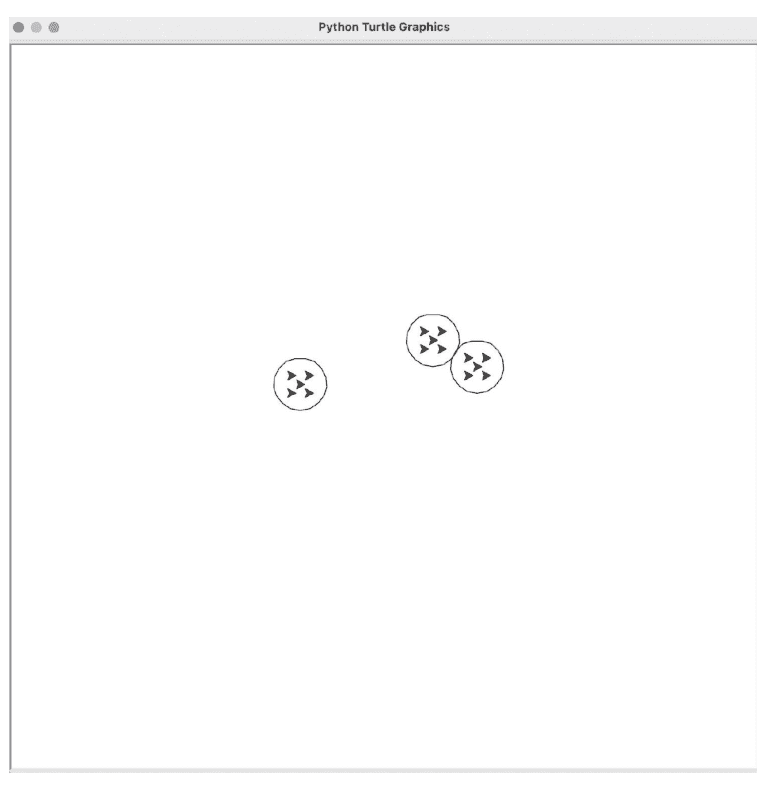

**图4.3** 使用函数绘制三个饼干。

## 语法自检

以下代码片段中的函数和关键字是什么意思？

- 片段1：

```python
import turtle
pet = turtle.Turtle()
pet.forward(10)
pet.stamp()
pet.right(180)
pet.left(90)
pet.penup()
pet.pendown()
pet.goto(10,-10)
pet.color("blue")
```

- 片段2：

```python
turtle.colormode(255)
mycolor = (255,0,120)
pet.color(mycolor)
```

- 片段3：

```python
adam = turtle.Turtle()
def myfunction(a,b):
    adam.goto(a, b)
    adam.stamp()
for i in range(5):
    myfunction(i*20, i)
```

## 4.2 图像处理

我们使用计算机的另一个常见功能是处理图像。想想你给照片应用滤镜，或者裁剪/调整大小到你喜欢的尺寸的时候。在电影行业，计算机也用于处理帧（图像），通过去除不需要的伪影和替换背景。
在本节中，我们将解释基本图像处理的工作原理，你将编写Python代码来处理和理解图像。首先，我们需要导入一个名为`pygame`的Python包，它包含几个用于处理和操作图像的模块。这个包可能没有安装在你的计算机上。要测试它是否已安装，只需输入这个导入语句：
`import pygame`
然后运行你的代码。如果Python给你一个错误，说缺少这个包，你必须先安装它才能继续。

> 在第1.1.3节列出的编码环境中，Trinket和Mu都预装了`pygame`。如果你使用其他环境，你可能需要自己安装`pygame`。有关如何安装`pygame`的详细信息，请参考 https://www.pygame.org。

### 4.2.1 学习成果

在本单元结束时，你将能够...

### 定义有返回值的函数

- 创建并使用返回值的函数
- 调用一个函数，以便接收函数返回的值
- 陈述在循环（函数内部）中执行`return`语句的效果
- 识别调用函数时产生`None`值的情况
- 使用包含自己定义的函数的模块（导入并使用简称）

### while循环

- 识别与`for`循环相比，何时适合使用`while`循环
- 创建一个带有哨兵（控制变量）和多个控制变量的有效`while`循环
- 使用`while`循环验证用户输入

### 图像处理

- 像素颜色如何由RGB值表示
- 以列表的列表形式访问和修改二维图像，其中包含以列表形式（一个三维列表）表示的RGB值
- 从三维列表中提取和/或更改像素的颜色（作为RGB和/或单独的颜色分量）

### 列表

- 知道列表别名与副本的区别
- 知道将列表作为参数传递给函数的含义（它变成了别名）
- 知道如何使用`append()`修改列表
- 知道当列表作为参数传递给函数时，在函数内部修改列表的效果，即使它没有被返回

### 4.2.2 绿幕还是非绿幕？

你知道吗，你最喜欢的一些电影动作场景是在绿幕前拍摄的？拍摄完成后，特效工作室使用计算机软件将人物和物体从背景中分离出来，然后用其他东西（例如太空背景）替换。一种简单的方法是假设背景是特定的颜色，例如亮绿色。当计算机程序检测到图像中的像素是特定的绿色时，它就确定它是背景的一部分，并推断图像的其余部分是前景中的人物和物体。
在本节中，我们将构建一个绿幕程序，可以将演员的图片编织到新的背景中！

### 图像入门

让我们从学习图像在计算机中如何表示开始。图像只是**像素**的集合。如图4.4所示，每个像素构成图像的一个彩色“点”。
每个**像素**由一种**颜色**表示，该颜色存储为三个**颜色值**（红、绿、蓝）。你可以将颜色值视为构成特定颜色的红、绿、蓝光的量。重要的是要记住，每个值的范围是0到255。
所以，例如，红色和绿色为0，蓝色为255将产生蓝色。你会注意到，由于我们使用RGB的惯例，我们可以使用三个整数的列表来表示一种颜色，而无需明确说明哪个值对应哪种颜色。图4.5显示了一些常见颜色的RGB值。

> 注意：混合颜色值并不完全像混合颜料。255, 255, 255 不等于黑色；它产生白色。为了帮助你记忆，想想白光如何包含光谱的所有颜色。


**图4.4** 当你放大计算机图像时，你会看到方块。每个方块就是一个像素。

| 颜色 | 红 | 绿 | 蓝 |
| :--- | :--- | :--- | :--- |
| 红色 | 255 | 0 | 0 |
| 绿色 | 0 | 255 | 0 |
| 蓝色 | 0 | 0 | 255 |
| 白色 | 255 | 255 | 255 |
| 黑色 | 0 | 0 | 0 |
| 黄色 | 255 | 255 | 0 |

**图4.5** 一些常见的颜色值。每个颜色值的范围是0到255。

除了知道图像中像素的颜色外，计算机还需要知道每个像素在图像中的*位置*。放错像素的位置会导致完全不同的图像！

一种将像素存储在正确位置的方法是使用**二维矩阵**，其中矩阵的每个条目是一个像素，条目的位置对应于像素在图像中的位置（图4.6）。我们可以使用一个二维列表（即列表的列表）来表示这种配置，其中每个子列表存储一条水平条带（行）的像素，如图4.7所示。

### 访问图像中的像素

为了开始我们对图像的探索，请从我们的配套网站下载提供的`kid-green.jpg`图像和`csimage.py`文件。然后，将它们放在与你编写Python代码相同的文件夹中。

现在让我们探索这张图像中的像素！在你自己的新Python程序中，首先导入`csimage`模块，类似于我们导入`random`模块的方式，以允许我们访问一些有用的图像处理函数。使用函数`csimage.getImage()`将图像加载到你的程序中，作为上述的**二维矩阵**。

## 第四章 图形与计算机视觉

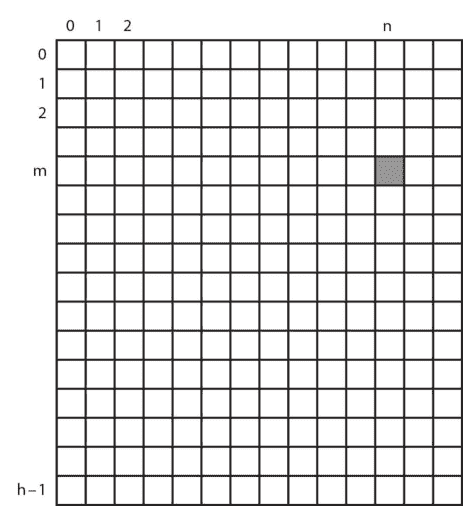

图 4.6 一张宽度为 w、高度为 h 的图像。注意，计数从 0 开始，与列表一样。

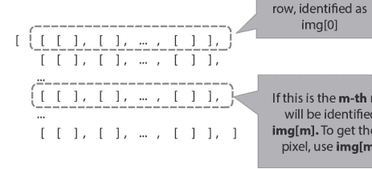

图 4.7 一个名为 img 的二维列表（列表的列表）用于存储图像的像素。如果你有第一行全黑、第二行全白，你将得到这样的列表：[ [0,0,0], [0,0,0], ..., [0,0,0] ], [ [255,255,255], [255,255,255], ..., [255,255,255] ], ...]。

```
1  # Exploring Images
2  # Author:
3  # Date:
4
5  import csimage
6
7  # Open the image and store the contents into
8  # img as a 2D matrix
9  img = csimage.getImage("kid-green.jpg")
```

接下来，让我们访问位于 0,0 的左上角像素，并打印出它的 RGB 值。根据图 4.8 中的图片，你期望得到什么 RGB 值？

```
1  # Exploring Images
2  # Author:
3  # Date:
4  
5  import csimage
6  
7  # Open the image and store the contents into
8  # img as a 2D matrix
9  img = csimage.getImage("kid-green.jpg")
10 
11 # Get the pixel at location 0,0
12 pixel = img[0][0]
13 
14 # Extract the colour values
15 # Each pixel is a list of 3 colour values
16 r = pixel[0]
17 g = pixel[1]
18 b = pixel[2]
19 
20 print(r,g,b)
```


**图 4.8** 一张名为 kid-green.jpg 的图片，一个小孩在纯色（绿色）背景上（请参阅配套网站查看原始的绿色背景）。

下面的代码展示了直接访问 0,0 像素值的更简洁方法。它本质上等同于上一页的代码。

```
1 # Exploring Images
2 # Author:
3 # Date:
4
5 import csimage
6
7 # Open the image and store the contents into
8 # img as a 2D matrix
9 img = csimage.getImage("kid-green.jpg")
10
11 # Get the pixel values at location 0,0
12 # and extract its RGB values
13 r = img[0][0][0]
14 g = img[0][0][1]
15 b = img[0][0][2]
16
17 print(r,g,b)
```

## 检查像素的颜色

让我们尝试让程序判断像素是否为绿色。当你运行下面的代码时会发生什么？

```
1 # Exploring Images
2 # Author:
3 # Date:
4
5 import csimage
6
7 # Open the image and store the contents into
8 # img as a 2D matrix
9 img = csimage.getImage("kid-green.jpg")
10
11 # Get the pixel at location 0,0
12 # and extract its RGB values
13 pixel = img[0][0]
14 r = pixel[0]
15 g = pixel[1]
16 b = pixel[2]
17
18 # Test if this pixel is green
19 if r == 0 and g == 255 and b == 0:
20     print("The top-left pixel is green! It's background!")
21 else:
22     print("The top-left pixel is not green.")
```

你会注意到，即使我们感知到像素是绿色的，RGB 值也可能不完全等于 0, 255, 0。事实上，当你打印图像左上角像素的 RGB 值时，你会看到 R = 15, G = 255, B = 21。

事实证明，即使一个像素带有一点蓝色和红色，并且绿色略低于最大值，它仍然可以是绿色的。因此，为了让你的程序对“绿色”的定义不那么严格，你可以修改条件语句。

```
1  # Exploring Images
2  # Author:
3  # Date:
4
5  import csimage
6
7  # Open the image and store the contents into
8  # img as a 2D matrix
9  img = csimage.getImage("kid-green.jpg")
10
11 # Get the pixel at location 0,0
12 # and extract its RGB values
13 pixel = img[0][0]
14 r = pixel[0]
15 g = pixel[1]
16 b = pixel[2]
17
18 # Test if this pixel is green
19 if r < 100 and g > 200 and b < 100:
20     print("The top-left pixel is green! It's background!")
21 else:
22     print("The top-left pixel is not green.")
```

就是这样！你有了一个可以检查图像中像素是否为绿色的程序！这在以后会派上用场。

## 有返回值的函数

我们现在有一个可以检查像素是否为绿色的程序。但我们想检查图像中的所有像素，以决定它们是否属于绿幕的一部分。想象一下，你有一张包含成千上万甚至数百万像素的大图像——你将不得不重复这段代码成千上万甚至数百万次！

我们如何避免复制/粘贴代码？我们可以从使用循环来节省重复工作开始，并且可以通过将检查步骤放入一个可重复使用的单元来使其更好。回想一下我们之前创建函数的程序，例如，绘制一个曲奇。在这个程序中，我们也想编写一个函数，它接受一个像素进行测试，并告诉我们它是否是绿色。问题是，我们之前使用的函数只能通过向显示器打印一句话来“告诉”我们，如果我们想利用这些信息对图像进行进一步处理，这并没有真正的帮助。我们需要另一种能够报告结果的函数，以便程序的其余部分可以使用。

在编程中，有一种方法可以让函数返回（即报告）一个值。你以前用过这个；例如，`random.choice(mylist)` 返回从作为参数传递的列表中随机选择的一个元素。当一个函数完成其工作时，它会返回一个值，这个值可以是一个简单的值，也可以是一个存储在变量中的计算值。由于这些函数不仅计算某些东西，还返回某些东西，我们称它们为**有返回值的函数**。以下是一些示例：

```
1  # A fruitful function example
2  # Author:
3  # Date:
4
5  # A function that takes a numeric parameter
6  # and returns whether it is greater than 1000
7  # or not as a boolean
8  def isGreaterThan1000(number):
9      if number > 1000:
10         return True
11     else:
12         return False
13
14 testNumber = 999
15 if isGreaterThan1000(testNumber):
16     print(testNumber,"is greater than 1000.")
17 else:
18     print(testNumber,"is not greater than 1000.")
19
20 testNumber = 1050
21 if isGreaterThan1000(testNumber):
22     print(testNumber,"is greater than 1000.")
23 else:
24     print(testNumber,"is not greater than 1000.")
```

由于 `number > 1000` 实际上是一个布尔表达式，编写上述函数的一种更紧凑的方式如下：

```
1  # A fruitful function example
2  # Author:
3  # Date:
4
5  # A function that takes a numeric parameter
6  # and returns whether it is greater than 1000
7  # or not as a boolean
8  def isGreaterThan1000(number):
9      return number > 1000
```

换句话说，该函数将返回 True 或 False，表示作为参数传递的数字是否大于 1,000。这里，True 和 False 是布尔值；换句话说，它们是一种称为布尔的特定数据类型，类似于 int 和 string。这是另一个例子，这次返回一个数值。

```
1  # Fruitful Function Example
2  # Author:
3  # Date:
4
5  # A function that takes as a numeric parameter
6  # and returns its value x100,
7  # only if the parameter > 0
8  def multiplier100(number):
9      if number > 0:
10         return number*100
11     print("Error: Sorry, please enter a positive number!")
12     return number
13
14 print(multiplier100(-4)) # Prints error then -4
15 print(multiplier100(4)) # Prints 400
```

与任何其他函数一样，你可以在定义后在程序中的任何地方重复调用有返回值的函数。你也可以将有返回值的函数的返回值用作另一个函数的输入。

> 关键字 `return` 是一个特殊的关键字，表示函数已完成其计算。每当程序看到这个关键字时，它将停止函数并将控制权返回给调用该函数的任何地方，同时返回写在 `return` 旁边的值（如果存在）。这意味着你可以在一个函数中有多个 `return` 语句作为不同的退出点，这些退出点可以返回不同的值。

因此，测试大量像素中哪些是绿色的更聪明的方法是将检查实现为一个有返回值的函数。请注意，惯例是将函数定义放在程序的顶部，紧接在 import 语句之后。

```
1  # Exploring Images
2  # Author:
3  # Date:
4
5  import csimage
6
7  def isGreen(pixel):
8      """
9      Returns True if the RGB values of pixel
10     combine to green, False otherwise
11     Input: a 3-valued list representing a pixel
12     and RGB values (ints)
13     Output: True if green, False otherwise
14     """
```

## 感知绿色

既然我们已经了解了图像在计算机中的表示方式，以及如何系统地感知图像中的绿色，现在让我们将这些知识应用到程序中。

```python
# Exploring Images
# Author:
# Date:

import csimage

def isGreen(pixel):
    """
    Returns True if the RGB values of pixel
    combine to green, False otherwise
    Input: a 3-valued list representing a pixel
    and RGB values (ints)
    Output: True if green, False otherwise
    """
    r = pixel[0]
    g = pixel[1]
    b = pixel[2]
    return r < 100 and g > 200 and b < 100

# Open the image and store the contents
# into img as a 2D matrix
img = csimage.getImage("kid-green.jpg")

# Get the pixel at location 0,0
# and extract its RGB values
pixel = img[0][0]

# Test the top-left pixel of the image
# to see if it is green
if isGreen(pixel):
    print("The top-left pixel is green! ",
          "It's background!")
else:
    print("The top-left pixel is not green.")
```

我们现在准备好用绿幕图像进行一些图像魔法了！

## 4.2.3 图像魔法

在上一节中，我们介绍了一些图像处理的基础知识，以及计算机如何感知图像中的绿色。现在是时候使用绿幕技术进行一些图像魔法了！

首先，确保你已经下载了图4.8中的图像，并将下面的代码复制到你计算机上的同一目录中：

> 不要担心代码看起来太复杂。我们只是要使用代码中定义的函数。这是函数的另一个优点：让其他人使用它们，而无需担心实际的工作机制。许多编程语言支持这种将有用函数“卸载”到另一个文件和/或由另一个人完成的方式。

```python
# Name it as csimage.py
# Author:
# Date:
# Contains helper functions to wrap the Pygame
# image functions. Need an environment that has
# Pygame installed (e.g., Repl.it)

import pygame
import numpy

def getImage(filename):
    """
    Input: filename - string containing
    image filename to open
    Returns: 3d list of lists
    (a height-by-width-by-3 list)
    """
    image = pygame.image.load(filename)
    # do a transpose so its rows correspond to
    # height of the image
    return pygame.surfarray.array3d(image) \
        .transpose(1, 0, 2).tolist()

def saveImage(pixels, filename):
    """
    Input: pixels - 3d list of lists of
    RGB values (a height-by-width-by-3 list)
        filename - string containing filename
        to save image
    Output: Saves a file containing pixels
    """
    # do a transpose so its rows correspond to
    # width of the image (used by Pygame)
    nparray = numpy.asarray(pixels) \
        .transpose(1, 0, 2)
    surf = pygame.surfarray.make_surface(nparray)
    (width, height, colours) = nparray.shape
    surf = pygame.display.set_mode((width, height))
    pygame.surfarray.blit_array(surf, nparray)
    pygame.image.save(surf, filename)

def showImage(pixels):
    """
    Input: pixels - 3d list of list of RGB values
    (a height-by-width-by-3 list)
    Output: show the image in a window
    *this function uses the Pygame to display
    a window in a not-so-conventional way
    (without an event loop)
    so it might appear frozen.
    Suggested use: use it at the end of the program
    to show how the image looks like
    and make it stay by a this line:
    print("Press enter to quit")
    """
    # do a transpose so its rows correspond to
    # width of the image (used by Pygame)
    nparray = numpy.asarray(pixels) \
        .transpose(1, 0, 2)
    surf = pygame.surfarray.make_surface(nparray)
    (width, height, colours) = nparray.shape
    pygame.display.init()
    pygame.display.set_caption("CMPT120 - Image")
    screen = pygame.display \
        .set_mode((width, height))
    screen.fill((225, 225, 225))
    screen.blit(surf, (0, 0))
    pygame.display.update()
```

然后将此代码复制到与其他两个文件相同的目录中：

```python
# Replacing green with another colour
# Author:
# Date:

import csimage

def isGreen(pixel):
    """
    Returns True if the RGB values of pixel
    combine to green, False otherwise
    Assume "green" within 100 of 0,255,0
    respectively
    Input: a 3-valued list representing a pixel
    and RGB values (ints)
    Output: True if green, False otherwise
    """
    r = pixel[0]
    g = pixel[1]
    b = pixel[2]
    return r < 100 and g > 200 and b < 100

# Open the green screen image
img = csimage.getImage("kid-green.jpg")

# Go through all the pixels
# in the green screen image
width = len(img[0]) # number of columns
height = len(img) # number of rows

for x in range(width):
    for y in range(height):
        # If a pixel is green, replace it with blue
        # pixel colour at the same coordinates
        pixel = img[y][x]
        if isGreen(pixel):
            img[y][x] = [0, 0, 255]

csimage.saveImage(img,"kid-blue.jpg")
```

从第25行开始，这个程序使用嵌套的for循环遍历图像中的每个像素，检查像素是否为绿色，如果是，则将该像素（存储在img变量中）替换为蓝色像素。最后，它将像素保存到一个名为kid-blue.jpg的新图像文件中。

> 我们使用嵌套的for循环来访问多维列表中的每个项目，因为for循环的每一“层”都保证会访问一个维度中的所有项目。因此，对于二维列表，我们使用两层嵌套的for循环。如果你不确定这是如何工作的，请在第33行和第34行之间添加语句print(str(x), str(y))，以查看x和y如何变化以覆盖img变量中的每个项目。

运行此程序，并查看`kid-blue.jpg`文件中的结果。正如你将看到的，图像中仍然有孩子的绿色轮廓和她脚附近的一些绿色点。它们之所以存在，是因为虽然这些像素在我们看来是绿色的，但`isGreen`函数并未将它们确定为绿色。为了解决这个问题，我们将不得不调整函数用于比较RGB颜色值的值。

> 作为练习，尝试调整`isGreen`函数用于确定像素是否为绿色的值，使孩子周围的绿色边缘消失。你也可以将替换颜色从蓝色更改为其他颜色。

## 替换背景

除了将背景（绿色像素）替换为另一种颜色外，我们还可以将其替换为另一张图像，这正是绿幕技术真正的作用。
将下面的附加图像（beach.jpg）下载到与其他文件相同的目录中。


**图4.9** 一个雪白的海滩。

接下来，用以下代码替换上一节的代码：

```python
# Exploring Images
# Author:
# Date:

import csimage

def isGreen(pixel):
    """
    Returns True if the RGB values of pixel
    combine to green, False otherwise
    Assume "green" within 100 of 0,255,0
    respectively
    Input: a 3-valued list representing a pixel
    and RGB values (ints)
    Output: True if green, False otherwise
    """
    r = pixel[0]
    g = pixel[1]
    b = pixel[2]
    return r < 100 and g > 200 and b < 100

# Open the green screen image
img = csimage.getImage("kid-green.jpg")

# Open the beach image
beach = csimage.getImage("beach.jpg")

# Go through all the pixels
# in the green screen image
width = len(img[0]) # number of columns
height = len(img) # number of rows

for x in range(width):
    for y in range(height):
        # If a pixel is green, replace it with
        # the beach image pixel colour
        # at the same coordinates
        pixel = img[y][x]
        if isGreen(pixel):
            img[y][x] = beach[y][x]

csimage.saveImage(img,"kid-beach.jpg")
```

> 要使此代码正常工作，海滩图像的尺寸（宽度和高度）必须与kid-green图像的尺寸相同。

让我们运行此代码并查看结果。
你可能已经注意到，此代码与上一节代码之间唯一的两个区别是：1）我们读入了替换图像（beach.jpg），2）我们将每个绿色像素替换为该图像中相应位置的像素。

## 4.2.4 酷色模块

在我们讨论图像处理以及编写能实现图像魔法的实用函数时，我们一直将所有函数定义放在与使用它们相同的代码文件中。如果我们想在其他程序中使用这些函数（例如，编写不同的程序来用不同的东西替换绿色背景），该怎么办呢？

一个好方法是将所有有用的函数放入一个单独的地方，以便其他程序可以访问它们。在Python中，有一种方法可以做到这一点：通过创建**模块**。我们之前已经使用过模块（还记得`random`吗？）。现在，让我们学习如何自己创建一个模块！

## PYTHON 模块

Python模块是一个包含Python定义和语句的文件，其中包括函数。创建模块是一种与他人共享代码的方式。通常，你会用一个具有代表性的名称来命名这个文件，这样其他人就能明白这个模块的功能；例如，`math.py`很可能包含执行数学运算的函数。

让我们将目前所有的颜色函数（以及一些额外的函数）组织到一个名为`coolcolours`的Python模块中（因此文件名为`coolcolours.py`）。

```python
# Name it as coolcolours.py
# Author:
# Date:
# Description: Contains functions for
# colour detection

"""
Returns True if the RGB values of pixel
combine to red.
Assume "red" within 30 of 255,0,0 respectively
Input: a 3-valued list representing a pixel
and RGB values (ints)
Output: True if red, False otherwise
"""
def isRed(pixel):
    r = pixel[0]
    g = pixel[1]
    b = pixel[2]
    return r > 225 and g < 30 and b < 30

"""
Returns True if the RGB values of pixel
combine to green.
Assume "green" within 30 of 0,255,0 respectively
Input: a 3-valued list representing a pixel
and RGB values (ints)
Output: True if green, False otherwise
"""
def isGreen(pixel):
    r = pixel[0]
    g = pixel[1]
    b = pixel[2]
    return r < 30 and g > 225 and b < 30

"""
Returns True if the RGB values of pixel
combine to blue.
Assume "blue" within 30 of 0,0,255 respectively
Input: a 3-valued list representing a pixel
and RGB values (ints)
Output: True if blue, False otherwise
"""
def isBlue(pixel):
    r = pixel[0]
    g = pixel[1]
    b = pixel[2]
    return r < 30 and g < 30 and b > 225

"""
Returns the colour of the pixel.
Using the assumptions for the RGB values
Input: a 3-valued list representing a pixel
and RGB values (ints)
Output: The string representing the colour
"""
def getColour(pixel):
    if isRed(pixel):
        return "red"
    elif isGreen(pixel):
        return "green"
    elif isBlue(pixel):
        return "blue"
    else:
        return "other"
```

现在我们已经将颜色函数放入了coolcolours模块，我们可以通过使用`import`关键字后跟模块名称（不需要.py扩展名）来在任何其他程序中使用它们。请注意，你必须在使用模块的函数之前导入该模块。为了避免混淆（不同模块可能有同名函数），调用函数时应先说明它所属的模块，然后是函数名，用点连接。因此，例如，要调用coolcolours模块中的isGreen函数，你应该这样写：

```python
coolcolours.isGreen([255, 0, 0])
```

这是我们修改后的程序，它使用coolcolours模块（以及用于打开和保存图像文件的csimage模块）将背景替换为另一张图像。请注意第25行中函数isGreen的使用方式：

```python
# Exploring Images
# Author:
# Date:

import csimage
import coolcolours

# Open the green screen image
img = csimage.getImage("kid-green.jpg")

# Open the beach image
beach = csimage.getImage("beach.jpg")

# Go through all the pixels
# in the green screen image
width = len(img[0]) # number of columns
height = len(img) # number of rows

for x in range(width):
    for y in range(height):
        # If a pixel is green, replace it with
        # the beach image pixel colour
        # at the same coordinates
        pixel = img[y][x]
        if coolcolours.isGreen(pixel):
            img[y][x] = beach[y][x]

csimage.saveImage(img, "kid-beach.jpg")
```

你可以看到，上面的代码比之前的版本简洁得多，这正是我们希望代码呈现的样子：简洁。

## 使用 PYTHON 模块

如前面章节所示，使用Python模块最典型的方式是导入它，并使用*模块名.函数名*的约定来调用其函数。

然而，Python允许你以几种不同的方式使用模块，以使代码更易于维护。例如，如果模块有很多函数，而你只想使用其中几个，你可以选择性地导入你想要的函数：

```python
from coolcolours import isGreen, isBlue
```

这里的*from-import*关键字组合将选定的函数直接导入到你的程序中，但不会引入模块本身。因此，**coolcolours**在你的程序中将不会被识别，你只能直接使用导入的函数名来调用它们：

```python
# call the imported function directly
# without the module name
if isGreen([255, 0, 0]):
    print("Green!")
else:
    print("Not green.")
```

> 选择性导入函数是使用Python模块的一种稍高级的方式，因此除非你清楚自己在做什么，否则最好导入整个模块，并通过*模块名.函数名*的约定来调用其函数。我们提供这些信息是为了让你在看到其他代码选择性导入函数时，能够理解其含义。

使用Python模块的另一种方式是让模块以不同的名称在程序中可用，如果你希望以特定方式命名事物，这可能会很有帮助。例如，如果你更喜欢colourcheck而不是coolcolours，你可以在导入模块时将这个名称分配给coolcolours模块：

```python
import coolcolours as colourcheck
```

那么从现在开始，你可以这样使用它的函数：

```python
# call the imported function
# with a different module name
if colourcheck.isGreen([255, 0, 0]):
    print("Green!")
else:
    print("Not green.")
```

就是这样：一种整洁的方式来组织我们的代码，这样我们不仅可以自己使用它，还可以传递给他人使用！你也应该能够理解一些看似从无处调用函数的高级代码（例如，random.choice()）背后的含义，并能够自己使用现有的Python模块（例如，numpy，一个提供许多有用数学工具的Python库）。

## 4.2.5 复习题

是时候测试你对本章内容的理解程度了。回顾复习完全没问题！

## 理论与理解

- 图像在计算机中是如何存储的？
- 在一个名为myImage的二维列表中包含的图像中，你如何访问从左上角向内五个像素、向下八个像素处的像素？
- 如何编写一个嵌套的for循环来打印名为yourImage的二维列表中包含的图像的每个像素的RGB值？
- 什么是“有返回值的函数”？它与其它“无返回值的函数”有何区别？
- csimage模块中使用了哪两个模块/包？
- 模块的名称与其包含文件的名称之间有什么关系？
- 包和模块有什么区别？

## 语法自检

以下函数和关键字是什么意思：

- `def multiplier_100(a): return (a*100)`; `receive = multiplier_100(5)`
- `<init variable>`; `while <boolean expression with variable>: <update variable>`

• def my_less_than(a,b):
    return a<b
if my_less_than(2,30):
    ............
• my_3d_list[0][10][4]
• import cmpt120images
• import my_custom_module

## 4.2.6 练习

编程
现在轮到你通过编写一些代码来练习了。完成后，你可以前往我们配套网站的“解答”部分，将你的答案与我们的进行比较。请注意，同一个问题可能有多种答案，所以如果你的答案与我们的不同，也不必担心。重要的是它们能产生相同的结果，并且你能够指出差异所在，以及为什么两种答案都可行。

问题 1
编写一个名为 `eliminateGreen(...)` 的函数，该函数接收一个 RGB 颜色值列表（其中每个 RGB 颜色是一个包含三个值的列表）作为输入参数，并返回一个新列表。新列表中的每个元素都保留了原始的 RGB 值，但完全去除了绿色分量。
例如：
`eliminateGreen( [ [100,100,100], [10,255,0], [100,35,255], [10,0,200] ] )`
应该返回新列表：
`[ [100,0,100], [10,0,0], [100,0,255], [10,0,200] ]`

## 4.3 绘制树木

在图 4.11 的计算机生成图像中，哪些元素可能非常适合由计算机生成，而不是手工绘制？
虽然计算机图形学领域涉及许多复杂方面的艺术渲染，包括光照、反射和纹理，但在本章中，我们将探讨更简单的内容，看看如何仅用少量代码，使用一种称为**递归**的编程技术，绘制出美丽、复杂的树木。

### 4.3.1 学习成果

在本单元结束时，你将能够……

递归

-   了解递归函数的基本要素
-   分析海龟绘图中递归绘制的树木
-   编写一个不返回任何值的简单递归函数（例如，绘制同心圆）
-   理解在递归调用之前执行一行代码与在递归调用之后执行一行代码的区别
-   应用递归三定律来编写或分析一个基本的有返回值函数
-   编写多个递归函数（例如，计算阶乘、计算列表求和、反转字符串、检查字符串是否为回文）

### 4.3.2 递归简介

什么是递归？在图 4.12 中，你会找到现实世界中递归的几个例子。无论是罗马花椰菜、1904年的德罗斯特可可罐，还是俄罗斯套娃，我们都能在现实生活中看到递归的例子：一个蔬菜、图像或物体包含了其自身的某种版本。
在计算机科学中，如果一个函数包含对自身的调用，我们就称其为递归函数。你很快就会看到一个例子。递归是一个概念，严格来说，要使用代码解决问题并非必须掌握它——我们经常使用递归来执行重复操作，在许多情况下，循环可以完成同样的工作。然而，它是一种替代方法，可能会产生更优雅或更简洁的代码，并且能够思考递归算法可以开辟新的方法和思路。

#### 重新审视倒计时示例

考虑一个我们之前在本书中看过的示例问题。你将如何创建一个从 10 倒数到 1 的程序？更具体地说，你能编写一个名为 `countdown` 的函数，它接受一个参数 `n`，并打印倒计时直到 1 吗？

```
1  # 倒计时打印
2  # 作者：
3  # 日期：
4  # 使用循环打印倒数数字
5
6  def countdown(n):
7      for i in range(n,0,-1):
8          print(i)
9
10 countdown(10)
```

在上面的代码中，我们使用一个循环从 `n` 一直打印到（但不包括）0，每次递减 1。现在，也可以编写一个使用递归实现相同结果的函数。

在下面的代码中，函数 `countdown_rec` 打印 `n`（第 10 行），然后使用参数 `n-1` 调用自身（第 11 行）。请注意，如果 `n` 等于 1，它会打印 `n` 并且不再调用自身（第 8 行）。

```
1   # 递归打印
2   # 作者：
3   # 日期：
4   # 使用递归打印倒数数字
5
6   def countdown_rec(n):
7       if n == 1: # 基准情况
8           print(n)
9       else:
10          print(n)
11          countdown_rec(n-1)
12
13 countdown_rec(10)
```

这段代码包含了递归函数所需的三个部分：

-   它调用自身（第 11 行）；这被称为“递归调用”
-   它有一个基准情况（第 7 行）；这有助于函数知道何时停止递归
-   在调用自身时（第 11 行，参数），它朝着基准情况前进

到目前为止，这段代码似乎并不比循环代码更简单或更清晰，但稍后我们将看到一些例子，你会注意到其中的区别！

#### 使用海龟绘图绘制漩涡的类似示例！

这是另一个例子，但这次使用海龟绘图来绘制下面的漩涡图像。运行代码以查看代码是如何执行的。你会看到圆圈是一个接一个地从外向内绘制的。

不使用递归，我们可以使用循环绘制漩涡，将圆圈的大小逐步更新为前一个大小的 75%：

```
1  # 使用循环绘制漩涡
2  # 作者：
3  # 日期：
4  # 使用圆圈和递归绘制漩涡
5
6  import turtle
7  pete = turtle.Turtle()
8
9  def vortex(initialSize):
10     currentSize = initialSize
11     for i in range(7,0,-1):
12         pete.circle(currentSize)
13         currentSize = currentSize*.75
14
15 vortex(120)
```

现在，请看下面的**递归函数**，它创建了一个等效的海龟图像。它包含一个基准情况（第 12 行）和一个对自身的调用（第 16 行）。请注意，在绘制最后一个也是最小的圆圈之前，只执行第 14-16 行的 else 条件。之后，基准情况（第 12 行）被触发，它什么也不做（使用关键字 `pass`）；在基准情况中，`vortex` 不会被调用，绘图停止。其结构与上面的倒计时代码非常相似。

```
1  # 递归漩涡
2  # 作者：
3  # 日期
4  # 使用圆圈和递归绘制漩涡，
5  # 从最大到最小
6
7  import turtle
8  pete = turtle.Turtle()
9
10 def vortex(size):
11     # 基准情况
12     if size <= 20:
13         pass # 什么也不做
14     else:
15         pete.circle(size)
16         vortex(size*0.75)
17
18 vortex(120)
```

#### 深入探究...

既然我们已经看了一些递归函数的基本例子，我们应该尝试理解递归在底层是如何工作的。运行以下代码，看看它打印了什么。输出结果让你惊讶吗？这段代码与之前的 `countdown` 函数有什么不同？

```
1  # 重新审视倒计时
2  # 作者：
3  # 日期
4  # 使用递归打印倒数数字
5
6  def countdown_revisited(n):
7      if n == 1: # 基准情况
8          print(n)
9      else:
10         countdown_revisited(n-1)
11         print(n)
12
13 countdown_revisited(10)
```

在这种情况下，你会注意到代码在单独的行上打印出 1 到 10（1, 2, 3,..., 9, 10），而不是倒计时（10, 9, 8,..., 2, 1）。上面的 `countdown_revisited` 与第一个 `countdown_rec` 之间的主要区别是第 10 行和第 11 行被交换了。发生了什么？

本质上，每次调用 `countdown_revisited` 都会将当前正在执行的函数挂起。例如，当 `countdown_revisited(10)` 执行到第 10 行时，它调用 `countdown_revisited(9)`（因为 n=10 且 n-1=9）。此时，`countdown_revisited(10)` 被挂起，而 `countdown_revisited(9)` 继续执行。换句话说，`countdown_revisited(10)` 等待 `countdown_revisited(9)` 完成。只有当第 10 行的函数完成后，它才能继续执行第 11 行的代码。

现在，考虑我们逐步将这些函数挂起，直到达到基准情况。例如，我们遵循上述相同的逻辑，继续调用 `countdown_revisited(2)`，它被挂起，同时等待 `countdown_revisited(1)` 完成。当调用 `countdown_revisited(1)` 时，它

## 4.3.3 再探递归

本章开头，我们观察了树，并思考让计算机绘制其复杂、重复的结构会很有趣。我们发现递归存在于自然界中，即一个物体包含其自身的较小版本（例如，洋葱、罗马花椰菜等）。树也倾向于遵循这种结构，即一棵树或一根树枝包含其自身的较小版本。

现在，我们准备好使用递归来构建一个可以绘制美丽树木的程序！我们将从绘制一棵基本的树（左图）开始，然后添加一些额外的修饰，以实现一棵精致的树（右图）。

下面的基本递归树代码绘制一根树枝（第14行），然后向左转（第17行）绘制一个较小的子树。一旦那个较小的子树（第18行）绘制完成，它会向右转并绘制另一个较小的子树（第22行）。函数参数 `level` 用作控制参数，以知道何时应停止递归，即当 `level` 为0时。我们可以看到，这段代码包含了递归程序的*三个*基本要素：

- 至少有一个对自身的递归调用（第18行，以及第21行）
- 一个基本情况（第9行）
- 递归调用使状态向基本情况移动（这里，我们指的是第18行和第21行中的参数 `n-1`，向 `n==0` 移动）

```
# 基本递归树
# 作者：
# 日期：
# 使用递归绘制一棵基本的树

import turtle

def draw_tree(level):
    # 基本情况 - 叶子
    if level == 0:
        bob.stamp()
    else:
        # 绘制一根树枝
        bob.forward(60)

        # 稍微向左转并绘制一棵小树
        bob.left(40)
        draw_tree(level-1)
        # 向右转并绘制一棵小树
        bob.right(80)
        draw_tree(level-1)

        # 转回中心并后退
        bob.left(40)
        bob.back(60)

bob = turtle.Turtle()
bob.left(90)
draw_tree(4)
```

运行基本递归树代码，并观察海龟以了解程序如何执行。实时观看绘制过程很有帮助，因为你会看到所有的左子树在开始绘制任何右分支之前就已经绘制完成。

# 精致递归树

既然我们已经知道如何绘制一棵基本的树，我们可以添加更多细节。例如，如果我们希望树枝在向叶子移动时逐渐变短，该怎么办？
在下面的精致递归树示例中，我们为函数添加了一个额外的参数，以改变绘图的某个方面。第二个参数 `branch_length` 在每次函数调用自身时（例如，第20行）除以1.61（一个接近“黄金比例”的数字）。我们不再像之前示例的第14行那样将分支长度硬编码为60，而是将第二个值作为其自身的一个分数发送。请注意，我们不需要担心这个参数向基本情况移动！我们的基本情况仅依赖于 `level` 参数。
此程序的其他更改如下：

- 每个分支分裂成三个分支（第20、23和26行），而不是两个。转向角度也进行了调整，以产生在左侧、中间和右侧创建子树的效果。
- 我们更改了树干/树枝（第13和36行）和叶子（第11行）的颜色。
- 我们提高了绘图速度（第34行）并改变了画笔的粗细（第35行）

```
# 精致递归树
# 作者：
# 日期：
# 使用递归绘制一棵精致的树

import turtle

def draw_tree(level, branch_length):
    # 基本情况 - 叶子
    if level == 0:
        bob.color("purple")
        bob.stamp()
        bob.color("brown")
    else:
        # 绘制一根树枝
        bob.forward(branch_length)

        # 稍微向左转并绘制一棵小树
        bob.left(40)
        draw_tree(level-1, branch_length/1.61)
        # 转向中间并绘制一棵小树
        bob.right(40)
        draw_tree(level-1, branch_length/1.61)
        # 转回右侧并绘制一棵小树
        bob.right(40)
        draw_tree(level-1, branch_length/1.61)

        # 后退
        bob.left(40)
        bob.back(branch_length)

bob = turtle.Turtle()
bob.left(90)
bob.speed(500)
bob.width(2)
bob.color("brown")
draw_tree(5, 120)
```

在本节中，我们使用递归来绘制图像，函数不返回任何值。递归也可以与有返回值的函数（即带有 `return` 语句的函数）结合使用，以产生一些有趣的效果。让我们看一个受数学启发的常见例子。

## 有返回值的递归

n的阶乘（也写作n!）定义为所有小于或等于n的正整数的乘积。例如，4! = 4x3x2x1 = 24。0! 定义为1。
我们可以使用递归来定义阶乘函数，如下所示。在我们的基本情况0（第7-8行）中，函数返回1，这符合我们对阶乘的定义。然而，我们如何定义递归情况呢？
我们在上面的例子中注意到一个有用的子结构。由于3! 定义为3x2x1，我们可以看到4! = 4x3!。
利用这个子结构，我们可以将递归调用写成下面代码中的第11行。在我们的递归树示例中，我们可以假设调用 `draw_tree(n-1)` 绘制一棵稍小的树，而在这里我们可以假设 `factorial(n-1)` 返回n-1的阶乘。
最后，当我们调用 `factorial(4)` 时，第11行运行并等待 `factorial(3)` 完成，而 `factorial(3)` 又等待 `factorial(2)` 完成，依此类推。所有这些函数都返回我们期望的值，并产生所需的乘积。

```
# 递归阶乘
# 作者：
# 日期：
# 递归计算n的阶乘

def factorial(n):
    # 基本情况
    if n == 0:
        return 1
    else:
        return n*factorial(n-1)

print(factorial(4))
```

## 4.3.4 复习题

是时候测试你对本章内容的理解程度了。回顾一下完全没问题！

## 理论与理解

- 递归有哪些非计算的例子？
- 递归允许我们做什么？
- 给出递归函数的三个组成部分。
- 当递归函数调用自身时，我们必须确保什么？
- 如果递归函数没有基本情况会发生什么？
- 考虑下面定义的函数。`doer(3)` 打印什么？`waiter(3)` 打印什么？

```
def doer(n):
    if n == 0:
        pass
    else:
        print(n)
        doer(n-1)
```

```
def waiter(n):
    if n == 0:
        pass
    else:
        waiter(n-1)
        print(n)
```

- 递归函数中的所有参数都需要用于控制递归的结束吗？
- 什么是一个可以用有返回值的递归解决的经典数学问题？

## 4.3.5 练习

### 编程

现在轮到你通过编写一些代码来练习了。完成后，你可以访问我们配套网站上的“解答”部分，将你的答案与我们的进行比较。请注意，同一个问题可能有多个答案，所以如果你的答案与我们的不同，也不用担心。重要的是它们能产生相同的结果，并且你能够指出差异所在以及为什么两个答案都有效。

## 数字求和

定义并测试一个递归函数 `sum_recursive(n)`，该函数接受一个正整数作为参数，并返回 n + (n-1) + (n-2) + ... + 2 + 1。你能否也写出这个函数的非递归版本？

## 三角形漩涡

使用递归绘制一个类似于下图的三角形漩涡。提示：首先定义一个函数 `triangle(n)`，该函数接受一个参数 n 来定义边的长度。你可能需要确保你的海龟在函数结束时与开始时朝向相同。然后你可以在你的递归函数 `triangle_vortex` 中使用这个 `triangle` 函数。

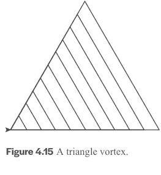

## 超级花式递归树

挑战自己！你能否创建一个花式递归树的版本，随机选择树枝的角度？你可以使用 `random.randint(a,b)` 函数，它返回一个介于 a 和 b 之间（包含 a 和 b）的随机数。提示：你可能需要存储一些值。你也可以尝试随机改变每个树枝的长度。

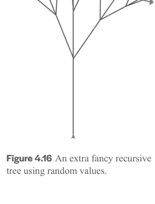


## 互联网与大数据

只要给予清晰的指令，计算机在快速、准确地处理数据方面非常出色。在本章中，你将学习一些处理大量数据的基本算法。你将编写的程序包括：

- 线性搜索（用于鞋子）
- 猜数字游戏（高-低）
- 二分搜索
- 帽子交换
- 选择排序（带计时器）
- 多个位置
- 回文检查器

我们将从一个在商店中搜索大量鞋子的激励性例子开始，看看我们的直觉如何产生一个计算搜索算法。特别是，我们将看到对数据（或鞋子）进行排序如何能够解锁新的、改进的搜索算法。除了搜索和排序算法，我们还将介绍映射、过滤和归约的概念，这些概念在现代网络应用中被广泛使用。

本单元的计算机科学主题：

- 列表索引和切片
- 线性搜索
- 二分搜索
- 选择排序
- 值交换
- 归并排序
- 高阶函数
- 映射、过滤和归约

## 5.1 搜索

搜索是你可能每天都在使用网络搜索引擎进行的常见活动。在幕后，有强大的算法允许我们在网页中搜索关键词，或在数据库中搜索信息。让我们探索搜索的概念。我们将学习两种搜索算法：线性搜索和二分搜索。

### 5.1.1 学习成果

在本单元结束时，你将能够……

## 搜索

- 编写具有不同返回类型的线性搜索函数（例如，布尔值、找到的唯一元素的索引、所有找到元素的索引）
- 识别二分搜索并编写其代码
- 编写递归二分搜索的代码

### 5.1.2 线性搜索

想象你走进一家鞋店，正在寻找一双9码的鞋子。这家店是新开的，所以鞋子还没有按尺码整理好。你该如何寻找你需要的东西？让我们考虑一个简单的 Python 搜索类比，即在列表中查找给定的值。

**挑战：** 给定一个整数列表（例如，鞋码）和一个搜索项（例如，9），你能否编写一个函数，如果搜索项在列表中则返回布尔值 `True`，否则返回 `False`？

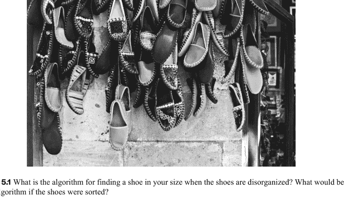

```
# 线性搜索 - 布尔值
# 作者：
# 日期：

# 输入：一个整数或字符串列表
# 输出：如果 search_term 在列表中则为 True
# 否则为 False
def search(input_list, search_term):
    for item in input_list:
        if item == search_term:
            return True
    return False

# 用一个简单的列表和搜索项 5
# 测试你的搜索函数
print(search([1, 2, 3, 4, 5], 5))
```

在上面的例子中，我们使用了一个 for 循环来遍历列表，并在找到搜索项时立即返回 True。注意我们有一个默认的返回值 False，如果列表被完全搜索且没有返回 True（记住，return 会结束函数的执行）。

现在，你能否创建一个具有相同输入和输出要求的函数，但使用 while 循环？

```
# 线性搜索 - 布尔值 (while)
# 作者：
# 日期：

# 输入：一个整数或字符串列表
# 输出：如果 search_term 在列表中则为 True
# 否则为 False
def search_while(input_list, search_term):
    i = 0
    input_list_length = len(input_list)
    while i < input_list_length:
        if input_list[i] == search_term:
            return True
        i += 1
    return False

# 用一个简单的列表和搜索项 5
# 测试你的搜索函数
print(search_while([1, 2, 3, 4, 5], 5))
```

接下来，想象你想知道的不仅仅是你的鞋子是否有货（True/False）。相反，你想要鞋子的实际位置。在我们的 Python 示例中，我们可以将问题定义如下。

**挑战：** 给定一个数字列表（例如，鞋码）和一个搜索项，你能否编写一个函数，返回搜索项的**索引**，如果不在列表中则返回 **None**？试试看！

```
# 线性搜索 - 索引
# 作者：
# 日期：

# 输入：一个整数或字符串列表
# 输出：找到 search_term 的第一个索引
# 如果不在列表中则为 None
def search_index(input_list, search_term):
    i = 0
    while i < len(input_list):
        if input_list[i] == search_term:
            return i
        i += 1
    return None

# 用一些简单的列表和搜索项
# 测试你的搜索函数
print(search_index([1, 2, 3, 4, 5], 5))
print(search_index(["a", "b", "c", "d"], "c"))
print(search_index(["a", "b", "c", "d"], "x"))
print(search_index([], "x"))  # 测试空列表
```

以上所有三种方法，通过简单地遍历列表来查找搜索项，都是**线性搜索**的变体。

### 5.1.3 二分搜索

在上一节中，我们学习了如何进行最简单的搜索，称为线性搜索。这种搜索很灵活，因为它可以在任何数据上运行；对数据的组织方式没有假设。不幸的是，这也意味着如果你的搜索项恰好是你查看的最后一项，或者它不存在，你的搜索可能会非常慢。

我们在现实生活中如何处理这个问题？当你走进一家鞋店时，鞋子是整理好的吗？是如何整理的？无论是鞋店还是图书馆，物品通常是**排序**的。


**图 5.2** 只有当鞋子是排序好的，我们才能使用二分搜索来找到它们。

虽然进行初始整理或**排序**（我们将在 5.2 节中介绍）需要一些时间，但一个排序后的列表将使以后每次查找物品都快得多。

# 二分搜索

让我们假设我们的数据是按从低到高排序的。这种数据组织方式允许我们使用一种称为**二分搜索**的搜索算法。以下是直觉。你玩过高低猜数字游戏吗？在这个游戏中，你的朋友应该选择一个 1 到 100 之间的数字。你的任务是猜出他们的数字，他们会告诉你需要猜高一点还是低一点，以此类推。选择数字的最佳策略是什么？你会选择 99，然后 98，以此类推吗？一个常见的策略是选择你尚未探索的数字集合的中间数字。所以，例如，游戏可能会这样进行：

- 我猜 50。（高了！）
- 我猜 75。（低了！）
- 我猜 63。（高了！）
- 我猜 69。（高了！）
- 我猜 72。（你猜对了！）

同样的直觉帮助我们编写**二分搜索**的算法，如下所述。我们使用两个变量来帮助我们跟踪尚未探索的列表部分。然后，我们继续检查该列表的中间部分，直到找到我们的数字。就像我们之前关于线性搜索的部分一样，我们可以检查项目是否存在（即，返回 True 或 False）或返回列表中该项的索引（即，位置）。

请记住，数据需要按从低到高的顺序排序，此代码才能工作。

```
# 二分搜索
# 作者：
# 日期：

# 如果在列表中则返回 True，否则返回 False
def binarySearch(input_list, search_term):
    # 跟踪活动的搜索空间
    low = 0
    high = len(input_list) - 1  # 最后一个元素的索引

    while low <= high:
        # 检查活动搜索空间的中点
        midpoint = (low + high) // 2  # 向下取整到最近的整数
        # 如果是搜索项，返回 True
        if input_list[midpoint] == search_term:
            return True
        else:
            # 否则，根据中点是低于还是高于搜索项
            # 来修改搜索空间
            if search_term < input_list[midpoint]:
                high = midpoint - 1
            else:
```

## 5.1.4 复习题

是时候测试一下你对本章内容的理解程度了。如果需要，完全可以回去复习！

## 理论与理解

- 我们在本节学习了哪些搜索算法的名称？
- 用自己的话描述这些算法各自是如何进行搜索的。
- 如果一个列表是有序的，我们可以进行哪种搜索？
- 对于二分查找，我们需要跟踪哪些索引？

## 5.1.5 实践练习

### 编程

现在轮到你通过编写一些代码来练习了。完成后，你可以访问我们配套网站上的“解答”部分，将你的答案与我们的进行比较。请注意，同一个问题可能有多种答案，所以如果你的答案与我们的不同，也不必担心。重要的是它们能产生相同的结果，并且你能够指出差异所在，以及为什么两种答案都可行。

### 多个位置

给定一个整数列表和一个搜索项，编写一个搜索函数，该函数应返回一个包含**所有索引**的列表，这些索引是搜索项可以被找到的位置。例如，如果列表是 [3, 2, 6, 3, 4]，你的搜索项是 3，函数应返回 [0, 3]。如果找不到搜索项，则返回一个空列表 []。你的解决方案应使用 append 函数（append 函数将一个项目插入到现有列表的末尾。例如，如果我们对 mylist（即 [1, 2, 3]）调用 mylist.append(4)，mylist 将变为 [1, 2, 3, 4]）。你必须编写至少三个测试用例，并且不能对数据的顺序做任何假设。

```
def search_multiple(integer_list, search_term):
```

### 回文检查器

你正在构建一个可以为公司建议有趣名称的应用程序。编写一个函数 `is_palindrome(word)`，使用循环检查 `word` 是否是回文，即正向和反向拼写相同。如果单词是回文，应返回 `True`，否则返回 `False`。

**挑战：** 使用递归编写此函数。

## 5.2 排序

处理大量数据时，你可能执行的另一个常见活动是对数据进行排序，即按特定顺序（例如，从小到大）组织数据。排序后的数据很有用，因为我们可以轻松地找出关于数据的有趣信息，例如，最小值是什么？最大值是什么？中位数是多少？我们将学习两种排序算法：选择排序和归并排序。

### 5.2.1 学习成果

在本单元结束时，你将能够...

### 排序

- 交换列表中的不同元素
- 使用带有多个参数的 `range()` 来迭代子列表，或反向迭代列表
- 识别并编写选择排序的代码
- 描述归并排序的一般方法和工作原理

### 5.2.2 选择排序

在上一节中，我们想要搜索我们的那双鞋，并发现如果数据是有序的，我们平均可以更快地找到我们的物品。但是，我们首先如何编写一个算法来对数据进行排序呢？让我们考虑一个现实生活中的问题：对扑克牌进行排序。

考虑下面的图片。根据牌的排列方式，你会如何整理你手中的牌？一种可能的方法是选择最小数字的牌（在这种情况下，是2）并将它们移到前面。然后选择下一个最小数字的牌（3）并将它们放在你的2和其余牌之间。然后，选择下一个最小数字（4）并将它们放在你的3和其余牌之间。这样做几次后，你会开始注意到你手中有一部分是保持有序的（在左边），而另一部分是无序的（在右边）。

这就是**选择排序**的基本算法。唯一的区别是，对于我们的列表，我们将通过将最小的牌与无序部分的第一张牌交换来为它腾出空间。（插入也是我们可用的一种工具，但目前让我们将交换视为一个简单的约束。）

### 交换需要一个临时变量

为了实现我们的选择排序，我们首先需要学习一种在列表中交换元素的范式，这将是我们对列表进行排序的关键工具。这并不简单。想象一下尝试与另一个人一步一步地交换帽子：

1. 首先，你的朋友需要脱下他们的帽子，也许把它放在桌子上。
2. 然后，你把你的帽子戴在他们的头上。
3. 现在你的头是空的，你的朋友可以从桌子上拿起他们的帽子戴在你的头上。

主要的要点是，在所有这些帽子交换过程中，你需要一个额外的地方来存放你朋友的帽子（例如，桌子）！在代码中，我们可以将这个额外的存储空间称为“temp”，因为我们只需要在交换期间临时使用这个空间。

```
# Swapping items in a list
# Author:
# Date:

# Create a list
numbers = [0,1,2,3,4]
print(numbers)

# Swap the numbers at index 0 and 1
tempNum = numbers[1]    # Make item 1 copy
numbers[1] = numbers[0] # item 1 <- item 0
numbers[0] = tempNum    # item 0 <- item 1 copy
print(numbers)

# Python has an easy swap trick
numbers[0],numbers[1] = numbers[1],numbers[0]
print(numbers)
```

现在，虽然理解交换在底层是如何工作很重要，但在 Python 中，有一种直接的语法来交换列表中的元素（第16行）。在接下来的所有示例中，我们将使用这种语法。

### 选择排序

既然我们已经学会了如何交换，让我们看看如何在代码中实现它。首先，注意主要步骤：

1. 在列表的无序部分中搜索最小值（第11-19行）。这需要首先设置一个默认最小值（即有序部分的第一个元素）（第12行），然后查看无序列表的其余部分是否有更小的值。如果有，那么我们更新我们的最小值及其位置（第18-19行）。
2. 将我们找到的最小项与无序列表的第一个元素交换（第22-23行）。

对列表中的所有元素重复上述两个步骤。

```
# Selection Sort
# Author:
# Date:

# Input: unsorted list of integers
# Output: sorted list of integers
def selectionSort(num_list):
    # Loop len(num_list) times
    for i in range(len(num_list)):

        # Set first unsorted element as minimum
        min_num = num_list[i]
        min_index = i

        # See if there is a smaller element
        for j in range(i+1,len(num_list)):
            if num_list[j] < min_num:
                min_num = num_list[j]
                min_index = j

        # Swap min with first element in sublist
        num_list[min_index],num_list[i] = num_list[i],num_list[min_index]

test_input = [39,2,103,42,50,61]

selectionSort(test_input)
print(test_input)
```

为了好玩，我们还将使用 time 模块来计算我们的排序运行所需的时间。这需要三个要素：

1. 导入 time 模块（第4行）
2. 使用 time.time() 在排序过程之前（第28行）和之后（第31行）获取当前时间
3. 计算经过的时间（第34行）

```
# Timing our sort
# Author:
# Date:
import time

# Input: unsorted list of integers
# Output: sorted list of integers
def selectionSort(num_list):
    # Loop len(num_list) times
    for i in range(len(num_list)):

        # Set first unsorted element as minimum
        min_num = num_list[i]
        min_index = i

        # See if there is a smaller element
        for j in range(i+1,len(num_list)):
            if num_list[j] < min_num:
                min_num = num_list[j]
                min_index = j

        # Swap min with first element in sublist
        num_list[min_index],num_list[i] = num_list[i],num_list[min_index]
```

## 5.2.3 归并排序

与选择排序相比，归并排序是一种快得多的列表排序方法，尤其是在待排序项目数量很大时。

让我们从一个例子开始，以直观理解归并排序算法。假设你得到了两个数字列表，每个列表已经按从小到大的顺序排好序。

你将如何把这两个列表合并成一个有序列表？

### 合并算法

一种可能性是从每个列表的开头开始。然后，你选择较小的项目并将其添加到结果列表中。

重复此步骤，直到你到达两个列表的末尾。

**挑战：** 根据上述描述，你能用Python编写一个函数 `merge(list1, list2)` 吗？（提示：这是一个有返回值的函数）

### 归并排序算法

现在你已经理解了合并算法背后的直觉，你可以用它来进行排序。归并排序背后的思想是首先将未排序的列表拆分成只包含一个元素的列表（图 5.7）

然后，我们将使用之前定义的合并函数，逐步重新组合相邻的已排序列表（图 5.8）

图 5.7 首先，逐步拆分未排序列表，直到你获得每个只包含一个元素的列表。

图 5.8 通过从每个源列表中选择较小的数字进行合并。

我们继续合并相邻的列表（图 5.9），直到将它们全部合并回一个单独的列表。你能使用上面的图示完成归并排序算法的最后一步吗？

虽然我们不会专注于此算法的实现，但理解归并排序并知道有多种方法可以解决同一个问题（这里是排序！）是很有用的。

## 5.2.4 复习题

是时候测试你对本章内容的理解程度了。回顾一下完全没问题！

## 理论与理解

- 我们在本节中学到的排序算法叫什么名字？
- 排序时我们需要使用比较运算符吗？
- 如果你有大量数据需要排序，你会选择这两种排序算法中的哪一种？
- 既然排序需要时间，在什么实际情况下你会希望通过执行排序来提高搜索速度？

## 语法自检

- `myList[0],myList[1] = myList[1],myList[0]`

```python
a="1"
b="2"
# 交换
temp=a
a=b
b=temp
```

## 5.2.5 练习

### 编码

现在轮到你通过编写一些代码来练习了。完成后，你可以访问我们配套网站上的解答部分，将你的答案与我们的进行比较。请注意，同一个问题可能有多种答案，所以如果你的答案与我们的不同，也不用担心。重要的是它们能产生相同的结果，并且你能够指出差异所在以及为什么两种答案都可行。

### 一种改进的选择排序

在本节中，我们学习了选择排序算法，它将列表中的最小数字与未排序列表中的第一个项目交换。选择排序也可以通过找到列表中的最大数字，并将其与未排序列表中的最后一个项目交换来实现。使用这个更新后的算法，假设你有以下数字列表需要排序：[11, 7, 12, 14, 19, 1, 6, 18, 8, 20]。在选择排序完成三轮完整遍历后，哪个列表代表了部分排序的列表？

- (A) [7, 11, 12, 1, 6, 14, 8, 18, 19, 20]
- (B) [7, 11, 12, 14, 19, 1, 6, 18, 8, 20]
- (C) [11, 7, 12, 14, 1, 6, 8, 18, 19, 20]
- (D) [11, 7, 12, 14, 8, 1, 6, 18, 19, 20]

将这个版本的选择排序编写为一个函数。

### 编写合并函数

定义一个函数，该函数接收两个已排序的列表作为输入参数，并返回第三个列表，该列表是两个列表的合并结果。这是归并排序算法中使用的函数。请注意，两个输入列表的长度可能不同。至少用三个不同的测试用例来测试它。

## 5.3 映射、过滤、归约

搜索和排序是计算机科学中处理项目列表的经典概念问题。除了**搜索**和**排序**，尤其是在互联网出现之后，已经识别出新的常见列表处理模式。

**映射**、**过滤**和**归约**是你在日常生活中使用互联网应用程序时可能遇到的常见模式。

**映射**：将特定函数应用于列表中的每个元素。例如，在你从在线商店购买的产品列表中，你可能希望对每个项目应用50%的折扣。

**过滤**：根据条件过滤掉列表的某些部分。例如，在商店网站的T恤列表中，你可能希望只过滤出价格低于10美元的那些。

**归约**：将列表内容归约为一个值。例如，在你购物车中商品的价格列表中，你可能希望找到总价。

### 函数式编程范式

Python是一种所谓的**过程式**或**命令式**编程语言。这意味着程序是以逐步的、命令式的方式从上到下执行的。但还有其他风格的编程语言：

- 函数式编程：程序中的所有事物都是函数（例如，LISP、Scheme、OCaml）
- 逻辑编程：程序中的所有事物都是谓词（规则和事实）（例如，Prolog）
- 面向对象编程：程序中的所有事物都是对象（状态和方法）（例如，Java、C++）

为了执行上述**映射**、**过滤**和**归约**操作，在Python中一个直接的方法是使用迭代方法，这是**过程式**编程中的常见模式。具体来说，你可以使用循环来解决这些列表问题。

函数式编程的一个关键特征是你可以像使用变量一样使用函数。例如，你可以将一个函数作为参数传递给另一个函数。**映射**、**过滤**和**归约**非常适合函数式编程方法。以下是一些代码示例，看看这是如何工作的。

### 映射

假设我们想对产品价格列表应用50%的折扣。换句话说，我们想对价格列表应用一个函数，我们称之为 `halfPrice`。代码看起来会像这样，我们首先定义 `halfPrice` 函数以返回修改后的价格，然后使用 `map` 将该函数应用于列表 `productPrices`。

```python
# 映射示例
def halfPrice(price):
    return 0.5*price

productPrices = [12,5,17,8,5]
discountedPrices = map(halfPrice,productPrices)
print(list(discountedPrices))
```

上面的代码示例将打印出 [6.0, 2.5, 8.5, 4.0, 2.5]。其中，我们定义了一个辅助函数 `halfPrice`，它定义了如何修改一个项目。然后，我们通过使用Python内置的 `map` 函数将该函数应用于列表 `productPrices`。这个 `map` 函数是一种特殊类型的函数，称为**高阶函数**，它接受另一个函数作为参数。请注意，`map` 返回一个映射对象，必须使用 `list` 函数将其转换回列表，才能继续进行处理，包括打印。

### 过滤

**过滤**是Python中另一个高阶内置函数，其工作方式类似。想象一下，`filter` 就像一个筛子，只让列表中价格低于十美元的项目通过。我们将创建一个辅助函数 `lowPrice`，如果价格小于10，则返回布尔值 `True`。然后，与 `map` 一样，我们向 `filter` 提供两个参数：函数 `lowPrice` 和要过滤的价格列表。

```python
# 过滤示例
def lowPrice(price):
    return price < 10

productPrices = [12,5,17,8,5]
lowCostPrices = filter(lowPrice,productPrices)

print(list(lowCostPrices))
```

这将打印出 [5, 8, 5]。现在，我们在这里提供的示例适用于数字列表，但 `map`、`filter` 和 `reduce` 也适用于其他类型的数据，例如*字符串*。例如，如果我们有一个T恤标语列表，并且只想过滤出那些简短精炼的标语，具体来说是长度少于12个字符的：

## 过滤器示例

```python
def shortPhrase(phrase):
    return len(phrase) < 12

slogans = ["Surf's Up!",
           "Happy Camper", "Have a Nice Day"]
shortSlogans = filter(shortPhrase, slogans)

print(list(shortSlogans))
```

这将打印出 `["Surf's Up!"]`。

## REDUCE（归约）

最后，让我们看一个归约的例子。在我们的价格列表示例中，归约可以用来将列表内容缩减为一个值，比如列表中所有价格的总成本。将归约想象成将汤熬制成更浓缩的东西可能会有所帮助。

要执行归约，你需要定义一个辅助函数，就像使用映射和过滤器一样。但这次，你的辅助函数需要接受两个参数。这个函数的目标是定义如何组合两个元素。让我们尝试用计算整数列表总和的例子。对于两个整数的情况，你会怎么做？

```python
# 归约辅助函数
def sumTotal(price1, price2):
    return price1 + price2
```

接下来，你需要从 `functools` 包中导入 `reduce` 函数。然后，像之前一样，使用你的辅助函数和列表应用 `reduce` 函数。

```python
# 归约示例 - 总价
from functools import reduce

def sumTotal(price1, price2):
    return price1 + price2

productPrices = [12, 5, 17, 8, 5]
totalPrice = reduce(sumTotal, productPrices)
print(totalPrice)
```

这应该打印出 47。在内部，`reduce` 递归地应用该函数。换句话说，`reduce` 持续地将函数 `sumTotal(price1, price2)` 应用于列表。首先，`sumTotal` 被应用于序列中的前两个元素，然后 `sumTotal` 被应用于结果和第三个元素，依此类推，直到只剩下一个元素。

这里是另一个涉及字符串的例子。让我们想象一下，你想将所有朋友的名字组合成一个用星号分隔的字符串。

```python
# 归约示例 - 组合首字母
from functools import reduce

def combine(name1, name2):
    return name1 + "*" + name2

names = ["Bonnie", "Emily", "Angel", "Nicole"]
print(reduce(combine, names))
```

这将打印出 `Bonnie*Emily*Angel*Nicole`。为了更深入地理解其工作原理，请注意以下代码*不会*打印出首字母 BEAN。它会打印出什么？试试看！

```python
# 归约示例 - 组合首字母
from functools import reduce

def combine(name1, name2):
    return name1[0] + name2[0]

names = ["Bonnie", "Emily", "Angel", "Nicole"]
print(reduce(combine, names))
```

## 5.3.1 学习成果

在本单元结束时，你将能够...

## MAP/FILTER/REDUCE（映射/过滤/归约）

- 理解映射、过滤和归约的通用模式
- 给出映射、过滤和归约的应用示例
- 在适用时，将迭代列表操作转换为使用映射、过滤和归约的代码
- 根据程序描述，编写可以作为参数传递给映射、过滤和归约的函数

## 5.3.2 复习题

是时候测试你对本章内容的理解程度了。回顾复习完全没问题！

## 理论与理解

- 映射、过滤和归约有什么共同点？
- 你会在什么情况下使用映射、过滤或归约？请举例说明。
- 函数可以作为参数传递给另一个函数吗？
- 在映射、过滤和归约中，哪一个会返回一个列表？
- 在映射、过滤和归约中，哪一个需要导入 `functools`（即不是 Python 的内置函数）？

## 语法自检

```python
def mymapfunc(x):
    # 返回一个修改后的 x

def myfilterfunc(x):
    # 根据 x 的条件返回 True/False

from functools import reduce
def myreducefunc(x, y):
    # 给定 x 和 y，返回一个单一值
```

- `map(mymapfunc, myList)`
- `filter(myfilterfunc, myList)`
- `reduce(myreducefunc, myList)`

## 5.3.3 练习

## 编码实践

编写一个程序，要求用户输入一系列整数（用逗号分隔），然后将它们作为列表打印回显示屏，但只包含大于 5 的整数。假设用户按要求输入。提供两个版本来解决这个问题：

- 使用 `for` 或 `while` 循环
- 使用映射/过滤/归约


## 专家项目

挑战自己，通过项目来检验你对所有材料的理解！在这里，你可以找到可以自己实现的项目，以综合本书的知识。

## 6.1 视听语言学习聊天机器人

在这个项目中，你将开发一个基于文本、图像和音频的交互式语言学习应用程序，供人们学习一种濒危的土著语言。这种语言被称为黑脚语，由加拿大艾伯塔州和美国蒙大拿州的土著民族使用。目前几乎没有交互式软件可供人们学习这种语言，因此你将创建它！

## 主题

这个项目将让你练习以下概念：

- 创建基于文本的交互式聊天机器人
- 在屏幕上显示图像
- 创建、读取和处理来自文本文件的数据
- 使用字典数据类型
- 创建和使用你自己的自定义函数
- 播放和操作音频文件
- 为你的应用程序创建自定义图形

本项目与 Eldon Yellowhorn 博士合作创建。

## 应用演示

语言学习聊天机器人让学习者访问城镇中的各种地点（例如，城镇、餐厅）并学习与每个地点相关的词汇（例如，电影院、咖啡馆）。你的聊天机器人将提供教授单词的功能，并测试他们所学的内容。重要的是，你的聊天机器人不仅会显示单词，还会让学习者通过扬声器或耳机听到这些单词。你可以在下方找到一个视频，描述了你将构建的基本应用流程。

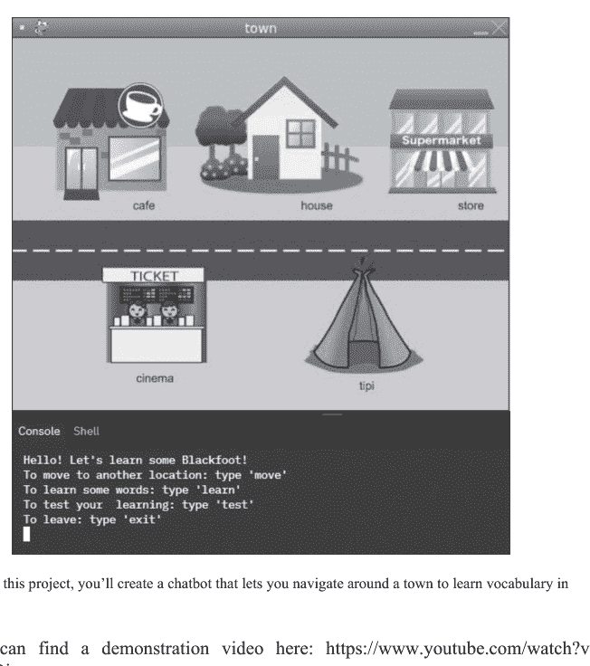

图 6.1 在这个项目中，你将创建一个聊天机器人，让你在城镇中导航以学习黑脚语词汇。

你可以在这里找到演示视频：https://www.youtube.com/watch?v=_ndQlNPBixw。

## 你的任务

在这个项目中，你将结合从练习中学到的概念，制作一个使用音频和图像帮助用户学习黑脚语的交互式聊天机器人。

## 基本聊天机器人功能

以下是你应该在这个项目中实现的基本功能。用户应该能够停留在程序中，直到他们输入“exit”。

1.  **移动。** 用户应该能够在提供的两个地点（城镇和餐厅）之间移动，并且显示的图像应相应更改。
2.  **学习和测试。** 对于每个地点，包括：
    - 一个“学习”功能：当用户输入一个英语单词时，聊天机器人会用黑脚语翻译进行回应。
    - 一个“测试”功能：聊天机器人会要求用户翻译 10 个随机的黑脚语单词。
3.  **音频。** 每当显示黑脚语词汇时，应播放相应的黑脚语音频。
4.  **翻译数据。** 黑脚语-英语翻译数据应存储在一个或多个字典中。

有关聊天机器人在每个功能中可能说什么的更多细节，请参见视频。

## 高级聊天机器人功能

- **自定义函数。** 将你的代码组织成模块和自定义函数。
- **文件存储。** 将黑脚语-英语翻译放入 `.csv` 文件中，并将它们加载到字典中，而不是将数据硬编码到你的程序中。
- **五个场景。** 创建自定义图形并包含另外三个地点。请参见下方的提示。
- **语音合成。** 包含一个“语音合成”功能，允许用户用黑脚语构建自己的短语。有关示例句子，请参见黑脚语项目词汇部分，有关更多详细信息，请参见下方提示中的 `concat` 函数。

## 提示

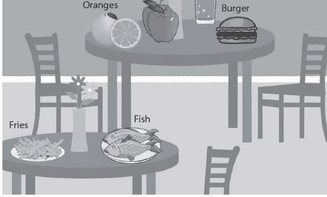

图 6.2 餐厅场景的示例图像。使用它或创建你自己的！

创建自定义图形的一种方法是：

- 使用 Google 图片搜索查找图像（具有透明背景的图像效果更好；它们通常是 `.png` 格式）。
- 注意：找到的图像可能受版权保护。
    - 转到“工具”，然后从“使用权限”过滤器中选择“知识共享许可”。
    - 当你点击过滤后的图像时，它们会有许可信息。点击“许可详情”进行检查，并在使用找到的图像之前遵循使用条款。

## 音频

为了开发本项目的音频部分，请从 http://blackfoot-revitalization.cs.sfu.ca/TeachingResources 下载必要的 .wav 文件。
为了播放“语音合成”组件的音频，已提供以下 `concat` 函数。你需要导入 `wave` 模块才能使 `concat` 函数正常工作。

```python
def concat(infiles, outfile):
    """
    Input:
    - infiles: list of .wav files to concatenate,
      e.g. ["hello.wav", "there.wav"]
    - outfile: name of concatenated output .wav file
      e.g. "hellothere.wav"
    Returns: None
    """
    data = []
    for infile in infiles:
        w = wave.open(infile, 'rb')
        data.append([w.getparams(), w.readframes(w.getnframes())])
        w.close()
    output = wave.open(outfile, 'wb')
    output.setparams(data[0][0])
    for i in range(len(data)):
        output.writeframes(data[i][1])
    output.close()
```

## 黑脚族项目词汇表

使用下面的黑脚族词汇表为你的项目创建翻译和/或支持文件。总共有五个不同的地点。

1. 城镇
    - aisaksittoo - 电影院
    - itaohpomoapii - 商店
    - itaisimmioapii - 夜总会
    - itoiyo'pii - 咖啡馆
    - naapoiyiss - 房子
    - niitoiyiss - 帐篷

2. 餐厅
    - aohkii - 水
    - mamii - 鱼
    - aotahkoinamm - 橙子
    - apaistaaminattsi - 苹果
    - paataakistsi - 土豆/薯条
    - pikkiaksin - 汉堡
    - pisatsoyiikan - 甜点
    - napayin - 面包
    - siksimimmii - 茶
    - iitapsiksikimmii - 咖啡

3. 家
    - makapoiyiss - 浴室
    - itoiyo'soap - 厨房
    - aiksistomatomahka - 汽车
    - kitsim - 门
    - aisspaohpii - 电梯
    - ksistsikomstan - 窗户
    - imitaa - 狗

4. 家庭
    - ninaa - 男人
    - aakii - 女人
    - aakiikoan - 女孩
    - saahkomaapi - 男孩
    - iksisst - 母亲
    - inn - 父亲

5. 问候语
    - oki - 你好
    - oki napi - 你好，朋友
    - tsa niita'piwa? - 你好吗？
    - tsikohssokopii. kistoo? - 我很好，你呢？
    - matohkwiikii - 还不错
    - oki - 我们走吧
    - aa - 是
    - saa - 不

## 语音合成词汇表

以下是应为语音合成组件生成的示例句子。研究黑脚族句子的模式，为你的程序设计一种方法，以生成语法和语义正确的黑脚族句子。

1. 示例句子
    - Aapinakos nitaakitapoo aisaksittoo - 明天我将去电影院
    - Ksisskanaotomni nitaaksoyi napayin - 今天早上我将吃面包
    - Annohk nitaakitapoo itoiyo'pii - 今天我将去咖啡馆

2. 时间词
    - annohk - 今天
    - ksisskanaotonni - 今天早上
    - aapinakos - 明天

3. 动词
    - nitaakitapoo - 我将去
    - nitaaksoyi - 我将吃

## 6.2 交互式图像处理器

你是否曾使用过任何图像处理软件，如 Adobe Photoshop、GIMP 或 Corel-DRAW 来修改图像？也许你应用了滤镜，或者只是旋转了图像？在这个项目中，你将创建自己的图像处理软件。此外，你将添加一个计算机视觉功能来“检测”你照片中的物体。


## 主题

这个项目将让你练习以下概念：

- 创建一个基于文本的交互式聊天机器人
- 使用 while 循环获取用户输入
- 创建和使用自定义函数
- 编写嵌套 for 循环来访问图像的像素
- 对二维数组执行操作
- 为计算机视觉任务处理颜色

## 你的任务

在这个项目中，你将结合从练习中学到的概念，创建一个交互式聊天机器人，该机器人接收一张图像，并根据以下功能对其进行修改。

## 基本功能

以下是本项目要实现的基本功能。

1. 水平翻转。水平翻转图像（像镜子一样）。
2. 暖色滤镜。为图像赋予暖色调。像素的暖色值是通过使用以下公式缩放原始 R 值（增大）和 B 值（减小）来计算的：

放大：如果值小于 64，则放大后的值为 value/64 * 80；如果值大于等于 64 但小于 128，则放大后的值为 (value–64)/(128–64) * (160–80) + 80；否则，放大后的值为 (value–128)/(255–128) * (255–160) + 160

缩小：如果值小于 64，则缩小后的值为 value/64 * 50；如果值大于等于 64 但小于 128，则缩小后的值为 (value-64)/(128–64) * (100–50) + 50；否则，缩小后的值为 (value–128)/(255–128) * (255–100) + 100。例如，如果一个像素的 RGB 颜色为 [100, 255, 200]，则该像素的暖色值将是 [125, 255, 187]，其中 R 值被放大，B 值被缩小。请注意，缩放可能会产生浮点数，因此你需要将其转换为整数。为了简化，可以考虑首先定义一个执行放大计算的函数和一个执行缩小计算的函数。

## 高级功能

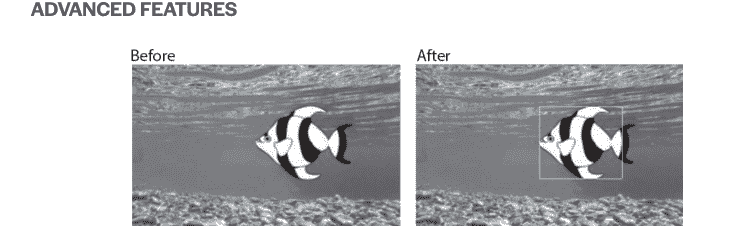

1. 向右旋转。将图像向右旋转 90 度。此操作需要创建一个新图像，其宽度等于原始高度，高度等于原始宽度。（提示：使用嵌套 for 循环结构将一行像素复制到一列像素中）。
2. 缩放。将宽度和高度都加倍（因此尺寸实际上是原来的四倍）。此操作需要创建一个新图像，其宽度等于原始宽度的两倍，高度等于原始高度的两倍。为了“构建”更大的图像，原始图像中的每个像素在结果图像中变成一个 2x2 的像素块。例如，结果图像中 result[0][0]、result[0][1]、result[1][0] 和 result[1][1] 处的像素将具有与原始图像中 original[0][0] 处像素相同的 RGB 值。
3. 定位鱼。你照片里的猫饿了！使用提供的 fish.jpg，检测鱼的黄色，并在鱼周围绘制一个绿色 (0, 255, 0) 的边界框。线条应为一个像素宽，并包围鱼的黄色区域。你可以导入 `copy` 模块并使用其 `deepcopy()` 函数来执行此操作。更多提示请参见下文。

## 交互式图像处理器

该程序应提供一个类似聊天机器人的界面，以实现以下功能：

- 使用 while 循环获取用户输入 (0/1/2/3/4/5)，以确定他们想要应用上述五种操作选项 (1/2/3/4/5) 中的哪一种。
- 如果用户输入 0，则退出。
- 如果用户输入 1/2/3/4/5，则执行操作，然后将结果图像保存为新图像，文件名为 result-optionX.jpg，其中 X 是用户输入的选项；例如，result-option1.jpg 应包含水平翻转后的图像。一旦操作和保存完成，再次询问用户输入。
- 如果用户输入的内容不是预期的输入（例如 12），则显示消息“抱歉，我不理解 12”，并再次获取用户输入。
- 每次操作都应从原始图像开始；即，操作不会应用于上一次操作的结果图像。
- 为每个操作选项定义**一个函数**。

## 提示

要检测黄色，你可以使用下面提供的代码，该代码给定一个 RGB 颜色，返回一个包含三个值的列表，分别代表色调、饱和度和明度（亮度）。你可以参考在线的 HSV 颜色选择器来帮助你定义一个合适的色调、饱和度和明度范围以检测鱼。HSV 表示法常用于图形软件，因为它稍微更接近人类感知颜色的方式。对于这个计算机视觉任务，它可能是一个更好的表示，因为具有特定色调的物体可能具有不同的亮度，这取决于特定时间照射到它上的光量。

```python
def rgb_to_hsv(r, g, b):
    """
        Input: values of a pixel in RGB colour space
        Output: values in HSV colour space
        From
        https://www.w3resource.com/python-exercises/math/
        python-math-exercise-77.php
    """
    r, g, b = r/255.0, g/255.0, b/255.0
    mx = max(r, g, b)
    mn = min(r, g, b)
    df = mx - mn
    if mx == mn:
        h = 0
    elif mx == r:
        h = (60 * ((g - b) / df) + 360) % 360
    elif mx == g:
        h = (60 * ((b - r) / df) + 120) % 360
    elif mx == b:
        h = (60 * ((r - g) / df) + 240) % 360
    if mx == 0:
        s = 0
    else:
        s = (df / mx) * 100
    v = mx * 100
    return [h, s, v]
```

调试提示：(1) 你可以将鱼的黄色像素设置为不同的颜色，以理解你的算法检测到了什么。(2) 你可以尝试创建一个函数，在指定位置绘制一个具有指定宽度和高度的绿色方框。这将帮助你理解你的绘图函数是否正常工作，与鱼的检测无关。注意：此功能仅需适用于提供的图像中的鱼和背景。但是，你不能硬编码方框的值（例如，位置、宽度、高度）；它们必须通过检查图像来计算（如果鱼在图像中的不同位置，你的程序也应该能工作！）

## 扩展

如果你已经完成了上述内容，尝试一些其他方法来扩展你的项目！例如，为用户提供一个输入照片名称以打开的选项。或者，通过在网上搜索公式来研究其他滤镜，如灰度或棕褐色。最后，你可以尝试让你的程序“可叠加”；也就是说，它应该将滤镜一个接一个地应用，而不是直接应用到原始图像上。

## 文件和资源

一个包含用于修改和在程序中使用的照片的资源入门套件，已提供在本书的配套网站上。
你还需要第4.2.3节“图像魔法”中的`csimage.py`文件来读取和加载你的图像。

## 索引

斜体页码表示图表

累加器模式：初始化与，46，66；最大值与，68；推荐系统与，xii，45–46，58，66，68，70–71
算法：聊天机器人与，11–12，18；计算机科学与，x，1–8；概念，1–2；绘制树与，102；英语，xiii；图像处理与，138；作为指令，1；交互式绘图与，72；线性搜索，112–17；多个位置与，112，117；归并排序，112，118，122–25；回文检查器，112，118；推荐系统与，45；递归，102；搜索，112–17，122；选择排序，112，118–25；交换，112，119；作为思维方式，1
分析机，3
数组，73，91–92，135
赋值，28，47，57
音频，130–35

巴贝奇，查尔斯，3
基本递归树，106–8
二分搜索，112–17，122
黑脚项目词汇表，130–34
块，4，30
布尔表达式：聊天机器人与，9，11，21–22，29；图像处理与，88，100；交互式绘图与，75–76；保持循环，75–76；学习成果与，11；逻辑运算符与，21–22；映射、筛选、归约操作与，126；搜索与，113–14；真/假，11，21，26，76，88–90，93–97，113–18，129
方括号，16
珍珠奶茶菜单机器人，36–38

C++语言，2，8，125
capitalize()函数，53
类型转换，57
链式调用：聊天机器人与，10，34，42，44；方法，34，63，67；推荐系统与，63，67
聊天机器人：高级编程与，x–xi；算法与，11–12，18；亚马逊与，9；黑脚项目词汇表，130–34；布尔表达式与，9，11，21–22，29；珍珠奶茶菜单机器人，36–38；加拿大测量，34–36；链式调用，10，34，42，44；芯片评级器，45，50–51；编码与，29，42–43，132；咖啡机器人，27–28；注释与，11–13，18，22；共同兴趣发现器，45，65–66，70；连接与，9，11，13，26，29，133；条件语句与，9，11，18–22，29，34–35，42；饼干抽屉，72，76–79；CSV文件与，132；数据类型与，11，13，16，130；字典与，130，132；错误与，9，25，30–31，44；最爱宠物发现器，45，59–65；食物，9，32–34；for循环与，10，29，37–44；格式与，132；幸运饼干，9，27；函数与，10–17，25–31，34，40–44，130–35；绿幕魔法机器人，72，91–96；问候语，9，12–18；标题与，11–12，18，29；星座运势，9，22–26，32；你好吗机器人，18–22，31–32；导入与，11，15–18，26，28，133；in关键字与，10，20，25，29，31–32，53；输入验证器，72，76，82；整数与，10，29，42；交互性与，9–10，13，15，18，29–30，72–81，130–31；解释器与，28，30；关键字与，10，19–21，25–32，36，42；语言与，9，28，31，130–35；学习成果与，11；列表与，9–10，15–18，25，39，42；逻辑运算符与，21–22；带循环，29–44；lower()函数与，29，31–35，39–42，44；数学与，28，137；读心游戏，9，38–42；模块与，9，11，17，26，28，132–33；电影评级器，45，52–54，59；新年机器人，9，43–44；猜数字游戏，72，112，116；运算符与，11，17，21–22，26，28，31，44；带个性，10–28；热门咖啡馆发现器，45–50，52，54，59，66；流行度，ix；编程与，x–xi，9，16，28–31，35，37，44；随机性与，9，11，15–18，26–28，31，40–41，131；关系运算符与，11，21–22；重复与，37，40，42；健壮性与，29–33，43–44；相似人群发现器，45，65–66，70；语音合成与，132–35；星球大战，9，65；字符串与，11，17，29，31，42；语法与，26，30，42；真/假条件与，11，21，26；术语使用，ix；变量与，9–19，26–29，34，37，39，42，44；哪一边机器人，43–44
芯片评级器，45，50–51
编码：高级结构，58；聊天机器人与，29，42–43，132；编译器与，2，4，6，8；计算机科学基础与，6–7；复制/粘贴，4，36，87；绘制树与，108，110；重复与，29，36，42，45–46；函数，78（另见函数）；图像处理与，81，101；映射、筛选、归约操作与，129；离线环境与，4–5；在线环境与，4；练习与，56–57，70；伪代码，3，7，11，18；可读，xiv；推荐系统与，51，56，58，70；搜索与，117；共享，xiii；排序与，124–25；源代码与，7–8；作为沟通方式，1。*另见*具体项目
咖啡机器人，27–28
颜色值，82，83，85，94
逗号分隔值（CSV）文件：聊天机器人与，132；推荐系统与，58–67，71
注释：聊天机器人与，11–13，18，22；计算机科学基础与，1，3，6，8；标题，3，6–8（另见标题）
共同兴趣发现器，45，65–66，70
比较运算符，11，46，64，70，124
编译器，2，4，6，8
复合赋值，47，57
计算机科学：算法，x，1–8；基础，ix，1–8；编码，6–7（另见编码）；注释，1，3，6，8；连接，9，11，13，26，29，47，51，53，68，133；条件语句，7，9，22，29，34–35，42；重复，29，36，42，45–46；函数，7（另见函数）；标题，3，6–8；解释器，2–8；列表，9–10，15–18，25，39，42，45，52–58，65–68，71，82–84，90–92，115，122–26；模块，5（另见模块）；作为问题解决，1；编程，x–xi，1–8；随机性，9，17，83；重复，2，7；健壮性，29–33，43–44，50，53，56，70；字符串，6（另见字符串）；语法，2，5，7；变量，7，9（另见变量）
计算机视觉：绘制树，101–11；图像处理，81–101；交互式绘图，72–81
连接：聊天机器人与，9，11，13，26，29，133；推荐系统与，47，51，53，68
条件语句：聊天机器人与，9，11，18–22，29，34–35，42；计算机科学基础与，7，9，22，29，34–35，42；if/else，18，20–21，26，52；学习成果与，11；嵌套，34–36
饼干抽屉，72，76–79
coolcolours模块，96–100
复制/粘贴，4，36，87
创造力，xiii，132

数据文件：聊天机器人与，45，57–59，64，66；推荐系统与，58–60，63–64，66，68，71；存储，58–59
数据类型：布尔，88；聊天机器人与，11，13，16，130；浮点数，45–46，51，55，57，136；图像处理与，88；学习成果与，11；推荐系统与，xi，45–48，51，54–57
调试，5，138
字典：聊天机器人与，130，132；推荐系统与，52–54，56，59
除法，45–46，48，51
点运算符，17，31，44
绘制树：算法与，102；分支长度与，108–9，111；编码与，108，110；有返回值函数与，102，109–10；导入与，104–8；整数与，109，111；关键字与，104；数学与，109–10；参数与，103–4，107–11；编程与，101；随机性与，111；递归与，73，101–11；重复与，102；分割与，108；语法与，100；海龟与，101–11
重复，29，36，42，45–46
ELIZA，18
错误：聊天机器人与，9，25，30–31，44；图像处理与，81，89
快餐订单，56，57
最爱宠物发现器，45，59–65
滤镜，81，112，125–29
浮点数，45–46，51，55，57，136
浮点数，48–49
食物机器人，9，32–34
for循环：聊天机器人与，10，29，37–44；图像处理与，82，93，100，135–36；交互式绘图与，76–77；列表与，39–40；嵌套，46，58，73，93，100，135–36；练习，129；带range，40–42，45–47，53；推荐系统与，46–47，53–54，58，62–64，68；搜索与，114
格式：聊天机器人与，132()方法，49；推荐系统与，49–50，55，57–58
幸运饼干聊天机器人，9，27
有返回值函数：复制/粘贴与，87；绘制树与，102，109–10；图像处理与，73，81，87–90，96，100；递归与，109–10；排序与，123；术语使用，87–88
函数式编程，125–26
函数体，78
函数：聊天机器人与，10–17，25–31，34，40–44，130–35；计算机科学基础与，7；自定义，130，132，135；定义，73，78–79，81–82，89，91，96，109–11，123，125–27，136–37；绘制树与，101–11；图形与，72–73，78–83，87–111；高阶，112，126；图像处理与，81–83，87–101，136–38；交互式绘图与，72–73，78–81；映射、筛选、归约操作与，125–29；模块，99（另见模块）；

## 索引

卸载，91；推荐系统与，46、51、54–60、65、69、71；递归与，102–3、105、109–11、118；搜索与，112–18；排序与，118、123、125；术语使用，78。*另见*具体函数

Future Age 程序，56

图形：颜色值与，82、83、85、94；自定义，130、132；调试与，5；绘制树，101–11；错误与，81、89；函数与，72–73、78–83、87–111；HSV 表示与，137；图像处理，81–101；交互式绘图，72–81；列表与，82–84、90–92；像素与，72、74、82–100、135–38；分辨率，72；RGB 表示与，xi、73、82–101、136–37；变量与，73、76、78、82、88、93、100；视频游戏，66、72

绿幕：Green Screen Magic Bot，72、91–96；图像处理与，72、82、87、91–98

问候聊天机器人，9、12–18

标题行，66、71

标题：聊天机器人与，11–12、18、29；计算机科学基础与，3、6–8；推荐系统与，59–63、66–67、71

“Hello World” 程序，5

home() 函数，78

星座聊天机器人，9、22–26、32

How’s It Going Bot，18–22、31–32

*How to Think Like a Computer Scientist*（Wentworth、Elkner、Downey 和 Meyers），x–xii

HSV 颜色选择器，137

if/else 条件语句，18、20–21、26、52

搞笑诺贝尔奖，50

图像处理：算法与，138；布尔表达式与，75–76、88、100；编码与，81、101；颜色值与，82、83、85、94；coolcolours 与，96–100；数据类型与，88；错误与，81、89；for 循环与，82、93、100、135–36；有返回值的函数与，73、81、87–90、96、100；函数与，81–83、87–101、136–38；绿幕与，72、82、87、91–98；HSV 颜色选择器与，137；导入与，81、84–95、98–101、136；输入验证器，82；整数与，82、88、136；交互式，135–38；关键字与，89、98–100；语言与，91；列表与，82–84、90–92；数学与，96、100；模块与，81、83、96–101、136；参数与，88–89、101；像素与，82–100、135–38；编程与，87、91；random 模块与，83；重复与，87；替换背景，94–96；RGB 表示与，73、82–101、136–37；字符串与，93；True/False 条件与，88–90、93–97；二维矩阵与，83–87、90；变量与，82、88、93、100；while 循环与，82、135–36

导入：聊天机器人与，11、15–18、26、28、133；绘制树与，104–8；图像处理与，81、84–95、98–101、136；交互式绘图与，73–76、79–81；map、filter、reduce 操作与，127–29；random，11、15–18；排序与，121

import random，11、15–18

索引：交互式绘图与，73；列表，45、54、57–58、61–63、68、71、112–16、121–22；多个位置与，112、117；推荐系统与，45、54、57–58、61–63、68、71；搜索与，112–17；切片与，58、68、71、112、122；排序与，120–22；字符串与，58、63

in 关键字，10、20、25、29、31–32、53

输入验证器，72、76、82

整数：聊天机器人与，10、29、42；绘制树与，109、111；图像处理与，82、88、136；map、filter、reduce 操作与，127、129；推荐系统与，45–47、50–51、54–55、57、64；搜索与，113–17；排序与，120–21；字符串与，29、46–47、51、54、114–15；类型，46、50；变量与，29、46–47、51、64

集成开发与学习环境（IDLE），5、29

集成开发环境（IDE），4–5、34

交互式绘图：算法与，72；聊天机器人与，72–81；Cookie Drawer，72、76–79；for 循环与，76–77；函数与，72–73、78–81；导入与，73–76、79–81；索引与，73；输入验证器，72、76；keep_looping 与，75–76；关键字与，78–80；lower() 函数与，75；模块与，72–73、79；Number Guessing Game，72；参数与，72–73、78–79；编程与，73、76、78；重复与，76；语法与，80；True/False 条件与，76；turtle 与，72–81；变量与，73、76、78；while 循环与，72、75–76

交互性：聊天机器人与，9–10、13、15、18、29–30、130–31；图像处理与，135–36

解释器：聊天机器人与，28、30；计算机科学基础与，2–8；语言，2–8；推荐系统与，58

Java，2、8、125

keep_looping，75–76

关键字：聊天机器人与，10、19–21、25–32、36、42；计算机科学基础，7；绘制树与，104；图像处理与，89、98–100；in，10、20、25、29、31–32、53；交互式绘图与，78–80；推荐系统与，53–55、69；搜索与，112

语言：Blackfoot Project Vocabulary，130–34；聊天机器人与，9、28、31、130–35；编译型，2、4、6、8；计算机科学基础与，1–8；图像处理与，91；解释器与，2–8；map、filter、reduce 操作与，125；编程，1–9、28、31、54、91、125；推荐系统与，54；语音合成与，132–35；语法，5（*另见*语法）；翻译与，1–2、8、12、19、131–33

大型语言模型（LLMs），9

len() 函数，51

长度：分支，108–9、111；绘制树与，108–9、111；推荐系统与，45、51、57；搜索与，114；排序与，125

线性搜索，112–17

Linux，4

列表：聊天机器人与，9–10、15–18、25、39、42；比较，45、65、117、122–22；for 循环与，39–40；图像处理与，82–84、90–92；索引，45、54、57–58、61–63、68、71、112–16、121–22；学习成果与，11；并行，54、57、65；推荐系统与，45、52、54、57–58、65、67–68、71；搜索与，115；切片，58、67–68、71、112、122；排序与，122–26；分割，45、60–63、68–69、123

逻辑：学习成果与，11；运算符与，11、21–22；编程与，7、125；True/False 条件，11、21、26、76、88–90、93–97、113–18、129

Lovelace, Ada，3

lower() 函数：聊天机器人与，29、31–35、39–42、44；交互式绘图与，75；推荐系统与，47–53、69

多个位置，112、117

map、filter、reduce 操作，xii、125–29

数学：赋值与，28；聊天机器人与，28、137；绘制树与，109–10；图像处理与，96、100；Lovelace 与，3；推荐系统与，46、48、57

最大值，68

归并排序，112、118、122–25

Mindreader Game，9、38–42

MIT 人工智能实验室，18

模块：聊天机器人与，9、11、17、26、28、132–33；计算机科学基础与，5；coolcolours，96–100；图像处理与，81、83、96–101、136；交互式绘图与，72–73、79；random，9、17、83；排序与，121

励志名言生成器，5–7

电影评分器，45、52–54、59

嵌套条件语句，34–36

新年机器人，9、43–44

Number Guessing Game，72、112、116

奥运评判程序，56

运算符：\，28；聊天机器人与，11、17、21–22、26、28、31、44；点，17、31、44；顺序，45、48、58；推荐系统与，45–48、58、64、70；关系，11、21–22；排序与，122、124

回文检查器，112、118

并行列表，54、57、65

参数：绘制树与，103–4、107–11；图像处理与，88–89、101；交互式绘图与，72–73、78–79；map、filter、reduce 操作与，125；排序与，118、125

像素：检查颜色，86–87；颜色值与，82、83、85、94；coolcolours 与，96–100；图形与，72、74、82–100、135–38；绿幕与，72、82、87、91–98；HSV 颜色选择器与，137；图像处理与，82–100、135–38；RGB 表示与，73、82–101、136–37；二维矩阵与，83–87、90

Popular Cafe Finder，45–50、52、54、59、66

*Problem Solving with Algorithms and Data Structures Using Python*（Miller 和 Ranum），xii

编程：聊天机器人与，x–xi、9、16、28–31、35、37、44；计算机科学与，x–xi、1–8；调试，5、138；绘制树与，101；函数式，125–26；图像处理与，87、91；交互式绘图与，73、76、78；语言，1–9、28、31、54、91、125；学习成果与，11；逻辑，7、125；map、filter、reduce 操作与，125–26；推荐系统与，53–54、63、68；健壮性，29–33、43–44、50、53、56、70。*另见*具体项目

伪代码，3、7、11、18

心理学，50

random 模块，9、17、83

随机性：聊天机器人与，9、11、15–18、26–28、31、40–41、131；绘制树与，111；交互式绘图与，73、78、83、87、96、100；random.choice，11、17–18、26、28、31、41、78、87、100

range() 函数，118

readline() 函数，59–63、67、69

推荐系统：累加器模式与，xii、45–46、58、66、68–71；算法与，45；Amazon 与，45；类型转换与，57；链式操作与，63、67；Chip Rater，45、50–51；编码与，51、56、58、70；Common Interests Finder，45、65–66、70；比较运算符与，46、64、70；复合赋值与，47、57；连接与，47、51、53、68；CSV 文件与，58–67、71；数据文件与，58–60、63–64、66、68、71；数据类型与，xi、45–48、51、54–57；字典与，52–54、56、59；除法与，45–46、48、51；Favourite Pets Finder，45、59–65；for 循环与，46–47、53–54、58、62–64、68；格式与，49–50、55、57–58；函数与，46、51、54–60、65、69、71；标题与，59–63、66–67、71；索引与，45、54、57–58、61–63、68、71；整数与，45–47、50–51、54–55、57、64；解释器与，58；关键字与，53–55、69；语言与，54；len() 函数与，51；长度与，45、51、57；列表与，45、52、54、57–58、65、67–68、71；lower() 函数与，47–53、69；数学

## 索引

and, 46, 48, 57; Movie Rater, 45, 52–54, 59; Netflix and, 45; operators and, 45–48, 58, 64, 70; Popular Cafe Finder, 45–50, 52, 54, 59, 66; programming and, 53–54, 63, 68; repetition and, 47; robustness and, 50, 53, 56, 70; Similar People Finder, 45, 65–66, 70; slicing and, 58, 67–68, 71; splitting and, 45, 60–63, 67–69; strings and, 46–47, 51–58, 63–65, 68, 70; syntax and, 55, 69; type conversion and, 45, 57; variables and, 45–54, 57, 60, 63–68, 71; writing to a file, 64–66

递归, xii; 基础, 102–6; 绘制树与, 73, 101–11; 函数与, 102–3, 105, 109–11, 118; 循环与, 102–4; map, filter, reduce 操作与, 127; 搜索与, 113, 118; turtle 与, 101, 104, 108, 111

reduce 操作, 125–26

关系运算符, 11, 21–22

重复: 聊天机器人与, 37, 40, 42; 计算机科学基础与, 2, 7; 绘制树与, 102; 图像处理与, 87; 交互式绘图与, 76; 推荐系统与, 47

RGB 表示: 颜色值, 82, 83, 85, 94; 组成部分, 82, 101; 图形与, xi, 73, 82–101, 136–37; 图像处理与, 73, 82–101, 136–37; 整数与, 83, 136

健壮性: 聊天机器人与, 29–33, 43–44; 推荐系统与, 50, 53, 56, 70

搜索, xii; 算法, 112–17, 122; 二分查找, 112–17, 122; 布尔表达式与, 113–14; 编码与, 117; for 循环与, 114; 函数与, 112–18; 索引与, 112–17; 整数与, 113–17; 关键字与, 112; 长度与, 114; 线性查找, 112–17; 列表与, 115; 猜数字游戏, 112, 116; 递归与, 113, 118; 字符串与, 114–15; 真/假条件与, 113–18; 变量与, 116; while 循环与, 114

选择排序, 112, 118–25

相似人物查找器, 65–66, 70

西蒙弗雷泽大学, ix

切片: 索引与, 58, 68, 71, 112, 122; 列表与, 58, 67–68, 71, 112, 122; 推荐系统与, 58, 67–68, 71

软件构造课程, xii

排序, xii; 算法与, 112, 118–25; 编码与, 124–25; 函数与, 118, 123, 125; import 与, 121; 索引与, 120–22; 整数与, 120–21; 长度与, 125; 列表与, 122–26; 归并排序, 112, 118, 122–25; 模块与, 121; 运算符与, 122, 124; 参数与, 118, 125; range() 函数与, 118; 选择排序, 112, 118–25; 分割与, 123; 交换, 105–6, 112, 118–21, 124; 语法与, 120, 124; 变量与, 118

语音合成, 132–35

Spence, Charles, 50

分割: 绘制树与, 108; 列表, 45, 60–63, 68–69, 123; 推荐系统与, 45, 60–63, 67–69; 排序与, 123

星球大战机器人, 9, 65

字符串格式化, 57

字符串, xiii; 聊天机器人与, 11, 17, 29, 31, 42; 计算机科学基础与, 6; 图像处理与, 93; 索引, 58, 63; 整数与, 29, 46–47, 51, 54, 114–15; 学习成果与, 11; map, filter, reduce 操作与, 126–27; 回文, 102; 推荐系统与, 46–47, 51–58, 63–65, 68, 70; 搜索与, 114–15; strip() 函数与, 29, 33, 42, 60–63, 67

strip() 函数, 29, 33, 42, 60–63, 67

交换, 105–6, 112, 118–21, 124

语法: 聊天机器人与, 26, 30, 42; 计算机科学基础与, 2, 5, 7; 绘制树与, 100; 交互式绘图与, 80; map, filter, reduce 操作与, 129; 推荐系统与, 55, 69; 排序与, 120, 124

文本文件, 57–59, 64, 71, 130

翻译, 1–2, 8, 12, 19, 131–33

真/假条件: 布尔表达式与, 11, 21, 26, 76, 88–90, 93–97, 113–18, 129; 聊天机器人与, 11, 21, 26; 图像处理与, 88–90, 93–97; 交互式绘图与, 76; map, filter, reduce 操作与, 129; 搜索与, 113–18

turtle: 基本命令, 73–74; 绘制树与, 101–11; 交互式绘图与, 72–81; 递归与, 101, 104, 108, 111

二维矩阵, 83–87, 90

类型转换, 45, 57

upper() 函数, 29, 42, 69

变量: 聊天机器人与, 9–19, 26–29, 34, 37, 39, 42, 44; 计算机科学基础与, 7, 9; 浮点数与, 46, 57; 图形与, 73, 76, 78, 82, 88, 93, 100; 图像处理与, 82, 88, 93, 100; 整数与, 29, 46–47, 51, 64; 交互式绘图与, 73, 76, 78; 学习成果与, 11; map, filter, reduce 操作与, 118; 最大值与, 68; 推荐系统与, 45–54, 57, 60, 63–68, 71; 搜索与, 116; 排序与, 118; 术语使用, 15

电子游戏, 66, 72

Which Side Bot, 43–44

while 循环: 图像处理与, 82, 135–36; 交互式绘图与, 72, 75–76; 练习题, 129; 搜索与, 114

write() 函数, 64–65

Yellowhorn, Eldon, 130

Zampini, Massimiliano, 50

zip 文件, 4