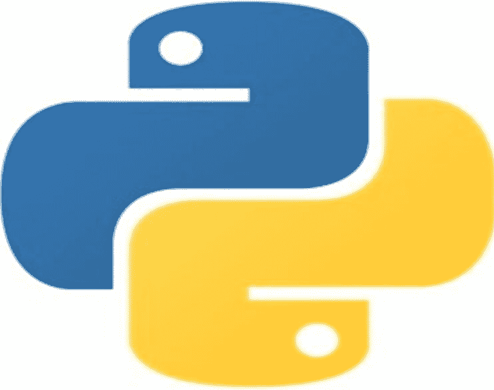

Jaha Publishing

# Python 练习测试与面试题



通过练习测试掌握完整的 Python 指南。立即通过 Python 认证考试，获得你梦寐以求的 Python 开发者职位。

## Python 练习测试与面试题（基础/进阶）

通过练习测试掌握完整的 Python 指南。立即通过 Python 认证考试，获得你梦寐以求的 Python 开发者职位。

Jaha Publishing

版权所有 © 2022 Jaha Publishing

保留所有权利

本书中描绘的人物和事件均为虚构。与任何真实人物（在世或已故）的相似之处纯属巧合，并非作者本意。

未经出版商明确书面许可，不得以任何形式或任何方式（电子、机械、影印、录音或其他方式）复制本书的任何部分，或将其存储在检索系统中，或进行传播。

### 简介

本书包含什么？

本书包含练习测试，旨在帮助你为下一次 Python 开发者职位面试做好准备，并为你通过 PCEP（认证初级 Python 程序员）考试打下坚实基础。本书涵盖多个主题的问题：

- 1. Python 与计算机编程简介
- 2. 数据类型、变量、基本输入输出操作、基本运算符
- 3. 布尔值、条件执行、循环、列表与列表处理、逻辑与位运算
- 4. 函数、元组、字典、数据处理等。

**本书为你提供什么？**

- 1. 本书包含 4 套练习测试。
- 2. 每套练习测试包含 25 道题目，限时 30 分钟。
- 3. 题目均为选择题。
- 4. 每次参加测试时，答案顺序会随机排列。
- 5. 题目难度各异——从简单到中等再到困难。
- 6. 测试完成后，你将立即获得一份结果报告，其中包含从优势到劣势的分类。
- 7. 你可以根据自己的时间安排，反复参加测试。
- 8. 新的题目集将定期添加，你可以
- 9. 学习资源将通过电子邮件定期分享给所有注册学生，并附带任何最新消息/活动。

### 为什么学习 Python？

Python 易于学习。语法简单，代码可读性强。使用 Python，你可以用比大多数其他编程语言更少的代码行编写程序。Python 的受欢迎程度正在迅速增长。它现在是最流行的编程语言之一。Python 应用广泛，可用于自动化、Web 应用开发、人工智能、数据科学等领域。

凭借其近乎完美的优雅，Python 被众多大学和行业列为首选编程语言之一。根据 TechRepublic 的报道，Python 开发者是“2019 年十大最热门技术职位”之一。这得益于全球市场人工智能和机器学习技术的兴起。截至 2022 年初，美国 Python 开发者的平均年薪超过 12 万美元，使其成为当今最受欢迎且最赚钱的职业之一。

通过本书，你将获得终身访问 100 多个 Python 面试和练习题的权限，这些题目会定期更新。完成测试后，你将对 Python 更有信心，并能轻松执行 Web 开发、自动化、数据科学等领域的基础和进阶任务。不仅如此，你还将具备通过 Python 认证考试和通过下一次职位面试所需的知识！

但最重要的是，你将**理解** Python 的基础知识。

你还将获得 30 天退款保证。无需任何理由！不要等待，立即加入本书吧！

### 本书适合谁

- 1. 希望获得 Python 认证的程序员
- 2. 有兴趣参加 Python 认证考试的学习者。
- 3. 初级、中级和高级 Python 程序员
- 4. 所有正在准备 Python 职位面试的人。
- 5. 所有希望通过题目及其解释来学习更多 Python 知识的人。
- 6. 希望学习 Python 以进入人工智能、机器学习、数据科学、Web 开发或自动化领域的学生和专业人士。
- 7. 所有想成为 Python 开发者的人
- 8. 所有想为面试做准备的人
- 9. 所有想练习 Python 的人

## 练习测试 1：面试 #1 [ 70 道题 ]

### 问题 1

以下代码片段的输出结果是什么？

```python
try:
    val = 10 / 0
    print(val)
except (ValueError, ZeroDivisionError):
    print('ValueError or ZeroDivisionError exception raised...')
except:
    print('Something went wrong...')
```

- 代码将有一个异常被最后一个 except 块处理。
- 此代码将引发 ValueError 异常并输出以下消息：'ValueError or ZeroDivisionError exception raised...'
- 此代码将引发 ZeroDivisionError 异常并输出以下消息：'ValueError or ZeroDivisionError exception raised...' (正确)
- 代码将在控制台输出 0。

### 问题 2

在遍历字典时，应使用哪种方法来同时遍历字典的键和值？

1. dict.keys()
2. dict.items() (正确)
3. dict.iteritems()
4. dict.values()

#### 解释

dict.items() - 返回字典项（（键，值）对）的新视图。

https://docs.python.org/3/library/stdtypes.html#dict.items

### 问题 3

你将使用哪个内置函数来检查给定类是否是指定基类的派生类（子类）？

1. issubclass() (正确)
2. type()
3. isinstance()
4. isclass()

#### 解释

issubclass(class, classinfo) - 如果 class 是 classinfo 的子类（直接、间接或虚拟），则返回 True。

https://docs.python.org/3/library/functions.html#issubclass

### 问题 4

处理异常的代码部分应放置在：

- try: 分支
- except: 分支 (正确)
- finally: 分支
- else: 分支

#### 解释

except 子句指定一个或多个异常处理程序。try 语句为一组语句指定异常处理程序和/或清理代码：

```python
try_stmt ::= try1_stmt | try2_stmt
try1_stmt ::= "try" ":" suite
             ("except" [expression ["as" identifier]] ":" suite)+
             ["else" ":" suite]
             ["finally" ":" suite]
try2_stmt ::= "try" ":" suite
             "finally" ":" suite
```

https://docs.python.org/3/reference/compound_stmts.html#the-try-statement

### 问题 5

选择面向对象编程的四大支柱。（选择 4 项）

- 抽象 (正确)
- 单态性
- 封装 (正确)
- 继承 (正确)
- 多态性 (正确)
- 同态性

### 问题 6

pandas 包的导入方式如下：

```python
import pandas as pd
```

如何显示此包的路径？

1. pd.path
2. pd.file
3. path(pd)
4. pd.__path__
5. pd.__file__ (正确)

#### 解释

__file__ - 如果模块是从文件加载的，则返回加载该模块的文件的路径名。对于某些类型的模块（例如静态链接到解释器中的 C 模块），__file__ 属性可能缺失。对于从共享库动态加载的扩展模块，它是共享库文件的路径名。

https://docs.python.org/3/reference/datamodel.html

### 问题 7

以下哪些值是浮点类型？（选择 4 项）

1. 1e6 (正确)
2. .0 (正确)
3. 1
4. 0.
5. 0
6. 0.0 (正确)

#### 解释

0 和 1 是 int 类型。

### 问题 8

以下代码的预期输出是什么？

```python
course_name = 'data'
for character in course_name:
    print(chr(ord(character) + 2), end='')
```

1. b_r_
2. gdwd
3. data
4. fcvc (正确)

#### 解释

chr(i) - 返回一个字符串，表示 Unicode 码位为整数 i 的字符。例如，chr(97) 返回字符串 'a'，而 chr(8364) 返回字符串 '€'。这是 ord() 的逆操作。

https://docs.python.org/3/library/functions.html#chr

ord(c) - 给定一个表示单个 Unicode 字符的字符串，返回一个表示该字符 Unicode 码位的整数。例如，ord('a') 返回整数 97，ord('€')（欧元符号）返回 8364。这是 chr() 的逆操作。

https://docs.python.org/3/library/functions.html#ord

### 问题 9

执行以下代码的预期结果是什么？

```python
def hello(n):
    def inside():
        return 'Hello' + '!' * n
    return inside

polite = hello(1)
rude = hello(3)
print(polite())
print(rude())
```

- 1. Hello!
- 2. Hello!!!
- 3. (正确)
- 4. Hello!!!
- 5. Hello!
- 6. Hello!
- 7. Hello!
- 8. Hello!1
- 9. Hello!3

### 问题 10

函数中的 **kwargs 是什么意思？

- 特殊语法 **kwargs 最常用于 Python 函数定义中，用于向函数传递可变数量的参数（没有特定名称的参数）。
- Python 没有 **kwargs 语法。
- 特殊语法 **kwargs 最常用于 Python 函数定义中，用于向函数传递可变数量的参数（具有特定名称的参数）。
- (正确)

#### 解释

**kwargs 指定可以向函数提供任意数量的关键字参数。

### 问题 11

以下代码的预期输出是什么？

```python
var1 = 'PCAP'
var2 = var1[:]
var3 = 'PCAP'

print(var1 == var2, var1 == var3)
print(var1 is var2, var1 is var3)
```

- 1. True True
- 2. True True
- 3. (正确)
- 4. True True
- 5. False True
- 6. True True
- 7. False False
- 8. True True
- 9. True False

### 问题 12

以下哪个运算符不是逻辑运算符？

- 1. and
- 2. %
- 3. (正确)
- 4. not
- 5. or

#### 解释

%（取模）运算符返回第一个参数除以第二个参数的余数。

### 问题 13

假设你有以下代码片段：

```python
stocks = [
    "Apple",
    "Tesla",
    "Amazon",
    "Microsoft",
    "Netflix",
    "Alphabet",
]
tmp = stocks
```

选择所有正确的陈述。（选择 2）

- stocks 和 tmp 具有相同的长度。
- (正确)
- stocks 是一个列表，而 tmp 是一个元组。
- stocks 和 tmp 是不同的列表。
- stocks 和 tmp 是同一个列表的不同名称。
- (正确)

### 问题 14

给定以下股票列表：

```python
stocks = ['AAPL', 'MSFT', 'NVDA', 'UBER', 'TSLA']
```

选择将从 stocks 列表中删除所有项目的代码。（选择 2）

预期输出：

```python
[]
```

- 1. del stocks[:]
- 2. (正确)
- 3. del stocks
- 4. stocks.clear()
- 5. (正确)
- 6. stocks[::-1]

#### 解释

list.clear() - 从列表中删除所有项目。等同于 del a[:]。

https://docs.python.org/3/tutorial/datastructures.html#more-on-lists

### 问题 15

假设你有以下代码：

```python
class ClientList(list):
    def search_email(self, value):
        result = [client for client in self if value in client.email]
        return result

class Client:
    all_clients = ClientList()

    def __init__(self, name, email):
        self.name = name
        self.email = email
        Client.all_clients.append(self)
```

选择所有正确的陈述。（选择 2）

- name 和 email 属性是 Client 类实例属性的示例。
- (正确)
- search_email 属性是 ClientList 类实例属性的示例。
- all_clients 是 Client 类的类属性。
- (正确)
- all_clients 属性是 Client 类实例属性的示例。

#### 解释

all_clients 属性是 Client 类实例属性的示例。 -> 错误。它是类属性的示例。

search_email 属性是 ClientList 类实例属性的示例。 -> 错误。它是类属性的示例。

### 问题 16

以下哪个单词不是 Python 关键字？（选择 3）

- switch
- (正确)
- lambda
- break
- yield
- loop
- (正确)
- go
- (正确)
- finally

#### 解释

Python 关键字列表：

```python
[
    'False',
    'None',
    'True',
    'and',
    'as',
    'assert',
    'async',
    'await',
    'break',
    'class',
    'continue',
    'def',
    'del',
    'elif',
    'else',
    'except',
    'finally',
    'for',
    'from',
    'global',
    'if',
    'import',
    'in',
    'is',
    'lambda',
    'nonlocal',
    'not',
    'or',
    'pass',
    'raise',
    'return',
    'try',
    'while',
    'with',
    'yield',
]
```

https://docs.python.org/3/reference/lexical_analysis.html#keywords

### 问题 17

什么是测试运行器（单元测试）？

- 测试运行器是一个允许你运行测试并将结果提供给用户的程序。
- (正确)
- 测试运行器代表执行一个或多个测试所需的准备工作以及任何相关的清理活动。这可以包括，例如，创建临时数据库、目录或启动服务器进程。
- 测试运行器是测试用例的集合。用于聚合应该一起运行的测试。
- 测试运行器是一个单独的测试单元，并根据指定的输入集测试指定的响应。

#### 解释

测试运行器 - 测试运行器是一个协调测试执行并向用户提供结果的组件。运行器可以使用图形界面、文本界面，或返回一个特殊值来指示执行测试的结果。

### 问题 18

如何使用 pip 列出当前环境中已安装的包？> 字符代表命令提示符。（选择 2）

- 1. > pip freeze
- 2. (正确)
- 3. > pip list
- 4. (正确)
- 5. > pip install
- 6. > pip download
- 7. > pip config

#### 解释

pip freeze - 以 requirements 格式输出已安装的包。包按不区分大小写的排序顺序列出。
pip list - 列出已安装的包，包括可编辑的包。包按不区分大小写的排序顺序列出。

https://pip.pypa.io/en/stable/cli/pip_freeze/
https://pip.pypa.io/en/stable/cli/pip_list/

### 问题 19

你想在控制台打印以下消息：

I really like "Monty Python's Flying Circus" series.

你该怎么做？（选择 3）

- 1. print('I really like "Monty Python\'s Flying Circus" series.')
- 2. (正确)
- 3. print('I really like "Monty Python's Flying Circus" series.')
- 4. print("I really like "Monty Python\'s Flying Circus" series.")
- 5. print("I really like "Monty Python\'s Flying Circus" series.")
- 6. (正确)
- 7. print(""I really like "Monty Python's Flying Circus" series.""")
- 8. (正确)

### 问题 20

在 Python 中，有一个特殊的变量叫做 path，它存储了所有按顺序搜索的位置，以查找 import 语句请求的模块。可以通过以下代码访问它：

```python
import sys

print(sys.path)
```

示例输出：

```python
['/content',
 '/env/python',
 '/usr/lib/python37.zip',
 '/usr/lib/python3.7',
 '/usr/lib/python3.7/lib-dynload',
 '',
 '/usr/local/lib/python3.7/dist-packages',
 '/usr/lib/python3/dist-packages',
 '/usr/local/lib/python3.7/dist-packages/IPython/extensions',
 '/root/.ipython']
```

选择所有正确的陈述。（选择 2）

- 包含所需名称模块的最后一个文件夹将被考虑（如果任何剩余文件夹包含该名称的模块，它将被忽略）。
- 如果在任何这些目录中都找不到该模块，则导入失败。
- (正确)
- Python 按照列表中列出的顺序浏览这些文件夹。
- (正确)
- 我们无法将包含模块的文件夹添加到 path 变量（它是不可修改的）。

#### 解释

包含所需名称模块的最后一个文件夹将被考虑（如果任何剩余文件夹包含该名称的模块，它将被忽略）。 -> 错误。是第一个文件夹。

我们无法将包含模块的文件夹添加到 path 变量（它是不可修改的）。 -> 错误。我们可以。

### 问题 21

你应该使用以下哪个 pip 命令来显示模块/包信息，包括模块/包的依赖项？

- pip search
- pip show
- (正确)
- pip list
- pip install

#### 解释

pip show - 显示一个或多个已安装包的信息。输出采用符合 RFC 的邮件头格式。

例如：

```bash
pip show xarray
```

输出：

```
Name: xarray
Version: 0.20.2
Summary: N-D labeled arrays and datasets in Python
Home-page: https://github.com/pydata/xarray
Author: xarray Developers
Author-email: xarray@googlegroups.com
License: Apache
Location: /usr/local/lib/python3.7/dist-packages
Requires: importlib-metadata, typing-extensions, pandas, numpy
Required-by: xarray-einstats, arviz
```

### 问题 22

Python 的创造者是谁？

- James Gosling
- Dennis Ritchie
- Linus Torvalds
- Brendan Eich
- Guido van Rossum（正确）

#### 解释

https://en.wikipedia.org/wiki/Guido_van_Rossum

### 问题 23

假设你有以下 `Laptop` 类：

```python
class Laptop:
    def __init__(self, ram=8):
        self.ram = ram

    def set(self, ram=4):
        self.ram += ram
        return self.ram
```

以下代码的预期输出是什么？

```python
laptop = Laptop()
print(laptop.ram)
laptop.set()
print(laptop.ram)
laptop.set(8)
print(laptop.ram)
```

此代码将引发 `AttributeError` 异常。

1. 4
2. 8
3. 16
4. 8
5. 12
6. 16
7. 8
8. 12
9. 20
10. （正确）

### 问题 24

PSF 代表什么？

- Programming Software for Python
- Package Software Format
- Python Security Fundamentals
- Python Software Foundation（正确）

#### 解释

Python Software Foundation 的使命是推广、保护和推进 Python 编程语言，并支持和促进一个多样化且国际化的 Python 程序员社区的成长。

https://www.python.org/psf/

### 问题 25

以下代码片段的结果是什么？

```python
def calculate(a):
    if a == 10:
        return a
    else:
        return calculate(a - 1)

print(calculate(8))
```

- 此代码将在控制台输出 8。
- 此代码将在控制台输出 10。
- 此代码将引发 `RecursionError` 异常。（正确）
- 此代码将引发 `SyntaxError` 异常。

#### 解释

calculate(8) -> calculate(7) -> calculate(6) -> calculate(5) -> calculate(4) -> ...

### 问题 26

你将使用哪个内置函数来打开文件？

1. read()
2. open()（正确）
3. write()
4. connect()

#### 解释

open(file, mode='r', buffering=-1, encoding=None, errors=None, newline=None, closefd=True, opener=None) - 打开文件并返回相应的文件对象。如果文件无法打开，则会引发 `OSError`。

https://docs.python.org/3/library/functions.html#open

### 问题 27

什么是装饰器？

- 装饰器是 Python 中的一种内置数据类型。
- 装饰器是另一种形式的注释，在创建文档时会被考虑。
- 装饰器是 Python 中的一种设计模式，允许用户在不修改现有对象结构的情况下为其添加新功能。（正确）
- 装饰器是我们可以迭代的对象。

### 问题 28

CPython 是……

- ……一种用于执行高级编程功能的编译语言。
- ……Cython 的另一个名称，Cython 是 Python 编程语言的超集。
- ……一种编程语言，是 Python 的超集，旨在使用 Python 编写的代码产生类似 C 的性能。
- ……Python 编程语言的默认实现。（正确）

### 问题 29

以下哪些变量名是不允许的？（选择 2 个）

- TRUE
- and（正确）
- AND
- true
- True（正确）

#### 解释

`True` 和 `and` 是 Python 的保留关键字。

### 问题 30

以下 Python 代码以字符串形式给出：

```python
code = 'import math; print(math.pi)'
```

你可以使用哪个内置函数来执行此代码？

1. compile()
2. exec()（正确）
3. repr()
4. eval()
5. enumerate()

#### 解释

exec(object[, globals[, locals]]) - 此函数支持 Python 代码的动态执行。object 必须是字符串或代码对象。

https://docs.python.org/3/library/functions.html#exec

### 问题 31

给定以下字典：

```python
stocks_1 = {'CDR': 200.0, 'PLW': 420.0}
stocks_2 = {'11B': 510.0, 'CDR': 205.5}
```

以下操作的结果是什么？

```python
{**stocks_1, **stocks_2}
```

1. {'11B': 510.0, 'CDR': 200.0, 'PLW': 420.0}
2. {'11B': 510.0, 'CDR': 205.5, 'PLW': 420.0}（正确）
3. {'11B': 510.0, 'CDR': 200.0, 'CDR': 205.5, 'PLW': 420.0}
4. {'CDR': 205.5}

### 问题 32

以下代码片段的结果是什么？

```python
numbers = list(range(5))
numbers.insert(0, 1)
del numbers[3]
print(numbers)
```

1. [1, 0, 1, 2, 3, 4]
2. [1, 0, 1, 3, 4]（正确）
3. [0, 1, 2, 4, 1]
4. [0, 0, 1, 3, 4]

#### 解释

步骤：

```python
numbers = list(range(5)) -> [0, 1, 2, 3, 4]
numbers.insert(0, 1) -> [1, 0, 1, 2, 3, 4]
del numbers[3] -> [1, 0, 1, 3, 4]
```

list.insert(i, x) - 在给定位置插入一个项目。第一个参数是要在其之前插入的元素的索引，因此 a.insert(0, x) 在列表开头插入，而 a.insert(len(a), x) 等同于 a.append(x)。

https://docs.python.org/3/tutorial/datastructures.html#more-on-lists

### 问题 33

给定以下集合：

```python
junior = {'python', 'html', 'css', 'git'}
senior = {'python', 'html', 'css', 'django', 'javascript'}
```

如何找到这些集合的交集？（选择 3 个）

1. senior.intersection(junior)（正确）
2. junior * senior
3. junior.intersection(senior)（正确）
4. junior & senior（正确）

#### 解释

intersection(*others) 或 set & other & ... - 返回一个新集合，其中的元素是该集合与所有其他集合共有的。

https://docs.python.org/3/library/stdtypes.html#frozenset.intersection

### 问题 34

给定以下列表：

```python
numbers = list(range(20))
```

以下操作的结果是什么？

```python
numbers[::2]
```

1. [2, 3, 4, 5, 6, 7, 8, 9, 10, 11, 12, 13, 14, 15, 16, 17, 18, 19]
2. [0, 1]
3. [2, 4, 6, 8, 10, 12, 14, 16, 18]
4. [0, 2, 4, 6, 8, 10, 12, 14, 16, 18]（正确）

#### 解释

步骤：

```python
list(range(20)) -> [0, 1, 2, 3, 4, 5, 6, 7, 8, 9, 10, 11, 12, 13, 14, 15, 16, 17, 18, 19]
numbers[::2] -> [0, 2, 4, 6, 8, 10, 12, 14, 16, 18]
```

### 问题 35

以下代码片段的结果是什么？

```python
val1 = 10
val2 = 20
val3 = val1 > val2 or val2 % val1 == 0
print(val3)
```

此代码将引发 `SyntaxError` 异常。

1. None
2. True（正确）
3. False

#### 解释

步骤：

```python
val1 > val2 -> False
val2 % val1 == 0 -> True

val3 = val1 > val2 or val2 % val1 == 0
val3 = False or True
val3 = True
```

### 问题 36

我们需要检查可迭代对象的所有元素是否都评估为真。你可以使用哪个内置函数来实现这一点？

1. bin()
2. any()
3. bool()
4. all()（正确）

#### 解释

all(iterable) - 如果可迭代对象的所有元素都为真（或者可迭代对象为空），则返回 True。

https://docs.python.org/3/library/functions.html#all

### 问题 37

你可以使用哪个内置函数来读取特定对象的属性/方法？

1. getattr()（正确）
2. setattr()
3. hasattr()
4. attr()

#### 解释

getattr(object, name[, default]) - 返回对象的命名属性的值。name 必须是字符串。如果字符串是对象属性之一的名称，则结果是该属性的值。例如，getattr(x, 'foobar') 等同于 x.foobar。如果命名的属性不存在，则返回 default（如果提供），否则引发 `AttributeError`。

https://docs.python.org/3/library/functions.html#getattr

### 问题 38

选择关于抽象类的正确陈述。（选择 4 个）

- 当方法被 `@staticmethod` 装饰器装饰时，它就变成了抽象方法。
- Python 没有提供用于创建抽象类的特殊内置模块。
- 抽象类可以被视为其他类的模板。它允许你创建一组必须在从抽象类构建的任何子类中实现的方法。（正确）
- 当方法被 `@abstractmethod` 装饰器装饰时，它就变成了抽象方法。（正确）
- 包含一个或多个抽象方法的类称为抽象类。（正确）
- 抽象方法是具有声明但没有实现的方法。（正确）

#### 解释

https://docs.python.org/3/library/abc.html

### 问题 39

所有 Python 异常中最通用的异常名称是什么？

- Error
- BaseException（正确）
- Exception
- OSError

#### 解释

exception BaseException - 所有内置异常的基类。它不打算被用户定义的类直接继承（为此，请使用 Exception）。

https://docs.python.org/3/library/exceptions.html#BaseException

### 问题 40

当你导入一个在当前环境中不可用的模块/包时，会引发什么异常？

- 1. SyntaxError
- 2. NotImplementedError
- 3. ModuleNotFoundError
- 4. (正确)
- 5. NameError

#### 解释

当无法定位模块时，`import` 会引发 `ModuleNotFoundError`。当在 `sys.modules` 中找到 `None` 时，也会引发此异常。

https://docs.python.org/3/library/exceptions.html#ModuleNotFoundError

### 问题 41

此函数返回迭代器的下一个元素。如果迭代器已耗尽，将引发 `StopIteration` 异常。你也可以向此函数传递一个默认值，该值将在引发 `StopIteration` 异常之前被返回。

此描述适用于哪个内置函数？

- 1. func()
- 2. gen()
- 3. next()
- 4. (正确)
- 5. iter()

#### 解释

`next(iterator[, default])` - 通过调用迭代器的 `__next__()` 方法来获取下一个元素。如果提供了 `default`，则在迭代器耗尽时返回该值，否则引发 `StopIteration`。

https://docs.python.org/3/library/functions.html#next

### 问题 42

从列表中移除重复项最简单的方法是什么？

- 使用 `list.remove_duplicates()` 方法。
- 将列表转换为字典，然后再转换回列表。
- 将列表转换为集合，然后再转换回列表。
- (正确)
- 将列表转换为元组，然后再转换回列表。

### 问题 43

给定以下列表：

```
stream = ['0343', '5-355', '5452', None]
```

是否可以使用 `list.sort()` 方法对上述列表进行排序？

- 是。
- 否，因为包含 `None` 的列表无法排序。
- (正确)
- 否，因为列表包含无法排序的 `str` 类型对象。

### 问题 44

Python 中有哪些类型的循环？（选择 2 项）

- 1. for
- 2. (正确)
- 3. while
- 4. (正确)
- 5. do while
- 6. do until

### 问题 45

考虑以下问题。给定一个数字列表：

```
numbers = [1, 2, 3, 4, 5, 6]
```

我们的任务是只保留列表中的偶数。我们可能会倾向于编写以下代码：

```
for i in numbers:
    if i % 2 != 0 and i < len(numbers):
        del numbers[i]
```

这个解决方案是不正确的，因为我们在迭代一个正在从中移除元素的对象（这会导致可迭代对象中某些元素被跳过，并导致错误的结果）。

选择最终得到的数字列表。

- 1. [3, 4, 6, 7, 8]
- 2. [1, 3, 4, 6, 7]
- 3. []
- 4. [1, 3, 4, 6, 7, 8]
- 5. (正确)

#### 解释

正确的实现（迭代列表的副本）：

```
for i in numbers[:]:
    if i % 2 != 0 and i < len(numbers):
        del numbers[i]
```

### 问题 46

以下代码的输出是什么？

```
class Container:
    pass

class TemperatureControlledContainer(Container):
    pass

class RefrigeratedContainer(TemperatureControlledContainer):
    pass

for cls in RefrigeratedContainer.__mro__:
    print(cls.__name__)
```

- 1. RefrigeratedContainer
- 2. TemperatureControlledContainer
- 3. Container
- 4. object
- 5. (正确)
- 6. object
- 7. Container
- 8. TemperatureControlledContainer
- 9. RefrigeratedContainer
- 10. RefrigeratedContainer
- 11. TemperatureControlledContainer
- 12. RefrigeratedContainer
- 13. TemperatureControlledContainer
- 14. Container

#### 解释

MRO - 方法解析顺序

https://www.python.org/download/releases/2.3/mro/

### 问题 47

函数定义...

- 必须放在第一次调用之后。
- 必须放在第一次调用之前。
- (正确)
- 可以放在第一次调用之后代码中的任何位置。
- 不能放在其他代码之间。

### 问题 48

你将使用哪个函数从用户那里获取输入？

- 1. print()
- 2. input()
- 3. (正确)
- 4. stdin()
- 5. read()

#### 解释

`input([prompt])` - 如果存在 `prompt` 参数，它将被写入标准输出，不带尾随换行符。然后该函数从输入中读取一行，将其转换为字符串（去除尾随换行符），并返回该字符串。

https://docs.python.org/3/library/functions.html#input

### 问题 49

在 Python 中，`*` 运算符表示乘法，例如：

```
8 * 6 -> 48
4 * 0.5 -> 2.0
```

但 Python 能够对完全不同类型的数据（如数字与字符串）使用相同的运算符。这称为重载。以下代码片段的结果是什么？

```
print(3 * True)
print(False * 2)
print('4' * 6)
print(['1', '0'] * 3)
```

- 1. 3
- 2. 0
- 3. 48
- 4. ['1', '0', '1', '0', '1', '0']
- 5. 3
- 6. 0
- 7. 444444
- 8. ['3', '0']
- 此代码将引发 `TypeError` 异常。
- 9. 3
- 10. 0
- 11. 444444
- 12. ['1', '0', '1', '0', '1', '0']
- 13. (正确)

#### 解释

`*` 运算符需要一个字符串和一个数字作为参数。在这种情况下，顺序无关紧要——你可以将数字放在字符串之前，反之亦然，结果将相同——一个通过将参数字符串复制 n 次而创建的新字符串。

### 问题 50

给定以下两个列表：

```
stocks_1 = ['TSLA', 'MSFT', 'AMZN']
stocks_2 = ['AAPL', 'NVDA']
```

如何将这些列表合并为一个（见下文）？（选择 3 项）

预期输出：

```
['TSLA', 'MSFT', 'AMZN', 'AAPL', 'NVDA']
```

- 1. stocks_1.extend(stocks_2)
- 2. (正确)
- 3. [*stocks_1, *stocks_2]
- 4. (正确)
- 5. [**stocks_1, **stocks_2]
- 6. stocks_1 + stocks_2
- 7. (正确)

### 问题 51

以下哪些变量定义不正确？（选择 4 项）

- 1. var1 = 100
- 2. __year = [24, 53, 65, 12]
- 3. _year = [24, 53, 65, 12]
- 4. 2020_year = [24, 53, 65, 12]
- 5. (正确)
- 6. class = 'English Course'
- 7. (正确)
- 8. if = 30
- 9. (正确)
- 10. def = 'This is a short definition of sth.'
- 11. (正确)

#### 解释

变量名不能以数字开头。
`if`、`class`、`def` - 这些是 Python 中的关键字，不能用作变量名。

### 问题 52

假设在我们的工作目录中有一个名为 `dev-env` 的虚拟环境。`pip` 在哪里安装包（Windows）？`>` 字符代表命令提示符。

- 1. > .\dev-env\packages
- 2. > .\dev-env\site-packages
- 3. > .\dev-env\Lib\site-packages
- 4. (正确)
- 5. > .\dev-env\Lib

#### 解释

https://docs.python.org/3/library/site.html

### 问题 53

一些额外的必要包存储在 `C:\Python\Projects\DataScience\Modules` 目录中。编写一段代码，确保 Python 遍历该目录以找到所有请求的模块。

- 1. import sys
- 2. sys.append('C:\Python\Projects\DataScience\Modules')
- 3. import sys
- 4. sys.append('C:\Python\Projects\DataScience\Modules')
- 5. import sys
- 6. sys.path.append('C:\Python\Projects\DataScience\Modules')
- 7. import sys
- 8. sys.path.append('C:\Python\Projects\DataScience\Modules')
- 9. (正确)

#### 解释

基本的 `import` 语句（没有 `from` 子句）分两步执行：

- 1. 查找模块，如果需要则加载并初始化它
- 2. 在 `import` 语句所在作用域的本地命名空间中定义一个或多个名称。

https://docs.python.org/3/reference/simple_stmts.html#the-import-statement

### 问题 54

选择关于类属性和实例属性的正确陈述。（选择 2 项）

- 类属性是在 `__init__()` 构造函数中使用 `self` 定义的变量，属于且仅属于一个实例。此变量仅在此实例的作用域中可用。
- 类属性是直接在类中定义的变量，属于类，而不属于特定实例。类属性由该类的所有实例共享。
- (正确)
- 实例属性是直接在类中定义的变量，属于类，而不属于特定实例。类属性由该类的所有实例共享。
- 实例属性是在 `__init__()` 构造函数中使用 `self` 定义的变量，属于且仅属于一个实例。此变量仅在此实例的作用域中可用。
- (正确)

#### 解释

https://docs.python.org/3/tutorial/classes.html#class-objects

### 问题 55

给定代码变量：

```
code = 'cnjn-vebb-ffvb'
```

我们需要转换这个变量，使所有字母变为大写：

```
'CNJN-VEBB-FFVB'
```

在这种情况下，应该使用哪个文本方法？请选择正确答案。（选择 2 个）

- 1. code.to_upper()
- 2. code.upper()
- 3. (正确)
- 4. code.title()
- 5. code.capitalize()
- 6. str.upper(code)
- 7. (正确)

解释

`str.upper()` - 返回字符串的副本，其中所有有大小写的字符都转换为大写。请注意，如果 `s` 包含无大小写的字符，或者结果字符的 Unicode 类别不是 "Lu"（大写字母），而是例如 "Lt"（首字母大写字母），那么 `s.upper().isupper()` 可能为 `False`。

https://docs.python.org/3/library/stdtypes.html#str.upper

### 问题 56

以下代码片段的预期输出是什么？

```
var1 = False
var2 = True
var1 = var1 or var2
var2 = var1 and var2
var1 = var1 or var2
print(var1, var2)
```

- 1. True False
- 2. False True
- 3. False False
- 4. True True
- 5. (正确)

#### 解释

```
var1 = False
var2 = True
var1 = var1 or var2 -> False or True -> True
var2 = var1 and var2 -> True and True -> True
var1 = var1 or var2 -> True or True -> True
```

因此：

```
var1 = True
var2 = True
```

### 问题 57

给定以下类实现：

```
class Container:
    def __init__(self, value):
        pass
```

以下哪个赋值是有效的？

- 1. cnt = Container(None, 2)
- 2. cnt = Container()
- 3. cnt = Container(3)
- 4. (正确)
- 5. cnt = Container(3, 4)

解释

`cnt = Container()` - `__init__()` 缺少 1 个必需的位置参数：'value'
`cnt = Container(3, 4)` - `__init__()` 接受 2 个位置参数，但给出了 3 个。
`cnt = Container(None, 2)` - `__init__()` 接受 2 个位置参数，但给出了 3 个。

### 问题 58

当使用 `set()` 将字典转换为集合时会发生什么？

- 结果是字典值的集合。
- 结果是给定字典的元组 (key, value) 的集合。
- 结果是字典键的集合。
- (正确)
- 无法将字典转换为集合。

#### 解释

`class set([iterable])` - 返回一个新的集合对象，可选地包含从可迭代对象中获取的元素。

https://docs.python.org/3/library/functions.html#func-set

### 问题 59

假设引号之间没有空格，以下字符串的长度是多少？

```
var = """"""""""""""""""""""""""""""""""""""""""""""""""""""""""""""""""""""""""""""""""""""""""""""""""""""""""""""""""""""""""""""""""""""""""""""""""""""""""""""""""""""""""""""""""""""""""""""""""""""""""""""""""""""""""""""""""""""""""""""""""""""""""""""""""""""""""""""""""""""""""""""""""""""""""""""""""""""""""""""""""""""""""""""""""""""""""""""""""""""""""""""""""""""""""""""""""""""""""""""""""""""""""""""""""""""""""""""""""""""""""""""""""""""""""""""""""""""""""""""""""""""""""""""""""""""""""""""""""""""""""""""""""""""""""""""""""""""""""""""""""""""""""""""""""""""""""""""""""""""""""""""""""""""""""""""""""""""""""""""""""""""""""""""""""""""""""""""""""""""""""""""""""""""""""""""""""""""""""""""""""""""""""""""""""""""""""""""""""""""""""""""""""""""""""""""""""""""""""""""""""""""""""""""""""""""""""""""""""""""""""""""""""""""""""""""""""""""""""""""""""""""""""""""""""""""""""""""""""""""""""""""""""""""""""""""""""""""""""""""""""""""""""""""""""""""""""""""""""""""""""""""""""""""""""""""""""""""""""""""""""""""""""""""""""""""""""""""""""""""""""""""""""""""""""""""""""""""""""""""""""""""""""""""""""""""""""""""""""""""""""""""""""""""""""""""""""""""""""""""""""""""""""""""""""""""""""""""""""""""""""""""""""""""""""""""""""""""""""""""""""""""""""""""""""""""""""""""""""""""""""""""""""""""""""""""""""""""""""""""""""""""""""""""""""""""""""""""""""""""""""""""""""""""""""""""""""""""""""""""""""""""""""""""""""""""""""""""""""""""""""""""""""""""""""""""""""""""""""""""""""""""""""""""""""""""""""""""""""""""""""""""""""""""""""""""""""""""""""""""""""""""""""""""""""""""""""""""""""""""""""""""""""""""""""""""""""""""""""""""""""""""""""""""""""""""""""""""""""""""""""""""""""""""""""""""""""""""""""""""""""""""""""""""""""""""""""""""""""""""""""""""""""""""""""""""""""""""""""""""""""""""""""""""""""""""""""""""""""""""""""""""""""""""""""""""""""""""""""""""""""""""""""""""""""""""""""""""""""""""""""""""""""""""""""""""""""""""""""""""""""""""""""""""""""""""""""""""""""""""""""""""""""""""""""""""""""""""""""""""""""""""""""""""""""""""""""""""""""""""""""""""""""""""""""""""""""""""""""""""""""""""""""""""""""""""""""""""""""""""""""""""""""""""""""""""""""""""""""""""""""""""""""""""""""""""""""""""""""""""""""""""""""""""""""""""""""""""""""""""""""""""""""""""""""""""""""""""""""""""""""""""""""""""""""""""""""""""""""""""""""""""""""""""""""""""""""""""""""""""""""""""""""""""""""""""""""""""""""""""""""""""""""""""""""""""""""""""""""""""""""""""""""""""""""""""""""""""""""""""""""""""""""""""""""""""""""""""""""""""""""""""""""""""""""""""""""""""""""""""""""""""""""""""""""""""""""""""""""""""""""""""""""""""""""""""""""""""""""""""""""""""""""""""""""""""""""""""""""""""""""""""""""""""""""""""""""""""""""""""""""""""""""""""""""""""""""""""""""""""""""""""""""""""""""""""""""""""""""""""""""""""""""""""""""""""""""""""""""""""""""""""""""""""""""""""""""""""""""""""""""""""""""""""""""""""""""""""""""""""""""""""""""""""""""""""""""""""""""""""""""""""""""""""""""""""""""""""""""""""""""""""""""""""""""""""""""""""""""""""""""""""""""""""""""""""""""""""""""""""""""""""""""""""""""""""""""""""""""""""""""""""""""""""""""""""""""""""""""""""""""""""""""""""""""""""""""""""""""""""""""""""""""""""""""""""""""""""""""""""""""""""""""""""""""""""""""""""""""""""""""""""""""""""""""""""""""""""""""""""""""""""""""""""""""""""""""""""""""""""""""""""""""""""""""""""""""""""""""""""""""""""""""""""""""""""""""""""""""""""""""""""""""""""""""""""""""""""""""""""""""""""""""""""""""""""""""""""""""""""""""""""""""""""""""""""""""""""""""""""""""""""""""""""""""""""""""""""""""""""""""""""""""""""""""""""""""""""""""""""""""""""""""""""""""""""""""""""""""""""""""""""""""""""""""""""""""""""""""""""""""""""""""""""""""""""""""""""""""""""""""""""""""""""""""""""""""""""""""""""""""""""""""""""""""""""""""""""""""""""""""""""""""""""""""""""""""""""""""""""""""""""""""""""""""""""""""""""""""""""""""""""""""""""""""""""""""""""""""""""""""""""""""""""""""""""""""""""""""""""""""""""""""""""""""""""""""""""""""""""""""""""""""""""""""""""""""""""""""""""""""""""""""""""""""""""""""""""""""""""""""""""""""""""""""""""""""""""""""""""""""""""""""""""""""""""""""""""""""""""""""""""""""""""""""""""""""""""""""""""""""""""""""""""""""""""""""""""""""""""""""""""""""""""""""""""""""""""""""""""""""""""""""""""""""""""""""""""""""""""""""""""""""""""""""""""""""""""""""""""""""""""""""""""""""""""""""""""""""""""""""""""""""""""""""""""""""""""""""""""""""""""""""""""""""""""""""""""""""""""""""""""""""""""""""""""""""""""""""""""""""""""""""""""""""""""""""""""""""""""""""""""""""""""""""""""""""""""""""""""""""""""""""""""""""""""""""""""""""""""""""""""""""""""""""""""""""""""""""""""""""""""""""""""""""""""""""""""""""""""""""""""""""""""""""""""""""""""""""""""""""""""""""""""""""""""""""""""""""""""""""""""""""""""""""""""""""""""""""""""""""""""""""""""""""""""""""""""""""""""""""""""""""""""""""""""""""""""""""""""""""""""""""""""""""""""""""""""""""""""""""""""""""""""""""""""""""""""""""""""""""""""""""""""""""""""""""""""""""""""""""""""""""""""""""""""""""""""""""""""""""""""""""""""""""""""""""""""""""""""""""""""""""""""""""""""""""""""""""""""""""""""""""""""""""""""""""""""""""""""""""""""""""""""""""""""""""""""""""""""""""""""""""""""""""""""""""""""""""""""""""""""""""""""""""""""""""""""""""""""""""""""""""""""""""""""""""""""""""""""""""""""""""""""""""""""""""""""""""""""""""""""""""""""""""""""""""""""""""""""""""""""""""""""""""""""""""""""""""""""""""""""""""""""""""""""""""""""""""""""""""""""""""""""""""""""""""""""""""""""""""""""""""""""""""""""""""""""""""""""""""""""""""""""""""""""""""""""""""""""""""""""""""""""""""""""""""""""""""""""""""""""""""""""""""""""""""""""""""""""""""""""""""""""""""""""""""""""""""""""""""""""""""""""""""""""""""""""""""""""""""""""""""""""""""""""""""""""""""""""""""""""""""""""""""""""""""""""""""""""""""""""""""""""""""""""""""""""""""""""""""""""""""""""""""""""""""""""""""""""""""""""""""""""""""""""""""""""""""""""""""""""""""""""""""""""""""""""""""""""""""""""""""""""""""""""""""""""""""""""""""""""""""""""""""""""""""""""""""""""""""""""""""""""""""""""""""""""""""""""""""""""""""""""""""""""""""""""""""""""""""""""""""""""""""""""""""""""""""""""""""""""""""""""""""""""""""""""""""""""""""""""""""""""""""""""""""""""""""""""""""""""""""""""""""""""""""""""""""""""""""""""""""""""""""""""""""""""""""""""""""""""""""""""""""""""""""""""""""""""""""""""""""""""""""""""""""""""""""""""""""""""""""""""""""""""""""""""""""""""""""""""""""""""""""""""""""""""""""""""""""""""""""""""""""""""""""""""""""""""""""""""""""""""""""""""""""""""""""""""""""""""""""""""""""""""""""""""""""""""""""""""""""""""""""""""""""""""""""""""""""""""""""""""""""""""""""""""""""""""""""""""""""""""""""""""""""""""""""""""""""""""""""""""""""""""""""""""""""""""""""""""""""""""""""""""""""""""""""""""""""""""""""""""""""""""""""""""""""""""""""""""""""""""""""""""""""""""""""""""""""""""""""""""""""""""""""""""""""""""""""""""""""""""""""""""""""""""""""""""""""""""""""""""""""""""""""""""""""""""""""""""""""""""""""""""""""""""""""""""""""""""""""""""""""""""""""""""""""""""""""""""""""""""""""""""""""""""""""""""""""""""""""""""""""""""""""""""""""""""""""""""""""""""""""""""""""""""""""""""""""""""""""""""""""""""""""""""""""""""""""""""""""""""""""""""""""""""""""""""""""""""""""""""""""""""""""""""""""""""""""""""""""""""""""""""""""""""""""""""""""""""""""""""""""""""""""""""""""""""""""""""""""""""""""""""""""""""""""""""""""""""""""""""""""""""""""""""""""""""""""""""""""""""""""""""""""""""""""""""""""""""""""""""""""""""""""""""""""""""""""""""""""""""""""""""""""""""""""""""""""""""""""""""""""""""""""""""""""""""""""""""""""""""""""""""""""""""""""""""""""""""""""""""""""""""""""""""""""""""""""""""""""""""""""""""""""""""""""""""""""""""""""""""""""""""""""""""""""""""""""""""""""""""""""""""""""""""""""""""""""""""""""""""""""""""""""""""""""""""""""""""""""""""""""""""""""""""""""""""""""""""""""""""""""""""""""""""""""""""""""""""""""""""""""""""""""""""""""""""""""""""""""""""""""""""""""""""""""""""""""""""""""""""""""""""""""""""""""""""""""""""""""""""""""""""""""""""""""""""""""""""""""""""""""""""""""""""""""""""""""""""""""""""""""""""""""""""""""""""""""""""""""""""""""""""""""""""""""""""""""""""""""""""""""""""""""""""""""""""""""""""""""""""""""""""""""""""""""""""""""""""""""""""""""""""""""""""""""""""""""""""""""""""""""""""""""""""""""""""""""""""""""""""""""""""""""""""""""""""""""""""""""""""""""""""""""""""""""""""""""""""""""""""""""""""""""""""""""""""""""""""""""""""""""""""""""""""""""""""""""""""""""""""""""""""""""""""""""""""""""""""""""""""""""""""""""""""""""""""""""""""""""""""""""""""""""""""""""""""""""""""""""""""""""""""""""""""""""""""""""""""""""""""""""""""""""""""""""""""""""""""""""""""""""""""""""""""""""""""""""""""""""""""""""""""""""""""""""""""""""""""""""""""""""""""""""""""""""""""""""""""""""""""""""""""""""""""""""""""""""""""""""""""""""""""""""""""""""""""""""""""""""""""""""""""""""""""""""""""""""""""""""""""""""""""""""""""""""""""""""""""""""""""""""""""""""""""""""""""""""""""""""""""""""""""""""""""""""""""""""""""""""""""""""""""""""""""""""""""""""""""""""""""""""""""""""""""""""""""""""""""""""""""""""""""""""""""""""""""""""""""""""""""""""""""""""""""""""""""""""""""""""""""""""""""""""""""""""""""""""""""""""""""""""""""""""""""""""""""""""""""""""""""""""""""""""""""""""""""""""""""""""""""""""""""""""""""""""""""""""""""""""""""""""""""""""""""""""""""""""""""""""""""""""""""""""""""""""""""""""""""""""""""""""""""""""""""""""""""""""""""""""""""""""""""""""""""""""""""""""""""""""""""""""""""""""""""""""""""""""""""""""""""""""""""""""""""""""""""""""""""""""""""""""""""""""""""""""""""""""""""""""""""""""""""""""""""""""""""""""""""""""""""""""""""""""""""""""""""""""""""""""""""""""""""""""""""""""""""""""""""""""""""""""""""""""""""""""""""""""""""""""""""""""""""""""""""""""""""""""""""""""""""""""""""""""""""""""""""""""""""""""""""""""""""""""""""""""""""""""""""""""""""""""""""""""""""""""""""""""""""""""""""""""""""""""""""""""""""""""""""""""""""""""""""""""""""""""""""""""""""""""""""""""""""""""""""""""""""""""""""""""""""""""""""""""""""""""""""""""""""""""""""""""""""""""""""""""""""""""""""""""""""""""""""""""""""""""""""""""""""""""""""""""""""""""""""""""""""""""""""""""""""""""""""""""""""""""""""""""""""""""""""""""""""""""""""""""""""""""""""""""""""""""""""""""""""""""""""""""""""""""""""""""""""""""""""""""""""""""""""""""""""""""""""""""""""""""""""""""""""""""""""""""""""""""""""""""""""""""""""""""""""""""""""""""""""""""""""""""""""""""""""""""""""""""""""""""""""""""""""""""""""""""""""""""""""""""""""""""""""""""""""""""""""""""""""""""""""""""""""""""""""""""""""""""""""""""""""""""""""""""""""""""""""""""""""""""""""""""""""""""""""""""""""""""""""""""""""""""""""""""""""""""""""""""""""""""""""""""""""""""""""""""""""""""""""""""""""""""""""""""""""""""""""""""""""""""""""""""""""""""""""""""""""""""""""""""""""""""""""""""""""""""""""""""""""""""""""""""""""""""""""""""""""""""""""""""""""""""""""""""""""""""""""""""""""""""""""""""""""""""""""""""""""""""""""""""""""""""""""""""""""""""""""""""""""""""""""""""""""""""""""""""""""""""""""""""""""""""""""""""""""""""""""""""""""""""""""""""""""""""""""""""""""""""""""""""""""""""""""""""""""""""""""""""""""""""""""""""""""""""""""""""""""""""""""""""""""""""""""""""""""""""""""""""""""""""""""""""""""""""""""""""""""""""""""""""""""""""""""""""""""""""""""""""""""""""""""""""""""""""""""""""""""""""""""""""""""""""""""""""""""""""""""""""""""""""""""""""""""""""""""""""""""""""""""""""""""""""""""""""""""""""""""""""""""""""""""""""""""""""""""""""""""""""""""""""""""""""""""""""""""""""""""""""""""""""""""""""""""""""""""""""""""""""""""""""""""""""""""""""""""""""""""""""""""""""""""""""""""""""""""""""""""""""""""""""""""""""""""""""""""""""""""""""""""""""""""""""""""""""""""""""""""""""""""""""""""""""""""""""""""""""""""""""""""""""""""""""""""""""""""""""""""""""""""""""""""""""""""""""""""""""""""""""""""""""""""""""""""""""""""""""""""""""""""""""""""""""""""""""""""""""""""""""""""""""""""""""""""""""""""""""""""""""""""""""""""""""""""""""""""""""""""""""""""""""""""""""""""""""""""""""""""""""""""""""""""""""""""""""""""""""""""""""""""""""""""""""""""""""""""""""""""""""""""""""""""""""""""""""""""""""""""""""""""""""""""""""""""""""""""""""""""""""""""""""""""""""""""""""""""""""""""""""""""""""""""""""""""""""""""""""""""""""""""""""""""""""""""""""""""""""""""""""""""""""""""""""""""""""""""""""""""""""""""""""""""""""""""""""""""""""""""""""""""""""""""""""""""""""""""""""""""""""""""""""""""""""""""""""""""""""""""""""""""""""""""""""""""""""""""""""""""""""""""""""""""""""""""""""""""""""""""""""""""""""""""""""""""""""""""""""""""""""""""""""""""""""""""""""""""""""""""""""""""""""""""""""""""""""""""""""""""""""""""""""""""""""""""""""""""""""""""""""""""""""""""""""""""""""""""""""""""""""""""""""""""""""""""""""""""""""""""""""""""""""""""""""""""""""""""""""""""""""""""""""""""""""""""""""""""""""""""""""""""""""""""""""""""""""""""""""""""""""""""""""""""""""""""""""""""""""""""""""""""""""""""""""""""""""""""""""""""""""""""""""""""""""""""""""""""""""""""""""""""""""""""""""""""""""""""""""""""""""""""""""""""""""""""""""""""""""""""""""""""""""""""""""""""""""""""""""""""""""""""""""""""""""""""""""""""""""""""""""""""""""""""""""""""""""""""""""""""""""""""""""""""""""""""""""""""""""""""""""""""""""""""""""""""""""""""""""""""""""""""""""""""""""""""""""""""""""""""""""""""""""""""""""""""""""""""""""""""""""""""""""""""""""""""""""""""""""""""""""""""""""""""""""""""""""""""""""""""""""""""""""""""""""""""""""""""""""""""""""""""""""""""""""""""""""""""""""""""""""""""""""""""""""""""""""""""""""""""""""""""""""""""""""""""""""""""""""""""""""""""""""""""""""""""""""""""""""""""""""""""""""""""""""""""""""""""""""""""""""""""""""""""""""""""""""""""""""""""""""""""""""""""""""""""""""""""""""""""""""""""""""""""""""""""""""""""""""""""""""""""""""""""""""""""""""""""""""""""""""""""""""""""""""""""""""""""""""""""""""""""""""""""""""""""""""""""""""""""""""""""""""""""""""""""""""""""""""""""""""""""""""""""""""""""""""""""""""""""""""""""""""""""""""""""""""""""""""""""""""""""""""""""""""""""""""""""""""""""""""""""""""""""""""""""""""""""""""""""""""""""""""""""""""""""""""""""""""""""""""""""""""""""""""""""""""""""""""""""""""""""""""""""""""""""""""""""""""""""""""""""""""""""""""""""""""""""""""""""""""""""""""""""""""""""""""""""""""""""""""""""""""""""""""""""""""""""""""""""""""""""""""""""""""""""""""""""""""""""""""""""""""""""""""""""""""""""""""""""""""""""""""""""""""""""""""""""""""""""""""""""""""""""""""""""""""""""""""""""""""""""""""""""""""""""""""""""""""""""""""""""""""""""""""""""""""""""""""""""""""""""""""""""""""""""""""""""""""""""""""""""""""""""""""""""""""""""""""""""""""""""""""""""""""""""""""""""""""""""""""""""""""""""""""""""""""""""""""""""""""""""""""""""""""""""""""""""""""""""""""""""""""""""""""""""""""""""""""""""""""""""""""""""""""""""""""""""""""""""""""""""""""""""""""""""""""""""""""""""""""""""""""""""""""""""""""""""""""""""""""""""""""""""""""""""""""""""""""""""""""""""""""""""""""""""""""""""""""""""""""""""""""""""""""""""""""""""""""""""""""""""""""""""""""""""""""""""""""""""""""""""""""""""""""""""""""""""""""""""""""""""""""""""""""""""""""""""""""""""""""""""""""""""""""""""""""""""""""""""""""""""""""""""""""""""""""""""""""""""""""""""""""""""""""""""""""""""""""""""""""""""""""""""""""""""""""""""""""""""""""""""""""""""""""""""""""""""""""""""""""""""""""""""""""""""""""""""""""""""""""""""""""""""""""""""""""""""""""""""""""""""""""""""""""""""""""""""""""""""""""""""""""""""""""""""""""""""""""""""""""""""""""""""""""""""""""""""""""""""""""""""""""""""""""""""""""""""""""""""""""""""""""""""""""""""""""""""""""""""""""""""""""""""""""""""""""""""""""""""""""""""""""""""""""""""""""""""""""""""""""""""""""""""""""""""""""""""""""""""""""""""""""""""""""""""""""""""""""""""""""""""""""""""""""""""""""""""""""""""""""""""""""""""""""""""""""""""""""""""""""""""""""""""""""""""""""""""""""""""""""""""""""""""""""""""""""""""""""""""""""""""""""""""""""""""""""""""""""""""""""""""""""""""""""""""""""""""""""""""""""""""""""""""""""""""""""""""""""""""""""""""""""""""""""""""""""""""""""""""""""""""""""""""""""""""""""""""""""""""""""""""""""""""""""""""""""""""""""""""""""""""""""""""""""""""""""""""""""""""""""""""""""""""""""""""""""""""""""""""""""""""""""""""""""""""""""""""""""""""""""""""""""""""""""""""""""""""""""""""""""""""""""""""""""""""""""""""""""""""""""""""""""""""""""""""""""""""""""""""""""""""""""""""""""""""""""""""""""""""""""""""""""""""""""""""""""""""""""""""""""""""""""""""""""""""""""""""""""""""""""""""""""""""""""""""""""""""""""""""""""""""""""""""""""""""""""""""""""""""""""""""""""""""""""""""""""""""""""""""""""""""""""""""""""""""""""""""""""""""""""""""""""""""""""""""""""""""""""""""""""""""""""""""""""""""""""""""""""""""""""""""""""""""""""""""""""""""""""""""""""""""""""""""""""""""""""""""""""""""""""""""""""""""""""""""""""""""""""""""""""""""""""""""""""""""""""""""""""""""""""""""""""""""""""""""""""""""""""""""""""""""""""""""""""""""""""""""""""""""""""""""""""""""""""""""""""""""""""""""""""""""""""""""""""""""""""""""""""""""""""""""""""""""""""""""""""""""""""""""""""""""""""""""""""""""""""""""""""""""""""""""""""""""""""""""""""""""""""""""""""""""""""""""""""""""""""""""""""""""""""""""""""""""""""""""""""""""""""""""""""""""""""""""""""""""""""""""""""""""""""""""""""""""""""""""""""""""""""""""""""""""""""""""""""""""""""""""""""""""""""""""""""""""""""""""""""""""""""""""""""""""""""""""""""""""""""""""""""""""""""""""""""""""""""""""""""""""""""""""""""""""""""""""""""""""""""""""""""""""""""""""""""""""""""""""""""""""""""""""""""""""""""""""""""""""""""""""""""""""""""""""""""""""""""""""""""""""""""""""""""""""""""""""""""""""""""""""""""""""""""""""""""""""""""""""""""""""""""""""""""""""""""""""""""""""""""""""""""""""""""""""""""""""""""""""""""""""""""""""""""""""""""""""""""""""""""""""""""""""""""""""""""""""""""""""""""""""""""""""""""""""""""""""""""""""""""""""""""""""""""""""""""""""""""""""""""""""""""""""""""""""""""""""""""""""""""""""""""""""""""""""""""""""""""""""""""""""""""""""""""""""""""""""""""""""""""""""""""""""""""""""""""""""""""""""""""""""""""""""""""""""""""""""""""""""""""""""""""""""""""""""""""""""""""""""""""""""""""""""""""""""""""""""""""""""""""""""""""""""""""""""""""""""""""""""""""""""""""""""""""""""""""""""""""""""""""""""""""""""""""""""""""""""""""""""""""""""""""""""""""""""""""""""""""""""""""""""""""""""""""""""""""""""""""""""""""""""""""""""""""""""""""""""""""""""""""""""""""""""""""""""""""""""""""""""""""""""""""""""""""""""""""""""""""""""""""""""""""""""""""""""""""""""""""""""""""""""""""""""""""""""""""""""""""""""""""""""""""""""""""""""""""""""""""""""""""""""""""""""""""""""""""""""""""""""""""""""""""""""""""""""""""""""""""""""""""""""""""""""""""""""""""""""""""""""""""""""""""""""""""""""""""""""""""""""""""""""""""""""""""""""""""""""""""""""""""""""""""""""""""""""""""""""""""""""""""""""""""""""""""""""""""""""""""""""""""""""""""""""""""""""""""""""""""""""""""""""""""""""""""""""""""""""""""""""""""""""""""""""""""""""""""""""""""""""""""""""""""""""""""""""""""""""""""""""""""""""""""""""""""""""""""""""""""""""""""""""""""""""""""""""""""""""""""""""""""""""""""""""""""""""""""""""""""""""""""""""""""""""""""""""""""""""""""""""""""""""""""""""""""""""""""""""""""""""""""""""""""""""""""""""""""""""""""""""""""""""""""""""""""""""""""""""""""""""""""""""""""""""""""""""""""""""""""""""""""""""""""""""""""""""""""""""""""""""""""""""""""""""""""""""""""""""""""""""""""""""""""""""""""""""""""""""""""""""""""""""""""""""""""""""""""""""""""""""""""""""""""""""""""""""""""""""""""""""""""""""""""""""""""""""""""""""""""""""""""""""""""""""""""""""""""""""""""""""""""""""""""""""""""""""""""""""""""""""""""""""""""""""""""""""""""""""""""""""""""""""""""""""""""""""""""""""""""""""""""""""""""""""""""""""""""""""""""""""""""""""""""""""""""""""""""""""""""""""""""""""""""""""""""""""""""""""""""""""""""""""""""""""""""""""""""""""""""""""""""""""""""""""""""""""""""""""""""""""""""""""""""""""""""""""""""""""""""""""""""""""""""""""""""""""""""""""""""""""""""""""""""""""""""""""""""""""""""""""""""""""""""""""""""""""""""""""""""""""""""""""""""""""""""""""""""""""""""""""""""""""""""""""""""""""""""""""""""""""""""""""""""""""""""""""""""""""""""""""""""""""""""""""""""""""""""""""""""""""""""""""""""""""""""""""""""""""""""""""""""""""""""""""""""""""""""""""""""""""""""""""""""""""""""""""""""""""""""""""""""""""""""""""""""""""""""""""""""""""""""""""""""""""""""""""""""""""""""""""""""""""""""""""""""""""""""""""""""""""""""""""""""""""""""""""""""""""""""""""""""""""""""""""""""""""""""""""""""""""""""""""""""""""""""""""""""""""""""""""""""""""""""""""""""""""""""""""""""""""""""""""""""""""""""""""""""""""""""""""""""""""""""""""""""""""""""""""""""""""""""""""""""""""""""""""""""""""""""""""""""""""""""""""""""""""""""""""""""""""""""""""""""""""""""""""""""""""""""""""""""""""""""""""""""""""""""""""""""""""""""""""""""""""""""""""""""""""""""""""""""""""""""""""""""""""""""""""""""""""""""""""""""""""""""""""""""""""""""""""""""""""""""""""""""""""""""""""""""""""""""""""""""""""""""""""""""""""""""""""""""""""""""""""""""""""""""""""""""""""""""""""""""""""""""""""""""""""""""""""""""""""""""""""""""""""""""""""""""""""""""""""""""""""""""""""""""""""""""""""""""""""""""""""""""""""""""""""""""""""""""""""""""""""""""""""""""""""""""""""""""""""""""""""""""""""""""""""""""""""""""""""""""""""""""""""""""""""""""""""""""""""""""""""""""""""""""""""""""""""""""""""""""""""""""""""""""""""""""""""""""""""""""""""""""""""""""""""""""""""""""""""""""""""""""""""""""""""""""""""""""""""""""""""""""""""""""""""""""""""""""""""""""""""""""""""""""""""""""""""""""""""""""""""""""""""""""""""""""""""""""""""""""""""""""""""""""""""""""""""""""""""""""""""""""""""""""""""""""""""""""""""""""""""""""""""""""""""""""""""""""""""""""""""""""""""""""""""""""""""""""""""""""""""""""""""""""""""""""""""""""""""""""""""""""""""""""""""""""""""""""""""""""""""""""""""""""""""""""""""""""""""""""""""""""""""""""""""""""""""""""""""""""""""""""""""""""""""""""""""""""""""""""""""""""""""""""""""""""""""""""""""""""""""""""""""""""""""""""""""""""""""""""""""""""""""""""""""""""""""""""""""""""""""""""""""""""""""""""""""""""""""""""""""""""""""""""""""""""""""""""""""""""""""""""""""""""""""""""""""""""""""""""""""""""""""""""""""""""""""""""""""""""""""""""""""""""""""""""""""""""""""""""""""""""""""""""""""""""""""""""""""""""""""""""""""""""""""""""""""""""""""""""""""""""""""""""""""""""""""""""""""""""""""""""""""""""""""""""""""""""""""""""""""""""""""""""""""""""""""""""""""""""""""""""""""""""""""""""""""""""""""""""""""""""""""""""""""""""""""""""""""""""""""""""""""""""""""""""""""""""""""""""""""""""""""""""""""""""""""""""""""""""""""""""""""""""""""""""""""""""""""""""""""""""""""""""""""""""""""""""""""""""""""""""""""""""""""""""""""""""""""""""""""""""""""""""""""""""""""""""""""""""""""""""""""""""""""""""""""""""""""""""""""""""""""""""""""""""""""""""""""""""""""""""""""""""""""""""""""""""""""""""""""""""""""""""""""""""""""""""""""""""""""""""""""""""""""""""""""""""""""""""""""""""""""""""""""""""""""""""""""""""""""""""""""""""""""""""""""""""""""""""""""""""""""""""""""""""""""""""""""""""""""""""""""""""""""""""""""""""""""""""""""""""""""""""""""""""""""""""""""""""""""""""""""""""""""""""""""""""""""""""""""""""""""""""""""""""""""""""""""""""""""""""""""""""""""""""""""""""""""""""""""""""""""""""""""""""""""""""""""""""""""""""""""""""""""""""""""""""""""""""""""""""""""""""""""""""""""""""""""""""""""""""""""""""""""""""""""""""""""""""""""""""""""""""""""""""""""""""""""""""""""""""""""""""""""""""""""""""""""""""""""""""""""""""""""""""""""""""""""""""""""""""""""""""""""""""""""""""""""""""""""""""""""""""""""""""""""""""""""""""""""""""""""""""""""""""""""""""""""""""""""""""""""""""""""""""""""""""""""""""""""""""""""""""""""""""""""""""""""""""""""""""""""""""""""""""""""""""""""""""""""""""""""""""""""""""""""""""""""""""""""""""""""""""""""""""""""""""""""""""""""""""""""""""""""""""""""""""""""""""""""""""""""""""""""""""""""""""""""""""""""""""""""""""""""""""""""""""""""""""""""""""""""""""""""""""""""""""""""""""""""""""""""""""""""""""""""""""""""""""""""""""""""""""""""""""""""""""""""""""""""""""""""""""""""""""""""""""""""""""""""""""""""""""""""""""""""""""""""""""""""""""""""""""""""""""""""""""""""""""""""""""""""""""""""""""""""""""""""""""""""""""""""""""""""""""""""""""""""""""""""""""""""""""""""""""""""""""""""""""""""""""""""""""""""""""""""""""""""""""""""""""""""""""""""""""""""""""""""""""""""""""""""""""""""""""""""""""""""""""""""""""""""""""""""""""""""""""""""""""""""""""""""""""""""""""""""""""""""""""""""""""""""""""""""""""""""""""""""""""""""""""""""""""""""""""""""""""""""""""""""""""""""""""""""""""""""""""""""""""""""""""""""""""""""""""""""""""""""""""""""""""""""""""""""""""""""""""""""""""""""""""""""""""""""""""""""""""""""""""""""""""""""""""""""""""""""""""""""""""""""""""""""""""""""""""""""""""""""""""""""""""""""""""""""""""""""""""""""""""""""""""""""""""""""""""""""""""""""""""""""""""""""""""""""""""""""""""""""""""""""""""""""""""""""""""""""""""""""""""""""""""""""""""""""""""""""""""""""""""""""""""""""""""""""""""""""""""""""""""""""""""""""""""""""""""""""""""""""""""""""""""""""""""""""""""""""""""""""""""""""""""""""""""""""""""""""""""""""""""""""""""""""""""""""""""""""""""""""""""""""""""""""""""""""""""""""""""""""""""""""""""""""""""""""""""""""""""""""""""""""""""""""""""""""""""""""""""""""""""""""""""""""""""""""""""""""""""""""""""""""""""""""""""""""""""""""""""""""""""""""""""""""""""""""""""""""""""""""""""""""""""""""""""""""""""""""""""""""""""""""""""""""""""""""""""""""""""""""""""""""""""""""""""""""""""""""""""""""""""""""""""""""""""""""""""""""""""""""""""""""""""""""""""""""""""""""""""""""""""""""""""""""""""""""""""""""""""""""""""""""""""""""""""""""""""""""""""""""""""""""""""""""""""""""""""""""""""""""""""""""""""""""""""""""""""""""""""""""""""""""""""""""""""""""""""""""""""""""""""""""""""""""""""""""""""""""""""""""""""""""""""""""""""""""""""""""""""""""""""""""""""""""""""""""""""""""""""""""""""""""""""""""""""""""""""""""""""""""""""""""""""""""""""""""""""""""""""""""""""""""""""""""""""""""""""""""""""""""""""""""""""""""""""""""""""""""""""""""""""""""""""""""""""""""""""""""""""""""""""""""""""""""""""""""""""""""""""""""""""""""""""""""""""""""""""""""""""""""""""""""""""""""""""""""""""""""""""""""""""""""""""""""""""""""""""""""""""""""""""""""""""""""""""""""""""""""""""""""""""""""""""""""""""""""""""""""""""""""""""""""""""""""""""""""""""""""""""""""""""""""""""""""""""""""""""""""""""""""""""""""""""""""""""""""""""""""""""""""""""""""""""""""""""""""""""""""""""""""""""""""""""""""""""""""""""""""""""""""""""""""""""""""""""""""""""""""""""""""""""""""""""""""""""""""""""""""""""""""""""""""""""""""""""""""""""""""""""""""""""""""""""""""""""""""""""""""""""""""""""""""""""""""""""""""""""""""""""""""""""""""""""""""""""""""""""""""""""""""""""""""""""""""""""""""""""""""""""""""""""""""""""""""""""""""""""""""""""""""""""""""""""""""""""""""""""""""""""""""""""""""""""""""""""""""""""""""""""""""""""""""""""""""""""""""""""""""""""""""""""""""""""""""""""""""""""""""""""""""""""""""""""""""""""""""""""""""""""""""""""""""""""""""""""""""""""""""""""""""""""""""""""""""""""""""""""""""""""""""""""""""""""""""""""""""""""""""""""""""""""""""""""""""""""""""""""""""""""""""""""""""""""""""""""""""""""""""""""""""""""""""""""""""""""""""""""""""""""""""""""""""""""""""""""""""""""""""""""""""""""""""""""""""""""""""""""""""""""""""""""""""""""""""""""""""""""""""""""""""""""""""""""""""""""""""""""""""""""""""""""""""""""""""""""""""""""""""""""""""""""""""""""""""""""""""""""""""""""""""""""""""""""""""""""""""""""""""""""""""""""""""""""""""""""""""""""""""""""""""""""""""""""""""""""""""""""""""""""""""""""""""""""""""""""""""""""""""""""""""""""""""""""""""""""""""""""""""""""""""""""""""""""""""""""""""""""""""""""""""""""""""""""""""""""""""""""""""""""""""""""""""""""""""""""""""""""""""""""""""""""""""""""""""""""""""""""""""""""""""""""""""""""""""""""""""""""""""""""""""""""""""""""""""""""""""""""""""""""""""""""""""""""""""""""""""""""""""""""""""""""""""""""""""""""""""""""""""""""""""""""""""""""""""""""""""""""""""""""""""""""""""""""""""""""""""""""""""""""""""""""""""""""""""""""""""""""""""""""""""""""""""""""""""""""""""""""""""""""""""""""""""""""""""""""""""""""""""""""""""""""""""""""""""""""""""""""""""""""""""""""""""""""""""""""""""""""""""""""""""""""""""""""""""""""""""""""""""""""""""""""""""""""""""""""""""""""""""""""""""""""""""""""""""""""""""""""""""""""""""""""""""""""""""""""""""""""""""""""""""""""""""""""""""""""""""""""""""""""""""""""""""""""""""""""""""""""""""""""""""""""""""""""""""""""""""""""""""""""""""""""""""""""""""""""""""""""""""""""""""""""""""""""""""""""""""""""""""""""""""""""""""""""""""""""""""""""""""""""""""""""""""""""""""""""""""""""""""""""""""""""""""""""""""""""""""""""""""""""""""""""""""""""""""""""""""""""""""""""""""""""""""""""""""""""""""""""""""""""""""""""""""""""""""""""""""""""""""""""""""""""""""""""""""""""""""""""""""""""""""""""""""""""""""""""""""""""""""""""""""""""""""""""""""""""""""""""""""""""""""""""""""""""""""""""""""""""""""""""""""""""""""""""""""""""""""""""""""""""""""""""""""""""""""""""""""""""""""""""""""""""""""""""""""""""""""""""""""""""""""""""""""""""""""""""""""""""""""""""""""""""""""""""""""""""""""""""""""""""""""""""""""""""""""""""""""""""""""""""""""""""""""""""""""""""""""""""""""""""""""""""""""""""""""""""""""""""""""""""""""""""""""""""""""""""""""""""""""""""""""""""""""""""""""""""""""""""""""""""""""""""""""""""""""""""""""""""""""""""""""""""""""""""""""""""""""""""""""""""""""""""""""""""""""""""""""""""""""""""""""""""""""""""""""""""""""""""""""""""""""""""""""""""""""""""""""""""""""""""""""""""""""""""""""""""""""""""""""""""""""""""""""""""""""""""""""""""""""""""""""""""""""""""""""""""""""""""""""""""""""""""""""""""""""""""""""""""""""""""""""""""""""""""""""""""""""""""""""""""""""""""""""""""""""""""""""""""""""""""""""""""""""""""""""""""""""""""""""""""""""""""""""""""""""""""""""""""""""""""""""""""""""""""""""""""""""""""""""""""""""""""""""""""""""""""""""""""""""""""""""""""""""""""""""""""""""""""""""""""""""""""""""""""""""""""""""""""""""""""""""""""""""""""""""""""""""""""""""""""""""""""""""""""""""""""""""""""""""""""""""""""""""""""""""""""""""""""""""""""""""""""""""""""""""""""""""""""""""""""""""""""""""""""""""""""""""""""""""""""""""""""""""""""""""""""""""""""""""""""""""""""""""""""""""""""""""""""""""""""""""""""""""""""""""""""""""""""""""""""""""""""""""""""""""""""""""""""""""""""""""""""""""""""""""""""""""""""""""""""""""""""""""""""""""""""""""""""""""""""""""""""""""""""""""""""""""""""""""""""""""""""""""""""""""""""""""""""""""""""""""""""""""""""""""""""""""""""""""""""""""""""""""""""""""""""""""""""""""""""""""""""""""""""""""""""""""""""""""""""""""""""""""""""""""""""""""""""""""""""""""""""""""""""""""""""""""""""""""""""""""""""""""""""""""""""""""""""""""""""""""""""""""""""""""""""""""""""""""""""""""""""""""""""""""""""""""""""""""""""""""""""""""""""""""""""""""""""""""""""""""""""""""""""""""""""""""""""""""""""""""""""""""""""""""""""""""""""""""""""""""""""""""""""""""""""""""""""""""""""""""""""""""""""""""""""""""""""""""""""""""""""""""""""""""""""""""""""""""""""""""""""""""""""""""""""""""""""""""""""""""""""""""""""""""""""""""""""""""""""""""""""""""""""""""""""""""""""""""""""""""""""""""""""""""""""""""""""""""""""""""""""""""""""""""""""""""""""""""""""""""""""""""""""""""""""""""""""""""""""""""""""""""""""""""""""""""""""""""""""""""""""""""""""""""""""""""""""""""""""""""""""""""""""""""""""""""""""""""""""""""""""""""""""""""""""""""""""""""""""""""""""""""""""""""""""""""""""""""""""""""""""""""""""""""""""""""""""""""""""""""""""""""""""""""""""""""""""""""""""""""""""""""""""""""""""""""""""""""""""""""""""""""""""""""""""""""""""""""""""""""""""""""""""""""""""""""""""""""""""""""""""""""""""""""""""""""""""""""""""""""""""""""""""""""""""""""""""""""""""""""""""""""""""""""""""""""""""""""""""""""""""""""""""""""""""""""""""""""""""""""""""""""""""""""""""""""""""""""""""""""""""""""""""""""""""""""""""""""""""""""""""""""""""""""""""""""""""""""""""""""""""""""""""""""""""""""""""""""""""""""""""""""""""""""""""""""""""""""""""""""""""""""""""""""""""""""""""""""""""""""""""""""""""""""""""""""""""""""""""""""""""""""""""""""""""""""""""""""""""""""""""""""""""""""""""""""""""""""""""""""""""""""""""""""""""""""""""""""""""""""""""""""""""""""""""""""""""""""""""""""""""""""""""""""""""""""""""""""""""""""""""""""""""""""""""""""""""""""""""""""""""""""""""""""""""""""""""""""""""""""""""""""""""""""""""""""""""""""""""""""""""""""""""""""""""""""""""""""""""""""""""""""""""""""""""""""""""""""""""""""""""""""""""""""""""""""""""""""""""""""""""""""""""""""""""""""""""""""""""""""""""""""""""""""""""""""""""""""""""""""""""""""""""""""""""""""""""""""""""""""""""""""""""""""""""""""""""""""""""""""""""""""""""""""""""""""""""""""""""""""""""""""""""""""""""""""""""""""""""""""""""""""""""""""""""""""""""""""""""""""""""""""""""""""""""""""""""""""""""""""""""""""""""""""""""""""""""""""""""""""""""""""""""""""""""""""""""""""""""""""""""""""""""""""""""""""""""""""""""""""""""""""""""""""""""""""""""""""""""""""""""""""""""""""""""""""""""""""""""""""""""""""""""""""""""""""""""""""""""""""""""""""""""""""""""""""""""""""""""""""""""""""""""""""""""""""""""""""""""""""""""""""""""""""""""""""""""""""""""""""""""""""""""""""""""""""""""""""""""""""""""""""""""""""""""""""""""""""""""""""""""""""""""""""""""""""""""""""""""""""""""""""""""""""""""""""""""""""""""""""""""""""""""""""""""""""""""""""""""""""""""""""""""""""""""""""""""""""""""""""""""""""""""""""""""""""""""""""""""""""""""""""""""""""""""""""""""""""""""""""""""""""""""""""""""""""""""""""""""""""""""""""""""""""""""""""""""""""""""""""""""""""""""""""""""""""""""""""""""""""""""""""""""""""""""""""""""""""""""""""""""""""""""""""""""""""""""""""""""""""""""""""""""""""""""""""""""""""""""""""""""""""""""""""""""""""""""""""""""""""""""""""""""""""""""""""""""""""""""""""""""""""""""""""""""""""""""""""""""""""""""""""""""""""""""""""""""""""""""""""""""""""""""""""""""""""""""""""""""""""""""""""""""""""""""""""""""""""""""""""""""""""""""""""""""""""""""""""""""""""""""""""""""""""""""""""""""""""""""""""""""""""""""""""""""""""""""""""""""""""""""""""""""""""""""""""""""""""""""""""""""""""""""""""""""""""""""""""""""""""""""""""""""""""""""""""""""""""""""""""""""""""""""""""""""""""""""""""""""""""""""""""""""""""""""""""""""""""""""""""""""""""""""""""""""""""""""""""""""""""""""""""""""""""""""""""""""""""""""""""""""""""""""""""""""""""""""""""""""""""""""""""""""""""""""""""""""""""""""""""""""""""""""""""""""""""""""""""""""""""""""""""""""""""""""""""""""""""""""""""""""""""""""""""""""""""""""""""""""""""""""""""""""""""""""""""""""""""""""""""""""""""""""""""""""""""""""""""""""""""""""""""""""""""""""""""""""""""""""""""""""""""""""""""""""""""""""""""""""""""""""""""""""""""""""""""""""""""""""""""""""""""""""""""""""""""""""""""""""""""""""""""""""""""""""""""""""""""""""""""""""""""""""""""""""""""""""""""""""""""""""""""""""""""""""""""""""""""""""""""""""""""""""""""""""""""""""""""""""""""""""""""""""""""""""""""""""""""""""""""""""""""""""""""""""""""""""""""""""""""""""""""""""""""""""""""""""""""""""""""""""""""""""""""""""""""""""""""""""""""""""""""""""""""""""""""""""""""""""""""""""""""""""""""""""""""""""""""""""""""""""""""""""""""""""""""""""""""""""""""""""""""""""""""""""""""""""""""""""""""""""""""""""""""""""""""""""""""""""""""""""""""""""""""""""""""""""""""""""""""""""""""""""""""""""""""""""""""""""""""""""""""""""""""""""""""""""""""""""""""""""""""""""""""""""""""""""""""""""""""""""""""""""""""""""""""""""""""""""""""""""""""""""""""""""""""""""""""""""""""""""""""""""""""""""""""""""""""""""""""""""""""""""""""""""""""""""""""""""""""""""""""""""""""""""""""""""""""""""""""""""""""""""""""""""""""""""""""""""""""""""""""""""""""""""""""""""""""""""""""""""""""""""""""""""""""""""""""""""""""""""""""""""""""""""""""""""""""""""""""""""""""""""""""""""""""""""""""""""""""""""""""""""""""""""""""""""""""""""""""""""""""""""""""""""""""""""""""""""""""""""""""""""""""""""""""""""""""""""""""""""""""""""""""""""""""""""""""""""""""""""""""""""""""""""""""""""""""""""""""""""""""""""""""""""""""""""""""""""""""""""""""""""""""""""""""""""""""""""""""""""""""""""""""""""""""""""""""""""""""""""""""""""""""""""""""""""""""""""""""""""""""""""""""""""""""""""""""""""""""""""""""""""""""""""""""""""""""""""""""""""""""""""""""""""""""""""""""""""""""""""""""""""""""""""""""""""""""""""""""""""""""""""""""""""""""""""""""""""""""""""""""""""""""""""""""""""""""""""""""""""""""""""""""""""""""""""""""""""""""""""""""""""""""""""""""""""""""""""""""""""""""""""""""""""""""""""""""""""""""""""""""""""""""""""""""""""""""""""""""""""""""""""""""""""""""""""""""""""""""""""""""""""""""""""""""""""""""""""""""""""""""""""""""""""""""""""""""""""""""""""""""""""""""""""""""""""""""""""""""""""""""""""""""""""""""""""""""""""""""""""""""""""""""""""""""""""""""""""""""""""""""""""""""""""""""""""""""""""""""""""""""""""""""""""""""""""""""""""""""""""""""""""""""""""""""""""""""""""""""""""""""""""""""""""""""""""""""""""""""""""""""""""""""""""""""""""""""""""""""""""""""""""""""""""""""""""""""""""""""""""""""""""""""""""""""""""""""""""""""""""""""""""""""""""""""""""""""""""""""""""""""""""""""""""""""""""""""""""""""""""""""""""""""""""""""""""""""""""""""""""""""""""""""""""""""""""""""""""""""""""""""""""""""""""""""""""""""""""""""""""""""""""""""""""""""""""""""""""""""""""""""""""""""""""""""""""""""""""""""""""""""""""""""""""""""""""""""""""""""""""""""""""""""""""""""""""""""""""""""""""""""""""""""""""""""""""""""""""""""""""""""""""""""""""""""""""""""""""""""""""""""""""""""""""""""""""""""""""""""""""""""""""""""""""""""""""""""""""""""""""""""""""""""""""""""""""""""""""""""""""""""""""""""""""""""""""""""""""""""""""""""""""""""""""""""""""""""""""""""""""""""""""""""""""""""""""""""""""""""""""""""""""""""""""""""""""""""""""""""""""""""""""""""""""""""""""""""""""""""""""""""""""""""""""""""""""""""""""""""""""""""""""""""""""""""""""""""""""""""""""""""""""""""""""""""""""""""""""""""""""""""""""""""""""""""""""""""""""""""""""""""""""""""""""""""""""""""""""""""""""""""""""""""""""""""""""""""""""""""""""""""""""""""""""""""""""""""""""""""""""""""""""""""""""""""""""""""""""""""""""""""""""""""""""""""""""""""""""""""""""""""""""""""""""""""""""""""""""""""""""""""""""""""""""""""""""""""""""""""""""""""""""""""""""""""""""""""""""""""""""""""""""""""""""""""""""""""""""""""""""""""""""""""""""""""""""""""""""""""""""""""""""""""""""""""""""""""""""""""""""""""""""""""""""""""""""""""""""""""""""""""""""""""""""""""""""""""""""""""""""""""""""""""""""""""""""""""""""""""""""""""""""""""""""""""""""""""""""""""""""""""""""""""""""""""""""""""""""""""""""""""""""""""""""""""""""""""""""""""""""""""""""""""""""""""""""""""""""""""""""""""""""""""""""""""""""""""""""""""""""""""""""""""""""""""""""""""""""""""""""""""""""""""""""""""""""""""""""""""""""""""""""""""""""""""""""""""""""""""""""""""""""""""""""""""""""""""""""""""""""""""""""""""""""""""""""""""""""""""""""""""""""""""""""""""""""""""""""""""""""""""""""""""""""""""""""""""""""""""""""""""""""""""""""""""""""""""""""""""""""""""""""""""""""""""""""""""""""""""""""""""""""""""""""""""""""""""""""""""""""""""""""""""""""""""""""""""""""""""""""""""""""""""""""""""""""""""""""""""""""""""""""""""""""""""""""""""""""""""""""""""""""""""""""""""""""""""""""""""""""""""""""""""""""""""""""""""""""""""""""""""""""""""""""""""""""""""""""""""""""""""""""""""""""""""""""""""""""""""""""""""""""""""""""""""""""""""""""""""""""""""""""""""""""""""""""""""""""""""""""""""""""""""""""""""""""""""""""""""""""""""""""""""""""""""""""""""""""""""""""""""""""""""""""""""""""""""""""""""""""""""""""""""""""""""""""""""""""""""""""""""""""""""""""""""""""""""""""""""""""""""""""""""""""""""""""""""""""""""""""""""""""""""""""""""""""""""""""""""""""""""""""""""""""""""""""""""""""""""""""""""""""""""""""""""""""""""""""""""""""""""""""""""""""""""""""""""""""""""""""""""""""""""""""""""""""""""""""""""""""""""""""""""""""""""""""""""""""""""""""""""""""""""""""""""""""""""""""""""""""""""""""""""""""""""""""""""""""""""""""""""""""""""""""""""""""""""""""""""""""""""""""""""""""""""""""""""""""""""""""""""""""""""""""""""""""""""""""""""""""""""""""""""""""""""""""""""""""""""""""""""""""""""""""""""""""""""""""""""""""""""""""""""""""""""""""""""""""""""""""""""""""""""""""""""""""""""""""""""""""""""""""""""""""""""""""""""""""""""""""""""""""""""""""""""""""""""""""""""""""""""""""""""""""""""""""""""""""""""""""""""""""""""""""""""""""""""""""""""""""""""""""""""""""""""""""""""""""""""""""""""""""""""""""""""""""""""""""""""""""""""""""""""""""""""""""""""""""""""""""""""""""""""""""""""""""""""""""""""""""""""""""""""""""""""""""""""""""""""""""""""""""""""""""""""""""""""""""""""""""""""""""""""""""""""""""""""""""""""""""""""""""""""""""""""""""""""""""""""""""""""""""""""""""""""""""""""""""""""""""""""""""""""""""""""""""""""""""""""""""""""""""""""""""""""""""""""""""""""""""""""""""""""""""""""""""""""""""""""""""""""""""""""""""""""""""""""""""""""""""""""""""""""""""""""""""""""""""""""""""""""""""""""""""""""""""""""""""""""""""""""""""""""""""""""""""""""""""""""""""""""""""""""""""""""""""""""""""""""""""""""""""""""""""""""""""""""""""""""""""""""""""""""""""""""""""""""""""""""""""""""""""""""""""""""""""""""""""""""""""""""""""""""""""""""""""""""""""""""""""""""""""""""""""""""""""""""""""""""""""""""""""""""""""""""""""""""""""""""""""""""""""""""""""""""""""""""""""""""""""""""""""""""""""""""""""""""""""""""""""""""""""""""""""""""""""""""""""""""""""""""""""""""""""""""""""""""""""""""""""""""""""""""""""""""""""""""""""""""""""""""""""""""""""""""""""""""""""""""""""""""""""""""""""""""""""""""""""""""""""""""""""""""""""""""""""""""""""""""""""""""""""""""""""""""""""""""""""""""""""""""""""""""""""""""""""""""""""""""""""""""""""""""""""""""""""""""""""""""""""""""""""""""""""""""""""""""""""""""""""""""""""""""""""""""""""""""""""""""""""""""""""""""""""""""""""""""""""""""""""""""""""""""""""""""""""""""""""""""""""""""""""""""""""""""""""""""""""""""""""""""""""""""""""""""""""""""""""""""""""""""""""""""""""""""""""""""""""""""""""""""""""""""""""""""""""""""""""""""""""""""""""""""""""""""""""""""""""""""""""""""""""""""""""""""""""""""""""""""""""""""""""""""""""""""""""""""""""""""""""""""""""""""""""""""""""""""""""""""""""""""""""""""""""""""""""""""""""""""""""""""""""""""""""""""""""""""""""""""""""""""""""""""""""""""""""""""""""""""""""""""""""""""""""""""""""""""""""""""""""""""""""""""""""""""""""""""""""""""""""""""""""""""""""""""""""""""""""""""""""""""""""""""""""""""""""""""""""""""""""""""""""""""""""""""""""""""""""""""""""""""""""""""""""""""""""""""""""""""""""""""""""""""""""""""""""""""""""""""""""""""""""""""""""""""""""""""""""""""""""""""""""""""""""""""""""""""""""""""""""""""""""""""""""""""""""""""""""""""""""""""""""""""""""""""""""""""""""""""""""""""""""""""""""""""""""""""""""""""""""""""""""""""""""""""""""""""""""""""""""""""""""""""""""""""""""""""""""""""""""""""""""""""""""""""""""""""""""""""""""""""""""""""""""""""""""""""""""""""""""""""""""""""""""""""""""""""""""""""""""""""""""""""""""""""""""""""""""""""""""""""""""""""""""""""""""""""""""""""""""""""""""""""""""""""""""""""""""""""""""""""""""""""""""""""""""""""""""""""""""""""""""""""""""""""""""""""""""""""""""""""""""""""""""""""""""""""""""""""""""""""""""""""""""""""""""""""""""""""""""""""""""""""""""""""""""""""""""""""""""""""""""""""""""""""""""""""""""""""""""""""""""""""""""""""""""""""""""""""""""""""""""""""""""""""""""""""""""""""""""""""""""""""""""""""""""""""""""""""""""""""""""""""""""""""""""""""""""""""""""""""""""""""""""""""""""""""""""""""""""""""""""""""""""""""""""""""""""""""""""""""""""""""""""""""""""""""""""""""""""""""""""""""""""""""""""""""""""""""""""""""""""""""""""""""""""""""""""""""""""""""""""""""""""""""""""""""""""""""""""""""""""""""""""""""""""""""""""""""""""""""""""""""""""""""""""""""""""""""""""""""""""""""""""""""""""""""""""""""""""""""""""""""""""""""""""""""""""""""""""""""""""""""""""""""""""""""""""""""""""""""""""""""""""""""""""""""""""""""""""""""""""""""""""""""""""""""""""""""""""""""""""""""""""""""""""""""""""""""""""""""""""""""""""""""""""""""""""""""""""""""""""""""""""""""""""""""""""""""""""""""""""""""""""""""""""""""""""""""""""""""""""""""""""""""""""""""""""""""""""""""""""""""""""""""""""""""""""""""""""""""""""""""""""""""""""""""""""""""""""""""""""""""""""""""""""""""""""""""""""""""""""""""""""""""""""""""""""""""""""""""""""""""""""""""""""""""""""""""""""""""""""""""""""""""""""""""""""""""""""""""""""""""""""""""""""""""""""""""""""""""""""""""""""""""""""""""""""""""""""""""""""""""""""""""""""""""""""""""""""""""""""""""""""""""""""""""""""""""""""""""""""""""""""""""""""""""""""""""""""""""""""""""""""""""""""""""""""""""""""""""""""""""""""""""""""""""""""""""""""""""""""""""""""""""""""""""""""""""""""""""""""""""""""""""""""""""""""""""""""""""""""""""""""""""""""""""""""""""""""""""""""""""""""""""""""""""""""""""""""""""""""""""""""""""""""""""""""""""""""""""""""""""""""""""""""""""""""""""""""""""""""""""""""""""""""""""""""""""""""""""""""""""""""""""""""""""""""""""""""""""""""""""""""""""""""""""""""""""""""""""""""""""""""""""""""""""""""""""""""""""""""""""""""""""""""""""""""""""""""""""""""""""""""""""""""""""""""""""""""""""""""""""""""""""""""""""""""""""""""""""""""""""""""""""""""""""""""""""""""""""""""""""""""""""""""""""""""""""""""""""""""""""""""""""""""""""""""""""""""""""""""""""""""""""""""""""""""""""""""""""""""""""""""""""""""""""""""""""""""""""""""""""""""""""""""""""""""""""""""""""""""""""""""""""""""""""""""""""""""""""""""""""""""""""""""""""""""""""""""""""""""""""""""""""""""""""""""""""""""""""""""""""""""""""""""""""""""""""""""""""""""""""""""""""""""""""""""""""""""""""""""""""""""""""""""""""""""""""""""""""""""""""""""""""""""""""""""""""""""""""""""""""""""""""""""""""""""""""""""""""""""""""""""""""""""""""""""""""""""""""""""""""""""""""""""""""""""""""""""""""""""""""""""""""""""""""""""""""""""""""""""""""""""""""""""""""""""""""""""""""""""""""""""""""""""""""""""""""""""""""""""""""""""""""""""""""""""""""""""""""""""""""""""""""""""""""""""""""""""""""""""""""""""""""""""""""""""""""""""""""""""""""""""""""""""""""""""""""""""""""""""""""""""""""""""""""""""""""""""""""""""""""""""""""""""""""""""""""""""""""""""""""""""""""""""""""""""""""""""""""""""""""""""""""""""""""""""""""""""""""""""""""""""""""""""""""""""""""""""""""""""""""""""""""""""""""""""""""""""""""""""""""""""""""""""""""""""""""""""""""""""""""""""""""""""""""""""""""""""""""""""""""""""""""""""""""""""""""""""""""""""""""""""""""""""""""""""""""""""""""""""""""""""""""""""""""""""""""""""""""""""""""""""""""""""""""""""""""""""""""""""""""""""""""""""""""""""""""""""""""""""""""""""""""""""""""""""""""""""""""""""""""""""""""""""""""""""""""""""""""""""""""""""""""""""""""""""""""""""""""""""""""""""""""""""""""""""""""""""""""""""""""""""""""""""""""""""""""""""""""""""""""""""""""""""""""""""""""""""""""""""""""""""""""""""""""""""""""""""""""""""""""""""""""""""""""""""""""""""""""""""""""""""""""""""""""""""""""""""""""""""""""""""""""""""""""""""""""""""""""""""""""""""""""""""""""""""""""""""""""""""""""""""""""""""""""""""""""""""""""""""""""""""""""""""""""""""""""""""""""""""""""""""""""""""""""""""""""""""""""""""""""""""""""""""""""""""""""""""""""""""""""""""""""""""""""""""""""""""""""""""""""""""""""""""""""""""""""""""""""""""""""""""""""""""""""""""""""""""""""""""""""""""""""""""""""""""""""""""""""""""""""""""""""""""""""""""""""""""""""""""""""""""""""""""""""""""""""""""""""""""""""""""""""""""""""""""""""""""""""""""""""""""""""""""""""""""""""""""""""""""""""""""""""""""""""""""""""""""""""""""""""""""""""""""""""""""""""""""""""""""""""""""""""""""""""""""""""""""""""""""""""""""""""""""""""""""""""""""""""""""""""""""""""""""""""""""""""""""""""""""""""""""""""""""""""""""""""""""""""""""""""""""""""""""""""""""""""""""""""""""""""""""""""""""""""""""""""""""""""""""""""""""""""""""""""""""""""""""""""""""""""""""""""""""""""""""""""""""""""""""""""""""""""""""""""""""""""""""""""""""""""""""""""""""""""""""""""""""""""""""""""""""""""""""""""""""""""""""""""""""""""""""""""""""""""""""""""""""""""""""""""""""""""""""""""""""""""""""""""""""""""""""""""""""""""""""""""""""""""""""""""""""""""""""""""""""""""""""""""""""""""""""""""""""""""""""""""""""""""""""""""""""""""""""""""""""""""""""""""""""""""""""""""""""""""""""""""""""""""""""""""""""""""""""""""""""""""""""""""""""""""""""""""""""""""""""""""""""""""""""""""""""""""""""""""""""""""""""""""""""""""""""""""""""""""""""""""""""""""""""""""""""""""""""""""""""""""""""""""""""""""""""""""""""""""""""""""""""""""""""""""""""""""""""""""""""""""""""""""""""""""""""""""""""""""""""""""""""""""""""""""""""""""""""""""""""""""""""""""""""""""""""""""""""""""""""""""""""""""""""""""""""""""""""""""""""""""""""""""""""""""""""""""""""""""""""""""""""""""""""""""""""""""""""""""""""""""""""""""""""""""""""""""""""""""""""""""""""""""""""""""""""""""""""""""""""""""""""""""""""""""""""""""""""""""""""""""""""""""""""""""""""""""""""""""""""""""""""""""""""""""""""""""""""""""""""""""""""""""""""""""""""""""""""""""""""""""""""""""""""""""""""""""""""""""""""""""""""""""""""""""""""""""""""""""""""""""""""""""""""""""""""""""""""""""""""""""""""""""""""""""""""""""""""""""""""""""""""""""""""""""""""""""""""""""""""""""""""""""""""""""""""""""""""""""""""""""""""""""""""""""""""""""""""""""""""""""""""""""""""""""""""""""""""""""""""""""""""""""""""""""""""""""""""""""""""""""""""""""""""""""""""""""""""""""""""""""""""""""""""""""""""""""""""""""""""""""""""""""""""""""""""""""""""""""""""""""""""""""""""""""""""""""""""""""""""""""""""""""""""""""""""""""""""""""""""""""""""""""""""""""""""""""""""""""""""""""""""""""""""""""""""""""""""""""""""""""""""""""""""""""""""""""""""""""""""""""""""""""""""""""""""""""""""""""""""""""""""""""""""""""""""""""""""""""""""""""""""""""""""""""""""""""""""""""""""""""""""""""""""""""""""""""""""""""""""""""""""""""""""""""""""""""""""""""""""""""""""""""""""""""""""""""""""""""""""""""""""""""""""""""""""""""""""""""""""""""""""""""""""""""""""""""""""""""""""""""""""""""""""""""""""""""""""""""""""""""""""""""""""""""""""""""""""""""""""""""""""""""""""""""""""""""""""""""""""""""""""""""""""""""""""""""""""""""""""""""""""""""""""""""""""""""""""""""""""""""""""""""""""""""""""""""""""""""""""""""""""""""""""""""""""""""""""""""""""""""""""""""""""""""""""""""""""""""""""""""""""""""""""""""""""""""""""""""""""""""""""""""""""""""""""""""""""""""""""""""""""""""""""""""""""""""""""""""""""""""""""""""""""""""""""""""""""""""""""""""""""""""""""""""""""""""""""""""""""""""""""""""""""""""""""""""""""""""""""""""""""""""""""""""""""""""""""""""""""""""""""""""""""""""""""""""""""""""""""""""""""""""""""""""""""""""""""""""""""""""""""""""""""""""""""""""""""""""""""""""""""""""""""""""""""""""""""""""""""""""""""""""""""""""""""""""""""""""""""""""""""""""""""""""""""""""""""""""""""""""""""""""""""""""""""""""""""""""""""""""""""""""""""""""""""""""""""""""""""""""""""""""""""""""""""""""""""""""""""""""""""""""""""""""""""""""""""""""""""""""""""""""""""""""""""""""""""""""""""""""""""""""""""""""""""""""""""""""""""""""""""""""""""""""""""""""""""""""""""""""""""""""""""""""""""""""""""""""""""""""""""""""""""""""""""""""""""""""""""""""""""""""""""""""""""""""""""""""""""""""""""""""""""""""""""""""""""""""""""""""""""""""""""""""""""""""""""""""""""""""""""""""""""""""""""""""""""""""""""""""""""""""""""""""""""""""""""""""""""""""""""""""""""""""""""""""""""""""""""""""""""""""""""""""""""""""""""""""""""""""""""""""""""""""""""""""""""""""""""""""""""""""""""""""""""""""""""""""""""""""""""""""""""""""""""""""""""""""""""""""""""""""""""""""""""""""""""""""""""""""""""""""""""""""""""""""""""""""""""""""""""""""""""""""""""""""""""""""""""""""""""""""""""""""""""""""""""""""""""""""""""""""""""""""""""""""""""""""""""""""""""""""""""""""""""""""""""""""""""""""""""""""""""""""""""""""""""""""""""""""""""""""""""""""""""""""""""""""""""""""""""""""""""""""""""""""""""""""""""""""""""""""""""""""""""""""""""""""""""""""""""""""""""""""""""""""""""""""""""""""""""""""""""""""""""""""""""""""""""""""""""""""""""""""""""""""""""""""""""""""""""""""""""""""""""""""""""""""""""""""""""""""""""""""""""""""""""""""""""""""""""""""""""""""""""""""""""""""""""""""""""""""""""""""""""""""""""""""""""""""""""""""""""""""""""""""""""""""""""""""""""""""""""""""""""""""""""""""""""""""""""""""""""""""""""""""""""""""""""""""""""""""""""""""""""""""""""""""""""""""""""""""""""""""""""""""""""""""""""""""""""""""""""""""""""""""""""""""""""""""""""""""""""""""""""""""""""""""""""""""""""""""""""""""""""""""""""""""""""""""""""""""""""""""""""""""""""""""""""""""""""""""""""""""""""""""""""""""""""""""""""""""""""""""""""""""""""""""""""""""""""""""""""""""""""""""""""""""""""""""""""""""""""""""""""""""""""""""""""""""""""""""""""""""""""""""""""""""""""""""""""""""""""""""""""""""""""""""""""""""""""""""""""""""""""""""""""""""""""""""""""""""""""""""""""""""""""""""""""""""""""""""""""""""""""""""""""""""""""""""""""""""""""""""""""""""""""""""""""""""""""""""""""""""""""""""""""""""""""""""""""""""""""""""""""""""""""""""""""""""""""""""""""""""""""""""""""""""""""""""""""""""""""""""""""""""""""""""""""""""""""""""""""""""""""""""""""""""""""""""""""""""""""""""""""""""""""""""""""""""""""""""""""""""""""""""""""""""""""""""""""""""""""""""""""""""""""""""""""""""""""""""""""""""""""""""""""""""""""""""""""""""""""""""""""""""""""""""""""""""""""""""""""""""""""""""""""""""""""""""""""""""""""""""""""""""""""""""""""""""""""""""""""""""""""""""""""""""""""""""""""""""""""""""""""""""""""""""""""""""""""""""""""""""""""""""""""""""""""""""""""""""""""""""""""""""""""""""""""""""""""""""""""""""""""""""""""""""""""""""""""""""""""""""""""""""""""""""""""""""""""""""""""""""""""""""""""""""""""""""""""""""""""""""""""""""""""""""""""""""""""""""""""""""""""""""""""""""""""""""""""""""""""""""""""""""""""""""""""""""""""""""""""""""""""""""""""""""""""""""""""""""""""""""""""""""""""""""""""""""""""""""""""""""""""""""""""""""""""""""""""""""""""""""""""""""""""""""""""""""""""""""""""""""""""""""""""""""""""""""""""""""""""""""""""""""""""""""""""""""""""""""""""""""""""""""""""""""""""""""""""""""""""""""""""""""""""""""""""""""""""""""""""""""""""""""""""""""""""""""""""""""""""""""""""""""""""""""""""""""""""""""""""""""""""""""""""""""""""""""""""""""""""""""""""""""""""""""""""""""""""""""""""""""""""""""""""""""""""""""""""""""""""""""""""""""""""""""""""""""""""""""""""""""""""""""""""""""""""""""""""""""""""""""""""""""""""""""""""""""""""""""""""""""""""""""""""""""""""""""""""""""""""""""""""""""""""""""""""""""""""""""""""""""""""""""""""""""""""""""""""""""""""""""""""""""""""""""""""""""""""""""""""""""""""""""""""""""""""""""""""""""""""""""""""""""""""""""""""""""""""""""""""""""""""""""""""""""""""""""""""""""""""""""""""""""""""""""""""""""""""""""""""""""""""""""""""""""""""""""""""""""""""""""""""""""""""""""""""""""""""""""""""""""""""""""""""""""""""""""""""""""""""""""""""""""""""""""""""""""""""""""""""""""""""""""""""""""""""""""""""""""""""""""""""""""""""""""""""""""""""""""""""""""""""""""""""""""""""""""""""""""""""""""""""""""""""""""""""""""""""""""""""""""""""""""""""""""""""""""""""""""""""""""""""""""""""""""""""""""""""""""""""""""""""""""""""""""""""""""""""""""""""""""""""""""""""""""""""""""""""""""""""""""""""""""""""""""""""""""""""""""""""""""""""""""""""""""""""""""""""""""""""""""""""""""""""""""""""""""""""""""""""""""""""""""""""""""""""""""""""""""""""""""""""""""""""""""""""""""""""""""""""""""""""""""""""""""""""""""""""""""""""""""""""""""""""""""""""""""""""""""""""""""""""""""""""""""""""""""""""""""""""""""""""""""""""""""""""""""""""""""""""""""""""""""""""""""""""""""""""""""""""""""""""""""""""""""""""""""""""""""""""""""""""""""""""""""""""""""""""""""""""""""""""""""""""""""""""""""""""""""""""""""""""""""""""""""""""""""""""""""""""""""""""""""""""""""""""""""""""""""""""""""""""""""""""""""""""""""""""""""""""""""""""""""""""""""""""""""""""""""""""""""""""""""""""""""""""""""""""""""""""""""""""""""""""""""""""""""""""""""""""""""""""""""""""""""""""""""""""""""""""""""""""""""""""""""""""""""""""""""""""""""""""""""""""""""""""""""""""""""""""""""""""""""""""""""""""""""""""""""""""""""""""""""""""""""""""""""""""""""""""""""""""""""""""""""""""""""""""""""""""""""""""""""""""""""""""""""""""""""""""""""""""""""""""""""""""""""""""""""""""""""""""""""""""""""""""""""""""""""""""""""""""""""""""""""""""""""""""""""""""""""""""""""""""""""""""""""""""""""""""""""""""""""""""""""""""""""""""""""""""""""""""""""""""""""""""""""""""""""""""""""""""""""""""""""""""""""""""""""""""""""""""""""""""""""""""""""""""""""""""""""""""""""""""""""""""""""""""""""""""""""""""""""""""""""""""""""""""""""""""""""""""""""""""""""""""""""""""""""""""""""""""""""""""""""""""""""""""""""""""""""""""""""""""""""""""""""""""""""""""""""""""""""""""""""""""""""""""""""""""""""""""""""""""""""""""""""""""""""""""""""""""""""""""""""""""""""""""""""""""""""""""""""""""""""""""""""""""""""""""""""""""""""""""""""""""""""""""""""""""""""""""""""""""""""""""""""""""""""""""""""""""""""""""""""""""""""""""""""""""""""""""""""""""""""""""""""""""""""""""""""""""""""""""""""""""""""""""""""""""""""""""""""""""""""""""""""""""""""""""""""""""""""""""""""""""""""""""""""""""""""""""""""""""""""""""""""""""""""""""""""""""""""""""""""""""""""""""""""""""""""""""""""""""""""""""""""""""""""""""""""""""""""""""""""""""""""""""""""""""""""""""""""""""""""""""""""""""""""""""""""""""""""""""""""""""""""""""""""""""""""""""""""""""""""""""""""""""""""""""""""""""""""""""""""""""""""""""""""""""""""""""""""""""""""""""""""""""""""""""""""""""""""""""""""""""""""""""""""""""""""""""""""""""""""""""""""""""""""""""""""""""""""""""""""""""""""""""""""""""""""""""""""""""""""""""""""""""""""""""""""""""""""""""""""""""""""""""""""""""""""""""""""""""""""""""""""""""""""""""""""""""""""""""""""""""""""""""""""""""""""""""""""""""""""""""""""""""""""""""""""""""""""""""""""""""""""""""""""""""""""""""""""""""""""""""""""""""""""""""""""""""""""""""""""""""""""""""""""""""""""""""""""""""""""""""""""""""""""""""""""""""""""""""""""""""""""""""""""""""""""""""""""""""""""""""""""""""""""""""""""""""""""""""""""""""""""""""""""""""""""""""""""""""""""""""""""""""""""""""""""""""""""""""""""""""""""""""""""""""""""""""""""""""""""""""""""""""""""""""""""""""""""""""""""""""""""""""""""""""""""""""""""""""""""""""""""""""""""""""""""""""""""""""""""""""""""""""""""""""""""""""""""""""""""""""""""""""""""""""""""""""""""""""""""""""""""""""""""""""""""""""""""""""""""""""""""""""""""""""""""""""""""""""""""""""""""""""""""""""""""""""""""""""""""""""""""""""""""""""""""""""""""""""""""""""""""""""""""""""""""""""""""""""""""""""""""""""""""""""""""""""""""""""""""""""""""""""""""""""""""""""""""""""""""""""""""""""""""""""""""""""""""""""""""""""""""""""""""""""""""""""""""""""""""""""""""""""""""""""""""""""""""""""""""""""""""""""""""""""""""""""""""""""""""""""""""""""""""""""""""""""""""""""""""""""""""""""""""""""""""""""""""""""""""""""""""""""""""""""""""""""""""""""""""""""""""""""""""""""""""""""""""""""""""""""""""""""""""""""""""""""""""""""""""""""""""""""""""""""""""""""""""""""""""""""""""""""""""""""""""""""""""""""""""""""""""""""""""""""""""""""""""""""""""""""""""""""""""""""""""""""""""""""""""""""""""""""""""""""""""""""""""""""""""""""""""""""""""""""""""""""""""""""""""""""""""""""""""""""""""""""""""""""""""""""""""""""""""""""""""""""""""""""""""""""""""""""""""""""""""""""""""""""""""""""""""""""""""""""""""""""""""""""""""""""""""""""""""""""""""""""""""""""""""""""""""""""""""""""""""""""""""""""""""""""""""""""""""""""""""""""""""""""""""""""""""""""""""""""""""""""""""""""""""""""""""""""""""""""""""""""""""""""""""""""""""""""""""""""""""""""""""""""""""""""""""""""""""""""""""""""""""""""""""""""""""""""""""""""""""""""""""""""""""""""""""""""""""""""""""""""""""""""""""""""""""""""""""""""""""""""""""""""""""""""""""""""""""""""""""""""""""""""""""""""""""""""""""""""""""""""""""""""""""""""""""""""""""""""""""""""""""""""""""""""""""""""""""""""""""""""""""""""""""""""""""""""""""""""""""""""""""""""""""""""""""""""""""""""""""""""""""""""""""""""""""""""""""""""""""""""""""""""""""""""""""""""""""""""""""""""""""""""""""""""""""""""""""""""""""""""""""""""""""""""""""""""""""""""""""""""""""""""""""""""""""""""""""""""""""""""""""""""""""""""""""""""""""""""""""""""""""""""""""""""""""""""""""""""""""""""""""""""""""""""""""""""""""""""""""""""""""""""""""""""""""""""""""""""""""""""""""""""""""""""""""""""""""""""""""""""""""""""""""""""""""""""""""""""""""""""""""""""""""""""""""""""""""""""""""""""""""""""""""""""""""""""""""""""""""""""""""""""""""""""""""""""""""""""""""""""""""""""""""""""""""""""""""""""""""""""""""""""""""""""""""""""""""""""""""""""""""""""""""""""""""""""""""""""""""""""""""""""""""""""""""""""""""""""""""""""""""""""""""""""""""""""""""""""""""""""""""""""""""""""""""""""""""""""""""""""""""""""""""""""""""""""""""""""""""""""""""""""""""""""""""""""""""""""""""""""""""""""""""""""""""""""""""""""""""""""""""""""""""""""""""""""""""""""""""""""""""""""""""""""""""""""""""""""""""""""""""""""""""""""""""""""""""""""""""""""""""""""""""""""""""""""""""""""""""""""""""""""""""""""""""""""""""""""""""""""""""""""""""""""""""""""""""""""""""""""""""""""""""""""""""""""""""""""""""""""""""""""""""""""""""""""""""""""""""""""""""""""""""""""""""""""""""""""""""""""""""""""""""""""""""""""""""""""""""""""""""""""""""""""""""""""""""""""""""""""""""""""""""""""""""""""""""""""""""""""""""""""""""""""""""""""""""""""""""""""""""""""""""""""""""""""""""""""""""""""""""""""""""""""""""""""""""""""""""""""""""""""""""""""""""""""""""""""""""""""""""""""""""""""""""""""""""""""""""""""""""""""""""""""""""""""""""""""""""""""""""""""""""""""""""""""""""""""""""""""""""""""""""""""""""""""""""""""""""""""""""""""""""""""""""""""""""""""""""""""""""""""""""""""""""""""""""""""""""""""""""""""""""""""""""""""""""""""""""""""""""""""""""""""""""""""""""""""""""""""""""""""""""""""""""""""""""""""""""""""""""""""""""""""""""""""""""""""""""""""""""""""""""""""""""""""""""""""""""""""""""""""""""""""""""""""""""""""""""""""""""""""""""""""""""""""""""""""""""""""""""""""""""""""""""""""""""""""""""""""""""""""""""""""""""""""""""""""""""""""""""""""""""""""""""""""""""""""""""""""""""""""""""""""""""""""""""""""""""""""""""""""""""""""""""""""""""""""""""""""""""""""""""""""""""""""""""""""""""""""""""""""""""""""""""""""""""""""""""""""""""""""""""""""""""""""""""""""""""""""""""""""""""""""""""""""""""""""""""""""""""""""""""""""""""""""""""""""""""""""""""""""""""""""""""""""""""""""""""""""""""""""""""""""""""""""""""""""""""""""""""""""""""""""""""""""""""""""""""""""""""""""""""""""""""""""""""""""""""""""""""""""""""""""""""""""""""""""""""""""""""""""""""""""""""""""""""""""""""""""""""""""""""""""""""""""""""""""""""""""""""""""""""""""""""""""""""""""""""""""""""""""""""""""""""""""""""""""""""""""""""""""""""""""""""""""""""""""""""""""""""""""""""""""""""""""""""""""""""""""""""""""""""""""""""""""""""""""""""""""""""""""""""""""""""""""""""""""""""""""""""""""""""""""""""""""""""""""""""""""""""""""""""""""""""""""""""""""""""""""""""""""""""""""""""""""""""""""""""""""""""""""""""""""""""""""""""""""""""""""""""""""""""""""""""""""""""""""""""""""""""""""""""""""""""""""""""""""""""""""""""""""""""""""""""""""""""""""""""""""""""""""""""""""""""""""""""""""""""""""""""""""""""""""""""""""""""""""""""""""""""""""""""""""""""""""""""""""""""""""""""""""""""""""""""""""""""""""""""""""""""""""""""""""""""""""""""""""""""""""""""""""""""""""""""""""""""""""""""""""""""""""""""""""""""""""""""""""""""""""""""""""""""""""""""""""""""""""""""""""""""""""""""""""""""""""""""""""""""""""""""""""""""""""""""""""""""""""""""""""""""""""""""""""""""""""""""""""""""""""""""""""""""""""""""""""""""""""""""""""""""""""""""""""""""""""""""""""""""""""""""""""""""""""""""""""""""""""""""""""""""""""""""""""""""""""""""""""""""""""""""""""""""""""""""""""""""""""""""""""""""""""""""""""""""""""""""""""""""""""""""""""""""""""""""""""""""""""""""""""""""""""""""""""""""""""""""""""""""""""""""""""""""""""""""""""""""""""""""""""""""""""""""""""""""""""""""""""""""""""""""""""""""""""""""""""""""""""""""""""""""""""""""""""""""""""""""""""""""""""""""""""""""""""""""""""""""""""""""""""""""""""""""""""""""""""""""""""""""""""""""""""""""""""""""""""""""""""""""""""""""""""""""""""""""""""""""""""""""""""""""""""""""""""""""""""""""""""""""""""""""""""""""""""""""""""""""""""""""""""""""""""""""""""""""""""""""""""""""""""""""""""""""""""""""""""""""""""""""""""""""""""""""""""""""""""""""""""""""""""""""""""""""""""""""""""""""""""""""""""""""""""""""""""""""""""""""""""""""""""""""""""""""""""""""""""""""""""""""""""""""""""""""""""""""""""""""""""""""""""""""""""""""""""""""""""""""""""""""""""""""""""""""""""""""""""""""""""""""""""""""""""""""""""""""""""""""""""""""""""""""""""""""""""""""""""""""""""""""""""""""""""""""""""""""""""""""""""""""""""""""""""""""""""""""""""""""""""""""""""""""""""""""""""""""""""""""""""""""""""""""""""""""""""""""""""""""""""""""""""""""""""""""""""""""""""""""""""""""""""""""""""""""""""""""""""""""""""""""""""""""""""""""""""""""""""""""""""""""""""""""""""""""""""""""""""""""""""""""""""""""""""""""""""""""""""""""""""""""""""""""""""""""""""""""""""""""""""""""""""""""""""""""""""""""""""""""""""""""""""""""""""""""""""""""""""""""""""""""""""""""""""""""""""""""""""""""""""""""""""""""""""""""""""""""""""""""""""""""""""""""""""""""""""""""""""""""""""""""""""""""""""""""""""""""""""""""""""""""""""""""""""""""""""""""""""""""""""""""""""""""""""""""""""""""""""""""""""""""""""""""""""""""""""""""""""""""""""""""""""""""""""""""""""""""""""""""""""""""""""""""""""""""""""""""""""""""""""""""""""""""""""""""""""""""""""""""""""""""""""""""""""""""""""""""""""""""""""""""""""""""""""""""""""""""""""""""""""""""""""""""""""""""""""""""""""""""""""""""""""""""""""""""""""""""""""""""""""""""""""""""""""""""""""""""""""""""""""""""""""""""""""""""""""""""""""""""""""""""""""""""""""""""""""""""""""""""""""""""""""""""""""""""""""""""""""""""""""""""""""""""""""""""""""""""""""""""""""""""""""""""""""""""""""""""""""""""""""""""""""""""""""""""""""""""""""""""""""""""""""""""""""""""""""""""""""""""""""""""""""""""""""""""""""""""""""""""""""""""""""""""""""""""""""""""""""""""""""""""""""""""""""""""""""""""""""""""""""""""""""""""""""""""""""""""""""""""""""""""""""""""""""""""""""""""""""""""""""""""""""""""""""""""""""""""""""""""""""""""""""""""""""""""""""""""""""""""""""""""""""""""""""""""""""""""""""""""

### 问题 60

继承。假设你有以下类：

```python
class Pet:
    name = 'Luna'
    def __init__(self, name):
        self.name = name

    def __str__(self):
        return f'My name is {self.name}.'

class Dog(Pet):
    name = 'Max'
    def __init__(self, name):
        super().__init__(name)
```

以下代码的输出是什么？

```python
rex = Dog('Rex')
print(rex.name)
print(Pet.name)
print(Dog.name)
```

- 1. Rex
- 2. Luna
- 3. Luna
- 4. Rex
- 5. Rex
- 6. Rex
- 7. Rex
- 8. Luna
- 9. Max
- 10. (正确)
- 11. Rex
- 12. Luna
- 13. Rex

#### 解释

当你尝试访问任何对象的实体时，Python 会尝试（按此顺序）：

- 在对象本身内部查找；
- 在对象继承链中从下到上的所有类中查找；如果以上都失败，则会引发 `AttributeError` 异常。

### 问题 61

选择关于导入模块/包的所有正确陈述。（选择 2）

- 当一个文件作为模块被导入时，其 `__name__` 变量被设置为 `__main__`。
- 当一个模块被导入时，其内容会被 Python 隐式执行。这给了模块初始化其某些内部方面的机会。
- (正确)
- 导入模块期间的初始化仅在第一次导入时发生。Python 会记住已导入的模块，并静默地省略所有后续导入。
- (正确)
- 当你直接运行一个文件时，其 `__name__` 变量被设置为文件的名称（不带 .py 扩展名）。

#### 解释

当一个文件作为模块被导入时，其 `__name__` 变量被设置为 `__main__`。 -> 错误。它被设置为文件的名称（不带 .py 扩展名）。

当你直接运行一个文件时，其 `__name__` 变量被设置为文件的名称（不带 .py 扩展名）。 -> 错误。它被设置为 `__main__`。

### 问题 62

如何从终端（Windows 系统）检查 pip 版本？`>` 字符代表命令提示符。（选择 3）

- 1. `> python -m pip --version`
- 2. (正确)
- 3. `> pip --version`
- 4. (正确)
- 5. `> py -m pip --version`
- 6. (正确)
- 7. `> pip --V`

### 问题 63

打开文件时，你会使用什么模式从文件中读取数据？

- 1. `mode='r'`
- 2. (正确)
- 3. `mode='b'`
- 4. `mode='w'`
- 5. `mode='wb'`

#### 解释

- `'r'` 以读取模式打开（默认）
- `'w'` 以写入模式打开，首先截断文件
- `'x'` 以独占创建模式打开，如果文件已存在则失败
- `'a'` 以写入模式打开，如果文件存在则追加到文件末尾
- `'b'` 二进制模式
- `'t'` 文本模式（默认）
- `'+'` 以更新模式打开（读写）

https://docs.python.org/3/library/functions.html#open

### 问题 64

选择关于 pip 工具的所有正确陈述。

- 它是一个命令行工具。
- (正确)
- 有两种不同的 pip 实现，一种用于 Python 2，另一种用于 Python 3。
- (正确)
- 它总是可用的，因为它随 Python 一起安装。
- 它是一个 GUI 工具。

#### 解释

pip 是 Python 的包安装程序。你可以使用它从 Python 包索引和其他索引安装包。

https://pip.pypa.io/en/stable/

### 问题 65

关键字参数的含义由……决定。

- 它与现有变量的连接。
- 它在参数列表中的位置。
- 它的值。
- 与其值一起指定的参数名称。
- (正确)

### 问题 66

以下 print 函数的输出是什么？

```python
print(
    """Python is a high-level, interpreted,\ngeneral-purpose """
    """programming language."""
)
```

- 1. Python is a high-level, interpreted,
- 2.
- 3. general-purpose programming language.
- 4. Python is a high-level, interpreted, general-purpose programming language.
- 5. Python is a high-level, interpreted,\ngeneral-purpose programming language.
- 6. Python is a high-level, interpreted,
- 7. general-purpose programming language.
- 8. (正确)

### 问题 67

选择关于元组的所有正确陈述。（选择 2）

- 你可以向元组追加元素。
- 元组不能包含其他元组。
- 每个元组元素可以是不同的类型（即整数、字符串、布尔值等）
- (正确)
- 元组是有序且不可更改（不可变）的数据集合。
- (正确)

#### 解释

元组可以包含其他元组。
你不能向元组追加元素。

### 问题 68

哪个内置函数可以显示导入模块中包含的实体列表？

- `dict()`
- `list()`
- `dir()`
- (正确)
- `help()`

#### 解释

`dir([object])` - 不带参数时，返回当前本地作用域中的名称列表。带参数时，尝试返回该对象的有效属性列表。

https://docs.python.org/3/library/functions.html#dir

### 问题 69

什么是全局变量？

- 全局变量是在封闭作用域中可用的变量。
- 全局变量是在全局作用域中可用的变量。
- (正确)
- 全局变量是在函数内部定义的任何变量。
- 全局变量是在类内部定义的任何变量。

#### 解释

```
global_stmt ::= "global" identifier ("," identifier)*
```

global 语句是一个声明，适用于整个当前代码块。这意味着列出的标识符将被解释为全局变量。没有 global 就不可能给全局变量赋值，尽管自由变量可以在不声明为全局的情况下引用全局变量。

https://docs.python.org/3/reference/simple_stmts.html#the-global-statement

### 问题 70

选择关于 `__repr__()` 方法的正确陈述。（选择 3）

- `__repr__()` 方法返回对象的正式字符串表示形式。
- (正确)
- 如果可能，返回的字符串应该是一个有效的 Python 表达式，可用于重建对象。
- (正确)
- 当调用 `str()` 函数时，总是会调用 `__repr__()` 方法。
- 当调用 `repr()` 函数时，会调用 `__repr__()` 方法。
- (正确)

#### 解释

`object.__repr__(self)` - 由 `repr()` 内置函数调用，用于计算对象的“官方”字符串表示形式。如果可能，这应该看起来像一个有效的 Python 表达式，可用于重新创建具有相同值的对象（在适当的环境下）。

https://docs.python.org/3/reference/datamodel.html#object.__repr__

## 练习测试 2：面试 #2 [ 70 个问题 ]

### 问题 1

以下代码的预期输出是什么？

```python
company = 'Apple'
idx = 10
var = 0

try:
    print(company[idx / var])
except ZeroDivisionError:
    print('first')
except IndexError:
    print('second')
except:
    print('third')
finally:
    print('end')
```

- 1. first
- 2. second
- 3. end
- 4. first
- 5. third
- 6. end
- 7. second
- 8. end
- 9. first
- 10. end
- 11. (正确)

#### 解释

`idx / var` - 它将引发 `ZeroDivisionError` 异常，因此 'first' 将被打印到控制台。`finally:` 分支总是会执行。

### 问题 2

以下哪个代码片段显示了在单个 except 子句中处理多个异常的正确方式？

- 1. `except: (TypeError, ValueError)`
- 2. `# your code`
- 3. `except (TypeError, ValueError):`
- 4. `# your code`
- 5. (正确)
- 6. `except (TypeError, ValueError)`
- 7. `# your code`
- 8. `except TypeError, ValueError`
- 9. `# your code`
- 10. `except: TypeError, ValueError`
- 11. `# your code`

#### 解释

except 子句可以将多个异常命名为一个带括号的元组，例如：

```python
except (RuntimeError, TypeError, NameError):
    pass
```

### 问题 3

以下代码片段的结果是什么？

```python
var1 = var2 = 1
var3 = var4 = 0

result1 = var1 ^ var2
result2 = var1 ^ var3
result3 = var1 | var3
result4 = var3 | var4

print(result1, result2, result3, result4)
```

- 1. 1 0 0 1
- 2. 0 1 1 0
- 3. (正确)
- 4. 1 1 1 0
- 5. 0 1 1 1

### 问题 4

给定以下集合：

```python
junior = {'python', 'html', 'css', 'git'}
senior = {'python', 'html', 'css', 'django', 'javascript'}
```

如何找到这些集合的并集？（选择 3）

- 1. `junior | senior`
- 2. (正确)
- 3. `senior.union(junior)`
- 4. (正确)
- 5. `junior.union(senior)`
- 6. (正确)
- 7. `junior + senior`

#### 解释

```python
union(*others)
set | other | ...
返回一个包含该集合和所有其他集合元素的新集合。
```

https://docs.python.org/3/library/stdtypes.html#frozenset.union

### 问题 5

以下代码片段的输出是什么？

```
x = 10 ** 2 + 10 / 2 + 10 // 5 + 13 % 5
print(x)
```

- 1. 110.0
- 2. (正确)
- 3. 30.0
- 4. 给定的表达式不正确，它将引发 SyntaxError 异常。
- 5. 107.0

#### 解释

步骤：

```
x = 10 ** 2 + 10 / 2 + 10 // 5 + 13 % 5 -> 100 + 5.0 + 2 + 3 -> 110.0
```

### 问题 6

以下代码的预期输出是什么？

```
hashtags = ['sport', 'gym', 'cardio', 'workout']
result = '#' + '#'.join(hashtags)
print(result)
```

- 1. #sport#gym#cardio#workout
- 2. sport#gym#cardio#workout
- 3. sport #gym #cardio #workout
- 4. #sport #gym #cardio #workout
- 5. (正确)

#### 解释

`str.join(iterable)` - 返回一个字符串，该字符串是 `iterable` 中字符串的连接。如果 `iterable` 中包含任何非字符串值（包括字节对象），将引发 `TypeError`。元素之间的分隔符是提供此方法的字符串。

https://docs.python.org/3/library/stdtypes.html#str.join

### 问题 7

假设你有一个脚本，并想导入以下包：

```
import my_package
```

这个包在另一个环境中可能无法访问。你想使用 `try:` 语句来处理这个问题。你应该怎么做？

- 1. try:
- 2. import my_package1
- 3. except BaseException as err:
- 4. print(f'[INFO]: {err}')
- 5. try:
- 6. import my_package
- 7. except TypeError as err:
- 8. print(f'[INFO]: {err}')
- 9. import my_package
- 10.
- 11. try:
- 12. pass
- 13. except ModuleNotFoundError as err:
- 14. print(f'[INFO]: {err}')
- 15. try:
- 16. import my_package
- 17. except ModuleNotFoundError as err:
- 18. print(f'[INFO]: {err}')
- 19. (正确)

#### 解释

```
try:
    import my_package1
except BaseException as err:
    print(f'[INFO]: {err}')
```

Python 之禅：明了胜于晦涩。

### 问题 8

`numbers` 列表是什么样子的？

```
numbers = [[_ for _ in range(i + 1)] for i in range(5)]
```

- 1. [[0], [0, 1], [0, 1, 2], [0, 1, 2, 3], [0, 1, 2, 3, 4]]
- 2. (正确)
- 3. [[0, 1, 2, 3, 4],
- 4. [0, 1, 2, 3, 4],
- 5. [0, 1, 2, 3, 4],
- 6. [0, 1, 2, 3, 4],
- 7. [0, 1, 2, 3, 4]]
- 8. [[0, 1, 2, 3, 4], [0, 1, 2, 3], [0, 1, 2], [0, 1], [0]]
- 9. [[], [0], [0, 1], [0, 1, 2], [0, 1, 2, 3]]

#### 解释

```
[_ for _ in range(0 + 1)] -> [0]
[_ for _ in range(1 + 1)] -> [0, 1]
[_ for _ in range(2 + 1)] -> [0, 1, 2]
[_ for _ in range(3 + 1)] -> [0, 1, 2, 3]
[_ for _ in range(4 + 1)] -> [0, 1, 2, 3, 4]

[[_ for _ in range(i + 1)] for i in range(5)]
-> [[0], [0, 1], [0, 1, 2], [0, 1, 2, 3], [0, 1, 2, 3, 4]]
```

### 问题 9

以下代码片段的预期行为是什么？

```
x = '\'
print(len(x))
```

- 此代码将在控制台输出 1。
- 此代码将在控制台输出 2。
- 此代码将引发 SyntaxError 异常。
- (正确)
- 此代码将在控制台输出 0。

### 问题 10

以下嵌套列表推导式的预期结果是什么？

```
nested = [[i for i in range(2)] for j in range(5)]
print(nested)
```

- 1. [[0, 1, 2, 3, 4], [0, 1, 2, 3, 4]]
- 2. [0, 0, 0, 0, 0, 1, 1, 1, 1, 1]
- 3. [[0, 1], [0, 1], [0, 1], [0, 1], [0, 1]]
- 4. (正确)
- 5. [[0, 1, 2], [0, 1, 2], [0, 1, 2], [0, 1, 2], [0, 1, 2]]

#### 解释

```
[i for i in range(2)] -> [0, 1]

[[i for i in range(2)] for j in range(5)]
-> [[0, 1] for j in range(5)]
-> [[0, 1], [0, 1], [0, 1], [0, 1], [0, 1]]
```

### 问题 11

PSF 是做什么的？

- PSF 组织是一个致力于 Python 语言发展的非营利组织。该基金会的使命是推广、保护和发展 Python，并支持使用该语言的程序员的国际社区。
- (正确)
- PSF 组织实施与 Python 语言相关的一切。
- PSF 组织仅负责组织 Python 会议。
- PSF 组织是一个致力于 Python 语言发展的营利性组织。

#### 解释

Python 软件基金会（PSF）是一个 501(c)(3) 非营利性公司，拥有 Python 编程语言背后的知识产权。

https://www.python.org/psf/

### 问题 12

以下代码的预期输出是什么？

```
course_name = 'Python in Data Science'
tokens = course_name.split()
print(tokens[-2:])
```

- 1. ['Python', 'in']
- 2. ['Data', 'Science']
- 3. (正确)
- 4. ['c', 'e']
- 5. ['in', 'Data', 'Science']

#### 解释

```
tokens -> ['Python', 'in', 'Data', 'Science']
```

### 问题 13

子类是...

- 通常比其父类更专门化。
- (正确)
- 总是从内置的 `type` 类直接继承。
- 通常比其父类更通用。
- 通常是其父类的孪生体。

### 问题 14

`author` 变量已给出：

```
author = 'guido van rossum'
```

我们需要转换这个变量，使每个单词以大写字母开头：

```
'Guido Van Rossum'
```

在这种情况下，你应该使用哪个文本方法？选择正确答案。（选择 2）

- 1. author.title()
- 2. (正确)
- 3. author.upper()
- 4. author.capitalize()
- 5. str.title(author)
- 6. (正确)
- 7. author.rstrip()

#### 解释

`str.title()` - 返回字符串的标题化版本，其中单词以大写字符开头，其余字符为小写。

https://docs.python.org/3/library/stdtypes.html#str.title

### 问题 15

`sys.stderr` 流通常与以下哪项关联：

- 打印机
- 屏幕
- (正确)
- 键盘
- 空设备

### 问题 16

选择关于 `map()` 函数的所有正确陈述。（选择 2）

- `map()` 函数的第二个参数可以是一个列表。
- (正确)
- `map()` 函数的第一个参数可以是一个列表。
- `map()` 函数可以接受两个以上的参数。
- (正确)
- `map()` 函数只能接受两个参数。

#### 解释

`map(function, iterable, ...)` - 返回一个迭代器，该迭代器将函数应用于 `iterable` 的每个项，产生结果。如果传递了额外的可迭代参数，函数必须接受那么多参数，并应用于所有可迭代对象的项。

https://docs.python.org/3/library/functions.html#map

### 问题 17

以下程序的预期行为是什么？

```
stocks = {'Apple': 166.42, 'Tesla': 922.8}

for stock in stocks:
    print(stock)
```

- 1. Apple
- 2. Tesla
- 3. (正确)
- 4. ('Apple', 166.42)
- 5. ('Tesla', 922.8)
- 6. 166.42
- 7. 922.8
- 8. 此代码将引发 SyntaxError 异常。

#### 解释

如果我们遍历一个字典，默认情况下我们遍历的是它的键。

### 问题 18

什么是作用域？

- 作用域是 Python 中的一种内置数据类型。
- 作用域是整数的预定范围。
- 作用域是 Python 中的一个内置函数，用于返回对象的长度。
- 每个 Python 对象都在某个作用域内。作用域是 Python 中对象保持可用的代码片段。
- (正确)

#### 解释

作用域是 Python 程序的一个文本区域，其中命名空间可以直接访问。“直接访问”在这里意味着对名称的非限定引用会尝试在命名空间中查找该名称。

https://docs.python.org/3/tutorial/classes.html#python-scopes-and-namespaces

### 问题 19

执行以下代码的预期结果是什么？

```
class Person:
    def introduce(self):
        print('Person...')

class Department:
    def introduce(self):
        print('Departament...')

class Worker(Person, Department):
    def info(self):
        self.introduce()

w = Worker()
w.info()
```

- 1. Department...
- 2. Person...
- 3. Department...
- 4. Person...
- 5. (正确)
- 6. Person...
- 7. Department...

#### 解释

方法解析顺序（MRO）：

```
[IN]: Worker.__mro__
[OUT]: (__main__.Worker, __main__.Person, __main__.Department, object)
```

### 问题 20

给定以下 `very_important_fuction()` 函数。该函数的哪个属性存储文档字符串？

```
def very_important_fuction():
    """This is a very important function that always returns 1."""
    return 1
```

- 1. very_important_fuction.__class__
- 2. very_important_fuction.__name__
- 3. very_important_fuction.__repr__
- 4. very_important_fuction.__doc__
- 5. (正确)
- 6. very_important_fuction.__code__

#### 解释

文档字符串是出现在模块、函数、类或方法定义中的第一个语句的字符串字面量。这样的文档字符串成为该对象的 `__doc__` 特殊属性。

https://peps.python.org/pep-0257/#what-is-a-docstring

### 问题 21

定义了以下类：

```python
class Person:
    pass
```

创建了该类的一个实例：

```python
p = Person()
```

如何从该实例获取类名作为字符串？（选择 2 个）

- 1. `p.__class__.__name__`
- 2. （正确）
- 3. `p.__class__`
- 4. `p.__name__`
- 5. `type(p).__name__`
- 6. （正确）

解释

`__name__` - 类名。

https://docs.python.org/3/reference/datamodel.html

### 问题 22

以下类声明中缺少了某些内容。缺少了什么？

```python
class Company:
    def __init__():
        self.country = 'USA'
```

- `__init__()` 方法（构造函数）应命名为 `init()`。
- `__init__()` 构造函数缺少必需的参数 `self`。
- （正确）
- 应直接继承内置的 `object` 类。例如：

```python
class Company(object):
    def __init__():
        self.country = 'USA'
```

- 类名应使用 `snake_case` 命名约定。

### 问题 23

你编写了一个名为 `mean_squared_error()` 的函数。你需要从 `machine_learning` 模块导入一个同名函数，并且不想重命名之前定义的任何名称。哪种导入语句变体可以帮助你解决这个问题？

- 1. `import mean_squared_error as mse`
- 2. `from machine_learning import mean_squared_error as mse`
- 3. （正确）
- 4. `from machine_learning import mean_squared_error`
- 5. `import machine_learning.mean_squared_error as mse`

#### 解释

这个问题的解决方案是分配一个别名。

### 问题 24

你认为可能发生异常的代码部分应放在：

- `except:` 分支
- `try:` 分支
- （正确）
- `finally:` 分支
- `else:` 分支

#### 解释

`try` 语句为一组语句指定异常处理程序和/或清理代码：

```
try_stmt ::= try1_stmt | try2_stmt
try1_stmt ::= "try" ":" suite
             ("except" [expression ["as" identifier]] ":" suite)+
             ["else" ":" suite]
             ["finally" ":" suite]
try2_stmt ::= "try" ":" suite
             "finally" ":" suite
```

https://docs.python.org/3/reference/compound_stmts.html#the-try-statement

### 问题 25

选择关于对象深拷贝和浅拷贝的正确陈述。（选择 3 个）

- 浅拷贝和深拷贝之间的区别仅适用于复杂对象（包含其他对象的对象，如列表或类实例）。
- （正确）
- 深拷贝是构造一个新对象，然后用原始对象中找到的子对象的引用来填充它。这意味着对对象副本所做的任何更改都会反映在原始对象中。
- 对对象的浅拷贝所做的任何更改都不会反映在原始对象中。
- 浅拷贝是构造一个新对象，然后用原始对象中找到的子对象的引用来填充它。这意味着对对象副本所做的任何更改都会反映在原始对象中。
- （正确）
- 深拷贝构造一个新对象，然后递归地用原始对象中找到的子对象的副本来填充它。对对象副本所做的任何更改都不会反映在原始对象中。
- （正确）

解释

https://docs.python.org/3/library/copy.html

### 问题 26

直接执行用编程语言编写的指令的计算机程序被称为...

- 修饰符。
- 编译器。
- 解释器。
- （正确）
- 翻译器。

### 问题 27

以下代码片段的结果是什么？

```python
def max(iterable):
    if len(iterable) > 0:
        return len(iterable)

print(max([4, 2, 7]))
```

- 1. 2
- 2. None
- 3. 7
- 4. 3
- 5. （正确）

### 问题 28

当一个类派生自另一个类时，它们的关系被称为...

- 抽象。
- 继承。
- （正确）
- 封装。
- 多态。

### 问题 29

以下 `Vehicle` 类实现如下：

```python
class Vehicle:
    fleet = 0
    def __init__(self, brand):
        self.brand = brand
```

以下代码片段的结果是什么？

```python
vehicle = Vehicle('Tesla')
print(hasattr(Vehicle, 'brand'))
print(hasattr(vehicle, 'brand'))
```

- 1. False
- 2. False
- 3. True
- 4. False
- 5. True
- 6. True
- 7. False
- 8. True
- 9. （正确）

#### 解释

`print(hasattr(Vehicle, 'brand'))` - False。它是实例属性。
`print(hasattr(vehicle, 'brand'))` - True。

`hasattr(object, name)` - 参数是一个对象和一个字符串。如果字符串是对象属性之一的名称，则结果为 `True`，否则为 `False`。（这是通过调用 `getattr(object, name)` 并查看是否引发 `AttributeError` 来实现的。）

https://docs.python.org/3/library/functions.html#hasattr

### 问题 30

如果用户分别输入 8 和 5，以下代码片段的输出是什么？

```python
var1 = input()
var2 = int(input())
print(var1 * var2)
```

- 1. 85
- 2. 88888
- 3. （正确）
- 4. 40
- 5. 此代码将引发 `TypeError` 异常。
- 6. 55555555
- 7. 此代码将引发 `SyntaxError` 异常。

#### 解释

```python
var1 = input() -> '8'
var2 = int(input()) -> 5
print(var1 * var2) -> print('8' * 5) -> print('88888')
```

### 问题 31

当你引用一个尚未定义的变量时，会引发什么异常？

- 1. `IndexError`
- 2. `KeyError`
- 3. `NameError`
- 4. （正确）
- 5. `SyntaxError`

#### 解释

当找不到本地或全局名称时，会引发 `NameError`。这仅适用于非限定名称。关联的值是一个错误消息，包含无法找到的名称。

https://docs.python.org/3/library/exceptions.html#NameError

### 问题 32

`__init__()` 方法是做什么的？

- 此方法在实例创建后立即运行，允许你初始化此实例的状态（设置某些属性、验证属性的值等）。
- （正确）
- 此方法是对象的正式表示。
- 此方法用于实现迭代器。
- 此方法是对象的非正式表示。

#### 解释

`object.__init__(self[, ...])` - 在实例创建后（通过 `__new__()`）调用，但在返回给调用者之前。参数是传递给类构造函数表达式的参数。

如果基类有一个 `__init__()` 方法，派生类的 `__init__()` 方法（如果有的话）必须显式调用它，以确保正确初始化实例的基类部分；例如：`super().__init__([args...])`。

https://docs.python.org/3/reference/datamodel.html#object.__init__

### 问题 33

执行了以下操作：

```python
a = [1, 2, 3, 4, 5]
b = a
b[:] = [3, 6]
```

选择正确答案。

- 1. `a = [1, 2, 3, 4, 5]`
- 2. `b = [3, 6]`
- 3. `a = [1, 2, 3, 4, 5]`
- 4. `b = [1, 2, 3, 4, 5]`
- 5. `a = [3, 6]`
- 6. `b = [3, 6]`
- 7. （正确）
- 8. `a = [1, 2, 3, 4, 5]`
- 9. `b = [1, 2, 3, 4, 5, 3, 6]`

解释

`a` 和 `b` 是同一个列表。

### 问题 34

如果 `try:` 块内有一个 `finally:` 分支，我们可以说：

- 如果没有引发异常，`finally:` 分支将不会执行。
- 当没有 `else:` 分支时，`finally:` 分支将被执行。
- `finally:` 分支将始终被执行。
- （正确）
- 如果任何 `except:` 分支被执行，`finally:` 分支将不会被执行。

#### 解释

`try` 语句为一组语句指定异常处理程序和/或清理代码：

```
try_stmt ::= try1_stmt | try2_stmt
try1_stmt ::= "try" ":" suite
             ("except" [expression ["as" identifier]] ":" suite)+
             ["else" ":" suite]
             ["finally" ":" suite]
try2_stmt ::= "try" ":" suite
             "finally" ":" suite
```

https://docs.python.org/3/reference/compound_stmts.html#the-try-statement

### 问题 35

你将使用什么指令来捕获异常？

- 1. `catch`
- 2. `throw`
- 3. `assert`
- 4. `raise`
- 5. `try... except...`
- 6. （正确）

#### 解释

`try` 语句为一组语句指定异常处理程序和/或清理代码：

```
try_stmt ::= try1_stmt | try2_stmt
try1_stmt ::= "try" ":" suite
             ("except" [expression ["as" identifier]] ":" suite)+
             ["else" ":" suite]
             ["finally" ":" suite]
try2_stmt ::= "try" ":" suite
             "finally" ":" suite
```

https://docs.python.org/3/tutorial/errors.html#handling-exceptions

### 问题 36

函数中的 *args 是什么意思？

-   特殊的 *args 语法最常用于函数定义中。它用于向函数传递可变数量的参数——这些参数没有特定的名称。（正确）
-   Python 没有 *args 语法。
-   特殊的 *args 语法最常用于函数定义中。它用于向函数传递可变数量的参数——这些参数有特定的名称。

#### 解释

一个函数可以用任意数量的参数来调用。这些参数将被打包成一个元组。在可变数量的参数之前，可以出现零个或多个普通参数。示例：

```
def write_multiple_items(file, separator, *args):
    file.write(separator.join(args))
```

通常，这些可变参数会出现在形式参数列表的最后，因为它们会收集传递给函数的所有剩余输入参数。在 *args 参数之后出现的任何形式参数都是“仅关键字”参数，这意味着它们只能用作关键字参数，而不能用作位置参数。

https://docs.python.org/3/tutorial/controlflow.html#arbitrary-argument-lists

### 问题 37

以下代码片段的输出是什么？

```
print(True > False, True < False, True == False)
```

1.  False True False
2.  True False False
3.  （正确）
4.  None None None
5.  1 0 0
6.  布尔值不能相互比较，会引发 TypeError。

### 问题 38

给定以下列表：

```
headers = ['open', 'high', 'low', 'close', 'volume']
```

如何使用逗号将 headers 列表的项组合成一个字符串（如下所示）：

```
'open,high,low,close,volume'
```

1.  ','.join(headers)
2.  （正确）
3.  ' '.join(headers)
4.  list.join(headers, ',')
5.  headers.join(',')

#### 解释

str.join(iterable) 返回一个字符串，该字符串是 iterable 中字符串的连接。

https://docs.python.org/3/library/stdtypes.html#str.join

### 问题 39

如果你创建一个测试用例（unittest 框架），你将继承哪个类？

1.  unittest.TestLoader
2.  unittest.TestCase
3.  （正确）
4.  unittest.TestSuite
5.  unittest.TestRunner
6.  unittest.UnitTest

#### 解释

单元测试的基本构建块是测试用例——必须设置并检查其正确性的单个场景。在 unittest 中，测试用例由 unittest.TestCase 实例表示。要创建自己的测试用例，你必须编写 TestCase 的子类或使用 FunctionTestCase。

https://docs.python.org/3/library/unittest.html#organizing-test-code

### 问题 40

以下代码：

```
x = '\'
print(len(x))
```

-   将在控制台打印 2。
-   （正确）
-   将在控制台打印 1。
-   将在控制台打印 0。
-   将在控制台打印 4。

#### 解释

\ 是一个 Python 转义字符。

### 问题 41

要读取文件的内容，可以使用以下流方法：（选择 3 项）

-   read(number) – 从文件中读取指定数量的字符/字节，并将它们作为字符串返回（正确）
-   readline() – 从文本文件中读取单行。（正确）
-   all() – 读取整个文件。
-   内置的 open() 函数返回一个可迭代对象，可用于在 for 循环中遍历文件的所有行。（正确）

#### 解释

要读取文件的内容，可以使用以下流方法：

-   read(number) – 从文件中读取指定数量的字符/字节，并将它们作为字符串返回
-   readline() – 从文本文件中读取单行
-   readlines(number) – 从文本文件中读取指定行数；能够一次读取所有行
-   readinto(bytearray) – 从文件中读取字节并用它们填充 bytearray

open() 函数返回一个可迭代对象，可用于在 for 循环中遍历文件的所有行。

### 问题 42

打开文件时，你将使用什么模式向文件写入数据？

1.  mode='b'
2.  mode='w'
3.  （正确）
4.  mode='r+'
5.  mode='r'

#### 解释

'r'
以读取模式打开（默认）
'w'
以写入模式打开，首先截断文件
'x'
以独占创建模式打开，如果文件已存在则失败
'a'
以写入模式打开，如果文件存在则追加到文件末尾
'b'
二进制模式
't'
文本模式（默认）
'+'
以更新模式打开（读写）

https://docs.python.org/3/library/functions.html#open

### 问题 43

内置函数 repr() 的作用是什么？

-   返回对象的正式字符串表示形式。（正确）
-   Python 中没有内置的 repr() 函数。
-   执行作为字符串传递的 Python 代码。
-   返回对象的非正式字符串表示形式。

#### 解释

repr(object) - 返回一个包含对象可打印表示形式的字符串。对于许多类型，此函数尝试返回一个字符串，当传递给 eval() 时，该字符串将产生具有相同值的对象；否则，表示形式是一个用尖括号括起来的字符串，其中包含对象类型的名称以及通常包括对象名称和地址的附加信息。类可以通过定义 __repr__() 方法来控制此函数为其实例返回的内容。

https://docs.python.org/3/library/functions.html#repr

### 问题 44

Python 中的对象配备了...（选择 3 项）

-   作者姓名和创建日期。
-   一组属性（可以为空）。（正确）
-   一组方法（可以为空）。（正确）
-   一个用于标识它们并允许我们区分它们的名称。（正确）

### 问题 45

什么是 Python 模块？

-   模块是一个包含 Python 代码（类、函数、变量等）的文件。模块名称是不带 .py 扩展名的文件名。在模块中，模块名称（作为字符串）作为全局变量 __name__ 可用。（正确）
-   模块是函数的另一个名称。
-   模块是一个包含 Python 代码（类、函数、变量等）的文件。在模块中，模块的名称（作为字符串）作为全局变量 name 可用。
-   模块是一个包含 Python 脚本的目录。

#### 解释

模块是一个包含 Python 定义和语句的文件。文件名是模块名称加上后缀 .py。在模块内部，模块的名称（作为字符串）作为全局变量 __name__ 的值可用。

https://docs.python.org/3/tutorial/modules.html

### 问题 46

以下代码片段的结果是什么？

```
def func1(x, y):
    result = x + y + 2 * x * y
    return None

def func2():
    return func1(1, 2) * func1(2, 1)

print(func2())
```

-   此代码将在控制台输出 49。
-   此代码将引发 TypeError 异常。（正确）
-   此代码将在控制台输出 7。
-   此代码将引发 SyntaxError 异常。

### 问题 47

对字符串列表进行排序可以通过...（选择 2 项）

-   一个名为 order() 的函数，创建一个新的、已排序的列表。
-   一个名为 list.sort() 的方法，对列表进行原地排序。（正确）
-   一个名为 sorted() 的函数，创建一个新的、已排序的列表。（正确）
-   一个名为 sort() 的函数，创建一个新的、已排序的列表。

#### 解释

sorted(iterable, /, *, key=None, reverse=False) - 从 iterable 中的项返回一个新的已排序列表。

https://docs.python.org/3/library/functions.html#sorted

sort(*, key=None, reverse=False) - 此方法对列表进行原地排序，仅使用项之间的 < 比较。异常不会被抑制——如果任何比较操作失败，整个排序操作将失败。

https://docs.python.org/3/library/stdtypes.html#list.sort

### 问题 48

以下哪个字符是 Python 转义字符？

1.  $
2.  \n（正确）
3.  /
4.  @
5.  \n

#### 解释

反斜杠 \ 是 Python 中的转义字符。

### 问题 49

假设以下代码已成功执行：

```
class Vehicle:
    fleet = 0

    def __init__(self, category=None):
        self.category = category if category else 'vehicle'
        Vehicle.fleet += 1

    def __str__(self):
        return self.category

class LandVehicle(Vehicle):
    def __str__(self):
        return super().__str__() + ': land'

class AirVehicle(Vehicle):
    def __str__(self):
        return super().__str__() + ': air'
```

以下代码的预期输出是什么？

```
veh1 = Vehicle()
veh2 = AirVehicle()
veh3 = AirVehicle()

print(veh2 is veh2, veh2 is veh3)
print(veh1.fleet)
```

1.  True False
2.  3
3.  （正确）
4.  True True
5.  3
6.  True False
7.  2

### 问题 50

`/` 和 `//` 运算符有什么区别？

-   Python 中没有这样的运算符。
-   `/` 运算符执行普通除法，而 `//` 运算符执行整数除法。（正确）
-   `//` 运算符执行普通除法，而 `/` 运算符执行整数除法。
-   这些运算符可以互换使用。

解释

`/`（除法）和 `//`（向下取整除法）运算符返回其参数的商。数值参数首先被转换为通用类型。整数的除法结果为浮点数，而整数的向下取整除法结果为整数；其结果是数学除法结果应用了“向下取整”函数。

### 问题 51

给定以下列表：

```
net_profit = [-10.5, 4.5, 30.8, -3.5, 14.0]
```

以下哪段代码正确地结合了列表推导式和带有 `else` 子句的条件语句？（选择 2 项）

1.  [value if value >= 0 else abs(value) for value in net_profit]（正确）
2.  [value if value >= 0 else 0 for value in net_profit]（正确）
3.  [value for value in net_profit if value >= 0 else 0]
4.  [value for value in net_profit else 0]

解释

列表推导式 + if 语句基本语法：[表达式 if 条件 else 表达式 for 值 in 可迭代对象]

### 问题 52

你会使用哪个内置函数来查找对象的 id？

1.  `type()`
2.  `bool()`
3.  `object()`
4.  `id()`（正确）

解释

`id(object)` - 返回对象的“身份标识”。这是一个整数，在对象的生命周期内保证是唯一且恒定的。两个生命周期不重叠的对象可能具有相同的 `id()` 值。

https://docs.python.org/3/library/functions.html#id

### 问题 53

给定以下变量：

```
numbers = [i for i in range(-10, -15)]
```

选择所有正确的陈述。（选择 2 项）

1.  `type(numbers) == tuple`
2.  `len(numbers) == 0`（正确）
3.  `type(numbers) == list`（正确）
4.  `len(numbers) == 5`

解释

`range` 类型表示一个不可变的数字序列，通常用于在 `for` 循环中循环特定次数。

https://docs.python.org/3/library/stdtypes.html#range

### 问题 54

给定一个嵌套列表：

```
stocks = [['AAPL', 'MSFT'], ['AMZN', 'TSLA', 'NVDA']]
```

以下哪段代码片段对 `stocks` 列表进行了深拷贝？（选择 1 项）

1.  `import copy`

    `stocks_copy = copy.deepcopy(stocks)`（正确）
2.  `stocks_copy = stocks.copy()`
3.  `stocks_copy = list.copy(stocks)`
4.  `import copy`

    `stocks_copy = copy.copy(stocks)`

解释

浅拷贝和深拷贝的区别仅与复合对象（包含其他对象的对象，如列表或类实例）相关：

-   浅拷贝构造一个新的复合对象，然后（在可能的范围内）将对原始对象中找到的对象的引用插入其中。
-   深拷贝构造一个新的复合对象，然后递归地将原始对象中找到的对象的副本插入其中。

### 问题 55

选择正确定义的 Python 字典。（选择 2 项）

1.  `fruits = dict(apple=2, orange=4, banana=3)`（正确）
2.  `fruits = {['apple', 'quantity']: 20, ['grapes', 'weight']: 3.5}`
3.  `fruits = {'apple', 20, 'grapes', 3.5}`
4.  `fruits = {('apple', 'quantity'): 20, ('grapes', 'weight'): 3.5}`（正确）

解释

```
fruits = {'apple', 20, 'grapes', 3.5}
```

这是一个集合。

```
fruits = {['apple', 'quantity']: 20, ['grapes', 'weight']: 3.5}
```

键可以是任何不可变类型的对象。Python 列表是可变的。

### 问题 56

什么是 Python 文档字符串（docstring）？它的用途是什么？

-   文档字符串是出现在模块、函数、类或方法定义开头的字符串。以这种方式传递的文档字符串会成为该对象的一个特殊 `__doc__` 属性。为保持一致性，请使用 `"""三引号"""` 将文档字符串括起来。（正确）
-   文档字符串是 Python 内置的用于创建文本文档的类。
-   文档字符串是出现在模块、函数、类或方法定义开头的字符串。以这种方式传递的文档字符串会成为该对象的一个特殊 `__name__` 属性。为保持一致性，请使用 `"""三引号"""` 将文档字符串括起来。

解释

文档字符串是一个字符串字面量，作为模块、函数、类或方法定义中的第一条语句出现。这样的文档字符串会成为该对象的 `__doc__` 特殊属性。

https://peps.python.org/pep-0257/#what-is-a-docstring

### 问题 57

使用哪个运算符来检查对象的相等性？

1.  `!=`
2.  `<>`
3.  `===`
4.  `=`
5.  `==`（正确）

解释

https://docs.python.org/3/reference/expressions.html#value-comparisons

### 问题 58

如果你想告诉模块用户某个特定变量不应被直接访问，你应该怎么做？

-   你应该以大写字母开头命名它。
-   你应该仅使用大写字母构建其名称。
-   你应该仅使用小写字母构建其名称。
-   你应该以 `_` 或 `__` 开头命名它。（正确）

### 问题 59

以下代码片段的输出结果是什么？

```
techs = tuple('pandas') + ('sql', )
print(techs)
```

-   此代码将在控制台输出 `('p', 'a', 'n', 'd', 'a', 's', 's', 'q', 'l')`。
-   此代码将在控制台输出 `('p', 'a', 'n', 'd', 'a', 's', 'sql')`。（正确）
-   此代码将引发 `TypeError` 异常。
-   此代码将在控制台输出 `('pandas', 'sql')`。

解释

步骤：

```
tuple('pandas') -> ('p', 'a', 'n', 'd', 'a', 's')
tuple('pandas') + ('sql', ) -> ('p', 'a', 'n', 'd', 'a', 's', 'sql')
```

### 问题 60

假设你有以下代码片段：

片段 #1

```
number = input('Enter a number: ')
print(1 / number)
```

片段 #2

```
number = int(input('Enter a number: '))
print(1 / number)
```

如果用户输入 0，以下程序的预期行为是什么？

-   两个片段都将在控制台输出 0。
-   两个片段都将引发 `ZeroDivisionError` 异常。
-   片段 #1 将引发 `ZeroDivisionError` 异常，片段 #2 将引发 `TypeError` 异常。
-   片段 #1 将引发 `TypeError` 异常，片段 #2 将引发 `ZeroDivisionError` 异常。（正确）

### 问题 61

Python 创建的用于存储 `.pyc` 文件的目录/文件夹的名称是什么？

-   `__pycache__`（正确）
-   `__pyc__`
-   `__cache__`
-   `__pycfiles__`

解释

当 Python 源文件首次被导入时，如果包目录中尚不存在 `__pycache__` 目录，则会创建一个。导入源文件的 `.pyc` 文件将使用魔术标签格式化的名称写入 `__pycache__` 目录。

### 问题 62

在使用 `for` 循环遍历列表时，访问索引的最简单方法是什么？

-   创建一个包含索引的元组。
-   使用内置函数 `enumerate()`。（正确）
-   创建第二个包含索引的列表。
-   使用内置函数 `range()`。

解释

`enumerate(iterable, start=0)` - 返回一个枚举对象。`iterable` 必须是一个序列、一个迭代器，或任何其他支持迭代的对象。`enumerate()` 返回的迭代器的 `__next__()` 方法返回一个元组，其中包含一个计数（从 `start` 开始，默认为 0）和从遍历 `iterable` 获得的值。

https://docs.python.org/3/library/functions.html#enumerate

### 问题 63

给定以下列表：

```
letters = ['A', 'B', 'C', 'D', 'E', 'F', 'G', 'H']
numbers = [1, 2, 3, 4, 5, 6, 7, 8]
```

下面的列表是什么样子的？

```
chessboard = [(i, j) for i, j in zip(letters, numbers)]
```

1.  `[('A', '1'), ('B', '2'), ('C', '3'), ('D', '4'), ('E', '5'), ('F', '6'), ('G', '7'), ('H', '8')]`
2.  `['A1', 'B2', 'C3', 'D4', 'E5', 'F6', 'G7', 'H8']`
3.  `[('A', 1), ('B', 2), ('C', 3), ('D', 4), ('E', 5), ('F', 6), ('G', 7), ('H', 8)]`（正确）
4.  `['A1B2C3D4E5F6G7H8']`
5.  `['A1 B2 C3 D4 E5 F6 G7 H8']`

解释

`zip(*iterables, strict=False)` - 并行遍历多个可迭代对象，生成包含每个可迭代对象中一个项目的元组。

https://docs.python.org/3/library/functions.html#zip

### 问题 64

你有以下函数：

```python
def factorial(n):
    if n < 0:
        return None
    if n < 2:
        return 1
    return n * factorial(n - 1)
```

以下函数调用的结果是什么？

```python
print(factorial(5))
```

- 1. None
- 2. 120
- 3. (正确)
- 4. 24
- 5. 720

解释

步骤：

```
factorial(5)
-> 5 * factorial(4)
-> 5 * 4 * factorial(3)
-> 5 * 4 * 3 * factorial(2)
-> 5 * 4 * 3 * 2 * factorial(1)
-> 5 * 4 * 3 * 2 * 1 * factorial(0)
-> 5 * 4 * 3 * 2 * 1 * 1 -> 120
```

### 问题 65

`sys.stdout` 流通常与什么相关联？

- 屏幕
- (正确)
- 键盘
- 打印机
- 空设备

### 问题 66

此方法负责将对象的内容转换为或多或少可读的字符串。如果你希望你的对象能够以更优雅的形式呈现自身，可以重新定义它。

上述描述适用于...

- `__repr__()` 方法。
- `__new__()` 方法。
- `__str__()` 方法。
- (正确)
- `__repr__()` 方法。

#### 解释

`object.__str__(self)` - 由 `str(object)` 以及内置函数 `format()` 和 `print()` 调用，用于计算对象的“非正式”或格式良好的可打印字符串表示。返回值必须是字符串对象。

此方法与 `object.__repr__()` 的不同之处在于，`__str__()` 不要求返回一个有效的 Python 表达式：可以使用更方便或更简洁的表示。

内置类型对象定义的默认实现调用 `object.__repr__()`。

https://docs.python.org/3/reference/datamodel.html#object.__str__

### 问题 67

以下哪些答案将创建一个空类？（选择 3 个）

- 1. `class Company(object):`
- 2. `pass`
- 3. (正确)
- 4. `class Student: pass`
- 5. (正确)
- 6. `class Car:`
- 7. `class Person:`
- 8. `pass`
- 9. (正确)

解释

最简单的类定义形式如下所示：

```python
class ClassName:
    <statement-1>
    .
    .
    .
    <statement-N>
```

https://docs.python.org/3/tutorial/classes.html#classes
https://docs.python.org/3/tutorial/classes.html#class-definition-syntax

### 问题 68

LEGB 规则用于什么？

- 这是 Python 管理内存的规则。
- 这是 Python 解析名称的规则。LEGB 中的字母代表 Local（局部）、Enclosing（嵌套）、Global（全局）和 Built-in（内置）作用域。
- (正确)
- 这是 Python 执行指令的规则。

### 问题 69

以下代码片段的结果是什么？

```python
ds_techs = ('sql', ) + ('pandas', )
dev_techs = ('git', ) + ('aws', )
techs = ds_techs + dev_techs
print(techs)
```

- 此代码将引发 TypeError 异常。
- 此代码将向控制台输出 None。
- 此代码将向控制台输出 ('sql', ), ('pandas', ), ('git', ), ('aws', )。
- 此代码将向控制台输出 ('sql', 'pandas', 'git', 'aws')。
- (正确)

#### 解释

步骤：

```
ds_techs = ('sql', ) + ('pandas', ) -> ('sql', 'pandas')
dev_techs = ('git', ) + ('aws', ) -> ('git', 'aws')
techs = ds_techs + dev_techs -> ('sql', 'pandas', 'git', 'aws')
```

### 问题 70

给定以下列表：

```python
numbers = [0, 1, 2, 3, 4]
```

以下操作的结果是什么？

```python
sorted(numbers) is numbers
```

- 1. None
- 2. NoneType
- 3. True
- 4. False
- 5. (正确)

解释

`sorted(iterable, /, *, key=None, reverse=False)` - 从可迭代对象中的项返回一个新的排序列表。

https://docs.python.org/3/library/functions.html#sorted

## 练习测试 3：面试 #3 [ 70 个问题 ]

### 问题 1

假设你有以下类实现：

```python
class Laptop:
    def __init__(self, brand, model, code, price, margin):
        self.brand = brand
        self._model = model
        self._code = code
        self.__price = price
        self.__margin = margin
```

哪些实例属性是受保护的？

- 此实现中没有受保护的属性。
- `_model` 和 `_code`
- (正确)
- `brand`
- `__price` 和 `__margin`

解释

Python 的惯例是，要使实例变量受保护，需在其前添加前缀 `_`（单下划线）。这实际上防止了它被访问，除非是从子类内部访问。

### 问题 2

选择关于静态方法的正确陈述。（选择 2 个）

- 要获得静态方法，请使用 `@property` 装饰器。
- 要获得静态方法，请使用 `@staticmethod` 装饰器。
- (正确)
- 静态方法是绑定到类的特定实例的方法。
- 静态方法是行为类似于普通函数的方法，只是它在类中实现，并且不绑定到类的特定实例或类本身。
- (正确)
- 要获得静态方法，请使用 `@classmethod` 装饰器。

#### 解释

`@staticmethod` - 将方法转换为静态方法。

https://docs.python.org/3/library/functions.html#staticmethod

### 问题 3

在面向对象编程中，MRO 是什么意思？

- MRO - 主解析顺序。MRO 是处理模块/包导入时使用的术语。
- 主-返回-对象 - 面向对象编程的三大支柱。
- MRO 是抽象的另一个术语。
- MRO - 方法解析顺序。MRO 是继承中使用的一个概念。这是在类层次结构中解析方法的顺序，在 Python 中特别有用，因为 Python 支持多重继承。
- (正确)

#### 解释

方法解析顺序是在查找期间搜索基类以查找成员的顺序。

https://www.python.org/download/releases/2.3/mro/

### 问题 4

以下 Python 代码以字符串形式给出：

```python
code = 'import math; print(math.pi)'
```

你可以使用哪个内置函数来执行此代码？

- 1. `exec()`
- 2. (正确)
- 3. `compile()`
- 4. `eval()`
- 5. `enumerate()`
- 6. `repr()`

解释

`exec(object[, globals[, locals]])` - 此函数支持 Python 代码的动态执行。object 必须是字符串或代码对象。

https://docs.python.org/3/library/functions.html#exec

### 问题 5

以下哪些类定义是有效的？（选择 2 个）

- 1. `class Class:`
- 2. `pass`
- 3. (正确)
- 4. `class Phone: pass`
- 5. (正确)
- 6. `class class:`
- 7. `pass`
- 8. `class Phone -> pass`

#### 解释

最简单的类定义形式如下所示：

```python
class ClassName:
    <statement-1>
    .
    .
    .
    <statement-N>
```

https://docs.python.org/3/tutorial/classes.html#class-definition-syntax

### 问题 6

选择关于 Python 中字符串的所有正确陈述。（选择 2 个）

- Python 3 完全支持 Unicode 和 UTF-8。
- (正确)
- Python 的字符串是可变序列。
- 计算机将字符存储为数字。
- (正确)
- 字符串复制由 `+` 运算符执行，而字符串连接由 `*` 运算符执行。

#### 解释

Python 的字符串是可变序列。 -> 错误。Python 的字符串是不可变的。
字符串复制由 `+` 运算符执行，而字符串连接由 `*` 运算符执行。 -> 错误，相反。

### 问题 7

以下代码片段的预期行为是什么？

```python
nested = [('movie', 4), ('actor', 3), ('producer', 1), ('chapter', 6)]
nested.sort(key=lambda item: item[1])
print(nested)
```

- 它将向控制台打印以下内容：
- `[('chapter', 6), ('movie', 4), ('actor', 3), ('producer', 1)]`
- 它将引发 TypeError 异常。
- 它将向控制台打印以下内容：
- `[('producer', 1), ('actor', 3), ('movie', 4), ('chapter', 6)]`
- (正确)
- 它将向控制台打印以下内容：
- `[('actor', 3), ('chapter', 6), ('movie', 4), ('producer', 1)]`

#### 解释

`list.sort(*, key=None, reverse=False)` - 此方法就地对列表进行排序，仅使用项之间的 `<` 比较。异常不会被抑制 - 如果任何比较操作失败，整个排序操作将失败（并且列表可能处于部分修改的状态）。

https://docs.python.org/3/library/stdtypes.html#list.sort

### 问题 8

以下代码片段的运行结果是什么？

```python
def compute(i, j):
    return i ** 2 + j ** 2

print(compute(j=2, 2))
```

- 此代码将引发语法错误 -> 位置参数跟在关键字参数后面。（正确）
- 此代码将在控制台输出 8。
- 此代码将引发语法错误 -> 关键字参数跟在位置参数后面。
- 此代码将在控制台输出 None。

### 问题 9

以下代码的预期行为是什么？

```python
print('11' < '3')
print('11' < "")
```

1. True
2. True
3. False
4. False
5. False
6. True
7. True
8. False
9. （正确）

### 问题 10

以下哪些属性是受保护的？（选择 3 项）

1. _first_name_
2. （正确）
3. __name
4. _name
5. （正确）
6. first_name
7. __first_name
8. _first_name
9. （正确）

#### 解释

类的受保护成员可以从类内部访问，也可以被其子类访问。不允许其他环境访问它。这使得父类的特定资源可以被子类继承。Python 中使实例变量受保护的惯例是为其添加前缀 _（单下划线）。

### 问题 11

假设你有以下类实现：

```python
class Pet:
    def __init__(self, name, age):
        self._name = name
        self._age = age

    @property
    def name(self):
        return self._name

    @name.setter
    def name(self, value):
        self._name = value

    @property
    def age(self):
        return self._age

    @age.setter
    def age(self, value):
        self._age = value
```

如何检查 Pet 类是否具有 name 属性/特性？

1. hasprop(Pet, 'name')
2. hasattr(Pet, 'name')
3. （正确）
4. getattr(Pet, 'name')
5. setattr(Pet, 'name')

#### 解释

hasattr(object, name) - 参数是一个对象和一个字符串。如果该字符串是对象属性之一的名称，则结果为 True，否则为 False。（这是通过调用 getattr(object, name) 并查看是否引发 AttributeError 来实现的。）

https://docs.python.org/3/library/functions.html#hasattr

### 问题 12

执行以下代码的预期结果是什么？

```python
try:
    raise Exception
except BaseException:
    print('Base...')
except Exception:
    print('Exception...')
except:
    print('Other...')
```

- Base... （正确）
- Exception...
- 此代码将引发语法错误异常。
- Other...

#### 解释

在 Python 中，所有异常都必须是派生自 BaseException 的类的实例。

https://docs.python.org/3/library/exceptions.html#built-in-exceptions

### 问题 13

给定以下字典：

```python
stocks = {'PLW': 400, 'CDR': 200, 'BBT': 25}
```

如何获取字典中最大值对应的键？（选择 3 项）

1. max(stocks, key=lambda ticker: stocks[ticker])
2. （正确）
3. max(stocks, key=lambda ticker: stocks.get(ticker))
4. （正确）
5. max(stocks, key=stocks.values)
6. max(stocks, key=stocks.get)
7. （正确）

#### 解释

```python
max(iterable, *[, key, default])
max(arg1, arg2, *args[, key])
```

返回可迭代对象中的最大项，或两个或多个参数中的最大项。

https://docs.python.org/3/library/functions.html#max

### 问题 14

你会使用哪个运算符来检查两个值是否相等？

1. =
2. is
3. ===
4. ==
5. （正确）

### 问题 15

执行以下代码的预期结果是什么？

```python
def quarters(n):
    values = ['Q1', 'Q2', 'Q3', 'Q4']
    for value in values[:n]:
        yield value

for q in quarters(3):
    print(q)
```

1. Q1
2. Q2
3. Q1
4. Q2
5. Q3
6. Q4
7. Q2
8. Q3
9. Q4
10. Q1
11. Q2
12. Q3
13. （正确）

### 问题 16

如何在一行中声明两个变量？（选择 2 项）

1. tech_name = 'Python', version = '3.9.0'
2. tech_name, version = 'Python', '3.9.0'
3. （正确）
4. tech_name = 'Python': version = '3.9.0'
5. tech_name = 'Python'; version = '3.9.0'
6. （正确）

### 问题 17

以下代码片段的运行结果是什么？

```python
numbers = list(range(10))
numbers = numbers[::-1]
numbers = numbers[::2]
print(numbers)
```

1. [9, 8, 7, 6, 5, 4, 3, 2, 1, 0]
2. [0, 2, 4, 6, 8]
3. [9, 7, 5, 3, 1]
4. （正确）
5. [10, 8, 6, 4, 2, 0]

#### 解释

列表切片：list[start:stop:step]

### 问题 18

以下代码片段会向控制台发送多少个星号 - *？

```python
numbers = [[i for i in range(10, 16)] for j in range(3)]

for i in numbers:
    for j in i:
        if j % 5 == 0:
            print('*')
```

- fifteen
- five
- six
- （正确）
- three

#### 解释

numbers 列表：

```python
[[10, 11, 12, 13, 14, 15], [10, 11, 12, 13, 14, 15], [10, 11, 12, 13, 14, 15]]
```

问题是，有多少个元素能被 5 整除？

### 问题 19

你可以使用哪个函数来检查对象的类型？

1. type()
2. （正确）
3. dir()
4. help()
5. object()
6. typeof()

#### 解释

class type(name, bases, dict, **kwds) - 带有一个参数时，返回对象的类型。

https://docs.python.org/3/library/functions.html#type

### 问题 20

单继承 vs. 多重继承

1. 这种继承类型总是更简单、更安全，并且更容易理解和维护。
2. 这种继承类型总是有风险的，因为你有更多机会在识别超类的这些部分时犯错，而这将有效地影响新类。
3. 这种继承类型可能使重写变得极其棘手。此外，使用 super() 函数会变得模棱两可。
4. 这种继承类型违反了单一职责原则。

将句子与继承类型匹配。

- 单继承：2, 3, 4
- 多重继承：1
- 单继承：1
- 多重继承：2, 3
- 单继承：1, 4
- 多重继承：2, 3
- 单继承：1
- 多重继承：2, 3, 4
- （正确）

### 问题 21

以下代码的预期输出是什么？

```python
class NewError(Exception):
    def __init__(self, name, color):
        self.data = (name, color)

try:
    raise NewError('New warning!', 'Red alert!')
except NewError as e:
    print(' '.join(e.args))
```

1. New warning!
2. New warning!
3. Red alert!
4. Red alert!
5. New warning! Red alert!
6. （正确）

### 问题 22

以下哪些导入命令是正确定义的？（选择 4 项）

1. from numpy import *
2. （正确）
3. import Array from numpy
4. import numpy
5. （正确）
6. from numpy import array
7. （正确）
8. import numpy as np
9. （正确）
10. numpy import as np

#### 解释

基本导入语句（没有 from 子句）分两步执行：

1. 查找模块，如果需要则加载并初始化它。
2. 在导入语句所在作用域的本地命名空间中定义一个或多个名称。

https://docs.python.org/3/reference/simple_stmts.html#the-import-statement

### 问题 23

假设你有以下代码片段：

```python
stocks = [
    "Apple",
    "Tesla",
    "Amazon",
    "Microsoft",
    "Netflix",
    "Alphabet",
]
tmp = stocks[:]
```

选择所有正确的陈述。（选择 2 项）

- stocks 和 tmp 是同一列表的不同名称。
- stocks 和 tmp 是不同的列表。
- （正确）
- stocks 和 tmp 具有相同的长度。
- （正确）
- stocks 是一个列表，而 tmp 是一个元组。

#### 解释

stocks[:] - 返回列表的浅拷贝。等同于 stocks.copy()。

### 问题 24

给定以下 stocks 列表：

```python
stocks = ['AAPL', 'MSFT', 'NVDA', 'UBER', 'TSLA']
```

选择将从 stocks 列表中移除 'UBER' 的代码。选择所有适用的选项。

预期输出：

```python
['AAPL', 'MSFT', 'NVDA', 'TSLA']
```

1. del stocks[stocks.index('UBER')]
2. （正确）
3. list.remove(stocks, 'UBER')
4. （正确）
5. del stocks[3]
6. （正确）
7. stocks.remove('UBER')
8. （正确）

#### 解释

list.remove(x) - 从列表中移除第一个值等于 x 的项。如果没有这样的项，则引发 ValueError。

https://docs.python.org/3/tutorial/datastructures.html#more-on-lists

### 问题 25

选择关于 `assert` 语句的正确陈述。（选择 3 项）

- `assert` 语句的语法如下：
  - `assert condition`
  - 或者带有错误消息：
  - `assert condition, message`
  - （正确）
- `assert` 语句的语法如下：
  - `condition assert`
- `assert` 语句在调试代码时使用。
  - （正确）
- `assert` 语句允许你检查表达式是否返回 `True`，如果不是，程序将引发 `AssertionError`。
  - （正确）

#### 解释

`assert` 语句是一种向程序中插入调试断言的便捷方式：

```
assert_stmt ::= "assert" expression ["," expression]
```

https://docs.python.org/3/reference/simple_stmts.html#the-assert-statement

### 问题 26

以下代码片段的输出结果是什么？

```
var = 50

if var == 50:
    print(f'var = {var}')
if var % 10 == 0:
    print(f'var % 10 = {var % 10}')
if var > 10:
    print('var > 10')
else:
    print('end')
```

1. end
2. var = 50
3. var % 10 = 0
4. var > 10
5. （正确）
6. var = 50
7. var % 10 = 0
8. var > 10
9. end
10. var = 50

### 问题 27

给定以下字典：

```
stocks_1 = {'MSFT': 280.0, 'AAPL': 146.39, 'TSLA': 644.22}
stocks_2 = {'AMZN': 3573.0, 'NVDA': 726.44}
```

我们想将它们合并成一个。选择正确的答案。（选择 3 项）

- `stocks_1.update(stocks_2)`
  - （正确）
- Python 3.5.0 或更高版本：
  - `{**stocks_1, **stocks_2}`
  - （正确）
- Python 3.9.0 或更高版本：
  - `stocks_1 | stocks_2`
  - （正确）
- `stocks_1 + stocks_2`

#### 解释

`dict.update([other])` - 用 `other` 中的键/值对更新字典，覆盖已存在的键。返回 `None`。

https://docs.python.org/3/library/stdtypes.html#dict.update

### 问题 28

考虑以下指令的基本形式：

```
try:
    ...
except:
    ...
```

选择正确的陈述。

- Python 尝试将 `try` 语句之后的代码作为程序的正常部分执行。如果 `try` 块中没有引发异常，则执行 `except` 语句之后的代码。
- Python 尝试将 `try` 语句之后的代码作为程序的正常部分执行。当 `try` 块中引发异常时，执行 `except` 语句之后的代码。
  - （正确）
- Python 尝试将 `try` 语句之后的代码作为程序的正常部分执行。当 `try` 块中引发异常时，不执行 `except` 语句之后的代码。

#### 解释

`try` 语句为一组语句指定异常处理器和/或清理代码：

```
try_stmt ::= try1_stmt | try2_stmt
try1_stmt ::= "try" ":" suite
             ("except" [expression ["as" identifier]] ":" suite)+
             ["else" ":" suite]
             ["finally" ":" suite]
try2_stmt ::= "try" ":" suite
             "finally" ":" suite
```

https://docs.python.org/3/reference/compound_stmts.html#the-try-statement

### 问题 29

选择关于 `break` 语句的正确陈述。（选择 2 项）

- `break` 语句用于仅跳过当前迭代中循环内部的其余代码。循环不会结束，而是继续下一次迭代。
- `break` 语句终止包含它的循环。程序控制流转向循环之后的语句。
  - （正确）
- 如果 `break` 语句在嵌套循环（一个循环在另一个循环内部）中，`break` 语句将结束最内层的循环。
  - （正确）
- `break` 语句在 Python 中不存在。

#### 解释

`break` 语句，与 C 语言中一样，会跳出最内层的 `for` 或 `while` 循环。

https://docs.python.org/3/tutorial/controlflow.html#break-and-continue-statements-and-else-clauses-on-loops

### 问题 30

什么是局部变量？

- 局部变量是在全局作用域中可用的变量。
- 局部变量是使用 `nonlocal` 关键字声明的变量。
- 局部变量是使用 `global` 关键字声明的变量。
- 局部变量是在局部作用域中可用的变量。
  - （正确）

### 问题 31

以下代码片段的输出结果是什么？

```
data_stream = ""
while data_stream:
    print('data received')
else:
    print('data not received')
```

- 此代码将在控制台输出 `data not received`。
  - （正确）
- 此代码将引发 `SyntaxError` 异常。你不能在 `while` 循环中使用 `else` 子句。
- 此代码将在控制台输出 `data received`。
- 此代码将进入无限循环。

#### 解释

`while` 语句用于只要表达式为真就重复执行：

```
while_stmt ::= "while" assignment_expression ":" suite
             ["else" ":" suite]
```

这会反复测试表达式，如果为真，则执行第一个 suite；如果表达式为假（可能是第一次测试时），则执行 `else` 子句的 suite（如果存在），然后循环终止。

https://docs.python.org/3/reference/compound_stmts.html#the-while-statement

### 问题 32

选择关于 Python 中字典的所有正确陈述。（选择 2 项）

- 每个字典都是一组键：值对。
  - （正确）
- 字典是不可变的。
- 键可以是任何不可变类型的对象。它可以是数字（`int` 或 `float`），甚至是字符串。
  - （正确）
- 列表可以作为字典中的键。

#### 解释

列表可以作为字典中的键。 -> 错误。列表是可变的。
字典是不可变的。 -> 错误。字典是可变的。

### 问题 33

以下代码片段的输出结果是什么？

```
items = list(('ball', 'pen', 'glass', 'book', 'pen', 'ball'))
items = set(items)
items = sorted(items)
print(items)
```

- 此代码将在控制台输出 `['ball', 'pen', 'glass', 'book', 'pen', 'ball']`。
- 此代码将在控制台输出 `['ball', 'ball', 'book', 'glass', 'pen', 'pen']`。
- 此代码将在控制台输出 `['ball', 'book', 'glass', 'pen']`。
  - （正确）
- 此代码将在控制台输出 `{'book', 'ball', 'glass', 'pen'}`。
- 此代码将在控制台输出 `{'ball', 'book', 'glass', 'pen'}`。

#### 解释

`sorted(iterable, /, *, key=None, reverse=False)` - 从 `iterable` 中的项返回一个新的排序列表。

https://docs.python.org/3/library/functions.html#sorted

### 问题 34

执行了以下操作：

```
numbers = [1, 2, 3]
numbers.append(numbers)
```

选择 `numbers` 列表的形式。

1. [1, 2, 3]
2. []
3. [1, 2, 3, [...]]
4. （正确）
5. 同一个列表不能追加到自身。

#### 解释

`list.append(x)` - 在列表末尾添加一个项。等同于 `a[len(a):] = [x]`。

https://docs.python.org/3/tutorial/datastructures.html#more-on-lists

### 问题 35

`PowersOfTwo` 类已实现如下：

```
class PowersOfTwo:
    def __init__(self, max=0):
        self.max = max

    def __iter__(self):
        self.n = 0
        return self

    def __next__(self):
        if self.n <= self.max:
            result = 2 ** self.n
            self.n += 1
            return result
        else:
            raise StopIteration
```

以下代码的预期输出是什么？

```
powers = PowersOfTwo(4)
for power in powers:
    print(power)
```

1. 1
2. 2
3. 4
4. 8
5. 2
6. 4
7. 8
8. 16
9. 2
10. 4
11. 8
12. 1
13. 2
14. 4
15. 8
16. 16
17. （正确）

### 问题 36

给定以下列表：

```
numbers = [1, 4, 5, 7]
```

当我们想读取索引为 4 的项时，将返回什么值？

```
numbers[4]
```

- 7
- 将引发 `IndexError`。
  - （正确）
- 将引发 `KeyError`。
- 将引发 `NameError`。
- `None`

#### 解释

当序列下标超出范围时，会引发 `IndexError`。（切片索引会被静默截断以落在允许的范围内；如果索引不是整数，则会引发 `TypeError`。）

https://docs.python.org/3/library/exceptions.html#IndexError

### 问题 37

假设你有以下函数：

```python
def compute(i, j, k):
    return i ** 2 + j ** 2 + k ** 2
```

哪个函数调用是正确的？（选择 3 个）

- 1. compute(i=2, j=3, 4)
- 2. compute(i=2, j=3, k=4)
- 3. (正确)
- 4. compute(k=4, j=3, i=2)
- 5. (正确)
- 6. compute(2, 3, 4)
- 7. (正确)
- 8. compute(i=2, 3, k=4)

#### 解释

```python
compute(i=2, j=3, 4)
# SyntaxError: positional argument follows keyword argument

compute(i=2, 3, k=4)
# SyntaxError: positional argument follows keyword argument
```

### 问题 38

假设你有以下类：

```python
class Pet:
    pass
```

你想添加一个类构造函数，使其有一个参数，用于在构造期间用传递给对象的值初始化 `name` 字段（实例属性）。哪个实现是正确的？

- 1. class Pet:
    def __init__(self, name):
        self.name = name
    (正确)
- 5. class Pet:
    def __init__(name):
        self.name = name
- 8. class Pet:
    def init(self, name):
        self.name = name
- 11. class Pet:
    def __init__(self, name):
        name = name

#### 解释

```python
class Pet:
    def __init__(name):
        self.name = name
```
缺少第一个 `self` 参数。

```python
class Pet:
    def init(self, name):
        self.name = name
```
方法名不正确。应该是 `__init__`。

```python
class Pet:
    def __init__(self, name):
        name = name
```
实例变量赋值不正确（没有使用 `self.name`）。

### 问题 39

选择关于类方法的正确陈述。（选择 3 个）

- 类方法绑定到特定的类，而不是特定的实例。
- (正确)
- 我们可以通过使用 `@property` 装饰器来获得类方法。
- 我们可以通过使用 `@staticmethod` 装饰器来获得类方法。
- 类方法隐式地接收类作为其第一个参数（`cls` 约定），就像实例方法接收实例（`self` 约定）一样。
- (正确)
- 我们可以通过使用 `@classmethod` 装饰器来获得类方法。
- (正确)

#### 解释

`@classmethod` - 将方法转换为类方法。

https://docs.python.org/3/library/functions.html#classmethod

### 问题 40

当异常发生时，以下哪个 `except` 分支会被考虑？

- 所有匹配的分支
- 任何匹配的分支
- 第一个匹配的分支
- (正确)
- 最后一个匹配的分支

#### 解释

`try` 语句为一组语句指定异常处理程序和/或清理代码：

```
try_stmt ::= try1_stmt | try2_stmt
try1_stmt ::= "try" ":" suite
             ("except" [expression ["as" identifier]] ":" suite)+
             ["else" ":" suite]
             ["finally" ":" suite]
try2_stmt ::= "try" ":" suite
             "finally" ":" suite
```

https://docs.python.org/3/reference/compound_stmts.html#the-try-statement

### 问题 41

选择关于 Python 中条件语句的所有正确陈述。（选择 2 个）

- 关键字 `elif` 是 'else if' 的缩写。
- (正确)
- 条件语句中最多只能有一个 `elif` 部分。
- 以下条件语句是正确的：
    `print('some value'): if 'data'`
- 条件语句中的 `else` 部分是可选的。
- (正确)

#### 解释

`if` 语句用于条件执行：

```
if_stmt ::=  "if" assignment_expression ":" suite
            ("elif" assignment_expression ":" suite)*
            ["else" ":" suite]
```

它通过逐一计算表达式来选择恰好一个 suite，直到找到一个为真的表达式；然后执行该 suite（并且不执行或计算 `if` 语句的任何其他部分）。如果所有表达式都为假，则执行 `else` 子句的 suite（如果存在）。

https://docs.python.org/3/tutorial/controlflow.html#if-statements

### 问题 42

以下代码片段的结果是什么？

```python
i = 10

while True and i > 0:
    if i % 2 == 0:
        print(i)
    i -= 3
```

此代码将进入无限循环。

- 1. 10
- 2. 8
- 3. 6
- 4. 4
- 5. 2
- 6. 10
- 7. 10
- 8. 4
- 9. (正确)

#### 解释

`while` 语句用于只要表达式为真就重复执行：

```
while_stmt ::= "while" assignment_expression ":" suite
             ["else" ":" suite]
```

这会重复测试表达式，如果为真，则执行第一个 suite；如果表达式为假（可能在第一次测试时），则执行 `else` 子句的 suite（如果存在），然后循环终止。

https://docs.python.org/3/reference/compound_stmts.html#the-while-statement

### 问题 43

给定以下类：

```python
class Interview: pass
```

以下操作的结果是什么？

```python
Interview() is Interview()
```

- 1. None
- 2. False
- 3. (正确)
- 4. True
- 5. NoneType

#### 解释

示例：

```python
class Interview: pass
i1 = Interview()
i2 = Interview()
print(id(i1), id(i2))
```

输出：

```
140711050614608 140711050614544
```

### 问题 44

以下代码的预期输出是什么？

```python
try:
    print('first')
    print(1 + '2')
    print('second')
except:
    print('third')
print('end')
```

- 1. first
- 2. second
- 3. end
- 4. first
- 5. second
- 6. third
- 7. end
- 8. third
- 9. end
- 10. first
- 11. third
- 12. end
- 13. (正确)

#### 解释

以下操作 `1 + '2'` 将引发 `TypeError` 异常。此操作在 Python 中不受支持。

### 问题 45

假设你有以下类实现：

```python
class OnlineShop:
    sector = 'electronics'
    sector_code = 'ELE'
    is_public_company = False
```

修改代码以确保 `is_public_company` 属性是私有的。

- 1. class OnlineShop:
    sector = 'electronics'
    sector_code = 'ELE'
    _is_public_company = False
- 5. class OnlineShop:
    sector = 'electronics'
    sector_code = 'ELE'
    private is_public_company = False
- 9. class OnlineShop:
    sector = 'electronics'
    sector_code = 'ELE'
    __is_public_company = False
    (正确)
- 13. class OnlineShop:
    sector = 'electronics'
    sector_code = 'ELE'
    priv: is_public_company = False

#### 解释

你只需要在属性名前添加双下划线 `__`。

### 问题 46

以下程序的预期行为是什么？

```python
i = 1
sum = 0

while True:
    sum += i
    i += 1

print(sum)
```

- 此代码将进入无限循环。
- (正确)
- 此代码将在控制台输出 1。
- 此代码将不会执行一次循环。
- 此代码将在控制台输出 0。

#### 解释

dict 没有像 `get_values()` 这样的方法。

### 问题 47

以下代码返回什么：

```python
all((' ', [[]], True, ((), ())))
```

- 1. None
- 2. NoneType
- 3. True
- 4. (正确)
- 5. False

#### 解释

`all(iterable)` - 如果可迭代对象的所有元素都为真（或者可迭代对象为空），则返回 `True`。

https://docs.python.org/3/library/functions.html#all

### 问题 48

给定一个嵌套列表：

```python
stocks = [['AAPL', 'MSFT'], ['AMZN', 'TSLA', 'NVDA']]
```

以下哪个代码片段创建了 `stocks` 列表的浅拷贝？（选择 3 个）

- 1. import copy
    stocks_copy = copy.deepcopy(stocks)
- 3. stocks_copy = list.copy(stocks)
- 4. (正确)
- 5. import copy
    stocks_copy = copy.copy(stocks)
- 7. (正确)
- 8. stocks_copy = stocks.copy()
- 9. (正确)

#### 解释

浅拷贝和深拷贝的区别仅与复合对象（包含其他对象的对象，如列表或类实例）相关：

- 浅拷贝构造一个新的复合对象，然后（在可能的范围内）将对原始对象中找到的对象的引用插入其中。
- 深拷贝构造一个新的复合对象，然后递归地将原始对象中找到的对象的副本插入其中。

https://docs.python.org/3/library/copy.html

### 问题 49

如何使用 `sys` 内置模块显示 `PYTHONPATH` 环境变量的内容？

- 1. import sys
    sys.pythonpath
- 3. import sys
    sys.path
- 4. (正确)
- 6. import sys
    sys.__file__
- 8. import sys
    sys.__path__
- 10. import sys
    sys.__name__

#### 解释

https://docs.python.org/3/library/sys.html#sys.path

### 问题 50

以下代码片段的输出结果是什么？

```
numbers = list(range(4))

for i in range(3):
    numbers.insert(-1, numbers[i])

print(numbers)
```

- 1. [0, 1, 0, 1, 2, 2]
- 2. [0, 1, 2, 3, 0, 1, 2, 3, 4]
- 3. [0, 1, 2, 3, 0, 1, 2]
- 4. [0, 1, 2, 0, 1, 2, 3]
- 5. (正确)

#### 解释

`list.insert(i, x)` - 在指定位置插入一个元素。第一个参数是要在其之前插入的元素的索引，因此 `a.insert(0, x)` 在列表头部插入，而 `a.insert(len(a), x)` 等同于 `a.append(x)`。

https://docs.python.org/3/tutorial/datastructures.html#more-on-lists

### 问题 51

给定以下字典：

```
stocks = {'MSFT': 280.0, 'AAPL': 146.39, 'TSLA': 644.22}
```

如何获取该字典的所有值？

- 1. stocks.values
- 2. stocks.get_values()
- 3. stocks.value()
- 4. stocks.values()
- 5. (正确)
- 6. stocks.keys()

#### 解释

`dict.values()` - 返回字典值的一个新视图。

https://docs.python.org/3/library/stdtypes.html#dict.values

### 问题 52

假设以下代码已成功执行：

```
class Vehicle:
    fleet = 0

    def __init__(self, category=None):
        self.category = category if category else 'vehicle'
        Vehicle.fleet += 1

    def __str__(self):
        return self.category

class LandVehicle(Vehicle):
    def __str__(self):
        return super().__str__() + ': land'

class AirVehicle(Vehicle):
    def __str__(self):
        return super().__str__() + ': air'
```

以下代码的预期输出是什么？

```
veh1 = Vehicle()
veh2 = LandVehicle()
veh3 = AirVehicle()

print(veh1)
print(veh2)
print(veh3)
```

此代码将引发 `SyntaxError` 异常。

- 1. vehicle
- 2. vehicle: land
- 3. vehicle: air
- 4. (正确)
- 5. vehicle
- 6. : land
- 7. : air
- 8. vehicle
- 9. vehicle
- 10. vehicle

#### 解释

`class super([type[, object-or-type]])` - 返回一个代理对象，将方法调用委托给 `type` 的父类或兄弟类。这对于访问在类中被重写的继承方法非常有用。

https://docs.python.org/3/library/functions.html#super

### 问题 53

给定一个数字列表：

```
numbers = list(range(10))
```

执行了以下操作：

```
numbers[:5] = [sum(numbers[:5])]
```

`numbers` 列表现在是什么样子？

- 1. [15, 5, 6, 7, 8, 9]
- 2. 无法进行此赋值，将引发 `TypeError`。
- 3. [10, 5, 6, 7, 8, 9]
- 4. (正确)
- 5. [10]

#### 解释

步骤：

```
numbers = list(range(10)) -> [0, 1, 2, 3, 4, 5, 6, 7, 8, 9]
[numbers[:5]] -> [sum([0, 1, 2, 3, 4])] -> [10]

numbers[:5] = [sum(numbers[:5])]
numbers -> [10, 5, 6, 7, 8, 9]
```

### 问题 54

Python 是以下哪种语言的示例？

- ...一种高级编程语言。
- (正确)
- ...一种低级编程语言。
- ...一种机器语言。
- ...一种自然语言。

### 问题 55

如果我们遍历一个字典，默认情况下遍历的是哪些元素？

- (键: 值) 对
- (值: 键) 对
- 键
- (正确)
- 值

示例：

```
stocks = {'Apple': 180, 'Facebook': 40}

for stock in stocks:
    print(stock)

for stock in stocks.keys():
    print(stock)

for stock in stocks.items():
    print(stock)

for stock in stocks.values():
    print(stock)
```

输出：

```
Apple
Facebook
Apple
Facebook
('Apple', 180)
('Facebook', 40)
180
```

### 问题 56

当你想检查是否引发了特定异常时，你会使用哪个断言方法？

- 1. unittest.TestCase.assertWarns()
- 2. unittest.TestCase.assertRegex()
- 3. unittest.TestCase.assertRaises()
- 4. (正确)
- 5. unittest.TestCase.assertTrue()
- 6. unittest.TestCase.assertError()

#### 解释

https://docs.python.org/3/library/unittest.html#unittest.TestCase.assertRaises

### 问题 57

以下哪项是 Python 文件扩展名的示例？

- py
- (正确)
- pyt
- c
- p

### 问题 58

在 Python 中，有一个名为 `path` 的特殊变量，它存储了为查找 `import` 语句请求的模块而按顺序搜索的所有位置。可以通过以下代码访问它：

```
import sys

print(sys.path)
```

示例输出：

```
['/content',
 '/env/python',
 '/usr/lib/python37.zip',
 '/usr/lib/python3.7',
 '/usr/lib/python3.7/lib-dynload',
 '',
 '/usr/local/lib/python3.7/dist-packages',
 '/usr/lib/python3/dist-packages',
 '/usr/local/lib/python3.7/dist-packages/IPython/extensions',
 '/root/.ipython']
```

假设你有以下目录结构（Linux）：

```
/content
    /my_package
        /__init__.py
        /my_module
            my_script.py
        /my_module_2
            my_scripy_2.py
            my_scripy_3.py
```

如何将包含模块 `my_module` 的文件夹 `my_package` 添加到 `path` 变量中？

- 1. from sys import path
- 2. path.append('/content/my_package/my_module')
- 3. from sys import path
- 4. path.append('/content/my_package')
- 5. (正确)
- 6. from sys import path
- 7. path.append('\content\my_package')
- 8. from sys import path
- 9. path.append('/my_package/my_module')

### 问题 59

给定以下两个列表：

```
tech_names = ['python', 'django', 'html']
exps = ['senior', 'mid', 'junior']
```

我们想同时遍历这些列表。为此目的，你会使用哪个内置函数？

- 1. zip()
- 2. (正确)
- 3. reduce()
- 4. map()
- 5. filter()
- 6. zip_longest()

#### 解释

`zip(*iterables, strict=False)` - 并行遍历多个可迭代对象，生成包含每个可迭代对象中一个元素的元组。

https://docs.python.org/3/library/functions.html#zip

### 问题 60

内置函数 `len()` 的用途是什么？

- `len()` 函数返回集合/序列中元素的数量。
- (正确)
- `len()` 函数返回有关给定对象所使用内存的信息。
- `len()` 函数返回给定对象的属性和方法列表。
- Python 没有名为 `len()` 的内置函数。

#### 解释

`len(s)` - 返回对象的长度（项目数量）。参数可以是序列（如字符串、字节、元组、列表或范围）或集合（如字典、集合或冻结集合）。

https://docs.python.org/3/library/functions.html#len

### 问题 61

使用什么语句来引发指定的错误/异常？

- 1. assert
- 2. try
- 3. raise
- 4. (正确)
- 5. finally
- 6. async

#### 解释

https://docs.python.org/3/tutorial/errors.html#handling-exceptions

### 问题 62

选择关于普通函数和生成器函数之间区别的正确陈述。（选择 2 项）

- 调用时，生成器函数自动返回一个实现了 `__iter__()` 和 `__next__()` 等方法的可迭代对象。
- (正确)
- 普通函数和生成器函数之间没有区别。
- 生成器函数包含一个或多个 `yield` 语句。
- (正确)

### 问题 63

以下哪个命令将在当前工作目录中使用 `virtualenv` 创建一个名为 `dev-env` 的虚拟环境（Windows）？`>` 字符代表命令提示符。（选择 3 项）

- 1. > virtualenv dev-env
- 2. (正确)
- 3. > py -m virtualenv dev-env
- 4. (正确)
- 5. > python dev-env
- 6. > python -m virtualenv dev-env
- 7. (正确)

#### 解释

https://virtualenv.pypa.io/en/latest/

### 问题 64

以下代码片段的输出结果是什么？

```
def compute(val):
    if val % 3 == 0:
        return 1
    elif val % 3 == 1:
        return 2
    else:
        return 3

print(compute(compute(compute(5))))
```

- 1. 3
- 2. 1
- 3. 此代码将引发 `SyntaxError` 异常。
- 4. 2
- 5. (正确)

#### 解释

步骤：

`compute(compute(compute(5)))` -> `compute(compute(3))` -> `compute(1)` -> `2`

### 问题 65

给定以下列表：

```
numbers = ['1', '2', '43', '6', '2']
```

如何将列表项转换为 `int` 类型？（选择 1 项）

- 1. [str(number) for number in numbers]
- 2. [int(number) for number in numbers]
- 3. (正确)
- 4. numbers.convert_to(int)
- 5. [float(number) for number in numbers]

### 问题 66

以下代码的预期输出是什么？

```
course_name = 'Programming in Python from A to Z'
course_name = course_name.replace('Python', 'JavaScript')
print(course_name)
```

- 1. JavaScript
- 2. Programming in Python from A to Z
- 3. Programming in JavaScript from A to Z
- 4. (正确)
- 5. 此代码将引发 AttributeError 异常。

#### 解释

`str.replace(old, new[, count])` - 返回字符串的副本，其中所有出现的子字符串 `old` 都被替换为 `new`。如果给出了可选参数 `count`，则只替换前 `count` 次出现。

https://docs.python.org/3/library/stdtypes.html#str.replace

### 问题 67

如果用户输入 0，以下代码片段的输出是什么？

```
try:
    val = input('Enter a value: ')
    print(int(val) / len(val))
except ZeroDivisionError:
    print('ZeroDivisionError raised...')
except:
    print('Bad input...')
```

- 此代码将引发 ZeroDivisionError 异常，并在控制台输出 ZeroDivisionError raised...。
- 此代码将引发 ValueError 异常，并在控制台输出 Bad input...。
- 0.0
- (正确)
- 此代码将引发 TypeError 异常，并在控制台输出 Bad input...。

#### 解释

## 步骤：

```
val = input('Enter a value: ') -> '0'
print(int(val) / len(val)) -> print(0 / len('0')) -> print(0 / 1) -> 0.0
```

### 问题 68

赋值给变量 `var` 的值是什么？

```
var = 10 % 3
var = var == 1
```

- 1. 1
- 2. True
- 3. (正确)
- 4. False
- 5. 3

#### 解释

步骤 1：

```
var = 10 % 3
var = 1
```

步骤 2：

```
var = var == 1
var = 1 == 1
var = True
```

### 问题 69

哪个列表方法可以找到列表中第一个搜索项的索引，或者在列表中没有该项时引发 ValueError？

- 1. list.find()
- 2. list.count()
- 3. list.index()
- 4. (正确)
- 5. list.remove()
- 6. list.pop()

#### 解释

`list.index(x[, start[, end]])` - 返回列表中第一个值等于 `x` 的项的从零开始的索引。如果没有这样的项，则引发 ValueError。可选参数 `start` 和 `end` 的解释与切片表示法相同，用于将搜索限制在列表的特定子序列内。返回的索引是相对于整个序列的开头计算的，而不是相对于 `start` 参数。

### 问题 70

名为 `super()` 的函数可用于...

- 使一个类更好。
- 访问父类的属性和/或方法。
- (正确)
- 使一个类成为超级类。
- 检查一个特定类是否是另一个类的子类。

#### 解释

`class super([type[, object-or-type]])` - 返回一个代理对象，该对象将方法调用委托给 `type` 的父类或兄弟类。这对于访问在类中被重写的继承方法非常有用。

https://docs.python.org/3/library/functions.html#super

## 练习测试 4：面试 #4 [ 70 个问题 ]

### 问题 1

`try ... except ...` 语句有哪些可选子句？（选择 2 个）

- 1. else
- 2. (正确)
- 3. before
- 4. finally
- 5. (正确)
- 6. after

#### 解释

`try` 语句为一组语句指定异常处理程序和/或清理代码：

```
try_stmt ::= try1_stmt | try2_stmt
try1_stmt ::= "try" ":" suite
             ("except" [expression ["as" identifier]] ":" suite)+
             ["else" ":" suite]
             ["finally" ":" suite]
try2_stmt ::= "try" ":" suite
             "finally" ":" suite
```

https://docs.python.org/3/reference/compound_stmts.html#the-try-statement

### 问题 2

选择所有关于实例变量（OOP）的正确陈述。（选择 2 个）

- 实例变量可以在对象的生命周期内自由添加和移除。
- (正确)
- 所有对象实例变量都存储在一个名为 `__map__` 的专用字典中，该字典包含在每个对象中。
- 当实例变量的名称以 `__` 开头时，它可以是私有的（这样的属性仍然可以从类外部访问，使用构造为 `_ClassName__PrivatePropertyName` 的改名名称）。
- (正确)
- 每个对象（实例）必须具有相同的实例变量集。

#### 解释

每个对象（实例）必须具有相同的实例变量集。 -> 错误。每个对象可以拥有不同的实例变量集。

所有对象实例变量都存储在一个名为 `__map__` 的专用字典中，该字典包含在每个对象中。 -> 错误。所有对象实例变量都存储在一个名为 `__dict__` 的专用字典中，该字典包含在每个对象中。

### 问题 3

以下 `print` 函数的输出是什么？

```
print('*' * 1, '*' * 2, '*' * 4, '*' * 8, sep='#', end='#')
```

- 1. *#*#*#*#*#*#*#*#*#*#*#*#*#*#*#*#*
- 2. 此代码将引发 SyntaxError。
- 3. 1#22#4444#88888888#
- 4. *#*#*#*#*#*#*#*#*#*#*#*#*#*#*#*#*#
- 5. (正确)

#### 解释

`print(*objects, sep=' ', end='\n', file=sys.stdout, flush=False)` - 将对象打印到文本流 `file`，由 `sep` 分隔，并以 `end` 结尾。如果存在 `sep`、`end`、`file` 和 `flush`，则必须作为关键字参数给出。
所有非关键字参数都像 `str()` 一样转换为字符串并写入流，由 `sep` 分隔，并以 `end` 结尾。`sep` 和 `end` 都必须是字符串；它们也可以是 `None`，这意味着使用默认值。如果没有给出对象，`print()` 将只写入 `end`。

https://docs.python.org/3/library/functions.html#print

### 问题 4

执行以下代码的预期结果是什么？

```
class Person:
    def introduce(self):
        print('Person...')

class Department:
    def introduce(self):
        print('Departament...')

class Worker(Department, Person):
    def info(self):
        self.introduce()

w = Worker()
w.info()
```

- 1. Departament...
- 2. Worker...
- 3. Worker...
- 4. Departament...
- 5. (正确)
- 6. Worker...
- 7. Department...

### 问题 5

你想在控制台打印以下消息：

> 'Hello! I'm happy to be here.'

你该怎么做？（选择 3 个）

- 1. print('Hello! I'm happy to be here.')
- 2. print("""Hello! I'm happy to be here.""")
- 3. (正确)
- 4. print("Hello! I'm happy to be here.")
- 5. (正确)
- 6. print('Hello! I\'m happy to be here.')
- 7. (正确)
- 8. print('Hello! I'm happy to be here.')

### 问题 6

在 Python 中，使用哪个关键字来定义函数？

- 1. def
- 2. (正确)
- 3. void
- 4. class
- 5. function
- 6. func

#### 解释

关键字 `def` 引入函数定义。它必须后跟函数名和括号括起来的形式参数列表。构成函数体的语句从下一行开始，并且必须缩进。

https://docs.python.org/3/tutorial/controlflow.html#defining-functions

### 问题 7

选择所有关于 Python 运算符的正确陈述。（选择 2 个）

- `==` 运算符是赋值运算符的一个例子。
- `%` 运算符的右参数不能为零。
- (正确)
- `**` 运算符返回数值表达式提升到指定幂的值。
- (正确)
- `//` 运算符的右参数可以为零。

### 问题 8

给定产品价格列表：

```
net_price = [5.5, 4.0, 9.0, 10.0]
```

这些产品的增值税为 23%：

```
tax = 0.23
```

使用列表推导式，计算每个产品的含税价格。将价格四舍五入到两位小数。

预期结果：

```
[6.76, 4.92, 11.07, 12.3]
```

你应该选择哪段代码？

- 1. gross_price = [price * (1 + tax) for price in net_price]
- 2. gross_price = [for price in net_price round(price * (1 + tax), 2)]
- 3. gross_price = [round(price * (1 + tax), 2) in net_price for price]
- 4. gross_price = [round(price * (1 + tax), 2) for price in net_price]
- 5. (正确)

#### 解释

简化语法：`[expression for variable in iterable]`

### 问题 9

`plotly` 包如下导入：

```
import plotly
```

如何显示此包的版本？

- 1. plotly --version
- 2. plotly --v
- 3. plotly.__version__
- 4. (正确)
- 5. version(plotly)

### 问题 10

在类实现中，`self` 是什么意思？

-   `self` 这个词代表一个类。如果我们创建一个绑定到整个类的方法，我们会将 `self` 作为类方法的第一个参数传递。
-   `self` 这个词代表类的一个实例。使用 `self` 关键字，我们可以在 Python 中访问类的属性和方法。`self` 这个名字只是一个约定。在实现一个实例方法时，`self` 必须作为方法的第一个参数传递。（正确）
-   `self` 这个词是 Python 的一个关键字。

#### 解释

通常，方法的第一个参数被称为 `self`。这仅仅是一个约定：`self` 这个名字对 Python 来说没有任何特殊含义。然而，请注意，如果不遵循这个约定，你的代码对其他 Python 程序员来说可能可读性较差，而且可以想象，可能会编写一个依赖于这种约定的类浏览器程序。

https://docs.python.org/3/tutorial/classes.html

### 问题 11

由 lambda 表达式定义的函数是什么？

-   用 lambda 表达式定义的函数是一个匿名函数（一个没有定义名称的函数）。这个函数可以接受任意数量的参数，并且可以包含任意数量的语句。
-   用 lambda 表达式定义的函数是一个匿名函数（一个没有定义名称的函数）。这个函数只能有一个参数，并且只能有一条语句。
-   用 lambda 表达式定义的函数是一个匿名函数（一个没有定义名称的函数）。这个函数可以接受任意数量的参数，但它只能有一条语句。（正确）

#### 解释

Lambda 表达式（有时称为 lambda 形式）用于创建匿名函数。表达式 `lambda parameters: expression` 会生成一个函数对象。

https://docs.python.org/3/reference/expressions.html#lambda

### 问题 12

以下代码片段的输出是什么？

```
var1 = var2 = var3 = 10
print(var1, var2, var3, sep='-')
```

1. 10-10-10
2. (正确)
3. 10 10 10
4. True-True-10
5. var1-var2-var3

### 问题 13

在 Python 中，用于检查两个值是否不相等的运算符编码为：

1. not ==
2. ==
3. <>
4. != (正确)

#### 解释

`!=` - 返回一个布尔值，表示两个表达式是否不相等。

### 问题 14

当你尝试运行以下代码时会发生什么？

```
print(Welcome to the world of Python!)
```

-   这段代码将在控制台打印 `Welcome to the world of Python!`。
-   这段代码将引发 `SyntaxError` 异常。（正确）
-   这段代码将引发 `NameError` 异常。
-   这段代码将引发 `TypeError` 异常。

### 问题 15

以下代码返回什么？

```
isinstance(True, int)
```

1. False
2. True (正确)
3. None
4. class

#### 解释

`isinstance(object, classinfo)` - 如果 `object` 参数是 `classinfo` 参数的实例，或者是其（直接、间接或虚拟）子类的实例，则返回 `True`。如果 `object` 不是给定类型的对象，该函数始终返回 `False`。

https://docs.python.org/3/library/functions.html#isinstance

### 问题 16

你可以使用哪个内置函数来检查给定对象是否具有特定的属性/方法？

1. `setattr()`
2. `getattr()`
3. `hasattr()` (正确)
4. `attr()`

#### 解释

`hasattr(object, name)` - 参数是一个对象和一个字符串。如果该字符串是对象属性之一的名称，则结果为 `True`，否则为 `False`。

https://docs.python.org/3/library/functions.html#hasattr

### 问题 17

以下代码的预期输出是什么？

```
import math

try:
    print(math.sqrt(-9))
except ValueError:
    print('The number cannot be negative.')
else:
    print('The operation was performed successfully.')
finally:
    print('The end.')
```

1. 3.0
2. The operation was performed successfully.
3. The end.
4. 3.0
5. The number cannot be negative.
6. The end.
7. The number cannot be negative.
8. The number cannot be negative.
9. The end.
10. (正确)

#### 解释

`math` 模块提供了对 C 标准定义的数学函数的访问。

https://docs.python.org/3/library/math.html

### 问题 18

执行以下代码的预期结果是什么？

```
expression = '1.3 + 2.7'
print(eval(expression) + float('4.5'))
```

-   这段代码将引发 `ValueError` 异常。
-   8.0
-   这段代码将引发 `TypeError` 异常。
-   8.5 (正确)

### 问题 19

哪个版本的代码更可取？

```
x, y = 1, 0

try:
    x / y
except Exception as e:
    print(e)
x, y = 1, 0

try:
    x / y
except ValueError as e:
    print(e)
x, y = 1, 0

try:
    x / y
except ZeroDivisionError as e:
    print(e)
(Correct)
x, y = 1, 0

try:
    x / y
except TypeError as e:
    print(e)
```

#### 解释

Python 之禅：显式优于隐式。

https://docs.python.org/3/tutorial/errors.html#handling-exceptions

### 问题 20

以下程序的预期行为是什么？

```
i = 0
flag = False

while True:
    if i >= 10:
        flag = True
        break
    i += 1

print(i)
```

-   这段代码将在控制台输出 11。
-   这段代码将进入无限循环。
-   这段代码将在控制台输出 10。（正确）
-   这段代码将在控制台输出 `True`。

#### 解释

```
break_stmt ::= "break"
```

`break` 在语法上只能嵌套在 `for` 或 `while` 循环中，但不能嵌套在该循环内的函数或类定义中。
它会终止最近的封闭循环，如果循环有可选的 `else` 子句，则会跳过该子句。

https://docs.python.org/3/reference/simple_stmts.html#the-break-statement

### 问题 21

如果用户输入 0，以下代码片段的输出是什么？

```
try:
    val = int(input('Enter a value: '))
    print(val / len(val))
except ZeroDivisionError:
    print('ZeroDivisionError raised...')
except:
    print('Bad input...')
```

-   这段代码将引发 `ValueError` 异常并在控制台输出 `Bad input...`。
-   这段代码将引发 `TypeError` 异常并在控制台输出 `Bad input...`。（正确）
-   这段代码将引发 `ZeroDivisionError` 异常并在控制台输出 `ZeroDivisionError raised...`。
-   0.0

#### 解释

```
val = int(input('Enter a value: ')) -> '0'
print(val / len(val)) -> print('0' / len('0')) -> 它将引发 TypeError 异常。
```

### 问题 22

以下代码的结果是什么？

```
class Book:
    language = 'ENG'
    is_ebook = True

    def set_title(self, value):
        if not isinstance(value, str):
            raise TypeError(
                'The value of the title attribute must be of str '
                'type.'
            )
        self.title = value

book = Book()
book.set_title('Inferno')
book.year = 2020
book.subtitle = None
print(book.__dict__)
```

1. `{'title': 'Inferno', 'year': 2020, 'subtitle': None}` (正确)
2. `{}`
3. `{'title': 'Inferno'}`
4. `{'language': 'ENG', 'is_ebook': True, 'title': 'Inferno', 'year': 2020, 'subtitle': None}`

#### 解释

`isinstance(object, classinfo)` - 如果 `object` 参数是 `classinfo` 参数的实例，或者是其（直接、间接或虚拟）子类的实例，则返回 `True`。如果 `object` 不是给定类型的对象，该函数始终返回 `False`。

https://docs.python.org/3/library/functions.html#isinstance

### 问题 23

如果用户分别输入 3 和 7，以下代码片段的输出是什么？

```
num1 = input()
num2 = input()
print(num1 + num2)
```

这段代码将引发 `TypeError` 异常。

1. 10
2. 37 (正确)
3. None

#### 解释

步骤：

```
num1 = input() -> '3'
num2 = input() -> '7'
print(num1 + num2) -> print('3' + '7') -> print('37')
```

### 问题 24

什么是 PEP8？

-   它是一份为 Python 代码提供编码约定和风格指南的文档。（正确）
-   它是一份描述 Python 导入机制扩展的文档，该扩展改进了 Python 源代码文件的共享。
-   它是一份描述 Python 版本开发和发布计划的文档。
-   它是一份为构成 Python C 实现的 C 代码提供约定和风格指南的文档。

### 问题 25

选择关于 unittest 框架的正确陈述。（选择 3 项）

- unittest 框架要求你在相应的类中创建测试作为方法。（正确）
- unittest 框架要求你使用特殊的断言方法，而不是内置的 `assert` 语句。（正确）
- unittest 框架不要求你使用任何特殊的断言方法。为此，可以使用内置的 `assert` 语句。
- unittest 框架用于在 Python 中执行单元测试。（正确）

#### 解释

unittest 单元测试框架最初受 JUnit 启发，并与其他语言中的主要单元测试框架有相似的风格。它支持测试自动化、共享测试的设置和清理代码、将测试聚合到集合中，以及测试与报告框架的独立性。

https://docs.python.org/3/library/unittest.html

### 问题 26

你可以使用哪个内置函数将整数转换为二进制？

1. `bin()`（正确）
2. `chr()`
3. `bool()`
4. `hex()`
5. `int()`
6. `float()`

#### 解释

`bin(x)` - 将整数转换为以 "0b" 为前缀的二进制字符串。

https://docs.python.org/3/library/functions.html#bin

### 问题 27

以下代码的输出是什么？

```
class File:
    def __init__(self, fname):
        if fname.endswith('.py'):
            self.language = 'Python'
        elif fname.endswith('.js'):
            self.language = 'JavaScript'
        else:
            self.info = None

files = [
    File('script.py'),
    File('win.js'),
    File('data.txt'),
    File('login.py'),
]

for file in files:
    if hasattr(file, 'language'):
        print(file.language)
```

1. Python
2. JavaScript
3. Python（正确）
4. 此代码将引发 AttributeError 异常。
5. Python
6. JavaScript
7. Python
8. JavaScript
9. None
10. Python

#### 解释

`hasattr(object, name)` - 参数是一个对象和一个字符串。如果字符串是对象属性之一的名称，则结果为 True，否则为 False。

https://docs.python.org/3/library/functions.html#hasattr

### 问题 28

选择哪些变量名是正确的。（选择 3 项）

1. 303
2. del
3. Logistic Regression
4. compute_mean（正确）
5. 100_
6. s300（正确）
7. LogisticRegression（正确）

#### 解释

`del` 是一个 Python 关键字。
100_、303 - 变量名不能以数字开头。
Logistic Regression - 变量名中不允许有空格字符。

### 问题 29

以下 print 函数的输出是什么？

```
print('calculate', 'mean', sep='_')
```

1. calculate_mean（正确）
2. calculate_mean_
3. calculate mean
4. calculatemean_
5. _calculate_mean_

#### 解释

`print(*objects, sep=' ', end='\n', file=sys.stdout, flush=False)` - 将对象打印到文本流文件，由 sep 分隔并以 end 结尾。如果存在 sep、end、file 和 flush，则必须作为关键字参数给出。
所有非关键字参数都像 `str()` 一样转换为字符串并写入流，由 sep 分隔并以 end 结尾。sep 和 end 必须是字符串；它们也可以是 None，这意味着使用默认值。如果没有给出对象，`print()` 将只写入 end。

https://docs.python.org/3/library/functions.html#print

### 问题 30

以下代码的预期输出是什么？

```
course_name = 'Big Data'
tokens = list(course_name)
print(tokens[0] + tokens[4])
```

1. ia
2. 此代码将引发 TypeError 异常。
3. BD（正确）
4. 此代码将引发 IndexError 异常。

#### 解释

tokens 列表：

```
tokens -> ['B', 'i', 'g', ' ', 'D', 'a', 't', 'a']

tokens[0] -> 'B'
tokens[4] -> 'D'

'B' + 'D' -> 'BD'
```

### 问题 31

在 Python 中，`+` 运算符表示加法，例如：

```
4 + 5 -> 9
4.3 + 5 -> 9.3
```

但 Python 能够对完全不同的数据类型（如数字与字符串）使用相同的运算符。这称为重载。以下代码片段的结果是什么？

```
print(3 + True)
print(False + 2)
print('4' + '6')
print(True + 0.1)
```

1. 4
2. 2
3. '46'
4. 1.1（正确）
5. 3
6. 2
7. '46'
8. 0.1
9. 4
10. 2
11. '10'
12. 1.1

此代码将引发 TypeError 异常。

### 问题 32

Python 中的对象 id 是什么？

- 对象 id 是一个整数，不能保证在其整个生命周期内对于该对象是唯一且恒定的。
- 对象 id 是一个浮点数，保证在其整个生命周期内对于该对象是唯一且恒定的。
- 对象 id 是一个整数，保证在其整个生命周期内对于该对象是唯一且恒定的。（正确）

#### 解释

`id(object)` - 返回对象的“身份”。这是一个整数，在对象的生命周期内保证对于该对象是唯一且恒定的。两个生命周期不重叠的对象可能具有相同的 `id()` 值。

https://docs.python.org/3/library/functions.html#id

### 问题 33

特殊方法 `__new__()` 的用途是什么？

- `__new__()` 方法是对象的非正式表示。
- `__new__()` 方法被调用以创建一个新类。
- `__new__()` 方法用于创建类的新实例。（正确）
- `__new__()` 方法是对象的正式表示。

#### 解释

`object.__new__(cls[, ...])` - 被调用以创建类 `cls` 的新实例。

https://docs.python.org/3/reference/datamodel.html#object.__new__

### 问题 34

如果用户分别输入 8 和 4，以下代码片段的输出是什么？

```
var1 = int(input())
var2 = int(input())

var1 = var1 % var2
var2 = var2 // var1

print(var2)
```

1. 4
2. 此代码将引发 ZeroDivisionError 异常。（正确）
3. 此代码将引发 TypeError 异常。
4. 0
5. 8

#### 解释

步骤：

```
var1 = int(input()) -> 8
var2 = int(input()) -> 4

var1 = var1 % var2 -> 8 % 4 -> 0
var2 = var2 // var1 -> 4 // 0 -> 它将引发 ZeroDivisionError 异常。
```

### 问题 35

你有以下代码：

```
user_input = input("Enter a number: ")
result = user_input ** 2.0
print(f'{user_input} to the power of 2 is {result}')
```

用户输入 10。`input()` 函数的结果是一个字符串。如何修改此代码以消除 TypeError 异常并获得结果 100.0？（选择 2 项）

1. user_input = bool(input("Enter a number: "))
2. result = user_input ** 2.0
3. print(f'{user_input} to the power of 2 is {result}')
4. user_input = float(input("Enter a number: "))
5. result = user_input ** 2.0
6. print(f'{user_input} to the power of 2 is {result}')（正确）
7. user_input = complex(input("Enter a number: "))
8. result = user_input ** 2.0
9. print(f'{user_input} to the power of 2 is {result}')
10. user_input = int(input("Enter a number: "))
11. result = user_input ** 2.0
12. print(f'{user_input} to the power of 2 is {result}')（正确）

#### 解释

你可以使用 `int()` 或 `float()` 函数将字符串转换为整数或浮点数。

### 问题 36

以下代码片段的输出是什么？

```
numbers = (10, 20, 30, 40, 50)
numbers = numbers[-3:-2]
numbers = numbers[-1]
print(numbers)
```

1. 30（正确）
2. 20
3. 此代码将引发 IndexError 异常。
4. (30,)

#### 解释

步骤：

```
numbers = numbers[-3:-2]
numbers -> (30,)

numbers = numbers[-1]
numbers -> 30
```

### 问题 37

哪组命令将在当前工作目录中创建一个名为 `envs` 的目录，并在该目录中使用 virtualenv 创建一个名为 `test-env` 的虚拟环境（Windows）？`>` 字符代表命令提示符。

1. > mkdir envs
2. > cd envs
3. > virtualenv test-env（正确）
4. > virtualenv test-env
5. > cd test-env
6. > virtualenv test-env
7. > mkdir envs
8. > cd envs

### 问题 38

以下 print 函数的输出是什么？

```
print('C:\Windows\Users\krako')
```

1. C:
2. Windows
3. Users
4. krako
5. C:\Windows\Users\krako
6. C:\Windows\Users\krako（正确）
7. C: Windows Users krako

#### 解释

`\` 是 Python 中的转义字符。

### 问题 39

以下操作的结果是什么？

```
['A', 'B', 'C'] * 3
```

- 1. ['AAA', 'BBB', 'CCC']
- 2. ['A', 'B', 'C', 'A', 'B', 'C', 'A', 'B', 'C']
- 3. (正确)
- 4. 该操作无法执行。不能将列表类型的对象与整数类型的对象相乘。
- 5. ['A', 'B', 'C', 3]
- 6. ['A', 'B', 'C']

### 问题 40

选择关于类创建的所有正确陈述。（选择 2 个）

- 负责创建新对象的类部分称为构造函数，它被实现为名为 `__init__` 的方法。
- (正确)
- 类方法实际上是在类外部声明的函数，能够访问类的所有组件。
- 如果我们想对类的任何组件对外部世界隐藏，我们应该以 `$` 开头命名它。这样的组件被称为私有组件。
- 每个类方法声明必须包含至少一个参数（通常是第一个），通常称为 `self`，对象用它来标识自身。
- (正确)

#### 解释

如果我们想对类的任何组件对外部世界隐藏，我们应该以 `$` 开头命名它。这样的组件被称为私有组件。 -> 错误。我们应该以 `__` 开头命名它。

类方法实际上是在类外部声明的函数，能够访问类的所有组件。 -> 错误，是在类内部。

### 问题 41

以下操作的结果是什么？

```
list() is list()
```

- 1. True
- 2. False
- 3. (正确)
- 4. NoneType
- 5. None

#### 解释

False，因为这两个列表是两个不同的对象。

### 问题 42

你有以下代码：

```
print('=' * 55)
print('Welcome! Type \'help()\' to display the documentation.')
print('=' * 55)
```

它返回以下输出：

```
=======================================================
Welcome! Type 'help()' to display the documentation.
=======================================================
```

如何修改此代码以获得以下结果？（选择 2 个）

```
=======================================================
Welcome! Type 'help()' to display the documentation.
=======================================================
About my program:
* version: 1.0
* author: krako
* language: Python
=======================================================
```

- 1. print('=' * 55)
- 2. print('Welcome!\nType \'help()\' to display the documentation.')
- 3. print('=' * 55)
- 4. print('About my program:')
- 5. print('\t* version: 1.0\n\t* author: krako\n\t* language: Python')
- 6. print('=' * 55)
- 7. (正确)
- 8. print('=' * 55)
- 9. print('Welcome!\nType \'help()\' to display the documentation.')
- 10. print('=' * 55)
- 11. print('About my program:')
- 12. print('\t* version: 1.0')
- 13. print('\t* author: krako')
- 14. print('\t* language: Python')
- 15. print('=' * 55)
- 16. (正确)
- 17. print('=' * 55)
- 18. print('Welcome!\tType \'help()\' to display the documentation.')
- 19. print('=' * 55)
- 20. print('About my program:')
- 21. print('\n* version: 1.0\t\n* author: krako\t\n* language: Python')
- 22. print('=' * 55)
- 23. print('=' * 55)
- 24. print('Welcome!\nType \'help()\' to display the documentation.')
- 25. print('=' * 55)
- 26. print('About my program:')
- 27. print('\t* version: 1.0\n')
- 28. print('\t* author: krako\n')
- 29. print('\t* language: Python\n')
- 30. print('=' * 55)

#### 解释

\t - 代表 Tab 键
\n - 代表换行

### 问题 43

选择关于 `filter()` 函数的正确陈述。（选择 2 个）

- `filter()` 函数的语法如下：`filter(function, iterable)`。
- (正确)
- `filter()` 函数的语法如下：`filter(iterable, function)`。
- `filter()` 函数不返回迭代器。
- `filter()` 函数返回一个迭代器。
- (正确)

#### 解释

`filter(function, iterable)` - 从 `iterable` 中那些 `function` 返回 True 的元素构造一个迭代器。`iterable` 可以是序列、支持迭代的容器或迭代器。如果 `function` 为 None，则假定为恒等函数，即移除 `iterable` 中所有为 False 的元素。

https://docs.python.org/3/library/functions.html#filter

### 问题 44

以下哪个运算符不是位运算符？

- 1. ~
- 2. ^
- 3. &
- 4. >>
- 5. |
- 6. $
- 7. (正确)

#### 解释

按位与
a & b
按位异或
a ^ b
按位取反
~ a
按位或
a | b
右移
a >> b

https://docs.python.org/3/reference/expressions.html#unary-arithmetic-and-bitwise-operations

### 问题 45

在 Python 中，你可以创建多行字符串。如何在 Python 中表示这样的字符串？（选择 2 个）

- 1. text = """Lorem Ipsum is simply dummy text of the printing and
typesetting industry. Lorem Ipsum has been the industry's standard
dummy text ever since the 1500s, when an unknown printer took a
galley of type and scrambled it to make a type specimen book."""
- 2. (正确)
- 3. text = "Lorem Ipsum is simply dummy text of the printing and
typesetting industry. Lorem Ipsum has been the industry's standard
dummy text ever since the 1500s, when an unknown printer took a
galley of type and scrambled it to make a type specimen book."
- 4. text = 'Lorem Ipsum is simply dummy text of the printing and
typesetting industry. Lorem Ipsum has been the industry's standard
dummy text ever since the 1500s, when an unknown printer took a
galley of type and scrambled it to make a type specimen book.'
- 5. text = """Lorem Ipsum is simply dummy text of the printing and
typesetting industry. Lorem Ipsum has been the industry's standard
dummy text ever since the 1500s, when an unknown printer took a
galley of type and scrambled it to make a type specimen book."""
- 6. (正确)

#### 解释

多行字符串，即占据源代码多行的字符串，由三引号分隔：

- `"""`
- `'''`

### 问题 46

以下代码片段的预期行为是什么？

```
nested = [
    ('movie', 4),
    ('actor', 3),
    ('producer', 1),
    ('chapter', 6),
    ('and', None),
]
nested.sort(key=lambda item: item[1])
print(nested)
```

- 它将向控制台打印以下内容：
- [('and', None), ('producer', 1), ('actor', 3), ('movie', 4), ('chapter', 6)]
- 它将引发 TypeError 异常。
- (正确)
- 它将向控制台打印以下内容：
- [('chapter', 6), ('movie', 4), ('actor', 3), ('producer', 1), ('and', None)]
- 它将向控制台打印以下内容：
- [('actor', 3), ('and', None), ('chapter', 6), ('movie', 4), ('producer', 1)]

#### 解释

这段代码：

```
nested.sort(key=lambda item: item[1])
```

将按元组的第二个元素对嵌套列表进行排序。

### 问题 47

以下代码片段的输出是什么？

```
number = 10

def change():
    number = 100
    return number

print(change())
print(number)
```

- 1. None
- 2. 100
- 3. None
- 4. 10
- 5. 100
- 6. 100
- 7. 100
- 8. 10
- 9. (正确)

### 问题 48

以下程序的预期行为是什么？

```
stocks = {'Apple': 166.42, 'Tesla': 922.8}

for stock in stocks.get_values():
    print(stock)
```

- 1. 166.42
- 2. 922.8
- 3. 此程序将引发 TypeError 异常。
- 4. ('Apple', 166.42)
- 5. ('Tesla', 922.8)
- 6. 此程序将引发 AttributeError 异常。
- 7. (正确)

### 问题 49

以下程序的预期行为是什么？

```
i = 0
flag = False

while True:
    i += 1
    if i < 0:
        flag = True
        break

print(flag)
```

- 此代码将进入无限循环。
- (正确)
- 此代码将不会执行一次循环。
- 此代码将向控制台输出 False。
- 此代码将向控制台输出 True。

#### 解释

```
break_stmt ::= "break"
```

`break` 在语法上只能嵌套在 `for` 或 `while` 循环中，但不能嵌套在该循环内的函数或类定义中。

https://docs.python.org/3/reference/simple_stmts.html#the-break-statement

### 问题 50

如何在 Python 中将数字 0.00036 赋值给变量？（选择 2 个）

- 1. var = 36e-4
- 2. var = 3.6e-4
- 3. (正确)
- 4. var = 3.6e4
- 5. var = 0.00036
- 6. (正确)

#### 解释

```
var = 3.6e4 -> 36000.0
var = 36e-4 -> 0.0036
```

### 问题 51

以下代码有什么问题？

```
user_input = input("Enter a number: ")
result = user_input ** 2.0
print(f'{user_input} to the power of 2 is {result}')
```

- 你不能像在 `print()` 函数中那样格式化代码。
- `input()` 函数的结果是一个字符串。此代码将引发 `TypeError` 异常。（正确）
- 一切正常。
- `**` 运算符在 Python 中不存在。`^` 运算符用于求幂。

解释

示例：

```
user_input = input("Enter a number: ") -> '10'
result = user_input ** 2.0 -> '10' ** 2.0 -> 它将引发 TypeError 异常。
```

### 问题 52

你想调用名为 `machine_learning` 的模块中包含的 `accuracy()` 函数。你的代码以以下行开始：

```
import machine_learning
```

函数调用的正确形式是什么？

1. `accuracy()`
2. `machine_learning.accuracy()`（正确）
3. `machine_learning:accuracy()`
4. `accuracy().machine_learning`

解释

基本的 `import` 语句（没有 `from` 子句）分两步执行：

1.  找到一个模块，如果需要则加载并初始化它。
2.  在 `import` 语句所在作用域的本地命名空间中定义一个或多个名称。

https://docs.python.org/3/reference/simple_stmts.html#the-import-statement

### 问题 53

在当前工作目录中创建了一个名为 `dev-env` 的虚拟环境。哪个命令将激活此环境（Windows）？`>` 字符代表命令提示符。

1. `> activate`
2. `> .\dev-env\activate`
3. `> .\dev-env\Scripts\start`
4. `> .\dev-env\Scripts\start.bat`
5. `> .\dev-env\Scripts\activate`（正确）
6. `> .\dev-env\Scripts\activate.bat`

解释

Windows

- cmd.exe
  `C:\> <venv>\Scripts\activate.bat`
- PowerShell
  `PS C:\> <venv>\Scripts\Activate.ps1`

https://docs.python.org/3/library/venv.html

### 问题 54

以下代码片段的输出是什么？

```
def calculate(a):
    number = 10
    return a * number

number = 100
print(calculate(5))
```

此代码将引发 `SyntaxError` 异常。

1. 5
2. 50（正确）
3. 500

### 问题 55

以下代码的预期输出是什么？

```
def join_words(char='#'):
    def new_join(text):
        sep = ' ' + char
        return char + sep.join(text)
    return new_join

make_hashtags = join_words()
make_hashtags(['sport', 'gym', 'fit'])

make_stars = join_words('*')
print(make_stars(['sport', 'gym', 'fit']))
```

1. `#sport #gym #fit`
2. `*sport *gym *fit`（正确）
3. `sport#gym#fit`
4. `sport*gym*fit`
5. `sport #gym #fit`
6. `sport *gym *fit`
7. `#sport#gym#fit`
8. `*sport*gym*fit`

### 问题 56

你会使用哪个 `pip` 操作来检查到目前为止已安装了哪些 Python 包？

1. `pip show`
2. `pip list`（正确）
3. `pip install`
4. `pip help`

解释

`pip list` - 列出已安装的包，包括可编辑包。包按不区分大小写的排序顺序列出。

https://pip.pypa.io/en/stable/cli/pip_list/

### 问题 57

考虑以下函数：

```
def func(number, result=[]):
    result.append(number)
    return result
```

这里有一个经典的 Python 问题。`result` 参数的默认值是一个列表（一个可变对象）。在 Python 中，函数参数的默认值只在函数定义时求值一次。

该函数被调用了两次：

```
func(10)
func(20)
```

考虑到上述情况，下一次调用 `func(30)` 的结果是什么？

1. 30
2. `[10, 20, 30]`（正确）
3. `[20, 30]`
4. `[30]`

解释

Python 的默认参数在函数定义时求值一次，而不是在每次调用函数时求值。

https://docs.python-guide.org/writing/gotchas/#mutable-default-arguments

### 问题 58

如何使用 `pip` 安装 `numpy` 包？`>` 字符代表命令提示符。

1. `> pip install numpy`（正确）
2. `> pip search numpy`
3. `> pip download numpy`
4. `> pip check numpy`

解释

`pip install` - 从以下位置安装包：

- PyPI（和其他索引）使用需求说明符。
- VCS 项目 URL。
- 本地项目目录。
- 本地或远程源代码存档。

`pip` 还支持从“需求文件”安装，这提供了一种简单的方法来指定要安装的整个环境。

https://pip.pypa.io/en/stable/cli/pip_install/

### 问题 59

你只需要从内置模块 `math` 中导入一个 `sin()` 函数。你写了以下代码行：

```
from math import *
```

选择关于此导入的所有正确陈述。（选择 2）

- 这是在常规代码中导入模块的推荐方式。
- 这种导入是不安全的 - 除非你知道模块提供的所有名称，否则你可能无法避免名称冲突。（正确）
- 这样的指令只从 `math` 模块导入所有类。
- 这样的指令从 `math` 模块导入所有实体。（正确）

解释

基本的 `import` 语句（没有 `from` 子句）分两步执行：

1.  找到一个模块，如果需要则加载并初始化它。
2.  在 `import` 语句所在作用域的本地命名空间中定义一个或多个名称。

https://docs.python.org/3/reference/simple_stmts.html#the-import-statement

### 问题 60

假设你有以下类实现：

```
class Laptop:
    def __init__(self, brand, model, code, price, margin):
        self.brand = brand
        self._model = model
        self._code = code
        self.__price = price
        self.__margin = margin
```

你像这样创建了一个 `Laptop` 类对象：

```
laptop = Laptop('Acer', 'Predator', 'AC-100', 5490, 0.2)
```

你将如何访问 `laptop` 实例的私有属性 `__price`？（选择 2）

1. `laptop.price`
2. `laptop.__price`
3. `laptop._Laptop__price`（正确）
4. `getattr(laptop, '_Laptop__price')`（正确）
5. `getattr(laptop, '__price')`

### 问题 61

假设你有以下列表：

```
stocks = ['apple', 'amazon', 'netflix', 'tesla']
```

你想创建一个新列表，将公司名称映射到其名称中的字符数。你应该如何使用 `map()` 函数？

预期结果：

```
[5, 6, 7, 5]
```

1. `list(map(lambda stock: len(stock), stocks))`（正确）
2. `list(map(lambda: len(stock), stocks))`
3. `list(map(stocks, lambda stock: len(stock)))`
4. `map(list(lambda stock: len(stock)), stocks)`

解释

`map(function, iterable, ...)` - 返回一个迭代器，该迭代器将函数应用于可迭代对象的每个项，产生结果。如果传递了额外的可迭代参数，则函数必须接受那么多参数，并应用于所有可迭代对象的项。使用多个可迭代对象时，当最短的可迭代对象耗尽时，迭代器停止。

https://docs.python.org/3/library/functions.html#map

### 问题 62

关键字参数的含义由...决定。

- 它与现有变量的连接。
- 与其值一起指定的参数名称。（正确）
- 它的值。
- 它在参数列表中的位置。

解释

https://docs.python.org/3/tutorial/controlflow.html#keyword-arguments

### 问题 63

假设你有以下函数：

```
def compute(i, j, k=2):
    return i ** 2 + j ** 2 + k ** 2
```

哪个函数调用是正确的？（选择 2）

1. `compute()`
2. `compute(j=3, i=1, 4)`
3. `compute(k=3, i=1, j=4)`（正确）
4. `compute(i=2, j=2)`（正确）

解释

```
compute(j=3, i=1, 4)
```

`SyntaxError: positional argument follows keyword argument`

```
compute()
```

`TypeError: compute() missing 2 required positional arguments: 'i' and 'j'`

### 问题 64

选择将引发错误的代码片段。注意函数定义和调用的顺序。（选择 2）

```
1. print(calculate(10, 4))
```

```
2. def calculate(a, b):
3. return a + b // 2
```

```
4. def calculate(a, b):
5. return a + b // 2
6. print(calculate(10, 4))
```

```
7. print(calculate(10, 4))
8. def calculate(a, b):
9. if a == 10:
10. return calculate(a - 1, b)
11. else:
12. return a + b
```

```
13. print(calculate(10, 4))
14. print(calculate(10, 4))
```

```
15. def calculate(a, b):
16. if a == 10:
17. return calculate(a - 1, b)
18. else:
19. return a + b
20. print(calculate(10, 4))
```

#### 解释

```python
print(calculate(10, 4))

def calculate(a, b):
    return a + b // 2
```

函数定义必须放在第一次调用之前。

```python
print(calculate(10, 4))

def calculate(a, b):
    if a == 10:
        return calculate(a - 1, b)
    else:
        return a + b
```

函数定义必须放在第一次调用之前。

### 问题 65

选择关于 Python 模块的所有正确陈述。（选择 2 项）

- 模块通过其名称来标识（如果你想使用任何模块，你需要知道它的名称）。
- （正确）
- 每个模块由实体（函数、变量、常量、类和对象）组成。
- （正确）
- 你可以无需导入就使用内置模块。
- 导入模块是通过一个名为 `include` 的指令完成的。

#### 解释

你可以无需导入就使用内置模块。 -> 错误。你需要先导入该模块。
导入模块是通过一个名为 `include` 的指令完成的。 -> 错误。导入模块是通过一个名为 `import` 的指令完成的。

### 问题 66

一个能够检查对象是否具有给定属性的函数名为：

1. `getattr()`
2. `setattr()`
3. `hasprop()`
4. `hasattr()`
5. （正确）

#### 解释

`hasattr(object, name)` - 参数是一个对象和一个字符串。如果该字符串是对象属性之一的名称，则结果为 `True`，否则为 `False`。

https://docs.python.org/3/library/functions.html#hasattr

### 问题 67

以下代码片段的结果是什么？

```python
stocks = ['Apple', 'Samsung', 'HP']
i = 0

while i < len(stocks):
    if stocks[i] == 'Amazon':
        print('Found')
        break
    i += 1
else:
    print('Not found')
```

1. 此代码将引发 `SyntaxError` 异常。
2. Not found
3. （正确）
4. 此代码将引发 `IndexError` 异常。
5. Found

### 问题 68

当你导入一个在环境中不可用的模块/包时，会引发什么异常？

1. `SyntaxError`
2. `ModuleNotFoundError`
3. （正确）
4. `NameError`
5. `NotImplementedError`

#### 解释

`ModuleNotFoundError` 在 `import` 无法定位模块时引发。当在 `sys.modules` 中找到 `None` 时也会引发此异常。

https://docs.python.org/3/library/exceptions.html#ModuleNotFoundError

### 问题 69

假设你有以下代码：

```python
prices_usd = [5.49, 9.99, 1.99, 2.79]
eurusd = 1.05
```

你想使用 `map()` 函数和 `lambda` 函数来计算欧元价格。价格必须四舍五入到小数点后两位。哪个解决方案是正确的？

1. `prices_eur = list(map(lambda i: round(i * eurusd, 2), prices_usd))`
2. （正确）
3. `prices_eur = list(map(lambda i: round(i / eurusd, 2), prices_usd))`
4. `prices_eur = list(map(lambda i: i * eurusd, prices_usd))`
5. `prices_eur = list(map(prices_usd, lambda i: round(i * eurusd, 2)))`

#### 解释

`map(function, iterable, ...)` - 返回一个迭代器，该迭代器将函数应用于可迭代对象的每个项，产生结果。如果传递了额外的可迭代参数，则函数必须接受那么多参数，并应用于所有可迭代对象的项。使用多个可迭代对象时，迭代器在最短的可迭代对象耗尽时停止。

https://docs.python.org/3/library/functions.html#map

### 问题 70

你可以使用哪个内置函数来检查对象的逻辑值？

1. `id()`
2. `format()`
3. `bool()`
4. （正确）
5. `int()`

#### 解释

`class bool([x])` - 返回一个布尔值，即 `True` 或 `False` 之一。`x` 使用标准真值测试过程进行转换。如果 `x` 为假或省略，则返回 `False`；否则，返回 `True`。`bool` 类是 `int` 的子类。它不能被进一步子类化。它的唯一实例是 `False` 和 `True`。

https://docs.python.org/3/library/functions.html#bool

## 练习测试 5：面试 #5 [ 70 个问题 ]

### 问题 1

`list.append()` 和 `list.extend()` 方法有什么区别？

- `list.append()` 方法将其参数作为单个项目添加到列表末尾。列表本身的长度增加一。`list.extend()` 方法遍历其参数，将每个项目添加到列表中，从而扩展列表。列表的长度将增加可迭代参数中的项目数。
- （正确）
- `list.append()` 和 `list.extend()` 方法之间没有区别。这些方法可以互换使用。
- `list.extend()` 方法将其参数作为单个项目添加到列表末尾。列表本身的长度增加一。`list.append()` 方法遍历其参数，将每个项目添加到列表中，从而扩展列表。列表的长度将增加可迭代参数中的项目数。

#### 解释

`list.append(x)` - 将一个项目添加到列表末尾。等同于 `a[len(a):] = [x]`。

`list.extend(iterable)` - 通过附加可迭代对象中的所有项目来扩展列表。等同于 `a[len(a):] = iterable`。

### 问题 2

Python 代码风格指南为变量和函数推荐了命名约定。选择所有正确的陈述。（选择 2 项）

- 函数名称遵循与变量名称相同的约定。
- （正确）
- 变量名称应为小写，单词之间用下划线分隔以提高可读性（例如，`rate`，`learning_rate`）。
- （正确）
- 函数名称遵循与类名称相同的约定。
- 你应该对类名称使用驼峰命名法（例如，`regression`，`linearRegression`）。

#### 解释

你应该对类名称使用帕斯卡命名法（例如，`Regression`，`LinearRegression`）。

### 问题 3

给定以下两个列表：

```python
tech_names = ['python', 'django', 'html']
exps = ['senior', 'mid', 'junior']
```

我们想同时遍历这些列表。为此目的，你将使用哪个内置函数？

1. `zip_longest()`
2. `filter()`
3. `map()`
4. `zip()`
5. （正确）
6. `reduce()`

#### 解释

`zip(*iterables, strict=False)` - 并行遍历多个可迭代对象，产生包含每个可迭代对象中一个项目的元组。

https://docs.python.org/3/library/functions.html#zip

### 问题 4

以下代码片段将向控制台发送多少个井号 - #？

```python
for i in range(1, 10):
    if i == 4:
        break
    print('#')
```

- 三个
- （正确）
- 九个
- 两个
- 四个

#### 解释

```python
break_stmt ::= "break"
```

`break` 只能在语法上嵌套在 `for` 或 `while` 循环中，但不能嵌套在该循环内的函数或类定义中。

https://docs.python.org/3/reference/simple_stmts.html#the-break-statement

### 问题 5

选择正确表示使用 `import` 语句别名的代码片段。（选择 2 项）

1. `from pandas import DataFrame as Frame`
2. （正确）
3. `import pandas as pd`
4. （正确）
5. `Frame: from pandas import DataFrame`
6. `pd: import pandas`

### 问题 6

选择关于类和实例的正确陈述。（选择 3 项）

- 在 Python 中，类是通过 `class` 关键字定义的。
- （正确）
- 实例是一个用户定义的模板，它定义了一组属性和方法，这些属性和方法表征任何类对象。
- 类是一个用户定义的模板，它定义了一组属性和方法，这些属性和方法表征任何类对象。
- （正确）
- 实例是表示类的特定对象。
- （正确）

### 问题 7

假设你有以下类实现：

```python
class Laptop:
    def __init__(self, brand, model, price):
        self.brand = brand
        self.model = model
        self.price = price
```

修改代码以确保 `price` 属性是私有的。

1. `class Laptop:`
    `def __init__(self, brand, model, price):`
        `self.brand = brand`
        `self.model = model`
        `__self.price = price`
2. `class Laptop:`
    `def __init__(self, brand, model, price):`
        `self.brand = brand`
        `self.model = model`
        `self.__price = __price`
3. `class Laptop:`
    `def __init__(self, brand, model, price):`
        `self.brand = brand`
        `self.model = model`
        `self.__price = price`
    （正确）
4. `class Laptop:`
    `def __init__(self, brand, model, price):`
        `self.brand = brand`
        `self.model = model`
        `self._price = price`

#### 解释

你只需要在属性名称前添加双下划线 `__`。

### 问题 8

什么是局部作用域？

-   从我们在 Python 中启动程序的那一刻起，我们就处于局部作用域中。Python 将主脚本转换为一个名为 `__main__` 的模块，该模块存储主程序的执行。该模块的命名空间就是程序的局部作用域。
-   （正确）
-   局部作用域在函数被调用时创建。每次我们调用函数时，都会创建一个新的局部作用域。默认情况下，函数内部的变量仅存在于与该函数调用相关联的局部作用域中。当函数退出时，局部作用域即被销毁。
-   全局作用域仅在你将函数嵌套在其他函数内部时才会出现。

### 问题 9

给定以下列表：

```python
numbers = list(range(10, 100, 10))
```

以下代码的结果是什么？

```python
numbers[::-2]
```

1.  [30, 40, 50, 60, 70, 80, 90]
2.  [90, 80, 70, 60, 50, 40, 30, 20, 10]
3.  [10, 20]
4.  [90, 70, 50, 30, 10]
5.  （正确）

#### 解释

反转列表：

```python
[IN]: numbers = list(range(10, 100, 10))
[IN]: numbers[::-1]
[OUT]: [90, 80, 70, 60, 50, 40, 30, 20, 10]
```

反转列表并返回每隔一个元素：

```python
[IN]: numbers = list(range(10, 100, 10))
[IN]: numbers[::-2]
[OUT]: [90, 70, 50, 30, 10]
```

### 问题 10

关于以下代码片段，哪项是正确的？

```python
def add_item(d, k, v):
    d[k] = v

stocks = {}
print(add_item(stocks, 'Apple', 170))
```

-   此代码将在控制台输出 None。
-   （正确）
-   此代码将在控制台输出 170。
-   此代码将在控制台输出 {'Apple': 170}。
-   此代码将在控制台输出 'Apple'。

#### 解释

此代码将在控制台输出 None，因为此函数不返回任何值。

### 问题 11

如何使用 sys 内置模块检查 Python 版本？

1.  import sys
2.  sys.__version__
3.  import sys
4.  sys.version
5.  （正确）
6.  import sys
7.  sys.get_version()
8.  import sys
9.  sys

#### 解释

`sys.version` - 一个包含 Python 解释器版本号以及构建编号和所用编译器的附加信息的字符串。启动交互式解释器时会显示此字符串。不要从中提取版本信息，而是使用 `version_info` 和 `platform` 模块提供的函数。

https://docs.python.org/3/library/sys.html#sys.version

### 问题 12

以下代码片段的结果是什么？

```python
stocks = ['Apple', 'Samsung', 'HP']

while len(stocks):
    print(stocks.pop())
```

1.  HP
2.  HP
3.  Samsung
4.  Apple
5.  （正确）
6.  Apple
7.  Samsung
8.  HP
9.  Apple

#### 解释

`list.pop([i])` - 移除列表中给定位置的项目，并返回它。如果未指定索引，则移除并返回列表中的最后一项。

`len(s)` - 返回对象的长度（项目数量）。

### 问题 13

以下代码片段的结果是什么？

```python
try:
    val = 10 / 0
    print(val)
    break
except (ValueError, ZeroDivisionError):
    print('ValueError or ZeroDivisionError exception raised...')
except:
    print('Something went wrong...')
```

-   该代码将有一个由最后一个 except 块处理的异常。
-   此代码将引发 SyntaxError 异常（break 在循环外）。
-   （正确）
-   此代码将引发 ValueError 异常并输出以下消息：
-   'ValueError or ZeroDivisionError exception raised...'
-   此代码将引发 ZeroDivisionError 异常并输出以下消息：
-   'ValueError or ZeroDivisionError exception raised...'

### 问题 14

给定以下列表：

```python
nested = [['TSLA', 'MSFT', 'AMZN'], ['AAPL', 'NVDA']]
```

我们想使用列表推导式来获取嵌套列表的扁平化版本：

```python
['TSLA', 'MSFT', 'AMZN', 'AAPL', 'NVDA']
```

选择正确的答案。

1.  [[company for company in companies] for companies in nested]
2.  [company for companies in nested for company in companies]
3.  （正确）
4.  [company for company in companies for companies in nested]
5.  [companies for companies in nested]

#### 解释

https://docs.python.org/3/tutorial/datastructures.html#list-comprehensions

### 问题 15

给定以下列表：

```python
tech_names = ['python', 'django', 'pandas']
```

如何从列表中移除所有项目？（选择 2 项）

1.  tech_names.clear()
2.  （正确）
3.  rm tech_names
4.  del tech_names[:]
5.  （正确）
6.  del tech_names

#### 解释

`del tech_names` -> 这将删除整个列表
`rm tech_names` -> 此命令无效

### 问题 16

关于以下代码片段，哪项陈述是正确的？

```python
var1 = 'PCAP'
var2 = var1[:]
```

-   var2 比 var1 长。
-   var1 和 var2 是不同的（但相等的）字符串。
-   var1 和 var2 是同一字符串的不同名称。
-   （正确）
-   var1 比 var2 长。

### 问题 17

我们需要检查可迭代对象的至少一个元素是否求值为真。可以使用哪个内置函数来实现？

1.  all()
2.  any()
3.  （正确）
4.  type()
5.  bool()

#### 解释

`any(iterable)` - 如果可迭代对象的任何元素为真，则返回 True。如果可迭代对象为空，则返回 False。

https://docs.python.org/3/library/functions.html#any

### 问题 18

一个方法…

-   ...是嵌入在类内部的函数。方法不接受任何参数。
-   ...是在类外部实现的函数。每个方法的第一个参数通常命名为 self，旨在标识调用该方法的对象，以便访问该对象的属性或调用其方法。
-   ...是嵌入在类内部的函数。每个方法的第一个参数通常命名为 cls，旨在标识调用该方法的对象，以便访问该对象的属性或调用其方法。
-   ...是嵌入在类内部的函数。每个方法的第一个参数通常命名为 self，旨在标识调用该方法的对象，以便访问该对象的属性或调用其方法。
-   （正确）

### 问题 19

以下代码片段的结果是什么？

```python
code = 've-nf-sv'
for char in code:
    if char == '-':
        continue
    print(char, end='')
```

1.  ve-nf-sv
2.  ve-
3.  venfsv
4.  （正确）
5.  ve

#### 解释

`continue` 语句：

```python
continue_stmt ::= "continue"
```

`continue` 在语法上只能嵌套在 `for` 或 `while` 循环中，但不能嵌套在该循环内的函数或类定义中。它继续执行最近封闭循环的下一个周期。

https://docs.python.org/3/reference/simple_stmts.html#continue

### 问题 20

以下代码片段的结果是什么？

```python
str_1 = ' py'
str_2 = 'I\'m excited!'
str_3 = ""
str_4 = 'Hello\nWorld!'
str_5 = """Hello
World!"""

print(len(str_1))
print(len(str_2))
print(len(str_3))
print(len(str_4))
print(len(str_5))
```

1.  3
2.  12
3.  0
4.  12
5.  12
6.  （正确）
7.  2
8.  12
9.  0
10. 12
11. 12
12. 3
13. 13
14. 0
15. 13
16. 12
17. 3
18. 13
19. 0
20. 13
21. 11

#### 解释

不要忘记，用作转义字符的反斜杠 `\` 不包含在字符串的总长度中。

### 问题 21

给定以下 quotations 变量：

```python
quotations = """Date,Open,High,Low,Close,Volume
2021-07-01,136.6,137.33,135.76,137.27,52485781
2021-07-02,137.9,140,137.745,139.96,78945572
2021-07-06,140.07,143.15,140.07,142.02,108181793
2021-07-07,143.535,144.89,142.66,144.57,104911589
2021-07-08,141.58,144.06,140.665,143.24,105575458
2021-07-09,142.75,145.65,142.6522,145.11,99890800"""
```

我们需要将此文本拆分为行，以获得如下所示的列表：

```python
['Date,Open,High,Low,Close,Volume',
'2021-07-01,136.6,137.33,135.76,137.27,52485781',
'2021-07-02,137.9,140,137.745,139.96,78945572',
'2021-07-06,140.07,143.15,140.07,142.02,108181793',
'2021-07-07,143.535,144.89,142.66,144.57,104911589',
'2021-07-08,141.58,144.06,140.665,143.24,105575458',
'2021-07-09,142.75,145.65,142.6522,145.11,99890800']
```

选择能帮助你解决此问题的答案。（选择 3 项）

1.  quotations.split('\n')
2.  （正确）
3.  quotations.split()
4.  （正确）
5.  quotations.splitlines(',')
6.  quotations.split(',')
7.  quotations.splitlines()
8.  （正确）

#### 解释

`str.split(sep=None, maxsplit=-1)` - 返回字符串中的单词列表，使用 `sep` 作为分隔符字符串。

`str.splitlines(keepends=False)` - 返回字符串中的行列表，在行边界处断开。除非提供 `keepends` 参数且为真，否则换行符不会包含在结果列表中。

https://docs.python.org/3/library/stdtypes.html#str.split
https://docs.python.org/3/library/stdtypes.html#str.splitlines

### 问题 22

当你尝试访问一个未定义的对象属性时，会引发什么异常？

1. NotImplementedError
2. AttributeError
3. (正确)
4. ReferenceError
5. NameError
6. SyntaxError

#### 解释

当属性引用（参见属性引用）或赋值失败时，会引发 `AttributeError`。（当对象根本不支持属性引用或属性赋值时，会引发 `TypeError`。）

https://docs.python.org/3/library/exceptions.html#AttributeError

### 问题 23

你必须创建自己的异常。你将使用哪个类来继承？

1. Warning
2. AssertionError
3. RuntimeError
4. Error
5. Exception
6. (正确)

#### 解释

`Exception` - 所有内置的、非系统退出的异常都派生自此类。所有用户定义的异常也应派生自此类。

https://docs.python.org/3/library/exceptions.html#Exception

### 问题 24

`Pet` 类的声明如下：

```
class Pet:
    def __init__(self, name, age):
        self.name = name
        self.age = age
```

请用一个名为 `increment_age()` 的方法来丰富这个类，该方法将 `age` 属性加 1。哪个解决方案是正确的？

- class Pet:
    - def __init__(self, name, age):
        - self.name = name
        - self.age = age
    - def increment_age(self):
        - age += 1

- class Pet:
    - def __init__(self, name, age):
        - self.name = name
        - self.age = age
    - def increment_age():
        - self.age += 1

- class Pet:
    - def __init__(self, name, age):
        - self.name = name
        - self.age = age
    - def increment_age(self):
        - self.age += 1
- (正确)

- class Pet:
    - def __init__(self, name, age):
        - self.name = name
        - self.age = age
    - def increment_age(self):
        - self.__age += 1

### 问题 25

执行了以下操作：

```
a = [1, 2, 3, 4, 5]
b = a
b.pop()
```

选择正确的答案。

1. a = [1, 2, 3, 4, 5]
2. b = [1, 2, 3, 4, 5]
3. a = [1, 2, 3, 4, 5]
4. b = [1, 2, 3, 4]
5. a = [1, 2, 3, 4]
6. b = [1, 2, 3, 4]
7. (正确)
8. a = [1, 2, 3, 4]
9. b = [1, 2, 3, 4, 5]

#### 解释

`list.pop([i])` - 移除列表中给定位置的项目，并返回它。如果未指定索引，`a.pop()` 会移除并返回列表中的最后一项。

https://docs.python.org/3/tutorial/datastructures.html#more-on-lists

### 问题 26

以下哪些工具可以用来安装包？（选择 2 个）

- conda
- (正确)
- psf
- pip
- (正确)
- pep

#### 解释

https://docs.python.org/3/installing/index.html
https://docs.conda.io/en/latest/

### 问题 27

`0x` 前缀表示其后的数字表示为...

- 二进制。
- 十进制。
- 八进制。
- 十六进制。
- (正确)

### 问题 28

创建了以下变量：

```
course_name = 'python interview'
```

在全局作用域中。如何删除这个变量？（选择 3 个）

1. remove course_name
2. del course_name
3. (正确)
4. del globals()['course_name']
5. (正确)
6. del(course_name)
7. (正确)
8. rm course_name

#### 解释

```
del_stmt ::= "del" target_list
```

https://docs.python.org/3/reference/simple_stmts.html#the-del-statement

### 问题 29

在当前工作目录中创建了一个名为 `work-env` 的虚拟环境。然后它被正确激活了。哪个命令将停用 `work-env` 虚拟环境（Windows）？`>` 字符代表命令提示符。

1. > stop
2. > .\env\deactivate
3. > .\work-env\deactivate
4. > deactivate
5. (正确)

#### 解释

你可以通过在 shell 中输入 "deactivate" 来停用虚拟环境。确切的机制是特定于平台的，是一个内部实现细节。

### 问题 30

给出了以下函数：

```
def important_function():
    pass
```

函数的哪个属性将其名称存储为字符串？

1. important_function.__code__
2. important_function.__doc__
3. important_function.__call__
4. important_function.__name__
5. (正确)
6. important_function.__class__

#### 解释

`__name__` - 函数的名称。

代码片段：

```
def important_function():
    pass

print(important_function.__name__)
```

输出：

```
important_function
```

### 问题 31

以下代码片段将向控制台发送多少个井号 - #？

```
i = 0

while True and i <= 7:
    if i % 3 == 0:
        i += 1
        continue
    print(i, '#')
    i += 1
```

- 五个
- (正确)
- 四个
- 零个
- 六个

#### 解释

```
continue_stmt ::= "continue"
```

`continue` 在语法上只能出现在 `for` 或 `while` 循环中，但不能嵌套在该循环内的函数或类定义中。它继续执行最近的封闭循环的下一个周期。

https://docs.python.org/3/reference/simple_stmts.html#the-continue-statement

### 问题 32

以下代码的输出是什么？

```
class Container:
    pass

class PlasticContainer(Container):
    pass

class MetalContainer(Container):
    pass

print(Container.__name__)
print(PlasticContainer.__name__)
print(PlasticContainer.__bases__[0].__name__)
```

1. Container
2. PlasticContainer
3. object
4. Container
5. PlasticContainer
6. Container
7. (正确)
8. Container
9. PlasticContainer
10. PlasticContainer
11. 此代码将引发 IndexError 异常。

#### 解释

类的特殊属性：

- `__name__` - 类名
- `__module__` - 定义类的模块名称
- `__dict__` - 包含类命名空间的字典
- `__bases__` - 包含基类的元组，按其在基类列表中出现的顺序排列
- `__dict__` - 包含类命名空间的字典
- `__annotations__` - 包含在类体执行期间收集的变量注解的字典。

https://docs.python.org/3/reference/datamodel.html

### 问题 33

给出了以下类实现：

```
class Container:
    def __init__(self):
        pass
```

以下哪个赋值是有效的？

1. cnt = Container(1)
2. cnt = Container(None)
3. cnt = Container(3, 1)
4. cnt = Container()
5. (正确)

#### 解释

`cnt = Container(1)` - `__init__()` 接受 1 个位置参数，但给出了 2 个。
`cnt = Container(None)` - `__init__()` 接受 1 个位置参数，但给出了 2 个。
`cnt = Container(3, 1)` - `__init__()` 接受 1 个位置参数，但给出了 3 个。

### 问题 34

以下代码片段的结果是什么？

```
numbers = [1, 2, 3, 4, 5]
result = []

for number in range(3):
    result.append(numbers.pop())

print(result)
```

1. [3, 2, 1]
2. [5, 4, 3, 2, 1]
3. [3, 4, 5]
4. [5, 4, 3]
5. (正确)

#### 解释

`list.append(x)` - 将一个项目添加到列表的末尾。等同于 `a[len(a):] = [x]`。

`list.pop([i])` - 移除列表中给定位置的项目，并返回它。如果未指定索引，`a.pop()` 会移除并返回列表中的最后一项。

### 问题 35

如何在 Python 中创建多行注释？（选择 3 个）

- 多行注释可以放在字符串 `"""`（三引号）之间
- (正确)
- 多行注释可以放在 `*` 和 `*` 之间
- 多行注释可以放在字符串 `'''`（三单引号）之间
- (正确)
- 多行注释可以放在 `/*` 和 `*/` 之间
- 我们可以通过在每行开头插入 `#` 符号，从多个单行注释创建多行注释
- (正确)
- 多行注释可以放在 `--` 和 `--` 之间

#### 解释

示例：

```
"""This is
a multiline
comment"""

''''This is
a multiline
comment''''
```

### 问题 36

假设你有以下列表：

```
numbers = [15, 13, 9, 5, 7, 11, 22, 4]
```

以下哪段代码会返回该列表中的最大值？

```
1. numbers = [15, 13, 9, 5, 7, 11, 22, 4]
2. largest = numbers[0]
3. for i in range(1, len(numbers)):
4.     if numbers[i] > largest:
5.         largest = numbers[i]
6. print(largest)
7. (正确)
```

```
8. numbers = [15, 13, 9, 5, 7, 11, 22, 4]
9. largest = numbers[0]
10. for i in range(1, len(numbers)):
11.     if numbers[i] > largest:
12.         i += 1
13. print(largest)
```

```
14. numbers = [15, 13, 9, 5, 7, 11, 22, 4]
15. largest = numbers[0]
16. for i in range(1, len(numbers)):
17.     if numbers[i] < largest:
18.         largest = numbers[i]
```

```
19. print(largest)
20. numbers = [15, 13, 9, 5, 7, 11, 22, 4]
21. largest = numbers[0]
```

```
22. for i in range(1, len(numbers)):
23.     if numbers[i] > largest:
24.         largest = numbers[largest]
```

```
25. print(largest)
```

### 问题 37

选择关于 Python 字典的所有正确陈述（选择 2 项）

- 集合可以作为字典的键。
- 字典中不可能有多个键具有相同的值。
- (正确)
- 元组可以作为字典的键。
- (正确)
- 列表可以作为字典的键。

#### 解释

列表可以作为字典的键。 -> 错误，列表是可变类型。
集合可以作为字典的键。 -> 错误，集合不能作为字典的键。

### 问题 38

如果用户分别输入 13 和 2，以下代码片段的结果是什么？

```
a = input('Enter the first number: ')
b = input('Enter the second number: ')

a = a / b
b = b // a

print(f'a = {a}, b = {b}')
```

- 此代码将引发 SyntaxError 异常。
- 此代码将引发 TypeError 异常。
- (正确)
- a = 6.0, b = 2.0
- a = 6.5, b = 0.0
- a = 0.0 b = 6.5

#### 解释

```
a = a / b -> '12' / '2'
b = b // a -> '2' // '13'
```

### 问题 39

以下代码的预期输出是什么？

```
title = '100 days of code challenge'
tokens = title.split()
tokens = sorted(tokens)
print(tokens[1])
```

1. challenge
2. (正确)
3. code
4. 100
5. days

#### 解释

sorted(iterable, /, *, key=None, reverse=False) - 从可迭代对象中的项返回一个新的排序列表。

https://docs.python.org/3/library/functions.html#sorted

### 问题 40

执行了以下操作：

```
a = [1, 2, 3, 4, 5]
b = a[:]
b.pop()
```

选择正确的答案。

1. a = [1, 2, 3, 4, 5]
2. b = [1, 2, 3, 4, 5]
3. a = [1, 2, 3, 4]
4. b = [1, 2, 3, 4, 5]
5. a = [1, 2, 3, 4]
6. b = [1, 2, 3, 4]
7. a = [1, 2, 3, 4, 5]
8. b = [1, 2, 3, 4]
9. (正确)

#### 解释

list.pop([i]) - 移除列表中给定位置的项目，并返回它。如果未指定索引，a.pop() 将移除并返回列表中的最后一项。

https://docs.python.org/3/tutorial/datastructures.html#more-on-lists

### 问题 41

假设你有以下代码片段：

```
numbers = [1, 2, 3, 4, 5]
temp = numbers
del temp[:]
numbers, temp
```

选择正确的陈述。

- numbers 列表比 temp 列表长。
- temp 列表比 numbers 列表长。
- numbers 和 temp 列表长度相同。
- (正确)
- 两个列表都有 5 个元素。

#### 解释

numbers 和 temp 是同一个列表。

### 问题 42

考虑以下 try... except... else... 指令：

```
try:
    ...
except:
    ...
else:
    ...
```

选择正确的陈述。

- 此指令不正确。except 子句应该是最后一个。
- 如果 try 块中的代码执行正确且未引发异常，则执行 else 语句之后的代码，并且仅在此情况下执行。
- (正确)
- 如果 try 块中的代码执行正确且未引发异常，则不执行 else 语句之后的代码。

#### 解释

try 语句为一组语句指定异常处理程序和/或清理代码：

```
try_stmt ::= try1_stmt | try2_stmt
try1_stmt ::= "try" ":" suite
             ("except" [expression ["as" identifier]] ":" suite)+
             ["else" ":" suite]
             ["finally" ":" suite]
try2_stmt ::= "try" ":" suite
             "finally" ":" suite
```

https://docs.python.org/3/reference/compound_stmts.html#the-try-statement

### 问题 43

编译后的 Python 字节码存储在文件名以以下内容结尾的文件中：

- py
- pc
- c
- pyc
- (正确)

### 问题 44

以下代码片段的结果是什么？

```
coding = {1:2, 2:3, 3:1}
val = coding[2]

for key in range(len(coding)):
    val = coding[val]

print(val)
```

1. 2
2. 3
3. (正确)
4. (1, 2, 3)
5. 1

#### 解释

range 类型表示一个不可变的数字序列，通常用于在 for 循环中循环特定次数。

https://docs.python.org/3/library/stdtypes.html#ranges

### 问题 45

如何在 Python 中创建单行注释？

- Python 单行注释以 # 字符开头
- (正确)
- 你无法在 Python 中创建单行注释
- Python 单行注释以 / 字符开头
- Python 单行注释以 /* 字符开头
- Python 单行注释以 * 字符开头

#### 解释

示例：

```
# This is a single-line comment
var = 1
print(var)
```

### 问题 46

给定以下函数：

```
def add(a, b):
    result = a + b
    return
```

使用以下调用时，函数返回什么：

```
add(3, 5)
```

1. 8
2. '35'
3. None
4. (正确)
5. 35

#### 解释

此函数返回 None，因为使用了 return 关键字。

### 问题 47

以下代码的预期输出是什么？

```
tech_name = 'Python 3.10'

for character in tech_name:
    if character.isupper():
        print(character.lower(), end='')
    elif character.islower():
        print(character.upper(), end='')
    elif character.isspace() or not character.isdigit():
        continue
    else:
        print(character)
```

1. pYTHON3.10
2. PYTHON310
3. pYTHON 3.10
4. pYTHON310
5. (正确)

### 问题 48

以下代码片段的结果是什么？

```
from builtins import sum

print(sum([4, 6]))

def sum(iterable):
    result = 0
    for item in iterable:
        result += item * 2
    return result

print(sum([4, 6]))
```

1. 此代码将引发 NameError 异常。
2. 10
3. 10
4. 此代码将引发 SyntaxError 异常。
5. 10
6. 20
7. (正确)

#### 解释

首先，我们使用内置的 sum() 函数。然后，我们用自己的 sum() 函数覆盖了这个函数。

### 问题 49

哪个内置包用于重新导入模块/包？

1. reload
2. libimport
3. implib
4. importlib
5. (正确)

#### 解释

importlib 包的目的有两个。一是提供 import 语句（因此，扩展而言，__import__() 函数）在 Python 源代码中的实现。这提供了一个可移植到任何 Python 解释器的 import 实现。这还提供了一个比用 Python 以外的编程语言实现的实现更容易理解的实现。
二是实现 import 的组件在此包中公开，使用户更容易创建自己的自定义对象来参与 import 过程。

https://docs.python.org/3/library/importlib.html

### 问题 50

如果你的代码以以下行开头，mean_absolute_error() 函数调用的哪种形式是有效的？

```
from machine_learning import *
```

1. machine_learning.mean_absolute_error()
2. *.mean_absolute_error()
3. machine_learning.*.mean_absolute_error()
4. mean_absolute_error()
5. (正确)

#### 解释

基本的 import 语句（没有 from 子句）分两步执行：

1. 查找模块，如果需要则加载并初始化它
2. 在 import 语句所在作用域的本地命名空间中定义一个或多个名称。

https://docs.python.org/3/reference/simple_stmts.html#import

### 问题 51

运行以下代码片段后，将显示什么输出？

```python
import datetime
print(dir(datetime))
```

- 一个包含模块完全限定名称的字符串。
- 一条错误消息。
- 一个包含 `datetime` 模块中所有实体的列表。
- （正确）
- 一个包含 `datetime` 模块中所有实体数量的数字。

#### 解释

`dir([object])` - 不带参数时，返回当前本地作用域中的名称列表。带参数时，尝试返回该对象的有效属性列表。

https://docs.python.org/3/library/functions.html#dir

### 问题 52

什么是递归函数？

- 递归函数是任何使用 lambda 表达式实现的函数。
- 递归函数是无限次调用自身的函数。
- 递归函数是只能被调用一次的函数。
- 递归函数是在其函数体中调用自身一次或多次的函数。
- （正确）

### 问题 53

以下代码返回什么？

```python
issubclass(bool, int)
```

1. None
2. True
3. （正确）
4. False
5. 将引发 TypeError。

#### 解释

`issubclass(class, classinfo)` - 如果 `class` 是 `classinfo` 的子类（直接、间接或虚拟），则返回 True。

https://docs.python.org/3/library/functions.html#issubclass

### 问题 54

给定以下列表：

```python
artists = ['Sting', 'Phil Collins', 'The Police', 'Queen', 'AC/DC']
```

对该列表执行了以下操作：

```python
artists.pop()
```

请选择操作后的 `artists` 列表。

1. []
2. ['Sting', 'Phil Collins', 'The Police', 'Queen', 'AC/DC']
3. ['Phil Collins', 'The Police', 'Queen', 'AC/DC']
4. ['Sting', 'Phil Collins', 'The Police', 'Queen']
5. （正确）

#### 解释

`list.pop([i])` - 移除列表中给定位置的项目，并返回它。如果未指定索引，`a.pop()` 将移除并返回列表中的最后一项。

https://docs.python.org/3/tutorial/datastructures.html#more-on-lists

### 问题 55

Python 字符串是不可变的。请选择将引发异常的代码片段。

```python
1.          name = 'Predator'
2.          if 'a' in name:
3.          print('yes')
4.          name = 'Predator'
5.          for char in name:
6.          print(char)
7.          name = 'Predator'
8.          name += ' ' + '20' * 2
9.          print(name)
10.         name = 'Predator'
11.         print(name[:4])
12.         name = 'Predator'
13.         name[0] = 'p'
14.         print(name)
15.         （正确）
```

### 问题 56

我们有两个集合：

```python
junior = {'python', 'html', 'css'}
senior = {'python', 'html', 'css', 'django', 'javascript'}
```

如何检查 `junior` 集合是否是 `senior` 集合的子集？（选择 2 项）

1. junior <= senior
2. （正确）
3. junior | senior
4. junior < senior
5. junior.issubset(senior)
6. （正确）

#### 解释

`issubset(other)` 或 `set <= other` - 测试集合中的每个元素是否都在 `other` 中。

https://docs.python.org/3/library/stdtypes.html#frozenset.issubset

### 问题 57

假设你有以下列表：

```python
files = ['logo.png', 'script.py', 'data.csv', 'login.py', 'urls.py']
```

你的任务是编写一个 `filter_py()` 函数，该函数可以过滤所有以 `.py` 结尾的文件名。请选择所有合适的实现。（选择 2 项）

示例：

```python
[IN]: print(list(filter(filter_py, files)))
[OUT]: ['script.py', 'login.py', 'urls.py']
```

1. filter_py = lambda fname: True if fname.endswith('.py') else False
2. （正确）
3. def filter_py(fname):
4.     if fname.endswith('.py'):
5.         return False
6.     else:
7.         return True
8. def filter_py(fname):
9.     if fname.endswith('.py'):
10.        return True
11.    else:
12.        return False
13. （正确）
14. filter_py = lambda fname: False if fname.endswith('.py') else True

#### 解释

`filter(function, iterable)` - 从 `iterable` 中那些 `function` 返回 True 的元素构造一个迭代器。`iterable` 可以是序列、支持迭代的容器或迭代器。如果 `function` 为 None，则假定为恒等函数，即移除 `iterable` 中所有为 False 的元素。

https://docs.python.org/3/library/functions.html#filter

### 问题 58

假设在我们的工作目录中有一个名为 `dev-env` 的虚拟环境和已安装的 Django 框架。你应该在哪里查找与 Django 相关的代码（Windows）？`>` 字符代表命令提示符。

1. > .\Lib\site-packages\django
2. > .\dev-env\Lib\site-packages\django
3. （正确）
4. > .\dev-env\django
5. > .\dev-env\Lib\django

#### 解释

https://docs.python.org/3/library/site.html

### 问题 59

你会使用哪个 pip 命令来卸载先前安装的 numpy 包？

1. pip delete numpy
2. pip uninstall numpy
3. （正确）
4. pip --uninstall numpy
5. pip remove numpy

#### 解释

`pip uninstall` - 卸载包。pip 能够卸载大多数已安装的包。

https://pip.pypa.io/en/stable/cli/pip_uninstall/

### 问题 60

Python 中使用哪个关键字来定义类？

1. object
2. main
3. def
4. class
5. （正确）

#### 解释

类定义的最简单形式如下所示：

```python
class ClassName:
    <statement-1>
    .
    .
    .
    <statement-N>
```

https://docs.python.org/3/tutorial/classes.html#classes
https://docs.python.org/3/tutorial/classes.html#class-definition-syntax

### 问题 61

你可以使用哪个内置函数来显示函数、类等的文档？

1. docs()
2. dir()
3. help()
4. （正确）
5. info()

#### 解释

`help([object])` - 调用内置帮助系统。

https://docs.python.org/3/library/functions.html#help

### 问题 62

给定以下列表：

```python
artists = ['Sting', 'Phil Collins', 'The Police', 'Queen', 'AC/DC']
```

以下操作的结果是什么？

```python
artists[::-1]
```

1. ['AC/DC', 'Queen', 'The Police', 'Phil Collins', 'Sting']
2. （正确）
3. ['Phil Collins', 'The Police', 'Queen', 'AC/DC']
4. ['Sting', 'Phil Collins', 'The Police', 'Queen', 'AC/DC']
5. ['Sting', 'Phil Collins', 'The Police', 'Queen']

### 问题 63

Python 中提供用于处理日期和时间的类的内置模块叫什么名字？

1. date
2. datetime
3. （正确）
4. time
5. timeit

#### 解释

`datetime` 模块提供了用于操作日期和时间的类。

https://docs.python.org/3/library/datetime.html

### 问题 64

以下哪行代码正确调用了下面定义的函数？（选择 2 项）

```python
def function(x, y, z=0):
    pass
```

1. function(x=1, y=0, z=0)
2. （正确）
3. function(y=0, y=1)
4. function(1, y=1)
5. （正确）
6. function(0)

#### 解释

`function(0)` -> 函数缺少 1 个必需的位置参数：y
`function(y=0, y=1)` -> 关键字参数重复

### 问题 65

以下哪个运算符不是赋值运算符？

1. =
2. +=
3. ==
4. （正确）
5. -=
6. *=
7. /=

#### 解释

`==` - 相等比较运算符

### 问题 66

当你想检查给定的实例是否属于某个类时，你会使用哪个内置函数？

1. type()
2. bool()
3. info()
4. issubclass()
5. isinstance()
6. （正确）

#### 解释

`isinstance(object, classinfo)` - 如果 `object` 参数是 `classinfo` 参数的实例，则返回 True。

https://docs.python.org/3/library/functions.html#isinstance

### 问题 67

执行以下代码的预期结果是什么？

```python
class Vehicle:
    def __init__(self, brand):
        self.__brand = brand

vehicle = Vehicle('Tesla')
print(vehicle.__brand)
```

- 代码将在控制台打印 '__brand'。
- 代码将在控制台打印 'Tesla'。
- 代码将引发 AttributeError 异常。
- （正确）
- 代码将引发 SyntaxError 异常。

### 问题 68

什么是 Python 包？

- 包是一个包含 Python 代码（类、函数、变量等）的文件。包名是不带 .py 扩展名的文件名。在包中，包名（作为字符串）作为全局变量 `__name__` 可用。
- 包是一个或多个模块的集合。包是一种组织代码的方式，允许使用点表示法创建分层命名空间结构。创建包非常简单，因为它使用了操作系统的分层文件结构。
- （正确）
- 包是函数的另一个名称。

#### 解释

包是使用“点模块名称”来构建 Python 模块命名空间的一种方式。例如，模块名 `A.B` 表示在名为 `A` 的包中有一个名为 `B` 的子模块。就像使用模块可以让不同模块的作者不必担心彼此的全局变量名一样，使用点模块名称可以让像 NumPy 或 Pillow 这样的多模块包的作者不必担心彼此的模块名。

https://docs.python.org/3/tutorial/modules.html#packages

### 问题 69

什么是测试夹具（单元测试）？

- 测试夹具代表执行一个或多个测试所需的准备工作以及任何相关的清理活动。这可以包括，例如，创建临时数据库、目录或启动服务器进程。
- （正确）
- 测试夹具是一个允许你运行测试并将结果提供给用户的程序。
- 测试夹具是一个独立的测试单元，它针对指定的输入集测试指定的响应。
- 测试夹具是测试用例的集合。用于聚合应该一起运行的测试。

#### 解释

测试夹具 - 测试夹具代表执行一个或多个测试所需的准备工作以及任何相关的清理活动。这可能涉及，例如，创建临时或代理数据库、目录或启动服务器进程。

### 问题 70

继承。假设你有以下类：

```python
class Pet:
    def __init__(self, name):
        self.name = name

    def __str__(self):
        return f'My name is {self.name}.'

class Dog(Pet):
    def __init__(self, name):
        super().__init__(name)
```

以下代码的输出是什么？

```python
rex = Dog('Rex')
print(rex)
```

1. Rex
2. My name is Rex.
3. （正确）
4. 输出类似于以下内容（十六进制字符串不同）：
5. `<__main__.Dog object at 0x7fd1537af790>`
6. 此代码将引发 AttributeError 异常。

#### 解释

`super()` 函数创建了一个上下文，在该上下文中你不必将 `self` 参数传递给被调用的方法 - 这就是为什么可以只使用一个参数来激活超类构造函数。

## 练习测试 6：面试 #6 [ 70 个问题 ]

### 问题 1

以下程序的预期行为是什么？

```python
i = 1
sum = 0

while True and i < 10:
    sum += i
    i += 1

print(sum)
```

- 此代码将在控制台输出 55。
- 此代码将在控制台输出 0。
- 此代码将在控制台输出 45。
- （正确）
- 此代码将进入无限循环。

### 问题 2

以下代码片段的结果是什么？

```python
var = 50

if var == 50:
    print(f'var = {var}')
elif var % 10 == 0:
    print(f'var % 10 = {var % 10}')
elif var > 10:
    print('var > 10')
else:
    print('end')
```

1. var = 50
2. var % 10 = 0
3. var > 10
4. end
5. var = 50
6. （正确）
7. var = 50
8. var % 10 = 0
9. var > 10
10. end

### 问题 3

给定以下列表：

```python
artists = ['Sting', 'Phil Collins', 'The Police', 'Queen', 'AC/DC']
```

下面的列表是什么样子的？

```python
result = [artist[:3] for artist in artists]
```

1. ['Sti', 'Phi', 'The', 'Que', 'AC/']
2. （正确）
3. ['Sting', 'Phil Collins', 'The Police', 'Queen', 'AC/DC']
4. [True, True, True, True, True]
5. ['ng', 'l Collins', ' Police', 'en', 'DC']

#### 解释

列表推导式基本语法：[expression for value in iterable]

### 问题 4

如何安装特定版本的包？以 numpy 包和版本 1.18.0 为例，选择正确的陈述。`>` 字符代表命令提示符。

1. > pip install numpy==1.18.0
2. （正确）
3. > pip download numpy==1.18.0
4. > pip install numpy
5. > pip download numpy
6. > pip install numpy 1.18.0

#### 解释

https://pip.pypa.io/en/stable/cli/pip_install/

### 问题 5

当你使用 pip 安装一个需要一个或多个依赖项的包时，那么：

- pip 会自己处理所有事情。
- （正确）
- 该包将在首次运行期间安装所有依赖项。
- 你必须在安装所需包之后自己安装所有依赖项。
- 你必须在安装所需包之前自己安装所有依赖项。

### 问题 6

假设你有以下函数：

```python
def filter_words(word):
    if word.startswith('p'):
        return True
    else:
        return False
```

以下代码的预期输出是什么？

```python
filtered = filter(filter_words, ['install', 'pip', 'type', 'python', 'module'])
print(list(filtered))
```

1. ['install', 'pip', 'type', 'python', 'module']
2. ['pip', 'python']
3. （正确）
4. True
5. False

#### 解释

此代码将提取所有以字符 'p' 开头的单词。

`filter(function, iterable)` - 从 `iterable` 中那些 `function` 返回 true 的元素构造一个迭代器。`iterable` 可以是序列、支持迭代的容器或迭代器。如果 `function` 为 `None`，则假定为恒等函数，即移除 `iterable` 中所有为 false 的元素。

https://docs.python.org/3/library/functions.html#filter

### 问题 7

定义了以下变量：

```python
number = 10
```

以下哪种带有 `else` 子句的单行条件语句语法是正确的？（选择 2 个）

1. if number >= 0: 'positive' else 'negative'
2. 'positive' if number >= 0 else 'negative'
3. （正确）
4. print('positive') if number >= 0 else print('negative')
5. （正确）
6. 'positive' else 'negative' if number >= 0

#### 解释

基本语法：[expression if condition else expression]

### 问题 8

给定以下字典：

```python
companies = {'TSLA': 800.0, 'NVDA': 145.6}
```

尝试读取 'AMZN' 键时将返回什么值？

1. 800.0
2. 将引发 NameError 异常。
3. None
4. 将引发 IndexError 异常。
5. 将引发 KeyError 异常。
6. （正确）
7. False

#### 解释

当映射（字典）键在现有键集中未找到时，会引发 KeyError。

https://docs.python.org/3/library/exceptions.html#KeyError

### 问题 9

用户定义的异常：

- 可以派生自 Exception 类。
- 不能派生自 Exception 类。
- 必须派生自 object 类。
- 必须派生自 Exception 类。
- （正确）

### 问题 10

什么是 IPython？（选择 3 个）

- 具有附加语法元素和扩展可能性的交互式 shell。
- （正确）
- 一个用于 Python 的交互式 shell。
- （正确）
- Interactive Python 的缩写。
- （正确）
- 用 Java 编写的 Python 实现。

#### 解释

https://ipython.org/ipython-doc/3/index.html

### 问题 11

给定变量 `course_name`：

```python
course_name = 'Python Interview - Get The Most Out Of It'
```

我们需要将所有大写字母转换为小写：

```python
'python interview - get the most out of it'
```

在这种情况下，你应该使用什么文本方法？选择正确答案。（选择 2 个）

1. course_name.capitalize()
2. str.lower(course_name)
3. （正确）
4. course_name.lower()
5. （正确）
6. course_name.title()
7. course_name.to_lower()

#### 解释

`str.lower()` - 返回字符串的副本，所有带大小写的字符都转换为小写。

https://docs.python.org/3/library/stdtypes.html#str.lower

### 问题 12

在我们应用程序的某个时刻，我们要求用户输入名字。用户传递了以下字符串（变量 `raw_name`）：

```python
raw_name = ' \nMichael \n'
```

为了处理这个字符串，我们需要稍微清理一下。我们不需要多余的空格和换行符。选择以下哪些答案将清理输入数据以仅获得名字：（选择 2 个）

'Michael'

1. raw_name.rstrip()
2. raw_name.strip()
3. （正确）
4. raw_name.split()
5. raw_name.lstrip()
6. raw_name.lstrip().rstrip()
7. （正确）

#### 解释

`str.strip([chars])` - 返回字符串的副本，其中前导和尾随字符被移除。`chars` 参数是一个字符串，指定要移除的字符集。如果省略或为 `None`，则 `chars` 参数默认为移除空白字符。`chars` 参数不是前缀或后缀；而是剥离其值的所有组合。

`str.rstrip([chars])` - 返回字符串的副本，其中尾随字符被移除。`chars` 参数是一个字符串，指定要移除的字符集。如果省略或为 `None`，则 `chars` 参数默认为移除空白字符。`chars` 参数不是后缀；而是剥离其值的所有组合。

`str.lstrip([chars])` - 返回字符串的副本，其中前导字符被移除。`chars` 参数是一个字符串，指定要移除的字符集。如果省略或为 `None`，则 `chars` 参数默认为移除空白字符。`chars` 参数不是前缀；而是剥离其值的所有组合。

### 问题 13

给定以下字典：

```
stocks = {'MSFT': 280.0, 'AAPL': 146.39, 'TSLA': 644.22}
```

如何获取该字典的所有键？

- 1. stocks.items()
- 2. stocks.keys
- 3. stocks.keys()
- 4. (正确)
- 5. stocks.get_keys()
- 6. stocks.values()

**解释**

dict.keys() - 返回字典键的一个新视图。

https://docs.python.org/3/library/stdtypes.html#dict.keys

### 问题 14

选择所有正确定义的导入语句。（选择 2 项）

- 1. import os
- 2. import sys
- 3. (正确)
- 4. from python import os, sys
- 5. from python import os
- 6. from python import sys
- 7. import os, sys
- 8. (正确)

**解释**

```
from python import os, sys
```

这是不正确的。

```
from python import os
from python import sys
```

这是不正确的。

### 问题 15

Python 中的换行符是：

- \new
- \r
- \n
- (正确)
- \<br\>

### 问题 16

尝试运行以下代码时会发生什么？

```
print(welcome)
```

- 此代码将引发 NameError 异常。
- (正确)
- 此代码将引发 SyntaxError 异常。
- 此代码将在控制台打印 welcome。
- 此代码将引发 TypeError 异常。

### 问题 17

选择关于公共、受保护和私有属性/方法的正确陈述。（选择 3 项）

- Python 没有任何机制能有效限制对任何实例属性或方法的访问。推荐的约定是在属性/方法名称前加上双下划线前缀，以使变量成为私有。
- (正确)
- 公共属性/方法可在类外部访问。
- (正确)
- 私有属性/方法可在类外部使用。
- 私有属性/方法可在类级别使用，也可在其子类中使用。其他类无法访问它们。
- 受保护的属性/方法可从类内部访问，也可从其子类访问。其他类无法访问它们。这允许父类的某些资源被子类继承。用于保护属性/方法的约定是使用 _（单下划线）作为前缀。
- (正确)

**解释**

公共属性（通常是在类中声明的方法）可以从类外部访问。
类的受保护成员可以从类内部访问，也可以在其子类中使用。
私有。Python 没有任何机制能有效限制对任何实例变量或方法的访问。Python 规定了一种约定，即在变量/方法名称前加上单下划线或双下划线前缀，以模拟受保护和私有访问说明符的行为。

### 问题 18

如果类构造函数按以下方式声明：

```
class Container:
    def __init__(self, capacity=1000):
        pass
```

以下哪个赋值是有效的？（选择 4 项）

- 1. cnt = Container(100, 500)
- 2. cnt = Container((2000,))
- 3. (正确)
- 4. cnt = Container(2000)
- 5. (正确)
- 6. cnt = Container()
- 7. (正确)
- 8. cnt = Container(None, 2000)
- 9. cnt = Container(None)
- 10. (正确)

### 问题 19

应该使用哪个 Python 关键字来创建生成器？

- 1. iter
- 2. next
- 3. yield
- 4. (正确)
- 5. return

**解释**

```
yield_stmt ::= yield_expression
```

Yield 表达式和语句仅在定义生成器函数时使用，并且仅在生成器函数的主体中使用。在函数定义中使用 yield 就足以使该定义创建一个生成器函数，而不是普通函数。

https://docs.python.org/3/reference/simple_stmts.html#the-yield-statement

### 问题 20

假设有一个名为 Vehicle 的类，编写 Python 类声明的第一行，表达新类实际上是 Vehicle 的子类这一事实。

- 1. class LandVehicle(object):
- 2. class LandVehicle(Vehicle):
- 3. (正确)
- 4. class LandVehicle:Vehicle
- 5. class Vehicle -> LandVehicle:

### 问题 21

给定以下字典：

```
eng_to_spa = {'one': 'uno', 'two': 'dos', 'three': 'tres'}
```

如何用该字典的键替换其值？

- 1. {{val: key} for key, val in eng_to_spa.items()}
- 2. {val: key for key, val in eng_to_spa.items()}
- 3. (正确)
- 4. {val, key for key, val in eng_to_spa.items()}
- 5. {val: key for key, val in eng_to_spa}

### 问题 22

什么是命名空间？

- 命名空间是程序运行时定义的所有文本变量的集合。
- 命名空间是一个命名系统，用于确保名称唯一以避免名称冲突。命名空间实际上是一个字典，其中键是变量的名称，字典的值是这些变量的值。
- (正确)
- 命名空间是所有 Python 关键字的集合，我们在定义变量、函数、类等时不应使用这些关键字。

**解释**

命名空间是从名称到对象的映射。大多数命名空间目前实现为 Python 字典，但这通常不会以任何方式被注意到（性能除外），并且未来可能会改变。命名空间的示例包括：内置名称的集合（包含 abs() 等函数和内置异常名称）；模块中的全局名称；以及函数调用中的局部名称。

https://docs.python.org/3/tutorial/classes.html#python-scopes-and-namespaces

### 问题 23

以下代码片段的输出是什么？

```
def introduce(class):
    return f'Hello from {class} class.'

print(introduce('Bachata'))
```

- 此代码将在控制台输出 Hello from Bachata class.。
- 此代码将引发 SyntaxError 异常。你不能像这样使用字符串格式化。
- 此代码将引发 SyntaxError 异常。你不能使用关键字 class 作为函数参数的名称。
- (正确)
- 此代码将在控制台输出 Hello from {class} class.。

### 问题 24

在 Python 中，如果你想了解特定字符的 ASCII/UNICODE 码点值，可以使用一个名为...的函数

- ord()
- (正确)
- len()
- chr()
- id()

**解释**

ord(c) - 给定一个表示单个 Unicode 字符的字符串，返回一个表示该字符 Unicode 码点的整数。例如，ord('a') 返回整数 97，ord('€')（欧元符号）返回 8364。这是 chr() 的逆操作。

https://docs.python.org/3/library/functions.html#ord

### 问题 25

以下代码片段的结果是什么？

```
numbers = [i + 2 for i in range(5)]

def preprocess(input_list):
    del input_list[input_list[1]]
    return input_list

print(preprocess(numbers))
```

- 1. [2, 3, 4, 5]
- 2. [2, 3, 4, 5, 6]
- 3. [2, 4, 5, 6]
- 4. [2, 3, 4, 6]
- 5. (正确)

**解释**

步骤：

```
numbers -> [2, 3, 4, 5, 6]

del input_list[input_list[1]] -> del input_list[3]
```

### 问题 26

选择关于 Python 中异常的正确陈述。

- try: 语句的 finally: 分支是强制性的。
- 你不能定义从预定义异常派生的新异常子类。
- try: 语句的 finally: 分支总是被执行。
- (正确)
- try: 语句的 finally: 分支可能在满足特殊条件时被执行。

**解释**

try 语句为一组语句指定异常处理程序和/或清理代码：

```
try_stmt ::= try1_stmt | try2_stmt
try1_stmt ::= "try" ":" suite
             ("except" [expression ["as" identifier]] ":" suite)+
             ["else" ":" suite]
             ["finally" ":" suite]
try2_stmt ::= "try" ":" suite
             "finally" ":" suite
```

如果存在 finally，它指定一个“清理”处理程序。执行 try 子句，包括任何 except 和 else 子句。如果在任何子句中发生异常且未被处理，则该异常将被暂时保存。执行 finally 子句。如果有保存的异常，它将在 finally 子句结束时重新引发。

https://docs.python.org/3/reference/compound_stmts.html#the-try-statement

### 问题 27

选择以下会引发错误的代码片段。（选择 2 个）

```python
def calculate(a, b):
    return a + b // 2
```

```python
print(calculate(10, 4))
def calculate(a, b):
    if a == 10:
        return calculate(a - 1, b)
    else:
        return a + b
```

```python
print(calculate(10, 4))
print(calculate(10, 4))
```

```python
def calculate(a, b):
    return a + b // 2
(Correct)
print(calculate(10, 4))
```

```python
def calculate(a, b):
    if a == 10:
        return calculate(a - 1, b)
    else:
        return a + b
(Correct)
```

解释

```python
print(calculate(10, 4))

def calculate(a, b):
    return a + b // 2

print(calculate(10, 4))

def calculate(a, b):
    if a == 10:
        return calculate(a - 1, b)
    else:
        return a + b
```

函数定义必须放在第一次调用之前。

### 问题 28

给定以下列表：

```python
artists = ['Sting', 'Phil Collins', 'The Police', 'Queen', 'AC/DC']
```

下面的列表看起来是什么样的？

```python
result = [len(artist) for artist in artists]
```

1. [True, True, True, True, True]
2. 37
3. ['5', '12', '10', '5', '5']
4. ['Sting', 'Phil Collins', 'The Police', 'Queen', 'AC/DC']
5. [5, 12, 10, 5, 5]
6. (Correct)

#### 解释

len(s) - 返回对象的长度（项目数量）。参数可以是序列（如字符串、字节、元组、列表或范围）或集合（如字典、集合或冻结集合）。

https://docs.python.org/3/library/functions.html#len

### 问题 29

你有以下函数：

```python
def fibonacci(n):
    if n < 1:
        return None
    if n < 3:
        return 1
    return fibonacci(n - 1) + fibonacci(n - 2)
```

以下函数调用的结果是什么？

```python
print(fibonacci(4))
```

1. 8
2. 2
3. 5
4. 3
5. (Correct)

#### 解释

步骤：

```python
fibonacci(4) -> fibonacci(3) + fibonacci(2) -> (fibonacci(2) + fibonacci(2)) + fibonacci(2) -> 1 + 1 + 1 -> 3
```

### 问题 30

给定以下列表：

```python
stocks = ['AMZN', 'TSLA', 'NVDA', 'AAPL', 'MSFT']
```

以下哪些代码是正确的（列表推导式 + 条件语句）？（选择 3 个）

1. [if ticker.startswith('A') ticker for ticker in stocks]
2. [ticker for ticker in stocks if 'A' in ticker]
3. (Correct)
4. [ticker for ticker in stocks if len(ticker) == 3]
5. (Correct)
6. [ticker if ticker.startswith('A') for ticker in stocks]
7. [ticker for ticker in stocks if ticker.startswith('A')]
8. (Correct)

#### 解释

基本语法：[expression for value in iterable if condition]

https://docs.python.org/3/tutorial/datastructures.html#list-comprehensions

### 问题 31

关于 PYTHONPATH 环境变量，哪些陈述是正确的？（选择 2 个）

- 这是一个存储你的主目录路径的环境变量。
- 这是一个存储当前工作目录路径的环境变量。
- 我们可以向 PYTHONPATH 环境变量添加额外的目录，Python 将在这些目录中查找模块和包。
- (Correct)
- 这是一个存储用户名的环境变量。
- 这是一个在导入模块和包时使用的环境变量。每次导入模块/包时，也会检查 PYTHONPATH，以确定导入的模块/包是否存在于不同的目录中。
- (Correct)

#### 解释

PYTHONPATH - 增强模块文件的默认搜索路径。

https://docs.python.org/3/using/cmdline.html#envvar-PYTHONPATH

### 问题 32

以下哪些属性是私有的？（选择 3 个）

1. _slug
2. __urlpath
3. (Correct)
4. slug
5. __slug__
6. (Correct)
7. __slug
8. (Correct)

#### 解释

Python 没有任何机制能有效限制对任何实例变量或方法的访问。Python 规定了一种惯例，即在变量/方法名称前加上单下划线或双下划线，以模拟受保护和私有访问说明符的行为。变量前加双下划线 `__` 会使其成为私有。这强烈暗示不要从类外部触碰它。任何这样做的尝试都会导致 AttributeError。

### 问题 33

如何使用 pip 显示 numpy 包的基本信息（名称、版本、主页、许可证、位置等）？`>` 字符代表命令提示符。

1. > pip show numpy
2. (Correct)
3. > pip check numpy
4. > pip search numpy
5. > pip display numpy

#### 解释

pip show - 显示一个或多个已安装包的信息。输出采用符合 RFC 的邮件头格式。

https://pip.pypa.io/en/stable/cli/pip_show/

### 问题 34

以下程序的预期行为是什么？

```python
numbers = (1, 10, 100, 1000)
numbers.index(0)
```

- 此代码将引发 NameError 异常。
- 此代码将引发 ValueError 异常。
- (Correct)
- 此代码将在控制台输出 None。
- 此代码将在控制台输出 1。
- 此代码将引发 AttributeError 异常。

#### 解释

tuple.index(self, value, start=0, stop=9223372036854775807, /) - 返回值的第一个索引。如果值不存在，则引发 ValueError。

### 问题 35

一个包目录可能包含一个用于初始化包的文件。它的名字是什么？

- __init__.c
- __init__
- __init__.py
- (Correct)
- init.py

#### 解释

`__init__.py` 文件是必需的，它使 Python 将包含该文件的目录视为包。这可以防止具有通用名称（如 `string`）的目录无意中隐藏了模块搜索路径上稍后出现的有效模块。在最简单的情况下，`__init__.py` 可以只是一个空文件，但它也可以执行包的初始化代码或设置 `__all__` 变量（稍后描述）。

https://docs.python.org/3/tutorial/modules.html#packages

### 问题 36

以下代码片段的结果是什么？

```python
translator = {}
translator['1'] = (1, 'one')
translator['2'] = (2, 'two')
translator['3'] = (3, 'three')

for item in translator.keys():
    print(translator[item][1])
```

1. one
2. two
3. three
4. (Correct)
5. (1, 'one')
6. (2, 'two')
7. (3, 'three')
8. 1
9. 2
10. 3
11. 此代码将引发 IndexError 异常。

#### 解释

translator 列表：

```python
translator = {'1': (1, 'one'), '2': (2, 'two'), '3': (3, 'three')}
```

### 问题 37

如何在 Python 中将数字 1,000,000（int 类型）赋值给变量？
（选择 2 个）

1. var = 1.000.000
2. var = 1,000,000
3. var = 1000000
4. (Correct)
5. var = 1_000_000
6. (Correct)
7. var = 1e6

#### 解释

```python
var = 1_000_000
```

Python 3.6 在数字字面量中引入了下划线，允许你在数字之间以及基数说明符之后放置单个下划线以提高可读性。此功能在旧版本的 Python 中不可用。

```python
var = 1e6
```

这是一个浮点类型。

```python
var = 1,000,000
```

它将引发 SyntaxError。

```python
var = 1.000.000
```

它将引发 SyntaxError。

### 问题 38

如何在 Python 中显示当前工作目录的路径？（选择 2 个）

1. pwd
2. import os

3. print(os.getcwd())
4. (Correct)
5. print(os.getcwd())
6. from pathlib import Path

7. print(Path.cwd())
8. (Correct)

#### 解释

你可以使用 `os` 或 `pathlib` 内置模块来完成此操作。

`os.getcwd()` - 返回表示当前工作目录的字符串。
`classmethod Path.cwd()` - 返回一个表示当前目录的新路径对象（由 `os.getcwd()` 返回）。

https://docs.python.org/3/library/os.html
https://docs.python.org/3/library/pathlib.html#pathlib.Path.cwd

### 问题 39

sklearn 包如下所示导入：

```python
import sklearn
```

以下哪段代码正确地重新导入了此包？

1. import sklearn
2. import importlib
3. import sklearn
4. import importlib
5. importlib.find(sklearn)
6. import importlib
7. importlib.reload(sklearn)
8. (Correct)

#### 解释

`importlib.reload(module)` - 重新加载先前导入的模块。参数必须是模块对象，因此它必须已成功导入。如果你使用外部编辑器编辑了模块源文件，并希望在不离开 Python 解释器的情况下尝试新版本，这将非常有用。

https://docs.python.org/3/library/importlib.html#importlib.reload

### 问题 40

`is` 运算符和 `==` 运算符有什么区别？

- 没有区别，这些运算符可以互换使用。
- `is` 运算符用于测试对象的同一性，而 `==` 用于值比较。如果我们使用 `is`，当且仅当被比较的对象是同一个对象时，结果才会为真。如果我们使用 `==`，只要被比较对象的值相同，结果就会为真。
- （正确）
- `==` 运算符用于测试对象的同一性，而 `is` 用于值比较。如果我们使用 `==`，当且仅当被比较的对象是同一个对象时，结果才会为真。如果我们使用 `is`，只要被比较对象的值相同，结果就会为真。

#### 解释

`is` 运算符用于测试对象的同一性，而 `==` 用于值比较。

### 问题 41

这个问题有点棘手。以下代码片段的输出结果是什么？

```
numbers = [1, 2, 3, 4, 5]
result = []

for number in numbers:
    result.append(numbers.pop())

print(result)
```

1. [1, 2, 3, 4, 5]
2. [5, 4, 3]
3. （正确）
4. [5, 4, 3, 2, 1]
5. [3, 4, 5]

#### 解释

在 Python 中，以这种方式遍历我们正在从中移除元素的对象并不是最佳实践。我们应该使用 `[:]` 来复制这个列表，以避免任何混淆。例如：

```
numbers = [1, 2, 3, 4, 5]
result = []

for number in numbers[:]:
    result.insert(0, numbers.pop())

print(result)
```

### 问题 42

哪个语句用于在 Python 中导入模块/包？

1. load
2. importlib
3. import
4. （正确）
5. download
6. read

#### 解释

```
import_stmt ::= "import" module ["as" identifier] ("," module ["as" identifier])*
             | "from" relative_module "import" identifier ["as" identifier]
               ("," identifier ["as" identifier])*
             | "from" relative_module "import" "(" identifier ["as" identifier]
               ("," identifier ["as" identifier])*
               [","] ")"
             | "from" relative_module "import" "*"
module       ::= (identifier ".")* identifier
relative_module ::= "."* module | "."+
```

基本的 `import` 语句（没有 `from` 子句）分两步执行：

1.  查找一个模块，如果需要则加载并初始化它。
2.  在 `import` 语句所在作用域的本地命名空间中定义一个或多个名称。

https://docs.python.org/3/reference/simple_stmts.html#the-import-statement

### 问题 43

以下代码片段的输出是什么？

```
number = 10

def change():
    global number
    number = 100
    return number

print(change())
print(number)
```

1. 100
2. 100
3. （正确）
4. None
5. 10
6. 100
7. 10
8. None
9. 100

#### 解释

`global` 语句是一个声明，它适用于整个当前代码块。它意味着列出的标识符将被解释为全局变量。

https://docs.python.org/3/reference/simple_stmts.html#the-global-statement

### 问题 44

如果用户分别输入 13 和 2，以下代码片段的结果是什么？

```
a = int(input('Enter the first number: '))
b = int(input('Enter the second number: '))

a = a / b
b = b // a

print(f'a = {a}, b = {b}')
```

此代码将引发 `TypeError` 异常。
此代码将引发 `SyntaxError` 异常。

1. a = 0.0 b = 6.5
2. a = 6.0, b = 2.0
3. a = 6.5, b = 0.0
4. （正确）

#### 解释

```
a = a / b -> 13 / 2 -> 6.5
b = b // a -> 2 // 6.5 -> 0.0
```

### 问题 45

给定以下股票列表：

```
stocks = ['AAPL', 'MSFT', 'NVDA', 'UBER']
```

选择将（特斯拉股票代码）'TSLA' 添加到股票列表末尾的代码。（选择 4 个）

预期输出：

```
['AAPL', 'MSFT', 'NVDA', 'UBER', 'TSLA']
```

1. list.append(stocks, 'TSLA')
2. （正确）
3. stocks.extend(['TSLA'])
4. （正确）
5. list.extend(stocks, ['TSLA'])
6. （正确）
7. list.extend(stocks, 'TSLA')
8. stocks.append('TSLA')
9. （正确）

#### 解释

https://docs.python.org/3/tutorial/datastructures.html#more-on-lists

### 问题 46

你只需要将 `\`（反斜杠）字符打印到控制台。在 Python 中如何做到这一点？

1. print('/')
2. print('\')
3. （正确）
4. print('\')
5. print('\')

#### 解释

`\` 是 Python 中的一个转义字符。

### 问题 47

你想调用名为 `machine_learning` 的模块中包含的函数 `classification_report()`。你的代码以以下行开始：

```
from machine_learning import classification_report
```

该函数的正确调用形式是什么？

1. classification_report()
2. （正确）
3. machine_learning.classification_report
4. machine_learning:classification_report()
5. machine_learning.classification_report()

#### 解释

```
import_stmt ::= "import" module ["as" identifier] ("," module ["as" identifier])*
             | "from" relative_module "import" identifier ["as" identifier]
               ("," identifier ["as" identifier])*
             | "from" relative_module "import" "(" identifier ["as" identifier]
               ("," identifier ["as" identifier])*
               [","] ")"
             | "from" relative_module "import" "*"
module       ::= (identifier ".")* identifier
relative_module ::= "."* module | "."+
```

基本的 `import` 语句（没有 `from` 子句）分两步执行：

1.  查找一个模块，如果需要则加载并初始化它。
2.  在 `import` 语句所在作用域的本地命名空间中定义一个或多个名称。

https://docs.python.org/3/reference/simple_stmts.html#the-import-statement

### 问题 48

迭代器协议是对象为了符合 `for` 和 `in` 语句上下文所施加的规则而应遵循的一种行为方式。符合迭代器协议的对象称为迭代器。一个迭代器必须提供两个方法：（选择 2 个）

- `__init__()` 应返回对象本身，并且只被调用一次。
- `__iter__()` 应返回对象本身，并且只被调用一次。
- （正确）
- `__next__()` 旨在返回所需序列的下一个值。如果没有更多值可提供，该方法应引发 `StopIteration` 异常。
- （正确）
- `__repr__()` 应该是 Python 对象的正式表示形式。

#### 解释

一个迭代器必须提供两个方法：

- `__iter__()` 应返回对象本身，并且只被调用一次。
- `__next__()` 旨在返回所需序列的下一个值（第一个、第二个，依此类推）。如果没有更多值可提供，该方法应引发 `StopIteration` 异常。

### 问题 49

以下代码片段将向控制台发送多少个井号 - #？

```
for i in range(1, 6):
    if i == 4:
        continue
    print('#')
```

- 四个
- （正确）
- 三个
- 零个
- 五个

#### 解释

```
continue_stmt ::=  "continue"
```

`continue` 语句只能在语法上嵌套在 `for` 或 `while` 循环中，但不能嵌套在该循环内的函数或类定义中。它继续执行最近的外层循环的下一次循环。

https://docs.python.org/3/reference/simple_stmts.html#the-continue-statement

### 问题 50

给定以下变量：

```
headers = 'Date,Open,High,Low,Close,Volume'
```

我们希望按逗号分割 `headers` 变量，以便得到以下列表：

```
['Date', 'Open', 'High', 'Low', 'Close', 'Volume']
```

选择能帮助你解决此问题的答案。（选择 2 个）

1. str.split(headers, ',')
2. （正确）
3. headers.splitlines()
4. headers.split('\n')
5. headers.split()
6. headers.split(',')
7. （正确）

#### 解释

`str.split(sep=None, maxsplit=-1)` - 返回字符串中单词的列表，使用 `sep` 作为分隔符字符串。如果给出了 `maxsplit`，则最多执行 `maxsplit` 次分割（因此，列表最多有 `maxsplit+1` 个元素）。如果未指定 `maxsplit` 或为 `-1`，则对分割次数没有限制（进行所有可能的分割）。

https://docs.python.org/3/library/stdtypes.html#str.split

### 问题 51

请选择关于 `pass` 语句的正确描述。（选择 2 项）

-   `pass` 语句在 Python 中不存在。
-   `pass` 语句代表空语句。执行时什么都不做，用于在语法上需要语句但程序不需要执行任何操作时作为占位符。（正确）
-   `pass` 语句用作未来代码的占位符。（正确）
-   `pass` 语句用于仅跳过当前迭代中循环内的其余代码。循环不会结束，而是继续下一次迭代。

#### 解释

`pass` 语句什么都不做。当语法上需要语句但程序不需要执行任何操作时，可以使用它。

https://docs.python.org/3/tutorial/controlflow.html#pass-statements

### 问题 52

以下代码的预期行为是什么？

```
input_str = '3.14'
converted_int_number = int(input_str)
converted_float_number = float(input_str)
print(converted_int_number == converted_float_number)
```

-   此代码将在控制台输出 `False`。
-   此代码将引发 `TypeError` 异常。
-   此代码将在控制台输出 `True`。
-   此代码将引发 `ValueError` 异常。（正确）

#### 解释

此代码将引发 `ValueError` 异常：`invalid literal for int() with base 10: '3.14'`。

### 问题 53

如何使用 pip 卸载 pandas 包？`>` 字符代表命令提示符。

1.  `> pip install pandas`
2.  `> pip uninstall pandas`（正确）
3.  `> pip drop pandas`
4.  `> pip remove pandas`

#### 解释

`pip uninstall` - 卸载包。pip 能够卸载大多数已安装的包。

https://pip.pypa.io/en/stable/cli/pip_uninstall/

### 问题 54

给定以下元组列表：

```
data = [(1,2,3), (4,5,6), (7,8,9)]
```

如何按每个元组的第二个元素对此列表进行排序？（选择 2 项）

-   原地排序：`data.sort(key=lambda tup: tup)`
-   新排序列表：`sorted(data, key=lambda tup: tup[0])`
-   新排序列表：`sorted(data, key=lambda tup: tup[1])`（正确）
-   原地排序：`data.sort(key=lambda tup: tup[1])`（正确）

#### 解释

https://docs.python.org/3/howto/sorting.html#sorting-basics

### 问题 55

什么是测试用例（单元测试）？

-   测试用例是一个允许你运行测试并将结果提供给用户的程序。
-   测试用例是一个独立的测试单元，针对指定的输入集测试指定的响应。（正确）
-   测试用例代表执行一个或多个测试所需的准备工作以及任何相关的清理活动。这可以包括，例如，创建临时数据库、目录或启动服务器进程。

#### 解释

测试用例 - 测试用例是独立的测试单元。它检查针对特定输入集的特定响应。`unittest` 提供了一个基类 `TestCase`，可用于创建新的测试用例。

### 问题 56

一些额外且必要的包存储在 `C:\Python\Projects\DataScience\Modules` 目录中。你编写了一段代码以确保 Python 遍历该目录以查找所有请求的模块：

```
import sys

sys.path.append('C:\Python\Project\DataScience\Modules')
```

该目录包含以下结构的子树：

```
ml_algorithms
|__ classification
    |__ metrics.py
```

假设 `C:\Python\Projects\DataScience\Modules` 已成功添加到 `sys.path` 列表中，编写一个导入指令，让你可以使用 `metrics` 模块的所有实体。

1.  `import metrics`
2.  `import classification.metrics`
3.  `import ml_algorithms.classification.metrics`（正确）
4.  `from metrics import *`

### 问题 57

以下代码片段的结果是什么？

```
numbers1 = [1, 2, 3]
numbers2 = numbers1[:]
del numbers1[1:2]
print(numbers1, numbers2)
```

1.  `[1] [1, 2, 3]`
2.  `[1, 2, 3] [1, 2, 3]`
3.  `[1, 3] [1, 2, 3]`（正确）
4.  `[1, 3] [1, 3]`

#### 解释

`[:]` - 创建副本。

## 步骤：

```
numbers2 = numbers1[:] -> numbers1 = [1, 2, 3], numbers2 = [1, 2, 3]

del numbers1[1:2] -> numbers1 = [1, 3], numbers2 = [1, 2, 3]
```

### 问题 58

如果你想在 Python 中给变量命名，必须遵循一些严格的规则。选择所有正确的陈述。（选择 2 项）

-   变量名必须以数字开头。
-   大写字母和小写字母被视为不同。（正确）
-   变量名不能是 Python 的任何保留字。（正确）
-   下划线字符不能用于变量名。

#### 解释

变量名必须以字母开头。
下划线字符可以用于变量名。

### 问题 59

假设以下三个文件：`first.py`、`second.py` 和 `third.py` 位于同一目录中，运行 `third.py` 文件后将产生什么输出？

```
# first.py
print('first', end=',')

# second.py
import first
print('second', end=',')

# third.py
print('third', end=',')
import first
import second
```

1.  `third,first,second`（正确）
2.  `third,first,first,second`
3.  `third,`
4.  `second,first,third`

### 问题 60

以下哪些值是 `int` 类型？（选择 2 项）

1.  `1e6`
2.  `10.0`
3.  `0`（正确）
4.  `10.`
5.  `10`（正确）

#### 解释

`10.0`、`10.` 和 `1e6` 是浮点值。

### 问题 61

什么是 Python 字典？

-   字典是 Python 中的内置数据类型。字典包含键及其对应值的对，并通过键进行索引，键可以是任何可变类型。
-   字典是 Python 中的内置数据类型。字典包含值及其对应键的对，并通过值进行索引，值可以是任何可变类型。
-   字典是 Python 中所有可用语句的集合。
-   字典是 Python 中的内置数据类型。字典包含键及其对应值的对，并通过键进行索引，键可以是任何不可变类型。（正确）

#### 解释

字典在其他语言中有时被称为“关联记忆”或“关联数组”。与通过数字范围索引的序列不同，字典通过键进行索引，键可以是任何不可变类型；字符串和数字始终可以作为键。

https://docs.python.org/3/tutorial/datastructures.html#dictionaries

### 问题 62

执行以下代码的预期结果是什么？

```
class Container:
    pass

class TemperatureControlledContainer(Container):
    pass

class RefrigeratedContainer(TemperatureControlledContainer):
    pass

print(issubclass(TemperatureControlledContainer, Container))
print(issubclass(RefrigeratedContainer,
TemperatureControlledContainer))
print(issubclass(RefrigeratedContainer, Container))
```

1.  `True`
2.  `True`
3.  `True`（正确）
4.  `False`
5.  `True`
6.  `False`
7.  `True`
8.  `True`
9.  `False`
10. `True`
11. `False`
12. `True`
13. `False`

#### 解释

`issubclass(class, classinfo)` - 如果 `class` 是 `classinfo` 的子类（直接、间接或虚拟），则返回 `True`。一个类被认为是其自身的子类。`classinfo` 可以是类对象的元组（或递归地，其他此类元组）或联合类型，在这种情况下，如果 `class` 是 `classinfo` 中任何条目的子类，则返回 `True`。在任何其他情况下，都会引发 `TypeError` 异常。

https://docs.python.org/3/library/functions.html#issubclass

### 问题 63

你可以使用哪个内置函数进行取模除法？

1.  `divint()`
2.  `modulo()`
3.  `divmod()`（正确）
4.  `div()`

#### 解释

`divmod(a, b)` - 接受两个（非复数）数字作为参数，并返回一个由它们的商和余数组成的数字对（使用整数除法时）。对于混合操作数类型，适用二元算术运算符的规则。对于整数，结果与 `(a // b, a % b)` 相同。

https://docs.python.org/3/library/functions.html#divmod

### 问题 64

假设以下代码已成功执行：

```
class Vehicle:
    fleet = 0

    def __init__(self, category=None):
        self.category = category if category else 'vehicle'
        Vehicle.fleet += 1

    def __str__(self):
        return self.category

class LandVehicle(Vehicle):
    def __str__(self):
        return super().__str__() + ': land'

class AirVehicle(Vehicle):
    def __str__(self):
        return super().__str__() + ': air'
```

以下代码的预期输出是什么？

```
veh1 = Vehicle()
veh2 = LandVehicle()
veh3 = AirVehicle()

print(issubclass(LandVehicle, Vehicle), issubclass(LandVehicle, AirVehicle))
print(isinstance(veh2, Vehicle), isinstance(veh3, Vehicle))
```

1.  `False False`
2.  `True True`
3.  `True False`
4.  `True True`（正确）
5.  `True False`

### 问题 65

Python 中的关键字是什么？

-   关键字是字典的所有键。
-   关键字是 Python 的保留字。我们不能将关键字用作变量名、函数名或任何其他标识符。它们用于定义 Python 的语法和结构。（正确）
-   关键字用于定义 Python 的语法和结构，并且我们可以将它们用作变量名或函数名。

#### 解释

以下标识符被用作保留字，或语言的关键字，不能用作普通标识符。它们必须完全按照此处书写的方式拼写：

```
False    await    else    import    pass
None     break    except  in        raise
True     class    finally is        return
and      continue for     lambda    try
as       def      from    nonlocal  while
assert   del      global  not       with
async    elif     if      or        yield
```

https://docs.python.org/3/reference/lexical_analysis.html#keywords

### 问题 66

假设你有以下类实现：

```python
class Laptop:
    def __init__(self, brand, model, code, price, margin):
        self.brand = brand
        self._model = model
        self._code = code
        self.__price = price
        self.__margin = margin
```

你像这样创建了一个 Laptop 类对象：

```python
laptop = Laptop('Acer', 'Predator', 'AC-100', 5490, 0.2)
```

你将如何访问 laptop 实例的受保护属性 `_model`？（选择 2 项）

1.  `getattr(laptop, '_model')`（正确）
2.  `laptop._model`（正确）
3.  `laptop._Laptop_model`
4.  `laptop._Laptop__model`
5.  `laptop.model`

### 问题 67

选择关于 `continue` 语句的正确描述。（选择 2 项）

-   Python 中没有 `continue` 语句。
-   `continue` 在语法上只能嵌套在 `for` 或 `while` 循环中，但不能嵌套在该循环内的函数或类定义中。（正确）
-   `continue` 语句会终止包含它的循环。程序控制流会立即转移到循环体之后的语句。
-   `continue` 语句用于仅跳过当前迭代中循环内的其余代码。循环不会结束，而是继续下一次迭代。（正确）

#### 解释

```
continue_stmt ::= "continue"
```

`continue` 在语法上只能嵌套在 `for` 或 `while` 循环中，但不能嵌套在该循环内的函数或类定义中。它会继续最近的封闭循环的下一次循环。

https://docs.python.org/3/tutorial/controlflow.html#break-and-continue-statements-and-else-clauses-on-loops
https://docs.python.org/3/reference/simple_stmts.html#the-continue-statement

### 问题 68

选择创建包含一个元素的元组的正确方法。（选择 3 项）

1.  `stocks = tuple(['AAPL'])`（正确）
2.  `stocks = 'AAPL'`
3.  `stocks = ('AAPL',)`（正确）
4.  `stocks = ('AAPL')`
5.  `stocks = 'AAPL',`（正确）

#### 解释

https://docs.python.org/3/tutorial/datastructures.html#tuples-and-sequences

### 问题 69

以下操作的结果是什么？

```python
'python' * False
```

1.  `""`（正确）
2.  `False`
3.  操作将不会执行。像 `str` 和 `bool` 这样的对象不能相乘。
4.  `'python'`

### 问题 70

查看以下代码：

```python
values = ['3.1', 4.5, 9, '40', 0, None, '34', '1', 4]
filtered = # 在此处插入你的代码
print(list(filtered))
```

为了使程序产生预期的输出，你应该插入哪段代码？

`[4.5, 9, 0, 4]`

1.  `filter(lambda i: True if not isinstance(i, str) else False, values)`
2.  `filter(lambda i: True if isinstance(i, int) else False, values)`
3.  `filter(lambda i: True if isinstance(i, (int, float)) else False, values)`（正确）
4.  `filter(lambda i: True if isinstance(i, str) else False, values)`

#### 解释

https://docs.python.org/3/library/functions.html#issubclass
https://docs.python.org/3/library/functions.html#isinstance