Ajit Singh


# Python编程

第4版

- 特色内容包括......
- Pandas
- GUI编程
- 模块与库
- 数据库连接
- 101个Python程序

版权所有

# 致谢

本**Python**学习资料的完成，离不开同事、老师、技术伙伴以及家人的鼓励、指导、帮助和支持。

在此，我谨向所有在本书成功完成过程中发挥关键作用的人士，特别是我的前辈学者们，表达深深的谢意。本书无疑受益于多年来与众多IT专业人士（往届学生）进行的讨论。

Python反映了软件开发的诸多增长趋势，使其处于或接近优秀编程语言的前沿。它是一门非常简单的语言，拥有庞大的附加模块库。它是一个开源项目，得到了众多个人的支持。它是一门面向对象的语言，将数据和处理绑定到类定义中。它是一门平台无关的脚本语言，可以完全访问操作系统API。它支持从预构建组件集成复杂解决方案。它是一门动态语言，避免了编译语言的许多复杂性和开销。

**语言的三个面向。** 编程语言有三个面向：你如何编写它、它的含义，以及使程序有用的其他实际考量。虽然许多书籍涵盖了Python的语法和语义，但本书也涵盖了实用考量。我的核心目标是培养足够的语言技能和良好的面向对象设计能力，使学生能够在Windows平台上对Python有高效的了解。

特别感谢我们尊敬的**Prof. Dr. Bal Gangadhar Prasad教授**，他不仅是我在学习和教学方面的榜样，也是鼓励的源泉，总是推动我及时运用自己的技能，并且一直包容我，坚持让我始终保持决心。

我还要感谢那些通过电子邮件向我提出宝贵建议的人。所有的反馈我都认真听取了，毫无疑问，你会看到一些内容受到了你们建议的影响。

我希望读者喜欢这本书，并发现它在学习Python概念方面很有用。

**谢谢！！**

***Ajit Singh！！***

# 前言

> *分享知识.......*
> *强化周边.......*

**《Python深入浅出》** 提供了开始开发自己的Python程序所需的所有基本编程概念和信息。本书以清晰、直接的方式全面介绍了Python编程，初学者会很欣赏。重要概念通过逐步讨论引入，并通过相关示例和插图加以巩固。本书可用作指南，帮助探索、利用并理解Python的能力和特点。

本书结合了为本科生/研究生授课的经验，封装了丰富的基于Python的应用程序开发实践经验。因此，本书是理论与实践相结合的结晶，这是本书最引人注目的差异化因素之一。它也可以供任何希望广泛了解Python语言核心有用集的人士独立学习。

> *本书特色内容包括高级主题，如Python Pandas、数据库连接、Python GUI编程和Python库，以及多线程、异常处理和有用模块等核心概念。我们解释这些是因为它们能比标准解决方案更好地解决某些问题。*

我在本书中的方法是将Python视为读者希望在其编程工作的许多不同领域中作为主要工具使用的语言——而不仅仅是用于创建具有图形内容的程序。然而，我认识到创建和使用视觉示例要有趣得多。

本书是对Python语言近乎完整的呈现。无论你是编程新手还是专业开发者，本书的目标都是让你快速掌握Python核心语言的基础知识。阅读本书后，你将对Python有足够的了解，可以在你选择的职业生涯中的任何应用领域中应用它。

*符合CBSE和AICTE教学大纲.......*

# 关于第四版

自本书第一版于2019年底出版以来的四年间，Python本身发生了重大变化。尽管我已尽力保留了前一版本的大部分内容，但这个新版本反映了Python语言的许多近期变化，以及一些结构性调整。

# 本书的先决条件

实际上，没有绝对的先决条件。真正的初经验丰富的编程老手都曾成功使用过本书。如果你有学习Python的动力，这本书可能适合你。不过，总的来说，我们发现，在阅读本书之前接触过编程或脚本编写会有所帮助，即使并非每位读者都必须如此。

# 反馈

在第三版经过众多计算机科学学士的审阅后，我已尽力清除本书中的每一个错误，但正如任何编程语言都会发生的情况一样——一些难以理解的错误可能仍然存在，当然还有拼写错误——因此，非常感谢学生们提出的建议，这些建议可能有助于在未来不久的下一版中改进不足之处。

建设性的建议和批评对于任何努力的提升都大有裨益。我请求所有读者通过电子邮件将他们宝贵的意见/观点/反馈发送至ajit_singh24@yahoo.com，以便改进本书，并在主题行中注明书名和作者姓名。也请报告您发现的任何盗版行为。我很乐意收到您的建议。

# Python编程

第4版

版权所有

版权所有 © 2024-25 Ajit Singh，保留所有权利。

未经作者事先书面许可，不得以任何形式或任何方式（电子、机械、影印、录音或其他方式）复制、存储在检索系统中或传播本出版物的任何部分，评论中包含简短引用的情况除外。

有关本书信息或订购其他书籍和/或电子媒体，请联系出版商：

**Ajit Singh** - 24年以上学术经验。
M.Phil，UGC NET合格

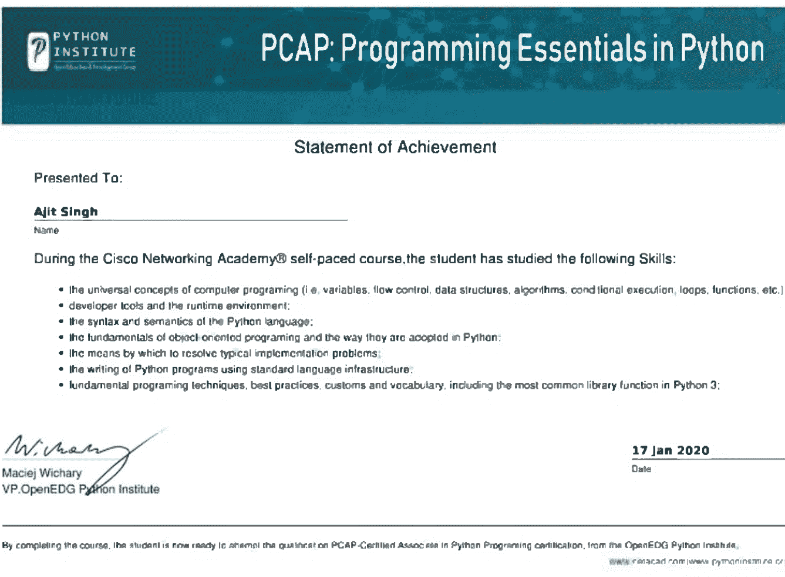

# 目录

| 章节 | 主题 | 页码 |
| :--- | :--- | :--- |
| 1 | **Python入门**<br>历史<br>演变<br>Python的特点<br>Python的局限性<br>比较<br>一些术语 | 09 |
| 2 | **安装Python**<br>Windows安装<br>自定义环境<br>新增内容 | 17 |
| 3 | **与Python交互**<br>运行Python<br>命令行交互<br>IDLE开发环境<br>脚本模式<br>获取帮助 | 26 |
| 4 | **Python语法**<br>语法形式<br>缩进<br>关键字<br>标识符<br>语句<br>注释<br>print()和input()函数 | 34 |
| 5 | **变量和数据类型**<br>变量<br>多种数据类型<br>数值转换（或工厂）函数<br>数学函数 | 41 |
| 6 | **Python中的运算符**<br>运算符类型<br>每种运算符类型的示例。 | 51 |
| 7 | **内置函数** | 61 |
| 8 | **条件语句**<br>条件处理：if语句<br>pass语句<br>assert语句<br>if-else运算符 | 66 |

## 循环
迭代处理：for 语句
迭代处理：while 语句
更多迭代控制：break 和 continue
无限循环
嵌套循环

## 用户自定义函数
函数定义：def 和 return 语句
函数使用
函数种类
一些示例
更多函数定义特性
局部变量与全局变量
Lambda 表达式
函数与命名空间
global 语句

# Python 实用模块
模块定义
模块使用：import 语句
查找模块：路径
math 模块
datetime 模块
os 模块
zipfile 模块
urllib 模块
winsound 模块
查找模块：PYTHONHOME 与 PYTHONPATH
exec 语句

## 类与面向对象编程
类定义：class 语句
类职责
创建与使用对象
构造函数
实例变量与全局变量
静态方法与类方法
对象生命周期
特殊方法名
继承
多态

# Python 中的异常处理
基本异常处理
引发异常
一个特殊的例子
完整的异常处理与 finally 子句
异常函数
异常属性
内置异常

# 多线程
定义
启动新线程
threading 模块
线程同步
多线程优先级队列

# Python 中的文本文件
文件语义
文件组织与结构
附加背景
内置函数
文件语句
文件方法
文件与目录相关方法

# Python 中的正则表达式
创建正则表达式
使用正则表达式
正则表达式练习

## 字符串、列表与字典
字符串字面值
字符串操作
字符串比较操作
字符串语句
字符串内置函数
字符串方法
字符串模块
关于字符串不可变性的题外话

列表
列表字面值
列表操作
列表比较操作
列表语句
列表内置函数
列表方法
使用列表实现栈与队列
复制列表

映射与字典
字典字面值
字典操作
字典比较操作
字典语句
字典内置函数
字典方法
迭代器

## Python Pandas
Pandas 简介
Pandas 的关键特性
Anaconda Python 发行版
在 Windows 上下载、安装和自定义 Anaconda
使用 Numpy
使用 Series
使用 DataFrame
使用 Panel
从 CSV 文件到数据框的数据传输及反向传输
从 Excel 文件到数据框的数据传输及反向传输
从 SQLite 到数据框的数据传输及反向传输

# Python GUI 编程
Tkinter 简介
GUI 组件
标签、按钮、输入框、文本框、框架、对话框、窗口、单选按钮、复选框
事件与事件处理

# Python 中的数据库连接
数据库
数据库接口
Python 数据库 API
使用 MySQL 进行 Python 数据库编程
使用 ORACLE 进行 Python 数据库编程
处理数据库编程中的错误

## Python 库
Python 库概览
最有用的库部分

## 101 个 Python 程序

# 第 1 章

## Python 入门

Python 是一种开源的高级编程语言，由 Guido van Rossum 在 1980 年代末期开发，目前由 *Python 软件基金会* 管理。它源自他早期参与创建的 ABC 语言。

> *Python 是一种解释型语言。这意味着每次运行程序时，其解释器都会遍历代码并将代码翻译成机器可读的字节码。*

Python 是一种面向对象的语言，允许用户管理和控制数据结构或对象以创建和运行程序。实际上，Python 中的一切都是一等公民。所有对象、数据类型、函数、方法和类在 Python 中都具有同等地位。

Python 的官方介绍是：

> Python 是一种易于学习、功能强大的编程语言。它具有高效的高级数据结构和一种简单但有效的面向对象编程方法。Python 优雅的语法和动态类型，结合其解释型特性，使其成为在大多数平台上进行脚本编写和快速应用开发的理想语言。

它是一种高级语言。在 Python 中读写代码非常类似于读写简单的常规英语语句。Python 是一种强大的语言，你可以用它来创建游戏、编写图形用户界面以及开发 Web 应用程序。

### Python 的历史

Python 语言由 **Guido van Rossum** 在八十年代末和九十年代初于荷兰国家数学与计算机科学研究所开发。

Python 源自许多其他语言，包括 Modula-3、ABC、C、C++、Algol-68、SmallTalk 以及 UNIX shell 和其他脚本语言。

Python 受版权保护。与 Perl 类似，Python 源代码现在根据 GNU 通用公共许可证 (GPL) 提供。

Python 目前由该研究所的一个核心开发团队维护，尽管 Guido van Rossum 仍在指导其开发方面担任主要角色。

Python 用 C 实现，并依赖于广泛、易于理解、可移植的 C 库。它与 Unix、Linux 和 POSIX 环境无缝契合。由于这些标准 C 库广泛适用于各种 MS-Windows 变体和其他非 POSIX 操作系统，Python 在所有环境中的运行方式相似。

### Python 的演变

Python 的发展发生在许多其他动态（且开源的）编程语言（如 Tcl、Perl 以及（晚得多的）Ruby）也正在积极开发并日益普及的时期。

**Python 版本 1：** Python 1.0 于 1994 年 1 月发布。该主要版本包含许多新特性和函数式编程工具，包括 lambda、filter、map 和 reduce。

**Python 版本 2：** 2000 年 10 月，Python 2.0 发布，带来了新的列表推导特性和垃圾回收系统。[Python 软件基金会](https://www.python.org) 已宣布将不会有 Python 2.8。然而，该基金会将为 [编程语言](https://www.python.org) 的 2.7 版本提供支持直至 2020 年。

**Python 版本 3：** Python 3.0 于 2008 年 12 月发布。它带来了若干新特性和增强功能，同时也包含一些已弃用的特性。这些已弃用的特性和向后不兼容性使得 Python 3 版本与早期版本完全不同。因此，许多 [Python 开发者](https://www.python.org) 仍然使用 Python 2.6 或 2.7，以利用上一个主要版本中已弃用的特性。

由于 Python 3 向后不兼容，程序员无法访问诸如字符串异常、旧式类和隐式相对导入等特性。此外，开发者必须熟悉语法和 API 的更改。他们可以使用名为 2to3 的工具，将应用程序从 Python 2 平滑迁移到 Python 3。该工具通过注释和警告突出显示不兼容性和需要关注的领域。这些注释帮助程序员修改代码，并将其现有应用程序升级到最新版本的编程语言。

Python 的版本 2 和版本 3 彼此完全不同。因此，每个程序员都必须理解这些不同版本的特性，并根据项目的具体需求比较其功能。此外，他需要检查每个框架支持的 Python 版本。然而，每个开发者都必须利用最新版本的 Python，以获取新特性和长期支持。

### “Python 实现”与“Python 发行版”与 Python 的区别

Python 本身是一种编程语言，其行为由 python.org 上提供的文档定义。任何按照该文档所述执行操作的东西都“算作”是 Python……

Python 的实现是一个实际的程序，它提供了 python.org 上文档定义的行为。它有多种实现，允许你运行用它编写的程序。为了让你更好地理解，msvc、clang、gcc 是 C 的实现。以下是一些 Python 实现：

## 使用Python语言的特性/优势

Python语言的特性/优势如下：

1.  **解释型语言** - 同时也会被**编译**成字节码。模块在导入时会自动编译（生成.pyc文件），也可以根据需要显式编译。它支持交互式命令行和解释器外壳。

2.  **面向对象语言** - 在这种语言中，几乎一切都是对象。它支持数据隐藏、多重继承、接口和多态。

3.  **跨平台运行** - Python可在Windows、Linux/UNIX、Mac OS X、其他操作系统以及小型设备上运行，同时也能在用于电器、玩具、遥控器、嵌入式设备及其他类似设备的微控制器上运行。

4.  **高度结构化的语言** - 语句、函数、类、模块和包使我们能够编写大型、结构良好的应用程序，从而具备可读性、可定位性和可修改性的特点。

5.  **高生产力语言** - Python的代码比其他高级编程语言（如Java和C++）更短、更简洁、更不冗长。此外，它拥有精心设计的内置功能和标准库，以及对第三方模块和源代码库的访问。这些特性使得Python编程更加高效。

6.  **动态语言** - 它是一种动态语言，因为类型绑定到值，而不是变量；函数和方法查找在运行时进行；值是可检查的；我们可以列出任何给定对象支持的方法。

7.  **强类型语言** - 在运行时而非编译时。对象（值）有类型，但变量在这种语言中没有类型。

8.  **嵌入式和可扩展语言** - Python提供了一种文档完善且受支持的方式
    (1) 将Python解释器嵌入到C/C++应用程序中，以及
    (2) 用C/C++实现的模块和对象来扩展Python。
    Cython使我们能够从Python生成C代码，并“轻松”地为C/C++函数创建包装器。
    要用Java嵌入和扩展Python，可以使用Jython。

9.  **相当高级** - 它包含高级内置数据类型以及高级控制结构。

10. **学习时间短** - 与其他语言相比，Python相对容易学习。Python是学习编程的良好入门语言，因为它使用简单的语法和更短的代码。

## Python语言的局限性/缺点

Python具有多种优势特性，程序员之所以偏爱这种语言而非其他编程语言，是因为它易于学习和编码。但是，这种语言在某些计算领域（包括企业开发公司）尚未站稳脚跟。因此，这种语言可能无法解决某些企业解决方案，其局限性包括：

1.  **使用其他语言的困难**
    Python爱好者如此习惯于它的特性和广泛的库，以至于他们在学习或使用其他编程语言时会遇到问题。Python专家可能会觉得声明类型转换值或变量类型、添加花括号或分号的语法要求是一项繁重的任务。

2.  **移动计算领域的弱势语言**
    Python已在许多桌面和服务器平台上出现，但它被视为移动计算领域的弱势语言。这就是为什么用它构建的移动应用程序非常少，比如Carbonnelle。

3.  **运行速度变慢**
    Python在解释器的帮助下执行，而不是编译器，这导致其速度变慢，因为编译和执行有助于其正常工作。另一方面，也可以看到它对许多Web应用程序来说速度很快。

4.  **运行时错误**
    Python语言是动态类型的，因此它有许多设计限制，这些限制被一些Python开发者报告。甚至可以看到它需要更多的测试时间，并且错误在应用程序最终运行时才会显现。

5.  **不成熟的数据库访问层**
    与JDBC和ODBC等流行技术相比，Python的数据库访问层显得有些不成熟和原始。它不能应用于需要与复杂遗留数据进行顺畅交互的企业。

## Python语言的变体

-   Jython：用于Java环境的Python http://www.jython.org/
-   PyPy：带有JIT编译器和无栈模式的Python http://pypy.org/
-   CPython：用C实现的标准Python 2.xx。
-   Stackless：具有增强线程支持和微线程等的Python。http://www.stackless.com/
-   IronPython：用于.NET和CLR的Python http://ironpython.net/
-   Python 3：全新的Python。这旨在替代Python 2.x。http://www.python.org/doc/

## 一些术语

对于刚接触软件开发的人来说，理解上面提到的一些区别可能会有所帮助。

-   解释型
-   非解释型（即编译型）

Python是一个*字节码解释器*。Python代码对象是一系列表示各种操作和值的字节。Python解释器逐步执行这些字节，执行相应的操作。

编译型语言（例如C、C++等）从源代码形式翻译成特定于操作系统和硬件平台的可执行二进制文件。
Java与Python类似：它是编译型的，Java虚拟机是一个字节码解释器。

-   动态
-   非动态（即静态）

Python是一种动态语言。变量和函数没有定义的数据类型。相反，变量只是附加到对象上的标签。函数是带有参数的可调用对象，但没有声明的结果类型。每个对象都有一个强定义的永久类。

没有复杂的编译时类型检查。相反，任何类型不匹配都将在运行时检测到。由于许多类型几乎可以互换，因此不需要大量的类型检查。有关可互换（多态）类型的示例，请参见*简单数值表达式和输出*。像C、C++和Java这样的语言具有静态声明的变量和函数。

-   脚本
-   非脚本

脚本区别是符合POSIX标准的操作系统的一个操作特性。以#!/path/to/interpreter开头的文件将被操作系统用作脚本。它们可以从命令行执行，因为解释器在文件的第一行中指定。

像Java、C和C++这样的语言没有这个特性；这些文件在执行之前必须先编译。

# 第2章

## 安装Python

### 在Windows中安装Python

要安装Python，您必须首先从此链接下载您首选版本的安装包：

[https://www.python.org/downloads/](https://www.python.org/downloads/)

在此页面上，您将被要求选择Python 3.11.x/3.12.x的最新版本，该版本于2023年2月8日发布。或者，如果您正在寻找特定版本（Python 2或3），您可以向下滚动页面以找到早期版本的下载链接。

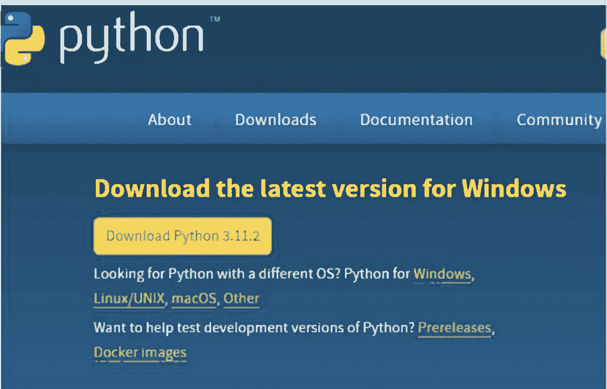

通常你会选择下载最新版本，即 Python 3.12.x。不过，你也可以选择 Python 2 的最新版本 2.7.18。你的选择通常取决于哪个版本最适合你的课程或项目。虽然 Python 3 是该语言的现在和未来，但第三方工具或兼容性等问题可能要求你下载 Python 2。

运行下载的文件。这将启动 Python 安装向导，它非常易于使用。只需接受默认设置，等待安装完成即可。

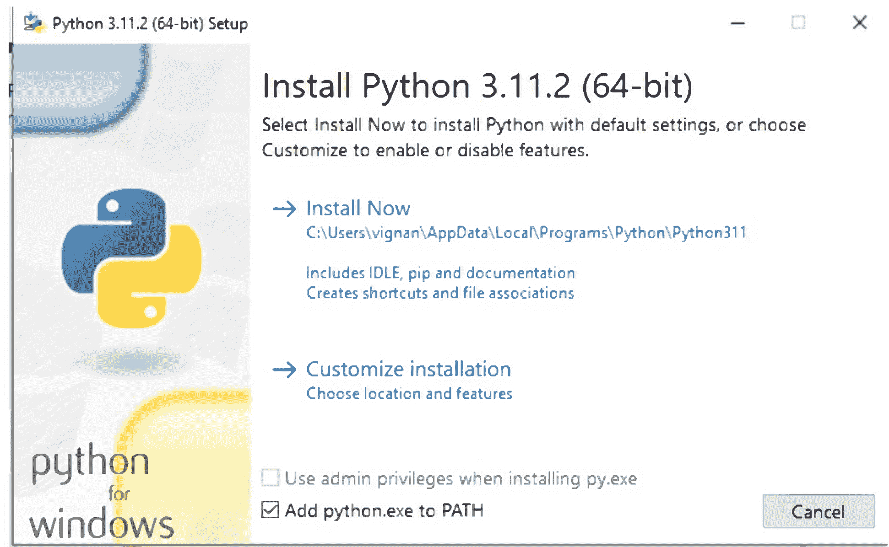

请注意，根据你的需求，你也可以勾选将 Python 添加到 Path 的复选框。这将通知 Python 文件安装程序，可执行的 Python 路径文件夹将被添加到名为 'Path' 的环境变量中。

最后，如果安装过程成功，将出现以下窗口：

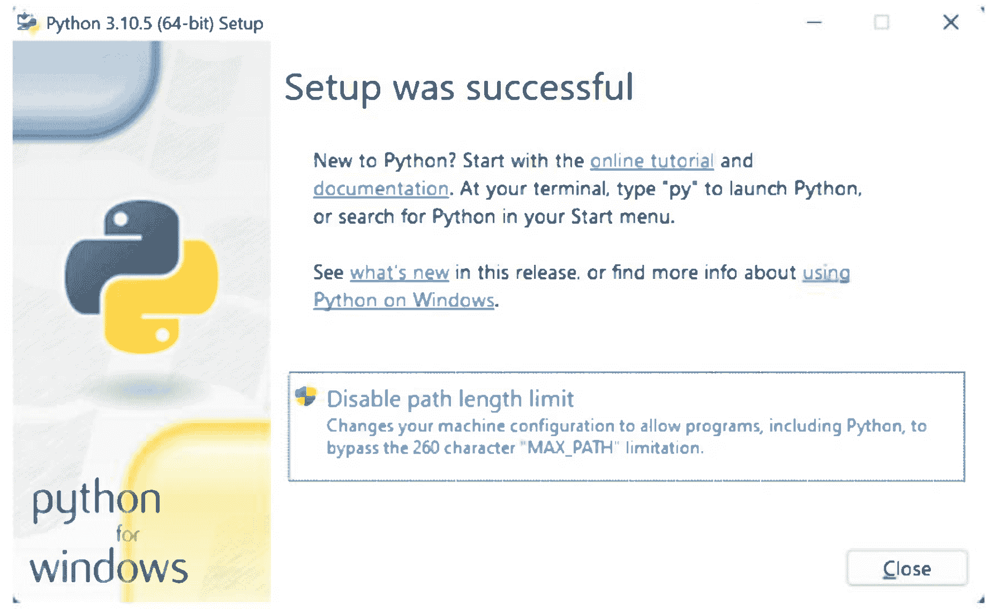

### Windows 配置（可选）

Windows 用户需要确保 `python.exe` 在他们的 **PATH** 中。这可以通过系统控制面板完成。点击 **高级** 选项卡。点击 **环境变量...** 按钮。点击系统变量中的 **Path** 行，然后点击 **编辑...** 按钮。这通常会有一个很长的项目列表，有时以 `%SystemRoot%` 开头。在此列表末尾，添加 ";" 和 `Python.exe` 的目录位置。在我的机器上，我将其放在 `D:\Softwares\Python\`。

对于 Windows 程序员，Windows 命令解释器使用文件名的最后几个字母将文件与解释器关联。你可以让 Windows 在双击 `.py` 文件时运行 `python.exe` 程序。这可以通过 **文件夹选项** 控制面板完成。**文件类型** 选项卡允许你将文件类型与处理该文件的程序配对。

请按照以下步骤将 Python 路径添加到环境变量。

- 步骤 1：点击开始按钮并打开运行程序。
- 步骤 2：现在输入 `sysdm.cpl` 并点击确定。这将打开系统属性对话框。
- 步骤 3：转到高级选项卡并点击环境变量。
- 步骤 4：在系统变量部分，选择 path 变量。
- 步骤 5：点击编辑按钮并将 python 路径添加到变量值。
- 步骤 6：点击确定。

你可以在安装 python 的文件夹中找到你的 python 路径。例如 - 对于我们来说是 `D:\Softwares\Python`。

### 如何在 Microsoft Windows 中测试 Python

最后一部分将展示如何测试上一部分中 python 安装的结果。实际上非常简单，步骤如下：

像往常一样，只需执行命令提示符。

接下来，输入以下命令以测试 'python' 是否可用以及它是否存在于 'Path' 环境变量中：

```
C:\Users\Personal>python
Python 3.11.2 (tags/v3.11.2:f377153, Jun 6 2022, 16:14:13) [MSC v.1929 64 bit (AMD64)] on win32
Type "help", "copyright", "credits" or "license" for more information.
>>>
```

最后但同样重要的是，再执行一次测试以确保。以下测试执行某个命令以检查已安装 python 的版本，如下所示：

```
C:\Users\Personal>python -V
Python 3.11.2
C:\Users\Personal>
```

正如上述命令执行的输出所示，版本匹配。它是版本为 '3.11.2' 的 python。

### Python 编辑器

- Vim http://www.vim.org/
- Emacs 参见 http://www.gnu.org/software/emacs/
- SciTE http://www.scintilla.org/SciTE.html。
- 仅限 MS Windows
    - TextPad http://www.textpad.com;
    - UltraEdit http://www.ultraedit.com/.
- Jed 参见 http://www.jedsoft.org/jed/.
- jEdit 需要为 Python 进行一些自定义 参见 http://jedit.org。
- Geany http://www.geany.org/

### 交互式解释器：

- python
- ipython
- Idle IDEs

### Python 集成开发环境：

- PyWin 仅限 MS Windows。可在以下地址获取：http://sourceforge.net/projects/pywin32/
- Kdevelop Linux/KDE 参见 http://www.kdevelop.org/
- Eric Linux KDE? 参见 http://ericide.pythonprojects.org/index.html
- WingIDE 参见 http://wingware.com/wingide/
- Eclipse http://eclipse.org/ 有一个支持 Python 的插件。
- Emacs 和 SciTE 将在编辑器内评估 Python 缓冲区。

### Python 3.11.x 的新特性

这个新版本的 Python 主要专注于提高语言的性能。围绕异常处理和错误显示的一些不错特性也应该会改善开发体验。

#### 1. 性能提升

与 Python 3.11 相比，平均性能提升 25%。某些操作甚至比最新版本快 60%。启动时间平均减少 10%。
测量是在 Ubuntu 下使用 GCC 编译的 CPython 进行的性能测试。

性能提升主要来自于当对代码的调用重复时，某些指令的特化。代码重复而不一定改变的事实允许解释器分析运行中的代码，并用特定于类型的代码片段替换通用代码。
另一个改进来自于减少对系统内存的调用，转而分配更多空间。如果这些性能提升总是好的，但它们并不会使 Python 变成一种高效的编程语言。

在 CPython 上实施这些更改后，预计内存消耗将增加约 20%。
进一步的性能提升已经在 3.12 及更高版本中计划。

#### 2. 更好的异常处理

在错误管理方面做了专门的工作。现在可以为异常添加注释。

```
try:
    raise ExceptionGroup("Exception Group", (
        TypeError("Type error"),
        KeyError("Key error"),
        ValueError("Value error"),
    ))

except* (ValueError, TypeError) as exc:
    exc.add_note("Add more information about the error")
    raise exc

except* KeyError as exc:
    raise exc
```

同样，一种新的语法正在出现。现在可以创建异常组，并分解 `except` 的使用以捕获组中包含的某些异常。

#### 3. 更精确的回溯

Python 返回的错误消息现在更加精确，并包括错误在错误代码行上的位置。此功能与其他现代语言可以提供的功能非常相似。

```
+-------------------+
| Traceback (most recent call last):
| File "test.py", line 5, in test
| assert x < 0
| ^^^^^^^^^^^^^
| AssertionError: assert 0 < 0
+-------------------+
```

#### 4. 改进的类型提示

众所周知，Python 是一种动态类型语言，这并不总是受到开发人员的青睐。最新的 Python 更新已经开始集成可选的类型系统。此版本延续了这一趋势，添加了更多类型，如 `Self`、`LiteralString`、`Required` 和 `NotRequired`。

```
from typing import Self
```

```
class Foo:
    def __init__(self, x: str):
        self.x = x

    def bar(self, y: str) -> Self:
        return Foo(y)
```

#### 5. 标准库更新

Python 标准库也没有被遗漏，正在经历一些变化。

##### TOML

首先，`tomllib` 模块被添加到标准库中以解析 TOML。此添加遵循了在 Python 的先前版本中添加的对 `pyproject.toml` 文件的支持。
该库在功能方面仍然有限，只有一个目的：文件解析。

```
import tomllib
with open("pyproject.toml", "rb") as f:
    data = tomllib.load(f)
print(data["project"]["name"])
```

##### AsyncIO

`asyncio` 库也获得了更新，添加了 `Task Group` 以替代在异步操作上使用 `.gather()` 方法。

```
import asyncio
async def task1():
    print("Foo")
    await asyncio.sleep(5)

async def task2():
    print("Bar")
    await asyncio.sleep(2)

async def main():
    try:
        async with asyncio.TaskGroup() as task_group:
            task_group.create_task(task1())
            task_group.create_task(task2())
    except* ValueError as exc:
        print(exc.exceptions)

if __name__ == "__main__":
    asyncio.run(main())
```

此更新使语法更令人愉悦，但并未给库带来任何其他重大更改。

##### StrEnum

`StrEnum` 出现了。它允许自动将字符串转换为枚举。

```
from enum import StrEnum, auto
class Foo(StrEnum):
    BAR = auto()
print(Foo.BAR.value) # "bar"
```

##### Path

`pathlib` 的 `Path.glob()` 方法现在允许你指定是否仅检索文件夹。

```python
from pathlib import Path
p = Path("/Users/foobar/")
everything = p.glob("*")
dirs = p.glob("*/")
```

#### 6. 其他弃用项

最后，此版本带来了一项后台清理工作，并移除了对许多遗留模块的支持：aifc、chunk、msilib、pipes、telnetlib、audioop、crypt、nis、sndhdr、uu、cgi、imghdr、nntplib、spwd、xdrlib、cgitb、mailcap、ossaudiodev、sunau...

其中一些模块在 Python 3.13 之前不会从标准库中移除。其他模块则将直接被标准库中已存在的、更现代且维护更好的替代解决方案所取代。

总之，如果这次更新没有带来任何革命性的变化，它延续了 Python 项目在提升 CPython 性能、改进错误管理以及添加社区所要求的类型提示解决方案方面已经启动的工作。

# 第 3 章

## 与 Python 交互

Python 是一种灵活且动态的语言，你可以以不同的方式使用它。当你只想逐行测试代码或语句，或者正在探索其功能时，可以交互式地使用它。当你想要解释整个语句文件或应用程序时，可以使用脚本模式。

要交互式地使用 Python，你可以使用命令行窗口或 IDLE 开发环境。

### 命令行交互

命令行是使用 Python 最直接的方式。你可以轻松地观察 Python 的工作方式，因为它会对在 `>>>` 提示符下输入的每个完整命令做出响应。这可能不是与 Python 交互的首选方式，但它是探索 Python 工作原理的最简单方法。

### 运行 Python

启动 Python 有三种不同的方式 –

1.  交互式解释器

在 Windows 上

**开始 -> 所有程序 -> Python 3.11 -> Python 3.11**

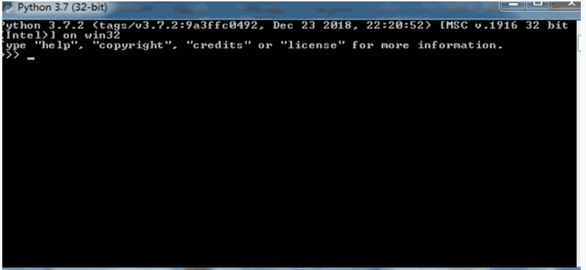

2.  从命令行运行脚本

可以通过在命令行上调用解释器来执行 Python 脚本，如下所示 -

```
C: >python script.py
```

3.  集成开发环境

如果你的系统上有一个支持 Python 的图形用户界面（GUI）应用程序，你也可以从 GUI 环境运行 Python。

**Windows** – PythonWin 是 Python 的第一个 Windows 界面，是一个带有 GUI 的 IDE。

在 Windows 上

**开始 -> 所有程序 -> Python 3.11 -> IDLE**

> 注意：如果你使用的是 GNU/Linux、UNIX 和 Mac OS 系统，你必须运行终端工具并输入 Python 命令来启动会话。

我们使用命令来告诉计算机做什么。当你想让 Python 为你做某事时，你必须通过输入它熟悉的命令来指示它。然后 Python 会将这些命令转换为你的计算机或设备可以理解和执行的指令。

要了解 Python 的工作原理，你可以使用 print 命令打印通用程序 Hello, World!。打开 Python 的命令行。

在 `>>>` 提示符下，输入以下内容：`print("Hello, World!")`

按回车键告诉 Python 你已完成命令。命令行窗口很快就会在下一行显示 Hello, World!：

```
Type "help", "copyright", "credits" or "license" for more information.
>>> print("hello")
hello
>>>
```

Python 响应正确，因为你以它要求的格式给出了命令。要查看当你要求它使用错误的 print 命令语法打印相同字符串时它如何响应，请在 Python 命令提示符下输入并执行以下命令：

```
Print(Hello, World!)
```

Python 将这样响应：

```
Syntax error: invalid syntax
```

每当你输入无效或不完整的语句时，你都会收到语法错误消息。在这种情况下，你输入的 print 首字母大写了，这对于像 Python 这样区分大小写的语言来说是绝对不行的。

如果你只是交互式地使用 Python，你可以完全不用 print 命令，只需将你的语句输入在引号内，例如 `Hello, World!`

### 获取帮助

Python 有两种密切相关的帮助模式。一种是通用帮助实用程序，另一种是提供特定对象、模块、函数或类文档的帮助函数。

#### help() 实用程序

可以通过 `help()` 函数获取帮助。
如果你只输入 `help()`，你将进入在线帮助实用程序。此帮助实用程序允许你探索 Python 文档。
交互过程如下所示：

```
>>> help
```

输入 `help()` 获取交互式帮助，或输入 `help(object)` 获取关于对象的帮助。
>>> `help()`

#### 特定主题的帮助

如果你输入 `help(object)` 来获取某个对象的帮助，你将获得关于该特定对象的帮助。此帮助使用帮助查看器显示。
你将输入类似这样的内容：
>>> `help("EXPRESSIONS")`

### 退出 Python

要退出 Python，你可以输入以下任一命令：

```
quit()
exit()
Control-Z 然后按回车
```

### IDLE：Python 的集成开发环境（IDE）

IDLE（集成开发和学习环境）工具包含在 Python 的安装包中，但你可以选择下载更复杂的第三方 IDE。

IDLE 工具提供了一个更高效的平台来编写代码并与 Python 进行交互。你可以在找到命令行图标的同一文件夹中或在开始菜单中访问 IDLE。一旦你点击 IDLE 图标，它将带你进入 Python Shell 窗口。
你可以通过 Python IDLE 运行 Python 代码。
在 Windows 上快速找到 Python IDLE 的一种方法是点击“开始”菜单。然后你应该能在“最近添加”下看到 IDLE。

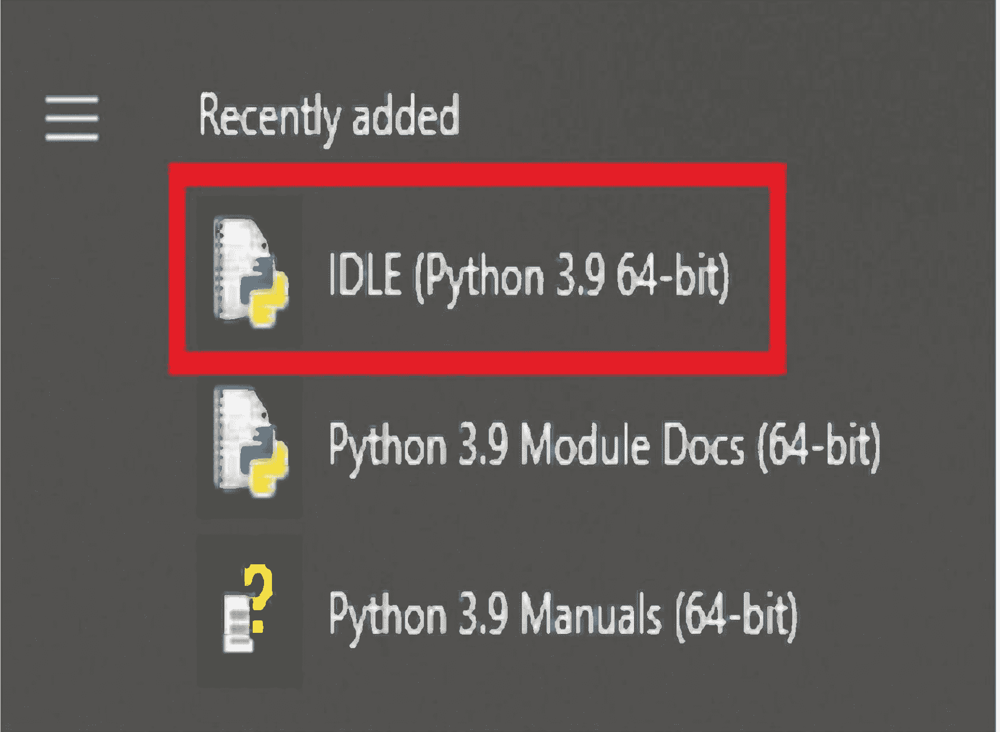

一旦你点击 Python IDLE，你将看到 Shell 屏幕。

#### Python Shell 窗口

Python Shell 窗口有下拉菜单和一个 `>>>` 提示符，你之前在命令行窗口中已经见过。在这里，你可以像之前使用命令行一样，输入并执行语句或表达式进行求值。然而，这次 IDLE 的编辑菜单允许你回滚到之前的命令，剪切、复制和粘贴之前的语句并进行修改。IDLE 相比命令行交互是一个巨大的飞跃。

Python Shell 窗口有以下菜单项：文件、编辑、Shell、调试、选项、窗口和帮助。

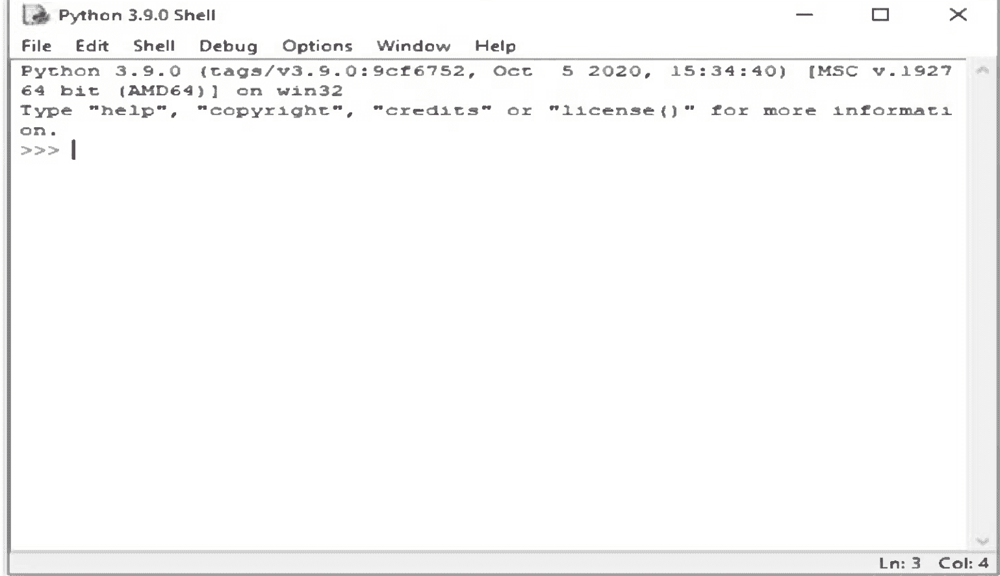

Shell 和调试菜单提供了你在创建较大程序时会发现有用的功能。

**Shell** 菜单允许你重启 shell 或搜索 shell 的日志以查找最近的重置。
**调试** 菜单有有用的菜单项，用于跟踪异常的源文件并突出显示出错的行。调试器选项将启动一个交互式调试器窗口，允许你单步执行正在运行的程序。堆栈查看器选项通过一个新窗口显示当前的 Python 堆栈。

**选项** 菜单允许你配置 IDLE 以适应你的 Python 工作偏好。

**帮助** 菜单打开 Python 帮助和文档。

#### **文件** 菜单

文件菜单上的项目允许你创建新文件、打开旧文件、打开模块和/或保存你的会话。当你点击“新建文件”选项时，你将进入一个新窗口，一个简单且标准的文本编辑器，你可以在其中输入或编辑代码。最初，此文件窗口名为“无标题”，但当你保存代码后，其名称很快就会改变。

窗口菜单栏与 Shell 窗口略有不同。它没有 Shell 窗口中的 Shell 和调试菜单，但引入了两个新菜单：运行和格式菜单。当你选择在文件窗口中运行代码时，你可以在 Shell 窗口中看到输出。

#### 脚本模式

在脚本模式下工作时，你不会像在交互模式下那样自动看到结果。要查看脚本的输出，你必须运行脚本和/或在代码中调用 `print()` 函数。

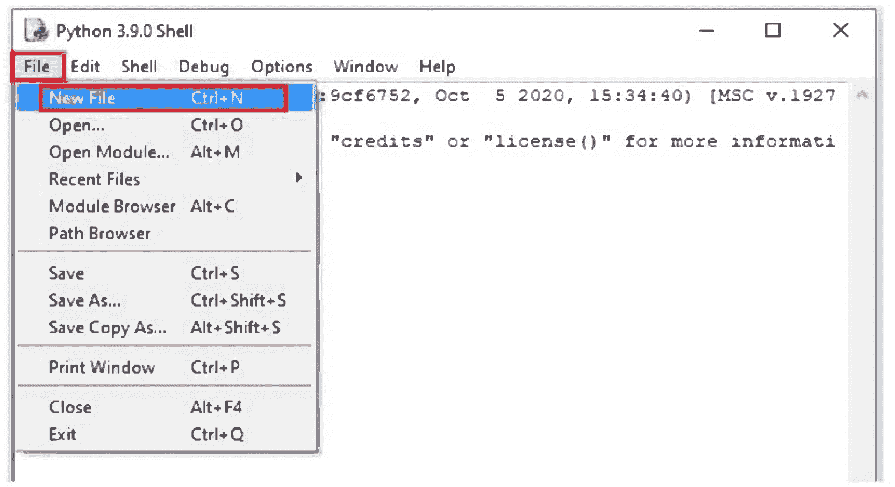

点击“文件”，然后选择“新建文件”（或者，你可以使用键盘快捷键 Ctrl+N）：你现在将看到以下“无标题”框，你可以在其中输入你的 Python 代码：

例如，输入/复制下面的命令。这个命令将打印出著名的“Hello World”表达式。

```
print("Hello World")
```

在“无标题”框中，语法将如下所示：

按下键盘上的F5。然后你会看到以下消息，要求保存你的代码：

完成后，点击保存，你将在Python Shell中看到打印出的“Hello World”表达式：

# 第4章

## Python语法

### Python编码风格：

- 使用空格进行缩进，不要使用制表符。
- 不要混合使用制表符和空格。制表符会造成混淆，建议只使用空格。
- 最大行长度：79个字符，这有助于使用小显示屏的用户。
- 使用空行分隔顶层函数和类定义，使用单个空行分隔类内的方法定义和函数内较大的代码块。
- 在可能的情况下，添加行内注释（应为完整的句子）。
- 在表达式和语句周围使用空格。

Python语法是指定义人类用户和系统应如何编写和解释Python程序的一套规则。如果你想用Python编写和运行程序，必须熟悉其语法。

Python不提供花括号来表示类和函数定义或流程控制的代码块。代码块通过行缩进来表示，这是严格强制执行的。

### 缩进

虽然大多数编程语言如Java、C和C++使用花括号表示代码块，但Python程序通过缩进来构建结构。在Python中，代码块由缩进定义，这不是风格或偏好问题，而是严格的语言要求。这一原则使Python代码更具可读性和易理解性。

当你查看Python程序时，可以很容易地识别出一个代码块，因为它们从相同的右缩进距离开始。如果需要更深层次的嵌套，你可以简单地将另一个代码块进一步向右缩进。例如，这里是一个定义`car_rental_cost`的程序片段：

```
def car_rental_cost(days):
    cost = 35 * days
    if days >= 8:
        cost -= 70
    elif days >= 3:
        cost -= 20
    return cost
```

你必须确保缩进空格在一个代码块内保持一致。当你使用IDLE和其他IDE输入代码时，当你输入需要缩进的语句时，Python会直观地在后续行提供缩进。按照惯例，缩进相当于向右4个空格。

缩进中的空格数量是可变的，但块内的所有语句必须缩进相同的量。例如 –

```
if True:
    print "True"
else:
    print "False"
```

### 关键字

Python关键字是Python中的保留字，不应在代码中用作变量、常量、函数名或标识符。如果你不想在执行程序时遇到错误，请注意这些关键字：

| | | |
|---|---|---|
| **and** | **assert** | **raise** |
| **break** | **class** | **try** |
| **continue** | **def** | **with** |
| **del** | **elif** | **True** |
| **else** | **except** | **None** |
| **exec** | **finally** | **return** |
| **for** | **from** | **while** |
| **global** | **if** | **yield** |
| **import** | **in** | **False** |
| **is** | **lambda** | **as** |
| **not** | **or** | **pass** |
| **print** | | |

### Python标识符

Python标识符是赋予函数、类、变量、模块或你将在Python程序中使用的其他对象的名称。你在Python中使用的任何实体都应被适当地命名或标识，因为它们将构成你程序的一部分。

以下是你应该了解的Python命名约定：

- 标识符可以是大写字母、小写字母、下划线和数字（0-9）的组合。因此，以下都是有效的标识符：myClass、my_variable、var_1和print_hello_world。
- 标识符内不允许使用特殊字符，如%、@和$。
- 标识符不应以数字开头。因此，2variable无效，但variable2是可接受的。
- Python是一种区分大小写的语言，这种行为也适用于标识符。因此，Labor和labor在Python中是两个不同的标识符。
- 你不能使用Python关键字作为标识符。
- 类标识符以大写字母开头，但其他标识符以小写字母开头。
- 你可以使用下划线来分隔标识符中的多个单词。
- 你应始终选择即使在长时间间隔后对你仍有意义的标识符。因此，虽然将变量设置为c = 2很容易，但使用更长但更相关的变量名（如count = 2）可能对未来的参考更有帮助。

### 使用引号

Python允许使用引号表示字符串字面量。你可以使用单引号、双引号或三引号，但必须以相同类型的引号开始和结束字符串。当字符串跨越多行时，你会使用三引号。

### Python语句

语句是Python解释器可以执行的指令。当你给变量赋值时，比如my_variable = dog，你就是在做一个赋值语句。赋值语句也可以像c = 3一样简短。Python中还有其他类型的语句，如*if*语句、*while*语句、*for*语句等。

### 单行多条语句

分号（;）允许在单行上放置多条语句，前提是这些语句都不开始新的代码块。这是一个使用分号的示例片段 –

```
import sys; x = 'foo'; sys.stdout.write(x + '\n')
```

### 多行语句

一条语句可以跨越多行。要将长语句分成多行，你可以将表达式包裹在圆括号、花括号和方括号内。这是处理多行表达式的首选样式。另一种包裹多行的方法是在每行末尾使用反斜杠（\）表示行继续。

### 注释

编写程序时，你会发现将一些注释放在代码中以描述其功能很有帮助。当你需要审查或重新查看程序时，注释非常方便。它也会帮助可能需要查看源代码的其他程序员。你可以通过以井号（#）开头在程序中编写注释。井号告诉Python解释器在运行代码时忽略注释。

对于多行注释，你可以在每行开头使用井号。或者，你也可以用三引号包裹多行注释。

### print语句与print()函数

为了查看Python脚本的输出，我们将介绍**print**语句和print()函数。

**print**语句是Python 2.6的遗留构造。
**print()**函数是新的Python 3构造，将取代**print**语句。

### print语句

**print**语句接受一个值列表，并将其字符串表示形式打印到标准输出文件。
标准输出通常定向到**终端**窗口。

```
>>>print "PI = ", 355.0/113.0
>>>print 65, "F"
>>>print ( 65 - 32 ) * 5 / 9, "C"
```

### print()函数

print()函数接受一个值列表，并将其字符串表示形式打印到标准输出文件。标准输出通常定向到**终端**窗口。

在Python 3之前，我们必须使用特殊的导入语句来请求print()函数：from __future__ import print_function。

```
from __future__ import print_function
print( 65, "F" )
print( ( 65 - 32 ) * 5 / 9, "C" )
```

**注意：** Python 3.0

Python 3.0将用内置的print()函数取代不规则的**print**语句，该函数完全规则，使其更易于解释和使用。

### **多行输出。**

通常，每个**print**语句产生一行输出。你可以用尾随逗号结束**print**语句，将多个**print**语句的结果合并到一行中。以下是两个示例。

```
print "335/113=", print 335.0/113.0
print "Hi, Mom", "Isn't it lovely?", print 'I said, "Hi".', 42, 91056
```

由于第一个**print**语句以逗号结尾，它不会产生完整的输出行。第二个**print**语句完成该输出行。

```
from __future__ import print_function
print( "335/113=", end="" ) print( 335.0/113.0 )
print( "Hi, Guys", "Isn't it lovely?", end="" ) print( 'I said, "Hi".', 42, 91056 )
```

### **输入函数**

Python提供了两个简单的内置函数来接受输入并设置变量的值。这些并不真正适合完整的应用程序，但足以用于我们的初步探索。

### `raw_input()` 函数

获取交互式输入的第一种方式是使用 `raw_input()` 函数。该函数接受一个字符串参数，即用户的提示信息，该信息会被写入标准输出。标准输入中下一行可用的内容将作为函数的返回值。

**raw_input**(*prompt*)
如果存在提示信息，它将被写入 `sys.stdout`。
输入从 `sys.stdin` 读取并作为字符串返回。

`raw_input()` 函数从一个通常称为 `sys.stdin` 的文件中读取。当从命令行运行时，这将是键盘，你输入的内容将在命令窗口或 **终端** 窗口中回显。
以下是一个使用 `raw_input()` 的示例脚本。

```
a = raw_input("yes?")
print("you said", a)
shares = int(raw_input("shares: "))
price = float(raw_input("dollars: "))
price += float(raw_input("eights: ")) / 8.0
print("value", shares * price)
```

`raw_input()` 机制非常有限。如果 `raw_input()` 返回的字符串不适合 `int()` 使用，将引发异常并停止程序运行。我们将在 *异常* 中详细介绍异常处理。

### `input()` 函数

除了返回精确字符字符串的 `raw_input()` 函数外，还有 `input()` 函数。它对输入应用 `eval()` 函数，这通常会将数字输入转换为相应的对象。

**重要提示：** Python 3
此函数将被移除。最好不要使用它。
`input()` 函数的值是 `eval( raw_input( prompt ) )`。

# 第 5 章

## 变量与数据类型

### 变量

变量就像一个容器，存储着你可以访问或更改的值。它是指向程序使用的内存位置的一种方式。你可以使用变量来指示计算机将数据保存到此内存位置或从此内存位置检索数据。

在处理变量方面，Python 与 Java、C 或 C++ 等语言有显著不同。其他语言会声明变量并将其绑定到特定的数据类型。这意味着它只能存储一种数据类型。因此，如果一个变量是整数类型，在运行程序时，你只能在该变量中保存整数。

Python 在处理变量方面要灵活得多。如果你需要一个变量，只需想一个名字并通过赋值来声明它。如果需要，你可以在程序执行期间更改变量存储的值和数据类型。

为了说明这些特性：
在 Python 中，你通过给变量赋值来声明它：

```
my_variable = 10
```

请注意，当你声明一个变量时，你并不是在声明变量 `my_variable` 等于 10。该语句的实际含义是将 `my_variable` 设置为 10。
要增加变量的值，你可以在命令行中输入以下语句：

```
>>> my_variable = my_variable + 3
```

要查看 Python 如何响应你的语句，请使用以下语句调用 `print` 命令：

```
>>> print(my_variable)
```

你将在下一行看到结果：
```
13
```

要使用 `my_variable` 存储字面字符串 "yellow"，只需将变量设置为 "yellow"：

```
>>> my_variable = "yellow"
```

要查看 `my_variable` 中当前存储的内容，请使用 `print` 命令：

```
>>> print(my_variable)
```

在下一行，你会看到：
```
yellow
```

### 数据类型

Python 处理多种数据类型，以满足程序员和应用程序开发人员对可用数据的需求。这些类型包括字符串、数字、布尔值、列表、日期和时间、字典、元组。

### 字符串

字符串是 Unicode 字符的序列，可以是字母、数字和特殊符号的组合。要在 Python 中定义字符串，你可以将字符串括在匹配的单引号或双引号中：

```
>>> string1 = 'I am enclosed in single quotes.'
>>> string2 = "I am enclosed in double quotes."
```

如果用单引号括起来的字面字符串包含单引号，你必须在字符串内的单引号前放置一个反斜杠 (\) 来转义该字符。例如：

```
string3 = 'It doesn\'t look good at all.'
```

要打印 `string3`：

```
print(string3)
```

```
It doesn't look good at all.
```

当然，如果你使用双引号来括起字符串，就不必这样做：

```
>>> string3 = "It doesn't seem nice"
```

类似地，如果你的字符串用双引号括起来，你必须在双引号前放置一个反斜杠：

```
>>> txt = "He said: \"You should get the same results no matter how you choose to enclose a string.\""
>>> print(txt)
```

```
He said: "You should get the same results no matter how you choose to enclose a string."
```

### 数字

#### 数字数据类型

使用 Python 的众多便利之一是，你实际上不需要声明一个数值来区分其类型。当你编写和运行语句时，Python 可以轻松区分不同的数据类型。它有四种内置的数字数据类型。Python 3 支持三种类型：整数、浮点数和复数。长整数（long）不再构成单独的整数类别，而是包含在 int 或整数类别中。

#### 1. 整数 (int)

整数是没有小数点的整数。只要不包含会使数字成为浮点数（一种不同的数字类型）的小数点，它们可以是正数或负数。在 Python 3 中，整数的大小是无限的。
Python 识别以下数字和字面量：
常规整数
示例：793、-254、4

#### 八进制字面量（基数为 8）

要表示八进制数，你将使用前缀 `0o` 或 `0O`（零后跟小写或大写字母 o）。
示例：

```
>>> a = 0O7
>>> print(a)
7
```

#### 十六进制字面量（基数为 16）

要表示十六进制字面量，你将使用前缀 `0X` 或 `0x`（零和大写或小写字母 x）。

示例：

```
>>> hex_lit = 0xA0C
>>> print(hex_lit)
2572
```

#### 二进制字面量（基数为 2）

要表示二进制字面量，你将使用前缀 `0B` 或 `0b`（零和大写或小写字母 b）。

示例：

```
c = 0b1100
print(c)
12
```

#### 将整数转换为其字符串表示形式

之前，你已经看到 `print` 命令如何将字面量转换为它们的整数等效形式。Python 使你能够反向操作，将整数转换为其字面表示形式。要将整数转换为其字符串表示形式，你可以使用函数 *hex()*、*bin()* 和 *oct()*。

示例：

要将整数 7 转换为其八进制字面量，请在命令提示符下键入并输入 `oct(7)`。你将得到输出 `0o7`：

```
>>> oct(7)
0o7
```

以下是将整数 2572 转换为十六进制字面量时发生的情况：

```
>>> hex(2572)
0xa0c
```

最后，看看使用 `bin()` 函数将整数 12 转换为其二进制字符串时会发生什么：

```
>>> bin(12)
0b1100
```

你可以通过使用 `hex()`、`bin()` 和 `oct()` 函数定义一个变量来将结果存储到变量中：

例如：

```
>>> x = hex(2572)
>>> x
0xa0c
```

要查看在变量 `x` 中创建和存储的对象类型，你可以使用并输入命令 `type()`：

```
>>> type(x)
```

你应该得到这个结果：

```
<class 'str'>
```

#### 2. 浮点数

也称为浮点数，浮点数表示实数。浮点数用小数点书写，小数点将整数部分与小数部分分开。它们也可以用科学计数法书写，其中大写或小写字母 e 表示 10 的幂：

```
>>> 6.2e3
6200.0
>>> 6.2e2
620.0
```

#### 3. 复数

复数是实数和虚数的对。它们采用 `a + bJ` 的形式，其中 `a` 是一个浮点数，是复数的实部。另一边是 `bJ`，其中 `b` 是一个浮点数，`J` 或其小写形式表示虚数单位 -1 的平方根。这使得 `b` 成为复数的虚部。以下是复数实际使用的示例：

```
>>> a = 2 + 5j
>>> b = 4 - 2j
>>> c = a + b
```

### 数字类型转换

你可以期望 Python 将混合类型的数字表达式转换为一种通用类型以便于求值。然而，在某些情况下，你可能需要显式地将一种数字类型转换为另一种，例如当函数参数要求转换时。你可以输入以下表达式将数字转换为另一种类型：

要将 x 转换为浮点数：`float(x)`

示例：

```
>>>float(12)
12.0
```

要将 x 转换为普通整数：`int(x)`

```
>>>int(12)
12
```

要将 x 转换为复数：`complex(x)`

```
>>>complex(12)
(12+0j)
```

### 数字转换函数

我们可以将数字从一种类型转换为另一种类型。转换可能会涉及精度损失，因为我们减少了可用的位数。转换也可能通过添加没有任何实际意义的位数来产生一种虚假的精度感。

我们将这些称为*工厂函数*，因为它们是用于从其他对象创建新对象的工厂。工厂函数的概念非常通用，这些只是这种模式的众多示例中的第一批。

### 数字函数定义

存在许多从一种数字类型到另一种类型的转换。

#### int(x)

从对象 x 生成一个整数。如果 x 是浮点数，则在创建整数时会截断小数点右侧的数字。如果浮点数超过大约 10 位数字，则会创建一个长整数对象以保留精度。如果 x 是一个太大而无法表示为整数的长整数，则没有转换。复数值不能直接转换为整数。如果 x 是一个字符串，则会解析该字符串以创建一个整数值。它必须是一个可选符号（+ 或 -）的数字字符串。

```
int("1243")
1243
int(3.14159)
3
```

#### float(x)

从对象 *x* 生成一个浮点数。如果 *x* 是整数或长整数，则会创建一个浮点数。请注意，长整数可以有大量数字，但浮点数只有大约 16 位数字；可能会有一些精度损失。复数值不能直接转换为浮点数。

如果 *x* 是一个字符串，则会解析该字符串以创建一个浮点数值。它必须是一个可选符号（+ 或 -）的数字字符串。数字可以有一个小数点（.）。

此外，字符串可以采用科学计数法，并包含 e 或 E，后跟作为简单有符号整数值的指数。

```
float(23)
23.0
float("6.02E24")
6.020000000000004e+24
float(22)/7
3.14285714286
```

#### long(x)

从 *x* 生成一个长整数。如果 *x* 是浮点数，则在创建长整数时会截断小数点右侧的数字。

```
long(2)
2L
long(6.02E23)
60199999999999995805696L
long(2)**64
18446744073709551616L
```

#### complex(real, [imag])

从 *real* 和 *imag* 生成一个复数。如果省略虚部，则为 0.0。复数不像其他类型那么简单。一个复数有两部分，实部和虚部。转换为复数通常涉及两个参数。

```
complex(3,2)
(3+2j)
complex(4)
(4+0j)
complex("3+4j")
(3+4j)
```

请注意，第二个参数（数字的虚部）是可选的。这导致了多种不同的方式来调用此函数。在上面的示例中，我们使用了三种变体：两个数字参数、一个数字参数和一个字符串参数。

### 内置数学函数

大部分数学函数位于一个单独的模块中，称为 math，我们将在 *math 模块* 中介绍。数学内置函数的正式定义如下。

**abs(number)**
返回参数的绝对值，|x|。

**pow(x, y, [z])**
将 x 提升到 y 次幂，x^y。如果存在 z，则执行模运算，x^y mod z。

**round(number, [digits])**
将 *number* 四舍五入到小数点后 *ndigits* 位。
如果给出了 *ndigits* 参数，这是要四舍五入到的小数位数。如果 *ndigits* 为正数，则是小数点右侧的小数位数。如果 *ndigits* 为负数，则是小数点左侧的位数。
示例：
`print(round(678.456,2))`
678.46
`print(round(678.456,-1))`
680.0

### 集合函数

这些是几个内置函数，用于操作简单的数据元素集合。

**max(value, ...)**
返回最大的 *value*。

```
>>> max(1,2,3)
3
```

**min(value, ...)**
返回最小的 *value*。

```
>>> min(1,2,3)
1
```

### 日期和时间

大多数应用程序需要日期和时间信息才能高效有效地工作。在 Python 中，你可以使用函数 `datetime.now()` 来获取当前日期和时间。命令 `datetime.now()` 调用内置的 Python 代码，该代码提供当前日期和时间。
要从 Python 获取日期和时间，请在命令提示符下输入以下内容：

```
from datetime import datetime
datetime.now()
datetime.datetime(2016, 3, 10, 2, 16, 19, 962429)
```

这种格式的日期和时间几乎难以理解，你可能想要一个更易读的结果。一种方法是使用 Python 标准库中的 `strftime`。
尝试输入这些命令，看看是否会得到你喜欢的格式。

```
>>>from time import strftime
>>> strftime('%Y-%m-%d %H:%M:%S')
'2016-03-10 02:20:03'
```

### 布尔数据类型

Python 中的比较只能产生两种可能的响应之一：True 或 False。这些数据类型称为布尔值。

为了说明，你可以创建几个变量来存储布尔值并打印结果：

```
bool_1 = 4 == 2*3
bool_2 = 10 < 2 * 2**3
bool_3 = 8 > 2 * 4 + 1
print(bool_1)
print(bool_2)
print(bool_3)
```

Python Shell 将显示以下结果：

```
False
True
False
```

### 练习

1. 打印一个像下面这样的方框。

```
*******************
*******************
*******************
```

2. 打印一个像下面这样的方框。

3. 打印一个像下面这样的三角形。

```
*
**
***
****
```

# 第 6 章

## Python 基本运算符

Python 运算符允许程序员操作数据或操作数。以下是 Python 支持的运算符类型：

- 算术运算符
- 赋值运算符
- 关系或比较运算符
- 逻辑运算符
- 身份运算符
- 位运算符
- 成员运算符

### 算术运算符

Python 使用其基本算术运算符很好地处理数学表达式。你可以轻松地编写程序来自动化计算税、小费、折扣或租金等任务。

| 符号 | 名称 | 描述 |
| :--- | :--- | :--- |
| + | 加法 | 将左操作数和右操作数的值相加 |
| - | 减法 | 从左操作数的值中减去右操作数的值 |
| * | 乘法 | 将左操作数和右操作数的值相乘 |
| / | 除法 | 将左操作数的值除以右操作数 |
| ** | 指数 | 执行指数计算 |
| % | 取模 | 返回左操作数除以右操作数后的余数 |

加法、减法、乘法和除法是最基本的运算符，通过输入以下表达式来调用：

加法：

```
>>> 1 + 3
4
```

减法：

```
>>> 10 - 4
6
```

乘法：

```
>>> 4 * 2
8
```

除法：

```
>>> 10 / 2
5.0
```

#### 指数

指数计算通过将第一个数字提升到由 ** 运算符后的数字定义的幂来调用：

```
>>> 2**3  # 2 raised to the power of 3
8
```

#### 取模

取模运算符在执行除法后给出余数：

```
>>> 17 % 5
2
```

#### 整除

另一方面，整除在移除小数部分后返回商：

```
>>> 17 // 5
3
```

#### 使用基本运算符计算销售税、小费和总账单

为了充分利用你对变量、数据类型和运算符的知识，你可以设计一个简单的程序来计算餐厅餐费的销售税和小费。

| 项目 | 值 |
|---|---|
| 餐费 | $65.50 |
| 销售税率 | 6.6% |
| 小费 | 餐费 + 税的 20% |

首先，设置一个变量 `meal` 来存储食物成本：

```
meal = 65.50
```

接下来，设置税和小费变量。将两个变量都赋值为给定百分比的小数值。你可以通过使用 100 作为除数来实现：

```
tax = 6.6 / 100
tip = 20 / 100
```

你的小费是基于餐费和附加的销售税计算的，因此你需要获取餐费总额和销售税。一种方法是简单地创建一个新变量来存储餐费和税的总成本。另一种方法是重新赋值变量 `meal`，使其同时存储这两个值：

```
meal = meal + meal * tax
```

现在你已经重新赋值了 `meal` 以包含餐费和税，接下来就可以计算小费了。这次，你可以设置一个新变量来存储小费、餐费和税的值。你可以使用变量 `total` 来保存所有值：

```
total = meal * tip
```

以下是计算总账单金额的代码：

```
meal = 65.50
tax = 6.6 / 100
tip = 20 / 100
meal = meal + meal * tax
total = meal + meal * tip
```

如果你使用的是 IDLE 中的文件编辑器，你可以用自己选择的文件名保存文件，Python 会自动添加 `.py` 扩展名。你可能已经注意到，文件编辑器在对你的代码执行任何操作之前，总会提示你保存文件。就像命名其他数据文件和类型一样，你应该使用一个能描述文件内容的文件名。在这种情况下，像 `BillCalculator` 这样的文件名应该就能达到目的。

要获取总金额，进入 Python Shell 并输入 `total`：

```
>>> total
83.78760000000001
```

现在你得到了账单金额：83.78760000000001
如果你使用的是命令行窗口，你可以简单地逐行输入上述代码。

这个简单的程序展示了 Python 编程是多么直接，以及它在自动化任务方面是多么有用。下次你外出就餐时，只需更改账单计算器中的数字，就可以重用这个程序。向前思考并想象一下，如果你能把你的代码放入一个更大的程序中，该程序只需让你输入账单金额而无需访问原始代码，那会是多么方便。你可以用 Python 实现这一点。

### 赋值运算符

这些运算符在将值赋给变量时很有用：

| 运算符 | 功能 |
| --- | --- |
| = | 将右侧操作数的值赋给左侧操作数 |
| += | 将右侧和左侧操作数的值相加，并将总和赋给左侧操作数 |
| -= | 从左侧操作数的值中减去右侧操作数的值，并将新值赋给左侧操作数 |
| *= | 将左侧和右侧操作数相乘，并将乘积赋给左侧操作数 |
| /= | 用左侧操作数除以右侧操作数的值，并将商赋给左侧操作数 |
| **= | 对左侧操作数执行指数运算，并将结果赋给左侧操作数 |
| //= | 对左侧操作数执行整除运算，并将结果赋给左侧操作数 |

### = 运算符

你在前面的章节中已经见过这个运算符在给变量赋不同值时的工作方式。示例：

```
a = c
a = b + c
a = 8
a = 8 + 6
s = "I love Python."
```

### += 加并赋值

加并赋值（+=）运算符只是表达 `x = x + a` 的另一种方式，最终得到语句 `x += a`。

### -= 减并赋值

减并赋值（-=）运算符等同于表达式 `x = x - a`，并用语句 `x -= a` 表示。

### *= 乘并赋值

乘并赋值（*=）运算符等同于语句 `x = x * a`，并用 `x *= a` 表示。

### /= 除并赋值

除并赋值（/=）运算符类似于说 `x = x / a`，并用语句 `x /= a` 表示。

### %= 取模并赋值

取模并赋值（%=）运算符是表达 `x = x % a` 的另一种方式，最终得到表达式 `x %= a`。

### //= 整除并赋值

整除并赋值等同于表达式 `x = x // a`，形式为 `x //= a`。

### 多重赋值语句

基本的赋值语句不仅可以将单个表达式的结果赋给单个变量。赋值语句也可以一次给多个变量赋值。
基本规则是左侧和右侧必须具有相同数量的元素。
例如，以下脚本有几个多重赋值的例子。

```
x1, y1 = 2, 3  # 点一
x2, y2 = 6, 8  # 点二
```

### del 语句

**赋值**语句创建或定位一个变量，然后将一个新对象赋给该变量。这种状态的变化是我们的程序从开始到结束推进的方式。

Python 还提供了一种删除变量的机制，即 **del** 语句。
**del** 语句如下所示：
del object, ...
每个 *object* 可以是任何类型的 Python 对象。通常这些是变量，但也可以是函数、模块或类。

### 关系或比较运算符

关系运算符评估运算符左侧和右侧的值，并将关系作为 True 或 False 返回。
以下是 Python 中的关系运算符：

| 运算符 | 含义 |
| --- | --- |
| == | 等于 |
| < | 小于 |
| > | 大于 |
| <= | 小于或等于 |
| >= | 大于或等于 |
| != | 不等于 |

示例：
8 == 6 + 2
True

6 != 6
False

1 > 0
False

7 >= 5
True

### 逻辑运算符

Python 支持 3 个逻辑运算符：

- or
- and
- not

x or y：如果第一个参数 x 为假，则计算第二个参数 y。否则，计算 x。

x and y：如果 x 为假，则计算 x。否则，如果 x 为真，则计算 y。

not x：如果 x 为假，则返回 True。如果 x 为真，则返回 False。

示例：

```
(8 > 9) and (2 < 9)
False
```

```
(2 > 1) and (2 > 9)
False
```

```
(2 == 2) or (9 < 20)
True
```

```
(3 != 3) or (9 > 20)
False
```

```
not (8 > 2)
False
```

```
>>> not (2 > 10)
True
```

### 位操作运算符

我们已经见过常用的数学运算符：+、-、*、/、%、**；以及 abs() 和 pow() 函数。还有其他几个运算符可供我们使用。主要这些是用于操作整数值的各个位。
我们将看看 ~、&、^、|、<< 和 >>。

一元 ~ 运算符翻转普通或长整数中的所有位。1 变成 0，0 变成 1。由于大多数硬件使用一种称为二进制补码的技术，这在数学上等同于加 1 并切换数字的符号。

```
>>> print ~0x12345678
-305419897
```

也有二元位操作运算符。这些运算符对整数的所有位同时执行简单的布尔运算。

二元 & 运算符在两个输入位都为 1 时返回 1 位。

```
>>> print 0 & 0, 1 & 0, 1 & 1, 0 & 1
0 0 1 0
```

这是相同类型的例子，组合了位序列。这需要转换为二进制才能理解发生了什么。

```
>>> print 3 & 5
1
```

数字 3 的二进制是 0011。数字 5 是 0101。让我们从左到右匹配位：

```
  0 0 1 1
  0 1 0 1
  --------
  0 0 0 1
```

二元 ^ 运算符在其中一个输入为 1 但不同时为 1 时返回 1 位。这有时称为异或。

```
>>> print 3 ^ 5
6
```

让我们看看各个位：

```
  0 0 1 1
  0 1 0 1
  --------
  0 1 1 0
```

这是数字 6 的二进制表示。

二元 | 运算符在任一输入为 1 时返回 1 位。这有时称为或。有时写作 *and/or*。

```
>>> print 3 | 5
7
```

让我们看看各个位。

```
  0 0 1 1
  0 1 0 1
  --------
  0 1 1 1
```

这是数字 7 的二进制表示。

还有位移位操作。这些在数学上等同于乘以和除以 2 的幂。通常，机器硬件执行这些操作比执行等效的乘法或除法更快。

<< 是左移运算符。左参数是要移位的位模式，右参数是位数。

```
>>> print 0xA << 2
40
```

0xA 是十六进制；位是 1-0-1-0。这是十进制的 10。当我们将其左移两位时，就像乘以 4。我们得到位 1-0-1-0-0-0。这是十进制的 40。

>> 是右移运算符。左参数是要移位的位模式，右参数是位数。Python 的行为总是好像它在二进制补码计算机上运行。最左边的位始终是符号位，因此会移入符号位。

```
>>> print 80 >> 3
10
```

数字 80，位为 1-0-1-0-0-0-0，右移 3 位，得到位 1-0-1-0，这是十进制的 10。

### 练习

1. 编写一个程序，要求用户输入以千克为单位的重量，并将其转换为磅。1 千克等于 2.2 磅。

# 第7章

## Python的内置函数

函数为编程语言提供了效率和结构。Python拥有许多有用的内置函数，使编程更简单、更快速、更强大。

### input() 函数

程序通常需要输入，这些输入可以来自不同的来源：键盘、鼠标点击、数据库、另一台计算机的存储或互联网。由于键盘是收集输入最常见的方式，Python为用户提供了`input()`函数。该函数有一个可选参数，称为提示字符串。

一旦调用`input()`函数，提示字符串将显示在屏幕上，程序流程会停止，直到用户输入内容。然后，输入被解释，`input()`函数将用户的输入作为字符串返回。

为了说明，这里有一个收集键盘输入姓名和年龄的示例程序：

```
name = input(May I know your name? )
print(Its a pleasure to meet you + name + !)
age = input(Your age, please? )
print(So, youre + age + years old, + name + !)
```

在保存代码之前，仔细查看第二行要打印的字符串。你会注意到在`you`和双引号之间有一个空格。这个空格确保在执行`print`命令时，`you`和输入的姓名之间会有一个空格。同样的约定可以在第4行的`print`命令中看到，其中`youre`与年龄输入之间用单个空格分隔，`old`与姓名输入之间也用空格分隔。

将代码保存为`info_input.py`并运行它。

Python Shell将显示第一行的字符串：
May I know your name?

此时需要响应，程序会停止执行，直到获得键盘输入。让我们输入并回车名字`Jeff`看看会发生什么：
Its a pleasure to meet you Jeff!
Your age, please?

程序现在已进入下一个`input()`函数，正在等待键盘输入。让我们输入`22`作为Jeff的年龄，看看程序接下来会做什么：
So, youre 22 years old, Jeff!

程序在获得键盘响应后打印了程序中的最后一个字符串。以下是Python Shell上的完整输出：
May I know your name? Jeff
Its a pleasure to meet you Jeff!
Your age, please? 22
So, youre 22 years old, Jeff!

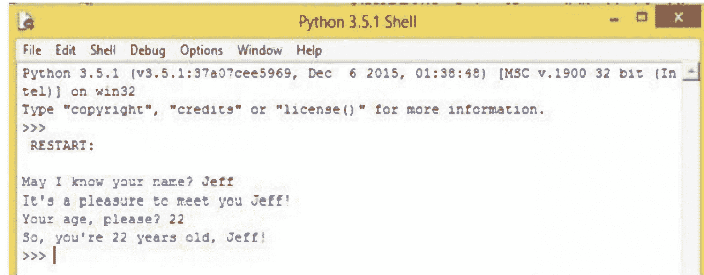

### range() 函数

Python有一种更有效的方法来处理一系列数字和等差数列，这就是使用其内置函数之一：`range()`。`range()`函数在`for`循环中特别有用。

以下是*range()*函数的一个示例：

```
>>> range(5)
range(0, 5)
```

上面的表达式`range(5)`生成一个迭代器，该迭代器从零开始递增整数，到4（5-1）结束。要显示数字列表，可以使用命令`list(range(n))`：

```
>>>list(range(5))
[0, 1, 2, 3, 4]
```

你可以通过使用两个参数调用`range()`函数来对列表输出进行更多控制：

```
range (begin, end)
```

示例：

```
>>> range(5, 9)
range(5, 9)
```

要显示列表：

```
>>> list (range(5, 9))
[5, 6, 7, 8]
```

上面的*range()*示例演示了增量为1。你可以通过引入第三个参数`step`来改变Python递增数字的方式。它可以是负数或正数，但不能为零。

格式如下：

```
range(begin, end, step)
```

示例：

```
>>> range(10, 71, 5)
range(10, 71, 5)
```

调用`list`，我们将看到这个数字序列：

```
>>> list (range(10, 71, 5))
[10, 15, 20, 25, 30, 35, 40, 45, 50, 55, 60, 65, 70]
```

### print() 函数

Python 3将*print*从一个语句变成了一个函数。因此，你必须始终将`print`参数括在圆括号内。

示例：

```
print(This is Python 3 print function)
print(s)
print(5)
```

*print()*函数可以在括号内打印任意数量的值；它们必须用逗号分隔。例如：

```
a = 3.14
b = age
c = 32
print(a = , a, b, c)
```

结果：

```
a = 3.14 age 32
```

Python shell显示的值之间用空格分隔。

### abs()

`abs()`函数返回单个数字的绝对值。它接受一个整数或浮点数作为参数，并始终返回一个正值。

示例：

```
abs(-10)
10
abs(5)
10
```

当复数作为参数使用时，`abs()`函数返回其模：

```
>>> abs(3 + 4j)
5.0
```

### max()

`max()`函数接受两个或更多参数，并返回最大的一个。

示例：

```
max(9, 12, 6, 15)
15
max(-2, -7, -35, -4)
```

### min()

`min()`函数接受两个或更多参数，并返回最小的项。

示例：

```
min(23, -109, 5, 2)
-109
min(7, 26, 0, 4)
0
```

### type()

`type()`函数返回给定参数的数据类型。

示例：

```
type(This is a string) <class str>
type(12)
<class int>
type(2 +3j)
<class complex>
```

### len()

`len()`函数返回对象的长度或作为参数给出的列表中的项目数。

示例：

```
len(pneumonoultramicroscopicsilicovolcanoconiosi)
44
s = (winter, spring, summer, fall)
len(s)
4
```

以下是Python内置函数的列表：

| abs() | all() | any() |
| ascii() | bin() | bool() |
| bytearray() | bytes() | callable() |
| chr() | classmethod() | compile() |
| complex() | delattr() | dict() |
| dir() | divmod() | enumerate() |
| eval() | exec() | filter() |
| float() | format() | frozenset() |
| getattr() | globals() | hasattr() |
| hash() | help() | hex() |
| id() | __import__() | input() |
| int() | isinstance() | issubclass() |
| iter() | len() | list() |
| locals() | map() | max() |
| memoryview() | min() | next() |
| object() | oct() | open() |
| ord() | pow() | print() |
| property() | range() | repr() |
| reversed() | round() | set() |
| setattr() | slice() | sorted() |
| staticmethod() | str() | sum() |
| super() | tuple() | type() |
| vars() | zip() | |

# 第8章

## 条件语句

条件语句在编程语言中很常见，它们用于根据条件是真还是假来执行操作或计算。If-then-else语句或条件表达式是编程语言的基本特性，它们使程序对用户更有用。

Python中的if-then-else语句具有以下基本结构：

```
if condition1:
    block1_statement
elif condition2:
    block2_statement
else:
    block3_statement
```

该结构将被评估为：
如果`condition1`为True，Python将执行`block1_statement`。如果`condition1`为False，将执行`condition2`。如果`condition2`评估为True，将执行`block2_statement`。如果`condition2`结果为False，Python将执行`block3_statement`。

2. 编写一个程序，要求用户输入三个数字（使用三个单独的`input`语句）。创建名为`total`和`average`的变量，用于存储这三个数字的总和和平均值，并打印出`total`和`average`的值。

3. 许多手机都有小费计算器。编写一个。询问用户餐费价格和他们想给的小费百分比。然后打印出小费金额和包含小费的总账单。

4. 编写一个程序，生成并打印50个随机整数，每个整数在3到6之间。

5. 编写一个程序，生成一个在1到50之间的随机数$x$，一个在2到5之间的随机数$y$，并计算$x^y$。

6. 编写一个程序，生成一个在1到10之间的随机数，并打印你的名字那么多次。

7. 编写一个程序，生成一个在1到10之间的随机小数，精确到两位小数。示例有1.23、3.45、9.80和5.00。

8. 编写一个程序，生成50个随机数，使得第一个数在1到2之间，第二个在1到3之间，第三个在1到4之间，……，最后一个在1到51之间。

9. 编写一个程序，要求用户输入两个数字$x$和$y$，并计算$\lfloor x \rfloor + \lceil y \rceil$。

10. 编写一个程序，要求用户输入一个介于-180和180之间的角度。使用包含取模运算符的表达式，将该角度转换为等效的0到360之间的角度。

为了说明，这里有一个在函数 `your_choice` 中构建的 if-then-else 语句：

```python
def your_choice(answer):
    if answer > 5:
        print("You are overaged.")
    elif answer <= 5 and answer > 1:
        print("Welcome to the Toddlers Club!")
    else:
        print("You are too young for Toddlers Club.")
print(your_choice(6))
print(your_choice(3))
print(your_choice(1))
print(your_choice(0))
```

你将在 Python Shell 中得到如下输出：

```
You are overaged.
None
Welcome to the Toddlers Club!
None
You are too young for Toddlers Club.
None
You are too young for Toddlers Club.
None
```

条件结构可以分支出多个 `elif` 分支，但最后只能有一个 `else` 分支。使用相同的代码块，可以插入另一个 `elif` 语句，为幼儿俱乐部的特权成员——2岁儿童——提供支持。

```python
def your_choice(answer):
    if answer > 5:
        print("You are overaged.")
    elif answer <= 5 and answer > 2:
        print("Welcome to the Toddlers Club!")
    elif answer == 2:
        print("Welcome! You are a star member of the Toddlers Club!")
    else:
        print("You are too young for Toddlers Club.")
```

```python
print(your_choice(6))
print(your_choice(3))
print(your_choice(1))
print(your_choice(0))
print(your_choice(2))
```

```
You are overaged. None
Welcome to the Toddlers Club! None
You are too young for Toddlers Club. None
You are too young for Toddlers Club. None
Welcome! You are a star member of the Toddlers Club! None
```

### pass 语句

**pass** 语句不执行任何操作。有时我们需要一个占位符来满足复合语句的语法要求。我们使用 **pass** 语句来填充所需的语句套件。其语法很简单。

```python
pass
```

这是一个使用 `pass` 语句的例子。

```python
if n%2 == 0:
    pass # Ignore even values
else:
    count += 1 # Count the odd values
```

是的，从技术上讲，我们可以反转 `if` 子句中的逻辑。然而，有时提供明确的“不执行任何操作”比确定 **if** 语句中条件的逆更清晰。随着程序的增长和演变，拥有一个 **pass** 语句可以方便地提醒程序可以扩展的地方。此外，当我们学习 *数据 + 处理 = 对象* 中的类声明时，我们将看到 **pass** 语句的另一个用途。

### assert 语句

断言是我们声称在程序的这一点上应该为真的条件。通常，它总结了程序变量的状态。断言可以帮助解释变量之间的关系，回顾程序到目前为止发生了什么，并显示 **if** 语句和 **for** 或 **while** 循环是否具有预期的效果。

当程序正确时，无论提供什么输入，所有断言都为真。当程序有错误时，对于某些输入组合，至少有一个断言最终为假。

Python 通过 **assert** 语句直接支持断言。有两种形式：
**assert** 条件
**assert** 条件，表达式

如果 *条件* 为 False，则程序出错；此语句会引发 AssertionError 异常。
如果 *条件* 为 True，则程序正确，此语句不再执行任何操作。
如果使用语句的第二种形式，并且给出了 *表达式*，则会使用表达式的值引发异常。我们将在 *异常* 中详细介绍异常。如果表达式是字符串，它将成为与 AssertionError 异常关联的值。

**注意：** 附加功能
**assert** 语句还有一个更高级的功能。如果表达式求值为一个类，则该类将代替 AssertionError 使用。这并不广泛使用，并且依赖于我们尚未涵盖的语言元素。

这是一个典型的例子：

```python
max = 0
if a < b:
    max = b
if b < a:
    max = a
```

```python
assert (max == a or max == b) and max >= a and max >= b
```

如果断言条件为真，程序继续执行。如果断言条件为假，程序会引发 AssertionError 异常并停止，显示发现问题的行。

当 `a` 等于 `b` 且不等于零时运行此程序；它将引发 AssertionError 异常。显然，当 `a = b` 时，**if** 语句没有将 `max` 设置为 `a` 和 `b` 中的最大值。**if** 语句中存在问题，而断言的存在揭示了该问题。

### if-else

在某些情况下，表达式涉及一个简单的条件，而一个完整的 **if** 语句在语法上显得多余且分散注意力。Python 有一个方便的逻辑运算符，它评估一个条件，然后根据该条件返回两个值中的一个。

#### 三元运算符

大多数算术和逻辑运算符都涉及一个或两个值。应用于单个值的操作称为一元操作。例如 `-a` 和 `abs(b)` 是一元操作的例子：一元取负和一元绝对值。应用于两个值的操作称为二元操作。例如，`a*b` 表示二元乘法运算符。

if-else 运算符是三元（或三元）运算符。它涉及一个条件表达式和两个替代表达式。因此，它不使用单个特殊字符，而是使用两个关键字：`if` 和 `else`。

有些人会错误地称它为三元运算符，好像这是唯一可能的三元运算符。

该运算符的基本形式是
表达式 **if** 条件 **else** 表达式

Python 首先评估中间的条件。如果条件为 True，则评估左侧表达式，这就是操作的值。如果条件为 False，则评估右侧表达式，这就是操作的值。

请注意，条件总是被评估。其他两个表达式中只有一个被评估，这使得它成为一种类似于 **and** 和 **or** 的短路运算符。

这里有几个例子。
average = sum/count **if** count != 0 **else** None
oddSum = oddSum + (n **if** n % 2 == 1 **else** 0)

其意图是让语句具有类似英语的阅读方式。平均值是总和除以计数（如果计数非零）；否则平均值为 None。

第一个例子的冗长替代方案如下。
**if** count != 0:
    average = sum/count
**else**:
    average = None

这似乎是为了防止在极少数情况下没有值可求平均值时出错而额外增加了三行代码。
同样，第二个例子的冗长版本如下：

```python
if n % 2 == 0:
    pass
else:
    oddSum = oddSum + n
```

对于第二个例子，原始语句非常清晰地表达了我们的意图：我们正在对奇数值求和。冗长的 if 语句倾向于通过将其作为 if 语句的一个分支来模糊我们的目标。

### 练习

1.  编写一个程序，要求用户输入以厘米为单位的长度。如果用户输入负长度，程序应告诉用户输入无效。否则，程序应将长度转换为英寸并打印结果。一英寸等于 2.54 厘米。
2.  编写一个程序，询问用户已修读了多少学分。如果他们修读了 23 学分或更少，打印该学生是大一新生。如果他们修读了 24 到 53 学分之间，打印他们是大二学生。大三学生的范围是 54 到 83，大四学生是 84 及以上。
3.  生成一个 1 到 10 之间的随机数。要求用户猜测该数字，并根据他们是否猜对打印一条消息。
4.  编写一个程序，要求用户输入两个数字，如果这两个数字相差在 0.001 以内，则打印 "Close"，否则打印 "Not close"。
5.  如果一个年份能被 4 整除，则是闰年，但能被 100 整除的年份不是闰年，除非它们也能被 400 整除。编写一个程序，要求用户输入一个年份，并打印出它是否是闰年。
6.  编写一个程序，要求用户输入一个数字，并打印出该数字的所有除数。
7.  编写一个程序，让用户与计算机玩石头-剪刀-布游戏。应该有五轮，五轮结束后，你的程序应打印出谁赢谁输，或者是否平局。

# 第9章

## 循环

循环是一种编程结构，用于对一系列语句进行重复处理。Python为用户提供了两种循环类型：for循环和while循环。for循环和while循环都是迭代语句，允许一段代码（循环体）重复执行多次。

### for循环

Python实现了一种基于迭代器的for循环。这是一种通过显式或隐式迭代器遍历项目列表的for循环。
循环由关键字`for`引入，其后跟一个随机变量名，该变量将包含对象提供的值。
这是Python for循环的语法：

```
for variable in list:
    statements
else:
    statements
```

以下是Python中for循环的一个示例：
pizza = ['Delhi Style Pizza', 'Pan Pizza', 'Crispy Pizza', 'Stuffed Pizza']

```
for choice in pizza:
    if choice == 'Pan Pizza':
        print('Please pay $16. Thank you!')
        print('Delicious, cheesy ' + choice)
else:
    print('Cheesy pan pizza is my all-time favorite!')
print('Finally, I'm full!')
```

运行此代码，你将在Python Shell中得到以下输出：

```
Delicious, cheesy Delhi Style Pizza
Please pay $16. Thank you!
Delicious, cheesy Pan Pizza
Delicious, cheesy Crispy Pizza
Delicious, cheesy Stuffed Pizza

Cheesy pan pizza is my all-time favorite!
Finally, I'm full!
```

### 在for循环中使用range()函数

`range()`函数可以与for循环结合使用，为循环提供所需的数字。在下面的示例中，`range(1, x+1)`提供了for循环所需的数字1到50，用于计算从1到50的总和：

```
x = 50
total = 0
for number in range(1, x+1):
    total = total + number
    print('Sum of 1 until %d: %d' % (x, total))
```

Python Shell将显示：
Sum of 1 until 50: 1275

### while循环

Python的while循环在条件为真时反复执行目标语句。
只要定义的条件为真，循环就会迭代。当条件不再为真而变为假时，
控制权将传递到循环后的第一行。
while循环的语法如下：

```
while condition statement:
    statement
```

这是一个简单的while循环：

```
counter = 0
while (counter < 10):
    print('The count is: ', counter)
    counter = counter + 1
print('Done!')
```

如果你运行代码，你应该会看到以下输出：

```
The count is: 0
The count is: 1
The count is: 2
The count is: 3
The count is: 4
The count is: 5
The count is: 6
The count is: 7
The count is: 8
The count is: 9
Done!
```

### 使用pass语句

`pass`语句告诉Python解释器什么都不做。每当遇到`pass`语句时，解释器只是继续执行程序。这个特性使其成为Python语法上需要一行但程序本身不需要操作时的良好占位符。当你在创建程序时需要专注于代码的特定区域，但仍然想保留一些循环或测试运行不完整的代码时，它会非常有用。
以下是如何使用`pass`语句填充代码中的空白：

```
def function_name(x):
    pass
```

### 无限循环

使用while循环时，你迟早会不小心让Python进入一个永无止境的循环。这里有一个例子：

```
i=0
while i<20: print(i)
```

在这个程序中，`i`的值从未改变，因此条件`i<20`始终为真。Python将不断打印零。要停止陷入死循环的程序，请使用Shell菜单下的“Restart Shell”。你可以用它在程序执行完成之前停止Python程序。

有时，死循环正是你想要的。创建一个死循环的简单方法如下所示：

```
while True:
    # 要重复执行的语句放在这里
```

值`True`被称为布尔值，将在第10.2节进一步讨论。

### 使用break语句

Python的`break`语句结束当前循环，并指示解释器开始执行循环后的下一条语句。它可以在for和while循环中使用。除了将程序引导到循环后的语句外，`break`语句还会阻止`else`语句的执行。

为了说明，可以在`if`语句的`print`函数之后立即放置一个`break`语句：

```
pizza = ['Delhi Style Pizza', 'Pan Pizza', 'Crispy Pizza', 'Stuffed Pizza']

for choice in pizza:
    if choice == 'Pan Pizza':
        print('Please pay $16. Thank you!')
        break
    print('Delicious, cheesy ' + choice)
else:
```

### 使用continue语句

`continue`语句将程序控制权带回循环的开始。你可以在for和while循环中使用它。

为了说明，可以在for循环的`print`函数之后立即放置`continue`语句来替换`break`语句：

```
pizza = ['Delhi Style Pizza', 'Pan Pizza', 'Crispy Pizza', 'Stuffed Pizza']
for choice in pizza:
    if choice == 'Pan Pizza':
        print('Please pay $10. Thank you!')
        continue
    print('Delicious, cheesy ' + choice)
else:
    print('Cheesy pan pizza is my all-time favorite!')
print('Finally, I'm full!')
```

输出将是：
```
Delicious, cheesy Delhi Style Pizza
Please pay $10. Thank you!
Delicious, cheesy Crispy Pizza
Delicious, cheesy Stuffed Pizza
Cheesy pan pizza is my all-time favorite!
Finally, I'm full!
```

### 嵌套循环

你可以将循环放在其他循环内部。一个循环放在另一个循环内部被称为嵌套，你基本上可以按需嵌套任意深度的循环。

示例1 打印一个10 × 10的乘法表。

```
for i in range(1,11):
    for j in range(1,11):
        print('{:3d}'.format(i*j), end=' ')
    print()
```

乘法表是一个二维对象。为了处理它，我们使用两个for循环，一个用于水平方向，一个用于垂直方向。`print`语句将乘积右对齐，使其看起来更美观。`end=" "`允许我们在每一行打印多个内容。当我们打印完一行后，我们使用`print()`将内容推进到下一行。

示例2 编写一个程序，通过暴力搜索寻找方程组2x + 2y = 4, x-y = 6的解(x, y)，其中x和y都在-40到40之间？

```
for x in range(-40,41):
    for y in range(-40,41):
        if 2*x+2*y==4 and x-y==6:
            print(x,y)
```

### 练习

- 1. 编写一个程序，使用for循环打印数字8, 11, 14, 17, 20, . . . , 83, 86。
- 2. 编写一个程序，使用for循环打印数字100, 98, 96, . . . , 4, 2。
- 3. 编写一个程序，恰好使用四个for循环打印下面的字母序列。
AAAAAAAAAAABBBBBBBCDCDCDCDEFFFFFFFG
- 4. 编写一个程序，询问用户的姓名以及要打印多少次。程序应按指定次数打印用户的姓名。
- 5. 斐波那契数列是下面的序列，其中前两个数字是1，之后的每个数字都是前两个数字的和。编写一个程序，询问用户要打印多少个斐波那契数，然后打印相应数量的数字。
1, 1, 2, 3, 5, 8, 13, 21, 34, 55, 89 . . .

# 第10章

## 用户自定义函数

函数是一组执行特定任务的指令/语句，是一种常见的结构化元素，允许我们在程序的不同部分重复使用一段代码。函数的使用提高了程序的清晰度和可理解性，并通过减少代码重复和将复杂任务分解为更易管理的部分使编程更加高效。函数也被称为例程、子例程、方法、过程或子程序。它们可以作为参数传递、赋值给变量或存储在集合中。

用户自定义的Python函数是通过使用`def`语句创建或定义的，并遵循以下语法：

```
def function_name(parameter list):
    # 函数体/语句
    return [expression]
```

缩进的语句构成函数体，在调用函数时执行。一旦函数被调用，圆括号内的参数就变成了实参。

函数体可以有多个`return`语句，可以放置在函数块内的任何位置。`return`语句结束函数调用并返回`return`关键字后表达式的值。没有表达式的`return`语句返回特殊值`None`。如果函数体内没有`return`语句，则函数的结束由返回值`None`表示。

函数对于将大型程序分解成更小的部分非常有用，使其更易于阅读和维护。它们对于在程序的多个不同点重复使用相同的代码也很有用。你可以将该代码放入一个函数中，并在需要使用和执行该代码时调用该函数。你还可以使用函数来创建自己的实用程序、数学函数等。

### 函数种类

一些编程语言区分不同类型的函数或子程序。可以有函数、子例程或过程函数。Python（像Java和C++一样）不强制执行这种区分。

相反，Python根据函数是否使用参数并返回值或产生一组值来进行一些区分。

### 普通函数
遵循经典数学定义的函数会将输入参数值映射到一个结果值。这或许是最常见的函数类型。它们包含一个 **return** 语句来表达结果值。

**过程函数** - 一种常见的函数是不返回结果，而是执行某些过程的函数。这种函数会省略任何 **return** 语句。或者，如果使用 **return** 语句来退出函数，该语句将没有要返回的值。
执行操作有时被称为函数的副作用。主要效果始终是返回的值。

**工厂函数** 另一种常见形式是不接受参数的函数。这种函数是一个生成值的工厂。

**生成器**。生成器函数包含 **yield** 语句。这些函数看起来像常规函数，但它们在 Python 中有不同的用途。我们将在 *迭代器和生成器* 中详细探讨这一点。

这些函数具有持久的内部处理状态；普通函数无法在不借助全局变量的情况下保留任何先前调用的数据。此外，这些函数与 **for** 语句交互。最后，这些函数在我们学习 *序列：字符串、元组和列表* 中的序列之前，意义不大。

### 函数定义
函数使用 def 语句定义。该语句以冒号结尾，属于函数的代码在 def 语句下方缩进。这里我们创建一个简单的函数，只打印一些内容。

```
def print_hello():
    print('Hello!!')

print_hello()
print('14567')
print_hello()
```

Hello!!
14567
Hello!!

前两行定义了函数。在最后三行中，我们调用了该函数两次。

函数的一个用途是，如果你在程序的不同部分反复使用相同的代码，你可以将代码放入函数中，使程序更短、更易于理解。例如，假设由于某种原因，你需要在程序的多个位置打印如下所示的星号框。

*************

```
*   *
*   *
***************
```

将代码放入函数中，然后每当你需要一个框时，只需调用该函数，而不是输入多行冗余代码。以下是该函数。

```
def draw_square():
    print('*' * 15)
    print('*', ' ' * 11, '*')
    print('*', ' ' * 11, '*')
    print('*' * 15)
```

这样做的一个好处是，如果你决定改变框的大小，你只需修改函数中的代码，而如果你在需要的地方复制粘贴了绘制框的代码，你就必须更改所有这些地方。

### 参数
我们可以将值传递给函数。这里有一个例子：

```
def print_hello(n):
    print('Hello ' * n)
    print()
print_hello(2)
print_hello(4)
```

```
times = 2
print_hello(times)
```

Hello Hello
Hello Hello Hello Hello
Hello Hello

当我们用值 2 调用 print_hello 函数时，该值被存储在变量 n 中。然后我们可以在函数的代码中引用该变量 n。

你可以向函数传递多个值：

```
def multiple_print(string, n):
    print(string * n)
    print()
multiple_print('Hello', 4)
multiple_print('A', 8)
```

HelloHelloHelloHello
AAAAAAAA

### 返回值
我们可以编写执行计算并返回结果值的函数。
示例 1 这是一个将温度从摄氏度转换为华氏度的简单函数。

```
def cnvrt(t):
    return t*9/5+32
print(cnvrt(20))
68
```

return 语句用于将函数计算的结果发送回调用者。请注意，函数本身不执行任何打印操作。打印是在函数外部完成的。这样，我们就可以对结果进行数学运算，如下所示。
print(cnvrt(20)+5)
如果我们只是在函数中打印结果而不是返回它，结果将被打印到屏幕上然后被遗忘，我们将永远无法对其进行任何操作。

### return 语句
语句 return [expression] 退出函数，并可选择将表达式返回给调用者。没有参数的 return 语句等同于 return None。
你可以按如下方式从函数返回值 –
### 函数定义在此处

```
def sum( arg1, arg2 ):
    # 将两个参数相加并返回它们。"
    total = arg1 + arg2
    print("函数内部 : ", total)
    return total;
```

```
### 现在你可以调用 sum 函数
total = sum( 30, 20 );
print("函数外部 : ", total)
```

当执行上述代码时，它会产生以下结果 –
函数内部 : 50
函数外部 : 50

示例 2 作为另一个例子，Python 的 math 模块包含三角函数，但它们只适用于弧度。让我们编写自己的正弦函数，使其适用于角度。

```
from math import pi, sin
def deg_sin(x):
    return sin(pi*x/180)
```

示例 3 一个函数可以返回多个值，作为一个列表。
假设我们想编写一个函数来求解方程组 a x + b y = e 和 c x + d y = f。事实证明，如果存在唯一解，那么它由 x = (d e - b f) / (a d - b c) 和 y = (a f - c e) / (a d - b c) 给出。我们需要我们的函数同时返回 x 和 y 的解。

```
def solve(a,b,c,d,e,f):
    x = (d*e-b*f)/(a*d-b*c)
    y = (a*f-c*e)/(a*d-b*c)
    return [x,y]
```

```
xsol, ysol = solve(2,3,4,1,2,5)
print('解为 x = ', xsol, ' 和 y = ', ysol)
```

解为 x = 1.3 和 y = -0.2
此方法使用了第 10.3 节中提到的列表赋值快捷方式。

### 默认参数和关键字参数
你可以为参数指定默认值。这使其成为可选的，如果调用者决定不使用它，那么它将采用默认值。这里有一个例子：

```
def multiple_print(str, n=1):
    print(str * n)
    print()

multiple_print('Hello', 3)
multiple_print('Hello')
```

HelloHelloHello
Hello

默认参数需要放在函数定义的末尾，在所有非默认参数之后。

**关键字参数** 与默认参数相关的一个概念是关键字参数。假设我们有以下函数定义：
def fancy_print(text, color, background, style, justify):

每次调用此函数时，你都必须记住参数的正确顺序。Python 允许你在调用函数时命名参数，如下所示：
fancy_print(text='Hi', color='yellow', background='black', style='bold', justify='left')
fancy_print(text='Hi', style='bold', justify='left', background='black', color='yellow')

正如我们所看到的，当你使用关键字参数时，参数的顺序并不重要。在定义函数时，最好提供默认值。例如，大多数时候，调用者会想要左对齐、白色背景等。使用这些值作为默认值意味着调用者不必每次调用函数时都指定每一个参数。这里有一个例子：
def fancy_print(text, color='black', background='white', style='normal', justify='left'):
### 函数代码放在这里
fancy_print('Hi', style='bold')
fancy_print('Hi', color='yellow', background='black')
fancy_print('Hi')

### 局部变量
假设我们有两个如下所示的函数，每个函数都使用一个变量 i：
def func1():

```
for i in range(10):
    print(i)
```

```
def func2():
    i=100
    func1()
    print(i)
```

当一个变量在函数内部定义时，它对该函数是局部的，这意味着它基本上在该函数外部不存在。这样，每个函数都可以定义自己的变量，而不必担心这些变量名是否在其他函数中使用。

### 全局变量
另一方面，有时你确实希望同一个变量对多个函数可用。这样的变量称为全局变量。使用全局变量时必须小心，尤其是在较大的程序中，但在较小的程序中，谨慎使用一些全局变量是可以的。这里有一个简短的例子：

```
def reset():
    global time_left
    time_left = 0
def print_time():
    print(time_left)
    time_left=30
```

在这个程序中，我们有一个变量 `time_left`，我们希望多个函数都能访问它。如果一个函数想要改变该变量的值，我们需要告诉函数 `time_left` 是一个全局变量。我们在函数中使用 `global` 语句来实现这一点。另一方面，如果我们只是想使用全局变量的值，则不需要 `global` 语句。

### 参数

我们以一点技术细节来结束本章。如果你现在不想纠结细节，可以暂时跳过本节。这里有两个简单的函数：

```python
def func1(x):
    x = x + 1

def func2(L):
    L = L + [1]

a = 2
M = [1, 2, 3]
func1(a)
func2(M)
```

当我们用 `a` 调用 `func1`，用 `M` 调用 `func2` 时，一个问题出现了：函数是否改变了 `a` 和 `M` 的值？答案可能会让你惊讶。`a` 的值没有改变，但 `M` 的值改变了。原因与 Python 处理数字和列表的方式不同有关。列表被称为可变对象，意味着它们可以被改变，而数字和字符串是不可变的，意味着它们不能被改变。

如果我们想反转上面示例的行为，使得 `a` 被修改而 `M` 不被修改，请执行以下操作：

```python
def func1(x):
    x = x + 1
    return x

def func2(L):
    cpy = L[:]
    cpy = cpy + [1]

a = 3
M = [1, 2, 3]
a = func1(a)  # 注意这一行的变化
func2(M)
```

### lambda

当你需要一个函数同时满足以下条件时，可以使用 `lambda` 作为便捷方式：

- 是匿名的（不需要名字）并且
- 只包含一个表达式，没有语句。

示例：

```python
fn = lambda x, y, z: (x ** 2) + (y * 2) + z
fn(4, 5, 6)

format = lambda obj, category: 'The "%s" is a "%s".' % (obj, category)
format('pine tree', 'conifer')
### 输出：'The "pine tree" is a "conifer".'
```

`lambda` 可以接受多个参数，并且可以（像函数一样）返回多个值。示例：

```python
a = lambda x, y: (x * 3, y * 4, (x, y))
a(3, 4)
```

建议：在某些情况下，`lambda` 可能作为事件处理器很有用。示例：

```python
class Test:
    def __init__(self, first="", last=""):
        self.first = first
        self.last = last

    def test(self, formatter):
        """
        测试 lambda。
        formatter 是一个接受两个参数（名和姓）的函数。它应该返回格式化后的名字。
        """
        msg = 'My name is %s' % (formatter(self.first, self.last),)
        print(msg)

def test():
    t = Test('Dave', 'Kuhlman')
    t.test(lambda first, last: '%s %s' % (first, last))
    t.test(lambda first, last: '%s, %s' % (last, first))

test()
```

### global 语句

在 *函数与命名空间* 中，我们将描述 Python 用于存储变量的一些内部机制。我们将在 *global 语句* 中介绍 **global** 语句。

我们将在 *按值调用与按引用调用* 中插入一段关于两种常见参数绑定机制的讨论：按值调用和按引用调用。请注意，这个区别并不适用于 Python，但如果你有 C 或 C++ 等语言的经验，你可能会想知道这是在哪里以及如何实现的。

最后，我们将在 *函数对象* 中介绍函数作为一等对象的一些方面。

### 函数与命名空间

这是关于 Python 如何确定名称含义的概述。我们将省略一些细节以突出更重要的要点。更多信息，请参阅 *Python 语言参考* 的第 4.1 节。

重要的问题是，我们希望在函数体内创建的变量对该函数是私有的。如果所有变量都是全局的，那么每个函数都有意外干扰全局变量值的风险。在 COBOL 编程语言中（不使用单独编译或任何现代扩展），所有变量都在数据部分全局声明，需要非常小心以防止意外或无意中使用变量。

为了实现隐私和分离，Python 维护了几个变量字典。这些字典定义了变量名被理解的上下文。因为这些字典用于解析变量（即命名对象），所以它们被称为 *命名空间*。全局命名空间对当前执行的 Python 脚本的所有模块都可用。每个模块、类、函数、lambda 或传递给 **exec** 命令的匿名代码块都有自己的私有命名空间。

名称使用定义执行环境的嵌套命名空间集合来解析。Python 总是首先检查最局部的字典，最后检查全局字典。

考虑以下脚本。

```python
def deep(a, b):
    print("a=", a)
    print("b=", b)

def shallow(hows, things):
    deep(hows, 1)
    deep(things, coffee)

hows = 1
coffee = 2
shallow("word", 3.1415926)
shallow(hows, coffee)
```

`deep()` 函数有一个局部命名空间，其中定义了两个变量：`a` 和 `b`。当从 `shallow()` 调用 `deep()` 时，有三个嵌套作用域定义了环境：`deep()` 的局部命名空间、`shallow()` 的局部命名空间以及主脚本的全局命名空间。

`shallow()` 函数有一个局部命名空间，其中定义了两个变量：`hows` 和 `things`。

当从主脚本调用 `shallow()` 时，局部的 `hows` 在局部命名空间中被解析。它隐藏了同名的全局变量。

对 `coffee` 的引用没有在局部命名空间中解析，而是在全局命名空间中解析。这被称为 *自由* 变量，有时是软件设计不良的症状。

主脚本根据定义在全局命名空间中执行，其中定义了两个变量（`hows` 和 `coffee`）以及两个函数 `deep()` 和 `shallow()`。

**一些后果。** 由于每个导入的模块都存在于自己的命名空间中，该模块内的所有函数和类都必须用模块名来限定它们的名称。我们在导入 `math` 和 `random` 时看到了这一点。要使用 `sqrt()` 函数，我们必须说 `math.sqrt`，提供用于解析名称 `sqrt()` 的模块名。

这个模块命名空间确保模块中的所有内容都与其他模块保持分离。它通过用定义名称的模块来限定名称，使我们的程序清晰明了。

模块命名空间还允许模块拥有相对全局的变量。例如，一个模块可以拥有在导入模块时创建的变量。从某种意义上说，这些变量对模块中的所有函数和类都是全局的。然而，因为它们只在模块的命名空间内已知，所以它们不会与我们程序或其他模块中的变量冲突。

当我们大量使用模块时，必须限定模块内的名称可能会变得烦人。Python 有方法将模块的元素放入全局命名空间。我们将在 *组件、模块和包* 中介绍这些方法。

**警告：** 全局警告

**global** 语句会导致软件组件紧密耦合。这可能导致程序维护和增强的困难。类和模块提供了组装复杂程序的更好方法。作为一般策略，我们不鼓励使用 **global** 语句。

### 练习

1.  编写一个名为 `rectangle` 的函数，它接受两个整数 `m` 和 `n` 作为参数，并打印出一个由星号组成的 `m` 行 `n` 列的方框。下面是 `rectangle(2,4)` 的输出：
    ```
    ****
    ****
    ```

2.  编写一个名为 `add_excitement` 的函数，它接受一个字符串列表，并在列表中每个字符串的末尾添加一个感叹号 (`!`)。程序应该修改原始列表，不返回任何内容。

3.  编写一个名为 `sum_digits` 的函数，它接受一个整数 `num` 并返回 `num` 的各位数字之和。

4.  数字 `n` 的数根按如下方式获得：将 `n` 的各位数字相加得到一个新数字。将该数字的各位数字相加得到另一个新数字。持续此过程，直到得到一个只有一位数字的数字。该数字就是数根。例如，如果 `n = 45893`，我们将各位数字相加得到 `4 + 5 + 8 + 9 + 3 = 29`。然后我们将 29 的各位数字相加得到 `2 + 9 = 11`。然后我们将 11 的各位数字相加得到 `1 + 1 = 2`。由于 2 只有一位数字，2 就是我们的数根。

5.  编写一个函数，返回整数 `n` 的数根。[注意：有一个捷径，数根等于 `n mod 9`，但这里不要使用它。]

6.  编写一个名为 `first_diff` 的函数，它接受两个字符串并返回字符串首次不同的位置。如果字符串完全相同，则应返回 -1。

7.  编写一个函数，它接受一个整数 `n` 并返回一个恰好有 `n` 位的随机整数。例如，如果 `n` 是 3，那么 125 和 593 是有效的返回值，但 093 不是，因为它实际上是 93，这是一个两位数。

8.  编写一个名为 `number_of_factors` 的函数，它接受一个整数并返回该数字有多少个因子。

9.  编写一个名为 `factors` 的函数，它接受一个整数并返回其因子的列表。

# 第11章

## 常用模块

模块是包含Python定义和语句的文件。文件名就是模块名加上后缀`.py`。在模块内部，模块的名称（作为字符串）可以通过全局变量`__name__`获取。

Python包含数百个模块，可以执行各种各样的任务。互联网上也有许多第三方模块可供下载。我们在这里讨论一些我们认为有用的模块。

### 导入模块

在Python中导入模块有以下几种方式：

```python
from random import randint, choice
from random import *
import random
```

第一种方式仅从模块中导入两个函数。

第二种方式导入模块中的所有函数。通常应该避免这样做，因为模块中可能包含一些会与你自己的变量名冲突的名称。例如，如果你的程序使用了一个名为`sum`的变量，而你导入了一个包含名为`sum`的函数的模块，就可能会出现问题。然而，有些模块，比如`tkinter`，以这种方式导入是相当安全的。

第三种方式导入整个模块，且不会干扰你的变量名。要使用模块中的函数，需要在函数名前加上`random`和一个点号。例如：`random.randint(1,10)`。

### 更改模块名称

`as`关键字可用于更改程序中引用模块或模块内容的名称。以下是三个例子：

```python
import random as rnd
from math import log as ln
```

### 位置

通常，导入语句放在程序的开头，但没有限制。只要它们位于使用模块的代码之前，可以放在任何位置。

### 获取帮助

要在Python shell中获取某个模块（比如`math`模块）的帮助，请使用上述第三种方式导入它。然后`dir(math)`会列出模块中的函数和变量，`help(math)`会给你一个相当长的描述，说明每个函数的作用。要获取特定函数（如`log`）的帮助，请输入`help(math.log)`。

### math模块

`math`模块包含一些常用的数学函数，如下所示：

| 函数 | 描述 |
|---|---|
| sin, cos, tan | 三角函数 |
| asin, acos, atan | 反三角函数 |
| atan2(y,x) | 计算arctan(y/x)，并具有正确的符号行为 |
| sinh, cosh, tanh | 双曲函数 |
| asinh, acosh, atanh | 反双曲函数 |
| log, log10 | 自然对数，以10为底的对数 |
| log1p | log(1+x)，在x接近1时比log更精确 |
| exp | 指数函数 $e^x$ |
| degrees, radians | 将弧度转换为度，或将度转换为弧度 |
| floor | floor(x) 是小于等于 x 的最大整数 $\le$ x |
| ceil | ceil(x) 是大于等于 x 的最小整数 $\ge$ x |
| e, pi | 常数 e 和 pi |
| factorial | 阶乘 |
| modf | 返回一个元组（小数部分，整数部分） |
| erf | 误差函数 |

请注意，`floor`和`int`函数对正数的行为相同，但对负数的行为不同。例如，`floor(4.57)`和`int(4.57)`都返回整数4。然而，`floor(-4.57)`返回-5，即小于等于-4.57的最大整数，而`int(-4.57)`返回-4，这是通过舍弃数字的小数部分得到的。

### time模块

`time`模块包含一些用于处理时间的有用函数。

### sleep

`sleep`函数会将你的程序暂停指定的时间（以秒为单位）。例如，要将程序暂停5秒或20毫秒，请使用以下代码：

```python
from time import sleep
sleep(5)
sleep(.02)
```

### 计时

`time`函数可用于对操作进行计时。以下是一个例子：

```python
from time import time
start = time()
### do some stuff
print('It took', round(time()-start, 3), 'seconds.')
```

`time()`函数的分辨率在Windows上是毫秒，在Linux上是微秒。上面的例子使用的是整秒。如果你想要毫秒级的分辨率，请使用以下打印语句：

```python
print('{:.3f} seconds'.format(time()-start))
```

你可以使用一些数学运算来得到分钟和小时。以下是一个例子：

```python
t = time()-start
secs = t%60
mins = t//60
hours = mins//60
```

当你调用`time()`时，你会得到一个相当奇怪的值，比如1306372108.045。这是自1970年1月1日以来经过的秒数。

### datetime模块

`datetime`模块允许我们同时处理日期和时间。以下代码创建一个包含当前日期和时间的日期时间对象：

```python
from datetime import datetime
d = datetime.now()
```

`datetime`对象具有属性`year`、`month`、`day`、`hour`、`minute`、`second`和`microsecond`。以下是一个简短的例子：

```python
d = datetime.now()
print('{:02d} {}/{}/{}'.format(d.hour, d.minute, d.month, d.day, d.year))
```

9:38 22/6/2018

小时是24小时制。要获取12小时制，你可以这样做：

```python
am_pm = 'am' if d.hour<12 else 'pm'
print('{}:{}{}'.format(d.hour%12, d.minute, am_pm))
```

另一种显示日期和时间的方法是使用`strftime`方法。它使用各种格式化代码，允许你显示日期和时间，包括星期几、上午/下午等信息。以下是一些格式化代码：

| 代码 | 描述 |
| :--- | :--- |
| %c | 根据本地惯例格式化的日期和时间 |
| %x, %X | %x是日期，%X是时间，两者都按照与%c相同的格式格式化 |
| %d | 月份中的日期 |
| %j | 年份中的日期 |
| %a, %A | 星期名称（%a是缩写的星期名称） |
| %m | 月份（01-12） |
| %b, %B | 月份名称（%b是缩写的月份名称） |
| %y, %Y | 年份（%y是2位数，%Y是4位数） |
| %H, %I | 小时（%H是24小时制，%I是12小时制） |
| %p | am或pm |
| %M | 分钟 |
| %S | 秒 |

以下是一个例子：

```python
print(d.strftime('%A %x'))
```

Tuesday 18/06/18

### os模块 - 处理文件和目录

`os`模块和子模块`os.path`包含用于处理文件和目录的函数。

### 更改目录

当你的程序打开一个文件时，该文件被假定与程序本身在同一目录中。如果不是，你必须指定目录，如下所示：

```python
s = open('c:/users/ajit/myfile.txt').read()
```

如果你有很多需要读取的文件，且它们都在同一个目录中，你可以使用`os.chdir`来更改目录。以下是一个例子：

```python
os.chdir('c:/users/tanweer/')
s = open('myfile.txt').read()
```

### 获取当前目录

函数`getcwd`返回当前目录的路径。它将是你的程序所在的目录，或者你通过`chdir`更改到的目录。

### 获取目录中的文件

函数`listdir`返回目录中条目的列表，包括所有文件和子目录。如果你只想要文件而不要子目录，或者反之，`os.path`模块包含函数`isfile`和`isdir`来判断一个条目是文件还是目录。以下是一个例子，它搜索目录中的所有文件，并打印出包含单词'employee'的文件名。

```python
import os
directory = 'c:/users/ajit/'
files = os.listdir(directory)
for f in files:
    if os.path.isfile(directory+f):
        s = open(directory+f).read()
        if 'employee' in s: print(f)
```

### 更改和删除文件

以下是一些有用的函数。

| 函数 | 描述 |
| --- | --- |
| mkdir | 创建一个目录 |
| rmdir | 删除一个目录 |
| remove | 删除一个文件 |
| rename | 重命名一个文件 |

前两个函数接受一个目录路径作为其唯一参数。`remove`函数接受一个文件名。`rename`的第一个参数是旧名称，第二个参数是新名称。

### 复制文件

`os`模块中没有用于复制文件的函数。相反，请使用`shutil`模块中的`copy`函数。以下是一个例子，它获取目录中的所有文件并为每个文件创建一个副本，每个副本的文件名以"Copy of"开头：

```python
import os
import shutil
directory = 'c:/users/ajit/'
files = os.listdir(directory)

for f in files:
    if os.path.isfile(directory+f):
        shutil.copy(directory+f, directory+'Copy of '+f)
```

### 更多关于os.path

`os.path`模块包含更多有助于处理文件和目录的函数。不同的操作系统在处理路径方面有不同的约定，而

### os.path

`os.path` 允许你的程序在不同操作系统上运行，而无需担心每个操作系统的具体细节。以下是一些示例（在我的 Windows 系统上）：

```python
print(os.path.split('c:/users/ajit/myfile.txt'))
print(os.path.basename('c:/users/ajit/myfile.txt'))
print(os.path.dirname('c:/users/ajit/myfile.txt'))
print(os.path.join('directory', 'myfile.txt'))
```

请注意，Windows 中的标准分隔符是 `\`。`/` 也可以使用。

### os.walk

`os.walk` 函数允许你扫描一个目录及其所有子目录。下面是一个简单的示例，用于查找我桌面上或桌面子目录中的所有 Python 文件：

```python
for (path, dirs, files) in os.walk('c:/users/ajit/desktop/'):
    for filename in files:
        if filename[-3:] == '.py':
            print(filename)
```

### 运行和退出程序

#### 运行程序

你的程序有几种不同的方式来运行另一个程序。其中一种是使用 `os` 模块中的 `system` 函数。下面是一个示例：

```python
import os
os.chdir('c:/users/ajit')
os.system('app.exe')
```

`system` 函数可用于运行你可以在命令提示符下运行的命令。运行程序的另一种方式是使用 `execv` 函数。

#### 退出你的程序

`sys` 模块有一个名为 `exit` 的函数，可用于退出你的程序。下面是一个简单的示例：

```python
import sys
ans = input('Quit the program?')
if ans.lower() == 'yes':
    sys.exit()
```

### Zip 文件

Zip 文件是一个压缩文件或文件目录。以下代码将 `filename.zip` 中的所有文件解压到我的桌面：

```python
import zipfile
z = zipfile.ZipFile('filename.zip')
z.extractall('c:/users/ajit/desktop/')
```

### 从互联网获取文件

有一个 **urllib** 模块。下面是一个简单的示例：

```python
from urllib.request import urlopen
page = urlopen('http://www.google.com')
s = page.read().decode()
```

`urlopen` 函数返回一个非常类似于文件对象的对象。在上面的示例中，我们使用 `read()` 和 `decode()` 方法将页面的全部内容读入字符串 `s`。

上面示例中的字符串 `s` 充满了 HTML 文件的文本，阅读起来并不美观。Python 中有用于解析 HTML 的模块，但这里我们不会介绍它们。上面的代码对于从互联网下载普通的文本数据文件很有用。对于比这更复杂的需求，请考虑使用第三方模块。

### 声音

在你的程序中获取一些简单声音的一种简便方法是使用 `winsound` 模块。不过，它仅适用于 Windows。`winsound` 中的一个函数是 `Beep`，可用于在给定频率下播放指定时长的音调。下面是一个播放 500 Hz 声音 1 秒的示例。

```python
from winsound import Beep
Beep(500, 1000)
```

`Beep` 的第一个参数是以赫兹为单位的频率，第二个参数是以毫秒为单位的持续时间。

`winsound` 中的另一个函数是 `PlaySound`，可用于播放 WAV 文件。下面是一个示例：

```python
from winsound import PlaySound
PlaySound('mysound.wav', 'SND_ALIAS')
```

另一方面，如果你安装了 Pygame，播放任何类型的常见声音文件都相当容易。下面展示了这一点，并且它适用于 Windows 以外的系统：

```python
import pygame
pygame.mixer.init(18000, -16, 2, 1024)
sound = pygame.mixer.Sound('mysoundfile.wav')
sound.play()
```

### 查找模块：路径

为了使模块可用，Python 解释器必须能够定位模块文件。Python 有一组用于查找模块文件的目录。这组目录称为 *搜索路径*，类似于操作系统用于定位可执行文件的 **PATH** 环境变量。

Python 的搜索路径由多个来源构成：

**PYTHONHOME** 用于定义属于 Python 安装一部分的目录。如果未定义此环境变量，则使用标准目录结构。对于 Windows，标准位置基于 Python 安装的目录。对于大多数 Linux 环境，Python 安装在 `/usr/local` 下，库可以在那里找到。对于 Mac OS，主目录位于 `/Library/Frameworks/Python.framework` 下。

**PYTHONPATH** 用于向路径添加目录。此环境变量的格式类似于操作系统 **PATH** 变量，由一系列以 `:`（或 Windows 上的 `;`）分隔的文件名组成。

脚本目录。如果你运行一个 Python 脚本，该脚本的目录将被首先放置在搜索路径上，以便使用本地定义的模块，而不是同名的内置模块。

站点模块的位置也会被添加。（可以通过使用 `-S` 选项启动 Python 来禁用此功能。）站点模块将使用 **PYTHONHOME** 位置创建最多四个额外的目录。通常，最有趣的是 `site-packages` 目录。这个目录是放置你下载的额外模块的便捷位置。此外，此目录可以包含 `.pth` 文件。站点模块读取 `.pth` 文件并将命名的目录放入搜索路径。

搜索路径由 `sys` 模块中的 `path` 变量定义。如果我们导入 `sys`，就可以显示 `sys.path`。这对于调试非常方便。调试 shell 脚本时，运行 `python -c 'import sys; print(sys.path)'` 可以帮助查看 Python 环境设置的部分内容。

因此，安装模块就是确保该模块出现在搜索路径上。有四种主要方法可以实现这一点。

一些包会建议你创建一个目录并将包放入该目录。这可以通过下载并解压文件来完成。也可以使用 Subversion 并将你的 Subversion 副本与服务器上的副本同步。无论哪种方式，你可能只需要创建一个指向该目录的操作系统链接，并将该链接放入 `site-packages` 目录。

一些包会建议你下载（或使用 Subversion）创建一个临时副本。它们会为你提供一个通常基于 `setup.py` 的脚本，该脚本将文件移动到正确的位置。这称为 distutils 分发。这通常会将模块文件复制到 `site-packages` 目录。

一些包会依赖 setuptools。这是来自 [Python Enterprise Application Kit](http://peak.telecommunity.com/DevCenter/setuptools) 的一个包，它扩展了 distutils 以进一步自动化下载和安装。此工具同样通过将工作库模块移动到 `site-packages` 目录来工作。

扩展搜索路径。要么设置 **PYTHONPATH** 环境变量，要么在 `site-packages` 目录中放置 `.pth` 文件。

### import 主题的变体

**import** 语句有几种变体。我们在 *math 模块* 中简要介绍过这些。在本节中，我们将介绍 **import** 语句可用的变体。

- 基本导入。这在 *模块使用：import 语句* 中有介绍。
- 导入为。这允许我们导入一个模块并为其分配一个新名称。
- 从模块导入名称。这允许我们导入一个模块，使某些名称成为全局命名空间的一部分。
- 组合 from 和 as 导入。

#### 导入为

**import** 语句的一个有用变体是使用 **as** 子句重命名模块。

```python
import module as name
```

这种模块重命名用于两种情况。

- 我们有两个或更多可互换的模块版本。
- 模块名称相当长且输入起来很麻烦。

在许多情况下，我们拥有可互换的模块版本。一个例子是内置的 `os` 模块。该模块为我们提供了许多在大多数主要操作系统上行为相同的函数。实现这一点的方法是创建这些函数的多个变体实现，然后使用适当的 **as** 子句为它们赋予一个平台中立的名称。

### 从模块导入名称

**import** 语句的另外两种变体，用于将模块中的选定名称引入本地命名空间。其中一种形式是选取特定名称使其成为全局变量。

```python
from module import name, ...
```

这种形式的 **import** 在模块导入后增加了一个步骤：它将给定的名称列表添加到本地命名空间中，使得这些名称无需使用模块名作为限定符即可使用。

例如：

```python
from math import sin, cos, tan
```

### 导入与重命名

最后，我们可以结合使用 **from** 和 **as** 选项，既导入选定的项目，又为它们提供更易理解的名称。

我们可以这样写：

```python
from module import name as name
```

在这种情况下，我们既隐藏了项目的来源，也隐藏了它的原始名称。我们最好有非常充分的理由这样做。想想看，这样做可能会引起多大的困惑：

```python
from math import sqrt as sin
```

使用时必须谨慎，以免制造出比它试图解决的问题更多的问题。

### exec 语句

import 语句实际上执行的是模块文件。通常，我们导入的文件被定义为一系列定义的序列。由于我们的主程序通常以一系列 import 语句开头，这些模块会被导入到全局命名空间中。Python 还会优化由 import 语句引入的模块，确保它们只被导入一次。

exec 语句可以执行一个文件、一段 Python 代码字符串，以及由 compile() 函数创建的代码。与 import 语句不同，它不会优化模块定义，也不会创建和保存新的命名空间。

```python
exec expression
```

eval() 和 execfile() 函数本质上做的是同样的事情。

exec 语句、eval() 函数和 execfile() 函数是危险的工具。它们违背了基本假设之一：你正在阅读的源代码就是正在执行的源代码。使用 exec 语句或 eval() 函数的程序会将其他源代码语句动态地整合到程序中。这可能会使程序难以理解、维护或增强。

通常，exec 语句的使用必须非常小心。最常见的用途是引入一组以简单 Python 赋值语句编写的配置参数。例如，我们可能会使用如下文件作为程序的配置参数。

```
db_server= "dbs_prod_01"
db_port= "3306"
db_name= "PROD"
```

# 第 12 章

## 类与面向对象编程

Python 是一种面向对象的编程语言，这意味着它操作和处理的数据结构被称为对象。对象可以是 Python 中任何可以命名的东西：整数、函数、浮点数、字符串、类、方法等。它们在 Python 中地位平等，可以在任何需要对象的地方使用。

面向对象编程允许我们围绕*对象*的交互来组织程序。一个*类*提供了对象结构和行为的定义；每个对象都是一个类的实例。因此，一个典型的程序包含若干个类定义和一个最终的主函数。主函数创建将执行程序任务的对象。

本章介绍定义类的基本技术。在*语义*部分，我们定义了对象的语义以及定义其属性（实例变量）和行为的类。在*类定义：class 语句*部分，我们展示了创建类定义的语法；在*创建和使用对象*部分，我们介绍了对象的使用。

Python 有一些系统定义的名称，类可以利用它们使自己的行为类似于内置的 Python 类，其中一些在*特殊方法名称*部分进行了介绍。我们在*一些示例*部分提供了一些例子。使用对象最重要的部分可能是它们如何协作以完成有用的工作；我们在*对象协作*部分介绍了这一点。

### 语义

面向对象编程将软件设计和实现聚焦于单个对象的定义及其之间的交互。一个对象被认为*封装*了一种状态和一组行为；它既是数据也是处理。类的每个实例都有属性的独立副本，这些副本与类范围的操作紧密耦合。我们可以通过四个特征来理解对象，这些特征改编自 [Rumbaugh91]。

**标识性。** 每个对象都是唯一的，可以与所有其他对象区分开来。在现实世界中，两个原本相同的咖啡杯可以被区分为不同的对象。例如，它们在我们桌子上的位置不同。在计算机内存的世界里，对象可以通过其地址来标识，这将使它们具有唯一性。

**分类性。** 这有时被称为*封装*。具有相同属性和行为的对象属于一个共同的*类*。每个单独的对象都有唯一的属性值。我们在查看各种集合类时看到了这一点。两个不同的列表对象具有相同的一般结构和相同的行为。两个列表都响应 append()、pop() 以及列表的所有其他方法。然而，每个列表对象都有一个唯一的值序列。

**继承性。** 一个类可以从父类继承方法，重用共同的特性。超类更通用，子类覆盖超类的特性，因此更具体。通过内置的 Python 类，我们已经了解了所有不可变序列的相似之处。

**多态性。** 一个通用操作可以根据对象的类具有不同的实现方法。当我们注意到 Python 中几乎每个类都有一个 + 操作时，我们就看到了这一点。在两个浮点数之间，+ 操作是加法；然而，在两个列表之间，+ 操作是连接列表。

### Python 中的类

类是数据和函数的逻辑分组。它提供了创建包含任意内容的数据结构的自由，因此易于访问。

例如，任何想要在线获取客户详情的银行员工都会访问**客户类**，其中会列出其所有属性，如余额、交易详情、取款和存款详情、未偿债务等。

### 如何定义 Python 类

要定义一个类，你需要考虑以下几点：

**步骤 1)** 在 Python 中，类是通过 "**class**" 关键字定义的。

```python
class myClass():
```

**步骤 2)** 在类内部，你可以定义属于该类的函数或方法。

```python
def method1(self):
    print("Hello")
```

```python
def method2(self, someString):
    print("Software Testing:" + someString)
```

- 这里我们定义了 method1，它打印 "Hello"。
- 我们定义的另一个方法是 method2，它打印 "Software Testing" + someString。someString 是由调用方法提供的变量。

**步骤 3)** 类中的所有内容都需要缩进，就像函数、循环、if 语句等中的代码一样。任何未缩进的内容都不属于该类。

**注意：** 关于在 Python 中使用 "self"

- self 参数指的是对象本身。因此使用了 self 这个词。所以在这个方法内部，self 将指向正在被操作的该对象的特定实例。
- Self 是 Python 约定俗成的名称，用于表示 Python 中实例方法的第一个参数。它是 Python 语法中访问对象成员的一部分。

**步骤 4)** 创建该类的一个对象。

```python
c = myClass()
```

**步骤 5)** 调用类中的一个方法。

```python
c.method1()
c.method2(" Testing is fun")
```

- 注意，当我们调用 method1 或 method2 时，我们不需要提供 self 关键字。Python 运行时会自动为我们处理。
- 当你在实例上调用实例方法时，Python 运行时会传递 "self" 值，无论你是否刻意提供。
- 你只需要关心非 self 参数。

**步骤 6)** 这是完整的代码。

```python
### Example file for working with classes
class myClass():
    def method1(self):
        print("Hello")

    def method2(self, someString):
        print("Software Testing:" + someString)

def main():
    # exercise the class methods
    c = myClass()
    c.method1()
    c.method2(" Testing is fun")

if __name__ == "__main__":
    main()
```

**重要：** Python 3.0

在 Python 3.0 中，使用 `object` 作为父类将不再是必需的。
然而，在 Python 2.6 中，强烈建议这样做。

### 类的职责

为类分配职责可能具有挑战性。有许多理由可以用来证明将函数和实例变量组合在单个类中的合理性。

- **便利性。** 定义一个类来执行某些操作，是因为这样编写程序很方便。
- **相似操作。** 定义一个类是因为它执行所有输入、所有输出或所有计算。
- **相似时间。** 定义一个类来处理所有初始化、所有处理或所有最终清理。
- **顺序。** 我们识别出一些按简单顺序执行的操作，并将它们捆绑到一个类中。
- **公共数据。** 定义一个类是因为它具有隔离数据结构或算法的操作。

### 创建和使用对象

一旦我们有了类定义，就可以创建该类的实例对象。我们通过像调用函数一样对类进行求值来实现这一点：例如，`Die()`。当我们进行这样的类调用时，会发生两件事。

创建一个新对象。该对象有一个指向其类定义的引用。

对象的初始化方法 `__init__()` 被调用。我们将在下一节中查看如何定义这个方法函数。

让我们创建 `Die` 类的两个实例。

```
d1 = Die()
d2 = Die()
d1.roll(), d2.roll() (6,5)
```

**对象的生命周期。** 每个类的每个实例都有一个生命周期。以下是大多数对象的典型过程。

**定义。** Python 解释器读取类定义（或者它是一个内置类）。类定义由 **class** 语句创建。内置类的例子包括 `file`、`str`、`int` 等。

**构造。** 构造类的一个实例：Python 为对象的实例变量分配命名空间，并将对象与类定义关联起来。执行 `__init__()` 方法来初始化新创建实例的任何属性。

**访问和操作。** 实例的方法被调用（类似于我们在 *函数* 中介绍的函数调用），由客户端对象或主脚本调用。在大多数程序中，对象之间存在大量的协作。报告对象状态的方法有时称为 *访问器*；改变对象状态的方法有时称为 *修改器* 或 *操作器*。

**垃圾回收。** 最终，不再有对该实例的引用。通常，持有对象引用的变量是已完成函数体的一部分，命名空间被丢弃，变量不再存在。Python 检测到这一点，并从内存中移除被引用的对象，释放存储空间以供后续重用。这种内存释放称为 *垃圾回收*，并且是自动发生的。更多信息请参阅 *垃圾回收*。

### 垃圾回收

需要注意的是，Python 会计算对象的引用计数。当对象不再被使用时，引用计数为零，该对象就可以从内存中移除。这对所有对象都适用，尤其是像 `str` 这样的内置类对象。这使我们免于像 C++ 程序员那样处理内存管理的细节。当我们执行类似以下操作时：

```
s= "123" s= s+"456"
```

会发生以下情况。
Python 创建字符串 "123" 并将对该字符串的引用放入变量 `s`。
Python 创建字符串 "456"。
Python 在 `s` 引用的字符串和字符串 "456" 之间执行字符串连接方法，创建一个新字符串 "123456"。
Python 将对这个新 "123456" 字符串的引用赋给变量 `s`。

此时，字符串 "123" 和 "456" 不再被任何变量引用。这些对象将作为垃圾回收的一部分被销毁。

**重要：** `self` 变量
在 Python 中，`self` 限定符始终是必需的。

有 Java 或 C++ 经验的程序员可能会反对在所有变量名和方法函数名前看到显式的 `self.`。在 Java 和 C++ 中，有一个 `this.` 限定符，编译器会假定它。有时需要这个限定符来消除名称歧义，有时编译器可以推断出你的意思。

对象是一个命名空间；它包含属性。我们可以将属性称为 *实例变量*，以区别于全局变量和自由变量。

**实例变量** 这些是对象命名空间的一部分。在类的方法函数中，这些变量由 `self` 限定。
在类的方法函数之外，这些变量由对象名称限定。
在 *die.py* 中，`main()` 函数会引用 `d1.value` 来获取对象 `d1` 的 `value` 属性。

**全局变量** 全局变量是特殊全局命名空间的一部分。**global** 语句在全局命名空间而不是局部命名空间中创建变量名。更多信息请参阅 *global 语句*。
虽然引用全局变量很容易，但创建它们就不那么容易了。

**自由变量** 在方法函数中，一个既没有被 `self.` 限定，也没有被 **global** 标记的变量是自由变量。Python 会先检查局部命名空间，然后检查全局命名空间来查找这个变量。这种歧义通常不是一个好主意。

### 继承

继承是面向对象编程的一个特性；它指的是在现有类的基础上进行少量或不修改地定义一个新类。新类称为 **派生类**，它继承自的类称为 **基类**。Python 支持继承；它也支持 **多重继承**。一个类可以从另一个称为子类或派生类的类继承属性和行为方法。

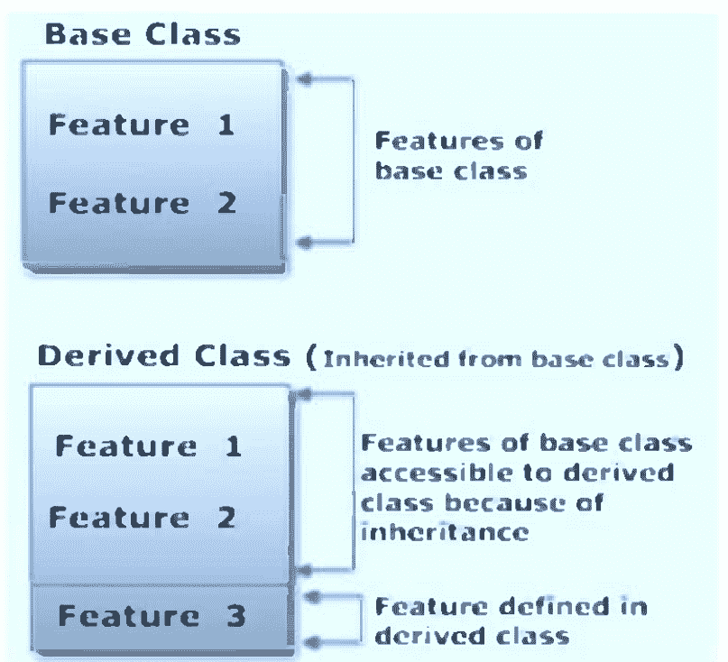

### Python 继承语法

```
class DerivedClass(BaseClass):
    body_of_derived_class
```

**步骤 1)** 运行以下代码

```
### Example file for working with classes
class myClass():
    def method1(self):
        print("Hello")
    def method2(self,someString):
        print("Software Testing:" + someString)

class childClass(myClass):
    #def method1(self):
        #myClass.method1(self);
        #print "Child Class Method1"
    def method2(self):
        print("childClass method2")

def main():
    # exercise the class methods
    c2 = childClass()
    c2.method1()
    c2.method2()
if __name__ == "__main__":
    main()
```

注意，在 `childClass` 中，`method1` 没有定义，但它从父类 `myClass` 派生而来。输出是 "Hello"。

**步骤 2)** 取消注释第 8 行和第 9 行。运行代码
现在，`method1` 在 `childClass` 中定义了，输出 "childClass Method1" 正确显示。

**步骤 3)** 取消注释第 10 行。运行代码
你可以使用语法 `ParentClass.Method` 调用父类的方法。
我们调用 `myClass.method1(self)`，如预期打印出 "Hello"。

**步骤 4)** 取消注释第 14 行。运行代码。
调用子类的 `method2`，如预期打印出 "childClass method"。

### Python 构造函数

构造函数是一个类函数，它将一个对象实例化为预定义的值。
它以双下划线 (`__`) 开头。它是 `__init__()` 方法。
在下面的例子中，我们使用构造函数获取用户的名称。

```
class User:
    name = ""
    def __init__(self, name):
        self.name = name
    def say(self):
        print("Welcome to Python, " + self.name)

User1 = User("Ajit")
User1.say()
Output will be:
Welcome to Python, Ajit
```

### 与 Python 2 兼容

#### 示例

上面的代码是 Python 3 的例子，如果你想在 Python 2 中运行，请参考以下代码。

```
### How to define Python classes
### Example file for working with classes
class myClass():
    def method1(self):
        print "hello"
    def method2(self,someString):
        print "Software Testing:" + someString

def main():
    # exercise the class methods
    c = myClass ()
    c.method1()
    c.method2(" Testing is fun")
if __name__ == "__main__":
    main()
#How Inheritance works
### Example file for working with classes
```

### 自定义对象

Python 允许你通过定义一些具有特殊名称的方法来定制你的对象：

### `__init__` 方法

```python
def __init__(self, parameters):
    suite
```

参数与普通函数一样，支持所有变体：位置参数、默认参数、关键字参数等。当一个类有 `__init__` 方法时，你在实例化该类时传递参数，`__init__` 方法将使用这些参数被调用。通常该方法会通过 `self` 设置各种实例变量。

```python
class cartesian:
    def __init__(self, x=0, y=0):
        self.x, self.y = x, y
```

### `__del__` 方法

```python
def __del__(self):
    suite
```

`__del__` 方法在对象被删除时调用，即当垃圾回收器判定没有更多对对象的引用时。注意，这并不一定是在使用 `del` 语句显式删除对象的时候。`__del__` 方法恰好接受一个参数 `self`。由于当前 Python C 实现中的一个怪癖，`__del__` 方法中的异常会被忽略：取而代之的是，一个错误信息会被打印到标准错误输出。

### `__repr__` 方法

```python
def __repr__(self):
    suite
```

`__repr__` 方法恰好接受一个参数 `self`，并且必须返回一个字符串。这个字符串旨在作为对象的表示，适合向程序员展示，例如在交互式解释器中工作时。每当内置的 `repr` 函数应用于对象时，`__repr__` 就会被调用；当使用反引号运算符时，该函数也会被调用。

### `__str__` 方法

```python
def __str__(self):
    suite
```

`__str__` 方法与 `__repr__` 完全相同，只是当内置的 `str` 函数应用于对象时被调用；该函数也用于 `%` 运算符的 `%s` 转义。通常，`__str__` 返回的字符串是给应用程序的用户看的，而 `__repr__` 返回的字符串是给程序员看的，比如在调试和开发时：但关于这一点没有硬性规定。你最好这样想：`__str__` 用于 `%s`，`__repr__` 用于反引号。

### 进一步的主题

**特殊方法** 我们已经见过两个特殊方法了，构造函数 `__init__` 和决定你的对象打印时样子的 `__str__` 方法。还有许多其他的。例如，有一个 `__add__` 方法允许你的对象使用 `+` 运算符。所有 Python 运算符都有对应的方法。还有一个名为 `__len__` 的方法，允许你的对象与内置的 `len` 函数配合工作。甚至还有一个特殊方法 `__getitem__`，让你的程序可以使用列表和字符串的方括号 `[]`。

**复制对象** 如果你想复制一个对象 `x`，只做以下操作是不够的：
`x_copy = x`
而应该这样做：
`from copy import copy`
`x_copy = copy(x)`

**将代码保存在多个文件中** 如果你想在多个程序中重用一个类，你不必将代码复制粘贴到每个程序中。你可以将其保存在一个文件中，并使用 `import` 语句将其导入到你的程序中。该文件需要放在你的程序能找到的地方，比如在同一目录下。
`from analyzer import Analyzer`

### 多态

当我们定义多个具有同名方法的子类时，就存在多态。一个函数可以使用任何多态类的对象，而无需意识到这些类是不同的。

在某些语言中，多态类必须具有相同的接口（或是一个公共父接口的子接口），或者是公共超类的子类，这一点至关重要。这有时被称为强类型、层次化类型，因为类型规则非常严格，并遵循子类/子接口的层次结构。

### 内置函数

有两个内置函数对面向对象编程有些重要。它们用于确定对象的类，以及类之间的继承层次结构。

**isinstance**(*object*, *type*)
    如果 *object* 是给定类型或该类型任何子类的实例，则返回 True。

**issubclass**(*parameter*, *base*)
    如果类 *class* 是类 *base* 的子类，则返回 True。
    这个问题通常没有实际意义，因为大多数程序都设计为提供预期的对象类。在某些需要极度谨慎的情况下；当使用不受信任的软件时，你的类可能需要确保其他程序员遵循规则。在 Java 和 C++ 中，编译器可以检查这些情况。在 Python 中，编译器不检查这些，所以我们可能需要包含运行时检查。

**super**(*type*)
    这将返回给定类型的超类。

所有基本的工厂函数（`str`, `int`, `float`, `long`, `complex`, `unicode`, `tuple`, `list`, `dict`, `set`）实际上都是类名。因此，你可以使用像 `isinstance( myParam ,int)` 这样的测试来确认提供给此参数的参数值是否为整数。

另一个类 `basestring` 是 `str` 和 `unicode` 的父类。

### 练习

1.  编写一个名为 `Investment` 的类，包含字段 `principal` 和 `interest`。构造函数应设置这些字段的值。应该有一个名为 `value_after` 的方法，返回投资 $n$ 年后的价值。公式为 $p(1 + i)^n$，其中 $p$ 是本金，$i$ 是利率。它还应该使用特殊方法 `__str__`，以便打印对象时产生类似下面的结果：
    本金 - $1000.00, 利率 - 5.12%

2.  编写一个名为 `Product` 的类。该类应包含字段 `name`、`amount` 和 `price`，分别存储产品名称、该产品的库存数量以及产品的常规价格。应该有一个方法 `get_price`，接收要购买的数量，并返回购买该数量的成本，其中订单少于 10 件时收取常规价格，订单在 10 到 99 件之间时享受 10% 的折扣，订单在 100 件或以上时享受 20% 的折扣。还应该有一个名为 `make_purchase` 的方法，接收要购买的数量，并将 `amount` 减少相应的数量。

3.  编写一个名为 `Password_manager` 的类。该类应有一个名为 `old_passwords` 的列表，保存用户所有过去的密码。列表的最后一项是用户的当前密码。应该有一个名为 `get_password` 的方法返回当前密码，以及一个名为 `set_password` 的方法设置用户的密码。`set_password` 方法应仅在尝试设置的密码与用户所有过去的密码都不同时才更改密码。最后，创建一个名为 `is_correct` 的方法，接收一个字符串，并根据该字符串是否等于当前密码返回布尔值 **True** 或 **False**。

4.  编写一个名为 `Time` 的类，其唯一字段是以秒为单位的时间。它应该有一个名为 `convert_to_minutes` 的方法，返回一个格式如以下示例的分钟和秒的字符串：如果秒数是 230，该方法应返回 '5:50'。它还应该有一个名为 `convert_to_hours` 的方法，返回一个格式类似于前一个方法的小时、分钟和秒的字符串。

# 第 13 章

## 异常

Python 程序一旦遇到错误就会终止。在 Python 中，错误可以是语法错误或异常。在本章中，你将了解什么是异常以及它与语法错误有何不同。之后，你将学习如何引发异常。最后，你将通过 `try` 和 `except` 块的演示来结束。

### 异常与语法错误

当解析器检测到不正确的语句时，就会发生语法错误。观察以下示例：

```
>>> print( 0 / 0 ))
File "<stdin>", line 1
    print( 0 / 0 ))
          ^
SyntaxError: invalid syntax
```

箭头指示了解析器遇到**语法错误**的位置。在这个例子中，多了一个括号。将其移除并再次运行你的代码：

```
>>> print( 0 / 0)
Traceback (most recent call last):
  File "<stdin>", line 1, in <module>
ZeroDivisionError: integer division or modulo by zero
```

这一次，你遇到了一个**异常错误**。每当语法正确的 Python 代码导致错误时，就会发生这种类型的错误。消息的最后一行指出了你遇到的异常错误类型。Python 不是显示笼统的“异常错误”消息，而是详细说明遇到了哪种类型的异常错误。在这个例子中，是 `ZeroDivisionError`。Python 自带[多种内置异常](https://www.w3schools.com/python/python_ref_exceptions.asp)，同时也允许创建自定义异常。

### 抛出异常

我们可以使用 `raise` 在发生特定条件时抛出一个异常。该语句可以补充一个自定义异常。

如果你想在某个条件发生时使用 `raise` 抛出一个错误，可以这样做：

```python
x = 100
if x > 50:
    raise Exception('x should not exceed 50. The value of x was: {}'.format(x))
```

当你运行这段代码时，输出将是：

```
Traceback (most recent call last):
  File "<input>", line 4, in <module>
Exception: x should not exceed 50. The value of x was: 100
```

程序会停止运行，并在屏幕上显示我们的异常，提供关于哪里出错的线索。

### 异常处理：try 和 except 块

Python 中的 `try` 和 `except` 块用于捕获和处理异常。Python 会像执行程序的正常部分一样执行 `try` 语句之后的代码。`except` 语句之后的代码是程序对前面 `try` 子句中任何异常的响应。

正如你之前所见，当语法正确的代码遇到错误时，Python 会抛出一个异常错误。如果这个异常错误未被处理，它将导致程序崩溃。`except` 子句决定了你的程序如何响应异常。

以下函数可以帮助你理解 `try` 和 `except` 块：

```python
def discount():
    a = 70 / 0
    print(a)
```

`discount` 函数将抛出一个异常。你可以使用以下代码尝试运行该函数：

```python
try:
    discount()
except:
    pass
```

你在这里处理错误的方式是使用了 `pass`。如果你运行这段代码，你将不会得到任何输出。这样做的好处是程序没有崩溃。但是，如果你能在运行代码时看到是否发生了某种类型的异常，那就更好了。为此，你可以将 `pass` 替换为能生成信息性消息的内容，如下所示：

```python
try:
    discount()
except:
    print('Divide by zero exception')
```

当运行此函数的程序发生异常时，程序将继续运行，并通知你函数调用未成功这一事实。

你没有看到的是函数调用导致的错误类型。为了确切地了解哪里出了问题，你需要捕获函数抛出的错误。

这里是另一个例子，你打开一个文件并使用内置异常：

```python
try:
    with open('myfile.log') as file:
        read_data = file.read()
except:
    print('Could not open file.log')
```

如果 *myfile.log* 不存在，这段代码将输出以下内容：

```
Could not open myfile.log
```

这是一个信息性消息，我们的程序将继续运行。在 [Python 文档](https://docs.python.org/3/library/exceptions.html)中，你可以看到有很多内置异常可以在这里使用。该页面上描述的一个异常如下：

**异常 FileNotFoundError**
当请求的文件或目录不存在时引发。对应于 errno ENOENT。

要捕获这种类型的异常并将其打印到屏幕，你可以使用以下代码：

```python
try:
    with open('myfile.log') as file:
        read_data = file.read()
except FileNotFoundError as fnf_error:
    print(fnf_error)
```

在这种情况下，如果 *myfile.log* 不存在，输出将是：

```
[Errno 2] No such file or directory: 'myfile.log'
```

你可以在 `try` 子句中有多个函数调用，并预期捕获各种异常。这里需要注意的一点是，`try` 子句中的代码一旦遇到异常就会停止执行。

> **警告：** 捕获 `Exception` 会隐藏所有错误——甚至是那些完全意想不到的错误。这就是为什么你应该避免在 Python 程序中使用裸 `except` 子句。相反，你应该引用你想要捕获和处理的*特定异常类*。你可以[在这个教程](https://realpython.com/python-exceptions/)中了解更多关于为什么这是一个好主意。

查看以下代码。在这里，你首先调用 `linux_interaction()` 函数，然后尝试打开一个文件：

```python
try:
    discount()
    with open('file.log') as file:
        read_data = file.read()
except FileNotFoundError as fnf_error:
    print(fnf_error)
except Exception as error:
    print(error)
```

以下是关键要点：

- `try` 子句会一直执行，直到遇到第一个异常。
- 在 `except` 子句（或异常处理程序）内部，你决定了程序如何响应异常。
- 你可以预期多个异常，并区分程序应如何响应它们。
- [避免使用裸 `except` 子句。](https://realpython.com)

### else 子句

在 Python 中，使用 `else` 语句，你可以指示程序仅在没有异常的情况下执行某个代码块。

查看以下示例：

```python
try:
    linux_interaction()
except AssertionError as error:
    print(error)
else:
    print('Executing the else clause.')
```

如果你在 Linux 系统上运行此代码，输出将是：

```
Doing something.
Executing the else clause.
```

因为程序没有遇到任何异常，所以执行了 `else` 子句。

你也可以尝试在 `else` 子句中运行代码，并在那里捕获可能的异常：

```python
try:
    linux_interaction()
except AssertionError as error:
    print(error)
else:
    try:
        with open('file.log') as file:
            read_data = file.read()
    except FileNotFoundError as fnf_error:
        print(fnf_error)
```

如果你在 Linux 机器上执行此代码，你将得到以下结果：

```
Doing something.
[Errno 2] No such file or directory: 'file.log'
```

从输出中，你可以看到 `linux_interaction()` 函数运行了。因为没有遇到异常，所以尝试打开 `file.log`。该文件不存在，因此你没有打开文件，而是捕获了 `FileNotFoundError` 异常。

### 使用 finally 进行清理

想象一下，你总是需要在执行代码后实施某种清理操作。Python 允许你使用 `finally` 子句来做到这一点。

看看以下示例：

```python
try:
    linux_interaction()
except AssertionError as error:
    print(error)
else:
    try:
        with open('file.log') as file:
            read_data = file.read()
    except FileNotFoundError as fnf_error:
        print(fnf_error)
finally:
    print('Cleaning up, irrespective of any exceptions.')
```

在前面的代码中，`finally` 子句中的所有内容都将被执行。无论你在 `try` 或 `else` 子句中的某处遇到异常，这都不重要。在 Windows 机器上运行前面的代码将输出以下内容：

```
Function can only run on Linux systems.
Cleaning up, irrespective of any exceptions.
```

### 内置异常

以下异常是 Python 环境的一部分。异常大致分为三类。

- 非错误异常。这些是定义事件并改变执行顺序的异常。
- 运行时错误。这些异常可能在正常事件过程中发生，并表示典型的程序问题。

内部或不可恢复错误。这些异常在编译Python程序时发生，或是Python解释器内部的一部分；由于不清楚我们的程序是否还能继续运行，因此几乎没有恢复的可能。应用程序很少会遇到Python源代码的问题，因为程序实际上并未运行。

以下是非错误异常。通常，你永远不会为这些异常编写处理程序，也不会使用 **raise** 语句来引发它们。

### exception StopIteration

当迭代器没有下一个值时引发。**for** 语句会处理此异常以干净地结束迭代循环。

### exception GeneratorExit

当生成器通过调用 close() 方法被关闭时引发。

### exception KeyboardInterrupt

当用户按下 ctrl-C 向Python解释器发送中断信号时引发。通常，应用程序不会捕获此异常，因为这是停止行为异常程序的唯一方式。

### exception SystemExit

此异常由 sys.exit() 函数引发。通常，应用程序不会捕获此异常；它用于强制程序退出。

以下是在程序运行时可以有意义地处理的错误。

### exception AssertionError

断言失败。更多信息请参见 *The assert Statement* 中的 **assert** 语句。

### exception AttributeError

对象中未找到属性。

### exception EOFError

读取超出文件末尾。

### exception FloatingPointError

浮点运算失败。

### exception IOError

I/O 操作失败。

### exception IndexError

序列索引超出范围。

### exception KeyError

映射键未找到。

### exception OSError

操作系统系统调用失败。

### exception OverflowError

结果太大无法表示。

### exception TypeError

参数类型不正确。

### exception UnicodeError

与Unicode相关的错误。

### exception ValueError

参数值不正确（类型正确）。

### exception ZeroDivisionError

除法或模运算的第二个参数为零。

以下错误表明Python解释器存在严重问题。通常，如果引发这些错误，你无能为力。

### exception MemoryError

内存不足。

### exception RuntimeError

未指定的运行时错误。

### exception SystemError

Python解释器内部错误。

以下异常通常在编译时返回，或表明程序基本构造中存在极其严重的错误。虽然这些异常情况是Python实现的必要组成部分，但程序几乎没有理由处理这些错误。

### exception ImportError

导入无法找到模块，或无法在模块中找到名称。

### exception IndentationError

缩进不正确。

### exception NameError

全局未找到名称。

### exception NotImplementedError

方法或函数尚未实现。

### exception SyntaxError

语法无效。

### exception TabError

空格和制表符混合不当。

### exception UnboundLocalError

引用了局部名称但未绑定到值。

以下异常是异常对象实现的一部分。通常，这些异常不会直接发生。它们是异常的通用类别。当你在 **catch** 子句中使用这些名称时，许多更具体的异常将与之匹配。

### exception Exception

所有用户定义异常的公共基类。

### exception StandardError

所有标准Python错误的基类。非错误异常（StopIteration、GeneratorExit、KeyboardInterrupt 和 SystemExit）不是 StandardError 的子类。

### exception ArithmeticError

算术错误的基类。这是包含 OverflowError、ZeroDivisionError 和 FloatingPointError 的通用异常类。

### exception EnvironmentError

与输入输出或操作系统相关的错误的基类。这是包含 IOError 和 OSError 的通用异常类。

### exception LookupError

序列或映射中查找错误的基类，它包括 IndexError 和 KeyError。

### 题外话

有其他编程语言经验的读者可能会将异常等同于一种 **goto** 语句。它将正常的执行流程更改为（可能难以找到的）异常处理套件。这是对该构造的正确描述，这导致了一些困难的决策。

一些导致异常的条件实际上是程序的可预测状态。值得注意的例外是 I/O 错误、内存错误和操作系统错误。这三种错误依赖于运行程序和Python解释器直接控制之外的资源。像零除错误或值错误这样的异常可以通过简单、清晰的 **if** 语句来检查。像属性错误或未实现错误这样的异常在编写和测试合理的程序中永远不应该发生。

依赖异常来处理那些通过仔细设计或测试很容易发现的常见错误，通常是草率编程的标志。通常的情况是，程序员在测试期间遇到了异常，只是添加了异常处理 **try** 语句来绕过问题；程序员没有努力确定异常的实际原因或补救措施。

为它们辩护一下，异常可以简化复杂的嵌套 **if** 语句。当异常条件使所有复杂性都变得无关紧要时，它们可以提供从复杂逻辑中清晰退出的途径。异常应该谨慎使用，只有在它们能澄清或简化算法阐述时才使用。程序员不应期望读者在程序源代码中到处搜索相关的异常处理子句。

未来使用 I/O 和操作系统调用的示例将受益于简单的异常处理。然而，异常密集的程序在解释时是个问题。异常子句相对昂贵，以理解其意图所花费的时间来衡量。

# 第14章

## 多线程编程

多线程是软件编程的核心概念，几乎所有高级编程语言都支持。而Python多线程是最好的例子之一。

运行多个线程类似于并发运行多个不同的进程，但具有以下好处 –

进程内的多个线程与主线程共享相同的数据空间，因此可以比独立进程更容易地共享信息或相互通信。

线程有时被称为轻量级进程，它们不需要太多的内存开销；它们比进程更便宜。

线程有一个开始、一个执行序列和一个结论。它有一个指令指针，用于跟踪其上下文中当前正在运行的位置。

它可以被抢占（中断）。

当其他线程运行时，它可以暂时挂起（也称为休眠）——这被称为让出。

### 启动新线程

要生成另一个线程，你需要调用 thread 模块中可用的以下方法：
`thread.start_new_thread(function, args[, kwargs])`

此方法调用提供了一种在 Linux 和 Windows 中创建新线程的快速高效方式。

该方法调用立即返回，子线程启动并使用传递的 args 列表调用 function。当 function 返回时，线程终止。

这里，args 是一个参数元组；使用空元组调用 function 而不传递任何参数。kwargs 是一个可选的关键字参数字典。

#### 示例

```python
#!/usr/bin/python
import thread
import time

### Define a function for the thread
def print_time(threadName, delay):
    count = 0
    while count < 5:
        time.sleep(delay)
        count += 1
        print "%s: %s" % (threadName, time.ctime(time.time()))

### Create two threads as follows
try:
    thread.start_new_thread(print_time, ("Thread-1", 2,))
    thread.start_new_thread(print_time, ("Thread-2", 4,))
except:
    print "Error: unable to start thread"

while 1:
    pass
```

当执行上述代码时，会产生以下结果 –

```
Thread-1: Thu Jun 21 15:42:17 2018
Thread-1: Thu Jun 21 15:42:19 2018
Thread-2: Thu Jun 21 15:42:19 2018
Thread-1: Thu Jun 21 15:42:21 2018
Thread-2: Thu Jun 21 15:42:23 2018
Thread-1: Thu Jun 21 15:42:23 2018
Thread-1: Thu Jun 21 15:42:25 2018
Thread-2: Thu Jun 21 15:42:27 2018
Thread-2: Thu Jun 21 15:42:31 2018
Thread-2: Thu Jun 21 15:42:35 2018
```

尽管它对于底层线程处理非常有效，但与较新的 `threading` 模块相比，`thread` 模块的功能非常有限。

`<Thread>` 类提供了以下方法。

| 类方法 | 方法描述 |
| :--- | :--- |
| **run()**: | 它是任何线程的入口点函数。 |
| **start():** | `start()` 方法在调用 `run` 方法时触发一个线程。 |
| **join([time]):** | `join()` 方法使程序能够等待线程终止。 |
| **isAlive():** | `isAlive()` 方法验证一个活动线程。 |
| **getName():** | `getName()` 方法检索线程的名称。 |
| **setName():** | `setName()` 方法更新线程的名称。 |

### Threading 模块

Python 2.4 中包含的较新的 `threading` 模块比上一节讨论的 `thread` 模块提供了更强大、更高级的线程支持。

`threading` 模块公开了 `thread` 模块的所有方法，并提供了一些额外的方法 –

```
threading.activeCount() – 返回活动的线程对象数量。
threading.currentThread() – 返回调用者线程控制中的线程对象数量。
threading.enumerate() – 返回当前所有活动线程对象的列表。
```

除了这些方法，`threading` 模块还有实现线程的 `Thread` 类。`Thread` 类提供的方法如下 –

```
run() – run() 方法是线程的入口点。
start() – start() 方法通过调用 run 方法来启动一个线程。
join([time]) – join() 等待线程终止。
isAlive() – isAlive() 方法检查线程是否仍在执行。
getName() – getName() 方法返回线程的名称。
setName() – setName() 方法设置线程的名称。
```

### 使用 Threading 模块创建线程

要使用 `threading` 模块实现一个新线程，你必须执行以下操作 –

- 定义 `Thread` 类的一个新子类。
- 重写 `__init__(self[,args])` 方法以添加额外的参数。
- 然后，重写 `run(self[,args])` 方法以实现线程启动时应执行的操作。

一旦你创建了新的 `Thread` 子类，你就可以创建它的一个实例，然后通过调用 `start()` 来启动一个新线程，这反过来又会调用 `run()` 方法。

#### 示例

```
#!/usr/bin/python
import threading
import time
exitFlag = 0
class myThread (threading.Thread):
    def __init__(self, threadID, name, counter):
        threading.Thread.__init__(self)
        self.threadID = threadID
        self.name = name
        self.counter = counter
    def run(self):
        print "Starting " + self.name
        print_time(self.name, 5, self.counter)
        print "Exiting " + self.name

def print_time(threadName, counter, delay):
    while counter:
        if exitFlag:
            threadName.exit()
        time.sleep(delay)
        print "%s: %s" % (threadName, time.ctime(time.time()))
        counter -= 1

### 创建新线程
thread1 = myThread(1, "Thread-1", 1)
thread2 = myThread(2, "Thread-2", 2)

### 启动新线程
thread1.start()
thread2.start()

print "Exiting Main Thread"
```

当执行上述代码时，会产生以下结果 –

```
Starting Thread-1
Starting Thread-2
Exiting Main Thread
Thread-1: Thu Jun 21 09:10:03 2018
Thread-1: Thu Jun 21 09:10:04 2018
Thread-2: Thu Jun 21 09:10:04 2018
Thread-1: Thu Jun 21 09:10:05 2018
Thread-1: Thu Jun 21 09:10:06 2018
Thread-2: Thu Jun 21 09:10:06 2018
Thread-1: Thu Jun 21 09:10:07 2018
Exiting Thread-1
Thread-2: Thu Jun 21 09:10:08 2018
Thread-2: Thu Jun 21 09:10:10 2018
Thread-2: Thu Jun 21 09:10:12 2018
Exiting Thread-2
```

### 线程同步

Python 提供的 `threading` 模块包含一个易于实现的锁机制，允许你同步线程。通过调用 `Lock()` 方法创建一个新的锁，该方法返回新的锁对象。

新锁对象的 `acquire(blocking)` 方法用于强制线程同步运行。可选的 `blocking` 参数使你能够控制线程是否等待获取锁。

如果 `blocking` 设置为 0，线程将立即返回，如果无法获取锁则返回 0，如果获取了锁则返回 1。如果 `blocking` 设置为 1，线程将阻塞并等待锁被释放。

新锁对象的 `release()` 方法用于在不再需要锁时释放它。

#### 示例

```
#!/usr/bin/python
import threading
import time
class myThread (threading.Thread):
    def __init__(self, threadID, name, counter):
        threading.Thread.__init__(self)
        self.threadID = threadID
        self.name = name
        self.counter = counter
    def run(self):
        print "Starting " + self.name
        # 获取锁以同步线程
        threadLock.acquire()
        print_time(self.name, self.counter, 3)
        # 释放锁以让下一个线程运行
        threadLock.release()

def print_time(threadName, delay, counter):
    while counter:
        time.sleep(delay)
        print "%s: %s" % (threadName, time.ctime(time.time()))
        counter -= 1

threadLock = threading.Lock()
threads = []

### 创建新线程
thread1 = myThread(1, "Thread-1", 1)
thread2 = myThread(2, "Thread-2", 2)

### 启动新线程
thread1.start()
thread2.start()

### 将线程添加到线程列表
threads.append(thread1)
threads.append(thread2)

### 等待所有线程完成
for t in threads:
    t.join()
print "Exiting Main Thread"
```

当执行上述代码时，会产生以下结果 –

```
Starting Thread-1
Starting Thread-2
Thread-1: Thu Jun 21 09:11:28 2018
Thread-1: Thu Jun 21 09:11:29 2018
Thread-1: Thu Jun 21 09:11:30 2018
Thread-2: Thu Jun 21 09:11:32 2018
Thread-2: Thu Jun 21 09:11:34 2018
Thread-2: Thu Jun 21 09:11:36 2018
Exiting Main Thread
```

### 多线程优先级队列

`Queue` 模块允许你创建一个新的队列对象，该对象可以容纳特定数量的项目。有以下方法来控制队列 –

- `get()` – `get()` 从队列中移除并返回一个项目。
- `put()` – `put()` 将项目添加到队列。
- `qsize()` – `qsize()` 返回队列中当前的项目数量。
- `empty()` – `empty()` 如果队列为空则返回 True；否则返回 False。
- `full()` – `full()` 如果队列已满则返回 True；否则返回 False。

示例

```
#!/usr/bin/python
import Queue
import threading
import time
exitFlag = 0
class myThread (threading.Thread):
    def __init__(self, threadID, name, q):
        threading.Thread.__init__(self)
        self.threadID = threadID
        self.name = name
        self.q = q

    def run(self):
        print "Starting " + self.name
        process_data(self.name, self.q)
        print "Exiting " + self.name

def process_data(threadName, q):
    while not exitFlag:
        queueLock.acquire()
        if not workQueue.empty():
            data = q.get()
            queueLock.release()
            print "%s processing %s" % (threadName, data)
        else:
            queueLock.release()
        time.sleep(1)

threadList = ["Thread-1", "Thread-2", "Thread-3"]
nameList = ["One", "Two", "Three", "Four", "Five"]
queueLock = threading.Lock()
workQueue = Queue.Queue(10)
threads = []
threadID = 1

### 创建新线程
for tName in threadList:
    thread = myThread(threadID, tName, workQueue)
    thread.start()
    threads.append(thread)
    threadID += 1

### 填充队列
queueLock.acquire()
for word in nameList:
    workQueue.put(word)
queueLock.release()
```

# 第15章

## Python中的文本文件

程序通常处理外部数据；即位于易失性主存储器之外的数据。这些外部数据可以是文件系统上的持久数据，也可以是输入输出设备上的临时数据。大多数操作系统通过文件类的对象，为外部数据提供了一个简单、统一的接口。

在*文件语义*部分，我们将概述文件的语义。在*内置函数*部分，我们将介绍Python中用于处理文件的最重要的内置函数。在*文件语句*部分，我们将回顾处理文件的语句。在*文件方法*部分，我们将描述文件对象的一些方法函数。

文件是一个非常深入的主题。在*组件、模块和包*部分，我们将触及几个与文件管理相关的模块。这些包括*文件处理模块*和*文件格式：CSV、Tab、XML、日志及其他*。

### 文件语义

从某种意义上说，文件是字节序列的容器。然而，一个更有用的观点是，文件是数据对象的容器，这些数据对象被编码为字节序列。文件可以保存在持久但速度较慢的设备上，如磁盘。文件也可以作为通过网络接口流动的字节流呈现。甚至用户的键盘也可以被当作文件来处理；在这种情况下，文件迫使我们的软件等待用户输入。

我们的操作系统使用*文件*这一抽象概念，作为统一访问大量设备和操作系统服务的一种方式。在Linux世界中，所有外部设备，以及大量的内存数据结构，都可以通过文件接口访问。具有文件接口的各种各样的事物，是Unix最初设计方式的结果。由于连接到计算机的设备数量和类型本质上是无限的，因此设备驱动程序被设计为操作系统的一个简单、灵活的插件。

文件不仅包括磁盘驱动器和网络接口。内核内存、随机数据生成器、信号量、共享内存块以及其他东西都有文件接口，即使它们严格来说不是设备。我们的操作系统将文件抽象应用于许多事物。类似地，Python将文件接口扩展到包括某些类型的内存缓冲区。

**标准文件。** 符合POSIX标准，所有Python程序都有三个可用文件：`sys.stdin`、`sys.stdout`、`sys.stderr`。这些文件被某些内置语句和函数使用。例如，**print**语句（和`print()`函数）默认写入`sys.stdout`。`raw_input()`函数将提示写入`sys.stdout`，并从`sys.stdin`读取输入。

这些标准文件始终可用，Python确保所有操作系统都一致地处理它们。`sys`模块使这些文件可供显式使用。新手可能需要查看*新手文件重定向*，以获取有关这些标准文件的一些额外说明。

### 文件组织和结构

一些操作系统支持多种文件组织。不同的文件组织将包括不同的记录终止规则，可能带有记录键，以及可能固定长度的记录。然而，POSIX标准认为文件不过是字节序列。将任何组织强加给这些字节，完全成为应用程序或操作系统外部库的工作。

Python中的基本文件对象将文件视为文本字符（ASCII或Unicode）或字节的序列。这些字符可以作为可变长度行的序列进行处理；每行以换行符终止。从Windows环境移动过来的文件可能包含看起来有多余ASCII回车符（`\r`）的行，这很容易用字符串的`strip()`方法去除。

普通文本文件可以直接使用内置文件对象及其读写数据行的方法来管理。我们将在本章的其余部分介绍这种基本的文本文件处理。

由字节序列组成的文件没有适当的行边界。面向字节的文件可以包括字符（以ASCII或Unicode编码）或其他编码为字节的数据对象。我们将使用像`pickle`和`csv`这样的库模块来处理一些面向字节的文件。

**块模式文件。** 文件设备可以组织成两种不同的结构：*块模式*和*字符模式*。块模式设备的典型代表是磁盘：数据被组织成可以按任意顺序访问的字节块。介质（磁盘）和读写头都可以移动；设备可以根据需要重新定位到任何块。磁盘提供对每个数据块的直接（有时也称为随机）访问。

字符模式设备的典型代表是网络连接：字节涌入处理器缓冲区。流无法重新定位。如果缓冲区满了，字节丢失，丢失的数据将永远消失。

操作系统对块模式设备的支持包括文件目录和用于删除、重命名和复制文件的文件管理实用程序。现代操作系统包括文件导航器（Finder或Explorer）、文件的图标表示，以及用于从应用程序中打开文件的标准GUI对话框。操作系统还处理将数据块从内存缓冲区移动到磁盘，以及从磁盘移动到内存缓冲区。所有设备特定的差异都通过各种*设备驱动程序*来处理，以便一系列物理设备可以通过单一的操作系统软件接口以统一的方式得到支持。

块模式设备上的文件有时被称为*可寻址的*。它们支持操作系统的`seek()`函数，该函数可以从文件的任何字节开始读取。如果文件以固定大小的块或记录组织，这个寻址函数可以非常简单有效。通常，数据库应用程序被设计为与固定大小的块一起工作，因此寻址总是针对一个块进行，然后从该块操作数据库行。

**字符模式设备和键盘。** 操作系统也为字符模式设备（如网络和键盘）提供丰富的支持。通常，网络连接需要一个*协议栈*，将字节解释为数据包，并处理数据包的错误校正、排序和重传。最著名的协议栈之一是TCP/IP协议栈。TCP/IP可以使流式设备看起来像一个顺序的字节文件。大多数操作系统都附带许多大量使用网络的客户端程序，例如`sendmail`、`ftp`和网络浏览器。

一种特殊的字符模式文件是*控制台*；它通常提供来自键盘的输入。POSIX标准允许程序运行时，输入来自文件、管道或实际用户。如果输入文件是*TTY*（电传打字机），这就是实际的人类用户的键盘。如果文件是管道，这就是与另一个并发运行的进程的连接。键盘控制台或TTY与普通字符模式设备、管道或文件不同，原因有二。首先，键盘通常需要显式地回显字符，以便用户可以看到他们正在输入的内容。其次，通常必须进行预处理，以使退格键按人们预期的方式工作。

回显功能在输入普通数据时启用，在输入密码时禁用。回显功能通过将键盘事件排队，供程序像从文件读取一样读取来实现。如果回显开启，这些相同的键盘事件会自动发送以更新GUI。

预处理功能用于在应用程序接收输入缓冲区之前，对输入进行一些标准编辑。一个常见的例子是处理退格字符。大多数有经验的计算机用户都期望退格键能删除最后输入的字符。这由操作系统处理：它缓冲普通字符，当收到退格符时从缓冲区中删除字符，并在用户按下回车键时向应用程序提供最终的字符缓冲区。这种退格处理也可以被禁用；这样应用程序就会看到键盘事件作为*原始*字符。通常的模式是操作系统提供*已处理*的字符，退格字符在应用程序看到任何数据之前就被处理了。

在现代应用程序中，这通常都在图形用户界面中处理。然而，Python提供了一些函数来与Unix TTY控制台软件交互，以启用和禁用回显以及处理原始键盘输入。

### 文件格式与访问方法

在Z/OS（以及Open VMS，还有一些其他操作系统）中，文件具有非常特定的格式，数据访问由操作系统中介。在Z/OS中，他们称这些为*访问方法*，并有诸如BDAM或VSAM之类的名称。这种观点在某些方面很方便，但它往往将你限制在操作系统供应商提供的访问方法内。

GNU/Linux的观点是，文件应由操作系统进行最小化管理。在操作系统层面，文件只是字节。如果你想对文件的字节施加一些组织结构，你的应用程序应该提供访问方法。例如，你可以使用数据库管理系统将你的字节组织成表、行和列。

C语言标准I/O库可以将文件作为一系列单独的行来访问；每行以换行符`\n`终止。由于Python是基于C库构建的，Python也可以将文件作为一系列行来读取。

Python提供了使用文件对象操作文件所需的基本函数和方法。

### open函数

在读取或写入文件之前，你必须使用Python内置的`open()`函数打开它。此函数创建一个文件对象，该对象将用于调用与其关联的其他支持方法。

#### 语法

```
file object = open(file_name [, access_mode][, buffering])
```

以下是参数详情 –

- **file_name** – file_name参数是一个字符串值，包含你要访问的文件的名称。
- **access_mode** – access_mode决定了文件必须以何种模式打开，即读取、写入、追加等。下表中给出了可能值的完整列表。这是一个可选参数，默认的文件访问模式是读取（`r`）。
- **buffering** – 如果buffering值设置为0，则不进行缓冲。如果buffering值为1，则在访问文件时执行行缓冲。如果你将buffering值指定为大于1的整数，则使用指定的缓冲区大小执行缓冲操作。如果为负数，则缓冲区大小为系统默认值（默认行为）。

以下是打开文件的不同模式列表 –

| 模式 | 描述 |
| :--- | :--- |
| **r** | 以只读方式打开文件。 |
| **r+** | 以读写方式打开文件。 |
| **rb** | 以二进制格式只读方式打开文件。 |
| **rb+** | 以二进制格式读写方式打开文件。 |
| **w** | 以只写方式打开文件。如果文件存在，则覆盖该文件。如果文件不存在，则创建一个新文件用于写入。 |
| **w+** | 以读写方式打开文件。如果文件存在，则覆盖现有文件。如果文件不存在，则创建一个新文件用于读写。 |
| **wb** | 以二进制格式只写方式打开文件。如果文件存在，则覆盖该文件。如果文件不存在，则创建一个新文件用于写入。 |
| **wb+** | 以二进制格式读写方式打开文件。如果文件存在，则覆盖现有文件。如果文件不存在，则创建一个新文件用于读写。 |
| **a** | 以追加方式打开文件。 |
| **a+** | 以追加和读取方式打开文件。 |
| **ab** | 以二进制格式追加方式打开文件。 |

### 文件对象属性

一旦文件被打开并且你有了一个文件对象，你就可以获取与该文件相关的各种信息。以下是与文件对象相关的所有属性列表 –

- **file.closed** – 如果文件已关闭则返回true，否则返回false。
- **file.mode** – 返回文件被打开时的访问模式。
- **file.name** – 返回文件的名称。
- **file.softspace** – 如果print需要显式空格则返回false，否则返回true。

#### 示例

```python
### Open a file
fo = open("my.txt", "wb")
print "Name of the file: ", fo.name
print "Closed or not : ", fo.closed
print "Opening mode : ", fo.mode
print "Softspace flag : ", fo.softspace
```

这将产生以下结果 –

```
Name of the file: my.txt
Closed or not : False
Opening mode : wb
Softspace flag : 0
```

### close()方法

文件对象的`close()`方法会刷新任何未写入的信息并关闭文件对象，之后就不能再进行写入。当文件的引用对象被重新分配给另一个文件时，Python会自动关闭文件。使用`close()`方法关闭文件是一个好习惯。

#### 语法

```
fileObject.close();
```

#### 示例

```python
### Open a file
fo = open("my.txt", "wb")
print "Name of the file: ", fo.name
### Close opened file
fo.close()
```

这将产生以下结果 –

```
Name of the file: my.txt
```

### 读写文件

文件对象提供了一组访问方法，使我们的生活更轻松。我们将看到如何使用`read()`和`write()`方法来读写文件。

### write()方法

`write()`方法将任何字符串写入打开的文件。需要注意的是，Python字符串可以包含二进制数据，而不仅仅是文本。`write()`方法不会在字符串末尾添加换行符（`'\n'`） –

#### 语法

```
fileObject.write(string);
```

这里，传递的参数是要写入打开文件的内容。

#### 示例

```python
### Open a file
fo = open("my.txt", "wb")
fo.write( "Python is a great language.\n Ajit & Tanweer\n");
### Close opened file
fo.close()
```

上述方法将创建`foo.txt`文件，并将给定内容写入该文件，最后关闭该文件。如果你打开此文件，它将包含以下内容。

```
Python is a great language.
Ajit & Tanweer
```

### read()方法

`read()`方法从打开的文件中读取一个字符串。需要注意的是，Python字符串除了文本数据外，还可以包含二进制数据。

#### 语法

```
fileObject.read([count]);
```

这里，传递的参数是从打开文件中读取的字节数。此方法从文件开头开始读取，如果缺少count，则它会尝试尽可能多地读取，可能直到文件末尾。

#### 示例

让我们以上面创建的文件`my.txt`为例。

```python
### Open a file
fo = open("my.txt", "r+")
str = fo.read(10);
print "Read String is : ", str
### Close opened file
fo.close()
```

这将产生以下结果 –

```
Read String is : Python is
```

### 文件位置

**tell()**方法告诉你文件中的当前位置；换句话说，下一次读取或写入将发生在距离文件开头那么多字节的位置。

**seek(offset[, from])**方法更改当前文件位置。offset参数表示要移动的字节数。from参数指定要移动字节的参考位置。

如果from设置为0，表示使用文件开头作为参考位置；1表示使用当前位置作为参考位置；如果设置为2，则文件末尾将作为参考位置。

#### 示例

让我们以上面创建的文件`foo.txt`为例。

```python
### Open a file
fo = open("my.txt", "r+")
str = fo.read(10);
print "Read String is : ", str
### Check current position
position = fo.tell();
print "Current file position : ", position
### Reposition pointer at the beginning once again
position = fo.seek(0, 0);
```

### 重命名和删除文件

Python 的 os 模块提供了多种方法，帮助你执行文件处理操作，例如重命名和删除文件。
要使用此模块，你需要先导入它，然后才能调用任何相关函数。

### rename() 方法

rename() 方法接受两个参数：当前文件名和新文件名。

语法

```
os.rename(current_file_name, new_file_name)
```

示例

以下是重命名现有文件 my.txt 的示例 –

```python
import os
### 将文件从 my.txt 重命名为 my1.txt
os.rename( "my.txt", "my1.txt" )
```

### remove() 方法

你可以使用 remove() 方法删除文件，方法是将要删除的文件名作为参数提供。

语法

```
os.remove(file_name)
```

示例

以下是删除现有文件 my1.txt 的示例 –

```python
import os
### 删除文件 my1.txt
os.remove("my1.txt")
```

### Python 中的目录

所有文件都包含在各种目录中，Python 处理这些目录也没有问题。os 模块提供了几种方法，帮助你创建、删除和更改目录。

### mkdir() 方法

你可以使用 os 模块的 mkdir() 方法在当前目录中创建目录。你需要为此方法提供一个参数，该参数包含要创建的目录的名称。

语法

```
os.mkdir("new_dir")
```

示例

以下是在当前目录中创建目录 test 的示例 -

```python
import os

### 创建一个名为 "test" 的目录
os.mkdir("test")
```

### chdir() 方法

你可以使用 chdir() 方法更改当前目录。chdir() 方法接受一个参数，即你想要设为当前目录的目录名称。

语法

```
os.chdir("new_dir")
```

示例

以下是进入 "/home/newdir" 目录的示例 -

```python
import os

### 将目录更改为 "/home/newdir"
os.chdir("/home/test")
```

### getcwd() 方法

getcwd() 方法显示当前工作目录。

语法

```
os.getcwd()
```

示例

以下是获取当前目录的示例 –

```python
import os
### 这将给出当前目录的位置
os.getcwd()
```

### rmdir() 方法

rmdir() 方法删除作为参数传递给该方法的目录。在删除目录之前，应先删除其中的所有内容。

语法

```
os.rmdir('dir_name')
```

示例

以下是删除 "/tmp/test" 目录的示例。需要提供目录的完全限定名称，否则它将在当前目录中搜索该目录。

```python
import os
### 这将删除 "/tmp/test" 目录。
os.rmdir( "/ajit/test" )
```

### 文件和目录相关方法

有三个重要的来源，它们提供了广泛的方法来处理和操作 Windows 和 Unix 操作系统上的文件和目录。它们如下 –

- 文件对象方法：文件对象提供了操作文件的函数。
- OS 对象方法：这提供了处理文件和目录的方法。

### 练习

1.  给定一个名为 class_scores.txt 的文件，其中文件的每一行包含一个单词的用户名和一个测试分数，以空格分隔，如下所示：
    ```
    GWashington 83
    JAdams 86
    ```

2.  给定一个名为 grades.txt 的文件，其中文件的每一行包含一个单词的学生用户名和三个测试分数，以空格分隔，如下所示：
    ```
    GWashington 83 77 54
    JAdams 86 69 90
    ```
    编写代码扫描文件并确定有多少学生通过了所有三项测试。

3.  给定一个名为 logfile.txt 的文件，其中列出了系统用户的登录和注销时间。文件的典型行如下所示：
    ```
    Van Rossum, 14:22, 14:37
    ```
    每行有三个以逗号分隔的条目：用户名、登录时间和注销时间。时间以 24 小时格式给出。你可以假设所有登录和注销都发生在单个工作日内。
    编写一个程序扫描文件并打印出所有在线至少一小时的用户。

4.  给定一个名为 students.txt 的文件。文件中的典型行如下所示：
    ```
    walter melon		melon@email.msmary.edu		555-3141
    ```
    有一个姓名、一个电子邮件地址和一个电话号码，每个都用制表符分隔。编写一个程序逐行读取文件，并为每一行将姓氏和名字的首字母大写，并在电话号码前添加区号 301。你的程序应将此内容写入一个名为 students2.txt 的新文件。
    新文件的第一行应如下所示：
    ```
    Walter Melon		melon@email.msmary.edu		301-555-3141
    ```

5.  给定一个名为 namelist.txt 的文件，其中包含一堆名字。有些名字是名字和姓氏，以空格分隔，例如 George Washington，而另一些则有中间名，例如 John Quincy Adams。没有仅由一个单词或超过三个单词组成的名字。编写一个程序，要求用户输入首字母缩写，例如 GW 或 JQA，并打印所有匹配这些首字母缩写的名字。请注意，像 JA 这样的首字母缩写应同时匹配 John Adams 和 John Quincy Adams。

# 第 16 章

## 正则表达式

正则表达式是主要用于在字符串或文件中查找和替换模式的字符序列。它被大多数编程语言支持，如 python、perl、R、Java 等。

正则表达式使用两种类型的字符：

- a) 元字符：顾名思义，这些字符具有特殊含义，类似于通配符中的 *。
- b) 字面量（如 a,b,1,2）

在 Python 中，我们有模块 **re** 来帮助处理正则表达式。因此，你需要在 Python 中使用正则表达式之前导入库 **re**。
使用此代码 --> import re
正则表达式最常见的用途是：

- 搜索字符串（search 和 match）
- 查找字符串（findall）
- 将字符串拆分为子字符串（split）
- 替换字符串的一部分（sub）

让我们看看库 **re** 提供的用于执行这些任务的方法。

### 正则表达式有哪些不同的方法？

re 包提供了多种方法来对输入字符串执行查询。以下是最常用的方法，我将讨论：

1. re.match()
2. re.search()
3. re.findall()
4. re.split()
5. re.sub()
6. re.compile()

让我们逐一查看它们。

**re.match(pattern, string):**

如果匹配发生在字符串的开头，此方法将找到匹配。例如，在字符串 AM Analytics AM 上调用 match() 并查找模式 AM 将匹配。但是，如果我们只查找 Analytics，则模式将不匹配。现在让我们在 python 中执行它。

```python
import re
result = re.match(r'AM', 'AM Analytics Vidhya AM')
print result
```

**输出：**

```
<_sre.SRE_Match object at 0x0000000009BE4370>
```

上面显示已找到模式匹配。要打印匹配的字符串，我们将使用 group 方法（它有助于返回匹配的字符串）。在模式字符串的开头使用 r，它指定一个 python 原始字符串。

```python
result = re.match(r'AM', 'AM Analytics Vidhya AM')
print result.group(0)
```

**输出：**

```
AM
```

现在让我们在给定的字符串中查找 Analytics。这里我们看到字符串不是以 AM 开头，所以它应该返回不匹配。让我们看看我们得到什么：

```python
result = re.match(r'Analytics', 'AM Analytics Vidhya AM')
print result
```

**输出：**

```
None
```

有像 start() 和 end() 这样的方法来了解匹配模式在字符串中的起始和结束位置。

```python
result = re.match(r'AM', 'AM Analytics Vidhya AM')
print result.start()
print result.end()
```

**输出：**

```
0
2
```

上面你可以看到匹配模式 AM 在字符串中的起始和结束位置，有时在执行字符串操作时这非常有帮助。

### re.search(pattern, string):

它与 `match()` 类似，但并不限制我们只能在字符串开头查找匹配项。与之前的方法不同，这里搜索模式 `Analytics` 将返回一个匹配结果。

```
result = re.search(r'Analytics', 'AM Analytics Vidhya AM')
print result.group(0)
```

输出：
Analytics

这里你可以看到，`search()` 方法能够从字符串的任意位置查找模式，但它只返回搜索模式的第一个匹配项。

### re.findall (pattern, string):

它有助于获取所有匹配模式的列表。它没有从开头或结尾搜索的限制。如果我们使用 `findall` 方法在给定字符串中搜索 `AM`，它将返回 `AM` 的所有出现位置。在搜索字符串时，我建议你始终使用 `re.findall()`，因为它可以同时像 `re.search()` 和 `re.match()` 一样工作。

```
result = re.findall(r'AM', 'AM Analytics Vidhya AM')
print result
```

输出：
['AM', 'AM']

### re.split(pattern, string, [maxsplit=0]):

此方法有助于根据给定模式的出现位置来分割字符串。

```
result=re.split(r'y','Analytics')
result
```

输出：
['Anal', 'tics']

上面，我们通过 `y` 分割了字符串 `Analytics`。`split()` 方法有另一个参数 **maxsplit**。它的默认值为零。在这种情况下，它会执行尽可能多的分割，但如果我们给 `maxsplit` 赋值，它将按指定次数分割字符串。让我们看下面的例子：

```
result=re.split(r'i','Analytics Vidhya')
print result
输出：
['Analyt', 'cs V', 'dhya'] #它执行了模式 "i" 能进行的所有分割。
result=re.split(r'i','Analytics Vidhya',maxsplit=1)
result
输出：
['Analyt', 'cs Vidhya']
```

这里，你可以注意到我们将 `maxsplit` 固定为 1。结果是，它只有两个值，而第一个例子有三个值。

### **re.sub(pattern, repl, string):**

它有助于搜索一个模式并用新的子字符串替换。如果未找到该模式，*字符串* 将原样返回。

```
result=re.sub(r'India','the World','AM is largest Analytics community of India')
result
输出：
'AM is largest Analytics community of the World'
```

### **re.compile(pattern, repl, string):**

我们可以将正则表达式模式组合成模式对象，这些对象可用于模式匹配。它还有助于无需重写即可再次搜索模式。

```
import re
pattern=re.compile('AM')
result=pattern.findall('AM Analytics Vidhya AM')
print result
result2=pattern.findall('AM is largest analytics community of India')
print result2
输出：
['AM', 'AM']
['AM']
```

到目前为止，我们已经了解了使用常量模式（固定字符）的几种正则表达式方法。但是，如果我们没有常量搜索模式，并且想要从字符串中返回特定的字符集（由规则定义）怎么办？这可以通过借助模式运算符（元字符和字面字符）定义表达式来轻松解决。

### 最常用的运算符有哪些？

正则表达式可以指定模式，而不仅仅是固定字符。以下是最常用的运算符，它们有助于生成表达式以表示字符串或文件中所需的字符。它通常用于网页抓取和文本挖掘以提取所需信息。

| 运算符 | 描述 |
|---|---|
| 模式 | 描述 |
| . | 匹配除换行符 \n 外的任何单个字符。 |
| ? | 匹配其左侧模式的 0 次或 1 次出现 |
| + | 匹配其左侧模式的 1 次或多次出现 |
| * | 匹配其左侧模式的 0 次或多次出现 |
| \w | 匹配字母数字字符，而 \W（大写 W）匹配非字母数字字符。 |
| \d | 匹配数字 [0-9]，而 \D（大写 D）匹配非数字。 |
| \s | 匹配单个空白字符（空格、换行符、回车符、制表符、换页符），而 \S（大写 S）匹配任何非空白字符。 |
| \b | 单词与非单词之间的边界，而 \B 是 \b 的反义 |
| [..] | 匹配方括号内的任何单个字符，[^..] 匹配方括号外的任何单个字符 |
| \ | 用于特殊含义字符，如 \. 匹配句点或 \+ 匹配加号。 |
| ^ 和 $ | ^ 和 $ 分别匹配字符串的开头或结尾 |
| {n,m} | 匹配前面表达式的至少 n 次和至多 m 次出现，如果我们写成 {,m}，那么它将返回前面表达式的至少任意最小次数到最多 m 次出现。 |
| a\| b | 匹配 a 或 b |
| ( ) | 对正则表达式进行分组并返回匹配的文本 |
| \t, \n, \r | 匹配制表符、换行符、回车符 |

现在，让我们通过下面的例子来理解模式运算符。

### 正则表达式的实际示例

#### 问题 1：返回给定字符串的第一个单词

**解决方案-1** 提取每个字符（使用 \w"）

```
import re
result=re.findall(r'.','AM is largest Analytics community of India')
print result
**输出：**
['A', 'M', ' ', 'i', 's', ' ', 'l', 'a', 'r', 'g', 'e', 's', 't', ' ', 'A', 'n', 'a', 'l', 'y', 't', 'i', 'c', 's', ' ', 'c', 'o', 'm', 'm', 'u', 'n', 'i', 't', 'y', ' ', 'o', 'f', ' ', 'I', 'n', 'd', 'i', 'a']
```

上面，空格也被提取出来了，现在为了避免它，使用 \w 代替 ..

```
result=re.findall(r'\w','AM is largest Analytics community of India')
print result
**输出：**
['A', 'M', 'i', 's', 'l', 'a', 'r', 'g', 'e', 's', 't', 'A', 'n', 'a', 'l', 'y', 't', 'i', 'c', 's', 'c', 'o', 'm', 'm', 'u', 'n', 'i', 't', 'y', 'o', 'f', 'I', 'n', 'd', 'i', 'a']
```

**解决方案-2** 提取每个单词（使用 * 或 +"）

```
result=re.findall(r'\w*','AM is largest Analytics community of India')
print result
**输出：**
['AM', ' ', 'is', ' ', 'largest', ' ', 'Analytics', ' ', 'community', ' ', 'of', ' ', 'India', ' ']
```

同样，它返回空格作为一个单词，因为 * 返回其左侧模式的零次或多次匹配。现在为了移除空格，我们将使用 +。

```
result=re.findall(r'\w+','AM is largest Analytics community of India')
print result
**输出：**
['AM', 'is', 'largest', 'Analytics', 'community', 'of', 'India']
```

**解决方案-3** 提取每个单词（使用 ^"）

```
result=re.findall(r'^\w+','AM is largest Analytics community of India')
print result
**输出：**
['AM']
```

如果我们使用 $ 代替 ^，它将返回字符串末尾的单词。让我们看看。

```
result=re.findall(r'\w+$','AM is largest Analytics community of India')
print result
**输出：**
['India']
```

# 第 17 章

## 字符串、列表与字典

### 字符串

简而言之，字符串是不可变的字符序列。有很多方法可以简化字符串的操作和创建，如下所示。

### 创建字符串（和特殊字符）

单引号和双引号是特殊字符。它们用于定义字符串。实际上，有 3 种方法可以使用单引号、双引号或三引号来定义字符串：

```
text = 'The surface of the circle is 2 pi R = '
text = "The surface of the circle is 2 pi R = "
text = """The surface of the circle is 2 pi R = """
```

事实上，最后一种通常使用三个双引号编写：

```
text = """"The surface of the circle is 2 pi R = """"
```

双引号中的字符串与单引号中的字符串工作方式完全相同，但允许在其中插入单引号字符。三引号（`'''` 或 `"""`）的优点在于你可以指定多行字符串。此外，单引号和双引号可以在三引号内自由使用：

```
text = """" a string with special character " and 'inside """"
```

`"` 和 `'` 字符是 Python 语言的一部分；它们是特殊字符。要将它们插入字符串中，你必须对它们进行转义（即，在它们前面加上一个 `\` 字符以指示该字符的特殊性质）。例如：

```
text = " a string with escaped special character \", \' inside "
```

还有其他一些特殊字符必须转义才能包含在字符串中。要包含 unicode，你必须在字符串前加上 **u** 字符：

```
>>> u"\u0041"
A
```

**注意**
unicode 是一个用于表示 65536 个不同字符的单一字符集。
类似地，你可能会看到字符串前带有 **r** 字符，表示该字符串必须被解释为原始字符串。

如原文所示，无需解释特殊字符 `\`。这对于包含 LaTeX 代码的文档字符串非常有用，例如：

```
r" \textbf{this is bold text in LaTeX} "
```

### 字符串是不可变的

你可以使用切片访问任何字符：

```
text[0]
text[-1]
text[0:]
```

但是，你不能更改任何字符：

```
text[0] = 'a' #这是不正确的。
```

### 格式化

在 Python 中，`%` 符号允许你生成格式化的输出。一个简单的例子将说明如何打印格式化的字符串：

```
>>> print("%s" % "some text")
"some text"
```

语法很简单：

```
string % values
```

如果你有多个值，它们应该放在括号中：

```
>>> print("%s %s" % ("a", "b"))
```

字符串包含字符和*转换说明符*（这里是 `%s`）。
要转义 `%` 符号，只需将其加倍：

```
>>> print "This is a percent sign: %%"
This is a percent sign: %
```

有多种方法可以使用参数格式化字符串。基于名为 [format()](https://docs.python.org/3/library/stdtypes.html#str.format) 的字符串方法的方法越来越常见：

```
>>> "{a}!={b}".format(a=2, b=1)
2!=1
```

### 运算符

数学运算符 `+` 和 `*` 可用于创建新字符串：

```
t = 'This is a test'
t2 = t+t
t3 = t*3
```

比较运算符 `>`、`>=`、`==`、`<=`、`<` 和 `!=` 可用于比较字符串。

### 方法

字符串方法众多，但其中许多是相似的（正如你将在本页中看到的）。

### 字符串操作方法

有几种方法可以检查字符串中存在的字母数字字符类型：`isdigit()`、`isalpha()`、`islower()`、`isupper()`、`istitle()`、`isspace()`、`str.isalnum()`：

```
>>> "44".isdigit() # 字符串是否仅由数字组成？
True
>>> "44".isalpha() # 字符串是否仅由字母字符组成？
False
>>> "44".isalnum() # 字符串是否仅由字母字符或数字组成？
True
>>> "Aa".isupper() # 是否仅由大写字母组成？
False
>>> "aa".islower() # 或仅由小写字母组成？
True
>>> "Aa".istitle() # 字符串是否以大写字母开头？
True
>>> text = "There are spaces but not only"
>>> text.isspace() # 字符串是否仅由空格组成？
False
```

你可以使用 `count()` 计算字符出现的次数，或使用 `len()` 获取字符串的长度：

```
>>> mystr = "This is a string"
>>> mystr.count('i')
3
>>> len(mystr)
16
```

### 返回字符串修改版本的方法

以下方法返回原始字符串的修改副本，原始字符串是不可变的。
首先，你可以使用 `title()`、`capitalize()`、`lower()`、`upper()` 和 `swapcase()` 修改大小写：

```
>>> mystr = "this is a dummy string"
>>> mystr.title()    # 返回字符串的标题大小写版本
'This Is A Dummy String'
>>> mystr.capitalize() # 返回仅首字母大写的字符串。
'This is a dummy string'
>>> mystr.upper()    # 返回字符串的大写版本
'THIS IS A DUMMY STRING'
>>> mystr.lower()    # 返回转换为小写的字符串副本
'this is a dummy string'
>>> mystr.swapcase() # 将小写字母替换为大写字母，反之亦然
'THIS IS A DUMMY STRING'
```

其次，你可以使用 `center()` 和 `just()` 方法添加尾随字符：

```
>>> mystr = "this is a dummy string"
>>> mystr.center(40)           # 将字符串居中在长度为 40 的字符串中
'       this is a dummy string       '
>>> mystr.ljust(30)            # 将字符串左对齐（宽度为 20）
'this is a dummy string       '
>>> mystr.rjust(30, '-')       # 将字符串右对齐（宽度为 20）
'-------this is a dummy string'
```

还有一个 <u>zfill()</u> 方法，它在左侧添加零，相当于 `.rjust(width, '0')`：

```
>>> mystr.zfill(30)
'00000000this is a dummy string'
```

或者使用 <u>strip()</u> 方法删除尾随空格：

```
>>> mystr = " string with left and right spaces "
>>> mystr.strip()
'string with left and right spaces'
>>> mystr.rstrip()
' string with left and right spaces'
>>> mystr.lstrip()
'string with left and right spaces '
```

或者使用 <u>expandtabs()</u> 展开制表符：

```
>>> 'this is a \t tab'.expandtabs()
'this is a tab'
```

你可以使用 `translate()` 删除某些特定字符，或使用 `replace()` 替换单词：

```
>>> mystr = "this is a dummy string"
>>> mystr.replace('dummy', 'great', 1) # 1 表示仅替换一次
'this is a great string'
>>> mystr.translate(None, 'aeiou')
ths s dmmy strng
```

最后，你可以使用 `partition()` 根据单个分隔符分隔字符串：

```
>>> mystr = "this is a dummy string"
>>> t.partition('is')
('th', 'is', ' is a line')
>>> t.rpartition('is')
('this ', 'is', ' a line')
```

### 查找子字符串位置的方法

有诸如 `endswith()`、`startswith()`、`find()` 和 `index()` 等方法，允许在字符串中搜索子字符串。

```
>>> mystr = "This is a dummy string"
>>> mystr.endswith('ing')    # 可以提供可选的起始和结束索引
True
>>> mystr.startswith('This')  # 可以提供起始和结束索引
True
>>> mystr.find('is')    # 返回 'is' 首次出现的起始索引
2
>>> mystr.find('is', 4)  # 从索引 4 开始，返回 'is' 首次出现的起始索引
5
>>> mystr.rfind('is')    # 返回 'is' 最后一次出现的起始索引
5
>>> mystr.index('is')    # 类似于 find，但在未找到子字符串时引发错误
2
>>> mystr.rindex('is')   # 类似于 rfind，但在未找到子字符串时引发错误
5
```

### 构建或分解字符串的方法

一个有用的函数是 `split()` 方法，它根据字符分割字符串。存在一个反向函数，称为 `join()`。

```
>>> message = ' '.join(['this' ,'is', 'a', 'useful', 'method'])
>>> message
'this is a useful method'
>>> message.split(' ')
['this', 'is', 'a', 'useful', 'method']
```

如果需要，`split()` 函数可以应用于有限次数。但是，它从左侧开始。如果你想从右侧开始，请改用 `rsplit()`：

```
>>> message = ' '.join(['this' ,'is', 'a', 'useful', 'method'])
>>> message.rsplit(' ', 2)
['this is a', 'useful', 'method']
```

如果字符串是多行的，你可以使用 `splitlines()` 分割它：

```
>>> 'this is an example\n of\ndummy sentences'.splitlines()
['this is an example', ' of', 'dummy sentences']
```

你可以通过提供 `True` 作为可选参数来保留换行符。最后，请注意 `split()` 会删除分隔符：

```
>>> "this is an example".split(" is ")
['this', 'an example']
```

如果你想同时保留分隔符，请使用 `partition()`

```
>>> "this is an exemple".partition(" is ")
('this', ' is ', 'an exemple')
```

### 列表

列表是 Python 对象的可变长度序列的容器。列表是可变的，这意味着列表中的项目可以更改。此外，项目可以添加到列表中或从列表中删除。在 Python 中，**列表**是标准语言的一部分。你会到处找到它们。像 Python 中的几乎所有东西一样，列表是对象。有许多与之相关的方法。其中一些如下所示。

#### 快速示例

```
>>> l = [1, 2, 3]
>>> l[0]
1
>>> l.append(1)
>>> l
[1, 2, 3, 1]
```

### append() 和 extend() 的区别

列表有几种方法，其中包括 `append()` 和 `extend()` 方法。前者将一个对象附加到列表的末尾（例如，另一个列表），而后者将可迭代对象（例如，另一个列表）的每个元素附加到列表的末尾。
例如，我们可以将一个对象（这里是字符 c）附加到简单列表的末尾，如下所示：

```
>>> stack = ['a','b']
>>> stack.append('c')
>>> stack
['a', 'b', 'c']
```

但是，如果我们想附加包含在列表中的多个对象，结果如预期（或不...）是：

```
>>> stack.append(['d', 'e', 'f'])
>>> stack
['a', 'b', 'c', ['d', 'e', 'f']]
```

对象 `['d', 'e', 'f']` 已附加到现有列表。然而，有时我们想要的是逐个附加给定列表的元素，而不是列表本身。

当然，你可以手动完成，但更好的解决方案是使用 `extend()` 方法，如下所示：

```
>>> stack = ['a', 'b', 'c']
>>> stack.extend(['d', 'e','f'])
>>> stack
['a', 'b', 'c', 'd', 'e', 'f']
```

### 其他列表方法

#### index

`index()` 方法用于在列表中搜索一个元素。例如：

```
>>> my_list = ['a','b','c','b', 'a']
>>> my_list.index('b')
1
```

它返回第一个也是唯一一个 `b` 出现的索引。如果你想指定一个有效的索引范围，可以指定起始和结束索引：

```
>>> my_list = ['a','b','c','b', 'a']
>>> my_list.index('b', 2)
3
```

警告：如果未找到该元素，会引发一个错误。

#### insert

你不仅可以移除元素，还可以在列表中的任意位置插入元素：

```
>>> my_list.insert(2, 'a')
>>> my_list
['b', 'c', 'a', 'b']
```

`insert()` 方法在提供的索引之前插入一个对象。

#### remove

类似地，你可以按如下方式移除一个元素的第一次出现：

```
>>> my_list.remove('a')
>>> my_list
['b', 'c', 'b', 'a']
```

#### pop

或者使用以下方法移除列表的最后一个元素：

```
>>> my_list.pop()
'a'
>>> my_list
['b', 'c', 'b']
```

该方法也会返回被移除的值。

#### count

你可以统计某种元素的数量：

```
>>> my_list.count('b')
2
```

#### sort

有一个 `sort()` 方法可以执行原地排序：

```
>>> my_list.sort()
>>> my_list
['a', 'b', 'b', 'c']
```

这里很简单，因为元素都是字符。对于标准类型，排序工作得很好。现在想象一下，你有一些非标准类型。你可以将用于执行比较的函数作为 `sort()` 方法的第一个参数来覆盖它。

也可以按相反的顺序排序：

```
>>> my_list.sort(reverse=True)
>>> my_list
['c', 'b', 'b', 'a']
```

#### reverse

最后，你可以原地反转元素：

```
>>> my_list = ['a', 'c' ,'b']
>>> my_list.reverse()
>>> my_list
['b', 'c', 'a']
```

### 运算符

`+` 运算符可用于**扩展**一个列表：

```
>>> my_list = [1]
>>> my_list += [2]
>>> my_list
[1, 2]
>>> my_list += [3, 4]
>>> my_list
[1, 2, 3, 4]
```

`*` 运算符简化了创建具有相似值的列表：

```
>>> my_list = [1, 2]
>>> my_list = my_list * 2
>>> my_list
[1, 2, 1, 2]
```

### 切片

切片使用符号 `:` 来访问列表的一部分：

```
>>> list[first index:last index:step]
>>> list[:]
>>> a = [0, 1, 2, 3, 4, 5]
[0, 1, 2, 3, 4, 5]
>>> a[2:]
[2, 3, 4, 5]
>>> a[:2]
[0, 1]
>>> a[2:-1]
[2, 3, 4]
```

默认情况下，第一个索引是 0，最后一个索引是最后一个元素...，步长是 1。步长是可选的。因此，以下切片是等效的：

```
>>> a = [1, 2, 3, 4, 5, 6, 7, 8]
>>> a[:]
[1, 2, 3, 4, 5, 6, 7, 8]
>>> a[::1]
[1, 2, 3, 4, 5, 6, 7, 8]
>>> a[0::1]
[1, 2, 3, 4, 5, 6, 7, 8]
```

### 列表推导式

传统上，一段遍历序列的代码可以写成如下形式：

```
>>> evens = []
>>> for i in range(10):
...     if i % 2 == 0:
...         evens.append(i)
>>> evens
[0, 2, 4, 6, 8]
```

这可能有效，但实际上它会使 Python 变慢，因为解释器在每个循环中都要确定序列的哪一部分需要更改。
**列表推导式**是正确的解决方案：

```
>>> [i **for** i **in** range(10) **if** i % 2 == 0]
[0, 2, 4, 6, 8]
```

除了更高效之外，它也更短，并且涉及的元素更少。

### 过滤列表

```
>>> li = [1, 2]
>>> [elem*2 **for** elem **in** li **if** elem>1]
[4]
```

### 列表作为栈

[Python 文档](https://docs.python.org/3/tutorial/datastructures.html#using-lists-as-stacks)给出了一个如何将列表用作栈的例子，即后进先出（**LIFO**）的数据结构。
可以使用 `append()` 方法将项目添加到列表中。可以使用 `pop()` 方法从列表中移除最后一个项目，无需向其传递任何索引。

```
>>> stack = ['a','b','c','d']
>>> stack.append('e')
>>> stack.append('f')
>>> stack
['a', 'b', 'c', 'd', 'e', 'f']
>>> stack.pop()
'f'
>>> stack
['a', 'b', 'c', 'd', 'e']
```

### 列表作为队列

列表的另一个用途，同样在 [Python 文档](https://docs.python.org/3/tutorial/datastructures.html)中介绍，是将列表用作队列，即先进先出（**FIFO**）。

```
>>> queue = ['a', 'b', 'c', 'd']
>>> queue.append('e')
>>> queue.append('f')
>>> queue
['a', 'b', 'c', 'd', 'e', 'f']
>>> queue.pop(0)
'a'
```

### 如何复制列表

有三种方法可以复制列表：

```
>>> l2 = list(l)
>>> l2 = l[:]
>>> import copy
>>> l2 = copy.copy(l)
```

警告：不要执行 `l2 = l`，这是一个引用，而不是一个副本。
前面的复制列表的技术创建的是*浅拷贝*。这意味着嵌套对象不会被复制。考虑这个例子：

```
>>> a = [1, 2, [3, 4]]
>>> b = a[:]
>>> a[2][0] = 10
>>> a
[1, 2, [10, 4]]
>>> b
[1, 2, [10, 4]]
```

要解决这个问题，你必须执行深拷贝：

```
>>> import copy
>>> a = [1, 2, [3, 4]]
>>> b = copy.deepcopy(a)
>>> a[2][0] = 10
>>> a
[1, 2, [10, 4]]
>>> b
[1, 2, [3, 4]]
```

### 将项目插入已排序的列表

`bisect` 模块提供了操作已排序列表的工具。

```
>>> x = [4, 1]
>>> x.sort()
>>> import bisect
>>> bisect.insort(x, 2)
>>> x
[1, 2, 4]
```

要了解值将被插入的索引，你可以使用：

```
>>> x = [4, 1]
>>> x.sort()
>>> import bisect
>>> bisect.bisect(x, 2)
2
```

### 映射和字典

许多算法需要将键映射到数据值。Python 字典 `dict` 支持这种映射。我们将从多个角度来审视字典：语义、字面值、操作、比较运算符、语句、内置函数和方法。

#### 快速示例

字典是一个项目序列。每个项目都是由一个键和一个值组成的一对。字典是无序的。你可以独立地访问键或值的列表。

```
>>> d = {'first':'string value', 'second':[1,2]}
>>> d.keys()
['first', 'second']
>>> d.values()
['string value', [1, 2]]
```

你可以按如下方式访问给定键的值：

```
>>> d['first']
'string value'
```

警告：字典中不能有重复的键。
警告：字典中的元素没有顺序概念。

#### 查询信息的方法

除了 **keys** 和 **values** 方法外，还有一个 **items** 方法，它返回一个 (key, value) 形式的项目列表。项目不是按任何特定顺序返回的：

```
>>> d = {'first':'string value', 'second':[1,2]}
>>> d.items()
[('a', 'string value'), ('b', [1, 2])]
```

**iteritems** 方法的工作方式大致相同，但返回的是一个迭代器而不是一个列表。
你可以使用 **has_key** 检查特定键是否存在：

```
>>> d.has_key('first')
True
```

表达式 **d.has_key(k)** 等同于 **k in d**。选择使用哪个在很大程度上是个人喜好问题。
为了获取与特定键对应的值，使用 **get** 或 **pop**：

```
>>> d.get('first') # 此方法可以设置一个可选值，如果未找到键
'string value'
```

这对于像累加数字这样的事情很有用：

```
sum[value] = sum.get(value, 0) + 1
```

**get** 和 **pop** 的区别在于 **pop** 还会从字典中移除相应的项目：

```
>>> d.pop('first')
'string value'
>>> d
{'second': [1, 2]}
```

最后，**popitem** 移除并返回一个 (key, value) 对；你无法选择是哪一个，因为字典是无序的：

```
>>> d.popitem()
('a', 'string value')
>>> d
{'second': [1, 2]}
```

#### 创建新字典的方法

由于字典（像其他序列一样）是对象，因此在使用赋值符号时应小心：

```
>>> d1 = {'a': [1,2]}
>>> d2 = d1
>>> d2['a'] = [1,2,3,4]
>>> d1['a']
[1,2,3,4]
```

要创建一个新对象，请使用 **copy** 方法（浅拷贝）：

```
>>> d2 = d1.copy()
```

你可以使用 `clear()` 方法清空字典（即移除其所有项目）：

```
>>> d2.clear()
{}
```

### 合并字典

给定两个字典 d1 和 d2，你可以使用 update 方法将 d2 中的所有键值对添加到 d1 中（而不是自己循环赋值每个键值对）：

```
>>> d1 = {'a':1}
>>> d2 = {'a':2, 'b':2}
>>> d1.update(d2)
>>> d1['a']
2
>>> d2['b']
2
```

提供的字典中的条目会被添加到旧字典中，任何具有相同键的条目都会被覆盖。

### 迭代器

字典提供了对值、键或条目的迭代器：

```
>>> [x for x in t.itervalues()]
['string value', [1, 2]]
>>> [x for x in t.iterkeys()]
['first', 'csecond']
>>> [x for x in t.iteritems()]
[('a', 'string value'), ('b', [1, 2])]
```

# 第18章

## Python Pandas

### 什么是 Pandas？

Pandas 是一个开源的 Python 库，它利用其强大的数据结构提供高性能的数据操作和分析工具。Pandas 这个名字来源于计量经济学中的“面板数据”（Panel Data）一词，指的是多维数据。

2008 年，开发者韦斯·麦金尼（Wes McKinney）在需要一个高性能、灵活的数据分析工具时，开始开发 pandas。

在 Pandas 之前，Python 主要用于数据整理和准备工作，对数据分析的贡献很小。Pandas 解决了这个问题。使用 Pandas，无论数据来源如何，我们都可以完成数据处理和分析的五个典型步骤：加载、准备、操作、建模和分析。

Python 与 Pandas 一起被广泛应用于学术和商业领域，包括金融、经济学、统计学、分析学等。

### Pandas 的主要特性

- 快速高效的 DataFrame 对象，支持默认和自定义索引。
- 用于从不同文件格式加载数据到内存数据对象的工具。
- 数据对齐和缺失数据的集成处理。
- 数据集的重塑和透视。
- 基于标签的切片、索引和子集化大型数据集。
- 可以从数据结构中删除或插入列。
- 用于聚合和转换的分组数据。
- 高性能的数据合并和连接。
- 时间序列功能。

### Python Pandas – 自定义环境

标准 Python 发行版不包含 Pandas 模块。如果你为 Windows 安装 Anaconda Python 包，Pandas 将默认随以下内容一起安装：

1. 下载 **Anaconda**（从 **https://www.anaconda.com/download/** 获取，这是一个免费的 Python 发行版）用于 SciPy 栈。它也适用于 Linux 和 Mac。

根据你的需要选择 Python 2 或 Python 3 版本。这不会影响安装过程。

2. 打开并运行安装程序

下载完成后，打开并运行 .exe 安装程序。

3. 安装 Anaconda 时，可能会弹出一个菜单询问是否将 Anaconda 添加到我的 PATH 环境变量，以及是否将 Anaconda 注册为我的默认 Python 3.11。为了本课程的目的，我们建议接受这两个选项。

### NumPy - 简介

NumPy 是一个 Python 包。它代表“数值 Python”（Numerical Python）。它是一个由多维数组对象和用于处理数组的例程集合组成的库。

NumPy 的前身 **Numeric** 由吉姆·休金（Jim Hugunin）开发。另一个包 Numarray 也被开发出来，具有一些额外的功能。2005 年，特拉维斯·奥利芬特（Travis Oliphant）通过将 Numarray 的功能整合到 Numeric 包中，创建了 NumPy 包。这个开源项目有许多贡献者。

#### 使用 NumPy 进行操作

使用 NumPy，开发者可以执行以下操作：

- 对数组进行数学和逻辑运算。
- 傅里叶变换和形状操作例程。
- 与线性代数相关的操作。NumPy 内置了用于线性代数和随机数生成的函数。

#### 自定义 NumPy

标准 Python 发行版不包含 NumPy 模块。如果你为 Windows 安装 Anaconda Python 包，Pandas 将默认随以下内容一起安装：

下载并安装 **Anaconda**（从 https://www.anaconda.com/download/ 获取，这是一个免费的 Python 发行版）用于 SciPy 栈。它也适用于 Linux 和 Mac。如果你使用的是 Anaconda Python，你的系统应该已经安装了 numpy 和 matplotlib。

#### NumPy - Ndarray 对象

NumPy 中定义的最重要的对象是一个称为 **ndarray** 的 N 维数组类型。它描述了相同类型项目的集合。集合中的项目可以使用从零开始的索引进行访问。ndarray 中的每个项目在内存中占据相同大小的块。ndarray 中的每个元素都是数据类型对象（称为 **dtype**）的一个对象。

从 ndarray 对象中提取的任何项目（通过切片）都由数组标量类型之一的 Python 对象表示。下图显示了 ndarray、数据类型对象（dtype）和数组标量类型之间的关系：

ndarray 类的实例可以通过教程后面描述的各种数组创建例程来构造。基本的 ndarray 使用 NumPy 中的 array 函数创建，如下所示：

```
numpy.array
```

它从任何暴露数组接口的对象或任何返回数组的方法创建一个 ndarray。

```
numpy.array(object, dtype = None, copy = True, order = None, subok = False, ndmin = 0)
```

上述构造函数接受以下参数：

| 序号 | 参数与描述 |
| :--- | :--- |
| 1 | **Object** 任何暴露数组接口方法的对象，返回一个数组，或任何（嵌套）序列。 |
| 2 | **Dtype** 数组的期望数据类型，可选 |
| 3 | **Copy** 可选。默认情况下（true），对象会被复制 |
| 4 | **Order** C（行优先）或 F（列优先）或 A（任意）（默认） |
| 5 | **Subok** 默认情况下，返回的数组被强制为基础类数组。如果为 true，则传递子类 |
| 6 | **Ndmin** 指定结果数组的最小维度 |

请查看以下示例以更好地理解。

示例 1

```
import numpy as np
a = np.array([1,2,3])
print a
```

输出如下：

```
[1, 2, 3]
```

示例 2

```
### 多个维度
import numpy as np
a = np.array([[1, 2], [3, 4]])
print a
```

输出如下：

```
[[1, 2]
 [3, 4]]
```

示例 3

```
### 最小维度
import numpy as np
a = np.array([1, 2, 3,4,5], ndmin = 2)
print a
```

输出如下：

```
[[1, 2, 3, 4, 5]]
```

**ndarray** 对象由计算机内存中连续的一维段组成，并结合了一个索引方案，该方案将每个项目映射到内存块中的一个位置。内存块以行优先顺序（C 风格）或列优先顺序（FORTRAN 或 MatLab 风格）存储元素。

#### Python 列表与 Numpy 数组 - 有什么区别？

**Numpy** 是 Python 中科学计算的核心库。它提供了一个高性能的多维数组对象，以及用于处理这些数组的工具。numpy 数组是一个值的网格，所有值都是相同的类型，并由一个非负整数元组索引。维度的数量是数组的*秩*；数组的*形状*是一个整数元组，给出数组沿每个维度的大小。

Python 核心库提供了**列表**。列表是 Python 中数组的等价物，但它是可调整大小的，并且可以包含不同类型的元素。

一个常见的初学者问题是这里真正的区别是什么。答案是性能。Numpy 数据结构在以下方面表现更好：

- **大小** - Numpy 数据结构占用更少的空间
- **性能** - 它们需要速度，并且比列表更快
- **功能** - SciPy 和 NumPy 内置了优化的函数，如线性代数操作。

### NumPy - 数据类型

NumPy 支持的数值类型比 Python 多得多。下表列出了 NumPy 中定义的不同标量数据类型。

| 序号 | 数据类型与描述 |
| :--- | :--- |
| 1 | **bool_** 布尔类型（True 或 False），存储为一个字节 |
| 2 | **int_** 默认整数类型（与 C long 相同；通常为 int64 或 int32） |
| 3 | **Intc** 与 C int 相同（通常为 int32 或 int64） |
| 4 | **Intp** 用于索引的整数（与 C ssize_t 相同；通常为 int32 或 int64） |
| 5 | **int8** 字节（-128 到 127） |
| 6 | **int16** 整数（-32768 到 32767） |
| 7 | **int32** 整数（-2147483648 到 2147483647） |
| 8 | **int64** 整数（-9223372036854775808 到 9223372036854775807） |
| 9 | **uint8** 无符号整数（0 到 255） |
| 10 | **uint16** 无符号整数（0 到 65535） |
| 11 | **uint32** 无符号整数（0 到 4294967295） |
| 12 | **uint64** 无符号整数（0 到 18446744073709551615） |
| 13 | **float_** float64 的简写 |
| 14 | **float16** 半精度浮点数：符号位，5 位指数，10 位尾数 |
| 15 | **float32** 单精度浮点数：符号位，8 位指数，23 位尾数 |
| 16 | **float64** 双精度浮点数：符号位，11 位指数，52 位尾数 |
| 17 | **complex_** complex128 的简写 |
| 18 | **complex64** 复数，由两个 32 位浮点数（实部和虚部）表示 |
| 19 | **complex128** 复数，由两个 64 位浮点数（实部和虚部）表示 |

NumPy 数值类型是 `dtype`（数据类型）对象的实例，每个实例都有其独特的特性。这些数据类型可以作为 `np.bool_`、`np.float32` 等来使用。

### 数据类型对象 (dtype)

数据类型对象描述了与数组相对应的固定内存块的解释方式，取决于以下几个方面：

- 数据类型（整数、浮点数或 Python 对象）
- 数据大小
- 字节序（小端序或大端序）
- 对于结构化类型，还包括字段名称、每个字段的数据类型以及每个字段占用的内存块部分。
- 如果数据类型是子数组，则还包括其形状和数据类型。

字节序通过在数据类型前添加 `<` 或 `>` 来决定。`<` 表示编码为小端序（最低有效位存储在最小地址）。`>` 表示编码为大端序（最高有效字节存储在最小地址）。

`dtype` 对象使用以下语法构造：

```
numpy.dtype(object, align, copy)
```

参数如下：

- **Object** – 要转换为数据类型对象的对象
- **Align** – 如果为 true，则向字段添加填充，使其类似于 C 结构体
- **Copy** – 创建 `dtype` 对象的新副本。如果为 false，则结果是对内置数据类型对象的引用

#### 示例 1

```
### 使用数组标量类型
import numpy as np
dt = np.dtype(np.int32)
print dt
```

输出如下：

```
int32
```

#### 示例 2

```
### int8, int16, int32, int64 可以被等效的字符串 'i1', 'i2','i4' 等替换。
import numpy as np

dt = np.dtype('i4')
print dt
```

输出如下：

```
int32
```

以下示例展示了结构化数据类型的用法。这里需要声明字段名称和相应的标量数据类型。

#### 示例 3

```
### 首先创建结构化数据类型
import numpy as np
dt = np.dtype([('empage',np.int8)])
print dt
```

输出如下：

```
[('empage', 'i1')]
```

每个内置数据类型都有一个唯一标识它的字符代码。

- 'b' – 布尔类型
- 'i' – （有符号）整数
- 'u' – 无符号整数
- 'f' – 浮点数
- 'c' – 复数浮点数
- 'm' – 时间增量
- 'M' – 日期时间
- 'O' – （Python）对象
- 'S', 'a' – （字节）字符串
- 'U' – Unicode
- 'V' – 原始数据（void）

### NumPy - 数组创建方式

可以通过以下任何一种数组创建例程或使用底层 `ndarray` 构造函数来构造新的 **ndarray** 对象。

### numpy.empty

它创建一个指定形状和 `dtype` 的未初始化数组。它使用以下构造函数：

```
numpy.empty(shape, dtype = float, order = 'C')
```

构造函数接受以下参数。

| 序号 | 参数与描述 |
| :--- | :--- |
| 1 | **Shape** 空数组的形状，为整数或整数元组 |
| 2 | **Dtype** 期望的输出数据类型。可选 |
| 3 | **Order** 'C' 表示 C 风格的行优先数组，'F' 表示 FORTRAN 风格的列优先数组 |

示例

以下代码展示了一个空数组的示例。

```
import numpy as np
x = np.empty([3,2], dtype = int)
print x
```

输出如下：

```
[[22649312  1701344351]
 [1818321759 1885959276]
 [16779776  156368896]]
```

**注意** – 数组中的元素显示随机值，因为它们未被初始化。

### numpy.zeros

返回一个指定大小、用零填充的新数组。

```
numpy.zeros(shape, dtype = float, order = 'C')
```

构造函数接受以下参数。

| 序号 | 参数与描述 |
| :--- | :--- |
| 1 | **Shape** 空数组的形状，为整数或整数序列 |
| 2 | **Dtype** 期望的输出数据类型。可选 |
| 3 | **Order** 'C' 表示 C 风格的行优先数组，'F' 表示 FORTRAN 风格的列优先数组 |

#### 示例 1

```
### 包含五个零的数组。默认 dtype 为 float
import numpy as np
x = np.zeros(5)
print x
```

输出如下：

```
[ 0. 0. 0. 0. 0.]
```

#### 示例 2

```
import numpy as np
x = np.zeros((5,), dtype = np.int)
print x
```

现在，输出将是：

```
[0 0 0 0 0]
```

### numpy.ones

返回一个指定大小和类型、用 1 填充的新数组。

```
numpy.ones(shape, dtype = None, order = 'C')
```

构造函数接受以下参数。

| 序号 | 参数与描述 |
| :--- | :--- |
| 1 | **Shape**<br>空数组的形状，为整数或整数元组 |
| 2 | **Dtype**<br>期望的输出数据类型。可选 |
| 3 | **Order**<br>'C' 表示 C 风格的行优先数组，'F' 表示 FORTRAN 风格的列优先数组 |

示例 1

```
### 包含五个 1 的数组。默认 dtype 为 float
import numpy as np
x = np.ones(5)
print x
```

输出如下：

```
[ 1. 1. 1. 1. 1.]
```

#### 示例 2

```
import numpy as np
x = np.ones([2,2], dtype = int)
print x
```

现在，输出将是：

```
[[1 1]
 [1 1]]
```

### 数据结构简介

Pandas 处理以下三种数据结构：

- Series
- DataFrame
- Panel

这些数据结构构建在 NumPy 数组之上，这意味着它们速度很快。

### 维度与描述

理解这些数据结构的最佳方式是，更高维度的数据结构是其低维度数据结构的容器。例如，DataFrame 是 Series 的容器，Panel 是 DataFrame 的容器。

| 数据结构 | 维度 | 描述 |
| :--- | :--- | :--- |
| Series | 1 | 一维带标签的同质数组，大小不可变。 |
| Data Frames | 2 | 通用的二维带标签、大小可变的表格结构，列可能具有异构类型。 |
| Panel | 3 | 通用的三维带标签、大小可变的数组。 |

### Python Pandas - Series

Series 是一个一维带标签的数组，能够保存任何类型的数据（整数、字符串、浮点数、Python 对象等）。轴标签统称为索引。

pandas.Series

可以使用以下构造函数创建 pandas Series：

```
pandas.Series( data, index, dtype, copy)
```

构造函数的参数如下：

| 序号 | 参数与描述 |
| :--- | :--- |
| 1 | **Data** data 接受多种形式，如 ndarray、列表、常量 |
| 2 | **Index** 索引值必须是唯一的且可哈希的，长度与数据相同。如果未传递索引，则默认为 **np.arange(n)**。 |
| 3 | **Dtype** dtype 用于指定数据类型。如果为 None，则将推断数据类型 |
| 4 | **copy** 复制数据。默认为 False |

可以使用多种输入创建 Series，例如：

- 数组
- 字典
- 标量值或常量

### **创建空 Series**

可以创建的基本 Series 是空 Series。

示例

```
#import the pandas library and aliasing as pd
import pandas as pd
s = pd.Series()
print s
```

其**输出**如下：

### 从 ndarray 创建 Series

如果数据是 ndarray，则传递的索引必须具有相同的长度。如果未传递索引，则默认情况下索引将是 **range(n)**，其中 **n** 是数组长度，即 [0,1,2,3.... **range(len(array))-1**]。

#### 示例 1

```python
#import the pandas library and aliasing as pd
import pandas as pd
import numpy as np
data = np.array(['a','j','i','t'])
s = pd.Series(data)
print s
```

其**输出**如下 –

```
0  a
1  j
2  i
3  t
dtype: object
```

我们没有传递任何索引，因此默认情况下，它分配了从 0 到 **len(data)-1** 的索引，即 0 到 3。

#### 示例 2

```python
#import the pandas library and aliasing as pd
import pandas as pd
import numpy as np
data = np.array(['a','b','c','d'])
s = pd.Series(data,index=[10,11,12,13])
print s
```

其**输出**如下 –

```
10 a
11 b
12 c
13 d
dtype: object
```

我们在这里传递了索引值。现在我们可以在输出中看到自定义的索引值。

### 从字典创建 Series

可以将 **dict** 作为输入传递，如果未指定索引，则字典键将以排序顺序用于构建索引。如果传递了 **index**，则将提取数据中与索引标签对应的值。

#### 示例 1

```python
#import the pandas library and aliasing as pd
import pandas as pd
import numpy as np
data = {'a' : 0., 'b' : 1., 'c' : 2.}
s = pd.Series(data)
print s
```

其**输出**如下 –

```
a 0.0
b 1.0
c 2.0
dtype: float64
```

**注意** – 字典键用于构建索引。

### 从标量创建 Series

如果数据是标量值，则必须提供索引。该值将被重复以匹配 **index** 的长度。

```python
#import the pandas library and aliasing as pd
import pandas as pd
import numpy as np
s = pd.Series(5, index=[0, 1, 2, 3])
print s
```

其**输出**如下 –

```
0  5
1  5
2  5
3  5
dtype: int64
```

### 通过位置访问 Series 中的数据

Series 中的数据可以类似于 **ndarray** 中的数据进行访问。

#### 示例 1

检索第一个元素。正如我们已经知道的，数组的计数从零开始，这意味着第一个元素存储在零位置，依此类推。

```python
import pandas as pd
s = pd.Series([1,2,3,4,5],index = ['a','b','c','d','e'])
#retrieve the first element
print s[0]
```

其**输出**如下 –

```
1
```

#### 示例 2

检索 Series 中的前三个元素。如果在前面插入一个 :，则将提取从该索引开始的所有项目。如果使用两个参数（中间用 : 分隔），则提取两个索引之间的项目（不包括停止索引）。

```python
import pandas as pd
s = pd.Series([1,2,3,4,5],index = ['a','b','c','d','e'])
#retrieve the first three elements
print s[:3]
```

其**输出**如下 –

```
a 1
b 2
c 3
dtype: int64
```

### 使用标签（索引）检索数据

Series 类似于固定大小的 **dict**，你可以通过索引标签获取和设置值。

#### 示例 1

使用索引标签值检索单个元素。

```python
import pandas as pd
s = pd.Series([1,2,3,4,5],index = ['a','b','c','d','e'])

#retrieve a single element
print s['a']
```

其**输出**如下 –

```
1
```

#### 示例 2

使用索引标签值列表检索多个元素。

```python
import pandas as pd
s = pd.Series([1,2,3,4,5],index = ['a','b','c','d','e'])
#retrieve multiple elements
print s[['a','c','d']]
```

其**输出**如下 –

```
a  1
c  3
d  4
dtype: int64
```

### Python Pandas DataFrame

[Pandas 库文档](https://pandas.pydata.org/docs/)将 DataFrame 定义为一个二维、大小可变、可能异构的带标签轴（行和列）的表格数据结构。

简单来说，可以将 DataFrame 视为一个数据表，即一组格式化的二维数据，具有以下特征：

- 数据中可以有多个行和列。
- 每行代表一个数据样本。
- 每列包含描述样本（行）的不同变量。
- 每列中的数据通常是相同类型的数据，例如数字、字符串、日期。
- 通常，与 Excel 数据集不同，DataFrame 避免出现缺失值，并且行或列之间没有间隙和空值。

### 结构

让我们假设我们正在创建一个包含学生数据的数据框。

你可以将其视为 SQL 表或电子表格数据表示。

### pandas.DataFrame

可以使用以下构造函数创建 pandas DataFrame –

```python
pandas.DataFrame( data, index, columns, dtype, copy)
```

构造函数的参数如下 –

| 序号 | 参数与描述 |
| :--- | :--- |
| 1 | **Data** 数据接受多种形式，如 ndarray、series、map、列表、dict、常量以及另一个 DataFrame。 |
| 2 | **Index** 用于行标签，结果框要使用的索引是可选的。如果未传递索引，则默认为 np.arange(n)。 |
| 3 | **Columns** 用于列标签，可选的默认语法是 - np.arange(n)。这仅在未传递索引时成立。 |
| 4 | **Dtype** 每列的数据类型。 |
| 5 | **Copy** 此命令（或无论它是什么）用于复制数据，默认值为 False。 |

### 创建 DataFrame

可以使用各种输入创建 pandas DataFrame，例如 –

- 列表
- dict
- Series
- Numpy ndarrays
- 另一个 DataFrame

### 创建空 DataFrame

可以创建的基本 DataFrame 是一个空 DataFrame。

#### 示例

```python
#import the pandas library and aliasing as pd
import pandas as pd
df = pd.DataFrame()
print df
```

其**输出**如下 –

```
Empty DataFrame
Columns: []
Index: []
```

### 从列表创建 DataFrame

可以使用单个列表或列表的列表创建 DataFrame。

#### 示例 1

```python
import pandas as pd
data = [1,2,3,4,5]
df = pd.DataFrame(data)
print df
```

其**输出**如下 –

```
   0
0  1
1  2
2  3
3  4
4  5
```

#### 示例 2

```python
import pandas as pd
data = [['Ajit',10],['Boby',12],['Clarke',13]]
df = pd.DataFrame(data,columns=['Name','Age'])
print df
```

其**输出**如下 –

```
        Name  Age
0    Ajit   10
1    Boby   12
2  Clarke   13
```

#### 示例 3

```python
import pandas as pd
data = [['Ajit',10],['Boby',12],['Clarke',13]]
df = pd.DataFrame(data,columns=['Name','Age'],dtype=float)
print df
```

其**输出**如下 –

| | Name | Age |
|---|---|---|
| 0 | Ajit | 10.0 |
| 1 | Boby | 12.0 |
| 2 | Clarke | 13.0 |

**注意** – 注意，**dtype** 参数将 Age 列的类型更改为浮点数。

### 从 ndarray/列表的字典创建 DataFrame

所有 **ndarrays** 必须具有相同的长度。如果传递了索引，则索引的长度应等于数组的长度。
如果未传递索引，则默认情况下索引将是 range(n)，其中 **n** 是数组长度。

#### 示例 1

```python
import pandas as pd
data = {'Name':['Tom', 'Jack', 'Steve', 'Ricky'],'Age':[28,34,29,42]}
df = pd.DataFrame(data)
print df
```

其**输出**如下 –

| | Age | Name |
|---|---|---|
| 0 | 28 | Tom |
| 1 | 34 | Jack |
| 2 | 29 | Steve |
| 3 | 42 | Ricky |

**注意** – 注意值 0,1,2,3。它们是使用函数 range(n) 分配给每个值的默认索引。

### 从字典列表创建 DataFrame

可以将字典列表作为输入数据传递以创建 DataFrame。字典键默认用作列名。

#### 示例 1

以下示例展示了如何通过传递字典列表来创建 DataFrame。

```python
import pandas as pd
data = [{'a': 1, 'b': 2},{'a': 5, 'b': 10, 'c': 20}]
df = pd.DataFrame(data)
print df
```

其**输出**如下 –

```
    a   b     c
0   1   2   NaN
1   5  10  20.0
```

**注意** – 注意，NaN（非数字）被附加到缺失区域。

### 列选择

现在让我们通过示例来理解**列选择、添加**和**删除**。

我们将通过从 DataFrame 中选择一列来理解这一点。

#### 示例

```python
import pandas as pd

d = {'one' : pd.Series([1, 2, 3], index=['a', 'b', 'c']),
      'two' : pd.Series([1, 2, 3, 4], index=['a', 'b', 'c', 'd'])}

df = pd.DataFrame(d)
print df['one']
```

其**输出**如下 –

```
a    1.0
b    2.0
c    3.0
d    NaN
Name: one, dtype: float64
```

### 列的添加

我们将通过向现有数据框添加新列来理解这一点。

#### 示例

```python
import pandas as pd

d = {'one' : pd.Series([1, 2, 3], index=['a', 'b', 'c']),
      'two' : pd.Series([1, 2, 3, 4], index=['a', 'b', 'c', 'd'])}

df = pd.DataFrame(d)

### 通过传递新的序列向现有DataFrame对象添加新列

print ("通过传递Series添加新列:")
df['three']=pd.Series([10,20,30],index=['a','b','c'])
print df

print ("使用DataFrame中的现有列添加新列:")
df['four']=df['one']+df['three']

print df
```

其**输出**如下 –

```
通过传递Series添加新列:
    one  two  three
a  1.0  1  10.0
b  2.0  2  20.0
c  3.0  3  30.0
d  NaN  4  NaN
```

使用DataFrame中的现有列添加新列:

```
        one  two  three  four
a  1.0  1  10.0  11.0
b  2.0  2  20.0  22.0
c  3.0  3  30.0  33.0
d  NaN  4  NaN  NaN
```

### 列的删除

列可以被删除或弹出；让我们通过一个例子来理解如何操作。

#### 示例

```python
### 使用之前的数据框，我们将删除一列
### 使用del函数
import pandas as pd

d = {'one' : pd.Series([1, 2, 3], index=['a', 'b', 'c']),
      'two' : pd.Series([1, 2, 3, 4], index=['a', 'b', 'c', 'd']),
      'three' : pd.Series([10,20,30], index=['a','b','c'])}

df = pd.DataFrame(d)
print ("我们的数据框是:")
print df

### 使用del函数
print ("使用DEL函数删除第一列:")
del df['one']
print df

### 使用pop函数
print ("使用POP函数删除另一列:")
df.pop('two')
print df
```

其**输出**如下 –

```
我们的数据框是:
    one  three  two
a   1.0   10.0    1
b   2.0   20.0    2
c  3.0  30.0  3
d  NaN  NaN  4
```

使用DEL函数删除第一列:

```
        three  two
a  10.0  1
b  20.0  2
c  30.0  3
d  NaN  4
```

使用POP函数删除另一列:

```
        three
a  10.0
b  20.0
c  30.0
d  NaN
```

### 行的选择、添加和删除

我们现在将通过示例来理解行的选择、添加和删除。让我们从选择的概念开始。

### 按标签选择

可以通过将行标签传递给 **loc** 函数来选择行。

```python
import pandas as pd

d = {'one' : pd.Series([1, 2, 3], index=['a', 'b', 'c']),
      'two' : pd.Series([1, 2, 3, 4], index=['a', 'b', 'c', 'd'])}

df = pd.DataFrame(d)
print df.loc['b']
```

其**输出**如下 –

```
one 2.0
two 2.0
Name: b, dtype: float64
```

结果是一个序列，其标签是DataFrame的列名。并且，序列的名称是用于检索它的标签。

### 按整数位置选择

可以通过将整数位置传递给 **iloc** 函数来选择行。

```python
import pandas as pd

d = {'one' : pd.Series([1, 2, 3], index=['a', 'b', 'c']),
      'two' : pd.Series([1, 2, 3, 4], index=['a', 'b', 'c', 'd'])}

df = pd.DataFrame(d)
print df.iloc[2]
```

其**输出**如下 –

```
one  3.0
two  3.0
Name: c, dtype: float64
```

### 切片行

可以使用‘ : ’运算符选择多行。

```python
import pandas as pd

d = {'one' : pd.Series([1, 2, 3], index=['a', 'b', 'c']),
      'two' : pd.Series([1, 2, 3, 4], index=['a', 'b', 'c', 'd'])}

df = pd.DataFrame(d)
print df[2:4]
```

其**输出**如下 –

```
      one  two
c  3.0    3
d  NaN    4
```

### 行的添加

使用 **append** 函数向DataFrame添加新行。此函数将把行附加到末尾。

```python
import pandas as pd
df = pd.DataFrame([[1, 2], [3, 4]], columns = ['a','b'])
df2 = pd.DataFrame([[5, 6], [7, 8]], columns = ['a','b'])
df = df.append(df2)
print df
```

其**输出**如下 –

```
   a  b
0  1  2
1  3  4
0  5  6
1  7  8
```

### 行的删除

使用索引标签从DataFrame中删除或丢弃行。如果标签重复，则会删除多行。
如果你观察上面的例子，标签是重复的。让我们删除一个标签，看看会有多少行被删除。

```python
import pandas as pd
df = pd.DataFrame([[1, 2], [3, 4]], columns = ['a','b'])
df2 = pd.DataFrame([[5, 6], [7, 8]], columns = ['a','b'])
df = df.append(df2)
### 删除标签为0的行
df = df.drop(0)
print df
```

其**输出**如下 –

```
  a b
1 3 4
1 7 8
```

在上面的例子中，删除了两行，因为这两行包含相同的标签0。

### Python Pandas - Panel

**Panel** 是一个三维的数据容器。术语 **Panel data** 源自计量经济学，并且部分归功于pandas这个名字 – **pan(el)-da(ta)-s**。
三个轴的名称旨在为描述涉及panel数据的操作提供一些语义含义。它们是 –

- **items** – 轴0，每个项目对应于内部包含的一个DataFrame。
- **major_axis** – 轴1，它是每个DataFrame的索引（行）。
- **minor_axis** – 轴2，它是每个DataFrame的列。

#### pandas.Panel()

可以使用以下构造函数创建Panel –

```python
pandas.Panel(data, items, major_axis, minor_axis, dtype, copy)
```

构造函数的参数如下 –

| 参数 | 描述 |
| :--- | :--- |
| data | 数据采用多种形式，如ndarray、series、map、列表、字典、常量以及另一个DataFrame |
| items | axis=0 |
| major_axis | axis=1 |
| minor_axis | axis=2 |
| dtype | 每列的数据类型 |
| copy | 复制数据。默认值，**false** |

### 创建Panel

可以使用多种方式创建Panel，例如 –

- 从ndarrays
- 从DataFrame的字典

### 从3D ndarray

```python
### 创建一个空的panel
import pandas as pd
import numpy as np

data = np.random.rand(2,4,5)
p = pd.Panel(data)
print p
```

其**输出**如下 –

```
<class 'pandas.core.panel.Panel'>
Dimensions: 2 (items) x 4 (major_axis) x 5 (minor_axis)
Items axis: 0 to 1
Major_axis axis: 0 to 3
Minor_axis axis: 0 to 4
```

**注意** – 观察空panel和上述panel的维度，所有对象都是不同的。

### 从DataFrame对象的字典

```python
#创建一个空的panel
import pandas as pd
import numpy as np

data = {'Item1' : pd.DataFrame(np.random.randn(4, 3)),
        'Item2' : pd.DataFrame(np.random.randn(4, 2))}
p = pd.Panel(data)
print p
```

其**输出**如下 –

```
<class 'pandas.core.panel.Panel'>
Dimensions: 2 (items) x 4 (major_axis) x 5 (minor_axis)
Items axis: 0 to 1
Major_axis axis: 0 to 3
Minor_axis axis: 0 to 4
```

### 创建一个空的Panel

可以使用Panel构造函数创建一个空的panel，如下所示 –

```python
#创建一个空的panel
import pandas as pd
p = pd.Panel()
print p
```

其**输出**如下 –

```
<class 'pandas.core.panel.Panel'>
Dimensions: 0 (items) x 0 (major_axis) x 0 (minor_axis)
Items axis: None
Major_axis axis: None
Minor_axis axis: None
```

### 从Panel中选择数据

使用以下方式从panel中选择数据 –

- Items
- Major_axis
- Minor_axis

### 使用Items

```python
### 创建一个空的panel
import pandas as pd
import numpy as np
data = {'Item1': pd.DataFrame(np.random.randn(4, 3)),
        'Item2': pd.DataFrame(np.random.randn(4, 2))}
p = pd.Panel(data)
print p['Item1']
```

其**输出**如下 –

```
0       1       2
0  0.488224 -0.128637  0.930817
1  0.417497  0.896681  0.576657
2 -2.775266  0.571668  0.290082
3 -0.400538 -0.144234  1.110535
```

我们有两个项目，我们检索了item1。结果是一个具有4行3列的DataFrame，它们是 **Major_axis** 和 **Minor_axis** 维度。

### 使用major_axis

可以使用方法 **panel.major_axis(index)** 访问数据。

```python
### 创建一个空的panel
import pandas as pd
import numpy as np
data = {'Item1' : pd.DataFrame(np.random.randn(4, 3)),
        'Item2' : pd.DataFrame(np.random.randn(4, 2))}
p = pd.Panel(data)
print p.major_xs(1)
```

其**输出**如下 –

```
      Item1     Item2
0  0.417497  0.748412
1  0.896681 -0.557322
2  0.576657       NaN
```

### 使用 minor_axis

可以通过 **panel.minor_axis(index)** 方法访问数据。

```python
### 创建一个空面板
import pandas as pd
import numpy as np
data = {'Item1' : pd.DataFrame(np.random.randn(4, 3)),
        'Item2' : pd.DataFrame(np.random.randn(4, 2))}
p = pd.Panel(data)
print p.minor_xs(1)
```

其**输出**如下 –

```
      Item1     Item2
0 -0.128637 -1.047032
1  0.896681 -0.557322
2  0.571668  0.431953
3 -0.144234  1.302466
```

### 数据传输

### 使用 pandas 将 CSV 文件导入 Python

CSV 文件中的信息将如下所示（CSV 文件名为 (Client_info)）：

| 客户名称 | 国家 | 产品 | 购买价格 |
| :--- | :--- | :--- | :--- |
| Jon Smith | 日本 | 电脑 | $800 |
| Bill Martin | 美国 | 平板电脑 | $450 |
| Maria Blue | 加拿大 | 打印机 | $150 |
| Rita Yu | 巴西 | 笔记本电脑 | $1,200 |
| Jack Mo | 英国 | 显示器 | $300 |
| Ron Green | 西班牙 | 笔记本电脑 | $1,200 |
| Jeff Long | 中国 | 笔记本电脑 | $1,200 |
| Carrie Lan | 意大利 | 电脑 | $800 |
| Marry Sig | 秘鲁 | 电脑 | $800 |
| Ben Baker | 俄罗斯 | 打印机 | $150 |

(1) 首先，获取 CSV 文件存储的完整路径。在我的例子中，CSV 文件存储在以下路径下：

```
C:\Client_info.csv
```

(2) 确保 CSV 文件中的列数和名称与 Python 代码中指定的列数和名称*匹配*。
以下是我们示例的代码（你可以在代码本身中找到额外的注释，以澄清一些组件）：

```python
import pandas as pd
from pandas import DataFrame
### 读取 csv 文件（在路径字符串前放 'r' 以处理任何特殊字符，例如 '\'）。不要忘记在路径末尾加上文件名 + ".csv"
read_clients = pd.read_csv (r'C:\client_info.csv')
### 分配列名
df = DataFrame(read_clients,columns=['Client Name','Country','Product','Purchase Price'])
print (df)
```

(3) 最后，运行 Python 代码。你将得到以下结果：

```
In [7]: runfile('C:/Users/327006128/Desktop/Import_pandas/Import_pandas_001.py', wdir='C:/Users/327006128/Desktop/Import_pandas')
```

| 客户名称 | 国家 | 产品 | 购买价格 |
| :--- | :--- | :--- | :--- |
| Jon Smith | 日本 | 电脑 | $800 |
| Bill Martin | 美国 | 平板电脑 | $450 |
| Maria Blue | 加拿大 | 打印机 | $150 |
| Rita Yu | 巴西 | 笔记本电脑 | $1,200 |
| Jack Mo | 英国 | 显示器 | $300 |
| Ron Green | 西班牙 | 笔记本电脑 | $1,200 |
| Jeff Long | 中国 | 笔记本电脑 | $1,200 |
| Carrie Lan | 意大利 | 电脑 | $800 |
| Marry Sig | 秘鲁 | 电脑 | $800 |
| Ben Baker | 俄罗斯 | 打印机 | $150 |

可以使用方法操作数据框，轻松提取最小值和最大值：

```python
from pandas import DataFrame, read_csv
import matplotlib.pyplot as plt
import pandas as pd

file = r'c:\client_info'
df = pd.read_csv(file)
print('Max', df['Purchase Price'].max())
print('Min', df['Purchase Price'].min())
```

### 使用 pandas 将 Pandas DataFrame 写入文件

当你使用 Pandas 完成数据整理和操作后，你可能希望将 DataFrame 导出为另一种格式。本节将介绍两种输出 DataFrame 的方式：输出为 CSV 或 Excel 文件。

### 将 pandas DataFrame 保存为 CSV

要将 DataFrame 写入 CSV 文件，你可以使用 to_csv()：

```python
import pandas as pd
df.to_csv('example.csv')
```

导入模块

```python
import pandas as pd
```

创建数据框

```python
raw_data = {'first_name': ['Jas', 'Moly', 'Tina', 'Jakson', 'Amit'],
            'last_name': ['Millar', 'Jacson', 'Ali', 'Singh', 'Cozey'],
            'age': [45, 52, 33, 24, 73],
            'preTestScore': [4, 26, 35, 2, 3],
            'postTestScore': [29, 94, 57, 52, 60]}
```

```python
df = pd.DataFrame(raw_data, columns = ['first_name', 'last_name', 'age', 'preTestScore', 'postTestScore'])
```

将名为 **df 的数据框保存为 csv**

```python
### df.to_csv('example.csv')
```

这段代码看起来很简单，但对大多数人来说，这仅仅是困难的开始，因为你对数据的输出会有特定的要求。也许你不希望使用逗号作为分隔符，或者你想指定特定的编码。
别担心！你可以向 to_csv() 传递一些额外的参数，以确保你的数据按照你想要的方式输出！
要使用制表符分隔，请使用 sep 参数：

```python
import pandas as pd
df.to_csv('example.csv', sep='\t')
```

要使用特定的字符编码，你可以使用 `encoding` 参数：

```python
import pandas as pd
df.to_csv('example.csv', sep='\t', encoding='utf-8')
```

### 将 DataFrame 输出到 Excel

与将 DataFrame 输出到 CSV 类似，你可以使用 `to_excel()` 将表格写入 Excel。然而，它稍微复杂一些：

```python
import pandas as pd
writer = pd.ExcelWriter('myDataFrame.xlsx')
df.to_excel(writer, 'DataFrame')
writer.save()
```

### 数据传输 - SQLite 数据库和 DataFrame

SQLite 是一个数据库引擎，可以轻松存储和处理关系型数据。与 csv 格式非常相似，SQLite 将数据存储在单个文件中，可以轻松地与他人共享。大多数编程语言和环境都对 SQLite 数据库有良好的支持。

Python 也不例外，一个名为 `sqlite3` 的访问 SQLite 数据库的库自 Python 2.5 版本起就已包含在内。

在本节中，我们将介绍如何使用 sqlite3 和 pandas 包从 sqlite 表中读取数据到数据框。我们将使用 Python 3.5，但同样的方法应该也适用于 Python 2。所有数据都在一个名为 flights.db 的 SQLite 数据库中，其中包含一个表 -- airlines。以下是 airlines 表中的两行数据：

| Id | Name | Country | Active |
|---|---|---|---|
| 11 | 4D Air | Thailand | Y |
| 12 | 611897 Alberta Limited | Canada | N |

### 将结果读入 pandas DataFrame

我们可以使用 pandas 的 read_sql_query 函数将 SQL 查询的结果直接读入 pandas DataFrame。下面的代码将执行与我们刚才相同的查询，但它将返回一个 DataFrame。与我们上面所做的查询相比，它有几个优点：

- 它自动从表中读取表头的名称。
- 它创建了一个 DataFrame，因此我们可以快速探索数据。

```python
import pandas as pd
import sqlite3
conn = sqlite3.connect("flights.db")
df = pd.read_sql_query("select * from airlines", conn)
```

```python
print(df)
```

| Id | Name | Country | Active |
|---|---|---|---|
| 11 | 4D Air | Thailand | Y |
| 12 | 611897 Alberta Limited | Canada | N |

如你所见，我们得到了一个格式良好的 DataFrame 作为结果。

我们可以轻松地操作列：

```python
print(df["Country"])
0    Thailand
1       Canada
Name: Country, dtype: object
```

强烈建议尽可能使用 read_sql_query 函数。

### 使用 pandas 创建表

pandas 包为我们提供了一种更快的创建表的方法。我们只需要先创建一个 DataFrame，然后将其导出到 SQL 表。首先，我们将创建一个 DataFrame：

```python
from datetime import datetime
df = pd.DataFrame(
    [[1, datetime(2016, 9, 29, 0, 0) , datetime(2016, 9, 29, 12, 0), 'T1', 1]],
    columns=["id", "departure", "arrival", "number", "route_id"]
)
```

然后，我们将能够调用 to_sql 方法将 df 转换为数据库中的一个表。我们将 keep_exists 参数设置为 replace，以删除并替换任何名为 daily_flights 的现有表：

```python
df.to_sql("daily_flights", conn, if_exists="replace")
```

然后，我们可以通过查询数据库来验证一切是否正常：

```python
pd.read_sql_query("select * from daily_flights;", conn)
```

| index | id | Departure | arrival | number | route_id |
|---|---|---|---|---|---|
| 0 | 1 | 2016-09-29 00:00:00 | 2016-09-29 12:00:00 | T1 | 1 |

# 第 19 章

## 使用 Tkinter 进行 GUI 编程

到目前为止，我们的程序与用户交互的唯一方式是通过 **input** 语句进行键盘输入。但大多数实际应用程序使用窗口、按钮、复选框、滚动条和其他组件。这些组件是图形用户界面 (GUI) 的一部分。

Tkinter 是 Python 的标准 GUI 库。Python 与 Tkinter 结合提供了一种快速且简便的方法来创建 GUI 应用程序。Tkinter

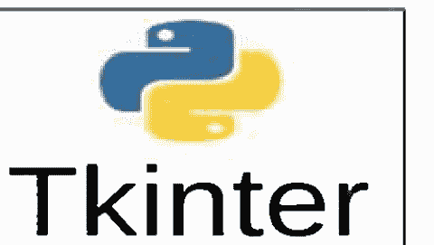

Tkinter 为 Tk GUI 工具包提供了一个强大的面向对象接口（**tkinter 模块在 Python 3.x 版本中默认包含**）。

我们编写的几乎每个 GUI 程序都将包含以下三行代码：

```
from tkinter import *
root = Tk()
mainloop()
```

第1行从 tkinter 模块导入所有 GUI 相关内容。
第2行在屏幕上创建一个窗口，我们称之为 root。
第3行将程序置于一个本质上是长时间运行的 while 循环中，称为事件循环。此循环运行，等待按键、按钮点击等操作，并在用户关闭窗口时退出。

这是一个将温度从华氏度转换为摄氏度的可运行 GUI 程序：

```
from tkinter import *
def calculate():
    tmp = int(entry.get())
    tmp = 9/5*tmp+32
    output_label.configure(text = 'Converted: {:.1f}'.format(temp))
    entry.delete(0,END)
root = Tk()
message_label = Label(text='Enter a temperature', font=('Arial', 14))
output_label = Label(font=('Arial', 14))
entry = Entry(font=('Arial', 14), width=4)
calc_button = Button(text='Ok', font=('Arial', 14),command=calculate)
message_label.grid(row=0, column=0)
entry.grid(row=0, column=1)
calc_button.grid(row=0, column=2)
output_label.grid(row=1, column=0, columnspan=3)
mainloop()
```

程序的输出如下：


程序组件的详细说明。

### Label 组件

Label 是一个容器，用于在屏幕上放置一些文本。以下代码创建一个 Label 并将其放置在屏幕上。

```
hllo_label=Label(text='hello')
hllo_label.grid(row=0, column=0)
```

我们调用 Label 来创建一个新的标签，标签名为 hllo_label。创建后，使用 grid 方法将标签放置在屏幕上。

### Label 的选项

有许多选项可以更改，包括字体大小和颜色。以下是一些示例：

```
hello_label = Label(text='hello', font=('Arial', 14, 'bold'), bg='blue', fg='white')
```

注意关键字参数的使用。

以下是一些常见选项：

- **font** 基本结构是 font= (字体名称, 字体大小, 样式)。
  你可以省略字体大小或样式。样式的选择有 'bold'、'italic'、'underline'、'overstrike'、'roman' 和 'normal'（默认值）。我们可以组合多种样式，例如：'bold underline italic'。
- **fg 和 bg** 这些代表前景色和背景色。可以使用许多常见的颜色名称，如 'red'、'yellow' 等。
- **width** 这是标签应具有的字符长度。
- **height** 这是标签应具有的行高。
  你可以将其用于多行标签。
  在文本中使用换行符使其跨越多行。
  例如，text='hello \n ajit'。

### 更改标签属性

在程序的后续部分，创建标签后，你可能想要更改其某些属性。为此，请使用其 configure 方法。以下是两个更改名为 label 的标签属性的示例：

```
label.configure(text='Bye Bye')
label.configure(bg='white', fg='red')
```

使用 configure 方法设置文本有点像 GUI 等效的 **print** 语句。但是，在调用 configure 时，我们不能使用逗号分隔多个要打印的内容。相反，我们需要使用字符串格式化。这是一个 **print** 语句及其使用 configure 方法的等效语句。

```
print('a =', a, 'and b =', b)
label.configure(text='a = {}, and b = {}'.format(a,b))
```

注意：configure 方法适用于我们将看到的大多数其他组件。

### grid

grid 方法用于将组件放置在屏幕上。它将屏幕布局为行和列的矩形网格。前几行和列如下所示。

### 跨越多行或列

有可选参数 rowspan 和 colspan，允许一个组件占据多行或多列。以下是几个 grid 语句的示例及其布局效果：

```
label1.grid(row=0, column=0)
label2.grid(row=0, column=1)
label3.grid(row=1, column=0, colspan=2)
label4.grid(row=1, column=2)
label5.grid(row=2, column=2)
```

### 间距

要在组件之间添加额外空间，可以使用可选参数 padx 和 pady。

*重要提示：* 每次创建组件时，要将其放置在屏幕上，你需要使用 grid（或其类似方法，如 pack，我们稍后会讨论）。否则它将不可见。

### Entry 组件

Entry 框用于获取文本输入。以下示例创建一个简单的 Entry 框并将其放置在屏幕上。

```
entry = Entry()
entry.grid(row=0, column=0)
```

大多数适用于 Label 的选项也适用于 Entry 框。width 选项特别有用，因为 Entry 框通常会比你需要的更宽。

### 获取文本

要从 Entry 框获取文本，请使用其 get 方法。这将返回一个字符串。如果你需要数值数据，请对字符串使用 **eval**（或 **int** 或 **float**）。这是一个从名为 entry 的 Entry 框获取文本的简单示例。

```
string_value = entry.get()
num_value = eval(entry.get())
```

### 删除文本

要清空 Entry 框，请使用以下代码：

```
entry.delete(0,END)
```

### 插入文本

要向 Entry 框插入文本，请使用以下代码：

```
entry.insert(0, 'hello')
```

### Button 组件

以下示例创建一个简单的按钮：

```
ok_button = Button(text='Ok')
```

要使按钮在被点击时执行某些操作，请使用 command 参数。它被设置为一个函数的名称，称为回调函数。当按钮被点击时，将调用回调函数。以下是一个示例：

```
from tkinter import *
def callback():
    label.configure(text='Button clicked')
root = Tk()
label = Label(text='Not clicked')
button = Button(text='Click me', command=callback)
label.grid(row=0, column=0)
button.grid(row=1, column=0)
mainloop()
```

程序启动时，标签显示 Click me。当按钮被点击时，回调函数 callback 被调用，将标签更改为显示 Button clicked。


### lambda 技巧

有时我们希望向回调函数传递信息，例如，如果我们有几个按钮使用相同的回调函数，并且我们想告诉函数是哪个按钮被点击了。以下是一个示例，我们创建 26 个按钮，每个字母一个。我们不使用 26 个单独的 Button() 语句和 26 个不同的函数，而是使用一个列表和一个函数。

```
from tkinter import *
alphabet = 'ABCDEFGHIJKLMNOPQRSTUVWXYZ'
def callback(x):
    label.configure(text='Button {} clicked'.format(alphabet[x]))
root = Tk()
label = Label()
label.grid(row=1, column=0, columnspan=26)
buttons = [0]*26 # 创建一个列表来容纳 26 个按钮
for i in range(26):
    buttons[i] = Button(text=alphabet[i],
        command = lambda x=i: callback(x))
    buttons[i].grid(row=0, column=i)
mainloop()
```

我们设置 buttons=[0]*26。这创建了一个包含 26 个元素的列表。创建列表的另一种方法是设置 buttons=[] 并使用 append 方法。

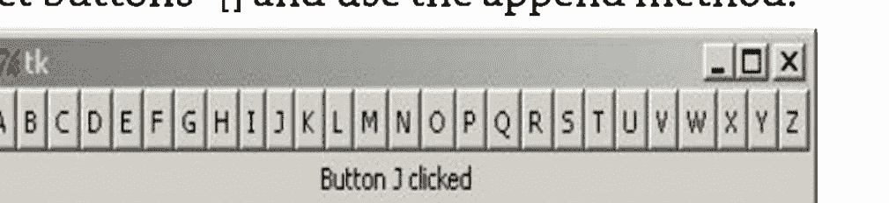

我们使用一个回调函数，它有一个参数，指示哪个按钮被点击了。关于 **lambda** 技巧，不深入细节，command=callback(i) 不起作用，这就是我们诉诸 **lambda** 技巧的原因。

### Frame 组件

假设我们希望在屏幕顶部有 26 个小按钮，下面有一个大的 Ok 按钮，如下所示：

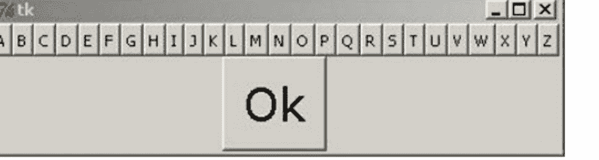

Frame 的作用是包含其他组件，并将它们组合成一个大的组件。在这种情况下，我们将创建一个 Frame 来将所有字母按钮分组为一个大的组件。代码如下所示：

```
from tkinter import *
alphabet = 'ABCDEFGHIJKLMNOPQRSTUVWXYZ'
root = Tk()
button_frame = Frame()
buttons = [0]*26
for i in range(26):
    buttons[i] = Button(button_frame, text=alphabet[i])
    buttons[i].grid(row=0, column=i)
ok_button = Button(text='Ok', font=('Verdana', 24))
button_frame.grid(row=0, column=0)
ok_button.grid(row=1, column=0)
mainloop()
```

要创建一个 Frame，我们使用 Frame() 并给它一个名称。然后，对于我们要包含在 Frame 中的任何组件，我们在组件声明中将 Frame 的名称作为第一个参数包含进去。我们仍然需要使用 grid 放置组件，但现在行和列将是相对于 Frame 的。最后，我们需要对 Frame 本身使用 grid。

### 颜色

Tkinter 定义了许多常见的颜色名称，例如 'yellow' 和 'red'。它还提供了一种访问数百万种更多颜色的方法。我们首先尝试理解颜色在屏幕上是如何显示的。
每种颜色被分解为三个分量：
一个红色分量，
一个绿色分量，
和一个蓝色分量。
每个分量的值可以从 0 到 255，其中 255 表示该颜色的全量。等量的红色和绿色混合产生黄色色调，等量的红色和蓝色混合产生紫色色调，等量的蓝色和绿色混合产生青绿色调。三者等量混合产生灰色色调。当所有三个分量的值都为 0 时是黑色，当所有三个分量的值都为 255 时是白色。改变分量的值可以产生多达 256^3 = 1600 万种颜色。网上有许多资源允许你调整分量的量并查看产生的颜色。

在 Tkinter 中使用颜色很容易，但有一个注意事项：分量值以十六进制给出。十六进制是一种以 16 为基数的数字系统，其中字母 A-F 用于表示数字 10 到 15。它在计算机早期被广泛使用，现在仍偶尔使用。以下是两种数字基数的比较表：

| 十进制 | 十六进制 | 十进制 | 十六进制 | 十进制 | 十六进制 | 十进制 | 十六进制 |
|---|---|---|---|---|---|---|---|
| 0 | 0 | 8 | 8 | 16 | 10 | 80 | 50 |
| 1 | 1 | 9 | 9 | 17 | 11 | 100 | 64 |
| 2 | 2 | 10 | A | 18 | 12 | 128 | 80 |
| 3 | 3 | 11 | B | 31 | 1F | 160 | A0 |
| 4 | 4 | 12 | C | 32 | 20 | 200 | C8 |
| 5 | 5 | 13 | D | 33 | 21 | 254 | FE |
| 6 | 6 | 14 | E | 48 | 30 | 255 | FF |
| 7 | 7 | 15 | F | 64 | 40 | 256 | 100 |

因为颜色分量值范围是 0 到 255，所以在十六进制中它们的范围是 0 到 FF，因此由两个十六进制数字描述。Tkinter 中的典型颜色指定如下：'#A202FF'。颜色名称前有一个井号。然后前两位数字是红色分量（本例中为 A2，十进制为 162）。接下来的两位数字指定绿色分量（此处为 02，十进制为 2），最后两位数字指定蓝色分量（此处为 FF，十进制为 255）。
label = Label(text='Hi', bg='#A202FF')

如果你不想处理十六进制，可以使用以下函数，它将百分比转换为 Tkinter 使用的十六进制字符串。

```
def color_convert(r, g, b):
    return '#{:02x}{:02x}{:02x}'.format(int(r*2.55), int(g*2.55), int(b*2.55))
```

创建一个背景色的示例，其中红色分量占 10%，绿色占 85%，蓝色占 60%。
label = Label(text='Hi', bg=color_convert(10, 85, 60))

### 图像

标签和按钮可以显示图像而不是文本。使用图像需要一些设置工作。我们首先必须创建一个 PhotoImage 对象并给它一个名称。
示例：
cat_image = PhotoImage(file='cat.gif')
以下是将图像放入组件的一些示例：

label = Label(image=cat_image)
button = Button(image=cat_image, command=cat_callback())
你可以使用 configure 方法来设置或更改图像：
label.configure(image=cat_image)

**文件类型** Tkinter 的一个限制是它唯一能使用的常见图像文件类型是 GIF。如果你想使用其他类型的文件，一个解决方案是使用 Python Imaging Library，这将在后面进一步讨论。

### Canvas 组件

Canvas 是一个我们可以在上面绘制线条、圆形、矩形等图形的组件。我们也可以在上面绘制文本、图像和其他组件。它是一个非常通用的组件，尽管我们这里只介绍基础知识。

**创建画布** 以下代码创建一个白色背景、尺寸为 200 x 300 像素的画布：

```
canvas = Canvas(width=200, height=300, bg='white')
```

**矩形** 以下代码在画布上绘制一个红色矩形：

```
canvas.create_rectangle(20,100,30,180, fill='blue')
```

参见下面左侧的图像。前四个参数指定矩形在画布上的放置坐标。画布的左上角是原点 (0, 0)。矩形的左上角在 (20, 100)，右下角在 (30, 150)。如果省略 fill='red'，结果将是一个带有黑色轮廓的矩形。

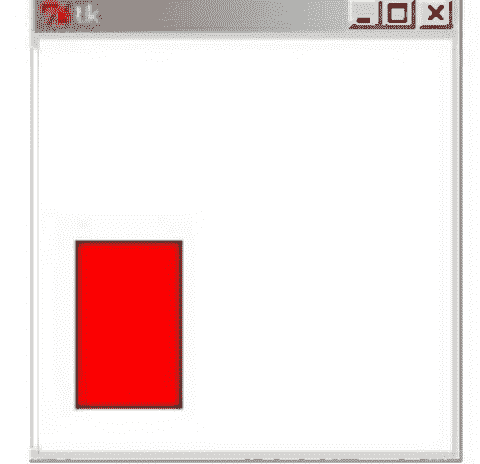

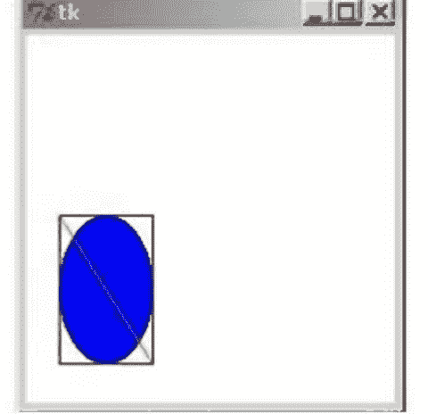

**椭圆和线条** 绘制椭圆和线条类似。上面右侧的图像是用以下代码创建的：

```
canvas.create_rectangle(20,100,70,180)
canvas.create_oval(20,100,70,180, fill='red')
canvas.create_line(20,100,70,180, fill='green')
```

这里的矩形是为了展示线条和椭圆的工作方式与矩形类似。前两个坐标是左上角，后两个是右下角。

要获得一个半径为 r、中心在 (x,y) 的圆，我们可以创建以下函数：
**Def create_circle(x,y,r):** canvas.create_oval(x-r,y-r,x+r,y+r)

**图像** 我们可以向画布添加图像。这是一个示例：
cat_image=PhotoImage(file='cat.gif')
canvas.create_image(50,50, image=cat_image)
这两个坐标是图像中心应该放置的位置。

### 命名事物、更改它们、移动它们和删除它们

我们可以给画布上绘制的事物命名。然后我们可以使用该名称来引用该对象，以便在需要移动它或将其从画布上移除时使用。以下是一个示例，我们创建一个矩形，更改其颜色，移动它，然后删除它：
rect=canvas.create_rectangle(0,0,20,20)
canvas.itemconfigure(rect, fill='red')
canvas.coords(rect,40,40,60,60)
canvas.delete(rect)

coords 方法用于移动/调整对象大小，delete 方法用于删除它。如果你想从画布上删除所有内容，请使用以下命令：
canvas.delete(ALL)

### 复选按钮和单选按钮

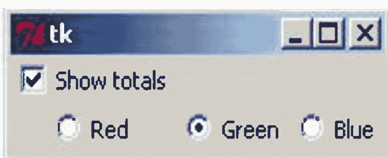

在下面的图像中，顶行显示一个复选按钮，底行显示一个单选按钮。

**复选按钮** 上面复选按钮的代码是：
show_totals = IntVar()
check = Checkbutton(text='Show totals', var=show_total)
这里需要注意的一点是，我们必须将复选按钮与一个变量绑定，而且不能是任意变量，它必须是一种特殊类型的 Tkinter 变量，称为 IntVar。这个变量 show_total 在复选按钮未选中时为 0，选中时为 1。要访问变量的值，你需要使用其 get 方法，如下所示：
show_total.get()

我们也可以使用其 set 方法设置变量的值。这将自动在屏幕上选中或取消选中复选按钮。例如，如果你希望上述复选按钮在程序开始时被选中，请执行以下操作：

```
show_total=IntVar()
show_total.set(1)
check = Checkbutton(text='Show totals', var=show_total)
```

**单选按钮** 单选按钮的工作方式类似。本节开头显示的单选按钮的代码是：

```
color = IntVar()
redbutton = Radiobutton(text='Red', var=color, value=1)
greenbutton = Radiobutton(text='Green', var=color, value=2)
bluebutton = Radiobutton(text='Blue', var=color, value=3)
```

IntVar 对象 color 的值将是 1、2 或 3，具体取决于选择的是左、中还是右按钮。这些值由 value 选项控制，在创建单选按钮时指定。

**命令：** 复选按钮和单选按钮都有一个 command 选项，你可以在其中设置一个回调函数，每当按钮被选中或取消选中时运行。

### Text 组件

Text 组件是 Entry 组件的更大、扩展版本。以下是创建一个的示例：

```
textbox = Text(font=('Arial', 16), height=6, width=50)
```

该组件将宽 50 个字符，高 6 行。你仍然可以输入超过第六行；该组件一次只显示六行，你可以使用箭头键滚动。
如果你想让文本框关联一个滚动条，可以使用 ScrolledText 组件。除了滚动条之外，ScrolledText 的工作方式与 Text 大致相同。下面显示了它外观的一个示例。要使用 ScrolledText 组件，我们需要以下导入：

```
from tkinter.scrolledtext import ScrolledText
```


以下是一些常用命令：

| 语句 | 描述 |
| :--- | :--- |
| textbox.get(1.0,END) | 返回文本框的内容 |

| textbox.delete(1.0, END) | 删除文本框中的所有内容 |
| textbox.insert(END, 'Hello') | 在文本框末尾插入文本 |

声明 Text 组件时，一个不错的选项是 undo=**True**，它允许使用 Ctrl+Z 和 Ctrl+Y 进行撤销和重做编辑。

### Scale 组件

Scale 是一个可以来回滑动以选择不同值的组件。下面展示了一个示例，以及创建它的代码。


```
scale = Scale(from_=1, to_=150, length=300, orient='horizontal')
```

以下是 Scale 组件的一些常用选项：

| 选项 | 描述 |
|---|---|
| from_ | 拖动滑块可达到的最小值 |
| to_ | 拖动滑块可达到的最大值 |
| Length | 滑块的长度（以像素为单位） |
| Label | 为滑块指定标签 |
| showvalue='NO' | 隐藏滑块上方显示的数字 |
| tickinterval=1 | 每隔一个单位显示刻度线（1 可更改） |

我们的程序有几种方式与 Scale 交互。一种方式是像复选按钮和单选按钮一样，使用 variable 选项将其与 IntVar 关联。另一种方式是使用 Scale 的 get 和 set 方法。第三种方式是使用 command 选项，其工作方式与按钮类似。

### GUI 事件

通常，我们希望程序在用户按下某个键、在画布上拖动某物、使用鼠标滚轮等时执行某些操作。这些操作被称为事件。

### 一个简单的例子

我们之前看到的第一个 GUI 程序是一个简单的温度转换器。每次我们想转换温度时，都会在输入框中输入温度并点击“计算”按钮。如果用户在输入温度后只需按回车键，而无需点击“计算”按钮，那就更好了。我们可以通过在程序中添加一行代码来实现这一点：

```
entry.bind('<Return>', lambda dummy=0:calculate())
```

这行代码应紧跟在声明输入框之后。它获取按下回车（Return）键的事件，并将其绑定到 calculate 函数。

绑定事件的函数应该能够接收 Event 对象的副本，但我们之前编写的 calculate 函数不接受任何参数。与其重写函数，上面这行代码使用了 **lambda** 技巧来实质上丢弃 Event 对象。

### 常见事件

以下是一些常见事件的列表：

| 事件 | 描述 |
| :--- | :--- |
| <Button-1> | 单击鼠标左键。 |
| <Double-Button-1> | 双击鼠标左键。 |
| <Button-Release-1> | 释放鼠标左键。 |
| <B1-Motion> | 按住鼠标左键并拖动。 |
| <MouseWheel> | 移动鼠标滚轮。 |
| <Motion> | 移动鼠标。 |
| <Enter> | 鼠标现在位于组件上方。 |
| <Leave> | 鼠标已离开组件。 |
| <Key> | 按下某个键。 |
| <key name> | 按下名为 key 的键。 |

对于所有鼠标按钮示例，数字 1 可以替换为其他数字。按钮 2 是中键，按钮 3 是右键。
Event 对象中最有用的属性是：

| 属性 | 描述 |
| :--- | :--- |
| Keysym | 按下的键的名称 |
| x, y | 鼠标指针的坐标 |
| Delta | 鼠标滚轮的值 |

### 按键事件

对于按键事件，我们可以为不同的键设置特定的回调，也可以捕获所有按键并在同一个回调中处理它们。以下是后者的示例：

```
from tkinter import *
def callback(event): print(event.keysym)
root = Tk()
root.bind('<Key>', callback)
mainloop()
```

上面的程序会打印出按下的键的名称。你可以在 if 语句中使用这些名称，在回调函数中处理多个不同的按键，如下所示：

```
if event.keysym = 'percent':
    按下了百分号键（shift+5），对此进行一些处理...
elif event.keysym = 'a':
    按下了小写字母 a，对此进行一些处理...
```

如果你捕获大量按键并且对所有按键执行类似的操作，请使用单个回调方法。另一方面，如果你只想捕获几个特定的按键，或者某些按键有非常长且特定的回调，你可以像下面这样分别捕获按键：

```
from tkinter import *
def callback1(event):
    print('You pressed the enter key.')
def callback1(event):
    print('You pressed the up arrow.')
root = Tk()
root.bind('<Return>', callback1)
root.bind('<Up>', callback2)
mainloop()
```

键的名称与存储在 keysym 属性中的名称相同。你可以使用本节前面的程序来查找所有键的名称。
以下是一些常见键的名称：

| Tkinter 名称 | 常用名称 |
|---|---|
| <Return> | 回车键 |
| <Tab> | Tab 键 |
| <Space> | 空格键 |
| <F1>,..., <F12> | F1,...,F12 |
| <Next>, <Prior> | Page up, Page down |
| <Up>, <Down>, <Left>, <Right> | 方向键 |
| <Home>, <End> | Home, End |
| <Insert>, <Delete> | Insert, Delete |
| <Caps_Lock>, <Num_Lock> | Caps lock, Number lock |
| <Control_L>, <Control_R> | 左右 Control 键 |
| <Alt_L>, <Alt_R> | 左右 Alt 键 |
| <Shift_L>, <Shift_R> | 左右 Shift 键 |

大多数可打印键都可以通过其名称捕获，如下所示：
root.bind('a', callback)
root.bind('A', callback)
root.bind('-', callback)

例外情况是空格键（<Space>）和小于号（<Less>）。你也可以捕获组合键，例如 <Shift-F5>、<Control-Next>、<Alt-2> 或 <Control-Shift-F1>。

**注意**
这些示例都将按键绑定到 root，这是我们对主窗口的命名。你也可以将按键绑定到特定的组件。例如，如果你只想让左方向键在名为 canvas 的 Canvas 上工作，你可以使用以下代码：

```
canvas.bind(<Left>, callback)
```

这里有一个技巧，即除非 canvas 拥有 GUI 的焦点，否则它不会识别按键。这可以通过以下方式实现：

```
canvas.focus_set()
```

### 事件示例

**示例 1** 一个我们可以使用上或下方向键移动矩形的示例。

```
from tkinter import *
def callback(event):
    global move
    if event.keysym=='Up':
        move += 1
    elif event.keysym=='Down':
        move -=1
    canvas.coords(rect,50+move,50,100+move,100)
root = Tk()
root.bind('<Key>', callback)
canvas = Canvas(width=200,height=200)
canvas.grid(row=0,column=0)
rect = canvas.create_rectangle(50,50,100,100,fill='blue')
move = 0
mainloop()
```

### 标题栏

Tkinter 创建的 GUI 窗口默认显示 Tk。以下是更改它的方法：
root.title('Your title')

### 禁用组件

有时你想禁用一个按钮，使其无法被点击。按钮有一个 state 属性，允许你禁用该组件。使用 state=DISABLED 来禁用按钮，使用 state=NORMAL 来启用它。下面是一个创建初始为禁用状态然后启用它的按钮的示例：
button=Button(text='Hi',state=DISABLED,command=function) button.configure(state=NORMAL)
你也可以使用 state 属性来禁用许多其他类型的组件。

### 获取组件的状态

有时，你需要了解组件的一些信息，比如其中确切的文本是什么或其背景颜色是什么。cget 方法用于此目的。例如，以下代码获取名为 label 的标签的文本：
label.cget('text')
这可以用于按钮、画布等，并且可以用于它们的任何属性，如 bg、fg、state 等。作为快捷方式，Tkinter 重载了 [] 运算符，因此 label['text'] 可以实现与上述示例相同的功能。

### 消息框

消息框是弹出的窗口，用于向你提问或说明某些内容，然后消失。要使用它们，我们需要一个导入语句：

```
from tkinter.messagebox import *
```

有多种不同类型的消息框。对于每种类型，你都可以指定用户将看到的消息以及消息框的标题。以下是三种类型的消息框，以及生成它们的代码：


```
showinfo(title='Message for you', message='Hi There!')
askquestion(title='Quit?', message='Do you really want to quit?')
showwarning(title='Warning', message='Unsupported format')
```

以下是所有类型消息框的列表。每种都以自己的方式显示消息。

| 消息框 | 特殊属性 |
|---|---|
| showinfo | 确定按钮 |
| askokcancel | 确定和取消按钮 |

### 销毁组件

要移除一个组件，请使用其 `destroy` 方法。例如，要移除一个名为 `button` 的按钮，请执行以下操作：

```
button.destroy()
```

要移除整个 GUI 窗口，请使用以下代码：
```
root.destroy()
```

### 阻止窗口关闭

当用户尝试关闭主窗口时，你可能希望执行某些操作，例如询问他们是否确实要退出。以下是实现此目的的一种方法：

```
from tkinter import *
from tkinter.messagebox import askquestion
def quitter_function():
    answer = askquestion(title='Quit?', message='Really quit?')
    if answer=='yes': root.destroy()
root = Tk()
root.protocol('WM_DELETE_WINDOW', quitter_function)
mainloop()
```

关键在于以下这行代码，它使得每当用户尝试关闭窗口时，都会调用 `quitter_function`。
```
root.protocol('WM_DELETE_WINDOW', quitter_function)
```

### 更新

Tkinter 会定期更新屏幕，但有时这还不够频繁。例如，在由按钮点击触发的函数中，Tkinter 在函数完成之前不会更新屏幕。

如果在该函数中，你想更改屏幕上的某些内容，暂停一小会儿，然后再更改其他内容，你就需要告诉 Tkinter 在暂停之前更新屏幕。为此，只需使用以下代码：
```
root.update()
```
如果你只想更新某个特定组件，而不更新其他任何内容，可以使用该组件的 `update` 方法。例如，
```
canvas.update()
```
一个偶尔有用的、相关的方法是在预定的时间间隔后执行某些操作。例如，你的程序中可能有一个计时器。为此，你可以使用 `after` 方法。它的第一个参数是更新前等待的时间（以毫秒为单位），第二个参数是时间到了要调用的函数。以下是一个实现计时器的示例：

```
from time import time
from tkinter import *
def update_timer():
    time_left = int(90 - (time()-start))
    minutes = time_left // 60
    seconds = time_left % 60
    time_label.configure(text='{}:{:02d}'.format(minutes, seconds))
    root.after(100, update_timer)
root = Tk()
time_label = Label()
time_label.grid(row=0, column=0)
start = time()
update_timer()
mainloop()
```

### 对话框

许多程序都有对话框，允许用户选择要打开的文件或保存文件。要在 Tkinter 中使用它们，我们需要以下导入语句：

```
from tkinter.filedialog import *
```

Tkinter 对话框通常看起来像操作系统原生的对话框。

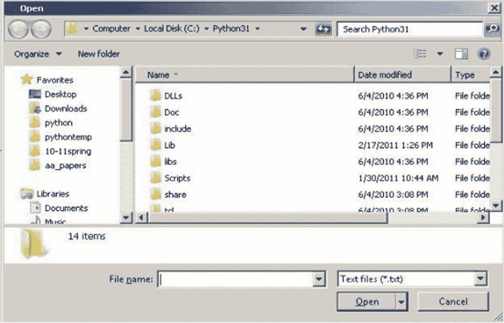

以下是最有用的对话框：

| 对话框 | 描述 |
|---|---|
| Askopenfilename | 打开一个典型的文件选择对话框 |
| Askopenfilenames | 与前一个类似，但用户可以选择多个文件 |
| Asksaveasfilename | 打开一个典型的文件保存对话框 |
| Askdirectory | 打开一个目录选择对话框 |

`askopenfilename` 和 `asksaveasfilename` 的返回值是所选文件的名称。如果用户没有选择任何值，则没有返回值。`askopenfilenames` 的返回值是一个文件列表，如果没有选择文件，则该列表为空。`askdirectory` 函数返回所选目录的名称。

你可以向这些函数传递一些选项。你可以将 `initialdir` 设置为对话框开始时所在的目录。你还可以指定文件类型。以下是一个示例：

```
filename=askopenfilename(initialdir='c:\python31\', filetypes=[('Image files', '.jpg .png .gif'),('All files', '*')])
```

以下是一个示例，它打开一个文件对话框，允许你选择一个文本文件。然后程序在文本框中显示文件的内容。

```
from tkinter import *
from tkinter.filedialog import *
from tkinter.scrolledtext import ScrolledText
root = Tk()
textbox = ScrolledText()
textbox.grid()
filename=askopenfilename(initialdir='c:\python31\', filetypes=[('Text files', '.txt'),('All files', '*')])
s = open(filename).read()
textbox.insert(1.0, s)
mainloop()
```

### 菜单栏

我们可以创建一个菜单栏，如下所示，位于窗口的顶部。


以下是一个使用上一节中部分对话框的示例：

```
from tkinter import *
from tkinter.filedialog import *
def open_callback():
    filename = askopenfilename()
    # 在此处添加代码以对 filename 执行某些操作
def saveas_callback():
    filename = asksaveasfilename()
    # 在此处添加代码以对 filename 执行某些操作
root = Tk()
menu = Menu()
root.config(menu=menu)
file_menu = Menu(menu, tearoff=0)
file_menu.add_command(label='Open',command=open_callback)
file_menu.add_command(label='Save as', command=saveas_callback)
file_menu.add_separator()
file_menu.add_command(label='Exit', command=root.destroy)
menu.add_cascade(label='File', menu=file_menu)
mainloop()
```

### 新窗口

创建一个新窗口很容易。使用 `Toplevel` 函数：

```
window = Toplevel()
```

你可以向新窗口添加组件。创建组件时的第一个参数需要是窗口的名称，如下所示：

```
new_window = Toplevel()
label = Label(new_window, text='Hi')
label.grid(row=0, column=0)
```

### pack

`grid` 的一个替代方案是 `pack`。它不如 `grid` 通用，但在某些地方很有用。它使用一个名为 `side` 的参数，允许你为组件指定四个位置：`TOP`、`BOTTOM`、`LEFT` 和 `RIGHT`。有两个有用的可选参数：`fill` 和 `expand`。以下是一个示例。

```
button1=Button(text='Hi')
button1.pack(side=TOP, fill=X)
```


```
button2=Button(text='Hi')
button2.pack(side=BOTTOM)
```

`fill` 选项使组件填充分配给它的可用空间。它可以是 `X`、`Y` 或 `BOTH`。`expand` 选项用于允许组件在窗口调整大小时扩展。要启用它，请使用 `expand=YES`。

**注意** 你可以在某些框架中使用 `pack`，在其他框架中使用 `grid`；只是不要在同一个框架中混合使用 `pack` 和 `grid`，否则 Tkinter 将不知道该如何处理。

### StringVar

Tkinter 有另一种类型的变量，称为 `StringVar`，用于保存字符串。这种类型的变量可用于更改标签、按钮或其他一些组件中的文本。我们已经知道如何使用 `configure` 方法更改文本，而 `StringVar` 提供了另一种方法。

要将组件与 `StringVar` 绑定，请使用组件的 `textvariable` 选项。`StringVar` 具有 `get` 和 `set` 方法，就像 `IntVar` 一样，每当你设置该变量时，任何绑定到它的组件都会自动更新。

以下是一个简单的示例，将两个标签绑定到同一个 `StringVar`。还有一个按钮，点击时会交替更改 `StringVar` 的值（从而更改标签中的文本）。

```
from tkinter import *
def callback():
    global count
    s.set('Goodbye' if count%2==0 else 'Hello')
    count += 1
root = Tk()
count = 0
s = StringVar()
s.set('Hello')
label1 = Label(textvariable = s, width=10)
label2 = Label(textvariable = s, width=10)
button = Button(text = 'Click me', command = callback)
label1.grid(row=0, column=0)
label2.grid(row=0, column=1)
button.grid(row=1, column=0)
mainloop()
```

### Python Imaging Library

Python Imaging Library (PIL) 包含用于处理图像的有用工具。在撰写本文时，PIL 仅适用于 Python 2.7 或更早版本。PIL 不是标准 Python 发行版的一部分，因此你必须单独下载并安装它。不过，安装起来很容易。

PIL 自 2009 年以来一直没有维护，但有一个名为 Pillow 的项目与 PIL 几乎兼容，并且可以在 Python 3.0 及更高版本中工作。

### 在 Tkinter 中使用 GIF 以外的图像

正如我们所看到的，Tkinter 不能使用 JPEG 和 PNG。但如果我们结合 PIL 使用它，就可以。以下是一个简单的示例：

```
from Tkinter import *
from PIL import Image, ImageTk
root = Tk()
cat_image = ImageTk.PhotoImage(Image.open('sun.jpg'))
button=Button(image=cat_image)
```

# 第20章

## 数据库连接

Python数据库API为不同的数据库提供了一个与数据库无关的编程接口。这些数据库包括：

- MySQL
- SQLite
- MS SQL
- PostgreSQL
- Informix
- Sybase
- Inter-base
- Oracle 等。

**DB-API** 是Python数据库接口的标准。

### 什么是数据库？

数据库是组织化信息的集合，可以轻松地使用、管理和更新，并根据其组织方式进行分类。

Python数据库接口分为两类：

### 通用数据库接口

大多数Python数据库接口遵循**Python的DB-API标准**，并且大多数数据库都支持ODBC。除此之外，Java数据库通常支持JDBC，程序员可以通过Jython使用它。

### 关系数据库系统接口

这采用关系模型并支持SQL。通用数据库系统列表如下：

1. Oracle
2. Informix
3. SAP DB
4. MS SQL server
5. Access
6. Ingres
7. MySQL 等。

### 原生Python数据库有：

- SnakeSQL
- Buzhug

### 数据库API包含什么

使用Python结构，**DB-API**为数据库操作提供了标准和支持。该API包括：

- 导入API模块
- 获取数据库连接
- 发送SQL语句，然后是存储过程
- 关闭连接

### Python数据库编程的优势

- 与其他语言相比，Python编程相当简单高效，数据库编程也是如此。
- Python数据库是可移植的，程序也是可移植的，因此两者在可移植性方面都具有优势。
- Python支持SQL游标。
- 它还支持关系数据库系统。
- Python的数据库API也与其他数据库兼容。
- 它是平台无关的。

### 定义MySQL数据库

它是一个用于从Python关联SQL数据库服务器的接口，并使用Python的DB-API进行工作。

### 如何实现MySQL数据库

要使用Python使用MySQL数据库，您需要首先在您的机器上安装它；然后只需键入下面给出的脚本即可在您的程序中实现MySQL。

```python
import MySQLdb
```

如果发生任何错误，则意味着MySQL模块未安装，程序员可以从以下地址下载它 - https://sourceforge.net/projects/mysql-python/

### 使用Python的数据库程序

```python
### 导入模块
import MySQLdb

### 打开数据库连接
db = MySQLdb.connect(host="127.0.0.1", user="username", passwd="password", db="database")
```

注意：成功时，connect()方法返回一个连接对象，否则将抛出OperationalError异常。

```python
print db
```

预期输出：
```
<_mysql.connection open to '127.0.0.1' at 21fe6f0>
```

```python
### 定义一个游标对象
cursor = conn.cursor
```

```python
### 如果表存在则删除
Cursor.execute("IF STUDENT TABLE EXISTS DROP IT")
```

```python
### 查询
sql = "CREATE TABLE STUDENT (NAME CHAR(30) NOT NULL, CLASS CHAR(5), AGE INT, GENDER CHAR(8), MARKS INT)"
```

```python
### 执行查询
cursor.execute(sql)
```

```python
### 关闭对象
cursor.close()
```

```python
### 关闭连接
conn.close()
```

### 数据库操作

程序员可以在Python程序中执行各种操作。要处理这些语句，您必须具备良好的数据库编程和SQL知识。

| 语句 | 描述 |
| :--- | :--- |
| INSERT | 这是一个用于在表中创建记录的SQL语句。 |
| READ | 从数据库中获取有用信息。 |
| UPDATE | 用于更新那些可用或已存在的记录。 |
| DELETE | 用于从数据库中删除记录。 |
| ROLLBACK | 它的工作原理类似于“撤销”，可以还原您所做的所有更改。 |

### INSERT操作

当您想在数据库表中创建记录时，需要此操作。

示例

以下示例执行SQL *INSERT*语句以在EMPLOYEE表中创建记录 –

```python
import MySQLdb
### 打开数据库连接
db = MySQLdb.connect("localhost","ajituser","pass123","WORKDB" )

### 使用cursor()方法准备一个游标对象
cursor = db.cursor()

### 准备SQL查询以将记录插入数据库。
sql = """INSERT INTO EMPLOYEE(FIRST_NAME,
           LAST_NAME, AGE, SEX, INCOME)
           VALUES ('Mac', 'Mohan', 20, 'M', 2000)"""
try:
    # 执行SQL命令
    cursor.execute(sql)
    # 在数据库中提交更改
    db.commit()
except:
    # 如果出现任何错误则回滚
    db.rollback()

### 从服务器断开连接
db.close()
```

上述示例可以编写如下以动态创建SQL查询 –

```python
import MySQLdb
### 打开数据库连接
db = MySQLdb.connect("localhost","ajituser","pass123","WORKDB" )

### 使用cursor()方法准备一个游标对象
cursor = db.cursor()

### 准备SQL查询以将记录插入数据库。
sql = "INSERT INTO EMPLOYEE(FIRST_NAME, \n       LAST_NAME, AGE, SEX, INCOME) \n       VALUES ('%s', '%s', '%d', '%c', '%d' )" % \n       ('Mr', 'AJIT', 30, 'M', 20000)
try:
    # 执行SQL命令
    cursor.execute(sql)
    # 在数据库中提交更改
    db.commit()
except:
    # 如果出现任何错误则回滚
    db.rollback()

### 从服务器断开连接
db.close()
```

#### 示例

以下代码段是另一种执行形式，您可以直接传递参数 –

```python
....................................
user_id = "ajit"
password = "pass123"

con.execute('insert into Login values("%s", "%s")' % \n            (user_id, password))
....................................
```

### READ操作

对任何数据库的READ操作意味着从数据库中获取一些有用信息。

一旦建立了数据库连接，您就可以对该数据库进行查询。您可以使用**fetchone()**方法获取单条记录，或使用**fetchall()**方法从数据库表中获取多个值。

**fetchone()** – 它获取查询结果集的下一行。结果集是当游标对象用于查询表时返回的对象。

**fetchall()** – 它获取结果集中的所有行。如果某些行已经从结果集中提取，则它从结果集中检索剩余的行。

**rowcount** – 这是一个只读属性，返回受execute()方法影响的行数。

示例

以下过程查询EMPLOYEE表中所有工资超过4000的记录 –

```python
import MySQLdb
### 打开数据库连接
db = MySQLdb.connect("localhost","ajituser","pass123","WORKDB" )

### 使用cursor()方法准备一个游标对象
cursor = db.cursor()

sql = "SELECT * FROM EMPLOYEE \n      WHERE INCOME > '%d'" % (4000)
try:
    # 执行SQL命令
    cursor.execute(sql)
    # 以列表的列表形式获取所有行。
    results = cursor.fetchall()
    for row in results:
        fname = row[0]
        lname = row[1]
        age = row[2]
        sex = row[3]
        income = row[4]
        # 现在打印获取的结果
        print "fname=%s,lname=%s,age=%d,sex=%s,income=%d" % \n      (fname, lname, age, sex, income )
except:
    print "Error: unable to fetch data"

### 从服务器断开连接
db.close()
```

这将产生以下结果 –

fname=Mr, lname=AJIT, age=30, sex=M, Income=20000

### 更新操作

对任何数据库的UPDATE操作意味着更新数据库中已存在的一条或多条记录。

以下过程更新所有性别为'M'的记录。在这里，我们将所有男性的年龄增加一岁。

示例

```python
import MySQLdb
### 打开数据库连接
```

### DELETE 操作

当你想要从数据库中删除某些记录时，就需要使用 DELETE 操作。以下是从 EMPLOYEE 表中删除所有年龄大于 20 的记录的步骤 –

```python
import MySQLdb
### Open database connection
db = MySQLdb.connect("localhost","ajituser","pass123","WORKDB" )

### prepare a cursor object using cursor() method
cursor = db.cursor()

### Prepare SQL query to DELETE required records
sql = "DELETE FROM EMPLOYEE WHERE AGE > '%d'" % (20)
try:
    # Execute the SQL command
    cursor.execute(sql)
    # Commit your changes in the database
    db.commit()
except:
    # Rollback in case there is any error
    db.rollback()

### disconnect from server
db.close()
```

### 执行事务

事务是一种确保数据一致性的机制。事务具有以下四个特性 –

- **原子性** – 一个事务要么完全完成，要么根本不发生。
- **一致性** – 事务必须从一个一致的状态开始，并在结束时使系统保持一致的状态。
- **隔离性** – 事务的中间结果在当前事务之外是不可见的。
- **持久性** – 一旦事务被提交，其效果就是持久的，即使在系统故障之后也是如此。

Python DB API 2.0 提供了两种方法来*提交*或*回滚*事务。

#### 示例

你已经知道如何实现事务了。这里再给出一个类似的例子 –

```python
### Prepare SQL query to DELETE required records
sql = "DELETE FROM EMPLOYEE WHERE AGE > '%d'" % (20)
try:
    # Execute the SQL command
    cursor.execute(sql)
    # Commit your changes in the database
    db.commit()
except:
    # Rollback in case there is any error
    db.rollback()
```

### COMMIT 操作

提交是向数据库发出最终确认更改信号的操作，在此操作之后，任何更改都无法回退。

这是一个调用 **commit** 方法的简单示例。

```python
db.commit()
```

### ROLLBACK 操作

如果你对一个或多个更改不满意，并且希望完全撤销这些更改，请使用 **rollback()** 方法。

这是一个调用 **rollback()** 方法的简单示例。

```python
db.rollback()
```

### 断开数据库连接

要断开数据库连接，请使用 close() 方法。

```python
db.close()
```

如果用户使用 close() 方法关闭了数据库连接，数据库会回滚任何未完成的事务。然而，与其依赖数据库底层的任何实现细节，你的应用程序最好显式地调用 commit 或 rollback。

### 从 Python 连接并运行 Oracle 数据库的 SQL 查询

从 Python 连接到 Oracle 数据库，可以运行基本的 SQL 查询，这些查询可用于地理处理任务。
可以使用 cx_Oracle Python 扩展从 Python 程序访问 Oracle 数据库模式。
**cx_Oracle** 是一个 Python 扩展模块，它支持访问 Oracle 数据库。它符合 Python 数据库 API 2.0 [规范](https://www.python.org/dev/peps/pep-0249/)，并包含大量新增内容和少量排除项。

cx_Oracle 6 已在 Python 2.7 版本以及 3.4 及更高版本上进行了测试。你可以将 cx_Oracle 与 Oracle 11.2、12.1 和 12.2 客户端库一起使用。Oracle 的标准客户端-服务器版本互操作性允许连接到较旧和较新的数据库。例如，Oracle 12.2 客户端库可以连接到 Oracle Database 11.2。

以下说明描述了如何从 Python 脚本连接到 Oracle 数据库并运行 SQL 查询。

#### 先决条件

对于本次实践环节，以下内容已为你安装：

1.  Oracle Database 11gR2，用户为 "ajituser"，密码（区分大小写）为 "ajitpassword"。此模式中的示例表 student_marks 来自 Oracle 的 orcl 实例。
2.  Python 3.11 及 cx_Oracle 6 扩展。

**注意：** 建议安装与已安装数据库客户端版本相对应的 cx_Oracle 版本。例如，如果你有 10g 客户端，则安装 10g 版本的 Oracle，否则你可能会遇到错误，如 cx_Oracle.DatabaseError: ORA-24315: illegal attribute type

#### 步骤

1.  下载并安装适用于已安装 Python 版本（例如 Python 2.6、2.7、3.11 等）的相应 cx_Oracle 模块：
    http://cx-oracle.sourceforge.net/
    cx_Oracle 是一个允许访问 Oracle 数据库的 Python 扩展模块。

2.  在 Python 脚本中导入该模块：
    ```python
    import cx_Oracle
    ```

3.  通过向以下连接字符串传递适当的用户名/密码来建立与 Oracle 数据库的连接：
    ```python
    connection = cx_Oracle.connect('ajituser/ajitpassword@orcl')
    ```
    注意：orcl 是 Oracle 数据库实例名称，可在 tnsnames.ora 文件中找到。

    查看以下代码，该代码包含在 c:\python\bin 目录中的 connect.py 文件中。

    ```python
    import cx_Oracle
    con = cx_Oracle.connect('ajituser/ajitpassword@127.0.0.1/orcl')
    print con.version
    con.close()
    ```

    导入 cx_Oracle 模块以提供访问 Oracle 数据库的 API。许多内置和第三方模块都可以通过这种方式包含在 Python 脚本中。

    connect() 方法接收用户名 "ajituser"、密码 "ajitpassword" 和连接字符串。在这种情况下，使用了 Oracle 的 Easy Connect 连接字符串语法。它由你的机器 IP 和数据库服务名 "orcl" 组成。

    close() 方法关闭连接。任何未显式关闭的连接将在脚本结束时自动释放。

    在命令行终端中运行：
    ```
    C:\python\bin>python connect.py
    11.2.0.1.0
    ```

4.  定义一个参数以访问游标方法：
    ```python
    cursor = connection.cursor()
    ```

5.  创建查询字符串：
    ```python
    querystring = "select * from Students"
    ```

6.  将查询字符串传递给游标方法：
    ```python
    cursor.execute(querystring)
    ```

#### 示例

以下示例程序展示了如何发出 SQL SELECT 命令从数据库检索数据，以及如何收集和打印检索到的数据。

```python
import cx_Oracle
connstr='ajituser/passabc@127.0.0.1/orcl'
conn = cx_Oracle.connect(connstr)
curs = conn.cursor()
curs.arraysize=50
curs.execute('SELECT STUDENT_NO, MODULE_CODE, MARK from Student_marks where MARK >= 70 order by MARK desc')
print "Student No\tModule\tMarks\n"
for column_1, column_2, column_3 in curs.fetchall():
    print column_1, "\t", column_2, "\t", column_3
curs.close()
conn.close()
```

运行此程序时，会产生以下输出：

```
Student No  Module  Marks
20060101    CM0001  80
20060103    CM0002  75
20060102    CM0001  75
20060102    CM0004  70
```

### 错误处理

错误来源有很多。例如，执行的 SQL 语句中的语法错误、连接失败，或者对已取消或已完成的语句句柄调用 fetch 方法。

DB API 定义了许多必须存在于每个数据库模块中的错误。下表列出了这些异常。

| 序号 | 异常与描述 |
| :--- | :--- |
| 1 | **Warning**<br>用于非致命问题。必须是 StandardError 的子类。 |
| 2 | **Error**<br>错误的基类。必须是 StandardError 的子类。 |
| 3 | **InterfaceError**<br>用于数据库模块本身的错误，而非数据库本身的错误。必须是 Error 的子类。 |
| 4 | **DatabaseError**<br>用于数据库中的错误。必须是 Error 的子类。 |

### 5. **DataError**
`DatabaseError` 的子类，指代数据相关的错误。

### 6. **OperationalError**
`DatabaseError` 的子类，指代诸如数据库连接丢失等错误。这些错误通常超出了 Python 脚本编写者的控制范围。

### 7. **IntegrityError**
`DatabaseError` 的子类，用于会损害关系完整性的情况，例如唯一性约束或外键冲突。

### 8. **InternalError**
`DatabaseError` 的子类，指代数据库模块内部的错误，例如游标不再处于活动状态。

### 9. **ProgrammingError**
`DatabaseError` 的子类，指代诸如表名错误等可以安全地归咎于你的错误。

### 10. **NotSupportedError**
`DatabaseError` 的子类，指代尝试调用不支持的功能。

你的 Python 脚本应该处理这些错误，但在使用上述任何异常之前，请确保你的 `MySQLdb` 支持该异常。你可以通过阅读 DB API 2.0 规范获取更多相关信息。

# 第 21 章

## Python 库

秉承 Python 的“开箱即用”哲学，Python 拥有数百个扩展模块。要将编程需求与特定模块匹配可能很困难。*Python 库参考*文档可能很难通读以找到合适的模块。我们将从库组织的顶层开始，逐步深入到 Python 庞大财富中有用的子集。

### Python 库概览

- 简介
- 内置对象。本章提供了内置函数、异常和常量的完整文档。
- 内置类型。我们研究过的所有数据类型都在库参考的这一章中有完整记录。当然，Python 参考中还有一些我们尚未研究过的额外类型。
- 字符串服务。本章包含近十几个用于各种字符串和文本处理的模块。这包括正则表达式模式匹配、Unicode 编解码器和其他字符串处理模块。
- 数据类型。本章有近 20 个模块提供额外的数据类型，包括 `datetime`。
- 数值和数学模块。本章描述了 `math`、`decimal` 和 `random` 模块。
- 互联网数据处理。互联网背后的一个秘密是使用标准化的复杂数据对象，例如带有附件的电子邮件消息。本章涵盖了十几个用于处理通过互联网传递的数据的模块。
- 结构化标记处理工具。XML、HTML 和 SGML 都是标记语言。本章涵盖了用于解析这些语言以将内容与标记分离的工具。
- 文件格式。本章涵盖了用于解析逗号分隔值（CSV）等格式文件的模块。
- 密码学服务。本章包含可用于开发和比较安全消息哈希的模块。
- 文件和目录访问。库参考的这一章涵盖了我们将在 *文件处理模块* 中研究的许多模块。
- 数据压缩和归档。本章描述了用于读写 zip 文件、tar 文件和 BZ2 文件的模块。我们也会在 *文件处理模块* 中介绍这些模块。
- 数据持久化。对象可以写入文件、套接字或数据库，以便它们可以在一个特定程序的处理之外持续存在。本章涵盖了多个用于序列化对象以便保存的包。SQLite 3 关系数据库也在此模块中描述。
- 通用操作系统服务。操作系统为我们的应用程序提供许多服务，包括访问设备和文件、一致的时间概念、处理命令行选项的方法、日志记录以及处理操作系统错误。我们将在 *程序：独立运行* 中研究其中一些模块。
- 可选操作系统服务。本节包括大多数 Linux 变体中常见但 Windows 中并非总是可用的操作系统服务。
- Unix 特定服务。这些模块提供了许多 Unix 和 Linux 特定的功能。
- 进程间通信和网络。更大更复杂的应用程序通常由多个协作组件组成。特别是万维网，它基于客户端和服务器程序之间的交互。本章描述了为执行我们程序的操作系统进程之间通信提供基础的模块。
- 互联网协议和支持。本章描述了二十多个处理各种互联网相关数据结构的模块。这从相对简单的 URL 处理到相对复杂的基于 XML 的远程过程调用（XML-RPC）处理。
- 多媒体服务。多媒体包括声音和图像；这些模块可用于操作声音或图像文件。
- 使用 Tk 的图形用户界面。`Tkinter` 模块是构建图形桌面应用程序的一种方式。GTK 库也广泛用于构建丰富的交互式桌面应用程序；要使用它们，你需要下载 `pyGTK` 包。
- 国际化。这些包帮助你将消息字符串与应用程序的其余部分分离。然后你可以翻译你的消息并提供软件的语言特定变体。
- 程序框架。这些是帮助构建命令行应用程序的模块。
- 开发工具。这些模块对于创建精致、高质量的软件至关重要：它们支持为 Python 程序创建可用的文档和可靠的测试。

### 最有用的库部分

Python 包含大量预构建模块。你对这些模块了解得越多，你需要编写的代码就越少。Python 提供了许多用于处理时间、日期和日历的模块。

**字符串服务。** 字符串服务模块包含与字符串相关的函数或类。有关字符串的更多信息，请参见 *字符串*。

- **re** `re` 模块是文本模式识别和处理的核心。*正则表达式* 是指定如何识别和解析字符串的公式。`re` 模块在 *复杂字符串：re 模块* 中有详细描述。
- **struct** `struct` 模块的公开目的是允许 Python 程序访问 C 语言 API；它打包和解包 C 语言的结构体对象。事实证明，这个模块也可以帮助你处理打包二进制格式的文件。
- **difflib** `difflib` 模块包含用于比较两个序列（通常是文本行序列）的基本算法。这些算法类似于 Unix **diff** 命令（Windows **COMP** 命令）使用的算法。
- **StringIO**
- **cStringIO** `StringIO` 有两个变体，它们提供从字符串缓冲区读取或写入的类文件对象。`StringIO` 模块定义了 `StringIO` 类，可以从中派生子类。`cStringIO` 模块提供了一个高速的 C 语言实现，不能被子类化。

请注意，这些模块具有非典型的混合大小写名称。

**textwrap** 这是一个用于格式化纯文本的模块。虽然自动换行任务有时由文字处理器处理，但你可能在其他类型的程序中需要它。纯文本文件仍然是提供文档最可移植、最标准的方式。

**codecs** 这个模块有数百种文本编码。这包括大量的 Windows 代码页和 Macintosh 代码页。最常用的是各种 Unicode 方案（utf-16 和 utf-8）。然而，也有许多编解码器用于在文本字符串和字节数组之间进行转换。这些方案包括 base-64、zip 压缩、bz2 压缩、各种引用规则，甚至简单的 rot_13 替换密码。

**数据类型。** 数据类型模块实现了许多广泛使用的数据结构。它们不如语言内置的序列、字典或字符串有用。这些数据类型包括日期、通用集合、数组和计划事件。此模块包括用于搜索列表、复制结构或为复杂结构生成格式化输出的模块。

**datetime** `datetime` 处理日历的细节，包括日期和时间。此外，`time` 模块提供了一些更基本的时间和日期处理函数。我们将在 *日期和时间：time 和 datetime 模块* 中详细介绍这两个模块。这些模块意味着你永远不需要尝试自己的日历计算。90 年代末学到的重要教训之一是，许多程序员喜欢处理日历计算，但由于无数的小问题，他们的工作在 2000 年 1 月 1 日之前必须经过测试和返工。

### 日历模块
此模块包含用于显示和处理日历的程序。它可以帮助你确定一个月开始和结束的星期几；可以计算年份区间内的闰日数量等。

### 集合模块
此包包含一些便捷的数据类型，以及我们用于定义自身集合的抽象基类。数据类型包括 `collections.deque`（一个双端队列，可用作栈（LIFO）或队列（FIFO））、`collections.defaultdict` 类（对于缺失的键，它返回默认值而非引发异常）以及 `collections.namedtuple` 函数（帮助我们创建一个小型、专用的类，即一个具有命名位置的元组）。
我们在 *创建或扩展数据类型* 中使用了此库。

### 二分查找模块
`bisect` 模块包含 `bisect()` 函数，用于在已排序的列表中搜索特定值。它还包含 `insort()` 函数，用于在保持排序顺序的前提下将项目插入列表。此模块比简单地将值追加到列表并调用列表的 `sort()` 方法执行得更快。此模块的源代码作为精心设计算法的范例，具有指导意义。

### 数组模块
`array` 模块为你提供了一个高性能、高度紧凑的值集合。它不像列表或元组那样灵活，但它速度快且占用内存相对较少。这对于处理图像或声音文件等媒体非常有帮助。

### 调度模块
`sched` 模块包含调度器类的定义，用于构建一个简单的任务调度器。构造调度器时，会提供两个用户提供的函数：一个返回时间，另一个执行延迟等待时间到达。对于实时调度，可以使用 `time` 模块的 `time()` 和 `sleep()` 函数。调度器有一个主循环，它调用提供的时间函数，并将当前时间与计划任务的时间进行比较；然后，它调用提供的延迟函数来处理时间差。它运行计划任务，并调用持续时间为零的延迟函数以释放任何资源。

### 复制模块
`copy` 模块包含用于复制复杂对象的函数。此模块包含一个函数用于创建对象的 *浅拷贝*，其中父对象内包含的任何对象不会被复制，而是在父对象中插入引用。它还包含一个函数用于创建对象的 *深拷贝*，其中父对象内包含的所有对象都会被复制。
请注意，Python 的简单赋值只是创建一个指向对象的变量（即标签或引用），而不是创建副本。此模块是创建独立副本的最简单方法。

### 美化打印模块
`pprint` 模块包含一些有用的函数，例如 `pprint.pprint()`，用于打印嵌套列表和字典的易读表示。它还有一个 `PrettyPrinter` 类，你可以从中创建子类来自定义列表、字典或其他对象的打印方式。

### 数值和数学模块
这些模块包含更专业的数学函数和一些额外的数值数据类型。

#### 十进制模块
`decimal` 模块提供基于十进制的算术运算，可正确处理有效数字、舍入以及货币金额中常见的其他特性。

#### 数学模块
`math` 模块在 *math 模块* 中已介绍。它包含正弦、余弦和平方根等数学函数。

#### 随机模块
`random` 模块在 *math 模块* 中已介绍。

### 文件和目录访问
我们将在 *文件处理模块* 中介绍其中的许多模块。这些是处理数据文件所必需的模块。

-   **os.path** `os.path` 模块对于创建可移植的 Python 程序至关重要。流行的操作系统（Linux、Windows 和 MacOS）对文件名的处理方式各不相同。依赖 `os.path` 的 Python 程序在所有环境中行为将更加一致。
-   **fileinput** `fileinput` 模块帮助你的程序平稳、简单地处理大量文件。
-   **glob**
-   **fnmatch** `glob` 和 `fnmatch` 模块帮助 Windows 程序以标准方式处理通配符文件名。
-   **shutil** `shutil` 模块提供类似 shell 的实用程序，用于文件复制、文件重命名、目录移动等。此模块让你能够编写简短、高效的 Python 程序来完成通常由 shell 脚本完成的任务。

为什么使用 Python 而不是 shell？Python 更易于阅读，效率更高，并且更有能力编写中等复杂度的程序。使用 Python 可以让你免于编写冗长、痛苦的 shell 脚本。

### 数据压缩和归档
这些模块处理各种可用的文件压缩算法。我们将在 *文件处理模块* 中介绍这些模块。

-   **tarfile**
-   **zipfile** 这两个模块创建归档文件，其中包含捆绑在一起的多个文件。TAR 格式未压缩，而 ZIP 格式是压缩的。通常，TAR 归档文件使用 GZIP 压缩以创建 `.tar.gz` 归档文件。
-   **zlib**
-   **gzip**
-   **bz2** 这些模块采用不同的压缩算法。它们都具有类似的功能来压缩或解压缩文件。

### 文件格式
这些是用于读写几种常见文件格式的模块。除了这些常见格式外，第 20 章 *结构化标记处理工具* 中的模块也很重要。

#### csv 模块
`csv` 模块帮助你解析和创建逗号分隔值（CSV）数据文件。这有助于你与许多生成或使用 CSV 文件的桌面工具交换数据。我们将在 *逗号分隔值：csv 模块* 中介绍此内容。

#### ConfigParser 模块
配置文件可以采用多种形式。最简单的方法是使用 Python 模块作为大型复杂程序的配置。有时配置被编码在 XML 中。
许多 Windows 遗留程序使用 `.INI` 文件。`ConfigParser` 可以优雅地解析这些文件。

### 加密服务
这些模块并非专门的加密模块。许多流行的加密算法受专利保护。通常，出于性能原因，加密需要编译模块。这些模块使用各种算法计算消息的安全摘要。

#### hashlib 模块
计算消息的安全哈希或摘要，以确保其未被篡改。
`hashlib.md5` 类创建 MD5 哈希，通常用于验证下载的文件是否正确且完整地接收。

### 通用操作系统服务
以下模块包含所有操作系统共有的基本功能。这种通用性大部分是通过使用 C 标准库实现的。使用此模块，你可以确保你的 Python 应用程序可移植到几乎任何操作系统。

#### os 模块
`os`（和 `os.path`）模块提供对许多操作系统功能的访问。`os` 模块提供对进程、文件和目录的控制。我们将在 *os 模块* 和 *os.path 模块* 中介绍 `os` 和 `os.path`。

#### time 模块
`time` 模块提供用于时间和日期处理的基本函数。此外，`datetime` 比 `time` 更优雅地处理日历的细节。我们将在 *日期和时间：time 和 datetime 模块* 中详细介绍这两个模块。
拥有像 `datetime` 和 `time` 这样的模块意味着你永远不需要尝试自己进行日历计算。90 年代后期学到的重要教训之一是，许多程序员喜欢处理日历计算，但由于无数的小问题，他们的努力不得不经过测试和返工。

#### getopt 模块
#### optparse 模块
一个编写良好的程序会利用命令行接口。它通过选项和参数以及属性文件进行配置。我们将在 *程序：独立运行* 中介绍 `optparse`。
Windows 的命令行程序还需要使用 `glob` 模块来执行标准的文件名通配。

#### logging 模块
通常，你需要一个简单、标准化的日志来记录错误以及调试信息。我们将在 *日志文件：logging 模块* 中详细介绍 `logging`。

### 进程间通信和网络
本节包括用于创建进程和使用标准套接字抽象进行简单 *进程间通信*（IPC）的模块。

#### subprocess 模块
`subprocess` 模块提供了创建独立进程所需的类。标准方法称为 *分叉*（forking）子进程。在 Windows 下，提供了类似的功能。
使用此模块，你可以编写一个 Python 程序，该程序可以运行计算机上的任何其他程序。这对于自动化复杂任务非常方便，它允许你用 Python 脚本替换笨重、困难的 shell 脚本。

#### socket 模块
这是标准套接字库的 Python 实现，支持 TCP/IP 协议。

### 互联网数据处理
互联网数据处理模块包含许多便捷的算法。大量数据由互联网请求注释（RFC）定义。由于这些有效地标准化了

### 结构化标记处理工具

以下模块包含用于处理结构化标记的算法：标准通用标记语言（SGML）、超文本标记语言（HTML）和可扩展标记语言（XML）。

**htmllib** 普通HTML文档可以使用htmllib模块进行检查。该模块基于sgmlib模块。基本的HTMLParser类定义是一个超类；你通常需要重写各种函数，以针对你的应用程序进行适当的处理。

解析HTML的一个问题是，浏览器为了符合适用标准，必须接受不正确的HTML。这意味着许多网站发布的HTML虽然被浏览器容忍，但htmllib无法轻松解析。当遇到严重问题时，可以考虑下载Beautiful Soup模块（[http://www.crummy.com/software/BeautifulSoup/](http://www.crummy.com/software/BeautifulSoup/)）。它比htmllib更优雅地处理错误的HTML。

**xml.sax**

**xml.dom**

**xml.dom.minidom** xml.sax和xml.dom模块提供了方便读取和处理XML文档所需的类。SAX解析器将不同类型的内容分开，并将一系列事件传递给附加到解析器的处理程序对象。DOM解析器将文档分解为文档对象模型（DOM）。xml.dom模块包含定义XML文档结构的类。xml.dom.minidom模块包含一个创建DOM对象的解析器。

此外，第24章（杂项模块）中的格式化模块也与这些相关。

### 互联网协议与支持

以下模块包含响应几种最常见互联网协议的算法。这些模块极大地简化了基于这些协议的应用程序开发。

**cgi** cgi模块可用于作为通用网关接口（CGI）脚本调用的Web服务器应用程序。这允许你将Python程序放在cgi-bin目录中。当Web服务器调用CGI脚本时，Python解释器启动并执行Python脚本。

**wsgiref** Web服务网关接口（WSGI）标准为Web应用程序和Web服务提供了一个简单得多的框架。更多信息请参见[PEP 333](http://www.python.org/dev/peps/pep-0333/)。本质上，它涵盖了所有CGI功能，并增加了几个特性以及一种从较小组件组合较大应用程序的系统方法。

**urllib**

**urllib2**

**urlparse** 这些模块允许你编写相对简单的应用程序，这些程序可以像打开标准Python文件一样打开URL。内容可以被读取，并可能使用下面描述的HTML或XML解析器模块进行解析。urllib模块依赖于httplib、ftplib和gopherlib模块。当URL的方案为file:时，它也会打开本地文件。urlparse模块包含解析或组装URL所需的函数。urllib2模块处理涉及身份验证或Cookie的更复杂情况。

**httplib**

**ftplib**

**gopherlib** httplib、ftplib和gopherlib模块为构建使用这些协议的客户端应用程序提供了相对完整的支持。结合html模块和httplib模块，可以构建一个简单的面向字符的Web浏览器或Web内容爬虫。

**poplib**

**imaplib** poplib和imaplib模块允许你构建邮件阅读器客户端应用程序。poplib模块用于使用邮局协议POP3（RFC 1725）从邮件服务器提取邮件的邮件客户端。imaplib模块用于使用互联网消息访问协议IMAP4（RFC 2060）在IMAP服务器上管理邮件的邮件服务器。

**nntplib** nntplib模块允许你构建网络新闻阅读器。像comp.lang.python这样的新闻组由NNTP服务器处理。你可以使用此模块构建专用的新闻阅读器。

**SocketServer** SocketServer模块提供了创建TCP/IP或UDP/IP服务器应用程序所需的相对高级的编程。这通常是独立应用程序服务器的核心。

**SimpleHTTPServer**

**CGIHTTPServer**

**BaseHTTPServer** SimpleHTTPServer和CGIHTTPServer模块依赖于基本的BaseHTTPServer和SocketServer模块来创建Web服务器。SimpleHTTPServer模块提供了处理基本URL请求的编程。CGIHTTPServer模块增加了运行CGI脚本的功能；它通过使用os模块的fork()和exec()函数来实现这一点，这些函数不一定在所有平台上都受支持。

**asyncore**

**asynchat** asyncore（和asynchat）模块有助于构建分时应用程序服务器。当客户端请求可以由服务器快速处理时，复杂的多线程和多处理并非真正必要。相反，此模块只是将每个客户端通信分派给适当的处理函数。

### 国际化

编写良好的应用程序避免在程序文本中包含消息作为字面字符串。相反，所有消息、提示、标签等都作为单独的资源保存。这些单独的字符串资源随后可以被翻译。

**locale** locale模块获取当前区域设置的日期、时间、数字和货币格式规则。这提供了格式化和解析日期、时间、数字和货币金额的函数。

用户可以通过简单的操作系统设置更改其区域设置，你的应用程序可以与所有其他程序一致地工作。

### 程序框架

我们将在*程序：独立运行*和*架构：客户端、服务器、互联网和万维网*中讨论许多与程序相关的问题。其中大部分超出了标准Python库的范围。在库中有两个模块可以帮助你创建大型、复杂的命令行应用程序。

**cmd** cmd模块包含一个超类，用于构建交互式程序的主命令读取循环。标准功能包括打印提示、读取命令、提供帮助和提供命令历史缓冲区。子类需要提供名为do_command()的函数。当用户输入以command开头的行时，将调用相应的do_command()函数。

**shlex** shlex模块可用于在类似于Linux shell语言的简单语言中对输入进行分词。此模块定义了一个基本的shlex类，其解析方法可以分离单词、引用字符串和注释，并将它们返回给请求的程序。

### 开发工具

测试工具是创建可靠、完整和正确软件的核心。

**doctest** 当函数或类的文档字符串包含交互式Python代码片段时，doctest模块可以使用此片段来确认函数或类按预期工作。

例如：

```
def myFunction( a, b ):
    """>>> myFunction( 2, 3 ) 6
    >>> myFunction( 5.0, 7.0 ) 35.0
    """
    return a * b
```

>>> myFunction( 2, 3 ) 这些行由doctest解析。它们被求值，并将实际结果与文档字符串注释进行比较。

**unittest** 这是一个更复杂的测试框架，你可以在其中创建TestCase，定义一个测试夹具、一个操作和预期结果。

**2to3** 此模块用于将Python 2文件转换为Python 3。

在使用此模块之前，你应该使用-3选项运行你的Python程序，以识别任何潜在的不兼容性。一旦你修复了所有不兼容性，你就可以自信地将你的程序转换为Python 3。

不要调整此转换的输出。如果你转换后的程序在Python 3下无法运行，几乎总是你的原始程序在Python规则上过于随意的问题。

在极少数情况下，如果此模块无法转换你的程序，你可能需要重写程序以消除导致问题的功能。

**Python 运行时服务。** Python 运行时服务模块被认为用于支持 Python 运行时环境。

**sys** `sys` 模块包含执行上下文信息。它包含用于启动 Python 解释器的命令行参数（在 `sys.argv` 中）。它定义了标准输入、输出和错误文件。它包含用于检索异常信息的函数。它定义了平台、字节顺序、模块搜索路径和其他基本信息。这通常被主程序用来获取运行时环境信息。

# 第 22 章

## 101 个 Python 程序

### 第一组

- 1. Hello World 程序：`print("Hello, World!")`

### 2. 简单计算器：

```
a = int(input("Enter the first number: "))
b = int(input("Enter the second number: "))
print("Sum:", a + b)
print("Difference:", a - b)
print("Product:", a * b)
print("Quotient:", a / b)
```

### 3. 数字的阶乘：

```
def factorial(n):
    if n == 0:
        return 1
    else:
        return n * factorial(n - 1)

num = int(input("Enter a number: "))
print("Factorial:", factorial(num))
```

### 4. 斐波那契数列：

```
def fibonacci(n):
    if n <= 1:
        return n
    else:
        return fibonacci(n - 1) + fibonacci(n - 2)

terms = int(input("Enter the number of terms: "))
print("Fibonacci sequence:")
for i in range(terms):
    print(fibonacci(i))
```

### 5. 检查质数：

```
def is_prime(n):
    if n <= 1:
        return False
    for i in range(2, int(n ** 0.5) + 1):
        if n % i == 0:
            return False
    return True

num = int(input("Enter a number: "))
if is_prime(num):
    print("Prime")
else:
    print("Not prime")
```

### 6. 单利计算器：

```
p = float(input("Enter the principal amount: "))
r = float(input("Enter the rate of interest: "))
t = float(input("Enter the time period: "))
interest = (p * r * t) / 100
print("Simple Interest:", interest)
```

### 7. 检查偶数或奇数：

```
num = int(input("Enter a number: "))
if num % 2 == 0:
    print("Even")
else:
    print("Odd")
```

### 8. 圆的面积：

```
import math
radius = float(input("Enter the radius of the circle: "))
area = math.pi * radius * radius
print("Area:", area)
```

### 9. 列表推导式：

```
squares = [i ** 2 for i in range(10)]
print("Squares:", squares)
```

### 10. 简单文件处理：

```
### 写入文件
with open("output.txt", "w") as file:
    file.write("Hello, this is a sample text.")
### 读取文件
with open("output.txt", "r") as file:
    data = file.read()
print("Data from file:", data)
```

### 第二组

### 1. 检查回文：

```
def is_palindrome(s):
    return s == s[::-1]

string = input("Enter a string: ")
if is_palindrome(string):
    print("Palindrome")
else:
    print("Not a palindrome")
```

#### 2. 找出三个数中的最大值：

```
a = float(input("Enter the first number: "))
b = float(input("Enter the second number: "))
c = float(input("Enter the third number: "))
max_num = max(a, b, c)
print("Largest number:", max_num)
```

### 3. 打印乘法表：

```
num = int(input("Enter a number: "))
for i in range(1, 11):
    print(f"{num} x {i} = {num * i}")
```

### 4. 摄氏度转华氏度：

```
celsius = float(input("Enter temperature in Celsius: "))
fahrenheit = (celsius * 9/5) + 32
print("Temperature in Fahrenheit:", fahrenheit)
```

### 5. 简单字符串操作：

```
string = "Hello, World!"
print("Length of the string:", len(string))
print("Uppercase:", string.upper())
print("Lowercase:", string.lower())
print("Reversed string:", string[::-1])
```

### 6. 冒泡排序算法：

```
def bubble_sort(arr):
    n = len(arr)
    for i in range(n - 1):
        for j in range(0, n - i - 1):
            if arr[j] > arr[j + 1]:
                arr[j], arr[j + 1] = arr[j + 1], arr[j]

arr = [64, 34, 25, 12, 22, 11, 90]
bubble_sort(arr)
print("Sorted array:", arr)
```

### 7. 检查闰年：

```
def is_leap_year(year):
    if (year % 4 == 0 and year % 100 != 0) or (year % 400 == 0):
        return True
    return False

year = int(input("Enter a year: "))
if is_leap_year(year):
    print("Leap year")
else:
    print("Not a leap year")
```

### 8. 统计字符串中的元音字母：

```
def count_vowels(s):
    vowels = "aeiouAEIOU"
    count = 0
    for char in s:
        if char in vowels:
            count += 1
    return count

string = input("Enter a string: ")
print("Number of vowels:", count_vowels(string))
```

### 9. 求两个数的最小公倍数：

```
def compute_lcm(x, y):
    if x > y:
        greater = x
    else:
        greater = y
    while True:
        if greater % x == 0 and greater % y == 0:
            lcm = greater
            break
        greater += 1
    return lcm

num1 = int(input("Enter first number: "))
num2 = int(input("Enter second number: "))
print("LCM:", compute_lcm(num1, num2))
```

### 10. 基本类和对象：

```
class Rectangle:
    def __init__(self, length, width):
        self.length = length
        self.width = width
    def area(self):
        return self.length * self.width

length = float(input("Enter length of the rectangle: "))
width = float(input("Enter width of the rectangle: "))
rect = Rectangle(length, width)
print("Area of the rectangle:", rect.area())
```

### 第三组

### 1. 检查变位词：

```
def is_anagram(s1, s2):
    return sorted(s1) == sorted(s2)

string1 = input("Enter the first string: ")
string2 = input("Enter the second string: ")
if is_anagram(string1, string2):
    print("Anagrams")
else:
    print("Not anagrams")
```

### 2. 生成随机数：

```
import random
print("Random number:", random.randint(1, 100))
```

### 3. 二分查找算法：

```
def binary_search(arr, x):
    low = 0
    high = len(arr) - 1
    while low <= high:
        mid = (low + high) // 2
        if arr[mid] < x:
            low = mid + 1
        elif arr[mid] > x:
            high = mid - 1
        else:
            return mid
    return -1

arr = [2, 3, 4, 10, 40]
x = 10
result = binary_search(arr, x)
if result != -1:
    print(f"Element found at index {result}")
else:
    print("Element not found")
```

### 4. 检查阿姆斯特朗数：

```
def is_armstrong(n):
    order = len(str(n))
    temp = n
    sum = 0
    while temp > 0:
        digit = temp % 10
        sum += digit ** order
        temp //= 10
    return n == sum

number = int(input("Enter a number: "))
if is_armstrong(number):
    print("Armstrong number")
else:
    print("Not an Armstrong number")
```

### 5. 生成简单图案：

```
n = 5
for i in range(n):
    print("*" * (i + 1))
```

### 6. 线性查找算法：

```
def linear_search(arr, x):
    for i in range(len(arr)):
        if arr[i] == x:
            return i
    return -1

arr = [4, 2, 1, 7, 5]
x = 7
result = linear_search(arr, x)
if result != -1:
    print(f"Element found at index {result}")
else:
    print("Element not found")
```

### 7. 计算数字的幂：

```
base = int(input("Enter the base: "))
exponent = int(input("Enter the exponent: "))
result = base ** exponent
print("Result:", result)
```

### 8. 打印斐波那契数列：

```
def fibonacci_series(n):
    a, b = 0, 1
    for _ in range(n):
        print(a, end=" ")
        a, b = b, a + b

terms = int(input("Enter the number of terms: "))
print("Fibonacci series:")
fibonacci_series(terms)
```

### 9. 合并两个已排序的列表：

```
list1 = [1, 3, 5, 7]
list2 = [2, 4, 6, 8]
merged_list = sorted(list1 + list2)
print("Merged and sorted list:", merged_list)
```

### 10. 生成简单金字塔图案：

```
n = 5
for i in range(n):
    print(" " * (n - i - 1) + "*" * (2 * i + 1))
```

### 第四组

### 1. 检查数字是正数、负数还是零：

```
num = float(input("Enter a number: "))
if num > 0:
    print("Positive number")
elif num < 0:
    print("Negative number")
else:
    print("Zero")
```

### 2. 生成指定范围内的质数列表：

```
def generate_primes(start, end):
    primes = []
    for num in range(start, end + 1):
        if num > 1:
            for i in range(2, num):
                if num % i == 0:
                    break
            else:
                primes.append(num)
    return primes

start_range = int(input("Enter the starting range: "))
end_range = int(input("Enter the ending range: "))
print("Prime numbers:", generate_primes(start_range, end_range))
```

### 3. 计算矩形的面积和周长：

```
length = float(input("Enter the length of the rectangle: "))
width = float(input("Enter the width of the rectangle: "))
area = length * width
perimeter = 2 * (length + width)
print(f"Area: {area}, Perimeter: {perimeter}")
```

### 4. 求两个数的最大公约数：

```python
def compute_gcd(x, y):
    while y:
        x, y = y, x % y
    return x

num1 = int(input("Enter first number: "))
num2 = int(input("Enter second number: "))
print("GCD:", compute_gcd(num1, num2))
```

### 5. 使用函数判断一个年份是否为闰年：

```python
def is_leap_year(year):
    if year % 4 == 0:
        if year % 100 == 0:
            if year % 400 == 0:
                return True
            else:
                return False
        else:
            return True
    else:
        return False

year = int(input("Enter a year: "))
if is_leap_year(year):
    print("Leap year")
else:
    print("Not a leap year")
```

### 6. 打印给定数字以内所有自然数的和：

```python
n = int(input("Enter a number: "))
sum = 0
for i in range(1, n + 1):
    sum += i
print("Sum of natural numbers:", sum)
```

### 7. 反转一个字符串：

```python
string = input("Enter a string: ")
reversed_string = string[::-1]
print("Reversed string:", reversed_string)
```

### 8. 判断一个数是否为完全数：

```python
def is_perfect_number(n):
    sum = 0
    for i in range(1, n):
        if n % i == 0:
            sum += i
    return sum == n

number = int(input("Enter a number: "))
if is_perfect_number(number):
    print("Perfect number")
else:
    print("Not a perfect number")
```

### 9. 统计字符串中的单词数量：

```python
string = input("Enter a string: ")
word_count = len(string.split())
print("Number of words:", word_count)
```

### 10. 连接两个字符串：

```python
string1 = input("Enter the first string: ")
string2 = input("Enter the second string: ")
concatenated_string = string1 + string2
print("Concatenated string:", concatenated_string)
```

### 第五组

1. 判断一个数是否为完全平方数：

```python
import math

def is_perfect_square(n):
    root = math.isqrt(n)
    return root * root == n

number = int(input("Enter a number: "))
if is_perfect_square(number):
    print("Perfect square")
else:
    print("Not a perfect square")
```

2. 实现一个栈数据结构：

```python
class Stack:
    def __init__(self):
        self.items = []
    def push(self, item):
        self.items.append(item)
    def pop(self):
        return self.items.pop()
    def is_empty(self):
        return self.items == []

stack = Stack()
stack.push(1)
stack.push(2)
stack.push(3)
print("Popped item:", stack.pop())
print("Stack is empty:", stack.is_empty())
```

### 3. 计算三角形的面积：

```python
base = float(input("Enter the base of the triangle: "))
height = float(input("Enter the height of the triangle: "))
area = 0.5 * base * height
print("Area of the triangle:", area)
```

### 4. 查找一个字符的ASCII值：

```python
char = input("Enter a character: ")
ascii_value = ord(char)
print("ASCII value:", ascii_value)
```

### 5. 生成一个简单的菱形图案：

```python
n = 5
for i in range(n):
    print(" " * (n - i - 1) + "* " * (i + 1))
for i in range(n - 1, 0, -1):
    print(" " * (n - i) + "* " * i)
```

### 6. 判断一个数是否为完全立方数：

```python
def is_perfect_cube(n):
    root = round(n ** (1/3))
    return root ** 3 == n

number = int(input("Enter a number: "))
if is_perfect_cube(number):
    print("Perfect cube")
else:
    print("Not a perfect cube")
```

### 7. 实现一个队列数据结构：

```python
class Queue:
    def __init__(self):
        self.items = []
    def enqueue(self, item):
        self.items.insert(0, item)
    def dequeue(self):
        return self.items.pop()
    def is_empty(self):
        return self.items == []

queue = Queue()
queue.enqueue(1)
queue.enqueue(2)
queue.enqueue(3)
print("Dequeued item:", queue.dequeue())
print("Queue is empty:", queue.is_empty())
```

### 8. 计算一个集合的幂集：

```python
from itertools import chain, combinations

def power_set(s):
    return list(chain.from_iterable(combinations(s, r) for r in range(len(s) + 1)))

input_set = [1, 2, 3]
print("Power set:", power_set(input_set))
```

### 9. 交换两个变量的值：

```python
a = input("Enter the value of a: ")
b = input("Enter the value of b: ")
a, b = b, a
print("Value of a after swapping:", a)
print("Value of b after swapping:", b)
```

### 10. 打印一个数的所有因子：

```python
def print_factors(n):
    factors = []
    for i in range(1, n + 1):
        if n % i == 0:
            factors.append(i)
    return factors

number = int(input("Enter a number: "))
print("Factors:", print_factors(number))
```

### 第六组

### 1. 判断一个字符串是否为全字母句：

```python
import string

def is_pangram(s):
    alphabet = set(string.ascii_lowercase)
    return set(s.lower()) >= alphabet

input_string = input("Enter a string: ")
if is_pangram(input_string):
    print("Pangram")
else:
    print("Not a pangram")
```

### 2. 计算圆柱体的体积：

```python
import math

radius = float(input("Enter the radius of the cylinder: "))
height = float(input("Enter the height of the cylinder: "))
volume = math.pi * radius * radius * height
print("Volume of the cylinder:", volume)
```

### 3. 判断一个字符串是否为回文：

```python
def is_palindrome(s):
    return s == s[::-1]

input_string = input("Enter a string: ")
if is_palindrome(input_string):
    print("Palindrome")
else:
    print("Not a palindrome")
```

### 4. 对字符串列表进行排序：

```python
strings = ['apple', 'banana', 'cherry', 'date', 'elderberry']
sorted_strings = sorted(strings)
print("Sorted strings:", sorted_strings)
```

### 5. 生成一个简单的杨辉三角：

```python
def generate_pascals_triangle(n):
    triangle = [[1]]
    for i in range(1, n):
        prev_row = triangle[-1]
        curr_row = [1] + [prev_row[j] + prev_row[j + 1] for j in range(i - 1)] + [1]
        triangle.append(curr_row)
    return triangle

rows = 5
print("Pascals Triangle:")
for row in generate_pascals_triangle(rows):
    print(row)
```

### 6. 实现一个二叉搜索树：

```python
class Node:
    def __init__(self, value):
        self.value = value
        self.left = None
        self.right = None

class BinaryTree:
    def __init__(self):
        self.root = None
    def insert(self, value):
        if self.root is None:
            self.root = Node(value)
        else:
            self._insert_recursive(self.root, value)
    def _insert_recursive(self, node, value):
        if value < node.value:
            if node.left is None:
                node.left = Node(value)
            else:
                self._insert_recursive(node.left, value)
        elif value > node.value:
            if node.right is None:
                node.right = Node(value)
            else:
                self._insert_recursive(node.right, value)

### 示例用法：
tree = BinaryTree()
tree.insert(5)
tree.insert(3)
tree.insert(7)
```

### 7. 实现一个线性回归模型：

```python
from sklearn.linear_model import LinearRegression
import numpy as np

X = np.array([[1, 1], [1, 2], [2, 2], [2, 3]])
y = np.dot(X, np.array([1, 2])) + 3
reg = LinearRegression().fit(X, y)
print("Coef:", reg.coef_)
print("Intercept:", reg.intercept_)
```

### 8. 统计一个整数中的位数数量：

```python
number = int(input("Enter an integer: "))
num_digits = len(str(abs(number)))
print("Number of digits:", num_digits)
```

### 9. 生成一个随机密码：

```python
import random
import string

def generate_password(length):
    characters = string.ascii_letters + string.digits + string.punctuation
    password = ''.join(random.choice(characters) for _ in range(length))
    return password

password_length = 12
print("Generated password:", generate_password(password_length))
```

### 10. 计算指数值：

```python
base = float(input("Enter the base: "))
exponent = float(input("Enter the exponent: "))
result = base ** exponent
print("Result:", result)
```

### 第七组

### 1. 使用递归求自然数之和：

```python
def sum_of_natural_numbers(n):
    if n <= 1:
        return n
    else:
        return n + sum_of_natural_numbers(n - 1)

num = int(input("Enter a number: "))
print("Sum of natural numbers:", sum_of_natural_numbers(num))
```

### 2. 验证一个IP地址：

```python
import socket

def is_valid_ip(ip):
    try:
        socket.inet_aton(ip)
        return True
    except socket.error:
        return False

ip_address = input("Enter an IP address: ")
if is_valid_ip(ip_address):
    print("Valid IP address")
else:
    print("Invalid IP address")
```

### 3. 使用递归计算最大公约数（GCD）：

```python
def gcd(x, y):
    if y == 0:
        return x
    else:
        return gcd(y, x % y)

num1 = int(input("Enter the first number: "))
num2 = int(input("Enter the second number: "))
print("GCD:", gcd(num1, num2))
```

### 4. 使用列表实现队列：

```python
class Queue:
    def __init__(self): self.items = []

    def enqueue(self, item): self.items.insert(0, item)
    def dequeue(self): if self.items:
        return self.items.pop() return None
    def is_empty(self): return self.items == []

queue = Queue()
queue.enqueue(1)
queue.enqueue(2)
queue.enqueue(3)
print("出队元素:", queue.dequeue())
print("队列是否为空:", queue.is_empty())
```

### 5. 使用迭代方法计算集合的幂集：

```python
def power_set_iterative(s): power_set = [[]]
for elem in s:
    for sub_set in power_set[:]: power_set.append(sub_set + [elem])
return power_set

input_set = [1, 2, 3]
print("幂集（迭代法）:", power_set_iterative(input_set))
```

### 6. 打印给定月份和年份的日历：

```python
import calendar
year = int(input("请输入年份: ")) month = int(input("请输入月份: ")) print(calendar.month(year, month))
```

### 7. 查找三个值的中位数：

```python
def find_median(a, b, c): return sorted([a, b, c])[1]
num1 = float(input("请输入第一个数字: ")) num2 = float(input("请输入第二个数字: ")) num3 = float(input("请输入第三个数字: ")) print("中位数:", find_median(num1, num2, num3))
```

### 8. 使用递归实现二分查找算法：

```python
def binary_search_recursive(arr, low, high, x): if high >= low:
mid = (high + low) // 2 if arr[mid] == x:
return mid
elif arr[mid] > x:
return binary_search_recursive(arr, low, mid - 1, x) else:
return binary_search_recursive(arr, mid + 1, high, x) else:
return -1

arr = [2, 3, 4, 10, 40] x = 10
result = binary_search_recursive(arr, 0, len(arr) - 1, x) if result != -1:
print(f"在索引 {result} 处找到元素") else:
print("未找到元素")
```

### 9. 计算数字各位数之和：

```python
def sum_of_digits(n):
    return sum(int(digit) for digit in str(n))

number = int(input("请输入一个数字: "))
print("各位数之和:", sum_of_digits(number))
```

### 10. 将十进制转换为二进制、八进制和十六进制：

```python
dec = int(input("请输入一个十进制数: "))
print("二进制:", bin(dec))
print("八进制:", oct(dec))
print("十六进制:", hex(dec))
```

### 第8套

#### 1. 实现选择排序：

```python
def selection_sort(arr):
    n = len(arr)
    for i in range(n):
        min_idx = i
        for j in range(i + 1, n):
            if arr[j] < arr[min_idx]:
                min_idx = j
        arr[i], arr[min_idx] = arr[min_idx], arr[i]

arr = [64, 25, 12, 22, 11]
selection_sort(arr)
print("排序后的数组:", arr)
```

#### 2. 找出三个数中的最大值：

```python
a = float(input("请输入第一个数字: "))
b = float(input("请输入第二个数字: ")) c = float(input("请输入第三个数字: "))
max_num = max(a, b, c) print("最大数:", max_num)
```

#### 3. 实现插入排序：

```python
def insertion_sort(arr): for i in range(1, len(arr)): key = arr[i]
j = i - 1
while j >= 0 and key < arr[j]: arr[j + 1] = arr[j]
j -= 1
arr[j + 1] = key
arr = [12, 11, 13, 5, 6] insertion_sort(arr) print("排序后的数组:", arr)
```

#### 4. 将十进制转换为二进制：

```python
dec = int(input("请输入一个十进制数: ")) binary = bin(dec)
print("二进制:", binary[2:])
```

#### 5. 将十进制转换为八进制：

```python
dec = int(input("请输入一个十进制数: ")) octal = oct(dec)
print("八进制:", octal[2:])
```

#### 6. 将十进制转换为十六进制：

```python
dec = int(input("请输入一个十进制数: ")) hexadecimal = hex(dec) print("十六进制:", hexadecimal[2:])
```

#### 7. 实现冒泡排序算法：

```python
def bubble_sort(arr): n = len(arr)
for i in range(n - 1):
for j in range(0, n - i - 1): if arr[j] > arr[j + 1]:
arr[j], arr[j + 1] = arr[j + 1], arr[j]
arr = [64, 34, 25, 12, 22, 11, 90] bubble_sort(arr) print("排序后的数组:", arr)
```

#### 8. 求两个数的最小公倍数和最大公约数：

```python
def compute_lcm(x, y):
lcm = (x * y) // compute_gcd(x, y) return lcm
def compute_gcd(x, y): while y:
x, y = y, x % y return x
num1 = int(input("请输入第一个数字: ")) num2 = int(input("请输入第二个数字: ")) print("最小公倍数:", compute_lcm(num1, num2)) print("最大公约数:", compute_gcd(num1, num2))
```

#### 9. 计算一个数的阶乘：

```python
def factorial(n): if n == 0:
return 1 else:
return n * factorial(n - 1)
num = int(input("请输入一个数字: ")) print("阶乘:", factorial(num))
```

#### 10. 实现快速排序：

```python
def quick_sort(arr): if len(arr) <= 1: return arr
pivot = arr[len(arr) // 2]
left = [x for x in arr if x < pivot] middle = [x for x in arr if x == pivot] right = [x for x in arr if x > pivot]
return quick_sort(left) + middle + quick_sort(right) arr = [12, 11, 13, 5, 6, 7]
sorted_arr = quick_sort(arr)
print("排序后的数组:", sorted_arr)
```

### 第9套

#### 1. 计算列表中元素的和：

```python
my_list = [1, 2, 3, 4, 5] sum_of_elements = sum(my_list)
print("元素之和:", sum_of_elements)
```

#### 2. 使用循环生成斐波那契数列：

```python
def generate_fibonacci(n): fibonacci_sequence = [0, 1] for i in range(2, n):
next_num = fibonacci_sequence[-1] + fibonacci_sequence[-2] fibonacci_sequence.append(next_num)
return fibonacci_sequence terms = 10
print("斐波那契数列:", generate_fibonacci(terms))
```

#### 3. 使用循环计算指数值：

```python
base = int(input("请输入底数: ")) exponent = int(input("请输入指数: ")) result = 1
for _ in range(exponent): result *= base
print("结果:", result)
```

#### 4. 使用循环实现线性搜索算法：

```python
def linear_search(arr, x): for i in range(len(arr)):
if arr[i] == x: return i return -1
arr = [4, 2, 1, 7, 5] x = 7
result = linear_search(arr, x) if result != -1:
print(f"在索引 {result} 处找到元素") else:
print("未找到元素")
```

我希望，我的内容能够让你掌握必要的技能和基础知识，以探索Python作为一门编程语言的强大功能。当你读完这本书时，我确信你将准备好将你的基础编程知识应用于日常实际用途。

最后，如果你喜欢这本书，请花些时间分享你的想法，并在 ajit_singh24@yahoo.com 发表一篇积极的评论。我们将不胜感激！

编码愉快....