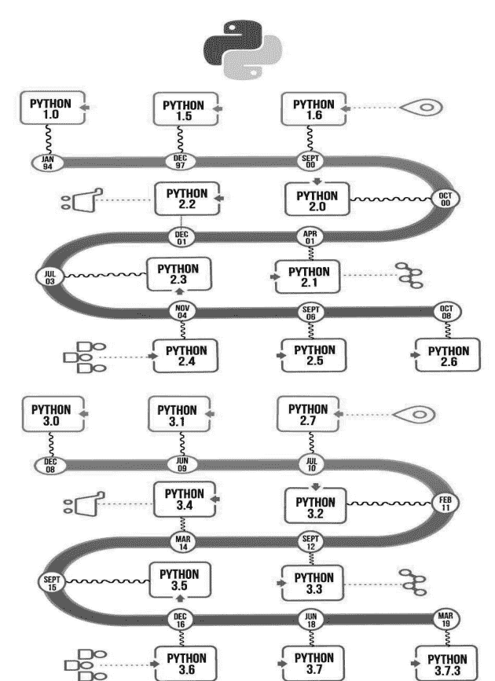
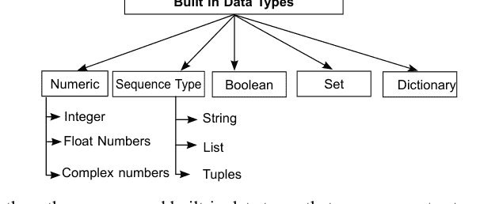
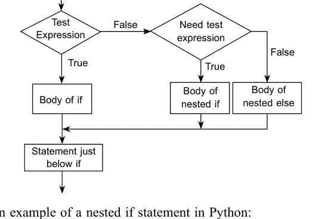

# PYTHON 编程

学习该语言的分步指南

C. K. Dhaliwal, Poonam Rana 和 T. P. S. Brar

# Python 编程

学习该语言的分步指南

# Taylor & Francis

Taylor & Francis 集团

http://taylorandfrancis.com

# Python 编程

学习该语言的分步指南

**C. K. Dhaliwal 博士**
助理教授
昌迪加尔管理学院
莫哈里，旁遮普邦

***

**Poonam Rana**
助理教授
昌迪加尔管理学院
莫哈里，旁遮普邦

***

**T. P. S. Brar 博士**
教授兼系主任
昌迪加尔学院集团
莫哈里，旁遮普邦

CRC 出版社是
Taylor & Francis 集团的印记，一家 informa 企业

首次出版于 2025 年
由 CRC 出版社出版
英国牛津郡阿宾登米尔顿公园公园广场 4 号，邮编 OX14 4RN

以及由 CRC 出版社出版
美国佛罗里达州博卡拉顿西北行政中心大道 2385 号，套房 320，邮编 33431

*CRC 出版社是 Informa UK Limited 的印记*

© 2025 Manakin Press Pvt. Ltd

C. K. Dhaliwal、Poonam Rana 和 T. P. S. Brar 博士作为本作品作者的权利已根据 1988 年版权、设计和专利法第 77 和 78 条得到确认。

保留所有权利。未经出版商书面许可，不得以任何形式或任何电子、机械或其他方式（无论是现在已知的还是今后发明的，包括影印和录制）或任何信息存储或检索系统，对本书的任何部分进行重印、复制或利用。

如需获得影印或以电子方式使用本作品材料的许可，请访问 www.copyright.com 或联系版权结算中心 (CCC)，地址：222 Rosewood Drive, Danvers, MA 01923，电话：978-750-8400。对于在 CCC 上不可用的作品，请联系 mpkbookspermissions@tandf.co.uk

*商标声明*：产品或公司名称可能是商标或注册商标，仅用于识别和解释，无意侵权。

印刷版不在南亚（印度、斯里兰卡、尼泊尔、孟加拉国、巴基斯坦或不丹）销售。

*英国图书馆编目出版数据*
本书的编目记录可从英国图书馆获取

ISBN: 9781032646558 (精装)
ISBN: 9781032669571 (平装)
ISBN: 9781032691053 (电子书)

DOI: 10.4324/9781032691053

由德里 Manakin Press 使用 Times New Roman 字体排版

## 本书结构

**第 1 章** 这是一个介绍性章节，概述了 Python，涵盖其历史、特性、应用和安装过程。它强调了 Python 的动态、高级和面向对象的语言特性以及跨平台兼容性。本章强调了 Python 在 Web 开发、数据科学和机器学习中的应用。它还解释了 Python 交互式帮助，并演示了如何在不同平台上安装和执行 Python。此外，本章还介绍了 Python 与其他编程语言的区别。

**第 2 章** 本章介绍了 Python 编程语言的基础知识。它涵盖了关键字和标识符，解释了它们的区别以及如何正确使用它们。然后，本章转向 Python 语句，并演示如何使用它们创建简单的程序。它强调了文档和缩进在 Python 编程中的重要性。本章涵盖了 Python 中的变量及其声明，包括变量命名规则。它还涵盖了 Python 中的不同数据类型，如数字、字符串、列表和元组，以及如何使用它们的示例。

**第 3 章** 本章涵盖了 Python 运算符，包括算术、关系、逻辑、位、赋值和身份运算符。它还解释了运算符的优先级和结合性，这决定了它们的求值顺序。本章演示了如何使用表达式（操作数和运算符的组合）来执行计算和操作数据。

**第 4 章** 本章涵盖了 Python 中的条件语句，包括 if、if-else 和 if-elif-if 语句。它还涵盖了 Python 中的循环，包括 while、for 和无限循环，以及如何使用它们的示例。此外，本章还介绍了 Python 循环中 break、continue 和 pass 语句的使用，这些语句用于改变程序中的控制流。

**第 5 章** 本章涵盖了 Python 中的原生数据类型，包括数字、列表、元组、集合、字典和字符串。它提供了每种数据类型的示例和用例。本章强调了可变和不可变数据类型之间的区别以及如何处理它们。此外，它还涵盖了如何操作和处理数据类型，包括切片和索引。

**第 6 章** 本章涵盖了 Python 函数，包括 Python 中的函数类型，如内置函数、用户定义函数和匿名函数。它讨论了使用函数的优点，如代码可重用性、模块化和更易于调试。本章还涵盖了按值传递和按引用传递之间的区别，并演示了递归，即函数调用自身的能力。

**第 7 章** 本章涵盖了 Python 模块，即包含 Python 定义和语句的文件。它演示了如何创建模块以及如何将其导入另一个 Python 程序。此外，本章还涵盖了标准模块（Python 自带的内置模块）和 Python 包（包含模块的目录）。它强调了如何使用和安装标准模块，以及如何创建和安装 Python 包。

**第 8 章** 本章涵盖了 Python 异常，即程序执行期间发生的错误。它解释了 Python 中不同类型的内置异常，如 ZeroDivisionError 和 TypeError。本章演示了如何使用 try-except 块处理异常，以及如何引发和捕获用户定义的异常。它还提供了异常处理的示例，以及如何在 try-except 块中使用 else 和 finally 子句。

**第 9 章** 本章涵盖了 Python 中的文件操作，包括如何使用文件方法（如 read() 和 write()）创建、打开、读取、写入和关闭文件。本章还涵盖了重命名和删除文件，以及如何使用 os 模块在 Python 中创建和导航目录。它提供了如何使用文件方法以及如何处理文件异常的示例。

**第 10 章** 本章涵盖了 Python 中的类设计，类是创建具有相似属性和行为的对象的模板。它解释了如何从类创建对象、如何访问对象属性以及如何使用内置类属性（如 `__name__` 和 `__doc__`）。本章还涵盖了 Python 中的垃圾回收，即释放程序不再使用的内存的过程。它提供了如何在 Python 中设计和使用类的示例。

**第 11 章** 本章涵盖了 Python 中的继承，即从现有类创建新类的能力。它解释了 Python 中不同类型的继承，包括单继承、多继承和多级继承。本章还涵盖了 Python 中的方法重写，即在子类中重新定义方法的能力。此外，本章讨论了 Python 中的特殊函数，即在某些情况下调用的预定义方法，如 `__init__` 和 `__str__`。它提供了如何在 Python 中使用继承和特殊函数的示例。

**第 12 章** 本章涵盖了 Python 中的运算符重载，即在类中重新定义运算符行为的能力。它解释了如何在 Python 中重载 `+` 和 `-` 运算符，以及位运算符和关系运算符。本章提供了如何使用运算符重载来自定义 Python 中运算符行为的示例。

附录 I 提供了 Python 标准模块列表及其描述。

书末提供了参考文献供读者查阅。

作者

## 详细目录

1.  Python 语言简介 1–24

- 1.1 编程语言 2
- 1.2 Python 语言的历史 3
- 1.3 Python 编程语言的起源 5
- 1.4 Python 的特性 5
- 1.5 Python 的局限性 6
- 1.6 Python 的主要应用 7
- 1.7 获取 Python 8
- 1.8 安装 Python 8
  - 1.8.1 Unix 和 Linux 安装 9
  - 1.8.2 Windows 安装 9
  - 1.8.3 Macintosh 安装 10
- 1.9 设置路径 10
  - 1.9.1 在 Unix/Linux 上设置路径 11
  - 1.9.2 在 Windows 上设置路径 11
- 1.10 Python 环境变量 11
- 1.11 运行 Python 12
  - 1.11.1 交互式解释器 13
  - 1.11.2 从命令行运行脚本 13
  - 1.11.3 集成开发环境 14
- 1.12 第一个 Python 程序 14
  - 1.12.1 交互模式编程 15
  - 1.12.2 脚本模式编程 16
- 1.13 Python 的交互式帮助 16
  - 1.13.1 通过网页浏览器获取 Python 帮助 17
- 1.14 Python 与其他语言的区别 17
  - 1.14.1 C 与 Python 的区别 18
  - 1.14.2 C++ 与 Python 的区别 19
  - 1.14.3 Java 与 Python 的区别 21
- 1.15 总结 22
- 复习题 22

## 2. Python 数据类型与输入输出

- 2.1 关键字 25
- 2.2 标识符 27
- 2.3 Python 语句 28
- 2.4 缩进 29
- 2.5 Python 文档 30
  - 2.5.1 单行注释 30
  - 2.5.2 多行注释 30
- 2.6 文档字符串 31
- 2.7 变量 32
  - 2.7.1 变量赋值 33
  - 2.7.2 Python 中的变量类型 33
- 2.8 多重赋值 34
- 2.9 Python 数据类型 36
  - 2.9.1 数值数据类型 37
    - 2.9.1.1 整数 37
    - 2.9.1.2 浮点数 38
    - 2.9.1.3 复数 39
  - 2.9.2 字符串 40
    - 2.9.2.1 字符串索引：40
    - 2.9.2.2 负索引：41
    - 2.9.2.3 切片 41
  - 2.9.3 布尔值 42
  - 2.9.4 列表 42
  - 2.9.5 元组 43
  - 2.9.6 集合 44
  - 2.7.8 字典 46
- 2.10 数据类型转换 48
  - 2.10.1 Python 中的隐式类型转换 49
  - 2.10.2 Python 中的显式类型转换 49
- 2.11 输入与输出 50
- 2.12 导入 51
- 2.13 总结 51
- 复习题 52

## 3. 运算符与表达式

- 3.1 运算符 53
  - 3.1.1 算术运算符 54
  - 3.1.2 比较运算符 56
  - 3.1.3 赋值运算符 58
  - 3.1.4 逻辑运算符 59
  - 3.1.5 位运算符 61
  - 3.1.6 特殊运算符 63
    - 3.1.6.1 身份运算符 63
    - 3.1.6.2 成员运算符 64
- 3.2 表达式 65
  - 3.2.1 Python 运算符优先级 66
  - 3.2.2 结合性 67
  - 3.2.3 非结合运算符 68
- 3.3 总结 68
- 复习题 68

## 4. 控制结构 71–92

- 4.1 决策语句 72
  - 4.1.1 Python if 语句 72
  - 4.1.2 Python if-else 语句 73
  - 4.1.3 Python if-elif-else 75
  - 4.1.4 Python 嵌套 if 语句 77
- 4.2 Python 循环 78
  - 4.2.1 循环类型 79
  - 4.2.2 Python While 循环 79
  - 4.2.3 无限循环 81
  - 4.2.4 在 While 循环中使用 else 81
  - 4.2.5 Python for 循环 82
  - 4.2.6 range() 函数 84
  - 4.2.7 带 else 的 for 循环 85
  - 4.2.8 嵌套循环 86
- 4.3 Python 控制语句 87
  - 4.3.1 Python Break 语句 87
  - 4.3.2 Python Continue 语句 89
  - 4.3.3 Python Pass 语句 90
- 4.4 总结 90
- 复习题 91

## 5. Python 原生数据类型 93–142

- 5.1 数字 94
  - 5.1.1 数字类型转换 94
  - 5.1.2 Python 数学函数 95
  - 5.1.3 Python 三角函数 97
  - 5.1.4 Python 随机数函数 99
  - 5.1.5 Python 数学常量 100
- 5.2 Python 列表 101
  - 5.2.1 创建列表 101
  - 5.2.2 遍历列表 101
    - 5.2.2.1 索引 102
    - 5.2.2.2 遍历嵌套列表 103
    - 5.2.2.3 负索引 104
    - 5.2.2.4 切片 105
  - 5.2.3 更改或添加列表元素 105
  - 5.2.4 列表方法 106
  - 5.2.5 列表函数 107
  - 5.2.6 列表推导式 108
  - 5.2.7 列表成员测试 108
- 5.3 Python 元组 109
  - 5.3.1 创建元组 110
  - 5.3.2 解包元组 111
  - 5.3.3 遍历元组中的元素 111
    - 5.3.3.1 索引 112
    - 5.3.3.2 负索引 113
    - 5.3.3.3 元组切片 113
    - 5.3.3.4 更改/更新元组 114
    - 5.3.3.5 删除元组 115
    - 5.3.3.6 Python 元组方法 115
    - 5.3.3.7 Python 元组函数 116
    - 5.3.3.8 元组的优点 116
- 5.4 Python 集合 117
  - 5.4.1 创建集合 118
  - 5.4.2 更改/添加集合元素 118
  - 5.4.3 从集合中移除元素 119
  - 5.4.4 Python 集合操作 119
    - 5.4.4.1 集合并集 120
    - 5.4.4.2 集合交集 120
    - 5.4.4.3 集合差集 120
    - 5.4.4.4 集合对称差集 121
  - 5.4.5 Python 集合方法 122
  - 5.4.6 in 运算符 123
  - 5.4.7 Python 集合函数 123
  - 5.4.8 冻结集合 124
- 5.5 Python 字典 125
  - 5.5.1 创建字典 125
  - 5.5.2 访问字典 125
  - 5.5.3 更新字典 126
  - 5.5.4 移除或删除字典元素 127
  - 5.5.5 Python 字典方法 127
  - 5.5.6 Python 字典成员测试 128
  - 5.5.7 Python 字典函数 129
- 5.6 Python 字符串 130
  - 5.6.1 在 Python 中创建字符串 131
  - 5.6.2 访问字符串字符 132
  - 5.6.3 更改或删除字符串字符 133
  - 5.6.4 Python 字符串操作 135
    - 5.6.4.1 连接 136
    - 5.6.4.2 迭代与成员测试 137
  - 5.6.5 字符串格式化 138
  - 5.6.6 Python 字符串内置方法 139
- 5.7 总结 140
- 复习题 140

## 6. Python 函数 143–160

- 6.1 Python 函数 143
- 6.2 Python 的优点 144
- 6.3 函数类型 145
- 6.4 内置函数 145
- 6.5 Python 用户定义函数 146
  - 6.5.1 函数定义 147
  - 6.5.2 函数调用 147
  - 6.5.3 函数参数（形参）类型 148
    - 6.5.3.1 无参数函数 149
    - 6.5.3.2 必需参数函数 150
    - 6.5.3.3 任意长度参数函数 150
    - 6.5.3.4 基于关键字的参数函数 151
    - 6.5.3.5 默认参数函数 152
- 6.6 Python 匿名函数 153
  - 6.6.1 Lambda 形式的特性 154
- 6.7 按值传递与按引用传递 154
  - 6.7.1 按值传递 155
  - 6.7.2 按对象引用传递 156
- 6.8 递归 156
  - 6.8.1 递归的优点 157
  - 6.8.2 递归的缺点 158
- 6.9 变量的作用域和生命周期 158
- 6.10 总结 159
- 复习题 159

## 7. Python 模块 161–172

- 7.1 模块的必要性 162
- 7.2 模块定义 163
- 7.3 创建模块 163
- 7.4 在解释器中导入模块 164
- 7.5 在另一个脚本中导入模块 165
- 7.6 导入模块 165
- 7.7 模块的搜索路径 166
- 7.8 模块重载 167
- 7.9 dir() 函数 168
- 7.10 标准模块 168
- 7.11 Python 包 169
- 7.12 总结 170
- 复习题 171

## 8. 异常处理 173–182

- 8.1 异常 173
- 8.2 Python 内置异常 174
- 8.3 异常处理 175
  - 8.3.1 Try, Except, Else 和 Finally 176
  - 8.3.2 在 Python 中捕获特定异常 178
  - 8.3.3 try....finally 179
- 8.4 Python 用户定义异常 179
- 8.5 总结 181
- 复习题 181

## 9. Python 中的文件管理 183–196

- 9.1 文件操作 183
  - 9.1.1 打开文件 184
  - 9.1.2 文件模式 185
  - 9.1.3 文件对象属性 186
  - 9.1.4 文件编码 186
  - 9.1.5 关闭文件 187
- 9.2 write() 和 read() 方法 188
  - 9.2.1 写入文件 188
  - 9.2.2 从文件读取 188
- 9.3 Python 文件方法 189
- 9.4 tell() 和 seek() 方法 190
- 9.5 重命名和删除文件 190
  - 9.5.1 Rename() 方法 191
  - 9.5.2 Remove() 方法 191
- 9.6 Python 中的目录 192
  - 9.6.1 mkdir() 方法 192
  - 9.6.2 chdir() 方法 193
  - 9.6.3 getcwd() 方法 193
  - 9.6.4 rmdir() 方法 194
  - 9.6.5 listdir() 方法 194
- 9.7 Python 目录方法 194
- 9.8 总结 195
- 复习题 195

## 10. 类与对象 197–212

- 10.1 设计类 199
- 10.2 创建对象 200
  - 10.2.1 类变量 201
  - 10.2.2 实例变量 202
- 10.3 方法类型 203
- 10.4 Python 中的访问说明符 204
- 10.5 访问属性 205
- 10.6 类程序 206
  - 10.6.1 使用带输入的类 207
  - 10.6.2 带计算的类程序 208
- 10.7 编辑类属性 208
- 10.8 内置类属性 209
- 10.9 垃圾回收/销毁对象 211
- 10.10 总结 211
- 复习题 212

## 11. 继承 213–220

- 11.1 Python 单继承 214
- 11.2 Python 多继承 215
- 11.3 Python 多级继承 216
- 11.4 Python 中的方法重写 217
- 11.5 Python 中的特殊函数 218
- 11.6 总结 219
- 复习题 220

## 12. Python 运算符重载 221–226

- 12.1 在 Python 中重载 ‘+’ 运算符 221
- 12.2 在 Python 中重载 ‘-’ 运算符 222
- 12.3 重载位运算符 223
- 12.4 重载关系运算符 224
- 12.5 总结 225
- 复习题 225

## 附录 227-232

## 参考文献 233

# 1 Python 语言简介

**要点**

- Python 语言简介与历史
- Python 的特性
- Python 的应用
- Python 交互式帮助
- 安装与执行 Python
- Python 与其他语言的区别

我们可以看到，计算机在解决现实世界问题方面具有广泛的能力。这些问题可能简单如两个数相乘，也可能复杂如设计和发射航天飞机。假设一台机器能独立完成所有任务是错误的。任何解决方案未被定义的问题，计算机都无法解决。计算机无法解决任何答案未知的问题。计算机只是执行程序员提供给它的一组指令。如果计算机无法理解这些指令，就可能出现错误且无法解决。因此，通过向机器发出正确的指令来提出解决方案，是程序员的重大责任。

# 2 Python 编程：学习该语言的分步指南

### 1.1 编程语言

编程语言是一种形式化语言，用于指示计算机执行特定任务或一组任务。它提供了一套用于创建和操作代码的规则和语法，允许开发者编写可以在计算机上运行的程序和应用程序。

编程语言可以根据其目的和结构分为不同类型。一些常见的编程语言类型包括：

1.  **过程式语言：** 这些语言使用一系列步骤来解决问题或完成任务。例如 C、Fortran 和 Pascal。
2.  **面向对象语言：** 这些语言将问题建模为一组相互交互以完成任务的对象。例如 Java、Python 和 C++。
3.  **函数式语言：** 这些语言专注于表达式和函数的求值，将其视为数学方程。例如 Haskell、Lisp 和 ML。
4.  **脚本语言：** 这些语言用于自动化任务，例如 Web 开发，通常是解释执行而非编译执行。例如 JavaScript、PHP 和 Python。

当今使用的编程语言有很多，每种语言都有其优势和劣势，并且新的语言正在不断开发以满足技术行业不断变化的需求。

当今使用的一些最常见的编程语言包括：

1.  **Java：** Java 是一种面向对象的编程语言，广泛用于开发企业级应用程序、移动应用程序和 Web 应用程序。
2.  **Python：** Python 是一种高级编程语言，因其可读性、易用性和多功能性而广受欢迎。它通常用于 Web 开发、数据分析和人工智能。
3.  **JavaScript：** JavaScript 是一种脚本语言，用于开发 Web 应用程序和交互式前端界面。
4.  **C#：** C# 是一种面向对象的编程语言，通常用于开发 Windows 桌面应用程序、视频游戏和 Web 应用程序。
5.  **C++：** C++ 是一种高性能语言，用于开发操作系统、视频游戏和其他资源密集型应用程序。
6.  **PHP：** PHP 是一种服务器端脚本语言，用于开发动态 Web 应用程序和网站。
7.  **Ruby：** Ruby 是一种高级脚本语言，以其简单性和易用性而闻名。它通常用于 Web 开发和构建 Web 应用程序。

值得注意的是，编程语言的流行程度可能因行业趋势、新技术的兴起以及新用例的出现等因素而异。

### 1.2 Python 语言的历史

Python 是一种高级、解释型的编程语言，于 1991 年由其创建者 Guido van Rossum 首次发布。它被设计为易于读写，并强调代码的可读性和简洁性。“Python” 这个名字的起源来自 1970 年代的一个名为 “Monty Python's Flying Circus” 的电视节目。Guido van Rossum 是该节目的忠实粉丝，他以该节目命名了这种语言。

Python 最初是作为一个业余项目开发的，其第一个版本于 1991 年 2 月发布。该语言的设计具有清晰简洁的语法，允许开发者快速高效地编写代码。Python 的创建者还专注于使该语言易于阅读，这使其在初学者和专家中都很受欢迎。

以下是 Python 不同版本及其时间线的说明。

2000 年，Python 2.0 发布，包含了许多新功能，如垃圾回收、Unicode 支持和列表推导式。这个版本的 Python 在许多年里一直是主导版本，尽管自 2020 年起已正式弃用，但至今仍被广泛使用。

2008 年，Python 3.0 发布，这是对该语言的一次重大改进，引入了许多变化和新功能。最显著的变化之一是移除了对 Python 2.x 的向后兼容性，这使得开发者向新版本过渡变得更加困难。然而，Python 3.0 带来了许多改进和新功能，包括更好的 Unicode 支持、改进的 I/O 以及更高效的异常处理。



如今，Python 是世界上最流行的编程语言之一，广泛应用于各种领域，包括 Web 开发、数据分析、人工智能和科学计算。它是一种强大而灵活的语言，非常适合许多不同的任务，并且拥有一个庞大而活跃的开发者社区，他们持续致力于改进该语言并开发新的库和工具。

### 1.3 Python 编程语言的起源

Python 编程语言由 Guido van Rossum 在 1980 年代末创建，当时他正在荷兰一家名为国家数学与计算机科学研究所（CWI）的研究机构工作。Guido 的任务是创建一个易于学习和使用的 ABC 编程语言的后继者。他的目标是设计一种语法易于理解的语言，使开发者能够更高效地编写和维护代码。

### 1.4 Python 的特性

Python 是一种高级、解释型的编程语言，以其简单性、可读性和易用性而闻名。以下是 Python 的一些关键特性：

1.  **简单易学的语法：** Python 具有简单简洁的语法，使其易于阅读和编写。其代码易于理解，即使是初学者也是如此，这种简单性是 Python 如此受欢迎的原因之一。
2.  **解释型语言：** Python 是一种解释型语言，这意味着你不需要在运行代码之前对其进行编译。这使得开发和测试代码更快，因为你可以立即运行它并查看结果。
3.  **跨平台兼容性：** Python 代码可以在许多不同的平台上运行，包括 Windows、Linux 和 macOS。这是因为 Python 代码是解释执行的，并且解释器在所有这些平台上都可用。
4.  **大型标准库：** Python 附带了一个庞大而全面的标准库，为开发者提供了许多有用的函数和模块。这使得执行常见任务变得容易，例如读写文件、处理数据库和执行网络操作。
5.  **第三方模块和库：** Python 拥有一个庞大而活跃的开发者社区，他们创建和维护着许多有用的第三方模块和库。这些库提供了额外的功能，例如科学计算、数据分析、Web 开发和人工智能。

## 6 Python编程：学习这门语言的分步指南

6.  **面向对象编程支持：** Python支持面向对象编程，这使得开发者能够编写模块化、可重用且易于维护的代码。

7.  **动态类型：** Python是一种动态类型语言，这意味着变量的类型是在运行时确定的，而不是在编译时。这使其更加灵活，并允许开发者更快地编写代码。

8.  **高级抽象：** Python提供了许多高级抽象，例如列表推导式、lambda函数和装饰器，这使得编写简洁且富有表现力的代码变得更容易。

总的来说，Python是一种强大而灵活的编程语言，非常适合许多不同的任务，其特性使其易于学习和使用，即使是初学者也是如此。

### 1.5 Python的局限性

虽然Python是一种流行且强大的编程语言，但它也有一些开发者应该了解的局限性。以下是Python的一些主要局限性：

1.  **性能：** Python是一种解释型语言，这意味着它通常比C++或Java等编译型语言慢。在开发需要高性能或低延迟的应用程序时，例如实时系统或高事务量的Web应用程序，这可能成为一个限制。

2.  **全局解释器锁（GIL）：** GIL是一种确保一次只有一个线程执行Python字节码的机制。这可能会限制开发者利用多处理器或多核的能力，从而影响性能。

3.  **弱类型：** 虽然动态类型是Python的一个关键特性，但在某些情况下它也可能成为一个限制。没有类型检查，错误可能在运行时才被发现，而缺乏强类型使得推理代码和及早发现错误变得更加困难。

4.  **内存消耗：** Python以其高内存消耗而闻名，这在开发需要在低内存设备或受限环境中运行的应用程序时可能成为一个限制。

5.  **依赖和版本兼容性：** Python拥有一个庞大而活跃的开发者社区，他们创建和维护着许多有用的第三方模块和库。然而，这可能导致版本兼容性问题和依赖管理挑战。

6.  **移动开发：** 虽然Python可以用于开发移动应用程序，但它不像Java或Kotlin等其他语言那样适合移动开发。这是因为Android和iOS生态系统主要基于这些语言，并且它们为移动开发提供了更强大的支持。

值得注意的是，许多这些局限性可以通过使用最佳实践来缓解，例如优化代码、使用适当的库以及遵循良好的设计原则。尽管存在这些局限性，Python仍然是一种流行且用途广泛的语言，非常适合许多不同的应用。

### 1.6 Python的主要应用

Python是一种用途广泛的语言，可用于从Web开发到科学计算的许多不同应用。以下是Python的一些主要应用：

1.  **Web开发：** Python广泛用于Web开发，包括服务器端和客户端。流行的Web框架包括Django、Flask、Pyramid和Bottle。
2.  **数据分析和科学计算：** 得益于NumPy、Pandas、SciPy和Matplotlib等库，Python已成为数据分析和科学计算的热门语言。这些库为数值运算、数据操作、统计分析和数据可视化提供了支持。
3.  **机器学习和人工智能：** 得益于TensorFlow、Keras、PyTorch和Scikit-learn等库，Python在机器学习和人工智能领域被广泛使用。这些库为深度学习、神经网络、自然语言处理和其他AI应用提供了支持。
4.  **桌面应用程序：** 得益于PyQt、PyGTK和wxPython等库，Python可用于开发具有图形用户界面（GUI）的桌面应用程序。
5.  **游戏开发：** 得益于Pygame和Panda3D等库，Python在游戏开发领域的应用日益增多。
6.  **自动化和脚本编写：** 由于其简单的语法和广泛的库支持，Python是自动化和脚本编写任务的热门语言。
7.  **DevOps：** 得益于Fabric和Ansible等库，Python在DevOps中用于自动化、测试和部署。
8.  **教育：** 由于其简单的语法和易用性，Python是教授编程的热门语言。

总的来说，Python是一种用途广泛的语言，可用于许多不同的应用，其流行度和广泛的库支持使其成为许多领域开发者的宝贵工具。

### 1.7 获取Python

Python可以从官方网站免费下载，该网站提供了适用于Windows、macOS和Linux的安装程序。以下是获取Python的步骤：

1.  **访问Python网站：** 访问Python官方网站 https://www.python.org/，并点击页面顶部的“Downloads”链接。
2.  **选择你的操作系统：** 从可用选项列表中选择你的操作系统。你可以选择Windows、macOS以及各种Linux发行版。
3.  **选择你的Python版本：** Python有两个主要版本，Python 2和Python 3。虽然Python 2仍在使用，但它已不再积极开发，建议新用户使用Python 3。选择你想要安装的Python版本。
4.  **下载安装程序：** 选择操作系统和Python版本后，下载适用于你系统的安装程序。
5.  **运行安装程序：** 在你的计算机上运行安装程序，并按照屏幕上的说明完成安装过程。

安装过程完成后，你应该可以访问Python解释器和Python标准库。你也可以使用集成开发环境（IDE），如PyCharm、Spyder或Jupyter Notebook来编写和运行Python代码。

### 1.8 安装Python

Python是一种跨平台编程语言，提供了适用于多种操作系统的发行版。要安装Python，你可以从官方网站下载适用于你平台的二进制代码，并运行安装过程。如果二进制代码不适用于你的平台，你可以使用C编译器手动编译源代码。Python的安装过程可能因平台而异，具体说明可以在每个平台的官方网站上找到，例如Unix或Linux。

#### 1.8.1 Unix和Linux安装

以下是在Unix或Linux上安装Python的一般步骤：

1.  打开一个终端窗口。
2.  通过在终端中输入“python”或“python3”来检查你的系统是否已安装Python。如果Python已安装，将显示版本号。如果Python未安装，你将看到一条错误消息。
3.  如果Python未安装，你可以使用系统的包管理器进行安装。命令可能因你的发行版而异，但一些示例如下：
    -   Ubuntu/Debian: sudo apt-get install python3
    -   Red Hat/Fedora: sudo yum install python3
    -   Arch Linux: sudo pacman -S python
4.  安装完成后，你可以通过在终端中输入“python”或“python3”来验证Python是否已安装。
5.  （可选）你可以安装一个Python IDE或代码编辑器，以便更轻松地编写和运行Python代码。流行的选择包括PyCharm、Spyder、Visual Studio Code和Jupyter Notebook。

#### 1.8.2 Windows安装

以下是在Windows上安装Python的一般步骤：

1.  访问Python官方网站 https://www.python.org/downloads/，并下载适用于Windows的最新Python 3.x版本。
2.  下载安装程序后，运行可执行文件以开始安装过程。
3.  在安装向导中，选择“Add Python 3.x to PATH”，以便可以从命令行和其他应用程序访问Python。
4.  选择“Customize installation”选项，并确保选中“pip”。这是一个包管理器，允许你轻松安装第三方Python包。

#### 1.8.3 Macintosh 安装

以下是在 Macintosh 上安装 Python 的一般步骤：

1.  访问 Python 官方网站 https://www.python.org/downloads/，下载适用于 Mac 的最新版 Python 3.x。
2.  下载安装程序后，双击 .dmg 文件将其打开。
3.  双击 “Python.mpkg” 文件以开始安装过程。
4.  按照屏幕提示自定义安装设置，例如安装目录和任何您希望包含的附加组件。对于大多数用户来说，使用默认设置通常即可。
5.  安装完成后，您可以通过打开终端窗口并输入 “python3” 然后按回车键来验证 Python 是否已安装。这将启动 Python 解释器。
6.  （可选）您可以安装一个 Python IDE 或代码编辑器，以便更轻松地编写和运行 Python 代码。流行的选择包括 PyCharm、Spyder、Visual Studio Code 和 Jupyter Notebook。

### 1.9 设置路径

目录可以包含各种程序和可执行文件，这意味着 Windows、Unix/Linux 或 MAC 操作系统必须有一种方法来找到这些文件。为了定位可执行文件，操作系统提供了一个包含目录的搜索路径。这个搜索路径存储在一个环境变量中，该变量是一个命名字符串，包含可由命令 shell 和其他程序访问的信息。

#### 1.9.1 在 Unix/Linux 上设置路径

要在 Unix/Linux 上为 Python 设置 PATH，请按照以下步骤操作：

1.  打开一个终端窗口。
2.  输入 “nano ~/.bashrc” 以在 nano 文本编辑器中打开您的 Bash 配置文件。
3.  在文件末尾添加以下行，将 “3.9” 替换为您的 Python 版本：
    export PATH=”/usr/local/bin:/usr/bin:/bin:/usr/local/games:/usr/games:/usr/local/python3.9/bin”
4.  按 Ctrl + X，然后按 Y，再按 Enter 保存文件。
5.  输入 “source ~/.bashrc” 以将更改应用到当前终端会话。
6.  现在您可以在终端中的任何目录下运行 “python” 命令。

#### 1.9.2 在 Windows 上设置路径

要在 Windows 上为 Python 设置 PATH，请按照以下步骤操作：

1.  右键单击 “此电脑” 或 “我的电脑”，然后选择 “属性”。
2.  单击 “高级系统设置”。
3.  单击底部的 “环境变量” 按钮。
4.  在 “系统变量” 下，找到 “Path” 变量并单击 “编辑”。
5.  单击 “新建”，然后输入您的 Python 安装目录的路径（例如 C:\Python39）。
6.  单击 “确定” 关闭所有窗口。
7.  打开一个新的命令提示符窗口，输入 “python” 以验证 PATH 是否已正确设置。

### 1.10 Python 环境变量

Python 使用环境变量来存储配置设置和其他系统信息，这些信息可由您的代码访问。以下是一些常见的 Python 环境变量：

1.  **Path:** 此变量包含一个目录列表，操作系统在这些目录中搜索可执行文件，包括 Python 解释器。当您在命令提示符中输入 “python” 时，操作系统会在这些目录中查找 “python.exe” 文件。
2.  **Pythonpath:** 此变量包含一个目录列表，Python 在这些目录中查找模块和包。您可以将自己的目录添加到此列表中，以便您的 Python 代码可以使用您自己的模块和包。
3.  **Pythonhome:** 此变量指向您的 Python 安装的根目录。如果您将 Python 安装移动到其他目录，可以更新此变量以指向新位置。
4.  **Pythonstartup:** 此变量指向一个 Python 脚本，该脚本在每次启动 Python 解释器时执行。您可以使用此脚本定义您自己的 Python 环境，例如导入模块、定义函数或设置默认值。
5.  **Pythonioencoding:** 此变量设置输入和输出流的默认编码，例如 stdin、stdout 和 stderr。默认情况下，Python 使用系统的默认编码，但如果需要，您可以将其更改为不同的编码。

这些只是 Python 环境变量的一些示例。您可以使用 Python 中的 os 模块来访问和修改它们。

### 1.11 运行 Python

要运行 Python 代码，您首先需要在计算机上安装 Python。您可以从官方网站下载并安装最新版本的 Python：https://www.python.org/downloads/。安装 Python 后，您可以通过多种方式运行它：

1.  **使用 Python shell：** Python shell 是一个交互式环境，允许您逐行运行 Python 代码。要打开 Python shell，只需在终端或命令提示符中输入 “python”。
2.  **使用文本编辑器：** 您可以在文本编辑器中编写 Python 代码，将其保存为 .py 文件扩展名，然后通过在命令提示符中输入 “python filename.py” 来运行它。
3.  **使用集成开发环境 (IDE)：** IDE 提供了一个更高级的环境，用于编写、调试和运行 Python 代码。一些流行的 Python IDE 包括 PyCharm、Visual Studio Code 和 Spyder。

一旦您安装并设置了 Python，就可以开始编写和运行 Python 代码来执行各种任务和解决问题。

#### 1.11.1 交互式解释器

Python 中的交互式解释器是一个命令行界面，允许您输入 Python 命令并立即查看这些命令的结果。这是在将代码片段整合到更大的程序之前，尝试 Python 和测试代码片段的好方法。

要启动 Python 解释器，请打开终端或命令提示符，然后输入 python 并按回车键。这将启动交互式解释器，并显示 Python 版本号和命令提示符 (>>>)。

然后，您可以在提示符处输入 Python 命令并立即看到输出。例如，您可以输入 print(“Hello, World!”) 并按 Enter，解释器将立即显示输出 Hello, World!。

您可以通过在命令提示符处输入 exit() 或 quit() 并按 Enter 来退出交互式解释器。这将返回到终端或命令提示符。

#### 1.11.2 从命令行运行脚本

您可以通过在命令行中输入 python 后跟脚本文件的名称来运行 Python 脚本。以下是一个示例：

假设您有一个名为 hello.py 的脚本，其中包含以下代码：

```
print(“Hello, World!”)
```

要运行此脚本，请打开终端或命令提示符，并导航到 hello.py 所在的目录。然后，输入以下命令并按 Enter：

```
python hello.py
```

这将执行该脚本，您应该在终端或命令提示符中看到输出 Hello, World!。

您还可以通过在脚本名称后包含命令行参数来传递给 Python 脚本。例如，如果您有一个名为 add.py 的脚本，它接受两个数字作为参数并将它们相加，您可以使用以下命令运行它：

```
python add.py 2 3
```

这将使用参数 2 和 3 执行脚本，输出将是 5。

请注意，要从命令行运行 Python 脚本，您必须在计算机上安装 Python，并且 Python 可执行文件必须在系统的 PATH 变量中。

#### 1.11.3 集成开发环境

集成开发环境 (IDE) 是一个软件应用程序，为编写、测试和调试软件代码提供了一个全面的环境。Python 有许多流行的 IDE，提供语法高亮、代码补全、调试工具等功能。一些流行的 Python IDE 包括：

1.  **PyCharm:** PyCharm 是一个功能强大的全功能 Python IDE。它包括高级代码补全、调试工具以及对 Django 和 Flask 等 Web 开发框架的支持。
2.  **Visual Studio Code:** Visual Studio Code 是一个轻量级且多功能的 IDE，支持多种编程语言，包括 Python。它包括语法高亮、代码补全和调试工具等功能。
3.  **Spyder:** Spyder 是一个专门为 Python 科学计算和数据分析设计的 IDE。它包括变量资源管理器、数据查看器和绘图工具等功能。
4.  **IDLE:** IDLE 是一个简单轻量级的 IDE，随 Python 一起捆绑提供。它包括语法高亮和调试工具等基本功能。

还有许多其他适用于 Python 的 IDE，最适合您的 IDE 将取决于您的具体需求和偏好。您可以免费下载并安装大多数 Python IDE，它们适用于所有主要操作系统。

### 1.12 第一个 Python 程序

Python 是一种流行的高级编程语言，以其简单性、可读性和多功能性而闻名。它被广泛用于各种用途，包括网页开发、数据分析、机器学习等。

Python 如此受欢迎的原因之一是其语法设计易于读写。例如，Python 不使用花括号和分号来表示代码块和语句，而是使用空格和缩进。下面是一个简单的 Python 程序示例，它向控制台打印一条消息：

```
print("Hello, World!")
```

这个程序只是使用 `print()` 函数在控制台上显示消息 "Hello, World!"。你可以将这段代码保存到一个扩展名为 `.py` 的文件中，例如 `hello.py`，然后通过在命令行中输入 `python hello.py` 来执行它。

#### 1.12.1 交互模式编程

在 Python 中，你也可以在交互模式下运行程序，这允许你直接将代码输入到 Python 解释器中并立即看到输出。这是在将代码片段整合到更大的程序之前，进行 Python 实验和测试的好方法。

要启动 Python 的交互式解释器，请打开终端或命令提示符，输入 `python` 然后按回车键。这将启动解释器并显示 Python 版本号和一个命令提示符（`>>>`）。

然后你可以在提示符下输入 Python 命令并立即看到输出。例如，你可以输入 `print("Hello, World!")` 并按回车键，解释器将立即显示输出 `Hello, World!`。

在交互模式下，你也可以像在常规 Python 程序中一样定义变量、创建函数和导入模块。例如，你可以这样定义一个变量：

```
x = 5
```

然后在计算中使用它，像这样：

```
y = x * 2
print(y)
```

这将定义一个值为 5 的变量 `x`，然后定义一个值为 10 的变量 `y`（这是 `x` 乘以 2 的结果）。最后，它会将 `y` 的值打印到控制台。

你可以通过在命令提示符下输入 `exit()` 或 `quit()` 并按回车键来退出交互式解释器。这将返回到终端或命令提示符。

#### 1.12.2 脚本模式编程

除了在交互模式下运行 Python 代码，你还可以将代码写入文件并作为脚本运行。这是编写可以从命令行执行或计划自动运行的较大 Python 程序的常用方法。

要创建 Python 脚本，只需创建一个扩展名为 `.py` 的新文件，并使用文本编辑器或集成开发环境（IDE）在其中编写代码。例如，你可以创建一个名为 `hello.py` 的文件并编写以下代码：

```
print("Hello, World!")
```

要运行此脚本，你可以通过在命令行中输入 `python hello.py` 并按回车键来执行它。这将运行脚本并将消息 "Hello, World!" 打印到控制台。

在 Python 脚本中，你可以包含任何有效的 Python 代码，包括导入模块、定义函数以及使用循环和条件语句等控制结构。例如，你可以编写一个更复杂的脚本，询问用户的姓名然后向他们问好：

```
name = input("What is your name? ")
print("Hello, " + name + "!")
```

此脚本将使用 `input()` 函数提示用户输入姓名，然后使用字符串连接打印个性化的问候语。

总的来说，编写 Python 脚本是构建可在各种场景中使用的复杂程序的强大方式。通过一点练习，你可以使用 Python 来自动化重复任务、处理数据并构建复杂的应用程序。

### 1.13 Python 的交互式帮助

对于一个新程序员来说，这可能有点令人望而生畏。一旦程序员熟悉了编程术语，他就可以充分利用 Python 提供的内置帮助。Python 编程帮助可以通过以下方式获得：

- 交互模式帮助
- 通过网络浏览器在线获取帮助

#### 1.13.1 通过网络浏览器获取 Python 帮助

Python 拥有广泛的标准库，以及一个庞大而活跃的开发者社区，他们创建了许多第三方模块和库。因此，有许多在线资源可以帮助你学习 Python。

一个流行的资源是 Python 文档，可以在 Python 官方网站（https://www.python.org/）上通过网络浏览器在线获取。该文档包括详细的语言参考，以及关于 Python 入门、构建 Web 应用程序、处理数据等方面的教程和指南。

除了官方的 Python 文档，还有许多在线论坛和社区，你可以在那里提问并获得 Python 帮助。例如，Python 子版块（https://www.reddit.com/r/Python/）是一个受欢迎的论坛，Python 用户可以在那里提问、分享代码片段并从其他开发者那里获得建议。

还有许多第三方网站和服务提供 Python 教程、课程和其他学习资源。例如，Codecademy（https://www.codecademy.com/learn/learn-python）为初学者提供全面的 Python 课程，而 Udemy（https://www.udemy.com/topic/python/）则为各级学习者提供广泛的 Python 课程。

总的来说，有许多在线资源可以帮助你学习 Python，最好的方法将取决于你的具体需求和学习风格。无论你是初学者还是经验丰富的开发者，都有许多方法可以学习和提升你的 Python 技能。

### 1.14 Python 与其他语言的区别

虽然 Python 语言与 C、C++ 和 Java 有一些相似之处，但也存在明显的差异，使其与这些语言区分开来。

#### 1.14.1 C 与 Python 的区别

C 和 Python 都是流行的编程语言，但它们在几个方面有所不同。以下是 C 和 Python 之间的一些主要区别：

1.  **语法：** C 的语法比 Python 更复杂。C 需要更多的代码来完成与 Python 相同的任务，并且它对格式和组织有更严格的规则。
2.  **编译型 vs. 解释型：** C 是一种编译型语言，这意味着代码在执行之前由编译器翻译成机器码。而 Python 是一种解释型语言，这意味着代码由解释器直接执行。
3.  **类型系统：** C 是一种静态类型语言，这意味着每个变量的类型在代码中被显式声明。而 Python 是一种动态类型语言，这意味着每个变量的类型在运行时确定。
4.  **内存管理：** C 需要手动内存管理，这意味着程序员必须显式地为变量和数据结构分配和释放内存。而 Python 具有自动内存管理，这意味着解释器负责内存的分配和释放。
5.  **应用领域：** C 通常用于底层系统编程，如操作系统、设备驱动程序和嵌入式系统，以及高性能计算和图形编程。Python 通常用于 Web 开发、数据分析、科学计算和自动化。
6.  **面向对象编程：** 虽然 C 支持面向对象编程（OOP），但它不是像 Python 那样的纯 OOP 语言。Python 旨在支持封装、继承和多态等 OOP 概念，使得为大型项目编写和组织代码更容易。
7.  **平台独立性：** Python 比 C 更具平台独立性，这意味着 Python 代码可以在各种操作系统和硬件上运行而无需修改。而 C 代码可能需要为不同的平台或架构重新编译。
8.  **库和包：** Python 拥有庞大的内置模块和第三方包库，可以轻松执行从网络爬虫到机器学习的各种任务。C 的标准库较小，更依赖于第三方库。

#### 1.14.2 C++ 与 Python 的区别

C++ 和 Python 都是流行的编程语言，但它们在几个方面有所不同。以下是 C++ 和 Python 之间的一些主要区别：

- 1. **语法：** C++ 的语法比 Python 更复杂。C++ 需要更多的代码来完成与 Python 相同的任务，并且它对格式和组织有更严格的规则。
- 2. **编译型 vs. 解释型：** C++ 是一种编译型语言，这意味着代码在执行前需要由编译器翻译成机器码。而 Python 是一种解释型语言，这意味着代码由解释器直接执行。
- 3. **类型系统：** C++ 是一种静态类型语言，这意味着每个变量的类型必须在代码中显式声明。而 Python 是一种动态类型语言，这意味着每个变量的类型在运行时确定。
- 4. **内存管理：** C++ 需要手动内存管理，这意味着程序员必须为变量和数据结构显式地分配和释放内存。而 Python 具有自动内存管理，这意味着解释器负责内存的分配和释放。
- 5. **面向对象编程：** C++ 和 Python 都支持面向对象编程，但 C++ 通常被认为是一种“纯粹的” OOP 语言，这意味着所有代码都组织成对象和类。而 Python 也允许更多的过程式和函数式编程风格。
- 6. **应用领域：** C++ 通常用于系统编程，如操作系统和设备驱动程序，以及高性能计算、游戏和图形编程。Python 通常用于 Web 开发、数据分析、科学计算和自动化。
- 7. **库和包：** Python 拥有庞大的内置模块和第三方包库，可以轻松执行从网络爬虫到机器学习的各种任务。C++ 的标准库较小，第三方包也较少，这使得为常见的编程问题找到预构建的解决方案更加困难。
- 8. **速度：** C++ 通常比 Python 更快，因为它是一种编译型语言，这意味着代码在执行前会被翻译成机器码。而 Python 是一种解释型语言，这意味着代码由解释器直接执行，这可能会更慢。然而，Python 有一些用 C 或 C++ 实现的库可以提升其性能。
- 9. **学习曲线：** C++ 通常被认为比 Python 更难学习和使用。C++ 的学习曲线陡峭，因为它是一种更复杂的语言，具有更多的功能和更严格的语法规则。而 Python 的语法更简单，功能集更小，使其更容易学习和使用。
- 10. **类型安全：** C++ 是一种类型安全的语言，这意味着编译器在编译时检查类型错误。Python 不是类型安全的，这意味着类型错误可能在运行时发生。
- 11. **多线程：** C++ 内置支持多线程，允许程序并发执行多个代码线程。Python 也支持多线程，但它有一个全局解释器锁，在某些情况下可能会限制多线程的性能提升。
- 12. **可移植性：** Python 比 C++ 更具可移植性，因为它是一种高级语言，可以在任何平台上解释执行。C++ 代码必须在它将运行的特定平台上编译，这可能会降低其可移植性。
- 13. **内存安全：** C++ 是一种为程序员提供手动管理内存能力的语言。虽然这给了程序员更多关于内存使用的控制权，但也意味着程序可能容易受到与内存相关的错误的影响，例如缓冲区溢出和内存泄漏。Python 具有内置的垃圾回收机制，这意味着它自动管理内存，使其不易受到与内存相关的错误的影响。

这些只是 C++ 和 Python 之间众多区别中的一部分。虽然这两种语言都被广泛使用且功能强大，但它们各有优缺点，语言的选择将取决于项目的具体需求和程序员的偏好。

#### 1.14.3 Java 与 Python 的区别

Java 和 Python 都是流行的编程语言，但它们在几个方面有所不同。以下是 Java 和 Python 之间的一些主要区别：

- 1. **语法：** Java 的语法比 Python 更复杂。Java 需要更多的代码来完成与 Python 相同的任务，并且它对格式和组织有更严格的规则。
- 2. **编译型 vs. 解释型：** Java 是一种编译型语言，这意味着代码在执行前需要由编译器翻译成字节码。而 Python 是一种解释型语言，这意味着代码由解释器直接执行。
- 3. **类型系统：** Java 是一种静态类型语言，这意味着每个变量的类型必须在代码中显式声明。而 Python 是一种动态类型语言，这意味着每个变量的类型在运行时确定。
- 4. **内存管理：** Java 具有自动内存管理，这意味着 JVM 负责内存的分配和释放。Python 也具有自动内存管理，这意味着解释器负责内存的分配和释放。
- 5. **面向对象编程：** Java 和 Python 都支持面向对象编程，并且它们具有相似的概念，如继承、多态和封装。然而，Java 通常被认为是一种“纯粹的” OOP 语言，这意味着所有代码都组织成对象和类。而 Python 也允许更多的过程式和函数式编程风格。
- 6. **应用领域：** Java 通常用于 Web 开发、桌面应用程序开发和移动应用程序开发。Python 通常用于 Web 开发、科学计算、数据分析、机器学习和自动化。
- 7. **性能：** Java 通常比 Python 更快，因为它是一种编译型语言，并且 JVM 可以优化字节码以提高性能。而 Python 是一种解释型语言，这意味着代码由解释器直接执行，这可能会更慢。然而，Python 有一些用 C 或 C++ 实现的库可以提升其性能。
- 8. **垃圾回收：** Java 比 Python 拥有更先进的垃圾回收器，这意味着它可以更高效地处理内存。
- 9. **学习曲线：** Java 通常被认为比 Python 更难学习和使用。Java 的学习曲线陡峭，因为它是一种更复杂的语言，具有更多的功能和更严格的语法规则。而 Python 的语法更简单，功能集更小，使其更容易学习和使用。

这些只是 Java 和 Python 之间众多区别中的一部分。虽然这两种语言都被广泛使用且功能强大，但它们各有优缺点，语言的选择将取决于项目的具体需求和程序员的偏好。

### 1.15 总结

在本章中，我们学习了编程语言及其需求。然后我们简要介绍了 Python 语言的起源和历史，以及它的特点和局限性。我们详细探讨了 Python 语言与其他现有和著名的编程语言（如 C、C++ 和 Java）的不同之处。此外，还详细讨论了 Python 语言的设置和安装以及一个简单的第一个程序。

## 复习题

- 1. 什么是 Python？是什么让它成为一种流行的编程语言？
- 2. Python 与其他编程语言有何不同？

## 3. Python编程语言的历史是什么，是谁开发的？

4. 在不同操作系统上安装Python的步骤是什么？

5. 使用Python进行软件开发有哪些好处？

6. Python的关键特性是什么，它们如何促成了其流行度？

7. Python社区如何支持并促进该语言的发展？

8. 有哪些使用Python构建的流行应用程序？

9. Python与其他编程语言（如Java、C++和Ruby）相比如何？

10. 选择编程语言时最重要的考虑因素是什么，Python在这些方面表现如何？

11. 什么是Python，它如何被使用？

12. Python是一种高级编程语言，用于各种应用，包括Web开发、数据分析、人工智能等。

13. Python是一种在世界热带地区发现的爬行动物。

14. Python编程语言的一些关键特性是什么？

- a. Python拥有简单易学的语法。
- b. Python是一种解释型语言，这意味着代码由解释器直接执行，无需编译。

# Taylor & Francis

Taylor & Francis Group

http://taylorandfrancis.com

# 2 Python数据类型与输入输出

### 重点内容

- 关键字和标识符
- Python语句
- 文档和缩进
- Python变量
- Python数据类型
- 输入和输出
- 导入

Python有几种内置数据类型，包括字符串、整数和列表。这些数据类型可用于在程序中存储和操作不同类型的信息。除了这些基本数据类型外，Python还有高级数据类型，如字典和集合。

Python还有一个用于输入/输出操作的内置模块，允许程序从外部源（如文件和流）读取和写入。该模块名为`io`，提供了多个执行这些操作的函数，例如`open()`、`read()`和`write()`。

## 2.1 关键字

在Python中，关键字是在Python语言中具有特殊含义的单词。关键字用于定义Python语言的语法和结构，它们不能用作Python代码中的标识符（即变量名、函数名等）。

| 关键字 | 描述 |
| :--- | :--- |
| and | 逻辑运算符，如果两个操作数都为True则返回True，否则返回False。 |
| as | 用于在导入或重命名时为模块或变量创建别名。 |
| assert | 用于检查给定条件是否为True，如果为False则引发异常。 |
| async | 用于定义异步函数或上下文管理器。 |
| await | 在异步函数内部使用，用于等待异步操作完成。 |
| break | 用于在循环条件满足之前提前退出循环。 |
| class | 用于定义一个新类。 |
| continue | 用于跳过循环的当前迭代并继续下一次迭代。 |
| def | 用于定义一个新函数。 |
| del | 用于删除对象或集合中的项目。 |
| elif | “else if”的缩写，在条件语句中用于检查附加条件。 |
| else | 在条件语句中用作如果其他条件都不满足时的通用选项。 |
| except | 用于处理在try块中引发的异常。 |
| False | 表示非真的布尔值。 |
| finally | 在try-except块中使用，用于指定无论是否引发异常都将执行的代码块。 |
| for | 用于遍历项目序列，例如列表或元组。 |
| from | 在import语句中使用，用于从模块导入特定项目。 |
| global | 用于指示变量是全局变量，可从代码中的任何位置访问。 |
| if | 用于开始一个条件语句。 |
| import | 用于导入模块或模块中的特定项目。 |
| in | 用于检查项目是否在序列中，例如列表或元组。 |
| is | 用于检查两个变量是否引用同一个对象。 |
| lambda | 用于创建小型匿名函数。 |
| None | 表示值缺失或空值的特殊值。 |
| nonlocal | 用于指示变量是非局部于当前函数的，意味着它是在外部函数中定义的。 |
| not | 对布尔值取反的逻辑运算符。 |
| or | 逻辑运算符，如果至少一个操作数为True则返回True，否则返回False。 |
| pass | 用作不执行任何操作的代码块的占位符。 |
| raise | 用于引发异常。 |
| return | 用于退出函数并向调用代码返回一个值。 |
| True | 表示真的布尔值。 |
| try | 用于指定可能引发异常的代码块。 |
| while | 用于开始一个只要循环条件为True就会持续执行的循环。 |
| with | 用于创建上下文管理器，用于自动设置和拆卸资源。 |
| yield | 在函数中使用 |

## 2.2 标识符

在Python中，标识符是用于标识变量、函数、类、模块或其他对象的名称。Python中命名标识符有一些规则和约定：

- 标识符必须以字母或下划线（_）开头。
- 标识符不能以数字开头。
- 标识符只能包含字母、数字和下划线。
- 标识符区分大小写，因此`myVariable`和`myvariable`被视为不同的标识符。
- Python保留了一组不能用作标识符的关键字。例如`if`、`else`、`for`、`class`等。
- 标识符应具有描述性和意义，根据项目的风格指南使用驼峰命名法（camelCase）或蛇形命名法（snake_case）。

**Python中有效标识符的示例：**

- `myVariable`
- `_privateVariable`
- `counter`
- `calculate_average`
- `MyClass`

**Python中无效标识符的示例：**

- `1stVariable`（以数字开头）
- `my-variable`（包含连字符）
- `if`（保留关键字）
- `True`（保留关键字）
- `class`（保留关键字）

## 2.3 Python语句

在Python中，语句是执行特定操作或指令的单行代码。Python中有几种类型的语句，包括：

- **表达式：** 这些是求值为一个值的语句，例如数学运算或函数调用。示例包括“2 + 2”或“print('Hello, world!')”。
- **赋值语句：** 这些是将值赋给变量的语句。示例包括“x = 2”或“name = 'John'”。
- **控制流语句：** 这些是控制程序执行流程的语句，例如条件语句（if/else）和循环（for/while）。
- **函数和类定义：** 这些分别是定义函数或类的语句。示例包括“def my_function():”和“class MyClass:”。
- **导入语句：** 这些语句用于在Python中导入模块或包。示例包括“import os”或“from math import sqrt”。
- **Pass语句**：pass语句是一个空操作。执行时什么也不会发生。当语法上需要一条语句但不需要执行任何代码时，它作为占位符很有用。

## 2.4 缩进

Python中使用缩进来表示代码块。标准缩进是四个空格，大多数Python代码都遵循这个约定。例如

### 代码 2.1 Python中缩进的示例

```python
def foo():
    # This line is indented by four spaces
    x = 5
    if x > 0:
        # This line is also indented by four spaces
        print("x is positive")
    # This line is not indented, so it's not part of the if block
```

保持缩进的一致性很重要，因为代码的含义可能会根据缩进级别而改变。例如

### 代码 2.2 Python中缩进的示例

```python
x = 5
if x > 0:
    print("x is positive")
print("This line is not indented, so it's not part of the if block")
```

这段代码将打印两条消息，因为第二条print语句没有缩进，所以它不属于if块。

### 代码 2.3 Python中缩进的示例

```python
x = 5
if x > 0:
    print("x is positive")
    print("This line is indented, so it is part of the if block")
print("This line is not indented, so it's not part of the if block")
```

这段代码只会打印第一条消息，因为第二条打印语句被缩进了，所以它属于 if 代码块的一部分。

## 2.5 Python 文档

在 Python 中，文档通常以注释的形式包含在源代码中。这些注释以 `#` 符号开头，该行中 `#` 之后的所有内容都被视为注释。例如：

代码 2.4 使用 # 演示 Python 中的文档

```
# 这是一条注释
x = 5  # 这也是一条注释
```

### 2.5.1 单行注释

在 Python 中，通过在行首放置 `#` 符号，后跟注释文本来创建单行注释。例如：

代码 2.5 演示 Python 中的单行文档

```
# 这是 Python 中的一条单行注释
x = 10  # 这也是一条单行注释
```

`#` 符号后的文本会被 Python 解释器忽略，仅为阅读代码的人提供便利。单行注释通常用于为代码添加简要说明或澄清。

代码 2.6 演示 Python 中的单行文档

```
# 计算矩形的面积
width = 3
height = 12
area = width * height
```

在此示例中，单行注释为后续代码提供了一些上下文，解释了变量的用途以及最后一行代码的作用。

### 2.5.2 多行注释

在 Python 中，可以使用三引号（单引号 `'''` 或双引号 `"""`）创建多行注释。注释可以跨越多行，通常用于较长的说明和文档字符串。以下是一个示例：

代码 2.7 演示 Python 中的双引号

```
"""
这是一个多行
注释。它可以跨越
多行。
"""
```

你也可以使用三个单引号来创建多行注释：

代码 2.8 演示 Python 中的单引号

```
'''
这也是一个
多行注释。它
也可以跨越多行。
'''
```

三引号（单引号或双引号）都可以用来在 Python 中创建多行注释。使用三引号的优点是，即使注释包含多行相同类型的引号字符，你也可以创建多行注释。

## 2.6 文档字符串

在 Python 中，文档字符串是一个字符串字面量，它作为模块、函数、类或方法定义中的第一条语句出现。它用于为代码提供文档，并且可以使用内置的 `help()` 函数或 `__doc__` 属性来访问。文档字符串用三引号（单引号或双引号）括起来，通常用纯文本编写，但也可以包含 markdown 格式。

在你编写的任何函数或类中包含文档字符串是一个好习惯，因为它使你的代码更具可读性和用户友好性。

以下是一个带有文档字符串的简单 Python 函数示例：

代码 2.9 演示 Python 中的文档字符串

```
def add(a, b):
    """
    此函数接受两个数字作为输入并返回它们的和。

    参数：
    a (int)：第一个数字
    b (int)：第二个数字

    返回值：
    int：a 和 b 的和
    """
    return a + b
```

在此示例中，函数 `add` 接受两个数字作为输入，将它们相加并返回结果。文档字符串简要描述了函数的功能，并解释了参数和返回值。
要访问此函数的文档字符串，你可以像这样使用 `help()` 函数：

```
help(add)
```

你也可以使用 `__doc__` 属性以编程方式访问文档字符串：

```
print(add.__doc__)
```

这将输出与文档字符串相同的字符串。
通过提供清晰简洁的文档，其他开发人员可以轻松理解函数的工作原理、参数是什么以及调用函数时期望得到什么。这在处理有多个贡献者的大型项目时可以节省大量时间和精力。

## 2.7 变量

Python 变量是用于存储值的保留内存位置。换句话说，Python 程序中的变量将数据提供给计算机进行处理。Python 中的每个值都有一个数据类型。Python 中不同的数据类型包括数字、列表、元组、字符串、字典等。变量可以用任何名称甚至字母（如 a、aa、abc 等）来声明。

### 2.7.1 变量赋值

将变量视为附加到特定对象的名称。在 Python 中，变量不需要像许多其他编程语言那样预先声明或定义。要创建变量，只需为其赋值，然后开始使用它。赋值使用单个等号 (`=`) 完成：

```
n = 300
```

这被读取或解释为“n 被赋值为 300”。一旦完成，n 就可以在语句或表达式中使用，其值将被替换：

```
print(n)
300
```

就像在 REPL 会话中可以直接从解释器提示符显示字面值而无需使用 `print()` 一样，变量也可以：

```
n
300
```

稍后，如果你更改 n 的值并再次使用它，将替换为新值：

```
n = 1000
print(n)
1000
```

Python 还允许链式赋值，这使得同时将相同的值赋给多个变量成为可能：

代码 2.10 演示 Python 中的变量

```
a = b = c = 300
print(a, b, c)
300 300 300
```

### 2.7.2 Python 中的变量类型

在许多编程语言中，变量是静态类型的。这意味着变量最初被声明为具有特定的数据类型，并且在其生命周期内分配给它的任何值都必须始终具有该类型。Python 中的变量不受此限制。在 Python 中，可以将一个类型的值赋给变量，然后稍后重新赋值为不同类型的值：

代码 2.11 演示 Python 中的变量

```
var = 21.09
print(var)
21.09
```

让我们看另一个例子：

代码 2.12 演示 Python 中的变量

```
>>> var = “Welcome to Python”
>>> print(var)
Welcome to Python
```

## 2.8 多重赋值

多重赋值允许你在一行代码中同时为多个变量赋值。这个功能在你了解之后通常看起来很简单，但在你最需要它的时候，回忆多重赋值可能会很棘手。在这里，我们将了解什么是多重赋值，看看多重赋值的常见用法，然后看看一些经常被忽视的多重赋值用法。

Python 的多重赋值看起来像这样：

```
>>> x, y = 10, 20
```

这里我们将 x 设置为 10，y 设置为 20。
在底层发生的是，我们创建了一个包含 10、20 的元组，然后遍历该元组，并将从遍历中获得的两个项目按顺序分配给 x 和 y。
这种语法可能使其更清晰：

```
>>> (x, y) = (10, 20)
```

在 Python 中，元组周围的括号是可选的，在多重赋值（它使用类似元组的语法）中也是可选的。所有这些都是等效的：

代码 2.13 演示 Python 中的变量

```
>>> x, y = 10, 20
>>> x, y = (10, 20)
>>> (x, y) = 10, 20
>>> (x, y) = (10, 20)
```

多重赋值通常被称为“元组解包”，因为它经常与元组一起使用。但我们可以将多重赋值与任何可迭代对象一起使用，而不仅仅是元组。这里我们将其与列表一起使用：

代码 2.13 演示 Python 中的变量

```
>>> x, y = [10, 20]
>>> x
10
>>> y
20
```

以及与字符串一起使用：

代码 2.13 演示 Python 中带有字符串的变量

```
>>> x, y = ‘hi’
>>> x
‘h’
>>> y
‘i’
```

这是另一个示例，用于演示多重赋值适用于任意数量的项目，并且适用于变量以及我们刚刚创建的对象：

代码 2.14 演示 Python 中的变量

```
>>> point = 10, 20, 30
>>> x, y, z = point
>>> print(x, y, z)
10 20 30
>>> (x, y, z) = (z, y, x)
>>> print(x, y, z)
30 20 10
```

## 2.9 Python 数据类型

数据类型是数据项的分类或归类。它表示值的种类，说明可以对特定数据执行什么操作。由于在 Python 编程中一切都是对象，数据类型实际上是类，而变量是这些类的实例（对象）。

以下是 Python 的标准或内置数据类型：

- 数字
- 序列类型
- 布尔值
- 集合
- 字典



在 Python 中，有几种内置数据类型可用于在程序中存储值。这些数据类型包括：

1. **整数：** 这些是整数，包括正数和负数。例如 42、-7、0。
2. **浮点数：** 这些是带有小数点的数字，例如 3.14 或 -0.01。
3. **复数：** 这些是同时具有实部和虚部的数字。例如 3+6j。
4. **字符串：** 这些是字符序列，使用引号表示。你可以使用单引号 (`'`) 或双引号 (`“`) 来表示字符串。例如：`'hello'`、`“world”`、`'42'`。
5. **布尔值：** 这些表示真值，可以是 `True` 或 `False`。
6. **列表：** 这些是其他值的有序集合。你可以通过将逗号分隔的值序列括在方括号 (`[]`) 中来定义列表。例如：`[1, 2, 3]`、`['a', 'b', 'c']`、`[True, False]`。

### 2.9.1 数值数据类型

在 Python 中，数值数据类型包括整数（int）、浮点数（float）和复数（complex）。

1.  **整数：** 整数是没有小数点的整数，例如 1、2 和 100。

2.  **浮点数**带有小数点，例如 3.14 和 2.71828。

3.  **复数**包含实部和虚部，例如 3 + 4j。Python 还通过 ‘decimal’ 模块支持任意精度整数，并通过 ‘bigint’ 模块支持大整数。

#### 2.9.1.1 整数

在 Python 中，整数是一个可以是正数、负数或零的整数。它没有小数部分，由一系列数字表示。例如，整数 123、-456 和 0 都是整数。要在 Python 中创建一个整数，你可以简单地将一个整数赋值给一个变量。例如：

**代码 2.15 整数数据类型示例**

```
x = 123
y = -456
z = 0
```

你也可以使用 `int()` 函数将字符串或浮点数转换为整数。例如：

**代码 2.16 浮点数数据类型示例**

```
x = int("123")
y = int(-456.7)
z = int(7.9)
```

在第二个例子中，浮点数 -456.7 被转换为整数 -456，在第三个例子中，浮点数 7.9 被转换为整数 7。你可以对整数执行各种算术运算，例如加法、减法、乘法和除法。例如：

**代码 2.17 算术运算示例**

```
x = 2 + 3
y = 4 - 1
z = 2 * 3
w = 8 / 3
```

在 Python 中，`/` 运算符总是执行浮点除法，即使两个操作数都是整数。要执行整数除法，你可以使用 `//` 运算符。例如：

```
x = 8 // 3
```

这将得到结果 2，因为在整数除法中余数被丢弃。你也可以使用 `%` 运算符来查找整数除法的余数。例如：

```
x = 8 % 3
```

这将得到结果 2，因为 8 除以 3 的余数是 2。

#### 2.9.1.2 浮点数

在 Python 中，浮点数是带有小数点的数值。例如，3.14、4.0 和 0.01 都是浮点数。在 Python 中，你可以使用 “float” 数据类型来表示浮点数。以下是在 Python 中创建和使用浮点数的一些示例：

**代码 2.18 浮点数数据类型示例**

```
x = 3.14  # 将值 3.14 赋给 x
y = 4.0   # 将值 4.0 赋给 y
z = 0.01  # 将值 0.01 赋给 z
# 你可以像使用整数一样对浮点数执行算术运算：
a = x + y  # a 现在是 7.14
b = y / z  # b 现在是 400.0
```

需要注意的是，浮点数运算并不总是完全精确的。例如，由于计算机表示和存储十进制值的方式，表达式 “0.1 + 0.2” 的结果可能不完全是 0.3。然而，这在实践中通常不会引起任何重大问题。

#### 2.9.1.3 复数

在 Python 中，复数是同时具有实部和虚部的数字。实部由浮点数表示，虚部由字母 “j” 或 “J” 表示。你可以通过使用 “+” 运算符将实部和虚部相加来创建一个复数。例如：

```
x = 3 + 4j
```

你也可以使用内置的 `complex()` 函数创建一个复数。例如：

```
x = complex(3, 4)
```

你可以分别使用 `real` 和 `imag` 属性访问复数的实部和虚部。例如：

**代码 2.19 复数数据类型示例**

```
x = 3 + 4j
print(x.real) # 输出：3.0
print(x.imag) # 输出：4.0
```

你也可以对复数执行数学运算，例如加法、减法、乘法和除法。例如：

**代码 2.20 复数数学运算示例**

```
x = 3 + 4j
y = 2 + 3j
print(x + y) # 输出：(5+7j)
print(x - y) # 输出：(1+1j)
print(x * y) # 输出：(-6+17j)
print(x / y) # 输出：(1.6+0.4j)
```

### 2.9.2 字符串

在 Python 中，字符串是用引号括起来的字符序列。你可以使用单引号或双引号来创建一个字符串。例如：

```
string1 = 'Hello, world!'
string2 = "Hello, world!"
```

这两个表达式都创建了一个值为 "Hello, world!" 的字符串。你可以使用 “+” 运算符将两个字符串连接（拼接）在一起。例如：

**代码 2.21 Python 中的字符串示例**

```
greeting = "Hello"
name = "Alice"
message = greeting + ", " + name + "!"
print(message) # 打印 "Hello, Alice!"
repeat = "*" * 10
print(repeat) # 打印 "**********"
```

Python 中还有许多其他可用于处理字符串的操作和方法。你可以在 Python 文档中了解更多关于字符串的信息。

#### 2.9.2.1 字符串的索引

在 Python 中，可以使用方括号 `[]` 和所需字符的索引来对字符串进行索引（即引用字符串中的特定字符）。索引从 0 开始，因此第一个字符的索引为 0，第二个字符的索引为 1，依此类推。

以下是一个示例：

**代码 2.22 Python 中的索引示例**

```
string = "Hello, World!"
print(string[0]) # 输出：'H'
print(string[7]) # 输出：'W'
```

#### 2.9.2.2 负索引

Python 还允许对字符串进行负索引，从字符串的右侧开始计数。最右边的字符索引为 -1，从右数第二个字符索引为 -2，依此类推。

| 0 | 1 | 2 | 3 | 4 | 5 | 6 | 7 | 8 | 9 |
|---|---|---|---|---|---|---|---|---|---|
| H | E | L | L | O | W | O | R | L | D |
| -11 | -10 | -9 | -8 | -7 | -6 | -5 | -4 | -3 | -2 |

**代码 2.23 Python 中的负索引示例**

```
string = "HelloWorld"
print(string[-1]) # 输出：'d'
print(string[-3]) # 输出：'r'
```

#### 2.9.2.3 切片

负索引可用于从字符串中提取一系列字符，或通过指定由冒号 `:` 分隔的起始和结束索引来从字符串中提取子字符串，这称为切片。切片的语法是 `string[start:stop:step]`，其中 `start` 是要包含的第一个字符的索引，`stop` 是要排除的第一个字符的索引，`step` 是字符之间的索引步长。

**代码 2.24 Python 中的切片运算符示例**

```
string = "Hello, World!"
print(string[7:12]) # 输出：'World'
print(string[:5])  # 输出：'Hello'
print(string[7:])  # 输出：'World!'
```

你也可以在切片中同时使用负索引和正索引。

**代码 2.25 Python 中的负索引和正索引示例**

```
string = "Hello, World!"
print(string[0:-1]) # 输出：'Hello, World'
print(string[-12:5]) # 输出：'Hello'
```

### 2.9.3 布尔值

在 Python 中，布尔值是一种表示两个值之一的数据类型：True 或 False。布尔值通常用于表示表达式的真值或表示开关的状态。以下是 Python 中布尔表达式的一些示例：

**代码 2.26 Python 中的布尔值示例**

```
>>> 2 < 3
True
>>> 2 > 3
False
>>> 3 == 3
True
>>> 'hello' == 'goodbye'
False
>>> True and False
False
>>> True or False
True
```

你也可以在 `if` 和 `while` 等控制语句中使用布尔值来有条件地执行代码。例如：

**代码 2.27 控制语句中的布尔值示例**

```
>>> x = 10
>>> if x > 5:
>>>     print('x is greater than 5')
x is greater than 5
```

### 2.9.4 列表

在 Python 中，列表是一个有序的对象集合。你可以通过将逗号分隔的对象序列放在方括号 (`[]`) 中来创建一个列表。例如：

7.  **元组：** 这些类似于列表，但它们是不可变的（即你不能修改它们）。你可以通过将逗号分隔的值序列放在圆括号 (`()`) 中来定义一个元组。例如：`(1, 2, 3)`、`('a', 'b', 'c')`、`(True, False)`。

8.  **集合：** 这些是唯一值的无序集合。你可以通过将逗号分隔的值序列放在花括号 (`{}`) 中来定义一个集合。例如：`{1, 2, 3}`、`{'a', 'b', 'c'}`、`{True, False}`。

9.  **字典：** 这些是键值对的无序集合。你可以通过将逗号分隔的键值对序列放在花括号 (`{}`) 中来定义一个字典。键和值用冒号 (`:`) 分隔。例如：`{'a': 1, 'b': 2, 'c': 3}`、`{'a': 'A', 'b': 'B', 'c': 'C'}`、`{True: 'Yes', False: 'No'}`。

## 代码 2.27 Python 中列表的示例

```
>>> a = [1, 2, 3]
>>> print(a)
[1, 2, 3]
```

你可以使用索引来访问列表的元素。索引从 0 开始，因此要访问列表的第一个元素，应使用索引 0：

## 代码 2.28 Python 中带索引的列表示例

```
>>> a = [1, 2, 3]
>>> print(a[0])
1
```

你也可以使用负索引，它从列表末尾开始反向计数。例如，索引 -1 指的是列表的最后一个元素：

## 代码 2.29 Python 中带负索引的列表示例

```
>>> a = [1, 2, 3]
>>> print(a[-1])
3
```

你还可以使用切片来访问列表中的一段元素。例如：

## 代码 2.30 Python 中带切片的列表示例

```
>>> a = [1, 2, 3, 4, 5]
>>> print(a[1:3])
[2, 3]
```

这将返回一个新列表，包含索引 1 和 2（即 2 和 3）的元素。切片 `a[1:3]` 不包含索引 3 的元素。如果你想包含索引 3 的元素，可以使用切片 `a[1:4]`。

### 2.9.5 元组

在 Python 中，元组是一种不可变的序列类型。元组与列表类似，但使用圆括号而不是方括号创建。因为元组是不可变的，你不能向其中添加或删除元素，也不能在原地排序。但是，你可以通过连接或切片来使用元组创建新的元组。以下是如何创建元组的示例。

## 代码 2.30 Python 中元组的示例

```
>>> t = (1, 'a', 3.14)
>>> print(t)
(1, 'a', 3.14)
```

你可以像使用列表一样，使用索引来访问元组的元素：

```
>>> t[1]
'a'
```

你也可以对元组进行切片，以获得仅包含原始元组一部分的新元组：

```
>>> t[1:]
('a', 3.14)
```

元组还支持所有常见的序列操作，例如连接、重复和成员测试。

## 代码 2.31 Python 中元组的示例

```
>>> t * 3
(1, 'a', 3.14, 1, 'a', 3.14, 1, 'a', 3.14)
>>> 3 in t
False
>>> t + (4, 5, 6)
(1, 'a', 3.14, 4, 5, 6)
```

因为元组是不可变的，所以你可以确信元组中的值不会被意外更改。

### 2.9.6 集合

在 Python 中，集合是一个无序、可变且不允许重复项的集合。集合用花括号书写，元素之间用逗号分隔。以下是如何在 Python 中创建集合的示例：

## 代码 2.32 Python 中集合的示例

```
# 创建一个集合
fruits = {'apple', 'banana', 'mango'}
# 检查对象的类型
print(type(fruits))
# 输出: <class 'set'>
```

当你不需要保留项目的顺序，或者想要消除重复项时，集合对于存储和处理数据非常有用。例如，你可以使用集合来存储文档中的唯一单词列表，或存储数据库中的唯一用户 ID 列表。你可以对集合执行各种操作，例如添加和删除项目、计算集合的交集和并集等。以下是一些示例：

## 代码 2.33 Python 中集合的示例

```
# 向集合中添加一个元素
fruits.add('orange')
print(fruits)
# 输出: {'apple', 'banana', 'mango', 'orange'}

# 从集合中移除一个元素
fruits.remove('banana')
print(fruits)
# 输出: {'apple', 'mango', 'orange'}

# 计算两个集合的交集
set1 = {1, 2, 3, 4}
set2 = {3, 4, 5, 6}
intersection = set1 & set2
print(intersection)
# 输出: {3, 4}

# 计算两个集合的并集
set1 = {1, 2, 3, 4}
set2 = {3, 4, 5, 6}
union = set1 | set2
print(union)
# 输出: {1, 2, 3, 4, 5, 6}
```

## 2.7.8 字典

在 Python 中，字典是一个键值对的集合。它是一种无序的数据结构，允许你高效地存储和访问数据。以下是如何在 Python 中创建字典的示例：

## 代码 2.34 Python 中字典的示例

```
>>> my_dict = {'a': 1, 'b': 2, 'c': 3}
>>> print(my_dict)
{'a': 1, 'b': 2, 'c': 3}
```

你可以使用键来访问字典中的值：

```
>>> my_dict = {'a': 1, 'b': 2, 'c': 3}
>>> print(my_dict['a'])
1
>>> print(my_dict['b'])
2
>>> print(my_dict['c'])
3
```

你也可以使用 `get()` 方法来访问字典中的值。如果给定的键存在于字典中，此方法返回该键对应的值。如果键不存在，则返回一个默认值：

## 代码 2.35 Python 中字典的示例

```
>>> my_dict = {'a': 1, 'b': 2, 'c': 3}
>>> print(my_dict.get('a'))
1
>>> print(my_dict.get('d'))
None
>>> print(my_dict.get('d', 'key does not exist'))
'key does not exist'
```

你可以使用键来修改字典中的值：

## 代码 2.36 Python 中字典的示例

```
>>> my_dict = {'a': 1, 'b': 2, 'c': 3}
>>> my_dict['a'] = 10
>>> my_dict['b'] = 20
>>> my_dict['c'] = 30
>>> print(my_dict)
{'a': 10, 'b': 20, 'c': 30}
```

你可以使用相同的语法向字典中添加新的键值对：

## 代码 2.36 Python 中字典的示例

```
>>> my_dict = {'a': 1, 'b': 2, 'c': 3}
>>> my_dict['d'] = 4
>>> print(my_dict)
{'a': 1, 'b': 2, 'c': 3, 'd': 4}
```

你也可以使用 `del` 语句从字典中删除一个键值对：

## 代码 2.37 Python 中字典的示例

```
>>> my_dict = {'a': 1, 'b': 2, 'c': 3}
>>> del my_dict['b']
>>> print(my_dict)
{'a': 1, 'c': 3}
```

最后，你可以使用 `clear()` 方法从字典中删除所有键值对：

## 代码 2.38 Python 中字典的示例

```
>>> my_dict = {'a': 1, 'b': 2, 'c': 3}
>>> my_dict.clear()
>>> print(my_dict)
{}
```

## 2.10 数据类型转换

数据类型转换，也称为类型转换，是将值从一种数据类型转换为另一种数据类型的过程。例如，将整数转换为字符串，或将字符串转换为浮点数。在大多数编程语言中，可以使用内置函数或方法来完成此操作，例如 `int()`、`float()`、`str()` 等。需要注意的是，在类型转换过程中可能会发生精度或数据的潜在丢失，尤其是在不同数值类型之间转换时。在许多编程语言中，都有内置函数或方法可用于将值从一种数据类型转换为另一种数据类型。这些函数通常以其转换到的数据类型命名，并将要转换的值作为输入。

例如，在 Python 中，`int()` 函数可用于将值转换为整数。如果该值是字符串，则它必须包含一个可以解析为整数的数字。否则，它将引发 `ValueError`。类似地，`float()` 函数可用于将值转换为浮点数，`str()` 函数可用于将值转换为字符串。

以下是在 Python 中进行数据类型转换的一些示例：

```
x = "123"
y = int(x) # y 现在是 123，一个整数
z = 3.14
a = int(z) # a 现在是 3，一个整数
b = "3.14"
c = float(b) # c 现在是 3.14，一个浮点数
```

需要注意的是，在类型转换过程中可能会发生精度或数据的潜在丢失，尤其是在不同数值类型之间转换时。例如，当将一个大整数转换为浮点数时，小数点后的位数可能会丢失，导致原始值的近似值。

Python 中有两种类型的类型转换方法：

- 隐式类型转换
- 显式类型转换。

### 2.10.1 Python 中的隐式类型转换

在 Python 中，数据类型转换也可以隐式地进行，而无需使用内置函数或方法。隐式数据类型转换，也称为“类型强制转换”，发生在一种数据类型的值用于与另一种不同数据类型的值进行操作或表达式时。Python 会自动将其中一个值转换为适当的数据类型以允许操作继续进行。

## 代码 2.40 Python 中隐式数据类型转换的示例

```
x = 3
y = 2.5
z = x + y # z 现在是 5.5，一个浮点数
a = "Hello"
b = "world"
c = a + b # c 现在是 “Helloworld”，一个字符串
```

在第一个示例中，一个整数（x）与一个浮点数（y）相加，结果是一个浮点数。在第二个示例中，两个字符串（a 和 b）被连接，结果是一个新字符串。需要注意的是，隐式数据类型转换可能带来的潜在问题，例如精度丢失或在某些情况下出现意外行为。在必要时，使用内置函数或方法显式转换数据类型是一种良好的实践，以确保实现预期的行为。

### 2.10.2 Python 中的显式类型转换

显式类型转换，也称为“类型转换”，是使用内置函数或方法将值从一种数据类型显式转换为另一种数据类型的过程。Python 提供了几个内置函数来执行显式类型转换，例如 `int()`、`float()`、`str()` 等。

```
x = "abc"
y = int(x)
# 这将引发 ValueError，因为字符串 “abc” 无法被解析为整数。
```

显式类型转换是一个强大的功能，它允许你控制值的数据类型，并确保你的代码以正确的方式处理数据。

## 2.11 输入与输出

在 Python 中，有多种方式可以从用户那里接收输入并向用户提供输出。以下是一些常见的 Python 接收输入的方式：

- **使用 `input()` 函数**：此函数从用户那里读取一行文本。例如：

```
name = input("Enter your name: ")
print("Hello, " + name)
```

- **使用命令行参数**：当你从命令行运行 Python 脚本时，可以在脚本名之后传递参数。例如，如果你有一个名为 `myscript.py` 的脚本，你可以这样运行它并传递参数：`python myscript.py arg1 arg2`。你可以在 Python 脚本中使用 `sys` 模块来访问命令行参数。以下是如何在脚本中访问命令行参数的示例：

```
import sys

# Access the arguments using sys.argv
arg1 = sys.argv[1]
arg2 = sys.argv[2]
print("Argument 1:", arg1)
print("Argument 2:", arg2)
```

以下是如何从命令行运行此脚本的示例：

```
python myscript.py hello world
```

这将打印出以下输出：

```
Argument 1: hello
Argument 2: world
```

Python 中还有其他接收输入的方式，例如使用 `argparse` 模块或从文件中读取，但这些是最基本的方法。要向用户提供输出，你可以使用 `print()` 函数。例如：

```
print("Hello, world!")
```

这会将字符串 “Hello, world!” 打印到控制台。

## 2.12 导入

在 Python 中，`import` 语句用于导入模块，这些模块的函数或变量可以在你当前的程序中使用。例如，要导入 `math` 模块，你可以使用以下代码：

```
import math
```

这允许你使用点号表示法来访问 `math` 模块中定义的函数和变量。例如，你可以像这样使用 `math` 模块中的 `sqrt()` 函数：

### 代码 2.41 Python 中 import 语句的示例

```
import math
x = math.sqrt(25)
print(x) # Output: 5.0
```

你也可以使用 `from` 关键字从模块中导入特定的函数或变量。例如：

### 代码 2.42 Python 中 import 语句的示例

```
from math import sqrt
x = sqrt(25)
print(x) # Output: 5.0
```

## 2.13 总结

在本章中，我们介绍了 Python 语言的基础知识，包括关键字、标识符、变量以及它们的使用规则。我们还讨论了 Python 文档、单行和多行注释，以及各种数据类型，如数字、字符串、列表、元组、集合、字典和文件。我们演示了如何在 Python 中使用交互式输入和输出函数，并展示了如何进行格式化的输入和输出。最后，我们演示了如何使用 `import` 命令在一个模块中调用和使用另一个模块。

## 复习题

1.  什么是 Python 关键字，它们在程序中如何使用？
2.  Python 标识符和 Python 关键字之间有什么区别？
3.  缩进如何影响 Python 程序的结构？
4.  一些用于流程控制和迭代的常见 Python 语句有哪些？
5.  `input()` 函数在 Python 中是如何工作的，它的输出数据类型是什么？
6.  在 Python 程序中使用文档的目的是什么，以及如何编写文档？
7.  `import` 语句在 Python 中是如何工作的，有哪些不同类型的导入？
8.  在 Python 中执行输出操作有哪些不同的方式？
9.  我们如何在 Python 程序中处理错误和异常，以及有哪些内置的异常类型？
10. Python 中局部变量和全局变量有什么区别，以及何时应该使用每种变量？
11. 以下哪项不是 Python 数据类型？
    a. list
    b. tuple
    c. dictionary
    d. Matrix
12. ‘Hello, World!’ 在 Python 中的数据类型是什么？
    a. int
    b. float
    c. string
    d. boolean

# 3 运算符与表达式

**要点**
- 所有 Python 运算符
- 运算符的优先级和结合性
- 表达式

Python 是一种用途广泛且流行的编程语言，它提供了一系列运算符来帮助执行各种任务。其简洁性和可读性使其成为所有技能水平的程序员的理想选择。无论你是初学者还是经验丰富的程序员，使用 Python 运算符都能极大地增强你的编码能力并提高整体产出。从基本的算术运算符到逻辑运算符，Python 拥有你自信开启编码之旅所需的一切。凭借其庞大的库和框架，Python 为开发复杂算法、应用程序和数据分析流程提供了一套全面的工具。

## 3.1 运算符

Python 中的运算符是特殊符号，用于对一个、两个或多个操作数（值）执行特定操作并产生结果。运算符可以分为不同的类别，例如算术、比较、逻辑、位运算、赋值和身份运算符，每种都有特定的用途。

54 Python 编程：分步学习指南

- 算术运算符
- 比较（关系）运算符
- 逻辑运算符
- 布尔运算符
- 赋值运算符
- 位运算符
- 成员运算符
- 身份运算符

### 3.1.1 算术运算符

算术运算符是 Python 中的基本数学运算符，用于执行加法、减法、乘法、除法等算术运算。这些运算符由 +、-、*、/、% 和 ** 等符号表示。它们用于对数字执行数学运算并产生单个输出值。例如，加法 (+) 运算符用于将两个值相加，减法 (-) 运算符用于从一个值中减去另一个值，依此类推。使用这些运算符，你可以在 Python 中执行各种数学计算，使其成为数值计算和数据分析的理想选择。此外，Python 支持复数，可以使用算术运算符进行操作，使其成为高级数学和科学计算的强大工具。

表 3.1：算术运算符

| 运算符 | 符号 | 描述 |
| :--- | :--- | :--- |
| 加法 | + | 将两个值相加 |
| 减法 | - | 从一个值中减去另一个值 |
| 乘法 | * | 将两个值相乘 |
| 除法 | / | 将一个值除以另一个值（返回浮点数） |
| 整除 | // | 将一个值除以另一个值并向下取整到最接近的整数 |
| 取模 | % | 返回除法运算的余数 |
| 幂运算 | ** | 将一个值提升到指定幂次 |

### 代码 3.1 算术运算符示例

```
a = 5
b = 2
print(a + b)    # 7
print(a - b)    # 3
print(a * b)    # 10
print(a / b)    # 2.5
print(a // b)   # 2
print(a % b)    # 1
print(a ** b)   # 25
```

让我们看另一个例子：

### 代码 3.2 算术运算符示例

```
# Addition
x = 3 + 4
print(x)  # Output: 7

# Subtraction
x = 3 - 4
print(x)  # Output: -1

# Multiplication
x = 3 * 4
print(x)  # Output: 12

# Division
x = 3 / 4
print(x)  # Output: 0.75

# Modulus
x = 7 % 3
print(x)  # Output: 1

# Exponentiation
x = 3 ** 4
print(x)  # Output: 81

# Floor division
x = 7 // 3
print(x)  # Output: 2
```

同样重要的是要注意，Python 在计算算术表达式时遵循运算顺序（PEMDAS）。

PEMDAS 代表括号、指数、乘法和除法、加法和减法。它是 Python（以及大多数其他编程语言和数学系统）在表达式中计算算术运算的顺序。

1.  括号：首先计算括号内的表达式。
2.  指数：接下来进行幂运算（即提升到指定幂次）。
3.  乘法和除法（从左到右）：接下来从左到右执行这些运算。
4.  加法和减法（从左到右）：最后从左到右执行这些运算。

### 3.1.2 比较运算符

比较运算符是任何编程语言的重要组成部分，Python 也不例外。这些运算符允许你比较值并确定它们之间的关系。比较的结果是一个布尔值，要么是 `True`，要么是 `False`，可用于在代码中做出决策。在 Python 中，可以使用以下比较运算符：“==”（等于）、“!=”（不等于）、“>”（大于）、“<”（小于）、“>=”（大于或等于）和 “<=”（小于或等于）。这些运算符可用于比较数字、字符串甚至对象。需要注意的是，使用比较运算符是编程的一个基本方面，理解如何正确使用它们对于编写有效和高效的代码至关重要。

表 3.2：比较运算符

| 运算符 | 含义 | 示例 | 结果 |
| :--- | :--- | :--- | :--- |
| == | 等于 | 3 == 2 | False |

| 运算符 | 含义 | 示例 | 结果 |
| :--- | :--- | :--- | :--- |
| != | 不等于 | 3 != 2 | True |
| > | 大于 | 3 > 2 | True |
| < | 小于 | 3 < 2 | False |
| >= | 大于或等于 | 3 >= 2 | True |
| <= | 小于或等于 | 3 <= 2 | False |

这些运算符根据比较结果返回一个布尔值（True 或 False）。以下是一些如何使用这些运算符的示例：

## 代码 3.3 比较运算符示例

```
# 等于
x = 3
y = 4
print(x == y) # 输出：False

# 不等于
x = 3
y = 4
print(x != y) # 输出：True

# 大于
x = 3
y = 4
print(x > y) # 输出：False

# 小于
x = 3
y = 4
print(x < y) # 输出：True

# 大于或等于
x = 3
y = 4
print(x >= y) # 输出：False

# 小于或等于
x = 3
y = 4
print(x <= y) # 输出：True
```

## 3.1.3 赋值运算符

在 Python 中，赋值运算符是“=”符号。它用于将一个值赋给一个变量。例如，在语句“x = 5”中，变量“x”被赋予了值 5。除了基本的赋值运算符，还有一些其他的赋值运算符，可以在单个语句中执行操作并将结果赋给变量。例如：

## 代码 3.4 赋值运算符示例

```
x = 10
y = 5
z = x + y
```

在上面的例子中，变量 x 被赋值为 10，y 被赋值为 5，z 被赋值为 x + y 的结果，即 15。下面是一个表格，总结了 Python 中各种赋值运算符、它们对应的功能以及使用示例和变量的结果值：

## 表 3.3：赋值运算符

| 运算符 | 含义 | 示例 | 结果 |
| :--- | :--- | :--- | :--- |
| = | 基本赋值：将值赋给变量 | x = 5 | x = 5 |
| += | 加并赋值：将右侧的值加到左侧的变量上，并将结果赋给该变量。 | x += 5 | x = x + 5 |
| -= | 减并赋值：从左侧的变量中减去右侧的值，并将结果赋给该变量。 | x -= 5 | x = x - 5 |
| *= | 乘并赋值：将左侧的变量乘以右侧的值，并将结果赋给该变量。 | x *= 5 | x = x * 5 |
| /= | 除并赋值：将左侧的变量除以右侧的值，并将结果赋给该变量。 | x /= 5 | x = x / 5 |
| //= | 整除并赋值：对左侧的变量进行整除运算，并将结果赋给该变量。 | x //= 5 | x = x // 5 |
| %= | 取模并赋值：计算左侧的变量除以右侧的值的余数，并将结果赋给该变量。 | x %= 5 | x = x % 5 |
| **= | 幂并赋值：将左侧的变量提升到右侧的值的幂次，并将结果赋给该变量。 | x **= 5 | x = x ** 5 |
| &= | 按位与并赋值：对左侧的变量和右侧的值执行按位与操作，并将结果赋给该变量。 | x &= 5 | x = x & 5 |
| ^= | 按位异或并赋值：对左侧的变量和右侧的值执行按位异或操作，并将结果赋给该变量。 | x ^= 5 | x = x ^ 5 |
| >>= | 按位右移并赋值：对左侧的变量执行按位右移操作，并将结果赋给该变量。 | x >>= 5 | x = x >> 5 |
| <<= | 按位左移并赋值：对左侧的变量执行按位左移操作，并将结果赋给该变量。 | x <<= 5 | x = x << 5 |

需要注意的是，运算符的右侧必须是一个可以计算出值的有效表达式。此外，上表旨在让你了解所执行的操作和结果值，但在实践中，你需要先将值赋给变量，然后再执行操作。

## 3.1.4 逻辑运算符

在 Python 中，逻辑运算符是 and、or 和 not。这些运算符允许你创建布尔表达式，其计算结果为 True 或 False。最常见的逻辑运算符如下：

> **and**：如果两个表达式都为真，则返回 True，否则返回 False
> **or**：如果至少有一个表达式为真，则返回 True，否则返回 False。
> **not**：如果表达式为假，则返回 True，否则返回 False。

以下是每个运算符的示例：

## 代码 3.5 and、or 和 not 赋值运算符示例

```
# and 运算符
if (x > 0) and (x < 10):
    print("x 是一个正的一位数。")

# or 运算符
if (x < 0) or (x > 10):
    print("x 是一个负数或大于 10 的数。")

# not 运算符
if not (x == y):
    print("x 不等于 y。")
```

and 运算符在两侧的表达式都为 True 时返回 True，否则返回 False。

or 运算符在两侧的表达式至少有一个为 True 时返回 True，否则返回 False。

not 运算符对其后的布尔值取反。因此，如果表达式为 True，not 会使其变为 False；如果表达式为 False，not 运算符会使其变为 True。

让我们通过一个表格来理解，该表格展示了在 Python 中使用 and、or 和 not 运算符进行不同逻辑运算的结果。

## 表 3.4：逻辑运算符

| 表达式 | 结果 |
|---|---|
| True and True | True |
| True and False | False |
| False and False | False |
| True or True | True |
| True or False | True |
| False or False | False |
| not True | False |
| not False | True |

你也可以在表达式中组合多个逻辑运算，例如：我们有两个变量 x 和 y，如表所示。

## 代码 3.6 逻辑运算符示例

```
x = 5
y = 3
print((x > 2 and y > 3) or (x < 10 and y < 10))
# 打印 True
# (False or True) = True
```

请注意，在 Python 中使用 and、or 和 not 关键字执行逻辑运算，而不是其他编程语言中常用的符号 &、| 和 !。

## 3.1.5 位运算符

在 Python 中，位运算符是 &、|、^、~、<< 和 >>。这些运算符允许你操作整数值中的各个位。让我们在下表中查看 Python 中常见的位运算符及其使用示例：

## 表 3.5 位运算符

| 运算符 | 名称 | 示例 | 结果 |
| :--- | :--- | :--- | :--- |
| & | 与 | 5 & 3 | 1 |
| \| | 或 | 5 \| 3 | 7 |
| ^ | 异或 | 5 ^ 3 | 6 |
| ~ | 非 | ~5 | -6 |
| << | 左移 | 5 << 2 | 20 |
| >> | 右移 | 5 >> 2 | 1 |

在上面的例子中，
5 的二进制是 101，3 的二进制是 011，因此结果计算如下：

- 5 & 3 = 001，即 1
- 5 | 3 = 111，即 7
- 5 ^ 3 = 110，即 6
- ~5 = -6（十进制）
- 5 << 2 = 10100，即 20（十进制）
- 5 >> 2 = 001，即 1（十进制）

请记住，这些运算符仅适用于整数，结果也是整数。

以下是每个运算符的另一个示例：

## 代码 3.7 位运算符示例

```
# & 运算符（按位与）
x = 0b10101010  # 170
y = 0b01010101  # 85
z = x & y  # 0b00000000 = 0

# | 运算符（按位或）
x = 0b10101010  # 170
y = 0b01010101  # 85
z = x | y  # 0b11111111 = 255

# ^ 运算符（按位异或）
x = 0b10101010  # 170
y = 0b01010101  # 85
z = x ^ y  # 0b11111111 = 255

# ~ 运算符（按位非）
x = 0b10101010  # 170
y = ~x  # -171

# << 运算符（左移）
x = 0b10101010  # 170
y = x << 1  # 0b101010100 = 340

# >> 运算符（右移）
x = 0b10101010  # 170
y = x >> 1  # 0b01010101 = 85
```

& 运算符对两个整数执行按位与操作。它将第一个整数的每一位与第二个整数的对应位进行比较，如果两位都是 1，则对应的结果位设置为 1。否则，对应的结果位设置为 0。

## 3.1.6 特殊运算符

Python 语言提供了一些特殊类型的运算符，例如身份运算符和成员运算符。下面将对它们进行描述。

### 3.1.6.1 身份运算符

在 Python 中，身份运算符用于判断两个对象是否是同一个对象。有两个身份运算符：

- is：如果对象是同一个对象则返回 True，否则返回 False
- is not：如果对象不是同一个对象则返回 True，否则返回 False

以下是使用身份运算符的示例：

**代码 3.8 特殊运算符示例**

```python
x = [1, 2, 3]
y = [1, 2, 3]
z = x

# x 和 y 是不同的对象
print(x is y)  # 输出：False
# x 和 z 是同一个对象
print(x is z)  # 输出：True
# x 和 y 不是同一个对象
print(x is not y)  # 输出：True
# x 和 z 是同一个对象
print(x is not z)  # 输出：False
```

需要注意的是，身份运算符检查的是对象身份，而不是对象相等性。换句话说，它们检查的是两个对象在内存中是否是同一个对象，而不是它们是否具有相同的内容。例如

**代码 3.9 身份运算符示例**

```python
x = [1, 2, 3]
y = [1, 2, 3]

# x 和 y 具有相同的内容
print(x == y)  # 输出：True

# x 和 y 是不同的对象
print(x is y)  # 输出：False
```

要检查两个对象是否具有相同的内容，你应该使用相等运算符（==）。

### 3.1.6.2 成员运算符

在 Python 中，成员运算符是 `in` 和 `not in`。这些运算符用于测试一个值是否在序列（如字符串、元组或列表）中。运算符 `in` 如果在序列中找到该值则返回 True，否则返回 False。运算符 `not in` 如果在序列中未找到该值则返回 True，否则返回 False。

以下是使用成员运算符的示例：

**代码 3.10 成员运算符示例**

```python
>>> # 测试 'a' 是否在字符串 'abc' 中
>>> 'a' in 'abc'
True
>>> # 测试 'd' 是否不在字符串 'abc' 中
>>> 'd' not in 'abc'
True
>>> # 测试 1 是否在列表 [1, 2, 3] 中
>>> 1 in [1, 2, 3]
True
>>> # 测试 4 是否不在列表 [1, 2, 3] 中
>>> 4 not in [1, 2, 3]
True
```

你也可以将成员运算符与变量一起使用：

**代码 3.11 成员运算符示例**

```python
>>> # 将字符串赋值给变量
>>> s = 'abc'
>>> # 测试 'a' 是否在字符串中
>>> 'a' in s
True
>>> # 将列表赋值给变量
>>> l = [1, 2, 3]
>>> # 测试 2 是否在列表中
>>> 2 in l
True
```

## 3.2 表达式

表达式是可以被求值为一个值的语句。在 Python 中，表达式是值、变量和运算符的组合，可以被求值为一个单一的值。例如，表达式 `2 + 3` 是一个数值表达式，其求值结果为 5。表达式 `"Hello, " + "World!"` 是一个字符串表达式，其求值结果为 `"Hello, World!"`。

表达式可以是简单的或复杂的，并且可以包含变量、函数和其他元素。以下是一些 Python 表达式的示例：

- 2 + 3
- "Hello, " + "World!"
- len("Hello, World!")
- 2 * 3 + 5
- "Hello, " * 3

在 Python 中，表达式可以在多种上下文中使用，例如在赋值、函数调用以及作为循环和条件语句等控制结构的一部分。

### 3.2.1 Python 运算符优先级

在 Python 中，运算符优先级决定了执行操作的顺序。优先级较高的运算符在优先级较低的运算符之前执行。例如，在表达式 `4 + 5 * 2` 中，乘法运算符（`*`）的优先级高于加法运算符（`+`），因此先执行乘法，然后将结果加到 4。该表达式被求值为 `4 + (5 * 2)`，等于 14。

以下是 Python 中运算符的列表，按优先级从高到低排列：

1. () 圆括号
2. ** 幂运算（求幂）
3. ~ + - 一元正负号（+ 和 - 运算符的方法名）
4. * / % // 乘、除、取模和整除
5. + - 加法和减法
6. >> << 右移和左移位运算
7. & 按位与
8. ^ | 按位异或和按位或
9. <= < > >= 比较运算符
10. == != 相等运算符
11. = %= /= //= -= += *= **= 赋值运算符
12. is is not 身份运算符
13. in not in 成员运算符
14. not or and 布尔非、或、与

你可以使用圆括号来覆盖优先级并指定操作执行的顺序。例如，在表达式 `(4 + 5) * 2` 中，圆括号表示加法应在乘法之前执行，因此该表达式被求值为 `(4 + 5) * 2`，等于 14。

### 3.2.2 结合性

在 Python 中，运算符的结合性决定了具有相同优先级的操作的执行顺序。Python 中的大多数运算符是左结合的，这意味着操作从左到右执行。

例如，在表达式 `2 + 3 - 4` 中，加法（`+`）和减法（`-`）运算符具有相同的优先级，因此它们从左到右执行。该表达式被求值为 `(2 + 3) - 4`，等于 1。

然而，有些运算符是右结合的。这意味着操作从右到左执行。幂运算符（`**`）是 Python 中右结合运算符的一个例子。

例如，在表达式 `2 ** 3 ** 4` 中，幂运算符（`**`）具有相同的优先级，因此它从右到左执行。该表达式被求值为 `2 ** (3 ** 4)`，等于 `2 ** 81`，即 43046721。

以下是 Python 中运算符及其结合性的列表：

**左结合：**

- + - 加法和减法
- * / % // 乘、除、取模和整除
- >> << 右移和左移位运算
- & 按位与
- ^ | 按位异或和按位或
- <= < > >= 比较运算符
- == != 相等运算符
- = %= /= //= -= += *= **= 赋值运算符
- is is not 身份运算符
- in not in 成员运算符
- not or and 布尔非、或、与

**右结合：**

- ** 幂运算（求幂）

### 3.2.3 非结合运算符

在数学中，非结合运算符是不满足结合律的运算符。结合律指出，对于任意三个值，运算符应用于它们的顺序并不重要。换句话说，如果我们有值 a、b 和 c，以及一个运算符 `*`，则以下表达式应始终为真：

`(a * b) * c = a * (b * c)`

如果此性质不成立，则该运算符是非结合的。

以下是非结合运算符的一些示例：

除法运算符（`/`）。例如，`(3 / 4) / 5` 不等于 `3 / (4 / 5)`。

减法运算符（`-`）。例如，`(5 - 3) - 2` 不等于 `5 - (3 - 2)`。

需要注意的是，非结合运算符仍然可以用于执行计算，但你需要小心应用它们的顺序。应用非结合运算符的顺序可能会改变计算结果。

## 3.3 总结

在本章中，我们学习了 Python 语言中可用的不同运算符，如算术、比较、逻辑、位运算、特殊运算符、身份和成员运算符。所有运算符都通过适当的示例进行了描述。我们学习了运算符和操作数如何构成表达式，这是编程语言的基本语句。优先级决定了哪个运算符将首先被求值，而结合性决定了当两个运算符具有相同优先级时如何求值表达式。最后，我们学习了 Python 语言如何求值表达式。

## 复习题

1. Python 中有哪些不同类型的运算符？
2. 你能解释一下 Python 中运算符的优先级吗？
3. Python 运算符的结合性是什么？

## 4. 如何在Python表达式中使用算术运算符？

5. 你能给出一个使用比较运算符的Python表达式示例吗？

6. Python中的逻辑运算符是什么，它们在表达式中如何使用？

7. 如何在Python表达式中使用赋值运算符？

8. 你能解释一下Python中三元运算符的用法吗？

9. Python表达式和语句有什么区别？

10. 你能提供一个使用多个运算符和嵌套表达式的Python表达式示例吗？

11. 以下哪项不是Python中可用的运算符类型？

- (a) 算术运算符
- (b) 比较运算符
- (c) 逻辑运算符
- (d) 电子邮件运算符

12. 在Python中使用运算符优先级的目的是什么？

- (a) 确定表达式中的求值顺序
- (b) 确定表达式中操作数的类型
- (c) 确定运算符的结合性
- (d) 确定表达式的值

# Taylor & Francis

Taylor & Francis Group

http://taylorandfrancis.com

# 4 控制结构

**要点**
- Python if、if else、if-elif-if 语句
- Python while、for、无限循环
- Python break、continue 和 pass 语句

控制结构是允许程序员指定程序中执行流程的代码块。在Python中，主要有三种类型的控制结构：if语句、for循环和while循环。

if语句允许程序员指定一个条件，如果条件满足，将执行一个代码块。if语句也可以包含可选的“else”子句，如果条件不满足，则会执行该子句。

for循环允许程序员遍历一个元素序列，例如列表或字符串。程序员可以指定用于序列中每个元素的变量，以及为每个元素执行的代码块。

while循环允许程序员指定一个条件，只要条件满足，就会执行一个代码块。使用while循环时必须小心，因为如果条件始终满足，很容易创建无限循环。

控制结构是编程的重要组成部分，因为它们允许程序员指定代码执行的顺序并重复某些操作。

## 4.1 决策语句

在Python中，决策是通过使用控制语句来实现的。控制语句是允许你指定程序流程的代码块。

Python中有两种类型的控制语句：

- 条件语句：这些语句允许你根据条件是真还是假来指定要采取的不同操作。在Python中，最常见的条件语句是if语句。
- 循环语句：这些语句允许你多次执行一个代码块。在Python中，最常见的循环语句是for和while循环。

Python中可用的条件语句如下：

- if语句
- if-else语句
- if-elif-else语句
- 嵌套if语句

### 4.1.1 Python if语句

if语句是一种控制结构，允许你指定一个代码块，如果某个条件为真，则执行该代码块。以下是Python中if语句的语法：

```
if condition:
    # 代码块
```

这是一个说明if语句工作原理的流程图：

这是一个Python中if语句的示例，用于检查一个数字是否为正数：

**代码 4.1 一个检查给定数字是否为正数的Python程序。**

```
num = 5
if num > 0:
    print("The number is positive")
```

if语句内部的代码块仅在条件 `num > 0` 为真时执行。在本例中，条件为真，因此将执行代码块，并将消息“The number is positive”打印到控制台。

另一个使用“if”语句在Python中打印多个语句的示例：

**代码 4.2 一个在给定条件为真时打印多个语句的程序。**

```
x = 5
if x > 0:
    print("x is positive")
    print("x is greater than 0")
    print("x is a positive number")
```

在这个例子中，“if”语句用于检查变量x是否大于0。如果是，将执行“if”块内的代码，所有三个print语句都将执行，产生以下输出：

```
x is positive
x is greater than 0
x is a positive number
```

### 4.1.2 Python if-else语句

Python中的if-else语句是一种控制流语句，允许你根据条件是真还是假来执行不同的代码块。

if-else语句的基本语法如下：

```
if condition:
    # 条件为真时执行的代码块
else:
    # 条件为假时执行的代码块
```

这是一个说明if-else语句执行过程的流程图：

图 4.2：表示if-else语句的流程图

这是一个Python中if-else语句的示例，用于检查一个数字是正数还是负数：

**代码 4.3 一个检查给定数字是正数还是负数的Python程序。**

```
number = 10
if number > 0:
    print("Positive")
else:
    print("Negative")
```

这段代码的输出将是“Positive”。这是另一个在Python中使用“if-else”语句的示例，其中输入来自用户：

**代码 4.4 一个检查你是否有资格投票的程序。**

```
age = int(input("Enter your age: "))
if age >= 18:
    print("You are eligible to vote.")
else:
    print("You are not eligible to vote.")
```

在这个程序中，input函数用于将用户的年龄作为整数获取并存储在变量“age”中。然后，使用“if-else”语句检查变量“age”是否大于或等于18。如果是，将执行“if”块内的代码，并打印消息“**You are eligible to vote.**”。如果条件不满足，将执行“else”块内的代码，并打印消息“**You are not eligible to vote.**”。

### 4.1.3 Python if-elif-else

if-elif-else语句是一种控制流语句，允许程序在多个选项中执行特定的代码块。它由每个if、elif和else子句的一个布尔表达式以及如果布尔表达式求值为True则执行的代码块组成。

以下是if-elif-else语句的语法：

```
if boolean_expression_1:
    # 如果boolean_expression_1为True则执行的代码块
elif boolean_expression_2:
    # 如果boolean_expression_2为True则执行的代码块
else:
    # 如果所有布尔表达式都为False则执行的代码块
```

这是一个if-elif-else语句的流程图：

```
if boolean_expression_1:
    执行代码块1
else:
    if boolean_expression_2:
        执行代码块2
    else:
        执行代码块3
```

这是一个演示if-elif-else语句用法的示例程序：

**代码 4.5 一个使用if-elif-else检查给定数字是正数还是负数的程序。**

```
x = 10
if x < 0:
    print("x is a negative number")
elif x == 0:
    print("x is zero")
else:
    print("x is a positive number")
```

**输出：**

```
x is a positive number
```

在这个例子中，变量x首先被赋值为10。然后程序检查x的值是否小于0。由于不是，程序继续检查下一个elif语句，检查x是否等于0。由于不是，程序继续执行最后的else语句，并执行其中的代码，即打印“x is positive”。

if elif else语句允许你检查多个条件并为每个条件执行不同的代码。if语句检查第一个条件，如果条件为真，它将执行相应的代码块并退出语句。如果条件为假，程序将继续检查下一个elif语句。如果没有条件为真，将执行else块中的代码。

**代码 4.6 一个演示多个if elif条件用法的程序。**

```
grade = "B"
if grade == "A":
    print("Excellent work!")
elif grade == "B":
    print("Good job!")
elif grade == "C":
    print("Average performance.")
elif grade == "D":
    print("Needs improvement.")
else:
    print("Invalid grade.")
```

在这个示例中，变量 `grade` 被赋值为 “B”。程序随后按顺序检查每个 `elif` 语句，从第一个开始。当它找到第一个为真的条件（`grade == “B”`）时，它将执行对应的代码块（打印 “Good job!”）并退出该语句。如果没有任何条件为真，它将执行 `else` 语句中的代码，打印 “Invalid grade.”

从示例中你可以看到，`if elif else` 语句在你有多个需要检查的条件，并且需要根据检查结果执行不同操作时非常有用。

### 4.1.4 Python 嵌套 if 语句

嵌套 if 语句允许你在另一个 if 语句内部包含一个或多个 if 语句。嵌套 if 语句的语法如下：



以下是 Python 中嵌套 if 语句的一个示例：

**代码 4.7  演示嵌套 if 语句用法的程序。**

```python
x = 10
y = 5

if x > y:
    print(“x is greater than y”)
    if x > 10:
        print(“x is also greater than 10”)
    else:
        print("x is not greater than 10")
else:
    print("x is not greater than y")
```

这段代码的输出将是：

```
x is greater than y
x is not greater than 10
```

在上面的示例中，外层 if 语句检查变量 `x` 是否大于 0。如果是，内层 if 语句检查变量 `y` 是否大于 0。如果两个条件都为真，程序将打印 “Both x and y are greater than 0”。如果 `x` 大于 0 但 `y` 不大于 0，程序将打印 “x is greater than 0, but y is not greater than 0”。如果 `x` 不大于 0，程序将打印 “x is not greater than 0”。

在嵌套 if 语句中，我们也可以使用 **elif** 代替 **else**: if。让我们通过下面程序中的另一个示例来理解。

**代码 4.8  检查给定数字是大于还是小于零的程序。**

```python
x = 5
y = 10

if x > 0:
    if y > 0:
        print("Both x and y are greater than 0")
    elif y<0:
        print("x is greater than 0, but y is less than 0")
else:
    print("x is not greater than 0")
```

## 4.2 Python 循环

在 Python 中，循环是一种控制结构，允许你重复执行一段代码一定次数，或者直到满足某个条件。

### 4.2.1 循环的类型

- while 循环
- 无限循环
- for 循环
- 嵌套循环

### 4.2.2 Python While 循环

Python 中的 while 循环用于只要某个条件为 True，就重复执行一段代码。while 循环的语法如下：

```
while condition:
    # 要执行的代码
```

while 循环内部的代码将被重复执行，直到条件变为 False。确保条件最终会变为 False 很重要，否则循环将无限期运行，这被称为无限循环。以下是 Python 中 while 循环的一个示例：

**代码 4.9  打印从 0 到 9 的数字的程序。**

```python
i = 0
while i < 10:
    print(i)
    i += 1
```

这个 while 循环将打印数字 0 到 9。

也可以在 while 循环内部使用 `break` 语句提前退出循环，或者使用 `continue` 语句跳过当前迭代的剩余部分并继续下一次迭代。

```python
i = 0
while True:
    if i == 5:
        break
    print(i)
    i += 1
```

这个 while 循环将无限期运行，但 `break` 语句会在 `i` 变为 5 时导致它退出。输出将是数字 0 到 4。

```python
i = 0
while True:
    i += 1
    if i % 2 == 0:
        continue
    print(i)
    if i == 10:
        break
```

这个 while 循环也将无限期运行，但 `continue` 语句会在 `i` 为偶数时导致它跳过当前迭代的剩余部分，而 `break` 语句会在 `i` 变为 10 时导致它退出。输出将是奇数 1 到 9。

这是另一个演示 Python 中 while 循环用法的程序：

**代码 4.10  计算用户输入数字之和的程序。**

```python
# 初始化变量
sum = 0
number = 1
# 要求用户输入数字
while number != 0:
    number = int(input("Enter a number (0 to quit): "))
    sum = sum + number
# 打印结果
print("The sum of the numbers is", sum)
```

**输出：**

```
Enter a number (0 to quit): 5
Enter a number (0 to quit): 10
Enter a number (0 to quit): 15
Enter a number (0 to quit): 0
The sum of the numbers is 30
```

在上面的程序中，只要 `number` 的值不等于 0，while 循环就会继续执行。程序要求用户输入一个数字，并使用 `int()` 将输入转换为整数。然后将输入的数字加到所有先前数字的总和中。当用户输入 0 时，循环终止，并打印最终结果。

### 4.2.3 无限循环

无限循环是一种由于循环条件始终为 True 而无限期运行的循环。如果条件在循环内部没有更新，或者条件无法满足，就可能发生这种情况。以下是 Python 中无限循环的一个示例：

```python
while True:
    print(“Hello, World!”)
```

这个循环将无限期打印 “Hello, World!”，因为条件 `True` 始终为 True。这个循环将一直打印消息 “Hello, World!”，直到程序被中断。要中断程序，你可以在终端中使用 **CTRL + C**，或者在 IDLE 编辑器中使用 **CTRL + Break**。

使用 while 循环时要小心，因为无限循环可能导致你的程序崩溃或变得无响应。为避免无限循环，请确保循环的条件最终可以变为 False，或者在满足某个条件时使用 `break` 语句退出循环。

```python
i = 0
while True:
    print(i)
    i += 1
    if i == 10:
        break
```

在这个示例中，`break` 语句在 `i` 变为 10 时导致循环退出，防止循环无限期运行。输出将是数字 0 到 9。

### 4.2.4 在 While 循环中使用 else

在 Python 中，while 循环的 else 子句可用于指定在循环执行完毕后应执行的一段代码，但仅当循环正常完成时（即，如果循环没有被 `break` 语句提前退出）。以下是 Python 中在 while 循环中使用 else 子句的示例：

**代码 4.11  演示在 while 循环中使用 else 子句的程序。**

```python
i = 0
while i < 10:
    print(i)
    i += 1
else:
    print(“Done!”)
```

在这个示例中，while 循环将打印数字 0 到 9，然后 else 子句将被执行，打印 “Done!”。如果 while 循环被 `break` 语句提前退出，else 子句将不会被执行。例如：

```python
i = 0
while True:
    print(i)
    i += 1
    if i == 5:
        break
else:
    print(“Done!”)
```

在这个示例中，while 循环将打印数字 0 到 4，然后在 `i` 变为 5 时退出。else 子句将不会被执行。

while 循环的 else 子句对于执行清理代码或处理循环根本没有执行的情况（例如，如果循环的条件从一开始就是 False）很有用。

### 4.2.5 Python for 循环

Python 中的 for 循环用于遍历一个序列或可迭代对象，例如列表、元组或字符串。for 循环的语法如下：

```
for item in iterable:
    # 要执行的代码
```

for 循环将遍历可迭代对象中的项目，对于每个项目，它会将值赋给 `item` 变量并执行循环内部的代码。以下是 Python 中遍历数字列表的 for 循环示例：

**代码 4.12  演示 Python 中遍历数字列表的 for 循环的程序。**

```python
for i in [1, 2, 3, 4, 5]:
    print(i)
```

这个 for 循环将打印数字 1 到 5。也可以在 for 循环内部使用 `break` 语句提前退出循环，或者使用 `continue` 语句跳过当前迭代的剩余部分并继续下一次迭代。

```python
for i in [1, 2, 3, 4, 5]:
    if i == 3:
        break
    print(i)
```

这个 for 循环将打印数字 1 和 2，然后在遇到数字 3 时退出。

```python
for i in [1, 2, 3, 4, 5]:
    if i % 2 == 0:
        continue
    print(i)
```

这个 for 循环将打印奇数 1、3 和 5，因为 `continue` 语句会在 `i` 为偶数时导致循环跳过当前迭代的剩余部分。

**代码 4.13  打印列表中所有数字之和的程序。**

```python
numbers = [1, 2, 3, 4, 5]
sum = 0
for num in numbers:
    sum += num
print("Sum of all numbers:", sum)
```

### 4.2.6 range() 函数

Python 中的 `range()` 函数是一个内置函数，它返回一个数字序列，默认从 0 开始，默认递增 1，并在指定的数字处结束。`range()` 函数的语法如下：

```
range(stop)
range(start, stop[, step])
```

`stop` 参数是必需的，用于指定序列的结束值。`start` 参数是可选的，用于指定序列的起始值。`step` 参数也是可选的，用于指定序列中每个数字之间的增量。以下是一些使用 `range()` 函数的示例：

### 代码 4.14 range() 函数示例

```
# 打印数字 0 到 9
for i in range(10):
    print(i)

# 打印数字 2 到 9
for i in range(2, 10):
    print(i)

# 打印偶数 0 到 8
for i in range(0, 10, 2):
    print(i)

# 打印奇数 1 到 9
for i in range(1, 10, 2):
    print(i)
```

`range()` 函数通常与 `for` 循环一起使用，以将一段代码重复执行特定次数。例如：

```
for i in range(5):
    print("Hello, World!")
```

这段代码将打印 "Hello, World!" 5 次。

请注意，`range()` 函数返回的是一个数字序列，但实际上并不会创建一个列表。要从 `range()` 创建一个列表，可以使用 `list()` 函数。

```
numbers = list(range(10))
print(numbers)  # [0, 1, 2, 3, 4, 5, 6, 7, 8, 9]
```

### 4.2.7 带 else 的 for 循环

在 Python 中，`for` 循环的 `else` 子句可用于指定在循环正常完成执行后（即，循环未被 `break` 语句提前退出）应执行的一段代码。以下是在 Python 中将 `else` 子句与 `for` 循环一起使用的示例：

```
for i in [1, 2, 3, 4, 5]:
    print(i)
else:
    print("Done!")
```

在此示例中，`for` 循环将打印数字 1 到 5，然后执行 `else` 子句，打印 "Done!"。如果 `for` 循环被 `break` 语句提前退出，则不会执行 `else` 子句。例如：

### 代码 4.15 break 语句

```
for i in [1, 2, 3, 4, 5]:
    if i == 3:
        break
    print(i)
else:
    print("Done!")
```

在此示例中，`for` 循环将打印数字 1 和 2，然后在遇到数字 3 时退出。`else` 子句将不会被执行。

`for` 循环的 `else` 子句对于执行清理代码或处理循环根本未执行的情况（例如，如果可迭代对象为空）非常有用。

### 4.2.8 嵌套循环

在 Python 中，可以在其他循环内部放置循环，这被称为嵌套循环。对于外层循环的每次迭代，内层循环都会完全执行。以下是在 Python 中嵌套循环的示例：

### 代码 4.16 嵌套循环示例

```
for i in range(1, 4):
    for j in range(1, 4):
        print(i, j)
```

这段代码将输出以下内容：

```
1 1
1 2
1 3
2 1
2 2
2 3
3 1
3 2
3 3
```

内层循环（使用变量 `j` 的 `for` 循环）将为外层循环（使用变量 `i` 的 `for` 循环）的每次迭代完全执行。

也可以在嵌套循环中使用 `break` 语句来同时退出内层循环和外层循环，或者使用 `continue` 语句来跳过内层循环当前迭代的剩余部分并进入下一次迭代。

```
for i in range(1, 4):
    for j in range(1, 4):
        if j == 2:
            break
        print(i, j)
```

这段代码将输出以下内容：

```
1 1
2 1
3 1
```

当 `j` 变为 2 时，内层循环将退出，导致外层循环进入下一次迭代。

```
for i in range(1, 4):
    for j in range(1, 4):
        if j == 2:
            continue
        print(i, j)
```

这段代码将输出以下内容：

```
1 1
1 3
2 1
2 3
3 1
3 3
```

当 `j` 变为 2 时，内层循环将跳过当前迭代的剩余部分，但外层循环将继续运行。

## 4.3 Python 控制语句

在 Python 中，为了控制程序的流程，基本使用的控制语句有：

- break 语句
- continue 语句
- pass 语句

### 4.3.1 Python Break 语句

Python 中的 `break` 语句用于在循环条件变为 `False` 之前提前退出循环。当在循环内部遇到 `break` 语句时，循环会立即终止，程序执行将移动到循环之后的下一条语句。以下是在 Python 的 `for` 循环中使用 `break` 语句的示例：

### 代码 4.17 Python 中的 break 语句

```
for i in range(10):
    if i == 5:
        break
    print(i)
```

这个 `for` 循环将打印数字 0 到 4，然后在 `i` 变为 5 时退出。输出将是：

```
0
1
2
3
4
```

也可以在 `while` 循环中使用 `break` 语句：

```
i = 0
while True:
    print(i)
    i += 1
    if i == 5:
        break
```

这个 `while` 循环将打印数字 0 到 4，然后在 `i` 变为 5 时退出。输出将是：

```
0
1
2
3
4
```

### 4.3.2 Python Continue 语句

在 Python 中，`continue` 语句用于跳过循环的当前迭代并进入下一次迭代。它用于中断循环的正常流程并将控制权返回到循环的开头，从而开始下一次迭代。

以下是在 `for` 循环中使用 `continue` 语句的示例：

### 代码 4.18 continue 语句示例

```
for i in range(10):
    if i % 2 == 0:
        continue
    print(i)
```

这段代码的输出将是：

```
1
3
5
7
9
```

当遇到偶数时，`continue` 语句被触发，导致当前迭代被跳过，控制权返回到循环的开头。因此，只打印了 1 到 9 之间的奇数。

`continue` 语句也可以在 `while` 循环中使用。在这种情况下，它会导致循环跳过当前迭代的剩余部分并进入下一次迭代，就像在 `for` 循环中一样。

```
i = 0
while i < 10:
    i += 1
    if i % 2 == 0:
        continue
    print(i)
```

这段代码的输出将与上面的 `for` 循环示例相同。

### 4.3.3 Python Pass 语句

在 Python 中，`pass` 语句是一个空操作——它什么都不做。它用作代码块中的占位符，在需要某些操作但不需要实际操作的地方使用。例如，当你尚未决定采取什么操作时，可以在 `if` 语句中使用 `pass` 语句：

```
if some_condition:
    pass
```

当你尚未决定在循环体中做什么时，`pass` 语句也可以在 `for` 或 `while` 循环中使用：

### 代码 4.19 pass 语句示例

```
for i in range(10):
    pass
```

```
i = 0
while i < 10:
    i += 1
    pass
```

在这两个示例中，循环将迭代指定的次数，但循环体中不会执行任何操作。

`pass` 语句通常在编写代码时用作占位符，允许你在添加更详细的代码之前先搭建程序的基本结构。它也用于语法要求有语句但不需要操作的代码块中。

## 4.4 总结

在本章中，我们学习了 Python 中可用的控制结构。这些包括决策语句，如 "if"、"if else" 和 "elif"，以及循环结构，如 "while" 和 "for"。我们还介绍了 "while 循环带 else" 和 "for 循环带 else" 等特性，以及 "range()" 函数。此外，我们讨论了 "break"、"continue" 和 "pass" 等控制语句，并为每种控制结构提供了流程图。

## 复习题

1.  Python 中的控制结构是什么？为什么使用它们？
2.  你能解释 Python if 语句的语法和用法吗？
3.  Python 中的 if-else 语句是如何工作的？
4.  你能提供一个 Python 中 if-elif-else 语句的例子吗？
5.  Python 中的 while 循环是如何工作的？
6.  Python 中的 for 循环是什么？如何使用它？
7.  你能给出一个 Python 中无限循环的例子吗？
8.  Python 中 break 语句的目的是什么？
9.  你能解释 Python 中的 continue 语句以及何时使用它吗？
10. Python 控制结构中 pass 语句的功能是什么？
11. 关于 Python 中的控制结构，以下哪项陈述是正确的？
    (a) 它们用于控制程序执行的流程
    (b) 它们用于定义程序的结构
    (c) 它们用于声明变量和函数
    (d) 它们用于向控制台打印输出
12. Python if 语句的语法是什么？
    (a) if condition { statements }
    (b) if { condition } ( statements )
    (c) if ( condition ) { statements }
    (d) if condition : statements

# 5 Python 原生数据类型

### 重点内容
- Python 原生数据类型
- 数字
- 列表、元组、集合、字典
- 字符串

在 Python 中，有几种内置的数据类型可用于存储和操作数据。这些原生数据类型包括：

1.  **数字：** Python 有两种主要的数字类型：整数和浮点数。整数是完整的数字，而浮点数是带有小数点的数字。
2.  **字符串：** 字符串是字符的序列，可以使用单引号或双引号来定义。
3.  **列表：** 列表是对象的有序序列，使用方括号定义。列表是可变的，这意味着它们的元素可以被更改。
4.  **元组：** 元组与列表类似，但它们是不可变的，这意味着一旦创建，它们的元素就不能被修改。元组使用圆括号定义。
5.  **字典：** 字典是键值对的无序集合，使用花括号定义。
6.  **集合：** 集合是唯一元素的无序集合，使用花括号定义。
7.  **布尔值：** 布尔值用于表示 True 和 False 值。

除了这些原生数据类型，Python 的标准库中还提供了几种额外的数据类型，例如数组和集合。

## 5.1 数字

在 Python 中，你可以在代码中使用几种类型的数字。这些包括：

1.  **int**（“integer”的缩写）：这些是整数，例如 1、2、3、4 等。它们可以是正数、负数或零。
2.  **float**（“floating point”的缩写）：这些是带有小数点的数字，例如 3.14、2.71828 等。它们也可以是正数、负数或零。
3.  **complex**：这些是复数，即同时具有实部和虚部的数字。实部是一个浮点数，虚部是一个乘以虚数单位 j 的浮点数。例如，复数 3 + 2j 的实部为 3，虚部为 2。

除了这些基本的数字类型，Python 还有一些额外的类型，用于在特定上下文中表示数字。例如，`decimal` 模块提供了对任意精度十进制算术的支持，`fractions` 模块提供了对有理数算术的支持。

你可以在 Python 中对数字执行各种操作，例如加法、减法、乘法、除法等。例如：

```python
x = 3  # x 是一个 int
y = 2.5  # y 是一个 float
z = x + y  # z 是一个 float
```

你还可以使用内置的 `abs()` 函数获取数字的绝对值，使用 `pow()` 函数将数字提升到某个幂，以及使用 `round()` 函数将数字四舍五入到指定的小数位数。

### 5.1.1 数字类型转换

在 Python 中，你可以使用内置函数 `int()`、`float()` 和 `complex()` 将一种数字类型转换为另一种。例如，你可以这样将 int 转换为 float：

```python
x = 3
y = float(x)  # y 现在是一个值为 3.0 的 float
```

你也可以使用 `int()` 函数将 float 转换为 int，但请记住这将截断 float 的小数部分。例如：

```python
x = 3.7
y = int(x)  # y 现在是一个值为 3 的 int
```

你可以使用 `complex()` 函数将数字转换为复数类型。你可以向该函数传递两个参数：实部和虚部，用 + 或 - 号分隔。例如：

```python
x = 3
y = 4
z = complex(x, y)  # z 现在是一个值为 3+4j 的复数
```

也可以使用 `int()`、`float()` 和 `complex()` 函数将数字的字符串表示形式转换为数字类型。例如：

```python
x = "3.14"
y = float(x)  # y 现在是一个值为 3.14 的 float
```

### 5.1.2 Python 数学函数

Python 的 `math` 模块中包含许多内置的数学函数。以下是一些最常用函数的表格：

**表 5.1：数学函数**

| 函数 | 描述 |
|---|---|
| math.ceil(x) | 返回大于或等于 x 的最小整数 |
| math.floor(x) | 返回小于或等于 x 的最大整数 |
| math.exp(x) | 返回 e 的 x 次幂 |
| math.log(x, base) | 返回 x 以指定底数（默认为 e）的对数 |
| math.log2(x) | 返回 x 以 2 为底的对数 |
| math.log10(x) | 返回 x 以 10 为底的对数 |
| math.pow(x, y) | 返回 x 的 y 次幂 |
| math.sqrt(x) | 返回 x 的平方根 |
| math.acos(x), math.asin(x), math.atan(x) | 分别返回 x 的反余弦、反正弦、反正切值。 |
| math.cos(x), math.sin(x), math.tan(x) | 分别返回 x 的余弦、正弦、正切值。 |
| math.degrees(x) | 将弧度角转换为角度 |
| math.radians(x) | 将角度角转换为弧度 |

请注意，一些三角函数 `math.acos`、`math.asin`、`math.atan`、`math.cos`、`math.sin`、`math.tan` 期望输入的角是弧度制，而将角度转换为弧度以及反向转换的函数 `math.degrees(x)`、`math.radians(x)` 也已提供。

Python 中有许多数学函数可用，其中一些是语言内置的，另一些是标准库的一部分，还有一些则通过外部库提供。表 5.1 中的示例程序演示了 Python 中一些常见的内置和标准库数学函数：

### 代码 5.1 数学函数示例

```python
import math

# 内置函数
print(abs(-5)) # 绝对值
print(pow(2, 3)) # 幂运算
print(round(3.14159)) # 四舍五入到最接近的整数

# math 库函数
print(math.ceil(3.14159)) # 向上取整到最接近的整数
print(math.floor(3.14159)) # 向下取整到最接近的整数
print(math.sqrt(16)) # 平方根
print(math.log10(100)) # 以 10 为底的对数
print(math.sin(math.pi / 2)) # 值的正弦（以弧度为单位）
```

该程序首先导入 math 库，该库提供了内置函数中未包含的额外数学函数。然后，该程序演示了一些内置函数，例如 `abs()`（返回数字的绝对值）、`pow()`（将数字提升到某个幂）和 `round()`（将数字四舍五入到最接近的整数）。接着，该程序演示了 math 库中可用的一些函数，例如 `ceil()`（将数字向上取整到最接近的整数）、`floor()`（将数字向下取整到最接近的整数）、`sqrt()`（返回数字的平方根）、`log10()`（返回数字以 10 为底的对数）和 `sin()`（返回值的正弦（以弧度为单位））。

请注意，此示例非常基础，Python 通过 NumPy、SciPy 和 SymPy 等额外库提供了更多数学函数。这些库提供了额外的功能，例如线性代数、优化、信号处理等。

### 5.1.3 Python 三角函数

Python 提供了几个三角函数，可用于对角度执行数学运算。这些函数在 `math` 模块中定义，包括：

**表 5.2：三角函数**

| 函数 | 描述 |
|---|---|
| math.sin(x) | 返回 x 弧度的正弦值。 |
| math.cos(x) | 返回 x 弧度的余弦值。 |
| math.tan(x) | 返回 x 弧度的正切值。 |
| math.asin(x) | 返回 x 的反正弦值，以弧度为单位。 |
| math.acos(x) | 返回 x 的反余弦值，以弧度为单位。 |
| math.atan(x) | 返回 x 的反正切值，以弧度为单位。 |
| math.atan2(y, x) | 返回 y/x 的反正切值，以弧度为单位。 |
| math.sinh(x) | 返回 x 的双曲正弦值。 |
| math.cosh(x) | 返回 x 的双曲余弦值。 |
| math.tanh(x) | 返回 x 的双曲正切值。 |
| math.asinh(x) | 返回 x 的反双曲正弦值。 |
| math.acosh(x) | 返回 x 的反双曲余弦值。 |
| math.atanh(x) | 返回 x 的反双曲正切值。 |

以下是如何在 Python 脚本中使用这些函数计算 30 度的正弦、余弦和正切的示例：

## 代码 5.2 三角函数示例

```python
import math

# 将30度转换为弧度
x = math.radians(30)

# 计算三角函数
s = math.sin(x)
c = math.cos(x)
t = math.tan(x)

# 打印结果
print("sin(30) =", s)
print("cos(30) =", c)
print("tan(30) =", t)
```

你也可以在numpy中使用三角函数。代码5.3是numpy的示例：

## 代码 5.3 numpy中的三角函数示例

```python
import numpy as np

# 将30度转换为弧度
x = np.deg2rad(30)

# 计算三角函数
s = np.sin(x)
c = np.cos(x)
t = np.tan(x)

# 打印结果
print("sin(30) =", s)
print("cos(30) =", c)
print("tan(30) =", t)
```

numpy模块还提供了许多其他有用的数学函数，包括用于线性代数、傅里叶变换和概率分布的函数。

### 5.1.4 Python随机数函数

Python中的random模块提供了许多用于生成随机数以及从列表或其他数据结构中随机选择元素的函数。以下是一些最常用函数的表格：

表 5.3：随机数函数

| 函数 | 描述 |
|---|---|
| random.random() | 返回一个0到1之间的随机浮点数。 |
| random.randint(a, b) | 返回一个a到b之间的随机整数（包含a和b）。 |
| random.randrange(start, stop, step) | 从range(start, stop, step)中随机选择一个元素返回。 |
| random.uniform(a, b) | 返回一个a到b之间的随机浮点数。 |
| random.triangular(low, high, mode) | 返回一个在[low, high]范围内的随机浮点数，其中mode参数默认为边界之间的中点，给出一个对称分布。 |
| random.choice(sequence) | 从一个非空序列中随机选择一个元素。 |
| random.choices(population, k=1) | 从给定的总体中随机选择k个元素，允许重复选择。 |
| random.sample(population, k) | 从给定的总体中随机选择k个唯一的元素，不允许重复选择。 |
| random.shuffle(sequence) | 就地打乱序列中的元素。 |

以下是如何使用其中一些函数生成随机数的示例：

代码 5.4：随机数示例

```python
import random

# 生成一个0到1之间的随机浮点数
print(random.random())

# 生成一个1到10之间的随机整数
print(random.randint(1, 10))

# 生成一个2到4之间的随机浮点数
print(random.uniform(2, 4))

# 从列表中随机选择一个元素
my_list = [1, 2, 3, 4, 5]
print(random.choice(my_list))
# 打乱列表
print(random.shuffle(my_list))
print(my_list)
```

### 5.1.5 Python数学常量

Python中的math模块提供了几个可以在计算中使用的数学常量。以下是一些最常用常量的表格：

表 5.4：数学常量

| 常量 | 值 |
|---|---|
| math.pi | 数学常量pi (3.14159...) |
| math.e | 数学常量e (2.71828...) |
| math.inf | 正无穷大值 |
| math.nan | 非数字值 |
| math.tau | tau (2*pi) 常量 |

以下是如何在Python脚本中使用这些常量的示例：

代码 5.5：Python脚本示例

```python
import math
# 计算半径为2的圆的面积
radius = 2
area = math.pi * (radius ** 2)
print("半径为2的圆的面积:", area)
# 计算e^2的值
e_squared = math.e ** 2
print("e^2:", e_squared)
# 计算tau的值
tau_val = math.tau
print("tau:", tau_val)
```

## 5.2 Python列表

列表是Python中最基本的数据结构。由于列表第一个元素的索引是零，第二个元素的索引是一，以此类推，列表类似于C、C++或Java中的数组。另一方面，列表是不同数据元素的集合。也就是说，列表可以同时包含数字和字符数据。

列表可用于执行各种操作。索引、切片、添加、乘法和成员资格检查是一些例子。在接下来的章节中，我们将说明所有这些操作。除此之外，Python语言还有许多内置函数，我们将逐一介绍。

### 5.2.1 创建列表

在Python中，列表是通过将元素放在方括号[ ]内并用逗号分隔来创建的。例如，要创建一个整数列表：

```python
my_list = [1, 2, 3, 4, 5]
```

你也可以创建一个字符串列表：

```python
my_list = ['a', 'b', 'c', 'd', 'e']
```

或者一个混合数据类型的列表：

```python
my_list = [1, 'a', 3.14, True, [1, 2, 3]]
```

你也可以使用list()构造函数或空方括号[]创建一个空列表

```python
empty_list = []
empty_list = list()
```

### 5.2.2 遍历列表

在Python中，你可以使用for循环遍历列表。以下是如何使用for循环打印列表中每个元素的示例：

**代码 5.6：使用for循环打印列表每个元素的程序。**

```python
my_list = [1, 2, 3, 4, 5]
for element in my_list:
    print(element)
```

上述代码将输出：

1
2
3
4
5

你也可以使用while循环：

代码 5.7：使用while循环打印列表元素的程序。

```python
my_list = [1, 2, 3, 4, 5]
i = 0
while i < len(my_list):
    print(my_list[i])
    i += 1
```

你也可以使用列表推导式来遍历列表：

代码 5.8：遍历列表元素的程序。

```python
my_list = [1, 2, 3, 4, 5]
[print(i) for i in my_list]
```

这也会输出相同的结果。

#### 5.2.2.1 索引

在Python中，索引用于通过指定数字位置或索引来访问数据结构（如列表或字符串）的元素。数据结构中的第一个元素索引为0，第二个元素索引为1，以此类推。例如，要访问名为“mylist”的列表中的第一个元素，你会使用代码5.9：

```python
mylist[0]
```

你也可以使用切片来访问数据结构中的一系列元素。切片的语法如下：

```python
mylist[start:end]
```

这将返回一个新列表，包含从起始索引（包含）到结束索引（不包含）的所有元素。

#### 5.2.2.2 遍历嵌套列表

在Python中遍历嵌套列表可以使用嵌套循环。嵌套循环是位于另一个循环内部的循环。外层循环遍历外层列表的元素，内层循环遍历内层列表的元素。

代码 5.9 使用嵌套for循环遍历嵌套列表的程序：

```python
nested_list = [[1, 2, 3], [4, 5, 6], [7, 8, 9]]

for sublist in nested_list:
    for element in sublist:
        print(element)
```

此代码将按顺序打印嵌套列表的元素：1, 2, 3, 4, 5, 6, 7, 8, 9。

遍历嵌套列表的另一种方法是使用递归。递归是一种函数调用自身的技术。这可以通过递归遍历列表的每个元素，直到达到基本情况，来用于遍历嵌套列表。以下是使用递归遍历嵌套列表的示例：

代码 5.10：使用递归遍历列表的程序。

```python
def traverse(lst):
    for element in lst:
        if type(element) == list:
            traverse(element)
        else:
            print(element)
nested_list = [[1, 2, 3], [4, 5, 6], [7, 8, 9]]
traverse(nested_list)
```

这也会按顺序打印嵌套列表的元素：1, 2, 3, 4, 5, 6, 7, 8, 9。

你也可以使用列表推导式将嵌套列表展平，然后遍历展平后的列表，如代码5.13所示：

```python
nested_list = [[1, 2, 3], [4, 5, 6], [7, 8, 9]]
flattened_list = [item for sublist in nested_list for item in sublist]
for element in flattened_list:
    print(element)
```

这也会按顺序打印嵌套列表的元素：1, 2, 3, 4, 5, 6, 7, 8, 9。

#### 5.2.2.3 负索引

在Python中，负索引是一种通过指定负数位置或索引来访问数据结构（如列表或字符串）元素的方法。数据结构中的最后一个元素索引为-1，倒数第二个元素索引为-2，以此类推。

正索引

| 0 | 1 | 2 | 3 | 4 | 5 | 6 | 7 | 8 | 9 |
|---|---|---|---|---|---|---|---|---|---|
| H | E | L | L | O | W | O | R | L | D |
| -11 | -10 | -9 | -8 | -7 | -6 | -5 | -4 | -3 | -2 |

负索引

例如，要访问“mylist”中的最后一个元素，你会使用代码：

```python
mylist[-1]
```

以下是使用负索引访问列表最后一个元素的示例：

代码 5.11：使用负索引从列表中访问元素。

```python
mylist = [1, 2, 3, 4, 5]
print(mylist[-1]) # 输出: 5
```

代码 5.12：访问字符串的倒数第二个元素：

```python
mystring = "hello"
print(mystring[-2]) # 输出: "l"
```

你也可以将负索引与切片一起使用，以访问数据结构中的一系列元素。例如，要获取“mylist”中倒数第3个元素的子列表，你会使用代码5.13：

```python
mylist[-3:-1] # 输出: [3,4]
```

当你想从数据结构的末尾访问元素而不知道数据结构的确切大小时，负索引非常有用。它还可以通过消除从索引中减去数据结构大小以找到相应元素的需要，使你的代码更具可读性。

#### 5.2.2.4 切片

在 Python 中，“切片”是一种通过指定两个索引（起始索引和结束索引，用冒号分隔）来提取序列（例如字符串、列表或元组）一部分的方法。切片将包含从起始索引到结束索引（不包括结束索引）的所有元素。例如，如果我们有一个名为 `my_list` 的列表，我们可以提取第二个到第四个元素，如代码 5.14 所示：

```python
sub_list = my_list[1:4]
```

这将创建一个名为 `sub_list` 的新列表，其中包含 `my_list` 中索引为 1、2 和 3 的元素。也可以使用负索引。
你还可以在切片中指定步长，例如 `my_list[start:end:step]`

**Start：** 默认从索引 0 开始。
**End：** 给定范围内最后一个元素的索引。
**Step：** 用于按给定步长在列表中递增或递减。

此外，你可以使用类似的方法对字符串进行切片。

```python
sub_string = my_string[1:4]
```

这将创建一个名为 `sub_string` 的新字符串，其中包含 `my_string` 中索引为 1、2 和 3 的字符。

### 5.2.3 更改或向列表添加元素

在 Python 中，有几种方法可以更改或向列表添加元素。

**使用赋值运算符 =：** 你可以通过指定索引并为其赋新值来更改列表中的现有元素。例如：

```python
my_list[2] = ‘new value’
```

**使用 append() 方法：** 此方法用于在列表末尾添加新元素。例如：

```python
my_list.append(‘new element’)
```

**使用 insert() 方法：** 此方法用于在列表的特定索引处添加新元素。例如：

```python
my_list.insert(2, ‘new element’)
```

**使用 extend() 方法：** 此方法用于将可迭代对象的所有元素添加到列表末尾。例如：

```python
my_list.extend([1, 2, 3])
```

**使用 + 运算符：** 此运算符可用于连接两个或多个列表。例如：

```python
new_list = my_list + [4, 5, 6]
```

**使用 * 运算符：** 此运算符可用于将列表复制一定次数。例如：

```python
new_list = my_list * 3
```

请注意，除了赋值运算符外，所有这些方法都会修改原始列表，而赋值运算符会创建一个新列表。

### 5.2.4 列表方法

在 Python 中，列表是一种内置数据类型，具有许多用于处理其元素的有用内置方法。以下是一些常用的列表方法：

表 5.5：方法列表

| 方法 | 描述 | 是否修改原始列表 | 返回值 |
| :--- | :--- | :---: | :--- |
| append(element) | 在列表末尾添加一个元素 | 是 | None |
| extend(iterable) | 将可迭代对象的所有元素添加到列表末尾 | 是 | None |
| insert(index, element) | 在列表的特定索引处插入一个元素 | 是 | None |
| remove(element) | 从列表中移除第一个出现的指定元素 | 是 | None |
| pop(index) | 移除并返回指定索引处的元素 | 是 | 被移除的元素 |
| index(element) | 返回指定元素在列表中第一次出现的索引 | 否 | 元素的索引 |
| count(element) | 返回指定元素在列表中出现的次数 | 否 | 元素的计数 |
| sort() | 将列表元素按升序排序 | 是 | None |
| reverse() | 反转列表中元素的顺序 | 是 | None |
| clear() | 从列表中移除所有元素 | 是 | None |
| copy() | 返回列表的浅拷贝 | 否 | 一个新列表 |
| deepcopy() | 返回列表的深拷贝 | 否 | 一个新列表 |
| len() | 返回列表中元素的数量 | 否 | 列表的长度 |
| min() | 返回列表中的最小元素 | 否 | 最小元素 |
| max() | 返回列表中的最大元素 | 否 | 最大元素 |
| sum() | 返回列表中所有元素的和 | 否 | 元素的和 |

### 5.2.5 列表函数

下表总结了 Python 中一些常用的列表函数：

表 5.6：函数列表

| 函数 | 描述 | 返回值 |
|---|---|---|
| len(list) | 返回列表中元素的数量 | 列表的长度 |
| max(list) | 返回列表中的最大元素 | 最大元素 |
| min(list) | 返回列表中的最小元素 | 最小元素 |
| sum(list) | 返回列表中所有元素的和 | 元素的和 |
| sorted(list) | 返回列表的排序副本 | 一个新的已排序列表 |
| reversed(list) | 返回列表反转副本的迭代器 | 一个反转列表的迭代器 |
| enumerate(list) | 返回一个枚举对象，包含列表的索引和值 | 一个枚举对象 |
| zip(list1, list2, ...) | 返回一个元组的迭代器，其中第 i 个元组包含来自每个输入列表的第 i 个元素。 | 一个元组的迭代器 |
| filter(function, iterable) | 返回一个迭代器，其元素来自可迭代对象中函数返回 true 的元素。 | 一个迭代器 |
| map(function, iterable) | 将函数应用于可迭代对象的所有项，并返回结果的迭代器。 | 一个迭代器 |

### 5.2.6 列表推导式

列表推导式是在 Python 中创建新列表的一种简洁方式。下表解释了列表推导式的语法和用法：

表 5.7：列表推导式

| 语法 | 描述 | 示例 |
|---|---|---|
| [expression for item in iterable] | 通过对可迭代对象中的每个项应用表达式来创建新列表 | [x**2 for x in range(10)] 创建一个包含数字 0-9 平方的新列表 |
| [expression for item in iterable if condition] | 通过对可迭代对象中满足条件的每个项应用表达式来创建新列表 | [x**2 for x in range(10) if x % 2 == 0] 创建一个包含偶数 0-9 平方的新列表 |
| [expression for item1 in iterable1 for item2 in iterable2] | 通过对 iterable1 和 iterable2 中的每个项应用表达式来创建新列表 | [x*y for x in range(3) for y in range(3)] 创建一个包含数字 0-2 每种组合乘积的新列表 |

当你需要基于某些现有数据或逻辑创建新列表时，列表推导式可以是一个有用的工具。它允许你编写更具可读性和效率的代码，因为它消除了对显式循环和临时变量的需求。

请注意，列表推导式并不总是最佳选择，如果推导式变得过于复杂，使用 for 循环可能更好。

### 5.2.7 列表成员测试

在 Python 中，你可以使用 `in` 关键字来测试元素是否存在于列表中。如果元素在列表中，成员测试返回 `True`，否则返回 `False`。例如：

代码 5.18：检查给定数字是否存在于列表中。

```python
my_list = [1, 2, 3, 4, 5]
print(3 in my_list) # True
print(6 in my_list) # False
```

你也可以使用 `not in` 来测试元素是否不在列表中：

```python
print(6 not in my_list) # True
```

你还可以将 `any()` 函数与生成器表达式一起使用，以检查列表中的任何元素是否满足特定条件。

```python
numbers = [1,2,3,4,5,6]
result = any(x>4 for x in numbers)
print(result) # True
```

你也可以将 `all()` 函数与生成器表达式一起使用，以检查列表中的所有元素是否满足特定条件。

```python
result = all(x>0 for x in numbers)
print(result) # True
```

请记住，对于列表，成员测试通常比其他可迭代类型（如集合或元组）更快，因为列表是有序的，并且每个元素都有特定的索引。

此外，如果你试图在大型列表中查找元素的存在，使用集合比使用列表更高效。

## 5.3 Python 元组

在 Python 中，元组是一个有序、不可变元素的集合。元组使用圆括号定义，元素用逗号分隔。例如，包含整数 1、2 和 3 的元组将写为 `(1, 2, 3)`。元组可以包含不同类型的元素，例如整数、字符串和其他对象。因为元组是不可变的，所以一旦创建，它们的元素就不能被修改。但是，元组中的元素可以通过索引访问，就像列表一样。元组通常用于存储相关的数据片段，例如姓名和年龄。

### 5.3.1 创建元组

在 Python 中，可以通过将元素放在圆括号内并用逗号分隔来创建元组。例如：

代码 5.19：创建元组示例

```python
# 创建一个包含 3 个元素的元组
my_tuple = (1, "hello", 3.14)
# 创建一个包含 2 个元素的元组
my_tuple2 = ("apple", "banana")
# 创建一个空元组
my_empty_tuple = ()
```

也可以通过使用尾随逗号而不使用圆括号来创建元组。例如：

```python
# 创建一个包含一个元素的元组
my_tuple3 = "apple",
```

还可以使用 `tuple()` 函数从列表或其他可迭代对象创建元组：

代码 5.20：从列表创建元组示例

```python
# 从列表创建元组
my_list = [1, 2, 3]
my_tuple4 = tuple(my_list)
# 从字符串创建元组
my_string = "hello"
my_tuple5 = tuple(my_string)
```

还可以使用 `*` 运算符将可迭代对象的元素解包到一个新元组中。如下方代码 5.21 所示：

```python
# 将列表的元素解包到元组中
my_list = [1, 2, 3]
my_tuple6 = *my_list
```

如你所见，在 Python 中创建元组非常简单直接。需要记住的关键点是，元组是有序且不可变元素的集合，使用圆括号定义并用逗号分隔。

### 5.3.2 解包元组

要在程序中解包元组，可以使用赋值运算符（`=`）结合多个变量。运算符左侧的变量数量必须与元组中的元素数量匹配。

例如，如果你有一个元组 `(1, 2, 3)`，可以将其解包为单独的变量，如下所示：

```python
a, b, c = (1, 2, 3)
```

现在变量 `a` 将包含值 1，`b` 将包含值 2，`c` 将包含值 3。

你也可以在 `for` 循环中使用元组解包功能来遍历元组的元素：

代码 5.22：解包元组示例

```python
my_tuple = (1, 2, 3)
for element in my_tuple:
    print(element)
```

这将输出：

```
1
2
3
```

你还可以使用 `*` 运算符解包元组中的剩余项：

```python
a, *b = (1, 2, 3, 4, 5)
```

现在，`a=1`，`b=[2, 3, 4, 5]`

### 5.3.3 遍历元组中的元素

有几种方法可以遍历元组中的元素：

1.  **使用 `for` 循环：** 你可以使用 `for` 循环遍历元组中的元素。例如：

```python
my_tuple = (1, 2, 3)
for element in my_tuple:
    print(element)
```

2.  **使用 `tuple()` 函数**：`tuple()` 函数允许你通过索引访问元组的元素。例如：

```python
my_tuple = (1, 2, 3)
for i in range(len(my_tuple)):
    print(my_tuple[i])
```

3.  **使用 `enumerate()` 函数**：`enumerate()` 函数允许你同时访问元组中每个元素的索引和值。例如：

```python
my_tuple = (1, 2, 3)
for index, value in enumerate(my_tuple):
    print(index, value)
```

4.  **使用列表推导式**：

```python
my_tuple = (1, 2, 3)
[print(i) for i in my_tuple]
```

以上所有代码片段都将输出：

```
1
2
3
```

请注意，元组是不可变的，因此你不能更改元组的任何元素，但你可以遍历它。

#### 5.3.3.1 索引

在 Python 中，索引指的是访问数据结构（如列表、元组或字符串）中单个元素的过程。这些数据结构使用方括号 `[]` 进行索引，第一个元素的索引从 0 开始。例如，如果你有一个名为 `numbers` 的数字列表，并且你想访问第一个元素，你会使用以下语法：

```python
numbers[0]
```

#### 5.3.3.2 负索引

在 Python 中，负索引允许你通过从列表或数组的末尾开始计数来访问元素，而不是从开头开始。例如，如果你有一个名为 `my_list` 的列表，并且你想访问列表的最后一个元素，你可以使用索引 `-1` 来实现：`my_list[-1]`。类似地，你可以使用 `-2` 访问倒数第二个元素，`-3` 访问倒数第三个元素，依此类推。

#### 5.3.3.3 元组切片

在 Python 中，元组切片允许你通过指定起始索引和结束索引（用冒号分隔）来访问元组中的一系列元素。例如，如果你有一个名为 `my_tuple` 的元组，并且你想访问元组的第二个和第三个元素，你可以使用切片 `my_tuple[1:3]`。这将返回一个包含原始元组第二个和第三个元素的新元组。

代码 5.23：演示 Python 中元组切片的程序：

```python
# 定义一个元组
my_tuple = (1, 2, 3, 4, 5)

# 使用元组切片访问一系列元素
sliced_tuple = my_tuple[1:4]
print(sliced_tuple) # 输出：(2, 3, 4)

# 在元组切片中使用负索引
sliced_tuple = my_tuple[-4:-1]
print(sliced_tuple) # 输出：(2, 3, 4)

# 在元组切片中使用步长值
sliced_tuple = my_tuple[1:5:2]
print(sliced_tuple) # 输出：(2, 4)
```

在这个例子中，我们首先定义了一个包含元素 1、2、3、4 和 5 的元组 `my_tuple`。然后我们使用元组切片，通过指定起始索引和结束索引来访问一系列元素。我们还使用了负索引与元组切片，以及元组切片中的步长值来获得所需的输出。

#### 5.3.3.4 更改/更新元组

在 Python 中，元组是不可变的，这意味着一旦创建，它们的元素就不能被修改。但是，你可以创建一个包含所需元素的新元组，然后将其重新赋值给同一个变量，从而有效地更新元组。例如，如果你想将名为 `my_tuple` 的元组的第二个元素从 2 更改为 10，你需要创建一个包含所需元素的新元组，然后将其重新赋值给 `my_tuple`，如代码 5.24 所示：

代码 5.24：更新元组

```python
# 定义一个元组
my_tuple = (1, 2, 3, 4, 5)

# 创建一个包含所需元素的新元组
new_tuple = list(my_tuple)
new_tuple[1] = 10
new_tuple = tuple(new_tuple)

# 将新元组重新赋值给同一个变量
my_tuple = new_tuple
print(my_tuple) # 输出：(1, 10, 3, 4, 5)
```

另一种更改/更新元组的方法如代码 5.24 所示，通过将其转换为列表，然后更新，再转换回元组。

代码 5.25：更新元组示例

```python
# 定义一个元组
my_tuple = (1, 2, 3, 4, 5)

# 将元组转换为列表
my_list = list(my_tuple)

# 更新列表
my_list[1] = 10

# 将列表转换回元组
my_tuple = tuple(my_list)
print(my_tuple) # 输出：(1, 10, 3, 4, 5)
```

需要注意的是，这两种方法都是创建一个新元组并将其重新赋值给同一个变量，但原始元组保持不变。

#### 5.3.3.5 删除元组

在 Python 中，你可以使用 `del` 语句并指定要删除的元组变量来删除元组。例如，如果你有一个名为 `my_tuple` 的元组并且你想删除它，你可以使用以下代码 5.32：

```python
my_tuple = (1, 2, 3, 4, 5)
del my_tuple
print(my_tuple) # 输出：NameError: name ‘my_tuple’ is not defined
```

如你所见，元组被删除后，尝试访问它将导致 "NameError: name ‘my_tuple’ is not defined"，因为 `my_tuple` 变量不再存在。

需要注意的是，一旦元组被删除，就不能再访问或使用它。此外，删除元组并不会从内存中移除其元素，只会删除引用该元组的变量。

#### 5.3.3.6 Python 元组方法

下表列出了一些最常用的 Python 元组方法及其描述：

表 5.8：Python 元组方法

| 方法 | 描述 |
|---|---|
| count() | 返回元组中特定元素的出现次数 |
| index() | 返回元组中特定元素第一次出现的索引 |
| len() | 返回元组中的元素数量 |
| tuple() | 返回可迭代对象的元组版本 |

请注意，这不是元组方法的详尽列表，还有更多方法可以与元组一起使用，如 `max()`、`min()`、`sorted()` 等。你可以查看 Python 文档了解更多详情。

### 5.3.3.7 Python 元组函数

表 5.9：Python 元组方法

| 函数 | 描述 |
|---|---|
| all() | 如果元组中的所有元素都为真，则返回 True，否则返回 False |
| any() | 如果元组中至少有一个元素为真，则返回 True，否则返回 False |
| enumerate() | 返回一个枚举对象，其中包含元组中每个元素的索引和值 |
| filter() | 从可迭代对象的元素中返回一个迭代器，这些元素是函数返回为真的 |
| len() | 返回元组中元素的数量 |
| max() | 返回元组中的最大元素 |
| min() | 返回元组中的最小元素 |
| sorted() | 从元组中的元素返回一个新的已排序列表 |

请注意，这不是元组函数的详尽列表，还有更多可以与元组一起使用的函数，如 `zip()`、`map()`、`reduce()` 等。您可以查阅 Python 文档以获取更多详细信息。

### 5.3.3.8 元组的优点

在 Python 中使用元组有几个优点：

1.  **性能：** 元组比列表更快，因为它们是不可变的，并且需要更少的内存。
2.  **不可变：** 因为元组是不可变的，所以它们可以安全地用作字典的键或集合的元素，而列表不能用作字典的键或集合的元素。
3.  **安全性：** 元组提供了一种分离和存储不应修改的相关数据的方式。例如，您可以使用元组来存储点的 x 和 y 坐标，并确保这些值不会意外更改。
4.  **可读性：** 元组可以通过将相关数据分组在一起使代码更具可读性。这使得理解数据的含义及其所代表的内容变得容易。
5.  **易于使用：** 元组易于创建和使用。它们具有简单的语法，可以在有或没有括号的情况下创建。
6.  **可迭代：** 元组是可迭代的，这意味着您可以使用 `for` 循环遍历元组的元素。
7.  **返回多个值：** 元组可用于从函数返回多个值，这比使用列表或字典等数据结构更高效。

## 5.4 Python 集合

在 Python 中，集合是唯一元素的集合。集合使用花括号 `{}` 或 `set()` 函数定义。

**代码 5.26：在 Python 中创建集合：**

```
# 使用花括号
my_set = {1, 2, 3, 4, 5}

# 使用 set() 函数
my_set = set([1, 2, 3, 4, 5])
```

集合是无序的，这意味着集合中的元素没有特定的顺序。集合也是可变的，这意味着您可以在创建集合后添加、删除和更新集合中的元素。例如，您可以使用 `add()` 方法向集合添加元素，使用 `remove()` 方法从集合中删除元素，以及使用 `update()` 方法一次向集合添加多个元素。

集合还支持数学集合运算，如并集、交集和差集。

**代码 5.27：并集、交集和差集的说明**

```
# 定义两个集合
set1 = {1, 2, 3}
set2 = {3, 4, 5}

# 并集
print(set1.union(set2)) # 输出：{1, 2, 3, 4, 5}

# 交集
print(set1.intersection(set2)) # 输出：{3}

# 差集
print(set1.difference(set2)) # 输出：{1, 2}
```

需要注意的是，集合不允许重复值，如果您尝试向集合添加重复值，它将被忽略。

### 5.4.1 创建集合

在 Python 中，集合是唯一项目的集合。您可以使用花括号 `{}` 或 `set()` 函数创建集合。例如：

```
# 使用花括号
my_set = {1, 2, 3}

# 使用 set() 函数
my_set = set([1, 2, 3])
```

您也可以通过将列表或其他可迭代对象作为参数传递给 `set()` 函数来从列表或其他可迭代对象创建集合，如代码 5.36 所示：

```
my_list = [1, 2, 3]
my_set = set(my_list)
```

### 5.4.2 更改/向集合添加元素

在 Python 中，集合是可变的，这意味着可以在创建集合后向集合添加或删除元素。要向集合添加元素，请使用 `add()` 方法。例如：

```
my_set = {1, 2, 3}
my_set.add(4)
print(my_set)
```

这将把元素 4 添加到集合 `my_set` 中。
要一次向集合添加多个元素，请使用 `update()` 方法。此方法可以接受任何可迭代对象（如列表或另一个集合作为参数）。例如：

```
my_set = {1, 2, 3}
my_set.update([4, 5, 6])
print(my_set)
```

### 5.4.3 从集合中删除元素

要从集合中删除元素，请使用 `remove()` 方法。如果元素不在集合中，将引发 `KeyError`。例如：

```
my_set = {1, 2, 3}
my_set.remove(2)
print(my_set)
```

这将从集合 `my_set` 中删除元素 2。

或者，您可以使用 `discard()` 方法从集合中删除元素。如果元素不在集合中，此方法不会引发错误。

```
my_set = {1, 2, 3}
my_set.discard(4)
print(my_set)
```

这不会引发任何错误，因为 4 不在集合 `my_set` 中。

### 5.4.4 Python 集合操作

在 Python 中，集合是一种内置数据类型，可用于存储唯一元素的集合。以下是在 Python 中可以执行的一些常见集合操作：

1.  **并集：** 两个集合的并集返回一个新集合，其中包含两个集合中的所有元素。并集操作使用 `|` 运算符或 `union()` 方法执行。
2.  **交集：** 两个集合的交集返回一个新集合，其中仅包含两个集合共有的元素。交集操作使用 `&` 运算符或 `intersection()` 方法执行。
3.  **差集：** 两个集合的差集返回一个新集合，其中包含在第一个集合中但不在第二个集合中的元素。差集操作使用 `-` 运算符或 `difference()` 方法执行。
4.  **对称差集：** 两个集合的对称差集返回一个新集合，其中包含在任一集合中但不在两个集合中的元素。对称差集操作使用 `^` 运算符或 `symmetric_difference()` 方法执行。
5.  **子集：** 要检查一个集合是否是另一个集合的子集，可以使用 `<=` 运算符或 `issubset()` 方法。
6.  **超集：** 要检查一个集合是否是另一个集合的超集，可以使用 `>=` 运算符或 `issuperset()` 方法。

值得注意的是，所有这些集合操作都返回一个新集合，而原始集合保持不变。

#### 5.4.4.1 集合并集

在 Python 中，可以使用 `union()` 方法或 `|` 运算符找到两个集合的并集。例如，给定两个集合 A 和 B，可以按如下方式找到并集：

```
A = {1, 2, 3}
B = {3, 4, 5}
C = A.union(B) # C = {1, 2, 3, 4, 5}
D = A | B # D = {1, 2, 3, 4, 5}
```

`A.union(B)` 和 `A | B` 都将返回一个新集合，其中包含集合 A 和 B 中的所有元素，没有重复项。

#### 5.4.4.2 集合交集

在 Python 中，可以使用 `intersection()` 方法或 `&` 运算符找到两个集合的交集。例如，给定两个集合 A 和 B，可以按如下方式找到交集：

```
A = {1, 2, 3}
B = {2, 3, 4}
C = A.intersection(B) # C = {2, 3}
D = A & B # D = {2, 3}
```

`A.intersection(B)` 和 `A & B` 都将返回一个新集合，其中包含存在于集合 A 和 B 中的元素。

#### 5.4.4.3 集合差集

在 Python 中，可以使用 `difference()` 方法或 `-` 运算符找到两个集合之间的差集。例如，给定两个集合 A 和 B，可以按如下方式找到 A 和 B 之间的差集：

**代码 5.42：**

```
A = {1, 2, 3}
B = {2, 3, 4}
C = A.difference(B) # C = {1}
D = A - B # D = {1}
```

`A.difference(B)` 和 `A - B` 都将返回一个新集合，其中包含存在于集合 A 中但不在集合 B 中的元素。

值得一提的是对称差集，可以使用 `symmetric_difference()` 方法或 `^` 运算符找到。它返回一个元素集合，这些元素存在于任一集合中，但不在两个集合中。

```
A = {1, 2, 3}
B = {2, 3, 4}
C = A.symmetric_difference(B) # C = {1, 4}
D = A ^ B # D = {1, 4}
```

#### 5.4.4.4 集合对称差集

在 Python 中，可以使用 `symmetric_difference()` 方法或 `"^"` 运算符找到两个集合的对称差集。例如，如果 A = {1, 2, 3} 且 B = {2, 3, 4}，您可以使用以下代码 5.44 找到 A 和 B 的对称差集：

```
A = {1, 2, 3}
B = {2, 3, 4}

# 使用 symmetric_difference() 方法
symmetric_diff = A.symmetric_difference(B)
print(symmetric_diff) # 输出：{1, 4}

# 使用 "^" 运算符
symmetric_diff = A ^ B
print(symmetric_diff) # 输出：{1, 4}
```

`symmetric_difference()` 方法和 `"^"` 运算符都将返回一个新集合，其中包含两个集合的对称差集。

### 5.4.5 Python 集合方法

在 Python 中，集合是用于存储唯一元素的内置数据结构。集合是可变且无序的，使用花括号 `{}` 或内置的 `set()` 函数定义。以下是一些可在 Python 中与集合配合使用的常用方法：

- **add(element)**：向集合中添加一个元素。
- **clear()**：移除集合中的所有元素。
- **copy()**：返回集合的浅拷贝。
- **difference(set)**：返回一个新集合，其中包含仅在原集合中而不在指定集合中的元素。
- **difference_update(set)**：从原集合中移除那些也存在于指定集合中的元素。
- **discard(element)**：如果元素存在于集合中，则将其移除。
- **intersection(set)**：返回一个新集合，其中包含同时存在于原集合和指定集合中的元素。
- **intersection_update(set)**：从原集合中移除那些不在指定集合中的元素。
- **isdisjoint(set)**：如果集合与指定集合没有共同元素，则返回 True。
- **issubset(set)**：如果集合的所有元素都在指定集合中，则返回 True。
- **issuperset(set)**：如果指定集合的所有元素都在原集合中，则返回 True。
- **pop()**：从集合中移除并返回一个任意元素。如果集合为空，则引发 KeyError。
- **remove(element)**：从集合中移除一个元素。如果元素不在集合中，则引发 KeyError。
- **symmetric_difference(set)**：返回一个新集合，其中包含存在于原集合或指定集合中，但不同时存在于两者中的元素。
- **symmetric_difference_update(set)**：将指定集合中尚未存在于原集合中的元素插入原集合，并从原集合中移除那些存在于指定集合中的元素。
- **union(set)**：返回一个新集合，其中包含原集合和指定集合中的所有元素。
- **update(set)**：将指定集合中的元素添加到原集合中。

此外，还有一些其他内置函数可用，如 `len()`、`min()`、`max()` 等。你可以使用这些函数对 Python 中的集合执行各种操作。同样值得注意的是，Python 集合也支持集合推导式，允许你使用单行代码创建一个新集合。

### 5.4.6 in 运算符

在 Python 中，`in` 运算符用于检查一个元素是否存在于序列中，例如列表、元组、集合或字符串。`in` 运算符返回一个布尔值，指示该元素是否在序列中被找到。例如，如果你有一个名为 `numbers` 的数字列表，并且想检查数字 5 是否在列表中，你可以像下面这样使用 `in` 运算符。

```
numbers = [1, 2, 3, 4, 5]
if 5 in numbers:
    print("5 is in the list.")
```

### 5.4.7 Python 集合函数

在 Python 中，内置的集合函数用于对集合执行各种操作，例如检查所有元素是否满足某个条件、查找集合中的元素数量，或查找集合中的最大或最小元素。这些函数可用于任何可迭代对象，包括列表、元组和集合。以下是一些如何在 Python 程序中使用内置集合函数的示例：

```
# 使用 all() 函数
numbers = {1, 2, 3, 4, 5}
if all(x > 0 for x in numbers):
    print("All numbers in the set are positive.")

# 使用 any() 函数
numbers = {1, 2, 3, 4, 5}
if any(x > 4 for x in numbers):
    print("There are numbers greater than 4 in the set.")
```

```
# 使用 len() 函数
numbers = {1, 2, 3, 4, 5}
print("The set has", len(numbers), "elements.")

# 使用 max() 函数
numbers = {1, 2, 3, 4, 5}
print("The largest element in the set is", max(numbers))

# 使用 min() 函数
numbers = {1, 2, 3, 4, 5}
print("The smallest element in the set is", min(numbers))
```

### 5.4.8 冻结集合

在 Python 中，冻结集合是一种内置的不可变集合数据类型。这意味着一旦创建了冻结集合，其元素就不能被添加、删除或修改。冻结集合使用内置的 `frozenset()` 函数或使用带 'f' 前缀的花括号来定义。当你想将一个集合作为字典的键或另一个集合的元素，但又不想让该集合被修改时，冻结集合会很有用。以下是如何创建冻结集合的示例：

```
# 使用 frozenset() 函数创建冻结集合
fruits = frozenset(["apple", "banana", "cherry"])
print(fruits) # 输出: frozenset({‘apple’, ‘banana’, ‘cherry’})

# 使用集合字面量创建冻结集合
fruits = f{‘apple’, ‘banana’, ‘cherry’}
print(fruits) # 输出: frozenset({‘apple’, ‘banana’, ‘cherry’})
```

如你所见，`print` 语句的输出是一个冻结集合对象。你可以在冻结集合上使用相同的集合方法，例如 `union()` 和 `intersection()`，也可以使用内置的集合函数，如 `len()`、`min()` 和 `max()` 等。因为冻结集合是不可变的，所以在创建后你不能向其中添加或移除元素，也不能修改它们的元素。

```
fruits.add("orange") # 引发错误
fruits.remove("banana") # 引发错误
fruits.clear() # 引发错误
```

冻结集合在你需要一个可以作为字典键或另一个集合元素，但又不想让该集合被修改的集合时非常有用。

## 5.5 Python 字典

在 Python 中，字典是一种内置的数据结构，用于存储键值对，其中每个键都是唯一的。字典是可变的，这意味着你可以在字典创建后添加、删除或修改元素。

### 5.5.1 创建字典

字典使用花括号 `{}` 或内置的 `dict()` 函数定义。以下是如何创建字典的示例：

```
# 使用花括号创建字典
person = {"name": "John", "age": 30, "city": "New York"}

# 使用 dict() 函数创建字典
person = dict(name="John", age=30, city="New York")
```

在这个例子中，字典 "person" 包含三个键值对："name" 是键，"John" 是值；"age" 是键，30 是值；"city" 是键，"New York" 是值。

### 5.5.2 访问字典

在 Python 中，字典是键值对的集合，其中每个键都是唯一的。要访问字典中的值，你可以在字典变量名后使用方括号 `[]` 并放入键。例如，如果你有一个名为 "my_dict" 的字典，其中有一个键 "name" 和一个值 "John"，你可以这样访问该值：

```
my_value = my_dict["name"]
print(my_value) # 输出: "John"
```

你也可以使用 `get()` 方法来访问值。此方法接受一个键作为参数，如果该键存在于字典中，则返回对应的值，否则返回 `None`（或者如果指定了默认值，则返回默认值）。例如：

```
my_value = my_dict.get("name")
print(my_value) # 输出: "John"
```

如果你想检查一个键是否存在于字典中，可以使用 `in` 关键字。例如：

```
if "name" in my_dict:
    print("name key found")
else:
    print("name key not found")
```

它将返回 "name key found"。

### 5.5.3 更新字典

在 Python 中，你可以通过在字典变量名后使用方括号 `[]` 并放入键，然后为其赋一个新值来更新字典的值。例如，如果你有一个名为 "my_dict" 的字典，其中有一个键 "name" 和一个值 "John"，你可以这样更新该值：

```
my_dict["name"] = "Bob"
print(my_dict) # 输出: {"name": "Bob"}
```

你也可以使用 `update()` 方法一次更新字典中的多个键值对。此方法接受另一个字典作为参数，并将其键值对添加到原字典中。例如：

```
new_dict = {"age": 25, "gender": "male"}
my_dict.update(new_dict)
print(my_dict) # 输出: {"name": "Bob", "age": 25, "gender": "male"}
```

```
my_dict["address"] = "NYC"
print(my_dict) # 输出: {"name": "Bob", "age": 25, "gender": "male",
"address": "NYC"}
```

它将向字典中添加键 "address"，其值为 "NYC"。

### 5.5.4 移除或删除字典中的元素

在 Python 中，你可以使用以下方法从字典中移除或删除元素：

- 1. **del 关键字：** 你可以使用 `del` 关键字从字典中移除特定的键值对。例如：

```python
del my_dict["name"]
print(my_dict) # 输出: {"age": 25, "gender": "male"}
```

这将从字典 `my_dict` 中移除键为 "name" 的键值对。

- 2. **pop() 方法：** `pop()` 方法从字典中移除特定的键值对并返回其值。如果字典中未找到该键，则会引发 `KeyError` 异常。例如：

```python
value = my_dict.pop("age")
print(value) # 输出: 25
print(my_dict) # 输出: {"gender": "male"}
```

- 3. **popitem() 方法：** `popitem()` 方法从字典中移除并返回一个任意的键值对。如果字典为空，则会引发 `KeyError` 异常。例如：

```python
item = my_dict.popitem()
print(item) # 输出: ("gender", "male")
print(my_dict) # 输出: {}
```

- 4. **clear() 方法：** `clear()` 方法从字典中移除所有键值对。例如：

```python
my_dict.clear()
print(my_dict) # 输出: {}
```

### 5.5.5 Python 字典方法

Python 的内置字典数据类型提供了多种可用于操作字典的方法。以下是一些最常用的字典方法：

| 方法 | 描述 |
|---|---|
| dict.clear() | 从字典中移除所有项。 |
| dict.copy() | 返回字典的浅拷贝。 |
| dict.fromkeys(seq[, value]) | 返回一个新字典，其键来自给定序列，所有值都设置为给定值（默认为 `None`）。 |
| dict.get(key[, default]) | 如果键在字典中，则返回其对应的值，否则返回 `default`。如果未提供 `default`，则默认为 `None`，因此此方法永远不会引发 `KeyError`。 |
| dict.items() | 返回一个视图对象，显示字典的 `(key, value)` 元组对列表。 |
| dict.keys() | 返回一个视图对象，显示字典中所有键的列表。 |
| dict.pop(key[, default]) | 如果键在字典中，则移除并返回其对应的值，否则返回 `default`。如果未提供 `default` 且键不在字典中，则会引发 `KeyError`。 |
| dict.popitem() | 从字典中移除并返回一个任意的 `(key, value)` 项对。如果字典为空，调用 `popitem()` 会引发 `KeyError`。 |
| dict.setdefault(key[, default]) | 如果键在字典中，则返回其值。如果不在，则插入一个值为 `default` 的键并返回 `default`。`default` 默认为 `None`。 |
| dict.update([other]) | 用 `other` 中的键/值对更新字典，覆盖现有的键。如果 `other` 是一个字典，则键/值对会被添加到字典中。如果 `other` 是一个键/值对的可迭代对象，则这些对会被添加到字典中。如果 `other` 是一个映射，则该映射的键必须是新式字符串才能被接受为键。 |
| dict.values() | 返回一个视图对象，显示字典中所有值的列表。 |

### 5.5.6 Python 字典成员测试

在 Python 中，有几种方法可以测试字典中的成员关系：

- 1. **in 运算符：** 你可以使用 `in` 运算符检查一个键是否存在于字典中。例如：

```python
>>> d = {'a': 1, 'b': 2, 'c': 3}
>>> 'a' in d
True
>>> 'd' in d
False
```

- 2. **dict.keys() 方法：** 你可以使用字典的 `keys()` 方法获取字典中所有键的视图，该视图可用于测试成员关系。例如：

```python
>>> d = {'a': 1, 'b': 2, 'c': 3}
>>> 'a' in d.keys()
True
>>> 'd' in d.keys()
False
```

- 3. **dict.__contains__() 方法：** 你可以使用字典的 `__contains__()` 方法检查一个键是否存在于字典中。例如：

```python
>>> d = {'a': 1, 'b': 2, 'c': 3}
>>> d.__contains__('a')
True
>>> d.__contains__('d')
False
```

通常推荐使用 `in` 运算符和 `keys()` 方法进行成员测试，因为它们更具可读性且易于理解。`__contains__` 方法与 `in` 运算符功能相同，但可读性较差。

### 5.5.7 Python 字典函数

除了可用于操作字典的方法外，Python 还提供了几个可用于处理字典的内置函数。

| 函数 | 描述 |
| :--- | :--- |
| len(dict) | 返回字典中项的数量。 |
| str(dict) | 返回字典的字符串表示形式。 |
| type(variable) | 返回传入变量的类型。如果传入的变量是字典，则返回 `dict`。 |
| sorted(dict) | 返回字典中键的排序列表。 |
| dict(seq) | 从键值对列表创建一个新字典。 |
| zip(*iterables) | 返回一个元组的迭代器，其中第 i 个元组包含来自每个参数序列或可迭代对象的第 i 个元素。 |
| enumerate(iterable, start=0) | 返回一个枚举对象。`iterable` 必须是一个序列、一个迭代器或支持迭代协议的对象。`start` 参数默认为 0。枚举对象生成包含一个计数（从 `start` 开始，默认为 0）和一个由 `iterable` 参数产生的值的对。 |
| all(iterable) | 如果可迭代对象的所有元素都为真，则返回 `True`。如果可迭代对象为空，则返回 `True`。等价于：`def all(iterable): for element in iterable: if not element: return False return True` |
| any(iterable) | 如果可迭代对象的任何元素为真，则返回 `True`。如果可迭代对象为空，则返回 `False`。等价于：`def any(iterable): for element in iterable: if element: return True return False` |

## 5.6 Python 字符串

在 Python 中，字符串是用引号（单引号或双引号）括起来的字符序列。例如：

```python
>>> s = "Hello, World!"
>>> s1 = 'Hello, World!'
```

| 方法 | 描述 |
| :--- | :--- |
| str.capitalize() | 返回字符串的副本，其首字符大写，其余字符小写。 |
| str.upper() | 返回字符串的大写副本。 |
| str.lower() | 返回字符串的小写副本。 |
| str.count(sub[, start[, end]]) | 返回子字符串 `sub` 在范围 `[start, end]` 内的非重叠出现次数。可选参数 `start` 和 `end` 的解释与切片表示法相同。 |
| str.find(sub[, start[, end]]) | 返回子字符串 `sub` 在切片 `s[start:end]` 中找到的最低索引。可选参数 `start` 和 `end` 的解释与切片表示法相同。如果未找到 `sub`，则返回 -1。 |
| str.replace(old, new[, count]) | 返回字符串的副本，其中所有出现的子字符串 `old` 都被替换为 `new`。如果提供了可选参数 `count`，则只替换前 `count` 次出现。 |
| str.split([sep[, maxsplit]]) | 返回字符串中的单词列表，使用 `sep` 作为分隔符字符串。如果提供了 `maxsplit`，则最多执行 `maxsplit` 次分割。如果未指定 `maxsplit` 或为 -1，则对分割次数没有限制。 |
| str.join(iterable) | 用于连接任意数量的字符串。所有字符串必须使用调用此方法的字符串进行连接。 |
| str.strip([chars]) | 返回字符串的副本，移除前导和尾随字符。如果未指定 `chars`，则默认移除空白字符。 |
| str.lstrip([chars]) | 返回字符串的副本，移除前导字符。如果未指定 `chars`，则默认移除空白字符。 |
| str.rstrip([chars]) | 返回字符串的副本，移除尾随字符。如果未指定 `chars`，则默认移除空白字符。 |
| str.isalpha() | 如果字符串中的所有字符都是字母且至少有一个字符，则返回 `true`，否则返回 `false`。 |
| str.isalnum() | 如果字符串中的所有字符都是字母数字且至少有一个字符，则返回 `true`，否则返回 `false`。 |

### 5.6.1 在 Python 中创建字符串

这是一个演示了几种创建字符串方法的 Python 程序：

```python
# 使用单引号或双引号
s = "Hello, World!"
s1 = 'Hello, World!'
print(s)
print(s1)

# 使用 str() 函数
x = 123
y = 3.14
s2 = str(x)
s3 = str(y)
print(s2)
print(s3)
```

### 5.6.2 访问字符串字符

这是一个单独的 Python 程序，演示了访问字符串字符的几种方法：

```python
# 使用索引
s = "Hello, World!"
print(s[0]) # H
print(s[-1]) # !

# 使用切片
print(s[2:5]) # llo

# 使用 for 循环
for c in s:
    print(c)

# 使用 while 循环
i = 0
while i < len(s):
    print(s[i])
    i += 1

# 使用 enumerate 函数
for index, character in enumerate(s):
    print("Index: ", index, " Character: ", character)
```

这个程序演示了访问字符串字符的几种方法。第一种方法使用索引来访问单个字符。第二种方法使用切片来访问一系列字符。第三种和第四种方法分别使用 `for` 和 `while` 循环来逐一访问所有字符。最后一种方法使用 `enumerate` 函数同时访问索引和字符。

请注意，Python 中的字符串是不可变的，这意味着一旦创建，字符串的各个元素就不能被更改。

### 5.6.3 更改或删除字符串字符

在 Python 中，字符串是不可变的，这意味着一旦创建了字符串，其字符就不能被更改或删除。然而，有几种方法可以创建具有所需修改的新字符串。一种方法是通过连接子字符串来创建新字符串，这些子字符串可以使用切片和字符串方法（如 `replace()`）创建。另一种方法是使用字符串格式化和模板字符串。

这是一个单独的 Python 程序，演示了更改或删除字符串中字符的几种方法：

```python
# 通过连接子字符串创建新字符串
s = "Hello, World!"
new_s = s[:5] + "Python" + s[11:]
print(new_s) # "Hello, Python!"

# 使用 replace 方法
s = "Hello, World!"
new_s = s.replace("World", "Python")
print(new_s) # "Hello, Python!"

# 使用字符串格式化
name = "John"
age = 30
new_s = "My name is %s and I am %d years old" % (name, age)
print(new_s) # "My name is John and I am 30 years old"

# 使用模板字符串
name = "John"
age = 30
new_s = f"My name is {name} and I am {age} years old"
print(new_s) # "My name is John and I am 30 years old"
```

第一种方法通过连接使用切片从原始字符串获得的子字符串来创建新字符串。第二种方法使用 `replace()` 方法将特定子字符串替换为新的子字符串。第三种方法使用字符串格式化来创建一个新字符串，其中的占位符被值填充。最后一种方法使用模板字符串，这是 Python 3.6 引入的新特性，它使用 f-字符串和 `{}` 占位符。
如你所见，虽然无法直接更改或删除字符串中的字符，但你可以使用各种方法来创建具有所需修改的新字符串。

### 5.6.4 Python 字符串操作

在 Python 中，可以对字符串执行几种内置操作，例如连接、重复和比较。

字符串连接是将两个或多个字符串连接在一起的过程。这可以使用 `+` 运算符或 `join()` 方法完成。字符串重复是将字符串重复一定次数的过程。这可以使用 `*` 运算符完成。字符串比较是比较两个字符串以查看它们是否相等，或者一个字符串在字典顺序中是否在另一个之前的过程。这可以使用 `==`、`!=`、`>`、`<`、`>=` 和 `<=` 运算符完成。

这是一个单独的 Python 程序，演示了其中一些字符串操作：

```python
# 连接
s1 = "Hello"
s2 = "World"
s3 = s1 + ", " + s2 + "!"
print(s3) # "Hello, World!"

# 重复
s4 = "Python "
s5 = s4 * 3
print(s5) # "Python Python Python "

# 比较
s6 = "Python"
s7 = "python"
print(s6 == s7) # False
print(s6 != s7) # True
print(s6 > s7) # True
print(s6 < s7) # False

# 使用 join 方法
s8 = " ".join(["Hello","World"])
print(s8) # "Hello World"
```

在上面的程序中，第一个示例展示了使用 `+` 运算符连接两个字符串。第二个示例展示了使用 `*` 运算符重复字符串。第三个示例展示了使用比较运算符（如 `==`、`!=`、`>`、`<`、`>=` 和 `<=`）比较两个字符串。最后一个示例展示了使用 `join` 方法以指定的分隔符连接多个字符串。你可以使用这些字符串操作来执行各种任务，例如格式化文本、生成文本输出以及在 Python 程序中操作字符串。

#### 5.6.4.1 连接

字符串连接是将两个或多个字符串连接在一起以形成新字符串的过程。在 Python 中，有几种连接字符串的方法，例如使用 `+` 运算符、`+=` 运算符、`join()` 方法或 f-字符串。这是一个单独的 Python 程序，演示了其中一些方法：

```python
# 使用 + 运算符
s1 = "Hello"
s2 = "World"
s3 = s1 + " " + s2
print(s3) # "Hello World"

# 使用 += 运算符
s4 = "Python"
s4 += " is "
s4 += "powerful"
print(s4) # "Python is powerful"

# 使用 join() 方法
s5 = " ".join(["Hello","World"])
print(s5) # "Hello World"

# 使用 f-字符串
name = "John"
age = 30
s6 = f"My name is {name} and I am {age} years old"
print(s6) # "My name is John and I am 30 years old"
```

第一种方法使用 `+` 运算符连接两个字符串。第二种方法使用 `+=` 运算符连接字符串。第三种方法使用 `join()` 方法以指定的分隔符连接字符串列表。最后一种方法使用 f-字符串，它在 Python 3.6 中引入，允许你使用 `{}` 在字符串字面量中嵌入表达式。

#### 5.6.4.2 迭代和成员测试

迭代是重复执行一段代码块一定次数或直到满足某个条件的过程。在 Python 中，这可以使用循环（如 `for` 和 `while` 循环）来完成。成员测试是检查特定元素是否存在于容器对象（如列表、元组、集合或字符串）中的过程。在 Python 中，这可以使用 `in` 和 `not in` 运算符来完成。

这是一个单独的 Python 程序，演示了使用字符串进行迭代和成员测试：

```python
# 使用 for 循环进行迭代
s = "Hello, World!"
for char in s:
    print(char)

# 使用 while 循环进行迭代
i = 0
while i < len(s):
    print(s[i])
    i += 1

# 使用 in 和 not in 进行成员测试
s = "Hello, World!"
print("H" in s) # True
print("h" in s) # False
print("Z" not in s) # True
```

第一个示例使用 `for` 循环遍历字符串的字符。第二个示例使用 `while` 循环遍历字符串的字符，使用字符串的长度来确定何时停止循环。最后一个示例使用 `in` 和 `not in` 运算符检查特定字符是否存在于字符串中。如果字符在字符串中找到，`in` 运算符返回 `True`，否则返回 `False`。如果字符在字符串中未找到，`not in` 运算符返回 `True`，否则返回 `False`。

### 5.6.5 字符串格式化

字符串格式化是将值插入字符串的过程。这可以使用字符串格式化方法（如 `format()`、f-字符串和字符串插值）来完成。这些方法允许你通过在字符串中定义占位符，然后提供要插入的值来将值插入字符串。

这是一个单独的 Python 程序，演示了不同的字符串格式化方法：

```python
# 使用 format() 方法
name = "John"
age = 30
s = "My name is {} and I am {} years old".format(name, age)
print(s) # "My name is John and I am 30 years old"

# 使用 f-字符串
name = "John"
age = 30
s = f"My name is {name} and I am {age} years old"
print(s) # "My name is John and I am 30 years old"

# 使用字符串插值 % 运算符
name = "John"
age = 30
s = "My name is %s and I am %d years old" % (name, age)
print(s) # "My name is John and I am 30 years old"
```

第一种方法使用 `format()` 方法，通过在字符串中定义占位符，然后提供要插入的值来将值插入字符串。第二种方法使用 f-字符串，它在 Python 3.6 中引入，允许你使用 `{}` 在字符串字面量中嵌入表达式。第三种方法使用带有 `%` 运算符的字符串插值将值插入字符串。

### 5.6.6 Python 字符串内置方法

在 Python 中，字符串拥有多种内置方法，可用于操作和处理字符串。以下是一些方法示例：

- **upper()**：将字符串中的所有字符转换为大写
- **lower()**：将字符串中的所有字符转换为小写
- **replace(old, new)**：将所有出现的旧子字符串替换为新子字符串
- **find(sub)**：返回子字符串首次出现的索引
- **count(sub)**：返回子字符串出现的次数
- **split(sep)**：返回由指定分隔符分隔的子字符串列表
- **strip()**：移除字符串开头和结尾的空白字符
- **join(iterable)**：使用字符串作为分隔符，连接可迭代对象（列表、元组等）中的所有元素

以下是一个演示部分方法的 Python 程序示例：

```
s = "Hello, World!"

# 使用 upper() 方法
print(s.upper()) # "HELLO, WORLD!"

# 使用 lower() 方法
print(s.lower()) # "hello, world!"

# 使用 replace() 方法
print(s.replace("World", "Python")) # "Hello, Python!"

# 使用 find() 方法
print(s.find("World")) # 7

# 使用 count() 方法
print(s.count("o")) # 2

# 使用 split() 方法
print(s.split(",")) # ["Hello", " World!"]

# 使用 strip() 方法
s = " Hello, World! "
print(s.strip()) # "Hello, World!"

# 使用 join() 方法
l = ["Hello", "World"]
print(", ".join(l)) # "Hello, World"
```

## 5.7 总结

本章我们深入探讨了 Python 中的各种原生数据类型。这些数据类型包括数字、字符串、列表、元组、集合和字典，它们提供了在 Python 中存储数据的不同方式。我们学习了每种数据类型的特性和用途，以及与之相关的方法和函数。我们还提供了编程示例来说明每种数据类型及其相关方法和函数的用法。总体而言，本章旨在全面理解 Python 中可用的不同数据类型，以及如何使用它们来存储和操作数据。

## 复习题

1. Python 中的原生数据类型有哪些？
2. 你能解释一下 Python 的数字数据类型吗？
3. Python 中的列表是什么，如何使用？
4. 你能描述一下 Python 的元组数据类型及其用途吗？
5. 集合在 Python 中如何使用，它有哪些特性？
6. Python 中的字典是什么，它与列表或元组有何不同？
7. 你能举例说明如何创建和使用 Python 字符串吗？
8. 在 Python 中如何执行字符串操作，例如连接和切片？
9. 你能解释一下 Python 字符串定义中单引号和双引号的区别吗？
10. 如何使用 format() 方法格式化 Python 字符串？
11. 以下哪项是表示字符序列的 Python 原生数据类型？
    (a) 数字
    (b) 列表
    (c) 字符串
    (d) 字典
12. 以下哪项是表示无序唯一元素集合的 Python 原生数据类型？
    (a) 列表
    (b) 元组
    (c) 集合
    (d) 字典

# 6 Python 函数

### 重点
- Python 函数
- 函数类型
- 函数的优势
- Python 匿名函数
- 值传递 vs. 引用传递
- 递归

Python 函数是编程中的一个基本概念，它允许你封装和重用代码。Python 中的函数是执行特定任务的代码块，可以在程序中多次调用。它们可以接受输入参数、返回值，并修改全局变量。函数使用“def”关键字定义，后跟函数名和任何必要的参数，然后是函数体。要使用函数，你只需通过其名称调用它，并传递任何必要的参数。Python 函数可以通过将复杂程序分解成更小的、可重用的代码块来大大简化程序。

## 6.1 Python 函数

在 Python 中，函数是执行特定任务的代码块，可以在整个程序中重用。函数使用“def”关键字定义，后跟函数名和一组用于输入参数的括号。例如，你可以定义一个名为“greet”的函数，它接受一个名为“name”的参数并打印出问候消息：“Hello, name!”。函数也可以使用“return”语句返回一个值，例如，一个名为“add”的函数接受两个参数“a”和“b”并返回它们的和。函数通过其名称调用，后跟括号和任何必要的输入参数。函数对于组织和模块化你的代码非常有用，使其更易于阅读、理解和维护。它们还允许你多次重用相同的代码，而无需反复编写。

## 6.2 Python 的优势

使用 Python 作为编程语言有几个优势：

1. **易于学习和阅读：** Python 具有简单、易于学习的语法，使其成为初学者的绝佳语言。它还使用缩进来表示代码块，使其比其他语言更具可读性。
2. **庞大而活跃的社区：** Python 拥有一个庞大而活跃的社区，这意味着有许多可用于学习和故障排除的资源。此外，该社区持续开发和维护广泛的库和框架，使开发更快、更高效。
3. **多功能且跨平台：** Python 可用于广泛的任务，包括 Web 开发、科学计算、数据分析、人工智能等。它还可以在多种平台上运行，包括 Windows、Mac 和 Linux。
4. **丰富的库和框架：** Python 拥有丰富的库和框架，包括用于科学计算的 NumPy 和 SciPy，用于游戏开发的 Pygame，以及用于 Web 开发的 Django 和 Flask。
5. **适合原型设计：** Python 易于阅读的语法和较短的开发周期使其成为原型设计和尝试新想法的绝佳选择。
6. **高需求：** Python 是最受欢迎的编程语言之一，被许多行业所需求，例如数据科学、机器学习、人工智能和 Web 开发。

## 6.3 函数类型

Python 中的函数是执行特定任务的可重用代码块。函数可以接受输入（称为参数或形参）并返回输出。函数使用 def 关键字定义，并通过其名称后跟括号来调用，任何输入都在括号内传递。

Python 中有两种类型的函数：

1. Python 用户定义函数
2. Python 内置函数
3. Lambda 函数
4. 递归函数

1. **内置函数：** 这些是 Python 中已经可用的函数，无需导入任何模块即可使用。示例包括 print()、len() 和 str()。
2. **用户定义函数：** 这些是由用户定义的函数，可以在整个程序中重用。它们可以接受输入并返回值。
3. **匿名或 lambda 函数：** 这些是小型的单表达式函数，使用“lambda”关键字定义，没有名称。这些函数对于可以在单行代码中定义的简单操作非常有用。
4. **递归函数：** 调用自身的函数被称为递归函数。在 Python 中，递归是一种函数调用自身以解决问题的技术。

## 6.4 内置函数

内置函数是 Python 中已经可用的函数，无需导入任何模块即可使用。这些函数是 Python 标准库的一部分，始终可在你的代码中使用。它们可用于执行各种任务，例如转换数据类型、操作字符串以及进行数学运算。以下是一些常见 Python 内置函数的表格：

## 6.5 Python 用户自定义函数

用户自定义函数是由用户创建和定义的函数，与编程语言或软件系统内置的函数相对。这些函数可用于执行特定任务或操作，并可在整个程序或项目中重复使用。

以下是 Python 中用户自定义函数的一些特性表格：

表 6.2：用户自定义函数的特性

| 特性 | 描述 |
| :--- | :--- |
| 定义 | 用户自定义函数使用 `def` 关键字定义，后跟函数名和一组括号。 |
| 参数 | 用户自定义函数可以接受零个或多个输入参数，这些参数在括号内指定。 |
| 返回值 | 用户自定义函数可以使用 `return` 关键字返回零个或一个值。 |
| 作用域 | 用户自定义函数有自己的作用域，不会影响全局作用域或其他函数。 |
| 可重用性 | 用户自定义函数可以在程序或项目中被多次调用，使代码更具模块化和可重用性。 |
| 命名 | 用户自定义函数应使用描述其功能的名称。 |

### 6.5.1 函数定义

函数定义是指创建和指定函数的代码、其名称、输入参数和返回值的过程。在大多数编程语言中，这是通过特定语法完成的，例如 Python 中的 `def` 关键字。Python 中的用户自定义函数使用 `def` 关键字定义，后跟函数名、一组括号（可包含输入参数）和一个冒号。构成函数操作的代码随后缩进并放置在定义下方。

```
语法：
def function_name(): //函数定义
    //函数体从这里开始
```

例如：

```
def add_numbers(a,b):
    print("welcome!")
    return a+b
```

这样函数体就创建完成了。

### 6.5.2 函数调用

函数调用是调用或执行函数的过程。换句话说，它是告诉程序运行函数内部代码的过程。当函数被定义时，它被创建但未执行。只有在函数被调用时，其代码才会被执行。为了调用函数，你需要使用函数名后跟一组括号，并且在这些括号内，你可以传递任何必需的参数。

要调用函数，我们只需根据函数定义输入函数名，可以带参数也可以不带参数。

```
语法：
def function_name(): //函数定义
    //函数体从这里开始
function_name() //调用函数
```

以下是一个 Python 用户自定义函数的示例，该函数接受两个输入参数 `a` 和 `b`，并返回它们的和：

### 代码 6.1：一个将两个数字相加的程序

```
def add_numbers(a, b):
    return a + b

result = add_numbers(3, 4)
print(result) # 输出：7
```

在这个例子中，函数名为 `add_numbers`，接受两个输入参数 `a` 和 `b`。函数的代码是一行，使用 `+` 运算符计算 `a` 和 `b` 的和，并使用 `return` 关键字返回结果。当使用参数 3 和 4 调用函数时，返回值为 7。

需要注意的是，同一个函数可以使用不同的参数多次调用，每次都会执行其代码，并根据输入值返回不同的结果。

### 6.5.3 函数参数（形参）的类型

函数参数，也称为形参，是在调用函数时传递给函数的值。这些值随后被函数用于执行其指定的任务。在编程中，可以使用几种类型的函数参数，每种都有其特定的特性和用例。了解不同类型的函数参数可以帮助开发者编写更灵活、更高效的代码。

编程中有几种类型的函数参数（也称为形参）：

1.  **无参数函数：** 无参数函数是指在调用时不需要传递任何输入值的函数。
2.  **必需参数函数：** 必需参数函数是指在调用时需要传递特定输入值的函数。如果未提供这些必需参数，函数将无法运行或会引发错误。
3.  **任意长度参数函数：** 任意长度参数函数是指可以接受可变数量输入值的函数。这些值可以使用 `*args` 或 `**kwargs` 表示法传递给函数。
4.  **基于关键字的参数函数：** 基于关键字的参数函数是指接受通过显式指定参数名称及其值传递的输入值的函数。这允许函数调用具有更大的灵活性和可读性。
5.  **带默认参数的函数：** 带默认参数的函数是指为某些输入参数分配默认值的函数。如果在调用函数时未提供这些参数的值，则将使用默认值。
6.  **Python 匿名函数：** 匿名函数是指没有名称的函数。它们也称为 lambda 函数，可用于需要函数但不需要命名函数的情况。匿名函数可以使用 Python 中的 `lambda` 关键字定义。

#### 6.5.3.1 无参数函数

无参数函数是指在调用时不需要传递任何输入值的函数。此类函数仍然可以执行有用的操作，例如打印文本、执行计算或返回值。在 Python 中，无参数函数可以使用 `def` 关键字定义，后跟函数名、一组括号和一个冒号。例如：

**代码 6.2：演示无参数函数。**

```
def greet():
    print("Hello, World!")
greet() # 调用函数
```

在这个例子中，`greet()` 函数使用 `def` 关键字定义，后跟函数名和一组括号。括号内没有定义任何参数，表明该函数不需要任何输入值。该函数在被调用时只是向控制台打印一条问候消息。当使用函数名后跟括号 `greet()` 调用函数时，函数运行并打印 "Hello, World!" 作为输出。这个例子表明，无参数函数仍然可以执行有用的操作，例如打印消息或执行计算。

#### 6.5.3.2 必需参数函数

必需参数函数是指在调用时需要传递特定输入值的函数。这些输入值在函数定义中定义为参数，并被函数用于执行其指定的任务。如果未提供这些必需参数，函数将无法运行或会引发错误。在 Python 中，必需参数函数可以使用 `def` 关键字定义，后跟函数名、一组包含必需参数名称的括号和一个冒号。例如：

**代码 6.3：演示必需参数函数。**

```
def greet(name):
    print(f"Hello, {name}!")
greet("John") # 使用必需参数调用函数
```

在这个例子中，`greet()` 函数使用 `def` 关键字定义，后跟函数名和一组包含一个名为 `name` 的必需参数的括号。此参数用于自定义打印到控制台的问候消息。当使用函数名后跟包含必需参数的括号 `greet("John")` 调用函数时，函数运行并将问候消息中的 `name` 占位符替换为提供的值 "John"，然后打印 "Hello, John!" 作为输出。

```
Hello, John!
```

#### 6.5.3.3 任意长度参数函数

任意长度参数函数是指可以接受可变数量输入值的函数。这些值可以使用 `*args` 或 `**kwargs` 表示法传递给函数。在 Python 中，`*args` 允许函数接受任意数量的位置参数，而 `**kwargs` 允许函数接受任意数量的关键字参数。以下是 Python 中任意长度参数函数的一个示例：

**代码 6.4：演示任意长度参数函数。**

def add_numbers(*numbers):
    result = 0
    for number in numbers:
        result += number
    return result

result = add_numbers(1, 2, 3, 4, 5)
print(result)

在这个例子中，`add_numbers()` 函数使用 `def` 关键字定义，后跟函数名和一组包含 `*numbers` 的括号。参数名 `numbers` 前的 `*` 表示该函数可以接受任意数量的位置参数。然后，函数遍历作为参数传递的数字，将它们相加，并将结果存储在一个变量中。最后，函数返回结果。当使用函数名后跟包含任意长度参数的括号来调用函数时，`add_numbers(1, 2, 3, 4, 5)`，函数运行并添加所有作为参数传递的数字，然后打印输出 15。

也可以使用 `**kwargs` 来接受任意数量的关键字参数，在这种情况下，函数将如下所示：

```python
def greet(**kwargs):
    print(f"Hello, {kwargs['name']}!")

greet(name="John")
```

在这个例子中，函数被定义为使用 `**kwargs` 接受任意数量的关键字参数。然后，函数访问 "name" 关键字参数的值，并使用它来创建个性化的问候消息。

#### 6.5.3.4 基于关键字参数的函数

基于关键字参数的函数是接受通过显式指定参数名称及其值传递给它的输入值的函数。这为函数调用提供了更大的灵活性和可读性，因为它允许开发人员以任何顺序指定参数，以及仅指定与当前调用相关的参数。在 Python 中，关键字参数通过在函数调用中包含参数名称后跟等号 (`=`) 及其值来定义。以下是 Python 中基于关键字参数的函数示例：

### 代码 6.5：演示带关键字参数的函数。

```python
def greet(name, age):
    print(f"Hello, {name}. You are {age} years old.")

greet(age=25, name="John")
```

在这个例子中，`greet()` 函数使用 `def` 关键字定义，后跟函数名和一组包含两个参数 `name` 和 `age` 的括号。

当使用函数名后跟包含基于关键字参数的括号来调用函数时，`greet(age=25, name="John")`，函数运行并将问候消息中的 `name` 和 `age` 占位符分别替换为提供的值 "John" 和 25，然后打印输出 "Hello, John. You are 25 years old."。

也可以将一些参数指定为关键字参数，另一些指定为位置参数，例如：

```python
greet("John", age=25)
```

这将以相同的方式运行，并打印与之前相同的输出。

#### 6.5.3.5 带默认参数的函数

带默认参数的函数是为某些输入参数分配默认值的函数。如果在调用函数时未提供这些参数的值，则将使用默认值。在 Python 中，默认参数通过在函数定义中包含参数名称后跟等号 (`=`) 及其默认值来定义。

以下是 Python 中带默认参数的函数示例：

### 代码 6.6：演示带默认参数的函数。

```python
def greet(name, age=25):
    print(f"Hello, {name}. You are {age} years old.")

greet("John")
```

在这个例子中，`greet()` 函数使用 `def` 关键字定义，后跟函数名和一组包含两个参数 `name` 和 `age` 的括号。`age` 参数的默认值为 25。当使用函数名后跟仅包含必需参数的括号来调用函数时，`greet("John")`，函数运行并使用 `age` 参数的默认值 25，然后打印输出 "Hello, John. You are 25 years old."。

## 6.6 Python 匿名函数

在 Python 中，匿名函数是不带名称定义的函数。它们也称为 lambda 函数，可以在需要函数但不需要命名函数的情况下使用。匿名函数可以使用 Python 中的 `lambda` 关键字定义。

```
语法：
lambda arguments: expression
```

`lambda` 关键字用于在 Python 中定义匿名函数。通常，这种函数用于一次性使用。

此函数可以有任意数量的参数，但只能有一个表达式，该表达式被求值并返回。可以在任何需要函数对象的地方自由使用 lambda 函数。

以下是 Python 中匿名函数的示例：

### 代码 6.7：演示 lambda 函数的使用

```python
x = lambda a : a + 10
print(x(5))
```

在这个例子中，匿名函数使用 `lambda` 关键字定义，后跟参数和函数的表达式。该函数接受一个参数 `a` 并返回 `a` 加 10 的值。当通过提供参数 5 作为输入来调用函数时，`x(5)`，函数运行并返回值 5+10=15 作为输出。

以下是具有多个参数的匿名函数示例：

```python
x = lambda a, b, c : a + b + c
print(x(2, 5, 8))
```

Lambda 函数通常在需要小型、一次性使用的函数时使用。它们也可以用作函数参数，例如，作为排序键函数、过滤函数、映射函数等。也可以将 lambda 函数与其他内置函数（如 `map`、`filter` 和 `reduce`）结合使用。

```python
numbers = [1, 2, 3, 4, 5]
squared_numbers = map(lambda x: x**2, numbers)
print(list(squared_numbers))  # 输出：[1, 4, 9, 16, 25]
```

### 6.6.1 Lambda 形式的特性

Lambda 形式，也称为 lambda 函数，是在 Python 中创建小型匿名函数的一种方式。这些函数使用 "lambda" 关键字定义，后跟参数列表、冒号和函数的表达式。以下是一个简单的 lambda 形式的示例，它接受一个参数 (`x`) 并返回其平方：

```python
square = lambda x: x*x
```

Lambda 形式的主要特性是：

1.  **匿名：** Lambda 形式没有名称，不能通过名称引用。
2.  **小型：** Lambda 形式通常只有一行代码，通常用于简单操作。
3.  **函数对象：** Lambda 形式可以在任何需要函数对象的地方使用，例如作为参数传递给另一个函数。
4.  **可赋值：** Lambda 形式可以赋值给变量，允许它们作为参数传递或从函数返回。
5.  **函数式编程：** Lambda 形式可以与 `map()`、`filter()` 和 `reduce()` 函数一起用于函数式编程。
6.  **单表达式：** Lambda 形式仅限于单个表达式，而常规函数可以有多个语句。
7.  **无 return 语句：** Lambda 形式没有 return 语句，冒号后的任何内容都会被返回。

请注意，虽然 lambda 形式在某些情况下很有用，但应谨慎使用。它们会使代码更难阅读和理解，尤其是在广泛使用或以复杂方式使用时。

## 6.7 按值传递与按引用传递

在 Python 中，所有变量都是按引用传递的。这意味着当变量作为参数传递给函数时，函数接收的是变量的内存地址，而不是其值的副本。在函数内对变量所做的任何更改都会影响原始变量。例如，如果将列表传递给函数并在函数内修改列表，原始列表也将被修改。

但是，当原始值（如整数或字符串）传递给函数时，函数接收的是包含该值的对象的引用，而不是值本身。这意味着函数可以更改对象的属性，但原始值无法更改。例如，如果将整数传递给函数并在函数内更改整数的值，原始整数将不会更改。

### 6.7.1 按值传递

在 Python 中，所有变量都是按引用传递的，这意味着当变量作为参数传递给函数时，函数接收的是变量的内存地址，而不是其值的副本。在函数内对变量所做的任何更改都会影响原始变量。但是，当原始值（如整数或字符串）传递给函数时，函数接收的是包含该值的对象的引用，而不是值本身。这意味着函数可以更改对象的属性，但原始值无法更改。

以下是 Python 中按引用传递整数的示例：

```python
def increment(x):
    x += 1
    print("Inside the function, x is:", x)

x = 10
increment(x)
print("Outside the function, x is:", x)
```

此程序将输出：

```
Inside the function, x is: 11
Outside the function, x is: 10
```

如您所见，函数修改了函数内变量 `x` 的值，但此更改不影响函数外的原始变量 `x`。这是因为变量 `x` 是按引用传递的，但 `x` 的值无法修改。

### 6.7.2 按对象引用传递

在 Python 中，所有变量都是按对象引用传递的，这意味着当一个变量作为参数传递给函数时，函数接收的是对象的内存地址，而不是其值的副本。在函数内部对对象所做的任何更改都会影响原始对象。例如，如果你将一个列表传递给一个函数，并在函数内部修改该列表，原始列表也会被修改。

以下是在 Python 中按对象引用传递列表的示例：

```python
def increment(lst):
    lst[0] += 1
    print("Inside the function, the list is:", lst)
lst = [10, 20, 30]
increment(lst)
print("Outside the function, the list is:", lst)
```

该程序将输出：

```
Inside the function, the list is: [11, 20, 30]
Outside the function, the list is: [11, 20, 30]
```

如你所见，函数在内部修改了列表 `lst` 的第一个元素的值，而这个更改也影响了函数外部的原始列表 `lst`。这是因为列表 `lst` 是按对象引用传递的，并且该对象是可以被修改的。

同样值得注意的是，在 Python 中，有些类型是可变的，有些是不可变的，例如，列表是可变的，而元组是不可变的。

## 6.8 递归

在计算机科学中，递归是一种通过将问题分解为更小的、相同的问题来解决问题的方法。一个调用自身的函数被称为递归函数。在 Python 中，递归是一种函数调用自身以解决问题的技术。

递归是一种强大的问题解决技术，可用于解决许多类型的问题，例如数学问题、树遍历等。有效使用递归的关键是找到基本情况，即可以直接解决的最简单版本的问题，以及递归情况，即问题被分解为更小的相同部分。

以下是在 Python 中一个简单递归函数的示例：

### 代码 6.8：阐释 Python 中递归的概念。

```python
def factorial(n):
    if n == 0:
        return 1
    else:
        return n * factorial(n-1)
print(factorial(5)) # 120
```

此函数计算一个数的阶乘。基本情况是当 `n` 为 0 时，函数返回 1。在递归情况下，函数以参数 `n-1` 调用自身，这是问题的一个更小版本。函数将继续以越来越小的参数调用自身，直到达到基本情况，然后函数可以返回一个值。

递归可以是一种强大而优雅的问题解决方式，但它也可能难以理解，并且如果不谨慎使用，可能会消耗大量内存，因为每次调用都会创建一个新的调用栈帧，如果递归深度很大，可能会导致栈溢出错误。

### 6.8.1 递归的优点

递归是一种强大的问题解决技术，可用于解决 Python 中的许多类型的问题，它有几个优点：

- 1. **清晰性和简洁性：** 递归解决方案可以简单且易于理解，特别是对于具有自然递归结构的问题。
- 2. **简洁性：** 递归解决方案可以比其迭代对应物更简洁，因为它们消除了对显式循环和计数器变量的需求。
- 3. **可重用性：** 递归函数可以重用于解决具有不同输入的类似问题，使代码更具模块化且易于维护。
- 4. **优雅性：** 递归解决方案可以优雅且视觉上令人愉悦，因为它们捕捉了问题的自然结构，并以清晰简洁的方式表达出来。
- 5. **灵活性：** 递归解决方案可以调整和扩展以解决更复杂的问题，因为它们可以与其他技术（如动态规划和记忆化）结合使用以优化其性能。

值得注意的是，递归也有一些缺点，比如消耗大量内存和栈溢出错误的风险，并且它可能并不总是给定问题的最佳解决方案，在选择递归作为解决方案之前，考虑算法的复杂性和性能非常重要。

### 6.8.2 递归的缺点

递归是一种编程技术，其中函数调用自身以解决问题。这种技术用于解决可以分解为更小、类似问题的问题。在 Python 中，递归是通过函数调用实现的。

Python 中递归的缺点是：

- 1. 与迭代解决方案相比，它可能更难以理解和调试。
- 2. 由于调用栈，它可能消耗大量内存。
- 3. 如果递归过深，存在栈溢出错误的风险。
- 4. 由于函数调用的开销，它可能比迭代解决方案效率低。
- 5. 递归解决方案可能比其迭代对应物可读性更差且更难维护。
- 6. 一个可以使用循环解决的问题，使用递归可能会使用不必要的额外函数调用。
- 7. 递归解决方案可能并不总是解决问题的最佳选择，并且可能导致性能较慢。

## 6.9 变量的作用域和生命周期

在 Python 中，变量的作用域指的是程序中可以访问该变量的部分。变量的生命周期指的是变量存在并保留其值的时间段。

Python 中有两种类型的作用域：

- 1. **局部作用域：** 在函数或代码块内定义的变量具有局部作用域，只能在该函数或代码块内访问。
- 2. **全局作用域：** 在任何函数或代码块之外定义的变量具有全局作用域，可以在整个程序中访问。

Python 中变量的生命周期取决于变量的定义位置：在函数内定义的变量的生命周期仅持续到函数调用结束。一旦函数调用完成，变量就被销毁。在任何函数之外定义的变量的生命周期与程序运行的时间一样长。一旦程序退出，变量就被销毁。值得注意的是，在 Python 中，你可以在函数内部使用 `global` 关键字使变量成为全局变量，否则它将被视为局部变量。

## 6.10 总结

在本章中，我们探讨了 Python 编程语言中函数的概念。我们涵盖了内置函数和用户定义函数，提供了内置函数的全面列表，并详细说明了各种类型的用户定义函数及其示例。我们还深入探讨了匿名函数的主题，这些函数是使用 lambda 函数创建的，并讨论了按值传递和按对象引用传递的概念。此外，我们涵盖了递归的主题，这是解决某些类型问题的强大工具。最后，我们讨论了变量的作用域和生命周期以及它们与函数的关系。

## 复习题

- 1. Python 中的函数是什么？
- 2. 如何在 Python 中定义一个函数？
- 3. Python 中内置函数和用户定义函数有什么区别？
- 4. Python 函数中的 return 语句是什么，为什么它很重要？
- 5. Python 中在函数内部定义的变量的作用域是什么？
- 6. Python 函数中的默认参数是什么，如何使用它？
- 7. Python 中的 lambda 函数是什么？
- 8. Python 中的递归是什么，如何实现？
- 9. Python 中的函数装饰器是什么？
- 10. 如何在 Python 中将函数作为参数传递给另一个函数？
- 11. 以下哪项不是 Python 中的函数类型？
    - (a) 内置函数
    - (b) 用户定义函数
    - (c) 匿名函数
    - (d) 二元函数
- 12. 以下哪项描述了 Python 如何向函数传递参数？
    - (a) 按值传递
    - (b) 按引用传递
    - (c) 按对象引用传递
    - (d) 按副本传递

# 7 Python 模块

### 重点内容
- Python 模块
- 创建模块
- 导入模块
- 标准模块
- Python 包

Python 中的模块是一个包含 Python 定义和语句的文件。文件名就是模块名加上后缀 `.py`。模块可以定义函数、类和变量，也可以包含可执行的代码。`import` 语句用于将模块包含在 Python 脚本中，并访问模块内定义的定义和语句。此外，可以使用 `from ... import ...` 语句从模块中导入特定的函数或变量。在导入时，也可以使用 `as` 关键字为模块或函数分配别名。

模块也可以包含在 Python 的内置库中，例如 `sys` 和 `os`，它们分别提供对解释器使用或维护的某些变量和函数以及操作系统功能的访问。

### 7.1 模块的必要性

模块是编程中的一个基本概念，用于组织和重用代码。它们是将大型程序划分为更小、更易于管理部分的一种方式。通过将代码分解成模块，你可以使其更易于理解、维护和更新。模块提供了一种将相关代码和变量组织到单独命名空间中的方法，这有助于避免命名冲突，并使你的代码更有条理、更易读。此外，模块允许你在多个项目中重用代码，节省时间和精力。模块还使得使用 Python 的内置和第三方功能变得容易。Python 拥有一个庞大的内置模块库，提供了广泛的功能，以及一个庞大的开发者社区，他们创建了各种各样的模块，可以导入并在你的代码中使用。这使得完成某些任务变得容易，例如机器学习、网络爬虫等。

Python 中的模块有几个用途，包括：

1.  **代码可重用性：** 模块允许你将代码组织成可重用且自包含的块。这意味着你可以编写一次模块，并在多个项目中使用它，节省时间和精力。
2.  **命名空间：** 模块提供了一种将相关代码和变量组织到单独命名空间中的方法。这有助于避免命名冲突，并使你的代码更有条理、更易读。
3.  **代码维护：** 模块有助于分离代码的不同部分，使其更易于维护。你可以对模块进行更改，而不必担心影响代码的其他部分。
4.  **标准库：** Python 拥有一个庞大的内置模块库，提供了广泛的功能，包括文件处理、字符串操作、数学函数等。这些模块可以导入并在你的代码中使用，节省了开发自己解决方案的时间和精力。
5.  **第三方库：** Python 拥有一个庞大的开发者社区，他们创建了各种各样的模块，可以导入并在你的代码中使用。这些库提供了额外的功能，可以使完成某些任务变得更容易，例如机器学习、网络爬虫等。

总之，模块帮助你组织代码，提高代码的可重用性，并使使用内置和第三方功能变得容易。

### 7.2 模块定义

Python 中的模块是一个包含 Python 定义和语句的文件。文件名就是模块名加上后缀 `.py`。例如，一个名为 "example.py" 的文件在 Python 中将被视为一个模块。模块可以包含各种类型的定义，如函数、类和变量，也可以包含可执行的代码。模块中定义的函数和类可以被程序的其他部分调用和实例化。模块中定义的变量可以被程序的其他部分访问和修改。

你可以通过创建一个新的 `.py` 文件并向其中添加你的 Python 代码来创建一个模块。一旦模块创建完成，就可以使用 `import` 语句将其导入到其他 Python 脚本中，并使用点表示法访问模块内的定义和语句。例如，如果你有一个名为 `example.py` 的模块，其中定义了一个名为 `example_function` 的函数，你可以这样导入模块并调用该函数：

```
import example
example.example_function()
```

值得注意的是，Python 还有一个包机制，包是相关模块的集合。通过包，你可以将模块组织到一个单独的命名空间中，从而轻松地将相关模块放在一起并保持组织性。

### 7.3 创建模块

在 Python 中创建模块就像创建一个新的 `.py` 文件并向其中添加你的 Python 代码一样简单。以下是创建模块的基本步骤：

1.  打开一个文本编辑器或 IDE，例如 IDLE 或 PyCharm。
2.  创建一个新文件，并将其保存为 `.py` 文件扩展名。文件名将是模块的名称。例如，如果你想创建一个名为 "example" 的模块，你会将文件保存为 "example.py"。
3.  将你的 Python 代码添加到文件中。你可以在模块中定义函数、类和变量。例如：

代码 7.1：说明 Python 中模块的概念

```
def example_function():
    print("This is an example function.")
```

```
class ExampleClass:
    pass
example_variable = "This is an example variable."
```

4.  保存文件。

要在另一个 Python 脚本中使用该模块，你需要使用 `import` 语句导入它。例如：

```
import example
example.example_function()
```

一旦模块被导入，你就可以使用点表示法访问该模块内定义的函数、类和变量。同样值得注意的是，如果你想使模块中定义的一些函数、类或变量可以通过直接导入模块来访问，你可以在模块中使用 `__all__` 变量。

```
__all__ = ["example_function", "ExampleClass"]
```

这将使得在直接导入模块时，只有 `example_function` 和 `ExampleClass` 可用。

### 7.4 在解释器中导入模块

在 Python 中，你可以使用 "import" 关键字导入模块。例如，要导入 "math" 模块，你可以使用以下命令：

```
import math
```

一旦模块被导入，你就可以使用点表示法访问其函数和变量。例如，你可以使用 "math.sqrt()" 函数来查找一个数的平方根。

代码 7.2：查找一个数的平方根的程序。

```
import math
print(math.sqrt(16)) # Output: 4.0
```

你也可以使用 "from" 关键字从模块中导入特定的函数或变量。例如，要仅从 "math" 模块导入 "sqrt" 函数，你可以使用以下命令：

```
from math import sqrt
print(sqrt(16)) # Output: 4.0
```

你也可以在导入模块时使用 "as" 关键字为其指定不同的名称。例如，要将 "math" 模块导入为 "m"，你可以使用以下命令：

```
import math as m
print(m.sqrt(16)) # Output: 4.0
```

### 7.5 在另一个脚本中导入模块

要在 Python 的另一个脚本中导入模块，请使用 `import` 语句，后跟你要导入的模块名称。例如，如果你想导入 math 模块，你会使用以下语句：

```
import math
```

一旦模块被导入，你可以通过使用模块名作为前缀来引用其函数和变量。例如，你可以使用 `math.sqrt()` 函数来计算一个数的平方根。

```
import math
x = math.sqrt(16)
print(x)
```

你也可以使用 `from` 关键字从模块中导入特定的函数或变量，后跟模块名称，然后是你要导入的函数或变量的名称。例如：

代码 7.3：说明使用 `from` 关键字导入模块。

```
from math import sqrt
x = sqrt(16)
print(x)
```

如果你只需要使用模块中的少量函数或变量，并且不想每次使用它们时都使用模块名作为前缀，这会很有用。

### 7.6 导入模块

在 Python 中，模块是预编写的代码库，你可以在自己的程序中使用。要在 Python 脚本中使用模块，你需要使用 `import` 语句导入它。

在Python中，我们可以通过两种方式加载模块：

-   `import`语句
-   `from...import`语句

例如，要导入`math`模块，你可以使用以下命令：

```python
import math
```

这将使`math`模块中定义的所有函数和变量都可在你的脚本中使用。一旦导入了模块，你可以通过在函数名前加上模块名来调用其函数。例如：

```python
import math

x = math.sqrt(16)

print(x)
```

这将输出16的平方根，即4.0。

你也可以使用`from`关键字从模块中导入特定的变量或函数。例如，要仅从`math`模块导入`sqrt`函数，你可以使用以下命令：

```python
from math import sqrt

x = sqrt(16)

print(x)
```

这同样会输出4.0。

## 7.7 模块的搜索路径

在Python中，当你导入一个模块时，解释器会在一个称为“模块搜索路径”的目录列表中查找它。搜索路径存储在`sys.path`变量中，这是一个字符串列表。默认情况下，搜索路径包括包含正在运行的脚本的目录，以及几个标准库目录和当前Python安装的`site-packages`目录。

你可以通过导入`sys`模块并打印`sys.path`的值来查看当前的模块搜索路径。例如：

代码 7.5：通过导入`sys`模块来说明搜索路径的概念。

```python
import sys
print(sys.path)
```

你也可以通过修改`sys.path`变量来向模块搜索路径添加新的目录。例如，要将一个名为`my_modules`的目录添加到搜索路径，你可以使用以下命令：

```python
import sys
sys.path.append("my_modules")
```

这将允许你从`my_modules`目录导入模块，就像它们是标准库的一部分一样。同样值得注意的是，你可以使用`PYTHONPATH`环境变量来指定要搜索模块的额外目录。

重要的是要记住，修改模块搜索路径可能会降低代码的可移植性，因为你导入的模块在其他系统或其他环境中可能不可用。

## 7.8 模块重载

在Python中，当你导入一个模块时，解释器会将模块的代码缓存在内存中。这意味着，如果你修改了模块的代码然后重新导入它，除非你显式地重载模块，否则这些更改不会反映在你的脚本中。你可以使用`importlib.reload()`函数来重载模块，该函数是`importlib`模块的一部分。这个函数接受一个参数，即你想要重载的模块。例如，要重载`math`模块，你可以使用以下命令：

代码 7.6：说明Python中模块重载的概念。

```python
import importlib
importlib.reload(math)
```

需要注意的是，`reload()`函数仅在Python 3.4及更高版本中可用。在Python 2中，你可以使用`imp`模块中的`reload()`函数。

```python
from imp import reload
reload(math)
```

值得注意的是，如果模块的代码发生了变化，导致它与使用它的代码不再兼容，那么重载模块可能会引起问题。在重载模块后，彻底测试你的代码以确保一切仍然按预期工作，总是一个好主意。

此外，在开发和测试代码时，没有必要重载模块。当你再次运行代码时，Python解释器会自动重载模块。

## 7.9 dir() 函数

Python中的`dir()`函数用于找出与一个对象相关的所有属性和方法的名称。它接受一个对象作为参数，并返回一个字符串列表，其中包含该对象的属性和方法的名称。例如，如果你调用`dir(str)`，它将返回一个可用于字符串的所有属性和方法的列表。如果你不带任何参数调用`dir()`，它将返回当前局部作用域或全局作用域中的名称列表。

`dir()`函数的语法如下：

```python
dir([object])
```

其中`object`是一个可选参数，用于指定你想要显示其属性和方法的对象。如果没有传递参数，`dir()`将显示当前局部或全局作用域中的名称。

以下是使用`dir()`显示列表对象的属性和方法的示例：

```python
>>> my_list = [1, 2, 3]
>>> dir(my_list)
['__add__', '__class__', '__contains__', '__delattr__', '__delitem__', '__dir__', '__doc__', '__eq__', '__format__', '__ge__', '__getattribute__', '__getitem__', '__gt__', '__hash__', '__iadd__', '__imul__', '__init__', '__init_subclass__', '__iter__', '__le__', '__len__', '__lt__', '__mul__', '__ne__', '__new__', '__reduce__', '__reduce_ex__', '__repr__', '__reversed__', '__rmul__', '__setattr__', '__setitem__', '__sizeof__', '__str__', '__subclasshook__', 'append', 'clear', 'copy', 'count', 'extend', 'index', 'insert', 'pop', 'remove', 'reverse', 'sort']
```

## 7.10 标准模块

Python标准库是随Python编程语言一起提供的一组模块集合。这些模块提供了广泛的功能，旨在易于使用且高效。它们是用Python编写的，可以在任何Python程序中使用，无需额外安装。标准库被组织成几个子类别，例如内置函数、数据类型、文件和目录、互联网和协议等等。

下面是一个表格，简要介绍了Python中一些最常用的标准模块：

### 表 7.1：Python中的标准模块

| 模块 | 描述 |
|---|---|
| os | 提供与操作系统交互并执行任务的方式，例如浏览文件系统、操作文件和目录以及与环境变量交互。 |
| sys | 提供对解释器特定函数和变量的访问，例如命令行参数、解释器的版本和构建信息以及当前工作目录。 |
| math | 提供数学函数和常量，例如三角函数、对数函数和数学常量pi。 |
| random | 提供生成伪随机数和从不同分布中进行随机抽样的函数。 |
| time | 提供处理时间的函数，包括获取当前时间、休眠以及在不同时间表示之间转换的能力。 |
| re | 提供正则表达式匹配操作，包括在字符串中搜索模式、根据模式分割字符串以及根据模式替换文本的函数。 |
| json | 提供编码和解码JSON数据的函数。 |
| datetime | 提供用于处理日期和时间的类，包括对日期和时间进行算术运算以及将日期和时间格式化为字符串的能力。 |
| urllib | 提供打开URL的函数，包括从网络检索数据、向网络发送数据以及处理cookie的函数。 |
| collections | 提供内置类型的替代方案，在某些情况下可能更高效，例如有序字典和默认字典。 |

标准库中还有更多模块可用，你可以在Python文档中找到更多关于它们的信息。

## 7.11 Python包

Python包是为Python编程语言提供额外功能的模块集合。这些模块可以导入到Python脚本中，并用于执行特定任务。一些流行的Python包包括用于科学计算的NumPy、用于数据操作的Pandas和用于数据可视化的Matplotlib。

要在你的Python脚本中使用一个包，你首先需要安装它。安装包最常用的方法是使用`pip`，它是Python的一个包管理器。要使用`pip`安装包，你可以使用以下命令：

```bash
pip install package_name
```

一旦安装了包，你就可以使用`import`语句将其导入到你的脚本中。以下是导入NumPy包的示例：

```python
import numpy as np
```

在上面的例子中，`numpy`是包名，`np`是我们给包起的别名，这样我们就不必每次都写`numpy`，而是可以使用`np`。

一旦导入了包，你就可以使用它的函数和方法来执行各种任务。以下是使用NumPy包创建一个数组的示例：

代码 7.7：说明Python中包的概念。

```python
import numpy as np

# 创建一个一维数组
a = np.array([1, 2, 3, 4, 5])

# 打印数组
print(a)
```

这将创建一个包含值1、2、3、4和5的数组，并将其打印出来。

你也可以使用`from`语句从包中导入特定的模块或函数，像这样：

```python
from numpy import array
a = array([1, 2, 3, 4, 5])
```

也可以在单个`import`语句中导入多个包：

```python
import numpy as np, pandas as pd
```

## 7.12 总结

在本章中，我们介绍了创建模块的主题，模块是一种可以在多个脚本中重复使用的用户定义函数。我们讨论了模块的概念、它们是如何定义和创建的，并提供了

## 复习题

1.  Python 中的模块是什么？
2.  如何在 Python 中创建一个模块？
3.  在 Python 中导入模块的语法是什么？
4.  Python 中 `import` 和 `from...import` 语句有什么区别？
5.  如何在 Python 中访问模块中定义的函数？
6.  Python 模块中 `__name__` 变量的用途是什么？
7.  Python 中的标准模块是什么，它们有什么用？
8.  Python 中的包是什么？
9.  如何在 Python 中创建一个包？
10. Python 中模块和包有什么区别？
11. 关于在 Python 中导入模块，以下哪项陈述是正确的？
    (a) 使用 `import` 语句一次只能导入一个模块
    (b) 使用 `from...import` 语句可以一次导入多个模块
    (c) 可以使用 `as` 关键字导入模块及其函数
    (d) 在 Python 中只能导入内置模块
12. 以下哪项不是 Python 的标准模块？
    (a) os
    (b) sys
    (c) random
    (d) mathplotlib

# 异常处理

### 重点
- Python 异常
- Python 内置异常
- 异常处理
- Python 用户自定义异常

Python 中的异常是在程序执行期间发生的事件，它会中断指令的正常流程。当异常发生时，程序将停止运行，并创建一个包含错误信息的异常对象。这允许程序处理异常并采取适当的措施，例如显示错误消息或尝试从错误中恢复。异常可以使用 `raise` 语句显式引发，也可以在发生错误时由 Python 解释器隐式引发。也可以使用 `try-except` 块来处理异常，这允许程序捕获并处理特定的异常，同时允许其他异常继续传播。

## 8.1 异常

在 Python 中，异常是在程序执行期间发生的事件，它会中断指令的正常流程。异常通常由程序中的错误引起，例如除以零、访问超出范围的索引或找不到文件。当异常发生时，程序将停止运行，并创建一个包含错误信息的异常对象。它允许程序处理异常并采取适当的措施，例如显示错误消息或尝试从错误中恢复。Python 解释器有一组可以引发的内置异常，用户也可以定义自己的异常类。

## 8.2 Python 内置异常

Python 有一组内置异常，当程序执行期间发生某些错误时会被引发。这些异常定义在内置的 `exceptions` 模块中，并派生自基类 `BaseException`。

以下是 Python 中一些常见内置异常的列表：

表 8.1：Python 中的内置异常

| 异常 | 原因 |
| :--- | :--- |
| AssertionError | 当 `assert` 语句失败时引发。 |
| AttributeError | 当属性引用或赋值失败时引发。 |
| EOFError | 当 `input()` 函数在未读取任何数据时遇到文件结束符（EOF）时引发。 |
| FileNotFoundError | 当请求的文件或目录不存在时引发。 |
| FloatingPointError | 当浮点运算失败时引发。 |
| ImportError | 当 `import` 语句未能找到模块定义，或 `from...import` 语句未能找到要导入的名称时引发。 |
| IndexError | 当序列中找不到索引时引发。 |
| KeyError | 当字典中找不到键时引发。 |
| NameError | 当在局部或全局命名空间中找不到变量时引发。 |
| TypeError | 当操作或函数应用于不适当类型的对象时引发。 |
| ValueError | 当内置操作或函数接收到类型正确但值不适当的参数时引发。 |
| ZeroDivisionError | 当除法或取模运算的第二个操作数为零时引发。 |

## 8.3 异常处理

在我们理解异常处理之前，让我们先阐明什么是异常。

当 Python 程序遇到错误时会立即终止。在 Python 中，错误可以是语法错误或异常。因此，必须正确处理异常，以防止程序突然终止。

Python 中的异常处理是一种处理代码中错误和异常情况的机制。它允许你编写能够优雅处理意外情况（如文件缺失或网络连接错误）的代码，而不会导致整个程序崩溃。在 Python 中，当程序中发生意外或异常情况时（例如除以零错误或尝试访问列表中不存在的元素），会引发异常。当异常被引发时，程序的正常控制流被中断，程序会寻找能够处理该异常的代码段。

异常处理过程涉及以下重要术语：

- **try**：`try` 块用于放置可能引发异常的代码块。
- **except**：用于在捕获异常后处理它。
- **else**：当没有异常发生时运行。
- **finally**：`finally` 块无论发生什么都会执行。

要在 Python 中处理异常，你需要使用 `try` 和 `except` 语句。`try` 块包含可能引发异常的代码，而 `except` 块包含如果引发异常将执行的代码。例如：

**代码 8.1：演示 `try` 和 `except` 的使用。**

```python
try:
    x = 1 / 0
except ZeroDivisionError:
    print("Cannot divide by zero.")
```

在这个例子中，`try` 块包含一个可能引发 `ZeroDivisionError` 异常的除法操作，而 `except` 块包含如果引发异常将打印的消息。

你也可以使用 `finally` 块，它包含无论是否引发异常都会执行的代码。以及 `else` 块，它将在 `try` 块中没有引发异常时执行。也可以使用 `raise` 语句来引发异常。

```python
if x < 0:
    raise ValueError("x should be positive.")
```

### 8.3.1 Try、Except、Else 和 Finally

在 Python 中，`try`、`except` 和 `finally` 语句用于异常处理。**try** 块包含可能引发异常的代码。如果引发异常，程序的正常控制流被中断，程序会寻找能够处理该异常的 `except` 块。**except** 块包含如果在相应的 `try` 块中引发异常将执行的代码。它可以处理特定的异常，例如：

```python
try:
    x = 1 / 0
except ZeroDivisionError:
    print("Cannot divide by zero.")
```

你也可以通过使用多个 `except` 块来处理多个异常。如果异常类型与任何 `except` 块都不匹配，它将保持未处理状态，程序将终止。例如：

```python
try:
    x = 10
    y = 0
    print(x / y)
except TypeError:
    print('Unsupported operation')
except ZeroDivisionError:
    print('Cannot divide by zero')
```

**结果：**

Cannot divide by zero

**else 块**包含当 `try` 块中没有异常时将执行的代码。如果异常发生在 `try` 块内部，则执行 `except` 块；否则，如果 `try` 块被确认没有异常，则处理 `else` 块。

**代码 8.2：演示 `try`、`except` 和 `else` 的使用。**

```python
try:
    x = 20
    y = 10
    z = x / y
    print(z)
except ZeroDivisionError:
    print('Cannot divide by zero')
else:
    print('The result of division of x and y is', z)
```

**输出：**

2.0

The result of division of x and y is 2.0

**finally 块**包含无论是否引发异常都会执行的代码。此块中的代码保证会被执行，即使 `try` 块中引发了异常或没有引发异常。

**代码 8.3：演示 `finally` 关键字使用的程序。**

```python
try:
    x = 1 / 0
except ZeroDivisionError:
    print("Cannot divide by zero.")
finally:
    print("This block will always be executed.")
```

它通常用于释放资源，如文件句柄、网络连接等。

总而言之，try 块包含可能引发异常的代码，except 块包含如果引发异常将被执行的代码，而 finally 块包含无论是否引发异常都将被执行的代码。

### 8.3.2 在 Python 中捕获特定异常

在 Python 中，你可以通过使用 except 语句配合你想要捕获的特定异常来捕获特定异常。例如：

```python
try:
    x = 1 / 0
except ZeroDivisionError:
    print("Cannot divide by zero.")
```

在这个例子中，try 块包含一个可能引发 ZeroDivisionError 异常的除法操作，而 except 块包含如果引发该异常将打印的消息。

你也可以通过提供一个异常类型元组，在单个 except 块中捕获多个特定异常。

```python
try:
    x = int("hello")
except (ValueError, TypeError):
    print("Invalid input.")
```

在这个例子中，try 块包含一个可能引发 ValueError 或 TypeError 异常的转换操作，而 except 块包含如果引发其中任一异常将打印的消息。你也可以使用 `as` 关键字将引发的异常赋值给一个变量。

```python
try:
    x = 1 / 0
except ZeroDivisionError as e:
    print("Cannot divide by zero. Reason: ", e)
```

在这个例子中，ZeroDivisionError 异常被捕获并赋值给变量 `e`，该变量可用于访问异常的信息。一个良好的实践是首先捕获最具体的异常，然后再捕获更通用的异常。这是因为如果你首先捕获一个通用异常，它将捕获所有异常，包括具体的异常，从而不给具体异常被处理的机会。

### 8.3.3 try....finally

在 Python 中，try 和 finally 语句用于以受控方式处理异常（即运行时错误）。try 块包含可能引发异常的代码，而 finally 块包含无论是否引发异常都将被执行的代码。

以下是在程序中使用 try 和 finally 语句的示例：

```python
try:
    # 可能引发异常的代码
    x = 1 / 0
except ZeroDivisionError:
    # 处理异常的代码
    print("Cannot divide by zero!")
finally:
    # 总是会执行的代码
    print("The 'try' block has finished executing.")
```

在上面的代码中，try 块包含代码 `x = 1 / 0`，它试图除以零，因此引发了一个 ZeroDivisionError 异常。然后 except 块捕获该异常并向用户打印一条消息。接着 finally 块运行并打印另一条消息，表明 try 块已完成执行。需要注意的是，即使 try 块中存在 return 语句或未处理的异常，finally 块也总会被执行。

## 8.4 Python 用户自定义异常

在 Python 中，你可以通过创建一个继承自内置 Exception 类的新类来定义自己的自定义异常。这允许你创建针对程序需求定制的特定类型的异常。

以下是如何创建自定义异常类的示例：

### 代码 8.4：说明在用户自定义异常中使用 raise 关键字。

```python
class CustomException(Exception):
    def __init__(self, message):
        self.message = message

raise CustomException("This is a custom exception.")
```

在上面的代码中，我们创建了一个名为 CustomException 的新类，它继承自内置的 Exception 类。我们还定义了一个 `__init__` 方法，该方法接受一个消息作为参数，允许我们在引发异常时指定自定义错误消息。

以下是你可能在程序中使用自定义异常的示例：

### 代码 8.5：一个验证年龄的程序。

```python
class InvalidAgeError(Exception):
    pass

def validate_age(age):
    if age < 0:
        raise InvalidAgeError("Age cannot be negative.")
    elif age > 150:
        raise InvalidAgeError("Age cannot be greater than 150.")
    else:
        print("Age is valid.")

try:
    validate_age(-5)
except InvalidAgeError as e:
    print(e)
```

在这个例子中，我们定义了一个函数 `validate_age`，如果传递给它的年龄小于 0 或大于 150，则引发 InvalidAgeError 异常。然后我们在一个 try 块中调用该函数，并在引发异常时捕获它，打印错误消息。

## 8.5 总结

在本章中，我们涵盖了语法错误（语法错误）和运行时错误（也称为异常）的解释主题。Python 有多种内置异常，可用于处理程序执行过程中可能出现的不同情况。此外，用户有能力创建自己的自定义异常来处理特定情况。我们讨论了 try、except 和 finally 构造的使用，并提供了示例来说明它们的用法。此外，我们解释了如何创建用户自定义异常，并提供了一个示例来演示其用法。

## 复习题

1.  Python 中的异常是什么？
2.  你如何在 Python 中处理异常？
3.  Python 中 try...except 语句的目的是什么？
4.  在 Python 中引发异常的语法是什么？
5.  Python 中的内置异常是什么，如何使用它？
6.  Python 中错误和异常的区别是什么？
7.  Python 中的回溯是什么，如何使用它？
8.  Python 中的用户自定义异常是什么，如何创建它？
9.  Python 中 try...except 语句中 finally 子句的目的是什么？
10. Python 中 assert 语句的目的是什么？
11. 以下哪项不是 Python 中的内置异常？
    (a) ZeroDivisionError
    (b) IndexError
    (c) UserWarning
    (d) ImportError
12. 关于 Python 中的异常处理，以下哪项是正确的？
    (a) try...except 语句可以处理任何类型的异常
    (b) finally 子句在 try...except 语句中是可选的
    (c) 用户自定义异常不能在 Python 中引发
    (d) raise 语句用于在 Python 中处理异常

# Python 中的文件管理

**要点**
- 文件操作
- write() 和 read() 方法
- Python 文件方法
- 重命名和删除文件
- Python 中的目录

Python 提供了多种处理文件的方法，包括内置的 `open()` 函数，它允许你以各种模式（例如只读、只写和读写）读取、写入和操作文件。`open()` 函数返回一个文件对象，你可以使用它对文件执行各种操作，例如读取或写入其内容。此外，`os` 和 `shutil` 模块提供了处理文件和目录的额外功能，例如创建、重命名和删除文件和目录，以及浏览文件系统。

## 9.1 文件操作

在 Python 中，你可以对文件执行多种操作，一些最常见的包括：

1.  **读取文件：** 你可以使用文件对象的 `read()` 方法将文件的全部内容读入字符串，或者你可以使用 `readline()` 方法读取文件的各个行。
2.  **写入文件：** 你可以使用文件对象的 `write()` 方法将字符串写入文件。如果你想向现有文件添加新内容，可以以“追加”模式打开文件。
3.  **更新文件：** 你可以使用文件对象的 `seek()` 方法将文件指针移动到文件中的特定位置，然后使用 `write()` 方法覆盖该位置的文件内容。
4.  **关闭文件：** 完成文件操作后，你应该使用文件对象的 `close()` 方法关闭它。
5.  **重命名和删除文件：** Python 提供了诸如 `os.rename()`、`os.remove()` 等函数，可用于重命名和删除文件。
6.  **文件处理** 也可以使用上下文管理器，借助 `with` 语句完成，这将在退出代码块时自动关闭文件。
7.  **遍历文件：** `for` 循环可用于遍历文件的行。
8.  **复制文件：** `shutil.copy2()` 函数可用于将文件从一个位置复制到另一个位置，同时保留原始文件的元数据。
9.  **移动文件：** `shutil.move()` 可用于将文件从一个位置移动到另一个位置。

这些只是你可以在 Python 中对文件执行的众多操作中的一些示例。`os` 和 `shutil` 模块提供了处理文件和目录的额外功能，例如创建、重命名和删除文件和目录，以及浏览文件系统。

### 9.1.1 打开文件

在 Python 中，内置的 `open()` 函数用于打开文件。打开文件的基本语法是：

```python
file_object = open(file_name, mode)
```

其中 `file_name` 是你要打开的文件的名称，`mode` 是一个字符串，指定文件应以何种模式打开。模式可以是 `"r"` 表示读取，`"w"` 表示写入，`"a"` 表示追加，`"b"` 表示二进制模式。

以下是一个在Python中打开文件进行读取的示例：

```python
file_object = open("example.txt", "r")
```

这将以读取模式打开文件"example.txt"并返回一个文件对象，该对象可用于读取文件内容。完成文件操作后，应使用文件对象的close()方法关闭文件。

以下是一个读取文件内容然后关闭文件的示例：

## 代码 9.1：读取文件内容的程序。

```python
file_object = open("example.txt", "r")
print(file_object.read())
file_object.close()
```

你也可以使用上下文管理器来打开文件，这将在代码块退出时自动关闭文件。

```python
with open("example.txt", "r") as file_object:
    print(file_object.read())
```

需要注意的是，你尝试打开的文件应存在于运行Python脚本的目录中，否则将引发FileNotFoundError。

### 9.1.2 文件模式

Python中的文件模式用于指定文件打开时的访问类型。模式可以使用以下字符作为字符串指定：

以下是不同文件模式的表格：

### 表 9.1：文件的不同模式

| 模式 | 描述 |
| :--- | :--- |
| 'r' | 打开文本文件进行读取。（默认） |
| 'w' | 打开文件进行写入。如果文件不存在则创建，如果文件存在则截断。 |
| 'x' | 打开文件进行独占创建。如果文件已存在，则引发FileExistsError。 |
| 'a' | 打开文件进行写入。如果文件不存在则创建。指针置于文件末尾。如果文件存在，则追加数据。 |
| 'b' | 二进制模式 |
| 't' | 文本模式（默认） |

你也可以组合使用这些模式，例如'rb'用于读取二进制文件，或'w+'用于同时读写。

### 9.1.3 文件对象属性

Python中的文件对象具有多个属性，这些属性提供有关文件的信息或允许你更改文件设置。以下是一些常见属性：

- 1. **name:** 文件对象关联的文件名。
- 2. **mode:** 文件打开时的模式，作为字符串（例如 'r', 'w', 'a'）。
- 3. **closed:** 一个布尔值，指示文件是否已关闭。
- 4. **encoding:** 如果文件以文本模式打开，则为文件使用的编码名称。
- 5. **newlines:** 如果文件以文本模式打开，则为文件使用的换行模式。

以下是如何使用其中一些属性的示例：

```python
f = open("example.txt", "r")
print(f.name)
f.close()
```

这将打印文件名"example.txt"。

### 9.1.4 文件编码

Python中的文件编码指的是文件中字符的表示方式。Python中最常用的文件编码是UTF-8和UTF-16。UTF-8是一种可变宽度编码，可以表示所有Unicode字符，而UTF-16使用固定宽度编码，每个字符需要2个字节。在Python中打开文件时，你可以使用open()函数的encoding参数指定编码。例如，要使用UTF-8编码打开名为"example.txt"的文件，你可以使用以下代码：

```python
with open("example.txt", "r", encoding="utf-8") as f:
    content = f.read()
```

如果在打开文件时未指定编码，Python将尝试使用名为chardet的库自动检测编码。然而，这种方法可能并不总是可靠，因此明确指定编码是一个好习惯。

你也可以使用io模块以特定编码打开文件。

```python
import io

with io.open("example.txt", "r", encoding="utf-8") as f:
    content = f.read()
```

需要注意的是，如果你处理的是非英语文本，应始终指定文件的编码以确保文本正确显示。

### 9.1.5 关闭文件

在Python中，文件在不再需要后必须关闭，以释放系统资源并确保对文件所做的任何更改都已正确保存。在Python中关闭文件有两种方式：使用close()方法和使用with语句。close()方法用于关闭使用open()函数打开的文件。例如，以下代码打开名为"example.txt"的文件进行读取，读取其内容，然后关闭文件：

```python
f = open("example.txt", "r")
content = f.read()
f.close()
```

需要注意的是，如果你忘记关闭文件，或者在文件打开时发生错误，文件可能处于不一致状态，你的数据可能会丢失。更推荐的打开和关闭文件的方式是使用with语句。with语句会自动处理文件的关闭，即使发生错误也是如此。以下是一个示例：

```python
with open("example.txt", "r") as f:
    content = f.read()
```

当with语句下缩进的代码块执行完毕时，文件将自动关闭。值得注意的是，open()函数返回的文件对象也有一个__exit__()方法，该方法在with语句下缩进的代码块执行完毕时被调用，然后__exit__()方法将调用close()方法。

## 9.2 write() 和 read() 方法

在Python中，write()和read()方法用于从文件读取数据和向文件写入数据。

write()方法用于向文件写入数据。它接受一个字符串作为参数并将其写入文件。例如，以下代码打开名为"example.txt"的文件进行写入，向文件写入一些文本，然后关闭文件：

### 9.2.1 写入文件

在Python中，你可以使用文件对象的write()方法写入文件。write()方法接受一个字符串作为参数并将其写入文件。以下是一个向新文件"example.txt"写入内容的示例：

```python
with open("example.txt", "a") as f:
    f.write("This is an additional line.")
```

你也可以通过将字符串列表传递给writelines()方法来向文件写入多行。它将列表的每个元素作为单独的一行写入文件。

```python
lines = ["Line 1", "Line 2", "Line 3"]
with open("example.txt", "w") as f:
    f.writelines(line + '\n' for line in lines)
```

值得注意的是，write()方法以字节形式写入数据，而不是字符串，因此如果你想写入字符串数据，需要先使用encode()方法进行编码。

```python
with open("example.txt", "w", encoding="utf-8") as f:
    f.write("Hello, World!")
```

你也可以使用io模块在Python中写入文件。

```python
import io
with io.open("example.txt", "w", encoding="utf-8") as f:
    f.write("Hello, World!")
```

### 9.2.2 从文件读取

在Python中，你可以使用文件对象的read()方法从文件读取。read()方法读取文件的全部内容并将其作为字符串返回。

以下是一个读取文件"example.txt"内容的示例：

```python
with open("example.txt", "r") as f:
    content = f.read()
    print(content)
```

你也可以通过向read()方法传递参数来分块读取文件，而不是一次读取整个文件。该参数是每次读取的字节数。例如，以下代码读取文件的前100个字节：

```python
with open("example.txt", "r") as f:
    content = f.read(100)
    print(content)
```

## 9.3 Python 文件方法

在Python中，有几个内置方法可用于处理文件：

### 表 9.2：内置文件方法

| 方法名 | 描述 |
| :--- | :--- |
| open(file, mode) | 此函数用于打开文件并返回一个文件对象。file参数是文件名，mode参数用于指定文件应以何种模式打开，例如'r'表示读取，'w'表示写入，'a'表示追加。 |
| file.read([size]) | 此方法从文件中读取最多size个字节。如果未指定size参数，它将读取整个文件。 |
| file.readline() | 此方法从文件中读取一行。 |
| file.readlines() | 此方法读取文件的所有行并将其作为列表返回。 |
| file.write(string) | 此方法将字符串的内容写入文件。 |
| file.writelines(list) | 此方法将字符串列表写入文件。 |
| file.seek(offset[, whence]) | 此方法将文件位置更改为给定的偏移量。whence参数是可选的，默认为0，表示绝对文件定位。 |
| file.tell() | 此方法返回当前文件位置。 |
| file.close() | 此方法关闭文件。 |

190 Python编程：语言学习分步指南

当你完成文件操作后，使用`file.close()`方法关闭文件以释放系统资源非常重要。

需要注意的是，Python还有其他库如pandas和numpy，它们拥有自己的文件读写功能。这些库比Python内置的文件方法更强大、更灵活。

你可以这样使用：

```
import pandas as pd
df = pd.read_csv('file.csv')
df.to_csv('newfile.csv', index=False)
```

## 9.4 tell() 和 seek() 方法

Python中的`tell()`方法返回文件指针的当前位置。这是一个整数值，表示从文件开头算起的字节数。

Python中的`seek()`方法允许你将文件指针移动到特定位置。你可以将位置指定为一个整数值，以字节为单位从文件开头计算。该方法接受两个参数：第一个参数是要将指针移动到的位置，第二个参数是一个可选值，用于指定如何解释第一个参数。

例如，以下代码打开一个文件，读取当前位置，将指针移动到新位置，然后读取新位置：

```
f = open("example.txt", "r")
print(f.tell()) # prints 0
f.seek(5)
print(f.tell()) # prints 5
f.close()
```

需要注意的是，移动指针后，可以从新位置读取或写入文件。

## 9.5 重命名和删除文件

在Python中，你可以使用`os`模块来重命名和删除文件。要重命名文件，可以使用`os.rename()`函数，它接受当前文件名和新文件名作为参数。例如：

```
import os
os.rename("current_file.txt", "new_file.txt")
```

要删除文件，可以使用`os.remove()`函数，它接受文件名作为参数。例如：

```
import os
os.remove("file_to_delete.txt")
```

同样值得注意的是，还有一个`shutil`模块，它也具有类似的功能，例如`shutil.move(src, dst)`和`shutil.rmtree(path, ignore_errors=False, onerror=None)`，在某些情况下可能很有用。

### 9.5.1 rename() 方法

Python中的`rename()`方法用于重命名文件或目录。它是`os`模块的一个方法，接受两个参数：文件或目录的当前名称和新名称。例如，要将文件"old_file.txt"重命名为"new_file.txt"，你可以使用以下代码：

```
import os
os.rename("old_file.txt", "new_file.txt")
```

它也可以与`os.path.join()`方法一起使用，以重命名特定目录中的文件。

```
import os
os.rename(os.path.join(directory, 'old_file.txt'), os.path.join(directory, 'new_file.txt'))
```

请注意，如果你尝试重命名的文件或目录不存在，此方法将引发`FileNotFoundError`；如果你没有重命名文件或目录的权限，将引发`PermissionError`。

### 9.5.2 remove() 方法

Python中的`remove()`方法是列表的一个内置方法，可用于从列表中移除一个项目。该方法接受一个参数，即要从列表中移除的项目。如果项目不在列表中，该方法将引发`ValueError`异常。

**语法：list.remove(item)**

例如：

```
numbers = [1, 2, 3, 4, 5]
numbers.remove(3)
print(numbers) # Output: [1, 2, 4, 5]
```

在这个例子中，`remove()`方法用于从列表`numbers`中移除值3。调用该方法后，列表包含值1、2、4和5，值3不再存在于列表中。

## 9.6 Python中的目录

在Python中，目录是包含其他文件或文件夹的文件系统文件夹。Python提供了几个内置模块，如`os`和`os.path`，使得与文件系统交互和操作目录变得容易。`os`模块提供了一种与底层操作系统交互的方式，包括创建、移动和删除文件和目录。`os.path`模块提供了处理文件和目录路径的额外功能，例如检查路径是文件还是目录，以及将多个路径连接在一起。

使用`os`和`os.path`模块，你可以在Python中对目录执行各种操作，例如：

- 创建新目录
- 更改当前工作目录
- 列出目录内容
- 删除目录
- 重命名目录
- 检查目录是否存在

这些模块是自动化常见文件和目录任务以及创建以各种方式操作文件系统的脚本的强大工具。

### 9.6.1 mkdir() 方法

Python中的`os.mkdir()`方法是一个函数，用于创建具有指定名称的新目录。它接受一个参数，即要创建的目录的名称。

**语法：** os.mkdir(path, mode = 0o777, *, dir_fd = None)

`path`参数是必需的，它指定要创建的目录的名称。`mode`参数是一个可选参数，用于指定新目录的权限模式，默认值为`0o777`。`dir_fd`参数用于指定父目录的文件描述符。例如：

```
import os
os.mkdir("new_directory")
```

此示例在当前工作目录中创建一个名为“new_directory”的新目录。如果目录已存在，`os.mkdir()`将引发`FileExistsError`异常。

需要注意的是，`os.mkdir()`方法一次只创建一个新目录。如果你需要一次创建多个目录，可以使用`os.makedirs()`方法。

### 9.6.2 chdir() 方法

Python中的`os.chdir()`方法是一个函数，用于更改当前工作目录。它接受一个参数，即新目录的路径。

语法：os.chdir(path)

`path`参数是必需的，它指定新目录的路径。该方法将当前工作目录更改为指定路径。例如：

```
import os
os.chdir("/new_directory")
```

此示例将当前工作目录更改为“/new_directory”。

需要注意的是，`os.chdir()`方法仅更改调用它的进程的当前工作目录。它不会影响其他进程或运行脚本的终端的当前工作目录。此外，如果指定的目录不存在，`os.chdir()`方法将引发`FileNotFoundError`异常。

### 9.6.3 getcwd() 方法

`getcwd()`是Python中`os`模块的一个方法，代表“获取当前工作目录”。它返回一个表示当前工作目录（即Python进程正在运行的目录）的字符串。使用示例：

```
import os
current_dir = os.getcwd()
print(current_dir)
```

### 9.6.4 rmdir() 方法

`rmdir()`是Python中`os`模块的一个方法，代表“移除目录”。它用于移除一个空目录。如果目录不为空，该方法将引发错误。使用示例：

```
import os
os.rmdir("path/to/directory")
```

注意：要移除的目录必须为空，否则将引发`FileNotFoundError`或`OSError`。

### 9.6.5 listdir() 方法

`listdir()`是Python中`os`模块的一个方法，返回指定目录中的文件名列表。如果未指定目录，则默认为当前工作目录。使用示例：

```
import os
files_and_dirs = os.listdir("path/to/directory")
print(files_and_dirs)
```

结果列表包含文件和目录，因此要仅列出文件或仅列出目录，你可以对`listdir()`返回的列表使用额外的过滤逻辑。

## 9.7 Python目录方法

在Python中，`os`模块提供了许多用于处理目录的方法。以下是一些最常用的方法：

表 9.3：Python中的目录方法

| 方法 | 描述 |
|---|---|
| os.mkdir(path) | 在指定路径创建一个新目录。 |
| os.rmdir(path) | 移除指定路径的目录（目录必须为空）。 |

| 方法 | 描述 |
|---|---|
| os.chdir(path) | 将当前工作目录更改为指定路径。 |
| os.getcwd() | 返回一个表示当前工作目录的字符串。 |
| os.listdir(path) | 返回指定目录中的文件名列表（如果未指定路径，则默认为当前工作目录）。 |
| os.scandir(path) | 返回一个表示指定目录中条目的 DirEntry 对象迭代器（类似于 listdir()，但速度更快，并提供有关每个条目的更多信息）。 |
| os.makedirs(path) | 递归创建目录，包括任何不存在的中间目录。 |
| os.removedirs(path) | 递归删除目录，包括任何现在为空的中间目录。 |
| os.stat(path) | 以 stat_result 对象的形式返回有关指定文件或目录的信息。 |
| os.path.isdir(path) | os.path.isdir(path) |

## 9.8 总结

在本章中，我们深入探讨了数据文件这一主题。我们涵盖了在 Python 中处理文件和目录的各种技术，以及每种方法的实际应用。主题包括创建和打开文件、在不同模式（如读取和写入）下操作，以及重命名、删除、创建目录、更改目录和删除目录的方法。

## 复习题

1.  Python 中的文件是什么？
2.  如何在 Python 中打开文件？有哪些可用的模式？
3.  Python 文件处理中读取模式和写入模式有什么区别？
4.  如何在 Python 中读取文件内容？
5.  如何在 Python 中向文件写入数据？
6.  Python 文件处理中写入模式和追加模式有什么区别？
7.  如何在 Python 中关闭文件？
8.  Python 中的 os 模块是什么？它如何用于文件处理？
9.  如何在 Python 中重命名文件？
10. 如何在 Python 中删除文件？
11. 以下哪项不是 Python 中的文件处理方法？
    (a) open()
    (b) close()
    (c) read()
    (d) writeLine()
12. 关于 Python 中的目录，以下哪项是正确的？
    (a) 目录只能包含文件，不能包含其他目录
    (b) Python 中的 os 模块可用于创建和删除目录
    (c) Python 中的目录不能嵌套
    (d) Python 中的目录只能在根目录中创建

# 10 类与对象

### 重点
- 面向对象编程方法论
- 设计类
- 创建对象
- 访问属性
- 内置类属性
- 垃圾回收

面向对象编程（OOP）是一种围绕对象概念展开的编程方法论，对象是类的实例。在 Python 中，你可以使用 OOP 来创建封装数据和行为的类。类定义了该类对象将具有的属性和方法。属性是对象的数据或特性，而方法是对象可以执行的函数或行为。

要在 Python 中创建一个类，你需要使用 `class` 关键字，后跟类名和一个冒号。在类内部，你使用实例变量和实例方法来定义属性和方法。实例变量是特定于类的每个对象的变量，而实例方法是可以在类的每个对象上调用的方法。

在 Python 中，你还可以使用继承来创建子类，这些子类从父类继承属性和方法。这允许你重用代码并创建共享共同行为的类层次结构。Python 中的 OOP 可用于创建复杂的程序和库，以及对现实世界的对象和系统进行建模。

## 面向对象编程方法论：

-   **类：** 创建共享相似属性和行为的对象的蓝图或模板。
-   **对象：** 类的一个实例，拥有自己的一组属性和方法。
-   **继承：** 基于现有类创建新类的一种方式，继承其属性和方法。
-   **多态：** 对象根据上下文采取不同形式或以不同方式表现的能力。
-   **封装：** 隐藏对象内部细节，仅通过方法暴露必要信息的实践。
-   **抽象：** 通过隐藏不必要的细节来降低复杂性的过程，使你能够专注于对象或系统的基本特征。

类和对象是 Python 中面向对象编程（OOP）的基本构建块。

类是创建对象的蓝图或模板，可以包含数据（属性）和作用于该数据的代码（方法）。类提供了一种结构化相似对象的数据和行为的方式，使得创建和管理这些对象变得更加容易。

对象是类的一个实例，在运行时创建，拥有自己的一组属性和方法。对象用于对现实世界的实体及其行为进行建模，使得在程序中表示和操作复杂数据和逻辑变得更加容易。

在 Python 中，你可以使用 `class` 关键字定义一个类，后跟类名，然后在代码块内定义类。你可以定义类的属性和方法，当你从一个类创建一个对象时，它将继承该类中定义的所有属性和方法。

下面是一个简单的例子来说明 Python 中类和对象的概念：

```python
class Car:
    def __init__(self, make, model, year):
        self.make = make
        self.model = model
        self.year = year

    def honk(self):
        print("Beep beep!")

# 创建 Car 类的一个对象
my_car = Car("Toyota", "Camry", 2020)

# 访问对象的属性
print(my_car.make)
print(my_car.model)
print(my_car.year)

# 调用对象的方法
my_car.honk()
```

在这个例子中，我们定义了一个 Car 类，它有三个属性（make、model 和 year）和一个方法（honk）。然后我们从 Car 类创建了一个对象 my_car，并访问它的属性和调用它的方法。

## 10.1 设计类

在 Python 中，类用于定义自定义数据结构，这些结构可用于对现实世界的对象及其行为进行建模。类使用 `class` 关键字定义，后跟类名和一个冒号。类的主体是缩进的，它可以包含方法（与类关联的函数）和属性（与类关联的数据）。

下面是一个 Python 中类的简单示例：

### 代码 10.1 在 Python 中设计类

```python
class Dog:
    def __init__(self, name, breed):
        self.name = name
        self.breed = breed
    def bark(self):
        print("Woof!")
```

在这个例子中，Dog 类有两个属性 name 和 breed，以及一个方法 bark()。特殊方法 `__init__` 是一个构造函数，当创建类的新实例时会被调用。`self` 参数指的是类的实例，用于访问属性和方法。

## 10.2 创建对象

在 Python 中，对象是类的实例，代表现实世界的实体及其行为。要创建一个对象，你需要调用类的构造函数。构造函数是一个名为 `__init__` 的特殊方法，当你创建一个对象时，它会自动被调用。

下面是一个如何在 Python 中创建对象的例子：

### 代码 10.2 在 Python 中创建对象

```python
class Dog:
    def __init__(self, name, breed):
        self.name = name
        self.breed = breed

    def bark(self):
        print("Woof!")

dog = Dog("Rufus", "Labrador")
```

在这个例子中，我们定义了一个名为 Dog 的类，它有一个接受两个参数 name 和 breed 的构造函数 `__init__`。然后我们通过调用 `Dog("Rufus", "Labrador")` 创建了 Dog 类的一个实例。这创建了一个新的对象 dog 并初始化了它的 name 和 breed 属性。

### 代码 10.3 使用点表示法访问对象的属性

```python
print(dog.name) # 输出: “Rufus”
print(dog.breed) # 输出: “Labrador”
```

你也可以用同样的方式调用对象的方法：

```python
dog.bark() # 输出: “Woof!”
```

这只是如何在 Python 中创建对象的一个简单例子。你可以定义更复杂的类，包含多个属性、方法和继承，以对现实世界的对象及其行为进行建模。

### 10.2.1 类变量

在 Python 中，类变量是一个由类的所有实例（对象）共享的变量。它是在类内部但在任何方法之外定义的变量。类变量通过类名而不是类的实例来访问。

类变量对于存储所有类实例共有的数据非常有用，例如默认值或常量。它们可以被类的任何实例修改，但更改将对类的所有实例可见。

### 代码 10.4 类变量示例

```python
class MyClass:
    class_variable = 0

    def __init__(self, instance_variable):
        self.instance_variable = instance_variable
        MyClass.class_variable += 1

    def print_variables(self):
        print(f"Instance variable: {self.instance_variable}")
        print(f"Class variable: {MyClass.class_variable}")
```

### 10.2.2 实例变量

在 Python 中，实例变量是每个类实例（对象）独有的变量。它是在类内部定义的变量，但通常位于方法内部，一般是 `__init__()` 方法中，该方法在创建新对象时被调用。类的每个实例都有自己的一组实例变量。

实例变量用于存储特定于类每个实例的数据，例如人的姓名或年龄。实例变量通过 `self` 关键字访问，该关键字指向类的实例。

代码 10.5 包含实例变量的类示例

```python
class Person:
    def __init__(self, name, age):
        self.name = name
        self.age = age
    def say_hello(self):
        print(f"Hello, my name is {self.name} and I'm {self.age} years old.")
```

在此示例中，`name` 和 `age` 是实例变量，它们使用传递给 `__init__()` 方法的参数值进行初始化。`say_hello()` 方法使用这些实例变量来打印消息。

要从此类创建对象并访问实例变量，你可以执行以下操作：

代码 10.6 包含实例变量的类示例

```python
person1 = Person("Alice", 30)
person2 = Person("Bob", 25)
person1.say_hello()  # Output: Hello, my name is Alice and I'm 30 years old.
person2.say_hello()  # Output: Hello, my name is Bob and I'm 25 years old.
```

在此示例中，`person1` 和 `person2` 是 `Person` 类的两个不同实例，它们各自拥有自己的一组实例变量 `name` 和 `age`。`say_hello()` 方法为给定对象打印这些实例变量的值。

## 10.3 方法的类型

在 Python 中，可以在类内定义三种类型的方法：

1.  **实例方法：** 这是最常见的方法类型，与类的对象相关联。它们以 `self` 作为第一个参数，用于修改对象的状态或行为。
2.  **类方法：** 这些方法与类相关联，可以在类本身上调用，而不是在类的实例上调用。它们以 `cls` 作为第一个参数，用于修改类的状态或行为。
3.  **静态方法：** 这些方法与类或类的实例都不相关联。它们不接受特殊参数（`self` 或 `cls`），用于不依赖于类状态或行为的实用函数。

代码 10.7 类方法示例

```python
class MyClass:
    class_variable = 0
    def __init__(self, instance_variable):
        self.instance_variable = instance_variable
        MyClass.class_variable += 1
    def instance_method(self):
        print(f"This is an instance method. Instance variable: {self.instance_variable}")
    @classmethod
    def class_method(cls):
        print(f"This is an class method. Class variable: {cls.class_variable}")
    @staticmethod
    def static_method():
        print("This is a static method.")
```

在此示例中，`instance_method` 是一个实例方法，`class_method` 是一个类方法，`static_method` 是一个静态方法。`instance_method` 以 `self` 作为第一个参数，`class_method` 以 `cls` 作为第一个参数并使用 `@classmethod` 装饰器，`static_method` 不接受特殊参数并使用 `@staticmethod` 装饰器。

代码 10.7 调用类方法示例

```python
obj = MyClass("object")
obj.instance_method() # Output: This is an instance method. Instance variable: object
MyClass.class_method() # Output: This is an class method. Class variable: 1
MyClass.static_method() # Output: This is a static method.
```

在此示例中，`obj` 是 `MyClass` 类的一个实例，我们在其上调用 `instance_method` 方法。我们也在 `MyClass` 类本身上调用 `class_method` 和 `static_method` 方法。

## 10.4 Python 中的访问说明符

在 Python 中，访问说明符用于限制从类外部访问类属性和方法。Python 中没有像其他面向对象编程语言（如私有、受保护和公共）那样的真正访问说明符。但是，Python 提供了一种使用下划线来表示类成员预期可见性的约定。以下是 Python 中不同类型的访问说明符：

1.  **公共：** 这些是预期可从类外部访问的类成员。定义公共成员没有特殊的语法规则。它们只是在没有任何前导下划线的情况下定义。
2.  **受保护：** 这些是预期仅在类及其子类内访问的类成员。在 Python 中，没有真正的受保护访问说明符，但约定是使用单个前导下划线来表示成员预期为受保护。
3.  **私有：** 这些是预期仅在类内访问的类成员。在 Python 中，没有真正的私有访问说明符，但约定是使用双前导下划线来表示成员预期为私有。

代码 10.8 Python 中访问说明符示例

```python
class MyClass:
    def __init__(self):
        self.public_member = "public"
        self._protected_member = "protected"
        self.__private_member = "private"
    def get_private_member(self):
        return self.__private_member
```

在此示例中，`public_member` 是一个公共成员，`_protected_member` 是一个受保护成员，`__private_member` 是一个私有成员。`get_private_member` 方法用于检索私有成员的值。

代码 10.9 从类外部访问这些成员

```python
obj = MyClass()
print(obj.public_member)       # Output: public
print(obj._protected_member)   # Output: protected
print(obj.get_private_member()) # Output: private
```

在此示例中，`public_member` 和 `_protected_member` 可以从类外部直接访问，而 `__private_member` 则使用 `get_private_member` 方法访问。然而，重要的是要注意这些只是约定，并没有任何东西阻止用户直接访问或修改这些成员，即使它们预期为受保护或私有。

## 10.5 访问属性

在 Python 中，你可以使用点表示法访问对象的属性。语法是 `object_name.attribute_name`。

以下是一个示例：

代码 10.10 在 Python 中访问属性

```python
class Dog:
    def __init__(self, name, breed):
        self.name = name
        self.breed = breed
    def bark(self):
        print("Woof!")

dog = Dog("Rufus", "Labrador")
print(dog.name) # Outputs: "Rufus"
print(dog.breed) # Outputs: "Labrador"
```

在此示例中，`Dog` 类有两个属性 `name` 和 `breed`。我们创建一个 `Dog` 类的实例并将其存储在变量 `dog` 中。要访问 `dog` 对象的属性，我们使用点表示法 `dog.name` 和 `dog.breed`。你也可以使用 `getattr` 函数动态访问对象的属性。语法是 `getattr(object_name, attribute_name)`。例如：

代码 10.11 使用 getattr 函数访问属性

```python
name = getattr(dog, "name")
breed = getattr(dog, "breed")
print(name) # Outputs: "Rufus"
print(breed) # Outputs: "Labrador"
```

`getattr` 函数接受两个参数：对象和你要访问的属性的名称。如果属性存在，它返回属性的值。如果属性不存在，它返回一个 `AttributeError`。你也可以通过向 `getattr` 传递第三个参数来提供在属性不存在时返回的默认值。

## 10.6 类程序

Python 中的类程序定义了一个自定义数据结构，可用于建模现实世界中的对象及其行为。以下是 Python 中类程序的一个示例：

代码 10.12 Python 中的类程序

```python
class Car:
    def __init__(self, make, model, year):
        self.make = make
        self.model = model
        self.year = year
    def honk(self):
        print("Beep Beep!")

car = Car("Toyota", "Camry", 2020)
print(car.make) # Outputs: "Toyota"
print(car.model) # Outputs: "Camry"
print(car.year) # Outputs: 2020
car.honk() # Outputs: "Beep Beep!"
```

在这个示例中，我们定义了一个名为 `Car` 的类，其构造函数 `__init__` 接受三个参数：`make`、`model` 和 `year`。构造函数将这些参数设置为 `Car` 类的属性。我们还有一个 `honk` 方法，调用时会输出“Beep Beep!”。

然后，我们创建一个 `Car` 类的实例并将其存储在变量 `car` 中。为了访问汽车对象的属性和调用其方法，我们使用点表示法。

### 10.6.1 使用带有输入的类

在 Python 中，你可以通过获取用户输入并将其作为参数传递给类构造函数，来使用带有用户输入的类。以下是一个示例：

### 代码 10.13 一个带有用户输入的类

```python
class Dog:
    def __init__(self, name, breed):
        self.name = name
        self.breed = breed
    def bark(self):
        print("Woof!")
name = input("Enter dog name: ")
breed = input("Enter dog breed: ")
dog = Dog(name, breed)
print(dog.name)
print(dog.breed)
dog.bark()
```

在这个示例中，我们使用 `input` 函数获取用户输入的狗的名字和品种。然后，在创建类的新实例时，将这些用户输入作为参数传递给 `Dog` 类的构造函数。程序的其余部分与之前一样，访问狗对象的属性并调用其方法。

你可以在任何 Python 程序中使用这种模式，通过用户输入创建类实例。只需确保处理可能出现的任何异常或错误，例如无效的输入格式，以确保程序的稳定性和可靠性。

### 10.6.2 一个包含计算的类程序

Python 中一个包含计算的类程序，是指使用通过类定义的自定义数据结构来执行计算的程序。该类可以包含用于存储和操作数据的属性和方法，以及对数据执行操作和计算。

例如，你可以创建一个表示圆的类，该类具有圆的半径属性，以及计算圆的面积和周长的方法。

### 代码 10.14 Python 中一个包含计算的类程序

```python
class Circle:
    pi = 3.14

    def __init__(self, radius):
        self.radius = radius

    def area(self):
        return Circle.pi * (self.radius ** 2)

radius = float(input("Enter the radius of the circle: "))
circle = Circle(radius)
print("The area of the circle is", circle.area())
```

在这个示例中，我们定义了一个 `Circle` 类，其类属性 `pi` 设置为 3.14。该类还有一个构造函数 `__init__`，它接受一个 `radius` 参数并将其设置为 `Circle` 类的属性。我们还有一个 `area` 方法，使用公式 `pi * r^2` 计算并返回圆的面积。

然后，我们创建一个 `Circle` 类的实例并将其存储在变量 `circle` 中。我们使用 `input` 函数获取用户输入的圆的半径。输入被转换为浮点数，然后作为参数传递给 `Circle` 类的构造函数。

最后，我们在 `circle` 对象上调用 `area` 方法来计算圆的面积并打印结果。

## 10.7 编辑类属性

在 Python 中编辑类属性，指的是更改与类关联的属性值的过程。类属性在类定义中定义，并由类的所有实例共享。

在 Python 中，你可以通过直接修改类实例上的属性值来编辑类属性。这意味着你可以更改类特定实例的属性值，而不会影响该类其他实例或类定义本身的该属性值。

### 代码 10.15 在 Python 中编辑类属性

```python
class Dog:
    def __init__(self, name, breed):
        self.name = name
        self.breed = breed
    def bark(self):
        print("Woof!")
dog = Dog("Buddy", "Labrador")
print(dog.name)
print(dog.breed)
dog.name = "Rufus"
dog.breed = "Golden Retriever"
print(dog.name)
print(dog.breed)
```

在这个示例中，我们创建一个 `Dog` 类的实例并将其存储在 `dog` 变量中。然后，我们打印狗的原始名字和品种，即“Buddy”和“Labrador”。

接下来，我们通过直接赋新值来修改狗对象的 `name` 和 `breed` 属性。最后，我们打印狗更新后的名字和品种，即“Rufus”和“Golden Retriever”。

请注意，我们对类实例属性所做的更改仅影响该特定实例，不会影响其他实例或类定义本身。这允许你拥有同一类的不同实例，并具有不同的属性值。

## 10.8 内置类属性

在 Python 中，有几个内置类属性可用于访问有关类或类实例的信息。一些最常用的内置类属性包括：

- 1. **`__dict__`**：一个包含对象命名空间的字典。它存储对象的属性及其值。
- 2. **`__doc__`**：一个包含类或对象文档字符串的字符串。
- 3. **`__name__`**：一个包含类或对象名称的字符串。
- 4. **`__module__`**：一个包含定义类或对象的模块名称的字符串。
- 5. **`__class__`**：对类实例所属类的引用。

例如，考虑以下类：

### 代码 10.16 Python 中的内置属性

```python
class Dog:
    species = "Canis lupus familiaris"

    def __init__(self, name, breed):
        self.name = name
        self.breed = breed

    def bark(self):
        print("Woof!")

dog = Dog("Buddy", "Labrador")

print(dog.__dict__)
print(dog.__doc__)
print(dog.__name__)
print(dog.__module__)
print(dog.__class__)
```

在这个示例中，我们创建一个 `Dog` 类的实例并将其存储在 `dog` 变量中。然后，我们使用内置类属性 `__dict__`、`__doc__`、`__name__`、`__module__` 和 `__class__` 来访问有关狗实例的信息。

这段代码的输出将是一个包含狗实例属性和值的字典，一个包含 `Dog` 类文档字符串的字符串（在此例中为空），一个包含狗实例名称的字符串（未定义），一个包含定义 `Dog` 类的模块名称的字符串，以及对 `Dog` 类本身的引用。

## 10.9 垃圾回收/销毁对象

在 Python 中，内存管理由 Python 解释器自动处理，使用一种称为“垃圾回收”的机制。垃圾回收器会定期释放程序不再使用的内存。

当一个对象不再需要时，Python 解释器会自动将该对象标记为“不可达”，该对象占用的内存就具备了被垃圾回收的资格。当下一次垃圾回收周期发生时，不可达对象占用的内存将被释放。

通常，你不需要担心在 Python 中销毁对象，因为垃圾回收器会自动处理。但是，有时你可能希望在下一次垃圾回收周期之前显式释放对象的内存。

为此，你可以使用 Python 中的 `del` 语句。`del` 语句会移除对对象的引用，使该对象具备被垃圾回收的资格。例如：

```python
dog = Dog("Buddy", "Labrador")
del dog
```

在这个示例中，我们创建一个 `Dog` 类的实例并将其存储在 `dog` 变量中。然后，我们使用 `del` 语句移除对狗实例的引用，使其具备被垃圾回收的资格。

请注意，移除对对象的引用并不会立即释放该对象占用的内存。该对象占用的内存将在下一次垃圾回收周期中被释放。

## 10.10 总结

在本章中，我们介绍了在 Python 中设计类的基础知识。类是创建对象的蓝图，可用于封装数据和行为。我们学习了如何通过调用类来从类创建对象

## 复习题

1.  Python 中的类是什么？
2.  如何在 Python 中从一个类创建一个对象？
3.  如何在 Python 中访问对象的属性？
4.  Python 中有哪些内置的类属性？
5.  Python 中垃圾回收的目的是什么？
6.  Python 如何处理内存管理？
7.  你能在 Python 中显式释放一个对象的内存吗？
8.  Python 中类和对象有什么区别？
9.  如何在 Python 中访问一个类的文档？
10. Python 中内置类属性 `__dict__` 的目的是什么？
11. Python 类中 `__init__` 方法的目的是什么？
    A. 初始化类
    B. 调用类中的其他方法
    C. 指定对象的属性
12. Python 中垃圾回收的目的是什么？
    A. 释放程序不再使用的内存
    B. 提高程序的速度
    C. 减少程序的内存使用量

# 11 继承

### 重点

- Python 单继承
- Python 多重继承
- Python 多级继承
- Python 中的方法重写
- Python 中的特殊函数

继承是面向对象编程（OOP）中的一个概念，其中一个类可以从父类继承属性和方法。这允许你创建与现有类相关的新类，并重用或扩展现有代码。新类称为派生类或子类，现有类称为基类或超类。

在 Python 中，继承使用类继承语法实现。子类通过在类名后的括号中包含父类的名称来定义，如下所示：

```python
class DerivedClass(BaseClass):
    # 子类代码在此
```

子类继承父类的所有属性和方法，并可以添加新的属性或覆盖现有的属性。这使得重用和扩展现有代码成为可能，并可以创建基于公共基类的更专门化的类。

继承是 OOP 的一个强大特性，它允许代码重用和模块化。它使得在基类中定义一次公共功能，然后在多个派生类中重用该功能成为可能。

### 11.1 Python 单继承

单继承是面向对象编程（OOP）中的一种继承类型，其中一个子类从单个父类继承属性和方法。在 Python 中，单继承通过定义一个子类并在子类名后的括号中指定父类来实现。

代码 11.1 Python 中的单继承

```python
class Animal:
    def __init__(self, name, species):
        self.name = name
        self.species = species
    def make_sound(self):
        print("Some generic animal sound")
class Dog(Animal):
    def __init__(self, name, breed):
        Animal.__init__(self, name, species="Dog")
        self.breed = breed
    def make_sound(self):
        print("Woof woof!")
dog = Dog("Max", "Labrador")
print(dog.name)
print(dog.species)
print(dog.breed)
dog.make_sound()
```

在这个例子中，Dog 类继承自 Animal 类。这意味着 Dog 类可以访问 Animal 类的所有属性和方法，包括 name 和 species 属性以及 make_sound 方法。Dog 类也可以添加自己的属性和方法，例如 breed 属性和它自己的 make_sound 方法实现。

### 11.2 Python 多重继承

多重继承是面向对象编程（OOP）中的一种继承类型，其中一个类从多个父类继承属性和方法。在 Python 中，多重继承通过定义一个类并在类名后的括号中指定多个父类（用逗号分隔）来实现。

代码 11.2 Python 中的多重继承

```python
class Person:
    def __init__(self, name, age):
        self.name = name
        self.age = age
    def say_hello(self):
        print(f"Hello, my name is {self.name}")

class Student:
    def __init__(self, student_id):
        self.student_id = student_id
    def enroll(self):
        print(f"Enrolling student with ID {self.student_id}")

class Teacher(Person, Student):
    def __init__(self, name, age, teacher_id):
        Person.__init__(self, name, age)
        Student.__init__(self, teacher_id)
        self.teacher_id = teacher_id
    def teach(self):
        print(f"Teacher {self.name} is teaching")

teacher = Teacher("Jane Doe", 35, 12345)
print(teacher.name)
print(teacher.age)
print(teacher.student_id)
print(teacher.teacher_id)
teacher.say_hello()
teacher.enroll()
teacher.teach()
```

在这个例子中，Teacher 类同时继承自 Person 和 Student 类。这意味着 Teacher 类可以访问 Person 和 Student 类的所有属性和方法，包括 name、age、student_id 和 enroll 方法。Teacher 类也可以添加自己的属性和方法，例如 teacher_id 属性和 teach 方法。

需要注意的是，当使用多重继承时，类定义中父类的顺序可能很重要。如果父类之间存在冲突，列表中的第一个父类将具有优先权。这在 Python 中被称为方法解析顺序（MRO）。

### 11.3 Python 多级继承

多级继承是面向对象编程（OOP）中的一种继承类型，其中一个类从父类继承属性和方法，而父类本身又从祖父类继承属性和方法。换句话说，继承是分层的，从一代传递到下一代。

代码 11.3 Python 中的多级继承

```python
class Animal:
    def __init__(self, species):
        self.species = species
    def make_sound(self):
        print(f"{self.species} makes a sound")
class Mammal(Animal):
    def __init__(self, species, fur_color):
        Animal.__init__(self, species)
        self.fur_color = fur_color
    def have_fur(self):
        print(f"{self.species} has {self.fur_color} fur")
class Dog(Mammal):
    def __init__(self, breed, fur_color):
        Mammal.__init__(self, "Dog", fur_color)
        self.breed = breed
    def bark(self):
        print(f"{self.breed} barks")
dog = Dog("Labrador", "Golden")
print(dog.species)
print(dog.fur_color)
print(dog.breed)
dog.make_sound()
dog.have_fur()
dog.bark()
```

在这个例子中，Dog 类继承自 Mammal 类，而 Mammal 类又继承自 Animal 类。这创建了一个分层的继承结构，其中 Dog 类可以访问 Mammal 和 Animal 类的所有属性和方法，包括 species、fur_color、make_sound 和 have_fur 方法。Dog 类也可以添加自己的属性和方法，例如 breed 属性和 bark 方法。

多级继承允许更组织化和可重用的代码结构，因为属性和方法可以以分层的方式在类之间共享。

### 11.4 Python 中的方法重写

方法重写是面向对象编程（OOP）中的一个特性，其中一个子类为其父类中已定义的方法提供新的实现。子类中的方法与父类中的方法具有相同的名称、返回类型和参数，但实现不同。

在 Python 中，方法重写通过在子类中定义一个与父类中同名的方法来实现。子类中的新实现子类将覆盖父类中针对子类对象的实现。

## 代码 11.4 Python 中的方法重写

```python
class Shape:
    def area(self):
        pass
class Square(Shape):
    def __init__(self, side):
        self.side = side
    def area(self):
        return self.side * self.side
square = Square(5)
print(square.area())
```

在此示例中，`Square` 类继承自 `Shape` 类。`Shape` 类有一个未实现的 `area` 方法。`Square` 类通过在类中定义同名方法并提供自己的实现，为 `area` 方法提供了自己的实现。当在 `Square` 对象上调用 `area` 方法时，使用的是 `Square` 类中的实现，而不是 `Shape` 类中的实现。这就是方法重写的一个例子。

方法重写是一个强大的特性，它允许子类为方法提供自己的实现，同时仍然保留与父类相同的接口。这使得代码更加灵活和可重用，因为子类可以从父类继承通用属性和方法，但仍然能够自定义其行为。

## 11.5 Python 中的特殊函数

在 Python 中，特殊函数是一组具有特殊行为并在特定情况下使用的函数。一些最常见的特殊函数包括：

1.  **__init__**：`__init__` 方法是一个特殊函数，当从类创建对象时被调用。它用于初始化对象的属性，并可以接受参数来设置这些属性的值。

2.  **__str__**：`__str__` 方法是一个特殊函数，用于返回对象的字符串表示形式。当对对象使用 `print` 函数或使用 `str` 函数将对象转换为字符串时，会使用 `__str__` 返回的字符串。

3.  **__repr__**：`__repr__` 方法类似于 `__str__` 方法，但用于返回可用于重新创建对象的字符串表示形式。当使用 `repr` 函数将对象转换为字符串时，会使用 `__repr__` 返回的字符串。

4.  **__add__**：`__add__` 方法用于定义当 `+` 运算符用于类的对象时的行为。通过定义 `__add__`，你可以指定类的对象应如何相加。

5.  **__len__**：`__len__` 方法用于定义当 `len` 函数用于类的对象时的行为。通过定义 `__len__`，你可以指定应如何计算对象的长度。

6.  **__getitem__**：`__getitem__` 方法用于定义当索引运算符 `[]` 用于类的对象时的行为。通过定义 `__getitem__`，你可以指定类的对象应如何被索引。

7.  **__setitem__**：`__setitem__` 方法用于定义当索引赋值运算符 `[]` 用于类的对象时的行为。通过定义 `__setitem__`，你可以指定应如何通过索引修改类的对象。

这些特殊函数允许你自定义类的行为，使其更加通用。通过使用这些函数，你可以创建行为类似于内置数据类型（如字符串和列表）的对象，并以更直观和自然的方式使用它们。

## 11.6 总结

继承是 Python 中面向对象编程的一个基本方面，它允许你创建从现有类继承属性和行为的新类。继承的概念允许代码重用和模块化，使得随着时间的推移维护和扩展代码变得更容易。在 Python 中，你可以通过单继承、多继承和多级继承来实现继承。单继承是指一个类从单个父类继承属性和行为。多继承是指一个类从多个父类继承属性和行为。多级继承是指一个类从一个父类继承属性和行为，而该父类又从另一个父类继承。方法重写是继承的另一个重要方面，子类可以为其父类中定义的方法提供自己的实现。此外，Python 中还有几个特殊函数，如 `__init__`、`__str__` 和 `__repr__`，它们具有特定的功能，可以在子类中被重写以自定义其行为。总之，继承是 Python 中一个强大的特性，它允许你轻松创建复杂的、层次化的类结构，同时保持代码重用和模块化。

## 复习题

1.  Python 中多重继承的目的是什么？
2.  在 Python 中，一个类可以继承多个父类吗？
3.  多重继承和多级继承有什么区别？
4.  方法重写在 Python 中是如何工作的？
5.  你能提供一个 Python 中方法重写的例子吗？
6.  Python 中的特殊函数是什么，它们是如何工作的？
7.  你能提供一个 Python 中 `__init__` 特殊函数的例子吗？
8.  Python 中 `__str__` 特殊函数的目的是什么？
9.  你能解释一下 Python 中 `__repr__` 特殊函数的用法吗？
10. `super()` 函数在 Python 中与方法重写有什么关系？
11. Python 中的多重继承是什么？
    (a) 当一个类从单个父类继承属性和行为时
    (b) 当一个类从多个父类继承属性和行为时
    (c) 当一个类从一个父类继承属性和行为，而该父类又从另一个父类继承时
12. Python 中的方法重写是什么？
    (a) 为父类中定义的方法提供新实现的过程
    (b) 从父类调用方法的过程
    (c) 扩展父类中定义的方法的过程

# Python 运算符重载

### 重点
- 在 Python 中重载 '+' 运算符
- 在 Python 中重载 '-' 运算符
- 重载位运算符
- 重载关系运算符

Python 中的运算符重载是一种机制，允许我们改变运算符对自定义类实例的行为。这意味着我们可以在自己类的实例上使用熟悉的数学和比较运算符（`+`、`-`、`*`、`/`、`==`、`!=` 等），并指定这些运算符对这些实例应如何表现。这使我们能够编写更自然、更易读的代码，并使我们的类更易于使用。运算符重载是通过使用 Python 中的特殊方法实现的，例如 `__add__`、`__sub__`、`__mul__`、`__truediv__` 等。通过定义这些特殊方法，我们可以指定我们的对象在受到这些运算符作用时应如何表现。

## 12.1 在 Python 中重载 '+' 运算符

要在 Python 中重载 `+` 运算符，我们可以在自定义类中定义 `__add__` 方法。`__add__` 方法接受两个参数 `self` 和 `other`，并负责返回两个对象相加的结果。

以下是如何为名为 `Point` 的自定义类重载 `+` 运算符的示例：

## 代码 12.1 重载 “+” 运算符

```python
class Point:
    def __init__(self, x, y):
        self.x = x
        self.y = y
    def __add__(self, other):
        return Point(self.x + other.x, self.y + other.y)
p1 = Point(1, 2)
p2 = Point(3, 4)
p3 = p1 + p2
print(p3.x, p3.y)
```

在此示例中，`__add__` 方法用于将两个 `Point` 对象相加。`+` 运算符应用于两个 `Point` 实例 `p1` 和 `p2`，结果是一个新的 `Point` 实例 `p3`，它表示两者的和。

## 12.2 在 Python 中重载 ‘-’ 运算符

要在 Python 中重载 `-` 运算符，我们可以在自定义类中定义 `__sub__` 方法。`__sub__` 方法接受两个参数 `self` 和 `other`，并负责返回两个对象相减的结果。

以下是如何为名为 `Point` 的自定义类重载 `-` 运算符的示例：

## 代码 12.2 在 Python 中重载 “-” 运算符

```python
class Point:
    def __init__(self, x, y):
        self.x = x
        self.y = y
    def __sub__(self, other):
        return Point(self.x - other.x, self.y - other.y)
```

## 12.3 重载位运算符

在 Python 中，你可以通过在类中定义特殊方法来重载位运算符，例如 `&`、`|`、`^`、`~`、`<<` 和 `>>`。位运算对应的特殊方法分别是 `__and__`、`__or__`、`__xor__`、`__invert__`、`__lshift__` 和 `__rshift__`。

以下是一个如何为名为 "BitwiseOps" 的自定义类重载位运算符的示例：

### 代码 12.3 在 Python 中重载位运算符

```python
class BitwiseOps:
    def __init__(self, value):
        self.value = value
    def __and__(self, other):
        return self.value & other.value
    def __or__(self, other):
        return self.value | other.value
    def __xor__(self, other):
        return self.value ^ other.value
    def __invert__(self):
        return ~self.value
    def __lshift__(self, shift):
        return self.value << shift
    def __rshift__(self, shift):
        return self.value >> shift
```

```python
b1 = BitwiseOps(5)
b2 = BitwiseOps(3)
print(b1 & b2)
print(b1 | b2)
print(b1 ^ b2)
print(~b1)
print(b1 << 2)
print(b1 >> 1)
```

在此示例中，`BitwiseOps` 类重载了位运算符。创建了 `BitwiseOps` 类的实例，并对这些实例应用了位运算。运算结果被打印出来。

## 12.4 重载关系运算符

在 Python 中，你可以使用名为 `lt`、`gt`、`le`、`ge` 和 `eq` 的特殊方法来重载关系运算符，例如 `<`、`>`、`<=`、`>=` 和 `==`。

这些方法允许你为类定义自定义的比较行为，使你能够基于特定属性或条件来比较对象。

要重载关系运算符，你只需在类中定义相应的特殊方法并实现所需的比较行为即可。以下是一个演示如何在 Python 中重载 `<` 运算符的示例程序：

### 代码 12.4 在 Python 中重载 '<' 运算符的示例

```python
class Rectangle:
    def __init__(self, width, height):
        self.width = width
        self.height = height
    def area(self):
        return self.width * self.height
    def __lt__(self, other):
        return self.area() < other.area()
```

```python
# 创建两个矩形
rect1 = Rectangle(4, 5)
rect2 = Rectangle(3, 6)
# 使用 '<' 运算符比较矩形
if rect1 < rect2:
    print("Rectangle 1 has a smaller area than Rectangle 2")
else:
    print("Rectangle 1 has a larger area than Rectangle 2")
```

在此程序中，我们定义了一个具有 `width` 和 `height` 属性以及 `area` 和 `__lt__` 方法的 `Rectangle` 类。`area` 方法通过将宽度和高度相乘来计算矩形的面积。`__lt__` 方法重载了 `<` 运算符，并比较两个矩形的面积。

然后我们创建了 `Rectangle` 类的两个实例，并使用 `<` 运算符对它们进行比较。程序的输出将取决于我们创建的矩形的尺寸。如果 `rect1` 的面积小于 `rect2`，程序将打印 "Rectangle 1 has a smaller area than Rectangle 2"，否则将打印 "Rectangle 1 has a larger area than Rectangle 2"。

## 12.5 总结

在 Python 中，我们可以通过使用特殊方法重载运算符来为自定义类定制运算符的行为。我们可以重载各种运算符，例如加法和减法运算符、位运算符以及关系运算符。要重载加法运算符 `+`，我们使用特殊方法 `add`；对于减法运算符 `-`，我们使用 `sub` 方法。对于位运算符 `&`、`|`、`^` 和 `~`，我们可以分别使用 `and`、`or`、`xor` 和 `invert` 方法来重载它们。我们还可以通过定义 `lt`、`gt`、`le`、`ge` 和 `eq` 方法来分别重载关系运算符 `<`、`>`、`<=`、`>=` 和 `==`。通过重载运算符，我们可以为类定义自定义行为，从而简化代码并使其更直观易用。

## 复习题

1.  Python 中的运算符重载是什么？
2.  我们如何在 Python 中重载加法运算符 `+`？
3.  在 Python 中，用于重载减法运算符 `-` 的特殊方法是什么？
4.  我们如何在 Python 中重载位运算符 `&`？
5.  在 Python 中，用于重载关系运算符 `<` 的特殊方法是什么？
6.  在 Python 中，我们可以在一个类中重载多个运算符吗？
7.  在 Python 中重载运算符有什么好处？
8.  我们如何在 Python 中使用运算符重载为类定义自定义行为？
9.  Python 中 `add` 和 `radd` 方法有什么区别？
10. 我们可以为 Python 中的内置类重载运算符吗？
11. 在 Python 中，用于重载加法运算符 `+` 的特殊方法是哪个？
    - (a) add
    - (b) sub
    - (c) and
    - (d) or
12. 在 Python 中，我们可以使用 `eq` 方法重载哪个运算符？
    - (a) +
    - (b) –
    - (c) &
    - (d) ==

## 附录-1
Python 标准模块列表

| 模块名称 | 描述 |
|---|---|
| array | 高效的数值数组 |
| atexit | 注册程序关闭时要调用的函数 |
| audioop | 操作原始音频数据 |
| base64 | 使用 Base64 表示法编码和解码二进制数据 |
| bdb | 调试器框架 |
| binascii | 在二进制和 ASCII 表示之间转换 |
| bisect | 二分查找和插入到已排序列表 |
| builtins | 内置函数、异常和属性 |
| cmath | 复数数学函数 |
| collections | 容器数据类型 |
| contextlib | 用于 with 语句上下文的实用工具 |
| copy | 浅拷贝和深拷贝操作 |
| csv | CSV 文件读写 |
| datetime | 基本日期和时间类型 |
| difflib | 计算差异的辅助工具 |
| dis | Python 字节码反汇编器 |
| email | 处理电子邮件消息的包 |
| encodings | 编码和 Unicode 处理 |
| enum | 枚举类型 |
| fileinput | 遍历来自多个输入源的行 |
| fnmatch | Unix 风格的文件名模式匹配 |
| fractions | 有理数 |
| functools | 高阶函数和可调用对象上的操作 |
| gc | Python 的垃圾回收器 |
| getpass | 可移植的密码输入 |
| glob | Unix 风格的路径名模式扩展 |
| gzip | 支持 gzip 文件 |
| hashlib | 安全哈希和消息摘要算法 |
| heapq | 堆队列算法 |
| html | 用于处理 HTML 的包 |
| http | HTTP 客户端和服务器 |
| imaplib | IMAP 电子邮件协议客户端 |
| imghdr | 确定图像类型 |
| importlib | 用于以编程方式导入模块的包 |
| inspect | 检查活动对象 |
| io | 处理流的核心工具 |
| ipaddress | IPv4/IPv6 操作库 |
| itertools | 创建用于高效循环的迭代器的函数 |
| json | JSON 编码器和解码器 |
| logging | 灵活的事件日志记录系统 |
| lzma | 支持 LZMA 压缩 |
| math | 数学函数 |
| mimetypes | 将文件名映射到 MIME 类型 |
| mmap | 内存映射文件支持 |
| multiprocessing | 基于进程的并行性 |
| netrc | 读写 netrc 文件 |
| nntplib | NNTP 协议客户端 |
| numbers | 数值抽象基类 |
| os | 杂项操作系统接口 |
| pathlib | 面向对象的文件系统路径 |
| pdb | Python 调试器 |
| pickle | Python 对象序列化 |
| pkgutil | 包实用工具 |
| platform | 访问底层平台的标识数据 |
| plistlib | 生成和解析 Mac OS X 属性列表 |
| poplib | POP3 协议客户端 |
| pprint | 美化打印数据结构 |
| profile | Python 程序的性能分析 |
| pstats | Python 程序的统计信息 |

## 附录 229

| 模块名称 | 描述 |
|---|---|
| pty | 伪终端工具 |
| queue | 线程安全的 FIFO 实现 |
| quopri | 编码和解码 MIME quoted-printable 数据 |
| random | 生成伪随机数 |
| re | 正则表达式操作 |
| reprlib | 替代的 repr() 实现 |
| resource | 系统资源使用信息 |
| RLcompleter | GNU readline 的补全函数 |
| runpy | 定位并运行 Python 模块 |
| sched | 事件调度器 |
| secrets | 生成用于管理机密信息的安全随机数 |
| select | 等待 I/O 完成 |
| shelve | Python 对象持久化 |
| shlex | 简单的词法分析 |
| shutil | 高级文件操作 |
| signal | 为异步事件设置处理程序 |
| site | 特定于站点的配置钩子 |
| smtpd | SMTP 服务器类 |
| smtplib | SMTP 协议客户端 |
| sndhdr | 确定声音文件的类型 |
| socket | 底层网络接口 |
| socketserver | 网络服务器框架 |
| sqlite3 | SQLite 数据库的 DB-API 2.0 接口 |
| ssl | socket 对象的 TLS/SSL 包装器 |
| stat | 解释 stat() 结果 |
| statistics | 数学统计函数 |
| string | 常用字符串操作 |
| stringprep | 互联网字符串准备 |
| struct | 将字节解释为打包的二进制数据 |
| subprocess | 子进程管理 |
| sunau | 读写 Sun AU 文件 |
| symbol | 用于 Python 解析树的常量 |
| symtable | 访问编译器的符号表 |
| sys | 系统特定的参数和函数 |
| sysconfig | Python 的配置信息 |
| tabnanny | 缩进验证器 |
| tarfile | 读写 tar 归档文件 |
| telnetlib | Telnet 客户端 |
| tempfile | 生成临时文件和目录 |
| textwrap | 文本换行和填充 |
| this | 打印 Python 之禅 |
| threading | 基于线程的并行 |
| time | 时间访问和转换 |
| timeit | 测量小代码片段的执行时间 |
| tkinter | Python 的 Tcl/Tk 接口 |
| token | 用于 Python 解析树的常量 |
| tokenize | 对 Python 源代码进行词法分析 |
| trace | 跟踪或跟踪 Python 语句执行 |
| traceback | 打印或检索堆栈回溯 |
| tracemalloc | 调试内存分配 |
| tty | 终端控制函数 |
| turtle | 海龟图形 |
| turtledemo | Python 海龟演示集合 |
| types | 动态类型创建和内置类型的名称 |
| typing | 类型提示支持 |
| unicodedata | Unicode 数据库 |
| unittest | 单元测试框架 |
| urllib | URL 处理模块 |
| uu | 编码和解码 uuencoded 文件 |
| uuid | 符合 RFC 4122 的 UUID 对象 |
| venv | 创建虚拟环境 |
| warnings | 警告控制 |
| wave | 读写 WAV 文件 |
| weakref | 弱引用 |
| webbrowser | 方便的 Web 浏览器控制器 |
| winreg | Windows 注册表访问 |
| winsound | Windows 的声音播放接口 |
| wsgiref | WSGI 工具和参考实现 |
| xml | XML 处理模块 |
| xmlrpc | XMLRPC 服务器和客户端模块 |
| zipapp | 管理可执行的 Python zip 归档 |
| zipfile | 管理可执行的 Python zip 归档 |
| zipimport | 从 ZIP 归档导入模块 |
| zlib | zlib 库中压缩和解压缩例程的底层接口 |

230 Python 编程：学习这门语言的分步指南

# Taylor & Francis

Taylor & Francis Group

http://taylorandfrancis.com

# 参考文献

1.  Matthes, Eric. “Python Crash Course: A Hands-On, Project-Based Introduction to Programming.” No Starch Press, 2019.
2.  Ramalho, Luciano. “Fluent Python: Clear, Concise, and Effective Programming.” O’Reilly Media, 2015.
3.  Sweigart, Al. “Automate the Boring Stuff with Python: Practical Programming for Total Beginners.” No Starch Press, 2015.
4.  Lutz, Mark. “Learning Python: Powerful Object-Oriented Programming.” O’Reilly Media, 2013.
5.  VanderPlas, Jake. “Python Data Science Handbook: Essential Tools for Working with Data.” O’Reilly Media, 2016.