# PYTHON编程与SQL从入门到精通

AMIT K

## Python简介

### 什么是Python

**Python** 是一种解释型、面向对象、具有动态语义的高级编程语言。**Python** 支持模块和包，这鼓励了程序的模块化和代码重用。Python解释器和广泛的标准库以源代码或二进制形式提供，适用于所有主要平台，且无需付费，可以自由分发。

以下是 **Python** 的特点：

-   语法简洁易读。
-   兼具过程式和面向对象特性。
-   支持模块和包。
-   通过异常处理错误。
-   拥有高级动态数据类型。
-   拥有满足所有编程需求的标准库和外部模块。
-   能够与用C/C++（或Jython的Java，或IronPython的.NET）编写的其他模块交互。
-   能够将应用程序嵌入为脚本接口。

**Python易于与其他组件连接：**

-   **Python** 可以连接到诸如 **COM**、**.NET**（Ironpython，Python for .net）和 **CORBA**、Java等对象。**Python** 也受到 **Internet Communications Engine (ICE)** 和其他连接技术的支持。
-   能够在 **C/C++** 上编写库以嵌入到 **Python** 中，反之亦然。

**Python是一种可以在多个平台上运行的语言。**

-   **Python** 用于所有操作系统：**Windows**、**Linux/Unix**、**OS/2**、**Mac**、**Amiga** 以及其他操作系统。甚至有在 **.NET**、**Java** 虚拟机和诺基亚Series 60上运行的版本。对于相同的源代码，在所有平台上运行时都将保持一致。

**Python非常简单且易于学习**

-   **Python** 拥有非常庞大的编程社区、标准库系统以及在互联网上共享的开源库。

**Python是一种开源语言**

-   **Python** 安装应使用开源许可证，并且即使在商业环境中也可以自由分发。**Python** 许可证由 **Python Software Foundation** 管理。

## 内容

-   Python简介
    -   什么是Python
    -   Python易于与其他组件连接：
    -   Python是一种可以在多个平台上运行的语言。
    -   Python非常简单且易于学习
    -   Python是一种开源语言
-   在Windows上安装Python
    -   什么是Python
    -   下载Python
    -   安装Python
    -   开始使用Python
-   为Eclipse安装PyDev
    -   什么是PyDev
    -   要求
    -   安装PyDev
-   Python中的约定和语法版本
    -   Python中的约定
    -   Python中的一些命名规则
    -   Python中的关键字
    -   特殊词汇列表
    -   常用函数
    -   语句和代码块
    -   多行编写语句的规则
    -   单行编写多条语句的规则
-   编写字符串的规则
-   注释
-   Python中的语法版本

## Python初学者教程

-   要求
-   创建项目
-   创建你的第一个模块

## Python中的分支语句

-   比较运算符
-   if-else语句

## Python循环教程与示例

-   Python中循环概述
-   while循环
-   带range的for循环
-   使用for循环和数组
-   在循环中使用break语句
-   在循环中使用continue语句
-   在循环中使用pass语句
-   在循环中使用'else'语句

## Python函数教程与示例

-   Python函数
-   函数示例
-   带有必需参数的函数
-   带有默认参数的函数
-   带有可变长度参数的函数
-   匿名函数

## Python中的类和对象

-   Python中的面向对象
-   在Python中创建类
-   带有默认参数的构造函数
-   比较对象
-   属性
-   函数属性
-   内置类属性
-   类的变量
-   列出类或对象的成员

## Python中的继承和多态

-   简介
-   Python中的继承
-   重写方法
-   抽象方法
-   多重继承
-   issubclass和isinstance函数
-   使用函数的多态

## Python异常处理教程与示例

-   什么是异常
-   异常层次结构
-   使用try-except处理异常
-   try-except-finally
-   重新抛出异常
-   异常包装

## Python字符串教程与示例

-   Python字符串
-   访问字符串中的值
-   字符串是不可变的
-   转义字符
-   字符串运算符

## Python列表教程与示例

-   Python列表
-   访问列表元素
-   更新列表
-   删除列表中的元素
-   运算符
-   列表函数
-   列表方法

## Python元组教程与示例

-   Python元组
-   列表 vs 元组
-   访问元组元素
-   更新元组
-   元组运算符
-   元组函数
-   方法

## Python字典教程与示例

### Python字典

-   更新字典
-   删除字典
-   字典函数

## Python日期时间教程与示例

-   概述
-   Ticks的概念
-   time模块
-   datetime模块
-   datetime.timedelta
-   datetime.date

## 在Python中使用PyMySQL连接MySQL数据库

-   什么是PyMySQL
-   安装PyMySQL
-   示例数据库
-   使用PyMySQL从Python连接MySQL
-   查询示例
-   插入示例
-   更新示例
-   删除示例
-   调用存储过程
-   调用函数

## 在Windows上安装Python

### 下载Python

要下载 **Python**，您可以访问以下地址：

-   https://www.python.org/downloads/

下载后，您将得到一个文件：

### 安装Python

运行您上面下载的文件以开始安装。选择“自定义安装”，以便您可以选择 **Python** 的安装位置。

选择 **Python** 的安装位置：

### 开始使用Python

在 **Windows** 的“开始菜单”中，运行 **IDLE (Python 3.6 64bit)**：

## 为Eclipse安装PyDev

### 什么是PyDev？

PyDev是一个允许您安装在Eclipse上的插件，您可以在Eclipse IDE中编写Python程序。

### 要求

Eclipse是一个用于开发Java的IDE。但是，它允许您安装其他插件，使其成为其他语言（如C/C++、Ruby、Python等）的编程工具。

因此，为了编写Python程序，您首先需要安装Eclipse，然后在Eclipse上安装一个名为PyDev的插件。您可以在此处查看如何安装Eclipse：

### 安装PyDev

在Eclipse上，选择：

-   Help/Eclipse Marketplace...

输入“PyDev”进行搜索：

### Eclipse Marketplace

选择要安装的解决方案。按“立即安装”以继续安装。按“更多信息”链接以了解有关解决方案的更多信息。

查找：pydev

### PyDev - Python IDE for Eclipse 5.5.0

PyDev是一个插件，使Eclipse可用作Python IDE（也支持Jython和IronPython）。它使用先进的类型推断技术...

更多信息

由Brainwy Software EPL提供

IDE Python Aptana Pydev Django ...

安装次数：718K（上月20,406次）

### Python实时编码 2.14.0

在输入时运行您的Python代码。显示变量状态或海龟图形，这些内容会随着您输入代码而更新。需要PyDev，请先安装它。

### Marketplaces

当成功安装后，你需要重启 **Eclipse**：

接下来，安装完成后你需要重新检查 **Eclipse**。在 **Eclipse** 中，选择：

- 文件/新建/其他...

如果你在 **向导** 窗口中看到 **PyDev**，这意味着 **PyDev** 已成功安装在 **Eclipse** 上。

## Python 中的约定和语法版本

### Python 中的约定

与其他语言一样，Python 有一些命名约定，例如变量、函数、类、模块等的命名规则。

名称可以以大写字母（A-Z）、小写字母（a-z）或下划线（_）开头，后跟其他字母或不跟任何字符。
Python 不接受名称中使用字符：@、$ 和 %。

Python 是一种区分大小写的编程语言，MyObject 和 myobject 是两个不同的名称。

### Python 中的一些命名规则：

1. 类名应以大写字母开头，其他名称应以小写字母开头。
2. 以下划线开头的名称表示该名称是私有的。
3. 以两个下划线开头的名称表示该名称是非常私有的。
4. 如果一个名称以两个下划线开头并以两个下划线结尾，则表示该名称是 Python 已经定义的特殊名称。

### Python 中的关键字

Python 中有一些关键字不能用于命名，并且没有大写字母。以下是 Python 中所有关键字的列表。

**关键字**

and    assert    break    class
continue    def    del    elif    else
except    exec    finally    for
from    global    if    import    in    is
lambda    not    or    pass
raise    return    try    yield    while

### 特殊单词列表：

**特殊单词**

None    True    False
self    cls    class_

### 常用函数：

**函数**

__import__ abs all any apply
basestring bin bool buffer callable
chr classmethod cmp coerce
compile complex delattr dict dir
divmod enumerate eval execfile
file filter float format frozenset
getattr globals hasattr hash
help hex id input int intern
isinstance issubclass iter len
list locals long map max min next
object oct open ord pow print
property range raw_input reduce
reload repr reversed round set
setattr slice sorted staticmethod
str sum super tuple type type
unichr unicode vars xrange zip

### 语句和代码块

与其他编程语言不同，Python 不使用成对的关键字（如 “begin” 和 “end” 或 “{” 和 “}”）来开始或结束一组命令。相反，Python 制定了规则：具有相同行缩进的顺序命令属于同一组命令。

```
if True:
    print ("Hello")
    print ("True")
else:
    print ("False")
```

### 多行书写语句的规则：

通常，Python 的语句会写在 1 行中，换行意味着该语句的结束。但是，有些长语句你想写在多行中，你需要告知 Python 你的意图。让我们使用符号 \ 来告知 Python 该语句包含下一行。例如：

```
value = 1 + \
        2 + \
        3
```

### 单行书写多条语句的规则

你可以在一行中书写多条语句，你需要使用分号（;）来分隔它们。例如：

```
a = 'One'; b = "Two"; c ="Three"
```

### 书写字符串的规则

Python 允许你使用单引号（'）或双引号（"）来表示一行中的字符串：

```
str1 = 'Hello every body'

str2 = "Hello Python"
```

如果字符串写在多行中，你需要使用一对三引号（并且不使用 \）：

```
multiLineStr = """This is a paragraph. It is
    made up of multiple lines and sentences."""
```

### 注释

不在字符串中的井号（#）将开始一个注释行。
其后直到行尾的所有字符都被视为 Python 解释器注释的一部分，在运行程序时将被忽略。

```
# First comment
print ("Hello, Python!") # second comment

# This is a comment.
# This is a comment, too.
# This is a comment, too.
print ("Finish")
```

### Python 中的语法版本

目前，Python 的最新版本是 3.x，与 Python 2.x 相比，Python 3.x 有一些更严格的语法规则，目前互联网上大多数 Python 文档使用的是语法 2.x，这可能会让你感到困惑，因为你按照指南操作但仍然收到错误报告。

# 示例：

为了在屏幕上打印出 “Hello World” 这几个字，对于 2.x 版本，你需要使用不带圆括号（ ）的 “print” 语句：

```
# Grammar Python 2.x
print "Hello World"
```

对于 Python 3.x 语法，为了打印出 “Hello World” 这几个字，你必须将其放入圆括号（ ）中，否则你会收到错误报告。

```
# Grammar Python 3.x
print ("Hello World")
```

## Python 初学者教程

### 要求

确保你的计算机已经安装了 **Python** 和一个用于 **Python** 编程的工具（IDE）（例如：**PyDev**）。如果没有，你可以参考下面的指南。

### 创建项目

从 Eclipse 中，我们选择：

- 文件/新建/其他..

### 新建

选择一个向导

向导：

- 插件开发
- PyDev
  - &链接到现有源
  - &源文件夹
  - PyDev &模块
  - PyDev Django 项目
  - PyDev Google App Engine 项目
  - PyDev P&ackage
  - PyDev 项目
- 远程系统资源管理器

使用 “语法版本” 3.x

### PyDev 项目

创建一个新的 PyDev 项目。

项目名称：HelloPython

项目内容：

- [x] 使用默认值

目录：E:\ECLIPSE_TUTORIAL\PYTHON\HelloPython

项目类型

选择项目类型

- (•) Python
- ( ) Jython
- ( ) IronPython

语法版本

3.6

解释器

默认

点击此处配置未列出的解释器。

附加语法验证：<未选择附加语法>。

- (•) 将项目目录添加到 PYTHONPATH
- ( ) 创建 'src' 文件夹并将其添加到 PYTHONPATH
- ( ) 创建到现有源的链接（在下一页选择它们）
- ( ) 不配置 PYTHONPATH（稍后手动完成）

工作集

- [ ] 将项目添加到工作集

< 上一步

下一步 >

完成

取消

项目已创建。

### 创建你的第一个模块

在 Eclipse 中选择：

- **文件/新建/文件**

输入文件名：

- **main.py**

向 **main.py** 添加内容：

### main.py

```
print ("Hello Python!");

x = 5;
y = 10;
z = 20;

print (x + y + z);
```

通过右键单击 **main.py** 文件并选择来运行它：

- **运行方式/Python 运行**

运行 **main.py** 时收到的结果：

## Python 中的分支语句

### 比较运算符

常见的比较运算符：

| 运算符 | 含义 | 示例 |
| :--- | :--- | :--- |
| > | 大于 | 5 > 4 为真 |
| < | 小于 | 4 < 5 为真 |
| >= | 大于或等于 | 4 >= 4 为真 |
| <= | 小于或等于 | 3 <= 4 为真 |
| == | 等于 | 1 == 1 为真 |
| != | 不等于 | 1 != 2 为真 |
| and | 与 | a > 4 and a < 10 |
| or | 或 | a == 1 or a == 4 |

### if-else 语句

if 是 Python 中检查特定条件的语句。例如：如果 a > b，那么做某事....

语法：

```
if condition_1 :
    # Do something

elif condition_2 :
    # Do something

elif condition_N:
    # Do something

else :
    # Do something
```

程序从上到下检查条件，直到遇到一个为真的条件，然后运行该代码块，程序不会检查分支结构中的剩余条件。

示例（if - else）：

```
ifElseExample.py

option = 5

if option == 1:
    print("Hello")
else :
    print("Bye!")
```

### 输出：

再见！

示例（if - elif - else）：

### ifElseExample2.py

```python
print("Please enter your age: \n")
# 声明一个变量来存储从键盘输入的用户数据。
inputStr = input()

# int(..) 函数将字符串转换为整数
age = int(inputStr)
# 打印出你的年龄
print("Your age: ", age)

# 如果年龄小于80岁，则..
if (age < 80) :
    print("You are pretty young")
# 否则如果年龄在80到100岁之间，则
elif (age >= 80 and age <= 100) :
    print("You are old")
# 否则（其他情况）
else :
    print("You are very old")
```

## 控制台

Please enter your age:
20
Your age: 20
You are pretty young

## Python 循环教程及示例

### Python 中循环概述

在 Python 中，语句是从上到下顺序执行的。但是，当你想要多次执行一系列语句时，可以使用循环。

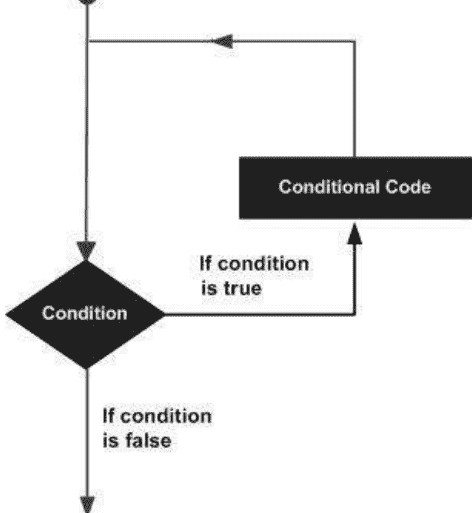

Python 为你提供了 2 种类型的循环：

- 1. while 循环
- 2. for 循环

与循环关联的语句

- else

可以在循环中使用的语句：

- 1. continue
- 2. break
- 3. pass

| 控制语句 | 描述 |
| :--- | :--- |
| break | 终止循环语句。 |
| continue | 导致循环跳过其主体的剩余部分，并在重新迭代之前立即重新测试其条件。 |
| pass | 循环中的 pass 语句只是一个标记，提示你将来添加一些代码。它是一个空语句（什么都不做）。 |

### 2- while 循环

while 循环的语法：

```python
while (condition) :
    # 在这里做一些事情
    # ....
```

# 示例：

### whileLoopExample.py

```python
print("While loop example");
# 声明一个变量，并赋值为 2。
x = 2;

# 条件是 x < 10
# 如果 x < 10 为真，则运行代码块
while (x < 10) :
    print("Value of x = ", x);
    x = x + 3;

# 此语句在 while 代码块之外。
print("Finish");
```

## 运行示例：

While loop example
Value of x = 2
Value of x = 5
Value of x = 8
Finish

### 带有 range 的 for 循环

Python 中 for 循环最简单的例子是使用 'for' 和 'range'。例如，变量 'x' 的值在范围 (3, 7) 内运行（x = 3, 4, 5, 6）。

### forLoopExample.py

```python
print("For loop example");
# for x = 3, 4, 5, 6
for x in range (3, 7) :
    print("Value of x = ", x);
    print(" x^2 = ", x * x);

# 此语句在 for 代码块之外。
print("End of example");
```

## 运行示例：

For loop example
Value of x = 3
x^2 = 9
Value of x = 4
x^2 = 16
Value of x = 5
x^2 = 25
Value of x = 6
x^2 = 36
End of example

### 使用 for 循环和数组

使用 for 循环可以帮助你遍历数组的元素。

### forLoopExample3.py

```python
print("For loop example");
# 声明一个数组。
names =["Tom","Jerry", "Donald"];

for name in names:
    print("Name = ", name);

print("End of example");
```

### 输出：

For loop example
Name = Tom
Name = Jerry
Name = Donald
End of example

通过索引遍历数组元素：

### forLoopExample3b.py

```python
print("For loop example");
# 声明一个数组。
names =["Tom","Jerry", "Donald"];

# len() 函数返回数组的长度。
# index = 0,1,.. len-1
for index in range(len(names)):
    print("Name = ", names[index] );

print("End of example");
```

### 在循环中使用 break 语句

break 是一个可以位于循环中的语句。此语句无条件地结束循环。

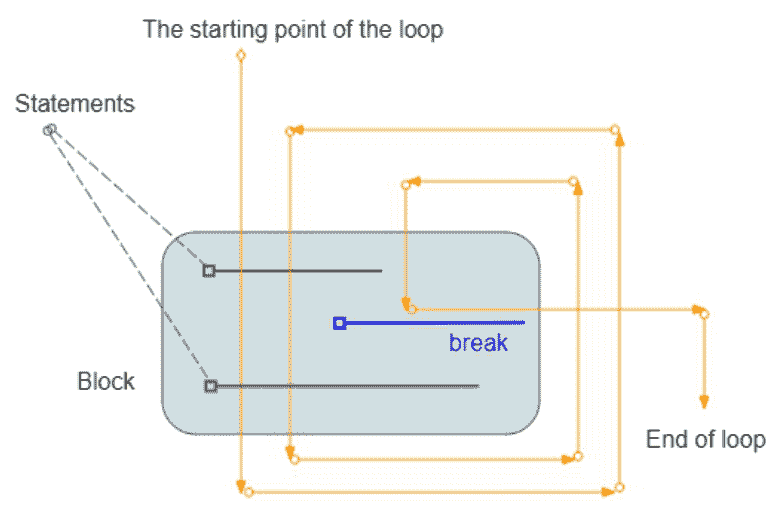

### loopBreakExample.py

```python
print("Break example");
# 声明一个变量并赋值为 2。
x = 2;
while (x < 15) :
    print("-----------------------\n");
    print("x = ", x);

    # 如果 x = 5，则退出循环。
    if (x == 5) :
        break;
    # 将 x 的值增加 1
    x = x + 1;
    print("x after + 1 = ", x);

print("End of example");
```

### 输出：

Break example
-----------------------
x = 2
x after + 1 = 3
-------------------
x = 3
x after + 1 = 4
-------------------
x = 4
x after + 1 = 5
-------------------
x = 5
End of example

### 在循环中使用 continue 语句

*continue* 是一个可以位于循环中的语句。当遇到 continue 语句时，程序将忽略 *continue* 下方代码块中的命令行，并开始新的循环。

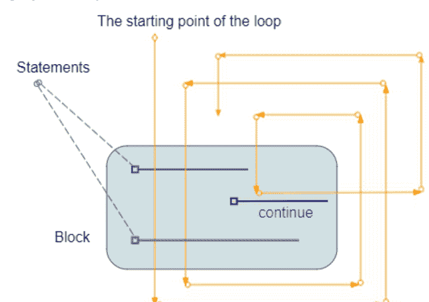

### loopContinueExample.py

```python
print("Continue example");

# 声明一个变量并赋值为 2
x = 2

while (x < 7) :
    print("-----------------------\n")
    print("x = ", x)

    # % 用于计算余数
    # 如果 x 是偶数，则忽略 continue 下方的命令行
    # 并开始新的迭代。
    if (x % 2 == 0) :
        # 将 x 增加 1。
        x = x + 1
        continue
    else :
        # 将 x 增加 1。
        x = x + 1
        print("x after + 1 =", x)

print("End of example");
```

### 输出：

```python
Continue example
-----------------------
x = 2
-----------------------
x = 3
x after + 1 = 4
-----------------------
x = 4
-----------------------
x = 5
x after + 1 = 6
-----------------------
x = 6
End of example
```

### 在循环中使用 pass 语句

在 Python 编程中，pass 是一个 *空* 语句。Python 中注释和 pass 语句的区别在于，虽然解释器完全忽略注释，但 pass 不会被忽略。

然而，当 pass 被执行时，什么也不会发生。
循环中的 pass 语句只是一个标记，提示你将来添加一些代码。
它是一个空命令（什么都不做）。

### loopPassExample.py

```python
number = 0

for number in range(5):
    number = number + 1

    if number == 3:
        print(" do something here " , number)
        pass

    print(" >> " ,number )

print('Out of loop')
```

### 输出：

```python
>> 1
  >> 2
do something here 3
>> 3
>> 4
>> 5
```

你可以从示例中移除 pass 语句，而不会改变任何内容。

### loopPassExample.py（移除 pass 语句）

```python
number = 0

for number in range(5):
    number = number + 1

    if number == 3:
        print(" do something here " , number)
        # pass (移除 pass)

    print(" >> " ,number )

print('Out of loop')
```

### 在循环中使用 'else' 语句

else 语句可以与循环关联。如果循环以正常方式运行并结束，而不是被 break 语句中断，则执行 *else* 语句。

### forLoopElseExample.py

```python
print("For loop example");

# for x = 3, 4, 5, 6
for x in range (3, 7) :
    print("Value of x = ", x);
    print("  x^2 = ", x * x);
else :
    print("finish for loop")

# 此语句在 for 代码块之外。
print("End of example");
```

### 输出：

For loop example
Value of x = 3
x^2 = 9
Value of x = 4
x^2 = 16
Value of x = 5
x^2 = 25
Value of x = 6
x^2 = 36
finish for loop
End of example

如果循环被 break 语句停止，则与循环关联的 else 语句将不会被执行。

### forLoopElseExample2.py

```python
print("For loop example");

# for x = 3, 4, 5, 6
for x in range (3, 7) :
    print("Value of x = ", x);
    if x == 5:
        print("Break!")
        break;
else :
    # 如果在循环中调用了 break 语句，
    # 则此语句将不会被执行。
    print("This command will not be executed!")

# 此语句在 for 代码块之外。
print("End of example");
```

### 输出：

For loop example
Value of x = 3
Value of x = 4
Value of x = 5
Break!
End of example

## Python 函数教程及示例

函数是一个特殊的命令块，它有名称，有助于使程序代码更易于阅读，并且可以在程序的不同位置调用使用。函数是一个可重用的命令块。

### 语法：

**函数语法**

```python
def functionName( parameters ):
    "函数的简短描述"
    codes ...
    return [expression]
```

- 函数以单词 "def"（定义）开头，后跟函数名称。
- 接下来，是括号 () 和冒号 (:) 中的参数列表，函数可以包含 0 个、1 个或多个参数，参数之间用逗号分隔。
- 函数体的第一行是函数的简短描述（可选）。

### return 语句：

return 语句用于返回一个值（或一个表达式），或者“什么都不返回”。当 return 语句运行时，函数将结束。Return 是函数体中不需要的语句。

| 示例 | 描述 |
| --- | --- |
| return 3 | 函数返回一个值，并结束 |
| return | 函数什么都不返回，并结束 |

### 参数：

函数可以包含0个、1个或多个以逗号分隔的参数。参数有四种类型：

1.  必需参数
2.  默认参数
3.  可变长度参数
4.  关键字参数

## 函数示例

例如，一个函数有一个参数，并返回“无”。

### functionExample1.py

```python
# 定义一个函数：
def sayHello(name) :
    # 如果 name 为空或为 null。
    if not name  :
        print( "Hello every body!" )
    # 如果 name 不为空且不为 null。
    else :
        print( "Hello " + name)

# 调用函数，向函数传递参数。
sayHello("")
sayHello("Python");
sayHello("Java");
```

### 输出：

Hello every body!
Hello Python
Hello Java

接下来是一个有一个参数并返回值的函数示例。

### functionExample2.py

```python
# 定义一个函数：
def getGreeting(name) :

    # 如果 name 为空或为 null (None)。
    if not name  :
        # 返回一个值。
        # 函数在此结束。
        return "Hello every body!"

    # 如果 name 不为空且不为 null (not None)，
    # 将执行此代码。
    return "Hello " + name

# 调用函数，向函数传递参数。
greeting = getGreeting("")
print(greeting)
greeting = getGreeting("Python")
print(greeting)
```

### 输出：

Hello every body!
Hello Python

## 带有必需参数的函数

以下示例定义了一个名为 showInfo 的函数，它有2个参数。这两个参数都是必需的。当你调用该函数时，需要向函数提供2个参数。否则程序将抛出错误。

### requiredParameterExample.py

```python
def showInfo(name, gender):
    print ("Name: ", name);
    print ("Gender: ", gender);

# 有效
showInfo("Tran", "Male")
# 无效 ==> 错误!!
showInfo("Tran")
```

## 带有默认参数的函数

函数可以有很多参数，包括必需参数和具有默认值的参数。
下面的 showInfo 函数有三个参数（*name, gender = "Male", country = "US"*）：

1.  Name 是一个必需参数。
2.  Gender 是一个默认值为 "Male" 的参数。
3.  Country 是一个默认值为 "US" 的参数。

### defaultParameterExample.py

```python
def showInfo(name, gender = "Male", country ="US"):
    print ("Name: ", name)
    print ("Gender: ", gender)
    print ("Country: ", country)

# 有效
showInfo("Aladdin", "Male", "India")
print (" ------ ")
# 有效
showInfo("Tom", "Male")
print (" ------ ")
# 有效
showInfo("Jerry")
print (" ------ ")
# 有效
showInfo(name = "Tintin", country ="France")
print (" ------ ")
```

### 输出：

Name: Aladdin
Gender: Male
Country: India
------
Name: Tom
Gender: Male
Country: US
------
Name: Jerry
Gender: Male
Country: US
------
Name: Tintin
Gender: Male
Country: France
------

## 带有可变长度参数的函数

可变长度参数是一种特殊参数。调用函数时，你可以向该参数传递0个、1个或多个值。

注意：“可变长度参数”必须始终是函数的最后一个参数。

# 示例：

SumValues 函数有三个参数：

-   参数 a, b 是必需的。
-   参数 *others 是“可变长度参数”。

### variableLengthParameterExample.py

```python
def sumValues(a, b, *others):
    retValue = a + b

    # 'others' 参数类似一个数组。
    for other in others :
        retValue = retValue + other

    return retValue
```

如何调用函数：

### testVariableLengthParameter.py

```python
from variableLengthParameterExample import sumValues

# 传递: *others = []
a = sumValues(10, 20)
print("sumValues(10, 20) = ", a);

# 传递: *others = [1]
a = sumValues(10, 20, 1);
print("sumValues(10, 20, 1 ) = ", a);

# 传递: *others = [1,2]
a = sumValues(10, 20, 1, 2);
print("sumValues(10, 20, 1 , 2) = ", a);

# 传递: *others = [1,2,3,4,5]
a = sumValues(10, 20, 1, 2,3,4,5);
print("sumValues(10, 20, 1, 2, 3, 4, 5) = ", a);
```

### 输出：

sumValues(10, 20) = 30
sumValues(10, 20, 1) = 31
sumValues(10, 20, 1, 2) = 33
sumValues(10, 20, 1, 2, 3, 4, 5) = 45

## 匿名函数

如果函数不是通过通常的 def 关键字定义的，而是使用 lambda 关键字定义的，则称为匿名函数。

1.  匿名函数可以有0个或多个参数，但函数体中只能有一个表达式。表达式的值就是函数的返回值。但不要使用关键字 'return'。
2.  参数列表以逗号分隔，且不包含在括号 ( ) 中。
3.  在匿名函数体中，你不能访问外部变量，只能访问其参数。
4.  匿名函数不能直接调用 print，因为 lambda 需要一个表达式。

### 语法：

```
lambda [arg1 [,arg2,.....argn]] : expression
```

# 示例：

### lambdaFunctionExample.py

```python
# 声明一个变量：hello = 一个没有参数的匿名函数。
hello = lambda : "Hello"

# 声明一个变量：mySum = 一个有2个参数的匿名函数。
mySum = lambda a, b : a + b

a= hello()
print (a)

a = mySum(10, 20)
print (a)
```

### 输出：

Hello
30

## Python 中的类和对象

### Python 中的面向对象

Python 是一种面向过程的编程语言，同时也是一种面向对象的编程语言。

### 面向过程

“面向过程”在 Python 中体现为使用函数。你可以定义函数，并且这些函数可以在 Python 程序的其他模块中使用。

### 面向对象

Python 中的“面向对象”体现为使用类，你可以定义一个类，类是创建对象的原型。

### 在 Python 中创建类

创建类的语法：

**类语法**

```python
class ClassName:
    '类的简要描述（可选）'
    # 代码 ...
```

-   要定义一个类，你需要使用 class 关键字，后跟类名和冒号 (:)。类体中的第一行是一个简要描述此类的字符串。（可选），你可以通过 *Class*.__Doc__ 访问此字符串。
-   在类体中，你可以声明属性、方法和构造函数。

### 属性：

属性是类的成员。例如，矩形有两个属性，包括宽度和高度。

## 方法：

-   类的方法类似于普通函数，但它是类的函数，为了使用它，你需要通过对象调用。
-   方法的第一个参数始终是 self（一个指向类本身的关键字）。

### 构造函数：

-   构造函数是类的一个特殊方法，始终命名为 __init__。
-   构造函数的第一个参数始终是 self（一个指向类本身的关键字）。
-   构造函数用于创建对象。
-   构造函数将参数的值赋给将要创建的对象的属性。
-   你只能在类中定义构造函数。
-   如果类没有定义构造函数，Python 会假定它有一个默认的构造函数，__init__ (self)，其函数体为空。

### rectangle.py

```python
# 矩形。
class Rectangle :
    '这是 Rectangle 类'

    # 创建对象的方法（构造函数）
    def __init__(self, width, height):
        self.width= width
        self.height = height

    def getWidth(self):
        return self.width

    def getHeight(self):
        return self.height

    # 计算面积的方法。
    def getArea(self):
        return self.width * self.height
```

从 Rectangle 类创建一个对象：

### testRectangle.py

```python
from rectangle import Rectangle

# 创建2个对象：r1 和 r2
r1 = Rectangle(10,5)

r2 = Rectangle(20,11)

print ("r1.width = ", r1.width)
print ("r1.height = ", r1.height)
print ("r1.getWidth() = ", r1.getWidth())
print ("r1.getArea() = ", r1.getArea())

print ("------------------")

print ("r2.width = ", r2.width)
print ("r2.height = ", r2.height)
print ("r2.getWidth() = ", r2.getWidth())
print ("r2.getArea() = ", r2.getArea())
```

```
r1.width =  10
r1.height =  5
r1.getWidth() =  10
r1.getArea() =  50
------------------
r2.width =  20
r2.height =  11
r2.getWidth() =  20
r2.getArea() =  220
```

## 当你从一个类创建一个对象时会发生什么？

当你创建一个 Rectangle 类的对象时，该类的构造函数方法将被调用以创建一个对象，并且对象的属性将被赋予参数中的值。这类似于下面的图示：

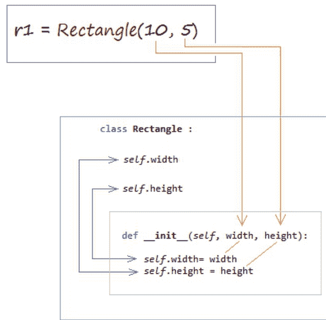

## 带有默认参数的构造函数

与其他语言不同，Python 中的类只有一个构造函数。然而，Python 允许参数具有默认值。

**注意：** 所有必需的参数必须位于所有具有默认值的参数之前。

## person.py

```python
class Person:

    # The age and gender parameters has a default value.
    def __init__(self, name, age=1, gender="Male"):

        self.name = name
        self.age = age
        self.gender = gender

    def showInfo(self):

        print("Name: ", self.name)
        print("Age: ", self.age)
        print("Gender: ", self.gender)
```

## 例如：

## testPerson.py

```python
from person import Person

# Create an object of Person.
aimee = Person("Aimee", 21, "Female")

aimee.showInfo()

print("----------------")

# default age, gender.
alice = Person("Alice")

alice.showInfo()

print("----------------")

# Default gender.
tran = Person("Tran", 37)

tran.showInfo()
```

```
Name:  Aimee
Age:  21
Gender:  Female
------------------
Name:  Alice
Age:  1
Gender:  Male
------------------
Name:  Tran
Age:  37
Gender:  Male
```

## 比较对象

在 Python 中，当你通过构造函数创建一个对象时，会在内存中创建一个真实的实体，它有一个指定的地址。

一个赋值运算符将 AA 对象赋值给 BB 对象，并不会在内存中创建新的实体，它只是将 AA 的地址指向 BB 的地址。

```python
r1 = Rectangle(width=20, height=10)
r2 = Rectangle(width=20, height=10)
r3 = r1
```

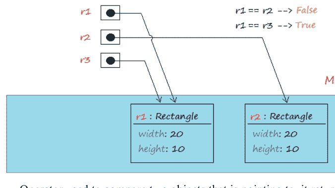

== 运算符用于比较两个对象所指向的地址，如果两个对象指向内存中的同一个地址，则返回 True。运算符 != 用于比较两个对象所指向的两个地址，如果两个对象指向不同的地址，则返回 True。

## compareObject.py

```python
from rectangle import Rectangle

r1 = Rectangle(20, 10)

r2 = Rectangle(20, 10)

r3 = r1

# Compare the address of r1 and r2
test1 = r1 == r2  # --> False

# Compare the address of r1 and r2
test2 = r1 == r3  # --> True

print("r1 == r2 ? ", test1)

print("r1 == r3 ? ", test2)

print("---------------- ")

print("r1 != r2 ? ", r1 != r2)

print("r1 != r3 ? ", r1 != r3)
```

```
r1 == r2 ?  False
r1 == r3 ?  True
----------------
r1 != r2 ?  True
r1 != r3 ?  False
```

## 属性

在 Python 中，有两个相似的概念你需要区分：

1.  属性
2.  类的变量

为了简化，让我们分析下面的例子：

## player.py

```python
class Player:
    # Class's Variable
    minAge = 18

    maxAge = 50

    def __init__(self, name, age):

        self.name = name
        self.age = age
```

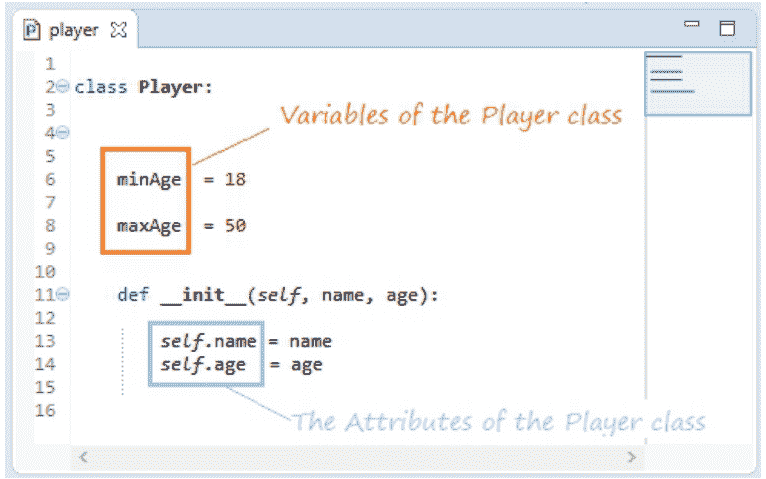

## 属性

从同一个类创建的对象将位于内存中的不同地址，并且它们的“同名”属性在内存中也有不同的地址。例如：

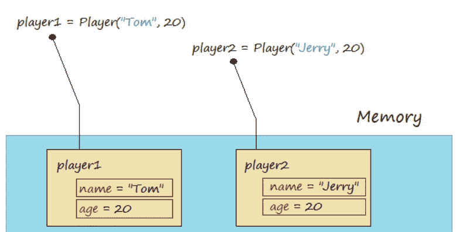

## testAttributePlayer.py

```python
from player import Player

player1 = Player("Tom", 20)

player2 = Player("Jerry", 20)

print("player1.name = ", player1.name)
print("player1.age = ", player1.age)

print("player2.name = ", player2.name)
print("player2.age = ", player2.age)

print("------------ ")

print("Assign new value to player1.age = 21 ")

# Assign new value to age attribute of player1.
player1.age = 21

print("player1.name = ", player1.name)
print("player1.age = ", player1.age)

print("player2.name = ", player2.name)
print("player2.age = ", player2.age)
```

```
player1.name = Tom
player1.age = 20
player2.name = Jerry
player2.age = 20
----------
Assign new value to player1.age = 21
player1.name = Tom
player1.age = 21
player2.name = Jerry
player2.age = 20
```

Python 允许你为已存在的对象创建一个新的属性。例如，player1 对象和一个名为 *address* 的新属性。

```python
player1 = Player("Tom", 20)
player1.address = "USA"
player2 = Player("Jerry", 20)
```

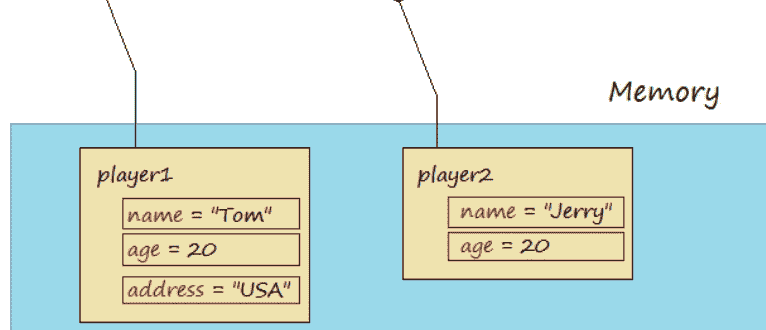

## testNewAttributePlayer.py

```python
from player import Player

player1 = Player("Tom", 20)

player2 = Player("Jerry", 20)

# Create a new attribute named 'address' for player1.
player1.address = "USA"

print("player1.name = ", player1.name)
print("player1.age = ", player1.age)
print("player1.address = ", player1.address)

print("------------------- ")

print("player2.name = ", player2.name)
print("player2.age = ", player2.age)

# player2 has no attribute 'address' (Error!!)
print("player2.address = ", player2.address)
```

## 控制台

```
player1.name =  Tom
player1.age =  20
player1.address =  USA
-------------------
player2.name =  Jerry
player2.age =  20
Traceback (most recent call last):
  File "E:\ECLIPSE_TUTORIAL\PYTHON\PythonClassObject\testNewAttributePlayer.py", line
    print ("player2.address = ", player2.address)
AttributeError: 'Player' object has no attribute 'address'
```

## 函数属性

通常，你通过“点”运算符访问对象的属性（例如 *player1.name*）。
然而，Python 允许你通过函数来访问它。

| 函数 | 描述 |
| --- | --- |
| getattr(obj, name[, default]) | 返回属性的值，如果对象没有该属性，则返回默认值。 |
| hasattr(obj, name) | 检查此对象是否具有由参数 'name' 指定的属性。 |
| setattr(obj, name, value) | 为属性设置值。如果属性不存在，它将被创建。 |
| delattr(obj, name) | 删除属性。 |

## testAttFunctions.py

```python
from player import Player

player1 = Player("Tom", 20)

# getattr(obj, name[, default])
print("getattr(player1,'name') = ", getattr(player1, "name"))

print("setattr(player1,'age', 21): ")

# setattr(obj, name, value)
setattr(player1, "age", 21)

print("player1.age = ", player1.age)

# Check player1 has 'address' attribute?
hasAddress = hasattr(player1, "address")

print("hasattr(player1, 'address') ? ", hasAddress)

# Create attribute 'address' for object 'player1'
print("Create attribute 'address' for object 'player1'")
setattr(player1, 'address', "USA")

print("player1.address = ", player1.address)

# Delete attribute 'address'.
delattr(player1, "address")
```

```
getattr(player1,'name') = Tom
setattr(player1,'age', 21):
player1.age = 21
hasattr(player1, 'address') ? False
Create attribute 'address' for object 'player1'
player1.address = USA
```

## 内置类属性

Python 类是 object 类的后代。因此它们继承了以下属性：

| 属性 | 描述 |
|---|---|
| \_\_dict\_\_ | 以简短、易于理解的字典形式提供有关此类的信息 |
| \_\_doc\_\_ | 返回描述该类的字符串，如果未定义则返回 None |
| \_\_class\_\_ | 返回一个对象，包含有关该类的信息，该对象具有许多有用的属性，包括 \_\_name\_\_ 属性。 |
| \_\_module\_\_ | 返回该类的“模块”名称，如果该类在正在运行的模块中定义，则返回 "\_\_main\_\_"。 |

## testBuildInAttributes.py

```python
class Customer:
    'This is Customer class'

    def __init__(self, name, phone, address):
        self.name = name
        self.phone = phone
        self.address = address

john = Customer("John", 1234567, "USA")

print("john.__dict__ = ", john.__dict__)

print("john.__doc__ = ", john.__doc__)

print("john.__class__ = ", john.__class__)

print("john.__class__.__name__ = ", john.__class__.__name__)

print("john.__module__ = ", john.__module__)
```

```
john.__dict__ = {'name': 'John', 'phone': 1234567, 'address': 'USA'}
john.__doc__ = This is Customer class
john.__class__ = <class '__main__.Customer'>
john.__class__.__name__ = Customer
john.__module__ = __main__
```

## 类的变量

在 Python 中，类的变量定义等同于其他语言（如 Java、C#）中的静态字段定义。类的变量可以通过类名或对象来访问。

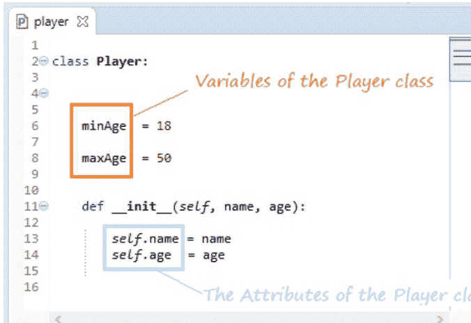

**这里的建议是，你应该通过类名而不是对象来访问“类的变量”。这有助于避免“类的变量”和属性之间的混淆。**

每个类的变量在内存中都有一个地址，并且它与类的所有对象共享。

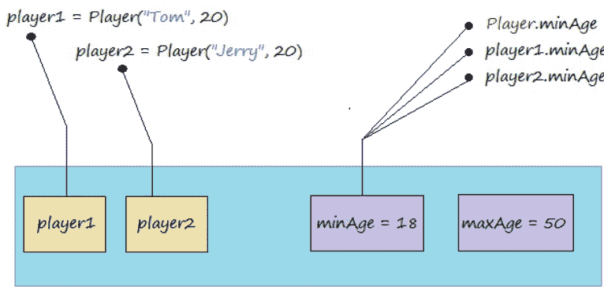

## testVariablePlayer.py

```python
from player import Player

player1 = Player("Tom", 20)

player2 = Player("Jerry", 20)

# Access via class name.
print ("Player.minAge = ", Player.minAge)

# Access via object.
print ("player1.minAge = ", player1.minAge)
print ("player2.minAge = ", player2.minAge)

print (" ----------- ")

print ("Assign new value to minAge via class name, and print..")

# Assign new value to minAge via class name
Player.minAge = 19

print ("Player.minAge = ", Player.minAge)
print ("player1.minAge = ", player1.minAge)
print ("player2.minAge = ", player2.minAge)
```

## 列出类或对象的成员

Python 为你提供了 **dir** 函数，该函数显示类或对象的方法、属性、变量的列表。

## testDirFunction.py

```python
from player import Player

# Print out list of attributes, methods and variables of class 'Player'
print ( dir(Player) )

print ("\n\n")

player1 = Player("Tom", 20)

player1.address ="USA"

# Print out list of attributes, methods and variables of object 'player1'
print ( dir(player1) )
```

## Python 中的继承与多态

### 简介

继承与多态——这是 **Python** 中一个非常重要的概念。如果你想学好 **Python**，就必须更好地理解它。

> *注意：在你开始学习“Python 中的继承”之前，请确保你已经掌握了“类和对象”的概念，如果没有，让我们先学习它：*

### Python 中的继承

**Python** 允许你从一个或多个其他类创建扩展类。这个类被称为派生类或子类。

子类继承父类的属性、方法和其他成员。它也可以重写父类的方法。如果子类没有定义自己的构造函数，默认情况下，它将继承父类的构造函数。

> *注意：与 Java、C# 和其他几种语言不同，Python 允许多重继承。一个类可以从一个或多个父类扩展。*

我们需要几个类来参与示例。

- **Animal**：模拟动物的类。
- **Duck**：Animal 的子类。
- **Cat**：Animal 的子类。
- **Mouse**：Animal 的子类。

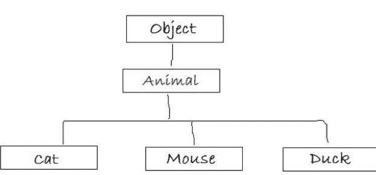

在 **Python** 中，类的构造函数用于创建对象（实例），并为属性赋值。
子类的构造函数总是调用父类的构造函数来初始化父类中属性的值，然后才开始为自己的属性赋值。

# 示例：

#### animal.py

```python
class Animal :

    # Constructor
    def __init__(self, name):

        # Animal class has one attribute: 'name'.
        self.name= name

    # Method
    def showInfo(self):
        print ("I'm " + self.name)

    # Method:
    def move(self):
        print ("moving ...")
```

**Cat** 是继承自 **Animal** 类的类，它也有自己的属性。

#### cat.py

```python
from animal import Animal

# Cat class extends from Animal.
class Cat (Animal):

    def __init__(self, name, age, height):
        # Call to constructor of parent class (Animal)
        # to assign value to attribute 'name' of parent class.
        super().__init__(name)

        self.age = age
        self.height = height

    # Override method.
    def showInfo(self):

        print ("I'm " + self.name)
        print (" age " + str(self.age))
        print (" height " + str(self.height))
```

#### catTest.py

```python
from cat import Cat

tom = Cat("Tom", 3, 20)

print ("Call move() method")
tom.move()
print("\n")
print("Call showInfo() method")
tom.showInfo()
```

### 运行 catTest 模块：

Call move() method
moving ...

Call showInfo() method
I'm Tom
age 3
height 20

当你从构造函数创建一个对象时发生了什么？它是如何调用父类的构造函数的？请看下面的图示：

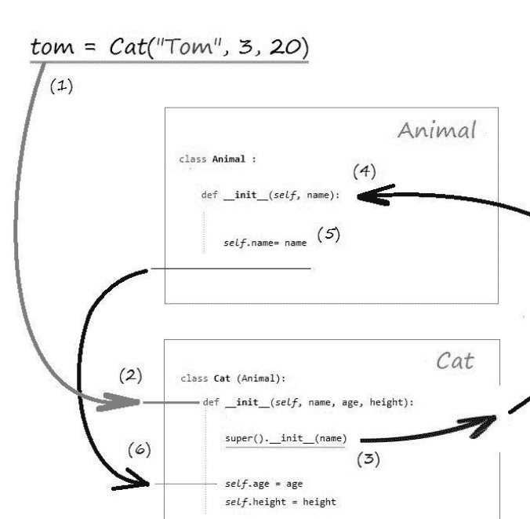

通过上面的图示，你可以看到，父类的构造函数在子类的构造函数中被调用，它将为父类的属性赋值，然后才是子类的属性。

### 重写方法

默认情况下，子类继承父类的方法，但父类可以重写父类的方法。

#### mouse.py

```python
from animal import Animal

# Mouse class extends from Animal.
class Mouse (Animal):
    def __init__(self, name, age, height):
        # Call to constructor of parent class (Animal)
        # to assign value to attribute 'name' of parent class.
        super().__init__(name)
        self.age = age
        self.height = height

    # Override method.
    def showInfo(self):
        # Call method of parent class.
        super().showInfo()
        print (" age " + str(self.age))
        print (" height " + str(self.height))

    # Override method.
    def move(self):
        print ("Mouse moving ...")
```

#### mouseTest.py

```python
from mouse import Mouse

jerry = Mouse("Jerry", 3, 5)

print ("Call move() method")
jerry.move()

print ("\n")
print ("Call showInfo() method")
jerry.showInfo()
```

### 输出：

Call move() method
Mouse moving ...

Call showInfo() method
I'm Jerry
age 3
height 5

### 抽象方法

抽象方法或抽象类的概念在 **Java**、**C#** 等语言中有明确定义。但在 **Python** 中没有明确定义。然而，我们有一种方法来定义它。一个被称为抽象的类定义了抽象方法，如果你想使用它们，子类必须重写这些方法。抽象方法总是抛出 **NotImplementedError** 异常。

#### abstractExample.py

```python
# An abstract class.
class AbstractDocument :

    def __init__(self, name):
        self.name = name

    # A method can not be used, because it always throws an error.
    def show(self):
        raise NotImplementedError("Subclass must implement abstract method")

class PDF(AbstractDocument):

    # Override method of parent class
    def show(self):
        print ("Show PDF document:", self.name)

class Word(AbstractDocument):

    def show(self):
        print ("Show Word document:", self.name)

# --------------------------------------------------
documents = [ PDF("Python tutorial"),
              Word("Java IO Tutorial"),
              PDF("Python Date & Time Tutorial") ]

for doc in documents :
    doc.show()
```

### 输出：

Show PDF document: Python tutorial
Show Word document: Java IO Tutorial
Show PDF document: Python Date & Time Tutorial

上面的例子展示了 **Python** 中的多态。一个 **Document** 对象可以以多种形式（**PDF**、**Word**、**Excel** 等）表示。
另一个例子说明了多态：当我谈到一个亚洲人时，这是相当抽象的，他可能是日本人、越南人或印度人。然而，他们具有亚洲人的特征。

### 多重继承

**Python** 允许多重继承，这意味着你可以从两个或多个其他类创建扩展类。父类可以有相同的属性，或相同的方法……子类将优先继承继承列表中第一个类的属性、方法等。

#### multipleInheritanceExample.py

```python
class Horse:
    maxHeight = 200; # centimeter

    def __init__(self, name, horsehair):
        self.name = name
        self.horsehair = horsehair

    def run(self):
        print ("Horse run")

    def showName(self):
        print ("Name: (House's method): ", self.name)

    def showInfo(self):
        print ("Horse Info")

class Donkey:
    def __init__(self, name, weight):
        self.name = name
```

## 骡子类继承自马和驴。

```python
class Mule(Horse, Donkey):
    def __init__(self, name, hair, weight):
        Horse.__init__(self, name, hair)
        Donkey.__init__(self, name, weight)

    def run(self):
        print ("Mule run")

    def showInfo(self):
        print ("-- Call Mule.showInfo: --")
        Horse.showInfo(self)
        Donkey.showInfo(self)
```

### 输出：

```
Max height 200
Mule run
Name: (House's method): Mule
-- Call Mule.showInfo: --
Horse Info
Donkey Info
```

# mro() 方法

**mro()** 方法让你可以查看某个类的父类列表。让我们看下面的例子：

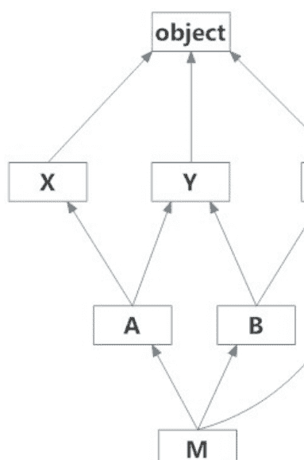

# mroExample.py

```python
class X: pass
class Y: pass
class Z: pass

class A(X,Y): pass
class B(Y,Z): pass

class M(B,A,Z): pass

# Output:
# [<class '__main__.M'>, <class '__main__.B'>,
# <class '__main__.A'>, <class '__main__.X'>,
# <class '__main__.Y'>, <class '__main__.Z'>,
# <class 'object'>]
print(M.mro())
```

> **注意：** 在 **Python** 中，**pass** 语句就像一个**空**（或空的）命令，它什么都不做。如果类或方法没有内容，你仍然需要至少一个语句，让我们使用 **pass**。

# issubclass 和 isinstance 函数

**Python** 有两个有用的函数：

- isinstance
- issubclass

# isinstance

**isinstance** 函数帮助你检查“某个东西”是否是某个类的对象。

# issubclass

**issubclass** 函数检查这个类是否是另一个类的子类。

# isinstancesubclass.py

```python
class A: pass
class B(A): pass
# True
print ("isinstance('abc', object): ",isinstance('abc', object))
# True
print ("isinstance(123, object): ",isinstance(123, object))

b = B()
a = A()

# True
print ("isinstance(b, A): ", isinstance(b, A) )
print ("isinstance(b, B): ", isinstance(b, B) )

# False
print ("isinstance(a, B): ", isinstance(a, B) )

# B is subclass of A? ==> True
print ("issubclass(B, A): ", issubclass(B, A) )

# A is subclass of B? ==> False
print ("issubclass(A, B): ", issubclass(A, B) )
```

### 输出：

```
isinstance('abc', object): True
isinstance(123, object): True
b = B()
a = A()
isinstance(b, A): True
isinstance(b, B): True
isinstance(a, B): False
isinstance(B, A): True
isinstance(A, B): False
```

# 使用函数实现多态

这里我创建了两个类，比如 **English** 和 **French**。这两个类都有 **greeting()** 方法。两者创建不同的问候语。从上面两个类创建两个相应的对象，并在同一个函数（**intro** 函数）中调用这两个对象的动作。

# people.py

```python
class English:
    def greeting(self):
        print ("Hello")

class French:
    def greeting(self):
        print ("Bonjour")

def intro(language):
    language.greeting()

flora = English()
aalase = French()
intro(flora)
intro(aalase)
```

## 运行示例：

```
Hello
Bonjour
```

# Python 异常处理教程与示例

# 什么是异常？

首先，让我们看下面的插图示例：
在这个示例中，有一部分错误代码是由除以 0 引起的。除以 0 导致异常：**ZeroDivisionError**

# helloExceptionExample.py

```python
print ("Three")

# This division no problem.
value = 10 / 2
print ("Two")

# This division no problem.
value = 10 / 1
print ("One")

d = 0

# This division has problem, divided by 0.
# An error has occurred here.
value = 10 / d

# And the following code will not be executed.
print ("Let's go!")
```

运行示例的结果：
你可以在控制台屏幕上看到通知。错误通知非常清晰，包括代码行的信息。

```
Three
Two
One
Traceback (most recent call last):
  File "E:\ECLIPSE_TUTORIAL\PYTHON\PythonException\helloExceptionExam"
    value = 10 / d;
ZeroDivisionError: division by zero
```

让我们通过下面的插图看看程序的流程：

- 程序从步骤 (1)、(2) 到 (6) 正常运行。
- 在步骤 (7)，程序除以 0。程序结束。
- 步骤 (8)，代码未被执行。

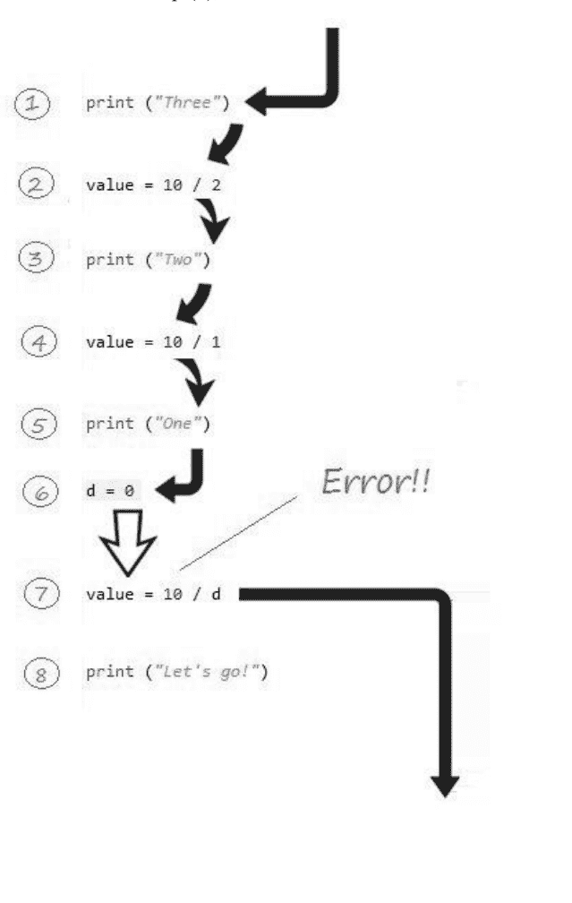

我们将修改上面示例的代码。

# helloCatchException.py

```python
print ("Three")
value = 10 / 2
print ("Two")
value = 10 / 1
print ("One")
d = 0
try :
    # This division has problem, divided by 0.
    # An error has occurred here (ZeroDivisionError).
    value = 10 / d
    print ("value = ", value)
except ZeroDivisionError as e :
    print ("Error: ", str(e) )
    print ("Ignore to continue ...")
print ("Let's go!")
```

运行示例的结果：

```
Three
Two
One
Error: division by zero
Ignore to continue ...
Let's go!
```

我们将通过下面的插图解释程序的流程。

- 步骤 (1) 到 (6) 完全正常。
- 步骤 (7) 发生异常，除以零的问题。
- 立即跳转到 catch 块中执行命令，步骤 (8) 被跳过。
- 步骤 (9)、(10) 被执行。
- 步骤 (11) 被执行。

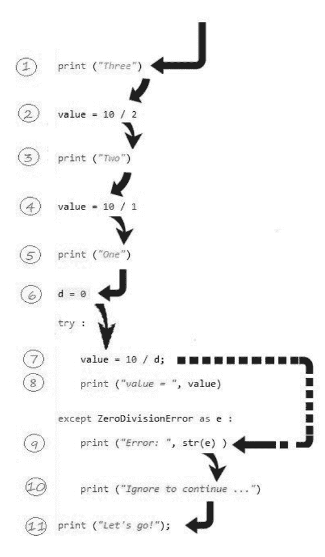

# 异常层次结构

这是 **Python** 中异常的层次结构图模型。

- 最高类是 **BaseException**
- 直接子类是 **Exception** 和 **KeyboardInterrupt**，...

**CSharp** 内置的异常通常派生自 **BaseException**。同时，程序员的异常应该继承自 **Exception** 或其子类。

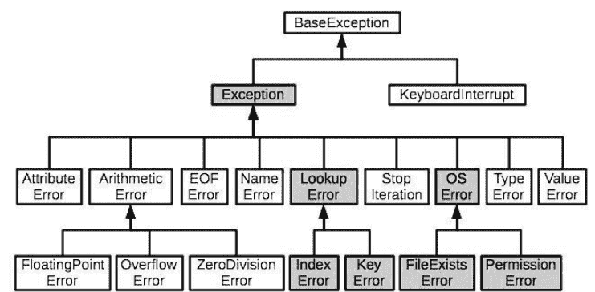

# 使用 try-except 处理异常

我们编写一个继承自 **Exception** 的类。

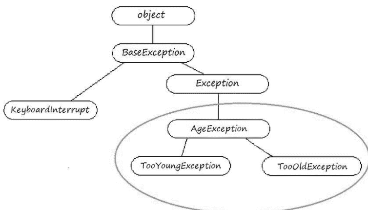

**checkAge** 函数用于检查年龄，如果年龄小于 18 或大于 40，将抛出异常。

# ageexception.py

```python
# Python 3.x
class AgeException(Exception):
    def __init__(self, msg, age ):
        super().__init__(msg)
        self.age = age

class TooYoungException(AgeException):
    def __init__(self, msg, age):
        super().__init__(msg, age)

class TooOldException(AgeException):
    def __init__(self, msg, age):
        super().__init__(msg, age)

# Function to check age, it may raise exception.
def checkAge(age):
    if (age < 18) :
        # If age is less than 18, an exception will be thrown.
        # This function ends here.
        raise TooYoungException("Age " + str(age) + " too young", age)
    elif (age > 40) :
        # If age greater than 40, an exception will be thrown.
        # This function ends here.
        raise TooOldException("Age " + str(age) + " too old", age);
    # If age is between 18-40.
    # This code will be execute.
    print ("Age " + str(age) + " OK!");
```

示例：

# tryExceptDemo1.py

```python
import ageexception
from ageexception import AgeException
from ageexception import TooYoungException
from ageexception import TooOldException

print ("Start Recruiting ...")
age = 11
print ("Check your Age ", age)
try :
    ageexception.checkAge(age)
    print ("You pass!")
except TooYoungException as e  :
    print("You are too young, not pass!")
    print("Cause message: ", str(e) )
    print("Invalid age: ", e.age)
except  TooOldException as e :
    print ("You are too old, not pass!")
    print ("Cause message: ", str(e) )
    print("Invalid age: ", e.age)
```

## 运行示例：

```
Start Recruiting ...
Check you Age 11
You are too young, not pass!
Cause message: Age 11 too young
Invalid age: 11
```

在下面的示例中，我们将通过父异常来捕获异常。

# tryExceptDemo2.py

```python
import ageexception
from ageexception import AgeException
from ageexception import TooYoungException
from ageexception import TooOldException

print ("Start Recruiting ...")
age = 51
print ("Check your Age ", age)
try :
    ageexception.checkAge(age)
    print ("You pass!")
except AgeException as e :
    print("You are not pass!")
    print("type(e): ", type(e) )
    print("Cause message: ", str(e) )
    print("Invalid age: ", e.age)
```

### 输出：

```
Start Recruiting ...
Check you Age 51
You are not pass!
type(e): <class 'ageexceptioon.TooOldException'>
Cause message: Age 51 too old
Invalid age: 51
```

## try-except-finally

我们已经习惯通过 **try-except** 块来捕获错误。**try-except-finally** 用于全面处理异常。无论 **try** 块中是否发生异常，**finally** 块总会被执行。

## try - except - finally

```
try :
    # 在此处执行某些操作。
except Exception1 as e :
    # 在此处执行某些操作。
except Exception2 as e :
    # 在此处执行某些操作。
finally :
    # finally 块总会被执行。
    # 在此处执行某些操作。
```

# 示例：

## tryExceptFinallyDemo.py

```
def toInteger(text) :
    try :
        print ("-- 开始解析文本: ", text)
        # 此处可能抛出异常 (ValueError)。
        value = int(text)
        return value
    except ValueError as e :
        # 当 'text' 不是数字时。
        # 此 'except' 块将被执行。
        print ("ValueError 消息: ", str(e))
        print ("type(e): ", type(e))
        # 如果发生 ValueError，则返回 0。
        return 0
    finally :
        print ("-- 结束解析文本: " + text)
```

```
text = "001234A2"
value = toInteger(text)
print ("Value= ", value)
```

## 运行示例：

```
-- 开始解析文本: 001234A2
ValueError 消息: invalid literal for int() with base 10: '001234A2'
type(e): <class 'ValueError'>
-- 结束解析文本: 001234A2
Value= 0
```

这是程序的执行流程。**Finally** 块总会被执行。

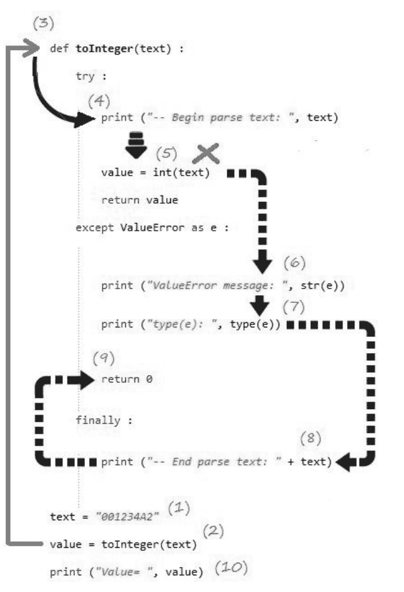

## pass 语句

如果你不想在 'except' 或 'finally' 块中处理任何内容，可以使用 'pass' 语句。pass 语句不执行任何操作，它就像一个空语句。

## passStatementExample.py

```
print("Three")
try:
    value = 10 / 0;
except Exception as e:
    pass
```

```
print ("Two")
print ("One")
print ("Let's go")
```

### 输出：

Three
Two
One
Let's go

## 重新抛出异常

在处理异常时，你可以捕获该异常并处理它，也可以重新抛出它。

## reRaiseExceptionDemo1.py

```
def checkScore(score) :
    if score < 0 or score > 100:
        raise Exception("无效分数 " + str(score) )

def checkPlayer(name, score):
    try :
        checkScore(score)
    except Exception as e :
        print ("玩家信息无效: ",name, ' >> ', str(e) )
        # 重新抛出异常。
        raise

# -----------------------------------------
checkPlayer("Tran", 101)
```

```
玩家信息无效:  Tran  >>  无效分数 101
Traceback (most recent call last):
  File "E:\ECLIPSE TUTORIAL\PYTHON\PythonException\reRaiseExceptionDemo1.py", line 27, in <module>
    checkPlayer("Tran", 101)
  File "E:\ECLIPSE TUTORIAL\PYTHON\PythonException\reRaiseExceptionDemo1.py", line 14, in checkPlayer
    checkScore(score)
  File "E:\ECLIPSE TUTORIAL\PYTHON\PythonException\reRaiseExceptionDemo1.py", line 6, in checkScore
    raise Exception("Invalid Score " + str(score) )
Exception: Invalid Score 101
```

例如，捕获一个异常并抛出另一个异常。

## reRaiseExceptionDemo2.py

```
def checkScore(score) :
    if score < 0 or score > 100:
        raise Exception("无效分数 " + str(score) )

def checkPlayer(name, score):
    try :
        checkScore(score)
    except Exception as e :
        print ("玩家信息无效: ",name, ' >> ', str(e) )
        # 抛出新异常。
        raise Exception("玩家信息无效: "+ name + " >> "+ str(e))

# -----------------------------------------
checkPlayer("Tran", 101)
```

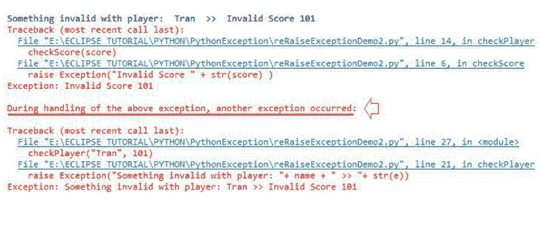

## 异常包装

**Python** 允许捕获异常，并抛出一个新异常。新异常可以存储原始异常的信息，你可以通过 **__cause__** 属性访问它。

## 语法

```
try :
    # 在此处执行某些操作...
except Exception as e :
    raise OtherException("消息...") from e
```

查看完整示例：

## wrapExceptionDemo.py

```
# Python 3.x:
# 性别异常
class GenderException(Exception):
    def __init__(self, msg):
        super().__init__(msg)

# 语言异常。
class LanguageException(Exception):
    def __init__(self, msg):
        super().__init__(msg)

class PersonException(Exception):
    def __init__(self, msg):
        super().__init__(msg)

# 此函数可能抛出 GenderException。
def checkGender(gender):
    if gender != 'Female' :
        raise GenderException("仅接受女性")

# 此函数可能抛出 LanguageException。
def checkLanguage(language):
    if language != 'English' :
        raise LanguageException("仅接受英语")

def checkPerson(name, gender, language):
    try :
        # 可能抛出 GenderException。
        checkGender(gender)
        # 可能抛出 LanguageException。
        checkLanguage(language)
    except Exception as e:
        # 捕获异常并抛出其他异常。
        # 新异常的 __cause__ = e。
        raise PersonException(name + " 未通过检查") from e

# --------------------------------------------------
try :
    checkPerson("Nguyen", "Female", "Vietnamese")
except PersonException as e:
    print ("错误消息: ", str(e) )
    # GenderException 或 LanguageException
    cause = e.__cause__
    print ('e.__cause__: ', repr(cause))
    print ("type(cause): ", type(cause) )
```

```
print (" ------------------- ")
if type(cause) is GenderException :
    print ("性别异常: ", cause)
elif type(cause) is LanguageException:
    print ("语言异常: ", cause)
```

### 输出：

错误消息: Nguyen 未通过检查
e.__cause__: LanguageException('Accept english language only',)
type(cause): <class '__main__.LanguageException'>
-------------------
语言异常: Accept english language only

## Python 字符串教程与示例

## Python 字符串

字符串是 **Python** 中最常见的类型，你经常需要处理它们。请注意，**Python** 中没有字符类型，单个字符被称为长度为 1 的字符串。

有两种方法可以声明写在一行上的字符串，使用单引号或双引号。

```
str1 = "Hello Python"
str2 = 'Hello Python'

str3 = "I'm from Vietnam"

str4 = 'This is a "Cat"! '
```

如果你想使用一对三个单引号在多行上书写字符串。

```
str = """Hello World
    Hello Python"""
```

## 访问字符串中的值

**Python** 不支持字符类型，字符被视为长度为 1 的字符串。字符串中的字符从索引 0 开始索引。你可以通过索引访问子字符串。

```
mystr = "This is text"
```

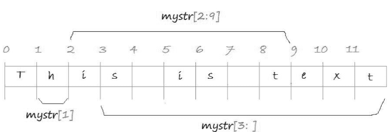

## stringExample.py

```
mystr = "This is text"

# --> h
print ("mystr[1] = ", mystr[1])

# --> is is t
print ("mystr[2,9] = ", mystr[2:9])

# --> s is text
print ("mystr[3:] = ", mystr[3:])
```

## 字符串是不可变的

字符串是 **Python** 中的一种特殊数据类型，它是不可变的。每个字符串在内存中都有一个存储地址。所有对字符串的操作都会创建另一个对象。例如，如果你想将一个字符串与另一个字符串连接起来，这个操作会在内存中创建另一个字符串。

```
str1 = "Hello "
str2 = str1 + "Python"
```

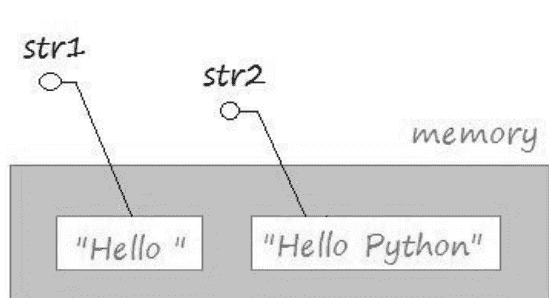

## == 和 is 运算符

Python 使用 == 运算符比较两个对象的值。并使用 "is" 运算符比较内存中的位置。

## compareObject.py

```
class Person(object):
    def __init__(self, name, age):
        self.name = name
        self.age = age
    # 重写 __eq__ 方法
    def __eq__(self, other):
        return self.name == other.name and self.age == other.age

jack1 = Person('Jack', 23)
jack2 = Person('Jack', 23)

# 调用 __eq__ 方法
print ("jack1 == jack2 ?", jack1 == jack2) # True
print ("jack1 is jack2 ?", jack1 is jack2) # False
```

字符串是一种特殊的数据类型，在 Python 应用程序中经常使用。因此它具有以下特点：

- 如果你声明两个具有相同值的字符串类型变量，它们都将指向内存中的实际字符串。

## compareString.py

```python
str1 = "Hello Python"
str2 = "Hello Python"

str1 == str2  # True
str1 is str2  # True
```

对字符串使用运算符会在内存中创建新的字符串。

```python
str2 = "Hello Python"
str3 = "Hello " + "Python"

str2 == str3  # True
str2 is str3  # False
```

```python
str1 = "Hello Python"
str2 = "Hello Python"
str3 = "Hello " + "Python"

print("str1 == str2? ", str1 == str2)  # --> True
print("str1 is str2? ", str1 is str2)  # --> True
print("str1 == str3? ", str1 == str3)  # --> True
print("str1 is str3? ", str1 is str3)  # --> False
```

## 转义字符

转义字符是**Python**中的特殊字符。它们是不可打印的字符。但是，如果你想让它们出现在字符串中，你需要使用一种表示法来通知**Python**。例如，"\n"是一个换行符。

## escapeCharacterExample.py

```python
# 在 "Hello World" 和 "Hello Python" 之间有两个 "制表符"。
mystr = "Hello World\t\tHello Python"
print(mystr)

# 在 "Hello World" 和 "Hello Python" 之间有两个 "换行符"。
mystr = "Hello World\n\nHello Python"
print(mystr)
```

### 输出：

Hello World    Hello Python
Hello World

Hello Python

| 反斜杠表示法 | 十六进制字符 | 描述 |
| :--- | :--- | :--- |
| \a | 0x07 | 响铃或警报 |
| \b | 0x08 | 退格 |
| \cx | | Control-x |
| \C-x | | Control-x |
| \e | 0x1b | 转义 |
| \f | 0x0c | 换页 |
| \M-\C-x | | Meta-Control-x |
| \n | 0x0a | 换行 |
| \nnn | | 八进制表示法，其中 n 的范围是 0-7 |
| \r | 0x0d | 回车 |
| \s | 0x20 | 空格 |
| \t | 0x09 | 制表符 |
| \v | 0x0b | 垂直制表符 |
| \x | | 字符 x |
| \xnn | | 十六进制表示法，其中 n 的范围是 0-9, a-f, 或 A-F |

## 字符串运算符

在**Python**中，有一些特殊的运算符如下：

| 运算符 | 描述 | 示例 |
| :--- | :--- | :--- |
| + | 连接 - 将运算符两侧的值相加 | "Hello" + "Python" ==> "Hello Python" |
| * | 重复 - 创建新字符串，连接同一字符串的多个副本 | "Hello" * 2 ==> "HelloHello" |
| [] | 切片 - 给出指定索引处的字符 | a = "Hello"<br>a[1] ==> "e" |
| [:] | 范围切片 - 给出指定范围内的字符 | a = "Hello"<br>a[1:4] ==> "ell"<br>a[1:] ==> "ello" |
| in | 成员资格 - 如果字符存在于给定字符串中则返回 true | a = "Hello"<br>'H' in a ==> True |
| not in | 成员资格 - 如果字符不存在于给定字符串中则返回 true | a = "Hello"<br>'M' not in a ==> True |
| r/R | 原始字符串 - 抑制转义字符的实际含义。原始字符串的语法与普通字符串完全相同，除了 "**原始字符串运算符**"，即引号前的字母 "r"。"r" 可以是小写 (r) 或大写 (R)，并且必须紧接在第一个引号之前。 | print(r'\n\t') ==> \n\t<br>print(R'\n\t') ==> \n\t |
| % | 格式化 - 执行字符串格式化 | 参见下一节 |

## Python 列表示例教程

## Python 列表

在**Python**中，列表是最灵活的数据类型。它是一个元素序列，允许你从列表中移除或添加元素，并允许你对元素进行切片。

要编写一个列表，你需要将元素放入一对方括号 [] 中，并用逗号分隔它们。列表中的元素从左到右索引，从索引 0 开始。

## listExample.py

```python
fruitList = ["apple", "apricot", "banana", "coconut", "lemen"]
otherList = [100, "one", "two", 3]

print("Fruit List:")
print(fruitList)
print(" ------------------------- ")

print("Other List:")
print(otherList)
```

### 输出：

```
Fruit List:
['apple', 'apricot', 'banana', 'coconut', 'lemen']
-------------------------
Other List:
[100, 'one', 'two', 3]
```

## 访问列表的元素

访问元素
使用 'for' 循环访问列表的元素：

## accessElementExample.py

```python
fruitList = ["apple", "apricot", "banana", "coconut", "lemen", "plum", "pear"]

for fruit in fruitList:
    print("Fruit: ", fruit)
```

### 输出：

Fruit: apple
Fruit: apricot
Fruit: banana
Fruit: coconut
Fruit: lemen
Fruit: plum
Fruit: pear

## 通过索引访问：

你也可以通过索引访问列表的元素。列表的元素从左到右索引，从 0 开始。

## indexAccessExample.py

```python
fruitList = ["apple", "apricot", "banana", "coconut", "lemen", "plum", "pear"]
print(fruitList)

# 元素数量。
print("Element count: ", len(fruitList))

for i in range(0, len(fruitList)):
    print("Element at ", i, "= ", fruitList[i])

# 索引从 1 到 4 (1, 2, 3) 的元素子列表。
subList = fruitList[1:4]

# ['apricot', 'banana', 'coconut']
print("Sub List [1:4] ", subList)
```

### 输出：

```
['apple', 'apricot', 'banana', 'coconut', 'lemen', 'plum', 'pear']
Element count: 7
Element at 0 = apple
Element at 1 = apricot
Element at 2 = banana
Element at 3 = coconut
Element at 4 = lemen
Element at 5 = plum
Element at 6 = pear
Sub List [1:4] ['apricot', 'banana', 'coconut']
```

你也可以通过负索引访问列表的元素，元素从右到左索引，值为 -1, -2,...

## indexAccessExample2.py

```python
fruitList = ["apple", "apricot", "banana", "coconut", "lemen", "plum", "pear"]

print(fruitList)
print("Element count: ", len(fruitList))
print("fruitList[-1]: ", fruitList[-1])
print("fruitList[-2]: ", fruitList[-2])
subList1 = fruitList[-4:]
print("\n")
print("Sub List fruitList[-4:] ")
print(subList1)
subList2 = fruitList[-4:-2]
print("\n")
print("Sub List fruitList[-4:-2] ")
print(subList2)
```

### 输出：

```
['apple', 'apricot', 'banana', 'coconut', 'lemen', 'plum', 'pear']
Element count: 7
fruitList[-1]: pear
fruitList[-2]: plum

Sub List fruitList[-4: ]
['coconut', 'lemen', 'plum', 'pear']

Sub List fruitList[-4:-2]
['coconut', 'lemen']
```

## 更新列表

下面的示例是通过索引更新列表的一种方式：

## updateListExample.py

```python
years = [1991, 1995, 1992]
print("Years: ", years)
print("Set years[1] = 2000")

years[1] = 2000

print("Years: ", years)
print(years)

print("Append element 2015, 2016 to list")
# 将元素追加到列表末尾。
years.append(2015)
years.append(2016)
print("Years: ", years)
```

### 输出：

```
Years: [1991, 1995, 1992]
Set years[1] = 2000
Years: [1991, 2000, 1992]
[1991, 2000, 1992]
Append element 2015, 2016 to list
Years: [1991, 2000, 1992, 2015, 2016]
```

你也可以更新一个元素切片的值。这是一种帮助你一次更新多个元素的方式。

**注意：** 切片是列表中几个连续的元素。

## sliceUpdateExample.py

```python
years = [1990, 1991, 1992, 1993, 1994, 1995, 1996]
print("Years: ", years)
print("Update Slice: years[1:5] = [2000, 2001]")

years[1:5] = [2000, 2001]
print("Years: ", years)
```

### 输出：

Years: [1990, 1991, 1992, 1993, 1994, 1995, 1996]
Update Slice: years[1:5] = [2000, 2001]
Years: [1990, 2000, 2001, 1995, 1996]

## 删除列表中的元素

为了删除列表中的一个或多个元素，你可以使用 **del** 语句，或者使用 **remove()** 方法。下面的示例使用 **del** 语句通过索引删除一个或多个元素。

## deleteElementExample.py

```python
years = [1990, 1991, 1992, 1993, 1994, 1995, 1996]
print("Years: ", years)
print("\n del years[6]")
# 删除索引 = 6 处的元素。
del years[6]
print("Years: ", years)
print("\n del years[1:4]")

# 删除索引 = 1, 2, 3 处的元素。
del years[1:4]
print("Years: ", years)
```

### 输出：

Years: [1990, 1991, 1992, 1993, 1994, 1995, 1996]

del years[6]
Years: [1990, 1991, 1992, 1993, 1994, 1995]

del years[1:4]
Years: [1990, 1994, 1995]

**remove(value)** 方法移除列表中第一个与参数值相同的元素。如果找不到要移除的元素，该方法可能会抛出异常。

## removeElementExample.py

```python
years = [1990, 1991, 1992, 1993, 1994, 1993, 1993]
print("Years: ", years)
print("\n years.remove(1993)")

# 移除第一次出现的值。
years.remove(1993)
print("Years: ", years)
```

### 输出：

Years: [1990, 1991, 1992, 1993, 1994, 1993, 1993]

years.remove(1993)
Years: [1990, 1991, 1992, 1994, 1993, 1993]

## 运算符

与字符串相同，列表有三个运算符，包括 +, *, in。

| 运算符 | 描述 | 示例 |
| :--- | :--- | :--- |
| + | 该运算符用于连接两个列表以创建一个新列表 | [1, 2, 3] + ["One", "Two"] --> [1, 2, 3, "One", "Two"] |
| * | 该运算符用于连接同一列表的多个副本。并创建一个新列表 | [1, 2] * 3 --> [1, 2, 1, 2, 1, 2] |
| in | 检查一个元素是否在列表中，返回 True 或 False。 | "Abc" in ["One", "Abc"] --> True |

## listOperatorsExample.py

```python
list1 = [1, 2, 3]
list2 = ["One", "Two"]

print("list1: ", list1)
print("list2: ", list2)
print("\n")

list12 = list1 + list2
print("list1 + list2: ", list12)

list2x3 = list2 * 3
print("list2 * 3: ", list2x3)

hasThree = "Three" in list2
print("'Three' in list2? ", hasThree)
```

### 输出：

```
list1: [1, 2, 3]
list2: ['One', 'Two']

list1 + list2: [1, 2, 3, 'One', 'Two']
list2 * 3: ['One', 'Two', 'One', 'Two', 'One', 'Two']
'Three' in list2? False
```

## 列表的函数

| 函数 | 描述 |
| --- | --- |
| cmp(list1, list2) | 比较两个列表的元素。此函数在 **Python3** 中已被移除。 |
| len(list) | 返回列表的总长度。 |
| max(list) | 返回列表中值最大的元素。 |
| min(list) | 返回列表中值最小的元素。 |
| list(seq) | 将元组转换为列表。 |

## listsFunctionExample.py

```python
list1 = [1991, 1994, 1992]
list2 = [1991, 1994, 2000, 1992]

print("list1: ", list1)
print("list2: ", list2)

# 返回元素数量。
print("len(list1): ", len(list1))
print("len(list2): ", len(list2))

# 列表中的最大值。
maxValue = max(list1)
print("Max value of list1: ", maxValue)

# 列表中的最小值
minValue = min(list1)
print("Min value of list1: ", minValue)

# 元组
tuple3 = (2001, 2005, 2012)
print("tuple3: ", tuple3)

# 将元组转换为列表。
list3 = list(tuple3)
print("list3: ", list3)
```

### 输出：

```
list1: [1991, 1994, 1992]
list2: [1991, 1994, 2000, 1992]
len(list1): 3
len(list2): 4
Max value of list1: 1994
Min value of list1: 1991
tuple3: (2001, 2005, 2012)
list3: [2001, 2005, 2012]
```

## 列表的方法

| 方法 | 描述 |
|---|---|
| list.append(obj) | 将对象 obj 追加到列表末尾 |
| list.count(obj) | 返回 obj 在列表中出现的次数 |
| list.extend(seq) | 将序列 seq 的内容追加到列表末尾 |
| list.index(obj) | 返回 obj 在列表中首次出现的最低索引 |
| list.insert(index, obj) | 将对象 obj 插入到列表的指定索引位置 |
| list.pop([index]) | 如果有索引参数，则移除并返回该索引位置的元素。否则，移除并返回列表的最后一个元素。 |
| list.remove(obj) | 从列表中移除对象 obj |
| list.reverse() | 原地反转列表中的元素 |
| list.sort(key=None, reverse=False) | 根据参数 key 对列表元素进行排序 |

# 示例：

## listMethodsExample.py

```python
years = [1990, 1991, 1992, 1993, 1993, 1993, 1994]
print("Years: ", years)
print("\n - Reverse the list")

# 反转列表。
years.reverse()
print("Years (After reverse): ", years)

aTuple = (2001, 2002, 2003)

print("\n - Extend: ", aTuple)
years.extend(aTuple)
print("Years (After extends): ", years)
print("\n - Append 3000")
years.append(3000)

print("Years (After appends): ", years)

print("\n - Remove 1993")
years.remove(1993)
print("Years (After remove): ", years)
print("\n - years.pop()")
# 移除列表的最后一个元素。
lastElement = years.pop()
print("last element: ", lastElement)
print("\n")
# 计数
print("years.count(1993): ", years.count(1993))
```

### 输出：

```
Years: [1990, 1991, 1992, 1993, 1993, 1993, 1994]
- Reverse the list
Years (After reverse): [1994, 1993, 1993, 1993, 1992, 1991, 1990]
- Extend: (2001, 2002, 2003)
Years (After extends): [1994, 1993, 1993, 1993, 1992, 1991, 1990, 2001, 2002, 2003]
- Append 3000
Years (After appends): [1994, 1993, 1993, 1993, 1992, 1991, 1990, 2001, 2002, 2003, 3000]
- Remove 1993
Years (After remove): [1994, 1993, 1993, 1992, 1991, 1990, 2001, 2002, 2003, 3000]
- years.pop()
last element: 3000
years.count(1993): 2
```

## Python 元组教程及示例

## Python 元组

在 **Python** 中，元组是一个包含多个元素的值序列，类似于 **列表**。与列表不同，**元组** 是一种不可变的数据类型，对元组的所有更新都会在内存中创建一个新的实体。

要编写一个元组，你需要将元素放入括号 ( ) 中，并用逗号分隔。这些列表元素的索引从 0 开始。

## tupleExample.py

```python
fruitTuple = ("apple", "apricot", "banana", "coconut", "lemen")
otherTuple = (100, "one", "two", 3)
print("Fruit Tuple:")
print(fruitTuple)
print(" ------------------------- ")
print("Other Tuple:")
print(otherTuple)
```

### 输出：

```
Fruit Tuple:
('apple', 'apricot', 'banana', 'coconut', 'lemen')
-------------------------
Other Tuple:
(100, 'one', 'two', 3)
```

## 列表 vs 元组

列表和元组都是元素的序列。它们之间有以下一些区别：

- 编写列表时，你需要使用方括号 []，而编写元组时，你使用括号 ( )。

```python
# 这是一个元组。
aTuple = ("apple", "apricot", "banana")

# 这是一个列表。
aList = ["apple", "apricot", "banana"]
```

- 列表是一种可变的数据类型，你可以使用 **append()** 方法向列表添加元素，或者使用 **remove()** 方法从列表中移除元素，而无需在内存中创建另一个“列表”实体。

## listMemoryTest.py

```python
list1 = [1990, 1991, 1992]
print("list1: ", list1)

# list1 在内存中的地址。
list1Address = hex(id(list1))
print("Address of list1: ", list1Address)
print("\n")
print("Append element 2001 to list1")

# 向 list1 追加一个元素。
list1.append(2001)
print("list1 (After append): ", list1)

# list1 在内存中的地址。
list1Address = hex(id(list1))
print("Address of list1 (After append): ", list1Address)
```

```
list1:  [1990, 1991, 1992]
Address of list1: 0xfaa414d488

Append element 2001 to list1
list1 (After append):  [1990, 1991, 1992, 2001]
Address of list1 (After append): 0xfaa414d488
```

**元组** 是一个不可变对象，它没有像列表那样的 **append()**、**remove()** 等方法。你可能认为某些方法或运算符可用于更新 **元组**，但事实上它是基于原始元组创建了一个新的元组。

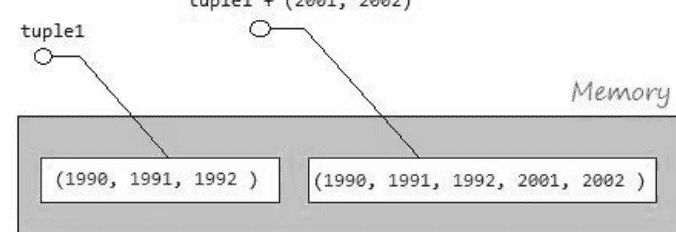

## tupleMemoryTest.py

```python
tuple1 = (1990, 1991, 1992)

# tuple1 在内存中的地址。
tuple1Address = hex(id(tuple1))
print("Address of tuple1: ", tuple1Address)

# 将一个元组连接到 tuple1。
tuple1 = tuple1 + (2001, 2002)

# tuple1 在内存中的地址。
tuple1Address = hex(id(tuple1))
print("Address of tuple1 (After concat): ", tuple1Address)
```

### 输出：

```
Address of tuple1: 0x9096751d80
Address of tuple1 (After concat): 0x9096778f10
```

## 访问元组的元素

## 访问元素

使用 'for' 循环访问元组的元素：

## elementAccessExample.py

```python
fruits = ("apple", "apricot", "banana", "coconut", "lemen", "plum", "pear")

for fruit in fruits:
    print("Fruit: ", fruit)
```

### 输出：

```
Fruit: apple
Fruit: apricot
Fruit: banana
Fruit: coconut
Fruit: lemen
Fruit: plum
Fruit: pear
```

## 通过索引访问：

你也可以通过索引访问元组的元素。元组的元素从左到右索引，从 0 开始。

## indexAccessExample.py

```python
fruits = ("apple", "apricot", "banana", "coconut", "lemen", "plum", "pear")
print(fruits)

# 元素数量。
print("Element count: ", len(fruits))

for i in range(0, len(fruits)):
    print("Element at ", i, "= ", fruits[i])

# 索引从 1 到 4 (1, 2, 3) 的元素子元组。
subTuple = fruits[1:4]
# ('apricot', 'banana', 'coconut')
print("Sub Tuple [1:4] ", subTuple)
```

### 输出：

```
('apple', 'apricot', 'banana', 'coconut', 'lemen', 'plum', 'pear')
Element count: 7
Element at 0 = apple
Element at 1 = apricot
Element at 2 = banana
Element at 3 = coconut
Element at 4 = lemen
Element at 5 = plum
Element at 6 = pear
Sub Tuple [1:4] ('apricot', 'banana', 'coconut')
```

你也可以通过负索引访问元组的元素，元素从右到左索引，值为 -1, -2, ...

## indexAccessExample2.py

```python
fruits = ("apple", "apricot", "banana", "coconut", "lemen", "plum", "pear")
print(fruits)
print("Element count: ", len(fruits))

print("fruits[-1]: ", fruits[-1])
print("fruits[-2]: ", fruits[-2])
subTuple1 = fruits[-4:]

print("\n")
print("Sub Tuple fruits[-4:] ")
print(subTuple1)
subTuple2 = fruits[-4:-2]
print("\n")
print("Sub Tuple fruits[-4:-2] ")
print(subTuple2)
```

### 输出：

## 更新元组

请注意，元组是不可变的，因此它只有用于访问的方法或运算符，或者从原始**元组**创建一个新的**元组**。

# updateTupleExample.py

```python
tuple1 = (1990, 1991, 1992)
print ("tuple1: ", tuple1)
print ("Concat (2001, 2002) to tuple1")

tuple2 = tuple1 + (2001, 2002)
print ("tuple2: ", tuple2)

# A sub Tuple, containing elements from index 1 to 4 (1,2,3)
tuple3 = tuple2[1:4]
print ("tuple2[1:4]: ", tuple3)

# A sub Tuple, containing elements from index 1 to the end.
tuple4 = tuple2[1: ]
print ("tuple2[1: ]: ", tuple4)
```

### 输出：

```
tuple1: (1990, 1991, 1992)
Concat (2001, 2002) to tuple1
tuple2: (1990, 1991, 1992, 2001, 2002)
tuple2[1:4]: (1991, 1992, 2001)
tuple2[1: ]: (1991, 1992, 2001, 2002)
```

## 元组的运算符

与字符串相同，元组有3个运算符，包括 `+`、`*`、`in`。

| 运算符 | 描述 | 示例 |
| :--- | :--- | :--- |
| + | 该运算符用于连接两个元组以创建一个新的元组 | (1, 2, 3) + ("One", "Two") --> (1, 2, 3, "One", "Two") |
| * | 该运算符用于连接同一元组的多个副本，并创建一个新的元组 | (1, 2) * 3 --> (1, 2, 1, 2, 1, 2) |
| in | 检查一个元素是否在元组中，返回 True 或 False。 | "Abc" in ("One", "Abc") --> True |

# tupleOperatorsExample.py

```python
tuple1 = (1, 2, 3)
tuple2 = ("One", "Two")
print ("tuple1: ", tuple1)
print ("tuple2: ", tuple2)
print ("\n")

tuple12 = tuple1 + tuple2
print ("tuple1 + tuple2: ", tuple12)
tuple2x3 = tuple2 * 3
print ("tuple2 * 3: ", tuple2x3)
hasThree = "Three" in tuple2
print ("'Three' in tuple2? ", hasThree)
```

### 输出：

```
tuple1: (1, 2, 3)
tuple2: ('One', 'Two')

tuple1 + tuple2: (1, 2, 3, 'One', 'Two')
tuple2 * 3: ('One', 'Two', 'One', 'Two', 'One', 'Two')
'Three' in tuple2? False
```

## 元组的函数

| 函数 | 描述 |
| :--- | :--- |
| cmp(list1, list2) | 比较两个元组的元素。此函数已在 **Python3** 中移除。 |
| len(list) | 返回元组的总长度。 |
| max(list) | 返回元组中具有最大值的元素。 |
| min(list) | 返回元组中具有最小值的元素。 |
| tuple(seq) | 将列表转换为元组。 |

# tupleFunctionsExample.py

```python
tuple1 = (1991, 1994, 1992)
tuple2 = (1991, 1994, 2000, 1992)
print ("tuple1: ", tuple1)
print ("tuple2: ", tuple2)

# Return element count.
print ("len(tuple1): ", len(tuple1) )
print ("len(tuple2): ", len(tuple2) )

# Maximum value in the Tuple.
maxValue = max(tuple1)
print ("Max value of tuple1: ", maxValue)

# Minimum value in the Tuple.
minValue = min(tuple1)
print ("Min value of tuple1: ", minValue)

# (all)
# List
list3 = [2001, 2005, 2012]
print ("list3: ", list3)

# Convert a List to a tuple.
tuple3 = tuple (list3)
print ("tuple3: ", tuple3)
```

### 输出：

```
tuple1: (1991, 1994, 1992)
tuple2: (1991, 1994, 2000, 1992)
len(tuple1): 3
len(tuple2): 4
Max value of tuple1: 1994
Min value of tuple1: 1991
list3: [2001, 2005, 2012]
tuple3: (2001, 2005, 2012)
```

## 方法

| 方法 | 描述 |
|---|---|
| tuple.count(obj) | 返回 obj 在元组中出现的次数 |
| tuple.index(obj, [start, [stop]]) | 返回 obj 在元组中出现的最低索引。如果未找到该值，则引发 **ValueError**。<br>如果存在参数 **start**、**stop**，则仅从 **start** 索引搜索到 **stop** 索引（不包括 **stop**）。 |

# 示例：

# tupleMethodsExample.py

```python
years = ( 1990 , 1991 , 1993 , 1991 , 1993 , 1993 , 1993 )
print ("Years: ", years)
print ("\n")

# return number of occurrences of 1993
print ("years.count(1993): ",years.count(1993) )

# Find the index that appears 1993
print ("years.index(1993): ", years.index(1993) )

# Find the index that appears 1993, from index 3
print ("years.index(1993, 3): ", years.index(1993, 3) )

# Find the index that appears 1993, from index 4 to 5 (Not included 6)
print ("years.index(1993, 4, 6): ", years.index(1993, 4, 6) )
```

### 输出：

```
Years: (1990, 1991, 1993, 1991, 1993, 1993, 1993)

years.count(1993): 4
years.index(1993): 2
years.index(1993, 3): 4
years.index(1993, 4, 6): 4
```

## Python 字典教程与示例

## Python 字典

在 **Python** 中，字典是一种数据类型，它是一个元素列表，每个元素都是一对键和值，与 **Java** 中的 **Map** 概念非常相似。

字典都是 dict 类的对象。

要编写一个字典，你需要使用 `{ }`，并将元素写入其中，元素之间用逗号分隔。每个元素都是一个由冒号 `:` 分隔的键值对。

# 示例：

```python
# Dictionary
myinfo = {"Name": "Tran", "Age": 37, "Address" : "Vietnam" }
```

你也可以从 **dict** 类的构造函数创建一个字典对象。

# createDictionaryFromClass.py

```python
# Create a dictionary via constructor of dict class.
mydict = dict()

mydict["E01"] = "John"
mydict["E02"] = "King"

print ("mydict: ", mydict)
```

### 输出：

```
mydict: {'E01': 'John', 'E02': 'King'}
```

## 字典中值的特点：

- 字典的每个元素都是一对键和值，值可以是某种类型（字符串、数字、用户自定义类型等），并且可以相同。

## 字典中键的特点。

- 字典中的键是不可变类型。因此，它可以是字符串、数字、元组等。
- 某些类型是不允许的（例如：**列表**），因为**列表**是可变的数据类型。
- 字典中的键不允许重复。

# 示例：

# dictionaryExample.py

```python
# Dictionary
myinfo = {"Name": "Tran", "Age": 37, "Address" : "Vietnam" }

print ("myinfo['Name'] = ", myinfo["Name"])
print ("myinfo['Age'] = ", myinfo["Age"])
print ("myinfo['Address'] = ", myinfo["Address"])
```

### 输出：

```
myinfo['Name'] = Tran
myinfo['Age'] = 37
myinfo['Address'] = Vietnam
```

## 更新字典

字典允许你更新特定键的值，如果该键在字典中不存在，则会添加一个新元素。

# updateDictionaryExample.py

```python
# Dictionary
myinfo = {"Name": "Tran", "Age": 37, "Address" : "Vietnam" }

# update value for key 'Address'
myinfo["Address"] = "HCM Vietnam"

# Add new element with key 'Phone'
myinfo["Phone"] = "12345"

print ("Element count: ", len(myinfo) )
print ("myinfo['Name'] = ", myinfo["Name"])
print ("myinfo['Age'] = ", myinfo["Age"])
print ("myinfo['Address'] = ", myinfo["Address"])
print ("myinfo['Phone'] = ", myinfo["Phone"])
```

### 输出：

```
Element count: 4
myinfo['Name'] = Tran
myinfo['Age'] = 37
myinfo['Address'] = HCM Vietnam
myinfo['Phone'] = 12345
```

## 删除字典

有两种方法可以从字典中删除元素。

1. 使用 **del** 运算符
2. 使用 "**__delitem__ (key)**" 方法

# deleteDictionaryExample.py

```python
# (Key,Value) = (Name, Phone)
contacts = {"John": "01217000111", "Tom": "01234000111", "Addison":"01217000222", "Jack":"01227000123"}

print ("Contacts: ", contacts)
print ("\n")
print ("Delete key = 'John' ")

# Delete element with key 'John'
del contacts["John"]
print ("Contacts (After delete): ", contacts)
print ("\n")
print ("Delete key = 'Tom' ")

# Delete element with key 'Tom'
contacts.__delitem__( "Tom")
print ("Contacts (After delete): ", contacts)
print ("Clear all element")

# Clear all element
contacts.clear()
print ("Contacts (After clear): ", contacts)

# Delete dictionary 'contact' from memory
del contacts
# An error occured while accessing a variable that does not exist in memory
print ("Contacts (After delete): ", contacts)
```

## 字典相关函数

| 函数 | 描述 |
| :--- | :--- |
| len(dict) | 返回字典的元素数量。 |
| str(dict) | 生成字典的可打印字符串表示形式。 |
| type(variable) | 返回传入变量的类型。如果传入的变量是字典，则返回表示 `dict` 类的对象。 |
| dir(clazzOrObject) | 返回传入类（或对象）的成员。如果传入的类是 **dict** 类，则返回 **dict** 类的成员。 |

## functionDictionaryExample.py

```python
contacts = {"John": "01217000111" ,"Addison": "01217000222" ,"Jack": "01227000123"}
print ("contacts: ", contacts)
print ("Element count: ", len(contacts) )

contactsAsString = str(contacts)
print ("str(contacts): ", contactsAsString )

# An object representing the 'dict' class.
aType = type(contacts)
print ("type(contacts): ", aType )

# dir(dict) function returns members of 'dict' class.
print ("dir(dict): ", dir(dict) )

# ------------------------------------------------------------------
# ['__class__','__contains__','__delattr__','__delitem__','__dir__','__doc__',
# '__eq__','__format__','__ge__','__getattribute__','__getitem__','__gt__',
# '__hash__','__init__','__init_subclass__','__iter__','__le__','__len__',
# '__lt__','__ne__','__new__','__reduce__','__reduce_ex__','__repr__',
# '__setattr__','__setitem__','__sizeof__','__str__','__subclasshook__','clear',
# 'copy','fromkeys','get','items','keys','pop','popitem',
# 'setdefault','update','values']
# ------------------------------------------------------------------
```

## 控制台输出

```
contacts:  {'John': '01217000111', 'Addison': '01217000222', 'Jack': '01227000123'}
Element count:  3
str(contacts):  {'John': '01217000111', 'Addison': '01217000222', 'Jack': '01227000123'}
type(contacts):  <class 'dict'>
dir(dict):  ['__class__', '__contains__', '__delattr__', '__delitem__', '__dir__', '__doc__'
```

## Python 日期时间教程及示例

## 概述

**Python** 为您提供了 4 个与日期和时间相关的模块。

| 模块 | 描述 |
|---|---|
| time | time 是一个仅包含与日期和时间相关的函数和常量的模块，该模块上定义了几个用 C/C++ 编写的类。例如，`struct_time` 类。 |
| datetime | datetime 是一个模块，采用面向对象编程设计，用于在 Python 中处理日期和时间。它定义了几个表示日期和时间的类。 |
| calendar | calendar 是一个提供与日历相关的函数和几个类的模块，支持生成文本、html 等格式的日历图像。 |
| locale | 此模块包含用于格式化或解析日期和时间的函数。 |

## datetime 模块：

**datetime** 是一个基于面向对象设计的模块，用于在 **Python** 中处理日期和时间。它有几个表示日期和时间的类。

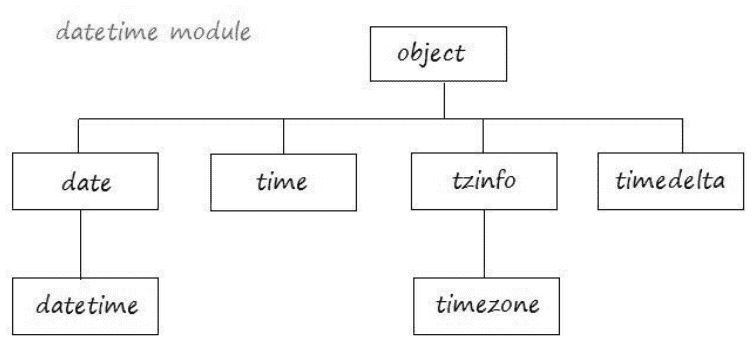

| 类 | 描述 |
|---|---|
| datetime.date | 一个日期对象，表示公历中的一个日期（不包括时间）。 |
| datetime.datetime | 一个日期时间对象，表示公历中的一个日期和时间。 |
| datetime.time | 一个时间对象，表示时间（不包括日期）。 |
| datetime.tzinfo | 时区信息对象的基类抽象类。 |
| datetime.timezone | `tzinfo` 类的直接子类，表示 UTC（协调世界时）。 |
| datetime.timedelta | 一个时间增量对象，表示持续时间，即两个日期或时间之间的差值。 |

## calendar 模块：

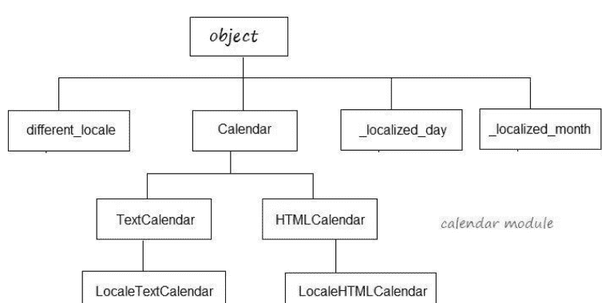

**calendar** 是一个提供与日历相关的函数和几个类的模块，支持生成文本、html 等格式的日历图像。

```
Here is the calendar:
January 1970
Mo Tu We Th Fr Sa Su
          1  2  3  4
 5  6  7  8  9 10 11
12 13 14 15 16 17 18
19 20 21 22 23 24 25
26 27 28 29 30 31
```

## 时间戳的概念

在计算机科学中，1970年1月1日午夜12点是一个特殊的时间，它被用作时间的起始点。这个特殊的时刻被称为 **epoch**（计算机时代）。

在 **Python** 中，当前时刻与上述特殊时间之间的时间间隔以秒为单位表示。这个时间段被称为 **Ticks**（时间戳）。

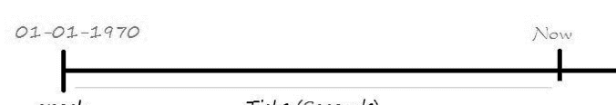

**time** 模块中的 **time()** 函数返回从1970年1月1日午夜12点到现在的秒数。

## ticketExample.py

```python
# Import time module.
import time;

# Number of seconds since 12:00am, January 1, 1970
ticks = time.time()
print ("Number of ticks since 12:00am, January 1, 1970: ", ticks)
```

### 输出：

Number of ticks since 12:00am, January 1, 1970: 1492244686.7766237

## time 模块

**time** 是一个仅包含与日期和时间相关的函数和常量的模块，该模块上定义了几个用 C/C++ 编写的类。例如，**struct_time** 类。

在 **time** 模块中，时间由 **Ticks** 或 **struct_time** 表示。它具有将 **Ticks** 或 **struct_time** 格式化为字符串的函数，反之亦然，将字符串解析为 **Ticks** 或 **struct_time**。

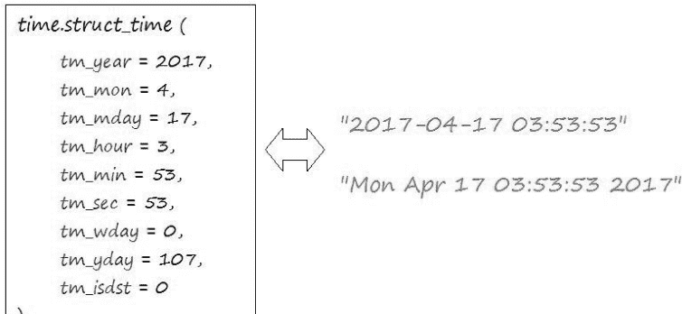

| 索引 | 属性 | 值 |
|-------|-----------|--------|
| 0 | tm_year | 2017 |
| 1 | tm_mon | 4 |
| 2 | tm_mday | 17 |
| 3 | tm_hour | 3 |
| 4 | tm_min | 53 |
| 5 | tm_sec | 53 |
| 6 | tm_wday | 0 |
| 7 | tm_yday | 107 |
| 8 | tm_isdst | 0 |

| 索引 | 属性 | 值 |
| :--- | :--- | :--- |
| 0 | tm_year | （例如，1993） |
| 1 | tm_mon | 范围 [1, 12] |
| 2 | tm_mday | 范围 [1, 31] |
| 3 | tm_hour | 范围 [0, 23] |
| 4 | tm_min | 范围 [0, 59] |
| 5 | tm_sec | 范围 [0, 61]；详见下文 |
| 6 | tm_wday | 范围 [0, 6]，星期一为 0 |
| 7 | tm_yday | 范围 [1, 366] |
| 8 | tm_isdst | 0, 1 或 -1；详见下文 |
| N/A | tm_zone | 时区名称的缩写 |
| N/A | tm_gmtoff | UTC 以东的偏移量（秒） |

**注意：** 秒的范围确实是 0 到 61；这考虑了闰秒和（非常罕见的）双闰秒。

**time** 模块的函数调用用 **C** 语言编写的函数。以下是常用函数列表，要了解详细信息，您可以参考 **Python** 官方网站上的文档。

## Ticks ==> struct_time

| 函数 | 描述 |
| :--- | :--- |
| time.gmtime([secs]) | 将从 epoch 时间开始的秒数时间转换为 **UTC** 中的 `struct_time`，其中 dst 标志为 0。如果未提供 secs 参数或为 None，则使用 **time()** 函数返回的默认值。 |
| time.localtime([secs]) | 与 **gmtime()** 函数相同，但转换为本地时间。并且 dst 标志的值为 1。 |

**gmtime([secs])** 和 **localtime([secs])** 函数返回 **struct_time** 类型。

## time_gmtimeExample.py

```python
import time

# 1 seconds after epoch.
# This function return a struct: struct_time
ts = time.gmtime(1)
print ("1 seconds after epoch: ")
print (ts)
print ("\n")

# Now, same as time.gmtime( time.time() )
# This function return a struct: struct_time
ts = time.gmtime()
print ("struct_time for current time: ")
print (ts)
```

## 控制台输出

```
1 seconds after epoch:
time.struct_time(tm_year=1970, tm_mon=1, tm_mday=1, tm_hour=0, tm_min=0, tm_sec=1, tm_wday=3, tm_yday=1, tm_isdst=0)

struct_time for current time:
time.struct_time(tm_year=2017, tm_mon=4, tm_mday=15, tm_hour=13, tm_min=57, tm_sec=27, tm_wday=5, tm_yday=105, tm_isdst=0)
```

## struct_time ==> Ticks

您可以将表示时间的 **struct_time** 或 **Tuple** 转换为 **Ticks**（从 **epoch** 时间开始计算的秒数）。

## time_mktime_example.py

```python
import time

a_struct_time = time.localtime()
print ("Current time as struct_time: ");
print (a_struct_time)
# Convert struct_time or Tuple to Ticks.
```

## struct_time，Ticks ==> 字符串

| 函数 | 描述 |
| :--- | :--- |
| time.asctime([struct_t]) | 将由 **gmtime()** 或 **localtime()** 返回的表示时间的 **元组** 或 **struct_time** 转换为以下格式的字符串：'Sun Jun 20 23:21:05 1993'。如果未提供 `t`，则使用 **localtime()** 返回的当前时间。**asctime()** 不使用区域设置信息。 |
| time.ctime([secs]) | 将自纪元以来以秒表示的时间转换为代表本地时间的字符串。如果未提供 **secs** 或其值为 **None**，则使用 **time()** 返回的当前时间。**ctime(secs)** 等效于 **asctime(localtime(secs))**。**ctime()** 不使用区域设置信息。 |

```python
ticks = time.mktime(a_struct_time)
print ("Ticks: ", ticks)

# A Tuple with 9 elements.
aTupleTime = ( 2017, 4, 15, 13, 5, 34, 0, 0, 0)
print ("\n")
print ("A Tuple represents time: ")
print (aTupleTime)

# Convert struct_time or Tuple to Ticks.
ticks = time.mktime(aTupleTime)
print ("Ticks: ", ticks)
```

```
Current time as struct_time:
time.struct_time(tm_year=2017, tm_mon=4, tm_mday=17, tm_hour=13, tm_min=12, tm_sec=48,
Ticks:  1492409568.0

A Tuple represents time:
(2017, 4, 15, 13, 5, 34, 0, 0, 0)
Ticks:  1492236334.0
```

## time_asctime_ctime_example.py

```python
import time

# A Tuple with 9 elements.
# (Year, month, day, hour, minute, second, wday, yday, isdst)
a_tuple_time = (2017, 4, 15 , 22 , 1, 29, 0, 0, 0)
a_timeAsString = time.asctime(a_tuple_time)
print ("time.asctime(a_tuple_time): ", a_timeAsString)

a_struct_time = time.localtime()
print ("a_struct_time: ", a_struct_time)

a_timeAsString = time.asctime(a_struct_time)
print ("time.asctime(a_struct_time): ", a_timeAsString)

# The number of seconds since 1-1-1970 12am to current time.
ticks = time.time()
a_timeAsString = time.ctime(ticks)
print ("time.ctime(ticks): ", a_timeAsString)
```

```
time.asctime(a_tuple_time):  Mon Apr 15 22:01:29 2017
a_struct_time:  time.struct_time(tm_year=2017, tm_mon=4, tm_mday=15, tm_hour=22, tm_min=35, tm_sec=40, tm_wday=6, tm_yday=105, tm_isdst=0)
time.asctime(a_struct_time):  Sat Apr 15 22:35:40 2017
time.ctime(ticks):  Sat Apr 15 22:35:40 2017
```

## 解析与格式化

**time** 模块提供了一些用于将字符串解析为时间的函数。反之，也可以将时间格式化为字符串。

| 函数 | 描述 |
| --- | --- |
| time.strptime(string[, format]) | 根据格式解析表示时间的字符串。返回值是一个 **struct_time**，与 **gmtime()** 或 **localtime()** 返回的相同。 |
| time.strftime(format[, t]) | 将由 **gmtime()** 或 **localtime()** 返回的表示时间的元组或 **struct_time** 转换为由 `format` 参数指定的字符串。如果未提供 `t`，则使用 **localtime()** 返回的当前时间。**format** 必须是一个字符串。如果 `t` 中的任何字段超出允许范围，将引发 **ValueError**。 |

一个将字符串解析为 **struct_time** 的示例。

## time_strptime_example.py

```python
import time
# A string representing time.
aStringTime = "22-12-2007 23:30:59"

a_struct_time = time.strptime(aStringTime, "%d-%m-%Y %H:%M:%S")
print ("a_struct_time:")
print (a_struct_time)
```

## datetime 模块

**Datetime** 是一个模块，它采用面向对象编程设计，用于在 **Python** 中处理日期和时间。它定义了几个表示日期和时间的类。

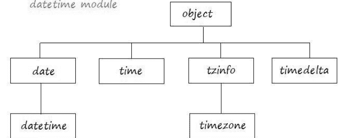

| 类 | 描述 |
|---|---|
| datetime.date | 一个日期对象，根据公历表示一个日期，不包含时间。 |
| datetime.datetime | 一个日期时间对象，根据公历表示日期和时间。 |
| datetime.time | 一个时间对象，表示时间，不包含日期。 |
| datetime.tzinfo | 时区信息对象的基类抽象类。 |
| datetime.timezone | tzinfo 类的直接子类，表示协调世界时（UTC）。 |
| datetime.timedelta | 一个 timedelta 对象表示一个持续时间，即两个日期或时间之间的差值。 |

## datetime.timedelta

**Timedelta** 是位于 **datetime** 模块中的一个类，它描述了一个时间段。作为两个时间段之间的差值。

**timedelta** 类有七个属性，所有属性的默认值均为 0。

| 属性 | | 范围 |
| --- | --- | --- |
| days | | -999999999 : 999999999 |
| seconds | | 0 : 86399 |
| microseconds | 1 秒 = 1,000,000 微秒 | 0 : 999999 |
| milliseconds | 1 秒 = 1000 毫秒 | |
| minutes | | |
| hours | | |
| weeks | | |

## 运算符：

| 操作 | 示例 |
| --- | --- |
| t1 = t2 + t3 | t2 = (hours = 10, seconds= 2)<br>t3 = (hours = 1, minutes = 3)<br>--> t1 = (hours= 11, minutes = 3, seconds = 2) |
| t1 = t2 - t3 | t2 = (hours = 10, seconds= 2)<br>t3 = (hours = 1, minutes = 3)<br>--> t1 = (hours= 8, minutes = 57, seconds = 2) |
| t1 = t2 * i<br>t1 = i * t2 | t2 = (hours = 10, seconds= 2)<br>i = 3<br>--> t1 = (days =1, hours = 6, seconds= 6) |
| t1 = t2 | t2 = (hours = 25, seconds= 2)<br>--> t1 = (days: 1, hours: 1, seconds: 2) |
| +t1 | 返回 t1 |
| -t1 | t1 = (hours = 10, seconds= 2)<br>--> -t1 = (days = -1, hours = 13, minutes = 59, seconds= 58) |
| abs(t) | 绝对值，当 t.days>= 0 时等效于 + t，当 t.days <0 时等效于 -t。<br>t = (hours= -25, minutes = 3)<br>--> t = (days = -2, hours = 23, minutes = 3)<br>--> abs(t) = (days = 1, hours = 0, minutes = 57) |
| str(t) | 返回字符串，形式为 [D day[s,]] [H]H:MM:SS[.UUUUUU]，其中 D 可以是负值。 |
| repr(t) | 返回字符串，形式为 datetime.timedelta(D[, S[, U]])，其中 D 可以是负值。 |

## datetime.date

**Datetime.date** 是一个类，其对象表示日期，不包含时间信息。

## 构造函数

**构造函数**

```python
# MINYEAR <= year <= MAXYEAR
# 1 <= month <= 12
# 1 <= day <= number of days in the given month and year
date (year, month, day)
```

如果传入的值无效（超出范围），**date** 类的构造函数可能会引发 **ValueError**。

## 常量：

| 常量 | 描述 |
|---|---|
| date.min | 可表示的最早日期，date(MINYEAR, 1, 1)。 |
| date.max | 可表示的最晚日期，date(MAXYEAR, 12, 31)。 |
| date.resolution | 非相等日期对象之间可能的最小差值，timedelta(days=1)。 |

## 运算符

| 操作 | 描述 |
|---|---|
| date2 = date1 + timedelta | 加上一个持续时间，timedelta |
| date2 = date1 - timedelta | 减去一个持续时间，timedelta |
| timedelta = date1 - date2 | 两个 **date** 对象相减。 |
| date1 < date2 | 比较两个 **date** 对象。 |

## 方法：

| 方法 | 描述 |
|---|---|
| `date.replace(year=self.year, month=self.month, day=self.day)` | 返回一个具有相同属性的日期，但那些通过关键字参数指定新值的属性除外。例如：`d == date(2002, 12, 31), d.replace(day=26) == date(2002, 12, 26)`。 |
| `date.timetuple()` | 返回一个 `time.struct_time`，类似于 `time.localtime()` 返回的。小时、分钟和秒为 0，夏令时标志为 -1。`d.timetuple()` 等效于 `time.struct_time((d.year, d.month, d.day, 0, 0, 0, d.weekday(), yday, -1))`，其中 `yday = d.toordinal() - date(d.year, 1, 1).toordinal() + 1` 是当前年份中的天数，从 1 月 1 日开始计为 1。 |
| `date.toordinal()` | 返回该日期的公历序数，其中公元 1 年 1 月 1 日的序数为 1。对于任何日期对象 `d`，`date.fromordinal(d.toordinal()) == d`。 |
| `date.weekday()` | 返回星期几作为整数，其中星期一为 0，星期日为 6。例如，`date(2002, 12, 4).weekday() == 2`，表示星期三。另请参阅 `isoweekday()`。 |
| `date.isoweekday()` | 返回星期几作为整数（根据 ISO 标准），其中星期一为 1，星期日为 7。例如，`date(2002, 12, 4).isoweekday() == 3`，表示星期三。另请参阅 `weekday()`、`isocalendar()`。 |
| `date.isocalendar()` | 返回一个三元组 (ISO 年, ISO 周数, ISO 星期几)。 |
| `date.isoformat()` | 返回一个表示 ISO 8601 格式日期的字符串，格式为 'YYYY-MM-DD'。例如，`date(2002, 12, 4).isoformat() == '2002-12-04'`。 |
| `date.__str__()` | 对于日期 `d`，`str(d)` 等效于 `d.isoformat()`。 |
| `date.ctime()` | 返回一个表示日期的字符串，例如 `date(2002, 12, 4).ctime() == 'Wed Dec 4 00:00:00 2002'`。`d.ctime()` 等效于 `time.ctime(time.mktime(d.timetuple()))`。原生 C `ctime()` 函数在平台上运行时符合 C 标准。 |
| `date.strftime(format)` | 返回一个表示日期的字符串，格式由参数指定。引用小时、分钟或秒的格式代码将看到 0 值。更多内容请参阅 `time` 模块的 `strftime()` 和 `strptime()` 函数。 |
| `date.__format__(format)` | 与 `date.strftime()` 相同。 |

## 在Python中使用PyMySQL连接MySQL数据库

## 什么是PyMySQL？

为了将**Python**连接到数据库，你需要一个驱动程序，这是一个用于与数据库交互的库。对于**MySQL**数据库，你有以下3种驱动程序选择：

- 1. MySQL/Connector for Python
- 2. MySQLdb
- 3. PyMySQL

| 驱动程序 | 描述 |
|---|---|
| MySQL/Connector for Python | 这是MySQL社区提供的一个库。 |
| MySQLdb | MySQLdb是一个从Python连接到MySQL的库，它用C语言编写，是免费和开源的软件。 |
| PyMySQL | 这是一个从Python连接到MySQL的库，它是一个纯Python库。PyMySQL的目标是取代MySQLdb，并在CPython、PyPy和IronPython上工作。 |

**注意：** **PyMySQL**是一个开源项目，你可以在这里查看其源代码。

## 安装PyMySQL

为了在**Windows**（或**Ubuntu/Linux**）上安装**PyMySQL**，你需要打开**CMD**窗口，并运行以下语句：

```
pip install PyMySQL
```

**"Simplehr"**是一个示例数据库。
你可以根据以下指南创建该数据库。

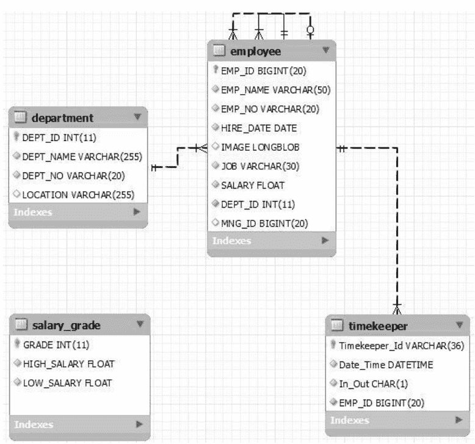

## 使用PyMySQL从Python连接MySQL

以下简单示例使用**Python**连接到**MySQL**并查询**Department**表：

### connectExample.py

```
import pymysql.cursors
# Connect to the database.
connection = pymysql.connect(host='192.168.5.134',
                           user='root',
                           password='1234',
                           db='simplehr',
                           charset='utf8mb4',
                           cursorclass=pymysql.cursors.DictCursor)
print ("connect successful!!!")
try:
    with connection.cursor() as cursor:
        # SQL
        sql = "SELECT Dept_No, Dept_Name FROM Department "
        # Execute query.
        cursor.execute(sql)
        print ("cursor.description: ", cursor.description)
        print()
        for row in cursor:
            print(row)
finally:
    # Close connection.
    connection.close()
```

### 示例结果：

```
connect successful!!
cursor.description: (('Dept_No', 253, None, 80, 80, 0, False), ('Dept_Name', 253, None, 1020, 1020, 0, False))

{'Dept_No': 'D10', 'Dept_Name': 'ACCOUNTING'}
{'Dept_No': 'D20', 'Dept_Name': 'RESEARCH'}
{'Dept_No': 'D30', 'Dept_Name': 'SALES'}
{'Dept_No': 'D40', 'Dept_Name': 'OPERATIONS'}
```

## 实用模块

这里的建议是，你应该创建一个实用**模块**来连接数据库。例如，我创建了一个名为"**myconnutils**"的模块，它定义了`getConnection()`函数来返回一个**连接**。

### myconnutils.py

```
import pymysql.cursors
# Function return a connection.
def getConnection():
    # You can change the connection arguments.
    connection = pymysql.connect(host='192.168.5.129',
                                user='root',
                                password='1234',
                                db='simplehr',
                                charset='utf8mb4',
                                cursorclass=pymysql.cursors.DictCursor)
    return connection
```

## 查询示例

以下示例查询Employee表。**Python**使用`%s`作为参数的"占位符"，它独立于参数类型。例如：

```
sql1 = "Insert into Department (Dept_Id, Dept_No, Dept_Name) values (%s, %s, %s) "
sql2 = "Select * from Employee Where Dept_Id = %s "
```

### queryExample.py

```
# Use your utility module.
import myconnutils

connection = myconnutils.getConnection()
print ("Connect successful!")
sql = "Select Emp_No, Emp_Name, Hire_Date from Employee Where Dept_Id = %s "
try :
    cursor = connection.cursor()
    # Execute sql, and pass 1 parameter.
    cursor.execute(sql, ( 10 ) )
    print ("cursor.description: ", cursor.description)
    print()
    for row in cursor:
        print (" ----------- ")
        print("Row: ", row)
        print ("Emp_No: ", row["Emp_No"])
        print ("Emp_Name: ", row["Emp_Name"])
        print ("Hire_Date: ", row["Hire_Date"], type(row["Hire_Date"]) )
finally:
    # Close connection.
    connection.close()
```

```
Connect successful!
cursor.description:  (('Emp_No', 253, None, 80, 80, 0, False), ('Emp_Name', 253, None, 20

 ----------- 
Row:  {'Emp_No': 'E7839', 'Emp_Name': 'KING', 'Hire_Date': datetime.date(1981, 11, 17)}
Emp_No:  E7839
Emp_Name:  KING
Hire_Date:  1981-11-17 <class 'datetime.date'>
 ----------- 
Row:  {'Emp_No': 'E7934', 'Emp_Name': 'MILLER', 'Hire_Date': datetime.date(1982, 1, 23)}
Emp_No:  E7934
Emp_Name:  MILLER
Hire_Date:  1982-01-23 <class 'datetime.date'>
```

## 插入示例

### insertExample.py

```
# Use your utility module.
import myconnutils
import pymysql.cursors

connection = myconnutils.getConnection()
print ("Connect successful!")
try :
    cursor = connection.cursor()
    sql = "Select max(Grade) as Max_Grade from Salary_Grade "
    cursor.execute(sql)
    # 1 row.
    oneRow = cursor.fetchone()

    # Output: {'Max_Grade': 4} or {'Max_Grade': None}
    print ("Row Result: ", oneRow)
    grade = 1

    if oneRow != None and oneRow["Max_Grade"] != None:
        grade = oneRow["Max_Grade"] + 1
    cursor = connection.cursor()
    sql = "Insert into Salary_Grade (Grade, High_Salary, Low_Salary) " \
        + " values (%s, %s, %s) "
    print ("Insert Grade: ", grade)
    # Execute sql, and pass 3 parameters.
    cursor.execute(sql, (grade, 2000, 1000 ) )
    connection.commit()
finally:
    connection.close()
```

### 输出：

```
connect successful!!
Row Result: {'Max_Grade': 2}
Insert Grade: 3
```

## 更新示例

### updateExample.py

```
# Use your utility module.
import myconnutils
import pymysql.cursors
import datetime

connection = myconnutils.getConnection()
print ("Connect successful!")
try :
    cursor = connection.cursor()
    sql = "Update Employee set Salary = %s, Hire_Date = %s where Emp_Id = %s "
    # Hire_Date
    newHireDate = datetime.date(2002, 10, 11)
    # Execute sql, and pass 3 parameters.
    rowCount = cursor.execute(sql, (850, newHireDate, 7369 ) )
    connection.commit()
    print ("Updated! ", rowCount, " rows")
finally:
    # Close connection.
    connection.close()
```

### 输出：

```
connect successful!
Update! 1 rows
```

## 删除示例

### deleteExample.py

```
# Use your utility module.
import myconnutils

connection = myconnutils.getConnection()
print ("Connect successful!")
try :
    cursor = connection.cursor()
    sql = "Delete from Salary_Grade where Grade = %s"

    # Execute sql, and pass 1 parameters.
    rowCount = cursor.execute(sql, ( 3 ) )
    connection.commit()
    print ("Deleted! ", rowCount, " rows")
finally:
    # Close connection.
    connection.close()
```

### 输出：

```
connect successful!
Deleted! 1 rows
```

## 调用存储过程

在**Python**中调用函数或存储过程时存在一些问题。我设置了一个这样的场景：
你有一个存储过程：

- Get_Employee_Info(p_Emp_Id, v_Emp_No, v_First_Name, v_Last_Name, v_Hire_Date)

### get_Employee_Info

```
DELIMITER $$

-- This procedure retrieves information of an employee,
-- Input parameter: p_Emp_ID (Integer)
-- There are four output parameters v_Emp_No, v_First_Name, v_Last_Name, v_Hire_Date

CREATE PROCEDURE get_Employee_Info(p_Emp_ID Integer,
                                    out v_Emp_No Varchar(50) ,
                                    out v_First_Name Varchar(50) ,
                                    Out v_Last_name Varchar(50) ,
                                    Out v_Hire_date Date)
BEGIN
set v_Emp_No = concat( 'E' , Cast(p_Emp_Id as char(15)) );
--
set v_First_Name = 'Michael';
set v_Last_Name = 'Smith';
set v_Hire_date = curdate();
END
```

上述存储过程有一个输入参数**p_Emp_Id**和四个输出参数**v_Emp_No, v_First_Name, v_Last_Name, v_Hire_Date**，你从**Python**调用此存储过程，将值传递给**p_Emp_Id**以获取4个输出值。不幸的是，接收到的值不保证是真实的（如DB-API规范中所述）。**Python**只能从SELECT子句中检索值。

## 注意：

## DB-API 规范：

```python
def callproc(self, procname, args=()):
    """Execute stored procedure procname with args

    procname -- string, name of procedure to execute on server

    args -- Sequence of parameters to use with procedure

    Returns the original args.

    Compatibility warning: PEP-249 specifies that any modified
    parameters must be returned. This is currently impossible
    as they are only available by storing them in a server
    variable and then retrieved by a query. Since stored
    procedures return zero or more result sets, there is no
    reliable way to get at OUT or INOUT parameters via callproc.
    The server variables are named @_procname_n, where procname
    is the parameter above and n is the position of the parameter
    (from zero). Once all result sets generated by the procedure
    have been fetched, you can issue a SELECT @_procname_0, ...
    query using .execute() to get any OUT or INOUT values.

    Compatibility warning: The act of calling a stored procedure
    itself creates an empty result set. This appears after any
    result sets generated by the procedure. This is non-standard
    behavior with respect to the DB-API. Be sure to use nextset()
    to advance through all result sets; otherwise you may get
    disconnected.
    """
```

然而，你仍然可以解决上述问题，你需要用另一个存储过程（例如 **Get_Employee_Info_Wrap**）来包装 **Get_Employee_Info** 存储过程，这个包装过程会返回 SELECT 子句中的值。

## get_Employee_Info_Wrap

```sql
DROP procedure IF EXISTS `get_Employee_Info_Wrap`;

DELIMITER $$

-- This procedure wrap Get_Employee_info
CREATE PROCEDURE get_Employee_Info_Wrap(p_Emp_ID Integer,
                                        out v_Emp_No Varchar(50),
                                        out v_First_Name Varchar(50),
                                        Out v_Last_name Varchar(50),
                                        Out v_Hire_date Date)
BEGIN
    Call get_Employee_Info( p_Emp_Id, v_Emp_No, v_First_Name, v_Last_Name, v_Hire_Date);
    -- SELECT
    Select v_Emp_No, v_First_Name, v_Last_Name, v_Hire_Date;
END
```

在 **Python** 中，不要直接调用 **Get_Employee_Info** 存储过程，而是调用 **Get_Employee_Info_Wrap** 存储过程。

## callProcedureExample.py

```python
# Use your utility module.
import myconnutils
import datetime

connection = myconnutils.getConnection()
print ("Connect successful!")
try :
    cursor = connection.cursor()
    # Get_Employee_Info_Wrap
    # @p_Emp_Id     Integer ,
    # @v_Emp_No     Varchar(50)  OUTPUT
    # @v_First_Name Varchar(50)  OUTPUT
    # @v_Last_Name  Varchar(50)  OUTPUT
    # @v_Hire_Date  Date         OUTPUT
    v_Emp_No = ""
    v_First_Name= ""
    v_Last_Name= ""
    v_Hire_Date = None

    inOutParams = ( 100, v_Emp_No, v_First_Name , v_Last_Name, v_Hire_Date )
    resultArgs = cursor.callproc("Get_Employee_Info_Wrap", inOutParams  )

    print ('resultArgs:', resultArgs )
    print ( 'inOutParams:', inOutParams )
    print ( '----------------------------------- ')
    for row in cursor:
        print('Row: ', row )
        print('Row[v_Emp_No]: ', row['v_Emp_No'] )
        print('Row[v_First_Name]: ', row['v_First_Name'] )
        print('Row[v_Last_Name]: ', row['v_Last_Name'] )
        # datetime.date
        v_Hire_Date = row['v_Hire_Date']
        print('Row[v_Hire_Date]: ', v_Hire_Date )
finally:
    # Close connection.
    connection.close()
```

## 运行示例：

```
connect successful!
resultArgs: (100, "", "", None)
inOutParams: (100, "", "", None)
----------------------------------------
Row: {'v_Emp_No': 'E100', 'v_First_Name': 'Michael', 'v_Last_Name': 'Smith', 'v_Hire_Date': datetime.date(2017, 5, 17)}
Row[v_Emp_No]: E100
Row[v_First_Name]: Michael
Row[v_Last_Name]: Smith
Row[v_Hire_Date]: 2017-05-17
```

## 调用函数

要在 **Python** 中调用一个函数，你应该创建一个查询语句并执行它。
以下是 **Get_Emp_No** 函数，其输入参数是 **p_Emp_Id**，返回 **Emp_No**（员工代码）。

## Get_Emp_No

```sql
DROP function if Exists `Get_Emp_No`;
DELIMITER $$
CREATE Function Get_Emp_No (p_Emp_Id Integer) Returns Varchar(50)
Begin
    return concat('E', CAST(p_Emp_Id as char)) ;
END;
```

## callFunctionExample.py

```python
# Use your utility module.
import myconnutils
import datetime

connection = myconnutils.getConnection()
print ("Connect successful!")
try :
    cursor = connection.cursor()
    # Get_Employee_Info_Wrap
    # @p_Emp_Id    Integer
    v_Emp_No = ""
    inOutParams = ( 100 )
    sql = "Select Get_Emp_No(%s) as Emp_No "
    cursor.execute(sql, ( 100 ) )
    print ('-----------------------------------')
    for row in cursor:
        print('Row: ', row )
        print('Row[Emp_No]: ', row['Emp_No'] )
finally:
    # Close connection.
    connection.close()
```

## 运行示例：

```
connect successful!
-----------------------------------
Row: {'Emp_No': 'E100'}
Row[Emp_No]: E100
```