## PYTHON 编程

（根据国家教育政策（NEP）制定的新课程大纲，适用于班加罗尔城市大学第三学期 BCA 课程）

**Hanumanthappa M. 博士**
教授兼主席，
计算机科学与应用系，
班加罗尔大学。

**Veena R.** *M.C.A. (Ph.D)*
副教授兼系主任，
计算机科学系，
Seshadripuram 学院，
班加罗尔。

**Lohith Kumar G.** *M.C.A.*
助理教授，
Vasavi Jnana Peetha 一年级学院，
班加罗尔。

**Himalaya 出版社**
ISO 9001:2015 认证

© 作者
未经出版商事先书面许可，不得以任何形式或任何方式（电子、机械、影印、录制和/或其他方式）复制、存储在检索系统中或传播本出版物的任何部分。

第一版：2023 年

**出版者**：Meena Pandey 女士
代表 **HIMALAYA PUBLISHING HOUSE PVT. LTD.**，
"Ramdoot"，Dr. Bhalerao Marg，Girgaon，孟买 - 400 004。
**电话：** 022-23860170，23863863；**传真：** 022-23877178
**电子邮件：** himpub@bharatmail.co.in；**网站：** www.himpub.com

**分支机构**：

**新德里**："Pooja Apartments"，4-B，Murari Lal Street，Ansari Road，Darya Ganj，
新德里 - 110 002。电话：011-23270392，23278631；传真：011-23256286

**那格浦尔**：Kundanlal Chandak Industrial Estate，Ghat Road，那格浦尔 - 440 018。
电话：0712-2721215，2721216

**班加罗尔**：Plot No. 91-33，2nd Main Road，Seshadripuram，Behind Nataraja Theatre，
班加罗尔 - 560 020。电话：080-41138821；手机：09379847017，09379847005

**海得拉巴**：No. 3-4-184，Lingampally，Besides Raghavendra Swamy Matham，Kachiguda，
海得拉巴 - 500 027。电话：040-27560041，27550139

**金奈**：No. 34/44，Motilal Street，T. Nagar，金奈 - 600 017。手机：09380460419

**浦那**："Laksha" Apartment，First Floor，No. 527，Mehdunpura，
Shaniwarpet（Near Prabhat Theatre），浦那 - 411 030。
电话：020-24496323，24496333；手机：09370579333

**克塔克**：Plot No 5F-755/4，Sector-9，CDA Market Nagar，克塔克 - 753 014，
奥里萨邦。手机：09338746007

**加尔各答**：3，S.M. Bose Road，Near Gate No. 5，Agarpara Railway Station，North 24 Parganas，
西孟加拉邦 - 700 109。手机：09674536325

**DTP 制作**：Rachi Enterprises，班加罗尔

**印刷**：M/s. Giriraj Printers，海得拉巴。代表 HPH。

## 前言

本书的编写基于读者具备一定编程基础知识的假设。本书是根据班加罗尔城市大学 BCA 课程第三学期的国家教育政策 [NEP] 教学大纲编写的。

本书编排非常系统。书中包含大量编程示例、语法结构和 Python 编程的理论知识。本书易于理解。从基础到高级主题的所有内容均已涵盖，学生将从中受益匪浅。

本书的主要特点包括：

-   完全涵盖 Python NEP 教学大纲的所有主题
-   包含多个示例和图表
-   对编程概念进行简洁明了的解释

本书对班加罗尔城市大学（第三学期 NEP 教学大纲）的 BCA 学生极为有用。

Hanumanthappa M 博士
Veena R
Lohith Kumar G

## 教学大纲

### 第一单元 [12 小时]

**Python 编程语言部分：** Python 解释器/Shell，标识符，关键字，语句和表达式，变量，运算符，优先级和结合性，数据类型，缩进，注释，读取输入，打印输出，类型转换，type() 函数和 Is 运算符，动态和强类型语言。

**控制流语句：** if 决策控制流语句，if…else 决策控制流语句，if…elif…else 决策控制语句，嵌套 if 语句，while 循环，for 循环，continue 和 break 语句。

**函数：** 内置函数，常用模块，函数定义和调用函数，return 语句和 void 函数，变量的作用域和生命周期，默认参数，命令行参数。

**字符串：** 创建和存储字符串，基本字符串操作，通过索引号访问字符串中的字符，字符串切片和连接，字符串方法。

### 第二单元 [12 小时]

**列表：** 创建列表，基本列表操作，列表中的索引和切片，列表使用的内置函数，列表方法，del 语句。

**字典：** 创建字典，访问和修改字典中的键值对，字典使用的内置函数，字典方法，del 语句。

**元组和集合：** 创建元组，基本元组操作，元组中的索引和切片，元组使用的内置函数，元组和列表之间的关系，元组和字典之间的关系，元组方法，使用 zip() 函数，集合，集合方法，frozenset。

### 第三单元 [12 小时]

**文件：** 文件类型，创建和读取文本数据，用于读写数据的文件方法，读写二进制文件，Pickle 模块，读写 CSV 文件。

**面向对象编程：** 类和对象，在 Python 中创建类，在 Python 中创建对象，构造函数方法，具有多个对象的类，类属性与数据属性，封装，继承，多态。

### 第四单元 [12 小时]

**数据可视化：** 生成数据-安装 Matplotlib，绘制简单折线图，随机游走，使用 Plotly 掷骰子。下载数据- CSV 文件格式，映射全球数据集：JSON 格式，使用 API：使用 Web API，使用 Plotly 可视化仓库。

# 目录

| 页码 |
| :--- |
| **第一单元 PYTHON 编程语言** |
| 第 1 章 Python 编程简介 | 1-18 |
| 第 2 章 Python 编程基础 | 19-35 |
| 第 3 章 Python 中的函数和字符串 | 36-54 |
| **第二单元 PYTHON 数据类型分析** |
| 第 4 章 列表 | 55-64 |
| 第 5 章 元组 | 65-69 |
| 第 6 章 字典 | 70-78 |
| 第 7 章 集合 | 79-86 |
| **第三单元 高级 PYTHON 编程** |
| 第 8 章 文件和异常处理 | 87-94 |
| 第 9 章 类和对象 | 95-109 |
| **第四单元 数据可视化** |
| 第 10 章 使用 Python 进行 Matplotlib 可视化 | 110-133 |
| 第 11 章 随机游走 | 134-140 |
| 第 12 章 使用 Plotly 掷骰子 | 141-145 |
| 第 13 章 使用 Web 应用程序 | 146-157 |
| 实验编程 | 159-176 |

## 第一单元：PYTHON 编程语言

### 第 1 章

## PYTHON 编程简介

### 1.1 历史

Python 由 Guido van Rossum 于 1980 年代末在荷兰的 Centrum Wiskunde & Informatica (CWI) 开发，作为 ABC 编程语言的替代品，ABC 语言受到 SETL 的影响，并且能够处理异常（从一开始到 Python 3.11 的新功能）以及与 Amoeba 操作系统交互。它于 1989 年 12 月投入使用。

Van Rossum 一直担任该项目的唯一开发者，直到 2018 年 7 月 12 日，他宣布从 Python 的“终身仁慈独裁者”职位上“永久休假”，这个头衔是 Python 社区授予他的，以代表他作为项目最高决策者的长期奉献。2019 年 1 月，由活跃的 Python 核心贡献者选举产生的五人指导委员会负责监督该项目。

### 1.2 定义

Python 是一种功能强大且易于学习的编程语言。其面向对象编程方法简单而高效，并包含良好的高级数据结构。由于其简洁的语法、动态类型和解释型语言的特性，Python 是在大多数平台上进行脚本编写和快速应用开发的绝佳语言。

### 1.3 Python 的特点

Python 的最新版本是 3.11。如前所述，Python 是网络上使用最广泛的语言之一。我将在此列出其中一些：

## 1.4 Python 的应用

Python 可用于不同的应用以执行不同的任务。以下列举了部分应用场景。

- Python 用于服务器端，创建 Web 应用程序。
- Python 可与软件结合，创建工作流程。
- Python 也能连接数据库系统。
- Python 可用于读取和修改文件。
- Python 可用于大数据处理以及执行复杂的数学问题。

## 1.5 Python 安装

以下是在 Windows 机器上安装 Python 的步骤。

**步骤 1：** 打开网页浏览器，访问 https://www.python.org/downloads/

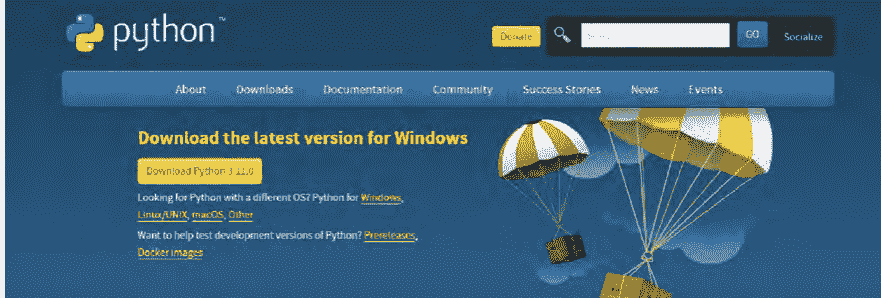

**步骤 2：** 要下载最新版本，请点击 Download Python 3.11.0。


**步骤 3：** 下载完成后，打开安装文件，在安装前勾选“Add to path”（添加到路径），然后点击“Install now”（立即安装）。

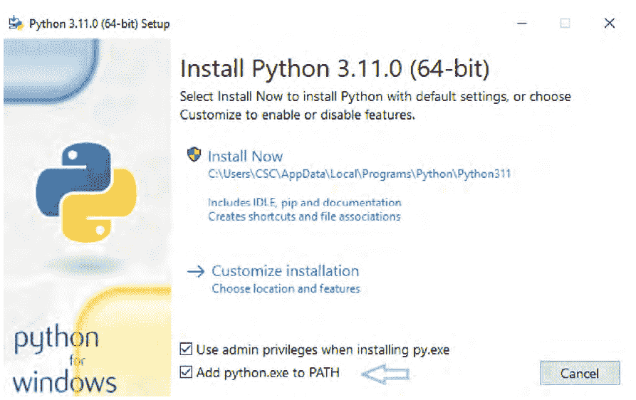

**步骤 4：** 安装将完成，并显示安装成功。现在 Python 已安装在系统中。让我们看看如何开始 Python 编程。

## 1.6 Python 解释器/Shell

### 1.6.1 什么是 Shell？

由于操作系统由许多不同的程序组成，它们在执行文件处理、内存管理和资源管理等操作的同时，也确保了应用程序的顺畅运行。

### 1.6.2 什么是 Python Shell？

Python 解释器读取一行代码并执行该行，然后重复此执行过程，直到未发现错误为止。

Python Shell 为你提供了一个命令行界面，你可以使用它直接向 Python 解释器发送命令。

### 1.6.3 通过 Shell 运行 Python

**步骤 1：** 打开 Python IDLE 或 Python 命令提示符。

**步骤 2：** 执行以下示例程序。

示例：

```
>>> print("Hello python")
```

输出：

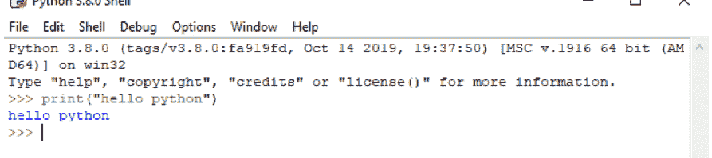

在以下示例中，输入和输出通过提示符（>>> 和 ...）的存在与否来区分：要重复示例，必须在提示符出现时输入提示符后的所有内容。

### 1.6.4 通过脚本运行 Python

**步骤 1：** 要使用脚本运行 Python，首先创建一个文本文件并将其重命名为 demo.py。


**步骤 2：** 然后用文本编辑器打开 demo.py，在文件中编写示例程序代码并保存文件。

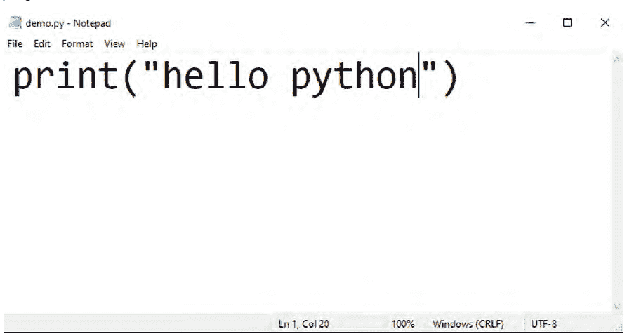

**步骤 3：** 要运行该文件，请转到文件路径的命令提示符，输入 Python demo.py。

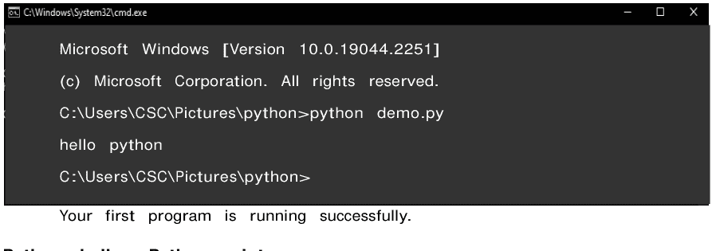

你的第一个程序正在成功运行。

### Python Shell 与 Python 脚本

| Python Shell | Python 脚本 |
| :--- | :--- |
| 1. Python Shell 用于执行简单程序和调试一些复杂程序。 | 1. Python 脚本用于执行可能用于大规模应用的复杂且冗长的程序。 |

## 1.7 Python 注释

可以使用注释来解释 Python 代码。使用注释可以使代码更具可读性。在测试代码时，可以使用注释来停止执行。注释以 # 开头，Python 会忽略它们：

### 单行注释

```
#This is a comment
print ("Hello, World!")
```

Python 允许在行尾添加注释，忽略前面的文本。

```
print ("Hello, World!") #This is a comment
```

也可以使用注释来阻止 Python 执行代码，以及为代码提供解释：

```
#cheering for friend
print ("Cheers! friend")
```

### 输出屏幕：

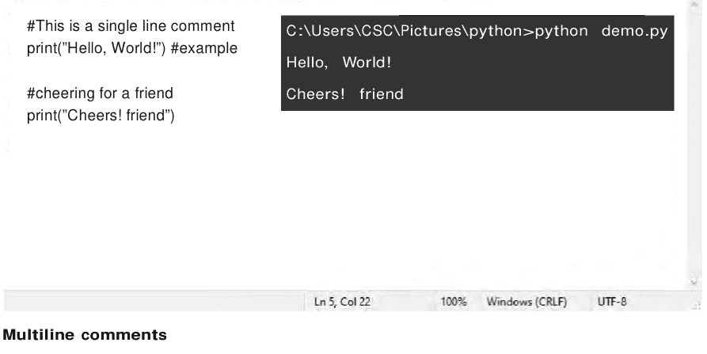

### 多行注释

实际上，Python 中没有多行注释的语法。你可以使用 # 符号来表示多行注释。

### 示例：

```
#commenthere
#writtenin
#multipleline
print("Hello, World!")
```

Python 不会使用未赋值给变量的字符串字面量，因此你可以在代码中添加一个多行字符串（使用三引号），并在其中编写注释：

示例：

```
"""
multi
line
comment
"""
print("Hey, there!")
```

输出屏幕：

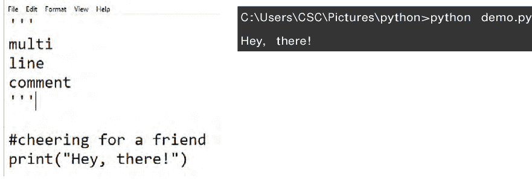

### 在 Python 中读取输入

在 Python 中，我们使用 `input()` 函数读取用户输入。通常，`input` 函数以字符串格式接受用户给出的所有输入。如果我们想接受用户的整数值，则必须进行类型转换，我们将在下一节中学习。

示例：

```
>>> a = input ("Enter your message")
```

输出：

Enter your message: Good morning
Good morning

## 1.8 在 Python 中打印输出

在 Python 中，我们可以通过三种方式打印输出：

1. 打印语句。
2. 打印变量。
3. 同时打印语句和变量。

**示例 1：**
打印语句。

```
>>> print("hello") #printing statements
```

**输出：** hello

**示例 2：**
打印变量。

```
>>> wish = "Good morning" #printing variables
>>> print(wish) #printing variables
```

**输出：**
Good morning

**示例 3：**

```
>>> print ("hello", wish) #printing variables and statements together
```

**输出：**
Hello Good morning

## 1.9 Python 中的标识符

Python 标识符是用于标识变量、函数、类、模块或其他对象的名称。标识符以字母 A 到 Z 或 a 到 z 或下划线 (_) 开头，后跟零个或多个字母、下划线和数字 (0 到 9)。

- Python 不允许在标识符中使用标点字符，如 @、$ 和 %。
- Python 是一种区分大小写的编程语言。
- 因此，Manpower 和 manpower 在 Python 中是两个不同的标识符。

**声明 Python 标识符的规则？**

- Python 允许在标识符名称中使用下划线 (_)、小写字母 (a-z)、大写字母 (A-Z) 和数字 (0-9)。
- 名称必须以非数字字符开头。
- 标识符名称中不能只包含数字。
- 与大多数其他语言一样，Python 中的标识符名称区分大小写。（'Ash' 和 'ASH' 不是同一回事。）
- 如果用户以开头下划线命名标识符，不会显示错误。
- 尽管 PEP-8 标准规则建议将行长度保持在 79 个字符以内，但标识符名称可以是任意长度。
- 关键字和标识符的名称不应重合。（用户可以通过输入 `help()` 后跟 "keywords" 来查看 Python 中所有关键字的列表，以避免问题。）
- 不需要前导双下划线 ($)。

以下是正确命名标识符的示例：

```
>>> My_language = "Python"
>>> myName = "xyz"
>>> __username__ = "abc12"
```

以下是错误命名标识符的示例：

```
>>> 7hello = "hello"
>>> @hello = "hello"
>>> __user@7= "abc12"
```

## 1.10 Python 中的关键字

关键字是 Python 中预定义和保留的单词，具有特殊含义。关键字不能用作变量名、函数名或任何其他标识符。它们用于定义代码的语法。

- 在 Python 中，关键字区分大小写。例如：True 和 true 在 Python 中是两个不同的词。
- 在 Python 中，所有关键字都是小写的，除了 True、False 和 None。

### 1.10.1 Python 中所有关键字的列表：

| And | Exec | Not |
| :--- | :--- | :--- |
| Assert | Finally | Or |
| Break | For | Pass |
| Class | From | Print |
| Continue | Global | Raise |
| Def | If | Return |
| Del | Import | Try |

## 1.10.2 关键字 True 和 False 的示例

Python 有两个真值：True 和 False。它们是 Python 中逻辑（布尔）或比较操作的结果。例如：

```
>>> True or False
True
>>> True or False
True
```

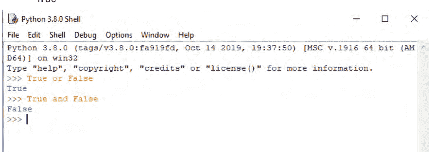

## 1.11 Python 中的语句和表达式

Python 中的语句

语句是提供给 Python 解释器执行的指令。

示例：

```
>>> print ("Good morning")
>>> print ("Hello, how are you?")
```

输出：

```
>>> print("Good morning")
Good morning
>>> print("Hello,how are you?")
Hello,how are you?
```

Python 中的表达式

表达式是运算符和操作数的组合，它们共同产生某个其他值。

示例：

```
>>> sum = 25+50
>>> print(sum)
```

输出：

```
>>> sum 25+50
>>> print(sum)
75
```

## 1.12 Python 中的变量

什么是变量？

变量只是用于存储值的指定内存空间。这意味着当你创建一个变量时，你会预留一些内存。解释器根据变量的数据类型分配内存并确定可以放入预留内存的内容。

因此，你可以通过为变量指定不同的数据类型来存储整数、小数或字符。Python 变量不需要显式声明来预留内存。当你为变量提供一个值时，声明会自动发生。为了给变量赋值，请使用等号（=）。

### 1.12.1 声明变量的规则

- 变量名必须以字母或下划线字符开头，哪个先出现都可以。
- 变量名不能以数字开头。
- 变量名中只允许使用下划线（_）、数字 0 到 9 以及字母 A 到 Z。
- 变量名区分大小写

变量名是 = 运算符左侧的操作数，其值是右侧的操作数。例如，

```
>>>a= 23
>>>print(a)
**输出：**
>>> a=23
>>> print(a)
23
```

Python 允许你同时将相同的值赋给多个变量。例如，

```
>>>a= 23
>>>a= 25
>>>print(a)
**输出：**
>>> a=23
>>> a=25
>>> print(a)
25
```

## 1.13 Python 中的数据类型

内存中可以存储多种类型的数据。例如，一个人的地址和年龄都以字母数字字符的形式保存。Python 包含多种标准数据类型，用于指定可以对它们执行的操作以及每种类型的存储方式。

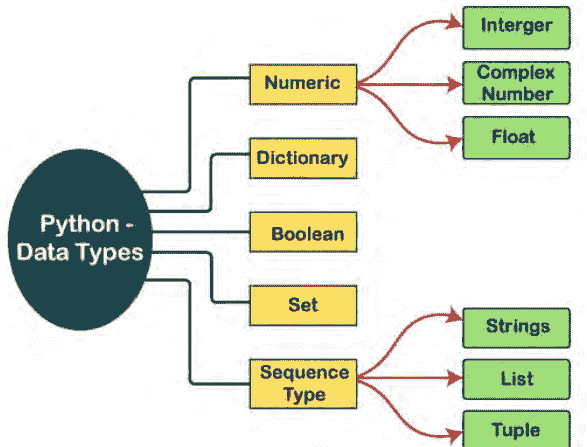

Python 有五种常见的数据类型。

- 数字
- 字符串
- 列表
- 元组
- 字典

### 1.13.1 Python 数字

数字数据类型用于跟踪数字。当你给一个数字赋值时，会生成一个对象。Python 支持四种不同的数字类型：

- int（有符号整数）
- long（长整数，也可以用八进制和十六进制表示）
- float（浮点实数值）
- complex（复数）

以下是一些数字示例：

| Int | long | Float | Complex |
|---|---|---|---|
| 10 | 51924361L | 0.0 | 3.14j |
| 100 | -0x19323L | 15.20 | 45.j |
| -786 | 0122L | -21.9 | 9.322e-36j |
| 080 | 0xDEFABCECBDAECBFBAEI | 32.3+e18 | .876j |
| -0490 | 535633629843L | -90. | -.6545+0J |
| -0x260 | -052318172735L | -32.54e100 | 3e+26J |
| 0x69 | -4721885298529L | 70.2-E12 | 4.53e-7j |

### 1.13.2 Python 字符串

Python 将字符串定义为用引号括起来的连续字符集合。Python 接受成对的双引号或单引号。使用切片运算符（`[]` 和 `[:]`）可以获取字符串的子集，索引从字符串开头的 0 开始，到结尾的 -1。

```
mystr = "hello"

mystr[0:] 我们将在后续章节中看到更多这些内容。
```

星号（*）表示重复运算符，加号（+）表示字符串连接运算符。

### 1.13.3 Python 列表

列表是 Python 中最灵活的复合数据类型。列表中的项目用逗号分隔，并用方括号（`[]`）括起来。在某些方面，列表与 C 的数组相似。列表可以包含不同数据类型的元素，这是它与其他集合的一个区别。

```
mylist = ["hello",33,"89"]
```

使用切片运算符（`[]` 和 `[:]`）可以访问列表中存储的值，索引从列表开头的 0 开始，一直到列表末尾的 -1。星号（*）表示重复运算符，加号（+）是列表连接运算符。

```
mylist [0:] 我们将在后续章节中看到更多这些内容。
```

### 1.13.4 Python 元组

元组是另一种类似于列表的序列数据类型。元组包含多个值，并用逗号分隔。然而，与列表不同，元组用圆括号括起来。

```
mytup = ("hi","22"," name")
```

元组和列表的主要区别在于元组包含在圆括号（`( )`）中且不能更改，而列表包含在方括号（`[ ]`）中，可以更改其元素和大小。元组类似于只读列表。

### 1.13.5 Python 字典

Python 中的字典结构有点类似于哈希表。它们通过键值对工作，类似于 Perl 中看到的关联数组或哈希。字典键通常由文本或数字组成，尽管它几乎可以是任何 Python 类型。然而，值可以是任何 Python 对象。

```
mytup = {"name": "harry"," age":"22"," course":"bca"}
```

字典用花括号（`{ }`）分隔，方括号（`[ ]`）用于赋值和访问值。

### 1.13.6 Type () 函数

Type 函数用于检查变量或值的数据类型。type() 函数的语法是：

```
type("value")
type(var_name)
```

示例：

```
>>>print(type("hello"))
>>>a=25
>>>print(type(a))
```

输出：

```
E:\python>python practice-1.py
<class 'str'>
<class 'int'>
```

### 1.13.7 数据类型转换

你可能偶尔需要在内置类型之间进行转换。你可以使用类型名称作为函数在类型之间进行转换。

有许多内置函数可以执行数据类型转换。这些操作会产生一个全新的对象来表示转换后的值。

| 索引 | 函数含义 |
|---|---|
| 1 | **int(x [,base])** 将 x 转换为整数。如果 x 是字符串，base 指定基数。 |
| 2 | **long(x [,base] )** 将 x 转换为长整数。如果 x 是字符串，base 指定基数。 |
| 3 | **float(x)** 将 x 转换为浮点数。 |
| 4 | **complex(real [,imag])** 创建一个复数。 |
| 5 | **str(x)** 将对象 x 转换为字符串表示形式。 |
| 6 | **repr(x)** 将对象 x 转换为表达式字符串。 |
| 7 | **eval(str)** 计算一个字符串并返回一个对象。 |
| 8 | **tuple(s)** 将 s 转换为元组。 |
| 9 | **list(s)** 将 s 转换为列表。 |
| 10 | **set(s)** 将 s 转换为集合。 |
| 11 | **dict(d)** 创建一个字典。d 必须是（键，值）元组的序列。 |
| 12 | **frozenset(s)** 将 s 转换为冻结集合。 |
| 13 | **chr(x)** 将整数转换为字符。 |
| 14 | **unichr(x)** 将整数转换为 Unicode 字符。 |
| 15 | **ord(x)** 将单个字符转换为其整数值。 |
| 16 | **hex(x)** 将整数转换为十六进制字符串。 |
| 17 | **oct(x)** 将整数转换为八进制字符串。 |

## 复习题

1.  什么是 Python？
2.  谁开发了 Python？
3.  Python 有哪些特点？
4.  列举 Python 的 4 个应用。
5.  如何检查 Python 的版本？
6.  什么是 Python shell？
7.  在 shell 中运行 Python 程序的步骤是什么？
8.  什么是 Python 脚本？
9.  什么是注释？
10. 单行注释和多行注释的区别。
11. 如何在 Python 中注释单行？
12. 如何在 Python 中注释多行？
13. Python 中的 input 函数是什么？
14. 列举我们可以在 Python 中打印输出的各种方式并举例。
15. Python 中的标识符是什么？
16. Python 中声明标识符的规则是什么？
17. Python 中的关键字是什么？
18. Python 中声明关键字的规则是什么？
19. Python 中语句和表达式的区别。

## 第2章

## Python编程基础

## 运算符

运算符用于对变量和值执行操作。Python语言支持以下类型的运算符。

- 算术运算符
- 比较（关系）运算符
- 赋值运算符
- 逻辑运算符
- 位运算符
- 成员运算符
- 身份运算符

让我们逐一了解所有运算符。

### 2.1 Python算术运算符

| 运算符名称 | 含义 |
| --- | --- |
| + 加法 | 将运算符两侧的值相加。 |
| - 减法 | 用左侧操作数减去右侧操作数。 |
| * 乘法 | 将运算符两侧的值相乘。 |
| / 除法 | 用右侧操作数除以左侧操作数。 |
| % 取模 | 返回左侧操作数除以右侧操作数后的余数。 |
| ** 幂运算 | 计算运算符的指数（幂）值。 |
| // 整除 | 称为"整除"的除法会从商中移除小数点后的数字。但是，如果其中一个操作数为负数，则结果会向下取整，或向远离零的方向（向负无穷大）取整。 |

示例：让我们看看每个运算符的示例

```
>>> a=20
>>> b=10
>>> sum = a+b
>>> sub = a-b
>>> mul = a*b
>>> div = a/b
>>> mod = a%b
>>> exp = a**b
>>> flr = a//b
>>>print("Addition is",sum)
>>>print("Substraction is",sub)
>>>print("multiplication is", mul)
>>>print("division is",div)
>>>print("modulus is",mod)
>>>print("expnential is",exp)
>>>print("floor value is",flr)
```

**输出：**

```
C:\Users\CSC\Pictures\python>python demo.py
Addition is 30
Substraction is 10
multipliction is 200
division is 2.0
modulus is 0
expnential is 10240000000000
floor value is 2
```

### 2.2 Python比较运算符

它们通过比较两侧的值来判断它们之间的关系。也称为关系运算符。

| 运算符名称 | 含义 |
|---|---|
| == | 如果两个操作数的值相等，则条件为真。 |
| != | 如果两个操作数的值不相等，则条件为真。 |
| > | 如果左侧操作数的值大于右侧操作数的值，则条件为真。 |
| < | 如果左侧操作数的值小于右侧操作数的值，则条件为真。 |
| >= | 如果左侧操作数的值大于或等于右侧操作数的值，则条件为真。 |
| <= | 如果左侧操作数的值小于或等于右侧操作数的值，则条件为真。 |

**示例：** 让我们看看每个运算符的示例

```
>>> a=20
>>> b=10
>>> print(a==b)
>>> print(a!=b)
>>> print(a>b)
>>> print(a<b)
>>> print(a<=b)
```

**输出：**

```
C:\Users\CSC\Pictures\python>python demo.py
False
True
True
False
False
True
```

### 2.3 Python赋值运算符

| 运算符名称 | 含义 |
| :--- | :--- |
| = | 将右侧操作数的值赋给左侧操作数 |
| += 加后赋值 | 将右侧操作数加到左侧操作数，并将结果赋给左侧操作数 |
| -= 减后赋值 | 从左侧操作数中减去右侧操作数，并将结果赋给左侧操作数 |
| *= 乘后赋值 | 将左侧操作数乘以右侧操作数，并将结果赋给左侧操作数 |
| /= 除后赋值 | 将左侧操作数除以右侧操作数，并将结果赋给左侧操作数 |
| %= 取模后赋值 | 使用两个操作数进行取模运算，并将结果赋给左侧操作数 |
| **= 幂运算后赋值 | 对运算符执行指数（幂）计算，并将值赋给左侧操作数 |
| //= 整除后赋值 | 对运算符执行整除运算，并将值赋给左侧操作数 |

**示例：** 让我们看看每个运算符的示例

```
>>> a=20
>>> a+=10
>>> print(a)
>>> a - =10
>>> print(a)
>>> a * =10
>>> print(a)
>>> a / =10
>>> print(a)
>>> a %= 10
>>> print(a)
>>> a**=10
>>> print(a)
>>> a // 10
```

**输出：**

```
C:\Users\CSC\Pictures\python>python demo.py
30
20
200
20.0
0.0
0.0
0.0
```

### 2.4 Python位运算符

位运算符逐位操作，处理二进制位。如果 a = 60 且 b = 13，它们的二进制代码值分别为 0011 1100 和 0000 1101。Python支持的位运算符如下表所示。

| 运算符名称 | 含义 | 示例 |
|---|---|---|
| & 按位与 | 如果两个操作数中都存在该位，则将该位复制到结果中 | (a & b) (表示 0000 1100) |
| \| 按位或 | 如果任一操作数中存在该位，则复制该位。 | (a \| b) = 61 (表示 0011 1101) |
| ^ 按位异或 | 如果该位在一个操作数中设置而在另一个中未设置，则复制该位。 | (a ^ b) = 49 (表示 0011 0001) |
| ~ 按位取反 | 它是一元运算符，具有"翻转"位的效果。 | (~a ) = -61 (由于是有符号二进制数，表示 1100 0011 的二进制补码形式。 |
| << 按位左移 | 左侧操作数的值按右侧操作数指定的位数向左移动。 | a << 2 = 240 (表示 1111 0000) |
| >> 按位右移 | 左侧操作数的值按右侧操作数指定的位数向右移动。 | a >> 2 = 15 (表示 0000 1111) |

输出：

```
C:\Users\CSC\Pictures\python>python demo.py
12
61
12
49
-61
240
15
```

### 2.5 Python逻辑运算符

Python语言支持以下逻辑运算符。

| 运算符 | 描述 | 示例 |
| --- | --- | --- |
| and 逻辑与 | 如果两个操作数都为真，则条件为真。 | (a and b) 为真。 |
| or 逻辑或 | 如果两个操作数中任一个非零，则条件为真。 | (a or b) 为真。 |
| not 逻辑非 | 用于反转其操作数的逻辑状态。 | Not(a and b) 为假。 |

输出：

```
C:\Users\CSC\Pictures\python>python demo.py
False
True
True
```

### 2.6 Python成员运算符

Python中的成员运算符检查一系列对象（如字符串、列表或元组）是否存在。

| 运算符 | 描述 |
| --- | --- |
| in | 如果在指定序列中找到变量，则计算结果为真，否则为假。 |
| not in | 如果在指定序列中未找到变量，则计算结果为真，否则为假。 |

示例：

```
>>>Greet = "Good morning"
>>>Print('G' in greet)
>>>Print('Good' not in greet)
```

输出：

```
E:\python>python practice-1.py
True
False
```

### 2.7 Python身份运算符

身份运算符比较两个对象的内存位置。

| 运算符 | 描述 |
| --- | --- |
| is | 如果运算符两侧的变量指向同一个对象，则计算结果为真，否则为假。 |
| is not | 如果运算符两侧的变量指向同一个对象，则计算结果为假，否则为真。 |

示例：

```
>>>X =5
>>>Y= 5
>>>X2 = "hello"
>>>Y2 =" hello"
>>>Print(x is y)
>>>Print(x2 is not y)
```

输出：

```
E:\python>python practice-1.py
True
False
```

### 2.8 Python运算符优先级

在Python中，运算符优先级是指执行操作的运算符级别。

下表列出了从最高优先级到最低优先级的所有运算符。

| 编号 | 运算符级别 |
|---|---|
| 1 | **幂运算（求幂） |
| 2 | ~ + -按位取反、一元正号和负号（后两者的方法名分别为 +@ 和 -@） |
| 3 | * / % //乘、除、取模和整除 |
| 4 | + -加法和减法 |
| 5 | >> <<按位右移和左移 |
| 6 | &按位'与' |
| 7 | ^ \|按位异或和按位或 |
| 8 | <= < > >=比较运算符 |
| 9 | <> == !=相等运算符 |
| 10 | = %= /= //= -= += *= **=赋值运算符 |
| 11 | is is not身份运算符 |
| 12 | in not in成员运算符 |
| 13 | not or and逻辑运算符 |

示例：

```
A=10
B=20
C=30
Cal = B+A*C
Print(Cal)
```

输出：

```
E:\python>python practice-1.py
320
```

## 2.9 Python 中的控制语句

Python 中的缩进用于标识条件语句之后的语句块的开始，并在条件语句结束后移除缩进。它通过条件语句后的空格来识别。因此，缩进是遵循 Python 条件语句或任何循环语句的基本且重要的步骤。

语法：

```
If condition:
    Statements
    statements
```

什么是控制语句？

控制语句通过设置一组指令必须满足的条件，来控制代码块的执行。

流程控制语句分为三类。

- 1. 条件语句
- 2. 迭代语句
- 3. 跳转语句

条件语句

在 Python 中，条件语句根据给定条件是真还是假来执行操作。你可以根据条件的结果执行不同的代码块。条件语句的求值结果总是 True 或 False。

条件语句有三种类型。

## 1. if 语句

if 语句用于根据给定条件执行一组指令。

**语法：**

```
if(condition):
    statements
    statements
statements
```

**示例：**

```
>>> mynum = 5
>>> if mynum == 5:
>>> print("Equal")
```

**输出：**

```
C:\Users\CSC\Pictures\python>python demo.py
equal
```

## 2. if-else

if-else 语句用于根据给定条件执行一组指令，如果条件失败，则执行 else 块。

**语法：**

```
if(condition):
    statements
    statements
else:
statements
```

**示例：**

```
>>> mynum = 5
>>> if mynum == 5:
>>> print("Equal")
>>> else:
>>> print("Unequal")
```

**输出：**

```
C:\Users\CSC\Pictures\python>python demo.py
equal
C:\Users\CSC\Pictures\python>python demo.py
unequal
```

## 3. if-elif-else

if-else 语句用于根据给定条件执行一组指令，如果条件失败，我们可以在 elif 块中给出另一个条件来执行。如果所有条件都失败，则执行 else 块。

**语法：**

```
if(condition):
    statements
    statements
elif(condition):
    statements
    statements
else:
    statements
```

**示例：**

```
>>> mynum = 5
>>> if mynum > 5:
>>>     print("Greater")
>>> elif mynum < 5:
>>>     print("lesser")
>>> else:
>>>     print("equal")
```

**输出：**

```
C:\Users\CSC\Pictures\python>python demo.py
greater
C:\Users\CSC\Pictures\python>python demo.py
lesser
C:\Users\CSC\Pictures\python>python demo.py
equal
```

## 4. 嵌套 if-else

嵌套 if 语句用于根据给定条件执行一组指令，如果条件失败，我们可以在 if 块中给出另一个 if 条件来执行。它可以根据需要继续嵌套任意多个 if 条件。

语法：

```
if(condition):
    statements
    statements
if(condition):
    statements
    statements
if(condition):
    statements
    statements
```

示例：

```
>>> mynum = 5
>>> if mynum == 5:
>>>     print ("Number is 5")
>>> if mynum== 10:
>>>     print ("number is 10")
>>> if mynum== 20:
>>>     print ("number is 20")
```

输出：

```
C:\Users\CSC\Pictures\python>python demo.py
number is 5
C:\Users\CSC\Pictures\python>python demo.py
number is 10
C:\Users\CSC\Pictures\python>python demo.py
number is 20
```

## 程序 1：编写一个程序来判断正数或负数。

```
num = 10
>>>
输出：正数
```

## 程序 2：编写一个程序来判断奇数或偶数。

```
num = 53
>>>
输出：奇数
```

## 程序 3：编写一个程序来找出三个数中的最大值。

```
num = 63
num1 = 45
num2 = 33
>>>
输出：63
```

## 迭代语句

在 Python 中，迭代语句允许我们在条件为 True 时重复执行一段代码块。我们也称之为循环语句。

Python 提供了以下两种循环语句来重复执行某些操作

- 1. for 循环
- 2. while 循环

## 1. for 循环

使用 for 循环，我们可以遍历任何序列或可迭代变量。序列可以是字符串、列表、字典、元组、集合。

### 类型 1：使用 range()：

此循环将接受一个数字作为参数，并从默认值 0 开始迭代到该数字。

示例：参数 1

```
>>> for i in range (5):
>>>     print(i)
```

**输出：**

```
C:\Users\CSC\Pictures\python>python demo.py
0
1
2
3
4
```

此循环将接受两个数字作为参数。第一个数字是迭代的起始数字，第二个数字是迭代停止的结束数字。

**示例：** 参数 2

```
>>> for i in range (5,10):
>>>     print(i)
```

**输出：**

```
C:\Users\CSC\Pictures\python>python demo.py
5
6
7
8
9
```

此循环将接受三个数字作为参数。第一个数字是迭代的起始数字，第二个数字是迭代停止的结束数字，最后一个数字是步长（增量）。

**示例：** 参数 3

```
>>> for i in range (2,10,2):
>>>     print(i)
```

**输出：**

```
C:\Users\CSC\Pictures\python>python demo.py
2
4
6
8
```

### 类型 2：使用数据

```
>>> data = "Hello"
>>> for i in data
>>>     print(i)
```

输出：

```
C:\Users\CSC\Pictures\python>python demo.py
H
e
l
l
o
```

## 程序 1：计算前 n 个自然数之和的程序

```
>>>num = int(input("Enter the number"))
>>>sum=0
>>>for i in range(num):
>>>    sum=sum+i
>>>print("sum of natural numbers is",sum)
```

输出：
Enter the number10
sum of natural number is 45

## 程序 2：计算前 n 个偶数自然数之和的程序

```
>>>num = int(input("Enter the number"))
>>>sum=0
>>>for i in range(num):
>>>    if i%2==0:
>>>        sum=sum+i
>>>print("sum of even natural numbers is", sum)
```

输出：
Enter the number10
sum of even natural number is 20

## 程序 3：计算字符串中元音字母数量的程序

```
>>>mystr = input("Enter the string")
>>>count=0
>>>for i in mystr:
>>>    if i=='a' or i=='e' or i=='i' or i=='o' or i=='u':
>>>        count=count+1
>>>print("Number of vowels in a string is", count)
```

**输出：**
Enter the stringmississippi
Number of vowels in string is 4

## 程序 4：计算字符串长度的程序

```
>>>mystr = input("Enter the string")
>>>count=0
>>>for i in mystr:
>>>    count=count+1
>>>print("Length of the string is", count)
```

**输出：**
Enter the stringgood morning
Length of the string is 12

## 2. While 循环

在 Python 中，while 循环语句在特定条件为真时重复执行一段代码块。在 while 循环中，每次循环开始时都会检查条件，如果条件为真，则执行循环体。当条件变为 False 时，控制器退出该代码块。

**语法：**
While(condition):
Statements

```
>>> num = 1
>>> while (num <= 5):
>>>     print(num)
>>>     num = num + 1
```

输出：

```
C:\Users\CSC\Pictures\python>python demo.py
1
2
3
4
5
```

## 跳转语句

在 Python 中，跳转语句用于以特定方式改变程序的执行流程。

为此，我们使用两种类型的跳转语句。

- 1. break 语句
- 2. continue 语句

break 语句用于在循环内部退出循环。当我们希望在条件满足时立即终止循环，而不是执行剩余的迭代时，它非常有用。它减少了执行时间。每当控制器遇到 break 语句时，它会立即退出该循环。

让我们看看当找到一个大于 5 的数字时如何中断 for 循环。

```
>>> for num in range (10):
>>>     if num > 5:
>>>         print("stop")
>>>         break
>>>     print(num)
```

输出：

```
C:\Users\CSC\Pictures\python>python demo.py
0
1
2
3
4
5
stop
```

continue 语句用于跳过当前迭代，并继续下一次迭代。

让我们看看如果数字是 5，如何跳过 for 循环的迭代，并继续执行循环体中的其他数字。

**示例：**

```
>>> for i in range (3,8):
>>>     if num == 5:
>>>         continue
>>>     else:
>>>         print(num)
```

**输出：**

```
C:\Users\CSC\Pictures\python>python demo.py
3
4
6
7
```

## 复习题

- 1. Python 中的运算符是什么？
- 2. 举例解释不同类型的运算符。
- 3. = 和 == 运算符的区别。
- 4. 哪个运算符用于检查字符是否存在于字符串中？
- 5. 解释 is 运算符的用法。
- 6. 举例解释运算符优先级。
- 7. 解释 Python 中的缩进。
- 8. 什么是控制语句以及控制语句的类型？
- 9. 什么是条件语句？举例解释其类型。
- 10. 什么是迭代语句？举例解释其类型。
- 11. 举例解释“使用 range 的 for 循环”和“使用数据的 for 循环”之间的区别。
- 12. 什么是跳转语句？
- 13. 举例解释 break 和 continue。
- 14. 解释 for 循环中 range 函数的参数。
- 15. 举例解释 while 循环。

## 第三章

## PYTHON中的函数与字符串

Python中的函数是一组执行特定活动的语句集合。函数有助于将我们的程序分割成易于管理的模块化部分。随着程序规模的不断扩大，它变得更加有条理和可控。它还使代码可重用，并防止重复。

## 3.1 定义函数

语法：

```
def func_name(parameters):
    statements
```

上面显示的函数定义包含以下元素。

1.  函数头的第一个关键字是`def`。
2.  函数的名称，用于唯一标识它。创建Python标识符的约定也适用于函数命名。
3.  我们向函数传递值的参数（实参）。它们不是必需的。
4.  一个冒号（:）表示函数头的结束。
5.  一个或多个有效的Python语句构成函数体。每个语句的缩进级别必须相同（通常是4个空格）。
6.  一个可选的`return`语句，允许函数返回一个值。

示例：

```
>>>def greet(name):
>>>    """
>>>    This function greets to
>>>    the person passed in as
>>>    a parameter
>>>    """
>>>    print("Hello, " + name + ". Good morning!")
```

## 3.2 函数调用

一旦函数被声明，就可以从另一个函数、程序甚至Python提示符调用它。我们只需要输入函数名和相关参数即可调用该函数。

语法：
Func_name(parameters)

示例：
>>>greet("abc")

输出：

```
E:\python>practice-1.py
Hello, abc. Good morning!
```

示例2：
>>> def addition(a,b):
>>>     print(a+b)
>>> addition(20,30)

输出：

```
C:\Users\CSC\Pictures\python>python demo.py
50
```

注意：在Python中调用函数之前，必须始终存在该函数的定义。否则，我们将遇到问题。例如，

```
# function call
greet('Paul')
# function definition
def greet(name):
    print("Hello, " + name + ". Good morning!")
# Error: name 'greet' is not defined
```

**输出：**

```
E:\python>practice-1.py
Traceback (most recent call last):
  File "E:\python\practice-1.py", line 2, in <module>
    greet('Paul')
NameError: name 'greet' is not defined
```

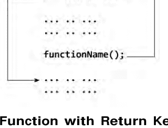

**函数的工作原理**

## 3.3 带有return关键字的函数

在函数中，当你想要返回一个值时，使用`return`关键字。让我们看看使用`return`的同一个例子。

**示例：**

```
>>> def addition(a,b):
>>>     return a+b
>>> print(addition(20,30))
```

**输出：**

```
C:\Users\CSC\Pictures\python>python demo.py
50
```

**注意：** 当我们在函数中使用`return`时，调用时必须打印该函数。

## 程序5：编写一个函数执行以下操作

a. 加法 b. 减法 c. 乘法 d. 除法

a=20, b=10 >>> 输出：30 10 200 2

## 3.4 局部作用域和全局作用域

变量的作用域是指程序中使用该变量的区域。当在函数内部定义时，参数和变量对外部是隐藏的。因此，它们的作用域是局部的。

变量存储在内存中的时间被称为其生命周期。函数内部的变量仅在该函数执行期间有效。

当我们从函数返回时，它们就被销毁了。因此，函数不会保留之前调用中变量的值。

下面是一个函数内变量作用域的示例。

```
>>>def my_func():
>>>    x = 10
>>>    print("Value inside function:",x)
>>>x = 20
>>>my_func()
>>>print("Value outside function:",x)
```

输出：

```
E:\python>practice-1.py
Value inside function: 10
Value outside function: 20
```

如图所示，`x`的初始值为20。即使`x`被函数`my_func()`从0更改为10，这对函数外部的值也没有影响。

这是因为函数内部的变量`x`可以与外部变量（对函数而言是全局的）区分开来。它们是两个具有不同作用域的不同变量，尽管共享相同的名称。

然而，函数内部的变量从外部是可见的。它们涵盖了整个世界。

从函数内部，我们可以读取这些值，但无法修改（写入）它们。如果要在函数外部更改变量的值，必须使用`global`关键字将变量声明为全局变量。

## 3.5 Lambda函数

Python中的lambda函数是一种特殊的函数，没有函数名。例如，

```
lambda: print('Hello World')
```

要创建lambda函数，我们用`lambda`关键字代替`def`关键字。lambda函数声明语法如下：

```
lambda argument(s): expression
```

这里，

-   `argument(s)` - 传递给lambda函数的任何值
-   `expression` - 执行并返回的表达式

让我们看一个例子，

```
greet = lambda: print('Hello World')
```

这里，创建了一个lambda函数并赋值给`greet`变量。这个lambda函数必须被调用才能使用。调用lambda函数的方法如下所示：

```
greet ()
```

```
E:\python>practice-1.py
Hello World
```

## 3.6 Python中的内置函数

以下是Python中所有可用的函数：

| 函数 | 描述 |
| --- | --- |
| abs() | 返回数字的绝对值 |
| all() | 如果可迭代对象中的所有项都为真，则返回True |
| any() | 如果可迭代对象中的任何项为真，则返回True |
| ascii() | 返回对象的可读版本。将非ASCII字符替换为转义字符 |
| bin() | 返回数字的二进制版本 |
| bool() | 返回指定对象的布尔值 |
| bytearray() | 返回一个字节数组 |
| bytes() | 返回一个字节对象 |
| callable() | 如果指定对象是可调用的，则返回True，否则返回False |
| chr() | 返回指定Unicode代码对应的字符 |
| classmethod() | 将方法转换为类方法 |
| compile() | 将指定源代码编译为对象，准备执行 |
| complex() | 返回一个复数 |
| delattr() | 从指定对象中删除指定属性（属性或方法） |
| dict() | 返回一个字典（数组） |
| dir() | 返回指定对象的属性和方法列表 |
| divmod() | 返回参数1除以参数2的商和余数 |
| enumerate() | 接受一个集合（例如元组）并将其作为枚举对象返回 |
| eval() | 计算并执行一个表达式 |
| exec() | 执行指定的代码（或对象） |
| filter() | 使用过滤函数排除可迭代对象中的项 |
| float() | 返回一个浮点数 |
| format() | 格式化指定的值 |
| frozenset() | 返回一个冻结集合对象 |
| getattr() | 返回指定属性（属性或方法）的值 |
| globals() | 以字典形式返回当前全局符号表 |
| hasattr() | 如果指定对象具有指定属性（属性/方法），则返回True |
| hash() | 返回指定对象的哈希值 |
| help() | 执行内置帮助系统 |
| hex() | 将数字转换为十六进制值 |
| id() | 返回对象的id |
| input() | 允许用户输入 |
| int() | 返回一个整数 |
| isinstance() | 如果指定对象是指定对象的实例，则返回True |
| issubclass() | 如果指定类是指定对象的子类，则返回True |
| iter() | 返回一个迭代器对象 |
| len() | 返回对象的长度 |
| list() | 返回一个列表 |
| locals() | 返回当前本地符号表的更新字典 |

## 1. abs()

返回指定数字的绝对值。

语法：`abs(n)`

其中，`n` 是需要输入的数字。

示例：
```python
x = abs(-7.25)
print(x)
```
输出：
```
7.25
```

## 2. all()

检查列表中的所有项目是否都为 True。

语法：`all(iterable)`

其中，`iterable` 是一个对象（列表、元组、字典）。

示例：
```python
mylist = [0, 1, 1]
x = all(mylist)
print(x)
```
输出：
```
False
```

## 3. any()

检查列表中的任何项目是否为 True。

语法：`any(iterable)`

其中，`iterable` 是一个对象（列表、元组、字典）。

示例：
```python
mytuple = (0, 1, False)
x = any(mytuple)
print(x)
```
输出：
```
True
```

## 4. bin()

返回指定数字的二进制版本。

语法：`bin(n)`

其中，`n` 是必需的整数。

示例：
```python
x = bin(36)
print(x)
```
输出：
```
0b100100
```

## 5. bytearray()

返回一个 bytearray 对象。

语法：`bytearray(x, encoding, error)`

示例：
```python
x = bytearray(4)
print(x)
```
输出：
```
bytearray(b'\x00\x00\x00\x00')
```

## 6. bytes()

返回一个 bytes 对象。

语法：`bytes(x, encoding, error)`

示例：
```python
x = bytes(4)
print(x)
```
输出：
```
b'\x00\x00\x00\x00'
```

## 7. dict()

此函数创建一个字典。

语法：`dict(keyword arguments)`

示例：
```python
x = dict(name="John", age=36, country="Norway")
print(x)
```
输出：
```
{'name': 'John', 'age': 36, 'country': 'Norway'}
```

## 8. filter()

`filter()` 函数返回一个迭代器，其中的项目通过一个函数进行过滤，以测试该项目是否被接受。

语法：
```python
filter(function, iterable)
```

示例：
```python
ages = [5, 12, 17, 18, 24, 32]

def myFunc(x):
    if x < 18:
        return False
    else:
        return True

adults = filter(myFunc, ages)
for x in adults:
    print(x)
```
输出：
```
18
24
32
```

## 9. complex()

`complex()` 函数通过指定一个实数和一个虚数来返回一个复数。

语法：
```python
complex(real, imaginary)
```

## 10. bool()

`bool()` 函数返回指定对象的布尔值。
该对象将始终返回 True，除非：
- 该对象为空，如 `[]`, `()`, `{}`
- 该对象为 False
- 该对象为 0
- 该对象为 None

语法：
```python
bool(object)
```

示例：
```python
x = bool(1)
print(x)
```
输出：
```
True
```

## 11. len()

`len()` 函数返回对象中的项目数量。
当对象是字符串时，`len()` 函数返回字符串中的字符数。

语法：
```python
len(object)
```

示例：
```python
mylist = ["apple", "banana", "cherry"]
x = len(mylist)
print(x)
```
输出：
```
3
```

## 12. slice()

`slice()` 函数返回一个 slice 对象。
slice 对象用于指定如何切片一个序列。你可以指定从哪里开始切片，到哪里结束。你还可以指定步长，这允许你，例如，只切片每隔一个项目。

语法：
```python
slice(start, end, step)
```

示例：
```python
a = ("a", "b", "c", "d", "e", "f", "g", "h")
x = slice(2)
print(a[x])
```
输出：
```
('a', 'b')
```

## 13. input()

`input()` 函数允许用户输入。

语法：
```python
input(prompt)
```

示例：
```python
print("Enter your name:")
x = input()
print("Hello, " + x)
```
输出：
```
Enter your name: Kaushik
Hello, Kaushik
```

## 14. int()

`int()` 函数将指定的值转换为整数。

语法：
```python
int(value, base)
```

示例：
```python
x = int(3.5)
print(x)
```
输出：
```
3
```

## 15. list()

`list()` 函数创建一个列表对象。
列表对象是一个有序且可更改的集合。

语法：
```python
list(iterable)
```

示例：
```python
x = list(('apple', 'banana', 'cherry'))
print(x)
```
输出：
```
['apple', 'banana', 'cherry']
```

## 16. max()

`max()` 函数返回具有最高值的项目，或可迭代对象中具有最高值的项目。
如果值是字符串，则进行字母顺序比较。

语法：
```python
max(n1, n2, n3, ...)
```
或：
```python
max(iterable)
```

示例：
```python
x = max(5, 10, 8)
print(x)
```
输出：
```
10
```

## 17. min()

`min()` 函数返回具有最低值的项目，或可迭代对象中具有最低值的项目。
如果值是字符串，则进行字母顺序比较。

语法：
```python
min(n1, n2, n3, ...)
```
或：
```python
min(iterable)
```

示例：
```python
x = min(5, 2, 10)
print(x)
```
输出：
```
2
```

## 18. pow()

`pow()` 函数返回 x 的 y 次幂的值 (xʸ)。
如果存在第三个参数，它返回 x 的 y 次幂对 z 取模的结果。

语法：
```python
pow(x, y, z)
```

示例：
```python
x = pow(4, 3)
print(x)
```
输出：
```
64
```

## 19. range()

`range()` 函数返回一个数字序列，默认从 0 开始，默认递增 1，并在指定数字之前停止。

语法：
```python
range(start, stop, step)
```

示例：
```python
x = range(6)
for n in x:
    print(n)
```
输出：
```
0
1
2
3
4
5
```

## 20. sum()

`sum()` 函数返回一个数字，即可迭代对象中所有项目的总和。

语法：
```python
sum(iterable, start)
```

示例：
```python
a = (1, 2, 3, 4, 5)
x = sum(a)
print(x)
```
输出：
```
15
```

# 字符串

正如我们所看到的，字符串用 `""` 引起来。让我们看看在 Python 中声明和打印字符串。

## 声明字符串
```python
>>> mystr = "Happy morning"
```

## 3.7 打印字符串
```python
>>> print(mystr)
```
输出：
```
Happy morning
```

## 3.8 获取字符串的字符位置
```python
>>> print(mystr[2])
>>> print(mystr[0])
```
输出：
```
p
H
```

使用 `[]` 我们可以调用字符串字符的特定索引。索引分配如下：
```
0  1  2  3  4  5  6  7  8  9  10  11  12
H  a  p  p  y  m  o  r  n  i  n   g
```

注意：我们也可以通过 `-1` 调用字符串的最后一个字符，并从后向前继续。

示例：
```python
>>> print(mystr[-1])
>>> print(mystr[-2])
>>> print(mystr[-3])
```
输出：
```
g
n
i
```

## 3.9 使用 for 循环遍历字符串
```python
>>> for x in "apple":
        print(x)
```
输出：
```
a
p
p
l
e
```

## 3.10 字符串方法

使用 `len()` 函数查找字符串的长度。
```python
>>> word = "airplane"
>>> print(len(word))
```
输出：
```
8
```

使用 `in` 关键字在句子中查找特定单词。
```python
>>> text = "I love morning coffee"
>>> print("coffee" in text)
```
输出：
```
True
```
注意：结果始终为 True 或 False。

使用 `not in` 关键字在句子中查找特定单词。
```python
>>> text = "My car color is red"
>>> if ("car" not in text):
        print("You don't have car")
    else:
        print("Your car choice is good")
```
输出：
```
Your car choice is good
```

大写方法：将小写字符串转换为大写。

语法：`str.upper()`

示例：
```python
>>> mystr = "hello"
>>> print(mystr.upper())
```

## 小写方法：将大写字符串转换为小写

语法：str.lower()

示例：

```
>>>mystr = "HELLO"
>>>print(mystr.lower())
```

输出：

```
C:\Users\CSC\Pictures\python>python demo.py
hello
```

## 替换方法：用另一个字符串替换一个字符串

语法：str.replace('旧字符串', '新字符串')

示例：

```
>>>mystr = "hello friend"
>>>print(mystr.replace('hello', 'hi'))
```

输出：

```
C:\Users\CSC\Pictures\python>python demo.py
hi friend
```

## 分割方法：

当找到分隔符时，它将字符串分割成子字符串。

语法：str.split('分隔符')

示例：

```
>>>mystr = "hello friend"
>>>print(mystr.split(" "))
```

输出：

```
C:\Users\CSC\Pictures\python>python demo.py
['hello', 'friend']
```

*注意：* 此方法将字符串分割并存储在列表中。

## 字符串连接：

将两个字符串连接成一个字符串称为连接。使用 (+) 运算符进行连接。

*示例：*

```
>>>fname = "abc"
>>>lname = "xyz"
>>>print(fname + lname)
```

**输出：**

```
C:\Users\CSC\Pictures\python>python demo.py
abcxyz
```

## 程序 6：编写一个程序来计算字符串 ‘Mississippi’ 中的元音字母数量

```
>>>
```

**输出：**

- M: 1
- I: 4
- S: 4
- P: 2

## 3.11 字符串切片

你可以使用切片语法返回一系列字符。指定起始索引和结束索引，用冒号分隔，以返回字符串的一部分。

```
>>>b = "Hello, World!"
>>>print(b[2:5])
```

**输出：**

```
C:\Users\CSC\Pictures\python>python demo.py
llo
```

**从开头切片：** 省略起始索引，范围将从第一个字符开始：

```
>>>b = "Hello, World!"
>>>print(b[:5])
```

**输出：**

```
C:\Users\CSC\Pictures\python>python demo.py
Hello
```

**切片到末尾：** 省略*结束*索引，范围将延伸到末尾：

```
>>>b = "Hello, World!"
>>>print(b[2:])
```

**输出：**

```
C:\Users\CSC\Pictures\python>python demo.py
hello, World!
```

**负索引：**

```
>>>b = "Hello, World!"
>>>print(b[-4: -2])
```

```
C:\Users\CSC\Pictures\python>python demo.py
r1
```

## 复习题

1.  什么是 Python 中的函数？
2.  我们如何在 Python 中定义一个函数？
3.  解释 Python 中的函数调用。
4.  为什么我们在函数中使用 return 关键字？
5.  函数中的参数是什么？
6.  用一个例子解释带参数的函数。
7.  什么是全局作用域？
8.  用一个例子解释局部作用域和全局作用域的区别。
9.  什么是匿名函数？
10. 什么是 lambda 函数？用一个例子解释。
11. 用一个例子解释以下内置函数。
    - abs()
    - filter()
    - len()
    - sum()
    - pow()
    - abs()
12. 从以下数字 8,2,9,4,6 中找出最大值和最小值。
13. 什么是字符串？
14. 如何使用内置函数查找字符串的长度？
15. 解释以下字符串方法：
    - upper()
    - lower()
    - replace()
    - split()
16. 什么是字符串连接？
17. 用一个例子解释字符串的切片。

## 第二单元：Python 编程数据类型分析

## 第四章

## 列表

要在一个变量中存储多个元素，请使用列表。列表是 Python 中用于保存数据集合的四种内置数据类型之一。

## 4.1 创建列表

列表通过使用方括号 `[]` 创建，其中的值用逗号分隔。

让我们看一个创建列表的例子。

```
>>>thislist=["apple", "banana", "cherry"]
>>>print(thislist)
```

**输出：**

```
E:\python>python practice-1.py
['apple', 'banana', 'cherry']
```

列表中可以有任意数量的项目，它们可以是任何类型（整数、浮点数、字符串等）。

示例：

```
>>>my_list = [1, "Hello", 3.4]
>>>print(my_list)
```

输出：

```
E:\python>python practice-1.py
[1, 'Hello', 3.4]
```

示例：

```
>>>my_list = ["mouse", [8, 4, 6], ['a']]
>>>print(my_list)
```

输出：

```
E:\python>python practice-1.py
['mouse', [8, 4, 6], ['a']]
```

## 4.2 访问列表元素

可以通过多种方式访问列表的元素。

### 索引值

可以使用索引运算符 `[]` 访问列表项。在 Python 中，索引从 0 开始。例如，对于一个包含 5 个元素的列表，将使用 0 到 4 的索引。

如果你尝试访问的索引不是这些之一，将会引发 `IndexError`。索引需要是整数。不允许使用其他类型，例如浮点数；这样做会导致 `TypeError`。

通过嵌套索引，可以访问嵌套列表。

示例：

```
>>>my_list = ['p', 'r', 'o', 'b', 'e']
>>>print(my_list[0])
>>>print(my_list[2])
>>>print(my_list[-1])
>>>print(my_list[2.0])
```

输出：

```
E:\python>python practice-1.py
p
o
e
Traceback (most recent call last):
  File "practice-1.py", line 4, in <module>
    print(my_list[2.0])
TypeError: list indices must be integers or slices, not float
```

注意：

Python 的序列支持负索引。最后一项由索引 -1 表示，倒数第二项由 -2 表示，依此类推。

## 4.3 列表切片

切片运算符让我们可以访问各种列表项：

示例：

```
>>>my_list = []
>>># 从索引 2 到索引 4 的元素
>>>print(my_list[2:5])
>>># 从索引 5 到末尾的元素
>>>print(my_list[5:])
>>># 从开头到末尾的元素
>>>print(my_list[:])
```

输出：

```
E:\python>python practice-1.py
['t', 'h', 'o']
['n', 'l', 'i', 's', 't']
'p', 'y', 't', 'h', 'o', 'n', 'l', 'i', 's', 't']
```

## 4.4 修改列表

与字符串或元组不同，列表是可变的，这意味着它们的元素可以被更改。

可以使用赋值运算符 `=` 更改一个项目或一组项目。

示例：

```
>>>odd = [2, 4, 6, 8]
# 更改第 1 项
>>>odd[0] = 1
>>>print(odd)
# 更改第 2 到第 4 项
>>>odd[1:4] = [3, 5, 7]
>>>print(odd)
```

**输出：**

```
E:\python>python practice-1.py
[1, 4, 6, 8]
[1, 3, 5, 7]
```

## 4.5 列表方法

以下是列表中常用的方法：

| 方法 | 描述 |
| :--- | :--- |
| append() | 在列表末尾添加一个元素 |
| extend() | 将一个列表的所有元素添加到另一个列表 |
| insert() | 在指定索引处插入一个项目 |
| remove() | 从列表中移除一个项目 |
| pop() | 返回并移除给定索引处的元素 |
| clear() | 移除列表中的所有项目 |
| index() | 返回第一个匹配项的索引 |
| count() | 返回作为参数传递的项目数量的计数 |
| sort() | 按升序对列表中的项目进行排序 |
| reverse() | 反转列表中项目的顺序 |
| copy() | 返回列表的浅拷贝 |

Append 和 Extend：使用 `append()` 和 `extend()` 方法，我们可以向列表添加单个项目或一次添加多个项目。

语法：
List.append(value)
List.extend(list1)

示例：
# 在 Python 中追加和扩展列表
>>>odd = [1, 3, 5]
>>>odd.append(7)
>>>print(odd)
>>>odd.extend([9, 11, 13])
>>>print(odd)

输出：

```
E:\python>python practice-1.py
[1, 3, 5, 7]
[1, 3, 5, 7, 9, 11, 13]
```

Insert：`insert()` 方法允许我们在特定点插入单个项目，或者通过将多个项目打包到列表的空切片中来插入多个项目。

语法：
List.insert(pos,value)

示例：
# 演示列表的 insert() 方法
odd = [1, 9]
odd.insert(1,3)
print(odd)
odd[2:2] = [5, 7]
print(odd)

**输出：**

```
E:\python>python practice-1.py
[1, 3, 9]
[1, 3, 5, 7, 9]
```

**Clear：** `clear()` 方法移除列表的所有元素。

语法

```
list.clear()
```

示例：

```
>>>fruits = ["apple", "banana", "cherry"]
>>>fruits.clear()
>>>print(fruits)
```

**输出：**

```
E:\python>python practice-1.py
[]
```

**Copy：** 此方法用于复制列表的元素。

语法

```
list.copy()
```

示例：

```
>>>fruits = ["apple", "banana", "cherry"]
>>>x = fruits.copy()
>>>print(x)
```

**输出：**

```
E:\python>python practice-1.py
['apple', 'banana', 'cherry']
```

**Count：** `count()` 方法给出具有给定值的元素总数。

语法

```
list.count(value)
```

## 4.6 列表基本操作

列表主要有两种常用操作：

- 1. (+) 运算符：+ 运算符也可用于组合两个列表。此过程称为连接。
- 2. (*) 运算符：使用 * 运算符可将列表重复指定次数。

示例：

```
>>># 连接和重复列表
>>>odd = [1, 3, 5]
>>>print(odd + [9, 7, 5])
>>>print(odd * 3)
```

输出：

```
E:\python>python practice-1.py
[1, 3, 5, 7, 5]
[1, 3, 5, 1, 3, 5, 1, 3, 5]
```

## 复习题

- 1. 什么是 Python 中的列表？
- 2. 如何创建列表？
- 3. 什么是嵌套列表？
- 4. 举例说明如何使用索引值访问列表元素。
- 5. 如何对列表元素进行切片？
- 6. 举例说明列表的修改。
- 7. append() 方法和 insert() 方法的区别。
- 8. remove() 方法和 pop() 方法的区别。
- 9. 举例说明列表方法：Sort()、reverse()、copy()、clear()。
- 10. 列出用于计算列表中元素数量的方法。
- 11. 列出列表数据类型支持的操作。
- 12. 解释列表作为栈。
- 13. 解释列表作为队列。
- 14. 什么是列表推导式？
- 15. 举例说明如何使用 for 循环访问列表中的元素。
- 16. 举例说明列表的可变性。

## 第 5 章

## 元组

所有元素都包含在圆括号 () 中，并用逗号分隔，形成元组。虽然使用圆括号不是必需的，但这样做是个好主意。

元组可以包含任意数量的元素，并且它们可以是多种类型（整数、浮点数、列表、字符串等）。

## 5.1 创建元组

元组通过使用 () 括号和其中用逗号分隔的值来创建。

让我们看一个创建元组的例子。

```
>>>thistup=("apple", "banana", "cherry")
>>>print(thistup)
```

**输出：**

```
E:\python>practice-1.py
('apple', 'banana', 'cherry')
```

元组中可以有任意数量的项目，它们可以是任何类型（整数、浮点数、字符串等）。

示例：

```
>>>my_tup = (1, "Hello", 3.4)
>>>print(my_tup)
```

输出：

```
E:\python>practice-1.py
(1, 'Hello', 3.4)
```

元组也可以包含另一个元组作为项目。这就是嵌套元组。

示例：

```
>>>my_tup = ("mouse", (8, 4, 6), ('a'))
>>>print(my_tup)
```

输出：

```
E:\python>practice-1.py
('mouse', (8, 4, 6), 'a')
```

## 5.2 访问元组元素

可以通过多种不同的方式访问元组的元素。

### 索引值

可以使用索引运算符 [] 访问元组项目。在 Python 中，索引从 0 开始。例如，对于一个包含 5 个元素的元组，将使用 0 到 4 的索引。

如果你尝试访问的索引不是这些之一，将会引发 IndexError。索引需要一个整数。不允许使用其他类型，例如浮点数；这样做会导致 TypeError。

通过嵌套索引，可以访问嵌套元组。

示例：

```
>>>my_tup = ('p', 'r', 'o', 'b', 'e')
>>>print(my_tup[0])
>>>print(my_tup[2])
>>>print(my_tup[-1])
>>>print(my_tup[2.0])
```

输出：

```
E:\python>practice-1.py
p
o
e
Traceback (most recent call last):
  File "E:\python\practice-1.py", line 5, in <module>
    print(my_tup[2.0])
TypeError: tuple indices must be integers or slices, not float
```

## 5.3 切片

切片运算符冒号允许我们访问各种元组项目：

示例：

```
# 使用切片访问元组元素
my_tuple = ('p','y','t','h','o','n','p','r','o','g','r','a','m')
# 第 2 到第 4 个元素
print(my_tuple[1:4])
# 开头到第 2 个元素
print(my_tuple[:-7])
# 第 8 个元素到末尾
print(my_tuple[7:])
# 开头到末尾
print(my_tuple[:])
```

输出：

```
E:\python>practice-1.py
('y', 't', 'h')
('p', 'y', 't', 'h', 'o', 'n')
('r', 'o', 'g', 'r', 'a', 'm')
('p', 'y', 't', 'h', 'o', 'n', 'p', 'r', 'o', 'g', 'r', 'a', 'm')
```

## 5.4 元组修改

注意：由于元组是不可变的，因此无法修改元组。

## 5.5 元组方法

由于元组不可修改，因此元组的方法较少。因此，在 Python 中你可以使用两个内置方法：

- 1. count
- 2. index

**count：** 提供给定值在元组中出现的频率。

例如 -

```
thistuple = (1, 3, 7, 8, 7, 5, 4, 6, 8, 5)
x = thistuple.count(5)
print(x)
```

**输出：**

```
E:\python>practice-1.py
2
```

**index：** 在元组中搜索指定值后，返回找到该值的位置。

例如 -

```
thistuple = (1, 3, 7, 8, 7, 5, 4, 6, 8, 5)
x = thistuple.index(3)
print(x)
```

**输出：**

```
E:\python>practice-1.py
1
```

## 5.6 元组和列表的区别

以下是列表和元组的区别：

| | Python 列表 | Python 元组 |
|---|---|---|
| 1 | 列表是可变的 | 元组是不可变的 |
| 2 | 迭代耗时 | 迭代相对较快 |
| 3 | 使用列表更容易插入和删除项目。 | 使用元组数据类型访问元素效果最佳。 |
| 4 | 列表消耗更多内存 | 元组比列表消耗更少内存 |
| 5 | 列表有多个内置方法。 | 由于不可变性，元组没有很多内置方法 |
| 6 | 列表中更可能发生意外更改或错误。 | 由于不可变性，元组中通常不会发生更改和错误。 |

## 复习题

- 1. 什么是元组？
- 2. 如何创建元组？
- 3. 解释元组的一些特性。
- 4. 如何创建嵌套元组？
- 5. 如何访问元组元素？
- 6. 给出一个访问嵌套元组元素的例子。
- 7. 如何对元组进行切片？
- 8. 举例说明元组数据类型的修改。
- 9. 举例说明元组方法。
- 10. 如何计算元组中存在的元素数量？
- 11. Python 中支持哪些元组操作？
- 12. 举例说明可变和不可变的区别。
- 13. 列表和元组的区别。
- 14. 为什么元组比列表快？
- 15. 与列表相比，元组内置方法较少的原因是什么？

## 第 6 章

## 字典

Python 字典是一组排列好的事物。字典中的每个条目都有一个键/值对。当键已知时，字典旨在快速检索值。

## 6.1 创建字典

将事物放在花括号内并用逗号分隔，可以轻松创建字典。对应于键和项目的一对值称为一个对（键：值）。

键必须是不可变的（字符串、数字或具有不可变成员的元组），并且必须是唯一的。值可以是任何数据类型，并且可以重复，但键不能。

示例：

```
>>># 空字典
>>>my_dict = {}
>>># 具有整数键的字典
>>>my_dict = {1: 'apple', 2: 'ball'}
>>>print(my_dict)
>>># 具有混合键的字典
>>>my_dict = {'name': 'John', 1: [2, 4, 3]}
>>>print(my_dict)
>>># 使用 dict()
```

## 6.2 访问字典

字典使用键来访问值，而其他数据类型则需要索引。键可以与 `get()` 函数一起使用，也可以放在方括号 `[]` 内使用。

如果在字典中找不到某个键，使用方括号 `[]` 会引发 `KeyError`。另一方面，如果找不到该键，`get()` 方法会返回 `None`。

示例：

```
>>># get vs [] for retrieving elements
>>>my_dict = {'name': 'Jack', 'age': 26}
>>>print(my_dict['name'])
>>>print(my_dict.get('age'))
>>># Trying to access keys which doesn't exist throws error
>>>print(my_dict.get('address'))
>>># KeyError
>>>print(my_dict['address'])
```

输出：

```
E:\python>practice-1.py
Jack
26
None
Traceback (most recent call last):
  File "E:\python\practice-1.py", line 15, in <module>
    print(my_dict['address'])
KeyError: 'address'
```

## 6.3 修改字典元素

字典是可变的。借助赋值运算符，我们可以添加新项或修改已有项的值。

如果键已经存在，则更新其当前值。如果键不存在，则字典会添加一个新的（键：值）对。

示例：

```
>>># Changing and adding Dictionary Elements
>>>my_dict = {'name': 'Jack', 'age': 26}
>>># update value
>>>my_dict['age'] = 27
>>>print(my_dict)
>>># add item
>>>my_dict['address'] = 'Downtown'
>>>print(my_dict)
```

输出：

```
E:\python>practice-1.py
{'name': 'Jack', 'age': 27}
{'name': 'Jack', 'age': 27, 'address': 'Downtown'}
```

## 6.4 字典方法

下表列出了可用于字典的方法。其中一些方法已在上面的示例中使用过。

| 方法 | 描述 |
|---|---|
| clear() | 从字典中移除所有项。 |
| copy() | 返回字典的浅拷贝。 |
| fromkeys(seq[, v]) | 返回一个新字典，其键来自 `seq`，值等于 `v`（默认为 `None`）。 |
| get(key[,d]) | 返回键的值。如果键不存在，返回 `d`（默认为 `None`）。 |
| items() | 返回一个包含字典项（键，值）格式的新对象。 |
| keys() | 返回字典键的新对象。 |
| pop(key[,d]) | 移除指定键的项并返回其值，如果未找到键则返回 `d`。如果未提供 `d` 且未找到键，则引发 `KeyError`。 |
| popitem() | 移除并返回一个任意项（键，值）。如果字典为空，则引发 `KeyError`。 |
| setdefault(key[,d]) | 如果键在字典中，则返回相应的值。如果不在，则插入值为 `d` 的键并返回 `d`（默认为 `None`）。 |
| update([other]) | 用 `other` 中的键/值对更新字典，覆盖现有键。 |
| values() | 返回字典值的新对象。 |

## Clear()

此方法用于移除/清空字典中的每个元素。
例如：

```
>>>car = {"brand": "Ford",
"model": "Mustang",
"year": 1964}
>>>car.clear()
>>>print(car)
```

输出：

```
E:\python>practice-1.py
{ }
```

## Copy()

使用此方法，可以将一个字典的键和值复制到另一个字典中。

例如：

```
>>>car = {
    "brand": "Ford",
    "model": "Mustang",
    "year": 1964
}
>>>x = car.copy()
>>>print(x)
```

输出：

```
E:\python>practice-1.py
{'brand': 'Ford', 'model': 'Mustang', 'year': 1964}
```

### Fromkeys()

用于返回特定的键和特定的值。

例如：

```
>>>x = ('key1', 'key2', 'key3')
>>>y = 0
>>>thisdict = dict.fromkeys(x, y)
>>>print(thisdict)
```

输出：

```
E:\python>practice-1.py
{'key1': 0, 'key2': 0, 'key3': 0}
```

### Get()

返回指定键的值。

例如：

```
>>>car = {
    "brand": "Ford",
    "model": "Mustang",
    "year": 1964
}

>>>x = car.get("model")
>>>print(x)
```

输出：

```
E:\python>practice-1.py
Mustang
```

### Items()

返回一个包含每个键值对元组的列表。

例如：

```
>>>car = {
    "brand": "Ford",
    "model": "Mustang",
    "year": 1964
}
>>>x = car.items()
>>>print(x)
```

输出：

```
E:\python>practice-1.py
dict_items([('brand', 'Ford'), ('model', 'Mustang'), ('year', 1964)])
```

### Keys()

返回包含字典键的列表。

例如：

```
>>>car = {
    "brand": "Ford",
    "model": "Mustang",
    "year": 1964
}
>>>x = car.keys()
>>>print(x)
```

输出：

```
E:\python>practice-1.py
dict_keys(['brand', 'model', 'year'])
```

## Pop()

移除具有特定键的元素。

例如：

```
>>>car = {"brand": "Ford", "model": "Mustang", "year": 1964}
>>>car.pop("model")
>>>print(car)
```

输出：

```
E:\python>practice-1.py
{'brand': 'Ford', 'year': 1964}
```

### Popitem()

移除最后插入的键值对。

例如：

```
>>>car = {"brand": "Ford", "model": "Mustang","year": 1964}
>>>car.popitem()
>>>print(car)
```

输出：

```
E:\python>practice-1.py
{'brand': 'Ford', 'model': 'Mustang'}
```

### Setdefault()

返回指定键的值。如果键不存在：则插入该键，并赋予指定的值。

### Update()

用指定的键值对更新字典。

例如：

```
>>>car = { "brand": "Ford","model": "Mustang","year": 1964}
>>>car.update({"color": "White"})
>>>print(car)
```

输出：

```
E:\python>practice-1.py
{'brand': 'Ford', 'model': 'Mustang', 'year': 1964, 'color': 'White'}
```

## 复习题

1.  Python 中的字典是什么？
2.  字典中的键和值是什么？
3.  解释如何创建字典。
4.  如何创建空字典？
5.  如何创建具有混合键的字典？
6.  如何使用 `dict()` 创建字典？
7.  如何访问字典的值？
8.  字典中出现 `KeyError` 的原因是什么？
9.  如何使用 `get()` 访问字典的值？
10. 举例说明字典的修改。
11. 写出创建字典的语法。
12. 解释字典中的以下内置方法。
    - `fromkeys()`
    - `popitem()`
    - `copy()`
    - `items()`
    - `keys()`
13. 字典有哪些优点？
14. 写出字典中 `update` 方法的语法。
15. 字典中 `pop` 和 `popitem` 方法的区别。
16. 解释如何使用循环概念访问字典的键和值。

## 第 7 章

## 集合

一组无序的元素被称为集合。每个集合元素必须是唯一的（无重复）且不可变的（不能更改）。

但是，集合本身是可以更改的。我们可以添加或移除元素。

此外，集合可用于执行数学运算，如并集、交集、对称差集等。例如：

`thisset = {"apple", "banana", "cherry"}`

这里，`thisset` 包含 3 个元素。

### 7.1 创建集合

可以通过将所有元素（项）放在花括号 `{}` 内并用逗号分隔，或者使用内置的 `set()` 函数来创建集合。

它可以包含任意数量的项，每个项可以是不同的类型。但是，集合不能包含可变元素，如字典、集合或列表。

示例：

```
>>># Different types of sets in Python
>>># set of integers
>>>my_set = {1, 2, 3}
>>>print(my_set)
>>># set of mixed datatypes
>>>my_set = {1.0, "Hello", (1, 2, 3)}
>>>print(my_set)
```

输出：

```
E:\python>practice-1.py
{1, 2, 3}
{1.0, (1, 2, 3), 'Hello'}
```

创建空集合时必须小心。在 Python 中，空花括号 `{}` 会创建一个空字典。我们使用不带任何参数的 `set()` 函数来创建一个没有元素的集合。

示例：

```
>>># Distinguish set and dictionary while creating empty set
>>># initialize a with {}
>>>a = {}
>>># check data type of a
>>>print(type(a))
>>># initialize a with set()
>>>a = set()
>>># check data type of a
>>>print(type(a))
```

输出：

```
E:\python>practice-1.py
<class 'dict'>
<class 'set'>
```

### 7.2 修改集合

集合是可变的。但是，由于它们是无序的，索引没有用处。

不能使用索引或切片来访问或修改集合元素。集合数据类型不支持此操作。

可以使用 `add()` 方法添加单个元素，使用 `update()` 方法添加多个元素。`update()` 方法可以接受元组、列表、字符串和其他集合作为参数。会避免重复项。

示例：

```
>>> initialize my_set
>>> my_set = {1, 3}
>>> print(my_set)
>>> # my_set[0]
>>> # if you uncomment the above line
>>> # you will get an error
>>> # TypeError: 'set' object does not support indexing
>>> # add an element
>>> my_set.add(2)
>>> print(my_set)
>>> # add multiple elements
>>> my_set.update([2, 3, 4])
>>> print(my_set)
>>> # add list and set
>>> # Output: {1, 2, 3, 4, 5, 6, 8}
>>> my_set.update([4, 5], {1, 6, 8})
>>> print(my_set)
```

**输出：**

```
E:\python>practice-1.py
{1, 3}
{1, 2, 3}
{1, 2, 3, 4}
{1, 2, 3, 4, 5, 6, 8}
```

## 集合的方法

| 方法 | 描述 |
|---|---|
| add() | 向集合中添加一个元素 |
| clear() | 移除集合中的所有元素 |
| copy() | 返回集合的一个副本 |
| difference() | 返回一个包含两个或多个集合差集的集合 |
| discard() | 移除指定的元素 |
| intersection() | 返回一个集合，即两个或多个集合的交集 |
| pop() | 从集合中移除一个元素 |
| remove() | 移除指定的元素 |
| union() | 返回一个包含集合并集的集合 |
| update() | 用另一个集合或任何其他可迭代对象更新集合 |

## Clear()

移除集合中的所有元素

例如

```
fruits = {"apple", "banana", "cherry"}
fruits.clear()
print(fruits)
```

输出：

```
E:\python>practice-1.py
Set()
```

## Copy()

返回集合的一个副本

例如

```
fruits = {"apple", "banana", "cherry"}
x = fruits.copy()
print(x)
```

输出：

```
E:\python>practice-1.py
{'banana', 'cherry', 'apple'}
```

## Difference()

返回一个包含两个或多个集合差集的集合

例如：

```
x = {"apple", "banana", "cherry"}
y = {"google", "microsoft", "apple"}
z = x.difference(y)
print(z)
```

输出：

```
E:\python>practice-1.py
{'cherry', 'banana'}
```

## Intersection()

返回一个集合，即两个或多个集合的交集

例如

```
x = {"apple", "banana", "cherry"}
y = {"google", "microsoft", "apple"}
z = x.intersection(y)
print(z)
```

输出：

```
E:\python>practice-1.py
{'apple'}
```

## Pop()

从集合中移除一个元素

例如

```
fruits = {"apple", "banana", "cherry"}
fruits.pop()
print(fruits)
```

输出：

```
E:\python>practice-1.py
{'cherry', 'apple'}
```

## Union()

返回一个包含集合并集的集合

例如

```
x = {"apple", "banana", "cherry"}
y = {"google", "microsoft", "apple"}
z = x.union(y)
print(z)
```

输出：

```
E:\python>practice-1.py
{'microsoft', 'google', 'banana', 'apple', 'cherry'}
```

## 7.3 移除与丢弃

`discard()` 和 `remove()` 方法允许从集合中移除特定的元素。

两者之间的唯一区别是，如果元素不在集合中，`discard()` 方法不会改变集合。然而，在这种情况下（如果元素不在集合中），`remove()` 函数会引发一个错误。

下面的例子将演示这一点。

```
# discard() 和 remove() 的区别
# 初始化 my_set
my_set = {1, 3, 4, 5, 6}
print(my_set)
# 丢弃一个元素
my_set.discard(4)
print(my_set)
# 移除一个元素
my_set.remove(6)
print(my_set)
# 丢弃一个元素
# 该元素不在 my_set 中
my_set.discard(2)
print(my_set)
# 移除一个元素
# 该元素不在 my_set 中
# 你将会得到一个错误。
# 输出: KeyError
my_set.remove(2)
```

**输出：**

```
E:\python>practice-1.py
{1, 3, 4, 5, 6}
{1, 3, 5, 6}
{1, 3, 5}
{1, 3, 5}
Traceback (most recent call last):
  File "E:\python\practice-1.py", line 28, in <module>
    my_set.remove(2)
KeyError: 2
```

## 复习题

1.  Python 中的集合是什么？
2.  写出在 Python 中创建集合的语法。
3.  使用 Python 中的 `set()` 函数创建一个集合。
4.  创建一个包含混合数据类型的集合。
5.  集合和字典的区别。
6.  如何在 Python 中创建一个空集合？
7.  解释集合元素的修改。
8.  用一个例子解释集合中的 `update` 方法。
9.  用一个例子解释以下方法。`Union()` `difference()` `intersection()`
10. 解释 `discard()` 和 `remove()` 方法之间的区别。
11. 如何找出列表中存在的唯一元素？
12. Python 中集合的优点是什么？
13. 解释 `add()` 和 `update()` 方法之间的区别。
14. 为什么不能通过索引修改集合？
15. 解释集合中 `clear()` 和 `pop()` 方法之间的区别。

# 第三单元：高级 Python 编程

## 第八章

## 文件和异常处理

编程经常涉及处理文件。Python 有内置的方法来创建、打开和关闭文件，这使得处理文件更加容易。

### 8.1 文件类型

Python 的内置例程支持文件的创建、读取和写入。Python 可以处理两种类型的文件：二进制文件和常规文本文件（以二进制语言、0 和 1 编写）。

1.  **文本文件：** 这种类型的文件中的每一行文本都以一个称为 EOL（行结束符）的唯一字符结尾，在 Python 中它等同于换行符（`'\n'`）。
2.  **二进制文件：** 数据在转换为机器可理解的语言后存储在二进制文件中；这些文件中没有行终止符。

### 8.2 用于访问文件的方法

访问模式控制可以对打开的文件执行的操作类型。当文件被打开时，它描述了文件将如何被使用。此外，这些模式指定了文件句柄在文件中的位置。文件句柄充当光标，指示必须从文件中读取数据或向文件中写入数据的位置。Python 有六种不同的访问模式。

1.  **只读（`'r'`）：** 读取文本文件。句柄放置在文件的开头。如果文件不存在，则引发 I/O 错误。此外，这是默认打开文件的方式。
2.  **打开文件以允许读写（`r+`）。** 句柄位于文件的开头。
3.  **打开文件以进行只写（`'w'`）。** 对于已存在的文件，数据会被覆盖和截断。句柄位于文件的开头。如果文件不存在，则创建它。
4.  **使用 `w+` 命令打开文件以进行读写。** 对于已存在的文件，数据会被覆盖和截断。句柄位于文件的开头。
5.  **只追加（`'a'`）：** 开始向文件中写入。如果文件不存在，则创建一个。句柄位于文件的末尾。新写入的数据将添加在末尾，位于先前写入的数据之后。
6.  **追加和读取（`'a+'`）：** 允许在文件中读写。如果文件不存在，则创建一个。句柄位于文件的末尾。新写入的数据将添加在末尾，位于先前写入的数据之后。

### 8.3 将文件加载到内存中

计算机有两种不同类型的内存：主存储器和辅助存储器。你或任何其他人存储的所有文件都保存在辅助存储器中，因为计算机会在关闭时删除主存储器中的任何数据。因此，在编辑文本文件或仅仅在 Python 中使用它之前，你必须将其加载到主存储器中。Python 使用“文件句柄”与加载到主存储器中的文件进行通信（这就是你的操作系统通过在其内存中搜索文件来给予 Python 访问你打开的文件的权限的方式，如果找到则返回一个文件句柄，然后你就可以处理该文件了）。

### 8.4 打开文件

要打开文件，请使用 Python 中的内置 `open()` 函数。此函数返回一个句柄，也称为文件对象，可用于适当地读取或修改文件。

示例：

```
>>> f = open("test.txt")    # 在当前目录中打开文件
>>> f = open("C:/Python38/README.txt")    # 指定完整路径
```

打开文件时，可以指定模式。我们在模式中指明我们是希望读取文件、写入文件还是向文件追加数据。此外，我们可以选择是以二进制模式还是文本模式打开文件。

默认情况下，读取是在文本模式下进行的。在此模式下从文件读取时，返回的是字符串。

## 8.5 关闭文件

在文件上完成所有操作后，必须正确关闭它。

绑定到文件的资源将在文件关闭后变得可用。Python 的 `close()` 方法用于完成此任务。

Python 有一个未引用对象的垃圾回收器，但我们不应依赖它来关闭文件。

示例：

```python
>>> f = open("test.txt", encoding='utf-8')
>>> # 执行文件操作
>>> f.close()
```

## 8.6 写入文件

在 Python 中写入文件之前，必须以写入 `w`、追加 `a` 或独占创建 `x` 模式打开文件。

使用 `w` 模式时必须谨慎，因为它会覆盖文件中的任何现有数据。因此，所有先前的数据都将被删除。

`write()` 方法用于写入字符串或字节序列（用于二进制文件）。此过程返回写入文件的字符数量。

示例：

```python
>>> with open("test.txt", 'w', encoding='utf-8') as f:
...     f.write("my first file\n")
...     f.write("This file\n\n")
...     f.write("contains three lines\n")
```

如果当前目录中尚不存在 `test.txt`，此应用程序将在那里创建它。如果存在，则会被替换。为了区分多行，我们必须自己添加换行符。

## 8.7 读取文件

在 Python 中读取文件之前，必须以读取 `r` 模式打开文件。有多种技术可用于此目的。要读取指定大小的数据，我们可以使用 `read(size)` 方法。如果省略 size 选项，则文件将被读取到末尾并返回。

我们可以如下读取上一节中描述的 `text.txt` 文件：

示例：

```python
>>> openfile = open('file.txt', 'r')
>>> readfile = openfile.read()
>>> print(readfile)
```

**输出：**
写入文件中的信息

我们可以使用 `for` 循环逐行读取文件。这既高效又快速。

示例：

```python
>>> for line in f:
...     print(line, end='')
...
This is my first file
This file
contains three lines
```

## 8.8 Python 中的异常

当程序中出现问题时，Python 的众多内置异常会被引发（程序中的某些内容出错）。Python 解释器会停止运行过程，并将控制权转移给调用过程，直到这些异常得到处理。如果情况未得到处理，程序将会崩溃。

考虑一个软件，其中函数 A 调用函数 B，函数 B 调用函数 C。如果在函数 C 中发生异常但未在该处处理，则异常将传递给 B，然后传递给 A。如果错误从未得到解决，则会显示通知，我们的软件会突然且不可预测地终止。

## 8.9 Python 中捕获异常

Python 中的 `try` 语句可用于管理异常。

`try` 子句包含可能导致异常的关键操作。`except` 子句包含管理异常的代码。

因此，一旦我们确定了异常，就可以决定采取什么行动。这里有一个简单的说明。

```python
>>> # 导入模块 sys 以获取异常类型
>>> import sys
>>> randomList = ['a', 0, 2]
>>> for entry in randomList:
...     try:
...         print("The entry is", entry)
...         r = 1/int(entry)
...         break
...     except:
...         print("Oops!", sys.exc_info()[0], "occurred.")
...         print("Next entry.")
...         print()
>>> print("The reciprocal of", entry, "is", r)
```

在此应用程序中，迭代 `randomList` 列表的值。如前所述，`try` 块包含可能引发异常的代码。

如果没有异常，则跳过 `except` 块，正常操作继续（对于最后一个值）。但如果发生异常，则 `except` 块会处理它（对于第一个和第二个值）。

我们在这里使用 `sys` 模块中的 `exc_info()` 方法打印异常的名称。我们可以看到 `0` 导致 `ZeroDivisionError`，而 `a` 导致 `ValueError`。

## 8.10 Python：捕获特定异常

上面示例中的 `except` 子句没有包含任何特定的异常。这将捕获所有异常并统一处理每种情况，因此这不是一个好的编程方法。可以指定 `except` 子句应涵盖的异常。

如果发生异常，附加到 `try` 子句的任何数量的 `except` 子句中只有一个会被执行。

为了在 `except` 子句中指示多个异常，我们可以使用值的元组。这里演示了伪代码。

```python
>>> try:
...     # 执行某些操作
...     pass
>>> except ValueError:
...     # 处理 ValueError 异常
...     pass
>>> except (TypeError, ZeroDivisionError):
...     # 处理多个异常
...     # TypeError 和 ZeroDivisionError
...     pass
>>> except:
...     # 处理所有其他异常
...     pass
```

## 8.11 Python 中的 Try 与 else

如果 `try` 内的代码块在没有任何问题的情况下执行，你可能偶尔希望运行另一段代码。在某些情况下，你可以将 `try` 语句与可选的 `else` 关键字配对。

示例：

```python
# 打印偶数倒数的程序
>>> try:
...     num = int(input("Enter a number: "))
...     assert num % 2 == 0
>>> except:
...     print("Not an even number!")
>>> else:
...     reciprocal = 1/num
...     print(reciprocal)
```

## 8.12 Python 中的 Try 与 Finally

在 Python 中，`finally` 子句是 `try` 语句的可选补充。这个子句通常用于释放外部资源，并且总是被执行。

例如，我们可能在通过网络连接到远程数据中心时使用文件或图形用户界面（GUI）。

在任何这些场景中，无论程序是否成功运行，我们都必须在终止前清除资源。`finally` 子句执行这些操作（关闭文件、关闭 GUI 或断开网络连接）以确保执行。

这里是一个文件操作示例来演示这一点。

```python
>>> try:
...     f = open("test.txt", encoding='utf-8')
...     # 执行文件操作
>>> finally:
...     f.close()
```

## 复习题

1.  什么是文件？并提及两种不同类型的文件。
2.  什么是文件处理？
3.  文本文件和二进制文件之间的区别。
4.  我们可以对文件执行哪些不同的操作？
5.  如何打开和关闭文件？给出每种操作的语法。
6.  打开文件有哪些不同的模式？
7.  解释 Python 文件模式 `r+` 和 `w+` 之间的区别。
8.  定义一个 Python 语句来执行以下操作。
    a. 以写入模式打开文本文件 "MYPET.TXT"。
    b. 读取名为 "MYPET.TXT" 的文本文件。
9.  什么是文件模式？命名默认文件模式。
10. 区分 'w' 和 'a' 模式。
11. `r+` 文件模式与 `rb+` 模式有何不同？
12. 区分 `read()` 和 `readlines()`。
13. 区分 `write()` 和 `writelines()`。
14. 解释用于访问文件的方法并举例说明。
15. 什么是 Python 中的异常？
16. 一个 `try-except` 块可以有多少个 `except` 语句？
17. 我们如何在 Python 中管理异常？请举例说明。
18. 解释 `try` 与 `else` 并举例说明。
19. 解释 `try` 和 `finally` 并举例说明。
20. `1=='1'` 的输出是什么？

# 第 9 章

# 类和对象

## 9.1 类和对象

Python 是一种面向对象的编程语言。面向对象编程比面向过程编程更强调对象，而后者更注重函数。

对象是数据（变量）和操作这些变量的方法（函数）的集合。类是对象的蓝图，方式类似。

类可以比作房屋的粗略草图或原型。它包含有关楼层、门窗等的所有信息。我们根据这些描述建造房屋。对象就是房屋。

我们可以从一个类生成多个对象，就像使用一个房屋蓝图可以建造多个房屋一样。生成对象的过程称为实例化，对象也称为类的实例。

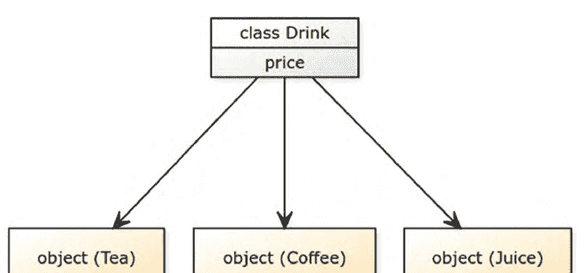

## 9.2 定义类

Python中的类定义以`class`关键字开头，就像函数定义以`def`关键字开头一样。

类的简要描述可以放在类内部的第一个字符串中，这被称为文档字符串。虽然这不是强制要求的，但强烈建议这样做。

以下是对类的简要解释。

```python
>>>class MyNewClass:
    >>> """This is a docstring. I have created a new class"""
    >>>pass
```

类的每个属性都在一个新的局部命名空间中声明。函数或数据都可以是属性。

它还具有以双下划线开头的独特属性，例如。例如，该类的文档字符串由`__doc__`提供。

一旦定义了一个类，就会创建一个同名的新类对象。这个类对象使我们能够访问各种特性，并允许我们创建属于该类的全新对象。

示例：

```python
>>>class Person:
    >>> """This is a person class"""
    >>>age = 10
    >>>def greet(self):
    >>>    print('Hello')
>>>print(Person.age)
>>>print(Person.greet)
>>>print(Person.__doc__)
```

## 9.3 创建对象

我们观察到类对象可以访问许多特性。

此外，它还可以用来实例化该类对象类型的新实例。函数调用类似于创建对象的过程。

```python
>>> harry = Person()
```

这将创建一个名为Harry的新对象实例。通过使用对象名称的前缀，我们可以访问对象的属性。

属性包括数据和方法。对象的方法是该类对应的函数。

换句话说，由于`Person.greet`是一个函数对象（一个类属性），`Person.greet`将是一个方法对象。

示例：

```python
>>>class Person:
>>>    "This is a person class"
>>>    age = 10
>>>    def greet(self):
>>>        print('Hello')

# create a new object of Person class
>>>harry = Person()
>>>print(Person.greet)
>>>print(harry.greet)

# Calling object's greet() method
>>>harry.greet()
```

你可能注意到了类内部函数定义中的`self`参数，但我们刚刚调用了Harry的方法`greet()`，没有传递任何参数。它仍然执行了。

这是因为当对象调用其方法时，对象本身总是作为第一个参数传递。因此，`Person.greet`等同于`harry.greet()`。

通常，使用n个参数列表调用一个方法，等同于使用一个参数列表调用相应的函数，该参数列表是通过将方法的对象放在第一个参数之前构成的。

这些解释决定了对象本身必须是类函数的第一个参数。通常用`self`来描述这个参数。虽然可以给它起不同的名字，但我们强烈建议这样做。

## 9.4 Python中的构造函数

特定函数是具有特殊意义的类函数，并以双下划线开头。

`__init__()`方法非常重要。每次创建该类的新对象时，都会调用这个特定的函数。

在面向对象编程中，这种函数也被称为构造函数（OOP）。通常，我们用它来初始化每个变量。

示例：

```python
>>>class ComplexNumber:
>>>    def __init__(self, r=0, i=0):
>>>        self.real = r
>>>        self.imag = i
>>>    def get_data(self):
>>>        print(f'{self.real}+{self.imag}j')
>>># Create a new ComplexNumber object
>>>num1 = ComplexNumber(2, 3)
>>># Call get_data() method
>>>num1.get_data()
>>># Create another ComplexNumber object
>>># and create a new attribute 'attr'
>>>num2 = ComplexNumber(5)
>>>num2.attr = 10
>>>print((num2.real, num2.imag, num2.attr))
>>># but c1 object doesn't have attribute 'attr'
>>># AttributeError: 'ComplexNumber' object has no attribute 'attr'
>>>print(num1.attr)
```

## 面向对象的支柱

## 9.5 封装

封装是Python、Java等面向对象语言中的基本概念之一。通过封装限制对方法和变量的访问。封装通过将代码和数据封装在一个单元中来保护它们，防止意外修改。

封装是一种将代码（方法）和作用于数据的数据（变量）组合成单个实体的技术。封装意味着一个类的变量对其他类是私有的，只能通过当前类的方法访问。

考虑一个为专业人士、工程师和学生提供培训的企业。该企业分为不同的部门，如运营、财务、会计、销售等。现在，需要2022年销售记录的会计部门成员无法直接访问它们。

必须得到销售部门团队成员的同意，会计部门员工才能访问。因此，其他部门不了解销售统计数据。公司的财务信息同样对其他部门屏蔽，仅对财务部门可用。会计、销售、财务、运营、营销等的数据在其他部门是不可见的。

示例：

```python
>>>class Students:
>>>    def __init__(self, name, rank, points):
>>>        self.name = name
>>>        self.rank = rank
>>>        self.points = points
>>>    # custom function
>>>    def demofunc(self):
>>>        print("I am "+self.name)
>>>        print("I got Rank ",+self.rank)
>>># create 4 objects
>>>st1 = Students("Steve", 1, 100)
>>>st2 = Students("Chris", 2, 90)
>>>st3 = Students("Mark", 3, 76)
>>>st4 = Students("Kate", 4, 60)
>>># call the functions using the objects created above
>>>st1.demofunc()
>>>st2.demofunc()
>>>st3.demofunc()
>>>st4.demofunc()
```

## 9.6 多态

多态指的是存在多种形式。编程中的多态指的是对多种类型使用相同的函数名（但有不同的签名）。主要区别在于函数中使用的数据类型和参数数量。

示例：

```python
>>>class Bird:
>>>def intro(self):
>>>    print("There are many types of birds.")
>>>def flight(self):
>>>    print("Most of the birds can fly but some cannot.")
>>>class sparrow(Bird):
>>>    def flight(self):
>>>    print("Sparrows can fly.")
>>>class ostrich(Bird):
>>>    def flight(self):
>>>    print("Ostriches cannot fly.")
>>>obj_bird = Bird()
>>>obj_spr = sparrow()
>>>obj_ost = ostrich()
>>>obj_bird.intro()
>>>obj_bird.flight()
>>>obj_spr.intro()
>>>obj_spr.flight()
>>>obj_ost.intro()
>>>obj_ost.flight()
```

## 9.7 抽象

在Python中，抽象是通过向用户隐藏额外信息来管理复杂性的实践。这是面向对象编程（OOP）语言的基本概念之一。这使得用户能够在现有抽象的基础上添加更复杂的逻辑，而无需理解甚至考虑所有隐藏的后台或后端复杂性。

这是一个非常广泛的核心主题，不仅适用于面向对象编程。在现实世界或我们周围的环境中随处可见。

程序员可以使用抽象来隐藏程序中所有不必要的信息和操作，使其更易于使用和更高效。我们现在可以开始学习如何使用Python程序来实现抽象。

在我们的程序中使用抽象类和方法，使我们能够在Python中实现抽象。

示例：

```python
>>># Python program demonstrate
>>># abstract base class work
>>>from abc import ABC, abstractmethod
>>>class Car(ABC):
>>>    def mileage(self):
>>>        pass
>>>class Tesla(Car):
>>>    def mileage(self):
>>>        print("The mileage is 30kmph")
>>>class Suzuki(Car):
>>>    def mileage(self):
>>>        print("The mileage is 25kmph ")
>>>class Duster(Car):
>>>    def mileage(self):
>>>        print("The mileage is 24kmph ")
>>>class Renault(Car):
>>>    def mileage(self):
>>>        print("The mileage is 27kmph ")
>>># Driver code
>>>t= Tesla ()
>>>t.mileage()
>>>r = Renault()
>>>r.mileage()
>>>s = Suzuki()
>>>s.mileage()
>>>d = Duster()
>>>d.mileage()
```

## 9.8 继承

得益于继承，我们可以定义一个包含另一个类所有方法和属性的类。被继承的类称为父类或基类。从另一个类继承的类称为“子类”，有时也称为“派生类”。

## 创建父类

语法与创建任何其他类相同，因为任何类都可以成为父类：

示例

```python
class Person:
    def __init__(self, fname, lname):
        self.firstname = fname
        self.lastname = lname

    def printname(self):
        print(self.firstname, self.lastname)

# 使用 Person 类创建一个对象，然后执行
# printname 方法：
x = Person("John", "Doe")
x.printname()
```

## 创建子类

在创建子类时，将父类作为参数添加，你就可以设计一个继承其功能的类：

我们目前开发的子类继承了父类的属性和函数。

我们希望给子类添加 `__init__()` 函数（而不是 `pass` 关键字）。

- 每次使用该类创建新对象时，`__init__()` 函数都会被自动调用。
- 你添加的 `__init__()` 函数将阻止子类继续使用父类的 `__init__()` 函数。
- 子类的 `__init__()` 函数会覆盖从父类继承的任何内容。

示例：

```python
class Person:
    def __init__(self, name1, name2, name3):
        self.first_name = name1
        self.second_name = name2
        self.third_name = name3
    def printname(self):
        print(self.first_name, self.second_name, self.third_name)

class Student(Person):
    pass

x = Student("kaushik", "akash", "varun")
x.printname()
```

## 继承的类型

继承的类型取决于涉及的子类和父类的数量。

Python 中有四种继承类型：

1.  **单继承**：单继承允许派生类从单个父类继承属性，从而可以重用现有代码并添加新功能。

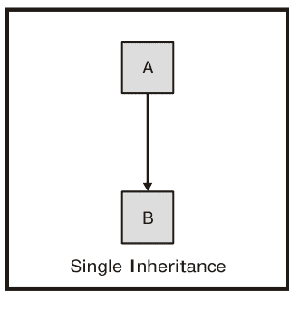

示例：

```python
class Parent:
    def func1(self):
        print("This function is in parent class.")

class Child(Parent):
    def func2(self):
        print("This function is in child class.")

object = Child()
object.func1()
object.func2()
```

2.  **多重继承**：多重继承指的是一种继承类型，其中一个类可以源自多个基类。在多重继承中，所有基类的特性都会传递给派生类。

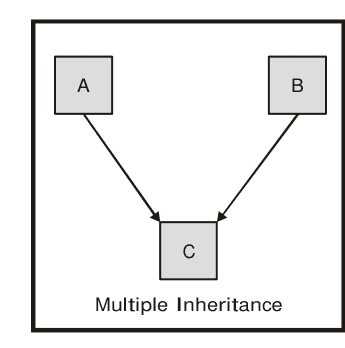

示例：

```python
class Mother:
    mothername = ""
    def mother(self):
        print(self.mothername)

class Father:
    fathername = ""
    def father(self):
        print(self.fathername)

class Son(Mother, Father):
    def parents(self):
        print("Father :", self.fathername)
        print("Mother :", self.mothername)

s1 = Son()
s1.fathername = "RAM"
s1.mothername = "SITA"
s1.parents()
```

3.  **多级继承**：在多级继承中，基类和派生类的特性进一步被新的派生类继承。这类似于祖父与孙辈之间的关系。

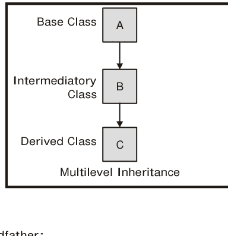

示例：

```python
class Grandfather:
    def __init__(self, grandfathername):
        self.grandfathername = grandfathername

class Father(Grandfather):
    def __init__(self, fathername, grandfathername):
        self.fathername = fathername
        Grandfather.__init__(self, grandfathername)

class Son(Father):
    def __init__(self, sonname, fathername, grandfathername):
        self.sonname = sonname
        Father.__init__(self, fathername, grandfathername)
    def print_name(self):
        print('Grandfather name :', self.grandfathername)
        print("Father name :", self.fathername)
        print("Son name :", self.sonname)

s1 = Son('Prince', 'Rampal', 'Lal mani')
print(s1.grandfathername)
s1.print_name()
```

4.  **层次继承**：层次继承是从单个基类创建多个派生类的过程。此软件中存在两个子（派生）类和一个父（基）类。

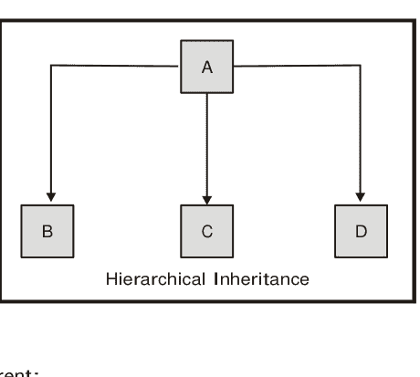

示例：

```python
class Parent:
    def func1(self):
        print("This function is in parent class.")

class Child1(Parent):
    def func2(self):
        print("This function is in child 1.")

class Child2(Parent):
    def func3(self):
        print("This function is in child 2")

object1 = Child1()
object2 = Child2()
object1.func1()
object1.func2()
object2.func1()
object2.func3()
```

5.  **混合继承**：混合继承是由多种继承类型组合而成的继承。

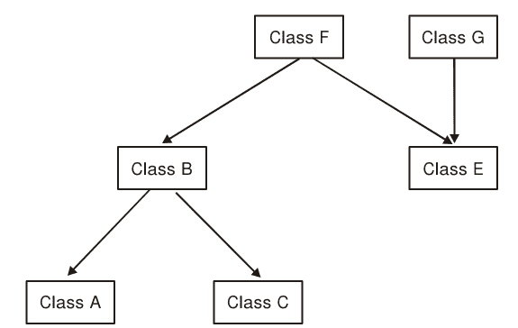

示例：

```python
class School:
    def func1(self):
        print("This function is in school.")

class Student1(School):
    def func2(self):
        print("This function is in student 1. ")

class Student2(School):
    def func3(self):
        print("This function is in student 2.")

class Student3(Student1, School):
    def func4(self):
        print("This function is in student 3.")

object = Student3()
object.func1()
object.func2()
```

## 复习题

1.  什么是对象？
2.  什么是面向对象编程？
3.  什么是类？
4.  如何在 Python 中定义一个类？
5.  举例说明在 Python 中创建一个对象。
6.  解释类函数中的 `self` 关键字。
7.  什么是构造函数？
8.  `__init__` 方法的用途是什么？
9.  面向对象编程的四大支柱是什么？
10. 什么是封装？
11. 用一个例子解释封装。
12. 什么是多态？
13. 用一个例子解释多态。
14. 什么是抽象？
15. 用一个例子解释抽象。
16. 什么是继承？
17. 有哪些不同类型的继承？
18. 用一个例子解释继承的类型。

## 第四单元：数据可视化

## 第十章

## 使用 Python 的 Matplotlib 可视化

## 10.1 Matplotlib：使用 Python 进行可视化

Python 的 Matplotlib 工具包提供了一套完整的工具，用于创建静态、动画和交互式可视化。Matplotlib 使复杂的事情变得可能，简单的事情变得容易。

- 生成适合出版的图表。
- 制作具有缩放、平移和更新功能的交互式图表。
- 可以更改视觉样式和布局。
- 导出为多种文件类型。
- 与图形用户界面和 JupyterLab 集成。
- 利用基于 Matplotlib 的大量第三方包。

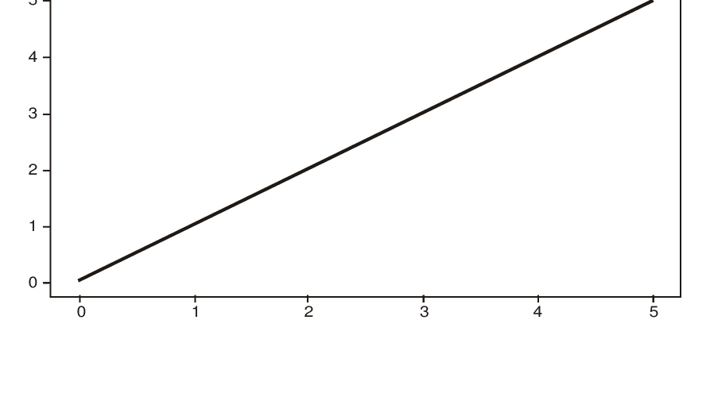

## 10.2 Matplotlib 的安装

如果系统上已经设置了 Python 和 PIP，安装 Matplotlib 非常简单。使用此命令安装：

```
C:\Users\Your Name>pip install matplotlib
```

```
C:\Users\CSC>pip install matplotlib
Collecting matplotlib
Downloading https://files.pythonhosted.org/packages/13/e5/e5b46331abdf395dc653432df139/matplotlib-3.6.2-cp38-cp38-win_amd64.whl (7.2MB)
7.2MB 3.3.MB/s
Installing collected packages: matplotlib
Successfully installed matplotlib-3.6.2
```

如果此命令失败，请使用已预装 Matplotlib 的 Python 发行版，例如 Anaconda、Spyder 等。

安装 Matplotlib 后，通过添加 import 模块语句在应用程序中导入它：

```python
import matplotlib
```

现在 Matplotlib 已导入并准备就绪：

## 10.3 检查 Matplotlib 版本

通过 `matplotlib.__version__` 检查 Matplotlib 版本。

示例

```python
import matplotlib
print(matplotlib.__version__)
```

输出：

```
E:\python>practice-1.py
3.6.0
```

## 10.4 Matplotlib 库

- Matplotlib Pyplot
- Matplotlib Markers
- Matplotlib Labels
- Matplotlib Plotting
- Matplotlib Line
- Matplotlib Grid

## 10.5 Matplotlib Pyplot

Matplotlib pyplot 中的函数使 Matplotlib 能够以类似于 MATLAB 的方式运行。每个 pyplot 函数都会以某种方式修改图形，例如创建图形、在图形中创建绘图区域、在绘图区域内绘制线条、为绘图添加标签等。

通常使用 `plt` 别名来导入位于 `pyplot` 子模块中的大多数 Matplotlib 函数：
```python
import matplotlib.pyplot as plt
```
现在，Pyplot 包可以被称为 `plt`。

示例：在图表中绘制一条从位置 (0,0) 到位置 (6,250) 的线

```python
import matplotlib.pyplot as plt
import numpy as np
xpoints=np.array([0, 6])
ypoints=np.array([0, 250])
plt.plot(xpoints, ypoints)
plt.show()
```

输出：

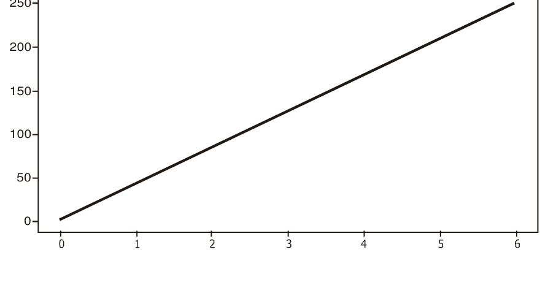

## 10.6 Matplotlib 绘图

在 Python 中绘图有什么用？

`plot()` 函数用于在图表中绘制点（标记）。默认情况下，`plot()` 函数会绘制一条从点到点的线。该函数接受用于指定图表中点的参数。参数 1 是一个包含 **x 轴**上点的数组。

例如：

参数 1 是一个包含 **x 轴**上点的数组。

参数 2 是一个包含 **y 轴**上点的数组。

如果我们需要绘制一条从 (1, 3) 到 (8, 10) 的线，我们必须将两个数组 [1, 8] 和 [3, 10] 传递给 plot 函数。

在图表中绘制一条从位置 (1, 3) 到位置 (8, 10) 的线：

```python
import matplotlib.pyplot as plt
import numpy as np
xpoints=np.array([1, 8])
ypoints=np.array([3, 10])
plt.plot(xpoints,ypoints)
plt.show()
```

**输出：**

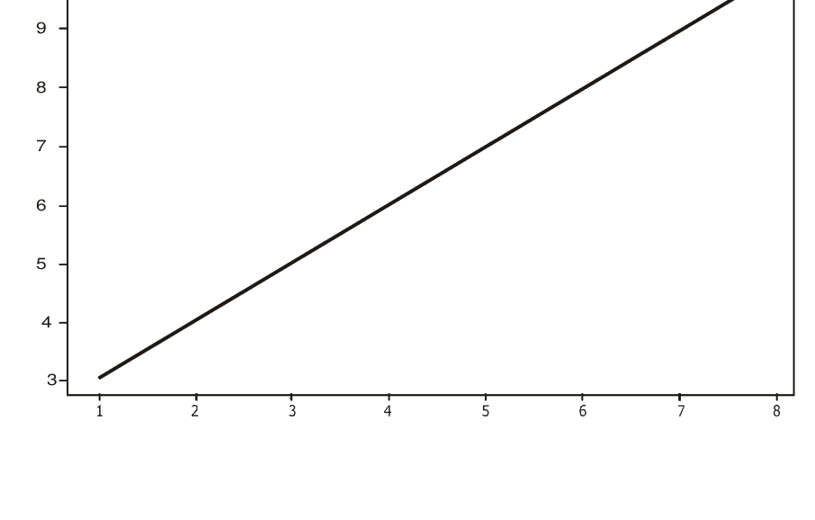

## 10.7 Matplotlib 标记

Matplotlib 中处理标记的函数位于 `matplotlib.dates` 模块中。它被 `plot` 和 `scatter` 的标记功能所使用。每个点都使用不同的标记进行高亮显示。

标记中的不同格式化特性：

- 标记参考
- 格式字符串
- 颜色参考
- 标记大小
- 标记颜色

### 标记参考

示例

```python
...

plt.plot(ypoints, marker = '*')

# 标记以星号 ('*') 的形式格式化

...
```

输出：

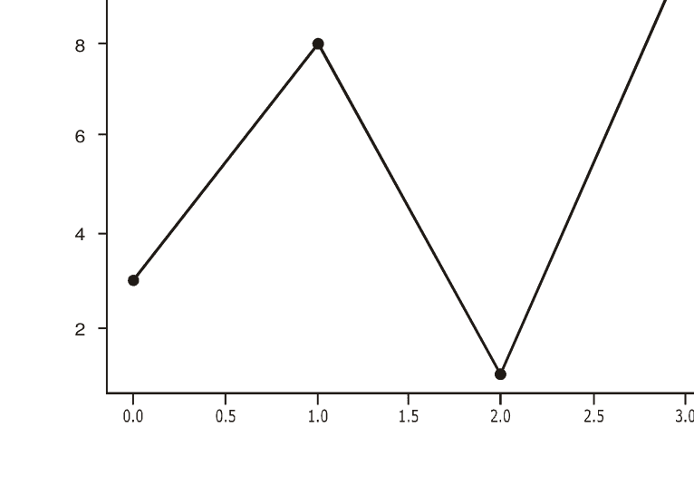

### 不同标记列表（表格）

| 'o' | 圆形 | '+' | 加号 | '4' | 右三角 | 'H' | 六边形 |
| --- | --- | --- | --- | --- | --- | --- | --- |
| '*' | 星号 | 'P' | 加号（填充） | '|' | 垂直线 | 'h' | 六边形 |
| '.' | 点 | 's' | 正方形 | '_' | 水平线 | 'v' | 下三角 |
| ',' | 像素 | 'D' | 菱形 | '1' | 下三角 | '^' | 上三角 |
| 'x' | X | 'd' | 菱形（细） | '2' | 上三角 | '<' | 左三角 |
| 'X' | X（填充） | 'p' | 五边形 | '3' | 左三角 | '>' | 右三角 |

### 格式字符串

此参数也称为 `fmt`，其语法如下：
`marker|line|color`

示例

```python
import matplotlib.pyplot as plt
import numpy as np
ypoints=np.array([3, 8, 1, 10])
plt.plot(ypoints, 'o:r')
plt.show()
```

### 不同的格式字符串类型

| 线条语法 | 描述 |
| --- | --- |
| '-' | 实线 |
| ':' | 点线 |
| '--' | 虚线 |
| '-.' | 点划线 |

### 颜色参考

这用于更改图表的颜色。

表格中给出了不同的格式化参考：

| 颜色语法 | 描述 | 颜色语法 | 描述 |
| :--- | :--- | :--- | :--- |
| 'r' | 红色 | 'c' | 青色 |
| 'g' | 绿色 | 'm' | 品红色 |
| 'b' | 蓝色 | 'y' | 黄色 |
| 'w' | 白色 | 'k' | 黑色 |

### 标记大小

你可以使用关键字参数 `markersize` 或其简写 `ms` 来设置标记的大小：

示例：

```python
import matplotlib.pyplot as plt
import numpy as np
ypoints=np.array([3, 8, 1, 10])
plt.plot(ypoints,marker= 'o',ms= 20)
plt.show()
```

输出：

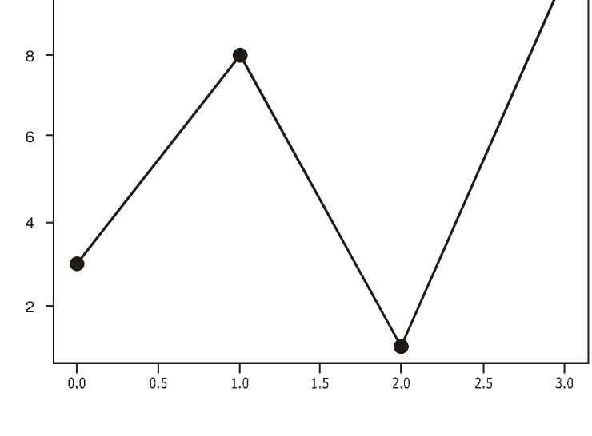

### 标记颜色

你可以使用关键字参数 `markeredgecolor` 或其简写 `mec` 来设置标记边缘的颜色：

示例：

```python
import matplotlib.pyplot as plt
import numpy as np
ypoints=np.array([3, 8, 1, 10])
plt.plot(ypoints,marker= 'o',ms= 20,mec= 'r')
plt.show()
```

输出：

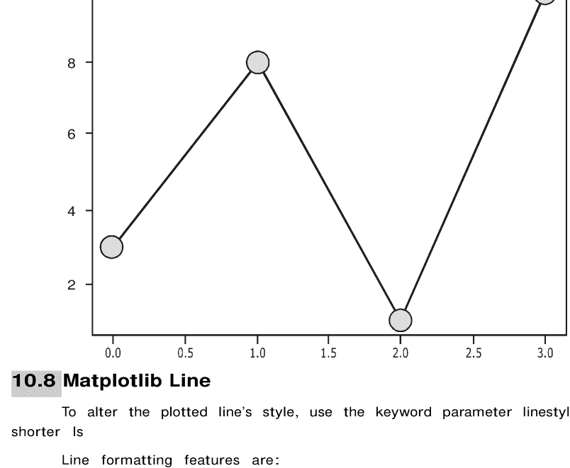

## 10.8 Matplotlib 线条

要更改绘制线条的样式，请使用关键字参数 `linestyle` 或其简写 `ls`。

线条格式化特性包括：

- 线条样式
- 线条样式
- 线条颜色
- 线条宽度
- 多条线

### 线条样式

你可以使用关键字参数 `linestyle` 或其简写 `ls` 来更改绘制线条的样式：

示例

```python
import matplotlib.pyplot as plt
import numpy as np
ypoints=np.array([3, 8, 1, 10])
plt.plot(ypoints,linestyle= 'dotted')
plt.show()
```

输出：

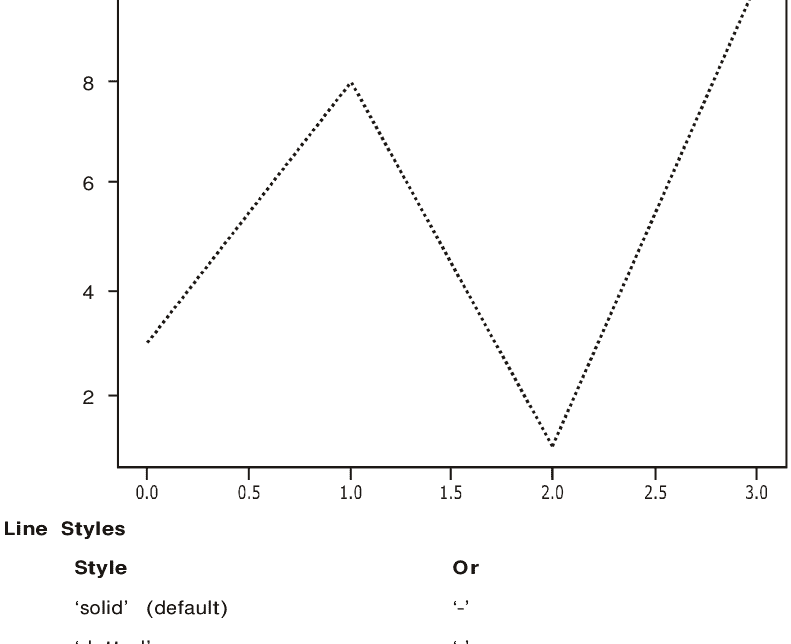

### 线条样式

| 样式 | 或 |
| :--- | :--- |
| 'solid'（默认） | '-' |
| 'dotted' | ':' |
| 'dashed' | '--' |
| 'dashdot' | '-.' |
| 'None' | '' 或 ' ' |

### 线条颜色

你可以使用关键字参数 `color` 或其简写 `c` 来设置线条的颜色：

示例：

```python
import matplotlib.pyplot as plt
import numpy as np
ypoints=np.array([3, 8, 1, 10])
plt.plot(ypoints,color= 'r')
plt.show()
```

输出：

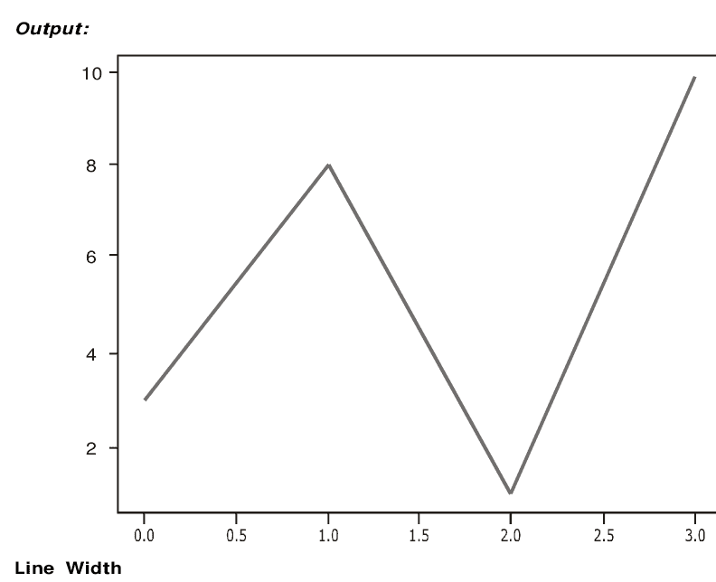

### 线条宽度

你可以使用关键字参数 `linewidth` 或其简写 `lw` 来更改线条的宽度。

示例：

```python
import matplotlib.pyplot as plt
import numpy as np
ypoints=np.array([3, 8, 1, 10])
plt.plot(ypoints,linewidth= '20.5')
plt.show()
```

输出：

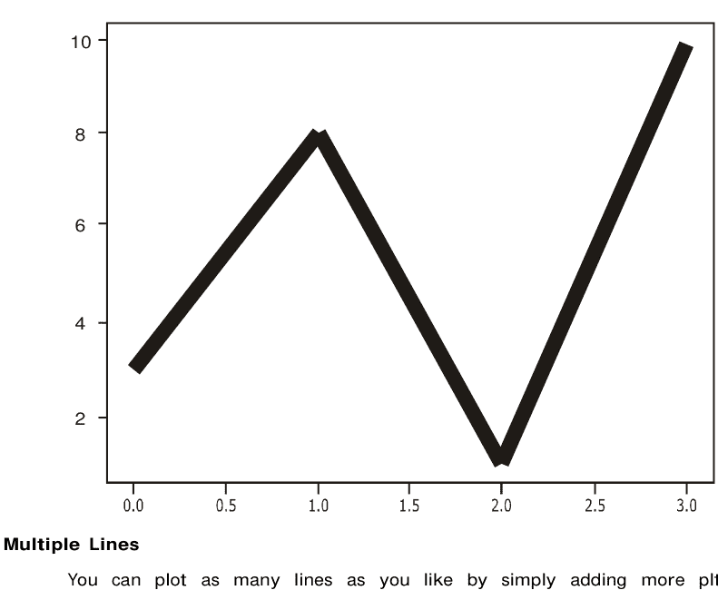

### 多条线

你可以通过简单地添加更多的 `plt.plot()` 来绘制任意数量的线。

示例：

```python
import matplotlib.pyplot as plt
import numpy as np
y1=np.array([3, 8, 1, 10])
y2=np.array([6, 2, 7, 11])
plt.plot(y1)
plt.plot(y2)
plt.show()
```

输出：

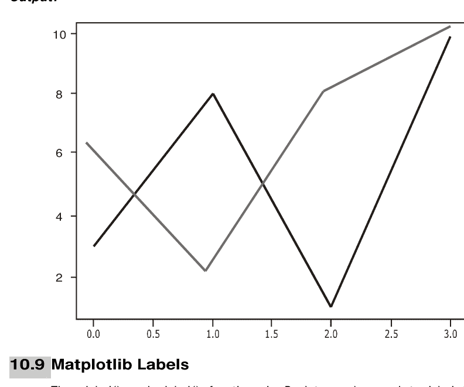

## 10.9 Matplotlib 标签

Pyplot 中的 `xlabel()` 和 `ylabel()` 函数可用于分别为 x 轴和 y 轴添加标签。

示例：

```python
import numpy as np
import matplotlib.pyplot as plt
x=np.array([80, 85, 90, 95, 100, 105, 110, 115, 120, 125])
y=np.array([240, 250, 260, 270, 280, 290, 300, 310, 320, 330])
plt.plot(x,y)
plt.xlabel("Average Pulse")
plt.ylabel("Calorie Burnage")
plt.show()
```

输出：

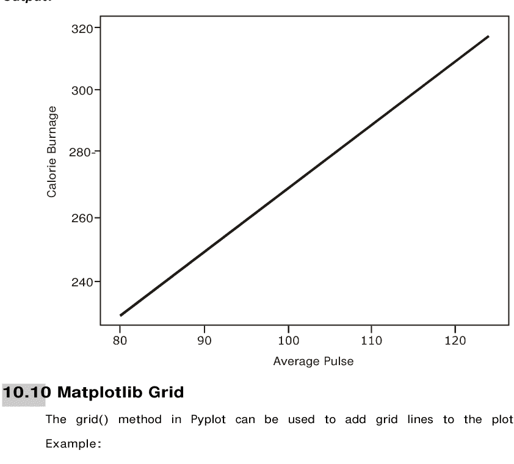

## 10.10 Matplotlib 网格

Pyplot 中的 `grid()` 方法可用于向绘图添加网格线。

示例：

```python
import numpy as np
import matplotlib.pyplot as plt
x=np.array([80, 85, 90, 95, 100, 105, 110, 115, 120, 125])
y=np.array([240, 250, 260, 270, 280, 290, 300, 310, 320, 330])
plt.title("SportsWatchData")
plt.xlabel("AveragePulse")
plt.ylabel("CalorieBurnage")
plt.plot(x, y)
plt.grid()
plt.show()
```

输出：

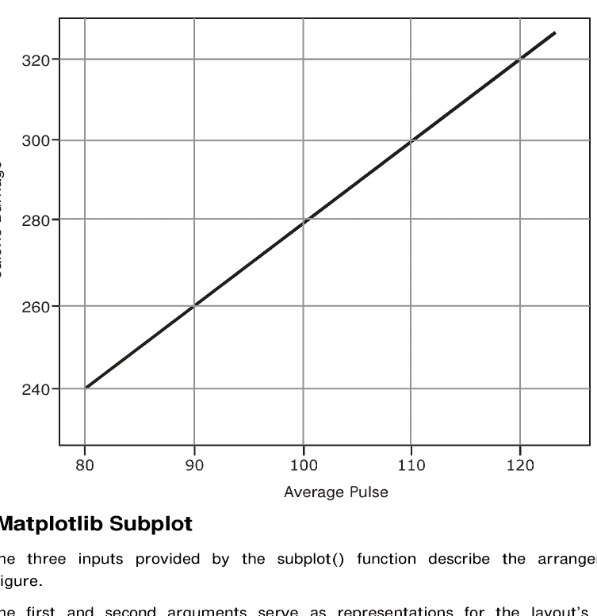

## 10.11 Matplotlib 子图

`subplot()` 函数提供的三个输入描述了图形的排列方式。

第一个和第二个参数分别表示布局的行数和列数。

第三个参数表示当前绘图的索引。

```python
plt.subplot(1, 2, 1) # (1, 2, 1)
```

此绘图是图中的第一个绘图，具有一行和两列。

```python
plt.subplot(1, 2, 2) # (1, 2, 2)
```

此绘图是图中的第二个绘图，具有一行和两列。

换句话说，如果我们想要一个具有两行一列的图形，使得两个绘图上下放置而不是并排放置，我们可以按如下方式编写语法：

示例：

绘制两个上下堆叠的绘图：

```python
import matplotlib.pyplot as plt
import numpy as np
#plot 1:
x = np.array([0, 1, 2, 3])
y = np.array([3, 8, 1, 10])
plt.subplot(2, 1, 1)
plt.plot(x,y)
#plot 2:
x = np.array([0, 1, 2, 3])
y = np.array([10, 20, 30, 40])
plt.subplot(2, 1, 2)
plt.plot(x,y)
plt.show()
```

**输出：**

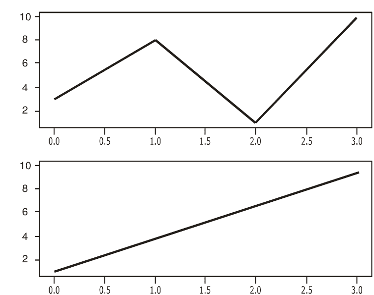

你可以在一个图形上绘制任意数量的绘图，只需描述行数、列数以及绘图的索引即可。

# 绘制6个图表：

```python
import matplotlib.pyplot as plt
import numpy as np
x=np.array([0, 1, 2, 3])
y=np.array([3, 8, 1, 10])

plt.subplot(2, 3, 1)
plt.plot(x,y)
x = np.array([0, 1, 2, 3])
y = np.array([10, 20, 30, 40])
plt.subplot(2, 3, 2)
plt.plot(x,y)
x = np.array([0, 1, 2, 3])
y = np.array([3, 8, 1, 10])

plt.subplot(2, 3, 3)
plt.plot(x,y)

x = np.array([0, 1, 2, 3])
y = np.array([10, 20, 30, 40])

plt.subplot(2, 3, 4)
plt.plot(x,y)

x = np.array([0, 1, 2, 3])
y = np.array([3, 8, 1, 10])

plt.subplot(2, 3, 5)
plt.plot(x,y)

x = np.array([0, 1, 2, 3])
y = np.array([10, 20, 30, 40])

plt.subplot(2, 3, 6)
plt.plot(x,y)

plt.show()
```

输出：

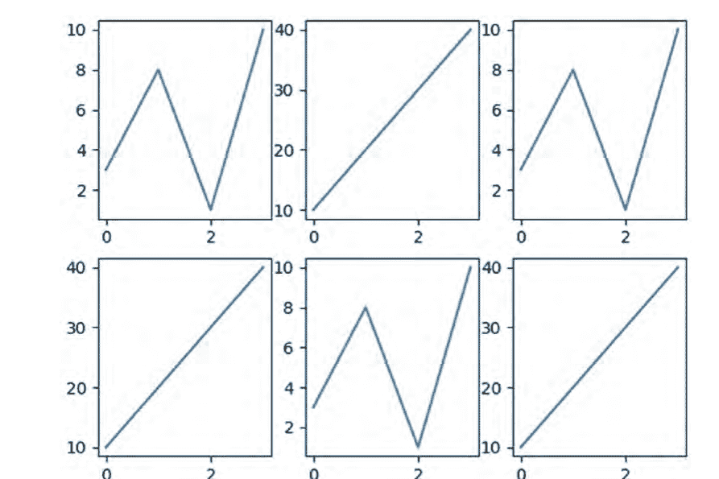

## 10.12 Matplotlib 散点图

创建散点图

使用 Pyplot，你可以使用 `scatter()` 函数来绘制散点图。
`scatter()` 函数为每个观测点绘制一个点。它需要两个长度相同的数组，一个用于 x 轴的值，另一个用于 y 轴的值：

示例

一个简单的散点图：

```python
import matplotlib.pyplot as plt
import numpy as np

x = np.array([5,7,8,7,2,17,2,9,4,11,12,9,6])
y = np.array([99,86,87,88,111,86,103,87,94,78,77,85,86])

plt.scatter(x, y)
plt.show()
```

输出：

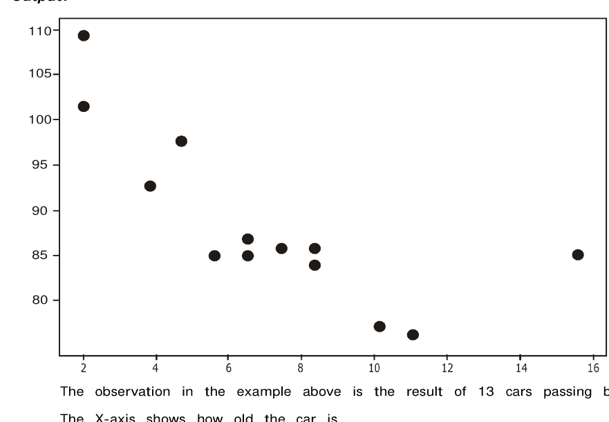

上面示例中的观测结果是13辆汽车经过的结果。
X 轴显示汽车的车龄。
Y 轴显示汽车经过时的速度。
这些观测之间是否存在任何关系？
似乎汽车越新，行驶速度越快，但这可能只是巧合，毕竟我们只记录了13辆汽车。

## 10.13 Matplotlib 柱状图

`bar()` 函数用于绘制柱状图

示例

绘制4个柱子：

```python
import matplotlib.pyplot as plt
import numpy as np
x = np.array(["A", "B", "C", "D"])
y = np.array([3, 8, 1, 10])
plt.bar(x,y)
plt.show()
```

输出：

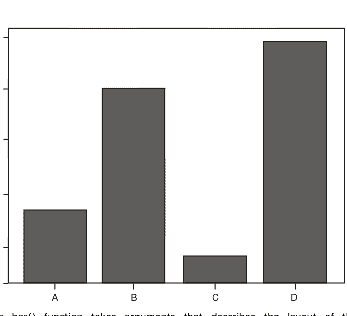

`bar()` 函数接受描述柱子布局的参数。
类别及其值由第一个和第二个参数作为数组表示。

示例

```python
x = ["APPLES", "BANANAS"]
y = [400, 350]
plt.bar(x, y)
```

## 10.14 Matplotlib 直方图

频率分布的图像称为直方图。
该图用于显示在每个区间内进行的观测数量。

示例：

如果你询问250人的身高，你可能会收到一个类似这样的直方图：

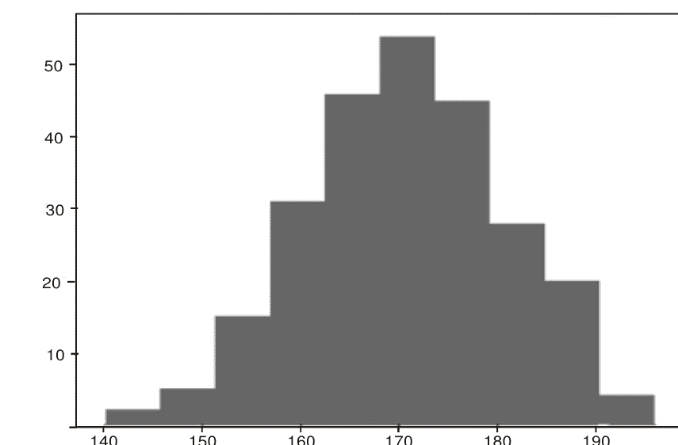

**直方图显示大约有：**

- 2人身高在140至145厘米之间
- 5人身高在145至150厘米之间
- 15人身高在151至156厘米之间
- 31人身高在157至162厘米之间
- 46人身高在163至168厘米之间
- 53人身高在168至173厘米之间
- 45人身高在173至178厘米之间
- 28人身高在179至184厘米之间
- 21人身高在185至190厘米之间
- 2人身高在190至195厘米之间

### 创建直方图：

Matplotlib 中的 `hist()` 函数用于生成直方图。

一个数字数组作为参数传递给 `hist()` 方法，该方法使用该数组来生成直方图。

### 示例

使用 NumPy 生成正态数据分布：

```python
import numpy as np

x = np.random.normal(170, 10, 250)

print(x)
```

### 输出：

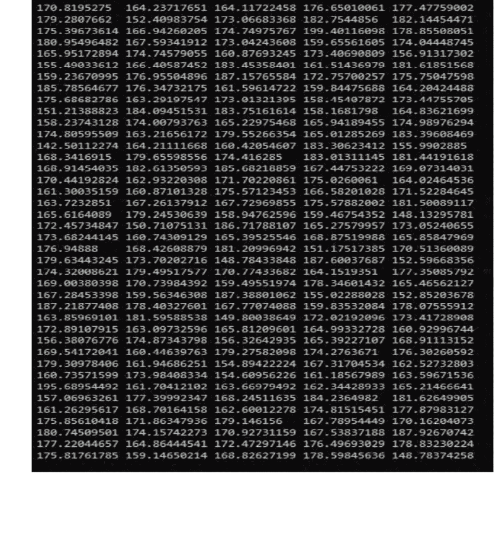

### 读取直方图

`hist()` 函数将读取数组并生成直方图：

示例

一个简单的直方图：

```python
import matplotlib.pyplot as plt
import numpy as np

x = np.random.normal(170, 10, 250)
plt.hist(x)
plt.show()
```

输出：

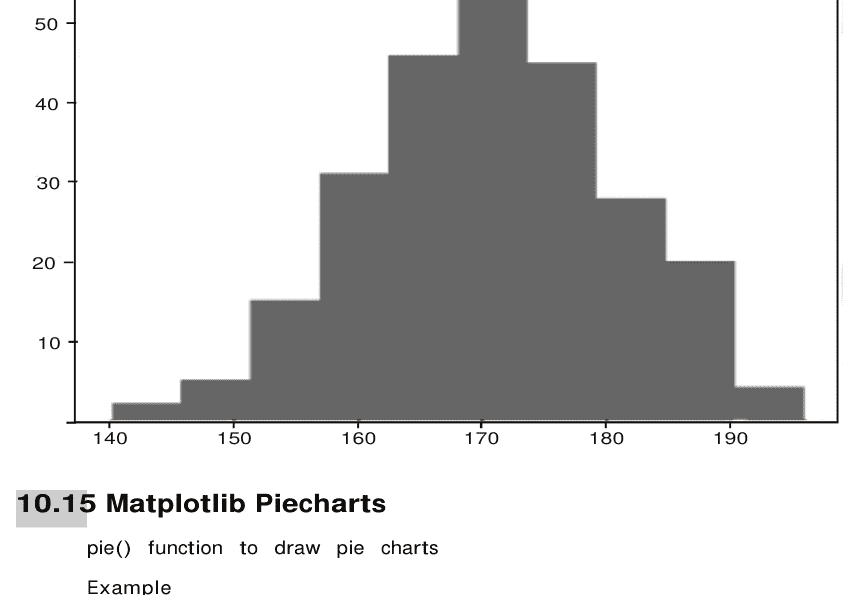

## 10.15 Matplotlib 饼图

`pie()` 函数用于绘制饼图

示例

一个简单的饼图：

```python
import matplotlib.pyplot as plt
import numpy as np
y = np.array([35, 25, 25, 15])
plt.pie(y)
plt.show()
```

**输出：**


## 复习题

1.  Python 中的 matplotlib 是什么？
2.  matplotlib 有哪些应用？
3.  如何安装 matplotlib？
4.  什么是 pip？
5.  如何检查 matplotlib 的版本？
6.  列出任意四个 matplotlib 库。
7.  用一个示例解释 matplotlib.pyplot。
8.  Python 中绘图有什么用途？
9.  用一个示例解释 matplotlib 绘图。
10. matplotlib 中的标记是什么？
11. matplotlib 中标记的格式化特性有哪些？
12. 用示例解释 matplotlib 中标记的格式化特性。
13. matplotlib 中线条的格式化特性有哪些？
14. 用示例解释 matplotlib 中线条的格式化特性？
15. 什么是 matplotlib 标签？
16. 用示例解释 matplotlib 标签。
17. 什么是 matplotlib 网格？
18. 用示例解释 matplotlib 网格。
19. 什么是 matplotlib 子图？
20. 用示例解释 matplotlib 子图。
21. 什么是 matplotlib 散点图？
22. 用示例解释 matplotlib 散点图。
23. 什么是 matplotlib 柱状图？
24. 用示例解释 matplotlib 柱状图。
25. 什么是直方图？
26. 如何创建 matplotlib 直方图？
27. 如何读取 matplotlib 直方图？
28. 用一个示例解释 matplotlib 饼图。

# 第11章

## 随机游走

### 11.1 什么是随机游走？

简而言之，随机游走是相对于当前状态以“随机”方式进行后续步骤的过程。这个基本描述可以根据附加条件进行修改，以生成适用于你特定用例的随机游走。现实世界中一些更著名的随机游走包括股票行情走势、基质中活细胞的运动以及粒子的布朗运动。

在这里，我们模拟一维（一维）、二维（二维）和三维（三维）的紧凑随机游走。停止位置用 o 表示，起始点用 + 表示。

这些要求可能因应用而异；例如，游走可能从特定的股票价格开始，或者从显微镜确定的细胞位置开始。步骤选择通常是概率性的，并基于来自先前数据、投影假设、正在测试的假设等的附加信息。


### 11.2 一维随机游走

一维随机游走是最简单的随机游走类型。在这种类型的随机游走中，移动物体只能在一个维度上移动。在这个例子中，是上下移动。

计划是让物体随机向上或向下移动 n 次，同时将位置数据存储在列表中。

由于物体的运动是一维的，路径在图中由一定高度的线表示。由于很难确定物体在每个阶段的位置，这没有用。为了使图表更具说明性，我们将为过程中的每一步添加一个时间戳。这将其转换为一个二维图表，日期作为 x 轴，物体的位置作为 y 轴。

示例：

```python
import numpy as np
import matplotlib.pyplot as plt
import random

def randomwalk1D(n):
    x, y = 0, 0
    # 生成时间点 [1, 2, 3, ... , n]
    timepoints = np.arange(n + 1)
    positions = [y]
    directions = ["UP", "DOWN"]
    for i in range(1, n + 1):
        # 随机选择向上或向下
        step = random.choice(directions)
        # 将物体向上或向下移动
        if step == "UP":
            y += 1
        elif step == "DOWN":
            y -= 1
        # 记录位置
        positions.append(y)
    return timepoints, positions

time_data, pos_data = randomwalk1D(1000)
plt.plot(time_data, pos_data, 'r-')
plt.title("Python 中的一维随机游走")
plt.show()
```

输出：

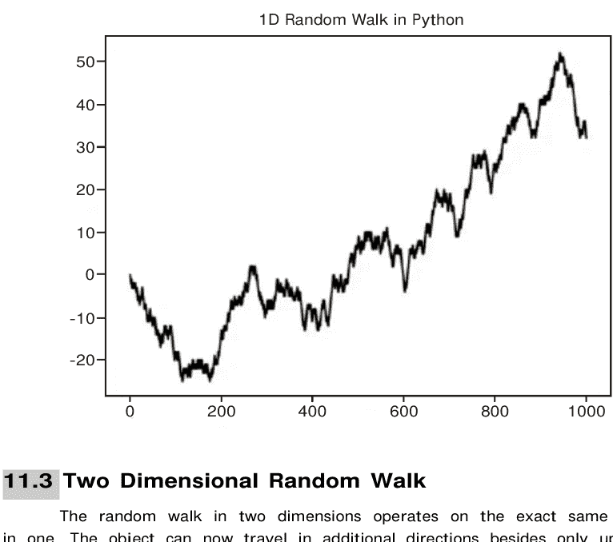

### 11.3 二维随机游走

二维随机游走的原理与一维完全相同。物体现在除了上下移动外，还可以向其他方向移动。它也可以向左或向右移动。

在二维场景中，你不再绘制时间。相反，通过将 x、y 坐标对添加到图中，可以观察到游走。这显示了物体的 n 步二维路径。

示例：

```python
import numpy as np
import matplotlib.pyplot as plt
import random
```

def randomwalk2D(n):
    # [0, 0, 0, ... ,0]
    x = np.zeros(n)
    y = np.zeros(n)
    directions = ["UP", "DOWN", "LEFT", "RIGHT"]
    for i in range(1, n):
        # 随机选择一个方向
        step = random.choice(directions)
        # 根据方向移动物体
        if step == "RIGHT":
            x[i] = x[i - 1] + 1
            y[i] = y[i - 1]
        elif step == "LEFT":
            x[i] = x[i - 1] - 1
            y[i] = y[i - 1]
        elif step == "UP":
            x[i] = x[i - 1]
            y[i] = y[i - 1] + 1
        elif step == "DOWN":
            x[i] = x[i - 1]
            y[i] = y[i - 1] - 1
    # 返回物体的所有x和y位置
    return x, y

x_data, y_data = randomwalk2D(1000)
plt.title("Python中的二维随机游走")
plt.plot(x_data, y_data)
plt.show()

输出：

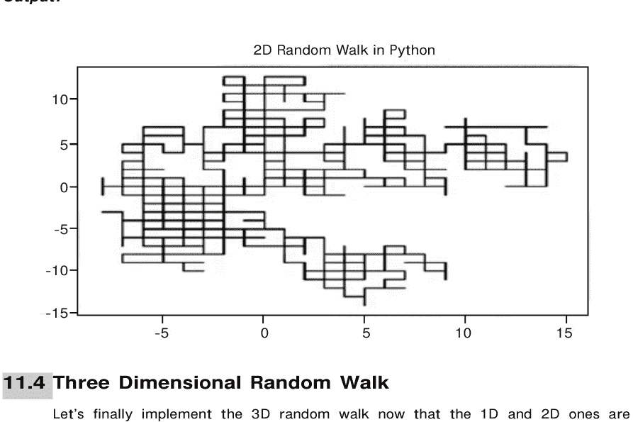

## 11.4 三维随机游走

既然一维和二维随机游走已经可以运行，我们现在来实现三维随机游走。

概念与二维相同，但现在你还可以额外向上、下、左、右移动，以及向内和向外移动。

示例：

```python
import matplotlib.pyplot as plt
import numpy as np
import random

def randomwalk3D(n):
    x, y, z = np.zeros(n), np.zeros(n), np.zeros(n)
    directions = ["UP", "DOWN", "LEFT", "RIGHT", "IN", "OUT"]
    for i in range(1, n):
        step = random.choice(directions)
        if step == "RIGHT":
            x[i] = x[i - 1] + 1
            y[i] = y[i - 1]
            z[i] = z[i - 1]
        elif step == "LEFT":
            x[i] = x[i - 1] - 1
            y[i] = y[i - 1]
            z[i] = z[i - 1]
        elif step == "UP":
            x[i] = x[i - 1]
            y[i] = y[i - 1] + 1
            z[i] = z[i - 1]
        elif step == "DOWN":
            x[i] = x[i - 1]
            y[i] = y[i - 1] - 1
            z[i] = z[i - 1]
        elif step == "IN":
            x[i] = x[i - 1]
            y[i] = y[i - 1]
            z[i] = z[i - 1] - 1

    return x, y, z

x_data, y_data, z_data = randomwalk3D(1000)

ax = plt.subplot(1, 1, 1, projection='3d')
ax.plot(x_data, y_data, z_data, alpha=0.9)
ax.scatter(x_data[-1], y_data[-1], z_data[-1])
plt.show()
```

输出：

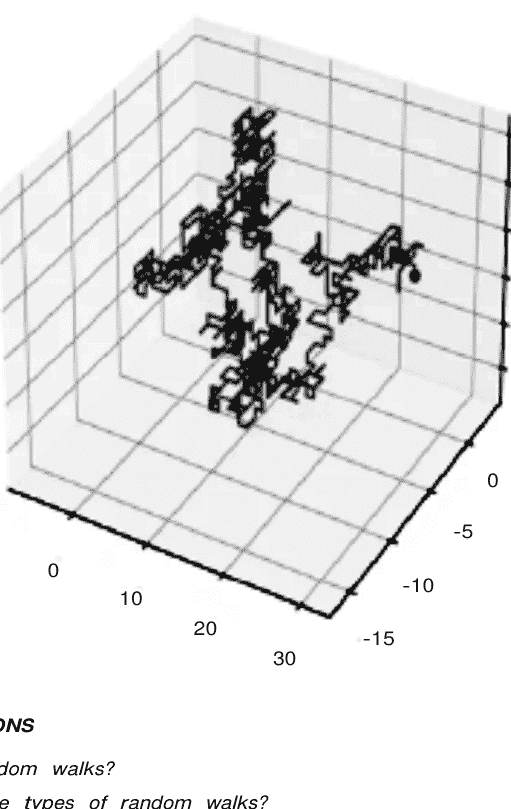

## 复习题

1.  什么是随机游走？
2.  随机游走有哪些类型？
3.  举例解释一维随机游走。
4.  举例解释二维随机游走。
5.  举例解释三维随机游走。
6.  什么是random模块？
7.  举例解释random模块。

## 第12章

## 使用PLOTLY掷骰子

掷骰子生成的数据将使用plotly进行绘图。这将能够自动缩放以适应查看者的屏幕。当用户将鼠标悬停在屏幕上的特定元素上时，它还将使图表具有交互性。每次掷骰子时，得到一到六的点数机会是均等的，我们将检查掷骰子的结果。此外，我们还将研究各个点数的概率。

### 12.1 定义一个生成图表的库

```python
from random import randint
from plotly.graph_objs import Bar,Layout
from plotly import offline
from plotly.offline import init_notebook_mode
init_notebook_mode(connected=True)
import plotly.graph_objs as go
```

### 12.2 创建类并初始化数据

```python
from random import randint
from plotly.graph_objs import Bar,Layout
from plotly import offline
from plotly.offline import init_notebook_mode
init_notebook_mode(connected=True)
import plotly.graph_objs as go

class Play:
    """表示单个骰子的类"""
    def __init__(self, sides=6):
        """创建一个六面骰子"""
        self.sides=sides
    def roll(self):
        """返回一个介于1和面数之间的随机值"""
        return randint(1, self.sides)

die=Play()#创建一个D6骰子
die_2=Play()#创建另一个骰子
results=[]#用于存放投掷结果的容器
for roll_number in range(10_000):
    result=die.roll()+die_2.roll()
    results.append(result)

frequencies=[]#用于存放每个数字出现次数的容器
highest_result=die.sides+die_2.sides
for freq in range(2, highest_result+1):
    frequency= results.count(freq)
    frequencies.append(frequency)
print(frequencies)
[271, 578, 808, 1099, 1350, 1635, 1419, 1127, 819, 584, 310]
```

### 12.3 绘制两个骰子投掷的数据

```python
x_data=list(range(2, highest_result+1))
data=[Bar(x=x_data,y=frequencies)]

x_axis_config={"title":"骰子结果","dtick":1}
y_axis_config={"title":"骰子频率"}
my_layout=Layout(title="投掷骰子10,000次的直方图",
                 xaxis=x_axis_config,yaxis=y_axis_config)
offline.iplot({"data":data, "layout":my_layout},filename="Rolling dice.html")
```

输出：

投掷骰子10,000次的直方图

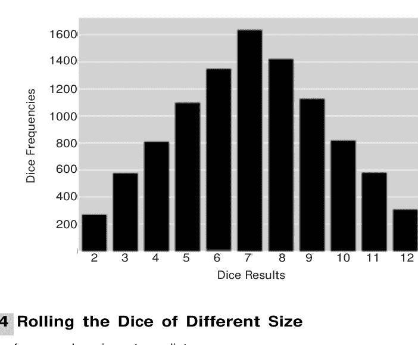

### 12.4 投掷不同大小的骰子

```python
from random import randint
from plotly.graph_objs import Bar,Layout
from plotly import offline
from plotly.offline import init_notebook_mode
init_notebook_mode(connected=True)
import plotly.graph_objs as go

die=Play()#创建一个D6骰子
die_2=Play(15)#创建另一个大小为20的骰子
results=[]#用于存放投掷结果的容器
for roll_number in range(100_000):
    result=die.roll()+die_2.roll()
    results.append(result)

frequencies=[]#用于存放每个数字出现次数的容器
highest_result=die.sides+die_2.sides

for freq in range(2, highest_result+1):
    frequency= results.count(freq)
    frequencies.append(frequency)

print(frequencies)

x_data=list(range(2, highest_result+1))
data=[Bar(x=x_data,y=frequencies)]

x_axis_config={"title":"骰子结果","dtick":1}
y_axis_config={"title":"骰子频率"}
my_layout=Layout(title="投掷骰子10,000次的直方图",
                 xaxis=x_axis_config,yaxis=y_axis_config)

offline.iplot({"data":data, "layout":my_layout},filename="Rolling dice.html")
```

**输出：**

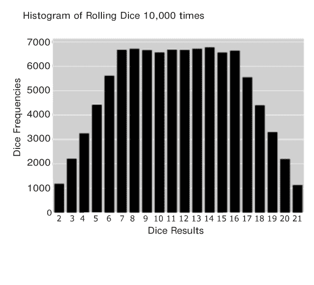

## 复习题

1.  解释掷骰子的概念。
2.  使用plotly生成掷骰子的图表。
3.  解释两个骰子投掷数据的绘图。
4.  解释三个骰子投掷数据的绘图。
5.  解释不同大小骰子投掷数据的绘图。
6.  什么是plotly？
7.  如何安装plotly？
8.  举例解释plotly。
9.  什么是numpy？
10. 如何安装numpy？
11. 举例解释numpy。

## 第13章

## 使用WEB应用程序

### 13.1 什么是Web应用程序？

Python驱动的Web应用程序使用Python代码来决定执行哪些操作以及显示哪些内容。你的用户不需要安装任何东西，因为托管你网站的Web服务器会运行你的代码。他们只需要一个浏览器和互联网连接就可以与你的代码进行通信。

让Python在网站上运行可能具有挑战性，但有各种Web框架可以为你处理这些复杂性。正如前面已经解释过的，你将在本课程中构建一个基本的Flask应用程序。

在下一节中，你将获得关于在服务器上运行Python代码并响应用户所需关键步骤的高级概述。

### 13.2 什么是Flask？

Flask是一个轻量级的Web框架。你可以为你的网站挑选和选择所需的Flask扩展和组件。我喜欢这个功能，因为它允许你逐步构建东西，并且保持整洁。

我们将使用的两个主要Flask扩展是Flask MongoEngine和Flask RESTful。前者用于开发API并简化了流程，而后者将使我们能够创建类作为数据的模板。

### 13.3 Flask安装

Flask安装通常需要Python 2.6或更高版本。Flask及其依赖项支持Python 3（Python 3.3及更高版本），但许多Flask扩展不支持。因此，建议使用Python 2.7来安装Flask。

要安装flask，请打开命令提示符并输入以下命令

```
pip install flask
```

```
C:\Users\CSC>pip install flask
Collecting flask
  Downloading https://files.pythonhosted.org/packages/0f/43/15f9ab225b0b25352412e8daa/Flask-2.2.2-py3-none-any.whl (101kB)
     102kB 40kB/s
Successfully uninstalled itsdangerous-1.1.0
Found existing installation: Jinja2-2.11.2
Uninstalling Jinja2-2.11.2:
  Successfully uninstalled Jinja2-2.11.2
Successfully installed Jinja2-3.1.2 MarkupSafe-2.1.1 Werkzeug-2.2.2 click-8.1.3 colorama-0.4.5
WARNING: You are using pip version 19.2.3, however version 22.3.1. is available.
You should consider upgrading via the 'python -m pip install --upgrade pip' command.
```

### 13.4 Flask语法

```python
>>>from flask import Flask

>>>app = Flask(__name__)

>>>@app.route('/')

>>>def hello_world():

>>>    return 'Hello World'

>>>if __name__ == '__main__':

>>>    app.run()
```

-   必须将flask模块导入到项目中。我们的WSGI应用程序是一个Flask类对象。
-   当前模块的名称（`__name__`）作为参数传递给Flask函数`Object() { [native code] }`。
-   Flask类的`route()`函数是一个装饰器，它告诉应用程序使用哪个URL来调用相关的函数。
    `app.route(rule, options)` (rule, options)
-   `rule`参数是函数对URL绑定的表示。
-   `options`包含要传递给底层Rule对象的参数列表。
-   在上面的例子中，`'/'` URL被分配给了`hello world()`函数。
-   因此，当在浏览器中查看Web服务器的主页时，将渲染此函数的输出。

## 13.5 Flask 调试模式

Flask 类的 `run()` 方法最终在本地开发服务器上启动应用。
`app.run(host, port, debug, options)` (host, port, debug, options)。

**参数与描述**

1.  **Host**
    要监听的主机名。默认为 127.0.0.1（本地主机）。设置为 '0.0.0.0' 可使服务器对外可用。
2.  **Port**
    默认为 5000。
3.  **Debug**
    默认为 false。如果设置为 true，则提供调试信息。
4.  **Options**
    要转发给底层 Werkzeug 服务器的选项。

**输出：**

现在使用以下命令在 Python shell 中执行 Python 脚本文件：
`Python Hello.py`

```
E:\python>practice-1.py
* Servicing Flask app 'practice-1'
* Debug mode: off
WARNING: This is a development server. Do not use it in a production deployment.
* Running on http://127.0.0.1:5000
Press CTRL+C to quit
```

现在在浏览器中运行 localhost:5000。

**输出：**


Hello World

通过使用 `run()` 方法，可以启动 Flask 应用。相比之下，在开发过程中，每次对代码进行更改时，都需要手动重启应用。开启调试支持可以避免这种麻烦。如果代码被修改，服务器将自动重新加载。为了跟踪任何应用错误，它还会提供一个有用的调试器。

在启动应用之前将应用对象的 debug 属性设置为 True，或者将 debug 参数传递给 `run()` 方法，即可开启调试模式。

```python
app.debug = True
app.run()
app.run(debug = True)
```

## 13.6 Flask 路由

现代 Web 框架使用路由技术来帮助用户记住应用 URL。绕过主页直接访问所需页面是有利的。

示例：

```python
from flask import Flask
app = Flask(__name__)
@app.route('/')
def hello_world():
    return 'Hello World'
@app.route('/python')
def hello_python():
    return 'Hello Python'
if __name__ == '__main__':
    app.run(debug=True)
```

输出：

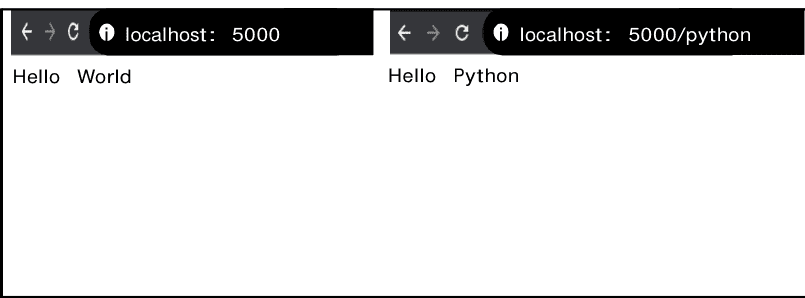

函数 `hello_python()` 绑定了 URL 规则 "/python"。因此，当用户访问 URL http://localhost:5000/python 时，浏览器将显示 `hello_python()` 函数的输出。

### 13.6 传递变量

通过在规则参数中包含可移动组件，可以动态创建 URL。该组件的变量名属性被标记。它作为关键字参数传递给与该规则关联的函数。

在下面的示例中，`route()` 装饰器的 rule 参数有一个 `<name>` 变量部分绑定到 URL "/hello"。因此，如果在浏览器中输入 URL http://localhost:5000/kiran，参数 "Kiran" 将被传递给 `hello_name()` 函数。

示例：

```python
from flask import Flask
app = Flask(__name__)
@app.route('/')
def hello_world():
    return 'Hello World'
@app.route('/python')
def hello_python():
    return 'Hello Python'
@app.route('/<name>')
def hello_name(name):
    return 'Hello %s!' % name
if __name__ == '__main__':
    app.run(debug=True)
```

输出：

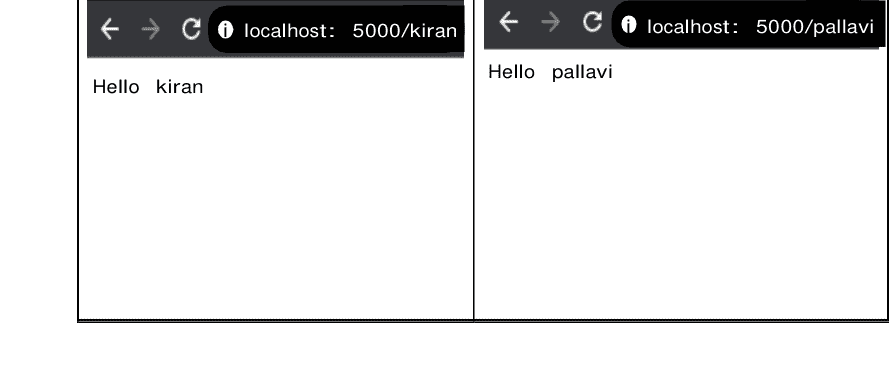

## 13.7 重定向 URL

`url_for()` 函数对于为特定函数动态创建 URL 非常有用。该函数的第一个参数是函数名，它还接受一个或多个关键字参数，每个参数对应 URL 中的一个变量。

下面的脚本演示了 `url_for()` 函数的使用。

```python
from flask import Flask, redirect, url_for
app = Flask(__name__)
@app.route('/admin')
def hello_admin():
    return 'Hello Admin'
@app.route('/guest/<guest>')
def hello_guest(guest):
    return 'Hello %s as Guest' % guest
@app.route('/user/<name>')
def hello_user(name):
    if name =='admin':
        return redirect(url_for('hello_admin'))
    else:
        return redirect(url_for('hello_guest', guest = name))

if __name__ == '__main__':
    app.run(debug = True)
```

输出：

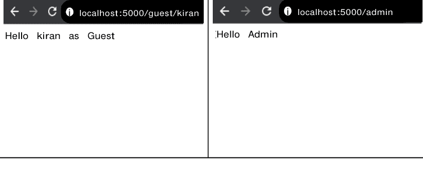

## 13.8 Flask 模板

与特定 URL 关联的函数的输出可以作为 HTML 返回。例如，下面脚本中的 `hello()` 函数将渲染带有 `<h1>` 标签的 "Hello World"。

示例：

```python
from flask import Flask, render_template

app = Flask(__name__)

@app.route('/')
def index():
    return render_template('hello.html')

if __name__ == '__main__':
    app.run(debug = True)
```

Flask 将尝试在与该脚本所在文件夹相同的 templates 文件夹中查找 HTML 文件。

- 应用文件夹
  - Hello.py
  - templates
    - hello.html

"Web 模板系统" 这个短语描述了创建允许动态输入变量数据的 HTML 脚本的过程。Web 模板系统由模板引擎、特定类型的数据源和模板处理器组成。

Flask 使用 Jinja2 模板引擎。当生成 Web 模板时，变量和表达式（在此示例中为 Python 表达式）的占位符将被其实际值替换。

templates 文件夹中名为 `hello.html` 的文件包含以下代码。

```html
<!DOCTYPE html>
<html lang="en">
<head>
<meta charset="UTF-8">
<meta http-equiv="X-UA-Compatible" content="IE=edge">
<meta name="viewport" content="width=device-width, initial-scale=1.0">
<title>Document</title>
</head>
<body>
<h1>Hello World</h1>
<p>This is render template example</p>
</body></html>
```

**输出：**

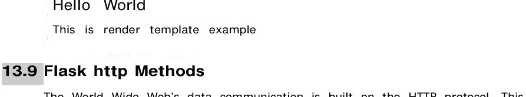

## 13.9 Flask HTTP 方法

万维网的数据通信建立在 HTTP 协议之上。该协议定义了从给定 URL 检索数据的各种技术。下表列出了各种 HTTP 方法：

### 方法与描述

| 方法 | 描述 |
| :--- | :--- |
| **GET** | 以未加密形式向服务器发送数据。最常用的方法。 |
| **HEAD** | 与 GET 相同，但没有响应体。 |
| **POST** | 用于将 HTML 表单数据发送到服务器。POST 方法接收的数据不会被服务器缓存。 |
| **PUT** | 用上传的内容替换目标资源的所有当前表示。 |
| **DELETE** | 删除由 URL 给出的目标资源的所有当前表示。 |

Flask 路由默认响应 GET 请求。但是，可以通过为 `route()` 装饰器提供 methods 参数来更改此选择。

为了说明 POST 方法在 URL 路由中的使用，我们首先开发一个 HTML 表单，并使用 POST 方法将表单数据传输到 URL。

将下面的脚本保存为 `login.html`。

```html
<html>
<body>
<form action = "http://localhost:5000/login" method = "post">
<p>Enter Name:</p>
<p><input type = "text" name = "username" /></p>
<p>Enter Password:</p>
<p><input type = "text" name = "password" /></p>
<p><input type = "submit" value = "submit" /></p>
</form>
</body>
</html>
```

现在让我们使用 Python Flask 获取登录。现在在 Python shell 中输入以下代码。

```python
from flask import Flask, redirect, url_for, request, render_template
app = Flask(__name__)
@app.route('/')
def home():
    return render_template('login.html')

@app.route('/success/<name>')
def success(name):
    return 'welcome %s' % name

@app.route('/failed')
def failed():
    return 'Login unsuccess'

@app.route('/login',methods = ['POST', 'GET'])
def login():
    if request.method == 'POST':
        user = request.form['username']
        pass1= request.form['password']
        if user=='admin' and pass1=='admin':
            return redirect(url_for('success',name = user))
        else:
            return redirect(url_for('failed'))

if __name__ == '__main__':
    app.run(debug = True)
```

**输出 1：** 凭据错误


Enter Name:

abc

Enter Password:

123

Submit


Login unsuccess

**输出 2：** 凭据正确


Enter Name:

admin

Enter Password:

admin

Submit


welcome admin

## 复习题

1.  什么是 Web 应用程序？
2.  列举 4 个 Web 应用程序。
3.  什么是 Flask？
4.  如何安装 Flask？
5.  写出 Flask 应用程序的语法并解释该语法。
6.  Flask 应用程序运行的默认端口号是什么？
7.  什么是 localhost？
8.  Flask 中的 debug 有什么用途？
9.  区分 debug=True 和 debug=False。
10. 创建一个 Flask 应用程序并解释应用程序的运行过程。
11. 我们如何初始化 Flask 应用程序？
12. 什么是路由？
13. 用 Flask 中的一个例子解释应用程序的路由。
14. 解释在 Flask 应用程序的路由中传递变量。
15. 如何在 Flask 应用程序中重定向 URL？请举例说明。
16. Flask 中的 render_template 有什么用途？
17. 解释 Flask 模板的工作原理。

## Python 编程实验室

## Python 安装

以下是在 Windows 机器上安装 Python 的步骤。

**步骤 1：** 打开 Web 浏览器并访问 https://www.python.org/downloads/

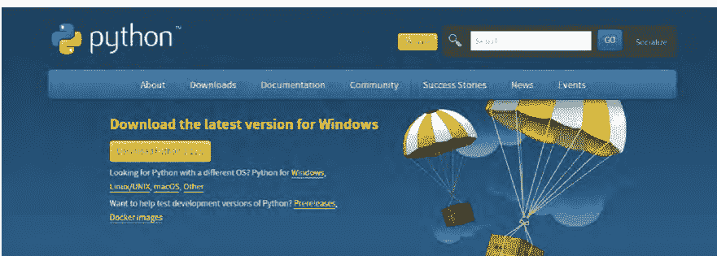

**步骤 2：** 要下载最新版本，请单击 Download Python 3.11.0

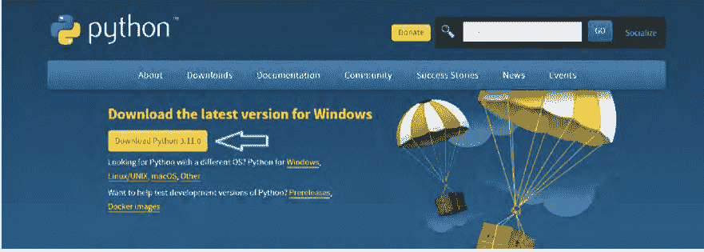

**步骤 3：** 下载完成后，打开安装文件，在安装前勾选“add to path”并单击“install now”

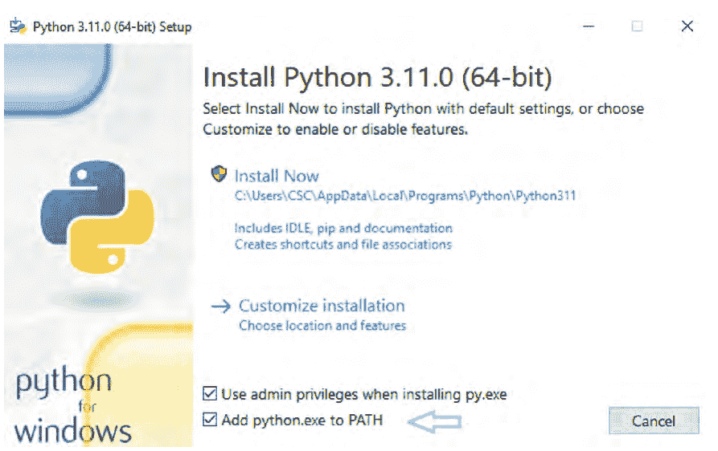

**步骤 4：** 安装将完成，并显示安装成功。现在 Python 已安装在系统中。让我们看看如何开始 Python 编程。

## 如何运行 Python 程序？

Python 程序员必须知道运行 Python 脚本或代码的所有可能方式。这是验证代码是否按我们预期工作的唯一方法。Python 解释器负责执行 Python 脚本。Python 解释器是一段在 Python 程序和计算机硬件之间工作的软件。这里我们描述运行 Python 脚本的一系列方法。

- 操作系统命令行或终端。
- Python 交互模式。
- IDE 或文本编辑器
- 系统的文件管理器。

## 操作系统命令行或终端

我们可以使用命令行运行 Python 代码，因为在 Python shell 中，一旦关闭会话，我们将丢失已编写的全部代码。

因此，最好使用纯文本文件编写 Python 代码。文本文件必须保存为 **.py** 扩展名。让我们看下面的例子。

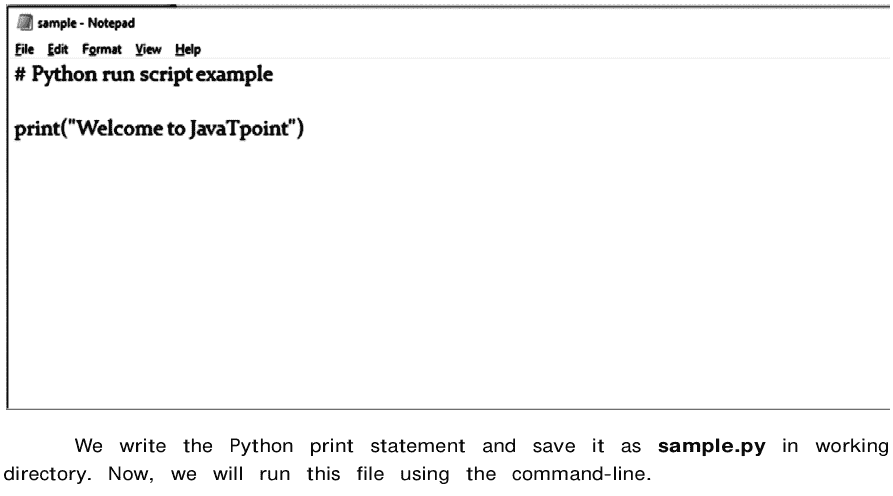

我们编写 Python print 语句并将其保存为工作目录中的 **sample.py**。现在，我们将使用命令行运行此文件。

- 使用 Python 命令行

打开命令行以运行 Python 脚本。我们需要输入 **python**，后跟文件名来执行文件。现在，按回车键，如果文件中没有错误，我们将看到如下输出：

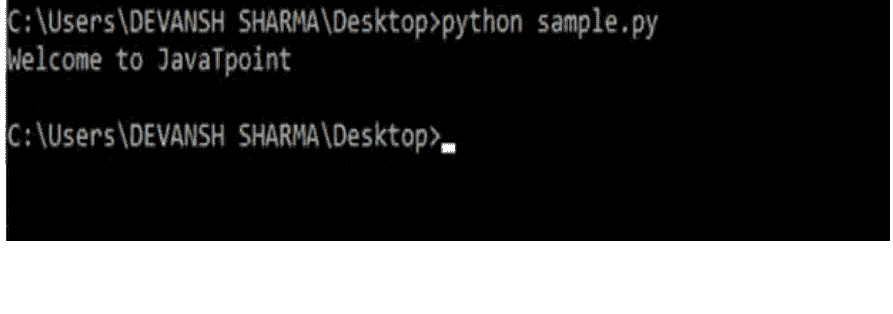

## Python 交互模式

要运行 Python 代码，我们可以使用 Python 交互会话。我们需要启动 Python 交互会话，只需在开始菜单中打开命令行或终端，然后输入 python，然后按回车键。

以下是使用交互式 shell 运行 Python 代码的示例。

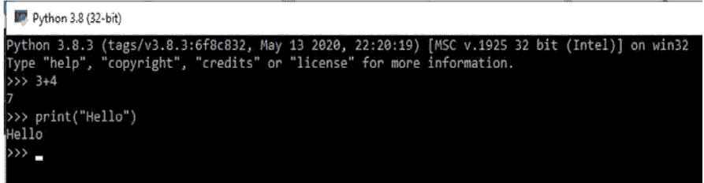

它允许我们检查每一段代码，这种功能使其成为一个很棒的开发工具。但是一旦我们关闭会话，它将丢失我们编写的所有代码。

## 1) 编写一个 Python 程序来演示 Python 中的基本数据类型。

```
a=12345
b=12.12
c=1j
d="vasavi college"
e=[1,2,3,4,5]
f=(1,2,3,4,5)
g={1,2,3,4}
h={'Name' : 'yogesh' , 'fees' : 45000}
i=True

print("datatype of a is =",type(a))
print("datatype of b is =",type(b))
print("datatype of c is =",type(c))
print("datatype of d is =",type(d))
print("datatype of e is =",type(e))
print("datatype of f is =",type(f))
print("datatype of g is =",type(g))
print("datatype of h is =",type(h))
print("datatype of i is =",type(i))
```

输出：

```
datatype of a is = <class 'int'>
datatype of b is = <class 'float'>
datatype of c is = <class 'complex'>
datatype of d is = <class 'str'>
datatype of e is = <class 'list'>
datatype of f is = <class 'tuple'>
datatype of g is = <class 'set'>
datatype of h is = <class 'dict'>
datatype of i is = <class 'bool'>
```

## 2) 创建一个列表并执行以下列表方法

1. Insert()
2. remove()
3. append()
4. len()
5. pop()
6. clear()

```
list=['apple', 'banana', 'carrot', 'pineapple']
print("our list is=",list)
print("list after insertion of an element: ")
list.insert(1,"orange")
print(list)
print("list after removal of an element:")
list.remove("banana")
print(list)
print("list after appending an element:")
list.append("dog")
print(list)
print("the length of the list=",len(list))
print("list after poping out an element from the list:")
list.pop(1)
print(list)
print("Empty list : ")
list.clear()
print(list)
```

输出：

```
our list is = ['apple', 'banana', 'carrot', 'pineapple']
list after insertion of an element:
['apple', 'orange', 'banana', 'carrot', 'pineapple']
list after removal of an element:
['apple', 'orange', 'carrot', 'pineapple']
list after appending an element:
['apple', 'orange', 'carrot', 'pineapple', 'dog']
the length of the list = 5
list after poping out an element from the list:
['apple', 'carrot', 'pineapple', 'dog']
Empty list :
[ ]
```

## 3) 创建一个元组并执行以下方法

1. 添加项目
2. len()
3. 检查元组中的项目
4. 访问项目

```
a=(1 , 2 , 3)
print("our tuple is =",a )
b=list(a)
b.append(4)
c=tuple(b)
print("tuple after appending =",c)
print("the length of tuple =",len(c))
element = int(input("enter the element to be searched :"))
if element in c:
    print(element ,"is present in tuple ")
else:
    print(element ,"is not present in tuple")
index = int(input("enter the index value of the element to be accessed :"))
print("the element ", c[index],"is present at index",index)
```

输出：
```
our tuple is = (1, 2, 3)
tuple after appending = (1, 2, 3, 4)
the length of tuple = 4
enter the element to be searched : 4
4 is present in tuple
enter the index value of the element to be accessed : 3
the element 4 is present at index 3
```

## 4) 创建一个字典并应用以下方法。

i) 打印字典项
ii) 访问项目
iii) 使用 get()
iv) 更改值
v) 使用 len()

```
dict={
"college":"Vasavi Jnana Peetha First Grade College",
"branch":"BCA",
"area":"vijayanagar"
}
print("our dictionary is", dict)
print(dict["college"])
print(dict["branch"])
print(dict["area"])
x=dict.get("college")
print("acessing the key by using get()", x)
dict["college"] = "vasavi jnana peetha"
print("value of 'college' key after changing = ",dict["college"])
print("length of the dictionary = ",len(dict))
```

**输出：**

```
Our dictionary is {'college': 'Vasavi Jnana Peetha First Grade College', 'branch': 'BCA', 'area': 'vijayanagar'}
Vasavi Jnana Peetha First Grade College
BCA
vijayanagar
acessing the key by using get() Vasavi Jnana Peetha First Grade College
value of 'college' key after changing = vasavi jnana peetha
length of the dictionary = 3
```

## 5) 编写一个 Python 程序来创建一个包含以下选项的菜单

1. 执行加法
2. 执行减法
3. 执行乘法
4. 执行除法

```
def add(x,y):
    return x+y
def subtract(x,y):
    return x-y
def multiply(x,y):
    return x*y
def divide(x,y):
    return x/y
print("Select operation.")
print("1.Add")
print("2.Subtract")
print("3.Multiply")
print("4.Divide")
while True:
    choice=input("Enter choice(1/2/3/4): ")
    if choice in ('1','2','3','4'):
        num1 = float(input("Enter first number: "))
        num2 = float(input("Enter second number: "))
        if choice=='1':
            print(num1,"+",num2,"=",add(num1, num2))
        elif choice=='2':
            print(num1,"-",num2,"=",subtract(num1, num2))
        elif choice=='3':
            print(num1,"*",num2,"=",multiply(num1, num2))
        elif choice=='4':
            print(num1,"/",num2,"=",divide(num1, num2))
        next_calculation = input("Let's do next calculation? (yes/no): ")
        if next_calculation=="no":
            break
    else:
        print("Invalid Input")
```

**输出：**

```
Select operation.
1. Add
2. Subtract
3. Multiply
4. Divide
Enter choice(1/2/3/4): 1
Enter first number: 10
Enter second number: 20
10.0 + 20.0 = 30.0
Let's do next calculation? (yes/no): yes

Enter choice(1/2/3/4): 2
Enter first number: 10
Enter second number: 20
10.0 - 20.0 = -10.0
Let's do next calculation? (yes/no): yes

Enter choice(1/2/3/4): 3
Enter first number: 10
Enter second number: 20
```

## 6) 编写一个Python程序，使用if-else判断一个数字是正数还是负数。

```
num=int(input("ENTER THE NUMBER:"))
if num>0:
    print("THE NUMBER IS POSITIVE")
else:
    print("THE NUMBER IS NEGATIVE")
```

**输出 1:**
ENTER THE NUMBER:10
THE NUMBER IS POSITIVE

**输出 2:**
ENTER THE NUMBER:-10
THE NUMBER IS NEGATIVE

## 7) 编写一个使用filter()函数的程序，从给定列表中仅筛选出偶数。

```
def even(x):
    return x%2==0

a=[1,2,3,4,5,6,7,8]
result=filter(even, a)
b=list(result)
print('Original List :',a)

if len(b)==0:
    print("There are no even numbers in the provided list")
else:
    print('Filtered List :',b)
```

**输出:**

**Original List : [1, 2, 3, 4, 5, 6, 7, 8]**

**Filtered List : [2, 4, 6, 8]**

## 8) 编写一个Python程序，打印今天的日期和当前的时间。

```
from datetime import datetime
now = datetime.now()
print("now =", now)
dt_string = now.strftime("%d/%m/%Y %H:%M:%S")
print("date and time =", dt_string)
```

**输出:**

now = 2022-12-06 11:54:00.112888
date and time = 06/12/2022 11:54:00

## 9) 编写一个Python程序，给当前日期增加若干天并打印增加后的日期。

```
from datetime import datetime
from datetime import timedelta
from datetime import date
a=date.today()
print("Beginning date")
print(a)
b=int(input("enter the number of days to add"))
c=a+timedelta(days=b)
print("Ending date")
print(c)
```

**输出:**

**Beginning date**
**2022-12-07**
**enter the number of days to add 6**
Ending date
2022-12-13

## 10) 编写一个程序，统计字符串中的字符数量并将其存储在字典数据结构中。

```
str=input("enter a string:")
dict={ }
for i in str:
    dict[i]=str.count(i)
print(dict)
```

输出:
enter a string :vasavi college
{'v': 2, 'a': 2, 's': 1, 'i': 1, ' ': 1, 'c': 1, 'o': 1, 'l': 2, 'e': 2, 'g': 1}

## 11) 编写一个程序，统计给定文件中字符的频率。

步骤1：创建一个文本文件 - (E:/yogi.txt) 并在文件中输入字符
YogeshNagaraj
步骤2：编写程序。

```
import os
count=0
file=open("E:/yogi.txt", "r")
for frequency in file:
    for i in range(0,len(frequency)):
        count+=1
print("count:", count)
```

输出:
count: 13

## 12) 使用numpy模块创建一个数组并检查以下内容：

- 1. 数组的类型
- 2. 数组的轴数
- 3. 数组的形状
- 4. 数组中元素的类型

```
import numpy as np
arr=np.array([[1,2,3],[4,2,5]])
print("Array is of type:",type(arr))
print("no.of dimensions:",arr.ndim)
print("Shape of array:",arr.shape)
print("Size of array:",arr.size)
print("Array stores elements of type:",arr.dtype)
```

**输出:**

**Array is of type: <class 'numpy.ndarray'>**
**no.of dimensions: 2**
**Shape of array: (2, 3)**
**Size of array: 6**
**Array stores elements of type: int32**

## 13) 编写一个Python程序，连接两个不同对象的数据框。

```
import pandas as pd

one=pd.DataFrame({'Name':['yogesh','lohith'], 'subject':['python','computer Network']},
    index=[1,2])

two=pd.DataFrame({'Name':['Nithin','Chandramurthy'], 'subject':['Operating system','kannada']},
    index=[3,4])

print(pd.concat([one,two]))
```

**输出:**

| | Name | subject |
|---|---|---|
| 1 | yogesh | python |
| 2 | lohith | computer Network |
| 3 | Nithin | Operating system |
| 4 | Chandramurthy | kannada |

## 14) 编写一个Python程序，使用模运算读取CSV文件并打印文件的前5行和后5行。

步骤1：创建CSV文件（“E:/yogi1.csv”）

| | A | B | C | D |
|---|---|---|---|---|
| 1 | | | | |
| 2 | regno | name | | |
| 3 | 401 | aishu | | |
| 4 | 402 | raj | | |
| 5 | 403 | ravi | | |
| 6 | 404 | rani | | |
| 7 | 405 | madhu | | |
| 8 | 406 | megha | | |
| 9 | 407 | nayana | | |
| 10 | 408 | lavanya | | |
| 11 | 409 | nirmal | | |
| 12 | 410 | chinmay | | |
| 13 | 411 | charita | | |
| 14 | 412 | dhanush | | |
| 15 | 413 | harshitha | | |
| 16 | | | | |

步骤2：编写程序

```
import pandas as pd
print("read a csv file")
df=pd.read_csv("f:/yogi.csv")
print(df)
print("print the first and last 5 lines of a csv file")
df=pd.read_csv("f:/yogi.csv",header=None,skiprows=[5,6,7,8])
print(df)
```

输出:

read a csv file

| | regno | name |
|---|---|---|
| 0 | 401 | aishu |
| 1 | 402 | raj |
| 2 | 403 | ravi |
| 3 | 404 | rani |
| 4 | 405 | madhu |
| 5 | 406 | megha |
| 6 | 407 | nayana |
| 7 | 408 | lavanya |
| 8 | 409 | nirmal |
| 9 | 410 | chinmay |
| 10 | 411 | charita |
| 11 | 412 | dhanush |
| 12 | 413 | harshitha |

Print the first and last 5 lines of a csv file

| | 0 | 1 |
|---|---|---|
| 1 | 401 | aishu |
| 2 | 402 | raj |
| 3 | 403 | ravi |
| 4 | 404 | rani |
| 5 | 409 | nirmal |
| 6 | 410 | chinmay |
| 7 | 411 | charita |
| 8 | 412 | dhanush |
| 9 | 413 | harshitha |

## 15) 编写一个Python程序，接受用户输入的圆的半径并计算其面积（使用math模块）。

```
import math as M
radius = float(input("Enter the radius"))
area=M.pi*radius*radius
print("the area of circle is", area)
```

输出:
Enter the radius 4
the area of circle is 50.26548245743669

## 16) 使用此表格，在Excel工作表中输入并保存为CSV文件扩展名。

| Months | Pen | Book | Marker | Chair | Table | Pen stand | Total Units | Total profit |
|---|---|---|---|---|---|---|---|---|
| 1 | 2500 | 1500 | 5200 | 9200 | 1200 | 1500 | 21100 | 211000 |
| 2 | 2630 | 1200 | 5100 | 6100 | 2100 | 1200 | 18330 | 183300 |
| 3 | 2140 | 1340 | 4550 | 9550 | 3550 | 1340 | 22470 | 224700 |
| 4 | 3400 | 1130 | 5870 | 8870 | 1870 | 1130 | 22270 | 222700 |
| 5 | 3600 | 1740 | 4560 | 7760 | 1560 | 1740 | 20960 | 209600 |
| 6 | 2760 | 1555 | 4890 | 7490 | 1890 | 1555 | 20140 | 201400 |
| 7 | 2980 | 1120 | 4780 | 8980 | 1780 | 1120 | 20760 | 207600 |
| 8 | 3700 | 1400 | 5860 | 9960 | 2860 | 1400 | 25180 | 251800 |
| 9 | 3540 | 1780 | 6100 | 8100 | 2100 | 1780 | 23400 | 234000 |
| 10 | 1990 | 1890 | 8300 | 10300 | 2300 | 1890 | 26670 | 266700 |
| 11 | 2340 | 2100 | 7300 | 13300 | 2400 | 2100 | 29540 | 295400 |
| 12 | 2900 | 1760 | 7400 | 14400 | 1800 | 1760 | 30020 | 300200 |

### 程序 16(a)

```
import pandas as pd
from matplotlib import pyplot as plt
df = pd.read_csv("Book1.csv")
plt.plot(df['Months'],df['TotalProfit'])
plt.plot(xlabel='Months')
plt.plot(ylabel='Units Sold')
plt.legend(['TotalProfit'],loc='lower right')
plt.show()
```

### 程序 16(b)

```
import pandas as pd
from matplotlib import pyplot as plt
df = pd.read_csv("Book1.csv")
plt.plot(df['Months'],df['Pen'],label='Pen')
plt.plot(df['Months'],df['Book'],label='Book')
plt.plot(df['Months'],df['Marker'],label='Marker')
plt.plot(df['Months'],df['Chair'],label='Chair')
plt.plot(df['Months'],df['Table'],label='Table')
plt.plot(df['Months'],df['Pen Stand'],label='Pen Stand')
plt.plot(xlabel='Months')
plt.plot(ylabel='Units Sold')
plt.legend()
plt.show()
```

### 程序 16(c)

```
import pandas as pd
from matplotlib import pyplot as plt
df = pd.read_csv("Book1.csv")
plt.bar(df['Months'],df['Chair'],label='Chair')
plt.bar(df['Months'],df['Table'],label='Table')
plt.legend(loc='best')
plt.show()
```

### 程序 16(d)

```
import pandas as pd
from matplotlib import pyplot as plt
df = pd.read_csv("Book1.csv")
a,b=plt.subplots()
b.stackplot(list(df.columns.values)[1:7],df.iloc[:,1:7],labels=list(df.columns.values)[1:7])
plt.legend(loc='best')
plt.show()
```

# 目录

## 单元 1：PYTHON编程语言

- 第1章：Python编程简介
- 第2章：Python编程基础
- 第3章：Python中的函数和字符串

## 单元 2：PYTHON数据类型分析

- 第4章：列表
- 第5章：元组
- 第6章：字典
- 第7章：集合

## 单元 3：高级PYTHON编程

- 第8章：文件和异常处理
- 第9章：类和对象

## 单元 4：数据可视化

- 第10章：使用Python的Matplotlib可视化
- 第11章：随机游走
- 第12章：使用Plotly掷骰子
- 第13章：Web应用程序开发

www.himpub.com