迈克·克内尔

# 面向初学者的Python编程

一本速成课程，通过实践项目学习Python编码、游戏编程，无需编码经验，7天内掌握机器学习与大数据分析

# 目录

[作者简介](Author Biography)
[引言](Introduction)

1. [Python简介](Introduction to Python)
    1.1: [Python及其历史](Python and its History)
    1.2: [如何安装解释器](How to Install the Interpreter)
    1.3: [如何使用Python Shell、IDLE并编写你的第一个程序](How to Use the Python Shell, IDLE, and Write Your First Program)
2. [变量与运算符](Variables and Operators)
    2.1: [什么是变量？](What are Variables?)
    2.2: [变量命名](Naming a Variable)
    2.3: [赋值运算符](The Assignment Operator)
    2.4: [基本运算符](Basic Operators)
    2.5: [更多赋值运算符](More Assignment Operators)
3. [Python中的数据类型](Data Types in Python)
    3.1: [整数](Integers)
    3.2: [浮点数](Float)
    3.3: [字符串](String)
    3.4: [Python中的类型转换](Type Casting in Python)
    3.5: [列表](List)
    3.6: [数组](Array)
    3.7: [元组](Tuple)
    3.8: [字典](Dictionary)
4. [如何让你的程序具有交互性？](How to Make Your Program Interactive?)
    4.1: [Input()](Input())
    4.2: [Print()](Print())
    4.3: [三引号](Triple Quotes)
    4.4: [转义字符](Escape Characters)
5. [条件语句](Condition Statements)
    5.1: [If语句](If statement)
    5.2: [内联If](Inline If)
6. [循环](Loops)
    6.1: [For循环](For loop)
    6.2: [While循环](While loop)
    6.3: [Break](Break)
    6.4: [Continue](Continue)
    6.5: [Try, Except](Try, Except)
7. [函数与模块](Functions and Modules)
    7.1: [什么是函数？](What are Functions?)
    7.2: [内置函数](Built-In Functions)
    7.3: [定义你的函数](Defining Your Functions)
    7.4: [递归函数](Recursive Functions)
8. [变量作用域](Variable Scope)
    8.1: [默认参数值](Default Parameters Values)
    8.2: [可变长度参数列表](Variable-Length Argument List)
9. [导入模块](Importing Modules)
    9.1: [创建你自己的模块](Creating your Own Module)
10. [文件操作](Working with Files)
    10.1: [打开和读取文本文件](Opening and Reading Text Files)
    10.2: [使用For循环读取文本文件](Using a For Loop to Read Text Files)
    10.3: [写入文本文件](Writing to a Text File)
    10.4: [按缓冲区大小打开和读取文本文件](Opening & Reading Text Files by Buffer Size)
    10.5: [打开、读取和写入二进制文件](Opening, Reading, and Writing Binary Files)
    10.6: [删除和重命名文件](Deleting and Renaming Files)
11. [面向对象编程](Object-Oriented Programming)
    11.1: [类](Classes)
    11.2: [对象](Objects)
    11.3: [多态](Polymorphism)
    11.4: [封装](Encapsulation)
    11.5: [继承](Inheritance)
    11.6: [多重继承](Multiple Inheritance)
    11.7: [运算符重载](Operator Overloading)
12. [数据结构与算法](Data Structures and Algorithms)
    12.1: [渐近分析](Asymptotic Analysis)
    12.2: [线性数据结构](Linear Data Structures)
    12.3: [非线性数据结构](Non-Linear Data Structures)
13. [Python游戏项目](Python Gaming Project)
    13.1: [Python实现的马里奥游戏及源代码](Mario Game In Python With Source Code)
    13.2: [在Python中制作马里奥视频游戏的步骤](Stages on how to make a Mario video game in Python)
    13.3: [导入库的代码](Code For Importing Libraries)
    13.4: [函数初始化与声明的代码](Code For The Initialization & Declaration of Functions)
    13.5: [游戏启动的代码](Code For The Game Starting)
    13.6: [游戏关卡的代码](Code For The Game Level)
    13.7: [游戏主模块的代码](Code For The Game Main Module)

后记

© **版权所有 2022 迈克·克内尔 - 保留所有权利。**

本文档就所涵盖的主题和问题提供了准确可靠的信息。

- 摘自美国律师协会委员会以及出版商与协会委员会共同接受并批准的原则声明。

以电子方式或印刷格式复制、复制或传播本文档的任何部分均不合法。保留所有权利。

本文提供的信息据称真实且一致。对于因疏忽或其他原因，对本文所含任何政策、流程或指示的任何使用或滥用所造成的任何责任，均由接收读者独自承担。在任何情况下，出版商均不对因本文信息直接或间接造成的任何赔偿、损害或金钱损失承担任何法律责任或指责。

除出版商持有的版权外，所有版权均由各自作者拥有。

本文信息仅供参考，具有普遍性。信息的呈现不附带合同或任何类型的保证。

所使用的商标未经任何同意，商标的发布未经商标所有者许可或支持。本书中的所有商标和品牌仅用于说明目的，归所有者所有，与本文档无关。

# 作者简介

作者迈克·克内尔在信息安全、密码学、算法分析、设计与实现、图绘制和计算几何等领域拥有广泛的技术知识。此外，这些也是他未来希望进一步学习的一些领域。

在转型编写编程书籍之前，他曾是一名全职开发人员。他还曾为一家软件开发公司和一个致力于计算机科学创意写作的网站工作。多年来，迈克一直对将计算作为课堂概念框架抱有浓厚兴趣。

在过去的35年里，他曾在各种职位上参与过无数软件项目。他的众多出版物包括关于Python编程、极限编程、面向对象编程和C++编码的著作。他在不同的行业杂志上发表了数十篇论文。他曾是《Python报告》的编辑，目前每月为《软件开发》杂志的“工匠”专栏撰稿。

他认为自己是众多软件专家中的一员，为全球大型组织提供项目管理咨询、面向对象软件设计咨询、培训和开发服务。他作为计算机科学讲师参与社区生活。迈克在伟大的创新与变革时期对计算机架构产生了兴趣。迈克·克内尔还曾担任多家高科技组织的技术贡献者、技术经理和高级技术顾问。

# 引言

Python是由吉多·范罗苏姆设计的一种强大的面向对象编程语言。它也被称为通用编程语言，因为它几乎可以应用于我们能想到的任何领域，如软件开发、游戏开发、Web开发、人工智能与机器学习、数据分析。

每种编程语言都根据特定领域提供某些功能或用途。例如，JavaScript是Web开发者中最主要的语言，因为它允许开发者使用Vue和React等多种框架来设计出色的用户界面。同样，它们也各有优缺点。如果我们审视Python，它是一种通用语言，这意味着它被广泛应用于各个领域。原因是它极其易于学习且灵活，因此进步速度非常快。现在你明白了为什么学习Python不需要任何编程知识；因此，它在开发者中也很受欢迎。Python的语法更接近英语，其结构也帮助开发者用更少的代码行设计应用程序。大量的代码库简化了开发者的工作，最终带来了极高的生产力。当信息以海量数据形式存在时，他们可以轻松地专注于业务逻辑及其在数字世界中所需的能力。

自1991年诞生以来，Python一直是计算机编程领域的主导力量。Python最初开发时主要是一种用于简单任务的脚本语言。诚然，Python不像Rust、Golang或Dart那样是一种全新的语言，但这并不改变许多人仍然认为它是现代语言的事实。基于这些以及更多原因，遵循Python。Python 强大的工具和框架是数据科学、Web 开发到机器学习等一切领域的核心。像 Java 和 C++ 这样的编程语言，虽然更适合服务器端应用，但不适合开发脚本或简单脚本等基础任务，它们不如 Python 通用，因为 Python 拥有广泛的库和强大的社区。通过快速、全面地学习 Python，你可以在几周内开始开发程序、解决问题并制作出可运行的东西。

本书涵盖了关于 Python 编程你需要知道的一切，包括数据类型以及它们如何与相应的运算符和语句交互。本书介绍了 Python 数据结构和技术、面向对象编程以及排序算法，无需你花费大量时间学习计算机科学理论。如果你是 Python 新手，这本书是一个很好的起点。

此外，你还将获得基于 Python 的游戏开发项目的实践知识。将工作与娱乐结合起来，你也能更容易地回忆起所学内容。这本书对于该领域的初学者和中级水平的人来说都非常出色。

# 第 1 章

## Python 简介

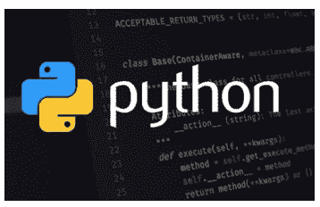

### 1.1：Python 及其历史

Python 是一种面向对象的、高级的、具有强大语义的可解释编程语言。它融合了高级数据结构、动态绑定、动态类型等多种特性，使其既能用于开发复杂应用程序，也能用于脚本编写或连接组件的“胶水代码”。Python 简洁易学的语法注重可读性，从而降低了程序维护的成本。Python 支持模块和包，促进了程序中代码的模块化和重用。此外，它还可以被修改以对几乎所有操作系统进行系统调用，并执行 C 或 C++ 程序。Python 是一种流行的语言，几乎可以在所有系统架构上运行，并因其普遍性和在几乎所有系统架构上运行的能力而被广泛应用于各种不同的领域。

历史即将在 20 世纪 80 年代末被书写。Python 的开发大约始于这个时期。Guido Van Rossum 于 1989 年 12 月在荷兰的 Centrum Wiskunde and Informatica (CWI) 开始了他的基于应用的工作。它最初是一个业余项目，因为他想找点有趣的事情来打发整个圣诞假期。Python 据说是 ABC 编程语言的后继者，ABC 语言与 Amoeba 操作系统接口并包含异常处理。他早年职业生涯中曾协助开发过 ABC，尽管他看到了该网络的一些缺陷，但他欣赏其大部分优点。之后，他做了一件非常聪明的事情。他借鉴了 ABC 的语法和一些优点。这招致了很多批评，因此他完全解决了这些缺陷，并构建了一个没有错误的健壮的脚本语言。这个名字的灵感来源于 BBC 电视节目《蒙提·派森的飞行马戏团》，因为他是该节目的忠实粉丝，并希望为他的创作起一个简短、独特且略带神秘感的名字，因此将其命名为 Python！Guido Van Rossum 在 2018 年 7 月 12 日辞去领导人职务之前，一直是“终身仁慈独裁者（BDFL）”。他曾在 Google 工作，但现在受雇于 Dropbox。

1991 年，该语言最终发布。发布时，与 Java、C++ 和 C 相比，它需要更少的代码行来描述想法。此外，它的设计理念非常出色。其主要目标是提高代码可读性和开发人员生产力。发布时，它已经能够提供类的继承、多种基本数据类型、异常处理和函数。

Python 是全球最常用的编程语言之一，已被用于构建从 Netflix 的推荐系统到运行自动驾驶汽车的软件等一切事物。它是一种通用语言，这意味着它旨在用于各种应用，包括数据研究、软件和自动化、Web 开发以及完成一般任务。它是一种计算机编程语言，通常用于创建网站和应用程序、自动化操作和进行数据分析。它是一种通用语言，这意味着它可以用于开发广泛的应用程序，而不专门用于任何特定任务。这种灵活性，加上它对初学者的易用性，使其成为当今使用最广泛的编程语言之一。它是世界上第三大最常用的编程语言，因为它易于学习和使用；它具有简单、直接的语法，更接近英语，并且是一种非常通用的开源语言。学习 Python 有很多理由，因为 Python 开发人员需求量很大。鉴于它可以用于人工智能、数据分析和机器学习等许多不断发展的技术，它可能会带来高薪职业并提供许多工作机会。

### 1.2：如何安装解释器

#### Windows 安装步骤

- 步骤 1：选择要下载和安装的 Python 版本，选择完整安装程序

在 Windows 上，你可以选择 32 位（标记为 x86）或 64 位（标记为 x86–64）版本，以及每个版本的多种安装程序变体。在“Python Releases for Windows”下找到最新的 Python 3 版本 — Python 3.9.4。

- 步骤 2：安装 Python 可执行安装程序

双击下载的可执行文件以打开以下窗口。通过选择“自定义安装”继续。通过勾选“Add Path”复选框，Python 路径会自动指定。

1. 下载完成后，运行 Python 安装程序。
2. 确保选中“为所有用户安装启动器”和“将 Python 3.9 添加到 PATH”的复选框。
3. 从推荐的安装选项中选择“立即安装”。

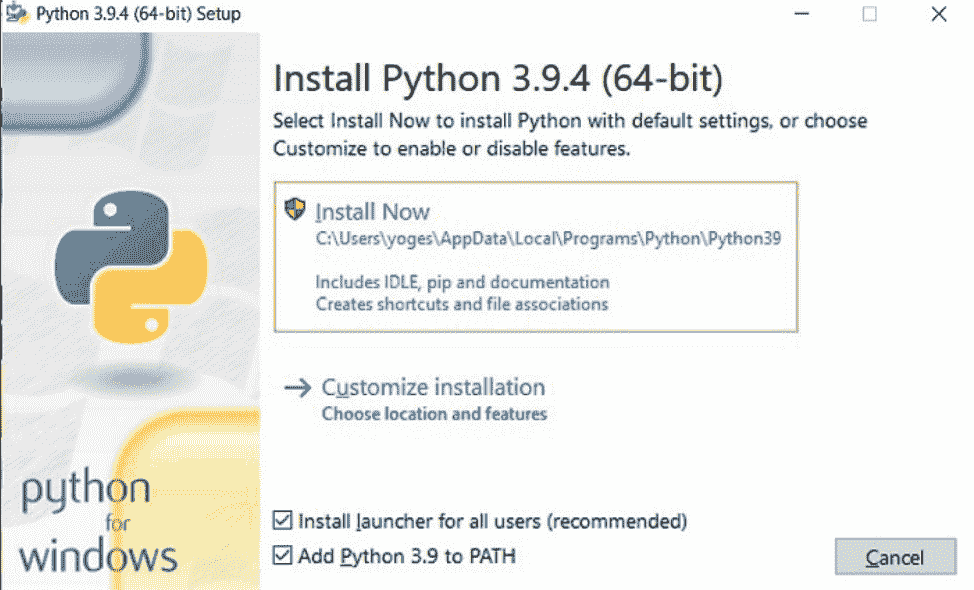

- 步骤 3：等待安装过程完成。

以下对话框将要求你禁用路径长度限制。选择此选项后，Python 将超过 260 个字符的 MAX PATH 限制。实际上，这允许 Python 使用符号路径名。

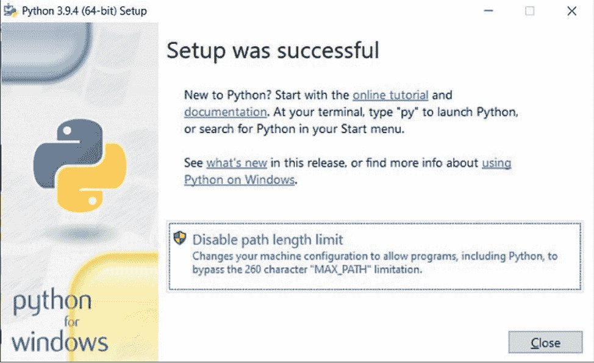

禁用路径长度限制的选项不会影响任何其他系统设置。启用它将解决 Python 项目可能存在的名称长度问题。

- 步骤 4：在 Windows 上验证 Python 的安装

1. 在系统中打开命令提示符
2. 运行 “Python-V”

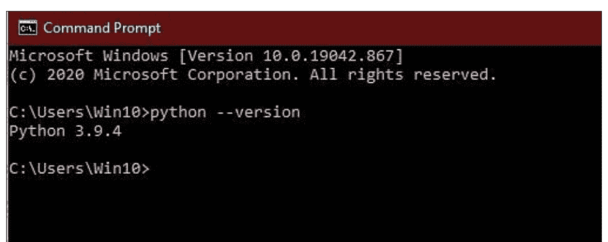

#### macOS 安装步骤

- 步骤 1：在新的浏览器窗口中访问下载页面。要获取最新版本的 Python，请单击下载按钮。


- 步骤 2：当提示允许从 “www.python.org” 下载时，选择“允许”。
- 步骤 3：打开一个新的 Finder 窗口（键盘快捷键是 Command + n），然后单击侧边栏中的“下载”。然后双击 Python 包进行安装。

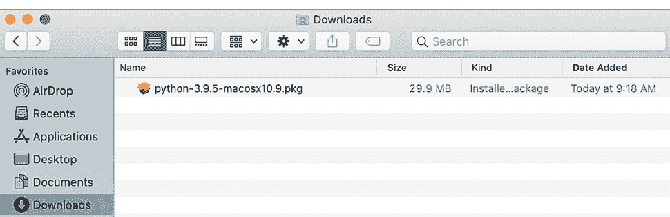

- 步骤 4：这将启动 Python 安装程序。单击“继续”按钮。

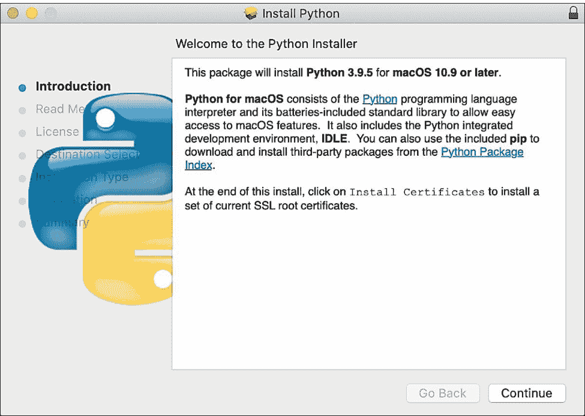

- 步骤 5：接下来是各种显示。在“自述文件”页面上，单击“继续”。
- 步骤 6：接下来是“许可”页面。单击“继续”将出现一个弹出窗口，要求你同意条款。选择“同意”。
- 步骤 7：Python 将在标准安装过程中保存到你的磁盘。要开始，请单击“安装”按钮。

### 1.3：如何使用 Python Shell、IDLE 并编写你的第一个程序

#### Python Shell

打开后，在命令行执行 `python3` 以调用 Python 解释器。当出现提示符 `>>>` 时，你就知道它正在运行。输入 `print("Hello, World")` 来确认。Python 是一种在解释器上运行的编码方言。也就是说，它逐行运行代码。Python 包含一个 Python Shell，可以执行单个 Python 命令并显示结果。

此外，它也被称为 REPL（读取、求值、打印、循环），因为它读取命令、对其进行求值、发布结果，然后循环回去再次读取命令。要启动 Python Shell，请在 Windows 上打开 PowerShell 或命令提示符，或在 Mac 上打开终端窗口，输入 `python`，然后按回车键。如下所示，会出现一个带有三个大于号 `>>>` 的 Python 提示符。

现在，你可以提交单个语句并获取输出。例如，输入一个基本公式如 `3 + 2` 并按回车键；结果将出现在下一行，如下所示。

#### Python IDLE

Python IDLE 的默认操作模式是 Shell。当你双击程序图标启动它时，Shell 是你看到的第一样东西。这是一个没有内容的全新 Python 解释器窗口。你可以立即使用它开始与 Python 交互。你可以用以下代码片段来验证：

在这个例子中，你使用了 `print()` 在屏幕上打印字符串 `"Hello, from IDLE!"`。这是与 Python IDLE 交互的最简单方法。你逐个输入命令，Python 返回每个命令的结果。接下来，查看菜单栏。你会看到许多与 Shell 交互的选项：

这个菜单允许你重启 Shell。如果你选择该选项，Shell 的状态将被清除。它的行为就像你启动了一个新的 Python IDLE 实例一样。Shell 将完全忘记其初始状态：

在上面显示的例子中，你定义了一个变量 `x = 5`。当你使用 `print(x)` 时，Shell 输出正确的值，即 5。然而，当 Shell 重启后，再次尝试 `print(x)` 时，Shell 会产生一个回溯错误。这个错误消息告诉用户变量 `x` 未定义。Shell 已经忘记了重启前发生的一切。

此外，你可以从这个菜单暂停 Shell 的执行。这将终止 Shell 中当前正在执行的任何程序或语句。考虑一下当你从键盘向 Shell 发送中断信号时的情况：

```
>>> while True:
        print('infinite')

infinite
infinite
infinite
infinite
infinite
infinite
infinite
infinite
infinite
infinite
infinite
infinite
infinite
infinite
infinite
infinite
infinite
infiniteTraceback (most recent call last):
  File "<pyshell#2>", line 2, in <module>
    print('infinite')
KeyboardInterrupt
```

在你的窗口底部，会以红色文本显示一个键盘中断错误通知。由于中断，程序已停止执行。

#### 编写你的第一个程序

1.  IDLE 是将用于编写程序的 Python 环境。在程序列表中找到 "IDLE (Python 3.5 32-bit)" 项。
2.  IDLE Shell 窗口显示出来。同样，你可以输入 `print("hello!")` 等等，Shell 会为你处理打印。如你所见，这是一种交互式体验。Python 执行你输入的每一行代码。
3.  通过创建一个新窗口，会创建一个脚本文件窗口。在这种情况下，`print("hello!")` 不会立即生成输出。这是因为这是一个用于编辑脚本文件的窗口，命令在文件保存并执行之前不会运行。
4.  你可以通过选择 "Run --> Run Module" 或按 F5（或在某些系统上按 Fn + F5）来启动脚本。
5.  IDLE 要求你在执行前将代码保存为文件。选择一个以 `.py` 结尾的文件名（例如 `"hello.py"`）并将其保存到你的桌面。
6.  之后，脚本将在 IDLE Shell 窗口中执行。因为你现在有了一个保存的脚本，所以你可以一次又一次地重新运行它。

```
Python 3.4.3 (v3.4.3:9b3f13e601, Feb 29 2020, 22:43:06) [MSC v.1600 32 bit (Intel)] on win32
>>> print ('Hello world!!!')
Hello world!!!
>>>
```

# 第 2 章

## 变量与运算符

### 2.1：什么是变量？

变量是指代一个内存位置的术语。Python 变量，也称为标识符，用于存储数据。在 Python 中，你不需要指定变量的类型，因为 Python 是一种推断语言，足够智能以确定变量的类型。变量名可以包含字母和数字，但必须以字母或下划线开头。建议变量名使用小写字母书写。`Rahul` 和 `rahul` 是不同的变量。Python 不需要定义变量的命令。当你第一次设置其值时，它就被创建了。

变量不需要用特定类型来定义。变量只不过是用于存储值的内存地址。这意味着当你声明一个变量时，你为它分配了内存。解释器根据变量的数据类型分配内存并确定可以放入保留内存中的内容。因此，通过将变量与不同的数据类型关联，你可以在这些变量中存储整数、字符或小数。

Python 有三种数字类型：复数、浮点数和整数。整数是非小数数字。浮点数是带小数点的数字。复数由虚部和实部组成。字符串是另一种与数字非常不同的数据类型；它是一组字符。换句话说，Python 程序中的变量为计算机提供要处理的数据。

### 2.2：命名变量

变量可以用简短的名称（如 `x` 和 `y`）或更具描述性的术语（如 `age`、`car_name` 或 `total_volume`）来指定。变量名区分大小写。你不应该使用小写字母 "i" 和大写字母 "O"，因为这可能会导致混淆，你可能会将前者误认为数字 1，将后者误认为数字 0。字母、下划线和数字可以用作变量名。但是，变量不能以数字开头。下划线可以提高可读性。例如，`"this_variable"` 比 `"thisvariable"` 更易读。最好让变量名尽可能简短，同时仍然表达变量的功能。例如，对于一个变量，`"member"` 比 `"m"` 是更好的选择。同样，`"best_choice"` 比 `"bc"` 更适合作为变量名。

你希望能够确定变量的目的，而不会出现名称失控的情况。`"the_finest_member_of_group_is_what_is_held_in_this_variable"` 是一个合法的变量名，但可能不是在你的程序中使用的好选择。虽然“这个变量中保存的是组中最好的成员”在技术上是正确的，但它可能不是一个可接受的变量名。避免在变量名中使用空格或任何其他类型的空白字符。如前所述，你可以使用下划线来提高可读性。Python 包含大量专用函数和关键字。你必须注意它们，以避免在你的软件中将它们用作变量名！这些是为 Python 特定用途保留的。

示例：

```
#合法的变量名：
myvar = "John"
my_var = "John"
_my_var = "John"
myVar = "John"
MYVAR = "John"
myvar2 = "John"
#非法的变量名：
2myvar = "John"
my-var = "John"
```

### 2.3：赋值运算符

运算符用于操作值和变量。它们是用于执行算术、逻辑和位运算的专用符号。运算符的操作数是它所作用的值。赋值通过运算符将值赋给变量。

赋值运算符（=）用于将表达式右侧的值赋给左侧的操作数。

示例：

```python
# 使用赋值运算符赋值
a = 3
b = 5
c = a + b
### 输出
print(c)
```

输出：

```
8
```

### 2.4：基本运算符

运算符是允许操作操作数值的构造。

示例：

```python
>>> 2+3
```

输出：

```
5
```

这里的“+”是加法运算符。2和3是操作数，而5是运算的结果。

Python中有不同类型的运算符，列举如下：

#### 算术运算符

算术运算符用于执行数学运算，如加法、减法、乘法等。

示例：

```python
# 算术运算符示例
a = 9
b = 4
# 数字相加
add = a + b
# 数字相减
sub = a - b
# 数字相乘
mul = a * b
# 数字相除（浮点数）
div1 = a / b
# 数字相除（取整）
div2 = a // b
# 两个数字取模
mod = a % b
# 幂运算
p = a ** b
# 打印结果
print(add)
print(sub)
print(mul)
print(div1)
print(div2)
print(mod)
print(p)
```

输出：

```
13
5
36
2.25
2
1
6561
```

#### 比较运算符

关系运算符对值进行比较。它根据条件返回True或False。

示例：

```python
# 关系运算符示例
a = 13
b = 33
# a > b 为 False
print(a > b)
# a < b 为 True
print(a < b)
# a == b 为 False
print(a == b)
# a != b 为 True
print(a != b)
# a >= b 为 False
print(a >= b)
# a <= b 为 True
print(a <= b)
```

输出：

```
False
True
False
True
False
True
```

#### 逻辑运算符

逻辑运算符执行逻辑与、逻辑或和逻辑非操作。它用于组合条件语句。

示例：

```python
# 逻辑运算符示例
a = True
b = False
# 打印 a and b 为 False
print(a and b)
# 打印 a or b 为 True
print(a or b)
# 打印 not a 为 False
print(not a)
```

输出：

```
False
True
False
```

#### 位运算符

位运算符对位进行操作，并逐位执行操作。它们用于执行二进制数运算。

示例：

```python
# 位运算符示例
a = 10
b = 4
# 打印按位与操作
print(a & b)
# 打印按位或操作
print(a | b)
# 打印按位非操作
print(~a)
# 打印按位异或操作
print(a ^ b)
# 打印按位右移操作
print(a >> 2)
# 打印按位左移操作
print(a << 2)
```

输出：

```
0
14
-11
14
2
40
```

### 2.5：更多赋值运算符

赋值运算符用于指定要赋给变量的值。以下列出了一些赋值运算符：

### =

赋值：将表达式右侧的值赋给左侧的操作数。

语法：`x = y + z`

示例：

```python
# 使用赋值运算符赋值
x = 7
y = 9
z = x + y
### 输出
print(z)
```

输出：

```
16
```

### +=

加法赋值：将右侧和左侧操作数相加，然后将结果赋给左侧操作数。

语法：`a += b`

示例：

```python
x = 7
y = 9
# x = x + y
x += y
### 输出
print(x)
```

输出：

```
16
```

### -=

减法赋值：从左侧操作数中减去右侧操作数，然后将结果赋给左侧操作数。

语法：`x -= y`

示例：

```python
x = 7
y = 5
# x = x - y
x -= y
### 输出
print(x)
```

输出：

```
2
```

### *=

乘法赋值：将右侧操作数乘以左侧操作数，然后将结果赋给左侧操作数。

语法：`x *= y`

示例：

```python
x = 3
y = 5
# x = x * y
x *= y
### 输出
print(x)
```

输出：

```
15
```

### /=

除法赋值：此运算符将左侧操作数除以右侧操作数，并将余数返回给左侧操作数。

语法：`x /= y`

示例：

```python
x = 3
y = 5
# x = x / y
x /= y
### 输出
print(x)
```

输出：

```
0.6
```

### %=

取模赋值：此运算符通过组合左侧和右侧操作数来计算模数，然后将结果赋给左侧操作数。

语法：`x %= y`

示例：

```python
x = 3
y = 5
# x = x % y
x %= y
### 输出
print(x)
```

输出：

```
3
```

### //=

整除赋值：此操作将左侧和右侧操作数相除，然后将结果赋给左侧操作数。

语法：`x //= y`

示例：

```python
x = 10
y = 5
# x = x // y
x //= y
### 输出
print(x)
```

输出：

```
2
```

### **=

幂赋值：用于通过将操作数相乘来计算幂（乘方）值，然后将结果赋给左侧操作数。

语法：`x **= y`

示例：

```python
x = 2
y = 3
# x = x ** y
x **= y
### 输出
print(x)
```

输出：

```
8
```

### &=

按位与赋值：此运算符在将输出赋给左侧操作数之前，对两个输入执行按位与操作。

语法：`x &= y`

示例：

```python
x = 3
y = 5
# x = x & y
x &= y
### 输出
print(x)
```

输出：

```
1
```

### |=

按位或赋值：在将结果赋给左侧操作数之前，对值执行按位或操作。

语法：`x |= y`

示例：

```python
x = 3
y = 5
# x = x | y
x |= y
### 输出
print(x)
```

输出：

```
7
```

### ^=

按位异或赋值：运算符在将答案赋给左侧值之前，对操作数执行按位异或操作。

语法：`x ^= y`

示例：

```python
x = 3
y = 5
# x = x ^ y
x ^= y
### 输出
print(x)
```

输出：

```
6
```

### >>=

按位右移赋值：该运算符在将答案赋给左侧操作数之前，对值执行按位右移操作。

语法：`x >>= y`

示例：

```python
x = 3
y = 5
# x = x >> y
x >>= y
### 输出
print(x)
```

输出：

```
0
```

### <<=

按位左移赋值：运算符在将结果赋给左侧操作数之前，对操作数执行按位左移操作。

语法：`x <<= y`

示例：

```python
x = 3
y = 5
# x = x << y
x <<= y
### 输出
print(x)
```

输出：

```
96
```

# 第3章

## Python中的数据类型

### 3.1：整数

整数是数值，可以是正数或负数，没有小数点，且长度任意。在Python中，整数是零、正数或负数的整数，没有小数部分，且精度无限，例如，0、100、-10。以下是有效的Python整数字面量。

```python
>>> 0
0
>>> 100
100
>>> -10
-10
>>> 1234567890
1234567890
>>> y=50000000000000000000000000000000000000000000000000000000000000000000000000000000000000000000000000000000000000000000000000000000000000000000000000000000000000000000000000000000000000000000000000000000000000000000000000000000000000000000000000000000000000000000000000000000000000000000000000000000000000000000000000000000000000000000000000000000000000000000000000000000000000000000000000000000000000000000000000000000000000000000000000000000000000000000000000000000000000000000000000000000000000000000000000000000000000000000000000000000000000000000000000000000000000000000000000000000000000000000000000000000000000000000000000000000000000000000000000000000000000000000000000000000000000000000000000000000000000000000000000000000000000000000000000000000000000000000000000000000000000000000000000000000000000000000000000000000000000000000000000000000000000000000000000000000000000000000000000000000000000000000000000000000000000000000000000000000000000000000000000000000000000000000000000000000000000000000000000000000000000000000000000000000000000000000000000000000000000000000000000000000000000000000000000000000000000000000000000000000000000000000000000000000000000000000000000000000000000000000000000000000000000000000000000000000000000000000000000000000000000000000000000000000000000000000000000000000000000000000000000000000000000000000000000000000000000000000000000000000000000000000000000000000000000000000000000000000000000000000000000000000000000000000000000000000000000000000000000000000000000000000000000000000000000000000000000000000000000000000000000000000000000000000000000000000000000000000000000000000000000000000000000000000000000000000000000000000000000000000000000000000000000000000000000000000000000000000000000000000000000000000000000000000000000000000000000000000000000000000000000000000000000000000000000000000000000000000000000000000000000000000000000000000000000000000000000000000000000000000000000000000000000000000000000000000000000000000000000000000000000000000000000000000000000000000000000000000000000000000000000000000000000000000000000000000000000000000000000000000000000000000000000000000000000000000000000000000000000000000000000000000000000000000000000000000000000000000000000000000000000000000000000000000000000000000000000000000000000000000000000000000000000000000000000000000000000000000000000000000000000000000000000000000000000000000000000000000000000000000000000000000000000000000000000000000000000000000000000000000000000000000000000000000000000000000000000000000000000000000000000000000000000000000000000000000000000000000000000000000000000000000000000000000000000000000000000000000000000000000000000000000000000000000000000000000000000000000000000000000000000000000000000000000000000000000000000000000000000000000000000000000000000000000000000000000000000000000000000000000000000000000000000000000000000000000000000000000000000000000000000000000000000000000000000000000000000000000000000000000000000000000000000000000000000000000000000000000000000000000000000000000000000000000000000000000000000000000000000000000000000000000000000000000000000000000000000000000000000000000000000000000000000000000000000000000000000000000000000000000000000000000000000000000000000000000000000000000000000000000000000000000000000000000000000000000000000000000000000000000000000000000000000000000000000000000000000000000000000000000000000000000000000000000000000000000000000000000000000000000000000000000000000000000000000000000000000000000000000000000000000000000000000000000000000000000000000000000000000000000000000000000000000000000000000000000000000000000000000000000000000000000000000000000000000000000000000000000000000000000000000000000000000000000000000000000000000000000000000000000000000000000000000000000000000000000000000000000000000000000000000000000000000000000000000000000000000000000000000000000000000000000000000000000000000000000000000000000000000000000000000000000000000000000000000000000000000000000000000000000000000000000000000000000000000000000000000000000000000000000000000000000000000000000000000000000000000000000000000000000000000000000000000000000000000000000000000000000000000000000000000000000000000000000000000000000000000000000000000000000000000000000000000000000000000000000000000000000000000000000000000000000000000000000000000000000000000000000000000000000000000000000000000000000000000000000000000000000000000000000000000000000000000000000000000000000000000000000000000000000000000000000000000000000000000000000000000000000000000000000000000000000000000000000000000000000000000000000000000000000000000000000000000000000000000000000000000000000000000000000000000000000000000000000000000000000000000000000000000000000000000000000000000000000000000000000000000000000000000000000000000000000000000000000000000000000000000000000000000000000000000000000000000000000000000000000000000000000000000000000000000000000000000000000000000000000000000000000000000000000000000000000000000000000000000000000000000000000000000000000000000000000000000000000000000000000000000000000000000000000000000000000000000000000000000000000000000000000000000000000000000000000000000000000000000000000000000000000000000000000000000000000000000000000000000000000000000000000000000000000000000000000000000000000000000000000000000000000000000000000000000000000000000000000000000000000000000000000000000000000000000000000000000000000000000000000000000000000000000000000000000000000000000000000000000000000000000000000000000000000000000000000000000000000000000000000000000000000000000000000000000000000000000000000000000000000000000000000000000000000000000000000000000000000000000000000000000000000000000000000000000000000000000000000000000000000000000000000000000000000000000000000000000000000000000000000000000000000000000000000000000000000000000000000000000000000000000000000000000000000000000000000000000000000000000000000000000000000000000000000000000000000000000000000000000000000000000000000000000000000000000000000000000000000000000000000000000000000000000000000000000000000000000000000000000000000000000000000000000000000000000000000000000000000000000000000000000000000000000000000000000000000000000000000000000000000000000000000000000000000000000000000000000000000000000000000000000000000000000000000000000000000000000000000000000000000000000000000000000000000000000000000000000000000000000000000000000000000000000000000000000000000000000000000000000000000000000000000000000000000000000000000000000000000000000000000000000000000000000000000000000000000000000000000000000000000000000000000000000000000000000000000000000000000000000000000000000000000000000000000000000000000000000000000000000000000000000000000000000000000000000000000000000000000000000000000000000000000000000000000000000000000000000000000000000000000000000000000000000000000000000000000000000000000000000000000000000000000000000000000000000000000000000000000000000000000000000000000000000000000000000000000000000000000000000000000000000000000000000000000000000000000000000000000000000000000000000000000000000000000000000000000000000000000000000000000000000000000000000000000000000000000000000000000000000000000000000000000000000000000000000000000000000000000000000000000000000000000000000000000000000000000000000000000000000000000000000000000000000000000000000000000000000000000000000000000000000000000000000000000000000000000000000000000000000000000000000000000000000000000000000000000000000000000000000000000000000000000000000000000000000000000000000000000000000000000000000000000000000000000000000000000000000000000000000000000000000000000000000000000000000000000000000000000000000000000000000000000000000000000000000000000000000000000000000000000000000000000000000000000000000000000000000000000000000000000000000000000000000000000000000000000000000000000000000000000000000000000000000000000000000000000000000000000000000000000000000000000000000000000000000000000000000000000000000000000000000000000000000000000000000000000000000000000000000000000000000000000000000000000000000000000000000000000000000000000000000000000000000000000000000000000000000000000000000000000000000000000000000000000000000000000000000000000000000000000000000000000000000000000000000000000000000000000000000000000000000000000000000000000000000000000000000000000000000000000000000000000000000000000000000000000000000000000000000000000000000000000000000000000000000000000000000000000000000000000000000000000000000000000000000000000000000000000000000000000000000000000000000000000000000000000000000000000000000000000000000000000000000000000000000000000000000000000000000000000000000000000000000000000000000000000000000000000000000000000000000000000000000000000000000000000000000000000000000000000000000000000000000000000000000000000000000000000000000000000000000000000000000000000000000000000000000000000000000000000000000000000000000000000000000000000000000000000000000000000000000000000000000000000000000000000000000000000000000000000000000000000000000000000000000000000000000000000000000000000000000000000000000000000000000000000000000000000000000000000000000000000000000000000000000000000000000000000000000000000000000000000000000000000000000000000000000000000000000000000000000000000000000000000000000000000000000000000000000000000000000000000000000000000000000000000000000000000000000000000000000000000000000000000000000000000000000000000000000000000000000000000000000000000000000000000000000000000000000000000000000000000000000000000000000000000000000000000000000000000000000000000000000000000000000000000000000000000000000000000000000000000000000000000000000000000000000000000000000000000000000000000000000000000000000000000000000000000000000000000000000000000000000000000000000000000000000000000000000000000000000000000000000000000000000000000000000000000000000000000000000000000000000000000000000000000000000000000000000000000000000000000000000000000000000000000000000000000000000000000000000000000000000000000000000000000000000000000000000000000000000000000000000000000000000000000000000000000000000000000000000000000000000000000000000000000000000000000000000000000000000000000000000000000000000000000000000000000000000000000000000000000000000000000000000000000000000000000000000000000000000000000000000000000000000000000000000000000000000000000000000000000000000000000000000000000000000000000000000000000000000000000000000000000000000000000000000000000000000000000000000000000000000000000000000000000000000000000000000000000000000000000000000000000000000000000000000000000000000000000000000000000000000000000000000000000000000000000000000000000000000000000000000000000000000000000000000000000000000000000000000000000000000000000000000000000000000000000000000000000000000000000000000000000000000000000000000000000000000000000000000000000000000000000000000000000000000000000000000000000000000000000000000000000000000000000000000000000000000000000000000000000000000000000000000000000000000000000000000000000000000000000000000000000000000000000000000000000000000000000000000000000000000000000000000000000000000000000000000000000000000000000000000000000000000000000000000000000000000000000000000000000000000000000000000000000000000000000000000000000000000000000000000000000000000000000000000000000000000000000000000000000000000000000000000000000000000000000000000000000000000000000000000000000000000000000000000000000000000000000000000000000000000000000000000000000000000000000000000000000000000000000000000000000000000000000000000000000000000000000000000000000000000000000000000000000000000000000000000000000000000000000000000000000000000000000000000000000000000000000000000000000000000000000000000000000000000000000000000000000000000000000000000000000000000000000000000000000000000000000000000000000000000000000000000000000000000000000000000000000000000000000000000000000000000000000000000000000000000000000000000000000000000000000000000000000000000000000000000000000000000000000000000000000000000000000000000000000000000000000000000000000000000000000000000000000000000000000000000000000000000000000000000000000000000000000000000000000000000000000000000000000000000000000000000000000000000000000000000000000000000000000000000000000000000000000000000000000000000000000000000000000000000000000000000000000000000000000000000000000000000000000000000000000000000000000000000000000000000000000000000000000000000000000000000000000000000000000000000000000000000000000000000000000000000000000000000000000000000000000000000000000000000000000000000000000000000000000000000000000000000000000000000000000000000000000000000000000000000000000000000000000000000000000000000000000000000000000000000000000000000000000000000000000000000000000000000000000000000000000000000000000000000000000000000000000000000000000000000000000000000000000000000000000000000000000000000000000000000000000000000000000000000000000000000000000000000000000000000000000000000000000000000000000000000000000000000000000000000000000000000000000000000000000000000000000000000000000000000000000000000000000000000000000000000000000000000000000000000000000000000000000000000000000000000000000000000000000000000000000000000000000000000000000000000000000000000000000000000000000000000000000000000000000000000000000000000000000000000000000000000000000000000000000000000000000000000000000000000000000000000000000000000000000000000000000000000000000000000000000000000000000000000000000000000000000000000000000000000000000000000000000000000000000000000000000000000000000000000000000000000000000000000000000000000000000000000000000000000000000000000000000000000000000000000000000000000000000000000000000000000000000000000000000000000000000000000000000000000000000000000000000000000000000000000000000000000000000000000000000000000000000000000000000000000000000000000000000000000000000000000000000000000000000000000000000000000000000000000000000000000000000000000000000000000000000000000000000000000000000000000000000000000000000000000000000000000000000000000000000000000000000000000000000000000000000000000000000000000000000000000000000000000000000000000000000000000000000000000000000000000000000000000000000000000000000000000000000000000000000000000000000000000000000000000000000000000000000000000000000000000000000000000000000000000000000000000000000000000000000000000000000000000000000000000000000000000000000000000000000000000000000000000000000000000000000000000000000000000000000000000000000000000000000000000000000000000000000000000000000000000000000000000000000000000000000000000000000000000000000000000000000000000000000000000000000000000000000000000000000000000000000000000000000000000000000000000000000000000000000000000000000000000000000000000000000000000000000000000000000000000000000000000000000000000000000000000000000000000000000000000000000000000000000000000000000000000000000000000000000000000000000000000000000000000000000000000000000000000000000000000000000000000000000000000000000000000000000000000000000000000000000000000000000000000000000000000000000000000000000000000000000000000000000000000000000000000000000000000000000000000000000000000000000000000000000000000000000000000000000000000000000000000000000000000000000000000000000000000000000000000000000000000000000000000000000000000000000000000000000000000000000000000000000000000000000000000000000000000000000000000000000000000000000000000000000000000000000000000000000000000000000000000000000000000000000000000000000000000000000000000000000000000000000000000000000000000000000000000000000000000000000000000000000000000000000000000000000000000000000000000000000000000000000000000000000000000000000000000000000000000000000000000000000000000000000000000000000000000000000000000000000000000000000000000000000000000000000000000000000000000000000000000000000000000000000000000000000000000000000000000000000000000000000000000000000000000000000000000000000000000000000000000000000000000000000000000000000000000000000000000000000000000000000000000000000000000000000000000000000000000000000000000000000000000000000000000000000000000000000000000000000000000000000000000000000000000000000000000000000000000000000000000000000000000000000000000000000000000000000000000000000000000000000000000000000000000000000000000000000000000000000000000000000000000000000000000000000000000000000000000000000000000000000000000000000000000000000000000000000000000000000000000000000000000000000000000000000000000000000000000000000000000000000000000000000000000000000000000000000000000000000000000000000000000000000000000000000000000000000000000000000000000000000000000000000000000000000000000000000000000000000000000000000000000000000000000000000000000000000000000000000000000000000000000000000000000000000000000000000000000000000000000000000000000000000000000000000000000000000000000000000000000000000000000000000000000000000000000000000000000000000000000000000000000000000000000000000000000000000000000000000000000000000000000000000000000000000000000000000000000000000000000000000000000000000000000000000000000000000000000000000000000000000000000000000000000000000000000000000000000000000000000000000000000000000000000000000000000000000000000000000000000000000000000000000000000000000000000000000000000000000000000000000000000000000000000000000000000000000000000000000000000000000000000000000000000000000000000000000000000000000000000000000000000000000000000000000000000000000000000000000000000000000000000000000000000000000000000000000000000000000000000000000000000000000000000000000000000000000000000000000000000000000000000000000000000000000000000000000000000000000000000000000000000000000000000000000000000000000000000000000000000000000000000000000000000000000000000000000000000000000000000000000000000000000000000000000000000000000000000000000000000000000000000000000000000000000000000000000000000000000000000000000000000000000000000000000000000000000000000000000000000000000000000000000000000000000000000000000000000000000000000000000000000000000000000000000000000000000000000000000000000000000000000000000000000000000000000000000000000000000000000000000000000000000000000000000000000000000000000000000000000000000000000000000000000000000000000000000000000000000000000000000000000000000000000000000000000000000000000000000000000000000000000000000000000000000000000000000000000000000000000000000000000000000000000000000000000000000000000000000000000000000000000000000000000000000000000000000000000000000000000000000000000000000000000000000000000000000000000000000000000000000000000000000000000000000000000000000000000000000000000000000000000000000000000000000000000000000000000000000000000000000000000000000000000000000000000000000000000000000000000000000000000000000000000000000000000000000000000000000000000000000000000000000000000000000000000000000000000000000000000000000000000000000000000000000000000000000000000000000000000000000000000000000000000000000000000000000000000000000000000000000000000000000000000000000000000000000000000000000000000000000000000000000000000000000000000000000000000000000000000000000000000000000000000000000000000000000000000000000000000000000000000000000000000000000000000000000000000000000000000000000000000000000000000000000000000000000000000000000000000000000000000000000000000000000000000000000000000000000000000000000000000000000000000000000000000000000000000000000000000000000000000000000000000000000000000000000000000000000000000000000000000000000000000000000000000000000000000000000000000000000000000000000000000000000000000000000000000000000000000000000000000000000000000000000000000000000000000000000000000000000000000000000000000000000000000000000000000000000000000000000000000000000000000000000000000000000000000000000000000000000000000000000000000000000000000000000000000000000000000000000000000000000000000000000000000000000000000000000000000000000000000000000000000000000000000000000000000000000000000000000000000000000000000000000000000000000000000000000000000000000000000000000000000000000000000000000000000000000000000000000000000000000000000000000000000000000000000000000000000000000000000000000000000000000000000000000000000000000000000000000000000000000000000000000000000000000000000000000000000000000000000000000000000000000000000000000000000000000000000000000000000000000000000000000000000000000000000000000000000000000000000000000000000000000000000000000000000000000000000000000000000000000000000000000000000000000000000000000000000000000000000000000000000000000000000000000000000000000000000000000000000000000000000000000000000000000000000000000000000000000000000000000000000000000000000000000000000000000000000000000000000000000000000000000000000000000000000000000000000000000000000000000000000000000000000000000000000000000000000000000000000000000000000000000000000000000000000000000000000000000000000000000000000000000000000000000000000000000000000000000000000000000000000000000000000000000000000000000000000000000000000000000000000000000000000000000000000000000000000000000000000000000000000000000000000000000000000000000000000000000000000000000000000000000000000000000000000000000000000000000000000000000000000000000000000000000000000000000000000000000000000000000000000000000000000000000000000000000000000000000000000000000000000000000000000000000000000000000000000000000000000000000000000000000000000000000000000000000000000000000000000000000000000000000000000000000000000000000000000000000000000000000000000000000000000000000000000000000000000000000000000000000000000000000000000000000000000000000000000000000000000000000000000000000000000000000000000000000000000000000000000000000000000000000000000000000000000000000000000000000000000000000000000000000000000000000000000000000000000000000000000000000000000000000000000000000000000000000000000000000000000000000000000000000000000000000000000000000000000000000000000000000000000000000000000000000000000000000000000000000000000000000000000000000000000000000000000000000000000000000000000000000000000000000000000000000000000000000000000000000000000000000000000000000000000000000000000000000000000000000000000000000000000000000000000000000000000000000000000000000000000000000000000000000000000000000000000000000000000000000000000000000000000000000000000000000000000000000000000000000000000000000000000000000000000000000000000000000000000000000000000000000000000000000000000000000000000000000000000000000000000000000000000000000000000000000000000000000000000000000000000000000000000000000000000000000000000000000000000000000000000000000000000000000000000000000000000000000000000000000000000000000000000000000000000000000000000000000000000000000000000000000000000000000000000000000000000000000000000000000000000000000000000000000000000000000000000000000000000000000000000000000000000000000000000000000000000000000000000000000000000000000000000000000000000000000000000000000000000000000000000000000000000000000000000000000000000000000000000000000000000000000000000000000000000000000000000000000000000000000000000000000000000000000000000000000000000000000000000000000000000000000000000000000000000000000000000000000000000000000000000000000000000000000000000000000000000000000000000000000000000000000000000000000000000000000000000000000000000000000000000000000000000000000000000000000000000000000000000000000000000000000000000000000000000000000000000000000000000000000000000000000000000000000000000000000000000000000000000000000000000000000000000000000000000000000000000000000000000000000000000000000000000000000000000000000000000000000000000000000000000000000000000000000000000000000000000000000000000000000000000000000000000000000000000000000000000000000000000000000000000000000000000000000000000000000000000000000000000000000000000000000000000000000000000000000000000000000000000000000000000000000000000000000000000000000000000000000000000000000000000000000000000000000000000000000000000000000000000000000000000000000000000000000000000000000000000000000000000000000000000000000000000000000000000000000000000000000000000000000000000000000000000000000000000000000000000000000000000000000000000000000000000000000000000000000000000000000000000000000000000000000000000000000000000000000000000000000000000000000000000000000000000000000000000000000000000000000000000000000000000000000000000000000000000000000000000000000000000000000000000000000000000000000000000000000000000000000000000000000000000000000000000000000000000000000000000000000000000000000000000000000000000000000000000000000000000000000000000000000000000000000000000000000000000000000000000000000000000000000000000000000000000000000000000000000000000000000000000000000000000000000000000000000000000000000000000000000000000000000000000000000000000000000000000000000000000000000000000000000000000000000000000000000000000000000000000000000000000000000000000000000000000000000000000000000000000000000000000000000000000000000000000000000000000000000000000000000000000000000000000000000000000000000000000000000000000000000000000000000000000000000000000000000000000000000000000000000000000000000000000000000000000000000000000000000000000000000000000000000000000000000000000000000000000000000000000000000000000000000000000000000000000000000000000000000000000000000000000000000000000000000000000000000000000000000000000000000000000000000000000000000000000000000000000000000000000000000000000000000000000000000000000000000000000000000000000000000000000000000000000000000000000000000000000000000000000000000000000000000000000000000000000000000000000000000000000000000000000000000000000000000000000000000000000000000000000000000000000000000000000000000000000000000000000000000000000000000000000000000000000000000000000000000000000000000000000000000000000000000000000000000000000000000000000000000000000000000000000000000000000000000000000000000000000000000000000000000000000000000000000000000000000000000000000000000000000000000000000000000000000000000000000000000000000000000000000000000000000000000000000000000000000000000000000000000000000000000000000000000000000000000000000000000000000000000000000000000000000000000000000000000000000000000000000000000000000000000000000000000000000000000000000000000000000000000000000000000000000000000000000000000000000000000000000000000000000000000000000000000000000000000000000000000000000000000000000000000000000000000000000000000000000000000000000000000000000000000000000000000000000000000000000000000000000000000000000000000000000000000000000000000000000000000000000000000000000000000000000000000000000000000000000000000000000000000000000000000000000000000000000000000000000000000000000000000000000000000000000000000000000000000000000000000000000000000000000000000000000000000000000000000000000000000000000000000000000000000000000000000000000000000000000000000000000000000000000000000000000000000000000000000000000000000000000000000000000000000000000000000000000000000000000000000000000000000000000000000000000000000000000000000000000000000000000000000000000000000000000000000000000000000000000000000000000000000000000000000000000000000000000000000000000000000000000000000000000000000000000000000000000000000000000000000000000000000000000000000000000000000000000000000000000000000000000000000000000000000000000000000000000000000000000000000000000000000000000000000000000000000000000000000000000000000000000000000000000000000000000000000000000000000000000000000000000000000000000000000000000000000000000000000000000000000000000000000000000000000000000000000000000000000000000000000000000000000000000000000000000000000000000000000000000000000000000000000000000000000000000000000000000000000000000000000000000000000000000000000000000000000000000000000000000000000000000000000000000000000000000000000000000000000000000000000000000000000000000000000000000000000000000000000000000000000000000000000000000000000000000000000000000000000000000000000000000000000000000000000000000000000000000000000000000000000000000000000000000000000000000000000000000000000000000000000000000000000000000000000000000000000000000000000000000000000000000000000000000000000000000000000000000000000000000000000000000000000000000000000000000000000000000000000000000000000000000000000000000000000000000000000000000000000000000000000000000000000000000000000000000000000000000000000000000000000000000000000000000000000000000000000000000000000000000000000000000000000000000000000000000000000000000000000000000000000000000000000000000000000000000000000000000000000000000000000000000000000000000000000000000000000000000000000000000000000000000000000000000000000000000000000000000000000000000000000000000000000000000000000000000000000000000000000000000000000000000000000000000000000000000000000000000000000000000000000000000000000000000000000000000000000000000000000000000000000000000000000000000000000000000000000000000000000000000000000000000000000000000000000000000000000000000000000000000000000000000000000000000000000000000000000000000000000000000000000000000000000000000000000000000000000000000000000000000000000000000000000000000000000000000000000000000000000000000000000000000000000000000000000000000000000000000000000000000000000000000000000000000000000000000000000000000000000000000000000000000000000000000000000000000000000000000000000000000000000000000000000000000000000000000000000000000000000000000000000000000000000000000000000000000000000000000000000000000000000000000000000000000000000000000000000000000000000000000000000000000000000000000000000000000000000000000000000000000000000000000000000000000000000000000000000000000000000000000000000000000000000000000000000000000000000000000000000000000000000000000000000000000000000000000000000000000000000000000000000000000000000000000000000000000000000000000000000000000000000000000000000000000000000000000000000000000000000000000000000000000000000000000000000000000000000000000000000000000000000000000000000000000000000000000000000000000000000000000000000000000000000000000000000000000000000000000000000000000000000000000000000000000000000000000000000000000000000000000000000000000000000000000000000000000000000000000000000000000000000000000000000000000000000000000000000000000000000000000000000000000000000000000000000000000000000000000000000000000000000000000000000000000000000000000000000000000000000000000000000000000000000000000000000000000000000000000000000000000000000000000000000000000000000000000000000000000000000000000000000000000000000000000000000000000000000000000000000000000000000000000000000000000000000000000000000000000000000000000000000000000000000000000000000000000000000000000000000000000000000000000000000000000000000000000000000000000000000000000000000000000000000000000000000000000000000000000000000000000000000000000000000000000000000000000000000000000000000000000000000000000000000000000000000000000000000000000000000000000000000000000000000000000000000000000000000000000000000000000000000000000000000000000000000000000000000000000000000000000000000000000000000000000000000000000000000000000000000000000000000000000000000000000000000000000000000000000000000000000000000000000000000000000000000000000000000000000000000000000000000000000000000000000000000000000000000000000000000000000000000000000000000000000000000000000000000000000000000000000000000000000000000000000000000000000000000000000000000000000000000000000000000000000000000000000000000000000000000000000000000000000000000000000000000000000000000000000000000000000000000000000000000000000000000000000000000000000000000000000000000000000000000000000000000000000000000000000000000000000000000000000000000000000000000000000000000000000000000000000000000000000000000000000000000000000000000000000000000000000000000000000000000000000000000000000000000000000000000000000000000000000000000000000000000000000000000000000000000000000000000000000000000000000000000000000000000000000000000000000000000000000000000000000000000000000000000000000000000000000000000000000000000000000000000000000000000000000000000000000000000000000000000000000000000000000000000000000000000000000000000000000000000000000000000000000000000000000000000000000000000000000000000000000000000000000000000000000000000000000000000000000000000000000000000000000000000000000000000000000000000000000000000000000000000000000000000000000000000000000000000000000000000000000000000000000000000000000000000000000000000000000000000000000000000000000000000000000000000000000000000000000000000000000000000000000000000000000000000000000000000000000000000000000000000000000000000000000000000000000000000000000000000000000000000000000000000000000000000000000000000000000000000000000000000000000000000000000000000000000000000000000000000000000000000000000000000000000000000000000000000000000000000000000000000000000000000000000000000000000000000000000000000000000000000000000000000000000000000000000000000000000000000000000000000000000000000000000000000000000000000000000000000000000000000000000000000000000000000000000000000000000000000000000000000000000000000000000000000000000000000000000000000000000000000000000000000000000000000000000000000000000000000000000000000000000000000000000000000000000000000000000000000000000000000000000000000000000000000000000000000000000000000000000000000000000000000000000000000000000```python
>>> type(x)
<class 'int'> # x 的类型是 int

>>> y=50000000000000000000000000000000000000000000000000000000000000000000000000000000000000000000000000000000000000000000000000000000000000000000000000000000000000000000000000000000000000000000000000000000000000000000000000000000000000000000000000000000000000000000000000000000000000000000000000000000000000000000000000000000000000000000000000000000000000000000000000000000000000000000000000000000000000000000000000000000000000000000000000000000000000000000000000000000000000000000000000000000000000000000000000000000000000000000000000000000000000000000000000000000000000000000000000000000000000000000000000000000000000000000000000000000000000000000000000000000000000000000000000000000000000000000000000000000000000000000000000000000000000000000000000000000000000000000000000000000000000000000000000000000000000000000000000000000000000000000000000000000000000000000000000000000000000000000000000000000000000000000000000000000000000000000000000000000000000000000000000000000000000000000000000000000000000000000000000000000000000000000000000000000000000000000000000000000000000000000000000000000000000000000000000000000000000000000000000000000000000000000000000000000000000000000000000000000000000000000000000000000000000000000000000000000000000000000000000000000000000000000000000000000000000000000000000000000000000000000000000000000000000000000000000000000000000000000000000000000000000000000000000000000000000000000000000000000000000000000000000000000000000000000000000000000000000000000000000000000000000000000000000000000000000000000000000000000000000000000000000000000000000000000000000000000000000000000000000000000000000000000000000000000000000000000000000000000000000000000000000000000000000000000000000000000000000000000000000000000000000000000000000000000000000000000000000000000000000000000000000000000000000000000000000000000000000000000000000000000000000000000000000000000000000000000000000000000000000000000000000000000000000000000000000000000000000000000000000000000000000000000000000000000000000000000000000000000000000000000000000000000000000000000000000000000000000000000000000000000000000000000000000000000000000000000000000000000000000000000000000000000000000000000000000000000000000000000000000000000000000000000000000000000000000000000000000000000000000000000000000000000000000000000000000000000000000000000000000000000000000000000000000000000000000000000000000000000000000000000000000000000000000000000000000000000000000000000000000000000000000000000000000000000000000000000000000000000000000000000000000000000000000000000000000000000000000000000000000000000000000000000000000000000000000000000000000000000000000000000000000000000000000000000000000000000000000000000000000000000000000000000000000000000000000000000000000000000000000000000000000000000000000000000000000000000000000000000000000000000000000000000000000000000000000000000000000000000000000000000000000000000000000000000000000000000000000000000000000000000000000000000000000000000000000000000000000000000000000000000000000000000000000000000000000000000000000000000000000000000000000000000000000000000000000000000000000000000000000000000000000000000000000000000000000000000000000000000000000000000000000000000000000000000000000000000000000000000000000000000000000000000000000000000000000000000000000000000000000000000000000000000000000000000000000000000000000000000000000000000000000000000000000000000000000000000000000000000000000000000000000000000000000000000000000000000000000000000000000000000000000000000000000000000000000000000000000000000000000000000000000000000000000000000000000000000000000000000000000000000000000000000000000000000000000000000000000000000000000000000000000000000000000000000000000000000000000000000000000000000000000000000000000000000000000000000000000000000000000000000000000000000000000000000000000000000000000000000000000000000000000000000000000000000000000000000000000000000000000000000000000000000000000000000000000000000000000000000000000000000000000000000000000000000000000000000000000000000000000000000000000000000000000000000000000000000000000000000000000000000000000000000000000000000000000000000000000000000000000000000000000000000000000000000000000000000000000000000000000000000000000000000000000000000000000000000000000000000000000000000000000000000000000000000000000000000000000000000000000000000000000000000000000000000000000000000000000000000000000000000000000000000000000000000000000000000000000000000000000000000000000000000000000000000000000000000000000000000000000000000000000000000000000000000000000000000000000000000000000000000000000000000000000000000000000000000000000000000000000000000000000000000000000000000000000000000000000000000000000000000000000000000000000000000000000000000000000000000000000000000000000000000000000000000000000000000000000000000000000000000000000000000000000000000000000000000000000000000000000000000000000000000000000000000000000000000000000000000000000000000000000000000000000000000000000000000000000000000000000000000000000000000000000000000000000000000000000000000000000000000000000000000000000000000000000000000000000000000000000000000000000000000000000000000000000000000000000000000000000000000000000000000000000000000000000000000000000000000000000000000000000000000000000000000000000000000000000000000000000000000000000000000000000000000000000000000000000000000000000000000000000000000000000000000000000000000000000000000000000000000000000000000000000000000000000000000000000000000000000000000000000000000000000000000000000000000000000000000000000000000000000000000000000000000000000000000000000000000000000000000000000000000000000000000000000000000000000000000000000000000000000000000000000000000000000000000000000000000000000000000000000000000000000000000000000000000000000000000000000000000000000000000000000000000000000000000000000000000000000000000000000000000000000000000000000000000000000000000000000000000000000000000000000000000000000000000000000000000000000000000000000000000000000000000000000000000000000000000000000000000000000000000000000000000000000000000000000000000000000000000000000000000000000000000000000000000000000000000000000000000000000000000000000000000000000000000000000000000000000000000000000000000000000000000000000000000000000000000000000000000000000000000000000000000000000000000000000000000000000000000000000000000000000000000000000000000000000000000000000000000000000000000000000000000000000000000000000000000000000000000000000000000000000000000000000000000000000000000000000000000000000000000000000000000000000000000000000000000000000000000000000000000000000000000000000000000000000000000000000000000000000000000000000000000000000000000000000000000000000000000000000000000000000000000000000000000000000000000000000000000000000000000000000000000000000000000000000000000000000000000000000000000000000000000000000000000000000000000000000000000000000000000000000000000000000000000000000000000000000000000000000000000000000000000000000000000000000000000000000000000000000000000000000000000000000000000000000000000000000000000000000000000000000000000000000000000000000000000000000000000000000000000000000000000000000000000000000000000000000000000000000000000000000000000000000000000000000000000000000000000000000000000000000000000000000000000000000000000000000000000000000000000000000000000000000000000000000000000000000000000000000000000000000000000000000000000000000000000000000000000000000000000000000000000000000000000000000000000000000000000000000000000000000000000000000000000000000000000000000000000000000000000000000000000000000000000000000000000000000000000000000000000000000000000000000000000000000000000000000000000000000000000000000000000000000000000000000000000000000000000000000000000000000000000000000000000000000000000000000000000000000000000000000000000000000000000000000000000000000000000000000000000000000000000000000000000000000000000000000000000000000000000000000000000000000000000000000000000000000000000000000000000000000000000000000000000000000000000000000000000000000000000000000000000000000000000000000000000000000000000000000000000000000000000000000000000000000000000000000000000000000000000000000000000000000000000000000000000000000000000000000000000000000000000000000000000000000000000000000000000000000000000000000000000000000000000000000000000000000000000000000000000000000000000000000000000000000000000000000000000000000000000000000000000000000000000000000000000000000000000000000000000000000000000000000000000000000000000000000000000000000000000000000000000000000000000000000000000000000000000000000000000000000000000000000000000000000000000000000000000000000000000000000000000000000000000000000000000000000000000000000000000000000000000000000000000000000000000000000000000000000000000000000000000000000000000000000000000000000000000000000000000000000000000000000000000000000000000000000000000000000000000000000000000000000000000000000000000000000000000000000000000000000000000000000000000000000000000000000000000000000000000000000000000000000000000000000000000000000000000000000000000000000000000000000000000000000000000000000000000000000000000000000000000000000000000000000000000000000000000000000000000000000000000000000000000000000000000000000000000000000000000000000000000000000000000000000000000000000000000000000000000000000000000000000000000000000000000000000000000000000000000000000000000000000000000000000000000000000000000000000000000000000000000000000000000000000000000000000000000000000000000000000000000000000000000000000000000000000000000000000000000000000000000000000000000000000000000000000000000000000000000000000000000000000000000000000000000000000000000000000000000000000000000000000000000000000000000000000000000000000000000000000000000000000000000000000000000000000000000000000000000000000000000000000000000000000000000000000000000000000000000000000000000000000000000000000000000000000000000000000000000000000000000000000000000000000000000000000000000000000000000000000000000000000000000000000000000000000000000000000000000000000000000000000000000000000000000000000000000000000000000000000000000000000000000000000000000000000000000000000000000000000000000000000000000000000000000000000000000000000000000000000000000000000000000000000000000000000000000000000000000000000000000000000000000000000000000000000000000000000000000000000000000000000000000000000000000000000000000000000000000000000000000000000000000000000000000000000000000000000000000000000000000000000000000000000000000000000000000000000000000000000000000000000000000000000000000000000000000000000000000000000000000000000000000000000000000000000000000000000000000000000000000000000000000000000000000000000000000000000000000000000000000000000000000000000000000000000000000000000000000000000000000000000000000000000000000000000000000000000000000000000000000000000000000000000000000000000000000000000000000000000000000000000000000000000000000000000000000000000000000000000000000000000000000000000000000000000000000000000000000000000000000000000000000000000000000000000000000000000000000000000000000000000000000000000000000000000000000000000000000000000000000000000000000000000000000000000000000000000000000000000000000000000000000000000000000000000000000000000000000000000000000000000000000000000000000000000000000000000000000000000000000000000000000000000000000000000000000000000000000000000000000000000000000000000000000000000000000000000000000000000000000000000000000000000000000000000000000000000000000000000000000000000000000000000000000000000000000000000000000000000000000000000000000000000000000000000000000000000000000000000000000000000000000000000000000000000000000000000000000000000000000000000000000000000000000000000000000000000000000000000000000000000000000000000000000000000000000000000000000000000000000000000000000000000000000000000000000000000000000000000000000000000000000000000000000000000000000000000000000000000000000000000000000000000000000000000000000000000000000000000000000000000000000000000000000000000000000000000000000000000000000000000000000000000000000000000000000000000000000000000000000000000000000000000000000000000000000000000000000000000000000000000000000000000000000000000000000000000000000000000000000000000000000000000000000000000000000000000000000000000000000000000000000000000000000000000000000000000000000000000000000000000000000000000000000000000000000000000000000000000000000000000000000000000000000000000000000000000000000000000000000000000000000000000000000000000000000000000000000000000000000000000000000000000000000000000000000000000000000000000000000000000000000000000000000000000000000000000000000000000000000000000000000000000000000000000000000000000000000000000000000000000000000000000000000000000000000000000000000000000000000000000000000000000000000000000000000000000000000000000000000000000000000000000000000000000000000000000000000000000000000000000000000000000000000000000000000000000000000000000000000000000000000000000000000000000000000000000000000000000000000000000000000000000000000000000000000000000000000000000000000000000000000000000000000000000000000000000000000000000000000000000000000000000000000000000000000000000000000000000000000000000000000000000000000000000000000000000000000000000000000000000000000000000000000000000000000000000000000000000000000000000000000000000000000000000000000000000000000000000000000000000000000000000000000000000000000000000000000000000000000000000000000000000000000000000000000000000000000000000000000000000000000000000000000000000000000000000000000000000000000000000000000000000000000000000000000000000000000000000000000000000000000000000000000000000000000000000000000000000000000000000000000000000000000000000000000000000000000000000000000000000000000000000000000000000000000000000000000000000000000000000000000000000000000000000000000000000000000000000000000000000000000000000000000000000000000000000000000000000000000000000000000000000000000000000000000000000000000000000000000000000000000000000000000000000000000000000000000000000000000000000000000000000000000000000000000000000000000000000000000000000000000000000000000000000000000000000000000000000000000000000000000000000000000000000000000000000000000000000000000000000000000000000000000000000000000000000000000000000000000000000000000000000000000000000000000000000000000000000000000000000000000000000000000000000000000000000000000000000000000000000000000000000000000000000000000000000000000000000000000000000000000000000000000000000000000000000000000000000000000000000000000000000000000000000000000000000000000000000000000000000000000000000000000000000000000000000000000000000000000000000000000000000000000000000000000000000000000000000000000000000000000000000000000000000000000000000000000000000000000000000000000000000000000000000000000000000000000000000000000000000000000000000000000000000000000000000000000000000000000000000000000000000000000000000000000000000000000000000000000000000000000000000000000000000000000000000000000000000000000000000000000000000000000000000000000000000000000000000000000000000000000000000000000000000000000000000000000000000000000000000000000000000000000000000000000000000000000000000000000000000000000000000000000000000000000000000000000000000000000000000000000000000000000000000000000000000000000000000000000000000000000000000000000000000000000000000000000000000000000000000000000000000000000000000000000000000000000000000000000000000000000000000000000000000000000000000000000000000000000000000000000000000000000000000000000000000000000000000000000000000000000000000000000000000000000000000000000000000000000000000000000000000000000000000000000000000000000000000000000000000000000000000000000000000000000000000000000000000000000000000000000000000000000000000000000000000000000000000000000000000000000000000000000000000000000000000000000000000000000000000000000000000000000000000000000000000000000000000000000000000000000000000000000000000000000000000000000000000000000000000000000000000000000000000000000000000000000000000000000000000000000000000000000000000000000000000000000000000000000000000000000000000000000000000000000000000000000000000000000000000000000000000000000000000000000000000000000000000000000000000000000000000000000000000000000000000000000000000000000000000000000000000000000000000000000000000000000000000000000000000000000000000000000000000000000000000000000000000000000000000000000000000000000000000000000000000000000000000000000000000000000000000000000000000000000000000000000000000000000000000000000000000000000000000000000000000000000000000000000000000000000000000000000000000000000000000000000000000000000000000000000000000000000000000000000000000000000000000000000000000000000000000000000000000000000000000000000000000000000000000000000000000000000000000000000000000000000000000000000000000000000000000000000000000000000000000000000000000000000000000000000000000000000000000000000000000000000000000000000000000000000000000000000000000000000000000000000000000000000000000000000000000000000000000000000000000000000000000000000000000000000000000000000000000000000000000000000000000000000000000000000000000000000000000000000000000000000000000000000000000000000000000000000000000000000000000000000000000000000000000000000000000000000000000000000000000000000000000000000000000000000000000000000000000000000000000000000000000000000000000000000000000000000000000000000000000000000000000000000000000000000000000000000000000000000000000000000000000000000000000000000000000000000000000000000000000000000000000000000000000000000000000000000000000000000000000000000000000000000000000000000000000000000000000000000000000000000000000000000000000000000000000000000000000000000000000000000000000000000000000000000000000000000000000000000000000000000000000000000000000000000000000000000000000000000000000000000000000000000000000000000000000000000000000000000000000000000000000000000000000000000000000000000000000000000000000000000000000000000000000000000000000000000000000000000000000000000000000000000000000000000000000000000000000000000000000000000000000000000000000000000000000000000000000000000000000000000000000000000000000000000000000000000000000000000000000000000000000000000000000000000000000000000000000000000000000000000000000000000000000000000000000000000000000000000000000000000000000000000000000000000000000000000000000000000000000000000000000000000000000000000000000000000000000000000000000000000000000000000000000000000000000000000000000000000000000000000000000000000000000000000000000000000000000000000000000000000000000000000000000000000000000000000000000000000000000000000000000000000000000000000000000000000000000000000000000000000000000000000000000000000000000000000000000000000000000000000000000000000000000000000000000000000000000000000000000000000000000000000000000000000000000000000000000000000000000000000000000000000000000000000000000000000000000000000000000000000000000000000000000000000000000000000000000000000000000000000000000000000000000000000000000000000000000000000000000000000000000000000000000000000000000000000000000000000000000000000000000000000000000000000000000000000000000000000000000000000000000000000000000000000000000000000000000000000000000000000000000000000000000000000000000000000000000000000000000000000000000000000000000000000000000000000000000000000000000000000000000000000000000000000000000000000000000000000000000000000000000000000000000000000000000000000000000000000000000000000000000000000000000000000000000000000000000000000000000000000000000000000000000000000000000000000000000000000000000000000000000000000000000000000000000000000000000000000000000000000000000000000000000000000000000000000000000000000000000000000000000000000000000000000000000000000000000000000000000000000000000000000000000000000000000000000000000000000000000000000000000000000000000000000000000000000000000000000000000000000000000000000000000000000000000000000000000000000000000000000000000000000000000000000000000000000000000000000000000000000000000000000000000000000000000000000000000000000000000000000000000000000000000000000000000000000000000000000000000000000000000000000000000000000000000000000000000000000000000000000000000000000000000000000000000000000000000000000000000000000000000000000000000000000000000000000000000000000000000000000000000000000000000000000000000000000000000000000000000000000000000000000000000000000000000000000000000000000000000000000000000000000000000000000000000000000000000000000000000000000000000000000000000000000000000000000000000000000000000000000000000000000000000000000000000000000000000000000000000000000000000000000000000000000000000000000000000000000000000000000000000000000000000000000000000000000000000000000000000000000000000000000000000000000000000000000000000000000000000000000000000000000000000000000000000000000000000000000000000000000000000000000000000000000000000000000000000000000000000000000000000000000000000000000000000000000000000000000000000000000000000000000000000000000000000000000000000000000000000000000000000000000000000000000000000000000000000000000000000000000000000000000000000000000000000000000000000000000000000000000000000000000000000000000000000000000000000000000000000000000000000000000000000000000000000000000000000000000000000000000000000000000000000000000000000000000000000000000000000000000000000000000000000000000000000000000000000000000000000000000000000000000000000000000000000000000000000000000000000000000000000000000000000000000000000000000000000000000000000000000000000000000000000000000000000000000000000000000000000000000000000000000000000000000000000000000000000000000000000000000000000000000000000000000000000000000000000000000000000000000000000000000000000000000000000000000000000000000000000000000000000000000000000000000000000000000000000000000000000000000000000000000000000000000000000000000000000000000000000000000000000000000000000000000000000000000000000000000000000000000000000000000000000000000000000000000000000000000000000000000000000000000000000000000000000000000000000000000000000000000000000000000000000000000000000000000000000000000000000000000000000000000000000000000000000000000000000000000000000000000000000000000000000000000000000000000000000000000000000000000000000000000000000000000000000000000000000000000000000000000000000000000000000000000000000000000000000000000000000000000000000000000000000000000000000000000000000000000000000000000000000000000000000000000000000000000000000000000000000000000000000000000000000000000000000000000000000000000000000000000000000000000000000000000000000000000000000000000000000000000000000000000000000000000000000000000000000000000000000000000000000000000000000000000000000000000000000000000000000000000000000000000000000000000000000000000000000000000000000000000000000000000000000000000000000000000000000000000000000000000000000000000000000000000000000000000000000000000000000000000000000000000000000000000000000000000000000000000000000000000000000000000000000000000000000000000000000000000000000000000000000000000000000000000000000000000000000000000000000000000000000000000000000000000000000000000000000000000000000000000000000000000000000000000000000000000000000000000000000000000000000000000000000000000000000000000000000000000000000000000000000000000000000000000000000000000000000000000000000000000000000000000000000000000000000000000000000000000000000000000000000000000000000000000000000000000000000000000000000000000000000000000000000000000000000000000000000000000000000000000000000000000000000000000000000000000000000000000000000000000000000000000000000000000000000000000000000000000000000000000000000000000000000000000000000000000000000000000000000000000000000000000000000000000000000000000000000000000000000000000000000000000000000000000000000000000000000000000000000000000000000000000000000000000000000000000000000000000000000000000000000000000000000000000000000000000000000000000000000000000000000000000000000000000000000000000000000000000000000000000000000000000000000000000000000000000000000000000000000000000000000000000000000000000000000000000000000000000000000000000000000000000000000000000000000000000000000000000000000000000000000000000000000000000000000000000000000000000000000000000000000000000000000000000000000000000000000000000000000000000000000000000000000000000000000000000000000000000000000000000000000000000000000000000000000000000000000000000000000000000000000000000000000000000000000000000000000000000000000000000000000000000000000000000000000000000000000000000000000000000000000000000000000000000000000000000000000000000000000000000000000000000000000000000000000000000000000000000000000000000000000000000000000000000000000000000000000000000000000000000000000000000000000000000000000000000000000000000000000000000000000000000000000000000000000000000000000000000000000000000000000000000000000000000000000000000000000000000000000000000000000000000000000000000000000000000000000000000000000000000000000000000000000000000000000000000000000000000000000000000000000000000000000000000000000000000000000000000000000000000000000000000000000000000000000000000000000000000000000000000000000000000000000000000000000000000000000000000000000000000000000000000000000000000000000000000000000000000000000000000000000000000000000000000000000000000000000000000000000000000000000000000000000000000000000000000000000000000000000000000000000000000000000000000000000000000000000000000000000000000000000000000000000000000000000000000000000000000000000000000000000000000000000000000000000000000000000000000000000000000000000000000000000000000000000000000000000000000000000000000000000000000000000000000000000000000000000000000000000000000000000000000000000000000000000000000000000000000000000000000000000000000000000000000000000000000000000000000000000000000000000000000000000000000000000000000000000000000000000000000000000000000000000000000000000000000000000000000000000000000000000000000000000000000000000000000000000000000000000000000000000000000000000000000000000000000000000000000000000000000000000000000000000000000000000000000000000000000000000000000000000000000000000000000000000000000000000000000000000000000000000000000000000000000000000000000000000000000000000000000000000000000000000000000000000000000000000000000000000000000000000000000000000000000000000000000000000000000000000000000000000000000000000000000000000000000000000000000000000000000000000000000000000000000000000000000000000000000000000000000000000000000000000000000000000000000000000000000000000000000000000000000000000000000000000000000000000000000000000000000000000000000000000000000000000000000000000000000000000000000000000000000000000000000000000000000000000000000000000000000000000000000000000000000000000000000000000000000000000000000000000000000000000000000000000000000000000000000000000000000000000000000000000000000000000000000000000000000000000000000000000000000000000000000000000000000000000000000000000000000000000000000000000000000000000000000000000000000000000000000000000000000000000000000000000000000000000000000000000000000000000000000000000000000000000000000000000000000000000000000000000000000000000000000000000000000000000000000000000000000000000000000000000000000000000000000000000000000000000000000000000000000000000000000000000000000000000000000000000000000000000000000000000000000000000000000000000000000000000000000000000000000000000000000000000000000000000000000000000000000000000000000000000000000000000000000000000000000000000000000000000000000000000000000000000000000000000000000000000000000000000000000000000000000000000000000000000000000000000000000000000000000000000000000000000000000000000000000000000000000000000000000000000000000000000000000000000000000000000000000000000000000000000000000000000000000000000000000000000000000000000000000000000000000000000000000000000000000000000000000000000000000000000000000000000000000000000000000000000000000000000000000000000000000000000000000000000000000000000000000000000000000000000000000000000000000000000000000000000000000000000000000000000000000000000000000000000000000000000000000000000000000000000000000000000000000000000000000000000000000000000000000000000000000000000000000000000000000000000000000000000000000000000000000000000000000000000000000000000000000000000000000000000000000000000000000000000000000000000000000000000000000000000000000000000000000000000000000000000000000000000000000000000000000000000000000000000000000000000000000000000000000000000000000000000000000000000000000000000000000000000000000000000000000000000000000000000000000000000000000000000000000000000000000000000000000000000000000000000000000000000000000000000000000000000000000000000000000000000000000000000000000000000000000000000000000000000000000000000000000000000000000000000000000000000000000000000000000000000000000000000000000000000000000000000000000000000000000000000000000000000000000000000000000000000000000000000000000000000000000000000000000000000000000000000000000000000000000000000000000000000000000000000000000000000000000000000000000000000000000000000000000000000000000000000000000000000000000000000000000000000000000000000000000000000000000000000000000000000000000000000000000000000000000000000000000000000000000000000000000000000000000000000000000000000000000000000000000000000000000000000000000000000000000000000000000000000000000000000000000000000000000000000000000000000000000000000000000000000000000000000000000000000000000000000000000000000000000000000000000000000000000000000000000000000000000000000000000000000000000000000000000000000000000000000000000000000000000000000000000000000000000000000000000000000000000000000000000000000000000000000000000000000000000000000000000000000000000000000000000000000000000000000000000000000000000000000000000000000000000000000000000000000000000000000000000000000000000000000000000000000000000000000000000000000000000000000000000000000000000000000000000000000000000000000000000000000000000000000000000000000000000000000000000000000000000000000000000000000000000000000000000000000000000000000000000000000000000000000000000000000000000000000000000000000000000000000000000000000000000000000000000000000000000000000000000000000000000000000000000000000000000000000000000000000000000000000000000000000000000000000000000000000000000000000000000000000000000000000000000000000000000000000000000000000000000000000000000000000000000000000000000000000000000000000000000000000000000000000000000000000000000000000000000000000000000000000000000000000000000000000000000000000000000000000000000000000000000000000000000000000000000000000000000000000000000000000000000000000000000000000000000000000000000000000000000000000000000000000000000000000000000000000000000000000000000000000000000000000000000000000000000000000000000000000000000000000000000000000000000000000000000000000000000000000000000000000000000000000000000000000000000000000000000000000000000000000000000000000000000000000000000000000000000000000000000000000000000000000000000000000000000000000000000000000000000000000000000000000000000000000000000000000000000000000000000000000000000000000000000000000000000000000000000000000000000000000000000000000000000000000000000000000000000000000000000000000000000000000000000000000000000000000000000000000000000000000000000000000000000000000000000000000000000000000000000000000000000000000000000000000000000000000000000000000000000000000000000000000000000000000000000000000000000000000000000000000000000000000000000000000000000000000000000000000000000000000000000000000000000000000000000000000000000000000000000000000000000000000000000000000000000000000000000000000000000000000000000000000000000000000000000000000000000000000000000000000000000000000000000000000000000000000000000000000000000000000000000000000000000000000000000000000000000000000000000000000000000000000000000000000000000000000000000000000000000000000000000000000000000000000000000000000000000000000000000000000000000000000000000000000000000000000000000000000000000000000000000000000000000000000000000000000000000000000000000000000000000000000000000000000000000000000000000000000000000000000000000000000000000000000000000000000000000000000000000000000000000000000000000000000000000000000000000000000000000000000000000000000000000000000000000000000000000000000000000000000000000000000000000000000000000000000000000000000000000000000000000000000000000000000000000000000000000000000000000000000000000000000000000000000000000000000000000000000000000000000000000000000000000000000000000000000000000000000000000000000000000000000000000000000000000000000000000000000000000000000000000000000000000000000000000000000000000000000000000000000000000000000000000000000000000000000000000000000000000000000000000000000000000000000000000000000000000000000000000000000000000000000000000000000000000000000000000000000000000000000000000000000000000000000000000000000000000000000000000000000000000000000000000000000000000000000000000000000000000000000000000000000000000000000000000000000000000000000000000000000000000000000000000000000000000000000000000000000000000000000000000000000000000000000000000000000000000000000000000000000000000000000000000000000000000000000000000000000000000000000000000000000000000000000000000000000000000000000000000000000000000000000000000000000000000000000000000000000000000000000000000000000000000000000000000000000000000000000000000000000000000000000000000000000000000000000000000000000000000000000000000000000000000000000000000000000000000000000000000000000000000000000000000000000000000000000000000000000000000000000000000000000000000000000000000000000000000000000000000000000000000000000000000000000000000000000000000000000000000000000000000000000000000000000000000000000000000000000000000000000000000000000000000000000000000000000000000000000000000000000000000000000000000000000000000000000000000000000000000000000000000000000000000000000000000000000000000000000000000000000000000000000000000000000000000000000000000000000000000000000000000000000000000000000000000000000000000000000000000000000000000000000000000000000000000000000000000000000000000000000000000000000000000000000000000000000000000000000000000000000000000000000000000000000000000000000000000000000000000000000000000000000000000000000000000000000000000000000000000000000000000000000000000000000000000000000000000000000000000000000000000000000000000000000000000000000000000000000000000000000000000000000000000000000000000000000000000000000000000000000000000000000000000000000000000000000000000000000000000000000000000000000000000000000000000000000000000000000000000000000000000000000000000000000000000000000000000000000000000000000000000000000000000000000000000000000000000000000000000000000000000000000000000000000000000000000000000000000000000000000000000000000000000000000000000000000000000000000000000000000000000000000000000000000000000000000000000000000000000000000000000000000000000000000000000000000000000000000000000000000000000000000000000000000000000000000000000000000000000000000000000000000000000000000000000000000000000000000000000000000000000000000000000000000000000000000000000000000000000000000000000000000000000000000000000000000000000000000000000000000000000

### 3.2：浮点数

Python中的浮点数（float）是带有小数部分的正负实数，由小数点（.）或科学计数法符号E或e表示，例如：1234.56、3.142、-1.55、0.23。

```
>>> f=1.2
>>> f
1.2
>>> type(f)
<class 'float'>
```

使用`float()`方法将文本、整数转换为浮点数。

```
>>> float('5.5')
5.5
>>> float('5')
5.0
>>> float('    -5')
-5.0
>>> float('1e3')
1000.0
>>> float('-Infinity')
-inf
>>> float('inf')
inf
```

### 3.3：字符串

Python中对应Unicode类型的字节数组被称为字符串。然而，由于Python要求一个字符，一个独立的字符只是一个长度为一的字符串。可以使用方括号来检索字符串的组成部分。

创建字符串：
Python允许使用单引号、双引号甚至三引号来创建字符串。

示例：

```
# Python Program for
# Creation of String
# Creating a String
# with single Quotes
String1 = 'Welcome to the World of Fantasy'
print("String created using Single Quotes: ")
print(String1)
# Creating a String
# with double Quotes
String1 = "I'm a Super Hero"
print("\nString created using Double Quotes: ")
print(String1)
# Creating a String
# with triple Quotes
String1 = """I'm a Super Hero and I live in a world of "Fantasy""" 
print("\nString created using Triple Quotes: ")
print(String1)
# Creating String with triple
# Quotes allows multiple lines
String1 = """Nerds
For
Life"""
print("\nCreating a multiline String: ")
print(String1)
```

输出：

```
String created using Single Quotes:
Welcome to the World of Fantasy

String created using Double Quotes:
I'm a Super Hero

String created using Triple Quotes:
I'm a Super Hero and I live in a world of "Fantasy"

Creating a multiline String:
Nerds
    For
    Life
```

在Python中访问字符：
在Python中，可以使用索引函数检索字符串中的单个字符。索引允许使用负地址引用来访问字符串末尾的字符；例如，-1对应最后一个字符，-2对应倒数第二个字符，依此类推。相反，检索不在范围内的索引会导致`IndexError`。索引只允许使用整数，使用浮点数或其他类型会导致`TypeError`。

示例：

```
# Python Program to Access
# characters of String
String1 = "StrawberryCake"
print("Initial String: ")
print(String1)
# Printing First character
print("\nFirst character of the String is: ")
print(String1[0])
# Printing Last character
print("\nLast character of the String is: ")
print(String1[-1])
```

输出：

```
Initial String:
StrawberryCake

First character of the String is:
S

Last character of the String is:
e
```

### 3.4：Python中的类型转换

类型转换是一种将变量的数据类型转换为特定数据类型以执行用户请求操作的技术。

Python中有两种类型转换：

隐式类型转换：

在隐式类型转换期间，用户不需要提供任何特定的数据类型。

示例：

```
#program to demonstrate implicit type conversion
#initializing the value of w
w = 20
print(w)
print("The type of w is ", type(w))
#initializing the value of x
x = 6.5
print(x)
print("The type of x is ", type(x))
#initializing the value of y
y = 7.0
print(y)
print("The type of y is ", type(y))
#initializing the value of z
z = 3.0
print(z)
print("The type of z is ", type(z))
#performing arithmetic operations
res = w * x
print("The product of w and x is ", res)
add = y + z
print("The addition of y and z is ", add)
```

输出：

```
20
The type of w is  <class 'int'>
6.5
The type of x is  <class 'float'>
7.0
The type of y is  <class 'float'>
3.0
The type of z is  <class 'float'>
The product of w and x is  130.0
The addition of y and z is  10.0
```

在上面的程序中，初始化了w、x、y和z的值，以检查执行操作时值如何转换。之后，检查了每个变量的数据类型。最后，对变量y和z执行加法，对变量w和x执行乘法。执行上述程序时，可以看到在乘积的情况下，结果是一个浮点值，其中w是整数，x是浮点数。

显式类型转换：
期望用户将值输入函数以获取所需的数据类型。`int()`、`float()`和`str()`主要用于显式类型转换。

示例：

```
#program to demonstrate explicit type conversion
#initializing the value of x
x=10.6
print("The type of 'x' before typecasting is ",type(x))
print(int(x))
print("The type of 'x' after typecasting is",type(x))
#initializing the value of y
y=8.3
print("The type of 'y' before typecasting is ",type(y))
print(int(y))
print("The type of 'y' after typecasting is",type(y))
#initializing the value of z
z=7
print("The type of 'z' before typecasting is ",type(z))
print(float(z))
print("The type of 'z' after typecasting is",type(z))
```

输出：

```
The type of 'x' before typecasting is  <class 'float'>
10
The type of 'x' after typecasting is <class 'float'>
The type of 'y' before typecasting is  <class 'float'>
8
The type of 'y' after typecasting is <class 'float'>
The type of 'z' before typecasting is  <class 'int'>
7.0
The type of 'z' after typecasting is <class 'int'>
```

在上面的程序中，初始化了x、y和z。该程序中使用了`int()`和`float()`来查看显式类型转换如何发生。可以通过运行此应用程序来检查数据类型如何变化。

### 3.5：列表

Python列表是最灵活的数据格式之一，因为它们允许同时操作多个元素。

创建列表：
在Python中，通过将条目括在方括号`[]`中并用逗号分隔来生成列表。

```
# list of integers
my_list = [1, 2, 3]
```

一个列表可以包含任意数量的项目，并且可以包含不同类别的对象（浮点数、整数、字符串等）。

```
# empty list
my_list = []
# list with mixed data types
my_list = [1, "Hello", 3.4]
```

此外，一个列表可以包含来自另一个列表的项目。这被称为嵌套列表。

```
# nested list
my_list = ["mouse", [8, 4, 6], ['a']]
```

删除列表元素：
通过Python的`del`语句，可以从列表中删除一个或多个条目。它甚至可以完全删除列表。

```
# Deleting list items
python_list = ['p', 'r', 'o', 'b', 'l', 'e', 'm']
# delete one item
del python_list[2]
print(python_list)
# delete the entire list
del python_list
# Error: List not defined
print(python_list)
```

输出：

```
['p', 'r', 'b', 'l', 'e', 'm']

---------------------------------------------------------------------------
NameError                                 Traceback (most recent call last)
<ipython-input-68-4fd1bee01e7a> in <module>
     10 
     11 # Error: List not defined
---> 12 print(python_list)

NameError: name 'python_list' is not defined
```

Python列表方法：
Python有许多方便的列表函数，使处理列表变得简单。

示例：

```
# Example on Python list methods
python_list = [3, 9, 2, 7, 9, 9, 4]
# Add 'x' to the end
python_list.append('x')
# Output: [3, 9, 2, 7, 9, 9, 4, 'x']
print(python_list)
# Index of first occurrence of 9
print(python_list.index(9))  # Output: 1
# Count of 9 in the list
print(python_list.count(9)) # Output: 3
```

输出：

```
[3, 9, 2, 7, 9, 9, 4, 'x']
1
3
```

### 3.6：数组

数组是一组存储在相邻内存位置中的项目。其概念是将相同的元素分组。这通过简单地将偏移量添加到基值来简化计算每个元素位置的过程。

创建数组：
在Python中，通过导入`array`库来创建数组；使用`array(data_type, value_list)`根据给定的数据类型和值列表创建数组。

示例：

```
# Python program to demonstrate
# Creation of Array
# importing "array" for array creations
import array as arr
# creating an array with integer type
x = arr.array('i', [1, 2, 3])
# printing original array
print ("The new created array is : ", end =" ")
for i in range (0, 3):
    print (x[i], end =" ")
print()
# creating an array with float type
z = arr.array('d', [2.5, 3.2, 3.3])
# printing original array
print ("The new created array is : ", end =" ")
for i in range (0, 3):
    print (z[i], end =" ")
```

输出：

```
The new created array is :  1 2 3
The new created array is :  2.5 3.2 3.3
```

向数组添加元素：
要向数组添加项目，可以使用内置的`insert()`方法。

### 3.7：元组

在 Python 中，元组类似于列表。两者的区别在于，一旦元组被分配，其元素就不能更改，而列表的内容则可以更改。

#### 创建元组

元组是通过将所有项目（元素）括在圆括号 `()` 中并用逗号分隔来形成的。虽然圆括号不是必需的，但包含它们是一个好习惯。元组可以包含任意数量的元素，并且可以包含不同类型的对象（浮点数、整数、字符串、列表等）。

示例：

```python
# 不同类型的元组
# 空元组
myfirst_tuple = ()
print(myfirst_tuple)
# 包含整数的元组
myfirst_tuple = (1, 2, 3)
print(myfirst_tuple)
# 包含混合数据类型的元组
myfirst_tuple = (1, "Hello", 3.4)
print(myfirst_tuple)
# 嵌套元组
myfirst_tuple = ("mouse", [8, 4, 6], (1, 2, 3))
print(myfirst_tuple)
```

输出：

```
()
(1, 2, 3)
(1, 'Hello', 3.4)
('mouse', [8, 4, 6], (1, 2, 3))
```

此外，元组可以在不需要圆括号的情况下形成。这种技术被称为元组打包。

示例：

```python
myfirst_tuple = 3, 4.6, "dog"
print(myfirst_tuple)
# 元组解包也是可能的
a, b, c = myfirst_tuple
print(a)    # 3
print(b)    # 4.6
print(c)    # dog
```

输出：

```
(3, 4.6, 'dog')
3
4.6
dog
```

仅将单个元素括在圆括号中是不够的。需要一个尾随逗号来表明这是一个元组。

示例：

```python
myfirst_tuple = ("hello")
print(type(myfirst_tuple)) # <class 'str'>
# 创建一个包含一个元素的元组
myfirst_tuple = ("hello",)
print(type(myfirst_tuple)) # <class 'tuple'>
# 圆括号是可选的
myfirst_tuple = "hello",
print(type(myfirst_tuple)) # <class 'tuple'>
```

输出：

```
<class 'str'>
<class 'tuple'>
<class 'tuple'>
```

#### 访问元组元素

索引运算符 `[]` 可用于返回元组中的单个项目，其中索引从 0 开始。因此，一个包含六个成员的元组的索引范围将从 0 到 5。尝试检索不在元组索引范围内（6,7,...）的索引将导致 `IndexError`。因为索引必须是整数，所以不能使用浮点数或其他类型。这将导致抛出 `TypeError`。

示例：

```python
# 使用索引访问元组元素
myfirst_tuple = ('p','e','r','m','i','t')
print(myfirst_tuple[0])  # 'p'
print(myfirst_tuple[5])  # 't'
# IndexError: list index out of range
# print(myfirst_tuple[6])
# 索引必须是整数
# TypeError: list indexes must be integers, not float
# myfirst_tuple[2.0]
# 嵌套元组
m_tuple = ("mouse", [8, 4, 6], (1, 2, 3))
# 嵌套索引
print(m_tuple[0][3])     # 's'
print(m_tuple[1][1])     # 4
```

输出：

```
p
t
s
4
```

Python 的序列支持负索引。索引 -1 表示最后一项，-2 表示倒数第二项，依此类推。

示例：

```python
# 使用负索引访问元组元素
myfirst_tuple = ('p', 'e', 'r', 'm', 'i', 't')
# 输出：'t'
print(myfirst_tuple[-1])
# 输出：'p'
print(myfirst_tuple[-6])
```

输出：

```
t
p
```

#### 更改元组

与列表不同，元组是不可变的。这意味着一旦元组的元素被分配，就不能修改它们。但是，如果项目是可变的数据类型（如列表），则可以修改嵌套元素。此外，元组可以与多个值关联（重新赋值）。

示例：

```python
# 更改元组值
myfirst_tuple = (4, 2, 3, [6, 5])
# TypeError: 'tuple' object does not support element assignment
# myfirst_tuple[1] = 9
# 但是，可变元素的项目可以更改
myfirst_tuple[3][0] = 9   # 输出：(4, 2, 3, [9, 5])
print(myfirst_tuple)
# 元组可以重新赋值
myfirst_tuple = ('p', 'r', 'o', 'g', 'r', 'a', 'm', 's')
# 输出：('p', 'r', 'o', 'g', 'r', 'a', 'm', 's')
print(myfirst_tuple)
```

输出：

```
(4, 2, 3, [9, 5])
('p', 'r', 'o', 'g', 'r', 'a', 'm', 's')
```

`+` 运算符可用于连接两个元组。这被称为连接。此外，`*` 运算符可用于迭代元组中的项目。`+` 和 `*` 操作都会创建一个新的元组。

示例：

```python
# 连接
# 输出：(1, 2, 3, 4, 5, 6)
print((1, 2, 3) + (4, 5, 6))
# 重复
```

插入是用于向数组填充一个或多个数据项的功能。根据情况，新的数据项可以添加到数组的开头、结尾或任何给定索引。此外，`append()` 将其参数提供的值插入到数组的末尾。

示例：

```python
# Python 程序演示
# 向数组添加元素
# 导入 "array" 用于数组创建
import array as arr
# int 类型的数组
x = arr.array('i', [1, 2, 3])
print ("插入前的数组：", end =" ")
for i in range (0, 3):
    print (x[i], end =" ")
print()
# 使用 insert() 函数插入数组
x.insert(1, 4)
print ("插入后的数组：", end =" ")
for i in (x):
    print (i, end =" ")
print()
# float 类型的数组
z = arr.array('d', [2.5, 3.2, 3.3])
print ("插入前的数组：", end =" ")
for i in range (0, 3):
    print (z[i], end =" ")
print()
# 使用 append() 添加元素
z.append(4.4)
print ("插入后的数组：", end =" ")
for i in (z):
    print (i, end =" ")
print()
```

输出：

```
插入前的数组： 1 2 3
插入后的数组： 1 4 2 3
插入前的数组： 2.5 3.2 3.3
插入后的数组： 2.5 3.2 3.3 4.4
```

#### 从数组中删除元素

虽然可以使用内置的 `remove()` 函数从数组中删除条目，但如果该部分不属于集合，则会产生异常。`Remove()` 方法删除单个元素；迭代器删除一系列元素。此外，`pop()` 函数可用于从数组中擦除和恢复数据项，但它默认只删除最后一个成员。要从数组的特定位置擦除数据元素，`pop()` 函数使用项目索引作为参数。

示例：

```python
# Python 程序演示
# 数组中元素的移除
# 导入 "array" 用于数组操作
import array
# 用数组值初始化数组
# 用有符号整数初始化数组
arr1 = array.array('i', [1, 2, 3, 1, 5])
# 打印原始数组
print ("新创建的数组是：", end ="")
for i in range (0, 5):
    print (arr1[i], end =" ")
print ("\r")
# 使用 pop() 函数移除第 2 个位置的元素
print ("弹出的元素是：", end ="")
print (arr1.pop(2))
# 打印弹出后的数组
print ("弹出后的数组是：", end ="")
for i in range (0, 4):
    print (arr1[i], end =" ")
print("\r")
# 使用 remove() 函数移除第一个出现的 1
arr1.remove(1)
# 打印移除后的数组
print ("移除后的数组是：", end ="")
for i in range (0, 3):
    print (arr1[i], end =" ")
```

输出：

```
新创建的数组是：1 2 3 1 5
弹出的元素是：3
弹出后的数组是：1 2 1 5
移除后的数组是：2 1 5
```

#### 在数组中搜索元素

Python 中的内置 `index()` 方法用于在数组中定位数据项。它检索输入中指定值的第一个索引。

示例：

```python
# Python 代码演示
#### 在数组中搜索元素
# 导入 array 模块
import array
# 用数组值初始化数组
# 用有符号整数初始化数组
arr1 = array.array('i', [1, 2, 3, 1, 2, 6])
# 打印原始数组
print ("新创建的数组是：", end ="")
for i in range (0, 6):
    print (arr1[i], end =" ")
print ("\r")
# 使用 index() 函数打印 2 第一次出现时的索引
print ("2 第一次出现的索引是：", end ="")
print (arr1.index(2))
# 使用 index() 函数打印 1 第一次出现时的索引
print ("1 第一次出现的索引是：", end ="")
print (arr1.index(1))
```

输出：

```
新创建的数组是：1 2 3 1 2 6
2 第一次出现的索引是：1
1 第一次出现的索引是：0
```

### 3.8：字典

字典是一种无序的数据值集合，类似于映射。与其他仅包含单个值作为元素的数据类型不同，字典包含键值对。为了优化字典，会包含一个键值对。

示例：
```python
# 创建一个字典
# 使用整数键
Dict = {1: 'My', 2: 'Name', 3: 'is', 4: 'John'}
print("\n使用整数键的字典：")
print(Dict)
# 创建一个字典
# 使用混合键
Dict = {'Name': 'June', 1: [1, 2, 3, 4]}
print("\n使用混合键的字典：")
print(Dict)
```

输出：
```
使用整数键的字典：
{1: 'My', 2: 'Name', 3: 'is', 4: 'John'}

使用混合键的字典：
{'Name': 'June', 1: [1, 2, 3, 4]}
```

向字典中添加元素：
向Python字典中添加元素可以通过多种方式完成。可以通过在键旁边指定值来逐个添加元素，例如 `Dict[Key] = 'Value'`。可以使用内置的 `update()` 函数来更新字典中的现有值。此外，你还可以向现有字典中添加嵌套的键值。

示例：
```python
# 创建一个空字典
Dict = {}
print("空字典：")
print(Dict)
# 逐个添加元素
Dict[0] = 'My'
Dict[2] = 'Name'
Dict[3] = 1
print("\n添加3个元素后的字典：")
print(Dict)
# 向单个键添加一组值
Dict['Value_set'] = 2, 3, 4
print("\n添加3个元素后的字典：")
print(Dict)
# 更新现有键的值
Dict[2] = 'Welcome'
print("\n更新后的键值：")
print(Dict)
# 向字典中添加嵌套键值
Dict[5] = {'Nested' :{'1' : 'Life', '2' : 'Simple'}}
print("\n添加一个嵌套键：")
print(Dict)
```

输出：
```
空字典：
{}

添加3个元素后的字典：
{0: 'Geeks', 2: 'For', 3: 1}

添加3个元素后的字典：
{0: 'Geeks', 2: 'For', 3: 1, 'Value_set': (2, 3, 4)}

更新后的键值：
{0: 'Geeks', 2: 'Welcome', 3: 1, 'Value_set': (2, 3, 4)}

添加一个嵌套键：
{0: 'Geeks', 2: 'Welcome', 3: 1, 'Value_set': (2, 3, 4), 5: {'Nested': {'1': 'Life', '2': 'Geeks'}}}
```

从字典中访问元素：
要访问字典中包含的元素，请引用其键名。可以在方括号内使用该键。

示例：
```python
# Python程序演示
# 从字典中访问元素
# 创建一个字典
Dict = {1: 'I', 'name': 'Like', 3: 'Sweets'}
# 使用键访问元素
print("使用键访问元素：")
print(Dict['name'])
# 使用键访问元素
print("使用键访问元素：")
print(Dict[1])
```

输出：
```
使用键访问元素：
Like
使用键访问元素：
I
```

## 从字典中删除元素：

可以使用 `del` 关键字从Python字典中删除键。`del` 关键字可用于从字典中删除单个值以及整个字典。此外，可以使用 `del` 关键字并指定要删除的嵌套键和单个键来删除嵌套字典中的项。

示例：
```python
# 初始字典
Dict = { 5 : 'Welcome', 6 : 'To', 7 : 'FunCity',
        'A' : {1 : 'I', 2 : 'Like', 3 : 'Funcity'},
        'B' : {1 : 'Fun', 2 : 'Life'}}
print("初始字典：")
print(Dict)
# 删除一个键值
del Dict[6]
print("\n删除特定键：")
print(Dict)
# 从嵌套字典中删除一个键
del Dict['A'][2]
print("\n从嵌套字典中删除一个键：")
print(Dict)
```

输出：
```
初始字典：
{5: 'Welcome', 6: 'To', 7: 'FunCity', 'A': {1: 'I', 2: 'Like', 3: 'Funcity'}, 'B': {1: 'Fun', 2: 'Life'}}

删除特定键：
{5: 'Welcome', 7: 'FunCity', 'A': {1: 'I', 2: 'Like', 3: 'Funcity'}, 'B': {1: 'Fun', 2: 'Life'}}

从嵌套字典中删除一个键：
{5: 'Welcome', 7: 'FunCity', 'A': {1: 'I', 3: 'Funcity'}, 'B': {1: 'Fun', 2: 'Life'}}
```

# 第4章

## 如何让你的程序具有交互性？

### 4.1：INPUT()

`input()` 函数接受用户输入并返回它。

示例：
```python
name = input("Enter your name: ")
print(name)
```

输出：
```
John
```

语法：
`input()` 函数的语法如下：
语法：`input ( [prompt] )`
参数：
`input()` 函数接受一个可选参数：
可选：`Prompt` - 一个打印到标准输出（通常是屏幕）的字符串，不包含尾随换行符。

示例：
```python
# 从用户获取输入
inputString = input('Enter a string:')
print('The inputted string is:', inputString)
```

输出：
```
The inputted string is: My name is James
```

### 4.2：PRINT()

`print()` 方法将指定的对象输出到标准输出终端（屏幕）或文本流文件。

示例：
```python
message = 'Python is fun'
# 打印字符串消息
print(message)
# 输出：Python is fun
```

输出：
```
Python is fun
```

语法：
`print()` 的完整语法如下：
语法：`print ( *objects, sep = ' ', end = '\n', file = sys.stdout, flush = False)`

参数：
- `Objects`：要打印的对象。
- `Sep`：用于分隔对象。默认值：`' '`
- `End`：最后显示的内容。
- `File`：必须是一个实现了 `write ( string )` 函数的对象。如果缺少此参数，将使用 `sys.stdout` 将对象输出到屏幕。
- `Flush`：如果为 `True`，则强制刷新流。默认设置为 `"False"`。

示例：
```python
print("Python is fun.")
a = 5
# 传递两个对象
print("a =", a)
b = a
# 传递三个对象
print('a =', a, '= b')
```

输出：
```
Python is fun.
a = 5
a = 5 = b
```

### 4.3：三引号

Python的三引号可用于将字符串跨多行。它也可用于代码中的扩展注释。在三引号内，可以使用特殊字符，如制表符、逐字文本和换行符。顾名思义，其语法由三个连续的单引号或双引号组成。

语法：`""" string"""` 或 `''' string'''`

用于多行字符串的三引号：

示例：
```python
""" 这是一个很长的注释，会使代码在小屏幕上显得不美观且难以阅读。因此，应该使用双三引号将其分成多行字符串"""
print("hello Geeks")
```

输出：
```
hello Geeks
```

用于创建字符串的三引号：

在Python中，三引号也可用于生成字符串。通过将所需的字符括在三引号中，可以将其转换为Python字符串。以下代码演示了如何使用三引号创建字符串：

示例：
```python
str1 = """I """
str2 = """am a """
str3 = """Geek"""
# 检查 str1、str2 和 str3 的数据类型
print(type(str1))
print(type(str2))
print(type(str3))
print(str1 + str2 + str3)
```

输出：
```
<class 'str'>
<class 'str'>
<class 'str'>
I am a Geek
```

### 4.4：转义字符

使用转义字符可以插入字符串中不允许的字符。反斜杠后跟你希望输入的转义字符。在双引号括起来的字符串中使用双引号就是一个非法字符的例子：

示例：
```python
# 如果在双引号括起来的字符串中使用双引号，你会得到一个错误：
txt = "We are the so-called "Vikings" from the north."
```

输出：
```
File "<ipython-input-11-56cdf4283a8e>", line 1
    txt = "We are the so-called "Vikings" from the north."
          ^
SyntaxError: invalid syntax
```

要解决此问题，请使用转义字符 `\"`：

示例：
```python
# 转义字符允许你在原本无法使用双引号的地方使用双引号：
txt = "We are the so-called \"Vikings\" from the north."
```

Python中的其他转义字符包括：
- 单引号 (`\'`)

示例：
```python
txt = 'It\'s alright.'
print(txt)
```

输出：
```
It's alright.
```

## 第五章

## 条件语句

### 5.1：IF 语句

If 语句：
Python 中最常用的“条件语句”之一是“if 语句”。它决定了是否必须执行特定的断言。它测试一个特定的条件，如果条件为真，则执行“if”块内的代码；否则，不执行。if 条件分析一个布尔表达式，并且仅在表达式为 TRUE 时运行代码块。

语法：
if 表达式
语句
在此步骤中，条件将被转换为“布尔表达式”（真或假）。如果条件满足（为真），则运行“if”块内的语句或程序；如果条件为假，则执行“otherwise”块内的语句或程序。

示例：
num = 5
if (num < 10):
    print("Num is smaller than 10")
print("This statement will always be executed")
输出：

```
Num is smaller than 10
This statement will always be executed
```

在前面的示例中，定义了一个名为 'Num' 的变量，其值为 5，“if”语句检查该数字是否小于 10。如果语句满足（为真），if 块将执行一系列语句。

**If-Else 语句：**
该语句本身规定，如果特定条件为真，则应执行“if 块”内的语句；如果条件为假，则应执行“else”块。只有当条件变为假时，才会执行“else”块。这是当条件不为真时你将采取行动的块。if-else 语句用于计算布尔表达式。如果条件为 TRUE，则运行“if”块的代码；否则，执行“otherwise”块的代码。

```
语法：
If (EXPRESSION == TRUE):
    语句（块的主体）
else:
    语句（块的主体）
```

在此步骤中，条件将被转换为布尔表达式（真或假）。如果条件为真，则运行“if”块内的语句或程序；如果条件为假，则运行“otherwise”块内的语句或程序。

```
示例：
a = 7
b = 0
if (a > b):
    print("a is greater than b")
else:
    print("b is greater than a")
输出：
```


在下面的代码中，如果“a”大于“b”，则执行“if”块中的语句，但跳过“otherwise”块中的语句。

#### Elif 语句：

Python 中的另一个条件语句是“elif”语句。如果提供的条件为假，则使用“elif”语句来检查多个条件。它与“if-else”语句相同，不同之处在于“else”中不检查条件，而在“elif”中会检查条件。Elif 语句与 if-else 语句相同，只是它们检查多个条件。

```
语法：
if (条件):
    #如果条件为真，执行以下语句：
elif (条件):
    #当 if 条件为假且 elif 条件为真时，执行一组语句。
else:
    #当 if 和 elif 条件都为假时，执行一组语句。
示例：
num = 10
if (num == 0):
    print("Number is Zero")
elif (num > 5):
    print("Number is greater than 5")
else:
    print("Number is smaller than 5")
输出：
```


在上面的示例中，定义了一个名为 'num' 的变量，其值为 10，并验证“if”语句中的条件是否为真。然后将执行“if”条件内包含的代码块。如果条件为假，则检查“elif”条件。如果条件满足，则执行“elif”表达式内包含的代码块。如果为真，则执行“else”表达式内包含的代码块。

#### 嵌套 If-Else 语句：
嵌套在另一个 if/if-else 块内的“if”或“if-else”语句称为嵌套“if-else”语句。Python 也提供了此功能，允许我们在单个应用程序中验证多个条件。一个“if”语句包含在另一个“if”语句中，而后者又包含在另一个“if”语句中，依此类推。

```
语法：
if(条件):
    #如果条件为真，执行以下语句
    if(条件):
        #如果条件为真，执行以下语句
    #嵌套 if 结束
#if 结束
```

根据上述语法，if 块将包含另一个 if 块，依此类推。If 块内可以包含多达 'n' 个 if 块。

示例：

```
i = 10
if (i == 10):
    if (i < 20):
        print(i, "is smaller than 20")
        if (i < 21):
            print(i, "is smaller than 21")
```

输出：

```
10 is smaller than 20
10 is smaller than 21
```

#### Elif 梯形结构：

顾名思义，这是一个包含“elif”语句梯形结构或以梯形结构排列的“elif”语句的程序。此语句用于测试多个表达式。

语法：

```
if (条件):
    # 如果条件为真，将执行以下语句集：
    elif(条件):
        # 如果 if 条件为假且 elif 条件为真，将执行一组语句。
        elif(条件):
            # 当 if 和第一个 elif 条件都为假且第二个 elif 条件为真时，执行一组语句。
            elif(条件):
                # 如果第一个和第二个 elif 条件为假，且第三个 elif 语句为真，将执行一组语句。
                else:
                    #当所有 if 和 elif 条件都为假时要执行的语句集
```

示例：

```
my_marks = 90
if (my_marks < 35):
    print("Sorry!, You failed the exam")
elif(my_marks > 60 and my_marks > 100):
    print("Passed in First class")
else:
    print("Passed in First class with distinction")
```

输出：

```
Passed in First class with distinction
```

### 5.2：内联 IF

在 Python 中，if-else 表达式是逻辑性的。Python 中的内联 if 语句不像其他语言那样使用三元运算符。相反，如果条件为真，它只提供一个代码来分析第一个表达式。否则，将评估第二个阶段。

#### 简单 If 语句：
在基本的 if 语句中，指定一个条件，并根据该条件执行 if 块。

语法：
if 条件: 语句
if 条件:
块

“内联 if 语句”是指如果条件为 True 则执行表达式的语句。

示例：
data = 21
if data < 22: print("It's cool")
输出：

```
It's cool
```

#### 内联 If Else 语句：
Python 的内联 if-else 语句必须包含一个 else 子句。
语法：
x = 1 if y else 0
如果你希望保持 'x' 变量的值不变，请分配旧的 'x' 值。

示例：
data = 21
info = 19
print(data if info else 0)
输出：

如果信息为 0，这将输出 0。
示例：
data = 21
info = 0
print(data if info else 0)
输出：

```
0
```

## 第六章

## 循环

### 6.1：FOR 循环

在 Python 中，for 循环用于遍历列表、元组、字符串。遍历是迭代序列的过程。

语法：
for val in sequence:
    循环体

“val”是一个变量，在每次重复中获取序列中每个项目的值。循环将持续进行，直到到达序列的最后一项。“for 循环”的本质通过缩进与代码分开。

示例：

```
# 查找存储在列表中的所有数字之和的程序
# 数字列表
number = [6, 5, 3, 8, 4, 2, 5, 4, 11]
# 用于存储总和的变量
sum = 0
# 遍历列表
for val in numbers:
    sum = sum+val
print("The sum is", sum)
```

输出：

```
The sum is 48
```

### 6.2：WHILE 循环

在 Python 中，while 循环会在测试条件为真时，持续迭代执行一个代码块。当条件不满足时，我们无法提前知道循环会执行多少次。

语法：
while 测试表达式:
    while 循环体

在 while 循环中，首先会测试测试表达式。只有当测试表达式结果为 True 时，才会进入循环体。完成一次循环后，会再次验证“测试表达式”。此过程会一直重复，直到测试表达式返回 False。Python 中 while 循环体的范围由缩进决定。循环体从缩进开始，到第一个没有缩进的行结束。在 Python 中，任何非零值都被解释为 True。None 和 0 被解释为 False。

示例：

```python
# 程序用于计算自然数
# 从 1 到 n 的和
# sum = 1+2+3+...+n
# 从用户处获取输入，
# n = int(input("Enter n: "))
n = 10
# 初始化 sum 和计数器
sum = 0
i = 1
while i <= n:
    sum = sum + i
    i = i+1  # 更新计数器

# 打印总和
print("The sum is", sum)
```

输出：
```
The sum is 55
```

在上面的程序中，只要迭代变量 "i" 小于或等于 n（在我们的程序中是 10），测试阶段的结果就会是 True。在循环体中，需要增加计数器变量的值。这是一个至关重要的信息（也常常被遗忘）。如果不这样做，你将陷入一个无限循环（永不停止的循环）。最后，程序会显示结果。

### 6.3：BREAK

Python 中的 break 语句，类似于 C 语言中的经典 break，它会终止当前循环，并继续执行下一条语句。当发生需要立即退出循环的外部情况时，最常使用 break。while 和 for 循环都可以使用 break 语句。

示例：

```python
# 第一个示例
for letter in 'Python':
    if letter == 'h':
        break
    print ('Current Letter :', letter)

# 第二个示例
var = 10
while var > 0:
    print ('Current variable value :', var)
    var = var -1
    if var == 5:
        break
print ("Goodbye!")
```

输出：
```
Current Letter : P
Current Letter : y
Current Letter : t
Current variable value : 10
Current variable value : 9
Current variable value : 8
Current variable value : 7
Current variable value : 6
Goodbye!
```

### 6.4：CONTINUE

在 Python 中，continue 语句会将控制权返回到 while 循环的开始处。continue 语句会跳过当前迭代中所有剩余的语句，并将控制权返回到循环的开始。while 和 for 循环都可以使用 continue 语句。

示例：

```python
# 第一个示例
for letter in 'Python':
    if letter == 'h':
        continue
    print ('Current Letter :', letter)

# 第二个示例
var = 10
while var > 0:
    var = var -1
    if var == 5:
        continue
    print ('Current variable value :', var)
print ("Good bye!")
```

输出：
```
Current Letter : P
Current Letter : y
Current Letter : t
Current Letter : o
Current Letter : n
Current variable value : 9
Current variable value : 8
Current variable value : 7
Current variable value : 6
Current variable value : 4
Current variable value : 3
Current variable value : 2
Current variable value : 1
Current variable value : 0
Good bye!
```

### 6.5：TRY, EXCEPT

异常：
当你的程序检测到一个错误时，Python 会引发一些内置异常（程序中的某些部分出了问题）。当这些异常之一发生时，Python 解释器会暂停当前进程，并将控制权交给调用者进程，直到问题被解决。如果异常没有被妥善处理，程序将会崩溃。考虑一个软件，其中函数 A 调用函数 B，函数 B 又调用函数 C。如果异常发生在过程（函数）C 中，但没有在那里被处理，异常会被发送给 B，然后 B 再将其发送给 A。如果问题没有被解决，就会出现错误通知，我们的应用程序会突然终止。

捕获异常：
Python 中的 try 语句可用于管理异常。可能引发异常的重要操作包含在 try 子句中。处理异常的代码包含在 except 子句中。因此，在识别出异常后，你可以选择采取哪些步骤。

示例：

```python
# 获取异常类型
import sys

randomList = ['a', 0, 2]

for entry in randomList:
    try:
        print("The entry is", entry)
        r = 1/int(entry)
        break
    except:
        print("Oops!", sys.exc_info()[0], "occurred.")
        print("Next entry.")

print()
print("The reciprocal of", entry, "is", r)
```

输出：
```
The entry is a
Oops! <class 'ValueError'> occurred.
Next entry.

The entry is 0
Oops! <class 'ZeroDivisionError'> occurred.
Next entry.

The entry is 2
The reciprocal of 2 is 0.5
```

在这个应用程序中，程序会循环遍历 randomList 列表的值。如前所述，try 块包含可能产生异常的代码。如果没有异常发生，except 块会被跳过，程序恢复正常流程（对于最后一个值）。然而，如果发生异常，except 块会捕获它（对于第一个和第二个值）。使用 sys 模块中的 exc_info() 方法，可以输出异常的名称。可以看到，0 引发了 "ZeroDivisionError"，而 'a' 引发了 "ValueError"。

捕获特定异常：
在前面的示例中，except 子句没有指定任何特定的异常。这不是一个明智的编程方法，因为它会捕获所有异常并以相同的方式处理每个实例。可以使用 except 子句来指定应该捕获哪些异常。如果发生异常，一个 try 子句可以包含任意数量的 except 子句来处理不同的情况，但只会执行其中一个。在 except 子句中，可以使用值元组来声明多个异常。

示例：

```python
try:
    1 / 0
except ZeroDivisionError:
    print('Divided by zero')
print('Should reach here')
```

输出：
```
Divided by zero
Should reach here
```

引发异常：
在 Python 编程中，当运行时问题发生时会产生异常。也可以使用 raise 关键字手动引发异常。你可以选择为异常提供值，以提供有关其引发原因的更多信息。

示例：

```python
>>> raise KeyboardInterrupt
#Output
Traceback (most recent call last):
KeyboardInterrupt

>>> raise MemoryError("This is an argument")
#Output
Traceback (most recent call last):
MemoryError: This is an argument

>>> try:
    x = int(input("Enter a positive integer: "))
    if x <= 0:
        raise ValueError("This is not a positive number!")
except ValueError as ve:
    print(ve)
#Output
Enter a positive integer: -2
This is not a positive number!
```

# 第 7 章

## 函数和模块

### 7.1：什么是函数？

在 Python 中，函数是用于完成单个任务的一组相关语句。通过函数，我们可以将软件划分为更小、更模块化的部分。因此，随着程序规模和复杂性的增加，函数有助于我们使其更有序和可控。此外，通过函数，你可以消除冗余并使代码更具可重用性。通常，函数接收输入，进行处理，然后向调用者返回一个结果。Python 有许多内置函数，例如 print() 等。你可以像在其他编程语言中一样，在 Python 中创建自己的函数；这些是用户定义的函数。

基本思想是将经常或定期执行的操作分组并封装为一个函数。这样，你就不必为不同的输入重复编写相同的代码，而是可以根据需要调用该函数。使用函数时，你可以尽可能保持变量命名空间的整洁。因此，函数一可以使用与函数二相同的变量，而不会产生混淆。函数二同样可以使用与函数一相同的变量，也不会产生混淆。每个变量仅在系统执行指定函数时存在。使用函数时，你可以单独测试程序的小部分，并将其与程序的其余部分隔离开来。

调用函数时，必须遵循以下要求：

- 使用 def 关键字与给定的函数名一起，可以定义一个函数。
- 函数名必须遵循标识符规则。
- 函数接受一个参数（实参），在某些情况下可以是可选的。函数块以冒号 (:) 开始，所有块语句的缩进深度应与冒号 (:) 相同。
- 要从函数返回结果，你需要使用 return 子句。一个函数中一次只能有一个 return 语句。
- 要调用一个函数，它必须首先由 Python 解释器声明。否则，Python 解释器会返回错误。

必须使用以括号开头的函数名来调用它。

```
def MyFunction(parameters):
    function_block
    return expression
```

### 7.2：内置函数

Python 解释器预先加载了一些始终可访问的方法和类型。使用 Python 解释器时，你可以利用多种易于访问的预设函数。你无需声明这些函数即可使用；相反，你可以通过名称调用它们。内置函数已存在于程序中。模块是捆绑在一起的一组内置函数。这些模块被组合在一起，形成一个信息库。

以下是 Python 中一些内置函数的列表：

- `id()` 方法返回给定对象的唯一标识符。需要注意的是，Python 中的每个对象都有其唯一的标识符。当一个对象被创建时，它会被分配一个唯一的标识符（id）。该 id 代表对象的内存位置，每次程序执行时都是唯一的。（除了那些具有固定唯一 id 的对象，例如 -5 到 256 范围内的整数）。
- `ord()` 方法返回输入字符串中特定字符的 Unicode 码点对应的数字。
- `len()` 方法返回给定对象中存在的元素数量。可以使用 `len()` 方法获取字符串对象中包含的字符集合，它返回字符串中的字符集。
- 可迭代对象由一个数字表示，代表可迭代对象中所有元素的总数。特别是如果你是新手，我相信你对什么是可迭代对象和迭代器还没有深入的了解。
- `sorted()` 方法返回作为参数传递的可迭代对象的排序列表。你可以选择指定排序顺序是升序还是降序。在此函数中，字符串按时间顺序排序，而整数则按数值排序。
- `max()` 方法返回值最高的对象，或者在可迭代对象中返回值最高的对象，具体取决于上下文。
- `round()` 方法返回一个浮点数，该数是根据小数位数参数指定的位数对给定值进行四舍五入后的结果。
- 当第一个参数（被除数）除以第二个参数（除数）时，`divmod()` 函数返回一个包含商和余数的元组，分别称为商和余数。
- `print()` 函数提供的消息将使用 `print()` 方法打印到屏幕或其他输出设备。需要打印的消息可以是字符串或任何其他类型的对象。此方法在将对象显示在屏幕上的文本框之前，会将其转换为字符串。
- `type()` 方法返回传递给它的对象的类型。
- `input()` 是一个允许你从用户那里接受输入的函数。
- `abs()` 函数将返回传递给它的数字的绝对值和总值。
- `pow()` 函数返回 x 的 y 次幂（即 x^y）的计算结果。可以向此方法传递第三个参数，当提供该参数时，它返回 x 的 y 次幂对 z 取模的结果。

在这种情况下，`dir()` 函数返回给定对象的所有属性和方法的列表，但不返回任何值。此方法甚至返回内置属性，即所有对象的默认属性，对调试很有用。

### 7.3：定义你的函数

通常，程序的开发是为了解决某些问题或在编程中提供某些功能。这些函数可以是通用的，也可以是针对应用程序定制的。对于通用问题，创建的函数就足够了，因为它们旨在处理每个应用程序面临的普遍挑战。但是，对于特殊需求，你需要创建自己的代码，这些代码可以模块化为函数，通常称为客户端函数。

你自己开发的用于执行特定任务的函数称为用户定义函数。Python 自带的函数称为内置函数。如果你使用库中其他人创建的函数，它们可以被称为库函数。所有其他你自己开发的函数都归为用户定义函数。因此，你的用户定义函数对其他人来说可能是库函数。内置函数是 Python 包的一部分；然而，用户定义函数是根据需要由开发人员编写的。

```
Code:
def sum_numbers(x,y):
    sum = x + y
    return sum
number1 = 5
number2 = 6
print("The addition of two numbers is", sum_numbers(number1, number2))
```

Output:
Enter a number: 2.4
Enter another number: 6.5
The sum is 8.9

本节定义了函数 `sum_numbers()`，它帮助将两个数字相加并返回它们的和。这是一个用户定义函数的示例。或者，两个整数可以在我们的函数内部相除（选择权完全在我们）。另一方面，这种做法与函数的名称不符，应该避免。因此，会产生一些混淆。建议根据函数负责执行的任务来命名函数。

### 7.4：递归函数

这是应用程序在其中一个阶段包含调用应用程序本身（也称为递归）时所经历的技术。在这种情况下，该技术在方法本身内部重复执行。通过递归运行的过程是“递归”过程。换句话说，递归函数是调用自身的函数。递归函数必须始终能够确定何时停止复制自身。

它们可以分为两类：间接递归和直接递归。

- 直接递归发生在方法直接从其自身主体内部调用自身，而不是间接递归。

```
Code:
def recursive_function():
    recursive_function()
```

- 相反，间接递归发生在函数调用另一个函数，而该函数又调用最初被调用的方法时。

```
Code:
def A_func():
    B_func()
def B_func():
    A_func()
```

递归函数可以分解为两种类型：

- 基本情况或终止情况。基本情况是结果已知或预期，并且不进行递归调用的情况。

```
Code:
def function1():
    print("Welcome to function 2")
    function2()
def function2():
    print("Welcome to function 1")
    function1()
```

- 递归情况。让我们看一个递归函数的示例，该函数查找整数值的阶乘。整数的阶乘是该数所有因子的乘积。从 1 到该数的所有整数相乘。例如，3 的阶乘是 1*2*3 = 6，而 6 的阶乘是 1*2*3*4*5*6。

```
Code:
def factorial(number):
    if number == 1:
        return 1
    else:
        return (number * factorial(number-1))
num = 3
print("The factorial of", num, "is", factorial(num))
```

Output:
The factorial of 3 is 6

# 第 8 章

## 变量作用域

### 8.1：默认参数值

在定义函数时，你可以为每个参数指定一个默认值。设置参数默认值的语法如下：

```
def function_name (param1, param2=value2, param3=value3, ...):
```

在此语法中，使用赋值运算符（=）为每个参数指定默认值（value2, value3,...）。当你调用函数并向具有默认值的参数传递参数时，将使用该参数而不是默认值。如果未提供参数，函数将使用默认值。要使用默认参数，你必须将它们放在其他具有默认值的选项之后。否则，你会得到语法错误。例如，你不能这样做：

```
def function_name (param1=value1, param2, param3):
```

这会导致语法错误。

以下示例定义了 `welcome()` 方法，该方法返回问候消息。下面定义了 `greet()` 函数的 `name` 和 `message` 参数。`message` 参数默认设置为 'Hi'。以下代码使用以下两个参数调用 `greet()` 方法：

```
Example:
def greet(name, message='Hi'):
    return f"{message} {name}"
greeting = greet('John', 'Hello')
print(greeting)
Output:
Hello John
```

`greet()` 方法使用第二个参数而不是默认值，因为它作为第二个参数被传递。在以下示例中，`greet()` 方法在没有第二个参数的情况下被调用：

Example:

def greet(name, message='Hi'):
    return f"{message} {name}"
greeting = greet('John')
print(greeting)
输出：

```
Hi John
```

在这种情况下，`greet()` 方法使用了 `message` 参数的默认值。

多个默认参数：
在下面的代码中，`greet()` 方法被重新定义，两个参数都带有默认值。在下面的示例中，你可以不带任何参数调用 `greet()` 方法：

```
示例：
def greet(name='there', message='Hi'):
    return f"{message} {name}"
greeting = greet()
print(greeting)
输出：
```

```
Hi there
```

假设你希望 `greet()` 方法产生类似 "Hello there" 的输出。你可以这样创建函数调用：

```
示例：
def greet(name='there', message='Hi'):
    return f"{message} {name}"
greeting = greet('Hello')
print(greeting)
输出：
```

```
Hi Hello
```

遗憾的是，它产生了意外的结果。因为当你提供参数时，`greet()` 方法将 'Hello' 参数作为第一个参数，而不是第二个参数。
要解决这个问题，在使用 `greet()` 函数时，请使用关键字参数，如下所示：
示例：

```
def greet(name='there', message='Hi'):
    return f"{message} {name}"
greeting = greet(message='Hello')
print(greeting)
输出：
```

```
Hello there
```

### 8.2：可变长度参数列表

#### 非关键字参数（*args）：
`*args` 中的 `(*)` 表示在 Python 中，你可以给函数传递可变数量的参数。在函数调用期间，你可以提供任意数量的参数。
示例：
# 演示 Python 中 *args 的程序
def my_func(*argp):
    for i in argp:
        # 打印列表中的每个元素
        print(i)
# 在函数中传递参数
my_func("Let","us","study","Data Science","and","Blockchain")
输出：

```
Let
us
study
Data Science
and
Blockchain
```

在上面的示例中，构建了一个接受可变参数作为参数的函数。之后使用了一个 "for 循环" 来打印每个元素（或本例中的参数）。最后，我们向函数传递了六个字符串作为参数。程序运行后，给出了所需的输出。

#### 关键字参数（**kwargs）：
这里可以传递一个关键字可变长度参数。`**kwargs` 中的双星号（`**`）表示一个函数可以接受任意数量的关键字参数。它类似于一个字典，其中每个键对应一个值。
示例：
# 演示 Python 中 **kwargs 的程序
def my_func(**kwargs):
    for k,v in kwargs.items():
        print("%s=%s"%(k,v))
# 在函数中传递参数
my_func(a_key="Let",b_key="us",c_key="study",d_key="Data Science",e_key="and",f_key="Blockchain")
输出：

```
a_key=Let
b_key=us
c_key=study
d_key=Data Science
e_key=and
f_key=Blockchain
```

在上面的示例中，你构建了一个接受 "关键字参数" 作为参数的函数。之后，在函数规范中提到，将使用 for 循环来检索键值对。最后，向代码中提供了 6 个主要的值对。运行此应用程序时，会显示预期的输出。

如下例所示，`*args` 和 `**kwargs` 可以在单个程序中同时使用：
示例：
# 演示 Python 中 **kwargs 的程序
def my_func(*args,**kwargs):
    # 显示 args 的值
    print("The value of args is:",args)
    # 显示 kwargs 的值
    print("The value of kwargs is:",kwargs)
# 在函数中传递值
my_func("Let","us","study",a_key="Data Science",b_key="and",c_key="Blockchain")
输出：

```
The value of args is: ('Let', 'us', 'study')
The value of kwargs is: {'a_key': 'Data Science', 'b_key': 'and', 'c_key': 'Blockchain'}
```

在上面的示例中，构建了一个接受 `*args` 和 `**kwargs`（非关键字和关键字参数）作为参数的函数。之后获得了函数定义，该定义显示了两个参数的值。最后，向函数提供了六个参数，其中三个是字符串，另外三个是键值对。运行此应用程序时，会显示预期的输出。

# 第 9 章

## 导入模块

### 9.1：创建你自己的模块

包含 Python 命令和定义的文档就是一个模块。一个包含 Python 代码和模块名称的文件是用于将大型应用程序分解为更小、更易于管理的文件的示例。此外，模块允许代码重用。你可以在模块中定义最常用的函数并导入它们，而不是将它们的定义复制到多个应用程序中。首先创建一个模块。请将文本输入文本编辑器并将其保存为 `example.py`。

示例：
# Python 模块示例
def add(a, b):
    """将两个数字相加并返回结果"""
    result = a + b
    return result

在示例模块中，定义了 `add()` 函数。该函数接受两个整数作为输入，并返回它们的总和。

#### 如何导入模块（在 Python 中）：
在 Python 中，你可以将一个模块中的定义导入到另一个模块中，或者导入到交互式解释器中。为此，你可以使用 `import` 关键字。在 Python 提示符下，输入以下内容以导入我们之前设置的模块 `example`：

```
>>> import example
```

在 `example` 中指定的函数名称不会立即导入到现有的符号表中。只导入了模块名称 `example`。使用点运算符（`.`）和模块名称，你可以访问该函数。

示例：
`example.add(4,5.5)`

```
#输出
9.5
```

Python 附带了大量标准模块。这些文件可以在 Python 安装路径的 "Lib 目录" 中找到。标准模块可以像导入用户定义的模块一样导入。

导入模块可以通过多种方式完成。它们如下所示：

#### Import 语句：
如前所述，你可以使用 `import` 语句导入模块，并使用点运算符访问其中的定义。

示例：

```
import math
print("pi value ", math.pi)
```

输出：

```
pi value  3.141592653589793
```

#### 重命名导入：
可以通过重命名来导入模块。

示例：

```
import math as m
print("pi value", m.pi)
```

输出：

```
pi value  3.141592653589793
```

`math` 模块被重命名为 `m`。在某些情况下，这可以节省我们输入的时间。如你所见，在我们的作用域中，`math` 这个词是无法识别的。因此，`math.pi` 是错误的，而 `m.pi` 是正确的。

#### Python from Import 语句：
你可以从模块中导入特定的名称，而不是整个模块。

示例：

```
# 仅从 math 模块导入 pi
from math import pi
print("The value of pi is", pi)
```

输出：

```
The value of pi is 3.141592653589793
```

在这种情况下，只导入了 `math` 模块中的 `pi` 属性。在这些情况下，你不需要使用点运算符。也可以导入多个属性，如下所示：

```
示例：
>>> from math import pi, e
>>> pi
3.141592653589793
>>> e
2.718281828459045
```

#### 导入所有名称：
使用以下技术，你可以从模块导入所有名称（定义）：

```
示例：
# 从标准模块 math 导入所有名称
from math import *
print("The value of pi is", pi)
输出：
```

这里导入了 `math` 模块中的所有定义。除了那些以下划线开头的定义（私有定义）之外，这包含了作用域中所有可见的名称。使用星号（`*`）符号导入所有内容不是一个好的编程实践。这可能导致多个标识符定义。它也使我们的代码更难阅读。

#### 模块搜索路径：
Python 在导入模块时会在多个位置进行搜索。解释器首先查找内置模块。如果找不到内置模块，Python 会搜索 `sys.path` 中指定的目录列表。搜索顺序如下：

- 当前目录。
- `PYTHONPATH`（环境变量中的文件夹列表）。
- “依赖于安装”的默认目录。

## 第10章

## 文件操作

### 10.1：打开和读取文本文件

如何打开文本文件：
你必须使用内置的 `open` 函数来打开文件。Python 的文件 `open` 函数提供了一个文件对象，该对象包含可用于在 Python 中执行不同文件操作的方法和属性。Python 中的 `open` 文件方法具有以下语法：

语法：
`file_object = open("filename", "mode")`

其中，“filename” 指定了文件对象所打开文件的名称，而 “mode” 是文件对象的一个属性，它告诉你文件是以哪种模式打开的。

如何读取文件：
在 Python 中，你可以通过以“读取模式”（r）调用文件来读取它。

步骤 1：
以读取模式打开文件：
`f = open("myfile.txt", "r")`

步骤 2：
代码中使用 `mode` 函数来验证文件是否处于打开模式。如果是，你可以继续下一步：
`if f.mode == 'r':`

步骤 3：
要在 Python 中访问文件，请使用 `f.read` 从文件中读取数据并将其放入名为 `content` 的变量中。
`contents = f.read()`

步骤 4：
对于 Python 读取的文本文件，打印其内容。

示例：
```python
def main():
    f = open("myfile.txt", "r")
    if f.mode == "r":
        contents = f.read()
        print(contents)

if __name__ == "__main__":
    main()
```

输出：
```
This is a Python text file 1

This is a Python text file 2

This is a Python text file 3
```

如何逐行读取文件：
如果你的 .txt 文件太大无法一次读取，你可以逐行读取。`readlines()` 函数将你的数据分成易于阅读的部分。

示例：
```python
def main():
    f = open("myfile.txt", "r")
    f1 = f.readlines()
    for x in f1:
        print(x)

if __name__ == "__main__":
    main()
```

输出：
```
This is a Python text file 1

This is a Python text file 2

This is a Python text file 3
```

当你在 Python 中运行代码（`f1 = f.readlines()`）来逐行读取文件时，它会分隔每一行并清晰地显示文件内容；因为在我们的场景中行很短且可读，输出将类似于读取模式，然而，如果存在一个难以理解的复杂数据文件，这段代码可能会很有用。

### 10.2：使用 for 循环读取文本文件

当使用 `open()` 过程启动文件时，它会返回一个可迭代对象。在 for 循环中遍历文件对象是逐行读取文件的终极方法。你正在使用一种内置的 Python 方法，该方法允许我们通过 for 循环与可迭代对象结合使用来隐式地遍历文件对象。这种方法需要的代码行数更少，这通常是一个值得遵循的好习惯。

示例：
```python
# Python program to
# demonstrate reading files
# using for loop
L = ["Python\n", "Text\n", "File\n"]
# Writing to file
file1 = open('myfile.txt', 'w')
file1.writelines(L)
file1.close()
# Opening file
file1 = open('myfile.txt', 'r')
count = 0
# Using for loop
print("Using for loop")
for line in file1:
    count += 1
    print("Line{}: {}".format(count, line.strip()))
# Closing files
file1.close()
```

输出：
```
Using for loop
Line1: Python
Line2: Text
Line3: File
```

### 10.3：写入文本文件

要在 Python 中写入文件，你必须以写入模式 "w"、追加模式 "a" 和独占创建模式 "x" 打开它。因为 "w" 模式会覆盖已存在的文件，所以应谨慎使用。因此，所有先前的信息都会被擦除。要生成字符串/字节序列，请使用 `write()` 方法。此函数返回写入文件的字符数。

示例：
```python
with open("test.txt", 'w', encoding='utf-8') as f:
    f.write("my first file\n")
    f.write("This file\n\n")
    f.write("contains three lines\n")
```

输出：
```
'my first file\nThis file\n\ncontains three lines\n'
```

如果当前目录中不存在文件 "test.txt"，此应用程序将创建它。如果存在，它将被覆盖。为了分隔不同的行，你必须自己插入换行符。

### 10.4：按缓冲区大小打开和读取文本文件

通过在读取函数中设置缓冲区大小，你可以使用受限的缓冲区读取文件。它从文件中指针的当前位置读取你所需的字节数。

示例：
```python
with open('test.txt', 'r') as f:
    print(f.read(10))  # Read and print 10 bytes
```

输出：
```
my first f
```

### 10.5：打开、读取和写入二进制文件

写入二进制文件：
你必须先写入文件才能读取它。文件使用 `file = open("document.bin", "wb")` 打开，并使用 "wb" 模式写入二进制文件。文件名为 document.bin。句子 "This is nice" 已被赋值给一个变量。`sentence = bytearray("This is excellent")` 用于解码该句子。使用了 `encode("ASCII")` 函数。`file.write()` 函数用于将句子保存到文件中。`write()` 方法用于使用提供的文本保存文件。然后使用 `file.close()` 函数关闭文件。

示例：
```python
file = open("document.bin", "wb")
sentence = bytearray("This is good".encode("ascii"))
file.write(sentence)
file.close()
```

读取二进制文件：
要读取文件，请获取已准备好的 document.bin 文件，并使用 "rb" 模式读取二进制文件。文件名为 document.bin。也使用了 `read()` 函数。`read()` 函数从文件中读取指定数量的字节并返回它们。

示例：
```python
file = open("document.bin", "rb")
print(file.read(4))
file.close()
```

输出：
```
b'This'
```

### 10.6：删除和重命名文件

Python 中的 OS 模块提供了执行文件处理活动的方法，包括重命名和删除文件。要使用此模块，必须在使用任何相关函数之前先导入它。

**rename() 方法：**
将当前文件名和新文件名发送给 `rename()` 函数。
语法：
`os.rename(current_file_name, new_file_name)`
以下是如何重命名一个名为 `test.txt` 的现有文件的示例：
示例：
```python
#!/usr/bin/python
import os
# 将文件从 test.txt 重命名为 test2.txt
os.rename("test.txt", "test1.txt")
```

**remove() 方法：**
通过将要删除的文件名作为参数传递给 `remove()` 函数，可以删除文件。
语法：
`os.remove(file_name)`
以下是如何删除文件 `test1.txt` 的示例：
示例：
```python
#!/usr/bin/python
import os
# 删除文件 test1.txt
os.remove("test1.txt")
```

# 第 11 章

## 面向对象编程

艾伦·凯在 1966 年还是斯坦福大学研究生时提出了“面向对象编程”（OOP）这个术语。Simula 是第一个具有面向对象编程概念的编程语言，它在 1960 年代开发。它于 1967 年创建，用于创建模拟程序，其中最相关的信息由“对象”一词表示。

尽管面向对象编程（OOP）自 1960 年代初就已存在，但由于 C++ 的影响，直到 1990 年代 OOP 才真正兴起。各种编程语言都采用了这种编程技术，包括 Python。它在几乎所有领域都有实例，包括现实世界系统、机器智能、智能代理、客户端设备、面向对象数据库系统等等。

Python 编程利用面向对象编程（OOPs）作为一种编程范式。语言将包含继承、多态和封装等编程概念。使用 OOPs 时，内容及其操作方法被绑定在一起，形成一个单一单元，使得代码的其他部分无法访问它。

数据和对象是面向对象编程（OOP）的基础，这是一种近年来兴起的范式。如果一种编程语言被认为是面向对象的，它应该包含处理类和对象的机制，以及实现和使用关键面向对象思想和概念（如继承、抽象、封装和多态）的机制。

学习如何通过在 Python 类中定义自定义类型，然后实例化这些类来创建可在应用程序中使用的 Python 对象。

以下是最重要的 Python OOPs 概念：

-   类
-   对象
-   方法
-   继承
-   封装
-   多态
-   数据抽象

### 11.1：类

在 Python 中，数据和函数可以组织到类中。它允许创建可以包含任何数据的数据结构，因此可以更开放地访问。

例如，银行职员可以进入银行网站并点击客户类，以查看所有客户属性，例如交易信息以及取款和存款记录。

毫无疑问，类确实是创建事物的模式或蓝图。换句话说，我们创建一个包含多个对象属性和方法的类。变量代表属性，而方法执行操作。类中有两种类型的变量和方法。当你从一个类创建对象时，你可以访问所有相同的属性和方法。为了使它们与实例中的其他数据区分开来，它们被称为“实例变量”（即对象）。方法不是函数；它们是两个不同的概念。

类的整体结构可以总结如下：

```
class NameOfClass(object):
    attributes def __init__(self):
    def procedure1():
    def procedure2():
```

#### 11.1.1：类创建

在关键字 `class` 之后编写类名会创建一种新的类类型。单词 'object' 被插入到类名中，位于 'Classname' 之后。在 Python 中，所有类都派生自一个名为 `object` 的基本类。我们甚至可以从 `object` 类派生出我们自己的类。因此，括号中需要包含对 'object' 的引用。为避免混淆，使用单词 "object" 并非必需。

类创建和实例化的代码示例如下：

```python
class Student:
    # 类属性
    type = "student"
    # 实例属性
    def __init__(self, name, age):
        self.name = name
        self.age = age

# 实例化 Student 类
Ali = Student("Ali", 10)
Zara = Student("Zara", 15)
# 访问类属性
print("Ali is a {}".format(Ali.__class__.type))
print("Zara is also a {}".format(Zara.__class__.type))
# 访问实例属性
print("{} is {} years old".format(Ali.name, Ali.age))
print("{} is {} years old".format(Zara.name, Zara.age))
```

实例方法作用于类的实例（或对象）。可以找到实例的内存地址。实例方法可以访问实例变量，因为它们知道实例的位置。

在前面的源代码中，方法 `init(self)` 和 `talk(self)` 以前被称为“实例方法”。学生类中的 `__init__()` 函数用于让学生向我们提供他或她的名字和年龄。在这个场景中，他正在向我们介绍自己。Ali 现在注册为一名学生。截至这个年龄，Ali 已经 10 岁了。如果你只写一个这样的类，你做得还不够。它应该被使用。要使用一个类，我们必须首先创建一个类实例。当你创建一个变量的实例时，你需要分配内存来保存该变量的实际内容。首先，分配一块堆内存。要确定需要多少内存，请查看学生类的属性和方法。

内存块分配后，`__init(self)` 会在内部被调用一次。初始数据使用这种方式保存在变量中。由于此方法有助于创建实例，因此被称为“函数 Object() { [native code] }”。

最后，实例分配的主内存地址被返回给 's1' 变量。我们可以使用 `id()` 函数以十进制系统格式查看此内存地址（s1）。

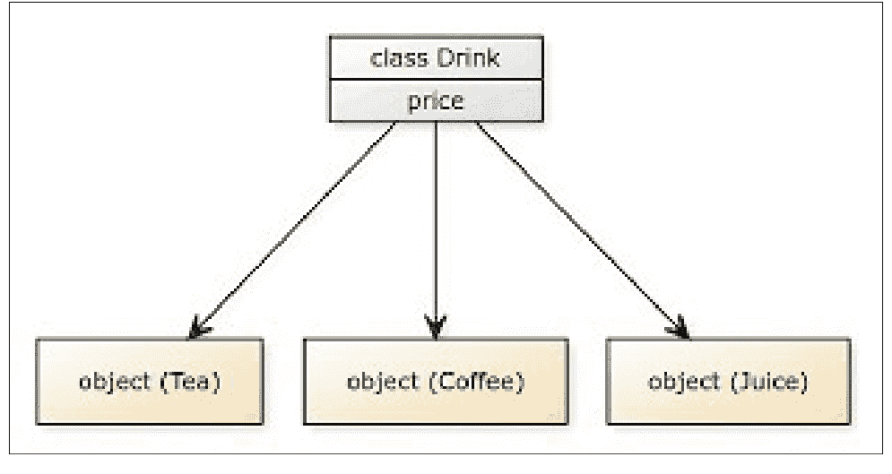

#### 11.1.2：类实例

应该注意的是，`def __init__` 并不包含我们对象所有可能属性的完整列表。
在某些语言中，由于类定义要求你提供对象属性的列表，因此在对象形成后可能无法向其添加额外的属性。Python 中的对象可以通过添加额外的属性和函数来动态增强。实际上，`__init__` 方法与属性设置无关。可以使用 `age` 函数缓存对象的年龄：

```python
def Age(self):
    if attribute(self, "_age"):
        return self._age
    today = datetime.date.today()
    age = today.year - self.birthdate.year
    if today < datetime.date(today.year, self.birthdate.month, self.birthdate.day):
        age -= 1
    self._age = age
    return age
```

一个创建新属性但不在 `__init__` 中初始化它们的方法被认为是不良实践。更新对象属性的值非常常见。更糟糕的是，在对象外部设置属性违反了面向对象范式。

#### 11.1.3：类属性

属性也为类定义。该类的每个实例都将具有这些特性。然而，在使用它们时，你会注意到一些限制。类属性在主体中与方法声明处于相同的缩进级别。

```python
class Car:
    MODELS = ('Xli', 'Gli', 'Reborn', 'Altis')
    def __init__(self, name, year):
        if model not in self.MODELS:
            raise ValueError("Is not a valid model.")
        self.name = name
        self.year = year
```

如你所见，我们使用 `self` 变量来检索类属性 `MODELS`，就像我们检索实例属性一样。

`MODELS` 是一个应用于我们所有 `Car` 实例的类属性。

在许多情况下，类属性用于指定属于特定类的常量。类特性可以通过类实例访问，但如果需要，也可以直接从类对象访问。

#### 11.1.4：创建类

就像 `def` 关键字在 Python 中定义方法一样，Python 中的类由 `class` 关键字后跟定义的类名来定义。

类中的文档字符串使用方式与函数非常相似。文档字符串（docstrings）的使用不是必需的，但强烈建议使用，因为添加类的简短说明被认为是很好的实践，可以提高源代码的清晰度和易理解性。

```python
class NameOfClass:
    pass
class A:
    a = 5
    def functionA(self):
        print('Welcome to Class A')
# 使用同名的类对象访问属性
A.functionA(1)
print(A.a)
```

#### 11.1.5：类的类型

Python 中存在许多不同种类的类，以下是一些示例：

#### 11.1.6：抽象类

在面向对象编程中，抽象是一种用于将类的内部功能隐藏起来、不让用户看到的概念。在这种情况下，用户了解类方法的目的，但不知道这些方法是如何实现该目的的，这意味着他们知道输入和预期的输出，但方法的内部工作原理对他们来说是隐藏的。

抽象类用于在程序中实现抽象。在 Python 中，通常创建抽象类来定义一种必须由基于该抽象类构建的任何子类实现的方法。类似地，抽象方法是一种没有任何关联实现的方法。

抽象方法强制子类在其自身的实例中包含这些方法的实现，这有助于实现抽象，因为每个子类都可以提供自己的方法实例。一个抽象类包含多个抽象方法和许多具体方法。

日常生活中可以看到这方面的例子，比如当我们点击电视上的按钮来换台时。我们并不关心遥控器是如何做到的；我们只关心当我们点击某个按钮时，频道会改变！

智能手机是抽象的另一个例子；我们并不了解手机内部的任何操作；相反，我们只专注于完成特定任务需要做什么。

例如，当我们按下录制按钮时，我们不知道手机是如何录制视频的；我们只是触摸或点击一个按钮，然后执行它应该执行的操作。在现实世界中，我们还可以看到许多其他抽象的例子。

基于上述例子，我们可以得出结论，抽象使事物更易于用户使用且不那么复杂。总的来说，抽象在编程中用于通过抽象掉代码的细节来使其他开发者的开发工作更轻松。例如，在 Python 中，我们不必担心理解列表类的 `sort()` 方法是如何工作的；我们可以直接使用它来为我们排序列表。

Python 并非完全的面向对象编程语言，因为我们可以创建不定义任何类的 Python 代码。然而，Python 确实支持与面向对象编程相关的所有概念，包括抽象和抽象类的概念。

在 Python 中，无法显式地构建抽象类。Python 中的一个模块使我们能够创建抽象类，尽管它并不常用。Python 中的 `abc`（抽象基类）模块是我们可以从头开始构建抽象类的模块。

首先，我们将创建 `Shape` 类，然后在其下创建 `Circle` 和 `Triangle` 类：

```python
from abc import ABC, abstractmethod

class Shape(ABC):
    def __init__(self, shape_name):
        self.shape_name = shape_name

    @abstractmethod
    def Create(self):
        pass

from Circle import Circle
circle = Circle()
circle.Create()

class Triangle(Shape):
    def __init__(self):
        super().__init__("Triangle")

    def Create(self):
        print("Drawing a Triangle")

from Circle import Circle
from Triangle import Triangle

#create a circle object
circle = Circle()
circle.draw()

#create a triangle object
triangle = Triangle()
triangle.draw()
```

抽象类在 Python 中的重要性如下所述：

- 抽象类充当创建其他类的蓝图。对于抽象类，你可以构建一个通用结构，而无需为所有方法提供完整的实现。在抽象类中，具体方法被定义为提供所有派生类都可以使用的通用功能的方法，而抽象方法被定义为其实现可能与具体方法不同的方法。
- 由于抽象类不能被实例化，因此无法创建抽象类的实例对象。
- 通常，抽象类中声明的抽象方法没有方法体，但在抽象类中开发具有实现的抽象方法是可行的。每个继承自此类抽象类的子类仍然需要为抽象方法提供实现。
- 如果派生类没有定义任何通用方法，Python 解释器会引发异常。
- 抽象类可以同时拥有具体方法和抽象方法，它们可以结合使用。

#### 11.1.7：偏函数

Python 有一个名为 `functools` 的实用包，旨在提供有趣的功能。偏函数是此层次结构中的一个类。它可以用于创建一个新函数，该函数仅应用你提供的部分参数和关键字。可以使用 `partial` 关键字“冻结”方法的部分参数或关键字，从而创建一个新对象。换句话说，它部分地生成一个新方法，该方法在其参数中具有一些默认值。

本节将开发一个简单的加法函数，该函数产生其两个输入 `x` 和 `y` 的和。之后，我们通过创建一个 `partial` 对象并将我们的函数和该函数的输入传递给它来创建一个新的可调用对象。换句话说，我们本质上是将加法函数的 `x` 参数的值默认设置为整数 2。接下来，我们用数字 4 调用新的可调用对象 `p_addition`，结果得到 6，因为 3 + 4 = 7。

```python
from functools import partial

def addition(x, y):
    return x + y

p_addition = partial(addition, 3)
p_addition(4)
```

#### 11.1.8：Python 具体类

抽象类可以同时拥有具体方法和抽象方法，它们可以结合使用。具体方法仅在具体类中可用，而抽象方法在具体类和抽象类中都可用。然而，虽然具体类负责实现抽象方法，但抽象类也可以通过使用 `super()` 启动方法来实现。

#### 11.1.9：类相对于函数的优势

- 当你使用函数时，它们被放置在代码的顶部，而你提供给函数的数据可能位于程序中的任何位置。当程序变得太长时，就难以管理。类允许你将特定数据与特定函数绑定在一起，从而将所有内容保持在一个地方。
- 面向对象的基本前提是类型（类）作为模块化的焦点，而不是过程或函数。
- 它非常灵活是其优势之一。类型被表示出来，但其中没有成员。任何函数都有权决定应包含哪些字段。对此类的不同调用可以生成此类的对象，并以不同的方式填充。

### 11.2：对象

#### 11.2.1：对象简介

就 Python 而言，类仅仅是作为创建对象的原型或模板的逻辑实体，而对象是一组变量和 Python 方法。参数和函数在类内声明，并通过对象引用访问。属性是用于指代变量和函数集合的术语。对象是数据（参数）和操作数据的方法（函数）的简单集合。类定义类似于对象定义。

为了更好地理解 Python 对象和类的概念，让我们看一个例子。一种思考对象的方式是将其视为一个普通的日常物品，例如一辆汽车。如前所述，我们知道类内部定义了数据和函数。根据它们在类中的位置，这些数据和函数可以分别被视为对象的属性和行为。汽车（对象）的属性（数据）包括其颜色、价格、车门数量等。汽车（对象）的行为（函数）包括以特定速度行驶、使用刹车等。一个对象类允许多个对象的创建，每个对象都有自己的一组数据和相关方法。

之前我们了解到，类对象可用于检索各种属性。

它也可用于生成先前定义的类的新对象实例（实例化）。创建对象的方法与调用函数相同。

```python
Tom = Dog()
```

这将创建一个名为 Tom 的新个体对象。对象的属性可以通过使用对象名称的前缀来访问。

数据或过程都可以用作属性。对象的过程对应于对象类的等效功能。

#### 11.2.2：对象实例化

每当我们声明一个类时，我们就为所描述的事物创建了一个表示或蓝图。在我们构建对象之前，没有模式。

#### 11.2.3：创建对象

要访问类的特性，需要使用一个与类具有相同标识的对象。但这并不是类对象的唯一用途；它还可以用来构造新对象，然后这些对象可以用来访问属性，如以下示例所示：

```python
class A:
    a = 5
    def functionA(self):
        print('Welcome to Class A')
object1 = A()
object1.functionA()
```

输出：
```
Welcome to Class A
```

然而，在调用函数时，我们没有给它传递任何值，因为我们在类中声明它时使用了一个自定义参数。当使用对象调用函数时，对象本身会立即作为参数传递给函数，使得 `object1.functionA()` 等同于 `object1.functionA(object1)`。因此，方法中的第一个参数必须是对象本身，在大多数情况下被称为 `self` 参数。也可以将其命名为其他名称。然而，使用 `self` 是一种惯例，遵循这一惯例被认为是良好的编程实践。

#### 11.2.4：修改和删除对象

除了创建对象外，还可以在对象创建后对其进行修改和删除，如下所示：
可以使用 `del` 关键字删除对象。

```python
class A:
    a = 5
    def functionA(self):
        print("Welcome to Class A")
    del a
object1 = A()
del object1
```

对象可以按如下方式修改：
```python
class Apple:
    a = 5
    def functionApple(self):
        print('Welcome to Class Apple')
Apple.functionApple(1)
print(Apple.a)
Apple.a=10
print(Apple.a)
```

输出：
```
Welcome to Class Apple
5
10
```

#### 11.2.5：对象的优势

-   使用类时，更容易将所有相关数据和方法维护在一个地方，这有助于使程序更具结构性。
-   除了提供继承外，类的使用进一步增强了面向对象编程范式的能力。
-   类也可以用来重写任何可用的标准运算符。
-   通过将相关函数分组并将其保存在一个位置（在类内部），为代码创建了一个整洁的结构，从而提高了程序的可读性。
-   使用类时，它们允许代码被重用，从而提高了应用程序的整体效率。
-   类允许你使用逻辑结构将程序组织成通用的、可重用的代码块。其中最优秀的是可重用的软件片段，可以一次又一次地重用，而无需对原始代码进行任何修改。

### 11.3：多态性

多态性被定义为呈现多种形状和形式的能力。在使用 Python 的多态性特性时，我们可以在子类中创建与父类中指定的方法同名的函数。

面向对象编程语言在很大程度上依赖于这一概念，并被广泛使用。多态性在 Python 中得以实现，就像在 Java 和 C++ 等其他编程语言中一样，用于各种目的，其中最常见的是鸭子类型、运算符重载和运算符重写。重载和重写是程序实现多态性的两种最常用技术。

多态性的一个简单解释如下：

```
2+5
7
"2" +"5"
25
"ab" +"xy"
abxy
```

从上面的例子中我们可以看出；加法运算符在不同的上下文中被使用。

当向运算符提供两个整数值时，运算符执行加法运算。这在第一个例子中可以看到。

第二个例子使用了与第一个例子相同的值，但不是将它们作为信息传递，而是以字符串格式使用相同的运算符将两个字符串连接在一起。

在第三种情况下，数据集由两个字符串组成，但运算符与前面的例子相同，它执行前两个例子中提供的两个字符串的组合。

#### 11.3.1：多态性的必要性

每当提到 Python 中的面向对象编程时，几乎总会用到“多态性”这个词。面向对象编程中的对象必须呈现出各种形状和大小。正如你所想象的，这一特性在软件开发中非常有用。多态性允许以不同的方式执行单一操作。这一概念在讨论松耦合、接口、依赖注入等时经常使用。

#### 11.3.2：多态性的类型

多态性中的重载可以分为两类：

-   编译时多态性
-   运行时多态性

#### 11.3.3：编译时多态性

方法重载是面向对象编程语言中用于建立静态多态性的一种技术，它允许开发人员在单个对象中实现多个方法。尽管它们使用的名称可能相同，但它们使用的参数不同。在某些情况下可能发生静态多态性，这些情况如下所列：

-   所有属性的类型应彼此不同。
-   参数的顺序可以不同。
-   一个方法中的变量数量应与另一个方法中的元素集合不同。

在静态绑定中，重载函数根据匹配相应类型和数量的参数的类型和数量来调用。由于所有这些数据在编译过程中都是可访问的，因此编译器会为该情况找到最合适的函数。这是通过函数重载实现的，在某些圈子里也被称为静态绑定或早期绑定。

```python
class A:
    def Say(self):
        pass
class B(A):
    def Say(self):
        print("I am class B")
class C(A):
    def Say(self):
        print("I am class C")
a1 = B()
a1.Say()
a1 = C()
a1.Say()
```

输出：
```
I am class B
I am class C
```

如上所示，前面程序中的 `display()` 函数原型在基类和派生类中是相同的。因此，在这种情况下无法使用静态绑定。如果函数选择得当，该程序在运行时可能会以最佳方式执行。在运行时，语言的编译器通过检查相关方法的方法签名来确定特定方法的存在。

在软件编译过程中，编译器首先检测方法签名，然后确定为给定的方法调用调用哪个方法。

尽管编译时多态性的执行时间要短得多，但该技术灵活性较差。

#### 11.3.4：运行时多态性

方法重写，也称为运行时多态性，是包括 C++、Python 和 Java 在内的多种编程语言的特性。在许多语言中，它被称为方法重写。

对于 Python 来说，最重要的特性之一是继承；当子类从其父类继承成员变量和成员方法时，这被称为继承。如果我们认为基类中函数提供的功能不再需要，也可以重写父类中的方法。此外，在子类中重写成员函数以满足父类的要求，在编程语言中被称为函数重写。

```python
class Bike:
    def capacity(self):
        print("Bikes are suitable for maximum 2 people")
    def fuel(self):
        print("Bike needs fuel to run")
class petrol_bike(Bike):
    def fuel(self):
        print("Petrol bike runs on petrol")
class electric_bike(Bike):
    def fuel(self):
        print("Electric bikes run on a battery")
bike=Bike()
ebike=electric_bike()
pbike=petrol_bike()
bike.fuel()
bike.capacity()
ebike.fuel()
ebike.capacity()
pbike.fuel()
pbike.capacity()
```

#### 11.3.5：实现方法重载

Python 并不像其他编程语言那样提供方法重载。它只会用最新的定义覆盖先前定义的函数。另一方面，我们可以通过使用 `*args` 或可选参数来尝试获得与重载类似的结果。

```python
class OptionalArgument:
    def addNumbers(self, a, b, c=0):
        return a + b + c
o = OptionalArgument()
print(o.addNumbers(2,3))
print(o.addNumbers(2,3,4))
```

输出：

```
[Running] python -u "d:\Ebook\Ebook_Codes.py"
5
9

[Done] exited with code=0 in 0.287 seconds
```

#### 11.3.6：实现方法重写

方法重写或运行时多态是指对方法的重写。它与继承协同工作。在方法重写中，即使方法的名称和提供的参数相同，方法的行为也会根据被重写的对象类型而有所不同。

```python
class Animal:
    def sound(self):
        pass
class Cat(Animal):
    def sound(self):
        print("Meooowwwww")
class Dog(Animal):
    def sound(self):
        print("Woohoo")
a = Cat()
a.sound()
a = Dog()
a.sound()
```

输出：

```
[Running] python -u "d:\Ebook\Ebook_Codes.py"
Meooowwwww
Woohoo

[Done] exited with code=0 in 0.408 seconds
```

在前面的例子中，我们构建了从 `Animal` 类派生的 `Cat` 和 `Dog` 类。之后，我们为 `Cat` 和 `Dog` 类都添加了 `sound` 方法。正如你在前面的例子中看到的，`sound` 根据其在 `sound` 中的配置，在同一个 `Animal` 引用上发布不同的结果。在运行时，它会确定要创建的对象类型并运行相应的函数。

#### 11.3.7：为什么要使用多态？

-   提高了程序的适应性
-   一种方法的有效性因情况而异。
-   多态通过面向接口编程减少了耦合度并提高了可重用性，使你的代码更易于理解，同时增加了可重用性和可读性。方法的上下文根据提供的数据而定。
-   多态本质上是一种有益的特性。它指的是可以用多种方式表达的事物，包括对象和方法。
-   它允许一个类中具有多种类型的方法组件拥有相同的名称。
-   面向对象编程中多态的目标是强制执行简单性，同时使脚本更灵活、应用程序更易于维护。
-   多态提供了更大的灵活性和松散耦合，使代码能够随着时间的推移轻松扩展和维护。
-   它可以隐式转换类型。
-   多态使得创建视觉上吸引人的软件应用程序成为可能。

### 11.4：封装

封装是使用像 Python 这样的面向对象编程语言时需要掌握的四个关键原则之一。其他三个是抽象、多态和继承。

#### 11.4.1：简介

在使用类和处理敏感文档时，向所有人公开访问与主应用程序相关的所有变量并不是一个明智的选择。我们可以通过封装来访问重要变量，而无需让应用程序完全访问它们中的任何一个。

可以使用专门为该目标创建的方法来修改、更改或删除变量中的数据。对数据输入的灵活性和增强的安全性是采用这种建模方法的两个主要优点。封装也可以应用于一种技术，该技术通过阻止直接链接到对象的某些元素来防止用户访问对象变量中的任何内容。通过封装，可以隐藏实例化类/对象的数据变量、数据函数和数据方法。

#### 11.4.2：Python 中的封装

在所有面向对象编程语言中，封装都是相同的原则。当这些概念与特定语言相关联时，差距就变得明显了。Python 提供了全局访问，包括所有元素和方法，而像 Java 这样的语言则允许对变量和方法使用受控工具（私有或公共）。封装是最重要的概念之一（OOP）。Python 封装确实是将保存数据的变量和操作这些变量的分析组合成一个称为类的单一实体的行为。在 Python 封装中，变量不容易直接访问；相反，它们是通过类的方法检索的。Python 封装保护对象的内部结构（状态和行为）不受程序其余部分的影响。因此，Python 封装实现了数据隐藏。要理解数据隐藏的概念，请考虑这一点。如果类外部的开发人员可以访问变量中的信息，那么他们很有可能编写自己的（非封装的）代码来处理它。如果解决方案不一致，这至少会导致重复数据（即无意义的练习）和不兼容性。

另一方面，数据隐藏意味着每个人都必须使用相同的方法来访问变量中包含的数据。使用该类的应用程序不需要了解其内部工作原理和实现。该软件只是构建一个对象，然后使用它来调用类的函数。封装抽象是一种仅显示用于访问信息的“必要”变量，同时向客户端隐藏实现细节的技术。想象一下你的手机；你需要知道的只是如何发短信或打电话。客户端不会影响按下按钮后发生的事情、他们的消息如何传输或他们的电话如何连接。

请查看下面的示例以理解该概念。

代码：

```python
class Individual:
    def __init__(self, name, age=0):
        self.name = name
        self.age = age
    def display(self):
        print(self.name)
        print(self.age)
individual = Individual('Python', 20)
individual.display()
print(individual.name)
print(individual.age)
```

输出：

```
[Running] python -u "d:\Ebook\Ebook_Codes.py"
Python
20
Python
20

[Done] exited with code=0 in 0.336 seconds
```

#### 11.4.3：控制访问的方法

Python 提供了多种技术来防止在程序中访问变量和操作。通过 Python 封装，访问修饰符是通过将类的成员函数和过程指定为受保护/私有来实现的。Python 不支持直接的访问修饰符，如 public、private 和 protected。可以使用单下划线和双下划线来实现这一点。

访问修饰符限制类的变量和函数。在 Python 中，主要区别在于私有、公共和受保护。

-   **公共成员：** 可以从类外部的任何地方访问。
-   **私有成员：** 仅作为私有成员在类内部可访问。
-   **受保护成员：** 允许在类及其子类内部访问。

#### 11.4.4：公共成员

包含公共数据的成员可以在类内部和外部访问。此类的成员参数默认都是公共的。

```python
class Individual:
    def __init__(self, name, age):
        self.name = name
        self.age = age
    def show(self):
        print("Name: ", self.name, 'Age:', self.age)
indv = Individual('Elizabeth', 20)
print("Name: ", indv.name, 'Age:', indv.age)
indv.show()
```

输出：

```
[Running] python -u "d:\Ebook\Ebook_Codes.py"
Name:  Elizabeth Age: 20
Name:  Elizabeth Age: 20

[Done] exited with code=0 in 0.336 seconds
```

#### 11.4.5：私有成员

类内部的变量可以设为私有以保护访问。在变量名开头添加额外的下划线以将其分类为私有变量。你甚至不能简单地从类对象首先访问私有成员，因为它们只能在类内部访问。因此代码会抛出错误。

#### 11.4.6：使用单下划线

在变量名前附加一个下划线是Python中标识私有变量的标准编程方法。然而，这在编译器层面并不会产生显著差异。按照惯例，该变量似乎仍然可以被访问。但是，作为一种编程实践，它向其他开发者表明，该变量或函数只能在类的范围内被访问。

```python
class Individual:
    def __init__(self, name, age=0):
        self.name = name
        self.age = age
    def display(self):
        print(self.name)
        print(self.age)
individual = Individual('Python', 20)
individual.display()
print(individual.name)
print(individual.age)
```

```
[Running] python -u "d:\Ebook\Ebook_Codes.py"
Python
20
Python
20

[Done] exited with code=0 in 0.372 seconds
```

#### 11.4.7：使用双下划线

应该使用双下划线来声明类成员（如函数和变量）为私有。因此，私有修饰符在Python中确实可能有某种实现。这个过程被称为名称修饰。类成员仍然可以从类外部被访问。

#### 11.4.8：名称修饰

Python中包含`Var`的标识符会被Python解释器转换为`Classname_Var`，但类名保持不变。在Python中，这种修改标识符的过程被称为名称修饰。Python暗示数据访问是受限的。它没有认证和密钥修饰符。然而，Python的名称修饰可以用来管理访问。Python使所有函数和变量都可访问。每个带有两个显著下划线的标识符在Python中都会成为非公开的实现。为了进一步理解封装，我们将提供非公开的实例变量和函数。非公开实例方法的可见性仅限于其类，并且它以一个或两个下划线开头，即在变量或函数前有一个"_"或"__"。非公开实例变量的可见性由其类或声明它的过程决定，并且它以两个下划线开头。如果缺少两个下划线，则该方法被视为公开。在理解Python中的封装之前，我们应该先掌握公开和非公开的实例变量与函数。

在下面的示例中，`Individual`类中的一个`age`变量被修改了，并且它前面带有双下划线。

```python
class Individual:
    def __init__(self, name, age=0):
        self.name = name
        self.age = age
    def display(self):
        print(self.name)
        print(self.age)
individual = Individual('Ali', 10)
individual.display()
print('Trying to use variables that are not in class')
print(individual.name)
print(individual.age)
```

```
[Running] python -u "d:\Ebook\Ebook_Codes.py"
Ali
10
Trying to use variables that are not in class
Ali
10

[Done] exited with code=0 in 0.408 seconds
```

#### 11.4.9：Getter和Setter方法

访问器（getter）函数和修改器（setter函数）将检索和更新私有变量，因为它们属于类。

```python
class Individual:
    def __init__(self, name, age=0):
        self.name = name
        self.age = age
    def display(self):
        print(self.name)
        print(self.age)
    def getAge(self):
        print(self.age)
    def setAge(self, age):
        self.age = age
individual = Individual('Python', 20)
individual.display()
individual.setAge(25)
individual.getAge()
```

```
[Running] python -u "d:\Ebook\Ebook_Codes.py"
Python
20
25
[Done] exited with code=0 in 0.428 seconds
```

#### 11.4.10：封装的优点

封装改善了数据流，并保护信息免受外部威胁。封装是一种允许代码自包含的概念。它在实现层面特别有用，因为它强调查询而忽略复杂性。为了使封装更容易并保护信息，你必须将信息隐藏在组件中。

封装有助于建立改进的数据流和数据安全。封装是一种允许代码自包含的概念。封装在操作层面确实非常有益，因为它只专注于“何时”这个问题，而将困难的“何时/何处”以及相关的复杂性放在一边。将信息封装在一个单元中使封装更简单、更安全。

封装最重要的好处是数据安全。以下是封装的一些优点：

- 封装防止客户从对象中窃取信息。
- 封装允许员工访问一个阶段，同时隐藏其背后的复杂元素。
- 它减少了人为错误的数量。
- 使软件的维护更容易。
- 使项目更用户友好。

为了获得最佳封装，对象信息几乎总是必须限制为私有/受保护。如果你决定将适当的访问设置为公开，请确保你了解其后果。

- 封装允许对象独立运行，因为信息被隐藏了。
- 因为我们只能通过其方法获取隐藏在对象中的信息，它提供了与对象外部世界兼容的连接服务。
- 对象通过布局进行交互，这使数据免受外部世界的侵害。
- 如果布局被期望是相同的，所有对象都可以立即替换。
- 当封装不存在时，对象行为和状态的微小差异可能导致系统损坏。
- 封装有助于修复错误，因为系统不受影响，而受影响的对象被恢复。
- 在重写（添加）或更改系统部分时，封装非常有效。整个软件不需要被编辑，这意味着代码效率只有通过封装才可行。
- 封装在修改对象的外部外观时保护其内部特征。
- 对象的封装就像一个通信盒子网络；如果一个盒子损坏，其他盒子可以修复或替换，而不会影响内部内容。

#### 11.4.11：封装的必要性

以下准则展示了为什么封装对程序员有用，以及为什么面向对象原则在许多编程语言中表现出色。每个系统都受益于封装，因为它允许定义良好的交互。Python中的面向对象概念专注于编程的可重用火箭。（DRY代表不要重复自己。）应用程序可以以安全的方式保持更新。通过良好的代码结构，它保证了代码的适应性。它确保消费者在披露任何后端复杂性时拥有良好的体验。它提高了代码的可读性。对代码一部分的任何修改都不会影响其他部分。封装提供数据安全并防止数据被意外访问。可以使用上述方法来访问存储的信息。在Python中，封装意味着数据在对象定义之外被隐藏。它允许程序员创建用户友好的体验。因为代码非常安全，外部来源无法查看，所以它也有助于防止数据入侵。

- 每个应用程序都需要定义良好的通信，封装有助于实现这一点。
- 面向对象是一个概念。Python编程鼓励创建代码行。DRY（不要重复自己）是另一个缩写。
- 应用程序管理简化，安全性得到保证。
- 编程方法的透明度，因为开发者应该专注于类的目标，而复杂性应该系统地解决。
- 规范的代码结构提高了程序的可扩展性和单元测试。
- 人们发现使用该平台很简单，因为他们免受后端复杂架构的影响。
- 将所有相关数据放在一个位置并封装起来，提高了组件的组织性。
- 通过确保一个代码区域的更改不会影响其他部分，增强了可理解性。
- 封装保护代码部分不被意外访问，但不是故意的，因为对象包含应用程序的重要数据，这些数据不应在代码中的任何地方被修改。

### 11.5：继承

面向对象编程（OOP）的一个核心特性是继承的概念。关于继承，最重要的一点是它能促进代码的复用。顾名思义，继承是一个类从另一个类获取特性和方法的过程。在编程中，“父类”指的是被继承的属性和方法。同样，“子类”是接收其父类所有属性的类。我们无需反复重写相同的代码，而是可以将一个类的属性继承到另一个类中，从而节省时间和精力。

现实世界的对象是面向对象编程的核心，而继承是捕捉现实世界联系的一种方法。例如，考虑以下情况：汽车、公交车和自行车都包含在一个更大的类别中，称为交通工具。它们继承了交通工具类的特性，即它们都用于运输。

```python
class Car:       #parent class
    def __init__(self, name, mileage):
        self.name = name
        self.mileage = mileage
    def description(self):
        return f"The {self.name} gives the mileage of {self.mileage}km"
class BMW(Car):   #child class
    pass
class Audi(Car):  #child class
    def audi_desc(self):
        return
```

使用父类“Car”，我们创建了两个名为“BMW”和“Audi”的子类，它们各自继承了父类的方法和属性。在BMW类中，我们没有添加任何父类中不存在的额外特性或方法。另一方面，Audi类内部有一个额外的方法。

#### 11.5.1：继承的类型

根据涉及的子类和父类数量，Python有四种继承类型。

- 单继承

当一个子类成为另一个子类的父类时。

```python
class Parent:
    def ParentFunction1(self):
        print("This is parent class 1")
class Child(Parent):
    def ChildFunction1(self):
        print("This is child class 1")
ob = Child()
ob.ParentFunction1()
ob.ChildFunction1()
```

输出：

```
[Running] python -u "d:\Ebook\Ebook_Codes.py"
This is parent class 1
This is child class 1

[Done] exited with code=0 in 0.452 seconds
```

- 多重继承

指一个子类继承自多个父类。

```python
class Parent:
    def Parentfunction1(self):
        print("This is parent class 1")
class Parent2:
    def Parentfunction2(self):
        print("This is parent class 2")
class Child(Parent , Parent2):
    def ChildFunction1(self):
        print("This is child class 1")
ob = Child()
ob.Parentfunction1()
ob.Parentfunction2()
ob.ChildFunction1()
```

输出：

```
[Running] python -u "d:\Ebook\Ebook_Codes.py"
This is parent class 1
This is parent class 2
This is child class 1

[Done] exited with code=0 in 0.282 seconds
```

- 多层继承

当一个子类成为另一个子类的父类时。

```python
class Parent:
    def ParentFunction1(self):
        print("This is parent class 1")
class Child(Parent):
    def ChildFunction1(self):
        print("This is child class 1")
class Child2(Child):
    def ChildFunction2(self):
        print("This is child class 2")
ob = Child2()
ob.ParentFunction1()
ob.ChildFunction1()
ob.ChildFunction2()
```

输出：

```
[Running] python -u "d:\Ebook\Ebook_Codes.py"
This is parent class 1
This is child class 1
This is child class 2

[Done] exited with code=0 in 0.407 seconds
```

#### 11.5.2：父类的创建

父类通常被称为基类。父类提供了一个模式，子类或派生类可以在此基础上构建并复用它们。这个类可能具备通过继承创建子类的能力，从而无需每次都重写相同的代码。

举例说明：为了创建一个银行账户，我们将使用“银行账户”这个术语作为个人账户，它包含“个人账户”和“商业账户”这两个子类。个人账户和商业账户之间的许多方式是相同的，例如取款和存款的方法；因此，为了方便，这些方法可以归类到银行账户这个父类下。

#### 11.5.3：子类的创建

子类是以某种方式从基类派生出来的类别。它仅仅意味着每个子类都将使用父类中可用的过程和变量。例如，`business_account`是`bank_account`的一个子类。

```python
class account(Bank_account):
    pass
```

请记住，当你没有向类添加更多属性或函数时，会使用`pass`关键字。

这一步将创建一个子类，该子类将继承其父类的方法和属性。

不是向子类传递`pass`关键字，而是传递`__init__()`函数。

`Super()`允许你让子类继承其父类的所有过程和特性，这在处理继承时非常有用。

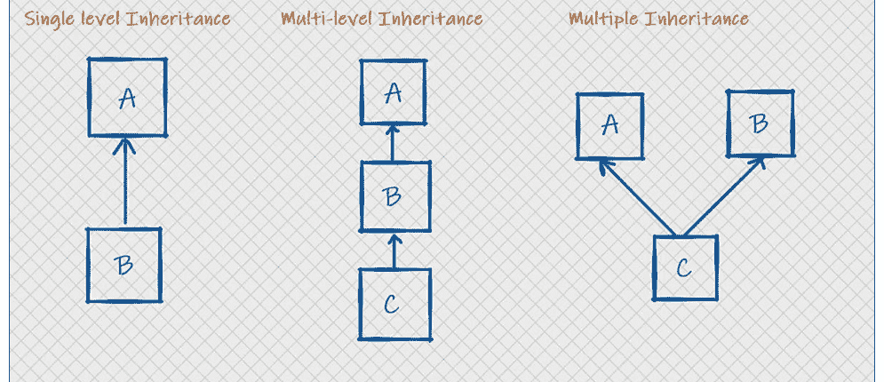

#### 11.5.4：继承语法

继承是新类能够继承现有类的属性和行为的能力。被继承的类称为父类。在Java编程语言中，任何从基类派生的类都是子类。

子类不仅继承其父类的所有属性和方法，还能够扩展或重写它们。

以下是类继承的标准语法：

```python
class Base_Class:
    #Base class body
class Derived_Class(Base_Class):
    #Derived class body
```

#### 11.5.5：继承的优点

- 代码复用；有许多方法可以让你在代码中复用相同的函数和属性。
- 它很好地表示了父类和子类之间的现实世界关系。
- 在本质上，它具有传递性。如果一个子类从基类获取属性，那么该子类的所有子类也将同样继承父类的特性。
- 代码复用是指频繁使用只编写过一次的代码。
- 一个超类可以表示一个链中的多个子类。
- 继承消除了数据中的重复和冗余。
- 使用继承可以减少所需的空间和时间。
- 无需修改任何基类；只需在父类中进行更改即可。
- 能够通过继承来开发更强大的对象。
- 使用继承强制子类遵循一个公共接口。
- 继承有助于减少代码重复并促进代码扩展。
- 使用继承使得创建类库更加容易。

#### 11.5.6：继承的缺点

- 错误地使用继承，或对其缺乏理解，可能会导致错误的解决方案。此外，基类中的数据成员可能未被使用，从而导致内存过度利用。
- 它增加了所需的时间和精力。需要经历继承的各个层次。
- 继承的主要缺点之一是程序需要经历所有重载类和子类层次所需的时间和精力。在一个特定类中声明的函数将通过其上方的10个不同抽象层次来执行，这意味着它需要十次跳转才能运行写在每个类中的函数。
- 继承增加了基类和派生类之间的耦合度。对基类的修改将影响所有子类。
- 如果从“超类”或集合中移除一个方法，我们将不得不重构所有依赖于该方法的方法。

### 11.6：多重继承

顾名思义，在Python中，当一个类派生自多个类时，就会发生多重继承。换句话说，子类继承自多个基类。一个例子是，孩子从父母双方继承性格特质。

多重继承似乎是一件“有风险”或“不好”的事情，这种普遍观念在很大程度上是由那些多重继承能力设计不佳的计算机语言，尤其是其错误使用所延续的。Java甚至不支持多重继承，但C++支持。Python为多重继承提供了一个复杂而设计精良的解决方案。

如果你从多个父类派生一个子类，这种情况就称为多重继承。然而，它表现出的行为与单继承相同。

多重继承的结构与单继承同样类似。顺便说一下，在多重继承下，子类拥有所有父类的方法和属性。

在Python中，模块和包遵循一个称为DRY（即不要重复自己）的哲学。而类继承是利用另一个类的特性来构建一个类并保持DRY的绝佳方法。

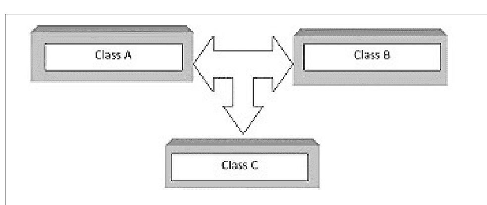

#### 11.6.1：多重继承的语法

创建类时，我们将派生类的名称放在派生类名称的括号内。这允许一个类继承自多个Python类。我们使用逗号来分隔此列表中的名称。

```
Code:
class Mother:
    pass
class Father:
    pass
class Child(Mother, Father):
    pass
subclass=(Child,Mother)
subclass=(Child,Father)
```

因此，子类从母亲类和父亲类都继承了属性。

#### 11.6.2：多重继承示例

考虑以下多重继承的例子

```
Code:
class Parent1:
    def function1(self):
        print("This is first function 1")
class Parent2:
    def function2(self):
        print("This is second function 2")
class Parent3:
    def function3(self):
        print("This is third function 3")
class Child(Parent1, Parent2, Parent3):
    def function4(self):
        print("This is fourth function 4")
z = Child()
z.function1()
z.function2()
z.function3()
z.function4()
```

输出：

```
[Running] python -u "d:\Ebook\Ebook_Codes.py"
This is first function 1
This is second function 2
This is third function 3
This is fourth function 4

[Done] exited with code=0 in 0.386 seconds
```

Code:
class TeamMember(object):
    def __init__(self, name):
        self.name = name
class Worker(object):
    def __init__(self, pay):
        self.pay = pay
class TeamLeader(TeamMember, Worker):
    def __init__(self, name, pay, exp):
        self.exp = exp
        TeamMember.__init__(self, name)
        Worker.__init__(self, pay)
        print("Name: {}, Pay: {}, Exp: {}".format(self.name, self.pay, self.exp))

TL = TeamLeader('Jake',5000,'Master')
输出：

```
[Running] python -u "d:\Ebook\Ebook_Codes.py"
Name: Jake, Pay: 5000, Exp: Master

[Done] exited with code=0 in 0.288 seconds
```

#### 11.6.3：方法解析顺序

当我们在Python中参与多重继承的类中查找属性时，会遵循一个顺序。首先，在当前类中检查。如果未找到，则搜索会转向父类。这是一个深度优先、从左到右的搜索。

```
Code:
class A:
    def func(self):
        print(" This is Parent Class A")
class B(A):
    def func(self):
        print(" This is Child Class B")
r = B()
r.func()
Output:
```

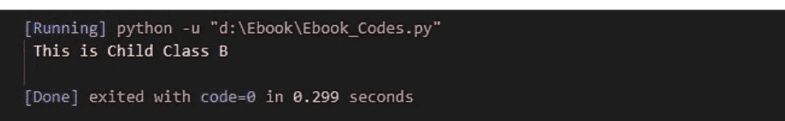

这是因为在前面的例子中，由于方法解析顺序（MRO），调用的方法来自类B而不是类A。上面给出的例子展示了代码中类的列出顺序：先是类B，然后是类A。

当存在多重继承时，过程按照继承类时指定的顺序运行。方法解析的顺序称为解析顺序。对于提供单继承的语言来说这不重要，但对于支持多重继承的语言来说，方法解析的顺序非常重要。这种安排称为子类的线性化，用于实现它的一组规则称为MRO（方法解析顺序）。你可以通过使用`__mro__`属性或`mro()`方法来获取一个类的MRO。这两种方法在Java中都可用。与`__mro__`属性不同，`mro()`函数返回一个Python列表而不是元组。

方法解析顺序（MRO）是一个编程语言术语，指的是方法或属性被解析的顺序。Python编程语言允许类从其他类派生。被继承的类称为基类或超类，而继承的类称为子类。当在Python中执行方法时，解析顺序指定了查找和找到父类的顺序。要找到方法或属性，必须首先在类内部搜索，然后必须遵循继承时设定的继承顺序。这种安排也称为类的线性化，管理它的一组规则称为MRO（方法解析顺序）。即使解释器是从另一个类派生的，它仍然需要能够确定通过实例调用的函数。因此，我们需要方法解析顺序。

#### 11.6.4：多重继承的优点

-   由于它包含多个基类，C++中的多重继承使派生类能够获得比原本更多的特性和特征。
-   作为额外的好处，它确保了传递性，这意味着如果类C继承自P，那么C的所有子类也将继承自P。
-   因为它允许一个类从多个基类继承功能，所以它具有更灵活的优点。
-   设计多种设计模式已被证明从长远来看是有用的。其中一些模式如下：将你的类适配到其他接口的模式：当你需要使用另一个接口将你的类适配到另一个接口时，此模式很有用。在这种情况下，多重继承在将一个接口替换为另一个接口方面起着重要作用。观察者模式包括：此模式用于通过为每个观察者定义一个类来跟踪观察者列表。
-   这个派生类与其父类之间没有区别。

### 11.7：运算符重载

Python运算符可以与内置类一起使用，但它们不适用于其他类型的类。同一个运算符对不同类型的对象表现不同。例如，`+`运算符可以将两个数字相加，合并两个列表，或将两个字符串连接在一起。这称为运算符重载，它是Python的一个特性，允许相同的运算符根据使用场景具有不同的含义。一个已安装的运算符可以根据我们使用的操作数表现不同。这称为运算符重载。

运算符`+`用于执行以下操作：

1.  在这种情况下，将两个整数相加得到第三个。
2.  将两个字符串连接在一起。
3.  将两个列表连接在一起。

代码：

```
#连接两个字符串
print("Mahnoor "+"Sadiq")
#将两个数字相加
print(7+6)
#重复字符串
print("Hey"*3)
#将两个数字相乘
print(5*5)
```

输出：

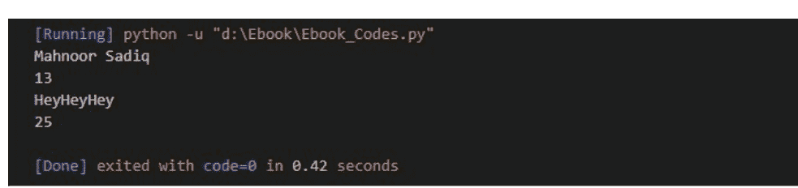

这些运算符已被设计为可与`int`和`str`类一起使用。

#### 11.7.1：需要运算符重载吗？

因为编译器无法完全理解如何对操作数进行乘法运算，所以如果我们尝试使用运算符 `*` 来相乘它们，编译器会报错。

这里，让我们看一个我们自己创建的名为 `Graph` 的类的例子。它有两个名为 "X" 和 "Y" 的属性。现在，这个类的实例将是不同的点，而对这些点（对象）使用 `+` 相加将会是一个错误。

```
Code:
class Graph:
    def __init__(self, x, y):
        self.x = x
        self.y = y
p1 = Graph(1, 2)
p2 = Graph(2, 3)
print(p1+p2)
Output:
```

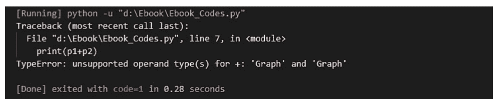

在这种情况下，编译器不理解 `p1+p2` 代表什么。
我们可以编写一个方法来重载 `+` 运算符，使其以不同的方式使用，从而解决这个问题。

#### 11.7.2：执行运算符重载

Python 有一个特殊的方法或魔术函数，当使用该运算符时会自动调用，以实现运算符重载。

例如，当我们使用 `*` 运算符时，魔术方法 `__mul__` 会被立即调用。这个方法已经为 `*` 运算符设置了相应的操作。

为了让 `+` 运算符以不同的方式工作，我们将使用 `__add__` 魔术方法来实现。

```
Code:
class Graph:
    def __init__(self, a,b):
        self.a = a
        self.b=b
    def __add__(self, o):
        a=self.a+o.a
        b=self.b+o.b
        ss=Graph(a,b)
        return ss
p1=Graph(30,40)
p2=Graph(70,80)
ss=p1+p2
#sum of the a coordinates of graph
print(ss.a)
#sum of the b coordinates of graph
print(ss.b)
Output:
```

```
[Running] python -u "d:\Ebook\Ebook_Codes.py"
100
120

[Done] exited with code=0 in 0.285 seconds
```

我们向 `Graph` 对象添加了 `__add__()` 方法并调用了它。我们最终得到了坐标的和，它是一个 `Graph` 对象。

#### 11.7.3：重载算术运算符

让我们重载 `+` 算术运算符。为了在类中实现 `__add__()` 方法，我们需要重载 `+` 运算符。当你拥有巨大的力量时，你也肩负着重大的责任。在这个函数内部，我们有完全的自由去做任何我们想做的事情。然而，返回一个表示坐标和的 `Point` 对象在逻辑上更为合理。

```
Code:
class Coordinates:
    def __init__(self, a=0, b=0):
        self.a = a
        self.b = b
    def __str__(self):
        return "({0},{1})".format(self.a, self.b)
    def __add__(self, other):
        a = self.a + other.a
        b = self.b + other.b
        return Coordinates(a, b)
```

现在让我们再次尝试加法运算：

```
Code:
class Coordinates:
    def __init__(self, a=0, b=0):
        self.a = a
        self.b = b
    def __str__(self):
        return "({0},{1})".format(self.a, self.b)
    def __add__(self, other):
        a = self.a + other.a
        b = self.b + other.b
        return Coordinates(a, b)
point1 = Coordinates(10, 20)
point2 = Coordinates(20, 30)
print(point1+point2)
Output:
```

```
[Running] python -u "d:\Ebook\Ebook_Codes.py"
(30,50)

[Done] exited with code=0 in 0.474 seconds
```

本质上，当你在语句中组合点 1 和点 2 时，Python 会调用 `point1.__add__(point2)`，返回 `Coordinates`，这又会调用 `Coordinates.__add__(point1,point2)`。之后，加法操作会按照我们指定的方式执行。

#### 11.7.4：重载比较运算符

Python 并不限制运算符重载仅用于算术运算符。也可以重载比较运算符。考虑这样一种场景：我们希望在 `Point` 类中包含小于符号。为此，让我们比较这些点到原点的距离（大小）并报告结果。可以通过以下方式应用。

```
Code:
class Coordinates:
    def __init__(self, a=0, b=0):
        self.a = a
        self.b = b
    def __str__(self):
        return "({0},{1})".format(self.a, self.b)
    def __lt__(self, other):
        self_mag = (self.a ** 2) + (self.b ** 2)
        other_mag = (other.a ** 2) + (other.b ** 2)
        return self_mag < other_mag
point1 = Coordinates(1,1)
point2 = Coordinates(-2,-3)
point3 = Coordinates(1,-1)
print(point1<point2)
print(point2<point3)
print(point1<point3)
Output:
```

```
[Running] python -u "d:\Ebook\Ebook_Codes.py"
True
False
False
```

#### 11.7.5：Python 中重载的运算符列表

Python 中重载的算术运算符列表：

- 加法：p1+p2
- 减法：p1-p2
- 乘法：p1*p2
- 幂运算：p1 ** p2
- 除法：p1/p2
- 整除：p1//p2
- 取余：p1%p2
- 按位非：~p1
- 按位异或：p1^p2
- 按位或：p1|p2
- 按位与：p1&p2
- 按位左移：p1<<p2
- 按位右移：p1>>p2

Python 中重载的比较运算符列表：

- 小于：p1<p2
- 小于或等于：p1<=p2
- 等于：p1==p2
- 不等于：p1!=p2
- 大于：p1>p2
- 大于或等于：p1>=p2

#### 11.7.6：运算符重载的优点

- 它允许我们重用东西，而不是编写许多不太相似的不同方法。我们可以尝试编写一个方法，然后重载它。
- 此外，它还有助于使代码更易于理解和编写，并减少工作量。
- 它们为用户定义的类型提供了与内置类型相同的支持。
- 当运算符被更改为执行不同的操作时，更容易理解程序。
- 运算符重允许程序员使用类似于目标领域的表示法。
- 它提高了代码的可读性和可理解性。

# 第 12 章

## 数据结构与算法


数据结构是一种收集和分类数据的方法，以便可以高效地对它们执行操作。数据结构是将数据片段表示为某种连接的过程，以便于组织和存储。例如，我们包含一些数据，表明客户的名字是 "Eras"，她的年龄是 19。这里，"Eras" 是一个字符串，19 是一个整数。

我们可以通过创建一个名为 `Client` 的记录来组织这些数据，该记录将包含客户的名字和年龄。现在，作为一个数据结构，我们可以在数据库文件中收集和存储客户记录。例如，"Daryl" 是 10 岁，"Joline" 是 11 岁，"Lennie" 是 13 岁。

如果你习惯于面向对象的编程标准，类做的是同样的事情；它将多种类型的数据聚合到一个单一的实体中。主要的区别在于，数据结构包含了有效访问和操作数据的方法。

简单来说，数据结构被设计成以一种便于对其执行不同操作的方式来保存有序数据。它是与要安排在内存中的材料相关的知识的表示。它应该以最小化复杂性并最大化效率的方式进行设计和实现。

### 12.1：渐近分析

对一个过程的渐近分析是一种弄清楚其运行效率背后的数学原理的方法。渐近分析可以帮助我们找出算法的最佳情况、平均情况和最坏情况。

这种类型的分析被称为“输入相关”，这意味着如果方法没有输入，它被认为会运行无限长的时间。除了“输入”之外，所有其他组件都被认为是相同的。

渐近分析是弄清楚一个操作需要多长时间的过程，以数学时间单位表示。例如，对于一个操作，运行时间是 f(n)，对于另一个操作，它是 g(n) (n2)。随着操作数量的增加，第一个操作的运行时间也会增加。第二个操作的运行时间将随着操作数量的增加而呈指数级增长。如果 n 非常小，两个操作的运行时间将大致相同。

大多数情况下，算法的运行时间分为三类。

- 最佳情况：这是程序以最短时间运行的情况。
- 平均情况：运行程序所需的平均时间。
- 最坏情况：运行程序所需的最长时间。

渐近符号用于计算算法运行所需的时间。以下是最常见的几种。

1. θ 符号 – 最佳情况
2. Ω 符号 – 平均情况
3. O 符号 – 最坏情况

#### Theta (θ) 符号

符号 θ(n) 是正确表示应用程序运行时的相对下界和上界的正确方式。它表示如下：

#### Omega (Ω) 表示法

Ω(n) 表示法是表达算法运行时间无法低于某个特定时间的正式方式。时间复杂度是一种衡量算法在最佳情况下完成所需时间的方法。

#### 大 O (O) 表示法

人们使用 O(n) 来表示算法的运行时间不会超过某个特定的步骤数。它量化了最坏情况下的时间复杂度，即算法完成所需的时间。

#### 通用表示法

| 类型 | 表示法 |
| :--- | :--- |
| 常数 | O(1) |
| 多项式 | n^{O(1)} |
| 对数 | O(log n) |
| 线性 | O(n) |
| 指数 | 2^{O(n)} |
| 二次 | O(n^2) |
| 三次 | O(n^3) |
| n log n | O(n log n) |

### 12.2：线性数据结构

本节讨论线性类型的数据结构，如栈、队列等。

#### 12.2.2：栈

一种线性数据结构，使用先进后出（FILO）或后进先出（LIFO）的顺序来存储对象。新元素被添加到栈的一端，而元素则从另一端移除。插入和删除操作有时被称为压栈（push）和弹栈（pop）。

栈与以下函数相关联：

- push(x) – 在栈顶插入一个元素 – 复杂度 = O(1)
- empty() – 判断栈是否为空 – 复杂度 = O(1)
- top() – 获取栈顶元素 – 复杂度 = O(1)
- size() – 获取栈的大小 – 复杂度 = O(1)
- pop() – 删除栈顶元素 – 复杂度 = O(1)

### 实现

在 Python 中，栈可以通过多种方式实现。本文讨论如何使用 Python 数据结构和模块来创建栈。

在 Python 中，栈可以通过以下方式实现：

- 列表（List）
- queue.LifoQueue
- Collections.deque

##### 使用列表实现 LifoQueue

Python 自带的列表数据结构可以用作栈。`append()` 方法将元素添加到栈顶，而 `pop()` 方法则按照 LIFO 顺序移除元素。

遗憾的是，列表存在一些不准确之处。主要缺点是随着栈的增长，它可能会遇到速度问题。因为列表元素在内存中是连续存储的，如果栈的大小超过了当前存储它的内存块，Python 就必须进行内存分配。因此，某些 `add()` 调用可能比其他调用花费更长的时间。

```python
Code:
stack = [] #assign stack a list
stack.append('1') #storing 1 as string
stack.append('2') #storing 2 as a string
stack.append('3') #storing 3 as a string
print('Initial stack')
print(stack) #display the stack elements
print('\nElements popped:') #the elements popped are displayed by
print(stack.pop()) #stack.pop() pops top element and print() displayed popped element
print(stack.pop()) #new element at top of stack is popped
print(stack.pop()) #another popped
print('\nNew stack after elements popped:')
print(stack)
#as only 3 elements were initially in stack, and 3 were popped, the stack is now empty
```

输出：

##### 使用 Collections 实现栈

可以使用 collections 包中的 deque 类来实现栈。在需要从容器两端进行快速追加和弹出操作的情况下，deque 比列表更受青睐，因为 deque 的追加和弹出操作具有 O(1) 的计算时间，而列表的时间复杂度为 O(n)。

deque 的 `append()` 和 `pop()` 函数与列表中的相同。

```python
Code:
from collections import deque
stack = deque()
stack.append('1')
stack.append('2')
stack.append('3')
print('Stack:')
print(stack)
print('\nElements popped:')
print(stack.pop())
print(stack.pop())
print(stack.pop())
print('\nStack after popped:')
print(stack)
Output:
```

##### 通过 Queue 模块实现

此外，Queue 模块包含一个 Queue LIFO，它本质上就是一个栈。`put()` 方法用于向队列中输入数据，而 `get()` 函数用于从队列中获取数据。
此模块包含以下函数：

- get() – 从队列中移除并返回一个元素。如果队列为空，则等待直到有元素存在。
- put (element) – 将一个元素添加到队列中。如果队列已满，则等待直到有空间。
- full() – 通过返回 true 来告知用户队列是否已满（当达到允许的最大元素数时）。
- empty() – 如果队列下溢（当为空时，视为下溢），则返回 true。
- get_nowait() – 如果有可用元素则返回，否则判断队列为空。
- put_nowait() – 如果有空间则立即将项目放入队列，否则返回栈溢出（当没有可用空间时）。
- qsize() – 返回队列中的元素数量。

```python
Code:
from queue import LifoQueue
stack = LifoQueue(maxsize=4) #initialize stack at 4
print(stack.qsize()) #display size
stack.put('1')#push onto stack
stack.put('2')
stack.put('3')
stack.put('4')
print("Full Stack: ", stack.full())
print("Size Stack: ", stack.qsize())
print('\nElements popped from the stack')
print(stack.get())#LIFO order get top and pop
print(stack.get())
print(stack.get())
#now one remaining
print("\nNon empty: ", stack.empty())
```

输出：

#### 12.2.3：队列

与栈类似，队列是一种顺序数据模型，它按照先进先出（FIFO）的顺序存储项目。要从队列中移除项目，需要从最后添加的项目开始。队列：任何等待获取某物的人排队，先到的人先得到服务。

使用的操作：

- **入队（Enqueue）：** 将一个元素添加到队列中。如果队列已满，则视为溢出 – 复杂度 = O(1)
- **出队（Dequeue）：** 从队列中移除一个元素。它们按照被压入的相同顺序弹出。如果队列为空，则视为下溢 – 复杂度 = O(1)
- **队头（Front）：** 获取队首项目 – 复杂度 = O(1)
- **队尾（Rear）：** 获取队尾项目 – 复杂度 = O(1)

在编程语言中创建队列的方法有很多。本文讨论如何使用 Python 库中的数据结构和组件来创建队列。

如何在 Python 中创建队列：

1. queue.Queue
2. collections.deque
3. list

##### 队列实现

如第 '12.2.2：通过队列实现栈' 一节所述，使用以下方式实现队列：

```python
from queue import Queue
```

；与第 12.2.2 节中描述的相同。

##### Collections 实现

可以通过 collection 模块中的 deque 类在 Python 中创建队列。当我们需要从容器两端进行快速追加和弹出操作时，deque 比列表更受青睐，因为 deque 的添加和移除操作具有 O(1) 的计算时间，而列表的时间复杂度为 O(n)。使用 `append()` 和 `popleft()` 操作，而不是入队和出队。

```python
Code:
from collections import deque #imports collections through deque
q = deque() #initializes queue through deque
# Adding elements 1,2,3 to queue (enqueue)
q.append('1')
q.append('2')
q.append('3')
print("Queue at start: ")
print(q)
# Removing elements from a queue
print("\nelements popped: ")
print(q.popleft())
print(q.popleft())
print(q.popleft())
print("\nUpdated Queue: ")
print(q)
#if we use q.popleft() now, it will raise an index error as list is now empty
```

输出：

```
Queue at start:
deque(['1', '2', '3'])

elements popped:
1
2
3

Updated Queue:
deque([])
```

##### 列表实现

列表是 Python 中的内置数据结构，可以用作队列，它被称为列表。使用 `append()` 和 `pop()` 函数来添加和移除队列中的项目，而不是 `enqueue()` 和 `dequeue()`。然而，列表在这方面非常慢，因为在开头添加或移除属性需要大量时间。

```python
Code:
# Initializing
queue = [] #queue as list
# enqueue 1,2,3
```

queue.append('1')
queue.append('2')
queue.append('3')
print("队列 1：")
print(queue)
# 从队列头部移除元素（先进先出）
print("\n出队元素：")
print(queue.pop(0))
print(queue.pop(0))
print(queue.pop(0))
print("\n移除后的队列")
print(queue) #队列现在为空
输出：

```
队列 1：
['1', '2', '3']

出队元素：
1
2
3

移除后的队列
[]
```

#### 12.2.4：链表

链表由节点创建，每个节点包含一个数据域和一个指向链表中下一个节点的链接。

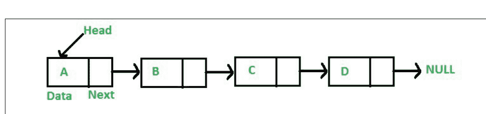

可以使用多种类型的链表，上图所示的是单链表。
例如，假设我们有一个名为 `list1[]` 的数组，其中包含一个已排序的 ID 集合。

`List1[] = [2000, 2020, 2050, 3000, 3040]`
并且因为你想在 `List1` 中添加一个新元素 `2005`，我们将不得不移动 `1000` 之后的所有组件以保持排序顺序（不包括 `2000`）。

```
代码：
# 定义节点类
class Node:
    def __init__(self, data):
        self.Nodedata = data
        self.nextNode = None
        # next 初始化为 none
class LinkedList: #链表类
    def __init__(self):
        self.Listhead = None
```

输出：
没有输出，因为这只是在创建类，而不是对象，也没有返回任何东西。

你可以通过以下方式创建一个链表对象：

```
class Node:
    def __init__(self, data):
        self.data = data
        self.next = None
class LinkedList:
    def __init__(self):
        self.head = None
# 主代码开始：
if __name__=='__main__':
    # 创建空列表对象
    list1 = LinkedList()
    list1.head = Node(1)
    second = Node(2)
    third = Node(3)
```

"""
    已经创建了三个节点。但还不是链表，因为节点之间没有链接
    对三个块的引用分别定义为 head、second 和 third

```
list1.head.next = second; # 这将第一个头节点链接到第二个节点
second.next = third; # 将第二个节点链接到第三个
```

输出：
这同样没有输出，但创建了一个包含 3 个节点的链表。

##### 遍历

我们在上一个程序中生成了一个包含 3 个节点的基本链表。让我们遍历这个列表并显示每个节点的信息。让我们创建一个通用的 `printList()` 函数来显示任何给定的列表以进行遍历。

```
class Node:
    def __init__(self, data):
        self.data = data
        self.next = None
class LinkedList:
    def __init__(self):
        self.head = None
    def display(self): #这里添加显示函数
        temp = self.head #将头节点初始化为临时节点
        while (temp): #当临时节点存在（不为 none）时
            print (temp.data) #显示节点数据
            temp = temp.next #移动到下一个节点
if __name__ =='__main__':
    list1 = LinkedList() #创建对象
    list1.head = Node(1)
    second = Node(2)
    third = Node(3)
    list1.head.next = second; #链接
    second.next = third; #链接
    list1.display() #调用显示方法
```

输出：


##### 插入新节点

探讨了向链表添加新节点的各种方法。

有三种添加节点的方法。

- 1. 链表的第一个项目

代码：

```
class Node:
    def __init__(self, data):
        self.data = data
        self.next = None
class LinkedList:
    # 初始化链表对象的函数
    def __init__(self):
        self.head = None
    def display(self): #显示函数
        temp = self.head
        while (temp):
            print (temp.data)
            temp = temp.next
    def push(self, new_data): #插入添加
        new_node = Node(new_data) #将新数据添加到新节点中
        new_node.next = self.head #将新节点的 next 指针链接到当前头节点
        self.head = new_node #使新节点成为新的头节点
linkedL=LinkedList()
linkedL.push(5)
linkedL.push(3)
linkedL.push(1)
linkedL.display()
```

输出：


- 2. 在某个节点之后：

代码：

```
class Node:
    def __init__(self, data):
        self.data = data
        self.next = None
class LinkedList:
    # 初始化链表对象的函数
    def __init__(self):
        self.head = None
    def display(self): #显示函数
        temp = self.head
        while (temp):
            print (temp.data)
            temp = temp.next
    def push(self, new_data): #在头部插入
        new_node = Node(new_data) #将新数据添加到新节点中
        new_node.next = self.head #将新节点的 next 指针链接到当前头节点
        self.head = new_node #使新节点成为新的头节点
    def insertAfter(self, prev_nodedata, new_data):  #在给定位置插入
        temp=self.head #将头节点存储在 temp 中
        prevnode=None
        while (temp): #当节点存在时
            if temp.data==prev_nodedata: #找到新节点必须在其后插入的节点
                prevnode=temp #一旦找到，存储在 prevnode 中
            temp=temp.next#遍历
        if prevnode==None:
            print("此元素在链表中不存在。") #如果未找到，则它不存在
        new_node = Node(new_data)  #一旦找到，创建一个新节点
        new_node.next = prevnode.next #链接节点
        prevnode.next = new_node #存储节点

linkedL=LinkedList()
linkedL.push(5)
linkedL.push(3)
linkedL.push(1)
linkedL.insertAfter(3,9)#在 3 之后插入 9
linkedL.display()
输出：
```


- 3. 在末尾

```
代码：
class Node:
    def __init__(self, data):
        self.data = data
        self.next = None
class LinkedList:
    # 初始化链表对象的函数
    def __init__(self):
        self.head = None
    def display(self): #显示函数
        temp = self.head
        while (temp):
            print (temp.data)
            temp = temp.next
    def push(self, new_data): #在头部插入
        new_node = Node(new_data) #将新数据添加到新节点中
        new_node.next = self.head #将新节点的 next 指针链接到当前头节点
        self.head = new_node #使新节点成为新的头节点
    # 此函数在链表类定义中解释
    # 在列表末尾添加一个新元素。此操作定义在上面显示的 LinkedList 类内部 */
    def append(self, new_data):
        new_node = Node(new_data)
        if self.head is None:
            self.head = new_node
            return
        last = self.head
        while (last.next):
            last = last.next
        last.next = new_node
linkedL=LinkedList()
linkedL.push(5)
linkedL.push(3)
linkedL.push(1)
linkedL.append(0)#在末尾插入 0
linkedL.display()
输出：
```


##### 删除节点

为了理解删除过程，让我们制定一个问题陈述：删除第一个出现的“键”。
假设有一个包含少量条目的链表。我们的目标是创建一个函数，从集合中移除指定的节点。因此，如果列表以 `1 3 5 7 9` 开始，删除 `3` 后，它将变为 `1 5 7 9`。
考虑指针 `node`，它指向要销毁的节点。要删除该节点，我们必须执行以下步骤。

- `node.next.val = node.val`
- `node.next.next = node.next.next`

```
代码：
class node:#创建节点类
    def __init__(self, data, next = None):
        self.value = data
        self.nextPtr = next
#函数创建列表
def make(nodes):
    head = node(nodes[0])
    for nodes in nodes[1:]:
        ptr = head
        while ptr.nextPtr:
            ptr = ptr.nextPtr
        ptr.nextPtr = node(nodes)
    return head
#遍历列表
def printL(head):
    ptr = head
    print('链表：[', end = "")
    while ptr:
        print(ptr.value, end = ", ")
        ptr = ptr.nextPtr
    print(']')
class deletionclass(object):#用于删除的类
    def deleteNode(self, node, data):#void 类型函数
        while node.value is not data:
            node = node.nextPtr
        node.value = node.nextPtr.value
        node.nextPtr = node.nextPtr.nextPtr
LL = make([0,34,1,4,9,10])#将 0, 34, 1, 4, 9, 10 作为链表传递
printL(LL) #遍历初始列表
delHere = deletionclass() #为 deletionclass 创建名为 delHere 的对象
delHere.deleteNode(LL, 4) #将链表 LL 和要删除的值 4 传递给方法 deleteNode
printL(LL) #遍历新列表
输出：
```

```
链表：[0, 34, 1, 4, 9, 10, ]
链表：[0, 34, 1, 9, 10, ]
```

##### 搜索给定值

当用户在给定链表中输入任何值时，搜索该值，如果存在则返回 true，否则返回 false。

代码：

### 12.3：非线性数据结构

本节讲解树等非线性数据结构。

#### 12.3.1：树

这是一种每个成员最多有两个子节点的树结构。由于每个元素最多只能有两个子节点，它们通常被称为左子节点和右子节点。

组成部分：

- 数据
- 指向右子节点的指针
- 指向左子节点的指针

树的根节点是最高层的节点。紧接在某个元素下方的组件被称为其子节点。其父节点是正好位于它上方的元素。例如，'a' 是 'f' 的子节点，而 'f' 是 'a' 的父节点。最后，没有子节点的组件被称为叶子节点。

树类代码：

```python
class Node:
    def __init__(self,key):
        self.left = None #left node
        self.right = None #right node
        self.val = key
root = Node(2) #create object
root.left   = Node(9);
root.right  = Node(1);
root.left.left = Node(4);
"""
        2
       / \
      9   1
     / \ / \
    4  None None None
   /
  None None"""
```

##### 二叉树的类型

###### 满二叉树

满二叉树是指每个节点都有 0 或 2 个子节点的二叉树。下面的示例展示了一棵满二叉树，其中除叶子节点外，所有节点都有两个子节点。

```python
class Node:
    def __init__(self, item):
        self.item = item
        self.leftnode = None
        self.rightnode = None
def FullTree(root):
    # Tree in empty case
    if root is None:
        return True
    # Check if child present
    if root.leftnode is None and root.rightnode is None:
        return True
        if root.leftnode is not None and root.rightnode is not None:
#recursively call to check for every node
            return (FullTree(root.leftnode) and FullTree(root.rightnode))
        return False
root = Node(2) #creating tree
root.rightChild = Node(4)
root.leftChild = Node(3)
root.leftChild.leftChild = Node(5)
root.leftChild.rightChild = Node(6)
root.leftChild.rightChild.leftChild = Node(7)
root.leftChild.rightChild.rightChild = Node(8)
if FullTree(root): #if true returned
    print("tree is a full binary tree")
else: #if false returned
    print("tree is not full binary tree")
```

###### 完全二叉树

当每一层都被完全填满，除了最后一层可能从左开始填充时，它类似于满二叉树，但有两个显著区别。

- 完全二叉树不一定是满二叉树，因为最后一个叶子元素可能没有右兄弟节点。
- 所有叶子节点必须都向左倾斜。

代码：

```python
# Checking if complete
class Node:

    def __init__(self, item):
        self.item = item
        self.left = None
        self.right = None
    def count(root): #count the nodes
        if root is None:
            return 0
        return (1 + count(root.left) + count(root.right))#recursive call to count
    # Check if complete
    def complete(root, index, numberNodes): #pass parameters root index and number of nodes in tree
        # in case tree is empty
        if root is None:
            return True
        if index >= numberNodes: #if the index is greater than total number of nodes
            return False
        return (complete(root.left, 2 * index + 1, numberNodes)#otherwise return recursive call
                and complete(root.right, 2 * index + 2, numberNodes))

    root = Node(2) #create tree
    root.left = Node(3)
    root.right = Node(4)
    root.left.left = Node(5)
    root.left.right = Node(6)
    root.right.left = Node(7)
    node_count = count(root)
    index = 0
    if complete(root, index, node_count):
        print("The tree complete binary tree")
    else:
        print("The tree not a complete binary tree")
```

输出：

# The tree complete binary tree

###### 满二叉树

满二叉树是指每个内部节点恰好有两个子节点，并且所有叶子节点都处于同一层级的二叉树。所有内部节点的度数为 2。
满二叉树可以作为递归的准确且有用的信息：

1. 当单个节点没有子节点时，形成高度 h = 0。
2. 如果一个节点的两个子树也都是高度 h - 1 且不重叠。

###### 满二叉树定理

- 高度 h 有 $2^{h+1} - 1$ 个节点。
- 节点的平均深度为 $\Theta(\ln(n))$。
- n 个节点的高度为 $\log(n+1) - 1 = \Theta(\ln(n))$。
- 高度 h 有 $2^h$ 个叶子节点。

代码：

```python
# if a binary tree is perfect
class newNode:
    def __init__(self, k):
        self.key = k
        self.right = self.left = None

# To calculate depth
def calcDepth(node):
    a = 0
    while (node is not None):
        a += 1
        node = node.left
    return a

# Check if perfect binary tree
def perfect(root, d, level=0):
    # in empty tree case
    if (root is None):
        return True
    # presence of trees
    if (root.left is None and root.right is None):
        return (d == level + 1)
    if (root.left is None or root.right is None):
        return False
    return (perfect(root.left, d, level + 1) and
            perfect(root.right, d, level + 1))

root = None
root = newNode(2)
root.left = newNode(3)
root.right = newNode(4)
root.left.left = newNode(5)
root.left.right = newNode(6)
if (perfect(root, calcDepth(root))):
    print("The tree is perfect binary tree")
else:
    print("The tree not perfect")
```

###### 平衡二叉树

如果高度为 O(log n)，其中 n 是节点总数，则称其为高度平衡。例如，AVL 树通过确保左右子树的高度差不超过 1 来维持 O(log n) 的高度。红黑树通过确保从每个根到叶子的路径上节点比例相同且不存在相邻的红色节点来保持其高度恒定。即使是二叉搜索树也提供高性能，因为它们在 O(log n) 时间内进行搜索、插入和删除。
高度平衡二叉树的标准如下：

- 左子树是平衡的。
- 另一个子树是平衡的。
- 如果对于每个节点，左右子树之间的差异不超过一个。

代码：

```python
# Checking if balance
class Node:
    def __init__(self, data):
        self.data = data
        self.left = self.right = None
class Height: #class for height checking
    def __init__(self):
        self.height = 0
def HeightBalanced(root, height):
    left_height = Height()#height for both sides of tree
    right_height = Height()
    if root is None:#if empty
        return True
    left = HeightBalanced(root.left, left_height)#recursively call to find
    right = HeightBalanced(root.right, right_height)
```

height.height = max(left_height.height, right_height.height) + 1
#逐节点递增
if abs(left_height.height - right_height.height) <= 1:
    return left and right
return False
height = Height()#创建高度对象
root = Node(2)#创建树
root.left = Node(3)
root.right = Node(4)
root.left.left = Node(5)
root.left.right = Node(6)
if HeightBalanced(root, height): #如果为真
    print('是平衡的')
else:
    print('不平衡')
输出：


##### 二叉搜索树

二叉搜索树数据结构使我们能够在短时间内维护一个有序的整数列表。因为每个树节点最多只能有两个子节点，所以被称为二叉树。它可用于在 O(log(n)) 时间内检查大量元素的存在性。
二叉搜索树区别于普通二叉树的物理特性如下：

- 左子树的所有节点都小于根节点。
- 根节点大于右子树的所有节点。
- 每个节点的子树同样是二叉搜索树，具有与该节点相同的两个属性。

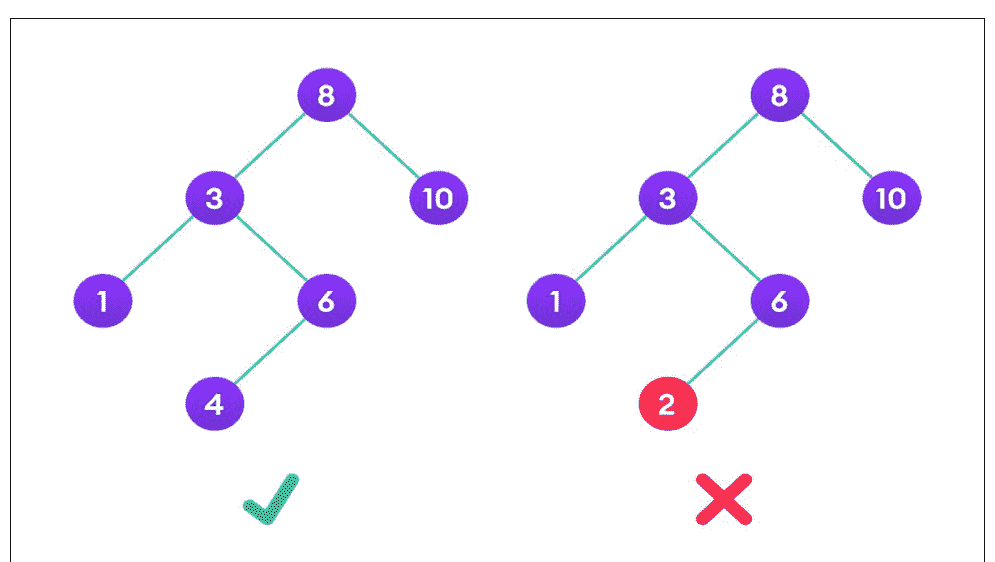

为了说明一个右子树包含一个比根节点小的值的树不是合法的二叉搜索树，图中展示了一个右子树包含一个比根节点小的值的树。

##### 搜索操作

该方法基于二叉搜索树的特性：每个左子树的值都小于根节点，每个右子树的值都大于根节点。

如果数字小于根节点，我们可以确定它不在右子树中；我们只需要在左子树中查找。如果值大于根节点，我们可以确定它不在左子树中；我们只需要在右子树中查找。

```
使用的算法：
如果 root == NULL
返回 NULL;
如果 number == root->data
返回 root->data;
如果 number < root->data
返回 search(root->left)
如果 number > root->data
返回 search(root->right)
```

##### 插入节点

目标是使用队列以层序遍历方式迭代遍历给定的树。如果一个节点的左子节点为空，我们创建一个新的键作为该节点的左子节点。如果一个节点的右子节点为空，我们将新键作为其右子节点。我们继续遍历树，直到找到一个左或右子节点为空的节点。

代码：

```
# 在二叉树中插入元素的程序
class newNode():
    def __init__(self, data):
        self.key = data
        self.left = None
        self.right = None
#二叉树的中序遍历
def inorder(temp):
    if (not temp):
        return
    inorder(temp.left)
    print(temp.key,end = " ")
    inorder(temp.right)
#插入新节点
def insert(temp,key):
    if not temp:
        root = newNode(key)
        return
    q = []
    q.append(temp)
    while (len(q)):
        temp = q[0]
        q.pop(0)
        if (not temp.left):
            temp.left = newNode(key)
            break
        else:
            q.append(temp.left)
        if (not temp.right):
            temp.right = newNode(key)
            break
        else:
            q.append(temp.right)
# 驱动代码
if __name__ == '__main__':
    root = newNode(11)
    root.left = newNode(12)
    root.left.left = newNode(8)
    root.right = newNode(10)
    root.right.left = newNode(16)
    root.right.right = newNode(9)
    print("插入前的遍历:", end = " ")
    inorder(root)
    key = 12
    insert(root, key)
    print()
    print("插入后的遍历:", end = " ")
    inorder(root)
```

输出：

```
插入前的遍历: 8 12 11 16 10 9
插入后的遍历: 8 12 12 11 16 10 9
```

##### 删除节点

从二叉树中删除一个节点，需要确保树从下往上缩减（即，被删除的节点被叶子节点和最右侧节点替换）。这与删除二叉搜索树不同。因为在这种情况下，元素之间没有顺序，我们将其替换为最后一个元素。

1. 从根节点开始，找到二叉树中最底层和最右侧的元素，以及我们希望删除的节点。
2. 用最深层最右侧节点的数据替换要删除节点的数据。
3. 然后删除最底层最右侧的节点。

代码：

```
class Node:
    def __init__(self,data):
        self.data = data
        self.left = None
        self.right = None
def inorder(temp):
    if(not temp):
        return
    inorder(temp.left)
    print(temp.data, end = " ")
    inorder(temp.right)
def deleteDeepest(root,d_node): #删除最深层节点
    q = [] #创建空列表
    q.append(root) #添加根节点
    while(len(q)): #直到列表结束
        temp = q.pop(0)
        if temp is d_node:
            temp = None
            return
        if temp.right:
            if temp.right is d_node:
                temp.right = None
                return
            else:
                q.append(temp.right)
        if temp.left:
            if temp.left is d_node:
                temp.left = None
                return
            else:
                q.append(temp.left)
#删除节点
def deletion(root, key):
    if root == None :
        return None
    if root.left == None and root.right == None:
        if root.key == key :
            return None
        else :
            return root
    key_node = None
    q = []
    q.append(root)
    temp = None
    while(len(q)):
        temp = q.pop(0)
        if temp.data == key:
            key_node = temp
        if temp.left:
            q.append(temp.left)
        if temp.right:
            q.append(temp.right)
    if key_node :
        x = temp.data
        deleteDeepest(root,temp)
        key_node.data = x
    return root
# 驱动代码
if __name__=='__main__':
    root = Node(11)
    root.left = Node(12)
    root.left.left = Node(8)
    root.left.right = Node(13)
    root.right = Node(10)
    root.right.left = Node(16)
    root.right.right = Node(9)
    print("删除前:")
    inorder(root)
    key = 12
    root = deletion(root, key)
    print()
    print("删除后:")
    inorder(root)
```

输出：

```
删除前:
8 12 13 11 16 10 9
删除后:
8 9 13 11 16 10
```

如果要删除的实体本身就是最深层的节点，上述代码将无法工作，因为在任务 `deleteDeepest(root, temp)` 完成操作后，关键节点被删除（因为关键节点等于 temp），然后用最深层节点的数据（temp 的数据）替换关键节点的数据会导致运行时错误。

# 第13章

## PYTHON 游戏项目

### 13.1：带源码的PYTHON马里奥游戏

这个马里奥游戏是在Python解释器中创建的。这个游戏代码是基于图形用户界面模式，使用PyGame库运行。关于游戏玩法，它是一个单人Python游戏，玩家（马里奥）必须躲避从飞龙中喷出的火球。每一关都会带来更多的麻烦。随着关卡的提升，区域会变得越来越小。在这个精彩的马里奥Python教程中，你将学习如何用Python创建一个很棒的马里奥视频游戏。

这个Python马里奥视频游戏程序提供了简单易用的图形用户界面。游戏布局非常简洁，用户不会觉得难以使用和理解。在开发这个游戏设计时使用了多种图像。游戏氛围就像马里奥视频游戏一样。

无论如何，如果你想提升你的编程技能，特别是Python视频游戏方面，可以尝试这个项目。

要开始用Python创建这个马里奥视频游戏，请确保你的电脑上已经下载了PyCharm IDE。

### 13.2：如何用PYTHON制作马里奥视频游戏的步骤

**阶段1：创建你的项目名称。**
首先，打开 **PyCharm IDE**，然后创建你的“**项目名称**”，创建项目名称后，点击“**创建**”图标。

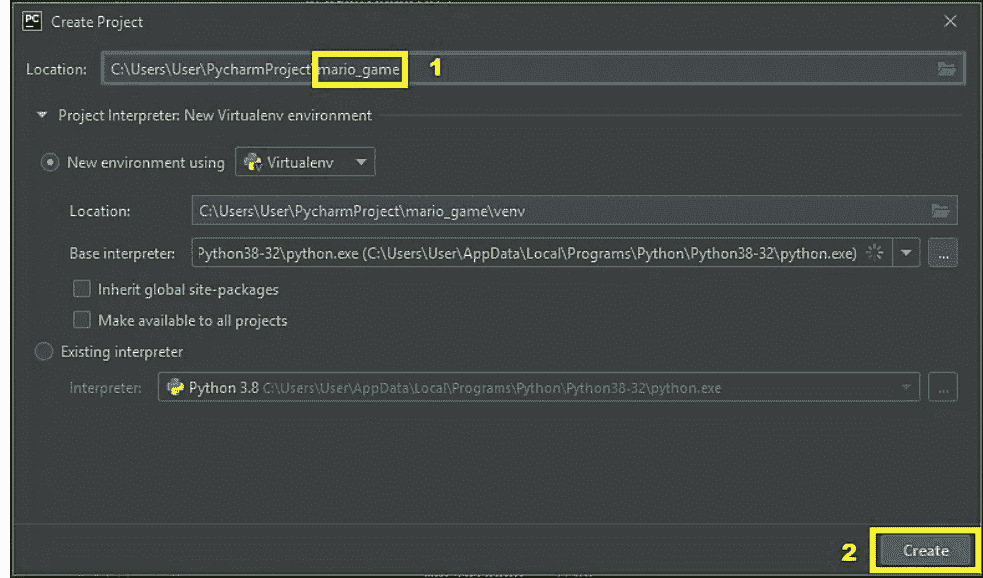

**阶段2：创建你的Python文件。**
接下来，创建项目名称后，“右键点击”项目名称，然后点击“新建”，之后，点击“python文件”。

#### 步骤 3：命名 Python 文件。

接下来，在创建 Python 文件后，点击“回车”键为其命名。

#### 阶段 4：实际代码。

你现在可以复制带有详细注释的代码。这将帮助你轻松理解代码的深度和逻辑。

### 13.3：导入库的代码

```python
import pygame #importing pygame library
import sys #importing system library
```

### 13.4：初始化与函数声明的代码

```python
pygame.init() #initialization
WINDOW_WIDTH = 1200 #setting for window
WINDOW_HEIGHT = 600
FPS = 20
BLACK = (0, 0, 0)
GREEN = (0, 255, 0)
ADD_NEW_FLAME_RATE = 25
cactus_img = pygame.image.load('cactus_bricks.png')
cactus_img_rect = cactus_img.get_rect()
cactus_img_rect.left = 0
fire_img = pygame.image.load('fire_bricks.png')
fire_img_rect = fire_img.get_rect()
fire_img_rect.left = 0
CLOCK = pygame.time.Clock()
font = pygame.font.SysFont('forte', 20)
canvas = pygame.display.set_mode((WINDOW_WIDTH, WINDOW_HEIGHT))
pygame.display.set_caption('Mario')

class Top_score: #creating top score class
    def __init__(self): #constructor initialized
        self.high_score = 0 #initializing with 0
    def topscore_(self, score): #function defined
        if score > self.high_score:
            self.high_score = score
        return self.high_score #returned

tp = Top_score() #object created

class Dra_gon: #class created
    dragon_velocity = 10
    def __init__(self):
        self.dragon_img = pygame.image.load('dragon.png') #getting images
        self.dragon_img_rect = self.dragon_img.get_rect()
        self.dragon_img_rect.width -= 10
        self.dragon_img_rect.height -= 10
        self.dragon_img_rect.top = WINDOW_HEIGHT/2
        self.dragon_img_rect.right = WINDOW_WIDTH
        self.up = True
        self.down = False

    def edit(self): #function defined
        canvas.blit(self.dragon_img, self.dragon_img_rect)
        if self.dragon_img_rect.top <= cactus_img_rect.bottom: #if else statement used
            self.up = False
            self.down = True
        elif self.dragon_img_rect.bottom >= fire_img_rect.top:
            self.up = True
            self.down = False
        if self.up:
            self.dragon_img_rect.top -= self.dragon_velocity
        elif self.down:
            self.dragon_img_rect.top += self.dragon_velocity

class Flames_: #class created again
    flames_velocity = 20
    def __init__(self): #constructor
        self.flames = pygame.image.load('fireball.png') #getting images
        self.flames_img = pygame.transform.scale(self.flames, (20, 20))
        self.flames_img_rect = self.flames_img.get_rect()
        self.flames_img_rect.right = dragon.dragon_img_rect.left
        self.flames_img_rect.top = dragon.dragon_img_rect.top + 30

    def edit(self): #function called
        canvas.blit(self.flames_img, self.flames_img_rect) #setting images
        if self.flames_img_rect.left > 0:
            self.flames_img_rect.left -= self.flames_velocity

class Mario_: #class created of Mario
    velocity = 10
    def __init__(self): #constructor called
        self.mario_img = pygame.image.load('maryo.png') #getting images
        self.mario_img_rect = self.mario_img.get_rect()
        self.mario_img_rect.left = 20
        self.mario_img_rect.top = WINDOW_HEIGHT/2 - 100
        self.down = True
        self.up = False

    def edit(self): #function defined
        canvas.blit(self.mario_img, self.mario_img_rect)
        if self.mario_img_rect.top <= cactus_img_rect.bottom:
            gameover() #function called
            if SCORE > self.mario_score:
                self.mario_score = SCORE
        if self.mario_img_rect.bottom >= fire_img_rect.top:
            gameover() #function called
            if SCORE > self.mario_score:
                self.mario_score = SCORE
        if self.up:
            self.mario_img_rect.top -= 10
        if self.down:
            self.mario_img_rect.bottom += 10

def gameover(): #function defined
    pygame.mixer.music.stop()
    music = pygame.mixer.Sound('mario_dies.wav')
    music.play()
    tp.topscore_(SCORE) #function called with object name
    game_over_img = pygame.image.load('end.png')
    game_over_img_rect = game_over_img.get_rect()
    game_over_img_rect.center = (WINDOW_WIDTH/2, WINDOW_HEIGHT/2)
    canvas.blit(game_over_img, game_over_img_rect)
    while True: #loop forever
        for event in pygame.event.get():
            if event.type == pygame.QUIT:
                pygame.quit()
                sys.exit()
            if event.type == pygame.KEYDOWN:
                if event.key == pygame.K_ESCAPE:
                    pygame.quit()
                    sys.exit()
                    music.stop()
        game_loop()
        pygame.display.update()
```

### 13.5：游戏启动的代码

```python
def start_the_game(): #start function
    canvas.fill(BLACK)
    start_img = pygame.image.load('start.png') #adding images
    start_img_rect = start_img.get_rect()
    start_img_rect.center = (WINDOW_WIDTH/2, WINDOW_HEIGHT/2)
    canvas.blit(start_img, start_img_rect)
    while True: #loop forever
        for event in pygame.event.get(): #for loop used
            if event.type == pygame.QUIT: #use of if else statement
                pygame.quit()
                sys.exit()
            if event.type == pygame.KEYDOWN:
                if event.key == pygame.K_ESCAPE:
                    pygame.quit()
                    sys.exit()
        gameloop() #function called
        pygame.display.update()
```

### 13.6：游戏关卡的代码

```python
global LEVEL  #global variable
if SCORE in range(0, 10):
    cactus_img_rect.bottom = 50
    fire_img_rect.top = WINDOW_HEIGHT - 50
    LEVEL = 1
elif SCORE in range(10, 20):
    cactus_img_rect.bottom = 100
    fire_img_rect.top = WINDOW_HEIGHT - 100
    LEVEL = 2
elif SCORE in range(20, 30):
    cactus_img_rect.bottom = 150
    fire_img_rect.top = WINDOW_HEIGHT - 150
    LEVEL = 3
elif SCORE > 30:
    cactus_img_rect.bottom = 200
    fire_img_rect.top = WINDOW_HEIGHT - 200
    LEVEL = 4
```

### 13.7：游戏主模块的代码

```python
def gameloop(): #function defined
    while True: #loop forever
        global dragon
        dragon = Dra_gon() #object created
        flame = Flames_() #object created
        mario = Mario_() #object created
        add_new_flame_counter = 0
        global SCORE
        SCORE = 0
        global HIGH_SCORE
        flames_list = []
        pygame.mixer.music.load('mario_theme.wav')
        pygame.mixer.music.play(-1, 0.0)
        while True:
            canvas.fill(BLACK)
            check_level(SCORE)
            dr.edit() #function called
            add_new_flame_counter += 1
            if add_new_flame_counter == ADD_NEW_FLAME_RATE:
                add_new_flame_counter = 0
                new_flame = Flames()
                flames_list.append(new_flame)
            for f in flames_list:
                if f.flames_img_rect.left <= 0:
                    flames_list.remove(f)
                    SCORE += 1
                f.edit()
            for event in pygame.event.get():
                if event.type == pygame.QUIT:
                    pygame.quit()
                    sys.exit()
                if event.type == pygame.KEYDOWN:
                    if event.key == pygame.K_UP:
                        mario.up = True
                        mario.down = False
                    elif event.key == pygame.K_DOWN:
                        mario.down = True
                        mario.up = False
                if event.type == pygame.KEYUP:
                    if event.key == pygame.K_UP:
                        mario.up = False
                        mario.down = True
                    elif event.key == pygame.K_DOWN:
                        mario.down = True
                        mario.up = False
            score_font = font.render('Score:'+str(SCORE), True, GREEN)
            score_font_rect = score_font.get_rect()
            score_font_rect.center = (200, cactus_img_rect.bottom + score_font_rect.height/2)
            canvas.blit(score_font, score_font_rect)
            level_font = font.render('Level:'+str(LEVEL), True, GREEN)
            level_font_rect = level_font.get_rect()
            level_font_rect.center = (500, cactus_img_rect.bottom + score_font_rect.height/2)
            canvas.blit(level_font, level_font_rect)
            top_score_font = font.render('Top Score:'+str(topscore.high_score),True,GREEN)
            top_score_font_rect = top_score_font.get_rect()
            top_score_font_rect.center = (800, cactus_img_rect.bottom + score_font_rect.height/2)
            canvas.blit(top_score_font, top_score_font_rect)
            canvas.blit(cactus_img, cactus_img_rect)
            canvas.blit(fire_img, fire_img_rect)
            mario.edit()
            for f in flames_list:
                if f.flames_img_rect.colliderect(mario.mario_img_rect):
                    game_over()
                    if SCORE > mario.mario_score:
                        mario.mario_score = SCORE
            pygame.display.update()
```

### 输出


### 实现

提供的第一段代码是导入所有必需的库。下一个模块是马里奥游戏的开始界面。再下一个模块是游戏关卡，如果你完成了特定关卡的挑战。下一个模块是视频游戏的核心模块，包含布尔值、其他循环和条件语句。再下一个模块是游戏结束窗口的用户界面。创建类是为了保持数据私有。定义并调用函数。创建对象以访问类的数据变量和成员函数。使用Pygame库可以轻松访问游戏功能。使用了`while true`语句、`if-else`语句、`for`循环和`do while`循环。

# 总结

这个用Python编写的马里奥视频游戏是在Python解释器中创建的。Python在学习语法方面极其流畅，其可读性高，并且可以减少开发中的时间消耗。此外，本指南是初学者或本科生提高其编码分析能力的最简单方法。

# 后记

Python是一种功能强大的通用编程语言，它也是一种解释型语言，可用于各种任务，如网页开发、游戏创建、深度学习和数据分析。

由于机器学习和人工智能等技术的发展，Python的受欢迎程度正在快速增长，这为那些希望成为Python开发者的人扩大了前景。作为额外优势，Python是一门非常适合初学者的语言，因为它简单易学且易于理解。

本书涵盖了广泛的主题，从最基本的问题（如“什么是Python？”）开始，逐步深入到复杂Python工具的使用，例如数据结构、方法和游戏编程项目。因此，它既适合初学者，也适合有经验的读者。

此外，读者可以通过检查书中每章每节提供的示例来测试自己对特定主题的理解。书中包含了数据类型、算法和问题解决技术的概要，便于复习。

此外，本书分为两部分：前半部分将教你Python编程的基础知识，包括变量初始化、数据类型、条件语句、函数、列表、字典、字符串操作等，以及如何在Python中创建自己的模块；后半部分将教你高级Python编程概念，包括数据结构（如浮点数、字符串、列表、元组、数组）和算法；搜索树、冒泡排序、归并排序、选择排序和快速排序。第二部分还将涵盖面向对象编程原则，如多态性、封装、继承、多重继承和运算符重载。书中还包含一个单独的运算符重载模块，解释了其必要性以及如何在Python编程语言中使用它。

第二部分将介绍面向对象编程的基础知识，如多态性、封装、继承、多重继承和运算符重载。第二部分还将介绍如何使用数据库。此外，它还包括一个单独的运算符重载模块，解释了其必要性以及如何在Python中使用它。另外，它还包括搜索树、冒泡排序、归并排序、选择排序和快速排序等内容。最后但同样重要的是，它包含了Python游戏编程项目。

这本关于Python编程基础的书只是培养程序员能力的第一步。你已经解决了所有提供的示例，这一事实表明你已经获得了使用Python编程语言在基本编程概念方面的重要专业知识。你即将开始对编程的深入研究，在这个过程中，你将完善你的算法思维能力，并随后增加关于Python编程语言的技术知识。