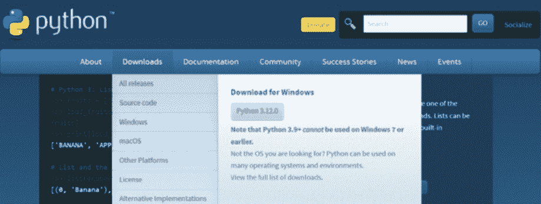
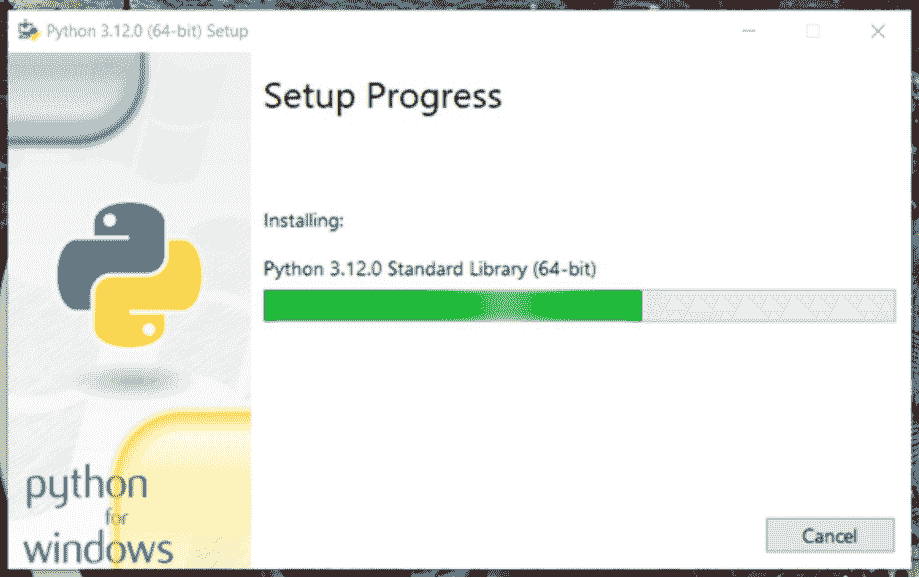
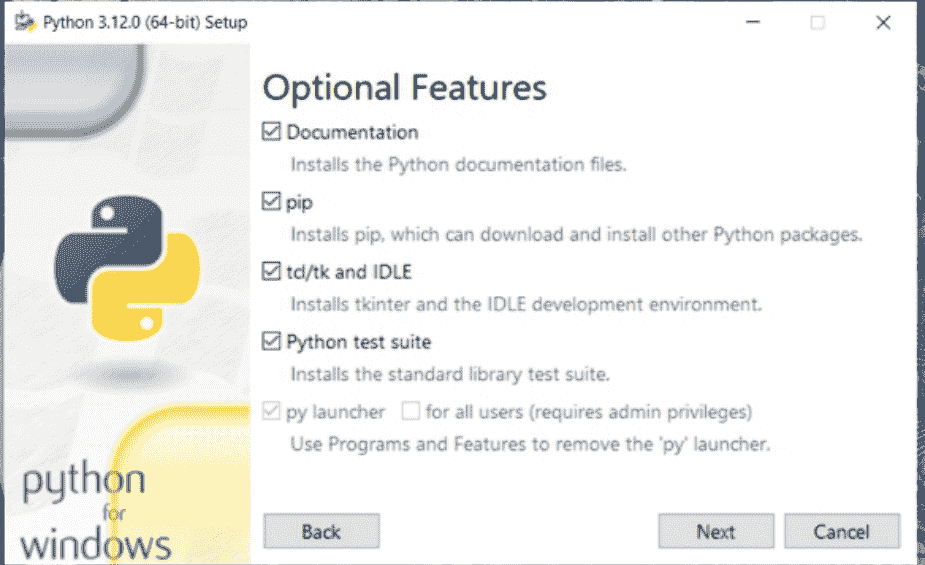
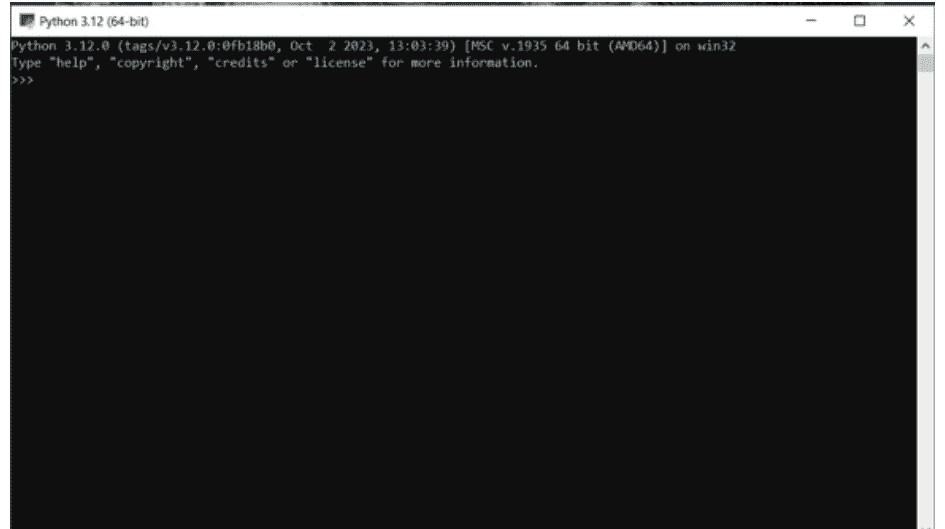
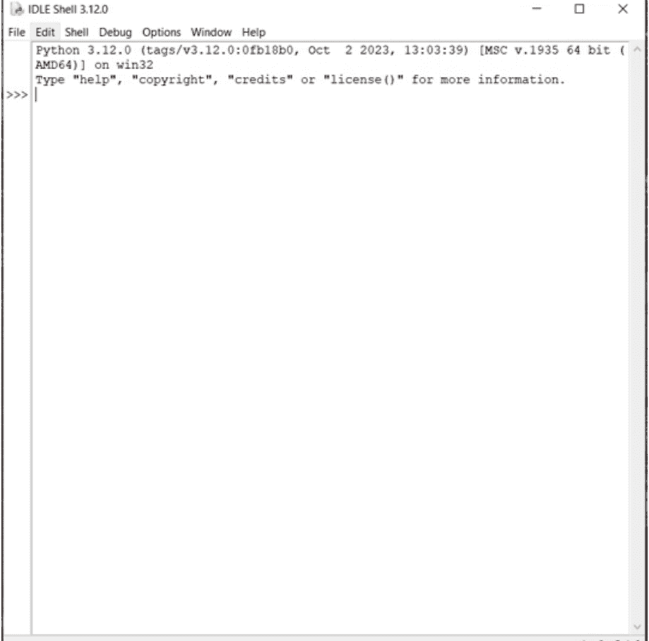
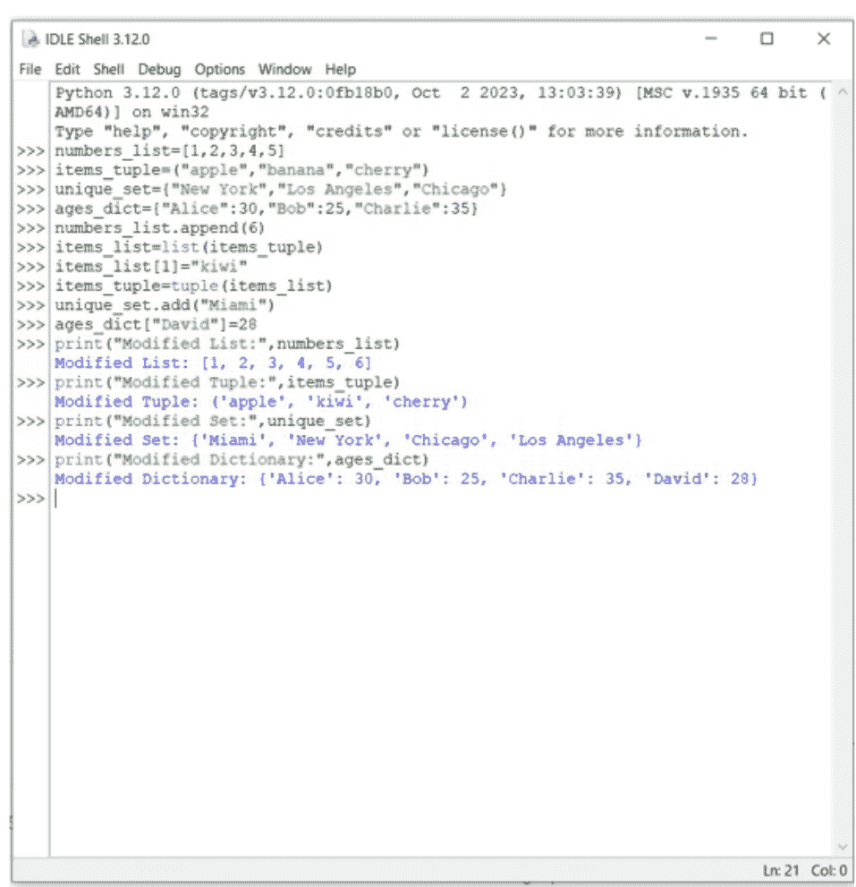

# PYTHON

# 2024

NARRY PRINCE

# 教程

# 编程技巧

# & 案例研究

# Python编程入门

从基础到AI集成。5分钟图解教程、编程技巧、动手练习与案例研究，助您7天掌握Python并获得更高薪酬

**Narry Prince**

© 版权所有 2023 Narry Prince - 保留所有权利。

本文档旨在就所涵盖的主题和问题提供准确可靠的信息。出版物的销售基于出版商无需提供会计、官方许可或其他合格服务的理念。如需法律或专业建议，应咨询该领域的专业人士。

根据美国律师协会委员会和出版商与协会委员会共同接受和批准的原则声明，以电子方式或印刷格式复制、复制或传输本文档的任何部分均属非法。严禁录制本出版物，未经出版商书面许可，不得存储本文档。保留所有权利。

本文提供的信息据称真实且一致，对于因使用或滥用本文所含任何政策、流程或指示而导致的任何疏忽或其他责任，均由读者自行承担。在任何情况下，出版商均不对因本文信息直接或间接造成的任何赔偿、损害或金钱损失承担任何法律责任或指责。

相应作者拥有出版商未持有的所有版权。本文信息仅供参考，具有普遍性。信息的呈现不附带合同或任何类型的保证。所使用的商标未经任何同意，商标的出版未经商标所有者许可或支持。本书中的所有商标和品牌仅用于说明目的，归所有者所有，与本文档无关。

## 目录

- [引言](Introduction)
- [1. Python编程基础](1.%20The%20Fundamentals%20of%20Python%20Programming)
    - [Python中的属性与方法](The%20Attributes%20and%20Methods%20in%20Python)
- [2. 准备使用Python编程](2.%20Getting%20Ready%20To%20Program%20With%20Python)
    - [Shell、IDLE与脚本语法](Shell,%20IDLE,%20and%20Scripts%20Syntax)
    - [解决安装问题](Troubleshooting%20Installation%20Issues)
- [3. Python中的变量与运算符](3.%20Variables%20and%20Operators%20in%20Python)
    - [创建变量](Creating%20Variables)
    - [Python中的运算符](Operators%20in%20Python)
- [4. Python数据类型](4.%20Python%20Data%20Types)
    - [标签](Labels)
    - [应用变量](Applying%20Variables)
- [5. 深入解析列表、元组、集合与字典](5.%20Breaking%20Down%20Lists,%20Tuples,%20Sets,%20and%20Dictionaries)
    - [列表](Lists)
    - [元组](Tuples)
    - [集合](Sets)
    - [字典](Dictionaries)
- [6. Python中的函数、模块与文件](6.%20Functions,%20Modules,%20and%20Files%20in%20Python)
    - [函数](Functions)
    - [模块](Modules)
    - [Python中的文件](Files%20In%20Python)
- [7. 轻松掌握面向对象编程](7.%20Object-Oriented%20Programming%20Made%20Easy)
    - [类与对象的关系](The%20Relationship%20Between%20Classes%20and%20Objects)
    - [魔法方法](Magic%20Methods)
- [8. 使用多行语句创建你的第一个交互式程序](8.%20Your%20First%20Interactive%20Program%20Using%20Multiline%20Statements)
- [9. Python数据分析](9.%20Python%20for%20Data%20Analysis)
    - [为何使用Python进行数据分析](Why%20Use%20Python%20For%20Data%20Analysis)
    - [处理缺失数据](Handling%20Missing%20Data)
- [10. Python数据清洗](10.%20Python%20Data%20Munging)
    - [数据清洗的重要性](Why%20Data%20Munging%20Is%20Important)
- [11. Python数据清洗/整理练习](11.%20Python%20Data%20Munging/Wrangling%20Exercise)
- [12. 使用Python继承优化代码](12.%20Inheritance%20in%20Python%20to%20Clean%20Your%20Code)
    - [如何在代码中实现继承](How%20to%20Implement%20Inheritance%20in%20Code)
    - [Super方法](The%20Super%20Method)
- [13. 集成AI与Python程序](13.%20Integrating%20AI%20and%20Python%20Program)
    - [Python AI库](Python%20AI%20Libraries)
    - [定义智能——五大前提](Defining%20Intelligence—The%20Five%20Prerequisites)
    - [AI中的智能体与环境](Agents%20and%20Environments%20in%20AI)
- [14. 实现无缝编程的常用调试工具](14.%20Common%20Debugging%20Tools%20for%20Seamless%20Programming)
    - [Python调试工具](Python%20Debugging%20Tools)
    - [简单高效的调试工具](Simple%20But%20Effective%20Debugging%20Tools)
    - [调试最佳实践](Debugging%20Best%20Practices)
- [结论](Conclusion)

## 引言

当吉多·范罗苏姆在1991年发布Python时，他有一个目标：“创建一种人人都能使用的编程语言。”他希望Python成为一种简单直观的语言，其功能强大程度不亚于（甚至超过）那些复杂得多的编程语言竞争者。

范罗苏姆或许有过愿景，但Python的演变几乎肯定远超他的梦想。如今，这门编程语言已成为一种多功能、不可或缺的工具，见证了代码艺术的巅峰。功能性与可读性与创新完美结合，同时这门语言仍忠于其最初的承诺——简洁。

Python有时被描述为“编程语言中的瑞士军刀”，它确实超越了传统软件的界限，演变为一股强大的力量，为全球程序员改变了现代计算的面貌。从Web开发到科学研究、人工智能（AI）和数据分析，Python的适应性无边无际。

Python的一个显著特点是其优雅简洁的语法——与英语惊人地相似。正是这一特质使Python成为初学者的理想编程语言，因为它利用了人脑学习其他人类语言的能力。也正是这种“新语言”现象，使得理解Python及其编程内容变得容易。

对于那些想知道为什么要学习Python的人来说，Python在编程界的受欢迎程度呈指数级增长；这是有充分理由的。它具有众多优势，包括：

-   作为多用途语言的多功能性，是广泛应用程序的基础。
-   一个蓬勃发展的开发者社区和丰富的库与框架，为您提供大量资源。
-   简洁清晰的代码，使程序易于阅读并鼓励协作。
-   广泛的职业机会。在当今的经济和就业环境中，Python程序员需求量很大。
-   开源贡献；这意味着程序会随着时间的推移不断演进和完善。
-   可扩展性——这正是本书将向您介绍的内容——您可以从小处着手，逐步将您的项目构建为强大的企业级应用程序。

在*《INSERT BOOK NAME》*的篇幅中，您将学习如何释放Python的全部潜力。从构成其核心的基础概念，到将使您能够创建突破性解决方案的高级技术，您正站在解锁无限可能世界的门槛上。

准备好探索：

-   Python基础。
-   面向对象编程（OOP）。
-   Web开发。
-   数据操作与分析。
-   机器学习与人工智能。
-   自动化与脚本编写。
-   高级编程主题。

## 拥抱学习曲线

在你踏上Python学习之旅前，有一条关键信息你需要了解：Python本质上是代码，而编程是一门艺术。如同其他任何艺术形式，它需要批判性思维、创造力和实验精神。虽然我们肯定会为你提供精通Python所需的分步指导、专家建议和实践练习，但你绝对有必要时常偏离既定路径。

我们鼓励你既要从呈现的理论中学习，也要通过自己的尝试、错误和失败来学习。为了真正内化Python的概念并培养解决问题的能力，你需要走那条少有人走的路。

不过，我们不希望你感到压力，因为Python正是这场伟大编程冒险的理想语言。它为你提供了平缓的学习曲线，同时又赋予你Python强大的工具和能力，这意味着你可以在实践中学习。

我们真诚地希望，读完本书时，你将完全有能力构建一个功能完备的Web应用程序，能够处理用户数据、从数据库检索信息并动态展示内容。交互式、响应式且优雅——这将是你掌握Python的终极目标。然而，这项成就只是你通往编程卓越之路的起点。

从机器学习到数据科学乃至更广阔的领域，准备好用Python的无限潜能改变你的生活、应用新技能、加速你的职业发展吧。

## 第一章

## Python编程基础

Python是一门建立在坚实基础之上，同时又为用户提供简洁性和易用性的编程语言。要成为Python编程爱好者，理解Python作为一门语言的内在工作原理至关重要。这正是我们将在第一章涵盖的内容，为你介绍将作为技能基础的基本原理和核心概念。

Python是一门解释型语言。这意味着代码由Python解释器逐行执行。这个过程遵循特定的顺序：

- **编写代码**——程序员使用文本编辑器或集成开发环境创建Python代码。这些指令以纯文本形式编写，但遵循Python的语法规则。
- **编译与解释：** 与C++或Java等其他编程语言不同，Python不需要单独的编译步骤。相反，你的代码被保存为.py文件。Python解释器直接读取并执行它。
- **运行解释器：** 接下来，你将通过从命令行调用Python解释器或使用为你处理执行的IDE来运行Python代码。解释器逐行读取你的代码并执行指定的操作。
- **即时反馈：** Python随后会为你提供即时反馈。如果代码中有错误，解释器会停止并显示错误信息。这个过程允许快速调试和学习，这样你就不必阅读成堆的代码。

### 在我们开始Python之前

在我们深入Python的细节之前，我有一份礼物送给你。我们知道阅读对一些读者来说可能是个挑战，因此我们为你准备了一本有声书。这本书将引导你学习《Python编程入门》的各个章节，让你在聆听和学习这门动态编程语言的同时，可以跟着一起编码。你只需扫描下方二维码即可获取免费有声书。


### Python中的属性和方法

在Python编程中，属性是与对象相关联的特征或特性。而对象则是Python的核心。

Python中的一切都是对象——当你在后续章节开始编程时，需要记住这一点。理解属性的一个简单方法是将它们等同于绑定到对象的变量。假设你有一个代表汽车的对象，它的属性可能包括颜色、品牌、型号和年份。你可以访问这些属性来获取关于对象的信息。

```python
class Car:
    def __init__(self, make, model, year):
        self.make = make
        self.model = model
        self.year = year

my_car = Car("Toyota", "Camry", 2023)
print(my_car.make) # Accessing the make attribute
```

另一方面，方法是与对象相关联的函数。这些方法定义了对象的行为，并允许你对其执行操作。让我们继续以汽车为例。

一个方法可以是`start_engine()`，用于启动汽车的引擎。方法在类中定义，并在类的实例上调用。

```python
class Car:
    def __init__(self, make, model, year):
        self.make = make
        self.model = model
        self.year = year
    def start_engine(self):
        print(f"The {self.year} {self.make} {self.model}'s engine is now running.")

my_car = Car("Toyota", "Camry", 2023)
my_car.start_engine() # Calling the start_engine method
```

一旦你理解了属性和方法是什么，你就可以开始组织Python面向对象编程语言的构建模块了。随着你在Python学习之旅中的进步，你将广泛使用它们来建模现实世界的概念，并创建强大的交互式应用程序。牢记这些基础知识，你将能更好地深入探索Python语言及其能力。

## Python的用途和能力

简洁性并非Python的唯一优势；它是一个极其多功能的编程工具。其语言被广泛应用于众多领域的各种应用中。这使其成为全球程序员的首选。让我们更仔细地看看Python的用途。

### 数学

一个常被忽视的Python应用领域是数学，这门编程语言已成为众多领域和应用中数学家、科学家和工程师的挚爱。其丰富的生态系统，包括NumPy、SciPy和SymPy，使其成为复杂数学和科学计算的首选语言，因为它能处理从符号数学到数据分析和可视化的所有任务。

### 软件开发

Python标志性的简洁性和可读性对于软件开发来说是极其宝贵的资产。从桌面应用创建到游戏，再到移动应用，Python提供了大量工具和库来简化开发流程。

### 系统脚本

在系统脚本方面，Python是天然的选择。其易用性和跨平台兼容性使其非常适合自动化系统级任务，包括文件管理、流程控制等等。

### Web开发——服务器端

在Web开发领域，Python拥有非常强大的存在感——主要是在服务器端。Django和Flask等框架使开发人员能够创建动态、功能丰富的Web应用程序。正是Python清晰的语法和强大的库，使其成为开发人员构建网站和网络服务的首选。

就Python的能力而言，这门编程语言被应用于多种应用，包括：

- 服务器上的Web应用程序，用于创建从简单到复杂的Web应用。利用Django等框架，开发人员可以轻松高效地构建功能丰富、可扩展的Web解决方案。
- Python可以集成到现有软件中，创建工作流程并确保重复性任务自动化。该程序在连接软件系统的各个组件方面表现出色，有助于提高效率和生产力。
- 从数据库连接的角度来看，Python可以无缝连接多种不同的数据库系统。这些包括MySQL、PostgreSQL、MongoDB等。Python可以读取和修改数据库中的数据，使其成为数据驱动应用的重要工具。
- Python擅长处理文件，因为它可以轻松读取、写入和操作存储在各种格式文件中的数据。这对于数据提取和报告生成至关重要。
- Python是数据处理的大师，当与Pandas和NumPy等库结合使用时，它能像冠军一样处理大数据。这门语言是数据分析和机器学习的绝对强者，确保其着眼于计算和编程的未来。
- Python清晰的语法和丰富的库使其非常适合快速原型设计。这意味着能够将你的想法转化为功能原型，鼓励你在投入大型或全面项目之前进行迭代、实验、学习和成长。
- 最后，Python不仅仅是一个原型设计软件。凭借其可扩展性和健壮性，它完全有能力生产直接投入使用的软件。

## 为何选择 Python

我们几乎已经准备好让你深入 Python 的世界了，但首先，让我们看看除了显而易见的就业机会外，Python 为何如此有用。

1.  Python 是平台无关的。这意味着它兼容各种操作系统，包括 Windows、macOS、Linux，甚至树莓派。
2.  其语法以清晰著称，正是这种简洁性使得开发者能够编写出易于维护和理解的代码。
3.  与 Python 同义的优雅语法，允许开发者用更少的实际代码实现更多功能。
4.  Python 的解释器系统在代码编写的瞬间就执行它。这意味着该语言促进了快速原型开发，使你能够快速测试和完善你的想法。
5.  Python 支持多种编程范式，这意味着在编码方面，无论你偏好哪种方式都无关紧要。从过程式到面向对象和函数式编程，Python 以其能够适应你的编码风格而自豪。

既然你已经了解了 Python 的*内容*和*原因*，我们可以开始探讨*如何*做，以便你能够轻松且富有创造力地开始编码。

## 第 2 章

## 准备用 Python 编程

你需要为开始 Python 编程打下坚实基础的一部分，包括使用哪个版本的 Python、如何安装解释器，以及其他几个关键因素。这将帮助你在探索 Python Shell 和 IDLE 时，能够适应你的 Python 环境。

## Python 2.x 与 Python 3.x

那么，在安装 Python 之前，你可能会想，“Python 2.x 和 Python 3.x 有什么区别？”

Python 的最新版本是 3.12.0（截至出版时）。你仍然可以下载 Python 2.7.17，但重要的是你要注意，这个版本已不再受支持。这意味着自 2020 年 1 月 1 日起，Python 2.x 就不再有新的错误报告、修复或更改了。

*本书将使用 Python 3.x。*

那么为什么版本 2.x 还存在呢？嗯，简单的答案是代码迁移。版本 2.x 和版本 3.x 之间的差异意味着，早期版本中使用的程序和脚本现在需要重新编码，以使其与新版本的 Python 兼容。

在处理使用版本 2.x 的较小程序时，代码迁移相当简单且容易。话虽如此，包含数千行代码的更复杂的程序可能会带来更大的麻烦。这两个程序版本之间的障碍来自于编程语言行为和语法的变化。

例如，如果你在 Python 2.x 中使用‘/’运算符除以 3 和 2，你将得到输出 1。如果你在 Python 3.x 中使用相同的运算符除以相同的数字，你将得到输出 1.5。

版本 3.x 无疑更高效，但由于上述问题，旧版本的 Python 仍然需要。在版本 2 的运行时环境中编写的大型程序迁移起来太繁琐，因此开发者没有费心进行过渡。如果你计划处理现有程序，那么我们建议使用版本 2.x，但友好提醒一下，本书及其练习将专注于版本 3.x。

## 安装解释器

Python 需要一个运行时环境和命令行解释器。当你从官方 Python 网站下载 Python 时，你的程序将包含这两者。在 Mac 和 Windows 上安装程序特别容易。

你只需访问网站 [www.python.org](https://www.python.org) (Python)，并从菜单栏中选择下载。



在这里，你会找到一个平台列表以及最新版本的 Python，可免费下载。

| 版本 | 操作系统 | 描述 | MD5 校验和 | 文件大小 | GPG | Sigstore |
|---|---|---|---|---|---|---|
| Gzipped source tarball | 源代码发布 | | d6eda3e1399cef5dfde7c4f319b0596c | 27195214 | SIG | .sigstore |
| XZ compressed source tarball | 源代码发布 | | f6f4616584b23254d165f4db90c247d6 | 20575020 | SIG | .sigstore |
| macOS 64-bit universal2 installer | macOS | 适用于 macOS 10.9 及更高版本 | edd96f35a3cbab9bf2f83b2875c5fc27 | 45371285 | SIG | .sigstore |
| Windows embeddable package (32-bit) | Windows | | c2047dc270c49369c64619bb193b721 | 9824586 | SIG | .sigstore |
| Windows embeddable package (64-bit) | Windows | | 8e24d2b26a8dfb1da0694b9da1a08b2c | 11030264 | SIG | .sigstore |
| Windows embeddable package (ARM64) | Windows | | 3da1fe1a86a8210a32ea99c709dd93 | 10277538 | SIG | .sigstore |
| Windows installer (32-bit) | Windows | | de59862985bf7a1a639f2e4f9e2a722c | 25173976 | SIG | .sigstore |
| Windows installer (64-bit) | Windows | 推荐 | 32ab6a1058dfbde76951b7aa7c2335a6 | 26507904 | SIG | .sigstore |
| Windows installer (ARM64) | Windows | 实验性 | 230c703e3b8b3d92765d118afa7b2f78 | 25742528 | SIG | .sigstore |

在安装程序时，你需要遵循一些简单的分步说明。这些说明已使用 Windows 操作系统为你截图。

如果你选择自定义安装，你需要选择要安装在系统中的包和功能，因此请确保你勾选以下内容。或者，你可以选择通过选择“推荐”选项进行安装。



Tcl/tk 安装 TkInter。如果你计划为你的程序创建窗口，这是你需要的图形用户界面（GUI）工具包。集成开发和学习环境（IDLE）既需要也依赖于 TkInter，因为它是一个带有 GUI 的 Python 程序。

接下来，勾选 Python 测试套件功能。你稍后会需要它。

最后，PIP 是一个可选功能，允许你在后续学习过程中下载 Python 包。



## 使用 Python Shell 和 IDLE

运行 Python 程序有两种方式。一种是使用其运行时环境，另一种是使用命令行解释器。

命令行解释器有两种形式。第一种是常规的 Python shell，第二种是 IDLE 或集成开发和学习环境。

常规的 Python shell 使用熟悉的命令行界面（CLI）或终端外观。



IDLE 是一个封装在常规图形用户界面（GUI）窗口中的 Python 程序。IDLE 充满了易于访问的菜单、自定义选项和 GUI 功能，而 Python shell 则没有这些，只提供一个命令提示符（即基于文本的用户界面屏幕中的输入字段）。

IDLE 的一个有益功能是其语法高亮。语法高亮功能使程序员或脚本编写者更容易区分关键字、运算符、变量和数字字面量。



此外，你可以自定义 IDLE 上显示的高亮颜色和字体属性。对于 shell，你只能得到等宽字体、白色字体颜色和黑色背景。

本书中的所有示例都是在 Python shell 中编写的。但是，你使用 IDLE 编写也是可以的。它适合初学者，因为他们不需要担心缩进和代码管理。更不用说语法高亮确实很有益。

## 编写你的第一个程序

好的，那么开始吧，新程序员以“Hello World”程序开始是一个传统。

- 通过在“开始”菜单中找到它来打开 Python。
- 导航到“文件”，然后选择“新建文件”来创建一个新文件。
- 将此文件保存为“Hello World”。
- 写下这一行。
- 输入 print(“Hello World!”)
- 通过选择“运行”或按 F5 来运行模块。

```
print ("Hello World!")
```

- 按下键盘上的 Enter 键。
- Python 将响应：Hello World!

## Shell、IDLE 与脚本语法

如同其他人类语言一样，编程语言也有其语法和书写规则。这些规则被称为语法，编程语言中的语法要求极其严格，但相当简单。

当外国人说我们的语言时，人类天生就能解读和理解上下文。而计算机则缺乏这种直觉和认知能力。它们需要恰当且精确的语句才能确切知道你的需求，因此当你犯了语法错误时，整个程序可能会停止运行，或者计算机可能直接阻止程序执行。

当你输入你的“Hello World”程序时，你可能已经注意到 Shell 和 IDLE 有一个类似这样的提示符：>>> 通常，当你开始编写代码时，你会在这个提示符之后进行。话虽如此，当你在文件（如 .py、.script 或模块）中编写代码时，你不需要在提示符之后书写。

## 缩进

在编程过程中，你会遇到或创建代码块。代码块是 Python 程序文本的一部分。这被称为语句，可以作为一个单元执行，例如一个模块、一个类定义或一个函数体。

这些通常以冒号（:）结尾。

默认情况下，缩进使用四个空格，但你可以使用任意数量的空格，只要代码块中每个语句前的空格数量保持一致即可。

让我们看一个例子。

-   请打开 IDLE Shell。
-   你会看到三个大于号，这意味着 Python 已准备好接受你的 Python 命令（>>>）
-   输入以下代码，
    -   `print('Welcome to Python')`
-   接下来，按回车键。

这和你的 Hello World 代码几乎一样，对吧？

让我们在此基础上扩展一下。

-   不要清除你的代码，输入以下内容
    -   `Greeting='Welcome to Python'`
-   按回车
-   `print(Greeting)`

Python 将按如下方式运行你的代码

## 缩进提示

在使用 Python Shell 时，它会通过提示符（...）或弹出建议提示列表来告诉你何时需要缩进。

尝试输入以下内容，

-   `x=1`
-   按回车
-   `print (`

Python 将弹出如下建议提示列表

-   请完成你的代码
    -   `print (x)`

在 IDLE 中，你的缩进将是自动的。要退出缩进或代码块，你只需按回车键或转到下一行即可。

让我们尝试另一个有趣的代码。

-   `y=2`
-   按回车
-   `print ('nothing to see here!')`
-   按回车

你的代码将返回“nothing to see here!”！

很简单，对吧？

## Python Shell 导航

在 Python Shell 中，你无法使用鼠标交互。你的光标将仅限于窗口的上下文菜单、窗口命令和滚动功能。复制和粘贴时，你需要使用窗口的上下文菜单。

你在 Shell 中进行的大部分导航操作是移动导航光标（闪烁的白色下划线）。不过，你可以使用导航键（左右箭头键、PgUp、PgDn、Home、End 等）来移动它。

## IDLE 导航

IDLE 窗口就像一个普通的图形用户界面窗口。它包含一个菜单栏，你可以在其中访问 IDLE 的大部分功能，并像使用普通文字处理程序一样直接在 IDLE 的工作区域使用鼠标。

与 Shell 不同，IDLE 提供了更多有用的功能，可以在你编程时提供帮助。在高级 Python 编程方面，IDLE 是用于开发 Python 程序的主要工具。话虽如此，你并不局限于使用它，实际上你可以使用其他开发环境或文字处理器来创建你的编程脚本。

## 故障排除：安装问题

你首先需要确保的是，你是直接从 Python 网站下载安装文件。

[www.python.org](http://www.python.org)

请始终按照本章“安装解释器”部分的步骤，为你的操作系统选择正确的安装文件。

确保你没有安装你的操作系统不支持的 Python 版本。例如，仍在运行 Windows XP 的 PC 将无法支持最新版本的 Python。另外，请记住，Windows 操作系统的每个发行版都有两个版本。它们是 32 位或 64 位。如果你不确定你的 Windows 版本，请安装 32 位版本，因为安装程序会推荐安装哪个版本。

对于 Linux，无需前往 Python 网站下载安装文件。可以使用 Linux 发行版操作系统的包管理器。话虽如此，如果你的电脑上没有看到 Python，查看网站总是一个好主意。

在安装 Python 之前，请确保你至少有 100MB 的可用磁盘空间。请注意你的程序安装位置。

如果你找不到 Python Shell，或者安装没有为你创建快捷方式，你可以通过以下方式创建它们：

-   在搜索栏中右键单击 Python
-   选择“打开文件位置”
-   从列表中选择 Python IDLE
-   并按照通常的步骤将其固定到任务栏和开始菜单

| 名称 | 修改日期 | 类型 | 大小 |
| :--- | :--- | :--- | :--- |
| IDLE (Python 3.12 64-bit) | 10/22/2023 3:51 PM | 快捷方式 | 3 KB |
| Python 3.12 (64-bit) | 10/20/2023 4:50 PM | 快捷方式 | 2 KB |
| Python 3.12 Manuals (64-bit) | 10/20/2023 4:50 PM | 快捷方式 | 2 KB |
| Python 3.12 Module Docs (64-bit) | 10/20/2023 4:50 PM | 快捷方式 | 3 KB |

如果以上所有方法都失败了，请重新安装 Python，并按照提示从安装库中安装附加功能。

就是这样，你已经准备好开始你的编程伟大之旅了，让我们开始吧。

# 第 3 章

## Python 中的变量和运算符

随着你对 Python 知识的扩展，你需要学习一些新的术语。在本章中，今天的新词是变量和运算符。

变量是 Python 标识符的另一个名称。它用于表示机器或设备的一个内存区域。在 Python 中，你不需要决定这些因素，因为编程语言会推断并足够智能地对变量进行分类。换句话说，Python 中的变量是具有不同数据类型（如整数或字符）的内存位置。这些变量是可更改和可操作的，因为它们是一组操作。

要使变量工作，它们需要一个字母或下划线来初始化。我们建议使用小写字母作为变量名。我们将在本章稍后深入探讨运算符，现在，让我们更深入地了解 Python 变量。

## 创建变量

你需要知道的第一件事是 Python 没有声明变量的命令。这是因为变量从你第一次给它赋值的那一刻起就被创建了。

这意味着你不需要用任何特定类型来声明你的变量，甚至可以在设置后更改其类型。很巧妙，对吧？

让我们试试看。

打开 Python 并输入以下代码。

```
x = 5
y = 'John'
print(x)
print(y)
```

记得在每行代码后按回车键！

记得我们说过你不需要用任何特定类型来声明你的变量吗？

让我们通过输入以下代码来试试。

-   `x=7`
-   `x='Jane'`
-   `print(x)`

你的最终结果是什么？

在这个例子中，x 是整数类型。`x='Jane'` 意味着 x 现在是内置字符串类型。

你可以通过类型转换来指定变量的数据类型，但这将在本书稍后介绍。现在，让我们看看变量或标识符的命名。

## 变量或标识符的命名

因素是名称的特征，变量用于存储程序中使用的实际数字和整数。为了更容易理解，让我们看看命名变量时的一些Python标准。

- 任何标识符的基本字符必须是字母“整体”或下划线。
- 除了基本字符外，每个字符可以包含小写字母、大写字母、下划线或0到9的数字。
- 变量名不能包含空格或任何特殊字符。这包括!、@、#、%、$等。
- 变量名不能类似于Python自身的任何语法关键字。
- 变量区分大小写。输入variable、Variable和VARIABLE在Python中都被视为不同的变量。

## 多重赋值

使用Python时，你可以在单个语句中为多个变量赋值。这通常被称为多重赋值。此功能允许你一次为多个变量分配相同的值。或者，你可以在不同时间为多个变量分配不同的值。

让我们看看实际操作。

打开Python并输入以下代码：

- x=y=z=10
- 按Enter键

在这个例子中，x、y和z都被赋值为10。这意味着输入

- print(x)

将返回与输入print y或print z相同的值10。

现在让我们尝试以下代码。

- a=5
- b=7
- c='hello'

这里，我们将值5赋给字母a，7赋给字母b，字符串'hello'赋给变量c。

这使得在使用Python时为变量赋值具有灵活性。

## Python中的运算符

Python运算符是允许你执行特定操作或计算的符号。理解运算符的一个简单方法是将其视为从其他科学中借用的工具。例如，+是Python中的一个运算符，用于将两个或多个数字相加，它借用于数学。

Python的每个运算符都类似于由符号表示的函数快捷方式。它们帮助你的程序对数字或值执行不同的功能。这些运算符是程序的构建块，是在Python语言中执行任务所必需的。

Python有各种运算符，包括

- 算术运算符
- 赋值运算符
- 比较运算符
- 逻辑运算符
- 身份运算符
- 成员运算符
- 位运算符

让我们用例子来分解每一个。本章的最终练习将围绕算术运算符展开，所以请注意并尝试，直到掌握为止。

## 算术运算符

使用算术运算符时，你有两个称为操作数的东西。你可以使用运算符对这些操作数执行操作，你所采取的操作将产生一个特定且确定的值。换句话说，你的运算符帮助你组合或操作操作数以产生清晰且预期的结果。

让我们进一步分解。假设你有操作数3和6，你使用运算符+。执行的操作是加法，你将得到的特定值或结果是9。

运算符+帮助你组合和操作操作数3和6，以产生清晰且特定的结果。

算术运算符包括

- 加法— +
- 减法— -
- 除法— /
- 乘法— *
- 余数— %

让我们使用你的Python编码技能来尝试一下。

打开Python并输入以下代码。

- result=6+3
- print(result)

我们将尝试一些更复杂的内容。

- n,v=25,69
- n+v

记得按Enter键！

输入n+v后，你的控制台打印了什么？

如果返回94；做得好！

你可以使用任何数学运算符以这种方式处理任意数量的操作数。例如，

- a,b,c,d=25,25,50,50
- a+b+c-d

## 关于余数运算符的说明

余数运算符由%符号表示，用于计算一个数除以另一个数后剩余的部分。如果你的除法是完美的，没有余数，输出结果将是0（零）。然而，如果有余数，结果将仅反映余数。

如果我们看下面的例子，

- a,b=6,3
- a%b

这将返回结果0（零），因为6能被3整除。

然而，如果你的代码是，

- a,b=6,4
- a%b

结果将是2。

## 赋值运算符

赋值运算符用于在使用Python时为变量赋值。它们本质上将赋值操作与另一个操作（如加法、减法、乘法等）结合起来，并更新变量的值。

使用赋值运算符使得在单步中执行计算和更新变量更加方便。

=号是最简单的赋值运算符。它将右边的值赋给左边的变量。

- x = 5— 将值5赋给变量x

加并赋值+=将右边的值加到左边的变量上。

- x = 5
- x += 3— 将3加到x上，并将结果赋给x。
- x现在是8

减并赋值-=从左边的变量中减去右边的值。

- x = 10
- x -= 2— 从x中减去2，并将结果赋给x。
- x现在是8

乘并赋值*=将左边的变量乘以右边的值。

- x = 4
- x *= 3— 将x乘以3，并将结果赋给x。
- x现在是12

除并赋值/=将左边的变量除以右边的值。

- x = 20
- x /= 4— 将x除以4，并将结果赋给x
- x现在是5.0（浮点结果）

地板除并赋值//=对左边的变量执行地板除以右边的值。

- x = 21
- x //= 4— 将x地板除以4，并将结果赋给x
- x现在是5

取模并赋值%=计算左边的变量除以右边的值时的余数。

- x = 17
- x %= 5— 计算x除以5的余数，并将其赋给x
- x现在是2

赋值运算符之所以如此方便，是因为它们用各种计算的结果更新变量。这使得你的代码更具可读性和简洁性。

## 比较运算符

在Python中，比较运算符用于比较两个操作数并返回TRUE或FALSE结果。这称为布尔类型。

比较运算符可以是

- ==（true：如果值在逻辑上相等且为真，则使用此运算符）。
- !=（true：当值为真但不相等时使用）。
- <=（true：当第一个操作数小于或等于第二个操作数时使用）。
- >=（true：当第一个操作数大于或等于第二个操作数时使用）。
- <>(true：如果值不相等，则使用此运算符）。
- >（true：当第一个操作数大于第二个操作数时使用）。
- <（true：当第一个操作数小于第二个操作数时使用）。

让我们看一些比较运算符的实际例子。打开Python并输入以下代码，

- 5 == 5
- 按Enter键

Python将返回True

现在输入

- 5==3
- 按Enter键

Python将返回False

让我们再试一个。输入代码，

- 5 >= 5
- 按Enter键

Python返回True。

现在输入，

- 8>=11
- 按Enter键

Python返回False。

## 赋值运算符

赋值运算符用于通过将赋值操作与加法、减法、乘法等其他操作结合，将值赋给变量。这会将变量的值更新为组合操作的结果。

= 将值赋给变量。

- 示例：x = 3 — x 现在等于 3

+= 将值加到变量的当前值，并将结果赋给变量。

- 示例：x = 3
- x += 5 — 将 5 加到 x，并将结果赋给 x。因此，x 现在是 8。

-= 从变量的当前值中减去一个值，并将结果赋给变量。

- 示例：x = 3
- x -= 1 — 从 x 中减去 1，并将结果赋给 x。因此，x 现在是 2。

*= 将一个值乘以变量的当前值，并将结果赋给变量。

- 示例：x = 3
- x *= 5 — 将 5 乘以 x，并将结果赋给 x。因此，x 现在是 15。

/= 将变量的当前值除以一个值，并将结果赋给变量。

- 示例：x = 6
- x /= 2 — 将 6 除以 2，并将结果赋给 x。因此，x 现在是 3。

%= 计算变量除以特定值的余数，并将余数赋给变量。

- 示例：x = 6
- x %= 4 — 计算余数为 2，并将结果赋给 x。因此，x 现在是 2。

请记住，%= 要求非整除。整除将导致结果为 0。

请查看下图，了解上述所有等式的完整列表。

## 逻辑运算符

在 Python 中，逻辑运算符用于对布尔值执行逻辑操作。这些运算符允许你组合多个条件，并根据这些组合的结果做出决策。

我知道这听起来有点绕，所以让我们看一个现实生活中的例子。假设你正坐在家里，有人打电话问你：“你在家吗？”你基于逻辑真或假的数据有一个选择，即“是的，我在家”或“不，我不在家。”现在，逻辑数据总是只有两个选择，真或假。因此，你不能输入可能有各种输出的复杂条件。你只能使用逻辑运算符来评估表达式并获得一个*特定的*决策。

因此，逻辑运算符在编写任何合理的逻辑时都很有帮助，但前提是该逻辑是*合理的*。请查看下面的逻辑运算符列表及其简要描述，以便更好地理解。

### 与运算符

与运算符在其左右两侧的条件都为真时返回真。相反，如果任一或两个条件为*假*，则结果为*假*。

```
>>> x = True
>>> y = True
>>> result = x and y
>>> result
True
>>>
```

### 或运算符

*或*运算符在其左侧或右侧的条件至少有一个为*真*时返回真。但是，如果两个条件都为*假*，则结果将为*假*。

### 非运算符

*非*运算符作用于单个条件。这意味着它是一元运算符，它会反转条件。换句话说，如果条件为*真*，*非*运算符会使其变为*假*，反之亦然。

### 同一性运算符

我们几乎要结束本章了，坚持住，未来的编程高手！

我们接下来的运算符是同一性运算符。这些运算符用于确定两个变量或对象是否引用相同的内存位置。或者，它可用于确定两个变量或对象是否具有相同的身份。有两个主要的同一性运算符，即 *is* 和 *is not*。

#### is 运算符

*is* 运算符检查两个变量或对象是否引用相同的内存位置。如果它们引用相同的位置，Python 返回 *True*；如果不引用相同的位置，则返回 *False*。

#### is not 运算符

*is not* 运算符检查两个变量或对象是否不引用相同的内存位置。如果它们不引用相同的内存，Python 返回 *True*。如果它们引用相同的内存，则返回 *False*。

### 成员运算符

成员运算符用于测试特定值是否存在于序列中。这可以是字符串、列表、元组或字典（别担心，我们将在本书后面介绍这些）。在 Python 中，有两个主要的成员运算符：in 运算符和 not in 运算符。

#### in 运算符

*in* 运算符检查指定值是否存在于特定序列中。如果找到该值，Python 返回 *True*；如果未找到，则返回 *False*。

#### not in 运算符

*not in* 运算符检查指定值是否不存在于序列中。如果未找到该值，Python 返回 *True*；如果找到，则返回 *False*。

### 位运算符

你将学习的最后一个运算符是位运算符。这些运算符用于对二进制数的各个位执行操作。我们不会在这里详细介绍，因为位运算符通常用于非常底层的编程，例如处理硬件或优化算法时。

有六种位运算符，分别是

- AND ‘&’ — 对两个二进制数中每对对应的位执行按位与操作。
- OR ‘|’ — 对两个二进制数中每对对应的位执行按位或操作。
- XOR ‘^’ — 对两个二进制数中每对对应的位执行按位异或（异或）操作。
- NOT ‘~’ — 对二进制数中的每一位执行按位非操作。
- 左移 ‘<<’ — 将二进制数的位向左移动指定的位数。
- 右移 ‘>>’ — 将二进制数的位向右移动指定的位数。

因为你可能不会在一般的 Python 编程中使用位运算符，所以最好参加一门专注于硬件编程的单独课程。

好了，你已经到达本章的末尾！在进入下一章之前，让我们将你所学的一切付诸实践。

### 运算符基础练习

是时候测试你对第 3 章的知识了，这是你的练习！

**创建一个 Python 程序，计算并打印等边三角形的面积。**

练习提示：

- 计算三角形面积的公式是 面积 = (1/2) * 底 * 高
- 输入三角形的底为 4 英寸（4.0）。
- 输入三角形的高为 4 英寸（4.0）。
- 使用上述公式计算面积。
- 别忘了显示（打印）你的结果！

打开 Python 并尝试一下。

答案在下一页。

```
>>> base = 4.0
>>> height = 4.0
>>> area = (1/2) * base * height
>>> print('The area of the triangle with base', base, 'inches and height', height, 'inches is', area, 'square inches.')
The area of the triangle with base 4.0 inches and height 4.0 inches is 8.0 square inches.
>>>
```

## 第 4 章

## Python 数据类型

当涉及到编程和技术时，数据是你所做一切的核心。数据的定义相当广泛，可以是像数字或文本消息这样简单的东西，也可以是像数据库和项目列表这样复杂得多的东西。

如果你想在 Python 中高效工作，你需要理解每种常见的数据类型——这些是分类，指定了变量可以持有的值的类型。因为 Python 是动态类型的，所以你不需要显式声明变量的数据类型。Python 会为你做这件事，根据分配给变量的值来确定变量的数据类型。

Python 是如何做到这一点的？

嗯，它为用户提供了多种内置数据类型，可以处理不同类型的数据。这些包括整数（int）、浮点数（float）、字符串（str）。

## 标签

编写代码时，你需要恰当地命名变量和对象，以便他人能理解你正在查看的内容，同时也能让你立即明白*自己*在看什么。标签，或称标识符，是以一种使代码更易于阅读的方式代表某些事物的词语。举个例子，假设你在代码中谈论一罐苏打水。与其将这罐苏打水命名为“variable1”（这需要你查阅笔记才能识别），你可以将其命名为“soda”。

这能为你节省大量时间！

关于标签，有一些注意事项。例如，你不应该反复使用同一名称的变体，因为这会对你甚至可能对Python造成混淆。另一个规则是，你不能使用Python自身关键字库中的词语。这些词语是为程序内部的不同命令保留的。这些词包括*True、False、import、print、result*等等。

## 应用变量

使用Python时，变量定义通过两个独立的步骤处理。第一步称为初始化。这指的是分配或确定通过标签标识的容器。

第二步涉及赋值。这意味着你将一个值附加到你的变量上，这决定了它所持有的数据类型。虽然这两个步骤是分开定义的，但它们实际上同时发生且过程相同。因此，你可能甚至不会注意到它。

你使用等号（=）运算符执行上述两个步骤。这被称为语句——更具体地说，是赋值语句——但如果你在第三章认真听讲，你已经知道这一点了！

> 专业提示：编写代码时，你应始终按正确的顺序组织语句。

始终记住，Python通过从上到下分析代码来处理代码，然后重新开始。另外，请记住Python有一个称为动态类型的功能。这意味着它可以自动确定正在处理的变量类型。换句话说，如果你将一个整数赋给一个变量，Python就知道它是一个整数数据类型。

这很好，但动态类型有一个缺点——你可能在不需要时意外创建了一个变量，或者为变量分配了错误的数据类型。你需要关注你创建的所有变量，这可能有很多。

一个简单的解决方法是在编程项目开始时声明所有变量。Python的美妙之处在于程序不会受到简单赋值的影响。原因在于你没有指示解释器执行操作。换句话说，如果你说‘a等于5’，那么就没有其他需要输入的了。

当然，这并不意味着你必须在开始编程之前就确定所有变量。它只是意味着你可以通过声明你需要的任何内容来启动程序，然后在必要时稍后添加更多内容。

你掌握应用变量的方法了吗？如果没有，我建议你回去回顾一下第三章。如果你已经掌握了，让我们继续下一节。

## 字符串

与数字一样，字符串是Python中最基本的数据类型。在前面章节的示例中，你已经使用了字符串——你输入并打印的那行文本就是字符串。简单来说，字符串是你输入的、定义在引号之间的字符集合。

字符串包含数字和标点符号，即使这些被视为文本，但单独的数字，当用引号定义时，会被归类为它们自己的数据类型，如整数和浮点数。

这里有一个例子来简化这个概念，打开Python并输入以下内容，

- charRace=‘human’
- charGender=‘male’
- print(charRace, charGender)

在上面的代码中，有两个变量，这两个变量各自包含一个字符串。在编写print语句时用逗号分隔变量，两者都会被打印出来。有多种方法可以实现这一点，但使用逗号是最简单的方法，因为它确保你有一个清晰的分隔符，并且可以在代码中找到错误。

不使用逗号作为分隔符的另一个问题是，如果你不想使用变量但需要连接字符串，你的文本可能会改变。例如，如果你输入print(“school”“teacher”)并希望结果是schoolteacher，那没问题。但是，如果你想打印school teacher，实现预期结果的唯一方法是分隔你的变量。

还有另一种方法可以在变量包含自己的字符串时分隔它们，你也已经练习过了。这就是将代码分隔在不同的行上。

例如，

```
x=‘human’

y=‘male’

x+y
```

这里你使用了数学运算符与字符串变量结合，但同样，你的输出不会完全是你想要的。对吧？除非你期望的结果是humanmale，没有空格。除了这个不理想的结果，使用数学运算需要处理能力。本质上，你是在告诉Python使用更多计算机资源来执行一个可能不会产生你想要的确切结果的操作。

因此，坚持使用经过验证的、省电的编码技术是一个好主意，这有助于保持代码简单易读。

让我们测试一下你的字符串知识。编写一个程序，其输出结果为：yyy社交媒体人口统计中25至35岁的男性，以及yyy社交媒体人口统计中19至24岁的女性。

打印完整字符串以仅显示男性，并单独打印完整字符串以仅显示女性人口统计。

最后，打印yyy社交媒体中女性和男性的完整人口统计。

我给你一分钟时间……答案在下一页。

## 数字

虽然数字是编程的基础，但有时可能会让人感觉复杂。然而，Python使得处理数字变得非常容易。将数字赋给变量非常直接，与其他数据类型遵循完全相同的过程。

Python允许你创建一个变量来保存整数（整型）或小数（浮点数/浮点型）。

这样做的目的是允许你使用Python执行各种数学运算和计算。同样地，单词存储在字符串变量中，数字可以存储为数值变量，并且使用方式与单词几乎相同。

我们可以用很多不同的方式来实验数字和文本。打开Python并尝试这个，

- age=43
- print(‘my age is’, age)

接下来，让我们使用相同的文本字符串来玩转整数。

- age=43
- future_age=+7
- print('I will be', age+future_age, 'in 7 years time')

让我们再试一个使用浮点数或浮点数的例子。我们现在将使用Python将摄氏度转换为华氏度。

输入以下内容，

- temperature_celsius = 25.5
- temperature_fahrenheit = (temperature_celsius * 9/5) + 32
- print('The temperature in Celsius is', temperature_celsius, 'degrees.')
- The temperature in Celsius is 25.5 degrees.
- print('The temperature in Fahrenheit is approximately', temperature_fahrenheit, 'degrees.')

## 关于运算符

我知道我们几乎跳回了一整章，但既然你现在已经升级到更复杂的数据输入，我想提醒你注意一些事情。

可以使用最基础的算术运算符来操作存储整数或浮点数的变量。例如，你可以进行减法、加法、乘法和除法运算。每当使用这些运算符时，你都会创建一个表达式，而不是一个语句——表达式是一段需要由计算机系统处理以求得其值的代码。

请看下面的代码。

```
tshirts=6+6

jeans=8-2

socks=7*2

clothing=tshirts+jeans+socks

clothing
```

现在，如果你在心里计算，得出的答案是50，这并不是Python的错。回想一下小学数学，需要应用PEMDAS（在美国以外地区称为BODMAS）运算顺序，而Python是知道这一点的。

请应用PEMDAS或BODMAS——无论你使用哪种——然后你会看到Python是正确的。这是因为程序能够计算表达式的值，并决定哪些部分需要先于其他部分处理。换句话说，它遵循运算符优先级。

上面的例子使用了整数，但如果你使用浮点数，同样的规则也适用。此外，Python会将整数转换为浮点数，甚至字符串。任何数字都可以通过输入 `int(n)` 转换为整数，通过输入 `float(n)` 转换为浮点数，或通过输入 `str(objectname)` 转换为字符串。这些函数与print函数的结构相同，一旦声明了要使用的函数，你只需要将值、变量或对象放在括号内即可进行操作。

打开Python并输入以下内容来试试看：

- `float(10)`
- `int(10.4)`

既然你已经了解了基础知识，让我们来做一个练习，测试一下你对本章内容的掌握程度。

## 标签和变量的基础练习

在这个练习中，你将创建一个充当简单计算器的程序。最终用户需要能够执行基本的数学运算。你的程序需要：

1.  编写一条欢迎消息。
2.  输入两个数字。
3.  使用这些运算的标签选择一个运算。
4.  计算结果。
5.  顯示结果。

尝试不同的数字字符串、欢迎消息和运算，看看你是否真的掌握了。我的解决方案在下一页。

```
Python 3.12.0 (tags/v3.12.0:0fb18b0, Oct  2 2023, 13:03:39) [MSC v.1935 64 bit (AMD64)] on win32
Type "help", "copyright", "credits" or "license()" for more information.
>>> print('Welcome to your calculator')
Welcome to your calculator
>>> num1=20.5
>>> num2=7.2
>>> print(num1+num2)
27.7
>>> print(num1-num2)
13.3
>>> print(num1*num2)
147.6
>>> print(num1/num2)
2.8472222222222223
>>> print(num1%num2)
6.1
>>> |
```

# 第5章

## 深入解析列表、元组、集合和字典

在编程中，数据以不同的形式存在，学会高效地管理数据是一项基本技能。Python为用户提供了四种强大的数据结构，它们是：

- 列表——有序的元素集合，可以包含不同数据类型的元素。
- 元组——类似于列表，但不可变（创建后元素无法更改）。
- 集合——唯一元素的集合。
- 字典——键值对，其中值可以通过其关联的键来访问。

在本章结束时，你将对这些基本数据结构有一个清晰的认识。这将使你能够充分发挥每种结构的潜力，并通过构建Python程序来解决现实世界的问题。

## 列表

列表是元素的有序集合，可以包含混合的不同数据类型。它们的元素是索引的，这使你可以轻松地访问和操作它们。这些列表用于各种编程任务，包括数据管理和构建动态结构。

你可以通过将元素括在方括号中来创建列表，例如：

- `clothing=['tshirts', 'jeans', 'socks', 'jackets']`

你可以在列表中存储任意数量的项目或值，并无缝地调用每一个。上面的例子使用了字符串值。这意味着你需要使用括号来让Python知道这些是字符串值。

假设你创建了一个列表，但忘记了里面有什么。你甚至不记得列表上最初有多少个项目。你需要确定：

- 你的列表上有多少个组成部分
- 各个组成部分的值

你只需要 `len()` 函数，它会显示变量或列表中字符、组成部分或项目的长度——我们稍后会更详细地介绍len函数。

现在，让我们来练习列表。

## 练习

在这个练习中，你将：

- 创建一个数字列表。`[2, 4, 6, 8, 10]`。
- 接下来，你将编写一个程序来计算并打印列表中数字的总和。
- 最后，你需要通过使用不同的列表进行测试来验证程序是否正常工作。

试一试，然后查看下面的解决方案。

## 元组

如果你之前对编程感兴趣，元组这个词肯定出现过。元组是有序且不可变的元素集合。虽然列表在创建后可以更改，但元组完全不能修改。元组用于存储既相关又应保持不变的信息片段。

在不知不觉中，你已经使用过元组了。看看下面括号中的元素。

- `fruits=('apple','banana','cherry')`

你认出上面的代码了吗？

你可以通过索引访问元组元素，就像访问列表一样。索引从0开始，所以如果你想访问苹果，你需要输入0：

- `first_fruit = fruits[0]`

记住，元组是不可变的，所以你不能更改它们的元素。要进行更改，你需要创建一个全新的元组。假设我们创建了水果列表，但忘记添加猕猴桃。如果你现在尝试将猕猴桃添加到这个元组中，将会导致错误。

Python有一个很好的功能，可以将多个值打包到一个元组中，然后将它们解包到变量中。

好的，让我们来看一个使用元组的实际练习。

## 练习

1.  定义一个坐标为3和4的元组。
2.  访问这些坐标并分别打印为x和y。

试一试，然后查看下一页的解决方案。

## 集合

集合是Python中无序、唯一元素的集合。当你需要存储多个没有索引且没有重复项的项目时，你会使用集合。并集、差集和交集等数学运算可以很好地利用集合。

要创建集合，你可以将所需的元素括在花括号 `{}` 中，或使用 `set()` 构造函数。

使用上面的水果示例，集合将创建如下：

- `fruits={'apple', 'banana', 'cherry'}`

要访问它，你需要使用 `in`。原因是集合是无序的，因此你不能通过索引访问集合元素。让我们试一试。

- `if "apple" in fruits:`
    - `print("Yes, 'apple' is in the set.")`

使用集合时，你可以添加和删除元素。例如：

- `fruits.add("orange")` 会将橙子添加到你的集合中
- `fruits.remove("apple")` 会从集合中移除苹果。

记得我们提到过集合支持集合运算吗？这些包括并集、交集和差集。

在下面的章节练习中，我们将测试你对集合的知识，所以让我们开始吧。

## 练习

1.  创建两个集合，set1和set2，包含一些共同和独特的元素。你可以使用1, 2, 3, 4, 5和3, 4, 5, 6, 7。
2.  接下来，打印每个集合中的元素。
3.  现在，计算并打印set1和set2的并集。
4.  计算并打印set1和set2的交集。
5.  计算并打印集合差集（在set1中但不在set2中的元素）。
6.  计算并打印集合差集（在set2中但不在set1中的元素）。

试一试，准备好后查看解决方案。

## 字典

最后，我们来了解一下字典。这种多功能的数据结构用于存储键值对。有时也被称为关联数组或哈希映射（但在Python中并非如此），字典由花括号 `{}` 定义，包含键及其关联的值。

因此，你可以通过提供一组包含在花括号内的键值对来创建一个字典。例如，

- my_dict = {"name": "John", "age": 30, "city": "New York"}

请将此输入到Python中，因为我们将在本节中使用这个字典进行后续构建。

现在，你可以通过引用相关的键来访问字典中的值。

- name = my_dict["name"]

由于字典是可变的，你可以更改其值，向字典中添加新的键值对，也可以移除现有的键值对。

以下是更改值的示例，

- my_dict["age"] = 31

这将更新与键 "age" 关联的值，而通过输入

- my_dict["country"] = "USA"

你添加了一个新的键值对，同时

- del my_dict["city"]

会移除键 “city” 及其关联的值。

最后，你可以使用 *for* 循环来遍历字典。

- for key, value in my_dict.items():
- print(key, value)

## 练习

在这个练习中，你将创建一个字典来存储联系信息。你的示例应包含姓名、电子邮件地址和电话号码的字段。

然后，你将打印出姓名、电子邮件、地址和电话号码。记住，使用字典时，你需要使用字典 *和* 对应的键来访问值。

试一试，然后查看解决方案。

> **专业提示：** *创建此字典时，你应该在添加数据之前打开花括号，并在添加数据之后关闭花括号。*

```
Python 3.12.0 (tags/v3.12.0:0fb18b0, Oct  2 2023, 13:03:39) [MSC v.1935 64 bit (AMD64)] on win32
Type "help", "copyright", "credits" or "license()" for more information.
>>> contact={
...     'name':'John Doe',
...     'email':'john@example.com',
...     'phone':'+123456789'
...     }
>>> print(contact['name'])
John Doe
>>> print(contact['email'])
john@example.com
>>> print(contact['phone'])
+123456789
>>> |
```

## 列表、元组、集合和字典的基础练习

好了！你已经到达本章的末尾，并且正稳步迈向用Python创建你的第一个程序。在进入中级编程知识之前，让我们测试一下你对本章的掌握程度。

在这个练习中，你将创建一个Python程序，综合运用你在第5章学到的所有元素。

你需要

1.  创建一个数字列表（整数或浮点数）。
2.  创建一个包含几个项目的元组（字符串或数字）。
3.  创建一个包含唯一项目的集合（名称或城市）。
4.  创建一个包含键值对的字典（名称作为键，年龄作为值）。

完成这些后，你将通过以下操作来实践你的知识：

1.  向你的列表中添加一个数字。
2.  更改你元组中的一个项目。
3.  向你的集合中添加一个新项目。
4.  向你的字典中添加一个新的键值对。

最后，完成所有这些步骤后，你需要显示你修改后的列表、元组、集合和字典。



你做得怎么样？

# 第6章

## Python中的函数、模块和文件

在开始本章之前，我想祝贺你晋升到Python中级编程。你坚持了下来，处理了错误，并通过实验走向了成功；做得好！

在本章中，你将学习使用Python时的函数、模块和文件。这些关键元素将在编程的多个方面为你提供帮助。

首先，函数、模块和文件允许你将代码分解成更小的、可重用的组件，确保你的代码组织有序且易于管理。你将能够为特定任务编写函数，然后在需要执行任务时随时调用这些函数。

此外，专门学习文件，使你能够处理外部数据源，从而可以读取、写入和操作各种不同格式的数据。这在现实世界的应用中处理和分析数据当然是至关重要的。

最重要的是，函数、模块和文件处理提升了你的函数熟练度，是开发软件时非常基础的技能。这三个Python功能将确保你为现实世界的工作做好准备，在那里你将需要与其他开发者在基于Python的项目上进行协作。那么，让我们开始吧！

## 函数

函数是一块命名的代码，执行一组特定的任务或单个任务。编程需要更小的、可管理的代码块，而函数为你提供了模块化的代码。使用函数有许多好处，包括：

-   可读性——你的代码更具可读性，并被组织成逻辑组件。
-   模块化——代码被划分为可重用的块，这样你就可以编写一个函数或任务，并在需要时随时调用它。
-   可重用性——一旦定义了一个函数，它就可以在代码中被多次调用，省去了重复工作的麻烦。
-   测试——函数允许你测试代码并仅调试特定部分，从而可以高效地隔离和排查函数问题。

函数使用 *def* 关键字创建，后跟函数名和一对括号。例如，

- def greet(name):
- print("Hello, " + name + "!")

这里，*greet* 是函数名，而 (name) 是函数将接受的参数。

要使用此函数，你需要通过其名称调用它，以便在括号内传递所需的参数。如果我们扩展上面的例子，那就是，

- greet(“Jane”)

这是对 greet 函数的调用，参数现在是 “Jane”，目标是将 “Hello, Jane!” 输出到控制台。但理论部分就到这里，让我们打开Python，尝试一个使用Python内置函数进行常见数学运算的实际例子。

## 模块

模块是包含Python代码的文件。模块中的代码可以定义从函数到类和变量的任何内容，甚至可以执行代码。模块为你提供了一种将Python代码组织和结构化到单独文件中的方式。这使你的代码更易于管理。

换句话说，模块允许你组织代码内部的元素和组件，为你提供一个包含变量的自包含包。模块还允许你重用代码、使用数据服务以及链接单个文件，从而扩展你的程序。

对于更复杂的程序（以及你从本书此处开始将要做的事情），模块有助于将旧的、简单的代码添加到更复杂的应用程序和任务中。

模块还允许你将代码划分为更小的块，这样你就有了更小的“拼图”碎片，可以将它们添加在一起以创建更大、更连贯的图景。创建模块相当简单，可以通过保存一个扩展名为 .py 的文件来完成。你的文件将存储在你选择的文件夹中，以后可以导入。

### 创建你自己的模块

现在，让我们通过将你的Python代码保存在 .py 文件中来创建你自己的模块。在本节中，你还将学习如何将模块导入到你的程序中。

请打开Python，让我们开始创建一个可交互的程序。

## 导入 Python 模块

模块可以包含函数的定义，甚至语句。如果你的代码是正确的，这些内容都是可执行的。可以初始化一个模块，但只有当你的模块出现在 `import` 语句中时，它才会被执行。

导入 Python 模块时需要遵循几个步骤。你可以通过模块搜索路径来搜索模块，将其编译为字节码，或者最终执行模块的字节码，从而构建一个定义该模块的对象。在新版本的 Python 中，搜索模块相当简单。你只需导航到 *文件*，*打开模块*。这将显示你电脑上可以打开/导入的已保存模块列表。

## 模块中的命名空间

模块是文件，Python 会创建一个模块对象，其中包含你在第一个模块文件中分配的所有名称。我知道这听起来有点绕口，它的意思是命名空间是创建所有将成为属性的名称的地方。

另一方面，属性是被赋予值的名称。这些在模块文件中被认为是更高级别的，不属于任何函数或类。

已定义的函数只会设置参数，然后给它一个名称。换句话说，如果你要通过创建另一个函数来执行代码块，你必须为该代码块设置结构。

## Python 中的文件

存储在存储设备（如硬盘驱动器或内存）上的数据集合就是一个文件。文件以不同类型的数据存储。这些包括文本、二进制、图像等等。

在 Python 中，有内置函数和方法，使你可以处理文件，这允许你无缝地从这些文件读取和写入。要打开一个文件，你首先需要打开它。

这可以通过导航到 *文件，打开* 功能，或者使用 `open()` 命令并指定文件路径和模式来完成。例如，

- file = open('example.txt', 'r')

以下是文件模式列表。

1. 'r'：读取模式（默认）。打开文件以供读取。
2. 'w'：写入模式。打开文件以供写入。创建一个新文件或截断现有文件。
3. 'a'：追加模式。打开文件以供写入。创建一个新文件或追加到现有文件。
4. 'b'：二进制模式。以二进制模式打开文件（例如，'rb' 或 'wb'）。

## 处理文件的最佳实践

务必确保在使用文件后关闭它们。你可以使用 `with` 语句来自动关闭（上下文管理器），并在打开文件之前检查文件是否确实存在。

## 函数、模块和文件练习

这将是一个有趣、互动的练习，它将让你在编程结束时编写一个功能齐全、交互式的程序。打开 Python IDLE，然后打开一个新文件。

开始吧！我不会告诉你这个练习的目标是什么，我们只是要一起编码，看看它会把我们引向哪里！一旦你打开了一个新文件，就将其保存为 Quiz Game。准备好了吗？开始吧！

# 第 7 章

# 轻松掌握面向对象编程

面向对象编程（OOP）是一种编程范式。这些范式包括函数式、过程式、声明式编程等等。OOP 基于对象来组织代码。这些对象代表现实世界的单元或实体，并浓缩了对数据进行操作的函数。

以下是 OOP 的一些关键概念。

### 1. 类和对象

- 类是用于创建对象的蓝图或模板。它定义了类的对象将具有的属性（属性）和方法（行为）。
- 对象是类的一个实例——基于类定义创建的具体实体。

### 1. 封装

- 封装包括属性（数据的捆绑）和函数（方法）。这些在单个单元内操作你捕获的数据。
- 封装还限制对对象某些组件的访问以实现数据隐藏。

### 1. 继承

- 这是一种机制，其中一个新类（子类或派生类）继承现有类（有时称为父类或基类）的属性和行为。
- 它允许重用性和创建类的层次结构。

### 1. 多态

- 多态允许对象被视为父类的实例。即使它们是子类或实例，也可以这样做。
- 这允许通过公共接口使用不同类时的灵活性。

既然你已经了解了 OOP 的一些关键概念，我们将专注于这些关键方面中最常用的部分：类和对象。

## 类和对象之间的关系

使用 OOP 时，对象和类之间的关系至关重要。类是用于创建对象的蓝图或模板。它们定义了类的对象将具有的数据和方法。另一方面，对象是类的实例。它是具体的，基于类定义。这些对象必须为其属性具有特定的值，并将执行类方法定义的操作。

我知道这听起来真的很令人困惑，所以让我们看一个例子。

```python
def __init__(self, make, model, year):
    self.make = make
    self.model = model
    self.year = year
    def start_engine(self):
        print(f"The {self.year} {self.model}'s engine is now running.")
```

如果我们看一下上面的代码，`car` 是定义汽车蓝图的类。`Car 1` 和 `car 2` 是 `car` 类的对象。

class Car:
    def __init__(self, make, model, year):
        self.make = make
        self.model = model
        self.year = year

    def start_engine(self):
        print(f"The {self.year} {self.model}'s engine is now running.")

现在，这些对象中的每一个都需要为其属性（即品牌、型号和年份）赋予自己独特的值。

class Car:
    def __init__(self, make, model, year):
        self.make = make
        self.model = model
        self.year = year

    def start_engine(self):
        print(f"The {self.year} {self.model}'s engine is now running.")

car1 = Car("Toyota", "Camry", 2020)
car2 = Car("Honda", "Accord", 2022)

好的，所以类是一个蓝图或模板，对象是从类创建的实例，它们之间的关系是对象是类的实例。类定义了结构，而对象是具有唯一数据的具体实例。这意味着可以从同一个类创建多个对象。

## 魔术方法

在 Python 中，结构方法被称为“特殊方法”或“魔术方法”。这些是双下划线（dunder）方法，通过在名称前后加上双下划线来表示。它们用于定义类的对象在特定操作下的行为。在我们之前的练习中，我们使用了特殊方法 `__init__(self)`，但还有其他你可以使用的特殊方法。这些是：

- 构造方法——当创建一个对象时，用于初始化其属性，由 `__init__(self)` 表示。
- 当调用 `str()` 时，对象的字符串表示。这最常用于 `print` 函数，由 `__str__(self)` 表示。
- 对象的字符串表示，通常由 `repr()` 函数使用，可以通过使用 `__repr__(self)` 定义为对象的官方字符串表示。
- 当调用 `len()` 时，返回对象的长度，可以使用 `__len__(self)`。
- 最后，当 `+` 运算符应用于特定类的对象时，要定义其行为，可以使用 `__add__(self, other):`。

这些特殊/魔术方法中的每一个都允许你自定义你的类在不同上下文中的行为。这使得你的类更加通用。让我们看一个例子。

打开一个新文件，将其保存为 `Person-Example.py`。完成后，继续输入以下代码。

```python
class Person:
    def __init__(self, name, age):
        self.name = name
        self.age = age
```

```python
person1 = Person("Jane", 45)
```

```python
print(person1.name)
```

```python
print(person1.age)
```

保存并运行你的程序。

关于特殊/魔术方法，我们需要看的最后一件事是析构方法。

这是通过使用双下划线和 `del` (`__del__`) 来实现的。`__del__` 的使用在 Python 中不太常见，因为程序有自动垃圾回收。话虽如此，你仍然可以使用 `__del__` 来销毁一个对象，将其引用计数归零。

因为 Python 有自己的垃圾回收机制，我们不会为析构方法创建练习，但你可以随意尝试。

## 面向对象编程实战练习

好了，未来的程序员，是时候提升一下，创建更复杂的程序来运用你所学的面向对象编程原则了。虽然这一章很短，但面向对象编程可能很难理解，而且你在尝试编写程序时可能已经遇到了不少错误。不过别担心，错误只是通往成功的垫脚石，所以继续尝试吧。

我们将创建一个简单的程序来模拟一个基本的银行系统。这将使用一个 *Account* 对象。

和之前的练习一样，你不需要担心遵循指令。相反，你将和我一起编写代码。不过，我不会为你提供正确的代码缩进。这完全取决于你自己。

首先打开 IDLE 并创建一个新文件。将此文件保存为 `Account-Exercise.py`。确保经常保存和运行你的程序，以便在出现错误时及时修复。如果你想尝试创建自己的程序，请继续！如果不想，我们下一章将为你提供一个编程挑战，当你足够自信时可以继续。

```python
class Account:
    def __init__(self, account_holder, balance=0):
        self.account_holder = account_holder
        self.balance = balance

    def deposit(self, amount):
        if amount > 0:
            self.balance += amount
            print(f"Deposit ${amount}. New balance: ${self.balance}")
        else:
            print("Invalid deposit amount.")

    def withdraw(self, amount):
        if 0 < amount <= self.balance:
            self.balance -= amount
            print(f"Withdrew ${amount}. New balance: ${self.balance}")
        else:
            print("Invalid withdrawal amount or insufficient funds.")

    def get_balance(self):
        return self.balance

if __name__ == "__main__":
    account1 = Account("John Doe", 1000)
    account2 = Account("Jane Smith")

    account1.deposit(500)
    account1.withdraw(200)

    print(f"{account1.account_holder}'s final balance: ${account1.get_balance()}")
    print(f"{account2.account_holder}'s final balance: ${account2.get_balance()}")
```

## 代码

```python
class Account:
    def __init__(self, account_holder, balance=0):
        self.account_holder = account_holder
        self.balance = balance

    def deposit(self, amount):
        if amount > 0:
            self.balance += amount
            print(f"Deposit ${amount}. New balance: ${self.balance}")
        else:
            print("Invalid deposit amount.")

    def withdraw(self, amount):
        if 0 < amount <= self.balance:
            self.balance -= amount
            print(f"Withdrew ${amount}. New balance: ${self.balance}")
        else:
            print("Invalid withdrawal amount or insufficient funds.")

    def get_balance(self):
        return self.balance

if __name__ == "__main__":
    account1 = Account("John Doe", 1000)
    account2 = Account("Jane Smith")

    account1.deposit(500)
    account1.withdraw(200)

    print(f"{account1.account_holder}'s final balance: ${account1.get_balance()}")
    print(f"{account2.account_holder}'s final balance: ${account2.get_balance()}")
```

## 解答：程序

## 善用你的速查表

有时你就是没有时间去翻阅整本书来试图回忆你学过的东西。即使是最经验丰富的程序员也会犯错和记忆失误，如果你在编写下一个史诗级程序时忘记了什么！

我完全理解这有多令人沮丧，我找到了一个解决方案——*终极 Python 速查表*。这个便捷的速查表为你提供了一个空间，记录了常见的 Python 类型、描述和语法，这样你就无需在成堆的信息中搜索了！

只需扫描下方的二维码，即可解锁你的免费礼物。

# 第 8 章

# 你的第一个使用多行语句的交互式程序

欢迎来到你的第一个使用多行语句的交互式程序。现在我听到你说，“天哪！我们一直在编程啊！”你说得没错。这个练习的不同之处在于，你将获得关于你的程序应该做什么的说明，以及一些基本的提示和指南，其余的将由你来完成。

在这个任务中，你将创建、运行并尝试一个交互式任务管理器程序。这将帮助你将所有知识付诸实践，同时检验你所学的 Python 基本概念。

那么最终目标是什么？

这个程序将被创建为用户提供一个交互式菜单，他们可以在其中选择想要执行的操作。在编写你的任务管理器时，你需要遵循下面的提示并运行你的程序，以便测试用户是否可以与程序交互。除此之外，你还将处理列表

## Python 数据分析

数据分析是利用数据分析工具和不同方法来实现特定目标或目的的过程。通过仔细审查，数据分析可以对原始数据进行转换和排序，从而获得有用、可用的信息。

在数据分析过程中，数据被收集和检查，目的是进行调查、净化以及移除数据中的 NaN 值和其他异常值。这将正在使用的数据转换为有用的产品。虽然有许多程序可用于执行数据分析，如 SAS 和 Excel，但我们将重点关注 Python 在数据分析中的作用。

数据分析的两个基本原则是插值和外推。让我们更详细地了解一下这两个原则。

插值用于估计落在已知、测量和观察到的数据点之间的值。它在填补数据集中的任何缺口或缺失值方面非常有用，并允许根据获得的信息估计缺失值。在数据分析的背景下，插值有助于平滑数据曲线，并通过填补任何缺失值来创建离散数据的连续表示。

外推用于预测超出已知数据范围的估计值。它将当前和现有数据中观察到的趋势或模式扩展，以对当前观察范围之外的值进行预测。外推假设已建立的趋势将继续下去。

### 为什么使用 Python 进行数据分析

在编程语言方面，Python 已经成为全球的首选。这有几个原因，但吸引大多数用户的是 Python 的多功能性。其清晰、可读的语法使其易于大多数用户使用。除此之外，其丰富的库和框架生态系统专门为数据分析而设计，为那些可能无法使用其他程序复杂系统的用户提供了工具。这些库包括 Pandas、NumPy、Matplotlib、Seaborn 和 Scikit-learn——我们将在后面的章节中讨论其中一些。

Python 确实是一个鼓励轻松学习的程序，使用该程序的社区多样化且极其活跃。这当然使得故障排除和社区支持变得更加容易。Python 是一种开源语言这一事实进一步巩固了这种支持。这意味着用户可以自由使用、修改和分发软件。这种开放性允许协作创新，特别是在数据分析领域。

由于数据处理是数据分析流程中的关键步骤，Python 通常是首选程序。原始数据的清理、组织和转换使其能够以适合分析的格式进行格式化。数据分析是数据准备过程的基本组成部分，因为它提高了数据的质量。这使得数据更易于理解，也更适用于分析。

### 数据预处理

数据预处理包括多个步骤，旨在清理、组织和转换原始数据为适合分析的格式。这些步骤可能因处理的数据类型和分析目标而异。数据预处理需要的原因有很多，包括：

-   提高准确性——组织良好且干净的数据有助于更准确的分析，消除错误和不一致性。
-   增强模型性能——确保产生高质量的数据，因为预处理的数据有助于更好的机器学习模型。
-   提高分析效率——精简的数据允许更精确、高效的分析处理，并提供更易于管理和专注的数据集。
-   更好的可解释性——预处理良好的数据更容易解释和理解。这使得分析师和科学家能够轻松地从呈现的数据中得出有意义的见解并做出明智的决策。
-   与算法兼容——机器学习算法和统计方法对其操作的数据有假设。预处理的数据允许这些数据符合这些假设，并创造更好的算法性能。
-   提供探索和可视化——经过清理且组织良好的数据更有利于深入探索和可视化。这使分析师能够更容易、更有效地识别特定的模式、相关性和趋势。
-   解决数据质量问题——当数据被预处理时，它有助于解决常见的数据质量问题。这些问题可能包括缺失值、不一致性和异常值，否则可能会损害数据分析的完整性。

## 数据预处理步骤

数据预处理需要一些关键步骤，这些步骤将组织、清理和转换原始数据为适合分析的格式。现在，并非所有这些步骤都适用，数据的性质以及分析目标将决定将采取哪些步骤。

让我们看看这些步骤可能是什么的一般指南。

## 任务管理器项目

任务，创建多行语句，这些语句组合成一个功能完整的程序。

那么你的程序应该做什么？

你将创建一个任务管理器，最终用户可以：

-   将任务添加到任务列表——应提示用户输入他们想要添加的任务名称。
-   将任务标记为完成——应要求用户输入他们标记为完成的任务的索引。
-   查看仍需完成的任务以及任何完成状态。
-   最后，你的程序需要允许用户退出程序。

### 提示和建议

1.  打开你首选的文本编辑器或 IDLE 新文件——我更喜欢从一开始就保存此文件以防止我的工作丢失，但这取决于你。
2.  开始编写你的代码。经常保存，如果你遇到困难，尝试自己解决问题——如果你无法解决问题，请查看下面的我的解决方案。
3.  经常运行你的程序，以确保你可以调试小块代码——保存并使用 F5 运行。
4.  通过与程序交互来测试你的程序——一个好的程序应该是用户友好的，了解你的程序是否适合使用者的唯一方法是自己测试它。
5.  确保你的用户可以退出程序。
6.  自定义和尝试你的程序——虽然我将为你提供一个功能程序的“骨架”，但你需要进行微调并创造出令人惊叹的东西。

现在你拥有了所需的所有说明和提示。享受你的编码体验，当你准备好时，请查看下面的我的“基本骨架”程序。

### 基本程序示例

```python
class TaskManager:
    def __init__(self):
        self.tasks = []

    def add_task(self, task):
        self.tasks.append({"task": task, "completed": False})
        print(f"Task '{task}' added.")

    def mark_completed(self, task_index):
        if 0 <= task_index < len(self.tasks):
            self.tasks[task_index]["completed"] = True
            print(f"Task '{self.tasks[task_index]['task']}' marked as completed.")
        else:
            print("Invalid task index.")

    def view_tasks(self):
        if self.tasks:
            print("Current Task List:")
            for index, task_info in enumerate(self.tasks):
                status = "Completed" if task_info["completed"] else "Pending"
                print(f"{index + 1}. {task_info['task']} - {status}")
        else:
            print("Task list is empty.")
```

### 构建交互式程序

```python
if __name__ == "__main__":
    task_manager = TaskManager()
    while True:
        print("\nOptions:")
        print("1. Add Task")
        print("2. Mark Task as Completed")
        print("3. View Tasks")
        print("4. Exit")
        choice = input("Enter your choice (1-4): ")
        if choice == "1":
            task = input("Enter the task: ")
            task_manager.add_task(task)
        elif choice == "2":
            task_index = int(input("Enter the task index to mark as completed: ")) - 1
            task_manager.mark_completed(task_index)
        elif choice == "3":
            task_manager.view_tasks()
        elif choice == "4":
            print("Exiting program.")
            break
        else:
            print("Invalid choice. Please enter a number between 1 and 4.")
```

**示例输出：**

```
Options:
1. Add Task
2. Mark Task as Completed
3. View Tasks
4. Exit
Enter your choice (1-4): 1
Enter the task: Write Python Book
Task 'Write Python Book' added.

Options:
1. Add Task
2. Mark Task as Completed
3. View Tasks
4. Exit
Enter your choice (1-4): 3
Current Task List:
1. Write Python Book - Pending

Options:
1. Add Task
2. Mark Task as Completed
3. View Tasks
4. Exit
Enter your choice (1-4): 4
Exiting program.
```

## 数据预处理步骤

1.  数据收集发生，来自数据库、API和文件等各种来源的原始数据被汇集。
2.  数据清洗发生，其中处理缺失数据，移除或替换缺失值，移除重复项，并纠正错误。
3.  数据集的数据探索发生，以便更深入地理解其特征并识别潜在问题。
4.  数据转换发生，其中将分类变量编码为数值格式，对数值特征进行归一化，并创建派生特征。此外，还处理异常值。
5.  数据缩减发生，其中移除不相关特征，并对数据进行聚合和汇总。
6.  处理不平衡数据，其中不平衡被分配到各个类别或分类中。
7.  特征工程发生，其中基于现有特征创建新特征，目标是增强模型的预测能力。
8.  数据集成，合并来自多个来源的数据（如果适用）。
9.  数据缩放数值特征，以确保一致性并避免对尺度敏感的算法中可能出现的偏差。
10. 数据集被拆分为训练集和测试集，用于评估模型。
11. 文档处理，包括特定决策的基本原理，旨在实现可重复性和协作。
12. 迭代，以便在需要时采取额外的预处理步骤。
13. 质量保证和对已处理数据的检查，以确保最高完整性。

请始终牢记，这些步骤可能会根据数据的特征以及数据分析的目标而改变。在处理每个数据集带来的独特挑战时，重要的是要注意，灵活性和适应性（敏捷）实践是最佳选择。

### 处理缺失数据

处理缺失数据是数据预处理中的一个重要步骤。Python为用户提供了许多库，这些库提供了管理缺失数据的工具。其中最常见的是NumPy和Pandas。

## 使用NumPy

NumPy为用户提供了创建包含缺失值的数组并执行处理缺失数据操作的函数。

要识别缺失值，你需要使用`np.isnan(array)`。这可以识别NumPy数组中的缺失值。

要替换缺失值，你可以使用`np.nan_to_num(array)`。这会将NaN值替换为零。

或者，你可以使用`np.nanmean(array)`或`np.nanmedian(array)`分别将NaN值替换为均值或中位数。

## 使用Pandas

Pandas构建在NumPy之上，提供了一个DataFrame结构，其中包含可用于处理缺失数据的强大工具。

这些工具包括：

-   识别缺失值
    -   使用`df.isnull()`或`df.isna()`来识别DataFrame中的缺失值。
-   移除缺失值
    -   使用`df.dropna()`移除包含任何缺失值的行。
    -   使用`df.dropna(axis=1)`移除包含任何缺失值的列。
-   插补缺失值
    -   使用`df.fillna(value)`用特定常数填充缺失值。
    -   使用`df.fillna(df.mean())`或`df.fillna(df.median())`用均值或中位数填充缺失值。
-   插值
    -   使用`df.interpolate()`对缺失值执行线性插值。
-   使用机器学习模型插补
    -   训练机器学习模型，基于其他特征预测缺失值。

## 关于Scikit-Learn的一点说明

Scikit-Learn为用户提供了一个Imputer类，用于处理数据集中的缺失值。对于初学者来说，Scikit-Learn在使用Python时，为机器学习开发和解决方案提供了一个强大而灵活的平台。

它为各种机器学习任务提供了一致且直接的应用程序编程接口（API），接口的统一性确实简化了在不同算法和模型之间切换的过程。它易于使用，这意味着初学者和科学家 alike 都可以利用其广泛的文档。此外，Scikit-Learn包含一套全面的机器学习算法，可用于回归、聚类、分类和降维。

所有这些都通过高效的实现完成，因为Scikit-Learn构建在其他数值和科学库（如NumPy和SciPy）之上。这也意味着它非常适合大型数据集和复杂模型。

使用均值和中位数插补需要以下代码：

```python
from sklearn.impute import SimpleImputer

imputer = SimpleImputer(strategy='mean') # or 'median'

df_imputed = pd.DataFrame(imputer.fit_transform(df), columns=df.columns)
```

而使用常数插补需要：

```python
imputer = SimpleImputer(strategy='constant', fill_value=0)

df_imputed = pd.DataFrame(imputer.fit_transform(df), columns=df.columns)
```

精通数据分析为你提供了许多不同的职业机会，而使用Python作为数据分析的首选工具可以简化这一过程。利用Python广泛的库（如Pandas和NumPy）可以实现简洁性、可读性和用户友好性。为分析而预处理和精炼原始数据的重要性不应被忽视，此分析中涉及的步骤也不应被忽视。

在接下来的章节中，你将学习剩余的关键Python课程，引导你走向Python的卓越境界和广阔的职业机会世界。虽然你主动的编程之旅可能已经结束，但我鼓励你继续实验，利用我们提供的免费资源进一步提升你的旅程。

## 第10章

## Python数据整理

数据整理也称为数据清洗或数据整理。这指的是将你的原始、非结构化数据准备成适合分析的干净、结构化格式的过程。它是数据准备管道中的一个关键步骤，涉及数据的转换和操作，使其更准确、一致，并为建模做好准备。数据整理的一些关键方面包括：

-   处理缺失数据，包括识别和解决缺失值。
-   处理重复项并将其移除。
-   数据转换，包括转换数据类型、缩放数值特征和创建新变量。
-   通过识别和解决缺失值来处理异常值。
-   归一化数据以确保其符合标准尺度。
-   解决命名约定、格式和单位中的不一致问题。
-   编码并将分类变量转换为数值格式，以用于机器学习模型。
-   特征工程，基于现有特征创建新特征以增强模型性能。

关于数据整理，需要注意的重要一点是，它是一个迭代和探索性的过程，与探索性数据分析（EDA）密切相关。当数据整理执行良好时，它能提供可靠且有意义的见解，并确保数据反映其所代表领域的真实模式和趋势。

## 为什么数据整理很重要

在数据分析和机器学习工作流程中，数据整理确实非常重要。它解决了缺失值、重复项和异常值等问题，并有助于提高特定数据集的整体质量和可靠性。因为干净的数据对于正确的分析和建模绝对至关重要，所以转换和归一化数据可确保输出一致且标准化，从而获得有意义且准确的结果。对于机器学习模型而言，数据整理能够创建相关特征并提高模型的可解释性，从而有助于提升模型性能。

因为许多机器学习模型和算法对数据格式有严格的要求，数据整理确保数据以与所选建模技术兼容的方式准备就绪。

在整理过程中解决数据中的不一致性和偏差，可以减少下游分析中出现偏差错误的可能性，这对于基于所呈现数据做出明智决策至关重要。干净且组织良好的数据在EDA过程中绝对必不可少。这使得分析师和科学家能够探索数据集中的关系、模式和趋势，并获得更深入的数据见解。

在现实场景中，数据来自许多不同的来源。为了使数据与所有这些不同的数据集对齐，数据整理允许无缝集成，以进行更全面的分析。

换句话说，数据整理是有意义的见解和构建可靠数据模型的基础。它将原始数据转化为有价值的资产，不仅为决策目的，也为预测建模释放了其真正的潜力。

## 使用Pandas导入数据集

数据分析过程中的一个基本步骤是使用Pandas导入数据集。Python中这个强大的库用于数据操作和分析，提供像DataFrame这样的数据结构，使得处理结构化数据更加容易。

在本节中，我们将探索如何使用Pandas导入数据集。

### 读取CSV文件

## 读取 CSV 文件

```python
import pandas as pd

# 将 CSV 文件读入 DataFrame
df = pd.read_csv('your_dataset.csv')

# 显示 DataFrame 的前几行
print(df.head())
```

## 读取 Excel 文件

```python
# 将 Excel 文件读入 DataFrame
df_excel = pd.read_excel('your_dataset.xlsx', sheet_name='Sheet1')

# 显示 DataFrame 的前几行
print(df_excel.head())
```

## 读取 JSON 文件

```python
# 将 JSON 文件读入 DataFrame
df_json = pd.read_json('your_dataset.json')

# 显示 DataFrame 的前几行
print(df_json.head())
```

## 读取 SQL 表

```python
from sqlalchemy import create_engine

# 创建 SQLite 数据库引擎
engine = create_engine('sqlite:///your_database.db')

# 将 SQL 表读入 DataFrame
df_sql = pd.read_sql('your_table', con=engine)

# 显示 DataFrame 的前几行
print(df_sql.head())
```

以上代码向你展示了如何将各种格式的数据集读入 Pandas DataFrame。对于任何使用 Python 的数据分析师或初级科学家来说，理解这些技术是绝对必要的。

## 如何使用 Pandas 预处理数据

使用 Pandas 预处理数据对于确保你的数据干净且处于可用于分析和机器学习的格式至关重要。以下是一些使用 Pandas 最常见的数据处理技术。你可以自由地尝试这些代码，适当地处理你的数据。

### 处理缺失数据

```python
# 删除包含缺失值的行
df.dropna(inplace=True)

# 用特定值填充缺失值
df.fillna(value, inplace=True)
```

### 移除重复项

```python
# 基于所有列移除重复行
df.drop_duplicates(inplace=True)

# 基于特定列移除重复项
df.drop_duplicates(subset=['column1', 'column2'], inplace=True)
```

### 转换数据

```python
# 更改列的数据类型
df['column_name'] = df['column_name'].astype('new_dtype')

# 对列应用函数
df['column_name'] = df['column_name'].apply(your_function)
```

### 处理异常值

```python
lower_bound = df['column_name'].quantile(0.25) - 1.5 * df['column_name'].std()

upper_bound = df['column_name'].quantile(0.75) + 1.5 * df['column_name'].std()

df_filtered = df[(df['column_name'] > lower_bound) & (df['column_name'] < upper_bound)]
```

### 编码分类异常值

```python
df_encoded = pd.get_dummies(df, columns=['categorical_column'])
```

### 特征缩放

```python
from sklearn.preprocessing import StandardScaler

# 缩放数值特征
scaler = StandardScaler()
df[['numeric_column1', 'numeric_column2']] = scaler.fit_transform(df[['numeric_column1', 'numeric_column2']])
```

### 处理日期时间数据

```python
# 将列转换为日期时间格式
df['date_column'] = pd.to_datetime(df['date_column'])

# 从日期时间中提取特征
df['year'] = df['date_column'].dt.year
df['month'] = df['date_column'].dt.month
```

### 处理文本数据

```python
df['text_column'] = df['text_column'].str.lower()
```

你的分析目标将影响代码和你正在执行的数据处理的特性。你可能需要应用多种技术的组合，以确保你的数据已准备好进行建模和探索。

## 使用 Pandas 进行数据选择

当使用 Pandas 进行数据选择时，你的目标是根据一组不同的条件从 DataFrame 中检索特定的数据子集。虽然在 Pandas 中有多种不同的技术可用于数据选择，但我们在下面提供了其中最常见的技术。

### 选择列

```python
# 选择单列
column_data = df['column_name']

# 选择多列
selected_columns = df[['column1', 'column2']]
```

### 选择行

```python
# 基于条件选择行
filtered_data = df[df['column_name'] > threshold]

# 使用多个条件选择行
filtered_data = df[(df['column1'] > threshold1) & (df['column2'] < threshold2)]
```

### 选择特定的列和行

```python
# 使用 loc 进行基于标签的索引
selected_data = df.loc[df['column_name'] > threshold, ['column1', 'column2']]

# 使用 iloc 进行基于整数的索引
selected_data = df.iloc[indices, [0, 1]]
```

### 使用查询

```python
selected_data = df.query('column_name > threshold')
```

### 使用 isin()

```python
selected_data = df[df['column_name'].isin(['value1', 'value2'])]
```

### 使用 between()

```python
selected_data = df[df['column_name'].between(lower_bound, upper_bound)]
```

### 设置数据修改的条件

```python
df.loc[df['column_name'] > threshold, 'column_name'] = new_value
```

数据处理是数据分析和机器学习的一项基本技能。其重要性不应被忽视，尤其是在处理原始数据并将其结构化为可靠格式、处理缺失值和重复项以及处理不一致性时。

以 Pandas 作为你的首选工具，你有机会导入各种数据集并执行关键的预处理技术。无论你是想处理缺失数据还是编码分类变量，你在本章中尝试过的技能都将帮助你将数据塑造成最有效和最有价值的形式。虽然我完全理解并非每个人都计划在计算机科学领域发展，但我确实鼓励你探索数据处理的价值和力量。

## 第 11 章

## Python 数据处理/整理练习

正如我上面提到的，这个动手练习并非适合所有人，虽然我鼓励尝试和探索，但如果数据处理不是你的菜，你可以跳过这个练习。

对于那些希望留下来尝试数据处理的人，这个练习将为你提供一个实践练习，以帮助检验你对数据处理技术的理解。

在完成此练习时，你需要确保使用 Python 和 Pandas 来发现缺失的挑战，如缺失值、重复项和不一致的格式。

### 场景

你获得了一个包含客户交易信息的数据集。然而，这个数据集似乎存在缺失值。你在此练习中的任务是适当地处理缺失数据，确保数据集已准备好进行进一步分析。

### 数据集

```python
import pandas as pd

data = {
    'CustomerID': [1, 2, 3, 4, 5],
    'Product': ['A', 'B', None, 'A', 'C'],
    'Quantity': [3, None, 1, 2, 5],
    'Price': [10.0, 15.0, 20.0, None, 25.0]
}

df = pd.DataFrame(data)
```

### 你的任务

1. 花时间识别并计算此数据集中的缺失值。
2. 决定一个适当的策略，用于处理每一列中的缺失值。
3. 一旦你决定了你的策略，就实施它，以便处理每一列的缺失值。
4. 更新数据集。

慢慢来，完成这个练习，记住挫折感可以通过好奇心和回顾你在本章中学到的信息来治愈。当你准备好后，请查看下面我的解决方案。

```python
# 任务 1：识别并计算缺失值
missing_values = df.isnull().sum()

# 任务 2：决定策略
# 对于 'Product'，用 'Unknown' 替换缺失值
df['Product'].fillna('Unknown', inplace=True)
# 对于 'Quantity'
df['Quantity'].fillna(df['Quantity'].mean(), inplace=True)
# 'Price'，用该列的平均值填充缺失值
df['Price'].fillna(df['Price'].mean(), inplace=True)

# 任务 3：更新后的数据集
updated_df = df
```

你在这个练习中做得怎么样？

## 第 12 章

## Python 中的继承以清理你的代码

当谈到面向对象编程（OOP）时，继承是一个基本概念。它允许一个新类（子类）或派生类从现有类（父类或基类）继承属性和方法。这种关系促进了代码重用以及抽象和分层类的创建。

在我们继续讨论继承之前，我们需要理解一些基本术语。

1. 基类或父类是要被继承其属性和方法的现有类。
2. 派生类或子类是将从父类继承属性和方法的新类。
3. 超类只是基类的另一个术语。

## 4. 子类是派生类的另一个术语。

继承之所以强大，有几个原因。它允许代码复用，并利用基类的功能。派生类可以为已在现有基类中定义的方法提供特定实现。这允许进行定制。最后，继承支持创建抽象类，这些类具有可在多个子类之间共享的通用特征。

让我们来看一下语法和一个示例。

```python
# Base class attributes and methods
class BaseClass:

# Derived class attributes and methods
class DerivedClass(BaseClass):
```

### 示例

```python
class Animal:
    def speak(self):
        print("Animal speaks")

class Dog(Animal):
    def bark(self):
        print("Dog barks")

my_dog = Dog()

my_dog.speak()  # Output: Animal speaks
my_dog.bark()   # Output: Dog barks
```

在上面的示例中，*Dog* 是一个从 *Animal* 基类继承的派生类。*speak* 方法从基类继承，而派生类引入了自己的方法 *bark*。这个例子清楚地展示了继承如何促进构建软件的模块化和分层方法，从而增强代码的组织性和可维护性。

## 如何在代码中实现继承

在尝试上面的示例时，你已经掌握了关于继承的几个关键点——它需要通过在派生类的定义中指定基类来实现。在本节中，我们将看另一个示例，以巩固语法以及如何输入这种语法。

在这个示例中，我们将使用 *Vehicle* 作为基类，其中包含一个方法 *start_engine*。

*Car* 将是从 *Vehicle* 继承的派生类，我们将引入它自己的方法 *honk*。基类的构造函数在派生类的构造函数中被调用。我们将为此构造函数使用 *super()*。我们的目标是演示派生类如何从基类继承属性和方法，同时拥有自己的专门行为。让我们开始吧。

```python
class Vehicle:
    def __init__(self, brand, model):
        self.brand = brand
        self.model = model

    def start_engine(self):
        print(f"The {self.brand} {self.model}'s engine is now running.")

class Car(Vehicle):
    def __init__(self, brand, model, num_doors):
        super().__init__(brand, model)
        self.num_doors = num_doors

    def honk(self):
        print(f"The {self.brand} {self.model} with {self.num_doors} doors honks.")

my_vehicle = Vehicle("Generic", "Vehicle")
my_car = Car("Toyota", "Camry", 4)

my_vehicle.start_engine()
my_car.start_engine()

my_car.honk()
```

## Super 方法

super 方法通过 *super()* 执行，用于在子类的方法中调用父类的方法。这允许子类调用在父类中定义的方法。这在重写方法时特别有用。

这可能是一个难以理解的概念，所以让我们看一个例子。在下面的示例中，*Car* 类从 *Vehicle* 类继承并重写了 *start_engine* 方法。在重写的方法内部，*super().start_engine()* 用于调用父类的 *start_engine* 方法。这允许子类扩展或自定义父类方法的行为，而无需完全替换该行为。

## 语法

```python
class ChildClass(ParentClass):
    def some_method(self):
        super().parent_method()
```

### 示例

```python
class Vehicle:
    def start_engine(self):
        print("Engine started")

class Car(Vehicle):
    def start_engine(self):
        print("Car engine started")
        super().start_engine()

# Creating an instance of the derived class
my_car = Car()

# Calling the overridden method in the derived class
my_car.start_engine()
```

在构造函数方法中使用 `super()` 非常普遍。如果你记得正确，构造函数方法使用语法（`__init__`）。这确保了父类中的初始化代码在子类初始化代码之前执行。这有助于维护清晰一致的继承层次结构。

## 继承实践练习

我们已经到了本章的结尾，但我们需要巩固你所学到的知识。在这个练习中，你将构建一个动物园模拟，使用继承创建类来表示不同的动物。

需要以下步骤。

1. 创建一个基类 Animal，包含属性 name 和 species。
2. 包含一个方法 make_sound，打印通用的动物声音。
3. 创建一个派生类 Mammal，从 Animal 继承。
4. 添加一个方法 give_birth 来表示分娩过程。
5. 创建另一个派生类 Bird，从 Animal 继承。
6. 添加一个方法 fly 来模拟鸟的飞行能力。

输入代码后，你可以随时查看解决方案和我自己的代码。或者，如果你遇到困难，可以查看并使用下面的代码。

```python
# Base Class
class Animal:
    def __init__(self, name, species):
        self.name = name
        self.species = species

    def make_sound(self):
        print(f"{self.name} makes a generic animal sound.")

# Derived Class 1
class Mammal(Animal):
    def give_birth(self):
        print(f"{self.name} the {self.species} gives birth to live young.")

# Derived Class 2
class Bird(Animal):
    def fly(self):
        print(f"{self.name} the {self.species} takes flight.")

# Creating instances and testing
lion = Mammal("Leo", "Lion")
sparrow = Bird("Sunny", "Sparrow")

# Output: Leo makes a generic animal sound.
lion.make_sound()
# Output: Leo the Lion gives birth to live young.
lion.give_birth()

# Output: Sunny makes a generic animal sound.
sparrow.make_sound()
# Output: Sunny the Sparrow takes flight.
sparrow.fly()
```

现在你已经具备了在编码中使用继承的能力。与其他练习一样，继续练习是个好主意，扩展你的代码并提高你的技能。确保经常保存你的工作，并以块的形式编码，这样可以让你轻松发现可能犯的错误并微调你的工作。

# 第13章

## 集成人工智能和Python程序

毫无疑问，人工智能（AI）不仅彻底改变了我们生活的世界，也改变了我们在编程和计算机科学方面处理问题和决策的方式。Python以其简单性、多功能性以及大量专为机器学习设计的强大库和工具，使其成为AI开发的明显选择。

当Python和AI结合时，它增强了这两种科学的可访问性和效率，为AI编程提供了一种创新的方法。使用Python有许多好处，包括：

- 一个丰富的框架和库生态系统，我们将在本章后面介绍。这些是专门为AI和机器学习设计的，简化了复杂的AI实现，让你能够专注于逻辑。
- Python拥有一个庞大、支持性的社区，重视协作。这让你能够获取知识，并快速有效地解决问题。
- Python易于理解的可读语法使其成为AI开发复杂性的理想选择。Python语言的简单性意味着开发者可以轻松且理解地表达AI概念。这意味着初学者也可以涉足AI领域，而无需学习复杂的概念。
- 在数据科学方面，Python已成为首选语言。由于AI严重依赖数据，Python在科学工具和库方面提供的无缝集成允许在AI实现和数据处理与分析之间进行平滑过渡。
- AI需要可扩展性，而Python正是建立在可扩展性之上的。这确保了该语言能很好地与AI应用程序配合，轻松处理大型数据集，并允许在不牺牲项目性能的情况下进行演进。

Python的简单性，以及强大的前沿库和工具，让开发者能够解锁一个由创新驱动的可能性世界。在充满活力的社区的贡献下，新开发者能够轻松简单地进入AI编程的世界。

## Python AI库

Python为用户提供了大量的库和工具，在AI方面，Python当然不会让人失望。作为一种语言，Python已成为人工智能开发的首选，为机器学习、深度学习和数据科学提供了多种不同的可能性。需要指出的是，Python 为用户提供了数量极其庞大的工具和库，虽然我们很想全部涵盖，但那将需要另写一本全新的书。在本章中，我们将探讨其中最受欢迎的四大库，揭示它们各自强大的功能。

## TensorFlow

这个开源库由 Google 开发，用于数值计算和机器学习。它在构建和训练深度神经网络方面表现出色，并拥有基于图形的计算和高效建模、支持 CPU 和 GPU 加速，以及为机器学习任务提供全面生态系统等特性。

要使用 TensorFlow，请在终端中使用以下命令进行安装。

- pip install tensorflow

这将安装最新稳定版的 TensorFlow，但如果你需要特定版本，可以在命令中指定。

安装完成后，你需要验证安装。可以通过输入以下命令来完成。

- import tensorflow as tf
- print("TensorFlow version:", tf.__version__)

这将导入 TensorFlow 并打印其版本。

现在你已经安装了 TensorFlow，就可以开始在 Python 中使用它了。下面我们将为你提供一个创建 TensorFlow 常量并运行会话的示例。

```python
import tensorflow as tf

hello = tf.constant("Hello, TensorFlow!")

with tf.compat.v1.Session() as session:
    result = session.run(hello)
    print(result.decode())
```

这将创建一个 TensorFlow 常量并运行会话来评估，然后打印该常量的值。请始终记住，随着 TensorFlow 的发展，它会不断更新，新版本也将提供给用户。使用 Python 库的最佳实践是参考官方 TensorFlow 文档和信息。

## Keras

Keras API 最初是一个独立的高级神经网络库，后来迅速成为 TensorFlow 不可或缺的一部分。它为用户提供了一个易于使用的界面来构建和训练神经网络。其主要特点包括简化的语法以实现快速原型设计、模块化设计以便于扩展和定制，以及与包括 TensorFlow 在内的各种后端集成。

如果你已经下载了 TensorFlow，那么你已经可以使用 Keras 了。再次提醒如何安装 TensorFlow。

- pip install tensorflow

你可以使用以下命令从 TensorFlow 中导入 Keras 模块，

- from tensorflow import keras

现在你可以构建一个用于构建和训练神经网络的高级 API。下面是一个如何使用 Keras 创建基本神经网络的简单示例。

```python
from tensorflow import keras
from tensorflow.keras import layers

model = keras.Sequential([
    layers.Dense(128, activation='relu', input_shape=(784,)),
    layers.Dropout(0.2),
    layers.Dense(10, activation='softmax')
])

model.compile(optimizer='adam', loss='sparse_categorical_crossentropy',
              metrics=['accuracy'])
```

这个示例演示了一个顺序模型，它定义了一个隐藏层、一个 dropout 层和一个输出层。然后使用优化器、损失函数和指标对模型进行编译。

接下来，你需要训练和评估你的模型。这可以通过使用你的数据集并评估其性能来完成。

```python
model.fit(x_train, y_train, epochs=5, validation_data=(x_val, y_val))

test_loss, test_acc = model.evaluate(x_test, y_test)
print("Test accuracy:", test_acc)
```

如果你要使用这个示例，你需要将 *x_train*、*y_train*、*x_val*、*y_val*、*x_test* 和 *y_test* 替换为你实际的训练、验证和测试数据集。

虽然这只是 Keras 的一个基础示例，但它展示了其灵活性和可定制性。与 TensorFlow 一样，请始终参考官方 Keras 文档以获取更详细的功能，并请记住，随着 API 的发展，新的文档也将提供给你。

## PyTorch

PyTorch 最初由 Facebook 开发。它是一个动态深度学习框架，以其灵活性和用户友好性而闻名。研发行业尤其青睐 PyTorch，因为它具有动态计算图，使模型构建更直观，对动态和静态神经网络有强大支持，拥有活跃的社区和优秀的文档。

你可以使用以下命令安装 PyTorch，

- pip install torch

安装后，你需要验证 PyTorch 是否已安装。

- import torch
- print("PyTorch version:", torch.__version__)

一旦你下载并验证了 PyTorch，就可以开始使用你的 Python 脚本了。下面是一个创建 PyTorch 张量的示例。

```python
import torch

x = torch.tensor([[1, 2, 3], [4, 5, 6]])

print(x)
```

现在你可以开始构建和训练你的神经网络了。我再给你一个例子。

```python
import torch
import torch.nn as nn
import torch.optim as optim

class SimpleNet(nn.Module):
    def __init__(self):
        super(SimpleNet, self).__init__()
        self.fc = nn.Linear(784, 10)

    def forward(self, x):
        x = self.fc(x)
        return x

model = SimpleNet()

criterion = nn.CrossEntropyLoss()
optimizer = optim.SGD(model.parameters(), lr=0.01)
```

现在你需要训练和评估你的模型。

```python
# 使用训练数据训练模型
for epoch in range(5):
    for inputs, labels in train_loader:
        outputs = model(inputs)
        loss = criterion(outputs, labels)

        optimizer.zero_grad()
        loss.backward()
        optimizer.step()

# 使用测试数据评估模型
correct = 0
total = 0

with torch.no_grad():
    for inputs, labels in test_loader:
        outputs = model(inputs)
        _, predicted = torch.max(outputs.data, 1)
        total += labels.size(0)
        correct += (predicted == labels).sum().item()

print("Accuracy: {:.2f}%".format(100 * correct / total))
```

在这个示例中，你需要将 *train_loader* 和 *test_loader* 替换为你实际的数据加载器来测试你的代码。

## Scikit-Learn

这个多功能的机器学习库为数据建模和分析提供了简单而高效的工具。它建立在 NumPy、SciPy 和 Matplotlib 之上。Scikit-Learn 的主要特点包括：为各种机器学习算法提供一致的接口、广泛的文档和教程，以及与其他科学计算库的集成。

访问和使用 Scikit-Learn 非常简单。可以使用以下命令安装 Scikit-Learn。

- pip install scikit-learn

安装后，你可以为特定任务导入 Scikit-Learn 模块。

- from sklearn import datasets
- from sklearn.model_selection import train_test_split
- from sklearn.preprocessing import StandardScaler
- from sklearn.linear_model import LogisticRegression
- from sklearn.metrics import accuracy_score

因为 Scikit-Learn 为许多不同的任务提供了工具，你需要将相应的工具应用于你的任务——数据预处理、特征提取、模型选择和评估。

```python
# 加载一个数据集（例如，鸢尾花数据集）
iris = datasets.load_iris()

X = iris.data
y = iris.target

# 将数据集分割为训练集和测试集
X_train, X_test, y_train, y_test = train_test_split(X, y, test_size=0.2, random_state=42)

# 通过移除均值并缩放到单位方差来标准化特征
scaler = StandardScaler()

X_train = scaler.fit_transform(X_train)
X_test = scaler.transform(X_test)

# 训练一个逻辑回归分类器
model = LogisticRegression()

model.fit(X_train, y_train)

# 在测试集上进行预测
y_pred = model.predict(X_test)

# 评估模型
accuracy = accuracy_score(y_test, y_pred)

print("Accuracy:", accuracy)
```

你需要根据你的具体用途替换数据集和模型。

Scikit-Learn 拥有广泛的文档，其中包含详细的解释以及示例和教程。在提升你的技能时，请务必参考官方的 Scikit-Learn 文档。

总体而言，这些库使AI开发者能够实现从传统机器学习到高级深度学习模型的多种解决方案。每个库都有其优缺点，需要您亲自尝试并找到最适合自己的方案。

## 定义智能——五大前提条件

理解构成AI本质的基本前提条件，对于开发能够模拟类人智能的系统至关重要。目前有五个前提条件定义了智能系统：推理、学习、问题解决和感知。

推理涉及机器分析信息、得出逻辑结论以及做出明智决策的能力。在AI领域，推理通过旨在模拟人类演绎和归纳推理的算法来实现。AI利用推理来评估情况、基于可用数据做出决策并推断关系。

学习指的是AI通过适应接收到的新信息来随时间提升性能的能力。机器学习虽然是AI的一个严格子集，但专注于创建使系统能够学习行为模式并基于这些模式进行预测的算法。学习算法被广泛应用于语音识别、推荐系统和图像分类等众多AI应用中。

问题解决是AI分析复杂问题并设计有效解决方案的能力。AI利用算法模拟问题解决能力，有时在某些领域能超越人类。AI驱动的问题解决应用于优化、规划和物流领域。

感知是解释信息并理解其含义的能力。AI使用计算机视觉、传感器数据处理和语音识别来创建感知能力。AI利用感知来识别和理解口语、物体，并解释环境数据。

最后，语言智能是有效理解和使用语言的能力。在AI中，自然语言处理技术被用于理解和生成人类语言。这应用于聊天机器人、语言翻译和情感分析。

这些前提条件是不可妥协的。AI旨在复制人脑的功能，虽然尚未完全实现，但也包括人类认知。因此，AI开发者可以构建不仅展示这五大前提条件，还能拓展AI应用领域的系统。

## AI中的智能体与环境

在AI领域，理解智能体与环境之间的动态关系至关重要。智能体是感知环境并采取行动以及接收反馈的实体。而环境则涵盖智能体操作的外部上下文。这种交互构成了任何智能系统的基础。我知道这听起来可能有些困惑，所以让我们逐一探讨这些方面。

智能体被定义为能够感知环境的自主实体。智能体这样做是为了做出决策并采取行动，以实现特定目标。智能体的属性包括

- 感知：智能体通过传感器接收关于其环境的信息。
- 决策：智能体处理感知到的信息以做出决策。
- 行动：智能体基于其决策执行行动。
- 目标：智能体有特定的目标或目的需要完成。

另一方面，环境代表智能体操作的外部上下文。这意味着环境包括智能体外部所有可能影响或能够影响智能体行动的事物。环境的类型包括

- 完全可观察：智能体可以访问环境的完整状态。
- 部分可观察：智能体对环境的信息有限。
- 确定性：下一个状态完全由当前状态和智能体的行动决定。
- 随机性：由于随机性或外部因素，行动结果存在不确定性。

智能体与环境之间的交互可以表现为

- 感知-行动循环：智能体持续感知环境，基于感知到的信息做出决策，采取行动，并从环境中接收反馈。
- 反馈：环境以奖励、惩罚或状态变化的形式提供反馈，影响智能体未来的决策。

理解智能体-环境交互如何发生是设计智能系统的基础，尤其是在强化学习场景中。在强化学习中，智能体通过接收以奖励和惩罚形式提供的反馈来学习最优行为。

## 聚类与关联

聚类和关联是AI中有效数据分析和决策的关键概念。聚类和关联为数据的底层结构和关系提供了有价值的见解。

聚类是基于某些特征和特性将相似的数据点分组在一起。聚类的目标是识别数据中固有的结构或模式。其用途包括

- 基于购买行为的客户细分。
- 用于物体识别的图像分割。
- 用于主题建模的文档聚类。

技术包括

- K均值聚类——基于均值将数据划分为'k'个簇。
- 层次聚类——形成簇的层次结构。

关联是一种分析形式，旨在发现大型数据集中变量之间存在的关系、依赖性或模式。关联识别描述变量之间关联的规则。其用途包括

- 购物篮分析，以理解客户购买模式。
- 推荐系统，用于推荐产品或内容。
- 通过识别交易中的异常模式进行欺诈检测。

技术包括

- Apriori算法——查找频繁项集以生成关联规则。
- FP-growth算法——高效挖掘频繁模式。

这两个方面在几个方面有所不同，包括性质、目标和输出。聚类处理将相似的数据点分组，而关联则侧重于识别规则和关系。同样，目标和输出也不同。让我们看一个例子来更好地理解这两者。

在客户数据方面，聚类将具有相似购买行为的客户分组，而关联则揭示规则，例如“Jane Doe购买鞋子，但同时也倾向于同时购买袜子。”这使得AI不仅能基于Jane Doe的喜好，还能基于她的关联购买趋势来推荐产品。

## 机器学习算法

AI依赖于机器学习，因为它是计算机从数据中学习并随时间提升性能的基础，无需显式编程。发现模式、优化决策和做出决策的算法和计算过程是机器学习的核心。

机器学习的关键概念包括监督学习、无监督学习和强化学习。让我们逐一解析。

### 监督学习

在监督学习中，对带标签的数据集进行训练。每个输入都与相应的输出相关联，目标是学习一个映射函数，该函数能够准确预测未见过的新输入的输出。

### 无监督学习

对没有标签输出的数据进行探索被称为无监督学习。算法旨在发现隐藏的模式，对数据点进行分组，并降低数据集的维度。

### 强化学习

强化学习模型通过与环境交互来学习。这些模型接收以奖励和惩罚（惩罚）形式提供的反馈，这使它们能够随时间适应并优化其行为。

机器学习中使用的算法也各不相同，包括

## 分类算法

- 分类算法——将输入分配到预定义的类别中，例如垃圾邮件检测。
- 回归算法——预测连续值，例如预测通货膨胀的程序。
- 聚类算法——根据特征将相似的数据点分组。
- 降维算法——在保留基本信息的同时简化数据集。

算法在自然语言处理、图像识别、自动驾驶等应用中发挥着关键作用。当我们理解这些算法所扮演的多样化角色时，就能把握它们在人工智能和机器学习中的重要性。这也凸显了了解最常用算法及其优缺点的重要性。

## 逻辑回归

逻辑回归是一种监督式机器学习算法，用于二分类和多分类任务。尽管名称中有“回归”，但它主要用于分类任务而非回归。

### 关键概念

二分类——逻辑回归预测一个实例属于特定类别的概率。然后，通常使用阈值将结果转换为二分类决策。

### Sigmoid 函数

逻辑函数（Sigmoid 函数）对于逻辑回归至关重要。它将任何实数值映射到 [0, 1] 的范围，使其适合表示概率。

Sigmoid 函数由以下公式表示：

$\sigma(z) = \frac{1}{1+e^{-z}}$

决策边界在输入特征空间中分隔不同的类别。它是由模型参数决定的超平面。逻辑回归使用交叉熵损失函数来衡量预测概率与实际类别标签之间的差异。

## 训练过程

- 初始化——初始化权重和偏置。
- 前向传播——计算输入的加权和，并应用 Sigmoid 函数得到预测概率。
- 损失计算——计算预测概率与实际概率之间的交叉熵损失。
- 反向传播——使用梯度下降更新权重和偏置以最小化损失。
- 重复——迭代步骤 2-4 直到收敛。

## 应用场景

- 垃圾邮件检测
- 信用评分
- 医疗诊断
- 客户流失预测
- 图像分类

逻辑回归是分类领域的基础算法，它清晰地展示了输入特征如何影响预测概率。它是许多机器学习应用的基础构建模块。

## 决策树

决策树是广泛使用的机器学习算法，可应用于回归和分类任务。为了做出决策，决策树递归地工作，根据特征分割数据集以做出决策。

### 关键概念

关于决策树，有几个关键概念，包括：

- 决策节点——决策树中的节点代表基于输入特征的决策或测试条件。决策节点针对某个特征提出问题，从而引出不同的分支。
- 叶节点——叶节点代表最终结果或类别标签。从根节点到叶节点的每条路径代表一条决策路径。
- 信息增益（熵）——决策树使用熵等指标来确定用于分割数据的最佳特征。信息增益衡量数据集分割后不确定性（熵）的减少程度。
- 基尼不纯度——另一种分割标准是基尼不纯度，它衡量随机选择的元素被错误分类的可能性。
- 分割标准——决策树根据特征递归地分割数据集，以创建同质子集。

## 训练过程

- 初始化——从根节点开始构建树。
- 分割——选择提供最佳分割的特征（最高信息增益或最低基尼不纯度）。
- 递归过程——对每个子集重复此过程，创建分支，直到满足停止条件（例如，达到最大深度）。
- 叶节点分配——为每个叶节点分配一个类别标签。

## 应用场景

- 欺诈检测
- 客户细分
- 医疗诊断
- 预测性维护
- 图像分类

### 关于随机森林

随机森林是决策树的集合。它们构建多棵树并结合它们的预测，以提高准确性并减少过拟合。

如果你曾经创建过思维导图，你会看到决策树与这种人类认知决策技术之间的相似性。在人工智能中，决策树为机器提供了一种透明、直观的方式来根据输入特征做出决策。虽然单个决策树通常效果不佳，但包括剪枝和集成方法（如随机森林）在内的技术增强了机器学习能力的性能。

## 支持向量机

支持向量机是一种强大的监督学习算法。它们用于分类和回归任务，其目标是找到能将数据点最佳分隔到不同类别的超平面。这最大化了类别之间的间隔。

### 关键概念

- 超平面——SVM 超平面是分隔属于不同类别数据点的决策边界。对于二维数据，超平面是一条线；对于三维数据，它是一个平面。
- 间隔——间隔是超平面与每个类别最近数据点之间的距离。
- 支持向量——这些是距离超平面最近并影响其位置的数据点。这些点对于定义间隔至关重要。
- 核技巧——为了有效处理非线性决策边界，使用核技巧将输入特征映射到更高维空间。常见的核函数包括线性核、多项式核、径向基函数核和 Sigmoid 核。

## 训练过程

- 特征映射——如果需要，使用核函数将输入特征映射到更高维空间。
- 优化——找到超平面以最大化间隔，同时最小化分类错误。
- 决策函数——训练好的模型现在根据新数据点相对于超平面的位置来预测其类别。

## 应用场景

- 图像分类
- 手写识别
- 文本分类
- 生物信息学
- 欺诈检测

当需要处理复杂的决策边界和高维数据集时，SVM 非常有用。

## 朴素贝叶斯

好的，最后一节的内容会稍微复杂一些。如果你没有 100% 理解我们在说什么，这完全没问题。技术术语不如实际编码重要。一旦你开始使用机器学习，理解和实现所学内容就会容易得多。

朴素贝叶斯是一族基于贝叶斯定理的概率分类算法。它假设特征在给定类别标签的条件下是独立的，这简化了计算，并导致了一个*朴素*的假设。

### 关键概念

朴素贝叶斯使用贝叶斯定理来计算基于观察证据（特征）的假设（类别标签）的概率。这由以下公式表示：

$$P(A|B) = \frac{P(B|A) \cdot P(A)}{P(B)}$$

- 条件独立性——朴素贝叶斯中的朴素假设是，在给定类别标签的条件下，特征是条件独立的。尽管有这个简化假设，朴素贝叶斯在实践中通常表现良好。

朴素贝叶斯有三种类型，包括：

- 多项式朴素贝叶斯——适用于离散数据，常用于文本分类（例如，文档分类）。
- 高斯朴素贝叶斯——假设特征服从正态分布，适用于连续数据。
- 伯努利朴素贝叶斯——专为二值特征设计，常用于文档分类。

## 训练过程

数据准备——计算每个特征在给定类别下的类别概率和条件概率。

预测——对于一个新实例，计算每个类别的后验概率，并选择概率最高的类别。

## 应用场景

- 电子邮件垃圾邮件检测
- 文本分类
- 情感分析
- 医疗诊断
- 欺诈检测

朴素贝叶斯在文本分类任务中尤其受欢迎，例如垃圾邮件过滤和情感分析。其简单性和高效性使其成为编码者的首选。

## K-近邻算法

K-近邻算法是一种通用且简单的机器学习算法，可用于分类和回归任务。它基于邻近数据点的多数类别或平均值进行预测。

## 核心概念

- 距离度量——KNN依赖距离度量来衡量数据点之间的相似性。常见的距离度量包括欧几里得距离、曼哈顿距离、闵可夫斯基距离和汉明距离。
- K-近邻——KNN考虑数据点的'k'个最近邻来进行预测。'k'的选择会影响模型对噪声的敏感度和整体性能。
- 多数投票——对于分类任务，新数据点被分配给'k'个邻居中出现频率最高的类别。
- 均值（回归）——对于回归任务，新数据点被分配给'k'个最近邻目标值的平均值。

## 训练过程

- 存储训练数据——KNN存储整个训练数据集。
- 预测——对于一个新数据点，计算其到所有训练点的距离，并找出'k'个最近邻。基于多数投票（分类）或均值（回归）进行预测。

## 应用场景

- 手写识别
- 图像分类
- 推荐系统
- 异常检测
- 预测医疗诊断

## 关于选择'k'的说明

- 较小的'k'会增加模型对噪声的敏感度，但对于复杂的模式可能更准确。
- 较大的'k'提供更平滑的决策边界，但可能忽略局部模式。

K-近邻算法是一种简单直接的算法，适用于多种不同场景。其有效性在于其简单性和灵活性，使其成为分类和回归任务中快速预测的宝贵工具。

## K-均值聚类

K-均值是一种无监督机器学习算法。它用于将相似的数据点聚类成不同的组或簇。这是通过将数据集划分为'k'个簇来实现的，其中每个数据点属于其均值最近的簇。

## 核心概念

- 质心——K-均值算法识别'k'个质心，初始时随机放置或通过特定的初始化方法确定。质心代表其簇内数据点的均值。
- 分配数据点——每个数据点根据欧几里得距离被分配到质心最近的簇。
- 更新质心——在所有数据点分配完毕后，质心被重新计算为每个簇内数据点的均值。
- 迭代——分配点和更新质心的过程重复进行，直到收敛。
- 收敛——当质心不再发生显著变化或达到预定的迭代次数时发生收敛。

## 训练过程

- 初始化——随机选择'k'个数据点作为初始质心，或使用特定的初始化方法。
- 分配数据点——将每个数据点分配到最近的质心，形成'k'个簇。
- 更新质心——根据每个簇中数据点的均值计算质心。
- 重复步骤2-3直到收敛。

## 应用场景

- 客户细分
- 文档分类
- 图像压缩
- 异常检测
- 遗传学

## 关于确定'k'的说明

'k'的选择至关重要，可能涉及肘部法则或轮廓分析等方法。在使用K-均值聚类时请记住这一点。

K-均值聚类广泛应用于数据探索和模式识别。它相当简单且极其高效，非常适合已知簇数量或需要根据数据内在结构确定簇数量的场景。

## 在Python中构建你的第一个分类器

我们已经到达本章的结尾，也是你的倒数第二个练习。与最后三章中的其他练习一样，这个应用非常专注于数据科学、人工智能和机器学习。如果这不是你感兴趣的内容，请随意浏览练习。话虽如此，我确实建议你尝试一下，以便检验你的知识。

在这个练习中，你将使用讨论过的算法之一（朴素贝叶斯、KNN或SVM）构建一个简单的分类器，将数据集分类为两个或更多类别。在下面的解决方案中，我们使用了朴素贝叶斯。

## 指导说明

1. 选择数据集——选择一个适合分类的数据集。为了简单起见，你可以使用流行的数据集，如鸢尾花数据集。
2. 数据探索——加载并探索数据集，了解其特征和结构。
3. 数据预处理——如果需要，通过处理缺失值、编码分类变量或缩放特征来预处理数据。
4. 选择分类器——选择讨论过的分类算法之一（朴素贝叶斯、KNN或SVM）。
5. 训练测试拆分——将数据集拆分为训练集和测试集。
6. 训练分类器——在训练集上训练选定的分类器。
7. 评估模型——使用测试集评估模型的性能。考虑准确率、精确率、召回率和F1分数等指标。

尝试一下，并尝试调试你可能遇到的任何问题。当你准备好后，下面是使用朴素贝叶斯的解决方案。

## 解决方案

```python
# 使用朴素贝叶斯的示例（你可以将其替换为KNN或SVM）
from sklearn.model_selection import train_test_split
from sklearn.naive_bayes import GaussianNB
from sklearn.metrics import accuracy_score, classification_report

# 加载并探索数据集（将'X'和'y'替换为你的特征和目标变量）
from sklearn.datasets import load_iris
data = load_iris()
X, y = data.data, data.target

# 训练测试拆分
X_train, X_test, y_train, y_test = train_test_split(X, y, test_size=0.2, random_state=42)

# 选择分类器（朴素贝叶斯）
classifier = GaussianNB()

# 训练分类器
classifier.fit(X_train, y_train)

# 在测试集上进行预测
y_pred = classifier.predict(X_test)

# 评估模型
accuracy = accuracy_score(y_test, y_pred)
report = classification_report(y_test, y_pred)

print(f"Accuracy: {accuracy}")
print("Classification Report:\n", report)
```

## 第14章

## 实现无缝编程的常见调试工具

学习调试是一项绝对关键的技能。当你拥有合适的工具时，这个过程会变得更有效率，你也不会花费大量时间试图修复Python代码中的错误。

在我们深入探讨调试工具之前，我们有一些令人兴奋的东西要送给你。

## 一份给你的免费礼物

我们知道错误可能很烦人！Python虽然用户友好，但有时也会令人困惑，但我们为你准备好了。这份免费礼物被设计为一份关于*Python代码错误*的快速参考指南。这些最常见的错误为你提供了简单有效的解决方案来解决你的问题。但这还不是全部！我们还为你提供了一个空间，可以写下你自己的解决方案和常犯的错误，这样你手头总有一个参考。

只需扫描下面的二维码，即可获取你的《Python代码错误揭秘》副本。


## Python调试工具

解开代码中错误的谜团可能令人愤怒。想象一下：你精心打造了一个逻辑和语法的杰作，结果运行程序时，一个错误点亮了你的屏幕。

调试工具旨在帮助你形象地“消灭”那些错误，解决你的困惑，并带来一点启发。本节将带你了解调试，为你提供工具，让你的Python编程体验更顺畅、更愉快。理解这些工具可以让你充分利用Python作为编程语言的全部力量，但首先，让我们探讨一下为什么你首先需要调试工具。

## 为什么需要调试工具

调试工具是确保你能解开代码复杂性的放大镜。Python虽然以其可读性而闻名简洁性，也可能隐藏着一些难以捉摸的、令人费解的错误。

调试工具能帮助你创建无懈可击的代码，并为你提供一种窥探程序内部运作的方式，以便你识别问题并加以修正，直至代码臻于完美。结合你的配套指南《Python代码错误揭秘》，你可以发现从语法错误到逻辑失误，再到复杂的运行时问题的所有问题。现在，在深入探讨每个工具的具体细节之前，我们需要先整体审视一下调试的全貌，揭示这些错误可能发生的位置以及调试可以进行的阶段。

1.  集成开发环境（IDE）——像PyCharm、VSCode和Jupyter Notebook这样的IDE，通过内置的调试功能，提供了沉浸式的编码体验。
2.  交互式调试器——Python提供了交互式调试器，如PDB（Python调试器），它允许你单步执行代码、检查变量并实时获取洞察。我们将在下文揭示这些交互式调试工具的强大功能。
3.  日志记录——日志记录不仅仅用于记录事件；它还可以作为一种战略性的调试工具，帮助追踪程序的执行流程并识别潜在的瓶颈。
4.  性能分析工具——像cProfile和Py-Spy这样的性能分析工具可以帮助你分析代码的性能。
5.  错误跟踪服务——有时你的代码可能会完全偏离正轨，而像Sentry和Rollbar这样的错误跟踪服务就成为了不可或缺的工具。

调试中使用的每种工具都有其自身的优势和专长。这意味着你可以，也应该，构建你自己的个性化调试工具包。这将为你提供一套不仅符合你的编码偏好，也契合你所从事项目性质的工具。

我们在下面提供了一些这样的工具，但重要的是你要理解，调试在很大程度上是“你的工具箱，你的规则”。

## 简单但有效的调试工具

打印语句——简单而有效，策略性地放置打印语句可以帮助追踪程序的执行流程，并在不同阶段检查变量的值。

示例

```
def calculate_area(length, width):
    print(f"Calculating area for length: {length} and width: {width}")
    area = length * width
    print(f"Area calculated: {area}")
    return area

def main():
    # Example usage
    rectangle_length = 5
    rectangle_width = 8

    # Adding print statements for debugging
    print("Starting the main function")

    # Call the calculate_area function
    result = calculate_area(rectangle_length, rectangle_width)

    # Print the result
    print(f"Result: {result}")
    print("Exiting the main function")

if __name__ == "__main__":
    main()
```

Python调试器（pdb）——Python自带一个名为pdb的内置调试器。这个调试器允许你学习如何设置断点、单步执行代码以及交互式地检查变量。

### 示例

```
import pdb

def calculate_sum(a, b):
    result = a + b
    pdb.set_trace()  # Set breakpoint here
    return result

if __name__ == "__main__":
    x = 5
    y = 7
    total = calculate_sum(x, y)
    print(f"The total is: {total}")
```

集成开发环境（IDE）——像PyCharm、Visual Studio Code和Jupyter Notebooks这样的IDE提供了高级调试功能，包括断点、变量检查和单步执行。

日志记录——利用logging模块在程序执行期间记录消息。可配置的日志记录有助于在不修改代码的情况下诊断问题。

示例

```
import logging

#Configuring the logging system
logging.basicConfig(level=logging.DEBUG, format='%(asctime)s - %(levelname)s - %(message)s')

#Logging messages
logging.debug('This is a debug message')
logging.info('This is an info message')
logging.warning('This is a warning message')
logging.error('This is an error message')
logging.critical('This is a critical message')

#Variable Data in Log Messages
user = 'Alice'
logging.info(f'User {user} logged in')

#Logging Exception Information
try:
    result = 10 / 0
except ZeroDivisionError:
    logging.error('Error occurred', exc_info=True)

#Logging to a File
file_handler = logging.FileHandler('my_log.log')
formatter = logging.Formatter('%(asctime)s - %(levelname)s - %(message)s')
file_handler.setFormatter(formatter)
logging.getLogger().addHandler(file_handler)

#Adjusting Logging Levels Dynamically
logging.getLogger().setLevel(logging.DEBUG)
```

异常处理——正确实现try-except块以有效捕获和处理异常。在except块中记录或打印信息性消息有助于更高效地识别问题。

示例

```
try:
    # Code that might raise an exception
    result = 10 / 0
except Exception as e:
    # Handle the exception
    print(f'An error occurred: {e}')
```

断言——使用assert语句来强制执行对代码的假设。当断言失败时，它表明存在一个需要调查的潜在问题。

示例

```
def divide(a, b):
    assert b != 0, "Cannot divide by zero"
    return a / b

# Example 1: Valid division
result1 = divide(10, 2)
print(result1) # Output: 5.0

# Example 2: Division by zero (assertion fails)
result2 = divide(10, 0)
# Raises AssertionError with the message "Cannot divide by zero"
```

## 调试最佳实践

调试是编程中默默无闻的英雄。没有程序员是完美的，我个人曾与一些业界泰斗交谈过，他们说过：“纳里，我们一天中95%的时间都在调试和谷歌搜索问题。剩下的5%是喝咖啡和写代码！”

错误总会发生，这是编码过程中不可避免的一部分。虽然你确实拥有调试代码的工具，但你也需要了解调试的最佳实践。编程领域的普遍真理是：错误会一直存在，但我们如何处理这些错误，可能会带来天壤之别。

所以，我希望你首先知道的是，调试不仅仅是修复错误；它是关于理解你的代码出了什么问题。这使你能够识别模式，并制定出恰当的解决方案。这也意味着你需要运用你的战略思维。正是这种思维方式，将鼓励你以结构化的计划来应对错误，而不是在挫败中失败。

### 有效调试的技巧

1.  隔离问题——识别导致问题的代码特定部分。缩小问题范围，使调试更集中、更省时。
2.  阅读错误消息——Python是一门简单的语言，这意味着错误消息和回溯信息很容易理解。它们通常提供了关于问题性质的宝贵信息。
3.  单步执行代码——使用调试工具逐行单步执行代码。这允许你在每一步检查变量值，从而精确定位错误。
4.  查阅文档——参考你正在使用的库和模块的文档。这有助于你理解预期的行为，并可能揭示误解之处。
5.  寻求协作——Python最大的优势之一就是其庞大、活跃且友好的社区。当有疑问时，务必向这些在线社区寻求帮助。另一个视角通常能帮助你发现可能忽略的问题。

## 最终练习

我们已经到达了你使用Python的最终练习。在这个练习中，你将使用Python构建一个简单的联系人管理系统。你的程序应具备以下功能：

### 添加联系人

- 允许用户添加新联系人，包括姓名、电话号码和电子邮件等详细信息。

### 查看联系人

- 显示所有联系人及其详细信息的列表。

### 搜索联系人

- 实现搜索功能，允许用户通过输入姓名来查找联系人。

## 删除联系人

- 允许用户通过提供联系人姓名来删除联系人。

## 将联系人保存到文件

- 实现一个功能，将联系人保存到文件中，以便用户稍后加载。

## 从文件加载联系人

- 实现一个功能，从文件中加载之前保存的联系人。

你已经掌握了创建此程序的所有知识和工具，所以请继续，当你准备好时，请查看我们下面的解决方案。

## 解决方案

```python
import json

class ContactManager:
    def __init__(self):
        self.contacts = []

    def add_contact(self, name, phone, email):
        contact = {'name': name, 'phone': phone, 'email': email}
        self.contacts.append(contact)
        print(f'Contact {name} added successfully.')

    def view_contacts(self):
        for contact in self.contacts:
            print(contact)

    def search_contact(self, name):
        for contact in self.contacts:
            if contact['name'] == name:
                print(f'Contact found: {contact}')
                return
        print(f'Contact with name {name} not found.')

    def delete_contact(self, name):
        for contact in self.contacts:
            if contact['name'] == name:
                self.contacts.remove(contact)
                print(f'Contact {name} deleted successfully.')
                return
        print(f'Contact with name {name} not found.')

    def save_contacts(self, filename='contacts.json'):
        with open(filename, 'w') as file:
            json.dump(self.contacts, file)
        print(f'Contacts saved to {filename}.')

    def load_contacts(self, filename='contacts.json'):
        try:
            with open(filename, 'r') as file:
                self.contacts = json.load(file)
            print(f'Contacts loaded from {filename}.')
        except FileNotFoundError:
            print(f'File {filename} not found. No contacts loaded.')

# Example Usage:
contact_manager = ContactManager()
contact_manager.add_contact('John Doe', '123-456-7890', 'john@example.com')
```

## 结论

恭喜读者！你正走在成为Python大师的路上。从编程语言的基础到人工智能和机器学习的复杂细节，你现在拥有了成为Python程序员所需的所有工具和知识。

Python以其简洁性和多功能性而闻名，这意味着你已经打开了进入一个需求极高的编程职业的大门。在前几章中，你学习并更深入地理解了语法、数据类型和基本的编程结构。你已经体会到Python直白语法的可读性，并通过一个易于遵循的练习开启了你的编码之旅。

随着你对Python代码越来越熟悉，你深入到了变量、循环和条件语句的世界，为更复杂的程序打下了坚实的基础。函数被介绍给你，你能够开始创建模块化和可重用的代码。你学习了如何定义、调用和向函数传递参数。这使你既能增强代码的结构，也能提高程序的效率。当我们向你展示过程式编程的原则时，进一步强调了函数的重要性。

你已经学习了控制流机制，包括循环和条件语句，这使你能够操纵代码的执行，通过迭代和决策，你掌握了创建动态和响应式程序所需的工具。

当我们进入Python更高级的编程结构时，你接触到了面向对象编程。这标志着你编码之旅的一个关键时刻，因为类、对象和继承等概念赋予了你设计可扩展和有组织代码的能力。Python在实现OOP原则方面的卓越表现，现在使你能够编写复杂的程序并掌握软件架构的精髓。

而且，当你进入数据科学的世界时，Python让你开始探索更高级的特性。列表推导式简化了列表的创建，生成器提高了处理大型数据集的效率，装饰器允许你修改或扩展函数的行为。你接触到了Python提供的庞大库和工具，以便你能熟悉像NumPy和Pandas这样的数据操作工具，以及用于机器学习的TensorFlow。利用现有库和框架的能力真正让程序员能够发挥Python的多功能性，无论一个人想用他们的代码做什么。

最后，本书为你提供的练习是你成功的基石。它们记录了你在Python编码之旅中走过的路程。你现在准备好将你所学的Python知识应用到现实世界中。从创建联系管理系统到探索数据预处理和机器学习，你现在可以将理论知识无缝地转化为实际解决方案。

在合上本书的最后一页之前，我想提醒你，你的Python成功不仅基于你的知识，还基于这个编程语言中充满活力、包容的社区。我鼓励你加入并参与这个社区，这样你就可以分享你的经验，为开源项目做出贡献，并参与讨论。

当你加入Python社区时，你会学到一个基本的教训——编码是一段终身的旅程。技术发展迅速，这意味着掌握Python并不是你编程之旅的终点。你需要拥抱一种享受持续学习的心态，保持好奇心，探索新兴趋势和技术。你在这里获得的技能为未来的学习和创新奠定了坚实的基础，但你能学到的东西是无限的。

## 最后一句话

在你合上这本书之前，我想借此机会请求你提供诚实的评论和反馈。你的意见帮助我改进未来的书籍，并确保我的读者从阅读体验中获得他们所需的内容。

只需扫描下面的二维码并提供你的反馈；感谢你加入我的这段编码之旅。愿你的Python冒险继续展开，引领你走向新的视野和发现。编码愉快！

