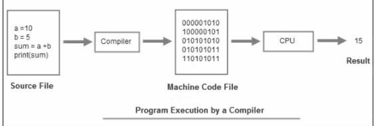
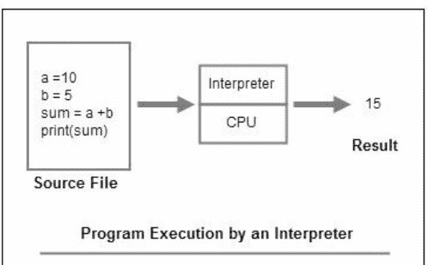
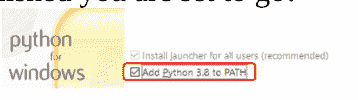
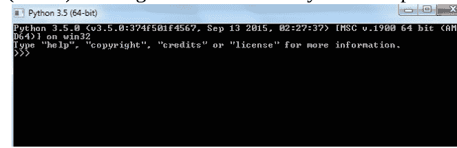
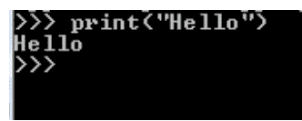
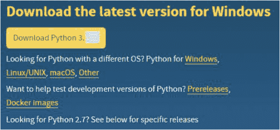
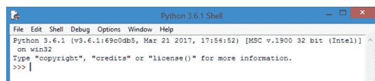
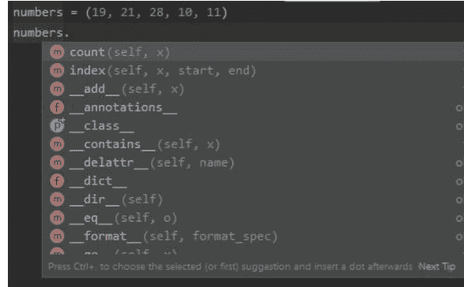

# 面向初学者的Python编程

理论与实践二合一

CODEONE PUBLISHING

# 面向初学者的Python编程

面向初学者的头号Python编程速成课程，助你快速、扎实地掌握Python编程（附实战练习）

理论与实践二合一

CODEONE PUBLISHING

2022 © 版权所有

# © **版权所有 2022 - 保留所有权利。**

未经作者或出版商直接书面许可，不得复制、翻印或传播本书所含内容。

在任何情况下，出版商或作者均不对因本书所含信息直接或间接造成的任何损害、赔偿或金钱损失承担任何责任或法律责任。

**法律声明：**
本书受版权保护。仅供个人使用。未经作者或出版商同意，不得修改、分发、销售、使用、引用或转述本书任何部分或内容。

**免责声明：**
请注意，本文档所含信息仅供教育和娱乐目的。我们已尽一切努力提供准确、最新、可靠、完整的信息。不作任何明示或暗示的保证。读者承认作者不提供法律、财务、医疗或专业建议。本书内容源自多种来源。在尝试本书概述的任何技术之前，请咨询持证专业人士。

阅读本文档即表示读者同意，在任何情况下，作者均不对因使用本文档所含信息而直接或间接造成的任何损失负责。

# 目录

## 第一部分

### Python简介

- 什么是Python？
- Python的特性
- 庞大的库集合
- 使用Python可以创建什么类型的应用程序？
- 谁在使用Python？

### 第1章：安装Python

- 选择Python版本
- 通用安装说明
- 在Windows上安装
- 在Linux（Ubuntu）上安装
- 在Mac OS上安装
- 运行程序
- 通过Shell的交互式解释器或交互模式
- 从命令行运行脚本
- Python IDE（集成开发环境）

### 第2章：IDLE和Python Shell

- 安装解释器
- Python IDLE
- 使用Python Shell、IDLE并编写我们的第一个程序
- Python交互模式
- Python脚本模式
- 如何在IDLE中编写并运行Python程序
- 其他Python交互式开发环境（IDE）
- Eclipse Python插件
- 错误类型

### 第3章：Python中的数据类型和变量

- 字符串
- 数值数据类型
- Python中的布尔值
- Python列表
- 变量
- 用户输入值

## 第4章：Python中的数字

- Abs函数
- Ceil函数
- Max函数
- Min函数
- Pow函数
- Sqrt函数
- Random函数
- Randrange函数
- Sin函数
- Cos函数
- Tan函数

### 第5章：Python中的运算符

1. 算术运算符
2. 比较运算符
3. 逻辑运算符

### 第6章：Python中的字符串方法

### 第7章：Python中的程序流程控制与if-else、elif语句

- If ... else 流程控制语句
- If语句的偶然使用
- Python中的if...elif...else流程控制语句
- Python中的嵌套if语句
- 绝对值

## 第8章：Python中的循环

- Python中的For循环
- Python中的range()函数
- For循环与Else结合使用
- Python中的While循环
- While循环与Else结合使用
- Python的Break和Continue
- Python中的Continue语句

## 第二部分

### 第9章：Python中的列表

- 深入了解列表
- 二维列表
- 列表方法
- 元组
- 解包
- Python字典

## 第10章：深入探讨Python元组

- Python中的元组
- 负索引
- 切片
- Python内置函数与元组
- Python中的转义序列

## 第11章：Python中的集合

- 集合
- 算法与数据结构模块

## 第12章：Python中的函数

- 如何定义和调用函数
- 更好地理解函数
- Return语句
- 多个参数
- Lambda函数
- 全局变量
- 局部变量

### 第13章：Python中的模块

- 什么是模块？
- 如何创建模块
- 定位模块
- Import语句
- 模块示例一
- 模块示例二

## 第14章：Python中的文件处理

- 创建新文件
- 什么是二进制文件？
- 打开你的文件

## 第15章：Python中的异常处理

- 抛出异常
- 我可以定义自己的异常吗？

### 第16章：Python中的对象和类

- 定义类
- 创建新类
- 创建对象
- 构造函数
- 删除属性和对象

## 第17章：继承与多态

- 在Python中创建类
- 类属性
- 类数据属性
- Python类继承
- 为什么继承在Python编程中有用？
- 继承示例
- 类多态与抽象
- 抽象
- 封装

## 结论

## 第一部分

### Python简介

本书是关于面向初学者的Python。它介绍了Python编程语言的核心方面。Python是一种高级、集成、通用的编程语言，由Guido van Rossum于1991年开发。Python的设计哲学强调代码的可读性，其特点是使用大量的空白。Python的面向对象方法和语言构造侧重于帮助程序员为大型和小型项目编写逻辑清晰的代码。本书旨在为初学者提供一个关于Python的简明介绍。它寻求提供一个平台，让你在一周内学好Python编程，包括分步实践示例、练习和技巧。

在我们深入探讨“为什么要编程”之前，让我们先定义什么是编程。编程是将一个方程转换成代码、一种编程语言，以便在机器上实现的过程。或者简单地说，“编程是一种通过一组指令来教机器做什么的语言。”使用了各种类型的编程语言，例如以下几种：

- Python
- PHP
- C语言
- JAVA

那么，为什么它很重要？它有什么了不起的？为什么它很重要？当今世界几乎一切都是在计算机上完成的。无论是给亲戚发电子邮件、给朋友发图片，还是在Skype上与同事进行重要会议，个人拥有计算机或笔记本电脑已成为必需品。个人和工作场所对计算机的依赖可以归因于它们的速度、可靠性和易用性。因此，当计算机像现在这样成为生活的重要组成部分时，学习编程将提升你的生活质量！人们学习编程的主要原因之一是因为他们想以创建公司网站或移动应用程序为职业。但这并不是你需要学习编程的唯一原因；编程还可以帮助提高效率和生产力！

## 什么是 Python？

Python 是由 Guido van Rossum 创建的一种多用途语言。与 HTML、CSS 和 JavaScript 不同，Python 可用于多种类型的编程和软件开发。Python 可用于以下方面：

- 后端软件开发，
- 桌面应用程序，
- 大数据和数学计算，
- 系统脚本，
- 数据分析，
- 数据科学，或
- 人工智能。

Python 成为许多人的首选语言，其原因可总结为以下几点：

- 对初学者友好，因为它读起来几乎像英语；
- 对如何构建功能没有硬性规定；
- 易于管理的错误处理；
- 拥有许多大型、支持性的社区；
- 职业机会；以及
- 未来前景，特别是在数据科学和机器学习应用方面的强大契合度。

Python 是最强大的编程语言之一。它是解释型而非编译型的编程语言之一。这意味着 Python 解释器逐行工作，对 Python 程序进行操作以向用户提供结果。使用 Python，人们可以做很多事情。Python 已被用于开发涵盖广泛领域的应用程序，从最基本的应用程序到最复杂的应用程序。Python 可用于开发基本的桌面计算机应用程序。它也是 Web 开发的良好编码语言。使用 Python 开发的网站以其提供的安全性和保护水平而闻名，使其免受黑客和其他恶意用户的攻击。Python 在游戏开发领域也适用。它已被用于开发基本和复杂的计算机游戏。Python 目前是数据科学和机器学习的最佳编程语言。它拥有最适合数据分析的库，使其适用于该领域。一个很好的例子是 scikit-learn (sklearn)，它已被证明是数据科学和机器学习的最佳选择。

Python 以其易于使用的语法而闻名。它的编写目标是使编码变得简单。这使得它即使对于初学者来说也是最佳语言。其语义也很简单，使得人们易于理解 Python 代码。该语言经历了许多更改和改进，特别是在引入 Python 3 之后。以前，我们有 Python 2.7，它已经获得了很高的稳定性。Python 3 引入了新的库、函数和其他功能，并且该语言的一些构造发生了显著变化。

## Python 的特点

### Python 简单易用

Python 是一种易于上手的语言。其易用性体现在大多数用 Python 编写的程序看起来都与英语相似。因此，这种简单性使得 Python 成为入门级编程课程的理想学习语言，从而向学生介绍编程概念。

### Python 可移植/平台无关

Python 具有极强的可移植性，这意味着 Python 程序可以在各种操作系统上运行，而无需进行特定或大量的更改。

### Python 是一种解释型语言

主要来说，Python 是一种解释型语言，而不是编译型语言。C 和 C++ 是编译型语言的例子。

在许多情况下，用高级语言编写的程序通常被称为源代码或源程序。因此，源代码中的命令被称为语句。计算机缺乏执行用高级语言编写的程序的能力。通常，计算机理解机器语言，它仅由 1 和 0 组成。

因此，当将高级语言转换为机器语言时，用户有两种类型的程序可用：编译器和解释器。

### 编译器

在其操作功能中，编译器将整个源代码一次性转换为可读的机器语言。然后执行机器语言。该过程如下图所示：



### 解释器

解释器采用逐行方法将高级语言转换为机器语言，然后执行。Python 解释器从文件顶部开始，将第一行转换为机器语言，然后执行。该过程在整个文件中重复进行，如下图所示：



区分高级语言和编译型语言至关重要。例如，像 C 和 C++ 这样的编译型语言使用编译器来翻译和解释（从高级语言到机器语言）。另一方面，像 Python 这样的解释型语言则使用解释器来进行这种翻译和后续执行的方法。这里的重要区别在于，编译型语言通常比使用解释型语言编写的程序运行和执行得更好。然而，Python 并没有受到这个缺点的影响。

总之，Python 是一种解释型语言，因为程序直接从源代码执行。每次运行 Python 程序时，都需要源代码。Python 所做的是将开发人员编写的源代码转换为中间代码，然后进一步转换为可执行的机器语言。Python 由解释器实时处理，源代码在执行前不需要编译。编译意味着代码需要在运行前转换为机器语言。

### Python 是动态类型的

Python 的另一个特点是它是动态类型的，这意味着数据类型在执行时即时检查，而不是在运行前检查（静态类型）。

### Python 是强类型的

强类型语言的主要特点是它缺乏自动将一种形式（类型）的数据转换为另一种形式的能力。另一方面，像 PHP 和 JavaScript 这样的松散类型语言则能够自由且自动地将数据从一种类型转换为另一种类型。考虑以下情况：

```
1 | price = 12
2 | str = "The total price = " + 12
3 | console.log(str)
```

**输出：**

```
The total price = 12
```

在这方面，在将 12 添加到字符串之前，JavaScript 语言会尝试将数字 12 转换为字符串 "12"，然后将其附加到字符串的末尾。然而，在像下面这样的 Python 语句中：

```
str = "The total price = " + 12
```

该语言（Python）会引发错误，因为它没有将数字 12 转换为字符串的能力。

总之，Python 是一种强类型语言，这意味着变量的类型必须是已知的。这意味着一个值的类型不会以意想不到的方式改变。例如，一个只包含数字的字符串不会自动变成数字，就像在 Perl 中可能发生的情况一样。在 Python 中，每种数据类型的更改都需要显式转换。

### 庞大的库集合

Python 为用户提供了广泛的库，这使得在不一定需要重新发明新方法的情况下，轻松添加新的容量和功能。以下部分将介绍 Python 编程初学者最常提出的一些常见问题。

### 我可以使用 Python 创建什么类型的应用程序？

Python 的一些主要应用包括：

- 游戏，
- 机器学习和人工智能，
- 数据科学和数据可视化，
- Web 开发，
- 游戏开发，
- 桌面 GUI，
- Web 抓取应用程序，
- 商业应用程序，
- 音频和视频应用程序，
- CAD 应用程序，
- 嵌入式应用程序，
- 系统管理应用程序，
- GUI 应用程序，
- 控制台应用程序，
- 科学应用程序，以及
- Android 应用程序。

## 谁在使用 Python？

一些使用 Python 的主要公司包括：

- YouTube；
- Mozilla；
- Dropbox；
- Quora；
- Disqus；
- Reddit；
- Google；
- Disney；
- Mozilla；
- Bit Torrent；
- Intel；
- Cisco；
- 摩根大通、瑞银、Getco 和 Citadel 等银行使用 Python 进行金融市场预测；
- NASA 用于科学编程任务；
- iRobot 用于商用机器人吸尘器；
- 以及许多其他公司。

## 第一章：安装 Python

要在 Python 中进行编程，您的计算机上必须安装 Python 解释器。您还需要一个文本编辑器，用于编写和保存您的 Python 代码。Python 的优点在于它可以在 Windows、Linux 和 Mac OS 等多种平台上运行。目前大多数版本的操作系统都预装了 Python。您可以通过在终端或操作系统控制台中运行以下命令来检查您的操作系统是否已安装 Python：

```
Python
```

在操作系统的终端中输入上述命令，然后按回车键。

该命令应返回您系统上安装的 Python 版本。如果未安装 Python，系统会提示该命令无法识别；因此您需要安装 Python。

## 选择 Python 版本

Python 的主要版本是 2.x 和 3.x。Python 3.x 是最新版本，但截至今天，Python 2.x 很可能仍然是使用最广泛的版本。然而，Python 3.x 在采用率方面增长得更快。虽然 Python 2.x 在许多软件公司仍在使用，但越来越多的企业正在转向 Python 3.x。这两个版本之间存在一些技术差异，但简单来说，Python 2.x 是旧版，而 Python 3.x 是未来。建议您选择最新版本 Python 3.x，因为 Python 2.x 在 2020 年之后将不再受支持。

## 通用安装说明

安装 Python 非常简单。您只需按照以下步骤操作：

1.  访问 Python 的下载页面：https://www.python.org/downloads/
2.  点击与您操作系统相关的链接。


3.  点击最新版本，并根据您的操作系统进行下载。
4.  启动安装包并按照安装说明操作（我们建议保留默认设置）。请确保点击“Add Python 3.x to PATH”。安装完成后，您就可以开始使用了！



5.  访问您的终端 IDLE。


通过编写您的第一个 Python 代码来测试一切是否正常：

```
print ("I'm running my first Python code")
```

按回车键，您应该会看到以下输出：

```
>>> print ("I'm running my first Python code")
I'm running my first Python code
```

您也可以通过使用文件来运行此命令。我们将在介绍完 Python IDLE 或其他代码编辑器后讨论这一点。

## 在 Windows 上安装

要在 Windows 上安装 Python，请从其官方网站下载 Python，然后双击下载的安装包以启动安装。您可以通过点击此链接下载安装包：

https://www.python.org/downloads/windows/

下载并安装最新的 Python 包是很好的，因为您将能够享受使用最新的 Python 包。下载安装包后，双击它，您将按照屏幕上的说明在 Windows 操作系统上安装 Python。

## 在 Linux (Ubuntu) 上安装

在 Linux 中，有多种包管理器可用于在各种 Linux 发行版中安装 Python。例如，如果您使用的是 Ubuntu Linux，请运行以下命令安装 Python：

```
$ sudo apt-get install python3-minimal
```

Python 将被安装到您的系统上。但是，大多数最新版本的各种 Linux 发行版都预装了 Python。只需运行 "python" 命令。如果返回了 Python 版本，则说明 Python 已安装在您的系统上。如果没有，请继续安装 Python。

## 在 Mac OS 上安装

要在 Mac OS 上安装 Python，您必须首先下载安装包。您可以通过在网页浏览器中打开以下链接找到它：

https://www.python.org/downloads/mac-osx/

下载安装包后，双击它以启动安装。您将看到屏幕上的说明，指导您完成安装过程。然后，您的 Mac OS 系统上就可以运行 Python 了。

## 运行程序

可以通过两种主要方式运行 Python 程序：

- 交互式解释器
- 从命令行运行脚本

## 交互式解释器或通过 Shell 的交互模式

Python 附带一个命令行，称为交互式解释器。您可以直接在此解释器上编写 Python 代码，然后按回车键即可获得即时结果。如果您使用的是 Linux，只需打开 Linux 终端并输入 "python"。按回车键，>>> 符号将显示在 Python 解释器上。要在 Windows 上访问交互式 Python 解释器，请点击“开始”->“所有程序”，然后从程序列表中找到 "Python..."。在我的情况下，我找到了 "Python 3.5"，因为我安装了 Python 3.5。展开此选项并点击 "Python...."。在我的情况下，我点击 "Python 3.5 (64-bit)"，然后就进入了交互式 Python 解释器。



在这里，您可以直接编写和运行 Python 脚本。要编写 "Hello" 示例，请在解释器终端中输入以下内容：

```
print("Hello")
```

按回车键，文本 "Hello" 将打印在解释器上：



## 从命令行运行脚本

此方法涉及将 Python 程序写入文件，然后调用 Python 解释器来处理该文件。Python 文件应保存为 .py 扩展名。这是一个标识符，表示它是一个 Python 文件。例如，script.py、myscript.py 等。在文件中编写代码并将其保存为 "mycode.py" 后，您可以打开操作系统命令行并调用 Python 解释器来处理该文件。例如，您可以在命令行上运行以下命令来执行文件 mycode.py 中的代码：

```
python mycode.py
```

Python 解释器将处理该文件并在终端上打印结果。

## Python IDE（集成开发环境）

如果您有一个支持 Python 的 GUI（图形用户界面）应用程序，您可以在 GUI 环境中运行 Python。以下是适用于各种操作系统的 Python IDE：

- UNIX—IDLE
- Windows—PythonWin
- Macintosh—IDLE IDE，可从官方网站下载为 MacBinary 或 BinHex'd 文件。

## 第二章：IDLE 和 Python Shell

正如我们所看到的，Python 可以在两种主要模式下使用：

1.  通过 Python Shell，也称为交互模式
2.  通过 Python IDLE

提醒一下，称为提示符字符串的 Python Shell 已准备好接受命令。Python Shell 允许您输入 Python 代码并立即获得结果，非常适合测试一小段代码。Python IDLE（集成开发和学习环境）也提供此功能，包括额外的功能。因此，我们建议您直接使用 Python IDLE。要开始使用 Python IDLE，我们建议创建一个新目录，例如 "PythonPractice"，您将在其中保存未来的 Python 文件。

## 安装解释器

提醒一下，在编写第一个 Python 程序之前，我们必须为我们的计算机下载适当的解释器。本书将使用 Python 3，因为正如 Python 官方网站所述，“Python 2.x 是旧版；Python 3.x 是该语言的现在和未来。”此外，“Python 3 消除了许多可能不必要地困扰初学者程序员的怪癖。”但是，请注意 Python 2 目前仍然相当广泛使用。Python 2 和 3 大约有 90% 的相似之处。因此，如果您学习 Python 3，您很可能在理解用 Python 2 编写的代码时不会遇到问题。

要安装 Python 3 的解释器，请访问以下网站：
https://www.python.org/downloads/

正确的版本应在网页顶部标明。本书将使用版本 3.6.1。点击“下载”，软件将开始下载。



或者，如果你想安装其他版本，请向下滚动页面，你会看到其他版本的列表。点击你想要的已发布版本，你将被重定向到该版本的下载页面。

向下滚动到页面末尾，你会看到一个表格，列出了该版本的各种安装程序。为你的计算机选择正确的安装程序。你应该使用的安装程序取决于两个因素：

1.  你使用的操作系统（Windows、Mac OS 或 Linux）。
2.  你使用的处理器（32 位 vs 64 位）。

例如，如果你使用的是 64 位 Windows 计算机，你可能会使用 "Windows x86-64 executable installer"。只需点击链接即可下载。如果你下载并运行了错误的安装程序，不用担心。你会收到一条错误消息，并且解释器将不会安装。只需下载正确的安装程序，你就可以继续了。一旦你成功安装了解释器，你就可以开始用 Python 编程了。

## Python IDLE

我们建议至少使用默认的 Python IDLE。然而，与下表中比较的许多其他选项相比，IDLE 是 Python 的集成开发环境（IDE），它会随 Python 一起自动安装。除了一个简洁的图形用户界面外，IDLE 还包含许多使 Python 开发变得轻松的功能，包括一个非常强大的功能：语法高亮。
通过语法高亮，保留关键字、字面文本、注释等都会以不同的颜色突出显示，使你更容易发现代码中的错误。你可以在 IDLE 中编辑和执行你的程序。

| 功能 | IDLE | Thonny | Eric Python | Atom | Wing | Sublime | Rodeo | PyDev | Spyder | PyCharm |
| :--- | :---: | :---: | :---: | :---: | :---: | :---: | :---: | :---: | :---: | :---: |
| 代码补全 | X | ✓ | ✓ | ✓ | ✓ | ✓ | ✓ | ✓ | ✓ | ✓ |
| 调试 | ✓ | ✓ | ✓ | 需要安装包 | ✓ | 需要安装包 | X | 远程调试器 | ✓ | ✓ |
| 内置单元测试 | X | X | ✓ | 需要安装包 | ✓ | 需要安装包 | X | ✓ | 插件 | ✓ |
| 开源 | ✓ | ✓ | ✓ | ✓ | X | X | ✓ | ✓ | ✓ | 社区版 |
| 轻量级 | ✓ | ✓ | X | ✓ | ✓ | ✓ | X | ✓ | X | X |
| 重构 | X | X | X | 需要安装包 | ✓ | 需要安装包 | X | ✓ | ✓ | ✓ |

当你安装 Python 时，你会得到 IDLE，一个集成的 IDE。要在 Windows 中启动它，请在你的计算机上找到 ArcGIS 文件夹。在 Python 文件夹内，你会看到 IDLE 作为一个选项——要启动 IDLE，选择它。IDLE 内置了一个交互式解释器，可以轻松运行完整的脚本。用于编写 IDLE 的 GUI 模块内置于 Python 中，因此它与将要执行的程序是同一种语言。
IDLE 相对于 python.exe 的另一个优点是，脚本输出（包括 print 语句）会直接发送到 IDLE 的交互式窗口，并且在脚本执行后不会消失。IDLE 还占用很少的内存。IDLE 的缺点可以在代码辅助方面看到，例如自动补全，以及在逻辑项目组织方面。脚本中的每个变量都无法像在其他 IDE 中那样定位，并且“最近文件”菜单中列出的脚本数量有限——当需要查找一段时间未运行的脚本时，这有点不便。然而，如果没有其他选项，并且你需要快速测试一段代码片段，IDLE 是一个理想的 IDE。

## 使用 Python Shell、IDLE 并编写我们的第一个程序

我们将使用随 Python 解释器捆绑的 IDLE 程序来编写代码。为此，让我们首先启动 IDLE 程序。你启动 IDLE 程序的方式与启动任何其他程序相同。例如，在 Windows 10 上，你可以在搜索框中输入 "IDLE" 来搜索它。找到后，单击 IDLE (Python GUI) 来启动它。你将看到下面所示的 Python Shell。



Python Shell 允许我们以交互模式使用 Python。这意味着我们可以一次输入一个命令。Shell 等待用户的命令，执行它，并返回执行结果。之后，Shell 等待下一个命令。
尝试在 Shell 中输入以下内容。以 >>> 开头的行是你应该输入的命令，而命令之后的行显示结果。在本书中：
命令 = 带边框框内的代码
结果 = 符号 " ⌐ " 之后的内容

```
2+3
5
```

```
3>2
True
```

```
print("Hello World")
Hello World
```

当你输入 2+3 时，你是在向 Shell 发出命令，要求它计算 2+3 的值。因此，Shell 返回答案 5。当你输入 3>2 时，你是在询问 Shell 3 是否大于 2。Shell 回复 True。接下来，print 是一个命令，要求 Shell 显示行 Hello World。

## Python 交互模式

Python Shell 是测试 Python 命令的一个非常方便的工具，尤其是当我们刚开始学习这门语言时。然而，如果你退出 Python Shell 并再次进入，你输入的所有命令都会消失。此外，你不能使用 Python Shell 来创建一个实际的程序。要编写一个实际的程序，你需要将代码写在一个文本文件中，并将其保存为 .py 扩展名。这个文件被称为 Python 脚本。

## Python 脚本模式

要创建一个 Python 脚本，请在 Python Shell 的顶部菜单中单击 File > New File。这将打开我们将用来编写第一个程序——"Hello World" 程序的文本编辑器。编写 "Hello World" 程序有点像所有新程序员的入门仪式。我们将使用这个程序来熟悉 IDLE 软件。

在文本编辑器（不是 Shell）中输入以下代码。

```
#Prints the Words "Hello World"
print ("Hello World")
Hello World
```

你应该注意到第一行是红色的，而在第二行，单词 "print" 是紫色的，"Hello World" 是绿色的。这是软件使我们的代码更易于阅读的方式。单词 print 和 "Hello World" 在我们的程序中服务于不同的目的，因此它们以不同的颜色显示。我们将在后面的章节中详细介绍。行 "#Prints the Words "Hello World"""（红色）实际上不是程序的一部分。它是一个注释，旨在使我们的代码对其他程序员更具可读性。Python 解释器会忽略这一行。要在我们的程序中添加注释，我们在每行注释前输入一个 # 号，像这样：

```
#This is a comment
#This is also a comment
#This is yet another comment
```

或者，我们也可以使用三个单引号（或三个双引号）进行多行注释，像这样：

```
"""
This is a comment
This is also a comment
This is yet another comment
"""
```

现在单击 File > Save As 来保存你的代码。确保你将其保存为 .py 扩展名。
完成了吗？瞧！你刚刚成功编写了你的第一个 Python 程序。
最后单击 Run > Run Module 来执行程序（或按 F5）。
你应该会在 Python Shell 中看到打印出的 "Hello World" 字样。

## 如何在 IDLE 中编写 Python 程序并运行它

1.  启动 IDLE——打开 Start > All Programs > Python > IDLE
2.  一个标题为 Python Shell 的窗口将打开
3.  单击 File > New Window
4.  现在一个名为 Untitled 的新窗口将加载
5.  单击 File > Save As 并为你的程序文件选择一个位置
6.  在 File Name 处，在框中输入 program1.py
7.  单击 Save
8.  一个空白窗口将打开——这是一个编辑器窗口，它已准备好让你输入程序。
9.  完全按照所写输入以下语句——它适用于 Python 2.x 或 3.x：

```
print ("Hello World")
```

10. 打开 Run 菜单并单击 Run Module 来运行程序
11. 你现在将看到一条消息，要求你保存程序（它会说 Source），因此单击 OK
12. 你的程序现在将在 Python Shell 窗口中运行
13. 要退出 Python，请关闭所有 Python 窗口

重要提示：
如果你想再次打开你的文件，请在你保存它的文件夹中找到它。右键单击它，然后从菜单中选择 Edit with IDLE——这将打开编辑器窗口。

## 其他 Python 交互式开发环境（IDE）

与 Python 一起使用的最佳 IDE 之一是 Eclipse，因此，如果你愿意，可以在你的计算机上安装它。

1.  转到 http://www.eclipse.org/downloads 并下载 Eclipse 安装程序。
2.  继续安装
3.  要启动 Eclipse，请转到安装目录并双击 eclipse.exe。

## Eclipse Python 插件

PyDev 是一个 Eclipse Python IDE，它可以在几种不同的 Python 发行版中使用。它支持图形调试、代码重构、代码分析等等。PyDev 可以通过 Eclipse 更新管理器安装，方法是转到 http://pydev.org/updates。只需勾选 PyDev 旁边的框，然后按照屏幕上的说明进行安装。
接下来，你需要配置 Eclipse，以便它知道 Python 的位置。

1.  打开 Window > Preferences
2.  单击 PyDev 选项，然后单击 Interpreter Python
3.  单击 New Configuration

## 4. 添加 Python 的可执行路径

Eclipse IDE 现已在你的计算机上设置完毕，可以与 Python 一起使用了。

## 错误类型

在 Python 3 中编程时，可能会遇到三种主要类型的错误：

- 语法错误
- 运行时错误
- 逻辑错误

## 语法错误

语法是使用计算机语言正确编写代码时需要遵循的一套准则。语法错误是指缺少标点符号、拼写错误（如关键字拼写错误）或缺少闭合括号等错误。语法错误由编译器或解释器检测。如果你尝试执行一个包含语法错误的 Python 程序，屏幕上会出现错误信息，程序将无法执行。你必须纠正所有错误，然后再次尝试执行程序。通常，这类错误是由于拼写错误造成的。如果发生错误，Python 解释器会停止运行。一些常见的语法错误原因包括：

- 关键字书写错误，
- 运算符使用不当，
- 在函数调用中忘记括号，或
- 字符串未用单引号或双引号括起来。

## 运行时错误

当代码执行因某个操作无法进行而停止时，就会发生这些错误。运行时错误可能导致程序突然终止，甚至导致系统关闭。这类错误可能是最难检测的。内存耗尽或除以零就是运行时错误的例子。

## 逻辑错误

当代码产生错误结果时，就会发生逻辑错误。例如，将华氏温度转换为摄氏温度：

```
print("20 degree Fahrenheit in degree Celsius is: ")
print(5 / 9 * 20 – 32)
```

## 结果

1. 20 degree Fahrenheit in degree Celsius is:
2. -20.88888888888889

上述代码输出 -20.88888888888889，这是错误的。正确结果是 -6.666。这类错误被称为逻辑错误。要获得正确答案，需要正确使用括号：5 / 9 * (20 - 32) 而不是 5 / 9 * 20 - 32。

逻辑错误是阻止你的程序按预期执行的错误。遇到逻辑错误时，你不会收到任何警告。你的代码可以编译和运行，但结果不是预期的。你必须彻底检查程序，找出错误所在。Python 程序会正常执行。需要找出并纠正错误 Python 语句的是程序员，而不是计算机或解释器。计算机可能终究没那么聪明。

## 第三章：Python 中的数据类型和变量

每个程序都有某些数据，使其能够按照我们期望的方式运行和操作。这些数据可以是文本、数字，或介于两者之间的任何东西。无论复杂还是简单，这些数据类型都是机器中的齿轮，使其余机制能够连接并工作。Python 支持几种数据类型，并且与它的竞争对手不同；它并不处理广泛的范围。
这很好，因为即使有疏漏，我们也可以少操心一些，同时获得准确的结果。Python 的创建是为了让我们作为程序员的生活轻松得多。

## 字符串

在 Python 和其他编程语言中，任何文本值，如名称、地点或句子，都称为字符串。字符串是字符的集合，而不是单词或字母，通过使用单引号或双引号来标记。要显示字符串，请使用 print 命令，打开括号，放入引号，然后写入任何内容。
完成后，我们通常结束引号并关闭括号。如果你使用 PyCharm，IntelliSense 会检测到我们即将做什么，并立即为我们提供剩余部分。你可能已经注意到，当你只输入左括号时，它如何跳出来救援。它会自动为你提供一个右括号。同样，当你插入引号时，它会为你提供右引号。
明白为什么我们使用 PyCharm 了吗？
它极大地帮助了我们。“我确实有个问题。如果两者提供相同的结果，为什么我们使用单引号或双引号？”啊！观察得很仔细。

我们使用不同的引号是有原因的。让我用下面的例子来解释：

```
print('I'm afraid I won't be able to make it')
print("He said "Why do you care?"")
```

尝试在 PyCharm 中运行这个。要运行，只需点击界面右上角的绿色播放按钮。

```
"C:\Users\Programmer\AppData\Local\Programs\Python\Python32\python.exe"
"C:/Users/Programmer/PycharmProjects/PFB/Test1.py"
```

File "C:/Users/Programer/PycharmProjects/PFB/Test1.py", line 1

```
print('I'm afraid I won't be able to make it')
SyntaxError: invalid syntax
```

Process finished with exit code 1
提示：这是一个错误！

那么这里发生了什么？试着重新审视输入。看看我们如何用单引号开始第一个 print 语句？我们立即用另一个引号结束了引号。程序只接受了字母 "I" 作为字符串。
你可能已经注意到，从 "m" 到 "won" 的每个字符颜色可能发生了变化，之后程序检测到另一个引号，并将剩余部分作为另一个字符串接受。老实说，这相当令人困惑。
同样，在第二个语句中，也发生了同样的事情。程序看到了双引号，并将其理解为一个字符串，直到第二个双引号出现。在那里，它没有费心检查这是否是一个句子，或者它是否可能仍在继续。计算机不理解英语；它们理解二进制通信。编译器是在我们按下运行按钮时运行的。它编译我们的代码，并将其解释为一系列 1 和 0，以便计算机能够理解我们要求它做什么。

这正是为什么它一发现第一个引号，就将其视为字符串的开始，并在发现第二个引号时立即结束它，即使句子仍在继续。为了克服这个障碍，当我们知道需要在句子中使用其中一个引号时，我们使用单引号和双引号的混合。尝试将第一个语句中的开头和结尾引号替换为双引号。同样，将第二个语句的引号改为单引号，如下所示：

```
print("I'm afraid I won't be able to make it")
print('He said "Why do you care?"')
```

现在输出应该如下所示：
( I'm afraid I won't be able to make it
( He said, "Why do you care?"

最后，对于字符串，命名约定不适用于字符串本身的文本。你可以放心地使用常规的英语书写方法和惯例，只要它在引号内。引号外的任何内容首先就不是字符串，如果你改变大小写，它可能无法工作。

## 数字数据类型

Python 能够很好地识别数字。数字分为两类：

- 整数——不带任何小数点表示的正数和/或负数。
- 浮点数——带有小数点表示的实数。

这意味着，如果你使用 100 和 100.00，一个将被识别为整数，而另一个将被视为 *浮点数*。那么为什么我们需要使用两种数字表示呢？

假设你正在设计一个小型游戏，角色的生命值为 10。你可能希望以这样的方式编写程序：每当角色受到攻击时，他的生命值减少一两点。然而，为了使事情更精确一些，你可能需要使用浮点数。现在，每次攻击可能不同，可能会从生命值中扣除 1.5、2.1 或 1.8 点。使用浮点数允许我们使用更高的精度，尤其是在进行计算时。如果你不太在意准确性，或者你的编程只涉及整数，那就坚持使用整数。

## Python 中的布尔值

啊！那个名字有趣的东西。布尔值（或 bool）是一种只能操作并返回两个值的数据类型：True 或 False。布尔值是任何程序的重要组成部分，除了那些你可能永远不需要它们的程序，比如我们的第一个程序。这些是允许程序在结果为真或假时采取不同路径的东西。
这里有一个小例子。假设你要去一个从未去过的国家旅行。你很可能会面临两个选择。如果天气冷，你会打包冬装。如果天气暖和，你会打包适合温暖天气的衣服。很简单，对吧？布尔值的工作原理正是如此。我们也将研究它的编码方面。现在，只需记住，当涉及到真和假时，你处理的是一个 bool 值。

## Python 列表

虽然对于处于这个学习阶段的人来说这稍微高级一些，但列表是一种数据类型，顾名思义。它在方括号 ([]) 中列出对象、值或存储数据。列表看起来像这样：

```
month = ['Jan', 'Feb', 'March', 'And so on!']
month
['Jan', 'Feb', 'March', 'And so on!']
```

我们将单独探讨这个问题，届时会讨论列表、元组和字典。我们将在后续更详细地了解这种数据类型。

## 变量

如果你有乘客但没有交通工具，他们将无处可去。这些乘客只会是站在周围等待某种交通工具来接他们的人。同样，数据类型无法单独运作。它们需要被“存储”在这些交通工具中。这些特殊的交通工具，程序员称之为容器，被称为变量，它们是为我们施展魔法的元素。变量是专门的容器，用于存储特定的值，然后可以在需要时被访问、调用、修改甚至移除。你创建的每个变量都将保存特定类型的数据。你不能在一个变量中添加多种类型的数据。在其他编程语言中，你会发现要创建一个变量，你需要使用关键字“var”，后跟一个等号“=”，然后是值。在Python中，这要简单得多，如下所示：

```
name = "John"
age = 33
weight = 131.50
is_married = True
```

在上面的代码中，我们创建了一个名为“name”的变量，并赋予它一个字符值。如果你还记得字符串，我们使用了双引号来让程序知道这是一个字符串。然后我们创建了一个名为age的变量。这里，我们只写了33，这是一个整数，因为后面没有小数。你完全不需要在这里使用引号。接下来，我们创建了一个变量“weight”，并给它赋了一个浮点数值。最后，我们创建了一个名为“is_married”的变量，并给它赋了一个“True”布尔值。如果你把“T”改成“t”，系统将不会将其识别为布尔值，最终会报错。请注意我们如何为最后一个变量使用命名约定。我们将确保我们的变量遵循相同的命名约定。

如果你觉得以后可能需要这些变量，或者希望在应用程序开始时将它们初始化为无值，你甚至可以创建空变量。对于具有数值的变量，你可以创建一个你选择的名称的变量，并将其值赋为零。或者，你也可以只使用开引号和闭引号来创建一个空字符串。

```
empty_variable1 = 0
empty_variable2 = ""
```

你不必非要这样命名它们；你可以想出更有意义的名字，这样你和任何可能阅读你代码的其他程序员都能理解。我给它们这些名字是为了确保任何人都能立即理解它们的用途。现在我们已经学会了如何创建变量，让我们学习如何调用它们。如果我们从不打算使用这些变量，那拥有它们有什么意义，对吧？让我们创建一组新的变量。

看看这里：

```
name = "James"
age = 43
height_in_cm = 163
occupation = "Programmer"
```

我鼓励你使用自己的值，如果你喜欢的话，可以尝试操作变量。

为了调用name变量，我们只需要输入变量的名称。为了将其打印到控制台，我们将这样做：

```
print(name)
James
```

age、height和occupation变量也是如此。但如果我们想把它们一起打印出来，而不是分开打印呢？尝试运行下面的代码，看看会发生什么：

```
print(name age height_in_cm occupation)
SyntaxError: invalid syntax
```

惊讶吗？你最终得到了这个结果吗？以下是发生这种情况的原因。当你使用单个变量时，程序知道那是哪个变量。当你添加第二个、第三个和第四个变量时，它试图寻找以那种方式编写的东西。由于没有任何东西，它返回了一个错误，否则会说：“嗯...你确定吗？我到处都找过了，但我找不到这个‘name age height_in_cm occupation’元素。”你只需要添加一个逗号作为分隔符，就像这样：

```
print(name, age, height_in_cm, occupation)
James 43 163 Programmer
```

现在它知道我们在说什么了。系统调用了这些变量，并成功地向我们展示了它们的值。但如果你尝试将两个字符串相加会怎样？如果你希望合并两个单独的字符串并创建第三个字符串作为结果呢？

```
first_name = "John"
last_name = "Wick"
```

要将这两个字符串连接成一个，我们可以使用+号。结果字符串现在将被称为字符串对象，由于我们处理的是Python，这种语言中的所有内容都被视为对象，因此具有面向对象编程（OOP）的特性。

```
first_name = "John"
last_name = "Wick"
first_name + last_name
```

在这里，我们没有要求程序打印这两个字符串。如果你希望打印这两个字符串，只需添加print函数，并在括号内输入字符串变量，中间用+号连接。听起来不错，但结果可能并不完全如你所料：

```
first_name = "John"
last_name = "Wick"
print(first_name + last_name)

JohnWick
```

嗯。你认为为什么会这样？当然，我们确实在两个变量之间使用了空格。问题是这两个字符串已经结合在一起了，这里非常字面地结合了，我们没有在John之后或Wick之前提供空格（空白）；它不会包含那个。即使是空格也可以是字符串的一部分。

为了测试，在代码的第一行中，在John之后按一下友好的空格键，添加一个空格字符。现在尝试再次运行相同的命令，你应该会看到“John Wick”作为你的结果。合并两个字符串的过程称为连接。虽然你可以连接任意多的字符串，但你不能将字符串和整数连接在一起。

如果你真的需要这样做，你需要使用另一种技术，先将整数转换为字符串，然后再连接。要转换整数，我们使用str()函数。

```
text1 = "Zero is equal to"
text2 = 0
print(text1 + str(text2))

Zero is equal to 0
```

Python以逐行的方式读取代码。首先，它会读取第一行，然后是第二行，然后是第三行，依此类推。这意味着我们也可以事先做一些事情，为自己节省一些时间。

```
text1 = "Zero is still equal to "
text2 = str(0)
print(text1 + text2)

Zero is still equal to 0
```

你可能希望记住这一点，因为我们很快就会重新讨论将值转换为字符串的问题。还有一种方法可以同时打印字符串变量和数值变量，而无需使用+号或转换。这种方法称为字符串格式化。要创建格式化字符串，我们遵循一个简单的过程，如下所示：

```
print(f"This is where {var 1} will be. Then {var 2}, then {var 3} and so on")
```

Var 1、2和3是变量。你可以在这里拥有任意多的变量。注意空格的重要性。尽量不要使用空格键。你可能一开始会很吃力，但最终会掌握它。当我们开始字符串时，我们放置字符“f”来让Python知道这是一个格式化字符串。在这里，花括号充当占位符的一部分。在这些花括号内，你可以调用你的变量。一组花括号将是你想要调用的每个变量的占位符。为了实际说明，让我们看一个例子：

```
show = "GOT"
name1 = "Daenerys"
name2 = "Jon"
name3 = "Tyrion"
seasons = 8
print(f"The show called {show} had characters like {name1}, {name2}, and {name3} in all {seasons} seasons.")
```

The show called GOT had characters like Daenerys, Jon, and Tyrion in all 8 seasons.

如果你遇到错误，请确保你安装了最新版本的Python。

虽然还有其他方法可以将整数转换为字符串并将字符串连接在一起，但最好学习那些在整个行业中作为标准使用的方法。现在，你已经看到了如何创建变量、调用它并连接它。一切听起来都很完美，除了一件事：这些是预定义的值。如果我们需要直接从最终用户那里获取输入呢？我们怎么可能知道呢？即使我们知道，我们把它们存储在哪里？

## 用户输入值

假设我们正在尝试创建一个在线表单。这个表单将包含简单的问题，比如询问用户的姓名、年龄、城市、电子邮件地址等。必须有一种方法允许用户自己输入这些值，并让我们获取这些值。我们可以使用相同的方法打印一条消息，感谢用户使用表单，并且他们将通过电子邮件地址被联系以进行后续步骤。为此，我们将使用`input()`函数。`input`函数可以接受任何类型的输入。要使用此函数，我们需要为其提供一些参考信息，以便最终用户知道他们将要填写什么。让我们看一个典型的例子，看看如何创建这样的表单：

```
print("Hello and welcome to my interactive tutorial.")
name = input("Your Name: ")
age = int(input("Your age: "))
city = input("Where do you live? ")
email = input("Please enter your email address: ")
print(f"Thank you very much {name}, you will be contacted at {email}.")
```

Hello and welcome to my interactive tutorial.
Your Name: Sam
Your age: 28
Where do you live? London
Please enter your email address: sam@something.com
Thank you very much Sam, you will be contacted at sam@something.com.

在上面的例子中，我们首先向用户打印问候语并欢迎他们来到教程。接下来，我们创建了一个名为"name"的变量，并将用户将慷慨提供的值赋给它。在年龄部分，你可能注意到我将输入转换为`int()`，就像我们之前将整数转换为字符串一样。这是因为`input`参数中的消息默认是字符串值，因为它在引号内。你始终需要确保你知道你想要的值类型，并执行必要的操作，如上所示。接下来，我们询问了城市名称和电子邮件地址。现在，使用格式化字符串，我们打印出了最终消息。"等等！我们怎么能打印出我们尚未收到或不知道的东西？"我确实提到过Python是逐行工作的。程序将从问候开始，如输出所示。然后，它将移动到下一行，并意识到它必须等待用户输入某些内容并按回车键。这就是为什么输入值在这里用粗体和斜体突出显示。程序然后移动到下一行，并再次等待用户输入内容并按回车键，如此继续，直到最终的输入命令完成。现在程序已经存储了值，它立即调用这些值并打印出来供查看者最后查看。结果相当令人满意，因为它给用户提供了个性化的消息，并且我们收到了我们需要的信息。每个人都开心地离开了！直接从用户那里存储信息既是必要的，有时也是必需的。想象一个基于Python的游戏。这个游戏相当简单，当你点击屏幕时，球会跳动。问题是，由于某种原因，你的屏幕根本没有响应触摸。当这种情况发生时，程序要么让球继续运行直到检测到输入，要么根本无法工作。我们还使用输入函数来收集信息，例如登录ID和密码以与数据库匹配，但这是我们稍后讨论语句时要讨论的一点。目前这听起来有点复杂，但一旦你理解了如何使用语句，你将比以往任何时候都更接近成为一名程序员。

## 第4章：Python中的数字

我们在数据类型章节中简要介绍了数字。在本章中，我们将更详细地介绍如何在Python中使用和操作数字。在继续之前，让我们简要回顾一下Python中可用的不同类型的数字：

- 整数——没有分数或小数的整数。
- 浮点数——具有用小数点表示的小数部分的数字。
- 复数——使用"J"或"j"后缀表示的复数。

让我们看一个快速的例子，看看这些数据类型如何使用。这个程序展示了如何在Python中使用数字数据类型：

```
# This program looks at number data types
# An int data type
a=123
# A float data type
b=2.23
# A complex data type
c=3.14J
print(a)
print(b)
print(c)
```

这个程序的输出如下：

```
123
2.23
3.14j
```

Python中有多种函数可用于处理数字。让我们看看它们的总结，之后我们将更详细地介绍每个函数以及一个简单的例子。

## 数字函数

| 函数 | 描述 |
| --- | --- |
| abs() | 返回一个数字的绝对值 |
| ceil() | 返回一个数字的向上取整值 |
| max() | 返回一组数字中的最大值 |
| min() | 返回一组数字中的最小值 |
| pow(x,y) | 返回x的y次幂 |
| sqrt() | 返回一个数字的平方根 |
| random() | 返回一个随机值 |
| randrange(start,stop,step) | 从特定范围返回一个随机值 |
| sin(x) | 返回一个数字的正弦值 |
| cos(x) | 返回一个数字的余弦值 |
| tan(x) | 返回一个数字的正切值 |

## Abs函数

此函数用于返回一个数字的绝对值。让我们看一个这个函数的例子。以下程序展示了abs函数。

```
# This program looks at number functions
a=-1.23
print(abs(a))
```

这个程序的输出如下：
1.23

## Ceil函数

此函数用于返回一个数字的向上取整值。让我们看一个这个函数的例子。请注意，对于这个程序，我们需要导入"math"模块才能使用ceil函数。示例：以下程序展示了ceil函数。

```
import math
# This program looks at number functions
a=1.23
print(math.ceil(a))
```

这个程序的输出如下：
2

## Max函数

此函数用于返回一组数字中的最大值。让我们看一个这个函数的例子。下面的程序用于展示max函数。

```
# This program looks at number functions
print(max(3,4,5))
```

这个程序的输出如下：
5

## Min函数

此函数用于返回一组数字中的最小值。让我们看一个这个函数的例子。以下程序展示了min函数的工作原理。

```
# This program looks at number functions
print(min(3,4,5))
```

这个程序的输出如下：
3

## Pow函数

此函数用于返回x的y次幂的值，语法为"pow(x,y)"。让我们看一个这个函数的例子。以下程序展示了pow函数。

```
# This program looks at number functions
print(pow(2,3))
```

这个程序的输出如下：
8

## Sqrt函数

此函数用于返回一个数字的平方根。让我们看一个这个函数的例子。请注意，对于这个程序，我们需要导入"math"模块才能使用sqrt函数。下一个程序展示了sqrt函数的工作原理。

```
import math
# This program looks at number functions
print(math.sqrt(9))
```

这个程序的输出如下：
3.0

## Random函数

此函数用于简单地返回一个随机值。让我们看一个这个函数的例子。以下程序展示了random函数。

```
import random
# This program looks at number functions
print(random.random())
```

输出将根据生成的随机数而有所不同。请注意，对于这个程序，我们需要使用"random"Python库。在我们的例子中，程序的输出是：
0.0054600853568235691

## Randrange函数

此函数用于从特定范围返回一个随机值。让我们看一个这个函数的例子。请注意，我们再次需要导入"random"库才能使此函数工作。这个程序用于展示random函数。

```
import random
# This program looks at number functions
print(random.randrange(1,10,2))
```

输出将根据生成的随机数而有所不同。在我们的例子中，程序的输出是：
5

## Sin函数

此函数用于返回一个数字的正弦值。让我们看一个这个函数的例子。以下程序展示了如何使用sin函数。

## 第五章：Python 中的运算符

### 1. 算术运算符

这些是能够执行数学或算术运算的运算符，它们在该编程语言中将是基础或广泛使用的，这些运算符又细分为：

1.1. 加法运算符：其符号是 (+)，其功能是将数值数据的值相加。其语法书写如下：

```
6+4
10
```

1.2 减法运算符：其符号是 (-)，其功能是减去数值数据类型的值。其语法可以这样书写：

```
4-3
1
```

1.3 乘法运算符：其符号是 (*)，其功能是将数值数据类型的值相乘。
其语法可以这样书写：

```
3*2
6
```

1.4 除法运算符：其符号是 (/)；此运算符提供的结果是一个实数。其语法书写如下：

```
3.5/2
1.75
```

1.5 取模运算符：其符号是 (%)；其功能是返回两个运算符之间除法的余数。在下面的例子中，我们有 8 除以 5，等于 1 余 3。因此，其模为 3。
其语法书写如下：

```
8%5
3
```

1.6 指数运算符：其符号是 (**)，其功能是计算数值数据类型值之间的指数。其语法书写如下：

```
3**2
9
```

1.7 整除运算符：其符号是 (//)；在这种情况下，它返回的结果只是结果数字的整数部分。
其语法书写如下：

```
3.5//2
1.0
```

然而，如果使用整数运算符，Python 语言将确定它希望结果变量也是整数，这样你将得到以下结果：

```
3/2
1.5
```

```
3//2
1
```

如果我们想在这种特殊情况下获得小数，一个选项是使我们的一个数字为实数。例如：

```
3.0/2
1.5
```

### 2. 比较运算符

比较运算符是用于比较值并根据应用的条件返回 True 或 False 响应的运算符。

2.1 等于运算符：其符号是 (==)；其功能是确定两个值是否完全相同。
例如：

```
3==3
True
```

```
5==1
False
```

2.2 不等于运算符：其符号是 (!=)；其功能是确定两个值是否不同，如果是，结果将为 True。例如：

```
3!=4
True
```

```
3!=3
False
```

2.3 大于运算符：其符号是 (>)；其功能是确定左侧的值是否大于右侧的值，如果是，它产生的结果是 True。例如：

```
5>3
True
```

```
3>8
False
```

2.4 小于运算符：其符号是 (<)；其功能是确定左侧的值是否小于右侧的值，如果是，它给出 True 作为结果。例如：

```
3<5
True
```

```
8<3
False
```

2.5 大于或等于运算符：表示为 (>=)，其功能是确定左侧的值是否大于或等于右侧的值。如果是，返回的结果是 True。例如：

```
8>=1
True
```

```
8>=8
True
```

```
3>=8
False
```

2.6 小于或等于运算符：表示为 (<=)，其功能是评估其左侧的值是否小于或等于右侧的值。如果是，返回的结果是 True。例如：

```
8<=10
True
```

```
8<=8
True
```

```
10<=8
False
```

### 3. 逻辑运算符

逻辑运算符是 *and*、*or* 和 *not*。它们的主要功能是检查两个或多个运算符是真还是假，并作为结果返回 True 或 False。

这种类型的运算符通常用于条件语句中，通过比较多个元素来返回布尔值。
在 Python 中，真值和假值的存储是 bool 类型，这是由英国数学家乔治·布尔命名的，他创立了布尔代数。只有两个布尔值，True 和 False，重要的是要大写它们，因为小写时它们不是布尔值，而是简单的短语。
这些运算符的语义或含义与其英语含义相似，例如，如果我们有以下表达式：

X > 0 and x < 8，如果 x 确实大于零且小于 8，这将为真。

在 "or" 的情况下，我们有以下例子：

```
N=12
N%6==0 or n%8==0
True
```

如果任一条件确实为真，即如果 n 是能被 6 或 8 整除的数，它将为真。

逻辑运算符 "not" 否定一个布尔表达式。所以，例如：
not ( x < y ) 如果 x < y 为假，即如果 x 大于 y，则为真。

## 第六章：Python 中的字符串方法

几乎可以肯定，会有需要操作字符串的时候。也许你需要获取它的长度，或者你需要拆分它或从中创建另一个字符串。也许你需要读取 x 位置的字符是什么。无论原因是什么，关键是有办法。

这让我们对对象的本质有了更广泛的讨论，我们稍后会更深入地探讨。同时，我们还将介绍 Python 语言提供的用于字符串的极其有用的方法。

请继续创建一个新文件。你可以随意命名。我的文件将命名为 strings.py。名字可能没什么创意，但相信我，我们将在本章中对字符串进行创造性的操作。

那么，字符串到底是什么？嗯，我们知道字符串是一行文本，但其中包含了什么？

到目前为止，我们已经谈了很多关于列表的内容。列表是 Python 编程中使用的另一种变量形式，称为数组。最基本地说，数组是一组预先分配的数据。

Python 源自并建立在一种称为 C 的语言之上。像在 Python 中一样，C 有数据类型。Python 通过为程序员设置数据类型而不是让程序员声明它来节省用户时间。

C 中的一种数据类型称为 char，它是一个字符。就计算机术语而言，没有对字符串的原生支持。字符串只是字符数组。例如，如果有人想创建一个名为 "hello" 的字符串，他们会这样做：

```
char hello[6] = { 'h', 'e', 'l', 'l', 'o', '\0' };
```

Python 以其最大抽象的美妙习惯，使我们免于这些复杂性，让我们只需声明：

```
hello = "hello"
```

关键是，字符串最终只是数据集。像任何数据集一样，它们可以被操作，有时我们需要操作它们。
字符串操作的最简单形式是连接的概念。连接的字符串是放在一起形成新字符串的字符串。连接非常简单——你只需使用 + 号将字符串字面地相加：

```
sentence = "My " + "grandmother " + "baked " + "today."
print(sentence)

My grandmother baked today.
```

处理字符串操作时要记住的第一件事是，字符串像任何数据集一样，从 0 开始计数。所以字符串 "backpack" 会这样计数：

```
backpack
01234567
```

仅凭这些知识，我们可以做几件不同的事情。首先，我们可以从中提取一个字母。

假设字符串 "backpack" 存储在一个名为 backpack 的变量中。我们可以通过键入以下内容从中提取字母 "p"：

```
letter = backpack[4]
print(letter)

p
```

这将提取字符串中索引为 4 的任何字符。在这里，当然是 p（从 0 开始计数，字母 b 在位置 0）。

如果我们想提取从“b”到“p”的字符，可以这样做：

```
substring = backpack[0:4]
print(substring)

back
```

这将使变量 `substring` 的值等于 `backpack` 从索引0到索引4的字符串：

```
backpack
01234567
```

因此，`substring` 的值将是 "backpack"。真是个有趣的词。
对于数据集，尤其是字符串，你还可以做更多事情以获得更具体的结果：

```
backpack[:4]
```

将给你从开头到索引四的所有字符，就像之前一样。

```
backpack[4:]
```

将给你从索引4到末尾的所有字符。

```
backpack[:2]
```

将给你前两个字符，而 `backpack[-2:]` 将给你最后两个字符。

```
backpack[2:]
```

将给你除前两个字符外的所有内容，而

```
backpack[:-2]
```

将给你除最后两个字符外的所有内容。

然而，这远不止这种简单的算术运算。
字符串变量还有内置的函数，称为方法。Python中的大多数东西——或者实际上在面向对象语言中——都是称为对象的形式。这些本质上是具有整套相关属性的变量类型。
每个字符串都是String类的一个实例，因此它是一个字符串对象。字符串类包含每个字符串对象作为String类实例可以访问的方法定义。

例如，让我们创建一个稍长一点的字符串。

```
tonguetwister = "Peter Piper picked a peck of pickled peppers"
```

字符串类有多种内置方法，你可以利用它们来处理其对象。

让我们看看split方法。如果你输入：

```
splitList = tonguetwister.split(' ')
print(splitList)
```

它将在每个空格处分割句子，给你一个包含每个单词的列表。
因此，`splitList` 看起来会像这样：
`['Peter', 'Piper ', 'picked ', 'a', 'peck', 'of ', 'pickled', 'peppers']`

```
print(splitList[1])
```

将给你值 "Piper"。

还有count方法，它会计算某个字符的数量。输入：

```
p_presence = tonguetwister.lower().count('p')
print(p_presence)
```

你会得到数字9。

还有replace方法，它会用另一个字符串替换给定的字符串。例如，如果你输入：

```
tonguetwister = tonguetwister.replace("peppers", "potatoes")
```

`tonguetwister` 现在的值将是 "Peter Piper picked a peck of pickled potatoes."

还有strip、lstrip和rstrip方法，它们可以从字符串的两侧移除给定的字符或空白。当你试图解析用户输入时，这非常有用。未去除空白的用户输入可能导致不必要的大数据集甚至有错误的代码。

最后一个主要的是join方法，它会在字符串的每个字符之间插入一个特定的字符。

```
print("-".join(tonguetwister))
"P-e-t-e-r- -P-i-p-e-r- -p-i-c-k-e-[...]"
```

还有各种布尔表达式，它们会返回true或false。`startswith(character)` 和 `endswith(character)` 方法是两个很好的例子。如果你输入：

```
tonguetwister.startswith("P")
```

它最终会返回true。然而，如果你改为输入：

```
tonguetwister.startswith("H")
```

它最终会返回false。这些用于字符串的内部评估以及评估用户输入。

`String.isalnum()` 将查看字符串中的所有字符是否为字母数字或是否有特殊字符；`string.isalpha()` 将查看字符串中的所有字符是否为字母；`string.isdigit()` 将检查字符串是否为数字；`string.isspace()` 将确定字符串是否为空格。
这些对于解析给定字符串以及根据字符串是否为某种方式来决定做什么都非常有用。

## 第7章：Python中的程序流程控制和If-else、elif语句

比较运算符是Python编程语言中的特殊运算符，其计算结果为True或False。程序流程控制是指程序员明确指定程序代码行执行顺序的一种方式。通常，流程控制涉及在程序代码行上放置一些条件。这些条件语句最基本的形式是*if语句*。这将从一开始就给我们带来一些问题，但了解一点它将帮助我们让*if else*和其他控制语句按我们想要的方式工作。
首先，if语句将获取用户的输入，并将其与你设置的条件进行比较。如果这里的条件满足，那么代码将继续执行，通常显示你在代码中设置的某种消息。
然而，如果输入与你设置的条件不匹配，返回的值将是False。

### If ... else 流程控制语句

"if...else"语句将在测试条件为True的情况下执行if的主体。如果if...else测试表达式计算结果为False，则将执行else的主体。程序块通过缩进来表示。if...else在代码上放置条件时提供了更多的灵活性。if...else语法如下所示：

```
if test condition:
    Statements
else:
    Statements
```

让我们编写一个程序来检查一个数字是正数还是负数。

启动IDLE。
导航到File菜单并点击New Window。
输入以下内容：

```
number_mine=-56
if(number_mine<0):
    print(number_mine, "The number is negative")
else:
    print(number_mine, "The number is a positive number")
```

## 作业

编写一个Python程序，使用if..else语句执行以下操作：

- a. 给定number=9，编写一个程序来测试并显示该数字是偶数还是奇数。
- b. 给定marks=76，编写一个程序来测试并显示分数是否高于及格分数，记住及格分数是50。
- c. 给定number=78，编写一个程序来测试并显示该数字是偶数还是奇数。
- d. 给定marks=27，编写一个程序来测试并显示分数是否高于及格分数，记住及格分数是50。

## 作业

编写一个程序，接受用户输入的年龄，将年龄显式转换为整数数据类型，然后使用if…else流程控制来测试该人是否未达到法定年龄21岁。包括注释和缩进以提高程序的可读性。

其他后续工作：仅使用if语句编写Python程序以执行以下操作：

- 1. 给定number=7，编写一个程序来测试并仅显示偶数。
- 2. 给定number1=8和number2=13，编写一个程序仅在总和小于10时显示。
- 3. 给定count_int=57，编写一个程序来测试并在计数大于45时显示该数字。
- 4. 给定marks=34，编写一个程序来测试分数是否小于50，如果是，则显示消息“the score is below average.”
- 5. 给定marks=78，编写一个程序来测试分数是否大于50，并显示消息“great performance.”
- 6. 给定number=21，编写一个程序来测试该数字是否为奇数，并显示消息“Yes it is an odd number.”
- 7. 给定number=24，编写一个程序来测试并显示该数字是否为偶数。

### 附带使用If语句

你可以用值和变量做很多事情，但比较它们的能力将使你更容易尝试使用Python。无论他们拥有什么类型的值，人们都能够做到这一点，并且他们可以确保以正确的方式进行，以便他们的程序看起来尽可能流畅运行。
比较你的变量是Python为你提供的众多选项之一，而最好的方法是通过“if语句”。
现在，你可以创建一个新文件。以下是你需要能够做到的事情。
不要忘记缩进！
附带语句看起来像这样：

```
apples=6
bus="yellow"
if apples == 0:
    print ("Where are the apples?")
else:
    print ("Did you know that busses are %s?" %bus)
```

通过你的Python程序运行代码。它看起来会是这样的。

你知道公交车是黄色的吗？

理解输出为何如此的最简单方式是，苹果没有包含在变化中。苹果的数量并非为零，而这正是导致代码出现问题的原因。因此，它没有被放入输出中，因为无法做到这一点，也无法让它再次显示。
为了确保你能使用`not`语句，你可以将另一个`if`语句与`not`结合使用。

```
if not apples == 0:
```

现在，你可以尝试通过你创建的程序再次运行代码。

你编写的代码中的两个内容都包含在语句中，然后你将能够尝试不同的事情。如果你不想写出`not`语句，你可以简单地使用"!"：

```
apples=5
if apples!= 0:
    print("How about apples!")
```

当你的程序中有输入时，比如某人想要的苹果数量或他们可以教给你的事实，输出看起来会是一样的。他们要么会得到关于苹果的陈述，要么会得到关于公交车是黄色的陈述。如果没有苹果被放入等式中，那么你的输出将显示为"Where are the apples?"
你使用的条件语句由简单的表达式组成。当你将它们分解成更小的部分时，就很容易理解它们如何使用以及你能用这些表达式做什么。它也会给你机会展示，除了你最初拥有的变量和值之外，还有更多可能性。

## Python中的if...elif...else流程控制语句

现在考虑我们需要评估多个条件的场景，不仅仅是一两个，而是三个或更多。想想你必须选择团队成员的情况：如果不是Richard，那么是Mercy；如果不是Richard和Mercy，那么是Brian；如果不是Richard、Mercy和Brian，那么是Yvonne。现实生活中的场景可能涉及编写程序时必须捕获的多个选择或条件。
记住，`elif`只是"else if"的缩写，旨在允许检查多个表达式。首先评估`if`块，然后是`elif`块，最后是`else`块。在这种情况下，`else`块更像是一个当所有其他条件都返回false时的后备选项。重要的是，尽管在`if...elif...else`中有多个块可用，但只会执行一个块。
下面展示了`if...elif...else`语法：

```
if test expression:
    Body of if
elif test expression:
    Body of elif
else:
    Body of else
```

示例
本示例涵盖了三个条件，但在给定时刻只能执行一个。
启动IDLE。
导航到"文件"菜单并点击"新建窗口"。
输入以下内容：

```
nNum = 1
if nNum == 0:
    print("Number is zero.")
elif nNum > 0:
    print("Number is a positive.")
else:
    print("Number is a negative.")
```

## Python中的嵌套if语句

有时存在一个条件，但需要涵盖更多的子条件。这引出了一个称为嵌套的概念。你能够嵌套的语句数量没有限制，但你应该谨慎，因为你会意识到嵌套在编写代码时可能导致用户错误。嵌套也可能使代码维护变得复杂。只有缩进可以帮助确定嵌套的层级。

示例

启动IDLE。
导航到"文件"菜单并点击"新建窗口"。
输入以下内容：

```
my_charact=str(input("Type a character here either 'a', 'b' or 'c':"))
if (my_charact != None):
    if (my_charact == 'a'):
        print("a")
    elif (my_charact == 'b'):
        print("b")
    else:
        print("c")
```

作业

编写一个使用`if...else`流程控制语句来检查是否为非闰年并显示相应场景的程序。包括注释和缩进以增强程序的可读性。

## 绝对值

有一种方法可以创建带有代码块的条件语句，它将向你展示条件是否有效，即使它不为真且无法验证。
当你需要查看是否可以输入不同的输入时，绝对条件就会发挥作用。
创建变量

apples

现在，你需要在你保存的文件版本中输入你创建的不同内容。

```
print("What is your age?")
age = input()
```

这段代码将让你看到某人的年龄。但这与你拥有的苹果数量有什么关系呢？
它没有关系；它只是向你展示变量如何工作，以便人们可以输入年龄值。
你将创建：

```
apples = input("What number of apples are there?\n")
```

这是最简单的部分，将帮助你创建程序其余部分所需的变量：

```
if apples == 1:
    print("I don't know what to do with just one apple!")
```

不过，你会得到一个错误，因为`apples`只是一个字符串，你需要将其转换为整数。
很简单：

```
int(string)
```

现在它看起来会是这样：

```
apples = input("What number of apples are there?\n")
apples = int(apples)
if apples == 1:
    print("I don't know what to do with just one apple!")
```

将这整个字符串放入你的文件中，或者练习更改措辞，以便弄清楚你想用它做什么。当你把它放进去后，运行它。
代码会工作，因为你创建了一个变量，你向它添加了不同的元素，并且你允许在序列中输入"apples"，这样你就能展示它是如何工作的。
这个示例让你尝试新事物，这样你就能用你学到的东西做更多事情。当你创建整数字符串时，你需要确保将它们转换为整数而不是简单的字符串，以确保它们显示出来并且没有错误代码。

## 第8章：Python中的循环

在进入循环之前，让我们回顾一下*if语句*。Python程序首先评估测试表达式，如果表达式为True，则执行语句。如果测试表达式为False，程序将不执行语句。按照惯例，它的主体通过缩进标记，而第一行不缩进。

## Python中的For循环

在Python中，缩进用于分隔for循环的主体。
注意：记住一个简单的线性列表采用以下语法：

```
Variable_name=[values separated by a comma]
```

示例
启动IDLE。
导航到"文件"菜单并点击"新建窗口"。
输入以下内容：

```
numbers=[12,3,18,10,7,2,3,6,1] #Variable name storing the list
sum=0 #Initialize sum before usage, very important
for i in numbers: #Iterate over the list
    sum=sum+i
    print("The sum is" ,sum)
```

作业
启动IDLE。
导航到"文件"菜单并点击"新建窗口"。
输入以下内容：
编写一个Python程序，使用for循环对以下列表求和。

- a. marks=[3, 8,19, 6,18,29,15]
- b. ages=[12,17,14,18,11,10,16]
- c. mileage=[15,67,89,123,76,83]
- d. cups=[7,10,3,5,8,16,13]

## Python中的range()函数

Python中的range函数（`range()`）可以帮助生成数字。记住，在编程中，第一个项目的索引是0。

因此，`range(11)`将生成从0到10的数字。

示例
启动IDLE。
导航到"文件"菜单并点击"新建窗口"。
输入以下内容：

```
print(range(7))
```

输出将是0,1,2,3,4,5,6

作业
不编写和运行Python程序，以下各项的输出是什么：

- a. range(16)
- b. range(8)
- c. range(4)

作业
创建一个Python程序，遍历以下列表并包含消息"I listen to (each of the music genres)"。使用for循环、`len()`和`range()`。参考前面的语法示例。

```
folders=['Rumba', 'House', 'Rock']
```

## 将For循环与Else一起使用

可以将for循环与else作为选项一起包含。如果序列中包含的项目被耗尽，else块将被执行。

示例

启动IDLE。
导航到"文件"菜单并点击"新建窗口"。
输入以下内容：

```
marks=[12, 15, 17]
for i in marks:
    print(i)
else:
    print("No items left")
```

作业

编写一个Python程序，打印1到50之间的所有质数。

## Python中的While循环

在Python中，while循环用于只要测试条件保持True就迭代一段程序代码。while循环用于用户不知道所需循环周期数量的场景；while循环体通过缩进确定。

### 示例

启动 IDLE。
导航到“文件”菜单并点击“新建窗口”。
输入以下内容：

```
i=0
while i<6:
    if i==5:
        break
    else:
        print("inside else")
        i=i+1
```

## 作业

- a. 编写一个 Python 程序，利用 while 流程控制语句显示 1 到 10 之间所有奇数的和。
- b. 编写一个 Python 程序，利用 while 流程控制语句显示 11 到 21 之间所有数字的和。
- c. 编写一个 Python 程序，使用 while 流程控制语句显示 1 到 10 之间所有偶数的和。

## 带有 Else 的 While 循环

如果条件为假且未发生 break，while 循环的 else 部分将运行。

### 示例

启动 IDLE。
导航到“文件”菜单并点击“新建窗口”。
输入以下内容：

```
track = 0
while track<4:
    print("Within the loop")
    track = track+1
else:
    print("Now within the else segment")
```

## Python 的 Break 和 Continue

让我们用一个现实生活中的类比来说明，即在迭代完成评估之前强制停止。想象一下使用简单的字典攻击来破解或破译密码。你需要遍历所有可能的字符组合，一旦找到密码就立即停止。再想想使用恢复软件恢复意外删除的照片时；一旦找到指定范围内的项目，你就希望恢复过程立即停止遍历文件。Python 中的 break 和 continue 语句的工作原理类似。

### 示例

启动 IDLE。
导航到“文件”菜单并点击“新建窗口”。
输入以下内容：

```
for tracker in "bring":
    if tracker == "i":
        break
    print(tracker)
print("The End")
```

该程序的输出将是：

- b
- r
- The End

## Python 中的 Continue 语句

当使用 continue 语句时，解释器仅跳过当前迭代中循环内的其余代码，而循环不会终止。
循环将继续进行下一次迭代。
Python 的 continue 语句的语法如下：
continue

启动 IDLE。
导航到“文件”菜单并点击“新建窗口”。
输入以下内容：

```
for tracker in "bring":
    if tracker == "i":
        continue
    print(tracker)
print("finished")
```

该程序的输出将是：

- b
- r
- n
- g
- Finished

此语句可能很有帮助，例如，如果你正在运行数据恢复软件并指定跳过 Word 文件（.doc、dox 扩展名）。
程序在跳过 Word 文件后必须继续迭代。

## 第二部分

## 第 9 章：Python 中的列表

自从我们开始阅读本书以来，我们已经学到了很多东西。我们学习了运算符，了解了各种数据类型，还研究了循环和语句。在此过程中，我们确实提到了“列表”这个词，并用方括号而不是花括号或圆括号来表示它们。本章现在将探讨并解释列表到底是什么。在本章结束时，我们应该熟悉这些核心概念以及它们对任何类型的编程为何至关重要。

## 深入了解列表是什么

让我们来创建一个虚构的家庭，包括史密斯、玛丽、他们的女儿艾丽西亚和他们的儿子以利亚。我们该怎么做呢？首先创建一个名为 family 的变量，如下所示：

```
family = ['Smith', 'Mary', 'Alicia', 'Elijah']
```

使用 [] 方括号，我们向这个变量提供了数据。现在，这个特定的变量包含多个名称。这就是列表发挥作用的地方。通过列表，我们可以在一个变量中存储任意多的值。在这种情况下，我们只保留四个。
如果你现在使用 print 命令打印 'family'，你应该会看到以下内容：

```
['Smith', 'Mary', 'Alicia', 'Elijah']
```

存储在方括号内的值或名称称为项。要调用项或检查特定索引号上存储了哪个项，你可以使用我们之前在字符串中使用过的方法。

```
print(family[0])
```

```
Smith
```

它没有显示 "S"，而是显示了完整的名称。同样，如果你使用其他函数，例如 len() 函数，它会提供列表的长度。在这种情况下，它会告诉你这个列表中有四个项。让我们自己尝试一下。

```
print(len(family))
```

```
4
```

你可以使用 [x:y] 函数，其中 x 和 y 是你可以设置的范围。如果你正在处理的列表包含数百个条目，这会很有帮助。你可以过滤出你想要查看的那些。你可以使用 [-1] 直接跳到列表末尾查看最后一个条目。组合方式是无穷无尽的。
这里有一个小脑筋急转弯。假设我们有一个包含大约 100 个数字的列表。它们没有按时间顺序排列，我们没有时间逐一滚动查看。我们需要找出这些数字中哪个是最大的。我们该怎么做呢？
这就是列表、循环和 if 语句结合在一起的地方。如何结合？让我们立即深入研究：

```
numbers = [312, 1434, 68764, 4627, 84, 470, 9047, 98463, 389, 2]
high = numbers[0]
for number in numbers:
    if number > high:
        high = number
        print(f"The highest number is {high}")
```

```
The highest number is 98463
```

是时候开动脑筋，看看刚才发生了什么。

我们首先提供了一些随机数字。其中肯定有一个是最大的。我们创建了一个变量，并将数字列表中的第一项作为其值赋给它。我们不知道这一项是否持有最大值。

接下来，我们启动了一个“for”循环，循环变量名为 number。这个 number 将遍历 numbers 中的每个值。我们使用了一个“if”语句来告诉解释器，如果循环变量“number”大于我们当前设定的最高数字“high”，它应该立即用它持有的值替换那个值。

程序运行后，Python 看到我们将“high”赋值为第一项的值，即 312。一旦循环和 if 语句开始，Python 会分析第一项是否大于变量“high”的值。当然，312 不大于 312 本身。循环不会改变值并结束。现在，“for”循环重新开始，这次使用第二项的值。这一次，当执行“if”语句时，Python 看到我们的变量值低于它当前正在处理的值。312 远小于 1434。因此，它执行语句内的代码，并将我们变量的值替换为新找到的较高值。这个过程将持续进行，直到所有值都被交叉检查，最终保留最大的值。然后，只会为我们打印出最大的值。

## 二维列表

在 Python 中，我们有另一种列表，称为二维列表。如果你是愿意掌握数据科学或机器学习的人，你会经常需要使用这些。二维列表是一个非常强大的工具。通常，当涉及到数学时，我们有所谓的矩阵。这些是在大括号内以矩形形式形成的数字数组。

与常规列表不同，它们包含值和数据的行和列，如下所示：

```
matrix = [
[19, 11, 91],
[41, 25, 54],
[86, 28, 21]]
```

简单来说，可以将其想象为一个包含多个列表的列表。如上所示，每一行现在都充当一个单独的列表。如果这是一个常规列表，我们可以使用索引号打印一个值。你认为我们如何让控制台打印出第一个列表中第一个项的值？

```
print(matrix[0][0])
```

使用上述方法，你现在可以命令解释器仅打印出存储在第一个列表中的第一个值。第一个 [] 中的第一个零告诉解释器要访问哪个列表。紧随其后的是第二组括号，它进一步将搜索定向到该项的索引号。在这种情况下，我们旨在打印出 19，因此 19 将是我们的结果。
花点时间尝试分别打印出 25、21 和 86。如果你能做到这一点，做得很好。
你可以更改列表中项的值。如果你知道该项的位置，你可以使用变量名后跟项的 [x][y] 位置。使用单个等号和你希望它具有的值来分配一个新数字。
二维列表通常用于稍微高级的编程，你需要处理大量的值和数据类型。然而，最好记住这些，因为你永远不知道什么时候可能真正需要使用它们。

## 列表方法

在开始的某个地方，我们学习了称为方法的东西。首先，让我们回到 PyCharm，创建我们自己的随机数字列表。让我们使用以下数字序列：

```
numbers = [11, 22, 33, 44, 55, 66, 77]
```

我们不会将这个输出到控制台。相反，我们希望看看有哪些可用的方法供我们使用。在下一行，输入变量名，后跟点运算符“.”来访问这些方法。

让我们输入 append 方法：

```
numbers.append(10)
```

append 方法允许我们向所选变量下的列表添加一个条目或一个值。请继续添加你选择的任何数字。完成了吗？现在尝试打印名为“numbers”的变量，看看会发生什么。
你应该能看到一个数字被添加到了列表的末尾。很好，但如果你不想在末尾添加数字呢？如果你想把它添加到靠近开头的位置呢？
为此，我们需要一个名为 insert 的方法：

```
numbers.insert()
```

为了正确执行此操作，我们需要首先向此方法提供我们希望添加新数字的索引位置。如果你想将其添加到开头，请使用零；如果你想将其添加到任何其他索引，请使用该数字。在这个数字后面跟一个逗号，然后是数字本身。
现在，如果你打印 numbers 变量，你应该能看到新数字被精确地添加到了你想要的位置：

```
numbers.insert(2, 20)
print(numbers)
```

[11, 22, 20, 33, 44, 55, 66, 77]

类似地，你可以使用一个名为 remove 的方法来删除你希望从列表中移除的任何数字。使用 remove 方法时，请注意它只会删除该数字首次出现的位置。它不会删除同一列表中后续可能重复出现的相同数字，如下所示：

```
numbers = [11, 22, 33, 44, 55, 66, 77, 37, 77]
numbers.remove(77)
print(numbers)
```

[11, 22, 33, 44, 55, 66, 37, 77]

出于任何原因，如果你决定不再需要列表内容，可以使用 clear 命令。此命令不需要你在括号内传递任何对象：

```
numbers.clear()
```

使用另一个方法，你可以检查特定值首次出现的索引号：

```
numbers.index(44)
```

如果你运行上面的代码，你会得到结果 '3'。为什么？在我们之前使用的列表中，索引位置三包含数字 44。如果你输入一个不在已定义列表值中的值，你最终会得到一个错误，如下所示：

```
print(numbers.index(120))
```

ValueError: 120 is not in list

还有一个有用的方法，当你处理一堆数字或其他数据类型时，它会对你很有帮助。如果你不太确定，并且希望找出某个特定数字是否存在于列表中，你可以使用“in”运算符，如下所示：

```
numbers = [11, 22, 33, 44, 55, 66, 77, 37, 77]
print(43 in numbers)
```

你认为结果会是什么？一个错误？你可能错了。结果将显示“False”。这是一个布尔值，表示我们想要搜索的数字不在我们的列表中。如果该数字确实存在，返回的布尔值将是“True”。
假设我们有一个包含大量项目的列表，并且我们希望找出某个特定数字在该列表中被使用或重复了多少次。有一种方法可以命令 Python 为我们完成这个任务。这就是你将使用“count”方法的地方。
在我们自己的列表中，数字 77 出现了两次。让我们看看如何使用这个方法来找出这两个实例：

```
print(numbers.count(77))
```

结果现在将显示“2”。请继续向列表中添加随机数字，其中包含一些重复的数字。使用 count 方法找出出现的次数，看看这个命令对你来说是如何工作的。你练习得越多，记得就越牢。
现在我们已经看到了如何定位、更改、添加、清空和计算列表中的项目。如果我们希望将整个列表按升序或降序排序呢？我们能做到吗？
借助 sort 方法，你可以实现这一点。sort() 方法默认只会将数据按升序排序。如果你尝试在 print 命令中访问该方法，控制台将显示“none”作为你的返回值。要正确执行此操作，请始终在 print 命令之前或之后使用 sort 方法。要反转顺序，请使用 reverse() 方法。此方法与 sort() 方法一样，不需要你在括号内传递任何对象。

## 元组

在 Python 中，我们使用列表来存储各种值，这些值可以随意访问、更改、修改或删除。如果你打算使用本质上至关重要的数据，这可能不是最好的选择。为了克服这一点，有一种列表可以为你存储数据。然而，一旦存储，就不会再进行任何额外的修改，无论是意外的还是故意的。这些被称为元组。
元组是列表的一种形式，在 Python 中了解它们非常重要。与列表的方括号表示法不同，它们用圆括号 () 表示：

```
numbers = (19, 21, 28, 10, 11)
```

元组被称为不可变项。这是因为你无法改变或修改它们。让我们故意尝试修改值，看看会发生什么。
一旦你输入点运算符来访问 append、remove 和其他类似方法，你应该会看到这样的情况：



元组根本没有这些选项了。这是因为你试图修改一个被 Python 保护和锁定的值。你可以尝试另一种方法，看看是否可以通过这样做来强制更改值：

```
numbers = (19, 21, 28, 10, 11)
print(numbers)
numbers[0] = 10
```

> TypeError: 'tuple' object does not support item assignment

看到错误是如何出现的吗？程序无法执行此值更改，也无法以任何方式附加该值。
虽然你大部分时间都会使用列表，但元组在确保你存储那些你知道将来不希望意外更改的值时非常方便。想象一个你希望在整个游戏或网站中保持一致的形状。你总是可以调用元组的值，并在需要时和需要的地方使用这些值。
这些值可能被更改的唯一方式是你故意或无意地覆盖它们。例如，假设你已经在代码中写入了一个元组的值，然后又向前写了数百行。此时，你可能已经忘记了之前的值，或者你之前写过这些值的事实。你开始使用完全相同的名称编写新值，并开始在其中存储新值。这就是 Python 允许你覆盖先前存储的值，而在运行程序时不显示任何错误的地方。
发生这种情况的原因是 Python 理解你可能希望一个值在稍后更改，然后保持一段时间不变，直到你需要再次更改它们。当你执行程序时，最初存储的值将继续使用，直到你想要更改它们的那一刻。为了做到这一点，你可以简单地执行以下操作：

```
numbers = (1, 2, 3, 4, 5)
print(numbers)
(1, 2, 3, 4, 5)
```

```
numbers = (6, 7, 8, 9, 10)
print(numbers)
(6, 7, 8, 9, 10)
```

数字值发生了更改，而程序没有向我们报错。只要你知道并且你是故意这样做的，就完全不用担心。但是，如果你开始输入相同的元组并准备重写它，PyCharm 会通知你之前存储的相同元组的存在。你能猜到是怎么做到的吗？请继续尝试在 PyCharm 中编写上面的示例，看看你是如何被通知的。
PyCharm 会为你高亮显示元组的名称，这表明你之前已经使用过相同的名称。如果这是第一次出现，PyCharm 根本不会为你高亮显示名称或值。

## 解包

既然我们刚刚讨论了元组，了解一个进一步简化了元组使用的特性是至关重要的。解包非常有用。假设你有一个元组中存储了几个值，并且你希望将它们分别赋给另一个变量。有两种方法可以做到这一点；使用或不使用解包。让我们先看看第一种方法，然后我们将看看解包的使用以进行比较。
第一种方法：

```
ages = (25, 30, 35, 40)
Drake = ages[0]
```

Emma = ages[1]
Sully = ages[2]

如果你现在打印这些值，你会看到相应的年龄。这意味着这些变量中存储的值已成功地从元组中取出，正如我们所期望的。不过，这有点长。如果我们能在一行内完成所有这些操作呢？

第二种方法：

```
ages = (25, 30, 35, 40)
Drake, Emma, Sully, Sam = ages
```

现在，这看起来有趣多了。我们无需使用多行代码，就在同一行内完成了相同的工作。每个变量仍然获得了与第一种方法相同的年龄，并且每个变量都可以被调用来执行完全相同的功能。这就是解包能为我们创造的奇迹。它节省了你的时间和精力，并让我们能够保持代码的整洁、清晰和可读性，便于参考。

话虽如此，现在是时候向大家介绍 Python 中最重要的元素之一了，无论是初学者还是专家，几乎每次编程时都会用到它。

## Python 字典

字典是一种数据结构，它允许以键值对的形式存储数据。

```
AlumniAge = {'Andrea': 23, 'John': 28}
```

这里有两个键——"Andrea" 和 "John"。与键 "Andrea" 关联的值是 "23"，这是他的年龄。与键 "John" 关联的值是 "28"，这是他的年龄。

这些是你在使用 Python 字典时应始终记住的简单规则。

字典中的键是唯一的。键是不可变的。你总是可以删除一个键并添加一个新键，但你不能更新键本身。

有时你会遇到某些信息是唯一的，并且具有键值。假设你需要设计一个软件来存储客户或用户的信息。这些信息可能包括姓名、电话号码、电子邮件、实际地址等等。这就是字典发挥作用的地方。

如果你曾以为 Python 中的字典会像我们日常使用的语言词典，那么你可能并没有完全错。我们可以看到这些字典之间存在相似之处。每一个条目都是唯一的。在 Python 中，如果一个条目试图复制自身，或者你试图再次存储相同的值，系统会提示你一个错误。

那么，我们究竟该如何使用字典呢？为此，让我们回到我们新的好朋友 PyCharm，开始输入一些内容。

想一个虚构人物的名字、电子邮件地址、年龄和电话号码。先不要开始赋值，因为我们想在这里使用字典来完成。准备好了吗？好的，让我们开始：

```
user_one = { #字典用 {} 表示
'name': 'Sam',
'age': 40,
'phone': 123456789,
'married': False
}
```

我们输入了一些关于一个名叫 Sam 的角色的信息。你可以使用 print 命令并运行名为 "user_one" 的字典，系统会为你打印出这些值。

对于字典，我们在值之间使用冒号 (:)。对象名称放在字符串中，后跟冒号。之后，我们使用字符串、数字（整数或浮点数）或布尔值。你可以用这些为每个对象分配其唯一的键值对。如果你感到困惑，键值对只是分配给对象的值的另一种说法。例如，"name" 的键值对是 "Sam"。

现在，让我们尝试看看如果我们添加另一个 "married" 值会发生什么。一旦你输入完毕，系统会将其高亮显示。请注意，你仍然可以输入新值，系统将继续运行。但是，它将使用的值是它能找到的最新值。

这意味着，如果你最初将 married 的值设置为 False，后来又将其更改为 True，它将只显示 True。

```
user_one = { #字典用 {} 表示
'name': 'Sam',
'age': 40,
'phone': 123456789,
'married': False,
'married': True}
print(user_one['married'])
```

True

当从字典中调用值时，我们使用字符串的名称而不是索引号。如果你尝试运行索引号零，你将在回溯中看到 'KeyError: 0'。你能猜到为什么会发生这种情况吗？

如前所述，字典存储的是唯一的值。如果你使用一个在已定义字典中不存在的数字或名称，你最终总会得到一个错误。你需要知道你试图访问的信息的确切名称或值。

同样，如果你试图访问 "Phone" 而不是 "phone"，你会得到相同的错误，因为 Python 区分大小写，不会将前者识别为一个存在的值。

如果情况需要，字典可以很容易地更新。假设我们为存储为 "user_one" 的客户存储了错误的电话号码，我们可以简单地使用以下过程来更新条目：

```
user_one['phone'] = 345678910
print(user_one['phone'])
```

你现在应该能看到我们存储的新号码了。在你执行此操作时，你可能已经注意到一件小事。看到那些疯狂的波浪线了吗？它们的出现是为了建议你重写该值，而不是单独更新它，以保持代码整洁。PyCharm 会时不时地这样做，当它觉得你正在使代码变得复杂时。如果你看到这些线条，没有必要惊慌。但是，如果线条是红色的，那肯定是有问题了，你可能需要检查一下。

同样，如果你想向字典中添加新的键信息，你可以使用几乎相同的过程轻松完成，如这里所示：

```
user_one['profession'] = 'programmer'
```

就这么简单！现在尝试打印出信息，你应该能看到这个新条目以及所有之前的条目。

最后，你可以使用一种叫做 "get" 的方法，以防止程序在调用字典时因你或你的程序用户输入了错误或缺失的值而返回错误。你也可以为其分配一个默认值，比如一个符号，以通知你自己或用户该值不存在或无法被程序本身识别。这里有一个小例子，用户试图查找关于 "kids" 的信息。我们为其提供了一个默认值 "invalid"：

```
print(user_one.get('kids', 'invalid'))
```

如果你运行这个，你会看到一个显示为 "invalid" 的对象。我们将在测试中以更有意义的方式使用此功能。

- clear(): 从字典中移除所有项。
- copy(): 返回字典的浅拷贝。
- fromkeys(seq[, v]): 返回一个新字典，键来自 seq，值等于 v（默认为 None）。
- get(key[,d]): 返回键 key 的值。如果键不存在，返回 "d"（默认为 None）。
- items(): 返回字典项（键，值）的新视图。
- keys(): 返回字典键的新视图。
- pop(key[,d]): 移除并返回键为 key 的项，如果键未找到则返回 "d"。如果未提供 d 且键未找到，则引发 KeyError。
- popitem(): 移除并返回一个任意项（键，值）。如果字典为空，则引发 KeyError。
- setdefault(key[,d]): 如果键在字典中，返回其值。如果不在，则插入键并设置值为 "d"，然后返回 d（默认为 None）。
- update([other]): 用 other 中的键/值对更新字典，覆盖已存在的键。
- values(): 返回字典值的新视图。

还有一些内置函数可以与字典一起使用：

- all(): 如果字典的所有键都为真（或者字典为空），则返回 True。
- any(): 如果字典的任何键为真，则返回 True。如果字典为空，返回 False。
- len(): 返回字典的长度（项数）。
- cmp(): 比较两个字典的项。
- sorted(): 返回字典中键的新的排序列表。

## 第10章：深入探讨Python元组

## Python中的元组

元组类似于列表，但我们无法编辑其元素。这是我们在使用Python语言以及其他编程语言时，元组与列表的主要区别之一。

例如，当我们使用列表时，代码中有不同的可用项，并且我们能够更改它们，甚至在执行代码时也是如此。这是列表的一个优点；如果你想要能够更改某些项，而不是让它们长期固定在那里，那么你会想要使用列表。

另一方面，元组在语法上看起来与列表相似。但元素是完全不可更改的。如果你想要使用一个选项，在将元素放置到位后始终保持它们不变，那么元组将是你的最佳选择。

示例：
启动IDLE。
导航到“文件”菜单并点击“新建窗口”。
输入以下内容：

```python
tuple_mine = (21, 12, 31)
print(tuple_mine)
tuple_mine = (31, "Green", 4.7)
print(tuple_mine)
```

输出：
```
(21, 12, 31)
(31, 'Green', 4.7)
```

## 访问Python元组元素

```python
tuple_mine=('t','r','o','g','r','a','m')
print(tuple_mine[1]) # 输出：'r'
print(tuple_mine[3]) # 输出：'g'
```

## 负索引

与列表一样，元组也可以使用负索引。
与列表类似，-1指的是列表中的最后一个元素，-2指的是倒数第二个元素。

示例：
启动IDLE。
导航到“文件”菜单并点击“新建窗口”。
输入以下内容：

```python
tuple_mine=('t','r','o','g','r','a','m')
print(tuple_mine[-2]) # 输出将是'a'
```

## 切片

切片运算符，通过使用冒号（:）访问，用于访问元组中的一系列项。

示例：
启动IDLE。
导航到“文件”菜单并点击“新建窗口”。
输入以下内容：

```python
tuple_mine=('t','r','o','g','r','a','m')
print(tuple_mine[2:5]) # 输出：'o','g','r'
print(tuple_mine[:-4]) # 输出：'t', 'r', 'o'
```

重要提示：
元组元素是不可变的，这意味着它们不能被更改。但是，我们可以使用+（连接运算符）组合元组中的元素。我们也可以像列表一样，使用*运算符重复元组中的元素。

示例：
启动IDLE。
导航到“文件”菜单并点击“新建窗口”。
输入以下内容：

```python
print((7, 45, 13) + (17, 25, 76))
print(("Several",) * 4)
```

输出：
```
(7, 45, 13, 17, 25, 76)
('Several', 'Several', 'Several', 'Several')
```

由于我们不能更改元组中的元素，因此也不能删除元素。但是，可以使用关键字`del`删除整个元组。

示例：
启动IDLE。
导航到“文件”菜单并点击“新建窗口”。
输入以下内容：

```python
t_mine=['t','k','q','v','y','c','d']
del t_mine
```

## Python内置元组函数

| 方法 | 描述 | 方法 | 描述 |
| :--- | :--- | :--- | :--- |
| enumerate() | 返回一个枚举对象。它包含元组所有项的索引和值，以对的形式呈现。 | Tuple() | 将可迭代对象转换为元组。 |
| Sorted() | 获取元组中的元素并返回一个新的已排序列表。它不会对元组本身进行排序。 | Max() | 返回元组中的最大元素。 |
| All() | 如果元组的所有元素都为真，或者元组为空，则返回True。 | Sum() | 返回元组中所有元素的总和。 |
| Len() | 返回元组的长度（项数）。 | Min() | 返回元组中的最小项。 |
| | | Any() | 如果元组的任何元素为真，则返回True。如果元组为空，则返回False。 |

## Python中的转义序列

转义序列使我们能够格式化输出，以增强对人类用户的清晰度。程序在不使用转义序列的情况下仍然可以成功运行，但输出对人类用户来说会非常混乱。以预期的格式编写和显示输出是良好编程实践的一部分。以下是常用的转义序列：

| 方法 | 描述 | 方法 | 描述 |
|---|---|---|---|
| \n | ASCII换行符 | \b | ASCII退格符 |
| " | 双引号 | \ | 反斜杠 |
| \f | ASCII换页符 | \a | ASCII响铃符 |
| \newline | 忽略反斜杠和换行符 | \' | 单引号 |
| \r | ASCII回车符 | \t | ASCII水平制表符 |
| \v | ASCII垂直制表符 | \000 | 八进制值为000的字符 |
| \xHH | 十六进制值为HH的字符 | | |

示例：
启动你的IDLE。
导航到“文件”菜单并点击“新建窗口”。
输入以下内容：

```python
print("D:\Lessons\Programming")
print("Prints\n in two lines")
```

输出：
```
D:\Lessons\Programming
Prints
in two lines
```

Python支持整数、浮点数和复数，所有这些都有助于转换不同的数字数据类型。小数点的存在与否区分了整数和浮点数。例如，4是整数，而4.0是浮点数。程序员经常需要将十进制数转换为八进制、十六进制或二进制形式。我们可以通过在特定数字前放置前缀来表示Python中的二进制、十六进制和八进制系统。有时称为强制转换，类型转换允许我们将一种数字类型更改为另一种。内置函数如`int()`允许我们直接转换数据类型。相同的函数也可用于从字符串转换。我们通过将称为元素的项放在方括号内并用逗号分隔来在Python中创建列表。在编程中，特别是在Python中，第一个项的索引始终为零。对于一个包含五个项的列表，我们将从索引0访问到索引4。未能以这种方式访问列表中的项将导致索引错误。

## 第11章：Python中的集合

### 集合

Python集合是一个包含唯一项的无序集合。虽然集合是可变的，意味着我们可以向其中添加和删除项，但集合中的每个项都必须是不可变的。关于集合的一个重要事项是，其中不能有任何重复项。我们通常使用集合进行数学运算，如并集、交集、补集和差集。

与序列类型不同，集合类型不提供任何切片或索引操作。这些值没有像字典那样的关联键。Python包含两种类型的集合——可变集合和不可变的冻结集合。每种类型的集合都使用一组花括号创建，其中包含用逗号分隔的值。空集不能使用花括号创建，因为`a={}`将创建一个字典！空集通过使用`a=set()`或`a=frozenset()`创建。

以下是集合的方法和操作：

- `len(s)` 将返回(s)中有多少个元素。
- `s.copy()` 将返回(s)的浅拷贝。
- `s.difference(t)` 将返回一个包含在(s)中但不在(t)中的项的集合。
- `s.intersection(t)` 将返回一个包含同时在(s)和(t)中的项的集合。
- `s.isdisjoint(t)` 如果(s)和(t)之间没有共同项，则返回True。
- `s.issubset(t)` 如果(s)的内容在(t)中，则返回True。
- `s.issuperset(t)` 如果(t)的内容在(s)中，则返回True。
- `s.symmetric_difference(t)` 将返回一个包含来自(s)或(t)但不包含两者中都有的项的集合。
- `s.union(t)` 将返回一个包含在(s)或(t)中的项的集合。

参数(t)可以是Python中支持迭代的任何对象，使用对象集合和冻结集合可用的任何方法。请注意，如果你需要使用这些方法的运算符版本，你必须设置参数——方法本身将接受任何可迭代的类型。以下是这些方法的运算符版本：

### 运算符方法

创建两个集合：

```python
s = {"cake", "apple", "banana"}
t = {"humans", "cake", "1etroit"}
```

以下将返回s和t之间的差集：

```python
print(s.difference(t))
```

输出：
```
{'banana', 'apple'}
```

如果"s"是"t"的子集，则以下将返回True；如果"s"不是"t"的子集，则返回False：

```python
print(s.issubset(t))
```

输出：
```
False
```

如果"s"是"t"的超集，则以下将返回True；如果"s"不是"t"的超集，则返回False：

```python
s.issuperset(t)
```

输出：
```
False
```

## **集合操作**

以下将返回集合 "s" 中包含 "s" 和 "t" 所有元素但不包含共同元素的集合：

```
s.symmetric_difference(t)
{'apple', 'detroit', 'humans', 'banana'}
```

以下将返回一个新集合，其中包含参数传入的集合和原始集合的元素，顺序随机。如果参数为空，则返回原始集合的随机顺序版本。

```
s.union(t)
{'apple', 'humans', 'cake', 'detroit', 'banana'}
```

```
s.union()
{'banana', 'apple', 'cake'}
```

对于可变集合对象，还有一些额外的方法：

- `add(item)` 会将 `item` 添加到集合 `s` 中。如果该项已存在，则不会发生任何操作。
- `clear()` 会移除集合 `s` 中的所有项。
- `difference_update(t)` 会移除集合 `s` 中同时存在于集合 `t` 中的项。
- `discard(item)` 会从集合 `s` 中移除指定的项。
- `intersection_update(t)` 会移除集合 `s` 中不在集合 `s` 和 `t` 交集中的项。
- `pop()` 会返回并移除集合 `s` 中的一个任意项。
- `remove(item)` 会从集合 `s` 中移除指定的项。
- `symmetric_difference_update(t)` 会移除集合 `s` 中不在集合 `s` 和 `t` 对称差集中的项。
- `update(iterable)` 会将可迭代对象 `t` 中的项添加到集合 `s` 中。

以下示例将展示一些集合操作及其结果：

```
s1={'ab', 3, 4, (5, 6)}
s2={'ab', 7, (7, 6)}
print(s1-s2) # identical to s1.difference(s2)
```

运行此代码将返回：

```
{(5, 6), 3, 4}
```

```
print(s1.intersection(s2))
```

此代码将返回：

```
{'ab'}
```

```
print(s1.union(s2))
```

此代码将返回：

```
{'ab', 3, 4, 7, (5, 6), (7, 6)}
```

集合对象不关心其成员是否为不同类型；它们只需都是不可变的。如果尝试在集合中使用可变对象（如列表或字典），将会抛出 `unhashable type` 错误。所有可哈希类型都具有一个在整个实例生命周期内保持不变的哈希值，并且所有内置不可变类型都是可哈希类型。内置可变类型不是可哈希类型，因此不能作为元素包含在集合中或作为字典键。

注意，当打印 `s1` 和 `s2` 的并集时，只有一个 `"ab"` 值。请记住，集合不包含任何重复项。除了内置方法外，还可以对集合执行其他操作。例如，要测试一个集合的成员资格，可以这样做：

```
print('ab' in s1)
```

运行此代码将返回：

```
True
```

```
print('ab' not in s1)
```

运行此代码将返回：

```
False
```

遍历集合元素的方式如下：

```
for element in s1:
    print(element)
```

```
(5, 6)
ab
3
4
```

## **不可变集合**

如前所述，Python 有一种不可变集合类型，称为 `frozenset`。它的工作方式与 `set` 类似，但有一个区别：你不能使用任何可以更改值的操作或方法，例如 `clear()` 或 `add()` 方法。不可变性在许多方面都很有用。例如，普通集合是可变的，这意味着它不可哈希，进而意味着它不能成为另一个集合的成员。另一方面，`frozenset` 可以成为另一个集合的成员，因为它是不可变的。此外，`frozenset` 的不可变性意味着它可以用作字典键，如下所示：

```
fs1 = frozenset(s1)
fs2 = frozenset(s2)
print({fs1: 'fs1', fs2: 'fs2'})
```

运行此代码将返回：

```
{frozenset({(5, 6), 3, 4, 'ab'}): 'fs1', frozenset({(7, 6), 'ab', 7}): 'fs2'}
```

## **用于算法和数据结构的模块**

除了这些内置类型外，Python 还有一些模块可用于扩展这些内置函数和类型。大多数时候，这些模块可能更高效，并可能提供编程方面的优势，使我们的代码更简单。到目前为止，我们已经研究了字典、列表、集合和字符串的内置类型。这些通常被称为抽象数据类型（ADT），可以被视为对数据可执行操作的数学规范。它们的行为定义了它们，而不是它们的实现。除了我们已经看过的 ADT 之外，还有一些 Python 库包含内置数据类型的扩展；我们接下来将研究这些。

## **Collections 模块**

名为 `collections` 的模块包含这些数据类型的替代品——高性能、专门的替代品——以及用于创建命名元组的实用函数。以下是数据类型、操作及其功能：

- `namedtuple()` 会创建一个具有给定字段的元组子类。
- `deque` 提供具有快速追加和从任一端弹出功能的列表。
- `Chainmap` 类似于字典，将创建一个显示多个映射的单一视图。
- `Counter` 是一个字典子类，用于计算可哈希对象。
- `OrderedDict` 是一个字典子类，用于记住条目的顺序。
- `defaultdict` 是一个字典子类，将调用一个可以提供缺失值的函数。
- `UserDict`
- `UserList`
- `UserString`

这些数据类型用作每个类型底层基类的包装器。我们现在不太使用它们，而是直接子类化基类。但是，它们可用于将底层对象作为属性访问。

## **Deques**

`deque`（发音为 deck）是一个双端队列。这些对象类似于列表，支持线程安全且内存高效的追加操作。`deque` 是可变的，并支持一些列表操作，如索引。你可以通过索引为 `deque` 赋值，但不能直接切片。例如，如果尝试 `dq[1:2]`，你会得到一个类型错误；不过有办法做到这一点，我们稍后会看到。

使用 `deque` 而不是列表的最大优势在于，在 `deque` 开头插入项目比在列表开头插入要快得多。也就是说，在 `deque` 末尾插入项目并不总是更快。所有 `deque` 都是线程安全的，我们可以使用名为 `pickle` 的模块对其进行序列化。

使用 `deque` 最有用的方法之一可能是项目的填充和消耗，因为这些操作从每一端顺序发生。

```
from collections import deque
dq = deque('abc') #the deque is created
dq.append('d') #value 'd' is added on the right
dq.appendleft('z') # value 'z' is added on the left
dq.extend('efg') # multiple items are added on the right
dq.extendleft('yxw') # multiple items are added on the left
print(dq)
```

运行此代码将返回：

```
deque(['w', 'x', 'y', 'z', 'a', 'b', 'c', 'd', 'e', 'f', 'g'])
```

要消耗 `deque` 中的项目，我们可以使用 `pop()` 和 `popleft()` 方法：

```
print(dq.pop()) #item on the right is returned and removed
```

运行此代码将返回：

```
'g'
```

```
print(dq.popleft()) # item on the left is returned and removed
```

运行此代码将返回：

```
'w'
```

```
print(dq)
```

运行此代码将返回：

```
deque(['x', 'y', 'z', 'a', 'b', 'c', 'd', 'e', 'f'])
```

我们还有一个名为 `rotate(n)` 的方法，它可以移动和旋转任何项目，对于正整数 `n` 向右移动 `n` 步，对于负整数 `n` 向左移动 `n` 步，参数使用正整数：

```
dq.rotate(2) #all the items are moved 2 steps to the right
print(dq)
```

运行此代码将返回：

```
deque(['e', 'f', 'x', 'y', 'z', 'a', 'b', 'c', 'd'])
```

```
dq.rotate(-2) # all the items are moved 2 steps to the left
print(dq)
```

运行此代码将返回：

```
deque(['x', 'y', 'z', 'a', 'b', 'c', 'd', 'e', 'f'])
```

我们也可以使用这些 `pop()` 和 `rotate()` 方法来删除元素。返回切片作为列表的方法如下：

```
print(dq)
```

运行此代码将返回：

```
deque(['x', 'y', 'z', 'a', 'b', 'c', 'd', 'e', 'f'])
```

```
import itertools
print(list(itertools.islice(dq, 3, 9)))
```

运行此代码将返回：

```
['a', 'b', 'c', 'd', 'e', 'f']
```

`itertools.islice()` 方法与列表切片相同，但参数不是列表，而是一个可迭代对象，选定的值作为列表返回，使用起始和停止索引。

`deque` 更有用的功能之一是支持可选的 `maxlen` 参数，用于限制 `deque` 的大小。这对于循环缓冲区（一种固定大小并首尾相连的数据结构）非常理想。这些通常用于需要缓冲数据流的情况。以下是一个示例：

```
dq2=deque([],maxlen=3)
for i in range(6):
    dq2.append(i)
    print(dq2)
```

我们从右侧填充，从左侧消耗。一旦缓冲区被填满，较旧的值就会被消耗，新值从右侧进入。

## 第12章：Python中的函数

创建和调用函数很简单。函数的主要目的是让你能够组织、简化和模块化你的代码。每当你有一段需要不时按顺序执行的代码时，为这段代码定义一个函数将为你节省程序中的时间和空间。你无需反复输入代码甚至复制粘贴，只需定义一个函数即可。

我们开始时对Python几乎一无所知，只知道它是一种当今需求量很大的编程语言。现在，看看你；能够创建简单的程序、执行代码并独立解决小规模问题。相当不错！然而，学习总会到达一个点，事情会变得相当棘手。

同样地，函数看起来很温顺；当你需要完成某事时就调用它们。但你知道这些函数在背后发生了多少事情吗？想象每个函数都是一个小程序。它也是由像我们这样的程序员编写的，用于执行特定任务，而无需我们编写一行又一行的代码。你只需做一次，将其保存为函数，然后在适用或需要的地方调用该函数。

现在是时候让我们深入函数的复杂世界了，在这里我们不仅要学习如何有效使用它们，还要探究这些函数背后发生了什么，以及我们如何创建自己的个性化函数。这将略具挑战性，但我保证会有更多参考资料供你享受，以保持学习势头。

## 如何定义和调用函数

首先，我们需要看看如何在这种语言中定义自己的函数。Python中的函数将在我们使用"def"语句后跟函数名和一些括号时定义。这会让编译器知道你正在定义一个函数，以及你此时想要定义哪个函数。在定义这些函数时会有一些规则，重要的是要以正确的方式执行这些操作，以确保你的代码按你希望的方式运行。我们需要遵循的一些Python定义函数规则包括以下内容：

1.  你想使用的任何参数或输入参数都必须放在括号内，以便编译器知道发生了什么。
2.  函数的第一条语句可以是可选的语句；比如需要时随函数一起的文档字符串。
3.  我们处理的所有函数中的代码都需要以冒号开头并缩进。
4.  我们得到的return语句或表达式将需要在此时退出函数。然后我们可以选择将值返回给调用者。没有参数的return语句将给我们与none相同的返回值。

在我们过于熟悉这些Python函数可以完成的一些工作之前，我们需要花些时间理解在Python中声明这些函数时的缩进规则。同样类型的规则也适用于Python的其他一些元素，例如声明条件、变量和循环，因此学习这方面的知识在这里很重要。

你会发现Python在缩进方面会遵循特定的风格来帮助定义代码，因为其他语言中的函数不会有像花括号这样的显式开始或结束来帮助指示该函数的开始和停止。这就是为什么我们要依赖缩进。当我们在这里使用正确的缩进时，我们能够真正看到一些好的结果，并确保编译器知道何时使用了函数。

## 更好地理解函数

函数就像容器，在其内部存储代码行，就像包含一个特定值的变量一样。在Python中我们有两种类型的函数。第一种是内置或预定义的，另一种是自定义或用户创建的。无论哪种方式，每个函数都有它可以执行的特定任务。在创建任何函数之前编写的代码赋予该函数身份和任务。现在，函数知道每次被调用时需要做什么。

当我们开始旅程时，我们在控制台上写下了"I made it!"作为我们的第一个程序。我们也在那里使用了我们的第一个函数：print()函数。函数通常通过函数名后的括号来标识。在这些括号内，我们传递称为参数的参数。有些函数接受某种括号，而其他函数接受不同的括号。

让我们更深入地看看函数如何极大地帮助我们减少工作并更好地组织代码。想象一下，我们有一个在活动直播期间运行的程序。该程序的目的是为我们的用户提供个性化的问候。想象一下，如果有相当多的用户决定加入你的直播，你需要多少次一遍又一遍地编写相同的代码。有了函数，你可以轻松减少自己的工作量。

为了创建一个函数，我们首先需要'定义'它。这就是关键字'def'出现的地方。当你开始输入'def'时，Python立即知道你即将定义一个函数。你会看到这三个字母的颜色变为橙色（如果你使用PyCharm作为IDE）。这是另一个确认标志，表明Python知道你即将做什么。

```python
def say_hi():
```

这里，say_hi是我决定使用的名称，但你可以选择任何你喜欢的名称。记住，保持你的名称具有描述性，以便任何人都能理解并易于阅读。命名函数后，用括号跟上。最后，添加友好的冒号，让Python知道我们即将添加一个代码块。按回车开始新的缩进行。

现在，我们将为每个加入直播的用户打印两条语句。

```python
print("Hello there")
print("Welcome to My Live Stream")
```

之后，留出两行空格以消除你开始输入其他内容时立即出现的波浪线。现在，要轻松打印出来，只需输入函数名并运行程序即可。在我们的例子中，它将是：

```python
say_hi()
```

- Hello there!
- Welcome to My Live Stream!

看看这在未来如何轻松地为我们工作？我们不必一遍又一遍地重复这个。让我们通过给它一个参数使这个函数更有趣。就在顶行，写着"def say_hi()"的地方？让我们在这里添加一个参数。在括号内输入单词'name'作为参数。这个单词应该变为灰色，以确认Python已将其理解为参数。

现在，你可以利用这一点，进一步个性化问候，像这样：

如果你在shell上操作，你需要用以下命令删除先前定义的函数：

```python
del say_hi
```

现在让我们编写新函数：

```python
def say_hi(user):
    print(f"Hello there, {user}")
    print("Welcome to My Live Stream")
```

```python
user = input("Please enter your name to begin:")
say_hi(user)
```

输出现在会询问用户他们的名字。然后这将被存储到一个名为user的变量中。由于这是一个字符串值，say_hi()应该能够轻松接受它。通过传递"user"作为参数，我们得到以下输出：

- Please enter your name to begin: Johnny
- Hello there, Johnny!
- Welcome to My Live Stream!

现在这更像样了！个性化到完美。我们可以添加任意多的行；函数将继续更新自己，并为不同名字的各种用户提供问候。

有时你可能需要的不仅仅是用户的名字。你可能还想询问用户的姓氏。为此，在第一行添加此内容并相应地遵循相同操作：

```python
def say_hi(first_name, last_name):
    print(f"Hello there, {first_name} {last_name}")
    print("Welcome to My Live Stream")

first_name = input("Enter your first name:")
last_name = input("Enter your last name:")
say_hi(first_name, last_name)
```

现在，程序将首先询问用户的名字，然后是姓氏。一旦完成，程序将提供包含名字和姓氏的个性化问候。

然而，这些是位置参数，意味着你输入的每个值都是按顺序的。如果你要改变John Doe的名字位置，Doe 将成为名字，John 将成为姓氏。对此你可能需要保持一点谨慎。
希望现在你对函数是什么以及如何访问和创建它们有了一个清晰的概念。接下来，我们将转向更复杂的返回语句部分。
"等等！还有更多？"嗯，我本可以解释的。不过，你可能还没有完全理解。既然我们已经涵盖了所有基础内容，现在正是我们深入了解这些内容以及它们如何与函数配合使用的合适时机。

## 返回语句

当你希望创建一个唯一工作就是返回某些值的函数时，返回语句非常有用。这些值可以是给用户的，也可以是给程序员的。与其讨论理论，不如直接实践，这样更容易理解，所以让我们回到 PyCharm，再创建一个函数。
让我们从定义一个名为 `cube` 的函数开始，这个函数基本上就是将一个数字乘以自身三次。然而，因为我们希望 Python 返回一个值，我们将使用以下代码：

```python
def cube(number):
    return number * number * number
```

通过输入 "return"，你是在告知 Python 你希望它返回一个值给你，这个值之后可以存储在变量中或在其他地方使用。这与 `input()` 函数非常相似，用户输入一些内容，然后它被返回给我们。

```python
def cube(number):
    return number * number * number

number = int(input("Enter the number:"))
print(cube(number))
```

请尝试运行这段代码，看看它是如何工作的。我们不一定非要定义这样的函数。你可以创建自己的复杂函数，将公斤转换为磅，将英里转换为公里，甚至执行更庞大、更复杂的任务。唯一的限制是你的想象力。你练习得越多，探索得就越多。
话虽如此，是时候告别函数的世界，进入 Python 的高级领域了。到现在为止，你已经具备了开始编写自己代码所需的所有知识。

## 多个参数

你可以在一个函数中分配两个或更多参数。例如：

```python
def simpOp(x, y):
    z = x + y
    return z

print(simpOp(1, 2))
```

3

## Lambda 函数

### 匿名函数或 Lambda
使用匿名函数是编写需要参数并返回值的单行函数的便捷方式。它使用关键字 `lambda`。
尽管其目的是作为单行函数，但它可以拥有多个参数。例如：

```python
average = lambda x, y, z: (x + y + z) / 3
x = average(10, 20, 30)
print(x)
```

20.0

```python
print(average(12, 51, 231))
```

98.0

## 全局变量

全局变量是多用途变量，可在 Python 环境的任何部分使用。所使用的变量可以在程序的任何部分运行，无论是在你的程序中还是模块中。

## 局部变量

与全局变量不同，局部变量是局部使用的，在 Python 函数或模块内声明，并仅在特定的程序或 Python 模块中使用。当在特定模块或任务之外实现时，Python 解释器将无法识别这些单元，从而为未声明的值抛出错误消息。

Python 有两个内置方法，名为 `globals()` 和 `locals()`。它们允许你确定一个变量是全局命名空间的一部分还是局部命名空间的一部分。以下示例展示了如何使用这些方法：

```python
def calc():
    global place
    place = """Rom"""
    name = """Le"""

    print("""place in global""", "plac" in globals())
    print("""place in local """, "plac" in locals())
    print("""name in global """, "nam" in globals())
    print("""name in local """, "nam" in locals())
    return

place = """Berli"""
print(place)
calc()
```

## 第 13 章：Python 中的模块

## 什么是模块？

在 Python 中，模块是程序的一部分（一个扩展文件），可以通过其他程序调用，而无需在每个使用的程序中编写它们。此外，它们可以定义类和变量。这些模块包含相互关联的语句，可以随时使用。模块的使用基于使用已经存储在其中的代码（程序主体、函数、变量），这称为 `import`。通过使用模块，可以观察到 Python 允许大大简化程序，因为它允许我们将问题分解成更小的部分，从而使代码更短。这样，程序员在编写代码时，就不会在数百行代码中寻找某样东西而迷失方向。

## 如何创建模块

在 Python 中创建模块，我们不需要太多东西。

例如：如果你想创建一个打印城市的模块，我们在编辑器中编写代码并将其保存为 """mycity.py"""。

完成后，我们将知道这将是我们的模块名称（省略 .py 部分），它将被分配给全局变量 `__city__`。

但是，除此之外，我们可以看到文件 """mycity.py""" 一点也不复杂，因为里面唯一的东西是一个名为 """print_city""" 的函数，它将一个字符串作为参数，并将打印 """Hello, welcome to"""，这将与作为参数输入的字符串连接起来。

## 定位模块

导入模块时，解释器会自动搜索当前地址的相同模块，如果不可用，Python（或其解释器）将在 `PYTHONPATH` 环境变量中执行搜索，该变量不过是一个包含目录名称的列表，其语法与环境变量相同。
如果在任何特定情况下这些先前的操作失败，Python 将查找默认的 UNIX 路径（在 Windows 上位于 /user/local/lib/python）。
模块在变量 `sys.path` 给出的目录列表中搜索。
此变量包含当前目录、`PYTHONPATH` 目录以及安装时默认附带的所有目录。

## Import 语句

此语句用于导入模块。通过任何 Python 代码文件，其过程如下：Python 解释器在文件系统中搜索执行它的当前目录。然后，解释器在其配置中搜索其预定义路径。
当它遇到第一个匹配项（模块名称）时，解释器会自动从头到尾执行它。第一次导入模块时，Python 将生成一个编译后的 .pyc 扩展文件。此扩展文件将用于后续导入此模块。当解释器检测到模块自上次生成以来已被修改时，它将生成一个新模块。

你必须将导入的文件保存在 Python 使用 `import` 语句的同一目录中，以便 Python 能够找到它。

正如我们在示例中看到的，导入模块允许我们通过外部文件改进程序的功能。

现在，让我们看一些例子。第一个是一个计算器，我们将创建一个执行所有数学函数的模块和另一个运行计算器本身的程序。

我们做的第一件事是模块 """calculator.py"""，它负责执行所有必要的操作。其中包括加法、减法、除法和乘法，如你所见。
我们包含了条件语句的使用，如 `if`、`else` 和 `elif`。我们还包含了异常的使用，这样当用户在计算器的除法数字中输入错误值时，程序就不会卡住。
之后，我们将创建一个程序，该程序必须导入前面提到的模块，以便它能够执行所有相关的数学函数。

但此时，你可能在想，唯一存在的模块是程序员创建的。这将是不正确的，因为 Python 有集成在其中的模块。
通过它们，我们将制作另外两个程序：第一个是我们刚刚完成的程序的改进版，第二个将是一个警报器，它将定期在屏幕上打印一个字符串。

### 示例
创建一个名为 `dummymodule.py` 的 Python 模块，并在其中写入以下内容：

```python
def testF():
    print("""this is a module, goodbye""")
```

将模块保存为 `dummymodule.py`，放在 Python 安装目录中。

在 shell 中：

```python
import dummymodule
```

现在调用函数：

```python
dummymodule.testF()
```

你已经使用了你的第一个模块。

## 模块示例一

首先做的是创建模块，但乍一看，我们有一个惊喜，那就是导入了 `math`。

这对我们意味着什么？

## 模块示例二

我们将创建一个模块，其中包含一个充当计时器的函数，当时间结束时返回 true。在这个模块中，如你所见，导入了另一个名为 "time" 的模块。它用于处理时间，并拥有广泛的功能，从返回日期和时间到帮助创建计时器等。我们首先要做的是创建 `cron()` 函数，该函数开始时声明 start Alarm 变量将等于 `time.time`。通过这种方式，我们为这个函数赋予了一个初始值，该值等于函数进入无限循环的确切时刻。由于限制条件始终为 True，除非内部有 break 命令，否则这个循环将永远不会结束。接下来，在 while 循环内部，有几条指令。第一条是 final 变量等于 `time.time()`，以考虑我们当前所处的具体时刻来监控时间。之后，创建另一个名为 times 的变量，它获取 final 减去 start Alarm 的值。但你可能会好奇 round 函数的作用。它对值进行四舍五入，这有助于程序更轻松地运行。但这还不够，所以我们使用一个 "if since"：如果结束和开始之间的差值大于或等于 60，那么一分钟就完成了。为什么是 60？time 模块以秒为单位工作，要过去一分钟，必须过去 60 秒。因此，结束和开始之间的差值必须大于或等于 60。在肯定的情况下，将返回 True，我们将退出无限循环。一旦 alarm 模块完成，我们继续编写程序，并导入两个模块：alarm（我们创建的那个）和 time。我们首先要做的是创建变量 s 作为输入，询问用户是否要开始。如果答案是肯定的，那么代表时间的变量 h 将等于 `"time.strftime ("%H:%M:%S")"`，这意味着我们正在使用 time 模块的一个函数，该函数以指定格式返回小时，以便之后可以使用 print 函数打印出来。下一个操作是使用 alarm 模块，使用命令 `alarm.cron()`，这意味着正在调用 `cron()` 函数。当这个函数完成时，时间将再次分配给变量 h，以完成打印并能够观察其正确运行。作为本章的结论，我们可以说模块对于程序员的正常工作至关重要，因为它们允许更易读的代码，以及细分问题以逐一解决，从而轻松执行任务。

## 第14章：Python中的文件处理

在使用 Python 时，我们需要关注的下一件事是确保我们知道如何处理文件。可能会发生这样的情况：你正在处理一些数据，并希望存储它们，同时确保它们可访问，以便在需要时提取和使用。在保存数据的方式、它们以后将如何被找到以及它们在代码中将如何反应方面，你确实有一些选择。

处理文件时，你会发现有一些操作或方法可供选择，包括：

-   关闭你正在处理的文件，
-   创建一个全新的文件来处理，或者
-   查找或将文件移动到新位置以便更容易找到。

## 创建新文件

我们将要研究的第一个任务是创建一个文件。如果我们没有首先有一个文件来帮助我们，就很难完成其他任务。如果你想创建一个新文件，你首先需要确保文件在你的 IDLE 中打开。然后，你可以选择编写代码时想要使用的模式。

在 Python 中创建文件时，你会发现有三种模式可供使用。我们将在这里关注的三种主要模式是追加 (a)、模式 (x) 和写入 (w)。

任何时候你想打开一个文件并对其进行一些更改，你都想使用写入模式。这是三种模式中最容易使用的。写入方法将使你更容易设置代码的正确部分并最终为你工作。

写入函数将确保你可以对文件进行任何添加和更改。你可以向文件添加新信息、更改现有内容等等。如果你想看看使用写入方法可以对这部分代码做什么，那么你需要打开编译器并编写以下代码：

```python
#file handling operations
#writing to a new file hello.txt
f = open('hello.txt', 'w', encoding = 'utf-8')
f.write("Hello Python Developers!")
f.write("Welcome to Python World")
f.flush()
f.close()
```

从这里开始，我们需要评估你可以对正在处理的目录做什么。默认目录始终是当前目录。你可以浏览并切换存储代码信息的目录，但你必须在开始时花时间更改该信息，否则它最终不会出现在你想要的目录中。无论你在处理代码时花费时间的目录是哪个，当你以后想要找到文件时，你都需要回到那个目录。如果你想让它出现在不同的目录中，请确保在保存文件和代码之前切换到该目录。使用我们上面编写的选项，当你转到当前目录（或你为此选择的目录）时，你将能够打开文件并看到你在那里写的消息。对于这个，我们编写了代码的一个简单部分。当然，随着我们的进行，你将编写更复杂的代码。对于这些代码，有时你会想要编辑或覆盖该文件中的一些内容。使用 Python 可以做到这一点，只需要对你编写的语法进行小的更改。一个很好的例子包括：

```python
#file handling operations
#writing to a new file hello.txt
f = open('hello.txt', 'w', encoding = 'utf-8')
f.write("Hello Python Developers!")
f.write("Welcome to Python World")
mylist = ["Apple", "Orange", "Banana"]
#writelines() is used to write multiple lines into the file
f.write(str(mylist))
f.flush()
f.close()
```

上面的例子是一个很好的例子，当你想对以前处理过的文件进行一些更改时使用，因为你只需要添加一行新内容。这个例子不需要使用第三行，因为它只有一些简单的单词，但你可以向程序添加任何你想要的内容，只需使用上面的语法并根据需要进行更改。

## 什么是二进制文件？

在继续之前，我们需要关注的另一件事是将你的文件和数据以二进制文件的形式写入代码中的想法。这听起来可能有点令人困惑，但这是 Python 允许你做的一件简单的事情。你需要做的就是获取你的数据并将其更改为声音或图像文件，而不是将其作为文本文件。使用 Python，你可以将任何你想要的代码更改为二进制文件。无论它过去是什么类型的文件都没关系。但你确实需要确保以正确的方式处理数据，以便以后更容易以你想要的方式暴露它。确保这将为你良好工作的所需语法如下：

# 将二进制数据写入文件
# 以二进制写入模式写入文件 hello.dat
f = open('hello.dat', 'wb')
# 以字节字符串形式写入
f.write("I am writing data in binary file!
".encode(encoding='UTF-8'))
f.write("Let's write another list".encode(encoding='UTF-8'))
f.close()

如果你花时间在文件中使用这段代码，它将帮助你创建所需的二进制文件。一些程序员发现他们喜欢使用这种方法，因为它有助于他们整理信息，并且在需要时更容易提取信息。

## 打开文件

到目前为止，我们已经学习了如何写入和保存新文件，以及如何处理二进制文件。在这些示例中，我们掌握了一些处理文件的基础知识，这样你就可以让文件为你所用，并在需要时随时调用它们。

既然这部分已经完成，现在是时候学习如何打开文件并使用它了，甚至可以在需要时对其进行修改。一旦你打开了文件，就可以根据需要反复使用它，这会变得容易得多。当你准备好查看打开和使用文件所需的步骤时，你需要以下语法：

```
# 从文件读取二进制数据
# 以二进制追加模式写入文件 hello.dat
with open("hello.dat", 'rb') as f:
    data = f.read()
text = data.decode('utf-8')
print(text)
```

将此代码放入系统后，你将得到如下输出：

I am writing data in binary file! Let's write another list

最后，我们需要看看如何在这种编程语言中查找所需的一些文件。

例如，假设你正在处理一个文件，发现内容没有按你希望的方式显示。也许你没有正确拼写标识符的时间，或者目录不在你想要的位置。`seek` 选项可能是实际找到这个丢失文件并进行修改的最佳方式，以便以后更容易找到。

使用这种方法，你将能够更改文件的位置，以确保它始终位于正确的位置，甚至在需要时更容易找到它。你只需要使用类似上面的语法来帮助你进行这些更改。

通过学习我们在这里讨论的所有不同方法，你将能够在代码中完成许多不同的事情。无论你是想创建一个新文件、修改代码、移动文件还是其他操作；你都可以使用我们在这里介绍的代码来完成所有这些。

## 第15章：Python中的异常处理

本指南中我们需要花时间探讨的下一个主题是异常处理的概念。在你的代码中，有时会出现一些错误或其他问题，这时就会发生异常。了解何时识别这些异常、如何处理它们，甚至如何创建一些自己的异常，对于你在Python中进行编码的能力会有很大影响。

一个编译器会自动引发的异常的好例子是，当你或用户试图除以零时。编译器会识别出这是用户无法执行的操作，并会发出该异常作为警报。如果你作为程序员试图调用一个函数，但函数名拼写不正确，导致没有匹配项来调用它，也可能会引发异常。

Python库中自动存在一些不同的异常。花些时间浏览它们并识别这些异常是一个好主意，这样你以后就能识别它们。你需要关注的一些最常见的异常如下：

- Finally—无论异常是否发生，你都希望使用此操作来执行清理操作。
- Assert—此条件将触发代码中的异常。
- Raise—`raise` 命令将在代码中手动触发异常。
- Try/except—当你想尝试一段代码，然后由于你或Python代码引发的异常而恢复时使用。

## 引发异常

现在我们对这些异常及其含义有了更多了解，我们需要看看如何编写一个异常，以及如果这些异常最终出现在你自己的代码中，你可以采取的一些步骤。如果你在编写代码时开始注意到将引发异常，请知道通常解决方案会很简单。但是，作为程序员，你需要花时间来修复它。为了帮助我们开始，让我们看看引发异常的代码语法是什么：

```
x = 10
y = 0
result = x/y #试图除以零
print(result)
```

当你尝试让解释器执行此代码时，你将得到的输出是：

```
Traceback (most recent call last):
  File "D:\Python34\tt.py", line 3, in <module>
    result = x/y
ZeroDivisionError: division by zero
```

当我们花点时间看看这里的例子时，我们可以看到程序会为我们引发一个异常，主要是因为我们试图将一个数字除以零，这在Python代码（以及任何其他编程语言）中是不允许的。如果你决定此时不做任何更改并继续运行程序，编译器可能会向你发送一条错误消息。代码会告诉用户问题所在，但正如你所看到的，问题没有以易于理解的方式列出，用户很可能不知道发生了什么或如何修复问题。

对于上面我们处理的示例，你有一些选择。如果你不懂任何编码，你可以选择保留这条有点令人困惑的消息，或者你可以添加一条更容易阅读的新消息，解释为什么首先会引发此错误。它不会有大量只有做过编码的人才能理解的数字和随机字母，这使得整个事情对用户更友好。你可以用来控制用户将看到的消息的语法是：

```
x = 10
y = 0
try:
    result = x/y
    print(result)
except ZeroDivisionError:
    print("You are trying to divide by zero.")
```

看看上面的两个代码。我们刚刚做的那个看起来与上面的那个有点相似，但这个里面有一条消息。当用户引发这个特定异常时，这条消息将会显示。你不会得到一串没有意义的字母和数字，使用这个，用户将确切知道出了什么问题并可以修复该错误。

## 我可以定义自己的异常吗？

在上面的示例中，我们花了一些时间来定义和处理编译器提供给我们的、并且已经存在于Python库中的异常。现在是时候更进一步，学习如何在我们想要编写的任何代码中引发一些自己的异常了。也许你正在编写一个只允许用户进行有限选择的代码，一个只允许他们选择特定数字的代码，或者一个只允许他们有有限猜测机会的代码。这些是我们在处理游戏程序时常见的事情，但在你设计的其他程序中也能很好地工作。

当你创建这些类型的异常时，编译器必须被告知正在引发异常，因为它不会看到这部分代码有任何问题。程序员必须介入并让编译器知道它必须遵循哪些规则，以及在过程中需要引发哪些异常。下面是一个很好的语法示例，你可以使用它在自己的代码中实现这一点：

```python
class CustomException(Exception):
    def __init__(self, value):
        self.parameter = value
    def __str__(self):
        return repr(self.parameter)

try:
    CustomException("This is a CustomError!")
except CustomException as ex:
    print("Caught:", ex.parameter)
```

在这段代码中，你已经成功设置了自定义异常，每当用户引发其中一个异常时，屏幕上就会出现“Caught: This is a CustomError!”的消息。这是向用户展示你已在程序中添加了自定义异常的最佳方式，尤其是如果这只是你为这部分代码亲自创建的异常，而不是编译器本身能够识别的异常。就像我们之前讨论过的其他示例一样，我们使用了一些通用措辞来展示异常的工作原理。你可以轻松地进行修改，以便获得针对你正在编写的代码的独特消息，并在用户收到错误消息时向他们解释发生了什么。

学习如何处理代码中可能出现的一些异常，是确保你的代码按预期工作、用户喜欢使用你的程序以及一切正常进行并实现你期望功能的最佳方式之一。花些时间练习这些示例，看看它们如何帮助你处理代码中出现的任何异常。

## 第16章：Python中的对象与类

我们已经提到过Python是一种面向对象的编程语言。还有其他一些面向过程的语言强调函数，但在Python中，重点在于对象。那么，对象是什么呢？

简单来说，对象是作用于数据（变量）的方法（函数）的集合，这些数据本身也是对象。这些对象的蓝图是类。可以把类看作是包含对象所有细节的草图或原型。如果你的程序是一辆汽车，那么类将包含关于设计、底盘、轮胎位置以及挡风玻璃材质的所有细节。没有定义类的蓝图，就不可能制造出汽车。汽车就是对象。

就像可以根据原型制造许多汽车一样，我们也可以从一个类创建许多对象。我们也可以将对象称为类的实例，而创建它的过程称为实例化。

### 定义类

类使用关键字`class`来定义。就像函数一样，类应该有一个文档字符串（docstring），简要说明类是什么以及它的作用。虽然文档字符串不是强制性的，但拥有它是一个好习惯。下面是一个名为`NewClass`的类的简单定义：

```python
class NewClass:
    #This is the docstring of the class NewClass that we
    #Just created. Our program now has a new class
    pass
```

当你创建一个新类时，会创建一个新的本地命名空间来定义其所有属性。这里的属性可能包括函数和数据结构。其中，它将包含以`__`（双下划线）开头的特殊属性，如`__doc__`，它定义了类的文档字符串。

当定义一个类时，会创建一个同名的新类对象。这个新的类对象就是我们可以用来访问不同属性以及实例化新类对象的东西。

### 创建新类

```python
class NewClass:
    #This is our first class. What it does
    #is display a string text and a value of
    #variable name
    name = str(input("Enter your name: "))
    def greeting (name):
        print ("Hello", name)

print (NewClass.name)
print (NewClass.greeting(NewClass.name))
print (NewClass.__doc__)
```

当你运行脚本时，控制台显示什么？

### 创建对象

到目前为止，我们已经了解到可以使用类对象来访问类的不同属性。我们也可以使用这些对象，通过一个类似于调用函数的过程来实例化该类的新实例。

```python
MyObject = NewClass()
```

在上面的示例中，创建了一个名为`MyObject`的新实例对象。这个对象可以用来访问`NewClass`类的属性，使用类名作为前缀。

这里的属性可能包括方法和变量。对象的方法是类的对应函数，这意味着任何类属性函数对象都定义了该类对象的方法。

例如，因为`NewClass.greeting`是一个函数对象并且是`NewClass`的属性，所以`MyObject.greeting`将是一个方法对象。

创建对象：

```python
class NewClass:
    #This is our first class. What it does
    #is display a string text and a value of
    #variable name
    name = str(input("Enter your name: "))
    def greeting (name):
        print ("Hello", name)

MyObject = NewClass() #Creates a new NewClass object
print (NewClass.greeting)
print (MyObject.greeting)
MyObject.greeting() # Calling function greeting()
```

`name`参数在类的函数定义中，但我们使用语句`MyObject.greeting()`调用该方法时没有指定任何参数，它仍然有效。这是因为当一个对象调用其内部定义的方法时，对象本身会作为第一个参数传递。因此，在这种情况下，`MyObject.greeting()`等同于`NewClass.greeting(MyObject)`。

一般来说，当你用x个参数列表调用一个方法时，它等同于使用一个参数列表调用相应的函数，该参数列表是在方法对象插入到第一个参数之前创建的。

因此，类中的第一个函数参数需要是对象本身。在Python中，这通常被称为`self`，但也可以分配任何其他名称。

理解类对象、实例对象、函数对象和方法对象以及它们之间的区别非常重要。

### 构造函数

在Python中，`__init__()`函数很特殊，因为当其类的新对象被实例化时，它会被调用。这个对象也被称为构造函数，因为它用于初始化所有变量。

构造函数

```python
class ComplexNumbers:
    def __init__(self, x = 0, y = 0):
        self.real = x
        self.imagined = y
    def getNumbers(self):
        print ("Complex numbers are: {0}+{1}j".format(self.real, self.imagined))

Object1 = ComplexNumbers(2, 3) #Creates a new ComplexNumbers object
Object1.getNumbers() #Calls getNumbers() function
Object2 = ComplexNumbers(10) #Creates another ComplexNumbers object
Object2.attr = 20 #Creates a new attribute 'attr'
print((Object2.real, Object2.imagined, Object2.attr))
Object1.attr #Generates an error because c1 object doesn't have attribute 'attr'
```

在上面的练习中，我们定义了一个表示复数的新类。我们定义了两个函数：`__init__()`函数用于初始化变量，`getNumbers()`函数用于正确显示数字。

请注意，练习中对象的属性是动态创建的。例如，为`Object2`创建了新属性`attr`，但为`Object1`没有创建（因此出现错误）。

### 删除属性和对象

你可以随时使用`del`语句删除对象的属性，甚至删除对象本身。

删除属性和对象

```python
class ComplexNumbers:
    def __init__(self, x = 0, y = 0):
        self.real = x
        self.imagined = y
    def getNumbers(self):
        print ("Complex numbers are: {0}+{1}j".format(self.real, self.imagined))
Object1 = ComplexNumbers(2, 3) #Creates a new ComplexNumbers object
Object1.getNumbers() #Calls getNumbers() function
Object2 = ComplexNumbers(10) #Creates another ComplexNumbers object
Object2.attr = 20 #Creates a new attribute 'attr'
print ((Object2.real, Object2.imagined, Object2.attr))
del ComplexNumbers.getNumbers
Object1.getNumbers()
```

运行脚本时得到的错误表明属性`getNumbers()`已被删除。但请注意，由于在创建对象的新实例时会在内存中创建一个新实例，因此即使对象被删除，它也可能继续存在于内存中，直到垃圾回收器自动销毁未引用的对象。

## 第17章：继承与多态

在Python中，类使用关键字`class`定义，其方式与使用关键字`def`定义函数相同。因此，如果我们定义一个名为`ClassName`的类，语法将如下所示：

```python
class ClassName:
    "Class Documentation String"
    Class_Suite
```

在此语法中，关键字`class`用于定义一个新类，后跟类名`ClassName`和一个冒号。类文档字符串本质上是对类的定义或描述。`Class_Suite`代表定义类成员、组成语句、函数和类数据属性的全部内容。

由于类用于创建对象，它最好被视为一种为Python程序添加一致性的方法，使程序更清晰、更高效，最重要的是，功能更完善。要创建一个可在代码任何位置实例化的类，必须在模块的顶层进行定义。

## 在Python中创建类

现在我们已经熟悉了在Python中创建类的语法，我们将介绍一个名为`Dog`的类示例。

```python
class Dog:
    "Dog class"
    var1 = "Bark"
    var2 = "Jump"
```

## 类声明与定义

在Python 3中，类声明和类定义之间没有区别。这是因为两者是同时发生的。类定义紧随声明和文档字符串之后，如我们的示例所示。

## 类方法与属性

一个定义并创建的类，除非它具有一些功能，否则是不完整的。类中的功能通过设置其属性来定义，这些属性最好被视为与这些属性相关的函数和数据的容器。类属性包括数据成员（如变量和实例变量）以及使用点表示法找到的方法。以下是它们的定义：

-   类变量：所有类实例和对象共享的变量。
-   实例变量：类实例独有的变量。它通常在方法内定义，并且仅适用于该类的实例。
-   方法：也称为函数，方法在类中定义，并定义对象的行为。

## 类属性

类属性是属于另一个对象的功能元素，通过点属性表示法访问。在Python中，复数具有数据属性，而列表和字典具有功能属性。当你访问一个属性时，你也可以访问一个可能具有自身属性的对象。

类属性与定义它们的类相关联。面向对象编程中最常用的对象是实例对象。实例数据属性是使用的主要数据属性。当你需要一个不需要任何实例的数据类型时，你会发现类数据属性最有用。

## 类数据属性

数据属性是由程序员定义的类变量。在创建类时，它们可以像任何其他变量一样使用。方法可以在类内更新它们。程序员更熟悉这些类型的属性为静态成员、类变量或静态数据。它们代表与所属类对象绑定的数据，并且独立于任何类实例。

使用类数据属性（`xyz`）的示例：

```python
class ABC:
    def __init__(self):
        self.xyz = 10
        self.xyz = self.xyz + 1
print(ABC().xyz)
```

此示例代码的输出将是`11`。

## Python类继承

继承是面向对象编程中的一个特性，它允许一个类从父类（也称为基类）继承方法和属性。这是编程中一个非常方便的特性，因为它允许程序员为单个类创建一套功能，然后将它们传递给子类或子类。因此，程序将能够在子类中创建新的甚至覆盖现有的功能，而不影响父类的功能。

继承创建的子类将具有父类的特化。Python中有四种类型的继承：单继承、多级继承、分层继承和多重继承。

## 单继承

没有继承特性的编程类可以准确地称为基于对象的编程。程序运行时，应该创建新的抽象数据类型，每个都有自己的操作。然而，面向对象编程与基于对象编程的区别在于继承。单继承是指一个类或子类从一个父类继承方法和属性。

## 多重继承

在多重继承中，一个子类或子类从多个类继承方法和属性。例如，一个类`C`可以同时继承类`A`和`B`的特性，就像孩子继承父母双方的特征一样。在某些情况下，一个子类可以继承两个以上父类的特性和功能。子类可以从中继承方法和属性的父类数量没有限制。请注意，虽然多重继承最著名的是减少程序冗余，但它也可能为程序引入更高程度的复杂性和歧义，因此在实现之前必须在程序设计阶段进行充分考虑。

## 多级继承

我们已经确定Python中的一个类可以继承多个父类的特性。当一个类继承其他类的方法和函数，而这些类又从其他类继承它们时，这个过程被称为多级继承。就像在C++和其他面向对象编程语言中一样，Python允许在任何深度实现多级继承。

## 分层继承

当多个类从单个父类或基类派生时，就会发生分层继承。子类或子类继承的特性包含在父类中。分层继承与多级继承的区别在于类之间关系建立的顺序。在多级继承中，顺序可能是随意的，并且父类可以从先前的子类继承特性。

## 为什么继承在Python编程中很有用？

继承是面向对象编程中一个非常方便的特性，因为它允许程序员轻松遵守软件开发最重要的规则之一：不要重复自己（DRY）。简而言之，在程序中实现类继承是用更少的代码行和更少的重复来完成更多工作的最有效方式。

继承还将迫使你更仔细地关注编程的设计阶段，以确保你编写的程序代码是简洁、极简和有效的。

继承的另一个用途是为程序的各个部分添加功能。

## 继承示例

在Python中，添加功能是通过派生类来完成的。假设我们有一个名为`SportsCar`的类：

```python
class Vehicle(object):
    def __init__(self, makeAndModel, prodYear, airConditioning):
        self.makeAndModel = makeAndModel
        self.prodYear = prodYear
        self.airConditioning = airConditioning
        self.doors = 4
    def honk(self):
        print("%s says: Honk! Honk!" % self.makeAndModel)
```

现在，在下面创建一个名为`SportsCar`的新类，但不是派生`object`，我们将从`Vehicle`派生：

```python
class SportsCar(Vehicle):
    def __init__(self, makeAndModel, prodYear, airConditioning):
        self.makeAndModel = makeAndModel
        self.prodYear = prodYear
        self.airConditioning = airConditioning
        self.doors = 4
```

省略`honk`函数，我们这里只需要构造函数。现在声明一辆跑车。我将选择法拉利：

```python
ferrari = SportsCar("Ferrari LaFerrari", 2016, True)
```

现在通过调用进行测试：

```python
ferrari.honk()
```

然后保存并运行。它应该会顺利执行。为什么会这样？这是因为继承的概念表明，子类从父类派生函数和类变量。这个概念很容易理解。下一个概念则稍微复杂一些。

## 类的多态性与抽象

在计算机科学中，多态性和抽象是扩展继承应用和实用性的高级编程特性。

多态性意味着，如果类Y继承自类X，它不一定必须继承该类的所有内容。它可以以不同的方式实现一些继承的方法和属性。Python作为隐式多态语言，可以根据不同的上下文重载运算符，赋予它们所需的行为。多态性的核心思想是，相同的过程可以根据情况的需要以不同的方式执行。在Python中，这可以通过两种不同的方式实现：*方法重载*和*方法重写*。

*方法重载*是指用不同的参数两次定义相同的函数。例如，我们可以为Vehicle类提供两个不同的初始化函数。目前，它只是假设一辆车有4个门。如果我们想具体说明一辆车有多少个门，我们可以在当前初始化函数下方创建一个新的初始化函数，添加一个*doors*参数，如下所示（较新的函数在下方）：

```
def __init__(self, makeAndModel, prodYear, airConditioning):
    self.makeAndModel = makeAndModel
    self.prodYear = prodYear
    self.airConditioning = airConditioning
    self.doors = 4
def __init__(self, makeAndModel, prodYear, airConditioning, doors):
    self.makeAndModel = makeAndModel
    self.prodYear = prodYear
    self.airConditioning = airConditioning
    self.doors = doors
```

现在，当创建Vehicle类的实例时，可以*选择*是否定义车门数量。如果不定义，则假定车门数量为4。*方法重写*是指子类用自己的代码*覆盖*父类的函数。为了说明这一点，创建另一个扩展Vehicle的类，名为Moped。将车门设置为0，因为这很荒谬，并将空调设置为false。唯一相关的参数是品牌/型号和生产年份。它应该看起来像这样：

```
class Moped(Vehicle):
    def __init__(self, makeAndModel, prodYear):
        self.makeAndModel = makeAndModel
        self.prodYear = prodYear
        self.airConditioning = False
        self.doors = 0
```

现在，如果我们创建一个Moped类的实例并调用honk()方法，它会鸣笛。但众所周知，轻便摩托车不鸣笛，它们发出的是“哔哔”声。所以让我们用自己的代码覆盖父类的honk方法。这非常简单。我们只需在子类中重新定义该函数：

```
def honk(self):
    print("%s says: Beep! Beep!" % self.makeAndModel)
```

我是那2.99亿美国人中的一员，即使性命攸关也说不出轻便摩托车的品牌和型号，但你可以通过声明一个Moped类的实例并尝试一下来测试这是否有效。

## 抽象

抽象对于当今编写的大量应用程序来说，总体上是一个净收益，这也是Python和其他面向对象编程语言如此受欢迎的原因。抽象是通过建模类来处理特定问题，从而简化复杂现实的过程。抽象类不能被实例化，你既不能为它们创建类实例，也不能创建对象。抽象类旨在从基类继承所有或仅特定的特性。抽象本质上使语言更易于理解、阅读和学习。虽然它通过剥夺用户对整个计算机架构的部分控制力，使语言的功能稍有减弱，但这换来了能够快速高效地用该语言编程的能力，而无需浪费时间处理内存地址之类的琐事。这些在Python中同样适用，因为，嗯，它极其简单。你无法深入到计算机的细枝末节，也无法轻松地进行内存分配或专门分配数组大小，但这是为了获得惊人的可读性、在高度安全环境中的高度安全语言以及编程易用性而做出的权衡。比较以下来自C语言的代码片段：

```
#include <stdio.h>
int main(void) {
    printf("hello world");
    return 0;
}
```

与实现相同功能的Python代码：

```
print("hello world")
# 就这样。仅此而已。
```

## 封装

面向对象编程的最后一个主要概念是封装。这个最容易解释。这是指应将共同的数据放在一起，并且代码应该是模块化的。我不会花很长时间解释这个，因为它是一个超级简单的概念。整个类的概念就是封装最简洁的例子：共同的特性和方法被绑定在一个连贯的结构下，使得创建这类事物变得超级容易，而无需为每个实例创建大量超级特定的变量。好了，就是这样。

## 结论

编程不仅仅是让电脑完成任务。它与编写对人们有用的代码紧密相连。伟大的编程是通过编写符合我们直觉的代码来驾驭复杂性。伟大的代码将是那些我们只需极少设置就能使用的代码。

对你来说最重要的事情是练习Python编程。如果你已经读到这里，那么你已经吸收了很多东西。你需要练习你所学到的所有内容，以确保巩固这些知识（即让它牢记于心）。

知识没有应用就毫无用处。学习如何编程而不实际编程，只会浪费你在这里投入的时间。这就像通过阅读关于骑自行车的书籍或文章来学习如何骑自行车——那永远不够！你需要骑自行车才能学会骑自行车。

另外，确保熟悉那些在你需要帮助时可以轻松参考的有用资源。有两个显而易见的：[Python的文档](https://docs.python.org/)，[Stack Exchange](https://stackexchange.com/)。

在你的编程之旅中，你会遇到看似不可能的问题。在那些时候，永远不要犹豫寻求帮助。