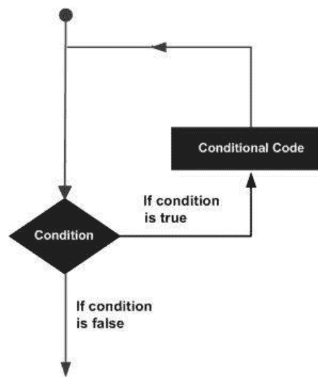

# Python 编程入门

初学者学习 Python 基础的指南。通过实用示例快速掌握编程的技巧与窍门

**詹姆斯·赫伦**

## 目录

- [简介](#)
- [全面的背景介绍](#)
    - [版本 1](#)
    - [版本 2](#)
    - [版本 3](#)
- [如何下载和安装 Python](#)
    - [在 Mac OS X 上安装和运行 Python](#)
    - [在 Unix 和 Linux 上安装和运行 Python](#)
    - [在 Windows 上安装和运行 Python](#)
    - [需要注意的 Python 环境变量](#)
    - [在 Mac OS X 上打开控制台](#)
    - [在 Linux 上打开控制台](#)
    - [在 Windows 上打开控制台](#)
    - [与 Python 交互](#)
- [启动并与 Python 交互](#)
    - [变量](#)
    - [基本运算符](#)
    - [循环](#)
    - [Python 原生数据类型](#)
    - [数字](#)
    - [字符串](#)
    - [列表](#)
    - [元组](#)
    - [字典](#)
    - [布尔逻辑与条件](#)
    - [在 Python 中构建 "While" 循环](#)
    - [在 Python 中构建 "For" 循环](#)
- [结论](#)

## 简介

Python 可能是目前广泛使用的编程语言中最容易学习、也最易于使用的。Python 代码清晰易读易写，简洁而不晦涩。Python 是一种功能非常强大的语言，这意味着我们通常可以用比用 C++ 或 Java 等语言编写同等应用少得多的 Python 代码行数来完成任务。

Python 是一种跨平台语言：因此，同一个 Python 程序可以在 Windows 和类 Unix 系统（如 Linux、BSD 或 Mac OS X）上运行，只需将构成程序的文件复制到目标机器即可，无需“构建”或编译。虽然可以构建利用平台特定功能的 Python 程序，但这并不常见，因为几乎所有 Python 标准库和大多数第三方库都是完全且透明地跨平台的。

Python 的一个突出优势是它附带了一个非常完整的标准库，这使我们只需一行或几行代码就能完成诸如从互联网下载文件、解压缩归档文件或构建 Web 服务器等任务。除了标准库，还有成千上万的免费第三方库，其中一些提供了比标准库更强大、更复杂的工具，例如 Twisted 网络库和 NumPy 数值库；而另一些则提供了功能过于专业而无法包含在标准库中的功能——例如 SimPy 仿真包。大多数第三方库都可以从 Python 包索引（pypi.python.org/pypi）获取。

Python 可以用于过程式、面向对象编程，以及在较小程度上用于函数式风格编程，尽管 Python 本质上是一种面向对象的语言。本书将解释如何编写过程式和面向对象的程序，并展示 Python 的函数式编程特性。

本书的目标是向你展示如何以地道的 Python 3 风格编写 Python 程序，并在初次阅读后成为 Python 3 语言的实用参考。

本书旨在为各种不同的读者提供帮助，包括自学和业余程序员、学生、科学家、工程师以及其他需要将编程作为工作一部分的人。为了在不使有经验者感到乏味或让经验较少者迷失的情况下对如此广泛的人群有用，本书假设读者至少具备一些编程经验。本书的结构旨在让你尽可能快地达到高效状态。

## 全面的背景介绍

Python 编程语言发明于 1980 年代末。其实施工作于 1989 年 12 月由荷兰 CWI 的 Guido van Rossum 开始，作为 ABC 语言的后继者，旨在处理异常并与 Amoeba 操作系统交互。Van Rossum 是 Python 的主要作者，他在选择 Python 发展方向上的持续核心作用体现在 Python 社区授予他的称号——“终身仁慈独裁者”（Benevolent Dictator for Life）。（然而，van Rossum 于 2018 年 7 月 12 日卸任领导者职位）Python 的名字灵感来源于 BBC 电视节目《蒙提·派森的飞行马戏团》。

Python 2.0 于 2000 年 10 月 16 日发布，带来了多项重大新特性，包括用于内存管理的循环检测垃圾回收器和对 Unicode 的支持。然而，最重要的变化是开发方法本身，转向了一个更透明、更社区驱动的过程。

Python 3.0 是一个重要的、不向后兼容的版本，于 2008 年 12 月 3 日发布，经过了长时间的测试。其许多重要特性也已向后移植到向后兼容但现已不再支持的 Python 2.6 和 2.7。

### 早期历史

1991 年 2 月，Van Rossum 将代码（标记为版本 0.9.0）发布到 alt.sources 新闻组。此时开发阶段已包含支持继承的类、异常处理、函数，以及列表、字典、字符串等核心数据类型。此次初始公告中还包括一个借鉴自 Modula-3 的模块系统；Van Rossum 将模块解释为“Python 的重要编程单元之一”。Python 的异常模型也遵循 Modula-3，并增加了 else 子句。1994 年，comp.lang.python（Python 的主要讨论论坛）成立，标志着 Python 用户群增长的一个里程碑。

### 版本 1

Python 1.0 于 1994 年 1 月发布。此版本包含的主要新特性是函数式编程工具 lambda、map、filter 和 reduce。Van Rossum 声称“Python 获得了 lambda、reduce()、filter() 和 map()，这要感谢一位怀念这些功能的 Lisp 黑客，他提供了可用的补丁”。

Van Rossum 在 CWI 期间发布的最后一个版本是 Python 1.2。1995 年，Van Rossum 在弗吉尼亚州雷斯顿的国家研究计划公司（CNRI）继续从事 Python 工作，并在那里发布了多个版本。

到版本 1.4 时，Python 已经获得了一些新特性。其中重要的是受 Modula-3 启发的关键字参数（也与 Common Lisp 的关键字参数相关）以及对复数的内置支持。还包括通过名称修饰实现的基本形式的数据隐藏，尽管这很容易被绕过。

在 Van Rossum 逗留 CNRI 期间，他启动了“人人学编程”（CP4E）计划，旨在让编程对更多人更易获得，使人们具备编程语言的基本“读写能力”，类似于大多数雇主所需的基础英语读写和数学技能。Python 在其中扮演了核心角色：由于其注重简洁的语法，它已经很适合，CP4E 的目标也与其前身 ABC 有关联。该项目得到了 DARPA 的支持。截至 2007 年，CP4E 项目已不活跃。虽然 Python 试图易于学习，其语法和语义不过于深奥，并且向非程序员推广并非当前关注点。

### 版本 2

Python 2.0 于 2000 年 10 月发布，引入了列表推导式，这一特性借鉴自函数式编程语言 SETL 和 Haskell。Python 对此结构的语法与 Haskell 非常相似，除了 Haskell 偏好标点符号而 Python 偏好字母关键字。Python 2.0 还启动了一个能够收集引用循环的垃圾回收系统。

Python 2.1 仅限于 Python 1.6.1 以及 Python 2.0。其许可证更名为 Python 软件基金会许可证。自 Python 2.1 的 alpha 版本发布以来，所有新增的代码、文档和规范均由 Python 软件基金会（一个成立于 2001 年的非营利组织，仿照 Apache 软件基金会模式建立）授予。该版本包含对语言规范的修改，以帮助实现嵌套作用域，类似于其他静态作用域语言。

Python 2.2 于 2001 年 12 月发布；其一项重大创新是将 Python 的类型（用 C 编写的类型）和类（用 Python 编写的类型）统一到一个层次结构中。这一统一使得 Python 的对象模型变得纯粹且一致地面向对象。同时还添加了受 Icon 启发的生成器。

Python 2.5 于 2006 年 9 月发布，并引入了 `with` 语句，该语句将代码块封装在上下文管理器中，允许类似资源获取即初始化（RAII）的行为，并取代了常见的 try/finally 惯用法。

Python 2.6 的发布是为了与 Python 3.0 对应，并添加了该版本的一些特性，以及一个“警告”模式，该模式会高亮显示在 Python 3.0 中被移除的特性。同样，Python 2.7 与 2009 年 6 月 26 日发布的 Python 3.1 保持一致并添加了其特性。此后，2.x 和 3.x 的并行发布停止，Python 2.7 成为 2.x 系列的最终版本。2014 年 11 月，宣布 Python 2.7 将维护到 2020 年，但鼓励用户尽快迁移到 Python 3。Python 2.7 的支持于 2020-01-01 结束，但最终的代码版本 2.7.18（基于 2020-01-01 的代码）于 2020-04-20 发布。这标志着 Python 2 生命周期的结束。

## 版本 3

Python 3.0 于 2008 年 12 月 3 日发布。它旨在纠正语言中的根本性设计缺陷——这些必要的更改无法在保持与 2.x 系列完全向后兼容的情况下实现，因此需要一个新的主版本号。Python 3 的指导原则是：“通过消除旧的做事方式来减少特殊性重复”。

Python 3.0 的开发遵循与之前版本相同的哲学。然而，Python 已经获得了新的和冗余的编程方式。对于相同的任务，Python 3.0 侧重于消除重复的构造和模块。

但是，Python 3.0 仍然是一个多范式语言。程序员仍然可以采用面向对象、结构化和函数式编程范式等。但在如此多的选择中，Python 3.0 中的特性旨在比 Python 2.x 中更易于访问。

## 如何下载和安装 Python

许多工作框架，例如 macOS 和 Linux，都预装了 Python。你的操作系统附带的 Python 版本称为系统 Python。

系统 Python 已完全过时，并且可能不是完整的 Python 安装。基本上，你需要最新版本的 Python，以便能够有效地跟踪当前的示例。

有两个主要的可用 Python 版本：Python 2，也称为遗留 Python，以及 Python 3。Python 2 于 2000 年发布，其生命周期应于 2020 年 1 月 1 日结束。本课程侧重于 Python 3。

它分为三个部分：

- Windows
- macOS
- Linux

只需找到你操作系统的部分并按照步骤设置你的电脑。

如果你使用的是不同的操作系统，请查看 realpython.com 上维护的 Python 3 安装和设置指南，以检查你的操作系统是否被涵盖。

### 在 Mac OS X 中安装和运行 Python

1.  访问 https://www.python.org/downloads/ Python 官方网站并点击 Download Python（你可能会看到不同的版本名称，请选择适合你的版本）。
2.  下载完成后，打开安装包并按照说明操作。当系统显示消息“The installation was successful”时，Python 将成功安装。
3.  建议在开始之前下载一个好的文本编辑器。如果你是初学者，我建议你下载 Sublime Text (https://www.sublimetext.com/2)。它是免费的。
4.  安装方法非常直接。运行你下载的 Sublime Text 磁盘映像文件并按照指导操作。
5.  打开 Sublime Text 并转到 File > New File（快捷键：Cmd+N）。之后，请通过点击（Cmd+S 或 File > Save）保存文件，使用 Python 扩展名 .py，例如 hello.py 或 my-first-program.py。
6.  编写代码并再次保存。对于初学者，你可以复制以下代码：
7.  转到 Tool > Build（快捷键：Cmd + B）。你会注意到 Sublime Text 底部的 Output:。恭喜，你已经成功运行了你的第一个 Python 程序。

```
print("Hello, World!")
This program Output: Hello World
```

### 在 Unix 和 Linux 中安装和运行 Python

在 Unix/Linux 机器上安装 Python 有一些简单的步骤。

1.  打开 Web 浏览器并访问 https://www.python.org/downloads/ 。
2.  按照链接下载适用于 Unix/Linux 的压缩源代码。
3.  下载并解压文件。
4.  如果你想自定义某些选项，请编辑 *Modules/Setup* 文件。
5.  运行 ./configure 脚本
6.  make
7.  make install

通过这种方式，Python 将安装在通常的位置 `/usr/local/bin`，其库安装在 `/usr/local/lib/pythonXX`。这里的 XX 是你的 Python 版本。

### 在 Windows 中安装和运行 Python

-   访问 [https://www.python.org/downloads/](https://www.python.org/downloads/) Python 官方网站并点击 Download Python（你可能会看到不同的版本名称，请选择适合你的版本）。
-   下载完成后，双击文件并按照指导进行安装。在安装 Python 时，一个名为 IDLE 的程序也会被安装。它提供了一个图形用户界面来使用 Python。
-   现在打开那个 IDLE 程序，然后复制以下代码并按回车键。
-   要在 IDLE 中生成文件，请转到 File > New Window（快捷键：Ctrl+N）。
-   之后编写 Python 代码，然后请通过点击（Cmd+S 或 File > Save）保存文件，使用 Python 扩展名 .py，例如 hello.py 或 my-first-program.py。
-   按照 Run > Run module（这里，你可以使用快捷键 F5）操作，你可以看到 Output:。恭喜，你已经成功运行了你的第一个 Python 程序。

```
print("Hello, World!")
```

### 需要注意的 Python 环境变量

### 设置 PATH

许多目录可能包含不同的可执行文件和程序，操作系统通过搜索路径来实现查找，该路径由目录注册以供操作系统搜索。

路径保存在一个环境变量中，这是一个由操作系统维护的命名字符串。此变量包含命令 shell 和其他程序可用的数据。

路径变量在 Unix 中定义为 PATH，在 Windows 中定义为 Path（Unix 区分大小写；Windows 不区分）。

在 Mac OS 中，路径详细信息由安装程序处理。要从任何适当的目录调用 Python 解释器，你需要将 Python 目录添加到你的路径中。

#### 在 Unix/Linux 中设置路径

在 Unix 中为特定会话将 python 目录添加到路径，请遵循以下规则 –

-   在 csh shell 中，输入 `setenv PATH "$PATH:/usr/local/bin/python"` 并按回车键。
-   在 Linux 的 bash shell 中，输入 `export PATH="$PATH:/usr/local/bin/python"` 并按回车键。
-   在 Linux 的 sh 或 ksh shell 中，输入 `PATH="$PATH:/usr/local/bin/python"` 并按回车键。
-   注意 – /usr/local/bin/python 是 Python 目录的路径。

#### 在 Windows 中设置路径

在 Windows 中为特定会话将 python 目录添加到路径，请遵循以下规则 –

在命令提示符处输入 `path "%path%;C:\Python"` 然后按回车键。

需要注意的是，Python 目录的路径是 “C:\Python”

### 运行 Python

#### 从命令行运行脚本

可以通过在命令行上调用解释器来执行 Python 脚本，具体方法如下例所示。

```
$python script.py    # Unix/Linux
或
python% script.py   # Unix/Linux
或
C:>python script.py # Windows/DOS
```

需要注意的是，你应该确保文件的权限模式允许执行。

#### 交互式解释器

最好在 Unix、DOS 或其他提供命令行编辑器或 shell 窗口的技术环境中启动 Python。

```
$python      # Unix/Linux
或
python%      # Unix/Linux
或
C:>python    # Windows/DOS
```

在命令行输入 **python**。

请直接在交互式解释器中开始编码。

以下是所有现有命令行选项的列表：

| # | 选项与描述 |
|---|---|
| 1 | **-d**<br>提供调试输出： |
| 2 | **-O**<br>生成优化的字节码（产生 .pyo 文件） |
| 3 | **-S**<br>启动时不运行 import site，以查找 Python 路径 |
| 4 | **-v**<br>详细输出：（跟踪 import 语句） |
| 5 | **-X**<br>禁用基于类的内置异常（从 1.6 版本开始） |
| 6 | **-c cmd**<br>运行作为 cmd 字符串传入的 Python 脚本 |
| 7 | **File**<br>从给定文件运行 Python 脚本 |

#### 集成开发环境

Python 可以从基于图形用户界面（GUI）的环境中运行。如果您的系统有 GUI 应用程序，这将有助于 Python 的使用。

- **Unix** – IDLE 是第一个用于 Python 的 Unix IDE。
- **Macintosh** – Macintosh 版本的 Python 及其 IDLE IDE 可从主网站下载，文件格式为 MacBinary 或 BinHex。
- **Windows** – **PythonWin** 是第一个用于 Python 的 Windows 接口，是一个带有 GUI 的 IDE。

如果您无法正确设置环境，您的系统管理员可以提供帮助。您将确保 Python 环境已正确设置并完美运行。

#### 在 Mac OS X 上打开控制台

OS X 的标准控制台是一个名为 Terminal 的程序。通过导航到“应用程序”，然后“实用工具”，双击 Terminal 应用程序即可打开。您也可以直接在右上角的系统搜索工具中搜索它。

命令行 Terminal 是与计算机交互的工具。一个窗口将启动并显示命令行提示消息，类似这样：

```
mycomputer:~ myusername$
```

#### 在 Linux 上打开控制台

几个 Linux 发行版（例如 Ubuntu、Fedora、Mint）可能有不同的控制台程序，通常称为终端。您启动的确切终端以及如何启动，取决于您的发行版。在 Ubuntu 上，您可能希望打开 Gnome Terminal。它应该显示类似这样的提示：

```
myusername@mycomputer:~$
```

#### 在 Windows 上打开控制台

Windows 的控制台名为命令提示符，即 cmd。一种简单的方法是使用组合键 Windows+R（Windows 指 Windows 徽标键），这将启动“运行”对话框。然后输入 cmd 并按 Enter 或单击“确定”。您也可以从开始菜单中查找它。它应该看起来像：

```
C:\Users\myusername>
```

Windows 的命令提示符并不像 Linux 和 OS X 上的同类工具那样强大，您可能希望直接启动 Python 解释器（见下文）或使用 Python 自带的 IDLE 程序。您可以在开始菜单中找到它们。

## 使用 Python

您安装的 python 应用程序默认将充当一个名为解释器的东西。解释器使用文本命令并在您输入时运行它们——对于尝试事物非常有帮助。只需在控制台中输入 python 并按 Enter，您就应该进入 Python 的解释器。

### 与 Python 交互

Python 打开后，它将向您显示一些类似这样的上下文数据：

```
Python 3.5.0 (default, Sep 20 2015, 11:28:25)
[GCC 5.2.0] on linux
Type "help", "copyright", "credits" for more data.
>>>
```

注意

最后一行的提示符 >>> 表示您现在处于交互式 Python 解释器会话中，也称为“Python shell”。这与普通的终端命令提示符不同！

现在您可以开始编写一些代码让 Python 运行。尝试：

```
print("Hello world")
```

按 Enter 并注意发生了什么。显示结果后，Python 将返回到交互式提示符，您可以在其中输入不同的命令：

```
>>> print("Hello world")
Hello world
>>> (1 + 4) * 2
10
```

一个非常有用的命令 **help()**，它进入帮助功能，可以从解释器中搜索所有 Python 允许您做的事情。按 q 关闭帮助窗口并返回到 Python 提示符。

要退出交互式 shell 并返回到控制台（系统 shell），在 Windows 上按 Ctrl-Z 然后按 Enter，或在 OS X 或 Linux 上按 Ctrl-D。或者，您也可以运行 python 命令 **exit()**！

#### 启动并与 Python 交互

##### 变量

一个命名的位置被称为变量，用于在内存中存储数据。将变量视为一个容器，其中包含可以在编程过程中稍后更改的数据，这是很有帮助的。根据变量的数据类型，解释器分配内存并决定可以在保留内存中存储什么。因此，通过为变量分配不同的数据类型，您可以在这些变量中存储整数、小数或字符。

##### 为变量赋值

Python 变量不需要精确的声明来存储内存空间。当值被赋给变量时，声明会自动发生。等号 '=' 用于为变量赋值。

'=' 运算符左侧的操作数是变量的标识符，右侧的操作数是存储在变量中的值。例如 –

```
#!/usr/bin/python3
number = 10       # 整数赋值
price  = 100.05   # 浮点数
name   = "Steve"  # 字符串
print (number)
print (price)
print (name)
```

这里，10、100.05 和 "Steve" 是依次分配给 number、price 和 name 变量的值。

| 输出： | 10 |
|---|---|
| | 100.05 |
| | Steve |

##### 多重赋值

Python 允许您同时将单个值分配给多个变量。例如 –

```
a = b = c = 10
```

这里，创建了一个值为 10 的整数对象，所有三个变量都分配到相同的内存位置。如果您愿意，也可以将多个对象分配给多个变量。例如 –

```
a, b, c = 10, 20, "steve"
```

这里，两个值分别为 10 和 20 的整数对象依次分配给变量 a 和 b，一个值为 "steve" 的字符串对象分配给变量 c。

### 标准数据类型

许多类型的数据可以存储在内存中。例如，某人的年龄存储为数值，而他或她的地址存储为字母数字字符。Python 有许多标准数据类型，用于定义对它们可执行的操作以及每种类型的存储系统。

Python 语言中有五种标准数据类型 –

- 数字
- 字符串
- 列表
- 元组
- 字典

#### Python 数字

数字数据类型存储数值。当值被分配给数字数据类型时，就会创建数字对象。例如 –

```
var1 = 10
var2 = 20
```

使用 del 语句也可以删除对数字对象的引用。del 语句的语法是 –

```
del var1[,var2[,var3[....,varN]]]
```

使用 del 语句可以删除单个对象或多个对象。例如 –

```
del var
del var_a, var_b
```

Python 支持三种不同的数值类型 –

- int（有符号整数）
- float（浮点实数值）
- complex（复数）

在 Python3 中，所有整数都表示为长整数。因此，没有单独的数字类型。

#### 示例

以下是一些数字的示例 –

| Int | float | complex |
|---|---|---|
| 10 | 0.0 | 2.16j |
| 200 | 12.30 | 35.j |
| -245 | -42.5 | 3.234e-26j |
| 078 | 22.3+e15 | .568J |
| -0360 | -60. | -.5656+0J |
| -0x290 | -52.32e200 | 3e+56J |
| 0x39 | 90.2-E16 | 6.23e-3j |

复数由一个有序的实数浮点数对组成，表示为 x + yj，其中 x 和 y 是实数，j 是虚数单位。

#### Python 字符串

Python 中的字符串被标识为引号中描述的相邻字符集。Python 支持单引号或双引号对。可以使用切片运算符 [] 和 [:] 获取字符串的子集，索引从字符串开头的 0 开始，到末尾的 -1。

加号 '+' 表示字符串连接运算符，星号 '*' 表示重复运算符。例如 –

#!/usr/bin/python3
str = 'Hello Python!'
print (str) # 打印完整字符串
print (str[0]) # 打印第一个字符
print (str[2:5]) # 打印第3到第5个字符
print (str[2:]) # 从第3个字符开始打印字符串
print (str * 2) # 打印字符串两次
print (str + "Test") # 打印连接后的字符串

| 输出： | Hello Python! |
|---|---|
| | H |
| | llo |
| | llo Python! |
| | Hello Python!Hello Python! |
| | Hello Python!Test |

#### Python 列表

在 Python 的复合数据类型中，列表是变化最多的一种。列表用于保存以逗号分隔并用方括号（`[]`）括起来的项目。在某种程度上，列表与 C 语言中的数组相关。它们之间的一个区别是，列表中的所有项目可以是不同的数据类型。

存储在列表中的值可以使用切片运算符（`[]` 和 `[:]`）获取，索引从列表开头的 0 开始，一直到末尾的 -1。加号（`+`）表示列表连接运算符，星号（`*`）表示重复运算符。例如 –

```
#!/usr/bin/python3
list = [ 'wxyz', 786 , 3.23, 'Steve', 80.2 ]
tinylist = [123, 'Steve']
print (list)       # 打印完整列表
print (list[0])    # 打印列表的第一个元素
print (list[1:3])  # 打印从第2个到第3个的元素
print (list[2:])   # 从第3个元素开始打印
print (tinylist * 2) # 打印列表两次
print (list + tinylist) # 打印连接后的列表
```

| 输出： | ['wxyz', 786, 3.23, 'Steve', 80.2]<br>wxyz<br>[786, 3.23]<br>[3.23, 'Steve', 80.2]<br>[123, 'Steve', 123, 'Steve']<br>['wxyz', 786, 3.23, 'Steve', 80.2, 123, 'Steve'] |
|---|---|

#### Python 字典

Python 的字典是一种哈希表类型。它们类似于 Perl 中的关联数组或哈希，由键值对组成。字典的键可以是任何 Python 类型，但通常是数字或字符串。另一方面，值可以是任何不受限制的 Python 对象。

字典用花括号 `{ }` 括起来，值可以使用方括号 `[ ]` 赋值和输入。例如 –

```
#!/usr/bin/python3
dict = {}
dict['one'] = "This is one"
dict[2]    = "This is two"
tinydict = {'name': 'steve','code':1005, 'dept': 'marketing'}
print (dict['one'])           # 打印 'one' 键对应的值
print (dict[2])               # 打印 2 键对应的值
print (tinydict)              # 打印完整字典
print (tinydict.keys())       # 打印所有键
print (tinydict.values())     # 打印所有值
```

| 输出： | This is one<br>This is two<br>{'name': 'steve', 'code': 1005, 'dept': 'marketing'}<br>dict_keys(['name', 'code', 'dept'])<br>dict_values(['steve', 1005, 'marketing']) |
|---|---|

字典中的元素没有顺序概念。说元素“无序”是错误的；它们是完全无序的。

#### 数据类型转换

有时，可能需要在内置类型之间进行转换。要进行类型转换，只需使用类型名称作为函数即可。

有各种内置函数可以完成从一种数据类型到另一种数据类型的转换。这些函数返回一个表示转换后值的新对象。

| 序号 | 函数与描述 |
|---|---|
| 1 | **int(x [,base])**<br>将 'x' 转换为整数。如果 'x' 是字符串，则 base 定义其进制。 |
| 2 | **float(x)**<br>将 'x' 转换为浮点数。 |
| 3 | **complex(real [,imag])**<br>创建一个复数。 |
| 4 | **str(x)**<br>将对象 'x' 转换为字符串表示。 |
| 5 | **repr(x)**<br>将对象 'x' 转换为表达式字符串。 |
| 6 | **eval(str)**<br>计算一个字符串并返回一个对象。 |
| 7 | **tuple(s)**<br>将 's' 转换为元组。 |
| 8 | **list(s)**<br>将 's' 转换为列表。 |
| 9 | **set(s)**<br>将 's' 转换为集合。 |
| 10 | **dict(d)**<br>创建一个字典。'd' 必须是 (键, 值) 元组的序列。 |
| 11 | **frozenset(s)**<br>将 's' 转换为冻结集合。 |
| 12 | **chr(x)**<br>将整数转换为字符。 |
| 13 | **unichr(x)**<br>将整数转换为 Unicode 字符。 |
| 14 | **ord(x)**<br>将单个字符转换为其整数值。 |
| 15 | **hex(x)**<br>将整数转换为十六进制字符串。 |
| 16 | **oct(x)**<br>将整数转换为八进制字符串。 |

### 基本运算符

可以操作操作数值的构造称为运算符。

假设表达式 5 + 3 = 8。这里，5 和 3 称为操作数，+ 称为运算符。

#### 运算符类型

Python 语言支持以下类型的运算符。

- 算术运算符
- 比较（关系）运算符
- 赋值运算符
- 逻辑运算符
- 位运算符
- 成员运算符
- 身份运算符

让我们逐一了解所有运算符。

#### 算术运算符

假设变量 'x' 包含 10，变量 'y' 包含 20，则 –

| 运算符 | 描述 | 示例 |
| --- | --- | --- |
| + 加法 | 将运算符两侧的值相加。 | x + y = 30 |
| - 减法 | 从左操作数中减去右操作数。 | x – y = -10 |
| * 乘法 | 将运算符两侧的值相乘。 | x * y = 200 |
| / 除法 | 左操作数除以右操作数。 | x / y = 0.5 |
| % 取模 | 左操作数除以右操作数并返回余数。 | y % x = 0 |
| ** 指数 | 对操作数进行指数（幂）运算。 | x**y = 10 的 20 次方 |
| // 整除 | 操作数相除，结果为商的整数部分（向下取整）。但如果其中一个操作数为负数，则结果会向负无穷方向取整。 | 10//5 = 2 且 7.0//2.0 = 3.0, -11//3 = -4, -11.0//3 = -4.0 |

### 比较运算符

关系运算符是比较其两侧的值并确定它们之间关系的运算符。

假设变量 'a' 保存 10，变量 'b' 保存 20，则 –

| 运算符 | 描述 | 示例 |
|---|---|---|
| == | 当两个操作数的值相等时，条件为真。 | (a == b) 为假。 |
| != | 当两个操作数的值不相等时，条件为真。 | (a != b) 为真。 |
| > | 当左操作数的值大于右操作数的值时，条件为真。 | (a > b) 为假。 |
| < | 当左操作数的值小于右操作数的值时，条件为真。 | (a < b) 为真。 |
| >= | 当左操作数的值大于或等于右操作数的值时，条件为真。 | (a >= b) 为假。 |
| <= | 当左操作数的值小于或等于右操作数的值时，条件为真。 | (a <= b) 为真。 |

#### 赋值运算符

假设变量 'a' 保存值 10，变量 'b' 保存值 20，则 –

| 运算符 | 描述 | 示例 |
| :--- | :--- | :--- |
| = | 将右侧操作数的值赋给左侧操作数。 | c = a + b 将 a + b 的值赋给 c |
| += 加后赋值 | 将右操作数加到左操作数上，然后将结果赋给左操作数。 | c += a 或 c = c + a |
| -= 减后赋值 | 从左操作数中减去右操作数，然后将结果赋给左操作数。 | c -= a 或 c = c - a |
| *= 乘后赋值 | 左操作数乘以右操作数，然后将结果赋给左操作数。 | c *= a 或 c = c * a |
| /= 除后赋值 | 左操作数除以右操作数，然后将结果赋给左操作数。 | c /= a 或 c = c / a |
| %= 取模后赋值 | 对两个操作数进行取模运算，然后将结果赋给左操作数。 | c %= a 或 c = c % a |
| **= 指数后赋值 | 对操作数进行指数（幂）运算，然后将结果赋给左操作数。 | c **= a 或 c = c ** a |
| //= 整除后赋值 | 对操作数进行整除运算，然后将结果赋给左操作数。 | c //= a 或 c = c // a |

#### 示例

```
#!/usr/bin/python3
a = 10
b = 20
c = 0
c = a + b
print("Line 1 - Value of c is ", c)
c += a
print("Line 2 - Value of c is ", c)
c *= a
print("Line 3 - Value of c is ", c)
c /= a
```

print=(第 4 行 - c 的值为 , c )
c =2
c %= a
print=(第 5 行 - c 的值为 , c)
c **= a
print=(第 6 行 - c 的值为 , c)
c //= a
print=(第 7 行 - c 的值为 , c)

| 输出： | 第 1 行 - c 的值为 30
第 2 行 - c 的值为 40
第 3 行 - c 的值为 400
第 4 行 - c 的值为 40.0
第 5 行 - c 的值为 2
第 6 行 - c 的值为 1024
第 7 行 - c 的值为 102 |

#### 位运算符

位运算符作用于位，并执行逐位运算。假设 a = 30; 且 b = 15; 那么它们的二进制格式如下 –

Python 的内置函数 `bin()` 可用于获取整数的二进制表示。

```
a = 0001 1110
b = 0000 1111
-----------------
a &b = 0000 1110
a | b = 0001 1111
a ^ b = 0001 0001
~a = 1110 0001
```

Python 语言提供了以下位运算符 –

| 运算符 | 描述 | 示例 |
| --- | --- | --- |
| & 按位与 | 当两个操作数的对应位都为 1 时，按位与的结果为 1。 | (a & b) (即 0000 1110) |
| \| 按位或 | 当两个操作数的对应位中任意一位为 1 时，按位或的结果为 1。 | (a \| b) = 31 (即 0001 1111) |
| ^ 按位异或 | 当两个操作数的对应位中任意一位为 1 但并非两者都为 1 时，按位异或的结果为 1。 | (a ^ b) = 17 (即 0001 0001) |
| ~ 按位取反 | 它是一元运算符，具有“翻转”位的效果。 | (~a ) = -31 (由于是有符号二进制数，其二进制补码形式为 1110 0001)。 |
| << 左移 | 左操作数的值按右操作数指定的位数向左移动。 | a << 2 = 480 (即 1110 0000) |
| >> 右移 | 左操作数的值按右操作数指定的位数向右移动。 | a >> 2 = 1 (即 0000 0001) |

#### 示例

```
#!/usr/bin/python3
a =30              # 30 = 0001 1110
b =15              #15 = 0000 1111
print('a=',a,':',bin(a),'b=',b,':',bin(b))
c =0
c = a & b;   # 14 = 0000 1110
print("result of AND is ", c,':',bin(c))
c = a | b;   # 31 = 0001 1111
print("result of OR is ", c,':',bin(c))
c = a ^ b;   # 17 = 0001 0001
print("result of EXOR is ", c,':',bin(c))
c =~a;              # -31 = 1110 0001
print("result of COMPLEMENT is ", c,':',bin(c))
c = a <<4;  # 480 = 1110 0000
print("result of LEFT SHIFT is ", c,':',bin(c))
c = a >>4;  # 1 = 0000 0001
print("result of RIGHT SHIFT is ", c,':',bin(c))
```

| 输出： | a= 30 : 00011110 b= 15 : 00001111
AND 的结果是 14 : 00001110
OR 的结果是 31 : 00011111
EXOR 的结果是 17 : 00010001
COMPLEMENT 的结果是 -31 : -00011111
LEFT SHIFT 的结果是 480 : 111100000
RIGHT SHIFT 的结果是 1 : 00000001 |

### 逻辑运算符

Python 语言允许使用以下逻辑运算符。假设变量 a 为 True，变量 b 为 False

| 运算符 | 描述 | 示例 |
| --- | --- | --- |
| and 逻辑与 | 当两个操作数都为真时，条件为真。 | (a and b) 为 False。 |
| or 逻辑或 | 当两个操作数中任意一个非零时，条件为真。 | (a or b) 为 True。 |
| not 逻辑非 | 用于反转其操作数的逻辑状态。 | Not(a and b) 为 True。 |

#### 成员运算符

Python 成员运算符用于测试序列（如字符串、列表或元组）中的成员资格。这里描述了两个成员运算符 –

| 运算符 | 描述 | 示例 |
| --- | --- | --- |
| In | 当在指定序列中找到变量时结果为真，否则为假。 | 'a' in y，当 in 的结果为 1 时，则 'b' 是序列 'b' 的成员。 |
| not in | 当在指定序列中未找到变量时结果为真，否则为假。 | 'a' not in 'b'，当 not in 的结果为 1 时，则 'a' 不是序列 'b' 的成员。 |

#### 身份运算符

身份运算符用于比较两个对象的内存位置。这里描述了两个身份运算符 –

| 运算符 | 描述 | 示例 |
| --- | --- | --- |
| is | 当运算符两侧的变量指向同一个对象时结果为真，否则为假。 | 'a' is 'b'，当 is 的结果为 1 时，则 id(a) 等于 id(b)。 |
| is not | 当运算符两侧的变量不指向同一个对象时结果为真，否则为假。 | 'a' is not 'b'，当 is not 的结果为 1 时，则 id(a) 不等于 id(b)。 |

#### 示例

```
#!/usr/bin/python3
a = 30
b = 30
print ('Line 1','a=',a,':',id(a), 'b=',b,':',id(b))
if ( a is b ):
    print= (第 2 行 - a 和 b 具有相同标识)
else:
    print =(第 2 行 - a 和 b 不具有相同标识)
if ( id(a) == id(b) ):
    print =(第 3 行 - a 和 b 具有相同标识)
else:
    print =(第 3 行 - a 和 b 不具有相同标识)
b = 40
print =('第 4 行','a=',a,':',id(a), 'b=',b,':',id(b))
if ( a is not b ):
    print =(第 5 行 - a 和 b 不具有相同标识)
else:
    print= (第 5 行 - a 和 b 具有相同标识)
```

| **输出：** | 第 1 行 a= 30 : 140351590504288 b= 30 : 140351590504288<br>第 2 行 - a 和 b 具有相同标识<br>第 3 行 - a 和 b 具有相同标识<br>第 4 行 a= 30 : 140351590504288 b= 40 : 140351590504608<br>第 5 行 - a 和 b 不具有相同标识 |

#### 运算符优先级

| # | 运算符及描述 |
|---|---|
| 1 | **\*\***<br>幂运算（求幂） |
| 2 | **~ + -**<br>取反、一元正号和负号 |
| 3 | **\* / % //**<br>乘、除、取模和整除 |
| 4 | **+ -**<br>加法和减法 |
| 5 | **>> <<**<br>右移和左移位运算 |
| 6 | **&**<br>按位“与” |
| 7 | **^ \|**<br>按位异或“`OR`”和按位或“`OR`” |
| 8 | **<= < > >=**<br>比较运算符 |
| 9 | **<> == !=**<br>相等运算符 |
| 10 | **= %= /= //= -= += \*= \*\*=**<br>赋值运算符 |
| 11 | **is is not**<br>身份运算符 |
| 12 | **in not in**<br>成员运算符 |
| 13 | **not or and** |

## 3 逻辑运算符

## 循环

通常，语句是按顺序执行的——函数中的第一条语句首先执行，然后是第二条，依此类推。有时可能需要多次执行一段代码块。

编程语言提供了不同的控制结构，允许更复杂的执行路径。

循环语句允许我们多次执行一条语句或一组语句。下图显示了一个循环语句 –



Python 编程语言提供了以下描述的循环类型来处理循环需求。

| # | 循环类型及描述 |
|---|---|
| 1 | **while 循环**<br>当给定条件为 TRUE 时，它重复执行一条语句或一组语句。它在执行循环体之前检查条件。 |

| # | 控制语句及描述 |
|---|---|
| 1 | **break 语句**<br>break 语句终止循环语句，并将执行立即转移到紧随其后的语句。 |
| 2 | **continue 语句**<br>导致循环跳过其主体的剩余部分，并在重复之前立即重新检查其条件。 |
| 3 | **pass 语句**<br>当需要一条语句在语法上是必需的，但你不想执行任何命令或代码时，可以在 Python 编辑器中使用 pass 语句。 |

让我们快速了解每个循环控制语句。

### 迭代器和生成器

迭代器是一个对象，它支持程序员遍历集合的所有元素，无论其具体实现如何。在 Python 中，迭代器对象执行两个方法：`iter()` 和 `next()`。

可以使用字符串、列表或元组对象创建迭代器。

```
list = [1,2,3,4]
it = iter(list) # 这会创建一个迭代器对象
print (next(it)) # 打印迭代器中下一个可用的元素
```

迭代器对象通常使用常规的 `for` 语句进行遍历！
usr/bin/python3
for x in it:
    print (x, end=" ")
或者使用 `next()` 函数
while True:
    try:
        print (next(it))
    except StopIteration:
        sys.exit() # 为此你需要导入 sys 模块
```

生成器是一个使用 `yield` 方法返回或产生一系列值的函数。

当调用生成器函数时，它返回一个生成器对象，甚至不开始执行函数。当第一次调用 `next()` 方法时，函数开始执行，直到到达 `return` 语句，该语句返回产生的值。`yield` 会跟踪（即记住）上次执行的位置，第二次 `next()` 调用将从上一个值继续。

#### 示例

以下示例定义了一个生成器，它为所有斐波那契数生成一个迭代器。

```
#!usr/bin/python3
import sys
def fibonacci(n): # 生成器函数
    a, b, counter = 0, 1, 0
    while True:
        if (counter > n):
            return
        yield a
    return
        yield a
        a, b = b, a + b
        counter += 1
f = fibonacci(5) # f 是迭代器对象
while True:
```

## Python 原生数据类型

Python 中的每个对象都有一个类型。`type` 函数允许我们检查对象的类型。

```python
>>> type(today)
```

```
<class 'dateTime.date'>
```

Python 语言内置了少数几种基本或原生的数据类型。

原生数据类型具有以下属性：

1.  有简单的表达式可以求值为这些类型的对象，称为字面量。
2.  有内置函数、运算符和方法来操作这些类型的值。

正如我们所见，数字是原生的；数字字面量求值为数字，数学运算符管理数字对象。

```python
>>> 12 + 3000000000000000000000
```

```
300000000000000000000012
```

具体来说，Python 涉及三种原生数字类型：整数（**int**）、实数（**float**）和复数（**complex**）。

```python
>>> type(2)
```

```
<class 'int'>
```

```python
>>> type(1.5)
```

```
<class 'float'>
```

```python
>>> type(1+1j)
```

```
<class 'complex'>
```

**float** 这个名称源于 Python 中实数的表示方式：“浮点”表示法。虽然数字如何表达的细节不是本文讨论的问题，但了解 **int** 和 **float** 对象之间的一些高层差异是必要的。简而言之，**int** 对象只能表示整数，但它们能精确地表示整数，没有任何近似。另一方面，**float** 对象可以表示广泛的分数数字，尽管并非所有有理数都是可表示的。尽管如此，**float** 对象通常用于近似表示实数和有理数，精确到一定的有效数字位数。

Python 有许多原生数据类型。

以下是重要的一些：

1.  布尔值是 True 或 False。
2.  数字可以是整数（1 和 2）、浮点数（1.1 和 1.2）、分数（1/2 和 2/3），甚至是复数。
3.  字符串是 Unicode 字符的序列，例如一个 HTML 文档。
4.  字节和字节数组，例如一个 jpeg 图像文件。
5.  列表是有序的值序列。
6.  元组是有序的、不可变的值序列。
7.  集合是无序的值包。
8.  字典是无序的键值对包。

当然，类型不止这些。Python 中一切都是对象，所以有像模块、函数、类、方法、文件，甚至编辑过的代码这样的类型。

### 数字

数值由数字数据类型存储。它们是不可变的数据类型。这意味着，更改数字数据类型的值会输出一个新分配的对象。

在赋值时，会创建数字对象。例如 –

```python
var1 = 10
var2 = 20
```

使用 `del` 语句也可以删除对数字对象的引用。`del` 语句的语法是 –

```python
del var1[,var2[,var3[....,varN]]]]
```

使用 `del` 语句可以删除单个对象或多个对象。例如 –

```python
del var
del var_a, var_b
```

Python 支持不同类型的数字 –

-   **int（有符号整数）** – 通常称为整数或 ints。它们是正或负的整数，没有小数点。在 Python 3 中，整数是无限大小的。Python 2 有两种整数类型 - int 和 long。Python 3 中不再有 'long integer'。
-   **float（浮点实数值）** – 也称为浮点数。它们表示实数，用小数点分隔整数和小数部分。在科学计数法中，浮点数也可以用 E 或 e 表示 10 的幂（2.5e2 = 2.5 x 102 = 250）。
-   **complex（复数）** – 形式为 a + bJ，其中 a 和 b 是浮点数，J（或 j）表示 -1 的平方根（这是一个虚数）。数字的实部是 a，虚部是 b。在 Python 编程中，复数应用不多。

可以用十六进制或八进制形式表示整数。

```python
>>> number = 0xA0F  #十六进制
>>> number
2575
>>> number = 0o37   #八进制
>>> number
31
```

#### 示例

这里给出一些数字的示例。

| int | float | complex |
| --- | --- | --- |
| 10 | 0.0 | 2.16j |
| 200 | 12.30 | 35.j |
| -245 | -42.5 | 3.234e-26j |
| 078 | 22.3+e15 | .568J |
| -0360 | -60. | -.5656+0J |
| -0x290 | -52.32e200 | 3e+56J |
| 0x39 | 90.2-E16 | 6.23e-3j |

复数由一个有序的实浮点数对表示，形式为 a + bj，其中 a 是复数的实部，b 是虚部。

#### 数字类型转换

Python 在内部将包含混合类型的表达式中的数字转换为公共类型以进行调整。有时，你需要显式地将数字从一种类型转换为另一种类型，以满足运算符或函数参数的条件。

-   使用 `int(x)` 将 x 转换为普通整数。
-   使用 `long(x)` 将 x 转换为长整数。
-   使用 `float(x)` 将 x 转换为浮点数。
-   使用 `complex(x)` 将 x 转换为实部为 x、虚部为零的复数。
-   使用 `complex(x, y)` 将 x 和 y 转换为实部为 x、虚部为 y 的复数。x 和 y 是数字表达式。

#### 数学函数

Python 引入了以下用于执行数学计算的函数。

| # | 函数与返回值（描述） |
| --- | --- |
| 1 | **abs(x)**<br>x 的绝对值：从零到 x 的（正）距离。 |
| 2 | **ceil(x)**<br>x 的上取整：不小于 x 的最小整数。 |
| 3 | **cmp(x, y)**<br>如果 y>x 返回 -1，如果 x == y 返回 0，如果 y<x 返回 1。在 Python 3 中已弃用。<br>请改用 `return (x>y)-(x<y)`。 |
| 4 | **exp(x)**<br>x 的指数：e^x |
| 5 | **fabs(x)**<br>x 的绝对值。 |
| 6 | **floor(x)**<br>x 的下取整：不大于 x 的最大整数。 |
| 7 | **log(x)**<br>x 的自然对数，其中 x > 0。 |
| 8 | **log10(x)**<br>x 的以 10 为底的对数，其中 x > 0。 |
| 9 | **max(x1, x2,...)**<br>其参数中的最大值：最接近正无穷大的值。 |
| 10 | **min(x1, x2,...)**<br>其参数中的最小值：最接近负无穷大的值。 |
| 11 | **modf(x)**<br>以二元组形式返回 x 的小数部分和整数部分。<br>每个部分的符号与 x 相同。整数部分作为浮点数返回。 |
| 12 | **pow(x, y)**<br>x**y 的值。 |
| 13 | **round(x [,n])**<br>x 四舍五入到小数点后 n 位。Python 在平局时远离零进行舍入：round(0.5) 是 1.0，round(-0.5) 是 -1.0。 |
| 14 | **sqrt(x)**<br>x 的平方根，其中 x > 0。 |

#### 随机数函数

在游戏、模拟、测试、安全和隐私应用中使用随机数。Python 引入了以下常用函数。

| # | 函数与描述 |
|---|---|
| 1 | **choice(seq)**<br>从列表、元组或字符串中随机选择一个项目。 |
| 2 | **randrange ([start,] stop [,step])**<br>从 range(start, stop, step) 中随机选择一个元素。 |
| 3 | **random()**<br>一个随机浮点数 r，使得 0 <= r < 1 |
| 4 | **seed([x])**<br>设置生成随机数时使用的整数初始值。在调用任何 random 模块函数之前调用此函数。返回 None。 |
| 5 | **shuffle(lst)**<br>就地随机排列列表的项目。返回 None。 |
| 6 | **uniform(x, y)**<br>一个随机浮点数 r，使得 x <= r < y。 |

#### 三角函数

Python 语言中引入了以下执行三角计算的函数。

| # | 函数与描述 |
|---|---|
| 1 | **acos(x)**<br>返回 x 的反余弦值，以弧度为单位。 |
| 2 | **asin(x)**<br>返回 x 的反正弦值，以弧度为单位。 |
| 3 | **atan(x)**<br>返回 x 的反正切值，以弧度为单位。 |
| 4 | **atan2(y, x)**<br>返回 atan(y / x)，以弧度为单位。 |
| 5 | **cos(x)**<br>返回 x 弧度的余弦值。 |
| 6 | **hypot(x, y)**<br>返回欧几里得范数，sqrt(x*x + y*y)。 |
| 7 | **sin(x)**<br>返回 x 弧度的正弦值。 |

#### 数学常量

该模块还表示两个数学常量 –

| # | 常量与描述 |
|---|---|
| 1 | **pi**<br>数学常量 pi。 |
| 2 | **e**<br>数学常量 e。 |

### 字符串

Python 中最流行的数据类型是字符串。字符串可以通过将字符嵌入引号中来简单创建。Python 中的单引号与双引号被视为相同。创建字符串非常简单，只需将值赋给变量即可。例如 –

```
var1 ='Hello World!'
var2 ="Python Programming"
```

#### 访问字符串中的值

Python 不支持字符类型；这些被视为长度为一的字符串，因此也被视为子字符串。

要访问子字符串，你可以使用方括号配合索引或内容来获取子字符串。
例如 –

```
#!/usr/bin/python3
var1 = 'Hello World!'
var2 = "Python Programming"
print ("var1[0]: ", var1[0])
print ("var2[0:6]: ", var2[0:6])
```

| 输出 : | var1[0]: H
var2[0:6]: Python |

#### 更新字符串

你可以通过（重新）将变量赋值给另一个字符串来“更新”现有字符串。新值可以与其先前值相关，也可以是完全不同的字符串。例如 –

```
#!/usr/bin/python3
var1 = 'Hello World!'
print ("Updated String :- ", var1[:6] + 'Python')
```

| 输出: | Updated String :- Hello Python |

#### 转义字符

下表中列出了可以用反斜杠表示法表示的转义字符或非打印字符列表。

转义字符在单引号和双引号字符串中都有解释。

| 反斜杠表示法 | 十六进制字符 | 描述 |
| --- | --- | --- |
| \a | 0x05 | 响铃或警报 |
| \b | 0x09 | 退格 |
| \cx | | Control-x |
| \C-x | | Control-x |
| \e | 0x2b | 转义 |
| \f | 0x0c | 换页 |
| \M-\C-x | | Meta-Control-x |
| \n | 0x0a | 换行 |
| \nnn | | 八进制表示法，其中 n 在 0.7 范围内 |
| \r | 0x0d | 回车 |
| \s | 0x10 | 空格 |
| \t | 0x08 | 制表符 |
| \v | 0x0b | 垂直制表符 |
| \x | 字符 x |
| \xnn | 十六进制表示法，其中 n 在 0.9、a.f 或 A.F 范围内 |

#### 字符串特殊运算符

假设字符串变量 'a' 持有 'Hello'，变量 'b' 持有 'Python'，则 –

| 运算符 | 描述 | 示例 |
|---|---|---|
| + | 连接 - 添加运算符两侧的值 | a + b 将得到 HelloPython |
| * | 重复 - 通过连接同一字符串的多个副本来生成新字符串 | a*2 将得到 - HelloHello |
| [] | 切片 - 提供给定索引处的字符 | a[1] 将得到 e |
| [:] | 范围切片 - 提供给定范围内的字符 | a[1:4] 将得到 ell |
| In | 成员资格 - 如果字符存在于给定字符串中则返回 true | H in a 将得到 1 |
| not in | 成员资格 - 如果字符不存在于给定字符串中则返回 true | M not in a 将得到 1 |
| r/R | 原始字符串 - 克服转义字符的原始含义。原始字符串的语法与常规字符串完全相同，除了原始字符串运算符字母 "r"，它位于引号之前。"r" 可以是小写 (r) 或大写 (R)，并且必须直接放在第一个引号之前。 | print r'\n' 打印 \n，而 print R'\n' 打印 \n |
| % | 格式化 - 执行字符串格式化 | 见下文 |

#### 字符串格式化运算符

字符串格式化运算符 % 是 Python 中最酷的特性之一。此运算符专用于字符串，并借鉴了 C 语言 printf() 系列函数的功能。这里有一个简单的例子 –

```
#!/usr/bin/python3
print =(My name is %s and weight is %d kg! % ('Steve', 21))
```

| 输出: | My name is Steve and weight is 21 kg! |

这里给出了可以与 % 一起使用的完整符号列表 –

| # | 格式符号与转换 |
|---|---|
| 1 | **%c** 字符 |
| 2 | **%s** 在格式化之前通过 str() 进行字符串转换 |
| 3 | **%i** 有符号十进制整数 |
| 4 | **%d** 有符号十进制整数 |
| 5 | **%u** 无符号十进制整数 |
| 6 | **%o** 八进制整数 |
| 7 | **%x** 十六进制整数（小写字母） |
| 8 | **%X** 十六进制整数（大写字母） |
| 9 | **%e** 指数表示法（带小写 'e'） |
| 10 | **%E** 指数表示法（带大写 'E'） |
| 11 | **%f** 浮点实数 |
| 12 | **%g** %f 和 %e 中较短的一个 |
| 13 | **%G** %f 和 %E 中较短的一个 |

下表中给出了一些其他支持的符号和功能 –

| 序号 | 符号与功能 |
|---|---|
| 1 | * 参数指定宽度或精度 |
| 2 | - 左对齐 |
| 3 | + 显示符号 |
| 4 | <sp> 在正数前留一个空格 |
| 5 | # 添加十六进制前导 '0x' 或 '0X' 或八进制前导零（'0'），具体取决于使用的是 'x' 还是 'X'。 |
| 6 | 0 用零填充（而不是空格） |
| 7 | % '%%' 产生一个字面量 '%' |
| 8 | (var) 映射变量（字典参数） |
| 9 | m.n. m 是最小总宽度，n 是小数点后要执行的位数（如果适用）。 |

#### 三引号

通过允许字符串跨越多行，Python 的三引号可以包含字面换行符、制表符和任何其他特殊字符。

三引号在语法上由三个连续的单引号或双引号组成。

```
#!/usr/bin/python3
TABB ( \t ) and they will show up that way when displayed.
NEWLINEs inside the string, whether explicitly supplied like
this inside the brackets
[ \n ], or just a NEWLINE inside
the variable assignment will also show up.
'''''
print (para_str)
```

| 输出: | this is a large string that is produced of
different lines and non-printable characters
such as
TABB (  ) and they will show up that way when
displayed.
NEWLINEs inside the string, whether explicitly
supplied like
this inside the brackets
[
], or just a NEWLINE inside
the variable assignment will also show up. |

> **注意：** 注意所有单个唯一字符都已更改为其打印形式，一直到字符串末尾 "up." 和结束三引号之间的最后一个换行符。还要注意，换行符要么通过行末的精确回车符出现，要么通过其转义代码 (\n) 出现 –

新字符串中的反斜杠根本不被视为特殊字符。放入原始字符串中的每个字符都保持原样 –

```
#!/usr/bin/python3
print ('C:\nowhere')
```

执行上述代码后产生以下输出：

C:\nowhere

现在是使用原始字符串的时候了。我们将按照以下方式在 r'expression' 中设置表达式 –

```
#!/usr/bin/python3
print (r'C:\nowhere')
```

执行上述代码后产生以下输出：

C:\nowhere

#### Unicode 字符串

在 Python 2 中，所有字符串在内部都存储为 8 位 ASCII，因此必须添加 'u' 前缀来创建 Unicode 字符串。现在这已不再需要。在 Python 3 中，所有字符串都以 Unicode 表示。

#### 内置字符串方法

为了操作字符串，Python 包含以下内置方法 –

| 序号 | 方法与描述 |
| :--- | :--- |
| 1 | **capitalize()**<br>将字符串的第一个字母大写 |
| 2 | **center(width, fillchar)**<br>返回一个字符串，该字符串用 fillchar 填充，初始字符串居中，总宽度为 width 列。 |
| 3 | **count(str, beg = 0,end = len(string))**<br>计算 str 在字符串中出现的次数，如果给出了起始索引 beg 和结束索引 end，则计算在字符串的子字符串中出现的次数。 |
| 4 | **decode(encoding = 'UTF-8',errors = 'strict')**<br>使用为编码指定的编解码器解码字符串。encoding 默认为默认字符串编码。 |
| 5 | **encode(encoding = 'UTF-8',errors = 'strict')**<br>返回字符串的编码版本；出错时，默认引发 ValueError，除非 errors 指定为 'ignore' 或 'replace'。 |
| 6 | **endswith(suffix, beg = 0, end = len(string))**<br>确定字符串或字符串的子字符串（如果给出了起始索引 beg 和结束索引 end）是否以 suffix 结尾；如果是则返回 true，否则返回 false。 |

#### 字符串方法

| 序号 | 方法与描述 |
| :--- | :--- |
| 7 | **expandtabs(tabsize=8)**<br>将字符串中的制表符扩展为空格，默认为每个制表符8个空格。 |
| 8 | **find(str, beg=0, end=len(string))**<br>检测字符串中是否包含子字符串 str，如果指定 beg（开始）和 end（结束）范围，则检查是否包含在指定范围内，如果包含子字符串则返回开始的索引值，否则返回-1。 |
| 9 | **index(str, beg=0, end=len(string))**<br>跟 find() 方法类似，但是如果 str 不在字符串中会报一个异常。 |
| 10 | **isalnum()**<br>如果字符串至少有一个字符并且所有字符都是字母或数字则返回 True，否则返回 False。 |
| 11 | **isalpha()**<br>如果字符串至少有一个字符并且所有字符都是字母则返回 True，否则返回 False。 |
| 12 | **isdigit()**<br>如果字符串只包含数字则返回 True，否则返回 False。 |
| 13 | **islower()**<br>如果字符串中包含至少一个区分大小写的字符，并且所有这些（区分大小写的）字符都是小写，则返回 True，否则返回 False。 |
| 14 | **isnumeric()**<br>如果字符串中只包含数字字符，则返回 True，否则返回 False。 |
| 15 | **isspace()**<br>如果字符串中只包含空白字符，则返回 True，否则返回 False。 |
| 16 | **istitle()**<br>如果字符串是标题化的（见 title()）则返回 True，否则返回 False。 |
| 17 | **isupper()**<br>如果字符串中包含至少一个区分大小写的字符，并且所有这些（区分大小写的）字符都是大写，则返回 True，否则返回 False。 |
| 18 | **join(seq)**<br>以字符串作为分隔符，将序列 seq 中所有的元素合并为一个新的字符串。 |
| 19 | **len(string)**<br>返回字符串长度。 |
| 20 | **ljust(width[, fillchar])**<br>返回一个原字符串左对齐，并使用空格填充至长度 width 的新字符串。 |
| 21 | **lower()**<br>转换字符串中所有大写字符为小写。 |
| 22 | **lstrip()**<br>截掉字符串左边的空白字符。 |
| 23 | **maketrans()**<br>返回一个翻译表，供 translate() 方法使用。 |
| 24 | **max(str)**<br>返回字符串 str 中最大的字母。 |
| 25 | **min(str)**<br>返回字符串 str 中最小的字母。 |
| 26 | **replace(old, new[, max])**<br>将字符串中的 old 替换成 new，如果指定 max，则替换不超过 max 次。 |
| 27 | **rfind(str, beg=0, end=len(string))**<br>类似于 find() 函数，不过是从右边开始查找。 |
| 28 | **rindex(str, beg=0, end=len(string))**<br>类似于 index()，不过是从右边开始查找。 |
| 29 | **rjust(width[, fillchar])**<br>返回一个原字符串右对齐，并使用空格填充至长度 width 的新字符串。 |
| 30 | **rstrip()**<br>删除字符串末尾的空白字符。 |
| 31 | **split(str="", num=string.count(str))**<br>以 str 为分隔符切片字符串，如果 num 有指定值，则仅分隔 num 个子字符串，返回一个字符串列表。 |
| 32 | **splitlines([num=string.count('\n')])**<br>按照行（'\r', '\r\n', '\n'）分隔，返回一个包含各行作为元素的列表，如果 num 指定则仅切片 num 个行。 |
| 33 | **startswith(str, beg=0, end=len(string))**<br>检查字符串是否是以指定子字符串开头，如果是则返回 True，否则返回 False。如果 beg 和 end 指定值，则在指定范围内检查。 |
| 34 | **strip([chars])**<br>在字符串上执行 lstrip() 和 rstrip()。 |
| 35 | **swapcase()**<br>将字符串中大写字符转换为小写，小写字符转换为大写。 |
| 36 | **title()**<br>返回"标题化"的字符串，即所有单词都是以大写开始，其余字母均为小写（见 istitle()）。 |
| 37 | **translate(table, deletechars="")**<br>根据参数 table 给出的表（包含 256 个字符）转换字符串的字符，要过滤掉的字符放到 deletechars 参数中。 |
| 38 | **upper()**<br>转换字符串中的小写字母为大写。 |
| 39 | **zfill(width)**<br>返回长度为 width 的字符串，原字符串右对齐，前面填充0。该方法只对数字有效，zfill() 会保留符号（如+/-）。 |
| 40 | **isdecimal()**<br>如果字符串中只包含十进制字符则返回 True，否则返回 False。 |

### 列表

序列是 Python 中最基本的数据结构。序列中的每个元素都分配一个数字——它的位置或索引。序列中的第一个索引是零，第二个索引是一，依此类推。Python 中有六种内置的序列类型，但本书中我们将看到最常用的是列表和元组。你可以对所有序列类型执行多种操作。这些操作包括索引、切片、连接、乘法和成员资格测试。在 Python 中，有内置函数用于获取序列的长度以及获取其最大和最小元素。

#### Python 列表

列表是 Python 3 中最常用的通用数据类型，它可以表示为一个用逗号分隔的值（元素）列表，放在方括号内。列表中的元素不必是相同的类型，这是列表的一个重要特点。

创建一个列表很简单，只需将不同的逗号分隔的值放在方括号之间即可。例如：

列表索引从0开始，列表可以进行切片、连接，类似于字符串索引。

#### 访问列表中的值

要访问列表中的值，请使用方括号进行切片，加上索引或索引范围来获取该索引处的值。例如：

```python
list1 = ['Banana', 'Watermelon', 1990, 2000];
list2 = [1, 2, 3, 4, 5 ];
list3 = ["a", "b", "c", "d"];
```

| 输出： | list1[0]: Banana |
| :--- | :--- |
| | list2[1:5]: [2, 3, 4, 5] |

执行上述代码后，将产生以下输出：

#### 更新列表

通过在赋值运算符左侧指定切片，你可以更新列表中的单个或多个元素，也可以使用 append() 方法向列表中添加元素。例如：

```python
#!/usr/bin/python3
list = ['Banana', 'Watermelon', 1990, 2000]
print('Value available at index 2 :', list[2])
list[2] = 2001
print('New value available at index 2 :', list[2])
```

| 输出： | Value available at index 2 : 1990 |
| :--- | :--- |
| | New value available at index 2 : 2001 |

注意 – append() 方法将在后续章节中解释。

执行上述代码后，将产生以下输出：

#### 删除列表元素

你可以使用 del 语句来删除列表元素，如果你确切知道要删除哪个元素。如果你不确定要删除哪些项目，则使用 remove() 方法。例如：

```python
#!/usr/bin/python3
list = ['Banana', 'Watermelon', 1990, 2000]
print(list)
del list[2]
print('After deleting value at index 2 :', list)
```

| 输出： | ['Banana', 'Watermelon', 1990, 2000]<br>After deleting value at index 2 : ['Banana', 'Watermelon', 2000] |
| :--- | :--- |
| **注意-** | remove() 方法将在后续章节中讨论。 |

#### 基本列表操作

就像字符串一样，列表也响应 + 和 * 运算符。在这里，它们同样表示连接和重复，只不过输出是一个新的列表，而不是字符串。

此外，列表对我们在上一章中使用的所有常见序列操作都有响应。

| Python 表达式 | 结果 | 描述 |
| :--- | :--- | :--- |
| len([1, 2, 3]) | 3 | 长度 |
| [1, 2, 3] + [4, 5, 6] | [1, 2, 3, 4, 5, 6] | 连接 |
| ['Hi!'] * 4 | ['Hi!', 'Hi!', 'Hi!', 'Hi!'] | 重复 |
| 3 in [1, 2, 3] | True | 成员资格 |
| for x in [2,3,4] : print(x, end=' ') | 2 3 4 | 迭代 |

#### 索引、切片和矩阵

列表的索引和切片工作方式与字符串相同，因为列表是序列。

考虑以下输入：

```python
L = ['C++', 'Java', 'Python']
```

| Python 表达式 | 结果 | 描述 |
| :--- | :--- | :--- |
| L[2] | 'Python' | 偏移量从零开始 |
| L[-2] | 'Java' | 负数：从右边开始计数 |
| L[1:] | ['Java', 'Python'] | 切片获取部分序列 |

#### 内置列表函数和方法

Python 提供了以下列表函数：

| 序号 | 函数与描述 |
| :--- | :--- |
| 1 | **cmp(list1, list2)**<br>在 Python 3 中不再可用。 |
| 2 | **len(list)**<br>返回列表的总长度。 |
| 3 | **max(list)**<br>返回列表中值最大的元素。 |
| 4 | **min(list)**<br>返回列表中值最小的元素。 |
| 5 | **list(seq)**<br>将元组转换为列表。 |

Python 提供了以下列表方法：

| 序号 | 方法与描述 |
| :--- | :--- |
| 1 | **list.append(obj)**<br>在列表末尾添加新的对象 obj。 |
| 2 | **list.count(obj)**<br>统计某个元素在列表中出现的次数。 |
| 3 | **list.extend(seq)**<br>在列表末尾一次性追加另一个序列中的多个值（用新列表扩展原来的列表）。 |

### 元组

元组是Python中不可变对象的序列。与列表类似，元组也是序列。元组是序列，但不同于列表；这是元组和列表的主要区别。列表使用方括号，而元组使用圆括号。

创建元组很简单，就像放置不同的逗号分隔值一样。你也可以选择将这些逗号分隔的值放在圆括号内。例如 –

```
tup1 = ('Banana', 'Watermelon', 1990, 2000)
tup2 = (1, 2, 3, 4, 5 )
tup3 = "a", "b", "c", "d"
```

空元组写作两个不包含任何内容的圆括号 –

```
tup1 = ();
```

即使只有一个值，要编写包含单个值的元组，也需要包含一个逗号 –

```
tup1 = (50,)
```

元组索引从0开始，就像字符串索引一样。它们可以被切片、连接等等。

#### 访问元组中的值

要访问元组中的值，请使用方括号进行切片，并配合索引或索引范围来获取该索引处的值。例如 –

```
#!/usr/bin/python3
tup1 = ('Banana', 'Watermelon', 1990, 2000)
tup2 = (1, 2, 3, 4, 5, 6)
print ("tup1[0]: ", tup1[0])
print ("tup2[1:5]: ", tup2[1:5])
```

| 输出： | tup1[0]: Banana
tup2[1:5]: (2, 3, 4, 5) |

你不能更新或更改元组元素的值，因为元组是永久的。你可以从现有元组中取出部分来创建新元组，如下例所示 –

```
#!/usr/bin/python3
tup1 = (10, 20,30)
tup2 = ('abc', 'xyz')
#### 以下操作对元组无效
#### tup1[0] = 100;
tup3 = tup1 + tup2
print (tup3)
```

| 输出： | (10, 20, 30, 'abc', 'xyz') |

#### 删除元组元素

无法删除单个元组元素，但可以将不需要的元素丢弃，然后组合成另一个元组。只需使用 `del` 语句显式删除整个元组。例如 –

```
#!/usr/bin/python3
tup = ('Banana', 'Watermelon', 1990, 2000)
print (tup)
del tup;
print (After deleting tup : )
print (tup)
```

| 输出： | ('Banana', 'Watermelon', 1990, 2000)
After deleting tup :
Traceback (most recent call last):
  File "main.py", line 8, in <module>
    print (tup) |
|---|---|
| NameError: name 'tup' is not defined |
| **注意** – 会引发一个异常。执行 `del tup` 后，元组就不再存在了。 |

#### 基本元组操作

与字符串类似，元组也响应 `+` 和 `*` 运算符。它们同样涉及连接和重复，只是结果是一个新的元组，而不是字符串。

事实上，元组对我们前一章在字符串上执行的所有通用序列操作都有响应。

| Python 表达式 | 结果 |
|---|---|
| len((5,6,7)) | 3 |
| (5,6,7) + (8,9,10) | (5,6,7,8,9,10) |
| ('Hi!',) * 4 | ('Hi!', 'Hi!', 'Hi!', 'Hi!') |
| 3 in (5,6,7) | True |
| for x in (6,7) : print (x, end = ' ') | 6 7 |

#### 索引、切片和矩阵

元组的索引和切片工作方式与字符串相同，因为元组是序列。

假设以下输入 –
T=('C++', 'Java', 'Python')

| Python 表达式 | 结果 | 描述 |
|---|---|---|
| T[2] | 'Python' | 偏移量从零开始 |
| T[-2] | 'Java' | 负数：从右边开始计数 |
| T[1:] | ('Java', 'Python') | 切片获取部分 |

#### 无封闭分隔符

无封闭分隔符是指由逗号分隔的各种对象集合，书写时无需标识符号，如以下简短示例所示。

#### 内置元组函数

Python 包含以下元组函数 –

| 序号 | 函数与描述 |
|---|---|
| 1 | **cmp(tuple1, tuple2)**<br>比较两个元组的元素。 |
| 2 | **len(tuple)**<br>返回元组的总长度。 |
| 3 | **max(tuple)**<br>返回元组中值最大的项。 |
| 4 | **min(tuple)**<br>返回元组中值最小的项。 |
| 5 | **tuple(seq)**<br>将列表转换为元组。 |

### 字典

每个键与其值之间用冒号 (`:`) 分隔，项之间用逗号分隔，整个内容用花括号括起来。一个不包含任何对象的空字典用两个花括号表示，像这样：`{}`。

键在字典中是唯一的。键是不可变的数据类型，如字符串、数字或元组。值在字典中不是唯一的。字典的值可以是多种类型。

#### 访问字典中的值

要访问字典元素，请使用通常的方括号加上键来获取其值。一个简单的例子 –

```
#!/usr/bin/python3
dict = {'Name': 'Shara', 'Age': 7, 'Class': 'First'}
print ("dict['Name']: ", dict['Name'])
print ("dict['Age']: ", dict['Age'])
```

| 输出： | dict['Name']: Shara
dict['Age']: 7 |

如果我们尝试用一个不是字典一部分的键来访问数据项，结果会看到一个错误 –

```
#!/usr/bin/python3
dict = {'Name': 'Shara', 'Age': 7, 'Class': 'First'};
print "dict['Alice']: ", dict['Alice']
```

| 输出： | File "main.py", line 4
    print "dict['Alice']: ", dict['Alice']
            ^
SyntaxError: Missing parentheses in call to 'print' |

#### 更新字典

你可以通过添加新条目或键值对来更新字典，或者通过修改现有条目、删除现有条目来更新字典，如下例所示。

```
#!/usr/bin/python3
dict = {'Name': 'Shara', 'Age': 7, 'Class': 'First'}
dict['Age'] = 8; # 更新现有条目
dict['School'] = "JPS School" # 添加新条目
print ("dict['Age']: ", dict['Age'])
print ("dict['School']: ", dict['School'])
```

| 输出： | dict['Age']: 8
dict['School']: JPS School |

#### 删除字典元素

你可以清除字典的全部内容，也可以删除单个字典元素。你还可以在单个操作中删除整个字典。

只需使用 `del` 语句，你就可以显式删除整个字典。一个简单的例子 –

```
#!/usr/bin/python3
dict = {'Name': 'Shara', 'Age': 7, 'Class': 'First'}
del dict['Name'] # 删除键为 'Name' 的条目
dict.clear()    # 删除 dict 中的所有条目
del dict        # 删除整个字典
print ("dict['Age']: ", dict['Age'])
print ("dict['School']: ", dict['School'])
```

| 输出： | 会引发一个异常，因为在执行 `del dict` 后，字典就不再存在了。Traceback (most recent call last): File "main.py", line 9, in <module> print ("dict['Age']: ", dict['Age']) TypeError: 'type' object is not subscriptable |

#### 字典键的属性

字典的值没有限制。它们可以是标准对象、用户定义的对象或任何任意的Python对象。

但是，对于键则不然。

请记住关于字典键的两个要点：

每个键只能有一个条目。这意味着不允许重复的键。在赋值过程中遇到重复的键时，最后一次赋值将生效。例如 –

```
#!/usr/bin/python3
dict = {'Name': 'Shara', 'Age': 7, 'Name': 'Emma'}
print ("dict['Name']: ", dict['Name'])
```

| 输出： | dict['Name']: Emma |

执行上述代码后会产生以下输出：

键必须是不可变的。这意味着你可以使用字符串、数字或元组作为字典键，但像 `['key']` 这样的列表是不允许的。一个简单的例子 –

```
#!/usr/bin/python3
dict = {['Name']: 'Shara', 'Age': 7}
print ("dict['Name']: ", dict['Name'])
```

| 输出： | Traceback (most recent call last): File "main.py", line 3, in <module>
dict = {['Name']: 'Shara', 'Age': 7}
TypeError: unhashable type: 'list' |

执行上述代码后会产生以下输出：

#### 内置字典函数和方法

Python 包含以下字典函数 –

| 序号 | 函数与描述 |
|---|---|
| 1 | **cmp(dict1, dict2)**<br>在 Python 3 中已不再可用。 |
| 2 | **len(dict)**<br>返回字典的总长度。这等于字典中项的数量。 |
| 3 | **str(dict)**<br>生成字典的可打印字符串表示形式。 |
| 4 | **type(variable)**<br>返回给定变量的类型。如果声明的变量是字典，则返回字典类型。 |

Python 包含以下字典方法 –

| 序号 | 方法与描述 |
|---|---|
| 1 | **dict.clear()**<br>移除字典 *dict* 的所有元素。 |
| 2 | **dict.copy()**<br>返回字典 *dict* 的浅拷贝。 |
| 3 | **dict.fromkeys()**<br>创建一个新字典，键来自 `seq`，值设置为 `value`。 |
| 4 | **dict.get(key, default=None)**<br>对于键 `key`，返回其值；如果键不在字典中，则返回 `default`。 |
| 5 | **dict.has_key(key)**<br>已移除，请改用 `in` 操作。 |

## 布尔逻辑与条件

布尔数据类型可以是两个值之一：True 或 False。在编程中使用布尔值来进行比较并控制应用程序的流程。

布尔值表达了与数学逻辑分支相关的真实值，这些逻辑分支为计算机科学中的算法提供了依据。该术语以数学家乔治·布尔的名字命名，布尔一词的首字母 B 始终大写。值 True 和 False 也通常分别以大写 T 和 F 开头，因为它们在 Python 中是特殊值。

在本章中，我们将介绍理解布尔工作原理所需的基础知识，包括布尔比较、逻辑运算符和真值表。

### 比较运算符

在编程中，比较运算符用于比较值，并将结果评估为单个布尔值 True 或 False。

下表显示了布尔比较运算符。

| 运算符 | 含义 |
| --- | --- |
| == | 等于 |
| != | 不等于 |
| < | 小于 |
| > | 大于 |
| <= | 小于或等于 |
| >= | 大于或等于 |

为了理解这些运算符的工作原理，让我们在程序中将两个整数赋值给两个变量：

```
x = 5

y = 8
```

我们知道在这个例子中，由于 **x** 的值为 5，它小于值为 8 的 **y**。

应用这两个变量及其关联的值，让我们逐一查看上表中的运算符。在这个程序中，我们将让 Python 打印出每个比较运算符的评估结果是 True 还是 False。

```
x = 5

y = 8

print("x == y:", x == y)

print("x != y:", x != y)

print("x < y:", x < y)

print("x > y:", x > y)

print("x <= y:", x <= y)

print("x >= y:", x >= y)
```

为了帮助我们更好地理解这个输出，我们还将让 Python 打印一个字符串来显示它正在评估的内容。

输出：

```
x == y: False

x != y: True

x < y: True

x > y: False

x <= y: True

x >= y: False
```

根据数学逻辑，在前面的每个表达式中，Python 已经评估：

5 (x) 是否等于 8 (y)？False
5 是否不等于 8？True
5 是否小于 8？True
5 是否大于 8？False
5 是否小于或等于 8？True
5 是否不小于或等于 8？False

虽然这里使用了整数，但我们可以用浮点值替换它们。

字符串也可以与布尔运算符一起使用。除非使用额外的字符串方法，否则它们是区分大小写的。

我们可以看看字符串在实践中是如何比较的：

```
Sammy = "Sammy"
sammy = "sammy"
print("Sammy == sammy: ", Sammy == sammy)
```

输出：
Sammy == sammy: False

字符串 **"Sammy"** 不等于字符串 **"sammy"**，因为它们并不完全相同；一个以大写 S 开头，另一个以小写 s 开头。但是，如果你添加一个额外的变量并赋值为 **"Sammy"**，那么它们将评估为相等：

```
Sammy = "Sammy"
sammy = "sammy"
also_Sammy = "Sammy"
print("Sammy == sammy: ", Sammy == sammy)
print("Sammy == also_Sammy", Sammy == also_Sammy)
```

输出
Sammy == sammy: False
Sammy == also_Sammy: True

你也可以应用其他比较运算符，包括 > 和 < 来比较两个字符串。Python 将使用字符的 ASCII 值对这些字符串进行词法分析。

我们也可以使用比较运算符来估计布尔值：

```
t = True
f = False
print("t != f: ", t != f)
```

输出
t != f: True

上面的输出表明 True 不等于 False。

### 逻辑运算符

有三个逻辑运算符用于比较值。它们将表达式评估为布尔值，返回 **True** 或 **False**。这些运算符是 **and**、**or** 和 **not**，在下表中描述。

| 运算符 | 含义 | 示例 |
| :--- | :--- | :--- |
| And | 如果两者都为真，则为真 | x and y |
| Or | 如果至少一个为真，则为真 | x or y |
| not | 仅当为假时才为真 | not x |

逻辑运算符通常用于评估两个或多个表达式是否为真或不为真。例如，它们可以用于确定成绩是否及格以及学生是否注册了该课程，如果两种情况都为真，则允许学生在系统中获得成绩。另一个例子是根据用户是否有商店信用或在过去 6 个月内是否有投资，来决定用户是否是在线商店的有效活跃客户。

为了理解逻辑运算符的工作原理，让我们估计三个表达式：

```
print((9 > 7) and (2 < 4)) # 两个原始表达式都为 True
print((8 == 8) or (6 != 6)) # 一个原始表达式为 True
print(not(3 <= 1))          # 原始表达式为 False
```

输出
True
True
True

### 真值表

关于数学逻辑分支有很多内容可以学习，但我们可以有选择地学习其中一些，以促进我们在编程时的算法思维。

以下是比较运算符 == 以及每个逻辑运算符 and、or 和 not 的真值表。虽然你可能能够推理出它们，但**并且**记住它们也可能是必要的，因为这可以让你的编程决策过程更快。

#### == 真值表

| x | == | y | 返回值 |
|---|---|---|---|
| True | == | True | True |
| True | == | False | False |
| False | == | True | False |
| False | == | False | True |

#### AND 真值表

| x | and | y | 返回值 |
|---|---|---|---|
| True | and | True | True |
| True | and | False | False |
| False | and | True | False |
| False | and | False | False |

#### OR 真值表

| x | or | y | 返回值 |
|---|---|---|---|
| True | or | True | True |
| True | or | False | True |
| False | or | True | True |
| False | or | False | False |

#### NOT 真值表

| not | x | 返回值 |
|---|---|---|
| not | True | False |
| not | False | True |

真值表是逻辑中使用的基本数学表格，在构建 Python 编程中的算法（指令）时，记住或牢记它们很有用。

### 使用布尔运算符进行流程控制

要以流程控制语句的形式控制程序的流程和结果，请使用 **condition** 后跟一个 **clause**。

**condition** 评估为 True 或 False 的布尔值，显示程序中做出决策的点。也就是说，条件会告诉你某件事是否评估为 True 或 False。

**clause** 是跟在 **condition** 后面的代码块，它决定了程序的结果。也就是说，它是结构“如果 x 为真，那么执行此操作”中的“**执行此操作**”部分。

下面的代码显示了一个比较运算符与 **conditional statements** 协同工作以控制 Python 程序流程的案例：

```
if grade >= 65:           # Condition
    print("Passing grade")    # Clause
else:
    print("Failing grade")
```

这个程序将评估每个学生的成绩是及格还是不及格。对于一个成绩为 83 的学生，第一个语句将评估为 **True**，并且 **Passing grade** 的打印语句将被触发。对于一个成绩为 59 的学生，第一个语句将评估为 **False**，因此程序将继续执行与 **else** 表达式关联的打印语句：**Failing grade**。

因为 Python 中的每个对象都可以评估为 True 或 False，所以 PEP 8 风格指南建议不要将值关联到 **True** 或 **False**，因为这样可读性较差，并且会始终返回一个意外的布尔值。也就是说，你应该避免在程序中使用 **if sammy == True**。相反，将 **sammy** 关联到另一个将返回布尔值的非布尔值。

布尔运算符提供了可以通过流程控制语句应用于决定程序最终结果的条件。

### 在 Python 中构建 "While" 循环

while 循环基于给定的布尔条件实现代码的重复执行。只要 while 语句评估为 True，while 块中的代码就会完成。

你可以将 while 循环视为一个复制的条件语句。在 if 语句之后，程序继续执行代码，但在 while 循环中，程序会跳回 while 语句的开头，直到条件为 False。

与执行特定次数的 for 循环不同，while 循环是基于条件的，所以你不需要知道

#### While 循环

在 Python 中，**while** 循环的构造方式如下：

```
while [a condition is True]:
    [do something]
```

被循环执行的操作会持续进行，直到所评估的条件不再为真。

让我们构建一个执行 **while** 循环的小程序。在这个程序中，我们将要求用户输入一个密码。在循环过程中，有两种可能的结果：

- 如果程序密码正确，**while** 循环将退出。
- 如果程序密码不正确，**while** 循环将继续执行。

我们将在选择的文本编辑器中创建一个名为 **password.py** 的文件，并首先将变量 **password** 初始化为空字符串：

```
password.py
password = ""
```

这个空字符串将用于在 **while** 循环内接收用户的输入。

现在，我们将构建带有条件的 **while** 语句：

```
password.py
password = ""
while password != 'password':
```

这里，**while** 语句与变量 **password** 一起使用。我们正在检查变量 **password** 是否被设置为字符串 **'password'**，但你可以使用任何你想要的字符串。

这意味着如果用户输入字符串 **'password'**，那么循环将停止，程序将继续执行循环外的任何代码。然而，如果用户输入的字符串不等于字符串 **'password'**，循环将继续。

接下来，我们将在 **while** 循环内添加产生输出的代码块：

```
password.py

password = ""

while password != 'password':
    print('What is the password?')
    password = input()
```

在 **while** 循环内部，程序运行一个打印语句来询问密码。然后，变量 **password** 通过 **input()** 函数被设置为用户的输入。

程序将检查变量 **password** 是否等于字符串 **'password'**，如果相等，**while** 循环将结束。让我们为这种情况添加一行代码：

```
password.py

password = ""

while password != 'password':
    print('What is the password?')
    password = input()

print('Yes, the password is ' + password + '. You may enter.')
```

最后的 **print()** 语句位于 **while** 循环之外，因此当用户输入 **'password'** 作为密码时，他们将看到循环外的最终打印语句。

然而，如果用户从未输入单词 **'password'**，那么他们将永远不会到达最后的 **print()** 语句，并将陷入无限循环。

**无限循环**发生在程序在一个循环内持续执行，永不退出时。要在命令行中退出无限循环，请输入 **CTRL + C**。

```
python password.py
```

系统将提示您输入密码，然后您可以使用各种可能的输入进行测试。以下是程序的示例输出：

Output
What is the password?
hello
What is the password?
sammy
What is the password?
PASSWORD
What is the password?
password
Yes, the password is password. You may enter.

### 在 Python 中构建 "For 循环"

**for** 循环基于循环计数器或循环变量实现代码的重复执行。这意味着 **for** 循环最常用于在进入循环之前就知道迭代次数的情况，这与基于条件的 **while 循环** 不同。

#### For 循环

在 Python 中，**for** 循环的构造方式如下：

```
for [iterating variable] in [sequence]:
    [do something]
```

被循环执行的操作将持续进行，直到序列结束。

让我们看一个遍历值范围的 **for** 循环：

```
for i in range(0,5):
    print(i)
```

当我们运行这个程序时，输出如下：

Output

0
1
2
3
4

这个 **for** 循环将 **i** 设置为其迭代变量，序列存在于 0 到 5 的范围内。

然后在循环内，每次循环迭代打印一个整数。请记住，在编程中我们通常从索引 0 开始，这就是为什么虽然打印了 5 个数字，但它们的范围是 0-4。

当程序需要将一段代码重复执行多次时，你通常会看到并应用 **for** 循环。

#### 使用 range() 的 For 循环

Python 的内置序列类型之一是 **range()**。在循环中，**range()** 用于控制循环将重复多少次。

使用 **range()** 时，你可以向其传递 1 到 3 个整数参数：

- **start** 指定序列开始的整数值。如果未包含，则 **start** 从 0 开始。
- **stop** 始终是必需的，是计数到但不包含的整数。
- **step** 设置下一次迭代增加的量。如果省略，则 step 默认为 1。

我们将看一些向 **range()** 传递不同参数的例子。

首先，我们只传递 **stop** 参数，这样我们的序列设置就是 **range(stop)**：

```
for i in range(6):
    print(i)
```

在前面的程序中，stop 参数是 6，所以代码将从 0 迭代到 6（不包括 6）：

Output

0
1
2
3
4
5

接下来，我们将看到 **range(start, stop)**，传递迭代应开始和应停止的值：

```
for i in range(20,25):
    print(i)
```

现在，范围从 20（包含）到 25（不包含），所以输出：

Output

20
21
22
23
24

**range()** 的 **step** 参数与在切片字符串时定义步长相关，因为它可以应用于跳过序列中的值。

使用所有三个参数时，**step** 位于最后位置：**range(start, stop, step)**。首先，让我们应用一个正值的 **step**：

```
for i in range(0,15,3):
    print(i)
```

在这个例子中，**for** 循环被设置为打印从 0 到 15 的数字，但步长为 3，因此只打印每个第三个数字，如下所示：

Output

0
3
6
9
12

我们也可以为 step 参数应用负值以向后迭代，但我们需要相应地调整 start 和 stop 参数：

```
for i in range(100,0,-10):
    print(i)
```

这里，100 是 **start** 值，0 是 **stop** 值，**-10** 是步长，因此循环从 100 开始，到 0 结束，每次迭代减少 10。我们可以在输出中看到这一点：

Output

100
90
80
70
60
50
40
30
20
10

在 Python 中，**for** 循环经常使用 **range()** 序列类型作为其迭代参数。

#### 使用顺序数据类型的 For 循环

列表和其他数据序列类型也可以作为 **for** 循环中的重复参数。你可以分配一个列表并遍历该列表，而不是遍历 **range()**。

```
sharks = ['hammerhead', 'great white', 'dogfish', 'frilled', 'bullhead']
```

```
for shark in sharks:
    print(shark)
```

在这个例子中，我们正在打印列表中的每一项。虽然我们使用了变量 **shark**，但我们可以使用任何其他有效的变量名，我们将得到相同的输出：

Output

hammerhead
great white
dogfish
frilled
bullhead

#### 嵌套 For 循环

循环可以在 Python 中嵌套。

嵌套循环是发生在另一个循环内部的循环，结构上与嵌套的 **if** 语句相关。它们的创建方式如下：

```
for [first iterating variable] in [outer loop]
    [do something] # Optional
    for [second iterating variable] in [nested loop]
        [do something]
```

程序首先遇到外层循环，执行其第一次迭代。这第一次迭代触发内部的嵌套循环，然后运行至完成。然后程序返回到外层循环的顶部，创建第二次迭代并重复触发嵌套循环。同样，嵌套循环运行至完成，应用程序返回到外层循环的顶部，直到序列完成或 **break** 或其他语句中断该过程。

让我们执行一个嵌套的 **for** 循环，以便更仔细地观察。在这个例子中，外层循环将遍历一个名为 **num_list** 的整数列表，内层循环将遍历一个名为 **alpha_list** 的字符串列表。

```
num_list = [1, 2, 3]
alpha_list = ['a', 'b', 'c']
for number in num_list:
    print(number)
    for letter in alpha_list:
        print(letter)
```

当我们运行这个程序时，我们将收到以下输出：

Output

1
a
b
c
2
a
b
c
3
a
b
c

a
b
c
2
a
b
c
3
a
b
c

输出结果表明，程序通过打印1完成了外层循环的第一次迭代，这随即触发了内层循环的执行，连续打印出a、b、c。内层循环完成后，程序返回到外层循环的顶部，打印2，然后再次完整地执行内层循环（打印a、b、c），依此类推。

嵌套的for循环对于遍历由列表组成的列表中的元素非常有价值。在一个由列表组成的列表中，如果我们只使用一个for循环，程序会将每个内部列表作为一个整体输出：

```
for list in list_of_lists:
    print(list)
```

输出

['hammerhead', 'great white', 'dogfish']
[0, 1, 2]
[9.9, 8.8, 7.7]

## 结论

Python是一门强大的编程语言，它易于编写代码行、便于维护和调试。随着谷歌将其列为官方编程语言之一，Python在全球范围内的重要性日益提升。

由于其语法简单且易于调试和修复错误，Python深受程序员喜爱。

与许多其他解释型语言类似，Python比编译型语言提供了更大的灵活性，并且可以高效地用于集成不同的系统。当然，Python是一种用途广泛的编程语言，在多个领域有着多样化的应用。

既然你已经读到了本书的结尾，你应该能够理解Python的基础知识并编写简单的代码行。你也应该能够理解不同数据类型之间的区别、Python的语法、最重要的函数和模块。虽然成为一名成功程序员的道路仍然漫长，但我希望这本书能为你的成功铺平道路，并且我相信，如果你正确运用其中的知识，它一定会帮助你实现目标。

感谢你读完本书，希望你喜欢它。