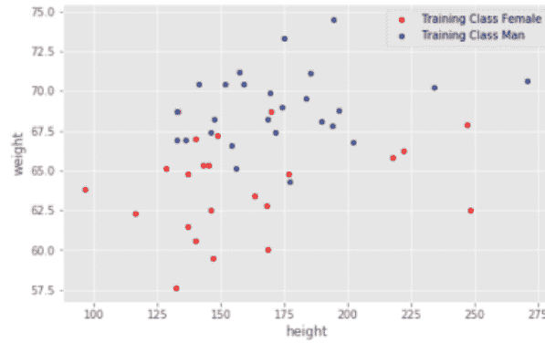
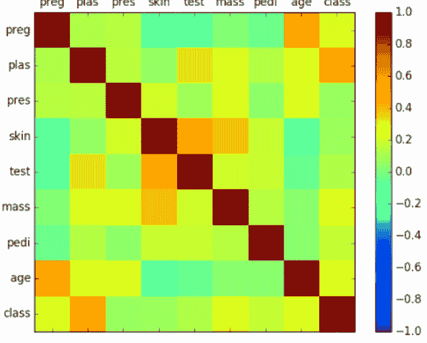
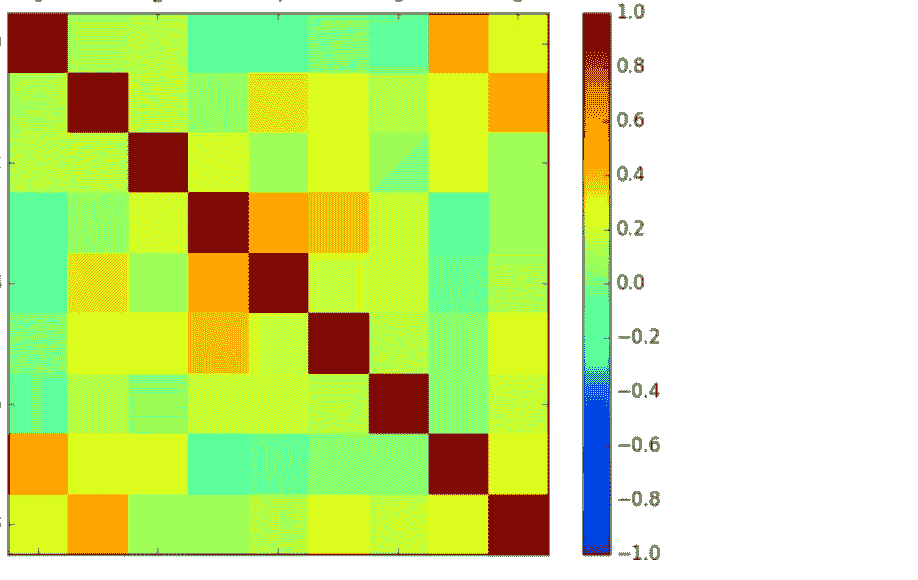

# 使用Python编程进行机器学习

## 2023：初学者指南

掌握Python机器学习的权威指南，以及创建现实世界智能系统的问题导向解决方案

詹姆斯·哈里森

# 使用Python编程进行机器学习

掌握Python机器学习的权威指南，以及创建现实世界智能系统的问题导向解决方案

作者：詹姆斯·哈里森

# 目录

- [书名页](Title Page)
- [使用Python编程进行机器学习：2023初学者指南](Machine Learning With Python Programming: 2023 A Beginners Guide)
- [第1章 人工智能概述](Chapter 1 Overview of Artificial Intelligence) 16
- [第2章 Python机器学习生态系统](Chapter 2 Python Machine Learning Ecosystem) 45
- [第3章 SciPy与Python快速入门课程](Chapter 3 A Quick Course on SciPy and Python) 15
- [第4章 如何为机器学习导入数据](Chapter 4 How to Import Data for Machine Learning) 27
- [第5章 使用描述性统计数据理解你的数据](Chapter 5 Use Descriptive Statistics to Gain Understanding of Your Data) 31
- [第6章 通过可视化理解你的数据](Chapter 6 Understand Your Data With Visualization) 38
- [第7章 为机器学习准备你的数据](Chapter 7 Get Ready for Machine Learning with Your Data) 47
- [第8章 为机器学习选择特征](Chapter 8 Choosing Features for Machine Learning) 52
- [第9章 使用重采样分析机器学习算法性能](Chapter 9 Analyze Machine Learning Algorithms' Performance Using Resampling) 57
- [第10章 机器学习中的算法性能度量](Chapter 10 Performance Measures for Algorithms in Machine Learning) 64
- [第11章 快速检查分类算法](Chapter 11 Spot-Check Classification Algorithms) 70
- [第12章 快速检查回归算法](Chapter 12 Algorithms for Spot-Check Regression) 76
- [第13章 比较机器学习算法](Chapter 13 Compare Machine Learning Algorithms) 84
- [第14章 使用流水线自动化机器学习工作流](Chapter 14 Use Pipelines to Automate Machine Learning Workflows) 87
- [第15章 在分组设置中提升性能](Chapter 15 Boost Performance in Group Settings) 91
- [第16章 通过算法调整提升效率](Chapter 16 Boost Efficiency via Algorithm Adjustment) 98
- [第17章 存储和导入深度学习模型](Chapter 17 Store and Import Deep Learning Models) 101
- [第18章 预测建模项目模板](Chapter 18 Template for Predictive Modeling Projects) 105
- [第19章 你的第一个Python机器学习项目：分步指南](Chapter 19 Your First Machine Learning Project in Python Step-By-Step) 111
- [第20章 回归机器学习案例研究项目](Chapter 20 Regression Machine Learning Case Study Project) 124
- [第21章 二元分类机器学习案例研究项目](Chapter 21 Binary Classification Machine Learning Case Study Project) 144
- [第22章 更多预测建模项目](Chapter 22 More Predictive Modeling Projects) 165

## 引言

- 第1章 人工智能概述
- 第2章 Python机器学习生态系统
- 第3章 SciPy与Python快速入门课程
- 第4章 如何为机器学习导入数据
- 第5章 使用描述性统计数据理解你的数据
- 第6章 通过可视化理解你的数据
- 第7章 为机器学习准备你的数据
- 第8章 为机器学习选择特征
- 第9章 使用重采样分析机器学习算法性能
- 第10章 机器学习中的算法性能度量
- 第11章 快速检查分类算法
- 第12章 快速检查回归算法
- 第13章 比较机器学习算法
- 第14章 使用流水线自动化机器学习工作流
- 第15章 在分组设置中提升性能
- 第16章 通过算法调整提升效率
- 第17章 存储和导入深度学习模型
- 第18章 预测建模项目模板
- 第19章 你的第一个Python机器学习项目：分步指南
- 第20章 回归机器学习案例研究项目
- 第21章 二元分类机器学习案例研究项目
- 第22章 更多预测建模项目

© 2023 版权所有，由 ORCHID PUBLISHING 出版 - 保留所有权利。

本文档旨在就所涵盖的主题和问题提供准确可靠的信息。本出版物的销售基于出版商无需提供会计、官方许可或其他合格服务的理念。如果需要建议，无论是法律还是专业方面的，都应咨询该领域的专业人士。

- 摘自美国律师协会委员会和出版商与协会委员会共同接受和批准的原则声明。

以电子方式或印刷格式复制、复制或传输本文档的任何部分均属非法。严禁录制本出版物，未经出版商书面许可，不得存储本文档。保留所有权利。

本文提供的信息据称真实且一致，对于因使用或滥用本文所含任何政策、流程或指示而导致的任何责任，无论是疏忽还是其他原因，均由接收读者独自承担全部责任。在任何情况下，出版商均不对因本文信息直接或间接造成的任何赔偿、损害或金钱损失承担任何法律责任或指责。

 respective authors own all copyrights not held by the publisher.

本文信息仅供参考，具有普遍性。信息的呈现不附带合同或任何形式的保证。

所使用的商标未经任何同意，商标的出版未经商标所有者许可或支持。本书中的所有商标和品牌仅用于说明目的，归各自所有者所有，与本文档无关。

# 目录

© 2023 版权所有，由 ORCHID PUBLISHING 出版 - 保留所有权利。

# 关于

## 本书适合谁

## 第1章 人工智能概述

16

- 基本监督模型：邻近算法
- 使用...改变超参数
- 1.2
- 1.2.1 缩放
- 用于处理不平衡数据
- 维度：主成分分析

## 第2章 Python机器学习生态系统

45

- Python安装
- 安装Python：一个...
- 设置方法
- 安装Scikit-Learn：一个...
- 安装...的简单方法

## 第3章 SciPy与Python快速入门课程

15

- ...速成课程
- 流程
- 数据
- 速成
- 速成
- 速成

## 第4章 如何为机器学习导入数据

27

- 加载CSV时
- 印第安人
- 使用Python标准库处理CSV文件
- 使用...处理CSV文件
- 使用...处理CSV文件

## 第5章 使用描述性统计数据理解你的数据

31

- 在你的...
- 你的...
- 每种类型的...
- 分布（分类...
- 之间
- 单变量...

## 第6章 通过可视化理解你的数据

38

- 和须线
- 矩阵
- 图

## 第7章 为机器学习准备数据

数据预处理（Make）

## 第8章 为机器学习选择特征

特征组件

## 第9章 使用重采样分析机器学习算法性能

机器学习算法：测试与训练、交叉验证、随机测试-训练方法的应用

## 第10章 机器学习中的算法性能度量

算法度量

### 10.2 度量方法

## 第11章 快速评估分类算法

算法：线性机器学习、逻辑回归、线性判别分析、非线性机器学习、k近邻、朴素贝叶斯分类与回归、支持向量机

## 第12章 快速评估回归算法

机器学习：回归与支持向量机

## 第13章 比较机器学习算法

最优机器学习算法比较

## 第14章 使用流水线自动化机器学习工作流

机器学习流程：数据准备、特征提取

## 第15章 在集成设置中提升性能

通过组合决策梯度提升集成预测

## 第16章 通过算法调整提升效率

机器学习：网格搜索与随机搜索

## 第17章 存储和导入深度学习模型

使用Pickle完成模型保存与加载

## 第18章 预测建模项目模板

实践机器学习的系统化、结构化项目模板

## 第19章 Python机器学习项目实战（分步指南）

机器学习的Hello World：验证方法

## 最佳实践

## 第20章 回归机器学习案例研究项目

数据与算法：集成方法结果分析

20.12.1

## 第21章 二分类机器学习案例研究项目

21.1 数据与算法：标准化处理

## 第22章 更多预测建模项目

### 维护与优化

### 小规模项目实践

### 机器学习

## 关于作者

詹姆斯·哈里森博士拥有机械工程学士和硕士学位、仪器科学博士学位以及工商管理硕士学位。他曾在学术界、科技界和商界工作。迈克目前就职于将人工智能或机器学习视为成功关键要素的公司，担任管理团队成员、顾问或导师等职务。他还在加州大学伯克利分校以及位于山景城的联合办公空间和创业孵化器Hacker Dojo教授机器学习课程。

詹姆斯出生于俄克拉荷马州，在那里获得学士和硕士学位，之后在东南亚工作一段时间，随后前往剑桥大学攻读博士学位，毕业后在麻省理工学院担任C. Stark Draper教席教授。詹姆斯离开波士顿，在南加州的休斯飞机公司从事通信卫星工作，之后在加州大学洛杉矶分校获得工商管理硕士学位，迁至旧金山湾区，先后创立并担任两家获得风险投资的成功初创公司的首席执行官。

詹姆斯仍积极参与技术与创业相关工作。近期项目包括将机器学习应用于工业检测与自动化、金融预测、基于分子图结构的生物结果预测以及金融风险评估。他曾参与人工智能和机器学习领域公司的尽职调查工作。可通过mbowles.com联系詹姆斯。

## 本书适合谁

本书面向希望将机器学习技能纳入自身知识体系的Python程序员，无论是为了特定项目需求，还是为了保持技术工具箱的时效性。或许工作中出现了需要机器学习解决的新问题。鉴于机器学习在当今新闻中频繁出现，掌握这项技能对简历也颇具价值。

本书为Python程序员提供以下内容：

- 机器学习所解决的基本问题概述
- 多种前沿算法介绍
- 这些算法的工作原理
- 机器学习系统的规范、设计与验证流程步骤
- 流程与算法示例
- 可修改的代码示例

为顺利阅读本书，读者需具备编程或计算机科学基础，并能读写代码。所有代码示例、库和包均使用Python编写，因此本书对Python程序员最为实用。某些章节会演示算法核心代码以阐释工作原理，但随后会使用集成该算法的Python包来解决实际问题。正如数学公式能帮助某些人理解算法，代码示例也能让程序员直观把握算法本质。一旦理解到位，后续示例将使用功能完善的Python包，这些包具备高效使用所需的重要特性（错误检查、输入输出处理、为模型开发的数据结构、集成训练模型的预测方法等）。

除编程背景外，掌握一定的数学和统计学知识将有助于理解本书内容。数学要求包括本科水平的微分学（懂得求导和基础线性代数）、矩阵表示、矩阵乘法和矩阵求逆。这些知识主要用于理解部分算法的推导过程。很多时候，推导过程仅涉及简单函数的求导或基础矩阵运算。从概念层面理解这些计算过程有助于把握算法本质。理解推导步骤能帮助认识算法的优缺点，从而为特定问题选择最合适的算法。

## 引言

从数据中提取可操作信息正以直接影响程序员的方式改变现代商业的运作模式。一方面体现在对新型编程技能的需求上。市场分析师预测，到2018年，具备高级统计和机器学习技能的人才缺口将达到14万至19万人。这意味着掌握相关技能者将获得优厚薪酬和丰富的项目选择机会。另一个影响程序员的发展是统计与机器学习核心工具的进步。这使程序员无需每次尝试新算法时都自行编写复杂程序。在通用编程语言中，Python开发者始终走在前沿，构建了最先进的机器学习工具，但工具的可用性与高效使用之间仍存在差距。

程序员可通过多种途径获取机器学习通用知识：在线课程、大量优质书籍等。这些资源通常对机器学习算法及其应用进行了出色综述，但由于算法种类繁多，综述难以涵盖具体使用细节。

这给实践者留下了空白。算法数量之多要求做出选择，而机器学习新手可能需要尝试多种算法才能做出合适选择，这使得程序员需要在整体问题建模与求解的背景下自行填补算法使用细节。

本书旨在弥合这一差距。所采取的方法是将算法范围限定在两类已被证明对广泛问题具有最优性能的算法族。这一论断其主导地位体现在机器学习竞赛中的广泛使用、在新开发的机器学习工具包中的早期集成，以及在比较研究中的优异表现（如第1章“预测的两大核心算法”所述）。将注意力限定于两类算法族，能够深入讲解其工作原理，并通过多个示例详细展示这些算法如何应用于不同结构的问题。

本书主要通过代码示例来阐释所讨论算法的工作原理。我在加州大学伯克利分校、Galvanize、纽黑文大学和Hacker Dojo的教学中发现，程序员通常通过简单的代码示例比通过数学公式更容易理解原理。

本书聚焦于Python，因为它很好地平衡了功能性和包含机器学习算法的专用包。Python是一种常用语言，以生成简洁、可读的代码而闻名。这一特点使得许多领先公司采用Python进行原型设计和部署。Python开发者拥有庞大的社区支持，包括开发工具、扩展等。Python在工业应用和科学编程中也被广泛使用。它拥有多个支持机器学习等计算密集型应用的包，并且集成了众多领先的机器学习算法（因此你无需自己编写代码）。Python是比R或SAS（统计分析系统）等专用统计语言更优秀的通用编程语言。其机器学习算法集合包含许多顶级算法，并且持续扩展。

## 第1章 人工智能概述

通常在处理经典机器学习问题时，我们区分监督学习和无监督学习方法。在监督学习中，我们有一系列独立同分布的样本，其中描述了总结可用数据的特征向量，是目标变量，即我们模型的因变量。监督学习的目标是找到一个函数（·），使得f =，即我们需要找到一个函数，它在训练集上能很好地近似分布，同时也能泛化到来自同一分布的新样本。这是监督学习方法的真正目标：基于标记数据集，你希望对来自同一分布的新数据点进行分类。相反，无监督方法适用于目标缺失或未标记的数据集。此类技术用于在可用数据中搜索共同模式，因为它们仅由输入数据向量表征。请注意，无监督方法在许多应用中广泛使用：从聚类到自然语言处理中的主题检测，再到降维——这是一类非常广泛的技术，本书将涵盖其基本方面：简而言之，它将一组高维输入实例映射到低维空间，同时保留数据集的某些属性。如今，降维技术也用于遗传学或计算机科学等许多科学领域，这些领域的数据集具有大量特征，因此我们可以在保留模型内在变异性的同时降低问题的维度。

### 基础监督模型：近邻算法

让我们通过一个简单的算法——所谓的最近邻算法，来介绍主要的机器学习建模流程。我们将用一个分类任务来说明这个算法，使用二维特征向量，但请注意它也可用于经典的回归任务。在本书中，我们将主要使用scikit-learn。scikit项目始于2011年（详见Pedregosa等人（2011）），如今已成为主要的Python开源机器学习平台之一。近年来，由Google于2015年开发的TensorFlow（详见Abadi等人（2015））获得了显著的普及，尤其是在深度学习社区，如今被广泛用于执行机器学习项目和流程。

作为第一个任务，我们导入本章将使用的必要库和模块。

```
In [1]: from egeaML import *

from sklearn.model_selection import train_test_split from
sklearn.model_selection import cross_val_score from sklearn.neighbors
import KNeighborsClassifier from sklearn.metrics import
confusion_matrix

from sklearn.preprocessing import scale import pickle
```

使用TensorFlow后端。

```
In [2]: import warnings
warnings.filterwarnings('ignore')
```

我们导入并读取数据，数据可在GitHub仓库中找到，如下所示：

```
In [3]: reader = DataIngestion(df='data_intro.csv', col_target='male') data = reader.load_data()

X = reader.features() y = reader.target()
```

请注意，数据是使用egeaML的特定类DataIngestion读取的，该类主要执行以下步骤：
- 从.csv文件读取数据；
- 将数据拆分为特征和目标，分别用X和y表示。

这组数据仅包含两个测量值，即身高和体重，以及一个目标变量，即观测样本的性别。让我们回顾监督学习方法的主要目标：我们希望在指定的标记数据集上训练一个模型，然后通过将预测标签的性能与可用信息（通常是回顾性获得的）进行比较，来评估其在未见数据上的性能。为了评估机器学习模型，我们通常将数据分为两组：训练集和测试集。这有一个主要优势：我们实际上可以在一部分数据上训练模型，其余部分则用于评估所选模型在之前未使用过的数据集上的性能。前者用于构建和训练分类器，后者用作代表未来未见数据的保留集。这是预处理的一个重要方面，可以总结为一个非常简单的规则：不要在训练阶段使用任何测试样本。因此，测试集和训练集必须保持独立。为此，我们使用scikit-learn的model_selection模块中的train_test_split方法，该方法要求用户指定用于测试集的可用数据百分比。

以下代码片段生成一个二维图，显示身高和体重之间的关系，并用相应的标签标记，如图1.1所示。这是使用egeaML的classification_plots类中的training_class方法生成的。它主要执行以下步骤：
- 接收特征集和目标作为输入；
- 根据作为参数指定的测试集大小，将可用数据拆分为训练集和测试集；
- 绘制二维训练集，每个点用其所属类别标记。

```
In [4]: classification_plots.training_class(X,y,test_size=0.3)
```

该图显示了二维实值训练数据集之间的关系，并且存在两个类别可以用来分割数据。因此，目标是根据两个特征（体重和身高）按性别分割数据集。最近邻算法的工作方式非常简单：它基本上解决以下问题：



图1.1：按目标变量标记的训练观测值。

即为了对新数据点进行分类，我们将在所有标记的数据点中寻找最近的一个，并将相同的训练标签分配给新数据点。一个自然的问题可能是：给定一组数据，我们如何正确地训练机器学习模型？我们如何尝试评估所使用算法的泛化性能？一个典型的策略是将可用数据集拆分为训练集和测试集。值得注意的是，我们通常使用80%的数据训练算法，剩余的20%作为测试集。如前所述，两个数据集应保持独立，即用于测试集的任何样本都不应在训练阶段使用。对于任何机器学习模型，我们也期望模型在评估新数据时（平均而言）表现得与训练阶段一样好。让我们看看最近邻算法在实践中如何工作，使用标准的scikit流程。

```
In [5]: X_train,X_test,y_train,y_test = train_test_split(X,y,
```

### 使用交叉验证调整超参数

我们了解到，训练模型时通常需要将数据划分为训练集和测试集。然而，特别是在k近邻（kNN）算法中，我们必须预先设定邻居数量，这从推断角度来看相当受限：这意味着用户必须知道训练算法将数据分组的簇数，而这在数据分析初期实际上是未知的。

因此，我们可以训练一系列kNN模型，然后在测试集上评估每个模型的性能。但这存在一个主要局限：我选择在测试集上表现最佳的模型，这相当受限，因为它仅依赖于我观察到的数据。换句话说，测试集的预测不再是未来性能的无偏估计。

相反，我们通常采用三折划分法，将数据分为：

-   训练集，用于模型拟合；
-   验证集，用于选择（最佳）参数；
-   测试集，用于在未见数据上评估模型。

为了说明这一策略的实际必要性，让我们使用威斯康星乳腺癌（诊断）数据集，该数据集可在线获取。读者可以在本书仓库中找到其副本。同样，我们使用egeaML类DataIngestion读取数据。

```python
In [11]: data_ = DataIngestion(df='breast_cancer_data.csv',
    col_to_drop=None, col_target='diagnosis')
X = data_.features()
y = data_.target().apply(lambda x: 1 if x=='M' else 0)
```

我们尚未讨论数据缩放，但目前请注意，在许多应用中，规范化数据是一个好习惯，以便可以比较每个特征的量级。这里，我们使用scikit-learn的preprocessing类中的Scale方法对数据进行缩放。

```python
In [12]: X = scale(X)
```

现在我们将数据划分为训练集、验证集和测试集。

```python
In [13]: X_train, X_test, y_train, y_test = train_test_split(X, y,
    test_size=0.3, random_state=42)
```

```python
In [14]: X_train_, X_val, y_train_, y_val = train_test_split(X_train,
    y_train, test_size=0.3, random_state=42)
```

```python
In [15]: knn = KNeighborsClassifier(n_neighbors=5).fit(
    X_train_, y_train_)
```

```python
In [16]: print("Validation Score: {:.4f}".format(knn.score(
    X_val, y_val)))
print("Test Score: {:.4f}".format(knn.score(
    X_test, y_test)))
```

```python
test_size=0.3, random_state=42)
knn = KNeighborsClassifier(n_neighbors=1)
knn.fit(X_train, y_train)

y_pred = knn.predict(X_test)
score = knn.score(X_test, y_test)

print("accuracy: {:.4f}".format(score))
```

Out[5]: accuracy: 0.8571

我们首先通过指定邻居数量来初始化KNeighborsClassifier类，即我们希望与测试点进行比较的训练点数量：如果设置为1，则与距离测试点最近的点进行比较。然后，我们在训练集上拟合分类器，并在测试集上进行预测，调用scikit-learn的predict方法。该方法寻找最近的点，并将其标签分配给新点。

为了评估分类器的性能，我们调用scikit-learn的score方法，该方法计算正确分类的样本数量，需要两个参数：测试数据和相应的标签。我们看到，我们的分类器在大约86%的测试样本上表现良好，对于这样一个简单的模型来说，这是极好的。现在，我们使用egeaML库绘制预测标签，并突出显示被模型错误分类的样本：

```python
In [6]: classification_plots.plotting_prediction(X_train, X_test,
    y_train, y_test, nn=1)
```


图1.2：基于简单最近邻的测试点分类。

备注。在许多情况下，我们使用大量示例训练模型。这给机器带来了繁重的工作量，无论是RAM还是CPU。训练模型并非免费，因此将拟合好的模型存储到pickle文件中是一个好习惯，以便我们可以随时调用它。pickle的一个可能用途是在每次重新训练时跟踪拟合好的模型。以下代码片段展示了如何将拟合好的knn模型保存到pickle文件中。

```python
In [7]: pkl_filename = "my_first_ML_model.pkl"
with open(pkl_filename, 'wb') as file:
    pickle.dump(knn, file)
```

另一种评估我们在测试集上表现如何的方法是使用混淆矩阵，其对角线元素分别代表真负例（TN）——即被预测为女性且确实是女性的样本——和真正例（TP）——即男性样本且模型预测为男性。我们将在第2章中研究分类任务的不同性能度量：目前，请记住，如果TN和TP的数量最大化，则模型表现良好。结果如图1.3所示。

```python
In [8]: classification_plots.confusion_matrix(y_test, y_pred)
```


图1.3：测试集上的混淆矩阵

请注意，由于此函数将在全书中使用，如果您不记得参数或其位置，可以简单地使用帮助功能，如下所示：

```python
In [9]: help(classification_plots.confusion_matrix)
Help on function confusion_matrix in module egeaML:
confusion_matrix(y_test, y_pred, cmap, xticklabels=None, yticklabels=None)
```

此函数生成一个混淆矩阵，用作评估分类预测器的摘要。

参数为：

-   y_test：真实标签；
-   y_pred：预测标签；
-   cmap：用于为混淆矩阵着色的调色板。

可用选项为：

-   cmap="YlGnBu"
-   cmap="Blues"
-   cmap="BuPu"
-   cmap="Greens"

有关更多详细信息，请参阅本书仓库中的笔记本Miscellaneous/setting_CMAP_argument_matplotlib.ipynb。

-   xticklabels：列表，x轴标签的描述；
-   yticklabels：列表，y轴标签的描述。

另请注意，如果您不知道使用哪种颜色图，可以查看GitHub上的Miscellaneous材料，其中提供了setting_CMAP_argument_matplotlib.ipynb文件：它基本上展示了可用于为您的图表着色的不同颜色图。

另一个可能出现的问题是：如果我们增加邻居数量会发生什么？下一个代码块生成一个图表，显示模型在不同超参数n_neighbors值下的准确率：请注意，图1.4显示了前十次迭代的放大图。

```python
In [10]: n_neigh = list(range(1, 50))
train_scores = []
test_scores = []
for i in n_neigh:
    knn = KNeighborsClassifier(n_neighbors=i)
    knn.fit(X_train, y_train)
    train_score = knn.score(X_train, y_train)
    train_scores.append(train_score)
    test_score = knn.score(X_test, y_test)
    test_scores.append(test_score)

df = pd.DataFrame()
df['n_neigh'] = n_neigh
df['Training Score'] = train_scores
df['Test Score'] = test_scores
plt.figure(figsize=(5, 5))
plt.plot(df.iloc[:, 0], df.iloc[:, 1],
    label='Train Performance')
plt.plot(df.iloc[:, 0], df.iloc[:, 2],
    label='Test Performance')
plt.xlabel('Number of Neighbors', fontsize=16)
plt.ylabel('Accuracy', fontsize=16)
plt.legend()
plt.show()
```


图1.4：不同邻居数量下的准确率敏感性分析。

似乎一个不错的选择是n_neighbors等于三。显然，当邻居数量趋近于零时，我们的模型变得过于复杂，因此对新数据的泛化能力较差：这称为过拟合。更具体地说，过拟合是指模型无法很好地泛化到新的、未见过的数据的情况，通常发生在模型完美记忆了整个训练集但未能清晰区分两个类别时。这可能是由于我们保留了所有观察到的训练噪声，因此难以泛化到新数据。

欠拟合则相反，指的是模型过于简单，无法从训练集中提取有用信息的情况。在这种情况下，训练集和测试集的准确率相似，并且随着模型变得更简单而趋于降低。

一般来说，在k近邻算法中，较少的邻居数量意味着更复杂的模型：对于回归模型，我们将在第2章中看到，我们可以通过正则化回归系数来防止过拟合，而对于集成方法，我们通常通过管理树的深度来控制过拟合。

验证分数：0.9333
测试分数：0.9649

基本上，我们使用验证集来选择参数（在本例中是`n_neighbors`），然后使用测试集来确定最终投入生产的模型。这种方法很好，因为它简单快捷，但至少存在一个问题：由于数据被分割了两次，它在测试集上表现出高方差，因此结果取决于你实际如何分割数据。作为推论，另一个问题可能是数据的不当使用，这体现在如果你将验证集设置得太小，评估结果的方差会更大。

因此，我们在实践中通常的做法是，不再像之前那样将数据分成三部分，而是将整个数据分成`n`个大小相等的折。交叉验证的思想简单而强大：我们选取一折作为固定的测试集，而其余的`n – 1`折用于拟合模型。然而，我们不仅仅做一次，而是依次将另一折固定为测试集，并在其余的`n – 1`折上拟合相同的模型，从而考虑之前用于测试的那一折。我们对所有不重叠的不同折重复此过程，得到`n`个不同的分数：这更稳定，因为它对数据分割的依赖性更小，并且每个数据点恰好在测试集中出现一次。同样，交叉验证的结果由`n`个分数组成，例如我们可以取平均值（或中位数）作为总体分数，这确实是对这类模型在该数据集上表现如何的一个更稳健的估计。图1.5展示了交叉验证的工作原理。


图1.5：5折交叉验证的示意图。此图取自

如果你还想调整参数，你仍然需要一个独立的测试集：因此一个好的策略是将数据分为训练集和测试集。你对训练集进行交叉验证以寻找最佳参数，然后使用测试集来评估所选参数配置在新数据上的表现。例如，以下代码片段展示了每个`n_neighbors`对应的交叉验证分数，然后我选择了最佳模型。

在scikit-learn中，我们使用`cross_val_score`函数：它基本上将数据分成`n`个独立的折，并为每个分割计算在该特定折上的准确率。然后，我们选择最佳分数，并选取与该分数相关的模型参数。如果我们选择了最佳配置，那么我们就在整个训练集上训练最佳模型，此时的测试分数确实是该模型未来表现的一个无偏估计。

```
In [17]: X_train,X_test, y_train, y_test = train_test_split(X,y,
            test_size=0.3, random_state=42)
        cross_val_scores = []
        neighbors = np.arange(1,15,2)
        for i in neighbors:
            knn = KNeighborsClassifier(n_neighbors=i)
            scores = cross_val_score(knn,X_train,y_train,cv=5)
            cross_val_scores.append(np.mean(scores))
        print("Best CV Score: {:.4f}".format(np.max(cross_val_scores)))
        best_nn = neighbors[np.argmax(cross_val_scores)]
        print("Best n_neighbors: {}".format(best_nn))
```

最佳CV分数：0.6958
最佳n_neighbors：3

你应该已经注意到上面展示的交叉验证过程的一个小缺点。实际上，为了执行交叉验证，我们必须先验地设定一组可能的值来搜索最佳参数（在我们的例子中是`n_neighbors`）。对于像k-NN这样的简单模型来说这没问题，但如果我们需要搜索多个值，并且这些值可能在实数范围内呢？在这种情况下，我们需要固定所有参数的可能组合，对于足够精细的参数网格来说，这可能是难以管理的。因此，与其随机选择参数值，更好的方法是使用一种算法，它能自动从所有可能的参数值组合中找到最佳参数，即通常返回最高准确率组合的那个。

为了在scikit-learn中实现网格搜索交叉验证，我们使用`GridSearchCV`类，它实际上同时执行模型选择和交叉验证。重复其工作流程：它遍历所有参数，并对每个参数组合进行交叉验证以找到最佳参数。一旦找到，我们就在整个训练数据集上训练最佳模型。注意，我们将使用`stratify`参数，它控制类别标签在训练集和测试集中的分布相同。

```
In [18]: from sklearn.model_selection import GridSearchCV
        X_train, X_test, y_train, y_test = train_test_split(X,y,
            stratify=y,test_size=0.3,random_state=42)
        param_grid = {'n_neighbors': np.arange(1,15,2)}
        clf = KNeighborsClassifier()
        grid = GridSearchCV(clf, param_grid= param_grid, cv=10)
        grid.fit(X_train,y_train)
        print("Best Mean CV Score: {:.4f}".format(grid.best_score_))
        print("Best Params: {}".format(grid.best_params_))
        print("Test-set Score: {:.4f}".format(grid.score(X_test,y_test)))
```

最佳平均CV分数：0.8163
最佳参数：{'n_neighbors': 7}
测试集分数：0.5714

```
In [19]: results = pd.DataFrame(grid.cv_results_)
        print(results.columns)
        print(results.params)
```

```
Index(['mean_fit_time', 'std_fit_time', 'mean_score_time', 'std_score_time',
       'param_n_neighbors', 'params', 'split0_test_score', 'split1_test_score',
       'split2_test_score', 'split3_test_score', 'split4_test_score',
       'split5_test_score', 'split6_test_score', 'split7_test_score',
       'split8_test_score', 'split9_test_score', 'mean_test_score',
       'std_test_score', 'rank_test_score'],
      dtype='object')
```

```
{'n_neighbors': 11}
{'n_neighbors': 13}
Name: params, dtype: object
```

#### 1.2 数据预处理

为了向读者介绍这个主要应用于线性模型的重要主题，我们将使用波士顿房价数据集，该数据集可在本书专属的GitHub仓库中找到，其目标是预测波士顿房屋的中位数价格（MEDV）。

```
In [1]: from egeaML import DataIngestion, Preprocessing
        from sklearn.neighbors import KNeighborsRegressor, KNeighborsClassifier
        from sklearn.preprocessing import StandardScaler, OneHotEncoder
        from sklearn.preprocessing import PowerTransformer
        from sklearn.model_selection import cross_val_score, GridSearchCV
        from sklearn.pipeline import make_pipeline
```

使用TensorFlow后端。

```
In [2]: reader = DataIngestion(df='boston.csv', col_target = 'MEDV')
        df = reader.load_data()
        X = reader.features()
        y = reader.target()
```

为了更好地理解每个特征对目标变量MEDV的影响，请考虑以下由下一个代码片段生成的散点图系列。

```
In [3]: plt.figure(figsize=(20, 15))
        features = list(X)
        for i, col in enumerate(features):
            plt.subplot(3, len(features)/2 , i+1)
            x = df[col]
            y = y
            plt.scatter(x, y, marker='o')
            plt.title(col)
            plt.xlabel(col)
            plt.ylabel('MEDV')
```


尽管上述大多数图表没有显示出清晰的关系，但有两个特征明显表现出某种线性依赖性：例如，MEDV和RM（房间数量）之间存在正线性关系，而当LSTAT增加时，MEDV减少。特别是，当你观察这些图表时，很容易看出有些特征是连续的（例如LSTAT或NX），有些是二元的（CHAS）。但更重要的是，很明显这些特征不在同一尺度上。因此，在拟合机器学习模型之前，对数据进行缩放是一个非常重要的过程。

##### 1.2.1 数据缩放

数据缩放非常有用，尤其是在特征具有不同大小和量级时。这个过程提高了模型在测试集上的分数

### 强制数据服从高斯分布：幂变换简介

由于缩放效应，特征之间显然存在重要的变异性：税收的量级是数千，而年龄的量级，毫不意外，是数百。此外，它们中的大多数并非正态分布，即它们相当偏斜，因此我们需要在拟合模型之前对其进行缩放。同时，我们（先验地）不知道哪些特征可能对我们的模型重要，因此缩放是一种隐式地为显示不同尺度和量级的不同特征赋予相等权重的方法：只有在缩放之后，我们才会挑选出那些能更好地解释我们目标的特征（代价是失去一些物理可解释性）。

通常，我们通过在 scikit-learn 中实现 StandardScaler 方法来缩放数据：这确保每个特征的均值为零，方差为一，将所有特征带到相同的量级。另一种缩放是 MinMaxScaler 方法，在最小值和最大值之间缩放，通常是零和一，但它是灵活的。如果我们必须处理一些具有固定边界的特征，这尤其有用：例如，如果我必须压缩一个范围在 1 到 100 之间的特征，那么使用此方法是有意义的。相反，如果我们处理的是来自极值分布的数据，可能此方法完全无意义。另一个是 RobustScaler，它的工作方式类似于 StandardScaler，但使用中位数和分位数，而不是均值和方差：当存在（或怀疑存在）异常值时，这绝对有用，因为中位数已知对异常值具有鲁棒性。最后，可以使用 Normalizer 方法，它特别用于计数数据：这里的粒度是每一行，并且归一化每个特征向量，使其范数等于一。注意，它也允许其他范数，例如 L1 范数，这基本上转化为按绝对值之和进行归一化（其长度应等于一）。

备注。稀疏数据集是有很多零的数据集：这些在遗传学、文本分析甚至欺诈检测中非常常见。一个实际问题可能是，通常我们不想存储（所有）零，而只存储非零值：这并不容易，因为为每一行存储例如 100,000 个零会耗尽你本地机器的内存。在这种情况下，使用例如 StandardScaler 没有任何意义，因为我们会从一个零值记录中减去一个非零均值，这可能会对缩放产生负面影响，并影响内存的使用。

回到波士顿数据集，我们现在尝试将 StandardScaler 应用于特征集，然后比较未缩放和缩放数据集之间的性能。

```python
In [5]: X_train, X_test, y_train, y_test = train_test_split(X, y, test_size=0.3, random_state=42)
```

我们在波士顿数据集上的简单示例将基于 StandardScaler 方法和使用 KNeighborsRegressor 方法的回归任务，当目标是连续的时，这基本上是一个更复杂的模型，就像本例中一样（即 MEDV）。在缩放数据之前，让我们看看模型在未缩放数据上的表现。

```python
In [6]: scores_unscaled = cross_val_score(KNeighborsRegressor(), X_train, y_train, cv=5)
scores_unscaled
```

```
Out[6]: array([0.63515605, 0.17772906, 0.34902784, 0.43737922, 0.37189903])
```

由于我们正在交叉验证模型，我们获得的分数数量与分割次数相同（在本例中为五次）。因此，模型性能的一个良好总结度量是取分数的平均值，如下所示：

```python
In [7]: np.mean(scores_unscaled), np.std(scores_unscaled)
Out[7]: (0.3942382409253963, 0.14786600926386584)
```

为了缩放数据，我们实例化 Python 类 StandardScaler，并在缩放器对象上调用 fit 方法：这实际上意味着在训练数据上计算均值和标准差，而对训练数据的 transform 则基本上是从训练集中的每个数据点减去均值并除以标准差。

```python
In [8]: scaler = StandardScaler()
scaler.fit(X_train)

X_train_scaled = scaler.transform(X_train)
X_test_scaled = scaler.transform(X_test)
```

```python
In [9]: scores_scaled = cross_val_score(KNeighborsRegressor(), X_train_scaled, y_train, cv=5)
```

```python
np.mean(scores_scaled), np.std(scores_scaled)
Out[9]: (0.7009222608410279, 0.029897124253597467)
```

我们看到，通过缩放数据，性能显著提高。但要小心：不同的缩放方法会导致不同的结果，这需要适当的探索性数据分析（EDA）或研究人员的良好关注，以理解要应用的最佳方法。最后但同样重要的是，应该注意，当我们运行 scikit-learn 的 cross_val_score 方法时，我们使用了整个缩放后的训练数据集：这意味着对于交叉验证中进行的每个不同分割，其对应的测试折已经用于找到适当的缩放，因此违反了我们要求训练集和测试集具有无偏估计的独立性假设。换句话说，我们正在从测试集泄露信息以找到最佳缩放！此外，当进入生产环境时，新的、未见过的数据进入模型，但该集合不会用于缩放训练数据集，因此可能具有不同的缩放和值。为了克服这个问题，我们仅在训练数据集上拟合缩放，并使用交叉验证在验证集上评估模型性能。为了避免这类问题，我们使用 Pipeline 类，它允许通过链接这两个步骤在交叉验证内执行分割阶段。

```python
In [10]: pipeline = make_pipeline(StandardScaler(), KNeighborsRegressor())
scores_pipe = cross_val_score(pipeline, X_train, y_train, cv=5)
np.mean(scores_pipe), np.std(scores_pipe)

Out[10]: (0.6944726314773543, 0.028669555232832964)
```

```python
In [11]: par_grid = {'kneighborsregressor__n_neighbors': range(1,10)}
grid = GridSearchCV(pipeline, param_grid=par_grid, cv=5)
grid.fit(X_train, y_train)

print("Number of Neighbors Best Parameter: ", grid.best_params_['kneighborsregressor__n_neighbors'])
print("Score on Test set: {:.4f}".format(grid.score(X_test, y_test)))
```

Number of Neighbors Best Parameter: 2
Score on Test set: 0.7887

在下一个图中，我们展示了缩放后的特征分布：尽管我们已经标准化了特征，但我们仍然看到它们显示出不同的分布：例如，特征 B 非常偏斜，而 PTRATIO 看起来完全不同。

```python
In [12]: scaler = StandardScaler()
scaler.fit(X)

X_scaled = scaler.transform(X)
plt.boxplot(X_scaled)

plt.xticks(np.arange(1, X.shape[1]+1), list(X), rotation=30)
plt.ylabel('MEDV')
plt.show()
```

使这些数据更接近高斯分布（或至少更规范）的一种方法是使用幂变换，例如著名的 Box-Cox 变换，由 Box 和 Cox（1964）引入，定义如下：

$$\begin{cases} \frac{x^{\lambda}-1}{\lambda} & \text{if } \lambda \neq 0 \\ \ln(x) & \text{if } \lambda = 0 \end{cases}$$

其思想是将你的数据 x 提升到某个幂次。然而，请注意，这仅适用于非负数据点，因此在尝试应用此变换时要小心：原则上，一个好的做法是取数据的绝对值，但这个决定取决于科学家。或者，可以使用 Yeo 和 Johnson（1997）幂变换，它同时适用于正值和负值。

```python
In [13]: pt = PowerTransformer(method='yeo-johnson')
data_gauss = pt.fit_transform(X_scaled)
```

```python
In [14]: print("----------Before Power Transformation----------")
classification_plots.plot_hist(X_scaled, features, 'MEDV')
```

----------Before Power Transformation----------

### 功率变换之后

### 处理分类变量

分类变量描述了一类特定的特征，其特点是取值有限。我们通过展示两种不同的方法来介绍如何在Python中处理分类变量：一种使用Pandas API，另一种使用scikit-learn。为了说明，我们将使用一个包含一系列意大利餐厅数据的玩具数据集。

```python
In [16]: reader = DataIngestion(df='restaurant.csv', col_target='tip')
         data = reader.load_data()
```

```python
In [17]: data.head()
```

我们看到，除了目标变量`tip`之外，这个玩具数据集中还有五个分类变量：`city`、`sex`、`smoker`、`day`和`time`。然而，我们期望我们的特征是实数，因此在训练模型之前，我们需要以某种方式转换它们。一种可能的方法是应用`Ordinal`，它实际上为分类变量中的每个不同值分配一个实数。

```python
In [18]: categorical_variables = ['city', 'sex', 'smoker', 'day', 'time']
In [19]: data['day_ord'] = data['day'].astype("category").cat.codes
In [20]: data.head()
```

这个过程是可行的，但有一些缺点：例如，它创建并强加了一个值的排序。对于`day`变量来说，这没问题，但可能有一列指示餐厅所在的城市，而强加一个（任意的）顺序是没有意义的。解决这个问题的一个方法是使用`Dummy`，使用Pandas的`get_dummies`函数，在scikit-learn框架中也称为`OneHotEncoding`。具体来说，我们正在做的是为分类变量的每个可能值添加一个新特征（实际上是数据框中的一个新列）。这在Pandas中很容易实现，如下所示：

```python
In [21]: data_dummized = pd.get_dummies(data, prefix_sep='_',
         prefix=categorical_variables, columns=categorical_variables,
         drop_first=False)
```

请注意，此函数对对象或分类类型的变量进行分类，但我们可以通过在函数调用中使用`columns`属性来控制要编码哪个变量。还要注意，我们使用了所有可用数据进行虚拟化：这样做没有问题，特别是如果我们想建立一个生产系统，新数据会新鲜地进入模型，但我们需要预先确定哪些类别是允许的。例如，我们在训练集中没有观察到特伦托市，但在生产中可能会观察到它。显然，我们无法从中学习到任何东西，但如果有合理的动机包含它，即使我们没有观察到它，我们也可以在训练集中对其进行编码。为此，我们可以使用Pandas的`Categorical`方法：

```python
In [22]: cat = ['Milan', 'Rome', 'Bergamo',
         'Naples', 'Como', 'Trieste',
         'Brescia', 'Turin', 'Florence', 'Trento']
         data['city'] = pd.Categorical(data['city'], categories=cat)
         pd.get_dummies(data, columns=['city']).head()
```

在scikit-learn中，虚拟编码通过`OneHotEncoding`类应用：它假设我们提供给该方法的所有列都是分类的，这在许多情况下并非最佳，因为数据集中通常同时包含分类和连续特征。以下代码片段展示了将该方法应用于整个数据后得到的输出：

```python
In [23]: ohe = OneHotEncoder().fit(data)
         ohe.transform(data).toarray()
```

```
[0., 0., 0., ..., 0., 0., 1.],
[0., 0., 0., ..., 0., 0., 0.]])
```

在scikit-learn 0.20.0版本中，引入了一种新的转换分类变量的方法：这称为`ColumnTransformer`，其工作方式类似于`Pipeline`类。具体来说，它不仅让我们能够将多个转换组合成一个步骤，还允许我们选择使用哪个转换器来转换哪些列。

```python
In [24]: from sklearn.compose import make_column_transformer
In [25]: categ = data.dtypes == object
         preprocess = make_column_transformer(
             (StandardScaler(), ~categ),
             (OneHotEncoder(), categ))
         model = make_pipeline(preprocess, KNeighborsClassifier())
```

上一步基本上是这样工作的：

- 我们定义哪些变量是分类变量；
- 我们告诉机器，无论哪一列不是分类变量，就应用`StandardScaler`转换；否则，使用`OneHotEncoder`；
- 这被组合成一个管道，用于拟合一个分类器。

请注意，`OneHotEncoder`可能会引入共线性，这对于非惩罚线性模型来说可能是一个问题，这将在第2章中讨论。

### 处理缺失值

任何科学家在拟合模型之前执行的另一个非常常见的预处理步骤是所谓的缺失值填充。由于多种原因，这在实践中非常常见，我们在此不讨论其发生的原因。然而，请记住，通常有两种策略：

- 删除显示一个（或多个）缺失值的样本；
- 用合理的汇总统计量填充缺失值。

我们现在展示第二种选项，使用本书特定的`Preprocessing`类中的`spotting_null_values`方法。为了更好地理解这个类的作用，我们使用合成数据，以便用户可以实际可视化此函数的使用：

```python
In [26]: data_ = pd.DataFrame({'col1': [np.nan, 2, 4, 8, 10],
         'col2': [23, 26, 28, 32, 40],
         'col3': [11000, 9500, np.nan,
         np.nan, 14760]},
         columns=['col1', 'col2', 'col3'])
In [27]: data_
```

该函数执行两个主要操作：首先，它查找我们关注的列的类型：如果类型是`object`，则计算该列的众数；如果是连续型，则计算中位数，这是一种对异常值稳健的统计量。然后，对于每一行，它查找任何可能的缺失值：如果发现一个，则根据列的类型和第一步计算的值来填充其值。我们使用本书特定的函数`spotting_null_values`来完成此操作。

```python
In [28]: Preprocessing(list(data_), data_).spotting_null_values()
```

请注意，此操作应在应用任何缩放之前完成。另一种值得一提的情况是分类变量的填充：在许多应用中，在虚拟化阶段保留空类别更好，这在处理特殊类别时尤其合理。一个例子可以是信用卡的交易类型：如果该信息不可用，用众数填充其值没有任何意义，因为这会向数据中注入一些与现实不符的有偏信息。

在撰写本书时，scikit-learn发布了一个新版本（0.21.0版），感兴趣的读者可以在`Impute`类中找到一种新的、动态的、强大的填充方法，称为`IterativeImputer`，这是一种通过使用监督学习模型将每个具有缺失值的特征建模为其他特征的函数来填充缺失值的巧妙策略。我们基本上选取每一列作为目标，同时使用其他k-1个特征作为所选监督模型（例如随机森林或线性回归器）的输入，然后使用该模型来预测缺失值。

### 处理不平衡信息的技术

到目前为止，我们已经关注了几个重要的特征，这些特征从整体上区分了一个数据集，即如何处理分类变量（或缺失值）以及如何缩放数据。数据集预处理可能是构建机器学习模型最重要的一步，因为模型的结果将严格依赖于这一步。然而，真实数据集涉及许多我们尚未讨论的其他可能特征：在众多特征中，值得一提的是不平衡数据集的问题。不平衡数据集通常出现在分类问题中，其中类别在样本中分布不均。不幸的是，这是机器学习和计算机视觉中一个相当常见的问题，因为我们可能没有足够数量的训练样本来正确预测少数类。这个问题影响着不同的领域，包括使用f-MRI的癌症诊断、网络安全和金融犯罪。例如，保险公司正在投入资源构建机器学习管道，以检测报告索赔中的欺诈行为。幸运的是，大多数索赔都不是欺诈性的，只有少数属于正类（即欺诈性交易）。因此，如果我们尝试在这种不平衡的数据集上拟合一个分类器，很可能会得到一个有偏差的模型，因为分类器总是根据样本值预测最常见的训练类别，从而获得非常高的准确率。

```python
from egeaML import DataIngestion
from sklearn.utils import resample
from imblearn.over_sampling import SMOTE
```

使用 TensorFlow 后端。

```python
di = DataIngestion(col_to_drop=None, col_target='Class')
df = di.load_data()
title = 'Imbalanced Credit Card Fraud Dataset'
di.plot_counts('Class', title)
```

Out[30]: at 0x1a346f6400>


```python
X = di.features()
y = di.target()
```

```python
X_train, X_test, y_train, y_test = di.split_train_test(test_size=0.3, random_seed=42)
```

我们现在拟合一个简单的knn模型，并查看其在不平衡数据集上的表现。

```python
knn = KNeighborsClassifier(n_neighbors=1)
knn.fit(X_train, y_train)
y_pred = knn.predict(X_test)
score = knn.score(X_test, y_test)
print("accuracy: {:.4f}".format(score))
```

accuracy: 0.9984

毫不奇怪，我们得到了一个虚幻的、近乎完美的准确率，因为395笔欺诈交易仅占所有训练交易的0.1785%。因此，在分类框架中处理不平衡数据集时，准确率不再是一个好的评估指标。因此，我们（至少）有三种不同的方法来解决这个问题：

-   更改算法：这可能是一个简单的选择，但有时它会提高在负类上的性能。目前一个非常流行的选择是集成方法族，这将在第3章中讨论；
-   更改评估指标：我们可以使用精确率或召回率来代替准确率（要了解这些概念，请参阅第2章关于分类的部分）；
-   采用重采样技术：这种策略在计算机视觉领域已被广泛用于在数据集太小无法训练图像识别器时对图像进行重采样。如今，当面临特定类别数据短缺时，这在机器学习中被广泛使用。

在本节中，我们将重点介绍允许对少数类进行过采样或对多数类进行欠采样的重采样技术。

### 随机过采样多数类

这种情况指的是向少数类添加更多样本：尽管这种简单而强大的策略可以实现类别平衡，但该技术的主要缺点是它只是简单地复制之前的样本，增加了过拟合的可能性。为此，我们使用scikit-learn的`resample`函数。请注意，由于我们的目标是上采样少数类，我们希望少数类通过设置`n_samples`等于`len(majority_class)`来获得与多数类相同的长度。

```python
train, test = train_test_split(df, test_size=0.3, random_state=42)
```

```python
major_class = train[train.Class==0]
minority_class = train[train.Class==1]
upsampled_class = resample(minority_class,
                           replace=True,
                           n_samples=len(major_class),
                           random_state=27)
upsampled_data = pd.concat([major_class, upsampled_class])
```

```python
plt.figure(figsize=(8, 5))
t = 'Balanced Classes after upsampling.'
upsampled_data.Class.value_counts().plot(kind='bar', title=t)
```


Out[36]: at 0x1153d0e80>

### 不一致的多数类欠采样

这种情况指的是从多数类中移除样本。请注意，该技术的主要缺点是，从多数类中移除样本可能会导致训练集信息的显著丢失，从而可能导致欠拟合。

```python
down_class = resample(major_class,
                      replace=False,
                      n_samples=len(minority_class),
                      random_state=27)
downsampled_data = pd.concat([down_class, minority_class])
```

```python
plt.figure(figsize=(8, 5))
t = 'Balanced Classes after downsampling.'
downsampled_data.Class.value_counts().plot(kind='bar', title=t)
```

Out[38]: at 0x1a35e92b70>


### 使用合成数据进行过采样：SMOTE

SMOTE代表合成少数类过采样技术，由Chawla等人（2002年）提出，作为随机过采样的替代方案。它是如何工作的？嗯，它融合了我们目前深入探讨的两个想法：随机采样和k近邻。实际上，SMOTE允许从少数类创建新数据（它们不是像随机重采样中那样的观测数据的副本），并自动计算这些点的k近邻。合成点被添加在所选点与其邻居之间。请注意，`imblearn` API是scikit-learn项目的一部分，用于在以下代码片段中应用SMOTE。

```python
smote = SMOTE(random_state=42)
X_smote, y_smote = smote.fit_sample(X_train, y_train)
X_smote = pd.DataFrame(X_smote, columns=X_train.columns)
y_smote = pd.DataFrame(y_smote, columns=['Class'])
```

```python
smote_data = pd.concat([X_smote, y_smote], axis=1)
plt.figure(figsize=(8, 5))
title = 'Balanced Classes using SMOTE'
smote_data.Class.value_counts().plot(kind='bar', title=title)
```

Out[40]: at 0x1a36e25080>


请注意，当参数`sampling_strategy`等于`minority`时，这会强制算法仅对少数类进行重采样，对应的比例为1:1。

### 降低维度：主成分分析

在机器学习的现代，从事数据科学的人员必须处理大量的变量。例如，在计算机视觉问题中，我们必须处理图像分类，其机器表示是像素。为了进行定量分析，这些像素被描述为定量（二元）变量。但一个自然的问题是：一张图像有多少像素？如果我们选择一张现代的4K图像，其分辨率为3840 x 2160像素，因此要处理这样的图像，我们需要考虑24,883,200个变量（只需将像素数乘以三个颜色通道，即蓝色、红色和绿色）。

这是一个巨大的特征数量，处理所有这些特征对于许多机器学习算法来说可能极其痛苦。实际上，高维度增加了计算复杂性，同时也增加了过拟合的风险和出现稀疏性的可能性。因此，通过将数据投影到维度更少的空间来降低问题的维度是一个好的实践，这可以控制这些影响。

文献中存在大量的降维技术，但我们将重点介绍主成分分析。

主成分分析是多元问题中最古老和最著名的降维方法之一。它基本上旨在找到几个主成分，这些成分包含与原始预测变量集一样多的关于因变量的信息：这个原始变量集被转换成一个更小的线性组合集合，称为主成分（PC）。这些新变量是不相关的，并且是有序的，因此第一个主成分解释了原始特征集中存在的最大比例的变异。请注意，在回归问题中，它主要用于防止（或至少减少）自变量之间的共线性。

#### PCA作为降维

PCA基本上旋转数据集，使得旋转后的特征在统计上不相关。这种旋转之后通常会根据主成分对解释数据的重要性来选择它们。算法的工作原理如下：我们寻找数据中包含最多信息的向量（或方向），即特征彼此最相关的方向。然后，算法找到包含最多信息且与第一个方向正交（成直角）的方向，依此类推。在二维中，只有一种可能的取向，即成直角，但在更高维的空间中，会有（无限多的）正交方向。请注意，每个向量的长度表示该轴在描述数据分布时的重要性，即它是数据投影到该轴上的方差的度量。每个数据点在主轴上的投影确实是数据的主成分。

作为一个说明性的例子，让我们考虑以下玩具数据集，如图1.6所示：

```python
rng = np.random.RandomState(1)
```

### 特征提取

我们介绍了PCA作为一种通过旋转原始数据然后丢弃方差保留较低的分量来变换数据的算法。PCA的另一个应用是特征提取。特征提取背后的思想是，有可能找到数据的（线性）表示，从而更好地描述数据。换句话说，目标是尝试找到一些数字，即PCA旋转后的新特征值，以便我们可以将测试点表示为主成分的加权和。

我们将通过使用Labeled Faces in the Wild数据集中的人脸图像，给出一个使用PCA进行图像特征提取的非常简单的应用。该数据集包含从互联网下载的名人面部图像，其中包括21世纪初的政治家、歌手、演员和运动员的面孔。共有3,023张图像，每张图像大小为62 × 47像素，属于62个不同的人。

因此，我们有2914个特征，我们希望使用PCA来降低问题的维度。

```python
In [47]: from sklearn.datasets import fetch_lfw_people
faces = fetch_lfw_people(min_faces_per_person=20)

print("Image Shape: {}".format(faces.images.shape))
print("Number of Features: {}".format(faces.data.shape[1]))
print("Number of classes: {}".format(len(faces.target_names)))

X = faces.data
y = faces.target
```

Image Shape: (3023, 62, 47)
Number of Features: 2914
Number of classes: 62

人脸识别中的一个常见任务是询问一张以前未见过的面孔是否属于数据库中的已知人物。这在照片集、社交媒体和安全应用中都有应用。解决这个问题的一种方法是构建一个分类器，其中每个人都是一个单独的类别。然而，人脸数据库中通常有许多不同的人，而同一个人的图像非常少（即每个类别的训练样本非常少）。这使得训练大多数分类器变得困难。一个简单的解决方案是使用1-最近邻分类器，该分类器寻找与你正在分类的面部最相似的面部图像。

```python
In [48]: X_train, X_test, y_train, y_test = train_test_split(X, y,
    stratify=y, random_state=0)
```

```python
print(X_train.shape)
knn = KNeighborsClassifier(n_neighbors=1)
knn.fit(X_train, y_train)
print("Test set score of 1-nn: {:.2f}".format(knn.score(X_test, y_test)))
```

(2267, 2914)
Test set score of 1-nn: 0.33

我们获得了33%的准确率，对于一个62类的分类问题来说，这实际上并不算太差。请注意，随机猜测会给我们大约1.5%的准确率，但那也不太好。我们每三次就能正确识别一个人。我们首先注意到，这里的特征比样本多，这可能是许多标准算法的问题。同样，PCA只能处理特征和样本之间最小值数量的分量。

```python
In [49]: pca = PCA(n_components=100, whiten=True,
    random_state=0).fit(X_train)
X_train_pca = pca.transform(X_train)
X_test_pca = pca.transform(X_test)
print("X_train_pca.shape: {}".format(X_train_pca.shape))
knn = KNeighborsClassifier(n_neighbors=1)
knn.fit(X_train_pca, y_train)
print("Test set score of 1-nn: {:.2f}".format(knn.score(X_test_pca, y_test)))
```

X_train_pca.shape: (2267, 100)
Test set score of 1-nn: 0.46

通过降低问题的维度，即使使用像1-nn这样简单的算法，我们也将准确率提高了大约40%！

### 非线性流形算法：t-SNE

PCA是一种构建特定线性变换的方法，该变换产生具有非常明确定义属性（例如不同分量之间的正交性）的新样本坐标。换句话说，PCA仅在数据基本上是线性可分时才有效。通常，当我们没有这种类型的数据时，我们使用流形学习算法，例如t-SNE来计算（训练）数据的新表示，而不是像PCA那样实际变换它们。关键思想是找到数据的二维表示，尽可能保留点之间的距离。

t-SNE是van der Maaten和Hinton在2008年提出的一种算法，其设计目标不同，即即使在缺乏线性的情况下也能对相似的数据点进行分组。然而，虽然t-SNE在处理聚类相似样本的特定目标方面非常出色，但与PCA相比，它有一个主要缺点：它为你提供了数据的低维表示，但没有提供变换。换句话说，你不能像解释PCA中的分量那样解释维度。因此，它可能对探索多维数据有用，但对于需要机器学习模型物理解释的任务（比如我们之前看到的将PCA应用于逻辑回归的例子）可能没有用。t-SNE在遗传学中被广泛使用，特别是在下一代测序中，用于评估单细胞转录组数据。

```python
In [40]: from sklearn.datasets import load_digits
digits = load_digits()

pca = PCA(n_components=2)
pca.fit(digits.data)

digits_pca = pca.transform(digits.data)

colors = ["#476A2A", "#7851B8", "#BD3430", "#4A2D4E", "#875525",
          "#A83683", "#4E655E", "#853541", "#3A3120", "#535D8E"]
```

plt.figure(figsize=(10, 10))

plt.xlim(digits_pca[:, 0].min(), digits_pca[:, 0].max())

plt.ylim(digits_pca[:, 1].min(), digits_pca[:, 1].max())
for i in range(len(digits.data)):

    plt.text(digits_pca[i, 0], digits_pca[i, 1], str(digits.target[i]),

             color=colors[digits.target[i]], fontdict={'weight': 'bold', 'size': 9})

plt.xlabel("第一主成分")
plt.ylabel("第二主成分")

Out[40]: Text(0, 0.5, '第二主成分')

使用前两个主成分，数字类别零、六和四被相对较好地分开了，尽管它们仍然存在重叠。其他大多数数字则显著重叠。让我们对同一数据集应用t-SNE，并比较结果。由于t-SNE不支持转换新数据，TSNE类没有transform方法。相反，我们可以调用fit_transform属性，它将构建模型并立即返回转换后的数据。

In [41]: from sklearn.manifold import TSNE

tsne = TSNE(random_state=42, perplexity=30)
digits_tsne = tsne.fit_transform(digits.data)

In [42]: plt.figure(figsize=(10, 10))

plt.xlim(digits_tsne[:, 0].min(), digits_tsne[:, 0].max() + 1)

plt.ylim(digits_tsne[:, 1].min(), digits_tsne[:, 1].max() + 1)
for i in range(len(digits.data)):

    plt.text(digits_tsne[i, 0], digits_tsne[i, 1], str(digits.target[i]),

             color=colors[digits.target[i]], fontdict={'weight': 'bold', 'size': 9})

plt.xlabel("t-SNE 特征 0")
plt.xlabel("t-SNE 特征 1")
Out[42]: Text(0.5, 0, 't-SNE 特征 1')

使用t-SNE获得的结果相当显著。所有类别都被清晰地分开了。数字一和九有些分散，但大多数类别形成了一个单一的密集群组。请记住，这种方法并不知道类别标签：它完全是无监督的。尽管如此，它仍然能够仅基于原始空间中点的接近程度，找到数据的二维表示，从而清晰地分离各个类别。

图 1.10：t-SNE 在数字数据集上的应用。


图 2.11：糖尿病数据集上的精确率-召回率曲线。

分类报告和混淆矩阵是定量评估模型性能的绝佳方法，尤其是在处理多分类问题时。然而，在许多情况下，我们可能更倾向于使用受试者工作特征（ROC）曲线，它提供了一种可视化评估模型的方法。为了构建ROC曲线，我们将从predict_proba()方法计算预测概率，并且只考虑数组的第二列。这是因为predict_proba()方法的第一列包含被分类为0类的概率，而第二列包含被分类为1类的概率。

In [30]: y_pred_proba = lr.predict_proba(X_test)[:,1]

fpr, tpr, threshold = roc_curve(y_test, y_pred_proba)
plt.plot([0, 1], [0, 1], 'k--')

plt.plot(fpr, tpr)
plt.xlabel('假正率')
plt.ylabel('真正率')
plt.title('ROC 曲线')

plt.show()

我们如何解读图2.12？给定ROC曲线，我们能否提取出感兴趣的指标？ROC曲线下的面积越大，模型越好。换句话说，假设你有一个二元分类器，它实际上只是随机猜测。它大约有50%的时间是正确的，由此产生的ROC曲线将是一条对角线，其中真正率和假正率始终相等。这条ROC曲线下的面积将是0.5。这个面积通常用缩写AUC表示，代表曲线下面积。这是AUC作为评估模型的一个信息性指标的一种方式。如果AUC大于0.5，说明模型优于随机猜测。这总是一个好迹象。

我们也可以使用交叉验证来计算AUC，当我们想确保结果不是偶然获得时，这很有用。


图 2.12：受试者工作特征（ROC）曲线

In [31]: roc_auc_score = roc_auc_score(y_test, y_pred_proba)
cv_scores = cross_val_score(lr, X, y, cv=10, scoring='roc_auc')
print('ROC AUC 分数: {:.4f}'.format(roc_auc_score))
print('使用交叉验证的 ROC AUC 分数: {:.4f}'.format(np.mean(cv_scores)))

ROC AUC 分数: 0.8059

使用交叉验证的 ROC AUC 分数: 0.8246


图 2.21：使用PCA和SVM在人脸数据集上的模型性能。

## 第2章 Python机器学习生态系统

Python生态系统正在发展，并可能成为机器学习的主导平台。采用Python进行机器学习的主要理由是，它是一种通用编程语言，可用于研发和生产。在本章中，你将了解用于机器学习的Python生态系统。完成本课后，你将了解：

- Python及其在机器学习中日益增长的应用。
- SciPy及其提供的功能，包括NumPy、Matplotlib和Pandas。
- 提供所有机器学习算法的scikit-learn。
- 如何为机器学习设置你的Python生态系统以及使用哪些版本。

让我们开始吧。

### Python

```
优美胜于丑陋。
明了胜于晦涩。
简洁胜于复杂。
复杂胜于凌乱。
扁平胜于嵌套。
稀疏胜于密集。
可读性很重要。
```

Python是一种通用的解释型编程语言。它易于学习和使用，主要是因为该语言注重可读性。Python的哲学体现在《Python之禅》中，其中包含诸如：

清单 2.1：《Python之禅》示例。

它是一种流行的语言，在调查中始终位列十大编程语言之列。它是一种动态语言，非常适合交互式开发和快速原型设计，同时具备支持大型应用程序开发的能力。由于出色的库支持以及它是一种通用编程语言（不同于R或Matlab），它也被广泛用于机器学习和数据科学。例如，参见Kaggle平台调查结果和KDD Nuggets 2015工具调查2.2。

这是一个简单而非常重要的考虑因素。这意味着你可以使用与生产系统相同的编程语言进行研发（确定使用哪些模型）。这极大地简化了从开发到生产的过渡。

### SciPy

SciPy是一个用于数学、科学和工程的Python库生态系统。它是Python的一个附加组件，是机器学习所必需的。SciPy生态系统包含以下与机器学习相关的核心模块：

- SciPy的基础，允许你高效地处理数组中的数据。
- 允许你从数据创建二维图表和绘图。
- 用于组织和分析数据的工具和数据结构。

要在Python中有效地进行机器学习，你必须安装并熟悉SciPy。具体来说：

- 你将把数据准备为NumPy数组，用于机器学习算法建模。
- 你将使用Matplotlib（以及其他框架中Matplotlib的包装器）来创建数据的绘图和图表。
- 你将使用Pandas来加载、探索并更好地理解你的数据。

##### scikit-learn

scikit-learn库是你在Python中开发和实践机器学习的方式。它建立在SciPy生态系统之上并依赖于它。名称scikit表明它是一个SciPy插件或工具包。该库的重点是用于分类、回归、聚类等的机器学习算法。它还提供了用于相关任务的工具，例如评估模型、调整参数和预处理数据。

与Python和SciPy一样，scikit-learn是开源的，并且可以在BSD许可下用于商业用途。这意味着你可以使用相同的生态系统和代码来学习机器学习、开发模型并将其投入运营。这是使用scikit-learn的一个强大理由。

### Python 生态系统的安装

安装用于机器学习的 Python 生态系统有多种方法。本节我们将介绍如何安装用于机器学习的 Python 生态系统。

#### 安装 Python：指南

第一步是安装 Python。我倾向于使用并推荐 Python 2.7。安装 Python 的说明将因你的平台而异。具体说明请参阅 Python 初学者指南中的下载部分。安装完成后，你可以确认安装是否成功。打开命令行并输入：

```
python --version
```

你应该会看到类似如下的响应：

本书中的示例假设你使用的是 Python 2 或更新版本。本书中的示例尚未在 Python 3 上进行测试。

#### 设置 SciPy 的方法

安装 SciPy 有多种方法。例如，两种流行的方法是使用你平台上的包管理器（例如 RedHat 上的 yum 或 OS X 上的 macports）或使用 Python 包管理工具，如 pip。SciPy 文档非常出色，在“安装 SciPy 栈”页面上涵盖了针对许多不同平台的操作说明。安装 SciPy 时，请确保至少安装以下软件包：

- scipy
- numpy
- matplotlib
- pandas

安装完成后，你可以确认安装是否成功。在命令行输入 `python` 打开 Python 交互环境，然后输入并运行以下 Python 代码以打印已安装库的版本。

```python
##### scipy
import scipy
print("- scipy: {}".format(scipy.__version__))
##### numpy
import numpy
print("- numpy: {}".format(numpy.__version__))
##### matplotlib
import matplotlib
print("- matplotlib: {}".format(matplotlib.__version__))
##### pandas
import pandas
print("- pandas: {}".format(pandas.__version__))
```

在我撰写本文时的工作站上，我看到以下输出：

```
scipy: 0.18.1
numpy: 1.11.2
matplotlib: 1.5.1
pandas: 0.18.0
```

本书中的示例假设你拥有这些版本的 SciPy 库或更新版本。如果出现错误，你可能需要查阅你平台的文档。

#### 安装 Scikit-Learn：指南

我建议你使用与安装 SciPy 相同的方法来安装 scikit-learn。有安装说明，但仅限于使用 Python pip 和 conda 包管理器。与 SciPy 类似，你可以确认 scikit-learn 是否安装成功。启动你的 Python 交互环境，输入并运行以下代码。

```python
##### scikit-learn
import sklearn
print('scikit-learn: {}'.format(sklearn.__version__))
```

它将打印已安装的 scikit-learn 库的版本。在我撰写本文时的工作站上，我看到以下输出：

本书中的示例假设你拥有此版本的 scikit-learn 或更新版本。

#### 安装生态系统的简便方法

如果你对在自己的机器上安装软件没有信心，这里有一个更简单的选择。有一个名为 Anaconda 的发行版，你可以下载并安装。它支持 Microsoft Windows、Mac OS X 和 Linux 三大主要平台。它包含了 Python、SciPy 和 scikit-learn。你需要的一切，用于学习、实践和使用 Python 环境进行机器学习。

### 2.5. 总结

在本章中，你发现了用于机器学习的 Python 生态系统。你了解了：

- Python 及其在机器学习中日益增长的应用。
- SciPy 以及它通过 NumPy、Matplotlib 和 Pandas 提供的功能。
- 提供所有机器学习算法的 scikit-learn。

你还学习了如何在你的工作站上安装用于机器学习的 Python 生态系统。

### 下一步

在下一课中，你将获得 Python 和 SciPy 生态系统的速成课程，该课程专为像你这样的开发者设计，旨在让你非常快速地掌握该生态系统。

## 第 3 章 SciPy 和 Python 速成课程

你不需要成为一名 Python 开发者就可以开始使用用于机器学习的 Python 生态系统。作为一名已经知道如何用一种或多种编程语言编程的开发者，你能够非常快速地掌握像 Python 这样的新语言。你只需要了解该语言的一些特性，就可以将你已有的知识转移到新语言上。完成本课后，你将了解：

- 如何掌握 Python 语言语法。
- 足够的 NumPy、Matplotlib 和 Pandas 知识，以读写机器学习 Python 脚本。
- 一个基础，以便在 Python 中更深入地理解机器学习任务。

如果你已经了解一点 Python，本章将对你是一个友好的提醒。让我们开始吧。

### Python 速成课程

在开始学习 Python 时，你需要了解一些关于语言语法的关键细节，以便能够阅读和理解 Python 代码。这包括：

- 赋值。
- 流程控制。
- 数据结构。
- 函数。

我们将依次介绍这些主题，并提供你可以输入和运行的小型独立示例。请记住，空格在 Python 中具有意义。

#### 赋值

作为一名程序员，赋值和类型对你来说应该不会感到意外。

##### 字符串

```python
# Strings
data = "hello world"
print(data[0])
print(len(data))
print(data)
```

运行示例将打印：

```
h
11
hello world
```

注意如何使用数组语法访问字符串中的字符。

##### 数字

```python
# Numbers
value = 123.1
print(value)
value = 10
print(value)
```

运行示例将打印：

```
123.1
10
```

##### 布尔值

```python
# Boolean
a = True
b = False
print(a, b)
```

运行示例将打印：

```
True False
```

##### 多重赋值

```python
# Multiple Assignment
a, b, c = 1, 2, 3
print(a, b, c)
```

这在解包简单数据结构中的数据时也非常方便。
运行示例将打印：

```
1 2 3
```

##### 无值

```python
# No value
a = None
print(a)
```

运行示例将打印：

```
None
```

#### 流程控制

你需要学习三种主要的流程控制类型：If-Then-Else 条件、For 循环和 While 循环。

##### If-Then-Else 条件

```python
value = 99
if value == 99:
    print("That is fast")
elif value > 200:
    print("That is too fast")
else:
    print("That is safe")
```

注意条件末尾的冒号以及条件下的代码块有意义的制表符缩进。运行示例将打印：

```
That is fast
```

##### For 循环

```python
# For-Loop
for i in range(10):
    print(i)
```

运行示例将打印：

```
0
1
2
3
4
5
6
7
8
9
```

##### While 循环

```python
# While-Loop
i = 0
while i < 10:
    print(i)
    i += 1
```

运行示例将打印：

```
0
1
2
3
4
5
6
7
8
9
```

#### 数据结构

Python 中有三种你会发现最常用和最有用的数据结构。它们是元组、列表和字典。

##### 元组

```python
a = (1, 2, 3)
print(a)
```

元组是只读的项目集合。

清单 3.17：使用元组的示例。

```bash
python --version
```

运行示例会打印：

清单 3.18：使用元组示例的输出。

##### 列表

```python
mylist = [1, 2, 3]
print("Zeroth Value : %d" % mylist[0])
mylist.append(4)
print("List Length: %d" % len(mylist))
for value in mylist:
    print(value)
```

列表使用方括号表示法，并且可以使用数组表示法进行索引。

清单 3.19：使用列表的示例。

```
Zeroth Value: 1
List Length: 4
1
2
3
4
```

请注意，我们在打印时使用了一些类似 `printf` 的简单功能来组合字符串和变量。运行示例会打印：

清单 3.20：使用列表示例的输出。

##### 字典

```python
mydict = {'a': 1, 'b': 2, 'c': 3}
print("A value : %d" % mydict['a'])
mydict['a'] = 11
print("A value : %d" % mydict['a'])
print("Keys : %s" % mydict.keys())
print("Values : %s" % mydict.values())
for key in mydict.keys():
    print(mydict[key])
```

字典是名称到值的映射，类似于键值对。请注意定义字典时使用的花括号和冒号表示法。

清单 3.21：使用字典的示例。

运行示例会打印：

```
Beautiful is better than ugly.
Explicit is better than implicit.
Simple is better than complex.
Complex is better than complicated.
Flat is better than nested.
Sparse is better than dense.
Readability
```

清单 3.22：使用字典示例的输出。

#### 函数

```python
# Sum function
def mysum(x, y):
    return x + y

# Test sum function
result = mysum(1, 3)
print(result)
```

Python 最大的陷阱是空白字符。确保在缩进代码后有一个空行。下面的示例定义了一个新函数来计算两个值的和，并使用两个参数调用该函数。

清单 3.23：使用自定义函数的示例。

```bash
python --version
```

运行示例会打印：

清单 3.24：使用自定义函数示例的输出。

### 3.1 NumPy 速成课程

NumPy 为 SciPy 提供了基础数据结构和操作。这些是数组（ndarray），它们定义和操作起来非常高效。

#### 3.1.1 创建数组

```python
# define an array
import numpy
mylist = [1, 2, 3]
myarray = numpy.array(mylist)
print(myarray)
```

清单 3.25：创建 NumPy 数组的示例。

请注意我们是如何轻松地将 Python 列表转换为 NumPy 数组的。运行示例会打印：

```
[1 2 3]
```

清单 3.26：创建 NumPy 数组示例的输出。

#### 3.1.2 访问数据

```python
# access values
import numpy
mylist = [[1, 2, 3], [3, 4, 5]]
myarray = numpy.array(mylist)
print(myarray)
print(myarray.shape)
print("First row: %s" % myarray[0])
print("Last row: %s" % myarray[-1])
```

数组表示法和范围可用于高效地访问 NumPy 数组中的数据。

清单 3.27：使用 NumPy 数组的示例。

```
Beautiful is better than ugly.
Explicit is better than implicit.
Simple is better than complex.
Complex is better than complicated.
Flat is better than nested.
Sparse is better than dense.
Readability
```

运行示例会打印：

清单 3.28：使用 NumPy 数组示例的输出。

#### 3.1.3 算术运算

```python
# arithmetic
import numpy
myarray1 = numpy.array([2, 2, 2])
myarray2 = numpy.array([3, 3, 3])
print("Addition : %s" % (myarray1 + myarray2))
```

NumPy 数组可以直接用于算术运算。

清单 3.29：使用 NumPy 数组进行算术运算的示例。

```
[5 5 5]
```

运行示例会打印：

清单 3.30：使用 NumPy 数组进行算术运算示例的输出。

NumPy 数组还有更多内容，但这些示例让你感受到了它们在处理大量数值数据时提供的效率。有关学习更多 NumPy API 的资源，请参阅第 24 章。

### 3.2 Matplotlib 速成课程

Matplotlib 可用于创建绘图和图表。该库通常按如下方式使用：

- 使用一些数据调用绘图函数（例如 `.plot()`）。
- 调用多个函数来设置绘图的属性（例如标签和颜色）。
- 使绘图可见（例如 `.show()`）。

#### 3.2.1 折线图

```python
# basic line plot
import matplotlib.pyplot as plt
import numpy
myarray = numpy.array([1, 2, 3])
plt.plot(myarray)
plt.xlabel('some x axis')
plt.ylabel('some y axis')
plt.show()
```

下面的示例从一维数据创建了一个简单的折线图。

清单 3.31：使用 Matplotlib 创建折线图的示例。

运行示例会产生：


图 3.1：使用 Matplotlib 绘制的折线图

#### 3.2.2 散点图

```python
# basic scatter plot
import matplotlib.pyplot as plt
import numpy
x = numpy.array([1, 2, 3])
y = numpy.array([2, 4, 6])
plt.scatter(x, y)
plt.xlabel('some x axis')
plt.ylabel('some y axis')
plt.show()
```

下面是一个从二维数据创建散点图的简单示例。

清单 3.32：使用 Matplotlib 创建散点图的示例。

运行示例会产生：


图 3.2：使用 Matplotlib 绘制的散点图

还有更多图表类型和更多可以设置的属性来配置绘图。有关学习更多 Matplotlib API 的资源，请参阅第 24 章。

### 3.3 Pandas 速成课程

Pandas 提供了数据结构和功能，可以快速操作和分析数据。理解 Pandas 用于机器学习的关键是理解 Series 和 DataFrame 数据结构。

#### 3.3.1 Series

```python
# series
import numpy
import pandas
myarray = numpy.array([1, 2, 3])
rownames = ['a', 'b', 'c']
```

Series 是一个一维数组，其中的行和列可以被标记。

```python
print(myseries)
```

清单 3.33：创建 Pandas Series 的示例。

```
a    1
b    2
c    3
dtype: int64
```

运行示例会打印：

清单 3.34：创建 Pandas Series 示例的输出。

```python
print(myseries[0])
print(myseries['a'])
```

你可以像访问 NumPy 数组和字典一样访问 Series 中的数据，例如：

清单 3.35：访问 Pandas Series 中数据的示例。

```
1
1
```

运行示例会打印：

清单 3.36：访问 Pandas Series 中数据示例的输出。

#### 3.3.2 DataFrame

```python
# dataframe
import numpy
import pandas
myarray = numpy.array([[1, 2, 3], [4, 5, 6]])
rownames = ['a', 'b']
colnames = ['one', 'two', 'three']
mydataframe = pandas.DataFrame(myarray, index=rownames, columns=colnames)
print(mydataframe)
```

DataFrame 是一个数组，其中的行和列可以被标记。

清单 3.37：创建 Pandas DataFrame 的示例。

```
   one  two  three
a    1    2      3
b    4    5      6
```

运行示例会打印：

清单 3.38：创建 Pandas DataFrame 示例的输出。

```python
print("method 1:")
print("one column: %s" % mydataframe['one'])
print("method 2:")
print("one column: %s" % mydataframe.one)
```

可以使用列名对数据进行索引。

清单 3.39：访问 Pandas DataFrame 中数据的示例。

运行示例会打印：

```
method 1:
one column: a    1
b    4
Name: one, dtype: int64
method 2:
one column: a    1
b    4
Name: one, dtype: int64
```

清单 3.40：访问 Pandas DataFrame 中数据示例的输出。

Pandas 是一个非常强大的工具，用于切片和切块你的数据。有关学习更多 Pandas API 的资源，请参阅第 24 章。

### 3.4 总结

在本课中，你已经涵盖了很多内容。你发现了 Python 的基本语法和用法，以及用于机器学习的三个关键 Python 库：

- NumPy。
- Matplotlib。
- Pandas。

#### 3.4.1 下一步

你现在掌握了足够的语法和用法信息，可以阅读和理解用于机器学习的 Python 代码，并开始创建自己的脚本。在下一课中，你将发现如何在 Python 中非常快速轻松地加载标准机器学习数据集。

## 第 4 章 如何为机器学习导入数据

在开始机器学习项目之前，你必须能够加载数据。机器学习数据最常见的格式是 CSV 文件。在 Python 中加载 CSV 文件有多种方法。在本课中，你将学习三种可以在 Python 中用于加载 CSV 数据的方法：

1. 使用 Python 标准库加载 CSV 文件。
2. 使用 NumPy 加载 CSV 文件。
3. 使用 Pandas 加载 CSV 文件。

让我们开始吧。

### 4.1 加载 CSV 数据时的注意事项

从 CSV 文件加载机器学习数据时，有许多注意事项。作为参考，你可以通过查阅题为“逗号分隔值（CSV）的通用格式和 MIME 类型”的 CSV 请求评论来了解很多关于 CSV 文件的期望。

#### 4.1.1 文件头

你的数据有文件头吗？如果有，这可以帮助自动为每列数据分配名称。如果没有，你可能需要命名

#### 4.1.2 注释

你的数据有注释吗？CSV 文件中的注释由行首的井号（#）表示。如果你的文件中有注释，根据加载数据所用的方法，你可能需要指明是否期望有注释，以及用于标识注释行的字符。

#### 4.1.3 分隔符

分隔字段值的标准分隔符是逗号（,）字符。你的文件可能使用不同的分隔符，如制表符或空格，在这种情况下你必须明确指定它。

#### 4.1.4 引号

有时字段值可能包含空格。在这些 CSV 文件中，值通常用引号括起来。默认的引号字符是双引号字符。可以使用其他字符，你必须指定文件中使用的引号字符。

### 4.2 皮马印第安人数据集

皮马印第安人数据集用于本课中演示数据加载。它也将在接下来的许多课程中使用。该数据集描述了皮马印第安人的医疗记录，以及每位患者是否会在五年内发病糖尿病。因此，它是一个分类问题。这是一个很好的演示数据集，因为所有输入属性都是数值型的，而要预测的输出变量是二元的（0 或 1）。数据可从 UCI 机器学习库免费获取。

### 4.3 使用 Python 标准库加载 CSV 文件

```python
# Load CSV Using Python Standard Library
import csv
import numpy
filename = 'pima-indians-diabetes.data.csv'
raw_data = open(filename, 'rb')
reader = csv.reader(raw_data, delimiter=',', quoting=csv.QUOTE_NONE)
x = list(reader)
data = numpy.array(x).astype(float)
print(data.shape)
```

Python API 提供了 CSV 模块和 `reader()` 函数，可用于加载 CSV 文件。加载后，你可以将 CSV 数据转换为 NumPy 数组并用于机器学习。例如，你可以将皮马印第安人数据集下载到本地目录，文件名为 pima-indians-diabetes.data.csv。该数据集中的所有字段都是数值型的，并且没有标题行。

清单 4.1：使用 Python 标准库加载 CSV 文件的示例。

```bash
python --version
```

该示例加载了一个可以遍历数据每一行的对象，并且可以轻松转换为 NumPy 数组。运行该示例会打印数组的形状。

清单 4.2：使用 Python 标准库加载 CSV 文件的示例输出。

```
(768, 9)
```

有关 `csv.reader()` 函数的更多信息，请参阅 Python API 文档中的 CSV 文件读写部分。

### 4.4 使用 NumPy 加载 CSV 文件

```python
# Load CSV using NumPy
from numpy import loadtxt
filename = "pima-indians-diabetes.data.csv"
raw_data = open(filename, "rb")
data = loadtxt(raw_data, delimiter=",")
print(data.shape)
```

你可以使用 NumPy 和 `numpy.loadtxt()` 函数加载 CSV 数据。此函数假定没有标题行，并且所有数据格式相同。下面的示例假定文件 pima-indians-diabetes.data.csv 位于当前工作目录中。

清单 4.3：使用 NumPy 加载 CSV 文件的示例。

```bash
python --version
```

运行该示例将文件加载为 NumPy 数组并打印数据的形状。

清单 4.4：使用 NumPy 加载 CSV 文件的示例输出。

```
(768, 9)
```

```python
# Load CSV from URL using NumPy
from numpy import loadtxt
from urllib import urlopen
url = "https://goo.gl/vhm1eU"
raw_data = urlopen(url)
dataset = loadtxt(raw_data, delimiter=",")
print(dataset.shape)
```

此示例可以修改为直接从 URL 加载相同的数据集，如下所示：

清单 4.5：使用 NumPy 加载 CSV URL 的示例。

```bash
python --version
```

同样，运行该示例会产生相同的数据形状结果。

清单 4.6：使用 NumPy 加载 CSV URL 的示例输出。

```
(768, 9)
```

有关该函数的更多信息，请参阅 API 文档。

### 4.5 使用 Pandas 加载 CSV 文件

你可以使用 Pandas 和 `pandas.read_csv()` 函数加载 CSV 数据。此函数非常灵活，或许是我推荐用于加载机器学习数据的方法。该函数返回一个 DataFrame，你可以立即开始对其进行汇总和绘图。下面的示例假定 pima-indians-diabetes.data.csv 文件位于当前工作目录中。

```python
# Load CSV using Pandas
from pandas import read_csv
filename = 'pima-indians-diabetes.data.csv'
names = ['preg', 'plas', 'pres', 'skin', 'test', 'mass', 'pedi', 'age', 'class']
data = read_csv(filename, names=names)
print(data.shape)
```

清单 4.7：使用 Pandas 加载 CSV 文件的示例。

请注意，在此示例中，我们明确指定了 DataFrame 中每个属性的名称。

```bash
python --version
```

运行该示例会显示数据的形状。

清单 4.8：使用 Pandas 加载 CSV 文件的示例输出。

```
(768, 9)
```

```python
# Load CSV using Pandas from URL
from pandas import read_csv
url = 'https://goo.gl/hhm1eU'
names = ['preg', 'plas', 'pres', 'skin', 'test', 'mass', 'pedi', 'age', 'class']
data = read_csv(url, names=names)
print(data.shape)
```

我们也可以修改此示例以直接从 URL 加载 CSV 数据。

清单 4.9：使用 Pandas 加载 CSV URL 的示例。

```bash
python --version
```

同样，运行该示例会下载 CSV 文件，解析它并显示加载的 DataFrame 的形状。

清单 4.10：使用 Pandas 加载 CSV URL 的示例输出。

```
(768, 9)
```

要了解更多关于 `pandas.read_csv` 函数的信息，你可以参考 API 文档。

### 总结

在本章中，你学习了如何在 Python 中加载机器学习数据。你学习了三种具体的技术：

- 使用 Python 标准库加载 CSV 文件。
- 使用 NumPy 加载 CSV 文件。
- 使用 Pandas 加载 CSV 文件。

通常，我建议在实践中使用 Pandas 加载数据，本书中所有后续示例都将使用此方法。

### 下一步

既然你知道如何使用 Python 加载 CSV 数据，是时候开始查看它了。在下一课中，你将学习如何使用简单的描述性统计来更好地理解你的数据。

## 第 5 章 使用描述性统计来理解你的数据

你必须理解你的数据才能获得最佳结果。在本章中，你将发现 7 个可以在 Python 中使用的技巧，以更好地理解你的机器学习数据。阅读本课后，你将知道如何：

1.  查看你的原始数据。
2.  查看数据集的维度。
3.  查看数据中属性的数据类型。
4.  汇总数据集中实例在各类别的分布。
5.  使用描述性统计汇总你的数据。
6.  使用相关性理解数据中的关系。
7.  查看每个属性分布的偏度。

每个技巧都通过从 UCI 机器学习库加载皮马印第安人糖尿病分类数据集来演示。打开你的 Python 交互式环境，依次尝试每个技巧。让我们开始吧。

### 5.1 查看你的数据

```python
# View first 20 rows
from pandas import read_csv
filename = "pima-indians-diabetes.data.csv"
names = ['preg', 'plas', 'pres', 'skin', 'test', 'mass', 'pedi', 'age', 'class']
data = read_csv(filename, names=names)
peek = data.head(20)
```

没有什么比查看原始数据更好的了。查看原始数据可以揭示你无法通过其他方式获得的见解。它还可以播下种子，这些种子日后可能发展成关于如何更好地预处理和处理数据以用于机器学习任务的想法。你可以使用 Pandas DataFrame 上的 `head()` 函数查看数据的前 20 行。

```python
print(peek)
```

清单 5.1：查看前几行数据的示例。

|    | preg | plas | pres | skin | test | mass | pedi | age | class |
|----|------|------|------|------|------|------|------|-----|-------|
| 0  | 6    | 148  | 72   | 35   | 0    | 33.6 | 0.627| 50  | 1     |
| 1  | 1    | 85   | 66   | 29   | 0    | 26.6 | 0.351| 31  | 0     |
| 2  | 8    | 183  | 64   | 0    | 0    | 23.3 | 0.672| 32  | 1     |
| 3  | 1    | 89   | 66   | 23   | 94   | 28.1 | 0.167| 21  | 0     |
| 4  | 0    | 137  | 40   | 35   | 168  | 43.1 | 2.288| 33  | 1     |
| 5  | 5    | 116  | 74   | 0    | 0    | 25.6 | 0.201| 30  | 0     |
| 6  | 3    | 78   | 50   | 32   | 88   | 31.0 | 0.248| 26  | 1     |
| 7  | 10   | 115  | 0    | 0    | 0    | 35.3 | 0.134| 29  | 1     |
| 8  | 2    | 197  | 70   | 45   | 543  | 30.5 | 0.158| 53  | 1     |
| 9  | 8    | 125  | 96   | 0    | 0    | 0.0  | 0.232| 54  | 1     |
| 10 | 4    | 110  | 92   | 0    | 0    | 37.6 | 0.191| 37  | 1     |

你可以看到第一列列出了行号，这对于引用特定观察值很方便。

清单 5.2：查看前几行数据的输出。

### 5.2 数据的维度

你必须非常清楚你拥有多少数据，包括行数和列数。

行数太多，算法训练可能耗时太长。行数太少，可能没有足够的数据来训练算法。

### 5.3 每个属性的数据类型

特征过多以及某些算法可能会因维度灾难而分心或表现不佳。

```python
# Dimensions of your data
from pandas import read_csv
filename = "pima-indians-diabetes.data.csv"
names = ['preg', 'plas', 'pres', 'skin', 'test', 'mass', 'pedi', 'age', 'class']
data = read_csv(filename, names=names)
shape = data.shape
```

你可以通过打印 Pandas DataFrame 的 shape 属性来查看数据集的形状和大小。

清单 5.3：查看数据形状的示例。

结果按行然后列列出。你可以看到数据集有 768 行和 9 列。

清单 5.4：查看数据形状的输出。

```python
# Data Types for Each Attribute
from pandas import read_csv
filename = "pima-indians-diabetes.data.csv"
names = ['preg', 'plas', 'pres', 'skin', 'test', 'mass', 'pedi', 'age', 'class']
data = read_csv(filename, names=names)
types = data.dtypes
```

每个属性的类型很重要。字符串可能需要转换为浮点值或整数，以表示分类或序数值。你可以通过如上所示查看原始数据来了解属性的类型。你也可以使用 dtypes 属性列出 DataFrame 用于描述每个属性的数据类型。

清单 5.5：查看数据数据类型的示例。

你可以看到大多数属性是整数，而 mass 和 pedi 是浮点类型。

清单 5.6：查看数据数据类型的输出。

### 5.4 描述性统计

描述性统计可以让你深入了解每个属性的分布形态。通常你可以创建比你有时间审查的更多的摘要。Pandas DataFrame 上的 describe() 函数列出了每个属性的 8 个统计属性。它们是：

- 计数。
- 均值。
- 标准差。
- 最小值。
- 第 25 百分位数。
- 第 50 百分位数（中位数）。
- 第 75 百分位数。
- 最大值。

```python
# Statistical Summary
from pandas import read_csv
from pandas import set_option
filename = "pima-indians-diabetes.data.csv"
names = ['preg', 'plas', 'pres', 'skin', 'test', 'mass', 'pedi', 'age', 'class']
data = read_csv(filename, names=names)
set_option('display.width', 100)
set_option('precision', 3)
description = data.describe()
```

清单 5.7：查看数据统计摘要的示例。

你可以看到你确实得到了很多数据。你会注意到代码中调用了 pandas.set_option() 来改变数字的精度和输出的首选宽度。这是为了使本示例更具可读性。以这种方式描述数据时，值得花些时间并审查结果中的观察。这可能包括缺失数据的 NA 值的存在或属性令人惊讶的分布。

清单 5.8：查看数据统计摘要的输出。

### 5.5 类别分布（仅限分类问题）

```python
# Class Distribution
from pandas import read_csv
filename = "pima-indians-diabetes.data.csv"
names = ['preg', 'plas', 'pres', 'skin', 'test', 'mass', 'pedi', 'age', 'class']
data = read_csv(filename, names=names)
class_counts = data.groupby('class').size()
print(class_counts)
```

在分类问题上，你需要知道类别值的平衡程度。高度不平衡的问题（一个类别的观测值远多于另一个）很常见，可能需要在项目的准备数据阶段进行特殊处理。你可以快速了解 Pandas 中类别属性的分布。

清单 5.9：查看数据类别细分的示例。

你可以看到类别 0（无糖尿病发病）的观测值数量几乎是类别 1（有糖尿病发病）的两倍。

清单 5.10：查看数据类别细分的输出。

### 5.6 属性之间的相关性

```python
# Pairwise Pearson correlations
from pandas import read_csv
from pandas import set_option
filename = "pima-indians-diabetes.data.csv"
names = ['preg', 'plas', 'pres', 'skin', 'test', 'mass', 'pedi', 'age', 'class']
data = read_csv(filename, names=names)
set_option('display.width', 100)
set_option('precision', 3)
correlations = data.corr(method='pearson')
print(correlations)
```

相关性是指两个变量之间的关系以及它们是否可能一起变化。计算相关性最常用的方法是皮尔逊相关系数，它假设所涉及的属性服从正态分布。相关性为 -1 或 1 分别表示完全负相关或完全正相关。而值为 0 则表示完全没有相关性。一些机器学习算法，如线性回归和逻辑回归，如果数据集中存在高度相关的属性，可能会表现不佳。因此，审查数据集中所有属性的成对相关性是一个好主意。你可以使用 Pandas DataFrame 上的 corr() 函数来计算相关矩阵。

清单 5.11：查看数据中属性相关性的示例。


该矩阵在顶部和侧面列出了所有属性，以给出所有属性对之间的相关性（两次，因为矩阵是对称的）。你可以看到从矩阵左上角到右下角的对角线显示了每个属性与其自身的完美相关性。

清单 5.12：查看数据中属性相关性的输出。

### 5.7 单变量分布的偏度

```python
# Skew for each attribute
from pandas import read_csv
filename = "pima-indians-diabetes.data.csv"
names = ['preg', 'plas', 'pres', 'skin', 'test', 'mass', 'pedi', 'age', 'class']
data = read_csv(filename, names=names)
skew = data.skew()
print(skew)
```

偏度是指假设为高斯分布（正态或钟形曲线）的分布向某个方向偏移或挤压。许多机器学习算法假设高斯分布。知道一个属性具有偏度可以让你执行数据准备来纠正偏度，从而提高模型的准确性。你可以使用 Pandas DataFrame 上的 skew() 函数计算每个属性的偏度。

清单 5.13：查看数据中属性分布偏度的示例。

偏度结果显示正（右）或负（左）偏度。值越接近零表示偏度越小。

本节提供了一些在使用摘要统计数据审查数据时需要记住的提示。

- **审查**：生成摘要统计数据是不够的。花点时间暂停、阅读并真正思考你看到的数字。
- **提问**：审查你的数字并提出很多问题。你为什么看到这些特定的数字？思考这些数字如何与问题领域以及观测值相关的具体实体相关联。
- **记录下来**：记下你的观察和想法。保留一个小文本文件或记事本，记下所有关于变量可能如何关联、数字意味着什么以及以后要尝试的技术的想法。现在数据新鲜时写下的东西，在你试图想出新东西尝试时将非常有价值。

### 5.9 总结

在本章中，你了解了在开始机器学习项目之前描述数据集的重要性。你发现了使用 Python 和 Pandas 总结数据集的 7 种不同方法：

-   数据窥探。
-   数据维度。
-   数据类型。
-   类别分布。
-   数据摘要。
-   相关性。
-   偏度。

#### 5.9.1 下一步

另一种你可以用来更好地理解数据的绝佳方法是生成图表和图形。在下一课中，你将学习如何在 Python 中为机器学习可视化你的数据。

## 第 6 章 通过可视化理解数据

你必须理解你的数据，才能从机器学习算法中获得最佳结果。了解更多关于数据的最快方法是使用数据可视化。在本章中，你将确切地了解如何使用 Pandas 在 Python 中可视化你的机器学习数据。本章中的示例使用了第 4 章介绍的 Pima 印第安人糖尿病发病数据集。让我们开始吧。

### 6.1 单变量图

在本节中，我们将探讨三种你可以用来独立理解数据集中每个属性的技术。

-   直方图。
-   密度图。
-   箱线图。

#### 6.1.1 直方图

```python
# 单变量直方图
from matplotlib import pyplot
from pandas import read_csv
filename = 'pima-indians-diabetes.data.csv'
names = ['preg', 'plas', 'pres', 'skin', 'test', 'mass', 'pedi', 'age', 'class']
data = read_csv(filename, names=names)
data.hist()
pyplot.show()
```

快速了解每个属性分布的一种方法是查看直方图。直方图将数据分组到箱中，并为你提供每个箱中观测值的数量。从箱的形状，你可以快速感觉到一个属性是高斯分布、偏态分布，甚至是指数分布。它还可以帮助你看到可能的异常值。

清单 6.1：创建直方图的示例。

我们可以看到，也许 `mass`、`pres` 和 `plas` 属性可能具有高斯或近似高斯分布。这很有趣，因为许多机器学习技术假设输入变量具有高斯单变量分布。


#### 6.1.2 密度图

```python
# 单变量密度图
from matplotlib import pyplot
from pandas import read_csv
filename = 'pima-indians-diabetes.data.csv'
names = ['preg', 'plas', 'pres', 'skin', 'test', 'mass', 'pedi', 'age', 'class']
data = read_csv(filename, names=names)
data.plot(kind='density', subplots=True, layout=(3,3), sharex=False)
pyplot.show()
```

密度图是快速了解每个属性分布的另一种方式。这些图看起来像抽象的直方图，一条平滑的曲线穿过每个箱的顶部，很像你的眼睛试图在直方图上做的那样。

清单 6.2：创建密度图的示例。


图 6.2：每个属性的密度图

#### 6.1.3 箱线图

```python
# 箱线图
from matplotlib import pyplot
from pandas import read_csv
filename = "pima-indians-diabetes.data.csv"
names = ['preg', 'plas', 'pres', 'skin', 'test', 'mass', 'pedi', 'age', 'class']
data = read_csv(filename, names=names)
data.plot(kind='box', subplots=True, layout=(3,3), sharex=False, sharey=False)
pyplot.show()
```

另一种查看每个属性分布的有用方法是使用箱线图，简称箱线图。箱线图总结了每个属性的分布，为中位数（中间值）画一条线，并在第 25 和第 75 百分位数（数据的中间 50%）周围画一个框。须线给出了数据分布范围的概念，须线外的点显示了候选异常值（值大于数据中间 50% 分布范围的 1.5 倍）。

清单 6.3：创建箱线图的示例。

我们可以看到属性的分布范围相当不同。一些像 `age`、`test` 和 `skin` 似乎相当偏向较小的值。


图 6.3：每个属性的箱线图

### 6.2 多变量图

本节提供了两个图的示例，这些图显示了数据集中多个变量之间的相互作用。

-   相关矩阵图。
-   散点图矩阵。

#### 6.2.1 相关矩阵图

相关性表示两个变量之间变化的关联程度。如果两个变量朝同一方向变化，则它们是正相关的。如果它们一起朝相反方向变化（一个上升，一个下降），那么它们是负相关的。你可以计算每对属性之间的相关性。这被称为相关矩阵。然后你可以绘制相关矩阵，并了解哪些变量彼此高度相关。了解这一点很有用，因为如果数据中存在高度相关的输入变量，一些机器学习算法（如线性和逻辑回归）的性能可能会很差。

```python
# 相关矩阵图
from matplotlib import pyplot
from pandas import read_csv
import numpy
filename = 'pima-indians-diabetes.data.csv'
names = ['preg', 'plas', 'pres', 'skin', 'test', 'mass', 'pedi', 'age', 'class']
data = read_csv(filename, names=names)
correlations = data.corr()
# 绘制相关矩阵
fig = pyplot.figure()
ax = fig.add_subplot(111)
cax = ax.matshow(correlations, vmin=-1, vmax=1)
fig.colorbar(cax)
ticks = numpy.arange(0,9,1)
ax.set_xticks(ticks)
ax.set_yticks(ticks)
ax.set_xticklabels(names)
ax.set_yticklabels(names)
```

清单 6.4：创建相关矩阵图的示例。

我们可以看到矩阵是对称的，即矩阵的左下角与右上角相同。这很有用，因为我们可以在一个图中看到相同数据的两个不同视图。我们还可以看到，从左上到右下的对角线上，每个变量彼此完全正相关（正如你所预期的那样）。



图 6.4：相关矩阵图。

```python
# 相关矩阵图（通用）
from matplotlib import pyplot
from pandas import read_csv
import numpy
filename = 'pima-indians-diabetes.data.csv'
names = ['preg', 'plas', 'pres', 'skin', 'test', 'mass', 'pedi', 'age', 'class']
data = read_csv(filename, names=names)
correlations = data.corr()
# 绘制相关矩阵
fig = pyplot.figure()
ax = fig.add_subplot(111)
cax = ax.matshow(correlations, vmin=-1, vmax=1)
fig.colorbar(cax)
pyplot.show()
```

该示例并非通用，因为它指定了轴上属性的名称以及刻度线的数量。可以通过移除这些方面使此示例更通用，如下所示：

清单 6.5：创建通用相关矩阵图的示例。

生成图表后，你可以看到它提供了相同的信息，尽管它使得按名称查看哪些属性相关变得有点困难。使用此通用图表作为初步了解数据集中相关性的第一步，并像第一个示例那样进行自定义，以便在需要时读取更具体的数据。



图 6.5：通用相关矩阵图。

#### 6.2.2 散点图矩阵

```python
# 散点图矩阵
from matplotlib import pyplot
from pandas import read_csv
from pandas.tools.plotting import scatter_matrix
filename = "pima-indians-diabetes.data.csv"
names = ['preg', 'plas', 'pres', 'skin', 'test', 'mass', 'pedi', 'age', 'class']
data = read_csv(filename, names=names)
scatter_matrix(data)
pyplot.show()
```

散点图以二维点的形式显示两个变量之间的关系，每个属性对应一个轴。你可以为数据中的每对属性创建一个散点图。将所有这些散点图绘制在一起称为散点图矩阵。散点图对于发现变量之间的结构化关系很有用，例如你是否可以用一条线来总结两个变量之间的关系。具有结构化关系的属性也可能相关，并且是从数据集中移除的良好候选者。

### 6.3 总结

在本章中，你学习了如何使用 Pandas 在 Python 中更好地理解机器学习数据的多种方法。具体来说，你学习了如何使用以下方式绘制数据：

- 直方图。
- 密度图。
- 箱线图。
- 相关矩阵图。
- 散点图矩阵。

#### 6.3.1 下一步

既然你已经知道了两种深入了解数据的方法，就可以开始处理数据了。在下一课中，你将学习如何准备数据，以便最好地向建模算法展示问题的结构。

## 第7章 为机器学习准备数据

许多机器学习算法对你的数据有假设。通常，以最佳方式准备数据，以向你打算使用的机器学习算法展示问题的结构，是一个非常好的主意。在本章中，你将学习如何使用 scikit-learn 在 Python 中为机器学习准备数据。完成本课后，你将知道如何：

1.  重新缩放数据。
2.  标准化数据。
3.  归一化数据。
4.  二值化数据。

让我们开始吧。

### 7.1 数据预处理的要求

你几乎总是需要预处理数据。这是一个必需的步骤。一个难点是，不同的算法对你的数据有不同的假设，可能需要不同的转换。此外，当你遵循所有规则并准备数据时，有时算法在没有预处理的情况下也能提供更好的结果。

通常，我建议创建数据的多种不同视图和转换，然后在每个数据集视图上运行少数几种算法。这将有助于你找出哪些数据转换可能更擅长于普遍地展示问题的结构。

### 7.2 数据转换

在本课中，你将学习4种不同的机器学习数据预处理方法。每个方法都使用皮马印第安人糖尿病数据集。每个方法遵循相同的结构：

1.  从URL加载数据集。
2.  将数据集拆分为机器学习的输入和输出变量。
3.  对输入变量应用预处理转换。
4.  汇总数据以显示变化。

scikit-learn库提供了两种标准的数据转换模式。每种模式在不同的情况下都很有用。转换的计算方式使其可以应用于你的训练数据以及你将来可能拥有的任何数据样本。scikit-learn文档提供了一些关于如何使用各种不同预处理方法的信息：

-  拟合与多次转换。
-  组合拟合与转换。

拟合与多次转换方法是首选方法。你调用`fit()`函数一次，在你的数据上准备转换的参数。然后，你可以在相同的数据上使用`transform()`函数来为建模做准备，也可以在测试或验证数据集或你将来可能看到的新数据上再次使用。组合拟合与转换是一种便捷方式，可用于一次性任务。如果你对绘制或汇总转换后的数据感兴趣，这可能很有用。你可以查看scikit-learn中的预处理API。

### 7.3 重新缩放数据

```python
# Rescale data (between 0 and 1)
from pandas import read_csv
from numpy import set_printoptions
from sklearn.preprocessing import MinMaxScaler

filename = 'pima-indians-diabetes.data.csv'
names = ['preg', 'plas', 'pres', 'skin', 'test', 'mass', 'pedi', 'age', 'class']
dataframe = read_csv(filename, names=names)
array = dataframe.values

# separate array into input and output
X = array[:,0:8]
Y = array[:,8]

scaler = MinMaxScaler(feature_range=(0, 1))
rescaledX = scaler.fit_transform(X)
```

当你的数据由具有不同尺度的属性组成时，许多机器学习算法可以通过将属性重新缩放到相同尺度而受益。这通常被称为归一化，属性通常被重新缩放到0到1之间的范围。这对于机器学习算法核心中使用的优化算法（如梯度下降）很有用。对于像回归和神经网络这样对输入进行加权的算法，以及像K近邻这样使用距离度量的算法也很有用。你可以使用scikit-learn中的MinMaxScaler来重新缩放数据。

```python
print(rescaledX[0:5,:])
```

清单7.1：重新缩放数据的示例。

重新缩放后，你可以看到所有值都在0到1之间。

```
[[ 0.64  0.848 0.15 0.907 -0.693 0.204 0.468 1.426]
[-0.845 -1.123 -0.161 0.531 -0.693 -0.684 -0.365 -0.191]
[ 1.234 1.944 -0.264 -1.288 -0.693 -1.103 0.604 -0.106]
[-0.845 -0.998 -0.161 0.155 0.123 -0.494 -0.921 -1.042]
[-1.142 0.504 -1.505 0.907 0.766 1.41 5.485 -0.02 ]]
```

清单7.2：重新缩放数据的输出。

### 7.4 标准化数据

```python
# Standardize data (0 mean, 1 stdev)
from sklearn.preprocessing import StandardScaler
from pandas import read_csv
from numpy import set_printoptions

filename = 'pima-indians-diabetes.data.csv'
names = ['preg', 'plas', 'pres', 'skin', 'test', 'mass', 'pedi', 'age', 'class']
dataframe = read_csv(filename, names=names)
array = dataframe.values

# separate array into input and output
X = array[:,0:8]
Y = array[:,8]

scaler = StandardScaler().fit(X)
rescaledX = scaler.transform(X)

# summarize transformed data
set_printoptions(precision=3)
print(rescaledX[0:5,:])
```

标准化是一种有用的技术，可以将具有高斯分布且均值和标准差不同的属性转换为均值为0、标准差为1的标准高斯分布。它最适合于假设输入变量为高斯分布并且在重新缩放数据后效果更好的技术，例如线性回归、逻辑回归和线性判别分析。你可以使用scikit-learn中的StandardScaler来标准化数据。

清单7.3：标准化数据的示例。

```
[[ 0.64  0.848 0.15 0.907 -0.693 0.204 0.468 1.426]
[-0.845 -1.123 -0.161 0.531 -0.693 -0.684 -0.365 -0.191]
[ 1.234 1.944 -0.264 -1.288 -0.693 -1.103 0.604 -0.106]
[-0.845 -0.998 -0.161 0.155 0.123 -0.494 -0.921 -1.042]
[-1.142 0.504 -1.505 0.907 0.766 1.41 5.485 -0.02 ]]
```

现在每个属性的值均值为0，标准差为1。

清单7.4：标准化数据的输出。

### 7.5 归一化数据

```python
# Normalize data (length of 1)
from sklearn.preprocessing import Normalizer
from pandas import read_csv
from numpy import set_printoptions

filename = 'pima-indians-diabetes.data.csv'
names = ['preg', 'plas', 'pres', 'skin', 'test', 'mass', 'pedi', 'age', 'class']
dataframe = read_csv(filename, names=names)
array = dataframe.values

# separate array into input and output
X = array[:,0:8]
Y = array[:,8]

scaler = Normalizer().fit(X)
normalizedX = scaler.transform(X)

# summarize transformed data
set_printoptions(precision=3)
print(normalizedX[0:5,:])
```

在scikit-learn中，归一化是指将每个观测值（行）重新缩放为长度为1（在线性代数中称为单位范数或长度为1的向量）。当使用对输入值进行加权的算法（如神经网络）和使用距离度量的算法（如K近邻）时，这种预处理方法对于具有不同尺度属性的稀疏数据集（大量零值）很有用。你可以使用scikit-learn中的Normalizer在Python中归一化数据。

清单7.5：归一化数据的示例。

各行被归一化为长度1。

```
[[ 0.64  0.848 0.15 0.907 -0.693 0.204 0.468 1.426]
[-0.845 -1.123 -0.161 0.531 -0.693 -0.684 -0.365 -0.191]
[ 1.234 1.944 -0.264 -1.288 -0.693 -1.103 0.604 -0.106]
[-0.845 -0.998 -0.161 0.155 0.123 -0.494 -0.921 -1.042]
[-1.142 0.504 -1.505 0.907 0.766 1.41 5.485 -0.02 ]]
```

清单7.6：归一化数据的输出。

### 7.6 二值化数据（二值化）

```python
# binarization
from sklearn.preprocessing import Binarizer
from pandas import read_csv
```

你可以使用二进制阈值转换数据。所有高于阈值的值标记为1，所有等于或低于阈值的值标记为0。这被称为二值化数据或阈值化数据。当你有概率值并希望将其转换为明确的值时，这很有用。在特征工程中，当你想添加具有重要意义的新特征时也很有用。你可以使用scikit-learn中的Binarizer在Python中创建新的二进制属性。

## 7.7.

```python
from numpy import set_printoptions
filename = 'pima-indians-diabetes.data.csv'
names = ['preg', 'plas', 'pres', 'skin', 'test', 'mass', 'pedi', 'age', 'class']
dataframe = read_csv(filename, names=names)
array = dataframe.values
# separate array into input and output
componentsX = array[:,0:8]
Y = array[:,8]
binarizer = Binarizer(threshold=0.0).fit(X)
binaryX = binarizer.transform(X)
# summarize transformed data
set_printoptions(precision=3)
print(binaryX[0:5,:])
```

清单 7.7：数据二值化示例。

你可以看到，所有等于或小于 0 的值都被标记为 0，所有大于 0 的值都被标记为 1。

```
[[ 1.  1.  1.  1.  1.  1.  1.  1.]
 [ 1.  1.  1.  1.  1.  1.  1.  1.]
 [ 1.  1.  1.  1.  1.  1.  1.  1.]
 [ 1.  1.  1.  1.  1.  1.  1.  1.]
 [ 1.  1.  1.  1.  1.  1.  1.  1.]]
```

清单 7.8：数据归一化输出。

### 7.7 小结

在本章中，你学习了如何使用 scikit-learn 在 Python 中为机器学习准备数据。你现在掌握了以下方法：

-   重新缩放数据。
-   标准化数据。
-   归一化数据。
-   二值化数据。

#### 7.7.1 下一步

你现在知道了如何转换数据，以最好地向建模算法展示问题的结构。在下一课中，你将学习如何选择与预测最相关的数据特征。

## 第 8 章 为机器学习选择特征

你用来训练机器学习模型的数据特征对所能达到的性能有巨大影响。无关或部分相关的特征会对模型性能产生负面影响。在本章中，你将学习使用 scikit-learn 在 Python 中准备机器学习数据的自动特征选择技术。完成本课后，你将知道如何使用：

1.  单变量选择。
2.  递归特征消除。
3.  主成分分析。
4.  特征重要性。

让我们开始吧。

### 8.1 特征选择

特征选择是一个自动选择数据中对预测变量或你感兴趣的输出贡献最大的特征的过程。数据中存在无关特征会降低许多模型的准确性，特别是线性算法，如线性回归和逻辑回归。在建模数据之前进行特征选择有三个好处：

减少 冗余数据减少意味着基于噪声做决策的机会减少。

改进 误导性数据减少意味着建模准确性提高。

减少 训练 数据减少意味着算法训练更快。

你可以在文章《特征》中了解更多关于使用 scikit-learn 进行特征选择的信息。

每个特征选择方法都将使用 Pima 印第安人糖尿病发病数据集。

### 8.2 单变量选择

```python
# Feature Extraction with Univariate Statistical Tests (Chi-squared for classification)
from pandas import read_csv
from numpy import set_printoptions
from sklearn.feature_selection import SelectKBest
from sklearn.feature_selection import chi2
# load data
filename = 'pima-indians-diabetes.data.csv'
names = ['preg', 'plas', 'pres', 'skin', 'test', 'mass', 'pedi', 'age', 'class']
dataframe = read_csv(filename, names=names)
array = dataframe.values
X = array[:,0:8]
Y = array[:,8]
# feature extraction
test = SelectKBest(score_func=chi2, k=4)
fit = test.fit(X, Y)
# summarize scores
set_printoptions(precision=3)
print(fit.scores_)
features = fit.transform(X)
# summarize selected features
print(features[0:5,:])
```

统计检验可用于选择与输出变量关系最强的特征。scikit-learn 库提供了 `SelectKBest`，可以与一系列不同的统计检验一起使用，以选择特定数量的特征。下面的示例使用卡方统计检验（针对非负特征）从 Pima 印第安人糖尿病发病数据集中选择 4 个最佳特征。

清单 8.1：单变量特征选择示例。

你可以看到每个属性的分数以及选择的 4 个属性（分数最高的那些）：`plas`、`test`、`mass` 和 `age`。我通过手动将 4 个最高分数的索引映射到属性名称的索引来获取所选属性的名称。

```
[ 111.857 1411.888   17.605   53.108 1685.888  127.531    5.393  523.882]
[[ 148.    0.   33.6  50. ]
 [  85.    0.   26.6  31. ]
 [ 183.    0.   23.3  32. ]
 [  89.   94.   28.1  21. ]
 [ 137.  168.   43.1  33. ]]
```

清单 8.2：单变量特征选择输出。

### 8.3 递归特征消除

递归特征消除（RFE）的工作原理是递归地移除属性，并在剩余的属性上构建模型。它使用模型准确性来识别哪些属性（以及属性的组合）对预测目标属性贡献最大。你可以在 scikit-learn 文档中了解更多关于 RFE 的信息。下面的示例使用 RFE 和逻辑回归算法来选择前 3 个特征。只要算法是有效且一致的，选择哪种算法并不太重要。

```python
# Feature Extraction with RFE
from pandas import read_csv
from sklearn.feature_selection import RFE
from sklearn.linear_model import LogisticRegression
# load data
filename = 'pima-indians-diabetes.data.csv'
names = ['preg', 'plas', 'pres', 'skin', 'test', 'mass', 'pedi', 'age', 'class']
dataframe = read_csv(filename, names=names)
array = dataframe.values
X = array[:,0:8]
Y = array[:,8]
# feature extraction
model = LogisticRegression()
rfe = RFE(model, 3)
fit = rfe.fit(X, Y)
print("Num Features: %d" % fit.n_features_)
print("Selected Features: %s" % fit.support_)
print("Feature Ranking: %s" % fit.ranking_)
```

清单 8.3：RFE 特征选择示例。

```
Num Features: 3
Selected Features: [ True False False False False  True  True False]
Feature Ranking: [1 2 3 2 4 1 1 2]
```

你可以看到 RFE 选择了前 3 个特征：`preg`、`mass` 和 `pedi`。它们在 `support` 数组中被标记为 `True`，在 `ranking` 数组中被标记为选择 `1`。同样，你可以手动将特征索引映射到属性名称的索引。

清单 8.4：RFE 特征选择输出。

### 8.4 主成分分析

```python
# Feature Extraction with PCA
from pandas import read_csv
from sklearn.decomposition import PCA
# load data
filename = 'pima-indians-diabetes.data.csv'
names = ['preg', 'plas', 'pres', 'skin', 'test', 'mass', 'pedi', 'age', 'class']
dataframe = read_csv(filename, names=names)
array = dataframe.values
X = array[:,0:8]
Y = array[:,8]
# feature extraction
pca = PCA(n_components=3)
fit = pca.fit(X)
# summarize components
print("Explained Variance : %s" % fit.explained_variance_)
print("Components : %s" % fit.components_)
```

主成分分析（PCA）使用线性代数将数据集转换为压缩形式。通常这被称为数据降维技术。PCA 的一个特性是你可以选择转换结果中的维度或主成分的数量。在下面的示例中，我们使用 PCA 并选择 3 个主成分。通过查看 API，你可以了解更多关于 scikit-learn 中 `PCA` 类的信息。

清单 8.5：PCA 特征提取示例。

```
Explained Variance : [ 12487.829  1735.087   398.294]
Components : [[ -1.234e-03  -2.231e-02  -2.801e-02  -1.723e-02  -1.162e-01   9.903e-01  -1.434e-02  -1.401e-03]
 [ -1.257e-02  -3.828e-02  -1.405e-02  -6.106e-02  -7.382e-01  -6.106e-02   6.125e-01   1.604e-01]
 [ -4.804e-03  -1.022e-01  -9.313e-01  -2.806e-02  -1.405e-02  -1.234e-03   1.234e-03   1.257e-02]]
```

你可以看到转换后的数据集（3 个主成分）与源数据几乎没有相似之处。

清单 8.6：PCA 特征提取输出。

### 8.5 特征重要性

```python
# Feature Importance with Extra Trees Classifier
from pandas import read_csv
from sklearn.ensemble import ExtraTreesClassifier
# load data
filename = 'pima-indians-diabetes.data.csv'
names = ['preg', 'plas', 'pres', 'skin', 'test', 'mass', 'pedi', 'age', 'class']
dataframe = read_csv(filename, names=names)
array = dataframe.values
X = array[:,0:8]
Y = array[:,8]
# feature extraction
model = ExtraTreesClassifier()
model.fit(X, Y)
```

像随机森林和极端随机树这样的袋装决策树可用于估计特征的重要性。在下面的示例中，我们为 Pima 印第安人糖尿病发病数据集构建了一个 `ExtraTreesClassifier` 分类器。你可以在 scikit-learn API 中了解更多关于 `ExtraTreesClassifier` 的信息。

清单 8.7：特征重要性示例。

### 8.6 总结

在本章中，你学习了如何使用 scikit-learn 在 Python 中为机器学习数据准备进行特征选择。你了解了四种不同的自动特征选择技术：

- 单变量选择。
- 递归特征消除。
- 主成分分析。
- 特征重要性。

#### 8.6.1 下一步

现在是时候开始研究如何在你的数据集上评估机器学习算法了。在下一课中，你将学习可用于估计机器学习算法在未见数据上性能的重采样方法。

## 第9章 使用重采样分析机器学习算法的性能

你需要了解你的算法在未见数据上的表现如何。评估算法性能的最佳方式是，对已知答案的新数据进行预测。次佳的方式是使用统计学中称为重采样方法的巧妙技术，这些技术允许你准确估计算法在新数据上的表现。在本章中，你将学习如何使用 Python 和 scikit-learn 在 Pima Indians 数据集上通过重采样方法来估计你的机器学习算法的准确性。让我们开始吧。

### 9.1 评估机器学习算法

为什么不能在你的数据集上训练机器学习算法，并使用来自同一数据集的预测来评估机器学习算法？简单的答案是过拟合。

想象一个算法记住了训练期间看到的每一个观测值。如果你在用于训练算法的同一数据集上评估你的机器学习算法，那么这样的算法在训练数据集上会得到完美的分数。但它在新数据上做出的预测会非常糟糕。我们必须在未用于训练算法的数据上评估我们的机器学习算法。

这种评估是一种估计，我们可以用它来讨论我们认为算法在实际中可能表现如何。它不是性能的保证。一旦我们估计了算法的性能，我们就可以在整个训练数据集上重新训练最终算法，并使其准备好投入运营使用。接下来，我们将探讨四种不同的技术，我们可以用它们来分割我们的训练数据集，并为我们的机器学习算法创建有用的性能估计：

- 训练集和测试集。
- 交叉验证。
- 留一交叉验证。
- 重复随机测试-训练分割。

### 9.2 划分为测试集和训练集

我们可以用来评估机器学习算法性能的最简单方法是使用不同的训练和测试数据集。我们可以将原始数据集分成两部分。在第一部分上训练算法，在第二部分上进行预测，并根据预期结果评估预测。分割的大小取决于数据集的大小和具体细节，尽管通常使用67%的数据进行训练，剩余的33%用于测试。

```python
# Evaluate using a train and a test set
from pandas import read_csv
from sklearn.model_selection import train_test_split
from sklearn.linear_model import LogisticRegression

filename = "pima-indians-diabetes.data.csv"
names = ["preg", "plas", "pres", "skin", "test", "mass", "pedi", "age", "class"]
dataframe = read_csv(filename, names=names)
array = dataframe.values
X = array[:,0:8]
Y = array[:,8]
test_size = 0.33
seed = 7
X_train, X_test, Y_train, Y_test = train_test_split(X, Y, test_size=test_size, random_state=seed)
model = LogisticRegression()
model.fit(X_train, Y_train)
```

这种算法评估技术非常快。它非常适合大型数据集（数百万条记录），并且有强有力的证据表明数据的两个分割都代表了潜在问题。由于速度快，当你研究的算法训练速度较慢时，使用这种方法很有用。这种技术的一个缺点是它可能具有高方差。这意味着训练集和测试集之间的差异可能导致准确性估计的显著差异。在下面的示例中，我们将 Pima Indians 数据集按67%/33%的比例分割为训练集和测试集，并评估逻辑回归模型的准确性。

清单 9.1：使用训练集和测试集评估算法的示例。

我们可以看到，该模型的估计准确性约为75%。请注意，除了指定分割大小外，我们还指定了随机种子。因为数据的分割是随机的，我们希望确保结果是可重现的。通过指定随机种子，我们确保每次运行代码时都得到相同的随机数，从而得到相同的数据分割。如果我们想将此结果与另一个机器学习算法或同一算法不同配置的估计准确性进行比较，这一点很重要。为了确保比较是公平的，我们必须确保它们在完全相同的数据上进行训练和测试。

清单 9.2：使用训练集和测试集评估算法的输出。

### 9.3 K折交叉验证

交叉验证是一种方法，你可以用它来估计机器学习算法的性能，其方差小于单次训练-测试集分割。它的工作原理是将数据集分成（例如 k = 5 或 k = 10）个部分。数据的每个分割称为一折。算法在 k-1 折上进行训练，留出一折，并在留出的那一折上进行测试。这个过程会重复，以便数据集的每一折都有机会成为留出的测试集。运行交叉验证后，你会得到 k 个不同的性能分数，你可以使用均值和标准差来总结它们。

```python
# Evaluate using Cross Validation
from pandas import read_csv
from sklearn.model_selection import KFold
from sklearn.model_selection import cross_val_score
from sklearn.linear_model import LogisticRegression

filename = 'pima-indians-diabetes.data.csv'
names = ['preg', 'plas', 'pres', 'skin', 'test', 'mass', 'pedi', 'age', 'class']
dataframe = read_csv(filename, names=names)
array = dataframe.values
X = array[:,0:8]
Y = array[:,8]
num_folds = 10
seed = 7
kfold = KFold(n_splits=num_folds, random_state=seed)
```

结果是对算法在新数据上性能的更可靠估计。它更准确，因为算法在不同数据上进行了多次训练和评估。k 的选择必须允许每个测试分区的大小足够大，以成为问题的合理样本，同时允许算法的训练-测试评估有足够的重复次数，以提供对算法在未见数据上性能的公平估计。对于记录数在数千或数万的中等规模数据集，k 值通常为3、5和10。在下面的示例中，我们使用10折交叉验证。

清单 9.3：使用交叉验证评估算法的示例。

你可以看到我们报告了性能度量的均值和标准差。在总结性能度量时，总结度量的分布是一个好习惯，在这种情况下，假设性能呈高斯分布（一个非常合理的假设），并记录均值和标准差。

清单 9.4：使用交叉验证评估算法的输出。

### 9.4 留一交叉验证

你可以配置交叉验证，使折的大小为1（设置为数据集中观测值的数量）。这种交叉验证的变体称为留一交叉验证。结果是大量的性能度量，可以总结为

### 9.5 持续随机测试-训练拆分

```python
# 使用 Shuffle Split 交叉验证进行评估
from pandas import read_csv
from sklearn.model_selection import ShuffleSplit
from sklearn.model_selection import cross_val_score
from sklearn.linear_model import LogisticRegression

filename = 'pima-indians-diabetes.data.csv'
names = ['preg', 'plas', 'pres', 'skin', 'test', 'mass', 'pedi', 'age', 'class']
dataframe = read_csv(filename, names=names)
array = dataframe.values
X = array[:,0:8]
Y = array[:,8]
```

交叉验证的另一种变体是像上面描述的训练/测试拆分那样对数据进行随机拆分，但像交叉验证一样，重复进行拆分和算法评估的过程多次。这兼具使用训练/测试拆分的速度和交叉验证在估计性能时降低方差的优点。你也可以根据需要重复该过程更多次以提高准确性。一个缺点是，重复运行可能在训练集或测试集中包含大量相同的数据，从而在评估中引入冗余。下面的示例将数据拆分为67%/33%的训练/测试集，并重复该过程10次。

```python
seed = 7
kfold = ShuffleSplit(n_splits=n_splits, test_size=test_size,
random_state=seed)
model = LogisticRegression()
results = cross_val_score(model, X, Y, cv=kfold)
print("Accuracy : %.3f%% (%.3f%%)") % (results.mean()*100.0, results.std()*100.0)
```

清单 9.7：使用 Shuffle Split 交叉验证评估算法的示例。

我们可以看到，在这种情况下，性能指标的分布与上面的交叉验证相当。

清单 9.8：使用 Shuffle Split 交叉验证评估算法的输出。

### 9.6 何时应用何种方法

本节列出了一些提示，以考虑在不同情况下使用何种重采样技术。

通常，交叉验证是评估机器学习算法在未见数据上性能的黄金标准，其中 k 设置为 3、5 或 10。

使用训练/测试拆分在使用慢速算法时有利于速度，并且在使用大型数据集时能产生偏差较低的性能估计。

像留一交叉验证和重复随机拆分这样的技术，在试图平衡估计性能的方差、模型训练速度和数据集大小时，可以作为有用的中间选择。

最好的建议是进行实验，并为你的问题找到一种既能快速产生合理性能估计（可用于决策）的技术。如有疑问，请使用10折交叉验证。

### 9.7 总结

在本章中，你发现了可用于估计机器学习算法性能的统计技术，称为重采样。具体来说，你学习了：

- 训练集和测试集。
- 交叉验证。
- 留一交叉验证。
- 重复随机测试-训练拆分。

#### 9.7.1 下一步

在下一节中，你将学习如何使用一系列不同的指标和内置评估报告来评估分类和回归算法的性能。

## 第10章 机器学习算法的性能度量

你选择用于评估机器学习算法的指标非常重要。指标的选择会影响机器学习算法性能的衡量和比较方式。它们影响你如何权衡结果中不同特征的重要性，以及你最终选择哪种算法。在本章中，你将学习如何在 Python 中使用 scikit-learn 选择和使用不同的机器学习性能指标。让我们开始吧。

### 10.1 算法评估指标

在本课中，针对分类和回归类型的机器学习问题，演示了各种不同的算法评估指标。在每个示例中，数据集都直接从 UCI 机器学习库下载。

对于分类指标，使用皮马印第安人糖尿病发病数据集作为演示。这是一个二元分类问题，所有输入变量都是数值型的。

对于回归指标，使用波士顿房价数据集作为演示。这是一个回归问题，所有输入变量也都是数值型的。

所有示例都评估相同的算法：用于分类的逻辑回归和用于回归问题的线性回归。使用10折交叉验证测试框架来演示每个指标，因为这是你在使用不同算法评估指标时最可能遇到的场景。

这些示例中的一个注意事项是用于报告每个示例性能的 `cross_val_score` 函数。它确实允许使用不同的评分指标（这些指标将在后面讨论），但所有分数都以升序报告（分数越大越好）。一些评估指标（如均方误差）本质上是降序分数（分数越小越好），因此 `cross_val_score` 函数会将其报告为负数。这意味着一些根据定义永远不会为负的分数将被报告为负数。在学习本课时，我会提醒你注意这一点。

你可以在 scikit-learn 的页面“模型评估：量化预测质量”上了解更多关于其支持的机器学习算法性能指标的信息。让我们继续学习评估指标。

### 10.2 分类度量

分类问题可能是最常见的机器学习问题类型，因此有无数的指标可用于评估这些问题的预测。在本节中，我们将回顾如何使用以下指标：

- 分类准确率。
- 对数损失。
- ROC 曲线下面积。
- 混淆矩阵。
- 分类报告。

#### 10.2.1 分类准确率

```python
# 交叉验证分类准确率
from pandas import read_csv
from sklearn.model_selection import KFold
from sklearn.model_selection import cross_val_score
from sklearn.linear_model import LogisticRegression
filename = 'pima-indians-diabetes.data.csv'
names = ['preg', 'plas', 'pres', 'skin', 'test', 'mass', 'pedi', 'age', 'class']
dataframe = read_csv(filename, names=names)
array = dataframe.values
X = array[:,0:8]
Y = array[:,8]
kfold = KFold(n_splits=10, random_state=7)
model = LogisticRegression()
scoring = 'accuracy'
results = cross_val_score(model, X, Y, cv=kfold, scoring=scoring)
```

分类准确率是正确预测的数量与所有预测数量的比率。这是分类问题最常见的评估指标，也是最常被误用的。它实际上只适用于每个类别的观测数量相等（这很少见）且所有预测和预测错误同等重要的情况，而这通常并非如此。下面是计算分类准确率的示例。

清单 10.1：通过分类准确率评估算法的示例。

##### 对数损失

```python
# 交叉验证分类对数损失
from pandas import read_csv
from sklearn.model_selection import KFold
from sklearn.model_selection import cross_val_score
from sklearn.linear_model import LogisticRegression
filename = 'pima-indians-diabetes.data.csv'
names = ['preg', 'plas', 'pres', 'skin', 'test', 'mass', 'pedi', 'age', 'class']
dataframe = read_csv(filename, names=names)
array = dataframe.values
X = array[:,0:8]
Y = array[:,8]
kfold = KFold(n_splits=10, random_state=7)
model = LogisticRegression()
scoring = 'neg_log_loss'
results = cross_val_score(model, X, Y, cv=kfold, scoring=scoring)
print('Logloss: %.3f (%.3f)' % (results.mean(), results.std()))
```

对数损失（或称logloss）是一种用于评估预测概率属于给定类别性能的度量指标。介于0和1之间的标量概率可以被视为算法预测的置信度度量。正确或错误的预测会根据预测的置信度按比例得到奖励或惩罚。下面是在Pima印第安人糖尿病发病数据集上，计算逻辑回归预测对数损失的一个示例。

清单 10.3：通过logloss评估算法的示例。

对数损失越小越好，0代表完美的对数损失。如上所述，当使用`cross_val_score()`函数时，该度量会被反转为升序。

清单 10.4：通过logloss评估算法的输出。

##### ROC曲线下面积

ROC曲线下面积（简称AUC）是用于二元分类问题的性能度量指标。AUC代表模型区分正类和负类的能力。面积为1.0代表模型做出了完美的预测。面积为0.5代表模型与随机猜测一样好。ROC可以分解为敏感性和特异性。二元分类问题实际上是敏感性和特异性之间的权衡。

敏感性也称为真阳性率或召回率。它是实际被正确预测的正类（第一类）实例的数量。

特异性也称为真阴性率。它是实际被正确预测的负类（第二类）实例的数量。

```python
# 交叉验证分类ROC AUC
from pandas import read_csv
from sklearn.model_selection import KFold
from sklearn.model_selection import cross_val_score
from sklearn.linear_model import LogisticRegression
filename = 'pima-indians-diabetes.data.csv'
names = ['preg', 'plas', 'pres', 'skin', 'test', 'mass', 'pedi', 'age', 'class']
dataframe = read_csv(filename, names=names)
array = dataframe.values
X = array[:,0:8]
Y = array[:,8]
kfold = KFold(n_splits=10, random_state=7)
model = LogisticRegression()
scoring = 'roc_auc'
results = cross_val_score(model, X, Y, cv=kfold, scoring=scoring)
```

下面的示例演示了如何计算AUC。

清单 10.5：通过AUC评估算法的示例。

你可以看到AUC相对接近1且大于0.5，这表明预测具有一定的技巧性。

清单 10.6：通过AUC评估算法的输出。

##### 混淆矩阵

```python
# 交叉验证分类混淆矩阵
from pandas import read_csv
from sklearn.model_selection import train_test_split
from sklearn.linear_model import LogisticRegression
from sklearn.metrics import confusion_matrix
filename = 'pima-indians-diabetes.data.csv'
names = ['preg', 'plas', 'pres', 'skin', 'test', 'mass', 'pedi', 'age', 'class']
dataframe = read_csv(filename, names=names)
array = dataframe.values
X = array[:,0:8]
Y = array[:,8]
test_size = 0.33
seed = 7
X_train, X_test, Y_train, Y_test = train_test_split(X, Y, test_size=test_size, random_state=seed)
model = LogisticRegression()
model.fit(X_train, Y_train)
predicted = model.predict(X_test)
matrix = confusion_matrix(Y_test, predicted)
print(matrix)
```

混淆矩阵是展示具有两个或更多类别的模型准确性的便捷方式。该表格在x轴上呈现预测结果，在y轴上呈现实际结果。表格的单元格是机器学习算法做出的预测数量。例如，一个机器学习算法可以预测0或1，而每个预测实际上可能是0或1。预测为0且实际为0的实例出现在预测=0且实际=0的单元格中，而预测为0但实际为1的实例则出现在预测=0且实际=1的单元格中。以此类推。下面是在Pima印第安人糖尿病发病数据集上，计算逻辑回归一组预测的混淆矩阵的示例。

清单 10.7：通过混淆矩阵评估算法的示例。

```
[[141  21]
 [ 31  61]]
```

尽管数组打印时没有标题，但你可以看到大多数预测都落在矩阵的对角线上（这些是正确的预测）。

清单 10.8：通过混淆矩阵评估算法的输出。

##### 分类报告

```python
# 交叉验证分类报告
from pandas import read_csv
from sklearn.model_selection import train_test_split
from sklearn.linear_model import LogisticRegression
from sklearn.metrics import classification_report
filename = 'pima-indians-diabetes.data.csv'
names = ['preg', 'plas', 'pres', 'skin', 'test', 'mass', 'pedi', 'age', 'class']
dataframe = read_csv(filename, names=names)
array = dataframe.values
X = array[:,0:8]
Y = array[:,8]
test_size = 0.33
seed = 7
X_train, X_test, Y_train, Y_test = train_test_split(X, Y, test_size=test_size, random_state=seed)
model = LogisticRegression()
model.fit(X_train, Y_train)
predicted = model.predict(X_test)
```

scikit-learn库在处理分类问题时提供了一个便捷的报告，让你通过多种度量指标快速了解模型的准确性。`classification_report()`函数显示每个类别的精确率、召回率、F1分数和支持数。下面的示例演示了在二元分类问题上的报告。

清单 10.9：通过分类报告评估算法的示例。

|              | 精确率 | 召回率 | F1分数 | 支持数 |
|--------------|-----------|--------|----------|---------|
| 0            | 0.77      | 0.87   | 0.82     | 162     |
| 1            | 0.72      | 0.57   | 0.64     | 92      |
| 准确率     |           |        | 0.76     | 254     |
| 宏平均    | 0.75      | 0.72   | 0.73     | 254     |
| 加权平均 | 0.75      | 0.76   | 0.75     | 254     |

你可以看到该算法具有良好的预测和召回率。

清单 10.10：通过分类报告评估算法的输出。

### 回归度量指标

本节将回顾评估回归机器学习问题预测结果时最常用的3种度量指标：

- 平均绝对误差。
- 均方误差。

##### 平均绝对误差

```python
# 交叉验证回归MAE
from pandas import read_csv
from sklearn.model_selection import KFold
from sklearn.model_selection import cross_val_score
from sklearn.linear_model import LinearRegression
filename = 'housing.csv'
names = ['CRIM', 'ZN', 'INDUS', 'CHAS', 'NOX', 'RM', 'AGE', 'DIS', 'PAD', 'TAX', 'PTRATIO', 'B', 'LSTAT', 'MEDV']
dataframe = read_csv(filename, delim_whitespace=True, names=names)
array = dataframe.values
X = array[:,0:13]
Y = array[:,13]
kfold = KFold(n_splits=10, random_state=7)
model = LinearRegression()
scoring = 'neg_mean_absolute_error'
results = cross_val_score(model, X, Y, cv=kfold, scoring=scoring)
print("MAE : %.3f (%.3f)" % (results.mean(), results.std()))
```

平均绝对误差（或MAE）是预测值与实际值之间绝对差值的总和。它给出了预测错误程度的概念。该度量给出了误差大小的概念，但没有给出方向（例如，高估或低估）的概念。下面的示例演示了在波士顿房价数据集上计算平均绝对误差。

清单 10.11：通过平均绝对误差评估算法的示例。

值为0表示没有误差或完美的预测。与logloss类似，该度量指标会被`cross_val_score()`函数反转。

清单 10.12：通过平均绝对误差评估算法的输出。

##### 均方误差

```python
# 交叉验证回归
MSE
from pandas import read_csv
from sklearn.model_selection import KFold
from sklearn.model_selection import cross_val_score
from sklearn.linear_model import LinearRegression

filename = 'housing.csv'
names = ['CRIM', 'ZN', 'INDUS', 'CHAS', 'NOX', 'RM', 'AGE', 'DIS', 'RAD', 'TAX', 'PTRATIO', 'B', 'LSTAT', 'MEDV']
dataframe = read_csv(filename, delim_whitespace=True, names=names)
array = dataframe.values
X = array[:,0:13]
Y = array[:,13]
num_folds = 10
kfold = KFold(n_splits=10, random_state=7)
model = LinearRegression()
scoring = 'neg_mean_squared_error'
results = cross_val_score(model, X, Y, cv=kfold, scoring=scoring)
print("MSE: %.3f (%.3f)" % (results.mean(), results.std()))
```

均方误差（或MSE）与平均绝对误差类似，它提供了误差大小的粗略概念。对均方误差取平方根可以将单位转换回输出变量的原始单位，这对于描述和展示可能很有意义。这被称为均方根误差（或RMSE）。下面的示例演示了如何计算均方误差。

清单 10.13：通过均方误差评估算法的示例。

```python
python --version
```

该指标也是反向的，因此结果是递增的。如果你有兴趣计算RMSE，请记住在取平方根之前取绝对值。

清单 10.14：通过均方误差评估算法的输出。

## 指标

```python
# 交叉验证回归
R^2
from pandas import read_csv
from sklearn.model_selection import KFold
from sklearn.model_selection import cross_val_score
from sklearn.linear_model import LinearRegression

filename = 'housing.csv'
names = ['CRIM', 'ZN', 'INDUS', 'CHAS', 'NOX', 'RM', 'AGE', 'DIS', 'RAD', 'TAX', 'PTRATIO', 'B', 'LSTAT', 'MEDV']
dataframe = read_csv(filename, delim_whitespace=True, names=names)
array = dataframe.values
X = array[:,0:13]
Y = array[:,13]
```

（或R平方）指标提供了一组预测值与实际值拟合优度的指示。在统计文献中，这个度量被称为决定系数。这是一个介于0和1之间的值，分别表示无拟合和完美拟合。下面的示例演示了如何计算一组预测值的均值。

## 10.4.

```python
kfold = KFold(n_splits=10, random_state=7)
model = LinearRegression()
scoring = 'r2'
results = cross_val_score(model, X, Y, cv=kfold, scoring=scoring)
print("R^2: %.3f (%.3f)" % (results.mean(), results.std()))
```

清单 10.15：通过R平方评估算法的示例。

```python
python --version
```

你可以看到预测值与实际值的拟合度较差，其值接近于零且小于0.5。

清单 10.16：通过R平方评估算法的输出。

### 总结

在本章中，你发现了可用于评估机器学习算法的指标。你学习了三种分类指标：准确率、对数损失和ROC曲线下面积。你还学习了两种用于分类预测结果的便捷方法：混淆矩阵和分类报告。最后，你还学习了三种用于回归问题的指标：平均绝对误差、均方误差和

### 下一步

你现在知道如何使用各种不同的指标来评估机器学习算法的性能，以及如何使用这些指标通过重采样来估计算法在新的未见数据上的性能。在下一课中，你将开始研究机器学习算法本身，从分类技术开始。

## 第11章 快速检查分类算法

快速检查是一种发现哪些算法在你的机器学习问题上表现良好的方法。你事先无法知道哪种算法最适合你的问题。你必须尝试多种方法，并将注意力集中在那些被证明最有前途的方法上。在本章中，你将发现六种机器学习算法，你可以在使用Python和scikit-learn快速检查你的分类问题时使用它们。完成本课后，你将知道：

- 如何在分类问题上快速检查机器学习算法。
- 如何快速检查两种线性分类算法。
- 如何快速检查四种非线性分类算法。

让我们开始吧。

### 算法快速检查

你事先无法知道哪种算法在你的数据集上效果最好。你必须通过试错来发现一组在你的问题上表现良好的算法，然后你可以加倍努力并进一步调整。我称这个过程为快速检查。

问题不是：我应该在我的数据集上使用什么算法？而是：我应该在我的数据集上快速检查哪些算法？你可以猜测哪些算法可能在你的数据集上表现良好，这可以是一个很好的起点。我建议尝试混合使用不同的算法，看看哪些算法擅长从你的数据中提取结构。以下是在你的数据集上快速检查算法时的一些建议：

- 尝试混合使用不同的算法表示（例如，实例和树）。
- 尝试混合使用不同的学习算法（例如，用于学习相同类型表示的不同算法）。
- 尝试混合使用不同的建模类型（例如，线性和非线性函数，或参数化和非参数化）。

让我们具体一点。在下一节中，我们将看看你可以在下一个分类机器学习项目中用于快速检查的算法。

70

### 11.2. 算法

#### 算法概述

我们将看看六种分类算法，你可以在你的数据集上快速检查它们。首先是两种线性机器学习算法：

- 逻辑回归。
- 线性判别分析。

然后是四种非线性机器学习算法：

- K近邻。
- 朴素贝叶斯。
- 分类与回归树。
- 支持向量机。

每个示例都在Pima Indians糖尿病发病数据集上演示。使用10折交叉验证的测试框架来演示如何快速检查每种机器学习算法，并使用平均准确率指标来表示算法性能。这些示例假设你了解每种机器学习算法以及如何使用它们。我们不会深入探讨每种算法的API或参数化。

#### 线性机器学习算法

本节演示了如何使用两种线性机器学习算法的最小示例：逻辑回归和线性判别分析。

##### 逻辑回归

```python
# 逻辑回归分类
from pandas import read_csv
from sklearn.model_selection import KFold
from sklearn.model_selection import cross_val_score
from sklearn.linear_model import LogisticRegression

filename = 'pima-indians-diabetes.data.csv'
names = ['preg', 'plas', 'pres', 'skin', 'test', 'mass', 'pedi', 'age', 'class']
dataframe = read_csv(filename, names=names)
array = dataframe.values
X = array[:,0:8]
```

逻辑回归假设数值输入变量服从高斯分布，并可以对二分类问题进行建模。你可以使用LogisticRegression构建逻辑回归模型。

```python
kfold = KFold(n_splits=10, random_state=7)
model = LogisticRegression()
results = cross_val_score(model, X, Y, cv=kfold)
print(results.mean())
```

清单 11.1：逻辑回归算法的示例。

```python
python --version
```

运行该示例会打印平均估计准确率。

清单 11.2：逻辑回归算法的输出。

##### 线性判别分析

```python
# LDA分类
from pandas import read_csv
from sklearn.model_selection import KFold
from sklearn.model_selection import cross_val_score
from sklearn.discriminant_analysis import LinearDiscriminantAnalysis

filename = 'pima-indians-diabetes.data.csv'
names = ['preg', 'plas', 'pres', 'skin', 'test', 'mass', 'pedi', 'age', 'class']
dataframe = read_csv(filename, names=names)
array = dataframe.values
X = array[:,0:8]
Y = array[:,8]
num_folds = 10
kfold = KFold(n_splits=10, random_state=7)
```

线性判别分析或LDA是一种用于二分类和多分类的统计技术。它也假设数值输入变量服从高斯分布。

数值输入变量。你可以使用`LinearDiscriminantAnalysis`构建一个LDA模型。

清单 11.3：LDA算法示例。

```python
python --version
```

运行该示例会打印出平均估计准确率。

清单 11.4：LDA算法的输出。

#### 非线性机器学习算法

本节展示了如何使用4种非线性机器学习算法的最小化示例。

##### k-近邻算法

```python
# KNN Classification
from pandas import read_csv
from sklearn.model_selection import KFold
from sklearn.model_selection import cross_val_score
from sklearn.neighbors import KNeighborsClassifier
filename = 'pima-indians-diabetes.data.csv'
names = ['preg', 'plas', 'pres', 'skin', 'test', 'mass', 'pedi', 'age', 'class']
dataframe = read_csv(filename, names=names)
array = dataframe.values
X = array[:,0:8]
Y = array[:,8]
num_folds = 10
kfold = KFold(n_splits=10, random_state=7)
```

近邻算法（或KNN）使用距离度量来为新实例在训练数据中找到k个最相似的实例，并将这些邻居的平均结果作为预测值。你可以使用`KNeighborsClassifier`构建一个KNN模型。

清单 11.5：KNN算法示例。

```python
python --version
```

运行该示例会打印出平均估计准确率。

清单 11.6：KNN算法的输出。

##### 朴素贝叶斯

```python
# Gaussian Naive Bayes Classification
from pandas import read_csv
from sklearn.model_selection import KFold
from sklearn.model_selection import cross_val_score
from sklearn.naive_bayes import GaussianNB
filename = 'pima-indians-diabetes.data.csv'
names = ['preg', 'plas', 'pres', 'skin', 'test', 'mass', 'pedi', 'age', 'class']
dataframe = read_csv(filename, names=names)
array = dataframe.values
X = array[:,0:8]
Y = array[:,8]
kfold = KFold(n_splits=10, random_state=7)
model = GaussianNB()
results = cross_val_score(model, X, Y, cv=kfold)
print(results.mean())
```

朴素贝叶斯计算每个类别的概率，以及给定每个输入值时每个类别的条件概率。这些概率会针对新数据进行估计，并在假设它们都相互独立（一个简单或朴素的假设）的情况下相乘。在处理实值数据时，假设数据服从高斯分布，以便使用高斯概率密度函数轻松估计输入变量的概率。你可以使用`GaussianNB`构建一个朴素贝叶斯模型。

清单 11.7：朴素贝叶斯算法示例。

```python
python --version
```

运行该示例会打印出平均估计准确率。

清单 11.8：朴素贝叶斯算法的输出。

##### 分类与回归树

```python
# CART Classification
from pandas import read_csv
from sklearn.model_selection import KFold
from sklearn.model_selection import cross_val_score
from sklearn.tree import DecisionTreeClassifier
filename = 'pima-indians-diabetes.data.csv'
names = ['preg', 'plas', 'pres', 'skin', 'test', 'mass', 'pedi', 'age', 'class']
dataframe = read_csv(filename, names=names)
array = dataframe.values
X = array[:,0:8]
Y = array[:,8]
kfold = KFold(n_splits=10, random_state=7)
model = DecisionTreeClassifier()
```

分类与回归树（CART或简称决策树）从训练数据中构建一个二叉树。通过评估训练数据中的每个属性及其每个值，以最小化成本函数（如基尼指数），贪心地选择分裂点。你可以使用`DecisionTreeClassifier`构建一个CART模型。

清单 11.9：CART算法示例。

```python
python --version
```

运行该示例会打印出平均估计准确率。

清单 11.10：CART算法的输出。

##### 支持向量机

支持向量机（或SVM）寻找一条能最好地分隔两个类别的直线。那些最接近最佳分隔线的数据实例被称为支持向量，并影响着直线的位置。SVM已被扩展以支持多类别。特别重要的是通过`kernel`参数使用不同的核函数。默认情况下使用强大的径向基函数。你可以使用`SVC`构建一个SVM模型。

```python
# SVM Classification
from pandas import read_csv
from sklearn.model_selection import KFold
from sklearn.model_selection import cross_val_score
from sklearn.svm import SVC
filename = 'pima-indians-diabetes.data.csv'
names = ['preg', 'plas', 'pres', 'skin', 'test', 'mass', 'pedi', 'age', 'class']
dataframe = read_csv(filename, names=names)
array = dataframe.values
X = array[:,0:8]
Y = array[:,8]
kfold = KFold(n_splits=10, random_state=7)
model = SVC()
results = cross_val_score(model, X, Y, cv=kfold)
print(results.mean())
```

清单 11.11：SVM算法示例。

```python
python --version
```

运行该示例会打印出平均估计准确率。

清单 11.12：SVM算法的输出。

### 11.1 总结

在本章中，你学习了6种机器学习算法，可以使用scikit-learn在Python中对你的分类问题进行快速检查。具体来说，你学习了如何快速检查两种线性机器学习算法：逻辑回归和线性判别分析。你还学习了如何快速检查四种非线性算法：近邻算法、朴素贝叶斯、分类与回归树以及支持向量机。

#### 11.1.1 下一步

在下一课中，你将学习如何在回归机器学习问题上进行快速检查，并使用七种不同的回归算法进行实践。

---

## 第12章 回归问题的快速检查算法

快速检查是一种发现哪些算法在你的机器学习问题上表现良好的方法。你事先无法知道哪种算法最适合你的问题。你必须尝试多种方法，并将注意力集中在那些被证明最有前途的方法上。在本章中，你将学习六种机器学习算法，可以使用scikit-learn在Python中对你的回归问题进行快速检查。完成本课后，你将知道：

1.  如何在回归问题上快速检查机器学习算法。
2.  如何快速检查四种线性回归算法。
3.  如何快速检查三种非线性回归算法。

让我们开始吧。

### 12.1 算法概述

在本课中，我们将介绍七种回归算法，你可以在你的数据集上进行快速检查。首先是四种线性机器学习算法：

-   线性回归。
-   岭回归。
-   LASSO线性回归。
-   弹性网络回归。

然后是三种非线性机器学习算法：

-   近邻算法。
-   分类与回归树。
-   支持向量机。

示例在波士顿房价数据集上演示。这是一个所有属性都是数值型的回归问题。使用一个带有10折交叉验证的测试框架来演示如何快速检查每种机器学习算法，并使用均方误差来衡量算法性能。请注意，均方误差值是取反的（负数）。这是所使用的`cross_val_score()`函数的一个特点，它要求所有算法指标按升序排序（值越大越好）。这些示例假设你了解每种机器学习算法及其使用方法。我们不会深入探讨每种算法的API或参数化。

### 12.2 线性机器学习算法

本节提供了如何在Python中使用scikit-learn进行回归的四种不同线性机器学习算法的示例。

#### 12.2.1 线性回归

```python
# Linear Regression
from pandas import read_csv
from sklearn.model_selection import KFold
from sklearn.model_selection import cross_val_score
from sklearn.linear_model import LinearRegression
filename = 'housing.csv'
names = ['CRIM', 'ZN', 'INDUS', 'CHAS', 'NOX', 'RM', 'AGE', 'DIS', 'RAD', 'TAX', 'PTRATIO', 'B', 'LSTAT', 'MEDV']
dataframe = read_csv(filename, delim_whitespace=True, names=names)
array = dataframe.values
X = array[:,0:13]
Y = array[:,13]
kfold = KFold(n_splits=10, random_state=7)
model = LinearRegression()
scoring = 'neg_mean_squared_error'
results = cross_val_score(model, X, Y, cv=kfold, scoring=scoring)
print(results.mean())
```

线性回归假设输入变量服从高斯分布。同时假设输入变量与输出变量相关，且彼此之间不存在高度相关性（这种问题称为多重共线性）。你可以使用`LinearRegression`来构建线性回归模型。

清单 12.1：线性回归算法示例。

```python
python --version
```

运行该示例可得到均方误差的估计值。

清单 12.2：线性回归算法的输出。

#### 12.2.2 岭回归

```python
# Ridge Regression
from pandas import read_csv
from sklearn.model_selection import KFold
from sklearn.model_selection import cross_val_score
from sklearn.linear_model import Ridge
filename = 'housing.csv'
names = ['CRIM', 'ZN', 'INDUS', 'CHAS', 'NOX', 'RM', 'AGE', 'DIS', 'RAD', 'TAX', 'PTRATIO', 'B', 'LSTAT', 'MEDV']
dataframe = read_csv(filename, delim_whitespace=True, names=names)
array = dataframe.values
X = array[:,0:13]
Y = array[:,13]
num_folds = 10
kfold = KFold(n_splits=10, random_state=7)
model = Ridge()
scoring = 'neg_mean_squared_error'
results = cross_val_score(model, X, Y, cv=kfold, scoring=scoring)
print(results.mean())
```

岭回归是线性回归的一种扩展，它通过修改损失函数来最小化模型的复杂度，该复杂度以系数值的平方和（也称为L2范数）来衡量。你可以使用`Ridge`来构建岭回归模型。

清单 12.3：岭回归算法示例。运行该示例可得到均方误差的估计值。

```python
python --version
```

清单 12.4：岭回归算法的输出。

#### 12.2.3 LASSO 回归

```python
# Lasso Regression
from pandas import read_csv
from sklearn.model_selection import KFold
from sklearn.model_selection import cross_val_score
from sklearn.linear_model import Lasso
filename = 'housing.csv'
names = ['CRIM', 'ZN', 'INDUS', 'CHAS', 'NOX', 'RM', 'AGE', 'DIS', 'RAD', 'TAX', 'PTRATIO', 'B', 'LSTAT', 'MEDV']
dataframe = read_csv(filename, delim_whitespace=True, names=names)
array = dataframe.values
X = array[:,0:13]
Y = array[:,13]
kfold = KFold(n_splits=10, random_state=7)
model = Lasso()
scoring = 'neg_mean_squared_error'
results = cross_val_score(model, X, Y, cv=kfold, scoring=scoring)
print(results.mean())
```

最小绝对收缩和选择算子（简称LASSO）是线性回归的一种改进，类似于岭回归，它通过修改损失函数来最小化模型的复杂度，该复杂度以系数值的绝对值之和（也称为L1范数）来衡量。你可以使用`Lasso`来构建LASSO模型。

清单 12.5：LASSO回归算法示例。

```python
python --version
```

运行该示例可得到均方误差的估计值。

清单 12.6：LASSO回归算法的输出。

#### 12.2.4 弹性网络回归

```python
# ElasticNet Regression
from pandas import read_csv
from sklearn.model_selection import KFold
from sklearn.model_selection import cross_val_score
from sklearn.linear_model import ElasticNet
filename = 'housing.csv'
names = ['CRIM', 'ZN', 'INDUS', 'CHAS', 'NOX', 'RM', 'AGE', 'DIS', 'RAD', 'TAX', 'PTRATIO', 'B', 'LSTAT', 'MEDV']
dataframe = read_csv(filename, delim_whitespace=True, names=names)
array = dataframe.values
X = array[:,0:13]
Y = array[:,13]
kfold = KFold(n_splits=10, random_state=7)
model = ElasticNet()
scoring = 'neg_mean_squared_error'
results = cross_val_score(model, X, Y, cv=kfold, scoring=scoring)
print(results.mean())
```

弹性网络是一种正则化回归形式，它结合了岭回归和LASSO回归的特性。它通过同时使用L2范数（系数值的平方和）和L1范数（系数值的绝对值之和）对模型进行惩罚，来最小化回归模型的复杂度（回归系数的大小和数量）。你可以使用`ElasticNet`来构建弹性网络模型。

清单 12.7：弹性网络回归算法示例。

```python
python --version
```

运行该示例可得到均方误差的估计值。

清单 12.8：弹性网络回归算法的输出。

### 12.3 非线性机器学习算法

本节提供了如何在Python中使用scikit-learn库，应用三种不同的非线性机器学习算法进行回归的示例。

#### 12.3.1 K-近邻算法

```python
# KNN Regression
from pandas import read_csv
from sklearn.model_selection import KFold
from sklearn.model_selection import cross_val_score
from sklearn.neighbors import KNeighborsRegressor
filename = 'housing.csv'
names = ['CRIM', 'ZN', 'INDUS', 'CHAS', 'NOX', 'RM', 'AGE', 'DIS', 'RAD', 'TAX', 'PTRATIO', 'B', 'LSTAT', 'MEDV']
dataframe = read_csv(filename, delim_whitespace=True, names=names)
array = dataframe.values
X = array[:,0:13]
Y = array[:,13]
kfold = KFold(n_splits=10, random_state=7)
model = KNeighborsRegressor()
scoring = 'neg_mean_squared_error'
results = cross_val_score(model, X, Y, cv=kfold, scoring=scoring)
print(results.mean())
```

近邻算法（或KNN）为新的数据实例在训练数据集中定位k个最相似的实例。从这k个邻居中，取输出变量的均值或中位数作为预测值。值得注意的是所使用的距离度量（`metric`参数）。默认使用闵可夫斯基距离，它是欧几里得距离（当所有输入具有相同尺度时使用）和曼哈顿距离（当输入变量的尺度不同时使用）的推广。你可以使用`KNeighborsRegressor`来构建用于回归的KNN模型。

清单 12.9：KNN回归算法示例。运行该示例可得到均方误差的估计值。

```python
python --version
```

清单 12.10：KNN回归算法的输出。

#### 12.3.2 分类与回归树

```python
# Decision Tree Regression
from pandas import read_csv
from sklearn.model_selection import KFold
from sklearn.model_selection import cross_val_score
from sklearn.tree import DecisionTreeRegressor
filename = 'housing.csv'
names = ['CRIM', 'ZN', 'INDUS', 'CHAS', 'NOX', 'RM', 'AGE', 'DIS', 'RAD', 'TAX', 'PTRATIO', 'B', 'LSTAT', 'MEDV']
dataframe = read_csv(filename, delim_whitespace=True, names=names)
array = dataframe.values
X = array[:,0:13]
Y = array[:,13]
kfold = KFold(n_splits=10, random_state=7)
model = DecisionTreeRegressor()
scoring = 'neg_mean_squared_error'
results = cross_val_score(model, X, Y, cv=kfold, scoring=scoring)
print(results.mean())
```

决策树或分类与回归树（CART）使用训练数据来选择最佳分割点，以最小化成本度量。回归决策树的默认成本度量是均方误差，在`criterion`参数中指定。你可以使用`DecisionTreeRegressor`来创建用于回归的CART模型。

清单 12.11：CART回归算法示例。

```python
python --version
```

运行该示例可得到均方误差的估计值。

清单 12.12：CART回归算法的输出。

#### 12.3.3 支持向量机

```python
# SVM Regression
from pandas import read_csv
from sklearn.model_selection import KFold
from sklearn.model_selection import cross_val_score
from sklearn.svm import SVR
filename = 'housing.csv'
names = ['CRIM', 'ZN', 'INDUS', 'CHAS', 'NOX', 'RM', 'AGE', 'DIS', 'RAD', 'TAX', 'PTRATIO', 'B', 'LSTAT', 'MEDV']
dataframe = read_csv(filename, delim_whitespace=True, names=names)
array = dataframe.values
X = array[:,0:13]
Y = array[:,13]
num_folds = 10
kfold = KFold(n_splits=10, random_state=7)
model = SVR()
scoring = 'neg_mean_squared_error'
results = cross_val_score(model, X, Y, cv=kfold, scoring=scoring)
print(results.mean())
```

支持向量机（SVM）最初是为二元分类开发的。该技术已被扩展用于预测实值问题，称为支持向量回归（SVR）。与分类示例类似，SVR建立在LIBSVM库之上。你可以使用`SVR`来创建用于回归的SVM模型。

清单 12.13：SVM回归算法示例。

```python
python --version
```

运行该示例可得到均方误差的估计值。

清单 12.14：SVM回归算法的输出。

### 12.4 总结

在本章中，你学习了如何使用 scikit-learn 在 Python 中对回归问题的机器学习算法进行抽查验证。具体来说，你了解了四种线性机器学习算法：线性回归、岭回归、LASSO 线性回归和弹性网络回归。你还学习了三种非线性算法：近邻法、分类与回归树以及支持向量机。

#### 12.4.1 下一步

既然你已经知道如何使用分类和回归算法，接下来你需要了解如何比较不同算法的结果。在下一课中，你将学习如何设计简单的实验，在你的数据集上直接比较不同的机器学习算法。

## 第 13 章 比较机器学习算法

持续比较多种不同机器学习算法的性能非常重要。在本章中，你将学习如何创建一个测试框架，以便在 Python 中使用 scikit-learn 比较多种不同的机器学习算法。你可以将这个测试框架作为模板，应用于你自己的机器学习问题，并添加更多不同的算法进行比较。完成本课后，你将了解：

1.  如何设计一个实验来直接比较机器学习算法。
2.  一个可重用的模板，用于评估多个算法在一个数据集上的性能。
3.  在比较算法性能时，如何报告和可视化结果。

让我们开始吧。

### 13.1 选择最优的机器学习模型

当你进行机器学习项目时，通常最终会有多个不错的模型可供选择。每个模型都会有不同的性能特征。使用重采样方法（如交叉验证），你可以估计每个模型在未见数据上的准确度。你需要能够利用这些估计，从你创建的模型套件中选择一两个最佳模型。

当你有一个新数据集时，最好使用不同的技术来可视化数据，以便从不同角度观察数据。同样的思路也适用于模型选择。你应该使用多种不同的方式来观察机器学习算法的估计准确度，以便最终确定一两个算法。一种方法是使用可视化方法来展示模型准确度分布的平均值、方差和其他属性。在下一节中，你将学习如何在 Python 中使用 scikit-learn 来实现这一点。

### 13.2 定期比较机器学习算法

公平比较机器学习算法的关键在于确保每个算法在相同的数据上以相同的方式进行评估。你可以通过强制每个算法在一致的测试框架上来实现这一点。在下面的示例中，六种不同的分类算法在单个数据集上进行了比较：

-   逻辑回归。
-   线性判别分析。
-   近邻法。
-   分类与回归树。
-   朴素贝叶斯。
-   支持向量机。

该数据集是 Pima 印第安人糖尿病发病问题。该问题有两个类别和八个不同尺度的数值输入变量。使用 10 折交叉验证程序来评估每个算法，重要的是配置相同的随机种子，以确保对训练数据执行相同的划分，并且每个算法都以完全相同的方式进行评估。每个算法都有一个简短的名称，便于事后总结结果。

```python
# Compare Algorithms
from pandas import read_csv
from matplotlib import pyplot
from sklearn.model_selection import KFold
from sklearn.model_selection import cross_val_score
from sklearn.linear_model import LogisticRegression
from sklearn.tree import DecisionTreeClassifier
from sklearn.neighbors import KNeighborsClassifier
from sklearn.discriminant_analysis import LinearDiscriminantAnalysis
from sklearn.naive_bayes import GaussianNB
from sklearn.svm import SVC

# load dataset
filename = ...
names = ...
dataframe = read_csv(filename, names=names)
array = dataframe.values
X = array[:,0:8]
Y = array[:,8]

# prepare models
models = []
models.append(('LR', LogisticRegression()))
models.append(('LDA', LinearDiscriminantAnalysis()))
models.append(('KNN', KNeighborsClassifier()))
models.append(('CART', DecisionTreeClassifier()))
models.append(('NB', GaussianNB()))
models.append(('SVM', SVC()))

# evaluate each model in turn
results = []
names = []
scoring = 'accuracy'
for name, model in models:
    kfold = KFold(n_splits=10, random_state=7)
    cv_results = cross_val_score(model, X, Y, cv=kfold, scoring=scoring)
    results.append(cv_results)
    names.append(name)
    msg = "%s: %f (%f)" % (name, cv_results.mean(), cv_results.std())
    print(msg)

# boxplot algorithm comparison
fig = pyplot.figure()
fig.suptitle('Algorithm Comparison')
ax = fig.add_subplot(111)
pyplot.boxplot(results)
ax.set_xticklabels(names)
```


清单 13.1：比较多个算法的示例。

```
Zeroth Value: 1
List Length: 4
1
2
3
4
```

运行该示例会提供每个算法的简短名称、平均准确度和标准差准确度的列表。

清单 13.2：比较多个算法的输出。

该示例还提供了一个箱线图，显示了每个算法在每个交叉验证折中准确度分数的分布情况。


图 13.1：比较算法性能的箱线图

从这些图中可以看出，逻辑回归和线性判别分析可能都值得在这个问题上进行进一步研究。

### 13.3 总结

在本章中，你学习了如何在 Python 中使用 scikit-learn 在数据集上评估多种不同的机器学习算法。你学习了如何使用相同的测试框架来评估算法，以及如何使用数值和箱线图来总结结果。你可以将这个方法作为模板，用于评估你自己问题上的多个算法。

#### 13.3.1 下一步

在本课中，你学习了如何比较机器学习算法的性能。但如果你需要在比较过程中准备数据呢？在下一课中，你将学习 scikit-learn 中的管道（Pipelines），以及它们如何克服比较机器学习算法时常见的数据泄露问题。

## 第 14 章 使用管道自动化机器学习工作流

机器学习项目中有一些标准工作流可以自动化。在 Python scikit-learn 中，管道有助于清晰地定义和自动化这些工作流。在本章中，你将学习 scikit-learn 中的管道，以及如何自动化常见的机器学习工作流。完成本课后，你将了解：

1.  如何使用管道来最小化数据泄露。
2.  如何构建数据准备和建模管道。
3.  如何构建特征提取和建模管道。

让我们开始吧。

### 14.1 自动化机器学习流程

在应用机器学习中存在标准工作流。之所以标准，是因为它们克服了测试框架中常见的问题，如数据泄露。Python scikit-learn 提供了一个管道工具来帮助自动化机器学习工作流。管道的工作原理是允许将一系列数据转换链接在一起，最终形成一个可以被评估的建模过程。

目标是确保管道中的所有步骤都受限于可用于评估的数据，例如训练数据集或交叉验证程序的每一折。你可以通过阅读用户指南中的管道部分来了解更多关于 scikit-learn 中管道的信息。你还可以查看管道和 FeatureUnion 类以及管道的 API 文档。

### 14.2 用于数据准备和建模的管道

在应用机器学习中，一个容易陷入的陷阱是将训练数据集的数据泄露到测试数据集。为了避免这个陷阱，你需要一个健壮的测试框架，能够严格分离

#### 数据准备与建模

训练和测试。这包括数据准备。数据准备是将整个训练数据集的知识泄露给算法的一种简单方式。例如，在学习之前对整个训练数据集使用归一化或标准化来准备数据，这不是一个有效的测试，因为训练数据集会受到测试集中数据规模的影响。

管道通过确保像标准化这样的数据准备仅限于交叉验证过程的每个折中，帮助你防止测试框架中的数据泄露。下面的示例在皮马印第安人糖尿病发病数据集上演示了这个重要的数据准备和模型评估工作流程。该管道定义了两个步骤：

- 标准化数据。
- 学习一个线性判别分析模型。

```python
# 创建一个先标准化数据然后创建模型的管道
from pandas import read_csv
from sklearn.model_selection import KFold
from sklearn.model_selection import cross_val_score
from sklearn.preprocessing import StandardScaler
from sklearn.pipeline import Pipeline
from sklearn.discriminant_analysis import LinearDiscriminantAnalysis

# 加载数据
filename = 'pima-indians-diabetes.data.csv'
names = ['preg', 'plas', 'pres', 'skin', 'test', 'mass', 'pedi', 'age', 'class']
dataframe = read_csv(filename, names=names)
array = dataframe.values
X = array[:,0:8]
Y = array[:,8]

# 创建管道
estimators = []
estimators.append(('standardize', StandardScaler()))
estimators.append(('lda', LinearDiscriminantAnalysis()))
model = Pipeline(estimators)

# 评估管道
kfold = KFold(n_splits=10, random_state=7)
```

然后使用10折交叉验证评估该管道。

清单 14.1：用于标准化和建模数据的管道示例。

```python
python --version
```

注意我们如何创建一个步骤的Python列表，提供给管道以处理数据。同时注意管道本身被视为一个估计器，并通过交叉验证过程进行整体评估。运行该示例提供了该设置在数据集上的准确率摘要。

清单 14.2：用于标准化和建模数据的管道输出。

## 特征提取与建模

### 14.3 用于特征提取和建模的管道

特征提取是另一个容易发生数据泄露的过程。与数据准备类似，特征提取过程必须限制在训练数据集的数据内。管道提供了一个方便的工具，称为FeatureUnion，它允许将多个特征选择和提取过程的结果组合成一个更大的数据集，以便在该数据集上训练模型。重要的是，所有的特征提取和特征联合都发生在交叉验证过程的每个折中。下面的示例演示了定义了四个步骤的管道：

1. 使用主成分分析进行特征提取（3个特征）。
2. 使用统计选择进行特征提取（6个特征）。
3. 特征联合。
4. 学习一个逻辑回归模型。

```python
# 创建一个从数据中提取特征然后创建模型的管道
from pandas import read_csv
from sklearn.model_selection import KFold
from sklearn.model_selection import cross_val_score
from sklearn.pipeline import Pipeline
from sklearn.pipeline import FeatureUnion
from sklearn.linear_model import LogisticRegression
from sklearn.decomposition import PCA
from sklearn.feature_selection import SelectKBest

# 加载数据
filename = 'pima-indians-diabetes.data.csv'
names = ['preg', 'plas', 'pres', 'skin', 'test', 'mass', 'pedi', 'age', 'class']
dataframe = read_csv(filename, names=names)
array = dataframe.values
X = array[:,0:8]
Y = array[:,8]

# 创建特征联合
features = []
features.append(('pca', PCA(n_components=3)))
features.append(('select_best', SelectKBest(k=6)))
feature_union = FeatureUnion(features)

# 创建管道
estimators = []
estimators.append(('feature_union', feature_union))
estimators.append(('logistic', LogisticRegression()))
model = Pipeline(estimators)
```

然后使用10折交叉验证评估该管道。

清单 14.3：在建模前提取和组合特征的管道示例。

```python
python --version
```

注意FeatureUnion本身就是一个管道，它反过来是最终管道中的一个步骤，用于向逻辑回归提供数据。这可能会让你思考如何开始将管道嵌套在管道中。运行该示例提供了该设置在数据集上的准确率摘要。

清单 14.4：在建模前提取和组合特征的管道输出。

### 14.4 总结

在本章中，你发现了应用机器学习中数据泄露的困难。你发现了Python scikit-learn中的管道工具以及如何使用它们来自动化标准的应用机器学习工作流程。你学习了如何在两个重要的用例中使用管道：

数据准备和建模被限制在交叉验证过程的每个折中。

特征提取和特征联合被限制在交叉验证过程的每个折中。

#### 14.4.1 下一步

这完成了关于如何评估机器学习算法的课程。在下一课中，你将首次了解如何通过使用集成方法来提高算法在你的问题上的性能。

## 第15章 在群体设置中提升性能

集成可以在你的数据集上提升准确率。在本章中，你将发现如何使用scikit-learn在Python中创建一些最强大的集成类型。本课程将逐步介绍Boosting、Bagging和多数投票，并向你展示如何继续提高模型在你自己数据集上的准确率。完成本课程后，你将知道：

1. 如何使用bagging集成方法，如袋装决策树、随机森林和极端随机树。
2. 如何使用boosting集成方法，如AdaBoost和随机梯度提升。
3. 如何使用投票集成方法来组合多个算法的预测。

让我们开始吧。

### 15.1 通过组合模型创建集成预测

组合不同模型预测的三种最流行的方法是：

从训练数据集的不同子样本构建多个模型（通常是相同类型的）。

构建多个模型（通常是相同类型的），每个模型学习修正序列中前一个模型的预测错误。

构建多个模型（通常是不同类型的），并使用简单统计（如计算均值）来组合预测。

这假设你通常熟悉机器学习算法和集成方法，不会深入探讨算法的工作原理或其参数。皮马印第安人糖尿病发病数据集用于演示每种算法。每种集成算法都使用10折交叉验证和分类准确率性能指标进行演示。

### 15.2 Bagging算法

自助聚合（或Bagging）涉及从你的训练数据集中进行多次采样（有放回），并为每个样本训练一个模型。最终的输出预测是所有子模型预测的平均值。本节涵盖的三种bagging模型如下：

- 袋装决策树。
- 随机森林。
- 极端随机树。

#### 15.2.1 袋装决策树

```python
# 用于分类的袋装决策树
from pandas import read_csv
from sklearn.model_selection import KFold
from sklearn.model_selection import cross_val_score
from sklearn.ensemble import BaggingClassifier
from sklearn.tree import DecisionTreeClassifier

filename = 'pima-indians-diabetes.data.csv'
names = ['preg', 'plas', 'pres', 'skin', 'test', 'mass', 'pedi', 'age', 'class']
dataframe = read_csv(filename, names=names)
array = dataframe.values
X = array[:,0:8]
Y = array[:,8]
seed = 7
kfold = KFold(n_splits=10, random_state=seed)
cart = DecisionTreeClassifier()
num_trees = 100
```

Bagging在具有高方差的算法上表现最佳。一个常见的例子是决策树，通常不进行剪枝构建。在下面的示例中，是一个使用BaggingClassifier与

#### 15.2.2 随机森林

随机森林是袋装决策树的扩展。它通过有放回抽样获取训练数据集的样本，但构建树的方式旨在降低各个分类器之间的相关性。具体来说，在构建每棵树时，并非贪婪地选择最佳分割点，而是每次分割只考虑特征的一个随机子集。你可以使用`RandomForestClassifier`构建用于分类的随机森林模型。下面的示例演示了使用100棵树、从3个随机特征中选择分割点的随机森林进行分类。

清单 15.3：随机森林集成算法示例。

```python
# Random Forest Classification
from pandas import read_csv
from sklearn.model_selection import KFold
from sklearn.model_selection import cross_val_score
from sklearn.ensemble import RandomForestClassifier

filename = 'pima-indians-diabetes.data.csv'
names = ['preg', 'plas', 'pres', 'skin', 'test', 'mass', 'pedi', 'age', 'class']
dataframe = read_csv(filename, names=names)
array = dataframe.values
X = array[:,0:8]
Y = array[:,8]

num_trees = 100
max_features = 3

kfold = KFold(n_splits=10, random_state=7)
model = RandomForestClassifier(n_estimators=num_trees, max_features=max_features)
results = cross_val_score(model, X, Y, cv=kfold)
print(results.mean())
```

运行该示例将提供分类准确率的平均估计值。

清单 15.4：随机森林集成算法的输出。

#### 15.2.3 极端随机树

极端随机树是袋装法的另一种变体，它从训练数据集的样本中构建随机树。你可以使用`ExtraTreesClassifier`构建用于分类的极端随机树模型。下面的示例演示了设置100棵树、从7个随机特征中选择分割点的极端随机树。

清单 15.5：极端随机树集成算法示例。

```python
# Extra Trees Classification
from pandas import read_csv
from sklearn.model_selection import KFold
from sklearn.model_selection import cross_val_score
from sklearn.ensemble import ExtraTreesClassifier

filename = 'pima-indians-diabetes.data.csv'
names = ['preg', 'plas', 'pres', 'skin', 'test', 'mass', 'pedi', 'age', 'class']
dataframe = read_csv(filename, names=names)
array = dataframe.values
X = array[:,0:8]
Y = array[:,8]

num_trees = 100
max_features = 7

kfold = KFold(n_splits=10, random_state=7)
model = ExtraTreesClassifier(n_estimators=num_trees, max_features=max_features)
results = cross_val_score(model, X, Y, cv=kfold)
print(results.mean())
```

运行该示例将提供分类准确率的平均估计值。

清单 15.6：极端随机树集成算法的输出。

### 15.3 提升算法

提升集成算法创建一系列模型，这些模型试图纠正序列中前一个模型的错误。一旦创建，模型进行预测，其预测结果可能会根据其表现出的准确度进行加权，然后将这些结果组合起来形成最终的输出预测。两种最常见的提升集成机器学习算法是：

- AdaBoost。
- 随机梯度提升。

#### 15.3.1 AdaBoost

AdaBoost可能是第一个成功的提升集成算法。它通常通过根据数据集中实例的分类难易程度对其进行加权，从而允许算法在构建后续模型时或多或少地关注它们。你可以使用`AdaBoostClassifier`构建用于分类的AdaBoost模型。下面的示例演示了使用AdaBoost算法顺序构建30棵决策树。

清单 15.7：AdaBoost集成算法示例。

```python
# AdaBoost Classification
from pandas import read_csv
from sklearn.model_selection import KFold
from sklearn.model_selection import cross_val_score
from sklearn.ensemble import AdaBoostClassifier

filename = 'pima-indians-diabetes.data.csv'
names = ['preg', 'plas', 'pres', 'skin', 'test', 'mass', 'pedi', 'age', 'class']
dataframe = read_csv(filename, names=names)
array = dataframe.values
X = array[:,0:8]
Y = array[:,8]

num_trees = 30
seed = 7
kfold = KFold(n_splits=10, random_state=seed)
model = AdaBoostClassifier(n_estimators=num_trees, random_state=seed)
results = cross_val_score(model, X, Y, cv=kfold)
print(results.mean())
```

运行该示例将提供分类准确率的平均估计值。

清单 15.8：AdaBoost集成算法的输出。

#### 15.3.2 随机梯度提升

随机梯度提升（也称为梯度提升机）是最复杂的集成技术之一。它也被证明是通过集成提升性能的最佳技术之一。你可以使用`GradientBoostingClassifier`构建用于分类的梯度提升模型。下面的示例演示了使用100棵树的随机梯度提升进行分类。

清单 15.9：随机梯度提升集成算法示例。

```python
# Stochastic Gradient Boosting Classification
from pandas import read_csv
from sklearn.model_selection import KFold
from sklearn.model_selection import cross_val_score
from sklearn.ensemble import GradientBoostingClassifier

filename = 'pima-indians-diabetes.data.csv'
names = ['preg', 'plas', 'pres', 'skin', 'test', 'mass', 'pedi', 'age', 'class']
dataframe = read_csv(filename, names=names)
array = dataframe.values
X = array[:,0:8]
Y = array[:,8]

seed = 7
num_trees = 100
kfold = KFold(n_splits=10, random_state=seed)
model = GradientBoostingClassifier(n_estimators=num_trees, random_state=seed)
results = cross_val_score(model, X, Y, cv=kfold)
print(results.mean())
```

运行该示例将提供分类准确率的平均估计值。

清单 15.10：随机梯度提升集成算法的输出。

### 15.4 投票集成

投票是将多个机器学习算法的预测结果结合起来的最简单方法之一。它的工作原理是首先从你的训练数据集中创建两个或多个独立的模型。然后，可以使用投票分类器来包装你的模型，并在被要求对新数据进行预测时，对子模型的预测结果取平均值。子模型的预测结果可以加权，但手动甚至启发式地为分类器指定权重是很困难的。更高级的方法可以学习如何最好地对子模型的预测结果进行加权，但这被称为堆叠（堆叠聚合），目前scikit-learn中尚未提供。

清单 15.11：投票集成算法示例。

```python
# Voting Ensemble for Classification
from pandas import read_csv
from sklearn.model_selection import KFold
from sklearn.model_selection import cross_val_score
from sklearn.linear_model import LogisticRegression
from sklearn.tree import DecisionTreeClassifier
from sklearn.svm import SVC
from sklearn.ensemble import VotingClassifier

filename = 'pima-indians-diabetes.data.csv'
names = ['preg', 'plas', 'pres', 'skin', 'test', 'mass', 'pedi', 'age', 'class']
dataframe = read_csv(filename, names=names)
array = dataframe.values
X = array[:,0:8]
Y = array[:,8]

kfold = KFold(n_splits=10, random_state=7)

# create the sub models
estimators = []
model1 = LogisticRegression()
estimators.append(('logistic', model1))
model2 = DecisionTreeClassifier()
estimators.append(('cart', model2))
model3 = SVC()
estimators.append(('svm', model3))

# create the ensemble model
ensemble = VotingClassifier(estimators)
results = cross_val_score(ensemble, X, Y, cv=kfold)
print(results.mean())
```

你可以使用`VotingClassifier`创建用于分类的投票集成模型。上面的代码提供了一个将逻辑回归、分类与回归树以及支持向量机的预测结果结合起来解决分类问题的示例。

运行该示例将提供分类准确率的平均估计值。

清单 15.12：投票集成算法的输出。

### 15.5 总结

在本章中，你了解了用于提升模型在问题上性能的集成机器学习算法。你学习了：

-   包括袋装决策树、随机森林和极端随机树在内的**Bagging集成**。
-   包括AdaBoost和随机梯度提升在内的**Boosting集成**。
-   用于对任意模型的预测进行平均的**投票集成**。

#### 15.5.1 下一步

在下一节中，你将了解另一种可用于提升算法在数据集上性能的技术，称为算法调优。

## 第16章 通过算法调整提升效率

机器学习模型是参数化的，因此其行为可以针对特定问题进行调整。模型可能有许多参数，找到最佳的参数组合可以被视为一个搜索问题。在本章中，你将学习如何使用scikit-learn在Python中调整机器学习算法的参数。完成本课后，你将了解：

1.  算法参数调优对于提升算法性能的重要性。
2.  如何使用网格搜索算法调优策略。
3.  如何使用随机搜索算法调优策略。

让我们开始吧。

### 16.1 机器学习算法的参数

算法调优是应用机器学习流程中，在最终确定模型之前的最后一步。它有时被称为超参数优化，其中算法参数被称为超参数，而机器学习算法本身找到的系数被称为参数。优化暗示了问题的搜索性质。将其表述为一个搜索问题，你可以使用不同的搜索策略来为给定问题上的算法找到一个良好且稳健的参数或参数集。Python scikit-learn提供了两种简单的算法参数调优方法：

-   网格搜索参数调优。
-   随机搜索参数调优。

### 16.2 调整网格搜索参数

网格搜索是一种参数调优方法，它将系统地构建并评估网格中指定的每种算法参数组合的模型。你可以使用`GridSearchCV`执行网格搜索。下面的示例在标准糖尿病数据集上评估了Ridge回归算法的不同alpha值。这是一个一维网格搜索。

```python
# Grid Search for Algorithm Tuning
import numpy
from pandas import read_csv
from sklearn.linear_model import Ridge
from sklearn.model_selection import GridSearchCV
filename = 'pima-indians-diabetes.data.csv'
names = ['preg', 'plas', 'pres', 'skin', 'test', 'mass', 'pedi', 'age', 'class']
dataframe = read_csv(filename, names=names)
array = dataframe.values
X = array[:,0:8]
Y = array[:,8]
alphas = numpy.array([1,0.1,0.01,0.001,0.0001,0])
param_grid = dict(alpha=alphas)
model = Ridge()
grid = GridSearchCV(estimator=model, param_grid=param_grid)
grid.fit(X, Y)
print(grid.best_score_)
```

代码清单 16.1：算法参数网格搜索示例。

```
123.1
10
```

运行该示例会列出达到的最佳分数以及网格中达到该分数的参数集。在本例中，alpha值为1.0。

代码清单 16.2：算法参数网格搜索的输出。

### 16.3 调整随机搜索参数

随机搜索是一种参数调优方法，它将从随机分布（即均匀分布）中对算法参数进行固定次数的迭代采样。对于选择的每种参数组合，都会构建并评估一个模型。你可以使用`RandomizedSearchCV`执行算法参数的随机搜索。下面的示例在标准糖尿病数据集上评估了Ridge回归算法在0到1之间的不同随机alpha值。总共执行100次迭代，在0到1的范围内（alpha值可以取的范围）均匀随机选择alpha值。

```python
# Randomized for Algorithm Tuning
import numpy
from pandas import read_csv
from scipy.stats import uniform
from sklearn.linear_model import Ridge
from sklearn.model_selection import RandomizedSearchCV
filename = 'pima-indians-diabetes.data.csv'
names = ['preg', 'plas', 'pres', 'skin', 'test', 'mass', 'pedi', 'age', 'class']
dataframe = read_csv(filename, names=names)
array = dataframe.values
X = array[:,0:8]
Y = array[:,8]
param_grid = {'alpha': uniform()}
model = Ridge()
rsearch = RandomizedSearchCV(estimator=model, param_distributions=param_grid,
n_iter=100, random_state=7)
rsearch.fit(X, Y)
print(rsearch.best_score_)
```

代码清单 16.3：算法参数随机搜索示例。

```
123.1
10
```

运行该示例产生的结果与上面网格搜索示例中的结果非常相似。发现了一个接近1.0的最优alpha值。

代码清单 16.4：算法参数随机搜索的输出。

### 16.4 总结

算法参数调优是提升算法性能的重要一步，通常在展示结果或为生产准备系统之前进行。在本章中，你了解了算法参数调优以及两种你现在就可以在Python和scikit-learn中使用来提升算法结果的方法：

-   网格搜索参数调优
-   随机搜索参数调优

#### 16.4.1 下一步

本课结束了关于可用于提升算法在数据集上性能的技术的讲解。在下一节，也是最后一节中，你将学习如何最终确定你的模型，以便将其用于未见过的数据。

## 第17章 存储和导入深度学习模型

找到一个准确的机器学习模型并不是项目的终点。在本章中，你将学习如何使用scikit-learn在Python中保存和加载你的机器学习模型。这允许你将模型保存到文件，并在以后加载它以进行预测。完成本课后，你将了解：

1.  序列化模型以供重用的重要性。
2.  如何使用pickle序列化和反序列化机器学习模型。
3.  如何使用Joblib序列化和反序列化机器学习模型。

让我们开始吧。

### 17.1 使用Pickle完成你的模型

Pickle是Python中序列化对象的标准方式。你可以使用此操作来序列化你的机器学习算法，并将序列化格式保存到文件中。之后，你可以加载此文件以反序列化你的模型，并使用它进行新的预测。下面的示例演示了如何在Pima Indians糖尿病发病数据集上训练一个逻辑回归模型，将模型保存到文件，并加载它以在未见过的测试集上进行预测。

```python
# Save Model Using Pickle
from pandas import read_csv
from sklearn.model_selection import train_test_split
from sklearn.linear_model import LogisticRegression
from pickle import dump
from pickle import load
filename = 'pima-indians-diabetes.data.csv'
names = ['preg', 'plas', 'pres', 'skin', 'test', 'mass', 'pedi', 'age', 'class']
dataframe = read_csv(filename, names=names)
array = dataframe.values
X = array[:,0:8]
Y = array[:,8]
X_train, X_test, Y_train, Y_test = train_test_split(X, Y, test_size=0.33,
random_state=7)
# Fit the model on 33%
model = LogisticRegression()
model.fit(X_train, Y_train)
# save the model to disk
filename = 'finalized_model.sav'
dump(model, open(filename, 'wb'))
# some time later...
# load the model from disk
loaded_model = load(open(filename, 'rb'))
result = loaded_model.score(X_test, Y_test)
print(result)
```

代码清单 17.1：使用pickle序列化和反序列化模型的示例。

```
python --version
```

运行该示例会将模型保存到本地工作目录中的`finalized_model.sav`。加载保存的模型并对其进行评估，可以估计模型在未见过数据上的准确性。

代码清单 17.2：使用pickle序列化和反序列化模型的输出。

### 17.2 使用Joblib最终确定你的模型

### 17.3 关于完成模型的建议

本节列出了在最终确定机器学习模型时需要考虑的一些重要事项。

**Python** 请注意 Python 版本。当你稍后加载并反序列化模型时，你几乎肯定需要与序列化模型时所使用的相同主版本（可能还有次版本）的 Python。

**Library** 在反序列化保存的模型时，你的机器学习项目中使用的所有主要库的版本几乎肯定需要保持一致。这不仅限于 NumPy 和 scikit-learn 的版本。

**Manual** 你可能希望手动输出已学习模型的参数，以便将来可以直接在 scikit-learn 或其他平台中使用它们。通常，机器学习算法内部用于进行预测的技术比用于学习参数的技术要简单得多，并且可能很容易在你能够控制的自定义代码中实现。

请注意版本，以便在将来由于某种原因无法在另一台机器或另一个平台上重新加载模型时，能够重新创建环境。

### 17.4 总结

在本章中，你学习了如何在 Python 中使用 scikit-learn 持久化机器学习算法。你学习了两种可以使用的技术：

- 用于序列化标准 Python 对象的 pickle API。
- 用于高效序列化带有 NumPy 数组的 Python 对象的 Joblib API。

#### 17.4.1 下一步

至此，你完成了关于使用 SciPy 和 scikit-learn 进行 Python 机器学习的课程。接下来在第三部分中，你将把所学的一切整合起来，并完成端到端的应用机器学习项目。

## 第18章 预测建模项目模板

应用机器学习是一项实践技能。你无法通过阅读书籍和文章来提高它。你必须实践。在本课中，你将学习一个简单的六步机器学习项目模板，你可以用它来快速启动你的 Python 项目。完成本课后，你将了解：

1. 如何构建一个端到端的预测建模项目。
2. 如何将你在第二部分中学到的任务映射到一个项目中。
3. 如何最好地使用结构化的项目模板，以确保为你的数据集获得准确的结果。

让我们开始吧。

### 18.1 通过项目实践机器学习

从头到尾地完成机器学习问题至关重要。你可以阅读关于机器学习的内容。你也可以尝试一些小的、一次性的方法。但只有当你从头到尾地处理一个数据集时，应用机器学习才会对你真正变得鲜活起来。

完成一个项目迫使你思考模型将如何使用，挑战你的假设，并让你擅长项目的各个部分，而不仅仅是你喜欢的部分。实践预测建模机器学习项目的最佳方式是使用来自 UCI 机器学习库的标准数据集。一旦你有了一个练习数据集和一堆 Python 方法，你如何将它们整合在一起并从头到尾地解决问题呢？

#### 18.1.1 采用系统化、结构化的方法

任何预测建模机器学习项目都可以分解为六个共同的任务：

1. 定义问题。
2. 总结数据。
3. 准备数据。
4. 评估算法。
5. 改进结果。
6. 呈现结果。

任务可以合并或进一步细分，但这是通用的结构。要在 Python 中完成预测建模机器学习问题，你需要将 Python 映射到这个过程中。这些任务可能需要稍作调整或重命名，以适应 Python 的做事方式（例如，使用 Pandas 进行数据加载，使用 scikit-learn 进行建模）。下一节将提供这种映射，并详细阐述每个任务以及你可以使用的子任务类型和库。

### 18.2 Python 中的机器学习项目模板

本节介绍了一个项目模板，你可以用它来在 Python 中从头到尾地解决机器学习问题。

#### 18.2.1 模板摘要

```python
# Python Project Template

# 1. Prepare Problem
# a) Load libraries
# b) Load dataset

# 2. Summarize Data
# a) Descriptive statistics
# b) Data visualizations

# 3. Prepare Data
# a) Data Cleaning
# b) Feature Selection
# c) Data Transforms

# 4. Evaluate Algorithms
# a) Split-out validation dataset
# b) Test options and evaluation metric
# c) Spot Check Algorithms
# d) Compare Algorithms

# 5. Improve Accuracy
# a) Algorithm Tuning
# b) Ensembles

# 6. Finalize Model
```

以下是你可以在 Python 机器学习项目中使用的项目模板。

清单 18.1：预测建模机器学习项目模板。

#### 18.2.2 如何使用项目模板

1. 为你的项目创建一个新文件（例如 project_name.py）。
2. 复制项目模板。
3. 将其粘贴到你的空项目文件中。
4. 开始填写它，使用本书和其他书籍中的方法。

### 18.3 机器学习项目模板步骤

本节为你提供模板每个步骤的更多细节。

#### 18.3.1 准备问题

此步骤是关于加载开始处理问题所需的一切。这包括：

- 你打算使用的 Python 模块、类和函数。
- 从 CSV 加载你的数据集。

这也是你可能需要进行任何全局配置的地方。如果你的数据集太大而无法处理，这也是你可能需要制作一个缩减样本的地方。理想情况下，你的数据集应该足够小，以便在一分钟内（理想情况下是30秒）构建模型或创建可视化。你总是可以稍后扩展性能良好的模型。

#### 18.3.2 总结数据

此步骤是关于更好地理解你可用的数据。这包括使用以下方式理解你的数据：

- 描述性统计，如摘要。
- 数据可视化，如使用 Matplotlib 绘图，最好使用 Pandas 的便捷函数。

花点时间，利用结果来提出许多问题、假设和猜想，你稍后可以用专门的模型来研究它们。

#### 18.3.3 准备数据

此步骤是关于以最佳方式准备数据，以最好地揭示问题的结构以及输入属性与输出变量之间的关系。这包括以下任务：

- 通过删除重复项、标记缺失值甚至填充缺失值来清理数据。

#### 18.3.4 评估算法

此步骤旨在找出一组擅长利用数据结构的机器学习算法子集（即具有优于平均水平的性能）。这包括以下步骤：

-   分离出一个验证数据集，用于后续确认所开发模型的性能。
-   使用 scikit-learn 定义测试选项，例如交叉验证和要使用的评估指标。
-   快速检查一系列线性和非线性机器学习算法。
-   比较算法的估计准确率。

在给定问题上，你可能会将大部分时间花在此步骤和上一步骤，直到收敛到一组 3 到 5 个表现良好的机器学习算法。

#### 18.3.5 提高准确率

一旦你有了一个机器学习算法的候选列表，你需要充分发挥它们的潜力。有两种不同的方法可以提高模型的准确率：

-   使用 scikit-learn 为每种算法搜索能产生最佳结果的参数组合。
-   使用集成技术将多个模型的预测组合成一个集成预测。

当项目变得具体时，此步骤与上一步骤之间的界限可能会变得模糊。在上一步骤中可能会进行一些算法调优。而在集成的情况下，你可能会将超过候选列表的算法组合起来，以组合它们的预测。

#### 18.3.6 完善模型

一旦你找到了一个你相信能在未见数据上做出准确预测的模型，就准备好完善它了。完善模型可能涉及以下子任务：

-   使用经过 scikit-learn 调优的最佳模型对未见数据进行预测。
-   使用经过 scikit-learn 调优的参数创建一个独立模型。
-   将最佳模型保存到文件以供后续使用。

一旦你走到这一步，就准备好向利益相关者展示结果和/或部署你的模型，开始对未见数据进行预测。

### 18.4 如何用好模板的技巧

本节列出了你可以用来充分利用 Python 机器学习项目模板的技巧。

-   **快速**：尽可能快地完成项目步骤的第一遍。这将给你信心，让你知道你拥有所需的所有部分，并有一个可以改进的基线。
-   这个过程不是线性的，而是循环的。你将在步骤之间循环，并且可能大部分时间都花在步骤 3-4 或 3-4-5 之间的紧密循环中，直到你达到足够的准确率或时间耗尽。
-   **尝试每一步**：跳过步骤很容易，特别是如果你对该步骤的任务不自信或不熟悉。尝试在流程的每一步都做点什么，即使它不能提高准确率。你总是可以在此基础上继续构建。不要跳过步骤，只需减少它们的贡献。
-   **棘轮效应**：项目的目标是模型准确率。每一步都为这个目标做出贡献。将你所做的、能提高准确率的更改视为流程中的黄金路径，并围绕它们重新组织其他步骤。准确率是一个只能向一个方向（更好，而不是更差）移动的棘轮。
-   **按需调整**：根据项目需要修改步骤，尤其是当你对模板更有经验时。模糊任务之间的界限，例如步骤 4-5，以最好地服务于模型准确率。

### 18.5 总结

在本课中，你学习了一个 Python 机器学习项目模板。它列出了预测建模机器学习项目的步骤，目标是最大化模型准确率。你可以复制并粘贴该模板，用它来快速启动你当前或下一个 Python 机器学习项目。

#### 18.5.1 下一步

既然你知道了如何在 Python 中构建预测建模机器学习项目的结构，你需要将这些知识付诸实践。在下一课中，你将端到端地完成一个简单的案例研究问题。这是一个著名的案例研究，也是机器学习项目的 "Hello World"。

## 第 19 章 你的第一个 Python 机器学习项目（分步指南）

你需要了解预测建模机器学习项目的所有部分实际上是如何组合在一起的。在本课中，你将使用 Python 完成你的第一个机器学习项目。在这个分步教程项目中，你将：

-   下载并安装 Python SciPy，并获取 Python 中最有用的机器学习包。
-   加载数据集，并使用统计摘要和数据可视化来理解其结构。
-   创建 6 个机器学习模型，选择最佳模型，并建立对准确率可靠性的信心。

如果你是机器学习初学者，并希望最终开始使用 Python，那么本教程就是为你设计的。让我们开始吧！

### 19.1 机器学习的 Hello World

在新工具上开始的最佳小项目是鸢尾花分类。这是一个很好的第一个项目数据集，因为它非常容易理解。

-   属性是数值型的，因此你必须弄清楚如何加载和处理数据。
-   这是一个分类问题，允许你练习一种更简单的监督学习算法。
-   这是一个多类分类问题（多类别），可能需要一些专门的处理。
-   它只有 4 个属性和 150 行，意味着它很小，很容易放入内存（以及一个屏幕或一张纸上）。
-   所有数值属性都使用相同的单位和相同的刻度，无需任何特殊的缩放或转换即可开始。

### 19.2 加载数据

在本教程中，我们将端到端地完成一个小型机器学习项目。

以下是我们将涵盖的内容概述：

-   加载数据集。
-   总结数据集。
-   可视化数据集。
-   评估一些算法。
-   进行一些预测。

慢慢来，逐步完成每个步骤。尝试自己输入命令或复制粘贴命令以加快速度。启动你的 Python 交互式环境，让我们开始你的 Python Hello World 机器学习项目。

### 19.2 加载数据

在此步骤中，我们将从 URL 加载库和 iris 数据 CSV 文件。

#### 19.2.1 导入库

```python
# Load libraries
from pandas import read_csv
from pandas.tools.plotting import scatter_matrix
from matplotlib import pyplot
from sklearn.model_selection import train_test_split
from sklearn.model_selection import KFold
from sklearn.model_selection import cross_val_score
from sklearn.metrics import classification_report
from sklearn.metrics import confusion_matrix
from sklearn.metrics import accuracy_score
from sklearn.linear_model import LogisticRegression
from sklearn.tree import DecisionTreeClassifier
from sklearn.neighbors import KNeighborsClassifier
from sklearn.discriminant_analysis import LinearDiscriminantAnalysis
from sklearn.naive_bayes import GaussianNB
from sklearn.svm import SVC
```

首先，让我们导入本教程中将要使用的所有模块、函数和对象。

清单 19.1：加载库。

所有内容都应无错误地加载。如果出现错误，请停止。在继续之前，你需要一个可用的 SciPy 环境。有关设置环境的建议，请参见第 2 章。

#### 19.2.2 加载数据集

鸢尾花数据集可以从 UCI 机器学习库下载。我们使用 Pandas 加载数据。接下来，我们还将使用 Pandas 通过描述性统计和数据可视化来探索数据。请注意，我们在加载数据时指定了每列的名称。这将在我们探索数据时有所帮助。

```python
# Load dataset
filename = 'iris.data.csv'
names = ['sepal-length', 'sepal-width', 'petal-length', 'petal-width', 'class']
dataset = read_csv(filename, names=names)
```

清单 19.2：加载鸢尾花数据集。

### 19.3 总结数据集

现在是时候看看数据了。在此步骤中，我们将从几个不同的角度查看数据：

-   数据集的维度。
-   窥视数据本身。
-   所有属性的统计摘要。
-   按类别变量分解数据。

别担心，每次查看数据只需一个命令。这些是很有用的命令，你可以在未来的项目中反复使用。

#### 19.3.1 数据集的维度

```python
# shape
print(dataset.shape)
```

我们可以通过 `shape` 属性快速了解数据包含多少个实例（行）和多少个属性（列）。

清单 19.3：打印数据集的形状。

```python
print(dataset.shape)
```

你应该会看到 150 个实例和 5 个属性：

清单 19.4：数据集形状的输出。

#### 19.3.2 查看数据

```python
# head
print(dataset.head(20))
```

实际查看一下你的数据总是一个好主意。

清单 19.5：打印数据集的前几行。

你应该会看到数据的前 20 行：

| | preg | plas | pres | skin | test | mass | pedi | clas |
|---|---|---|---|---|---|---|---|---|
| 0 | 6 | 148 | 72 | 35 | 0 | 33.6 | 0.627 | 1 |
| 1 | 1 | 85 | 66 | 29 | 0 | 26.6 | 0.351 | 0 |
| 2 | 8 | 183 | 64 | 0 | 0 | 23.3 | 0.672 | 1 |
| 3 | 1 | 89 | 66 | 23 | 94 | 28.1 | 0.167 | 0 |
| 4 | 0 | 137 | 40 | 35 | 168 | 43.1 | 2.288 | 1 |
| 5 | 5 | 116 | 74 | 0 | 0 | 25.6 | 0.201 | 0 |
| 6 | 3 | 78 | 50 | 32 | 88 | 31.0 | 0.248 | 1 |
| 7 | 10 | 115 | 0 | 0 | 0 | 35.3 | 0.134 | 1 |
| 8 | 2 | 197 | 70 | 45 | 543 | 30.5 | 0.158 | 1 |
| 9 | 8 | 125 | 96 | 0 | 0 | 0.0 | 0.232 | 1 |
| 10 | 4 | 110 | 92 | 0 | 0 | 37.6 | 0.191 | 1 |

清单 19.6：数据集前几行的输出。

#### 19.3.3 统计摘要

```python
# descriptions
print(dataset.describe())
```

现在我们可以查看每个属性的摘要。这包括计数、均值、最小值和最大值以及一些百分位数。

清单 19.7：打印数据集的统计描述。

我们可以看到所有数值具有相同的尺度（厘米），并且范围大致在 0 到 8 厘米之间。

清单 19.8：数据集统计描述的输出。

#### 19.3.4 类别分布

现在让我们看看属于每个类别的实例（行）数量。我们可以将其视为绝对计数。

```python
# class distribution
print(dataset.groupby('class').size())
```

清单 19.9：打印数据集中的类别分布。

```
scipy: 0.18.1
numpy: 1.11.2
matplotlib: 1.5.1
pandas: 0.18.0
```

我们可以看到每个类别具有相同数量的实例（50 个，占数据集的 33%）。

清单 19.10：数据集中类别分布的输出。

### 19.4 数据可视化

我们现在对数据有了基本的了解。我们需要通过一些可视化来扩展这一点。我们将查看两种类型的图表：

- 单变量图表，以更好地理解每个属性。
- 多变量图表，以更好地理解属性之间的关系。

#### 19.4.1 单变量图表

```python
# box and whisker plots
dataset.plot(kind = 'box', subplots=True, layout=(2,2), sharex=False, sharey=False)
pyplot.show()
```

我们将从一些单变量图表开始，即每个单独变量的图表。鉴于输入变量是数值型的，我们可以为每个变量创建箱线图。

清单 19.11：使用箱线图可视化数据集。


图 19.1：每个属性的箱线图。

```python
# histograms
dataset.hist()
pyplot.show()
```

我们还可以为每个输入变量创建直方图，以了解其分布情况。

清单 19.12：使用直方图可视化数据集。

看起来有两个输入变量可能具有高斯分布。值得注意的是，我们可以利用这一假设的算法。


图 19.2：每个属性的直方图。

#### 19.4.2 多变量图表

```python
# scatter plot matrix
scatter_matrix(dataset)
pyplot.show()
```

现在我们可以查看变量之间的交互。让我们查看所有属性对的散点图。这有助于发现输入变量之间的结构化关系。

清单 19.13：使用散点图可视化数据集。

注意某些属性对在对角线上的分组。这表明存在高度相关性和可预测的关系。


图 19.3：每对属性的散点图。

### 19.5 评估一些算法

现在是时候创建一些数据模型，并估计它们在未见数据上的准确性了。以下是我们在此步骤中将要涵盖的内容：

- 分离出一个验证数据集。
- 设置测试工具以使用 10 折交叉验证。
- 构建 5 个不同的模型，根据花卉测量值预测物种。
- 选择最佳模型。

#### 19.5.1 创建验证数据集

我们需要知道我们创建的模型是否良好。稍后，我们将使用统计方法来估计我们创建的模型在未见数据上的准确性。我们还希望通过在实际未见数据上评估最佳模型，获得其在未见数据上准确性的更具体估计。也就是说，我们将保留一些算法无法看到的数据，并使用这些数据来获得关于最佳模型实际准确性的第二个独立想法。我们将把加载的数据集分成两部分，其中 80% 用于训练模型，20% 保留作为验证数据集。

```python
# Split-out validation dataset
array = dataset.values
X = array[:,0:4]
Y = array[:,4]
validation_size = 0.20
seed = 7
X_train, X_validation, Y_train, Y_validation = train_test_split(X, Y,
    test_size=validation_size, random_state=seed)
```

清单 19.14：将数据分离为训练集和验证集。

你现在有了用于准备模型的训练数据 `X_train` 和 `Y_train`，以及稍后可以使用的 `X_validation` 和 `Y_validation` 集。

#### 19.5.2 测试工具

我们将使用 10 折交叉验证来估计准确性。这会将我们的数据集分成 10 部分，在 9 部分上训练，在 1 部分上测试，并对所有训练-测试分割组合重复此过程。我们使用准确率指标来评估模型。这是正确预测的实例数量除以数据集中的总实例数量，乘以 100 得到百分比（例如，95% 准确）。接下来在构建和评估每个模型时，我们将使用 `scoring` 变量。

#### 19.5.3 构建模型

我们不知道哪些算法适合这个问题，或者应该使用什么配置。从图表中我们了解到，部分类别在某些维度上是部分线性可分的，因此我们期望总体上获得良好的结果。让我们评估六种不同的算法：

- 逻辑回归（LR）。
- 线性判别分析（LDA）。
- K 近邻（KNN）。
- 分类与回归树（CART）。
- 高斯朴素贝叶斯（NB）。
- 支持向量机（SVM）。

这个列表很好地混合了简单线性（LR 和 LDA）和非线性（KNN、CART、NB 和 SVM）算法。我们在每次运行前重置随机数种子，以确保使用完全相同的数据分割来评估每个算法。这确保了结果可以直接比较。让我们构建并评估我们的五个模型：

```python
# Spot-Check Algorithms
models = []
models.append(("LR", LogisticRegression()))
models.append(("LDA", LinearDiscriminantAnalysis()))
models.append(("KNN", KNeighborsClassifier()))
models.append(("CART", DecisionTreeClassifier()))
models.append(("NB", GaussianNB()))
models.append(("SVM", SVC()))
# evaluate each model in turn
results = []
names = []
for name, model in models:
    kfold = KFold(n_splits=10, random_state=seed)
    cv_results = cross_val_score(model, X_train, Y_train, cv=kfold,
        scoring="accuracy")
    results.append(cv_results)
    names.append(name)
```

清单 19.15：在数据集上评估一系列算法。

#### 19.5.4 选择最佳模型

```
Zeroth Value: 1
List Length: 4
1
2
3
4
```

我们现在有6个模型及其各自的准确率估计值。我们需要将这些模型相互比较，并选出最准确的模型。运行上述示例后，我们得到以下原始结果：

清单 19.16：评估一组算法的输出结果。

```python
# Compare Algorithms
fig = pyplot.figure()
fig.suptitle('Algorithm Comparison')
ax = fig.add_subplot(111)
pyplot.boxplot(results)
ax.set_xticklabels(names)
```

我们可以看到，KNN算法似乎具有最大的估计准确率分数。我们还可以创建模型评估结果的图表，以比较每个模型的分布范围和平均准确率。每个算法都有一组准确率度量值，因为每个算法都被评估了10次（10折交叉验证）。

清单 19.17：绘制每个算法的分数分布图。

你可以看到，箱线图被压缩在范围的顶部，许多样本达到了100%的准确率。


图 19.4：比较算法性能的箱线图。

### 19.6 进行预测

```python
# Make predictions on validation
dataset
knn = KNeighborsClassifier()
knn.fit(X_train, Y_train)
predictions = knn.predict(X_validation)
print(accuracy_score(Y_validation, predictions))
print(confusion_matrix(Y_validation, predictions))
print(classification_report(Y_validation, predictions))
```

KNN算法是我们测试过的最准确的模型。现在我们想了解一下该模型在验证数据集上的准确率。这将为我们提供一个独立的最终检查，以确认最佳模型的准确率。保留一个验证集很重要，以防你在训练过程中出现失误，例如过拟合训练集或数据泄露。这两种情况都会导致过于乐观的结果。我们可以直接在验证集上运行KNN模型，并将结果总结为最终准确率分数、混淆矩阵和分类报告。

清单 19.18：在验证数据集上进行预测。

我们可以看到准确率为0.9或90%。混淆矩阵显示了三个错误。最后，分类报告按类别细分了精确率、召回率、F1分数和支持数，显示出优异的结果（考虑到验证数据集很小）。

### 19.7.1 下一步

你已经将第二部分学到的知识应用在一个简单问题上，并完成了你的第一个机器学习项目。接下来，你将更进一步，处理一个回归预测建模问题。这将是一个稍微复杂一些的项目，涉及数据转换、算法调优以及使用集成方法来改进结果。

## 第20章 回归机器学习案例研究项目

如何端到端地处理一个预测建模机器学习问题？在本课中，你将通过一个案例研究来处理一个回归预测建模问题，该问题使用Python实现，并涵盖应用机器学习过程的每个步骤。完成本项目后，你将了解：

- 如何端到端地处理一个回归预测建模问题。
- 如何使用数据转换来提高模型性能。
- 如何使用算法调优来提高模型性能。
- 如何使用集成方法以及集成方法的调优来提高模型性能。

让我们开始吧。

### 20.1 问题定义

对于这个项目，我们将研究波士顿房价数据集。数据库中的每条记录描述了波士顿的一个郊区或城镇。数据来源于1970年的波士顿标准大都会统计区（SMSA）。属性定义如下（取自UCI机器学习库）：

1.  CRIM：按城镇计算的人均犯罪率
2.  ZN：住宅用地中超过25,000平方英尺的地块所占比例
3.  INDUS：每个城镇的非零售商业用地比例
4.  CHAS：查尔斯河虚拟变量（如果地块与河流接壤则为1；否则为0）
5.  NOX：一氧化氮浓度（千万分之一）
6.  RM：每栋住宅的平均房间数
7.  AGE：1940年之前建造的自住单位比例
8.  DIS：到波士顿五个就业中心的加权距离
9.  RAD：径向公路的可达性指数
10. TAX：每10,000美元的全额财产税率
11. PTRATIO：按城镇计算的师生比
12. B：1000(Bk - 0.63)^2，其中Bk是按城镇计算的黑人比例
13. LSTAT：人口中低地位人群的百分比
14. MEDV：自住房屋的中位数价值（单位：千美元）

我们可以看到，输入属性的单位是混合的。

### 20.2 加载数据集

```python
# Load libraries
import numpy
from numpy import arange
from matplotlib import pyplot
from pandas import read_csv
from pandas import set_option
from pandas.tools.plotting import scatter_matrix
from sklearn.preprocessing import StandardScaler
from sklearn.model_selection import train_test_split
from sklearn.model_selection import KFold
from sklearn.model_selection import cross_val_score
from sklearn.model_selection import GridSearchCV
from sklearn.linear_model import LinearRegression
from sklearn.linear_model import Lasso
from sklearn.linear_model import ElasticNet
from sklearn.tree import DecisionTreeRegressor
from sklearn.neighbors import KNeighborsRegressor
from sklearn.svm import SVR
from sklearn.pipeline import Pipeline
from sklearn.ensemble import RandomForestRegressor
from sklearn.ensemble import GradientBoostingRegressor
from sklearn.ensemble import ExtraTreesRegressor
from sklearn.ensemble import AdaBoostRegressor
```

让我们从加载本项目所需的库开始。

### 清单 20.1：加载库。

我们现在可以加载可以从UCI机器学习库网站下载的数据集。

```python
# Load dataset
filename = 'housing.csv'
names = ['CRIM', 'ZN', 'INDUS', 'CHAS', 'NOX', 'RM', 'AGE', 'DIS', 'RAD', 'TAX', 'PTRATIO', 'B', 'LSTAT', 'MEDV']
dataset = read_csv(filename, delim_whitespace=True, names=names)
```

### 清单 20.2：加载数据集。

你可以看到我们为每个属性指定了简称，以便稍后可以清晰地引用它们。你还可以看到，在这个文件中，属性是用空格而不是逗号分隔的，我们通过`delim_whitespace`参数向`read_csv()`函数指明了这一点。现在我们的数据已经加载完毕。

### 20.3 分析数据

我们现在可以更仔细地查看加载的数据。

#### 20.3.1 描述性统计

```python
# shape
print(dataset.shape)
```

让我们首先确认数据集的维度，例如行数和列数。

### 清单 20.3：打印数据集的形状。

```python
python --version
```

我们有506个实例可供使用，并且可以确认数据有14个属性，包括输出属性MEDV。

### 清单 20.4：数据集形状的输出。

```python
# types
print(dataset.dtypes)
```

让我们也看看每个属性的数据类型。

### 清单 20.5：打印每个属性的数据类型。

```
CRIM       float64
ZN         float64
INDUS      float64
CHAS         int64
NOX        float64
RM         float64
AGE        float64
DIS        float64
RAD          int64
TAX        float64
PTRATIO    float64
B          float64
LSTAT      float64
MEDV       float64
```

我们可以看到所有属性都是数值型的，大部分是实数值（float），有些被解释为整数（int）。

### 清单 20.6：每个属性数据类型的输出。

```python
# head
print(dataset.head(20))
```

现在让我们看看数据的前20行。

### 清单 20.7：打印数据集的前几行。

|    | CRIM    | ZN   | INDUS | CHAS | NOX   | RM    | AGE  | DIS    | RAD | TAX  | PTRATIO | B      | LSTAT | MEDV |
|----|---------|------|-------|------|-------|-------|------|--------|-----|------|---------|--------|-------|------|
| 0  | 0.00632 | 18.0 | 2.31  | 0    | 0.538 | 6.575 | 65.2 | 4.0900 | 1   | 296  | 15.3    | 396.90 | 4.98  | 24.0 |
| 1  | 0.02731 | 0.0  | 7.07  | 0    | 0.469 | 6.421 | 78.9 | 4.9671 | 2   | 242  | 17.8    | 396.90 | 9.14  | 21.6 |
| 2  | 0.02729 | 0.0  | 7.07  | 0    | 0.469 | 7.185 | 61.1 | 4.9671 | 2   | 242  | 17.8    | 392.83 | 4.03  | 34.7 |
| 3  | 0.03237 | 0.0  | 2.18  | 0    | 0.458 | 6.998 | 45.8 | 6.0622 | 3   | 222  | 18.7    | 394.63 | 2.94  | 33.4 |
| 4  | 0.06905 | 0.0  | 2.18  | 0    | 0.458 | 7.147 | 54.2 | 6.0622 | 3   | 222  | 18.7    | 396.90 | 5.33  | 36.2 |
| 5  | 0.02985 | 0.0  | 2.18  | 0    | 0.458 | 6.430 | 58.7 | 6.0622 | 3   | 222  | 18.7    | 394.12 | 5.21  | 28.7 |
| 6  | 0.08829 | 12.5 | 7.87  | 0    | 0.524 | 6.012 | 66.6 | 5.5605 | 5   | 311  | 15.2    | 395.60 | 12.43 | 22.9 |
| 7  | 0.14455 | 12.5 | 7.87  | 0    | 0.524 | 6.172 | 96.1 | 5.9505 | 5   | 311  | 15.2    | 392.52 | 19.15 | 27.1 |
| 8  | 0.21124 | 12.5 | 7.87  | 0    | 0.524 | 5.631 | 100.0| 6.0821 | 5   | 311  | 15.2    | 396.90 | 29.93 | 16.5 |
| 9  | 0.17004 | 12.5 | 7.87  | 0    | 0.524 | 6.004 | 85.9 | 6.5921 | 5   | 311  | 15.2    | 386.85 | 17.10 | 18.9 |
| 10 | 0.22489 | 12.5 | 7.87  | 0    | 0.524 | 6.377 | 94.3 | 6.3467 | 5   | 311  | 15.2    | 396.90 | 16.51 | 15.0 |
| 11 | 0.11747 | 12.5 | 7.87  | 0    | 0.524 | 6.009 | 82.9 | 6.2267 | 5   | 311  | 15.2    | 393.45 | 18.72 | 18.9 |
| 12 | 0.09378 | 12.5 | 7.87  | 0    | 0.524 | 5.889 | 39.0 | 5.4509 | 5   | 311  | 15.2    | 395.60 | 15.71 | 21.7 |
| 13 | 0.62976 | 0.0  | 8.14  | 0    | 0.538 | 5.949 | 61.8 | 4.7075 | 4   | 307  | 21.0    | 396.90 | 8.26 | 20.4 |
| 14 | 0.63793 | 0.0  | 8.14  | 0    | 0.538 | 6.096 | 84.5 | 4.4619 | 4   | 307  | 21.0    | 380.02 | 10.26 | 18.2 |
| 15 | 0.62739 | 0.0  | 8.14  | 0    | 0.538 | 5.834 | 56.5 | 4.4986 | 4   | 307  | 21.0    | 395.60 | 14.15 | 19.9 |
| 16 | 1.05393 | 0.0  | 8.14  | 0    | 0.538 | 5.935 | 29.3 | 4.4986 | 4   | 307  | 21.0    | 386.85 | 6.58 | 23.1 |
| 17 | 0.78420 | 0.0  | 8.14  | 0    | 0.538 | 5.990 | 81.7 | 4.2579 | 4   | 307  | 21.0    | 386.85 | 14.67 | 17.5 |
| 18 | 0.80271 | 0.0  | 8.14  | 0    | 0.538 | 5.456 | 36.6 | 4.2579 | 4   | 307  | 21.0    | 386.85 | 3.13 | 20.2 |
| 19 | 0.72578 | 0.0  | 8.14  | 0    | 0.538 | 5.727 | 69.5 | 4.4036 | 4   | 307  | 21.0    | 390.95 | 5.98 | 16.2 |

我们可以确认，由于单位不同，属性的尺度差异很大。我们稍后可能会受益于一些转换。

### 清单 20.8：数据集前几行的输出。

```python
# descriptions
set_option('precision', 1)
print(dataset.describe())
```

让我们总结每个属性的分布情况。

### 清单 20.9：打印数据集的统计描述。

```
       CRIM    ZN  INDUS  CHAS   NOX    RM   AGE   DIS    RAD    TAX  PTRATIO      B  LSTAT  MEDV
count  5.1e+02  506.0  506.0  506.0  506.0  506.0  506.0  506.0  506.0  506.0  506.0   506.0  506.0  506.0
mean   3.6e+00   11.4   11.1    0.1    0.6    6.3   68.6    3.8    9.5  408.2    18.5   356.6   12.7   22.5
std    8.6e+00   23.3    6.9    0.2    0.1    0.7   28.1    2.1    8.7  168.5     2.2    91.3    7.1    9.2
min    6.3e-03    0.0    0.5    0.0    0.4    3.6    2.9    1.1    1.0  187.0    12.6     0.3    1.7    5.0
25%    8.2e-02    0.0    5.2    0.0    0.5    5.9   45.0    2.1    5.0  279.0    17.4   375.4    6.9   17.0
50%    2.6e-01    0.0    9.7    0.0    0.5    6.2   77.5    3.2    5.0  330.0    19.1   391.4   11.4   21.6
75%    3.7e+00   12.5   18.1    0.0    0.6    6.6   94.1    5.2   24.0  666.0    20.2   396.2   16.9   25.0
max    8.9e+01  100.0   27.7    1.0    0.9    8.8  100.0   12.1   24.0  711.0    22.0   396.9   37.9   50.0
```

我们现在对属性的差异有了更好的感觉。最小值和最大值以及均值差异很大。我们很可能通过某种方式重新缩放数据会得到更好的结果。

### 清单 20.10：数据集统计描述的输出。

```python
# correlation
set_option('precision', 2)
print(dataset.corr(method='pearson'))
```

现在，让我们看看所有数值属性之间的相关性。

### 清单 20.11：打印属性之间的相关性。

这很有趣。我们可以看到许多属性具有很强的相关性（例如 > 0.7 或 < -0.7）。例如：

-   NOX 和 INDUS 的相关性为 0.77。
-   DIS 和 INDUS 的相关性为 -0.71。
-   TAX 和 INDUS 的相关性为 0.72。
-   AGE 和 NOX 的相关性为 0.73。
-   DIS 和 NOX 的相关性为 -0.78。

看起来 LSTAT 与输出变量 MEDV 也有很好的负相关性，值为 -0.74。

### 20.4 数据可视化

#### 20.4.1 单变量数据可视化

```python
# 直方图
dataset.hist(sharex=False, sharey=False, xlabelsize=1,
             ylabelsize=1)
pyplot.show()
```

让我们看看单个属性的可视化。使用多种不同的可视化方式来查看数据通常很有用，可以激发思路。让我们查看每个属性的直方图，以了解数据分布情况。

清单 20.13：使用直方图可视化数据集。

我们可以看到，某些属性可能具有指数分布，例如 CRIM、ZN、AGE 和 B。我们还可以看到，其他属性可能具有双峰分布，例如 RAD 和 TAX。


图 20.1：每个属性的直方图。

```python
# 密度图
dataset.plot(kind='density', subplots=True, layout=(4,4), sharex=False,
             legend=False, fontsize=1)
pyplot.show()
```

让我们使用密度图来查看相同的分布，密度图可以平滑数据。

清单 20.14：使用密度图可视化数据集。

这或许为我们的怀疑提供了更多证据，即可能存在指数分布和双峰分布。看起来 NOX、RM 和 LSTAT 可能是偏态高斯分布，这在后续进行数据转换时可能会有所帮助。


图 20.2：每个属性的密度图。

```python
# 箱线图
dataset.plot(kind='box', subplots=True, layout=(4,4), sharex=False,
             sharey=False, fontsize=8)
pyplot.show()
```

让我们使用每个属性的箱线图来查看数据。

清单 20.15：使用箱线图可视化数据集。

这有助于指出许多分布中的偏斜程度，以至于数据看起来像是异常值（例如，超出了图表的须线范围）。


图 20.3：每个属性的箱线图。

#### 20.4.2 多变量数据可视化

```python
# 散点图矩阵
scatter_matrix(dataset)
pyplot.show()
```

让我们看看变量之间交互作用的一些可视化。最好的起点是散点图矩阵。

清单 20.16：使用散点图可视化数据集。

我们可以看到，一些相关性较高的属性确实显示出良好的关系结构。虽然不是线性的，但是是漂亮的、可预测的曲线关系。


图 20.4：数据集属性的散点图矩阵。

```python
# 相关性矩阵
fig = pyplot.figure()
ax = fig.add_subplot(111)
cax = ax.matshow(dataset.corr(), vmin=-1, vmax=1, interpolation='none')
fig.colorbar(cax)
ticks = numpy.arange(0,14,1)
ax.set_xticks(ticks)
ax.set_yticks(ticks)
ax.set_xticklabels(names)
ax.set_yticklabels(names)
pyplot.show()
```

我们还可以可视化属性之间的相关性。

清单 20.17：可视化属性之间的相关性。

深红色表示正相关，而深蓝色表示负相关。我们还可以看到一些深红色和深蓝色，这表明这些属性是后续移除的候选对象，以更好地提高模型的准确性。


图 20.5：数据集属性的相关性矩阵。

#### 20.4.3 思路总结

这个数据集中存在很多结构。我们需要考虑后续可以使用的转换方法，以更好地暴露数据结构，这反过来可能会提高建模的准确性。到目前为止，值得尝试的方法有：

-   特征选择，移除相关性最高的属性。
-   对数据集进行归一化，以减少不同尺度的影响。
-   对数据集进行标准化，以减少不同分布的影响。

如果有大量额外的时间，我还会探索对数据进行分箱（离散化）的可能性。这通常可以提高决策树算法的准确性。

### 20.5 验证数据集

使用验证留出集是一个好主意。这是我们在分析和建模过程中保留的数据样本。我们在项目结束时使用它来确认最终模型的准确性。这是一个冒烟测试，我们可以用它来查看是否搞砸了，以及用于建模和留出 20% 的数据进行验证。

```python
# 分离出验证数据集
array = dataset.values
X = array[:,0:4]
Y = array[:,4]
validation_size = 0.20
seed = 7
X_train, X_validation, Y_train, Y_validation = train_test_split(X, Y,
    test_size=validation_size, random_state=seed)
```

清单 20.18：将数据分离为训练集和验证集。

### 20.6 评估算法：基线

```python
# 测试选项和评估指标
num_folds = 10
seed = 7
scoring = 'neg_mean_squared_error'
```

我们不知道哪些算法在这个问题上会表现良好。直觉表明，像线性回归和弹性网络这样的回归算法可能会表现良好。决策树甚至支持向量机也可能表现良好。我不知道。让我们设计我们的测试框架。我们将使用 10 折交叉验证。数据集不是太小，这是一个很好的标准测试框架配置。我们将使用均方误差（MSE）指标来评估算法。MSE 可以大致了解所有预测的错误程度（0 表示完美）。

清单 20.19：配置算法评估测试框架。

让我们在这个问题上创建一个性能基线，并抽查一些不同的算法。我们将选择一组能够处理这个回归问题的不同算法。选择的六种算法包括：

线性线性回归（LR）、Lasso 回归（LASSO）和弹性网络（EN）。

非线性分类与回归树（CART）、支持向量回归（SVR）和 K 近邻（KNN）。

```python
# 抽查算法
models = []
models.append(("LR", LinearRegression()))
models.append(("LASSO", Lasso()))
models.append(("EN", ElasticNet()))
models.append(("KNN", KNeighborsRegressor()))
models.append(("CART", DecisionTreeRegressor()))
models.append(("SVR", SVR()))
```

清单 20.20：创建待评估的算法列表。

```python
# 依次评估每个模型
results = []
names = []
for name, model in models:
    kfold = KFold(n_splits=num_folds, random_state=seed)
    cv_results = cross_val_score(model, X_train, Y_train, cv=kfold, scoring=scoring)
    results.append(cv_results)
    names.append(name)
    msg = "%s: %f (%f)" % (name, cv_results.mean(), cv_results.std())
    print(msg)
```

在计算时显示每个算法的 MSE 均值和标准差，并收集结果以供后续使用。

清单 20.21：评估算法列表。

```
Zeroth Value: 1
List Length: 4
1
2
3
4
```

看起来 LR 的 MSE 最低，CART 紧随其后。

清单 20.22：评估算法的结果。

```python
# 比较算法
fig = pyplot.figure()
fig.suptitle('Algorithm Comparison')
ax = fig.add_subplot(111)
pyplot.boxplot(results)
ax.set_xticklabels(names)
pyplot.show()
```

让我们看看每个算法在所有交叉验证折中的分数分布。

清单 20.23：可视化算法性能的差异。

我们可以看到回归算法的分布相似，而 CART 的分数分布可能更紧凑。


图 20.6：比较算法性能。

数据的不同尺度可能损害了所有算法的性能，对 SVR 和 KNN 的影响可能更大。在下一节中，我们将研究使用数据的标准化副本来运行相同的算法。

### 20.7 评估算法：标准化

```python
# 标准化数据集
pipelines = []
pipelines.append(("ScaledLR", Pipeline([("Scaler", StandardScaler()),("LR", LinearRegression())])))
pipelines.append(("ScaledLASSO", Pipeline([("Scaler", StandardScaler()),("LASSO", Lasso())])))
```

我们怀疑原始数据的不同尺度可能对某些算法的性能产生了负面影响。让我们使用标准化后的数据集来评估相同的算法。这里的数据经过转换，使得每个属性的均值为零，标准差为1。在转换数据时，我们还需要避免数据泄露。避免泄露的一个好方法是使用管道（pipeline），它在交叉验证测试框架的每一折中对数据进行标准化并构建模型。这样，我们就能公平地评估每个使用标准化数据的模型在未见数据上的表现。

```python
pipelines.append(("ScaledEN", Pipeline([("Scaler", StandardScaler()), ("EN", ElasticNet())])))
pipelines.append(("ScaledKNN", Pipeline([("Scaler", StandardScaler()), ("KNN", KNeighborsRegressor())])))
pipelines.append(("ScaledCART", Pipeline([("Scaler", StandardScaler()), ("CART", DecisionTreeRegressor())])))
pipelines.append(("ScaledSVR", Pipeline([("Scaler", StandardScaler()), ("SVR", SVR())])))
results = []
names = []
for name, model in pipelines:
    kfold = KFold(n_splits=num_folds, random_state=seed)
    cv_results = cross_val_score(model, X_train, Y_train, cv=kfold, scoring=scoring)
    results.append(cv_results)
    names.append(name)
    msg = "%s: %f (%f)" % (name, cv_results.mean(), cv_results.std())
    print(msg)
```

清单 20.24：在标准化数据集上评估算法。

```
Zeroth Value: 1
List Length: 4
1
2
3
4
```

运行该示例会提供一个均方误差列表。我们可以看到，缩放确实对KNN产生了影响，使其误差低于其他模型。

清单 20.25：在标准化数据集上评估算法的结果。让我们看看分数在交叉验证各折中的分布情况。

```python
# Compare Algorithms
fig = pyplot.figure()
fig.suptitle('Scaled Algorithm Comparison')
ax = fig.add_subplot(111)
pyplot.boxplot(results)
ax.set_xticklabels(names)
pyplot.show()
```

清单 20.26：可视化标准化数据集上算法性能的差异。

我们可以看到，KNN的误差分布既紧凑，分数又是最低的。


图 20.7：在标准化数据集上比较算法性能。

### 20.8 通过调优改进结果

```python
# KNN Algorithm tuning
scaler = StandardScaler().fit(X_train)
rescaledX = scaler.transform(X_train)
k_values = numpy.array([1,3,5,7,9,11,13,15,17,19,21])
param_grid = dict(n_neighbors=k_values)
model = KNeighborsRegressor()
kfold = KFold(n_splits=num_folds, random_state=seed)
grid = GridSearchCV(estimator=model, param_grid=param_grid, scoring=scoring, cv=kfold)
grid_result = grid.fit(rescaledX, Y_train)
```

从上一节的结果中我们知道，KNN在数据集的缩放版本上取得了良好结果。但它能否做得更好呢？KNN中邻居数量的默认值是7。我们可以使用网格搜索来尝试一组不同的邻居数量，看看是否能提高分数。下面的示例尝试了从1到21的奇数k值，这是一个任意的范围，涵盖了已知的良好值7。每个k值（n_neighbors）都使用10折交叉验证在训练数据集的标准化副本上进行评估。

清单 20.27：在标准化数据集上调整KNN算法的参数。

```python
print("Best: %f using %s" % (grid_result.best_score_,
grid_result.best_params_))
means = grid_result.cv_results_['mean_test_score']
stds = grid_result.cv_results_['std_test_score']
params = grid_result.cv_results_['params']
for mean, stdev, param in zip(means, stds, params):
    print("%f (%f) with: %r" % (mean, stdev, param))
```

我们可以显示均值和标准差分数，以及下面表现最佳的k值。

清单 20.28：打印调整KNN算法的输出。

你可以看到，最佳的k（n_neighbors）是3，其均方误差为


-18.172137，是目前最好的结果。

# 清单 20.29：调整KNN算法的输出。

### 20.9 集成方法

我们改进算法在此问题上性能的另一种方法是使用集成方法。在本节中，我们将评估四种不同的集成机器学习算法，两种提升（boosting）方法和两种装袋（bagging）方法：

提升 AdaBoost (AB) 和梯度提升 (GBM)。
装袋 随机森林 (RF) 和极端随机树 (ET)。

```python
# ensembles
ensembles = []
ensembles.append(("ScaledAB", Pipeline([("Scaler", StandardScaler()), ("AB", AdaBoostRegressor())])))
ensembles.append(("ScaledGBM", Pipeline([("Scaler", StandardScaler()), ("GBM", GradientBoostingRegressor())])))
ensembles.append(("ScaledRF", Pipeline([("Scaler", StandardScaler()), ("RF", RandomForestRegressor())])))
ensembles.append(("ScaledET", Pipeline([("Scaler", StandardScaler()), ("ET", ExtraTreesRegressor())])))
```

我们将使用与之前相同的测试框架，即10折交叉验证和为每一折标准化训练数据的管道。

```python
results = []
names = []
for name, model in ensembles:
    kfold = KFold(n_splits=num_folds, random_state=seed)
    cv_results = cross_val_score(model, X_train, Y_train, cv=kfold, scoring=scoring)
    results.append(cv_results)
    names.append(name)
    msg = "%s: %f (%f)" % (name, cv_results.mean(), cv_results.std())
    print(msg)
```

清单 20.30：在标准化数据集上评估集成算法。

```
scipy: 0.18.1
numpy: 1.11.2
matplotlib: 1.5.1
pandas: 0.18.0
```

运行该示例会使用默认参数计算每种方法的均方误差。我们可以看到，我们通常获得了比前几节中线性和非线性算法更好的分数。

清单 20.31：评估集成算法的输出。我们还可以绘制分数在交叉验证各折中的分布图。

```python
# Compare Algorithms
fig = pyplot.figure()
fig.suptitle('Scaled Ensemble Algorithm Comparison')
ax = fig.add_subplot(111)
pyplot.boxplot(results)
ax.set_xticklabels(names)
pyplot.show()
```

清单 20.32：可视化标准化数据集上集成算法性能的差异。

看起来梯度提升的平均分数更好，极端随机树的分布也相似，也许中位数分数更好。


图 20.8：比较集成算法的性能。
考虑到集成技术使用了默认参数，我们可能还能做得更好。在下一节中，我们将研究调整梯度提升以进一步提升性能。

### 20.10 调优集成方法

```python
# Tune scaled GBM
scaler = StandardScaler().fit(X_train)
rescaledX = scaler.transform(X_train)
param_grid = dict(n_estimators=numpy.array([50,100,150,200,250,300,350,400]))
model = GradientBoostingRegressor(random_state=seed)
kfold = KFold(n_splits=num_folds, random_state=seed)
grid = GridSearchCV(estimator=model, param_grid=param_grid, scoring=scoring, cv=kfold)
grid_result = grid.fit(rescaledX, Y_train)
```

默认的提升阶段数（n_estimators）是100。这是梯度提升中一个值得调整的候选参数。通常，提升阶段数越多，性能越好，但训练时间也越长。在本节中，我们将研究调整梯度提升的阶段数。下面我们定义了一个参数网格，n_estimators的值从50到400，增量为50。每个设置都使用10折交叉验证进行评估。

# 清单 20.33：在缩放数据集上调整GBM。

```python
print("Best: %f using %s" % (grid_result.best_score_,
grid_result.best_params_))
means = grid_result.cv_results_['mean_test_score']
stds = grid_result.cv_results_['std_test_score']
params = grid_result.cv_results_['params']
for mean, stdev, param in zip(means, stds, params):
    print("%f (%f) with: %r" % (mean, stdev, param))
```

和之前一样，我们可以总结最佳配置，并了解性能随每个不同配置的变化情况。

# 清单 20.34：打印在缩放数据集上调整后的GBM的性能。

```
0
1
2
3
4
5
6
7
8
9
```

我们可以看到，最佳配置是n_estimators=400，其均方误差为-9.356471，比未调优的方法好约0.65个单位。

# 清单 20.35：输出在缩放数据集上调整后的GBM的性能。

接下来，我们可以最终确定模型并为其通用使用做好准备。

### 20.11 最终确定模型

### 20.12 总结

在本章中，你使用Python从头到尾完成了一个回归预测建模的机器学习问题。具体来说，涵盖的步骤包括：

-   问题定义（波士顿房价数据）。
-   加载数据集。
-   分析数据（存在一些偏态分布和相关属性）。
-   评估算法（线性回归表现良好）。
-   使用标准化评估算法（KNN表现良好）。
-   算法调优（KNN的K=3为最佳）。
-   集成方法（Bagging和Boosting，梯度提升表现良好）。
-   调优集成方法（从梯度提升中获得最佳性能）。
-   最终确定模型（使用所有训练数据，并使用验证数据集进行确认）。

通过这个案例研究，你了解了如何将特定机器学习任务的流程组合成一个完整的项目。完成这个案例研究是使用Python和scikit-learn进行应用机器学习的良好实践。

#### 20.12.1 下一步

你现在已经完成了两个端到端的预测建模机器学习项目。第一个是多类分类问题，而这第二个项目是回归问题。接下来是第三个也是最后一个案例研究，关于二分类问题。

## 第21章 二分类机器学习案例研究项目

如何端到端地完成一个预测建模机器学习问题？在本课中，你将通过一个Python中的案例研究分类预测建模问题，包括应用机器学习过程的每个步骤。完成本项目后，你将了解：

-   如何端到端地完成一个分类预测建模问题。
-   如何使用数据转换来提高模型性能。
-   如何使用算法调优来提高模型性能。
-   如何使用集成方法和集成方法的调优来提高模型性能。

让我们开始吧。

### 21.1 问题定义

本项目的重点将是声纳探测水雷与岩石。问题是根据声纳返回数据预测金属或岩石物体。每个模式是一组60个数字，范围在0.0到1.0之间。每个数字代表在特定频带内，经过一定时间积分后的能量。与每条记录关联的标签包含字母R（如果是岩石）或M（如果是水雷，即金属圆柱体）。标签中的数字按方位角递增顺序排列，但并未直接编码该角度。

### 21.2 加载数据集

让我们首先加载本项目所需的库。

```python
# Load libraries
import numpy
from matplotlib import pyplot
from pandas import read_csv
from pandas import set_option
from pandas.tools.plotting import scatter_matrix
from sklearn.preprocessing import StandardScaler
from sklearn.model_selection import train_test_split
from sklearn.model_selection import KFold
from sklearn.model_selection import cross_val_score
from sklearn.model_selection import GridSearchCV
from sklearn.metrics import classification_report
from sklearn.metrics import confusion_matrix
from sklearn.metrics import accuracy_score
from sklearn.pipeline import Pipeline
from sklearn.linear_model import LogisticRegression
from sklearn.tree import DecisionTreeClassifier
from sklearn.neighbors import KNeighborsClassifier
from sklearn.discriminant_analysis import LinearDiscriminantAnalysis
from sklearn.naive_bayes import GaussianNB
from sklearn.svm import SVC
```

清单 21.1：加载库。

```python
# Load dataset
url = 'sonar.all-data.csv'
dataset = read_csv(url, header=None)
```

你可以从UCI机器学习库下载数据集，并将其保存在本地工作目录中，文件名为sonar.all-data.csv。

清单 21.2：加载数据集。

你可以看到这次我们没有指定属性的名称。这是因为除了类别属性（最后一列）外，变量没有有意义的名称。我们还指明没有标题信息，这是为了避免文件加载代码将第一条记录作为列名。现在数据集已加载，我们可以查看一下。

### 21.3 分析数据

让我们仔细看看加载的数据。

#### 21.3.1 描述性统计

我们将首先确认数据集的维度，例如行数和列数。

```python
# shape
print(dataset.shape)
```

清单 21.3：打印数据集的形状。

我们有208个实例可供使用，并且可以确认数据有61个属性，包括类别属性。

清单 21.4：数据集形状的输出。

```python
# types
set_option('display.max_rows', 500)
print(dataset.dtypes)
```

让我们也看看每个属性的数据类型。

清单 21.5：打印每个属性的数据类型。

我们可以看到所有属性都是数值型（浮点数），而类别值被读取为对象类型。

```python
# head
set_option('display.width', 100)
print(dataset.head(20))
```

现在让我们查看数据的前20行。

清单 21.7：打印数据集的前几行。

这并未显示所有列，但我们可以看到所有数据具有相同的尺度。我们还可以看到类别属性（第60列）具有字符串值。

```
    0       1       2       3       4       5       6       7       8       9   ...      51      52      53      54      55      56      57      58      59  60
0   0.0200  0.0371  0.0428  0.0207  0.0954  0.0986  0.1539  0.1601  0.3109  0.2111  ...  0.0027  0.0065  0.0159  0.0072  0.0167  0.0180  0.0084  0.0090  0.0032    R
1   0.0453  0.0523  0.0843  0.0689  0.1183  0.2583  0.2156  0.3481  0.3337  0.2872  ...  0.0084  0.0089  0.0048  0.0094  0.0191  0.0140  0.0049  0.0052  0.0044    R
2   0.0262  0.0582  0.1099  0.1083  0.0974  0.2280  0.2431  0.3771  0.5598  0.6194  ...  0.0232  0.0166  0.0095  0.0180  0.0244  0.0316  0.0164  0.0095  0.0078    R
3   0.0100  0.0171  0.0623  0.0205  0.0205  0.0368  0.1098  0.1276  0.0598  0.1264  ...  0.0121  0.0036  0.0150  0.0085  0.0073  0.0050  0.0044  0.0040  0.0117    R
4   0.0762  0.0666  0.0481  0.0394  0.0590  0.0649  0.1209  0.2467  0.3564  0.4459  ...  0.0031  0.0054  0.0105  0.0110  0.0015  0.0072  0.0048  0.0107  0.0094    R
5   0.0286  0.0453  0.0277  0.0174  0.0384  0.0990  0.1201  0.1833  0.2105  0.3039  ...  0.0045  0.0014  0.0038  0.0013  0.0089  0.0057  0.0027  0.0051  0.0062    R
6   0.0317  0.0956  0.1321  0.1408  0.1674  0.1710  0.0731  0.1401  0.2083  0.3513  ...  0.0201  0.0248  0.0131  0.0070  0.0138  0.0092  0.0143  0.0036  0.0103    R
7   0.0519  0.0548  0.0842  0.0319  0.1158  0.0922  0.1027  0.0613  0.1465  0.2838  ...  0.0081  0.0120  0.0045  0.0121  0.0097  0.0085  0.0047  0.0048  0.0053    R
8   0.0223  0.0375  0.0484  0.0475  0.0647  0.0591  0.0753  0.0098  0.0684  0.1487  ...  0.0145  0.0128  0.0145  0.0058  0.0049  0.0065  0.0093  0.0059  0.0022    R
9   0.0164  0.0173  0.0347  0.0070  0.0187  0.0671  0.1056  0.0697  0.0962  0.0251  ...  0.0090  0.0223  0.0179  0.0084  0.0068  0.0032  0.0035  0.0056  0.0040    R
10  0.0039  0.0063  0.0152  0.0336  0.0310  0.0284  0.0396  0.0272  0.0323  0.0452  ...  0.0062  0.0120  0.0052  0.0056  0.0093  0.0042  0.0003  0.0053  0.0036    R
11  0.0123  0.0309  0.0169  0.0313  0.0358  0.0102  0.0182  0.0579  0.1122  0.0835  ...  0.0133  0.0265  0.0224  0.0074  0.0118  0.0026  0.0092  0.0009  0.0044    R
12  0.0079  0.0086  0.0055  0.0250  0.0344  0.0546  0.0528  0.0958  0.1009  0.1240  ...  0.0176  0.0127  0.0088  0.0098  0.0019  0.0059  0.0058  0.0059  0.0032    R
13  0.0090  0.0062  0.0253  0.0489  0.1197  0.1589  0.1392  0.0987  0.0955  0.1895  ...  0.0059  0.0095  0.0194  0.0080  0.0152  0.0158  0.0053  0.0189  0.0102    R
14  0.0124  0.0433  0.0604  0.0449  0.0597  0.0355  0.0531  0.0343  0.1052  0.2120  ...  0.0083  0.0057  0.0174  0.0188  0.0054  0.0114  0.0196  0.0147  0.0062    R
15  0.0298  0.0615  0.0650  0.0921  0.1615  0.2294  0.2176  0.2033  0.1459  0.0852  ...  0.0031  0.0153  0.0071  0.0212  0.0076  0.0152  0.0049  0.0200  0.0073    R
16  0.0352  0.0116  0.0191  0.0469  0.0737  0.1185  0.1683  0.1541  0.1466  0.2912  ...  0.0346  0.0158  0.0154  0.0109  0.0048  0.0095  0.0015  0.0073  0.0067    R
17  0.0192  0.0607  0.0378  0.0774  0.1388  0.0809  0.0568  0.0219  0.1037  0.1186  ...  0.0331  0.0131  0.0120  0.0108  0.0024  0.0045  0.0037  0.0112  0.0075    R
18  0.0270  0.0092  0.0145  0.0278  0.0412  0.0757  0.1026  0.1138  0.0794  0.1520  ...  0.0084  0.0010  0.0018  0.0068  0.0039  0.0120  0.0132  0.0070  0.0088    R
19  0.0126  0.0149  0.0641  0.1732  0.2565  0.2559  0.2947  0.4110  0.4983  0.5920  ...  0.0092  0.0035  0.0098  0.0121  0.0006  0.0181  0.0094  0.0116  0.0063    R
```

清单 21.8：数据集前几行的输出。

# 描述，将精度设置为3
pd.set_option('precision', 3)
print(dataset.describe())

让我们总结一下每个属性的分布情况。

清单 21.9：打印数据集的统计描述。

同样，正如我们所料，数据具有相同的范围，但有趣的是，其平均值有所不同。

对数据进行标准化可能会带来一些好处。

我们可以看到，M（地雷）和R（岩石）这两个类别在数据集中是相当平衡的。

清单 21.12：数据集类别分布的输出。

#### 21.3.2 单变量数据可视化

```python
# 直方图
dataset.hist(sharex=False, sharey=False, xlabelsize=1, ylabelsize=1)
```

让我们看看各个属性的可视化。使用多种不同的可视化方式来查看数据通常很有用，可以激发新的思路。让我们查看每个属性的直方图，以了解数据的分布情况。

清单 21.13：使用直方图可视化数据集。

我们可以看到，有很多属性呈现类似高斯分布的形态，而其他一些属性可能呈现类似指数分布的形态。


图 21.1：数据集属性的直方图。

```python
# 密度图
dataset.plot(kind='density', subplots=True, layout=(4,4), sharex=False,
             legend=False, fontsize=1)
pyplot.show()
```

让我们用密度图从同样的视角来观察数据。

清单 21.14：使用密度图可视化数据集。

这很有用，你可以看到许多属性的分布是偏斜的。使用像 Box-Cox 变换这样的幂变换来校正分布的偏斜可能会很有帮助。


图 21.2：数据集属性的密度图。

```python
# 箱线图
dataset.plot(kind='box', subplots=True, layout=(4,4), sharex=False,
    sharey=False, fontsize=8)
pyplot.show()
```

查看数值属性的箱线图总是好的，可以了解值的分布范围。

清单 21.15：使用箱线图可视化数据集。

我们可以看到，不同属性的分布范围确实差异很大。考虑到尺度相同，这可能意味着对数据进行标准化以使所有均值对齐，对建模会有一些好处。


图 21.3：数据集属性的箱线图。

#### 21.3.3 多变量数据可视化

```python
# 相关性矩阵
fig = pyplot.figure()
ax = fig.add_subplot(111)
cax = ax.matshow(dataset.corr(), vmin=-1, vmax=1, interpolation='none')
fig.colorbar(cax)
pyplot.show()
```

让我们可视化属性之间的相关性。

清单 21.16：可视化属性之间的相关性。

看起来属性的顺序也存在一些结构。对角线周围的红色表明，相邻的属性通常彼此之间相关性更强。蓝色的斑块也表明，在排序中距离越远的属性之间存在一些中等程度的负相关。如果属性的顺序指的是声纳啁啾信号的传感器角度，那么这是合理的。


图 21.4：数据集属性之间的相关性图。

### 21.4 验证数据集

```python
# 分离验证集
datasetarray = dataset.values
X = array[:,0:60].astype(float)
Y = array[:,60]
validation_size = 0.20
seed = 7
X_train, X_validation, Y_train, Y_validation = train_test_split(X, Y,
```

使用一个保留的验证集是个好主意。这是我们在分析和建模过程中保留的数据样本。我们在项目最后使用它来确认最终模型的准确性。这是一个冒烟测试，我们可以用它来检查是否出错，并让我们对在未见数据上的准确性估计更有信心。我们将使用 80% 的数据集进行建模，保留 20% 用于验证。

清单 21.17：创建独立的训练集和验证集。

### 21.5 评估算法：基线

```python
# 测试选项和评估
num_folds = 10
seed = 7
scoring = 'accuracy'
```

我们不知道哪些算法在这个数据集上会表现良好。直觉表明，基于距离的算法，如 K 近邻和支持向量机可能会表现不错。让我们设计我们的测试框架。我们将使用 10 折交叉验证。数据集不算太小，这是一个很好的标准测试框架配置。我们将使用准确率指标来评估算法。这是一个粗略的指标，可以快速了解给定模型的正确程度。对于像这样的二元分类问题，它更为有用。

清单 21.18：准备评估算法的测试框架。

让我们在这个问题上创建一个性能基线，并快速检查一些不同的算法。我们将选择一组能够处理这个分类问题的不同算法。选择的六种算法包括：

- 线性逻辑回归（LR）和线性判别分析（LDA）。
- 非线性分类与回归树（CART）、支持向量机（SVM）、高斯朴素贝叶斯（NB）和 K 近邻（KNN）。

```python
# 快速检查算法
models = []
models.append(('LR', LogisticRegression()))
models.append(('LDA', LinearDiscriminantAnalysis()))
models.append(('KNN', KNeighborsClassifier()))
models.append(('CART', DecisionTreeClassifier()))
models.append(('NB', GaussianNB()))
```

清单 21.19：准备要评估的算法。

```python
results = []
names = []
for name, model in models:
    kfold = KFold(n_splits=num_folds, random_state=seed)
    cv_results = cross_val_score(model, X_train, Y_train, cv=kfold, scoring=scoring)
    results.append(cv_results)
    names.append(name)
    msg = "%s: %f (%f)" % (name, cv_results.mean(), cv_results.std())
    print(msg)
```

所有算法都使用默认的调优参数。让我们比较这些算法。我们将在计算时显示每个算法准确率的均值和标准差，并收集结果以备后用。

清单 21.20：使用测试框架评估算法。

运行示例会得到以下输出。结果表明，逻辑回归和 K 近邻都值得进一步研究。

```
Zeroth Value: 1
List Length: 4
1
2
3
4
```


```python
# 比较算法
fig = pyplot.figure()
fig.suptitle('Algorithm Comparison')
ax = fig.add_subplot(111)
pyplot.boxplot(results)
ax.set_xticklabels(names)
```

这些只是平均准确率值。查看在交叉验证折中计算出的准确率值的分布总是明智的。我们可以使用箱线图以图形方式来做到这一点。

清单 21.22：算法性能分布的可视化。

结果显示 KNN 的分布很紧凑，这令人鼓舞，表明方差较低。SVM 的糟糕结果令人惊讶。


图 21.5：算法性能的箱线图。属性分布的多样性可能会影响 SVM 等算法的准确性。在下一节中，我们将使用标准化后的训练数据集副本重复此快速检查。

### 21.6 评估算法：标准化数据

```python
# 标准化数据集
pipelines = []
pipelines.append(("ScaledLR", Pipeline([("Scaler", StandardScaler()),("LR", LogisticRegression())])))
pipelines.append(("ScaledLDA", Pipeline([("Scaler", StandardScaler()),("LDA", LinearDiscriminantAnalysis())])))
```

我们怀疑原始数据的不同分布可能对某些算法的性能产生了负面影响。让我们使用标准化后的数据集副本来评估相同的算法。这里的数据经过转换，使得每个属性的均值为零，标准差为一。我们还需要在转换数据时避免数据泄露。避免泄露的一个好方法是使用管道，在交叉验证测试框架的每一折中对数据进行标准化并构建模型。这样我们就可以公平地估计每个使用标准化数据的模型在未见数据上的表现。

pipelines.append(("ScaledKNN", Pipeline([("Scaler", StandardScaler()), ("KNN", KNeighborsClassifier())])))
pipelines.append(("ScaledCART", Pipeline([("Scaler", StandardScaler()), ("CART", DecisionTreeClassifier())])))
pipelines.append(("ScaledNB", Pipeline([("Scaler", StandardScaler()), ("NB", GaussianNB())])))
pipelines.append(("ScaledSVM", Pipeline([("Scaler", StandardScaler()), ("SVM", SVC())])))
results = []
names = []
for name, model in pipelines:
    kfold = KFold(n_splits=num_folds, random_state=seed)
    cv_results = cross_val_score(model, X_train, Y_train, cv=kfold, scoring=scoring)
    results.append(cv_results)
    names.append(name)
    msg = "%s: %f (%f)" % (name, cv_results.mean(), cv_results.std())
    print(msg)

清单 21.23：在标准化数据集上评估算法。

```
Zeroth Value: 1
List Length: 4
1
2
3
4
```

运行该示例会得到下面列出的结果。我们可以看到，KNN 仍然表现良好，甚至比之前更好。我们还可以看到，数据的标准化提升了 SVM 的性能，使其成为目前测试过的最准确的算法。

清单 21.24：在标准化数据集上评估算法的输出。

```python
# Compare Algorithms
fig = pyplot.figure()
fig.suptitle('Scaled Algorithm Comparison')
ax = fig.add_subplot(111)
pyplot.boxplot(results)
ax.set_xticklabels(names)
pyplot.show()
```

同样，我们应该使用箱线图来绘制准确率分数的分布。

清单 21.25：在标准化数据集上算法性能分布的可视化。

结果表明，应该更深入地研究 SVM 和 KNN 算法。很可能超出默认值的配置会产生更准确的模型。


图 21.6：标准化数据集上算法性能的箱线图。

### 21.7 算法调优

在本节中，我们将研究对前一节初步检查中显示出潜力的两种算法进行参数调优：KNN 和 SVM。

#### 21.7.1 调优 KNN

```python
# Tune scaled KNN
scaler = StandardScaler().fit(X_train)
rescaledX = scaler.transform(X_train)
neighbors = [1,3,5,7,9,11,13,15,17,19,21]
param_grid = dict(n_neighbors=neighbors)
model = KNeighborsClassifier()
kfold = KFold(n_splits=num_folds, random_state=seed)
grid = GridSearchCV(estimator=model, param_grid=param_grid, scoring=scoring, cv=kfold)
grid_result = grid.fit(rescaledX, Y_train)
print("Best: %f using %s" % (grid_result.best_score_, grid_result.best_params_))
```

我们可以从调整 KNN 的邻居数量开始。默认的邻居数量是 7。下面我们尝试从 1 到 21 的所有奇数 k 值，涵盖了默认值 7。每个 k 值都使用在训练标准化数据集上的 10 折交叉验证进行评估。

```python
means = grid_result.cv_results_['mean_test_score']
stds = grid_result.cv_results_['std_test_score']
params = grid_result.cv_results_['params']
for mean, stdev, param in zip(means, stds, params):
    print("%f (%f) with: %r" % (mean, stdev, param))
```

清单 21.26：在标准化数据集上调整 KNN 算法。

我们可以打印出产生最高准确率的配置以及所有尝试值的准确率。运行该示例，我们看到下面的结果。

清单 21.27：在标准化数据集上调整 KNN 的结果。

我们可以看到，最优配置是 K=1。这很有趣，因为该算法将仅使用训练数据集中最相似的实例进行预测。

#### 21.7.2 调优 SVM

```python
# Tune scaled SVM
scaler = StandardScaler().fit(X_train)
rescaledX = scaler.transform(X_train)
c_values = [0.1, 0.3, 0.5, 0.7, 0.9, 1.0, 1.3, 1.5, 1.7, 2.0]
kernel_values = ['linear', 'poly', 'rbf', 'sigmoid']
param_grid = dict(C=c_values, kernel=kernel_values)
model = SVC()
kfold = KFold(n_splits=num_folds, random_state=seed)
grid = GridSearchCV(estimator=model, param_grid=param_grid, scoring=scoring, cv=kfold)
grid_result = grid.fit(rescaledX, Y_train)
print("Best: %f using %s" % (grid_result.best_score_, grid_result.best_params_))
means = grid_result.cv_results_['mean_test_score']
stds = grid_result.cv_results_['std_test_score']
```

我们可以调整 SVM 算法的两个关键参数：C 值（放松间隔的程度）和核函数类型。SVM（SVC 类）的默认设置是使用径向基函数（RBF）核，C 值设置为 1.0。与 KNN 类似，我们将使用训练数据集的标准化副本进行 10 折交叉验证的网格搜索。我们将尝试一些更简单的核类型以及偏差更小和更大的 C 值（分别小于和大于 1.0）。

清单 21.28：在标准化数据集上调整 SVM 算法。

运行该示例会打印出最佳配置、准确率以及所有配置组合的准确率。

清单 21.29：在标准化数据集上调整 SVM 的结果。

我们可以看到，最准确的配置是使用 RBF 核且 C 值为 1.5 的 SVM。准确率 86.7470% 似乎优于 KNN 所能达到的水平。

### 21.8 集成方法

我们可以通过使用集成方法来提高算法在此问题上的性能。在本节中，我们将评估四种不同的集成机器学习算法，两种提升方法和两种装袋方法：

- 提升方法 AdaBoost (AB) 和梯度提升 (GBM)。
- 装袋方法 随机森林 (RF) 和极端随机树 (ET)。

```python
# ensembles
ensembles = []
ensembles.append(('_AB_', AdaBoostClassifier()))
ensembles.append(('_GBM_', GradientBoostingClassifier()))
ensembles.append(('_RF_', RandomForestClassifier()))
ensembles.append(('_ET_', ExtraTreesClassifier()))
results = []
names = []
for name, model in ensembles:
    kfold = KFold(n_splits=num_folds, random_state=seed)
    cv_results = cross_val_score(model, X_train, Y_train, cv=kfold, scoring=scoring)
    results.append(cv_results)
    names.append(name)
```

我们将使用与之前相同的测试框架，即 10 折交叉验证。在这种情况下不使用数据标准化，因为所有四种集成算法都基于决策树，对数据分布不太敏感。

清单 21.30：评估集成算法。

### 21.9 确定最终模型

结果表明，GBM（梯度提升机）可能值得进一步研究，其均值较高，且准确率分布向上偏斜，接近90%（%）。


图 21.7：集成模型性能的箱线图。

SVM（支持向量机）在该问题上展现出最大的潜力，是一个低复杂度且稳定的模型。在本节中，我们将通过在整个训练数据集上训练模型来确定最终模型，并对留出的验证数据集进行预测，以确认我们的发现。部分发现表明，当数据集经过标准化处理，使得所有属性的均值为零、标准差为一时，SVM的性能更佳。我们可以从整个训练数据集中计算出这些统计量，并将相同的转换应用于验证数据集的输入属性。

```python
# prepare the model
scaler = StandardScaler().fit(X_train)
rescaledX = scaler.transform(X_train)
model = SVC(C=1.5)
model.fit(rescaledX, Y_train)
# estimate accuracy on validation dataset
rescaledValidationX = scaler.transform(X_validation)
predictions = model.predict(rescaledValidationX)
print(confusion_matrix(Y_validation, predictions))
print(classification_report(Y_validation, predictions))
```

清单 21.33：在验证数据集上评估SVM。

我们可以看到，在留出的验证数据集上，我们达到了接近86%的准确率。这个分数与我们在SVM调参阶段的预期估计非常接近。

清单 21.34：在验证数据集上评估SVM的输出。

### 21.10 总结

在本章中，你使用Python从头到尾完成了一个分类预测建模的机器学习问题。具体涵盖的步骤包括：

- 问题定义（声纳返回数据）。
- 加载数据集。
- 分析数据（尺度相同但数据分布不同）。
- 评估算法（KNN表现良好）。
- 使用标准化评估算法（KNN和SVM表现良好）。
- 算法调优（KNN的K=1效果好，使用RBF核且C=1.5的SVM最佳）。
- 集成方法（Bagging和Boosting，效果不如SVM）。
- 确定最终模型（使用所有训练数据，并通过验证数据集确认）。

通过这个案例研究，你了解了如何将特定机器学习任务的解决方案整合成一个完整的项目。完成这个案例研究是使用Python进行应用机器学习的良好实践。

#### 21.10.1 下一步

这是第三个也是最后一个预测建模项目案例研究。做得好！你现在拥有了端到端完成预测建模机器学习项目的经验和技能。在下一节中，你将发现一些额外的小型案例研究项目的想法，你可以通过这些项目进行进一步的练习。

## 第22章 更多预测建模项目

你现在可以使用Python来完成预测建模机器学习项目了。接下来呢？在本章中，我们将探讨你可以用来练习和完善新技能的方法。

### 22.1 构建和维护解决方案集

在整本书中，你使用Python完成了许多机器学习课程。综合来看，这是你个人代码库的开端，你可以用它来快速启动当前或下一个机器学习项目。这些解决方案是一个起点，而非终点。你的机器学习解决方案目录越庞大、越复杂，你就能越快地开始新项目，开发出的模型也越准确。

当你使用Python平台应用机器学习技能时，你将积累使用各种新技术和不同技术的经验和技能。你可以随时提取或抽象出代码片段和解决方案，并将它们添加到你自己的解决方案集中，为你未来机器学习项目中可用的代码添砖加瓦。假以时日，你将积累起自己成熟且高度定制化的Python机器学习代码库。

### 22.2 在小型数据集上进行小项目

继续使用Python练习你的技能。本书中使用了来自UCI机器学习库的数据集来演示如何在机器学习项目中完成特定任务。它们也用于更长的案例研究项目。这些数据集是标准化的、相对干净、易于理解，并且非常适合作为你的练习数据集。

你可以将UCI机器学习库上的数据集作为使用Python平台进行小型（5到10小时工作量）专注型机器学习项目的重点。完成后，你可以将你的发现整理成文，并在线分享，作为你不断扩展的机器学习项目组合的一部分。

这些项目以后可以作为你的知识库，你可以在此基础上进一步发展你的技能。它们也可以用来向经理或未来的雇主展示，你有能力使用Python平台在预测建模机器学习项目上交付成果。以下是你可以在Python上练习机器学习的一个流程：

- 浏览数据集库中的免费数据集列表，下载一些你感兴趣的。
- 使用本书中的项目模板和解决方案来处理数据集并开发一个准确的模型。
- 将你的工作流程和发现整理成文，以便日后参考或可能在网站上公开分享。
- 保持项目简短，将项目时间限制在5到10小时，比如一周的晚上和空闲时间。

### 22.3 竞争性机器学习

利用竞争性机器学习来推动你的技能。在上一节中处理小项目是练习基础知识的好方法。在某些时候，这些问题对你来说会变得容易。你也需要被推出舒适区，以帮助你进一步发展技能。

进一步发展你的Python机器学习技能的一个绝佳方式是开始参加竞赛。在竞赛中，组织者会提供给你一个训练数据集、一个你需要进行预测的测试数据集、一个性能衡量标准和一个时间限制。然后你和你的竞争对手一起努力创建尽可能准确的模型。获胜者通常会获得奖金。

这些竞赛通常持续数周到数月，可能非常有趣。它们也提供了一个绝佳的机会，让你在通常需要大量清理和准备的数据集上测试你的机器学习工具技能。机器学习竞赛的首要网站是Kaggle。

竞赛被分为不同的类别，例如研究类、招聘类和面向初学者的101类。一个好的起点是初学者竞赛，因为它们通常挑战性较小，并且有大量的教程形式帮助你入门。

### 22.4 总结

在本章中，你发现了三个可以练习你新掌握的Python机器学习技能的领域。它们是：

1. 继续构建和维护你的机器学习解决方案目录，从本书附赠的解决方案目录开始。
2. 继续在UCI机器学习库的标准机器学习数据集上进行实践。
3. 开始处理来自竞争性机器学习的更大数据集，甚至开始参加机器学习竞赛。