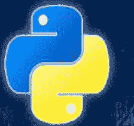
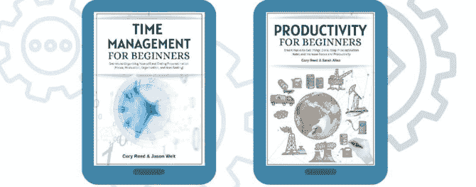
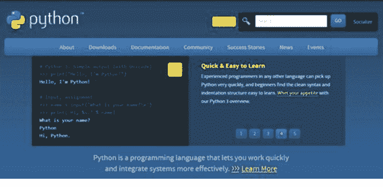

# 面向初学者的Python编程



## 2023版


# 面向初学者的Python编程

最全面的编程指南，助你从零开始快速成为Python专家。包含实践练习

Cory Reed

版权所有 ©2022 Cory Reed。保留所有权利。

# 面向初学者的Python编程

ISBN: 979-8354101856
10 9 8 7 6 5 4 3 2 1


## < 立即获取您的奖励！ >

为了引导你踏上学习Python编程的旅程，我与Jason Welt和Sarah Allen合作，创建了两份关于时间管理和生产力策略的指南，它们将帮助你从本书中获得最大收益。



要下载您的奖励，请扫描以下二维码


或访问

https://books-bonuses.com/cory-reed-bonuses

所有奖励完全免费，您无需提供除姓名和电子邮件地址以外的任何个人信息。

# 目录

# 第1章：Python简介

- [什么是Python？](What is Python?)
- [你能从本书中获得什么好处？](How can you benefit from this book?)

# 第2章：Python入门

- [Python的历史](History of Python)
- [Python的应用](Applications of Python)
- [Python的不同版本](Different Versions of Python)
- [有哪些好处？](What Are the Benefits?)
- [安装Python](Installing Python)
- [MacOS的Python安装](Python Installation for MacOS)
- [Windows的Python安装](Python Installation for Windows)

## 第3章：如何使用PyCharm和IDLE

- [Python IDLE Shell如何工作](How Python IDLE Shell Works)
- [如何在IDLE中打开Python文件？](How to Open Python Files in IDLE?)
- [集成开发环境（IDE）](Integrated Development Environment(IDE))
- [PyCharm](Pycharm)

## 第4章：什么是Python变量？

- [Python变量](Python Variables)
- [如何查找变量的内存地址？](How to Find the Memory Address of Variables?)

# 第5章：Python基础

- PYTHON中的局部变量和全局变量
- 为什么需要输入值？
- PYTHON注释
- 练习

## 第6章：什么是Python数据类型？

- 什么是数据类型？
- PYTHON字符串
- PYTHON字符串格式化器
- 字符串操作技术
- 整数
- 浮点数
- 布尔值

# 第7章：Python中的数据结构

- 列表
- 元组
- 字典
- 练习

## 第8章：条件语句和循环

- 控制流语句
- IF-ELSE语句
- ELIF语句
- For循环
- While循环
- 练习

## 第9章：如何创建模块和函数

- 在函数中使用参数
- 传递参数
- 理解模块
- 内置函数和模块
- 字符串方法
- 练习

# 第10章：面向对象编程（OOP）

- 什么是面向对象编程？
- 如何创建和使用类
- 如何创建对象
- 继承

# 第11章：Python中的文件

- 文件和文件路径
- 文件管理函数
- 复制文件或文件夹
- 移动和重命名文件和文件夹
- 删除文件和文件夹

# 第12章：异常处理

- 'TRY'和'EXCEPT'语句

# 第13章：高级编程要素

- 面向程序员的GITHUB
- PIP包管理器
- 虚拟环境
- 理解SYS模块

# 结论

# 第1章：Python简介

## 什么是Python？

Python是一种高级、通用的编程语言，强调代码的可读性。Python被应用于许多领域，并可根据您的具体需求以多种方式应用。一些最常见的用途包括Web开发、数据科学、机器学习和人工智能（AI）、系统管理等等。Guido van Rossum于1991年首次发布了该语言。

选择“Python”这个名字是为了体现其简洁性、清晰的语法和可读性。Python也非常适合开发动态Web应用程序，因为它是一种高级语言，强调代码的可读性而非底层内存管理。换句话说，你可以很容易地看出你的代码做了什么，而无需关心它是如何做到的。

Python最关键的特点之一是其对可读性的重视。使用Python，你可以轻松阅读和理解其他人（或者你自己，如果你忘记了它是如何工作的）编写的代码。该语言的语法允许开发者用更少的行数表达他们的想法，使代码更易于维护并支持快速原型开发。

Python在设计上偏向于可读性和非常干净的语法。这使得它更易于维护和支持。Python被世界上一些最具影响力的公司使用，包括Google、NASA和Reddit。许多大型Web服务提供商，如YouTube、Instagram和Pinterest，也在其后端使用Python来驱动他们的服务。

Python的流行度因其庞大的在线社区而得到加强。该语言有许多官方文档渠道，包括教程、视频和书籍，这些在网上很容易找到。GitHub上也列出了超过150,000个项目，这些项目都是用Python编写的或包含Python。

## 你能从本书中获得什么好处？

Python编程看起来容易实现，但事实并非如此。你需要对Python附带的几个基础主题有透彻的了解，并应该意识到能够让你利用这些基础来解决问题的技术。本书为你提供了理论知识，可以帮助你理解基础，并帮助你获得对正在尝试使用的编程语言的实践经验。

为了从本书中获得最大收益，我们建议使用认知学习技术来增强你对这些材料的体验。

使用思维导图来映射不同的概念，并在你的项目中快速实现它们。思维导图是认知学习工具，利用视觉优势，只需一个详细的图表就能轻松记住大量数据。

使用认知记忆技巧，如记忆宫殿，来有意义地记住数据。死记硬背和使用认知技术将所需信息存储在大脑中是有区别的。

使用被动回忆技术快速复习你在本书中学到的所有主题。被动回忆可以帮助你加强你的编程基础。

使用费曼技巧，向不了解该主题的人解释你在本书中学到的所有基本编程概念。如果你能用简单的语言演示一个概念，说明你对核心基础掌握得很好。

不要只使用书中给出的代码。使用类似的策略重新实现你自己的代码。简单的复制粘贴技术不会帮助你创建自己的代码。

Python作为一种编程语言，期望你尽可能具有创新性。将Python编程视为一个谜题，你很快就会找到方法来“欺骗”你的大脑，为现实世界的问题创建复杂的代码逻辑。本书帮助你尽可能高效地使用Python编程。我们很高兴能与你一起开始这段旅程。你准备好了吗？

# 第2章：Python入门

## Python的历史

Python的创造者Guido van Rossum在圣诞假期期间将Python作为一个休闲项目创建。他利用自己在ABC编程语言方面的工作经验，创建了一种解释型编程语言，它直观且更易于程序员使用。凭借他在Unix开发方面的专业知识，他最初使用Python是为了给一个在线社区的黑客留下深刻印象。

然而，由于来自其他程序员的反馈，他开始花几个月时间打磨它，以创建一种简洁、简单且快速的编程语言。由于他对Python项目的贡献，Guido van Rossum被命名为Python社区的仁慈独裁者。这个高级荣誉可以授予开源开发者。

从发布之初，根据TIOBE排名，Python就一直是十大最受欢迎的编程语言之一。Python解决问题的极简主义方法帮助它击败了其他编程语言，如Perl，成为对初学者更易上手的编程语言之一。

Python使用“解决问题只有一种方法”的哲学，这与Perl等编程语言的“解决问题有多种方法”的哲学相矛盾。Python在很大程度上...为编程社区带来了必要的规范，并使软件开发呈指数级增长。

要了解 Python 对全球程序员的影响有多大，请看下文提到的 Python 应用领域。

## Python 的应用领域

Python 在现代科学技术的不同领域都留下了其印记。

### 1. Web 领域

Python 作为一种编程语言，其最初的影响主要体现在 Web 技术上。当 Java 统治着网络空间时，Python 并不那么流行。随着时间的推移，Django 和 Tornado 等几个第三方框架帮助 Python 在 Web 开发者中流行起来。

快进二十年，Python 现在已成为网站最受欢迎的脚本语言之一，仅次于 Javascript。谷歌、Facebook 和 Netflix 等多家跨国公司都在其软件实现中使用 Python。著名的 Web 框架 Django 可以帮助程序员为多个 API 编写后端代码。

Python 在自动化领域也很受欢迎，因此像 Pinflux 这样的机器人通常使用它来开发。

### 2. 科学计算领域

Python 因其开源特性而受到科学界的欢迎。Numpy 和 Scipy 等软件帮助计算机科学家用更少的代码进行计算实验。由于 Python 在数学计算和软件方面也表现得更好，如今科学家们除了 Python 之外别无选择。

### 3. 机器学习与人工智能

机器学习和人工智能目前是两项结合的技术，为开发者提供了更多的工作机会。Python 拥有许多第三方库，例如完全专注于机器学习算法实现的 Tensorflow。

Python 对深度学习和自然语言处理技术也具有出色的适应性，使其成为开发人工智能相关技术的更优语言的核心竞争者之一。

### 4. Linux 与数据库管理

随着全球公司的发展，对能够有效管理数据库和内部系统的开发工程师的需求很大。虽然开发工程师需要对 Linux 等不同操作系统有足够的了解，但他们也需要对 Python 有足够的了解，以自动化检查内部网络上方法性能所必需的其他流程。

## Python 的不同版本

Python 是一种通用、高级的编程语言。Guido Van Rossum 在 1980 年代末和 1990 年代初开发了它。Python 是一种动态、解释型的编程语言，允许代码在不编译成机器可读指令的情况下执行。

Python 最流行的版本是 2.x 和 3.x，但许多专业人士仍然使用 Python 2，因为它比其后继版本错误更少（并且拥有更多库）。然而，Python 2.x 不再维护，因此不会更新新功能。Python 3.x 是学习和使用的最佳版本，因为它拥有最多的开发者支持和许多新功能（它也向后兼容 Python 2.x）。

Python 版本摘要：

- Python 2.x：此版本仍被广泛使用，但不会更新新功能，因为其创建者（Guido Van Rossum）已放弃它，转而支持 Python 3.x。
- Python 3.x：这是最佳版本，因为它具有许多新功能，并且比 Python 2.x 错误更少。
- Python 2.7：此版本比 Python 3 更受欢迎，但仍然强烈建议学习和使用 Python 3。它也是 Windows、Linux、OS X 和 UNIX 系统的默认版本；然而，此规则有一些例外（Microsoft Windows 自 Windows 10 以来未正式支持任何版本）。
- Python 3.6：此版本在学术界最为普遍，但用户群似乎比 Python 2.x 小，尤其是在企业环境中（它对 Python 2 的支持也较少）。
- Python 3.5：一个较新的 Python 版本，具有许多新功能和错误修复；它是当今最受欢迎的版本。您可以在此处获取有关 Python 各种版本的更多信息。
- Python 3.4：此版本仍然是 Python 3.5 的替代方案，因为 Python 2.x 不再受支持。
- Python 3.3：这是 Python 3 开始进行重大更改之前的最后一个功能完整的版本；大多数与以前的版本向后不兼容，并且有些已被删除（例如 set 模块）。
- Python 2.7：这是最后一个仍与 Python 3.x 兼容的 Python 版本；然而，它不如 Python 3.x 流行，在企业环境中支持较少。此版本针对新开发者，因为它是 Cydia Impactor 中的默认版本，Cyd ia Impactor 是一个帮助您在 iPhone 或 iPad 上安装越狱 iOS 应用程序的应用程序（目前仅支持 Windows 和 Linux）。

## 有什么好处？

Python 的好处包括易于交互式学习、可读性、快速开发和原型设计。该语言支持模块化编程、信息隐藏、面向对象编程、动态类型和自动内存管理。对代码的表达能力或复杂性没有限制。Python 可以作为 Web 应用程序的脚本语言；它也已用于商业产品、Web 服务和创建桌面应用程序。

## 安装 Python

既然我们已经对 Python 有了一些了解，现在是时候看看在计算机上安装 Python 所涉及的一些步骤了。您需要确保能够充分导航和安装此程序，并在适当的时间在计算机上安装正确的版本。这将使编写一些必要的代码变得更容易，而不会遇到太多障碍。

## 安装解释器

在我们开始编写第一个 Python 程序之前，我们必须首先下载适合我们计算机的 Python 解释器。本书将使用 Python 3，因为正如 Python 官方网站所述，“Python 2.x 是遗留版本；Python 3.x 是该语言的现在和未来。”此外，“Python 3 消除了许多可能不必要地混淆经验不足的程序员的怪癖。”

然而，值得注意的是 Python 2 仍然相当流行。Python 2 和 3 大约有 90% 是相同的。因此，如果您学习 Python 3，您几乎肯定不会难以理解 Python 2 代码。要下载 Python 3 解释器，请导航至 https://www.python.org/downloads/。在网页顶部，应指示正确的版本。请参见下图：

图 1：



在任何程序员能够继续阅读本书的其余部分并开始编写 Python 代码之前，必须完成运行 Python 的各种步骤，这完成了安装。Python 安装将根据您计算机上安装的操作系统和您选择的安装源而有所不同。

获取有关此编程语言信息的地方有限，但我们将专注于 www.python.org 以使事情变得更容易。在本章中，我们将花一些时间介绍安装 Python 解释器所需的各种步骤，以及所有主要操作系统上的更多内容。

首先，找到与您计算机操作系统兼容的版本。然后，按照以下步骤获取所需结果并在计算机上安装 Python 编程语言及其所有相关软件。

## MacOS 的 Python 安装

MacOS 是由 Apple Inc. 创建的工作框架。它与 Windows 操作系统和其他操作框架相同。大多数较新版本的 MacOS 都预装了 Python。您可以通过以下方向检查 Python 是否已安装。

下载 Python 3 或 2 新版本。在撰写本文时，Python 3.6 或 Python 2.7 是较新的版本。下载 Mac OS X 64 位/32 位安装程序。运行捆绑包并按照安装步骤安装 Python 捆绑包。

- 从 Python 官方网站单击“Downloads”图标并选择 Mac。
- 单击“Download Python 3.8.0”按钮以查看所有可下载文件。
- 将出现不同的屏幕，选择您要下载的 Python 版本。

我们将使用“稳定版”下的 Python 3 版本。因此，请向下滚动页面，点击 Python 3.8.0 下的“Download macOS 64-bit installer”链接，如下图所示。

-   将显示一个标题为“Python3.8.0-macosx10.9.pkg”的弹出窗口。
-   点击“Save File”按钮下载文件。
-   下载完成后，双击已保存的文件图标，将显示一个“Install Python”弹出窗口。
-   点击“Continue”按钮继续，将显示一个条款和条件弹出窗口。
-   点击“Agree”，然后点击“Install”按钮。
-   将显示一个请求管理员权限和密码的通知。只需输入您的系统密码即可开始安装。
-   安装完成后，将显示“Installation was successful”消息。点击“Close”按钮，一切就绪。
-   导航到您安装 Python 的目录以验证安装，然后双击 Python 启动器图标进入 Python 终端。

## Windows 的 Python 安装

-   从 Python 官方网站点击“Downloads”图标并选择 Windows。
-   点击“Download Python 3.8.0”按钮查看所有可下载的文件。
-   它将显示不同的屏幕以选择您要下载的 Python 版本。我们将使用“稳定版”下的 Python 3 版本。因此，请向下滚动页面并点击“Download Windows x86-64 executable installer”。
-   将显示一个标题为“Python3.8.0-amd64.exe”的弹出窗口。
-   点击“Save File”按钮下载文件。
-   下载完成后，双击已保存的文件图标，将显示一个“Python 3.8.0 (64-bit) Setup”弹出窗口。
-   确保选中“Install Launcher for all users (recommended)”和“Add Python 3.8 to PATH”复选框。注意——如果您系统上已安装了旧版本的 Python，则会出现“Upgrade Now”按钮而不是“Install Now”按钮，并且不会显示任何复选框。
-   点击“Install Now”按钮，将显示一个“User Account Control”弹出窗口。
-   将显示一条通知，询问“Do you want to allow this app to make changed to your device”。点击“是”。
-   将显示一个新的标题为“Python 3.8.0 (64-bit) Setup”的弹出窗口，其中包含一个安装进度条。
-   安装完成后，将显示“Set was successful”消息。点击“Close”按钮，一切就绪。
-   导航到您安装 Python 的目录以验证安装，然后双击 Python.exe 文件。

# 第 3 章：如何使用 Pycharm 和 IDLE

Python 软件安装后，您需要在系统上有一个专用的开发环境来创建程序。虽然使用基本 Python 安装附带的基本 IDLE 进行工作是可行的，但建议开发者使用 Pycharm 等 IDE 以获得更好的软件开发工作流程。IDE 提高了生产力，并使开发者能够轻松调试其已部署为软件的现有代码。

## Python IDLE Shell 如何工作

想知道 Python IDLE Shell 如何工作吗？IDLE shell 可用于交互式 Python 编程。请参阅这篇博客文章了解 IDLE Shell 的工作原理。

IDLE Shell 是一个在 IDE 主窗口内运行的 shell，可以访问其所有功能，包括调试和自动完成。通常，当您使用“文件 -> 新建窗口”菜单选项加载或创建 Python 文件时，该程序会打开，这将自动启动一个编辑器窗口和一个 idle shell 窗口。IDLE shell 也可以作为独立程序使用。

例如，我们将使用运行在 Python 3.4 上的 IDLE 版本 3.6。在名为 idlestest1.py 的新文件中输入以下代码：

```python
print('Welcome to Python Tutorials!' + '.'
' + 'Press ENTER to exit...') print('End of file.') 1 2 3 4
print ('Welcome to Python Tutorials!' + '
' + 'Press ENTER to exit...' ) print ( 'End of file.' )
```

通过选择“文件 -> 保存”然后“文件 -> 退出”保存文件，然后通过点击屏幕顶部显示 IDLE 图标的图标启动 IDLE 3.6 shell。

Python Shell 1 窗口打开，带有一个空白的编辑器窗格。这就是我们将编写 Python 代码的地方，因此没有其他窗口打开。

注意：重要的是要记住，一旦您退出终端窗口，所有代码都将被销毁。因此，我们需要确保即使使用 IDLE 工作，所有代码都输入到 Python 文件中。

## 如何在 IDLE 中打开 Python 文件？

IDLE 使得在终端上打开和读取已编写的具有 .py 扩展名的 Python 文件变得容易。请记住，此命令仅在您位于 Python 文件的同一目录中时才有效。

**程序代码：**

```
$ python sample.py
```

上述命令将打开现有代码供程序员阅读。

-   IDLE 可以自动突出显示语法的独特组件
-   IDLE 通过提供提示帮助开发者完成代码
-   IDLE 可以轻松缩进代码

您也可以使用 GUI 文件选项点击“打开”按钮以在 IDLE shell 上使用任何 Python 文件。但是，高级程序员建议，如果您不在同一目录中，请使用路径打开 Python 文件。

## 如何编辑这些文件？

一旦文件在您的 IDLE 中打开，您可以使用键盘开始编辑文件中存在的代码。由于 IDLE 提供行号，开发者可以轻松操作任何非缩进代码。文件编辑完成后，使用 F5 键在终端代码上执行它。

如果没有错误，则会显示输出，否则如果存在错误，将显示回溯错误。

虽然不如市场上其他高级 IDE 高效，但 Python IDLE 仍然是一个很好的调试工具。它提供了多种调试功能，例如设置断点、捕获异常和解析代码以快速调试代码。然而，它并不理想，如果您的项目库开始增长，可能会导致问题。

无论它提供多少功能，IDLE 仍然是完全初学者的最佳开发工具。

练习：

使用 Python IDLE 创建一个新程序来添加两个数字，并使用断点调试代码。如果您不了解任何编程组件，您可以自由使用互联网上的任何资源来解决这个简单问题。

## 集成开发环境 (IDE)

由于无法处理高要求的项目，Python IDLE 通常不推荐用于实际应用开发。相反，开发者被要求在称为 IDE 的独特开发环境中管理和开发他们的代码。IDE 为程序员提供了与不同库的紧密集成能力。

## IDE 的功能

1.  **轻松集成库和框架**

IDE 的许多基本功能之一是它们可以使库和框架轻松集成到软件应用程序中。使用 IDLE，您每次使用时都必须单独分配它们，而 IDE 则通过自动完成各种导入语句为您完成这项艰苦的工作。许多 IDE 还提供与 git 存储库的直接集成。

2.  **面向对象设计集成**

许多开发应用程序的 Python 程序员使用面向对象范式。Python IDLE 不提供任何工具来帮助开发者在遵循面向对象原则的同时轻松创建应用程序。所有现代 IDE 都为开发者提供类层次结构图等组件，以便他们以更好的编程逻辑启动项目。

3.  **语法高亮**

语法高亮有助于程序员提高生产力，并让他们不犯简单、明显的错误。例如，您不能使用像‘if’这样的保留关键字作为变量名。IDE 自动识别此错误，并通过语法高亮帮助开发者理解。

4.  **代码补全**

所有现代集成开发环境（IDE）都采用先进的人工智能和机器学习技术，为开发者自动补全代码。IDE会从你的代码包中收集大量信息，根据你的输入和正在编写的逻辑，建议不同的变量或方法。尽管自动补全是一项很棒的功能，但切勿完全依赖它，因为它有时可能会搞乱你的程序执行并导致错误。

### 5. 版本控制

版本控制是开发者面临的主要难题之一。例如，如果你的应用程序使用了私有库和框架，它们有时可能会更新并导致你的应用程序崩溃。作为开发者，你应该注意这些变化，并为所有应用程序实现新的代码执行方式，以确保其正常运行。版本控制机制允许开发者轻松更新其核心应用程序，而不会搞乱已编写的代码。IDE通过Github等网站提供直接的版本控制。

除了这些功能，IDE还可以为开发者提供高级调试功能。Pycharm和Eclipse是独立开发者和组织中最受欢迎的Python IDE。

## Pycharm

Pycharm是由JetBrains开发的Python专用IDE，JetBrains是软件工具开发的先驱之一。最初，Pycharm是由JetBrains团队开发的，用于处理他们其他编程语言的IDE。由于其可移植性，后来JetBrains团队将其作为独立产品发布给全球用户。Pycharm适用于所有流行的操作系统，并有两个版本——社区版和专业版。

- 1. 社区版是免费的开源软件，任何人都可以使用它来编写Python代码。然而，它的功能有限，特别是在版本控制和第三方库集成方面。
- 2. 专业版是一个付费的IDE，为开发者提供高级功能和多种集成选项。开发者可以使用专业版轻松地从Pycharm IDE创建Web或数据科学应用程序。

## Pycharm有哪些功能？

Pycharm因其为热情的Python开发者提供的独特功能和高质量的集成能力而广受欢迎。

- 1. 代码编辑器

Pycharm的代码编辑器是业界最优秀的之一。当你使用这个编辑器处理新项目时，你会对其代码补全能力感到惊讶。JetBrains使用了多种先进的机器学习模型，使IDE足够智能，能够理解复杂的编程块并向用户提供有用的建议。

Pycharm编辑器还可以进行定制，以在开发者长时间工作时提供更好的视觉体验。用户可以选择亮色和暗色主题，根据心情调整界面风格。

- 2. 代码导航

Pycharm通过其复杂而完整的组织系统，使程序员能够轻松管理文件。书签和透镜模式等特殊功能可以帮助Python程序员有效地管理他们重要的编程块和代码逻辑。

### 3. 高级重构

Pycharm为开发者提供高级重构功能，可以轻松更改文件、类或方法的名称，而不会破坏程序。当你使用IDLE重构代码时，它会立即破坏代码，因为默认的Python IDLE不够智能，无法理解新旧名称之间的区别。

大多数Python开发者在想要更新代码或将软件组件迁移到更好的第三方库时，都会使用高级重构功能。

### 4. 与Web技术的集成

大多数Python开发者属于Web领域，该领域占据了软件行业的很大一部分。Pycharm使开发者能够轻松地将他们的软件与Django等Python Web框架集成。Pycharm还足够智能，能够理解Web开发者通常用于创建Web服务的HTML、CSS和Javascript代码。

所有这些功能使得Python Web开发者能够轻松地将现有的Web代码集成到Python框架中。

### 5. 与科学库的集成

Pycharm还以其对Scipy和Numpy等科学和高级数学库的高度支持而闻名。虽然它永远无法完全替代你的数据集成和清理设置，但它可以帮助你为所有数据科学项目创建基本的伪逻辑。

### 6. 软件测试

Pycharm可以为即使是由许多成员组成的复杂大型项目执行高级单元测试策略。它提供高级调试工具和远程配置设施，以利用Alpha和Beta测试工作流程。

## 如何使用Pycharm？

在了解了关于Pycharm的足够信息后，你一定已经确信Pycharm是你本地系统必备的开发工具。本节提供安装Pycharm并了解如何使用它来更好地处理Python项目所需的信息。

### 步骤—1：安装Pycharm

在任何操作系统上安装Pycharm都非常简单。你必须从官方网站或众多包管理器之一下载安装包。

前往JetBrains的官方网站，访问右上角的下载选项卡。现在根据你的操作系统下载可执行文件或dmg文件，下载完成后单击它，按照屏幕上的说明进行操作。

要下载专业版软件，你需要先提供付款信息以下载试用软件。试用期结束后，你将被收费，并且可以毫无问题地使用专业版。

注意：

为了在你的系统上成功安装Pycharm IDE，你必须确保已安装Python。它会自动检测Python路径以安装软件的核心库。

### 步骤—2：创建新项目

软件安装后，从你的应用程序中打开Pycharm IDE，或使用桌面上的图标。Pycharm打开后，会弹出一个新窗口，让你从头开始一个新项目。在软件界面的左上角，你会找到一个使用“文件”选项打开新项目的选项。其他选项包括导入和导出以使用现有项目，或快速保存当前工作项目。

当你第一次打开一个Python项目时，系统会要求你选择用于所有编程过程的Python解释器。如果你不知道在哪里找到Python解释器，请选择“virtualenv”选项，因为此选项会自动搜索系统并为你找到一个Python解释器。

### 步骤—3：使用Pycharm组织

一旦你开始使用Pycharm创建项目，为你的程序文件创建新文件夹和资源对于更好地访问它们至关重要。

只需点击新建 —> 文件夹选项，即可在项目界面上创建一个新文件夹。在此部分，你可以添加任何Python脚本或软件中使用的资源。

当你在单独的文件夹中创建新文件时，将创建一个扩展名为.py的文件。如果你想创建不同的类文件或模板，必须在文件夹中明确创建文件时选择它们。

### 步骤—4：Pycharm中的高级功能

代码编写和集成完成后，你可以快速运行内置的IDLE界面或Pycharm特定的输出界面。

你编写的所有代码都会实时自动保存；因此，你无需担心因网络连接不良或断电而丢失任何关键项目数据。你所要做的就是使用Ctrl S或Cmd S在本地系统上保存项目的副本。

程序完成后，你可以使用Shift + F10按钮，在解释器的帮助下运行和编译代码。

你可以使用Ctrl F或Cmd F命令搜索项目中使用的任何方法、变量或代码片段。只需使用此快捷键并输入你要搜索的详细信息。

Python代码导入并部署到所需的操作系统后，你需要开始安排一个调试项目环境，以便在系统上不断清除错误。使用Shift + F9按钮设置断点。

# 第四章：什么是 Python 变量？

Python 程序需要变量和运算符等基本构建块，才能按预期运行。变量和运算符都易于初学者理解编程逻辑，这有助于他们创建对复杂软件运行至关重要的算法。

## Python 变量

要创建任何程序，都需要有效地处理数据。用户和软件都通过数据进行交互。没有数据，软件应用程序将毫无意义，也无法为最终用户提供任何用途。为了使软件应用程序能够上传或下载数据，需要使用变量。

变量的概念最早用于代数这一数学领域来定义值。变量并不是 Python 编程语言的新成员。从高级编程语言诞生之初，变量就被用于在特定的计算机内存位置存储数据。计算机编程的早期采用者在根据计算机内存信息提取数据时遇到了困难。因此，他们借鉴了代数中的变量概念，将值放入计算机内存，并在需要时使用它们。

**例如：**

2x + 3y 是一个数学方程式。

1.  如果 x = 3 且 y = 4，那么上述语句的结果将是 18。
2.  如果 x = 2 且 y = 6，那么上述语句的结果将是 22。

同样，通过使用变量，你可以通过赋予它们的字面值来改变程序输出。所有变量值都可以轻松替换。根据编程术语，如果你不想替换变量的值，它通常应该被称为常量。

要理解变量的工作原理，你首先需要了解 Python 程序的执行方式。我们将借助 `print` 语句为你简化说明。

**程序代码：**
`print("This is a sample analysis.")`

**输出：**
This is a sample analysis.

在上面的例子中，当 `print` 语句在计算机屏幕上输入并执行时，输出将立即显示。但为了呈现这个输出，后台发生了许多事情。

**发生了什么？**

当程序执行时，它会逐行读取，并根据其被授权访问的库进行匹配。

解释器通常以高超的解析能力执行此匹配过程。它不仅能确定程序中每个字符的含义，还能匹配变量详情，并从该内存位置提取信息以验证程序逻辑。

即使经过复杂的解析，如果解释器找不到定义的方法或变量，程序也会抛出错误或异常。

在上面的例子中，当解释器解析 `print` 语句时，它立即识别出这是 Python 库中定义的一个核心库方法，并将输出括号之间的任何字符串字面量。

如果你完全理解了上述解释，现在是时候学习变量在 Python 中是如何工作的了。

**程序代码：**
```
program = "This is a simple analysis."
print(program)
```

**输出：**
This is a simple analysis.

**发生了什么？**

一旦程序执行开始，解释器通常会解析程序员提供的所有代码行。

解释器现在观察到的不再是一个后跟文本块的 `print` 语句，而是一个名为 'program' 的特定标识符，即变量。它会搜索前面的代码，发现该变量已经用一段文本定义并存储在特定的内存位置。

现在，解释器将通过提取变量中定义的数据，按照程序员的指示在屏幕上打印该变量。

这就是变量工作的基本机制，即使它们被用于复杂的代码逻辑中也是如此。

当变量被替换时，其值会立即更改。这对 Python 程序员很重要，因为所有动态程序都会根据用户输入更改变量，并在程序实时运行时返回它们。

**程序代码：**
```
sample = "This is an example"
print(sample)
sample = "This is a second example"
print(sample)
```

**输出：**
This is an example
This is a second example

在上面的例子中，正如我们所知，Python 解释器按顺序逐行解析代码，第一条语句使用提供的第一个变量值打印，第二条 `print` 语句使用提供的第二个变量值打印。

## 变量命名

所有 Python 程序员在创建变量时必须遵循 Python 社区提供的默认指南。不遵守这些条件会导致你的程序出现难以忽视的错误，有时甚至会使你的应用程序崩溃。在创建程序时使用特定的指南也可以提高可读性。

**编写变量的规则：**

-   根据 Python 指南，你只能使用数字、字母字符和下划线来创建变量名。例如，'sample1' 可以用作变量名，而 '$sample1' 不能用作变量名，因为它以不支持的符号 $ 开头。
-   Python 程序员不能以数字开头命名变量。例如，'sample1' 是支持的变量命名格式，而 '1sample' 则不支持。
-   Python 程序员不能使用为 Python 开发中使用的各种编程例程保留的保留字。目前，有 33 个保留关键字，开发者在使用 Python 创建实际应用程序时无法将其用作标识符。例如，'for' 是一个保留关键字。
-   虽然这不是一个严格的规则，但遵循简单的变量命名方法总是有益的，可以提高可读性。创建复杂或令人困惑的变量名会使你的代码看起来不专业。虽然这种做法适用于 C、C++ 和 Perl 等高级语言，但 Python 并不推崇这种理念。

## 如何定义变量？

Python 编程语言中定义的所有变量都使用赋值运算符 (=) 首先为变量赋值。

**语法格式：**
`变量名 = 变量值`

**例如：**
```
example = 343
# 这是一个整数数据类型的变量
example1 = "Russia"
# 这是一个字符串数据类型的变量
```

example 是我们创建的变量名，343 是我们在初始化时赋予的变量值。

看看上面的变量定义方法，我们没有明确提及任何变量数据类型，因为 Python 足够智能，可以自动理解不同的数据类型。

## 如何查找变量的内存地址？

所有变量都存储在特定的内存位置。每当你调用变量名时，Python 解释器就会提取该内存位置中存在的信息。如果你要求 Python 解释器替换变量，它只会移除已放置的变量值，并用新的变量值替换它。旧的变量值将被删除或使用垃圾回收机制存储以供将来使用。

通常，像 C 这样的编程语言使用指针来快速确定和提取变量内存位置的信息。然而，Python 不支持指针，因为它通常难以实现，并且需要解释器通常不具备的大量编译技能。

相反，Python 开发者可以使用内置的 `id()` 函数轻松获取变量的内存地址。

**程序代码：**
```
sample = 64
# 首先，创建一个你喜欢的数据类型的变量
id(sample)
# 现在使用这个名为 id() 的内置函数调用
```

**输出：**
1x37372829x

这里，1x37372829x 是变量的内存位置，以十六进制格式表示。

使用下面的方法，你现在可以替换变量并检查 `id()` 是否已更改。

**程序代码：**
```
sample = 64
id(sample)
sample = 78
# 现在，我们已经用新值替换了变量值
id(sample)
# 这将再次打印内存位置地址的输出
```

**输出：**
1x37372829x

如果你观察到，内存位置没有改变，但通过一个小的打印验证，你可以看到变量值已经改变。

**程序代码：**
```
sample = 64
id(sample)
sample = 78
print(sample)
```

## Python中的局部变量与全局变量

根据你编写的程序逻辑，变量可以是局部的或全局的。理论上，局部变量只能在你希望它们被使用的特定方法或类中使用。相反，全局变量可以在程序的任何部分使用而不会有任何问题。当你在特定函数外部调用局部变量时，Python解释器通常会抛出一个错误。

程序代码：

```python
# 这是一个包含局部变量的函数示例
def sample():
    example = "This is a trail"
    print(example)
```

输出：

```
This is a trail
```

此示例将变量定义为函数内的局部变量。因此，当你在任何函数内部调用它时，它都会抛出一个回溯错误，如下所示。

程序代码：

```python
# 这是一个包含局部变量的函数示例
def sample():
    example = "This is a trail"
    print(example)
def secondsample():
    print(example)
```

输出：

```
This is a trail
```

回溯错误：变量未定义

另一方面，全局变量可用于为整个程序初始化变量。

程序代码：

```python
example = "This is a trail"
# 已创建一个全局变量
def sample():
    print(example)
def secondsample():
    print(example)
```

输出：

```
This is a trail
This is a trail
```

由于两个函数都可以访问全局变量，因此计算机屏幕上会作为输出提供两条打印语句。

注意：

决定使用哪种类型的变量完全取决于你。许多程序员严重依赖局部变量来更快地运行他们的应用程序。另一方面，如果你不想被大量的内存管理所淹没，可以使用全局变量。

# 第5章：Python基础

Python程序员必须确保使应用程序动态化。他们所有的应用程序都需要直接从用户那里获取输入，并根据用户的输入提供输出。Python解释器和程序中的所有函数都可以访问用户提供的这些输入值。

在本章中，我们将提供一些示例程序，帮助你了解如何根据输入和输出操作来改善你所创建软件的用户体验。

### 为什么输入值是必要的？

输入值是应用程序得以生存的基础。从网络应用程序到最新的元宇宙应用程序，一切都依赖于用户提供的输入值来运行。例如，当你登录Facebook时，你必须输入你的电子邮件地址和密码。这些就是输入，只有提供的信息正确，你的账户才会被验证。

即使是像人脸识别技术这样的高级应用程序，也使用面部数据点作为输入。如今，每个现实世界的应用程序都会请求并收集用户输入数据，以提供更好的用户体验。

### 用例：

假设你开发了一个面向成年受众的Python应用程序；因此，18岁以下的人不能使用它。

对于上述场景，我们可以通过要求用户输入他们的年龄来进行条件输入验证。如果年龄超过18岁，应用程序将对用户可访问。另一方面，如果年龄低于18岁，应用程序将对用户不可访问。Python从所有支持的数据类型中获取输入，以确定某人是否可以访问你的软件。这只是一个现实世界的例子。通过访问最终用户的输入，你可以执行无数的应用程序。

### Python注释

当编程团队处理复杂且要求很高的项目时，不同的团队程序员之间必须进行大量交流，以理解项目的本质。注释帮助程序员在不搞乱程序的情况下快速传递信息。

当程序员使用注释时，Python解释器将忽略提供的注释，并继续执行下一行。由于Python有许多开源项目，注释帮助开发人员轻松理解如何将第三方库和框架集成到他们的代码中。

注释还可以帮助你的代码可读，从而更容易理解。虽然对于某些程序员来说，记住他们编写的代码逻辑似乎没有必要，但你会惊讶于程序员会忘记多少他们编写的代码逻辑。对你如何编写代码逻辑有特定的见解，对于未来的参考将非常有帮助。

Python支持两种类型的注释，供程序员在代码之间编写。

#### 1. 单行注释

单行注释是Python程序员最常用的注释类型，因为它们可以轻松地在代码之间编写。

你需要使用‘#’符号来使用单行注释。解释器将忽略此符号之后的所有内容。

**程序代码：**

```python
# 这是一个单行注释的示例，后面跟着一个井号符号
print("This is just an example")
```

**输出：**

```
This is just an example.
```

由于使用了单行注释，解释器忽略了它，只执行了打印语句。

##### 为什么使用单行注释？

单行注释主要用于代码中间，以帮助其他程序员理解程序逻辑如何工作，并详细说明已实现变量的功能。

#### 2. 多行注释

虽然完全有可能使用单行注释来编写三到四行的连续注释，但不建议这样做，因为Python提供了一种更好的方式来注释多行注释。

如下所示，Python程序员可以使用字符串字面量来创建多行注释。

程序代码：

```python
"""
This is a comment
In Python
with multiple lines
Author: Python Rookie
"""

print("This is just an example")
```

输出：

```
This is just an example.
```

与单行注释一样，当你执行上述程序时，只有打印语句被执行。

##### 为什么使用多行注释？

程序员经常使用多行注释来定义许可证详细信息，或解释关于不同包和方法的综合信息，并提供各种实现示例。阅读代码的程序员可以有效地理解它。

### 保留关键字

保留关键字是编程语言的默认关键字，程序员在编写代码时不能将其用作标识符。标识符通常用于变量、类和函数名。

当你在程序中使用保留关键字时，解释器将不允许并抛出错误。例如，如果你将‘for’用于你的一个变量，它将不起作用，因为‘for’通常用于定义Python编程中的特定类型的循环结构。

有33个保留关键字，你不能在程序中使用它们。作为一名Python程序员，强烈建议了解这些，以避免在创建复杂项目时产生不必要的错误。

### 练习：

为了熟悉我们之前解释的Python命令，尝试使用Python终端自己查找Python中的保留关键字。

计算机程序员通常使用运算符来组合字面量和形成语句或表达式。

#### 示例：

2x + 3z = 34

这里2x、3z和34是字面量，而+和=是用于这些字面量以形成表达式的运算符。

## 练习

- 编写一个Python程序从用户那里获取输入。使用此输入，使用不同的算术运算符，如乘法和除法。你也可以尝试求余数。
- 创建一个Python print()语句，包含你选择的一首诗。
- 创建一个Python程序，鼓励Unicode开发者编写具有良好功能的代码。
- 编写一个Python程序将十进制数转换为十六进制数。
- 编写一个Python程序，输入三个数字x、y和z，并计算x^2 (2y + 5z)的值。

# 第六章：什么是 Python 数据类型？

Python 程序员使用多种数据类型在不同平台上创建通用应用程序。Python 程序员需要理解数据类型在软件开发中的重要性。

## 什么是数据类型？

准确地说，数据类型是程序员在创建变量时使用的一组预定义的值范围。同样重要的是要记住，由于 Python 不是静态类型语言，因此不需要显式定义变量的数据类型。所有静态类型语言（如 C 和 C++）通常会要求程序员定义变量的数据类型。

虽然 Python 程序员在创建程序时并不强制定义它们，但程序员学习不同的可用数据类型仍然是开发能够与用户高效交互的复杂程序的重要前提。

这是一个静态类型语言如何定义变量的示例。

**程序代码：**
**int age = 12;**

这里，`int` 是定义的数据类型。`age` 是创建的变量名，`12` 是提供给 `age` 变量存储的值。

另一方面，Python 在不显式定义变量类型的情况下定义变量，如下所示。

**程序代码：**

```
age = 12
```

这里，提供了 `age` 和值。但是，数据类型没有定义，因为 Python 解释器已经能够理解提供的值是一个整数。

## 理解数据类型

Python 程序员在应用程序中常用的数据类型。

## Python 字符串

字符串是通常用于表示一串文本的数据类型。程序员可以使用字符串数据类型通过将它们与单引号链接来表示程序中的文本。每当创建字符串数据类型时，都会设计一个由字符序列组成的 `str` 对象。

人类通常通过文本相互交流；因此，字符串是开发人员需要了解的最关键的数据类型，以便创建有意义的软件。同样重要的是用字符串表示数据，因为计算机总是以二进制形式理解数据；因此，使用 ASCII 和 Unicode 编码机制至关重要。

Python 3 引入了一种先进的编码机制来理解外语，如中文、日文和韩文，这使得字符串的使用对于软件开发至关重要。

字符串是如何表示的？

```
x = ‘This is an example’
print(x)
```

**输出：**

**This is an example**

单引号之间的所有内容都属于字符串数据类型。这个字符串数据是使用变量 `x` 定义的。具有字符串数据类型的变量的内存位置和大小通常由变量占用的位数决定。字符串数据类型中的字符数与位数成正比。

例如，在上面的例子中，`'This is an example'` 有 18 个字符，包括空格。

作为 Python 程序员，还有其他几种定义字符串的方法。为了保持一致性，在实际项目中工作时，请始终根据您的方便使用单一类型。

**程序代码：**

```
a = "This is an example"
#使用双引号定义字符串
print(a)
b = """This is an example"""
# 使用三个单引号定义字符串
print(b)
c = '''This is an example
but with more than one line'''
print(c)
```

**输出：**

This is an example
This is an example
This is an example but with more than one line

在上面的示例程序中，我们定义了三种定义字符串的方法。您还可以在引号之间使用特殊字符、符号和新的制表符行。Python 支持所有其他编程语言使用的转义序列。例如，`\n` 是程序员用来创建新行的常用转义序列。

## 如何访问字符串中的字符？

由于字符串是 Python 中最常用的数据类型，核心库提供了几个内置函数，可以有效地与字符串数据交互。

您需要知道索引号才能访问字符串中的字符。索引号通常从 0 开始，而不是 1。您还可以使用负索引和切片操作来访问字符串的一部分。

#### 示例：

```
first = ‘Programming’
# 我们现在可以从字符串中访问字符
print(‘Example used =’, first)
# 将打印整个字符串
print(‘first character =’, first[0])
# 将打印第一个字符
print(‘last character =’, first[-1])
#将使用负索引打印最后一个字符
print(‘last character =’, first[10])
#将使用正索引打印最后一个字符
print(‘Sliced character =’, first[0:2])
#将打印从零到第三个索引的切片字符。
```

**输出：**
Example used = Programming
first character = P
last character = g
Last character = g
**Sliced character = Pro**

由于所有字符串数据类型都是不可变的，因此无法替换字面字符串中的字符。如果您尝试替换字符串字符，它将输出类型错误。

**程序代码：**
```
first = ‘programming’
first[1] = ‘c’
print(first)
```

**输出：**
**TypeError – You can’t replace string characters**

## Python 字符串格式化器

有时您可能想要在字符串旁边打印变量。您可以使用逗号或字符串格式化器来实现相同的结果。

```
>>> city=‘Ahmedabad’
>>> print("Age", 21, "City", city)
```

**输出：**
Age 21 City Ahmedabad

### 1. f-strings

字母 `f` 位于字符串之前，变量在各自的位置用大括号括起来。

```
>>> name=‘Ayushi’
>>> print(f"It isn’t {name}‘s birthday")
```

**输出：**
It is not Ayushi’s birthday

因为我们想要字符串中的两个单引号，所以我们使用双引号来分隔整个序列。

### 2. format() 技术

您可以使用 `format()` 技术执行相同的操作。它位于字符串之后，变量作为参数用逗号分隔。

要在字符串中定位变量，请使用大括号。您可以在大括号中放入 `0`、`1`、... 或变量。

在实现后者时，您必须使用格式化技术为它们赋值。

```
>>> print("I love {0}".format(a))
```

**输出：**
I love dogs

```
>>> print("I love {a}".format(a='cats'))
```

**输出：**
I love cats

变量不必在 print 语句之前定义。

```
>>> print("I love {b}".format(b='ferrets'))
```

**输出：**
I love ferrets

### 3. % 运算符

在字符串中，百分号运算符位于变量所在的位置。字母 `s` 代表百分号中的字符串。

变量和运算符位于字符串后面的括号中/元组中。

```
>>> b='ferrets'
>>> print("I love %s and %s" %(a,b))
```

**输出：**
I love dogs and cats

其他选项包括：
- `%f` – 用于浮点数
- `%d` – 用于整数

## 字符串操作技术

字符串是最常用的数据类型，因此 Python 核心库提供了几种程序员可以利用的操作技术。理解字符串操作技术可以帮助您从大量信息中快速提取数据。数据科学家应该更了解这些技术。

### 1. 连接

连接是指连接两个独立的实体。通过此过程，可以使用算术运算符 `+` 将两个字符串连接在一起。如果您想要更好的字符串可读性，可以在两个字符串之间使用空格。

**程序代码：**
```
example = ‘This is’ + ‘a great example’
print(example)
```

**输出：**
**This is a great example**

请记住，当您连接时，不会提供空格。您需要在连接时自己添加空格，如下所示。

**程序代码：**
```
example = ‘This is’ + ‘ ‘ + ‘a great example’
print(example)
```

**输出：**
**This is a great example**

### 2. 乘法

当您使用字符串乘法技术时，您的字符串值将连续重复。要乘以字符串内容，我们可以使用 `*` 运算符。

**程序代码：**
```
example = ‘Great’ * 4
print(example)
```

**输出：**
Great Great Great Great

### 3. 追加

借助此操作，您可以使用算术运算符 `+=` 将任何字符串添加到另一个字符串的末尾。

请记住，追加的字符串只会添加到字符串的末尾，而不会插入到中间。

**程序代码：**

```
example = " France is a beautiful country "
example += " You need to visit at least once"
print (example)
```

**输出：**

**France is a beautiful country you need to visit at least once**

### 4. 长度

除了使用字符串操作，你还可以使用核心库中的内置函数来执行额外的任务。例如，字符串的 `length()` 函数将帮助你查找字符串中的字符数。

注意：空格也会作为字符串中的一个字符被计入。

**程序代码：**

```
Example = ' Today it will rain '
print(len(example))
```

**输出：**

**18**

### 5. 查找

当你使用字符串作为主要数据类型时，会有多个实例需要查找字符串的一部分。你可以使用内置的 `find()` 函数来解决这个问题。输出将提供第一次找到该子串时的索引位置，以便你进行验证。

注意：当你使用 `find()` 函数时，Python 解释器只会提供正索引。

**程序代码：**

```
Example = " This is great"
Sample = example.find('gr')
print(sample)
```

**输出：**

**9**

如果未找到子串，解释器将输出值 -1。

**程序代码：**

```
example = " This is great"
sample = example.find('f')
print(sample)
```

**输出：**

**-1**

### 6. 小写和大写

你可以使用 `lower()` 和 `upper()` 函数将字符串中的字符完全转换为小写或大写。

**程序代码：**

```
example = " China is the most populous country"
sample = lower.example()
print(sample)
```

**输出：**

**China is the most populous country.**

**程序代码：**

```
example = " China is the most populous country"
sample = higher.example()
print(sample)
```

**输出：**

**CHINA IS THE MOST POPULOUS COUNTRY**

### 7. 标题格式

你可以使用 `title()` 函数将字符串格式更改为标题格式（每个单词首字母大写）。

**程序代码：**

```
example = " China is the most populous country"
sample = title.example()
print(sample)
```

**输出：**

**China Is The Most Populous Country**

## 整数

整数是 Python 支持的一种特定数据类型，用于在 Python 代码中包含整数。执行算术运算或提供统计值的详细信息需要数值。

当 Python 解释器看到具有整数类型的数据值时，它将立即使用提供的值创建一个 `int` 对象。所有 `int` 对象的值都可以在开发者需要时随时替换，因为这些值不是不可变的。

开发者使用 `int` 数据类型在软件中创建多个复杂功能。例如，图像或视频文件的像素密度值通常使用整数表示。

### 注意：

开发者需要了解一元运算符（`+`，`-`），它们可以分别用于表示正整数和负整数。对于正整数，你无需指定一元运算符，但对于负整数，必须包含运算符。

### 程序代码：

```
x = 25
y = -45
print(x)
print(y)
```

### 输出：

```
25
-45
```

Python 支持高达十位数的大数值。虽然大多数现实世界的应用程序不会因为较大的数值而产生瓶颈情况，但你仍然需要确保不涉及巨大的整数。

## 浮点数

并非所有数值都是整数。你可能偶尔需要处理具有小数值的数据。Python 确保开发者借助浮点数来处理这些数据。你可以使用浮点数处理长达十位小数的小数值。

### 程序代码：

```
x = 4.2324324
y = 67.32323
print(x)
print(y)
```

**输出：**

```
4.2324324
67.32323
```

你也可以使用浮点数以十六进制表示法表示数据。

**程序代码：**

```
A = float.hex(23.232)
print(A)
```

**输出：**

```
0x367274872489
```

许多 Python 程序员也使用浮点数据类型来表示复数和指数数字。

## 布尔值

最后，我们来谈谈布尔值。布尔数据类型是另一种 Python 数据类型。

### 1. 布尔表达式的值

什么是布尔值？

正如我们之前所见，布尔值可以是 `True` 或 `False`。例如，`isalpha()` 和 `issubset()` 会产生一个布尔值。

### 2. 声明布尔表达式

你可以像声明整数一样声明一个布尔值。

```
>>> days=True
```

如你所见，我们不需要使用引号来分隔 `True` 值。如果你这样做，你将得到一个字符串而不是布尔值。

此外，我们将一个布尔值重新分配给了之前是一个集合的变量。

```
>>> type('True')
```

**输出：**

```
<class 'str'>
```

### 3. bool() 函数

正如我们之前所见，`bool()` 函数将另一个值转换为布尔类型。

```
>>> bool('Wisdom')
```

**输出：**

```
True
```

```
>>> bool([])
```

**输出：**

```
False
```

### 4. 不同构造的布尔值

不同的值具有不同的布尔等价物。我们在这个例子中使用 `bool()` Python 集合技术来查找值。

例如，0 的布尔值是 `False`。

字符串的布尔值是 `True`，但空字符串是 `False`。

```
>>> bool(' ')
Output
True
>>> bool('')
Output
False
```

任何空构造的布尔值都是 `False`，而非空构造的布尔值是 `True`。

```
>>> bool(())
Output
False
>>> bool((1,3,2))
Output
True
```

### 5. 布尔运算

#### a. 算术运算

集合可以进行一些数学运算。它将 `False` 的值取为 0，`True` 的值取为 1，然后将运算符应用于两者。

**+ 加法**

两个或多个布尔值可以相加。让我们看看这是如何进行的。

```
>>> True+False #1+0
Output
1
>>> True+True #1+1
Output
2
>>> False+True #0+1
Output
1
>>> False+False #0+0
```

**乘法和减法**

乘法和减法采用相同的方法。

```
>>> False-True
Output
-1
```

**除法**

让我们尝试除以布尔值。

```
>>> False/True
Output
0.0
```

请记住，除法结果是浮点数。

```
>>> True/False
Traceback (most recent call last):
  File "<pyshell#148>", line 1, in <module>
    True/False
ZeroDivisionError: division by zero
```

这是一次性事件。在后续的课程中，我们将了解更多关于异常的知识。

**幂运算、取模和整除**

取模、幂运算和整除都遵循相同的规则。

```
>>> False%True
>>> True**False
```

**输出：**

```
1
```

```
>>> False**False
```

**输出：**

```
1
```

```
>>> 0//1
```

尝试像下面这样的组合。

```
>>> (True+True)*False+True
```

**输出：**

```
1
```

#### b. 关系运算

到目前为止，我们已经学习了关系运算符 `>`、`<`、`>=`、`<=`、`!=` 和 `==`。所有这些对布尔值都适用。

我们将给你几个例子，但你应该全部尝试一下。

这里假设 `False` 的值为 0，`True` 的值为 1。

#### c. 位运算

位运算符通常逐位操作。例如，下面的代码对位 2（010）和 5（101）进行或运算，结果为 7（111）。

```
>>> 2|5
Output
7
```

另一方面，位运算符也适用于布尔值。让我们看看如何操作。

**位与 &**

只有当两个值都为 `True` 时，它才返回 `True`。

```
>>> True&False
Output
False
>>> True&True
Output
True
```

因为布尔值是单比特的，这些操作与将它们应用于 0 和/或 1 是相同的。

**位或 |**

如果两个变量都是 `False`，则返回 `False`。

```
>>> False|True
Output
True
```

**位异或 (^)**

只有当一个值为 `True` 而另一个值为 `False` 时，它才返回 `True`。

```
>>> False^True
```

## 输出

True

```
>>> False^False
```

## 输出

```
False
```

```
1. >>> True^True
```

## 输出

```
False
```

##### 二进制1的补码

这计算了True(1)和False(0)的1的补码。

```
>>> ~True
```

## 输出

##### 左移(<<)和右移(>>)运算符

如前所述，这些运算符分别将值按指定的位数向左和向右移动。

```
-2
```

```
1. >>> ~False
```

## 输出

```
-1
```

```
1. >>> False>>2
2. >>> True<<2
```

## 输出

4

True对应1。当向左移动两位时，结果是100，即二进制的四。因此，它产生4。

#### d. 身份运算符

对于布尔值，身份运算符‘is’和‘is not’是适用的。

```
1. >>> False is False
```

## 输出

```
True
```

```
1. >>> False is 0
```

## 输出

```
False
```

#### e. 逻辑运算符

最后，逻辑运算符适用于布尔值。

```
>>> False and True
```

## 输出

False

# 第7章：Python中的数据结构

Python程序员经常需要处理大量数据，因此一直使用变量并不是一个推荐的选择。特别是数据科学家，他们经常需要处理海量数据，可能会被他们正在处理的动态数据量所淹没。为了帮助从事复杂且数据密集型项目的程序员，利用Python核心库提供的列表选项至关重要。这些列表类似于C和C++等核心编程语言中可用的数组等数据结构。

理解Python提供的几种数据结构，并学习使用这些数据结构添加或修改数据的技术，是Python程序员的基本前提。

## 列表

列表是一种Python数据类型，支持按顺序添加不同的数据类型。列表具有变量拥有的所有属性。借助Python核心库的多种方法，它们可以轻松地被替换、传递或操作。

列表在Python中通常表示如下：

```
[32, 33, 34]
```

这里32、33和34是列表元素。同样重要的是要理解，所有列表元素都是整数数据类型，并且没有显式定义，因为Python解释器可以检测它们的数据类型。

如果你观察，列表以上述格式以方括号开始和结束。列表中的所有元素也将使用逗号分隔。同样重要的是要注意，如果列表中的元素是字符串数据类型，那么它们通常用引号括起来。特定列表中的所有元素也可以称为项目。

示例：

```
[Nevada, Ohio, Colorado]
```

这里Nevada、Ohio和Colorado被称为列表的元素。

所有列表都可以赋值给一个变量，如下所示，并附有示例。

```
sample = [ ‘Nevada’, ‘Ohio’, ‘Colorado’]
```

当你打印变量时，列表将像任何其他数据类型一样被打印。

**程序代码：**

```
sample
```

输出：

```
[ Nevada, Ohio, Colorado ]
```

### 空列表

如果Python列表中没有元素，它可以称为空列表。空列表通常也称为空列表。

它通常表示为[]。

**程序代码：**

```
>>> example = []
```

这是一个空的Python列表。

## 列表中的索引

Python提供了一种简单的方法来操作或替换列表中的元素，特别是借助索引的使用。索引通常从0开始，并为Python程序员提供许多功能，如切片和搜索，以确保程序正常工作。

假设有一个我们之前使用过的列表

```
['Ohio', 'Nevada', 'Colorado']
```

我们将在计算机屏幕上打印每个索引。

**程序代码：**

```
>>> example = ['Ohio', 'Nevada', 'Colorado']
>>> example[0]
>>> example[1]
>>> example[2]
```

**输出：**

Ohio
Nevada
Colorado

当Python解释器在上面的例子中检测到0作为索引时，它将打印第一个元素。随着索引的增加，列表中的位置也会增加。

我们也可以如下所示调用列表中的项目，并附带一个字符串字面量。

**程序代码：**

```
example = ['Ohio', 'Nevada', 'Colorado']
print( example[2] + ' is a great city' )
```

调用列表时，如果提供的索引值高于列表中存在的元素，将输出索引错误。

**程序代码：**

```
example = [‘Ohio’, ‘Nevada’, ‘Colorado’]
print(example[3])
```

**输出：**

**索引错误：列表索引超出范围**

注意：同样重要的是要记住，你不能使用浮点数作为索引值。

**程序代码：**

```
example = [‘Ohio’, ‘Nevada’, ‘Colorado’]
print(example[3.2])
```

**输出：**

**类型错误：不能使用浮点索引作为索引值**

所有列表都可以有其他列表作为其元素，如下所示。列表内的所有列表称为子列表。

**程序代码：**

```
x = [1, 223, 2, 45, 63, 22]
print(x)
```

**输出：**

**[1, 223, 2, 45, 63, 22]**

你可以使用‘list[ ][ ]’格式调用子列表中的元素。

**程序代码：**

```
x = [1, 223, 2, 45, 63, 22]
print(x[0:3][2])
```

输出：
2

如上例所示，第二个列表中的第三个元素是22，并显示为输出。

你也可以使用负索引调用列表中的元素。通常，-1指最后一个索引，而-2指最后一个元素之前的元素。

**程序代码：**

```
example = [‘Ohio’, ‘Nevada’, ‘Colorado’]
print(example[-1])
```

输出：
Colorado

## 元组

尽管列表是Python程序员经常在应用程序中使用的著名数据结构，但在实现它们时仍然存在一些问题。由于使用Python创建的所有列表都是可变对象，因此很容易替换、删除或操作它们。

作为软件开发人员，你可能需要维护不可变的列表，这些列表不能以任何方式被操作。这就是元组进入讨论的地方。在元组中，不可能以任何方式更改已初始化的元素。每当尝试更改元组中的内容时，都会显示“类型错误”作为输出。

**程序代码：**

```
example = ( ‘Earth’ , ‘Venus’ , ‘Mars’)
print(example)
```

### 使用Python创建元组

**输出：**
(‘Earth’, ‘Venus’, ‘Mars’)

在上面的例子中，我们只是初始化了一个元组，并使用print函数将其输出到屏幕上。

注意：
请记住，与列表不同，元组不是使用方括号表示的，而是使用圆括号表示的，以便轻松区分它们。

要了解元组的工作原理，请尝试更改上面示例中的一个元素并打印元组以观察发生了什么。

**程序代码：**

```
example = ( ‘Earth’ , ‘Venus’ , ‘Mars’)
print(example)
### 使用Python创建元组
example[2] = ‘Jupiter’
print(example)
```

### 替换元素后打印元组详细信息

**输出：**
(‘Earth’, ‘Venus’, ‘Mars’)
**类型错误：‘tuple’对象不支持项赋值**

在上面的例子中，一旦元组的元素被更改，解释器就会向开发人员抛出一个错误。这证明了元组中的所有元素都是不可变的，不能被替换、删除或添加。

## 连接元组

就像我们执行的许多列表操作一样，我们可以使用元组来处理特定的操作。

例如，就像列表一样，你可以使用Python添加或乘以元组中的元素。

**程序代码：**

```
sample1 = ( 45, 34, 23)
sample2 = ( 32, 12, 11)
print( sample1 + sample2)
# 我们现在正在添加两个元组
```

**输出：**

**(45, 34, 23, 32, 12, 11)**

在上面的例子中，两个元组使用加法运算符连接。同样，你可以使用乘法运算符快速增加元组中的元素。

我们也可以将其他元组放在元组内。这个过程通常称为嵌套元组。

**程序代码：**

```
A = ( 23, 32, 12)
B = ( ‘Tokyo’, ‘Paris’, ‘Washington’)
C = ( A, B)
print(C)
```

输出：

**((23, 32, 12), (‘Tokyo’, ‘Paris’, ‘Washington’))**

在上面的例子中，两个元组嵌套在另一个元组中。

## 复制

程序员在处理列表时，也可以使用 * 运算符来重复值。

```
程序代码：
A = (2,3,4) * 3
print(A)
输出：
(2,3,4,2,3,4,2,3,4)
```

如前所述，元组的值无法更改，因为它们被设计为不可变。让我们检查一下，如果我们尝试用另一个值替换其中一个值会发生什么。

```
程序代码：
x = (32,64,28)
x[2] = 12
print(x)
输出：
TypeError: A tuple element cannot be replaced
```

## 元组切片

借助使用索引提取元组一部分的切片技术，可以轻松地对元组进行切片。

```
程序代码：
x = (12,13,14,15,16)
print(x[1:3])
输出：
(13,14,15)
```

如何删除元组？

无法删除元组中的特定元素，但可以使用以下命令将其完全删除。

**程序代码：**

```
x = (12,13,14,15,16)
del x
print(x)
```

**输出：**

**NameError: name ‘x’ is not defined**

## 字典

在许多编程语言中，复合数据类型可以表示为字典。Python 中也是如此。字典可以包含多个不同类型的数元素。你可以使用字典来描述一些现实世界的对象。例如，你可能正在开发一个表示人员的数据库，其中每个元素跟踪姓名、年龄、体重或你能想到的任何信息。关键在于，它可能包含不同类型的数数据值，并且每个字典元素代表一个结构化的数据类型。

在 Python 中，字典使用花括号表示。字典的元素不仅仅是数据点。否则，我们直接创建一个列表就行了。相反，它们具有键和值。与列表和元组不同，字典是无序的。

字典的元素以 `key: value` 的形式指定。最好用一个例子来说明。

```
student_dict = {'Name':'Sally', 'ID':'A781B435', 'Major':'Sociology'}
```

你可以通过引用来获取给定键的值。

```
>>> print student_dict['Name']
Sally
```

你可以一次引用多个键：

```
>>> print student_dict['Name'],' is majoring in ',student_dict['Major']
Sally is majoring in Sociology
```

如果你想查看你的某个字典并找出该字典中有多少个元素，那么最好的命令是使用 `len`。

```
>>> len(student_dict)
3
```

这个命令可以告诉你任何复杂数据类型中的元素数量。所以你也可以将它用于列表和元组。

```
>>> len(readings)
7
```

这告诉我们 `readings` 列表有七个元素。

你可以创建元素本身是字典的列表和元组。这允许创建更复杂的数据类型。例如，我们可以有一个学生列表。

```
>>> student_dict2 = {'Name':'Joe','ID':'GH7583','Major':'Business'}
>>> mystudents = [student_dict,student_dict2]
>>> mystudents[0]
{'Major': 'Sociology', 'Name': 'Sally', 'ID': 'A781B435'}
```

以下是如何在字典列表中查找特定键的元素值：

```
>>> mystudents[1]['Name']
'Joe'
>>> mystudents[1]['Major']
'Business'
```

## 练习

- 编写一个 Python 程序，使用列表创建一个矩阵并提供其逆矩阵。
- 编写一个 Python 程序，创建几个相互交互的列表来玩一个单词拼乱游戏。
- 编写一个 Python 程序，反转列表中的所有元素并找出列表中所有字符串的字符长度。
- 编写一个 Python 程序，有效地升序或降序排列字典中存在的值和关键对。
- 编写一个 Python 程序，反转一个字典并将其元素替换为蓝色、绿色和橙色的 RGB 值。

# 第 8 章：条件语句和循环

任何计算机程序都需要为实际使用做出决策。例如，具有高级软件的移动应用程序将使用你的输入来显示你想要的内容。用户在浏览移动或 Web 应用程序时会做出决策。

为了确保你用 Python 编写的程序能够模拟这些条件，你需要了解条件语句和循环。这些是高级编程结构，可以使你的 Python 程序更有效。

## 控制流语句

在掌握了足够的比较运算符知识后，你现在准备好学习不同的控制语句了，这是热情的 Python 开发者必备的前提知识。程序员通常使用控制流语句为初学者编写简单的代码。

## 顺序结构

在顺序结构中，程序中的所有步骤通常按线性顺序执行。许多程序遵循顺序结构，以避免创建复杂的代码。然而，程序员需要大量技巧来创建顺序代码，因为以线性方式开发编程逻辑通常具有挑战性。

**示例：**
a = 34

```
print(a + " is my favorite number")
```

输出：

# 34 is my favorite number

在上面的示例中，Python 解释器逐行线性解析代码以给出输出。

## 条件结构

条件结构是一种著名的编程结构，用于仅执行程序的一部分，并根据条件语句跳过剩余的逻辑代码。

在条件结构中，只执行部分语句，并通过不让 Python 解析器解析所有代码来节省大量时间。

`if` 和 `if-else` 条件结构是 Python 程序员常用的著名条件分支。

## 循环结构

如果你想根据逻辑结论在程序中反复实现相同的语句或编程逻辑，可以使用循环结构。Python 解释器允许你重复执行一个编程步骤，直到满足条件。

开发者需要编写循环开始和终止逻辑，以便更好地利用循环结构。

`while` 和 `for` 循环是 Python 程序员可以在代码中尝试的著名循环结构。

## If-Else 语句

遵循 `if` 语句的逻辑，可以添加 `else` 语句来提供替代命令，前提是代码第一行设置的条件不为 True。这意味着使用 `else` 语句时，无需指定新条件，因为该语句基于 `if` 设置的条件。因此，`else` 语句仅在条件语句不为 True 时运行。

请注意，`else` 条件语句是可选的。

**如果条件：**
    **动作**

*否则：*
    **动作**

### 示例 2

```
python
x = 7
if x % 2 == 0:
    print("x is even")
else:
    print("x is odd")

Out: x is odd
```

在 `if` 和 `else` 条件都为 True 的特殊情况下，Python 解释器会自动激活第一个条件，并忽略其下方的代码。这意味着由 `else` 设置的第二个条件永远不会被触发，也没有相应的输出。

### Elif 语句

类似于 `else` 条件，你也可以在添加最终的 `else` 语句之前添加 `elif`（表示“否则如果”）作为另一个可选的条件语句。

**如果条件：**
    动作
**Elif 条件：**
    动作
**否则：**
    动作

让我们看一个基本的例子。

### 示例 3

```
x = 10
if (x <9):
    print("small")
elif(x <12):
    print("medium")
else:
    print("large")

Out: medium
```

由于 `if` 条件语句失败，Python 解释器移动到 `elif` 语句，该语句为 True，因此打印“*medium*”。

让我们使用取模运算来查看另一个例子。

### 示例 4

```
x = 5
if x % 2 == 0:
    print("x is divisible by 2")
elif x % 3 == 0:
    print("x is divisible by 3")
else:
    print("x is not divisible by 2 or 3")

Out: x is not divisible by 2 or 3
```

在这个例子中，`if` 和 `elif` 条件语句都为 False，激活了最终的 `else` 条件。

最后，需要强调的是，你可以编写多个 *elif* 语句来实现程序的目标。

### 示例 5

```
x = 5
if x % 2 == 0:
    print("x is divisible by 2")
elif x % 3 == 0:
    print("x is divisible by 3")
elif x % 5 == 0:
    print("x is divisible by 5")
else:
    print("x is not divisible by 2, 3 or 5")

Out: x is divisible by 5
```

在这个例子中，第一个 *elif* 条件未被触发，这使得第二个 *elif* 条件有机会被成功激活。

## For 循环

与条件语句一样，循环结构是构建 Python 软件的基石。你无需不断检查条件，而是可以借助 for 或 while 循环来重复执行。

for 循环可应用于所有数据结构，例如列表、元组和字典。

语法：
    For val in list:
        { 在此处输入循环体 }

当给定一个条件时，for 循环可以遍历所有元素。

示例：

```
x = [32,12,11]
sample = 0
for val in x:
    sample = sample + val
print("The sum of numbers is ", sample)
```

输出：

The sum of the numbers is 55

在上面的例子中，我们没有对列表中的每个元素进行算术运算，而是使用 for 循环来自动化这个过程。

## While 循环

如果我们想确保代码至少执行循环一定次数，就会使用这种 while 循环。你可以在编写代码时设置循环执行的次数，以确保循环会按照你的需要持续运行。

在 Python 中使用这种循环时，你的目标不是让代码无限次地执行循环，而是要确保它能执行特定的次数，这个次数能保证你的代码按预期工作。如果你想让程序从 1 数到 50，你需要确保这个程序会循环 50 次来完成整个过程。使用这个选项，循环至少会执行一次，然后检查循环的条件是否满足。它会输出数字 1，检查这个输出是否符合要求，发现不符合，然后输出数字 2，并继续这个循环，直到它认为当前数字大于 50。

这是一种我们可以使用的简单循环，我们将看到如何将其实际应用于我们想要完成的一些工作。让我们看一些 while 循环的示例代码，看看它运行时会发生什么：

```
counter = 1
while(counter <= 3):
    principal = int(input("Enter the principal amount:"))
    numberofyears = int(input("Enter the number of years:"))
    rateofinterest = float(input("Enter the rate of interest:"))
    simpleinterest = principal * numberofyears * rateofinterest/100
    print("Simple interest = %.2f" %simpleinterest)
    #increase the counter by 1
    counter = counter + 1
print("You have calculated simple interest for three-time!")
```

在继续之前，请将此代码添加到你的编译器中并执行。你会看到，当代码执行时，输出结果将允许用户向程序输入任何他们想要的信息。然后程序将根据用户输入的数字进行计算，得出利率和最终金额。在这个例子中，我们设置循环执行 3 次。这允许用户在继续之前向系统输入三次结果。你总是可以根据程序的需要进行调整，添加更多的循环。

## 练习

- 编写一个 Python 程序，列出能被 12 整除且是 5 的倍数的数字，直到 2,000。列出元素时使用分隔符。
- 编写一个 Python 程序，使用 for 和 while 循环将磅转换为千克。
- 使用 Python，创建一个在指定范围（1,000 到 10,000）内生成随机数的程序。
- 使用循环打印至少五个使用字母表的 rangoli 图案。
- 使用 continue 语句，创建一个可以完成斐波那契数列的 Python 程序。
- 编写一个使用循环将美元转换为欧元和英镑的 Python 程序。
- 编写一个可以验证输入密码真实性的 Python 程序。确保你遵循密码标准进行验证。

# 第 9 章：如何创建模块和函数

Python 编程支持不同的编程范式。函数式编程范式是开发者编写代码时可用的不同编程范式中最流行的一种。函数式编程用途广泛，易于实现，适用于需要较少开发者完成代码的简单项目。由于其能更快地实现各种编程组件，函数式范式也被认为是通用的。

借助函数创建程序是棘手的，因为你总是需要在程序内部调用函数。通过一些示例学习函数式编程可以帮助你用更少的代码创建复杂的程序。

**函数的真实世界示例：**

函数最初在数学中用于轻松解决离散数学中的复杂问题。后来，程序员开始实现这个概念，以重用已编写的代码而无需重写。

让我们用一个简单的移动应用程序来帮助你理解函数在真实世界应用中是如何工作的。

Picsart 是一款流行的移动照片编辑应用程序，为用户提供了多种滤镜和工具来处理图像。例如，裁剪工具帮助用户轻松裁剪他们的图片。

现在，当 Picsart 的开发人员创建代码时，他们通常会使用不同的库、框架和许多函数。例如，裁剪需要一个单独的函数，因为它涉及许多复杂的任务来分割像素并向用户提供输出。

假设开发人员想要更新应用程序以支持裁剪视频。目前，程序员有两个选择。

1.  他们可以从头开始创建一个裁剪函数。
2.  他们可以使用为照片创建的裁剪函数，并添加额外的功能。

许多开发人员更喜欢第二个选项，因为它简单且节省时间。创建函数并不像我们在上面例子中解释的那样简单。它需要大量复杂的逻辑，将函数与核心应用程序框架和其他第三方库绑定在一起。

### 在函数中使用参数

前面的示例函数没有使用参数。在真实世界的应用程序中，情况并非如此，因为程序通常复杂且繁琐。为了利用函数的优势，你必须创建使用参数并执行任务的函数。

受前面例子的启发，让我们假设我们的应用程序有两个用户，我们需要用他们的名字向他们问好。

### 程序代码：

```
def sample():
    # This function gives a welcome message to the user
    print( "Hello ! Hope you are fine, Sam. Good morning" )
    print( "Hello ! Hope you are fine, Tom. Good morning") 

sample()
```

首先，你必须创建两个打印语句，并使用输入/条件来验证用户是否显示了正确的输出。这相当复杂且不必要，因为参数可以帮助你为用户创建动态的欢迎消息。不仅仅是针对两个用户，而是针对成千上万的用户，在创建函数时只需微小的变动。

例如，看这个带有一个参数的示例函数，它可以帮助你创建动态消息。

### 程序代码：

```
def sample(name):
    "This is an example function with a single parameter."
    print ( "Hello "+ name + " Glad that you are back here. Good Morning ")

sample('Sam')
sample('Tom')
sample('Rick')
sample('Damon')
```

### 输出：

Hello Sam. Glad that you are back here. Good Morning
Hello Tom. Glad that you are back here. Good Morning
Hello Rick. Glad that you are back here. Good Morning
Hello Damon. Glad that you are back here. Good Morning

### 解释：

一个名为‘sample’的函数被创建，在括号之间定义了参数‘name’。你可能不需要为这个参数指定数据类型，因为Python解释器足够智能，能够解析用户提供的任何数据值。

程序员在print函数中调用了该参数，并使用算术运算符分割了字符串。因此，每当用户提供输入时，它将被放置在默认字符串之间。

在接下来的几行中，开发者使用参数input调用了该函数。对于复杂的应用程序，参数不能有默认值，而是取决于用户输入。在这个例子中，我们使用了默认参数。Sam、Tom、Rick和Damon是开发者提供的参数。

如果你想创建更高级的函数，可以利用Python提供的参数功能。

## 传递参数

所有现代应用程序都使用函数的参数来利用其全部功能。在前面的示例程序中，我们为函数参数提供了默认参数。然而，总是提供默认参数对于Python开发者来说并不理想。所有参数都有用户可以传递给函数的参数。虽然有多种方式将参数传递给函数参数，但位置参数和关键字参数是最流行的。

### 位置参数

使用位置参数时，程序员通常直接为函数参数提供值。这可能看起来令人困惑，但许多程序员经常使用它，因为它更容易实现。使用位置参数时，必须记住传递它们的顺序。

**程序代码：**

```
def football(country,number):
    # This describes how many times a country has won a FIFA world cup
    print ( country + " has won FIFA " + number + "times")
```

football(‘Argentina’ , 4)

**football (‘England’, 2)**

**输出：**

Argentina has won FIFA 4 times

**England has won FIFA 2 times**

在上面的例子中，第一个例子的参数是‘Argentina’和4。由于没有提供数据类型，Python解释器将自动确定值类型并将其传递给函数。

由于程序员没有明确的方式来理解他们想要使用的数据类型，参数名称起着重要作用。只需一眼，你就可以理解country使用的是字符串字面量，而number使用的是整数数据类型。所有参数通常用逗号分隔。

如下所示，使用位置参数时很容易出错。

**程序代码：**

```
def football(country,number):
    # This describes how many times a country has won a FIFA world cup
    print ( country + " has won FIFA " + number + "times")
```

football( 4, ‘Argentina’)
**football ( 2, ‘England’ )**

输出：
4 has won FIFA Argentina times
**2 has won FIFA England times**

虽然函数提供了输出，但上述输出没有意义，因为参数被提供给了相反的参数。

为了解决位置参数的这些小问题，开发者可以使用关键字参数来定义函数参数。

### 关键字参数

使用关键字参数，你可以直接将参数传递给函数参数。关键字参数使用参数 = 值的格式为任何函数提供参数。

关键字参数引起的混淆较少，但实现起来需要更多时间，因此涉及大量代码的复杂项目的开发者不经常使用它们。

**程序代码：**

```
def football(country,number):
    # This describes how many times a country has won a FIFA world cup
    print ( country + " has won FIFA " + number + "times")
football( country = ‘Argentina’ , number = 4)
football (country = ‘England’, number = 2 )
```

**输出：**

Argentina has won FIFA 4 times

**England has won FIFA 2 times**

这里，参数 = 参数是关键字参数定义的格式。例如，在country = ‘Argentina’中，country是参数，而‘Argentina’是给定的参数。

## 理解模块

一组有意义的函数通常在编程语言中形成模块。每当你想在任何软件组件中使用这些函数组时，你只需导入模块并使用你的参数调用函数。

在Python中导入模块比传统的C和C+语言要好得多。许多程序员导入模块以使用模块中的方法，并在其基础上添加额外的功能。

语法：

import { 模块名称 }

**示例：**

**import clock**

上述语法将clock模块中所有内置函数导入到你的程序中；因此，你现在可以为这些方法提供你自己的参数。

### Import的作用是什么？

Import是一个内置的Python库函数，它复制特定文件中的所有函数并将其链接到当前文件。它允许你使用不属于当前文件的方法。创建模块将帮助你避免重复编写相同的代码。

### 如何创建模块？

虽然从第三方库和框架导入模块可以节省时间，但作为开发者，你必须了解如何自己创建模块。

假设你正在为一个torrent服务制作一个网络应用程序。你现在需要编写大量函数来使应用程序工作。为了更好地组织，你可以创建一个网络模块，并将所有与网络相关的函数输入到这个模块中。接下来，你可以创建一个与GUI相关的模块和多个函数，以帮助你创建一个外观良好的应用程序。

### 如何创建？

要创建一个Python模块，你首先需要创建一个扩展名为.py的文本文件。

一旦.py文件创建完成，你现在可以在这个文件中输入所有函数。

例如，你可以将下面用于两个数字相乘的函数添加到我们刚刚创建的.py模块中。

#### 文件 – samplemodule.py

```
def product(x,y):
    # This can be used to create a product between two numbers
    z = x * y
    return z
    # The product will be printed as the output
```

模块创建后，我们将展示一个导入上述函数的示例程序。

**程序代码：**
**import samplemodule**

点击回车按钮，现在该特定模块中的所有函数都可以被从事其他项目的Python程序员访问。

**程序代码：**
**samplemodule.product(3,6)**

输出：
**18**

程序将自动检测product函数，并根据提供的参数，在计算机屏幕上显示乘积。

### 内置函数和模块

开发者在创建复杂和复杂的软件应用程序时可以利用多个内置函数和模块。虽然用户构建的函数非常强大，并提供了解决复杂问题的自由，但它们仍然难以实现，有时是不必要的，因为内置函数可以为你完成工作。

- 1. print()

这可能是Python库中最受欢迎的内置函数。从初学者到经验丰富的程序员，每个人都使用print()语句将输出发送到计算机屏幕。通常，你想在屏幕上显示的内容应该放在引号之间。

**程序代码：**
Print ( “This is an example “)
**输出：**
**This is an example**

- 2. abs()

这个内置函数为任何整数数据类型提供绝对值。大多数情况下，如果提供负整数，这个函数将使它们变为正数。

**程序代码：**
x = -24
**print ( abs(x))**
输出：
**24**

- 3. round ()

Round ()是一个内置的数学函数，为任何提供的浮点数提供最接近的整数。

**程序代码：**
x = 2.46
y = 3.12
print(round(x))
**print(round(y))**
**输出：**
**2**
**3**

- 4. max()

max()是一个内置的Python函数，可用于输出一组数字中的最大数字。你可以将此函数用于任何数据类型，例如列表或变量。

**程序代码：**

```
A= 45
B = 43
C = 23
Solution = max(A,B,C)
print(Solution)
```

**输出：**

45

- 5. min()

min()是一个Python内置函数，可用于输出一组数字中的最小数字。

**程序代码：**

```
A= 45
B = 43
C = 23
Solution = min(A,B,C)
print(Solution)
```

**输出：**

23

- 6. sorted()

# 第10章：面向对象编程（OOP）

### 什么是面向对象编程？

OOP是一种流行的编程范式，它使用类和对象将程序中定义的函数分组到逻辑模板中。

类由一组数据成员或方法组成，可以使用点表示法轻松访问。由于对象的行为特性，类可以被类外部的变量和方法访问。

### 现实世界示例：

假设你正在创建一个应用程序，用于解释不同车辆及其不同型号的详细信息。

使用面向对象编程，开发者通常会为每种车辆创建一个函数，然后再为每个型号创建一个函数。如果只有少数几种车辆型号，这看起来可能很简单，但随着车辆型号的增加，代码重用对开发者来说会变得非常繁琐。

另一方面，使用面向对象编程，程序员会首先创建一个‘车辆’类，并定义各种属性和值。接下来，开发者会为每种车辆类型创建一个单独的类别。由于面向对象编程范式，应用程序开发者无需再次为每个属性创建函数，只需使用简单的点表示法即可访问和调用所有这些属性。

面向对象编程节省了大量时间，并借助多态性和继承等特性，使Python开发者能够轻松地重用他们的代码。

### 如何创建和使用类

Python提供了一个简单的语法规则来创建类。

```python
class ClassName:
    pass
```

#### 示例：

```python
class Cat:
    pass
```

这里，“Cat”是类名。请记住，不能使用保留关键字作为类名。现在让我们使用Python类创建一个关于猫的简单示例。

#### 示例：

```python
class Cat():
    """This is used to model a Cat."""

    def __init__(self, breed, age):
        """Initialize breed and age attributes"""
        self.breed = breed
        self.age = age

    def meow(self):
        """This describes a cat meowing"""
        print(self.breed.title() + " cats meow loudly")

    def purr(self):
        """This describes a cat purring"""
        print(self.breed.title() + " cats purrs loudly")
```

#### 解释

首先，我们创建了一个名为Cat的类。类的括号中没有属性或参数，因为这是一个新类，我们从头开始。高级类可能有许多参数和属性，以解决现实世界应用程序所需的复杂问题。

在类名之后，一个名为‘This is used to model a cat’的文档字符串描述了这个类的必要性。最好养成经常编写文档字符串的习惯，以帮助其他程序员理解你的类的细节。

在下一步中，我们创建了一个`__init__()`方法并定义了三个参数。当从类创建对象实例时，Python会自动运行这个独特的函数。`__init__`函数是一个必需的Python函数；没有它，解释器将拒绝对象初始化。

同样，我们创建了另外两个函数，‘meow’和‘purr’，每个都有参数。在这个例子中，这两个函数打印一条语句。在现实场景中，方法将执行更高级的功能。

你应该已经注意到上述类中所有三个方法中的‘self’参数。Self是一个自动函数参数，需要在类的每个方法中输入。

所有变量都可以使用点运算符（.）在类中调用。例如，‘self.age’是使用点运算符调用变量的一个例子。

### 如何创建对象

Python编程中的对象是一个具有状态和行为的实体。类内部的所有内容都可以被视为对象。例如，类内部创建的变量可以用作对象。程序员经常使用对象，但可能没有意识到这一点。

### 对象由什么组成？

所有对象都包含一个状态。状态通常反映与对象相关的属性。

所有对象都有一个行为。对象的行为根据其使用的方法而变化。

所有对象都有一个身份。身份帮助对象与其他对象交互。

例如，假设有一个描述不同狗品种及其行为的狗类。在那个类中，对象

---

`sorted()`是一个内置的Python函数，可以根据你的选择使用升序或降序对列表中的所有元素进行排序。

**程序代码：**

```python
x = (2, 323, 21, 5, 242, 11)
y = sorted(x)
print(y)
```

**输出：**

```
[2, 5, 11, 21, 242, 323]
```

### 7. sum()

`sum()`是一个特殊的内置函数，它将添加元组中存在的所有元素。确保在使用此内置函数之前，元组中的所有元素都是相同的数据类型。如果不是，程序将以类型错误结束，因为无法添加与两种不同数据类型相关的值。

**程序代码：**

```python
x = (32, 43, 11, 12, 19)
y = sum(x)
print(y)
```

**输出：**

```
117
```

### 8. len()

`len()`是一个内置函数，提供有关列表或元组中元素数量的信息。

**程序代码：**

```python
x = (1, 23, 32, 11, 12)
y = len(x)
print(y)
```

**输出：**

```
5
```

### 9. type()

`type()`内置函数将使用数据类型提供有关变量列表的信息。如果它是函数，则还将显示有关参数和参数的详细信息。

**程序代码：**

```python
x = 23.2121
print(type(x))
```

**输出：**

```
<class 'float'>
```

## 字符串方法

字符串是流行的数据类型，因此需要程序员比其他数据类型给予更多关注。Python核心库提供了数十种不同的内置函数，帮助程序员充分利用使用字符串数据类型存储的数据。

### 1. strip()

`strip()`是一个内置字符串函数，它删除作为函数参数提供的参数。所有存在参数的实例都将被剥离。

**程序代码：**

```python
x = "Welcome"
print(x.strip('me'))
```

**输出：**

```
Welco
```

### 2. replace()

`replace()`是一个内置的Python函数，其中字符串的一部分将被另一部分替换。如果同一字符串数据类型中有多个单词，你可以提供要替换的单词数量作为参数。

**程序代码：**

```python
example = "This is not a good sign"
print(example.replace('good', 'bad'))
```

**输出：**

```
This is not a bad sign
```

### 3. split()

`split()`是一个内置的Python函数，当提供的参数首次出现在文本中时，它会自动分割字符串。

**程序代码：**

```python
example = "There are nine planets"
print(example.split('re'))
```

**输出：**

```
['The', ' a', ' nine planets']
```

由于我们提供的参数重复了两次，字符串被分成了三部分。

### 4. join()

`join()`是一个特殊的Python函数，允许你在列表中的元素之间添加分隔符。

**程序代码：**

```python
x = [23, 11, 12, 56]
sample = "~"
sample = sample.join(x)
```

**输出：**

```
23 ~ 11 ~ 12 ~ 56
```

## 练习

- 创建一个Python程序，随机生成十个数字，并自动找出这十个数字中的最大值。使用max()方法解决这个问题。
- 创建一个列表，反转所有元素，然后将它们相加。
- 编写一个Python程序，输入十个字符串并反转每个字符串。
- 编写一个递归函数来计算100的阶乘。
- 使用字符串操作技术创建一篇3页的论文。像在纸上表示它们一样表示所有内容。尽可能多地使用方法。
- 编写一个Python程序，提供与帕斯卡三角形相关的行。
- 创建一个Python程序，根据输入自动从维基百科提取文章。
- 创建一个Python程序，为所有RGB颜色创建一个配色方案。

---

- 编写一个Python程序，导入Pandas机器学习库中所有必要的类。
- 使用内置Python模块列出Python支持的所有内置函数。创建一个Python程序，以表格格式列出所有这些函数。
- 使用面向对象编程，为图书馆管理系统创建一个OOP模型。介绍所有可以使用的模块，并列出所有需要给出的参数。
- 编写一个Python形状类来计算任何图形的面积。
- 编写一个类，并创建全局和实例类变量。
- 使用Python类将罗马数字标准转换为十进制系统。

可以是多种多样的。

狗的名字通常是对象的标识。

诸如狗的品种、年龄和颜色等属性可以描述为对象的状态。

与狗相关的行为，如吠叫、睡觉或奔跑，可以称为对象的行为。

### 如何创建对象

要创建对象，你只需使用一个名称来初始化它即可。例如，如果已经定义了‘Dog’类，我们可以这样写：

### 程序代码：

```
obj = Dog()
```

这将创建一个名为‘obj’的对象，它属于Dog类。

## 理解 Self 方法

Python程序员需要了解self方法，它是在类创建时自动生成的。

self方法与其他高级编程语言（如C和C++）中使用的指针概念非常相似。

## 我们应该注意什么？

如果你想调用方法，请确保至少为self方法提供一个参数。

每个由对象调用的方法都会自动转换为一个self对象。

## 理解 __init__ 方法

__init__ 方法类似于C++和Java中的构造函数。每当一个类被初始化时，它都会作为默认方法运行。因此，作为开发者，如果你想创建一个带有初始值的对象，你需要将这些值输入到 __init__ 方法中。

我们现在将使用self和__init__方法创建一个Python程序。

### 程序代码：

```
class Geography:
    # 现在创建一个类属性
    attr1 = "country"
    # 创建一个实例属性
    def __init__(self, name):
        self.name = name
# 现在创建一个对象并实例化它
USA = Geography("USA")
UK = Geography("UK")
# 访问类属性
print("USA is a {}".format(USA.attr1))
print("UK is a {}".format(UK.attr1))
# 访问实例属性
print("Country name is {}".format(USA.name))
print("Country name is {}".format(UK.name))
```

### 输出：

The USA is a country
The UK is a country
The country’s name is the USA
The country’s name is the UK

在上面的例子中，我们创建了一个类以及类属性和实例属性。你不需要在每次创建类时都这样做，我们只是提供一个程序，让你理解类和对象从初始化开始是如何工作的。

需要提供一个类名。
至少应该创建一个属性。
应该提供一个self参数以及__init__方法。
开始对象实例化。
对象实例化后，你可以创建类属性和实例属性，这些属性可以利用已创建的对象。

## 如何创建带有方法的类和对象？

我们现在将创建一个开发者通常用来开发方法并通过对象调用它们的程序代码。

### 程序代码：

```
class Geography:
    # 创建一个类属性
    attr1 = "country"
    # 创建一个实例属性
    def __init__(self, countryname):
        self.countryname = countryname
    def governance(self):
        print("This country is {}".format(self.countryname))
# 对象实例化
USA = Geography("USA")
UK = Geography("UK")
USA.governance()
UK.governance()
```

### 输出：
This country is USA
This country is UK

解释：
在上面的例子中，创建了一个类属性，然后创建了一个方法以及`__init__`函数。最后，对象被实例化，并通过点表示法访问对象。

## 继承

继承是面向对象编程的基本特性之一。继承指的是在不添加新方法或参数的情况下定义一个新类，而是从其他类派生它们。新类通常被称为子类，而所有方法都从中继承的类被称为父类。

### 现实世界的例子：

在创建现实世界的应用程序时，继承在许多情况下都很方便。例如，假设你正在为iOS平台制作一个相机移动应用程序。

在开发应用程序时，你可能需要为应用程序提供的多个功能创建多个模块。在几个月的开发过程中，你观察到你正在重用GUI界面的代码，因为你的团队仍然遵循面向过程的编程。

为了节省时间和金钱，你决定为你的项目实现面向对象的范式。由于你现在使用的是OOP范式，你可以派生已经为GUI界面编写的代码，并将它们与你正在编写的新类相互关联。这减少了时间和精力，并允许程序员在不重写旧代码的情况下添加新功能。

Python继承的语法：

```
class BaseClass:
    { 基类的主体 }
class DerivedClass(Baseclass):
    { 派生类的主体 }
```

**注意：**
基类和派生类仍然应该遵循之前描述的所有类规则。

### 程序代码：

```
# 定义类‘polygon’
class polygon:
    def __init__(self, sides):
        self.sides = sides
    def dispsides(self):
        for i in range(self.sides):
            print("side", i+1)
# 从之前的类派生定义类‘square’
class square(polygon):
    def __init__(self):
        self.sides = int(input("Side of the square:"))
    def findArea(self):
        a = self.sides
        # 计算面积
        s = a*a
        print("The area of the square is", s)
# 定义一个五边形
x = polygon(5)
x.dispsides()
# 定义一个正方形，询问用户边的长度并计算其面积
x2 = square()
x2.findArea()
```

### 解释：

我们首先在上面的程序中定义了类‘polygon’，并创建了一个具有五条边的对象（polygon）。通过‘dispsides’可以显示各边。

然后派生了类‘square’。在这种情况下，一旦创建了这个类的对象，用户就必须指定正方形边的长度。

当对象调用方法‘findArea’时，它将使用用户的输入并为用户输出正方形的面积。

将来，你可以通过创建一个计算面积的方法来创建另一个多边形类。

### 输出：

- side 1
- side 2
- side 3
- side 4
- side 5

Side of the square:15

The area of the square is 225

掌握了足够的面向对象编程知识后，你现在将能够创建可以相互交互的类和对象，以开发利用多个组件并执行多项任务的软件。要了解更多关于面向对象编程的知识，可以尝试查看托管在Github上的开源代码。

# 第11章：Python中的文件

## 文件和文件路径

Python程序员通常使用两个参数来处理不同的文件。第一个是文件名，它帮助人们轻松找到文件，而文件路径描述了文件的位置。

例如，如果example.pdf是一个文件名，那么“C:/users/downloads/example.pdf”就是文件的路径格式。文件名‘example.pdf’中，pdf是文件的扩展名。

为了处理文件，操作系统通常使用有效的文件管理系统。

**注意：**

要了解不同的文件管理技术，了解其他操作系统中使用的文件管理器的基础知识至关重要。

例如，Windows用户使用文件资源管理器，而Mac系统使用Finder来管理文件。无论你使用的是什么操作系统和文件管理器，文件通常都以逻辑层次结构的方式放置，借助根目录、文件夹和子目录。

## 理解文件的层次结构

所有Python程序员都需要输入文件位置的完整路径，以便程序检测文件位置。文件的整个路径通常是分层编写的，以便从路径中确定目录、子目录和文件夹。

例如，在‘C://users/sample/example.pdf’中，C是系统的根目录，而samples和users都可以称为此根目录下的子目录。

由于其他目录中可能存在同名的不同文件，因此使用完整路径来识别文件的位置至关重要。

**注意：**

作为Python程序员，你需要知道Windows文件系统使用反斜杠来区分根目录和子目录。相比之下，其他操作系统（如Mac和Linux）使用正斜杠来区分根目录和子目录。

如果你出于任何原因在终端输入代码时不想使用反斜杠或正斜杠，你可以使用一个名为os.path.join的特定函数。

### 程序代码：
`os.path.join('D', 'first', 'second')`

### 输出：
`'D\first\second'`

## 了解当前工作目录

作为Python程序员，在运行复杂代码时，你经常需要与同一目录中的不同文件进行交互。为了帮助程序员轻松地与同一目录中的其他文件进行交互，一个名为os.getcwd()的函数可以已使用。一旦检测到您的绝对路径，目录或子目录中的所有文件都将作为输出显示。

**示例：**
os.getcwd()
‘ D: \ linux \ samplefiles \ python ‘

输出中会显示您当前目录位置的绝对路径。现在您可以使用操作系统命令（如 cd）来列出目录中的文件。

## 创建新文件夹

许多 Python 软件通常需要用户创建文件，或者应用程序需要在不同目录中独立创建文件。例如，游戏的存档文件是由软件自动生成的，无需用户干预。

许多 Python 软件通常需要用户创建文件，或者应用程序需要在不同目录中独立创建文件。例如，游戏的存档文件是由软件自动生成的，无需用户干预。所有 Python 程序员都需要意识到为他们构建的应用程序创建新文件夹的重要性。

Python 提供了一个名为 `os.makedirs()` 的函数来创建新目录。

**程序代码：**
import os
os.makedirs( ‘ D: /user1/ python/sample’)

在上面的例子中，我们首先导入了包含上述系统函数设计的模块。接下来，我们调用了 `makedirs()` 函数，并将路径作为函数参数传入。`sample` 是我们使用上述函数在 `python` 目录中创建的新文件夹。您可以通过打开文件管理器或使用命令提示符上的 `cd` 按钮来验证。

注意：

确保为要创建新文件夹的目录提供绝对路径。

## 文件管理功能

文件是复杂的，需要许多内置函数来帮助它们更好地运行。作为 Python 程序员，您可以轻松地从 IDE 或终端操作、打开或关闭文件。Python 解释器默认可以运行 `.txt` 和 `.py` 扩展名的文件。

如果您想打开或操作诸如 `pdf` 和 `jpg` 等文件类型，您需要安装能够执行此操作的第三方库。这些文件类型被经验丰富的 Python 程序员称为二进制文件类型。

最初，为了帮助您快速理解文件的概念，我们首先将在路径 “D: /users/python/example.txt” 上创建一个名为 `example.txt` 的文件。您可以随意使用您的路径来创建文件。

我们将使用这个示例 txt 文件来描述文件函数，如 `open()`、`close()`、`Write()` 和 `read()`。

让我们假设 `example.txt` 包含如下内容。

### 内容：

这是一个 Python 文件操作示例表。

## 如何使用 open() 函数打开文件？

使用 Python 命令打开文件非常简单。您只需要知道文件的绝对路径以及 `open()` 函数的用法。

**程序代码：**

```
filemanagement = open ( ‘ D: /users / python / example.txt ‘ )
# 此函数将在您的终端或 IDE 上打开文件
```

上面的例子使用了 `open()` 函数及其参数。在示例中，参数是用于打开文件的路径。当文件被打开时，Python 解释器将无法读取或写入该文件，但用户可以使用文件被打开时的默认查看器来读取文件。

在执行此语句之前，请确保您已安装用于打开文件的软件。如果您尝试打开格式为 `.mp4` 的视频文件，但如果没有可以打开此文件的原生软件，这将不是一个可行的解决方案。

### 会发生什么？

当解释器找到 `open()` 函数时，它会创建一个新的文件对象，并且在此阶段执行的所有更改都应保存以反映在原始文件上。如果文件未保存，Python 解释器将忽略所有更改。

## 如何使用 read() 函数读取文件？

一旦 Python 使用 `open()` 函数打开文件，它就会创建一个新对象，因此现在 Python 解释器可以轻松使用 `read()` 函数来读取整个文件的内容。

### 程序代码：

```
reading = filemanagement.read()
# 此 read() 函数将扫描文件中存在的所有内容
```

reading

### 输出：

**这是一个 Python 文件操作示例表。**

在上面的例子中，我们使用了 `read()` 函数，并将文件中所有扫描的数据发送到一个名为 ‘reading’ 的新变量中。您还可以根据所处理文件的复杂性，将信息发送到文件、列表、元组或字典中。

虽然上面的 `read()` 函数只是打印了文件中的内容，但您可以使用 `readlines()` 函数将文件中的内容组织成新的行。

我们将提供一个简单的例子来理解 Python 中的这个特殊功能。

首先，在您的工作目录中创建一个名为 ‘newfile.txt’ 的新文件名。

打开文件后，输入几行任何信息，如下所示。

**newfile.txt：**

- 这是一个示例文档。
- 我们只是在创建行。
- 我们将使用这些数据来操作文本。
- Python 解释器效率很高。
- 足以使这成为可能

现在在终端上调用 `readlines()` 函数。

### 程序代码：

```
adv = open('readlines.txt')
# 此变量帮助我们打开一个具有所提供名称的新文件
adv.readlines()
```

### 输出：

> [ ' This is a sample document \n,' ' We are just creating lines \n, ' We will use this data to manipulate text,' ' Python interpreter is efficient,' ' enough to make this possible' ]

输出以换行符 `\n` 的形式呈现了文件中的所有行。在创建实际应用程序时，您可以使用许多像这样的高级文件函数。

## 如何使用 write() 函数向文件写入内容？

作为 Python 程序员，您也可以使用 `write()` 函数向任何文件输入新数据。`write()` 函数与程序员用于在屏幕上显示内容的 `print()` 函数非常相似。`write()` 函数显示您指定的文件名的内容。

程序员可以使用 `open()` 函数以写入模式打开文件。您所要做的就是附加一个参数，以便解释器理解您想要打开文件并添加自己的内容。

完成向文件写入内容后，您可以使用 `close()` 方法关闭文件，并自动保存在其默认位置。

### 程序代码：

```
example = open('filemanagement.txt', 'w')
# 这使得文件以写入模式打开
example.write(‘ This is how you need to open write mode \n ‘)
```

输出将在屏幕上显示内容，并提供屏幕上的字符数。

您也可以使用 ‘a’ 作为参数来追加文本。

**例如：**

```
example = open ( ‘filemanagement.txt’, ‘a’)
# 文件首先以写入模式打开
example.write( ‘This is a new version’)
# 上面的语句将被添加到提供的文件中
example.close()
```

要验证文本是否已追加，您可以使用如下所示的 read 函数。

```
example = open('example.txt')
sample = read('example.txt')
print(sample)
```

**输出：**

This is a new version

## 复制文件和文件夹

通常，您可以使用默认的文件管理器功能（如 Windows 资源管理器和 Mac Finder）轻松地复制、粘贴或剪切文件和文件夹。但是，创建 Python 软件的开发人员需要使用一个名为 `shutil` 的内置库来创建可用于快速复制、移动或删除文件的编程组件。

要使用 `shutil` 库中存在的默认函数，您必须首先导入它们。

**语法：**

```
import shutil
```

### 复制文件或文件夹

要将文件或文件夹从一个位置复制到另一个位置，您可以简单地使用 `shutil.copy()` 函数。此函数通常有两个参数：文件的源路径和第二个参数是文件的目标路径。

**示例：**

```
shutil.copy ( ‘ C: \ user1 \ python \ sample.txt’ , ‘C: \ user2\ python’)
```

在上面的例子中，位于 `user1` 目录的 `Python` 文件夹中名为 `sample.txt` 的文件被复制到 `user2` 目录的 `python` 文件夹中。

如果您想根据自己的选择将文件复制到新文件，那么您可能需要在第二个参数中定义文件名，如下所示。

**示例：**

```
shutil.copy ( ‘ C: \ user1 \ python \ sample.txt’ , ‘C: \ user2\ python\ sample1.txt’)
```

`sample.txt` 文件中的所有文件内容将被复制并添加到 `sample1.txt` 文件中。

## 移动和重命名文件和文件夹

移动文件或文件夹所需时间较少，但与复制文件相比被认为有点风险，因为您将没有备份副本。当您移动文件时，它们将从当前目录中完全删除，并传输到您提供的新目录。

# 第12章：异常处理

### ‘Try’和‘Except’语句

Try和except是开发者在创建异常处理任务时必须了解的主要编程组件。try块是开发者需要指出在Python解释器中可能出现错误的地方。另一方面，except块需要包含当程序执行期间发生我们定义的特定错误时应采取的操作信息。

**程序代码：**

```python
# Let’s write a try and except block in a function
def divide64(number):
    try:
        x = 64/number
        print(x)
    except ZeroDivisionError:
        print("Cannot divide by 0")

divide64(2)
divide64(0)
divide64(64)
```

**输出：**

```
32.0
Cannot divide by 0
1.0
```

**发生了什么？**

我们首先定义了一个try和except块，它向解释器说明了我们预期可能出现错误的位置，并提供了如果发生错误应显示什么信息。

# 第13章：高级编程要素

### 面向程序员的GitHub

GitHub对程序员很重要，因为它使得与团队进行远程协作变得容易。GitHub依赖于一个基于点对点的GIT仓库，因此一旦你的队友连接到互联网，你的代码更改就会立即反映在他们的计算机上。

GitHub提供两个版本——免费版和专业版。当你使用GitHub的免费版时，所有代码都将对所有能访问Github的人可见。然而，使用专业版时，你的代码将是私有的，只有你的团队成员才能访问代码。所有私有仓库都使用高强度加密算法来保护你的数据。

**为什么Github对Python程序员至关重要？**

无论你从事哪个计算机领域，在创建项目时，你可能都需要使用Github上的第三方库和框架。你可以使用GitHub或多个第三方客户端，它们能帮助你即时与本地仓库交互。

GitHub和所有Git支持的客户端都使用依赖项来轻松地将库和模块同步到你的代码中。你可以使用Git服务器提供的‘commit’选项来更改代码。

要在你的GIT服务器上创建一个新仓库，请在你的Python shell中使用以下命令。

**Python命令：**

```bash
$ git config --global root "sample project."
```

一旦在控制台输入git代码，一个新项目就会被创建，现在你可以为你的项目创建目录。使用以下命令在你的项目根目录下创建一个目录。

```bash
$ mkdir ("Enter the name of the repository")
```

如果你不清楚你正在处理的GIT服务器或项目的信息，你可以在控制台输入以下命令。

```bash
$ git status
```

有了这些先决条件，你就可以开始创建你的开源项目，以帮助你所在领域的其他程序员了。

### Pip包管理器

所有操作系统都为其用户提供应用程序。Python不是一个操作系统，而只是一个可以运行使用Python编写的软件的解释器。任何不是用Python编写的软件都无法使用Python解释器运行，因为它无法理解该软件使用的源代码。

有成千上万的免费和付费Python软件可以从不同的来源下载。简单的谷歌搜索就能为你所在领域找到成千上万的Python软件结果。然而，如果你想自己安装这些软件，你至少需要对可执行文件有一点了解。

为了帮助程序员轻松找到他们所需的软件，Python提供了包管理器，开发者可以使用它将包文件下载到他们的操作系统中，并借助这些管理器立即执行。虽然有许多第三方Python包管理器，但默认的pip是最流行的一个，每个Python程序员都需要了解它。

**你能用Pip做什么？**

- 你可以安装新的包和依赖项。
- 你可以找到一个索引来列出pip服务器上所有可用的Python包仓库。
- 使用它在安装软件之前查看需求。
- 使用它卸载你不再需要的任何包和依赖项。

首先，检查你的系统中是否安装了pip。通常，pip是随Python包一起安装的。

**终端代码：**

```bash
$ pip --version
```

如果它打印出pip版本信息详情，说明包管理器已安装在你的系统上。如果没有，你可能需要从官方网站下载并手动安装。

**如何安装包？**

你必须始终使用下面所示的相同语法格式来安装包。

```bash
$ pip install software name
```

例如，如果你想将一个名为“Tensorflow”的包安装到你的系统中。那么你可能需要使用以下语法。

```bash
$ pip install tensorflow
```

在安装之前，如果你想检查与内容相关的元数据，请使用以下命令。

```bash
$ pip show tensorflow
```

此终端代码的输出将包含大量元数据信息，例如作者、包名称和包的位置。

要使用pip包管理器卸载系统上安装的任何包，请使用以下代码语法格式。

**语法：**

```bash
$ pip uninstall nameofthepackage
```

例如，如果你想卸载之前安装的tensor flow包，请使用以下命令。

```bash
$ pip uninstall tensorflow
```

你也可以使用以下代码格式搜索包。

```bash
$ pip search packagename
```

这将显示包索引中的所有包，供你分析和选择。

### 虚拟环境

通常，当程序员安装包时，他们会安装多个依赖项。有时这些依赖项可能与其他软件冲突，导致这些包无法安装。为了帮助开发者创建独立的项目，可以使用‘virtualenv’包创建一个隔离的虚拟环境。

首先，你必须使用pip包管理器安装这个‘virtualenv’包。

**终端命令：**

```bash
$ pip install virtualenv
```

一旦包安装完成，你可以使用以下命令使用虚拟机创建一个新目录。

```bash
$ virtualenv sample
```

你在终端命令中安装的所有文件、软件和包都将保存到这个新目录中，而不会干扰你系统中的任何内置依赖项或包。

你需要先使用以下命令激活虚拟机。

**终端命令：**

```bash
$ source sample/bin/activate
```

当所有包都安装好后，你可以简单地使用以下命令停用这个虚拟环境。

**终端命令：**

```bash
(sample) $ deactivate
```

### 理解sys模块

作为一名Python程序员，你需要完全了解Python解释器是如何工作的。解释器通常会解析代码中存在的每个变量、字面量或方法，并在检查语法、类型和索引错误的同时执行逻辑编写的程序。作为开发者，你通常需要检查解释器如何工作以及如何存储使用特定软件所需的敏感信息。

Python 让开发者能够借助 Sys 模块轻松检查这些信息。

```python
import sys
```

你可以使用此命令获取 `sys` 库中所有可用的方法。

**path**

sys 库中的这个参数将帮助你了解系统中安装的 Python 解释器的默认路径。

```python
print(sys.path)
```

**argv**

此方法将列出系统中所有已存在的模块。

```python
print(sys.argv)
```

**copyright**

此方法将向用户显示 Python 解释器或软件的版权详情。

```python
print(sys.copyright)
```

**getrefcount**

此方法将显示程序使用某个变量或对象的频率。

```python
print(sys.getrefcount(variable))
```

# 结论

感谢你阅读本书。人们正日益沉迷于智能技术带来的现代便利，这一趋势将持续很长时间。得益于本书中的所有指导，你现在已准备好开发原创、创新的科技理念，将其转化为一家重要的科技初创公司，并引领人类走向更光明的未来。

计算机编程的特点在于学习永无止境。即使你认为自己已经掌握了基础知识，但如果不经常运用所学，知识也会生疏。计算机编程几乎每天都在变化，你需要跟上所有的发展动态。为此，建议你加入一些 Python 社区。这将让你了解最新动态，并分享你自己的经验。你将能够提供建议和帮助，并在需要时获得他人的帮助。

最终，你将能够帮助新手入门，那时你才会意识到自己已经走了多远。

Python 是一种功能强大的编程语言，应用范围广泛。它实用、高效且易于使用。它将成为你未来作为程序员的宝贵资源和参考。你可以创造任何你能想象的东西。不要犹豫去尝试新事物。

请记住，知识若不运用便毫无价值。你花时间阅读本书学习编程，却不进行实际编程，时间就浪费了。

本书的目标是向初学者讲解 Python。通过本书，你应该能够编写基础甚至更复杂的、包含多个对象的程序。

成为一名 Python 开发者需要大量练习。同时，也请自由设计你的练习并进行实践。祝你好运，编程愉快！