## 面向经济学与金融的Python编程

Thomas J. Sargent & John Stachurski

2023年12月20日

## 目录

I Python入门

1 关于Python

- 1.1 概述
- 1.2 什么是Python？
- 1.3 科学编程
- 1.4 进一步学习

2 开始使用

- 2.1 概述
- 2.2 云端Python
- 2.3 本地安装
- 2.4 Jupyter笔记本
- 2.5 安装库
- 2.6 使用Python文件
- 2.7 练习

3 入门示例

- 3.1 概述
- 3.2 任务：绘制白噪声过程
- 3.3 版本1
- 3.4 替代实现
- 3.5 另一个应用
- 3.6 练习

4 函数

- 4.1 概述
- 4.2 函数基础
- 4.3 定义函数
- 4.4 应用
- 4.5 递归函数调用（高级）
- 4.6 练习
- 4.7 高级练习

5 Python核心要素

- 5.1 概述
- 5.2 数据类型
- 5.3 输入与输出
- 5.4 迭代
- 5.5 比较与逻辑运算符
- 5.6 编码风格与文档
- 5.7 练习

## 12.4 根与不动点

12.4 根与不动点

## 19.1 概述

本网站提供一系列关于经济学与金融学Python编程的讲座。
这是该系列的第一篇文本，专注于Python编程。
有关该系列的概述，请参阅[此页面](this page)

# Python简介
- 关于Python
- 入门
- 一个入门示例
- 函数
- Python基础
- 面向对象编程 I：对象与命名
- 面向对象编程 II：构建类
- 编写较长的程序

# 科学计算库
- 用于科学计算的Python
- NumPy
- Matplotlib
- SciPy
- Pandas
- SymPy

## 高性能计算
- Numba
- 并行化
- JAX

## 高级Python编程
- 编写优质代码
- 更多语言特性
- 调试与错误处理

## 其他
- 故障排除
- 执行统计

# 经济学与金融学的Python编程

# 第一部分

# Python简介

# 第一章

# 关于Python

## 目录
- 关于Python
  - 概述
  - 什么是Python？
  - 科学编程
  - 进一步学习

> “Python已经变得足够强大，我们不再需要转向R了。抱歉，R的用户们。我曾经也是你们中的一员，但我们不再转向R了。” – Chris Wiggins

# 1.1 概述

在本讲中，我们将
- 概述Python是什么
- 将其与其他一些语言进行比较
- 展示其部分能力。

现阶段，我们**不**打算让你尝试复制你所看到的所有内容。
我们将在本系列讲座的后续部分以较慢的节奏讲解这些内容。
本讲的唯一目标是让你对Python是什么以及它能做什么有一些感受。

# 1.2 什么是Python？

Python是一种通用编程语言，由荷兰程序员Guido van Rossum于1989年构思。
Python是免费且开源的，其开发由Python软件基金会协调。
Python在过去十年中迅速普及，现在已成为最受欢迎的编程语言之一。

# 经济学与金融学的Python编程

# 1.2.1 常见用途

Python是一种通用语言，几乎应用于所有领域，例如

- 通信
- 网页开发
- CGI和图形用户界面
- 游戏开发
- 资源规划
- 多媒体、数据科学、安全等等。

被众多互联网服务和高科技公司广泛使用和支持，包括

- Google
- Netflix
- Meta
- Dropbox
- Amazon
- Reddit

出于我们将讨论的原因，Python在科学界特别受欢迎，并支撑了许多科学成就，涉及

- 空间科学
- 粒子物理学
- 遗传学

以及几乎所有学术分支。

同时，Python也非常适合初学者，被认为适合学习编程的学生，并推荐给非计算机科学领域的学生介绍计算方法。

Python也正在取代Excel等熟悉工具，成为金融和银行领域的必备技能。

# 1.2.2 相对流行度

以下图表由Stack Overflow Trends生成，显示了Python相对流行度的一个衡量指标

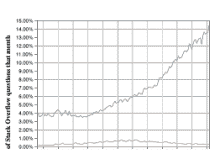

该图不仅表明Python被广泛使用，还表明自2012年以来Python的采用率显著加速。

我们怀疑这至少部分是由科学领域的采用推动的，特别是在数据科学等快速增长的领域。

例如，用于Python数据分析的pandas库的受欢迎程度激增，如图所示。（为比较起见，显示了MATLAB的相应时间路径）

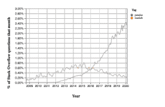

请注意，pandas在2012年开始起飞，这与我们在第一张图中看到Python流行度开始飙升的年份相同。总体而言，很明显

- Python是全球最受欢迎的编程语言之一。
- Python是科学计算的主要工具，在全球科学工作中所占份额迅速上升。

# 1.2.3 特性

Python是一种适合快速开发的高级语言。它有一个相对较小的核心语言，并由许多库支持。Python的其他特性包括：

- 支持多种编程风格（过程式、面向对象、函数式等）
- 它是解释型的，而非编译型的。

# 1.2.4 语法与设计

Python的一个优点是其优雅的语法——我们稍后会看到许多例子。优雅的代码听起来可能多余，但实际上它非常有益，因为它使语法易于阅读和记忆。记住如何从文件读取、对字典排序以及其他此类常规任务，意味着你不需要中断工作流程去查找正确的语法。与优雅语法密切相关的是优雅的设计。迭代器、生成器、装饰器和列表推导式等特性使Python具有高度表达性，允许你用更少的代码完成更多工作。命名空间通过减少错误和语法错误来提高生产力。

# 1.3 科学编程

Python已成为科学计算的核心语言之一。
它在以下领域是主导者或主要参与者

- 机器学习和数据科学
- 天文学
- 化学
- 计算生物学
- 气象学
- 自然语言处理

它在经济学中的受欢迎程度也开始上升。
本节简要展示一些Python用于科学编程的例子。

- 以下所有主题将在后面详细讲解。

# 1.3.1 数值编程

基础的矩阵和数组处理能力由优秀的NumPy库提供。
NumPy提供了基本的数组数据类型以及一些简单的处理操作。
例如，让我们构建一些数组

```python
import numpy as np

a = np.linspace(-np.pi, np.pi, 100)
b = np.cos(a)
c = np.sin(a)
```

现在让我们计算内积

```python
b @ c
```

```
9.853229343548264e-16
```

你在这里看到的数字可能略有不同，但它本质上是零。
（对于旧版本的Python和NumPy，你需要使用np.dot函数）
SciPy库构建在NumPy之上，提供了额外的功能。
例如，让我们计算 $\int_{-2}^{2} \phi(z)dz$，其中 $\phi$ 是标准正态密度。

```python
from scipy.stats import norm
from scipy.integrate import quad

phi = norm()
value, error = quad(phi.pdf, -2, 2)
value
```

```
0.9544997361036417
```

SciPy包含许多用于以下方面的标准例程

- 线性代数
- 积分
- 插值
- 优化
- 分布与统计技术
- 信号处理

请在[此处](https://docs.scipy.org/doc/scipy/reference/)查看所有内容。

# 1.3.2 图形

用于创建图表和图形的最流行、最全面的Python库是Matplotlib，其功能包括

- 绘图、直方图、等高线图、3D图、条形图等
- 多种格式输出（PDF、PNG、EPS等）
- LaTeX集成

带有嵌入式LaTeX注释的2D绘图示例
等高线图示例
3D图示例
更多示例可在Matplotlib缩略图画廊中找到。

其他图形库包括

- Plotly
- seaborn — matplotlib的高级接口
- Altair
- Bokeh

你可以访问Python Graph Gallery查看更多使用各种库绘制的示例图。

# 1.3.3 符号代数

能够操纵符号表达式是很有用的，就像在Mathematica或Maple中一样。
SymPy库在Python shell中提供了此功能。

```python
from sympy import Symbol

x, y = Symbol('x'), Symbol('y')  # 将'x'和'y'视为代数符号
x + x + x + y
```

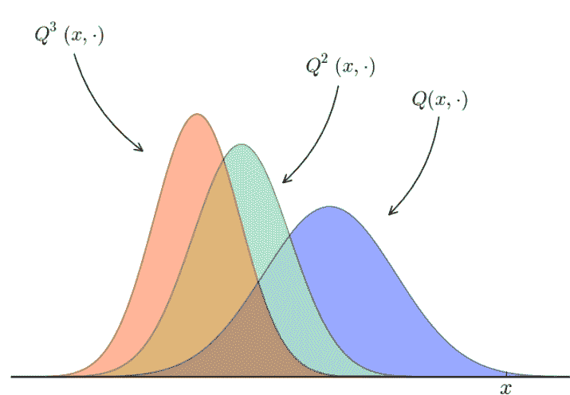

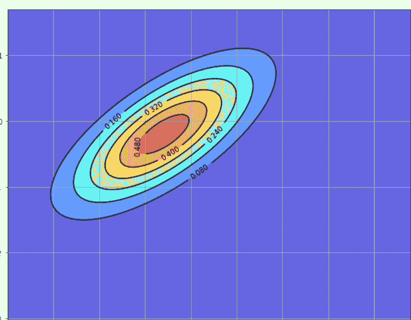

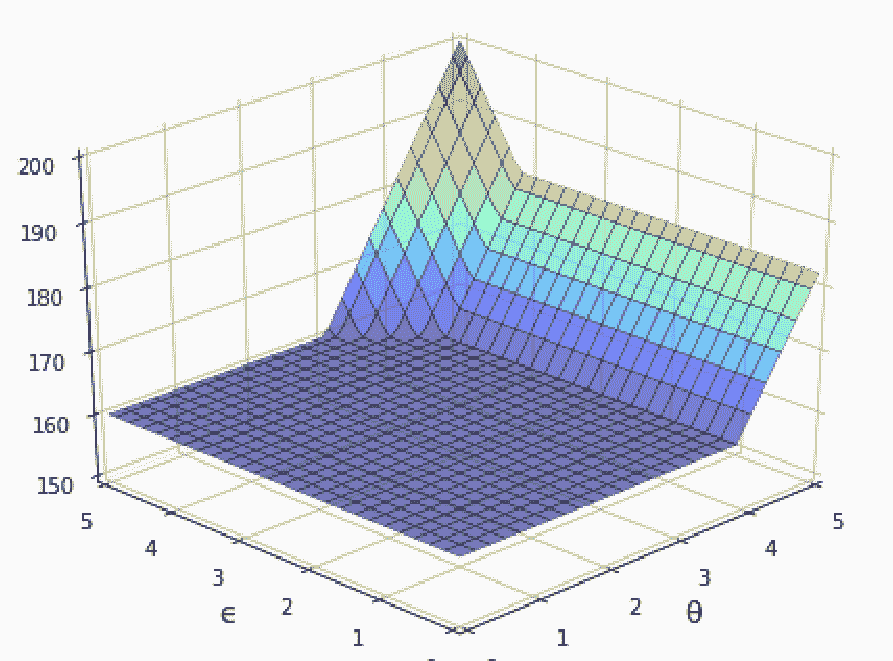

$3x + y$

我们可以操纵表达式

```python
expression = (x + y)**2
expression.expand()
```

$x^2 + 2xy + y^2$

求解多项式

```python
from sympy import solve

solve(x**2 + x + 2)
```

```
[-1/2 - sqrt(7)*I/2, -1/2 + sqrt(7)*I/2]
```

并计算极限、导数和积分

```python
from sympy import limit, sin, diff, integrate

limit(1 / x, x, 0)
```

$\infty$

```python
limit(sin(x) / x, x, 0)
```

$1$

```python
diff(sin(x), x)
```

$\cos(x)$

```python
integrate(sin(x) * x, x)
```

$-x \cos(x) + \sin(x)$

将此功能导入Python的美妙之处在于，我们是在一个功能齐全的编程语言中工作。我们可以轻松创建导数表、生成LaTeX输出、将该输出添加到图形中等等。

# 1.3.4 科学编程

## 面向经济与金融的Python编程

## 1.3.4 统计学

过去几年，Python的数据处理和统计库发展迅速，以应对数据科学中的特定问题。

## Pandas

处理数据最受欢迎的库之一是pandas。
Pandas快速、高效、灵活且设计精良。
这里有一个简单的例子，使用Numpy出色的`random`功能生成的一些虚拟数据。

```python
import pandas as pd
np.random.seed(1234)

data = np.random.randn(5, 2)  # 5x2 matrix of N(0, 1) random draws
dates = pd.date_range('2010-12-28', periods=5)

df = pd.DataFrame(data, columns=('price', 'weight'), index=dates)
print(df)
```

```
          price    weight
2010-12-28  0.471435 -1.190976
2010-12-29  1.432707 -0.312652
2010-12-30 -0.720589  0.887163
2010-12-31  0.859588 -0.636524
2011-01-01  0.015696 -2.242685
```

```python
df.mean()
```

```
price     0.411768
weight   -0.699135
dtype: float64
```

## 其他有用的统计与数据科学库

- statsmodels — 各种统计例程
- scikit-learn — Python中的机器学习
- PyTorch — Python中的深度学习框架，以及该领域的其他主要竞争者，包括TensorFlow和Keras
- Pyro和PyStan — 分别基于Pytorch和stan进行贝叶斯数据分析
- lifelines — 用于生存分析
- GeoPandas — 用于空间数据分析

## 1.3.5 网络与图

Python有许多用于研究图的库。
一个著名的例子是NetworkX。其功能包括（除其他许多功能外）：

- 用于分析网络的标准图算法
- 绘图例程

以下是一些示例代码，用于生成并绘制一个随机图，其中节点颜色由到中心节点的最短路径长度决定。

```python
%matplotlib inline
import networkx as nx
import matplotlib.pyplot as plt
plt.rcParams['figure.figsize'] = (10,6)
np.random.seed(1234)

# Generate a random graph
p = dict((i, (np.random.uniform(0, 1), np.random.uniform(0, 1)))
         for i in range(200))
g = nx.random_geometric_graph(200, 0.12, pos=p)
pos = nx.get_node_attributes(g, 'pos')

# Find node nearest the center point (0.5, 0.5)
dists = [(x - 0.5)**2 + (y - 0.5)**2 for x, y in list(pos.values())]
ncenter = np.argmin(dists)

# Plot graph, coloring by path length from central node
p = nx.single_source_shortest_path_length(g, ncenter)
plt.figure()
nx.draw_networkx_edges(g, pos, alpha=0.4)
nx.draw_networkx_nodes(g,
                       pos,
                       nodelist=list(p.keys()),
                       node_size=120, alpha=0.5,
                       node_color=list(p.values()),
                       cmap=plt.cm.jet_r)
plt.show()
```

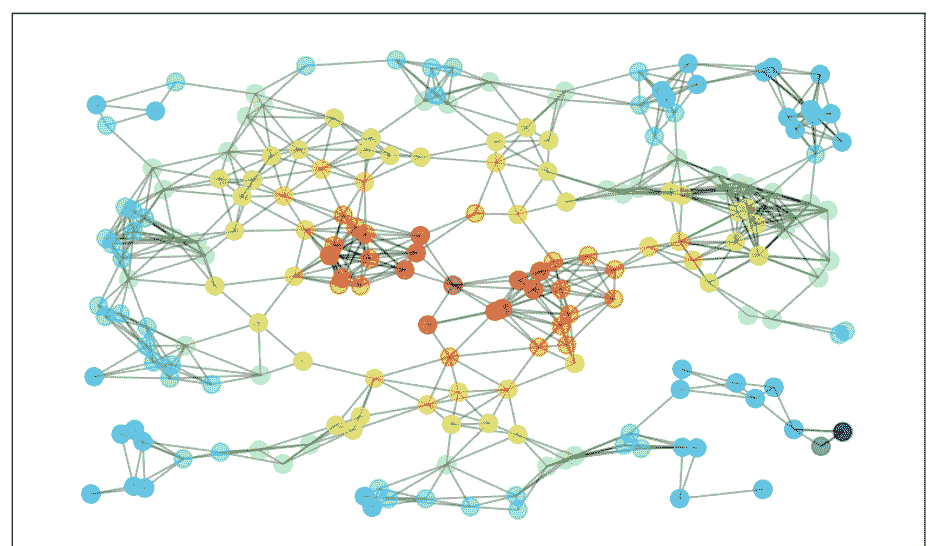

## 1.3.6 云计算

在云端的大型服务器上运行你的Python代码正变得越来越容易。

[Google Colab](https://colab.research.google.com/) 是Python在云计算环境中可移植性的一个绝佳例子。它在云服务器上托管Jupyter笔记本，无需预先配置即可使用云服务器运行Python代码。

云计算在Python方面也有商业应用：

- Anaconda Enterprise
- Amazon Web Services
- Google Cloud
- Digital Ocean

## 1.3.7 并行处理

除了上面列出的云计算选项，你可能还想考虑

- 通过IPython集群进行并行计算。
- Dask并行化PyData和Python中的机器学习。
- 通过JAX、PyCuda、PyOpenCL、Rapids等进行GPU编程。

以下是关于科学计算中高性能计算（HPC）[最新进展](https://www.nvidia.com/en-us/data-center/hpc/)以及[HPC如何帮助不同领域的研究人员](https://www.nvidia.com/en-us/data-center/hpc/)的更多信息。

## 1.3.8 其他发展

Python在科学编程方面还有许多其他有趣的发展。
一些代表性的例子包括

- Jupyter — 在浏览器中使用Python，具有交互式代码单元格、嵌入式图像和其他有用功能。
- Numba — 让Python以与原生机器代码相同的速度运行！
- CVXPY — Python中的凸优化。
- PyTables — 管理大型数据集。
- scikit-image和OpenCV — 处理和分析科学图像数据。
- FLAML — 自动化机器学习和超参数调优。
- BeautifulSoup — 从HTML和XML文件中提取数据。
- PyInstaller — 从Python脚本创建打包应用程序。

## 1.4 了解更多

- 在GitHub上浏览一些Python项目。
- 阅读更多关于Python的历史、普及度上升和版本历史。
- 查看人们在各种科学主题上分享的一些Jupyter笔记本。
- 访问Python软件包索引。
- 查看人们在Stackoverflow上提出的关于Python的一些问题。
- 通过Python subreddit了解Python社区的最新动态。

# 第二章

# 入门

**目录**
- 入门
    - 概述
    - 云端Python
    - 本地安装
    - Jupyter笔记本
    - 安装库
    - 使用Python文件
    - 练习

## 2.1 概述

在本讲中，你将学习如何

1. 在云端使用Python
2. 设置并运行本地Python环境
3. 执行简单的Python命令
4. 运行一个示例程序
5. 安装支撑这些讲座的代码库

## 2.2 云端Python

开始使用Python编程最简单的方法是在云端运行它。
（即使用已经安装了Python的远程服务器。）
这样做有许多选择，包括免费和付费的。
目前，Google Colab似乎是最可靠的。
Colab提供免费套餐，并且还具有提供GPU的优势。

## 面向经济与金融的Python编程

免费套餐的GPU已经足够，更好的GPU可以通过注册Colab Pro获得。
关于如何开始使用Google Colab的教程可以通过搜索找到。
书面示例包括

- Google Colab初学者教程
- Google Colab简介

关于同一主题的视频可以在Youtube上搜索找到。
我们的大多数讲座在右上角都有一个“启动笔记本”（播放图标）按钮，让你可以轻松地在Colab中运行它们。

## 2.3 本地安装

如果你有一台合适的机器并计划进行大量的Python编程，本地安装是更可取的。
同时，本地安装比像Colab这样的云选项需要更多的工作。
本讲的其余部分将带你了解详细信息。

### 2.3.1 Anaconda发行版

核心Python包很容易安装，但不应该是你为这些讲座选择的。
这些讲座需要整个科学编程生态系统，而

- 核心安装不提供
- 逐个安装很痛苦。

因此，对我们来说最好的方法是安装一个包含以下内容的Python发行版

1. 核心Python语言**以及**
2. 最流行的科学库的兼容版本。

最好的此类发行版是Anaconda。
Anaconda是

- 非常流行
- 跨平台
- 全面
- 与Nicki Minaj的同名歌曲完全无关

Anaconda还附带了一个很棒的包管理系统来组织你的代码库。
**以下所有内容都假设你采纳了这个建议！**

### 2.3.2 安装Anaconda

要安装Anaconda，请下载二进制文件并按照说明操作。
要点：

- 安装最新版本！
- 为你的系统找到正确的发行版。
- 如果在安装过程中被问及是否希望将Anaconda设为默认Python安装，请说是。

### 2.3.3 更新Anaconda

Anaconda提供了一个名为`conda`的工具来管理和升级你的Anaconda包。
你应该定期执行的一个`conda`命令是更新整个Anaconda发行版的命令。
作为练习，请执行以下操作

1. 打开一个终端
2. 输入`conda update anaconda`

有关conda的更多信息，请在终端中输入`conda help`。

## 2.4 Jupyter笔记本

Jupyter笔记本是与Python和科学库交互的众多可能方式之一。
它们使用*基于浏览器*的Python界面，具有

- 编写和执行Python命令的能力。
- 在浏览器中格式化输出，包括表格、图形、动画等。
- 混合格式化文本和数学表达式的选项。

由于这些功能，Jupyter现在是科学计算生态系统中的主要参与者。
这里有一张图片，展示了在Jupyter笔记本中执行一些代码（借用自这里）
虽然Jupyter不是用Python编码的唯一方式，但它非常适合当你希望

- 开始用Python编码
- 测试新想法或与小段代码交互
- 使用强大的在线交互环境，如Google Colab
- 与学生或同事分享或协作科学想法

这些讲座旨在Jupyter笔记本中执行。

## 面向经济与金融的Python编程

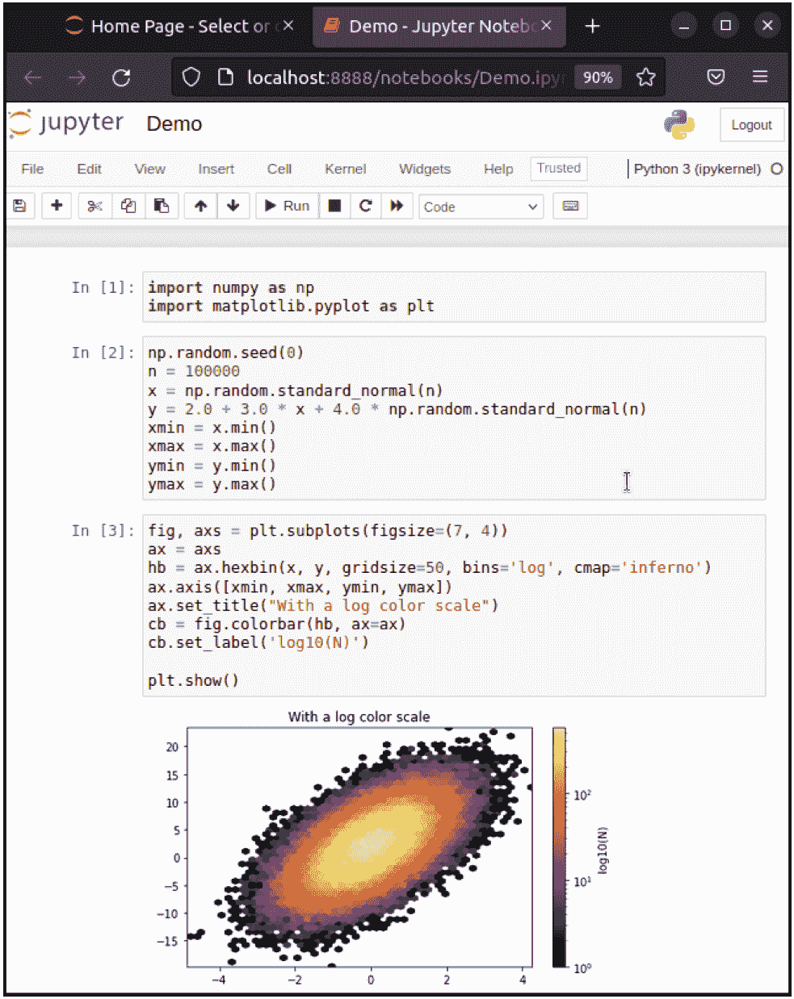

## 2.4.1 启动Jupyter Notebook

安装Anaconda后，你就可以启动Jupyter notebook了。
方法有两种：

- 在应用程序菜单中搜索Jupyter，或者
- 打开终端并输入 `jupyter notebook`
  - Windows用户应将上一行中的“终端”替换为“Anaconda命令提示符”。

如果你使用第二种方法，你会看到类似这样的界面：

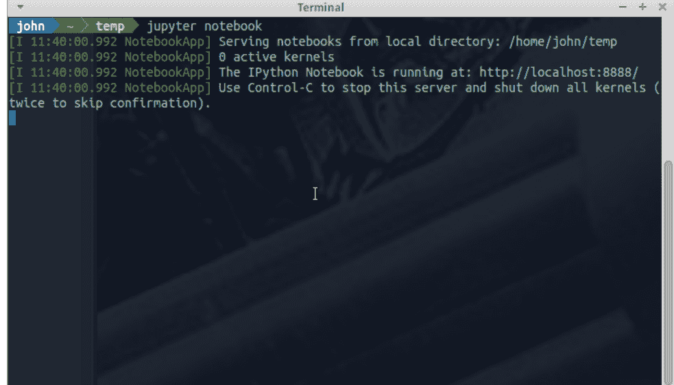

输出信息告诉我们，notebook正在 `http://localhost:8888/` 上运行。

- `localhost` 是本地计算机的名称
- `8888` 指的是你计算机上的8888端口

因此，Jupyter内核正在我们本地机器的8888端口监听Python命令。
希望你的默认浏览器也已打开一个类似这样的网页。
你在这里看到的界面被称为Jupyter *仪表板*。
如果你查看顶部的URL，它应该是 `localhost:8888` 或类似地址，与上面的信息相符。
假设一切正常，你现在可以点击右上角的 `New`，然后选择 `Python 3` 或类似选项。
这是我们机器上显示的内容：
Notebook显示一个*活动单元格*，你可以在其中输入Python命令。

## 面向经济与金融的Python编程


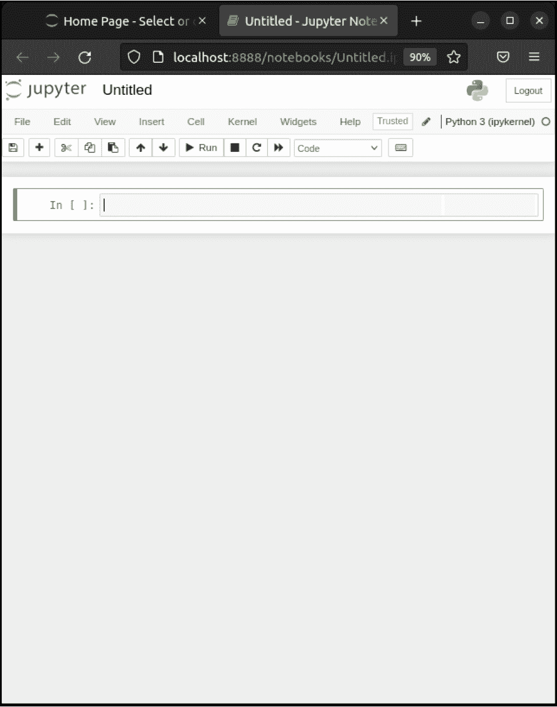

## 2.4.2 Notebook基础

让我们从如何编辑代码和运行简单程序开始。

### 运行单元格

注意，在上图中，单元格被绿色边框包围。
这意味着该单元格处于*编辑模式*。
在此模式下，你输入的任何内容都会出现在带有闪烁光标的单元格中。
当你准备好执行单元格中的代码时，请按 `Shift-Enter` 而不是通常的 `Enter`。

> **注意：** 你还可以通过探索找到用于运行单元格中代码的菜单和按钮选项。

### 模态编辑

关于Jupyter notebook，接下来需要理解的是它使用*模态编辑系统*。
这意味着在键盘上输入的效果**取决于你所处的模式**。
两种模式分别是：

1. 编辑模式
   * 由一个单元格周围的绿色边框和闪烁的光标指示
   * 你输入的任何内容都会原样显示在该单元格中
2. 命令模式
   * 绿色边框被蓝色边框取代
   * 按键被解释为命令——例如，输入 `b` 会在当前单元格下方添加一个新单元格

要切换到：

- 从编辑模式切换到命令模式，按 `Esc` 键或 `Ctrl-M`
- 从命令模式切换到编辑模式，按 `Enter` 或点击单元格

当你习惯后，Jupyter notebook的模态行为非常高效。

### 插入Unicode字符（例如，希腊字母）

Python支持 `unicode`，允许在代码中使用α和β等字符作为名称。
在代码单元格中，尝试输入 `\alpha`，然后按键盘上的Tab键。

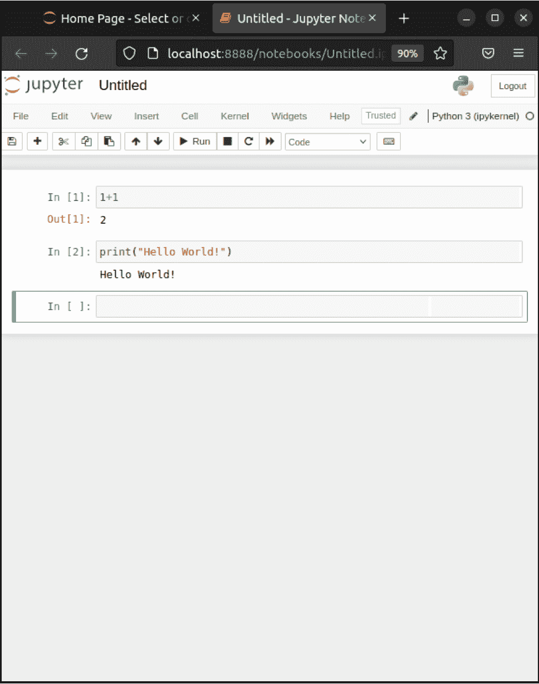

### 一个测试程序

让我们运行一个测试程序。
这里有一个我们可以使用的任意程序：http://matplotlib.org/3.1.1/gallery/pie_and_polar_charts/polar_bar.html。
在该页面上，你会看到以下代码：

```python
import numpy as np
import matplotlib.pyplot as plt
%matplotlib inline
plt.rcParams['figure.figsize'] = (10,6)

# Fixing random state for reproducibility
np.random.seed(19680801)

# Compute pie slices
N = 20
θ = np.linspace(0.0, 2 * np.pi, N, endpoint=False)
radii = 10 * np.random.rand(N)
width = np.pi / 4 * np.random.rand(N)
colors = plt.cm.viridis(radii / 10.)

ax = plt.subplot(111, projection='polar')
ax.bar(θ, radii, width=width, bottom=0.0, color=colors, alpha=0.5)

plt.show()
```

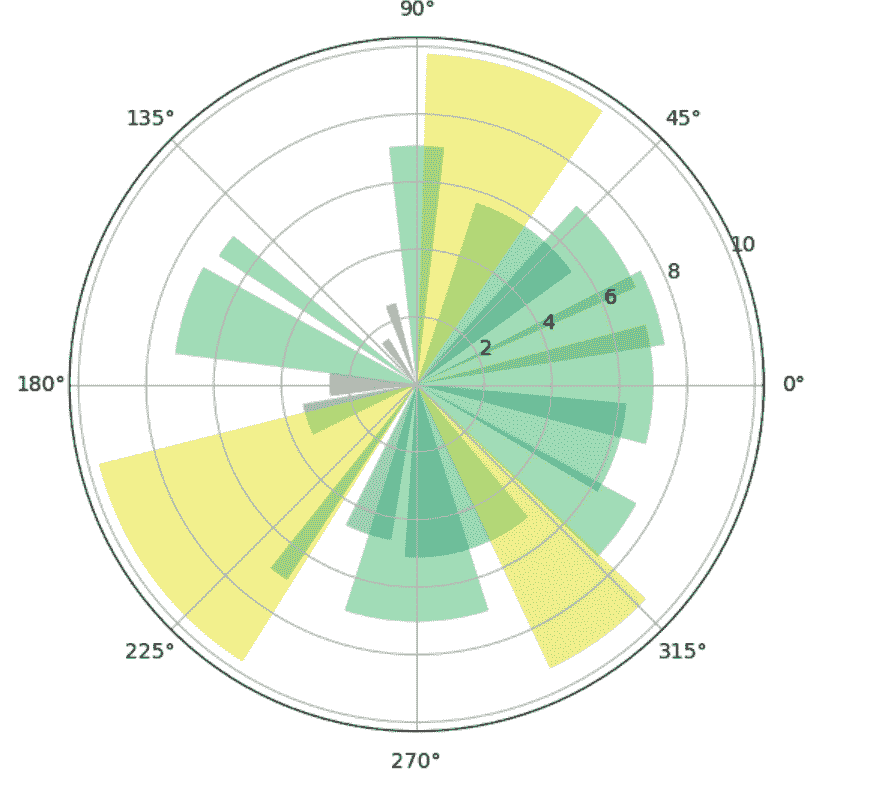

现在不用担心细节——我们只需运行它，看看会发生什么。
运行此代码最简单的方法是将其复制并粘贴到notebook的一个单元格中。
希望你会得到一个类似的图表。

## 2.4.3 使用Notebook

以下是关于使用Jupyter notebook的更多技巧。

### Tab补全

在前面的程序中，我们执行了 `import numpy as np` 这一行。

- NumPy是一个我们将深入使用的数值库。

执行此导入命令后，可以通过 `np.function_name` 类型的语法访问NumPy中的函数。

- 例如，尝试 `np.random.randn(3)`。

我们可以使用Tab键探索 `np` 的这些属性。
例如，这里我们输入 `np.random.r` 并按Tab键。

## 面向经济与金融的Python编程

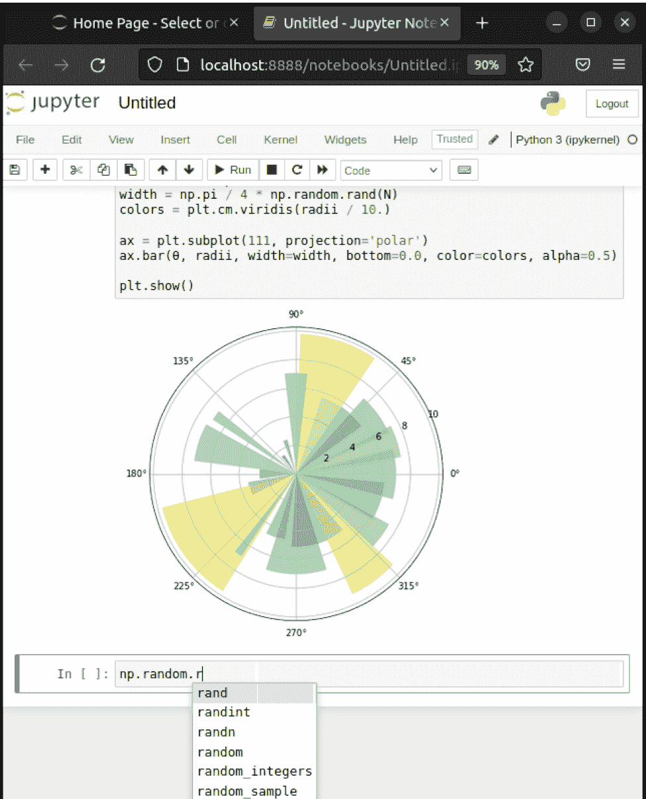

Jupyter会提供几个可能的补全选项供你选择。
通过这种方式，Tab键有助于提醒你有哪些可用选项，同时也节省了你的输入。

### 在线帮助

要获取关于 `np.random.randn` 的帮助，我们可以执行 `np.random.randn?`。
文档会出现在浏览器的分割窗口中，如下所示：
点击下方分割窗口的右上角可以关闭在线帮助。
我们将在*稍后*学习更多关于如何创建此类文档的内容！

### 其他内容

除了执行代码，Jupyter notebook还允许你在页面中嵌入文本、公式、图表甚至视频。
例如，我们可以输入纯文本和LaTeX的混合内容，而不是代码。
接下来我们按 `Esc` 进入命令模式，然后输入 `m` 表示我们正在编写Markdown，这是一种类似于（但比LaTeX简单）的标记语言。
（你也可以使用鼠标从菜单项列表下方的Code下拉框中选择Markdown）
现在我们按 `Shift+Enter` 来生成这个。

## 2.4.4 调试代码

调试是从程序中识别和移除错误的过程。
你将花费大量时间调试代码，因此[学习如何有效地进行调试](https://jupyter-notebook.readthedocs.io/en/stable/examples/Notebook/Debugging.html)非常重要。
如果你使用的是较新版本的Jupyter，你应该会在工具栏的右端看到一个bug图标。
点击此图标将启用Jupyter调试器。

> **注意：** 你可能还需要打开调试器面板（视图 -> 调试器面板）。

你可以通过点击要调试的单元格的行号来设置断点。
当你运行该单元格时，调试器会在断点处停止。
然后你可以使用CALLSTACK工具栏（位于右侧窗口）上的“Next”按钮来逐行执行代码。
你可以在[Jupyter文档](https://jupyter-notebook.readthedocs.io/en/stable/examples/Notebook/Debugging.html)中探索调试器的更多功能。

## 面向经济与金融的Python编程

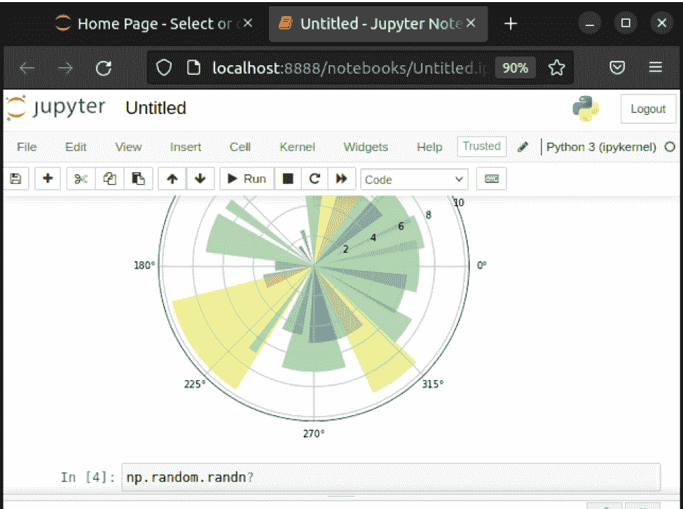

## 面向经济与金融的Python编程

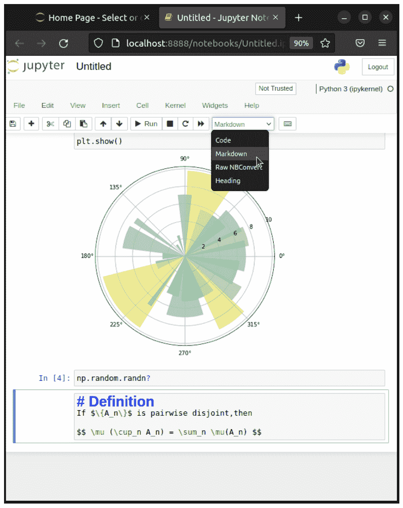

## 2.4. Jupyter Notebooks

33

## 面向经济与金融的Python编程

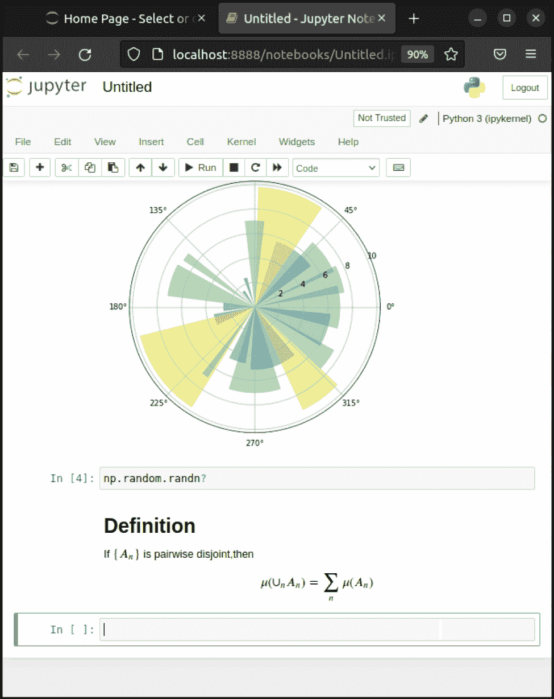

```python
In [4]: np.random.randn?
```

### 定义

如果 $\{A_n\}$ 是两两不相交的，那么

$$\mu(\cup_n A_n) = \sum_n \mu(A_n)$$

```python
In [ ]: 
```

面向经济与金融的Python编程

Trusted

JupyterLab

Python 3 (ipykernel)

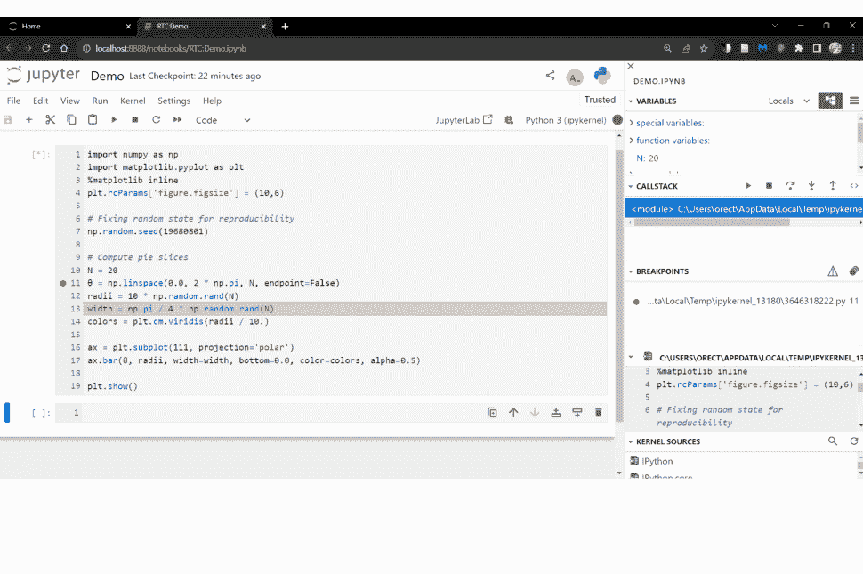

2.4. Jupyter Notebooks

35

## 面向经济与金融的Python编程

## 2.4.5 共享Notebook

Notebook文件只是以JSON格式构建的文本文件，通常以.ipynb结尾。
你可以像共享普通文件一样共享它们——或者使用nbviewer等网络服务。
你在该网站上看到的notebook是**静态**的HTML表示。
要运行一个，请点击右上角的下载图标将其下载为 `ipynb` 文件。
将其保存到某处，从Jupyter仪表板导航到它，然后如上所述运行。

> **注意：** 如果你有兴趣共享包含交互式内容的notebook，你可能需要查看Binder。
要与他人协作处理notebook，你可能需要查看：
- Google Colab
- Kaggle
要保持代码私密并使用熟悉的JupyterLab和Notebook界面，请查看JupyterLab实时协作扩展。

## 2.4.6 QuantEcon Notes

QuantEcon有一个专门用于共享与经济学相关的Jupyter notebook的网站——QuantEcon Notes。
提交到QuantEcon Notes的notebook可以通过链接共享，并且对社区的评论和投票开放。

## 2.5 安装库

我们需要的大部分库都包含在Anaconda中。
其他库可以通过 `pip` 或 `conda` 安装。
我们将使用的一个库是QuantEcon.py。
你可以通过启动Jupyter并在单元格中输入以下内容来安装QuantEcon.py：

```python
!conda install quantecon
```

或者，你可以在终端中输入以下内容：

```python
conda install quantecon
```

更多说明可以在库页面上找到。
要升级到最新版本（你应该定期这样做），请使用：

```python
conda upgrade quantecon
```

我们将使用的另一个库是interpolation.py。
这可以通过在Jupyter中输入以下内容来安装：

## 2.6 处理 Python 文件

到目前为止，我们主要关注的是执行输入到 Jupyter notebook 单元格中的 Python 代码。传统上，大多数 Python 代码是以不同方式运行的。代码首先保存在本地机器上的一个文本文件中。按照惯例，这些文本文件具有 `.py` 扩展名。我们可以按如下方式创建一个此类文件的示例：

```
%%writefile foo.py

print("foobar")
```

```
Writing foo.py
```

这会将 `print("foobar")` 这一行写入本地目录中一个名为 `foo.py` 的文件。这里 `%%writefile` 是一个 `单元格魔法` 的例子。

### 2.6.1 编辑与执行

如果你遇到保存在 `*.py` 文件中的代码，你需要考虑以下问题：

1.  应该如何执行它？
2.  应该如何修改或编辑它？

#### 选项 1：JupyterLab

`JupyterLab` 是一个构建在 Jupyter notebooks 之上的集成开发环境。使用 JupyterLab，你可以编辑和运行 `*.py` 文件以及 Jupyter notebooks。要启动 JupyterLab，请在应用程序菜单中搜索它，或在终端中输入 `jupyter-lab`。现在你应该能够通过在 JupyterLab 中打开它来打开、编辑和运行上面创建的 `foo.py` 文件。阅读文档或搜索最近的 YouTube 视频以获取更多信息。

#### 选项 2：使用文本编辑器

也可以使用文本编辑器编辑文件，然后在 Jupyter notebooks 中运行它们。文本编辑器是一种专门设计用于处理文本文件（如 Python 程序）的应用程序。在处理程序文本方面，没有什么比得上一个好的文本编辑器的强大和高效。一个好的文本编辑器将提供：

- 高效的文本编辑命令（例如，复制、粘贴、搜索和替换）
- 语法高亮等。

目前，一个非常流行的编码文本编辑器是 [VS Code](https://code.visualstudio.com/)。VS Code 开箱即用，易于使用，并且拥有许多高质量的扩展。或者，如果你想要一个出色的免费文本编辑器，并且不介意看似陡峭的学习曲线以及在你所有神经通路重新连接时漫长而痛苦的日子，可以试试 [Vim](https://www.vim.org/)。

## 2.7 练习

### 练习 2.7.1

如果 Jupyter 仍在运行，请在启动它的终端使用 `Ctrl-C` 退出。现在重新启动，但这次使用 `jupyter notebook --no-browser`。这应该会在不启动浏览器的情况下启动内核。还要注意启动消息：它应该给你一个 URL，例如 `http://localhost:8888`，notebook 就在那里运行。现在：

1.  启动你的浏览器——或者如果它已经在运行，则打开一个新标签页。
2.  在顶部的地址栏中输入上面的 URL（例如 `http://localhost:8888`）。

你现在应该能够运行一个标准的 Jupyter notebook 会话。这是启动 notebook 的另一种方式，也很方便。只要内核仍在运行，即使你意外关闭了网页，这种方式也可以工作。

# 第三章

## 一个入门示例

- 一个入门示例
  - 概述
  - 任务：绘制一个白噪声过程
  - 版本 1
  - 替代实现
  - 另一个应用
  - 练习

### 3.1 概述

我们现在准备好开始学习 Python 语言本身了。在本讲中，我们将编写然后剖析一些小型 Python 程序。目标是向你介绍基本的 Python 语法和数据结构。更深入的概念将在后续讲座中介绍。在开始本讲之前，你应该已经阅读了关于 Python 入门的讲座。

### 3.2 任务：绘制一个白噪声过程

假设我们想要模拟并绘制白噪声过程 $\epsilon_0, \epsilon_1, \dots, \epsilon_T$，其中每次抽取 $\epsilon_t$ 是独立的标准正态分布。换句话说，我们想要生成看起来像这样的图形：（这里 $t$ 在水平轴上，$\epsilon_t$ 在垂直轴上。）我们将用几种不同的方式来完成这个任务，每次都会学到更多关于 Python 的知识。

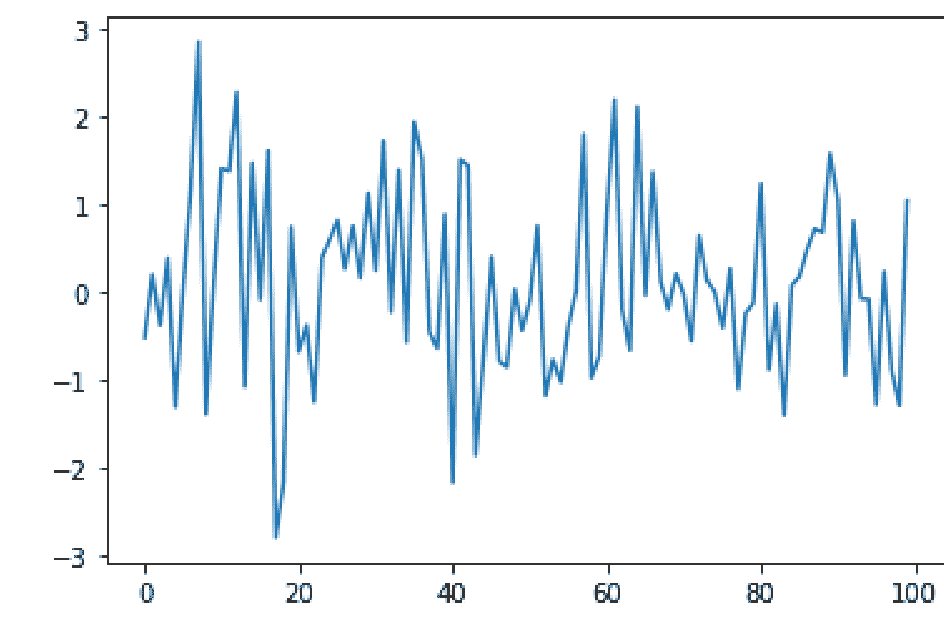

### 3.3 版本 1

以下是执行我们设定任务的几行代码：

```python
import numpy as np
import matplotlib.pyplot as plt

ε_values = np.random.randn(100)
plt.plot(ε_values)
plt.show()
```

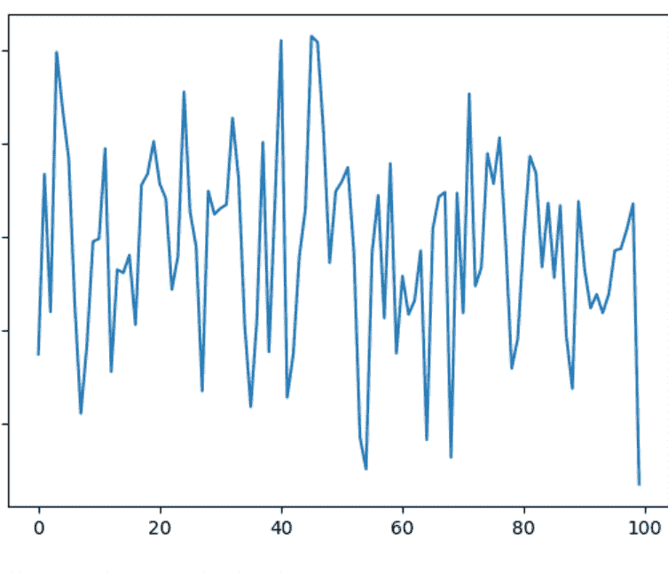

让我们分解这个程序，看看它是如何工作的。

#### 3.3.1 导入

程序的前两行从外部代码库导入功能。第一行导入 *NumPy*，这是一个用于以下任务的流行 Python 包：

- 处理数组（向量和矩阵）
- 常用数学函数，如 `cos` 和 `sqrt`
- 生成随机数
- 线性代数等。

在 `import numpy as np` 之后，我们可以通过 `np.attribute` 语法访问这些属性。这里还有两个例子：

```python
np.sqrt(4)
```

```
2.0
```

```python
np.log(4)
```

```
1.3862943611198906
```

我们也可以使用以下语法：

```python
import numpy

numpy.sqrt(4)
```

```
2.0
```

但前一种方法（使用短名称 `np`）更方便，也更标准。

#### 为什么有这么多导入？

Python 程序通常需要多个导入语句。原因是核心语言被有意地保持得很小，以便于学习和维护。当你想用 Python 做一些有趣的事情时，你几乎总是需要导入额外的功能。

#### 包

如上所述，NumPy 是一个 Python *包*。包被开发者用来组织他们希望共享的代码。实际上，一个包只是一个包含以下内容的目录：

1.  包含 Python 代码的文件——在 Python 术语中称为 **模块**
2.  可能还有一些可以被 Python 访问的编译代码（例如，从 C 或 FORTRAN 代码编译的函数）
3.  一个名为 `__init__.py` 的文件，它指定了当我们输入 `import package_name` 时将执行什么

你可以通过运行以下代码来检查你的 NumPy 的 `__init__.py` 的位置：

```python
import numpy as np

print(np.__file__)
```

#### 子包

考虑这一行 `epsilon_values = np.random.randn(100)`。这里 `np` 指的是包 NumPy，而 `random` 是 NumPy 的一个 **子包**。子包只是另一个包的子目录中的包。例如，你可以在 NumPy 的目录下找到 `random` 文件夹。

#### 3.3.2 直接导入名称

回顾我们上面看到的这段代码：

```python
import numpy as np

np.sqrt(4)
```

```
2.0
```

这是访问 NumPy 平方根函数的另一种方式：

```python
from numpy import sqrt

sqrt(4)
```

```
2.0
```

这也是可以的。优点是如果我们在代码中经常使用 `sqrt`，可以减少输入。缺点是，在一个长程序中，这两行可能被许多其他行隔开。那么，如果读者想知道 `sqrt` 从哪里来，就更难了。

#### 3.3.3 随机抽取

回到我们绘制白噪声的程序，导入语句之后的最后三行是：

```python
ε_values = np.random.randn(100)
plt.plot(ε_values)
plt.show()
```

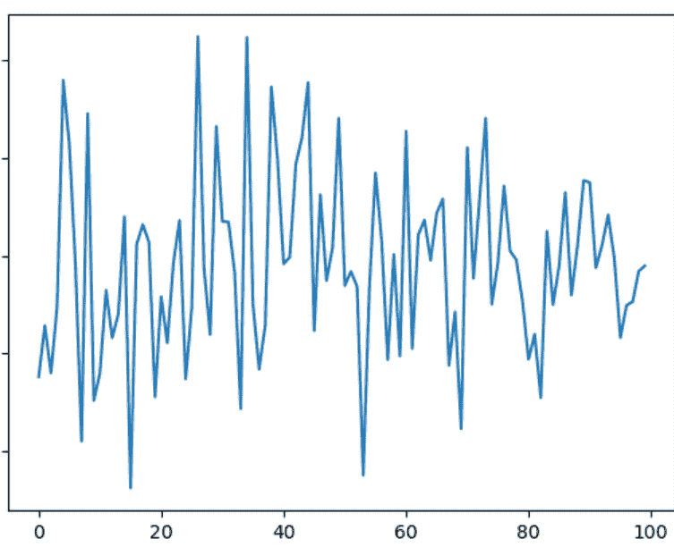

第一行生成 100 个（准）独立的标准正态分布值，并将它们存储在 `epsilon_values` 中。接下来的两行生成绘图。我们可以在下面查看各种配置和改进此绘图的方法。

### 3.4 替代实现

让我们尝试编写一些 *我们第一个程序* 的替代版本，该程序绘制了来自标准正态分布的独立同分布抽取。下面的程序比原始程序效率低，因此有些人为设计。但它们确实帮助我们在熟悉的环境中说明一些重要的 Python 语法和语义。

#### 3.4.1 使用 For 循环的版本

这是一个说明 `for` 循环和 Python 列表的版本。

```python
ts_length = 100
epsilon_values = []  # 空列表

for i in range(ts_length):
    e = np.random.randn()
    epsilon_values.append(e)

plt.plot(epsilon_values)
plt.show()
```

简而言之，

- 第一行设置了时间序列的期望长度。
- 下一行创建了一个名为 `epsilon_values` 的空列表，用于存储生成的 `epsilon_t` 值。
- 语句 `# empty list` 是注释，会被 Python 解释器忽略。
- 接下来的三行是 `for` 循环，它反复抽取一个新的随机数 `epsilon_t` 并将其附加到列表 `epsilon_values` 的末尾。
- 最后两行生成绘图并将其显示给用户。

让我们更详细地研究这个程序的某些部分。

## 3.4.2 列表

考虑语句 `epsilon_values = []`，它创建了一个空列表。
列表是 Python 的一种原生数据结构，用于将一组对象分组。
列表中的项目是有序的，并且允许重复。
例如，尝试

```python
x = [10, 'foo', False]
type(x)
```

输出：

```
list
```

`x` 的第一个元素是整数，下一个是字符串，第三个是布尔值。

向列表添加值时，我们可以使用语法 `list_name.append(some_value)`

```python
x
```

```
[10, 'foo', False]
```

```python
x.append(2.5)
x
```

```
[10, 'foo', False, 2.5]
```

这里的 `append()` 是所谓的*方法*，它是“附加到”对象上的函数——在这个例子中，是列表 `x`。
我们将在*稍后*学习关于方法的所有内容，但为了让你有个概念，

- Python 对象，如列表、字符串等，都有用于操作对象中包含数据的方法。
- 字符串对象有 `字符串方法`，列表对象有 `列表方法`，等等。

另一个有用的列表方法是 `pop()`

```python
x
```

```
[10, 'foo', False, 2.5]
```

```python
x.pop()
```

```
2.5
```

```python
x
```

```
[10, 'foo', False]
```

Python 中的列表是零基索引的（与 C、Java 或 Go 一样），因此第一个元素通过 `x[0]` 引用

```python
x[0]    # x 的第一个元素
```

```
10
```

```python
x[1]    # x 的第二个元素
```

```
'foo'
```

## 3.4.3 For 循环

现在让我们考虑*上面程序*中的 `for` 循环，它是

```python
for i in range(ts_length):
    e = np.random.randn()
    e_values.append(e)
```

Python 在继续之前会执行缩进的两行 `ts_length` 次。
这两行被称为一个 `代码块`，因为它们构成了我们正在循环的代码“块”。
与大多数其他语言不同，Python *仅从缩进*来识别代码块的范围。
在我们的程序中，缩进在 `e_values.append(e)` 行之后减少，告诉 Python 这一行标志着代码块的下限。
关于缩进的更多内容将在下面讨论——现在，让我们看另一个 `for` 循环的例子

```python
animals = ['dog', 'cat', 'bird']
for animal in animals:
    print("The plural of " + animal + " is " + animal + "s")
```

```
The plural of dog is dogs
The plural of cat is cats
The plural of bird is birds
```

这个例子有助于阐明 `for` 循环的工作原理：当我们执行如下形式的循环时

```python
for variable_name in sequence:
    <code block>
```

Python 解释器执行以下操作：

- 对于 `sequence` 的每个元素，它将名称 `variable_name` “绑定”到该元素，然后执行代码块。

`sequence` 对象实际上可以是一个非常通用的对象，我们很快就会看到。

## 3.4.4 关于缩进的说明

在讨论 `for` 循环时，我们解释了被循环的代码块是由缩进界定的。
事实上，在 Python 中，**所有**代码块（即那些出现在循环、if 子句、函数定义等内部的代码块）都是由缩进界定的。
因此，与大多数其他语言不同，Python 代码中的空格会影响程序的输出。
一旦你习惯了，这是一件好事：它

- 强制执行干净、一致的缩进，提高可读性
- 消除杂乱，例如其他语言中使用的括号或 end 语句

另一方面，要正确做到这一点需要一点注意，所以请记住：

- 代码块开始之前的行总是以冒号结尾
    - `for i in range(10):`
    - `if x > y:`
    - `while x < 100:`
    - 等等，等等。
- 代码块中的所有行**必须具有相同数量的缩进。**
- Python 的标准是 4 个空格，你应该使用这个标准。

## 3.4.5 While 循环

`for` 循环是 Python 中最常见的迭代技术。
但是，为了说明目的，让我们修改*上面的程序*以使用 `while` 循环代替。

```python
ts_length = 100
ε_values = []
i = 0
while i < ts_length:
    e = np.random.randn()
    ε_values.append(e)
    i = i + 1
plt.plot(ε_values)
plt.show()
```

while 循环将一直执行由缩进界定的代码块，直到满足条件（`i < ts_length`）。
在这种情况下，程序将继续向列表 `ε_values` 添加值，直到 `i` 等于 `ts_length`：

```python
i == ts_length #while 循环的结束条件
```

```
True
```

请注意

- `while` 循环的代码块再次仅由缩进界定。
- 语句 `i = i + 1` 可以替换为 `i += 1`。

## 3.5 另一个应用

在转向练习之前，让我们再做一个应用。
在这个应用中，我们绘制银行账户余额随时间的变化。
在时间段内没有取款，该时间段的最后日期记为 $T$。
初始余额为 $b_0$，利率为 $r$。
余额从时期 $t$ 到 $t+1$ 根据 $b_{t+1} = (1+r)b_t$ 更新。
在下面的代码中，我们生成并绘制序列 $b_0, b_1, ..., b_T$。
我们将使用 NumPy 数组而不是 Python 列表来存储这个序列。

```python
r = 0.025        # 利率
T = 50           # 结束日期
b = np.empty(T+1) # 一个空的 NumPy 数组，用于存储所有 b_t
b[0] = 10        # 初始余额

for t in range(T):
    b[t+1] = (1 + r) * b[t]

plt.plot(b, label='bank balance')
plt.legend()
plt.show()
```

语句 `b = np.empty(T+1)` 在内存中为 T+1 个（浮点）数字分配存储空间。
这些数字由 `for` 循环填充。
在开始时分配内存比使用 Python 列表和 `append` 更高效，因为后者必须反复向操作系统请求存储空间。
请注意，我们为绘图添加了图例——这是你将在练习中被要求使用的一个功能。

## 3.6 练习

现在我们转向练习。在继续之前完成它们很重要，因为它们呈现了我们需要的新概念。

**练习 3.6.1**
你的第一个任务是模拟并绘制相关时间序列
$$x_{t+1} = \alpha x_t + \epsilon_{t+1} \quad \text{其中} \quad x_0 = 0 \quad \text{且} \quad t = 0, \dots, T$$
假设冲击序列 $\{\epsilon_t\}$ 是独立同分布的，且服从标准正态分布。
在你的解决方案中，将导入语句限制为

```python
import numpy as np
import matplotlib.pyplot as plt
```

设置 $T = 200$ 和 $\alpha = 0.9$。

### 练习 3.6.1 的解答

这是一个解决方案。

```python
a = 0.9
T = 200
x = np.empty(T+1)
x[0] = 0

for t in range(T):
    x[t+1] = a * x[t] + np.random.randn()

plt.plot(x)
plt.show()
```

### 练习 3.6.2

从练习 1 的解决方案开始，绘制三个模拟的时间序列，分别对应 $\alpha = 0$、$\alpha = 0.8$ 和 $\alpha = 0.98$ 的情况。

使用 `for` 循环遍历 $\alpha$ 值。

如果可以，添加图例以帮助区分这三个时间序列。

### 提示：

- 如果你在调用 `show()` 之前多次调用 `plot()` 函数，你生成的所有线条最终都会出现在同一个图形上。
- 对于图例，请注意，假设 `var = 42`，表达式 `f'foo{var}'` 的计算结果为 `'foo42'`。

### 练习 3.6.2 的解答

```python
a_values = [0.0, 0.8, 0.98]
T = 200
x = np.empty(T+1)

for a in a_values:
    x[0] = 0
    for t in range(T):
        x[t+1] = a * x[t] + np.random.randn()
    plt.plot(x, label=f'$\alpha = {a}$')

plt.legend()
plt.show()
```

**注意：** 解决方案中的 `f'$\alpha = {a}$'` 是 f-String 的一个应用，它允许你使用 `{}` 来包含一个表达式。

包含的表达式将被计算，其结果将被放入字符串中。

### 练习 3.6.3

与之前的练习类似，绘制时间序列

$x_{t+1} = \alpha |x_t| + \epsilon_{t+1}$，其中 $x_0 = 0$ 且 $t = 0, \dots, T$

使用 $T = 200$，$\alpha = 0.9$，以及与之前相同的 $\{\epsilon_t\}$。

在线搜索一个可用于计算绝对值 $|x_t|$ 的函数。

## 练习 3.6.3 的解答

这里提供一种解决方案：

```python
α = 0.9
T = 200
x = np.empty(T+1)
x[0] = 0

for t in range(T):
    x[t+1] = α * np.abs(x[t]) + np.random.randn()

plt.plot(x)
plt.show()
```

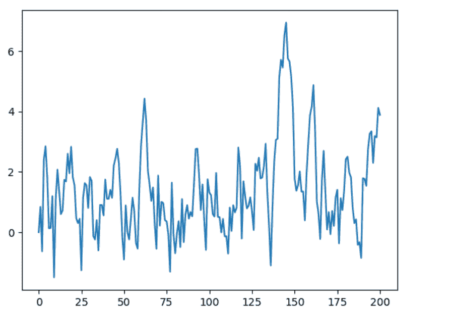

## 练习 3.6.4

几乎所有编程语言的一个重要方面是分支和条件。

在 Python 中，条件通常使用 if–else 语法实现。

# 经济与金融 Python 编程

下面是一个例子，它为数组中的每个负数打印 -1，为每个非负数打印 1。

```python
numbers = [-9, 2.3, -11, 0]
```

```python
for x in numbers:
    if x < 0:
        print(-1)
    else:
        print(1)
```

```
-1
1
-1
1
```

现在，为练习 3 编写一个新的解决方案，不使用现有函数来计算绝对值。
用 if-else 条件替换这个现有函数。

## 练习 3.6.4 的解答

这里提供一种方法：

```python
a = 0.9
T = 200
x = np.empty(T+1)
x[0] = 0

for t in range(T):
    if x[t] < 0:
        abs_x = - x[t]
    else:
        abs_x = x[t]
    x[t+1] = a * abs_x + np.random.randn()

plt.plot(x)
plt.show()
```

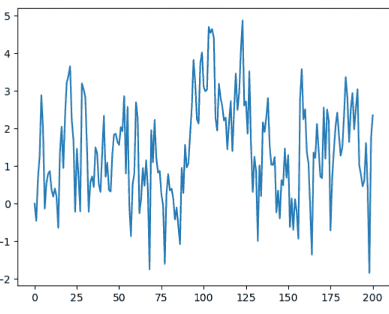

这是编写相同内容的更简洁方式：

```python
α = 0.9
T = 200
x = np.empty(T+1)
x[0] = 0

for t in range(T):
    abs_x = - x[t] if x[t] < 0 else x[t]
    x[t+1] = α * abs_x + np.random.randn()

plt.plot(x)
plt.show()
```

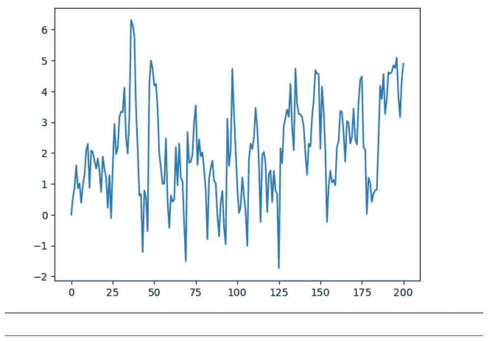

## 练习 3.6.5

这是一个更难的练习，需要一些思考和规划。

任务是使用蒙特卡洛方法计算 $\pi$ 的近似值。

除了以下导入外，不使用其他导入：

```python
import numpy as np
```

**提示：** 提示如下：

- 如果 $U$ 是单位正方形 $(0, 1)^2$ 上的二元均匀随机变量，那么 $U$ 落在 $(0, 1)^2$ 的子集 $B$ 中的概率等于 $B$ 的面积。
- 如果 $U_1, \dots, U_n$ 是 $U$ 的独立同分布副本，那么随着 $n$ 增大，落在 $B$ 中的比例会收敛到落在 $B$ 中的概率。
- 对于一个圆，$面积 = \pi * 半径^2$。

## 练习 3.6.5 的解答

考虑内接于单位正方形的直径为 1 的圆。

设 $A$ 为其面积，$r = 1/2$ 为其半径。

如果我们知道 $\pi$，那么我们可以通过 $A = \pi r^2$ 来计算 $A$。

但这里的重点是计算 $\pi$，我们可以通过 $\pi = A/r^2$ 来实现。

总结：如果我们能估计直径为 1 的圆的面积，那么除以 $r^2 = (1/2)^2 = 1/4$ 就能得到 $\pi$ 的估计值。

我们通过采样二元均匀分布并观察落入圆中的比例来估计面积。

```python
n = 1000000 # 蒙特卡洛模拟的样本量

count = 0
for i in range(n):

    # 在正方形上绘制随机位置
    u, v = np.random.uniform(), np.random.uniform()

    # 检查该点是否落在以 (0.5,0.5) 为中心的单位圆边界内
    d = np.sqrt((u - 0.5)**2 + (v - 0.5)**2)

    # 如果它落在内接圆内，
    # 就将其计入计数
    if d < 0.5:
        count += 1

area_estimate = count / n

print(area_estimate * 4)  # 除以半径**2
```

```
3.143436
```

# 第四章

# 函数

- 目录
  - 函数
    - 概述
    - 函数基础
    - 定义函数
    - 应用
    - 递归函数调用（高级）
    - 练习
    - 高级练习

## 4.1 概述

几乎所有编程语言都提供的一种极其有用的构造是**函数**。
我们已经接触过几个函数，例如
- NumPy 的 `sqrt()` 函数和
- 内置的 `print()` 函数

在本讲中，我们将系统地讨论函数，并开始了解它们是多么有用和重要。
我们将学习做的事情之一是构建我们自己的用户定义函数。
我们将使用以下导入。

```python
%matplotlib inline
import numpy as np
import matplotlib.pyplot as plt
plt.rcParams['figure.figsize'] = (10,6)
```

## 4.2 函数基础

函数是程序中一个命名的部分，用于实现特定任务。
许多函数已经存在，我们可以直接使用它们。
首先我们回顾这些函数，然后讨论如何构建我们自己的函数。

### 4.2.1 内置函数

Python 有许多*内置*函数，无需 `import` 即可使用。
我们已经接触过一些

```python
max(19, 20)
```

```
20
```

```python
print('foobar')
```

```
foobar
```

```python
str(22)
```

```
'22'
```

```python
type(22)
```

```
int
```

另外两个有用的内置函数是 `any()` 和 `all()`

```python
bools = False, True, True
all(bools)  # 如果全部为 True 则返回 True，否则返回 False
```

```
False
```

```python
any(bools)  # 如果全部为 False 则返回 False，否则返回 True
```

```
True
```

Python 内置函数的完整列表在[这里](https://docs.python.org/3/library/functions.html)。

### 4.2.2 第三方函数

如果内置函数不能满足我们的需求，我们需要导入函数或创建自己的函数。
在*上一讲*中已经给出了导入和使用函数的例子。
这里是另一个例子，它测试给定年份是否为闰年：

```python
import calendar

calendar.isleap(2020)
```

```
True
```

## 4.3 定义函数

在许多情况下，能够定义我们自己的函数是很有用的。
随着你看到更多的例子，这一点会变得更加清晰。
让我们从讨论如何定义函数开始。

### 4.3.1 基本语法

这是一个非常简单的 Python 函数，它实现了数学函数 $f(x) = 2x + 1$

```python
def f(x):
    return 2 * x + 1
```

既然我们已经*定义*了这个函数，让我们*调用*它并检查它是否按预期工作：

```python
f(1)
```

```
3
```

```python
f(10)
```

```
21
```

这是一个更长的函数，用于计算给定数字的绝对值。
（这样的函数已经作为内置函数存在，但为了练习，我们来编写自己的。）

```python
def new_abs_function(x):
    if x < 0:
        abs_value = -x
    else:
        abs_value = x
    return abs_value
```

# 经济与金融 Python 编程

让我们回顾一下这里的语法。

- `def` 是一个 Python 关键字，用于开始函数定义。
- `def new_abs_function(x):` 表示该函数名为 `new_abs_function`，并且它有一个参数 `x`。
- 缩进的代码是一个称为*函数体*的代码块。
- `return` 关键字表示 `abs_value` 是应该返回给调用代码的对象。

整个函数定义由 Python 解释器读取并存储在内存中。
让我们调用它来检查它是否有效：

```python
print(new_abs_function(3))
print(new_abs_function(-3))
```

```
3
3
```

请注意，一个函数可以有任意多个 `return` 语句（包括零个）。
当遇到第一个 return 时，函数的执行就会终止，允许如下示例的代码

```python
def f(x):
    if x < 0:
        return 'negative'
    return 'nonnegative'
```

没有 return 语句的函数会自动返回特殊的 Python 对象 `None`。

### 4.3.2 关键字参数

在*上一讲*中，你遇到了这个语句

```python
plt.plot(x, 'b-', label="white noise")
```

在这个对 Matplotlib 的 `plot` 函数的调用中，请注意最后一个参数是以 `name=argument` 语法传递的。
这被称为*关键字参数*，其中 `label` 是关键字。
非关键字参数被称为*位置参数*，因为它们的含义由顺序决定

- `plot(x, 'b-', label="white noise")` 与 `plot('b-', x, label="white noise")` 不同

当函数有很多参数时，关键字参数特别有用，因为在这种情况下很难记住正确的顺序。
你可以轻松地在用户定义的函数中使用关键字参数。
下一个例子说明了语法

```python
def f(x, a=1, b=1):
    return a + b * x
```

我们在 `f` 的定义中提供的关键字参数值成为默认值。

## 4.3.3 Python 函数的灵活性

正如我们在*上一讲*中讨论的，Python 函数非常灵活。具体来说

-   在一个给定的文件中可以定义任意数量的函数。
-   函数可以（并且经常）在其他函数内部定义。
-   任何对象都可以作为参数传递给函数，包括其他函数。
-   函数可以返回任何类型的对象，包括函数。

我们将在接下来的章节中举例说明将函数传递给函数是多么简单直接。

## 4.3.4 单行函数：lambda

`lambda` 关键字用于在一行内创建简单的函数。例如，以下定义

```python
def f(x):
    return x**3
```

和

```python
f = lambda x: x**3
```

是完全等价的。为了理解 `lambda` 为何有用，假设我们想计算 $\int_0^2 x^3 dx$（并且忘记了高中微积分）。SciPy 库有一个名为 `quad` 的函数可以为我们进行此计算。`quad` 函数的语法是 `quad(f, a, b)`，其中 `f` 是一个函数，`a` 和 `b` 是数字。为了创建函数 $f(x) = x^3$，我们可以如下使用 `lambda`

```python
from scipy.integrate import quad

quad(lambda x: x**3, 0, 2)
```

(4.0, 4.440892098500626e-14)

这里由 `lambda` 创建的函数被称为*匿名*函数，因为它从未被赋予名称。

## 4.3.5 为什么要编写函数？

用户定义的函数对于提高代码清晰度很重要，通过

-   分离不同的逻辑流
-   促进代码重用

（将相同的事情写两次[几乎总是一个坏主意](https://www.google.com/search?q=almost+always+a+bad+idea)）我们将在*稍后*对此进行更多讨论。

## 4.4 应用

### 4.4.1 随机抽样

再次考虑*上一讲*中的这段代码

```python
ts_length = 100
ϵ_values = []   # empty list

for i in range(ts_length):
    e = np.random.randn()
    ϵ_values.append(e)

plt.plot(ϵ_values)
plt.show()
```

我们将把这个程序分成两部分：

1.  一个用户定义的函数，用于生成随机变量列表。
2.  程序的主体部分，它
    1.  调用此函数获取数据
    2.  绘制数据

这将在下一个程序中实现

```python
def generate_data(n):
    ε_values = []
    for i in range(n):
        e = np.random.randn()
        ε_values.append(e)
    return ε_values

data = generate_data(100)
plt.plot(data)
plt.show()
```

当解释器遇到表达式 `generate_data(100)` 时，它会执行函数体，其中 `n` 被设置为 100。

最终结果是，名称 `data` 被*绑定*到函数返回的列表 `ε_values`。

### 4.4.2 添加条件

我们的函数 `generate_data()` 功能相当有限。让我们通过赋予它根据需要返回标准正态分布或 (0, 1) 上的均匀随机变量的能力，使其稍微更有用一些。这在下一段代码中实现。

```python
def generate_data(n, generator_type):
    ε_values = []
    for i in range(n):
        if generator_type == 'U':
            e = np.random.uniform(0, 1)
        else:
            e = np.random.randn()
        ε_values.append(e)
    return ε_values

data = generate_data(100, 'U')
plt.plot(data)
plt.show()
```

希望 if/else 子句的语法是不言自明的，缩进再次界定了代码块的范围。

注意

-   我们将参数 U 作为字符串传递，这就是为什么我们将其写为 'U'。
-   注意相等性测试使用的是 == 语法，而不是 =。
    -   例如，语句 a = 10 将名称 a 赋值给值 10。
    -   表达式 a == 10 的计算结果为 True 或 False，具体取决于 a 的值。

现在，有几种方法可以简化上面的代码。例如，我们可以通过将所需的生成器类型*作为函数*传递来完全摆脱条件语句。要理解这一点，请考虑以下版本。

```python
def generate_data(n, generator_type):
    ε_values = []
    for i in range(n):
        e = generator_type()
        ε_values.append(e)
    return ε_values

data = generate_data(100, np.random.uniform)
plt.plot(data)
plt.show()
```

现在，当我们调用函数 `generate_data()` 时，我们将 `np.random.uniform` 作为第二个参数传递。这个对象是一个*函数*。

当函数调用 `generate_data(100, np.random.uniform)` 被执行时，Python 运行函数代码块，其中 `n` 等于 100，名称 `generator_type` 被“绑定”到函数 `np.random.uniform`。

-   当执行这些行时，名称 `generator_type` 和 `np.random.uniform` 是“同义词”，可以以相同的方式使用。

这个原理更普遍地适用——例如，考虑以下代码

```python
max(7, 2, 4)  # max() is a built-in Python function
```

```
7
```

```python
m = max
m(7, 2, 4)
```

```
7
```

这里我们为内置函数 `max()` 创建了另一个名称，然后可以以相同的方式使用它。在我们的程序上下文中，将新名称绑定到函数的能力意味着*将函数作为参数传递给另一个函数*没有问题——正如我们上面所做的那样。

## 4.5 递归函数调用（高级）

这不是你每天都会用到的东西，但它仍然很有用——你应该在某个阶段学习它。基本上，递归函数是调用自身的函数。例如，考虑计算 $x_t$ 的问题，其中

$x_{t+1} = 2x_t, \quad x_0 = 1$

显然答案是 $2^t$。我们可以很容易地用循环计算这个

```python
def x_loop(t):
    x = 1
    for i in range(t):
        x = 2 * x
    return x
```

我们也可以使用递归解决方案，如下所示

```python
def x(t):
    if t == 0:
        return 1
    else:
        return 2 * x(t-1)
```

这里发生的是，每个后续调用都在*栈*中使用自己的*帧*

-   帧是保存给定函数调用的局部变量的地方
-   栈是用于处理函数调用的内存
    -   一个后进先出（FILO）队列

这个例子有些刻意，因为通常会优先选择第一种（迭代）解决方案而不是递归解决方案。我们稍后会遇到不那么刻意的递归应用。

## 4.6 练习

**练习 4.6.1**
回想一下 $n!$ 读作“$n$ 的阶乘”，定义为 $n! = n \times (n - 1) \times \cdots \times 2 \times 1$。这里我们只考虑 $n$ 为正整数。各种模块中有计算此值的函数，但让我们作为练习编写自己的版本。

1.  具体来说，编写一个函数 `factorial`，使得 `factorial(n)` 对于任何正整数 $n$ 返回 $n!$。
2.  此外，尝试为你的函数添加一个新参数。该参数接受一个函数 $f$，该函数将 $n$ 转换为：如果 $n$ 是偶数，则 $f(n) = n^2 + 1$；如果 $n$ 是奇数，则 $f(n) = n^2$。默认值应为 $f(n) = n$。

例如

-   默认情况 `factorial(3)` 应返回 $3!$
-   `factorial(3, f)` 应返回 $9!$
-   `factorial(2, f)` 应返回 $5!$

尝试使用 lambda 表达式定义函数 $f$。

**练习 4.6.1 的解答**
这是第 1 部分的一个解决方案

```python
def factorial(n):
    k = 1
    for i in range(n):
        k = k * (i + 1)
    return k

factorial(4)
```

```
24
```

添加 lambda 表达式

```python
def factorial(n, f = lambda x: x):
    k = 1
    for i in range(f(n)):
        k = k * (i + 1)
    return k

factorial(9) # default
```

```
362880
```

```python
f = lambda x: x**2 + 1 if x % 2 == 0 else x**2

factorial(3, f) # odd (equivalent to factorial(9))
```

```
362880
```

```python
factorial(2, f) # even (equivalent to factorial(5))
```

```
120
```

### 练习 4.6.2

二项随机变量 $Y \sim Bin(n, p)$ 表示在 $n$ 次二元试验中成功的次数，其中每次试验成功的概率为 $p$。

除了 `from numpy.random import uniform` 之外不使用任何导入，编写一个函数 `binomial_rv`，使得 `binomial_rv(n, p)` 生成 $Y$ 的一次抽样。

> **提示：** 如果 $U$ 在 $(0, 1)$ 上均匀分布，且 $p \in (0, 1)$，那么表达式 `U < p` 以概率 $p$ 计算为 `True`。

### 练习 4.6.2 的解答

这是一个解决方案：

```python
from numpy.random import uniform

def binomial_rv(n, p):
    count = 0
    for i in range(n):
        U = uniform()
        if U < p:
            count = count + 1    # Or count += 1
    return count

binomial_rv(10, 0.5)
```

```
8
```

### 练习 4.6.3

首先，编写一个函数，返回以下随机装置的一次实现

1.  抛一枚均匀硬币 10 次。
2.  如果在此序列中至少有一次连续出现 $k$ 次或更多次正面，则支付一美元。
3.  如果没有，则不支付。

其次，编写另一个函数执行相同的任务，但上述随机装置的第二条规则变为

-   如果在此序列中出现 $k$ 次或更多次正面，则支付一美元。

除了 `from numpy.random import uniform` 之外不使用任何导入。

## 练习 4.6.3 的解答

以下是第一个随机设备的函数。

```python
from numpy.random import uniform

def draw(k):  # 如果序列中有 k 次连续成功则支付

    payoff = 0
    count = 0

    for i in range(10):
        U = uniform()
        count = count + 1 if U < 0.5 else 0
        print(count)    # 为清晰起见打印计数
        if count == k:
            payoff = 1

    return payoff

draw(3)
```

```
0
0
1
2
0
0
0
0
1
2

0
```

以下是第二个随机设备的函数。

```python
def draw_new(k):  # 如果序列中有 k 次成功则支付

    payoff = 0
    count = 0

    for i in range(10):
        U = uniform()
        count = count + ( 1 if U < 0.5 else 0 )
        print(count)
        if count == k:
            payoff = 1

    return payoff

draw_new(3)
```

```
0
0
1
2
3
3
4
4
4
4

1
```

## 4.7 高级练习

在接下来的练习中，我们将一起编写递归函数。
我们将使用更高级的语法，例如*列表推导式*，来针对一系列输入测试我们的解决方案。
如果你对这些概念不熟悉，可以稍后再回来。

## 练习 4.7.1

斐波那契数列由以下公式定义

$x_{t+1} = x_t + x_{t-1}, \quad x_0 = 0, \quad x_1 = 1$

该数列的前几个数字是 0, 1, 1, 2, 3, 5, 8, 13, 21, 34, 55。

编写一个函数，递归计算任意 $t$ 的第 $t$ 个斐波那契数。

## 练习 4.7.1 的解答

以下是标准解法

```python
def x(t):
    if t == 0:
        return 0
    if t == 1:
        return 1
    else:
        return x(t-1) + x(t-2)
```

让我们测试一下

```python
print([x(i) for i in range(10)])
```

```
[0, 1, 1, 2, 3, 5, 8, 13, 21, 34]
```

## 练习 4.7.2

对于这个练习，请使用递归重写*练习 1* 中的函数 `factorial(n)`。

## 练习 4.7.2 的解答

以下是标准解法

```python
def recursion_factorial(n):
    if n == 1:
        return n
    else:
        return n * recursion_factorial(n-1)
```

以下是简化版解法

```python
def recursion_factorial_simplified(n):
    return n * recursion_factorial(n-1) if n != 1 else n
```

让我们测试它们

```python
print([recursion_factorial(i) for i in range(1, 10)])
```

```
[1, 2, 6, 24, 120, 720, 5040, 40320, 362880]
```

```python
print([recursion_factorial_simplified(i) for i in range(1, 10)])
```

```
[1, 2, 6, 24, 120, 720, 5040, 40320, 362880]
```

# 第五章

## Python 基础

- 目录
    - Python 基础
        - 概述
        - 数据类型
        - 输入与输出
        - 迭代
        - 比较与逻辑运算符
        - 代码风格与文档
        - 练习

## 5.1 概述

我们已经相当快速地涵盖了很多内容，重点放在示例上。
现在让我们以更系统的方式介绍 Python 的一些核心特性。
这种方法不那么令人兴奋，但有助于澄清一些细节。

## 5.2 数据类型

计算机程序通常需要跟踪一系列数据类型。
例如，1.5 是一个浮点数，而 1 是一个整数。
程序出于各种原因需要区分这两种类型。
一个是它们在内存中的存储方式不同。
另一个是算术运算不同。

- 例如，浮点运算在大多数机器上由专门的浮点单元实现。

一般来说，浮点数信息更丰富，但整数上的算术运算更快且更精确。
Python 提供了许多其他内置的 Python 数据类型，其中一些我们已经见过。

- 字符串、列表等。

让我们进一步了解它们。

### 5.2.1 基本数据类型

#### 布尔值

一种简单的数据类型是**布尔值**，它可以是 `True` 或 `False`。

```python
x = True
x
```

```
True
```

我们可以使用 `type()` 函数检查内存中任何对象的类型。

```python
type(x)
```

```
bool
```

在下一行代码中，解释器计算 = 右侧的表达式并将 y 绑定到该值。

```python
y = 100 < 10
y
```

```
False
```

```python
type(y)
```

```
bool
```

在算术表达式中，`True` 被转换为 1，`False` 被转换为 0。
这被称为**布尔算术**，在编程中经常很有用。
以下是一些示例。

```python
x + y
```

```
1
```

```python
x * y
```

```
0
```

```python
True + True
```

```
2
```

```python
bools = [True, True, False, True]  # 布尔值列表

sum(bools)
```

```
3
```

#### 数值类型

数值类型也是重要的基本数据类型。
我们之前已经见过 `integer` 和 `float` 类型。
**复数**是 Python 中的另一种基本数据类型。

```python
x = complex(1, 2)
y = complex(2, 1)
print(x * y)

type(x)
```

```
5j

complex
```

### 5.2.2 容器

Python 有几种基本类型用于存储（可能是异构的）数据集合。
我们*已经讨论过列表*。
一个相关的数据类型是**元组**，它们是“不可变”的列表。

```python
x = ('a', 'b')  # 使用圆括号而不是方括号
x = 'a', 'b'    # 或者不加括号 --- 含义相同
x
```

```
('a', 'b')
```

```python
type(x)
```

```
tuple
```

在 Python 中，如果一个对象一旦创建就不能被更改，则称其为**不可变**的。
相反，如果一个对象在创建后仍然可以更改，则称其为**可变**的。
Python 列表是可变的。

```python
x = [1, 2]
x[0] = 10
x
```

```
[10, 2]
```

但元组不是。

```python
x = (1, 2)
x[0] = 10
```

```
---------------------------------------------------------------------------
TypeError                                 Traceback (most recent call last)
Cell In[13], line 2
      1 x = (1, 2)
----> 2 x[0] = 10

TypeError: 'tuple' object does not support item assignment
```

我们稍后会更多地讨论可变和不可变数据的作用。
元组（和列表）可以如下“解包”。

```python
integers = (10, 20, 30)
x, y, z = integers
x
```

```
10
```

```python
y
```

```
20
```

你实际上*已经见过一个这样的例子*。
元组解包很方便，我们会经常使用它。

#### 切片表示法

要访问序列（列表、元组或字符串）的多个元素，你可以使用 Python 的切片表示法。
例如，

```python
a = ["a", "b", "c", "d", "e"]
a[1:]
```

```
['b', 'c', 'd', 'e']
```

```python
a[1:3]
```

```
['b', 'c']
```

一般规则是 `a[m:n]` 返回从 `a[m]` 开始的 `n - m` 个元素。
负数也是允许的。

```python
a[-2:]  # 列表的最后两个元素
```

```
['d', 'e']
```

你也可以使用格式 `[start:end:step]` 来指定步长。

```python
a[::2]
```

```
['a', 'c', 'e']
```

使用负步长，你可以以相反的顺序返回序列。

```python
a[-2::-1]  # 从倒数第二个元素向后走到第一个元素
```

```
['d', 'c', 'b', 'a']
```

相同的切片表示法适用于元组和字符串。

```python
s = 'foobar'
s[-3:]  # 选择最后三个元素
```

```
'bar'
```

#### 集合与字典

在继续之前，我们应该提到另外两种容器类型：`集合`和`字典`。
字典与列表非常相似，只是项目是按名称而不是按编号命名的。

```python
d = {'name': 'Frodo', 'age': 33}
type(d)
```

```
dict
```

```python
d['age']
```

```
33
```

名称 `'name'` 和 `'age'` 被称为 `键`。
键映射到的对象（`'Frodo'` 和 `33`）被称为 `值`。
集合是无重复项的无序集合，集合方法提供通常的集合论操作。

```python
s1 = {'a', 'b'}
type(s1)
```

```
set
```

```python
s2 = {'b', 'c'}
s1.issubset(s2)
```

```
False
```

```python
s1.intersection(s2)
```

```
{'b'}
```

`set()` 函数从序列创建集合。

```python
s3 = set(('foo', 'bar', 'foo'))
s3
```

```
{'bar', 'foo'}
```

## 5.3 输入与输出

让我们简要回顾一下读写文本文件，从写入开始。

```python
f = open('newfile.txt', 'w')    # 打开 'newfile.txt' 用于写入
f.write('Testing\n')            # 这里 '\n' 表示换行
f.write('Testing again')
f.close()
```

这里

- 内置函数 `open()` 创建一个用于写入的文件对象。
- `write()` 和 `close()` 都是文件对象的方法。

我们创建的这个文件在哪里？

回想一下，Python 维护一个当前工作目录的概念，可以从 Jupyter 或 IPython 中通过以下方式定位

```python
%pwd
```

```
'/home/runner/work/lecture-python-programming.myst/lecture-python-programming.myst/\nlectures'
```

如果未指定路径，那么这就是 Python 写入的位置。

我们也可以使用 Python 读取 `newline.txt` 的内容，如下所示

## 5.3 文件操作

```python
f = open('newfile.txt', 'r')
out = f.read()
out
```

```
'Testing\nTesting again'
```

```python
print(out)
```

```
Testing
Testing again
```

事实上，现代 Python 推荐使用 `with` 语句来确保文件被正确获取和释放。将操作包含在同一个代码块中也能提高代码的清晰度。

> **注意：** 这种代码块在形式上被称为 *上下文*。

让我们尝试将上面的两个示例转换为 `with` 语句。我们首先修改写入示例：

```python
with open('newfile.txt', 'w') as f:
    f.write('Testing\n')
    f.write('Testing again')
```

注意，我们不需要调用 `close()` 方法，因为 `with` 块会确保在块结束时关闭流。稍作修改，我们也可以使用 `with` 来读取文件：

```python
with open('newfile.txt', 'r') as fo:
    out = fo.read()
    print(out)
```

```
Testing
Testing again
```

现在假设我们想从一个文件读取输入，并将输出写入另一个文件。以下是如何在使用 `with` 语句正确获取和释放操作系统资源的同时完成此任务：

```python
with open("newfile.txt", "r") as f:
    file = f.readlines()
    with open("output.txt", "w") as fo:
        for i, line in enumerate(file):
            fo.write(f'Line {i}: {line} \n')
```

输出文件将是：

```python
with open('output.txt', 'r') as fo:
    print(fo.read())
```

```
Line 0: Testing

Line 1: Testing again
```

我们可以通过将两个 `with` 语句合并为一行来简化上面的示例：

```python
with open("newfile.txt", "r") as f, open("output2.txt", "w") as fo:
    for i, line in enumerate(f):
        fo.write(f'Line {i}: {line} \n')
```

输出文件将是相同的：

```python
with open('output2.txt', 'r') as fo:
    print(fo.read())
```

```
Line 0: Testing

Line 1: Testing again
```

假设我们想继续写入现有文件而不是覆盖它。我们可以将模式切换为 `a`，即追加模式：

```python
with open('output2.txt', 'a') as fo:
    fo.write('\nThis is the end of the file')
```

```python
with open('output2.txt', 'r') as fo:
    print(fo.read())
```

```
Line 0: Testing

Line 1: Testing again

This is the end of the file
```

> **注意：** 我们这里只介绍了 `r`、`w` 和 `a` 模式，这是最常用的模式。Python 提供了多种模式供你尝试。

### 5.3.1 路径

注意，如果 `newfile.txt` 不在当前工作目录中，那么这个 `open()` 调用会失败。在这种情况下，你可以将文件移动到当前工作目录，或者指定文件的完整路径：

```python
f = open('insert_full_path_to_file/newfile.txt', 'r')
```

## 5.4 迭代

计算中最重要的任务之一是遍历一系列数据并执行给定的操作。Python 的优势之一是它通过 `for` 循环为这类迭代提供了简单、灵活的接口。

### 5.4.1 遍历不同的对象

许多 Python 对象是“可迭代的”，即它们可以被循环遍历。举个例子，让我们将列出美国城市及其人口的文件 `us_cities.txt` 写入当前工作目录。

```python
%%writefile us_cities.txt
new york: 8244910
los angeles: 3819702
chicago: 2707120
houston: 2145146
philadelphia: 1536471
phoenix: 1469471
san antonio: 1359758
san diego: 1326179
dallas: 1223229
```

覆盖 us_cities.txt

这里 `%%writefile` 是一个 IPython 单元格魔法。假设我们想通过将名称首字母大写并添加逗号来标记千位，使信息更具可读性。下面的程序读取数据并进行转换：

```python
data_file = open('us_cities.txt', 'r')
for line in data_file:
    city, population = line.split(':')        # 元组解包
    city = city.title()                       # 城市名称首字母大写
    population = f'{int(population):,}'       # 为数字添加逗号
    print(city.ljust(15) + population)
data_file.close()
```

```
New York        8,244,910
Los Angeles     3,819,702
Chicago         2,707,120
Houston         2,145,146
Philadelphia    1,536,471
Phoenix         1,469,471
San Antonio     1,359,758
San Diego       1,326,179
Dallas          1,223,229
```

这里 `format()` 是一个用于将变量插入字符串的字符串方法。每一行的重新格式化是三个不同字符串方法的结果，其细节可以留待以后讨论。这个程序中对我们来说有趣的部分是第 2 行，它表明：

1.  文件对象 `data_file` 是可迭代的，即它可以被放置在 `for` 循环中 `in` 的右侧。
2.  迭代会遍历文件中的每一行。

这引出了我们程序中所示的简洁、方便的语法。

许多其他类型的对象也是可迭代的，我们将在后面讨论其中一些。

### 5.4.2 无索引循环

你可能注意到的一件事是 Python 倾向于使用无显式索引的循环。

例如，

```python
x_values = [1, 2, 3]  # 一些可迭代的 x
for x in x_values:
    print(x * x)
```

```
1
4
9
```

这比下面的写法更受青睐：

```python
for i in range(len(x_values)):
    print(x_values[i] * x_values[i])
```

```
1
4
9
```

当你比较这两种替代方案时，你就能明白为什么第一种更受青睐。

Python 提供了一些工具来简化无索引循环。

一个是 `zip()`，它用于遍历两个序列中的配对。

例如，尝试运行以下代码：

```python
countries = ('Japan', 'Korea', 'China')
cities = ('Tokyo', 'Seoul', 'Beijing')
for country, city in zip(countries, cities):
    print(f'The capital of {country} is {city}')
```

```
The capital of Japan is Tokyo
The capital of Korea is Seoul
The capital of China is Beijing
```

`zip()` 函数对于创建字典也很有用——例如：

```python
names = ['Tom', 'John']
marks = ['E', 'F']
dict(zip(names, marks))
```

```
{'Tom': 'E', 'John': 'F'}
```

如果我们确实需要列表的索引，一个选项是使用 `enumerate()`。要理解 `enumerate()` 的作用，请看以下示例：

```python
letter_list = ['a', 'b', 'c']
for index, letter in enumerate(letter_list):
    print(f"letter_list[{index}] = '{letter}'")
```

```
letter_list[0] = 'a'
letter_list[1] = 'b'
letter_list[2] = 'c'
```

### 5.4.3 列表推导式

我们也可以通过使用一种叫做 *列表推导式* 的东西来大大简化生成随机抽样列表的代码。列表推导式是 Python 中创建列表的一种优雅工具。考虑以下示例，其中列表推导式位于第二行的右侧：

```python
animals = ['dog', 'cat', 'bird']
plurals = [animal + 's' for animal in animals]
plurals
```

```
['dogs', 'cats', 'birds']
```

这是另一个例子：

```python
range(8)
```

```
range(0, 8)
```

```python
doubles = [2 * x for x in range(8)]
doubles
```

```
[0, 2, 4, 6, 8, 10, 12, 14]
```

## 5.5 比较和逻辑运算符

### 5.5.1 比较

许多不同类型的表达式会计算为布尔值之一（即 `True` 或 `False`）。一个常见的类型是比较，例如：

```python
x, y = 1, 2
x < y
```

```
True
```

```python
x > y
```

```
False
```

Python 的一个很好的特性是我们可以 *链式* 使用不等式：

```python
1 < 2 < 3
```

```
True
```

```python
1 <= 2 <= 3
```

```
True
```

正如我们之前看到的，测试相等性时我们使用 `==`：

```python
x = 1    # 赋值
x == 2   # 比较
```

```
False
```

对于“不等于”，使用 `!=`：

```python
1 != 2
```

```
True
```

注意，在测试条件时，我们可以使用 **任何** 有效的 Python 表达式：

```python
x = 'yes' if 42 else 'no'
x
```

```
'yes'
```

```python
x = 'yes' if [] else 'no'
x
```

```
'no'
```

这是怎么回事？规则是：

-   计算结果为零、空序列或容器（字符串、列表等）以及 `None` 的表达式都等同于 `False`。
    -   例如，`[]` 和 `()` 在 `if` 子句中等同于 `False`。
-   所有其他值都等同于 `True`。
    -   例如，`42` 在 `if` 子句中等同于 `True`。

### 5.5.2 组合表达式

我们可以使用 `and`、`or` 和 `not` 来组合表达式。这些是标准的逻辑连接词（合取、析取和否定）：

```python
1 < 2 and 'f' in 'foo'
```

```
True
```

```python
1 < 2 and 'g' in 'foo'
```

```
False
```

```python
1 < 2 or 'g' in 'foo'
```

```
True
```

```python
not True
```

```
False
```

```python
not not True
```

```
True
```

记住：

-   `P and Q` 在两者都为 `True` 时为 `True`，否则为 `False`。
-   `P or Q` 在两者都为 `False` 时为 `False`，否则为 `True`。

我们也可以使用 `all()` 和 `any()` 来测试一系列表达式：

```python
all([1 <= 2 <= 3, 5 <= 6 <= 7])
```

```
True
```

```python
all([1 <= 2 <= 3, "a" in "letter"])
```

## 5.6 编码风格与文档

一致的编码风格和文档的使用可以使代码更易于理解和维护。

### 5.6.1 Python 风格指南：PEP8

你可以在提示符下输入 `import this` 来了解 Python 的编程哲学。
其中，Python 强烈推崇编程风格的一致性。
我们都听过关于一致性和狭隘思维的那句老话。
但在编程中，正如在数学中一样，情况恰恰相反。

- 一篇数学论文中，如果符号 ∪ 和 ∩ 被颠倒使用，即使作者在第一页就说明了，也会非常难以阅读。

在 Python 中，标准风格在 `PEP8` 中有明确规定。
（在这些讲座中，我们偶尔会偏离 PEP8，以便更好地匹配数学符号）

### 5.6.2 文档字符串

Python 有一个为模块、类、函数等添加注释的系统，称为 *文档字符串*。
文档字符串的优点在于它们在运行时是可用的。
尝试运行这个

```python
def f(x):
    """
    This function squares its argument
    """
    return x**2
```

运行此代码后，文档字符串即可用

```
f?
```

```
Type:        function
String Form: <function f at 0x2223320>
File:        /home/john/temp/temp.py
Definition:  f(x)
Docstring:   This function squares its argument
```

```
f??
```

```
Type:        function
String Form: <function f at 0x2223320>
File:        /home/john/temp/temp.py
Definition:  f(x)
Source:
def f(x):
    """
    This function squares its argument
    """
    return x**2
```

使用一个问号可以调出文档字符串，使用两个问号则可以同时获取源代码。
你可以在 PEP257 中找到文档字符串的约定。

## 5.7 练习

完成以下练习。
（对于某些练习，内置函数 `sum()` 会很有用）。

**练习 5.7.1**

第一部分：给定两个等长的数值列表或元组 `x_vals` 和 `y_vals`，使用 `zip()` 计算它们的内积。

第二部分：用一行代码，计算 0,...,99 中偶数的个数。

第三部分：给定 `pairs = ((2, 5), (4, 2), (9, 8), (12, 10))`，计算满足 `a` 和 `b` 都是偶数的数对 `(a, b)` 的数量。

**提示：** 如果 `x` 是偶数，`x % 2` 返回 0，否则返回 1。

**练习 5.7.1 的解答**

**第一部分解答：**

这是一个可能的解决方案

```python
x_vals = [1, 2, 3]
y_vals = [1, 1, 1]
sum([x * y for x, y in zip(x_vals, y_vals)])
```

```
6
```

这样也可以

```python
sum(x * y for x, y in zip(x_vals, y_vals))
```

```
6
```

**第二部分解答：**

一种解决方案是

```python
sum([x % 2 == 0 for x in range(100)])
```

```
50
```

这样也可以：

```python
sum(x % 2 == 0 for x in range(100))
```

```
50
```

一些不太自然但有助于说明列表推导式灵活性的替代方案是

```python
len([x for x in range(100) if x % 2 == 0])
```

```
50
```

以及

```python
sum([1 for x in range(100) if x % 2 == 0])
```

```
50
```

**第三部分解答：**

这是一个可能的方案

```python
pairs = ((2, 5), (4, 2), (9, 8), (12, 10))
sum([x % 2 == 0 and y % 2 == 0 for x, y in pairs])
```

```
2
```

**练习 5.7.2**

考虑多项式

$p(x) = a_0 + a_1 x + a_2 x^2 + \cdots a_n x^n = \sum_{i=0}^{n} a_i x^i$

(5.1)

编写一个函数 `p`，使得 `p(x, coeff)` 在给定点 `x` 和系数列表 `coeff` ($a_1, a_2, \cdots a_n$) 时，计算 (5.1) 中的值。
尝试在循环中使用 `enumerate()`。

**练习 5.7.2 的解答**

这是一个解决方案：

```python
def p(x, coeff):
    return sum(a * x**i for i, a in enumerate(coeff))
```

```python
p(1, (2, 4))
```

```
6
```

**练习 5.7.3**

编写一个函数，该函数接受一个字符串作为参数，并返回字符串中大写字母的数量。

**提示：** `'foo'.upper()` 返回 `'FOO'`。

**练习 5.7.3 的解答**

这是一个解决方案：

```python
def f(string):
    count = 0
    for letter in string:
        if letter == letter.upper() and letter.isalpha():
            count += 1
    return count
```

```python
f('The Rain in Spain')
```

```
3
```

一个更 Pythonic 的替代方案：

```python
def count_uppercase_chars(s):
    return sum([c.isupper() for c in s])
```

```python
count_uppercase_chars('The Rain in Spain')
```

```
3
```

**练习 5.7.4**

编写一个函数，该函数接受两个序列 `seq_a` 和 `seq_b` 作为参数，如果 `seq_a` 中的每个元素也是 `seq_b` 中的元素，则返回 `True`，否则返回 `False`。

- 这里的“序列”指的是列表、元组或字符串。
- 请在不使用 `sets` 和集合方法的情况下完成此练习。

**练习 5.7.4 的解答**

这是一个解决方案：

```python
def f(seq_a, seq_b):
    for a in seq_a:
        if a not in seq_b:
            return False
    return True

# == test == #
print(f("ab", "cadb"))
print(f("ab", "cjdb"))
print(f([1, 2], [1, 2, 3]))
print(f([1, 2, 3], [1, 2]))
```

```
True
False
True
False
```

一个使用 `all()` 的更 Pythonic 的替代方案：

```python
def f(seq_a, seq_b):
    return all([i in seq_b for i in seq_a])

# == test == #
print(f("ab", "cadb"))
print(f("ab", "cjdb"))
print(f([1, 2], [1, 2, 3]))
print(f([1, 2, 3], [1, 2]))
```

```
True
False
True
False
```

当然，如果我们使用 `sets` 数据类型，解决方案会更简单

```python
def f(seq_a, seq_b):
    return set(seq_a).issubset(set(seq_b))
```

**练习 5.7.5**

当我们介绍数值库时，我们会看到它们包含许多用于插值和函数近似的替代方案。

尽管如此，让我们编写自己的函数近似程序作为练习。

具体来说，在不使用任何导入的情况下，编写一个函数 `linapprox`，它接受以下参数

- 一个函数 `f`，将某个区间 $[a, b]$ 映射到 $\mathbb{R}$。
- 两个标量 `a` 和 `b`，提供该区间的界限。
- 一个整数 `n`，确定网格点的数量。
- 一个数字 `x`，满足 `a <= x <= b`。

并返回 `f` 在 `x` 处的分段线性插值，基于 `n` 个均匀分布的网格点 `a = point[0] < point[1] < ... < point[n-1] = b`。

目标是清晰，而不是效率。

**练习 5.7.5 的解答**

这是一个解决方案：

```python
def linapprox(f, a, b, n, x):
    """
    Evaluates the piecewise linear interpolant of f at x on the interval
    [a, b], with n evenly spaced grid points.

    Parameters
    ==========
        f : function
            The function to approximate

        x, a, b : scalars (floats or integers)
            Evaluation point and endpoints, with a <= x <= b

        n : integer
            Number of grid points

    Returns
    =======
        A float. The interpolant evaluated at x

    """
    length_of_interval = b - a
    num_subintervals = n - 1
    step = length_of_interval / num_subintervals

    # === find first grid point larger than x === #
    point = a
    while point <= x:
        point += step

    # === x must lie between the gridpoints (point - step) and point === #
    u, v = point - step, point

    return f(u) + (x - u) * (f(v) - f(u)) / (v - u)
```

**练习 5.7.6**

使用列表推导式语法，我们可以简化以下代码中的循环。

```python
import numpy as np

n = 100
ε_values = []
for i in range(n):
    e = np.random.randn()
    ε_values.append(e)
```

**练习 5.7.6 的解答**

这是一个解决方案。

```python
n = 100
ε_values = [np.random.randn() for i in range(n)]
```

# 第六章

## 面向对象编程 I：对象与名称

- 目录
    - 面向对象编程 I：对象与名称
        - 概述
        - 对象
        - 名称与名称解析
        - 总结
        - 练习

### 6.1 概述

面向对象编程（OOP）是编程中的主要范式之一。
传统的编程范式（想想 Fortran、C、MATLAB 等）被称为 *过程式*。
它的工作方式如下

- 程序有一个状态，对应于其变量的值。
- 调用函数来作用于这些数据。
- 数据通过函数调用来回传递。

相比之下，在 OOP 范式中

- 数据和函数被“捆绑在一起”形成“对象”

（在此上下文中的函数被称为 **方法**）

## 面向经济学与金融的Python编程

## 6.1.1 Python与面向对象编程

Python是一种务实的语言，它融合了面向对象和过程式编程风格，而非采取纯粹主义的方法。
然而，在基础层面，Python*是*面向对象的。
特别是，在Python中，*一切皆对象*。
本讲中，我们将解释这一陈述的含义及其重要性。

## 6.2 对象

在Python中，一个*对象*是存储在计算机内存中的数据和指令的集合，它由以下部分组成：

- 1. 一个类型
- 2. 一个唯一标识
- 3. 数据（即内容）
- 4. 方法

这些概念将在下文中依次定义和讨论。

### 6.2.1 类型

Python提供了不同类型的对象，以容纳不同类别的数据。
例如

```
s = 'This is a string'
type(s)
```

```
str
```

```
x = 42   # Now let's create an integer
type(x)
```

```
int
```

对象的类型对于许多表达式都很重要。
例如，两个字符串之间的加法运算符意味着连接

```
'300' + 'cc'
```

```
'300cc'
```

另一方面，两个数字之间的加法运算符意味着普通的加法

```
300 + 400
```

```
700
```

考虑以下表达式

```
'300' + 400
```

```
---------------------------------------------------------------------------
TypeError                                 Traceback (most recent call last)
Cell In[5], line 1
----> 1 '300' + 400

TypeError: can only concatenate str (not "int") to str
```

这里我们混合了类型，Python不清楚用户是想

- 将'300'转换为整数然后与400相加，还是
- 将400转换为字符串然后与'300'连接

某些语言可能会尝试猜测，但Python是*强类型*的

- 类型很重要，隐式类型转换很少见。
- Python会通过引发`TypeError`来响应。

要避免错误，你需要通过更改相关类型来澄清。
例如，

```
int('300') + 400  # To add as numbers, change the string to an integer
```

```
700
```

### 6.2.2 标识

在Python中，每个对象都有一个唯一的标识符，这有助于Python（以及我们）跟踪对象。
对象的标识可以通过`id()`函数获得

```
y = 2.5
z = 2.5
id(y)
```

```
140472214388432
```

```
id(z)
```

```
140472214388240
```

在这个例子中，`y`和`z`恰好具有相同的值（即2.5），但它们不是同一个对象。
对象的标识实际上是对象在内存中的地址。

### 6.2.3 对象内容：数据和属性

如果我们设置`x = 42`，那么我们创建了一个类型为`int`的对象，其中包含数据`42`。
事实上，它包含更多内容，如下例所示

```
x = 42
x
```

```
42
```

```
x.imag
```

```
0
```

```
x.__class__
```

```
int
```

当Python创建这个整数对象时，它会存储各种辅助信息，例如虚部和类型。
任何跟在点号后面的名称都称为点号左侧对象的*属性*。

- 例如，`imag`和`__class__`是`x`的属性。

我们从这个例子中看到，对象具有包含辅助信息的属性。
它们还具有像函数一样工作的属性，称为*方法*。
这些属性很重要，所以我们来深入讨论它们。

### 6.2.4 方法

方法是*与对象捆绑在一起的函数*。
形式上，方法是对象的可调用属性（即可以像函数一样被调用）

```
x = ['foo', 'bar']
callable(x.append)
```

```
True
```

```
callable(x.__doc__)
```

```
False
```

方法通常作用于它们所属对象中包含的数据，或者将该数据与其他数据组合

```
x = ['a', 'b']
x.append('c')
s = 'This is a string'
s.upper()
```

```
'THIS IS A STRING'
```

```
s.lower()
```

```
'this is a string'
```

```
s.replace('This', 'That')
```

```
'That is a string'
```

大量的Python功能是围绕方法调用组织的。
例如，考虑以下代码片段

```
x = ['a', 'b']
x[0] = 'aa'  # Item assignment using square bracket notation
x
```

```
['aa', 'b']
```

这里看起来没有使用任何方法，但事实上，方括号赋值符号只是方法调用的一个便捷接口。
实际发生的是Python调用了`__setitem__`方法，如下所示

```
x = ['a', 'b']
x.__setitem__(0, 'aa')  # Equivalent to x[0] = 'aa'
x
```

```
['aa', 'b']
```

（如果你愿意，你可以修改`__setitem__`方法，使方括号赋值执行完全不同的操作）

## 6.3 名称和名称解析

### 6.3.1 Python中的变量名

考虑Python语句

```
x = 42
```

我们现在知道，当执行此语句时，Python会在你的计算机内存中创建一个类型为`int`的对象，其中包含

- 值42
- 一些相关属性

但x本身是什么？
在Python中，x被称为一个*名称*，语句x = 42将名称x*绑定*到我们刚刚讨论的整数对象。
在底层，这个将名称绑定到对象的过程是通过字典实现的——稍后会详细介绍。
将两个或多个名称绑定到同一个对象没有问题，无论该对象是什么

```
def f(string):    # Create a function called f
    print(string)  # that prints any string it's passed

g = f
id(g) == id(f)
```

```
True
```

```
g('test')
```

```
test
```

在第一步中，创建了一个函数对象，并将名称f绑定到它。
将名称g绑定到同一个对象后，我们可以在任何使用f的地方使用它。
当绑定到一个对象的名称数量变为零时会发生什么？
这是这种情况的一个例子，其中名称x首先绑定到一个对象，然后重新绑定到另一个对象

```
x = 'foo'
id(x)
```

```
140472239369648
```

```
x = 'bar'  # No names bound to the first object
```

这里发生的是第一个对象被垃圾回收了。
换句话说，存储该对象的内存槽被释放，并返回给操作系统。
垃圾回收实际上是计算机科学中一个活跃的研究领域。
如果你感兴趣，可以[阅读更多关于垃圾回收的内容](https://en.wikipedia.org/wiki/Garbage_collection_(computer_science))。

### 6.3.2 命名空间

回顾前面的讨论，语句

```
x = 42
```

将名称x绑定到右侧的整数对象。
我们还提到，将x绑定到正确对象的过程是通过字典实现的。
这个字典被称为*命名空间*。
**定义：** 命名空间是一个符号表，它将名称映射到内存中的对象。
Python使用多个命名空间，根据需要动态创建它们。
例如，每次我们导入一个模块时，Python都会为该模块创建一个命名空间。
为了看到这一点，假设我们编写一个脚本`mathfoo.py`，其中只有一行

```
%%file mathfoo.py
pi = 'foobar'
```

```
Writing mathfoo.py
```

现在我们启动Python解释器并导入它

```
import mathfoo
```

接下来，让我们从标准库导入`math`模块

```
import math
```

这两个模块都有一个名为`pi`的属性

```
math.pi
```

```
3.141592653589793
```

```
mathfoo.pi
```

```
'foobar'
```

这两个不同的`pi`绑定存在于不同的命名空间中，每个命名空间都通过字典实现。
我们可以使用`module_name.__dict__`直接查看字典

```
import math
math.__dict__.items()
```

```
dict_items([('__name__', 'math'), ('__doc__', 'This module provides access to the
mathematical functions\ndefined by the C standard.'), ('__package__', ''), ('__
loader__', <_frozen_importlib_external.ExtensionFileLoader object at
0x7fc23f2bba50>), ('__spec__', ModuleSpec(name='math', loader=<_frozen_importlib_
external.ExtensionFileLoader object at 0x7fc23f2bba50>, origin='/usr
miniconda3/envs/quantecon/lib/python3.11/lib-dynload/math.cpython-311-x86_64-
linux-gnu.so')), ('acos', <built-in function acos>), ('acosh', <built-in
function acosh>), ('asin', <built-in function asin>), ('asinh', <built-in
function asinh>), ('atan', <built-in function atan>), ('atan2', <built-in
function atan2>), ('atanh', <built-in function atanh>), ('cbrt', <built-in
function cbrt>), ('ceil', <built-in function ceil>), ('copysign', <built-in
function copysign>), ('cos', <built-in function cos>), ('cosh', <built-in
function cosh>), ('degrees', <built-in function degrees>), ('e', 2.718281828459045), ('erf', <built-in function erf>), ('erfc', <built-in function erfc>), ('exp', <built-in function exp>), ('exp2', <built-in function exp2>), ('expm1', <built-in function expm1>), ('fabs', <built-in function fabs>), ('factorial', <built-in function factorial>), ('floor', <built-in function floor>), ('fma', <built-in function fma>), ('fmod', <built-in function fmod>), ('frexp', <built-in function frexp>), ('fsum', <built-in function fsum>), ('gamma', <built-in function gamma>), ('gcd', <built-in function gcd>), ('hypot', <built-in function hypot>), ('inf', inf), ('isclose', <built-in function isclose>), ('isfinite', <built-in function isfinite>), ('isinf', <built-in function isinf>), ('isnan', <built-in function isnan>), ('isqrt', <built-in function isqrt>), ('lcm', <built-in function lcm>), ('ldexp', <built-in function ldexp>), ('log', <built-in function log>), ('log10', <built-in function log10>), ('log1p', <built-in function log1p>), ('log2', <built-in function log2>), ('log2e', 1.4426950408889634), ('modf', <built-in function modf>), ('nan', nan), ('nextafter', <built-in function nextafter>), ('pow', <built-in function pow>), ('prod', <built-in function prod>), ('radians', <built-in function radians>), ('remainder', <built-in function remainder>), ('sin', <built-in function sin>), ('sinh', <built-in function sinh>), ('sqrt', <built-in function sqrt>), ('tan', <built-in function tan>), ('tanh', <built-in function tanh>), ('tau', 6.283185307179586), ('trunc', <built-in function trunc>), ('ulp', <built-in function ulp>)])
```

## 面向经济学与金融的Python编程

```python
import mathfoo

mathfoo.__dict__.items()
```

```
dict_items([('__name__', 'mathfoo'), ('__doc__', None), ('__package__', ''), ('__loader__', <frozen_importlib_external.SourceFileLoader object at 0x7fc23fb7b350>), ('__spec__', ModuleSpec(name='mathfoo', loader=<frozen_importlib_external.SourceFileLoader object at 0x7fc23fb7b350>, origin='/home/runner/work/lecture-python-programming.myst/lecture-python-programming.myst/lectures/mathfoo.py')), ('__file__', '/home/runner/work/lecture-python-programming.myst/lecture-python-programming.myst/lectures/mathfoo.py'), ('__cached__', '/home/runner/work/lecture-python-programming.myst/lecture-python-programming.myst/lectures/__pycache__/mathfoo.cpython-311.pyc'), ('__builtins__', {'__name__': 'builtins', '__doc__': "Built-in functions, types, exceptions, and other objects.\n\nThis module provides direct access to all 'built-in'\nidentifiers of Python; for example, builtins.len is\nthe full name for the built-in function len().\n\nThis module is not normally accessed explicitly by most\napplications, but can be useful in modules that provide\nobjects with the same name as a built-in value, but in\nwhich the built-in of that name is also needed.", '__package__': '', '__loader__': <class '_frozen_importlib.BuiltinImporter'>, '__spec__': ModuleSpec(name='builtins', loader=<class '_frozen_importlib.BuiltinImporter'>, origin='built-in'), '__build_class__': <built-in function __build_class__>, '__import__': <built-in function __import__>, 'abs': <built-in function abs>, 'all': <built-in function all>, 'any': <built-in function any>, 'ascii': <built-in function ascii>, 'bin': <built-in function bin>, 'breakpoint': <built-in function breakpoint>, 'callable': <built-in function callable>, 'chr': <built-in function chr>, 'compile': <built-in function compile>, 'delattr': <built-in function delattr>, 'dir': <built-in function dir>, 'divmod': <built-in function divmod>, 'eval': <built-in function eval>, 'exec': <built-in function exec>, 'format': <built-in function format>, 'getattr': <built-in function getattr>, 'globals': <built-in function globals>, 'hasattr': <built-in function hasattr>, 'hash': <built-in function hash>, 'hex': <built-in function hex>, 'id': <built-in function id>, 'input': <bound method Kernel.raw_input of <ipykernel.ipkernel.IPythonKernel object at 0x7fc23c5f0790>>, 'isinstance': <built-in function isinstance>, 'issubclass': <built-in function issubclass>, 'iter': <built-in function iter>, 'aiter': <built-in function aiter>, 'len': <built-in function len>, 'locals': <built-in function locals>, 'max': <built-in function max>, 'min': <built-in function min>, 'next': <built-in function next>, 'anext': <built-in function anext>, 'oct': <built-in function oct>, 'ord': <built-in function ord>, 'pow': <built-in function pow>, 'print': <built-in function print>, 'repr': <built-in function repr>, 'round': <built-in function round>, 'setattr': <built-in function setattr>, 'sorted': <built-in function sorted>, 'sum': <built-in function sum>, 'vars': <built-in function vars>, 'None': None, 'Ellipsis': Ellipsis, 'NotImplemented': NotImplemented, 'False': False, 'True': True, 'bool': <class 'bool'>, 'memoryview': <class 'memoryview'>, 'bytearray': <class 'bytearray'>, 'bytes': <class 'bytes'>, 'classmethod': <class 'classmethod'>, 'complex': <class 'complex'>, 'dict': <class 'dict'>, 'enumerate': <class 'enumerate'>, 'filter': <class 'filter'>, 'float': <class 'float'>, 'frozenset': <class 'frozenset'>, 'property': <class 'property'>, 'int': <class 'int'>, 'list': <class 'list'>, 'map': <class 'map'>, 'object': <class 'object'>, 'range': <class 'range'>, 'reversed': <class 'reversed'>, 'set': <class 'set'>, 'slice': <class 'slice'>, 'staticmethod': <class 'staticmethod'>, 'str': <class 'str'>, 'super': <class 'super'>, 'tuple': <class 'tuple'>, 'type': <class 'type'>, 'zip': <class 'zip'>, '__debug__': True, 'BaseException': <class 'BaseException'>, 'BaseExceptionGroup': <class 'BaseExceptionGroup'>, 'Exception': <class 'Exception'>, 'GeneratorExit': <class 'GeneratorExit'>, 'KeyboardInterrupt': <class 'KeyboardInterrupt'>, 'SystemExit': <class 'SystemExit'>, 'ArithmeticError': <class 'ArithmeticError'>, 'AssertionError': <class 'AssertionError'>, 'AttributeError': <class 'AttributeError'>, 'BufferError': <class 'BufferError'>, 'EOFError': <class 'EOFError'>, 'ImportError': <class 'ImportError'>, 'LookupError': <class 'LookupError'>, 'MemoryError': <class 'MemoryError'>, ...})
```

102

# 第6章 面向对象编程 I：对象与命名

## 面向经济学与金融的Python编程

```python
All Rights Reserved.

Copyright (c) 2000 BeOpen.com.
All Rights Reserved.

Copyright (c) 1995-2001 Corporation for National Research Initiatives.
All Rights Reserved.

Copyright (c) 1991-1995 Stichting Mathematisch Centrum, Amsterdam.
All Rights Reserved., 'credits':       Thanks to CWI, CNRI, BeOpen.com, Zope Corporation and a cast of thousands for supporting Python development.  See www.python.org for more information., 'license': Type license() to see the full license text, 'help': Type help() for interactive help, or help(object) for help about object., 'execfile': <function execfile at 0x7fc23cb258a0>, 'runfile': <function runfile at 0x7fc23ca48e00>, '__IPYTHON__': True, 'display': <function display at 0x7fc23dc2f420>, 'get_ipython': <bound method InteractiveShell.get_ipython of <ipykernel.zmqshell.ZMQInteractiveShell object at 0x7fc23c5f1590>>}), ('pi', 'foobar')])
```

如你所知，我们使用点号属性表示法来访问命名空间中的元素

```python
math.pi
```

```
3.141592653589793
```

实际上，这与 `math.__dict__['pi']` 完全等价

```python
math.__dict__['pi'] == math.pi
```

```
True
```

## 6.3.3 查看命名空间

如上所示，可以通过输入 `math.__dict__` 来打印 `math` 命名空间。
另一种查看其内容的方法是输入 `vars(math)`

```python
vars(math).items()
```

```
dict_items([('__name__', 'math'), ('__doc__', 'This module provides access to the mathematical functions\ndefined by the C standard.'), ('__package__', ''), ('__loader__', <_frozen_importlib_external.ExtensionFileLoader object at 0x7fc23f2bba50>), ('__spec__', ModuleSpec(name='math', loader=<_frozen_importlib_external.ExtensionFileLoader object at 0x7fc23f2bba50>, origin='/usr/share/miniconda3/envs/quantecon/lib/python3.11/lib-dynload/math.cpython-311-x86_64-linux-gnu.so')), ('acos', <built-in function acos>), ('acosh', <built-in function acosh>), ('asin', <built-in function asin>), ('asinh', <built-in function asinh>), ('atan', <built-in function atan>), ('atan2', <built-in function atan2>), ('atanh', <built-in function atanh>), ('cbrt', <built-in function cbrt>), ('ceil', <built-in function ceil>), ('copysign', <built-in function copysign>), ('cos', <built-in function cos>), ('cosh', <built-in function cosh>), ('degrees', <built-in function degrees>), ('dist', <built-in function dist>), ('erf', <built-in function erf>), ('erfc', <built-in function erfc>), ('exp', <built-in function exp>), ('exp2', <built-in function exp2>), ('expm1', <built-in function expm1>), ('fabs', <built-in function fabs>), ('factorial', <built-in function factorial>), ('floor', <built-in function floor>), ('fmod', <built-in function fmod>), ('frexp', <built-in function frexp>), ('fsum', <built-in function fsum>), ('gamma', <built-in function gamma>), ('gcd', <built-in function gcd>), ('hypot', <built-in function hypot>), ('isclose', <built-in function isclose>), ('isfinite', <built-in function isfinite>), ('isinf', <built-in function isinf>), ('isnan', <built-in function isnan>), ('isqrt', <built-in function isqrt>), ('lcm', <built-in function lcm>), ('ldexp', <built-in function ldexp>), ('log', <built-in function log>), ('log10', <built-in function log10>), ('log1p', <built-in function log1p>), ('log2', <built-in function log2>), ('modf', <built-in function modf>), ('nan', nan), ('nextafter', <built-in function nextafter>), ('pow', <built-in function pow>), ('prod', <built-in function prod>), ('radians', <built-in function radians>), ('remainder', <built-in function remainder>), ('sin', <built-in function sin>), ('sinh', <built-in function sinh>), ('sqrt', <built-in function sqrt>), ('tan', <built-in function tan>), ('tanh', <built-in function tanh>), ('tau', 6.283185307179586), ('trunc', <built-in function trunc>), ('__loader__', <_frozen_importlib_external.ExtensionFileLoader object at 0x7fc23f2bba50>)])
```

## 6.3. 名称与名称解析

103

## 面向经济与金融的Python编程

如果你只想查看名称，可以输入

```python
# 显示前10个名称
dir(math)[0:10]
```

```
['__doc__',
 '__file__',
 '__loader__',
 '__name__',
 '__package__',
 '__spec__',
 'acos',
 'acosh',
 'asin',
 'asinh']
```

注意特殊名称 `__doc__` 和 `__name__`。
当任何模块被导入时，这些名称会在命名空间中被初始化。

- `__doc__` 是模块的文档字符串。
- `__name__` 是模块的名称。

```python
print(math.__doc__)
```

```
This module provides access to the mathematical functions
defined by the C standard.
```

```python
math.__name__
```

```
'math'
```

## 6.3.4 交互式会话

在Python中，**所有**由解释器执行的代码都运行在某个模块中。
那么在提示符下输入的命令呢？
这些也被视为在一个模块内执行——在这种情况下，是一个名为 `__main__` 的模块。
要验证这一点，我们可以通过提示符下 `__name__` 的值来查看当前模块名称。

```python
print(__name__)
```

```
__main__
```

当我们使用IPython的 `run` 命令运行脚本时，文件的内容也会作为 `__main__` 的一部分被执行。
为了说明这一点，让我们创建一个文件 `mod.py`，它会打印自己的 `__name__` 属性。

```python
%%file mod.py
print(__name__)
```

Writing mod.py

现在让我们看看在IPython中运行它的两种不同方式。

```python
import mod  # 标准导入
```

mod

```python
%run mod.py  # 交互式运行
```

__main__

在第二种情况下，代码作为 `__main__` 的一部分被执行，因此 `__name__` 等于 `__main__`。
要查看 `__main__` 命名空间的内容，我们使用 `vars()` 而不是 `vars(__main__)`。
如果你在IPython中这样做，你会看到大量IPython需要的变量，这些变量在你启动会话时就已经初始化了。
如果你只想看到你自己初始化的变量，请使用 `%whos`。

```python
x = 2
y = 3

import numpy as np

%whos
```

| 变量 | 类型 | 数据/信息 |
| --- | --- | --- |
| f | function | <function f at 0x7fc238477880> |
| g | function | <function f at 0x7fc238477880> |
| math | module | <module 'math' from '/usr<...>311-x86_64-linux-gnu.so'> |
| mathfoo | module | <module 'mathfoo' from '/<...>yst/lectures/mathfoo.py'> |
| mod | module | <module 'mod' from '/home<...>ng.myst/lectures/mod.py'> |
| np | module | <module 'numpy' from '/us<...>kages/numpy/__init__.py'> |
| s | str | This is a string |
| x | int | 2 |
| y | int | 3 |
| z | float | 2.5 |

## 6.3.5 全局命名空间

Python文档经常提到“全局命名空间”。
全局命名空间是*当前正在执行的模块的命名空间*。
例如，假设我们启动解释器并开始赋值。
我们现在正在模块 `__main__` 中工作，因此 `__main__` 的命名空间就是全局命名空间。
接下来，我们导入一个名为 `amodule` 的模块。

```python
import amodule
```

此时，解释器为模块 `amodule` 创建一个命名空间，并开始在该模块中执行命令。
在此期间，命名空间 `amodule.__dict__` 是全局命名空间。
一旦模块执行完毕，解释器返回到发起导入语句的模块。
在这种情况下，它是 `__main__`，所以 `__main__` 的命名空间再次成为全局命名空间。

## 6.3.6 局部命名空间

重要事实：当我们调用一个函数时，解释器会为该函数创建一个*局部命名空间*，并将变量注册到该命名空间中。
这样做的原因稍后会解释。
局部命名空间中的变量称为*局部变量*。
函数返回后，该命名空间被释放并丢失。
在函数执行期间，我们可以使用 `locals()` 查看局部命名空间的内容。
例如，考虑

```python
def f(x):
    a = 2
    print(locals())
    return a * x
```

现在让我们调用这个函数

```python
f(1)
{'x': 1, 'a': 2}
2
```

你可以看到 `f` 在被销毁之前的局部命名空间。

## 6.3.7 `__builtins__` 命名空间

我们一直在使用各种内置函数，例如 `max()`、`dir()`、`str()`、`list()`、`len()`、`range()`、`type()` 等。

对这些名称的访问是如何工作的？

- 这些定义存储在一个名为 `__builtin__` 的模块中。
- 它们有自己的命名空间，称为 `__builtins__`。

```python
# 显示 `__main__` 中的前10个名称
dir()[0:10]
```

```
['In', 'Out', '_', '_1', '_10', '_11', '_12', '_13', '_14', '_15']
```

```python
# 显示 `__builtins__` 中的前10个名称
dir(__builtins__)[0:10]
```

```
['ArithmeticError',
 'AssertionError',
 'AttributeError',
 'BaseException',
 'BaseExceptionGroup',
 'BlockingIOError',
 'BrokenPipeError',
 'BufferError',
 'BytesWarning',
 'ChildProcessError']
```

我们可以如下访问命名空间的元素

```python
__builtins__.max
```

```
<function max>
```

但 `__builtins__` 是特殊的，因为我们总是可以直接访问它们

```python
max
```

```
<function max>
```

```python
__builtins__.max == max
```

```
True
```

下一节将解释这是如何工作的...

## 6.3.8 名称解析

命名空间很棒，因为它们帮助我们组织变量名称。
（在提示符下输入 `import this` 并查看打印出的最后一项）
然而，我们确实需要理解Python解释器如何处理多个命名空间。
理解执行流程将帮助我们在编写和调试程序时检查哪些变量在作用域内以及如何操作它们。
在任何执行点，实际上至少有两个命名空间可以直接访问。
（“直接访问”意味着不使用点号，例如 `pi` 而不是 `math.pi`）
这些命名空间是

- 全局命名空间（当前执行模块的）
- 内置命名空间

如果解释器正在执行一个函数，那么可以直接访问的命名空间是

- 函数的局部命名空间
- 全局命名空间（当前执行模块的）
- 内置命名空间

有时函数是在其他函数内部定义的，像这样

```python
def f():
    a = 2
    def g():
        b = 4
        print(a * b)
    g()
```

这里 `f` 是 `g` 的*外层函数*，每个函数都有自己的命名空间。
现在我们可以给出命名空间解析工作的规则：
解释器搜索名称的顺序是

1. 局部命名空间（如果存在）
2. 外层命名空间的层次结构（如果存在）
3. 全局命名空间
4. 内置命名空间

如果名称不在任何这些命名空间中，解释器会引发 `NameError`。
这被称为 **LEGB规则**（局部、外层、全局、内置）。
这里有一个例子来帮助说明。
这里的可视化是由Jupyter notebook中的 `nbtutor` 创建的。
它们可以在你学习新语言时帮助你更好地理解你的程序。
考虑一个脚本 `test.py`，内容如下

```python
%%file test.py
def g(x):
    a = 1
    x = x + a
    return x

a = 0
y = g(10)
print("a = ", a, "y = ", y)
```

Writing test.py

当我们运行这个脚本时会发生什么？

```python
%run test.py
```

a = 0 y = 11

首先，
- 全局命名空间 {} 被创建。

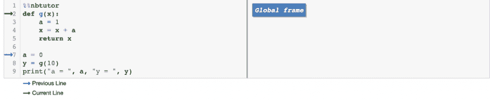

- 函数对象被创建，并且在全局命名空间中将 `g` 绑定到它。
- 名称 `a` 被绑定到0，同样在全局命名空间中。

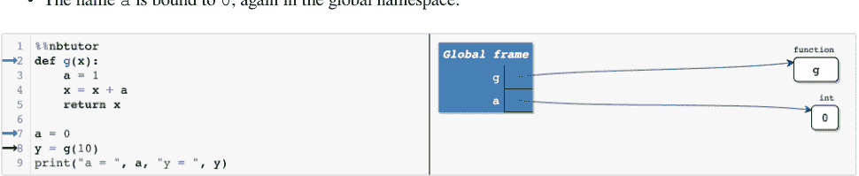

接下来通过 `y = g(10)` 调用 `g`，导致以下操作序列

- 为函数创建局部命名空间。
- 局部名称 `x` 和 `a` 被绑定，因此局部命名空间变为 `{'x': 10, 'a': 1}`。
    - 注意全局的 `a` 没有受到局部 `a` 的影响。
- 语句 `x = x + a` 使用局部的 `a` 和局部的 `x` 来计算 `x + a`，并将局部名称 `x` 绑定到结果。

## 面向经济与金融的Python编程

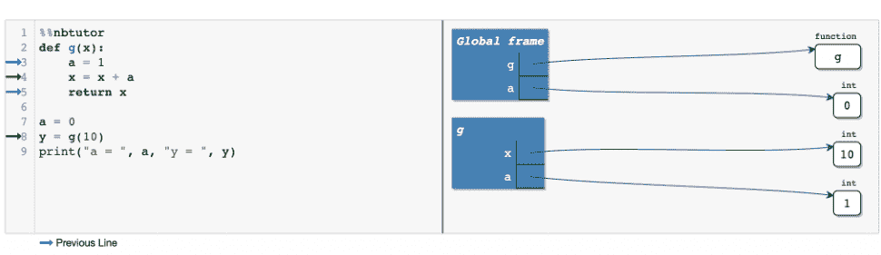

- 这个值被返回，并且在全局命名空间中将 `y` 绑定到它。
- 局部的 `x` 和 `a` 被丢弃（局部命名空间被释放）。

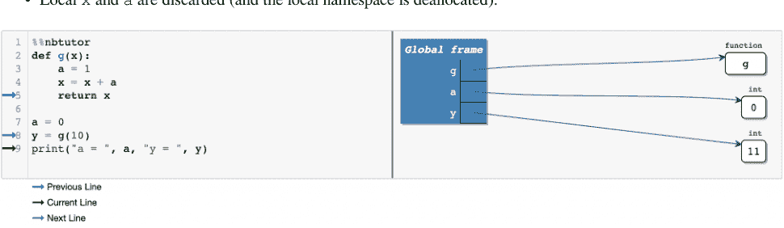

## 6.3.9 可变与不可变参数

现在是时候多谈谈可变与不可变对象了。
考虑以下代码段

```python
def f(x):
    x = x + 1
    return x

x = 1
print(f(x), x)
```

```
2 1
```

我们现在理解这里会发生什么：代码打印 `f(x)` 的值为2，`x` 的值为1。
首先 `f` 和 `x` 在全局命名空间中被注册。
调用 `f(x)` 创建一个局部命名空间并将 `x` 添加到其中，绑定到1。
接下来，这个局部的 `x` 被重新绑定到新的整数对象2，并且这个值被返回。
这些都没有影响到全局的 `x`。
然而，当我们使用**可变**数据类型（如列表）时，情况就不同了。

def f(x):
    x[0] = x[0] + 1
    return x

x = [1]
print(f(x), x)

这会打印出 `f(x)` 的值为 `[2]`，并且 `x` 的值也*相同*。

以下是发生的过程

-   f 在全局命名空间中被注册为一个函数

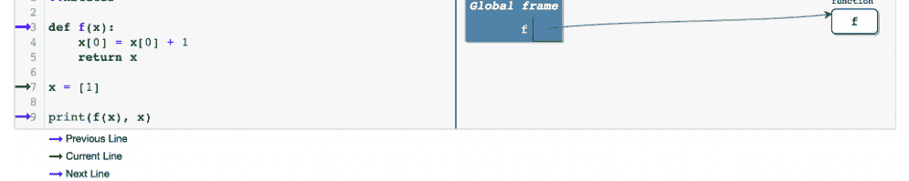

-   x 在全局命名空间中被绑定到 `[1]`

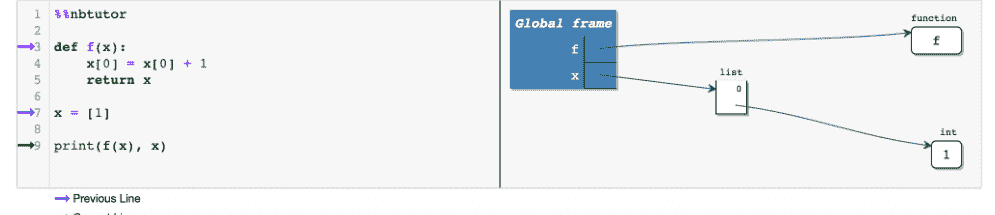

-   调用 `f(x)`
    -   创建一个局部命名空间
    -   将 `x` 添加到局部命名空间，并绑定到 `[1]`

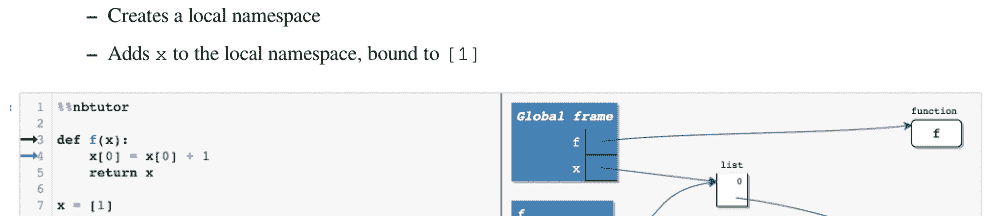

# 经济与金融的Python编程

> **注意：** 全局的 `x` 和局部的 `x` 指向同一个 `[1]`

我们可以看到局部 `x` 的标识符和全局 `x` 的标识符是相同的

```python
def f(x):
    x[0] = x[0] + 1
    print(f'the identity of local x is {id(x)}')
    return x

x = [1]
print(f'the identity of global x is {id(x)}')
print(f(x), x)
```

```
the identity of global x is 140471461499776
the identity of local x is 140471461499776
[2] [2]
```

-   在 `f(x)` 内部
    -   列表 `[1]` 被修改为 `[2]`
    -   返回列表 `[2]`

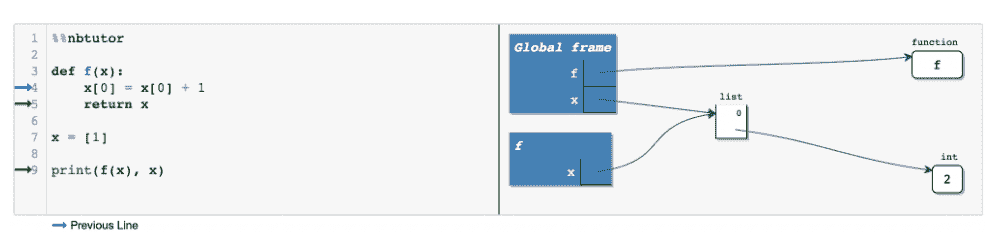

-   局部命名空间被释放，局部 `x` 丢失

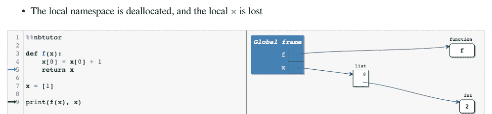

如果你想分别修改局部 `x` 和全局 `x`，你可以创建列表的一个副本，并将该副本赋值给局部 `x`。

我们将此留给你去探索。

## 6.4 总结

本讲的信息很明确：

-   在Python中，*内存中的一切都被视为对象*。
-   零个、一个或多个名称可以绑定到一个给定的对象。
-   每个名称都存在于由其命名空间定义的范围内。

这不仅包括列表、字符串等，还包括不太明显的东西，例如

-   函数（一旦它们被读入内存）
-   模块（同上）
-   为读写而打开的文件
-   整数等

以函数为例。
当Python读取一个函数定义时，它会创建一个**函数对象**并将其存储在内存中。
以下代码进一步说明了这个概念

```python
#reset the current namespace
%reset
```

```python
def f(x): return x**2
f
```

```
<function __main__.f(x)>
```

```python
type(f)
```

```
function
```

```python
id(f)
```

```
140472213439648
```

```python
f.__name__
```

```
'f'
```

我们可以看到 `f` 有类型、标识符、属性等等——就像任何其他对象一样。
它也有方法。
一个例子是 `__call__` 方法，它只是执行函数

```python
f.__call__(3)
```

9

另一个是 `__dir__` 方法，它返回一个属性列表。

我们也可以在当前命名空间中找到 `f`

```python
'f' in dir()
```

```
True
```

加载到内存中的模块也被视为对象

```python
import math

id(math)
```

```
140472260240432
```

导入后，我们可以在全局命名空间中找到 `math`

```python
print(dir()[-1::-1])
```

```
['quit', 'open', 'math', 'get_ipython', 'f', 'exit', '_oh', '_iii', '_ii', '_ih', '_i64', '_i63', '_i62', '_i61', '_i60', '_i59', '_i58', '_i57', '_i', '_dh', '__name__', '__builtins__', '__builtin__', '__', '__', '_63', '_62', '_61', '_60', '_59', '_58', '_57', '_', 'Out', 'In']
```

我们也可以在 `math` 模块的私有命名空间中找到与 `math` 模块相关的所有对象

```python
print(dir(math))
```

```
['__doc__', '__file__', '__loader__', '__name__', '__package__', '__spec__', 'acos', 'acosh', 'asin', 'asinh', 'atan', 'atan2', 'atanh', 'cbrt', 'ceil', 'comb', 'copysign', 'cos', 'cosh', 'degrees', 'dist', 'e', 'erf', 'erfc', 'exp', 'exp2', 'expm1', 'fabs', 'factorial', 'floor', 'fmod', 'frexp', 'fsum', 'gamma', 'gcd', 'hypot', 'inf', 'isclose', 'isfinite', 'isinf', 'isnan', 'isqrt', 'lcm', 'ldexp', 'lgamma', 'log', 'log10', 'log1p', 'log2', 'modf', 'nan', 'nextafter', 'perm', 'pi', 'pow', 'prod', 'radians', 'remainder', 'sin', 'sinh', 'sqrt', 'tan', 'tanh', 'tau', 'trunc', 'ulp']
```

我们也可以使用 `from ... import ...` 直接将对象导入到当前命名空间

```python
from math import log, pi, sqrt

print(dir()[-1::-1])
```

```
['sqrt', 'quit', 'pi', 'open', 'math', 'log', 'get_ipython', 'f', 'exit', '_oh', '_iii', '_ii', '_ih', '_i66', '_i65', '_i64', '_i63', '_i62', '_i61', '_i60', '_i59', '_i58', '_i57', '_i', '_dh', '__name__', '__builtins__', '__builtin__', '__', '__', '_63', '_62', '_61', '_60', '_59', '_58', '_57', '_', 'Out', 'In']
```

我们可以发现这些名称现在出现在当前命名空间中。

Python中对数据的这种统一处理（一切都是对象）有助于保持语言的简单性和一致性。

## 6.5 练习

### 练习 6.5.1

我们之前已经遇到过布尔数据类型。使用本讲所学的知识，打印出布尔对象的方法列表。

> 提示：你可以使用 `callable()` 来测试对象的某个属性是否可以作为函数调用

### 练习 6.5.1 的解答

首先，我们需要找到布尔对象的所有属性。
你可以使用以下方法之一：
1.  你可以调用 `.__dir__()` 方法

```python
print(sorted(True.__dir__()))
```

```
['__abs__', '__add__', '__and__', '__bool__', '__ceil__', '__class__', '__delattr__', '__dir__', '__divmod__', '__doc__', '__eq__', '__float__', '__floor__', '__floordiv__', '__format__', '__ge__', '__getattribute__', '__getnewargs__', '__getstate__', '__gt__', '__hash__', '__index__', '__init__', '__init_subclass__', '__int__', '__invert__', '__le__', '__lshift__', '__lt__', '__mod__', '__mul__', '__ne__', '__neg__', '__new__', '__or__', '__pos__', '__pow__', '__radd__', '__rand__', '__rdivmod__', '__reduce__', '__reduce_ex__', '__repr__', '__rfloordiv__', '__rlshift__', '__rmod__', '__rmul__', '__ror__', '__round__', '__rpow__', '__rrshift__', '__rshift__', '__rsub__', '__rtruediv__', '__rxor__', '__setattr__', '__sizeof__', '__str__', '__sub__', '__subclasshook__', '__truediv__', '__trunc__', '__xor__', 'as_integer_ratio', 'bit_count', 'bit_length', 'conjugate', 'denominator', 'from_bytes', 'imag', 'numerator', 'real', 'to_bytes']
```

2.  你可以使用内置函数 `dir()`

```python
print(sorted(dir(True)))
```

```
['__abs__', '__add__', '__and__', '__bool__', '__ceil__', '__class__', '__delattr__', '__dir__', '__divmod__', '__doc__', '__eq__', '__float__', '__floor__', '__floordiv__', '__format__', '__ge__', '__getattribute__', '__getnewargs__', '__getstate__', '__gt__', '__hash__', '__index__', '__init__', '__init_subclass__', '__int__', '__invert__', '__le__', '__lshift__', '__lt__', '__mod__', '__mul__', '__ne__', '__neg__', '__new__', '__or__', '__pos__', '__pow__', '__radd__', '__rand__', '__rdivmod__', '__reduce__', '__reduce_ex__', '__repr__', '__rfloordiv__', '__rlshift__', '__rmod__', '__rmul__', '__ror__', '__round__', '__rpow__', '__rrshift__', '__rshift__', '__rsub__', '__rtruediv__', '__rxor__', '__setattr__', '__sizeof__', '__str__', '__sub__', '__subclasshook__', '__truediv__', '__trunc__', '__xor__', 'as_integer_ratio', 'bit_count', 'bit_length', 'conjugate', 'denominator', 'from_bytes', 'imag', 'numerator', 'real', 'to_bytes']
```

# 经济与金融的Python编程

3.  由于布尔数据类型是原始类型，你也可以在内置命名空间中找到它

```python
print(dir(__builtins__.bool))
```

```
['__abs__', '__add__', '__and__', '__bool__', '__ceil__', '__class__', '__delattr__', '__dir__', '__divmod__', '__doc__', '__eq__', '__float__', '__floor__', '__floordiv__', '__format__', '__ge__', '__getattribute__', '__getnewargs__', '__getstate__', '__gt__', '__hash__', '__index__', '__init__', '__init_subclass__', '__int__', '__invert__', '__le__', '__lshift__', '__lt__', '__mod__', '__mul__', '__ne__', '__neg__', '__new__', '__or__', '__pos__', '__pow__', '__radd__', '__rand__', '__rdivmod__', '__reduce__', '__reduce_ex__', '__repr__', '__rfloordiv__', '__rlshift__', '__rmod__', '__rmul__', '__ror__', '__round__', '__rpow__', '__rrshift__', '__rshift__', '__rsub__', '__rtruediv__', '__rxor__', '__setattr__', '__sizeof__', '__str__', '__sub__', '__subclasshook__', '__truediv__', '__trunc__', '__xor__', 'as_integer_ratio', 'bit_count', 'bit_length', 'conjugate', 'denominator', 'from_bytes', 'imag', 'numerator', 'real', 'to_bytes']
```

接下来，我们可以使用for循环过滤出可调用的属性

```python
attrs = dir(__builtins__.bool)
callablels = list()

for i in attrs:
    # Use eval() to evaluate a string as an expression
    if callable(eval(f'True.{i}')):
        callablels.append(i)
print(callablels)
```

```
['__abs__', '__add__', '__and__', '__bool__', '__ceil__', '__class__', '__delattr__', '__dir__', '__divmod__', '__eq__', '__float__', '__floor__', '__floordiv__', '__format__', '__ge__', '__getattribute__', '__getnewargs__', '__getstate__', '__gt__', '__hash__', '__index__', '__init__', '__init_subclass__', '__int__', '__invert__', '__le__', '__lshift__', '__lt__', '__mod__', '__mul__', '__ne__', '__neg__', '__new__', '__or__', '__pos__', '__pow__', '__radd__', '__rand__', '__rdivmod__', '__reduce__', '__reduce_ex__', '__repr__', '__rfloordiv__', '__rlshift__', '__rmod__', '__rmul__', '__ror__', '__round__', '__rpow__', '__rrshift__', '__rshift__', '__rsub__', '__rtruediv__', '__rxor__', '__setattr__', '__sizeof__', '__str__', '__sub__', '__subclasshook__', '__truediv__', '__trunc__', '__xor__', 'as_integer_ratio', 'bit_count', 'bit_length', 'conjugate', 'from_bytes', 'to_bytes']
```

这是一个单行解决方案

```python
print([i for i in attrs if callable(eval(f'True.{i}'))])
```

```
['__abs__', '__add__', '__and__', '__bool__', '__ceil__', '__class__', '__delattr__', '__dir__', '__divmod__', '__eq__', '__float__', '__floor__', '__floordiv__', '__format__', '__ge__', '__getattribute__', '__getnewargs__', '__getstate__', '__gt__', '__hash__', '__index__', '__init__', '__init_subclass__', '__int__', '__invert__', '__le__', '__lshift__', '__lt__', '__mod__', '__mul__', '__ne__', '__neg__', '__new__', '__or__', '__pos__', '__pow__', '__radd__', '__rand__', '__rdivmod__', '__reduce__', '__reduce_ex__', '__repr__', '__rfloordiv__', '__rlshift__', '__rmod__', '__rmul__', '__ror__', '__round__', '__rpow__', '__rrshift__', '__rshift__', '__rsub__', '__rtruediv__', '__rxor__', '__setattr__', '__sizeof__', '__str__', '__sub__', '__subclasshook__', '__truediv__', '__trunc__', '__xor__', 'as_integer_ratio', 'bit_count', 'bit_length', 'conjugate', 'from_bytes', 'to_bytes']
```

## 第七章

## 面向对象编程 II：构建类

**目录**
- 面向对象编程 II：构建类
    - 概述
    - 面向对象编程回顾
    - 定义你自己的类
    - 特殊方法
    - 练习

## 7.1 概述

在*之前的课程*中，我们学习了面向对象编程的一些基础知识。
本节课的目标是
- 更深入地探讨面向对象编程
- 学习如何构建我们自己的、针对我们需求的对象

例如，你已经知道如何
- 创建列表、字符串和其他 Python 对象
- 使用它们的方法来修改其内容

那么，想象一下你现在想编写一个包含消费者的程序，这些消费者能够
- 持有和花费现金
- 消费商品
- 工作并赚取现金

在 Python 中，一个自然的解决方案是将消费者创建为具有以下特性的对象：
- 数据，例如手头现金
- 方法，例如影响这些数据的 `buy` 或 `work`

Python 通过提供**类定义**使这变得容易。
类是帮助你根据自己的规格构建对象的蓝图。

## 面向经济学与金融的 Python 编程

需要一点时间来适应语法，因此我们将提供大量示例。
我们将使用以下导入：

```
%matplotlib inline
import numpy as np
import matplotlib.pyplot as plt
plt.rcParams['figure.figsize'] = (10, 6)
```

## 7.2 面向对象编程回顾

许多语言都支持面向对象编程：

- JAVA 和 Ruby 是相对纯粹的面向对象语言。
- Python 同时支持过程式和面向对象编程。
- Fortran 和 MATLAB 主要是过程式的，最近才附加了一些面向对象特性。
- C 是一种过程式语言，而 C++ 是在 C 的基础上添加了面向对象特性。

在专门讨论 Python 之前，让我们先介绍一般的面向对象编程概念。

### 7.2.1 关键概念

正如*之前的课程*中所讨论的，在面向对象编程范式中，数据和函数被**捆绑在一起**形成“对象”。
一个例子是 Python 列表，它不仅存储数据，还知道如何对自己进行排序等。

```
x = [1, 5, 4]
x.sort()
x
```

```
[1, 4, 5]
```

正如我们现在所知，`sort` 是一个“属于”列表对象的函数——因此被称为*方法*。
如果我们想创建自己类型的对象，就需要使用类定义。
*类定义*是特定类别对象（例如，列表、字符串或复数）的蓝图。
它描述了

- 该类存储什么样的数据
- 它拥有哪些作用于这些数据的方法

一个*对象*或*实例*是类的实现，根据蓝图创建

- 每个实例都有自己独特的数据。
- 类定义中规定的方法作用于这些（以及其他）数据。

在 Python 中，对象的数据和方法统称为*属性*。
属性通过“点号属性表示法”访问

- `object_name.data`
- `object_name.method_name()`

在示例中

```
x = [1, 5, 4]
x.sort()
x.__class__
```

```
list
```

- x 是一个对象或实例，根据 Python 列表的定义创建，但具有其特定的数据。
- x.sort() 和 x.__class__ 是 x 的两个属性。
- dir(x) 可用于查看 x 的所有属性。

### 7.2.2 为什么面向对象编程有用？

面向对象编程之所以有用，原因与抽象有用的原因相同：识别和利用共同结构。
例如，

- 一个马尔可夫链由一组状态、状态上的初始概率分布以及跨状态转移的概率集合组成
- 一般均衡理论由商品空间、偏好、技术和均衡定义组成
- 一个博弈由玩家列表、每个玩家可用的行动列表、每个玩家作为所有其他玩家行动函数的收益，以及一个时序协议组成

这些都是将相同“类型”的“对象”收集在一起的抽象。
识别共同结构使我们能够使用共同的工具。
在经济理论中，这可能是一个适用于所有某类博弈的命题。
在 Python 中，这可能是一个对所有马尔可夫链都有用的方法（例如，模拟）。
当我们使用面向对象编程时，模拟方法可以方便地与马尔可夫链对象捆绑在一起。

## 7.3 定义你自己的类

让我们从构建一些简单的类开始。
在我们这样做之前，为了展示类的一些强大功能，我们将定义两个函数，分别称为 earn 和 spend。

```
def earn(w,y):
    "Consumer with initial wealth w earns y"
    return w+y

def spend(w,x):
    "consumer with initial wealth w spends x"
    new_wealth = w -x
    if new_wealth < 0:
        print("Insufficient funds")
    else:
        return new_wealth
```

## 面向经济学与金融的 Python 编程

`earn` 函数接受消费者的初始财富 $w$ 并加上其当前收入 $y$。
`spend` 函数接受消费者的初始财富 $w$ 并减去其当前支出 $x$。
我们可以使用这两个函数来跟踪消费者在赚取和花费过程中的财富变化。
例如

```
w0=100
w1=earn(w0,10)
w2=spend(w1,20)
w3=earn(w2,10)
w4=spend(w3,20)
print("w0,w1,w2,w3,w4 = ", w0,w1,w2,w3,w4)
```

```
w0,w1,w2,w3,w4 =  100 110 90 100 80
```

一个*类*将一组与特定*实例*相关的数据与一组作用于该数据的函数捆绑在一起。
在我们的例子中，一个*实例*将是特定*人*的名称，其*实例数据*仅由其财富组成。
（在其他例子中，*实例数据*将由一个数据向量组成。）
在我们的例子中，两个函数 `earn` 和 `spend` 可以应用于当前的实例数据。
综合起来，实例数据和函数被称为*方法*。
这些可以很容易地通过我们现在将要描述的方式访问。

### 7.3.1 示例：一个消费者类

我们将构建一个 `Consumer` 类，包含

- 一个 `wealth` 属性，存储消费者的财富（数据）
- 一个 `earn` 方法，其中 `earn(y)` 将消费者的财富增加 $y$
- 一个 `spend` 方法，其中 `spend(x)` 要么将财富减少 $x$，要么在资金不足时返回错误

诚然有点刻意，但这个类的例子帮助我们内化一些特殊的语法。
以下是我们如何设置 Consumer 类。

```
class Consumer:

    def __init__(self, w):
        "Initialize consumer with w dollars of wealth"
        self.wealth = w

    def earn(self, y):
        "The consumer earns y dollars"
        self.wealth += y

    def spend(self, x):
        "The consumer spends x dollars if feasible"
        new_wealth = self.wealth - x
        if new_wealth < 0:
            print("Insufficient funds")
        else:
            self.wealth = new_wealth
```

这里有一些特殊的语法，所以让我们仔细分析一下

- `class` 关键字表明我们正在构建一个类。

`Consumer` 类定义了实例数据 `wealth` 和三个方法：`__init__`、`earn` 和 `spend`

- `wealth` 是*实例数据*，因为我们创建的每个消费者（`Consumer` 类的每个实例）都将拥有自己的财富数据。

`earn` 和 `spend` 方法部署了我们之前描述的函数，这些函数可以应用于 `wealth` 实例数据。

`__init__` 方法是一个*构造方法*。

每当我们创建类的一个实例时，`__init__` 方法都会被自动调用。

调用 `__init__` 会设置一个“命名空间”来保存实例数据——稍后会详细介绍。

我们还将详细讨论特殊 `self` 记账设备的作用。

### 用法

这是一个我们使用 `Consumer` 类创建消费者实例的例子，我们亲切地将其命名为 `c1`。

在我们创建消费者 `c1` 并赋予其初始财富 10 之后，我们将应用 `spend` 方法。

```
c1 = Consumer(10)  # Create instance with initial wealth 10
c1.spend(5)
c1.wealth
```

```
5
```

```
c1.earn(15)
c1.spend(100)
```

```
Insufficient funds
```

我们当然可以创建多个实例，即多个消费者，每个都有自己的名称和数据

```
c1 = Consumer(10)
c2 = Consumer(12)
c2.spend(4)
c2.wealth
```

```
8
```

```
c1.wealth
```

```
10
```

每个实例，即每个消费者，将其数据存储在单独的命名空间字典中

```
c1.__dict__
```

## 面向经济学与金融的Python编程

```python
{'wealth': 10}
```

```python
c2.__dict__
```

```python
{'wealth': 8}
```

当我们访问或设置属性时，实际上只是在修改实例所维护的字典。

## Self

如果你再次查看 `Consumer` 类的定义，你会看到代码中遍布 `self` 这个词。
在创建类时使用 `self` 的规则是：

- 任何实例数据都应以 `self` 为前缀
    - 例如，`earn` 方法使用 `self.wealth` 而不仅仅是 `wealth`
- 在定义类的代码中定义的方法，其第一个参数应为 `self`
    - 例如，`def earn(self, y)` 而不仅仅是 `def earn(y)`
- 在类内部引用的任何方法都应作为 `self.method_name` 来调用

前面的代码中没有最后一个规则的示例，但我们很快就会看到一些。

## 细节

在本节中，我们将探讨与类和 `self` 相关的一些更正式的细节。

- 你可能希望在第一次阅读本讲时跳到*下一节*。
- 在你熟悉了更多示例之后，可以再回来查看这些细节。

方法实际上存在于解释器读取类定义时形成的类对象内部。

```python
print(Consumer.__dict__)  # 显示类对象的 __dict__ 属性
```

```python
{'__module__': '__main__', '__init__': <function Consumer.__init__ at 0x7fbe7c09cea0>, 'earn': <function Consumer.earn at 0x7fbe7c09ce00>, 'spend': <function Consumer.spend at 0x7fbe7c09cfe0>, '__dict__': <attribute '__dict__' of 'Consumer' objects>, '__weakref__': <attribute '__weakref__' of 'Consumer' objects>, '__doc__': None}
```

注意三个方法 `__init__`、`earn` 和 `spend` 是如何存储在类对象中的。
考虑以下代码：

```python
c1 = Consumer(10)
c1.earn(10)
c1.wealth
```

```python
20
```

当你通过 `c1.earn(10)` 调用 `earn` 时，解释器将实例 `c1` 和参数 `10` 传递给 `Consumer.earn`。

事实上，以下两种调用方式是等价的：

- `c1.earn(10)`
- `Consumer.earn(c1, 10)`

在函数调用 `Consumer.earn(c1, 10)` 中，请注意 `c1` 是第一个参数。

回想一下，在 `earn` 方法的定义中，`self` 是第一个参数：

```python
def earn(self, y):
    "The consumer earns y dollars"
    self.wealth += y
```

最终结果是，在函数调用内部，`self` 被绑定到实例 `c1`。

这就是为什么 `earn` 内部的语句 `self.wealth += y` 最终修改了 `c1.wealth`。

## 7.3.2 示例：索洛增长模型

对于我们的下一个示例，让我们编写一个简单的类来实现索洛增长模型。

索洛增长模型是一个新古典增长模型，其中人均资本存量 $k_t$ 根据以下规则演变：

$$k_{t+1} = \frac{szk_t^\alpha + (1-\delta)k_t}{1+n}$$

其中：

- $s$ 是外生给定的储蓄率
- $z$ 是生产率参数
- $\alpha$ 是资本在收入中的份额
- $n$ 是人口增长率
- $\delta$ 是折旧率

模型的**稳态**是当 $k_{t+1} = k_t = k$ 时，满足方程 (7.1) 的 $k$ 值。

这是一个实现该模型的类。

代码中一些值得关注的点是：

- 实例在其变量 `self.k` 中维护其当前资本存量的记录。
- `h` 方法实现了方程 (7.1) 的右侧。
- `update` 方法使用 `h` 根据方程 (7.1) 更新资本。
    - 注意在 `update` 内部，对局部方法 `h` 的引用是 `self.h`。

方法 `steady_state` 和 `generate_sequence` 的含义相当不言自明。

```python
class Solow:
    r"""
    实现索洛增长模型，更新规则为
    k_{t+1} = [(s z k^a_t) + (1 - δ)k_t] / (1 + n)
    """
    def __init__(self, n=0.05,  # 人口增长率
                       s=0.25,  # 储蓄率
                       δ=0.1,   # 折旧率
                       α=0.3,   # 劳动份额
                       z=2.0,   # 生产率
                       k=1.0):  # 当前资本存量

        self.n, self.s, self.δ, self.α, self.z = n, s, δ, α, z
        self.k = k

    def h(self):
        "计算 h 函数"
        # 解包参数（去掉 self 以简化符号）
        n, s, δ, α, z = self.n, self.s, self.δ, self.α, self.z
        # 应用更新规则
        return (s * z * self.k**α + (1 - δ) * self.k) / (1 + n)

    def update(self):
        "更新当前状态（即资本存量）。"
        self.k =  self.h()

    def steady_state(self):
        "计算资本的稳态值。"
        # 解包参数（去掉 self 以简化符号）
        n, s, δ, α, z = self.n, self.s, self.δ, self.α, self.z
        # 计算并返回稳态
        return ((s * z) / (n + δ))**(1 / (1 - α))

    def generate_sequence(self, t):
        "生成并返回长度为 t 的时间序列"
        path = []
        for i in range(t):
            path.append(self.k)
            self.update()
        return path
```

这是一个使用该类从两个不同初始条件计算时间序列的小程序。
为了比较，也绘制了共同的稳态。

```python
s1 = Solow()
s2 = Solow(k=8.0)

T = 60
fig, ax = plt.subplots(figsize=(9, 6))

# 绘制共同的资本稳态值
ax.plot([s1.steady_state()]*T, 'k-', label='steady state')

# 绘制每个经济的时间序列
for s in s1, s2:
    lb = f'capital series from initial state {s.k}'
    ax.plot(s.generate_sequence(T), 'o-', lw=2, alpha=0.6, label=lb)

ax.set_xlabel('$t$', fontsize=14)
ax.set_ylabel('$k_t$', fontsize=14)
ax.legend()
plt.show()
```

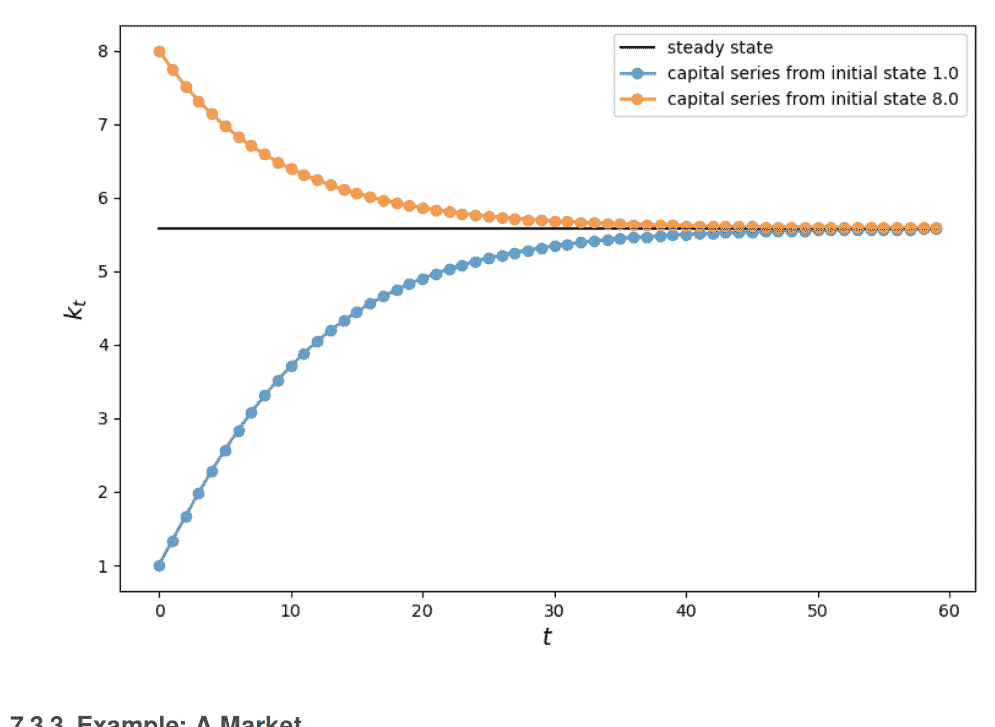

## 7.3.3 示例：一个市场

接下来，让我们为一个竞争性市场编写一个类，其中买家和卖家都是价格接受者。

该市场由以下对象组成：

- 一条线性需求曲线 $Q = a_d - b_d p$
- 一条线性供给曲线 $Q = a_z + b_z(p - t)$

其中：

- $p$ 是买家支付的价格，$Q$ 是数量，$t$ 是单位税。
- 其他符号是需求和供给参数。

该类提供了计算各种感兴趣值的方法，包括竞争性均衡价格和数量、征收的税收收入、消费者剩余和生产者剩余。

这是我们的实现。

（它使用了 SciPy 中一个名为 `quad` 的函数进行数值积分——我们稍后会更详细地讨论这个主题。）

```python
from scipy.integrate import quad

class Market:

    def __init__(self, ad, bd, az, bz, tax):
        """
        设置市场参数。所有参数都是标量。解释见
        https://lectures.quantecon.org/py/python_oop.html。

        """
        self.ad, self.bd, self.az, self.bz, self.tax = ad, bd, az, bz, tax
        if ad < az:
            raise ValueError('Insufficient demand.')

    def price(self):
        "计算均衡价格"
        return  (self.ad - self.az + self.bz * self.tax) / (self.bd + self.bz)

    def quantity(self):
        "计算均衡数量"
        return  self.ad - self.bd * self.price()

    def consumer_surp(self):
        "计算消费者剩余"
        # == 计算反需求函数下的面积 == #
        integrand = lambda x: (self.ad / self.bd) - (1 / self.bd) * x
        area, error = quad(integrand, 0, self.quantity())
        return area - self.price() * self.quantity()

    def producer_surp(self):
        "计算生产者剩余"
        #  == 计算反供给曲线以上的面积，不包括税收 == #
        integrand = lambda x: -(self.az / self.bz) + (1 / self.bz) * x
        area, error = quad(integrand, 0, self.quantity())
        return (self.price() - self.tax) * self.quantity() - area

    def taxrev(self):
        "计算税收收入"
        return self.tax * self.quantity()

    def inverse_demand(self, x):
        "计算反需求"
        return self.ad / self.bd - (1 / self.bd)* x

    def inverse_supply(self, x):
        "计算反供给曲线"
        return -(self.az / self.bz) + (1 / self.bz) * x + self.tax

    def inverse_supply_no_tax(self, x):
        "计算不含税的反供给曲线"
        return -(self.az / self.bz) + (1 / self.bz) * x
```

这是一个使用示例：

```python
baseline_params = 15, .5, -2, .5, 3
m = Market(*baseline_params)
print("equilibrium price = ", m.price())
```

## 7.3.4 示例：混沌

让我们再看一个例子，它与非线性系统中的混沌动力学有关。
一个能产生不规则时间路径的简单转换规则是逻辑斯蒂映射

$x_{t+1} = r x_t (1 - x_t), \quad x_0 \in [0, 1], \quad r \in [0, 4] \qquad (7.2)$

让我们编写一个类，用于从该模型生成时间序列。
以下是一种实现方式

```python
class Chaos:
    """
    Models the dynamical system :math:`x_{t+1} = r x_t (1 - x_t)`
    """
    def __init__(self, x0, r):
        """
        Initialize with state x0 and parameter r
        """
        self.x, self.r = x0, r

    def update(self):
        """Apply the map to update state."""
        self.x = self.r * self.x * (1 - self.x)

    def generate_sequence(self, n):
        """Generate and return a sequence of length n."""
        path = []
        for i in range(n):
            path.append(self.x)
            self.update()
        return path
```

这是一个使用示例

```python
ch = Chaos(0.1, 4.0)    # x0 = 0.1 and r = 4.0
ch.generate_sequence(5)  # First 5 iterates
```

```
[0.1, 0.36000000000000004, 0.9216, 0.28901376000000006, 0.8219392261226498]
```

下面这段代码绘制了一条更长的轨迹

```python
ch = Chaos(0.1, 4.0)
ts_length = 250

fig, ax = plt.subplots()
ax.set_xlabel('$t$', fontsize=14)
ax.set_ylabel('$x_t$', fontsize=14)
x = ch.generate_sequence(ts_length)
ax.plot(range(ts_length), x, 'bo-', alpha=0.5, lw=2, label='$x_t$')
plt.show()
```

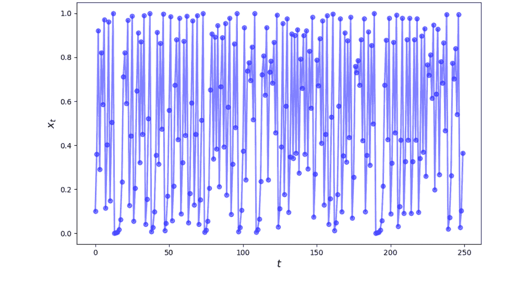

下一段代码提供了一个分岔图

```python
fig, ax = plt.subplots()
ch = Chaos(0.1, 4)
r = 2.5
while r < 4:
    ch.r = r
    t = ch.generate_sequence(1000)[950:]
    ax.plot([r] * len(t), t, 'b.', ms=0.6)
    r = r + 0.005

ax.set_xlabel('$r$', fontsize=16)
ax.set_ylabel('$x_t$', fontsize=16)
plt.show()
```

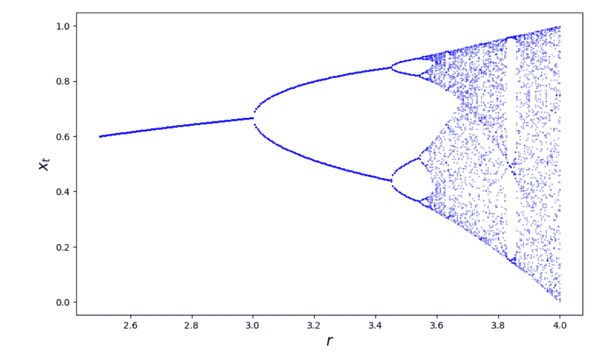

水平轴是公式 (7.2) 中的参数 $r$。
垂直轴是状态空间 $[0, 1]$。
对于每个 $r$，我们计算一个长时间序列，然后绘制其尾部（最后 50 个点）。
序列的尾部向我们展示了轨迹在稳定到某种稳态（如果存在稳态的话）之后的集中位置。
它是否稳定下来，以及它稳定到的稳态的性质，都取决于 $r$ 的值。
当 $r$ 在大约 2.5 到 3 之间时，时间序列稳定为垂直轴上绘制的单个固定点。
当 $r$ 在大约 3 到 3.45 之间时，时间序列稳定为在垂直轴上绘制的两个值之间振荡。
当 $r$ 略高于 3.45 时，时间序列稳定为在垂直轴上绘制的四个值之间振荡。
请注意，没有任何 $r$ 值会导致在三个值之间振荡的稳态。

## 7.4 特殊方法

Python 提供了一些非常有用的特殊方法。

例如，回想一下列表和元组具有长度的概念，并且可以通过 `len` 函数查询该长度

```python
x = (10, 20)
len(x)
```

```
2
```

如果你想为应用于你的自定义对象的 `len` 函数提供返回值，请使用 `__len__` 特殊方法

```python
class Foo:
    def __len__(self):
        return 42
```

现在我们得到

```python
f = Foo()
len(f)
```

```
42
```

我们将经常使用的一个特殊方法是 `__call__` 方法。

此方法可用于使你的实例可调用，就像函数一样

```python
class Foo:
    def __call__(self, x):
        return x + 42
```

运行后我们得到

```python
f = Foo()
f(8)  # Exactly equivalent to f.__call__(8)
```

```
50
```

练习 1 提供了一个更有用的例子。

## 7.5 练习

### 练习 7.5.1

与样本 $\{X_i\}_{i=1}^n$ 对应的经验累积分布函数（ecdf）定义为

$$F_n(x) := \frac{1}{n} \sum_{i=1}^n \mathbf{1}\{X_i \leq x\} \quad (x \in \mathbb{R}) \qquad (7.3)$$

这里 $\mathbf{1}\{X_i \leq x\}$ 是一个指示函数（如果 $X_i \leq x$ 则为 1，否则为 0），因此 $F_n(x)$ 是样本中低于 $x$ 的比例。

格里文科-坎泰利定理指出，只要样本是独立同分布的，经验累积分布函数 $F_n$ 就会收敛到真实分布函数 $F$。

将 $F_n$ 实现为一个名为 `ECDF` 的类，其中

- 给定的样本 $\{X_i\}_{i=1}^n$ 是实例数据，存储为 `self.observations`。
- 该类实现一个 `__call__` 方法，该方法对任何 $x$ 返回 $F_n(x)$。

你的代码应该如下工作（忽略随机性）

```python
from random import uniform

samples = [uniform(0, 1) for i in range(10)]
F = ECDF(samples)
F(0.5)  # Evaluate ecdf at x = 0.5
```

```python
F.observations = [uniform(0, 1) for i in range(1000)]
F(0.5)
```

追求清晰，而非效率。

### 练习 7.5.1 的解答

```python
class ECDF:

    def __init__(self, observations):
        self.observations = observations

    def __call__(self, x):
        counter = 0.0
        for obs in self.observations:
            if obs <= x:
                counter += 1
        return counter / len(self.observations)
```

```python
# == test == #

from random import uniform

samples = [uniform(0, 1) for i in range(10)]
F = ECDF(samples)
print(F(0.5))  # Evaluate ecdf at x = 0.5

F.observations = [uniform(0, 1) for i in range(1000)]
print(F(0.5))
```

```
0.5
0.491
```

### 练习 7.5.2

在*之前的练习*中，你编写了一个用于计算多项式的函数。
本练习是其扩展，任务是构建一个名为 `Polynomial` 的简单类，用于表示和操作多项式函数，例如

$$p(x) = a_0 + a_1 x + a_2 x^2 + \cdots a_N x^N = \sum_{n=0}^N a_n x^n \quad (x \in \mathbb{R}) \qquad (7.4)$$

类 `Polynomial` 的实例数据将是系数（在公式 (7.4) 的情况下，即数字 $a_0, \dots, a_N$）。
提供以下方法

1. 计算多项式 (7.4)，对任何 $x$ 返回 $p(x)$。
2. 对多项式求导，用其导数 $p'$ 的系数替换原始系数。

避免使用任何 `import` 语句。

### 练习 7.5.2 的解答

```python
class Polynomial:

    def __init__(self, coefficients):
        """
        Creates an instance of the Polynomial class representing

            p(x) = a_0 x^0 + ... + a_N x^N,

        where a_i = coefficients[i].
        """
        self.coefficients = coefficients

    def __call__(self, x):
        "Evaluate the polynomial at x."
        y = 0
        for i, a in enumerate(self.coefficients):
            y += a * x**i
        return y

    def differentiate(self):
        "Reset self.coefficients to those of p' instead of p."
```

## 面向经济学与金融的Python编程

```python
new_coefficients = []
for i, a in enumerate(self.coefficients):
    new_coefficients.append(i * a)
# Remove the first element, which is zero
del new_coefficients[0]
# And reset coefficients data to new values
self.coefficients = new_coefficients
return new_coefficients
```

# 第八章

# 编写更长的程序

## 目录

- 编写更长的程序
    - 概述
    - 使用Python文件
    - 开发环境
    - 从Jupyter Notebooks向前一步：JupyterLab
    - Visual Studio Code漫游
    - 动手实践Git

## 8.1 概述

到目前为止，我们已经探索了在编写和执行Python代码时使用Jupyter Notebooks。虽然它们在处理短代码片段时高效且灵活，但Notebooks并非编写较长程序和脚本的最佳选择。Jupyter Notebooks非常适合交互式计算（即数据科学工作流），并能帮助一次执行一个代码块。文本文件和脚本则允许一次性编写和执行长段代码。我们将探索使用Python脚本作为替代方案。接着将介绍Jupyter Lab和Visual Studio Code（VS Code）开发环境，以及版本控制（Git）入门。在本讲中，你将学习：

- 使用Python脚本
- 设置各种开发环境
- 入门GitHub

> **注意：** 假设你已经有一个正在运行的Anaconda环境。如果尚未创建，你可能需要创建一个新的conda环境。

## 8.2 使用Python文件

Python文件用于编写长的、可重用的代码块——按照惯例，它们具有`.py`后缀。让我们从以下示例开始。

```python
# 清单 8.1: sine_wave.py

import matplotlib.pyplot as plt
import numpy as np

x = np.linspace(0, 10, 100)
y = np.sin(x)

plt.plot(x, y)
plt.xlabel('x')
plt.ylabel('y')
plt.title('Sine Wave')
plt.show()
```

代码首先保存在本地计算机上，然后执行。由于执行代码有多种方式，我们将在不同开发环境的背景下进行探索。使用Python脚本的一个主要优势在于，你可以将其他脚本的功能“导入”到当前脚本或Jupyter Notebook中。让我们将之前的代码重写为一个函数。

```python
# 清单 8.2: sine_wave.py

import matplotlib.pyplot as plt
import numpy as np

# Define the plot_wave function.
def plot_wave(title : str = 'Sine Wave'):
    x = np.linspace(0, 10, 100)
    y = np.sin(x)

    plt.plot(x, y)
    plt.xlabel('x')
    plt.ylabel('y')
    plt.title(title)
    plt.show()
```

```python
# 清单 8.3: second_script.py

import sine_wave # Import the sine_wave script

# Call the plot_wave function.
sine_wave.plot_wave("Sine Wave - Called from the Second Script")
```

这允许你将代码分割成块，并更好地组织你的代码库。有关导入功能的更多信息，请查阅模块和包的使用。

## 8.3 开发环境

开发环境是一个一站式工作区，你可以在其中：

- 编辑和运行代码
- 测试和调试
- 管理项目文件

本讲将带你了解两个开发环境的工作原理。

## 8.4 从Jupyter Notebooks向前一步：JupyterLab

JupyterLab是一个基于浏览器的开发环境，用于Jupyter Notebooks、代码脚本和数据文件。

如果你想在本地安装前试用，可以在浏览器中尝试JupyterLab。

你可以使用pip安装JupyterLab

```
> pip install jupyterlab
```

并在浏览器中启动它，类似于Jupyter Notebooks。

```
> jupyter-lab
```

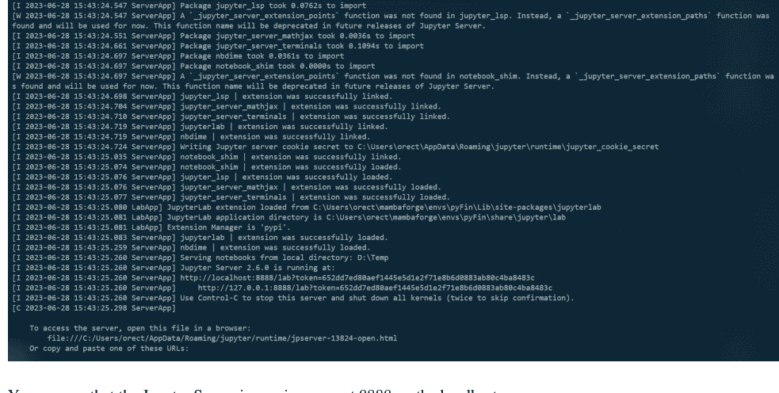

你可以看到Jupyter服务器正在本地主机的8888端口上运行。

以下界面应自动在你的默认浏览器中打开——如果没有，请按住CTRL键并点击服务器URL。

点击：

- Notebooks下的Python 3 (ipykernel)按钮以打开一个新的Jupyter Notebook
- Python File按钮以打开一个新的Python脚本(.py)

你始终可以通过点击顶部的‘+’按钮来打开此启动器标签页。你工作目录中的所有文件和文件夹都可以在文件浏览器（左侧标签页）中找到。你可以使用文件浏览器标签页顶部的按钮创建新文件和文件夹。


你可以通过访问扩展标签页来安装扩展，以增加JupyterLab的功能。回到之前的示例脚本，在JupyterLab中有两种处理它们的方式：

- 使用魔术命令
- 使用终端


### 8.4.1 使用魔术命令

Jupyter Notebooks和JupyterLab支持使用魔术命令——这些命令扩展了标准Jupyter Notebook的功能。

`%run`魔术命令允许你从Notebook内部运行Python脚本。

这是一种方便的方式，可以运行与Notebook在同一目录下的脚本，并在Notebook中显示输出。

### 8.4.2 使用终端

然而，如果你只想运行.py文件，有时使用终端更容易。

从启动器打开一个终端并运行以下命令。

```
> python <path to file.py>
```

**注意：** 你也可以通过打开一个ipykernel控制台来逐行运行脚本，方式可以是：

- 从启动器
- 在Notebook内右键单击并选择“为编辑器创建控制台”

使用Shift + Enter运行一行代码。

关于ipykernel控制台的更多信息，请参见[此处](here)。

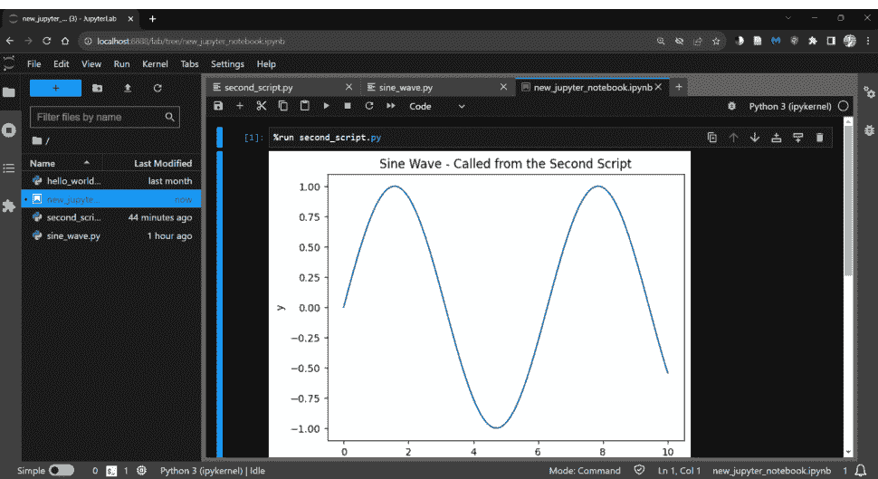

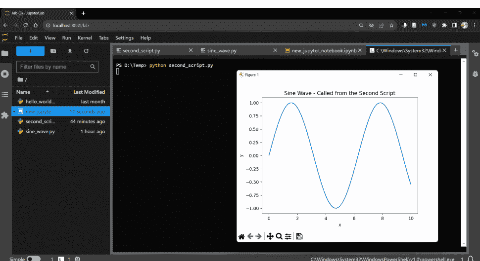

## 8.5 Visual Studio Code漫游

Visual Studio Code（VS Code）是一个代码编辑器和开发工作区，可以运行：

- 在浏览器中。
- 作为本地安装。

两个界面是相同的。当你启动VS Code时，你会看到以下界面。


通过引导式演练探索如何根据你的喜好自定义VS Code。当出现以下提示时，继续安装所有推荐的扩展。你也可以从扩展标签页安装扩展。Jupyter Notebooks（.ipynb文件）可以在VS Code中处理。在尝试打开Jupyter Notebook之前，请确保从扩展标签页安装Jupyter扩展。创建一个新文件（在文件资源管理器标签页中）并将其保存为.ipynb扩展名。通过点击编辑器右上角的“选择内核”按钮，选择一个内核/环境来运行Notebook。VS Code还通过源代码管理标签页提供了出色的版本控制功能。将你的GitHub账户链接到VS Code，以便将更改推送到你的仓库或从仓库拉取更改。关于版本控制的进一步讨论可以在下一节中找到。要在VS Code中打开一个新终端，请点击终端标签页并选择“新建终端”。VS Code会在你当前工作的目录中打开一个新终端——在Windows中是PowerShell，在Linux中是Bash。你可以通过终端标签页右端的下拉菜单更改shell或打开一个新实例。


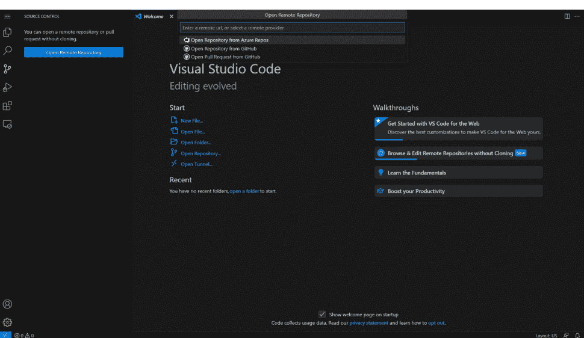

## 8.5.1 使用运行按钮

VS Code 帮助你无需使用命令行即可管理 conda 环境。
打开命令面板（CTRL + SHIFT + P 或从 View 选项卡下的下拉菜单中选择）并搜索 `Python: Select Interpreter`。
这将加载现有环境。
你也可以使用命令面板中的 `Python: Create Environment` 来创建新环境。
一个新环境（.conda 文件夹）将在当前工作目录中创建。
回到之前的示例脚本，在 VS Code 中处理它们同样有两种方式。

- 使用运行按钮
- 使用终端

你可以通过点击编辑器右上角的运行按钮来运行脚本。

你也可以通过从下拉菜单中选择 **Run Current File in Interactive Window** 选项来交互式地运行脚本。

这将创建一个 ipykernel 控制台并运行脚本。

## 8.5.2 使用终端

命令 `python <path to file.py>` 在你选择的控制台上执行。
如果你使用的是 Windows 机器，你可以使用 Anaconda Prompt 或命令提示符 - 但通常不使用 PowerShell。
以下是之前代码的执行示例。

> **注意：** 如果你想使用 Python 开发包和构建工具，你可能需要了解 [Docker 容器和 VS Code 的使用](https://code.visualstudio.com/docs/remote/containers)。
然而，这超出了本系列讲座的重点。

## 8.6 动手实践 Git

本节将让你熟悉 git 和 GitHub。
*Git* 是一个*版本控制系统*——一种用于管理数字项目（如代码库）的软件。
在许多情况下，相关的文件集合——称为*仓库*——存储在 *GitHub* 上。
GitHub 是协作编码项目的乐园。
例如，它托管了我们稍后将使用的许多科学库，比如[这个](https://github.com/QuantEcon/QuantEcon.lectures.code)。
Git 是用于管理这些项目的底层软件。

# 经济学与金融学的 Python 编程

Git 是一个极其强大的分布式协作工具——例如，我们用它来共享和同步本系列讲座的所有源文件。

Git 主要有两种形式

1.  纯命令行 Git 版本
2.  各种点击式 GUI 版本
    - 例如，参见 GitHub 版本或集成到你 IDE 中的 Git GUI。

如果你还没有，尝试

1.  安装 Git。
2.  使用 Git 获取 QuantEcon.py 的副本。

例如，如果你安装了命令行版本，打开一个终端并输入。

```
git clone https://github.com/QuantEcon/QuantEcon.py
```

（这只是在仓库的 URL 前加上 `git clone`）

此命令将下载重建你正在阅读的讲座所需的所有必要组件。

作为第二个任务，

1.  注册 GitHub。
2.  了解 'fork' GitHub 仓库（fork 意味着在 GitHub 上创建你自己的 GitHub 仓库副本）。
3.  Fork QuantEcon.py。
4.  将你的 fork 克隆到某个本地目录，进行编辑，提交它们，并将它们推送回你 fork 的 GitHub 仓库。
5.  如果你做出了有价值的改进，请向我们发送拉取请求！

要阅读这些和其他主题，请尝试

- 官方 Git 文档。
- 阅读 GitHub 上的文档。
- Scott Chacon 和 Ben Straub 所著的《Pro Git》一书。
- 网上数千个 Git 教程中的一个。

# 第二部分

# 科学计算库

# 第九章

# 用于科学计算的 Python

目录

- 用于科学计算的 Python
    - 概述
    - 科学计算库
    - 对速度的需求
    - 向量化
    - 超越向量化

> “我们应该忘记小的效率提升，大约 97% 的时间是这样：过早优化是万恶之源。” – Donald Knuth

## 9.1 概述

Python 在科学计算中非常受欢迎，原因如下

- 语言本身易于理解和灵活，
- 现在有大量高质量的科学计算库可用，
- 语言和库都是开源的，
- 流行的 Anaconda Python 发行版简化了这些库的安装和管理，
- 以及最近人们对将 Python 用于机器学习和人工智能的兴趣激增。

在本讲座中，我们将简要概述 Python 中的科学计算，探讨以下问题：

- Python 在这些任务中的相对优势和劣势是什么？
- 科学 Python 生态系统的主要组成部分是什么？
- 情况如何随时间变化？

除了 Anaconda 中的内容，本讲座还需要

```
!pip install quantecon
```

## 9.2 科学计算库

让我们简要回顾一下 Python 的科学计算库，首先从为什么需要它们开始。

### 9.2.1 科学计算库的作用

我们使用科学计算库的一个明显原因是它们实现了我们想要使用的例程。
例如，使用现有的求根例程几乎总是比从头编写新的更好。
（对于标准算法，如果社区能够协调一组共同的实现，由专家编写并由用户调整以尽可能快速和稳健，那么效率将达到最大化。）
但这并不是我们使用 Python 科学计算库的唯一原因。
另一个原因是纯 Python 虽然灵活且优雅，但速度不快。
因此，我们需要设计用来加速 Python 代码执行的库。
正如我们将在下面看到的，现在有一些 Python 库可以做得非常好。

### 9.2.2 Python 的科学生态系统

就受欢迎程度而言，科学 Python 库世界的四大巨头是

- NumPy
- SciPy
- Matplotlib
- Pandas

对我们来说，还有另一个（相对较新的）库对数值计算也至关重要：

- Numba

在接下来的几讲中，我们将看到如何使用这些库。
但首先，让我们快速回顾一下它们如何协同工作。

- NumPy 通过提供基本的数组数据类型（可以理解为向量和矩阵）以及作用于这些数组的函数（例如矩阵乘法）构成了基础。
- SciPy 在 NumPy 的基础上添加了科学中常用的数值方法（插值、优化、求根等）。
- Matplotlib 用于生成图形，重点是绘制存储在 NumPy 数组中的数据。
- Pandas 提供用于实证工作的类型和函数（例如，操作数据）。
- Numba 通过 JIT 编译加速执行——我们很快就会了解这一点。

## 9.3 对速度的需求

现在让我们讨论执行速度。
像 Python 这样的高级语言是为人类优化的。
这意味着程序员可以将许多细节留给运行时环境

- 指定变量类型
- 内存分配/释放等。

好处是，与低级语言相比，Python 通常编写更快、更不容易出错且更容易调试。
缺点是 Python 比 C 或 Fortran 等语言更难优化——即转换成快速的机器代码。
事实上，Python 的标准实现（称为 CPython）无法达到 C 或 Fortran 等编译语言的速度。
这是否意味着我们应该将所有东西都切换到 C 或 Fortran？
答案是：不，不，一百个不！
（这就是你应该对坚持认为模型需要用 Fortran 或 C++ 重写的资深教授说的话。）
原因有两个：
首先，对于任何给定的程序，相对较少的行数是时间关键的。
因此，用像 Python 这样的高生产力语言编写大部分代码要高效得多。
其次，即使是那些*时间关键*的代码行，我们现在也可以使用 Python 的科学计算库达到与 C 或 Fortran 相同的速度。

### 9.3.1 瓶颈在哪里？

在我们学习如何做到这一点之前，让我们试着理解为什么纯 Python 比 C 或 Fortran 慢。
这反过来将帮助我们弄清楚如何加速。

#### 动态类型

考虑这个 Python 操作

```python
a, b = 10, 10
a + b
```

```
20
```

即使对于这个简单的操作，Python 解释器也有相当多的工作要做。
例如，在语句 `a + b` 中，解释器必须知道要调用哪个操作。
如果 `a` 和 `b` 是字符串，那么 `a + b` 需要字符串连接

```python
a, b = 'foo', 'bar'
a + b
```

## 面向经济学与金融的Python编程

```python
'foobar'
```

如果 `a` 和 `b` 是列表，那么 `a + b` 将执行列表连接操作。

```python
a, b = ['foo'], ['bar']
a + b
```

```
['foo', 'bar']
```

（我们说运算符 + 被*重载*了——它的作用取决于其操作对象的类型）
因此，Python必须检查对象的类型，然后调用正确的操作。
这涉及大量的开销。

## 静态类型

编译型语言通过显式的静态类型来避免这些开销。
例如，考虑以下C代码，它计算从1到10的整数之和。

```c
#include <stdio.h>

int main(void) {
    int i;
    int sum = 0;
    for (i = 1; i <= 10; i++) {
        sum = sum + i;
    }
    printf("sum = %d\n", sum);
    return 0;
}
```

变量 `i` 和 `sum` 被显式声明为整数。
因此，这里的加法操作含义完全明确。

## 9.3.2 数据访问

高级语言速度的另一个拖累是数据访问。
为了说明，让我们考虑对一些数据（比如一组整数）求和的问题。

## 使用编译代码求和

在C或Fortran中，这些整数通常存储在数组中，数组是一种用于存储同质数据的简单数据结构。
这样的数组存储在单个连续的内存块中。

- 在现代计算机中，内存地址是按字节分配的（1字节 = 8位）。
- 例如，一个64位整数存储在8字节的内存中。
- 一个包含 $n$ 个此类整数的数组占据 $8n$ 个**连续**的内存槽。

此外，程序员通过数据类型告知编译器。

- 在本例中是64位整数。

因此，每个后续的数据点都可以通过在内存空间中向前移动一个已知且固定的量来访问。

- 在本例中是8字节。

## 在纯Python中求和

Python在某种程度上试图复制这些思想。
例如，在标准Python实现（CPython）中，列表元素被放置在内存中，在某种意义上是连续的。
然而，这些列表元素更像是指向数据的指针，而不是实际的数据。
因此，访问数据值本身仍然存在开销。
这是速度上的一个相当大的拖累。
事实上，通常来说，内存访问是导致执行缓慢的主要罪魁祸首。
让我们看看一些解决这些问题的方法。

## 9.4 向量化

有一种巧妙的方法叫做**向量化**，可用于在数值应用中加速高级语言。
其核心思想是将数组处理操作批量发送到预编译且高效的本地机器代码。
机器代码本身通常是从精心优化的C或Fortran编译而来。
例如，在使用高级语言时，可以将大型矩阵求逆操作外包给为此目的预编译的高效机器代码，该代码作为软件包的一部分提供给用户。
这个巧妙的想法可以追溯到MATLAB，它广泛使用了向量化。
向量化可以大大加速许多数值计算（但并非全部，我们将会看到）。
让我们看看向量化在Python中是如何工作的，使用NumPy。

## 9.4.1 数组操作

首先，让我们运行一些导入语句。

```python
import random
import numpy as np
import quantecon as qe
```

接下来，让我们尝试一些非向量化代码，它使用原生Python循环来生成、平方然后对大量随机变量求和：

```python
n = 1_000_000
```

```python
%%time

y = 0       # 将累加并存储总和
for i in range(n):
    x = random.uniform(0, 1)
    y += x**2
```

```
CPU times: user 237 ms, sys: 370 µs, total: 237 ms
Wall time: 237 ms
```

以下向量化代码实现了相同的功能。

```python
%%time

x = np.random.uniform(0, 1, n)
y = np.sum(x**2)
```

```
CPU times: user 9.08 ms, sys: 272 µs, total: 9.36 ms
Wall time: 9.12 ms
```

如你所见，第二个代码块运行得快得多。为什么？
第二个代码块将循环分解为三个基本操作：

1. 生成n个均匀分布随机数
2. 对它们求平方
3. 对它们求和

这些操作作为批量操作符发送到优化的机器代码。
除了与数据来回传输相关的少量开销外，结果达到了C或Fortran般的速度。
当我们像这样对数组进行批量操作时，我们称代码是*向量化的*。
向量化代码通常快速且高效。
它也出奇地灵活，因为许多操作都可以向量化。
下一节将说明这一点。

## 9.4.2 通用函数

NumPy提供的许多函数是所谓的*通用函数*——也称为`ufuncs`。
这意味着它们：

- 如预期的那样，将标量映射为标量
- 将数组映射为数组，逐元素操作

例如，`np.cos`是一个ufunc：

```python
np.cos(1.0)
```

```
0.5403023058681398
```

```python
np.cos(np.linspace(0, 1, 3))
```

```
array([1.        , 0.87758256, 0.54030231])
```

通过利用ufuncs，许多操作可以被向量化。

例如，考虑在正方形 $[-a, a] \times [-a, a]$ 上最大化一个二元函数 $f(x, y)$ 的问题。

对于 $f$ 和 $a$，我们选择：

$$f(x, y) = \frac{\cos(x^2 + y^2)}{1 + x^2 + y^2} \quad \text{and} \quad a = 3$$

这是 $f$ 的图形：

```python
import matplotlib.pyplot as plt
%matplotlib inline
from mpl_toolkits.mplot3d.axes3d import Axes3D
from matplotlib import cm

def f(x, y):
    return np.cos(x**2 + y**2) / (1 + x**2 + y**2)

xgrid = np.linspace(-3, 3, 50)
ygrid = xgrid
x, y = np.meshgrid(xgrid, ygrid)

fig = plt.figure(figsize=(10, 8))
ax = fig.add_subplot(111, projection='3d')
ax.plot_surface(x,
                y,
                f(x, y),
                rstride=2, cstride=2,
                cmap=cm.jet,
                alpha=0.7,
                linewidth=0.25)
ax.set_zlim(-0.5, 1.0)
ax.set_xlabel('$x$', fontsize=14)
ax.set_ylabel('$y$', fontsize=14)
plt.show()
```

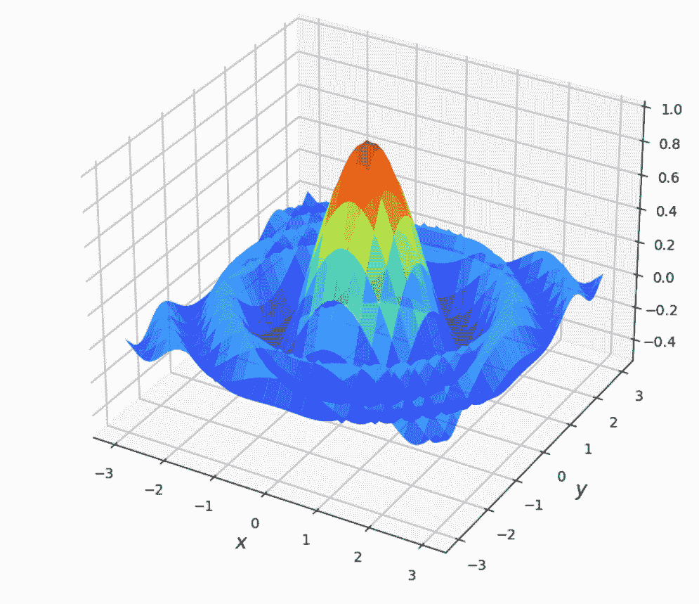

为了最大化它，我们将使用一种朴素的网格搜索：

1. 在正方形上的网格中，对所有 $(x, y)$ 计算 $f$。
2. 返回观测值中的最大值。

网格将是：

```python
grid = np.linspace(-3, 3, 1000)
```

这是一个使用Python循环的非向量化版本。

```python
%%time

m = -np.inf

for x in grid:
    for y in grid:
        z = f(x, y)
        if z > m:
            m = z
```

```
CPU times: user 1.48 s, sys: 4.97 ms, total: 1.48 s
Wall time: 1.39 s
```

这是一个向量化版本：

```python
%%time

x, y = np.meshgrid(grid, grid)
np.max(f(x, y))
```

```
CPU times: user 13.5 ms, sys: 8.24 ms, total: 21.8 ms
Wall time: 21.6 ms
```

```
0.9999819641085747
```

在向量化版本中，所有的循环都在编译代码中进行。
如你所见，第二个版本**快得多**。
（我们稍后将使用更多科学编程技巧使其变得更快。）

## 9.5 超越向量化

在最佳情况下，向量化能产生快速、简洁的代码。
然而，它并非没有缺点。
一个问题是它可能非常消耗内存。
例如，上面的向量化最大化程序比之前的非向量化版本消耗的内存多得多。
这是因为向量化在产生最终计算之前往往会创建许多中间数组。
另一个问题是并非所有算法都可以向量化。
在这种情况下，我们需要回到循环。
幸运的是，有替代方法可以在几乎任何设置下加速Python循环。
例如，在过去几年中，出现了一个名为Numba的新Python库，它解决了上述向量化的主要问题。
它通过一种叫做**即时编译**的技术来实现这一点，该技术可以生成极其快速和高效的代码。
我们*很快*就会学习如何使用Numba。

# 第十章

# NUMPY

- 目录
    - NumPy
        - 概述
        - NumPy数组
        - 算术运算
        - 矩阵乘法
        - 广播
        - 可变性与数组复制
        - 附加功能
        - 练习

> “让我们明确一点：科学工作与共识毫无关系。共识是政治的事务。相反，科学只需要一个碰巧正确的研究者，这意味着他或她拥有可以通过参照现实世界来验证的结果。在科学中，共识是无关紧要的。重要的是可重复的结果。” – 迈克尔·克莱顿

## 10.1 概述

NumPy是一个一流的数值编程库。

- 在学术界、金融界和工业界广泛使用。
- 成熟、快速、稳定且持续发展。

我们在前面的讲座中已经看到了一些涉及NumPy的代码。
在本讲座中，我们将开始更系统地讨论：

- NumPy数组，以及
- NumPy提供的基本数组处理操作。

## 10.1.1 参考资料

-   NumPy 官方文档。

## 10.2 NumPy 数组

NumPy 解决的核心问题是快速数组处理。
NumPy 定义的最重要的结构是一种数组数据类型，正式名称为 `numpy.ndarray`。
NumPy 数组支撑了科学 Python 生态系统的很大一部分。
让我们首先导入这个库。

```python
import numpy as np
```

要创建一个只包含零的 NumPy 数组，我们使用 `np.zeros`

```python
a = np.zeros(3)
a
```

```
array([0., 0., 0.])
```

```python
type(a)
```

```
numpy.ndarray
```

NumPy 数组在某种程度上类似于原生的 Python 列表，但不同之处在于

-   数据*必须是同质的*（所有元素类型相同）。
-   这些类型必须是 NumPy 提供的 `数据类型`（`dtypes`）之一。

其中最重要的数据类型是：

-   `float64`：64 位浮点数
-   `int64`：64 位整数
-   `bool`：8 位 True 或 False

还有用于表示复数、无符号整数等的数据类型。
在现代机器上，数组的默认数据类型是 `float64`

```python
a = np.zeros(3)
type(a[0])
```

```
numpy.float64
```

如果我们想使用整数，可以如下指定：

```python
a = np.zeros(3, dtype=int)
type(a[0])
```

```
numpy.int64
```

### 10.2.1 形状与维度

考虑以下赋值

```python
z = np.zeros(10)
```

这里 z 是一个没有维度的扁平数组——既不是行向量也不是列向量。
维度记录在 shape 属性中，它是一个元组

```python
z.shape
```

```
(10,)
```

这里的 shape 元组只有一个元素，即数组的长度（只有一个元素的元组以逗号结尾）。
要给它维度，我们可以改变 shape 属性

```python
z.shape = (10, 1)
z
```

```
array([[0.],
       [0.],
       [0.],
       [0.],
       [0.],
       [0.],
       [0.],
       [0.],
       [0.],
       [0.]])
```

```python
z = np.zeros(4)
z.shape = (2, 2)
z
```

```
array([[0., 0.],
       [0., 0.]])
```

在最后一种情况下，要创建 2x2 数组，我们也可以将元组传递给 zeros() 函数，例如 z = np.zeros((2, 2))。

### 10.2.2 创建数组

正如我们所看到的，`np.zeros` 函数创建一个零数组。
你可能猜到 `np.ones` 创建什么了。
相关的是 `np.empty`，它在内存中创建数组，这些数组稍后可以用数据填充

```python
z = np.empty(3)
z
```

```
array([0., 0., 0.])
```

你在这里看到的数字是垃圾值。
（Python 分配了 3 个连续的 64 位内存块，这些内存槽的现有内容被解释为 `float64` 值）
要设置一个均匀间隔的数字网格，使用 `np.linspace`

```python
z = np.linspace(2, 4, 5)  # 从 2 到 4，包含 5 个元素
```

要创建单位矩阵，使用 `np.identity` 或 `np.eye`

```python
z = np.identity(2)
z
```

```
array([[1., 0.],
       [0., 1.]])
```

此外，NumPy 数组可以使用 `np.array` 从 Python 列表、元组等创建

```python
z = np.array([10, 20])  # 从 Python 列表创建 ndarray
z
```

```
array([10, 20])
```

```python
type(z)
```

```
numpy.ndarray
```

```python
z = np.array((10, 20), dtype=float)  # 这里 'float' 等同于 'np.float64'
z
```

```
array([10., 20.])
```

```python
z = np.array([[1, 2], [3, 4]])  # 从列表的列表创建二维数组
z
```

```
array([[1, 2],
       [3, 4]])
```

另请参阅 `np.asarray`，它执行类似的功能，但不会为已经是 NumPy 数组的数据创建单独的副本。

```python
na = np.linspace(10, 20, 2)
na is np.asarray(na)   # 不复制 NumPy 数组
```

```
True
```

```python
na is np.array(na)     # 确实创建了一个新副本——可能是不必要的
```

```
False
```

要从包含数字数据的文本文件中读取数组数据，请使用 `np.loadtxt` 或 `np.genfromtxt`——详情请参阅文档。

### 10.2.3 数组索引

对于扁平数组，索引与 Python 序列相同：

```python
z = np.linspace(1, 2, 5)
z
```

```
array([1.  , 1.25, 1.5 , 1.75, 2.  ])
```

```python
z[0]
```

```
1.0
```

```python
z[0:2]  # 两个元素，从元素 0 开始
```

```
array([1.  , 1.25])
```

```python
z[-1]
```

```
2.0
```

对于二维数组，索引语法如下：

```python
z = np.array([[1, 2], [3, 4]])
z
```

```
array([[1, 2],
       [3, 4]])
```

```python
z[0, 0]
```

```
1
```

```python
z[0, 1]
```

```
2
```

以此类推。
请注意，索引仍然是从零开始的，以保持与 Python 序列的兼容性。
可以按如下方式提取列和行

```python
z[0, :]
```

```
array([1, 2])
```

```python
z[:, 1]
```

```
array([2, 4])
```

整数 NumPy 数组也可用于提取元素

```python
z = np.linspace(2, 4, 5)
z
```

```
array([2. , 2.5, 3. , 3.5, 4. ])
```

```python
indices = np.array((0, 2, 3))
z[indices]
```

```
array([2. , 3. , 3.5])
```

最后，dtype 为 bool 的数组可用于提取元素

```python
z
```

```
array([2. , 2.5, 3. , 3.5, 4. ])
```

```python
d = np.array([0, 1, 1, 0, 0], dtype=bool)
d
```

```
array([False,  True,  True, False, False])
```

```python
z[d]
```

```
array([2.5, 3. ])
```

我们将在下面看到为什么这很有用。

附注：可以使用切片表示法将数组的所有元素设置为一个数字

```python
z = np.empty(3)
z
```

```
array([2. , 3. , 3.5])
```

```python
z[:] = 42
z
```

```
array([42., 42., 42.])
```

### 10.2.4 数组方法

数组有有用的方法，所有这些方法都经过精心优化

```python
a = np.array((4, 3, 2, 1))
a
```

```
array([4, 3, 2, 1])
```

```python
a.sort()           # 就地排序 a
a
```

```
array([1, 2, 3, 4])
```

```python
a.sum()            # 求和
```

```
10
```

```python
a.mean()           # 求平均值
```

```
2.5
```

```python
a.max()            # 求最大值
```

```
4
```

```python
a.argmax()         # 返回最大元素的索引
```

```
3
```

```python
a.cumsum() # a 元素的累积和
```

```
array([ 1, 3, 6, 10])
```

```python
a.cumprod() # a 元素的累积乘积
```

```
array([ 1, 2, 6, 24])
```

```python
a.var() # 方差
```

```
1.25
```

```python
a.std() # 标准差
```

```
1.118033988749895
```

```python
a.shape = (2, 2)
a.T # 等同于 a.transpose()
```

```
array([[1, 3],
       [2, 4]])
```

另一个值得了解的方法是 `searchsorted()`。
如果 `z` 是一个非递减数组，那么 `z.searchsorted(a)` 返回 `z` 中第一个 >= `a` 的元素的索引

```python
z = np.linspace(2, 4, 5)
z
```

```
array([2. , 2.5, 3. , 3.5, 4. ])
```

```python
z.searchsorted(2.2)
```

```
1
```

上面讨论的许多方法在 NumPy 命名空间中有等效的函数

```python
a = np.array((4, 3, 2, 1))
```

```python
np.sum(a)
```

```
10
```

```python
np.mean(a)
```

```
2.5
```

## 10.3 算术运算

运算符 +, -, *, / 和 ** 都对数组进行*逐元素*操作

```python
a = np.array([1, 2, 3, 4])
b = np.array([5, 6, 7, 8])
a + b
```

```
array([ 6,  8, 10, 12])
```

```python
a * b
```

```
array([ 5, 12, 21, 32])
```

我们可以按如下方式将标量加到每个元素上

```python
a + 10
```

```
array([11, 12, 13, 14])
```

标量乘法类似

```python
a * 10
```

```
array([10, 20, 30, 40])
```

二维数组遵循相同的一般规则

```python
A = np.ones((2, 2))
B = np.ones((2, 2))
A + B
```

```
array([[2., 2.],
       [2., 2.]])
```

```python
A + 10
```

```
array([[11., 11.],
       [11., 11.]])
```

```python
A * B
```

```
array([[1., 1.],
       [1., 1.]])
```

特别是，A * B *不是*矩阵乘积，它是逐元素乘积。

## 10.4 矩阵乘法

使用基于 Python 3.5 及以上版本的 Anaconda 科学 Python 包，可以使用 @ 符号进行矩阵乘法，如下所示：

```python
A = np.ones((2, 2))
B = np.ones((2, 2))
A @ B
```

```
array([[2., 2.],
       [2., 2.]])
```

（对于旧版本的 Python 和 NumPy，你需要使用 `np.dot` 函数）

我们也可以使用 @ 来计算两个扁平数组的内积

```python
A = np.array((1, 2))
B = np.array((10, 20))
A @ B
```

```
50
```

实际上，当其中一个元素是 Python 列表或元组时，我们可以使用 @

```python
A = np.array(((1, 2), (3, 4)))
A
```

```
array([[1, 2],
       [3, 4]])
```

```python
A @ (0, 1)
```

```
array([2, 4])
```

由于我们是后乘，元组被视为列向量。

## 10.5 广播

（本节扩展了 Jake VanderPlas 提供的关于广播的精彩讨论。）

> **注意：** 广播是 NumPy 的一个非常重要的方面。同时，高级广播相对复杂，初次阅读时可以略过下面的一些细节。

在逐元素操作中，数组可能没有相同的形状。
当这种情况发生时，NumPy 会在可能的情况下自动将数组扩展到相同的形状。

NumPy 中这个有用（但有时令人困惑）的特性被称为**广播**。

广播的价值在于

-   可以避免使用 `for` 循环，这有助于数值代码快速运行，并且
-   广播允许我们对数组执行操作，而无需在内存中实际创建这些数组的某些维度，这在数组很大时可能很重要。

例如，假设 `a` 是一个 $3 \times 3$ 数组（`a -> (3, 3)`），而 `b` 是一个包含三个元素的扁平数组（`b -> (3,)`）。

当将它们相加时，NumPy 会自动将 `b -> (3,)` 扩展为 `b -> (3, 3)`。

逐元素相加将得到一个 $3 \times 3$ 数组

```
a = np.array(
    [[1, 2, 3],
     [4, 5, 6],
     [7, 8, 9]])
b = np.array([3, 6, 9])

a + b
```

```
array([[ 4,  8, 12],
       [ 7, 11, 15],
       [10, 14, 18]])
```

以下是此广播操作的可视化表示：


如果 `b -> (3, 1)` 呢？

在这种情况下，NumPy 会自动将 `b -> (3, 1)` 扩展为 `b -> (3, 3)`。

逐元素相加将得到一个 $3 \times 3$ 矩阵

```
b.shape = (3, 1)

a + b
```

```
array([[ 4,  5,  6],
       [10, 11, 12],
       [16, 17, 18]])
```

以下是此广播操作的可视化表示：

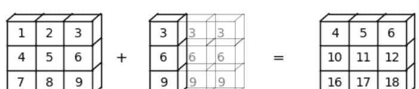

之前的广播操作等效于以下 `for` 循环

```
python
row, column = a.shape
result = np.empty((3, 3))
for i in range(row):
    for j in range(column):
        result[i, j] = a[i, j] + b[i]

result
```

```
array([[ 4.,  5.,  6.],
       [10., 11., 12.],
       [16., 17., 18.]])
```

在某些情况下，两个操作数都会被扩展。

当我们有 `a -> (3,)` 和 `b -> (3, 1)` 时，`a` 将被扩展为 `a -> (3, 3)`，而 `b` 将被扩展为 `b -> (3, 3)`。

在这种情况下，逐元素相加将得到一个 3 × 3 矩阵

```
python
a = np.array([3, 6, 9])
b = np.array([2, 3, 4])
b.shape = (3, 1)

a + b
```

```
array([[ 5,  8, 11],
       [ 6,  9, 12],
       [ 7, 10, 13]])
```

以下是此广播操作的可视化表示：

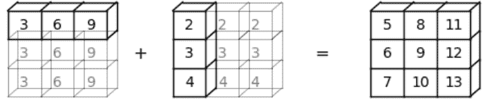

虽然广播非常有用，但有时可能会令人困惑。

例如，让我们尝试将 `a -> (3, 2)` 和 `b -> (3,)` 相加。

```
python
a = np.array(
    [[1, 2],
    [4, 5],
    [7, 8]])
b = np.array([3, 6, 9])

a + b
```

```
---------------------------------------------------------------------------
ValueError                                Traceback (most recent call last)
Cell In[69], line 7
      1 a = np.array(
      2     [[1, 2],
      3     [4, 5],
      4     [7, 8]])
      5 b = np.array([3, 6, 9])
----> 7 a + b

ValueError: operands could not be broadcast together with shapes (3,2) (3,)
```

`ValueError` 告诉我们操作数无法一起广播。
以下是显示为何无法执行此广播的可视化表示：

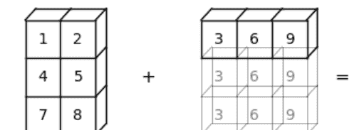

我们可以看到 NumPy 无法将数组扩展到相同的大小。
这是因为，当 `b` 从 `b -> (3,)` 扩展到 `b -> (3, 3)` 时，NumPy 无法将 `b` 与 `a -> (3, 2)` 匹配。
当我们转向更高维度时，事情会变得更加棘手。
为了帮助我们，可以使用以下规则列表：

-   *步骤 1*：当两个数组的维度不匹配时，NumPy 会在现有维度的左侧添加维度来扩展维度较少的那个。
    -   例如，如果 `a -> (3, 3)` 且 `b -> (3,)`，则广播会在左侧添加一个维度，使 `b -> (1, 3)`；
    -   如果 `a -> (2, 2, 2)` 且 `b -> (2, 2)`，则广播会在左侧添加一个维度，使 `b -> (1, 2, 2)`；
    -   如果 `a -> (3, 2, 2)` 且 `b -> (2,)`，则广播会在左侧添加两个维度，使 `b -> (1, 1, 2)`（你也可以将此过程视为执行两次 *步骤 1*）。
-   *步骤 2*：当两个数组具有相同的维度但形状不同时，NumPy 将尝试扩展形状索引为 1 的维度。
    -   例如，如果 `a -> (1, 3)` 且 `b -> (3, 1)`，则广播将扩展 `a` 和 `b` 中形状为 1 的维度，使 `a -> (3, 3)` 且 `b -> (3, 3)`；
    -   如果 `a -> (2, 2, 2)` 且 `b -> (1, 2, 2)`，则广播将扩展 `b` 的第一个维度，使 `b -> (2, 2, 2)`；
    -   如果 `a -> (3, 2, 2)` 且 `b -> (1, 1, 2)`，则广播将在所有形状为 1 的维度上扩展 `b`，使 `b -> (3, 2, 2)`。

以下是广播高维数组的代码示例

```
# a -> (2, 2, 2) and b -> (1, 2, 2)

a = np.array(
    [[[1, 2],
      [2, 3]],

     [[2, 3],
      [3, 4]]])
print(f'the shape of array a is {a.shape}')

b = np.array(
    [[1,7],
     [7,1]])
print(f'the shape of array b is {b.shape}')

a + b
```

```
the shape of array a is (2, 2, 2)
the shape of array b is (2, 2)

array([[[ 2,  9],
        [ 9,  4]],

       [[ 3, 10],
        [10,  5]]])
```

```
# a -> (3, 2, 2) and b -> (2,)

a = np.array(
    [[[1, 2],
      [3, 4]],

     [[4, 5],
      [6, 7]],

     [[7, 8],
      [9, 10]]])
print(f'the shape of array a is {a.shape}')

b = np.array([3, 6])
print(f'the shape of array b is {b.shape}')

a + b
```

```
the shape of array a is (3, 2, 2)
the shape of array b is (2,)

array([[[ 4,  8],
        [ 6, 10]],

       [[ 7, 11],
        [ 9, 13]],

       [[10, 14],
        [12, 16]]])
```

-   *步骤 3*：在步骤 1 和 2 之后，如果两个数组仍然不匹配，将引发 `ValueError`。例如，假设 `a -> (2, 2, 3)` 且 `b -> (2, 2)`
    -   根据 *步骤 1*，`b` 将被扩展为 `b -> (1, 2, 2)`；
    -   根据 *步骤 2*，`b` 将被扩展为 `b -> (2, 2, 2)`；
    -   我们可以看到，在前两个步骤之后它们彼此不匹配。因此，将引发 `ValueError`

```
a = np.array(
    [[[1, 2, 3],
      [2, 3, 4]],

     [[2, 3, 4],
      [3, 4, 5]]])
print(f'the shape of array a is {a.shape}')

b = np.array(
    [[1,7],
     [7,1]])
print(f'the shape of array b is {b.shape}')

a + b
```

```
the shape of array a is (2, 2, 3)
the shape of array b is (2, 2)

---------------------------------------------------------------------------
ValueError                                Traceback (most recent call last)
Cell In[73], line 14
      9 b = np.array(
     10     [[1,7],
     11        [7,1]])
     12 print(f'the shape of array b is {b.shape}')
---> 14 a + b

ValueError: operands could not be broadcast together with shapes (2,2,3) (2,2)
```

## 10.6 可变性与复制数组

NumPy 数组是可变数据类型，类似于 Python 列表。
换句话说，它们的内容可以在初始化后在内存中被更改（突变）。
我们已经在上面看到了例子。
这里是另一个例子：

```
a = np.array([42, 44])
a
```

```
array([42, 44])
```

```
a[-1] = 0  # Change last element to 0
a
```

```
array([42,  0])
```

可变性导致以下行为（这对 MATLAB 程序员来说可能很震惊……）

```
a = np.random.randn(3)
a
```

```
array([-0.54890232, -0.63618665, -0.94948789])
```

```
b = a
b[0] = 0.0
a
```

```
array([ 0.        , -0.63618665, -0.94948789])
```

发生的情况是，我们通过更改 `b` 更改了 `a`。
名称 `b` 绑定到 `a`，并成为该数组的另一个引用（Python 赋值模型在*课程后面*有更详细的描述）。
因此，它拥有同等权利来更改该数组。
这实际上是最合理的默认行为！
这意味着我们只传递数据的指针，而不是制作副本。
制作副本在速度和内存方面都是昂贵的。

### 10.6.1 制作副本

当然可以在需要时使 `b` 成为 `a` 的独立副本。
这可以使用 `np.copy` 来完成

```
a = np.random.randn(3)
a
```

```
array([-0.17144282,  1.25599012,  0.94965095])
```

```
b = np.copy(a)
b
```

```
array([-0.17144282,  1.25599012,  0.94965095])
```

现在 `b` 是一个独立的副本（称为*深拷贝*）

```
b[:] = 1
b
```

```
array([1., 1., 1.])
```

```
a
```

```
array([-0.17144282,  1.25599012,  0.94965095])
```

请注意，对 `b` 的更改没有影响 `a`。

## 10.7 附加功能

让我们看看我们可以用 NumPy 做的其他一些有用的事情。

### 10.7.1 向量化函数

NumPy 提供了标准函数 `log`、`exp`、`sin` 等的版本，这些函数对数组*逐元素*起作用

```
z = np.array([1, 2, 3])
np.sin(z)
```

```
array([0.84147098, 0.90929743, 0.14112001])
```

这消除了对显式逐元素循环的需求，例如

```
n = len(z)
y = np.empty(n)
for i in range(n):
    y[i] = np.sin(z[i])
```

## 面向经济学与金融的Python编程

由于这些函数对数组进行逐元素操作，因此被称为*向量化函数*。
在NumPy术语中，它们也被称为*ufuncs*，即“通用函数”的缩写。
如上所述，常规算术运算（+、*等）也逐元素工作，将它们与ufuncs结合使用，可以得到大量快速的逐元素函数。

```python
z
```

```
array([1, 2, 3])
```

```python
(1 / np.sqrt(2 * np.pi)) * np.exp(- 0.5 * z**2)
```

```
array([0.24197072, 0.05399097, 0.00443185])
```

并非所有用户定义的函数都会逐元素操作。
例如，将下面定义的函数`f`传递给NumPy数组会导致`ValueError`

```python
def f(x):
    return 1 if x > 0 else 0
```

NumPy函数`np.where`提供了一个向量化的替代方案：

```python
x = np.random.randn(4)
x
```

```
array([-1.4410515 , -0.65186216, -0.64465183,  0.8134109 ])
```

```python
np.where(x > 0, 1, 0)  # 如果 x > 0 为真则插入1，否则插入0
```

```
array([0, 0, 0, 1])
```

你也可以使用`np.vectorize`来向量化给定的函数

```python
f = np.vectorize(f)
f(x)                # 传递与上一个示例相同的向量 x
```

```
array([0, 0, 0, 1])
```

然而，这种方法并不总能达到与更精心设计的向量化函数相同的速度。

## 10.7.2 比较

通常，数组上的比较是逐元素进行的

```python
z = np.array([2, 3])
y = np.array([2, 3])
z == y
```

```
array([ True,  True])
```

```python
y[0] = 5
z == y
```

```
array([False,  True])
```

```python
z != y
```

```
array([ True, False])
```

对于 >、<、>= 和 <=，情况类似。

我们也可以与标量进行比较

```python
z = np.linspace(0, 10, 5)
z
```

```
array([ 0. ,  2.5,  5. ,  7.5, 10. ])
```

```python
z > 3
```

```
array([False, False,  True,  True,  True])
```

这对于*条件提取*特别有用

```python
b = z > 3
b
```

```
array([False, False,  True,  True,  True])
```

```python
z[b]
```

```
array([ 5. ,  7.5, 10. ])
```

当然，我们可以——并且经常——一步完成这个操作

```python
z[z > 3]
```

```
array([ 5. , 7.5, 10. ])
```

## 10.7.3 子包

NumPy通过其子包提供了一些与科学编程相关的额外功能。
我们已经看到如何使用np.random生成随机变量

```python
z = np.random.randn(10000)  # 生成标准正态分布
y = np.random.binomial(10, 0.5, size=1000)  # 从二项分布 Bin(10, 0.5) 中抽取1,000个样本
y.mean()
```

```
5.045
```

另一个常用的子包是np.linalg

```python
A = np.array([[1, 2], [3, 4]])
np.linalg.det(A)  # 计算行列式
```

```
-2.0000000000000004
```

```python
np.linalg.inv(A)  # 计算逆矩阵
```

```
array([[-2. ,  1. ],
       [ 1.5, -0.5]])
```

这些功能中的大部分在SciPy中也可用，SciPy是建立在NumPy之上的模块集合。
我们很快将更详细地介绍SciPy版本。
有关NumPy中可用功能的完整列表，请参阅此文档。

## 10.8 练习

```python
%matplotlib inline
import matplotlib.pyplot as plt
plt.rcParams['figure.figsize'] = (10,6)
```

### 练习 10.8.1

考虑多项式表达式

$p(x) = a_0 + a_1x + a_2x^2 + \cdots a_Nx^N = \sum_{n=0}^N a_nx^n$  (10.1)

之前，你编写了一个简单的函数 p(x, coeff) 来计算 (10.1)，没有考虑效率。
现在编写一个新函数来完成相同的工作，但在计算中使用NumPy数组和数组操作，而不是任何形式的Python循环。

（此类功能已作为 `np.poly1d` 实现，但为了练习，请不要使用此类）

**提示：** 使用 `np.cumprod()`

### 练习 10.8.1 的解答

这段代码可以完成任务

```python
def p(x, coef):
    X = np.ones_like(coef)
    X[1:] = x
    y = np.cumprod(X)   # y = [1, x, x**2,...]
    return coef @ y
```

让我们测试一下

```python
x = 2
coef = np.linspace(2, 4, 3)
print(coef)
print(p(x, coef))
# 作为比较
q = np.poly1d(np.flip(coef))
print(q(x))
```

```
[2. 3. 4.]
24.0
24.0
```

### 练习 10.8.2

设 `q` 是一个长度为 `n` 的NumPy数组，且 `q.sum() == 1`。
假设 `q` 代表一个概率质量函数。
我们希望生成一个离散随机变量 `x`，使得 $\mathbb{P}\{x = i\} = q_i$。
换句话说，`x` 在 `range(len(q))` 中取值，并且 `x = i` 的概率为 `q[i]`。
标准（逆变换）算法如下：

- 将单位区间 $[0, 1]$ 划分为 $n$ 个子区间 $I_0, I_1, \dots, I_{n-1}$，使得 $I_i$ 的长度为 $q_i$。
- 在 $[0, 1]$ 上绘制一个均匀随机变量 $U$，并返回满足 $U \in I_i$ 的 $i$。

绘制 $i$ 的概率是 $I_i$ 的长度，等于 $q_i$。
我们可以如下实现该算法

```python
from random import uniform

def sample(q):
    a = 0.0
    U = uniform(0, 1)
    for i in range(len(q)):
        if a < U <= a + q[i]:
            return i
        a = a + q[i]
```

如果你不明白这是如何工作的，尝试为一个简单的例子（例如 q = [0.25, 0.75]）思考一下流程。在纸上画出区间会有所帮助。

你的练习是使用NumPy来加速它，避免显式循环

提示：使用 `np.searchsorted` 和 `np.cumsum`

如果可以，请将功能实现为一个名为 `DiscreteRV` 的类，其中

- 类实例的数据是概率向量 q
- 该类有一个 `draw()` 方法，根据上述算法返回一次抽取结果

如果可以，请编写该方法，使得 `draw(k)` 从 q 中返回 k 次抽取结果。

### 练习 10.8.2 的解答

这是我们解决方案的初稿：

```python
from numpy import cumsum
from numpy.random import uniform

class DiscreteRV:
    """
    从离散随机变量生成一个抽取数组，其概率向量由 q 给出。
    """

    def __init__(self, q):
        """
        参数 q 是一个NumPy数组或类似数组，非负且总和为1
        """
        self.q = q
        self.Q = cumsum(q)

    def draw(self, k=1):
        """
        从 q 中返回 k 次抽取。对于每次这样的抽取，值 i 以概率 q[i] 被返回。
        """
        return self.Q.searchsorted(uniform(0, 1, size=k))
```

逻辑并不明显，但如果你花时间慢慢阅读，你会理解的。

然而，这里有一个问题。

假设在创建 `DiscreteRV` 的实例后，q 被更改了，例如通过

```python
q = (0.1, 0.9)
d = DiscreteRV(q)
d.q = (0.5, 0.5)
```

问题是 Q 没有相应地更改，而 Q 是 draw 方法中使用的数据。
为了解决这个问题，一个选项是在每次调用 draw 方法时计算 Q。
但这相对于一次性计算 Q 是低效的。
更好的选项是使用描述符。
这里有一个来自 quantecon 库的使用描述符的解决方案，其行为符合我们的期望。

### 练习 10.8.3

回顾我们之前关于经验累积分布函数的讨论。
你的任务是

1. 使用NumPy使 `__call__` 方法更高效。
2. 添加一个方法来绘制 ECDF 在 [a, b] 上的图像，其中 a 和 b 是方法参数。

### 练习 10.8.3 的解答

下面给出了一个示例解决方案。
本质上，我们只是从 QuantEcon 中获取了这段代码并添加了一个绘图方法

```python
"""
修改 QuantEcon 的 ecdf.py 以添加绘图方法
"""

class ECDF:
    """
    给定一个观测向量的一维经验分布函数。

    参数
    ----------
    observations : array_like
        一个观测数组

    属性
    ----------
    observations : array_like
        一个观测数组

    """

    def __init__(self, observations):
        self.observations = np.asarray(observations)

    def __call__(self, x):
        """
        在 x 处计算 ecdf

        参数
        ----------
        x : scalar(float)
            计算 ecdf 的 x 值

        返回
        -------
        scalar(float)
            小于 x 的样本比例

        """
        return np.mean(self.observations <= x)

    def plot(self, ax, a=None, b=None):
        """
        在区间 [a, b] 上绘制 ecdf。

        参数
        ----------
        a : scalar(float), optional(default=None)
            绘图区间的下端点
        b : scalar(float), optional(default=None)
            绘图区间的上端点

        """

        # === 如果未指定 [a, b]，则选择合理的区间 === #
        if a is None:
            a = self.observations.min() - self.observations.std()
        if b is None:
            b = self.observations.max() + self.observations.std()

        # === 生成绘图 === #
        x_vals = np.linspace(a, b, num=100)
        f = np.vectorize(self.__call__)
        ax.plot(x_vals, f(x_vals))
        plt.show()
```

这是一个使用示例

```python
fig, ax = plt.subplots()
X = np.random.randn(1000)
F = ECDF(X)
F.plot(ax)
```

## 练习 10.8.4

回顾一下，Numpy 中的*广播*功能可以帮助我们对不同维度的数组执行逐元素操作，而无需使用 `for` 循环。

在本练习中，尝试使用 `for` 循环来复现以下广播操作的结果。

**第一部分：** 尝试使用 `for` 循环复现这个简单的示例，并将你的结果与下面的广播操作进行比较。

```python
np.random.seed(123)
x = np.random.randn(4, 4)
y = np.random.randn(4)
A = x / y
```

以下是输出结果

```python
print(A)
```

**第二部分：** 继续复现以下广播操作的结果。同时，比较广播操作和你实现的 `for` 循环的速度。

```python
import quantecon as qe

np.random.seed(123)
x = np.random.randn(1000, 100, 100)
y = np.random.randn(100)

qe.tic()
B = x / y
qe.toc()
```

```
TOC: Elapsed: 0:00:0.01
```

```
0.012936592102050781
```

以下是输出结果

```python
print(B)
```

## 练习 10.8.4 解答

### 第一部分解答

```python
np.random.seed(123)
x = np.random.randn(4, 4)
y = np.random.randn(4)

C = np.empty_like(x)
n = len(x)
for i in range(n):
    for j in range(n):
        C[i, j] = x[i, j] / y[j]
```

比较结果以检查你的答案

```python
print(C)
```

你也可以使用 `array_equal()` 来检查你的答案

```python
print(np.array_equal(A, C))
```

```
True
```

### 第二部分解答

```python
np.random.seed(123)
x = np.random.randn(1000, 100, 100)
y = np.random.randn(100)

qe.tic()
D = np.empty_like(x)
d1, d2, d3 = x.shape
for i in range(d1):
    for j in range(d2):
        for k in range(d3):
            D[i, j, k] = x[i, j, k] / y[k]
qe.toc()
```

```
TOC: Elapsed: 0:00:3.59
```

```
3.5994060039520264
```

请注意，`for` 循环比广播操作耗时长得多。

比较结果以检查你的答案

```python
print(D)
```

```python
print(np.array_equal(B, D))
```

```
True
```

# 第十一章

## MATPLOTLIB

- 目录
    - Matplotlib
        - 概述
        - 应用程序接口
        - 更多功能
        - 延伸阅读
        - 练习

## 11.1 概述

我们已经在这些讲座中使用 Matplotlib 生成了不少图形。
Matplotlib 是一个出色的图形库，专为科学计算设计，具有

- 高质量的 2D 和 3D 图形
- 支持所有常用格式输出（PDF、PNG 等）
- LaTeX 集成
- 对呈现的所有方面进行精细控制
- 动画等功能

### 11.1.1 Matplotlib 的双重特性

Matplotlib 的不同寻常之处在于它提供了两种不同的绘图接口。
一种是简单的 MATLAB 风格 API（应用程序接口），旨在帮助 MATLAB 用户轻松上手。
另一种是更“Pythonic”的面向对象 API。
出于下文所述的原因，我们建议你使用第二种 API。
但首先，让我们讨论一下它们的区别。

## 11.2 应用程序接口

### 11.2.1 MATLAB 风格 API

这是你在入门教程中可能看到的那种简单示例

```python
%matplotlib inline
import matplotlib.pyplot as plt
plt.rcParams["figure.figsize"] = (10, 6) #set default figure size
import numpy as np

x = np.linspace(0, 10, 200)
y = np.sin(x)

plt.plot(x, y, 'b-', linewidth=2)
plt.show()
```

这很简单方便，但也有些局限且不够 Pythonic。

例如，在函数调用中，许多对象被创建和传递，但并未向程序员明确展示。

Python 程序员倾向于更显式的编程风格（在代码块中运行 `import this` 并查看第二行）。

这引导我们使用另一种选择，即面向对象的 Matplotlib API。

### 11.2.2 面向对象 API

这是使用面向对象 API 对应上图的代码

```python
fig, ax = plt.subplots()
ax.plot(x, y, 'b-', linewidth=2)
plt.show()
```

这里调用 `fig, ax = plt.subplots()` 返回一个元组，其中

- `fig` 是一个 `Figure` 实例——就像一块空白画布。
- `ax` 是一个 `AxesSubplot` 实例——可以理解为一个用于绘图的框架。

`plot()` 函数实际上是 `ax` 的一个方法。

虽然需要多打一些字，但更显式地使用对象能让我们更好地控制图形。

随着学习的深入，这一点会变得更加清晰。

### 11.2.3 调整

这里我们将线条改为红色并添加了图例

```python
fig, ax = plt.subplots()
ax.plot(x, y, 'r-', linewidth=2, label='sine function', alpha=0.6)
ax.legend()
plt.show()
```

我们还使用了 `alpha` 使线条略微透明——这使其看起来更平滑。

可以通过将 `ax.legend()` 替换为 `ax.legend(loc='upper center')` 来更改图例的位置。

```python
fig, ax = plt.subplots()
ax.plot(x, y, 'r-', linewidth=2, label='sine function', alpha=0.6)
ax.legend(loc='upper center')
plt.show()
```

如果一切配置正确，那么添加 LaTeX 就非常简单

```python
fig, ax = plt.subplots()
ax.plot(x, y, 'r-', linewidth=2, label='$y=\sin(x)$', alpha=0.6)
ax.legend(loc='upper center')
plt.show()
```

控制刻度、添加标题等也很直接

```python
fig, ax = plt.subplots()
ax.plot(x, y, 'r-', linewidth=2, label='$y=\sin(x)$', alpha=0.6)
ax.legend(loc='upper center')
ax.set_yticks([-1, 0, 1])
ax.set_title('Test plot')
plt.show()
```

## 11.3 更多功能

Matplotlib 拥有海量的函数和功能，你可以随着需求的出现逐步发现它们。我们仅提及其中几个。

### 11.3.1 在同一坐标轴上绘制多个图形

在同一坐标轴上生成多个图形很简单。
这是一个随机生成三个正态分布密度曲线并添加其均值标签的示例

```python
from scipy.stats import norm
from random import uniform

fig, ax = plt.subplots()
x = np.linspace(-4, 4, 150)
for i in range(3):
    m, s = uniform(-1, 1), uniform(1, 2)
    y = norm.pdf(x, loc=m, scale=s)
    current_label = f'$\mu = {m:.2}$'
    ax.plot(x, y, linewidth=2, alpha=0.6, label=current_label)
ax.legend()
plt.show()
```

### 11.3.2 多子图

有时我们希望在一个图形中包含多个子图。

这是一个生成 6 个直方图的示例

```python
num_rows, num_cols = 3, 2
fig, axes = plt.subplots(num_rows, num_cols, figsize=(10, 12))
for i in range(num_rows):
    for j in range(num_cols):
        m, s = uniform(-1, 1), uniform(1, 2)
        x = norm.rvs(loc=m, scale=s, size=100)
        axes[i, j].hist(x, alpha=0.6, bins=20)
        t = f'$\mu = {m:.2}, \quad \sigma = {s:.2}$'
        axes[i, j].set(title=t, xticks=[-4, 0, 4], yticks=[])
plt.show()
```

### 11.3.3 3D 图形

Matplotlib 在绘制 3D 图形方面做得很好——这里有一个示例

```python
from mpl_toolkits.mplot3d.axes3d import Axes3D
from matplotlib import cm

def f(x, y):
    return np.cos(x**2 + y**2) / (1 + x**2 + y**2)

xgrid = np.linspace(-3, 3, 50)
ygrid = xgrid
x, y = np.meshgrid(xgrid, ygrid)

fig = plt.figure(figsize=(10, 6))
ax = fig.add_subplot(111, projection='3d')
ax.plot_surface(x,
                y,
                f(x, y),
                rstride=2, cstride=2,
                cmap=cm.jet,
                alpha=0.7,
                linewidth=0.25)
ax.set_zlim(-0.5, 1.0)
plt.show()
```

## 11.3.4 自定义函数

也许你会发现一组你经常使用的自定义设置。

假设我们通常希望坐标轴穿过原点，并且带有网格。

这里有一个来自Matthew Doty的优秀示例，展示了如何使用面向对象的API来构建一个自定义的`subplots`函数，以实现这些更改。

请仔细阅读代码，看看你是否能理解其工作原理。

```python
def subplots():
    "Custom subplots with axes through the origin"
    fig, ax = plt.subplots()

    # Set the axes through the origin
    for spine in ['left', 'bottom']:
        ax.spines[spine].set_position('zero')
    for spine in ['right', 'top']:
        ax.spines[spine].set_color('none')

    ax.grid()
    return fig, ax
```

```python
fig, ax = subplots()  # Call the local version, not plt.subplots()
x = np.linspace(-2, 10, 200)
y = np.sin(x)
ax.plot(x, y, 'r-', linewidth=2, label='sine function', alpha=0.6)
ax.legend(loc='lower right')
plt.show()
```

这个自定义的`subplots`函数

1.  内部调用标准的`plt.subplots`函数来生成`fig`和`ax`对象，
2.  对`ax`进行所需的自定义设置，
3.  并将`fig`和`ax`对象返回给调用代码。

## 11.3.5 样式表

Matplotlib中另一个有用的功能是`样式表`。
我们可以使用样式表来创建具有统一风格的图表。
我们可以通过打印属性`plt.style.available`来找到可用样式的列表。

```python
print(plt.style.available)
```

```
['Solarize_Light2', '_classic_test_patch', '_mpl-gallery', '_mpl-gallery-nogrid',
 'bmh', 'classic', 'dark_background', 'fast', 'fivethirtyeight', 'ggplot',
 'grayscale', 'seaborn-v0_8', 'seaborn-v0_8-bright', 'seaborn-v0_8-colorblind',
 'seaborn-v0_8-dark', 'seaborn-v0_8-dark-palette', 'seaborn-v0_8-darkgrid',
 'seaborn-v0_8-deep', 'seaborn-v0_8-muted', 'seaborn-v0_8-notebook', 'seaborn-v0_8-paper',
 'seaborn-v0_8-pastel', 'seaborn-v0_8-poster', 'seaborn-v0_8-talk',
 'seaborn-v0_8-ticks', 'seaborn-v0_8-white', 'seaborn-v0_8-whitegrid', 'tableau-colorblind10']
```

现在我们可以使用`plt.style.use()`方法来设置样式表。
让我们编写一个函数，它接受样式表的名称，并使用该样式绘制不同的图表。

```python
def draw_graphs(style='default'):

    # Setting a style sheet
    plt.style.use(style)

    fig, axes = plt.subplots(nrows=1, ncols=4, figsize=(10, 3))
    x = np.linspace(-13, 13, 150)

    # Set seed values to replicate results of random draws
    np.random.seed(9)

    for i in range(3):

        # Draw mean and standard deviation from uniform distributions
        m, s = np.random.uniform(-8, 8), np.random.uniform(2, 2.5)

        # Generate a normal density plot
        y = norm.pdf(x, loc=m, scale=s)
        axes[0].plot(x, y, linewidth=3, alpha=0.7)

        # Create a scatter plot with random X and Y values
        # from normal distributions
        rnormX = norm.rvs(loc=m, scale=s, size=150)
        rnormY = norm.rvs(loc=m, scale=s, size=150)
        axes[1].plot(rnormX, rnormY, ls='none', marker='o', alpha=0.7)

        # Create a histogram with random X values
        axes[2].hist(rnormX, alpha=0.7)

        # and a line graph with random Y values
        axes[3].plot(x, rnormY, linewidth=2, alpha=0.7)

    style_name = style.split('-')[0]
    plt.suptitle(f'Style: {style_name}', fontsize=13)
    plt.show()
```

让我们看看一些样式的效果。
首先，我们使用样式表`seaborn`绘制图表。

```python
draw_graphs(style='seaborn-v0_8')
```

# 样式：seaborn

我们可以使用`grayscale`来移除图表中的颜色。

```python
draw_graphs(style='grayscale')
```

# 样式：grayscale

这是`ggplot`样式的效果。

```python
draw_graphs(style='ggplot')
```

# 样式：ggplot

我们也可以使用`dark_background`样式。

# Python Programming for Economics and Finance

```python
draw_graphs(style='dark_background')
```

你可以使用这个函数来尝试列表中的其他样式。
如果你感兴趣，甚至可以创建自己的样式表。
你的样式表的参数存储在一个类似字典的变量`plt.rcParams`中。

```python
print(plt.rcParams.keys())
```

你可以为你的样式表设置许多参数。
通过以下方式设置样式表的参数：

1.  创建你自己的`matplotlibrc`文件，或者
2.  更新存储在类似字典的变量`plt.rcParams`中的值。

让我们使用第二种方法来更改我们叠加的密度线的样式。

```python
from cycler import cycler

# set to the default style sheet
plt.style.use('default')

# You can update single values using keys:

# Set the font style to italic
plt.rcParams['font.style'] = 'italic'

# Update linewidth
plt.rcParams['lines.linewidth'] = 2

# You can also update many values at once using the update() method:

parameters = {

    # Change default figure size
    'figure.figsize': (5, 4),

    # Add horizontal grid lines
    'axes.grid': True,

    'axes.grid.axis': 'y',

    # Update colors for density lines
    'axes.prop_cycle': cycler('color',
                              ['dimgray', 'slategrey', 'darkgray'])
}

plt.rcParams.update(parameters)
```

**注意：** 这些设置是`全局`的。

在`.rcParams`中更改参数后生成的任何图表都会受到该设置的影响。

```python
fig, ax = plt.subplots()
x = np.linspace(-4, 4, 150)
for i in range(3):
    m, s = uniform(-1, 1), uniform(1, 2)
    y = norm.pdf(x, loc=m, scale=s)
    current_label = f'$\mu = {m:.2}$'
    ax.plot(x, y, linewidth=2, alpha=0.6, label=current_label)
ax.legend()
plt.show()
```

再次应用`default`样式表，将你的样式改回默认值。

```python
plt.style.use('default')

# Reset default figure size
plt.rcParams['figure.figsize'] = (10, 6)
```

这里有关于如何更改这些参数的[更多示例](https://matplotlib.org/stable/tutorials/introductory/customizing.html)。

## 11.4 延伸阅读

- Matplotlib图库提供了许多示例。
- Nicolas Rougier、Mike Muller和Gael Varoquaux编写的一个优秀的Matplotlib教程。
- mpltools允许在绘图样式之间轻松切换。
- Seaborn简化了Matplotlib中常见的统计绘图。

## 11.5 练习

**练习 11.5.1**

绘制函数

$$f(x) = \cos(\pi \theta x) \exp(-x)$$

在区间$[0, 5]$上，对于`np.linspace(0, 2, 10)`中的每个$\theta$值。

将所有曲线放在同一个图中。

输出应如下所示

**练习 11.5.1 的解答**

这是一个解决方案。

```python
def f(x, θ):
    return np.cos(np.pi * θ * x ) * np.exp(- x)

θ_vals = np.linspace(0, 2, 10)
x = np.linspace(0, 5, 200)
fig, ax = plt.subplots()

for θ in θ_vals:
    ax.plot(x, f(x, θ))

plt.show()
```

# 第十二章

# SCIPY

- 目录
    - SciPy
        - 概述
        - SciPy 与 NumPy
        - 统计学
        - 求根与不动点
        - 优化
        - 积分
        - 线性代数
        - 练习

## 12.1 概述

SciPy建立在NumPy之上，为科学编程提供了常用工具，例如

- 线性代数
- 数值积分
- 插值
- 优化
- 分布与随机数生成
- 信号处理
- 等等，等等

与NumPy一样，SciPy稳定、成熟且被广泛使用。
许多SciPy例程是对行业标准Fortran库（如LAPACK、BLAS等）的轻量级封装。
实际上没有必要“整体学习”SciPy。
更常见的方法是先对库中包含的内容有所了解，然后根据需要查阅文档。
在本讲中，我们仅旨在突出该软件包的一些有用部分。

## 12.2 SciPy 与 NumPy

SciPy 是一个包含多种工具的包，这些工具构建在 NumPy 之上，使用其数组数据类型及相关功能。

事实上，当我们导入 SciPy 时，我们同时也获得了 NumPy，这可以从 SciPy 初始化文件的这段摘录中看出：

```python
# Import numpy symbols to scipy namespace
from numpy import *
from numpy.random import rand, randn
from numpy.fft import fft, ifft
from numpy.lib.scimath import *
```

然而，更常见且更好的做法是显式地使用 NumPy 功能。

```python
import numpy as np

a = np.identity(3)
```

SciPy 的有用之处在于其子包中的功能

- scipy.optimize, scipy.integrate, scipy.stats 等。

让我们探索一些主要的子包。

## 12.3 统计学

`scipy.stats` 子包提供了

- 众多随机变量对象（密度函数、累积分布函数、随机抽样等）
- 一些估计程序
- 一些统计检验

### 12.3.1 随机变量与分布

回顾一下，`numpy.random` 提供了生成随机变量的函数

```python
np.random.beta(5, 5, size=3)
```

```
array([0.28365394, 0.30195851, 0.83421157])
```

当 a, b = 5, 5 时，这会从具有以下密度函数的分布中生成一个样本

$$f(x; a, b) = \frac{x^{(a-1)}(1-x)^{(b-1)}}{\int_0^1 u^{(a-1)}(1-u)^{(b-1)}du} \quad (0 \le x \le 1) \quad (12.1)$$

有时我们需要访问密度函数本身，或累积分布函数、分位数等。

为此，我们可以使用 `scipy.stats`，它在一个统一的接口中提供了所有这些功能以及随机数生成。

以下是使用示例

```python
%matplotlib inline
from scipy.stats import beta
import matplotlib.pyplot as plt
plt.rcParams['figure.figsize'] = (10,6)

q = beta(5, 5)      # Beta(a, b), with a = b = 5
obs = q.rvs(2000)   # 2000 observations
grid = np.linspace(0.01, 0.99, 100)

fig, ax = plt.subplots()
ax.hist(obs, bins=40, density=True)
ax.plot(grid, q.pdf(grid), 'k-', linewidth=2)
plt.show()
```

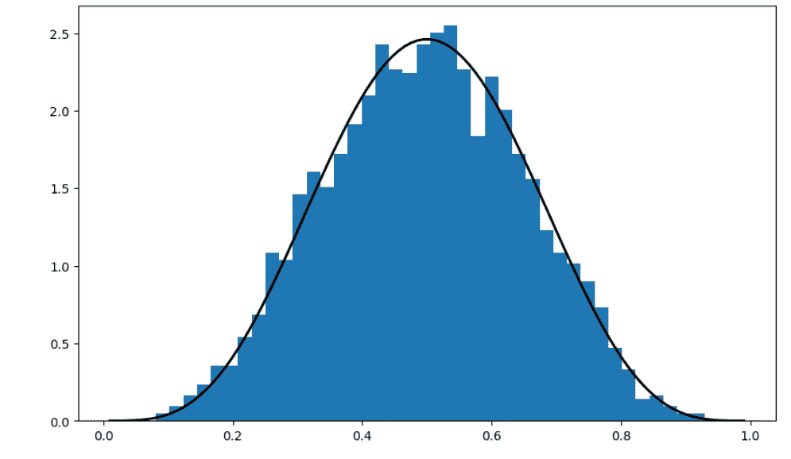

表示该分布的对象 `q` 还有其他有用的方法，包括

```python
q.cdf(0.4)    # Cumulative distribution function
```

```
0.26656768000000003
```

```python
q.ppf(0.8)    # Quantile (inverse cdf) function
```

```
0.6339134834642708
```

```python
q.mean()
```

```
0.5
```

# Python Programming for Economics and Finance

创建这些表示分布的对象（类型为 `rv_frozen`）的通用语法是

```python
name = scipy.stats.distribution_name(shape_parameters, loc=c, scale=d)
```

这里 `distribution_name` 是 `scipy.stats` 中的分布名称之一。
`loc` 和 `scale` 参数将原始随机变量 $X$ 转换为 $Y = c + dX$。

### 12.3.2 替代语法

有另一种调用上述方法的方式。
例如，生成上图的代码可以替换为

```python
obs = beta.rvs(5, 5, size=2000)
grid = np.linspace(0.01, 0.99, 100)

fig, ax = plt.subplots()
ax.hist(obs, bins=40, density=True)
ax.plot(grid, beta.pdf(grid, 5, 5), 'k-', linewidth=2)
plt.show()
```

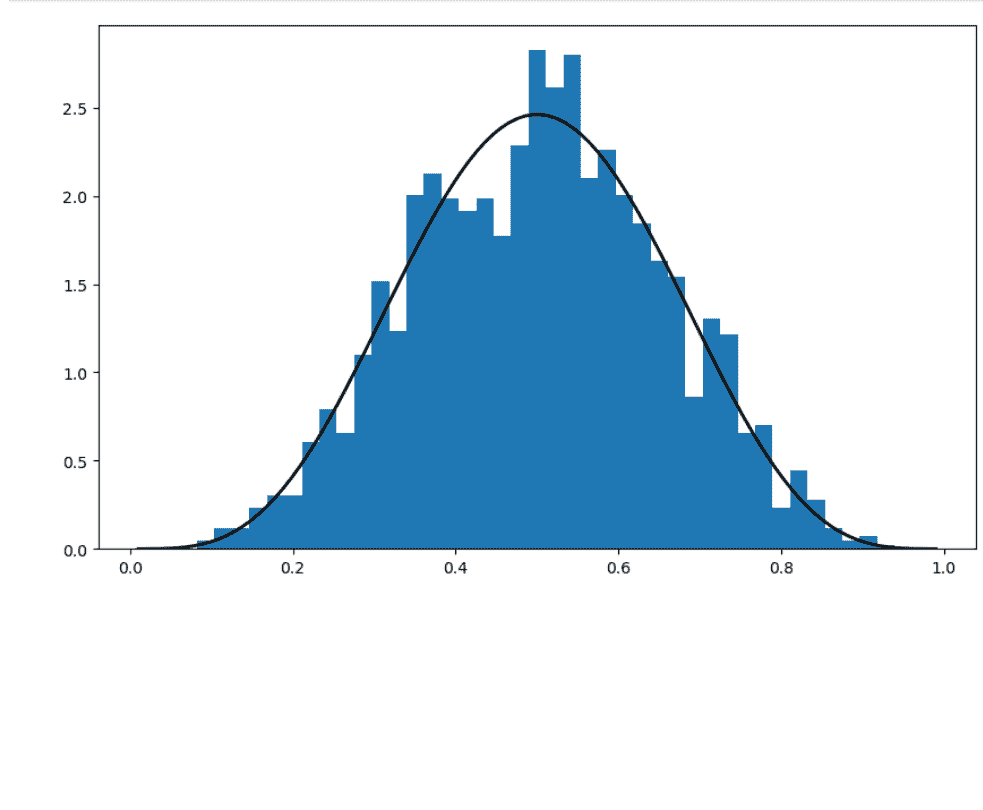

### 12.3.3 scipy.stats 中的其他好东西

`scipy.stats` 中有各种统计函数。
例如，`scipy.stats.linregress` 实现了简单线性回归

```python
from scipy.stats import linregress

x = np.random.randn(200)
y = 2 * x + 0.1 * np.random.randn(200)
gradient, intercept, r_value, p_value, std_err = linregress(x, y)
gradient, intercept
```

```
(1.995172323965754, 0.011553895772083343)
```

要查看完整列表，请查阅文档。

## 12.4 求根与不动点

实函数 $f$ 在区间 $[a, b]$ 上的**根**或**零点**是一个 $x \in [a, b]$，使得 $f(x) = 0$。
例如，如果我们绘制函数

$f(x) = \sin(4(x - 1/4)) + x + x^{20} - 1$

在 $x \in [0, 1]$ 上的图像，我们会得到

```python
f = lambda x: np.sin(4 * (x - 1/4)) + x + x**20 - 1
x = np.linspace(0, 1, 100)

fig, ax = plt.subplots()
ax.plot(x, f(x), label='$f(x)$')
ax.axhline(ls='--', c='k')
ax.set_xlabel('$x$', fontsize=12)
ax.set_ylabel('$f(x)$', fontsize=12)
ax.legend(fontsize=12)
plt.show()
```

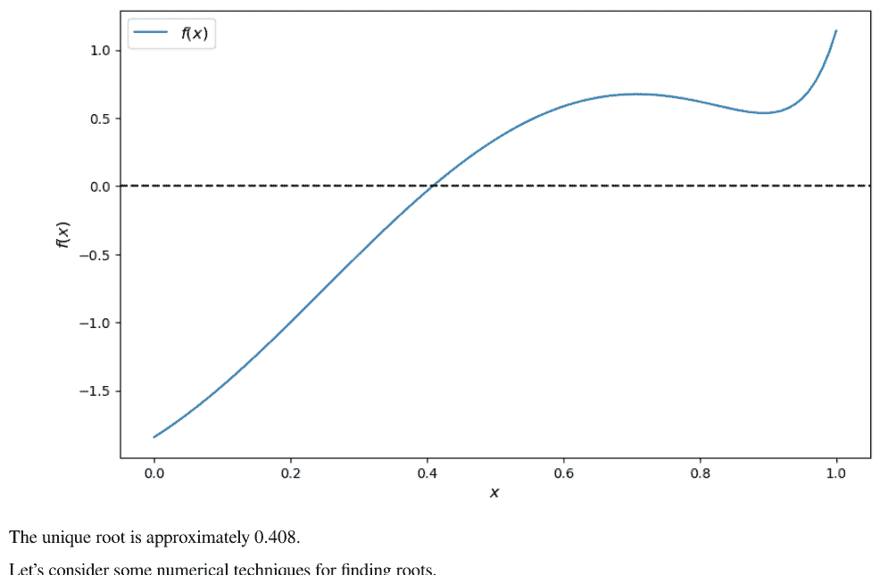

唯一的根大约是 0.408。
让我们考虑一些求根的数值技术。

### 12.4.1 二分法

最常见的数值求根算法之一是*二分法*。
要理解这个想法，回想一下那个著名的游戏：

- 玩家 A 想一个 1 到 100 之间的秘密数字
- 玩家 B 问它是否小于 50
  - 如果是，B 问它是否小于 25
  - 如果不是，B 问它是否小于 75

以此类推。
这就是二分法。
以下是该算法在 Python 中的一个简单实现。
它适用于所有足够良好的、满足 $f(a) < 0 < f(b)$ 的递增连续函数

```python
def bisect(f, a, b, tol=10e-5):
    """
    Implements the bisection root finding algorithm, assuming that f is a
    real-valued function on [a, b] satisfying f(a) < 0 < f(b).
    """
    lower, upper = a, b

    while upper - lower > tol:
        middle = 0.5 * (upper + lower)
        if f(middle) > 0:   # root is between lower and middle
            lower, upper = lower, middle
        else:               # root is between middle and upper
            lower, upper = middle, upper

    return 0.5 * (upper + lower)
```

让我们使用 (12.2) 中定义的函数 $f$ 来测试它

```python
bisect(f, 0, 1)
```

```
0.408294677734375
```

毫不奇怪，SciPy 提供了自己的二分函数。
让我们使用 (12.2) 中定义的同一个函数 $f$ 来测试它

```python
from scipy.optimize import bisect

bisect(f, 0, 1)
```

```
0.4082935042806639
```

### 12.4.2 牛顿-拉弗森法

另一种非常常见的求根算法是牛顿-拉弗森法。
在 SciPy 中，该算法由 `scipy.optimize.newton` 实现。
与二分法不同，牛顿-拉弗森法使用局部斜率信息来尝试提高收敛速度。
让我们使用上面定义的同一个函数 $f$ 来研究一下。
使用合适的搜索初始条件，我们得到了收敛：

```python
from scipy.optimize import newton

newton(f, 0.2)   # Start the search at initial condition x = 0.2
```

```
0.40829350427935673
```

但其他初始条件会导致收敛失败：

```python
newton(f, 0.7)   # Start the search at x = 0.7 instead
```

```
0.7001700000000279
```

### 12.4.3 混合方法

数值方法的一个通用原则如下：

- 如果你对给定问题有特定知识，你或许可以利用它来提高效率。
- 如果没有，那么算法的选择涉及速度和鲁棒性之间的权衡。

在实践中，大多数用于求根、优化和不动点的默认算法都使用*混合*方法。

这些方法通常以如下方式将快速方法与鲁棒方法结合起来：

1. 尝试使用快速方法
2. 检查诊断信息
3. 如果诊断信息不佳，则切换到更鲁棒的算法

在 `scipy.optimize` 中，函数 `brentq` 就是这样一种混合方法，是一个很好的默认选择

```python
from scipy.optimize import brentq

brentq(f, 0, 1)
```

```
0.40829350427936706
```

这里找到了正确的解，并且速度比二分法更快：

```python
%timeit brentq(f, 0, 1)
```

```
20.1 µs ± 170 ns per loop (mean ± std. dev. of 7 runs, 10,000 loops each)
```

```python
%timeit bisect(f, 0, 1)
```

```
80.6 µs ± 322 ns per loop (mean ± std. dev. of 7 runs, 10,000 loops each)
```

### 12.4.4 多元求根

使用 `scipy.optimize.fsolve`，它是 MINPACK 中一个混合方法的包装器。

详情请参阅文档。

### 12.4.5 不动点

实函数 $f$ 在区间 $[a, b]$ 上的**不动点**是一个 $x \in [a, b]$，使得 $f(x) = x$。

SciPy 也有一个用于寻找（标量）不动点的函数

```python
from scipy.optimize import fixed_point

fixed_point(lambda x: x**2, 10.0)  # 10.0 is an initial guess
```

```
array(1.)
```

## 12.5 优化

大多数数值软件包只提供*最小化*函数。
最大化可以通过回忆以下事实来执行：函数 $f$ 在定义域 $D$ 上的最大化点就是 $-f$ 在 $D$ 上的最小化点。
最小化与求根密切相关：对于光滑函数，内部极值点对应于一阶导数的根。
上述的速度/鲁棒性权衡在数值优化中同样存在。
除非你有一些可以利用的先验信息，否则通常最好使用混合方法。
对于有约束的单变量（即标量）最小化，一个很好的混合选择是 `fminbound`

```python
from scipy.optimize import fminbound

fminbound(lambda x: x**2, -1, 2)  # 在 [-1, 2] 中搜索
```

```
0.0
```

### 12.5.1 多变量优化

多变量局部优化器包括 `minimize`、`fmin`、`fmin_powell`、`fmin_cg`、`fmin_bfgs` 和 `fmin_ncg`。
有约束的多变量局部优化器包括 `fmin_l_bfgs_b`、`fmin_tnc`、`fmin_cobyla`。
详情请参阅[文档](https://docs.scipy.org/doc/scipy/reference/optimize.html)。

## 12.6 积分

大多数数值积分方法通过计算近似多项式的积分来工作。
由此产生的误差取决于多项式对被积函数的拟合程度，而这又取决于被积函数的“规则性”。
在 SciPy 中，与数值积分相关的模块是 `scipy.integrate`。
对于单变量积分，一个好的默认选择是 `quad`

```python
from scipy.integrate import quad

integral, error = quad(lambda x: x**2, 0, 1)
integral
```

```
0.33333333333333337
```

事实上，`quad` 是 Fortran 库 QUADPACK 中一个非常标准的数值积分例程的接口。
它使用 Clenshaw-Curtis 求积法，基于切比雪夫多项式展开。
还有其他单变量积分选项——一个有用的是 `fixed_quad`，它速度快，因此在 `for` 循环内工作良好。
还有用于多变量积分的函数。
更多详情请参阅文档。

## 12.7 线性代数

我们看到 NumPy 提供了一个名为 `linalg` 的线性代数模块。
SciPy 也提供了一个同名的线性代数模块。
后者不是前者的精确超集，但总体上功能更多。
我们留给你去研究可用的例程集。

## 12.8 练习

前几个练习涉及在风险中性假设下为欧式看涨期权定价。价格满足
$$P = \beta^n \mathbb{E} \max\{S_n - K, 0\}$$
其中
1. $\beta$ 是折现因子，
2. $n$ 是到期日，
3. $K$ 是执行价格，
4. $\{S_t\}$ 是标的资产在每个时间 $t$ 的价格。
例如，如果看涨期权是以执行价格 $K$ 购买亚马逊股票，那么所有者有权（但无义务）在 $n$ 天后以价格 $K$ 购买 1 股亚马逊股票。
因此，收益为 $\max\{S_n - K, 0\}$。
价格是收益的期望值，折现到当前价值。

**练习 12.8.1**
假设 $S_n$ 服从参数为 $\mu$ 和 $\sigma$ 的对数正态分布。令 $f$ 表示该分布的密度。那么
$$P = \beta^n \int_0^\infty \max\{x - K, 0\} f(x) dx$$
在区间 $[0, 400]$ 上绘制函数
$$g(x) = \beta^n \max\{x - K, 0\} f(x)$$
其中 $\mu$, $\sigma$, $\beta$, $n$, $K = 4$, $0.25$, $0.99$, $10$, $40$。

**提示：** 你可以从 `scipy.stats` 导入 `lognorm`，然后使用 `lognorm(x, σ, scale=np.exp(μ))` 来获取密度 $f$。

### 练习 12.8.1 的解答

这是一个可能的解决方案

```python
from scipy.integrate import quad
from scipy.stats import lognorm

μ, σ, β, n, K = 4, 0.25, 0.99, 10, 40

def g(x):
    return β**n * np.maximum(x - K, 0) * lognorm.pdf(x, σ, scale=np.exp(μ))

x_grid = np.linspace(0, 400, 1000)
y_grid = g(x_grid)

fig, ax = plt.subplots()
ax.plot(x_grid, y_grid, label="$g$")
ax.legend()
plt.show()
```

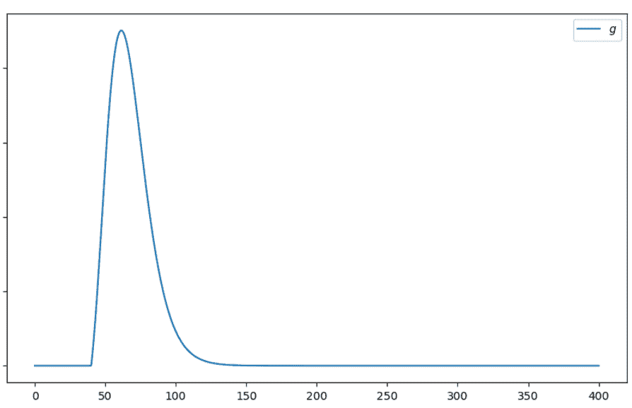

### 练习 12.8.2

为了获得期权价格，使用 `scipy.optimize` 中的 `quad` 对该函数进行数值积分。

### 练习 12.8.2 的解答

```python
P, error = quad(g, 0, 1_000)
print(f"基于数值积分的期权价格是 {P:.3f}")
```

```
基于数值积分的期权价格是 15.188
```

### 练习 12.8.3

尝试使用蒙特卡洛方法来计算期权价格中的期望项，而不是 `quad`，以获得类似的结果。
具体来说，利用以下事实：如果 $S_n^1, \dots, S_n^M$ 是从上述指定的对数正态分布中独立抽取的样本，那么根据大数定律，

$$\mathbb{E} \max\{S_n - K, 0\} \approx \frac{1}{M} \sum_{m=1}^M \max\{S_n^m - K, 0\}$$

设 $M = 10\_000\_000$

### 练习 12.8.3 的解答

这是一个解决方案：

```python
M = 10_000_000
S = np.exp(μ + σ * np.random.randn(M))
return_draws = np.maximum(S - K, 0)
P = β**n * np.mean(return_draws)
print(f"蒙特卡洛期权价格是 {P:3f}")
```

```
蒙特卡洛期权价格是 15.182483
```

### 练习 12.8.4

在*本讲*中，我们讨论了*递归函数调用*的概念。

尝试为*上述描述的*自制二分法函数编写一个递归实现。

在函数 (12.2) 上测试它。

### 练习 12.8.4 的解答

这是一个合理的解决方案：

```python
def bisect(f, a, b, tol=10e-5):
    """
    实现二分法求根算法，假设 f 是定义在 [a, b] 上的实值函数，且满足 f(a) < 0 < f(b)。
    """
    lower, upper = a, b
    if upper - lower < tol:
        return 0.5 * (upper + lower)
    else:
        middle = 0.5 * (upper + lower)
        print(f'当前中点 = {middle}')
        if f(middle) > 0:   # 意味着根在 lower 和 middle 之间
            return bisect(f, lower, middle)
        else:               # 意味着根在 middle 和 upper 之间
            return bisect(f, middle, upper)
```

我们可以如下测试它

```python
f = lambda x: np.sin(4 * (x - 0.25)) + x + x**20 - 1
bisect(f, 0, 1)
```

```
当前中点 = 0.5
当前中点 = 0.25
当前中点 = 0.375
当前中点 = 0.4375
当前中点 = 0.40625
当前中点 = 0.421875
当前中点 = 0.4140625
当前中点 = 0.41015625
当前中点 = 0.408203125
当前中点 = 0.4091796875
当前中点 = 0.40869140625
当前中点 = 0.408447265625
当前中点 = 0.4083251953125
当前中点 = 0.40826416015625
```

```
0.408294677734375
```

# 第十三章
PANDAS

+   目录
* Pandas
    - 概述
    - Series
    - DataFrames
    - 在线数据源
    - 练习

除了 Anaconda 中包含的内容外，本讲还需要以下库：

```python
!pip install --upgrade pandas-datareader
!pip install --upgrade yfinance
```

## 13.1 概述

Pandas 是一个用于 Python 的快速、高效的数据分析工具包。
近年来，随着数据科学和机器学习等领域的兴起，它的受欢迎程度激增。
以下是与 Matlab 和 STATA 的受欢迎程度随时间变化的比较，数据来自 Stack Overflow Trends

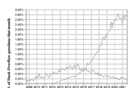

正如 NumPy 提供了基本的数组数据类型加上核心数组操作一样，pandas

+   1. 定义了处理数据的基本结构，并
2. 为它们赋予了便于执行以下操作的方法
    * 读取数据
    - 调整索引
    - 处理日期和时间序列
    - 排序、分组、重新排序和一般数据清洗¹
    - 处理缺失值，等等。

更复杂的统计功能留给了其他包，例如 `statsmodels` 和 `scikit-learn`，它们构建在 pandas 之上。

本讲将提供 pandas 的基本介绍。

在整个讲座中，我们将假设以下导入已经发生

```python
%matplotlib inline
import pandas as pd
import numpy as np
import matplotlib.pyplot as plt
plt.rcParams["figure.figsize"] = [10,8]  # 设置默认图形大小
import requests
```

pandas 定义的两个重要数据类型是 `Series` 和 `DataFrame`。

你可以将 `Series` 视为数据的“列”，例如对单个变量的观测值集合。

`DataFrame` 是一个用于存储相关数据列的二维对象。

## 13.2 Series

让我们从 Series 开始。

我们首先创建一个包含四个随机观测值的序列

```python
s = pd.Series(np.random.randn(4), name='daily returns')
s
```

```
0   -0.720017
1   -0.210659
2   -0.262305
3    0.848900
Name: daily returns, dtype: float64
```

在这里，你可以想象索引 0, 1, 2, 3 索引四家上市公司，而值是它们股票的日收益率。

Pandas `Series` 构建在 NumPy 数组之上，并支持许多类似的操作

```python
s * 100
```

```
0   -72.001671
1   -21.065885
2   -26.230458
3    84.889974
Name: daily returns, dtype: float64
```

> ¹ 维基百科将 munging 定义为将数据从一种原始形式清洗成结构化、纯净的形式。

`np.abs(s)`

```
0    0.720017
1    0.210659
2    0.262305
3    0.848900
Name: daily returns, dtype: float64
```

但 `Series` 提供的功能远不止 NumPy 数组。它们不仅拥有一些额外的（统计导向的）方法

```
s.describe()
```

```
count    4.000000
mean    -0.086020
std      0.663987
min     -0.720017
25%     -0.376733
50%     -0.236482
75%      0.054231
max      0.848900
Name: daily returns, dtype: float64
```

而且它们的索引也更加灵活

```
s.index = ['AMZN', 'AAPL', 'MSFT', 'GOOG']
s
```

```
AMZN   -0.720017
AAPL   -0.210659
MSFT   -0.262305
GOOG    0.848900
Name: daily returns, dtype: float64
```

从这个角度看，`Series` 就像快速、高效的 Python 字典（但有一个限制：字典中的所有项都必须是同一类型——在本例中是浮点数）。事实上，你可以使用与 Python 字典大部分相同的语法

```
s['AMZN']
```

```
-0.7200167069505793
```

```
s['AMZN'] = 0
s
```

```
AMZN    0.000000
AAPL   -0.210659
MSFT   -0.262305
GOOG    0.848900
Name: daily returns, dtype: float64
```

```
'AAPL' in s
```

```
True
```

## 13.3 数据框

`Series` 是单列数据，而 `DataFrame` 则是多列数据，每个变量对应一列。本质上，pandas 中的 `DataFrame` 类似于一个（高度优化的）Excel 电子表格。因此，它是一个强大的工具，用于表示和分析那些天然按行列组织的数据，通常为每一行和每一列都配有描述性索引。让我们看一个例子，它从 CSV 文件 `pandas/data/test_pwt.csv` 中读取数据，该文件来自宾夕法尼亚世界表。

该数据集包含以下指标

| 变量名 | 描述 |
| --- | --- |
| POP | 人口（以千为单位） |
| XRAT | 对美元汇率 |
| tcgdp | 按购买力平价转换的总 GDP（以百万国际美元计） |
| cc | 人均按购买力平价转换的 GDP 中消费占比（%） |
| cg | 人均按购买力平价转换的 GDP 中政府消费占比（%） |

我们将使用 `pandas` 的 `read_csv` 函数从一个 URL 读取数据。

```
df = pd.read_csv('https://raw.githubusercontent.com/QuantEcon/lecture-python-programming/master/source/_static/lecture_specific/pandas/data/test_pwt.csv')
type(df)
```

```
pandas.core.frame.DataFrame
```

以下是 `test_pwt.csv` 的内容

```
df
```

```
      country country isocode  year       POP      XRAT       tcgdp  \n0   Argentina     ARG    2000  37335.653  0.999500  2.950722e+05   
1   Australia     AUS    2000  19053.186  1.724830  5.418047e+05   
2       India     IND    2000 1006300.297 44.941600  1.728144e+06   
3      Israel     ISR    2000   6114.570  4.077330  1.292539e+05   
4      Malawi     MWI    2000  11801.505 59.543808  5.026222e+03   
5  South Africa     ZAF    2000  45064.098  6.939830  2.272424e+05   
6 United States     USA    2000 282171.957  1.000000  9.898700e+06   
7     Uruguay     URY    2000   3219.793 12.099592  2.525596e+04   

          cc         cg  
0  75.716805   5.578804  
1  67.759026   6.720098  
2  64.575551  14.072206
3  64.436451  10.266688
4  74.707624  11.658954
5  72.718710   5.726546
6  72.347054   6.032454
7  78.978740   5.108068
```

### 13.3.1 按位置选择数据

在实践中，我们经常做的一件事是查找、选择并处理我们感兴趣的数据子集。我们可以使用标准的 Python 数组切片表示法来选择特定的行

```
df[2:5]
```

```
  country country isocode  year        POP      XRAT      tcgdp \n2   India       IND    2000  1006300.297  44.941600  1.728144e+06
3  Israel       ISR    2000     6114.570   4.077330  1.292539e+05
4  Malawi       MWI    2000    11801.505  59.543808  5.026222e+03

          cc         cg
2  64.575551  14.072206
3  64.436451  10.266688
4  74.707624  11.658954
```

要选择列，我们可以传递一个包含所需列名（表示为字符串）的列表

```
df[['country', 'tcgdp']]
```

```
         country      tcgdp
0      Argentina  2.950722e+05
1      Australia  5.418047e+05
2          India  1.728144e+06
3         Israel  1.292539e+05
4         Malawi  5.026222e+03
5   South Africa  2.272424e+05
6  United States  9.898700e+06
7        Uruguay  2.525596e+04
```

要使用整数同时选择行和列，应使用 `iloc` 属性，格式为 `.iloc[行, 列]`。

```
df.iloc[2:5, 0:4]
```

```
  country country isocode  year        POP
2   India       IND    2000  1006300.297
3  Israel       ISR    2000     6114.570
4  Malawi       MWI    2000    11801.505
```

要使用整数和标签的混合方式选择行和列，可以使用 `loc` 属性，方式类似

```
df.loc[df.index[2:5], ['country', 'tcgdp']]
```

```
country          tcgdp
2   India  1.728144e+06
3  Israel  1.292539e+05
4  Malawi  5.026222e+03
```

### 13.3.2 按条件选择数据

除了使用整数和名称对行和列进行索引外，我们还可以获取满足某些（可能复杂的）条件的感兴趣的数据子框。本节将展示多种实现方法。最直接的方法是使用 [ ] 运算符。

```
df[df.POP >= 20000]
```

```
country country isocode  year          POP     XRAT          tcgdp  \n0  Argentina         ARG  2000   37335.653  0.99950  2.950722e+05   
2      India         IND  2000  1006300.297 44.94160  1.728144e+06   
5  South Africa         ZAF  2000   45064.098  6.93983  2.272424e+05   
6  United States         USA  2000  282171.957  1.00000  9.898700e+06   

          cc         cg  
0  75.716805   5.578804  
2  64.575551  14.072206  
5  72.718710   5.726546  
6  72.347054   6.032454
```

要理解这里发生了什么，请注意 `df.POP >= 20000` 返回一个布尔值的 Series。

```
df.POP >= 20000
```

```
0     True
1    False
2     True
3    False
4    False
5     True
6     True
7    False
Name: POP, dtype: bool
```

在这种情况下，`df[____]` 接收一个布尔值的 Series，并只返回值为 `True` 的行。再看一个例子，

```
df[(df.country.isin(['Argentina', 'India', 'South Africa'])) & (df.POP > 40000)]
```

```
country country isocode  year          POP     XRAT          tcgdp  \n2      India         IND  2000  1006300.297 44.94160  1.728144e+06   
5  South Africa         ZAF  2000   45064.098  6.93983  2.272424e+05   

          cc         cg
2  64.575551  14.072206
5  72.718710   5.726546
```

然而，还有另一种方法可以实现相同的功能，对于大型数据框可能稍快一些，语法也更自然。

```
# the above is equivalent to
df.query("POP >= 20000")
```

```
country country isocode  year          POP     XRAT          tcgdp  \n0  Argentina         ARG  2000   37335.653  0.99950  2.950722e+05   
2      India         IND  2000  1006300.297 44.94160  1.728144e+06   
5  South Africa         ZAF  2000   45064.098  6.93983  2.272424e+05   
6  United States         USA  2000  282171.957  1.00000  9.898700e+06   

          cc         cg  
0  75.716805   5.578804  
2  64.575551  14.072206  
5  72.718710   5.726546  
6  72.347054   6.032454
```

```
df.query("country in ['Argentina', 'India', 'South Africa'] and POP > 40000")
```

```
country country isocode  year          POP     XRAT          tcgdp  \n2      India         IND  2000  1006300.297 44.94160  1.728144e+06   
5  South Africa         ZAF  2000   45064.098  6.93983  2.272424e+05   

          cc         cg
2  64.575551  14.072206
5  72.718710   5.726546
```

我们还可以允许不同列之间进行算术运算。

```
df[(df.cc + df.cg >= 80) & (df.POP <= 20000)]
```

```
country country isocode  year       POP      XRAT      tcgdp  \n4      Malawi       MWI    2000  11801.505 59.543808  5026.221784
7     Uruguay       URY    2000   3219.793 12.099592 25255.961693

          cc         cg
4  74.707624  11.658954
7  78.978740   5.108068
```

```
# the above is equivalent to
df.query("cc + cg >= 80 & POP <= 20000")
```

```
country country isocode  year       POP      XRAT      tcgdp  \n4      Malawi       MWI    2000  11801.505 59.543808  5026.221784
7     Uruguay       URY    2000   3219.793 12.099592 25255.961693

          cc         cg
4  74.707624  11.658954
7  78.978740   5.108068
```

## 面向经济学与金融的Python编程

例如，我们可以使用条件筛选来选择家庭消费占GDP份额（cc）最大的国家。

```
df.loc[df.cc == max(df.cc)]
```

```
  country country isocode  year       POP      XRAT      tcgdp       cc
7  Uruguay       URY  2000  3219.793  12.099592  25255.961693  78.97874
          cg
7  5.108068
```

当我们只想查看选定子数据框的某些列时，可以将上述条件与`.loc[__ , __]`命令结合使用。

第一个参数接受条件，第二个参数接受我们希望返回的列的列表。

```
df.loc[(df.cc + df.cg >= 80) & (df.POP <= 20000), ['country', 'year', 'POP']]
```

```
  country  year       POP
4  Malawi  2000  11801.505
7  Uruguay  2000   3219.793
```

## 应用：数据框子集化

现实世界的数据集可能非常庞大。

有时，处理数据的子集以提高计算效率并减少冗余是可取的。

假设我们只对人口（POP）和总GDP（tcgdp）感兴趣。

一种将数据框`df`精简为仅包含这些变量的方法是使用上述选择方法覆盖数据框

```
df_subset = df[['country', 'POP', 'tcgdp']]
df_subset
```

```
          country         POP       tcgdp
0       Argentina   37335.653  2.950722e+05
1       Australia   19053.186  5.418047e+05
2           India  1006300.297  1.728144e+06
3          Israel     6114.570  1.292539e+05
4          Malawi    11801.505  5.026222e+03
5    South Africa    45064.098  2.272424e+05
6  United States   282171.957  9.898700e+06
7        Uruguay     3219.793  2.525596e+04
```

然后我们可以保存这个较小的数据集以供进一步分析。

```
df_subset.to_csv('pwt_subset.csv', index=False)
```

## 13.3.3 Apply方法

另一个广泛使用的Pandas方法是`df.apply()`。
它将一个函数应用于每一行/每一列，并返回一个序列。
这个函数可以是某些内置函数（如`max`函数）、`lambda`函数或用户定义的函数。
这里是一个使用`max`函数的示例

```
df[['year', 'POP', 'XRAT', 'tcgdp', 'cc', 'cg']].apply(max)
```

```
year      2.000000e+03
POP       1.006300e+06
XRAT      5.954381e+01
tcgdp     9.898700e+06
cc        7.897874e+01
cg        1.407221e+01
dtype: float64
```

这行代码将`max`函数应用于所有选定的列。
`lambda`函数常与`df.apply()`方法一起使用。
一个简单的例子是返回数据框中每一行本身

```
df.apply(lambda row: row, axis=1)
```

```
  country country isocode  year        POP      XRAT      tcgdp
0  Argentina       ARG  2000   37335.653  0.999500  2.950722e+05
1  Australia       AUS  2000   19053.186  1.724830  5.418047e+05
2      India       IND  2000  1006300.297 44.941600  1.728144e+06
3     Israel       ISR  2000    6114.570  4.077330  1.292539e+05
4     Malawi       MWI  2000   11801.505 59.543808  5.026222e+03
5  South Africa       ZAF  2000   45064.098  6.939830  2.272424e+05
6 United States       USA  2000  282171.957  1.000000  9.898700e+06
7     Uruguay       URY  2000    3219.793 12.099592  2.525596e+04
         cc        cg
0  75.716805  5.578804
1  67.759026  6.720098
2  64.575551 14.072206
3  64.436451 10.266688
4  74.707624 11.658954
5  72.718710  5.726546
6  72.347054  6.032454
7  78.978740  5.108068
```

**注意：** 对于`.apply()`方法

- axis = 0 – 将函数应用于每一列（变量）
- axis = 1 – 将函数应用于每一行（观测值）
- axis = 0 是默认参数

我们可以将其与`.loc[]`结合使用，以进行一些更高级的选择。

```
complexCondition = df.apply(
    lambda row: row.POP > 40000 if row.country in ['Argentina', 'India', 'South Africa'] else row.POP < 20000,
    axis=1), ['country', 'year', 'POP', 'XRAT', 'tcgdp']
```

这里的`df.apply()`返回一个布尔值序列，对应于满足if-else语句中指定条件的行。
此外，它还定义了感兴趣变量的子集。

```
complexCondition

(0    False
1     True
2     True
3     True
4     True
5     True
6    False
7     True
dtype: bool,
['country', 'year', 'POP', 'XRAT', 'tcgdp'])
```

当我们把这个条件应用到数据框时，结果将是

```
df.loc[complexCondition]

    country  year          POP      XRAT        tcgdp
1  Australia  2000   19053.186  1.724830  5.418047e+05
2      India  2000  1006300.297 44.941600  1.728144e+06
3     Israel  2000     6114.570  4.077330  1.292539e+05
4     Malawi  2000    11801.505 59.543808  5.026222e+03
5 South Africa 2000    45064.098  6.939830  2.272424e+05
7    Uruguay  2000     3219.793 12.099592  2.525596e+04
```

## 13.3.4 修改数据框

修改数据框的能力对于生成用于未来分析的干净数据集非常重要。

1. 我们可以方便地使用`df.where()`来“保留”我们选定的行，并将其余行替换为任何其他值

```
df.where(df.POP >= 20000, False)

    country country isocode  year          POP      XRAT        tcgdp
0  Argentina       ARG  2000   37335.653  0.9995  295072.21869
1     False     False False  False      False  False         False
2     India       IND  2000  1006300.297 44.9416 1728144.3748
3     False     False False  False      False  False         False
4     False     False False  False      False  False         False
5 South Africa     ZAF  2000    45064.098  6.93983 227242.36949
6 United States     USA  2000   282171.957  1.0    9898700.0
7     False     False False  False      False  False         False
          cc          cg
0  75.716805    5.578804
1       False       False
2  64.575551   14.072206
3       False       False
4       False       False
5  72.71871    5.726546
6  72.347054    6.032454
7       False       False
```

2. 我们可以简单地使用`.loc[]`来指定要修改的列，并赋值

```
df.loc[df.cg == max(df.cg), 'cg'] = np.nan
df
```

```
      country country isocode  year          POP      XRAT        tcgdp
0   Argentina       ARG  2000  37335.653  0.999500  2.950722e+05
1   Australia       AUS  2000  19053.186  1.724830  5.418047e+05
2       India       IND  2000 1006300.297 44.941600  1.728144e+06
3      Israel       ISR  2000   6114.570  4.077330  1.292539e+05
4      Malawi       MWI  2000  11801.505 59.543808  5.026222e+03
5  South Africa       ZAF  2000  45064.098  6.939830  2.272424e+05
6 United States       USA  2000 282171.957  1.000000  9.898700e+06
7     Uruguay       URY  2000   3219.793 12.099592  2.525596e+04
          cc          cg
0  75.716805    5.578804
1  67.759026    6.720098
2  64.575551         NaN
3  64.436451   10.266688
4  74.707624   11.658954
5  72.718710    5.726546
6  72.347054    6.032454
7  78.978740    5.108068
```

3. 我们可以使用`.apply()`方法来整体修改行/列

```
def update_row(row):
    # 修改 POP
    row.POP = np.nan if row.POP<= 10000 else row.POP

    # 修改 XRAT
    row.XRAT = row.XRAT / 10
    return row

df.apply(update_row, axis=1)
```

```
      country country isocode  year          POP      XRAT        tcgdp
0   Argentina       ARG  2000  37335.653  0.099950  2.950722e+05
1   Australia       AUS  2000  19053.186  0.172483  5.418047e+05
2       India       IND  2000 1006300.297  4.494160  1.728144e+06
3      Israel       ISR  2000         NaN  0.407733  1.292539e+05
4      Malawi       MWI  2000  11801.505  5.954381  5.026222e+03
5  South Africa       ZAF  2000  45064.098  0.693983  2.272424e+05
6 United States       USA  2000 282171.957  0.100000  9.898700e+06
7     Uruguay       URY  2000         NaN  1.209959  2.525596e+04
          cc          cg
0  75.716805    5.578804
1  67.759026    6.720098
2  64.575551         NaN
3  64.436451   10.266688
4  74.707624   11.658954
5  72.718710    5.726546
6  72.347054    6.032454
7  78.978740    5.108068
```

4. 我们可以使用`.applymap()`方法来整体修改数据框中的所有单独条目。

```
# 将所有小数四舍五入到2位小数
df.applymap(lambda x : round(x,2) if type(x)!=str else x)
```

| | country | country isocode | year | POP | XRAT | tcgdp | cc | cg |
|---|---|---|---|---|---|---|---|---|
| 0 | Argentina | ARG | 2000 | 37335.65 | 1.00 | 295072.22 | 75.72 | 5.58 |
| 1 | Australia | AUS | 2000 | 19053.19 | 1.72 | 541804.65 | 67.76 | 6.72 |
| 2 | India | IND | 2000 | 1006300.30 | 44.94 | 1728144.37 | 64.58 | NaN |
| 3 | Israel | ISR | 2000 | 6114.57 | 4.08 | 129253.89 | 64.44 | 10.27 |
| 4 | Malawi | MWI | 2000 | 11801.50 | 59.54 | 5026.22 | 74.71 | 11.66 |
| 5 | South Africa | ZAF | 2000 | 45064.10 | 6.94 | 227242.37 | 72.72 | 5.73 |
| 6 | United States | USA | 2000 | 282171.96 | 1.00 | 9898700.00 | 72.35 | 6.03 |
| 7 | Uruguay | URY | 2000 | 3219.79 | 12.10 | 25255.96 | 78.98 | 5.11 |

## 应用：缺失值填充

替换缺失值是数据清洗中的一个重要步骤。

让我们随机插入一些NaN值

```
for idx in list(zip([0, 3, 5, 6], [3, 4, 6, 2])):
    df.iloc[idx] = np.nan

df
```

| | country | country isocode | year | POP | XRAT | tcgdp | cc | cg |
|---|---|---|---|---|---|---|---|---|
| 0 | Argentina | ARG | 2000.0 | NaN | 0.999500 | 295072.22 | 75.72 | 5.58 |
| 1 | Australia | AUS | 2000.0 | 19053.186 | 1.724830 | 541804.65 | 67.76 | 6.72 |
| 2 | India | IND | 2000.0 | 1006300.297 | 44.941600 | 1728144.37 | 64.58 | NaN |
| 3 | Israel | ISR | 2000.0 | 6114.570 | NaN | 129253.89 | 64.44 | 10.27 |

## 面向经济学与金融的Python编程

```
4          Malawi  MWI  2000.0  11801.505  59.543808
5    South Africa  ZAF  2000.0  45064.098   6.939830
6  United States  USA     NaN  282171.957  1.000000
7        Uruguay  URY  2000.0   3219.793  12.099592

          tcgdp          cc          cg
0  2.950722e+05  75.716805    5.578804
1  5.418047e+05  67.759026    6.720098
2  1.728144e+06  64.575551         NaN
3  1.292539e+05  64.436451   10.266688
4  5.026222e+03  74.707624   11.658954
5  2.272424e+05         NaN    5.726546
6  9.898700e+06  72.347054    6.032454
7  2.525596e+04  78.978740    5.108068
```

这里的 `zip()` 函数从两个列表中创建值对（即 [0,3], [3,4] ...）

我们可以再次使用 `.applymap()` 方法将所有缺失值替换为0

```
# replace all NaN values by 0
def replace_nan(x):
    if type(x) != str:
        return 0 if np.isnan(x) else x
    else:
        return x

df.applymap(replace_nan)
```

```
        country country isocode    year          POP      XRAT  \n0      Argentina        ARG  2000.0       0.000  0.999500   
1      Australia        AUS  2000.0   19053.186  1.724830   
2          India        IND  2000.0  1006300.297 44.941600   
3          Israel        ISR  2000.0    6114.570  0.000000   
4          Malawi        MWI  2000.0   11801.505 59.543808   
5    South Africa        ZAF  2000.0   45064.098  6.939830   
6  United States        USA     0.0  282171.957  1.000000   
7        Uruguay        URY  2000.0    3219.793 12.099592   

          tcgdp          cc          cg
0  2.950722e+05  75.716805    5.578804
1  5.418047e+05  67.759026    6.720098
2  1.728144e+06  64.575551    0.000000
3  1.292539e+05  64.436451   10.266688
4  5.026222e+03  74.707624   11.658954
5  2.272424e+05   0.000000    5.726546
6  9.898700e+06  72.347054    6.032454
7  2.525596e+04  78.978740    5.108068
```

Pandas还为我们提供了方便的方法来替换缺失值。

例如，在pandas中可以轻松地使用变量均值进行单次插补

```
df = df.fillna(df.iloc[:,2:8].mean())
df
```

```
        country country isocode      year          POP       XRAT  \n0       Argentina        ARG  2000.0  1.962465e+05    0.999500   
1       Australia        AUS  2000.0  1.905319e+04    1.724830   
2           India        IND  2000.0  1.006300e+06   44.941600   
3          Israel        ISR  2000.0  6.114570e+03   18.178451   
4          Malawi        MWI  2000.0  1.180150e+04   59.543808   
5    South Africa        ZAF  2000.0  4.506410e+04    6.939830   
6   United States        USA  2000.0  2.821720e+05    1.000000   
7        Uruguay        URY  2000.0  3.219793e+03   12.099592   

         tcgdp          cc          cg  
0  2.950722e+05   75.716805    5.578804  
1  5.418047e+05   67.759026    6.720098  
2  1.728144e+06   64.575551    7.298802  
3  1.292539e+05   64.436451   10.266688  
4  5.026222e+03   74.707624   11.658954  
5  2.272424e+05   71.217322    5.726546  
6  9.898700e+06   72.347054    6.032454  
7  2.525596e+04   78.978740    5.108068
```

缺失值插补是数据科学中的一个大领域，涉及各种机器学习技术。

Python中也有更高级的工具来插补缺失值。

## 13.3.5 标准化与可视化

假设我们只对人口（POP）和总GDP（tcgdp）感兴趣。

一种将数据框`df`精简到仅包含这些变量的方法是使用上述选择方法覆盖数据框

```
df = df[['country', 'POP', 'tcgdp']]
df
```

```
        country          POP       tcgdp
0       Argentina  1.962465e+05  2.950722e+05
1       Australia  1.905319e+04  5.418047e+05
2           India  1.006300e+06  1.728144e+06
3          Israel  6.114570e+03  1.292539e+05
4          Malawi  1.180150e+04  5.026222e+03
5    South Africa  4.506410e+04  2.272424e+05
6   United States  2.821720e+05  9.898700e+06
7        Uruguay  3.219793e+03  2.525596e+04
```

这里的索引0, 1, ..., 7是多余的，因为我们可以使用国家名称作为索引。

为此，我们将数据框的索引设置为国家变量

```
df = df.set_index('country')
df
```

```
                POP       tcgdp
country                        
Argentina  1.962465e+05  2.950722e+05
Australia      1.905319e+04  5.418047e+05
India          1.006300e+06  1.728144e+06
Israel         6.114570e+03  1.292539e+05
Malawi         1.180150e+04  5.026222e+03
South Africa   4.506410e+04  2.272424e+05
United States  2.821720e+05  9.898700e+06
Uruguay        3.219793e+03  2.525596e+04
```

让我们给列起一个稍微好点的名字

```
df.columns = ['population', 'total GDP']
df
```

| country | population | total GDP |
|---|---|---|
| Argentina | 1.962465e+05 | 2.950722e+05 |
| Australia | 1.905319e+04 | 5.418047e+05 |
| India | 1.006300e+06 | 1.728144e+06 |
| Israel | 6.114570e+03 | 1.292539e+05 |
| Malawi | 1.180150e+04 | 5.026222e+03 |
| South Africa | 4.506410e+04 | 2.272424e+05 |
| United States | 2.821720e+05 | 9.898700e+06 |
| Uruguay | 3.219793e+03 | 2.525596e+04 |

`population`变量的单位是千，让我们将其转换为单个单位

```
df['population'] = df['population'] * 1e3
df
```

| country | population | total GDP |
|---|---|---|
| Argentina | 1.962465e+08 | 2.950722e+05 |
| Australia | 1.905319e+07 | 5.418047e+05 |
| India | 1.006300e+09 | 1.728144e+06 |
| Israel | 6.114570e+06 | 1.292539e+05 |
| Malawi | 1.180150e+07 | 5.026222e+03 |
| South Africa | 4.506410e+07 | 2.272424e+05 |
| United States | 2.821720e+08 | 9.898700e+06 |
| Uruguay | 3.219793e+06 | 2.525596e+04 |

接下来，我们将添加一列显示人均实际GDP，由于总GDP单位是百万，计算时需要乘以1,000,000

```
df['GDP percap'] = df['total GDP'] * 1e6 / df['population']
df
```

| country | population | total GDP | GDP percap |
|---|---|---|---|
| Argentina | 1.962465e+08 | 2.950722e+05 | 1503.579625 |
| Australia | 1.905319e+07 | 5.418047e+05 | 28436.433261 |
| India | 1.006300e+09 | 1.728144e+06 | 1717.324719 |
| Israel | 6.114570e+06 | 1.292539e+05 | 21138.672749 |
| Malawi | 1.180150e+07 | 5.026222e+03 | 425.896679 |
| South Africa | 4.506410e+07 | 2.272424e+05 | 5042.647686 |
| United States | 2.821720e+08 | 9.898700e+06 | 35080.381854 |
| Uruguay | 3.219793e+06 | 2.525596e+04 | 7843.970620 |

pandas `DataFrame` 和 `Series` 对象的优点之一是它们具有通过Matplotlib进行绘图和可视化的方法。

例如，我们可以轻松生成人均GDP的条形图

```
ax = df['GDP percap'].plot(kind='bar')
ax.set_xlabel('country', fontsize=12)
ax.set_ylabel('GDP per capita', fontsize=12)
plt.show()
```

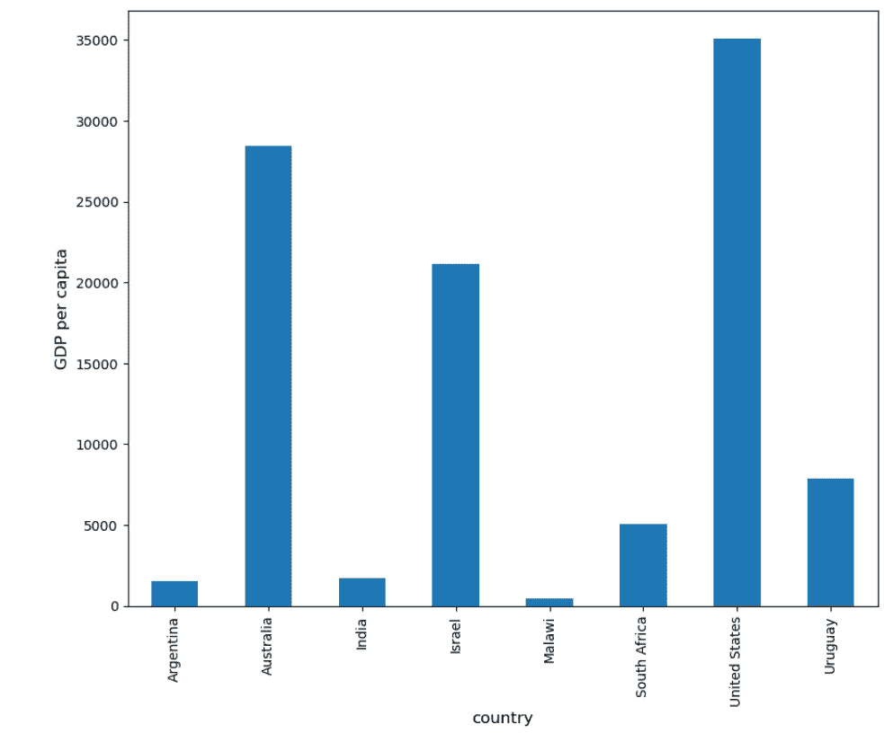

目前数据框是按国家字母顺序排列的——让我们将其改为按人均GDP排序

```
df = df.sort_values(by='GDP percap', ascending=False)
df
```

| country | population | total GDP | GDP percap |
|---|---|---|---|
| United States | 2.821720e+08 | 9.898700e+06 | 35080.381854 |
| Australia | 1.905319e+07 | 5.418047e+05 | 28436.433261 |
| Israel | 6.114570e+06 | 1.292539e+05 | 21138.672749 |
| Uruguay | 3.219793e+06 | 2.525596e+04 | 7843.970620 |
| South Africa | 4.506410e+07 | 2.272424e+05 | 5042.647686 |
| India | 1.006300e+09 | 1.728144e+06 | 1717.324719 |
| Argentina | 1.962465e+08 | 2.950722e+05 | 1503.579625 |
| Malawi | 1.180150e+07 | 5.026222e+03 | 425.896679 |

现在像之前一样绘图会得到

```
ax = df['GDP percap'].plot(kind='bar')
ax.set_xlabel('country', fontsize=12)
ax.set_ylabel('GDP per capita', fontsize=12)
plt.show()
```

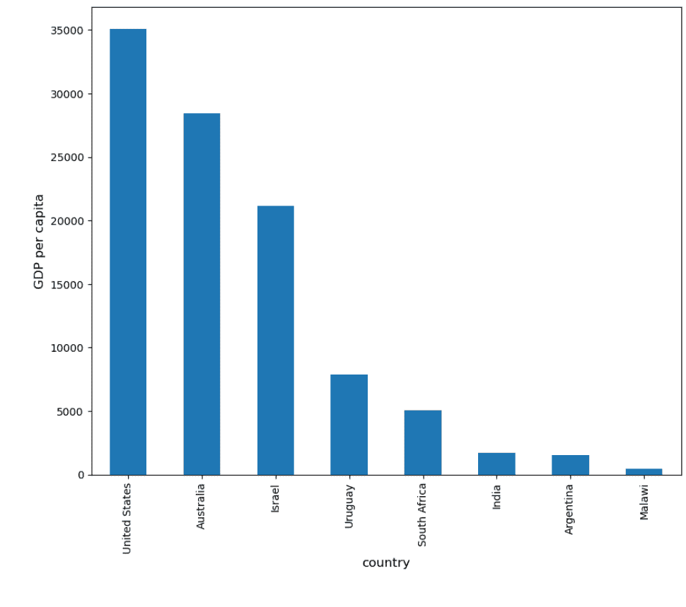

## 13.4 在线数据源

Python使得通过编程方式查询在线数据库变得简单直接。
对于经济学家来说，一个重要的数据库是FRED——由圣路易斯联储维护的庞大时间序列数据集合。
例如，假设我们对失业率感兴趣。
通过FRED，可以直接在浏览器中输入以下URL下载美国平民失业率的完整序列（注意这需要互联网连接）

```
https://research.stlouisfed.org/fred2/series/UNRATE/downloaddata/UNRATE.csv
```

（或者，点击这里：https://research.stlouisfed.org/fred2/series/UNRATE/downloaddata/UNRATE.csv）
此请求返回一个CSV文件，将由您默认的此类文件应用程序处理。
或者，我们可以在Python程序中访问CSV文件。
这可以通过多种方法完成。
我们从一个相对底层的方法开始，然后再回到pandas。

### 13.4.1 使用requests访问数据

一个选择是使用`requests`，一个用于通过互联网请求数据的标准Python库。
首先，在您的计算机上尝试以下代码

```
r = requests.get('http://research.stlouisfed.org/fred2/series/UNRATE/downloaddata/UNRATE.csv')
```

如果没有错误消息，则调用成功。
如果您确实收到错误，则有两个可能的原因

1.  您未连接到互联网——希望情况并非如此。
2.  您的机器通过代理服务器访问互联网，而Python不知道这一点。

在第二种情况下，您可以

-   切换到另一台机器
-   通过阅读文档解决您的代理问题

假设一切正常，您现在可以继续使用调用`requests.get('http://research.stlouisfed.org/fred2/series/UNRATE/downloaddata/UNRATE.csv')`返回的源对象

```
url = 'http://research.stlouisfed.org/fred2/series/UNRATE/downloaddata/UNRATE.csv'
source = requests.get(url).content.decode().split("\n")
source[0]
```

```
'DATE,VALUE\r'
```

```
source[1]
```

我们现在可以编写一些额外的代码来解析这段文本并将其存储为数组。
但这没有必要——pandas的`read_csv`函数可以为我们处理这个任务。
我们使用`parse_dates=True`，这样pandas就能识别我们的日期列，从而方便地进行日期筛选。

```python
data = pd.read_csv(url, index_col=0, parse_dates=True)
```

数据已被读入一个名为`data`的pandas DataFrame中，我们现在可以像往常一样对其进行操作。

```python
type(data)
```

```
pandas.core.frame.DataFrame
```

```python
data.head()  # 一个快速查看数据框的有用方法
```

```
            VALUE
DATE
1948-01-01     3.4
1948-02-01     3.8
1948-03-01     4.0
1948-04-01     3.9
1948-05-01     3.5
```

```python
pd.set_option('display.precision', 1)
data.describe()  # 你的输出可能略有不同
```

```
       VALUE
count  911.0
mean     5.7
std      1.7
min      2.5
25%      4.4
50%      5.5
75%      6.7
max     14.7
```

我们还可以如下绘制2006年至2012年的失业率图表。

```python
ax = data['2006':'2012'].plot(title='US Unemployment Rate', legend=False)
ax.set_xlabel('year', fontsize=12)
ax.set_ylabel('%', fontsize=12)
plt.show()
```

请注意，pandas还提供了许多其他文件类型选项。
pandas拥有多种顶级方法，我们可以用它们来读取excel、json、parquet文件，或直接连接到数据库服务器。

## 13.4.2 使用pandas_datareader和yfinance获取数据

pandas的开发者还创建了一个名为pandas_datareader的库，它允许我们直接从Jupyter notebook以编程方式访问许多数据源。
虽然一些数据源需要访问密钥，但许多最重要的数据源（例如，FRED、OECD、EUROSTAT和世界银行）都是免费使用的。
我们还将在练习中使用yfinance从雅虎财经获取数据。
现在，让我们通过一个下载和绘制数据的示例来学习——这次的数据来自世界银行。

> **注意：** 还有其他python库可用于处理世界银行数据，例如wbgapi

世界银行收集并整理了大量指标的数据。
例如，这里有一些关于政府债务占GDP比例的数据。

下一个代码示例为你获取数据，并绘制美国和澳大利亚的时间序列图。

```python
from pandas_datareader import wb

govt_debt = wb.download(indicator='GC.DOD.TOTL.GD.ZS', country=['US', 'AU'],
                        start=2005, end=2016).stack().unstack(0)
ind = govt_debt.index.droplevel(-1)
govt_debt.index = ind
ax = govt_debt.plot(lw=2)
ax.set_xlabel('year', fontsize=12)
plt.title("Government Debt to GDP (%)")
plt.show()
```

文档提供了更多关于如何访问各种数据源的详细信息。

## 13.5 练习

### 练习 13.5.1

使用以下导入：

```python
import datetime as dt
import yfinance as yf
```

编写一个程序，计算以下股票在2021年的价格变化百分比：

```python
ticker_list = {'INTC': 'Intel',
               'MSFT': 'Microsoft',
               'IBM': 'IBM',
               'BHP': 'BHP',
               'TM': 'Toyota',
               'AAPL': 'Apple',
               'AMZN': 'Amazon',
               'C': 'Citigroup',
               'QCOM': 'Qualcomm',
               'KO': 'Coca-Cola',
               'GOOG': 'Google'}
```

这是程序的第一部分。

```python
def read_data(ticker_list,
              start=dt.datetime(2021, 1, 1),
              end=dt.datetime(2021, 12, 31)):
    """
    此函数从雅虎财经读取ticker_list中每个股票的收盘价数据。
    """
    ticker = pd.DataFrame()

    for tick in ticker_list:
        stock = yf.Ticker(tick)
        prices = stock.history(start=start, end=end)

        # 将索引更改为仅日期
        prices.index = pd.to_datetime(prices.index.date)

        closing_prices = prices['Close']
        ticker[tick] = closing_prices

    return ticker

ticker = read_data(ticker_list)
```

完成程序，将结果绘制为如下所示的条形图。

### 练习 13.5.1 的解答

有几种方法可以使用Pandas来计算百分比变化。

首先，你可以提取数据并进行计算，例如：

```python
p1 = ticker.iloc[0]    # 获取第一组价格作为Series
p2 = ticker.iloc[-1]   # 获取最后一组价格作为Series
price_change = (p2 - p1) / p1 * 100
price_change
```

```
INTC      6.9
MSFT     57.2
IBM      18.7
BHP     -10.5
TM       20.1
AAPL     38.6
AMZN      5.8
C         3.6
QCOM     25.3
KO       14.9
GOOG     69.0
dtype: float64
```

或者，你可以使用内置方法`pct_change`，并通过`periods`参数配置它来执行正确的计算。

```python
change = ticker.pct_change(periods=len(ticker)-1, axis='rows')*100
price_change = change.iloc[-1]
price_change
```

```
INTC      6.9
MSFT     57.2
IBM      18.7
BHP     -10.5
TM       20.1
AAPL     38.6
AMZN      5.8
C         3.6
QCOM     25.3
KO       14.9
GOOG     69.0
Name: 2021-12-30 00:00:00, dtype: float64
```

然后绘制图表。

```python
price_change.sort_values(inplace=True)
price_change = price_change.rename(index=ticker_list)
fig, ax = plt.subplots(figsize=(10,8))
ax.set_xlabel('stock', fontsize=12)
ax.set_ylabel('percentage change in price', fontsize=12)
price_change.plot(kind='bar', ax=ax)
plt.show()
```

```
/tmp/ipykernel_2259/232489783.py:1: SettingWithCopyWarning:
A value is trying to be set on a copy of a slice from a DataFrame

See the caveats in the documentation: https://pandas.pydata.org/pandas-docs/stable/user_guide/indexing.html#returning-a-view-versus-a-copy
  price_change.sort_values(inplace=True)
```

### 练习 13.5.2

使用练习 13.5.1 中介绍的`read_data`方法，编写一个程序来获取以下指数的逐年百分比变化：

```python
indices_list = {'^GSPC': 'S&P 500',
                '^IXIC': 'NASDAQ',
                '^DJI': 'Dow Jones',
                '^N225': 'Nikkei'}
```

完成程序以显示汇总统计信息，并将结果绘制为如下所示的时间序列图。

### 练习 13.5.2 的解答

根据你在练习 13.5.1 中所做的工作，你可以通过相应地更新开始和结束日期，使用`read_data`来查询数据。

```python
indices_data = read_data(
    indices_list,
    start=dt.datetime(1971, 1, 1),  # 公共起始日期
    end=dt.datetime(2021, 12, 31)
)
```

然后，提取每年的第一组和最后一组价格作为DataFrame，并计算年度回报率，例如：

```python
yearly_returns = pd.DataFrame()

for index, name in indices_list.items():
    p1 = indices_data.groupby(indices_data.index.year)[index].first()  # 获取第一组回报率作为DataFrame
    p2 = indices_data.groupby(indices_data.index.year)[index].last()   # 获取最后一组回报率作为DataFrame
    returns = (p2 - p1) / p1
    yearly_returns[name] = returns

yearly_returns
```

|      | S&P 500 | NASDAQ | Dow Jones | Nikkei |
|------|---------|--------|-----------|--------|
| 1971 | 1.2e-01 | 1.4e-01| NaN       | 3.6e-01|
| 1972 | 1.6e-01 | 1.8e-01| NaN       | 9.2e-01|
| 1973 | -1.8e-01| -3.2e-01| NaN      | -1.8e-01|
| 1974 | -3.0e-01| -3.5e-01| NaN      | -9.9e-02|
| 1975 | 2.8e-01 | 2.8e-01| NaN       | 1.7e-01|
| 1976 | 1.8e-01 | 2.5e-01| NaN       | 1.3e-01|
| 1977 | -1.1e-01| 7.5e-02| NaN       | -2.7e-02|
| 1978 | 2.4e-02 | 1.3e-01| NaN       | 2.3e-01|
| 1979 | 1.2e-01 | 2.8e-01| NaN       | 8.7e-02|
| 1980 | 2.8e-01 | 3.7e-01| NaN       | 7.7e-02|
| 1981 | -1.0e-01| -3.8e-02| NaN      | 7.4e-02|
| 1982 | 1.5e-01 | 1.9e-01| NaN       | 3.9e-02|
| 1983 | 1.9e-01 | 2.1e-01| NaN       | 2.3e-01|
| 1984 | 2.0e-02 | -1.1e-01| NaN      | 1.6e-01|
| 1985 | 2.8e-01 | 3.2e-01| NaN       | 1.3e-01|
| 1986 | 1.6e-01 | 7.3e-02| NaN       | 4.4e-01|
| 1987 | 2.6e-03 | -6.4e-02| NaN      | 1.5e-01|
| 1988 | 8.5e-02 | 1.3e-01| NaN       | 4.2e-01|
| 1989 | 2.8e-01 | 2.0e-01| NaN       | 2.9e-01|
| 1990 | -8.2e-02| -1.9e-01| NaN      | -3.8e-01|
| 1991 | 2.8e-01 | 5.8e-01| NaN       | -4.5e-02|
| 1992 | 4.4e-02 | 1.5e-01| 4.1e-02   | -2.9e-01|
| 1993 | 7.1e-02 | 1.6e-01| 1.3e-01   | 2.5e-02|
| 1994 | -1.3e-02| -2.4e-02| 2.1e-02  | 1.4e-01|
| 1995 | 3.4e-01 | 4.1e-01| 3.3e-01   | 9.4e-03|
| 1996 | 1.9e-01 | 2.2e-01| 2.5e-01   | -6.1e-02|
| 1997 | 3.2e-01 | 2.3e-01| 2.3e-01   | -2.2e-01|
| 1998 | 2.6e-01 | 3.9e-01| 1.5e-01   | -7.5e-02|
| 1999 | 2.0e-01 | 8.4e-01| 2.5e-01   | 4.1e-01|
| 2000 | -9.3e-02| -4.0e-01| -5.0e-02 | -2.7e-01|
| 2001 | -1.1e-01| -1.5e-01| -5.9e-02 | -2.3e-01|
| 2002 | -2.4e-01| -3.3e-01| -1.7e-01 | -2.1e-01|
| 2003 | 2.2e-01 | 4.5e-01| 2.1e-01   | 2.3e-01|
| 2004 | 9.3e-02 | 8.4e-02| 3.6e-02   | 6.1e-02|
| 2005 | 3.8e-02 | 2.5e-02| -1.1e-03  | 4.0e-01|
| 2006 | 1.2e-01 | 7.6e-02| 1.5e-01   | 5.3e-02|
| 2007 | 3.7e-02 | 9.5e-02| 6.3e-02   | -1.2e-01|
| 2008 | -3.8e-01| -4.0e-01| -3.3e-01 | -4.0e-01|
| 2009 | 2.0e-01 | 3.9e-01| 1.5e-01   | 1.7e-01|
| 2010 | 1.1e-01 | 1.5e-01| 9.4e-02   | -4.0e-02|
| 2011 | -1.1e-02| -3.2e-02| 4.7e-02  | -1.9e-01|
| 2012 | 1.2e-01 | 1.4e-01| 5.7e-02   | 2.1e-01|
| 2013 | 2.6e-01 | 3.4e-01| 2.4e-01   | 5.2e-01|
| 2014 | 1.2e-01 | 1.4e-01| 8.4e-02   | 9.7e-02|
| 2015 | -6.9e-03| 5.9e-02| -2.3e-02  | 9.3e-02|
| 2016 | 1.1e-01 | 9.8e-02| 1.5e-01   | 3.6e-02|
| 2017 | 1.8e-01 | 2.7e-01| 2.4e-01   | 1.6e-01|
| 2018 | -7.0e-02| -5.3e-02| -6.0e-02 | -1.5e-01|
| 2019 | 2.9e-01 | 3.5e-01| 2.2e-01   | 2.1e-01|
| 2020 | 1.5e-01 | 4.2e-01| 6.0e-02   | 1.8e-01|
| 2021 | 2.9e-01 | 2.4e-01| 2.0e-01   | 5.6e-02|

接下来，你可以使用`describe`方法获取汇总统计信息。

```python
yearly_returns.describe()
```

```
        S&P 500    NASDAQ  Dow Jones    Nikkei
count  5.1e+01  5.1e+01   3.0e+01   5.1e+01
mean   9.2e-02  1.3e-01   9.1e-02   7.9e-02
std    1.6e-01  2.5e-01   1.4e-01   2.4e-01
min   -3.8e-01 -4.0e-01  -3.3e-01  -4.0e-01
25%   -2.2e-03  1.6e-04   2.5e-02  -6.8e-02
```

## 第十四章

## SYMPY

- *SymPy*
  - *概述*
  - *入门*
  - *符号代数*
  - *符号微积分*
  - *绘图*
  - *应用：两人交换经济*
  - *练习*

## 14.1 概述

与处理数值的数值库不同，SymPy 专注于直接操作数学符号和表达式。

SymPy 提供了广泛的功能，包括

- 符号表达式
- 方程求解
- 化简
- 微积分
- 矩阵
- 离散数学等。

这些功能使 SymPy 成为其他专有符号计算软件（如 Mathematica）的流行开源替代品。

在本讲中，我们将探索 SymPy 的一些功能，并演示如何使用基本的 SymPy 函数来求解经济模型。

## 14.2 入门

让我们首先导入库并初始化用于符号输出的打印机

```python
from sympy import *
from sympy.plotting import plot, plot3d_parametric_line, plot3d
from sympy.solvers.inequalities import reduce_rational_inequalities
from sympy.stats import Poisson, Exponential, Binomial, density, moment, E, cdf

import numpy as np
import matplotlib.pyplot as plt

# Enable the mathjax printer
init_printing(use_latex='mathjax')
```

## 14.3 符号代数

### 14.3.1 符号

首先，我们初始化一些要使用的符号

```python
x, y, z = symbols('x y z')
```

符号是 SymPy 中符号计算的基本单元。

### 14.3.2 表达式

我们现在可以使用符号 x、y 和 z 来构建表达式和方程。
这里我们先构建一个简单的表达式

```python
expr = (x+y) ** 2
expr
```

$(x + y)^2$

我们可以使用 `expand` 函数展开这个表达式

```python
expand_expr = expand(expr)
expand_expr
```

$x^2 + 2xy + y^2$

并使用 `factor` 函数将其因式分解回因式形式

```python
factor(expand_expr)
```

$(x + y)^2$

我们可以求解这个表达式

```python
solve(expr)
```

$[\{x : -y\}]$

请注意，这等同于求解以下关于 x 的方程

$(x + y)^2 = 0$

> **注意：** 求解器是一个重要的模块，包含用于求解不同类型方程的工具。
SymPy 中有各种各样的求解器，具体取决于问题的性质。

### 14.3.3 方程

SymPy 提供了多个函数来操作方程。
让我们用之前定义的表达式来构建一个方程

```python
eq = Eq(expr, 0)
eq
```

$(x + y)^2 = 0$

求解这个关于 $x$ 的方程，其输出与直接求解表达式相同

```python
solve(eq, x)
```

$[-y]$

SymPy 可以处理具有多个解的方程

```python
eq = Eq(expr, 1)
solve(eq, x)
```

$[1 - y, -y - 1]$

`solve` 函数也可以将多个方程组合在一起，求解方程组

```python
eq2 = Eq(x, y)
eq2
```

$x = y$

```python
solve([eq, eq2], [x, y])
```

$\left[\left(-\frac{1}{2}, -\frac{1}{2}\right), \left(\frac{1}{2}, \frac{1}{2}\right)\right]$

我们也可以通过简单地将 $x$ 替换为 $y$ 来求解 $y$ 的值

```python
expr_sub = expr.subs(x, y)
expr_sub
```

$4y^2$

```python
solve(Eq(expr_sub, 1))
```

$\left[-\frac{1}{2}, \frac{1}{2}\right]$

下面是另一个使用 `Eq` 函数、包含符号 $x$ 以及函数 $\sin$、$\cos$ 和 $\tan$ 的方程示例

```python
# Create an equation
eq = Eq(cos(x) / (tan(x)/sin(x)), 0)
eq
```

$\frac{\sin(x)\cos(x)}{\tan(x)} = 0$

现在我们使用 `simplify` 函数化简这个方程

```python
# Simplify an expression
simplified_expr = simplify(eq)
simplified_expr
```

$\cos^2(x) = 0$

同样，我们使用 `solve` 函数来求解这个方程

```python
# Solve the equation
sol = solve(eq, x)
sol
```

$$\left[\frac{\pi}{2}, \frac{3\pi}{2}\right]$$

SymPy 也可以处理涉及三角函数和复数的更复杂的方程。
我们使用欧拉公式来演示这一点

```python
# 'I' represents the imaginary number i
euler = cos(x) + I*sin(x)
euler
```

$$i \sin(x) + \cos(x)$$

```python
simplify(euler)
```

$$e^{ix}$$

如果您感兴趣，我们鼓励您阅读关于三角函数和复数的讲座。

### 示例：不动点计算

不动点计算在经济学和金融学中经常使用。
这里我们求解索洛-斯旺增长动态的不动点：
$$k_{t+1} = s f(k_t) + (1 - \delta)k_t, \quad t = 0, 1, \dots$$
其中 $k_t$ 是资本存量，$f$ 是生产函数，$\delta$ 是折旧率。
我们感兴趣的是计算这个动态的不动点，即使得 $k_{t+1} = k_t$ 的 $k$ 值。
当 $f(k) = Ak^\alpha$ 时，我们可以用纸笔证明该动态的唯一不动点 $k^*$：
$$k^* := \left(\frac{sA}{\delta}\right)^{1/(1-\alpha)}$$
这可以在 SymPy 中轻松计算

```python
A, s, k, a, δ = symbols('A s k^* a δ')
```

现在我们求解不动点 $k^*$
$$k^* = sA(k^*)^\alpha + (1 - \delta)k^*$$

```python
# Define Solow-Swan growth dynamics
solow = Eq(s*A*k**a + (1-δ)*k, k)
solow
```

$A(k^*)^\alpha s + k^*(1-\delta) = k^*$

```python
solve(solow, k)
```

$\left[\left(\frac{As}{\delta}\right)^{-\frac{1}{\alpha-1}}\right]$

### 14.3.4 不等式与逻辑

SymPy 还允许用户定义不等式和集合运算符，并提供广泛的运算。

```python
reduce_inequalities([2*x + 5*y <= 30, 4*x + 2*y <= 20], [x])
```

$x \leq 5 - \frac{y}{2} \wedge x \leq 15 - \frac{5y}{2} \wedge -\infty < x$

```python
And(2*x + 5*y <= 30, x > 0)
```

$2x + 5y \leq 30 \wedge x > 0$

### 14.3.5 级数

级数在经济学和统计学中广泛使用，从资产定价到离散随机变量的期望。
我们可以使用 `Sum` 函数和 `Indexed` 符号构建一个简单的求和级数

```python
x, y, i, j = symbols("x y i j")
sum_xy = Sum(Indexed('x', i)*Indexed('y', j),
            (i, 0, 3),
            (j, 0, 3))
sum_xy
```

$\sum_{0 \leq i \leq 3} \sum_{0 \leq j \leq 3} x_i y_j$

为了计算这个和，我们可以将公式 `lambdify`。
Lambdified 表达式可以接受 $x$ 和 $y$ 的数值作为输入并计算结果

```python
sum_xy = lambdify([x, y], sum_xy)
grid = np.arange(0, 4, 1)
sum_xy(grid, grid)
```

36

### 示例：银行存款

想象一家银行在时间 $t$ 有存款 $D_0$。

它将存款的 $(1 - r)$ 用于贷款，并保留 $r$ 作为现金准备金。

其在无限时间范围内的存款可以写为

$$\sum_{i=0}^{\infty} (1 - r)^i D_0$$

让我们计算时间 $t$ 的存款

```python
D = symbols('D_0')
r = Symbol('r', positive=True)
Dt = Sum('(1 - r)^i * D_0', (i, 0, oo))
Dt
```

$$\sum_{i=0}^{\infty} D_0 (1 - r)^i$$

我们可以调用 `doit` 方法来计算这个级数

```python
Dt.doit()
```

$$D_0 \left( \begin{cases} \frac{1}{r} & \text{for } |r - 1| < 1 \\ \sum_{i=0}^{\infty} (1 - r)^i & \text{otherwise} \end{cases} \right)$$

化简上面的表达式得到

```python
simplify(Dt.doit())
```

$$\begin{cases} \frac{D_0}{r} & \text{for } r > 0 \land r < 2 \\ D_0 \sum_{i=0}^{\infty} (1 - r)^i & \text{otherwise} \end{cases}$$

这与 [几何级数](https://python-programming-for-economics-and-finance.readthedocs.io/en/latest/geometric_series.html) 讲座中的解法一致。

### 示例：离散随机变量

在下面的例子中，我们计算一个离散随机变量的期望。
让我们定义一个服从泊松分布的离散随机变量 $X$：

$$f(x) = \frac{\lambda^x e^{-\lambda}}{x!}, \quad x = 0, 1, 2, \dots$$

```python
λ = symbols('lambda')

# We refine the symbol x to positive integers
x = Symbol('x', integer=True, positive=True)
pmf = λ**x * exp(-λ) / factorial(x)
pmf
```

$$\frac{\lambda^x e^{-\lambda}}{x!}$$

我们可以验证所有可能值的概率之和是否等于 1：

$$\sum_{x=0}^{\infty} f(x) = 1$$

```python
sum_pmf = Sum(pmf, (x, 0, oo))
sum_pmf.doit()
```

$$1$$

该分布的期望是：

$$E(X) = \sum_{x=0}^{\infty} x f(x)$$

```python
fx = Sum(x*pmf, (x, 0, oo))
fx.doit()
```

$$\lambda$$

SymPy 包含一个名为 `Stats` 的统计子模块。
`Stats` 提供了内置的分布和概率分布函数。
上面的计算也可以使用 `Stats` 模块中的期望函数 `E` 简化为一行

```python
λ = Symbol("λ", positive = True)

# Using sympy.stats.Poisson() method
X = Poisson("x", λ)
E(X)
```

$$\lambda$$

## 14.4 符号微积分

SymPy 允许我们执行各种微积分运算，例如极限、微分和积分。

### 14.4.1 极限

我们可以使用 `limit` 函数计算给定表达式的极限

```python
# 定义一个表达式
f = x**2 / (x-1)

# 计算极限
lim = limit(f, x, 0)
lim
```

0

### 14.4.2 导数

我们可以使用 `diff` 函数对任何 SymPy 表达式进行微分

```python
# 对函数关于 x 求导
df = diff(f, x)
df
```

$$-\frac{x^2}{(x-1)^2} + \frac{2x}{x-1}$$

### 14.4.3 积分

我们可以使用 `integrate` 函数计算定积分和不定积分

```python
# 计算不定积分
indef_int = integrate(df, x)
indef_int
```

$$x + \frac{1}{x-1}$$

让我们使用这个函数来计算概率密度函数为以下形式的 `指数分布` 的矩生成函数：

$$f(x) = \lambda e^{-\lambda x}, \quad x \geq 0$$

```python
λ = Symbol('lambda', positive=True)
x = Symbol('x', positive=True)
pdf = λ * exp(-λ*x)
pdf
```

$$\lambda e^{-\lambda x}$$

```python
t = Symbol('t', positive=True)
moment_t = integrate(exp(t*x) * pdf, (x, 0, oo))
simplify(moment_t)
```

$$\begin{cases} \frac{\lambda}{\lambda - t} & \text{for } \lambda > t \land \frac{\lambda}{t} \neq 1 \\ \lambda \int_{0}^{\infty} e^{x(-\lambda + t)} dx & \text{otherwise} \end{cases}$$

请注意，我们也可以使用统计模块来计算矩

```python
X = Exponential(x, λ)
```

```python
moment(X, 1)
```

$$\frac{1}{\lambda}$$

```python
E(X**t)
```

$$\lambda^{-t} \Gamma(t + 1)$$

使用 integrate 函数，我们可以推导出 $\lambda = 0.5$ 时指数分布的累积密度函数

```python
λ_pdf = pdf.subs(λ, 1/2)
λ_pdf
```

$$0.5 e^{-0.5 x}$$

```python
integrate(λ_pdf, (x, 0, 4))
```

$$0.864664716763387$$

使用统计模块中的 cdf 可以得到相同的解

```python
cdf(X, 1/2)
```

$$\left(z \mapsto \begin{cases} 1 - e^{-z\lambda} & \text{for } z \geq 0 \\ 0 & \text{otherwise} \end{cases}\right)$$

```python
# 为 z 代入一个值
λ_cdf = cdf(X, 1/2)(4)
λ_cdf
```

$$1 - e^{-4\lambda}$$

```python
# 代入 λ
λ_cdf.subs({λ: 1/2})
```

0.864664716763387

## 14.5 绘图

SymPy 提供了强大的绘图功能。
首先，我们使用 `plot` 函数绘制一个简单的函数

```python
f = sin(2 * sin(2 * sin(2 * sin(x))))
p = plot(f, (x, -10, 10), show=False)
p.title = 'A Simple Plot'
p.show()
```

# A Simple Plot

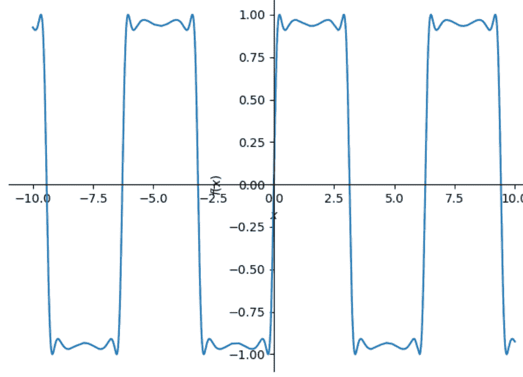

与 Matplotlib 类似，SymPy 提供了一个自定义图形的接口

```python
plot_f = plot(f, (x, -10, 10),
             xlabel='', ylabel='',
             legend = True, show = False)
plot_f[0].label = 'f(x)'
df = diff(f)
plot_df = plot(df, (x, -10, 10),
              legend = True, show = False)
plot_df[0].label = 'f\'(x)'
plot_f.append(plot_df[0])
plot_f.show()
```

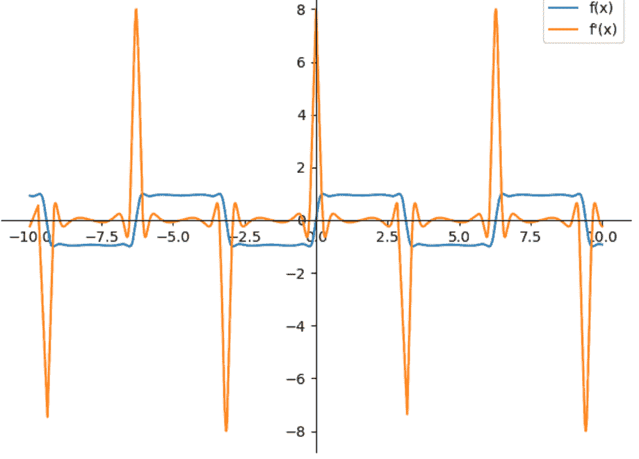

它还支持绘制隐函数和可视化不等式

```python
p = plot_implicit(Eq((1/x + 1/y)**2, 1))
```

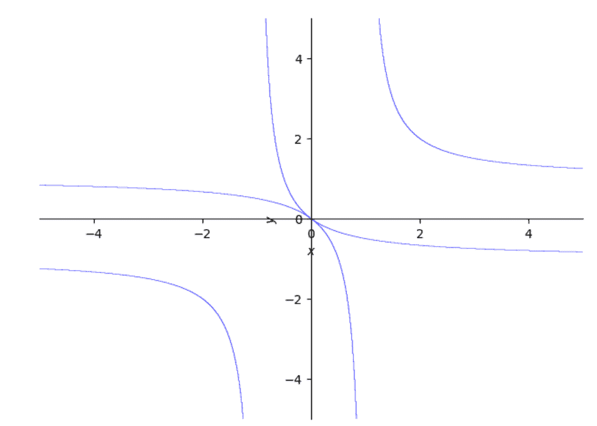

```python
p = plot_implicit(And(2*x + 5*y <= 30, 4*x + 2*y >= 20),
                 (x, -1, 10), (y, -10, 10))
```

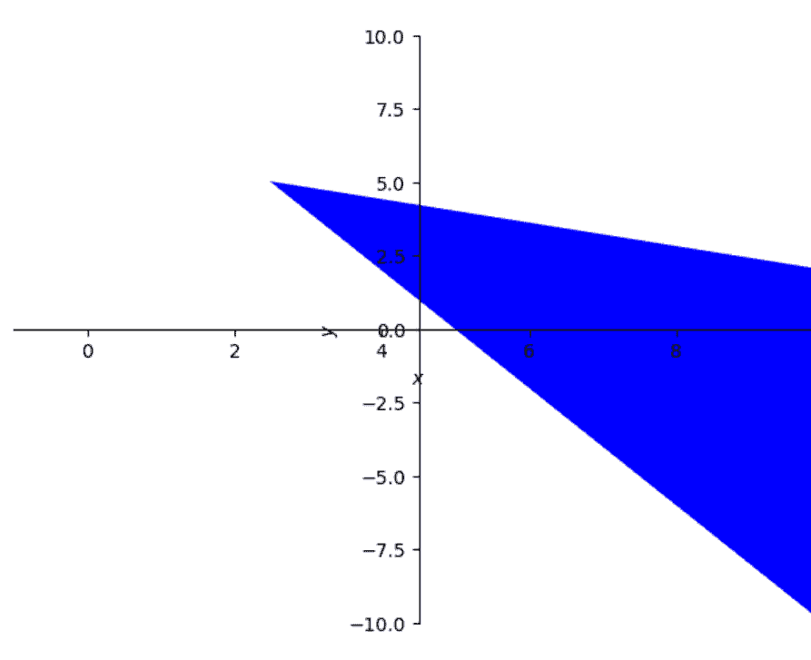

以及三维空间中的可视化

```python
p = plot3d(cos(2*x + y), zlabel='')
```

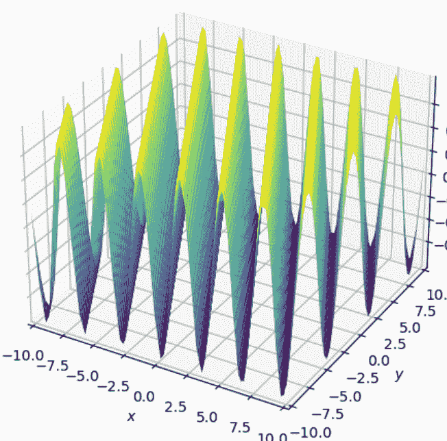

## 14.6 应用：两人交换经济

想象一个纯交换经济，有两个人（$a$ 和 $b$）和两种商品，以比例形式记录（$x$ 和 $y$）。
他们可以根据自己的偏好相互交易商品。
假设消费者的效用函数由以下给出

$u_a(x, y) = x^\alpha y^{1-\alpha}$

$u_b(x, y) = (1-x)^\beta (1-y)^{1-\beta}$

其中 $\alpha, \beta \in (0, 1)$。
首先我们定义符号和效用函数

```python
# 定义符号和效用函数
x, y, α, β = symbols('x, y, α, β')
u_a = x**α * y**(1-α)
u_b = (1 - x)**β * (1 - y)**(1 - β)
```

```python
u_a
```

$x^{\alpha} y^{1-\alpha}$

```python
u_b
```

$(1-x)^{\beta} (1-y)^{1-\beta}$

我们感兴趣的是商品 $x$ 和 $y$ 的帕累托最优配置。
请注意，当给定另一个人的配置时，一个人的配置是最优的，那么该点就是帕累托有效的。
用边际效用表示：

$\frac{\frac{\partial u_a}{\partial x}}{\frac{\partial u_a}{\partial y}} = \frac{\frac{\partial u_b}{\partial x}}{\frac{\partial u_b}{\partial y}}$

```python
# 当给定另一个人的配置时，一个人的配置是最优的，
# 该点就是帕累托有效的

pareto = Eq(diff(u_a, x)/diff(u_a, y),
            diff(u_b, x)/diff(u_b, y))
pareto
```

$\frac{y y^{1-\alpha} y^{\alpha-1} \alpha}{x (1-\alpha)} = -\frac{\beta (1-y) (1-y)^{1-\beta} (1-y)^{\beta-1}}{(1-x) (\beta-1)}$

```python
# 解方程
sol = solve(pareto, y)[0]
sol
```

$\frac{x \beta (\alpha-1)}{x \alpha - x \beta + \alpha \beta - \alpha}$

让我们使用 SymPy 计算 $\alpha = \beta = 0.5$ 时经济的帕累托最优配置（契约曲线）

```python
# 代入 α = 0.5 和 β = 0.5
sol.subs({α: 0.5, β: 0.5})
```

$1.0x$

我们可以使用这个结果来可视化不同参数下的更多契约曲线

```python
# 绘制一系列 α 和 β
params = [{α: 0.5, β: 0.5},
          {α: 0.1, β: 0.9},
          {α: 0.1, β: 0.8},
          {α: 0.8, β: 0.9},
          {α: 0.4, β: 0.8},
          {α: 0.8, β: 0.1},
          {α: 0.9, β: 0.8},
          {α: 0.8, β: 0.4},
          {α: 0.9, β: 0.1}]

p = plot(xlabel='x', ylabel='y', show=False)

for param in params:
    p_add = plot(sol.subs(param), (x, 0, 1),
                 show=False)
    p.append(p_add[0])
p.show()
```

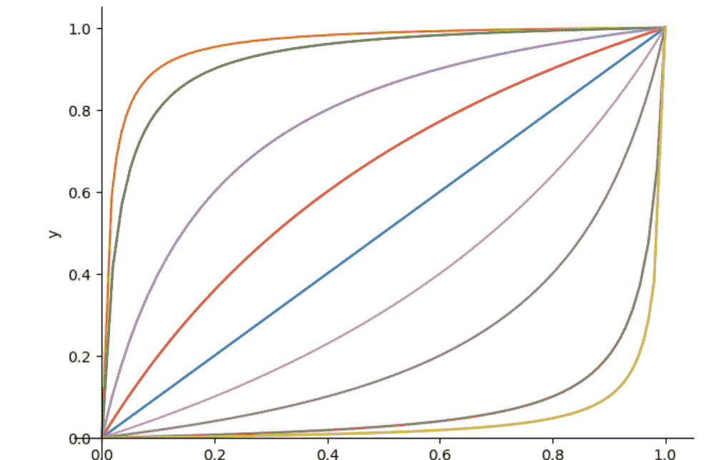

我们邀请您尝试不同的参数，看看契约曲线如何变化，并思考以下两个问题：

- 您能想到一种使用 `numpy` 绘制相同图形的方法吗？
- 编写一个 `numpy` 实现会有多困难？

## 14.7 练习

**练习 14.7.1**

洛必达法则指出，对于两个函数 $f(x)$ 和 $g(x)$，如果 $\lim_{x \to a} f(x) = \lim_{x \to a} g(x) = 0$ 或 $\pm \infty$，那么

$$\lim_{x \to a} \frac{f(x)}{g(x)} = \lim_{x \to a} \frac{f'(x)}{g'(x)}$$

使用 SymPy 验证以下函数的洛必达法则

$$f(x) = \frac{y^x - 1}{x}$$

当 $x$ 趋近于 0 时

**练习 14.7.1 的解答**

首先，我们定义函数

```python
f_upper = y**x - 1
f_lower = x
f = f_upper/f_lower
f
```

$$\frac{y^x - 1}{x}$$

SymPy 足够智能，可以解出这个极限

```python
lim = limit(f, x, 0)
lim
```

$$\log(y)$$

我们比较洛必达法则建议的结果

```python
lim = limit(diff(f_upper, x)/
            diff(f_lower, x), x, 0)
lim
```

$$\log(y)$$

**练习 14.7.2**

最大似然估计（MLE）是一种估计统计模型参数的方法。
它通常涉及最大化对数似然函数并求解一阶导数。
二项分布由以下给出

$$f(x; n, \theta) = \frac{n!}{x!(n-x)!} \theta^x (1-\theta)^{n-x}$$

其中 $n$ 是试验次数，$x$ 是成功次数。
假设我们观察到一系列二元结果，在 $n$ 次试验中有 $x$ 次成功。
使用 SymPy 计算 $\theta$ 的 MLE

**练习 14.7.2 的解答**

首先，我们定义二项分布

```python
n, x, θ = symbols('n x θ')

binomial_factor = (factorial(n)) / (factorial(x)*factorial(n-x))
binomial_factor
```

$$\frac{n!}{x!(n-x)!}$$

```python
bino_dist = binomial_factor * ((θ**x) * (1-θ) ** (n-x))
bino_dist
```

$$\frac{\theta^x (1-\theta)^{n-x} n!}{x!(n-x)!}$$

现在我们计算对数似然函数并求解结果

```python
log_bino_dist = log(bino_dist)
```

```python
log_bino_diff = simplify(diff(log_bino_dist, θ))
log_bino_diff
```

$$\frac{n\theta - x}{\theta(\theta - 1)}$$

```python
solve(Eq(log_bino_diff, 0), θ)[0]
```

$$\frac{x}{n}$$

## 第三部分

## 高性能计算

## 第十五章

## NUMBA

- 目录
  - Numba
    - 概述
    - 编译函数
    - 装饰器语法
    - 类型推断
    - 编译类
    - Numba的替代方案
    - 总结与评论
    - 练习

除了Anaconda自带的内容，本讲还需要以下库：

```
!pip install quant-econ
```

请确保你使用的是最新版本的Anaconda，因为旧版本是*常见错误来源*。

让我们从一些导入开始：

```
%matplotlib inline
import numpy as np
import quant-econ as qe
import matplotlib.pyplot as plt
plt.rcParams['figure.figsize'] = (10, 6)
```

## 15.1 概述

在*早期的讲座*中，我们学习了向量化，这是提高数值计算速度和效率的一种方法。

向量化涉及将数组处理操作批量发送到高效的低级代码。

然而，正如*之前讨论的*，向量化有几个弱点。

一个是在处理大量数据时，它非常消耗内存。

另一个是能够完全向量化的算法集合并不普遍。

事实上，对于某些算法，向量化是无效的。

幸运的是，一个名为Numba的新Python库解决了许多这些问题。

它通过一种叫做**即时编译（JIT）**的技术来实现这一点。

关键思想是将函数动态编译为本地机器码指令。

当它成功时，编译后的代码速度极快。

Numba专为数值计算设计，还可以执行其他技巧，例如多线程。

Numba将是我们讲座的关键部分——特别是那些涉及动态规划的讲座。

本讲介绍主要思想。

## 15.2 编译函数

如上所述，Numba的主要用途是在运行时将函数编译为快速的本地机器码。

### 15.2.1 一个例子

让我们考虑一个难以向量化的问题：给定初始条件，生成差分方程的轨迹。

我们将差分方程设为二次映射

$$x_{t+1} = \alpha x_t (1 - x_t)$$

在下面的内容中，我们设置

```
α = 4.0
```

这是一个典型轨迹的图，从$x_0 = 0.1$开始，x轴为$t$

```
def qm(x0, n):
    x = np.empty(n+1)
    x[0] = x0
    for t in range(n):
        x[t+1] = α * x[t] * (1 - x[t])
    return x

x = qm(0.1, 250)
fig, ax = plt.subplots()
```

```
ax.plot(x, 'b-', lw=2, alpha=0.8)
ax.set_xlabel('$t$', fontsize=12)
ax.set_ylabel('$x_{t}$', fontsize = 12)
plt.show()
```

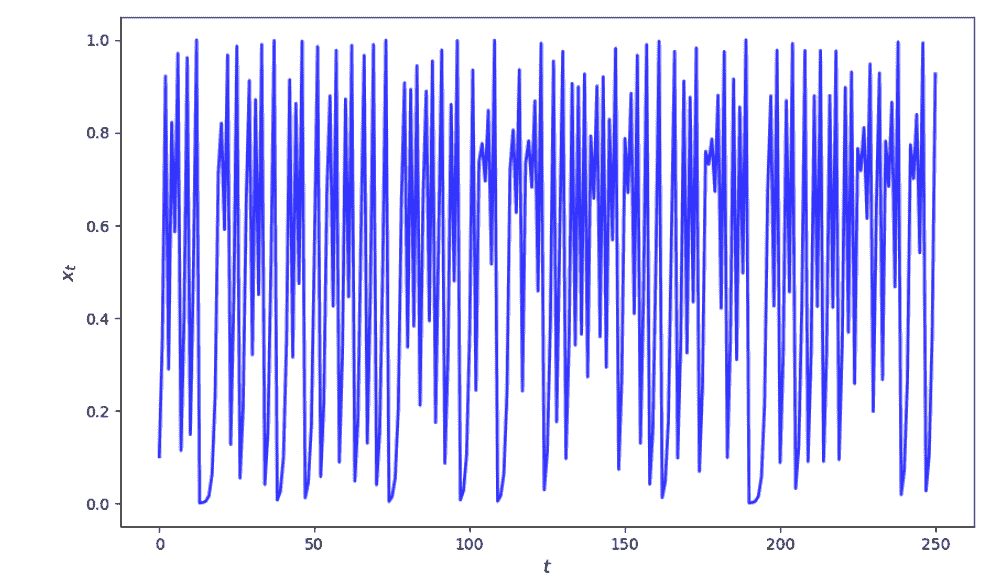

要使用Numba加速函数qm，我们的第一步是

```
from numba import njit

qm_numba = njit(qm)
```

函数qm_numba是qm的一个版本，它被“定向”用于JIT编译。
我们稍后会解释这意味着什么。
让我们计时并比较这两个版本中相同函数的调用，从原始函数qm开始：

```
n = 10_000_000

qe.tic()
qm(0.1, int(n))
time1 = qe.toc()

TOC: Elapsed: 0:00:3.29
```

现在让我们试试qm_numba

```
qe.tic()
qm_numba(0.1, int(n))
```

```
time2 = qe.toc()
```

```
TOC: Elapsed: 0:00:0.20
```

这已经是一个巨大的速度提升。

事实上，下一次和所有后续运行会更快，因为函数已被编译并保存在内存中：

```
qe.tic()
qm_numba(0.1, int(n))
time3 = qe.toc()
```

```
TOC: Elapsed: 0:00:0.02
```

```
time1 / time3  # 计算速度提升
```

```
128.11253329868106
```

相对于实现的简单性和清晰性，这种速度提升是巨大的。

### 15.2.2 工作原理和时机

Numba尝试使用LLVM项目提供的基础设施生成快速的机器码。

它通过动态推断类型信息来实现这一点。

（关于我们*早期讲座*中关于科学计算的类型讨论，请参阅。）

基本思想是：

- Python非常灵活，因此我们可以用多种类型调用函数qm。
  - 例如，x0可以是NumPy数组或列表，n可以是整数或浮点数等。
- 这使得*预编译*函数变得困难。
- 然而，当我们实际调用函数时，比如执行qm(0.5, 10)，x0和n的类型就变得清晰了。
- 此外，一旦输入已知，就可以推断出qm中其他变量的类型。
- 因此，Numba和其他JIT编译器的策略是等待这一刻，*然后*编译函数。

这就是为什么它被称为“即时”编译。

请注意，如果你调用qm(0.5, 10)，然后调用qm(0.9, 20)，编译只在第一次调用时发生。

编译后的代码随后被缓存并按需回收。

## 15.3 装饰器语法

在上面的代码中，我们通过调用创建了`qm`的JIT编译版本

```
qm_numba = njit(qm)
```

在实践中，这通常使用替代的*装饰器*语法来完成。
（我们将在*后面的讲座*中解释装饰器，但你现在可以跳过细节。）
让我们看看这是如何完成的。
要将一个函数定向用于JIT编译，我们可以在函数定义前加上`@njit`。
以下是`qm`的示例

```
@njit
def qm(x0, n):
    x = np.empty(n+1)
    x[0] = x0
    for t in range(n):
        x[t+1] = a * x[t] * (1 - x[t])
    return x
```

这等同于`qm = njit(qm)`。
以下现在使用的是jitted版本：

```
%%time

qm(0.1, 100_000)
```

```
CPU times: user 65.9 ms, sys: 4.11 ms, total: 70 ms
Wall time: 69.7 ms

array([0.1       , 0.36      , 0.9216    , ..., 0.98112405, 0.07407858,
       0.27436377])
```

Numba为装饰器提供了多个参数，以加速计算和缓存函数[此处](https://numba.pydata.org/numba-doc/latest/reference/jit.html)。
在*关于并行化的后续讲座*中，我们将讨论如何使用`parallel`参数实现自动并行化。

## 15.4 类型推断

显然，类型推断是JIT编译的关键部分。
可以想象，对于简单的Python对象（例如，简单的标量数据类型，如浮点数和整数），推断类型更容易。
Numba也能很好地与NumPy数组配合使用。
在理想情况下，Numba可以推断所有必要的类型信息。
这使得它能够生成本地机器码，而无需调用Python运行时环境。
在这种情况下，Numba将与来自低级语言的机器码相媲美。

当Numba无法推断所有类型信息时，它会引发错误。
例如，在下面的情况下，Numba在编译函数`bootstrap`时无法确定函数`mean`的类型

```
@njit
def bootstrap(data, statistics, n):
    bootstrap_stat = np.empty(n)
    n = len(data)
    for i in range(n_resamples):
        resample = np.random.choice(data, size=n, replace=True)
        bootstrap_stat[i] = statistics(resample)
    return bootstrap_stat

def mean(data):
    return np.mean(data)

data = np.array([2.3, 3.1, 4.3, 5.9, 2.1, 3.8, 2.2])
n_resamples = 10

print('Type of function:', type(mean))

#Error
try:
    bootstrap(data, mean, n_resamples)
except Exception as e:
    print(e)
```

```
Type of function: <class 'function'>

Failed in nopython mode pipeline (step: nopython frontend)
non-precise type pyobject
During: typing of argument at /tmp/ipykernel_2182/2092422549.py (1)

File "../../../../../../tmp/ipykernel_2182/2092422549.py", line 1:
<source missing, REPL/exec in use?>

This error may have been caused by the following argument(s):
- argument 1: Cannot determine Numba type of <class 'function'>
```

但Numba能识别JIT编译的函数

```
@njit
def mean(data):
    return np.mean(data)

print('Type of function:', type(mean))

%time bootstrap(data, mean, n_resamples)
```

```
Type of function: <class 'numba.core.registry.CPUDispatcher'>

CPU times: user 277 ms, sys: 55.9 ms, total: 333 ms
Wall time: 333 ms
```

## 15.5 编译类

如上所述，目前 Numba 只能编译 Python 的一个子集。然而，这个子集正在不断扩展。例如，Numba 现在在编译类方面已经相当有效。如果一个类被成功编译，那么它的方法就充当 JIT 编译的函数。举个例子，让我们考虑一下我们在*本讲*中创建的用于分析索洛增长模型的类。为了编译这个类，我们使用 `@jitclass` 装饰器：

```python
from numba import float64
from numba.experimental import jitclass
```

注意我们还导入了一个名为 `float64` 的东西。这是一个表示标准浮点数的数据类型。我们在这里导入它是因为 Numba 在尝试处理类时需要一些额外的类型帮助。以下是我们的代码：

```python
solow_data = [
    ('n', float64),
    ('s', float64),
    ('δ', float64),
    ('a', float64),
    ('z', float64),
    ('k', float64)
]

@jitclass(solow_data)
class Solow:
    r"""
    Implements the Solow growth model with the update rule

        k_{t+1} = [(s z k^a_t) + (1 - δ)k_t] /(1 + n)

    """
    def __init__(self, n=0.05,  # population growth rate
                       s=0.25,  # savings rate
                       δ=0.1,   # depreciation rate
                       a=0.3,   # share of labor
                       z=2.0,   # productivity
                       k=1.0):  # current capital stock

        self.n, self.s, self.δ, self.a, self.z = n, s, δ, a, z
        self.k = k

    def h(self):
        "Evaluate the h function"
        # Unpack parameters (get rid of self to simplify notation)
        n, s, δ, a, z = self.n, self.s, self.δ, self.a, self.z
        # Apply the update rule
        return (s * z * self.k**a + (1 - δ) * self.k) / (1 + n)

    def update(self):
        "Update the current state (i.e., the capital stock)."
        self.k = self.h()

    def steady_state(self):
        "Compute the steady state value of capital."
        # Unpack parameters (get rid of self to simplify notation)
        n, s, δ, α, z = self.n, self.s, self.δ, self.α, self.z
        # Compute and return steady state
        return ((s * z) / (n + δ))**(1 / (1 - α))

    def generate_sequence(self, t):
        "Generate and return a time series of length t"
        path = []
        for i in range(t):
            path.append(self.k)
            self.update()
        return path
```

首先，我们在 `solow_data` 中指定了类的实例数据的类型。之后，要对类进行 JIT 编译，只需在类定义前添加 `@jitclass(solow_data)` 即可。当我们调用类中的方法时，这些方法就像函数一样被编译。

```python
s1 = Solow()
s2 = Solow(k=8.0)

T = 60
fig, ax = plt.subplots()

# Plot the common steady state value of capital
ax.plot([s1.steady_state()]*T, 'k-', label='steady state')

# Plot time series for each economy
for s in s1, s2:
    lb = f'capital series from initial state {s.k}'
    ax.plot(s.generate_sequence(T), 'o-', lw=2, alpha=0.6, label=lb)
ax.set_ylabel('$k_{t}$', fontsize=12)
ax.set_xlabel('$t$', fontsize=12)
ax.legend()
plt.show()
```

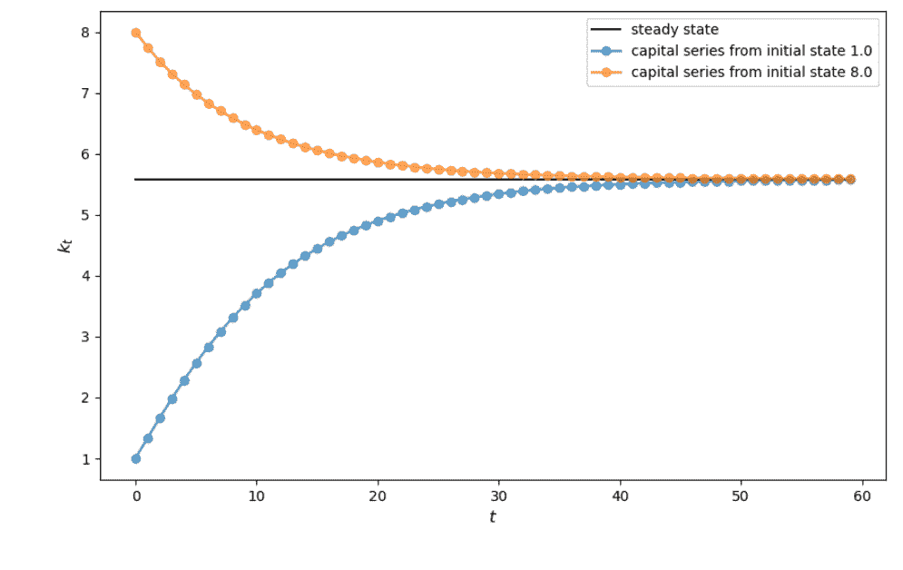

## 15.6 Numba 的替代方案

还有其他加速 Python 循环的选项。我们在此快速回顾一下。不过，我们这样做只是为了兴趣和完整性。如果你愿意，可以放心地跳过本节。

### 15.6.1 Cython

与 *Numba* 类似，Cython 提供了一种生成快速编译代码的方法，这些代码可以从 Python 中使用。与 Numba 的情况一样，一个关键问题是 Python 是动态类型的。正如你所记得的，Numba 通过推断类型来解决这个问题（在可能的情况下）。Cython 的方法不同——程序员直接在他们的“Python”代码中添加类型定义。因此，Cython 语言可以被视为带有类型定义的 Python。除了语言规范，Cython 还是一个语言翻译器，将 Cython 代码转换为优化的 C 和 C++ 代码。Cython 还负责构建语言扩展——即在生成的编译代码和 Python 之间进行接口的包装代码。虽然 Cython 有某些优势，但我们通常发现它比 Numba 更慢且更繁琐。

### 15.6.2 通过 F2Py 与 Fortran 接口

如果你熟悉编写 Fortran，你会发现使用 F2Py 从 Fortran 代码创建扩展模块非常容易。F2Py 是一个 Fortran 到 Python 的接口生成器，使用起来特别简单。Robert Johansson 提供了关于 F2Py 等内容的精彩介绍。最近，已经开发了一个用于 Fortran 的 Jupyter 单元格魔法——你可能想尝试一下。

## 15.7 总结与评论

让我们回顾一下以上内容，并添加一些注意事项。

### 15.7.1 局限性

正如我们所看到的，Numba 需要推断所有变量的类型信息以生成快速的机器级指令。对于简单的例程，Numba 推断类型的效果非常好。对于较大的例程，或者使用外部库的例程，它很容易失败。因此，在使用 Numba 时，专注于加速小型、时间关键的代码片段是明智的。这将比在你的 Python 程序中大量使用 `@njit` 语句给你带来更好的性能。

### 15.7.2 一个陷阱：全局变量

使用 Numba 时，还有另一件事需要注意。考虑以下示例：

```python
a = 1

@njit
def add_a(x):
    return a + x

print(add_a(10))
```

```
11
```

```python
a = 2

print(add_a(10))
```

```
11
```

注意，更改全局变量对函数返回的值没有影响。当 Numba 为函数编译机器代码时，它将全局变量视为常量以确保类型稳定性。

## 15.8 练习

**练习 15.8.1**

*之前*我们考虑了如何通过蒙特卡洛方法近似 $\pi$。在这里使用相同的想法，但使用 Numba 使代码高效。当样本量很大时，比较使用和不使用 Numba 的速度。

**练习 15.8.1 的解答**

这是一个解决方案：

```python
from random import uniform

@njit
def calculate_pi(n=1_000_000):
    count = 0
    for i in range(n):
        u, v = uniform(0, 1), uniform(0, 1)
        d = np.sqrt((u - 0.5)**2 + (v - 0.5)**2)
        if d < 0.5:
            count += 1

    area_estimate = count / n
    return area_estimate * 4  # dividing by radius**2
```

现在让我们看看它运行得有多快：

```python
%time calculate_pi()
```

```
CPU times: user 148 ms, sys: 3.99 ms, total: 152 ms
Wall time: 152 ms

3.138976
```

```python
%time calculate_pi()
```

```
CPU times: user 10.9 ms, sys: 0 ns, total: 10.9 ms
Wall time: 10.8 ms

3.142884
```

如果我们通过移除 `@njit` 来关闭 JIT 编译，代码在我们的机器上大约需要 150 倍的时间。因此，通过添加四个字符，我们获得了 2 个数量级的速度提升——这是巨大的。

**练习 15.8.2**

在 [Python 量化经济学导论](https://python-intro.quantecon.org/) 讲座系列中，你可以了解关于有限状态马尔可夫链的所有知识。

目前，我们只专注于模拟一个非常简单的此类链条示例。
假设某资产的收益率波动率可能处于两种状态之一——高或低。
状态之间的转移概率如下

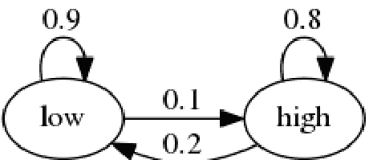

例如，假设时间周期为一天，且当前状态为高。
从图中我们可以看到，明天的状态将是

- 以0.8的概率为高
- 以0.2的概率为低

你的任务是根据此规则模拟每日波动率状态序列。
将序列长度设置为 n = 1_000_000，并从高状态开始。
实现一个纯Python版本和一个Numba版本，并比较速度。
要测试你的代码，请评估链条处于低状态的时间比例。
如果你的代码正确，该比例应约为2/3。

**提示：**

- 将低状态表示为0，高状态表示为1。
- 如果你想在NumPy数组中存储整数，然后应用JIT编译，请使用 `x = np.empty(n, dtype=np.int_)`。

## 练习15.8.2的解答

我们令

- 0 代表“低”
- 1 代表“高”

```python
p, q = 0.1, 0.2  # 分别是离开低状态和高状态的概率
```

以下是该函数的纯Python版本

```python
def compute_series(n):
    x = np.empty(n, dtype=np.int_)
    x[0] = 1  # 从状态1开始
    U = np.random.uniform(0, 1, size=n)
    for t in range(1, n):
        current_x = x[t-1]
        if current_x == 0:
            x[t] = U[t] < p
        else:
            x[t] = U[t] > q
    return x
```

让我们运行这段代码，并检查处于低状态的时间比例是否约为0.666

```python
n = 1_000_000
x = compute_series(n)
print(np.mean(x == 0))  # x处于状态0的时间比例
```

```
0.668802
```

这（大约）是正确的输出。
现在我们来计时：

```python
qe.tic()
compute_series(n)
qe.toc()
```

```
TOC: Elapsed: 0:00:0.39
```

```
0.39469242095947266
```

接下来，我们实现一个Numba版本，这很简单

```python
compute_series_numba = njit(compute_series)
```

让我们检查是否仍然得到正确的数字

```python
x = compute_series_numba(n)
print(np.mean(x == 0))
```

```
0.667323
```

让我们看看时间

```python
qe.tic()
compute_series_numba(n)
qe.toc()
```

```
TOC: Elapsed: 0:00:0.00
```

```
0.007478237152099609
```

仅用一行代码就获得了不错的速度提升！

# 第十六章

## 并行化

目录

- 并行化
- 概述
- 并行化的类型
- NumPy中的隐式多线程
- Numba中的多线程循环
- 练习

除了Anaconda自带的内容外，本讲还需要以下库：

```python
!pip install quantecon
```

## 16.1 概述

近年来，CPU时钟速度（即单个逻辑链运行的速度）的增长已显著放缓。
由于芯片和电路板制造存在固有的物理限制，这种情况在短期内不太可能改变。
芯片设计师和计算机程序员通过寻求不同的快速执行路径来应对这种放缓：并行化。
硬件制造商增加了每台机器中嵌入的核心（物理CPU）数量。
对于程序员来说，挑战在于通过并行（即同时）运行多个进程来利用这些多核CPU。
这在科学编程中尤为重要，因为科学编程需要处理

- 大量数据以及
- CPU密集型的模拟和其他计算。

在本讲中，我们将讨论科学计算的并行化，重点是

1. Python中并行化的最佳工具以及
2. 这些工具如何应用于定量经济问题。

让我们从一些导入开始：

```python
%matplotlib inline
import numpy as np
import quantecon as qe
import matplotlib.pyplot as plt
plt.rcParams['figure.figsize'] = (10,6)
```

## 16.2 并行化的类型

关于不同并行化方法的大型教科书已经出版，但我们将紧密聚焦于对我们最有用的内容。
我们将简要回顾科学计算中常用的两种主要并行化类型，并讨论它们的优缺点。

### 16.2.1 多进程

多进程是指使用多个处理器并发执行多个进程。
在此上下文中，**进程**是一系列指令（即一个程序）。
多进程可以在一台具有多个CPU的机器上执行，也可以在通过网络连接的一组机器上执行。
在后一种情况下，这组机器通常称为**集群**。
使用多进程时，每个进程都有自己的内存空间，尽管物理内存芯片可能是共享的。

### 16.2.2 多线程

多线程与多进程类似，不同之处在于，在执行期间，所有线程共享相同的内存空间。
原生Python由于一些[遗留设计特性](https://docs.python.org/3/c-api/init.html#freeing-the-gil)而难以实现多线程。
但对于像NumPy和Numba这样的科学库来说，这不是限制。
从这些库导入的函数和JIT编译的代码在底层执行环境中运行，Python的遗留限制不适用。

### 16.2.3 优缺点

多线程更轻量级，因为大多数系统和内存资源由线程共享。
此外，多个线程都访问共享内存池这一事实对于数值编程来说极其方便。
另一方面，多进程更灵活，并且可以分布在集群中。
对于我们在这些讲座中所做的绝大多数工作，多线程就足够了。

## 16.3 NumPy中的隐式多线程

实际上，你已经在Python代码中使用了多线程，尽管你可能没有意识到。
（我们像往常一样，假设你正在运行最新版本的Anaconda Python。）
这是因为NumPy在其许多编译代码中巧妙地实现了多线程。
让我们看一些例子来实际观察这一点。

### 16.3.1 矩阵运算

下面的代码计算大量随机生成矩阵的特征值。
运行需要几秒钟。

```python
n = 20
m = 1000
for i in range(n):
    X = np.random.randn(m, m)
    λ = np.linalg.eigvals(X)
```

现在，让我们在代码运行时查看我们机器上htop系统监视器的输出：

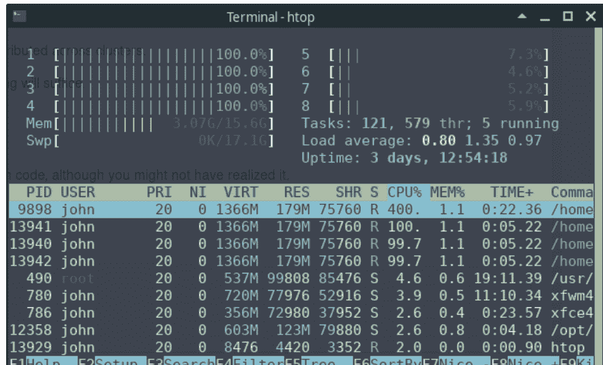

我们可以看到8个CPU中有4个正在全速运行。
这是因为NumPy的`eigvals`例程巧妙地分割任务并将其分配给不同的线程。

### 16.3.2 多线程通用函数

在过去几年中，NumPy已设法将这种多线程推广到越来越多的操作中。
例如，让我们回到*之前讨论过*的一个最大化问题：

```python
def f(x, y):
    return np.cos(x**2 + y**2) / (1 + x**2 + y**2)

grid = np.linspace(-3, 3, 5000)
x, y = np.meshgrid(grid, grid)
```

```python
%timeit np.max(f(x, y))
```

```
472 ms ± 1.86 ms per loop (mean ± std. dev. of 7 runs, 1 loop each)
```

如果你有一个系统监视器，如htop（Linux/Mac）或perfmon（Windows），那么尝试运行这个，然后观察CPU上的负载。
（你可能需要增加网格大小才能看到显著效果。）
至少在我们的机器上，输出表明该操作已成功分配到多个线程。
这是上面向量化代码运行速度快的原因之一。

### 16.3.3 与Numba的比较

为了给上一个例子提供一些比较基础，让我们尝试用Numba做同样的事情。
实际上有一个简单的方法可以做到这一点，因为Numba也可以用来通过`@vectorize`装饰器创建自定义`ufuncs`。

```python
from numba import vectorize

@vectorize
def f_vec(x, y):
    return np.cos(x**2 + y**2) / (1 + x**2 + y**2)

np.max(f_vec(x, y))  # 运行一次以进行编译
```

```
0.9999992797121728
```

```python
%timeit np.max(f_vec(x, y))
```

```
334 ms ± 1.15 ms per loop (mean ± std. dev. of 7 runs, 1 loop each)
```

至少在我们的机器上，Numba版本与上面显示的向量化NumPy版本之间的速度差异并不大。
但这里发生了很多事情，所以让我们试着分解一下正在发生的事情。
Numba和NumPy都使用针对这些浮点运算优化的高效机器代码。
然而，NumPy使用的代码在某些方面效率较低。
原因是，在NumPy中，操作`np.cos(x**2 + y**2) / (1 + x**2 + y**2)`会生成几个中间数组。

例如，当计算 x**2 时，会创建一个新数组。
计算 y**2 时也是如此，然后是 x**2 + y**2，依此类推。
Numba 通过编译一个专门针对整个操作的函数，避免了创建所有这些中间数组。
但如果这是真的，为什么 Numba 代码没有更快呢？
原因在于 NumPy 通过隐式多线程弥补了其劣势，正如我们刚才讨论的那样。

## 16.3.4 Numba Ufunc 的多线程

我们能否同时获得这两种优势？
换句话说，我们能否结合

- Numba 高度专业化 JIT 编译函数的效率，以及
- NumPy 隐式多线程带来的并行化速度提升？

事实证明，我们可以通过添加一些类型信息以及 `target='parallel'` 来实现。

```
@vectorize('float64(float64, float64)', target='parallel')
def f_vec(x, y):
    return np.cos(x**2 + y**2) / (1 + x**2 + y**2)

np.max(f_vec(x, y))  # 运行一次以进行编译
```

```
0.9999992797121728
```

```
%timeit np.max(f_vec(x, y))
```

```
130 ms ± 707 µs per loop (mean ± std. dev. of 7 runs, 10 loops each)
```

现在我们的代码运行速度明显快于 NumPy 版本。

## 16.4 Numba 中的多线程循环

我们刚刚看到了 Numba 中并行化的一种方法，即在 `@vectorize` 中使用 `parallel` 标志。
这很巧妙，但事实证明，它并不适合我们考虑的许多问题。
幸运的是，Numba 提供了另一种多线程方法，几乎在任何可以并行化的地方都适用。
为了说明，让我们先看一段简单的、单线程（即非并行化）的代码。
该代码模拟通过以下规则更新家庭的财富 $w_t$

$w_{t+1} = R_{t+1}sw_t + y_{t+1}$

其中

- $R$ 是资产的总回报率
- $s$ 是家庭的储蓄率
- $y$ 是劳动收入。

# Python Programming for Economics and Finance

我们将 $R$ 和 $y$ 建模为来自对数正态分布的独立随机抽样。
以下是代码：

```
from numpy.random import randn
from numba import njit

@njit
def h(w, r=0.1, s=0.3, v1=0.1, v2=1.0):
    """
    更新家庭财富。
    """

    # 抽取冲击
    R = np.exp(v1 * randn()) * (1 + r)
    y = np.exp(v2 * randn())

    # 更新财富
    w = R * s * w + y
    return w
```

让我们看看财富在此规则下如何演变。

```
fig, ax = plt.subplots()

T = 100
w = np.empty(T)
w[0] = 5
for t in range(T-1):
    w[t+1] = h(w[t])

ax.plot(w)
ax.set_xlabel('$t$', fontsize=12)
ax.set_ylabel('$w_{t}$', fontsize=12)
plt.show()
```

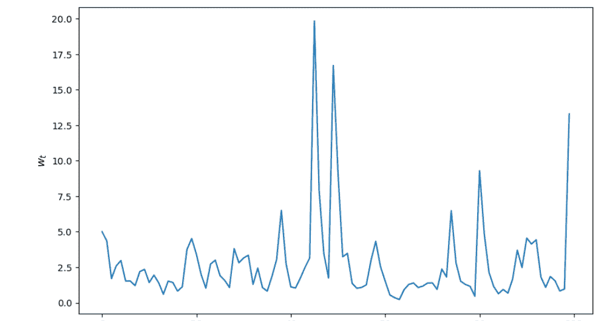

现在假设我们有一个庞大的家庭群体，我们想知道中位数财富是多少。
这用纸笔很难求解，因此我们将使用模拟。
具体来说，我们将模拟大量家庭，然后计算该群体的中位数财富。
假设我们感兴趣的是这个中位数随时间的长期平均值。
事实证明，对于我们上面选择的规格，我们可以通过在长时间模拟结束时对群体中位数财富进行一次快照来计算它。
此外，只要模拟周期足够长，初始条件并不重要。

- 这是由于所谓的遍历性，我们稍后会讨论。

因此，总结一下，我们将通过以下方式模拟 50,000 个家庭：

1. 任意将初始财富设置为 1，以及
2. 向前模拟 1,000 个时期。

然后我们将计算结束时期的中位数财富。
以下是代码：

```
@njit
def compute_long_run_median(w0=1, T=1000, num_reps=50_000):

    obs = np.empty(num_reps)
    for i in range(num_reps):
        w = w0
        for t in range(T):
            w = h(w)
        obs[i] = w

    return np.median(obs)
```

# Python Programming for Economics and Finance

让我们看看运行速度：

```
%%time
compute_long_run_median()
```

```
CPU times: user 5.71 s, sys: 80.4 ms, total: 5.79 s
Wall time: 5.78 s
```

```
1.8336628488163855
```

为了加速，我们将通过多线程对其进行并行化。
为此，我们添加 `parallel=True` 标志并将 `range` 更改为 `prange`：

```
from numba import prange

@njit(parallel=True)
def compute_long_run_median_parallel(w0=1, T=1000, num_reps=50_000):

    obs = np.empty(num_reps)
    for i in prange(num_reps):
        w = w0
        for t in range(T):
            w = h(w)
        obs[i] = w

    return np.median(obs)
```

让我们看看计时：

```
%%time
compute_long_run_median_parallel()
```

```
CPU times: user 6.68 s, sys: 0 ns, total: 6.68 s
Wall time: 1.94 s
```

```
1.8497894505998835
```

加速效果显著。

## 16.4.1 警告

并行化在上一个示例的外循环中效果很好，因为循环内的各个任务彼此独立。

如果这种独立性不成立，那么并行化通常会有问题。

例如，内循环中的每一步都依赖于上一步，因此独立性不成立，这就是为什么我们使用普通的 `range` 而不是 `prange`。

当您在后面的课程中看到我们使用 `prange` 时，那是因为任务的独立性成立。

当您在 JIT 函数中看到我们使用普通的 `range` 时，要么是因为并行化带来的速度提升很小，要么是因为独立性不成立。

## 16.5 练习

**练习 16.5.1**

在*之前的练习*中，我们使用 Numba 来加速通过蒙特卡洛计算常数 $\pi$ 的工作。

现在尝试添加并行化，看看是否能获得进一步的速度提升。

您不应该期望这里有巨大的收益，因为虽然有许多独立任务（抽取点并测试是否在圆内），但每个任务的执行时间都很短。

一般来说，当要并行化的单个任务相对于总执行时间非常小时，并行化效果较差。

这是由于将所有这些小任务分配到多个 CPU 上所带来的开销。

尽管如此，使用合适的硬件，仍然有可能在本练习中获得显著的速度提升。

对于蒙特卡洛模拟的规模，请使用足够大的值，例如 n = 100_000_000。

**练习 16.5.1 的解答**

这是一个解决方案：

```
python
from random import uniform

@njit(parallel=True)
def calculate_pi(n=1_000_000):
    count = 0
    for i in prange(n):
        u, v = uniform(0, 1), uniform(0, 1)
        d = np.sqrt((u - 0.5)**2 + (v - 0.5)**2)
        if d < 0.5:
            count += 1

    area_estimate = count / n
    return area_estimate * 4  # 除以半径**2
```

现在让我们看看运行速度：

```
python
%time calculate_pi()
```

```

CPU times: user 367 ms, sys: 28.1 ms, total: 395 ms
Wall time: 382 ms

3.141416
```

```
python
%time calculate_pi()
```

```

CPU times: user 17.6 ms, sys: 0 ns, total: 17.6 ms
Wall time: 4.87 ms
```

# Python Programming for Economics and Finance

3.140936

通过开启和关闭并行化（在 `@njit` 注解中选择 `True` 或 `False`），我们可以测试多线程在 JIT 编译之上提供的速度提升。

在我们的工作站上，我们发现并行化将执行速度提高了 2 到 3 倍。

（如果您在本地执行，您将得到不同的数字，主要取决于您机器上的 CPU 数量。）

## 练习 16.5.2

在*我们关于 SciPy 的课程*中，我们讨论了在标的股票价格具有简单且众所周知的分布的情况下对看涨期权进行定价。
这里我们讨论一个更现实的设置。

我们回顾一下期权的价格服从

$$P = \beta^n \mathbb{E} \max\{S_n - K, 0\}$$

其中

1. $\beta$ 是折现因子，
2. $n$ 是到期日，
3. $K$ 是执行价格，以及
4. $\{S_t\}$ 是标的资产在每个时间 $t$ 的价格。

假设 $n$, $\beta$, $K = 20$, $0.99$, $100$。

假设股票价格服从

$$\ln \frac{S_{t+1}}{S_t} = \mu + \sigma_t \xi_{t+1}$$

其中

$$\sigma_t = \exp(h_t), \quad h_{t+1} = \rho h_t + \nu \eta_{t+1}$$

这里 $\{\xi_t\}$ 和 $\{\eta_t\}$ 是独立同分布的标准正态分布。

（这是一个**随机波动率**模型，其中波动率 $\sigma_t$ 随时间变化。）

使用默认值 $\mu$, $\rho$, $\nu$, $S0$, $h0 = 0.0001$, $0.1$, $0.001$, $10$, $0$。

（这里 $S0$ 是 $S_0$，$h0$ 是 $h_0$。）

通过生成 $M$ 条路径 $s_0, \dots, s_n$，计算价格的蒙特卡洛估计

$$\hat{P}_M := \beta^n \mathbb{E} \max\{S_n - K, 0\} \approx \frac{1}{M} \sum_{m=1}^M \max\{S_n^m - K, 0\}$$

应用 Numba 和并行化。

## 练习 16.5.2 的解答

令 $s_t := \ln S_t$，则价格动态变为

$s_{t+1} = s_t + \mu + \exp(h_t)\xi_{t+1}$

利用这一事实，解可以写成如下形式。

```python
from numpy.random import randn
M = 10_000_000

n, β, K = 20, 0.99, 100
μ, ρ, ν, S0, h0 = 0.0001, 0.1, 0.001, 10, 0

@njit(parallel=True)
def compute_call_price_parallel(β=β,
                                μ=μ,
                                S0=S0,
                                h0=h0,
                                K=K,
                                n=n,
                                ρ=ρ,
                                ν=ν,
                                M=M):
    current_sum = 0.0
    # For each sample path
    for m in prange(M):
        s = np.log(S0)
        h = h0
        # Simulate forward in time
        for t in range(n):
            s = s + μ + np.exp(h) * randn()
            h = ρ * h + ν * randn()
        # And add the value max{S_n - K, 0} to current_sum
        current_sum += np.maximum(np.exp(s) - K, 0)

    return β**n * current_sum / M
```

尝试在 `parallel=True` 和 `parallel=False` 之间切换，并注意运行时间。

如果你使用的是拥有多核 CPU 的机器，差异应该会很显著。

## 第十七章

## JAX

**新网站**

我们已用一个关于使用 JAX 进行定量经济学的新讲座系列取代了本讲座：

参见 [使用 JAX 的定量经济学](https://quant-econ.net/jax/index.html)

## 第四部分

## 高级 Python 编程

## 第十八章

## 编写优质代码

**内容**

- 编写优质代码
    - 概述
    - 一个糟糕代码的例子
    - 良好的编码实践
    - 重新审视该例子
    - 练习

> “任何傻瓜都能写出计算机能理解的代码。优秀的程序员写出人类能理解的代码。” – 马丁·福勒

### 18.1 概述

当计算机程序较小时，编写糟糕的代码代价并不高。
但更多的数据、更复杂的模型和更强大的计算能力，使我们能够处理更具挑战性的问题，这涉及编写更长的程序。
对于此类程序，投资于良好的编码实践将带来高回报。
主要收益是更高的生产力和更快的代码。
在本讲中，我们回顾一些良好编码实践的要素。
我们还将探讨科学计算的现代发展——例如即时编译——以及它们如何影响良好的程序设计。

### 18.2 一个糟糕代码的例子

让我们看一些编写糟糕的代码。
这段代码的任务是生成并绘制简化索洛模型的时间序列

$k_{t+1} = s k_t^{\alpha} + (1 - \delta) k_t, \quad t = 0, 1, 2, \dots$

其中

- $k_t$ 是时间 $t$ 的资本，以及
- $s, \alpha, \delta$ 是参数（储蓄率、生产率参数和折旧率）

对于每种参数化，代码

1.  设置 $k_0 = 1$
2.  使用 (18.1) 迭代生成序列 $k_0, k_1, k_2 \dots, k_T$
3.  绘制该序列

这些图将被分组为三个子图。
在每个子图中，两个参数保持固定，另一个参数变化

```python
%matplotlib inline
import numpy as np
import matplotlib.pyplot as plt
plt.rcParams['figure.figsize'] = (10,6)

# Allocate memory for time series
k = np.empty(50)

fig, axes = plt.subplots(3, 1, figsize=(8, 16))

# Trajectories with different a
δ = 0.1
s = 0.4
a = (0.25, 0.33, 0.45)

for j in range(3):
    k[0] = 1
    for t in range(49):
        k[t+1] = s * k[t]**a[j] + (1 - δ) * k[t]
    axes[0].plot(k, 'o-', label=rf"$\alpha = {a[j]},\; s = {s},\; \delta={δ}$")

axes[0].grid(lw=0.2)
axes[0].set_ylim(0, 18)
axes[0].set_xlabel('time')
axes[0].set_ylabel('capital')
axes[0].legend(loc='upper left', frameon=True)

# Trajectories with different s
δ = 0.1
a = 0.33
s = (0.3, 0.4, 0.5)

for j in range(3):
    k[0] = 1
    for t in range(49):
        k[t+1] = s[j] * k[t]**a + (1 - δ) * k[t]
    axes[1].plot(k, 'o-', label=rf"$\alpha = {a},\; s = {s[j]},\; \delta={δ}$")

axes[1].grid(lw=0.2)
axes[1].set_xlabel('time')
axes[1].set_ylabel('capital')
axes[1].set_ylim(0, 18)
axes[1].legend(loc='upper left', frameon=True)

# Trajectories with different δ
δ = (0.05, 0.1, 0.15)
a = 0.33
s = 0.4

for j in range(3):
    k[0] = 1
    for t in range(49):
        k[t+1] = s * k[t]**a + (1 - δ[j]) * k[t]
    axes[2].plot(k, 'o-', label=rf"$\alpha = {a},\; s = {s},\; \delta={δ[j]}$")

axes[2].set_ylim(0, 18)
axes[2].set_xlabel('time')
axes[2].set_ylabel('capital')
axes[2].grid(lw=0.2)
axes[2].legend(loc='upper left', frameon=True)

plt.show()
```

## 经济与金融的 Python 编程

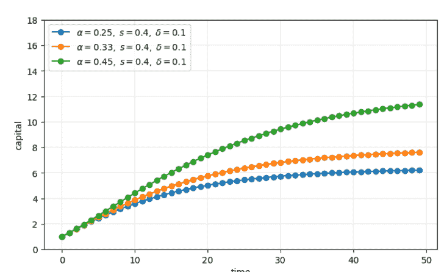

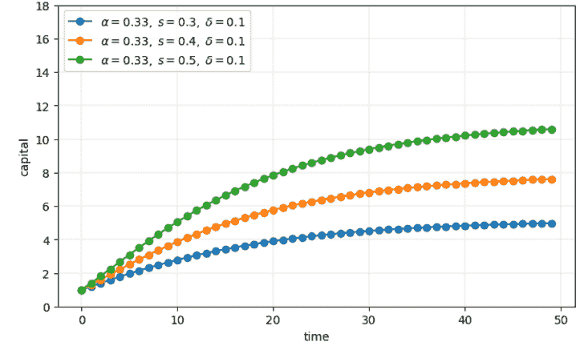

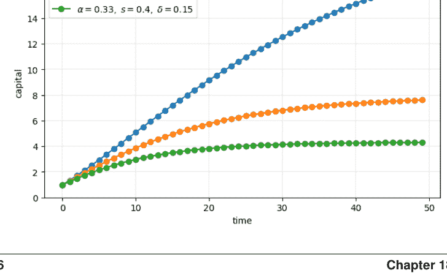

诚然，这段代码或多或少遵循了 PEP8 规范。
但同时，它的结构非常糟糕。
让我们谈谈为什么会这样，以及我们能做些什么。

### 18.3 良好的编码实践

通常有许多不同的方法来编写一个完成给定任务的程序。
对于像上面那样的小程序，你编写代码的方式并不太重要。
但如果你有雄心壮志，想要做出有用的东西，你也会编写中型到大型的程序。
在这些情况下，编码风格**非常重要**。
幸运的是，许多聪明人已经思考过编写代码的最佳方式。
以下是一些基本准则。

#### 18.3.1 不要使用魔法数字

如果你看上面的代码，你会看到像 50、49 和 3 这样的数字散布在代码中。
代码主体中的这类数字字面量有时被称为“魔法数字”。
这可不是什么褒义词。
虽然数字字面量并非全是邪恶的，但上面程序中显示的数字肯定应该用命名常量替换。
例如，上面的代码可以声明变量 `time_series_length = 50`。
然后在循环中，49 应该被替换为 `time_series_length - 1`。
优点是：

- 含义在整个代码中清晰得多
- 要更改时间序列长度，你只需更改一个值

#### 18.3.2 不要重复自己

上面代码片段中的另一个致命错误是重复。
逻辑块（例如生成时间序列的循环）仅做微小更改就被重复。
这违反了编程的一个基本原则：不要重复自己（DRY）。

- 也称为 DIE（重复是邪恶的）。

是的，我们意识到你可以直接复制粘贴并更改几个符号。
但作为程序员，你的目标应该是**自动化**重复，**而不是**自己动手。
更重要的是，在不同地方重复相同的逻辑意味着最终其中一个很可能会出错。
如果你想了解更多，请阅读[此页面](https://en.wikipedia.org/wiki/Don%27t_repeat_yourself)上的精彩总结。
我们将在下面讨论如何避免重复。

## 经济与金融的 Python 编程

#### 18.3.3 最小化全局变量

当然，全局变量（即在任何函数或类外部赋值的名称）很方便。
新手程序员通常会随意使用全局变量——我们自己曾经也这样。
但全局变量是危险的，尤其是在中型到大型程序中，因为

- 它们可以影响程序任何部分发生的事情
- 它们可以被任何函数更改

这使得确定给定代码片段的某个小部分实际执行什么操作变得更加困难。
这里有一篇关于该主题的[有用讨论](https://www.google.com)。
虽然在小脚本中偶尔使用全局变量没什么大问题，但我们建议你养成避免使用它们的习惯。
（我们将在下面讨论如何做到这一点）。

#### JIT 编译

对于科学计算，避免全局变量还有另一个好理由。
正如*我们在之前的讲座中看到的*，JIT 编译可以为 Python 等脚本语言带来出色的性能。
但当存在全局变量时，用于 JIT 编译的编译器的任务会变得更困难。
换句话说，当变量被隔离在函数内部时，JIT 编译所需的类型推断更安全、更有效。

#### 18.3.4 使用函数或类

幸运的是，我们可以轻松避免全局变量和 WET 代码的弊端。

- WET 代表“我们喜欢打字”（we enjoy typing），是 DRY 的反面。

我们可以通过频繁使用函数或类来实现这一点。
事实上，函数和类专门设计用于帮助我们避免因重复代码或过度使用全局变量而自取其辱。

#### 选哪个，函数还是类？

两者都很有用，而且实际上它们可以很好地协同工作。
我们将随着时间的推移了解更多关于这些主题的内容。
（个人偏好也是其中的一部分）
真正重要的是你使用其中一种或两种都使用。

## 18.4 重新审视示例

以下是一些代码，它们以更好的编码风格重现了上图。

```python
from itertools import product

def plot_path(ax, as, s_vals, δs, time_series_length=50):
    """
    为所有给定参数在坐标轴 ax 上添加时间序列图。
    """
    k = np.empty(time_series_length)

    for (a, s, δ) in product(as, s_vals, δs):
        k[0] = 1
        for t in range(time_series_length-1):
            k[t+1] = s * k[t]**a + (1 - δ) * k[t]
        ax.plot(k, 'o-', label=rf"$\alpha = {a},\; s = {s},\; \delta = {δ}$")

    ax.set_xlabel('time')
    ax.set_ylabel('capital')
    ax.set_ylim(0, 18)
    ax.legend(loc='upper left', frameon=True)

fig, axes = plt.subplots(3, 1, figsize=(8, 16))

# 参数 (as, s_vals, δs)
set_one = ([0.25, 0.33, 0.45], [0.4], [0.1])
set_two = ([0.33], [0.3, 0.4, 0.5], [0.1])
set_three = ([0.33], [0.4], [0.05, 0.1, 0.15])

for (ax, params) in zip(axes, (set_one, set_two, set_three)):
    as, s_vals, δs = params
    plot_path(ax, as, s_vals, δs)

plt.show()
```

## 经济与金融的 Python 编程

如果你检查这段代码，你会看到：

-   它使用了一个函数来避免重复。
-   全局变量被隔离在程序末尾，而不是开头。
-   避免了魔法数字。
-   最后执行实际工作的循环很短且相对简单。

## 18.5 练习

### 练习 18.5.1

以下是一些需要改进的代码。
它涉及一个基本的供需问题。
供给由下式给出：

$$q_s(p) = \exp(\alpha p) - \beta.$$

需求曲线是：

$$q_d(p) = \gamma p^{-\delta}.$$

数值 $\alpha$、$\beta$、$\gamma$ 和 $\delta$ 是**参数**。
均衡价格 $p^*$ 是使得 $q_d(p) = q_s(p)$ 的价格。
我们可以使用求根算法来求解这个均衡。具体来说，我们将找到使得 $h(p) = 0$ 的 $p$，其中

$$h(p) := q_d(p) - q_s(p)$$

这给出了均衡价格 $p^*$。由此我们通过 $q^* = q_s(p^*)$ 得到均衡数量。
参数值将是：

-   $\alpha = 0.1$
-   $\beta = 1$
-   $\gamma = 1$
-   $\delta = 1$

```python
from scipy.optimize import brentq

# 计算均衡
def h(p):
    return p**(-1) - (np.exp(0.1 * p) - 1)  # 需求 - 供给

p_star = brentq(h, 2, 4)
q_star = np.exp(0.1 * p_star) - 1

print(f'均衡价格是 {p_star: .2f}')
print(f'均衡数量是 {q_star: .2f}')
```

## 经济与金融的 Python 编程

```
均衡价格是  2.93
均衡数量是  0.34
```

我们还要绘制我们的结果。

```python
# 现在绘图
grid = np.linspace(2, 4, 100)
fig, ax = plt.subplots()

qs = np.exp(0.1 * grid) - 1
qd = grid**(-1)

ax.plot(grid, qd, 'b-', lw=2, label='需求')
ax.plot(grid, qs, 'g-', lw=2, label='供给')

ax.set_xlabel('价格')
ax.set_ylabel('数量')
ax.legend(loc='upper center')

plt.show()
```

我们还想考虑供给和需求的变动。

例如，让我们看看当需求上移，γ 增加到 1.25 时会发生什么：

```python
# 计算均衡
def h(p):
    return 1.25 * p**(-1) - (np.exp(0.1 * p) - 1)

p_star = brentq(h, 2, 4)
q_star = np.exp(0.1 * p_star) - 1

print(f'均衡价格是 {p_star: .2f}')
print(f'均衡数量是 {q_star: .2f}')
```

```
均衡价格是  3.25
均衡数量是  0.38
```

```python
# 现在绘图
p_grid = np.linspace(2, 4, 100)
fig, ax = plt.subplots()

qs = np.exp(0.1 * p_grid) - 1
qd = 1.25 * p_grid**(-1)

ax.plot(grid, qd, 'b-', lw=2, label='需求')
ax.plot(grid, qs, 'g-', lw=2, label='供给')

ax.set_xlabel('价格')
ax.set_ylabel('数量')
ax.legend(loc='upper center')

plt.show()
```

现在我们可能考虑供给变动，但你已经明白这里有很多重复的代码。
使用本讲座讨论的原则来重构并提高上述代码的清晰度。

## 经济与金融的 Python 编程

## 练习 18.5.1 的解答

这是一个使用类的解决方案：

```python
class Equilibrium:

    def __init__(self, α=0.1, β=1, γ=1, δ=1):
        self.α, self.β, self.γ, self.δ = α, β, γ, δ

    def qs(self, p):
        return np.exp(self.α * p) - self.β

    def qd(self, p):
        return self.γ * p**(-self.δ)

    def compute_equilibrium(self):
        def h(p):
            return self.qd(p) - self.qs(p)
        p_star = brentq(h, 2, 4)
        q_star = np.exp(self.α * p_star) - self.β

        print(f'均衡价格是 {p_star: .2f}')
        print(f'均衡数量是 {q_star: .2f}')

    def plot_equilibrium(self):
        # 现在绘图
        grid = np.linspace(2, 4, 100)
        fig, ax = plt.subplots()

        ax.plot(grid, self.qd(grid), 'b-', lw=2, label='需求')
        ax.plot(grid, self.qs(grid), 'g-', lw=2, label='供给')

        ax.set_xlabel('价格')
        ax.set_ylabel('数量')
        ax.legend(loc='upper center')

        plt.show()
```

让我们在默认参数值下创建一个实例。

```python
eq = Equilibrium()
```

现在我们将计算均衡并绘制它。

```python
eq.compute_equilibrium()
```

```
均衡价格是  2.93
均衡数量是  0.34
```

```python
eq.plot_equilibrium()
```

我们重构代码的一个优点是，当我们改变参数时，不需要重复自己：

```python
eq.y = 1.25
```

```python
eq.compute_equilibrium()
```

```
均衡价格是 3.25
均衡数量是 0.38
```

```python
eq.plot_equilibrium()
```

## 经济与金融的 Python 编程

# 第十九章

# 更多语言特性

-   目录
    -   更多语言特性
        -   概述
        -   可迭代对象与迭代器
        -   `*` 和 `**` 运算符
        -   装饰器与描述符
        -   生成器
        -   练习

## 19.1 概述

对于这最后一讲，我们的建议是**初次阅读时跳过**，除非你有强烈的阅读欲望。
它在这里
1.  作为参考，以便我们在需要时可以链接回来，以及
2.  供那些已经完成了一些应用，现在想更多地了解 Python 语言的人使用。

本讲座涵盖了各种主题，包括迭代器、装饰器和描述符，以及生成器。

## 19.2 可迭代对象与迭代器

我们*已经说过一些*关于 Python 中迭代的内容。
现在让我们更仔细地看看这一切是如何工作的，重点关注 Python 对 `for` 循环的实现。

## 经济与金融的 Python 编程

### 19.2.1 迭代器

迭代器是遍历集合中元素的统一接口。
这里我们将讨论如何使用迭代器——稍后我们将学习如何构建自己的迭代器。
形式上，一个*迭代器*是一个具有 `__next__` 方法的对象。
例如，文件对象就是迭代器。
为了说明这一点，让我们再看一下*美国城市数据*，它在下面的单元格中被写入当前工作目录

```python
%%file us_cities.txt
new york: 8244910
los angeles: 3819702
chicago: 2707120
houston: 2145146
philadelphia: 1536471
phoenix: 1469471
san antonio: 1359758
san diego: 1326179
dallas: 1223229
```

正在写入 us_cities.txt

```python
f = open('us_cities.txt')
f.__next__()
```

```
'new york: 8244910\n'
```

```python
f.__next__()
```

```
'los angeles: 3819702\n'
```

我们看到文件对象确实有一个 `__next__` 方法，并且调用此方法会返回文件中的下一行。
`next` 方法也可以通过内置函数 `next()` 访问，该函数直接调用此方法

```python
next(f)
```

```
'chicago: 2707120\n'
```

`enumerate()` 返回的对象也是迭代器

```python
e = enumerate(['foo', 'bar'])
next(e)
```

```
(0, 'foo')
```

```python
next(e)
```

python
(1, 'bar')
```

`csv` 模块的读取器对象也是如此。

让我们创建一个包含日经指数数据的小型 CSV 文件

```python
%%file test_table.csv
Date,Open,High,Low,Close,Volume,Adj Close
2009-05-21,9280.35,9286.35,9189.92,9264.15,133200,9264.15
2009-05-20,9372.72,9399.40,9311.61,9344.64,143200,9344.64
2009-05-19,9172.56,9326.75,9166.97,9290.29,167000,9290.29
2009-05-18,9167.05,9167.82,8997.74,9038.69,147800,9038.69
2009-05-15,9150.21,9272.08,9140.90,9265.02,172000,9265.02
2009-05-14,9212.30,9223.77,9052.41,9093.73,169400,9093.73
2009-05-13,9305.79,9379.47,9278.89,9340.49,176000,9340.49
2009-05-12,9358.25,9389.61,9298.61,9298.61,188400,9298.61
2009-05-11,9460.72,9503.91,9342.75,9451.98,230800,9451.98
2009-05-08,9351.40,9464.43,9349.57,9432.83,220200,9432.83
```

```python
Writing test_table.csv
```

```python
from csv import reader

f = open('test_table.csv', 'r')
nikkei_data = reader(f)
next(nikkei_data)
```

```python
['Date', 'Open', 'High', 'Low', 'Close', 'Volume', 'Adj Close']
```

```python
next(nikkei_data)
```

```python
['2009-05-21', '9280.35', '9286.35', '9189.92', '9264.15', '133200', '9264.15']
```

## 19.2.2 For 循环中的迭代器

所有迭代器都可以放在 `for` 循环语句中 `in` 关键字的右侧。

事实上，`for` 循环就是这样工作的：如果我们写

```python
for x in iterator:
    <code block>
```

那么解释器

- 调用 `iterator.__next__()` 并将 `x` 绑定到结果
- 执行代码块
- 重复直到发生 `StopIteration` 错误

所以现在你知道这个看起来很神奇的语法是如何工作的了

```python
f = open('somefile.txt', 'r')
for line in f:
    # do something
```

解释器只是不断地

1. 调用 `f.__next__()` 并将 `line` 绑定到结果
2. 执行循环体

这会持续进行，直到发生 `StopIteration` 错误。

## 19.2.3 可迭代对象

你已经知道我们可以将 Python 列表放在 `for` 循环中 `in` 的右侧

```python
for i in ['spam', 'eggs']:
    print(i)
```

```
spam
eggs
```

那么这是否意味着列表是一个迭代器？

答案是否定的

```python
x = ['foo', 'bar']
type(x)
```

```
list
```

```python
next(x)
```

```
---------------------------------------------------------------------------
TypeError                                 Traceback (most recent call last)
Cell In[12], line 1
----> 1 next(x)

TypeError: 'list' object is not an iterator
```

那么为什么我们可以在 `for` 循环中遍历列表呢？

原因是列表是*可迭代的*（与迭代器相对）。

形式上，如果一个对象可以使用内置函数 `iter()` 转换为迭代器，那么它就是可迭代的。

列表就是这样的对象

```python
x = ['foo', 'bar']
type(x)
```

```
list
```

```python
y = iter(x)
type(y)
```

```
list_iterator
```

```python
next(y)
```

```
'foo'
```

```python
next(y)
```

```
'bar'
```

```python
next(y)
```

```
---------------------------------------------------------------------------
StopIteration                         Traceback (most recent call last)
Cell In[17], line 1
----> 1 next(y)

StopIteration:
```

许多其他对象也是可迭代的，例如字典和元组。
当然，并非所有对象都是可迭代的

```python
iter(42)
```

```
---------------------------------------------------------------------------
TypeError                             Traceback (most recent call last)
Cell In[18], line 1
----> 1 iter(42)

TypeError: 'int' object is not iterable
```

总结一下我们对 `for` 循环的讨论

- `for` 循环适用于迭代器或可迭代对象。
- 在第二种情况下，可迭代对象在循环开始之前被转换为迭代器。

## 19.2.4 迭代器与内置函数

一些作用于序列的内置函数也适用于可迭代对象

- max(), min(), sum(), all(), any()

例如

```python
x = [10, -10]
max(x)
```

```
10
```

```python
y = iter(x)
type(y)
```

```
list_iterator
```

```python
max(y)
```

```
10
```

关于迭代器需要记住的一点是，它们在使用过程中会被耗尽

```python
x = [10, -10]
y = iter(x)
max(y)
```

```
10
```

```python
max(y)
```

```
---------------------------------------------------------------------------
ValueError                                Traceback (most recent call last)
Cell In[23], line 1
----> 1 max(y)

ValueError: max() arg is an empty sequence
```

## 19.3 * 和 ** 运算符

* 和 ** 是方便且广泛使用的工具，用于解包列表和元组，并允许用户定义接受任意多个参数作为输入的函数。

在本节中，我们将探讨如何使用它们并区分它们的使用场景。

## 19.3.1 解包参数

当我们操作参数列表时，我们经常需要在将列表传递给函数时，将列表的内容提取为单独的参数，而不是一个集合。

幸运的是，* 运算符可以帮助我们将列表和元组解包为函数调用中的位置参数。

为了具体说明，请看以下示例：

没有 *，`print` 函数打印一个列表

```python
l1 = ['a', 'b', 'c']

print(l1)
```

```
['a', 'b', 'c']
```

而 `print` 函数打印单个元素，因为 * 将列表解包为单独的参数

```python
print(*l1)
```

```
a b c
```

使用 * 将列表解包为位置参数等同于在调用函数时单独定义它们

```python
print('a', 'b', 'c')
```

```
a b c
```

然而，如果我们想再次重用它们，* 运算符更方便

```python
l1.append('d')

print(*l1)
```

```
a b c d
```

类似地，** 用于解包参数。

区别在于 ** 将*字典*解包为*关键字参数*。

当我们有许多想要重用的关键字参数时，通常使用 **。

例如，假设我们想使用相同的图形设置绘制多个图形，这可能涉及重复设置许多图形参数，这些参数通常使用关键字参数定义。

在这种情况下，我们可以使用字典来存储这些参数，并在需要时使用 ** 将字典解包为关键字参数。

让我们一起看一个简单的例子，并区分 * 和 ** 的用法

```python
import numpy as np
import matplotlib.pyplot as plt

# Set up the frame and subplots
fig, ax = plt.subplots(2, 1)
plt.subplots_adjust(hspace=0.7)

# Create a function that generates synthetic data
def generate_data(β_0, β_1, σ=30, n=100):
    x_values = np.arange(0, n, 1)
    y_values = β_0 + β_1 * x_values + np.random.normal(size=n, scale=σ)
    return x_values, y_values

# Store the keyword arguments for lines and legends in a dictionary
line_kargs = {'lw': 1.5, 'alpha': 0.7}
legend_kargs = {'bbox_to_anchor': (0., 1.02, 1., .102),
                'loc': 3,
                'ncol': 4,
                'mode': 'expand',
                'prop': {'size': 7}}

β_0s = [10, 20, 30]
β_1s = [1, 2, 3]

# Use a for loop to plot lines
def generate_plots(β_0s, β_1s, idx, line_kargs, legend_kargs):
    label_list = []
    for βs in zip(β_0s, β_1s):

        # Use * to unpack tuple βs and the tuple output from the generate_data function
        # Use ** to unpack the dictionary of keyword arguments for lines
        ax[idx].plot(*generate_data(*βs), **line_kargs)

        label_list.append(f'$β_0 = {βs[0]}$ | $β_1 = {βs[1]}$')

    # Use ** to unpack the dictionary of keyword arguments for legends
    ax[idx].legend(label_list, **legend_kargs)

generate_plots(β_0s, β_1s, 0, line_kargs, legend_kargs)

# We can easily reuse and update our parameters
β_1s.append(-2)
β_0s.append(40)
line_kargs['lw'] = 2
line_kargs['alpha'] = 0.4

generate_plots(β_0s, β_1s, 1, line_kargs, legend_kargs)
plt.show()
```

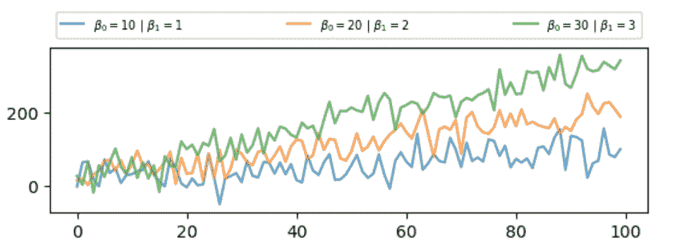

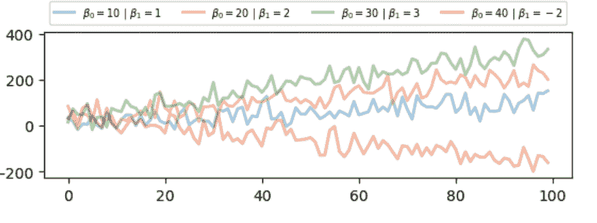

在这个例子中，* 解包了打包的参数 βs 和存储在元组中的 `generate_data` 函数的输出，而 ** 解包了存储在 `legend_kargs` 和 `line_kargs` 中的图形参数。

总结一下，当 *list/*tuple 和 **dictionary 传递给*函数调用*时，它们被解包为单独的参数，而不是一个集合。

区别在于 * 将列表和元组解包为*位置参数*，而 ** 将字典解包为*关键字参数*。

## 19.3.2 任意参数

当我们*定义*函数时，有时希望允许用户向函数中放入任意多的参数。

你可能已经注意到 `ax.plot()` 函数可以处理任意多的参数。

如果我们查看该函数的文档，可以看到该函数定义为

```python
Axes.plot(*args, scalex=True, scaley=True, data=None, **kwargs)
```

我们在*函数定义*的上下文中再次发现了 * 和 ** 运算符。

事实上，*args 和 **kargs 在 Python 的科学库中无处不在，以减少冗余并允许灵活的输入。

*args 使函数能够处理可变大小的*位置参数*

```python
l1 = ['a', 'b', 'c']
l2 = ['b', 'c', 'd']
```

## 面向经济学与金融的Python编程

```python
def arb(*ls):
    print(ls)

arb(11, 12)
```

```
(['a', 'b', 'c'], ['b', 'c', 'd'])
```

输入被传递给函数并存储在一个元组中。
让我们尝试更多输入

```python
l3 = ['z', 'x', 'b']
arb(11, 12, 13)
```

```
(['a', 'b', 'c'], ['b', 'c', 'd'], ['z', 'x', 'b'])
```

类似地，Python允许我们使用`**kwargs`将任意数量的*关键字参数*传递给函数

```python
def arb(**ls):
    print(ls)

# 注意这些是关键字参数
arb(11=11, 12=12)
```

```
{'11': ['a', 'b', 'c'], '12': ['b', 'c', 'd']}
```

我们可以看到Python使用字典来存储这些关键字参数。
让我们尝试更多输入

```python
arb(11=11, 12=12, 13=13)
```

```
{'11': ['a', 'b', 'c'], '12': ['b', 'c', 'd'], '13': ['z', 'x', 'b']}
```

总的来说，`*args`和`**kwargs`是在*定义函数*时使用的；它们使函数能够接受任意大小的输入。
区别在于，使用`*args`的函数将能够接受任意数量的*位置参数*，而`**kwargs`将允许函数接受任意数量的*关键字参数*。

## 19.4 装饰器与描述符

让我们看看一些Python开发者经常使用的特殊语法元素。
你可能不需要立即掌握以下概念，但你会在其他人的代码中看到它们。
因此，你需要在Python学习的某个阶段理解它们。

### 19.4.1 装饰器

装饰器是一种语法糖，虽然很容易避免，但已经变得流行起来。
要说明装饰器的作用非常容易。
另一方面，解释*为什么*你可能需要使用它们则需要一些努力。

### 一个例子

假设我们正在开发一个看起来像这样的程序

```python
import numpy as np

def f(x):
    return np.log(np.log(x))

def g(x):
    return np.sqrt(42 * x)

# 程序继续使用f和g进行各种计算
```

现在假设有一个问题：在后续计算中，偶尔会有负数被传递给`f`和`g`。
如果你尝试一下，你会看到当这些函数被负数调用时，它们会返回一个名为`nan`的NumPy对象。
这代表“非数字”（并表明你正试图在数学函数未定义的点对其进行求值）。
也许这不是我们想要的，因为它会导致后续难以发现的其他问题。
假设我们希望程序在这种情况下终止，并给出一个合理的错误消息。
这个更改很容易实现

```python
import numpy as np

def f(x):
    assert x >= 0, "参数必须为非负数"
    return np.log(np.log(x))

def g(x):
    assert x >= 0, "参数必须为非负数"
    return np.sqrt(42 * x)

# 程序继续使用f和g进行各种计算
```

然而，请注意这里有一些重复，表现为两行相同的代码。
重复使我们的代码更长且更难维护，因此是我们努力避免的事情。
这里问题不大，但想象一下，现在不只是`f`和`g`，我们有20个这样的函数需要以完全相同的方式修改。
这意味着我们需要重复测试逻辑（即测试非负性的`assert`行）20次。
如果测试逻辑更长更复杂，情况会更糟。
在这种情况下，以下方法会更简洁

```python
import numpy as np

def check_nonneg(func):
    def safe_function(x):
        assert x >= 0, "参数必须为非负数"
        return func(x)
    return safe_function

def f(x):
    return np.log(np.log(x))

def g(x):
    return np.sqrt(42 * x)

f = check_nonneg(f)
g = check_nonneg(g)
# 程序继续使用f和g进行各种计算
```

这看起来很复杂，所以让我们慢慢梳理一下。
要理清逻辑，考虑当我们说`f = check_nonneg(f)`时会发生什么。
这会调用函数`check_nonneg`，其中参数`func`被设置为等于`f`。
现在`check_nonneg`创建了一个名为`safe_function`的新函数，该函数验证`x`为非负数，然后在其上调用`func`（这与`f`相同）。
最后，全局名称`f`被设置为等于`safe_function`。
现在`f`的行为符合我们的期望，`g`也是如此。
同时，测试逻辑只编写了一次。

### 装饰器登场

我们代码的最后一个版本仍然不理想。
例如，如果有人阅读我们的代码并想知道`f`是如何工作的，他们会寻找函数定义，即

```python
def f(x):
    return np.log(np.log(x))
```

他们很可能会错过`f = check_nonneg(f)`这一行。
出于这个和其他原因，Python引入了装饰器。
使用装饰器，我们可以将以下代码行

```python
def f(x):
    return np.log(np.log(x))

def g(x):
    return np.sqrt(42 * x)

f = check_nonneg(f)
g = check_nonneg(g)
```

替换为

```python
@check_nonneg
def f(x):
    return np.log(np.log(x))

@check_nonneg
def g(x):
    return np.sqrt(42 * x)
```

这两段代码做的事情完全相同。
如果它们做同样的事情，我们真的需要装饰器语法吗？
嗯，请注意装饰器就位于函数定义的正上方。
因此，任何查看函数定义的人都会看到它们，并意识到该函数已被修改。
在许多人看来，这使得装饰器语法成为该语言的一个重大改进。

### 19.4.2 描述符

描述符解决了一个关于变量管理的常见问题。
要理解这个问题，请考虑一个模拟汽车的`Car`类。
假设这个类定义了变量`miles`和`kms`，分别表示以英里和公里为单位的行驶距离。
该类的一个高度简化版本可能如下所示

```python
class Car:
    def __init__(self, miles=1000):
        self.miles = miles
        self.kms = miles * 1.61

    # 其他一些功能，细节省略
```

我们这里可能遇到的一个潜在问题是，用户更改了其中一个变量而没有更改另一个

```python
car = Car()
car.miles
```

```
1000
```

```python
car.kms
```

```
1610.0
```

```python
car.miles = 6000
car.kms
```

```
1610.0
```

在最后两行中，我们看到`miles`和`kms`不同步了。
我们真正想要的是某种机制，使得每次用户设置其中一个变量时，*另一个会自动更新*。

### 一个解决方案

在Python中，这个问题是通过*描述符*解决的。
描述符只是一个实现了某些方法的Python对象。
当通过点号属性表示法访问对象时，这些方法会被触发。
理解这一点的最佳方式是看它的实际应用。
考虑这个`Car`类的替代版本

```python
class Car:

    def __init__(self, miles=1000):
        self._miles = miles
        self._kms = miles * 1.61

    def set_miles(self, value):
        self._miles = value
        self._kms = value * 1.61

    def set_kms(self, value):
        self._kms = value
        self._miles = value / 1.61

    def get_miles(self):
        return self._miles

    def get_kms(self):
        return self._kms

    miles = property(get_miles, set_miles)
    kms = property(get_kms, set_kms)
```

首先让我们检查一下我们是否得到了期望的行为

```python
car = Car()
car.miles
```

```
1000
```

```python
car.miles = 6000
car.kms
```

```
9660.0
```

是的，这就是我们想要的——`car.kms`自动更新了。

### 工作原理

名称`_miles`和`_kms`是我们用来存储变量值的任意名称。
对象`miles`和`kms`是*属性*，一种常见的描述符。
方法`get_miles`、`set_miles`、`get_kms`和`set_kms`定义了当你获取（即访问）或设置（绑定）这些变量时会发生什么

- 所谓的“getter”和“setter”方法。

内置Python函数`property`接受getter和setter方法并创建一个属性。
例如，在`car`被创建为`Car`的实例之后，对象`car.miles`就是一个属性。
作为一个属性，当我们通过`car.miles = 6000`设置其值时，其setter方法会被触发——在本例中是`set_miles`。

### 装饰器与属性

如今，通过装饰器使用`property`函数非常普遍。
这是我们的`Car`类的另一个版本，它像以前一样工作，但现在使用装饰器来设置属性

```python
class Car:

    def __init__(self, miles=1000):
        self._miles = miles
        self._kms = miles * 1.61

    @property
    def miles(self):
        return self._miles

    @property
    def kms(self):
        return self._kms

    @miles.setter
    def miles(self, value):
        self._miles = value
        self._kms = value * 1.61

    @kms.setter
    def kms(self, value):
        self._kms = value
        self._miles = value / 1.61
```

我们不会在这里详细介绍所有细节。
更多信息可以参考[描述符文档](https://docs.python.org/3/howto/descriptor.html)。

## 19.5 生成器

生成器是一种迭代器（即，它通过 `next` 函数工作）。
我们将学习两种构建生成器的方法：生成器表达式和生成器函数。

### 19.5.1 生成器表达式

构建生成器最简单的方法是使用*生成器表达式*。
就像列表推导式一样，但使用圆括号。
这是一个列表推导式：

```python
singular = ('dog', 'cat', 'bird')
type(singular)
```

```
output
tuple
```

```python
plural = [string + 's' for string in singular]
plural
```

```
output
['dogs', 'cats', 'birds']
```

```python
type(plural)
```

```
output
list
```

而这是一个生成器表达式：

```python
singular = ('dog', 'cat', 'bird')
plural = (string + 's' for string in singular)
type(plural)
```

```
output
generator
```

```python
next(plural)
```

```
output
'dogs'
```

```python
next(plural)
```

```
output
'cats'
```

```python
next(plural)
```

```
output
'birds'
```

由于 `sum()` 可以在迭代器上调用，我们可以这样做：

```python
sum((x * x for x in range(10)))
```

```
output
285
```

函数 `sum()` 调用 `next()` 来获取元素，并累加连续的项。
事实上，在这种情况下我们可以省略外层的括号：

```python
sum(x * x for x in range(10))
```

```
output
285
```

### 19.5.2 生成器函数

创建生成器对象最灵活的方式是使用生成器函数。
让我们看一些例子。

#### 示例 1

这是一个非常简单的生成器函数示例：

```python
def f():
    yield 'start'
    yield 'middle'
    yield 'end'
```

它看起来像一个函数，但使用了我们之前未见过的关键字 `yield`。
让我们看看运行这段代码后它是如何工作的：

```python
type(f)
```

```
output
function
```

```python
gen = f()
gen
```

```
output
<generator object f at 0x7fbfd1dd9850>
```

```python
next(gen)
```

```
output
'start'
```

```python
next(gen)
```

```
output
'middle'
```

```python
next(gen)
```

```
output
'end'
```

```python
next(gen)
```

```
output
---------------------------------------------------------------------------
StopIteration                         Traceback (most recent call last)
Cell In[62], line 1
----> 1 next(gen)

StopIteration:
```

生成器函数 `f()` 用于创建生成器对象（在本例中是 `gen`）。
生成器是迭代器，因为它们支持 `next` 方法。
第一次调用 `next(gen)`

- 执行 `f()` 函数体中的代码，直到遇到 `yield` 语句。
- 将该值返回给 `next(gen)` 的调用者。

第二次调用 `next(gen)` 从*下一行*开始执行：

```python
def f():
    yield 'start'
    yield 'middle'  # 这一行！
    yield 'end'
```

并继续执行直到下一个 `yield` 语句。
此时，它将 `yield` 后面的值返回给 `next(gen)` 的调用者，依此类推。
当代码块结束时，生成器会抛出一个 `StopIteration` 错误。

#### 示例 2

我们的下一个示例从调用者那里接收一个参数 `x`：

```python
def g(x):
    while x < 100:
        yield x
        x = x * x
```

让我们看看它是如何工作的：

```python
g
```

```
output
<function __main__.g(x)>
```

```python
gen = g(2)
type(gen)
```

```
output
generator
```

```python
next(gen)
```

```
output
2
```

```python
next(gen)
```

```
output
4
```

```python
next(gen)
```

```
output
16
```

```python
next(gen)
```

```
output
---------------------------------------------------------------------------
StopIteration                             Traceback (most recent call last)
Cell In[70], line 1
----> 1 next(gen)

StopIteration:
```

调用 `gen = g(2)` 将 `gen` 绑定到一个生成器。
在生成器内部，名称 `x` 被绑定到 2。
当我们调用 `next(gen)` 时

- `g()` 的函数体执行，直到 `yield x` 这一行，并返回 `x` 的值。

请注意，`x` 的值在生成器内部被保留。
当我们再次调用 `next(gen)` 时，执行从*上次中断的地方*继续：

```python
def g(x):
    while x < 100:
        yield x
        x = x * x  # 执行从这里继续
```

当 `x < 100` 条件不满足时，生成器会抛出一个 `StopIteration` 错误。
顺便说一下，生成器内部的循环可以是无限的：

```python
def g(x):
    while 1:
        yield x
        x = x * x
```

### 19.5.3 迭代器的优势

在这里使用迭代器有什么好处？
假设我们想从二项分布(n,0.5)中抽样。
一种方法如下：

```python
import random
n = 10000000
draws = [random.uniform(0, 1) < 0.5 for i in range(n)]
sum(draws)
```

```
output
4997254
```

但这里我们创建了两个巨大的列表，`range(n)` 和 `draws`。
这会占用大量内存并且非常慢。
如果我们将 n 变得更大，那么会发生这种情况：

```python
n = 100000000
draws = [random.uniform(0, 1) < 0.5 for i in range(n)]
```

我们可以使用迭代器来避免这些问题。
这是一个生成器函数：

```python
def f(n):
    i = 1
    while i <= n:
        yield random.uniform(0, 1) < 0.5
        i += 1
```

现在让我们求和：

```python
n = 10000000
draws = f(n)
draws
```

```
output
<generator object f at 0x7fbfd2095b60>
```

```python
sum(draws)
```

```
output
4998844
```

总而言之，可迭代对象

- 避免了创建大型列表/元组的需要，并且
- 提供了统一的迭代接口，可以在 `for` 循环中透明地使用。

## 19.6 练习

### 练习 19.6.1

完成以下代码，并使用 [这个 csv 文件](this csv file) 进行测试，我们假设你已将其放在当前工作目录中：

```python
def column_iterator(target_file, column_number):
    """一个用于 CSV 文件的生成器函数。
    当使用文件名 target_file（字符串）和列号
    column_number（整数）调用时，该生成器函数返回一个生成器，
    该生成器遍历文件 target_file 中第 column_number 列的元素。
    """
    # 在此处编写你的代码

dates = column_iterator('test_table.csv', 1)

for date in dates:
    print(date)
```

### 练习 19.6.1 的解答

一种解决方案如下：

```python
def column_iterator(target_file, column_number):
    """一个用于 CSV 文件的生成器函数。
    当使用文件名 target_file（字符串）和列号
    column_number（整数）调用时，该生成器函数返回一个生成器，
    该生成器遍历文件 target_file 中第 column_number 列的元素。
    """
    f = open(target_file, 'r')
    for line in f:
        yield line.split(',')[column_number - 1]
    f.close()

dates = column_iterator('test_table.csv', 1)

i = 1
for date in dates:
    print(date)
    if i == 10:
        break
    i += 1
```

```
output
Date
2009-05-21
2009-05-20
2009-05-19
2009-05-18
2009-05-15
2009-05-14
2009-05-13
2009-05-12
2009-05-11
```

## 第二十章

## 调试与错误处理

- 目录
  - 调试与错误处理
    - 概述
    - 调试
    - 错误处理
    - 练习

> “调试的难度是编写代码的两倍。因此，如果你尽可能聪明地编写代码，那么从定义上讲，你还不够聪明来调试它。” – 布莱恩·柯林汉

### 20.1 概述

你是否是那种在调试程序时会在代码中塞满 `print` 语句的程序员？
嘿，我们都曾经那样做过。
（好吧，有时我们仍然会那样做……）
但一旦你开始编写更大的程序，你就需要一个更好的系统。
你也可能希望在代码中处理潜在的错误。
在本讲中，我们将讨论如何调试我们的程序并改进错误处理。

### 20.2 调试

Python 的调试工具因平台、IDE 和编辑器而异。
例如，JupyterLab 中提供了一个 `可视化调试器`。
这里我们将重点介绍 Jupyter Notebook，其他环境留待你自己探索。
我们需要以下导入：

```python
%matplotlib inline
import numpy as np
import matplotlib.pyplot as plt
plt.rcParams['figure.figsize'] = (10,6)
```

#### 20.2.1 debug 魔术命令

让我们考虑一个简单（且相当刻意）的例子：

```python
def plot_log():
    fig, ax = plt.subplots(2, 1)
    x = np.linspace(1, 2, 10)
    ax.plot(x, np.log(x))
    plt.show()

plot_log()  # 调用函数，生成绘图
```

```
output
---------------------------------------------------------------------------
AttributeError                            Traceback (most recent call last)
Cell In[2], line 7
      4     ax.plot(x, np.log(x))
      5     plt.show()
----> 7 plot_log()

Cell In[2], line 4, in plot_log()
      2 fig, ax = plt.subplots(2, 1)
      3 x = np.linspace(1, 2, 10)
----> 4 ax.plot(x, np.log(x))
      5 plt.show()

AttributeError: 'numpy.ndarray' object has no attribute 'plot'
```

这段代码旨在绘制`log`函数在区间[1, 2]上的图像。

但这里有一个错误：`plt.subplots(2, 1)`应该改为`plt.subplots()`。

（调用`plt.subplots(2, 1)`会返回一个包含两个坐标轴对象的NumPy数组，适用于在同一图形上绘制两个子图）

回溯信息显示错误发生在方法调用`ax.plot(x, np.log(x))`处。

错误发生的原因是我们错误地将`ax`定义为了一个NumPy数组，而NumPy数组没有`plot`方法。

但让我们暂时假装不理解这一点。

我们可能怀疑`ax`有问题，但当我们尝试检查这个对象时，得到了以下异常：

```python
ax
```

```
---------------------------------------------------------------------------
NameError                                 Traceback (most recent call last)
Cell In[3], line 1
----> 1 ax

NameError: name 'ax' is not defined
```

问题在于`ax`是在`plot_log()`函数内部定义的，一旦该函数执行完毕，这个名称就丢失了。

让我们尝试用另一种方式。

我们再次运行第一个代码单元块，产生相同的错误

```python
def plot_log():
    fig, ax = plt.subplots(2, 1)
    x = np.linspace(1, 2, 10)
    ax.plot(x, np.log(x))
    plt.show()

plot_log()  # 调用函数，生成绘图
```

```
---------------------------------------------------------------------------
AttributeError                            Traceback (most recent call last)
Cell In[4], line 7
      4     ax.plot(x, np.log(x))
      5     plt.show()
----> 7 plot_log()

Cell In[4], line 4, in plot_log()
      2 fig, ax = plt.subplots(2, 1)
      3 x = np.linspace(1, 2, 10)
----> 4 ax.plot(x, np.log(x))
      5 plt.show()

AttributeError: 'numpy.ndarray' object has no attribute 'plot'
```

但这次我们在下一个单元块中输入

```
%debug
```

你应该会进入一个新的提示符，看起来像这样

```
ipdb>
```

（你可能会看到`pdb>`）

现在我们可以检查程序在这一点上的变量值，逐步执行代码等。
例如，这里我们只需输入名称`ax`来查看这个对象的情况：

```
ipdb> ax
array([<matplotlib.axes.AxesSubplot object at 0x290f5d0>,
       <matplotlib.axes.AxesSubplot object at 0x2930810>], dtype=object)
```

现在非常清楚`ax`是一个数组，这澄清了问题的根源。
要了解在`ipdb`（或`pdb`）内部还能做什么，请使用在线帮助

```
ipdb> h

Documented commands (type help <topic>):
=========================================
EOF    bt      cont    enable  jump    pdef    r       tbreak  w
a      c       continue exit    l       pdoc    restart u       whatis
alias  cl      d       h       list    pinfo   return  unalias where
args   clear   debug   help    n       pp      run     unt
b      commands disable ignore  next    q       s       until
break  condition down    j       p       quit    step    up

Miscellaneous help topics:
==========================
exec   pdb

Undocumented commands:
======================
retval  rv

ipdb> h c
ontinue)
Continue execution, only stop when a breakpoint is encountered.
```

## 20.2.2 设置断点

前面的方法很方便，但有时还不够。
考虑我们上面函数的以下修改版本

```python
def plot_log():
    fig, ax = plt.subplots()
    x = np.logspace(1, 2, 10)
    ax.plot(x, np.log(x))
    plt.show()

plot_log()
```

这里原始问题已修复，但我们意外地写了`np.logspace(1, 2, 10)`而不是`np.linspace(1, 2, 10)`。

现在不会有任何异常，但绘图看起来会不正确。

为了调查，如果我们能在函数执行期间检查像x这样的变量，那将很有帮助。

为此，我们通过在函数代码块中插入`breakpoint()`来添加一个“断点”

```python
def plot_log():
    breakpoint()
    fig, ax = plt.subplots()
    x = np.logspace(1, 2, 10)
    ax.plot(x, np.log(x))
    plt.show()

plot_log()
```

现在让我们运行脚本，并通过调试器进行调查

```
> <ipython-input-6-a188074383b7>(6)plot_log()
-> fig, ax = plt.subplots()
(Pdb) n
> <ipython-input-6-a188074383b7>(7)plot_log()
-> x = np.logspace(1, 2, 10)
(Pdb) n
> <ipython-input-6-a188074383b7>(8)plot_log()
-> ax.plot(x, np.log(x))
(Pdb) x
array([ 10.        ,  12.91549665,  16.68100537,  21.5443469 ,
       27.82559402,  35.93813664,  46.41588834,  59.94842503,
       77.42636827, 100.        ])
```

我们使用了两次`n`来逐步执行代码（一次一行）。
然后我们打印了`x`的值，以查看该变量的情况。
要退出调试器，请使用`q`。

## 20.2.3 其他有用的魔法命令

在本讲中，我们使用了`%debug` IPython魔法命令。
还有许多其他有用的魔法命令：

- `%precision 4` 将浮点数的打印精度设置为4位小数
- `%whos` 给出变量及其值的列表
- `%quickref` 给出魔法命令的列表

完整的魔法命令列表在[这里](https://ipython.readthedocs.io/en/stable/interactive/magics.html)。

## 20.3 处理错误

有时在编写代码时，可以预见错误和异常。
例如，样本$y_1, \dots, y_n$的无偏样本方差定义为

$$s^2 := \frac{1}{n-1} \sum_{i=1}^n (y_i - \bar{y})^2 \quad \bar{y} = \text{样本均值}$$

这可以使用NumPy中的`np.var`来计算。
但如果你正在编写一个处理此类计算的函数，你可能会预见到当样本大小为1时会出现除零错误。
一种可能的做法是什么都不做——程序会崩溃，并输出一条错误消息。
但有时值得以一种能预见并处理你认为可能出现的运行时错误的方式来编写代码。
为什么？

- 因为解释器提供的调试信息通常不如编写良好的错误消息有用。
- 因为导致执行停止的错误会中断工作流程。
- 因为它会降低用户对你代码的信心（如果你是为他人编写代码）。

在本节中，我们将讨论Python中不同类型的错误以及处理程序中潜在错误的技术。

### 20.3.1 Python中的错误

我们在*之前的例子*中已经见过`AttributeError`和`NameError`。
在Python中，有两种类型的错误——语法错误和异常。
这是一个常见错误类型的例子

```python
def f:
```

```
Cell In[6], line 1
    def f:
       ^
SyntaxError: expected '('
```

由于非法语法无法执行，语法错误会终止程序的执行。
这是另一种与语法无关的错误

```python
1 / 0
```

```
---------------------------------------------------------------------------
ZeroDivisionError                         Traceback (most recent call last)
Cell In[7], line 1
----> 1 1 / 0

ZeroDivisionError: division by zero
```

这是另一个

```python
x1 = y1
```

```
---------------------------------------------------------------------------
NameError                                 Traceback (most recent call last)
Cell In[8], line 1
----> 1 x1 = y1

NameError: name 'y1' is not defined
```

还有一个

```python
'foo' + 6
```

```
---------------------------------------------------------------------------
TypeError                                 Traceback (most recent call last)
Cell In[9], line 1
----> 1 'foo' + 6

TypeError: can only concatenate str (not "int") to str
```

以及另一个

```python
X = []
x = X[0]
```

```
---------------------------------------------------------------------------
IndexError                                Traceback (most recent call last)
Cell In[10], line 2
      1 X = []
----> 2 x = X[0]

IndexError: list index out of range
```

每次，解释器都会告知我们错误类型

- NameError、TypeError、IndexError、ZeroDivisionError等。

在Python中，这些错误被称为*异常*。

### 20.3.2 断言

有时可以通过检查程序是否按预期运行来避免错误。
处理检查的一种相对简单的方法是使用`assert`关键字。
例如，暂时假设`np.var`函数不存在，我们需要自己编写一个

```python
def var(y):
    n = len(y)
    assert n > 1, 'Sample size must be greater than one.'
    return np.sum((y - y.mean())**2) / float(n-1)
```

如果我们用一个长度为1的数组运行这个函数，程序将终止并打印我们的错误消息

```python
var([1])
```

```
---------------------------------------------------------------------------
AssertionError                            Traceback (most recent call last)
Cell In[12], line 1
----> 1 var([1])

Cell In[11], line 3, in var(y)
      1 def var(y):
      2     n = len(y)
----> 3     assert n > 1, 'Sample size must be greater than one.'
      4     return np.sum((y - y.mean())**2) / float(n-1)

AssertionError: Sample size must be greater than one.
```

优点在于我们可以

- 尽早失败，一旦知道会有问题就立即失败
- 提供关于程序为何失败的具体信息

## 20.3.3 运行时错误处理

上面使用的方法有些局限，因为它总是导致程序终止。
有时我们可以通过处理特殊情况来更优雅地处理错误。
让我们看看这是如何做到的。

## 捕获异常

我们可以使用 `try-except` 块来捕获和处理异常。
这里有一个简单的例子

```python
def f(x):
    try:
        return 1.0 / x
    except ZeroDivisionError:
        print('Error: division by zero. Returned None')
        return None
```

当我们调用 `f` 时，会得到以下输出

```python
f(2)
```

```
0.5
```

```python
f(0)
```

```
Error: division by zero. Returned None
```

```python
f(0.0)
```

```
Error: division by zero. Returned None
```

错误被捕获，程序的执行不会终止。
请注意，其他类型的错误没有被捕获。
如果我们担心用户可能会传入字符串，我们也可以捕获那个错误

```python
def f(x):
    try:
        return 1.0 / x
    except ZeroDivisionError:
        print('Error: Division by zero. Returned None')
    except TypeError:
        print(f'Error: x cannot be of type {type(x)}. Returned None')
    return None
```

以下是发生的情况

```python
f(2)
```

```
0.5
```

```python
f(0)
```

```
Error: Division by zero. Returned None
```

```python
f('foo')
```

```
Error: x cannot be of type <class 'str'>. Returned None
```

如果我们觉得懒，可以一起捕获这些错误

```python
def f(x):
    try:
        return 1.0 / x
    except:
        print(f'Error. An issue has occurred with x = {x} of type: {type(x)}')
        return None
```

以下是发生的情况

```python
f(2)
```

```
0.5
```

```python
f(0)
```

```
Error. An issue has occurred with x = 0 of type: <class 'int'>
```

```python
f('foo')
```

```
Error. An issue has occurred with x = foo of type: <class 'str'>
```

通常，更具体一些会更好。

## 20.4 练习

### 练习 20.4.1

假设我们有一个文本文件 `numbers.txt`，包含以下行

```
prices
3
8

7
21
```

## 经济与金融的 Python 编程

使用 `try - except`，编写一个程序来读取文件内容并对数字求和，忽略没有数字的行。
你可以使用我们*之前*学过的 `open()` 函数来打开 `numbers.txt`。

### 练习 20.4.1 的解答

让我们先保存数据

```python
%%file numbers.txt
prices
3
8

7
21
```

写入 numbers.txt

```python
f = open('numbers.txt')

total = 0.0
for line in f:
    try:
        total += float(line)
    except ValueError:
        pass

f.close()

print(total)
```

```
39.0
```

## 第五部分

## 其他

## 第二十一章
## 故障排除

- 目录
- 故障排除
    - 修复你的本地环境
    - 报告问题

本页适用于在运行课程代码时遇到错误的读者。

## 21.1 修复你的本地环境

课程的基本假设是，课程中的代码应该在以下情况下执行：
1. 在 Jupyter notebook 中执行，并且
2. notebook 在安装了最新版本 Anaconda Python 的机器上运行。
你已经按照*本课程*中的说明安装了 Anaconda，对吧？
假设你已经安装了，我们读者遇到的最常见问题是他们的 Anaconda 发行版不是最新的。
[这里有一篇有用的文章](https://conda.io/docs/user-guide/tasks/update-conda.html)介绍了如何更新 Anaconda。
另一个选择是简单地卸载 Anaconda 并重新安装。
你还需要保持外部代码库的更新，例如 [QuantEcon.py](https://quantecon.org/quantecon-py)。
对于这个任务，你可以
- 在命令行上使用 `conda upgrade quantecon`，或者
- 在 Jupyter notebook 中执行 `!conda upgrade quantecon`。
如果你的本地环境仍然无法工作，你可以做两件事。
首先，你可以使用远程机器，通过点击每节课可用的 Launch Notebook 图标


其次，你可以报告问题，这样我们就可以尝试修复你的本地设置。
我们喜欢收到关于课程的反馈，所以请不要犹豫联系我们。

## 21.2 报告问题

提供反馈的一种方式是通过我们的[问题跟踪器](https://github.com/QuantEcon/lecture-python-programming/issues)提出问题。
请尽可能具体。告诉我们问题出在哪里，并尽可能提供关于你本地设置的详细信息。
另一个反馈选项是使用我们的[讨论论坛](https://discourse.quantecon.org/)。
最后，你可以直接向 [contact@quantecon.org](mailto:contact@quantecon.org) 提供反馈

## 第二十二章

## 执行统计

此表包含最新的执行统计信息。

| 文档 | 修改时间 | 方法 | 运行时间 (s) | 状态 |
|---|---|---|---|---|
| about_py | 2023-12-20 22:51 | cache | 2.91 | ✓ |
| debugging | 2023-12-20 22:51 | cache | 2.25 | ✓ |
| functions | 2023-12-20 22:51 | cache | 1.89 | ✓ |
| getting_started | 2023-12-20 22:51 | cache | 1.56 | ✓ |
| intro | 2023-12-20 22:51 | cache | 0.93 | ✓ |
| jax_intro | 2023-12-20 22:51 | cache | 0.84 | ✓ |
| matplotlib | 2023-12-20 22:51 | cache | 4.72 | ✓ |
| need_for_speed | 2023-12-20 22:51 | cache | 10.09 | ✓ |
| numba | 2023-12-20 22:52 | cache | 12.9 | ✓ |
| numpy | 2023-12-20 22:52 | cache | 7.7 | ✓ |
| oop_intro | 2023-12-20 22:52 | cache | 1.7 | ✓ |
| pandas | 2023-12-20 22:53 | cache | 41.49 | ✓ |
| parallelization | 2023-12-20 22:53 | cache | 41.0 | ✓ |
| python_advanced_features | 2023-12-20 22:54 | cache | 17.68 | ✓ |
| python_by_example | 2023-12-20 22:54 | cache | 6.79 | ✓ |
| python_essentials | 2023-12-20 22:54 | cache | 1.74 | ✓ |
| python_oop | 2023-12-20 22:54 | cache | 2.41 | ✓ |
| scipy | 2023-12-20 22:54 | cache | 10.87 | ✓ |
| status | 2023-12-20 22:51 | cache | 0.93 | ✓ |
| sympy | 2023-12-20 22:54 | cache | 6.19 | ✓ |
| troubleshooting | 2023-12-20 22:51 | cache | 0.93 | ✓ |
| workspace | 2023-12-20 22:51 | cache | 0.93 | ✓ |
| writing_good_code | 2023-12-20 22:54 | cache | 2.73 | ✓ |

这些课程是通过 `github actions` 在 `linux` 实例上构建的。

## 索引

- B
    - 二分法, 214
- C
    - 云计算, 16
        - anaconda enterprise, 16
        - AWS, 16
        - digital ocean, 16
        - Google Cloud, 16
        - google colab, 16
    - 编译函数, 273, 274
- D
    - 数据源, 240
    - 调试, 339
    - 动态类型, 155
- G
    - GeoPandas, 14
- I
    - 不可变, 110
    - 积分, 209, 217
    - IPython, 21
- J
    - Jupyter, 21
    - Jupyter Notebook
        - 基础, 26
        - 调试, 31
        - 帮助, 31
        - nbviewer, 36
        - 设置, 23
        - 共享, 36
    - Jupyter Notebooks, 19, 21
    - JupyterLab, 37
- L
    - lifelines, 14
    - 线性代数, 209, 218
- M
    - Matplotlib, 9, 191
        - 3D 绘图, 199
        - 单轴多图, 196
        - 简单 API, 192
        - 子图, 197
    - 模型
        - 代码风格, 303
    - 可变, 110
- N
    - NetworkX, 15
    - 牛顿-拉弗森方法, 215
    - NumPy, 163, 209, 210
        - 算术运算, 171
        - 数组, 164
        - 数组 (创建), 166
        - 数组 (索引), 167
        - 数组 (方法), 169
        - 数组 (形状和维度), 165
        - 广播, 172
        - 比较, 181
        - 矩阵乘法, 172
        - 通用函数, 158
        - 向量化函数, 179
- O
    - 面向对象编程
        - 类, 121
        - 关键概念, 120
        - 方法, 125
        - 特殊方法, 133
    - OOP II: 构建类, 119
    - 优化, 209, 217
        - 多变量, 217
- P
    - Pandas, 14, 223
        - DataFrames, 226
        - Series, 224
    - pandas_datareader, 242
    - 并行计算, 16
    - Dask, 16
    - ipython, 16
    - pycuda, 16
    - Pyro, 14
    - Python, 19
        - Anaconda, 21
        - 断言, 347
        - 常见用途, 6
        - 比较, 85
        - 条件, 66
        - 内容, 98
        - Cython, 282
        - 数据类型, 75
        - 装饰器, 326, 328, 331
        - 描述符, 326, 329
        - 字典, 79
        - 文档字符串, 88
        - 异常, 346
        - For 循环, 47
        - 生成器函数, 333
        - 生成器, 332
        - 错误处理, 345
        - 标识, 97
        - 缩进, 47
        - 与 Fortran 接口, 283
        - 解释器, 104
        - 入门示例, 39
        - IO, 80
        - IPython, 21
        - 可迭代对象, 320
        - 迭代, 83, 317
        - 迭代器, 318, 319, 322
        - 关键字参数, 62
        - lambda 函数, 63
        - 列表推导式, 85
        - 列表, 45
        - 逻辑表达式, 87
        - Matplotlib, 191
        - 方法, 98
        - 命名空间 (__builtins__), 107
        - 命名空间 (全局), 106
        - 命名空间 (局部), 106
        - 命名空间 (解析), 108
        - 命名空间, 101
        - Numba, 274
        - NumPy, 163
        - 面向对象编程, 119
        - 对象, 96
        - 包, 42
        - Pandas, 223
        - pandas-datareader, 242
        - 路径, 82
        - PEP8, 88
        - 属性, 331
        - PyPI, 17
        - 递归, 68
        - requests, 240
        - 运行时错误, 348
        - SciPy, 182, 209
        - 集合, 79
        - 切片, 78
        - 子包, 42
        - SymPy, 251
        - 语法和设计, 7
        - 元组, 77
        - 类型, 96
        - 用户定义函数, 59
        - 变量名, 99
        - 向量化, 157
        - While 循环, 48
    - python, 5
    - PyTorch, 14
- Q
    - QuantEcon, 36
- R
    - requests, 240
- S
    - 科学编程, 8
        - BeautifulSoup, 17
        - CVXPY, 17
        - Jupyter, 17
        - mlflow, 17
        - Numba, 17
        - 数值计算, 8
        - PyInstaller, 17
        - PyTables, 17
        - scikit-image, 17
        - scikit-learn, 14
    - SciPy, 182, 209, 210
        - 二分法, 214
        - 不动点, 216
        - 积分, 217
        - 线性代数, 218
        - 多变量求根, 216
        - 牛顿-拉弗森方法, 215
        - 优化, 217
        - 统计, 210
    - 静态类型, 156
    - statsmodels, 14
    - SymPy, 9, 251
- V
    - 向量化, 153, 157
        - 数组上的操作, 157

## Y

yfinance，242