# 面向儿童的Python编程

本·戴维斯

# 版权所有

保留所有权利。未经出版商明确书面许可，不得以任何方式复制或使用本书或其任何部分，书评中的简短引用除外。

# 目录

- 引言 .......................... 6
- 安装Python.................. 13
  - 在Windows上安装Python ....... 13
  - 在Ubuntu上安装Python .......... 24
  - 保存你的Python程序 ........ 30
- 计算与变量 .. 35
  - 使用Python进行计算 ................ 35
  - 基本Python运算符 ................ 41
  - 运算顺序.............. 42
  - 变量如同标签 ............. 47
  - 使用变量................................ 53
- 字符串、列表、元组和映射
  - 字符串 ..................................................... 62
  - 创建字符串 ................................... 62
  - 处理字符串问题..... 67
  - 在字符串中嵌入值......... 75
  - 字符串乘法........................... 81
  - 列表比字符串更强大 ..................................................... 84
  - 向列表添加项目 .................... 92
  - 从列表中移除项目 ......... 95
  - 列表运算................................... 97
  - 元组 ........................................ 102
  - Python映射不会帮你指路 ........................................ 105

# 引言

编程能培养创造力、推理能力和解决问题的能力。程序员有机会从无到有地创造事物，运用逻辑将编程结构转化为计算机可以运行的形式，并且当事情进展不如预期时，运用问题解决能力找出问题所在。编程是一项有趣、有时具有挑战性（偶尔令人沮丧）的活动，从中获得的技能在学校和工作中都很有用……即使你的职业与计算机毫无关系。

而且，如果没别的事可做，编程是度过一个阴沉下午的好方法。

Python是一种易于学习的编程语言，对于初学者来说具有一些非常实用的特性。与其他编程语言相比，其代码相当容易阅读，并且它有一个交互式外壳，你可以在其中输入程序并查看它们运行。除了简单的语言结构和可供实验的交互式外壳外，Python还有一些特性，极大地增强了学习过程，并允许你组合简单的动画来创建自己的游戏。

一个是turtle模块，灵感来源于海龟图形（1960年代由Logo编程语言使用），专为教育用途设计。另一个是tkinter模块，它是Tk GUI工具包的接口，提供了一种简单的方法来创建具有稍高级图形和动画的程序。

就像你第一次尝试任何事情一样，最好从基础开始，所以从第一章开始，抵制住跳到后面章节的冲动。没有人第一次拿起乐器就能演奏交响乐。学生飞行员在理解基本控制之前不会开始驾驶飞机。体操运动员（通常）第一次尝试时无法完成后空翻。如果你跳得太快，不仅基本概念不会留在你脑海中，而且你会发现后面章节的内容比实际更复杂。

在阅读本书时，尝试每个示例，这样你就能看到它们是如何工作的。

和人类一样，计算机使用多种语言进行交流——在这种情况下，是编程语言。编程语言只是一种与计算机对话的特定方式——一种使用人类和计算机都能理解的指令的方式。

有些编程语言以人名命名（如Ada和Pascal），有些使用简单的首字母缩写命名（如BASIC和FORTRAN），甚至还有一些以电视节目命名，比如Python。

是的，Python编程语言是以《蒙提·派森的飞行马戏团》电视节目命名的，而不是以蟒蛇命名。

《蒙提·派森的飞行马戏团》是一部另类的英国喜剧节目，于1970年代首次播出，至今在特定观众中仍然非常受欢迎。该节目有诸如“愚蠢的行走部”、“拍鱼舞”和“奶酪店”（里面不卖任何奶酪）等小品。

Python编程语言的许多特性使其对初学者极其有用。最重要的是，你可以使用Python快速编写简单、高效的程序。

Python没有很多复杂的符号，如花括号（{ }）、井号（#）和美元符号（$），这些符号使其他编程语言更难阅读，因此对初学者不太友好。

# 安装Python

安装Python相当简单。在这里，我们将介绍在Windows、Mac OS和Ubuntu上安装的步骤。安装Python时，你还将为IDLE程序设置一个快捷方式，IDLE是集成开发环境，允许你为Python编写程序。

## 在Windows上安装Python

要为Microsoft Windows安装Python，请将Web浏览器指向http://www.python.org/并下载最新的Windows Python 3安装程序。在菜单中查找名为“快速链接”的部分，如下所示：

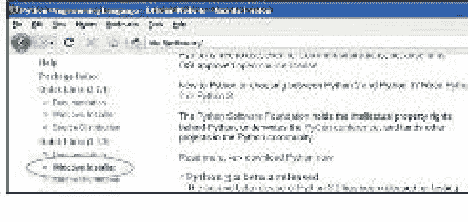

下载Windows安装程序后，双击其图标，然后按照说明将Python安装到默认位置，如下所示：

1. 选择“为所有用户安装”，然后单击“下一步”。
2. 保持默认目录不变，但记下安装目录的名称（可能是C:\Python31或C:\Python32）。单击“下一步”。
3. 忽略安装的“自定义Python”部分，然后单击“下一步”。

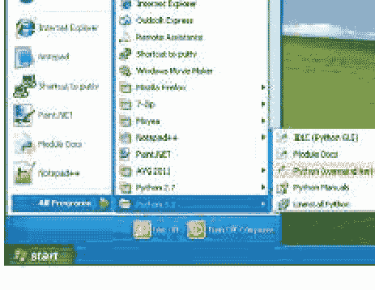

在此过程结束时，你应该在“开始”菜单中有一个Python 3条目：

接下来，按照以下步骤将Python 3快捷方式添加到桌面：

1. 右键单击桌面，从弹出菜单中选择“新建”>“快捷方式”。
2. 在“键入项目的位置”框中输入以下内容（确保输入的目录与你之前记下的相同）：

```
c:\Python32\Lib\idlelib\idle.pyw -n
```

你的对话框应如下所示：

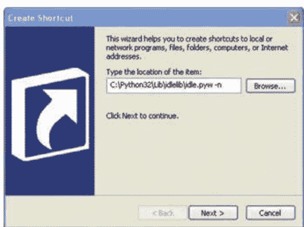

3. 单击“下一步”转到下一个对话框。
4. 输入名称为IDLE，然后单击“完成”创建快捷方式。

现在你可以跳到第10页的“安装Python后”开始使用Python。

## 在Mac OS上安装Python

如果你使用的是Mac，你应该会发现预装了Python版本，但它可能是该语言的较旧版本。为确保你运行的是最新版本，请将浏览器指向http://www.python.org/getit/以下载最新的Mac安装程序。

有两个不同的安装程序。你应该下载哪一个取决于你安装的Mac OS X版本。（要查明，请单击顶部菜单栏中的Apple图标，然后选择“关于本机”。）按如下方式选择安装程序：

- 如果你运行的是10.3到10.6之间的Mac OS X版本，请下载适用于i386/PPC的32位Python 3版本。
- 如果你运行的是10.6或更高版本的Mac OS X，请下载适用于x86-64的64位/32位Python 3版本。

文件下载后（文件扩展名为.dmg），双击它。你将看到一个显示文件内容的窗口。


在此窗口中，双击Python.mpkg，然后按照说明安装软件。在Python安装之前，系统会提示你输入Mac的管理员密码。（没有管理员密码？你的父母可能需要输入。）

接下来，你需要在桌面上添加一个脚本来启动Python的IDLE应用程序，如下所示：

## 在Ubuntu上安装Python

Ubuntu Linux发行版预装了Python，但可能是较旧的版本。请按照以下步骤在Ubuntu上安装Python 3。

1.  点击侧边栏中的Ubuntu软件中心按钮（它是一个橙色袋子形状的图标——如果没看到，可以点击Dash主页图标并在对话框中输入“软件”）。
2.  在软件中心右上角的搜索框中输入Python。
3.  在显示的软件列表中，选择最新版本的IDLE，在本例中是IDLE (使用Python 3.2)：

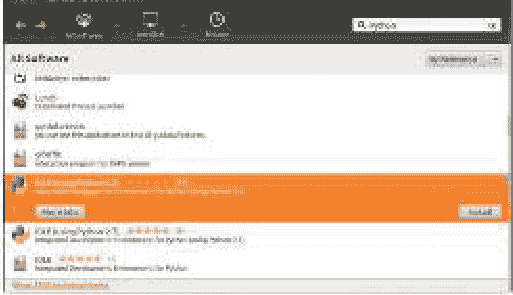

4.  点击安装。
5.  输入管理员密码以安装软件，然后点击认证。（没有管理员密码？可能需要你的家长输入。）

现在，你的Windows或Mac OS桌面上应该有一个标记为IDLE的图标。如果你使用的是Ubuntu，在应用程序菜单中，你应该会看到一个名为“编程”的新组，其中包含应用程序IDLE (使用Python 3.2)（或更新版本）。

双击图标或选择菜单选项，你应该会看到这个窗口：

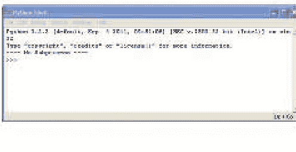

这是Python shell，是Python集成开发环境的一部分。三个大于号（>>>）被称为提示符。

让我们在提示符下输入一些命令，从以下开始：

```
>>> print("Hello World")
```

确保包含双引号（" "）。输入完这行后按键盘上的回车键。如果输入正确，你应该会看到类似这样的内容：

Hello World

提示符应该会重新出现，让你知道Python shell已准备好接受更多命令。

恭喜！你刚刚创建了你的第一个Python程序。单词print是一种称为函数的Python命令，它将括号内的任何内容打印到屏幕上。本质上，你给了计算机一个显示“Hello World”这个词的指令——一个你和计算机都能理解的指令。

## 保存你的Python程序

如果你每次使用Python程序都需要重写它们，那么它们就不会非常有用，更不用说打印出来以便参考了。当然，重写短程序可能没问题，但像文字处理器这样的大型程序可能包含数百万行代码。全部打印出来，你可能会得到超过10万页。想象一下试图把那一大摞纸带回家。

最好希望你不会遇到一阵大风。

幸运的是，我们可以保存程序以备将来使用。要保存新程序，请打开IDLE并选择文件 > 新建窗口。将出现一个空窗口，菜单栏中显示*未命名*。

在新的shell窗口中输入以下代码：

```
print("Hello World")
```

现在，选择文件 > 保存。当提示输入文件名时，输入hello.py，并将文件保存到桌面。然后选择运行 > 运行模块。运气好的话，你保存的程序应该会运行，像这样：

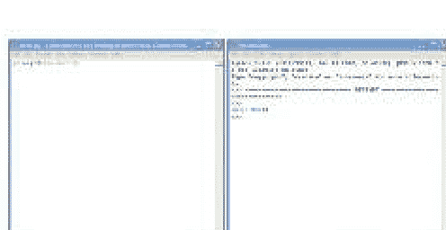

现在，如果你关闭shell窗口但保持hello.py窗口打开，然后选择运行 > 运行模块，Python shell应该会重新出现，你的程序应该会再次运行。（要重新打开Python shell而不运行程序，请选择运行 > Python Shell。）运行代码后，你会发现桌面上有一个标记为hello.py的新图标。如果你双击该图标，一个黑色窗口会短暂出现然后消失。发生了什么？

你看到的是Python命令行控制台（类似于shell）启动，打印“Hello World”，然后退出。如果你有超人般的快速视觉，能在窗口关闭前看到它，这就是会出现的内容：

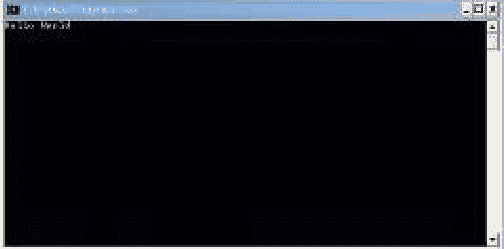

## 计算和变量

既然你已经安装了Python并知道如何启动Python shell，你就可以用它来做点事情了。我们将从一些简单的计算开始，然后转向变量。变量是在计算机程序中存储事物的一种方式，它们可以帮助你编写有用的程序。

### 使用Python计算

通常，当被要求计算两个数字的乘积，比如8 × 3.57时，你会使用计算器或纸笔。那么，使用Python shell来执行你的计算怎么样？让我们试试。

通过双击桌面上的IDLE图标启动Python shell，或者如果你使用Ubuntu，点击应用程序菜单中的IDLE图标。在提示符下，输入这个等式：

```
>>> 8 * 3.57
28.56
```

注意，在Python中输入乘法计算时，你使用星号符号（*）而不是乘号（×）。

如果我们尝试一个更有用的等式怎么样？

假设你在后院挖掘，发现了一袋20枚金币。第二天，你偷偷溜到地下室，把硬币放进你祖父的蒸汽动力复制发明中（幸运的是，你刚好能把20枚硬币放进去）。你听到嗖的一声和砰的一声，几个小时后，又射出了10枚闪闪发光的硬币。

如果你每天都这样做，一年后你的宝箱里会有多少枚硬币？在纸上，等式可能看起来像这样：

10 × 365 = 3650
20 + 3650 = 3670

当然，在计算器或纸上做这些计算很容易，但我们也可以用Python shell完成所有这些计算。首先，我们将10枚硬币乘以一年中的365天，得到3650。接下来，我们加上原来的20枚，得到3670。

```
>>> 10 * 365
3650
>>> 20 + 3650
3670
```

现在，如果一只乌鸦发现了你卧室里闪闪发光的金币，每周都飞进来偷走三枚硬币会怎样？

一年结束时你还剩多少枚硬币？以下是shell中的计算过程：

```
>>> 3 * 52
156
>>> 3670 - 156
3514
```

首先，我们将3枚硬币乘以一年中的52周。结果是156。我们从总硬币数（3670）中减去这个数字，这告诉我们一年结束时我们将剩下3514枚硬币。

这是一个非常简单的程序。在本书中，你将学习如何扩展这些想法来编写更有用的程序。

### Python运算符

你可以在Python shell中进行乘法、加法、减法和除法，以及其他我们现在不深入讨论的数学运算。Python用于执行数学运算的基本符号称为运算符。

### 基本Python运算符

正斜杠（/）用于除法，因为它类似于书写分数时使用的除号线。例如，如果你有100个海盗和20个大桶，你想计算有多少海盗你可以藏在每个桶里，你可以将100个海盗除以20个桶（100 ÷ 20），方法是在Python shell中输入100 / 20。只需记住，正斜杠是顶部向右倾斜的那个。

## 运算顺序

我们在编程语言中使用括号来控制运算顺序。运算是指任何使用运算符的操作。乘法和除法的优先级高于加法和减法，这意味着它们会先执行。换句话说，如果你在Python中输入一个等式，乘法或除法会在加法或减法之前执行。

例如，在下面的等式中，数字30和20首先相乘，然后将数字5加到它们的乘积上。

```
>>> 5 + 30 * 20

605
```

这个等式是“将30乘以20，然后将结果加上5”的另一种说法。结果是605。我们可以通过在前两个数字周围添加括号来改变运算顺序，如下所示：

```
>>> (5 + 30) * 20

700
```

这个等式的结果是700（而不是605），因为括号告诉Python先执行括号内的运算，然后再执行括号外的运算。这个例子说的是“将5加到30上，然后将结果乘以20”。

括号可以嵌套，这意味着括号内可以有括号，像这样：

```
>>> ((5 + 30) * 20) / 10
70.0
```

在这种情况下，Python首先计算最内层的括号，然后是外层的括号，最后是除法运算符。换句话说，这个等式说的是“将5加到30上，然后将结果乘以20，再将结果除以10”。以下是具体步骤：

- 将5加到30上得到35。
- 将35乘以20得到700。
- 将700除以10得到最终答案70。

如果我们没有使用括号，结果会略有不同：

```
>>> 5 + 30 * 20 / 10
65.0
```

在这种情况下，30首先乘以20（得到600），然后600除以10（得到60）。最后，加上5得到结果65。

警告：记住，除非使用括号来控制运算顺序，否则乘法和除法总是优先于加法和减法。

## 变量就像标签

编程中的“变量”一词描述的是存储信息的地方，例如数字、文本、数字和文本的列表等。另一种看待变量的方式是，它就像某个东西的标签。

例如，要创建一个名为fred的变量，我们使用等号（=），然后告诉Python这个变量应该作为什么信息的标签。在这里，我们创建变量fred，并告诉Python它标记数字100（注意这并不意味着另一个变量不能有相同的值）：

```
>>> fred = 100
```

要找出变量标记的值，在shell中输入print，后跟括号中的变量名，如下所示：

```
>>> print(fred)

100
```

我们还可以告诉Python更改变量fred，使其标记其他内容。例如，以下是将fred更改为数字200的方法：

```
>>> fred = 200

>>> print(fred)

200
```

在第一行，我们说fred标记数字200。在第二行，我们询问fred标记的是什么，只是为了确认更改。Python在最后一行打印结果。

我们还可以为同一个项目使用多个标签（多个变量）：

```
>>> fred = 200
>>> john = fred
>>> print(john)
200
```

在这个例子中，我们告诉Python，我们希望名称（或变量）john标记与fred相同的东西，方法是在john和fred之间使用等号。

当然，fred可能不是一个非常有用的变量名，因为它很可能没有告诉我们变量的用途。让我们将变量命名为number_of_coins而不是fred，如下所示：

```
>>> number_of_coins = 200
>>> print(number_of_coins)
200
```

这清楚地表明我们谈论的是200个硬币。

变量名可以由字母、数字和下划线字符（_）组成，但不能以数字开头。你可以使用从单个字母（如a）到长句子的任何内容作为变量名。（变量不能包含空格，因此请使用下划线分隔单词。）有时，如果你正在做一些快速的事情，短变量名是最好的。你选择的名称应该取决于你需要变量名有多有意义。

现在你知道如何创建变量了，让我们看看如何使用它们。

## 使用变量

还记得我们用来计算如果你能用你父亲在地下室的疯狂发明神奇地创造新硬币，年底你会有多少硬币的等式吗？我们有这个等式：

```
>>> 20 + 10 * 365
3670
>>> 3 * 52
156
>>> 3670 - 156
3514
```

我们可以将其转换为单行代码：

```
>>> 20 + 10 * 365 - 3 * 52
3514
```

现在，如果我们把这些数字变成变量呢？尝试输入以下内容：

```
>>> found_coins = 20
>>> magic_coins = 10
>>> stolen_coins = 3
```

这些条目创建了变量found_coins、magic_coins和stolen_coins。

现在，我们可以像这样重新输入等式：

```
>>> found_coins + magic_coins * 365 - stolen_coins * 52
3514
```

你可以看到这给出了相同的答案。那又怎样，对吧？啊，但这就是变量的魔力。如果你在窗户上放一个稻草人，乌鸦只偷了两个硬币而不是三个呢？当我们使用变量时，我们只需更改变量以保存新数字，它就会在等式中使用它的所有地方发生变化。我们可以通过输入以下内容将stolen_coins变量更改为2：

```
>>> stolen_coins = 2
```

然后我们可以复制并粘贴等式以再次计算答案，如下所示：

1. 通过单击鼠标并从行的开头拖动到末尾来选择要复制的文本，如下所示：

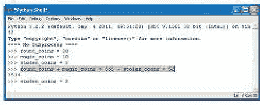

2. 按住ctrl键并按C复制所选文本。（从现在开始，你将看到ctrl-C。）
3. 单击最后一行提示符（在stolen_coins = 2之后）。
4. 按住ctrl键并按V粘贴所选文本。（从现在开始，你将看到ctrl-V。）
5. 按enter键查看新结果：

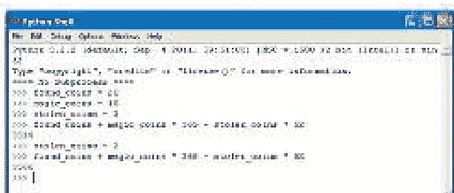

这不比重新输入整个等式容易得多吗？确实如此。

你可以尝试更改其他变量，然后复制（ctrl-C）并粘贴（ctrl-V）计算以查看更改的效果。例如，如果你在正确的时刻敲击你父亲发明的侧面，它每次会额外吐出3个硬币，你会发现年底你最终会有4661个硬币：

```
>>> magic_coins = 13

>>> found_coins + magic_coins * 365 - stolen_coins * 52
4661
```

当然，对于像这样的简单等式，使用变量仍然只是稍微有用。我们还没有达到真正有用的程度。现在，只需记住，变量是一种标记事物的方式，以便你以后可以使用它们。

## 字符串、列表、元组和映射

在本章中，我们将使用Python程序中的一些其他项目：字符串、列表、元组和映射。你将使用字符串在程序中显示消息（例如游戏中的“准备就绪”和“游戏结束”消息）。

你还将发现列表、元组和映射如何用于存储事物的集合。

## 字符串

在编程术语中，我们通常将文本称为字符串。当你将字符串视为字母的集合时，这个术语是有意义的。本书中的所有字母、数字和符号都可以是一个字符串。就此而言，你的名字可以是一个字符串，你的地址也可以是一个字符串。

### 创建字符串

在Python中，我们通过在文本周围加上引号来创建字符串。

```
fred = "Why do gorillas have big nostrils? Big fingers!!"
```

那么，要查看 fred 里面的内容，我们可以输入 `print(fred)`，像这样：

```
>>> print(fred)
```

为什么大猩猩有大鼻孔？因为手指太粗！！

你也可以使用单引号来创建字符串，像这样：

```
>>> fred = 'What is pink and fluffy? Pink fluff!!'
```

```
>>> print(fred)
```

What is pink and fluffy? Pink fluff!!

然而，如果你尝试仅使用单引号（'）或双引号（"）为字符串输入多行文本，或者你以一种引号开始却试图用另一种引号结束，你将在 Python shell 中收到一条错误消息。例如，输入以下行：

```
>>> fred = "How do dinosaurs pay their bills?
```

你将看到这个结果：

```
SyntaxError: EOL while scanning string literal
```

这是一条关于语法的错误消息，因为你没有遵循使用单引号或双引号结束字符串的规则。

语法是指句子中单词的排列和顺序，或者在这种情况下，是指程序中单词和符号的排列和顺序。因此，SyntaxError 意味着你做了一些 Python 未预料到的事情，或者 Python 期望的东西你遗漏了。EOL 意味着行尾，所以错误消息的其余部分告诉你，Python 到达了行尾，但没有找到双引号来关闭字符串。

要在字符串中使用多行文本（称为多行字符串），请使用三个单引号（'''），然后在行之间按回车键，像这样：

```
>>> fred = """How do dinosaurs pay their bills? With tyrannosaurus checks!"""
```

现在让我们打印出 fred 的内容，看看这是否有效：

```
>>> print(fred)
```

How do dinosaurs pay their bills? With tyrannosaurus checks!

## 处理字符串问题

现在考虑这个疯狂的字符串示例，它导致 Python 显示一条错误消息：

```
>>> silly_string = 'He said, "Aren't can't shouldn't wouldn't."' SyntaxError: invalid syntax
```

在第一行中，我们尝试创建一个用单引号括起来的字符串（定义为变量 silly_string），但其中也包含了 can't、shouldn't 和 wouldn't 等单词中的单引号，以及双引号。真是一团糟！

请记住，Python 本身并不像人类那样聪明，所以它看到的只是一个包含 He said, "Aren 的字符串，后面跟着一堆它不期望的其他字符。当 Python 看到引号（单引号或双引号）时，它期望字符串在第一个引号之后开始，并在该行上下一个匹配的引号（单引号或双引号）之后结束。在这种情况下，字符串的开始是 He 之前的单引号，而就 Python 而言，字符串的结束是 Aren 中 n 之后的单引号。IDLE 高亮显示了出错的位置：

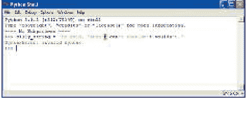

IDLE 的最后一行告诉我们发生了什么类型的错误——在这种情况下，是语法错误。

使用双引号而不是单引号仍然会产生错误：

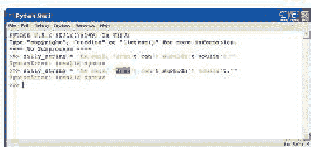

```
>>> silly_string = "He said, "Aren't can't shouldn't wouldn't."" SyntaxError: invalid syntax
```

在这里，Python 看到一个由双引号界定的字符串，包含字母 He said,（和一个空格）。该字符串之后的所有内容（从 Aren't 开始）都会导致错误。

这是因为，从 Python 的角度来看，所有那些额外的东西根本就不应该在那里。Python 寻找下一个匹配的引号，并且不知道你希望它如何处理同一行上该引号之后的任何内容。

这个问题的解决方案是多行字符串，我们之前学过，使用三个单引号（'''），这允许我们在字符串中组合双引号和单引号而不会导致错误。事实上，如果我们使用三个单引号，我们可以在字符串中放入任何单引号和双引号的组合（只要我们不尝试在那里放入三个单引号）。

这就是我们无错误版本的字符串的样子：

```
silly_string = """He said, "Aren't can't shouldn't wouldn't."""
```

但是等等，还有更多。如果你真的想在 Python 中使用单引号或双引号来包围字符串，而不是三个单引号，你可以在字符串中的每个引号前添加一个反斜杠（\）。这被称为转义。这是对 Python 说的一种方式：“是的，我知道我的字符串里有引号，我希望你忽略它们，直到你看到结束引号。”

转义字符串可能使它们更难阅读，所以最好使用多行字符串。不过，你可能会遇到使用转义的代码片段，所以了解反斜杠为什么在那里是很好的。

以下是转义如何工作的几个示例：

```
>>> single_quote_str = 'He said, \n"Aren\'t can\'t shouldn\'t wouldn\'t."'

>>> double_quote_str = "He said, \n"Aren't can't shouldn't wouldn't.""

>>> print(single_quote_str)
He said, "Aren't can't shouldn't wouldn't."

>>> print(double_quote_str)
He said, "Aren't can't shouldn't wouldn't."
```

首先，在 u 处，我们使用单引号创建一个字符串，在该字符串内的单引号前使用反斜杠。在 v 处，我们使用双引号创建一个字符串，并在字符串中的这些引号前使用反斜杠。在接下来的几行中，我们打印刚刚创建的变量。注意，当我们打印它们时，反斜杠字符不会出现在字符串中。

## 在字符串中嵌入值

如果你想使用变量的内容显示一条消息，你可以使用 %s 在字符串中嵌入值，这就像一个标记，用于你稍后要添加的值。（嵌入值是程序员对“插入值”的说法。）例如，要让 Python 计算或存储你在游戏中获得的分数，然后将其添加到像“I scored points”这样的句子中，请在句子中使用 %s 代替该值，然后告诉 Python 该值，像这样：

```
>>> myscore = 1000
>>> message = 'I scored %s points'
```

```
>>> print(message % myscore) I scored 1000 points
```

在这里，我们创建变量 myscore，值为 1000，以及变量 message，包含字符串“I scored %s points”，其中 %s 是分数的占位符。在下一行，我们使用 % 符号调用 `print(message)`，告诉 Python 用存储在变量 myscore 中的值替换 %s。打印此消息的结果是 I scored 1000 points。我们不需要为该值使用变量。我们可以做同样的例子，只使用 `print(message % 1000)`。

我们也可以使用不同的变量为 %s 占位符传递不同的值，如本例所示：

```
>>> joke_text = '%s: a device for finding furniture in the dark'
>>> bodypart1 = 'Knee'
>>> bodypart2 = 'Shin'
>>> print(joke_text % bodypart1)
Knee: a device for finding furniture in the dark
>>> print(joke_text % bodypart2)
```

Shin: a device for finding furniture in the dark

在这里，我们创建三个变量。第一个，joke_text，包含带有 %s 标记的字符串。其他变量是 bodypart1 和 bodypart2。我们可以打印变量 joke_text，并再次使用 % 运算符将其替换为变量 bodypart1 和 bodypart2 的内容，以产生不同的消息。

你也可以在字符串中使用多个占位符，像这样：

```
>>> nums = 'What did the number %s say to the number %s? Nice belt!!'
>>> print(nums % (0, 8))
```

What did the number 0 say to the number 8? Nice belt!!

使用多个占位符时，请务必将替换值包装在括号中，如示例所示。值的顺序是它们在字符串中使用的顺序。

## 字符串乘法

10 乘以 5 是多少？答案当然是 50。但是 10 乘以 a 是多少？这是 Python 的答案：

```
>>> print(10 * 'a')

aaaaaaaaaa
```

Python 程序员可能会使用这种方法在 shell 中显示消息时，将字符串与特定数量的空格对齐。例如，在 shell 中打印一个字母怎么样（选择 File > New Window，然后输入以下代码）：

```
spaces = ' ' * 25

print('%s 12 Butts Wynd' % spaces)
print('%s Twinklebottom Heath' % spaces)
print('%s West Snoring' % spaces)
print()

print()
print('Dear Sir')
print()

print('I wish to report that tiles are missing from the')
print('outside toilet roof.')

print('I think it was bad wind the other night that blew them away.')
print()

print('Regards')
print('Malcolm Dithering')
```

当你在命令行窗口中输入完代码后，选择“文件 > 另存为”。将你的文件命名为 `myletter.py`。

注意：从现在开始，当你在代码块上方看到“另存为：somefilename.py”时，你就知道需要选择“文件 > 新建窗口”，在出现的窗口中输入代码，然后像本例中那样保存它。

在本例的第一行中，我们通过将一个空格字符乘以 25 来创建变量 `spaces`。然后我们在接下来的三行中使用该变量，将文本与命令行窗口的右侧对齐。你可以看到这些 `print` 语句的结果如下：

除了使用乘法进行对齐，我们还可以用它来用烦人的消息填满屏幕。自己试试这个例子：

```
>>> print(1000 * 'snirt')
```

## 列表比字符串更强大

“蜘蛛腿、青蛙脚趾、蝾螈眼睛、蝙蝠翅膀、蛞蝓黄油和蛇皮屑”这不太像一个正常的购物清单（除非你碰巧是个巫师），但我们将用它作为字符串和列表之间区别的第一个例子。

我们可以用一个字符串将这个物品列表存储在 `wizard_list` 变量中，像这样：

```
>>> wizard_list = 'spider legs, toe of frog, eye of newt, bat wing, slug butter, snake dandruff'
>>> print(wizard_list)
spider legs, toe of frog, eye of newt, bat wing, slug butter, snake dandruff
```

但我们也可以创建一个列表，这是一种有点神奇的 Python 对象，我们可以对其进行操作。这些物品写成列表的样子如下：

```
>>> wizard_list = ['spider legs', 'toe of frog', 'eye of newt', 'bat wing', 'slug butter', 'snake dandruff']
>>> print(wizard_list)
['spider legs', 'toe of frog', 'eye of newt', 'bat wing', 'slug butter', 'snake dandruff']
```

创建列表比创建字符串需要多打一些字，但列表比字符串更有用，因为它可以被操作。例如，我们可以通过在方括号（`[]`）内输入其在列表中的位置（称为索引位置）来打印 `wizard_list` 中的第三项（蝾螈眼睛），像这样：

```
>>> print(wizard_list[2])
eye of newt
```

嗯？它不是列表中的第三项吗？
是的，但列表从索引位置 0 开始，所以列表中的第一项是 0，第二项是 1，第三项是 2。这对人类来说可能不太合理，但对计算机来说确实如此。

我们也可以比在字符串中更容易地更改列表中的项目。也许我们需要的不是蝾螈眼睛，而是蜗牛舌头。以下是我们如何用列表来做到这一点：

```
>>> wizard_list[2] = 'snail tongue'
>>> print(wizard_list)
['spider legs', 'toe of frog', 'snail tongue', 'bat wing', 'slug butter', 'snake dandruff']
```

这将索引位置 2 处的项目（之前是蝾螈眼睛）设置为蜗牛舌头。

另一个选项是显示列表中项目的一个子集。我们通过在方括号内使用冒号（`:`）来实现这一点。例如，输入以下内容以查看列表中的第三到第五项（一组制作美味三明治的绝佳配料）：

```
>>> print(wizard_list[2:5])
['snail tongue', 'bat wing', 'slug butter']
```

写 `[2:5]` 等同于说，“显示从索引位置 2 到（但不包括）索引位置 5 的项目”——或者换句话说，项目 2、3 和 4。

列表可用于存储各种项目，例如数字：

```
>>> some_numbers = [1, 2, 5, 10, 20]
```

它们也可以包含字符串：

```
>>> some_strings = ['Which', 'Witch', 'Is', 'Which']
```

它们可能包含数字和字符串的混合：

```
>>> numbers_and_strings = ['Why', 'was', 6, 'afraid', 'of', 7, 'because', 7, 8, 9]
```

```
>>> print(numbers_and_strings)
['Why', 'was', 6, 'afraid', 'of', 7, 'because', 7, 8, 9]
```

列表甚至可能存储其他列表：

```
>>> numbers = [1, 2, 3, 4]
>>> strings = ['I', 'kicked', 'my', 'toe', 'and', 'it', 'is', 'sore']
>>> mylist = [numbers, strings]
>>> print(mylist)
[[1, 2, 3, 4], ['I', 'kicked', 'my', 'toe', 'and', 'it', 'is', 'sore']]
```

这个列表中的列表示例创建了三个变量：`numbers` 包含四个数字，`strings` 包含八个字符串，`mylist` 使用了 `numbers` 和 `strings`。第三个列表（`mylist`）只有两个元素，因为它是一个变量名的列表，而不是变量的内容。

## 向列表中添加项目

要向列表中添加项目，我们使用 `append` 函数。函数是一段告诉 Python 做某事的代码。在这种情况下，`append` 将一个项目添加到列表的末尾。

例如，要将一个熊打嗝（我确信有这种东西）添加到巫师的购物清单中，这样做：

```
>>> wizard_list.append('bear burp')
>>> print(wizard_list)
['spider legs', 'toe of frog', 'snail tongue', 'bat wing', 'slug butter', 'snake dandruff', 'bear burp']
```

你可以用同样的方式继续向巫师的列表中添加更多神奇的物品，像这样：

```
>>> wizard_list.append('mandrake')
>>> wizard_list.append('hemlock')
>>> wizard_list.append('swamp gas')
```

现在巫师的列表看起来像这样：

```
>>> print(wizard_list)
['spider legs', 'toe of frog', 'snail tongue', 'bat wing', 'slug butter', 'snake dandruff', 'bear burp', 'mandrake', 'hemlock', 'swamp gas']
```

巫师显然已经准备好施展一些真正的魔法了！

## 从列表中移除项目

要从列表中移除项目，使用 `del` 命令（`delete` 的缩写）。例如，要移除巫师列表中的第六项（蛇皮屑），这样做：

```
>>> del wizard_list[5]
>>> print(wizard_list)
['spider legs', 'toe of frog', 'snail tongue', 'bat wing', 'slug butter', 'bear burp', 'mandrake', 'hemlock', 'swamp gas']
```

注意：记住位置从零开始，所以 `wizard_list[5]` 实际上指的是列表中的第六项。

以下是如何移除我们刚刚添加的项目（曼德拉草、毒芹和沼泽气体）：

```
>>> del wizard_list[8]
>>> del wizard_list[7]
>>> del wizard_list[6]
>>> print(wizard_list)
['spider legs', 'toe of frog', 'snail tongue', 'bat wing', 'slug butter', 'bear burp']
```

## 列表运算

我们可以通过将列表相加来连接它们，就像加数字一样，使用加号（`+`）。例如，假设我们有两个列表：`list1` 包含数字 1 到 4，`list2` 包含一些单词。我们可以使用 `print` 和 `+` 号将它们相加，像这样：

```
>>> list1 = [1, 2, 3, 4]
>>> list2 = ['I', 'tripped', 'over', 'and', 'hit', 'the', 'floor']
>>> print(list1 + list2)
[1, 2, 3, 4, 'I', 'tripped', 'over', 'and', 'hit', 'the', 'floor']
```

我们也可以将两个列表相加，并将结果赋给另一个变量。

```
>>> list1 = [1, 2, 3, 4]
>>> list2 = ['I', 'ate', 'chocolate', 'and', 'I', 'want', 'more']
>>> list3 = list1 + list2
>>> print(list3)
[1, 2, 3, 4, 'I', 'ate', 'chocolate', 'and', 'I', 'want', 'more']
```

我们还可以将一个列表乘以一个数字。例如，要将 `list1` 乘以 5，我们写 `list1 * 5`：

```
>>> list1 = [1, 2]
>>> print(list1 * 5)
[1, 2, 1, 2, 1, 2, 1, 2, 1, 2]
```

这实际上是告诉 Python 将 `list1` 重复五次，结果是 1, 2, 1, 2, 1, 2, 1, 2, 1, 2。

另一方面，除法（`/`）和减法（`-`）只会产生错误，如以下示例所示：

```
>>> list1 / 20
Traceback (most recent call last):
  File "<pyshell>", line 1, in <module>
    list1 / 20
TypeError: unsupported operand type(s) for /: 'list' and 'int'

>>> list1 - 20
Traceback (most recent call last):
  File "<pyshell>", line 1, in <module>
    list1 - 20
TypeError: unsupported operand type(s) for -: 'list' and 'int'
```

但为什么呢？嗯，用 `+` 连接列表和用 `*` 重复列表是足够直接的操作。这些概念在现实世界中也有意义。例如，如果我递给你两张纸质购物清单并说，“把这两个列表加起来”，你可能会在另一张纸上按顺序、首尾相接地写下所有物品。

如果我说“将这个列表乘以3”，情况可能也类似。你可以想象在另一张纸上把这个列表的所有项目抄写三遍。

## 元组

元组就像使用圆括号的列表，例如：

```
>>> fibs = (0, 1, 1, 2, 3)
>>> print(fibs[3]) 2
```

这里我们将变量 `fibs` 定义为数字 0、1、1、2 和 3。然后，与列表一样，我们使用 `print(fibs[3])` 打印元组中索引位置为 3 的项目。

元组和列表的主要区别在于，元组一旦创建就无法更改。例如，如果我们尝试将元组 `fibs` 中的第一个值替换为数字 4（就像我们之前替换 `wizard_list` 中的值一样），会得到一条错误信息：

```
>>> fibs[0] = 4
Traceback (most recent call last):
  File "<pyshell>", line 1, in <module>
    fibs[0] = 4
TypeError: 'tuple' object does not support item assignment
```

为什么有时会使用元组而不是列表呢？基本上是因为有时使用你知道永远不会改变的东西会很有用。如果你创建一个包含两个元素的元组，它将始终包含那两个元素。

## Python 地图不会帮你指路

在 Python 中，地图（也称为字典，即 dict 的缩写）是一种事物的集合，类似于列表和元组。地图与列表或元组的区别在于，地图中的每个项目都有一个键和一个对应的值。

例如，假设我们有一个包含人员及其喜爱运动的列表。我们可以将这些信息放入一个 Python 列表中，先是人名，然后是他们的运动，如下所示：

```
>>> favorite_sports = ['Ralph Williams, Football',
'Michael Tippett, Basketball', 'Edward Elgar, Baseball', 'Rebecca Clarke, Netball', 'Ethel Smyth, Badminton', 'Frank Bridge, Rugby']
```

如果我问你丽贝卡·克拉克最喜欢的运动是什么，你可以快速浏览这个列表，找到答案是无挡板篮球。但如果这个列表包含 100 人（或更多）呢？

现在，如果我们把同样的信息存储在一个地图中，以人名为键，他们喜爱的运动为值，Python 代码会是这样的：

```
>>> favorite_sports = {'Ralph Williams' : 'Football',
'Michael Tippett' : 'Basketball', 'Edward Elgar' : 'Baseball', 'Rebecca Clarke' : 'Netball', 'Ethel Smyth' : 'Badminton', 'Frank Bridge' : 'Rugby'}
```

我们使用冒号将每个键与其值分开，并且每个键和值都用单引号括起来。还要注意，地图中的项目是用花括号（{}）括起来的，而不是圆括号或方括号。