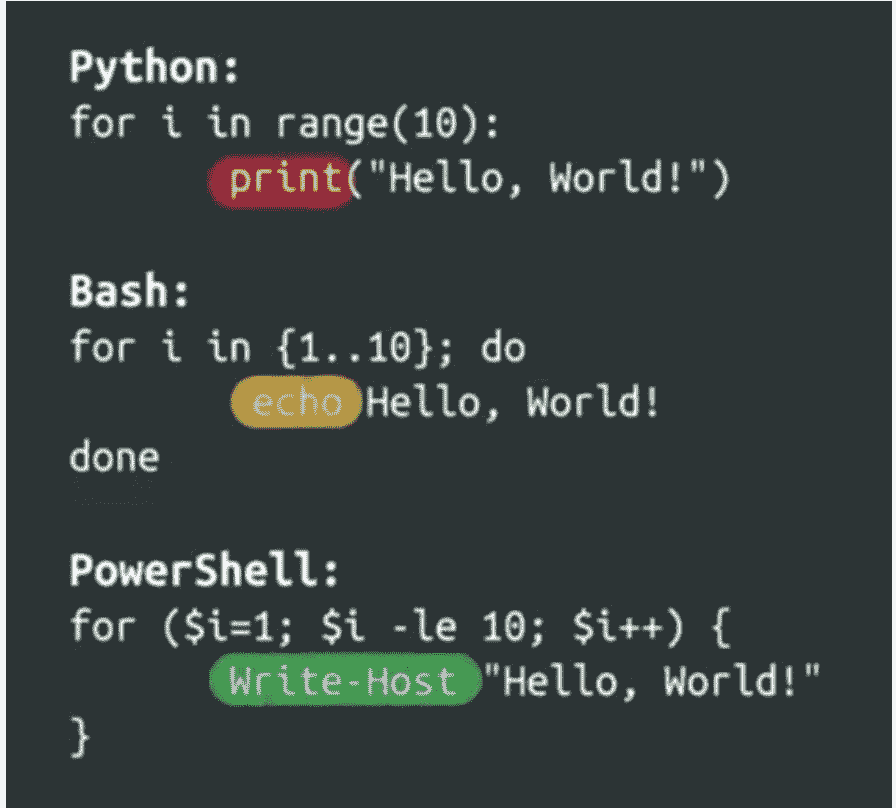
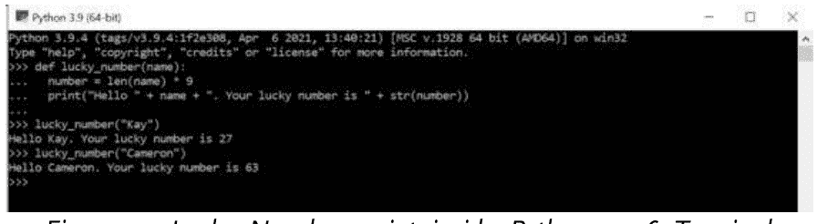
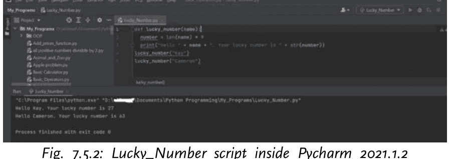
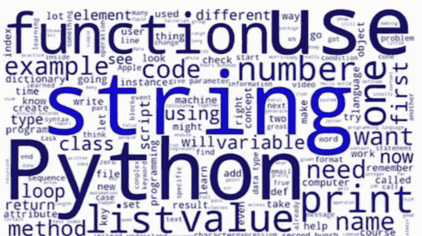

# Python编程：从入门到高薪专业人士

*第一部分*

通过视频教程学习Python自动化与IT应用

作者：*A. J. Wright*

版权所有 © AB Prominent Publisher

9791220820387

美国出版

**保留所有权利。** 未经出版商事先书面许可，不得以任何形式或任何方式复制、存储于检索系统或传播本书及配套视频教程的任何部分，除非在评论文章或书评中嵌入简短引用。本书及配套视频的编写已尽一切努力确保所呈现信息的准确性。然而，本书及视频中包含的信息均按“原样”出售，不附带任何明示或暗示的保证。作者/出版商、其经销商和分销商对因本书及其视频直接或间接造成的任何损害或声称造成的损害不承担责任。作者/出版商已尽力提供本书中提及的所有公司和产品的商标信息。然而，他无法保证这些信息的准确性。

## 目录

- [关于作者](#)
- [本书如何帮助您](#)
- [如何使用视频教程、程序和练习](#)
- [为什么学习Python编程？](#)
- [1. 基础：Python编程入门](#)
  - [1.1. 专业介绍](#)
  - [1.2. 课程介绍](#)
  - [1.3. 花一分钟为成功做好准备](#)
  - [1.4. 欢迎参加课程](#)
    - [1.4.1. 6周截止日期如何运作](#)
    - [1.4.2. 获取和提供帮助](#)
    - [1.4.3. 查找更多信息](#)
  - [1.5. 官方Python讨论论坛：加入、交流与互动](#)
- [2. 编程简介](#)
  - [2.1. 您编程之旅的起点](#)
  - [2.2. 什么是编程？](#)
    - [2.2.1. 脚本与程序的区别](#)
  - [2.3. 什么是自动化？](#)
  - [2.4. 让计算机为您工作](#)
  - [2.5. 讨论论坛：您对自动化的期望](#)
  - [2.6. 练习测验1：编程通用入门 - 5个问题](#)
    - [2.6.1. 练习测验1答案](#)
- [3. 设置您的Python和编程环境](#)
  - [3.1. 什么是Python？](#)
    - [3.1.1. 如何执行Python代码](#)
  - [3.2. 关于语法和代码块的说明](#)
  - [3.3. 为什么Python与IT相关？](#)
  - [3.4. 如何成为Python开发者或Pythonista](#)
  - [3.5. 其他编程语言](#)
  - [3.6. 练习测验2：Python入门 - 5个问题](#)
    - [3.6.1. 练习测验2答案](#)
- [4. Hello, World!](#)
  - [4.1. 如何用Python编写Hello World](#)
    - [4.1.1. 程序注释 (#)](#)
    - [4.1.2. 如何编写注释](#)
  - [4.2. 如何从用户获取信息](#)
  - [4.3. Python可以成为您的计算器](#)
  - [4.4. 速查表1：第一个编程概念](#)
  - [4.5. 练习测验3：Hello World - 5个问题](#)
    - [4.5.1. 练习测验3答案](#)
- [5. 模块回顾](#)
  - [5.1. 第一步总结](#)
  - [5.2. 模块1评分评估 - 10个问题](#)
    - [5.2.1. 模块1评分评估解答](#)
- [6. 表达式和变量](#)
  - [6.1. Python基本语法介绍](#)
  - [6.2. 数据类型](#)
  - [6.3. 数据类型回顾](#)
  - [6.4. 变量](#)
    - [6.4.1. 变量名限制](#)
  - [6.5. 表达式、数字和类型转换](#)
  - [6.6. 隐式转换与显式转换](#)
  - [6.7. 练习测验4：5个问题](#)
    - [6.7.1. 练习测验4答案](#)
- [7. 函数](#)
  - [7.1. 定义函数](#)
  - [7.2. 定义函数回顾](#)
  - [7.3. 返回值](#)
  - [7.4. 使用函数返回值](#)
  - [7.5. 代码重用原则](#)
  - [7.6. 代码风格](#)
    - [7.6.1. 创建良好风格代码的原则](#)
  - [7.7. 练习测验5：5个问题](#)
    - [7.7.1. 练习测验5答案](#)
- [8. 条件语句](#)
  - [8.1. 比较事物](#)
  - [8.2. 比较运算符回顾](#)
  - [8.3. 使用IF语句进行分支](#)
  - [8.4. If语句回顾](#)
  - [8.5. Else语句](#)
  - [8.6. Else语句和取模运算符回顾](#)
  - [8.7. Elif语句](#)
  - [8.8. 速查表2：条件语句](#)
  - [8.9. 使用elif语句进行更复杂的分支](#)
  - [8.10. 练习测验6：5个问题](#)
    - [8.10.1. 练习测验6答案](#)
- [9. 模块回顾](#)
  - [9.1. 基本语法总结](#)
  - [9.2. 我为什么喜欢Python](#)
  - [9.3. 我不喜欢Python的地方](#)
  - [9.4. 模块2评分评估 - 10个问题](#)
    - [9.4.1. 模块2评分评估解答](#)
- [10. While循环](#)
  - [10.1. 循环简介](#)
  - [10.2. 什么是While循环？](#)
  - [10.3. While循环的结构](#)
  - [10.4. 更多While循环示例](#)
  - [10.5. 为什么初始化变量很重要](#)
  - [10.6. 变量初始化的常见陷阱](#)
  - [10.7. 无限循环及其破解方法](#)
  - [10.8. 无限循环和代码块](#)
  - [10.9. 练习测验7：5个问题](#)
    - [10.9.1. 练习测验7答案](#)
- [11. For循环](#)
  - [11.1. 什么是For循环？](#)
  - [11.2. For循环回顾](#)
  - [11.3. 更多For循环示例](#)
  - [11.4. 深入了解Range()函数](#)
  - [11.5. 嵌套For循环](#)
  - [11.6. For循环中的常见错误](#)
  - [11.7. 速查表3：循环](#)
  - [11.8. 练习测验8：4个问题](#)
    - [11.8.1. 练习测验8答案](#)
- [12. 递归（可选）](#)
  - [12.1. 什么是递归？](#)
  - [12.2. IT背景下的递归实践](#)
  - [12.3. 更多递归资源](#)
  - [12.4. 练习测验9：5个问题](#)
    - [12.4.1. 练习测验9答案](#)
- [13. 模块回顾](#)
  - [13.1. 循环总结](#)
  - [13.2. 模块3评分评估 – 10个问题](#)
    - [13.2.1. 模块3评分评估解答](#)
- [14. 字符串](#)
  - [14.1. 基本结构介绍](#)
  - [14.2. 什么是字符串？](#)
  - [14.3. 字符串的组成部分](#)
  - [14.4. 字符串索引和切片回顾](#)
  - [14.5. 创建新字符串](#)
  - [14.6. 基本字符串方法](#)
  - [14.7. 更多字符串方法](#)
  - [14.8. 高级字符串方法](#)
  - [14.9. 格式化字符串](#)
  - [14.10. 字符串格式化回顾](#)
  - [14.11. 速查表4：字符串参考](#)
  - [14.12. 速查表5：格式化字符串](#)
  - [14.13. 练习测验10：5个问题](#)
    - [14.13.1. 练习测验10答案](#)
- [15. 列表](#)
  - [15.1. 什么是列表？](#)
  - [15.2. 列表定义](#)
  - [15.3. 修改列表内容](#)
  - [15.4. 修改列表](#)
  - [15.5. 列表和元组](#)
  - [15.6. 元组回顾](#)
  - [15.7. 遍历列表和元组](#)
  - [15.8. 使用Enumerate遍历列表](#)
  - [15.9. 列表推导式1](#)
  - [15.10. 列表推导式回顾](#)
  - [15.11. 速查表6：列表和元组操作](#)
  - [15.12. 练习测验11：6个问题](#)
    - [15.12.1. 练习测验11答案](#)
- [16. 字典](#)
  - [16.1. 什么是字典？](#)
  - [16.2. 字典定义](#)
  - [16.3. 遍历字典内容](#)
  - [16.4. 遍历字典回顾](#)
  - [16.5. 字典与列表的比较](#)
  - [16.6. 速查表7：字典方法](#)
  - [16.7. 练习测验12：5个问题](#)
    - [16.7.1. 练习测验12答案](#)
- [17. 模块回顾](#)
  - [17.1. 基本结构总结](#)
  - [17.2. 模块4评分评估 – 10个问题](#)
    - [17.2.1. 模块4评分评估解答](#)
- [18. 面向对象编程 (OOP)](#)
  - [18.1. OOP简介](#)
  - [18.2. 什么是OOP？](#)
  - [18.3. OOP的定义](#)
  - [18.4. Python中的类和对象](#)
  - [18.5. 详细讲解类和对象](#)
  - [18.6. 定义新类](#)
  - [18.7. 定义类回顾](#)
  - [18.8. 练习测验13：5个问题](#)
    - [18.8.1. 练习测验13答案](#)
- [19. 类和方法](#)
  - [19.1. 实例方法](#)
  - [19.2. 什么是方法？](#)
  - [19.3. 构造函数和其他特殊方法](#)
  - [19.4. 特殊方法回顾](#)
  - [19.5. 为函数、类和方法编写文档](#)
  - [19.6. 使用文档字符串编写文档](#)
  - [19.7. 速查表8：类和方法](#)
  - [19.8. 关于Jupyter Notebooks（可选）](#)
  - [19.9. Jupyter Notebooks帮助](#)
  - [19.10. 挑战实验室1：方法和类实验室](#)
- [20. 代码重用](#)
  - [20.1. 继承](#)
  - [20.2. 对象继承](#)
  - [20.3. 组合](#)
  - [20.4. 对象组合](#)
  - [20.5. Python模块](#)
  - [20.6. 使用模块扩展Python](#)
  - [20.7. 代码重用补充阅读](#)
  - [20.8. 挑战实验室2：代码重用实验室](#)
- [21. 模块回顾](#)
  - [21.1. OOP总结](#)

## 21.2. 挑战实验室 3：实践笔记本（面向对象编程）。

## 22. 从零开始编写脚本

### 22.1. 最终项目介绍

### 22.2. 问题陈述

## 22.3. 研究

## 22.4. 规划

## 22.5. 编写脚本

## 22.6. 整合所有内容

## 22.7. 挑战实验室 4：整合所有内容

## 23. 最终项目

## 23.1. 最终项目概述

## 23.2. 最终项目帮助

### 23.2.1 项目目标

### 23.3. 最终项目（挑战实验室 5）。

#### 23.3.1. 指导说明

## 23.4. 最终项目评分

## 24. 课程总结

### 24.1. 恭喜！

### 24.2. 讨论论坛：分享你的学习之旅。

### 24.3. 下一门课程（第 2 部分）预览。

## 25. 如何下载课程资源

### 25.1. 如何获取进一步帮助

### 25.2. 更多有用资源

# 关于作者

我拥有超过 15 年的软件开发经验。在过去的几年里，我利用我的经验，在 Windows、Linux、MacOS 和 PLC（可编程逻辑控制器）上使用各种编程语言开发解决方案。我还从零开始构建解决方案，甚至修改开源软件以满足客户的需求。

我努力学习并不断进行研究。我也热爱帮助人们找到工作或使他们的业务成功。如今，我与一个由 Python 程序员组成的专注团队合作，研究特定的自动化问题并为其提供持久的解决方案。

# 本书如何帮助你

这不仅仅是*又一本* Python 编程书。它是一门密集且*实用*的 Python 编程课程。它是 3 部分系列中的第 1 部分，是我关于最新版本 3 的 Python 编程语言的详尽分步教程合集。这是一门自定进度的课程，非常适合初学者和经验丰富的专家。如果你想轻松愉快地学习或复习 Python 编程，这门课程适合你。

如果你是一名计算机程序员、自动化工程师或专业人士、在 IT 公司工作的系统管理员、数据分析师/记者、教育工作者、计算机科学学生，或者只是任何想要获得 Python 编程技能以在工作或职业中取得成功的人，你会发现这本书不可或缺。是的，这门课程正是你成为 Pythoneer 或 Pythonista 所需要的。

本课程包含 6 个模块，分布在 25 章中，包含丰富的文本和视觉教程。你并非孤军奋战。我会帮助你完成它。观看别人编码与学习如何编码非常不同。因此，在这门课程中，你不仅会学习 Python，还会*动手实践*。

随着你完成教程，你还将通过遵循 Python 最佳实践，在我们涵盖的材料上接受*大量*测试。虽然这是一门自定进度的课程，但我强烈建议你在不超过 6 周的时间内完成它。例如，如果你能每周完成一个模块，你可以在 6 周内完成课程。

为了完全理解 Python 3 编程的基础知识，我强烈建议你观看所有 **53 个深入的高清视频**，这些视频可在你可以下载的**课程资源文件夹**中找到。下载链接在本书的第 25 章。这些视频教程简化了你需要理解的一切，并帮助你**加速学习**。

本书中讨论的重要术语和定义以粗体文本印刷，**像这样**。每章末尾都包含练习测验和答案，以帮助你测试自己的进步程度。现在就去第 25 章。你会找到**课程资源**的链接。一旦你打开这个链接，你将能够**下载所有课程视频、评分评估及其解决方案，以及方便的速查表，让你一目了然地获取所有需要的信息**。

# 如何使用视频教程、程序和练习

除非是为了复习目的，否则视频不应在未先学习本书内容的情况下单独观看。你应该在到达引用视频的点时观看每个视频。这将确保你完全理解所讨论的概念。相关视频的序列号和标题（文件名）在引用点处说明。

为了打下坚实的 Python 基础，你必须具备深入的知识并快速培养 Python 编码技能。因此，我强烈建议你*独立*并*在*查看提供的答案和解决方案*之前*尝试本书中的所有练习，如测验、评分评估和项目。在每个视频中看到我编写程序后，立即编写你自己的程序。然后将你的程序与我的进行交叉检查。随时可以暂停或重播视频。你也可以根据需要使用或修改我的任何代码。

由于我假设你没有 Python 编程知识，我准备这门课程的方式是，当你结合配套视频学习时，你不仅会对 Python 3 编程有深入的了解，还会获得构建自动化和创新所需的大量工作经验，并获得更高的薪水。

本书从你需要开始编写第一个 Python 脚本的基础知识开始。接着，它教你成为 Python 编程领域有薪专业人士所需的高级主题。因此，完成本课程后，你将对面向对象编程有清晰的理解，并能够将其应用于现实世界的工业自动化。

本书和配套视频中介绍的方法是 IT 现实世界中通常采用的方法，也是你真正需要学习的重要方法。因此，本书中的信息非常有价值，不仅对初学者，也对中级 Python 程序员。

仅仅阅读大量的 Python 编程书籍或参考 Python 帮助内容，远不足以学习如何流利地“说” Python 语言。与许多其他书籍不同，本书采用实用方法。它以课程形式设计，包含丰富的练习测验、评估、挑战实验室和有趣的项目（附带解决方案），以吸引你并提供实践经验。

首先，如果你以前从未写过一行代码，这本书将让你有一个很大的领先优势。然后，它将教你学习、设计和构建从简单到复杂且非常有用的 Python 程序所需的技术。

# 为什么要学习 Python 编程？

如果你学习 Python，你将进入主流。如果你还没有注意到，当今数百家最成功的科技/IT 公司都在使用 Python 程序，例如 Google、Netflix、Instagram、Reddit、Lyft、Spotify 等等。Python 也被用于彭博社、《纽约时报》，甚至许多地方银行。

Python 有许多明确的途径可以找到有意义的工作和职业。例如，这里是[申请美国顶级远程 Python 开发人员](apply to top remote USA Python developer)的链接。

尽管其中一些潜在的职业相当明显——例如成为一名 Python 开发人员——但还有其他职业，Python 知识是一项资产，这些职业更出乎意料。

# 模块 1

> “如果牛奶变坏了，它会变成酸奶。酸奶比牛奶更有价值。如果它变得更糟，它会变成奶酪。奶酪比酸奶更有价值。你并不坏，因为你犯了错误。错误是让你作为一个人更有价值的经验。克里斯托弗·哥伦布的导航错误使他发现了美洲。亚历山大·弗莱明的错误导致他发明了青霉素。不要让你的错误让你沮丧。熟能生巧并非如此。我们的错误使我们能够学会让自己变得完美！” - Josh Aisosa

# 1. 基础：Python 编程入门

在本模块中，我将向你介绍本书的课程形式。然后，我们将深入探讨编程语言和语法的基础知识，以及使用脚本进行自动化。我还将向你介绍 Python 编程语言及其提供的一些好处。最后，我们将涵盖该语言的一些基本函数和关键字，以及一些算术运算。

## 1.1. 专业介绍

在IT领域工作不仅仅是一份工作，更是一条职业发展道路。研究表明，IT支持领域是未来职业发展和获得更高薪酬的跳板。事实上，哈佛商学院、埃森哲和Burning Glass最近就这一主题进行了一项名为“弥合差距”的研究。

研究发现，在当今需要培训但不需要正式大学学位的中等技能工作中，IT支持提供了通往繁荣的清晰路径。我在谷歌的IT支持项目中亲眼目睹了这一现象。那些努力学习Python编程的人通常都获得了显著的职业发展。

他们掌握了进入IT领域更高职位所需的关键技能，通过努力和决心磨练这些技能后，他们晋升为更具技术性的IT支持专家。其中一些人成为了系统管理员、技术解决方案工程师，甚至是站点可靠性工程师。所有这些职位的共同点在于懂得编写代码来解决问题和实现自动化解决方案。

通过将编程技能纳入你的工具箱，你便打开了一扇通往系统管理世界的大门，这可以引领你未来走向更高级的技术岗位。Python尤其正经历着巨大的增长。根据2019年Stack Overflow开发者调查，Python是大多数人最想学习的编程语言，是已掌握者第二喜欢的语言，总体受欢迎程度排名第四。

那么，为什么要学习这门Python编程课程呢？首先，它面向的是那些已经在IT领域或渴望进入该领域的人。也许你正在思考如何在当前的IT岗位上更进一步，希望致力于大规模运营管理；或者你刚刚起步，希望进入IT行业。

也许你已经在某处完成了IT支持专业证书课程，或者你拥有等同的IT支持知识和基本计算技能，例如处理文件和目录、熟悉网络概念以及了解如何在计算机上安装软件。无论如何，这门课程都是为你量身定制的。其次，本课程提供三种实践性的编程、Python和自动化教学方法：代码块、Jupyter笔记本和实验。

第三，我与一群出色的谷歌同事合作，他们帮助我准备了这门课程。他们都从IT支持岗位开始职业生涯，然后学习编程，像我一样转向了更技术性的岗位。我迫不及待地想与你们分享我们如何在日常工作中使用Python的故事。因此，我将向你们介绍Python编程语言，特别关注这门语言如何应用于IT系统支持和管理领域的任务自动化。我非常兴奋能教授你们这门课程。

在我年轻的时候，我甚至不知道IT职业的存在。后来，我记得参加了一个系统管理峰会，那里有数百名男性系统管理员，而女性只有大约三位。从那时起，情况已经发生了很大变化，但我们仍然可以做很多事情，为IT领域带来新的理念和代表性。这就是为什么我想与尽可能多的人分享我的知识（也是我以丰富的课程形式准备这本书的原因）。

我热爱我的Python编程，也热爱我的同事们，因为他们让寻求帮助变得容易，并乐于提供指导。这种支持网络使我们的团队乃至整个行业更加成功。根据我的经验，学习一门编程语言可能会让人感到相当畏惧，甚至有点可怕。

请记住，每个人都是从你现在的位置开始的：第一个命令、第一个脚本，当然，还有最初的许多错误。当我刚开始职业生涯时，我力求第一次尝试就把所有事情都做到完美。但这实际上拖慢了我的进度。所以不要害怕犯错，这会让你领先一步。那么，让我们开始吧。接下来是什么？

本书（第一部分）以Python速成课程开始，你将学习编写简单的程序并理解它们在自动化中的作用。接下来（第二部分），我们将更注重实践，探讨Python如何与操作系统交互。之后，我们将介绍如何使用Git和GitHub来管理代码版本。然后，我们将专注于故障排除和调试技术，以发现和解决IT基础设施中的根本问题。

下一门课程（第三部分）涵盖大规模自动化，你将学习如何在运行于云端的物理或虚拟机集群上部署配置管理。

最后，我们将把所有这些知识整合起来，完成两个最终项目，旨在解决你在现实IT环境中可能遇到的任务。你可以将你的项目发布到GitHub上，向雇主或朋友（或两者）展示你炫酷的新技能。

一口气说了这么多！你兴奋吗？你将得到非常好的指导！

所以，让我们准备好学习一些新技能，甚至可能在过程中开怀大笑。让我们直接进入下一节。

## 1.2. 课程介绍

如果你在IT领域工作，计算机编程技能会为你打开令人难以置信的机遇之门。能够编写脚本和程序来指示计算机执行任务，为你配备了一项无价的工具。它不仅使你的工作更轻松、更高效，还能帮助你在IT职业生涯中更快成长、走得更远。

但你该如何开始学习像Python这样的编程语言呢？你如何识别何时该让计算机执行任务？然后你又如何编写一个程序来实际让你的计算机完成你想要它做的任务？学习用Python编写程序的想法可能会让你产生各种情绪：兴奋、期待、那种想要立刻投入其中开始行动的感觉，以及恐惧。

你可能会问自己，我真的能学会编程吗？我有这个能力吗？我在这里告诉你，是的，你绝对可以做到。学习编程可能令人害怕和畏惧，但同时它也非常有趣和令人兴奋。在编程中，就像在生活中——如果我们上升到哲学层面——最有回报的工作通常都具有一定的挑战性，但最终都值得付出努力。当然，我能说出这些话都是基于经验，尤其是那些有点老套的部分。

系统管理员的角色在不同公司之间差异很大，甚至在同一公司的不同团队中也是如此。我碰巧在企业身份和访问管理运营团队工作，这个名称很长，简单来说就是我们确保每个人都被正确代表，如果他们需要访问某些资源，他们就能访问。

我最喜欢系统管理员工作的一点是，这个角色具有如此多样化的职能。我们处理大量独特的问题和边缘情况，从摆弄不同的系统到与其他团队协作。我总是在学习新东西，所以真的很难感到无聊。

一切都始于懂得如何自动化。如果你是一名IT支持专家、系统管理员，或者介于两者之间的某个职位，懂得如何让计算机为你完成繁重的工作，将使你在类似的IT角色中脱颖而出，并让你的生活轻松得多。想想看，你是愿意自己手动部署100台计算机，还是告诉你的计算机一次性为你完成所有工作？

不假思索的选择，对吧？拥有编程技能可以帮助你成长为更专业的角色，比如系统管理员、云解决方案工程师、DevOps专家、站点可靠性工程师，或者谁知道呢，甚至可能是网页开发人员或数据分析师。关键在于，能够编写程序是你IT工具包中的必备工具，越来越多的雇主在招聘时都在寻找这些技能。

如果你曾经学习过一项新技能，比如演奏乐器、说外语、编织或滑板，你就知道要擅长新事物需要大量的练习。对我来说，我喜欢学习新语言，并且我为此感到自豪

假设我现在会说西班牙语、阿拉伯语、法语，甚至还会十个俄语单词。

我们的世界由我们所说的语言和词汇塑造，虽然有些词汇可能只存在于一种语言中，但你总能找到相似之处，帮助你学习和理解。能够连接不同文化之间的点，让我能看到别人可能看不到的东西，这听起来有点像IT编程，对吧？我的观点是，无论你是在学法语还是Python，从来都不容易。

你必须从小处着手，学习基础知识并不断练习，直到掌握它们。只有这样，你才能进入更复杂、更令人印象深刻的内容。我们将从慢节奏开始，一起掌握基础，很快你就能准备好迎接更具挑战性的内容。在本课程结束时，你将理解在IT岗位中编程的好处。

你将能够使用Python编写简单的程序，弄清楚编程的基本构建块如何组合在一起，并将所有这些知识结合起来解决一个复杂的编程问题。没错，在本课程结束时，你将用Python编写一个程序，旨在解决一个现实世界的IT问题。是不是超级兴奋？

我们将从深入学习编写计算机程序的基础知识开始。通过互动练习和现实世界的例子，你将获得编程概念的实践经验。你很快就会开始看到计算机如何执行大量任务。你只需要编写代码来告诉它们该怎么做。

在这个过程中，我们将讨论自动化，这是让计算机自动执行我们人类通常需要手动完成的任务的过程。

现在，有些内容可能会变得有点复杂和令人困惑。我承诺会尽我所能让这些课程清晰易懂，但如果你在任何时候遇到困难，请随时重看视频。尽可能多地练习，并花真正需要的时间来理解这些主题。本课程的目标不是教你关于软件工程的所有知识，因为天哪，那将是一门漫长的课程。

相反，我将向你介绍编程和脚本的一些关键概念，这些概念将使你能够在现实生活中发现自动化的机会。你即将学习一项能帮助你将职业生涯提升到全新水平的技能。你兴奋吗？我也很兴奋，所以让我们开始吧！

## 1.3. 花一分钟为成功做好准备

你知道吗？人们往往在开始前就设定完成课程的意图时，能从这样的课程中获得更多，并且更有可能成功。请用笔和纸完成下面的承诺声明，帮助自己达成目标。别担心——这只是给你自己的，不会评分。

***

**我承诺我的目标是完成这门课程。我选择完成它是因为……**

*写下句子。是什么激励你参加这个*

**当我在课程中遇到障碍或缺乏动力时，我会……**

*写下句子。你会做什么或说什么来激励未来的自己*

*（最后，通过在这里写下你的名字来做出承诺）*

***

确保将你的承诺保存在每天都能看到的地方。

## 1.4. 欢迎参加本课程

本课程旨在教授你Python编程的基础知识。我们很高兴能与你一起踏上这段旅程，学习当今IT领域最受欢迎的工作技能之一。仅在美国，根据[Burning Glass](https://www.burning-glass.com) 2019年5月的数据，2018年约有53万个职位要求具备Python技能。本课程不需要任何编程先验知识。

### 1.4.1. 6周截止日期如何运作

我特意为你设定了每周完成一个模块的截止日期，以便你完成本课程。请注意：这些截止日期是为了帮助你组织时间，但你可以按照自己的节奏学习。如果你“错过”了截止日期，只需将其重置为新日期即可。完成课程没有时间限制，你可以在完成第一部分后随时进入第二部分。

### 1.4.2. 获取和提供帮助

以下是一些你可以提供和获得帮助的方式：

[官方Python讨论](https://discuss.python.org/) 你可以在Python讨论论坛上与其他学习者分享信息和想法。这些也是找到你可能遇到的问题答案的好地方。如果你对某个概念感到困惑，难以解决练习题，或者只是想了解某个主题的更多信息，讨论论坛可以帮助你前进。

**联系** 使用第25章末尾的“联系我们”链接（电子邮件链接）来请求关于特定问题的信息。这些问题可能包括错误消息、挑战实验室、项目以及视频下载或播放问题。

### 1.4.3. 查找更多信息

在整个课程中，我将教授你编程和自动化的基础知识。我将通过视频和文本阅读提供大量信息。但有时，你可能还需要自己查找资料，现在以及在整个职业生涯中都是如此。IT领域变化迅速，因此进行自己的研究以保持对最新动态的了解至关重要。我们建议你使用你喜欢的搜索引擎来查找额外信息——这是现实世界中的绝佳实践！

除了搜索结果，以下是一些在线可用的优秀编程资源：

[官方Python教程](https://docs.python.org/3/tutorial/) 本教程旨在帮助人们自学Python。虽然它的顺序与我这里采用的不同，但它涵盖了我们在本课程中探讨的许多相同主题。你可以参考此资源获取关于这些主题的额外信息。

[官方语言参考](https://docs.python.org/3/reference/) 这是所有Python语言组件的技术参考。起初，这个资源可能有点太复杂，但随着你了解Python的工作原理和构建方式，它可以成为理解这些交互细节的有用参考。

## 1.5. 官方Python讨论论坛：加入、见面和问候

加入、见面并问候你的[学习者](https://example.com)。你现在是一个不断壮大的学习者群体的一部分，他们都在通过学习Python编程来投资自己的未来。

打个招呼！写一段简短的自我介绍，帮助其他学习者更好地了解你。不知道写什么？这里有一些提示：

**希望和** 你为什么参加这门课程？你的期望是什么？学习Python编程最让你兴奋的是什么？完成本课程后，你希望实现什么？

**爱好和** 除了编程或IT，你还对哪些其他事情感兴趣？你可能会找到有相同兴趣的学习者！

**你来自哪里。** 学习者来自全球各地！为什么不与他人分享你生活在世界的哪个角落？但请记住，不要分享具体的细节，如你的个人邮寄地址。

你不必参与。但如果你参与，会更有趣！

## 2. 编程简介

## 2.1. 你的编程之旅的开始

正如中国谚语所说，千里之行始于足下。今天是个重要的日子，你正在迈出学习用Python编写脚本的第一步。有时会有点挑战，但真的没那么可怕。我们会慢慢来，在进入下一阶段之前，给你一切所需，让你完全掌握每个概念。

在接下来的几节中，你将发现计算机编程的基本概念。你将了解什么是编程语言，什么是脚本，除了Python还有哪些语言，以及这一切与IT的关系。我们还会让你在不知不觉中开始编码，通过我们精心设计的小型编码练习，让你获得Python的实践经验。这将包括编写你的第一个Python脚本。但请始终记住，如果在任何时候你感到迷茫或困惑，不要惊慌。

你可以重新阅读任何章节，或者根据需要多次观看视频，让概念深入人心，此外，你还可以在讨论论坛上提问，这是寻找额外信息和与其他学习者建立联系的最佳方式之一。当我被邀请参与这个项目时，它让我想起了我刚开始编程的时候。如果我能给那个年轻的自己一个建议，我会告诉她：第一次从来不会成功。

说真的，作为一个新手，我曾期望一切都能像魔法一样顺利。我以为只要遵循规则、一次就做对，就能证明我作为程序员的价值，但事实并非如此，即便是最顶尖的高手也做不到。如果你期望第一次就能写出完美的代码，那你注定会失望。年轻的自己，听到了吗？尽量别被细节压垮。融会贯通只能靠经验积累，所以最好的学习方法就是直接动手实践。

事实是，每个人都有自己的学习节奏。如果你已经了解其中一些概念，可以随意跳到最感兴趣的部分。如果你是从零开始，每个概念花多少时间都行。评估测试会在你准备好时等着你，而如果你在任何时候开始怀疑自己，请记住，即使是最高级的程序员也曾有过这样的想法：Python……Python是什么？

好了，我们即将全面学习它，那么让我们深入了解一下编程是什么。

## 2.2. 什么是编程？

从基本层面来说，计算机程序是一份指令配方，告诉你的计算机该做什么。当你编写程序时，你是在创建一个完成任务所需的逐步配方，当计算机执行程序时，它会逐字逐句地阅读你写的内容并遵循你的指令。这多好啊？这份配方是用一种叫做*编程*的语言编写的。

编程语言实际上与人类语言相似，因为它们都有*语法*和*语义*。如果你上次上语法课已经是很久以前的事了，这里快速复习一下语法和语义。

在人类语言中，**语法是句子如何构建的规则**，而**语义指的是句子的实际含义**。在英语中，句子通常包含主语（人、地点或事物）和谓语（通常是动词和解释主语正在做什么的陈述）。

以句子*Paula loves to program in Python*为例。在这个句子中，Paula是主语，loves to program in Python是谓语。要形成一个别人能理解的句子，你需要知道构建句子的语法和赋予其意义的语义。编程语言也是如此。

在像Python这样的编程语言中，语法是每条指令如何书写的规则，语义是这些指令产生的效果。与口语类似，有许多编程语言可供选择。每种语言都有自己的历史、特性和应用，但它们都共享相同的基本理念。因此，一旦你理解了一种编程语言的基本概念，学习另一种就会变得容易得多。

最后，计算机总是完全按照指令执行。因此，当你编写程序时，清晰地表达你希望计算机做什么非常重要。学习你所选编程语言的语法和语义将使你能够做到这一点。明白了吗？在我们继续之前，先花点时间了解一下术语。

### 2.2.1. *脚本*与*程序*的区别

在接下来的几节中，你会经常听到“脚本”这个术语。那么*脚本*和*程序*有什么区别呢？两者之间的界限可能有点模糊。在本课程中，我们将交替使用这两个术语。一般来说，你可以将脚本视为开发周期短、可以快速创建和部署的程序。

换句话说，脚本是一种简短、简单且可以非常快速编写的程序。在本课程中，我们将专注于一种特定的脚本语言——Python，我们将用它来学习编程的基础知识。我们将学习Python语法、编写Python程序的规则，以及涉及的不同部分的语义或含义。

在我们开始学习如何编码并让你编写第一个Python脚本之前，让我们再谈谈什么是自动化以及它为什么有用。

## 2.3. 什么是自动化？

尽管我们可能没有意识到，但我们在日常生活中一直在享受自动化带来的好处。你是否使用过定时支付账单，或者在杂货店使用自助结账？我总是把咖啡机设置在我还没起床时就开始冲泡。新鲜咖啡的承诺让清晨变得轻松多了。

自动化是用自动发生的步骤取代手动步骤的过程。以交通灯为例，它持续调节交叉路口的车流。交通灯只有在需要维修或保养时才需要人工干预。

交通的自动调节意味着人类不必站在路口手动示意车辆何时停止或通行。相反，人们可以专注于更复杂、更有创意或更困难的任务，比如专注于驾驶方向。此外，交通灯不会感到疲倦、无聊，也不会在想显示红灯时意外显示绿灯。这凸显了自动化的另一个好处：一致性。

让我们面对现实吧，我们人类是有缺陷的，有时会犯错，一个人执行数百次相同任务永远不会像机器做同样的事情那样一致。但尽管自动化有诸多优势，它并非适用于所有情况的解决方案，有些任务根本不适合自动化。

例如，它们可能需要一定程度的创造力或灵活性，而自动系统无法提供；或者对于更复杂或执行频率较低的任务，创建自动化可能比其价值付出更多的努力或成本。想想你理发的时候。用机器自动完成理发动作需要什么？

设计自动系统时，需要考虑客户的身高、头型、当前头发长度和期望的发型。我们需要复制训练有素的专业人员的创造力和技能，并进行广泛测试以确保客户的安全和理发质量。如果你在理发店有过不愉快的经历，你就知道质量可能是主观的。

在这种情况下，自动化的成本和努力并不值得自动理发所能带来的好处，这就是为什么我们没有机器人发型师。不太复杂，对吧？自动化在正确的时间和地点使用时是一个强大的工具。它可以节省时间、减少错误、提高一致性，并提供一种集中解决方案和错误的方法，使其更容易修复。

在本课程及后续课程中，我们将讨论何时应用自动化以及具体如何操作。最终，知道何时何地使用自动化对你来说将变得自然而然。

## 2.4. 让计算机为你工作

在IT行业工作，我们做的很多事情归根结底都是使用计算机执行特定任务。在你的工作中，你可能每天都要创建用户账户、配置网络、安装软件、备份现有数据或执行一系列其他基于计算机的任务。

在我第一份IT工作中，我意识到每天坐在电脑前工作时，我都会输入相同的三个命令来登录系统。出于安全原因，这些凭证每天都会过期，所以我创建了一个脚本，每天早上自动为我运行这些命令，以避免自己输入。

有趣的是，监控异常活动的团队发现了我的小发明，并联系我将其移除，哎呀！由计算机执行的、需要多次重复且变化很小的任务非常适合自动化，因为当你自动化一个任务时，你避免了人为错误的可能性，并减少了完成它所需的时间。

想象一下这个场景：你的公司最近参加了一个会议，并收集了大量对你的产品感兴趣的人的电子邮件列表。你想给这些人发送你的每月电子邮件通讯，但列表中的一些人已经订阅了接收它。

那么，如何确保每个人都能收到你的新闻通讯，同时又不会意外地将同一封邮件发送给同一个人两次呢？嗯，你可以手动逐一检查每个电子邮件地址，以确保只将新地址添加到列表中。听起来既无聊又低效，对吧？

确实如此，而且这种方法更容易出错。你可能会意外地漏掉新邮件，或者添加已经存在的邮件地址，又或者这个过程无聊到让你在办公桌前睡着。即使是你那台自动咖啡机也帮不了你。那么，你能做些什么呢？

你可以让计算机为你代劳。你可以编写一个程序来检查重复项，然后将每个新电子邮件地址添加到列表中。无论列表中有多少电子邮件地址，你的计算机都会完全按照指令执行，因此它不会感到疲倦，也不会犯任何错误。

更棒的是，一旦你编写了这个程序，你就可以在未来类似的情况下重复使用相同的代码，从而节省更多时间。这很酷，对吧？还有更好的，想想当你准备发送这些邮件时，如果你手动发送，就必须给每个人都发送相同的邮件。个性化邮件将需要大量的手动工作。

相反，如果你使用自动化来发送邮件，就可以自动将每个人的姓名和公司信息添加到邮件中。结果呢？邮件效果更好，而你无需花费数小时将姓名插入文本中。自动化任务让你能够专注于更能有效利用时间的项目，让计算机为你处理那些枯燥的工作。

学习如何编程是实现这一切的第一步。如果你想让计算机为你工作，那你来对地方了。在本节前面，我向你介绍了我第一次自动化的任务，现在我想告诉你我做过的最酷的自动化。

那是一个脚本，它改变了我公司许多内部服务的大量访问权限。该脚本遍历了一个包含大量不同文件的庞大目录树，检查文件内容，然后根据我在脚本中设定的条件更新了这些服务的权限。

好吧，我承认我是个十足的书呆子，但我仍然觉得这真的很酷。接下来，是时候分享你的想法了。你希望通过编程自动化哪些事情？虽然这些讨论提示是可选的，但它们真的很有趣。说真的，它们能让你更好地了解其他学习者，并就想法和见解进行协作。

请务必阅读其他人的发言，他们可能会给你带来你从未想到过的灵感。之后，你就可以准备参加本课程的第一次小测验了。别担心，这只是练习。

## 2.5. 讨论论坛：你对自动化的期望

你希望通过编程自动化哪些日常任务？与你的[同学](https://example.com)分享你的想法、期望和目标。

## 2.6. 练习测验 1：编程入门概述 - 5 道题

从现在开始，你需要在电脑上打开一个新的记事本或 Word 文件来回答这样的测验。允许时间：15 分钟

1. 什么是计算机程序？只选择正确的回答。 – 1 分

- 计算机中可用的一组语言。
- 从列表中移除重复值的过程。
- 计算机必须遵循的一组指令，以达到某个目标。
- 被复制到网络中所有机器上的一个文件。

2. 什么是语言的语法？只选择正确的回答。 – 1 分

- 用该语言表达事物的规则。
- 句子的主语。
- 一种语言与另一种语言之间的区别。
- 单词的含义。

3. 程序和脚本有什么区别？只选择正确的回答。 – 1 分

- 区别不大，但脚本通常更简单、更短。
- 脚本只能用 Python 编写。
- 脚本只能用于简单任务。
- 程序由软件工程师编写；脚本由系统管理员编写。

4. 以下哪些场景适合自动化？选择所有适用项。 – 1 分

- 生成按地区和产品类型划分的销售报告。
- 创建你自己的初创公司。
- 帮助遇到网络问题的用户。
- 将文件复制到公司中的所有计算机。
- 面试职位候选人。
- 向你网站的订阅者发送个性化电子邮件。
- 调查机器无法启动的根本原因。

5. 当应用于编程代码和伪代码时，语义是什么？ – 1 分

- 编程指令如何编写的规则。
- 脚本的一个实例与另一个实例在数值上的差异。
- 编程指令产生的效果。
- 编程指令的最终结果。

正确答案如下。请使用它们来评估你在本次测验中的表现（X/5）。在本书后续的每次练习中，请始终使用提供的正确答案来评估你的表现。X 是你在总共 5 道题中答对的总数。别忘了保存你的结果！

### 2.6.1. 练习测验 1 答案

C. 在基本层面上，计算机程序是一份指令配方，告诉你的计算机该做什么。

A. 在人类语言中，语法是句子如何构建的规则；在编程语言中，语法是每条指令如何编写的规则。

A. 程序和脚本之间的界限是模糊的；脚本通常开发周期更短。这意味着脚本更短、更简单，并且可以非常快速地编写。

A, D, 定期发送电子邮件是一项耗时的任务，可以轻松自动化，而且你不必担心会忘记定期执行。

C. 与人类语言一样，词语（或在此例中是指令）的预期含义或效果被称为语义。

## 3. 设置你的 Python 和编程环境

### 3.1. 什么是 Python？

欢迎回来。你在第一次测验中表现如何？如果你答对了大部分问题，做得很好。如果没有，别担心，这都是学习的一部分。我会在这里通过像这样的定期测验，帮助你检查是否真正理解了这些概念。

如果你发现某个问题很棘手，请回去复习视频，然后再次尝试测验。在进入下一课之前，你要对所学内容感到非常有把握。记住，慢慢来。当你准备好了，就继续前进。

好的。感觉不错吗？很好。让我们开始吧。

在本课程中，我们将使用 Python 编程语言来演示基本的编程概念以及如何将它们应用于编写脚本。我们已经提到过，现在有很多编程语言。那么为什么选择 Python 呢？

嗯，我们选择 Python 有几个原因。首先，用 Python 编程通常感觉类似于使用人类语言。这是因为 Python 使得用易于读写的语法来表达我们想做的事情变得容易。

看看这个例子。

```
1 friends = ["Taylor", "Alex", "Pat", "Eli"]
2 for friend in friends:
3     print("Hi " + friend)
```

这里有很多内容需要理解，所以如果你不能立即明白，别担心，我们将在课程后面深入探讨细节。但即使你以前从未见过一行代码，你可能也能猜出这段代码的作用。你的代码的每一行可能会被你使用的编程编辑器（或 IDE）编号为 1、2、3 等，如上例所示，但在许多编辑器中可以移除这些编号。

这段代码定义了一个包含朋友姓名的列表，然后为列表中的每个姓名创建问候语。现在轮到你和 Python 交朋友了。你很快就会尝试类似这样的东西，看看会发生什么。

### 3.1.1. 如何执行 Python 代码

Python 代码可以在 Python 解释器控制台上编写。但要在解释器控制台上编写 Python 代码，我们首先需要在计算机上安装 Python。我不喜欢控制台的一点是，没有直接的方法或单一的命令来清除它。

输入以下几行代码来清除你的控制台屏幕（适用于 Windows）。确保在每行末尾按 Enter 或 Return 键。

```
import os
os.system('cls')
```

或者，你可以使用这个脚本：

```
import os
def clear():
    os.system('cls')
clear()
```

使用以下几行代码来清除你的控制台屏幕（适用于 Mac/Linux）。确保在每行末尾按 Enter 或 Return 键。

```
import os
os.system('clear')
```

或者，你可以使用这个脚本：

```python
import os
def clear():
    os.system('clear')
clear()
```

你也可以使用文本编辑器（假设你已安装Python）来编写和执行你的Python代码。编辑器色彩更丰富，也更用户友好。在整个课程中，你将使用适用于你操作系统类型（Windows、Linux或Mac）的Python解释器或集成开发环境（IDE）如**Pycharm**（使用[此链接下载](https://www.jetbrains.com/pycharm/download/)）来执行Python代码。在本课程中，我们将更频繁地使用Python解释器。

以下是一些我们可以用来编写代码的流行编辑器和开源应用程序列表。

- 普通文本编辑器，如记事本，或[Sublime Text](https://www.sublimetext.com/)（在你的计算机本地运行）。
- Python解释器（使用此[下载链接](https://www.python.org/downloads/)，通过在你的计算机上本地安装Python获得。这也运行在你的计算机本地。它可以为你的代码的每一行编号。
- **命令窗口**（也称为
- **在线解释器**，如**Jupyter**，这是一个用于创建和共享包含实时代码、可视化、方程式、叙述性文本等文档的开源Web应用程序。你稍后将在你的项目中使用它。

观看以下视频，学习如何下载和安装Pycharm，这是Python开发者中流行的IDE。如果你还没有下载本课程的所有教程视频，请立即转到第25章。确保你将所有视频保存在容易找到的地方。

**视频1**（8:38 *如何下载和安装Python和Pycharm（社区版）*

现在，我们将从一些使用代码块的小型编码练习开始。随着你技能的提升，你将使用其他工具进行更大、更复杂的编码练习。精通任何事物都需要大量的练习，编程和Python也不例外。我建议你独立练习我们在本课程中分享的每一个示例。你可以使用[在线Python](https://www.online-python.com/)进行练习。

现在我敢肯定你在想Python解释器到底是什么。在编程中，解释器是*读取*和*执行*代码的程序。还记得我们说过计算机程序就像一个有分步说明的食谱吗？

嗯，如果你的食谱是用Python编写的，Python解释器就是读取食谱内容并将其翻译成你的计算机要遵循的指令的程序。最终，你会想在你的计算机上安装Python，这样你就可以在本地运行它，并随心所欲地进行实验。

你可以使用我提供的测验以及我们将在下一节中提供链接的在线解释器和代码垫进行练习。我们将为你提供大量的练习，但请随时提出你自己的想法并在讨论论坛中分享。请尽情发挥创造力。毕竟，这是你展示新技能的机会！

## 3.2. 关于语法和代码块的说明

编写代码时，使用正确的语法至关重要。即使是一个小的拼写错误，比如缺少括号或多了一个逗号，也会导致语法错误，代码根本无法执行。哎呀。如果你的代码导致错误或异常，请密切关注语法并注意小错误。

如果你的语法正确，但脚本有意外的行为或输出，这可能是由于语义问题。请记住，语法是代码构建的规则，而语义是代码产生的整体效果。完全有可能编写出语法正确、运行成功但不符合我们预期的代码。

在处理本课程练习中的代码块时，请注意语法错误以及代码的整体结果。仅仅修复了语法错误并不意味着代码在运行时会产生预期的效果！一旦你修复了代码中的错误，别忘了重试以再次检查你的工作。

## 3.3. 为什么Python与IT相关？

还记得我们提到过Python简单易用吗？Python使得用易于阅读的语法表达编程的基本概念（如数据结构和算法）变得容易。这使得Python成为学习编程的绝佳语言。选择Python还有其他原因。

Python在IT行业非常流行，使其成为当今最常用的编程语言之一。Python并不新鲜。它的**第一个版本**是由**Guido van Rossum**在1991年发布的。从那时起，开发它的社区不断壮大，语言也取得了很大进步。每当语言的语义或语法发生重大变化时，就会发布一个新的主要版本。

2000年，Python 2发布。2008年，我们得到了Python 3。在本课程中，我们将使用最新的Python 3.9.6，它于2021年6月发布。多年来，Python一直被认为是一种初学者语言，主要用于教授概念或编写非常小的简单脚本，就像本课程中一样。但近年来，Python的采用率急剧增长。

原因之一是该语言变得更加强大。还因为Python为越来越多的应用程序提供了更多工具。你可以使用Python来计算统计数据、运行你的电子商务网站、处理图像、与Web服务交互以及执行许多其他任务。

Python非常适合自动化。它允许你通过编写易于理解和维护的简单脚本来自动化日常任务。这就是为什么Python是许多从事IT支持、系统管理和Web开发工作的人员的首选语言。不仅如此，它还用于IT中快速增长的领域，如**机器学习**或**数据科学**。

最后但同样重要的是，Python可以在多种操作系统上下载，如Windows、Linux和Mac OS。更重要的是，Python在工作场所如此受欢迎，以至于如果你目前在IT领域工作，你很可能已经遇到过它。如果你计划在IT领域发展，你很可能会经常与Python打交道。因此，Python与当今IT行业相关的原因有很多。

编程的很大一部分是通过试错和提问来学习。所以，如果你在任何时候遇到困难，不要气馁。犯错有助于你进步。你越能将失败或损坏的代码视为学习的机会，你就能越快掌握编程。

我记得我写过的第一个Python脚本。它经过了大量的重构、调试和测试才得以运行。我依靠了很多队友的帮助和指导，结果花在Stack Overflow上的时间比实际编写代码的时间还多。谢天谢地，你不必重新发明轮子。

网上几乎总是有人在尝试做你正在做的事情，并且可以在你遇到困难时帮助你找到正确的方向。有时需要集思广益。请记住，即使是经验丰富的程序员也可能需要不时地向同事提问或在网上查找信息，这一点非常重要。

无论你是编程新手还是在软件开发方面有一些经验，请记住，最优秀的程序员通过寻求帮助或使用其他资源来克服挑战。一旦你完成了这个课程，你将朝着自信地使用基础Python编程迈出重要一步。

网上有大量的信息可以帮助你继续发展你的编程技能。例如，有许多针对特定编程语言的在线课程。你可以在[Python官方网站](https://www.python.org)找到你的Python编码问题的答案。

你可以使用像Stack Overflow这样的网站与其他开发者讨论和分享。你也可以在上一章提到的讨论论坛中提问。你甚至可以订阅一些Python邮件列表，以了解该语言的最新更新。

你正在打开通往整个编程世界的大门，加入开发社区是非常令人兴奋的。最重要的是要记住，你永远不会孤单。在你职业生涯的任何时候，你可能遇到的任何问题，都有资源可以帮助你找到所需的答案。

哇，信息量真大。请随意休息一下，喝点东西，然后前往下一节

## 3.4 了解更多关于 Python 的信息以及可帮助你学习的资源。

## 3.4. 如何成为 Pythoneer 或 Pythonista

你应该自己练习使用 Python。尽可能多地自行练习是成为 Pythoneer 或 Pythonista 的最佳方式。打开你之前下载的“附加资源”文件夹。你会发现有用的文件，例如*《如何深入学习：40+ 适合初学者、中级和高级学习者的项目创意》*等等！

在这个文件中，你会找到指向附加资源的链接，这些资源可以帮助你提升 Python 语言能力。

## 3.5. 其他语言

虽然我们为本课程选择了 Python，但重要的是要记住，它只是众多编程语言中的一种。可以把一种特定的编程语言看作是你 IT 工具箱中众多强大工具中的一种。每种语言都有其独特的优缺点。有些运行速度比其他语言快。有些更适合企业应用。另一些则特别擅长处理数字运算。

还有一些平台特定的脚本语言，比如在 Windows 上使用的 *PowerShell*，以及在 Linux 上使用的 *Bash*。这两种语言在各自的平台上都被系统管理员广泛使用。还有一些类似于 Python 的通用脚本语言，比如 *Perl* 或 *Ruby*，它们也广泛用于脚本编写和自动化。

*JavaScript* 最初是作为网页的客户端脚本语言开发的，现在越来越多地被用作服务器端语言来处理更广泛的任务。而且，这个列表远不止于此。

还有大量传统语言可供探索，如 C、C++、Java 或 Go。随着你在 IT 领域职业生涯的发展，你可能会遇到多种不同的语言，并学会何时使用它们。但让我们不要操之过急。首先，我们需要掌握 Python。

学习一门语言编程基础的一个好处是，你通常可以将学到的相同概念应用到其他语言中。这意味着一旦你熟悉了 Python，你会发现学习新的编程语言会更容易，因为你能够识别并理解它们之间的异同。

毕竟，每种语言都需要做一些共同的事情，比如创建变量、控制程序流程、读取输入和显示输出，即使它们完成这些任务的方式不同。正如我们之前提到的，学习一门编程语言有点像学习一门外语。你需要掌握该语言的语法和语义。

幸运的是，一旦你掌握了编程的基础知识，学习另一门语言会比学习第二门外语容易得多。编程语言之间的相似之处远多于差异。

为了探索各种脚本语言之间的一些异同，让我们来看一个简单的程序，它用三种不同的语言——Python、Bash 和 PowerShell——打印出 **World!** 十次。参见图 3.5.1。



图 3.5.1：一个用三种不同语言（Python、Bash 和 PowerShell）打印“hello, world”十次的程序

如你所见，每种语言使用不同的方法来打印 hello world。但仔细观察，你也会发现相似之处。每种语言都必须以某种方式将文本显示在屏幕上。Python 的命令是 **print**（p 必须小写）。Bash 的是 **echo**，PowerShell 的是 **Write-Host**。

还要注意，每种语言都必须以某种方式计数到十。Python 通过指定 **range(10)** 来实现，Bash 使用序列表示法从 1 数到 10。PowerShell 在这个例子中语法最复杂，但它也归结为从 1 开始数到 10。

所以，正如我们刚才看到的，编程语言种类繁多，但不要被吓倒。在本课程中，你只需要专注于学习 Python。一旦你能熟练使用 Python，你就可以继续学习任何其他你想学的语言。接下来，我们还有另一个测验来帮助你练习刚刚学到的内容。

## 3.6. 练习测验 2：Python 入门 - 5 道题

1. 填写正确的 Python 命令，将“My first Python program”显示在屏幕上。- 1 分

```
print(_)
```

2. Python 是哪种类型编程语言的示例？- 1 分

- 客户端脚本语言
- 机器语言
- 平台特定脚本语言
- 通用脚本语言

3. 将此 Bash 命令转换为 Python：- 1 分

```
echo Have a nice day.
```

4. 填写正确的 Python 命令，将不带引号的“This is fun!”显示在屏幕上 5 次。- 1 分

```
for i in range(_):
    print("_")
```

5. 编写与以下 Javascript 代码片段对应的 Python 代码片段：- 1 分

```
for (let i = 0; i < 10; i++) {
  console.log(i);
}
```

## 3.6.1. 练习测验 2 答案

1. print("My first Python program")

2. 通用脚本语言

3. print("Have a nice day.")

4.

```
for i in range(5):
    print("This is fun!")
```

5.

```
for i in range(10):
    print(i)
```

## 4. Hello, World!

## 4.1. 如何在 Python 中编写 Hello World

现在你已经对 Python 代码的样子有了概念，让我们来看一个最基本的示例，并深入了解其中的原理。准备好。我们将使用 Python 解释器让我们的计算机向世界问好。

**视频 2** (1:04) *Python 中的 Hello World 程序*

就像 hello world 这个语句一样，**print** 函数是 Python 基础语言的一部分。每当我们使用语言中的关键字或函数时，我们就是在使用编程语言的语法来告诉计算机该做什么。那么，什么是*函数*和*关键字*呢？

**函数**是执行一项工作的代码块。我们稍后会更多地讨论函数，你甚至会学习如何编写自己的函数。**关键字**是用于构建指令的保留字。这些词是语言的核心部分，只能以特定的方式使用。

一些例子包括 **print**、**if** 和 **for**。我们将在课程后面解释所有这些以及更多内容。正如我们之前指出的，Python 中使用的关键字和函数构成了该语言的语法。一旦我们理解了它们的工作原理，我们就可以用它们来构建更复杂的表达式，让计算机做我们想做的事情。

最后，注意“Hello, world”是如何写在双引号之间的。将文本包裹在引号中表示该文本被视为字符串，这意味着它是将被我们的脚本操作的文本。在编程中，任何不在引号内的文本都被视为代码的一部分。

现在，说点题外话，你知道为什么我们在示例中打印“Hello, world”吗？嗯，打印 hello world 自 70 年代以来一直是学习编程语言的传统方式，当时它被用作一本著名的编程书籍《C 程序设计语言》中的第一个示例。

在 Python 中，hello world 示例只有一行，在 C 中是三行，在其他语言中可能更多。虽然学习编写 hello world 不会教你整门语言，但它让你对函数的使用方式以及用该语言编写的程序是什么样子有一个初步印象。

## 4.1.1. 程序注释 (#)

*注释*是大多数编程语言中一个极其有用的功能。到目前为止，你在程序中编写的所有内容都是 Python 代码。随着你的程序变得更长、更复杂，你应该在程序中添加注释，描述你解决问题的整体方法。注释允许你在程序中用英语写笔记。

## 4.1.2. 如何编写注释

在 Python 中，井号表示注释。代码中井号后面的任何内容都会被 Python 解释器忽略。例如：

```
# This is the first line of my program.

print("Hello world!") # This is the second line of my program.
```

Hello world!

如你所见，我们程序的结果只有“Hello world!”。Python 完全忽略了第一行，只执行第二行中*不*跟在 # 号后面的部分。

好了，现在我们已经写了第一段 Python 代码，我认为你已经准备好接受比 hello world 更具挑战性的内容了。准备好了吗？开始吧！

## 4.2. 如何从用户获取信息

总的来说，一个程序要有用，至少需要从用户那里获取一些信息。有了这些数据，程序才能执行与用户相关的操作，而不是像打印“hello world”这样的通用操作。

数据可以通过多种不同的方式提供给计算机。例如，在网站上，你可能通过在文本框中输入文本或点击链接来输入数据。如果你使用的是移动应用程序，你可能会点击按钮或从下拉菜单中选择偏好设置。

在命令行程序中，你可能通过将字符串作为参数传递给程序来提供额外数据，或者让程序以交互方式向你询问数据。所有这些不同的平台、程序和应用程序处理数据的方式各不相同。

有些程序可能将文件内容作为要处理的数据，而另一些则从其他来源收集数据并在后台进行处理。还记得我们之前的例子吗？我们自动化了识别和删除重复电子邮件的过程。

在那里，提供给程序的数据是电子邮件列表，通常以每行一个电子邮件的文件形式给出。无论你的应用程序以何种方式获取数据，它都需要有一个来源。

在本课程的最初示例中，我们只会将数据作为代码块中的一行。这很有限，但很直接。在本课程的后续部分以及未来的课程中，我们将向你介绍将数据输入代码的更好方法。不过现在，让我们在下一个视频中通过一个非常简单的例子来看看这个想法的实际应用。

### 视频 3 (0:28 *如何从用户获取信息*)

接下来，我们将学习一些其他你可以让 Python 为你做的简单事情。

## 4.3. Python 可以成为你的计算器

你可以用 Python 做很多事情，你将在本课程中学到其中的许多。但在我们深入复杂主题之前，让我们先用 Python 做另一个简单的任务来玩点有趣的。我们将让 Python 成为我们的计算器。观看这个视频：

### 视频 4 (0:57 *Python 可以成为你的计算器*)

这里有更多的例子：

```
print(10+5)

15

print(-1/4)

-0.25
```

很简单。重复或循环数字会以更长的格式打印。让我们试试 1 除以 3。

```
print(1/3)

0.3333333333333333
```

在数学理论中，当 1 除以 3 时，数字 3 在小数点后永远重复。当然，显示永远重复的东西很难。所以，我们用一个显示很多小数位的表示法来代替。不太难，对吧？

如果你开始担心这会变成代数课程，别担心。我们不会做比刚才看到的更复杂的事情。如果你在想，“为什么我要用 Python 而不是普通的计算器？”这是一个合理的问题。

通过这种方式实验，你会熟悉这门语言的数学能力。在 IT 工作中，有许多任务需要你使用数学计算。你可能需要计算某个单词在文本中出现的次数，或者计算一个操作完成所需的平均时间，或者为了适应特定的尺寸限制需要压缩图像多少。

无论你需要计算什么，编写脚本都可以帮助你更快、更准确地完成。所以你需要知道有哪些数学运算可用。Python 实际上拥有更多高级的数值能力，用于数据分析、统计、机器学习和其他科学应用。我们不会在本课程中涉及这些。但如果你想自己了解更多，网上有丰富的资源可供参考。

## 4.4. 速查表 1：第一个编程概念

现在打开并学习你下载的“第一个编程概念速查表”，以帮助你理解我们刚刚涵盖的编程概念。之后，是时候进行另一个测验了。这次有一些小的编码练习。记住，如果有不清楚的地方，你可以根据需要多次重看视频。准备好了吗？你能行的。

## 4.5. 练习测验 3：Hello World - 5 个问题

1. Python 中的函数是什么？ - 1 分

- 函数让我们可以将 Python 用作计算器。
- 函数是执行一个工作单元的代码片段。
- 函数仅用于向屏幕打印消息。
- 函数是我们判断程序是否正常运行的方式。

2. Python 中的关键字是什么？ - 1 分

- 关键字是用于构建指令的保留字。
- 关键字用于计算数学运算。
- 关键字用于向屏幕打印“Hello World!”之类的消息。
- 关键字是我们需要用 Python 编程时需要记忆的单词。

3. Python 中的 print 函数是做什么的？ - 1 分

- print 函数生成 PDF 并将其发送到最近的打印机。
- print 函数存储用户提供的值。
- print 函数向屏幕输出消息。
- print 函数计算数学运算。

4. 向屏幕输出一条消息，内容为“Programming in Python is fun!”。 - 1 分

5. 替换 ___ 占位符并计算比率： - 1 分

提示：要计算数字 x 的平方根，可以使用 x**(1/2)。

```
ratio = _

print(ratio)
```

### 4.5.1. 练习测验 3 答案

1. Python 函数封装了某个动作，例如在 print() 的情况下向屏幕输出消息。

2. A. 使用语言提供的保留字，我们可以构建复杂的指令，这些指令将使我们的脚本运行。

3. C. 使用 print()，我们可以为程序的用户生成输出。

4. print("Programming in Python is fun!")

5.

```
ratio = (1+(5**0.5))/2
print(ratio)
```

你现在明白我们如何使用 Python 来计算复杂值了吗？

## 5. 模块回顾

## 5.1. 第一步总结

恭喜！你已经完成了第一个模块。做得很好。你迈出了学习一门新编程语言、提升 IT 技能的第一步。能够走到这里，显示了真正的决心和学习的意愿。

我们涵盖了很多主题，如果你以前从未学过编程，其中许多对你来说可能是新的。你已经了解了什么是脚本，编程语言的语法和语义是什么，以及它们与自动化的关系。

我们掌握了一些小的 Python 代码块，讨论了为什么 Python 与 IT 相关，并探索了其他可用的编程语言。我们初步了解了如何输入数据，以及编写一个利用这些数据的脚本，我们还看到了如何使用 Python 执行典型的数学计算。对于你的第一步 Python 学习来说，还不错，对吧？这只是学习编码这段激动人心旅程的开始，我们希望你渴望学习更多。

接下来，准备好你的**第一次评分**评估。这些评估帮助你检查是否理解了所有概念，并准备好进入下一阶段。现在，别担心。如果在任何时候你对某个问题不确定，你总是可以回顾视频、速查表或本书的任何部分来提醒自己答案。

记住，每个人的学习速度都不同。所以慢慢来，真正熟悉这些概念。一旦你觉得准备好了，评估就在下面等着你。当你完成后，我会回复你。

## 5.2. 模块 1 评分评估 - 10 个问题

是时候进行你的第一次评分评估了。打开你之前下载的“评分评估”文件夹。它包含本课程中所有评分评估的 PDF 文件。以下是需要搜索的文件名：

**模块 1 评分评估** – *文件名*

### 5.2.1. 模块 1 评分评估解答

我（或我的任何团队成员）可以帮助你评估你的评估。你可以使用第 25 章末尾的我的帮助链接（电子邮件）发送你的评估进行评分。我们将在 12 到 24 小时内回复你结果。

但是，如果你等不及，你可以打开你之前下载的“评分评估”文件夹。它包含本课程中所有评分评估解答的 PDF 格式。你可以使用它们自己评估你的评估。只是在评估时要诚实。以下是需要搜索的文件名：

**模块 1 评分评估解答** – *文件名*

## 模块 2

编程如同穿衣。它是一门艺术，一种在这个世界上进行艺术性自我表达的方式。

> “你可能不认为程序员是艺术家，但编程是一个极具创造性的职业。它是基于逻辑的创造力” – 约翰·罗梅罗

## 6. 表达式与变量

### 6.1. Python 基础语法简介

欢迎回来，祝贺你完成了第一次分级评估。你能坚持到现在，做得非常棒。很可能我们涵盖的一些主题有时会显得有点棘手，特别是如果你是编程新手的话。

如果有些东西一开始不明显，别担心。我们介绍了很多新概念，可能需要反复学习几次才能熟练掌握。这完全正常。我们所有人学习编程时都经历过这个过程。

在上一个模块中，我们探讨了一些基本概念，比如编程和自动化。我们指出每种编程语言都有特定的语法，我们需要学习它才能告诉计算机该做什么。然后我们初步了解了用 Python 可以做的一些事情。

接下来，我们将深入探讨 Python 语法的一些基本构建块，比如变量、表达式、函数和条件块。乍一看，这些部分可能显得相当简单，但当我们开始将它们组合起来时，它们会变得强大得多。

理解编程语言的语法与学习一门口语并没有太大不同。例如，学习西班牙语的最佳方式是去一个讲西班牙语的国家，沉浸在文化中，倾听人们说话。然后弄清楚如何排列词语，形成一个其他说话者能理解的句子。

编程也是如此。当你沉浸在 Python 编程中时，你将学会如何组织计算机能理解的代码语句。这就是所谓的语法。

好的，所以在接下来的几节中，请记住我们的主要目标是学习这门语言的语法。因此，我们将专注于如何告诉计算机该做什么，而不是如何让它完成复杂的任务。和之前一样，我们将通过一些简单的练习来帮助你看到概念的实际应用。

随着你掌握新技能并熟悉不同的工具，我们将开始编写更高级的脚本来解决更具挑战性的问题。同样，如果你在任何时候感到困惑或不清楚，记住你可以根据需要多次观看视频和进行练习测验。

精通编程的关键是练习、练习再练习。你必须不断锻炼你的编程肌肉才能变得强壮，就像在健身房锻炼肌肉一样。刻苦训练，定期训练，你很快就能应对更复杂的编码问题。

好了，准备好重新开始了吗？在下一节中，我们将全面学习数据类型。让我们开始吧。

### 6.2. 数据类型

在之前的视频中，我们指出 Python 中写在引号之间的文本被称为字符串。在编程术语中，字符串被称为一种数据类型，无论是移动游戏还是用于自动创建用户帐户的脚本。大多数程序都需要处理某种数据，而这些数据可以以多种形式存在，或者像我们所说的，数据类型。

字符串只是 Python 中的一种数据类型。还有很多其他的，比如**整数**，它表示没有小数部分的整数，比如 1。我们还有**浮点数**，它表示实数，或者换句话说，带有小数部分的数字，比如 2.5。其他例子包括 **dict**（字典）、**complex**（复数）、**bool**（布尔值）等。

在 Python 编程中，数据类型是一个重要的概念。我们可以使用变量（见第 6.4 节）来存储不同类型的数据，而不同的数据类型可以做不同的事情。以下数据类型及其类别在 Python 中是默认内置的：

| 类别 | 数据类型 |
| :--- | :--- |
| 文本类型 | str |
| 数值类型 | int, float, complex |
| 序列类型 | list, tuple, range |
| 映射类型 | dict |
| 集合类型 | set, frozenset |
| 布尔类型 | bool |
| 二进制类型 | bytes, bytearray, memoryview |

通常，你的计算机不知道如何混合不同的数据类型。观看下一个视频以更好地理解数据类型：

**视频 5** (02:04 *数据类型*)

将两个整数相加对计算机来说完全合理。

```
print(2+3)
```

5

将两个字符串相加也是合理的。我们最终得到的是包含这两个字符串的更长的字符串。

```
print("Python programming " + "is fun")
```

Python programming is fun

但你的计算机不知道如何将一个整数和一个字符串相加。如果你告诉它混合这两种不同的数据类型，你的计算机将不知道该做什么，并会如**视频 5** 所示引发一个错误。

错误是编程中常见的一部分，你可能需要经常处理它们。诀窍是将错误视为计算机提供给你的小线索，以帮助你提高编程技能。仔细阅读错误信息，理解它们告诉你什么，然后利用这些新知识来帮助你修复错误。

在视频 5 所示的示例中，Python 解释器中错误消息的最后一行显示我们遇到了一个叫做 TypeError 的东西。当我们看到一些解释性文本时，它告诉我们加号不能用于 *int* 类型和 *str* 类型之间，它们是整数和字符串的简称。我在 Pycharm 中尝试了这段代码，得到了类似的错误。

```
print(7 + "8")
```

```
File "C:\user\Documents\python_programs.py", line 1

    print(7 + "8")

TypeError: unsupported operand type(s) for +: 'int' and 'str'

Process finished with exit code 1
```

思考一下我们已经学过的关于字符串、整数和混合数据类型的知识，你能猜出这个错误想告诉我们什么吗？Pycharm 中的消息“unsupported operand type(s)”告诉我们，我们不能将整数 **7** 和字符串 **“8”** 相加，因为它们是不同的数据类型。但如果你没有老师来指出这一点呢？

你怎么知道？你需要运用你的研究技能和我们之前在课程中提到的资源进行一些调查。例如，你可以通过将 TypeError 消息粘贴到你喜欢的搜索引擎的搜索栏中来查找有关该错误的信息。

这是几乎所有学习编码的人，甚至是有经验的开发者常用的一个技巧。你通常会发现互联网上的其他人也报告过类似的错误并解决了它们。

回到我们的例子。也许你在想，我们不是在将两个数字 7 和 8 相加吗？看起来有点像。嗯，仔细看，记住在 Python 中，任何用**引号**括起来的东西都被视为字符串。

所以，“8”在这里是一个字符串，而 7 是一个整数。对计算机来说，将 7 加上 “8” 就像我们将 7 加上 A 一样奇怪，而七加 A 完全说不通。从数据类型所能表示的信息角度来思考可能会有所帮助。

例如，文件的名称将表示为字符串数据类型，而该文件的大小可能是整数数据类型。如果你不确定某个值是什么数据类型，Python 提供了一种方便的方法来找出。你可以使用 “type” 函数，让计算机告诉你类型。在处理别人编写的代码而你不确定它使用什么数据类型时，这可能会派上用场。

例如，

```
print(type("8"))
```

```
<class 'str'>
```

这告诉我们 “8” 属于 *str* 类，就像我们之前说的，是字符串的简称。

```
print(type(2))
```

```
<class 'int'>
```

数字 2 属于 int 类，是整数的简称。我们将在课程后面更多地讨论“类”的含义。目前，你可以将其视为数据类型的同义词。所以现在你知道了 Python 中三种非常常见的数据类型。

还有很多其他类型你很快就会用到，但目前不用担心。随着我们继续课程，我们将遇到更多数据类型并学习如何与每种类型交互。

目前，只需记住，混合你的数据类型会让你的计算机，嗯，完全混乱。所以让你的字符串和字符串在一起，整数和整数在一起，浮点数和浮点数在一起，你就不会陷入太大的麻烦。

## 6.3. 数据类型回顾

在 Python 中，引号（单引号或双引号）之间的文本是字符串数据类型。整数是没有小数部分的整数，而浮点数是可以包含小数部分的实数。例如，1、7、342 都是整数，而 5.3、3.14159 和 6.0 都是浮点数。当尝试混合不兼容的数据类型时，你可能会遇到错误。你可以随时使用 *type()* 函数来检查某个值的数据类型。

## 6.4. 变量

当我们要求计算机为我们执行一个操作时，我们通常需要存储值并给它们命名，以便稍后引用它们。这就是变量派上用场的地方。变量是我们赋予程序中某些值的名称。这些值可以是任何数据类型：数字、字符串，甚至是操作的结果。

我们已经在一些初始示例中使用了变量，比如用它们来存储名称或值。现在我们将学习它们具体如何工作以及如何充分利用它们。可以把变量想象成数据的容器。

当你在代码中创建一个变量时，计算机会预留一块自己的内存来存储该值。这使得计算机稍后可以访问该变量以读取或修改该值。你可以在本视频中看到实际操作：

**视频 6** (01:47 *变量*)

这里还有另一个例子。想象一个简单的脚本，使用以下公式计算三角形的面积

面积 = (底 x 高) / 2

面积、底和高都可以用变量表示，如本脚本所示：

```
base = 5
height = 3
area = (base*height)/2
print(area)
```

7.5

在上面的脚本中，我们创建了三个变量，并在每个变量中存储了不同的值。将值存储在变量中的过程称为赋值。这里我们将底变量赋值为 5。我们将高变量赋值为 3，并将面积变量赋值为表达式 (底 x 高) / 2 的结果。

**表达式**是数字、符号或其他变量的组合，在求值时会产生一个结果。在这个例子中，我们将两个变量的值相乘，然后将结果除以 2，以得到我们想要的值。最后，我们使用我们的老朋友 **print** 函数在屏幕上显示面积的值。

好的。我们刚刚学习了如何给变量赋值，使用表达式计算更复杂的值，然后打印变量的内容。变量在编程中很重要，因为它们允许你对可能变化的数据执行操作。

例如，如果我们扩展我们的三角形脚本，使其接受任何输入作为底和高变量的值，我们就可以计算任何大小三角形的面积。

举一个更侧重于 IT 的例子，假设我们有一个脚本，对文件执行特定操作。我们可以扩展该脚本，使其对任何文件执行相同的操作，但前提是程序使用变量来存储文件名。

你可能已经注意到，我们通过使用 = 号以如下形式为变量赋值

变量 = 值

通常，你可以随意命名变量，但有一些限制。使用这些**保留字**会使你的程序难以阅读，并导致错误。

### 6.4.1. 变量名限制

- 不要使用 Python 为其自身使用而保留的关键字或函数，如 `if`、`for`、`print`。
- 不要使用空格。
- 必须以字母或下划线 (_) 开头。
- 变量名必须仅由字母、数字和下划线 (_) 组成。

让我们看一些有效和无效变量名的例子，以便更好地理解这一点：

- `I_am_a_variable` 是一个**有效的**变量名。
- `I_am_a_variable2` 也是一个**有效的**变量名。
- `1_is_a_number` 是一个**无效的**变量名，因为变量名必须以字母或下划线开头。
- `apples_&_oranges` 是**无效的**，因为它使用了特殊字符 &（和号）。

最后一点，记住在编程中精确性很重要。Python 变量区分大小写，因此大写很重要。小写 `name`、大写 `NAME` 和全大写 `NAME` 都是有效的且*不同的*变量名，这个**关于变量的规则很重要**。

## 6.5. 表达式、数字和类型转换

早些时候，我们看到不能在整数和字符串之间使用 + 运算符，因为它们是不同的数据类型。但是，如果我们尝试对整数和浮点数进行操作会发生什么呢？让我们在这个视频中找出答案：

**视频 7** (01:26 *表达式、数字和类型转换*)

```
print(7+8.5)
```

```
15.5
```

没有错误！Python 执行此操作没有问题。但这是怎么回事，整数和浮点数不是两种不同的数据类型吗？它们确实是，但这里底层发生了很多事情。在幕后，计算机正忙于自动将我们的整数七转换为浮点数 7.0。

这使得 Python 可以将这些值相加，返回一个也是浮点数的结果。我们称这个过程为**隐式转换**。解释器自动将一种数据类型转换为另一种。我们之前提到过这一点，但值得再次强调的是，Python 操作不仅限于数字。你也可以使用加号运算符将字符串相加。这让你可以做诸如从单个单词创建句子之类的事情。

只是不要忘记在每个单词后添加空格。否则，计算机会将它们全部连在一起。

```
print("This" + "is" + "not" + "neat") # 每个单词后没有空格
```

Thisisnotneat

```
print("This " + "is " + "pretty " + "neat!") # 除最后一个单词外，每个单词后都添加了空格
```

This is pretty neat!

那么，如果你真的想组合一个字符串和一个数字，可能吗？当然可以，但只能通过**显式转换**。在 Python 中，要在一种数据类型和另一种之间转换，我们调用一个以我们要转换到的类型命名的函数。让我们看看这是如何工作的（尝试在你自己的 Python 解释器或 IDE 中编写此脚本）。

```
base = 6
height = 3
area = (base*height)/2
print("The area of the triangle is: " + str(area))
```

现在，事情变得有点复杂了。让我们花点时间来解析一下，以确保一切都合理。在这个脚本中，我们首先计算三角形的面积，打印时将其添加到一个字符串中。为此，我们需要调用 **str()** 函数将数字转换为字符串。让我们执行它并看看会发生什么：

The area of the triangle is: 9.0

我们的数字被转换为字符串，并与消息一起打印出来。我们已经学习了一些关于变量、值、表达式和转换的知识。一旦我们完成第 6.5 节，我们有一个练习测验来帮助你巩固知识。和往常一样，慢慢来，如果需要的话复习内容。你完全能掌握。

## 6.6. 隐式转换与显式转换

正如我们之前看到的，由于隐式转换，一些数据类型可以混合搭配。隐式转换是解释器帮助我们，自动将一种数据类型转换为另一种，而无需我们明确告诉它这样做。

相比之下，显式转换是我们通过调用要转换到的数据类型的相关函数，手动将一种数据类型转换为另一种。我们在之前的例子中使用了这一点，当时我们想在打印数字时附带一些文本。

在我们能够这样做之前，我们需要调用 `str()` 函数将数字转换为字符串。一旦数字被显式转换为字符串，我们就可以将其与其余的文本字符串连接起来并打印结果。

## 6.7. 练习测验 4：5 个问题

1. 在这个场景中，两个朋友在餐厅吃晚饭。账单金额为 47.28 美元。朋友们决定在加上 15% 的服务费后，平均分摊账单。通过填写空格 ( _ ) 来计算小费、应付总额以及每位朋友的份额，然后输出一条消息，内容为“每人需要支付：”后跟结果数字。- 1 分

```
bill = 47.28
tip = bill * 0.15
total = bill + tip
share = total/2
print("Each person needs to pay: " + str(share))
```

2. 这段代码本应接受两个数字，将一个除以另一个，使结果等于 1，并在屏幕上显示结果。不幸的是，代码中有一个错误。找出错误并修复它，以便输出正确。- 1 分

```
numerator = 10
```

## 6.7.1. 练习测验4答案

1.

```python
bill = 47.28
tip = bill * 0.15
total = bill + tip
share = total / 2
print("Each person needs to pay: " + str(share))
```

2.

```python
numerator = 10
denominator = 10
result = numerator / denominator
print(result)
```

3. 组合变量以显示句子 "How do you like Python so far?" - 1分

```python
word1 = "How"
word2 = "do"
word3 = "you"
word4 = "like"
word5 = "Python"
word6 = "so"
word7 = "far?"
print(word1 + " " + word2 + " " + word3 + " " + word4 + " " + word5 + " " + word6 + " " + word7)
```

4. 此代码本应在屏幕上显示 "2 + 2 = 4"，但存在错误。请找出代码中的错误并修复它，使输出正确。 - 1分

```python
print("2 + 2 = " + str(2 + 2))
```

5. 你如何称呼数字、符号或其他值的组合，当它们被求值时会产生一个结果？ – 1分

- 显式转换
- 表达式
- 变量
- 隐式转换

## 7. 函数

## 7.1. 定义函数

你又通过了一次测验。你做得非常棒，继续保持！到目前为止，我们一直在研究变量、表达式和操作，它们是脚本的最小组成部分。接下来，我们将研究函数，这是另一个关键的编程构建模块。

到目前为止，我们在示例中已经遇到过一些Python函数：在屏幕上写入文本的 *print()* 函数，告诉我们某个值类型的 *type()* 函数，以及将数字转换为字符串的 *str()* 函数。

所有这些函数都是语言的一部分，我们将在整个课程中研究许多其他内置的Python函数。但现在，我们将看到如何**定义我们自己的函数**，以告诉计算机去做语言内置函数没有做的事情。

**视频 8** (02:13 *定义函数*)

让我们从一个简单的例子开始。在下面的代码片段中，我们定义了一个函数：

```python
def greeting(name):
    print("Welcome, " + name)
```

我们的函数接受**参数**“name”，并为该名字打印一条问候语。这个片段很小，但它已经展示了关于我们在Python中如何定义函数的许多重要点。让我们一步一步地分析。

要定义一个函数，我们使用 **def** 关键字。函数的名称是关键字*之后*的内容。在这个例子中，函数的名称是“greeting”。因此，要在脚本的后面调用该函数，我们将使用单词 greeting。在名称之后，我们有函数的参数，写在括号 () 之间。

在这个例子中，我们只有一个参数 name，后面跟着行尾的 :（冒号）。冒号之后，我们有函数的**主体**。这是我们声明希望函数做什么的地方。注意主体是如何向右**缩进**的。这是Python的一个关键特征，我们将会遇到很多次。

目前，只需记住函数的主体必须在定义的*右侧*。在这个例子中，主体只包含一行，调用了print函数。看起来很简单，对吧？但创建函数实际上可以非常强大。

函数的主体可以有任意多行，并且可以做各种有趣的事情。我们将在后面的章节中确切地了解这一点。但现在，让我们执行我们的函数两次，看看会发生什么。在你的编辑器中输入这个（不要在编辑器中复制粘贴）：

```python
greeting("kay") # 第一个例子。
```

```
Welcome, kay
```

```python
greeting("Cameron") # 第二个例子。
```

```
Welcome, Cameron
```

这很好。但还不太有趣。让我们像这个例子所示的那样，让它做更多一点：

```python
def greeting(name, department):
    print("Welcome, " + name) # 这里缩进了2个空格
    print("You are part of " + department) # 这里也缩进了2个空格
```

我们的函数现在接收**两个参数**而不是一个，*name* 和 *department*，并且它写出了两条独立的消息。再次注意缩进。我们可以在函数的主体中添加任意多行，但每一行必须向右缩进相同数量的空格。在这个例子中，我们使用2个空格。我们可以使用4个或8个或任何其他数字，只要它们都保持一致。

让我们尝试调用我们新的改进后的问候函数。

```python
greeting("Blake", "IT support") # 我们在这里调用我们的函数。
```

```
Welcome, Blake
You are part of IT support
```

```python
greeting("Ellis", "Software Engineering") # 我们再次调用我们的函数。
```

```
Welcome, Ellis
You are part of Software Engineering
```

不错的结果。这更有用了，而我们才刚刚触及我们能用函数做的事情的表面。请记住，这些只是简单的例子，但一个函数可以做的远不止打印消息。在本课程和接下来的课程中，我们将探索许多我们可以用Python完成的其他任务，通常我们会将它们写在函数内部。

到目前为止感觉如何？这些新概念现在来得又快又猛。你开始掌握它们了吗？如果是这样，太棒了；如果有些东西仍然有点模糊，现在是回顾我们到目前为止所涵盖的所有内容的好时机。一旦你感觉良好，请到下一节与我见面。

## 7.2. 定义函数回顾

我们看了一些Python内置函数的例子，但能够定义自己的函数是非常强大的。我们以 def 关键字开始函数定义，后面跟着我们想给函数的名称。在名称之后，我们有参数，也称为实参，用括号括起来。

函数可以没有参数，也可以有多个参数。参数允许我们调用函数并传递数据，这些数据在函数内部作为与参数同名的变量可用。最后，我们在行尾放一个冒号。

冒号之后，函数体开始。需要注意的是，在Python中，函数体是由缩进界定的。这意味着在函数定义之后向右缩进的所有代码都是函数体的一部分。

第一个不再缩进的行是函数体的边界。你使用多少空格进行缩进由你决定——只需确保保持一致。因此，如果你选择用4个空格缩进，你需要在代码中所有地方都使用4个空格。

## 7.3. 返回值

我们已经看到如何通过传递值（如前面示例中的name或department）将值作为参数传递给函数。但是如何从函数中获取值呢？这就是**返回**值概念发挥作用的地方。函数所做的工作可以产生*新的*结果。当然，我们可以在屏幕上打印结果，但如果我们想在脚本的后面使用这些结果，或者根本不想打印它们呢？

我们可以通过从我们自己定义的函数中返回值来做到这一点。让我们回到计算三角形的面积。

**视频 9** (02:49 *返回值*)

你还记得我们之前练习中的这个三角形例子吗？

```python
base = 6
height = 3
area = (base * height) / 2
```

三角形的面积计算为底乘以高除以2。想象一下，我们需要在代码中多次计算这个值。有一个为我们做这件事的函数会很有用。看看这会是什么样子：

```python
def area_triangle(base, height):
    return base * height / 2
```

我们使用关键字 return 来告诉Python这是函数的返回值。当我们调用函数时，我们将该值存储在一个变量中。假设我们有两个三角形，我们想把两个面积加起来。这就是我们会做的。首先，我们分别计算两个面积。然后，我们将两个面积的总和相加：

```python
area_a = area_triangle(5, 4)
area_b = area_triangle(7, 3)
sum = area_a + area_b
```

最后，我们打印结果，将其转换为字符串。

```python
print("The sum of both areas is: " + str(sum))
```

```
The sum of both areas is: 20.5
```

代码的第二行是Python生成的结果。正如你在这个例子中看到的，三角形面积函数返回一个值，毫不奇怪，这个值就是三角形的面积。我们为每次函数调用将该值存储在不同的变量中，在本例中是 *area_a* 和 *area_b*。然后我们对这些值进行操作，将它们相加到名为 *sum* 的变量中，并只打印这个最终结果。

这展示了 return 语句的强大之处。它允许我们将函数调用组合起来，进行更复杂的操作，这使你的代码更具模块化和可重用性。Python中的 return 语句甚至比这更强大，正如我们将在后面的章节中看到的那样。

更有趣的是，我们可以用它们来返回多个值。

假设你有一个以秒为单位的时间长度，想将其转换为等效的小时、分钟和秒数。以下是用Python实现的方法：

```python
def convert_seconds(seconds):
    hours = seconds // 3600
    minutes = (seconds - hours * 3600) // 60
    remaining_seconds = seconds - hours * 3600 - minutes * 60
    return hours, minutes, remaining_seconds
```

你注意到这个函数中的新运算符了吗？那个`//`（双斜杠）运算符被称为**地板除法**。地板除法会进行除法运算，并取结果的**整数部分**。例如，`5 // 2`的结果是`2`，而不是`2.5`。

在我们的例子中，第一个操作（第1行）计算给定秒数中包含多少小时，而第二行（第2行）计算减去小时后还剩多少分钟。第三行则计算减去分钟后还剩多少秒。最终我们得到三个数字作为结果：`return hours, minutes, remaining_seconds`。

因此，函数返回了所有这三个值。让我们看看调用这个函数时是什么样子：

```python
hours, minutes, seconds = convert_seconds(5000)
print(hours, minutes, seconds)
```
```
1 23 20
```

从上面的结果可以看出，5000秒等于1小时23分钟20秒。因为我们知道函数返回三个值，所以我们将函数的结果赋值给三个不同的变量。关于返回值，还有一点需要说明。函数可以不返回任何值，这完全没问题。让我们看一个来自7.1节的例子。

```python
def greeting(name):
    print("Welcome, " + name)
```

这里函数只是打印了一条消息，没有返回任何东西。如果我们尝试将这个函数的值赋给一个变量，会发生什么呢？让我们试试看。

```python
result = greeting("John")
```
```
Welcome, John
```
```python
print(result)
```
```
None
```

这里当我们调用函数时，它如预期那样打印了一条消息。我们将返回值存储在`result`变量中，但函数中没有`return`语句。所以`result`的值是`None`。

**None**是Python中一个非常特殊的数据类型，用于表示事物为空或没有返回任何值。

哇！关于函数和返回值，我们学到了很多。记住，掌握的关键在于尽可能多地练习编写你刚刚学到的代码。函数和返回值可能是难以掌握的概念，但它们让我们能做很多很酷的事情。所以投入时间和精力去学习，会带来非常有价值的回报！

## 7.4. 使用函数返回值

有时我们不希望一个函数只是运行然后结束。我们可能希望一个函数处理我们传递给它的数据，然后将结果返回给我们。这就是返回值概念派上用场的地方。

我们在函数中使用`return`关键字，它告诉函数将数据传回。当我们调用函数时，可以将返回的值存储在一个变量中。返回值使我们的函数更加灵活和强大，因此可以被重用和多次调用。

函数甚至可以返回多个值。只是别忘了将所有返回的值存储在变量中！你也可以让一个函数不返回任何值，在这种情况下，函数只是退出。

## 7.5. 代码重用原则

正如我们之前指出的，函数之所以强大，是因为你可以创建自己的函数。你可以用它们将脚本中的代码组织成逻辑块，这使得你编写的代码更易于使用和重用。看看这个例子：

**视频10** (01:20) *代码重用原则*

```python
name = "Kay"
number = len(name) * 9
print("Hello " + name + ". Your lucky number is " + str(number))
```

```python
name = "Cameron"
number = len(name) * 9
print("Hello " + name + ". Your lucky number is " + str(number))
```

如你所见，这段代码分两部分编写（每部分3行）。我们的结果如下：

```
Hello Kay. Your lucky number is 27
Hello Cameron. Your lucky number is 63
```

这个脚本使用了**len**函数，它返回字符串的长度。在这个例子中，脚本然后使用该长度来计算一个数字，我们在这里称之为幸运数字。最后，它打印一条包含名字和数字的消息。

每次你想执行计算时，我们改变变量的值并编写公式。然后，打印问候语后跟幸运数字。

看看下面这行代码在代码的第一部分和第二部分中是如何重复的：

```python
number = len(name) * 9
```

当你在脚本中发现**代码重复**时，检查是否可以通过使用函数来清理一下是个好主意。我们何不重写这段代码，创建一个函数将所有重复的代码组合成一行，像这样（尝试在你的Python终端3.9中编写并运行这段代码）：

```python
def lucky_number(name):
    number = len(name) * 9
    print("Hello " + name + ". Your lucky number is " + str(number))

lucky_number("Kay")
lucky_number("Cameron")
```

更新后的脚本给出了与原始脚本完全相同的结果，但看起来整洁多了。见图7.5.1。



如果你在Pycharm中编写并运行这个脚本，应该会得到完全相同的结果。见图7.5.2。



首先，我们定义了一个名为`lucky_number`的函数，它执行我们的计算并为我们打印出来。然后我们调用这个函数两次，每次使用一个名字。由于我们将计算和打印语句组合到一个函数中，我们的代码不仅更易于阅读，而且现在可以重用。我们可以通过用不同的名字调用它来执行`lucky_number`函数内部的代码，需要多少次就执行多少次。因此，我们不必为每个新名字一遍又一遍地编写它。这说得通吗？

希望这些例子有助于解释函数是如何使用和定义的，也展示了它们有多有用。你注意到我们是通过参数将信息输入到函数中的吗？这是我们向代码输入数据的众多方式之一。

这些参数的值可能来自不同的地方，比如我们计算机上的文件或网站上的表单，但这并不影响我们的代码。无论参数来自哪里，函数的结果都是一样的。

函数是你的朋友。它们可以帮助清理你的代码并进行数学运算，这样你就不必亲自做了。在这门课程和你的编程生涯中，你都会经常使用它们。所以准备好与函数真正友好相处吧。

## 7.6. 代码风格

到目前为止，我们已经研究了Python语法如何用于变量、表达式以及定义和使用函数。还有很多语法要学，但在深入探讨之前，让我们先谈谈编程的另一个方面：

总的来说，编写代码时风格的好坏对于脚本的成功或崩溃没有太大影响，但对于使用它和为其做出贡献的人来说，可能会产生*很大*的差异。糟糕的编程风格可能会让那些必须在脚本编写后阅读它或对其进行修改以使其在新系统上工作的IT专家或系统管理员生活变得困难。

糟糕的风格甚至可能让脚本的作者在一段时间后感到头疼。想象一下，因为代码太乱而无法理解，不得不重写自己的代码。哎呀！

另一方面，好的风格可以使脚本看起来几乎像自然的人类语言。它可以使脚本的意图和结构立即对读者清晰明了。好的风格使那些必须维护代码的人生活更轻松，并帮助他们理解代码的功能和实现方式。它还可以减少错误，因为更新代码变得更容易、更直接。最重要的是，好的风格让你看起来很酷，对吧？

所以我们都同意，代码应该具有良好的风格。但什么因素决定了代码风格的好坏？尽管没有适用于所有编程语言和场景的硬性规定，但牢记几条原则将大大有助于创建风格良好的代码。

## 7.6.1. 创建风格良好代码的原则

首先，你希望你的代码尽可能做到**自文档化**。自文档化代码的编写方式使其可读性强且不隐藏其意图。这一原则可以应用于编写代码的所有方面，从选择变量名到编写清晰简洁的表达式。本视频对此有进一步解释：

视频 11 (0:46 *代码复用原则*

以这段代码片段为例：

```
def calculate(d):
    q = 3.14
    z = q * (d**2)
    print(z)
calculate(5)
78.5
```

仅凭这段代码很难确定其目的。变量名没有给读者提供太多信息，尽管你可能可以算出计算结果，但没有任何线索表明这个结果（78.5）可能用于什么。

在编程术语中，当我们重写代码使其更具自文档化时，我们称这个过程为**重构**。如果我们重构这段代码，它会是这样的：

```
def circle_area(radius):
    pi = 3.14
    area = pi * (radius**2)
    print(area)
circle_area(5)
78.5
```

通过这段重构后的代码，其意图现在应该更加清晰。变量和函数的名称反映了它们的用途，这有助于读者更快地理解代码。

你应该始终致力于让你的代码做到自文档化。但即便如此，有时你可能需要在脚本中使用一段特别复杂的代码。当良好的命名和清晰的组织无法使代码清晰时，你可以向代码添加一些解释性文本。

你可以通过添加我们称之为**注释**的内容来实现这一点。正如第 4.1 节已经讨论过的，Python 注释由 `#`（井号）字符表示。当你的计算机看到 `#` 字符时，它会理解应该忽略该行中该字符之后的所有内容。看看这是什么样子：

```
# This is how you write a comment in Python!
```

使用注释可以让你解释为什么一个函数以某种方式执行操作。它还允许你为自己未来的自己或其他程序员留下笔记，提醒你需要改进什么以及为什么。显然，阅读自己的代码比阅读别人的代码容易得多。

在我的工作中，我处理的是由许多不同的人编写的代码，每个人设计东西的方式都略有不同。这就是为什么如此重要地要为你的代码添加良好的注释和文档。通常，你的代码最终会被除你之外的其他人使用。所以，做一个好邻居。

使用风格指南来组织你的代码，使其对他人或六个月后当你已经忘记当初为什么编写那段代码时的你自己来说都是可读的。在本课程接下来的练习中，我们将使用注释来让你知道你需要对代码做什么。你总是可以编写任意多的额外注释。

接下来，是一个测验，以巩固你新获得的关于函数的知识。别担心。你能行的。

## 7.7. 练习测验 4：5 个问题

1.  此函数将英里转换为公里 - 1 分

```
def convert_distance(miles):
    km = miles * 1.6  # approximately 1.6 km in 1 mile
    return km
my_trip_miles = 55
```

```
# 2) Convert my_trip_miles to kilometers by calling the function above
my_trip_km = convert_distance(my_trip_miles)
```

```
# 3) Fill in the blank to print the result of the conversion
print("The distance in kilometers is " + str(my_trip_km))
```

```
# 4) Calculate the round-trip in kilometers by doubling the result,
# and fill in the blank to print the result
round_trip_km = my_trip_km * 2
print("The round-trip in kilometers is " + str(round_trip_km))
```

完成函数以返回转换结果。
调用函数将行程距离从英里转换为公里。
填写空白处以打印转换结果。
通过将结果加倍来计算往返公里数，并填写空白处以打印结果。

2.  此函数比较两个数字并按递增顺序返回它们。填写空白处，以便打印语句按顺序显示函数调用的结果。– 1 分

如果一个函数返回多个值，不要忘记将这些值存储在多个变量中。

```
# This function compares two numbers and returns them
# in increasing order.
def order_numbers(number1, number2):
    if number2 > number1:
        return number1, number2
    return number2, number1
```

```
# 1) Fill in the blanks so the print statement displays the result
# of the function call.
smaller, bigger = order_numbers(100, 99)
print(smaller, bigger)
```

3.  作为输入传递给函数的值称为什么？
选择正确的回答 – 1 分

-   变量
-   返回值
-   参数
-   数据类型

4.  让我们重新审视我们的 `lucky_number` 函数。我们想改变它，使其不再打印消息，而是返回消息。这样，调用行可以打印消息，或者在需要时对其执行其他操作。填写空白处以完成代码使其工作。– 1 分

```
def lucky_number(name):
    number = name[0] * 9
    message = "Hello " + name + ". Your lucky number is " + str(number) + "."
    return message
```

5.  `def` 关键字的目的是什么？– 1 分

-   用于定义一个新函数
-   用于定义一个返回值
-   用于定义一个新变量
-   用于定义一个新参数

## 7.7.1. 练习测验 5 的答案

1.

```
def convert_distance(miles):
    km = miles * 1.6  # approximately 1.6 km in 1 mile
    return km
my_trip_miles = 55

# 2) Convert my_trip_miles to kilometers by calling the function above
my_trip_km = convert_distance(my_trip_miles)

# 3) Fill in the blank to print the result of the conversion
print("The distance in kilometers is " + str(my_trip_km))

# 4) Calculate the round-trip in kilometers by doubling the result,
# and fill in the blank to print the result
round_trip_km = my_trip_km * 2
print("The round-trip in kilometers is " + str(round_trip_km))
```

2.

```
# This function compares two numbers and returns them
# in increasing order.
def order_numbers(number1, number2):
    if number2 > number1:
        return number1, number2
    return number2, number1
```

```
# 1) Fill in the blanks so the print statement displays the result
# of the function call.
smaller, bigger = order_numbers(100, 99)
print(smaller, bigger)
```

3.  C. 参数，有时也称为实参，是传递给函数以在函数内部使用的值。

4.

```
def lucky_number(name):
    number = name[0] * 9
    message = "Hello " + name + ". Your lucky number is " + str(number) + "."
    return message
```

5.  A. 定义新函数时，我们必须使用 `def` 关键字，后跟函数名和正确缩进的函数体。

## 8. 条件语句

## 8.1. 比较事物

到目前为止，我们已经看到了一些算术表达式，比如加法、减法和除法。还记得我们把 Python 变成计算器的时候吗？嗯，Python 也可以比较值。这让我们可以检查某物是否小于 (`<`)、等于 (`==`) 或大于 (`>`) 另一个东西。这使我们能够利用表达式的结果来做出决策。

看看这些例子：

视频 12 (3:05 比较事物

```
print(10 > 1)
```

True

在这个例子中，10 大于 1，所以结果打印出值 **True**。True 是一个属于另一种称为布尔的数据类型的值。布尔值表示两种可能状态之一，即真或假。

每次你在 Python 中比较事物时，结果都是一个具有适当值的布尔值。

```
print("cat" == "dog")
```

False

在这个例子中，我们看到了第一个**相等运算符** (`==`)，它由两个等号组成。我们使用这个运算符来测试两个事物是否相等。在这个例子中，字符串 cat *不等于* 字符串 dog，所以打印的布尔值是 False。

```
print(1 != 2)
```

True

在这个例子中，我们进行的是相反的比较。通过将 `!`（感叹号）和等号配对，我们使用了**不等于运算符** (`!=`)，它是相等运算符的*否定*形式。在这行特定的代码中，该运算符检查 1 是否不等于 2。

我们之前提到过加号运算符在整数和字符串之间不起作用。你认为如果我们尝试比较一个整数和一个字符串会发生什么？让我们通过查看数字 1 是否比字符串 "1" 高来找出答案。

```
print(1 < "1")
Traceback (most recent call last):
  File "", line 1, in <module>
TypeError: '<' not supported between instances of 'int' and 'str'
```

正如你所见，我们得到了一个*类型*错误。这和我们之前遇到的错误是一样的。这是因为Python不知道如何检查一个数字是否小于一个字符串。那么相等运算符呢？

```
print(1 == "1")
```

False

在这种情况下，解释器可以毫无问题地告诉我们整数1和字符串1并不相同。基本上，尽管它们对我们来说可能看起来相似，因为它们都包含相同的数字，但计算机很清楚一个是数字，另一个是字符串。对计算机来说，它们显然是完全不同的实体。

除了比较和相等运算符，Python还有一组**逻辑**运算符。这些运算符允许你将多个语句连接在一起，执行更复杂的比较。在Python中，逻辑运算符是`and`、`or`和`not`这几个词。让我们看一些例子：

```
print("Yellow" > "Cyan" and "Brown" > "Magenta")
```

False

要评估为真，这里的*and*运算符需要*两个*表达式同时为真。

在这里，我们比较的是字符串，`>`和`<`运算符指的是字母顺序。Yellow在Cyan之后，但Brown不在Magenta之后。所以这意味着**第一个语句为真**但**第二个为假**，这使得**整个表达式的结果为假**。

如果我们改用**or**运算符，只要**任一**表达式为真，整个表达式就为真，只有当**两个**表达式都为假时才为假。让我们试试看。

```
print(25 > 50 or 1 != 2)
```

True

25肯定不大于50，但1不等于2。所以最终整个表达式为真。

最后，**not**运算符会**反转**其后表达式的值。如果表达式为真，它就变成假。如果为假，它就变成真，就像这样：

```
print(not 42 == "Answer")
```

True

逻辑运算符很重要，因为它们帮助我们编写更复杂的表达式。我们将在接下来的几节中看到实际应用。如果这是你第一次接触这些运算符，可能会觉得有很多要记住。但别担心，通过练习，你会很快掌握大部分。

在第8.9节，我们有一个速查表，列出了所有可用的运算符及其功能。这是一个方便的资源，在编写自己的脚本时你肯定会觉得有用。

## 8.2. 比较运算符回顾

在Python中，我们可以使用比较运算符来比较值。当进行比较时，Python会返回一个布尔结果，或者简单地说是True或False。

要检查两个值是否相同，我们可以使用相等运算符：`==`

要检查两个值是否不同，我们可以使用不等于运算符：`!=`

我们还可以使用`>`和`<`来检查值是否大于或小于彼此。如果你尝试比较不兼容的数据类型，比如检查一个字符串是否大于一个整数，Python会抛出一个`TypeError`。

我们可以通过使用逻辑运算符将语句与比较运算符连接起来，进行非常复杂的比较。这些逻辑运算符是`and`、`or`和`not`。当使用**and**运算符时，被评估语句的两侧都必须为真，整个语句才为真。

当使用**or**运算符时，如果比较的任一侧为真，则整个语句为真。最后，**not**运算符只是反转紧随其后的语句的值。所以如果一个语句评估为True，我们在它前面加上**not**运算符，它就会变成False。

## 8.3. 使用IF语句进行分支

现在我们已经掌握了Python的表达式、比较符和变量的知识，我们可以直接深入研究如何在脚本中使用它们，根据其值执行不同的操作。程序改变其执行序列的能力称为**分支**，这是使你的脚本有用的关键组成部分。

你可能在日常生活中经常使用分支的概念。例如，如果是在中午之前，你可能会用“早上好”而不是“下午好”或“晚上好”来问候某人。如果外面在下雨，你可能会选择带伞。如果天气冷，你可能会穿夹克。

在你的脚本中，你也可以指示计算机根据输入做出决策。让我们看一个以IT为重点的例子。在许多公司，新员工可以选择他们用于访问公司系统的用户名，通常，选择的用户名需要符合一套给定的指南。公司可以为有效用户名的外观设置不同的标准。

**视频13** (1:14) *使用if语句进行分支*

目前，让我们假设在你的公司，一个有效的用户名必须至少有三个字符。你被分配编写一个程序，告诉用户他们的选择是否有效。为此，你可以编写一个像这样的函数：

```
def hint_username(username):
    if len(username) < 3:
        print("Invalid username. Must be at least 3 characters long")
```

这个函数检查用户名的长度是否小于3。如果是，函数会打印一条消息说用户名无效。仔细看看if语句是如何写的。我们写关键字**if**，后面跟着我们想要检查的**条件**，然后是一个冒号。之后，是if块的主体，它进一步向右**缩进**。

你可能注意到if块和函数的定义方式有一些**相似之处**。关键字，无论是**def**还是**if**，都表示一个特殊块的开始。在第一行的末尾，我们使用冒号，然后函数或if块的主体向右缩进。

但是if块和函数的定义方式也有一个重要的**区别**：if块的主体只有在条件评估为真时才会执行；否则，它会被跳过。

当然，你可以在if块的主体中做很多事情，而不仅仅是打印东西。随着我们扩展编程能力，我们将学习如何做诸如缩短过长的文本、如果文件存在则删除它、如果服务未运行则启动它等等。如果你的代码在函数内部，你也可以选择根据是否满足某个条件来返回一个值。你能想象那会是什么样子吗？

到现在为止，你知道如何定义函数，并且在这些函数内部，你可以让你的程序只在满足特定条件时才执行某些操作。准备好分支出去，并用**else**语句让我们的分支更有趣了吗？

那么就跳到下一节吧，否则，你会错过的！

## 8.4. If语句回顾

我们可以使用**分支**的概念，让我们的代码根据变量的值改变其执行序列。我们可以使用*if*语句来评估一个比较。我们以*if*关键字开始，后面跟着我们的比较。我们以冒号结束这一行。*if*语句的主体然后向右缩进。如果比较为真，则执行*if*主体内的代码。如果比较评估为假，则跳过该代码块，不会运行。

## 8.5. Else语句

if语句已经是一个非常有用的构造，但我们可以扩展它，使其更加强大。回想一下第8.3节中的用户名例子。

**视频14** (1:36) *使用if语句进行分支*

如果我们还想在用户名有效时打印一条消息呢？我们可以包含一个**else**语句来实现这一点：

```
def hint_username(username):
    if len(username) < 3:
        print("Invalid username. Must be at least 3 characters long")
    else:
        print("Valid username")
```

程序现在可以根据用户名的长度走向两个方向之一。如果长度不够，我们会得到一条消息表明用户名无效。但如果程序验证用户名足够长，它会打印一条消息说它是有效的。

注意else语句是如何写的。它使用*else*关键字，后跟一个冒号，表示else块的开始。同样，块的主体进一步向右缩进。

正如我们之前提到的，这些代码块可以包含多行内容，并且不仅仅用于打印消息。它们可以进行计算、修改值、返回值等等。

请记住，你可以根据需要选择使用任意数量的空格进行缩进，但你始终需要缩进，并且始终需要使用相同数量的空格。

`else`语句非常有用，但我们并不总是需要它。假设我们想要一个函数来检查一个值是偶数还是奇数。我们可以用这样一段代码来实现：

```python
def is_even(number):
    if number % 2 == 0:
        return True
    return False
```

这里，我们使用了一个新的运算符，所以让我们先解释一下。**取模**运算符由 `%`（百分号）表示。它返回两个数整数除法的**余数**。整数除法是整数之间的一种运算，它产生两个结果，都是整数：商和余数。所以，如果我们对5和2进行整数除法，商是2，余数是1。

如果我们对11和3进行整数除法，商是3，余数是2。偶数都是2的倍数，这意味着一个偶数和2进行整数除法的余数总是0。

在这个函数中，我们利用这个原理来判断一个数字是否为偶数。那么，为什么我们有两个`return`语句一个接一个地放着，而没有`else`语句呢？诀窍在于，当一个`return`语句被执行时，函数就会退出，因此后面的代码不会被执行。这意味着，如果这个数字是偶数，计算机将执行到"return True"语句并退出函数。

只有在`if`语句中的条件为假时，其后的任何代码才会被执行。换句话说，一旦函数执行到"return False"这一行，我们就可以确定`if`条件为假，这意味着这个数字是奇数。

起初，你可能觉得包含`else`语句会更舒服，即使它不是必需的，这完全没问题。重要的是要知道这两种写法都是正确的。请记住，这种技巧只能在`if`语句内部返回值时使用。

总结一下，*if*语句允许我们根据特定条件是否为真来分支执行。*else*语句让我们设置一段代码，仅在`if`语句的条件为假时运行。如果你在`if`块内部返回一个值，那么只有在条件为假时，该块之后的代码才会被执行。这一切都说得通吗？

如果所有这些`if`和`else`开始让你感到有点困惑，没关系。这里有很多内容需要吸收，最好的方法就是，是的，你猜对了，复习内容并根据需要尽可能多地自行练习。完成后，请进入下一节。

## 8.6. Else语句和取模运算符回顾

我们刚刚介绍了*if*语句，它在评估结果为真时执行代码，如果为假则跳过代码。但是，如果我们希望代码在评估结果为假时执行不同的操作呢？我们可以使用*else*语句来实现。

*else*语句跟在*if*块之后，由关键字*else*后跟一个冒号组成。*else*语句的主体向右缩进，当上面的*if*语句没有执行时，它将被执行。

我们还提到了取模运算符，它由百分号表示：该运算符执行整数除法，但只返回该除法运算的余数。

如果我们用5除以2，商是2，余数是1。两个2可以放入5中，剩下1。所以`5%2`会返回1。用10除以5，商是2，没有余数，因为5可以放入10两次，没有剩余。在这种情况下，`10%2`会返回0，因为没有余数。

## 8.7. Elif语句

*if*和*else*块允许我们根据条件是真还是假来分支执行。但是，如果有更多条件需要考虑呢？这就是**elif**语句（**else if**的缩写）发挥作用的地方。

但在我们深入探讨如何使用它之前，让我们先看看为什么首先需要它。让我们回到我们可靠的用户名验证示例。

**视频 15** (1:04) *Elif语句*

```python
def hint_username(username):
    if len(username) < 3:
        print("Invalid username. Must be at least 3 characters long")
    else:
        print("Valid username")
```

现在，如果你的公司还有一条规定，用户名长度超过15个字符是不允许的，该怎么办？我们如何让用户知道他们选择的用户名太长了？我们可以这样做：

```python
def hint_username(username):
    if len(username) < 3:
        print("Invalid username. Must be at least 3 characters long")
    else:
        if len(username) > 15:
            print("Invalid username. Must be at most 15 characters long")
        else:
            print("Valid username")
```

在这种情况下，我们在**else**块*内部*添加了一个额外的**if**块（以红色显示）。这可以工作，但代码**嵌套**的方式使其有点难以阅读。为了避免不必要的嵌套并使代码更清晰，Python为我们提供了*elif*关键字，它让我们可以处理两个以上的比较情况。看看。

```python
def hint_username(username):
    if len(username) < 3:
        print("Invalid username. Must be at least 3 characters long")
    elif len(username) > 15:
        print("Invalid username. Must be at most 15 characters long")
    else:
        print("Valid username")
```

*elif*语句看起来与if语句非常相似（以蓝色显示）。它后面跟着一个条件和一个冒号，以及一个向右缩进的代码块，构成其主体。条件必须为真，elif块的主体才会被执行。

**elif和if语句的主要区别**在于，我们只能将elif块作为if块的伴随块来编写。这是因为只有在if语句的条件不为真时，才会检查elif语句的条件。

所以在这个例子中，程序首先检查用户名是否少于3个字符，如果是这种情况，则打印一条消息。如果用户名至少有3个字符，程序接着检查它是否超过15个字符。如果是，我们会得到一条消息告诉我们这一点。

最后，如果以上条件都不满足，程序会打印一条消息，表明用户名是有效的。

我们可以添加的条件数量**没有限制**，并且很容易包含新的条件。例如，假设公司决定用户名不应包含数字。我们可以轻松地添加一个额外的elif条件来检查这一点。很酷，对吧？

你现在知道如何比较事物，并将这些比较用于你的if、elif和else语句，并且你正在函数内部使用它们。使用分支来确定程序的流程，为你的脚本开辟了一个全新的可能性领域。你可以使用比较来选择执行不同的代码片段，这使得你的脚本非常灵活。

分支还可以帮助你完成各种实际任务，例如只备份具有特定扩展名的文件，或只允许在一天中的特定时间登录服务器。

任何时候你的程序需要做出决策，你都可以用分支语句来指定其行为。你是否开始注意到日常任务中可以通过脚本提高效率的地方？可能性太多了，而我们才刚刚开始接触Python编程能帮助你做的所有酷炫事情。

哇！我们在最后几节中涵盖了很多内容。记住所有这些概念需要一些时间，最好的学习方法就是使用它们（在实践中学习）。所以我为你整理了一份速查表：

## 8.8 速查表 2：条件语句

你会在你的*速查表*文件夹中找到所有这些运算符和分支块，它们被整理在一个方便的资源中。当你需要快速复习时，它非常有用。

## 8.9. 使用 elif 语句进行更复杂的分支

在 *if* 和 *else* 代码块的基础上——它们允许我们根据一个语句的求值结果来分支代码——*elif* 语句让我们能够进行更多比较，从而执行更复杂的分支。

与 *if* 语句非常相似，*elif* 语句以 *elif* 关键字开头，后跟一个待求值的比较表达式。接着是一个冒号，然后是下一行向右缩进的代码块。*elif* 语句必须跟在 *if* 语句之后，并且只有在 *if* 语句的求值结果为假时才会被评估。你可以包含多个 *elif* 语句来构建复杂的代码分支，从而实现各种强大的功能！

## 8.10. 练习测验 6：5 道题

1.  这个 Python 表达式的值是多少：(2**2) == 4？ - 1 分

    - 4
    - 2**2
    - True
    - False

2.  通过填写缺失部分来完成脚本。该函数接收一个名字，然后根据该名字是否为 "Taylor" 返回相应的问候语。 - 1 分

    ```
    _ "Hello there, " + _
    ```

3.  如果 number 等于 10，这段代码的输出是什么？ - 1 分

4.  "A dog" 比 "A mouse" 小还是大？9999+8888 比 100*100 小还是大？将以下代码中的加号替换，让 Python 帮你检查，然后回答。 - 1 分

5.  如果一个文件系统的块大小为 4096 字节，这意味着一个仅由一个字节组成的文件仍将使用 4096 字节的存储空间。一个由 4097 字节组成的文件将使用 4096*2=8192 字节的存储空间。了解这一点后，你能填写下面 calculate_storage 函数中的空白吗？该函数计算存储给定大小文件所需的总字节数。

    ```
    # Use floor division to calculate how many blocks are fully occupied.

    _ block_size

    # Use the modulo operator to check whether there's any remainder

    # Depending on whether there's a remainder or not, return

    # the total number of bytes required to allocate enough blocks

    # to store your data.

    + _) * block_size

    * full_blocks
    ```

## 8.10.1. 练习测验 6 答案

1.  C。条件运算符 == 检查两个值是否相等。该操作的结果是一个布尔值：要么是 True，要么是 False。

2.

3.  2。我们的数字是 10，小于 12，所以它匹配那个条件。

4.

5.

    ```
    # Use floor division to calculate how many blocks are fully occupied.

    // block_size

    # Use the modulo operator to check whether there's any remainder

    # Depending on whether there's a remainder or not, return

    # the total number of bytes required to allocate enough blocks

    # to store your data.

    + 1) * block_size

    * full_blocks

    # Answer Should be 4096.

    # Answer Should be 4096.

    # Answer Should be 8192.
    ```

# # 答案应为 8192。

## 9. 模块复习

## 9.1. 基础语法总结

你刚刚完成了第二个模块，学习了大量关于 Python 语法的知识。恭喜！

**视频 16** (0:18 *基础语法总结*

我们已经学习了如何操作不同的数据类型，以及如何创建自己的变量和表达式。我们定义了第一个函数，并学习了如何让它们返回值，使其更具可复用性。

然后我们深入探讨了在脚本中创建分支，这使得脚本能够根据变量的值以不同的方式运行。我们学习了许多新的、非常强大的知识。了解如何构建代码和函数，以及如何让代码根据不同的值以不同的方式运行，正是我们能够告诉计算机该做什么的关键。在接下来的课程中，当我们转向更复杂和有趣的内容时，我们将继续使用这些工具。

下一步，你可以在接下来的分级评估中检验你所学到的一切。如果你还没准备好，别担心。记住，你可以根据需要多次重看视频和做练习测验，以确保你完全理解我们涵盖的所有内容。

当你准备好参加测试时，请慢慢来，祝你好运。在你完成后，我们将在下一个模块中再见，届时我们将学习关于循环的所有内容。到时见！

## 9.2. 我为什么喜欢 Python

我的团队负责维护 Google 机群中大量计算机的操作系统。我们做的许多事情都是通过 Python 脚本完成的。例如，我们有一个脚本用于保持计算机更新。软件每天更新，并且是用 Python 编写的。

我们还有一个脚本用于确保计算机没有任何特定问题，如果出现问题，会向用户发出警报以便其采取行动。那个脚本也是用 Python 编写的。

我们还有一堆其他类似的脚本在用户的计算机上运行，它们都是用 Python 编写的。我最喜欢 Python 的一点是它的代码非常易读。你可以把一段 Python 代码给一个甚至不知道如何编程的人看，大多数时候，他们至少能大致理解发生了什么。

我喜欢 Python 的另一点是它附带了许多模块，这些模块已经实现了我们想要做的很多事情。Python 已经存在一段时间了。有很多人为这些模块做出了贡献。因此，你想要做的事情很可能已经存在于某个模块中，你只需要导入它并使用它即可。

## 9.3. 我不喜欢 Python 的地方

没有哪种计算机语言是完美的。每种计算机语言都有其优点和缺点。就 Python 而言，我发现最烦人的一点是，因为它不是编译语言，代码中可能存在一些错误，这些错误直到开发过程的很晚阶段才被发现。

而且，所有这些隐藏的错误可能存在于代码中，这并不好。如果你编写测试代码来测试你的所有代码，那么你可以确信你的代码能够成功运行。这就是为什么我认为 Python 非常适合编写独立的小型脚本，有时也适合那些拥有大量基础设施的大型软件项目。

## 9.4. 模块 2 分级评估 - 10 道题

又到了你的第二次分级评估时间。打开你之前下载的“分级评估”文件夹。它包含了本课程中所有分级评估的 PDF 文件。以下是需要搜索的文件名：

**Module 2 Graded Assessment** – *文件名*

## 9.4.1. 模块 2 分级评估解答：

我（或我的任何团队成员）可以帮助你评估你的作业。你可以使用第 25 章末尾的我的帮助链接（电子邮件）发送你的作业进行评估。我们将在 12 到 24 小时内回复你结果。

但是，如果你等不及，你可以打开你之前下载的“分级评估”文件夹。它包含了本课程中所有分级评估解答的 PDF 格式文件。你可以使用它们来自己评估你的作业。评估时请保持诚实。以下是需要搜索的文件名：

**Module 2** Graded Assessment Solutions – *文件名*

# 模块 3

> “幸福是对重复的渴望” – 米兰·昆德拉

## 10. While 循环

## 10.1. 循环简介

欢迎回来。在我们重新投入学习之前，我想先说声做得好。你在短时间内学习了许多新技能，并攻克了一些相当棘手的概念。这些内容都不容易，而你做得非常棒。

所以接下来的几节我们准备了一些有趣的概念。到目前为止，我们已经了解了如何组织代码和函数。我们也让我们的代码根据某些条件在两个不同的路径上分支。

在这个模块中，我们将学习如何让计算机执行重复性任务，这是编程的另一个基石。正如我们之前指出的，计算机非常擅长**一遍又一遍地重复相同的任务**。它们从不感到厌倦，也不会犯错。

你可以让计算机做一千次相同的计算，第一次的结果会和最后一次一样准确，这一点我们人类可做不到。你有没有试过连续做某事一千次？这足以让你发疯，这就是为什么在本课程中，我们将学习如何把循环交给计算机。

能够准确执行重复性任务且永不疲倦，这就是计算机在自动化方面如此出色的原因。自动化任务可以是任何事情，比如将文件复制到网络上的一堆计算机，向用户列表发送个性化电子邮件，或者验证某个进程是否仍在运行。

无论任务多么复杂，你的计算机都会按照你的指示执行任意多次，从而让你有时间去做更有趣的事情，比如规划未来的硬件需求或管理软件部署。

在接下来的几节中，我们将探讨三种自动化重复任务的技术。它们是 **while**、**for** 和 **if**。每种技术都用于指示计算机重复执行任务，但各自采用的方法略有不同。

我们将学习如何为每种技术编写代码，以及如何判断何时使用一种技术而非其他技术。那么，你准备好了吗？让我们开始吧！

## 10.2. 什么是 While 循环？

首先，我们将讨论 *while* 循环。

**While 循环** 指示你的计算机根据条件的值持续执行代码。

这与分支 if 语句的工作方式类似。不同之处在于，代码块的主体可以执行**多次**，而不仅仅是一次。请观看此视频：

**视频 17** (2:20 *什么是 while 循环？*)

在你的 Pycharm IDE 中，按照书写顺序输入以下 5 行代码。不要复制粘贴：

```
1  x = 0
2  while x < 5:
3      print("Not there yet, x = " + str(x))
4      x = x + 1
5  print("x=" + str(x))
```

你能猜出它的作用吗？在我们执行它来找出答案之前，让我们逐行一起分析一下。

在第一行 (1) 中，我们将值 0 赋给变量 `x`。我们称这个动作为**初始化**，意思是给变量一个初始值。在第二行，我们开始 while 循环。我们为这个循环设置了一个条件，即 `x` 需要小于 5。现在我们知道 `x` 是 0，因为我们刚刚初始化了它，所以这个条件目前为真。

在接下来的两行 (3 和 4) 中，我们有一个向右缩进的代码块。在这里，我们可以运用关于函数和条件语句的知识来识别这是 while 循环的**主体**。

循环主体中有两行代码。在第一行 (3) 中，我们打印一条消息，后跟 `x` 的当前值。在第二行 (4) 中，我们**递增** `x` 的值。我们通过将其当前值加 1 并将结果赋回给 `x` 来实现这一点。

因此，在循环主体第一次执行后，`x` 将是 1 而不是 0。因为这是一个循环，计算机不会继续执行脚本中的下一行。相反，它会**循环返回**，重新评估 while 循环的条件。

因为这里的 1 仍然小于 5，所以它执行循环主体。然后它打印消息，并再次将 `x` 递增 1。所以 `x` 现在是 2。

计算机会一直这样做，直到条件不再为真。在这个例子中，当 `x` 不再小于 5 时，条件将为假。一旦条件为假，**循环退出**，下一行代码将被执行。最后，我们代码的最后一行打印 `x` 的最后一个值。

现在这段代码更有意义了，你认为执行它时会发生什么？准备好找出答案了吗？让我们执行代码看看会发生什么：

```
Not there yet, x = 0
Not there yet, x = 1
Not there yet, x = 2
Not there yet, x = 3
Not there yet, x = 4
x=5
```

所以我们有五行消息 "Not there yet"，然后在脚本结束时 `x` 的值是 5。这是一个展示 while 循环行为的简单例子。

正如我们之前所说，我们正在学习编程的构建模块。一旦你知道了这些构建模块，你就可以将它们组合起来创建更复杂的表达式。作为一名 IT 专家，while 循环会非常有用。你可以用它们来持续请求用户名，如果提供的用户名无效，或者尝试一个操作直到成功。

知道如何构建这些表达式可以帮助你用很少的代码让计算机完成很多事情。我们在这里学习的东西非常强大。既然你已经了解了 while 循环的工作原理，我们将在 10.4 节用另一个例子来丰富它。

## 10.3. While 循环的剖析

*while* 循环将根据条件的值持续执行代码。它以关键字 *while* 开始，后跟一个待评估的比较表达式，然后是一个冒号。下一行是要执行的代码块，向右缩进。

与 *if* 语句类似，只有当比较结果为真时，主体中的代码才会执行。然而，*while* 循环的不同之处在于，只要评估语句为真，这个代码块就会持续执行。一旦语句不再为真，循环退出，下一行代码将被执行。

## 10.4. 更多 While 循环示例

在 10.2 节中，我们看到了一个非常简单的 while 循环示例。我们了解了循环的基本语法及其工作原理。现在让我们将这些知识应用到一个类似的例子中，但这次是在一个函数内部使用 while 循环。

**视频 18** (2:04 *更多 while 循环示例*)

在你的 Pycharm IDE 中，按照书写顺序输入以下代码。不要复制粘贴：

```
def attempts(n):
    x = 1
    while x <= n:
        print("Attempt " + str(x))
        x += 1
    print("Done")

attempts(5)
```

你能弄清楚这个函数的作用吗？在这个例子中，我们首先初始化一个名为 `x` 的变量。在这个例子中，我们将其初始化为值 1。然后，我们进入 while 循环，检查变量 `x` 的值是否小于或等于函数接收的参数 `n`。

如果该比较结果为真，则执行 while 块内的代码。假设我们向此函数传递一个值为 5 的参数。

在循环的第一次遍历中，`x` 始终等于 1，所以比较 1 小于或等于 5 为真，然后我们进入循环主体。

在主体中，我们首先打印一条消息，指示当前的尝试次数，然后我们将 `x` 的值增加 1。为了递增数字，我们使用了一个与之前略有不同的表达式。

**`x += 1`** 是 **`x = x + 1`** 的**简写版本**。你可以使用*任一*表达式，因为它们的意思相同。

这个过程持续进行，直到比较结果不再为真，这发生在 `x` 大于 `n` 时。在我们当前的例子中，这将是当 `x` 的值为 6 时。让我们运行这个脚本看看实际效果。

```
Attempt 1
Attempt 2
Attempt 3
Attempt 4
Attempt 5
Done
```

在过去的这些例子中，我们使用了简单的条件，比如一个数字小于或小于等于另一个数字。这些是常见的条件，但它们绝不是你在 while 循环中可以使用的唯一条件。例如，调用一个单独的函数来评估条件是很常见的，像这样（不完整）：

```
username = get_username()
while not valid_username(username):
    print("Invalid username")
    username = get_username()
```

在这种情况下，有很多代码隐藏在函数背后，它在做一些我们看不到的事情。

有一个 **`get_username()`** 函数用于向用户询问用户名，还有一个函数用于验证该用户名。所有这些都发生在短短几个字符中。

正如你所看到的，你可以在短短一行代码中注入强大的功能。在这种情况下，while 循环的主体将被执行，直到用户输入有效的用户名。

需要记住的重要一点是，while 循环使用的条件需要评估为真或假。无论是通过使用比较运算符还是调用额外的函数来完成，这都无关紧要。

如果我们使用在研究分支时遇到的逻辑运算符，while 循环中使用的条件也可以变得更复杂，这使我们能够组合多个表达式的值以获得我们想要的结果。

好的，我们现在已经介绍了什么是 while 循环，并学习了它的语法和基本行为。其中一些内容可能有点棘手，但你做得很好。请继续坚持下去。

接下来，我们将概述在编写自己的循环时可能遇到的一些最常见的陷阱。请转到下一节开始学习。

## 10.5. 为什么初始化变量很重要

正如我们之前指出的，编写循环可以让计算机为我们执行重复性工作。因此，在IT领域编写脚本的主要好处之一就是通过自动化重复任务来节省时间。循环非常有用。所以，让我们确保你避免人们在编写循环时最常犯的一些错误。

最常见的错误之一是**忘记用正确的值初始化变量**。我们刚开始编程时都犯过这个错误。还记得在之前的例子中，我们有时将变量X初始化为0，有时初始化为1吗？

当我们忘记初始化变量时，可能会发生两种不同的情况，正如本视频所解释的：

**视频 19** (2:10) *为什么初始化变量很重要*

第一种可能的结果，也是最容易发现的，是Python可能会抛出一个错误，告诉我们正在使用一个未定义的变量，看起来像这样：

```
while my_variable < 10:
    my_variable += 1
```

```
Traceback (most recent call last):
  File "Programming\My_Programs\Book Jotter.py", line 1, in
    while my_variable < 10:
NameError: name 'my_variable' is not defined
```

就像我们处理遇到的其他错误一样，我们可以查看最后一行来理解发生了什么。这种错误类型是*NameError*，它后面的消息说我们正在使用一个未定义的变量。修复方法很简单，我们只需要在使用变量之前初始化它，像这样：

```
my_variable = 5
while my_variable < 10:
    print("Hello")
    my_variable += 1
```

```
Hello
Hello
Hello
Hello
Hello
```

如你所见，我们现在有了输出。所以错误已修复。

现在，如果我们忘记用正确的值初始化变量，我们可能面临的第二个问题是，我们可能在程序中*已经使用过*该变量。在这种情况下，如果我们**重用**变量而没有从一开始就设置正确的值，它仍然会保留之前的值。这可能导致一些非常意外的行为。试试这个脚本：

```
x = 1
sum = 0
while x < 10:
    sum += x
    x += 1

product = 1
while x < 10:
    product = product * x
    x += 1

print(sum, product)
```

你能发现问题吗？

在第一个代码块中，我们正确地将X初始化为1，*sum*初始化为0，然后迭代直到x等于10，将中间的所有值相加。因此，在该代码块结束时，*sum*等于从1到10所有数字相加的结果，X是10。

在代码的第二部分，原本的意图是获取从1到10所有数字的*乘积*，但如果你仔细看，你会发现我们初始化了*product*，但**忘记了初始化X**。所以X仍然是10。

这意味着当检查*while*条件时，X在迭代开始时**已经是10**了。*while*条件在开始之前就是假的，循环体从未执行。

如果你自己运行这个脚本，你可以确认输出是：

```
45 1
```

在这种情况下，问题可能更难发现，因为Python没有抛出错误。这里的问题是我们的*product*变量具有错误的值（1）。如果你有一个循环行为异常，不符合预期，最好检查一下所有变量是否都正确初始化了。

在这个例子中，我们需要在开始第二个循环之前将X重新设置为1，像这样：

```
x = 1
product = 1
while x < 10:
    product = product * x
    x += 1

print(sum, product)
```

```
45 362880
```

自己修复这个脚本，并确认*product*的正确值是362880。

一如既往，最好的学习方法是自己动手实践。明白了吗？记住，如果你感到困惑或对某些事情不太确定，你总可以在讨论论坛中寻求帮助。这些论坛就是为了让你在需要时获得帮助，所以别忘了使用它们。

所以，总结一下，每当你编写循环时，检查一下你是否在使用所有想要使用的变量之前初始化了它们。如果第一次没做对也不要担心，我们在学习编程时都经历过。

正如我们之前所说，掌握编程的方法是练习、练习再练习。持续练习直到你感到得心应手，即使那样犯错也没关系。所以不要觉得你不能回头去复习和练习我们到目前为止涵盖的所有内容！

## 10.6. 变量初始化的常见陷阱

你需要提防一个常见错误：**忘记初始化**。如果你试图在初始化之前使用一个变量，你会遇到*NameError*。这是Python解释器捕获错误并告诉你正在使用一个未定义的变量。修复方法很简单：在使用变量之前，通过给变量赋值来初始化它。

另一个需要提防的常见错误可能更难发现，那就是忘记用正确的值初始化变量。如果你在代码的早期使用了一个变量，然后在循环中重用它而没有先将其设置为你想要的值，你的代码最终可能会做一些你意想不到的事情。不要忘记在使用变量之前初始化它们！

## 10.7. 无限循环以及如何打破它们

你可能现在还记得，while循环使用条件来检查何时退出。while循环的循环体需要确保被检查的条件会发生变化。如果它不发生变化，循环可能永远不会结束，我们就会得到所谓的**无限循环**——一个持续执行永不停止的循环。看看这个视频中的例子：

**视频 20** (1:21) *无限循环以及如何打破它们*

```
while x % 2 == 0:
    x = x / 2
```

它使用了我们之前见过的**取模**运算符。对于X的正值和负值，这个循环都会结束。但如果X是0（零）会怎样？0除以2的余数是0，所以条件为真。0除以2的结果也是零，所以X的值不会改变。

这个循环将永远进行下去，因此我们会得到一个无限循环。如果我们的代码在X值为零时被调用，计算机只会浪费资源进行一个永远不会导致循环停止的除法运算。

程序将陷入无限循环，无休止地循环，我们不希望这样。所有的循环可能会让你的计算机“头晕”。为了避免这种情况，我们需要思考循环成功需要什么条件。看看这个：

```
if x != 0:
    while x % 2 == 0:
        x = x / 2
```

在这个例子中，我们说X需要不等于零。所以我们可以像这样将这个while循环嵌套在一个if语句中。通过这种方法，只有当X*不*为零时，while循环才会执行。

或者，我们可以像这个例子一样，使用逻辑运算符将条件直接添加到循环中：

```
while x != 0 and x % 2 == 0:
    x = x / 2
```

这确保了我们只在X既不等于零又是偶数时才进入循环体。谈到无限循环，让我想起了我自己第一次使用while循环的时候。

我写了一个脚本，通过给我发邮件来验证代码是否有效，当某个条件为真时，我忘记了退出循环。结果那些邮件发送的速度超过了每秒一封。你可以想象，在我意识到发生了什么之前，我收到了大约500封邮件。我对那个小教训感激不尽！

当你笑完我的故事后，请记住，当你编写循环时，花点时间**考虑变量可能取的不同值**是个好主意。这有助于确保你的循环不会卡住。如果你发现你的程序永远运行而没有结束，再检查一下你的循环，看看代码中是否隐藏着无限循环。

虽然你需要提防无限循环，但它们并不总是坏事。有时你实际上希望你的程序持续执行，直到满足某个外部条件。如果你在Linux或macOS系统上使用过**ping**工具，或者在Windows系统上使用过**ping -t**，你就见过无限循环的实际应用。

这个工具会持续发送数据包并将结果打印到终端，除非你发送中断信号，通常是按Ctrl + C。如果你查看程序源代码，你会看到它使用一个无限循环来完成此操作，其中包含一段代码，指令是永远发送数据包。

需要指出的一点是，**应该总是可以通过发送特定信号来打破循环**。在ping的例子中，这个信号是用户按下Ctrl + C。在其他情况下，可能是用户按下了图形应用程序上的按钮，或者另一个程序发送了特定信号，甚至可能是达到了时间限制。

## 10.8. 无限循环与代码块

在你的代码中，可能会出现类似这样的无限循环：

```
while True:
    do_something_cool()
    if user_requested_to_stop():
        break
```

在 Python 中，我们使用 **break** 关键字（你可以在上面的脚本中看到）来表示当前循环应该停止运行。我们不仅可以使用它来停止无限循环，还可以在代码已经完成所需任务时提前终止循环。那么，快速回顾一下。

编写 while 循环时，如何避免最常见的陷阱？

首先，记得初始化你的变量；其次，检查你的循环是否不会永远运行下去。

使用循环时另一个容易犯的错误是引入无限循环。无限循环意味着循环中的代码块将继续执行且永不停止。当 *while* 循环中评估的条件没有改变时，就可能发生这种情况。

密切关注你的变量以及它们可能取的值。考虑一下意外的值，比如零。

在我的某个代码块中，我有时会看到一条错误消息，写着“评估耗时超过 5 秒才完成”。这意味着代码遇到了无限循环，并在 5 秒后超时。然后我会仔细检查代码和变量，找出无限循环发生在哪里。

哇！所有这些关于循环的讨论让我现在有点头晕。我得去躺一会儿，而你们来做下一个练习测验。祝好运！完成后到下一节来找我。

## 10.9. 练习测验 7：5 道题

1. Python 中的 while 循环是什么？ – 1 分

- While 循环让计算机在条件为真时执行一组指令。
- While 循环指示计算机执行一段代码特定的次数。
- While 循环让我们根据条件是否为真来分支执行。
- While 循环是我们在 Python 中初始化变量的方式。

2. 填空，使 print_prime_factors 函数打印一个数字的所有质因数。质因数是能整除另一个数而没有余数的数字。 - 1 分

```
# 从二开始，这是第一个质因数。

# 持续进行，直到因数大于该数字。

# 检查因数是否是数字的除数。

# 如果是，打印它并除以原始数字。
    number = number / factor

# 如果不是，将因数加一。

# 应该打印 2,2,5,5。

# 不要删除此注释。
```

3. 以下代码可能导致无限循环。修复代码，使其能够对所有数字成功完成。注意：尝试用数字 0 作为输入运行你的函数，看看你会得到什么！ - 1 分

```
# 检查数字是否可以被二整除而没有余数

# 如果除以二后数字是 1，那么它是二的幂
```

4. 填充空函数，使其返回一个数字所有除数的和，不包括该数字本身。除数是能整除另一个数而没有余数的数字。 - 1 分

```
# 返回 n 的所有除数的和，不包括 n

# 0
1 的和
# 1
1+2+3+4+6+9+12+18 的和
# 55
# 114
```

5. multiplication_table 函数打印传入的数字乘以 1 到 5 的结果。一个额外的要求是结果不得超过 25，这是通过 break 语句完成的。填空以完成函数，满足这些条件。

```
# 初始化乘法表的起始点

# 只想循环 5 次

result = number * multiplier

# 退出循环的额外条件是什么？

break

# 递增循环变量

# 应该打印：3x1=3 3x2=6 3x3=9 3x4=12 3x5=15

# 应该打印：5x1=5 5x2=10 5x3=15 5x4=20 5x5=25

# 应该打印：8x1=8 8x2=16 8x3=24
```

## 10.9.1. 练习测验 7 答案

1. A. 使用 while 循环，我们可以持续执行同一组指令，直到条件不再为真。

2.

```
# 从二开始，这是第一个质因数

# 持续进行，直到因数大于该数字

# 检查因数是否是数字的除数

# 如果是，打印它并除以原始数字
    number = number / factor

# 如果不是，将因数加一

# 应该打印 2,2,5,5
# 不要删除此注释
```

3.

```
# 检查数字是否可以被二整除而没有余数

# 如果除以二后数字是 1，那么它是二的幂
```

4.

```
# 返回 n 的所有除数的和，不包括 n

# 0
# 1
# 55
# 114
```

5.

```
# 初始化乘法表的起始点

# 只想循环 5 次

result = number * multiplier

# 退出循环的额外条件是什么？

break

# 递增循环变量

# 应该打印：3x1=3 3x2=6 3x3=9 3x4=12 3x5=15

# 应该打印：5x1=5 5x2=10 5x3=15 5x4=20 5x5=25

# 应该打印：8x1=8 8x2=16 8x3=24
```

## 11. For 循环

## 11.1. 什么是 For 循环？

好了，你感觉如何？如果所有这些关于循环的讨论开始让你头晕，记住回顾你所学的内容并没有错。这是停止感觉自己在原地打转的最快方法。好了，感觉不错吗？很好，那么我们准备好学习一种不同类型的循环了。在这个视频中，我们将认识 *for* 循环。

一个 for 循环 **遍历一个序列**

for 循环的一个非常简单的例子是遍历一个数字序列，像这样：

**视频 21** (3:03 *什么是 for 循环？*)

```
for x in range(5):
```

注意其结构与我们已经见过的结构有些相似。第一行指出了区分性的关键字。在这种情况下，那就是 `for`，并且它以冒号结尾。循环体向右缩进，就像我们在 **while** 循环、**if** 块和**函数**定义中看到的那样。

这种情况下不同之处在于我们有关键字 `for`，此外，在 *for* 关键字和 *in* 关键字之间，我们有一个变量名。这个变量将取循环遍历的序列中的每个值。所以在这个例子中，它将遍历使用 range 函数生成的数字序列。

关于这个 range 函数，我想指出两点重要的事情。首先，在 Python 和许多其他编程语言中，数字范围默认从值 0 开始。其次，生成的数字列表将比给定的值少一个。

在这个简单的例子中，x 将取值 0, 1, 2, 3 和 4。让我们看看（自己运行这个程序）：

```
for x in range(5):
    print(x)
```

0
1
2
3
4

所以，我们有了一个非常基本的 for 循环。它遍历由 range 函数生成的数字序列。使用 for 循环时，我们将定义在 *for* 和 *in* 之间的变量（本例中是 x）指向序列的每个元素。这意味着在第一次迭代中，x 指向 0。

在第二次迭代中，它指向 1，依此类推。无论我们在循环体中放入什么代码，都将在每个值上执行，一次一个值。正如我们之前所说，循环体可以对其遍历的值做很多事情。

例如，你可以有一个计算数字平方的函数，然后使用 for 循环来对范围内数字的平方求和。遍历数字看起来与我们之前展示的 while 循环示例非常相似。所以你可能想知道为什么有两个看起来做同样事情的循环？

嗯，**for 循环**的强大之处在于我们可以用它来遍历**任何类型**的值序列，而不仅仅是数字范围。回想一下我们这门课中第一个 Python 示例。记得我们那个可靠的 hi friends 脚本吗？在其中，我们看到了一个遍历字符串列表的 for 循环。它看起来像这样。

```
1  friends = ["Taylor", "Alex", "Pat", "Eli"]

2  for friend in friends:
3      print("Hi " + friend)
```

我们稍后会更多地讨论列表。但现在，你只需要知道我们可以使用方括号来构造列表，并**用逗号分隔其中的元素**。在这个例子中，我们遍历一个字符串列表，并为列表中的每个字符串打印问候语。

## 11.2. For 循环回顾

For 循环允许你遍历一系列值。让我们以视频 21 开头（第 11.1 节）的例子为例：

```
for x in range(5):
    print(x)
```

与 *if* 语句和 *while* 循环类似，*for* 循环以关键字 **for** 开头，行末有一个冒号。就像在函数定义、*while* 循环和 *if* 语句中一样，*for* 循环的主体从下一行开始，并向右缩进。

但是 *for* 关键字和冒号之间的内容是什么呢？在我们的例子中，我们使用 *range()* 函数创建一个数字序列，我们的 *for* 循环可以遍历这个序列。在这种情况下，当 *for* 循环遍历数字序列时，我们的变量 **x** 指向序列中的当前元素。

请记住，在 Python 和许多编程语言中，数字范围从 0 开始，生成的数字列表将比提供的值*少一个*。因此 *range(5)* 将生成一个从 0 到 4 的数字序列，总共 5 个数字。

综合来看，*range(5)* 函数将创建一个从 0 到 4 的数字序列。我们的 *for* 循环将一次遍历这个数字序列中的一个数字，使这些数字可以通过变量 x 访问，并且循环体内的代码将在每次遍历序列时执行。因此，对于第一次循环，x 将包含 0，下一次循环包含 1，依此类推，直到达到 4。一旦到达序列末尾，循环将退出，代码将继续执行。

*for* 循环的强大之处在于它可以遍历任何类型数据的序列，而不仅仅是数字范围。你可以使用 *for* 循环遍历字符串列表，例如用户名或文件中的行。

不确定是使用 *for* 循环还是 *while* 循环？请记住，*while* 循环非常适合重复执行某个操作，直到条件发生变化。当你想遍历一系列元素时，*for* 循环效果很好。

for 循环遍历的序列可以包含任何类型的元素，而不仅仅是字符串。例如，我们可以遍历一个数字列表来计算总和和平均值。以下是实现此目的的一种方法：

```
values = [23, 52, 59, 37, 48]
sum = 0
length = 0
for value in values:
    sum += value
    length += 1
print("total sum: " + str(sum) + " - Average: " + str(sum/length))
```

在这里，我们定义了一个值列表。之后，我们初始化了两个变量 **sum** 和 **length**，它们将在 for 循环的主体中更新。在 for 循环中，我们遍历列表中的每个值，将当前值添加到值的总和中，然后还将 length 加 1，这计算了列表中有多少个元素。

一旦我们遍历完整个列表，我们就打印出总和和平均值。每次我们想遍历任何序列的元素并对其进行操作时，我们都会在示例中继续使用 for 循环。

我们可以遍历的一些序列示例包括：

-   目录中的文件
-   文件中的行
-   机器上运行的进程。

还有很多其他例子。因此，作为 IT 专家，你将使用 for 循环来自动化大量工作。例如，你可能会使用它们来

-   将文件复制到机器
-   处理文件内容
-   自动安装软件

以及更多。

几周前，我需要根据文件内容更新大量文件。因此，我在脚本中使用了一个 for 循环来遍历所有文件。然后，我的脚本根据 **if** 条件采取不同的操作，并为我更新了所有这些文件。

如果我手动逐个文件完成这项工作，那将花费我永远的时间。如果你想知道何时应该使用 for 循环，何时应该使用 while 循环，这里有一个判断方法：

当你有一个**元素序列**想要遍历时，使用 **for** 循环。
当你想要**重复一个操作**直到条件发生变化时，使用 **while** 循环。

如果你要做的任何事情都可以用 for *或* while 循环完成，那就使用你最喜欢的任何一个。我自己更喜欢 while 循环，但这完全由你决定。

在第 11.3 节中，我整理了更多示例，以帮助你更多地练习 for 循环，并发现你可以用它们做的一些很酷的事情。

## 11.3. 更多 for 循环示例

在上一节中，我们讨论了 range 函数，以及它如何生成从零开始的数字序列。但有时，我们不想从零开始。对于这些情况，range 函数也允许我们指定要生成的列表的第一个元素。我们通过向函数传递两个参数而不是一个来实现这一点，如本例所示：

视频 22 (2:01 *什么是 for 循环？*)

```
product = 1
for n in range(1, 10):
    product = product * n
print(product)
362880
```

在这个例子中，我们计算从 1 到 10 所有数字的乘积。对于这个操作，重要的是我们从 1 开始而不是从 0 开始。如果我们从 0 开始，整个乘积将为零。

此外，我们可以指定第三个参数来更改每个步长的大小。这意味着我们不必一个一个地进行，而是可以让元素之间的差异更大。让我们看看这个例子，你可能想做类似的事情。

```
def to_celsius(x):
    return (x-32)*5/9

for x in range(0,100,10):
    print(x, to_celsius(x))
```

首先，我们定义一个函数，将温度值从华氏度转换为摄氏度，我们只是使用转换公式来完成此操作。然后我们有一个 *for* 循环，从零开始，以 10 为步长增加到 100。请注意，我们使用 101 作为上限而不是 100。我们这样做是因为 range 永远不包括最后一个元素，而我们希望在范围内包括 100。

for 循环的主体打印华氏度值和摄氏度值，创建一个转换表。让我们运行程序来看看实际效果：

```
0 -17.77777777777778
10 -12.222222222222221
20 -6.666666666666667
30 -1.1111111111111112
40 4.444444444444445
50 10.0
60 15.555555555555555
70 21.11111111111111
80 26.666666666666668
90 32.22222222222222
100 37.77777777777778
```

那个例子让你感到热了吗？别担心，我们来快速回顾一下我们所学的内容。range 函数可以接收一个、两个或三个参数。如果它接收一个参数，它将从零开始，一个一个地创建一个序列，直到比接收到的参数少一个。如果它接收两个参数，它将从第一个参数开始，一个一个地创建一个序列，直到比第二个参数少一个。

最后，如果它接收三个参数，它将创建一个从第一个数字开始并向第二个数字移动的序列。但这一次，数字之间的跳跃将是第三个数字的大小，并且同样，它会在第二个数字之前停止。

听起来要记的东西很多，但不要惊慌。正如我们之前所说，你不必试图记住所有内容，只需不断练习。它很快就会成为你的第二天性。为了帮助你练习，我们将所有这些内容都包含在一个方便的备忘单中，你可以随时参考。你会在第 11.7 节找到它。

## 11.4. 深入了解 Range() 函数

之前我们通过传递单个参数使用了 *range()* 函数，它生成了一个从 0 到比我们指定的值少一个的数字序列。但 *range()* 函数的功能远不止于此。

我们可以传递两个参数：第一个指定起点，第二个指定终点。不要忘记生成的序列不会包含最后一个元素；它会在指定的参数之前停止。

*range()* 函数也可以接受第三个参数。这第三个参数允许你更改每个步长的大小。因此，你可以生成一个以 5 为增量的数字序列，而不是创建一个以 1 为增量的数字序列。

快速回顾一下传递一个、两个或三个参数时的 *range()* 函数：

一个参数将创建一个序列，从零开始，一个一个地增加，直到比参数少一个。

两个参数将创建一个序列，从第一个参数开始，一个一个地增加，直到比第二个参数少一个。

三个参数将创建一个从第一个参数开始并在第二个参数之前停止的序列，但这一次，数字之间的跳跃将是第三个数字的大小。

## 11.5. 嵌套 For 循环

你已经很棒地理解了所有这些循环。我认为你已经准备好学习一些更复杂的内容了。我们将探讨当循环内部出现循环时会发生什么。这让你感到头晕吗？别担心，我们马上用几个例子为你分解说明。

你玩过多米诺骨牌吗？用这些骨牌可以玩很多有趣的游戏。如果你不熟悉的话，每张多米诺骨牌的两半上都刻有点数，代表两个数字。数字从零到六。骨牌可以旋转，因此在一套多米诺骨牌中，每种数字组合只出现一次。换句话说，二三牌和三二牌是同一张牌，每套只有一张。

现在，想象我们想写一个程序来打印一套多米诺骨牌中的每一张。如果我们取所有左边是零的骨牌，我们可以打印右边数字从零到六的骨牌。用一个 for 循环应该很容易做到。

但是左边是一的骨牌呢？嗯，我们需要跳过一零牌，因为那张牌已经作为零一牌打印过了。所以我们可以打印左边是一、右边数字从一到六的骨牌列表。

当我们看二的时候，我们需要跳过零和一，以此类推。你跟上了吗？你认为我们该如何编写这段代码？将其转化为代码意味着我们需要编写两个 *for* 循环，一个在另一个内部。这就是我们所说的 **嵌套 for** 循环。看看 Python 代码中这是什么样子：

**视频 23** (3:26 *嵌套 for 循环*)

```
for left in range(7):
    for right in range(left, 7):
        print("[" + str(left) + "|" + str(right) + "]", end=" ")
    print()
```

```
[0|0] [0|1] [0|2] [0|3] [0|4] [0|5] [0|6]
[1|1] [1|2] [1|3] [1|4] [1|5] [1|6]
[2|2] [2|3] [2|4] [2|5] [2|6]
[3|3] [3|4] [3|5] [3|6]
[4|4] [4|5] [4|6]
[5|5] [5|6]
[6|6]
```

在这段代码中，我们使用了一个传递给 print 函数的新参数。这个参数叫做 `end`。通常情况下，一旦 print 接收了我们传递的内容并将其写入屏幕，它就会写入一个创建新行的特殊字符，称为**换行符**。如果我们希望 print 写入其他内容而不是换行符，我们就使用 **end** 参数，就像在这个例子中看到的那样。

注意第二个 for 循环每次被调用时，随着 `left` 值的变化，它迭代的元素数量是不同的。

根据你想用嵌套循环实现的目标，你可能希望两个循环总是遍历相同数量的元素，或者你可能希望第二个循环与第一个循环相关联。让我们看一个不同的例子。

假设你在镇上运营一个本地女子篮球联赛。你有四支球队将在联赛中相互比赛，包括主场和客场。你已经将球队名称存储在一个列表中，如下所示：

```
teams = ['Dragons', 'Wolves', 'Pandas', 'Unicorns']
```

我们想编写一个脚本，输出所有可能的球队配对。为此，名称的顺序很重要，因为对于每场比赛，第一个名称将是**主队**，第二个名称是**客队**。当然，我们不想做的是让一支球队与自己比赛。那么我们需要使用什么语句来避免这种情况呢？

为此，我们需要使用一个条件语句，确保我们只在名称不同时才打印配对。看看这是什么样子：

```
teams = ['Dragons', 'Wolves', 'Pandas', 'Unicorns']
for home_team in teams:
    for away_team in teams:
        if home_team != away_team:
            print(home_team + " vs " + away_team)
```

- Dragons vs Wolves
- Dragons vs Pandas
- Dragons vs Unicorns
- Wolves vs Dragons
- Wolves vs Pandas
- Wolves vs Unicorns
- Pandas vs Dragons
- Pandas vs Wolves
- Pandas vs Unicorns
- Unicorns vs Dragons
- Unicorns vs Wolves
- Unicorns vs Pandas

成功了！正如你所看到的，嵌套循环对于解决某些问题非常有用，比如球队配对。它没有解决的问题是，龙和独角兽对决谁会赢？要是有代码能解决这个问题就好了！

总之，我们已经看到嵌套循环是一个方便的工具，但我们需要小心，不要盲目地将它们应用于任何问题。为什么？嗯，因为你的代码需要遍历的列表越长，计算机完成任务所需的时间就越长。

假设你的经理要求你执行一个操作，该操作将遍历一个包含 10,000 个元素的列表。如果每个元素的操作耗时一毫秒，整个循环将需要一毫秒乘以 10,000 来完成，也就是 10 秒。

现在，想象我们添加一个嵌套循环，它也必须遍历同样的 10,000 个元素。这意味着外部循环的每次迭代都将执行内部循环的完整迭代，而内部循环再次遍历整个列表也需要十秒。所以，现在整个迭代需要 10,000 乘以 10 秒，也就是 100,000 秒，那超过 27 小时！我的耐心像蚊子一样少，所以这对我来说绝对行不通。

这并不意味着我们不应该使用嵌套循环。当解决需要它们的问题时，它们是一个有用的工具，但我们需要小心使用它们的场合和方式。在本课程中，以及即将到来的（第二部分），我们将研究许多技术，帮助我们为每种类型的问题选择正确的工具。

接下来，我们将探讨在编写 for 循环时可能遇到的一些常见错误以及如何处理它们。

## 11.6. For 循环中的常见错误

我们现在已经了解了如何编写 for 循环，将它们与函数结合，在不同的循环中嵌套 for 循环，甚至将嵌套循环与条件语句结合。干得好，你正在稳步前进。但在我们结束 for 循环之前，让我们看看你自己尝试时可能遇到的一些常见错误。

正如我们已经指出的，for 循环遍历序列。解释器将拒绝遍历单个元素。正如你在这里看到的：

**视频 24** (1:57 *For 循环中的常见错误*)

```
for x in 25:
    print(x)
```

```
Traceback (most recent call last):
  File "D:\ajwright\Documents\Python Programming\My_Programs\Book Jotter.py", line 1, in <module>
    for x in 25:
TypeError: 'int' object is not iterable
```

在这个例子中，我们试图遍历数字 25。Python 打印了一个类型错误，告诉我们整数是不可迭代的。根据我们试图做什么，这个问题有两种解决方案。如果我们想从 0 到 25，那么我们使用 range 函数，所以：

```
for x in range(25):
    print(x)
```

```
0
1
2
3
4
5
6
7
8
9
10
11
12
13
14
15
16
17
18
19
20
21
22
23
24
```

但如果我们试图遍历一个列表，其中 25 是*唯一*的元素，那么它需要是一个列表，这意味着需要将其写在方括号内，如下所示：

```
for x in [25]:
    print(x)
```

```
25
```

你可能想知道为什么你会想要遍历一个只有一个元素的列表，这是一个好问题。嗯，这种问题通常发生在你有一个函数，其中包含一个 for 循环，该循环遍历通过参数接收的列表元素。例如，假设你有一个函数，用于修复通过参数接收的文件列表的权限，而你想调用这个函数来修复一个特定文件的权限。

为此，你需要将该文件作为列表的单个元素传递。让我们用一些我们熟悉的代码来检查一下，我们最友好的 Python 示例。我们将修改它，将问候语放在一个函数中：

```
def greet_friends(friends):
    for friend in friends:
        print("Hi " + friend)

greet_friends(['Taylor', 'Luisa', 'Jamaal', 'Eli'])
```

```
Hi Taylor
Hi Luisa
Hi Jamaal
Hi Eli
```

我们定义了一个 **greet_friends** 函数，它通过参数接收一个列表并遍历该列表，问候每个朋友。但如果我们只想问候一个朋友而不是四个呢？嗯，我们仍然需要定义一个列表，但只有一个元素。

但首先，让我们看看如果我们不这样做会发生什么：

```
greet_friends("Barry")
```

```
Hi B
Hi a
Hi r
Hi r
Hi y
```

不是我们预期的，对吧？嗯，这里发生了什么？这是因为字符串是可迭代的，for 循环将遍历字符串的每个字母并执行我们要求的操作，在这种情况下是打印问候语。根据你试图做什么，你可能确实想遍历字符串的字母。但在这种情况下，我们不想。

所以总结一下，如果你得到一个错误，说某种类型不可迭代，你需要确保 for 循环使用的是一个序列。的元素，而不仅仅是单个元素。如果你发现代码在遍历字符串的每个字符，而你希望它处理整个字符串，那么你可能需要将该字符串作为列表的一部分。

我们现在已经学会了如何编写 `while` 循环和 `for` 循环。你可能还记得，当你想遍历一个已知的元素序列时，`for` 循环是最佳选择；而当你想在某个条件为真时执行操作时，`while` 循环则是最佳选择。

接下来，我们为你准备了一份超级有用的速查表，将所有这些内容整合到一个便捷的资源中。之后，请前往练习测验 8 来测试你的知识，并检查你的学习进度。

## 11.7 速查表 3：循环

要找到 *循环速查表* 文件，请打开“速查表”文件夹。它位于你之前下载的课程资源文件夹内。

## 11.8. 练习测验 8：4 道题

1.  Python 中的 *while* 循环和 *for* 循环有什么不同？ – 1 分

-   While 循环可以用于所有数据类型，而 for 循环只能用于数字。
-   For 循环可以嵌套，但 while 循环不能。
-   While 循环在条件为真时进行迭代，for 循环遍历一个元素序列。
-   While 循环可以使用 `break` 中断，for 循环使用 `continue`。

2.  填空，使阶乘函数返回 n 的阶乘。然后，打印前 10 个阶乘（从 0 到 9）及其对应的数字。记住，一个数的阶乘定义为该整数与所有小于它的整数的乘积。例如，五的阶乘 (5!) 等于 1*2*3*4*5=120。同时请记住，零的阶乘 (0!) 等于 1。 1 分

3.  编写一个脚本，打印前 10 个立方数 (x**3)，从 x=1 开始，到 x=10 结束。 - 1 分

4.  编写一个脚本，打印 0 到 100 之间 7 的倍数。每行打印一个倍数，并避免打印任何不是 7 的倍数的数字。记住，0 也是 7 的倍数。 - 1 分

## 11.8.1. 练习测验 8 答案

1.  C. 当我们希望代码在条件为真时重复执行时，可以使用 while 循环；当我们希望对序列的每个元素执行一段代码块时，可以使用 for 循环。

2.

3.

4.

## 12. 递归（可选）

## 12.1. 什么是递归？

欢迎回来。上一次测验后感觉如何？你开始学习一些可以在代码中实现的非常酷的东西了。谁能想到循环可以如此迷人？

你现在发现了两种可以在 Python 中使用的循环技术：**while 循环** 和 **for 循环**。当我们想在某个条件为真时重复执行某个操作时，我们使用 while 循环。当我们想遍历序列的元素时，我们使用 for 循环。

现在，我们将探讨第三种技术，称为递归。但在深入之前，你可能已经注意到本章被标记为可选。这是因为虽然递归是软件工程中非常常用的技术，但在自动化中使用得并不多。

尽管如此，我们认为了解递归以及如何使用它是很有价值的。你可能会在别人编写的代码中看到它，或者你可能会遇到一个递归是最佳解决方案的问题。因此，虽然接下来的几节是可选的，但它们仍然是非常有价值的内容。当然，如果你只想专注于其他概念，也可以随意跳过它们。让我们开始吧。

**视频 25** (1:11 *什么是递归？*)

### 递归是将相同的过程重复应用于其自身的更小版本。

你玩过俄罗斯套娃吗？它们是递归的一个绝佳视觉示例。每个娃娃里面都有一个更小的娃娃。当你打开娃娃找到里面更小的那个时，你会一直继续，直到找到最小的、无法打开的娃娃。

### 递归让我们通过将问题简化为其自身的更简单版本来处理复杂问题。

以我们的俄罗斯套娃为例，它们都嵌套在一起。想象一下，我们想知道总共有多少个娃娃。我们需要一个接一个地打开每个娃娃，直到最后一个，然后数一数我们打开了多少个娃娃。这就是递归的实际应用。

这里还有一个更复杂问题的例子。想象你排在一条队伍中，想知道你前面有多少人。如果队伍很长，不离开队伍、不失去位置可能很难数清前面的人数。

相反，你可以问你前面的人他们前面有多少人。因为这个人会和你处于同样的情况，他们也必须问他们前面的人同样的问题，如此反复，直到问题到达队伍中的第一个人。这个人可以自信地回答他们前面没有人。然后队伍中的第二个人可以回答一个，他们后面的人回答两个，如此继续，直到答案传到你这里。

好吧。我知道所有这些人配合你只是为了让你知道你在队伍中的位置的可能性很小，但这是理解递归工作原理的一种有用方式。这如何转化为编程呢？在编程中，递归是一种通过让函数调用自身来执行重复任务的方法。

**递归函数** 通常使用修改后的参数调用自身，直到达到特定条件。这个条件称为 **基本情况**。在我们之前的例子中，基本情况是最小的俄罗斯套娃或队伍最前面的人。让我们看一个递归函数的例子来理解我们在说什么。

```python
def factorial(n):
    if n < 2:
        return 1
    return n*factorial(n-1)
```

这里，我们定义了一个名为 `factorial` 的函数。在函数开始处，我们有一个条件块定义了基本情况，即 n 小于 2。它简单地返回值 1。在基本情况之后，我们有一行代码，其中 `factorial` 函数使用 n 减 1 调用自身。这称为 **递归情况**。这创建了一个循环。

每次执行函数时，它都会使用一个更小的数字调用自身，直到达到基本情况。一旦达到基本情况，它就返回值 1。然后之前调用的函数将其乘以 2，再之前调用的函数将其乘以 3，依此类推。

这个循环会一直进行，直到第一个调用的 `factorial` 函数返回所需的结果。这有点复杂。让我们在 Pycharm IDE 中添加一些 `print` 语句来确切地看看这是如何工作的：

```python
def factorial(n):
    print("Factorial called with " + str(n))
    if n < 2:
        print("Returning 1")
        return 1
    result = n*factorial(n-1)
    print("Returning " + str(result) + " for factorial of " + str(n))
    return result
factorial(4)
```

Factorial called with 4
Factorial called with 3
Factorial called with 2
Factorial called with 1
Returning 1
Returning 2 for factorial of 2
Returning 6 for factorial of 3
Returning 24 for factorial of 4

所以 `factorial(4)` 的结果是 24。这里我们可以看到函数不断调用自身，直到达到基本情况。之后，每个函数都返回前一个函数的值乘以 n，直到原始函数返回。很酷，对吧？

接下来，我们将看一些更多关于何时使用递归以及何时最好避免它的例子。

## 12.2. 递归在 IT 环境中的实际应用

到现在为止，你已经看到了递归函数的样子，如何编写基本情况和递归情况。你可能想知道，如果我可以直接使用 `for` 或 `while` 循环，为什么还需要递归函数？嗯，对于某些特定问题，使用递归函数编写和理解解决方案会更容易。

许多数学函数，如阶乘或所有先前数字的总和，就是很好的例子。如果一个数学函数已经用递归术语定义了，那么直接将其编写为递归函数就很直接。但这不仅仅关乎数学函数。让我们看几个例子，看看这如何帮助试图自动化任务的 IT 专家。

假设你需要编写一个工具，遍历计算机中的一堆目录（文件夹），并计算每个目录包含多少个文件。在列出目录中的文件时，你可能会发现其中的子目录，并且你也想计算这些子目录中的文件。这是使用递归的好时机。

基本情况将是一个没有子目录的目录。对于这种情况，函数只需返回文件数量。递归情况将是对每个包含的子目录调用递归函数。给定函数调用的返回值将是该目录中所有文件加上所有包含的子目录中所有文件的总和。

## 一个可以包含其他目录的目录文件就是递归的一个例子

因为目录可以包含子目录，子目录又可以包含子目录，如此层层嵌套。在处理递归结构时，使用递归函数通常比使用 *for* 或 *while* 循环更简单。

另一个以IT为例的递归结构是任何处理可以包含其他组的用户组的情况。我们在使用活动目录或LDAP（轻量级目录访问协议）等管理工具时，经常会遇到这种情况。

假设你的组管理软件允许你创建同时包含用户和其他组作为成员的组，并且你想列出给定组中的所有人类用户。这时你就会使用递归函数来遍历这些组。

基本情况是只包含用户的组，列出所有用户。递归情况则意味着遍历所有包含的组，列出其中的所有用户，然后列出当前组中包含的任何用户。

需要特别指出的是，在某些语言中，递归调用的次数是有上限的。在Python中，默认情况下，**你可以调用递归函数1,000次，直到达到** 这对于像子目录或用户组这样嵌套层级不超过数千层的情况是足够的。

但对于像我们在12.1节中看到的数学函数，这可能就不够了。让我们回到12.1节的阶乘例子，尝试用n等于1,000来调用它：

```python
def factorial(n):
    print("Factorial called with " + str(n))
    if n < 2:
        print("Returning 1")
        return 1
    result = n*factorial(n-1)

    print("Returning " + str(result) + " for factorial of " + str(n))
    return result
factorial(1000)
```

```
Traceback (most recent call last):
  File "D:\ajwright\Documents\Python Programming\My_Programs\Book Jotter.py", line 9, in
    factorial(1000)
  File "D:\ajwright\Documents\Python Programming\My_Programs\Book Jotter.py", line 6, in factorial
    result = n*factorial(n-1)
  File "D:\ajwright\Documents\Python Programming\My_Programs\Book Jotter.py", line 6, in factorial
    result = n*factorial(n-1)
  File "D:\ajwright\Documents\Python Programming\My_Programs\Book Jotter.py", line 6, in factorial
    result = n*factorial(n-1)
  [Previous line repeated 993 more times]
  File "D:\ajwright\Documents\Python Programming\My_Programs\Book Jotter.py", line 2, in factorial
```

```
print("Factorial called with " + str(n))
RecursionError: maximum recursion depth exceeded while calling a Python object
```

你看到上面的递归错误（最后一行）了吗？它告诉我们已经达到了递归调用的最大限制。因此，虽然你可以在很多不同的场景中使用递归，但我们只建议在需要遍历嵌套层级不会达到一千层的递归结构时使用它。

好了，我已经将递归添加到你不断增长的脚本工具箱中了。它们随时准备在需要时为你所用。

## 12.3. 递归的其他资源

在前面的章节中，我们介绍了递归函数的基本概念。一个递归函数必须包含一个**递归情况**和一个**基本情况**。递归情况会使用不同的值再次调用函数。基本情况则返回一个值，而不调用同一个函数。

递归函数通常具有以下结构：

```
recursive_function(modified_parameters)
```

有关递归的更多信息，请查看此资源：

[维基百科：递归](https://en.wikipedia.org/wiki/Recursion)

## 12.4. 练习测验 9：5个问题

1.  递归用于什么？ – 1分

-   递归用于在其他循环不可用的语言中创建循环。
-   我们只使用递归在代码中实现数学公式。
-   递归用于遍历文件和目录序列。
-   递归让我们通过将问题简化为更简单的问题来处理复杂问题。

2.  以下哪些活动是递归程序的良好用例？选择所有适用项。 - 1分

-   遍历文件系统，收集与目录和文件相关的信息。
-   创建用户账户。
-   在计算机上安装或升级软件。
-   管理公司内分配给组的权限，其中每个组可以包含子组和用户。
-   检查计算机是否连接到本地网络。

3.  填空，使 `is_power_of` 函数返回该数字是否是指定基数的幂。

假设基数是一个正数。对于返回布尔值的函数，你可以返回比较的结果。
- 1分

```
# 基本情况：当数字小于基数时。
```

```
# 如果数字等于1，它就是幂（base**0）。
```

```
number/=base # 这等同于 number = number / base
```

```
# 递归情况：继续用基数除以数字。
```

```
should be True
should be True
should be False
```

4.  `count_users` 函数通过遍历组的每个成员，如果其中一个是组，则递归调用该函数并计算成员数，从而递归地计算公司系统中属于某个组的用户数量。但它有一个bug！你能发现问题并修复它吗？ - 1分

```
# count += 1
```

```
count += count_users(member)
```

5.  实现 `sum_positive_numbers` 函数，作为一个递归函数，返回从接收到的数字 `n` 到1之间所有正数的和。例如，当 `n` 为3时，应返回1+2+3=6；当 `n` 为5时，应返回1+2+3+4+5=15。 - 1分

## 12.4.1. 练习测验 9 答案

+   1. D. 通过每次递归调用都将问题简化为更小的问题，我们可以用简单的步骤处理复杂问题。

+   2. A, D.

A是正确答案，因为目录可以包含子目录，子目录又可以包含更多子目录，遍历这些内容是递归程序的良好用例。

D也是正确答案，因为组可以包含组和用户，这类问题是递归解决方案的绝佳用例。

+   3.

```
# 基本情况：当数字小于基数时。

# 如果数字等于1，它就是幂（base**0）。
```

```
number/=base
```

```
# 递归情况：继续用基数除以数字。
```

```
should be True
should be True
should be False
```

4.

```
# count += 1
```

```
count += count_users(member)
```

5.

## 13. 模块回顾

## 13.1. 循环总结

哇，我们已经走了很长一段路，你已经学到了很多。现在是停下来好好表扬一下自己的好时机。在这个模块中，我们探讨了**我们可以用来告诉计算机执行一个动作的方法**。Python为我们提供了三种不同的方式来执行重复性任务：while循环、for循环和递归。

当我们想**在某个条件为真时执行一个操作，或者直到它变为假时停止**，我们使用 **while循环**。

当我们想**遍历序列的元素或一个范围**时，我们使用 **for循环**。

当**问题最好通过分解成更小的步骤来解决，然后将这些步骤组合成一个更大的解决方案**时，我们使用 **递归**。

如果你仍然不确定对于特定问题应该选择哪种最佳工具，别担心，这是正常的。随着你不断练习自动化技能，在一种选择和另一种选择之间做出决定会变得自然而然。

所以下次当你发现自己一遍又一遍地做相同或类似的事情时，那就是你看看是否可以使用循环让计算机为你完成工作的信号。

接下来又是测试时间了，是下一次的评分评估。像往常一样，记住在参加评估之前，你可以花尽可能多的时间。按照自己的节奏，复习我们涵盖的所有内容，并练习示例。这样循环就永远不会让你困惑了！

## 13.2. 模块3分级评估 – 10道题

又到了你下一次分级评估的时候了。请打开你之前下载的“分级评估”文件夹。其中包含了本课程所有分级评估的PDF文件。以下是需要搜索的文件名：

**模块3** 分级评估 – *文件名*

## 13.2.1. 模块3分级评估解答：

我（或我团队的任何成员）都可以帮助你评估你的作业。你可以使用第25章末尾的我的帮助链接（电子邮件）发送你的评估作业进行评分。我们会在12到24小时内将结果回复给你。

但是，如果你等不及，可以打开你之前下载的“分级评估”文件夹。其中包含了本课程所有分级评估解答的PDF格式文件。你可以用它们来自己评估你的作业。评估时请务必诚实。以下是需要搜索的文件名：

**模块3** 分级评估解答 – *文件名*

## 模块4

如果你不是一个字符串，至少你的名字是！我很高兴没有失去你。你仍然在我的列表和字典中。

## 14. 字符串

## 14.1. 基本结构介绍

欢迎回来，并祝贺你走到这一步。我很高兴我们没有在上一个模块涵盖的所有循环中失去你。你做得很好，取得了巨大的进步。

在前面的章节中，我们介绍了Python语法的基本元素。我们讨论了如何定义函数，如何根据条件语句让你的计算机表现不同，以及如何使用while、for循环和递归来让它重复执行操作。

既然我们已经掌握了语法的基础知识，我们就可以开始增长我们的Python知识，这将让我们能够执行越来越多有趣的操作。请记住，本课程的主要目标之一是帮助你学习编写自动化操作的简短Python脚本，你已经朝着这个目标迈出了大步。

在接下来的章节中，你将学习一堆新的、超级有用的技能，添加到你的编程工具箱中。我们将查看Python语言提供的一些数据类型，以帮助我们用脚本解决常见问题。特别是，我们将深入探讨并

请注意，虽然我们已经在脚本中使用过字符串，但我们只是触及了Python中字符串所有功能的皮毛。我们在一些示例中也遇到了一些列表，但还有很多我们尚未看到的内容。

**字典**是一种全新的**数据类型**，值得我们深入钻研。这些都是超级灵活的数据类型或数据结构。我们将使用它们来编写各种Python脚本。因此，花些时间了解它们，学习何时使用它们以及如何充分利用它们，是个好主意。

我们有很多新的、令人兴奋的概念要探索。那么，让我们直接开始吧。

## 14.2. 什么是字符串？

到目前为止，我们已经在很多示例中使用了字符串，但我们还没有花时间详细研究它们。不过，在深入探讨细节之前，让我们先回顾一下我们目前所见的内容，并补充几点。首先，快速回顾一下。

**字符串是Python中用于表示一段文本的数据类型。它写在引号之间，可以是双引号或单引号，你的**

**视频26** (1:01 *什么是字符串？*)

使用哪种类型的引号并不重要，只要它们匹配即可。如果我们混用双引号和单引号，Python会不太高兴：

```
name = 'Sasha'
color = 'gold'
place = "Cambridge'
```

```
File "", line 1
    place = "Cambridge'
            ^
SyntaxError: EOL while scanning string literal.
```

如你所见，它返回了一个语法错误，告诉我们它找不到字符串的结尾。

字符串可以短至零个字符（通常称为**空字符串**），也可以非常长。我们还了解到，我们可以使用加号和称为连接的操作来使用字符串构建更长的字符串，像这样：

```
print("Name: " + name + ", Favorite color: " + color)
```

```
Name: Sasha, Favorite color: gold
```

一个不太常见的操作是将字符串乘以一个数字，这会将字符串的内容重复那么多次，像这样：

```
"example" * 3
```

```
'exampleexampleexample'
```

如果我们想知道一个字符串有多长，可以使用我们在前面章节中见过的**len**函数。len函数告诉我们字符串中包含的字符数，例如，因为 name = Sasha，

```
len(name)
```

```
5
```

我们可以用字符串来表示很多不同的东西。它们可以保存用户名、机器名称、电子邮件地址、文件名以及任何其他文本。我们将交互的很多数据都存储在字符串中，因此了解如何使用它们很重要。

我们可以在脚本中用字符串做很多事情。例如，我们可以通过查看文件名并检查它们是否符合我们的标准来检查文件是否以特定方式命名，或者我们可以通过检查我们系统的用户并连接我们的域名来创建一个电子邮件列表。

我最近写了一个脚本，它处理一堆文件，并根据每个文件的名称采取不同的操作。所以如果文件以特定的扩展名结尾，比如 .TXT，那么我的脚本就会打印它。如果文件名中包含某个特定的字符串，比如 test，那么我的脚本就会忽略它并继续处理下一个，依此类推。文本文件的内容也是字符串。

几个月前，我需要将一堆配置选项的默认值从 true 更改为 false。所以我写了一个函数，它会在文件中找到字符串“true”并将其替换为“false”。

你可能还能想到更多你的代码需要处理字符串的例子，但要有效地使用字符串，我们需要知道在Python中有哪些可用的选项。

在接下来的几节中，我们将介绍一些可以对字符串执行的操作，包括如何访问它们的部分内容以及如何修改它们。

## 14.3. 字符串的组成部分

当我们第一次遇到for循环时，我们指出可以逐个字符地遍历字符串。但如果我们只想访问特定的字符或字符序列呢？我们可能想这样做，例如，如果我们有一段太长无法显示的文本，我们只想显示其中的一部分，或者如果我们想通过取短语中每个单词的首字母来创建一个首字母缩略词。

我们可以通过一个称为**字符串索引**的操作来实现。这个操作允许我们使用方括号和我们想要的位置编号来访问给定位置或索引处的字符。像这样：

**视频27** (2:57 *字符串的组成部分*)

```
name = 'Jaylen'
print(name[1])
```

```
a
```

这起初可能看起来令人困惑，好像Python出了问题。我们要求的是第一个字符，它却给了我们第二个。怎么回事，Python？嗯，这里发生的情况是**Python的索引从0开始计数，而不是1**。就像range函数一样。所以如果我们想要第一个字符，我们需要访问索引为0的那个。

```
print(name[0])
```

```
J
```

知道索引从0开始，你认为字符串中的最后一个索引会是哪个？它总是比字符串的长度小1。在这个例子中，我们的字符串有六个字符，所以最后一个索引将是5。让我们试试看。

```
print(name[5])
```

```
n
```

我们看到位置五的字符是字符串的最后一个字符。如果我们尝试访问索引六，我们会得到一个索引错误，告诉我们它超出了范围。所以，我们只能访问到长度减1的位置。

如果你想打印字符串的最后一个字符，但你不知道它有多长怎么办？你可以使用**负索引**来实现。让我们看一个不同的例子：

```
text = "Random string with a lot of characters"
print(text[-1])
```

```
s
```

```
print(text[-2])
```

```
r
```

在上面的例子中，我们不知道字符串的长度，但这没关系。使用负索引让我们可以从**末尾开始**访问字符串中的位置。不错，对吧？

除了访问单个字符，我们还可以访问**字符串的切片**。切片是字符串的一部分，可以**包含多个字符**，有时也称为子字符串。我们通过使用冒号作为分隔符来创建一个范围来实现这一点。让我们看一个例子：

```
color = "Orange"
color[1:4]
```

```
ran
```

我们访问字符串切片时使用的范围，其工作方式与range函数创建的范围完全相同。它**包含第一个索引**，但只到**比最后一个索引小1**的位置。在这个例子中，我们从索引1（字符串的第二个字母）开始，到索引3（字符串的第四个字母）结束。

范围的另一个选项是**只包含两个索引中的一个**。在这种情况下，另一个索引被假定为第一个值是0，或者第二个值是字符串的长度。看看这个：

## 14.4. 字符串索引与切片回顾

字符串索引允许你访问字符串中的单个字符。你可以通过使用方括号和你想要访问的字符的位置（或索引）来实现这一点。重要的是要记住，Python 的索引是从 0 开始的。

因此，要访问字符串的第一个字符，你会使用索引 `[0]`。如果你尝试访问一个大于字符串长度的索引，你会得到一个错误。这是因为你试图访问不存在的东西！你也可以通过使用负值来从字符串末尾向开头方向访问索引。索引 `[-1]` 会访问字符串的最后一个字符，索引 `[-2]` 会访问倒数第二个字符。

你也可以访问字符串的一部分，称为**切片**或子字符串。这允许你访问字符串的多个字符。你可以通过创建一个范围来实现，使用冒号作为范围起始和结束的分隔符，例如 `[2:5]`。

这个范围类似于我们之前看到的 **range()** 函数。它包含第一个数字，但只到比最后一个数字小一的位置。例如：

```python
>>> fruit = "Mangosteen"
>>> fruit[1:4]
'ang'
```

切片*包含*索引 1 处的字符，但*不包含*索引 4 处的字符。你也可以通过只指定范围的一端来轻松引用字符串开头或结尾的子字符串。例如，只给出范围的结束位置：

```python
>>> fruit[:5]
'Mango'
```

这给出了从字符串开头到索引 4 的字符，*不包括*索引 5。另一方面，这个例子给出了*包括*索引 5 在内的字符，一直到字符串末尾：

```python
>>> fruit[5:]
'steen'
```

你可能已经注意到，如果你把这两个结果放在一起，你会得到原始字符串！

```python
>>> fruit[:5] + fruit[5:]
'Mangosteen'
```

很酷！

## 14.5. 创建新字符串

在上一节中，我们看到了如何访问字符串中的某些字符。现在，如果我们想改变它们呢？想象一下，你有一个字符串，其中有一个错误的字符，你想修复它，就像这个例子中显示的：

视频 28 (4:44 *创建新字符串*)

```python
message = "A kong string with a silly typo"
```

考虑到你学到的关于字符串索引的知识，你可能会想通过访问相应的索引并更改字符来修复它。让我们看看如果我们尝试这样做会发生什么：

```python
message[2] = "l"
```

```
TypeError: 'str' object does not support item assignment
```

我们得到了一个类型错误，对吧？在这种情况下，我们被告知字符串不支持项赋值。这意味着我们不能更改单个字符，因为 **Python 中的字符串是不可变的**，这只是一个花哨的词，**意思是它们不能被更改**。我们可以做的是基于旧字符串创建一个新字符串，像这样：

```python
new_message = message[0:2] + "l" + message[3:]
print(new_message)
```

```
“A long string with a silly typo”
```

很好，我们修复了拼写错误。但这是否意味着 message 变量永远不能改变？并非如此。我们可以给同一个变量赋一个新值。让我们做几次来看看它是如何工作的。

```python
message = "This is a new message"
print(message)
```

```
This is a new message
```

```python
message = "And another one"
print(message)
```

```
And another one
```

我们在这里做的是给 message 变量一个全新的值。我们并没有改变之前分配给它的底层字符串。我们分配了一个具有不同内容的全新字符串。如果这看起来有点复杂，没关系。你现在不需要担心这个。

我们会在与程序员编写代码相关时指出这一点。所以，我们弄清楚了如何从旧消息创建新消息。但我们怎么知道要更改哪个字符呢？让我们尝试一些不同的方法：

```python
pets = "Cats & Dogs"
pets.index("&")
```

在这种情况下，我们使用一个**方法**来获取某个字符的索引。**方法是与特定类关联的函数。** 我们稍后会更多地讨论类和方法。现在，你需要知道的是，这是一个应用于变量的函数，我们可以通过在变量后面加一个点来调用它。让我们再试几次：

```python
pets.index("C")
```

```
0
```

```python
pets.index("Dog")
```

```
7
```

所以 index 方法返回给定子字符串在字符串中的索引。我们传递的子字符串可以是我们想要的任意长度。如果子字符串有多个匹配项呢？

```python
pets.index("S")
```

```
3
```

在这个例子中，我们知道有两个 **s** 字符，但我们只得到一个值。这是因为 index 方法只返回**第一个匹配的位置**。如果字符串中没有我们要找的子字符串会发生什么？

```python
pets.index("x")
```

```
ValueError: Substring not found
```

index 方法无法返回一个数字，因为子字符串不存在，所以我们得到了一个 *ValueError*。我们说过，如果子字符串不存在，我们会得到一个错误。那么我们如何知道一个子字符串是否包含在字符串中以避免错误呢？让我们看看这个：

```python
"Dragons" in pets
```

```
False
```

```python
"Cats" in pets
```

```
True
```

我们可以使用关键字 *in* 来检查子字符串是否包含在字符串中。我们在使用 for 循环时遇到过这个关键字。在那种情况下，它用于迭代。在这里，它是一个**可以是真或假的条件**。如果子字符串是字符串的一部分，它将为真；如果不是，则为假。所以在这里，Dragons 子字符串不是字符串的一部分，遗憾的是，我们不能养龙作为宠物！

好了，我们刚刚涵盖了很多新内容，你做得非常棒。让我们把所有这些内容放在一起解决一个现实世界的问题。

想象一下，你的公司最近迁移到使用新域名，但许多公司电子邮件地址仍在使用旧域名。你想编写一个程序，在任何过时的电子邮件地址中将这个旧域名替换为新域名。替换域名的函数看起来像这样：

```python
def replace_domain(email, old_domain, new_domain):
    if "@" + old_domain in email:
        index = email.index("@")
        new_email = email[:index] + "@" + new_domain
        return new_email
    return email
```

这个函数比其他函数更复杂一些，所以让我们逐行分析它。首先，我们定义 replace_domain 函数（第 1 行），它接受三个参数：要检查的电子邮件地址、旧域名和新域名。

将所有这些值作为参数而不是直接放在代码中，使我们的函数可重用。我们不仅仅是在将一个域名更改为另一个域名。我们有一个适用于所有域名的函数。非常棒。

在函数体的第一行（第 2 行），我们使用关键字 `in` 检查 @ 符号和旧域名的连接是否包含在电子邮件地址中。我们检查这一点是为了确保电子邮件在 @ 符号之后的部分包含旧域名。

如果条件为真，则需要更新电子邮件地址。为此，我们首先在第 3 行找出旧域名（包括 @ 符号）开始的索引。我们知道这个索引将是一个有效的数字，因为我们已经检查过子字符串存在。

因此，使用这个索引，我们创建新电子邮件（第 4 行）。这是一个字符串，包含旧电子邮件的第一部分，直到我们计算出的索引，后面跟着 @ 符号和新域名。

最后，在第 5 行，我们返回这个新电子邮件。如果电子邮件不包含新域名，那么我们可以直接返回它，这就是我们在最后一行第 6 行所做的。

哇，这是一个非常复杂的函数，里面有很多新内容。所以如果你觉得有点棘手，别担心。重新观看视频并慢慢来。如果有特定的部分让你困惑，记住，你总可以在讨论论坛中寻求帮助。你甚至可能发现有人已经问过并得到了相同问题的答案。

当你准备好继续时，请到下一节与我见面，我们将学习更多方便的字符串方法。

## 14.6. 基本字符串方法

在 Python 中，字符串是不可变的。这意味着它们不能被修改。因此，如果我们想修正字符串中的一个拼写错误，我们不能简单地修改错误的字符。我们必须创建一个修正了拼写错误的新字符串。我们也可以为保存字符串的变量赋予一个新值。

如果我们不确定拼写错误的索引是什么，我们可以使用字符串方法 *index* 来定位它并返回索引。让我们假设变量 `animals` 中包含字符串 **"lions tigers and bears"**。我们可以使用 `animals.index("g")` 来定位包含字母 **g** 的索引，它将返回索引；在本例中是 8。

我们也可以使用子字符串来定位子字符串开始的索引。`animals.index("bears")` 将返回 17，因为那是子字符串的起始位置。如果一个子字符串有多个匹配项，index 方法将返回第一个匹配项。如果我们尝试定位一个在字符串中不存在的子字符串，我们将收到一个 **ValueError**，说明未找到该子字符串。

我们可以通过首先检查子字符串是否存在于字符串中来避免 ValueError。这可以使用 **in** 关键字来完成。我们在前面讲解 *for* 循环时见过这个关键字。在这种情况下，它是一个条件，结果将是 True 或 False。如果子字符串在字符串中找到，结果为 True。如果子字符串在字符串中未找到，结果为 False。

使用我们之前的变量，我们可以执行 `"horses" in animals` 来检查子字符串 "horses" 是否在我们的变量中找到。在本例中，结果将为 False，因为马不包含在我们的示例字符串中。如果我们执行 `"tigers" in animals`，我们将得到 True，因为这个子字符串包含在我们的字符串中。

## 14.7. 更多字符串方法

我们之前说过，接下来会有很多令人兴奋的新概念。好吧，我不会再“吊你胃口”了。我们将用一系列有趣的字符串文本转换方法来结束我们关于字符串的课程。

到目前为止，我们已经看到了使用索引技术访问字符串部分、通过切片和拼接创建新字符串、使用 index 方法查找字符和字符串，甚至测试一个字符串是否包含另一个字符串的方法。除了所有这些字符串处理能力之外，字符串类还提供了许多其他用于处理文本的方法。

现在，我们将向你展示如何使用其中一些方法。请记住，目标不是让你记住所有这些内容。相反，我们想让你了解在 Python 中可以用字符串做些什么。

**视频 29** (2:38) *更多字符串方法*

一些字符串方法允许你对字符串文本执行转换或格式化，例如 `upper()` 及其相反的 `lower()`。

```
"Mountains".upper()
'MOUNTAINS'
"Mountains".lower()
'mountains'
```

这些方法在处理用户输入时非常有用。假设你想检查用户是否对一个问题回答了“是”。你怎么知道用户输入时使用的是大写还是小写？你不需要知道，你只需将答案转换为你想要的大小写即可。就像这个例子：

```
answer = 'YES'
if answer.lower() == "yes":
    print("User said yes")
```

User said yes

处理用户输入时另一个有用的方法是 **strip** 方法。此方法将去除字符串周围的空格：

```
"yes ".strip()
"yes"
```

如果我们询问用户一个答案，我们通常不关心任何周围的空格。因此，使用 strip 方法去除任何空白字符是个好主意。这意味着 **strip** 不仅去除空格，它**还去除制表符和换行符**，这些都是我们通常不希望出现在用户提供的字符串中的字符。

此方法还有两个版本，**lstrip** 和 **rstrip**，用于仅去除字符串**左侧**或**右侧**的空白字符，而不是两侧都去除。

```
" yes ".lstrip()
'yes '
```

```
" yes ".rstrip()
' yes'
```

其他方法提供有关字符串本身的信息。方法 **count()** 返回给定子字符串在字符串中出现的次数。

```
"The number of times e occurs in this string is 4".count("e")
4
```

方法 **endswith()** 返回字符串是否以某个子字符串结尾。

```
"Forest".endswith("rest")
True
```

方法 **isnumeric()** 返回字符串是否仅由数字组成。

```
"Forest".isnumeric()
False
```

```
"12345".isnumeric()
True
```

除此之外，如果我们有一个数字字符串，我们可以使用 **int** 函数将其转换为实际的数字。

```
int("12345") + int("54321")
66666
```

在早期的视频中，我们展示了可以使用加号连接字符串。

**join** 方法也可用于连接。要使用 join 方法，我们必须在将用于连接的字符串上调用它。

```
" ".join(["This", "is", "a", "phrase", "joined", "by", "spaces"])
'This is a phrase joined by spaces'
```

在本例中，我们使用了一个包含空格的字符串。该方法接收一个字符串列表，并返回一个字符串，其中每个字符串都由初始字符串连接而成。让我们看另一个例子：

```
"...".join(["This", "is", "a", "phrase", "joined", "by", "triple", "dots"])
'This...is...a...phrase...joined...by...triple...dots'
```

最后，我们还可以将字符串拆分为字符串列表。**split** 方法返回初始字符串中所有单词的列表，它会自动按任何空白字符进行拆分。

```
"This is another example".split()
['This', 'is', 'another', 'example']
```

你是否开始看到这些字符串方法在你的 IT 工作中可能很有用？好的，我们刚刚学习了一堆新方法。但还有更多你可以用于字符串的方法。我们在接下来的速查表中包含了我们讨论过的方法列表以及一些新方法。你还会在那里找到完整 Python 文档的链接，它提供了每个可用方法的所有信息。

正如我们之前所说，不要担心试图记住所有内容。你会**通过练习**掌握这些概念，而且文档始终在你需要时可用。好了，在我们这一系列字符串教程的最后，我们将在 14.9 节中看看如何格式化字符串。

## 14.8. 高级字符串方法

我们已经介绍了许多字符串类方法，所以让我们在此基础上继续，介绍一些更高级的方法。

字符串方法 **lower** 将返回所有字符都转换为小写的字符串。其相反的方法是 **upper**，它将返回全部大写的字符串。就像之前的方法一样，我们使用点表示法在字符串上调用它们，例如 `"this is a".upper()`。这将返回字符串 `"THIS IS A"`。这在检查用户输入时非常方便，因为用户可能输入全小写、全大写，甚至是大小写混合。

你可以使用 **strip** 方法去除字符串周围的空白字符。空白字符包括空格、制表符和**换行符**。你也可以使用方法 **lstrip** 和 **rstrip** 分别仅去除字符串左侧或右侧的空白字符。

方法 **count** 可用于返回子字符串在字符串中出现的次数。这对于找出字符串中有多少个字符，或计算某个单词在句子或段落中出现的次数很有用。

如果你想检查一个字符串是否以给定的子字符串结尾，可以使用方法 **endswith()**。如果子字符串在字符串末尾找到，它将返回 True，否则返回 False。

**isnumeric** 方法可以检查字符串是否仅由数字组成。如果字符串仅包含数字，此方法将返回 True。我们可以用它来检查字符串是否包含数字，然后再将字符串传递给 **int()** 函数转换为整数，从而避免错误。很有用！

我们之前看过使用加号进行字符串连接。我们也可以使用 **join** 方法来连接字符串。此方法在将用于连接字符串列表的字符串上调用。该方法接受一个要连接的字符串列表作为参数，并返回一个新字符串，该字符串由列表中的每个字符串使用初始字符串连接而成。例如，`" ".join(["This","is","a","sentence"])` 将返回字符串 "This is a sentence"。

join 方法的反向操作是 **split** 方法。这允许我们将字符串拆分为字符串列表。默认情况下，它按任何空白字符拆分。你也可以通过传递一个参数来按任何其他字符拆分。

## 14.9. 格式化字符串

到目前为止，我们一直在使用加号（+）来拼接想要创建的字符串部分。我们也使用了 `str` 函数将数字转换为字符串，以便也能将它们拼接起来。这种方法可行，但并不理想，尤其是当你想要对字符串进行的操作比较复杂时。使用 **format** 方法是更好的做法。让我们看几个例子。

**视频 30**（3:23 *格式化字符串*）

```
name = "Manny"
number = len(name) * 3
print("Hello {}, your lucky number is {}".format(name, number))
Hello Manny, your lucky number is 15
```

在这个例子中，我们有两个变量，**name** 和 **number**。我们通过使用花括号 `{}` 占位符来生成一个包含这些变量的字符串，以指示变量应该被写入的位置。然后我们将变量作为参数传递给 format 方法。

注意到了吗？`name` 是字符串而 `number` 是整数，这并不重要？format 方法会处理这些，所以我们不必担心。非常巧妙，对吧？

花括号并不总是空的。通过在这些括号内使用特定的表达式，我们可以充分利用 format 表达式的全部功能。注意，这可能会很快变得复杂。如果任何时候你感到困惑，不要惊慌，你实际上只需要理解我们刚刚看到的 format 方法的基本用法即可。

我们可以放在花括号内的一样东西是变量的名称，这样可以使整个字符串更具可读性。当文本可能被重写或翻译，且变量位置可能互换时，这一点尤其重要。

在这个例子中，我们可以重写消息，使变量以不同的顺序出现。在这种情况下，我们需要以稍微不同的方式将参数传递给 *format*：

```
print("Your lucky number is {number}, {name}".format(name=name, number=len(name)*3))
Your lucky number is 15, Manny.
```

因为我们使用了**带有变量名的占位符**，所以变量传递给 format 函数的顺序并不重要。但为了使其工作，我们需要在 format 方法的参数内设置我们将要使用的名称并为其赋值。

这只是我们可以用 format 方法做的事情的冰山一角。想深入一点吗？很好，让我们继续。我们将看一个不同的例子。假设你想输出一个商品的含税和不含税价格。

根据税率的不同，这个数字可能是一个带有许多小数位的长数字。

```
price = 7.5
with_tax = price * 1.09
print(price, with_tax)
7.5, 8.175
```

所以，如果某样东西不含税价格是 $7.5，税率是 9%，那么含税价格将是 $8.175。由于现在不存在半分钱，这个数字没有意义。所以为了修正这一点，我们可以让 format 函数只打印两位小数，像这样：

```
print("Base price: ${:.2f}. With Tax: ${:.2f}".format(price, with_tax))
Base price: $7.50. With Tax: $8.18
```

在这种情况下，我们在花括号之间写了一个**格式化表达式**。我们可以写很多不同的表达式。当我们想告诉 Python 以不同于默认方式格式化我们的值时，就需要这些表达式。

表达式以**冒号开头，用于将其与我们之前看到的字段名分隔开**。在冒号之后，我们写 `.2f`。这意味着我们将格式化一个**浮点数**，并且在小数点后应该有**两位数字**。所以无论价格是多少，我们的函数总是打印两位小数。

还记得我们做那个将华氏温度转换为摄氏温度的表格吗？我们的表格看起来有点丑，因为它充满了小数位过多的浮点数。使用 format 函数，我们可以让它看起来漂亮得多：

```
def to_celsius(x):
    return (x - 32) * 5 / 9

for x in range(0, 101, 10):
    print("{:>3} F | {:>6.2f} C".format(x, to_celsius(x)))
# 将文本右对齐，x 占 3 个空格
# to_celsius 占 6 个空格
```

```
  0 F | -17.78 C
 10 F | -12.22 C
 20 F |  -6.67 C
 30 F |  -1.11 C
 40 F |   4.44 C
 50 F |  10.00 C
 60 F |  15.56 C
 70 F |  21.11 C
 80 F |  26.67 C
 90 F |  32.22 C
100 F |  37.78 C
```

在这两个表达式中，我们使用大于号运算符将文本右对齐，这样输出就整齐对齐了。在第一个表达式中，我们说我们希望数字右对齐，总共占三个空格。在第二个表达式中，我们说我们希望数字总是恰好有两位小数，并且我们希望它右对齐占六个空格。

我们可以像这样使用字符串格式化，使我们程序的输出看起来更美观，也可以生成有用的日志和调试消息。在我的系统管理员职业生涯中，我已经习惯了格式化字符串来创建更具信息性的错误消息。它们帮助我理解一个失败的脚本出了什么问题。

当你需要时，还有大量的格式化选项可以使用。但不要担心一次性学会所有这些，我们会在需要时解释其他任何选项，并将所有内容放在一个速查表中，你可以在需要格式化表达式时随时参考。

我们将在第 14.12 节查看那个速查表，然后在第 14.13 节进行一个小测验，以帮助你更熟悉所有这些新知识。

## 14.10. 字符串格式化回顾

你可以使用字符串上的 **format** 方法，以各种强大的方式拼接和格式化字符串。为此，创建一个包含花括号（作为占位符）的字符串，以便被替换。然后使用 `.format()` 在字符串上调用 format 方法，并将变量作为参数传递。传递给方法的变量随后将用于替换花括号占位符。此方法自动为我们处理任何数据类型之间的转换。

如果花括号是空的，它们将按照传入的顺序填充传入的变量。但是，你可以在花括号内放入特定的表达式，以执行更强大的字符串格式化操作。你可以将变量的名称放入花括号中，然后在参数中使用这些名称。这使得代码更易于阅读，并且在变量顺序上更灵活。

你也可以在花括号内放入格式化表达式，这让你可以改变字符串的格式化方式。例如，格式化表达式 `{:.2f}` 意味着你将把它格式化为一个浮点数，小数点后有两位数字。冒号充当与字段名（如果你指定了的话）的分隔符。你还可以使用大于号运算符指定文本对齐方式：例如，表达式 `{:>3.2f}` 将使文本右对齐三个空格，并指定一个带有两位小数的浮点数。字符串格式化对于输出易于阅读的文本输出非常方便。

## 14.11. 速查表 4：字符串参考

要找到 *字符串参考速查表* PDF 文件，请打开“速查表”文件夹。它是你之前下载的课程资源文件夹中的一个文件夹。

## 14.12. 速查表 5：格式化字符串

要找到 *格式化字符串速查表* PDF 文件，请打开“速查表”文件夹。它是你之前下载的课程资源文件夹中的一个文件夹。

## 14.13. 练习测验 10：5 个问题

1.  `is_palindrome` 函数检查一个字符串是否是回文。回文是指从左到右或从右到左读起来都一样的字符串，忽略空格和大小写。回文的例子包括像 kayak 和 radar 这样的单词，以及像 "Never Odd or Even" 这样的短语。填写此函数中的空白，如果传入的字符串是回文则返回 True，否则返回 False。 – 1 分

```
# 我们将创建两个字符串，用于比较它们

# 遍历输入字符串的每个字母

# 将任何非空字母添加到

# 一个字符串的末尾，以及另一个字符串的开头。

# 比较这两个字符串
```

## 14.13.1. 练习测验10的答案

1.

```
# 我们将创建两个字符串，用于比较它们

# 遍历输入字符串的每个字符

# 将任何非空字符添加到

# 一个字符串的末尾，以及另一个字符串的开头。

# 比较这两个字符串
```

2.

3. A. 按此格式，字符"f"（索引为4）之前的子字符串将被打印出来。

4.

```
# 应显示 "Jane S."
# 应显示 "Francesco R."
# 应显示 "Jean-Luc G."
```

5.

```
# 检查旧字符串是否在句子末尾

# 使用 i 作为切片索引，将句子中匹配字符串之前的部分

# 与新字符串组合

i = sentence.rindex(old)

# 如果没有匹配，则返回原始句子

# 应显示 "It's raining cats and dogs"

# 应显示 "She sells seashells by the seashore"
# 应显示 "The weather is nice in May"
# 应显示 "The weather is nice in April"
```

## 15. 列表

### 15.1. 什么是列表？

正如你现在所知，Python 附带了许多现成的数据类型。我们已经详细介绍了整数、浮点数、布尔值和字符串。但这些数据类型只能带你走这么远。最终，在你的脚本中，你会希望开发能够操作项目集合的代码，例如表示目录中所有文件名的字符串列表，或表示网络数据包大小的整数列表。

这就是列表数据类型派上用场的地方。你可以将列表想象成一个长盒子，盒子内部的空间被划分成不同的槽位。

视频 31 (3:06 *什么是列表？*)

每个槽位可以包含一个不同的值。就像我们之前第一次遇到列表时提到的，在 Python 中，我们使用方括号 [] 来表示列表的开始和结束。让我们看一个例子：

```
x = ["Now", "we", "are", "cooking!"]
```

这里，我们创建了一个名为 x 的新变量，并将其内容设置为一个字符串列表。我们可以使用之前见过的 *type* 函数来检查 x 的类型：

```
type(x)
```

‘list’>

很好。Python 告诉我们这是一个列表。与我们处理其他变量的方式相同，我们可以使用 *print* 函数显示整个列表的内容：

```
print(x)
[‘Now’, ‘we’, ‘are’, ‘cooking!’]
```

列表的**长度**是它包含的元素数量。要获取该值，我们将使用与字符串相同的 *len* 函数：

```
len(x)
4
```

没错。我们的列表有四个元素。当对列表调用 *len* 时，每个字符串本身的长度并不重要。重要的是列表有多少个元素。要检查列表是否包含某个元素，你可以使用关键字 *in*，如这些示例所示：

```
“are” in x
True
“Today” in x
False
```

同样，就像我们对字符串使用它一样，此检查的结果是一个布尔值，我们可以将其用作分支或循环的条件。我们还可以使用索引根据元素在列表中的位置来访问单个元素。为此，我们使用方括号和要访问的索引，就像我们对字符串所做的那样：

```
print(x[0])
Now
print(x[3])
cooking!
```

请记住，第一个元素的索引为零。这意味着列表的最后一个索引将是列表长度减一。如果我们尝试访问列表末尾之后的元素会发生什么？

```
print(x[4])
IndexError: List index out of range
```

你可能已经预料到了。我们得到了一个索引错误。我们不能超出列表的末尾。请记住，因为列表索引从零开始，访问索引 4 处的项目意味着我们试图访问列表中的第 5 个元素。只有 4 个元素。因此，如果我们尝试访问索引号 4，我们就超出了范围。

这看起来有点令人困惑吗？如果是这样，视频中的可视化可能会帮助你。正如你在视频中看到的，索引 4 没有指向任何东西，因为我们的列表中没有槽位 4。

与字符串一样，我们也可以使用索引来创建列表的**切片**。为此，我们使用由冒号分隔的两个数字的范围：

```
x[1:3]
['we', 'are']
```

同样，第二个元素不包含在切片中。因此范围延伸到第二个索引减一。这是另一个例子：

```
x[:2]
['Now', 'we']
```

这里，我们从索引 1 开始，一直到比 3 小 1 的位置，即 2。我们也可以省略其中一个范围索引：

```
x[2:]
['are', 'cooking!']
```

第一个值默认为 0，第二个值默认为列表的长度。有道理吗？如果这一切听起来与我们关于字符串的说法非常相似，那么这门课程正在按预期工作。这是因为字符串和列表是非常相似的数据类型。

在 Python 中，**字符串**和**列表**都是**序列的示例**。还有其他序列，它们都共享一堆操作，例如使用 *for* 循环遍历它们，使用 *len* 函数进行索引以了解序列的长度，使用 + 连接两个序列，以及使用 *in* 验证序列是否包含元素。所以这是个好消息。

虽然理解索引很难，但一旦你掌握了一种数据类型，你就基本上掌握了每种数据类型。所以你实际上知道的比你想象的要多得多。

哇！现在，我们真的在烹饪了！接下来，我们将看一些更多的列表操作。这次，实际上是特定于列表的。

### 15.2. 列表定义

Python 中的列表使用方括号定义，列表中存储的元素用逗号分隔：**list = ["This", "is", "a"**，你可以使用 **len()** 函数返回列表中的元素数量：**len(list)** 将返回

你也可以使用 **in** 关键字检查列表是否包含某个元素。如果元素存在，它将返回一个 True 布尔值。如果在列表中未找到该元素，它将返回 False。例如，在我们的例子中，**"This" in list** 将返回 True。

与字符串类似，列表也可以使用索引根据其位置访问列表中的特定元素。你可以通过执行来访问列表中的第一个元素，这将允许你访问字符串

在 Python 中，列表和字符串非常相似。它们都是数据序列的示例。序列具有相似的属性，例如 (1) 能够使用 **for** 遍历它们 (2) 支持索引；(3) 使用 **len** 函数查找序列的长度；(4) 使用加号运算符 + 进行连接；以及 (5) 使用 **in** 关键字检查序列是否包含值。理解这些概念允许你将它们应用于其他序列类型。

## 15.3. 修改列表内容

列表和字符串的一个区别在于**列表是可变的**，这是另一个花哨的说法，意思是它们可以改变。这意味着我们可以在列表中添加、删除或修改元素。让我们回到将列表想象成一个长盒子的例子。

**视频 32** (3:10 *修改列表内容？*)

修改列表意味着我们保持同一个盒子不变，然后添加、删除或更改盒子内的元素。现在，我们将逐一介绍允许我们修改列表的方法。如果所有这些细节看起来有点令人不知所措，没关系。通常，最后会有一个速查表，并且在学习过程中，你将有很多机会练习这些方法中的每一个。你不需要死记硬背所有这些，当然，你总是可以复习任何不清楚的地方。所以别担心，我会支持你的。

我们将从最简单的更改开始：使用 **append** 方法向列表添加元素。让我们用迄今为止最美味的例子来看看这个：

```
fruits = ["Pineapple", "Banana", "Apple", "Melon"]
fruits.append("Kiwi")
print(fruits)
["Pineapple", "Banana", "Apple", "Melon", "Kiwi"]
```

append 方法在列表末尾添加一个新元素。无论列表有多长，元素总是被添加到末尾。你可以从一个空列表开始，使用 append 添加所有项目。

如果你想在不同位置插入元素，而不是在末尾，你可以使用 insert 方法：

```
fruits.insert(0, "Orange")
print(fruits)
["Orange", "Pineapple", "Banana", "Apple", "Melon", "Kiwi"]
```

insert 方法接受一个索引作为第一个参数，一个元素作为第二个参数。它将元素添加到列表中的该索引处。要将其添加为第一个元素，我们使用索引零。我们可以使用任何其他数字。如果我们使用一个大于列表长度的数字会发生什么？

```
fruits.insert(25, "Peach")
print(fruits)
["Orange", "Pineapple", "Banana", "Apple", "Melon", "Kiwi", "Peach"]
```

没有错误。你甚至可以说它运行得非常顺利！如果我们使用的索引高于当前长度，元素只是被添加到末尾。你可以向 insert 传递任何数字，但通常，你要么在开头使用 *insert* 在零索引处添加，要么在末尾使用 *append* 添加。

我们也可以从列表中删除元素。我们可以使用要删除的元素的值来做到这一点。你能猜出我们会使用什么方法吗？你猜对了！使用 *remove* 方法。

```
fruits.remove("Melon")
print(fruits)
["Orange", "Pineapple", "Banana", "Apple", "Kiwi", "Peach"]
```

remove 方法从列表中删除我们传递给它的元素的第一个出现。如果元素不在列表中会发生什么？

```
fruits.remove("Pear")
ValueError: list.remove(x): x not in the list
```

我们得到了一个值错误，告诉我们该元素不在列表中。另一种删除元素的方法是使用 **pop** 方法，它接收一个索引。

```
fruits.pop(3)
'Apple'
print(fruits)
["Orange", "Pineapple", "Banana", "Kiwi", "Peach"]
```

pop 方法返回在传递的索引处被删除的元素。

修改列表内容的最后一种方法是通过**将其他内容赋值给该位置**来更改项目，如下所示：

```
fruits[2] = "Strawberry"
print(fruits)
["Orange", "Pineapple", "Strawberry", "Kiwi", "Peach"]
```

哇，自从我们开始这一节以来，我们的 fruits 变量的内容已经改变了很多。但它始终是同一个变量，同一个盒子。我们只是修改了里面的内容。当我们操作列表时，修改列表内容将在大量脚本中出现。

如果列表包含网络上的主机，你可以在主机上线或下线时添加或删除它们。如果列表包含授权运行某个进程的用户，你可以在授予权限或撤销权限时添加或删除用户，等等。

你现在看到了许多允许我们修改列表内容的方法，添加、删除和更改存储在列表中的元素。每当你需要编写一个处理可变数量元素的程序时，你都会使用列表。

如果你需要一个固定数量元素的序列呢？这将在下一节中介绍。

## 15.4. 修改列表

虽然列表和字符串都是序列，但它们之间的一个很大区别是**列表是可变的**。这意味着列表的内容可以更改，不像字符串是不可变的。你可以在列表中添加、删除或修改元素。

你可以使用 **append** 方法向列表末尾添加元素。你使用点表示法在列表上调用此方法，并将要添加的元素作为参数传递。例如，**list.append("New data")** 会将字符串 "New data" 添加到名为 list 的列表末尾。

如果你想在特定位置向列表添加元素，你可以使用 **insert** 方法。该方法接受两个参数：第一个指定列表中的索引，第二个是要添加到列表中的元素。所以 **list.insert(0, "New data")** 会将字符串 "New data" 添加到列表的开头。这不会覆盖列表开头的现有元素。它只会将所有其他元素移动一位。如果你指定的索引大于列表的长度，元素将简单地被添加到列表的末尾。

你可以使用 **remove** 方法从列表中删除元素。此方法接受一个元素作为参数，并删除该元素的第一个出现。如果在列表中找不到该元素，你将得到一个 **ValueError** 错误，说明在列表中未找到该元素。

你也可以使用 **pop** 方法从列表中删除元素。此方法与 remove 方法的不同之处在于它接受一个索引作为参数，并返回被删除的元素。如果你不知道值是什么，但知道它在哪里，这会很有用。当你需要访问数据并希望将其从列表中删除时，这也很有用。

最后，你可以通过使用索引来覆盖存储在指定索引处的值，从而更改列表中的元素。例如，你可以输入 **list[0] = "Old data"** 用新字符串 "Old data" 覆盖列表中的第一个元素。

## 15.5. 列表和元组

正如我们之前指出的，Python 中有许多数据类型都是序列。

**视频 33** (2:25 *列表和元组*)

字符串是字符序列，是不可变的。列表是任何类型元素的序列，是可变的。第三种数据类型也是序列，并且与列表密切相关，那就是元组。**元组**是任何类型元素的序列，是不可变的。我们用圆括号而不是方括号来写元组。例如，

```
fullname = ('Garce', 'M', 'Hopper')
```

你可能想知道，为什么我们还需要另一种序列类型？列表不是很好吗？是的，列表很好。它们可以容纳任意数量的元素，我们可以随心所欲地添加、删除和修改它们的内容，但在某些情况下，我们想确保某个位置或索引的元素指向一个特定的事物并且不会改变。在这些情况下，列表对我们没有帮助。

在我们的例子中，我们有一个元组表示某人的全名。元组的第一个元素是名字（Grace）。第二个元素是中间名首字母，第三个元素是姓氏。如果我们在那里添加另一个元素，那个元素代表什么？

这只会令人困惑，我们的代码不知道该如何处理它，这就是为什么不允许修改。换句话说，使用元组时，**元组内元素的位置是有意义的**。

元组在 Python 中用于许多不同的事情。一个常见的例子是函数的返回值。当一个函数返回多个值时，它实际上返回的是一个元组。还记得我们之前看到的将秒转换为小时、分钟和秒的函数吗？

```
def convert_seconds(seconds):
    hours = seconds//3600
    minutes = (seconds - hours*3600)//60
    remaining_seconds = seconds - hours * 3600 - minutes * 60
    return hours, minutes, remaining_seconds
```

提醒一下，这个函数返回三个值。换句话说，它返回一个包含三个元素（hours、minutes 和 remaining_seconds）的元组。让我们试一试：

```
result = convert_seconds(5000)
type(result)
'tuple'>
```

我们看到结果是一个元组。如果我们打印它呢？print(result)
(1, 23, 20)

我们看到它包含了我们预期的三个元素。请记住，由于这是一个元组，顺序很重要。第一个元素代表小时，第二个代表分钟，第三个代表秒。我们可以对元组做的一件有趣的事情是**解包**。这意味着我们可以**将一个包含三个元素的元组转换为三个独立的**变量。

因为顺序不会改变，我们知道这些变量代表什么，就像这样。

```
hours, minutes, seconds = result
print(hours, minutes, seconds)
1, 23, 20
```

所以现在我们已经将元组拆分成了三个独立的值。我们之前也看到过，我们可以在调用函数时直接这样做，而无需中间的结果变量。

```
hours, minutes, seconds = convert_seconds(1000)
print(hours, minutes, seconds)
0, 16, 40
```

在 Python 中，**使用元组来表示具有多个值且需要保持在一起的数据**是非常常见的。例如，你可以使用一个元组来存储文件名及其大小，或者存储一个人的姓名和电子邮件地址，或者存储日期和时间以及系统在任何时间点的总体健康状况。

你能看出这些不同的数据类型如何帮助你自动化一些 IT 工作吗？很酷，对吧？一开始知道何时使用元组、何时使用列表可能有点模糊，但别担心，随着我们处理更多示例，情况会变得更清晰。

## 15.6. 元组回顾

正如我们之前提到的，字符串和列表都是序列的例子。字符串是字符的序列，是不可变的。列表是任何数据类型元素的序列，是可变的。第三种序列类型是元组。元组类似于列表，因为它们可以包含任何数据类型的元素。但与列表不同，元组是不可变的。它们使用圆括号而不是方括号来指定。

你可能想知道，既然元组与列表如此相似，为什么还要有元组。当我们需要确保某个元素处于特定位置并且不会改变时，元组会很有用。由于列表是可变的，元素的顺序可能会在我们不知情的情况下被更改。由于元组中元素的顺序无法更改，因此元素在元组中的位置可以具有意义。

一个很好的例子是当一个函数返回多个值时。在这种情况下，返回的是一个元组，返回值作为元组中的元素。返回值的顺序很重要，而元组确保了顺序不会改变。**将元组的元素存储在单独的变量中称为解包。** 这允许你从函数中获取多个返回值，并将每个值存储在自己的变量中。

## 15.7. 遍历列表和元组

当我们讨论 *for* 循环时，我们说过它们遍历一个元素序列。我们查看的一个例子是遍历一个列表。让我们去动物园看看实际效果：

**视频 34** (5:25) *遍历列表和元组*

```
animals = ["Lion", "Zebra", "Dolphin", "Monkey"]
chars = 0
for animal in animals:
    chars += len(animal)
print("Total characters: {}, Average length: {}".format(chars,
chars/len(animals)))
Total characters: 22, Average length: 5.5
```

在这段代码中，我们遍历一个字符串列表。对于每个字符串，我们获取其长度并将其添加到总字符数中。最后，我们打印总数和平均值，平均值是通过总数除以列表长度得到的。

你可以看到我们使用了两次 *len* 函数，一次是获取字符串的长度，另一次是获取列表中的元素数量。如果你想在遍历列表时知道某个元素的索引呢？你可以使用 range 函数，然后使用索引来访问 range 返回的索引处的元素。或者你可以直接使用 **enumerate** 函数。

```
winners = ["Ashley", "Dylan", "Reese"]
for index, person in enumerate(winners):
    print("{} - {}".format(index + 1, person))
```

1 – Ashley
2 – Dylan
3 - Reese

enumerate 函数为列表中的每个元素返回一个元组。元组中的第一个值是元素在序列中的**索引**。元组中的第二个值是序列中的**元素**。使用 enumerate 函数，你才是真正的赢家，因为它为你完成了所有工作！非常有用，对吧？

现在让我们运用所有这些来解决一个稍微有趣一点的问题。假设你有一个包含两个字符串的元组列表。第一个字符串是**电子邮件地址**，第二个是拥有该电子邮件地址的人的**全名**。

你想编写一个函数，创建一个新列表，其中每个人包含一个字符串，包括他们的姓名和尖括号之间的电子邮件地址，这是电子邮件中通常使用的格式，像这样：[Terrance Ford](mailto:Terrance%20Ford)

那么，我们需要做什么？我们将从定义一个接收人员列表的函数开始，即接受参数 *people*。请记住，*people* 是一个元组列表，其中第一个元素是电子邮件地址，第二个是全名。因此，在我们的函数中，我们首先创建将用作返回值的变量，它将是一个列表，我们称之为 *result*。

```
def full_emails(people):
    result = []
    for name, email in people:
        result.append("{} <{}>".format(name, email))
    return result
```

这能行吗？自己试试看！

```
print(full_emails([("alex@example.com", "Alex Diego"),
    ("Shay@example.com", "Shay Brandt")]))
```

```
['Alex Diego <alex@example.com>', 'Shay Brandt <Shay@example.com>']
```

是的，它按预期工作了。

在继续之前，快速提醒一下在 Python 中处理列表时的一些常见错误。因为我们在 *for* 循环中经常使用 range 函数，你可能会忍不住用它来遍历列表的索引，然后通过索引访问元素。如果你之前习惯于其他编程语言，你可能特别倾向于这样做。

因为在某些语言中，访问列表元素的唯一方法是使用索引。这可行但看起来很丑。在 Python 中，更地道的做法是直接遍历列表的元素，或者在需要索引时使用 *enumerate*，就像我们之前所做的那样。

有些特定情况确实需要我们遍历索引，例如，当我们试图修改正在遍历的列表元素时。顺便说一下，如果你正在遍历一个列表并想同时修改它，你需要非常小心。如果你在遍历时从列表中删除元素，你很可能会得到意想不到的结果。在这种情况下，最好使用列表的副本。

我们现在已经看到了很多可以对列表执行的不同操作，希望你开始看到它们如何成为 IT 专家工具包中非常强大的工具。接下来，我们将学习一种创建列表的强大技术。

## 15.8. 使用 Enumerate 遍历列表

当我们介绍 *for* 循环时，我们展示了遍历列表的示例。这让你可以遍历列表中的每个元素，将元素作为变量暴露给 *for* 循环。但如果你想访问列表中的元素以及相关元素的索引呢？

你可以使用 **enumerate()** 函数来实现。enumerate() 函数接受一个列表作为参数，并为列表中的每个元素返回一个元组。元组的第一个值是索引，第二个值是元素本身。

## 15.9. 列表推导式 1

我们对 Python 列表的深入探讨即将结束。但在我们继续下一个数据结构之前，让我们谈谈用更短的方式创建列表。

**视频 35** (2:44) *列表推导式*

假设我们想创建一个包含从 7 到 70 的 7 的倍数的列表，我们可以这样做。

```
multiples = []
for x in range(1,11):
    multiples.append(x*7)

print("Multiples of 7:", multiples)
Multiples of 7: [7, 14, 21, 28, 35, 42, 49, 56, 63, 70]
```

这很有效，是解决这个问题的好方法。但因为基于序列创建列表是如此常见的任务，Python 提供了一种称为**列表推导式**的技术，让我们只需一行代码就能完成。这就是我们使用列表推导式做同样事情的方式：

```
multiples = [x*7 for x in range(1,11)]

print("Multiples of 7:", multiples)
Multiples of 7: [7, 14, 21, 28, 35, 42, 49, 56, 63, 70]
```

结果是一样的。

## 列表推导式让我们能够基于序列创建新的列表

因此，无论何时我们想基于一个范围（如本例所示）或基于列表、元组、字符串或任何其他 Python 序列的内容来创建一个列表，都可以使用这种技术。这种语法试图模仿我们用自然语言表达这些概念的方式，尽管有时仍然可能令人困惑。让我们来看一个不同的例子。

假设我们有一个包含编程语言名称的字符串列表，像这样：

```
languages = ["Python", "Perl", "Ruby", "Go", "Java", "C"]
```

我们想生成一个包含这些字符串长度的列表。我们可以像之前那样遍历列表并使用 *append* 方法添加它们，或者我们可以像这样使用列表推导式：

```
lengths = [len(language) for language in languages]
print(lengths)
[6, 4, 4, 2, 4, 1]
```

列表推导式还允许我们使用条件子句。假设我们想要 0 到 100 之间所有能被 3 整除的数字，我们可以像这样创建一个列表：

```
z = [x for x in range(0,101) if x % 3 == 0]
print(z)
[0, 3, 6, 9, 12, 15, 18, 21, 24, 27, 30, 33, 36, 39, 42, 45, 48, 51,
54, 57, 60, 63, 66, 69, 72, 75, 78, 81, 84, 87, 90, 93, 96, 99]
```

在这种情况下，我们只希望元素 x 成为列表的一部分，但我们只想要那些除以 3 余数为 0 的数字。因此，我们在 range 之后添加了条件子句。

在 Python 编程中使用列表推导式完全是可选的。有时它可以让代码看起来更整洁、更易读，但有时也可能产生相反的效果，特别是当我们试图将太多信息打包在一起时。总的来说，了解列表推导式的存在是一个好主意，尤其是在你试图理解别人的代码时。

好了，我们现在看到了一堆可以用来操作列表和元组的不同方法，Python 还提供了更多我们没有谈到的方法。

在 15.10 节中，你会找到一个最常见操作的列表以及指向官方文档的链接，以防你想了解更多。之后，你可以在下一个测验中练习你的新技能。

## 15.10. 列表推导式回顾

你可以使用 for 循环从序列创建列表，但有一种更简洁的方法：**列表**推导式允许你从序列或范围在一行中创建一个新列表。

例如，`[ x*2 for x in range(1,11) ]` 是一个简单的列表推导式。这将遍历范围 1 到 10，并将范围中的每个元素乘以 2。这将生成一个从 2 到 20 的 2 的倍数列表。

你还可以将条件语句与列表推导式结合使用，以构建更复杂和强大的语句。你可以通过在推导式末尾附加一个 if 语句来实现这一点。例如，`[ x for x in range(1,101) if x % 10 == 0 ]` 将生成一个包含从 1 到 100 所有能被 10 整除的整数的列表。我们在这里添加的 if 语句会评估从 1 到 100 的每个值，检查它是否能被 10 整除。如果能，它就会被添加到列表中。

列表推导式可以非常强大，但它们也可能超级复杂，导致代码难以阅读。使用时要小心，因为它可能会让查看你代码的其他人更难理解代码在做什么。

## 15.11. 速查表 6：列表和元组操作

要找到 *列表和元组操作速查表* pdf 文件，请打开 “Cheat Sheets” 文件夹。它是你之前下载的课程资源文件夹中的一个文件夹。

## 15.12. 练习测验 11：6 个问题

1. 给定一个文件名列表，我们想将所有扩展名为 hpp 的文件重命名为扩展名 h。为此，我们希望生成一个名为 newfilenames 的新列表，其中包含新的文件名。使用你迄今为止学到的任何方法（如 for 循环或列表）填写代码中的空白 - 1 分

```
# 生成 newfilenames 作为包含新文件名的列表
# 使用你选择的方法所需的任意多行代码。
newfilenames = []

# 应该是 ["program.c", "stdio.h", "sample.h", "a.out", "math.h", "hpp.out"]
```

2. 填写代码中的空白以创建一个将文本转换为猪拉丁语的函数：一种简单的文本转换，修改每个单词，将第一个字符移到末尾并在末尾添加 "ay"。例如，python 最终变成 ythonpay。 - 1 分

```
# 将文本分成单词

container = []
words = text.split()
```

```
# 创建猪拉丁语单词并将其添加到列表中
```

```
# 将列表转换回短语
```

3. Linux 系统中文件的权限分为三组三种权限：所有者、组和其他人的读、写和执行权限。这三个值中的每一个都可以表示为一个八进制数，将每个权限相加，其中 4 对应读，2 对应写，1 对应执行。或者也可以用字符串书写，使用字母 r、w 和 x，当权限未授予时使用 -。例如：640 表示所有者读/写，组读，其他人无权限；转换为字符串，将是："rw-r-----" 755 表示所有者读/写/执行，组和其他人读/执行；转换为字符串，将是："rwxr-xr-x" 填写空白以使代码将八进制格式的权限转换为字符串格式。 - 1 分

```
# 遍历八进制数中的每个数字
```

```
# 检查每个权限值
```

```
x -= value
```

4. 元组和列表是非常相似的序列类型。是什么主要区别使得元组不同于列表？ - 1 分

- 元组是可变的
- 元组只包含数字字符
- 元组是不可变的
- 元组一次只能包含一种类型的数据

5. group_list 函数接受一个组名和一个成员列表，并返回一个格式为：group_name: member1, member2, ... 的字符串。例如，group_list("g", ["a","b","c"]) 返回 "g: a, b, c"。填写此函数中的空白以实现此功能。 - 1 分

```
members = []
```

6. guest_list 函数读取一个包含每位派对宾客姓名、年龄和职业的元组列表，并为每个人打印句子 "Guest is X years old and works as __."。例如，guest_list(('Ken', 30, "Chef"), ("Pat", 35, 'Lawyer'), ('Amanda', 25, "Engineer")) 应该打印出：Ken is 30 years old and works as Chef. Pat is 35 years old and works as Lawyer. Amanda is 25 years old and works as Engineer. 填写此函数中的空白以实现此功能。 - 1 分

```
#点击运行以提交代码
"""
输出应匹配：
Ken is 30 years old and works as Chef
Pat is 35 years old and works as Lawyer
Amanda is 25 years old and works as Engineer
"""
```

## 15.12.1. 练习测验 11 答案

1.

```
# 生成 newfilenames 作为包含新文件名的列表
# 使用你选择的方法所需的任意多行代码。
newfilenames = []
    eachname = filenames[counter]
    newfilenames.append(tempnames)

# 应该是 ["program.c", "stdio.h", "sample.h", "a.out", "math.h", "hpp.out"]
```

2.

```
# 将文本分成单词
container = []
words = text.split()

# 创建猪拉丁语单词并将其添加到列表中

# 将列表转换回短语
```

3.

```
# 遍历八进制数中的每个数字
```

```
# 检查每个权限值
```

```
result += letter
x -= value
```

4. C。与列表不同，元组是不可变的，这意味着它们不能被更改。

5.

```
members = []
```

6.

```
#点击运行以提交代码
"""
输出应匹配：
Ken is 30 years old and works as Chef
Pat is 35 years old and works as Lawyer
Amanda is 25 years old and works as Engineer
"""
```

## 16. 字典

## 16.1. 什么是字典？

到目前为止感觉如何？列表和字符串都很酷，对吧？这些工具让我们能在代码中做很多很棒的事情，所以实验起来会非常有趣。

我们现在将学习另一种数据类型，像列表一样，字典用于将元素组织成集合。与列表不同，你不是通过位置来访问字典中的元素。相反，**字典中的数据采用键值对的形式。**

要获取字典的值，我们使用其对应的键。这两者的另一个区别是，在列表中索引必须是数字，而在字典中你可以使用多种不同的数据类型作为键，比如字符串、整数、浮点数、元组等等。

字典这个名字来源于它们的工作方式与人类语言词典相似。在英语词典中，单词附带定义。在 Python 字典的语言中，单词将是键，定义将是值。明白了吗？让我们来看一个例子。

**视频 36** (4:02 *什么是字典？*)

你可以用类似于创建空列表的方式创建一个空字典，只是字典使用**花括号**而不是方括号来定义其内容。

## 16.1. 字典

```python
x = {}
```

同样，我们可以使用 `type` 函数来检查刚刚创建的变量是否是一个字典：

```python
type(x)
<class 'dict'>
```

创建初始化字典的语法与我们之前在视频中用于创建初始化列表或元组的语法没有太大不同。但这里不是一系列带有值的槽位，而是一系列指向值的键。好的，让我们来看一个示例字典。我们将其命名为

```python
file_counts = {"jpg": 10, "txt": 14, "csv": 2, "py": 23}
print(file_counts)
{'jpg': 10, 'txt': 14, 'csv': 2, 'py': 23}
```

在这个 *file_counts* 字典中，我们存储了字符串类型的键（如 jpg），它们指向整数值（如 10）。创建字典时，我们使用冒号，并在键和值之间用逗号分隔每一对。在字典中，像这样混合搭配键和值的数据类型是完全可以的，而且可能非常有用。

在这个例子中，我们使用字典来存储与每个扩展名对应的文件数量。将文件扩展名格式编码为字符串是合理的，而将计数表示为整数也是自然的。

假设你想知道字典中有多少个文本文件。为此，你需要使用键 `txt` 来访问其关联的值。

```python
file_counts["txt"]
14
```

执行此操作的语法可能看起来很熟悉，因为我们在索引字符串、列表和元组的示例中使用过类似的方法。你也可以使用 `in` 关键字来检查一个键是否包含在字典中。让我们尝试几个键。

```python
"jpg" in file_counts
True
```

```python
"html" in file_counts
False
```

字典是可变的。你可能还记得前面章节中可变的含义。没错，这意味着我们可以添加、删除和替换条目。要向字典中添加一个条目，只需使用方括号创建键并为其分配一个新值。让我们为一个新的 CFG 文件扩展名添加一个文件计数，并更新字典。

```python
file_counts["cfg"] = 8
print(file_counts)
{'jpg': 10, 'txt': 14, 'csv': 2, 'py': 23, 'cfg': 8}
```

这引出了关于字典的一个有趣问题。如果我们尝试添加一个字典中已经存在的键，你认为会发生什么？

```python
file_counts["csv"] = 17
print(file_counts)
{'jpg': 10, 'txt': 14, 'csv': 17, 'py': 23, 'cfg': 8}
```

当你使用一个已经存在的键来设置值时，与该键配对的旧值会被替换。正如你在这个例子中看到的，与 csv 键关联的值原来是 2，但现在是 17。字典中的键是唯一的。如果我们尝试为同一个键存储两个不同的值，我们只会用一个替换另一个。

最后，我们可以使用 *del* 关键字从字典中删除元素，方法是传入字典和要删除元素的键，就像我们要访问它一样。

```python
del file_counts["cfg"]
print(file_counts)
{'jpg': 10, 'txt': 14, 'csv': 17, 'py': 23}
```

你觉得呢？字典似乎非常有用，对吧？我们现在已经了解了如何创建字典，以及如何添加、修改和删除存储在字典中的元素。接下来，我们将探索一些可以用它们做的有趣事情。

## 16.2. 字典定义

字典是 Python 中的另一种数据结构。它们与列表相似，因为它们都可以用于将数据组织成集合。然而，字典中的数据不是基于其位置来访问的。字典中的数据被组织成键值对。你使用键来访问相应的值。列表的索引始终是数字，而字典的键可以是不同的数据类型，如字符串、整数、浮点数，甚至是元组。

创建字典时，使用花括号：在字典中存储值时，首先指定键，然后是相应的值，用冒号分隔。例如，**animals = { "bears":10, "lions":1, "tigers":2 }** 创建了一个包含三个键值对的字典，存储在变量 animals 中。

键 "bears" 指向整数值 10，而键 "lions" 指向整数值 1，"tigers" 指向整数 2。你可以通过引用键来访问值，像这样：这将返回整数 10，因为这是该键对应的值。

你也可以使用 **in** 关键字检查一个键是否包含在字典中。就像这个关键字的其他用法一样，如果在字典中找到该键，它将返回 True；否则返回 False。

字典是可变的，这意味着可以通过添加、删除和替换字典中的元素来修改它们，类似于列表。你可以通过为键赋值来向字典添加新的键值对，像这样：**animals["zebras"] = 2**。这会在动物字典中创建一个名为 zebras 的新键，并存储值 2。

你可以通过执行相同的操作来修改现有键的值。所以 **animals["bears"] = 11** 会将存储在 bears 键中的值从 10 更改为 11。最后，你可以使用 **del** 关键字从字典中删除元素。通过执行 **del animals["lions"]**，你将从 animals 字典中删除该键值对。

## 16.3. 遍历字典内容

就像字符串、列表和元组一样，你可以使用 for 循环遍历字典的内容，这可能并不令人惊讶。让我们看看实际操作。

**视频 37** *(3:49 遍历字典内容)*

```python
file_counts = {"jpg":10, "txt":14, "csv":2, "py":23}
for extension in file_counts:
    print(extension)
```

```
jpg
txt
csv
py
```

所以，如果你在 *for* 循环中使用字典，迭代变量将遍历字典中的键。如果你想访问关联的值，你可以使用键作为字典的索引，或者使用 items 方法，该方法为字典中的每个元素返回一个元组。元组的第一个元素是键，第二个元素是值。

让我们用我们的示例字典试试这个。

```python
for ext, amount in file_counts.items():
    print("There are {} files with the .{} extension".format(amount, ext))
```

```
There are 10 files with the .jpg extension
There are 14 files with the .txt extension
There are 2 files with the .csv extension
There are 23 files with the .py extension
```

有时你可能只对字典的键感兴趣。其他时候你可能只想要值。你可以使用相应的字典方法来访问两者，像这样：

```python
file_counts.keys()
dict_keys(['jpg', 'txt', 'csv', 'py'])
file_counts.values()
dict_values([10, 14, 2, 23])
```

这些方法返回与字典相关的特殊数据类型，但你不需要担心它们具体是什么。你只需要像遍历任何序列一样遍历它们。

```python
for value in file_counts.values():
    print(value)
```

```
10
14
2
23
```

所以我们可以使用 items 来获取键值对，keys 来获取键，values 来获取值。不太难，对吧？

因为我们知道每个键只能出现一次，所以字典是计数元素和分析频率的绝佳工具。让我们看一个简单的例子，统计一段文本中每个字母出现的次数：

```python
def count_letters(text):
    result = {}
    for letter in text:
        if letter not in result:
            result[letter] = 0
        result[letter] += 1
    return result
```

在这段代码中，我们首先初始化一个空字典，然后遍历给定字符串中的每个字母。对于每个字母，我们检查它是否不在字典中。如果是这种情况，我们就在字典中初始化一个值为零的条目。最后，我们增加字典中该字母的计数。

总结一下，我们创建了一个字典，其中键是字符串中出现的每个字母，值是每个字母出现的次数。让我们尝试几个示例字符串。

```python
count_letters("aaaaa")
{'a': 5}
```

## 16.4. 遍历字典回顾

你可以像遍历字符串、列表和元组一样，使用 *for* 循环来遍历字典。这将遍历字典中的键序列。如果你想访问与键对应的值，可以使用键作为索引。

或者，你可以使用字典的 **items** 方法，像这样。该方法为字典中的每个元素返回一个元组，其中元组的第一个元素是键，第二个是值。

如果你只想访问字典中的键，可以使用字典的 **keys()** 方法：如果你只需要值，可以使用 **values()** 方法：

## 16.5. 字典与列表

字典和列表都非常有用，各自在不同情况下具有优势。那么，什么时候最好使用列表，什么时候应该选择字典呢？思考一下**每种数据结构可以表示的信息类型**。

如果你有一系列信息需要收集并在脚本中使用，那么列表可能是正确的方法。例如，如果你想存储一系列要 ping 的 IP 地址，你可以将它们全部放入一个列表并遍历它们。

或者，如果你有一个主机名及其对应 IP 地址的列表，你可能希望将它们作为键值对配对在字典中。由于字典的工作方式，在其中搜索元素非常容易且快速。

假设你有一个字典，以用户名为键，他们所属的组为值。无论你有 10 个用户还是 10,000 个用户，访问给定用户的条目所需的时间都是相同的。这很神奇，但列表并非如此。

如果你有一个包含 10 个元素的列表，并且需要检查某个元素是否在列表中，检查会非常快；但如果你的列表有 10,000 个元素，检查你寻找的元素是否存在所需的时间会显著增加。所以**总的来说，当你计划搜索特定元素时，你应该使用字典**。

另一个有趣的区别是**我们可以在列表和字典中存储的值的类型**。在列表中，我们可以存储**任何数据类型**。在字典中，我们可以为值存储**任何数据类型**，但**键被限制为特定类型**。允许哪些类型背后的推理可能很复杂，我不想用不必要的细节让你感到困惑。

所以**作为经验法则，你可以使用任何不可变的数据类型；数字、布尔值、字符串和元组作为字典的键**。但你不能使用列表或字典作为键。

另一方面，正如我们所说，与键关联的值可以是任何类型，包括列表甚至其他字典。你可以用它们来表示更复杂的数据结构，比如文件系统中的目录树。

在系统管理中，我们需要处理大量不同的键值对。所以我经常使用字典。它们在处理大型数据集时特别有用。当我需要编写一个脚本，从中提取特定的键来操作或修改关联的值时。

但这并不总是那么严肃。有一次，纯粹为了好玩，我想能够查找每个迪士尼主角对应的反派角色。所以我创建了一个字典，存储像“白雪公主”这样的键，对应的值是“邪恶皇后”。相当不错。

还有更多我们尚未探索的数据类型。其中一种数据类型是集合，它有点像列表和字典的交叉体。

当你想存储一堆元素并确保每个元素只出现一次时，可以使用集合。集合的元素也必须是不可变的。你可以将其视为没有关联值的字典键，或者将其视为一个列表，其中重要的不是元素的顺序，而是元素是否在列表中。

哇，我们已经涵盖了很多内容，但我们仍然只是触及了字典在脚本中所能做事情的皮毛。随着你在 IT 职业生涯中的进步，你会遇到很多情况，其中字典是组织数据最简单的方法。

如果你感兴趣，可以在官方文档中了解更多关于字典的信息。你将在下一个速查表中找到相关链接。

## 16.6. 速查表 7：字典方法

要找到 *字典方法速查表* PDF 文件，请打开“速查表”文件夹。它是你之前下载的课程资源文件夹中的一个文件夹。

## 16.7. 练习测验 12：5 个问题

1. email_list 函数接收一个字典，该字典以域名为键，用户列表为值。填写空白处以生成一个包含完整电子邮件地址（例如 diana.prince@gmail.com）的列表。 – 1 分

```
emails = []
```

2. groups_per_user 函数接收一个字典，该字典包含组名及其用户列表。用户可以属于多个组。填写空白处以返回一个字典，其中用户为键，他们的组列表为值。 – 1 分

```
user_groups = {}
```

```
# 遍历 group_dictionary
```

```
# 现在遍历组中的用户
```

```
user_groups[user] = []
```

```
# 现在将组添加到该用户的组列表中，
# 如果需要，在字典中创建条目
```

3. dict.update 方法使用另一个字典中的项更新一个字典，这样现有条目会被替换，新条目会被添加。以下代码执行完毕后，字典 “wardrobe“ 的内容是什么？ – 1 分

```
wardrobe.update(new_items)
```

```
{'jeans': ['white'], 'scarf': ['yellow'], 'socks': ['black', 'brown']}
{'shirt': ['red', 'blue', 'white'], 'jeans': ['white'], 'scarf': ['yellow'],
'socks': ['black', 'brown']}
{'shirt': ['red', 'blue', 'white'], 'jeans': ['blue', 'black', 'white'], 'scarf':
['yellow'], 'socks': ['black', 'brown']}
{'shirt': ['red', 'blue', 'white'], 'jeans': ['blue', 'black'], 'jeans':
['white'], 'scarf': ['yellow'], 'socks': ['black', 'brown']}
```

4. 使用字典而不是列表的主要优势是什么？ – 1 分

- 字典是有序集合
- 字典可以通过元素的索引号访问
- 元组可以从字典中移除和插入
- 在字典中查找特定元素更快更容易

5. add_prices 函数返回字典中所有杂货的总价。填写空白处以完成此函数。 – 1 分

```
# 初始化将用于计算的变量

# 遍历字典项

# 将每个价格添加到总计算中

# 提示：如何访问字典项的值？

# 将返回值限制为 2 位小数
```

## 16.7.1. 练习测验12答案

1.
```python
emails = []
```

2.
```python
user_groups = {}
# 遍历 group_dictionary
# 现在遍历组中的用户
user_groups[user] = []
user_groups[user].append(group)
# 现在将该组添加到此用户的组列表中，
# 如果需要，在字典中创建条目
```

3. B. `dict.update` 方法使用来自另一个字典（`new_items`）的项来更新字典（wardrobe），添加新条目并替换现有条目。

4. D. 由于其无序性和键值对的使用，无论字典包含多少元素，搜索字典所需的时间都是相同的。

5.
```python
# 初始化将用于计算的变量
# 遍历字典项
# 将每个价格加到总计算中
# 提示：如何访问字典项的值？
    total += price
# 将返回值限制为2位小数
```

## 17. 模块回顾

## 17.1. 基础结构总结

在本模块中，我们介绍了可以用来充分利用Python脚本的基础结构：字符串、列表和字典。我们还提到了一些相关的数据类型，如元组和集合。熟悉这些结构能让你用程序解决有趣的问题。

正如我们一直强调的，掌握它们并知道何时使用哪种结构的关键在于实践。你编写使用这些概念的脚本越多，在需要时选择正确结构就越容易。

那么，你感觉如何？我们刚刚学习了很多新概念，感到有点不知所措是完全正常的。如果你感到自信，那很棒；如果你开始觉得这对我来说太难了，我永远也学不会，这也完全正常。

我们在学习编程的某个阶段都曾有过这种感觉。首先，你一定能学会。其次，如果你对我们目前涵盖的任何内容感到有点不确定，现在是复习前面章节或重新观看视频的时候了。

相信我，你会惊讶于自己到目前为止学到了多少东西，通常只需要再复习一遍，就能理解现在看起来可能有点棘手的内容。IT领域的工作需要解决问题的能力和毅力。如果你没有学习脚本的毅力，你现在就不会在这里。所以坚持下去。

我向你保证，一切只会越来越容易。最后，我们有一个分级评估，帮助你检验所有新知识。当你准备好时就去参加吧。慢慢来，记住，你能行！

## 17.2. 模块4分级评估 – 10道题

又到了你的下一次分级评估时间。打开你之前下载的“分级评估”文件夹。它包含了本课程所有分级评估的PDF文件。以下是需要搜索的文件名：

**模块4** 分级评估 – *文件名*

## 17.2.1. 模块4分级评估解答

我（或我的任何团队成员）可以帮助你评估你的作业。你可以使用第25章末尾的我的帮助链接（电子邮件）发送你的作业进行评估。我们会在12到24小时内回复你结果。

但是，如果你等不及，可以打开你之前下载的“分级评估”文件夹。它包含了本课程所有分级评估解答的PDF格式文件。你可以用它们来自己评估作业。评估时请保持诚实。以下是需要搜索的文件名：

**模块4** 分级评估解答 – *文件名*

# 模块5

你是一个对象，至少在Python看来是这样，你属于人类类……

## 18. 面向对象编程（OOP）

## 18.1. OOP简介

欢迎回来，恭喜你走到这一步。我们的旅程变得越来越有趣，你不觉得吗？让我们花点时间回顾一下你到目前为止取得的成就。我们已经学习了Python的所有基本语法，然后了解了最常见的数据结构：字符串、列表和字典。

这些让我们能够做很多很酷的事情，比如处理文本、遍历元素对每个元素执行操作、找出元素的频率等等。

在本章中，我们将专注于一系列新概念。我们将深入探讨**面向对象编程**，这是一种思考和实现代码的方式。我们将讨论如何创建自己的对象以及如何使用Python的许多有趣功能。

我们还将学习很多新术语。与往常一样，我们会在参考资料和总结中包含速查表，供你在需要快速复习时参考。同样，如果某些内容一开始不清楚，记住你可以根据需要多次复习内容并做练习。

好了。准备好接受面向对象编程的入门介绍了吗？有很多内容要讲，所以让我们直接开始吧！

## 18.2. 什么是OOP？

想象一下，你必须向一个从未见过苹果的人描述苹果，你会怎么做？除了说它很好吃，你还会说什么？你可能会首先说苹果是一种水果。你可能会谈到有很多种不同的苹果，每种都有自己的颜色、味道和名称。

嗯，当你向计算机解释概念时，采用类似的方法是个好主意。你的计算机根本不知道苹果是什么，甚至不知道水果是什么。如果你想让你的计算机理解这些东西，你必须在你的程序和脚本中描述它们。

到目前为止，我们已经讨论了语法元素，如变量、函数、循环，以及一些更复杂的数据结构，如列表和字典。这些是IT专家工具箱中的强大工具，但将现实世界的概念（如什么是苹果或什么是用户账户）转化为程序仍然可能很困难。

为了让计算机更容易理解这些新概念，Python使用了一种称为**面向对象**的编程模式，它使用类和对象来建模概念。这是一个灵活、强大的范式，其中**类表示和定义**，而**对象是实例**。

在我们的苹果例子中，我们可以有一个名为`apple`的类，它定义了苹果的特征。然后我们可以有一堆该苹果类的实例，它们是该类的单个对象。

面向对象编程的概念可能听起来抽象而复杂，但你实际上已经在不知不觉中使用了对象。Python中几乎所有东西都是对象，我们到目前为止看到并在练习和测验中使用的所有数字、字符串、列表和字典都是对象。

它们中的每一个都是代表某个概念的类的实例。面向对象编程的核心概念（苹果双关语）归结为与类型相关的属性和方法。**属性是与**相关的特征，**方法是与**相关的函数。在苹果的例子中，属性是颜色和味道。

方法会是什么呢？嗯，这取决于我们要对苹果做什么。我们可能有一个`cut`方法，将一个完整的苹果切成四片，或者我们可以有一个`eat`方法，每咬一口就减少可用的苹果量。

让我们思考一个更侧重于IT的例子，比如我们计算机中的一个文件。一个文件有很多属性，它有名称、大小、创建日期、访问权限、内容等等。实际上有太多不同的文件属性，以至于Python有多个类来处理文件。

典型的文件对象专注于文件的内容，因此这个对象有一堆方法来读取和修改文件内部的内容。希望这些例子能帮助你更清楚地理解面向对象编程，但如果你还没有完全理解，也不要担心。在下一节中，我们将探讨如何将这些概念应用到我们已经在Python中使用过的一些类和对象上，这将帮助我们更深入地了解这一切是如何工作的。

## 18.3. 面向对象编程的定义

在面向对象编程中，概念被建模为类和对象。一个想法通过类来定义，而这个类的实例被称为对象。Python中几乎所有东西都是对象，包括字符串、列表、字典和数字。

当我们在Python中创建一个列表时，我们实际上是在创建一个对象，这个对象是列表类的一个实例，它代表了列表的概念。类还具有与之关联的属性和方法。属性是类的特征，而方法是类的一部分函数。

## 18.4. Python中的类和对象

还记得我们之前使用`type`函数来检查某个变量是什么类型吗？我们现在再试一次：

**视频 38** (2:36 *Python中的类和对象*)

```
type(0)
'int'
type("")
'str'
```

当我们像刚才那样使用`type`函数时，Python会告诉我们这个值或变量属于哪个类。既然这是一个类，它就有一系列与之关联的属性和方法。让我们以字符串类`'str'`为例。在这种情况下，唯一的属性是字符串的内容。

那么方法呢？嗯，在前面的章节中，我们已经看过字符串类提供的一系列方法，比如*upper()*用来创建字符串的大写版本；以及*isnumeric()*用来检查内容是否全是数字。

到目前为止，我们在Python中使用的每个字符串都是字符串类的不同实例。它们都有相同的方法，但内容不同。这意味着调用这些方法的结果也不同。

你可以让你的计算机列出一个类中的所有属性和方法。要这样做，只需使用*dir*函数。这会让解释器在屏幕上打印出所有属性和方法的列表：

```
dir("")
```

```
['__add__', '__class__', '__contains__', '__delattr__', '__dir__',
'__doc__', '__eq__', '__format__', '__ge__', '__getattribute__',
'__getitem__', '__getnewargs__', '__gt__', '__hash__', '__init__',
'__init_subclass__', '__iter__', '__le__', '__len__', '__lt__', '__mod__',
'__mul__', '__ne__', '__new__', '__reduce__', '__reduce_ex__',
'__repr__', '__rmod__', '__rmul__', '__setattr__', '__sizeof__',
'__str__', '__subclasshook__', 'capitalize', 'casefold', 'center', 'count',
'encode', 'endswith', 'expandtabs', 'find', 'format', 'format_map',
'index', 'isalnum', 'isalpha', 'isascii', 'isdecimal', 'isdigit', 'isidentifier',
'islower', 'isnumeric', 'isprintable', 'isspace', 'istitle', 'isupper', 'join',
'ljust', 'lower', 'lstrip', 'maketrans', 'partition', 'removeprefix',
'removesuffix', 'replace', 'rfind', 'rindex', 'rjust', 'rpartition', 'rsplit',
'rstrip', 'split', 'splitlines', 'startswith', 'strip', 'swapcase', 'title',
'translate', 'upper', 'zfill']
```

哇，项目真多！让我们稍微分解一下，以便大家都能理解。

第一组，从`__add__`到`__subclasshook__`，是特殊方法，它们以双下划线开始和结束。这些方法通常不会被那些奇怪的名字调用。相反，它们是由一些Python内部函数调用的。

例如，`__len__`方法是由我们之前用来获取字符串长度的*len*函数调用的。`__ge__`方法用于在使用>=运算符时比较一个字符串是否大于或等于另一个字符串。

在特殊方法之后，我们看到了很多已经遇到过的字符串方法。这个列表给出了所有方法的名称，但它没有告诉我们如何使用它们。有一个不同的函数可以告诉我们，那就是help函数。让我们试试看。

```
help("")
```

Help on class str in module builtins:

```
class str(object)

| str(object='') -> str

| str(bytes_or_buffer[, encoding[, errors]]) -> str

|

| Create a new string object from the given object. If encoding or

| errors is specified, then the object must expose a data buffer

| that will be decoded using the given encoding and error handler.

| Otherwise, returns the result of object.__str__() (if defined)

| or repr(object).

| encoding defaults to sys.getdefaultencoding().

| errors defaults to 'strict'.
```

当我们对任何变量或值使用help函数时，我们是在显示相应类的所有文档。在这种情况下，我们正在查看*str*类的文档，即字符串对象的类。和之前一样，它从特殊方法开始。如果我们向下滚动，就能看到我们已经见过的方法。

我们可以看到一堆方法的文档，它告诉我们该方法接收的参数和返回值的类型。它还包括对方法功能的解释。

对于`count(...)`方法，我们可以看到它接收要计数的子字符串，并且有可选的*start*和*end*参数来指定要查看字符串的哪个切片。我们知道它们是可选的，因为它们写在方括号[]之间。

总的来说，在编写自己的代码时，能够阅读和理解方法的文档是非常重要的。使用*dir*和*help*函数可以让你轻松获取所有文档。这使得第一次弄清楚如何使用某个东西变得容易得多。当你查看完文档后，只需输入**q**即可退出。

Python已经为我们预定义了很多类，这非常有用。但面向对象编程的强大之处在于，我们也可以**定义自己的类**，并赋予它们自己的属性和方法。

虽然在编写简单脚本时你可能不需要这样做，但随着你的程序变得越来越复杂，面向对象编程将帮助你充分利用这门语言，这包括能够定义自己的类。

接下来，我们将深入探讨如何编写我们自己的类定义，包括它们的属性和方法。让我们开始吧！

## 18.5. 详解类和对象

我们可以使用**type()**函数来确定一个变量或值属于哪个类。例如，**type(" ")**告诉我们这是一个字符串类。在这种情况下，唯一的属性是字符串值，但有一系列与该类关联的方法。我们已经见过**upper()**方法，它返回全大写的字符串，以及**isnumeric()**，它返回一个布尔值，告诉我们字符串是否是一个数字。

你可以使用**dir()**函数来打印一个对象的所有属性和方法。每个字符串都是字符串类的一个实例，拥有父类的相同方法。由于字符串的内容不同，方法将返回不同的值。你也可以对一个对象使用**help()**函数，它将返回相应类的文档。这将显示该类的所有方法，以及方法接收的参数、返回值的类型和方法的描述。

## 18.6. 定义新类

我们之前提到过，面向对象编程的重点是以计算机能理解的方式帮助定义现实世界的概念。在代码中定义现实世界的概念可能很棘手。所以让我们看看如何用Python代码来表示一个概念。我们将一步一步来，并保持简单。让我们用之前的苹果例子。

**视频 39** (3:53 *定义新类*)

我们可以用这段代码来定义一个基本的Apple类。

```
class Apple:
```

当然，它看起来没什么，但这两行代码已经定义了我们的第一个类。让我们看看语法。在Python中，我们使用**class**保留关键字来告诉计算机我们正在开始一个新类。后面跟着类的名称和一个冒号。

Python风格指南建议**类名应以大写字母开头**。所以我们将使用这个约定。在这种情况下，我们的类叫做Apple。类定义遵循我们之前见过的其他代码块的相同模式，比如函数、循环或条件分支。

在类定义行之后是类的主体，它**向右缩进**。在本例中，我们尚未向主体添加任何内容，因此我们使用 `pass` 关键字来表示主体为空。我们也可以在任何空的 Python 代码块中使用相同的关键字作为占位符。

那么，我们如何扩展 Apple 类的定义呢？嗯，它可能具有相同的属性，这些属性代表我们希望与苹果关联的信息，比如颜色和风味。我们可以这样添加这些信息：

```
class Apple:
    color = ""
    flavor = ""
```

这里我们定义了两个属性：*color* 和 *flavor*。我们将它们定义为字符串，因为我们预期这些属性是字符串类型。目前，它们是空字符串，因为我们还不知道这些属性将具有什么值。注意，既然我们有了实际的类主体，就不再需要 *pass* 关键字了。

好的。现在我们有了一个 Apple 类和一些属性，让我们看看 Apple 的实际应用：

```
jonagold = Apple()
```

这里，我们正在创建 Apple 类的一个新实例，并将其赋值给一个名为 *jonagold* 的变量。看看这个语法。要创建任何类的新实例，我们像调用函数一样调用类的名称。

现在我们有了这个闪亮的新苹果对象，让我们设置属性的值：

```
jonagold.color = "red"
jonagold.flavor = "sweet"
```

好的。我们刚刚将颜色和风味设置为字符串值。为了验证它是否有效，让我们尝试检索它们并打印到屏幕上：

```
print(jonagold.color)
red
print(jonagold.flavor)
sweet
```

用于访问属性的语法称为**点表示法**，因为表达式中使用了点。点表示法允许你访问**对象可能具有的任何能力**（称为**方法**），或**它可能存储的信息**（称为**属性**），比如风味。

某些对象的属性和方法可以是其他对象，并且可以拥有自己的属性和方法。例如，我们可以使用 *upper()* 方法将颜色属性的字符串转换为大写。所以，

```
print(jonagold.color.upper())
RED
```

到目前为止，我们已经创建了 Apple 类的一个实例，设置了它的属性，并验证了它们现在已正确设置。现在，我们可以创建一个具有不同属性的 Apple 类的新实例。

```
golden = Apple()
golden.color = "yellow"
golden.flavor = "soft"
```

*golden* 和 *jonagold* 都是 **Apple 类的实例**。它们具有相同的属性，color 和 flavor。但这些属性具有不同的值。

恭喜。你已经学会了如何创建自己的类。让我们通过一个快速测验来检查我们是否掌握了所有这些内容。之后，我们将学习如何为类定义新方法。

## 18.7. 定义类回顾

我们可以在 Python 中创建和定义类，类似于我们定义函数的方式。我们从 **class** 关键字开始，后跟类的名称和一个冒号。Python 风格指南建议类名以大写字母开头。类定义行之后是类主体，向右缩进。在类主体内部，我们可以为类定义属性。

让我们以 Apple 类为例：

...

我们可以通过将新类赋值给一个变量来创建它的新实例。这是通过像调用函数一样调用类名来完成的。我们可以使用点表示法来设置类实例的属性。点表示法可用于设置或检索对象属性，以及调用与类关联的方法。

```
>>> jonagold = Apple()
```

我们创建了一个名为 jonagold 的 Apple 实例，并为这个 Apple 对象设置了 color 和 flavor 属性。我们可以创建另一个 Apple 实例，并设置不同的属性以区分两种不同品种的苹果。

```
>>> golden = Apple()
```

我们现在有另一个名为 golden 的 Apple 对象，它也有 color 和 flavor 属性。但这些属性具有不同的值。

## 18.8. 练习测验 13：5 个问题

1. 让我们测试一下你关于使用点表示法访问对象中的方法和属性的知识。假设我们有一个名为 Birds 的类。Birds 有两个属性：color 和 number。Birds 还有一个名为 count() 的方法，用于计算鸟的数量（向 number 添加一个值）。以下哪行代码将正确打印鸟的数量？请记住，在计数之前，鸟的数量是 0！ – 1 分

```
A.
bluejay.number = 0
print(bluejay.number)
```

```
B.
print(bluejay.number.count())
```

```
C.
bluejay.count()
print(bluejay.number)
```

```
D.
print(bluejay.number)
```

2. 创建类对象的新实例是使用与对象关联的属性来跟踪值的好方法。这些属性的值可以在对象级别轻松更改。以下代码使用对象来表示人物，阐释了乔治·伯纳德·肖的一句名言。填空使代码满足引文中描述的行为。 – 1 分

```
# "如果你有一个苹果，我有一个苹果，我们交换这些苹果，
# 那么你和我仍然各有一个苹果。但如果你有一个想法，我有一个想法，
# 我们交换这些想法，那么我们每个人都会有两个想法。"
# 乔治·伯纳德·肖
```

```
johanna = Person()

martin = Person()
```

```
#这里，尽管有 G.B. 肖的名言，我们的角色开始时拥有
#不同数量的苹果，以便我们更好地观察结果。
#我们将让 Martin 和 Johanna 互相交换他们所有的苹果。
#提示：你将如何交换变量的值，
#使得“你”和“我”互相交换他们所有的苹果？
#你需要一个临时变量来存储其中一个值吗？
#你可能需要多行代码来完成，这是可以的。
```

```
you.apples, me.apples = me.apples, you.apples
```

```
#"你"和"我"将与彼此分享我们的想法。

#需要执行什么操作，以便每个对象接收

#共享的想法数量？

#提示：你将如何将想法的总数赋值给

#每个想法属性？你需要一个临时变量来存储

#想法的总和，还是你能找到另一种方法？

#根据需要使用任意多行代码。
```

```
you.ideas += me.ideas
me.ideas = you.ideas
```

```
exchange_apples(johanna, martin)
exchange_ideas(johanna, martin)
```

3. City 类具有以下属性：name（城市名称）、country（城市所在国家）、elevation（海拔，以米为单位）和 population（人口，根据近期统计数据估算）。填写 max_elevation_city 函数的空白部分，以便在比较 3 个已定义实例的指定最低人口时，返回城市名称及其国家（用逗号分隔）。例如，调用最低人口为 100 万的函数：max_elevation_city(1000000) 应返回 "Sofia, Bulgaria"。 – 1 分

```
# 定义一个基本的 City 类
```

```
# 创建 City 类的一个新实例并
# 定义每个属性
city1 = City()
```

```
# 创建 City 类的一个新实例并
# 定义每个属性
city2 = City()
```

```
# 创建 City 类的一个新实例并
# 定义每个属性
city3 = City()
```

```
# 初始化将保存
# 海拔最高城市信息的变量
    return_city = City()
```

```
# 评估第 1 个实例是否满足要求：

# 城市 #1 是否至少有 min_population 并且

# 其海拔是否是目前评估的最高值？
```

```
# 评估第 2 个实例是否满足要求：

# 城市 #2 是否至少有 min_population 并且

# 其海拔是否是目前评估的最高值？

return_city = city2
```

```
# 评估第 3 个实例是否满足要求：

# 城市 #3 是否至少有 min_population 并且

# 其海拔是否是目前评估的最高值？

return_city = city3
```

```
#格式化返回字符串
```

## 18.8.1 练习测验13答案

1.  C. 我们必须首先调用 `count()` 方法，该方法会填充 `number` 属性，从而允许我们打印 `number` 并获得正确的响应。

2.
# “如果你有一个苹果，我有一个苹果，我们交换这些苹果，
# 那么你和我仍然各有一个苹果。但如果你有一个想法，我有一个想法，
# 我们交换这些想法，那么我们每人将有两个想法。”
# 乔治·萧伯纳

johanna = Person()

martin = Person()

#这里，尽管有萧伯纳的名言，我们的角色开始时拥有
#不同数量的苹果，以便我们更好地观察结果。
#我们将让马丁和约翰娜互相交换他们所有的苹果。
#提示：你如何交换变量的值，
#以便“你”和“我”互相交换他们所有的苹果？
#你需要一个临时变量来存储其中一个值吗？
#你可能需要多行代码来完成，这没关系。
    you.apples, me.apples = me.apples, you.apples

#“你”和“我”将互相分享我们的想法。

#需要执行什么操作，以便每个对象接收

#共享的想法数量？

#提示：你如何将想法的总数赋值给

#每个想法属性？你需要一个临时变量来存储

#想法的总和，还是你能找到另一种方法？

#根据需要使用任意多行代码。
    you.ideas += me.ideas
    me.ideas = you.ideas

exchange_apples(johanna, martin)
exchange_ideas(johanna, martin)

3.
# 定义一个基本的城市类

# 创建城市类的一个新实例并
# 定义每个属性
city1 = City()

# 创建城市类的一个新实例并
# 定义每个属性
city2 = City()

# 创建城市类的一个新实例并
# 定义每个属性
city3 = City()

# 初始化将保存
# 海拔最高城市信息的变量
    return_city = City()

# 评估第一个实例是否满足要求：
# 城市 #1 是否至少有 min_population 并且
# 其海拔是否是目前评估过的最高？
return_city = city1

# 评估第二个实例是否满足要求：
# 城市 #2 是否至少有 min_population 并且
# 其海拔是否是目前评估过的最高？
return_city = city2

# 评估第三个实例是否满足要求：
# 城市 #3 是否至少有 min_population 并且
# 其海拔是否是目前评估过的最高？
return_city = city3

#格式化返回字符串

4.  B. 对象是将变量和函数封装成单一实体。

5.
table = Furniture()

couch = Furniture()

# 应该是 "This piece of furniture is made of brown wood"
# 应该是 "This piece of furniture is made of red leather"

## 19. 类和方法

### 19.1 实例方法

到目前为止感觉如何？一切都理解了吗？那些苹果的例子是不是让你饿了？如果需要，随时可以停下来吃点零食。

我们之前提到过，我们使用方法让对象执行操作。到目前为止，我们在示例中已经见过几种方法，比如字符串的 *lower()*、列表的 *append()* 或字典的 *values()*。

理解方法的关键在于此。

**视频 40** (3:41 *实例方法*

**方法是操作类特定实例属性的函数。**

当我们对列表调用 `append` 方法时，我们是在向该特定列表的末尾添加一个元素，而不是向任何其他列表添加。当我们对字符串调用 `lower` 方法时，我们是在将该特定字符串的内容转换为小写。这到底是如何发生的？让我们通过定义自己的方法来仔细看看。首先，我们需要像之前那样定义一个类并创建它的一个实例。

```
class Piglet:
    pass
hamlet = Piglet()
```

很好。我们创建了一个小猪类。虽然我们的新小猪可能很可爱，但它现在做不了太多事情。如果我们想给它一个声音呢？对象要执行操作，它们需要方法，正如我们之前指出的，方法是操作对象单个实例的函数。让我们给我们的类添加一个方法。

```
class Piglet:
    def speak(self):
        print("oink oink")
```

你可以看到，我们像定义函数一样，使用 *def* 关键字开始定义方法。看到带有 *def* 关键字的行在 Piglet 类内部向右缩进了吗？这就是我们将函数定义为**类的方法**的方式。

这个函数接收一个名为 **self** 的参数。这个参数代表正在执行该方法的实例。让我们试试看会发生什么。

```
hamlet = Piglet()
hamlet.speak()
oink oink
```

如你所见，小猪发出了 oink, oink 的声音！但这使得小猪对于类的所有实例都说同样的话。无聊吗？让我们根据实例的属性让方法做些不同的事情：

```
class Piglet:
    name = "piglet" # 我们引入一个名为 name 的属性/变量，默认值为 piglet 以初始化它。
    def speak(self):
        print("Oink! I'm {}! Oink!".format(self.name))
```

这次我们通过定义一个名为 `name` 的属性（默认值为 **piglet**）来研究类的主体。我们稍后可以更改该值，但现在设置它是个好主意，以确保我们的变量已初始化。如果你仔细观察我们在最后一行编写新 `speak` 方法的方式，你会看到它使用 **self.name** 的值来知道要打印什么名字。

这意味着它正在访问当前 Piglet 实例的 `name` 属性。让我们试试看。

```
hamlet = Piglet()
hamlet.name = "Hamlet"
```

```
hamlet.speak()
Oink! I'm Hamlet! Oink!
```

认识一下哈姆雷特，我们的 Python 猪！你不知道猪会说话？嗯，在 Python 里它们可以！

在这个例子中，`speak` 方法打印了我们设置的名字属性 Hamlet。如果我们创建同一个类的一个新实例但使用不同的名字呢？它应该生成不同的输出。让我们试试看。我认为哈姆雷特需要一个朋友：

```
petunia = Piglet()
petunia.name = "Petunia"
petunia.speak()
Oink! I'm Petunia! Oink!
```

我们现在创建了小猪类的两个实例，每个实例都有自己的名字。当调用这个 `speak` 方法时，每个实例都打印自己的名字，而不是另一个。

**对于同一类的不同实例具有不同值的变量称为实例变量**，就像本例中的 `name` 变量一样。

由于方法只是属于特定类的函数，它们可以像任何其他函数一样工作。因此，如果需要，它们可以接收更多参数并返回值。让我们看看返回值的方法是什么样子的：

```
class Piglet:
    years = 0
    def pig_years(self):
        return self.years * 18
```

在这种情况下，我们创建了一个将小猪年龄转换为猪年的方法。因此，当我们更改实例的 `years` 属性时，方法返回的值应该会改变。让我们创建一个实例并检查这个方法是如何工作的：

Piggy 人类年龄是两岁，他猪龄是多少？

```
piggy = Piglet()
print(piggy.pig_years())
0
```

```
piggy.years = 2
print(piggy.pig_years())
36
```

因此，随着 `years` 属性值的变化，`pig_years` 方法的返回值也会变化。

在第 19.3 节，我们将学习几种特殊类型的方法，包括一种特别的方法，称为

## 19.2. 什么是方法？

在对象上调用方法，就是执行操作该类特定实例属性的函数。这意味着，例如，在列表上调用方法只会修改该列表的实例，而不会影响全局的所有列表。

我们可以通过在类定义内部创建函数来定义类中的方法。这些实例方法可以接受一个名为 **self** 的参数，它代表正在执行该方法的实例。这将允许你使用点号表示法访问实例的属性，例如 `self.name` 将访问该类对象特定实例的 name 属性。

当你拥有为不同实例包含不同值的变量时，这些变量被称为 **实例变量**。

## 19.3. 构造函数和其他特殊方法

到目前为止，我们一直在创建具有空值或默认值及其属性的类，然后在创建对象后设置属性值。这样做是可行的，但并不理想。这种方式意味着我们需要为每个要设置的属性编写单独的代码行，这很容易让人忘记设置某个重要的值。

我们人类非常擅长忘记做事，即使是重要的事情。因此，在编写代码时，最好提前采取措施，以防止以后忘记。所以，让我们在创建实例时就设置这些值。这样，我们就知道从实例创建的那一刻起，它就包含了所有重要的值，我们就不必担心了。

为此，我们需要使用一个名为 `__init__` 的特殊方法。让我们回到我们的苹果示例来看看它的实际应用：

**视频 41** (2:23 *构造函数和其他特殊方法*)

```python
class Apple:
    def __init__(self, color, flavor):
        self.color = color
        self.flavor = flavor
```

类的构造函数是在调用类名时被调用的方法。它总是被命名为 `__init__`。你可能记得，所有以 **两个下划线** 开头和结尾的方法都是 **特殊方法**。

在这里，我们定义了一个构造函数，一个非常重要的特殊方法。这个方法除了代表实例的 *self* 变量外，还接收两个额外的参数：*color* 和 *flavor*。

然后，该方法将这些值设置为当前实例的值。让我们看看这在苹果类的新实例上是如何工作的。

```python
jonagold = Apple("red", "sweet")
```

很好。现在，让我们检查一下所有属性是否都已正确设置。

```python
print(jonagold.color)
# 输出: red
```

完美！所以，现在通过添加一个设置属性的构造函数方法，我们可以在创建类时就设置好它的值。非常方便，对吧？

构造函数并不是我们可以编写的唯一特殊方法。当我们使用 *str* 或 *print* 函数将对象转换为字符串时，我们正在使用一个超级有用的特殊方法。但在我们继续定义一个之前，让我们看看如果我们不定义它会发生什么。

```python
print(jonagold)
# 输出: <__main__.Apple object at 0x7fc4a58d5c18>
```

我们刚刚尝试打印我们的苹果实例，结果得到了一个非常奇怪的消息。里面有 *Apple* 和 *object* 这些词，但其余部分是什么？嗯，当我们没有指定打印对象的方式时，Python 会使用 **默认方法**，打印对象在计算机内存中的存储位置（你的位置会不同）。这绝对不是我们想要的。

如果你尝试打印某些内容，而 Python 打印出一串随机的数字和字母，你就会知道它很可能使用了默认表示，即对象在计算机内存中的位置。

那么，我们如何告诉 Python 打印对我们有意义的内容呢？我们使用特殊的 `__str__` 方法，它返回我们想要打印的字符串。让我们看看这是什么样子：

```python
class Apple:
    def __init__(self, color, flavor):
        self.color = color
        self.flavor = flavor
    def __str__(self):
        return "This apple is {} and its flavor is {}".format(self.color, self.flavor)
```

通过定义特殊的 `__str__`，我们告诉 Python，当 print 函数被调用并传入我们类的实例时，我们希望它显示这个内容。来看看效果！

```python
jonagold = Apple("red", "sweet")
print(jonagold)
# 输出: This apple is red and its flavor is sweet
```

所以 `__str__` 方法让我们可以打印友好的消息，而不是一堆数字。总的来说，在创建你想要打印的对象时，提前考虑并定义 `__str__` 方法是一个好主意。

还有很多其他特殊方法。我们不会在这里查看其余的，但你可以在官方文档中找到学习更多相关内容的指引。你将在下一节找到该链接。这些概念是新的，而且不太容易理解。所以，如果你还在试图弄清楚方法和函数之间的区别，不要担心。

我们都经历过。建立信心的最佳方法是持续练习，直到弄清楚为止。你做得很好。所以继续加油！

## 19.4. 特殊方法回顾

我们不必创建具有空值或默认值的类，而可以在创建实例时设置这些值。这确保了我们不会错过重要的值，并避免了许多不必要的代码行。为此，我们使用一个称为构造函数的特殊方法。下面是一个定义了构造函数方法的 Apple 类示例。

当你调用类名时，该类的构造函数就会被调用。这个构造函数方法总是被命名为 `__init__`。你可能记得特殊方法以两个下划线字符开头和结尾。在我们上面的例子中，构造函数方法接受代表实例的 self 变量，以及 color 和 flavor 参数。然后，构造函数方法使用这些参数来设置当前实例的值。所以现在我们可以创建一个新的 Apple 类实例，并一次性设置 color 和 flavor 值：

```python
jonagold = Apple("red", "sweet")
```

除了 `__init__` 构造函数特殊方法外，还有 `__str__` 特殊方法。这个方法允许我们定义当对象实例传递给 print() 函数时如何打印它。如果一个对象没有定义这个特殊方法，它最终会使用默认表示，这将打印对象在内存中的位置。这没什么大用。

这是我们的 Apple 类，添加了 `__str__` 方法：

```python
class Apple:
    def __init__(self, color, flavor):
        self.color = color
        self.flavor = flavor
    def __str__(self):
        return "This apple is {} and its flavor is {}".format(self.color, self.flavor)
```

现在，当我们把一个 Apple 对象传递给 print 函数时，我们得到了一个格式良好的字符串：

```python
print(jonagold)
# 输出: This apple is red and its flavor is sweet
```

在创建你可能想要稍后打印的对象时，考虑你的类可能如何被使用，并定义一个 `__str__` 方法，这是一个好的实践。

## 19.5. 为函数、类和方法编写文档

当你还在学习时，类和方法的世界可能会有点令人困惑，这就是为什么 help 函数会派上用场。你可能记得我们仍然可以使用 Python 函数 *help* 来查找关于类和方法的文档。我们也可以对自己的类、方法和函数这样做。让我们来看看。

**视频 42** (2:07 *为函数、类和方法编写文档*)

```python
class Apple:
    def __init__(self, color, flavor):
        self.color = color
        self.flavor = flavor
    def __str__(self):
        return "This apple is {} and its flavor is {}".format(self.color, self.flavor)
```

我们将从之前使用的 Apple 类开始，现在我们来寻求一些帮助：

```python
help(Apple)
```

```
class Apple(builtins.object)
 |  Apple(color, flavor)
 |
 |  Methods defined here:
 |
 |  __init__(self, color, flavor)
 |      Initialize self.  See help(type(self)) for accurate signature.
 |
 |  __str__(self)
 |      Return str(self).
 |
 |  Data descriptors defined here:
 |
 |  __dict__
 |      dictionary for instance variables (if defined)
 |
 |  __weakref__
 |      list of weak references to the object (if defined)
```

看到当我们请求类的帮助时，我们得到了类中定义的方法列表了吗？在这个例子中，定义的方法是构造函数和转换为字符串的方法。但这个文档非常简短，老实说，它没有解释太多。所以让我们通过输入 q 返回解释器。

我们希望我们的方法、类和函数在我们或其他人使用 help 函数时能提供更多信息。我们可以通过添加文档字符串来实现这一点。

**文档字符串是解释某物功能的简短文本。** 让我们通过一个简单的函数来看看这是如何工作的。

```python
def to_seconds(hours, minutes, seconds):
    """Returns the amount of seconds in a given hours, minutes and seconds"""
    return hours*3600+minutes*60+seconds
```

首先，我们定义函数。我们给它参数 hours、minutes 和 seconds。之后，我们添加我们的文档字符串。我们通过在三个引号之间输入一个字符串来实现这一点，并像函数体一样将其向右缩进。

接下来，我们编写函数的代码。

那么，我们已经得到了一个函数，其函数体中包含一个文档字符串。让我们看看如何使用 *help* 函数来查看它。

```
help(to_seconds)
```

Help on function to_seconds in module __main__:

```
to_seconds(hours, minutes, seconds)
    Returns the amount of seconds in a given hours, minutes and seconds
```

成功了！help 函数向我们展示了我们编写的字符串。正如我们之前提到的，我们也可以为类和方法添加文档字符串。让我们用我们的小猪类来看看这会是什么样子：

```
class Piglet:
    """Represents a piglet that can say their name"""
    years = 0
    name = ""
    def speak(self):
        """Outputs a message including the name of the piglet."""
        print("Oink. I'm {}! Oink!".format(self.name))

    def pig_years(self):
        """Converts the current age to equivalent pig years."""
        return self.years * 18
```

现在我们有了一堆有用的信息。我们为小猪类及其方法添加了文档字符串。请记住，文档字符串的缩进级别必须与其所记录的代码块相同。文档字符串对于弄清楚如何使用一个你从未用过的函数非常有帮助。

不仅如此，如果你在阅读别人编写的代码，文档字符串能让我们更好地理解代码，因为类、方法和函数都有清晰的文档说明。因此，在编写代码时，添加文档字符串来解释你的函数、类和方法，这将对任何可能使用你代码的人产生巨大的影响。

## 19.6. 使用文档字符串进行文档化

Python 的 **help** 函数对于轻松获取类和方法的文档非常有用。我们可以对我们的一个类调用 **help** 函数，它将返回关于我们类中定义的方法的一些基本信息：

```
...

| Methods defined here:
|
|
|
| ----------------------------------------------------------------------
| Data descriptors defined here:
|
| __dict__
|
| __weakref__
```

我们可以使用文档字符串为我们自己的类、方法和函数添加文档。文档字符串是对某事物功能的简短文本解释。你可以通过首先定义方法、函数或类，然后在三引号内添加描述来为其添加文档字符串。让我们以这个函数为例：

```
...
```

我们在第一行定义了名为 *to_seconds* 的函数，后面是向右缩进并用三引号包裹的文档字符串。最后是函数体。现在，当我们对 to_seconds 函数调用 help 函数时，我们会得到一个关于该函数功能的便捷描述：

```
to_seconds(hours, minutes, seconds)
```

文档字符串对于记录我们自定义的类、方法和函数非常有用，同时在使用新的库或函数时也是如此。当你不得不处理别人编写的代码时，你会非常感激文档字符串的存在！

## 19.7. 速查表 8：类和方法

要找到 *类和方法速查表* PDF 文件，请打开“速查表”文件夹。这是你之前下载的课程资源文件夹中的一个文件夹。

## 19.8. 关于 Jupyter Notebooks（可选）

到目前为止，在我们所有的测验中，我们一直在使用代码块。代码块是编写小段代码的好工具，但现在我们正在处理更复杂的问题，因此我们需要一个更强大的工具。我们将从下一个测验开始使用一个名为 **Jupyter** 的新工具。

**Jupyter Notebook 是一种特殊类型的文档，可以包含编程片段**

我们可以在笔记本中一次执行一段代码，笔记本还可以包含其他内容，如文本、图像、交互式小部件等等。这些额外的元素使我们能够通过代码练习讲述一个交互式的故事。

与代码块一样，Jupyter Notebooks 让我们可以在网页浏览器中编辑和运行代码。不同之处在于，我们可以在代码之间添加解释，并且代码片段之间是相互关联的。

Jupyter Notebooks 是一种开源技术，你可以在本课程之外使用，所以如果你感兴趣，甚至可以在你的计算机上本地运行它。Jupyter Notebooks 完整教程的链接将在下一节中给出。但首先，让我们在这个视频中看看 Jupyter Notebook 是如何工作的以及你可以用它做什么。

### 视频 43（1:46 关于 Jupyter Notebook）

正如视频中所解释的，一旦我们启动它，我们将等待笔记本加载。加载完成后，你可以看到一些解释性文本和一小段代码（示例代码）。我们可以通过点击工具栏中的 *run* 按钮来执行代码，也可以通过按键盘上的 **Shift-Enter** 来运行它。

## 19.9. Jupyter Notebooks 帮助

Jupyter notebooks 易于使用。但是，如果你遇到困难，可以从下面的链接中找到更多信息。

如果你仍然需要帮助，讨论论坛是一个很好的地方！使用论坛提问并从你的同学那里获取答案。

如果你想学习如何安装、运行和使用 Jupyter Notebooks，请查看以下资源：

- [Jupyter Notebook](https://www.datacamp.com) 由 datacamp.com 提供
- [如何使用 Jupyter](https://www.codecademy.com) 由 codeacademy.com 提供
- [使用 Jupyter 进行教学和学习](https://www.university.edu) 由大学教授提供

## 19.10. 挑战实验室 1：方法和类实验室

你将在此实验室中使用的代码如下图所示。它定义了一个 *Elevator* 类。在你的 *Challenge Labs* 文件夹中查找两个文件（两者都包含相同的 *Elevator* 类代码），文件名如图所示。此文件夹位于你之前下载的课程资源文件夹内。

**仅打开** 两个文件中的一个：
*C1M5L2_Methods_and_Classes_V3.ipynb* 文件，你可以在 Jupyter Notebook 中打开，或者 *C1M5L2_Methods_and_Classes_V3.py*，你可以用 Pycharm 打开。

电梯有一个当前楼层，它还有一个顶层和底层，这是它可以到达的最小和最大楼层。打开你偏好的两个 *Elevator* 类代码版本之一，并研究代码以确保电梯能到达请求的楼层。

```
class Elevator:
    def __init__(self, bottom, top, current):
        """Initializes the Elevator instance."""
        self.bottom = bottom
        self.top = top
        self.current = current
    def up(self):
        """Makes the elevator go up one floor."""
        if self.current<self.top:
            self.current += 1
    def down(self):
        """Makes the elevator go down one floor."""
        if self.current>self.bottom:
            self.current -= 1
    def go_to(self, floor):
        """Makes the elevator go to the specific floor."""
        self.current = floor
    def __str__(self):
        """print the current floor"""
        return "Current floor: {}".format(self.current)

elevator = Elevator(-1, 10, 0)
```

图 19.10.1：Elevator 类定义代码块

要测试你的 *Elevator* 类是否正常工作，请运行以下代码片段：

```
elevator.up()
elevator.current #should output 1
```

```
elevator.down()
```

```
elevator.current #should output 0
```

```
elevator.go_to(10)
elevator.current #should output 10
```

如果你收到 **NameError** 消息，请确保先运行 *Elevator* 类定义代码块。如果你收到 **AttributeError** 消息，请确保在你的 *Elevator* 类中初始化了 *self.current*。

一旦你让上述方法输出了 1、0 和 10，就意味着 *Elevator* 类及其方法已成功编码。

对于 up 和 down 方法，你是否考虑了顶层和底层？请记住，电梯不应超过顶层或低于底层。要检查这一点，请尝试下面的代码并验证它是否按预期工作。如果没有，请返回并修改方法，使此代码行为正确。

```
# Go to the top floor. Try to go up, it should stay. Then go down.
elevator.go_to(10)
```

## 20. 代码复用

### 20.1. 继承

哇，我们在过去几节中涵盖了许多新内容。你做得非常棒。我们已经学习了所有关于面向对象编程的知识，以及如何定义我们自己的类和方法，包括像构造函数或字符串转换这样的特殊方法。

我们还学习了如何为它们编写文档。现在，我们将讨论面向对象编程的另一个方面，称为继承。就像人有父母、祖父母等等一样，对象也有其“祖先”。

继承的原则允许程序员在概念之间建立关系并将它们分组。特别是，这使我们能够通过泛化代码来减少代码重复。例如，我们如何扩展我们的苹果表示，使其也能包含其他类型的水果呢？

嗯，我们知道关于苹果的一件事是它是一种水果。所以我们可以定义一个单独的水果类。我们还知道所有水果都有颜色和味道。那么，如果我们把颜色和味道属性移到水果类中会怎样呢？

视频 44 (3:45) 继承

```python
class Fruit:
    def __init__(self, color, flavor):
        self.color = color
        self.flavor = flavor
```

这里，我们有一个水果类，其构造函数用于设置颜色和味道属性。现在，我们可以重写我们的苹果类，并轻松地将另一种水果添加进来。

```python
class Apple(Fruit):
    pass
```

```python
class Grape(Fruit):
    pass
```

在 Python 中，我们在类声明中使用括号来表示继承关系。对于我们的新水果类，我们使用了这种语法来告诉计算机，苹果类和葡萄类都继承自水果类。因此，它们自动拥有相同的构造函数，该函数设置颜色和味道属性。

你可以将水果类视为父类，而苹果和葡萄类则是兄弟类。让我们看看实际效果。首先，我们创建一个苹果类的实例：

```python
granny_smith = Apple("sweet", "tart")
carnelian = Grape("purple", "sweet")
```

然后，为了验证这确实有效，让我们打印属性值。

```python
print(granny_smith.flavor)
# tart
print(carnelian.color)
# purple
```

通过继承技术，我们可以使用水果类来存储适用于所有水果的信息，并将苹果或葡萄特有的属性保留在它们各自的类中。例如，我们可以有一个属性来跟踪苹果被部分吃掉后还剩多少。

当然，这适用于属性和方法。如果一个类中定义了某个属性或方法，继承的类也会拥有相同的属性和方法。但我们也可以通过修改让它们表现不同。

为了探索这一点，让我们回到小猪的例子，并对其进行修改，使其有一个基础的动物类。

```python
class Animal:
    sound = ""
    def __init__(self, name):
        self.name = name
    def speak(self):
        print("{sound} I'm {name}! {sound}".format(name=self.name, sound=self.sound))
```

```python
class Piglet(Animal):
    sound = "Oink!"
```

在这段代码中，我们定义了一个名为 Animal 的通用类，它有一个属性来存储动物发出的声音。该类的构造函数接受在创建实例时分配给实例的名称。还有一个 *speak* 方法，它打印动物的名字以及动物发出的声音。

然后，我们有一个 *piglet* 类，它继承自 *Animal* 类。我们在 piglet 类中将 sound 属性的值设置为 **Oink!**，这是我们从原始类修改的唯一内容。其他一切都是继承的。让我们看看实际效果。

```python
hamlet = Piglet("Hamlet")
print(hamlet.speak())
# Oink! I'm Hamlet! Oink!
```

让我们定义一个同样继承自 animal 的新类。比如一个 *Cow* 类怎么样？

```python
class Cow(Animal):
    sound = "Moooo"
```

酷。最后，让我们创建这个类的一个实例，让它说话。

```python
milky = Cow("Milky White")
print(milky.speak())
# Moooo I'm Milky White! Moooo
```

所以你可以看到，我们可以轻松地定义继承自基础动物类的新类，并使用动物类提供的属性和方法。非常酷，对吧？让我们想一个不同的例子，一个更接近你日常工作中可能做的事情的例子。

在一个处理公司员工的系统中，你可能有一个名为 Employee 的类，它可能包含诸如员工全名、公司系统中使用的用户名、员工所属的组等属性。

Employee 类可能有方法来执行一系列操作，例如检查员工是否属于某个特定组，或者根据姓名和用户名属性创建电子邮件地址。系统还可能有一个 *manager* 类。经理是一名员工，但还有额外的信息与之关联，例如向特定经理汇报的员工。

你开始理解继承的强大之处了吗？
**继承允许你将为一个类编写的代码在其他类中复用。** 接下来，我们将讨论另一种代码复用方式。

### 20.2. 对象继承

在面向对象编程中，继承的概念允许你在对象之间建立关系，将相似的概念分组并减少代码重复。让我们创建一个自定义的 Fruit 类，包含颜色和味道属性：

```python
class Fruit:
    def __init__(self, color, flavor):
        self.color = color
        self.flavor = flavor
```

我们定义了一个 Fruit 类，其构造函数用于设置颜色和味道属性。接下来，我们将定义一个 Apple 类以及一个新的 Grape 类，我们希望这两个类都从 Fruit 类继承属性和行为：

```python
class Apple(Fruit):
    pass

class Grape(Fruit):
    pass
```

在 Python 中，我们在类声明中使用括号来让类继承自 Fruit 类。因此，在这个例子中，我们指示计算机 Apple 类和 Grape 类都继承自 Fruit 类。这意味着它们都拥有相同的构造函数方法，该方法设置颜色和味道属性。我们现在可以创建 Apple 和 Grape 类的实例：

```python
granny_smith = Apple("sweet", "tart")
carnelian = Grape("purple", "sweet")

print(granny_smith.flavor)
# tart
print(carnelian.color)
# purple
```

继承允许我们定义所有水果类型共享的属性或方法，而无需在每个水果类中单独定义。我们还可以定义仅与特定水果类型相关的特定属性或方法。让我们看另一个例子，这次是关于动物的：

```python
class Animal:
    sound = ""
    def __init__(self, name):
        self.name = name
    def speak(self):
        print("{sound} I'm {name}! {sound}".format(name=self.name, sound=self.sound))

class Piglet(Animal):
    sound = "Oink!"

class Cow(Animal):
    sound = "Moooo"
```

我们定义了一个父类 Animal，有两个动物类型继承自该类：Piglet 和 Cow。父类 Animal 有一个属性来存储动物发出的声音，构造函数类接受在创建实例时分配给实例的名称。还有一个 speak 方法，它将打印动物的名字以及它发出的声音。我们定义了 Piglet 和 Cow 类，它们继承自 Animal 类，并为每种动物类型设置了 sound 属性。现在，我们可以创建 Piglet 和 Cow 类的实例并让它们说话：

```python
hamlet = Piglet("Hamlet")
milky = Cow("Milky White")

print(hamlet.speak())
# Oink! I'm Hamlet! Oink!
print(milky.speak())
# Moooo I'm Milky White! Moooo
```

我们创建了 Piglet 和 Cow 类的实例，并为实例设置了名称。然后我们调用每个实例的 speak 方法。

## 20.3. 组合

我们讨论了继承如何为我们的对象创建一个谱系。要检查这种谱系，我们可以使用“是一个”规则。苹果是一种水果，小猪是一种动物。它们继承了父类的属性和方法，因此允许我们减少代码重复。但是，如果类之间存在一种关系，其中一个类不是另一个类的子类呢？听起来令人困惑？让我们通过一个例子来更好地理解这一点。

假设我们有一个*package*类，它代表一个可以安装在网络中每台机器上的软件包。这个类包含大量关于软件的信息，比如名称、版本、大小等等。我们还有一个*repository*类，它代表我们内部可供安装的所有软件包。

在这个类中，我们想知道有多少个软件包以及所有软件包的总大小是多少。在这种情况下，仓库不是软件包，软件包也不是仓库。相反，仓库包含软件包。

为了在代码中建模这一点，仓库类将有一个属性，可以是一个列表或一个字典，其中将包含package类的实例。因此，对于这种情况，我们将通过调用其他类中的方法来利用它们的代码。这就是所谓的组合。让我们看看实际应用。

我们将首先创建一个仓库类，它在创建时以一个空的软件包字典开始。该字典将以软件包的名称作为键，以软件包对象作为值。请观看此视频中的插图。

**视频 45** (4:55 *组合*)

```python
class Repository:

    def __init__(self):
        self.packages = {}
```

很好。我们有了自己的类，它以一个空的软件包字典开始。你可能想知道为什么我们是在构造函数中添加字典，而不是直接添加到类中。这个问题的答案可能有点难以理解。所以让我们回到我们多汁的苹果例子，以确保这一点清晰明了。

我们之前定义了一个名为*Apple*的类，并为其设置了一些基本属性，比如颜色和风味。苹果类的所有实例都将使用我们为这些属性预设的值进行初始化。

如果我们把一个苹果的颜色从红色改为金色，我们就是用新值替换了旧值。需要记住非常重要的一点是，这个操作只发生在那个特定的实例上。但是，如果这个苹果里有一条虫子呢？如果我们希望我们的苹果类也有一个虫子列表呢？

如果我们是在构造类时创建这个列表，那么苹果类的所有实例都将拥有完全相同的列表。所以，如果我们向列表中添加一条虫子，它就会被添加到所有实例共享的那个列表中。

为了避免这种情况，我们需要在创建实例时创建列表，而不是在创建类时创建。通过这样做，每个实例都将拥有自己独立的列表，与其他实例无关。所有可变属性都会发生这种情况，因为当我们修改一个不可变属性时，我们不是用另一个值替换它，而是更改原始属性的内容。

在我们的仓库案例中，packages属性是一个字典，它是可变的。我们将通过添加和删除其中的元素来修改其内容。如果我们在类级别创建它，仓库类的所有实例都将使用同一个字典，添加或删除的项目将同时影响所有实例。

如果这仍然有点令人困惑，别担心。我第一次遇到它时也很困惑。慢慢来。如果需要，请重新观看此视频，并记住这个经验法则：**始终在构造函数中初始化可变属性。**

现在，我们有了字典，但如何向其中添加软件包呢？我们将创建一个*add_package*方法（第4行）。

```python
class Repository:
    def __init__(self):
        self.packages = {}
    def add_package(self, package):
        self.packages[package.name] = package
```

现在，我们可以向字典中添加软件包了。我们也可以编写一个类似的方法来删除软件包，但我相信你可以在没有我的帮助下完成。让我们做一些更有趣的事情。

我们说过，软件包有一个size属性，它以字节为单位保存软件包所需的大小。那么，我们如何计算整个仓库的大小呢？我们需要遍历字典中包含的软件包，将它们的大小相加。我会这样做：

```python
def total_size(self):
    result = 0
    for package in self.packages.values():
        result += package.size
    return result
```

我将解释上述代码如下。我们将把所有的大小加起来。所以，我们需要做的第一件事是创建一个*result*变量（第7行），我们将用它来求和。所以，太棒了。我们的result已经初始化了。

我们现在需要遍历字典中的所有软件包。记住，**键**是**软件包名称**，**值**是**软件包对象**。对于我们的计算，我们只关心对象。所以我们将使用*values()*字典方法（第8行）来检索它们。

现在，对于每个软件包，我们希望将其大小添加到result变量中（第9行）。很好。我们快完成了。我们现在只需要返回结果（第10行）。

看看我们刚刚编写的方法。它是仓库类内部的一个方法，它利用了字典类中的values方法，并访问了package类中的size属性。这就是组合的力量。当我们将其他对象作为属性时，我们可以使用它们所有的属性和方法，让我们的代码做我们想做的事情。

哇。这相当复杂。很可能，你第一次不会理解。我们大多数人都是如此。所以，如果你担心可能错过了什么，请花时间复习内容。我们希望你在继续之前感到自信。在第20.5节中，我们将讨论使用Python模块的另一种代码。

## 20.4. 对象组合

你可能会遇到这样一种情况：两个不同的类相关，但没有发生继承。这被称为**组合**——其中一个类利用另一个类中包含的代码。例如，想象我们有一个**Package**类，它代表一个软件包。它包含关于软件包的属性，如名称、版本和大小。我们还有一个**Repository**类，它代表所有可供安装的软件包。

虽然这两个类之间没有继承关系，但它们是相关的。Repository类将包含一个字典或列表，其中包含仓库中的软件包。让我们看一个Repository类定义的示例：

```python
class Repository:
    def __init__(self):
        self.packages = {}

    def add_package(self, package):
        self.packages[package.name] = package

    def total_size(self):
        result = 0
        for package in self.packages.values():
            result += package.size
        return result
```

在构造函数方法中，我们初始化了packages字典，它将包含此仓库实例中可用的软件包对象。我们在构造函数中初始化字典，以确保Repository类的每个实例都有自己的字典。

然后我们定义了*add_package*方法，它接受一个Package对象作为参数，然后使用软件包名称属性作为键将其添加到我们的字典中。

最后，我们定义了一个total_size方法，用于计算仓库中所有软件包的总大小。此方法遍历仓库字典中的值，并将字典中包含的每个软件包对象的size属性相加，最后返回总数。

在这个例子中，我们在Repository类中使用了Package属性。我们还调用了packages字典实例的values()方法。组合允许我们将对象用作属性，以及访问它们所有的属性和方法。

## 20.5. Python 模块

到目前为止，我们一直在使用 Python 语言内置的功能。像 `if`、`for`、`while` 这样的基本语句，以及函数或类的定义，都是语言的一部分，随时可供我们使用。整数、浮点数、字符串、列表和字典也是如此。它们都是 Python 基础语言的一部分，因为使用频率非常高。当然，仅靠这些还不足以完成有趣的工作。

我们需要许多额外的工具，比如能够通过网络发送数据包、从我们的机器读取文件、处理图像，或者天知道你可能想做什么来让你的工作更高效。为了组织执行这些任务所需的代码，Python 提供了一种称为模块的抽象。**模块可以用来以结构化的方式将函数、类和其他数据组织在一起。**

视频 46 (3:24) Python 模块

在内部，模块是通过包含必要类和函数的独立文件来设置的。Python 自带了一堆**开箱即用**的模块。所有这些模块都包含在一个名为 **Python 标准库** 的集合中。让我们看看如何使用其中一些模块。

首先，我们将使用 **import** 关键字来导入 **random** 模块。这个模块对于生成随机数或进行随机选择很有用。

```python
import random
```

现在我们已经导入了模块，让我们使用这个模块提供的一个名为 `randint` 的函数。

```python
random.randint(1, 10)
```

```
1
random.randint(1, 10)
4
random.randint(1, 10)
6
```

这个函数接收两个参数，并生成一个介于我们传递的两个参数之间的随机数。在这个例子中，我们生成一个介于 1 和 10 之间的随机数。如你所见，这个函数每次调用时都会返回*不同的*数字。很有趣，对吧？

调用模块提供的函数所使用的语法与调用类提供的方法类似。它**使用点号来分隔模块的名称和该模块提供的函数。**

让我们尝试使用另一个模块，**datetime** 模块。我们用它来处理日期和时间。现在，让我们获取当前日期。

```python
import datetime
now = datetime.datetime.now()
type(now)
```

```
'datetime.datetime'>
```

如果你想知道为什么我们有重复的 `datetime`，那是因为 `datetime` 模块提供了一个 `datetime` 类，而 `datetime` 类又提供了一个名为 `now` 的方法。这个 `now` 方法会生成一个表示当前时间的 `datetime` 类的实例。

我们可以用多种方式操作这个 `datetime` 实例。让我们看几个例子。

```python
print(now)
```

```
2021-06-29 14:24:54.667220
```

当我们用 `datetime` 类的实例调用 `print` 时，我们看到日期以特定格式打印出来。在幕后，`print` 函数调用了 `datetime` 类的 `__str__` 方法，该方法以我们看到的方式格式化它。

我们也可以通过其属性和方法访问该实例。例如，我们可以查看日期的各个部分，比如年份，像这样：

```python
now.year
```

```
2021
```

`datetime` 模块提供的类不止 `datetime` 类。例如，我们可以使用 **timedelta** 类来计算未来或过去的日期。让我们试试这个。

```python
print(now + datetime.timedelta(days=28))
```

```
2021-07-27 14:34:52.989521
```

在这个例子中，我们创建了一个值为 28 天的 `timedelta` 类的实例，然后将其添加到我们已有的 `datetime` 类的实例中，并打印出结果。

`datetime` 和 `random` 模块中还有更多可用的功能。如果你有兴趣了解更多，可以阅读完整的参考文档。它在线可用，我将在 20.7 节中提供链接。这只是对模块功能的一个小窥探。你也可以开发自己的模块。我们将在本课程的第二部分中更多地讨论这一点。现在，只需专注于使用现有的 Python 模块。

## 20.6. 用模块增强 Python

Python 模块是独立的文件，包含类、函数和其他数据，允许我们在自己的代码中导入和使用这些方法和类。Python 自带了许多开箱即用的模块。这些模块被称为 **Python 标准库**。你可以通过使用 **import** 关键字后跟模块名称来使用这些模块。例如，我们将导入 **random** 模块，然后调用该模块中的 **randint** 函数：

```python
import random
random.randint(1, 10)
```

```
8
7
1
```

这个函数接受两个整数参数，并返回一个介于我们传递的值之间的随机整数；在这个例子中，是 1 和 10。你可能注意到，在模块中调用函数与在类中调用方法非常相似。我们在这里也使用点表示法，在模块名和函数名之间使用一个点。

让我们看看另一个模块：`datetime`。这个模块在处理日期和时间时非常有用。

```python
>>> now = datetime.datetime.now()
```

```
2021-06-29 14:24:54.667220
```

首先，我们导入模块。接下来，我们调用属于 **datetime** 模块中包含的 **datetime** 类的 **now()** 方法。此方法生成一个表示当前日期和时间的 `datetime` 类的实例。这个实例有一些我们可以调用的方法：

```python
>>> now.year
```

```
2019
2021-07-27 14:34:52.989521
```

当我们用 `datetime` 类的实例调用 `print` 函数时，我们得到以特定格式打印的日期和时间。这是因为 `datetime` 类定义了一个 **__str__** 方法，该方法生成我们在这里看到的格式化字符串。我们也可以直接调用类的属性和方法，比如 **now.year**，它返回实例的 `year` 属性。

最后，我们可以访问 `datetime` 模块中包含的其他类，比如 **timedelta** 类。在这个例子中，我们创建了一个参数为 28 天的 `timedelta` 类的实例。然后我们将这个对象添加到我们之前的 `datetime` 类的实例中，并打印结果。这相当于在我们原始的 `datetime` 对象上增加了 28 天。

## 20.7. 代码重用的补充阅读

官方 Python 文档列出了标准库中包含的所有模块。里面甚至有一个乌龟……

[Pypi](https://pypi.org/) 是 Python 的仓库和索引，包含了由世界各地 Python 程序员开发的大量模块。

## 20.8. 挑战实验室 2：代码重用实验室

让我们把关于代码重用的知识综合起来。你可以直接在本书中完成这个实验。或者，你也可以在你的 Jupyter Notebooks 或 Pycharm 中完成。

如果你选择在 Jupyter Notebooks 或 Pycharm 中完成，请在你的 *Challenge Labs* 文件夹中查找两个文件（两者都包含相同的 *Code Reuse* 脚本），文件名为 *C1M5L3_Code_Reuse_V2*。这个文件夹在你之前下载的课程资源文件夹内。

**只打开其中一个文件**：如果你想使用 Jupyter Notebook，或者如果你想使用 Pycharm。

首先，让我们回顾一下运行以下单元格，它定义了一个通用的 *Animal* 类。

```python
class Animal:
    name = ""
    category = ""
    def __init__(self, name):
        self.name = name
    def set_category(self, category):
        self.category = category
```

我们现有的内容还不足以做太多事情。这就是你需要介入的地方。对于下一个代码块，定义一个继承自 *Animal* 类的 *Turtle* 类。然后设置它的类别。例如，乌龟通常被认为是爬行动物。尽管现代分支系统学对这种分类提出了质疑，但为了本练习的目的，我们将说乌龟是爬行动物！

完成后，你的结果应该如下所示：

```python
class Turtle(Animal):
    name = ""
    category = "reptile"
```

运行以下单元格以检查你是否正确定义了 *Turtle* 类并将其类别设置为爬行动物。

```python
print(Turtle.category)
```

上面单元格的输出是 `reptile` 吗？如果不是，请返回并编辑你的 Turtle 类，确保它继承自 Animal 类，并且其类别已正确设置为 `reptile`。完成编辑后，请务必重新运行该单元格。你成功了吗？如果成功了，太好了！

接下来，让我们稍微练习一下**组合**。这个练习需要第二种与第一种属于同一类别的 *Animal*。例如，既然你已经创建了一个 *Turtle* 类，那就继续创建一个 *Snake* 类。别忘了它也继承自 *Animal* 类，并且其类别应设置为 `reptile`。

```python
class Snake(Animal):
```

## 21. 模块回顾

## 21.1. 面向对象编程总结

面向对象编程并不容易理解。所以恭喜你完成了这些概念的学习。让我们快速回顾一下我们刚刚涵盖的主要概念。

**视频 47** (1:44 *面向对象编程总结*)

我们已经了解到，在像 Python 这样的面向对象语言中，现实世界的概念是通过类来表示的。我们知道**类的实例**通常被称为对象。**对象具有属性**，用于存储关于它们的信息，我们可以通过调用对象的方法来让对象执行操作。

我们还学习了可以使用**点号表示法**来访问属性和方法。然后我们深入探讨了对象如何通过继承来组织，以及如何使用组合将它们包含在彼此内部。

哇，这确实是很多新内容。恭喜你坚持了下来。对象是程序员**模拟现实世界**系统的一种绝佳方式。它们让我们能够拥有针对特定事物工作的函数，比如读取文件、设置电子邮件主题、计算软件包仓库的大小等等。

看到所有这些是如何结合在一起的，是不是很酷？作为一名系统管理员，我处理最多的对象代表单个用户及其账户。我使用它们来分组许多不同的属性，这些属性帮助我将抽象的代码转化为有形的交互。

我也在代码中使用对象，根据它们操作的数据来分组函数。例如，我最近需要编写一堆函数，这些函数都操作一些特定的文件属性。所以我使用一个类来将所有这些函数分组，使我的代码更清晰、更可重用。非常有帮助，对吧？我也这么认为。

## 21.2. 挑战实验室 3：练习笔记本（面向对象编程）

你可以直接在本书中完成这个实验。或者，你也可以在你的 Jupyter Notebooks 或 Pycharm 中完成。

如果你选择在你的 Jupyter Notebooks 或 Pycharm 中完成，请在你的 *Challenge Labs* 文件夹中查找两个文件（两者都包含相同的 *Code Reuse* 脚本），文件名为 `C1M5_Object_Oriented_Programming_V7`。这个文件夹位于你之前下载的课程资源文件夹内。

打开两个文件中的**任意一个**：如果你想使用你的 Jupyter Notebook，或者如果你想使用你的 Pycharm。

在这个练习中，我们将创建几个类来模拟一个从外部接收连接的服务器，然后是一个负载均衡器，以确保有足够的服务器来处理这些连接。

为了表示处理连接的服务器，我们将使用一个 *Server* 类。每个连接由一个 id 表示，例如，可以是连接到服务器的计算机的 IP 地址。在我们的模拟中，每个连接在服务器上产生一个随机的负载，范围在 1 到 10 之间。

运行以下定义此 Server 类的代码。

```python
#Begin Portion 1#
import random

class Server:
    def __init__(self):
        """Creates a new server instance, with no active connections."""
        self.connections = {}

    def add_connection(self, connection_id):
        """Adds a new connection to this server."""
        connection_load = random.random()*10+1
        # Add the connection to the dictionary with the calculated load

    def close_connection(self, connection_id):
        """Closes a connection on this server."""
        # Remove the connection from the dictionary

    def load(self):
        """Calculates the current load for all connections."""
        total = 0
        # Add up the load for each of the connections
        return total

    def __str__(self):
        """Returns a string with the current load of the server"""
        return "{:.2f}%".format(self.load())
#End Portion 1#
```

现在运行以下单元格以创建一个 Server 实例并向其添加一个连接，然后检查负载：

```python
server = Server()
server.add_connection("192.168.1.1")

print(server.load())
```

运行上述代码单元格后，如果你收到 **NameError** 消息，请确保先运行 Server 类定义代码块。

输出应为 0。这是因为 Server 类中缺少一些内容。因此，你需要返回去填补空白，使其行为正常。

返回到 Server 类定义，为 *add_connection* 和 *load* 方法填补缺失的部分，使上面的单元格打印出一个非零的数字。由于负载是随机计算的，每次执行代码时这个数字应该不同。

**提示：** 回想一下，你可以像遍历任何序列一样遍历你的 connections 字典的值。

太棒了！如果你的输出是一个 1 到 10 之间的随机数，那么你已经成功编码了 Server 类的 *add_connection* 和 *load* 方法。做得好！

那么关闭连接呢？返回到 Server 类定义，处理 *close_connection* 方法，使以下代码正常工作：

```python
server.close_connection("192.168.1.1")
print(server.load())
```

如果上面的单元格打印出 0，那么你已经成功编码了 *close_connection* 方法。

**提示：** 记住 *del* dictionary[key] 会从字典中移除键为 *key* 的项。

好了，我们现在有了服务器类的基本实现。让我们看看基本的 **LoadBalancing** 类。这个类开始时只有一个可用的服务器。当添加一个连接时，它会随机选择一个服务器来处理该连接，然后将连接传递给该服务器。LoadBalancing 类还需要跟踪正在进行的连接，以便能够关闭它们。这是基本结构：

```python
#Begin Portion 2#
class LoadBalancing:
    def __init__(self):
        """Initialize the load balancing system with one server"""
        self.connections = {}
        self.servers = [Server()]

    def add_connection(self, connection_id):
        """Randomly selects a server and adds a connection to it."""
        server = random.choice(self.servers)
        # Add the connection to the dictionary with the selected server
        # Add the connection to the server

    def close_connection(self, connection_id):
        """Closes the connection on the the server corresponding to connection_id."""
        # Find out the right server
        # Close the connection on the server
        # Remove the connection from the load balancer
        for connection in self.connections.keys():
            if connection == connection_id:
                server_ = self.connections[connection]
        server_.close_connection(connection_id)
        del self.connections[connection_id]

    def avg_load(self):
        """Calculates the average load of all servers"""
        # Sum the load of each server and divide by the amount of servers
        result = 0

        count = 0
        for server in self.servers:
            result += server.load()
            count += 1
```

return result/count

def ensure_availability(self):
    """如果平均负载高于50，则启动一个新服务器"""
    if self.avg_load() >= 50:
        self.servers.append(Server())

def __str__(self):
    """返回一个包含每个服务器负载的字符串。"""
    loads = [str(server) for server in self.servers]
    return "[{}]".format(",".join(loads))

与 Server 类一样，这个类目前也是不完整的。你需要填补空白使其正确工作。例如，以下代码片段应该在负载均衡器中创建一个连接，将其分配给一个正在运行的服务器，然后负载应该大于零：

```
l = LoadBalancing()
l.add_connection("fdca:83d2::f20d")
print(l.avg_load())
```

运行上述代码后，输出为 0。请研究 LoadBalancing 类的 *add_connection* 和 *avg_load* 方法，使其打印出正确的负载。在继续之前，请确保负载均衡器的平均负载现在大于 0。

如果我们添加一个新服务器会怎样？

```
l.servers.append(Server())
print(l.avg_load())
```

平均负载现在应该是之前的一半。如果不是，请确保你研究了 *add_connection* 和 *avg_load* 方法，使这段代码正确工作。

**提示：** 你可以遍历 *self.servers* 列表中的所有服务器以获取总服务器负载量，然后除以 *self.servers* 列表的长度来计算平均负载量。

太棒了！那么关闭连接呢？

```
l.close_connection("fdca:83d2::f20d")
print(l.avg_load())
```

填补 LoadBalancing 类的代码，使连接关闭后负载恢复为零。

干得好！之前，我们是手动添加服务器。但我们希望当平均负载超过 50% 时，这能自动发生。为了实现这一点，请研究 *ensure_availability* 方法，并在添加连接后从 *add_connection* 方法中调用它。你可以用以下代码进行测试：

```
for connection in range(20):
    l.add_connection(connection)
print(l)
```

上面的代码添加了 20 个新连接，然后打印负载均衡器中每个服务器的负载。如果你编码正确，应该会自动添加新服务器，以确保所有服务器的平均负载不超过 50%。

运行以下代码以验证负载均衡器的平均负载不超过 50%。

```
print(l.avg_load())
```

太棒了！如果平均负载确实小于 50%，那么你就完成了这项评估。

## 模块 6

> “运营维持日常运转，战略提供隧道尽头的光明，而项目管理则是推动组织前进的火车引擎。” - 乔伊·冈兹

## 22. 从零开始编写脚本

### 22.1. 最终项目介绍

恭喜你走到这里！你几乎就要完成这门课程了。这是一段有趣且有回报的旅程，你不觉得吗？一路走来，你学习了 Python 语法的基础知识，包括函数、条件语句以及 for 和 while 循环。

你还学习了如何使用最常见的数据类型，比如整数、字符串、列表和字典。你甚至学习了面向对象编程。现在，我们将把这些知识整合起来，去解决更有趣和令人兴奋的问题。

我们将像处理现实世界的问题一样来应对这些新挑战。我们需要用一个脚本来解决它们。通过这样做，我们将再次看到这些编程技能如何使我们 IT 工作中的任务变得更快、更高效。

在接下来的章节中，我们将探讨如何通过从零开始编写脚本来解决一个更复杂的问题。为此，我们将使用一种推荐的方法来处理更高级的挑战，一步一步地进行。

回到课程开始时，我曾简要介绍过我编写的第一个 Python 脚本。一切都始于一个问题：我团队的值班人员被呼叫的次数太多了。值班就像是抽到了最差的签。每当问题出现，值班人员都需要到场去“灭火”。

这是一项令人筋疲力尽的挑战。因此，为了帮助缓解一些压力，我们想构建一个更好的监控仪表板。完成它需要大量的重构、调试和测试。这并不容易，但值得庆幸的是，我不必从零开始。

我得到了队友的帮助，以及成千上万在互联网上发布类似困境的人们的帮助。当仪表板最终启动并运行时，松了一口气的不仅仅是值班人员。

要开始解决我们的问题，我们首先会查看问题陈述，了解我们需要做什么，以及我们需要编写的脚本的输入和输出。然后我们会做一些研究。

我们会思考如何利用 Python 内置的工具来解决问题。记住，我们总是希望避免重复造轮子。无论挑战看起来多么棘手和复杂，很可能其他人以前已经解决过类似的问题。

因此，花一些时间利用现有的资源来帮助我们解决问题是很有价值的。一旦我们知道需要编写什么以及可以用它来做什么，我们就会做一些规划。我们会思考哪些数据类型对我们的解决方案有用，以及我们将如何操作它们。

最后，我们将实际编写脚本，然后检查代码是否按预期工作。听起来不错吧？当我们采用结构化的方法来解决问题时，真的没有太复杂而无法解决的挑战。那么，让我们开始吧！

### 22.2. 问题陈述

**视频 48** (3:14 *问题陈述*)

假设你是一名在中型公司工作的 IT 专员。你的经理想要创建一份每日报告来跟踪机器的使用情况。具体来说，她想知道哪些用户当前连接到哪些机器。你的工作就是创建这份报告。

在你的公司，有一个系统会收集网络上机器发生的所有事件。在收集的众多事件中，它记录了每次用户登录或登出计算机的时间。有了这些信息，我们想编写一个脚本，生成一份报告，显示在特定时间哪些用户登录了哪些机器。

在我们着手解决这个问题之前，我们需要知道我们将使用什么信息作为输入，以及我们将得到什么信息作为输出。我们可以通过查看脚本将运行的系统其余部分来弄清楚这一点。

在我们的报告场景中，**输入是一个列表**，其中每个**事件是**事件类的一个**实例**。事件类包含事件发生的日期、发生事件的机器名称、涉及的用户以及事件类型。

在这个场景中，我们关心的是登录和登出事件类型。好的，这很好。但我们需要知道属性的确切名称，否则我们将无法访问它们。**属性**被称为

**事件类型**是**字符串**，我们关心的是登录和登出。有了这些，我们应该对脚本的输入有足够的了解了。我们的脚本将接收一个事件对象列表，我们将访问事件的属性。然后，我们将使用这些信息来判断用户当前是否登录了某台机器。

让我们谈谈输出。我们想要生成一份报告，列出所有机器的名称，并为每台机器列出当前登录的用户。然后我们希望将这些信息打印在屏幕上。我们的任务是生成一份报告，我们可以决定报告的具体样式。

一种选择是在行首打印机器名称，然后在单独的行上列出当前用户，并向右缩进。或者，我们可以打印机器名称，后跟一个冒号，然后在同一行上用逗号分隔用户名。我们可能还能想出更花哨的格式。

在格式化报告时，很容易陷入让它看起来好看的陷阱。我也曾掉入这个陷阱，但真正重要的是脚本解决问题的效果如何。因此，最好首先专注于让程序工作起来。你总是可以稍后花时间让报告看起来更漂亮。

现在我们先保持简单。我们将采用打印机器名称，然后用逗号分隔所有当前用户的方法。

好的，我们现在对需要做的事情有了相当清晰的认识。我们已经明确了**问题**，即**我们需要使用事件对象的日期、类型、机器和用户属性来处理一个事件对象列表**，以生成一份报告，列出当前登录到所有机器上的用户。我们开了个好头。接下来我们要做的是进行一些研究，以确定如何最好地实际执行此操作。

## 22.3. 研究

**视频 49** (4:26 *研究*)

现在我们有了问题陈述，这有助于我们理解问题并集中我们的方法。我们知道必须输入一个事件对象列表，并评估这些对象的属性，以输出一份报告，列出当前登录到某台机器的所有用户。

现在是第二步，研究。我们将考虑所有可用的工具来帮助我们解决问题。要找出哪些用户当前登录在机器上，我们需要检查他们何时登录以及何时注销。

如果用户登录到一台机器然后注销了，他们就不再登录在该机器上。但如果他们还没有注销，他们仍然处于登录状态。我知道。我们在这里陈述的是显而易见的事情，但在编程中，明确参数至关重要。此外，知道这一点告诉我们，要正确解决这个问题，按时间顺序处理事件至关重要。如果顺序不对，我们可能会在相应的登录事件之前收到注销事件，我们的代码可能会做出不可预测的事情，而没有人喜欢不可预测的代码！

那么，我们如何在 Python 中对列表进行排序呢？我们需要做一些研究。在你最喜欢的搜索引擎中输入“sort lists in Python”，你会得到一堆提到列表 `sort` 方法和 `sorted` 函数的结果。

这两个选项之间的区别在于，**`sort` 方法会修改它执行所在的列表**，而 **`sorted` 函数返回一个已经排序的新列表**。除此之外，它们的工作方式完全相同。让我们看看这个区别的实际效果。

首先，我们将创建一个数字列表并调用 `sort` 方法对列表进行排序。

```
numbers = [4, 6, 2, 7, 1]
numbers.sort()
print(numbers)
[1, 2, 4, 6, 7]
```

你可以看到这里列表的元素已经被排序了。现在让我们尝试一个不同的例子，使用 **`sorted`** 函数。我们将创建一个名字列表。

```
names = ["Carlos", "Ray", "Alex", "Kelly"]
print(names)
['Carlos', 'Ray', 'Alex', 'Kelly']
```

然后我们将打印 `sorted` 函数的输出。

```
print(sorted(names))
['Alex', 'Carlos', 'Kelly', 'Ray']
```

让我们再次打印原始列表以检查它是否发生了变化。

```
print(names)
['Carlos', 'Ray', 'Alex', 'Kelly']
```

所以你可以看到原始列表没有被修改。`sorted` 函数返回了一个新的排序列表，但原始列表保持不变。很好。我们现在知道如何在 Python 中对事物进行排序了。对于这个问题，修改原始列表是可以的。所以我们将使用 `sort` 方法。

但是等等。看看这两个选项是如何按字母顺序对列表进行排序的：

```
[1, 2, 4, 6, 7]
['Alex', 'Carlos', 'Kelly', 'Ray']
```

这是 Python 采取的默认方法。但如果我们想按不同的标准组织我们的列表呢？

同样，如果我们查看在网上找到的文档，我们会看到 `sort` 方法可以接受几个参数。其中一个参数叫做 `key`，它允许我们使用一个函数作为排序键。让我们在我们的名字列表上试试这个。我们不是按字母顺序排序，而是可以按每个字符串的**长度**进行排序。

你还记得我们可以使用哪个函数来做到这一点吗？是的，我们可以将 `len()` 函数作为 `key` 传递。

好的。我们现在知道如何根据函数的返回值来排列列表的元素了。在我们的报告场景中，我们知道我们的元素将是事件类的实例，我们希望按日期排序，这是事件类的一个属性。

我们可以做的一种方法是编写一个名为 *get_event_date* 的函数，该函数返回存储在事件对象中的日期。如果我们有权修改该类，我们也可以在事件类中创建一个方法。

但既然我们正在处理一个生成这些事件的更大系统，我们将假设我们不能仅仅向该类添加一个方法。所以我们将创建自己的函数。听起来怎么样？都明白了吗？

请记住，我们可以采取多种路径来解决这个问题。但有些路径比其他路径更好。因此，理解我们为什么选择我们所做的选项很重要。

请随时花些时间自己探索可能性并理解我们正在做的事情。在下一节中，我们将深入探讨构建脚本的计划。

## 22.4. 规划

到目前为止你做得很好。我们已经定义了问题陈述，然后我们研究了选项，以确定我们有哪些可用的工具以及哪些最适合这项工作。现在是时候规划我们的方法了。

**视频 50** (2:35 *规划*)

我们知道我们的输入将是一个事件列表，我们将按时间对它们进行排序。该列表中的每个事件都将包括一个机器名称、一个用户名，并告诉我们该事件是登录还是注销。我们希望我们的脚本在用户登录和注销机器时跟踪他们。那么我们该怎么做呢？

让我们思考一下我们将为每个事件做什么，看看是否能找出最佳策略。当我们处理一个事件时，我们会看到有人与一台机器进行了交互。

如果是一个**登录**事件，我们希望**将其添加到登录到该机器的用户组中**。
如果是一个**注销**事件，我们希望**将其从登录到该机器的用户组中移除**。

在这种情况下，使用**集合**来存储当前用户是有意义的。在登录时添加新用户，在注销时移除它们。很好。但是，如果给定机器的当前用户存储在一个集合中，我们如何知道哪个集合对应于我们正在寻找的机器呢？

知道这一点最简单的方法是将此信息存储在字典中。我们将使用**机器名称作为键**，**该机器的当前用户作为值**。因此，对于我们要处理的每个事件，我们首先会在字典中检查该机器是否已经存在。

我们需要检查这一点，因为这可能是我们第一次处理该机器的事件。如果它不在那里，我们将创建一个新条目。如果它在那里，我们将用与事件对应的操作更新现有条目。这意味着如果事件是登录，我们就添加用户；如果是注销，我们就移除用户。

一旦我们处理完事件，我们就会想要打印一份我们生成的信息的**报告**。这是一个完全独立的任务。所以它应该是一个单独的函数。这个函数将接收生成的字典并打印报告。

拥有**单独的函数**来处理数据和将数据打印到屏幕是很重要的。这是因为如果我们想修改报告的打印方式，我们知道我们只需要更改负责打印的函数。

或者，如果我们发现数据处理中存在错误，我们只需要更改处理函数。它还允许我们使用相同的数据处理函数来生成不同类型的报告，例如生成 PDF 文件。

现在，我们知道需要做什么，需要如何做，以及我们将如何构建代码。现在我们可以进入核心部分了，也就是，实际编写代码！

## 22.5. 编写脚本

我们已经走了很长一段路才到达这里，所以让我们快速回顾一下我们目前所知道的。我们知道我们需要处理事件以生成报告。我们知道如何按时间顺序对事件列表进行排序。我们知道我们将数据存储在一个集合字典中，我们将用它来跟踪谁登录在哪里，并且我们将有一个函数生成字典，另一个函数打印字典。

我想这就是全部了。知道这意味着什么吗？我们终于准备好编写代码了。完成的代码副本在你的 *Challenge Labs* 文件夹中。它的文件名是 `current_users.py`。你稍后可以在 Pycharm 等编辑器中打开它。

让我们从定义用于排序列表的辅助函数开始。

**视频 51** (5:44 *编写脚本*)

```
def get_event_date(event):
    return event.date
```

我们将使用这个简单的函数作为排序函数的参数来对列表进行排序。现在，我们准备好开始编写我们的处理函数了，我们将称之为 `process_data`。第一步是定义该函数。

def current_users(events):
    events.sort(key=get_event_date)
    machines = {}
    for event in events:
        if event.machine not in machines:
            machines[event.machine] = set()
        if event.type == "login":
            machines[event.machine].add(event.user)
        elif event.type == "logout" and event.user in machines[event.machine]:
            machines[event.machine].remove(event.user)
    return machines

一旦我们遍历完事件列表，字典将包含我们见过的所有机器作为键。该函数返回一个字典，其值是包含每台机器当前用户的集合。我们将在另一个函数中处理打印。

现在我们已经准备好了字典，需要打印它。为此，我们将创建一个新函数，其名称如本块第一行所示，我将在下面解释。

```
def generate_report(machines):
    for machine, users in machines.items():
        if len(users) > 0:
            user_list = ", ".join(users)
            print("{}: {}".format(machine, user_list))
```

在我们的报告中，我们希望遍历字典中的键和值。为此，我们将使用 *items* 方法（第2行），它返回字典中每对键值。

现在，在打印任何内容之前，我们希望确保不打印任何当前没有用户登录的机器。如果用户登录后又注销，就可能发生这种情况。为了避免这种情况，我们告诉计算机仅在用户集合的元素数量大于零时才打印（第3行）。

现在，我们之前说过，我们希望打印机器名称，后跟登录到该机器的用户，用逗号分隔。我们使用 *join* 方法（第4行）生成该机器的已登录用户字符串。最后，我们可以使用 *format* 方法（第5行）生成我们想要的字符串。

现在，我们已经编写了所有需要的函数来解决问题。一切都清楚了吗？这是一个暂停并回顾我们方法中每个步骤（或视频）的好时机，从问题陈述到编写代码。确保不仅清楚我们使用了哪个函数，还清楚为什么使用它。

如果有什么地方有点模糊，记住你可以联系我或使用讨论论坛寻求帮助。下一节将会很激动人心。我们将执行这段代码，看看它是否有效。我对此感觉很好。让我们测试一下我们的代码吧！

## 22.6. 整合所有内容

**视频 52** (2:24 *整合所有内容*)

我们几乎已经解决了问题。在遵循我们的研究和计划之后，我们编写了解决问题陈述的代码。我们现在将把所有代码放入一个 Jupyter notebook 中，执行它，看看会发生什么。现在在你的 Jupyter Notebook 中打开你自己的代码副本。或者，你可以使用你的 Pycharm。

为了检查我们的代码是否完成了它应该做的一切，我们需要一个 *Event*。对于这个场景，我们将使用非常简单的事件类（已包含在你的代码中）。如下所示：

```
class Event:
    def __init__(self, event_date, event_type, machine_name, user):
        self.date = event_date
        self.type = event_type
        self.machine = machine_name
        self.user = user
```

现在，我们有一个事件类，它有一个构造函数并设置了必要的属性。使用这个构造函数，我们将创建一些**示例事件**（已包含在你的代码中），并通过运行以下单元格将它们添加到一个列表中。点击你的 Jupyter Notebook 或 Pycharm 上的运行按钮。以下是用于检查代码是否正确运行的示例事件。

```
events = [
    Event('2020-01-21 12:45:56', 'login', 'myworkstation.local', 'jordan'),
    Event('2020-01-22 15:53:42', 'logout', 'webserver.local', 'jordan'),
    Event('2020-01-21 18:53:21', 'login', 'webserver.local', 'lane'),
    Event('2020-01-22 10:25:34', 'logout', 'myworkstation.local', 'jordan'),
    Event('2020-01-21 08:20:01', 'login', 'webserver.local', 'jordan'),
]
```

现在，我们有了一堆事件。它们目前是未排序的，影响了几台机器，并包含一些用户。我们将把这些事件输入我们的函数，看看会发生什么。现在一切都准备就绪。现在让我们调用代码并验证它是否生成了字典。

```
users = current_users(events)
print(users)
```

```
{'webserver.local': {'lane'}, 'myworkstation.local': set()}
```

现在我们将通过运行下一个单元格来生成报告：

```
print(generate_report(users))
webserver.local: lane
```

太棒了！目前只有一个用户（lane）登录。

所以我们的代码正确地创建了一个以机器名称为键的字典。有一个空集合和两个各有一个值的集合。我们的报告正确地跳过了那个空集合的机器。这很棒。

在IT世界中，还有许多其他事情可能发生。如果我们遇到一个从未登录过的用户的注销事件会怎样？你认为我们那时应该怎么做？我们将在下一个挑战实验室中尝试解决这个问题。

## 22.7. 挑战实验室 4：整合所有内容

我希望你在你的 Jupyter Notebooks 中完成这个实验室。打开你的 *Challenge Labs* 文件夹，找到两个同名的文件。每个文件的确切名称是... 你的 Challenge Labs 文件夹位于你之前下载的课程资源文件夹内。

你应该**只打开**两个文件中的一个。如果你想使用我推荐的 Jupyter Notebook，请打开 *C1M6L1_Putting_It_All_Together.ipynb*；如果你更喜欢使用 Pycharm 或其他编辑器，请打开 *C1M6L1_Putting_It_All_Together.py*。

代码副本如下。它与我们在上一节中编写的类似。请继续运行定义我们的 *current_users* 和 *generate_report* 方法的下一个单元格。

```
def get_event_date(event):
    return event.date

def current_users(events):
    events.sort(key=get_event_date)
    machines = {}
    for event in events:
        if event.machine not in machines:
            machines[event.machine] = set()
        if event.type == "login":
            machines[event.machine].add(event.user)
        elif event.type == "logout" and event.user in machines[event.machine]:
            machines[event.machine].remove(event.user)
    return machines

def generate_report(machines):
    for machine, users in machines.items():
        if len(users) > 0:
            user_list = ", ".join(users)
            print("{}: {}".format(machine, user_list))
```

运行上面的自定义函数定义不应产生任何输出。为了检查我们的代码是否完成了它应该做的一切，我们需要一个 *Event*。下面下一个单元格中的代码初始化了我们的 Event 类。请继续运行这个单元格。

```
class Event:
    def __init__(self, event_date, event_type, machine_name, user):
        self.date = event_date
        self.type = event_type
        self.machine = machine_name
        self.user = user
```

现在，我们有一个事件类，它有一个构造函数并设置了必要的属性。接下来，让我们通过运行以下单元格来创建一些事件并将它们添加到列表中。

```
events = [
    Event('2020-01-21 12:45:56', 'login', 'myworkstation.local', 'jordan'),
    Event('2020-01-22 15:53:42', 'logout', 'webserver.local', 'jordan'),
    Event('2020-01-21 18:53:21', 'login', 'webserver.local', 'lane'),
    Event('2020-01-22 10:25:34', 'logout', 'myworkstation.local', 'jordan'),
    Event('2020-01-21 08:20:01', 'login', 'webserver.local', 'jordan'),
    Event('2020-01-23 11:24:35', 'logout', 'mailserver.local', 'chris'),
]
```

现在我们有了一堆事件。让我们把这些事件输入我们的 *current_users* 函数，看看会发生什么。

```
users = current_users(events)
print(users)
```

```
{'webserver.local': {'lane'}, 'myworkstation.local': set(), 'mailserver.local': set()}
```

哎呀！上一个单元格中的代码产生了一条错误消息。这是因为我们的事件列表中有一个用户**从他未登录的机器上注销了**。你看出是哪个用户了吗？是 Chris！

请编辑包含我们自定义函数定义的第一个单元格，看看是否能修复这个错误消息。可能有不止一种方法可以做到这一点。

记住，当你完成编辑后，重新运行该单元格以及将 *events* 列表输入我们函数的单元格。

## 23. 最终项目

## 23.1. 最终项目概述

**视频 53** *(3:21 最终项目概述)*

哇，首先，热烈祝贺！你即将开始课程的最终项目。能坚持到这里真是太棒了。我希望你在这个过程中和我一样乐在其中。

你将只使用 Jupyter Notebooks 来完成你的最终项目。你可能已经开始对使用它们感到相当自信了。但请记住，如果你遇到任何问题，你随时可以问我或在讨论论坛中寻求帮助。

在我们开始之前，我将简要解释一下你将在项目中做什么。这将会非常有趣。项目的目标是创建一个**词云**。词云是由不同大小的单词组成的图像。图 23.1.1 展示了一个示例。



图 23.1.1：一个词云

通常，单词的大小由每个单词在特定文本中出现的次数决定。为了创建图像本身，我们将使用一个名为 **WordCloud** 的外部 Python 模块。

你的项目是创建一个脚本，该脚本将遍历文本并计算每个单词出现的次数。我们已经做过几次了。你有什么想法我们应该如何处理这个问题吗？

如果你想到使用字典来计算每个单词出现的次数，那么你的想法很好！你将准备一个字典，并将其作为词云模块的参数。不太难，对吧？我想你可以处理更多，所以有两件事你需要注意。

第一：**标点符号**。在计算单词频率之前，你需要确保文本中没有标点符号。如果不这样做，一个以逗号结尾的字符串示例将与一个以句点结尾的字符串示例不同。

因此，在将单词放入字典之前，你必须清理文本以移除任何标点符号。

第二件事是我们希望保持词云的趣味性。我们语言中的某些单词出现频率很高，如果我们包含所有这些单词，我们将得到一个相当乏味的词云。想想像“a”、“the”、“too”、“if”这样的词。它们通常在文本中大量出现，但与文本的整体信息不太相关。

我们希望我们的词云显示与我们用作输入的文本相关的单词。因此，你需要在处理文本时找到一种方法来排除不相关或不有趣的单词。对于输入，你将上传一个文本文件。你可以选择任何你喜欢的文本文件作为输入。

它可以是网站的内容、一部完整的小说，甚至是一位作者写过的所有内容。你只需要确保它是**一个文本**，以便代码可以处理它。好的，在开始项目之前，请记住，如果有什么不清楚的地方，你可以复习这一部分或重新观看视频。

我知道我开始听起来像一张坏掉的唱片，但这次非常重要。这个最终项目是你对本课程内容掌握程度的真实考验。它可以突出你需要复习的领域。所以我们希望你非常清楚在这一点上你需要做什么。

你将在下一节中找到你需要做的事情的概述。你能猜到解决这个问题的最佳方法吗？使用我们之前概述的分步方法。理解问题陈述，研究可用选项，规划你的方法，编写代码，最后执行。

好的，感觉不错？准备好了吗？记住，你懂这些东西，你完全能搞定！

## 23.2. 最终项目帮助

### 23.2.1 项目目标

创建一个包含单词和单词频率的字典，该字典可以传递给 *WordCloud* 类的 *generate_from_frequencies* 函数。一旦你有了字典，使用以下代码生成词云图像：

```
cloud = wordcloud.WordCloud()
cloud.generate_from_frequencies(frequencies)
cloud.to_file("myfile.jpg")
```

### 需要记住的事项

在处理任何文本之前，你需要移除所有标点符号。为此，你可以逐行、逐字符地遍历文本，使用 **isalpha()** 方法。这将检查字符是否为字母。

要将一行文本分割成单词，你可以使用 **split()** 方法。

在将单词存储到频率字典之前，检查它们是否属于“不感兴趣”的单词集合（例如：“a”、“the”、“to”、“if”）。将这个集合作为函数的参数，以便在必要时可以更改它。

### 输入文件

对于输入文件，你需要提供一个只包含文本的文件。对于文本本身，你可以复制并粘贴你喜欢的网站内容。或者你可以使用像 [古腾堡计划](https://www.gutenberg.org/) 这样的网站来查找在线可用的书籍。你可以看看你能从著名书籍中获得什么样的词云，比如莎士比亚的戏剧或简·奥斯汀的小说。

### Jupyter Notebooks 帮助

请记住，如果你需要关于 Jupyter Notebooks 的帮助，你可以查看[此帮助](https://jupyter-notebook.readthedocs.io/en/stable/)。

## 23.3. 最终项目（挑战实验室 5）

### 23.3.1. 说明

再次强调，对于这个项目，你将通过编写脚本从文本中创建一个“词云”。这个脚本需要处理文本、移除标点符号、计算频率，并忽略不感兴趣或不相关的单词。祝你好运！

## 23.4. 最终项目评分

我（或我的任何团队成员）可以帮助你为你的最终项目评分。你可以使用第 25 章末尾的我的帮助链接（电子邮件）发送你的项目作品进行评分。我们将在 12 到 24 小时内回复你结果。

但是，如果你等不及，你可以打开你之前下载的“挑战实验室”文件夹。它包含这个项目的解决方案。你可以用它来自己为你的项目评分。评分时请保持诚实。以下是需要搜索的文件名：

**最终项目解决方案文件名：** *C1M6L2_Final_Project_V3.ipynb*

项目中使用的文本如下：

***文本开始***

*我是一名控制系统工程师、系统集成商和内容创作者。我曾与超过一千名客户合作，涵盖多个行业，主要是 PLC 自动化行业。我为高等教育机构撰写了大量书籍、文章和领导力课程。*

*我在控制系统工程领域拥有超过 15 年的经验。我曾有机会在卡夫亨氏、宝洁和 Post Holdings 等世界级组织工作。*

*作为一名控制系统工程师，我曾参与多个基于 PLC 的系统，例如 Allen-Bradley 的 RSLogix 5、500、5000、Studio 5000 和 PACs。我还精通其他优秀技术，例如 Cognex In-Sight 视觉系统等等。*

*现在我生活和呼吸的都是 PLC（可编程逻辑控制器）。我投入了大量的金钱和时间来装备自己许多世界上最新的 PLC 硬件。这是因为我真心相信，对自己的投资将在未来带来回报，而且自动化行业只会持续增长。*

*我相信卓越，并且深受成功人士的驱动。我致力于看到我的客户成功并实现他们的目标。我喜欢创建 PLC 程序并帮助制造公司成长。我已成功指导了超过一千名企业主和领导者。*

*我自豪地拥有广泛的经验和一家成功经营超过 15 年的公司。*

***文本结束***

如果你愿意，可以随意使用我自己的文本。否则，你可以复制并粘贴你喜欢的网站内容。欢迎在讨论论坛中分享你的词云！

## 24. 课程总结

### 24.1. 恭喜！

恭喜你！你已经完成了整个课程的学习。这些概念并不容易掌握。我希望你能回想一下，当你刚刚开始这段学习旅程时的情景。你还记得观看最初那些视频时的感受吗？也许有点紧张、害怕、兴奋，或者可能所有这些情绪交织在一起。

你跟随我的节奏，学习了整个课程，观看了我所有的视频，并在内容变得复杂时坚持了下来。你应该为自己感到骄傲！花点时间反思一下你现在的状态。你已经从对编程知之甚少或一无所知，发展到能够编写各种复杂的函数。

你正在使用条件语句、循环、字符串、列表，甚至字典。你甚至创建了自己的对象。你将所有这些知识融会贯通，编写了属于你自己的程序，应用了一个你可能在日常IT工作中会用到的流程，希望你在这个过程中获得的乐趣和我教学时一样多。

你掌握了所有这些内容，这令人印象深刻，我希望这只是你Python之旅的开始。在IT领域建立成功的职业生涯需要毅力、好奇心和坚韧——你已经通过坚持到现在证明了你拥有这三种品质。

它还需要技能和知识，而这门基础Python课程绝对是你IT工具箱中的一个强大工具。懂得如何编写脚本，将在你寻求职业发展时让你脱颖而出。我敢打赌，你现在看到周围的任务时，已经在思考如何用脚本来自动化它们了。可能性是无穷无尽的，而这仅仅是个开始。

记住我在最初某个视频中说过的话：千里之行，始于足下。还有很多激动人心的东西等着你去学习。我希望你很快就能订购我的下一门课程（第二部分）的书籍，在那里你将学习**Python如何与计算机操作系统交互**的所有内容。

但现在，我祝愿你一切顺利。我期待着在未来的某个地方看到你和你的代码。

### 24.2. 讨论论坛：分享你的学习历程

回顾整个课程：你学到的最有趣的东西是什么？最困难的东西是什么？与[学习者](https://example.com)社区分享你的学习历程。

### 24.3. 下一门课程（第二部分）预览

你已经完成了这门Python课程，这是第一部分。但你的Python之旅才刚刚开始升温。在下一部分中，你将学习**Python如何与操作系统交互**。你将在此基础上巩固你在这里学到的所有技能，你的编程能力将变得更加精进。

以下是你对下一门课程可以期待的内容。我们将涵盖如何在Python中设置你自己的开发环境，很快，你就会开始习惯使用代码与操作系统（OS）进行交互。

我们还将操作文件和操作系统上运行的进程，并深入探讨正则表达式（RegEx），这是一个处理文本文件的强大工具。你甚至将编写一个脚本，它可能类似于你在工作中被分配的任务。

但就我个人而言，整个课程我最喜欢的部分绝对是关于Linux操作系统的部分，但这并不是因为它是我在工作中使用的主要操作系统。Linux开启了一个充满自定义和配置的完整世界，我觉得它非常有趣。

我还有很多强大而有趣的概念即将呈现。所以不要错过。我们下门课程见！感谢你订购我的课程。暂时再见！

## 25. 如何下载课程资源

要下载学习本课程所需的所有资源，请使用此短链接：

如果你在下载或访问任何资源时遇到任何问题，请通过第25.1节末尾的电子邮件地址与我联系。

### 25.1. 如何获得进一步帮助

亲爱的读者，我希望你觉得这本书和附带的视频对学习基础Python编程非常有帮助。你可能会发现我在本书中涵盖的一些概念起初有些令人困惑。然而，随着时间的推移和更多的努力，你应该能够编写非常有用的Python代码。

我可以提供进一步的帮助。如果你需要进一步帮助，或者有任何问题或请求，请通过下面的支持电子邮件联系我，或访问我的作者页面。

此致，

mwillyd@gmail.com

A. J. Wright

（作者页面：[链接]）

### 25.2. 更多有用的资源

以下是我认为你也会觉得非常有帮助的一些书籍列表。

1.  **PLC编程：从入门到高薪专业人士 - 第1部分** 通过演示视频学习RSLogix软件与硬件
2.  **PLC编程：从入门到高薪专业人士 - 第2部分** 通过演示视频学习如何设置、集成和编程最常用的Allen Bradley PowerFlex 525驱动器
3.  **PLC编程：从入门到高薪专业人士 - 第3部分** 通过演示视频学习如何在PLC中开发和嵌入机器视觉系统
4.  **简单的PLC与HMI编程** 用于学习PLC的批处理罐梯形逻辑和HMI教程
5a. **实用电子学** 为创建电子项目打下坚实基础 – **印刷版**
5b. **实用电子学** 为创建电子项目打下坚实基础 – **电子书**
6.  **云计算** 通过真实案例和应用学习最新的云技术和架构
7.  **人工智能** 智能机器的基础与历史
8.  **卫星导航基础** 如何设计GPS/GNSS接收器 第1册 - 原理、应用与市场
9.  **Excel数据透视表与图表** 分步可视化指南
10. **如何在亚马逊上销售二手书** 学习如何通过在线采购廉价二手书并销售给亚马逊，在无需营销的情况下每月赚取超过1万美元
11. **如何在美国获得奖学金留学** 获取经济援助、大学录取和签证批准
12. **如何在德国免学费留学** 获得免费教育、录取和签证批准。为在德国大学学习做好准备
13. **谷歌云认证助理云工程师认证指南1：** 通过挑战实验室、评估测试和模拟考试进行学习，以构建创新和真实经验