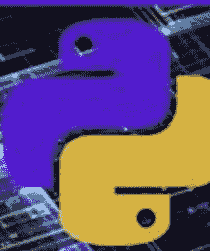

# 2024

# Python 编程

使用 Kivy 进行 GUI 开发手册



# HAZEL MACKAY

学习构建软件应用程序用户友好界面必备技能的完全初学者指南

# 目录

免责声明

引言

第一部分：Python 编程基础

- 第一章：Python 编程简介
    - 控制流（if/else、for 循环、while 循环）
    - 函数
- 第二章：面向对象编程（OOP）概念
    - 继承与多态
    - 使用模块

第二部分：揭秘 Kivy - 你的跨平台 GUI 工具包

- 第三章：设置你的 Kivy 开发环境
    - IDE 集成
    - 运行你的第一个 Kivy 应用
- 第四章：理解 Kivy 的核心概念
    - 布局：在屏幕上排列小部件
    - 属性与事件：Kivy 应用中的交互性
- 第五章：探索 Kivy 小部件库
    - 使用图像和多媒体
    - 深入布局：BoxLayout、GridLayout、StackLayout 等

# 第三部分：使用 Kivy 构建用户界面

- 第六章：设计引人入胜的布局
    - 动态布局：响应用户操作
    - 构建自定义小部件
- 第七章：通过事件和回调添加功能
    - 事件链与传播
    - 构建响应式和动态应用
- 第八章：使用 Kivy 属性和 KV 语言为你的应用添加样式
    - KV 语言的强大之处
    - 创建可复用的样式

# 第四部分：高级 Kivy 技术

- 第九章：Kivy 中的动画与视觉效果
    - 利用 Kivy 的动画 API
    - 创造引人入胜的用户体验
- 第十章：处理触摸输入和多点触控手势
    - 构建触摸优化的界面
    - 使用 Kivy 进行移动应用开发
- 第十一章：与外部数据和 API 交互
    - 从网络获取数据（HTTP 请求）
    - 与外部库集成

# 第五部分：融会贯通 - 构建真实世界的应用

- 第十二章：项目创意探索：游戏、生产力工具等！
    - 为你的技能水平选择合适的项目
- 第十三章：构建一个示例应用
    - 设计、开发和测试阶段

## 第六部分：超越基础

- 第十四章：部署你的 Kivy 应用
    - 与世界分享你的创作
- 第十五章：高级主题与资源
    - 为 Kivy 社区做贡献
    - 跟进 Kivy 的发展动态

# 附录

- 术语表

# 免责声明

本书《Python 编程：使用 Kivy 进行 GUI 开发手册》中提供的信息仅供教育和参考之用。尽管我们已尽一切努力确保所呈现内容的准确性和完整性，但作者和出版商对本书中包含的信息、产品、服务或相关图形在任何目的下的完整性、准确性、可靠性、适用性或可用性，不作任何明示或暗示的陈述或保证。

本书内容基于作者的经验和研究，旨在为使用 Kivy 进行 GUI 开发提供一般性指导。它并非旨在替代专业建议，也不是关于 Kivy GUI 编程每个方面的综合指南。鼓励读者寻求额外的信息和资源，以补充他们在 GUI 开发方面的理解和技能。

对于因使用本书而产生的任何损失或损害，包括但不限于间接或后果性损失或损害，或因数据或利润损失而产生的任何损失或损害，作者和出版商概不负责。

包含指向第三方网站或资源的链接，并不意味着对这些网站上表达的内容、产品、服务或观点的认可或批准。作者和出版商无法控制这些网站和资源的性质、内容和可用性，也不对这些网站或资源上的任何内容、广告、产品或其他材料负责。

我们已尽一切努力确保本书中提供的所有信息在出版时都是准确和最新的。但是，作者和出版商无法保证信息始终准确、完整或最新，也不对内容中的任何错误或遗漏负责。

使用本书，即表示您同意赔偿、辩护并使作者、出版商及其各自的关联公司、高级职员、董事、员工和代理人免受因您使用本书而引起或与之相关的任何及所有索赔、责任、损害、损失或费用（包括律师费）的损害。

您使用本书的风险由您自行承担，您对由此产生的任何后果负全部责任。如果您不同意这些条款，则不应使用本书。

# 引言

欢迎阅读《Python 编程：GUI 开发手册》，这是一本使用 Kivy 框架构建动态交互式图形用户界面（GUI）的综合指南。无论你是希望开始学习 GUI 编程的初学者，还是希望提升技能的经验丰富的开发者，本书都旨在帮助你释放 Kivy 的全部潜力，为你的应用程序创建令人惊叹的用户界面。

# 为什么选择 Kivy？

Kivy 是一个开源的 Python 库，允许你创建具有自然用户界面的跨平台应用程序。使用 Kivy，你可以为 Windows、macOS 和 Linux 构建桌面应用程序，也可以为 Android 和 iOS 构建移动应用程序。其强大而简洁的 API 使得创建复杂且视觉吸引力强的用户界面变得容易，使其成为从游戏和生产力工具到多媒体应用等各种应用程序的理想选择。

# 你将学到什么

在本书中，我们将首先向你介绍使用 Kivy 进行 GUI 编程的基础知识，包括如何设置开发环境、创建你的第一个 Kivy 应用，以及理解小部件、布局和事件的基本概念。然后，你将学习高级主题，如动画、触摸输入以及集成外部数据和 API，使你能够创建丰富且交互式的用户体验。

# 实践项目与示例

在整本书中，你将参与实践项目和示例，这些将帮助你在现实场景中应用所学知识。你将创建各种应用程序，从简单的计算器和待办事项列表到更复杂的游戏和多媒体播放器。读完本书后，你将具备为自己的应用程序创建专业级 GUI 的技能和知识，无论这些应用是桌面端、移动端还是基于 Web 的。

# 本书适合谁

无论你是希望创建有趣且交互式应用的爱好者、探索 GUI 编程世界的学生，还是希望为现有项目添加 GUI 的专业开发者，本书都能为你提供帮助。本书假定你具备基本的 Python 编程知识，但不需要任何 GUI 编程或 Kivy 的先验经验。

# 让我们开始吧！

那么，让我们深入开始掌握使用 Kivy 进行 GUI 开发吧！无论你是想构建你的第一个 GUI 应用，还是增强你现有的项目，本书都将为你提供成功所需的知识和技能。

# 第一部分：Python 编程基础

# 第一章：Python 编程简介

## 变量、数据类型、运算符

Python 是一种强大且通用的编程语言，以其简洁性和可读性而闻名。它广泛应用于从 Web 开发到数据科学的各个领域。在本章中，我们将探讨 Python 编程的基础知识，重点关注变量、数据类型和运算符，它们是任何 Python 程序的构建块。

### 变量

在 Python 中，变量是一个名称，它引用存储在内存中的值。变量用于存储数据，这些数据可以在程序中稍后被操作或使用。要将值赋给变量，你使用等号（`=`）。例如：

```python
age = 25
name = "Alice"
```

在这个例子中，`age` 是一个存储整数值 `25` 的变量，`name` 是一个存储字符串 `"Alice"` 的变量。

### 数据类型

Python 有几种内置数据类型，用于定义变量中存储数据的性质。一些最常见的数据类型包括：

- 整数（`int`）：正数或负数，没有小数点的整数。例如：`42`、`-10`。
- 浮点数（`float`）：带有小数点或以指数形式表示的数字。例如：`3.14`、`-0.001`。
- 字符串（`str`）：用引号括起来的字符序列。例如：`"Hello, World!"`。
- 布尔值（`bool`）：表示真值，要么是 `True`，要么是 `False`。
- 列表（`list`）：一个有序的项目集合，可以包含不同的数据类型。例如：`[1, 2, 3]`、`['apple', 'banana', 'cherry']`。
- 元组（`tuple`）：类似于列表，但不可变（无法更改）。例如：`(1, 2, 3)`、`('a', 'b', 'c')`。
- 字典（`dict`）：一个键值对的集合。例如：`{'name': 'Alice', 'age': 25}`。

# 运算符

运算符是用于对变量和值执行操作的符号。Python 支持多种运算符，包括：

**算术运算符：** 用于数学运算。

- `+`：加法
- `-`：减法
- `*`：乘法
- `/`：除法
- `//`：整除
- `%`：取模（求余数）
- `**`：幂运算

**比较运算符：** 用于比较值。

- `==`：等于
- `!=`：不等于
- `<`：小于
- `>`：大于
- `<=`：小于或等于
- `>=`：大于或等于

**逻辑运算符：** 用于组合条件语句。

- `and`：如果两个语句都为真，则返回 `True`
- `or`：如果其中一个语句为真，则返回 `True`
- `not`：反转结果，如果结果为真，则返回 `False`

## 示例

这是一个简单的示例，演示了 Python 中变量、数据类型和运算符的使用：

```python
# 变量和数据类型
name = "Alice"
age = 25
height = 5.5
is_student = True

# 运算符
print(name + " is " + str(age) + " years old.")
print("Next year, she will be " + str(age + 1) + " years old.")
print("Is she a student? " + str(is_student))
```

在这个例子中，我们有不同数据类型的变量，并使用算术和字符串运算符来构建和打印关于 Alice 的句子。

通过理解变量、数据类型和运算符，你正在为 Python 中更复杂的编程概念打下基础。在下一章中，我们将深入探讨控制结构和函数，这将使你能够创建更具动态性和交互性的程序。

## 控制流（if/else、for 循环、while 循环）

控制流是编程中的一个基本概念，它允许你根据某些条件或迭代来控制代码的执行顺序。在 Python 中，主要的控制流语句是 `if/else` 语句、`for` 循环和 `while` 循环。

### If/Else 语句

`if/else` 语句用于在指定条件为真时执行一段代码块，并可选地在条件为假时执行另一段代码块。语法如下：

```python
if condition:
    # 条件为真时执行的代码块
else:
    # 条件为假时执行的代码块
```

你也可以使用 `elif`（"else if" 的缩写）来添加额外的条件：

```python
if condition1:
    # 条件1的代码块
elif condition2:
    # 条件2的代码块
else:
    # 两个条件都不满足时的代码块
```

示例：

```python
age = 18
if age >= 18:
    print("You are an adult.")
elif age >= 13:
    print("You are a teenager.")
else:
    print("You are a child.")
```

### For 循环

`for` 循环用于遍历一个序列（如列表、元组或字符串），并为序列中的每个项目执行一段代码块。语法是：

```python
for item in sequence:
    # 为每个项目执行的代码块
```

示例：

```python
fruits = ["apple", "banana", "cherry"]
for fruit in fruits:
    print(fruit)
```

你也可以使用 `range()` 函数来生成一个数字序列，这在 `for` 循环中经常使用：

```python
for i in range(5):
    print(i)
```

### While 循环

`while` 循环用于在指定条件为真时重复执行一段代码块。语法是：

```python
while condition:
    # 条件为真时执行的代码块
```

示例：

```python
count = 0
while count < 5:
    print(count)
    count += 1
```

在这个例子中，只要 `count` 小于 5，循环就会继续执行。在循环内部，我们打印 `count` 的值，然后将其加 1。

控制流语句对于创建动态和交互式程序至关重要。通过组合 `if/else` 语句、`for` 循环和 `while` 循环，你可以编写出能够响应不同条件并高效执行重复任务的代码。在下一节中，我们将探讨 Python 中的函数，它允许你将代码组织成可重用的块。

## 函数

函数是 Python 编程中的一个关键概念，它允许你将代码组织成可重用的块。函数是一个命名的语句序列，用于执行特定任务。当你需要在程序中多次执行该任务时，你可以简单地调用该函数，而不是重写代码。

### 定义函数

要在 Python 中定义一个函数，你使用 `def` 关键字，后跟函数名和一组括号。如果你的函数接受参数，你将它们列在括号内。函数体在函数定义下缩进，通常以 `return` 语句结束，该语句指定函数要返回的值。

```python
def greet(name):
    return f"Hello, {name}!"

print(greet("Alice"))
```

在这个例子中，`greet` 是一个接受一个参数 `name` 并返回问候字符串的函数。

### 默认参数

你可以通过在函数定义中为参数赋值来提供默认值。这使得在调用函数时参数成为可选的。

```python
def greet(name="World"):
    return f"Hello, {name}!"

print(greet()) # 输出：Hello, World!
print(greet("Alice")) # 输出：Hello, Alice!
```

### 关键字参数

调用函数时，你可以使用关键字参数按名称指定参数。这可以使你的代码更具可读性，并允许你以任何顺序传递参数。

```python
def describe_pet(animal_type, pet_name):
    print(f"I have a {animal_type} named {pet_name}.")

describe_pet(pet_name="Whiskers", animal_type="cat")
```

### 任意参数

有时，你可能事先不知道一个函数需要接受多少个参数。在这种情况下，你可以通过在参数名前加上星号（`*`）来使用*任意参数*。

```python
def make_pizza(*toppings):
    print("Making a pizza with the following toppings:")
    for topping in toppings:
        print(f"- {topping}")

make_pizza("pepperoni", "mushrooms", "green peppers")
```

### Lambda 函数

Lambda 函数是小型的匿名函数，可以在一行中定义。它们通常用于简短、简单的操作，特别是作为高阶函数（如 `map` 或 `filter`）的参数时。

```python
square = lambda x: x ** 2
print(square(5)) # 输出：25
```

函数是 Python 编程的基本组成部分，使你能够编写更具模块化和可维护性的代码。它们允许你封装逻辑、减少代码重复并提高可读性。

# 第2章：面向对象编程（OOP）概念

## 类和对象

面向对象编程（OOP）是一种使用对象和类来组织代码的编程范式。它是一个强大的概念，允许创建模块化、可重用和可扩展的软件。在本章中，我们将深入探讨 Python 中 OOP 的核心概念，从类和对象开始。

## 类

在 Python 中，类是创建对象的蓝图。它定义了一组属性和方法，这些属性和方法将被从该类创建的对象所拥有。属性是存储与对象相关数据的变量，而方法是定义对象行为的函数。

要在 Python 中定义一个类，你使用 `class` 关键字，后跟类名和一个冒号。类体包含类的属性和方法的定义。

```python
class Dog:
    def __init__(self, name, age):
        self.name = name
        self.age = age

    def bark(self):
        return f"{self.name} says woof!"
```

在这个示例中，我们定义了一个`Dog`类，其中包含一个`__init__`方法和一个`bark`方法。`__init__`方法是一个特殊的方法，称为构造函数，当从类创建新对象时会自动调用它。它用于初始化对象的属性。

## 对象

对象是类的实例。它是通过使用类构造函数方法接受的参数来调用类名而创建的。

```python
my_dog = Dog(name="Buddy", age=5)
print(my_dog.bark()) # Output: Buddy says woof!
```

在这个示例中，`my_dog`是从`Dog`类创建的一个对象。它具有在创建对象时设置的`name`和`age`属性，并且可以使用类中定义的`bark`方法。

## 访问属性和方法

你可以使用点表示法来访问对象的属性和方法。这涉及编写对象的名称，后跟一个点和属性或方法的名称。

```python
print(my_dog.name) # Output: Buddy
print(my_dog.age) # Output: 5
print(my_dog.bark()) # Output: Buddy says woof!
```

## 修改属性

你可以直接修改对象的属性，或者通过使用方法来修改。

```python
my_dog.age = 6
print(my_dog.age) # Output: 6

def set_name(self, new_name):
    self.name = new_name

my_dog.set_name("Max")
print(my_dog.name) # Output: Max
```

在这个示例中，我们直接更改了`my_dog`的`age`属性，并使用了`set_name`方法来更改`name`属性。

类和对象是Python中面向对象编程的基础。它们允许你创建结构化的、可重用的代码，这些代码可以表示现实世界中的实体及其交互。在下一节中，我们将探讨更高级的OOP概念，如继承、封装和多态。

## 继承和多态

### 继承

继承是面向对象编程中的一个基本概念，它允许一个类从另一个类继承属性和方法。继承的类称为子类或派生类，而被继承的类称为超类或基类。继承促进了代码重用，并在类之间建立了层次关系。

在Python中，通过将父类作为参数传递给子类来实现继承：

```python
class Animal:
    def __init__(self, name):
        self.name = name

    def make_sound(self):
        pass

class Dog(Animal):
    def make_sound(self):
        return f"{self.name} says woof!"

class Cat(Animal):
    def make_sound(self):
        return f"{self.name} says meow!"

dog = Dog("Buddy")
cat = Cat("Whiskers")
print(dog.make_sound()) # Output: Buddy says woof!
print(cat.make_sound()) # Output: Whiskers says meow!
```

在这个示例中，`Dog`和`Cat`类继承自`Animal`类。它们都重写了`make_sound`方法以提供各自的特定实现。

### 多态

多态是一个OOP概念，它允许将不同类的对象视为公共超类的对象。它使得相同的接口可以用于不同的底层形式（数据类型）。在继承的上下文中，多态允许将子类视为其超类的实例。

```python
def animal_sound(animal):
    print(animal.make_sound())

animal_sound(dog) # Output: Buddy says woof!
animal_sound(cat) # Output: Whiskers says meow!
```

在这个示例中，`animal_sound`函数接受一个`animal`对象作为参数并调用其`make_sound`方法。这个函数可以接受任何具有`make_sound`方法的对象，这展示了多态性。

### 方法重写

方法重写是继承的一个特性，它允许子类为其超类中已定义的方法提供特定的实现。这是修改或扩展继承方法行为的一种方式。

```python
class Bird(Animal):
    def make_sound(self):
        return f"{self.name} says tweet!"

bird = Bird("Sparrow")
print(bird.make_sound()) # Output: Sparrow says tweet!
```

在这个示例中，`Bird`类重写了从`Animal`类继承的`make_sound`方法。

继承和多态是面向对象编程中的强大概念，它们使你能够创建灵活且可维护的代码。它们允许你通过重用和扩展现有代码来构建复杂的系统，减少冗余并提高代码清晰度。

### 使用模块

Python中的模块是包含定义和语句的文件，可以被导入并在其他Python程序中使用。它们提供了一种将代码组织成可重用组件的方式，使得管理大型项目变得更加容易。在本节中，我们将探讨如何在Python中创建、导入和使用模块。

### 创建模块

要创建模块，只需将你的Python代码保存在一个扩展名为`.py`的文件中。例如，让我们创建一个名为`greetings.py`的模块，内容如下：

```python
# greetings.py

def say_hello(name):
    return f"Hello, {name}!"

def say_goodbye(name):
    return f"Goodbye, {name}!"
```

这个模块包含两个函数，`say_hello`和`say_goodbye`，它们可以被导入并在其他Python文件中使用。

### 导入模块

要使用`greetings`模块中的函数，你需要将其导入到你的程序中。有几种导入模块的方法：

- 导入整个模块：使用`import`语句后跟模块名称。

```python
import greetings

print(greetings.say_hello("Alice"))
```

- 导入特定函数：使用`from`关键字后跟模块名称和`import`语句以及特定的函数名称。

```python
from greetings import say_hello, say_goodbye

print(say_hello("Bob"))
```

- 导入所有函数：使用`from`关键字后跟模块名称和`import *`语句来导入模块中的所有函数。

```python
from greetings import *
print(say_goodbye("Charlie"))
```

### 使用模块

一旦模块被导入，你就可以像使用程序中的任何其他代码一样使用它的函数和变量。你也可以使用点表示法来访问模块的属性。

```python
import greetings

print(greetings.say_hello("Alice"))
print(greetings.__name__) # Output: greetings
```

### 创建包

当你的项目增长时，你可能希望将模块组织成包。包是一个包含一个或多个模块和一个名为`__init__.py`的特殊文件的目录。这个文件的存在表明该目录是一个包。包可以包含子包，形成模块的层次结构。

例如，你可以将你的`greetings`模块组织成一个包，如下所示：

```
my_package/
    __init__.py
    greetings.py
```

然后你可以从`my_package`包中导入`greetings`模块：

```python
from my_package import greetings

print(greetings.say_hello("Alice"))
```

使用模块和包对于构建你的Python项目结构至关重要。它允许你将代码组织成可重用的组件，使其更易于管理和维护。

## 第二部分：揭秘Kivy - 你的跨平台GUI工具包

## 第三章：设置你的Kivy开发环境

### 安装Python和Kivy

Kivy是一个强大的开源Python框架，用于开发多点触控应用程序。它非常适合创建在Windows、Linux、macOS、Android和iOS上运行的应用程序。要开始使用Kivy构建应用程序，你首先需要设置你的开发环境。在本章中，我们将指导你在系统上安装Python和Kivy的过程。

### 安装Python

在安装Kivy之前，你需要在你的计算机上安装Python。Python是一种通用的编程语言，是许多应用程序和框架（包括Kivy）的基础。

1. 下载Python：
    - 访问官方网站[python.org](https://www.python.org/)。
    - 导航到下载部分，选择适合你操作系统（Windows、macOS或Linux）的版本。
    - 下载最新的Python 3.x稳定版本。
2. 安装Python：
    - 运行你在上一步下载的安装程序。
    - 在Windows上，确保在点击“立即安装”之前勾选“将Python 3.x添加到PATH”的复选框。这一步至关重要，因为它允许你从命令行运行Python。

## 安装 Kivy

安装好 Python 后，你现在可以继续安装 Kivy。Kivy 提供了预构建的 wheel 包，方便在各种平台上轻松安装。

1. 安装依赖项：

    - Kivy 需要一些额外的库才能正常运行。你可以使用以下命令安装这些依赖项：

    ```
    python -m pip install --upgrade pip wheel setuptools virtualenv
    ```

2. 安装 Kivy：

    - 使用以下命令安装 Kivy：

    ```
    python -m pip install kivy[base] kivy_examples
    ```

    - `kivy[base]` 包安装了 Kivy 的核心框架，而 `kivy_examples` 包含了各种示例，帮助你开始 Kivy 开发。

3. 验证 Kivy 安装：

    - 为确保 Kivy 已正确安装，你可以运行 `kivy_examples` 包中包含的一个示例。导航到示例安装的目录，然后使用 Python 运行一个示例：

    ```
    cd path/to/kivy_examples/simple
    python main.py
    ```

    - 如果你看到一个窗口，其中运行着一个 Kivy 应用程序，那么恭喜！你已成功设置好 Kivy 开发环境。

通过遵循这些步骤，你已经安装了 Python 和 Kivy，为开发引人入胜的多点触控应用程序奠定了基础。

## IDE 集成

集成开发环境（IDE）是一种为计算机程序员提供全面设施以进行软件开发的软件应用程序。对于 Kivy 开发，将你的 Kivy 环境与 IDE 集成可以大大提高你的工作效率，提供语法高亮、代码补全、调试工具等功能。在本节中，我们将讨论如何将 Kivy 与一些流行的 IDE 集成。

### PyCharm

PyCharm 是一个流行的 Python 开发 IDE，为 Kivy 提供了出色的支持。

1. 安装 PyCharm：
    - 从[官方网站](https://www.jetbrains.com/pycharm/download/)下载并安装 PyCharm。
    - 如果你想要免费版本，请选择社区版。
2. 配置 Kivy 解释器：
    - 打开 PyCharm 并创建一个新项目。
    - 转到 File > Settings > Project: YourProjectName > Python Interpreter。
    - 点击齿轮图标并选择 "Add"。
    - 选择 "System Interpreter" 并选择安装了 Kivy 的 Python 解释器。
    - 应用更改。
3. 安装 Kivy 包（如果尚未全局安装）：
    - 在 Python Interpreter 设置中，点击 "+" 图标以添加新包。
    - 搜索 "Kivy" 并安装它。
4. 创建 Kivy 运行配置：
    - 转到 Run > Edit Configurations。
    - 点击 "+" 图标并选择 "Python"。
    - 为你的配置命名，并选择你的 Kivy 应用程序的脚本路径。
    - 应用更改。

现在你可以在 PyCharm 中开发 Kivy 应用程序，并享受代码补全和调试等功能。

### Visual Studio Code

Visual Studio Code（VS Code）是一个轻量级但功能强大的源代码编辑器，支持 Python 和 Kivy 开发。

1. 安装 VS Code：
    - 从[官方网站](https://code.visualstudio.com/Download)下载并安装 VS Code。
2. 安装 Python 扩展：
    - 打开 VS Code，通过点击侧边栏上的方块图标或按 Ctrl+Shift+X 转到扩展视图。
    - 搜索 "Python" 并安装 Microsoft 提供的 Python 扩展。
3. 选择 Python 解释器：
    - 通过按 Ctrl+Shift+P 打开命令面板，然后输入 "Python: Select Interpreter"。
    - 选择安装了 Kivy 的解释器。
4. 安装 Kivy 包（如果尚未全局安装）：
    - 通过按 Ctrl+`（反引号）在 VS Code 中打开集成终端。
    - 运行命令 `python -m pip install kivy` 以在选定的解释器中安装 Kivy。
5. 创建 Kivy 运行配置：
    - 通过点击侧边栏上的播放图标或按 Ctrl+Shift+D 转到运行视图。
    - 点击 "create a launch.json file" 并选择 "Python File" 作为环境。
    - 修改 "program" 属性以指向你的 Kivy 应用程序脚本。

通过这些步骤，你可以使用 VS Code 开发 Kivy 应用程序，并享受智能感知、代码检查和调试等功能。

通过将 Kivy 与 PyCharm 或 Visual Studio Code 等 IDE 集成，你可以获得一套开发工具，这些工具有助于简化你的工作流程、减少错误并提高 Kivy 应用程序的整体质量。在下一章中，我们将深入探讨创建你的第一个 Kivy 应用程序并探索其核心组件。

## 运行你的第一个 Kivy 应用

你的 Kivy 开发环境已设置好并集成到 IDE 中，现在你已准备好创建并运行你的第一个 Kivy 应用程序。在本节中，我们将引导你完成创建一个简单 Kivy 应用程序的过程，该应用程序将显示一个带有消息的按钮。

**创建应用程序**

1. 创建一个新的 Python 文件：
    - 在你的 IDE 中，创建一个名为 `main.py` 的新 Python 文件。
2. 导入 Kivy 模块：
    - 在文件开头，导入必要的 Kivy 模块。对于这个示例，你至少需要 `App` 和 `Button`。

    ```python
    from kivy.app import App
    from kivy.uix.button import Button
    ```

3. 定义 App 类：
    - 创建一个 `App` 的子类，它将作为你的 Kivy 应用程序的入口点。在这个类中，你将定义一个名为 `build()` 的方法，该方法返回你的应用程序的根部件，在本例中将是一个按钮。

    ```python
    class MyApp(App):
        def build(self):
            return Button(text='Hello, Kivy!')
    ```

    `build()` 方法是 Kivy 中的一个特殊方法，用于初始化并返回应用程序的根部件。在这个例子中，根部件是一个文本为 "Hello, Kivy!" 的 `Button`。
4. 运行应用程序：
    - 最后，创建你的应用程序类的一个实例，并调用其 `run()` 方法来启动应用程序。

    ```python
    if __name__ == '__main__':
        MyApp().run()
    ```

    这段代码检查脚本是否正在直接运行（而不是作为模块导入），然后创建 `MyApp` 的一个实例并调用其 `run()` 方法。

### 运行应用程序

- 运行脚本：
    - 在你的 IDE 中，运行 `main.py` 脚本。你应该会看到一个窗口弹出，其中有一个标有 "Hello, Kivy!" 的按钮。
    - 点击按钮目前还不会有任何反应，但你已经成功创建并运行了你的第一个 Kivy 应用程序！

### 下一步

既然你已经创建了一个基本的 Kivy 应用程序，你可以探索为你的应用程序添加更多功能和部件。Kivy 提供了广泛的部件，包括标签、文本输入、滑块等，允许你创建复杂且交互式的用户界面。你还可以尝试布局管理、事件处理以及自定义部件的外观。

## 第 4 章：理解 Kivy 的核心概念

### 部件：你的 GUI 构建块

在本章中，我们将深入探讨 Kivy 中的一个基本概念：部件。部件是 Kivy 中图形用户界面（GUI）的构建块。它们是构成你应用程序的元素，从按钮和标签到更复杂的组件，如滑块和文本输入。了解如何使用部件对于创建有效且交互式的 Kivy 应用程序至关重要。

### 什么是部件？

Kivy 中的部件是表示用户界面元素的对象。它们可以显示内容、与用户交互以及管理布局和定位。Kivy 中的每个部件都是 `Widget` 类或其子类的一个实例。`Widget` 类为创建自定义部件提供了基础，并包含用于管理大小、位置和交互的属性和方法。

### 常用部件

Kivy 提供了广泛的预构建部件，你可以使用它们来构建应用程序的界面。以下是一些最常用的部件：

- Button：一个可点击的按钮，按下时可以执行操作。
- Label：用于显示文本的部件。
- TextInput：用于输入文本的字段。
- Slider：用于从范围中选择值的部件。

## 创建和使用控件

要在你的 Kivy 应用程序中使用一个控件，你需要创建该控件类的一个实例，并将其添加到应用程序的控件树中。下面是一个创建包含标签和按钮的简单界面的示例：

```python
from kivy.app import App
from kivy.uix.label import Label
from kivy.uix.button import Button
from kivy.uix.boxlayout import BoxLayout

class MySimpleApp(App):
    def build(self):
        layout = BoxLayout(orientation='vertical')
        label = Label(text='Welcome to Kivy!')
        button = Button(text='Click Me')

        layout.add_widget(label)
        layout.add_widget(button)

        return layout

if __name__ == '__main__':
    MySimpleApp().run()
```

在这个示例中，我们使用一个 `BoxLayout` 来垂直排列 `Label` 和 `Button`。`add_widget` 方法用于将控件添加到布局中，而该布局本身则作为应用程序的根控件被返回。

## 自定义控件

Kivy 中的控件可以通过多种方式进行自定义，以满足你的应用程序需求。你可以更改它们的外观、行为和布局属性。例如，你可以设置标签的字体大小和颜色，或者指定按钮的大小和位置。Kivy 还允许你通过继承现有的控件类并添加你自己的属性和方法来创建自定义控件。

## 与控件交互

控件可以通过事件和回调与用户进行交互。例如，你可以将一个回调函数绑定到按钮的 `on_press` 事件上，以便在按钮被点击时执行一个操作：

```python
def on_button_press(instance):
    print('Button pressed!')

button = Button(text='Click Me')
button.bind(on_press=on_button_press)
```

在这个示例中，每当按钮被按下时，`on_button_press` 函数就会被调用。

控件是任何 Kivy 应用程序的核心元素，掌握它们的使用对于构建有效的图形用户界面至关重要。在接下来的章节中，我们将探讨更高级的主题，例如 Kivy 中的布局管理、事件和图形，这将进一步增强你创建动态和交互式应用程序的能力。

## 布局：在屏幕上排列控件

在 Kivy 中，布局是特殊类型的控件，用于在屏幕上排列其他控件。它们提供了一种灵活的方式来管理子控件的大小和位置，使得创建有组织且响应式的界面变得更加容易。Kivy 提供了几种内置的布局类，每种都有其排列控件的方式：

### 1. BoxLayout

`BoxLayout` 将控件排列成水平或垂直的一行。你可以通过 `orientation` 属性来控制方向，该属性可以是 `'horizontal'` 或 `'vertical'`。

```python
from kivy.uix.boxlayout import BoxLayout

layout = BoxLayout(orientation='vertical')
layout.add_widget(Button(text='Button 1'))
layout.add_widget(Button(text='Button 2'))
```

### 2. GridLayout

`GridLayout` 将控件排列在一个具有指定行数和列数的网格中。你可以分别使用 `rows` 和 `cols` 属性来设置行数和列数。

```python
from kivy.uix.gridlayout import GridLayout

layout = GridLayout(rows=2, cols=2)
layout.add_widget(Button(text='Button 1'))
layout.add_widget(Button(text='Button 2'))
layout.add_widget(Button(text='Button 3'))
layout.add_widget(Button(text='Button 4'))
```

### 3. AnchorLayout

`AnchorLayout` 允许你将子控件锚定到布局的特定部分，例如左上角或中心。你可以通过 `anchor_x` 和 `anchor_y` 属性来控制锚点位置。

```python
from kivy.uix.anchorlayout import AnchorLayout

layout = AnchorLayout(anchor_x='center', anchor_y='bottom')
layout.add_widget(Button(text='Center-Bottom Button'))
```

### 4. StackLayout

`StackLayout` 将控件堆叠排列，可以是水平或垂直方向，具体取决于可用空间。它对于创建适应其内容大小的流式布局非常有用。

```python
from kivy.uix.stacklayout import StackLayout

layout = StackLayout()
layout.add_widget(Button(text='Button 1', size_hint=(0.2, 0.2)))
layout.add_widget(Button(text='Button 2', size_hint=(0.2, 0.2)))
layout.add_widget(Button(text='Button 3', size_hint=(0.2, 0.2)))
```

### 5. FloatLayout

`FloatLayout` 是一个多功能的布局类，允许你将控件放置在任意坐标处。你可以通过 `pos` 属性控制每个控件的位置，通过 `size` 属性控制其大小。

```python
from kivy.uix.floatlayout import FloatLayout

layout = FloatLayout()
layout.add_widget(Button(text='Floating Button', size_hint=(0.2, 0.2), pos=(100, 100)))
```

使用布局时，你通常需要使用控件的 `size_hint` 属性来控制它们如何随布局调整大小。`size_hint` 属性是一个元组 `(x, y)`，其中 `x` 和 `y` 分别是控件在水平和垂直方向上的相对大小。

通过组合不同的布局并调整它们的属性，你可以为你的 Kivy 应用程序创建复杂且自适应的用户界面。在下一节中，我们将探讨如何处理事件和用户输入，以使你的应用程序具有交互性。

## 属性和事件：Kivy 应用中的交互性

在 Kivy 中，属性和事件是使你的应用程序具有交互性的关键概念。属性允许你存储和管理控件的状态，而事件则让你能够响应用户的操作，如触摸、点击或按键。理解如何使用属性和事件是创建动态和响应式应用程序的关键。

### 属性

在 Kivy 中，属性是用于定义控件特征的特殊属性。与常规的 Python 属性不同，Kivy 属性被设计为在值发生变化时自动更新控件的外观，并通知应用程序的其他部分这些变化。

```python
from kivy.properties import NumericProperty

class MyWidget(Widget):
    # 定义一个数值属性
    counter = NumericProperty(0)

    def increment_counter(self):
        self.counter += 1
```

在这个示例中，`counter` 是一个 `NumericProperty`。当它的值发生变化时，应用程序中使用此属性的任何部分都会自动更新。这对于创建响应式用户界面特别有用。

### 事件

Kivy 中的事件由用户操作或应用程序状态的其他变化触发。Kivy 中的每个控件都可以生成各种事件，你可以将回调函数绑定到这些事件上，以便在事件发生时执行特定的操作。

```python
class MyButton(Button):
    def on_press(self):
        print("The button was pressed!")

button = MyButton()
```

在这个示例中，`on_press` 是一个在按钮被按下时触发的事件。通过在 `MyButton` 类中重写 `on_press` 方法，你可以定义事件发生时应执行的自定义行为。

你也可以动态地将事件绑定到回调函数：

```python
def on_button_press(instance):
    print(f"{instance.text} was pressed!")

button.bind(on_press=on_button_press)
```

在这种情况下，每当按钮的 `on_press` 事件被触发时，`on_button_press` 函数就会被调用。

### 属性事件

Kivy 属性也有自己的事件，这些事件在属性值发生变化时触发。你可以将回调函数绑定到这些事件上，以响应属性值的变化。

```python
class MyWidget(Widget):
    counter = NumericProperty(0)

    def __init__(self, **kwargs):
        super().__init__(**kwargs)
        self.bind(counter=self.on_counter_change)

    def on_counter_change(self, instance, value):
        print(f"Counter changed to {value}")

my_widget = MyWidget()
my_widget.counter = 5 # 这将触发 on_counter_change 回调
```

在这个示例中，`on_counter_change` 方法被绑定到 `counter` 属性的变更事件上。当 `counter` 属性的值发生变化时，`on_counter_change` 方法会被自动调用。

通过有效地使用属性和事件，你可以创建出具有交互性并能实时响应用户输入的 Kivy 应用程序。在下一节中，我们将深入探讨更高级的主题，例如自定义控件和图形。

## 第五章：探索 Kivy 组件库

**按钮、标签、文本输入框及其他！**

Kivy 提供了丰富的组件，可用于构建交互性强且视觉吸引力高的应用程序。在本章中，我们将深入探讨 Kivy 中一些最常用的组件，包括按钮、标签、文本输入框等。我们将探索它们的功能、属性，以及如何在应用程序中使用它们。

**按钮**

按钮是任何图形用户界面框架中的基础组件，Kivy 也不例外。Kivy 的 `Button` 组件用于创建可点击的按钮，按下时可以执行操作。

```python
from kivy.uix.button import Button

button = Button(text='Click Me!')
button.bind(on_press=lambda instance: print('Button pressed!'))
```

在此示例中，我们创建了一个文本为 "Click Me!" 的按钮，并将一个回调函数绑定到 `on_press` 事件，该事件在按钮被按下时触发。

**标签**

标签用于在屏幕上显示文本。Kivy 的 `Label` 组件简单但功能多样，允许你在应用程序中显示静态或动态文本。

```python
from kivy.uix.label import Label

label = Label(text='Hello, Kivy!')
```

你可以使用 `font_size`、`color` 和 `halign`（水平对齐）等属性来自定义文本的外观。

## 文本输入框

文本输入框是允许用户输入文本的组件。Kivy 的 `TextInput` 组件为用户提供了一种输入文本的方式，可用于表单、聊天框等。

```python
from kivy.uix.textinput import TextInput

text_input = TextInput(text='Enter your name', multiline=False)
text_input.bind(on_text_validate=lambda instance: print('Text entered:', instance.text))
```

在此示例中，我们创建了一个单行文本输入框，占位符文本为 "Enter your name"。我们将一个回调函数绑定到 `on_text_validate` 事件，该事件在用户按下回车键时触发。

## 滑块

滑块是允许用户通过沿轨道滑动滑块手柄来从某个范围中选择值的组件。Kivy 的 `Slider` 组件适用于音量控制或在特定范围内调整设置等场景。

```python
from kivy.uix.slider import Slider

slider = Slider(min=0, max=100, value=50)
slider.bind(value=lambda instance, value: print('Slider value:', value))
```

在此示例中，我们创建了一个范围从 0 到 100、初始值为 50 的滑块。我们将一个回调函数绑定到 `value` 属性，该属性在滑块值发生变化时触发。

## 开关、复选框和切换按钮

Kivy 还提供了用于二元选项和选择的组件，例如开关、复选框和切换按钮。

- **开关**：开关是一种在开和关状态之间切换的组件。

```python
from kivy.uix.switch import Switch

switch = Switch(active=False)
switch.bind(active=lambda instance, value: print('Switch is', 'on' if value else 'off'))
```

- **复选框**：复选框允许用户进行二元选择，例如是/否或真/假。

```python
from kivy.uix.checkbox import CheckBox

checkbox = CheckBox(active=False)
checkbox.bind(active=lambda instance, value: print('Checkbox is', 'checked' if value else 'unchecked'))
```

- **切换按钮**：切换按钮类似于普通按钮，但会保持 'normal' 或 'down' 状态。

```python
from kivy.uix.togglebutton import ToggleButton

toggle_button = ToggleButton(text='Toggle Me!')
toggle_button.bind(state=lambda instance, value: print('Toggle button is', value))
```

这些组件对于在 Kivy 应用程序中创建交互式表单和设置页面至关重要。通过组合不同的组件并利用它们的属性和事件，你可以创建各种图形用户界面元素以满足用户的需求。

## 处理图像和多媒体

除了按钮和文本输入框等基本用户界面元素外，Kivy 还提供了强大的组件来处理图像和多媒体内容。这些组件允许你将图形、动画和音频/视频播放集成到应用程序中，使其更具吸引力和动态性。

### 显示图像

`Image` 组件用于在 Kivy 应用程序中显示各种格式（例如 PNG、JPEG、GIF）的图像。你可以从文件、URL 甚至二进制数据加载图像。

```python
from kivy.uix.image import Image

image = Image(source='path/to/your/image.png')
```

你还可以控制图像的各种属性，例如其大小、宽高比以及它在组件内的定位方式。

### 使用 Canvas 绘制图形

Kivy 的 `Canvas` 是绘制自定义形状、线条和其他图形的强大工具。它提供了一个用于渲染二维图形的低级 API，允许你创建复杂的视觉效果和动画。

```python
from kivy.uix.widget import Widget
from kivy.graphics import Rectangle, Color

class MyWidget(Widget):
    def __init__(self, **kwargs):
        super().__init__(**kwargs)
        with self.canvas:
            Color(1, 0, 0, 1) # 将颜色设置为红色
            self.rect = Rectangle(pos=(100, 100), size=(200, 200))

    def on_touch_down(self, touch):
        # 将矩形移动到触摸位置
        self.rect.pos = touch.pos
```

在此示例中，我们创建了一个自定义组件，在其画布上绘制一个红色矩形。我们还重写了 `on_touch_down` 方法，以便将矩形移动到触摸事件的位置。

### 播放音频和视频

Kivy 的 `Audio` 和 `Video` 组件分别允许你播放音频和视频文件。这些组件支持多种格式，并提供播放控制，例如播放、暂停和定位。

```python
from kivy.uix.video import Video

video = Video(source='path/to/video.mp4')
video.state = 'play' # 开始播放视频
```

你还可以通过属性和事件来自定义视频播放器的外观并控制其行为。

### 动画

Kivy 的 `Animation` 类允许你为组件的任何属性创建平滑的动画。这对于创建动态用户界面效果非常有用，例如过渡、淡入淡出和运动效果。

```python
from kivy.animation import Animation
from kivy.uix.button import Button

button = Button(text='Animate Me!')
animation = Animation(x=200, y=200, duration=2) # 在 2 秒内将按钮移动到 (200, 200)
animation.start(button)
```

在此示例中，我们为按钮的位置创建动画，在 2 秒的时间内将其移动到新位置。

通过利用 Kivy 的多媒体功能，你可以创建丰富且交互性强的应用程序，超越简单的文本和按钮。无论你是构建游戏、媒体播放器，还是具有自定义图形的应用程序，Kivy 都提供了将你的愿景变为现实所需的工具。

## 深入布局：BoxLayout、GridLayout、StackLayout 等

Kivy 的布局系统灵活而强大，允许你相对轻松地创建复杂的用户界面结构。在本节中，我们将深入探讨 Kivy 中一些最常用的布局：BoxLayout、GridLayout 和 StackLayout。我们还将介绍一些额外的布局，这些布局可以帮助你实现更复杂的设计。

### BoxLayout

`BoxLayout` 将组件排列成水平或垂直线。它是 Kivy 中最简单且最有用的布局之一。你可以使用 `orientation` 属性控制方向，该属性可以是 `'horizontal'` 或 `'vertical'`。

```python
from kivy.uix.boxlayout import BoxLayout
from kivy.uix.button import Button

layout = BoxLayout(orientation='vertical')
layout.add_widget(Button(text='Button 1'))
layout.add_widget(Button(text='Button 2'))
```

你可以使用子组件的 `size_hint` 属性来控制它们相对于布局的大小。例如，`size_hint=(0.5, 1)` 会使组件占据水平 BoxLayout 一半的宽度和全部的高度。

### GridLayout

`GridLayout` 将组件排列成具有指定行数和列数的网格。它非常适合创建表单、计算器或任何需要网格状结构的用户界面。

```python
from kivy.uix.gridlayout import GridLayout
from kivy.uix.label import Label
from kivy.uix.textinput import TextInput

layout = GridLayout(cols=2)
layout.add_widget(Label(text='Name:'))
layout.add_widget(TextInput(multiline=False))
layout.add_widget(Label(text='Email:'))
layout.add_widget(TextInput(multiline=False))
```

在此示例中，我们创建了一个简单的表单，标签和文本输入框排列在两列网格中。

### StackLayout

`StackLayout` 将控件以堆叠方式排列，可以是水平或垂直方向，具体取决于可用空间。它适用于创建能根据内容大小自适应的流式布局。

```python
from kivy.uix.stacklayout import StackLayout
from kivy.uix.button import Button

layout = StackLayout()
layout.add_widget(Button(text='Button 1', size_hint=(0.2, 0.2)))
layout.add_widget(Button(text='Button 2', size_hint=(0.2, 0.2)))
layout.add_widget(Button(text='Button 3', size_hint=(0.2, 0.2)))
```

在此示例中，我们向 `StackLayout` 添加按钮，并设置尺寸提示，使每个按钮占据布局宽度和高度的20%。

## 其他布局

Kivy 还提供了其他几种布局，用于更具体的用例：

-   `AnchorLayout`：允许你将子控件锚定到布局的特定部分（例如，左上角、中心、右下角）。
-   `FloatLayout`：提供最大的灵活性，允许你在任意坐标处定位和调整控件大小。
-   `RelativeLayout`：类似于 `FloatLayout`，但根据布局的大小来定位和调整控件大小，使得创建可扩展的 UI 更容易。

通过理解和组合这些不同的布局，你可以创建几乎任何你能想象到的 UI 结构。在下一章中，我们将探讨如何处理用户输入和事件，使你的 Kivy 应用程序具有交互性。

# 第三部分：使用 Kivy 构建用户界面

# 第六章：打造引人入胜的布局

## 组合布局以构建复杂 UI

在 Kivy 中创建复杂且引人入胜的用户界面（UI）通常需要组合多个布局。通过将布局相互嵌套，你可以实现既美观又功能强大的复杂设计。在本章中，我们将探讨如何组合不同的布局来创建满足应用程序需求的复杂 UI。

## 组合 BoxLayout 和 GridLayout

一种常见的方法是使用 `BoxLayout` 作为主容器，并在其中嵌套一个 `GridLayout` 用于 UI 的特定部分。这种组合非常适合表单或设置页面，你需要为输入字段提供网格状结构，同时也希望将其他元素垂直或水平排列。

```python
from kivy.app import App
from kivy.uix.boxlayout import BoxLayout
from kivy.uix.gridlayout import GridLayout
from kivy.uix.label import Label
from kivy.uix.textinput import TextInput
from kivy.uix.button import Button

class MyFormApp(App):
    def build(self):
        main_layout = BoxLayout(orientation='vertical', padding=10, spacing=10)

        # Create a grid layout for the form
        form_layout = GridLayout(cols=2, spacing=10, size_hint_y=None)
        form_layout.bind(minimum_height=form_layout.setter('height'))

        # Add form widgets
        form_layout.add_widget(Label(text='Name:'))
        form_layout.add_widget(TextInput(multiline=False))
        form_layout.add_widget(Label(text='Email:'))
        form_layout.add_widget(TextInput(multiline=False))

        # Add the form layout to the main layout
        main_layout.add_widget(form_layout)

        # Add a submit button to the main layout
        main_layout.add_widget(Button(text='Submit', size_hint_y=None, height=50))

        return main_layout

if __name__ == '__main__':
    MyFormApp().run()
```

在此示例中，我们使用一个垂直方向的 `BoxLayout` 作为主布局。在其中，我们嵌套了一个用于表单字段的 `GridLayout` 和一个用于提交的 `Button`。

## 嵌套 StackLayout 与 FloatLayout

对于更动态和流畅的 UI，你可以将 `StackLayout` 与 `FloatLayout` 结合使用。这种组合允许你创建既能适应内容大小又能精确放置元素的布局。

```python
from kivy.uix.floatlayout import FloatLayout
from kivy.uix.stacklayout import StackLayout
from kivy.uix.button import Button

class MyDynamicLayout(FloatLayout):
    def __init__(self, **kwargs):
        super().__init__(**kwargs)

        # Create a stack layout for the buttons
        button_layout = StackLayout(size_hint=(None, None), size=(200, 200), pos_hint={'center_x': 0.5, 'center_y': 0.5})
        button_layout.add_widget(Button(text='Button 1', size_hint=(None, None), size=(100, 50)))
        button_layout.add_widget(Button(text='Button 2', size_hint=(None, None), size=(100, 50)))
        button_layout.add_widget(Button(text='Button 3', size_hint=(None, None), size=(100, 50)))

        # Add the stack layout to the float layout
        self.add_widget(button_layout)
```

在此示例中，我们使用 `FloatLayout` 作为主容器，并在其中嵌套一个 `StackLayout`。`StackLayout` 包含多个按钮，并被定位在 `FloatLayout` 的中心。

## 利用 AnchorLayout 进行精确定位

当你需要将一个布局或控件定位在另一个布局内的特定位置时，`AnchorLayout` 尤其有用。

```python
from kivy.uix.anchorlayout import AnchorLayout
from kivy.uix.boxlayout import BoxLayout
from kivy.uix.button import Button

class MyAnchoredLayout(BoxLayout):
    def __init__(self, **kwargs):
        super().__init__(**kwargs)
        self.orientation = 'vertical'

        # Create an anchor layout for the header
        header_layout = AnchorLayout(anchor_x='center', anchor_y='top', size_hint_y=0.1)
        header_layout.add_widget(Button(text='Header', size_hint=(0.5, 1)))

        # Add the header layout to the main layout
        self.add_widget(header_layout)

        # Add other content to the main layout
        self.add_widget(Button(text='Content'))
```

在此示例中，我们使用 `BoxLayout` 作为主布局，并在顶部嵌套一个 `AnchorLayout`，以精确定位头部按钮。

通过掌握组合布局的艺术，你可以创建复杂且自适应的 UI，从而提升 Kivy 应用程序的用户体验。在下一章中，我们将深入探讨如何处理用户输入和事件，使你的 UI 具有交互性和响应性。

## 动态布局：响应用户操作

在 Kivy 中创建动态布局涉及设计能够适应和响应用户操作的界面。这种交互性对于构建提供无缝用户体验的引人入胜的应用程序至关重要。在本节中，我们将探讨如何通过响应按钮点击、文本输入等用户操作，使你的布局变得动态。

## 根据用户输入更新布局

动态布局中的一个常见场景是根据用户输入更新 UI。例如，当用户与你的应用程序交互时，你可能希望显示额外的控件或更新现有的控件。

```python
from kivy.app import App
from kivy.uix.boxlayout import BoxLayout
from kivy.uix.button import Button
from kivy.uix.label import Label
from kivy.uix.textinput import TextInput

class DynamicFormApp(App):
    def build(self):
        self.main_layout = BoxLayout(orientation='vertical', padding=10, spacing=10)

        self.name_input = TextInput(hint_text='Enter your name', multiline=False)
        submit_button = Button(text='Submit', on_press=self.on_submit)

        self.main_layout.add_widget(self.name_input)
        self.main_layout.add_widget(submit_button)

        return self.main_layout

    def on_submit(self, instance):
        name = self.name_input.text
        greeting_label = Label(text=f'Hello, {name}!')
        self.main_layout.add_widget(greeting_label)

if __name__ == '__main__':
    DynamicFormApp().run()
```

在此示例中，我们创建了一个包含文本输入和提交按钮的简单表单。当按下提交按钮时，一个新的标签被添加到布局中，显示包含用户名的问候消息。

## 为布局变化添加动画

Kivy 的 `Animation` 类可用于为布局的变化添加动画，从而在不同状态之间提供平滑的过渡。例如，你可能希望为向布局添加新控件的过程添加动画。

```python
from kivy.animation import Animation
from kivy.uix.widget import Widget

class MyWidget(Widget):
    def add_widget_with_animation(self, widget):
        widget.opacity = 0 # Start with the widget being fully transparent
        self.add_widget(widget)
        animation = Animation(opacity=1, duration=1) # Animate to full opacity over 1 second
        animation.start(widget)
```

在此示例中，当一个新控件被添加到 `MyWidget` 时，它最初是完全透明的，然后在1秒内淡入变为完全不透明。

## 使布局适应用户交互

你还可以设计你的布局以适应不同类型的用户交互，例如在不同视图之间切换或动态更新内容。

```python
from kivy.uix.screenmanager import ScreenManager, Screen

class MainScreen(Screen):
    pass

class SettingsScreen(Screen):
    pass

class MyScreenManager(ScreenManager):
    def switch_to_settings(self):
        self.current = 'settings'

screen_manager = MyScreenManager()
screen_manager.add_widget(MainScreen(name='main'))
screen_manager.add_widget(SettingsScreen(name='settings'))
```

在这个例子中，我们使用 Kivy 的 `ScreenManager` 根据用户交互在主屏幕和设置屏幕之间切换。

通过在你的 Kivy 应用程序中融入动态布局，你可以创建交互式且适应性强的界面，使其能够响应用户操作，从而让你的应用程序更具吸引力且更用户友好。

## 构建自定义控件

虽然 Kivy 提供了广泛的内置控件，但在某些情况下，你可能需要一个具有特定功能或外观的控件，而标准控件集并未涵盖。在这种情况下，你可以创建自定义控件。本节将指导你完成在 Kivy 中构建自己的自定义控件的过程。

## 创建一个简单的自定义控件

要在 Kivy 中创建一个自定义控件，你首先需要继承 `Widget` 类或其某个子类。然后，你可以定义自己的属性和行为。

```python
from kivy.uix.widget import Widget
from kivy.graphics import Ellipse, Color

class CustomCircle(Widget):
    def __init__(self, **kwargs):
        super().__init__(**kwargs)
        with self.canvas:
            Color(1, 0, 0, 1) # Set the color to red
            Ellipse(pos=self.pos, size=(100, 100))

    def on_pos(self, *args):
        self.canvas.clear()
        with self.canvas:
            Color(1, 0, 0, 1)
            Ellipse(pos=self.pos, size=(100, 100))
```

在这个例子中，我们创建了一个名为 `CustomCircle` 的自定义控件，它在屏幕上绘制一个红色的圆。我们还定义了一个 `on_pos` 方法，以便在控件位置发生变化时重绘圆。

## 处理用户输入

自定义控件也可以处理用户输入，例如触摸事件。你可以重写 `on_touch_down`、`on_touch_move` 和 `on_touch_up` 等方法来定义你的控件如何响应触摸事件。

```python
class DraggableCircle(CustomCircle):
    def on_touch_down(self, touch):
        if self.collide_point(*touch.pos):
            touch.grab(self)
            return True
        return super().on_touch_down(touch)

    def on_touch_move(self, touch):
        if touch.grab_current is self:
            self.center = touch.pos
            return True
        return super().on_touch_move(touch)

    def on_touch_up(self, touch):
        if touch.grab_current is self:
            touch.ungrab(self)
            return True
        return super().on_touch_up(touch)
```

在这个例子中，我们创建了一个 `CustomCircle` 的子类 `DraggableCircle`，它可以通过触摸输入在屏幕上拖动。

## 集成自定义属性

Kivy 的属性系统允许你为控件定义自定义属性，当这些属性的值发生变化时，可以自动触发更新和事件。

```python
from kivy.properties import NumericProperty

class ResizableCircle(CustomCircle):
    radius = NumericProperty(50)

    def __init__(self, **kwargs):
        super().__init__(**kwargs)
        self.bind(radius=self.update_circle)

    def update_circle(self, *args):
        self.canvas.clear()
        with self.canvas:
            Color(1, 0, 0, 1)
            Ellipse(pos=self.pos, size=(self.radius * 2, self.radius * 2))
```

在这个例子中，我们为 `ResizableCircle` 控件添加了一个自定义属性 `radius`，它控制圆的大小。每当 `radius` 属性发生变化时，`update_circle` 方法就会被调用，确保圆以正确的尺寸重绘。

通过构建自定义控件，你可以扩展 Kivy 的功能以满足应用程序的独特需求。无论你需要一个具有特殊行为、独特外观的控件，还是需要与外部数据源集成，自定义控件都提供了一种灵活而强大的方式来增强你的 Kivy 应用程序。

## 第7章：通过事件和回调添加功能

### 处理用户输入：按钮、文本变化、触摸

在 Kivy 中，事件和回调对于为你的应用程序添加交互性和功能至关重要。它们允许你响应用户输入，例如按钮点击、文本变化和触摸手势。在本章中，我们将探讨如何处理不同类型的用户输入，并使用事件和回调使你的应用程序动态且响应迅速。

### 处理按钮点击

按钮点击是最常见的用户输入类型之一。在 Kivy 中，你可以通过将回调函数绑定到按钮的 `on_press` 或 `on_release` 事件来处理按钮点击。

```python
from kivy.uix.button import Button

def on_button_press(instance):
    print(f'{instance.text} button pressed!')

button = Button(text='Click Me')
button.bind(on_press=on_button_press)
```

在这个例子中，每当按钮被按下时，`on_button_press` 函数就会被调用。你可以使用这个回调来执行任何操作，例如更新 UI 或处理用户数据。

### 响应文本变化

对于文本输入控件，你可以通过将回调绑定到 `TextInput` 控件的 `on_text` 事件来响应文本的变化。

```python
from kivy.uix.textinput import TextInput

def on_text_change(instance, value):
    print(f'Text changed to: {value}')

text_input = TextInput()
text_input.bind(text=on_text_change)
```

在这个例子中，每当输入字段中的文本发生变化时，`on_text_change` 函数就会被调用。这对于实现诸如实时搜索或表单验证之类的功能非常有用。

### 处理触摸事件

Kivy 提供了一个灵活的触摸事件系统，允许你处理各种触摸手势，例如点击、拖动和多点触控。你可以重写控件的 `on_touch_down`、`on_touch_move` 和 `on_touch_up` 方法来处理触摸事件。

```python
from kivy.uix.widget import Widget

class TouchWidget(Widget):
    def on_touch_down(self, touch):
        if self.collide_point(*touch.pos):
            print('Touch down inside the widget')
            return True
        return super().on_touch_down(touch)

    def on_touch_move(self, touch):
        if self.collide_point(*touch.pos):
            print('Touch move inside the widget')
            return True
        return super().on_touch_move(touch)

    def on_touch_up(self, touch):
        if self.collide_point(*touch.pos):
            print('Touch up inside the widget')
            return True
        return super().on_touch_up(touch)
```

在这个例子中，`TouchWidget` 类重写了触摸事件方法，以检测触摸事件何时发生在控件的边界内。你可以使用此信息来实现自定义的触摸交互，例如拖动或调整元素大小。

通过有效地处理用户输入并使用事件和回调，你可以创建交互式且直观的界面，从而提升你的 Kivy 应用程序的用户体验。

### 事件链与传播

在 Kivy 中，事件可以通过控件的层次结构进行传播，从而实现复杂的交互和行为。这个过程被称为事件链与传播。理解事件如何在你的应用程序的控件树中流动，对于设计响应迅速且直观的界面至关重要。

### 事件传播基础

当一个事件发生时，例如触摸或按钮点击，它从根控件开始，沿着控件树向下传播，直到到达事件起源的控件。这被称为事件冒泡。在此过程中，任何控件都可以通过实现相应的事件处理程序来响应事件。

对于触摸事件，传播可以通过事件处理程序的返回值来控制：

- `True`：表示事件已被处理，不应继续传播。
- `False`：表示事件尚未处理，应继续传播。

### 使用事件传播处理触摸事件

考虑一个场景，你有嵌套的控件，并且希望在控件层次结构的不同层级处理触摸事件。

```python
from kivy.uix.floatlayout import FloatLayout
from kivy.uix.button import Button

class ParentWidget(FloatLayout):
    def on_touch_down(self, touch):
        pass

class ChildWidget(Button):
    def on_touch_down(self, touch):
        print("Touch down in ChildWidget")
        return super().on_touch_down(touch)

parent = ParentWidget()
child = ChildWidget(text="Click Me")
parent.add_widget(child)
```

在这个例子中，`ParentWidget` 和 `ChildWidget` 都有 `on_touch_down` 事件处理器。当 `ChildWidget` 被触摸时，事件首先由 `ChildWidget` 处理，然后冒泡到 `ParentWidget`。如果你在 `ChildWidget` 的 `on_touch_down` 方法中返回 `True`，事件将不会传播到 `ParentWidget`。

## 事件链

事件链指的是由一个事件触发另一个事件的做法。这对于创建复杂交互非常有用，其中一个控件的状态会影响另一个控件的行为。

```python
from kivy.uix.label import Label

class MyLabel(Label):
    def on_touch_down(self, touch):
        if self.collide_point(*touch.pos):
            self.dispatch('on_custom_event', touch)
            return True
        return super().on_touch_down(touch)

    def on_custom_event(self, touch):
        print("Custom event triggered in MyLabel")

MyLabel.register_event_type('on_custom_event')
```

在这个例子中，我们为 `MyLabel` 定义了一个自定义事件 `on_custom_event`。当标签内发生触摸事件时，它会触发自定义事件，从而允许事件链的发生。

理解事件链和事件传播对于构建复杂且交互性强的 Kivy 应用程序至关重要。通过有效地管理事件，你可以创建出能够以协调且可预测的方式相互交互的控件。

## 构建响应式和动态应用程序

在 Kivy 中创建响应式和动态应用程序涉及设计能够适应用户输入、设备特性和外部事件的界面。这需要结合事件处理、属性绑定和状态管理。在本章中，我们将探讨构建能够响应变化并提供无缝用户体验的应用程序的策略。

## 适应用户输入

为了使你的应用程序能够响应用户输入，你应该为常见的用户操作（如按钮点击、文本输入和触摸手势）实现事件处理器。使用这些事件来更新你的应用程序状态和用户界面。

```python
from kivy.uix.textinput import TextInput
from kivy.uix.label import Label

class MyForm(BoxLayout):
    def __init__(self, **kwargs):
        super().__init__(**kwargs)
        self.orientation = 'vertical'
        self.input = TextInput(hint_text='Enter your name')
        self.input.bind(text=self.on_text_change)
        self.add_widget(self.input)

        self.label = Label(text='Hello, ')
        self.add_widget(self.label)

    def on_text_change(self, instance, value):
        self.label.text = f'Hello, {value}'
```

在这个例子中，当用户在文本输入框中输入时，标签文本会动态更新。

## 绑定属性以实现自动更新

Kivy 的属性系统允许你将控件属性相互绑定，或绑定到你应用程序中的自定义属性。这使得当属性值发生变化时能够自动更新，确保你的用户界面与应用程序状态保持同步。

```python
from kivy.properties import StringProperty

class MyForm(BoxLayout):
    user_name = StringProperty('')

    def __init__(self, **kwargs):
        super().__init__(**kwargs)
        self.orientation = 'vertical'

        self.input = TextInput(hint_text='Enter your name')
        self.input.bind(text=self.setter('user_name'))
        self.add_widget(self.input)

        self.label = Label()
        self.label.bind(text=lambda instance, value: setattr(instance, 'text', f'Hello, {value}'))
        self.bind(user_name=self.label.setter('text'))
        self.add_widget(self.label)
```

在这个例子中，`user_name` 属性被绑定到文本输入框和标签文本，确保用户名称的更改会自动反映在标签中。

## 处理设备和屏幕变化

对于在多种设备或屏幕尺寸上运行的应用程序，你应该设计你的用户界面使其灵活且自适应。使用相对尺寸和定位，并考虑监听屏幕尺寸变化以相应地调整你的布局。

```python
from kivy.core.window import Window

class MyResponsiveApp(App):
    def build(self):
        Window.bind(size=self.on_window_size)

    def on_window_size(self, instance, size):
        # 根据新的窗口尺寸调整你的布局或控件
        pass
```

在这个例子中，每当窗口尺寸发生变化时，`on_window_size` 方法就会被调用，使你能够将布局适应不同的屏幕尺寸。

通过结合事件处理、属性绑定以及对设备变化的响应，你可以在 Kivy 中创建动态且用户友好的应用程序。

# 第 8 章：使用 Kivy 属性和 KV 语言为你的应用添加样式

## 自定义控件外观

创建视觉上吸引人且协调一致的应用程序，不仅仅是排列控件；还需要关注它们的外观。在本章中，我们将深入探讨如何使用 Kivy 属性和 KV 语言来自定义控件的外观，为你的应用程序赋予独特而精致的质感。

## 使用 Kivy 属性自定义控件外观

Kivy 属性提供了一种直接在 Python 代码中为控件设置样式的方法。你可以修改诸如 `background_color`、`font_size` 和 `size_hint` 等属性来调整控件的外观。

```python
from kivy.app import App
from kivy.uix.button import Button

class StyledApp(App):
    def build(self):
        return Button(
            text='Styled Button',
            font_size=24,
            color=(1, 1, 1, 1), # 白色文本
            background_color=(0.2, 0.6, 0.8, 1), # 自定义背景颜色
            size_hint=(None, None),
            size=(200, 50),
            pos_hint={'center_x': 0.5, 'center_y': 0.5}
        )

if __name__ == '__main__':
    StyledApp().run()
```

在这个例子中，我们创建了一个具有自定义字体大小、文本颜色、背景颜色、尺寸和位置的按钮。

## 利用 KV 语言进行样式设计

KV 语言提供了一种更有组织且可扩展的方式来为你的控件设置样式。它允许你将布局和外观与逻辑分离，使你的代码更清晰、更易于维护。

```python
# main.py
from kivy.app import App
from kivy.lang import Builder

KV = """
BoxLayout:
    orientation: 'vertical'
    padding: 10
    spacing: 10

    Label:
        text: 'Hello, Kivy!'
        font_size: 24

    Button:
        text: 'Press Me'
        background_color: 0.3, 0.5, 0.7, 1
        on_press: app.on_button_press()
"""

class KVApp(App):
    def build(self):
        return Builder.load_string(KV)

    def on_button_press(self):
        print('Button pressed!')

if __name__ == '__main__':
    KVApp().run()
```

在这个例子中，我们使用 KV 语言定义了一个包含 `Label` 和 `Button` 的 `BoxLayout` 的布局和样式。按钮的 `on_press` 事件被链接到应用程序类中的一个方法。

## 高级样式技术

对于更复杂的样式需求，你可以使用诸如 canvas 指令、样式类和动态属性等功能。

- Canvas 指令：在 KV 语言中使用 canvas 指令在控件上绘制自定义形状、线条和其他图形。
- 样式类：在 KV 语言中创建可重用的样式类，以便在多个控件上应用一致的样式。
- 动态属性：将属性绑定到 Python 表达式或其他控件属性，以创建自动更新的动态样式。

通过掌握 Kivy 属性和 KV 语言，你可以创建出视觉上令人惊叹且用户友好的应用程序，使其脱颖而出。

## KV 语言的强大功能

KV 语言是 Kivy 提供的一种领域特定语言，用于设计用户界面和为应用程序添加样式。它允许开发者将应用程序的布局和外观与业务逻辑分离，从而产生更清晰、更易于维护的代码。在本节中，我们将更深入地探讨 KV 语言的功能，以及如何利用它来创建动态且视觉上吸引人的应用程序。

## 定义控件层次结构

KV语言的主要用途之一是定义应用程序控件的结构和层次。这是以声明式方式完成的，使得可视化应用程序的布局变得简单。

```
yaml
BoxLayout:
    orientation: 'vertical'

    Button:
        text: 'Button 1'

    Button:
        text: 'Button 2'
```

在此示例中，定义了一个包含两个`Button`控件作为其子项的`BoxLayout`。`BoxLayout`的`orientation`属性被设置为'vertical'，这意味着按钮将垂直堆叠。

## 绑定属性

KV语言允许你将控件的属性绑定到Python表达式。这使得UI能够根据应用程序状态的变化进行动态更新。

```
yaml
Label:
    text: str(root.counter)
    font_size: 20 + root.counter
```

在此示例中，`Label`的`text`属性被绑定到根控件的`counter`属性。此外，`font_size`属性根据`counter`的值动态设置。当`counter`发生变化时，标签的文本和字体大小将自动更新。

## 事件处理器

你可以直接在KV语言中定义事件处理器，从而轻松响应用户交互和其他事件。

```
yaml
Button:
    text: 'Click Me'
    on_press: root.on_button_press()
```

在此示例中，`Button`的`on_press`事件被绑定到根控件的`on_button_press`方法。当按钮被按下时，该方法将被调用。

## 使用KV语言进行样式设置

KV语言提供了一种简洁的方式来为你的控件应用样式。你可以为单个控件定义样式，也可以创建适用于控件所有实例的规则定义。

```
yaml
<CustomButton@Button>:
    background_color: 0.5, 0.5, 0.5, 1
    font_size: 18

CustomButton:
    text: 'Styled Button'
```

在此示例中，为`CustomButton`创建了一个规则定义，它为所有`CustomButton`实例设置了`background_color`和`font_size`属性。这允许在你的应用程序中实现一致的样式。

## 利用KV语言的强大功能

KV语言是Kivy框架中的一个强大工具，它简化了复杂用户界面的创建。通过将UI定义与应用程序逻辑分离，开发者可以实现清晰的关注点分离，从而编写出更有条理、更易于维护的代码。随着你对KV语言越来越熟悉，你会发现它的灵活性以及如何利用它来构建响应式和动态的应用程序。

## 创建可复用样式

在任何应用程序中，保持不同组件之间一致的外观和感觉对于提供连贯的用户体验至关重要。在Kivy中，你可以通过创建可应用于多个控件的可复用样式来实现这一点。这不仅确保了样式的一致性，还简化了更新应用程序外观的过程。在本节中，我们将探讨如何使用KV语言创建和应用可复用样式。

## 在KV语言中定义样式规则

你可以在KV语言中将可复用样式定义为规则定义。这些规则可以应用于控件的任何实例或自定义类。

```
yaml
<Button>:
    font_size: 16
    background_color: 0.3, 0.3, 0.3, 1
    color: 1, 1, 1, 1

<CustomButton@Button>:
    background_normal: ""
    background_down: 'button_down.png'
```

在此示例中，为所有`Button`控件定义了一个样式规则，设置了`font_size`、`background_color`和`color`属性。此外，还为`CustomButton`定义了一个自定义样式，该样式为按钮的正常和按下状态使用了自定义图片。

## 使用样式类

对于更复杂的样式需求，你可以在KV语言中创建样式类。这些类可以在不同的控件或屏幕之间重复使用。

```
yaml
<HeaderLabel@Label>:
    font_size: 24
    color: 0.5, 0.5, 0.5, 1
    size_hint_y: None
    height: 50
```

在此示例中，定义了一个`HeaderLabel`样式类，其中包含字体大小、颜色和尺寸的特定属性。这个类可以在应用程序中任何需要标题标签的地方使用。

## 将样式应用于控件

一旦定义了样式，你只需使用类名或直接应用属性，就可以将它们应用于你的控件。

```
yaml
BoxLayout:
    orientation: 'vertical'

    HeaderLabel:
        text: 'My App'

    CustomButton:
        text: 'Click Me'
```

在此示例中，`HeaderLabel`和`CustomButton`样式被应用于布局中的相应控件。

## 动态样式

你还可以创建响应应用程序状态或用户输入变化的动态样式。

```
yaml
<DynamicButton@Button>:
    background_color: (0.3, 0.3, 0.3, 1) if self.state == 'normal' else (0.5, 0.5, 0.5, 1)
```

在此示例中，`DynamicButton`样式根据按钮的状态更改`background_color`。

通过创建可复用样式，你可以确保你的Kivy应用程序具有一致且专业的外观。此外，它还使得更新应用程序的外观变得更加容易，因为你只需要在一个地方修改样式。

# 第4部分：Kivy高级技术

# 第9章：Kivy中的动画与视觉效果

## 添加平滑过渡和移动

将动画和视觉效果融入你的Kivy应用程序，可以通过提供平滑的过渡、动态反馈和引人入胜的交互，极大地提升用户体验。Kivy的`Animation`类和各种其他功能使你能够轻松添加这些元素。在本章中，我们将探讨如何为你的控件添加平滑的过渡和移动，使你的应用程序更加生动和交互性强。

## Animation类

Kivy的`Animation`类允许你在指定的时间内对控件的任何属性进行动画处理。你可以用它来创建移动、淡入/淡出效果、调整大小等。

```
python
from kivy.animation import Animation
from kivy.uix.button import Button

button = Button(text='Animate Me!')

animation = Animation(pos=(100, 100), size=(200, 200), opacity=0.5, duration=2)
animation.start(button)
```

在此示例中，`Animation`类用于在2秒内将按钮移动到新位置、调整其大小并更改其不透明度。

## 链式动画

你可以将动画链接在一起，创建复杂的移动和过渡序列。这是通过使用`+`运算符组合动画来完成的。

```
python
animation = Animation(pos=(100, 100), duration=1) + Animation(size=(200, 200), duration=1) + Animation(opacity=0.5, duration=1)
animation.start(button)
```

在此示例中，按钮首先移动到新位置，然后调整大小，最后更改其不透明度，每个过渡依次发生。

## 并行动画

你也可以使用`&`运算符并行运行动画。这允许多个属性同时进行动画处理。

```
python
animation = Animation(pos=(100, 100), duration=2) & Animation(size=(200, 200), duration=2)
animation.start(button)
```

在此示例中，按钮同时移动到新位置并调整大小。

## 缓动函数

Kivy提供了各种缓动函数，用于控制动画期间的变化速率。这些函数可用于创建不同的效果，如弹跳、加速、减速等。

```
python
from kivy.animation import Animation, Easing

animation = Animation(pos=(100, 100), duration=2, transition='out_bounce')
animation.start(button)
```

在此示例中，使用`out_bounce`过渡在按钮移动到新位置时创建弹跳效果。

## 在KV语言中使用动画

你可以直接在KV语言中定义动画，从而轻松地将它们集成到你的布局和样式中。

```
yaml
<Button>:
    on_press:
        Animation(size=(200, 200), duration=1).start(self)
```

在此示例中，当按钮被按下时会触发一个动画，在1秒内调整按钮大小。

通过将动画和视觉效果融入你的Kivy应用，你可以创建引人入胜且视觉吸引力强的界面，从而提升整体用户体验。

## 利用Kivy的动画API

Kivy的动画API是创建动态和响应式用户界面的强大工具。它允许你为任何控件属性添加动画，为应用增添视觉趣味性和交互性提供了无限可能。在本节中，我们将探讨一些利用Kivy动画API创建更复杂、更精细动画的高级技巧。

## 组合动画以实现复杂效果

你可以组合多个动画来创建增强用户体验的复杂效果。例如，你可以创建一个由单一事件触发的动画序列。

```python
from kivy.uix.button import Button
from kivy.animation import Animation

class AnimatedButton(Button):
    def on_press(self):
        anim1 = Animation(size=(150, 150), duration=0.5)
        anim2 = Animation(size=(100, 100), duration=0.5)
        anim_sequence = anim1 + anim2
        anim_sequence.start(self)
```

在此示例中，按下`AnimatedButton`会触发一个包含两个动画的序列，该序列首先增大然后减小按钮的尺寸。

## 重复和循环动画

你可以使用`Animation`类中的`repeat`参数来将动画重复特定次数或无限次。

```python
animation = Animation(angle=360, duration=2) & Animation(scale=2, duration=2)
animation.repeat = True  # 无限重复动画
animation.start(widget)
```

在此示例中，动画同时将控件旋转360度并将其缩放比例加倍，并无限重复。

## 回调与动画事件

Kivy的动画API允许你将回调函数绑定到动画事件上，例如`on_start`、`on_progress`和`on_complete`。这使你能够在动画的不同阶段执行自定义代码。

```python
def on_animation_start(animation, widget):
    print("动画开始")

def on_animation_complete(animation, widget):
    print("动画完成")

animation = Animation(pos=(200, 200), duration=1)
animation.bind(on_start=on_animation_start, on_complete=on_animation_complete)
animation.start(widget)
```

在此示例中，回调函数被绑定到动画的`on_start`和`on_complete`事件，允许你在动画开始和完成时执行操作。

## 创建自定义动画过渡

Kivy提供了多种内置的过渡函数，但你也可以创建自定义过渡以实现独特的效果。

```python
from kivy.animation import AnimationTransition

def custom_transition(t):
    return t ** 3  # 立方过渡

animation = Animation(pos=(200, 200), duration=2, transition=custom_transition)
animation.start(widget)
```

在此示例中，使用了一个自定义的立方过渡函数来为控件的位置添加动画。

通过利用Kivy的动画API，你可以创建引人入胜且交互性强的用户界面，让你的应用栩栩如生。无论你是构建简单的过渡还是复杂的动画序列，Kivy都提供了实现所需效果的工具。

## 创造引人入胜的用户体验

创造引人入胜的用户体验对于任何应用的成功都至关重要。在Kivy中，这不仅涉及利用动画和视觉效果，还涉及关注整体设计、用户交互和反馈机制。在本节中，我们将探讨在Kivy应用中创造引人入胜的用户体验的各种策略。

### 设计直观的界面

-   一致性：确保你的应用设计在不同屏幕和控件之间保持一致。这包括使用统一的配色方案、排版和布局模式。
-   简洁性：保持界面简洁、不杂乱。专注于核心元素，避免用过多的信息或一次性过多的操作让用户应接不暇。
-   导航：提供清晰直观的导航。用户应该能够轻松理解如何在应用的不同部分之间移动。

### 增强交互性

-   反馈：为用户操作提供即时反馈。例如，使用动画或视觉提示来指示按钮被按下或操作正在处理中。
-   触控手势：利用触控手势实现自然高效的交互。实现滑动、捏合和拖拽等手势，以增强应用的可用性。
-   可访问性：确保你的应用对所有用户都可访问，包括残障人士。实现诸如语音朗读支持、键盘导航和可调整文本大小等功能。

### 利用多媒体

-   图像和图标：使用图像和图标来增加视觉趣味性，并更有效地传达信息。
-   声音和音乐：融入音效和音乐，以增强应用的氛围并提供听觉反馈。
-   视频：使用视频提供引人入胜的内容或教程，帮助用户更好地理解你的应用。

### 创建动态内容

-   数据绑定：使用Kivy的数据绑定功能创建动态界面，当底层数据变化时自动更新。
-   动画：使用动画让你的界面栩栩如生。为屏幕之间的过渡、数据变化或用户交互添加动画，以创造更引人入胜的体验。
-   自定义控件：开发提供独特功能或视觉效果的自定义控件，以满足你应用的特定需求。

通过关注这些方面，你可以创建提供引人入胜且愉悦用户体验的Kivy应用。请记住，用户体验是一个持续的过程，收集用户反馈并不断迭代设计以持续改进应用至关重要。

## 第10章：处理触控输入与多点触控手势

### 实现触控事件与手势

触控输入和多点触控手势是现代移动应用的核心，为用户提供了与设备交互的直观自然的方式。Kivy的触控输入系统旨在无缝处理这些交互，允许你在应用中实现广泛的触控事件和手势。在本章中，我们将探讨如何在Kivy中处理触控输入和多点触控手势，以增强应用的交互性。

### 理解触控事件

Kivy提供了一个统一的触控事件系统，可以处理不同类型的触控输入，包括单点触控、多点触控手势，甚至用于桌面平台测试的鼠标输入。

-   基本触控事件：Kivy控件具有内置方法，如`on_touch_down`、`on_touch_move`和`on_touch_up`，你可以重写这些方法来处理触控事件。

```python
from kivy.uix.widget import Widget

class TouchWidget(Widget):
    def on_touch_down(self, touch):
        if self.collide_point(*touch.pos):
            print("在控件内部按下触摸")
            return True
        return super().on_touch_down(touch)
```

在此示例中，`TouchWidget`类重写了`on_touch_down`方法，以检测何时在控件边界内发生触摸。

### 实现多点触控手势

Kivy的触控事件系统可以处理多个同时发生的触控输入，允许你实现多点触控手势，如捏合、旋转和滑动。

-   跟踪多个触摸点：你可以通过访问`touch`事件的`touches`属性来跟踪多个触摸点。

```python
class MultiTouchWidget(Widget):
    def on_touch_down(self, touch):
        if len(touch.touches) == 2:  # 检查是否有两个同时发生的触摸
            print("检测到捏合或旋转手势")
            return True
        return super().on_touch_down(touch)
```

在此示例中，`MultiTouchWidget` 类会检查是否存在两个同时发生的触摸点，这可能表示捏合或旋转手势。

## 创建自定义手势

对于更复杂的手势或特定于应用程序的交互，你可以通过分析触摸事件及其属性来创建自定义手势识别器。

- 自定义滑动手势：

```python
class SwipeWidget(Widget):
    def on_touch_down(self, touch):
        touch.ud['start_pos'] = touch.pos # Store the starting position of the touch
        return super().on_touch_down(touch)

    def on_touch_up(self, touch):
        if 'start_pos' in touch.ud:
            dx = touch.pos[0] - touch.ud['start_pos'][0] # Calculate the change in the x position
            if dx > 50: # Check if the swipe distance is greater than a threshold
                print("Swipe right detected")
                return True
        return super().on_touch_up(touch)
```

在此示例中，`SwipeWidget` 类通过比较触摸的起始和结束位置来检测向右的滑动。

通过实现触摸事件和多点触控手势，你可以创建交互性强且引人入胜的应用程序，充分利用触摸设备的功能。

## 构建触摸优化界面

在 Kivy 中创建触摸优化界面，涉及设计对触摸屏用户直观且舒适的布局和交互。这需要仔细考虑 UI 元素的大小、间距和响应性，以及实现触摸友好的手势。在本节中，我们将探讨在 Kivy 中构建触摸优化界面的策略。

## 为触摸而设计

- 大小和间距：确保按钮、滑块和其他交互元素足够大，以便于用手指轻松点击。元素之间足够的间距有助于防止意外触摸。
- 触摸目标：设计至少为 44x44 像素的触摸目标，为用户提供舒适的触摸区域。
- 可滚动内容：对于超出屏幕大小的内容，使用 `ScrollView` 等可滚动布局，允许用户通过触摸手势轻松浏览内容。

## 实现触摸友好手势

- 滑动导航：实现滑动手势用于在屏幕或元素之间导航，为用户提供与应用程序交互的自然方式。
- 捏合缩放：对于图像或地图，实现捏合缩放手势，允许用户直观地放大和缩小内容。
- 长按上下文菜单：使用长按手势来显示上下文菜单或附加选项，模仿许多移动应用程序中常见的交互模式。

## 增强反馈和交互性

- 视觉反馈：为触摸交互提供视觉反馈，例如按下按钮时高亮显示或手势期间动画化元素，以向用户提供其操作的即时确认。
- 过渡动画：使用动画进行屏幕过渡或 UI 状态变化，以创建流畅且视觉上吸引人的体验。
- 自适应布局：设计你的界面以适应不同的屏幕尺寸和方向，确保在各种设备上提供一致且可用的体验。

## 示例：触摸优化轮播

这是一个在 Kivy 中实现的触摸优化轮播示例，允许用户滑动浏览一组图像：

```python
from kivy.app import App
from kivy.uix.carousel import Carousel
from kivy.uix.image import AsyncImage

class TouchCarouselApp(App):
    def build(self):
        carousel = Carousel(direction='right', loop=True)
        images = ['https://example.com/image1.jpg', 'https://example.com/image2.jpg', 'https://example.com/image3.jpg']
        for img_url in images:
            image = AsyncImage(source=img_url, allow_stretch=True)
            carousel.add_widget(image)
        return carousel

if __name__ == '__main__':
    TouchCarouselApp().run()
```

在此示例中，使用 `Carousel` 小部件创建了一个可滑动的图像画廊。`direction` 属性设置为 'right' 以启用水平滑动，`loop=True` 允许无限滚动浏览图像。

通过专注于触摸优化，你可以创建在触摸屏设备上为用户提供直观且愉快体验的 Kivy 应用程序。

## 使用 Kivy 进行移动应用开发

Kivy 是一个多功能框架，允许你开发可在 Android 和 iOS 平台上运行的移动应用程序。利用 Kivy 进行移动应用开发的优势在于只需编写一次代码即可部署到多个平台。在本节中，我们将探讨使用 Kivy 开发移动应用的关键考虑因素和技巧。

## 设置移动开发环境

- Buildozer：Buildozer 是一个工具，可将你的 Kivy 应用程序编译成适用于不同平台（包括 Android 和 iOS）的包。它简化了打包和部署应用程序的过程。
- Pyjnius 和 Pyobjus：这些库允许你分别从 Python 代码访问 Java（Android）和 Objective-C（iOS）API，使你能够在 Kivy 应用中使用原生平台功能。

## 为移动设备设计

- 响应式布局：设计你的布局以响应并适应不同的屏幕尺寸和方向。使用 Kivy 的大小提示、自适应尺寸和布局类来实现这一点。
- 触摸优化：确保你的应用程序针对触摸交互进行了优化，具有适当大小的触摸目标和直观的触摸手势。
- 平台特定考虑：注意平台特定的设计指南（例如 Android 的 Material Design 和 iOS 的 Human Interface Guidelines），以确保你的应用程序在每个平台上都感觉自然。

## 访问原生功能

要创建功能齐全的移动应用程序，你可能需要访问原生平台功能，如摄像头、GPS 或通知。你可以使用 Pyjnius 和 Pyobjus 调用原生 API，或使用像 Plyer 这样的第三方库，它提供了一个平台无关的 API 来访问这些功能。

```python
from plyer import gps

def on_gps_location(**kwargs):
    print(f'Latitude: {kwargs["lat"]}, Longitude: {kwargs["lon"]}')

gps.configure(on_location=on_gps_location)
gps.start()
```

在此示例中，使用 Plyer 库访问 GPS 并打印设备的位置。

## 测试和调试

- Kivy Launcher：Kivy Launcher 应用程序允许你在 Android 设备上运行 Kivy 应用程序，而无需将它们编译成 APK。这在开发过程中进行快速测试时很有用。
- 调试工具：使用调试工具，如 Python 内置的 `pdb` 调试器或日志记录，来诊断和修复应用程序中的问题。

## 部署你的应用程序

- 为 Android 编译：使用 Buildozer 将你的应用程序编译成适用于 Android 的 APK 文件。然后你可以通过 Google Play 商店或其他渠道分发此 APK。
- 为 iOS 编译：对于 iOS，你需要使用 Xcode 和 Cython 等工具将你的应用程序编译成 IPA 文件。然后你可以通过 Apple App Store 分发它。

通过遵循这些指南并利用 Kivy 的功能，你可以开发和部署在 Android 和 iOS 平台上都提供丰富用户体验的移动应用程序。

# 第 11 章：与外部数据和 API 交互

## 加载和保存数据（文件、数据库）

在现代应用程序中，与外部数据源和 API 交互对于提供动态内容、存储用户数据以及与其他服务集成至关重要。在本章中，我们将探讨如何在 Kivy 应用程序中加载和保存数据，涵盖基于文件的存储和数据库。

## 使用文件加载和保存数据

### 从文件读取

你可以使用 Python 内置的文件处理功能从文本、JSON 或 CSV 等文件中读取数据。

```python
# Reading a JSON file
import json

with open('data.json', 'r') as file:
    data = json.load(file)
    print(data)
```

在此示例中，一个 JSON 文件被读取到 Python 字典中。

### 写入文件

同样，你可以将数据写入文件以实现持久化存储。

```python
# Writing to a text file
with open('output.txt', 'w') as file:
    file.write('Hello, Kivy!')
```

在此示例中，一个字符串被写入文本文件。

## 与数据库交互

对于更复杂的数据存储需求，你可以使用数据库。SQLite 是一个轻量级数据库，常用于移动应用，并且受到 Python 的 `sqlite3` 模块支持。

## 创建并连接到数据库

```python
import sqlite3

# Connect to a SQLite database (or create one if it doesn't exist)
conn = sqlite3.connect('my_app.db')
cursor = conn.cursor()

# Create a table
cursor.execute("""CREATE TABLE IF NOT EXISTS users
(id INTEGER PRIMARY KEY, name TEXT, age INTEGER)""")
conn.commit()
```

在此示例中，创建了一个 SQLite 数据库，并包含一个用于存储用户数据的表。

## 插入和检索数据

```python
# Inserting data
cursor.execute("INSERT INTO users (name, age) VALUES ('Alice', 30)")
conn.commit()

# Retrieving data
cursor.execute("SELECT * FROM users")
for row in cursor.fetchall():
    print(row)

# Close the connection
conn.close()
```

这里，数据被插入到数据库中，然后从 `users` 表中检索并打印所有记录。

## 使用外部 API

Kivy 应用程序也可以与外部 API 交互，以通过互联网获取或发送数据。你可以使用 Python 的 `requests` 库来发出 HTTP 请求。

```python
import requests

response = requests.get('https://api.example.com/data')
if response.status_code == 200:
    data = response.json()
    print(data)
else:
    print('Failed to fetch data')
```

在此示例中，从外部 API 以 JSON 格式获取数据。

通过将文件处理、数据库和外部 API 集成到你的 Kivy 应用程序中，你可以为用户创建动态且数据驱动的体验。

## 从网络获取数据（HTTP 请求）

在现代应用程序中，从网络获取数据是访问远程 API、下载内容或更新应用程序数据的常见需求。Kivy 支持使用 Python 的 `requests` 库发出 HTTP 请求，允许你从网络服务器获取数据，并将外部服务集成到你的应用程序中。在本节中，我们将探讨如何在 Kivy 应用程序中从网络获取数据。

### 使用 `requests` 发出 HTTP 请求

`requests` 库提供了一个简单直观的 API 来发出 HTTP 请求。你可以使用它从网络服务器获取数据，并在你的 Kivy 应用程序中处理响应。

```python
import requests

url = 'https://api.example.com/data'
response = requests.get(url)

if response.status_code == 200:
    data = response.json()
    print(data)
else:
    print('Failed to fetch data')
```

在此示例中，向指定的 URL 发出一个 HTTP GET 请求，并检查响应是否成功（状态码 200）。如果请求成功，响应数据将被解析为 JSON 并打印出来。

### 处理异步请求

在 Kivy 应用程序中，通常需要发出异步 HTTP 请求，以避免阻塞主线程并保持应用程序的响应性。你可以使用 Python 的 `threading` 模块来实现这一点。

```python
import requests
import threading

def fetch_data(url):
    response = requests.get(url)
    if response.status_code == 200:
        data = response.json()
        print(data)
    else:
        print('Failed to fetch data')

url = 'https://api.example.com/data'
thread = threading.Thread(target=fetch_data, args=(url,))
thread.start()
```

在此示例中，`fetch_data` 函数在一个单独的线程中执行，允许主线程继续运行，而无需等待 HTTP 请求完成。

### 使用 `AsyncImage` 进行异步图像加载

在 Kivy 中，`AsyncImage` 小部件专为从 URL 异步加载图像而设计，使其非常适合从网络获取和显示图像。

```python
from kivy.uix.image import AsyncImage

url = 'https://example.com/image.jpg'
async_image = AsyncImage(source=url)
```

通过使用 `AsyncImage`，你可以加载和显示来自网络的图像，而不会阻塞主线程，从而确保流畅的用户体验。

通过利用 `requests` 库和异步技术，你可以在 Kivy 应用程序中从网络获取数据，从而实现与外部服务的集成和动态内容更新。

## 与外部库集成

Kivy 的灵活性使你能够轻松地与外部 Python 库集成，以扩展应用程序的功能。无论你需要高级数据处理、复杂计算还是专门的可视化，集成外部库都可以帮助你实现目标。在本章中，我们将探讨如何将外部库集成到你的 Kivy 应用程序中。

### 使用外部库

Python 的包管理器 pip 使得安装和管理外部库变得非常简单。你可以使用 pip 从命令行安装一个库：

```
pip install library_name
```

安装后，你可以在 Kivy 应用程序中导入并使用该库。

### 示例：使用 Matplotlib 进行数据可视化

Matplotlib 是一个流行的库，用于在 Python 中创建静态、动画和交互式可视化。你可以使用 Matplotlib 在 Kivy 应用程序中创建图表、绘图和图形。

```python
from kivy.garden.matplotlib.backend_kivyagg import FigureCanvasKivyAgg
import matplotlib.pyplot as plt

# Create a simple plot
plt.plot([1, 2, 3, 4])
plt.ylabel('some numbers')

# Create a FigureCanvasKivyAgg widget to display the plot
canvas = FigureCanvasKivyAgg(plt.gcf())
```

在此示例中，我们使用 Matplotlib 创建一个简单的绘图，然后使用 `FigureCanvasKivyAgg` 小部件在 Kivy 应用程序中显示它。

### 示例：使用 NumPy 进行科学计算

NumPy 是一个强大的 Python 数值计算库，支持大型多维数组和矩阵，以及一组用于操作这些数组的数学函数。

```python
import numpy as np

# Create a 2D array
data = np.array([[1, 2, 3], [4, 5, 6]])

# Perform a matrix operation
result = np.linalg.inv(data)
```

在此示例中，我们使用 NumPy 创建一个二维数组，然后使用 NumPy 的 `linalg.inv` 函数计算该数组的逆矩阵。

### 示例：使用 OpenCV 进行计算机视觉

OpenCV 是一个用于计算机视觉和图像处理任务的库。你可以使用 OpenCV 执行各种图像处理操作，例如图像滤波、边缘检测和对象识别。

```python
import cv2
from kivy.uix.image import Image

# Load an image using OpenCV
image = cv2.imread('image.jpg')

# Perform an image processing operation
gray_image = cv2.cvtColor(image, cv2.COLOR_BGR2GRAY)

# Display the processed image in a Kivy Image widget
kivy_image = Image(texture=gray_image)
```

在此示例中，我们使用 OpenCV 加载图像，将其转换为灰度图，然后在 Kivy 的 `Image` 小部件中显示处理后的图像。

通过将 Matplotlib、NumPy 和 OpenCV 等外部库集成到你的 Kivy 应用程序中，你可以增强其功能，并创建更强大、更复杂的应用程序。

# 第五部分：融会贯通 - 构建真实世界的应用程序

## 第12章：项目创意探索：游戏、生产力工具等！

### 头脑风暴应用创意

头脑风暴应用创意是一个令人兴奋且富有创造性的过程，可以催生出创新且有影响力的应用程序。在本章中，我们将探索不同类别的各种应用创意，包括游戏、生产力工具等，以激发你的下一个项目灵感。

### 游戏

- 1. 益智游戏：创建一个具有挑战性的益智游戏，测试玩家的解决问题能力。
- 2. 冒险游戏：开发一款具有丰富故事叙述和引人入胜玩法的沉浸式冒险游戏。
- 3. 多人游戏：设计一款允许多名玩家在线竞争或合作的多人游戏。
- 4. 教育游戏：构建一款让所有年龄段用户都能在乐趣中学习的教育游戏。
- 5. 街机游戏：开发一款具有简单机制和令人上瘾玩法的经典街机风格游戏。

### 生产力工具

- 1. 任务管理器：创建一个任务管理器应用，帮助用户组织任务并保持高效。
- 2. 笔记应用：开发一款笔记应用，允许用户记下想法、制作列表并保存重要信息。
- 3. 日历应用：设计一款日历应用，帮助用户安排约会、设置提醒并有效管理时间。

## 生活类应用

- 1. 食谱应用：创建一个食谱应用，为用户提供一系列美味食谱、烹饪技巧和膳食规划功能。
- 2. 旅行规划器：开发一个旅行规划器应用，帮助用户规划行程、查找住宿并发现新的目的地。
- 3. 预算追踪器：构建一个预算追踪器应用，帮助用户管理财务、追踪支出并节省开支。
- 4. 健康与保健应用：开发一个健康与保健应用，为用户提供健身计划、健康食谱和心理健康资源。
- 5. 社交网络应用：设计一个社交网络应用，连接具有相似兴趣的用户，允许他们分享内容并相互互动。

## 实用工具类应用

- 1. 天气应用：创建一个天气应用，为用户提供实时天气更新、天气预报和天气警报。
- 2. 文件管理器：开发一个文件管理器应用，帮助用户组织和管理他们的文件和文件夹。
- 3. 翻译应用：构建一个翻译应用，实现不同语言之间的文本和语音翻译。
- 4. 二维码扫描器：设计一个二维码扫描器应用，允许用户扫描二维码并获取相关信息。
- 5. **货币转换器**：开发一个货币转换器应用，帮助用户在不同货币之间进行转换。

## 结论

构思应用创意是一个探索不同概念和可能性的创造性过程。无论你对开发游戏、生产力工具、生活类应用还是实用工具类应用感兴趣，都有无尽的机会来创建创新且有影响力的应用。将这些想法作为灵感，开始你的下一个应用开发项目，将你的愿景变为现实。

## 为你的技能水平选择合适的项目

在开始一个新的应用开发项目时，选择一个与你当前技能水平相匹配的项目非常重要。选择一个过于复杂的项目可能会导致挫败感和气馁，而选择一个过于简单的项目可能无法提供足够的挑战。以下是一些为你的技能水平选择合适项目的建议：

### 初级水平

- 简单游戏：从简单的游戏开始，如问答应用、井字棋或基础平台游戏。
- 待办事项列表应用：创建一个具有基本功能（如添加、编辑和删除任务）的待办事项列表应用。
- 计算器应用：开发一个执行基本算术运算的计算器应用。

### 中级水平

- 天气应用：构建一个使用天气API获取和显示天气信息的天气应用。
- 博客应用：创建一个允许用户创建、编辑和删除博客文章的博客应用。
- 照片编辑应用：开发一个具有滤镜、裁剪和调整大小等功能的照片编辑应用。

### 高级水平

- 社交网络应用：创建一个具有用户资料、消息传递和照片分享等功能的社交网络应用。
- 电子商务应用：开发一个具有产品列表、购物车和支付处理等功能的电子商务应用。
- 增强现实应用：构建一个将数字内容叠加在现实世界上的增强现实应用。

### 注意事项

- 兴趣：选择一个与你的兴趣和热情相符的项目，因为你将更有动力去完成它。
- 学习目标：选择一个能帮助你学习新技术或编程概念的项目。
- 资源：确保你能获得必要的资源，如API、库和开发工具，以完成项目。

## 结论

为你的技能水平选择合适的项目对于获得成功的应用开发体验至关重要。从一个与你当前技能相匹配的项目开始，并随着经验的积累，逐步挑战更复杂的项目。请记住，目标不仅仅是完成项目，还要作为开发者进行学习和成长。

## 第13章：构建示例应用

## 分步实现与代码示例

在本章中，我们将根据前面章节涵盖的概念，逐步实现一个示例应用。在这个例子中，我们将创建一个简单的天气应用，显示给定地点的当前天气状况。

## 步骤1：设计用户界面

首先，让我们为天气应用设计用户界面（UI）。我们将使用Kivy的`BoxLayout`和`Label`小部件来显示天气信息。

```python
from kivy.app import App
from kivy.uix.boxlayout import BoxLayout
from kivy.uix.label import Label

class WeatherApp(App):
    def build(self):
        layout = BoxLayout(orientation='vertical')
        self.label = Label(text='Enter a city name to get the weather')
        layout.add_widget(self.label)
        return layout

if __name__ == '__main__':
    WeatherApp().run()
```

## 步骤2：添加文本输入和按钮

接下来，让我们添加一个文本输入框供用户输入城市名称，以及一个按钮来触发天气信息的获取。

```python
from kivy.uix.textinput import TextInput
from kivy.uix.button import Button

class WeatherApp(App):
    def build(self):
        layout = BoxLayout(orientation='vertical')
        self.label = Label(text='Enter a city name to get the weather')
        layout.add_widget(self.label)

        self.text_input = TextInput(hint_text='Enter city name')
        layout.add_widget(self.text_input)

        self.button = Button(text='Get Weather')
        self.button.bind(on_press=self.get_weather)
        layout.add_widget(self.button)

        return layout

    def get_weather(self, instance):
        city_name = self.text_input.text
        # 调用天气API获取该城市的天气信息
        # 用天气信息更新标签
        self.label.text = f'Weather for {city_name}: Sunny'

if __name__ == '__main__':
    WeatherApp().run()
```

## 步骤3：集成天气API

在实际应用中，你会集成一个天气API，根据用户输入的城市名称获取实际的天气信息。在这个例子中，我们将模拟天气数据。

```python
from kivy.uix.label import Label
from kivy.uix.boxlayout import BoxLayout
from kivy.uix.textinput import TextInput
from kivy.uix.button import Button
from kivy.app import App

class WeatherApp(App):
    def build(self):
        layout = BoxLayout(orientation='vertical')
        self.label = Label(text='Enter a city name to get the weather')
        layout.add_widget(self.label)

        self.text_input = TextInput(hint_text='Enter city name')
        layout.add_widget(self.text_input)

        self.button = Button(text='Get Weather')
        self.button.bind(on_press=self.get_weather)
        layout.add_widget(self.button)

        return layout

    def get_weather(self, instance):
        city_name = self.text_input.text
        # 调用天气API获取该城市的天气信息
        # 用天气信息更新标签
        self.label.text = f'Weather for {city_name}: Sunny'

if __name__ == '__main__':
    WeatherApp().run()
```

在本章中，我们使用Kivy构建了一个简单的天气应用，允许用户输入城市名称并获取该城市的天气信息。虽然这个例子很基础，但你可以通过集成真实的天气API并添加更多功能（如天气预报、温度和湿度信息）来扩展它。将此示例作为起点，探索使用Kivy进行更高级的应用开发概念。

## 设计、开发和测试阶段

### 设计阶段

- 1. 用户界面（UI）设计：使用设计工具或纸笔草图创建应用UI的模型或线框图。
- 2. 功能设计：定义应用的功能和特性，包括用户将如何与之交互。
- 3. 技术设计：规划应用的技术方面，如架构、数据库设计以及与外部服务的集成。
- 4. 原型开发：开发应用的原型，以测试基本功能并收集用户反馈。

### 开发阶段

## 第六部分：超越基础

## 第十四章：部署你的 Kivy 应用程序

**为桌面环境打包（Windows、macOS、Linux）**

为桌面环境（Windows、macOS、Linux）部署你的 Kivy 应用程序，涉及将你的应用程序及其依赖项打包成可分发的格式。在本章中，我们将探讨如何为每个平台打包你的 Kivy 应用程序。

**为 Windows 打包**

1.  PyInstaller：PyInstaller 是一个流行的工具，用于将 Python 应用程序打包成独立的可执行文件。你可以使用 PyInstaller 为 Windows 打包你的 Kivy 应用程序。

```bash
pip install pyinstaller
pyinstaller --onefile your_app.py
```

此命令将为你的 Kivy 应用程序创建一个单独的可执行文件（.exe）。

2.  Inno Setup：Inno Setup 是一个免费的 Windows 程序安装程序制作工具。你可以用它为打包好的 Kivy 应用程序创建一个安装程序。

```innosetup
[Setup]
AppName=YourApp
AppVersion=1.0
DefaultDirName={pf}\YourApp
OutputDir=userdocs:Inno Setup Output
...
```

此脚本将创建一个安装程序，用于在 Windows 上安装你打包好的 Kivy 应用程序。

**为 macOS 打包**

1.  PyInstaller：你也可以使用 PyInstaller 为 macOS 打包你的 Kivy 应用程序。

```bash
pyinstaller --onefile your_app.py
```

此命令将为你的 Kivy 应用程序创建一个单独的可执行文件（.app）。

2.  macOS 应用包：要创建一个 macOS 应用程序包（.app），你可以使用以下命令：

```bash
pyinstaller --onefile --windowed --name=YourApp your_app.py
```

此命令将创建一个可以在 macOS 上运行的 .app 文件。

**为 Linux 打包**

1.  PyInstaller：类似地，你可以使用 PyInstaller 为 Linux 打包你的 Kivy 应用程序。

```bash
pyinstaller --onefile your_app.py
```

此命令将为你的 Kivy 应用程序创建一个可以在 Linux 上运行的单独可执行文件。

2.  Linux 打包工具：Linux 发行版有自己的打包格式，例如基于 Debian 的系统（如 Ubuntu）使用 .deb，基于 Red Hat 的系统（如 Fedora）使用 .rpm。你可以使用 `dpkg` 和 `rpmbuild` 等工具为你的 Kivy 应用程序创建软件包。

```bash
dpkg-deb --build your_app
```

此命令将为你的 Kivy 应用程序创建一个 .deb 软件包。

为桌面环境打包你的 Kivy 应用程序，涉及使用 PyInstaller 和特定于平台的打包工具来创建独立的可执行文件或安装程序。按照这些步骤操作，你就可以将你的 Kivy 应用程序分发给 Windows、macOS 和 Linux 上的用户。

**与世界分享你的创作**

成功为桌面环境打包你的 Kivy 应用程序后，下一步就是与世界分享它。以下是关于如何分发和推广你的应用程序的详细指南：

1.  **创建一个专业的网站**
    为你的应用程序开发一个网站或专门的着陆页。该网站应提供关于你应用程序的全面信息，包括功能、截图、下载链接和联系方式。

2.  **在应用商店发布**
    将你的应用程序提交到流行的应用商店，如 Microsoft Store、Apple App Store 和 Linux 软件包仓库。应用商店为用户提供了一个发现和下载应用程序的平台，可以提高你应用程序的可见性。

3.  **利用社交媒体**
    利用社交媒体平台来推广你的应用程序。分享更新、用户评价和引人入胜的内容，以产生兴趣并推动下载。通过及时回复评论和消息与你的受众互动。

4.  **参与论坛和社区**
    参与与你的应用程序领域相关的论坛、群组和社区。分享你的应用程序，收集反馈，并与潜在用户和同行开发者建立联系。

5.  **发布新闻稿**
    撰写并分发宣布你的应用程序发布的新闻稿。针对科技博客、新闻网站和行业出版物，以获得可见性并吸引媒体的关注。

6.  **考虑付费广告**
    探索社交媒体平台和搜索引擎上的付费广告选项，以触及更广泛的受众。根据人口统计、兴趣和行为定位你的广告，以最大化你的覆盖面和影响力。

7.  **实施电子邮件营销**
    建立一个感兴趣的用户电子邮件列表，并定期向他们发送有关你应用程序的更新、通讯和促销信息。电子邮件营销可以帮助你与受众保持联系并推动参与度。

8.  **与有影响力的人合作**
    与可以向他们的受众推广你的应用程序的有影响力的人或行业专家合作。有影响力的人营销可以帮助你触及更广泛的受众，并为你的应用程序建立可信度。

通过创建专业的网站、在应用商店发布、利用社交媒体、参与论坛和社区、发布新闻稿、考虑付费广告、实施电子邮件营销以及与有影响力的人合作，你可以有效地推广你的应用程序，并吸引来自世界各地的用户。

## 第十五章：高级主题与资源

### 高级 Kivy 功能（摄像头、陀螺仪）

在本章中，我们将探讨 Kivy 的高级功能，包括将摄像头和陀螺仪集成到你的应用程序中。

### 集成摄像头

Kivy 提供了一个 Camera 小部件，允许你使用设备的摄像头捕获图像和视频。以下是如何将摄像头集成到你的应用程序中：

1.  添加摄像头权限：确保在你的应用程序配置中添加必要的权限以访问摄像头。
2.  创建摄像头小部件：在你的 Kivy 应用程序的 UI 中使用 Camera 小部件来显示摄像头画面。
3.  捕获图像或视频：实现当用户与摄像头小部件交互时捕获图像或视频的功能。
4.  处理捕获的媒体：一旦媒体被捕获，你可以进一步处理它或将其保存到文件中。

### 集成陀螺仪

陀螺仪是一种测量设备方向和旋转的传感器。你可以在你的 Kivy 应用程序中使用陀螺仪，根据设备的移动创建交互式体验。以下是如何集成陀螺仪：

1.  访问陀螺仪数据：使用 Kivy 中的 `gyroscope` 模块来访问陀螺仪数据。
2.  根据陀螺仪数据更新 UI：根据设备的方向和旋转更新你的应用程序的 UI。例如，你可以创建一个游戏，其中玩家的移动是通过倾斜设备来控制的。
3.  实现基于陀螺仪的交互：在你的应用程序中实现由设备移动触发的交互，例如摇晃设备以执行某个操作。
4.  优化性能：由于陀螺仪可以生成大量数据，因此优化你的应用程序性能以高效处理这些数据非常重要。

**高级 Kivy 开发资源**

-   Kivy 文档：官方 Kivy 文档提供了关于使用摄像头和陀螺仪等高级功能的详细信息和示例。
-   Kivy 展示：Kivy Showcase 应用程序包含高级 Kivy 应用程序的示例，你可以将其作为自己项目的灵感来源。
-   社区论坛：加入 Kivy 社区论坛，与其他开发者联系、提问，并分享你在高级 Kivy 开发方面的经验。

通过将摄像头和陀螺仪等高级功能集成到你的 Kivy 应用程序中，你可以为用户创造更具吸引力和交互性的体验。利用可用的资源来了解更多关于这些功能的信息，并探索它们为你的应用程序开发项目提供的可能性。

## 为 Kivy 社区做贡献

为 Kivy 社区做贡献是回馈开源社区并帮助改进框架以惠及所有人的绝佳方式。以下是一些你可以做出贡献的途径：

- 1. 代码贡献：通过修复错误、添加新功能或改进现有功能，为 Kivy 框架贡献代码。你可以在 Kivy 的 GitHub 仓库中找到开放的问题，并提交包含你更改的拉取请求。
- 2. 文档：通过修正拼写错误、澄清说明和添加示例来帮助改进 Kivy 文档。良好的文档对于帮助新用户学习框架至关重要。
- 3. 测试：在不同平台上测试 Kivy 框架，并报告你遇到的任何错误或问题。这有助于确保 Kivy 在各种设备上稳定可靠。
- 4. 社区支持：参与 Kivy 社区论坛、邮件列表和聊天频道，帮助回答其他用户的问题。分享你的知识和专长可以帮助新用户更容易地开始使用 Kivy。
- 5. 推广：通过撰写博客文章、创建教程以及在社交媒体上分享你使用 Kivy 构建的项目来帮助推广 Kivy。这可以帮助吸引更多用户和贡献者加入社区。
- 6. 组织活动：在你所在的地区组织 Kivy 聚会、研讨会或黑客马拉松，将对框架感兴趣的开发者聚集在一起。这有助于培养社区感和协作精神。
- 7. 财务支持：考虑通过向项目捐款或赞助特定功能或开发工作来为 Kivy 项目提供财务支持。这有助于确保框架的长期可持续性。
- 8. 反馈：通过分享你的想法、意见和改进建议，向 Kivy 开发团队提供反馈。你的意见可以帮助塑造 Kivy 的未来发展方向。

为 Kivy 社区做贡献是一种有益的体验，它让你能够帮助改进框架以惠及所有人。无论你是开发者、设计师、作家还是社区组织者，都有许多方法可以做出贡献并对 Kivy 生态系统产生积极影响。通过贡献，你不仅帮助改进了 Kivy，还有助于建立一个更强大、更充满活力的开源社区。

## 跟进 Kivy 的开发动态

对于希望利用最新功能、改进和错误修复的开发者来说，跟进 Kivy 的开发动态至关重要。以下是一些全面的方法，让你了解并参与 Kivy 不断发展的生态系统：

- 1. 官方网站：Kivy 官方网站 (https://kivy.org) 是所有 Kivy 相关信息的中心。它包含公告、博客文章以及每个版本的详细发行说明。定期访问该网站可以让你了解框架的最新进展。
- 2. GitHub 仓库：Kivy GitHub 仓库 (https://github.com/kivy/kivy) 是框架开发进行的地方。通过关注该仓库，你可以随时了解问题、拉取请求和代码更改。你也可以通过提交错误报告或代码贡献来参与项目。
- 3. 邮件列表：Kivy 邮件列表 (https://groups.google.com/g/kivy-users) 是跟进 Kivy 开发动态的宝贵资源。订阅邮件列表可以让你接收更新、公告，并与其他社区成员参与讨论。
- 4. 社区论坛：Kivy 社区论坛 (https://forum.kivy.org) 是与其他 Kivy 开发者交流的绝佳平台。你可以提问、分享你的项目，并随时了解社区的最新消息和发展动态。
- 5. 社交媒体：在 Twitter (@kivyframework) 和 Facebook (https://www.facebook.com/kivy.framework) 等社交媒体平台上关注 Kivy，可以为你提供实时更新和公告。社交媒体也是与其他开发者联系并分享你使用 Kivy 经验的好方法。
- 6. 会议和聚会：参加 Kivy 会议、聚会和研讨会是跟进框架最新发展的绝佳方式。这些活动通常包括演讲、研讨会以及与其他开发者和领域专家的交流机会。
- 7. 官方文档：Kivy 官方文档 (https://kivy.org/doc/stable/) 是了解框架功能、API 和最佳实践的综合资源。文档会定期更新，并为各种技能水平的开发者提供详细信息。
- 8. 发行说明：查看每个新版本 Kivy 的发行说明对于了解最新功能、改进和错误修复至关重要。发行说明通常发布在 Kivy 网站上，并提供有关每个版本更改的详细信息。

通过积极参与这些资源并跟进 Kivy 的开发动态，你可以确保你的技能保持最新，并能够利用框架的最新功能和改进。

# 附录

## 术语表

这份全面的术语表提供了与 GUI 开发和 Kivy 框架相关的关键术语和概念的定义。理解这些术语可以加深你对 Kivy 的知识和熟练程度。

- 1. GUI（图形用户界面）：GUI 是一种允许用户与计算机程序交互的可视化界面。它通常包括窗口、按钮、菜单和其他图形元素。
- 2. 控件：在 Kivy 中，控件是可以在屏幕上显示的图形元素。控件可以包括按钮、标签、文本输入框、滑块等。它们是 Kivy 应用程序用户界面的构建块。
- 3. 布局：Kivy 中的布局用于组织和排列屏幕上的控件。Kivy 提供了多种布局类型，包括 BoxLayout、GridLayout、FloatLayout 等。布局有助于创建结构清晰且视觉上吸引人的用户界面。
- 4. 事件：Kivy 中的事件是当用户与控件交互时生成的信号。事件的示例包括点击按钮、在文本输入框中输入文本或调整窗口大小。事件处理允许你在应用程序中响应用户操作。
- 5. 属性：Kivy 中的属性是定义控件外观或行为的值。属性可以包括颜色、大小、位置等属性。属性允许你自定义用户界面的外观和感觉。
- 6. KV 语言：KV 语言是一种在 Kivy 中用于定义用户界面结构和外观的声明式语言。KV 语言文件与 Python 代码分开，允许你使用简洁的语法创建复杂的布局和样式。
- 7. 动画：Kivy 中的动画用于创建视觉效果，例如移动、缩放或旋转控件。动画可以为你的用户界面增添精致感和交互性，使其更具吸引力和动态性。
- 8. 摄像头：Kivy 中的摄像头允许你访问设备的摄像头，并在应用程序中捕获图像或录制视频。摄像头集成可以为你的应用添加照片编辑或视频录制等功能。
- 9. 陀螺仪：Kivy 中的陀螺仪允许你访问设备的陀螺仪传感器，该传感器测量设备的方向和旋转。陀螺仪集成可用于创建基于设备移动的交互式体验。
- 10. 打包：Kivy 中的打包是指为分发准备应用程序的过程。这可能包括将应用程序与其依赖项捆绑在一起、为不同平台创建安装程序以及确保与各种设备的兼容性。
- 11. 部署：Kivy 中的部署是指使你的应用程序可供用户使用的过程。这可能包括在应用商店发布你的应用程序、通过其他渠道分发它，以及确保你的目标受众可以访问它。
- 12. 社区：Kivy 社区由参与 Kivy 框架开发和使用的开发者、贡献者和用户组成。该社区为 Kivy 开发者提供支持、资源和协作机会，帮助改进框架并支持其用户。
- 13. 文档：Kivy 文档是一个综合资源，提供有关框架功能、API 和最佳实践的信息。它会定期更新，并作为希望了解更多关于 Kivy 信息并使用它构建应用程序的开发者的宝贵参考。
- 14. 开源：Kivy 是一个开源框架，这意味着其源代码可免费供任何人使用、修改和分发。开源鼓励开发者社区内的协作和创新，从而推动框架的持续改进。
- 15. 贡献：在 Kivy 的背景下，贡献是指向框架贡献代码、文档或其他资源的行为。贡献有助于改进框架并惠及整个 Kivy 社区，培养协作和创新精神。

本术语表全面概述了 GUI 开发和 Kivy 框架中的关键术语和概念。