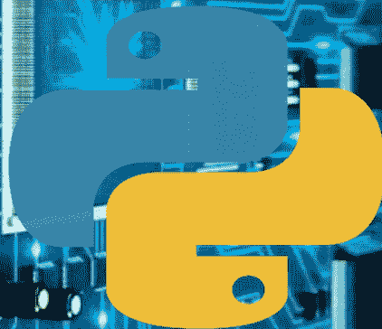

# 2024年物联网开发Python编程手册



# HAZEL MACKAY

一本面向初学者的完整指南，旨在学习构建互联设备、收集数据和创建创新应用所需的核心技能

## 目录

- 免责声明 5
- 引言 7
- 第一部分：掌握Python编程基础 10
  - 第1章：Python编程简介 11
    - 搭建Python开发环境 14
    - Python核心概念：变量、数据类型与运算符 17
    - 程序控制流：决策与循环 21
  - 第2章：构建高效的数据结构 25
    - 掌握字典：用于组织数据的键值对 28
    - 元组：不可变的有序数据结构 31
    - 利用集合处理唯一元素与高效操作 34
  - 第3章：面向可扩展设计的面向对象编程 37
    - 定义类与对象：现实世界实体的蓝图 39
    - 继承：通过类层次结构实现代码复用 43
    - 多态：灵活的对象交互 47
- 第二部分：揭秘物联网（IoT）全景 51
  - 第4章：揭开物联网（IoT）的面纱 52
    - 物联网的影响：变革产业与日常生活 57
    - 物联网的实际应用：探索跨领域用例 63
  - 第5章：物联网系统的构建模块 69
    - 执行器：将数据转化为物理动作 74
    - 微控制器：互联设备的大脑 79
    - 通信协议：数据交换的语言 84
  - 第6章：探索物联网架构 90
    - 分布式边缘计算架构：源头的处理能力 95
    - 混合架构：结合云端与边缘以实现最佳性能 99
- 第三部分：Python——连接你的代码与物联网世界的桥梁 105
  - 第7章：硬件接口：连接物理与数字世界 106
    - 使用Python将传感器和执行器连接到树莓派 110
    - 使用Python库与其他微控制器交互 115
  - 第8章：物联网开发必备的Python库 120
    - 串行通信：实现设备间的数据交换 124
    - 网络库（Sockets, MQTT）：促进网络通信 130
  - 第9章：保护你的物联网创作：在互联世界中建立信任 135
    - 安全通信实践：保护数据传输 138
    - 加密技术：保护敏感信息 141
- 第四部分：掌握物联网世界中的数据 145
  - 第10章：物联网中的有效数据采集策略 146
    - 实时数据采集与批量数据采集 149
    - 数据过滤与清洗以提高质量 153
  - 第11章：物联网应用的数据存储与管理 156
    - 时序数据库：优化传感器数据存储 160
    - 云存储解决方案：可扩展且易于访问的数据管理 163
  - 第12章：数据分析利器：从物联网数据中提取洞察 169
    - 用于分析的数据清洗与预处理 175
    - 执行探索性数据分析（EDA）以发现趋势 180
- 第五部分：构建现实世界的物联网应用 186
  - 第13章：项目蓝图：智能家居自动化 187
    - 连接传感器和执行器以控制灯光、温度或电器 193
    - 为智能家居管理构建用户界面 199
    - 实现调度与自动化功能 205
  - 第14章：项目展示：环境监测站 211
    - 利用传感器收集温度、湿度或空气质量数据 217
    - 环境变化的数据可视化与警报 223
    - 连接云平台进行数据存储与分析 228
  - 第15章：项目创新：可穿戴技术 233
    - 使用Python开发可穿戴健康监测器 239
    - 集成传感器以追踪步数、心率或睡眠模式 245
    - 可穿戴设备的数据可视化与用户界面设计 251
  - 第16章：物联网开发的未来 257
    - 物联网在各行业的潜在应用 263
    - 物联网领域的持续演进 269
    - 保持领先：持续学习的资源 274
- 附录 279
  - 关键术语表 280

## 免责声明

本书所含信息，包括但不限于编程代码、示例和教程，均按“原样”和“可用”基础提供，不附带任何明示或暗示的保证。作者和出版商否认所有明示或暗示的保证，包括但不限于对适销性、特定用途适用性、所有权和不侵权的暗示保证。

在任何情况下，作者、出版商或版权持有者均不对读者因使用或无法使用本书所含信息而遭受的任何损害或损失负责，包括但不限于因合同、侵权行为或其他原因引起的附带、后果性或特殊损害。

请读者注意，本书所含信息仅供参考，并非旨在替代专业建议。物联网开发涉及复杂的技术和风险，读者在根据本书所含信息做出任何决定或采取任何行动之前，应寻求适当的专业建议。

作者不声明或保证本书所含信息的准确性、完整性、可靠性或时效性。本书旨在提供物联网开发Python编程的概述，不应被视为做出决策或采取行动的唯一信息来源。

读者有责任确保其对本书所含信息的使用符合适用的法律、法规和安全标准。作者对读者因未能遵守此类法律、法规和安全标准而遭受的任何损害或损失不承担任何责任。

阅读本书即表示读者已阅读、理解并同意受本免责声明的约束。

## 引言

"欢迎阅读《物联网开发Python编程手册》，这是您利用Python编程力量赋能物联网（IoT）的综合指南。随着物联网持续革新我们的生活和工作方式，对能够赋予物联网设备和系统生命的熟练开发者的需求空前高涨。

Python凭借其简洁性、灵活性和丰富的库，已成为物联网开发的首选语言。其多功能性和易用性使其成为构建强大、高效且可扩展的物联网应用的理想选择，涵盖智能家居设备、工业自动化、可穿戴技术到环境监测等多个领域。

本手册旨在引领您从Python编程基础出发，逐步掌握物联网开发中使用的前沿技术和工具。无论您是希望扩展技能集的经验丰富的开发者，还是渴望投身物联网世界的初学者，本书都提供了一种清晰、简洁且注重实践的方法来学习物联网开发的Python编程。

在接下来的篇幅中，我们将探讨物联网开发中使用的关键概念、工具和技术，包括：

- 搭建并使用流行的物联网开发板和平台，如树莓派、Arduino和ESP32
- 使用Python及其丰富的库（包括RPi.GPIO、PySerial和PyOTA）对物联网设备进行编程
- 使用云服务（如AWS IoT、Google Cloud IoT Core和Microsoft Azure IoT Hub）构建和部署物联网应用
- 使用加密、认证和调试技术保护和调试物联网设备及系统
- 在物联网应用中使用scikit-learn和TensorFlow等库进行机器学习和数据分析
- 探索边缘计算、雾计算和物联网网络协议等高级主题

凭借其对实际示例、现实世界应用和专家见解的重视，这本手册是你精通物联网开发Python编程的终极资源。加入我们这段激动人心的旅程，探索Python物联网开发的无限可能。

## 第一部分：精通Python编程基础

## 第一章：Python编程简介

为什么选择Python进行物联网开发？

物联网已经彻底改变了我们与设备和系统交互的方式，而Python已成为物联网开发的首选语言。但为什么选择Python进行物联网开发呢？让我们来探讨一下原因。

**易于学习和使用**
Python是一种高级语言，语法简单，是初学者和经验丰富的开发者的理想选择。其可读性和极简主义方法降低了学习曲线，使开发者能够专注于构建创新的物联网项目，而不会陷入复杂的编码中。

**多功能和跨平台**
Python可以在多种操作系统上运行，包括Windows、macOS和Linux。其多功能性使其成为开发涉及多平台和设备的物联网项目的绝佳选择。Python的跨平台兼容性确保了在各种设备和系统上的无缝集成和部署。

**庞大的社区和资源**
Python拥有庞大而活跃的社区，为物联网开发提供了众多的库、框架和工具。丰富的资源和库，如Raspberry Pi、PySerial和CircuitPython，为开发者提供了构建创新物联网项目所需的支持和工具。

**快速开发和原型设计**
Python的语法和特性使其能够快速开发和原型设计，允许开发者快速测试和迭代他们的想法。这种敏捷性在物联网开发中至关重要，因为项目通常需要快速原型设计和测试。

**丰富的库和框架**
Python提供了大量专门为物联网开发设计的库和框架，例如：

- RPi（树莓派）
- PySerial（串行通信）
- CircuitPython（微控制器编程）
- Scikit-learn（机器学习）
- TensorFlow（机器学习）

这些库和框架简化了物联网开发，使开发者能够专注于构建创新项目，而无需重复造轮子。

### 物联网特定功能

Python提供了各种物联网特定功能，包括：

- GPIO（通用输入/输出）访问
- 串行通信（UART、SPI、I2C）
- 网络和套接字编程
- 数据分析和可视化库

这些功能使Python成为物联网开发的理想选择，允许开发者与硬件组件交互并构建强大的物联网项目。

总之，Python提供了易用性、多功能性和资源的独特组合，使其成为物联网开发的理想语言。其丰富的库、框架和专为物联网项目设计的功能，使开发者能够构建创新且高效的解决方案。

### 设置你的Python开发环境

在深入Python编程之前，设置你的开发环境至关重要。本节将指导你完成安装Python、设置编码环境的过程，并介绍必要的工具和资源。

### 安装Python

要开始用Python编程，你需要在计算机上安装它。按照以下步骤安装Python：

- 访问Python官方下载页面，并为你的操作系统选择合适的版本（Windows、macOS或Linux）。
- 按照安装说明安装Python。
- 确保在安装过程中选择将Python添加到系统PATH的选项。

### 设置你的编码环境

编码环境，也称为集成开发环境（IDE），是你编写、运行和调试Python代码的地方。流行的Python IDE选择包括：

- PyCharm
- Visual Studio Code（VS Code）
- Spyder
- IDLE（Python安装附带的基本IDE）

选择一个适合你需求的IDE，并按照安装说明进行设置。

### 必要的工具和资源

熟悉以下必要的工具和资源：

- 文本编辑器：像Notepad++、Sublime Text或Atom这样的文本编辑器非常适合编写Python代码。
- 终端或命令提示符：这是你运行Python脚本和与命令行交互的地方。
- Python文档：官方Python文档是学习Python的详尽资源。
- 在线社区：加入Reddit的r/learnpython、r/Python和Stack Overflow等在线社区，与其他Python开发者联系并获取任何问题的帮助。

### 安装额外的库和框架

随着你在Python学习之旅的深入，你需要安装额外的库和框架来扩展你的开发能力。使用Python的包安装程序pip来安装库和框架。例如，要安装流行的requests库，请在终端或命令提示符中运行以下命令：

```
pip install requests
```

开发环境设置完成后，你就可以开始探索Python编程的世界了。在下一节中，我们将深入探讨Python语法和数据类型的基础知识。

### 核心Python概念：变量、数据类型和运算符

在Python中，变量用于存储和操作数据。理解变量、数据类型和运算符对于任何编程语言都至关重要。

### 变量

在Python中，变量是赋予值的名称。你可以将变量想象成一个贴有标签的盒子，你可以在其中存储一个值。变量使用赋值运算符（=）创建。

示例：

```
x = 5  # 创建一个变量x并赋值为5
```

### 数据类型

Python有几种内置数据类型：

1. 整数（int）：整数，如1或2
2. 浮点数（float）：小数，如3.14
3. 字符串（str）：字符序列，如"hello"
4. 布尔值（bool）：真或假值
5. 列表（list）：值的有序集合，如[1, 2, 3]
6. 元组（tuple）：有序、不可变的值集合，如(1, 2, 3)
7. 字典（dict）：键值对的无序集合，如{"name": "John", "age": 30}

### 运算符

运算符用于对变量和值执行操作。Python有各种用于算术、比较、逻辑操作等的运算符。

### 算术运算符：

- 加法：a + b
- 减法：a - b
- 乘法：a * b
- 除法：a / b
- 取模（余数）：a % b

### 比较运算符：

- 等于：a == b
- 不等于：a != b
- 大于：a > b
- 小于：a < b
- 大于或等于：a >= b
- 小于或等于：a <= b

### 逻辑运算符：

- 与：a and b
- 或：a or b
- 非：not a

### 赋值运算符：

- 赋值：a = b
- 加并赋值：a += b
- 减并赋值：a -= b
- 乘并赋值：a * b
- 除并赋值：a /= b

### 使用变量、数据类型和运算符

以下是一个演示变量、数据类型和运算符使用的示例：

```
x = 5 # 整数变量
y = 3.14 # 浮点数变量
name = "John" # 字符串变量

print(x + y) # 输出：8.14
print(x * y) # 输出：15.7
print(name + " is " + str(x) + " years old") # 输出：John is 5 years old
```

此示例展示了使用变量、数据类型和运算符执行算术运算、字符串连接和类型转换。

### 程序控制流：决策和循环

条件语句允许你的程序根据条件或规则做出决策。Python有两种主要的条件语句类型：if-else语句和switch语句。

### If-Else语句

If-else语句在条件为真时执行一段代码，在条件为假时执行另一段代码。

语法：

```
if condition:
    # 条件为真时执行的代码
elif another_condition:
    # 另一个条件为真时执行的代码
else:
    # 所有条件都为假时执行的代码
```

示例：

```
x = 5
if x > 10:
    print("x is greater than 10")
elif x == 5:
    print("x is equal to 5")
else:
    print("x is less than 10")
```

### Switch语句

Switch语句根据变量的值执行一段代码。

语法：

```
match variable:
    case value1:
        # 变量为value1时执行的代码
    case value2:
        # 变量为value2时执行的代码
    case _:
        # 变量为任何其他值时执行的代码
```

示例：

```
match x:
    case 1:
        print("x is 1")
    case 2:
        print("x is 2")
```

## 循环：重复执行操作

循环允许你的程序多次重复执行一段代码块。Python 有两种主要的循环类型：`for` 循环和 `while` 循环。

### For 循环

`for` 循环会为序列（如列表或字符串）中的每个元素执行一段代码块。

语法：

```
for variable in sequence:
    # 为序列中的每个元素执行的代码
```

示例：

```
fruits = ["apple", "banana", "cherry"]
for fruit in fruits:
    print(fruit)
```

### While 循环

`while` 循环会在条件为真时执行一段代码块。

语法：

```
while condition:
    # 条件为真时执行的代码
```

示例：

```
i = 0
while i < 5:
    print(i)
    i += 1
```

## 第二章：构建高效的数据结构

### 理解列表：有序集合的基础

列表是 Python 中一种基本的数据结构，允许你存储和操作有序的值集合。在本节中，我们将深入探讨列表的基础知识，包括其定义、语法和操作。

#### 定义和语法

列表是用方括号 `[]` 括起来的值的集合。列表中的每个值称为一个元素，元素可以是任何数据类型，包括字符串、整数、浮点数和其他列表。

语法：
`my_list = [element1, element2, ..., elementN]`

示例：
`fruits = ['apple', 'banana', 'cherry']`

#### 索引和访问元素

列表是索引的，这意味着每个元素都有一个唯一的位置或索引。索引从 0 开始，你可以使用索引来访问元素。

语法：
`my_list[index]`

示例：
`fruits[0] # 返回 'apple'`

#### 切片

切片允许你从列表中提取一个元素子集。你可以指定索引范围，或使用负索引从列表末尾开始计数。

语法：
`my_list[start:stop]`
`my_list[start:]`
`my_list[:stop]`
`my_list[-1] # 返回最后一个元素`

示例：
`fruits[1:3] # 返回 ['banana', 'cherry']`

#### 修改列表

你可以通过为元素赋新值、插入新元素或删除现有元素来修改列表。

语法：

```
my_list[index] = new_value
my_list.insert(index, new_value)
my_list.remove(value)
```

示例：

```
fruits[0] = 'orange' # 将 'apple' 替换为 'orange'
fruits.insert(1, 'grapes') # 在索引 1 处插入 'grapes'
fruits.remove('cherry') # 移除 'cherry'
```

#### 列表操作

列表支持多种操作，包括连接、重复和排序。

语法：

```
my_list + other_list
my_list * n
my_list.sort()
```

示例：

```
fruits + ['pear', 'peach'] # 连接列表
fruits * 2 # 将列表重复两次
fruits.sort() # 按字母顺序排序列表
```

### 掌握字典：用于组织数据的键值对

字典是 Python 中一种基本的数据结构，允许你以键值对的形式存储和操作组织化的数据。在本节中，我们将深入探讨字典的基础知识，包括其定义、语法和操作。

#### 定义和语法

字典是一个无序的键值对集合，其中每个键都是唯一的，并映射到一个特定的值。字典使用花括号 `{}` 定义，键和值之间用冒号 `:` 分隔。

语法：

```
my_dict = {key1: value1, key2: value2, ..., keyN: valueN}
```

示例：

```
person = {'name': 'John', 'age': 30, 'city': 'New York'}
```

#### 访问和修改值

你可以使用对应的键来访问和修改字典中的值。

语法：

```
my_dict[key]
my_dict[key] = new_value
```

示例：

```
person['name'] # 返回 'John'
person['age'] = 31 # 将年龄更新为 31
```

#### 添加和删除键值对

你可以使用 `update()` 方法或 `del` 语句向字典添加新的键值对或删除现有的键值对。

语法：

```
my_dict.update(new_dict)
del my_dict[key]
```

示例：

```
person.update({'country': 'USA'}) # 添加一个新的键值对
del person['city'] # 删除 'city' 键值对
```

#### 字典操作

字典支持多种操作，包括合并、复制和遍历键值对。

语法：

```
my_dict1.update(my_dict2)
my_dict.copy()
for key, value in my_dict.items():
```

示例：

```
person.update({'hobbies': ['reading', 'hiking']}) # 合并两个字典
person.copy() # 创建字典的副本
for key, value in person.items(): print(f"{key}: {value}") # 遍历键值对
```

### 元组：不可变的有序数据结构

元组是 Python 中一种类似于列表的数据结构，但它是不可变的，这意味着一旦创建就不能修改。元组使用圆括号 `()` 定义，元素之间用逗号分隔。

语法：
`my_tuple = (element1, element2, ..., elementN)`

示例：
`numbers = (1, 2, 3, 4, 5)`

#### 元组的特性

元组具有以下特性：

-   不可变：元组一旦创建就不能修改。
-   有序：元组保持元素的顺序。
-   可迭代：元组可以使用循环进行遍历。
-   可索引：元组可以使用整数进行索引。

#### 创建元组

元组可以通过多种方式创建：

-   使用圆括号 `()`
-   使用 `tuple()` 构造函数
-   使用元组打包和解包

示例：
`numbers = (1, 2, 3, 4, 5)`
`numbers = tuple([1, 2, 3, 4, 5])`
`a, b, c = 1, 2, 3`

#### 访问和操作元组

元组可以使用多种方法进行访问和操作：

-   索引：使用整数访问元素。
-   切片：访问元素的子集。
-   连接：使用 `+` 运算符合并元组。
-   重复：使用 `*` 运算符重复元组。

示例：

```
numbers[0] # 返回 1
numbers[1:3] # 返回 (2, 3)
numbers + (6, 7, 8) # 返回 (1, 2, 3, 4, 5, 6, 7, 8)
numbers * 2 # 返回 (1, 2, 3, 4, 5, 1, 2, 3, 4, 5)
```

#### 元组操作

元组支持多种操作，包括：

-   比较：使用比较运算符比较元组。
-   迭代：使用循环遍历元组。
-   成员关系：使用 `in` 运算符检查元素是否在元组中。

示例：

```
(1, 2, 3) == (1, 2, 3) # 返回 True
for element in numbers: print(element)
2 in numbers # 返回 True
```

### 利用集合实现唯一元素和高效操作

集合是 Python 中一种存储唯一元素的数据结构，使其在并集、交集和差集等高效操作中非常有用。集合使用花括号 `{}` 定义，元素之间用逗号分隔。

语法：

```
my_set = {element1, element2, ..., elementN}
```

示例：

```
fruits = {'apple', 'banana', 'cherry'}
```

#### 集合的特性

集合具有以下特性：

-   无序：集合不保持元素的顺序。
-   唯一：集合只存储唯一元素。
-   可变：集合可以在创建后修改。
-   可迭代：集合可以使用循环进行遍历。

#### 创建集合

集合可以通过多种方式创建：

-   使用花括号 `{}`
-   使用 `set()` 构造函数
-   使用集合推导式

示例：

```
fruits = {'apple', 'banana', 'cherry'}
fruits = set(['apple', 'banana', 'cherry'])
fruits = {fruit for fruit in ['apple', 'banana', 'cherry']}
```

#### 集合操作

集合支持多种高效操作：

-   并集：使用 `|` 运算符或 `union()` 方法合并集合。
-   交集：使用 `&` 运算符或 `intersection()` 方法查找共同元素。
-   差集：使用 `-` 运算符或 `difference()` 方法查找在一个集合中但不在另一个集合中的元素。
-   对称差集：使用 `^` 运算符或 `symmetric_difference()` 方法查找在任一集合中但不同时在两个集合中的元素。

示例：

```
fruits | {'orange', 'grapes'} # 返回 {'apple', 'banana', 'cherry', 'orange', 'grapes'}
fruits & {'apple', 'grapes'} # 返回 {'apple'}
fruits - {'apple'} # 返回 {'banana', 'cherry'}
```

#### 高效操作

集合为以下操作提供了高效支持：

-   成员关系测试：使用 `in` 运算符检查元素是否在集合中。
-   添加和删除元素：使用 `add()` 和 `remove()` 方法。
-   复制集合：使用 `copy()` 方法。

示例：

```
'apple' in fruits # 返回 True
fruits.add('pear') # 将 'pear' 添加到集合中
fruits.remove('banana') # 从集合中移除 'banana'
```

## 第三章：面向可扩展设计的面向对象编程

面向对象编程（OOP）原则简介

面向对象编程（OOP）是一种围绕对象和类概念构建的编程范式，它使开发者能够创建可扩展、模块化且易于维护的软件设计。OOP原则旨在通过创建相互交互的对象来模拟现实世界场景，这与物理世界中的对象非常相似。

### 核心概念

- 1. 对象：类的实例，代表现实世界的实体或抽象概念，拥有自己的属性（数据）和方法（函数）。
- 2. 类：定义对象属性和行为的蓝图或模板。
- 3. 继承：一种允许类从父类继承属性和方法的机制，促进代码重用和层次结构。
- 4. 多态：对象根据上下文呈现多种形式的能力，实现灵活且适应性强的编程。
- 5. 封装：隐藏实现细节，仅暴露必要信息，促进数据隐藏和抽象。
- 6. 抽象：专注于本质特征并隐藏非必要细节，实现简化的接口和复杂性管理。
- 7. 组合：从更小的、独立的对象构建复杂对象，促进模块化设计和重用。

### OOP的优势

- 1. 模块化：将复杂系统分解为更小的、独立的组件，便于维护和更新。
- 2. 可重用性：编写一次代码即可在多个上下文中使用，减少开发时间和工作量。
- 3. 灵活性：通过多态和抽象适应不断变化的需求和场景。
- 4. 更易于调试：将问题隔离在对象或类中，而不是搜索整个程序。
- 5. 提高可读性：将代码组织成逻辑上自包含的单元，增强理解和协作。

通过拥抱OOP原则，开发者可以构建可扩展、高效且易于维护的软件系统，以满足现代编程挑战的需求。在下一节中，我们将深入探讨类和对象的具体细节，探索如何有效地定义和使用它们。

### 定义类和对象：现实世界实体的蓝图

类和对象是面向对象编程的基本构建块，允许开发者创建模块化、可重用且易于维护的代码。在本节中，我们将探讨如何定义类和对象，以及它们如何相互交互。

### 定义类

类是定义对象属性和行为的蓝图或模板。类使用`class`关键字后跟类名来定义。

语法：
`class ClassName:`
`# 类属性和方法`

示例：
`class Dog:`
`def __init__(self, name, age):`
`self.name = name`
`self.age = age`
`def bark(self):`
`print("Woof!")`

### 创建对象

对象是类的实例，使用`()`运算符创建。

语法：
`object_name = ClassName()`

示例：
`my_dog = Dog("Fido", 3)`

在这个例子中，我们从`Dog`类创建了一个`my_dog`对象，将"Fido"和3作为参数传递给`__init__`方法。

### 类属性和方法

类属性是类的所有对象共享的变量，而实例属性是每个对象特有的。方法是属于类或对象的函数。

示例：

```
class Car:
    color = "red"  # 类属性
    def __init__(self, model):
        self.model = model  # 实例属性
    def honk(self):
        print("Beep!")  # 方法
```

在这个例子中，我们定义了一个`Car`类，包含一个类属性`color`、一个实例属性`model`和一个方法`honk`。

### 继承和多态

继承允许类从父类继承属性和方法，而多态使对象能够呈现多种形式。

示例：

```
class ElectricCar(Car):
    def __init__(self, model, battery_size):
        super().__init__(model)
        self.battery_size = battery_size
    def charge(self):
        print("Charging...")
```

在这个例子中，我们定义了一个`ElectricCar`类，它继承自`Car`类，并添加了一个新属性`battery_size`和一个新方法`charge`。

通过掌握类和对象，开发者可以创建健壮、模块化且可扩展的软件系统，以模拟现实世界的实体和场景。在下一节中，我们将探讨如何利用封装、抽象和组合来编写更高效、更易于维护的代码。

### 继承：通过类层次结构实现代码重用

继承是面向对象编程中的一个基本概念，它通过类层次结构实现代码重用。通过创建类层次结构，开发者可以从父类继承属性和方法，促进模块化并减少代码重复。

### 单继承

单继承允许子类从单个父类继承属性和方法。

语法：

```
class ChildClass(ParentClass):
    # 子类属性和方法
```

示例：

```
class Animal:
    def __init__(self, name):
        self.name = name
    def sound(self):
        print("The animal makes a sound.")

class Dog(Animal):
    def __init__(self, name, breed):
        super().__init__(name)
        self.breed = breed
    def sound(self):
        print("The dog barks.")
```

在这个例子中，`Dog`类从`Animal`类继承了`name`属性和`sound`方法。

### 多继承

多继承允许子类从多个父类继承属性和方法。

语法：

```
class ChildClass(ParentClass1, ParentClass2, ...):
    # 子类属性和方法
```

示例：

```
class FlyingAnimal:
    def fly(self):
        print("The animal is flying.")

class Bird(Animal, FlyingAnimal):
    def __init__(self, name, species):
        super().__init__(name)
        self.species = species
```

在这个例子中，`Bird`类从`Animal`和`FlyingAnimal`类都继承了属性和方法。

### 方法重写

方法重写允许子类提供从父类继承的方法的特定实现。

示例：

```
class Cat(Animal):
    def sound(self):
        print("The cat meows.")
```

在这个例子中，`Cat`类重写了从`Animal`类继承的`sound`方法。

### 方法重载

方法重载允许定义多个同名方法，只要它们具有不同的参数即可。

示例：

```
class Calculator:
    def add(self, a, b):
        return a + b
    def add(self, a, b, c):
        return a + b + c
```

在这个例子中，`Calculator`类定义了两个具有不同参数的`add`方法。

通过利用继承，开发者可以创建促进代码重用、模块化和可扩展性的类层次结构。在下一节中，我们将探讨多态以及它如何使对象能够呈现多种形式。

### 多态：灵活的对象交互

多态是面向对象编程中的一个基本概念，它使对象能够根据使用上下文呈现多种形式。这允许灵活且适应性强的编程，使得编写能够与不同类型对象协作的代码成为可能，而无需了解其具体类。

### 方法重写

方法重写是多态的一种形式，其中子类提供从其父类继承的方法的特定实现。

示例：

```
class Shape:
    def area(self):
        pass

class Circle(Shape):
    def __init__(self, radius):
        self.radius = radius
    def area(self):
        return 3.14 * self.radius ** 2
```

在这个例子中，`Circle`类重写了从`Shape`类继承的`area`方法。

### 方法重载

方法重载是多态的一种形式，其中可以定义多个同名方法，只要它们具有不同的参数即可。

示例：

```
class Calculator:
    def add(self, a, b):
        return a + b
    def add(self, a, b, c):
        return a + b + c
```

在这个例子中，`Calculator`类定义了两个具有不同参数的`add`方法。

### 运算符重载

运算符重载是多态性的一种形式，其中像 +、-、*、/ 这样的运算符可以为一个类重新定义。

示例：

```
class Vector:
    def __init__(self, x, y):
        self.x = x
        self.y = y
    def __add__(self, other):
        return Vector(self.x + other.x, self.y + other.y)
```

在这个例子中，`Vector` 类重载了 + 运算符以执行向量加法。

### 多态函数

多态函数是能够处理不同类型对象的函数，而无需知道它们的具体类。

示例：

```
def greet(obj):
    print("Hello, " + obj.name)
```

在这个例子中，`greet` 函数可以与任何具有 `name` 属性的对象一起工作。

通过利用多态性，开发者可以编写灵活且适应性强的代码，这些代码可以与不同类型的对象一起工作，从而能够编写更通用和可重用的代码。在下一节中，我们将探讨封装以及它如何帮助隐藏实现细节并促进数据隐藏。

## 第二部分：揭秘物联网（IoT）全景

## 第四章：揭开物联网（IoT）的面纱

物联网的核心概念：连接设备与共享数据

欢迎来到激动人心的物联网（IoT）世界！在本章中，我们将深入探讨驱动这项变革性技术的基本思想。我们将探索日常物品如何变得更智能，彼此连接并连接到互联网，以及共享的海量数据如何彻底改变我们生活、工作和与周围世界互动的方式。

### 物联网的本质：从平凡到非凡

想象这样一个世界：你的咖啡机在你醒来时开始煮一壶新鲜的咖啡，你的恒温器根据你的偏好自动调节，你的健身追踪器无缝地将你的锻炼数据传输到你的智能手机。这就是物联网的本质——将普通物品转变为能够收集、通信和交换数据的“智能事物”。

### 物联网的核心在于三个关键要素：

1.  传感器：这些微小的动力源充当物联网设备的眼睛和耳朵。它们收集关于环境的数据，例如温度、运动、压力甚至声音。想象一下冰箱里的温度传感器监测食物变质，或者家中的运动传感器触发安全灯。
2.  连接性：一旦数据被收集，就需要一种传输方式。这就是 Wi-Fi、蓝牙和蜂窝网络等连接技术发挥作用的地方。它们允许设备相互通信并将数据传输到中央枢纽或云端。
3.  数据共享与分析：收集到的数据是物联网的金矿。它被发送到云平台或本地服务器进行处理和分析。这些数据可用于获得有价值的见解、自动化任务并做出明智的决策。例如，健身追踪器可能会分析你的心率数据，以推荐个性化的锻炼计划。

### 共享的力量：互联设备的交响乐

当设备开始共享数据时，物联网的魔力才真正展现。想象一下，一栋建筑中的智能恒温器网络相互通信以优化能源消耗。或者，想象一下城市中的交通传感器网络共享实时数据以改善交通流量。这种数据交换创造了一个协作和智能的环境，设备可以协同工作以实现共同目标。

### 互联世界的好处

物联网的应用范围广泛且不断扩展。以下是连接设备和共享数据如何使我们受益的几个例子：

-   智能家居：想象一个能适应你需求的家——当你进入房间时自动亮起的灯、可以远程控制的电器，以及全天候监控你家的安全系统。
-   智能城市：通过利用来自互联设备的数据的智能基础设施，交通拥堵、污染和资源管理变得更加可控。
-   互联工业：工厂可以通过实时数据分析优化生产线、预测设备维护需求并提高整体效率。
-   可穿戴技术：健身追踪器、智能手表和其他可穿戴设备可以监测我们的健康状况，提供实时反馈，甚至检测潜在的健康问题。
-   环境监测：传感器可以跟踪空气和水质，监测森林砍伐，并为可持续实践提供宝贵数据。

### 展望未来：物联网的未来

物联网的未来充满可能性。随着技术的进步，我们可以期待出现更复杂的设备，具有更强的处理能力、改进的安全功能以及与我们生活的无缝集成。人工智能、机器学习和数据分析方面的进一步创新潜力，将从物联网设备收集的海量数据中释放出更大的益处。

本章简要介绍了物联网的核心概念——连接设备与共享数据。当你深入物联网的世界时，请记住，可能性确实是无穷无尽的。这项技术有潜力改变我们生活的方方面面，使其更高效、更便捷、更可持续。所以，系好安全带，准备好迎接前方激动人心的旅程吧！

### 物联网的影响：改变工业与日常生活

在上一章中，我们探讨了物联网的核心概念——连接设备与共享数据。现在，让我们深入了解这项革命性技术的现实世界影响。我们将看到物联网如何改变各个行业，并从根本上改变我们的日常生活方式。

### 工业革命 2.0：互联工厂的崛起

随着物联网的整合，制造业正在经历重大转型。具体如下：

-   智能制造：想象一下工厂中嵌入传感器的机器，监控性能并预测维护需求。这实现了“预测性维护”，减少了停机时间，节省了成本，并优化了生产流程。
-   供应链优化：使用互联设备在整个供应链中实时跟踪货物，提高了效率，降低了库存成本，并确保了准时交付。
-   工业自动化：配备传感器和人工智能能力的机器人和机器可以协同工作，以更高的精度和效率执行任务，从而提高生产力。

### 革命日常生活：智能便利的交响乐

物联网的影响远远超出了工厂，深刻地改变了我们的日常生活：

-   智能家居：想象一个能预知你需求的家——根据你的舒适度调节的恒温器、模拟自然光模式的智能照明系统，以及自动生成购物清单的冰箱。物联网为我们的生活空间带来了便利、个性化，甚至节能。
-   互联城市：根据实时交通数据调整的交通信号灯、引导司机到空位的智能停车系统，以及通过传感器数据收集优化的废物管理系统——这些只是物联网让城市变得更智能、更高效的一部分方式。
-   可穿戴革命：健身追踪器、智能手表和其他可穿戴设备实时监测我们的健康状况，为我们提供关于睡眠模式、心率和整体健康状况的宝贵见解。这些数据可用于做出明智的生活方式选择，甚至检测潜在的健康问题。
-   零售转型：想象一下根据你的位置和偏好个性化你的购物体验的商店。物联网允许实时库存跟踪、定向促销，甚至无收银结账系统，使购物更快捷、更方便。
-   环境监测：传感器可以实时跟踪空气和水质，从而能够及早发现污染并更好地管理环境。这些数据也可用于促进可持续实践和保护工作。

### 工作的未来：与机器共舞

随着物联网的不断发展，我们的工作方式也将发生转变。以下是对未来可能情况的展望：

-   远程监控与控制：想象一下工程师使用互联设备远程监控和控制机械，提高效率和安全性。
-   工作场所的增强现实：技术人员和工程师可以利用显示实时数据和指令的 AR 头盔，从而更快地解决问题并改进维护程序。
-   协作机器人（Cobots）：想象一下机器人在安全协作的环境中与人类一起工作，执行重复性任务，让人类工人能够专注于更复杂的活动。

### 物联网：一把双刃剑——挑战与考量

尽管物联网的潜在好处是不可否认的，但重要的是要认识到这项技术带来的挑战：## 安全问题：随着联网设备数量的不断增加，网络攻击的风险也随之上升。必须采取强有力的安全措施来保护物联网设备收集的敏感数据。
- 隐私问题：随着设备收集大量关于我们生活的数据，隐私问题变得至关重要。确保数据隐私并实施强有力的法规对于建立对物联网的信任至关重要。
- 数字鸿沟：并非所有人都能平等地获得充分参与物联网生态系统所需的技术和基础设施。弥合数字鸿沟对于确保公平地获得这项技术的益处至关重要。

物联网将持续存在，它对我们生活和行业的影响将继续呈指数级增长。在拥抱这项技术的同时，我们必须注意其挑战，并努力寻找解决方案，以确保一个安全、私密且公平的互联未来。物联网在改善我们的生活、优化行业以及创造一个更可持续的世界方面潜力巨大。通过负责任地利用其力量，我们可以开启一个充满激动人心可能性的未来。

### 物联网的实际应用：探索各领域的用例

我们已经探讨了物联网的核心概念和变革性影响。现在，让我们深入探索激动人心的实际应用世界！在这里，我们将展示跨各种领域的实际用例，重点介绍物联网如何在我们的生活中产生切实的影响。

### 智能家居：便捷触手可及

想象一个能预见你需求的家。像Nest这样的智能恒温器可以学习你的偏好并自动调节温度。飞利浦Hue的智能照明系统可以模拟自然光模式，营造放松的氛围。像三星Family Hub这样的智能冰箱甚至可以根据你的库存生成购物清单。这些只是物联网如何改变我们生活空间的几个例子，使其更加便捷、个性化，甚至更节能。

### 智慧城市：构建更智能的城市环境

我们的城市也正在经历一场物联网革命。配备西门子等公司传感器的交通信号灯可以根据实时交通数据调整信号时长，减少拥堵并改善通勤时间。ParkMe等公司的智能停车系统可以引导司机找到可用的停车位，消除在街区无尽绕圈的挫败感。通过传感器数据收集可以优化废物管理系统，从而实现更高效的垃圾收集并降低成本。这些应用展示了物联网如何使城市变得更智能、更高效，并最终更宜居。

### 革新零售业：个性化的购物体验

零售业也在拥抱物联网的力量。像Amazon Go这样的商店利用传感器技术创建无人收银系统，提供更快、更便捷的购物体验。英特尔等公司的智能货架可以实时跟踪库存水平，确保货架始终有货并防止缺货。零售商还可以利用物联网来个性化购物体验。想象一下，当你在商店里浏览时，根据你的位置和过去的购买历史，你的智能手机会收到针对性的促销信息。这只是物联网如何改变零售格局的一个缩影，使购物更快、更便捷、更个性化。

### 优化行业：提升效率和生产力

物联网的影响远不止于我们的家庭和城市。以下是一些不同行业如何利用这项技术的例子：
- 制造业：随着物联网的整合，工厂正变得更加智能。嵌入机器中的传感器可以监控性能、预测维护需求并优化生产流程，从而显著节省成本并提高效率。
- 农业：农民正在使用联网传感器来监测土壤湿度、跟踪作物健康状况并自动化灌溉系统。这有助于更好的资源管理、提高作物产量以及更可持续的农业方法。
- 医疗保健：可穿戴设备和远程患者监测系统正在改变医疗服务的提供方式。医生可以远程监测患者，及早发现潜在的健康问题，并提供个性化的治疗方案。这可以改善患者的治疗效果并优化医疗管理。

### 环境监测：保护我们的地球

物联网在环境监测中也发挥着至关重要的作用。传感器可以实时跟踪空气和水质，从而实现污染的早期检测和更好的环境管理。这些数据洞察可用于制定可持续实践、节约资源和减缓气候变化的影响。

### 展望未来：物联网应用的未来

物联网的潜在应用确实是无穷无尽的，新的用例不断涌现。随着技术的进步，我们可以期待在以下领域出现更复杂的应用：
- 联网汽车：想象一下自动驾驶汽车可以相互通信并与智能基础设施通信，从而创建一个更安全、更高效的交通系统。
- 智能电网：可以使用物联网来优化电网，提高能源效率并减少对化石燃料的依赖。
- 健康可穿戴技术：可穿戴设备将变得更加复杂，提供实时健康数据和洞察，帮助我们为自身的健康做出明智的选择。

### 结论：揭示一个充满可能性的世界

物联网的实际应用生动地描绘了这项技术如何改变我们的世界。从创建更智能的家庭和城市，到优化行业和保护我们的环境，其可能性是巨大的。随着我们拥抱物联网并继续开发创新应用，我们可以开启一个充满更高效率、可持续性和为所有人提供更高质量生活的未来。

## 第五章：物联网系统的构建模块

### 传感器：你物联网项目的“眼睛和耳朵”

欢迎来到第五章，我们将深入探索传感器的奇妙世界——任何成功物联网项目的基本构建模块。正如我们的眼睛和耳朵收集关于周围世界的信息一样，传感器在使物联网设备能够感知并与环境交互方面发挥着关键作用。在本章中，我们将探讨不同类型的传感器、它们的功能，以及它们如何为物联网应用中的智能数据收集铺平道路。

#### 揭秘传感器：感知的世界

传感器是工程学的微小奇迹，将温度、压力、光线或运动等物理量转换为电信号。然后，这些信号可以被微处理器解释，并用于控制设备、触发操作或收集有价值的数据。想想智能恒温器中的温度传感器——它感知环境温度并将其转换为信号，恒温器利用该信号来调节加热或冷却系统。

#### 满足各种需求的传感器：多样化的生态系统

传感器的世界广阔而多样，每种类型都专门用于捕获特定类型的信息。以下是一些物联网应用中最常用传感器的概览：
- 环境传感器：这些传感器测量我们环境的各个方面，包括：
    - 温度传感器：如前所述，这些无处不在的传感器测量温度，这是各种应用中的一个基本参数。
    - 压力传感器：它们测量液体或气体施加的压力，对于监测气压、流体液位甚至可穿戴健康设备中的血压至关重要。
    - 湿度传感器：这些传感器检测空气中的湿度水平，对于家庭或温室中的湿度控制等应用至关重要。
    - 光线传感器：它们测量光强度或光谱，用于自动照明控制或手势识别等应用。
- 运动传感器：这些传感器检测运动或位置变化，通常用于安防系统、占用传感器或健身追踪器。
- 接近传感器：它们检测附近物体的存在与否，用于自动门开启器或机器人防碰撞系统等应用。
- 图像和视频传感器：摄像头和网络摄像头属于此类，捕获视觉数据用于安防监控、面部识别或增强现实等应用。

#### 超越基础：先进的传感器技术

传感器的世界在不断发展。以下是一些值得关注的激动人心的进步：
- 生物识别传感器：这些传感器捕获独特的生物特征，如指纹或心率模式，用于安全识别或健康监测。
- 化学传感器：它们检测空气中或水中特定化学物质的存在和浓度，用于环境监测或工业过程控制。
- 智能传感器：这些传感器超越了简单的数据收集，集成了处理能力，可以在板载分析数据并仅传输相关信息，从而提高效率并降低功耗。

#### 为你的项目选择合适的传感器

鉴于有如此多种类的传感器可供选择，为你的物联网项目选择合适的传感器至关重要。以下是一些需要考虑的关键因素：
- 你想收集的数据类型：确定你想要测量的具体物理量（温度、压力等）。
- 应用要求：考虑环境因素、精度需求和功耗限制。

+   - 成本与尺寸限制：传感器在价格和尺寸上各不相同。请选择符合您预算和项目设计的传感器。

### 感知在物联网中的力量

传感器是构建智能物联网系统的基础。它们赋予设备感知周围世界、收集有价值数据并最终采取有意义行动的能力。随着传感器技术的持续进步，我们可以期待更多创新且智能的物联网应用涌现，塑造一个充满激动人心可能性的未来。下一章将深入探讨另一个关键构建模块——连接性，探索这些配备传感器的设备如何通信和共享数据，以创建一个真正互联的世界。

### 执行器：将数据转化为物理行动

在上一章中，我们探讨了传感器——物联网项目的眼睛和耳朵。现在，让我们将焦点转向执行器——赋予物联网生命的强大肌肉。传感器收集数据，而执行器则将这些数据转化为现实世界中的物理行动。这对动态组合——传感器和执行器——构成了任何成功物联网系统的核心，实现了智能控制和自动化。

#### 从信号到运动：执行器的力量

执行器本质上是将电信号或能量转化为物理运动或行动的机电设备。想象一个智能恒温器接收来自温度传感器的数据。然后，恒温器使用执行器来控制通过加热或冷却系统的气流，从而调节室温。简单来说，执行器是行动者，将传感器收集的数据转化为现实世界的结果。

#### 多样化的工具箱：适用于每项任务的执行器

与传感器一样，执行器也有各种各样的形状和尺寸，每种都适用于特定类型的运动或行动。以下是物联网中常用的一些执行器类型：

-   - 线性执行器：这些多功能执行器产生线性运动，常用于打开和关闭阀门、调整机械臂位置或控制打印头移动等应用。
-   - 旋转执行器：顾名思义，这些执行器产生旋转运动，常用于电机、伺服电机和螺线管阀。它们是控制机器人关节、调整相机角度或调节流体流量等应用中的关键组件。
-   - 压电执行器：这些独特的执行器利用压电效应，即施加的电压导致材料变形。它们提供高精度和快速响应时间，用于喷墨打印机、微流体设备和精确定位系统等应用。

#### 超越基础：满足特定需求的专用执行器

执行器的世界在不断扩展，新的创新选择层出不穷：

-   - 形状记忆合金（SMA）执行器：这些迷人的执行器利用暴露在热或电下会改变形状的材料，用于可展开天线或微夹持器等应用。
-   - 微流体执行器：这些微型执行器在微观层面控制流体流动，在芯片实验室设备和生物医学应用中发挥着至关重要的作用。

#### 为您的项目选择合适的执行器

为您的物联网项目选择合适的执行器需要仔细考虑几个因素：

-   - 所需运动类型：线性、旋转，还是更专业的类型？
-   - 力和速度要求：执行器需要施加多大的力，需要多快的速度？
-   - 尺寸和重量限制：考虑项目设计的物理限制。
-   - 功耗：执行器将消耗多少功率？

### 完美搭档：传感器与执行器协同工作

物联网的真正魔力在于传感器和执行器协同工作时展现出来。传感器感知环境，收集数据，并将信号发送给执行器。执行器随后解释这些信号并将其转化为物理行动，形成一个智能反馈循环。想象一个智能灌溉系统——土壤湿度传感器检测到干燥，向控制器发送信号，控制器激活螺线管阀释放水分。传感器和执行器之间的这种相互作用，使得各种物联网应用能够实现自动化、优化并产生现实世界的影响。

### 物联网的手和脚

执行器是数据数字世界与行动物理世界之间的关键纽带。通过将数据转化为物理运动，它们为物联网设备注入生命，使其能够与环境互动并操纵环境。随着执行器技术的进步，我们可以期待更强大、更多样化的选择，推动物联网领域可能性的边界。下一章将探讨将这些传感器和执行器连接在一起的通信技术，创建一个用于数据交换和智能决策的真正互联网络。

### 微控制器：联网设备的大脑

在前面的章节中，我们探索了传感器和执行器的迷人世界——物联网项目的眼睛、耳朵和手。现在，让我们深入探讨操作的核心：微控制器，这些微小而强大的大脑使一切成为可能。这些微控制器是物联网的主力，解释来自传感器的数据，根据编程指令做出决策，并控制执行器在现实世界中触发行动。

#### 联网设备的核心：微控制器的角色

想象一个智能恒温器——它包含一个检测温度的传感器、一个分析数据并与期望设置进行比较的微控制器，以及一个相应地调整加热或冷却系统的执行器。微控制器充当这个微型生态系统的中央处理单元（CPU），协调数据流并驱动智能行动。

#### 微控制器内部：处理能力的交响曲

微控制器可能很小，但它们功能强大。以下是其内部工作原理的一瞥：

-   - 中央处理单元（CPU）：CPU是微控制器的核心，负责执行指令和执行计算。
-   - 存储器：微控制器具有内置存储器，用于存储程序指令（闪存）和临时数据（RAM）。
-   - 输入/输出（I/O）端口：这些端口允许微控制器与传感器、执行器和其他设备进行通信。

#### 为工作选择合适的微控制器：多样化的选择

由于有大量微控制器可供选择，为您的物联网项目选择完美的一个需要仔细考虑。以下是一些需要牢记的关键因素：

-   - 处理能力：项目的复杂性将决定微控制器所需的处理能力。
-   - 存储容量：考虑您的项目需要存储的程序代码和数据量。
-   - 输入/输出（I/O）能力：确保微控制器具有足够的I/O端口来连接您所有的传感器和执行器。
-   - 功耗：低功耗微控制器是电池供电物联网设备的理想选择。

#### 物联网项目的热门微控制器选择：

-   - Arduino：一个对初学者友好且流行的选择，Arduino提供各种各样的开发板和支持性社区。
-   - ESP8266：由于其价格实惠且易于使用，成为支持Wi-Fi的物联网项目的热门选择。
-   - Raspberry Pi：虽然从技术上讲是一台单板计算机，但Raspberry Pi提供更强大的处理能力，适用于更复杂的物联网应用。

#### 超越基础：满足特定需求的专用微控制器

微控制器的世界在不断发展，有适合特定需求的选择：

-   - 低功耗微控制器：这些微控制器是电池供电设备的理想选择，旨在最大限度地降低功耗。
-   - 高性能微控制器：对于需要复杂计算或实时控制的项目，高性能微控制器提供必要的处理能力。
-   - 集成连接功能的微控制器：一些微控制器内置Wi-Fi、蓝牙或蜂窝连接选项，简化了物联网项目中的通信需求。

#### 为物联网的大脑编程

微控制器依靠程序来运行。这些程序用特定的编程语言编写，并上传到微控制器的存储器中。物联网微控制器常用的编程语言包括C++、Python和Arduino自己的编程语言。

### 物联网创新的引擎

微控制器是物联网革命中默默无闻的英雄。它们处理数据、做出决策和控制执行器的能力，是无数联网设备功能性和智能性的基础。随着微控制器技术的进步，我们可以期待更强大、更高效、更多样化的选择出现，赋能开创性物联网应用的创建。下一章将探讨将这些微控制器连接到更广泛物联网生态系统的通信技术，实现设备之间的数据交换和无缝交互。

### 通信协议：数据交换的语言

在前面的章节中，我们探讨了物联网系统的基本构建模块——传感器、执行器和微控制器。现在，让我们深入探讨作为物联网世界中数据交换语言的通信协议。这些协议定义了设备之间如何通信，确保数据流的无缝性，并实现构成互联世界基础的协作。

#### 无形的网络：协议在行动

想象一个智能家居设备网络——温度传感器将数据传输到恒温器，安防摄像头将视频片段发送到云端，智能音箱接收用户的语音命令。这些看似轻松的交互依赖于通信协议，这些协议为设备间的信息交换建立了一种通用语言。

#### 多样化的协议：满足不同需求的众多选择

物联网的广阔世界需要多样化的通信协议，每种协议都针对特定的需求和场景：

##### 短距离通信：

- 蓝牙：一种广泛使用的协议，用于可穿戴设备和智能手机等设备之间的短距离数据传输。
- Zigbee：以其低功耗和网状网络能力而闻名，Zigbee 非常适合智能家居应用。
- 近场通信（NFC）：支持快速数据交换，用于非接触式支付或设备配对等任务。

##### 广域通信：

- 蜂窝网络：蜂窝连接允许设备进行远距离数据传输，使其适用于远程监控或工业应用。
- 低功耗广域网（LPWAN）：像 LoRaWAN 和 Sigfox 这样的协议提供低功耗的远距离通信，非常适合电池供电的物联网设备。

##### 机器对机器（M2M）通信：

- MQTT（消息队列遥测传输）：一种轻量级消息传递协议，非常适合从传感器向应用程序发送小型数据包。
- AMQP（高级消息队列协议）：一种更强大的协议，用于工业应用中的复杂数据交换和消息队列。

#### 为您的项目选择合适的协议

为您的物联网项目选择合适的通信协议取决于几个因素：

- 范围：您的设备需要相互通信的距离有多远？
- 功耗：电池寿命是否是主要考虑因素？
- 数据吞吐量：需要传输多少数据？
- 安全要求：数据是否需要高级别的安全性？

#### 通信协议的未来：不断演进以满足新需求

物联网的通信格局在不断演变。以下是一些值得关注的趋势：

- 标准化：正在努力创建通用协议，以简化不同平台之间的设备互操作性。
- 低功耗、远距离通信：LPWAN 技术的进步将为联网设备提供更广的覆盖范围和更长的电池寿命。
- 与 5G 集成：5G 网络的推出有望提供更快的数据传输速度和更高的网络容量，进一步提升物联网的潜力。

### 连接的纽带

通信协议是编织物联网生态系统结构的无形纽带。通过为数据交换建立通用语言，它们实现了设备之间的无缝通信，使设备能够共享信息、协作，并最终创造一个更互联、更智能的世界。随着通信协议的不断演进，我们可以期待更高效、更强大的数据交换，为激动人心的物联网世界的突破性进展铺平道路。

接下来的章节将深入探讨物联网技术在各个行业的具体应用，并探索这项变革性技术的未来潜力。

## 第六章：探索物联网架构

### 集中式云架构：可扩展性与数据管理

在物联网架构领域，集中式云架构已成为许多组织的热门选择。这种方法提供了可扩展性、数据管理和成本效益的独特组合，使其成为希望利用物联网力量的企业的一个有吸引力的选择。

#### 可扩展性

集中式云架构的主要优势之一是其扩展能力。随着设备和数据数量的增长，云提供按需资源，使系统能够根据需要进行扩展或缩减。这确保了系统能够处理数据或设备连接的突然激增，而不会影响性能。凭借可扩展性，企业可以轻松适应不断变化的需求和要求，使其成为拥有快速发展的物联网生态系统的组织的理想选择。

#### 数据管理

集中式云架构还提供高效的数据管理，使物联网系统能够收集、处理和存储大量数据。云提供一系列数据管理服务，包括数据仓库、大数据分析和机器学习。这使物联网系统能够从数据中提取有价值的见解并做出明智的决策。通过数据管理，企业可以更深入地了解其物联网生态系统，识别改进领域并优化其运营。

#### 关键特性

集中式云架构的一些关键特性包括：

- 可扩展性：处理大量设备和数据
- 数据管理：收集、处理和存储大量数据
- 按需资源：根据需要进行扩展或缩减
- 数据分析：从数据中提取有价值的见解
- 机器学习：基于数据做出明智的决策
- 安全性：确保数据隐私和安全

#### 优势

集中式云架构的优势众多：

- 成本效益：降低基础设施成本和运营费用
- 提高效率：自动化数据管理和分析
- 改进决策：基于数据洞察做出明智决策
- 增强安全性：确保数据隐私和安全
- 灵活性：根据需要进行扩展或缩减

#### 挑战

虽然集中式云架构提供了许多优势，但也存在需要考虑的挑战：

- 数据隐私：确保数据隐私和安全
- 数据集成：集成来自多个来源的数据
- 可扩展性：处理大量设备和数据
- 延迟：确保实时数据处理的低延迟
- 对互联网连接的依赖：确保可靠的互联网连接

#### 最佳实践

为确保集中式云架构的成功，请遵循以下最佳实践：

- 选择合适的云提供商：选择满足您物联网系统要求的云提供商
- 实施强大的安全性：确保数据隐私和安全
- 监控和优化：监控和优化系统以实现性能和可扩展性
- 与其他系统集成：与其他系统和设备集成
- 确保数据质量：确保数据质量和完整性

集中式云架构提供了可扩展性、数据管理和成本效益的强大组合，使其成为希望利用物联网力量的企业的一个有吸引力的选择。虽然存在需要考虑的挑战，但集中式云架构的优势使其成为希望推动创新和增长的组织的理想选择。通过遵循最佳实践并确保数据隐私和安全，企业可以释放其物联网生态系统的全部潜力。

### 分布式边缘计算架构：将处理能力置于源头

随着我们深入物联网世界，我们遇到了一个关键概念——分布式边缘计算架构。本章探讨处理能力如何向数据源转移，从而改变物联网应用中数据处理和分析的方式。

#### 集中式云与分布式边缘：范式的转变

传统上，物联网设备依赖于集中式云服务器进行数据处理和分析。传感器收集数据，然后将其传输到云端，由强大的计算机进行分析并生成见解。然而，这种方法存在局限性，特别是随着连接设备数量的激增以及它们产生的数据量呈指数级增长。

#### 边缘计算的兴起：将处理能力置于边缘

分布式边缘计算架构通过将处理能力带到数据源——网络的边缘——来解决这些局限性。这个边缘可以涵盖各种设备，从本地网关到智能传感器本身。通过在边缘处理数据，我们可以：

- 降低延迟：在本地处理数据最大限度地减少了数据传输的距离，显著降低了接收见解的延迟（延迟）。这对于自动驾驶汽车或工业过程控制等实时应用至关重要。
- 提高带宽效率：通过在本地处理部分数据，我们减少了需要传输到云端的数据量，节省了带宽并降低了成本。
- 增强安全性和隐私性：敏感数据可以在传输前在边缘进行预处理或匿名化，从而提高安全性和隐私性。
- 实现离线功能：即使与云断开连接，边缘设备仍然可以运行并做出决策，确保运营连续性。

### 面向边缘的架构：一种多层方法

分布式边缘计算架构通常涉及一种多层方法：

-   传感器层：收集数据的物理设备，例如温度传感器、运动检测器或可穿戴设备。
-   边缘层：网关、智能控制器或本地服务器等设备在网络边缘执行初步的数据处理、过滤和聚合。
-   云层：云仍然扮演着至关重要的角色。它可以存储历史数据、执行复杂分析，并为设备管理和应用部署提供一个集中式平台。

### 边缘的通信协议

这些层之间的通信依赖于高效的协议，如 MQTT（消息队列遥测传输）或 AMQP（高级消息队列协议），这些协议专为低功耗和可靠的数据交换而设计。

### 边缘的安全考量

随着处理能力分布在各种设备上，安全性变得至关重要。强大的身份验证、授权和加密措施对于保护边缘的敏感数据至关重要。

### 边缘计算的未来：一个智能且可扩展的前景

分布式边缘计算架构正在重塑物联网的格局。随着边缘设备变得更加强大和智能，我们可以期待：

-   在边缘更多地采用人工智能和机器学习：基于边缘数据分析实现实时决策和预测性维护。
-   边缘计算平台的标准化：简化边缘应用的开发和部署。
-   与云计算和雾计算的集成：创建一个混合生态系统，其中数据处理分布在从设备到云的连续体上。

### 通过边缘计算释放物联网的潜力

分布式边缘计算架构并非云的替代品，而是一种互补的方法。通过在更靠近数据源的地方处理数据，我们释放了物联网的全部潜力，使得跨行业的应用能够实现更快、更高效和更智能。随着边缘计算的持续发展，我们可以期待物联网拥有一个更加分布式和智能化的未来。

### 混合架构：结合云与边缘以实现最佳性能

在上一章中，我们探讨了分布式边缘计算架构及其在更靠近数据源处理数据方面的作用。现在，让我们深入探讨混合架构——一种强大的方法，它结合了云计算和边缘计算的优势，为物联网应用创造一个最佳环境。

#### 超越单一的集中式或边缘：混合架构的力量

想象这样一个场景：一个大型制造工厂使用各种物联网设备——监测机器健康状况的传感器、用于安全目的的摄像头以及用于工人安全的可穿戴设备。完全集中式的云方法可能会因数据量巨大和延迟问题而举步维艰。另一方面，仅依赖边缘计算可能无法为复杂分析提供足够的处理能力。这正是混合架构大放异彩的地方。

#### 一种协同方法：利用两者的优势

混合架构战略性地结合了云计算和边缘计算，以实现最佳性能。其工作原理如下：

-   在边缘进行数据处理：传感器数据在边缘进行预处理、过滤和聚合，从而减少带宽消耗并最小化实时应用的延迟。
-   云用于复杂分析和存储：云处理复杂的数据分析、历史数据存储和应用部署。这允许集中式管理、可扩展性以及访问高级分析工具。

#### 混合架构的优势：

-   改进的性能：边缘的低延迟和强大的云处理确保了多样化物联网应用的最佳性能。
-   可扩展性和灵活性：混合架构可以扩展以适应不断增长的设备和数据流数量。你可以根据数据的复杂性和实时需求选择在哪里处理数据。
-   成本优化：通过在本地处理一些数据，你可以减少对昂贵云资源用于基本任务的依赖。
-   增强的安全性：敏感数据可以在传输前在边缘进行预处理或匿名化，从而提高安全性。此外，云可以提供集中式安全管理。

#### 设计混合架构：

设计混合架构没有一种放之四海而皆准的方法。边缘和云处理之间的最佳平衡取决于几个因素：

-   应用需求：实时需求、数据复杂性和安全考量都起着作用。
-   网络带宽：有限的带宽可能需要更多的边缘处理。
-   设备能力：边缘设备的处理能力和存储容量影响着数据可以在何处处理。

#### 混合架构的通信协议：

混合架构依赖于高效的通信协议，如 MQTT 或 AMQP，以确保边缘设备、网关和云之间的无缝数据交换。

#### 混合架构的未来：

随着技术的进步，我们可以期待混合架构变得更加复杂：

-   混合解决方案的标准化：简化跨云和边缘环境的应用开发和部署。
-   与人工智能的集成：利用边缘的人工智能进行实时数据分析和智能决策。
-   自优化架构：能够根据实时需求动态调整云和边缘之间资源分配的系统。

混合架构代表了物联网数据处理的未来。通过结合云计算和边缘计算的优势，它们为多样化的物联网应用提供了强大而灵活的解决方案。随着技术的发展以及对实时、智能数据处理需求的增长，混合架构将在释放物联网全部潜力方面发挥核心作用。接下来的章节将探讨物联网领域的安全挑战和考量，以及这项变革性技术令人兴奋的未来潜力。

## 第三部分：Python - 连接你的代码与物联网世界的桥梁

## 第七章：与硬件交互：连接物理与数字世界

### 树莓派：一个流行的物联网开发平台

树莓派是一款小巧、低成本且功能强大的单板计算机，它彻底改变了物联网开发的世界。自2012年推出以来，树莓派已成为物联网爱好者、业余爱好者和专业人士的热门平台。其易用性、经济性和灵活性使其成为从简单原型设计到复杂工业自动化等广泛物联网应用的理想选择。

#### 树莓派的历史

树莓派由总部位于英国的慈善组织树莓派基金会创建，旨在推广编码和计算机科学教育。第一代树莓派于2012年推出，并立即取得成功，仅第一年就售出了超过100万台。此后，发布了多个新型号，每个型号都具有改进的规格和功能。

#### 树莓派的关键特性

使树莓派成为物联网开发热门选择的一些关键特性包括：

-   低成本：树莓派板极其经济实惠，起价约为35美元。
-   小巧外形：树莓派板非常小，尺寸仅为85.6mm x 56.5mm。
-   高性能：树莓派板配备了强大的处理器、内存和存储。
-   GPIO引脚：树莓派板有一个40针GPIO连接器，可以轻松连接传感器、执行器和其他设备。
-   操作系统：树莓派支持多种操作系统，包括Raspbian、Ubuntu和Windows 10 IoT。
-   社区支持：树莓派拥有一个庞大而活跃的开发者社区，提供了大量资源。

### 树莓派的物联网应用

树莓派被广泛应用于各种物联网应用中，包括：

-   家庭自动化：树莓派用于控制和自动化家用电器、照明和安防系统。
-   工业自动化：树莓派在工业环境中用于监控和控制机器、流程和传感器。
-   机器人技术：树莓派在机器人技术中用于控制和与机器人、无人机及其他自主设备交互。
-   环境监测：树莓派用于监测和追踪温度、湿度和空气质量等环境参数。

### 使用树莓派进行物联网开发的优势

使用树莓派进行物联网开发的一些优势包括：

-   快速原型设计：树莓派允许快速、轻松地对物联网想法和项目进行原型设计。
-   成本效益高：树莓派是一个经济实惠的物联网开发平台，可降低成本并提高投资回报率。
-   灵活性：树莓派高度灵活，可用于广泛的物联网应用。
-   社区支持：树莓派拥有庞大且活跃的开发者社区，提供大量资源和支持。

树莓派因其易用性、经济性和灵活性而成为流行的物联网开发平台。其小巧的外形、高性能和GPIO引脚使其成为各种物联网应用的理想选择。凭借其庞大而活跃的开发者社区，树莓派是任何希望探索物联网开发世界的人的绝佳选择。

### 使用Python将传感器和执行器连接到树莓派

树莓派是与物理世界交互的强大工具，而Python是对其进行编程的流行语言。在本节中，我们将探讨如何使用Python将传感器和执行器连接到树莓派。

#### 传感器

传感器是检测和测量温度、湿度、光照和声音等物理参数的设备。树莓派有几个GPIO（通用输入/输出）引脚可用于连接传感器。以下是一些传感器示例以及如何使用Python将它们连接到树莓派：

##### 温度传感器（DS18B20）：

-   将传感器连接到GPIO引脚4（GND）和引脚17（VCC）
-   使用`w1thermsensor`库读取温度

##### 湿度传感器（DHT11）：

-   将传感器连接到GPIO引脚17（VCC）和引脚23（GND）
-   使用`dht11`库读取湿度和温度

##### 光敏传感器（LDR）：

-   将传感器连接到GPIO引脚17（VCC）和引脚23（GND）
-   使用`RPi.GPIO`库读取光照水平

#### 执行器

执行器是控制电机、LED和继电器等物理参数的设备。树莓派有几个GPIO引脚可用于连接执行器。以下是一些执行器示例以及如何使用Python将它们连接到树莓派：

##### LED：

-   将LED连接到GPIO引脚17（VCC）和引脚23（GND）
-   使用`RPi.GPIO`库控制LED

##### 电机（L293D）：

-   将电机连接到GPIO引脚17（VCC）、23（GND）和24（EN）
-   使用`RPi.GPIO`库控制电机速度和方向

##### 继电器：

-   将继电器连接到GPIO引脚17（VCC）和引脚23（GND）
-   使用`RPi.GPIO`库控制继电器

#### Python库

有几个Python库可用于与连接到树莓派的传感器和执行器交互。一些流行的库包括：

-   `RPi.GPIO`：用于与GPIO引脚交互的库
-   `w1thermsensor`：用于读取温度传感器的库
-   `dht11`：用于读取湿度和温度传感器的库
-   `RPi.I2C`：用于与I2C设备交互的库

#### 示例代码

以下是一个示例代码片段，用于从DS18B20传感器读取温度并控制LED：

```python
import time
import RPi.GPIO as GPIO
from w1thermsensor import W1ThermSensor

# Set up GPIO pin for LED
GPIO.setmode(GPIO.BCM)
GPIO.setup(17, GPIO.OUT)

# Set up temperature sensor
sensor = W1ThermSensor()

while True:
    # Read temperature
    temperature = sensor.get_temperature()
    print(f"Temperature: {temperature} C")

    # Control LED based on temperature
    if temperature > 25:
        GPIO.output(17, GPIO.HIGH)
    else:
        GPIO.output(17, GPIO.LOW)

    # Wait 1 second before reading again
    time.sleep(1)
```

使用Python将传感器和执行器连接到树莓派是与物理世界交互的强大方式。通过使用`RPi.GPIO`和`w1thermsensor`等库，您可以轻松读取传感器数据并控制执行器。根据提供的示例和代码片段，您应该能够开始自己的项目，并探索使用树莓派和Python进行物联网开发的可能性。

### 使用Python库与其他微控制器接口

除了与传感器和执行器交互外，Python库还使树莓派能够与其他微控制器接口，从而扩展其功能和潜在应用。在这里，我们将探讨一些用于与其他微控制器接口的流行Python库。

#### Arduino

Arduino-Python库，也称为pyFirmata，允许树莓派与Arduino板通信。此库使您能够访问Arduino的数字和模拟引脚、读取传感器数据并控制执行器。

示例：

```python
from pyfirmata import Arduino

# Connect to Arduino board
board = Arduino('/dev/ttyACM0')

# Read analog pin 0
analog_pin = board.get_pin('a:0:i')
analog_value = analog_pin.read()

# Set digital pin 13 high
digital_pin = board.get_pin('d:13:p')
digital_pin.write(1)
```

#### ESP32/ESP8266

esp-python库实现了树莓派与ESP32/ESP8266微控制器之间的通信。此库支持Wi-Fi和蓝牙连接，允许进行远程控制和数据交换。

示例：

```python
import esp

# Connect to ESP32/ESP8266
esp.connect('ESP32-AP', 'password')

# Send data to ESP32/ESP8266
esp.send('Hello, ESP!')

# Receive data from ESP32/ESP8266
data = esp.recv()
```

#### PIC微控制器

pic-python库提供了与PIC微控制器的接口，使树莓派能够访问其外设和资源。

示例：

```python
from pic import PIC

# Connect to PIC microcontroller
pic = PIC('COM3', 9600)

# Read analog pin 0
analog_value = pic.read_analog(0)

# Set digital pin 13 high
pic.set_pin_high(13)
```

#### STM32微控制器

stm32-python库允许树莓派与STM32微控制器通信，访问其外设和资源。

示例：

```python
from stm32 import STM32

# Connect to STM32 microcontroller
stm32 = STM32('COM3', 9600)

# Read analog pin 0
analog_value = stm32.read_analog(0)

# Set digital pin 13 high
stm32.set_pin_high(13)
```

这些库展示了Python和树莓派在与各种微控制器接口方面的多功能性，从而实现了广泛的应用和项目。

Python库提供了一种便捷而强大的方式，将树莓派与其他微控制器接口，扩展其功能和潜在应用。通过利用这些库，开发人员可以创建复杂的项目和系统，集成多个微控制器和设备。根据讨论的示例和库，您应该能够探索和开发自己的项目，推动使用树莓派和Python进行物联网开发的边界。

## 第8章：物联网开发必备的Python库

### 树莓派GPIO：控制树莓派上的硬件组件

树莓派GPIO（通用输入/输出）库是物联网开发的基础工具，允许开发人员与连接到树莓派的硬件组件进行交互。此库提供了一个Python接口来访问和控制GPIO引脚，使开发人员能够读取传感器数据、控制执行器并与外部设备交互。

#### 树莓派GPIO简介

树莓派GPIO库是一个Python模块，提供了一种简单直观的方式来访问和控制树莓派上的GPIO引脚。该库建立在树莓派GPIO硬件之上，并提供了一系列功能和函数来简化GPIO编程。

#### 树莓派GPIO的关键特性

树莓派GPIO库的一些关键特性包括：

-   GPIO引脚控制：该库提供设置GPIO引脚模式、读写数字值以及控制上拉和下拉电阻的函数。
-   GPIO引脚中断：该库支持GPIO引脚中断，允许开发人员在特定GPIO引脚事件上触发事件和回调。
-   GPIO引脚去抖动：该库提供去抖动功能，以过滤GPIO引脚上的不需要的信号和噪声。
-   GPIO引脚边沿检测：该库支持GPIO引脚上的边沿检测，允许开发人员检测上升沿和下降沿。

#### 使用树莓派GPIO

要使用树莓派GPIO库，开发人员需要导入库并初始化GPIO引脚。以下是一个示例代码片段：

```python
import RPi.GPIO as GPIO

# Initialize GPIO pins
GPIO.setmode(GPIO.BCM)
```

## 将GPIO引脚17设置为输出
GPIO.setup(17, GPIO.OUT)

## 将GPIO引脚23设置为输入
GPIO.setup(23, GPIO.IN)

## 读取GPIO引脚23的值
value = GPIO.input(23)

## 设置GPIO引脚17的值
GPIO.output(17, GPIO.HIGH)

在此示例中，我们导入了树莓派GPIO库，初始化了GPIO引脚，将GPIO引脚17设置为输出，并将GPIO引脚23设置为输入。然后，我们读取GPIO引脚23的值，并设置GPIO引脚17的值。

#### 树莓派GPIO的实际应用

树莓派GPIO库具有广泛的实际应用，包括：

-   家庭自动化：使用GPIO引脚控制灯光、风扇和其他电器。
-   机器人技术：使用GPIO引脚控制电机、传感器和其他组件。
-   环境监测：使用GPIO引脚读取温度、湿度等传感器的数据。
-   工业自动化：使用GPIO引脚控制工业设备和机械。

树莓派GPIO库是物联网开发的强大工具，提供了一种简单直观的方式来与连接到树莓派的硬件组件进行交互。凭借其丰富的功能和特性，开发者可以轻松地控制GPIO引脚、读取传感器数据并与外部设备交互。无论你是在构建家庭自动化系统、机器人还是环境监测系统，树莓派GPIO库都是任何物联网项目的必备工具。

### 串行通信：实现设备间的数据交换

串行通信是计算机科学中的一个基本概念，它实现了设备之间的数据交换。它涉及通过通信信道，按顺序一次传输一个比特的数据。在物联网开发的背景下，串行通信在实现设备间数据交换方面起着至关重要的作用。

#### 串行通信的类型

有几种类型的串行通信协议，包括：

1.  UART（通用异步收发器）
2.  USART（通用同步异步收发器）
3.  SPI（串行外设接口）
4.  I2C（集成电路总线）
5.  RS-232（推荐标准232）

每种协议都有其自身的优点和缺点，协议的选择取决于项目的具体要求。

#### UART串行通信

UART是一种广泛使用的串行通信协议，可实现设备间的异步通信。它是一种全双工协议，意味着它可以同时发送和接收数据。

以下是如何在Python中使用UART串行通信的示例：

```python
import serial

# Open the serial port
ser = serial.Serial('/dev/ttyUSB0', 9600)

# Send data
ser.write(b'Hello, world!')

# Receive data
data = ser.read(10)

# Close the serial port
ser.close()
```

#### SPI串行通信

SPI是一种同步串行通信协议，可实现设备间的通信。它是一种全双工协议，意味着它可以同时发送和接收数据。

以下是如何在Python中使用SPI串行通信的示例：

```python
import spidev

# Open the SPI device
spi = spidev.SpiDev()
spi.open(0, 0)

# Send data
spi.writebytes([0x01, 0x02, 0x03])

# Receive data
data = spi.readbytes(3)

# Close the SPI device
spi.close()
```

#### I2C串行通信

I2C是一种多主串行通信协议，可实现设备间的通信。它是一种半双工协议，意味着它一次只能发送或接收数据。

以下是如何在Python中使用I2C串行通信的示例：

```python
import smbus

# Open the I2C bus
bus = smbus.SMBus(1)

# Send data
bus.write_byte(0x10, 0x20)

# Receive data
data = bus.read_byte(0x10)

# Close the I2C bus
bus.close()
```

#### RS-232串行通信

RS-232是一种标准串行通信协议，可实现设备间的通信。它是一种全双工协议，意味着它可以同时发送和接收数据。

以下是如何在Python中使用RS-232串行通信的示例：

```python
import serial

# Open the serial port
ser = serial.Serial('/dev/ttyUSB0', 9600)

# Send data
ser.write(b'Hello, world!')

# Receive data
data = ser.read(10)

# Close the serial port
ser.close()
```

串行通信是计算机科学中的一个基本概念，它实现了设备之间的数据交换。在物联网开发的背景下，串行通信在实现设备间数据交换方面起着至关重要的作用。通过理解不同类型的串行通信协议以及如何在Python中使用它们，开发者可以构建健壮高效的物联网系统。

### 网络库（Sockets，MQTT）：促进网络通信

网络库在实现设备间通过网络进行通信方面起着至关重要的作用。在物联网开发的背景下，网络库促进了设备间的数据交换，使它们能够相互交互和协调。在本节中，我们将探讨两个流行的网络库：Sockets和MQTT。

#### Sockets

Sockets是一个基础的网络库，可实现设备间通过网络进行通信。它们提供了一种方式，让设备可以建立连接、发送和接收数据，并在完成后关闭连接。Sockets是一个底层库，提供了网络的基本接口。

以下是如何在Python中使用sockets的示例：

```python
import socket

# Create a socket object
sock = socket.socket(socket.AF_INET, socket.SOCK_STREAM)

# Connect to a remote host
sock.connect(("example.com", 80))

# Send data
sock.send(b"GET / HTTP/1.1\r\nHost: example.com\r\n\r\n")

# Receive data
data = sock.recv(1024)

# Close the socket
sock.close()
```

#### MQTT

MQTT（消息队列遥测传输）是一种轻量级的网络库，可实现设备间通过网络进行通信。它是一种基于发布-订阅的协议，设备可以向主题发布消息，其他设备可以订阅以接收来自该主题的消息。MQTT是一个高层库，提供了更抽象的网络接口。

以下是如何在Python中使用MQTT的示例：

```python
import paho.mqtt.client as mqtt

# Create an MQTT client object
client = mqtt.Client()

# Connect to an MQTT broker
client.connect("broker.example.com")

# Subscribe to a topic
client.subscribe("home/temperature")

# Publish a message to a topic
client.publish("home/temperature", "24.5")

# Receive messages from the topic
def on_message(client, userdata, message):
    print(message.payload.decode())

client.on_message_cb(on_message)

# Disconnect from the MQTT broker
client.disconnect()
```

#### Sockets与MQTT的比较

Sockets和MQTT是两种不同的网络库，适用于不同的用例。Sockets提供底层的网络接口，使设备能够建立连接并发送和接收数据。MQTT提供高层的网络接口，使设备能够发布和订阅消息。

Sockets适用于需要设备间直接连接的应用程序，例如文件传输或远程shell访问。MQTT适用于需要基于发布-订阅通信模型的应用程序，例如物联网设备将传感器数据发布到中央服务器。

网络库在实现设备间通过网络进行通信方面起着至关重要的作用。Sockets和MQTT是两个流行的网络库，促进了网络通信。通过理解这些库之间的差异以及如何在Python中使用它们，开发者可以构建健壮高效的物联网系统。

## 第9章：保护你的物联网创作：在互联世界中建立信任

物联网开发中安全的重要性

物联网（IoT）已经彻底改变了我们生活和工作的方式，全球估计连接了200亿台设备。随着物联网的不断发展，物联网开发中安全的重要性也日益增加。随着连接设备数量的增加，网络攻击和数据泄露的风险也随之增加，这使得安全成为物联网开发的关键组成部分。

### 为什么安全在物联网开发中至关重要

1.  保护用户数据：物联网设备收集和传输大量用户数据，包括位置、健康和个人偏好等敏感信息。这些数据必须受到保护，防止未经授权的访问、盗窃和滥用。
2.  防止设备劫持：物联网设备可能被恶意行为者劫持，然后被用来对其他设备或系统发起攻击。保护物联网设备可以防止它们被用作网络攻击的入口点。
3.  确保设备完整性：物联网设备必须设计为确保其完整性，防止被恶意行为者破坏或操纵。
4.  维护用户信任：安全漏洞会损害用户信任和声誉，因此在物联网开发中优先考虑安全至关重要。
5.  遵守法规：物联网设备必须遵守各种法规，如GDPR、HIPAA和CCPA，这些法规要求采取强有力的安全措施来保护用户数据。

### 常见的物联网安全威胁

1.  弱密码和身份验证
2.  不安全的通信协议
3.  过时的软件和固件
4.  加密不足
5.  访问控制不足

### 物联网安全最佳实践

### 安全的物联网开发生命周期

1. 安全需求收集
2. 安全设计与架构
3. 安全编码与实现
4. 安全测试与验证
5. 安全部署与维护

安全是物联网开发的关键组成部分，对于保护用户数据、防止设备劫持、确保设备完整性、维护用户信任以及遵守法规至关重要。通过理解安全的重要性并实施最佳实践和安全开发生命周期，开发者可以在互联世界中建立信任，并确保其物联网产品的成功。

### 安全通信实践：保护数据传输

安全通信实践对于保护物联网开发中的数据传输至关重要。随着连接设备数量的增加，数据泄露和网络攻击的风险也随之上升。为确保数据的机密性、完整性和真实性，实施安全通信实践至关重要。

#### 加密

加密是将明文数据转换为不可读的密文以防止未经授权访问的过程。在物联网开发中，加密用于保护设备与云端之间或设备本身之间的数据传输安全。

##### 加密类型：

1. 对称加密：使用相同的密钥进行加密和解密。
2. 非对称加密：使用公钥进行加密，私钥进行解密。

#### 常用加密算法：

1. AES（高级加密标准）
2. RSA（Rivest-Shamir-Adleman）
3. 椭圆曲线密码学（ECC）

#### 安全通信协议

安全通信协议确保数据通过网络进行安全传输。一些常用的安全通信协议包括：

1. HTTPS（超文本传输安全协议）
2. TLS（传输层安全协议）
3. DTLS（数据报传输层安全协议）
4. 带TLS的MQTT（消息队列遥测传输协议）

#### 安全密钥交换

安全密钥交换是设备或系统之间安全地交换加密密钥的过程。一些常用的安全密钥交换协议包括：

1. Diffie-Hellman密钥交换
2. 椭圆曲线Diffie-Hellman（ECDH）
3. RSA密钥交换

#### 安全通信最佳实践

1. 使用端到端加密
2. 实施安全密钥交换
3. 使用安全通信协议
4. 定期更新和修补软件及固件
5. 使用安全启动机制

安全通信实践对于保护物联网开发中的数据传输至关重要。通过实施加密、安全通信协议和安全密钥交换，开发者可以确保数据的机密性、完整性和真实性。此外，遵循安全通信最佳实践有助于防止数据泄露和网络攻击。

### 加密技术：保护敏感信息

加密是将明文数据转换为不可读的密文以防止未经授权访问的过程。在物联网开发中，加密技术用于保护敏感信息，例如用户数据、设备凭证以及设备与云端之间的通信。

#### 加密技术类型：

1. 对称加密：使用相同的密钥进行加密和解密。
    - 示例：AES（高级加密标准）、DES（数据加密标准）
2. 非对称加密：使用公钥进行加密，私钥进行解密。
    - 示例：RSA（Rivest-Shamir-Adleman）、ECC（椭圆曲线密码学）
3. 基于哈希的加密：使用哈希函数加密数据。
    - 示例：SHA（安全哈希算法）、MD5（消息摘要算法5）

#### 常用加密算法：

1. AES（高级加密标准）
2. RSA（Rivest-Shamir-Adleman）
3. ECC（椭圆曲线密码学）
4. Blowfish
5. Twofish

#### 物联网加密技术：

1. 设备级加密：在设备本身上加密数据。
2. 网络级加密：在设备与云端之间的传输过程中加密数据。
3. 应用级加密：在应用程序内部加密数据。
4. 混合加密：结合多种加密技术以增强安全性。

#### 密钥管理：

1. 密钥生成：创建用于加密和解密的安全密钥。
2. 密钥分发：在设备和系统之间安全地分发密钥。
3. 密钥存储：安全地存储密钥以防止未经授权的访问。
4. 密钥撤销：在密钥泄露或不再需要时撤销密钥。

#### 物联网中的加密挑战：

1. 密钥管理：安全高效地管理密钥。
2. 性能：确保加密不会损害设备性能。
3. 互操作性：确保设备和系统之间的加密兼容性。
4. 安全性：确保加密算法和密钥安全且是最新的。

加密技术对于保护物联网开发中的敏感信息至关重要。通过理解加密技术的类型、常用加密算法和密钥管理策略，开发者可以实施强大的加密解决方案来保护用户数据并防止网络攻击。然而，加密也带来了挑战，例如密钥管理、性能、互操作性和安全性，必须解决这些挑战才能确保物联网项目的成功。

## 第四部分：掌握物联网世界中的数据

## 第10章：物联网中的有效数据采集策略

传感器数据收集技术

传感器数据收集是物联网开发的一个关键方面，它使设备能够从环境中收集数据并做出明智的决策。有效的传感器数据收集技术对于确保准确、可靠和高效的数据采集至关重要。在本章中，我们将探讨各种传感器数据收集技术、它们的优势和挑战。

**传感器数据收集技术类型：**

1. 周期性采样：以固定间隔收集数据。
2. 事件驱动采样：基于特定事件或触发器收集数据。
3. 连续采样：在一段时间内持续收集数据。
4. 自适应采样：根据变化的条件调整采样率。

**传感器数据收集方法：**

1. 有线传感器：将传感器直接连接到微控制器或设备。
2. 无线传感器：使用蓝牙、Wi-Fi或Zigbee等无线通信协议。
3. 混合传感器：结合有线和无线传感器以实现灵活的数据收集。

**数据收集协议：**

1. HTTP：用于通过互联网传输数据的超文本传输协议。
2. MQTT：用于高效数据传输的消息队列遥测传输协议。
3. CoAP：用于受限网络的受限应用协议。
4. LWM2M：用于设备管理的轻量级机器对机器协议。

**数据收集挑战：**

1. 噪声和干扰：影响数据准确性的电磁干扰和噪声。
2. 功耗：在数据收集与功耗限制之间取得平衡。
3. 数据安全：确保数据传输和存储的安全。
4. 数据质量：确保数据收集的准确性和可靠性。

### 传感器数据收集最佳实践：

1. 为应用选择合适的传感器。
2. 优化传感器放置和方向。
3. 实施数据过滤和清理技术。
4. 使用适当的数据收集协议和方法。
5. 确保数据安全和隐私。

传感器数据收集技术在物联网开发中发挥着至关重要的作用，使设备能够收集数据并做出明智的决策。通过理解各种传感器数据收集技术、方法和协议，开发者可以设计有效的数据采集策略，克服挑战并确保准确、可靠和高效的数据收集。通过遵循最佳实践，开发者可以确保成功的物联网项目，满足用户和应用程序的需求。

### 实时与批量数据采集

数据采集是物联网开发的一个关键方面，可以分为两种主要方法：实时数据采集和批量数据采集。每种方法都有其优缺点，选择哪种方法取决于应用程序的具体要求。

#### 实时数据采集

实时数据采集涉及在数据可用时实时收集和处理数据。这种方法对于需要即时洞察、快速决策和对变化条件做出快速响应的应用程序是必要的。

#### 优势：

1. 即时洞察：实时数据采集提供对数据的即时访问，实现快速决策和对变化条件的快速响应。
2. 及时行动：实时数据采集使设备能够根据当前数据采取及时行动，例如提醒用户或触发事件。
3. 高效处理：实时数据采集允许对数据进行高效处理和分析，减少延迟并提高系统性能。

#### 缺点：

- 1. 资源需求高：实时数据采集需要大量资源，包括处理能力、内存和带宽。
- 2. 复杂性：实时数据采集可能很复杂，需要复杂的算法和数据处理技术。
- 3. 数据过载：实时数据采集可能产生海量数据，可能导致数据过载和存储问题。

#### 批量数据采集

批量数据采集涉及以批量方式、按固定间隔或在达到特定阈值时收集和处理数据。这种方法适用于需要周期性洞察、趋势分析和数据聚合的应用场景。

#### 优点：

- 1. 资源高效：批量数据采集所需资源较少，因为数据是分批处理的，降低了处理能力和内存需求。
- 2. 处理简化：批量数据采集简化了数据处理，因为数据是分批处理的，降低了复杂性和算法要求。
- 3. 数据聚合：批量数据采集支持数据聚合，提供随时间变化的趋势和模式洞察。

#### 缺点：

- 1. 洞察延迟：批量数据采集提供延迟的洞察，因为数据是分批处理的，可能导致决策和响应延迟。
- 2. 时效性有限：批量数据采集限制了数据的时效性，因为数据是按固定间隔处理的，可能错过关键事件或变化。
- 3. 数据存储：批量数据采集需要大量数据存储，可能导致存储问题和数据管理挑战。

实时和批量数据采集是物联网开发中两种不同的数据采集方法。实时数据采集提供即时洞察并支持及时行动，但需要大量资源且可能很复杂。批量数据采集简化了处理，降低了资源需求，并支持数据聚合，但提供延迟的洞察且时效性有限。选择实时还是批量数据采集取决于应用的具体要求，包括对即时洞察的需求、资源限制和数据处理复杂性。

### 数据过滤与清洗以提高质量

数据过滤和清洗是数据采集过程中的关键步骤，旨在确保高质量数据。来自传感器和设备的原始数据可能包含噪声、不完整或不一致，这会影响洞察和决策的准确性与可靠性。数据过滤和清洗技术有助于移除或纠正错误、不一致和无关数据，从而提高数据质量。

**数据过滤技术：**

1. 阈值过滤：移除超过特定阈值或低于特定阈值的数据点。
2. 中值过滤：用邻近点的中值替换数据点以减少噪声。
3. 高斯过滤：使用高斯分布移除噪声并平滑数据。
4. 卡尔曼过滤：使用数学模型估计系统状态并移除噪声。

**数据清洗技术：**

1. 处理缺失值：用均值、中位数或插补值替换缺失值。
2. 移除重复项：消除重复的数据点以防止数据重复。
3. 数据归一化：将数据缩放到共同范围以防止偏差并改进分析。
4. 数据转换：转换数据格式以改进分析和可视化。

**数据过滤与清洗的好处：**

1. 提高数据准确性：移除错误和不一致可确保准确的洞察和决策。
2. 降低噪声：过滤掉噪声和无关数据可提高信噪比和数据质量。
3. 提高效率：清洗和过滤数据可减少处理时间并提高分析性能。
4. 改进决策：高质量数据支持明智决策，并降低得出错误结论的风险。

#### 数据过滤与清洗的最佳实践：

- 1. 理解数据：了解数据源、格式和特性，以应用适当的过滤和清洗技术。
- 2. 使用适当的技术：选择适合数据类型、噪声水平和分析要求的技术。
- 3. 验证与核实：检查过滤和清洗后的数据的准确性和一致性。
- 4. 记录与存储：将过滤和清洗后的数据与适当的元数据和文档一起存储。

通过应用数据过滤和清洗技术，物联网开发者可以确保高质量数据，提高分析性能，并支持明智决策。

## 第11章：物联网应用的数据存储与管理

### 数据库：用于有组织数据检索的结构化存储

数据库是物联网应用的关键组件，为有组织的数据检索提供结构化存储解决方案。随着物联网设备生成海量数据，数据库有助于管理、处理和分析这些数据，从而提供洞察并支持明智决策。在本章中，我们将探讨数据库在物联网应用中的重要性、数据库类型以及数据库管理的最佳实践。

#### 数据库在物联网应用中的重要性：

- 1. 数据管理：数据库帮助管理大量物联网数据，确保数据一致性、完整性和安全性。
- 2. 数据检索：数据库支持高效的数据检索，支持实时分析和决策。
- 3. 数据分析：数据库促进数据分析，提供趋势、模式和相关性洞察。
- 4. 可扩展性：数据库可随物联网数据量的增长而扩展，确保高性能和可靠性。

#### 数据库类型：

- 1. 关系型数据库（RDBMS）：将数据组织到具有定义模式的表中，支持SQL查询。
- 2. NoSQL数据库：以灵活的模式存储数据，支持键值、文档或图数据模型。
- 3. 时序数据库（TSDB）：优化时间戳数据的存储和检索，支持物联网应用。
- 4. 云数据库：提供可扩展的、按需的数据库服务，支持云环境中的物联网应用。

#### 数据库管理的最佳实践：

- 1. 定义数据模型：建立清晰的数据模型和模式，以确保数据一致性和完整性。
- 2. 优化数据库性能：监控和优化数据库性能，确保高速数据检索和分析。
- 3. 确保数据安全性：实施强大的安全措施，保护敏感的物联网数据免受未经授权的访问。
- 4. 可扩展性与灵活性：设计数据库以随物联网数据量的增长而扩展，支持灵活的数据模型和模式更改。
- 5. 数据备份与恢复：定期备份物联网数据，确保业务连续性并在发生故障时快速恢复。

#### 物联网应用的数据库选择标准：

- 1. 数据量与速度：选择支持高容量和高速度物联网数据的数据库。
- 2. 数据多样性与结构：选择能够容纳多样化物联网数据格式和结构的数据库。
- 3. 可扩展性与性能：选择可随物联网数据量增长而扩展并确保高性能的数据库。
- 4. 安全性与合规性：确保数据库满足敏感物联网数据的安全性和合规性要求。
- 5. 集成与互操作性：选择能够与物联网设备、平台和应用程序集成的数据库，支持无缝数据交换。

总之，数据库在物联网应用中扮演着至关重要的角色，为有组织的数据检索提供结构化存储。通过理解数据库的重要性、数据库类型以及数据库管理的最佳实践，物联网开发者可以设计和实施有效的数据库解决方案，支持可扩展、安全且高效的物联网应用。

### 时序数据库：优化传感器数据存储

时序数据库（TSDB）旨在高效存储和管理大量时间戳数据，使其成为传感器数据存储的理想选择。TSDB优化了传感器数据的存储和检索，支持物联网数据的快速高效分析和可视化。

#### 时序数据库的特性：

- 1. 针对时序数据优化：TSDB旨在处理高容量、高速度和高多样性的时序数据。
- 2. 高效存储：TSDB使用压缩、降采样和其他技术来减少存储需求。
- 3. 快速数据检索：TSDB支持快速高效的数据检索，支持实时分析和可视化。

#### 可扩展性：时序数据库支持水平扩展，能够处理不断增长的数据量和用户需求。

#### 时序数据库在传感器数据方面的优势：

- 1. 高效存储：时序数据库降低了存储成本和要求，使其在大规模物联网部署中具有成本效益。
- 2. 快速数据检索：时序数据库支持实时分析和可视化，助力及时洞察和决策。
- 3. 可扩展性：时序数据库可随物联网数据量的增长而扩展，确保高性能和可靠性。
- 4. 针对物联网数据优化：时序数据库专为处理物联网数据特性（如高频和海量）而设计。

#### 物联网领域流行的时序数据库：

- 1. InfluxDB：一款针对物联网和传感器数据优化的开源时序数据库。
- 2. OpenTSDB：一款用于大规模物联网部署的分布式、可扩展时序数据库。
- 3. TimescaleDB：一款用于时间序列数据的PostgreSQL扩展，支持物联网应用。
- 4. Kx Systems：一款用于物联网和传感器数据的高性能时序数据库。

#### 使用时序数据库的最佳实践：

- 1. 定义数据模型：建立清晰的数据模型和模式，以确保数据一致性和完整性。
- 2. 优化数据摄入：使用高效的数据摄入方法，例如批处理和压缩。
- 3. 使用适当的数据编码：采用增量编码和游程编码等编码方案，以减少存储需求。
- 4. 监控和优化性能：定期监控和优化时序数据库性能，确保高速数据检索和分析。
- 5. 确保数据安全：实施强大的安全措施，保护敏感的物联网数据免受未授权访问。

通过利用时序数据库，物联网开发者可以高效地存储和管理海量传感器数据，实现快速高效的数据分析和可视化。遵循最佳实践并选择合适的时序数据库，开发者可以优化其物联网应用的性能、可扩展性和可靠性。

### 云存储解决方案：可扩展且便捷的数据管理

在上一章中，我们探讨了混合架构如何结合云计算和边缘计算，以实现物联网应用中的最佳数据处理。现在，让我们深入探讨云存储解决方案的关键作用——它是存储、管理和访问物联网设备产生的海量数据的支柱。

#### 数据洪流：对可扩展存储的需求

想象一个由数百万台联网设备组成的网络，每个传感器都在持续收集和传输数据。这种数据洪流需要强大且可扩展的存储解决方案。传统的本地存储解决方案根本无法跟上物联网产生的数据在数量、速度和多样性上的持续增长。

#### 云存储：物联网数据的安全可扩展港湾

云存储平台为管理物联网数据提供了一个引人注目的解决方案。原因如下：

- 可扩展性：云存储本质上是可扩展的。您可以根据需要轻松添加或移除存储容量，无需预先投资基础设施。
- 可访问性：存储在云中的数据可以从任何有互联网连接的地方访问，便于远程监控和分析。
- 成本效益：云存储消除了对昂贵硬件和IT维护的需求，提供按需付费的模式，可随您的数据需求扩展。
- 安全性：云提供商提供强大的安全功能，如加密、访问控制和灾难恢复，以保护敏感的物联网数据。

#### 物联网领域流行的云存储解决方案

多家云提供商提供了专门针对物联网应用量身定制的存储解决方案：

- Amazon S3：来自亚马逊网络服务（AWS）的高度可扩展且经济高效的对象存储服务。
- Microsoft Azure Blob Storage：微软Azure提供的可扩展存储解决方案，适用于各种数据类型。
- Google Cloud Storage：来自谷歌云平台（GCP）的灵活且可扩展的存储服务。
- IBM Cloud Object Storage：来自IBM云的高性能对象存储解决方案。

#### 为您的物联网项目选择合适的云存储解决方案

选择合适的云存储解决方案取决于几个因素：

- 数据量：考虑您的物联网设备将产生多少数据。
- 数据访问需求：您需要多频繁地访问和分析数据？
- 安全要求：数据的敏感性将决定所需安全功能的级别。
- 成本考量：比较不同云提供商提供的定价模型和功能。

#### 超越存储：用于数据管理的云服务

云平台提供了远不止存储的众多服务，为物联网应用提供全面的数据管理支持：

- 数据分析：基于云的分析服务可用于从物联网设备收集的海量数据中提取有价值的洞察。
- 机器学习（ML）：云平台提供工具和资源，用于训练和部署可以分析和学习物联网数据的机器学习模型。
- 数据可视化：云服务可以帮助在仪表板和报告中可视化物联网数据，为明智决策提供清晰的洞察。

#### 物联网云存储的未来：

云存储解决方案将随着物联网的发展而持续演进：

- 与边缘计算集成：云存储将与边缘计算架构无缝协作，实现高效的数据管理。
- 数据格式标准化：标准化将简化跨不同平台的数据存储、检索和分析。
- 高级安全措施：云提供商将继续开发强大的安全功能，以应对物联网领域不断演变的威胁态势。

### 数据驱动型物联网应用的基础

云存储解决方案是物联网领域数据管理的基石。通过提供可扩展性、可访问性以及一系列数据管理服务，云存储使企业能够真正释放其物联网数据的潜力。随着云存储技术的进步，我们可以期待出现更高效、更安全、更智能的解决方案，为物联网的数据驱动未来铺平道路。

## 第12章：数据分析利器：从物联网数据中提取洞察

数据分析库简介：Pandas与NumPy

在前面的章节中，我们探索了激动人心的物联网世界——从传感器和执行器到通信协议和云存储。我们已经看到这些技术如何协同工作，收集和管理联网设备产生的海量数据。但是，如果无法分析数据并提取有价值的洞察，数据又有何用呢？本章将深入探讨数据分析库的世界，特别是Python的强大组合：NumPy和Pandas。这些库为您提供了工具，以释放物联网数据的隐藏潜力，将其转化为可操作的知识。

### 为什么数据分析在物联网中至关重要

物联网的真正力量不仅在于收集数据，更在于将其转化为可操作的智能。想象一个智能恒温器网络——它们收集温度数据，但如果没有分析，这些数据只是数字。使用NumPy和Pandas进行数据分析，使您能够：

- 识别趋势和模式：发现传感器数据中的隐藏模式，以了解能源使用模式或预测设备故障。
- 获得运营洞察：分析数据以优化流程、改进资源分配并降低成本。
- 开发预测模型：使用数据训练机器学习模型，以预测未来事件并实现主动维护。
- 做出数据驱动的决策：从数据中获取洞察，为您的物联网部署和应用做出明智的选择。

### 数据分析的支柱：NumPy与Pandas

Python提供了丰富的数据分析库生态系统，但NumPy和Pandas作为基础构建模块脱颖而出。让我们更仔细地了解这些必备工具：

**NumPy (数值Python)：** Python中数值计算的基础。NumPy提供了强大的数组对象和数学函数，能够高效地处理数值数据。在物联网（IoT）的背景下，NumPy尤其擅长以下任务：

-   对传感器数据执行复杂计算（例如，计算平均温度、进行统计分析）。
-   执行线性代数运算，用于信号处理或来自摄像头传感器的图像分析等任务。
-   创建多维数组，以存储和组织来自多个设备的传感器数据。

**Pandas：** 建立在NumPy之上，Pandas提供了专为处理表格数据（按行和列组织的数据）而设计的高级数据结构和数据分析工具。想象一下来自多个设备的传感器数据——时间戳、读数等。Pandas使你能够：

-   从各种常用于存储物联网数据的来源（CSV文件、数据库）加载数据。
-   清洗和预处理数据——处理缺失值、异常值和格式不一致的问题。
-   对数据进行分组、筛选和聚合——这对于汇总和分析来自众多传感器的大型数据集至关重要。
-   创建信息丰富的数据可视化——使用图表和图形有效地展示洞察。

### 学习NumPy和Pandas：一段收获颇丰的旅程

好消息是，NumPy和Pandas都是对初学者友好的库，拥有详尽的文档、教程和支持性的在线社区。以下是一些帮助你入门的资源：

-   官方文档：NumPy：[https://numpy.org/doc/](https://numpy.org/doc/)
-   Pandas：[https://pandas.pydata.org/docs/](https://pandas.pydata.org/docs/)
-   教程：NumPy教程：[https://www.tutorialspoint.com/numpy/index.htm](https://www.tutorialspoint.com/numpy/index.htm)
-   Pandas教程：[https://pandas.pydata.org/docs/getting_started/intro_tutorials/](https://pandas.pydata.org/docs/getting_started/intro_tutorials/)

### 综合应用：一个物联网数据分析示例

假设你有一个智能恒温器网络，每小时收集一次温度数据。使用NumPy和Pandas，你可以：

1.  加载数据：使用Pandas读取存储在CSV文件中的温度数据。
2.  清洗和预处理：使用Pandas函数处理缺失值，并在必要时转换数据格式。
3.  计算每日平均温度：使用NumPy函数计算每天的平均温度。
4.  可视化数据：使用Pandas可视化工具绘制图表，观察温度随时间的变化情况。
5.  识别趋势：分析数据以识别高峰使用时段或温度的季节性变化。

这是一个简化的例子，但它展示了NumPy和Pandas在从物联网数据中挖掘有价值洞察方面的强大能力。随着你对这些库的熟练掌握，你可以进阶到更复杂的任务，例如为物联网项目中的高级数据分析开发机器学习模型。

### 解锁物联网数据潜力的关键

数据分析是物联网领域中连接原始数据与可操作洞察的桥梁。通过掌握NumPy和Pandas，你便拥有了将物联网数据转化为知识的能力，从而优化运营、做出数据驱动的决策，并释放你互联设备的真正潜力。

### 用于分析的数据清洗与预处理

在上一章探索了像NumPy和Pandas这样的数据分析库世界之后，让我们深入探讨数据清洗与预处理这一关键阶段。这个阶段为你的物联网项目中有效的数据分析奠定了基础。想象一个杂乱的房间——在你清理和整理它之前，你无法真正欣赏它的潜力。同样，原始的物联网数据通常需要清洗和预处理，才能进行有效的分析。

#### 为什么数据清洗与预处理很重要

从物联网设备收集的数据可能很杂乱。缺失值、不一致性、错误和异常值都会扭曲你的分析，并导致误导性的结果。就像厨师在烹饪前准备食材一样，数据清洗和预处理确保你的数据处于可用于分析的格式。以下是它重要的原因：

-   提升数据质量：清洗可以去除错误和不一致性，从而得到更可靠、更可信的结果。
-   提高分析效率：预处理过的数据更易于处理，节省你在分析过程中的时间和精力。
-   获得准确的洞察：干净的数据确保你的分析反映了物联网数据中真实的潜在模式和趋势。

#### 常见的数据清洗与预处理技术

你采用的具体技术将取决于你的物联网数据的性质。然而，一些常见的做法包括：

-   处理缺失值：缺失的数据点在物联网系统中很常见。你可以通过删除缺失值过多的行、用估计值（例如，均值、中位数）填充缺失值，或根据上下文使用相邻数据点的值向前/向后填充来处理它们。
-   处理异常值：异常值是显著偏离预期范围的数据点。它们可能由传感器故障或外部因素引起。你可以通过调查原因（如果可能）、删除异常值或进行缩尾处理（将值限制在距均值一定标准差范围内）来处理它们。
-   编码分类数据：像传感器状态（开/关）这样的分类数据可能以文本形式存储。为了分析，通常将它们转换为数值表示（例如，独热编码）是有益的。
-   数据缩放：你数据集中的特征（数据点）可能具有不同的尺度。缩放技术（如归一化或标准化）确保所有特征在分析中贡献均等，尤其是在使用机器学习算法时。
-   数据转换：在某些情况下，你可能需要转换数据以创建新特征或提高现有特征的有用性。例如，从每小时读数计算每日平均温度。

#### 数据清洗与预处理的工具

-   NumPy：如前所述，NumPy提供了处理缺失值和执行数据归一化计算的功能。
-   Pandas：Pandas提供了一套丰富的数据清洗和操作工具。你可以使用Pandas来筛选数据、处理缺失值、编码分类数据等。
-   Scikit-learn：这个流行的机器学习库提供了专门用于数据清洗和预处理任务的实用工具。

#### 超越基础：针对特定需求的高级技术

随着你的数据分析需求变得更加复杂，你可能会探索高级技术，例如：

-   数据集成：组合来自多个来源（例如，传感器数据、天气数据）的数据，以获得更全面的视图。
-   降维：减少高维数据集中特征（数据点）的数量，以提高处理效率。
-   特征工程：从现有数据创建新特征，以提高机器学习任务中的模型性能。

#### 数据清洗与预处理的最佳实践

-   记录你的过程：保留你所应用的清洗和预处理步骤的记录。这对于可重现性和理解其对分析的影响至关重要。
-   可视化你的数据：在清洗前后使用数据可视化技术来识别数据中的模式、异常值和潜在问题。
-   验证你的结果：清洗后，确保你的数据反映了预期的含义，并且在过程中没有引入新的错误。

### 有效数据分析的基石

数据清洗和预处理是任何数据分析项目中的基本步骤，尤其是在物联网领域。通过投入时间和精力清洗数据，你为准确、可靠和富有洞察力的分析奠定了基础。干净的数据是驱动你从物联网项目中提取有价值知识能力的燃料，释放了你互联设备所收集数据的真正潜力。

### 执行探索性数据分析（EDA）以揭示趋势

在上一章中，我们强调了数据清洗和预处理的重要性——这是将原始物联网数据转换为可用于分析的格式的关键第一步。现在，让我们深入探讨探索性数据分析（EDA），这是一种强大的技术，用于揭示你清洗后的物联网数据中的趋势、模式和隐藏的洞察。

#### EDA：揭示你数据的秘密

想象一名侦探在犯罪现场检查线索。EDA与之类似——它是一种系统化的方法，用于调查你的数据、收集信息并揭示其背后隐藏的故事。通过EDA，你可以：

-   更深入地了解你的数据：了解值的分布，识别潜在的异常值，并探索不同数据点之间的关系。
-   提出假设：基于你的观察，你可以对系统的行为或数据中存在的趋势提出初步假设。
-   指导进一步分析：EDA的洞察帮助你为特定需求选择最合适的数据分析技术和机器学习模型。

#### 工具箱：用于有效EDA的技术

EDA没有单一的“一刀切”方法。然而，一些常见的技术包括：

-   描述性统计：计算均值、中位数、标准差和范围等度量，以理解数据的集中趋势和离散程度。
-   数据可视化：直方图、散点图和箱线图等可视化是识别模式、异常值和变量之间关系的强大工具。Python中的Matplotlib和Seaborn等库提供了丰富的数据可视化功能。

#### 将探索性数据分析应用于物联网示例

假设你有一个智能恒温器网络，每小时收集温度和湿度数据。以下是你可能如何应用探索性数据分析：

1.  **描述性统计**：计算温度和湿度读数的平均值和标准差，以了解典型值和变化范围。
2.  **数据可视化**：创建直方图，查看不同时间段（白天与夜间）的温度分布情况。
3.  **散点图**：将温度绘制在X轴，湿度绘制在Y轴，观察这两个变量之间是否存在相关性。
4.  **数据聚合**：计算每个房间的日平均温度和湿度。这可以揭示能源消耗模式的趋势。

这些只是一些例子，你所采用的具体技术将取决于你数据的性质以及你希望通过物联网项目回答的问题。

#### 提问的艺术：引导你的探索

有效的探索性数据分析是一个由好奇心和理解数据的渴望驱动的迭代过程。以下是一些引导你探索的问题：

-   你数据中值的集中趋势和范围是什么？
-   是否有任何需要进一步调查的异常值？
-   当你可视化数据时，出现了哪些模式或趋势？
-   你数据中的不同变量之间是否存在任何相关性？
-   基于你的观察，你可以提出哪些初步假设？

#### 知情决策的基础

探索性数据分析是任何数据分析项目中的关键步骤，尤其对于物联网应用而言。通过投入时间进行探索性数据分析，你可以获得关于数据的宝贵见解，揭示隐藏的趋势，并为知情决策奠定基础。从探索性数据分析中获得的知识使你能够选择正确的分析工具和机器学习模型，从而从数据中提取最大价值，最终实现对物联网系统的更深入理解和优化。

## 第5部分：构建现实世界的物联网应用

## 第13章：项目蓝图：智能家居自动化

### 使用Python设计智能家居系统

欢迎来到激动人心的智能家居自动化世界！本章将为你提供使用Python设计和构建自己的智能家居系统所需的知识和工具。想象一下，从舒适的沙发上或通过智能手机远程控制灯光、调节恒温器和监控安全状况。Python凭借其简洁性和丰富的库，使这个梦想成为现实。

#### 规划你的智能家居项目

在深入代码之前，制定一个明确的计划至关重要。以下是一些关键步骤：

1.  **明确你的目标**：你希望自动化的家庭方面有哪些？照明、温度控制、安全，还是它们的组合？
2.  **选择你的硬件**：选择与你目标相符的智能家居设备。考虑兼容性、功能性和预算等因素。常见的选择包括智能插座、恒温器、智能灯泡和安防摄像头。
3.  **软件选择**：我们将使用Python作为核心语言。此外，根据你选择的硬件，你可能需要利用特定设备的库或API（应用程序编程接口）。

#### 构建智能家居系统的基石

-   **Python**：如前所述，Python是控制智能家居设备的基础。其清晰的语法和庞大的库生态系统使其成为初学者和经验丰富的程序员的理想选择。
-   **库**：有几个Python库可以简化与智能家居设备的通信和交互。以下是一些流行的选择：
    -   `paho-mqtt`：一个用于实现MQTT（消息队列遥测传输）协议的轻量级库，该协议常用于物联网应用中的通信。
    -   WebSockets：存在用于使用WebSockets的Python库，这是一种适用于交互式应用程序的实时通信协议。
-   **API**：许多智能家居设备制造商提供API，允许你以编程方式控制他们的设备。这些API通常涉及以JSON（JavaScript对象表示法）格式发送和接收数据。

#### 设计系统架构

设计你的智能家居系统主要有两种方法：

-   **集中控制**：一个中央枢纽（如树莓派）充当大脑，与设备通信并运行你的Python代码。这种方法提供更大的控制力和灵活性。
-   **基于云的控制**：一些设备直接连接到制造商的云平台。然后你可以通过移动应用或网页界面与它们交互。这种方法设置更简单，但可能提供较少的自定义选项。

#### 核心Python脚本：将一切整合在一起

核心Python脚本将处理与智能家居设备的通信。以下是一个简化的框架：

1.  **导入库**：导入必要的库，如`paho-mqtt`或特定于你设备API的库。
2.  **设备设置**：使用适当的库或API建立与智能家居设备的连接。这可能涉及身份验证和配置步骤。
3.  **定义函数**：创建控制设备的函数。例如，一个打开灯光或调节恒温器温度的函数。这些函数将与设备API交互或发送MQTT消息。
4.  **用户界面（可选）**：为了获得更交互式的体验，你可以使用Tkinter或PyQt等库创建一个简单的基于文本的界面或图形用户界面（GUI）。

#### 智能家居系统的安全考虑

在任何联网系统中，安全都至关重要。以下是一些保护智能家居安全的最佳实践：

-   **保护你的网络**：使用强Wi-Fi密码并启用加密（WPA2或WPA3）。
-   **保持软件更新**：确保你的Python库、设备固件和操作系统都更新了最新的安全补丁。
-   **选择具有强身份验证的设备**：选择需要安全密码或双因素认证才能访问的设备。
-   **警惕可疑活动**：监控你的系统是否有任何异常活动或未经授权的访问尝试。

#### 超越基础：添加功能和复杂性

随着你获得经验，你可以通过添加额外功能来增强你的智能家居系统：

-   **传感器集成**：整合运动探测器或温度传感器等传感器，根据环境变化触发自动化操作。
-   **计划和自动化**：根据一天中的时间或用户偏好，为灯光、恒温器或其他设备设置计划。
-   **语音控制集成**：集成亚马逊Alexa或Google Assistant等语音助手，通过语音命令控制你的智能家居。
-   **数据可视化**：利用Matplotlib等库可视化传感器数据，深入了解能源消耗或安全模式。

### 使用Python构建更智能的家

本章为你提供了一个使用Python设计自己的智能家居自动化系统的蓝图。通过仔细的规划、合适的工具以及对安全的关注，你可以将你的生活空间转变为一个更便捷、高效和舒适的环境。

#### 连接传感器和执行器以控制灯光、温度或电器

在上一章中，我们探索了使用Python构建智能家居系统的激动人心的世界。本章将深入探讨任何智能家居的核心——传感器、执行器和你的微控制器之间的物理连接。我们将重点介绍将这些组件连接起来以控制智能家居中的灯光、温度甚至电器的常用方法。

##### 核心组件：传感器、执行器与微控制器

- 传感器：这些电子设备能够检测和测量光线、温度或运动等物理或环境条件。它们将这些物理量转换为电信号。智能家居中常见的传感器包括光传感器、温度传感器和运动探测器。
- 执行器：执行器响应电信号并将其转换为物理动作。在智能家居环境中，执行器可能用于开灯、调节恒温器或控制电器。例如，用于控制电源通断的继电器、用于精确定位（如智能百叶窗）的伺服电机，以及用于控制水流的电磁阀。
- 微控制器：智能家居系统的“大脑”。微控制器是一种可编程设备，它读取传感器数据，根据你的程序做出决策，并向执行器发送控制信号。业余爱好者常用的微控制器板包括Arduino Uno和Raspberry Pi。

##### 选择正确的连接方法

选择连接传感器、执行器和微控制器的方法取决于几个因素：

- 微控制器功能：不同的微控制器提供不同数量和类型的输入/输出（I/O）引脚用于连接设备。
- 传感器/执行器接口：传感器和执行器可能具有模拟或数字输出，需要特定的连接方法。
- 项目复杂性：对于较简单的项目，基本的跳线可能就足够了。对于复杂的设置，可以考虑使用面包板或定制PCB（印刷电路板）。

##### 常见连接方法

以下是一些将传感器和执行器连接到微控制器的最常用方法：

- 跳线：这些是两端带有公头连接器的简单导线，非常适合原型设计和基础电路。它们允许你将微控制器的I/O引脚连接到传感器输出和执行器控制引脚。
- 面包板：带有成排孔洞的可重复使用塑料板，允许使用跳线在组件之间进行临时连接。面包板非常适合在无需焊接的情况下进行实验和构建电路。
- I2C（集成电路总线）：一种串行通信协议，允许多个设备共享单条数据线，从而减少布线复杂性。这适用于仅使用几根线连接多个传感器或执行器。
- SPI（串行外设接口）：另一种串行通信协议，提供比I2C更快的数据传输速率。SPI通常用于连接显示器或更高带宽的传感器。

##### 连接用于光线、温度和电器控制的传感器

以下是一些将传感器和执行器连接到常见智能家居应用的具体示例：

- 光线控制：光敏电阻（LDR）传感器可以连接到微控制器的模拟输入引脚。根据传感器输出（电压），你可以编程微控制器来控制连接到灯具的继电器。
- 温度控制：热敏电阻（一种温度依赖性电阻）可以连接到模拟输入引脚。通过读取传感器值并与设定温度进行比较，你可以控制连接到恒温器或智能插座的继电器。
- 电器控制：虽然直接控制高功率电器可能需要额外的安全措施，但你可以使用电流传感器来监控电器的功耗。然后，这些数据可用于触发警报或与智能插座集成以实现自动控制。

##### 成功连接的关键提示

- 仔细检查连接：确保所有导线都根据你选择的电路图正确连接到指定的引脚。
- 注意电源要求：确保你的电源能够为所有连接的组件提供足够的电压和电流。
- 增量测试：一步一步地构建电路，在每次连接后测试功能，以隔离任何潜在问题。
- 利用在线资源：互联网是各种传感器和执行器连接教程、电路图和项目示例的宝库。

#### 构建智能家居的骨干

理解如何连接传感器和执行器是构建功能性智能家居系统的基础。通过采用适当的连接方法并遵循最佳实践，你可以将原始的传感器数据转化为有意义的动作，从而控制你的灯光、温度甚至电器，创造一个更加自动化和智能的生活环境。

#### 为智能家居管理构建用户界面

在前面的章节中，我们探讨了使用Python构建智能家居系统的具体细节，重点是连接传感器和执行器。现在，让我们将注意力转向用户界面（UI）——这个交互层让你能够轻松地控制和监控你的智能家居。一个直观且用户友好的UI对于最大化智能家居系统提供的舒适性和便利性至关重要。

##### 用户友好型UI的重要性

想象一个带有晦涩按钮和混乱菜单的复杂控制面板。这不是你想要的智能家居UI。一个有效的UI应该是：

- 简单直观：易于导航和理解，即使对于非技术用户也是如此。
- 视觉上吸引人：令人愉悦的设计，与你家的美学相得益彰。
- 信息丰富：提供关于智能家居设备状态和传感器读数的清晰反馈。
- 可定制：允许用户个性化UI以适应他们的偏好和常用控制。

##### 构建智能家居UI的方法

有几种方法可以为你的智能家居系统创建UI，每种方法都有其优点和考虑因素：

- 基于Web的UI：开发一个可以从任何带有Web浏览器的设备访问的Web界面。这提供了灵活性，但可能需要使用HTML、CSS和JavaScript等框架的Web开发知识。
- 移动应用程序：为iOS或Android设备创建一个专用的移动应用程序。这提供了熟悉且便捷的体验，但涉及特定平台的应用程序开发技能。
- 桌面应用程序：为你的计算机开发一个桌面应用程序。这可以提供功能更丰富的体验，但限制了对特定设备的可访问性。
- 简单的基于文本的UI：对于基本控制，你可以在微控制器本身或连接的显示器上创建一个基于文本的界面。这是一种简单的方法，但缺乏图形界面的视觉吸引力和易用性。

##### 用于UI开发的库和工具

你将使用的具体库和工具取决于所选的UI方法。以下是一些流行的选择：

- Web框架：Django、Flask（Python）
- 移动应用开发框架：React Native（JavaScript）、Flutter（Dart）
- 桌面应用开发框架：Tkinter、PyQt（Python）、Qt（C++）

##### 设计有效的智能家居UI

设计智能家居UI时，需要考虑以下一些关键原则：

- 布局和组织：将相关控件分组（例如，一个房间的灯光），并在视觉上区分不同功能。
- 图标和可视化：使用清晰一致的图标来表示设备和传感器。考虑使用图表或图形来可视化传感器数据。
- 用户交互：采用直观的控件，如按钮、滑块和开关，用于用户交互。对操作提供清晰的反馈（例如，确认消息）。
- 响应性：确保你的UI能够适应不同的屏幕尺寸，无论是从手机、平板电脑还是计算机访问。

##### UI的安全考虑

安全至关重要。以下是如何保护你的UI：

- 身份验证：实施安全的登录机制，防止未经授权访问你的智能家居系统。
- 数据加密：加密在UI和微控制器之间传输的任何敏感数据。
- 定期更新：保持你的UI软件和库更新，以解决任何安全漏洞。

##### 智能家居UI的未来：语音控制及更多

智能家居UI的未来正朝着通过Amazon Alexa或Google Assistant等语音助手实现无缝交互的方向发展。此外，与智能扬声器的集成允许免手控制，增强了便利性。此外，自然语言处理的进步可以实现与智能家居系统更自然、更直观的交互。

#### 你智能家居的“面孔”

一个精心设计的用户界面是你智能家居系统的“面孔”。通过优先考虑可用性、清晰度和安全性，你创建了一个能够让你轻松管理和控制连接设备的界面。UI是你与智能家居复杂运作之间的桥梁，将其转变为一个真正智能且用户友好的环境。本综合指南的最后一章将探讨部署和维护智能家居系统的重要考虑因素。

#### 实现调度和自动化功能

现在，让我们深入探讨通过实现调度和自动化功能为你的系统增添智能。这将把你的智能家居提升到

##### 调度与自动化的威力

想象一下，灯光在日落时自动亮起，或者恒温器根据一天中的时间自动调节。调度与自动化为你的智能家居带来显著益处：

-   便利性：通过自动化重复任务，减少手动操作。
-   能源效率：根据占用情况或时间自动调节照明、温度或电器，优化能源使用。
-   增强安全性：安排灯光在夜间亮起，以威慑潜在入侵者或制造家中有人的假象。
-   安心无忧：自动化浇水或调节百叶窗等任务，确保即使你不在家，家居也能顺畅运行。

##### 调度与自动化的实现方法

在智能家居系统中实现调度与自动化主要有两种方法：

-   内部调度：调度计划直接存储并在微控制器上执行。设置更简单，但可能缺乏复杂自动化的灵活性。
-   基于云的调度：利用智能家居设备或第三方服务提供的云平台。这提供了更大的灵活性和远程访问管理，但可能引入额外的依赖性。

##### 调度相关的库与工具

有几个库可以简化 Python 代码中的调度任务：

-   Schedule（已弃用）：一个用于任务调度的 Python 内置库（尽管在新版本中已弃用，但存在替代方案）。
-   APScheduler：一个功能强大的第三方库，提供多种调度选项，包括用于定期任务的类 cron 语法。

##### 调度的核心概念

-   事件：定义触发自动化操作的特定时间点或传感器读数。例如，一天中的特定时间、运动传感器检测到有人进入房间，或温度超过设定点。
-   条件：指定在触发操作之前需要满足的附加标准。例如，只有在检测到运动（表明有人在家）时，灯光才可能在日落时亮起。
-   操作：系统根据触发的事件和满足的条件执行的具体操作。这可能涉及打开灯光、调节恒温器或发送通知。

##### 调度与自动化的实际应用示例

以下是一些调度与自动化如何提升智能家居体验的实际示例：

-   灯光自动化：安排灯光在日落时亮起，并在就寝时间临近时逐渐调暗。此外，使用运动传感器在有人进入房间时自动打开灯光，并在一段时间不活动后关闭。
-   温度控制：编程你的恒温器，根据时间和占用情况自动调节温度。例如，在夜间或无人在家时降低温度。
-   智能灌溉：使用土壤湿度传感器，并安排你的喷灌系统仅在土壤变干时启动，以节约用水。

##### 调度自动化的安全注意事项

虽然方便，但如果实施不当，调度自动化可能会带来安全风险。以下是缓解风险的方法：

-   随机化调度：不要遵循可预测的灯光调度模式，以威慑潜在入侵者。
-   限制远程访问：谨慎授予对智能家居系统的远程访问权限，尤其是调度功能。
-   监控活动日志：查看日志以识别任何可疑活动或未经授权的访问尝试。

##### 智能家居自动化的未来：机器学习及更多

智能家居自动化的未来充满可能性。机器学习算法可以分析传感器数据和用户行为，创建能够预测你需求的个性化自动化。此外，与智能家居生态系统和语音助手的集成将进一步简化自动化和用户交互。

#### 将你的智能家居转变为自动化绿洲

通过实施调度和自动化功能，你赋予了智能家居系统对其环境做出反应并更自主运行的能力。

## 第 14 章：项目展示：环境监测站

### 使用 Python 设计环境监测系统

欢迎来到激动人心的环境监测世界！本章深入探讨如何使用 Python 设计和构建环境监测站。想象一下，收集温度、湿度、光照强度和其他环境因素的实时数据——所有这些都由 Python 的多功能性驱动。这个项目让你掌握跟踪环境变化、分析数据并深入了解周围环境的技能。

#### 环境监测：了解我们的周围环境

环境监测在各个领域都发挥着至关重要的作用，包括：

-   气象学：跟踪天气模式并预测温度、湿度和降水的变化。
-   农业：监测土壤湿度、温度和光照水平，以实现最佳作物生长。
-   污染控制：测量空气和水质，以识别和解决污染问题。
-   个人健康与安全：跟踪室内空气质量和温度，以营造健康的生活环境。

#### 构建你的环境监测站

以下是环境监测站的基本组件分解：

-   微控制器：你的监测站的大脑，负责收集传感器数据并运行你的 Python 代码。流行的选择包括 Arduino Uno 或 Raspberry Pi。
-   传感器：选择与你的监测目标相符的传感器。常见选择包括：
    -   温度传感器（例如，DHT11、DS18B20）
    -   湿度传感器（例如，DHT11、SHT31）
    -   光照强度传感器（例如，BH1750、TSL2561）
    -   其他传感器（例如，空气质量传感器、土壤湿度传感器），具体取决于你的特定需求。
-   电源：确保为你的微控制器和传感器提供可靠的电源。这可以是用于开发的 USB 电缆，也可以是用于远程部署的电池组。
-   外壳：一个防风雨的外壳，用于保护你的电子设备免受环境因素影响，尤其是在户外部署时。

#### 数据记录与可视化

-   SD 卡：SD 卡允许你的微控制器存储收集到的传感器数据以供后续分析。
-   云存储（可选）：考虑使用 Google Cloud 或 Amazon Web Services 等云平台来远程存储和访问你的数据。
-   数据可视化工具：可以使用 Matplotlib 或 Seaborn 等 Python 库来创建信息丰富的图表，以可视化收集到的环境数据。

#### 连接各部分：Python 的力量

Python 是控制环境监测站的基础。以下是 Python 代码的简化大纲：

1.  导入库：导入用于传感器通信、数据存储（SD 卡或云 API）以及可能的数据可视化的必要库。
2.  传感器设置：使用适当的库与传感器建立通信。这可能涉及配置传感器引脚并以正确的格式读取数据。
3.  数据收集循环：以固定间隔（例如，每分钟）持续读取传感器数据。
4.  数据存储：将收集到的数据存储在 SD 卡上，或将其传输到云平台以进行远程访问和存储。
5.  （可选）实时可视化：在连接到微控制器的小型显示器上可视化传感器数据，以实时查看环境状况。

#### 部署与维护

-   部署：为你的环境监测站选择一个合适的位置，考虑传感器范围和电源可用性。如果在户外部署，请确保适当的防风雨措施。
-   维护：定期检查你的监测站以确保正常运行和传感器功能。根据需要更换电池或为电源充电。
-   数据分析：利用收集到的数据分析趋势、识别模式并深入了解你的环境。你可以计算统计数据、可视化随时间的变化，甚至探索不同环境因素之间的相关性。

#### 进一步探索：扩展你的监测能力

这个项目的美妙之处在于其模块化。以下是如何扩展你的环境监测站的方法：

-   附加传感器：集成更多传感器以监测空气质量、紫外线辐射或土壤湿度等因素。
-   无线通信：使用 Wi-Fi 或蜂窝连接将数据实时传输到云端，以进行远程监测和分析。
-   警报和通知：设置电子邮件或短信警报，当传感器读数超过预定义阈值时通知你，表明可能存在环境问题。
-   机器学习集成：对于高级分析，探索使用机器学习算法来识别模式、预测环境变化，甚至根据传感器数据触发自动化操作。

本章让你掌握了使用 Python 设计和构建环境监测站的知识。通过利用传感器的力量和 Python 的多功能性，你可以收集宝贵的环境数据，深入了解你的周围环境，并为更好地理解我们周围的世界做出贡献。

### 利用传感器收集温度、湿度或空气质量数据

在上一章中，我们探索了使用 Python 构建的激动人心的环境监测站世界。本节将更深入地探讨用于收集温度、湿度和空气质量数据的特定传感器——这些是理解环境的基本指标。

#### 环境监测常用传感器

##### 温度传感器：
- 热敏电阻：一种电阻值随温度变化的电阻器。需要使用校准数据将其转换为温度值。
- PT100：一种铂电阻温度检测器（RTD），与热敏电阻相比，具有更高的精度和更宽的温度范围。
- DHT系列（DHT11, DHT22）：流行的数字传感器，可在单个单元中同时提供温度和湿度读数。

##### 湿度传感器：
- 电容式湿度传感器：通过检测传感器板上因水分吸收而引起的电容变化来测量湿度。
- 电阻式湿度传感器：与热敏电阻类似，该传感器的电阻值会根据湿度水平而变化。

##### 空气质量传感器：
- 电化学传感器：这些传感器通过电化学反应测量空气中特定气体分子的存在。可用于检测CO（一氧化碳）、NO2（二氧化氮）和O3（臭氧）等污染物。
- 金属氧化物半导体（MOS）传感器：这些传感器测量金属氧化物层因暴露于各种气体而导致的电导率变化。它们提供更广泛的空气质量监测能力，但可能需要针对特定污染物进行校准。

#### 选择合适的传感器

选择传感器时，请考虑以下因素：
- 测量范围：确保传感器覆盖您想要监测的预期环境条件范围。
- 精度：选择满足您对拟收集数据所需精度水平的传感器。
- 分辨率：被测参数可检测到的最小变化（例如，温度的0.1°C）。
- 响应时间：传感器对环境变化做出响应所需的时间。
- 功耗：对于电池供电的应用，请考虑低功耗的传感器。
- 接口：选择使用兼容接口（例如，I2C, SPI）与您的微控制器通信的传感器。
- 成本：传感器价格不一，因此请考虑您的预算和项目要求。

#### 将传感器连接到您的微控制器

具体的连接方法取决于您选择的传感器和微控制器。以下是一些通用指南：
- 模拟传感器（例如，热敏电阻）：这些传感器需要微控制器上的模数转换器（ADC）将模拟电压信号转换为数字值。
- 数字传感器（例如，DHT系列）：这些传感器使用I2C或SPI等协议进行数字通信，简化了与微控制器的集成。

#### 用于传感器通信的Python库

有几个Python库可以简化与传感器的通信：
- Board库（Arduino）：对于基于Arduino的项目，Board库提供了与各种传感器交互的功能。
- Adafruit CircuitPython库：一组用于与兼容CircuitPython（一种用于微控制器的Python变体）的各种传感器交互的库。
- 传感器专用库：许多传感器制造商提供自己的Python库，以便轻松集成其产品。

#### 校准您的传感器（可选）

某些传感器可能需要校准以提高精度。这通常涉及将传感器读数与已知参考值进行比较，并调整Python代码中的转换系数。校准程序可在制造商提供的传感器数据手册中找到。

#### 为环境数据收集奠定基础

通过了解可用的传感器及其功能，您可以选择最合适的传感器来为您的环境监测项目收集温度、湿度或空气质量数据。在做出选择时，请记住考虑测量范围、精度以及与Python库的易用性等因素。这些传感器收集的数据为进一步分析和探索您的环境条件奠定了基础。

### 环境变化的数据可视化与警报

上一章探讨了收集环境数据所需的基本传感器。现在，让我们专注于通过数据可视化将这些原始数据转化为可操作的见解，并建立警报系统以在发生重大环境变化时通知您。

#### 数据可视化的力量

随时间收集的环境数据以原始形式呈现可能令人难以承受。数据可视化技术可帮助您：
- 识别趋势：时间序列图等可视化图表可以揭示温度、湿度或空气质量随时间变化的模式和趋势。
- 发现异常：图表和图形中会明显显示出与预期值的偏差，使您能够识别潜在问题。
- 传达见解：可视化有效地向更广泛的受众（即使是没有科学背景的人）传达环境数据和趋势。

#### 使用Python进行数据可视化

Python提供了丰富的数据可视化库生态系统：
- Matplotlib：一个用于创建各种图表类型的基础库，包括折线图、散点图和直方图。
- Seaborn：一个构建在Matplotlib之上的高级库，提供用户友好的界面和美观的可视化效果。
- Plotly：一个用于创建交互式可视化的库，可以在Web浏览器中动态探索。

#### 为环境数据制作有效的可视化

以下是一些创建信息丰富的环境数据可视化图表的关键原则：
- 选择正确的图表类型：折线图适用于趋势，条形图适用于比较，散点图适用于识别关系。
- 清晰标注坐标轴：包含单位和描述性标签以便于解读。
- 使用清晰一致的颜色：选择不会引起色盲且视觉上吸引人的调色板。
- 设置适当的刻度：确保数据在相关范围内显示以进行准确表示。

#### 实现环境变化的警报

及时通知重大环境变化至关重要。以下是如何在Python代码中设置警报：
- 定义阈值：根据您的要求设置温度、湿度或空气质量的最小和最大可接受值。
- 监控传感器数据：在Python代码中持续将收集到的传感器读数与定义的阈值进行比较。
- 触发警报：如果传感器读数超过或低于阈值，则触发警报通知。

#### 警报通知方法

有几种方式可以接收环境变化的通知：
- 电子邮件警报：配置您的Python代码，在阈值被突破时发送电子邮件通知。
- 短信警报：利用与Python代码集成的短信通知服务接收短信警报。
- 推送通知：开发一个移动应用程序，通过云平台从您的环境监测站接收推送通知。

#### 进一步探索：实时仪表板和机器学习集成

对于高级监测，请考虑以下选项：
- 实时仪表板：使用Dash或Flask等框架开发基于Web的仪表板，以用户友好的界面显示实时传感器数据和可视化图表。
- 机器学习集成：探索使用机器学习算法分析传感器数据、预测未来趋势，甚至根据环境变化触发自动化操作。

#### 将数据转化为可操作的见解

通过有效地可视化环境数据并实施警报系统，您可以将原始传感器读数转化为可操作的知识。可视化提供了对环境趋势的清晰理解，而警报则确保您能及时收到任何重大变化的通知。这使您能够采取纠正措施，维护健康的环境，并从收集的数据中获得宝贵的见解。

### 连接到云平台进行数据存储和分析

前面的部分为您提供了构建环境监测站的知识，该监测站可以收集有关温度、湿度和空气质量的宝贵数据。现在，让我们探讨如何利用云平台进行数据存储和分析，扩展您的环境监测系统的能力。

#### 云存储用于环境数据的好处
- 可扩展性：云存储提供几乎无限的存储容量，使您能够轻松扩展数据收集工作。
- 远程访问：从任何有互联网连接的地方访问您的环境数据，便于分析和协作。
- 数据持久性：云平台提供强大的数据备份和冗余机制，保护您宝贵的环境数据免受硬件故障的影响。
- 协作：与同事或研究人员共享您的数据，以进行进一步的分析和洞察。

#### 用于环境数据的流行云平台
- Google Cloud Platform (GCP)：提供各种存储服务，如Cloud Storage和BigQuery，适用于存储和分析大型数据集。

-   亚马逊网络服务（AWS）：提供类似的存储和分析服务，如S3存储和Amazon Redshift，使其成为另一个强有力的竞争者。
-   微软Azure：提供Azure Blob存储和Azure SQL数据库，满足环境数据存储和分析需求。

#### 将你的监测站连接到云端

以下是该过程的简化概述：

1.  选择云平台：考虑定价、易用性以及与你的项目需求相匹配的可用服务等因素。
2.  设置云账户：在你选择的云平台上创建一个账户，并查阅其面向开发者的文档。
3.  验证你的Python代码：从你的云平台获取身份验证凭证，以允许你的Python代码安全地访问云存储和服务。
4.  数据传输：将`boto3`库（AWS）或`google.cloud`库（GCP）等库集成到你的Python代码中，以将传感器数据传输到你的云存储服务。

#### 云端数据分析

云平台提供强大的数据分析工具：

-   云笔记本：Jupyter Notebooks或Google Colab笔记本允许你在云端编写和执行Python代码，便于数据探索和分析。
-   大数据处理工具：云平台提供如Apache Spark等服务，用于大规模数据处理和分析任务。
-   机器学习集成：利用基于云的机器学习服务来训练模型，以识别模式、预测趋势，甚至根据你的环境数据触发自动化操作。

#### 云存储的安全考虑

-   数据加密：在将环境数据上传到云端之前对其进行加密，以确保机密性。
-   访问控制：在你的云存储中实施访问控制，仅限制授权用户访问。
-   定期备份（可选）：考虑在云存储之外，为你的环境数据维护本地备份，以增加冗余性。

#### 充分挖掘你的环境数据的潜力

通过将你的环境监测站连接到云平台，你解锁了数据存储、分析和协作的广泛可能性。云平台提供的可扩展性、远程访问和强大的数据处理工具，使你能够更深入地研究你的环境数据，识别趋势，并获得仅靠本地存储难以实现的宝贵见解。

## 第15章：项目创新：可穿戴技术

探索可穿戴设备的世界

欢迎来到令人兴奋的可穿戴技术世界！本章深入探讨了与我们身体无缝集成的迷人设备领域，改变了我们与技术互动以及监测健康和福祉的方式。从健身追踪器到智能手表等等，可穿戴设备正在彻底改变我们生活的各个方面。本章将为你提供知识，以探索可穿戴设备的潜力，理解其功能，甚至构思创新的可穿戴技术创意。

### 一瞥可穿戴技术领域

可穿戴设备有各种形状和尺寸，每种都提供独特的功能：

-   智能手表：这些多功能腕部伴侣可以显示通知、追踪健身指标，甚至进行非接触式支付。
-   健身追踪器：专注于健康和福祉，这些设备追踪步数、心率、睡眠模式和活动水平。
-   智能眼镜：增强现实（AR）眼镜将数字信息叠加到现实世界中，增强用户在各个领域的体验。
-   智能服装：嵌入传感器的服装可以监测生理数据，提供关于健康和表现的见解。
-   可听设备：无线耳塞和智能耳机不仅可以播放音频，还可以追踪健身指标或实时翻译语言。

#### 可穿戴技术的兴起

近年来，可穿戴设备的普及率激增，这由几个因素驱动：

-   电子设备小型化：小型化技术的进步使得强大的传感器和处理器能够被集成到紧凑、舒适的可穿戴设备中。
-   对健康和福祉的日益关注：对个人福祉的日益重视，推动了对追踪健康指标和激励健康习惯的设备的需求。
-   与智能手机集成：与智能手机的无缝连接允许可穿戴设备显示通知、访问数据并扩展智能手机功能。
-   改进的电池寿命：可穿戴设备正变得更加节能，使其能够在单次充电后运行更长时间。

#### 可穿戴设备对我们生活的影响

可穿戴技术正在改变我们日常生活的各个方面：

-   健康与健身：可穿戴设备使用户能够追踪活动水平、监测睡眠质量并获得个性化的健康见解。
-   生产力与沟通：智能手表和智能眼镜提供对通知、消息和通话的即时访问，增强移动中的生产力。
-   娱乐与信息：可穿戴设备提供了便捷的方式来收听音乐、获取信息，甚至使用增强现实功能进行导航。
-   安全与保障：某些可穿戴设备可以检测跌倒、监测生命体征，甚至触发紧急警报，促进安全与保障。

#### 可穿戴技术的未来

可穿戴技术的未来充满了可能性：

-   先进的生物特征监测：可穿戴设备可能会集成先进的传感器来监测血压、血糖水平，甚至情绪状态。
-   与人工智能（AI）集成：AI驱动的可穿戴设备可以实时分析用户数据，提供个性化的建议和主动的健康干预。
-   触觉技术：可穿戴设备可能会融入触觉反馈，以创造更具沉浸感和互动性的用户体验。
-   时尚与功能性设计：时尚与技术之间的界限将继续模糊，可穿戴设备将成为时尚配饰，与我们的衣橱无缝融合。

### 项目创新：构思可穿戴技术创意

可穿戴技术的潜在应用是巨大的。以下是一些激发你创造力的提示：

-   专注于特定需求：识别日常生活中面临的挑战（例如，姿势矫正、用药依从性），并设计一个可穿戴解决方案。
-   针对特定用户群体：考虑运动员、老年人或儿童的需求，并设计一个满足他们特定要求的可穿戴设备。
-   结合现有技术：探索如何将生物识别、AR或非接触式支付等现有技术集成到新颖的可穿戴设备中。

#### 超越基础：伦理考量和隐私问题

随着可穿戴技术的进步，需要解决伦理考量和隐私问题：

-   数据隐私：确保可穿戴设备收集的用户数据是安全的，并负责任地使用，用户同意至关重要。
-   可访问性：努力实现包容性设计，以满足有残疾或限制的用户的需求。
-   数字鸿沟：考虑数字鸿沟的可能性，即获取可穿戴技术可能会加剧现有的不平等。

#### 一个充满可能性的世界在等待

可穿戴技术的世界充满了创新，并拥有以各种方式改善我们生活的巨大潜力。通过了解当前格局、探索未来趋势并构思你自己的想法，你可以为可穿戴技术令人兴奋的发展做出贡献。当你深入这个迷人的领域时，请记住优先考虑伦理考量和负责任的开发实践，以确保可穿戴设备在保护我们隐私和福祉的同时，继续赋予我们力量。

[使用Python开发可穿戴健康监测器](Developing a Wearable Health Monitor with Python)

### 选择你的硬件平台

由于其紧凑的尺寸和低功耗，有几款微控制器板非常适合可穿戴项目：

- Arduino Nano：一款流行且用途广泛的选择，在功能和易用性之间取得了良好平衡。
- ESP32：一款功能强大的开发板，内置Wi-Fi和蓝牙连接功能，可实现无线数据传输。
- Raspberry Pi Pico：一款低成本、紧凑的选择，具有良好的处理能力，适合更复杂的项目。

### 健康监测必备传感器

以下是一些常用于可穿戴健康监测器的传感器：

- 心率传感器（例如 MAX30102）：通过使用光学传感器检测血容量变化来测量心率。
- 加速度计（例如 ADXL343）：跟踪运动和方向，从而估算活动水平。
- 温度传感器（例如 TMP36）：测量体温，提供潜在健康问题的洞察。

### 其他注意事项

- 电池：选择容量足够的可充电电池，为你的可穿戴设备提供长时间供电。
- 显示屏（可选）：可以使用小型OLED显示屏在可穿戴设备本身上显示实时传感器数据。
- 连接性（可选）：集成蓝牙或Wi-Fi，将数据无线传输到智能手机，以便进行进一步分析和可视化。

### 开发Python代码

以下是你的可穿戴健康监测器Python代码的简化大纲：

1. 导入库：包含用于传感器通信（特定于你选择的传感器）、显示控制（如果适用）以及可能的数据传输库（蓝牙/Wi-Fi）的必要库。
2. 传感器设置：使用适当的库和函数初始化与传感器的通信。
3. 数据收集循环：以固定间隔（例如每秒一次）持续读取传感器数据。
4. 数据处理：对原始传感器数据应用任何必要的计算或过滤（例如心率计算）。
5. 数据可视化（可选）：如果使用显示屏，格式化并显示收集到的传感器数据（例如心率、步数），以提供实时反馈。
6. 数据传输（可选）：对于无线数据传输，与智能手机应用建立连接，并以结构化格式传输传感器数据。

### 利用现有库

有几个Python库简化了与传感器和微控制器的交互：

- Board库（Arduino）：提供与Arduino板上各种传感器交互的函数。
- Adafruit CircuitPython库：一组用于与兼容CircuitPython的传感器一起工作的库。
- 传感器专用库：许多传感器制造商提供自己的Python库，便于集成。

### 连接到智能手机应用（可选）

- 低功耗蓝牙（BLE）：一种流行的低功耗无线技术，用于可穿戴设备和智能手机之间的通信。
- 开发移动应用：使用Flutter或React Native等框架构建一个简单的移动应用，以接收和可视化来自可穿戴设备的数据。

### 整合所有内容：构建和测试你的可穿戴设备

1. 组装硬件：根据原理图（参考传感器和微控制器数据手册）连接你选择的传感器、微控制器和电池。
2. 上传Python代码：使用Arduino IDE或类似的开发环境将你的Python代码上传到微控制器板。
3. 测试和校准：测试传感器功能和数据输出。如有必要，根据制造商的建议校准传感器。
4. （可选）连接到智能手机应用：如果包含无线数据传输，请将你的可穿戴设备与移动应用配对，并确保数据正确接收和显示。

### 进一步探索：高级功能和数据分析

以下是如何扩展你的可穿戴健康监测器：

- 活动追踪：集成加速度计以跟踪运动模式，并估算步数或消耗的卡路里。
- 睡眠监测：分析心率和运动数据，以识别睡眠模式和睡眠质量。
- 数据存储：实现本地存储（SD卡）或云存储（例如使用`adafruit_io`等库）来存储历史传感器数据，以供进一步分析。
- 机器学习集成：探索在你的智能手机应用上使用机器学习算法，以识别健康数据中的模式并提供个性化洞察。

#### 集成传感器以追踪步数、心率或睡眠模式

在上一节中，我们对使用Python开发可穿戴健康监测器有了基本的了解。现在，让我们深入探讨集成特定传感器以追踪步数、心率和睡眠模式——这些是监测我们健康和福祉的关键指标。

##### 用于追踪步数的传感器

- 加速度计：步数追踪的主要传感器。它测量由于你的运动而在多个轴（X、Y、Z）上产生的加速度。通过分析加速度模式的变化，可以估算步数。

流行的加速度计选项：

- ADXL343：一款低功耗的3轴加速度计，非常适合可穿戴项目。
- LIS3DHTR：另一款流行的选择，提供高灵敏度和小尺寸。

##### 用Python集成加速度计

1. 导入库：包含用于你的加速度计的必要库（例如，用于LIS3DHTR的`adafruit_lis3dhtr`）。
2. 传感器设置：使用库的函数初始化加速度计，指定测量范围和数据速率等参数。
3. 数据收集循环：以固定间隔（例如100 Hz）持续读取加速度计数据（X、Y、Z值）。
4. 步数计算算法：在你的Python代码中实现一个步数计算算法。以下是一种简化的方法：
    - 定义一个加速度幅值变化的阈值，该阈值可能表示一步。
    - 分析垂直轴（Z）数据。当Z值从负值（脚落地）穿过阈值变为正值（脚抬起）时，很可能迈出了一步。
    - 在时间窗口（例如1秒）内计算此类事件的发生次数，以估算每秒步数。
    - 将每秒步数乘以经过的时间，计算总步数。

##### 用于步数计算算法的库

- pedometer：一个专门设计用于使用加速度计数据进行步数计算的Python库。

##### 用于追踪心率的传感器

- 光学心率传感器：这些传感器使用LED和光电探测器来测量你手腕处的血容量变化。当你的心脏跳动时，血流量增加，导致传感器检测到的光吸收发生轻微变化。

流行的光学心率传感器选项：

- MAX30102：一个常见的选择，提供良好的准确性和低功耗。
- BH1791：另一个选择，尽管它可能需要额外的电路来进行心率测量。

##### 用Python集成光学心率传感器

1. 导入库：包含用于你选择的传感器的库（例如`adafruit_max30102`）。
2. 传感器设置：使用库函数初始化传感器，配置LED亮度和数据采集模式等设置。
3. 数据收集循环：以固定间隔（例如100 Hz）持续读取原始传感器数据。
4. 心率提取：传感器库可能提供从原始读数中提取心率数据的函数。或者，实现算法来识别信号中对应于心跳的峰值。

##### 用于追踪睡眠模式的传感器

- 加速度计与其他传感器的组合：睡眠阶段检测更为复杂，通常依赖于多种传感器的组合：
  - 加速度计：跟踪睡眠期间的运动，有助于区分深度睡眠（极少运动）和活动较多的较浅睡眠阶段。
  - 心率传感器：心率的变化也可以提供对睡眠阶段的洞察。
  - （可选）生物阻抗传感器：测量身体的电学特性，这可以指示睡眠质量。

##### 使用可穿戴设备追踪睡眠模式的挑战

- 准确性：可穿戴睡眠追踪器可能不如临床睡眠研究精确。
- 睡眠期间的运动：不安的睡眠或外部因素会影响基于运动的追踪的准确性。

##### 睡眠模式追踪算法

- 机器学习方法：在大量睡眠数据集上训练的机器学习算法可用于分析传感器读数，并以更高的准确性对睡眠阶段进行分类。
- 专有算法：许多可穿戴设备制造商开发自己的睡眠追踪算法，使得具体细节不透明。
- 重要提示：虽然这些部分提供了传感器集成的基本概述，但请参考特定的传感器数据手册和有关初始化、数据采集和算法实现的详细说明，请参阅库文档。这些资源将为您的选定传感器提供最准确、最新的信息。

#### 解锁宝贵的健康洞察

通过集成适当的传感器并在 Python 代码中实现数据处理技术，您可以开发出能够跟踪步数、心率和睡眠模式的可穿戴健康监测器。

### 可穿戴设备的数据可视化与用户界面设计

前面的章节探讨了使用可穿戴健康监测器跟踪健康指标所需的基本传感器和算法。现在，让我们将重点转向如何通过精心设计的数据可视化和用户友好的界面，有效地向用户呈现这些数据。

#### 数据可视化对可穿戴设备的重要性

- 清晰沟通：可视化以易于理解的方式有效传达复杂的健康数据，即使对于没有科学背景的用户也是如此。
- 可操作的洞察：精心设计的可视化可以帮助用户识别健康习惯中的趋势、模式和需要改进的领域。
- 动力与参与度：通过数据可视化看到进展和改善，可以激励用户保持健康行为。

#### 为可穿戴设备设计有效的数据可视化

- 考虑屏幕尺寸：可穿戴设备的显示屏尺寸有限，因此请选择清晰、简洁且能传达必要信息的可视化方式。
- 优先考虑可读性：使用清晰的字体、高颜色对比度，并避免过度杂乱。

##### 选择合适的图表类型：

- 折线图用于显示趋势（例如，全天的步数）。
- 柱状图用于比较（例如，不同日期的平均心率）。
- 进度条用于显示目标达成情况（例如，每日步数目标的完成度）。
- 动画和微交互：使用细微的动画或微交互来突出显示特定的数据点或过渡，但避免让用户感到不知所措。

##### 微控制器上流行的数据可视化库

- Adafruit GFX 库：一个用于 Arduino 显示屏的图形库，提供绘制线条、形状和文本的功能。
- MicroPython 显示库：如 `ugraphics` 等库，适用于运行 MicroPython 的各种微控制器，提供类似的显示屏绘制功能。

#### 为可穿戴设备设计用户界面

- 简洁是关键：可穿戴设备的界面应简约直观，专注于基本功能和控制。
- 导航：利用简单的手势，如滑动或点击，在数据屏幕之间进行导航。
- 可定制性（可选）：允许用户通过选择首选的数据可视化或自定义布局来个性化他们的体验。

#### 可穿戴设备用户界面的开发工具

- Arduino IDE：Arduino IDE 提供了一个基本的界面构建器，用于为 Arduino 项目创建用户界面。
- 特定平台的 IDE：许多微控制器平台提供自己的开发环境，其中集成了用于 UI 创建的工具。
- 基于 Web 的 UI 构建器（可选）：某些平台允许使用基于 Web 的工具设计可穿戴设备 UI，这些工具生成与您选择的硬件兼容的代码。

#### 超越基础：移动应用集成

- 数据传输：使用低功耗蓝牙在您的可穿戴设备和智能手机应用之间建立通信。
- 高级可视化：利用智能手机更大的屏幕和处理能力，显示更复杂的数据可视化和历史数据趋势。
- 通知和警报：移动应用可以根据用户定义的健康指标阈值（例如，高心率）提供通知和警报。

#### 以用户为中心

通过优先考虑清晰的数据可视化和精心设计的用户界面，您可以确保您的可穿戴健康监测器有效地传达健康数据，并赋能用户掌控自己的健康。请记住，重点应始终放在创建以用户为中心的体验上，这种体验应信息丰富、引人入胜，并激励用户采取更健康的生活方式。随着可穿戴技术的不断发展，数据可视化和用户界面设计的可能性也将不断拓展，推动我们与健康数据交互方式的边界，并改变我们监测和管理健康的方式。

## 第16章：物联网开发的未来

物联网技术的新兴趋势

物联网已经彻底改变了我们与周围环境互动的方式。从智能家居和可穿戴设备到联网汽车和工业自动化，物联网设备正在迅速改变我们生活的各个方面。本章深入探讨了将塑造物联网开发未来的激动人心的新兴趋势图景。

### 1. 超级连接与5G集成

- 连接设备的指数级增长：预计未来几年连接设备的数量将激增，这得益于小型化、成本降低以及物联网解决方案更广泛采用等因素。
- 5G的兴起：5G网络的推出将为物联网的进步提供关键基础设施。5G提供超低延迟、高带宽和大规模机器类型通信能力，实现实时数据处理并促进数十亿设备的连接。

### 2. 边缘的人工智能和机器学习

- 分布式智能：处理能力将不再完全集中在云端。人工智能和机器学习算法将嵌入到边缘设备中，允许在数据源进行实时数据分析和更快的决策。
- 预测性维护和自动化操作：机器学习将使工业环境中的预测性维护成为可能，防止设备故障并优化运营。人工智能驱动的可穿戴设备可以分析健康数据，并针对潜在的健康问题触发自动警报。

### 3. 用于安全透明物联网生态系统的区块链

- 增强安全性：区块链技术为管理物联网网络中的数据交换提供了一种安全透明的方式。区块链可以确保数据不可变性，防止未经授权的访问，并在设备和用户之间建立信任。
- 供应链管理和溯源追踪：区块链可以跟踪货物和材料在供应链中的流动，提供有关产品来源、质量和潜在问题的实时数据。

### 4. 数字孪生和虚拟现实/增强现实的兴起

- 数字孪生：创建物理系统的数字副本可以实现实时监控、性能优化和远程故障排除。数字孪生可用于各种应用，从智能建筑到工业机械。
- 用于远程协作和维护的虚拟现实/增强现实：虚拟现实和增强现实可以彻底改变维护和维修流程。技术人员可以使用虚拟现实进行远程培训模拟，或利用增强现实叠加层在物理设备上可视化诊断数据和维修说明。

### 5. 可穿戴技术的演变格局

- 先进的生物特征监测：可穿戴设备将集成先进的传感器，以监测更广泛的健康指标，包括血压、血糖水平甚至情绪状态。
- 关注心理健康和幸福感：可穿戴设备可以通过跟踪睡眠模式、活动水平和对压力的生理反应，在监测心理健康方面发挥重要作用。
- 时尚与功能并重的设计：时尚与技术之间的界限将继续模糊。可穿戴设备将变得更加时尚，并无缝融入我们的服装和配饰中。

### 6. 网络安全日益增长的重要性

- 保护庞大且不断扩大的攻击面：不断增长的连接设备数量为网络犯罪分子创造了巨大的攻击面。强有力的安全措施对于保护用户数据、设备完整性和整体网络安全至关重要。
- 标准化和安全开发实践：安全协议的标准化和采用安全开发实践对于确保物联网设备的安全性和可靠性至关重要。

### 7. 可持续性与能效

- 能量收集技术：能量收集技术的进步将使设备能够从环境光源、振动或热能等来源自行供电，减少对电池的依赖并促进可持续性。
- 绿色物联网解决方案：物联网在环境监测和可持续发展倡议中可以发挥至关重要的作用。互联传感器可以跟踪能源消耗、空气质量和资源使用情况，为实现更绿色的未来提供数据驱动的决策支持。

### 8. 云计算的演变角色

- 边缘计算与混合云架构：云计算在管理和分析物联网数据方面将继续发挥关键作用。然而，边缘计算的兴起将需要混合云架构，在边缘处理数据，并利用云进行大规模分析和存储。
- 基于云的AI与机器学习服务：云平台将提供强大的AI和机器学习服务，开发者可以利用这些服务从海量物联网数据中提取有价值的见解。

### 9. 互操作性与开放标准

- 无缝通信与数据交换：物联网的未来取决于确保来自不同制造商的设备之间能够实现无缝通信和数据交换。开放标准和互操作性协议对于创建真正互联的生态系统至关重要。

### 物联网在各行业的潜在应用

继物联网发展的既定趋势之后，让我们探讨这些进步如何改变各个行业：

#### 制造业（工业物联网或IIoT）：

- 智能工厂：互联的机器、传感器和机器人能够实时监控生产线、进行预测性维护并优化资源利用。
- 供应链管理：实时跟踪供应链中的货物和材料，确保可见性、高效物流和简化的库存管理。
- 质量控制与缺陷检测：传感器可以在整个制造过程中监控产品质量，及早发现缺陷并最大限度地减少浪费。

#### 能源与公用事业：

- 智能电网：通过实时监控电力使用情况来优化能源分配和消耗。实现公用事业与消费者之间的双向通信，以支持需求响应计划。
- 预测性维护：监控电网和设备的健康状况，预测潜在故障并防止代价高昂的停机。
- 智能计量：跟踪单个消费者层面的能源消耗，提供个性化洞察并促进能源效率。

#### 交通与物流：

- 互联车辆：车辆收集有关交通状况、燃油效率和驾驶员行为的数据，实现实时交通管理、路线优化和自动驾驶技术的进步。
- 车队管理：实时跟踪车辆的位置和状态，优化配送路线并确保驾驶员安全。
- 智能仓库：通过自动化库存管理系统和实时货物跟踪来优化仓库运营。

#### 农业（精准农业）：

- 智能灌溉系统：传感器监测土壤湿度和天气条件，实现高效用水和优化的灌溉计划。
- 精准作物管理：跟踪作物健康状况、养分水平和环境因素，以最大化产量并最小化农药使用。
- 牲畜监测：使用可穿戴传感器监测牲畜的健康和福祉，实现潜在疾病的早期检测。

#### 智慧城市：

- 交通管理：收集实时交通流量数据并优化交通信号灯模式以减少拥堵。
- 智能停车：传感器指示可用停车位，减少寻找停车位的时间并改善整体交通流量。
- 废弃物管理：根据传感器数据指示的垃圾桶满度优化垃圾收集计划，从而实现更高效的废弃物管理。

#### 零售业：

- 智能货架：实时跟踪库存水平，防止缺货并优化产品陈列。
- 个性化客户体验：使用店内传感器和信标向客户提供定向促销和产品推荐。
- 损失预防：使用RFID标签和传感器系统跟踪商品流动并监控潜在盗窃行为。

#### 医疗保健（医疗物联网或IoMT）：

- 远程患者监测：远程监测患者的生命体征，以便早期干预和改善护理管理。
- 互联医疗设备：智能设备如可穿戴设备和可摄入传感器可以收集健康数据并提供持续的健康监测。
- 改进的药物管理：智能药盒和互联设备可以确保用药依从性和及时的剂量管理。

#### 建筑管理（智能建筑）：

- 能源效率：基于实时占用数据优化供暖、通风和空调（HVAC）系统，降低能耗。
- 建筑安全：智能门禁系统和互联安防摄像头增强了建筑安全性和远程监控能力。
- 改善居住者舒适度：传感器可以根据占用水平和偏好调整照明、温度和其他方面。

### 互联的未来

物联网的潜在应用远不止于此处列出的示例。随着技术的不断发展和新趋势的出现，跨行业创新和转型的可能性确实是无限的。未来无疑是互联的，物联网将在塑造一个更高效、更可持续、更智能的世界中发挥关键作用。通过利用物联网的力量，我们可以创造一个技术无缝融入我们生活的未来，使我们能够做出明智的决策、优化流程并改善整体福祉。

### 物联网格局的持续演变

物联网格局是一个动态且不断发展的生态系统。正如我们在前面章节中所探讨的，技术进步、对安全问题的日益关注以及对数据驱动解决方案的需求增长都在塑造物联网的未来。本节深入探讨一些将继续推动物联网格局演变的关键因素：

1.  **关注互操作性与标准化**
    - 打破孤岛：当前格局由于使用专有协议和碎片化的生态系统而面临挑战。标准化工作对于确保来自不同制造商的设备之间实现无缝通信和数据交换至关重要。
    - 开源解决方案：开源硬件和软件平台正获得发展势头，促进协作并加速创新。
2.  **增强的安全措施**
    - 应对网络安全威胁：随着攻击面的扩大，强大的安全措施变得至关重要。安全的开发实践、加密和安全的身份验证协议对于保护用户数据和设备完整性至关重要。
    - 监管框架：可能会出台法规和行业标准来解决数据隐私问题，并为物联网设备建立安全最佳实践。

### 3. 低功耗广域网（LPWAN）的兴起

- 连接远程设备：像LoRaWAN和Sigfox这样的LPWAN技术提供远距离通信和低功耗，能够连接偏远地区或电池寿命有限的设备。
- 在农业、资产追踪和智慧城市中的应用：LPWAN在农业（监测偏远田地）、资产追踪（跟踪集装箱位置）和智慧城市倡议（连接偏远地区的传感器）等应用中具有巨大潜力。

### 4. 人工智能（AI）与机器学习（ML）的集成

- 从数据中提取价值：物联网设备产生的海量数据既带来机遇也带来挑战。AI和ML将在分析这些数据、提取有价值的见解以及实现预测性维护、自动化决策和个性化用户体验方面发挥关键作用。
- 边缘AI与雾计算：处理能力将不仅仅存在于云端。边缘AI和雾计算将允许在网络边缘进行实时数据分析，从而实现更快的响应时间和更高的效率。

### 5. 伦理考量与负责任的发展

- 隐私问题：随着物联网设备收集越来越多的个人数据，解决隐私问题和确保用户数据安全将至关重要。数据收集和使用的透明度以及用户控制权将是必不可少的。
- 环境影响：电子设备的制造和处置可能对环境产生影响。可持续的设计实践和负责任的电子废物管理将是负责任的物联网发展的关键考量因素。

### 6. 以人为本的方法

- 用户体验（UX）设计：任何物联网解决方案的成功都取决于以用户为中心的方法。物联网设备和应用程序的设计应直观、用户友好，并增强而非加重用户体验。
- 关注安全与透明度：用户应了解物联网设备收集的数据，并对其使用拥有控制权。安全功能应透明且易于理解。

### 协作共创的未来

物联网领域的未来一片光明，但这需要各方利益相关者——技术开发者、政策制定者和用户——的共同努力，以确保负责任的发展、解决安全问题，并优先考虑数据的伦理使用。通过拥抱这些考量并始终专注于以用户为中心的创新，我们可以释放物联网的巨大潜力，为所有人创造一个更互联、更可持续、更智能的未来。

### 领先一步：持续学习的资源

激动人心的物联网世界在不断演变，为了保持相关性，持续学习至关重要。以下是一份路线图，帮助你掌握必要的知识和技能，以驾驭这个动态的领域：

#### 1. 在线课程与学习平台：

- 大规模开放在线课程（MOOCs）：Coursera、edX 和 Udacity 等平台提供大量关于物联网基础、特定技术（例如，嵌入式系统、云计算）以及各种物联网应用的免费和付费课程。
- 厂商专项培训：许多硬件和软件厂商为其物联网平台和工具提供培训计划和认证。这些是学习其产品具体细节的宝贵资源。
- 在线教程与研讨会：众多网站和博客提供关于物联网开发各个方面的深入教程、项目指南和实践研讨会。像 Hackster.io 和 Instructables 这样的网站通常有结合物联网硬件和软件方面的项目教程。

#### 2. 书籍与出版物：

- 关注最新书籍：物联网领域发展迅速，因此要寻找近期出版的关于相关主题的书籍，如物联网架构、安全性和特定应用。
- 行业期刊与杂志：订阅专注于物联网、电子和嵌入式系统的知名期刊和杂志。这些出版物提供了对最新趋势、案例研究和新兴技术的见解。

#### 3. 在线社区与论坛：

- 参与社区互动：加入专注于物联网开发的在线社区和论坛。这些平台提供了与同行学习者、经验丰富的开发者和行业专业人士建立联系的机会。Stack Overflow 是一个热门论坛，你可以在那里提出具体的编程问题并获得社区的帮助。
- 参加在线活动与网络研讨会：许多组织和平台举办专注于物联网的在线会议、网络研讨会和聚会。这些活动提供了宝贵的学习机会，并有机会了解最新的进展。

#### 4. 实验与实践学习：

- 从小型项目开始：巩固理解的最佳方式是亲自动手。从小型、易于管理的项目开始，让你能够尝试不同的传感器、开发板和通信协议。Arduino 项目套件通常是硬件编程的绝佳入门。
- 构建个人物联网项目：一旦熟悉了基础，就用一个你感兴趣的个人项目来挑战自己。这可以是任何东西，从智能家居应用到可穿戴健康监测器。网上有许多开源项目可以作为你的灵感来源。

#### 5. 培养解决问题的能力：

- 创造性地应对挑战：随着你深入物联网开发，你会遇到挑战。通过创造性地应对这些障碍并研究潜在的解决方案来培养你的问题解决能力。在线社区和论坛可以是排查问题的宝贵资源。
- 跳出思维定式：不要害怕尝试和探索非常规的解决方案。最具创新性的想法往往源于跳出框框的思考。

请记住：持续学习是一段旅程，而非终点。拥抱探索的过程，保持好奇心，并积极寻求新的知识和技能。通过遵循这些资源和策略，你可以确保在不断演变的物联网世界中领先一步。

## 附录

### 关键术语表

本书中使用的关键术语和概念的综合列表，便于快速参考。

本术语表简要定义了在物联网（IoT）开发领域遇到的基本术语：

- API（应用程序编程接口）：一组允许应用程序相互通信的协议和工具。
- AI（人工智能）：计算机科学的一个分支，致力于创造能够模仿人类认知功能的智能机器。
- 蓝牙低功耗（BLE）：一种为短距离低功耗通信设计的无线通信协议，常用于可穿戴设备和其他电池供电设备。
- 云计算：通过互联网按需提供 IT 资源，如存储、处理能力和软件。
- 网络安全：保护网络、设备和数据免受未经授权的访问、使用、披露、干扰、修改或破坏的实践。
- 数据分析：检查大型数据集以提取有意义的见解并发现模式的过程。
- 边缘计算：在数据源附近（在设备或本地服务器上）处理数据，而不是完全依赖集中式云处理。
- 嵌入式系统：为在更大设备内执行特定功能而设计的计算机系统，通常资源有限。
- 网关：充当不同网络之间中介的设备，允许物联网网络上的设备与云或互联网进行通信。
- IIoT（工业物联网）：将物联网技术应用于工业环境，以实现流程的自动化、监控和优化。
- LPWAN（低功耗广域网）：一种为长距离通信设计的网络类型，功耗低，适合连接远程设备。
- 机器学习（ML）：人工智能的一个子领域，允许计算机在没有明确编程的情况下学习和改进。
- MCU（微控制器单元）：一个小型、独立的单片集成电路计算机，常用于嵌入式系统。
- mMTC（大规模机器类型通信）：涉及大量设备传输少量数据的通信。
- 传感器：检测和测量物理或环境条件（例如，温度、光照、运动）的设备。
- 5G：第五代蜂窝网络技术，提供超低延迟、高带宽和大规模机器类型通信能力。
- VR（虚拟现实）：由计算机生成的环境模拟，可以以看似真实或物理的方式进行交互。
- AR（增强现实）：通过设备（例如，智能手机摄像头）查看的、叠加在现实世界上的计算机生成信息。

此列表仅作为起点。随着你深入物联网领域，你会遇到更多专业术语。请随时查阅文档、在线资源或社区，以澄清任何不熟悉的术语。