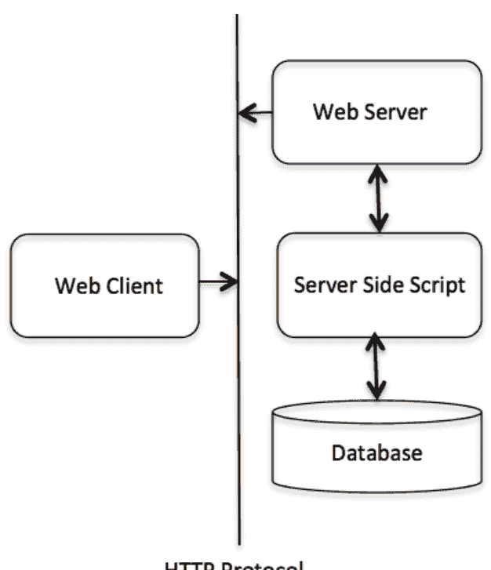

版权所有 © 2021 洪磊

保留所有权利。未经作者事先许可或确认，不得以任何形式或方式（包括电子、机械、影印、录音或其他方式）复制、存储于检索系统或传播本书的任何部分。

# 目录

- [引言](#) .......................... 3
- [Python - 概述](#) .......................... 6
- [Python - 环境搭建](#) .......................... 8
- [Python - 基本语法](#) .......................... 15
- [Python - 变量类型](#) .......................... 23
- [Python - 基本运算符](#) .......................... 33
- [Python - 判断语句](#) .......................... 43
- [Python - 循环](#) .......................... 45
- [Python - 数字](#) .......................... 47
- [Python - 字符串](#) .......................... 54
- [Python - 列表](#) .......................... 68
- [Python - 元组](#) .......................... 74
- [Python - 字典](#) .......................... 79
- [Python - 日期和时间](#) .......................... 85
- [Python - 函数](#) .......................... 94
- [Python - 模块](#) .......................... 105
- [Python - 文件I/O](#) .......................... 112
- [Python - 异常处理](#) .......................... 124
- [Python - 面向对象](#) .......................... 137
- [Python - CGI编程](#) .......................... 169
- [Python - MySQL数据库访问](#) .......................... 189
- [Python - 网络编程](#) .......................... 202
- [Python - 使用SMTP发送邮件](#) .......................... 209
- [Python - 多线程编程](#) .......................... 214
- [Python - XML处理](#) .......................... 224
- [Python - GUI编程 (Tkinter)](#) .......................... 233
- [Python - 使用C扩展编程](#) .......................... 238
- [结论](#) .......................... 250

# 引言

**Python** 是一种通用型、解释型、交互式、面向对象的高级编程语言。它由吉多·范罗苏姆在1985年至1990年间创建。与Perl类似，Python源代码也可在GNU通用公共许可证（GPL）下获取。

这本**书**提供了对**Python编程**语言的充分理解。

为什么要学习Python？

**Python** 是一种高级、解释型、交互式和面向对象的脚本语言。Python被设计成具有高度可读性。它频繁使用英语关键字，而其他语言则使用标点符号，并且它的语法结构比其他语言更少。

对于学生和在职专业人士来说，**Python** 是成为优秀软件工程师的必备技能，尤其是在从事Web开发领域时。我将列出学习Python的一些主要优势：

- **Python是解释型语言** – Python在运行时由解释器处理。你不需要在执行程序之前编译它。这与PERL和PHP类似。
- **Python是交互式的** – 你实际上可以坐在Python提示符前，直接与解释器交互来编写程序。
- **Python是面向对象的** – Python支持面向对象的编程风格或技术，将代码封装在对象中。
- **Python是一门初学者语言** – Python是初学者程序员的绝佳语言，支持开发从简单文本处理到WWW浏览器再到游戏的各种应用程序。

# Python的特性

以下是**Python编程**的重要特性 –

- 它支持函数式和结构化编程方法，以及面向对象编程。
- 它可以用作脚本语言，也可以编译成字节码来构建大型应用程序。
- 它提供非常高级的动态数据类型，并支持动态类型检查。
- 它支持自动垃圾回收。
- 它可以轻松地与C、C++、COM、ActiveX、CORBA和Java集成。

使用Python的Hello World。

为了让你对Python感到一点兴奋，我将给你一个小型的、传统的Python Hello World程序，你可以使用演示链接来尝试它。

[在线演示](Live Demo)

```
print ("Hello, Python!");
```

Python的应用

如前所述，Python是网络上使用最广泛的语言之一。我将在这里列出其中一些：

- **易于学习** – Python关键字少，结构简单，语法定义清晰。这使得学生能够快速掌握这门语言。
- **易于阅读** – Python代码定义更清晰，视觉上更易读。
- **易于维护** – Python的源代码相当易于维护。
- **广泛的标准库** – Python的大部分库非常可移植，并且在UNIX、Windows和Macintosh上跨平台兼容。
- **交互模式** – Python支持交互模式，允许对代码片段进行交互式测试和调试。
- **可移植** – Python可以在各种硬件平台上运行，并且在所有平台上具有相同的接口。
- **可扩展** – 你可以向Python解释器添加低级模块。这些模块使程序员能够添加或自定义他们的工具以提高效率。
- **数据库** – Python提供了对所有主要商业数据库的接口。
- **GUI编程** – Python支持GUI应用程序，这些应用程序可以创建并移植到许多系统调用、库和窗口系统，例如Windows MFC、Macintosh和Unix的X Window系统。
- **可扩展性** – 与shell脚本相比，Python为大型程序提供了更好的结构和支持。

# Python - 概述

Python是一种高级、解释型、交互式和面向对象的脚本语言。Python被设计成具有高度可读性。它频繁使用英语关键字，而其他语言则使用标点符号，并且它的语法结构比其他语言更少。

- **Python是解释型语言** – Python在运行时由解释器处理。你不需要在执行程序之前编译它。这与PERL和PHP类似。
- **Python是交互式的** – 你实际上可以坐在Python提示符前，直接与解释器交互来编写程序。
- **Python是面向对象的** – Python支持面向对象的编程风格或技术，将代码封装在对象中。
- **Python是一门初学者语言** – Python是初学者程序员的绝佳语言，支持开发从简单文本处理到WWW浏览器再到游戏的各种应用程序。

# Python的历史

Python由吉多·范罗苏姆在八十年代末和九十年代初在荷兰的国家数学和计算机科学研究所开发。

Python源自许多其他语言，包括ABC、Modula-3、C、C++、Algol-68、SmallTalk以及Unix shell和其他脚本语言。

Python受版权保护。与Perl类似，Python源代码现在可在GNU通用公共许可证（GPL）下获取。

Python现在由该研究所的一个核心开发团队维护，尽管吉多·范罗苏姆在指导其发展方面仍扮演着至关重要的角色。

# Python特性

Python的特性包括 –

- **易于学习** – Python关键字少，结构简单，语法定义清晰。这使得学生能够快速掌握这门语言。
- **易于阅读** – Python代码定义更清晰，视觉上更易读。
- **易于维护** – Python的源代码相当易于维护。
- **广泛的标准库** – Python的大部分库非常可移植，并且在UNIX、Windows和Macintosh上跨平台兼容。
- **交互模式** – Python支持交互模式，允许对代码片段进行交互式测试和调试。
- **可移植** – Python可以在各种硬件平台上运行，并且在所有平台上具有相同的接口。
- **可扩展** – 你可以向Python解释器添加低级模块。这些模块使程序员能够添加或自定义他们的工具以提高效率。
- **数据库** – Python提供了对所有主要商业数据库的接口。
- **GUI编程** – Python支持GUI应用程序，这些应用程序可以创建并移植到许多系统调用、库和窗口系统，例如Windows MFC、Macintosh和Unix的X Window系统。
- **可扩展性** – 与shell脚本相比，Python为大型程序提供了更好的结构和支持。

除了上述特性外，Python还有许多其他优点，下面列出其中一些 –

## Python - 环境设置

Python 可在包括 Linux 和 Mac OS X 在内的多种平台上使用。让我们了解如何设置 Python 环境。

### 本地环境设置

打开一个终端窗口，输入 "python" 以查看是否已安装以及安装的版本。

- Unix (Solaris, Linux, FreeBSD, AIX, HP/UX, SunOS, IRIX 等)
- Win 9x/NT/2000
- Macintosh (Intel, PPC, 68K)
- OS/2
- DOS (多个版本)
- PalmOS
- Nokia 移动电话
- Windows CE
- Acorn/RISC OS
- BeOS
- Amiga
- VMS/OpenVMS
- QNX
- VxWorks
- Psion
- Python 也已被移植到 Java 和 .NET 虚拟机

### 获取 Python

最新的源代码、二进制文件、文档、新闻等，可在 Python 官方网站 [https://www.python.org/](https://www.python.org/) 获取。

你可以从 [https://www.python.org/doc/](https://www.python.org/doc/) 下载 Python 文档。文档提供 HTML、PDF 和 PostScript 格式。

### 安装 Python

Python 发行版适用于多种平台。你只需下载适用于你平台的二进制代码并安装 Python。

如果你的平台没有可用的二进制代码，则需要一个 C 编译器来手动编译源代码。编译源代码在选择安装所需功能方面提供了更大的灵活性。

以下是安装 Python 到各种平台的快速概览 –

#### Unix 和 Linux 安装

以下是在 Unix/Linux 机器上安装 Python 的简单步骤。

- 打开 Web 浏览器并访问 [https://www.python.org/downloads/](https://www.python.org/downloads/)。
- 按照链接下载适用于 Unix/Linux 的压缩源代码。
- 下载并解压文件。
- 如果你想自定义某些选项，请编辑 *Modules/Setup* 文件。
- 运行 ./configure 脚本
- make
- make install

这会将 Python 安装在标准位置 */usr/local/bin*，其库安装在 /usr/local/lib/pythonXX，其中 XX 是 Python 的版本号。

#### Windows 安装

以下是在 Windows 机器上安装 Python 的步骤。

- 打开 Web 浏览器并访问 [https://www.python.org/downloads/](https://www.python.org/downloads/)。
- 按照链接下载 Windows 安装程序 *python-XYZ.msi* 文件，其中 XYZ 是你需要安装的版本。
- 要使用此安装程序 *python-XYZ.msi*，Windows 系统必须支持 Microsoft Installer 2.0。将安装程序文件保存到本地机器，然后运行它以查看你的机器是否支持 MSI。
- 运行下载的文件。这将启动 Python 安装向导，它非常易于使用。只需接受默认设置，等待安装完成，即可完成。

#### Macintosh 安装

较新的 Mac 通常预装了 Python，但版本可能已经过时多年。

请参阅 [http://www.python.org/download/mac/](http://www.python.org/download/mac/) 以获取有关获取当前版本以及支持 Mac 开发的额外工具的说明。对于 Mac OS X 10.3（2003 年发布）之前的旧版 Mac OS，可以使用 MacPython。

Jack Jansen 维护着它，你可以在他的网站上访问完整的文档 - [http://www.cwi.nl/~jack/macpython.html](http://www.cwi.nl/~jack/macpython.html)。你可以找到 Mac OS 安装的完整安装细节。

### 设置 PATH

程序和其他可执行文件可能位于多个目录中，因此操作系统提供了一个搜索路径，列出了操作系统搜索可执行文件的目录。

路径存储在一个环境变量中，这是一个由操作系统维护的命名字符串。此变量包含命令 shell 和其他程序可用的信息。

**path** 变量在 Unix 中命名为 PATH，在 Windows 中命名为 Path（Unix 区分大小写；Windows 不区分）。

在 Mac OS 中，安装程序会处理路径细节。要从任何特定目录调用 Python 解释器，必须将 Python 目录添加到你的路径中。

#### 在 Unix/Linux 中设置路径

要在 Unix 中为特定会话将 Python 目录添加到路径 –

- **在 csh shell 中** – 输入 setenv PATH "$PATH:/usr/local/bin/python" 并按 Enter。
- **在 bash shell (Linux) 中** – 输入 export PATH="$PATH:/usr/local/bin/python" 并按 Enter。
- **在 sh 或 ksh shell 中** – 输入 PATH="$PATH:/usr/local/bin/python" 并按 Enter。
- **注意** – /usr/local/bin/python 是 Python 目录的路径

#### 在 Windows 中设置路径

要在 Windows 中为特定会话将 Python 目录添加到路径 –

**在命令提示符下** – 输入 path %path%;C:\Python 并按 Enter。

**注意** – C:\Python 是 Python 目录的路径

### Python 环境变量

以下是 Python 可识别的重要环境变量 –

| 序号 | 变量与描述 |
| :--- | :--- |
| 1 | **PYTHONPATH**<br>它的作用类似于 PATH。此变量告诉 Python 解释器在哪里查找导入到程序中的模块文件。它应包含 Python 源库目录和包含 Python 源代码的目录。PYTHONPATH 有时由 Python 安装程序预设。 |
| 2 | **PYTHONSTARTUP**<br>它包含一个初始化文件的路径，该文件包含 Python 源代码。每次启动解释器时都会执行它。在 Unix 中命名为 .pythonrc.py，它包含加载实用程序或修改 PYTHONPATH 的命令。 |
| 3 | **PYTHONCASEOK**<br>在 Windows 中使用，指示 Python 在 import 语句中查找第一个不区分大小写的匹配项。将此变量设置为任何值以激活它。 |
| 4 | **PYTHONHOME**<br>它是一个替代的模块搜索路径。通常嵌入在 PYTHONSTARTUP 或 PYTHONPATH 目录中，以便于切换模块库。 |

### 运行 Python

有三种不同的方式启动 Python –

#### 交互式解释器

你可以从 Unix、DOS 或任何其他提供命令行解释器或 shell 窗口的系统启动 Python。

在命令行输入 **python**。

在交互式解释器中立即开始编码。

```
$python # Unix/Linux
```

或

```
python% # Unix/Linux
```

或

```
C:> python # Windows/DOS
```

以下是所有可用命令行选项的列表 –

| 序号 | 选项与描述 |
| :--- | :--- |
| 1 | **-d**<br>提供调试输出。 |
| 2 | **-O**<br>生成优化的字节码（生成 .pyo 文件）。 |
| 3 | **-S**<br>启动时不运行 import site 来查找 Python 路径。 |
| 4 | **-v**<br>详细输出（对 import 语句进行详细跟踪）。 |
| 5 | **-X**<br>禁用基于类的内置异常（仅使用字符串）；从 1.6 版本开始已过时。 |
| 6 | **-c cmd**<br>运行作为 cmd 字符串传入的 Python 脚本 |
| 7 | **file**<br>从给定文件运行 Python 脚本 |

#### 从命令行运行脚本

可以通过在你的应用程序上调用解释器来在命令行执行 Python 脚本，如下所示 –

```
$python script.py # Unix/Linux
```

或

```
python% script.py # Unix/Linux
```

或

```
C: >python script.py # Windows/DOS
```

**注意** – 确保文件权限模式允许执行。

#### 集成开发环境

如果你的系统上有支持 Python 的图形用户界面 (GUI) 应用程序，你也可以从 GUI 环境运行 Python。

- **Unix** – IDLE 是第一个用于 Python 的 Unix IDE。
- **Windows** – PythonWin 是第一个用于 Python 的 Windows 接口，是一个带有 GUI 的 IDE。
- **Macintosh** – Python 的 Macintosh 版本以及 IDLE IDE 可从主网站获取，可下载为 MacBinary 或 BinHex'd 文件。

如果你无法正确设置环境，可以寻求系统管理员的帮助。确保 Python 环境已正确设置并完美运行。

**注意** – 后续章节中给出的所有示例均使用 CentOS Linux 发行版上可用的 Python 2.4.3 版本执行。

我们已经在线设置了 Python 编程环境，以便你在学习理论的同时可以在线执行所有可用的示例。随意修改任何示例并在线执行。

## Python - 基本语法

Python 语言与 Perl、C 和 Java 有许多相似之处。然而，这些语言之间存在一些明确的差异。

### 第一个 Python 程序

让我们以不同的编程模式来执行程序。

#### 交互模式编程

不传递脚本文件作为参数来调用解释器，会显示以下提示符：

```
$ python
Python 2.4.3 (#1, Nov 11 2010, 13:34:43)
[GCC 4.1.2 20080704 (Red Hat 4.1.2-48)] on linux2
Type "help", "copyright", "credits" or "license" for more information.
>>>
```

在 Python 提示符下输入以下文本并按回车键：

```
>>> print "Hello, Python!"
```

如果你运行的是新版本的 Python，那么你需要使用带括号的 print 语句，例如 **print ("Hello, Python!");**。然而，在 Python 2.4.3 版本中，这会产生以下结果：

Hello, Python!

#### 脚本模式编程

使用脚本参数调用解释器会开始执行脚本，直到脚本结束。当脚本结束时，解释器不再处于活动状态。

让我们在一个脚本中编写一个简单的 Python 程序。Python 文件的扩展名是 **.py**。在 test.py 文件中输入以下源代码：

[在线演示](http://)

```
print "Hello, Python!"
```

我们假设你已经将 Python 解释器设置在 PATH 变量中。现在，尝试按如下方式运行此程序：

```
$ python test.py
```

这会产生以下结果：

```
Hello, Python!
```

让我们尝试另一种执行 Python 脚本的方法。这是修改后的 test.py 文件：

[在线演示](http://)

```
#!/usr/bin/python

print "Hello, Python!"
```

我们假设你可以在 /usr/bin 目录中找到 Python 解释器。现在，尝试按如下方式运行此程序：

```
$ chmod +x test.py # 这是为了使文件可执行

$ ./test.py
```

这会产生以下结果：

```
Hello, Python!
```

### Python 标识符

Python 标识符是用于标识变量、函数、类、模块或其他对象的名称。

标识符以字母 A 到 Z 或 a 到 z 或下划线 (_) 开头，后跟零个或多个字母、下划线和数字 (0 到 9)。

Python 不允许在标识符中使用标点字符，如 @、$ 和 %。Python 是一种区分大小写的编程语言。因此，**Manpower** 和 **manpower** 在 Python 中是两个不同的标识符。

以下是 Python 标识符的命名约定：

- 类名以大写字母开头。所有其他标识符以小写字母开头。
- 以单个前导下划线开头的标识符表示该标识符是私有的。
- 以两个前导下划线开头的标识符表示一个强私有标识符。
- 如果标识符还以两个尾随下划线结尾，则该标识符是语言定义的特殊名称。

### 保留字

以下列表显示了 Python 关键字。这些是保留字，你不能将它们用作常量、变量或任何其他标识符名称。所有 Python 关键字仅包含小写字母。

- and
- exec
- not
- assert
- finally
- or
- break
- for
- pass
- class
- from
- print
- continue
- global
- raise
- def
- if
- return
- del
- import
- try
- elif
- in
- while
- else
- is
- with
- except
- lambda
- yield

### 行和缩进

Python 不提供花括号来指示类和函数定义或流程控制的代码块。代码块由行缩进表示，这是严格强制执行的。

缩进中的空格数量是可变的，但块内的所有语句必须缩进相同的量。例如：

```
if True:
    print "True"
else:
    print "False"
```

然而，以下代码块会产生错误：

```
if True:
    print "Answer"
    print "True"
else:
    print "Answer"
    print "False"
```

因此，在 Python 中，所有缩进相同空格数的连续行将形成一个块。以下示例包含各种语句块：

**注意** – 此时不要试图理解逻辑。只需确保你理解了各种块，即使它们没有花括号。

```
#!/usr/bin/python
import sys
try:
    # 打开文件流
    file = open(file_name, "w")
except IOError:
    print "写入文件时出错：", file_name
    sys.exit()
print "输入 ", file_finish,
print " 表示完成"
while file_text != file_finish:
    file_text = raw_input("输入文本：")
    if file_text == file_finish:
        # 关闭文件
        file.close
        break
    file.write(file_text)
    file.write("\n")
file.close()
file_name = raw_input("输入文件名：")
if len(file_name) == 0:
    print "下次请输入内容"
    sys.exit()
try:
    file = open(file_name, "r")
except IOError:
    print "读取文件时出错"
    sys.exit()

file_text = file.read()
file.close()
print file_text
```

### 多行语句

Python 中的语句通常以新行结束。然而，Python 允许使用行继续字符 (\) 来表示该行应该继续。例如：

```
total = item_one + \
    item_two + \
    item_three
```

包含在 [], {}, 或 () 括号中的语句不需要使用行继续字符。例如：

```
days = ['Monday', 'Tuesday', 'Wednesday',
        'Thursday', 'Friday']
```

### Python 中的引号

Python 接受单引号 (')、双引号 (") 和三引号 (''' 或 """) 来表示字符串字面量，只要相同类型的引号开始和结束字符串即可。

三引号用于将字符串跨多行。例如，以下所有都是合法的：

```
word = 'word'

sentence = "This is a sentence."

paragraph = """This is a paragraph. It is

made up of multiple lines and sentences."""
```

### Python 中的注释

不在字符串字面量内的井号 (#) 开始一个注释。从 # 之后到物理行末尾的所有字符都是注释的一部分，Python 解释器会忽略它们。

[在线演示](http://)

```
#!/usr/bin/python

# 第一个注释

print "Hello, Python!" # 第二个注释
```

这会产生以下结果：

Hello, Python!

你可以在语句或表达式之后的同一行输入注释：

```
name = "Madisetti" # 这也是一个注释
```

你可以按如下方式注释多行：

```
# 这是一个注释。

# 这也是一个注释。

# 这也是一个注释。

# 我已经说过了。
```

以下三引号字符串也会被 Python 解释器忽略，可以用作多行注释：

```
"""

这是一个多行

注释。

"""
```

### 使用空行

仅包含空白字符（可能带有注释）的行称为空行，Python 完全忽略它。

在交互式解释器会话中，你必须输入一个空的物理行来终止多行语句。

### 等待用户

程序的以下行显示提示符，即语句“按回车键退出”，并等待用户采取行动：

```
#!/usr/bin/python
raw_input("\n\nPress the enter key to exit.")
```

这里，"\n\n" 用于在显示实际行之前创建两个新行。一旦用户按下该键，程序就会结束。这是一个很好的技巧，可以在用户完成应用程序之前保持控制台窗口打开。

### 单行上的多条语句

分号 ( ; ) 允许在单行上放置多条语句，前提是这些语句都不开始新的代码块。以下是使用分号的示例片段：

```
import sys; x = 'foo'; sys.stdout.write(x + '\n')
```

### 作为套件的多条语句组

在 Python 中，构成单个代码块的一组单独语句称为 **套件**。

复合或复杂语句，如 if、while、def 和 class 需要一个标题行和一个套件。

标题行开始语句（带有关键字）并以冒号 ( : ) 结束，后跟一个或多个构成套件的行。例如：

```
if expression :
    suite
elif expression :
```

# 命令行参数

许多程序在运行时可以提供一些关于其运行方式的基本信息。Python 允许你通过 `-h` 选项来实现这一点：

```
$ python -h
```

用法：python [选项] ... [-c 命令 | -m 模块 | 文件 | -] [参数] ...

选项和参数（以及对应的环境变量）：

- -c 命令 : 将程序作为字符串传入（终止选项列表）
- -d : 解析器的调试输出（也可使用 PYTHONDEBUG=x）
- -E : 忽略环境变量（如 PYTHONPATH）
- -h : 打印此帮助信息并退出

[ 等等 ]

你也可以编写脚本，使其能够接受各种选项。[命令行参数](https://www.tutorialspoint.com/python/python_command_line_arguments.htm)是一个高级主题，建议在学习完其他 Python 概念后再进行研究。

# Python - 变量类型

变量不过是用于存储值的保留内存位置。这意味着当你创建一个变量时，就在内存中预留了一块空间。

根据变量的数据类型，解释器会分配内存并决定在保留的内存中可以存储什么。因此，通过为变量分配不同的数据类型，你可以在这些变量中存储整数、小数或字符。

# 给变量赋值

Python 变量不需要显式声明来预留内存空间。当你给一个变量赋值时，声明会自动发生。等号（`=`）用于给变量赋值。

`=` 运算符左边的操作数是变量的名称，右边的操作数是存储在变量中的值。例如：

[在线演示](http://www.tutorialspoint.com/python/)

```
#!/usr/bin/python

counter = 100 # 整数赋值
miles = 1000.0 # 浮点数赋值
name = "John" # 字符串赋值

print counter
print miles
print name
```

这里，100、1000.0 和 "John" 分别被赋值给 *counter*、*miles* 和 *name* 变量。这将产生以下结果：

100

1000.0

John

# 多重赋值

Python 允许你同时将一个值赋给多个变量。例如：

```
a = b = c = 1
```

这里，创建了一个值为 1 的整数对象，所有三个变量都被赋值到同一个内存位置。你也可以将多个对象赋给多个变量。例如：

```
a,b,c = 1,2,"john"
```

这里，两个值分别为 1 和 2 的整数对象被分别赋给变量 a 和 b，一个值为 "john" 的字符串对象被赋给变量 c。

# 标准数据类型

存储在内存中的数据可以是多种类型的。例如，一个人的年龄存储为数值，而他或她的地址存储为字母数字字符。Python 有多种标准数据类型，用于定义对它们可以进行的操作以及每种类型的存储方法。

Python 有五种标准数据类型：

- 数字
- 字符串
- 列表
- 元组
- 字典

# Python 数字

数字数据类型存储数值。当你给数字对象赋值时，它们就被创建了。例如：

```
var1 = 1
var2 = 10
```

你也可以使用 `del` 语句删除对数字对象的引用。`del` 语句的语法是：

```
del var1[,var2[,var3[....,varN]]]
```

你可以使用 `del` 语句删除单个对象或多个对象。例如：

```
del var
```

```
del var_a, var_b
```

Python 支持四种不同的数字类型：

- int（有符号整数）
- long（长整数，也可以用八进制和十六进制表示）
- float（浮点实数）
- complex（复数）

### 示例

以下是一些数字示例：

| int | long | float | complex |
| :--- | :--- | :--- | :--- |
| 10 | 51924361L | 0.0 | 3.14j |
| 100 | -0x19323L | 15.20 | 45.j |
| -786 | 0122L | -21.9 | 9.322e-36j |
| 080 | 0xDEFABCECBDAECBFBAEI | 32.3+e18 | .876j |
| -0490 | 535633629843L | -90. | -.6545+0J |
| -0x260 | -052318172735L | -32.54e100 | 3e+26J |
| 0x69 | -4721885298529L | 70.2-E12 | 4.53e-7j |

- Python 允许你对 long 类型使用小写 `l`，但建议只使用大写 `L`，以避免与数字 1 混淆。Python 显示长整数时使用大写 `L`。
- 复数由一对有序的实浮点数表示，形式为 `x + yj`，其中 `x` 和 `y` 是实数，`j` 是虚数单位。

# Python 字符串

Python 中的字符串被识别为引号内表示的连续字符集。Python 允许使用单引号或双引号对。可以使用切片操作符（`[ ]` 和 `[:]`）获取字符串的子集，索引从字符串开头的 0 开始，到末尾的 -1 结束。

加号（`+`）是字符串连接运算符，星号（`*`）是重复运算符。例如：

[在线演示](http://)

```
#!/usr/bin/python

str = 'Hello World!'

print str # 打印完整字符串

print str[0] # 打印字符串的第一个字符

print str[2:5] # 打印从第3个到第5个字符

print str[2:] # 打印从第3个字符开始的字符串

print str * 2 # 打印字符串两次

print str + "TEST" # 打印连接后的字符串
```

这将产生以下结果：

Hello World!

H

llo

llo World!

Hello World!Hello World!

Hello World!TEST

### Python 列表

列表是 Python 复合数据类型中最通用的一种。列表包含用逗号分隔并用方括号（`[]`）括起来的项目。在某种程度上，列表类似于 C 语言中的数组。它们之间的一个区别是，属于列表的所有项目可以是不同的数据类型。

存储在列表中的值可以使用切片操作符（`[ ]` 和 `[:]`）访问，索引从列表开头的 0 开始，到末尾的 -1 结束。加号（`+`）是列表连接运算符，星号（`*`）是重复运算符。例如：

```
#!/usr/bin/python

list = [ 'abcd', 786 , 2.23, 'john', 70.2 ]

tinylist = [123, 'john']

print list # 打印完整列表

print list[0] # 打印列表的第一个元素

print list[1:3] # 打印从第2个到第3个元素

print list[2:] # 打印从第3个元素开始的元素

print tinylist * 2 # 打印列表两次

print list + tinylist # 打印连接后的列表
```

这将产生以下结果：

```
['abcd', 786, 2.23, 'john', 70.2]

abcd

[786, 2.23]

[2.23, 'john', 70.2]

[123, 'john', 123, 'john']

['abcd', 786, 2.23, 'john', 70.2, 123, 'john']
```

# Python 元组

元组是另一种类似于列表的序列数据类型。元组由用逗号分隔的多个值组成。然而，与列表不同，元组用圆括号括起来。

列表和元组之间的主要区别是：列表用方括号（`[ ]`）括起来，其元素和大小可以更改，而元组用圆括号（`( )`）括起来，不能更新。元组可以被认为是**只读**的列表。例如：

[在线演示](http://www.tutorialspoint.com/python/python_tuples.htm)

```
#!/usr/bin/python

tuple = ( 'abcd', 786 , 2.23, 'john', 70.2 )

tinytuple = (123, 'john')

print tuple # 打印完整元组

print tuple[0] # 打印元组的第一个元素

print tuple[1:3] # 打印从第2个到第3个元素

print tuple[2:] # 打印从第3个元素开始的元素

print tinytuple * 2 # 打印元组内容两次

print tuple + tinytuple # 打印连接后的元组
```

这将产生以下结果：

```
('abcd', 786, 2.23, 'john', 70.2)

abcd

(786, 2.23)

(2.23, 'john', 70.2)

(123, 'john', 123, 'john')

('abcd', 786, 2.23, 'john', 70.2, 123, 'john')
```

以下代码对元组是无效的，因为我们试图更新一个元组，这是不允许的。类似的情况也可能发生在

列表 –

```python
#!/usr/bin/python
tuple = ( 'abcd', 786 , 2.23, 'john', 70.2 )
list = [ 'abcd', 786 , 2.23, 'john', 70.2 ]
tuple[2] = 1000 # Invalid syntax with tuple
list[2] = 1000 # Valid syntax with list
```

## Python 字典

Python 的字典是一种哈希表类型。它们的工作方式类似于 Perl 中的关联数组或哈希，由键值对组成。字典的键可以是几乎任何 Python 类型，但通常是数字或字符串。另一方面，值可以是任何任意的 Python 对象。

字典用花括号（{ }）括起来，值可以使用方括号（[]）进行赋值和访问。例如 –

在线演示

```python
#!/usr/bin/python
dict = {}
dict['one'] = "This is one"
dict[2] = "This is two"
tinydict = {'name': 'john','code':6734, 'dept': 'sales'}
print dict['one'] # Prints value for 'one' key
print dict[2] # Prints value for 2 key
print tinydict # Prints complete dictionary
print tinydict.keys() # Prints all the keys
print tinydict.values() # Prints all the values
```

这将产生以下结果 –

```
This is one
This is two
{'dept': 'sales', 'code': 6734, 'name': 'john'}
['dept', 'code', 'name']
['sales', 6734, 'john']
```

字典中的元素没有顺序概念。说元素“顺序错乱”是不正确的；它们只是无序的。

## 数据类型转换

有时，你可能需要在内置类型之间执行转换。要在类型之间转换，你只需将类型名称用作函数即可。

有几个内置函数用于从一种数据类型转换为另一种数据类型。这些函数返回一个表示转换后值的新对象。

| 序号 | 函数与描述 |
| :--- | :--- |
| 1 | **int(x [,base])**<br>将 x 转换为整数。如果 x 是字符串，则 base 指定基数。 |
| 2 | **long(x [,base])**<br>将 x 转换为长整数。如果 x 是字符串，则 base 指定基数。 |
| 3 | **float(x)**<br>将 x 转换为浮点数。 |
| 4 | **complex(real [,imag])**<br>创建一个复数。 |
| 5 | **str(x)**<br>将对象 x 转换为字符串表示形式。 |
| 6 | **repr(x)**<br>将对象 x 转换为表达式字符串。 |
| 7 | **eval(str)**<br>计算一个字符串并返回一个对象。 |
| 8 | **tuple(s)**<br>将 s 转换为元组。 |
| 9 | **list(s)**<br>将 s 转换为列表。 |
| 10 | **set(s)**<br>将 s 转换为集合。 |
| 11 | **dict(d)**<br>创建一个字典。d 必须是 (key,value) 元组的序列。 |
| 12 | **frozenset(s)**<br>将 s 转换为冻结集合。 |
| 13 | **chr(x)**<br>将整数转换为字符。 |
| 14 | **unichr(x)**<br>将整数转换为 Unicode 字符。 |
| 15 | **ord(x)**<br>将单个字符转换为其整数值。 |
| 16 | **hex(x)**<br>将整数转换为十六进制字符串。 |
| 17 | **oct(x)**<br>将整数转换为八进制字符串。 |

## Python - 基本运算符

运算符是可以操作操作数值的构造。

考虑表达式 4 + 5 = 9。这里，4 和 5 称为操作数，+ 称为运算符。

### 运算符类型

Python 语言支持以下类型的运算符。

- 算术运算符
- 比较（关系）运算符
- 赋值运算符
- 逻辑运算符
- 位运算符
- 成员运算符
- 身份运算符

让我们逐一查看所有运算符。

### Python 算术运算符

假设变量 a 保存 10，变量 b 保存 20，则 –

[ 显示示例 ]

| 运算符 | 描述 | 示例 |
| :--- | :--- | :--- |
| + 加法 | 将运算符两侧的值相加。 | a + b = 30 |
| - 减法 | 从左操作数中减去右操作数。 | a – b = -10 |
| * 乘法 | 将运算符两侧的值相乘 | a * b = 200 |
| / 除法 | 左操作数除以右操作数 | b / a = 2 |
| % 取模 | 左操作数除以右操作数并返回余数 | b % a = 0 |
| ** 指数 | 对运算符执行指数（幂）计算 | a**b = 10 的 20 次方 |
| // 整除 | 操作数的除法，结果是商，其中小数点后的数字被移除。但如果其中一个操作数为负数，则结果向下取整，即远离零（向负无穷大）取整 – | 9//2 = 4 且 9.0//2.0 = 4.0, -11//3 = -4, -11.0//3 = -4.0 |

### Python 比较运算符

这些运算符比较它们两侧的值并确定它们之间的关系。它们也称为关系运算符。

假设变量 a 保存 10，变量 b 保存 20，则 –

[ 显示示例 ]

| 运算符 | 描述 | 示例 |
| :--- | :--- | :--- |
| == | 如果两个操作数的值相等，则条件变为真。 | (a == b) 为假。 |
| != | 如果两个操作数的值不相等，则条件变为真。 | (a != b) 为真。 |
| <> | 如果两个操作数的值不相等，则条件变为真。这类似于 != 运算符。 | (a <> b) 为真。 |
| > | 如果左操作数的值大于右操作数的值，则条件变为真。 | (a > b) 为假。 |
| < | 如果左操作数的值小于右操作数的值，则条件变为真。 | (a < b) 为真。 |
| >= | 如果左操作数的值大于或等于右操作数的值，则条件变为真。 | (a >= b) 为假。 |
| <= | 如果左操作数的值小于或等于右操作数的值，则条件变为真。 | (a <= b) 为真。 |

### Python 赋值运算符

假设变量 a 保存 10，变量 b 保存 20，则 –

[ 显示示例 ]

| 运算符 | 描述 | 示例 |
| :--- | :--- | :--- |
| = | 将右侧操作数的值赋给左侧操作数 | c = a + b 将 a + b 的值赋给 c |
| += 加后赋值 | 它将右操作数加到左操作数，并将结果赋给左操作数 | c += a 等价于 c = c + a |
| -= 减后赋值 | 它从左操作数中减去右操作数，并将结果赋给左操作数 | c -= a 等价于 c = c - a |
| *= 乘后赋值 | 它将右操作数与左操作数相乘，并将结果赋给左操作数 | c *= a 等价于 c = c * a |
| /= 除后赋值 | 它用左操作数除以右操作数，并将结果赋给左操作数 | c /= a 等价于 c = c / a |
| %= 取模后赋值 | 它使用两个操作数进行取模运算，并将结果赋给左操作数 | c %= a 等价于 c = c % a |
| **= 指数后赋值 | 对运算符执行指数（幂）计算，并将值赋给左操作数 | c **= a 等价于 c = c ** a |
| //= 整除后赋值 | 它对运算符执行整除运算，并将值赋给左操作数 | c //= a 等价于 c = c // a |

### Python 位运算符

位运算符作用于位并逐位执行操作。假设 a = 60；b = 13；现在在二进制格式中，它们的值分别是 0011 1100 和 0000 1101。下表列出了 Python 语言支持的位运算符，并为每个运算符提供了一个示例，我们使用上述两个变量（a 和 b）作为操作数 –

```
a = 0011 1100
b = 0000 1101
----------------
a&b = 0000 1100
a|b = 0011 1101
a^b = 0011 0001
~a = 1100 0011
```

Python 语言支持以下位运算符

[ 显示示例 ]

| 运算符 | 描述 | 示例 |
| :--- | :--- | :--- |
| & 按位与 | 如果位存在于两个操作数中，则将位复制到结果中 | (a & b) (意味着 0000 1100) |
| \| 按位或 | 如果位存在于任一操作数中，则将其复制。 | (a \| b) = 61 (意味着 0011 1101) |
| ^ 按位异或 | 如果位在一个操作数中设置但不在两个操作数中都设置，则将其复制。 | (a ^ b) = 49 (意味着 0011 0001) |
| ~ 按位取反 | 它是一元运算符，具有“翻转”位的效果。 | (~a ) = -61 (由于是有符号二进制数，在二进制补码形式中意味着 1100 0011。 |
| << 左移 | 左操作数的值按右操作数指定的位数向左移动。 | a << 2 = 240 (意味着 1111 0000) |
| >> 右移 | 左操作数的值按右操作数指定的位数向右移动。 | a >> 2 = 15 (意味着 0000 1111) |

### Python 逻辑运算符

Python 语言支持以下逻辑运算符。假设变量 `a` 的值为 10，变量 `b` 的值为 20，则：

| 运算符 | 描述 | 示例 |
| :--- | :--- | :--- |
| and | 逻辑与。如果两个操作数都为真，则条件为真。 | (a and b) 为真。 |
| or | 逻辑或。如果两个操作数中任意一个非零，则条件为真。 | (a or b) 为真。 |
| not | 逻辑非。用于反转其操作数的逻辑状态。 | Not(a and b) 为假。 |

### Python 成员运算符

Python 的成员运算符用于测试在序列（如字符串、列表或元组）中的成员资格。有两个成员运算符，如下所述：

| 运算符 | 描述 | 示例 |
| :--- | :--- | :--- |
| in | 如果在指定的序列中找到变量，则计算结果为真，否则为假。 | x in y，如果 x 是序列 y 的成员，则 `in` 的结果为 1。 |
| not in | 如果在指定的序列中未找到变量，则计算结果为真，否则为假。 | x not in y，如果 x 不是序列 y 的成员，则 `not in` 的结果为 1。 |

### Python 身份运算符

身份运算符比较两个对象的内存位置。有两个身份运算符，如下所述：

| 运算符 | 描述 | 示例 |
| :--- | :--- | :--- |
| is | 如果运算符两侧的变量指向同一个对象，则计算结果为真，否则为假。 | x is y，如果 `id(x)` 等于 `id(y)`，则 **is** 的结果为 1。 |
| is not | 如果运算符两侧的变量指向同一个对象，则计算结果为假，否则为真。 | x is not y，如果 `id(x)` 不等于 `id(y)`，则 **is not** 的结果为 1。 |

### Python 运算符优先级

下表列出了所有运算符，从最高优先级到最低优先级。

| 序号 | 运算符及描述 |
| :--- | :--- |
| 1 | ** (幂运算（求幂）) |
| 2 | ~ + - (按位取反、一元正号和负号（后两者的名称分别为 +@ 和 -@）) |
| 3 | * / % // (乘、除、取模和整除) |
| 4 | + - (加法和减法) |
| 5 | >> << (右移和左移位运算) |
| 6 | & (按位与) |
| 7 | ^ \| (按位异或和按位或) |
| 8 | <= < > >= (比较运算符) |
| 9 | <> == != (相等运算符) |
| 10 | = %= /= //= -= += *= **= (赋值运算符) |
| 11 | is is not (身份运算符) |
| 12 | in not in (成员运算符) |
| 13 | not or and (逻辑运算符) |

## Python - 判断

判断是指在程序执行过程中预测条件的发生，并根据条件指定要采取的操作。

判断结构会计算多个表达式，其结果为 TRUE 或 FALSE。

你需要确定在结果为 TRUE 时采取哪个操作，以及在结果为 FALSE 时执行哪些语句。

以下是大多数编程语言中典型的判断结构的一般形式：

Python 编程语言将任何**非零**和**非空**值视为 TRUE，如果值为**零**或**空**，则视为 FALSE。

Python 编程语言提供以下类型的判断语句。点击以下链接查看其详细信息。

| 序号 | 语句及描述 |
| :--- | :--- |
| 1 | [if 语句](if statements) - **if 语句**由一个布尔表达式后跟一个或多个语句组成。 |
| 2 | [if...else 语句](if...else statements) - **if 语句**后可以跟一个可选的 **else 语句**，当布尔表达式为 FALSE 时执行。 |
| 3 | [嵌套 if 语句](nested if statements) - 你可以在另一个 **if** 或 **else if** 语句内部使用一个 **if** 或 **else if** 语句。 |

让我们简要地了解每个判断语句：

### 单行语句套件

如果 **if** 子句的套件仅由单行组成，它可以与头部语句放在同一行。

这是一个**单行 if** 子句的示例：

```python
#!/usr/bin/python

var = 100

if ( var == 100 ) : print "Value of expression is 100"

print "Good bye!"
```

当执行上述代码时，会产生以下结果：

Value of expression is 100

Good bye!

## Python - 循环

通常，语句是按顺序执行的：函数中的第一条语句首先执行，然后是第二条，依此类推。有时你可能需要多次执行一段代码块。

编程语言提供了各种控制结构，允许更复杂的执行路径。

循环语句允许我们多次执行一条语句或一组语句。下图说明了一个循环语句：

Python 编程语言提供以下类型的循环来处理循环需求。

| 序号 | 循环类型及描述 |
| :--- | :--- |
| 1 | [while 循环](while loop) - 当给定条件为 TRUE 时，重复执行一条语句或一组语句。它在执行循环体之前测试条件。 |
| 2 | [for 循环](for loop) - 多次执行一系列语句，并简化管理循环变量的代码。 |
| 3 | [嵌套循环](nested loops) - 你可以在任何其他 while、for 或 do..while 循环内部使用一个或多个循环。 |

### 循环控制语句

循环控制语句会改变其正常执行顺序。当执行离开一个作用域时，在该作用域内创建的所有自动对象都将被销毁。

Python 支持以下控制语句。点击以下链接查看其详细信息。

让我们简要地了解循环控制语句：

| 序号 | 控制语句及描述 |
| :--- | :--- |
| 1 | [break 语句](https://www.google.com/search?q=break+statement) - 终止循环语句，并将执行转移到紧随循环之后的语句。 |
| 2 | [continue 语句](https://www.google.com/search?q=continue+statement) - 导致循环跳过其主体的剩余部分，并在重新迭代之前立即重新测试其条件。 |
| 3 | [pass 语句](https://www.google.com/search?q=pass+statement) - Python 中的 pass 语句用于在语法上需要一条语句，但你不想执行任何命令或代码时使用。 |

## Python - 数字

数字数据类型存储数值。它们是不可变数据类型，这意味着更改数字数据类型的值会导致新分配一个对象。

当你为数字对象赋值时，它们就被创建了。例如：

```python
var1 = 1
var2 = 10
```

你也可以使用 **del** 语句删除对数字对象的引用。**del** 语句的语法是：

```python
del var1[,var2[,var3[....,varN]]]
```

你可以使用 **del** 语句删除单个对象或多个对象。例如：

```python
del var
```

```python
del var_a, var_b
```

Python 支持四种不同的数字类型：

- **int（有符号整数）** – 通常称为整数或 ints，是正或负的整数，没有小数点。
- **long（长整数）** – 也称为 longs，是大小无限制的整数，写法像整数，后跟一个大写或小写的 L。
- **float（浮点实数值）** – 也称为 floats，表示实数，用小数点分隔整数部分和小数部分。浮点数也可以用科学计数法表示，其中 E 或 e 表示 10 的幂（2.5e2 = 2.5 x 102 = 250）。
- **complex（复数）** – 形式为 a + bJ，其中 a 和 b 是浮点数，J（或 j）表示 -1 的平方根（这是一个虚数）。数字的实部是 a，虚部是 b。复数在 Python 编程中不常用。

### 示例

以下是一些数字示例：

| int | long | float | complex |
| :--- | :--- | :--- | :--- |
| 10 | 51924361L | 0.0 | 3.14j |
| 100 | -0x19323L | 15.20 | 45.j |
| -786 | 0122L | -21.9 | 9.322e-36j |
| 080 | 0xDEFABCECBDAECBFBAEL | 32.3+e18 | |.876j
-0490
535633629843L
-90.
-.6545+0j
-0x260
-052318172735L
-32.54e100
3e+26j
0x69
-4721885298529L
70.2E12
4.53e-7j

- Python 允许在 `long` 类型中使用小写字母 `l`，但建议只使用大写字母 `L`，以避免与数字 `1` 混淆。Python 用大写字母 `L` 显示长整数。
- 复数由一对有序的实数浮点数表示，记为 `a + bj`，其中 `a` 是复数的实部，`b` 是复数的虚部。

### 数字类型转换

Python 在包含混合类型的表达式中会将数字内部转换为一种通用类型进行求值。但有时，你需要显式地将数字从一种类型强制转换为另一种类型，以满足运算符或函数参数的要求。

- 使用 **int(x)** 将 `x` 转换为普通整数。
- 使用 **long(x)** 将 `x` 转换为长整数。
- 使用 **float(x)** 将 `x` 转换为浮点数。
- 使用 **complex(x)** 将 `x` 转换为一个实部为 `x`、虚部为零的复数。
- 使用 **complex(x, y)** 将 `x` 和 `y` 转换为一个实部为 `x`、虚部为 `y` 的复数。`x` 和 `y` 是数值表达式。

### 数学函数

Python 包含以下执行数学计算的函数。

| 序号 | 函数与返回值（描述） |
| :--- | :--- |
| 1 | abs(x) - x 的绝对值：x 与零之间的（正）距离。 |
| 2 | ceil(x) - x 的上取整：不小于 x 的最小整数。 |
| 3 | cmp(x, y) - 如果 x < y 返回 -1，如果 x == y 返回 0，如果 x > y 返回 1。 |
| 4 | exp(x) - x 的指数：e^x。 |
| 5 | fabs(x) - x 的绝对值。 |
| 6 | floor(x) - x 的下取整：不大于 x 的最大整数。 |
| 7 | log(x) - x 的自然对数，其中 x > 0。 |
| 8 | log10(x) - x 的以 10 为底的对数，其中 x > 0。 |
| 9 | max(x1, x2,...) - 参数中的最大值：最接近正无穷大的值。 |
| 10 | min(x1, x2,...) - 参数中的最小值：最接近负无穷大的值。 |
| 11 | modf(x) - 以二元组形式返回 x 的小数部分和整数部分。两部分与 x 具有相同的符号。整数部分作为浮点数返回。 |
| 12 | pow(x, y) - x**y 的值。 |
| 13 | round(x[,n]) - 将 x 四舍五入到小数点后 n 位。Python 在处理平局时采用远离零的舍入方式：round(0.5) 为 1.0，round(-0.5) 为 -1.0。 |
| 14 | sqrt(x) - x 的平方根，其中 x > 0。 |

### 随机数函数

随机数用于游戏、模拟、测试、安全和隐私应用。Python 包含以下常用函数。

| 序号 | 函数与描述 |
| :--- | :--- |
| 1 | choice(seq) - 从列表、元组或字符串中随机选择一个元素。 |
| 2 | randrange ([start,] stop [,step]) - 从 range(start, stop, step) 中随机选择一个元素。 |
| 3 | random() - 一个随机浮点数 r，满足 0 <= r < 1。 |
| 4 | seed([x]) - 设置用于生成随机数的整数起始值。在调用任何其他随机模块函数之前调用此函数。返回 None。 |
| 5 | shuffle(lst) - 就地随机打乱列表的元素。返回 None。 |
| 6 | uniform(x, y) - 一个随机浮点数 r，满足 x <= r < y。 |

### 三角函数

Python 包含以下执行三角计算的函数。

| 序号 | 函数与描述 |
| :--- | :--- |
| 1 | acos(x) - 返回 x 的反余弦值，以弧度为单位。 |
| 2 | asin(x) - 返回 x 的反正弦值，以弧度为单位。 |
| 3 | atan(x) - 返回 x 的反正切值，以弧度为单位。 |
| 4 | atan2(y, x) - 返回 atan(y / x)，以弧度为单位。 |
| 5 | cos(x) - 返回 x 弧度的余弦值。 |
| 6 | hypot(x, y) - 返回欧几里得范数，sqrt(x*x + y*y)。 |
| 7 | sin(x) - 返回 x 弧度的正弦值。 |
| 8 | tan(x) - 返回 x 弧度的正切值。 |
| 9 | degrees(x) - 将角度 x 从弧度转换为度。 |
| 10 | radians(x) - 将角度 x 从度转换为弧度。 |

### 数学常量

该模块还定义了两个数学常量 –

| 序号 | 常量与描述 |
| :--- | :--- |
| 1 | **pi** - 数学常量 pi。 |
| 2 | **e** - 数学常量 e。 |

## Python - 字符串

字符串是 Python 中最常见的类型之一。我们可以通过将字符括在引号中来简单地创建它们。Python 将单引号和双引号视为相同。创建字符串就像给变量赋值一样简单。例如 –

```
var1 = 'Hello World!'
var2 = "Python Programming"
```

### 访问字符串中的值

Python 不支持字符类型；这些被视为长度为一的字符串，因此也被视为子字符串。要访问子字符串，请使用方括号进行切片，并使用索引或索引范围来获取子字符串。例如 –

```python
#!/usr/bin/python

var1 = 'Hello World!'
var2 = "Python Programming"

print "var1[0]: ", var1[0]
print "var2[1:5]: ", var2[1:5]
```

当执行上述代码时，会产生以下结果 –

```
var1[0]: H
var2[1:5]: ytho
```

### 更新字符串

你可以通过（重新）将变量赋值给另一个字符串来“更新”现有字符串。新值可以与其先前的值相关，也可以是一个完全不同的字符串。例如 –

```python
#!/usr/bin/python

var1 = 'Hello World!'
print "Updated String :- ", var1[:6] + 'Python'
```

当执行上述代码时，会产生以下结果 –

```
Updated String :- Hello Python
```

### 转义字符

下表是可用反斜杠表示法表示的转义或非打印字符列表。转义字符会被解释；在单引号和双引号字符串中均有效。

| 反斜杠表示法 | 十六进制字符 | 描述 |
| :--- | :--- | :--- |
| \a | 0x07 | 响铃或警报 |
| \b | 0x08 | 退格 |
| \cx | | Control-x |
| \C-x | | Control-x |
| \e | | 转义 |
| \f | 0x0c | 换页 |
| \M-\C-x | | Meta-Control-x |
| \n | 0x0a | 换行 |
| \nnn | | 八进制表示法，其中 n 在 0..7 范围内 |
| \r | 0x0d | 回车 |
| \s | 0x20 | 空格 |
| \t | 0x09 | 制表符 |
| \v | 0x0b | 垂直制表符 |
| \x | | 字符 x |
| \xnn | | 十六进制表示法，其中 n 在 0..9、a..f 或 A..F 范围内 |

### 字符串特殊运算符

假设字符串变量 **a** 持有 'Hello'，变量 **b** 持有 'Python'，则 –

| 运算符 | 描述 | 示例 |
| :--- | :--- | :--- |
| + | 连接 - 将运算符两侧的值相加 | a + b 将得到 HelloPython |
| * | 重复 - 通过连接同一字符串的多个副本来创建新字符串 | a*2 将得到 HelloHello |
| [] | 切片 - 给出给定索引处的字符 | a[1] 将得到 e |
| [:] | 范围切片 - 给出给定范围内的字符 | a[1:4] 将得到 ell |
| in | 成员关系 - 如果字符存在于给定字符串中则返回 true | H in a 将得到 1 |
| not in | 成员关系 - 如果字符不存在于给定字符串中则返回 true | M not in a 将得到 1 |
| r/R | 原始字符串 - 抑制转义字符的实际含义。原始字符串的语法与普通字符串完全相同，除了原始字符串运算符，即引号前的字母 "r"。"r" 可以是小写 (r) 或大写 (R)，并且必须紧接在第一个引号之前。 | print r'\n' 打印 \n，print R'\n' 打印 \n |
| % | 格式化 - 执行字符串格式化 | 见下一节 |

### 字符串格式化运算符

Python 最酷的特性之一是字符串格式化运算符 %。此运算符是字符串独有的，弥补了拥有来自C语言`printf()`函数族的功能。以下是一个简单的示例 –

[在线演示](http://www.tutorialspoint.com/python/python_functions.htm)

```python
#!/usr/bin/python

print "My name is %s and weight is %d kg!" % ('Zara', 21)
```

当执行上述代码时，会产生以下结果 –

My name is Zara and weight is 21 kg!

以下是可与`%`一起使用的完整符号列表 –

### 格式符号

### 转换

- **%c**：字符
- **%s**：字符串，在格式化之前通过`str()`进行转换
- **%i**：有符号十进制整数
- **%d**：有符号十进制整数
- **%u**：无符号十进制整数
- **%o**：八进制整数
- **%x**：十六进制整数（小写字母）
- **%X**：十六进制整数（大写字母）
- **%e**：指数表示法（使用小写'e'）
- **%E**：指数表示法（使用大写'E'）
- **%f**：浮点实数
- **%g**：`%f`和`%e`中较短的一个
- **%G**：`%f`和`%E`中较短的一个

其他支持的符号和功能列在下表中 –

| 符号 | 功能 |
| :--- | :--- |
| * | 参数指定宽度或精度 |
| - | 左对齐 |
| + | 显示符号 |
| <sp> | 在正数前留一个空格 |
| # | 添加八进制前导零（'0'）或十六进制前导'0x'或'0X'，具体取决于使用的是'x'还是'X'。 |
| 0 | 从左侧用零填充（而不是空格） |
| % | '%%' 产生一个字面上的'%' |
| (var) | 映射变量（字典参数） |
| m.n. | m是最小总宽度，n是小数点后要显示的位数（如果适用）。 |

### 三引号

Python的三引号通过允许字符串跨越多行，包括逐字的换行符、制表符和任何其他特殊字符，来解决这个问题。

三引号的语法由三个连续的**单引号或双引号**组成。

[在线演示](http://)

```python
#!/usr/bin/python

para_str = """this is a long string that is made up of several lines and non-printable characters such as

TAB ( \t ) and they will show up that way when displayed.

NEWLINEs within the string, whether explicitly given like

this within the brackets [ \n ], or just a NEWLINE within

the variable assignment will also show up.
"""

print para_str
```

当执行上述代码时，会产生以下结果。请注意每个特殊字符是如何转换为其打印形式的，直到字符串末尾"up."和结束三引号之间的最后一个换行符。还要注意换行符要么出现在行末的显式回车符处，要么出现在其转义码（`\n`）处 –

this is a long string that is made up of several lines and non-printable characters such as TAB ( ) and they will show up that way when displayed. NEWLINEs within the string, whether explicitly given like this within the brackets [ ], or just a NEWLINE within the variable assignment will also show up. 原始字符串根本不将反斜杠视为特殊字符。放入原始字符串的每个字符都保持你编写时的样子 –

[在线演示](http://)

```python
#!/usr/bin/python
print 'C:\nowhere'
```

当执行上述代码时，会产生以下结果 –
C:\nowhere

现在让我们使用原始字符串。我们将表达式放在**r'expression'**中，如下所示 –

[在线演示](http://)

```python
#!/usr/bin/python
print r'C:\nowhere'
```

当执行上述代码时，会产生以下结果 –

C:\nowhere

### Unicode字符串

Python中的普通字符串在内部存储为8位ASCII，而Unicode字符串存储为16位Unicode。这允许使用更多样化的字符集，包括世界上大多数语言的特殊字符。我将把对Unicode字符串的讨论限制在以下内容 –

[在线演示](http://)

```python
#!/usr/bin/python

print u'Hello, world!'
```

当执行上述代码时，会产生以下结果 –

Hello, world!

如你所见，Unicode字符串使用前缀`u`，就像原始字符串使用前缀`r`一样。

### 内置字符串方法

Python包含以下内置方法来操作字符串 –

| 序号 | 方法及描述 |
| :--- | :--- |
| 1 | [capitalize()](http://) 将字符串的第一个字母大写 |
| 2 | `center(width, fillchar)` 返回一个原字符串居中，并使用空格填充至长度`width`的新字符串。 |
| 3 | `count(str, beg= 0,end=len(string))` 返回`str`在`string`里面出现的次数，如果给出了`beg`和`end`，则返回`string`子串中`str`出现的次数。 |
| 4 | `decode(encoding='UTF-8',errors='strict')` 使用注册编码的编解码器解码字符串。编码默认为默认字符串编码。 |
| 5 | `encode(encoding='UTF-8',errors='strict')` 返回字符串编码后的字符串版本；出错时，默认引发`ValueError`，除非给出了`errors`为'ignore'或'replace'。 |
| 6 | `endswith(suffix, beg=0, end=len(string))` 检查字符串是否以指定的后缀（`suffix`）结束，如果`beg`和`end`指定，则检查子串是否以指定的后缀结束；如果是，返回`True`，否则返回`False`。 |
| 7 | `expandtabs(tabsize=8)` 把字符串`string`中的`tab`符号转为空格，`tab`符号默认的空格数是8，在没有指定`tabsize`的时候默认为8个空格。 |
| 8 | `find(str, beg=0 end=len(string))` 检测`str`是否包含在`string`中，如果`beg`和`end`指定范围，则检查是否包含在指定范围内，如果是返回开始的索引值，否则返回`-1`。 |
| 9 | `index(str, beg=0, end=len(string))` 跟`find()`方法一样，但是如果`str`不在`string`中会报一个异常。 |
| 10 | `isalnum()` 如果字符串至少有一个字符并且所有字符都是字母或数字则返回`True`，否则返回`False`。 |
| 11 | `isalpha()` 如果字符串至少有一个字符并且所有字符都是字母则返回`True`，否则返回`False`。 |
| 12 | `isdigit()` 如果字符串只包含数字则返回`True`，否则返回`False`。 |
| 13 | `islower()` 如果字符串中包含至少一个区分大小写的字符，并且所有这些（区分大小写的）字符都是小写，则返回`True`，否则返回`False`。 |
| 14 | `isnumeric()` 如果Unicode字符串中只包含数字字符，则返回`True`，否则返回`False`。 |
| 15 | `isspace()` 如果字符串中只包含空白字符，则返回`True`，否则返回`False`。 |
| 16 | `istitle()` 如果字符串是标题化的（所有单词的首字母大写，其余字母小写），则返回`True`，否则返回`False`。 |
| 17 | `isupper()` 如果字符串中包含至少一个区分大小写的字符，并且所有这些（区分大小写的）字符都是大写，则返回`True`，否则返回`False`。 |
| 18 | `join(seq)` 以`string`作为分隔符，将`seq`中所有的元素（的字符串表示）合并为一个新的字符串。 |
| 19 | `len(string)` 返回字符串长度 |
| 20 | `ljust(width[, fillchar])` 返回一个原字符串左对齐，并使用空格填充至长度`width`的新字符串。 |
| 21 | `lower()` 转换字符串中所有大写字符为小写。 |
| 22 | `lstrip()` 截掉字符串左边的空白字符。 |
| 23 | `maketrans()` 返回一个翻译表，供`translate()`函数使用。 |
| 24 | `max(str)` 返回字符串`str`中最大的字母。 |
| 25 | `min(str)` 返回字符串`str`中最小的字母。 |
| 26 | `replace(old, new [, max])` 将字符串中的`old`替换成`new`，如果指定`max`，则替换不超过`max`次。 |
| 27 | `rfind(str, beg=0,end=len(string))` 类似于`find()`函数，不过是从右边开始查找。 |
| 28 | `rindex( str, beg=0, end=len(string))` 类似于`index()`，不过是从右边开始。 |
| 29 | `rjust(width,[, fillchar])` 返回一个原字符串右对齐，并使用空格填充至长度`width`的新字符串。 |
| 30 | `rstrip()` 删除字符串末尾的空白字符。 |
| 31 | `split(str="", num=string.count(str))` 以`str`为分隔符切片`string`，如果`num`有指定值，则仅分隔`num`个子字符串，返回切片后的子字符串构成的列表。 |
| 32 | `splitlines([num=string.count('\n')])` 按照行（'\r', '\r\n', '\n'）分隔，返回一个包含各行作为元素的列表，如果传入`num`，则仅切片`num`个行。 |
| 33 | `startswith(str, beg=0,end=len(string))` 检查字符串是否是以指定子字符串`str`开头，如果`beg`和`end`指定值，则在指定范围内检查。 |
| 34 | `strip([chars])` |

## Python - 列表

Python 中最基本的数据结构是**序列**。序列中的每个元素都被分配一个数字——它的位置或索引。第一个索引是零，第二个索引是一，依此类推。

Python 有六种内置的序列类型，但最常见的是列表和元组，我们将在本教程中介绍它们。

所有序列类型都可以进行某些操作。这些操作包括索引、切片、加法、乘法和成员检查。此外，Python 还内置了用于查找序列长度以及最大和最小元素的函数。

### Python 列表

列表是 Python 中最通用的数据类型，可以写成方括号内以逗号分隔的值（元素）的列表。关于列表的一个重要特点是，列表中的元素不需要是相同类型。

创建列表非常简单，只需将不同的逗号分隔的值放在方括号内即可。例如 –

```
list1 = ['physics', 'chemistry', 1997, 2000];
list2 = [1, 2, 3, 4, 5 ];
list3 = ["a", "b", "c", "d"]
```

与字符串索引类似，列表索引从 0 开始，并且列表可以进行切片、连接等操作。

### 访问列表中的值

要访问列表中的值，请使用方括号进行切片，并使用索引或索引范围来获取该索引处的值。例如 –

[在线演示](http://www.tutorialspoint.com/python/python_lists_access.htm)

```
#!/usr/bin/python

list1 = ['physics', 'chemistry', 1997, 2000];
list2 = [1, 2, 3, 4, 5, 6, 7 ];

print "list1[0]: ", list1[0]
print "list2[1:5]: ", list2[1:5]
```

执行上述代码后，会产生以下结果 –

```
list1[0]: physics
list2[1:5]: [2, 3, 4, 5]
```

### 更新列表

你可以通过在赋值运算符左侧指定切片来更新列表的单个或多个元素，并且可以使用 `append()` 方法向列表中添加元素。例如 –

[在线演示](http://www.tutorialspoint.com/python/python_lists.htm)

```
#!/usr/bin/python

list = ['physics', 'chemistry', 1997, 2000];
print "Value available at index 2 : "
print list[2]
list[2] = 2001;
print "New value available at index 2 : "
print list[2]
```

**注意** – `append()` 方法将在后续章节中讨论。

执行上述代码后，会产生以下结果 –

```
Value available at index 2 :
1997
New value available at index 2 :
2001
```

### 删除列表元素

要删除列表元素，如果你确切知道要删除哪个元素，可以使用 `del` 语句；如果不知道，可以使用 `remove()` 方法。例如 –

[在线演示](http://www.tutorialspoint.com/python/python_lists.htm#)

```
#!/usr/bin/python

list1 = ['physics', 'chemistry', 1997, 2000];

print list1

del list1[2];

print "After deleting value at index 2 : "

print list1
```

执行上述代码后，会产生以下结果 –

```
['physics', 'chemistry', 1997, 2000]

After deleting value at index 2 :

['physics', 'chemistry', 2000]
```

**注意** – `remove()` 方法将在后续章节中讨论。

### 基本列表操作

列表对 `+` 和 `*` 运算符的响应与字符串类似；在这里它们也表示连接和重复，只是结果是一个新列表，而不是字符串。

事实上，列表响应我们在上一章中用于字符串的所有通用序列操作。

| Python 表达式 | 结果 | 描述 |
| :--- | :--- | :--- |
| `len([1, 2, 3])` | `3` | 长度 |
| `[1, 2, 3] + [4, 5, 6]` | `[1, 2, 3, 4, 5, 6]` | 连接 |
| `['Hi!'] * 4` | `['Hi!', 'Hi!', 'Hi!', 'Hi!']` | 重复 |
| `3 in [1, 2, 3]` | `True` | 成员检查 |
| `for x in [1, 2, 3]: print x,` | `1 2 3` | 迭代 |

### 索引、切片和矩阵

因为列表是序列，所以索引和切片对列表的工作方式与对字符串相同。

假设输入如下 –

```
L = ['spam', 'Spam', 'SPAM!']
```

| Python 表达式 | 结果 | 描述 |
| :--- | :--- | :--- |
| `L[2]` | `SPAM!` | 偏移量从零开始 |
| `L[-2]` | `Spam` | 负数：从右边开始计数 |
| `L[1:]` | `['Spam', 'SPAM!']` | 切片获取部分 |

### 内置列表函数和方法

Python 包含以下列表函数 –

| 序号 | 函数及描述 |
| :--- | :--- |
| 1 | `cmp(list1, list2)` - 比较两个列表的元素。 |
| 2 | `len(list)` - 给出列表的总长度。 |
| 3 | `max(list)` - 返回列表中值最大的项。 |
| 4 | `min(list)` - 返回列表中值最小的项。 |
| 5 | `list(seq)` - 将元组转换为列表。 |

Python 包含以下列表方法

| 序号 | 方法及描述 |
| :--- | :--- |
| 1 | `list.append(obj)` - 将对象 obj 追加到列表 |
| 2 | `list.count(obj)` - 返回 obj 在列表中出现的次数 |
| 3 | `list.extend(seq)` - 将 seq 的内容追加到列表 |
| 4 | `list.index(obj)` - 返回 obj 在列表中出现的最低索引 |
| 5 | `list.insert(index, obj)` - 将对象 obj 插入到列表的偏移量 index 处 |
| 6 | `list.pop(obj=list[-1])` - 移除并返回列表中的最后一个对象或 obj |
| 7 | `list.remove(obj)` - 从列表中移除对象 obj |
| 8 | `list.reverse()` - 就地反转列表中的对象 |
| 9 | `list.sort([func])` - 对列表中的对象排序，如果给定则使用比较函数 |

## Python - 元组

元组是对象的有序且不可变的集合。元组是序列，就像列表一样。元组和列表之间的区别在于，元组不能像列表那样被更改，并且元组使用圆括号，而列表使用方括号。

创建元组非常简单，只需将不同的逗号分隔的值放在一起。你也可以选择将这些逗号分隔的值放在圆括号内。例如 –

```
tup1 = ('physics', 'chemistry', 1997, 2000);
tup2 = (1, 2, 3, 4, 5 );
tup3 = "a", "b", "c", "d";
```

空元组写成两个不包含任何内容的圆括号 –

```
tup1 = ();
```

要编写包含单个值的元组，必须包含一个逗号，即使只有一个值也是如此 –

```
tup1 = (50,);
```

与字符串索引类似，元组索引从 0 开始，并且它们可以进行切片、连接等操作。

### 访问元组中的值

要访问元组中的值，请使用方括号进行切片，并使用索引或索引范围来获取该索引处的值。例如 –

[在线演示](http://www.tutorialspoint.com/python/python_tuples.htm)

```
#!/usr/bin/python

tup1 = ('physics', 'chemistry', 1997, 2000);
tup2 = (1, 2, 3, 4, 5, 6, 7 );

print "tup1[0]: ", tup1[0];
print "tup2[1:5]: ", tup2[1:5];
```

执行上述代码后，会产生以下结果 –

```
tup1[0]: physics
tup2[1:5]: [2, 3, 4, 5]
```

### 更新元组

元组是不可变的，这意味着你不能更新或更改元组元素的值。

你可以获取现有元组的部分来创建新元组，如下例所示 –

[在线演示](http://)

```
#!/usr/bin/python

tup1 = (12, 34.56);

tup2 = ('abc', 'xyz');

# 以下操作对元组无效
# tup1[0] = 100;

# 所以让我们创建一个新元组如下
tup3 = tup1 + tup2;

print tup3;
```

执行上述代码后，会产生以下结果 –

```
(12, 34.56, 'abc', 'xyz')
```

### 删除元组元素

删除单个元组元素是不可能的。当然，将不需要的元素丢弃，然后组合成另一个元组是没问题的。

要显式删除整个元组，只需使用 **del** 语句。例如 –

[在线演示](http://)

```
#!/usr/bin/python
```

```python
tup = ('physics', 'chemistry', 1997, 2000)
print tup
del tup
print "After deleting tup : "
print tup
```

这会产生以下结果。注意这里引发了一个异常，这是因为执行 **del tup** 后，元组就不再存在了 –

```
('physics', 'chemistry', 1997, 2000)
After deleting tup :
Traceback (most recent call last):
  File "test.py", line 9, in <module>
    print tup
NameError: name 'tup' is not defined
```

### 基本元组操作

元组对 `+` 和 `*` 操作符的响应与字符串类似；在这里它们也意味着连接和重复，只是结果是一个新的元组，而不是字符串。

事实上，元组响应我们在上一章中用于字符串的所有通用序列操作 –

| Python 表达式 | 结果 | 描述 |
| :--- | :--- | :--- |
| `len((1, 2, 3))` | `3` | 长度 |
| `(1, 2, 3) + (4, 5, 6)` | `(1, 2, 3, 4, 5, 6)` | 连接 |
| `('Hi!',) * 4` | `('Hi!', 'Hi!', 'Hi!', 'Hi!')` | 重复 |
| `3 in (1, 2, 3)` | `True` | 成员关系 |
| `for x in (1, 2, 3): print x,` | `1 2 3` | 迭代 |

### 索引、切片和矩阵

因为元组是序列，所以索引和切片对元组的工作方式与对字符串相同。假设以下输入 –

```python
L = ('spam', 'Spam', 'SPAM!')
```

| Python 表达式 | 结果 | 描述 |
| :--- | :--- | :--- |
| `L[2]` | `'SPAM!'` | 偏移量从零开始 |
| `L[-2]` | `'Spam'` | 负数：从右边开始计数 |
| `L[1:]` | `['Spam', 'SPAM!']` | 切片获取部分 |

### 无界定符

任何多个对象的集合，用逗号分隔，不写标识符号（即列表的方括号、元组的圆括号等），默认为元组，如以下简短示例所示 –

[在线演示](http://)

```python
#!/usr/bin/python
print 'abc', -4.24e93, 18+6.6j, 'xyz'
x, y = 1, 2
print "Value of x , y : ", x,y
```

当执行上述代码时，会产生以下结果 –

```
abc -4.24e+93 (18+6.6j) xyz
Value of x , y : 1 2
```

### 内置元组函数

Python 包含以下元组函数 –

| 序号 | 函数及描述 |
| :--- | :--- |
| 1 | [cmp(tuple1, tuple2)](http://google.com) 比较两个元组的元素。 |
| 2 | [len(tuple)](http://google.com) 给出元组的总长度。 |
| 3 | [max(tuple)](http://google.com) 返回元组中值最大的项。 |
| 4 | [min(tuple)](http://google.com) 返回元组中值最小的项。 |
| 5 | [tuple(seq)](https://www.tutorialspoint.com/python/tuple_seq.htm) 将列表转换为元组。 |

## Python - 字典

每个键与其值用冒号 (`:`) 分隔，项用逗号分隔，整个内容用花括号括起来。一个没有任何项的空字典用两个花括号表示，像这样：`{}`。

键在字典中是唯一的，而值可能不是。字典的值可以是任何类型，但键必须是不可变的数据类型，如字符串、数字或元组。

### 访问字典中的值

要访问字典元素，你可以使用熟悉的方括号加上键来获取其值。以下是一个简单的示例 –

[在线演示](https://www.tutorialspoint.com/execute_python3_online.php?filename=demo_dict)

```python
#!/usr/bin/python
dict = {'Name': 'Zara', 'Age': 7, 'Class': 'First'}
print "dict['Name']: ", dict['Name']
print "dict['Age']: ", dict['Age']
```

当执行上述代码时，会产生以下结果 –

```
dict['Name']: Zara
dict['Age']: 7
```

如果我们尝试用一个不属于字典的键来访问数据项，我们会得到如下错误 –

[在线演示](http://www.tutorialspoint.com/python/python_dictionary_accessing.htm#)

```python
#!/usr/bin/python
dict = {'Name': 'Zara', 'Age': 7, 'Class': 'First'}
print "dict['Alice']: ", dict['Alice']
```

当执行上述代码时，会产生以下结果 –

```
dict['Alice']:
Traceback (most recent call last):
  File "test.py", line 4, in <module>
    print "dict['Alice']: ", dict['Alice']
KeyError: 'Alice'
```

### 更新字典

你可以通过添加新条目或键值对、修改现有条目或删除现有条目来更新字典，如下简单示例所示 –

[在线演示](Live Demo)

```python
#!/usr/bin/python
dict = {'Name': 'Zara', 'Age': 7, 'Class': 'First'}
dict['Age'] = 8; # 更新现有条目
dict['School'] = "DPS School"; # 添加新条目
print "dict['Age']: ", dict['Age']
print "dict['School']: ", dict['School']
```

当执行上述代码时，会产生以下结果 –

```
dict['Age']: 8
dict['School']: DPS School
```

### 删除字典元素

你可以删除单个字典元素或清除字典的全部内容。

你也可以在单个操作中删除整个字典。

要显式删除整个字典，只需使用 **del** 语句。以下是一个简单的示例 –

[在线演示](Live Demo)

```python
#!/usr/bin/python
dict = {'Name': 'Zara', 'Age': 7, 'Class': 'First'}
del dict['Name']; # 删除键为 'Name' 的条目
dict.clear(); # 删除 dict 中的所有条目
del dict ; # 删除整个字典
print "dict['Age']: ", dict['Age']
print "dict['School']: ", dict['School']
```

这会产生以下结果。注意这里引发了一个异常，因为执行 **del dict** 后，字典就不再存在了 –

```
dict['Age']:
Traceback (most recent call last):
  File "test.py", line 8, in <module>
    print "dict['Age']: ", dict['Age']
TypeError: 'type' object is unsubscriptable
```

**注意** – del() 方法将在后续章节中讨论。

### 字典键的属性

字典值没有限制。它们可以是任何任意的 Python 对象，无论是标准对象还是用户定义对象。然而，键的情况并非如此。

关于字典键，有两点需要记住 –

**(a)** 不允许每个键有多个条目。这意味着不允许重复的键。当在赋值过程中遇到重复的键时，最后一次赋值生效。例如 –

[在线演示](http://)

```python
#!/usr/bin/python
dict = {'Name': 'Zara', 'Age': 7, 'Name': 'Manni'}
print "dict['Name']: ", dict['Name']
```

当执行上述代码时，会产生以下结果 –
dict['Name']: Manni

**(b)** 键必须是不可变的。这意味着你可以使用字符串、数字或元组作为字典键，但像 `['key']` 这样的东西是不允许的。以下是一个简单的示例 –

[在线演示](Live Demo)

```python
#!/usr/bin/python
dict = {['Name']: 'Zara', 'Age': 7}
print "dict['Name']: ", dict['Name']
```

当执行上述代码时，会产生以下结果 –
Traceback (most recent call last):
  File "test.py", line 3, in <module>
    dict = {['Name']: 'Zara', 'Age': 7}
TypeError: unhashable type: 'list'

### 内置字典函数和方法

Python 包含以下字典函数 –

| 序号 | 函数及描述 |
| :--- | :--- |
| 1 | [cmp(dict1, dict2)](cmp(dict1, dict2)) 比较两个字典的元素。 |
| 2 | [len(dict)](len(dict)) 给出字典的总长度。这等于字典中项的数量。 |
| 3 | [str(dict)](str(dict)) 生成字典的可打印字符串表示形式。 |
| 4 | [type(variable)](type(variable)) 返回传递变量的类型。如果传递的变量是字典，则返回字典类型。 |

Python 包含以下字典方法 –

| 序号 | 方法及描述 |
| :--- | :--- |
| 1 | [dict.clear()](dict.clear()) 删除字典 *dict* 的所有元素。 |
| 2 | `dict.copy()` 返回字典 *dict* 的浅拷贝。 |
| 3 | `dict.fromkeys()` 创建一个新字典，键来自 seq，值设置为 *value*。 |
| 4 | `dict.get(key, default=None)` 对于键 *key*，返回其值，如果键不在字典中则返回默认值。 |
| 5 | `dict.has_key(key)` 如果键在字典 *dict* 中则返回 *true*，否则返回 *false*。 |
| 6 | `dict.items()` 返回字典 *dict* 的 (键, 值) 元组对列表。 |
| 7 | `dict.keys()` 返回字典 dict 的键列表。 |
```

## Python - 日期与时间

Python 程序可以通过多种方式处理日期和时间。在计算机中，日期格式之间的转换是一项常见任务。Python 的 `time` 和 `calendar` 模块有助于跟踪日期和时间。

### 什么是 Tick？

时间间隔是以秒为单位的浮点数。特定的时间点用自 1970 年 1 月 1 日 00:00:00（纪元）以来的秒数表示。

Python 中有一个流行的 **time** 模块，它提供了处理时间和在不同表示形式之间进行转换的函数。函数 *time.time()* 返回自 1970 年 1 月 1 日 00:00:00（纪元）以来的当前系统时间（以 tick 为单位）。

### 示例

[在线演示](Live Demo)

```python
#!/usr/bin/python

import time; # 这是包含 time 模块所必需的。

ticks = time.time()

print "Number of ticks since 12:00am, January 1, 1970:", ticks
```

这将产生如下结果 –

Number of ticks since 12:00am, January 1, 1970: 7186862.73399

使用 tick 进行日期运算很容易。但是，纪元之前的日期无法用这种形式表示。遥远未来的日期也无法用这种方式表示——对于 UNIX 和 Windows，截止点大约在 2038 年。

### 什么是 TimeTuple？

Python 的许多时间函数将时间处理为一个包含 9 个数字的元组，如下所示 –

| 索引 | 字段 | 值 |
| :--- | :--- | :--- |
| 0 | 4 位数年份 | 2008 |
| 1 | 月份 | 1 到 12 |
| 2 | 日期 | 1 到 31 |
| 3 | 小时 | 0 到 23 |
| 4 | 分钟 | 0 到 59 |
| 5 | 秒 | 0 到 61（60 或 61 是闰秒） |
| 6 | 星期几 | 0 到 6（0 是星期一） |
| 7 | 一年中的第几天 | 1 到 366（儒略日） |
| 8 | 夏令时标志 | -1, 0, 1，-1 表示由库确定夏令时 |

上述元组等效于 **struct_time** 结构。该结构具有以下属性 –

| 索引 | 属性 | 值 |
| :--- | :--- | :--- |
| 0 | tm_year | 2008 |
| 1 | tm_mon | 1 到 12 |
| 2 | tm_mday | 1 到 31 |
| 3 | tm_hour | 0 到 23 |
| 4 | tm_min | 0 到 59 |
| 5 | tm_sec | 0 到 61（60 或 61 是闰秒） |
| 6 | tm_wday | 0 到 6（0 是星期一） |
| 7 | tm_yday | 1 到 366（儒略日） |
| 8 | tm_isdst | -1, 0, 1，-1 表示由库确定夏令时 |

### 获取当前时间

要将一个时间点从 *自纪元以来的秒数* 浮点值转换为时间元组，请将该浮点值传递给一个函数（例如 `localtime`），该函数返回一个包含所有九个有效项目的时间元组。

[在线演示](Live Demo)

```python
#!/usr/bin/python

import time;

localtime = time.localtime(time.time())

print "Local current time :", localtime
```

这将产生以下结果，该结果可以格式化为任何其他可呈现的形式 –

Local current time : time.struct_time(tm_year=2013, tm_mon=7, tm_mday=17, tm_hour=21, tm_min=26, tm_sec=3, tm_wday=2, tm_yday=198, tm_isdst=0)

### 获取格式化时间

你可以根据需要格式化任何时间，但获取可读格式时间的简单方法是 `asctime()` –

[在线演示](Live Demo)

```python
#!/usr/bin/python

import time;

localtime = time.asctime( time.localtime(time.time()) )

print "Local current time :", localtime
```

这将产生以下结果 –

Local current time : Tue Jan 13 10:17:09 2009

### 获取某个月的日历

`calendar` 模块提供了多种方法来处理年度和月度日历。

这里，我们打印给定月份（2008 年 1 月）的日历 –

[在线演示](http://)

```python
#!/usr/bin/python
import calendar
cal = calendar.month(2008, 1)
print "Here is the calendar:"
print cal
```

这将产生以下结果 –

Here is the calendar:

January 2008

Mo Tu We Th Fr Sa Su

1 2 3 4 5 6

7 8 9 10 11 12 13

14 15 16 17 18 19 20

21 22 23 24 25 26 27

28 29 30 31

### *time* 模块

Python 中有一个流行的 **time** 模块，它提供了处理时间和在不同表示形式之间进行转换的函数。以下是所有可用方法的列表 –

| 序号 | 函数及其描述 |
| :--- | :--- |
| 1 | [time.altzone](time.altzone) 本地夏令时区的偏移量（以 UTC 以西的秒数为单位），如果已定义。如果本地夏令时区在 UTC 以东（如西欧，包括英国），则此值为负。仅在 daylight 非零时使用此属性。 |
| 2 | [time.asctime([tupletime])](time.asctime([tupletime])) 接受一个时间元组并返回一个可读的 24 字符字符串，例如 'Tue Dec 11 18:07:14 2008'。 |
| 3 | [time.clock(_)](time.clock(_)) 返回当前 CPU 时间（以秒为单位的浮点数）。要测量不同方法的计算成本，`time.clock` 的值比 `time.time()` 的值更有用。 |
| 4 | [time.ctime([secs])](https://docs.python.org/3/library/time.html#time.ctime) 类似于 `asctime(localtime(secs))`，无参数时类似于 `asctime()`。 |
| 5 | [time.gmtime([secs])](https://docs.python.org/3/library/time.html#time.gmtime) 接受一个以自纪元以来的秒数表示的时间点，并返回一个包含 UTC 时间的时间元组 `t`。注意：`t.tm_isdst` 始终为 0。 |
| 6 | [time.localtime([secs])](https://docs.python.org/3/library/time.html#time.localtime) 接受一个以自纪元以来的秒数表示的时间点，并返回一个包含本地时间的时间元组 `t`（`t.tm_isdst` 为 0 或 1，取决于本地规则是否对时间点 `secs` 应用夏令时）。 |
| 7 | [time.mktime(tupletime)](https://docs.python.org/3/library/time.html#time.mktime) 接受一个以本地时间表示的时间元组，并返回一个浮点值，该值表示自纪元以来的秒数。 |
| 8 | [time.sleep(secs)](https://docs.python.org/3/library/time.html#time.sleep) 将调用线程挂起 `secs` 秒。 |
| 9 | [time.strftime(fmt[,tupletime])](https://docs.python.org/3/library/time.html#time.strftime) 接受一个以本地时间表示的时间元组，并返回一个字符串，该字符串表示由字符串 `fmt` 指定的时间点。 |
| 10 | [time.strptime(str,fmt='%a %b %d %H:%M:%S %Y')](https://docs.python.org/3/library/time.html#time.strptime) 根据格式字符串 `fmt` 解析 `str`，并返回时间元组格式的时间点。 |
| 11 | [time.time(_)](https://docs.python.org/3/library/time.html#time.time) 返回当前时间点，一个自纪元以来的秒数浮点数。 |
| 12 | [time.tzset()](https://docs.python.org/3/library/time.html#time.tzset) 重置库例程使用的时间转换规则。环境变量 `TZ` 指定了如何执行此操作。 |

让我们简要地了解一下这些函数 –

`time` 模块有以下两个重要属性 –

| 序号 | 属性及其描述 |
| :--- | :--- |
| 1 | **time.timezone** 属性 `time.timezone` 是本地时区（不包括夏令时）与 UTC 的偏移量（以秒为单位）（在美洲 >0；在欧洲、亚洲、非洲大部分地区 <=0）。 |
| 2 | **time.tzname** 属性 `time.tzname` 是一对依赖于区域设置的字符串，分别是本地时区（不包括夏令时和包括夏令时）的名称。 |

### *calendar* 模块

`calendar` 模块提供了与日历相关的函数，包括打印给定月份或年份的文本日历的函数。

默认情况下，`calendar` 将星期一作为一周的第一天，星期日作为最后一天。要更改此设置，请使用 `calendar.setfirstweekday()` 函数。

以下是 *calendar* 模块中可用的函数列表 –

| 序号 | 函数及其描述 |
| :--- | :--- |
| 1 | **calendar.calendar(year,w=2,l=1,c=6)** 返回一个包含年份 `year` 日历的多行字符串，格式化为三列，列之间用 `c` 个空格分隔。`w` 是每个日期的字符宽度；每行长度为 `21*w+18+2*c`。`l` 是每周的行数。 |
| 2 | **calendar.firstweekday()** 返回每周开始的星期几的当前设置。默认情况下，首次导入 `calendar` 时，此值为 0，表示星期一。 |
| 3 | **calendar.isleap(year)** 如果 `year` 是闰年则返回 `True`；否则返回 `False`。 |
| 4 | **calendar.leapdays(y1,y2)** 返回 `range(y1,y2)` 年份范围内的闰日总数。 |
| 5 | **calendar.month(year,month,w=2,l=1)** 返回一个包含年份 `year` 月份 `month` 日历的多行字符串，每周一行，外加两行标题。`w` 是每个日期的字符宽度；每行长度为 `7*w+6`。`l` 是每周的行数。 |

### calendar.monthcalendar(year, month)

返回一个整数列表的列表。每个子列表表示一周。年份 `year` 的月份 `month` 之外的日期设置为 0；月份内的日期设置为其当月的日期，从 1 开始。

### calendar.monthrange(year, month)

返回两个整数。第一个是年份 `year` 的月份 `month` 第一天的星期代码；第二个是该月的天数。

星期代码为 0（星期一）到 6（星期日）；月份编号为 1 到 12。

### calendar.prcal(year, w=2, l=1, c=6)

类似于 `print calendar.calendar(year, w, l, c)`。

### calendar.prmonth(year, month, w=2, l=1)

类似于 `print calendar.month(year, month, w, l)`。

### calendar.setfirstweekday(weekday)

将每周的第一天设置为星期代码 `weekday`。星期代码为 0（星期一）到 6（星期日）。

### calendar.timegm(tupletime)

`time.gmtime` 的逆操作：接受一个时间元组形式的时间点，并返回自纪元以来的秒数浮点数形式的同一时间点。

### calendar.weekday(year, month, day)

返回给定日期的星期代码。星期代码为 0（星期一）到 6（星期日）；月份编号为 1（一月）到 12（十二月）。

### 其他模块与函数

如果你感兴趣，这里会列出一些其他重要的模块和函数，用于在 Python 中处理日期和时间 –

- [datetime 模块](https://www.tutorialspoint.com/python3/python_date_time.htm)
- [pytz 模块](https://www.tutorialspoint.com/python3/python_date_time.htm)
- [dateutil 模块](https://www.tutorialspoint.com/python3/python_date_time.htm)

## Python - 函数

函数是一段有组织的、可重用的代码块，用于执行单个相关的操作。

函数为你的应用程序提供了更好的模块化程度和高度的代码重用性。

正如你已经知道的，Python 提供了许多内置函数，如 `print()` 等，但你也可以创建自己的函数。这些函数被称为 *用户自定义函数*。

### 定义函数

你可以定义函数来提供所需的功能。以下是在 Python 中定义函数的简单规则。

- 函数块以关键字 **def** 开头，后跟函数名和括号 ( ( ) )。
- 任何输入参数或实参都应放在这些括号内。你也可以在这些括号内定义参数。
- 函数的第一条语句可以是可选的语句——函数的文档字符串或 *docstring*。
- 每个函数内的代码块以冒号 (:) 开头并缩进。
- 语句 `return [expression]` 退出函数，可选择将表达式返回给调用者。没有参数的 `return` 语句等同于 `return None`。

#### 语法

```
def functionname( parameters ): 
   "function_docstring"
   function_suite
   return [expression]
```

默认情况下，参数具有位置行为，你需要按照它们定义的顺序传递它们。

### 示例

以下函数接受一个字符串作为输入参数，并将其打印到标准屏幕。

```
def printme( str ):
    "This prints a passed string into this function"
    print str
    return
```

### 调用函数

定义函数只是给它一个名字，指定要包含在函数中的参数，并构建代码块的结构。

一旦函数的基本结构确定，你就可以通过从另一个函数调用它或直接从 Python 提示符调用它来执行它。以下是调用 `printme()` 函数的示例 –

[在线演示](http://www.tutorialspoint.com/python/online_python_compiler.php)

```
#!/usr/bin/python

# Function definition is here
def printme( str ):
    "This prints a passed string into this function"
    print str
    return;

# Now you can call printme function
printme("I'm first call to user defined function!")
printme("Again second call to the same function")
```

当执行上述代码时，会产生以下结果 –

```
I'm first call to user defined function!
Again second call to the same function
```

### 按引用传递与按值传递

Python 语言中的所有参数（实参）都是按引用传递的。这意味着如果你在函数内更改了参数所引用的内容，该更改也会反映在调用函数中。例如 –

[在线演示](http://www.tutorialspoint.com/python/python_functions.htm)

```
#!/usr/bin/python

# Function definition is here
def changeme( mylist ):
   "This changes a passed list into this function"
   mylist.append([1,2,3,4]);
   print "Values inside the function: ", mylist
   return

# Now you can call changeme function
mylist = [10,20,30];
changeme( mylist );
print "Values outside the function: ", mylist
```

这里，我们维护了传递对象的引用，并在同一个对象中追加值。因此，这将产生以下结果 –

```
Values inside the function: [10, 20, 30, [1, 2, 3, 4]]
Values outside the function: [10, 20, 30, [1, 2, 3, 4]]
```

还有一个例子，其中参数是按引用传递的，并且在被调用函数内部覆盖了该引用。

[在线演示](http://www.tutorialspoint.com/python/python_functions.htm)

```
#!/usr/bin/python

# Function definition is here
def changeme( mylist ):
   "This changes a passed list into this function"
   mylist = [1,2,3,4]; # This would assig new reference in mylist
   print "Values inside the function: ", mylist
   return

# Now you can call changeme function
mylist = [10,20,30];
changeme( mylist );
print "Values outside the function: ", mylist
```

参数 *mylist* 是函数 `changeme` 的局部变量。在函数内更改 `mylist` 不会影响 *mylist*。该函数没有完成任何操作，最终这将产生以下结果 –

```
Values inside the function: [1, 2, 3, 4]
Values outside the function: [10, 20, 30]
```

### 函数参数

你可以使用以下类型的形参来调用函数 –

- 必需参数
- 关键字参数
- 默认参数
- 可变长度参数

#### 必需参数

必需参数是以正确的位置顺序传递给函数的参数。这里，函数调用中的参数数量必须与函数定义完全匹配。

要调用函数 *printme()*，你肯定需要传递一个参数，否则它会给出如下语法错误 –

[在线演示](http://)

```
#!/usr/bin/python

# Function definition is here
def printme( str ):
    "This prints a passed string into this function"
    print str
    return;

# Now you can call printme function
printme()
```

当执行上述代码时，会产生以下结果 –

```
Traceback (most recent call last):
  File "test.py", line 11, in <module>
    printme();
TypeError: printme() takes exactly 1 argument (0 given)
```

#### 关键字参数

关键字参数与函数调用相关。当你在函数调用中使用关键字参数时，调用者通过参数名来标识参数。

这允许你跳过参数或以错误的顺序放置它们，因为 Python 解释器能够使用提供的关键字将值与参数匹配。你也可以通过以下方式对 *printme()* 函数进行关键字调用 –

[在线演示](http://www.tutorialspoint.com/python/python_functions.htm)

```
#!/usr/bin/python

# Function definition is here
def printme( str ):
   "This prints a passed string into this function"
   print str
   return;

# Now you can call printme function
printme( str = "My string")
```

当执行上述代码时，会产生以下结果 –

```
My string
```

以下示例给出了更清晰的图景。请注意，参数的顺序无关紧要。

[在线演示](http://www.tutorialspoint.com/python/python_functions.htm)

```
#!/usr/bin/python

# Function definition is here
def printinfo( name, age ):
    "This prints a passed info into this function"
    print "Name: ", name
    print "Age ", age
    return;

# Now you can call printinfo function
printinfo( age=50, name="miki" )
```

当执行上述代码时，会产生以下结果 –

```
Name: miki
Age 50
```

#### 默认参数

默认参数是一种在函数调用中未提供该参数的值时假定为默认值的参数。以下示例给出了关于默认参数的概念，如果未传递年龄，则打印默认年龄 –

[在线演示](http://www.tutorialspoint.com/python/python_functions.htm)

```
#!/usr/bin/python
```

#### 函数定义在此处

```python
def printinfo( name, age = 35 ):
    """This prints a passed info into this function"""
    print "Name: ", name
    print "Age ", age
    return;
```

现在你可以调用 printinfo 函数了

```python
printinfo( age=50, name="miki" )
printinfo( name="miki" )
```

当执行上述代码时，会产生以下结果 –

```
Name: miki
Age 50
Name: miki
Age 35
```

#### 可变长度参数

你可能需要处理一个函数，其参数数量多于你在定义函数时指定的参数数量。这些参数被称为*可变长度*参数，与必需参数和默认参数不同，它们在函数定义中没有命名。

带有非关键字可变参数的函数语法如下 –

```python
def functionname([formal_args,] *var_args_tuple ):
   "function_docstring"
   function_suite
   return [expression]
```

一个星号 (*) 放在保存所有非关键字可变参数值的变量名之前。如果在函数调用期间没有指定额外的参数，这个元组将保持为空。以下是一个简单的示例 –

[在线演示](http://www.tutorialspoint.com/python/python_functions.htm)

```python
#!/usr/bin/python

# Function definition is here
def printinfo( arg1, *vartuple ):
   "This prints a variable passed arguments"
   print "Output is: "
   print arg1
   for var in vartuple:
      print var
   return;

# Now you can call printinfo function
printinfo( 10 )
printinfo( 70, 60, 50 )
```

当执行上述代码时，会产生以下结果 –

```
Output is:
10
Output is:
70
60
50
```

### *匿名*函数

这些函数被称为匿名函数，因为它们不是使用 *def* 关键字以标准方式声明的。你可以使用 *lambda* 关键字来创建小型匿名函数。

- Lambda 形式可以接受任意数量的参数，但只能以表达式的形式返回一个值。它们不能包含命令或多个表达式。
- 匿名函数不能直接调用 print，因为 lambda 需要一个表达式。
- Lambda 函数有自己的局部命名空间，不能访问其参数列表和全局命名空间中的变量以外的变量。
- 尽管 lambda 看起来像是函数的单行版本，但它们并不等同于 C 或 C++ 中的内联语句，后者的目的是通过在调用时绕过函数栈分配来提高性能。

#### 语法

*lambda* 函数的语法只包含一个语句，如下所示 –

```python
lambda [arg1 [,arg2,.....argn]]:expression
```

以下是展示 *lambda* 形式函数如何工作的示例 –

[在线演示](http://www.tutorialspoint.com/python/online_compiler.php)

```python
#!/usr/bin/python

# Function definition is here
sum = lambda arg1, arg2: arg1 + arg2;

# Now you can call sum as a function
print "Value of total : ", sum( 10, 20 )
print "Value of total : ", sum( 20, 20 )
```

当执行上述代码时，会产生以下结果 –

```
Value of total : 30
Value of total : 40
```

### *return* 语句

语句 return [expression] 退出一个函数，可选择将一个表达式返回给调用者。没有参数的 return 语句与 return None 相同。

以上所有示例都没有返回任何值。你可以按如下方式从函数返回一个值 –

[在线演示](http://)

```python
#!/usr/bin/python

# Function definition is here
def sum( arg1, arg2 ):
    # Add both the parameters and return them."
    total = arg1 + arg2
    print "Inside the function : ", total
    return total;

# Now you can call sum function
total = sum( 10, 20 );
print "Outside the function : ", total
```

当执行上述代码时，会产生以下结果 –

```
Inside the function : 30
Outside the function : 30
```

### 变量的作用域

程序中的所有变量可能并非在程序的所有位置都可访问。这取决于你声明变量的位置。

变量的作用域决定了程序中可以访问特定标识符的部分。Python 中变量有两个基本作用域 –

- 全局变量
- 局部变量

#### 全局变量与局部变量

在函数体内定义的变量具有局部作用域，而在函数体外定义的变量具有全局作用域。

这意味着局部变量只能在声明它们的函数内部访问，而全局变量可以在整个程序体中被所有函数访问。当你调用一个函数时，其内部声明的变量就会进入作用域。

以下是一个简单的示例 –

[在线演示](http://)

```python
#!/usr/bin/python

total = 0; # This is global variable.

# Function definition is here
def sum( arg1, arg2 ):
    # Add both the parameters and return them."
    total = arg1 + arg2; # Here total is local variable.
    print "Inside the function local total : ", total
    return total;

# Now you can call sum function
sum( 10, 20 );
print "Outside the function global total : ", total
```

当执行上述代码时，会产生以下结果 –

```
Inside the function local total : 30
Outside the function global total : 0
```

## Python - 模块

模块允许你逻辑地组织你的 Python 代码。将相关代码分组到一个模块中，使代码更易于理解和使用。模块是一个具有任意命名属性的 Python 对象，你可以绑定和引用这些属性。

简单来说，模块就是一个由 Python 代码组成的文件。模块可以定义函数、类和变量。模块也可以包含可运行的代码。

### 示例

名为 *aname* 的模块的 Python 代码通常位于名为 *aname.py* 的文件中。这是一个简单模块 support.py 的示例

```python
def print_func( par ):
    print "Hello : ", par
    return
```

### *import* 语句

你可以通过在其他 Python 源文件中执行 import 语句，将任何 Python 源文件用作模块。*import* 具有以下语法 –

```python
import module1[, module2[,… moduleN]]
```

当解释器遇到 import 语句时，如果模块存在于搜索路径中，它就会导入该模块。搜索路径是解释器在导入模块之前搜索的目录列表。例如，要导入模块 support.py，你需要在脚本顶部放置以下命令 –

```python
#!/usr/bin/python

# Import module support
import support

# Now you can call defined function that module as follows
support.print_func("Zara")
```

当执行上述代码时，会产生以下结果 –

```
Hello : Zara
```

模块只加载一次，无论它被导入多少次。这可以防止在发生多次导入时模块被反复执行。

### *from...import* 语句

Python 的 *from* 语句允许你将模块中的特定属性导入到当前命名空间。*from...import* 具有以下语法 –

```python
from modname import name1[, name2[, ... nameN]]
```

例如，要从模块 fib 中导入函数 fibonacci，请使用以下语句 –

```python
from fib import fibonacci
```

此语句不会将整个模块 fib 导入当前命名空间；它只是将模块 fib 中的项 fibonacci 引入到导入模块的全局符号表中。

### *from...import* * 语句

也可以使用以下导入语句将模块中的所有名称导入当前命名空间 –

```python
from modname import *
```

这提供了一种将模块中的所有项导入当前命名空间的简便方法；但是，应谨慎使用此语句。

### 定位模块

当你导入一个模块时，Python 解释器会按以下顺序搜索该模块 –

- 当前目录。
- 如果未找到模块，Python 会搜索 shell 变量中的每个目录PYTHONPATH。

- 如果以上所有方法都失败，Python 会检查默认路径。在 UNIX 系统上，这个默认路径通常是 `/usr/local/lib/python/`。

模块搜索路径存储在系统模块 `sys` 中，作为 **sys.path** 变量。`sys.path` 变量包含当前目录、PYTHONPATH 以及与安装相关的默认路径。

### *PYTHONPATH* 变量

PYTHONPATH 是一个环境变量，由一系列目录列表组成。PYTHONPATH 的语法与 shell 变量 PATH 的语法相同。

以下是一个来自 Windows 系统的典型 PYTHONPATH 示例 –

```
set PYTHONPATH = c:\python20\lib;
```

以下是一个来自 UNIX 系统的典型 PYTHONPATH 示例 –

```
set PYTHONPATH = /usr/local/lib/python
```

### 命名空间和作用域

变量是映射到对象的名称（标识符）。*命名空间* 是一个变量名（键）及其对应对象（值）的字典。

Python 语句可以访问 *局部命名空间* 和 *全局命名空间* 中的变量。如果一个局部变量和一个全局变量同名，局部变量会覆盖全局变量。

每个函数都有自己的局部命名空间。类方法遵循与普通函数相同的作用域规则。

Python 会智能地猜测变量是局部的还是全局的。它假定在函数中赋值的任何变量都是局部的。

因此，为了在函数内给全局变量赋值，你必须首先使用 `global` 语句。

语句 `global VarName` 告诉 Python `VarName` 是一个全局变量。Python 会停止在局部命名空间中搜索该变量。

例如，我们在全局命名空间中定义了一个变量 `Money`。在函数 `AddMoney` 内部，我们给 `Money` 赋值，因此 Python 将 `Money` 视为局部变量。然而，我们在设置局部变量 `Money` 之前就访问了它的值，因此导致了 `UnboundLocalError`。取消 `global` 语句的注释可以解决这个问题。

```python
#!/usr/bin/python

Money = 2000

def AddMoney():
    # 取消以下行的注释以修复代码：
    # global Money
    Money = Money + 1

print Money
AddMoney()
print Money
```

### dir( ) 函数

`dir()` 内置函数返回一个排序后的字符串列表，其中包含模块定义的名称。

该列表包含模块中定义的所有模块、变量和函数的名称。以下是一个简单的示例 –

[在线演示](http://www.tutorialspoint.com/online_dev_tools.htm?file=python_dir)

```python
#!/usr/bin/python

# 导入内置模块 math
import math

content = dir(math)

print content
```

当执行上述代码时，会产生以下结果 –

```
['__doc__', '__file__', '__name__', 'acos', 'asin', 'atan', 'atan2', 'ceil', 'cos', 'cosh', 'degrees', 'e', 'exp', 'fabs', 'floor', 'fmod', 'frexp', 'hypot', 'ldexp', 'log', 'log10', 'modf', 'pi', 'pow', 'radians', 'sin', 'sinh', 'sqrt', 'tan', 'tanh']
```

这里，特殊的字符串变量 `__name__` 是模块的名称，而 `__file__` 是加载该模块的文件名。

### globals() 和 locals() 函数

`globals()` 和 `locals()` 函数可用于根据调用位置返回全局和局部命名空间中的名称。

如果在函数内部调用 `locals()`，它将返回从该函数局部可访问的所有名称。

如果在函数内部调用 `globals()`，它将返回从该函数全局可访问的所有名称。

这两个函数的返回类型都是字典。因此，可以使用 `keys()` 函数提取名称。

### reload() 函数

当模块被导入到脚本中时，模块顶层部分的代码只会执行一次。

因此，如果你想重新执行模块中的顶层代码，可以使用 `reload()` 函数。`reload()` 函数会再次导入一个先前已导入的模块。`reload()` 函数的语法如下 –

```
reload(module_name)
```

这里，`module_name` 是你想要重新加载的模块的名称，而不是包含模块名称的字符串。例如，要重新加载 `hello` 模块，请执行以下操作 –

```
reload(hello)
```

### Python 中的包

包是一个分层的文件目录结构，它定义了一个单一的 Python 应用程序环境，该环境由模块、子包和子子包等组成。

考虑一个位于 `Phone` 目录中的文件 `Pots.py`。该文件包含以下源代码行 –

```python
#!/usr/bin/python
def Pots():
    print "I'm Pots Phone"
```

类似地，我们还有另外两个文件，它们具有与上述同名的不同函数：

- `Phone/Isdn.py` 文件包含函数 `Isdn()`
- `Phone/G3.py` 文件包含函数 `G3()`

现在，在 `Phone` 目录中创建另一个文件 `__init__.py` –

- `Phone/__init__.py`

为了在导入 `Phone` 时使所有函数都可用，你需要在 `__init__.py` 中放入显式的导入语句，如下所示 –

```python
from Pots import Pots
from Isdn import Isdn
from G3 import G3
```

在将这些行添加到 `__init__.py` 后，当你导入 `Phone` 包时，所有这些类都可用。

```python
#!/usr/bin/python

# 现在导入你的 Phone 包。
import Phone

Phone.Pots()
Phone.Isdn()
Phone.G3()
```

当执行上述代码时，会产生以下结果 –

```
I'm Pots Phone
I'm 3G Phone
I'm ISDN Phone
```

在上面的例子中，我们每个文件只取了一个函数的例子，但你可以在文件中保留多个函数。你也可以在这些文件中定义不同的 Python 类，然后从这些类中创建你的包。

## Python - 文件 I/O

本章涵盖了 Python 中所有可用的基本 I/O 函数。有关更多函数，请参阅标准 Python 文档。

### 打印到屏幕

产生输出的最简单方法是使用 `print` 语句，你可以传递零个或多个用逗号分隔的表达式。此函数将你传递的表达式转换为字符串，并将结果写入标准输出，如下所示 –

[在线演示](http://)

```python
#!/usr/bin/python

print "Python is really a great language,", "isn't it?"
```

这会在你的标准屏幕上产生以下结果 –

```
Python is really a great language, isn't it?
```

### 读取键盘输入

Python 提供了两个内置函数，用于从标准输入（默认来自键盘）读取一行文本。这些函数是 –

- `raw_input`
- `input`

#### *raw_input* 函数

`raw_input([prompt])` 函数从标准输入读取一行，并将其作为字符串返回（移除末尾的换行符）。

```python
#!/usr/bin/python
str = raw_input("Enter your input: ")
print "Received input is : ", str
```

这会提示你输入任何字符串，并在屏幕上显示相同的字符串。当我输入 "Hello Python!" 时，其输出如下 –

```
Enter your input: Hello Python
Received input is : Hello Python
```

#### *input* 函数

`input([prompt])` 函数等同于 `raw_input`，不同之处在于它假定输入是一个有效的 Python 表达式，并将计算结果返回给你。

```python
#!/usr/bin/python
str = input("Enter your input: ")
print "Received input is : ", str
```

这将针对输入的输入产生以下结果 –

```
Enter your input: [x*5 for x in range(2,10,2)]
Received input is : [10, 20, 30, 40]
```

### 打开和关闭文件

到目前为止，你一直在读写标准输入和输出。现在，我们将了解如何使用实际的数据文件。

Python 默认提供了操作文件所需的基本函数和方法。你可以使用 **file** 对象完成大多数文件操作。

#### *open* 函数

在读取或写入文件之前，你必须使用 Python 的内置 `open()` 函数打开它。

此函数创建一个 **file** 对象，该对象将用于调用与其关联的其他支持方法。

#### 语法

```
file object = open(file_name [, access_mode][, buffering])
```

以下是参数详情 –

- **file_name** – `file_name` 参数是一个字符串值，包含你要访问的文件的名称。
- **access_mode** – `access_mode` 决定文件必须以何种模式打开，即读取、写入、追加等。下表中给出了可能值的完整列表。这是可选参数，默认的文件访问模式是读取（`r`）。
- **buffering** – 如果缓冲值设置为 0，则不进行缓冲。如果缓冲值为 1，则在访问文件时执行行缓冲。如果你指定缓冲值如果该值是大于1的整数，则使用指定的缓冲区大小执行缓冲操作。如果为负数，则缓冲区大小为系统默认值（默认行为）。

以下是打开文件的不同模式列表：

| 序号 | 模式与描述 |
| :--- | :--- |
| 1 | **r**<br>以只读方式打开文件。文件指针置于文件开头。这是默认模式。 |
| 2 | **rb**<br>以二进制格式打开文件进行只读操作。文件指针置于文件开头。这是默认模式。 |
| 3 | **r+**<br>打开文件进行读写操作。文件指针置于文件开头。 |
| 4 | **rb+**<br>以二进制格式打开文件进行读写操作。文件指针置于文件开头。 |
| 5 | **w**<br>以只写方式打开文件。如果文件存在则覆盖。如果文件不存在，则创建新文件进行写入。 |
| 6 | **wb**<br>以二进制格式打开文件进行只写操作。如果文件存在则覆盖。如果文件不存在，则创建新文件进行写入。 |
| 7 | **w+**<br>打开文件进行读写操作。如果文件存在则覆盖现有文件。如果文件不存在，则创建新文件进行读写。 |
| 8 | **wb+**<br>以二进制格式打开文件进行读写操作。如果文件存在则覆盖现有文件。如果文件不存在，则创建新文件进行读写。 |
| 9 | **a**<br>以追加方式打开文件。如果文件存在，文件指针位于文件末尾。即文件处于追加模式。如果文件不存在，则创建新文件进行写入。 |
| 10 | **ab**<br>以二进制格式打开文件进行追加操作。如果文件存在，文件指针位于文件末尾。即文件处于追加模式。如果文件不存在，则创建新文件进行写入。 |
| 11 | **a+**<br>打开文件进行追加和读取操作。如果文件存在，文件指针位于文件末尾。文件以追加模式打开。如果文件不存在，则创建新文件进行读写。 |
| 12 | **ab+**<br>以二进制格式打开文件进行追加和读取操作。如果文件存在，文件指针位于文件末尾。文件以追加模式打开。如果文件不存在，则创建新文件进行读写。 |

### *file* 对象属性

一旦文件被打开并获得一个*file*对象，你就可以获取与该文件相关的各种信息。

以下是与文件对象相关的所有属性列表：

| 序号 | 属性与描述 |
| :--- | :--- |
| 1 | **file.closed**<br>如果文件已关闭则返回true，否则返回false。 |
| 2 | **file.mode**<br>返回打开文件时使用的访问模式。 |
| 3 | **file.name**<br>返回文件的名称。 |
| 4 | **file.softspace**<br>如果print语句需要显式空格则返回false，否则返回true。 |

### 示例

[在线演示](http://)

```python
#!/usr/bin/python

# 打开文件

fo = open("foo.txt", "wb")

print "Name of the file: ", fo.name

print "Closed or not : ", fo.closed

print "Opening mode : ", fo.mode

print "Softspace flag : ", fo.softspace
```

产生以下结果：

```
Name of the file: foo.txt

Closed or not : False

Opening mode : wb

Softspace flag : 0
```

### *close()* 方法

*file*对象的close()方法会刷新任何未写入的信息并关闭文件对象，之后将无法再进行写入操作。

当文件的引用对象被重新赋值给另一个文件时，Python会自动关闭文件。使用close()方法关闭文件是一种良好的实践。

#### 语法

```python
fileObject.close()
```

### 示例

[在线演示](http://)

```python
#!/usr/bin/python

# 打开文件
fo = open("foo.txt", "wb")

print "Name of the file: ", fo.name

# 关闭已打开的文件
fo.close()
```

产生以下结果：

```
Name of the file: foo.txt
```

### 读写文件

*file*对象提供了一组访问方法，使我们的工作更轻松。我们将了解如何使用*read()*和*write()*方法来读写文件。

### *write()* 方法

*write()*方法将任何字符串写入已打开的文件。需要注意的是，Python字符串可以包含二进制数据，而不仅仅是文本。

write()方法不会在字符串末尾添加换行符('\n')。

#### 语法

```python
fileObject.write(string)
```

这里，传入的参数是要写入已打开文件的内容。

### 示例

```python
#!/usr/bin/python

# 打开文件

fo = open("foo.txt", "wb")

fo.write( "Python is a great language.\nYeah its great!!\n")

# 关闭已打开的文件

fo.close()
```

上述方法将创建*foo.txt*文件，并将给定内容写入该文件，最后关闭该文件。如果你打开此文件，将看到以下内容。

```
Python is a great language.

Yeah its great!!
```

### *read()* 方法

*read()*方法从已打开的文件中读取字符串。需要注意的是，Python字符串除了文本数据外，还可以包含二进制数据。

#### 语法

```python
fileObject.read([count])
```

这里，传入的参数是从已打开文件中读取的字节数。此方法从文件开头开始读取，如果*count*缺失，则会尝试尽可能多地读取，可能直到文件末尾。

### 示例

让我们使用上面创建的文件*foo.txt*。

```python
#!/usr/bin/python

# 打开文件

fo = open("foo.txt", "r+")

str = fo.read(10);

print "Read String is : ", str

# 关闭已打开的文件

fo.close()
```

产生以下结果：

```
Read String is : Python is
```

### 文件位置

*tell()*方法告诉你文件中的当前位置；换句话说，下一次读写操作将发生在距离文件开头该字节数的位置。

*seek(offset[, from])*方法更改当前文件位置。*offset*参数表示要移动的字节数。*from*参数指定要移动字节的参考位置。

如果*from*设置为0，表示使用文件开头作为参考位置；1表示使用当前位置作为参考位置；如果设置为2，则使用文件末尾作为参考位置。

### 示例

让我们使用上面创建的文件*foo.txt*。

```python
#!/usr/bin/python

# 打开文件

fo = open("foo.txt", "r+")

str = fo.read(10)

print "Read String is : ", str

# 检查当前位置

position = fo.tell()

print "Current file position : ", position

# 将指针重新定位到开头

position = fo.seek(0, 0);

str = fo.read(10)

print "Again read String is : ", str

# 关闭已打开的文件
fo.close()
```

产生以下结果：

```
Read String is : Python is

Current file position : 10

Again read String is : Python is
```

### 重命名和删除文件

Python的**os**模块提供了帮助你执行文件处理操作的方法，例如重命名和删除文件。

要使用此模块，你需要先导入它，然后才能调用任何相关函数。

### rename() 方法

*rename()*方法接受两个参数：当前文件名和新文件名。

#### 语法

```python
os.rename(current_file_name, new_file_name)
```

### 示例

以下是重命名现有文件*test1.txt*的示例：

```python
#!/usr/bin/python

import os

# 将文件从test1.txt重命名为test2.txt
os.rename( "test1.txt", "test2.txt" )
```

### *remove()* 方法

你可以使用*remove()*方法通过提供要删除的文件名作为参数来删除文件。

#### 语法

```python
os.remove(file_name)
```

### 示例

以下是删除现有文件*test2.txt*的示例：

```python
#!/usr/bin/python

import os

# 删除文件test2.txt

os.remove("test2.txt")
```

### Python中的目录

所有文件都包含在各种目录中，Python处理这些目录也没有问题。

**os**模块有几种方法可以帮助你创建、删除和更改目录。

### *mkdir()* 方法

你可以使用**os**模块的*mkdir()*方法在当前目录中创建目录。你需要向此方法提供一个参数，该参数包含要创建的目录名称。

#### 语法

```
os.mkdir("newdir")
```

### 示例

以下是在当前目录中创建一个名为 *test* 的目录的示例 –

```
#!/usr/bin/python
import os
# 创建一个名为 "test" 的目录
os.mkdir("test")
```

### *chdir()* 方法

你可以使用 *chdir()* 方法来更改当前目录。chdir() 方法接受一个参数，该参数是你想要设为当前目录的目录名称。

#### 语法

```
os.chdir("newdir")
```

### 示例

以下是进入 "/home/newdir" 目录的示例 –

```
#!/usr/bin/python
import os
# 将目录更改为 "/home/newdir"
os.chdir("/home/newdir")
```

### getcwd() 方法

getcwd() 方法显示当前工作目录。

#### 语法

```
os.getcwd()
```

### 示例

以下是获取当前目录的示例 –

```
#!/usr/bin/python
import os

# 这将给出当前目录的位置
os.getcwd()
```

### rmdir() 方法

rmdir() 方法删除作为参数传递给该方法的目录。

在删除目录之前，应先删除其中的所有内容。

#### 语法

```
os.rmdir('dirname')
```

### 示例

以下是删除 "/tmp/test" 目录的示例。需要提供目录的完整路径名，否则它将在当前目录中搜索该目录。

```
#!/usr/bin/python

import os

# 这将删除 "/tmp/test" 目录。
os.rmdir( "/tmp/test" )
```

### 文件与目录相关方法

有三个重要的来源，它们提供了大量实用方法来处理和操作 Windows 和 Unix 操作系统上的文件与目录。它们如下 –

- [文件对象方法](https://www.tutorialspoint.com/python/file_methods.htm)：*file* 对象提供了操作文件的函数。
- [OS 对象方法](https://www.tutorialspoint.com/python/os_methods.htm)：这提供了处理文件和目录的方法。

## Python - 异常处理

Python 提供了两个非常重要的特性来处理 Python 程序中任何意外的错误，并为其添加调试功能 –

- **异常处理** – 这将在本教程中介绍。以下是 Python 中可用的标准异常列表：[标准异常](https://www.tutorialspoint.com/python/python_exceptions.htm)。
- **断言** – 这将在 [Python 中的断言](https://www.tutorialspoint.com/python/assertions_in_python.htm) 教程中介绍。

标准异常列表 –

| 序号 | 异常名称与描述 |
| :--- | :--- |
| 1 | **Exception**<br>所有异常的基类 |
| 2 | **StopIteration**<br>当迭代器的 next() 方法不指向任何对象时引发。 |
| 3 | **SystemExit**<br>由 sys.exit() 函数引发。 |
| 4 | **StandardError**<br>所有内置异常（StopIteration 和 SystemExit 除外）的基类。 |
| 5 | **ArithmeticError**<br>所有数值计算错误的基类。 |
| 6 | **OverflowError**<br>当计算超出数值类型的最大限制时引发。 |
| 7 | **FloatingPointError**<br>当浮点计算失败时引发。 |
| 8 | **ZeroDivisionError**<br>当所有数值类型发生除以零或取模运算时引发。 |
| 9 | **AssertionError**<br>当 Assert 语句失败时引发。 |
| 10 | **AttributeError**<br>当属性引用或赋值失败时引发。 |
| 11 | **EOFError**<br>当从 raw_input() 或 input() 函数没有输入且到达文件末尾时引发。 |
| 12 | **ImportError**<br>当 import 语句失败时引发。 |
| 13 | **KeyboardInterrupt**<br>当用户中断程序执行时引发，通常是通过按 Ctrl+c。 |
| 14 | **LookupError**<br>所有查找错误的基类。 |
| 15 | **IndexError**<br>当在序列中找不到索引时引发。 |
| 16 | **KeyError**<br>当在字典中找不到指定的键时引发。 |
| 17 | **NameError**<br>当在局部或全局命名空间中找不到标识符时引发。 |
| 18 | **UnboundLocalError**<br>当尝试在函数或方法中访问局部变量但未为其赋值时引发。 |
| 19 | **EnvironmentError**<br>所有在 Python 环境之外发生的异常的基类。 |
| 20 | **IOError**<br>当输入/输出操作失败时引发，例如 print 语句或尝试打开不存在的文件时的 open() 函数。 |
| 21 | **IOError**<br>因操作系统相关错误而引发。 |
| 22 | **SyntaxError**<br>当 Python 语法中存在错误时引发。 |
| 23 | **IndentationError**<br>当缩进未正确指定时引发。 |
| 24 | **SystemError**<br>当解释器发现内部问题时引发，但遇到此错误时 Python 解释器不会退出。 |
| 25 | **SystemExit**<br>当使用 sys.exit() 函数退出 Python 解释器时引发。如果在代码中未处理，将导致解释器退出。 |
| 26 | **TypeError**<br>当尝试对指定数据类型执行无效的操作或函数时引发。 |
| 27 | **ValueError**<br>当数据类型的内置函数具有有效的参数类型，但参数具有无效的指定值时引发。 |
| 28 | **RuntimeError**<br>当生成的错误不属于任何类别时引发。 |
| 29 | **NotImplementedError**<br>当需要在继承类中实现的抽象方法未实际实现时引发。 |

### Python 中的断言

断言是一种健全性检查，你可以在完成程序测试后打开或关闭它。

思考断言最简单的方法是将其比作一个 **raise-if** 语句（或者更准确地说，一个 raise-if-not 语句）。一个表达式被测试，如果结果为假，则引发一个异常。

断言由 assert 语句执行，这是 Python 中最新的关键字，在 1.5 版本中引入。

程序员通常在函数开始时放置断言以检查有效输入，并在函数调用后检查有效输出。

### **assert** 语句

当遇到 assert 语句时，Python 会计算伴随的表达式，该表达式希望为真。如果表达式为假，Python 会引发一个 *AssertionError* 异常。

assert 的**语法**是 –

```
assert Expression[, Arguments]
```

如果断言失败，Python 使用 ArgumentExpression 作为 AssertionError 的参数。

AssertionError 异常可以像任何其他异常一样使用 try-except 语句捕获和处理，但如果未处理，它们将终止程序并产生回溯信息。

### 示例

这是一个将温度从开尔文转换为华氏度的函数。由于零开尔文是能达到的最低温度，如果函数看到负温度就会退出 –

[在线演示](http://)

```
#!/usr/bin/python

def KelvinToFahrenheit(Temperature):

assert (Temperature >= 0),"Colder than absolute zero!"

return ((Temperature-273)*1.8)+32

print KelvinToFahrenheit(273)

print int(KelvinToFahrenheit(505.78))

print KelvinToFahrenheit(-5)
```

当执行上述代码时，它会产生以下结果 –

32.0

451

```
Traceback (most recent call last):
  File "test.py", line 9, in <module>
    print KelvinToFahrenheit(-5)
  File "test.py", line 4, in KelvinToFahrenheit
    assert (Temperature >= 0),"Colder than absolute zero!"
AssertionError: Colder than absolute zero!
```

### 什么是异常？

异常是一个事件，它在程序执行期间发生，会中断程序指令的正常流程。通常，当 Python 脚本遇到它无法处理的情况时，它会引发一个异常。异常是一个表示错误的 Python 对象。

当 Python 脚本引发异常时，它必须立即处理该异常，否则它将终止并退出。

### 处理异常

如果你有一些*可疑*的代码可能会引发异常，你可以通过将可疑代码放在一个 **try:** 块中来保护你的程序。在 try: 块之后，包含一个 **except:** 语句，后跟一段尽可能优雅地处理问题的代码块。

#### 语法

以下是 *try....except...else* 块的简单语法 –

```
try:
    你在这里执行操作；
```

### try-except 语句

```
try:
    在此执行你的操作;
    ......................
except ExceptionI:
    如果存在 ExceptionI，则执行此代码块。
except ExceptionII:
    如果存在 ExceptionII，则执行此代码块。
....................
else:
    如果没有异常，则执行此代码块。
```

关于上述语法，有几点重要说明 –

-   单个 try 语句可以有多个 except 语句。当 try 代码块包含可能抛出不同类型异常的语句时，这很有用。
-   你也可以提供一个通用的 except 子句，它能处理任何异常。
-   在 except 子句之后，你可以包含一个 else 子句。如果 try: 代码块中的代码没有引发异常，则 else 代码块中的代码将执行。
-   else 代码块是放置不需要 try: 代码块保护的代码的好地方。

### 示例

此示例打开一个文件，向文件中写入内容，并因为没有任何问题而优雅地退出 –

[在线演示](http://)

```python
#!/usr/bin/python

try:
    fh = open("testfile", "w")
    fh.write("This is my test file for exception handling!!")
except IOError:
    print "Error: can't find file or read data"
else:
    print "Written content in the file successfully"
    fh.close()
```

这将产生以下结果 –

```
Written content in the file successfully
```

### 示例

此示例尝试打开一个你没有写入权限的文件，因此会引发一个异常。

[在线演示](http://)

```python
#!/usr/bin/python

try:
    fh = open("testfile", "r")
    fh.write("This is my test file for exception handling!!")
except IOError:
    print "Error: can't find file or read data"
else:
    print "Written content in the file successfully"
```

这将产生以下结果 –

```
Error: can't find file or read data
```

### 不带异常的 *except* 子句

你也可以如下使用不定义任何异常的 except 语句 –

```python
try:
    在此执行你的操作;
    .....................
except:
    如果有任何异常，则执行此代码块。
    ....................
else:
    如果没有异常，则执行此代码块。
```

这种 **try-except** 语句会捕获发生的所有异常。不过，使用这种 try-except 语句不被认为是良好的编程实践，因为它捕获所有异常，但不会让程序员识别可能发生的问题的根本原因。

### 带多个异常的 *except* 子句

你也可以使用同一个 *except* 语句来处理多个异常，如下所示 –

```python
try:
    在此执行你的操作;
    ....................
except(Exception1[, Exception2[,…ExceptionN]]):
    如果存在给定异常列表中的任何异常，
    则执行此代码块。
    ....................
else:
    如果没有异常，则执行此代码块。
```

### try-finally 子句

你可以将 **finally:** 代码块与 **try:** 代码块一起使用。finally 代码块是放置任何必须执行的代码的地方，无论 try 代码块是否引发异常。try-finally 语句的语法如下 –

```python
try:
    在此执行你的操作;
    .........................
    由于任何异常，此部分可能被跳过。
finally:
    这将始终被执行。
    .........................
```

你不能同时使用 *else* 子句和 finally 子句。

### 示例

[在线演示](http://)

```python
#!/usr/bin/python

try:
    fh = open("testfile", "w")
    fh.write("This is my test file for exception handling!!")
finally:
    print "Error: can't find file or read data"
```

如果你没有以写入模式打开文件的权限，那么这将产生以下结果 –

```
Error: can't find file or read data
```

相同的示例可以更清晰地编写如下 –

[在线演示](http://)

```python
#!/usr/bin/python

try:
    fh = open("testfile", "w")
    try:
        fh.write("This is my test file for exception handling!!")
    finally:
        print "Going to close the file"
        fh.close()
except IOError:
    print "Error: can't find file or read data"
```

当在 *try* 代码块中抛出异常时，执行会立即传递到 *finally* 代码块。在 *finally* 代码块中的所有语句执行完毕后，异常会再次被引发，并在 *try-except* 语句的下一个更高层中存在 *except* 语句时进行处理。

### 异常的参数

异常可以有一个 *参数*，这是一个提供有关问题的附加信息的值。参数的内容因异常而异。你可以通过在 except 子句中提供一个变量来捕获异常的参数，如下所示 –

```python
try:
    在此执行你的操作;
    ......................
except ExceptionType, Argument:
    你可以在此打印 Argument 的值...
```

如果你编写代码来处理单个异常，你可以在 except 语句中让一个变量跟在异常名称之后。如果你捕获多个异常，你可以让一个变量跟在异常元组之后。

这个变量接收异常的值，通常包含异常的原因。

这个变量可以接收单个值或多个值（以元组形式）。这个元组通常包含错误字符串、错误编号和错误位置。

### 示例

以下是单个异常的示例 –

[在线演示](http://)

```python
#!/usr/bin/python

# 在此定义一个函数。
def temp_convert(var):
    try:
        return int(var)
    except ValueError, Argument:
        print "The argument does not contain numbers\n", Argument

# 在此调用上述函数。
temp_convert("xyz");
```

这将产生以下结果 –

```
The argument does not contain numbers
invalid literal for int() with base 10: 'xyz'
```

### 引发异常

你可以使用 raise 语句以多种方式引发异常。**raise** 语句的一般语法如下。

#### 语法

```python
raise [Exception [, args [, traceback]]]
```

这里，*Exception* 是异常的类型（例如，NameError），*argument* 是异常参数的值。参数是可选的；如果未提供，异常参数为 None。

最后一个参数 traceback 也是可选的（并且在实践中很少使用），如果存在，则是用于该异常的回溯对象。

### 示例

异常可以是字符串、类或对象。Python 核心引发的大多数异常都是类，其参数是该类的一个实例。定义新的异常非常简单，可以如下进行 –

```python
def functionName( level ):
    if level < 1:
        raise "Invalid level!", level
        # 如果我们引发异常，下面的代码将不会被执行
```

**注意：** 为了捕获异常，一个 "except" 子句必须引用抛出的相同异常，无论是类对象还是简单字符串。例如，要捕获上述异常，我们必须如下编写 except 子句 –

```python
try:
    业务逻辑在此...
except "Invalid level!":
    异常处理在此...
else:
    其余代码在此...
```

### 用户自定义异常

Python 还允许你通过从标准内置异常派生类来创建自己的异常。

这是一个与 *RuntimeError* 相关的示例。这里，创建了一个从 *RuntimeError* 派生的子类。当你需要在捕获异常时显示更具体的信息时，这很有用。

在 try 块中，引发了用户自定义异常，并在 except 块中被捕获。变量 `e` 用于创建 *Networkerror* 类的一个实例。

```python
class Networkerror(RuntimeError):
    def __init__(self, arg):
        self.args = arg
```

所以一旦你定义了上面的类，你就可以如下引发异常 –

```python
try:
    raise Networkerror("Bad hostname")
except Networkerror,e:
    print e.args
```

## Python - 面向对象

Python 自诞生以来就是一门面向对象的语言。因此，创建和使用类和对象非常容易。本章将帮助你成为使用 Python 面向对象编程支持的专家。

如果你之前没有任何面向对象（OO）编程的经验，你可能需要查阅相关的入门课程或至少某种教程，以便掌握基本概念。

不过，这里简要介绍一下面向对象编程（OOP），帮助你快速上手——

### OOP 术语概述

- **类** – 用户定义的对象原型，它定义了一组属性，这些属性表征了该类的任何对象。属性包括数据成员（类变量和实例变量）以及方法，通过点号表示法访问。
- **类变量** – 由类的所有实例共享的变量。类变量在类内部定义，但在任何类方法之外。类变量的使用频率不如实例变量。
- **数据成员** – 保存与类及其对象相关数据的类变量或实例变量。
- **函数重载** – 为特定函数分配多个行为。执行的操作因涉及的对象或参数类型而异。
- **实例变量** – 在方法内部定义，仅属于类的当前实例的变量。
- **继承** – 将一个类的特性传递给从它派生的其他类。
- **实例** – 某个类的单个对象。例如，属于 Circle 类的对象 obj 就是 Circle 类的一个实例。
- **实例化** – 创建类的实例。
- **方法** – 在类定义中定义的一种特殊函数。
- **对象** – 由其类定义的数据结构的唯一实例。对象包含数据成员（类变量和实例变量）以及方法。
- **运算符重载** – 为特定运算符分配多个函数。

### 创建类

*class* 语句创建一个新的类定义。类的名称紧跟在关键字 *class* 之后，然后是一个冒号，如下所示——

```
class ClassName:
    'Optional class documentation string'
    class_suite
```

- 该类有一个文档字符串，可以通过 *ClassName.__doc__* 访问。
- *class_suite* 包含定义类成员、数据属性和函数的所有组成语句。

### 示例

以下是一个简单的 Python 类示例——

```
class Employee:
    'Common base class for all employees'
    empCount = 0

    def __init__(self, name, salary):
        self.name = name
        self.salary = salary
        Employee.empCount += 1

    def displayCount(self):
        print "Total Employee %d" % Employee.empCount

    def displayEmployee(self):
        print "Name : ", self.name, ", Salary: ", self.salary
```

- 变量 *empCount* 是一个类变量，其值在该类的所有实例之间共享。可以在类内部或外部通过 *Employee.empCount* 访问。
- 第一个方法 *__init__()* 是一个特殊方法，被称为类构造函数或初始化方法，当你创建该类的新实例时，Python 会调用它。
- 你可以像声明普通函数一样声明其他类方法，不同之处在于每个方法的第一个参数是 *self*。Python 会自动将 *self* 参数添加到列表中；调用方法时不需要包含它。

### 创建实例对象

要创建类的实例，你需要使用类名调用该类，并传入其 __init__ 方法接受的任何参数。

“这将创建 Employee 类的第一个对象”

```
emp1 = Employee("Zara", 2000)
```

“这将创建 Employee 类的第二个对象”

```
emp2 = Employee("Manni", 5000)
```

### 访问属性

你可以使用点运算符和对象来访问对象的属性。类变量将使用类名访问，如下所示——

```
emp1.displayEmployee()
emp2.displayEmployee()
print "Total Employee %d" % Employee.empCount
```

现在，将所有概念整合在一起——

[在线演示](http://)

```
#!/usr/bin/python

class Employee:
    'Common base class for all employees'
    empCount = 0

    def __init__(self, name, salary):
        self.name = name
        self.salary = salary
        Employee.empCount += 1

    def displayCount(self):
        print "Total Employee %d" % Employee.empCount

    def displayEmployee(self):
        print "Name : ", self.name, ", Salary: ", self.salary

"This would create first object of Employee class"
emp1 = Employee("Zara", 2000)

"This would create second object of Employee class"
emp2 = Employee("Manni", 5000)

emp1.displayEmployee()
emp2.displayEmployee()
print "Total Employee %d" % Employee.empCount
```

执行上述代码后，将产生以下结果——

```
Name : Zara ,Salary: 2000
Name : Manni ,Salary: 5000
Total Employee 2
```

你可以随时添加、删除或修改类和对象的属性——

```
emp1.age = 7 # Add an 'age' attribute.

emp1.age = 8 # Modify 'age' attribute.

del emp1.age # Delete 'age' attribute.
```

除了使用普通语句访问属性外，你还可以使用以下函数

- **getattr(obj, name[, default])** – 访问对象的属性。
- **hasattr(obj,name)** – 检查属性是否存在。
- **setattr(obj,name,value)** – 设置属性。如果属性不存在，则会创建它。
- **delattr(obj, name)** – 删除属性。

```
hasattr(emp1, 'age') # Returns true if 'age' attribute exists

getattr(emp1, 'age') # Returns value of 'age' attribute

setattr(emp1, 'age', 8) # Set attribute 'age' at 8

delattr(emp1, 'age') # Delete attribute 'age'
```

### 内置类属性

每个 Python 类都保留以下内置属性，可以像访问任何其他属性一样使用点运算符访问它们——

- **__dict__** – 包含类命名空间的字典。
- **__doc__** – 类文档字符串，如果未定义则为 none。
- **__name__** - 类名。
- **__module__** - 定义类的模块名。在交互模式下，此属性为 "__main__"。
- **__bases__** - 一个可能为空的元组，包含基类，按其在基类列表中出现的顺序排列。

对于上面的类，让我们尝试访问所有这些属性——

[在线演示](http://)

```
#!/usr/bin/python

class Employee:
    'Common base class for all employees'
    empCount = 0

    def __init__(self, name, salary):
        self.name = name
        self.salary = salary
        Employee.empCount += 1

    def displayCount(self):
        print "Total Employee %d" % Employee.empCount

    def displayEmployee(self):
        print "Name : ", self.name, ", Salary: ", self.salary

print "Employee.__doc__:", Employee.__doc__
print "Employee.__name__:", Employee.__name__
print "Employee.__module__:", Employee.__module__
print "Employee.__bases__:", Employee.__bases__
print "Employee.__dict__:", Employee.__dict__
```

执行上述代码后，将产生以下结果——

```
Employee.__doc__: Common base class for all employees
Employee.__name__: Employee
Employee.__module__: __main__
Employee.__bases__: ()
Employee.__dict__: {'__module__': '__main__', 'displayCount': <function displayCount at 0xb7c84994>, 'empCount': 2, 'displayEmployee': <function displayEmployee at 0xb7c8441c>, '__doc__': 'Common base class for all employees', '__init__': <function __init__ at 0xb7c846bc>}
```

### 销毁对象（垃圾回收）

Python 会自动删除不再需要的对象（内置类型或类实例）以释放内存空间。Python 定期回收不再使用的内存块的过程称为垃圾回收。

Python 的垃圾回收器在程序执行期间运行，当对象的引用计数达到零时触发。对象的引用计数会随着指向它的别名数量的变化而变化。

当对象被赋予新名称或放入容器（列表、元组或字典）时，其引用计数会增加。当对象被 *del* 删除、其引用被重新赋值或其引用超出作用域时，其引用计数会减少。当对象的引用计数达到零时，Python 会自动回收它。

```
a = 40 # Create object <40>

b = a # Increase ref. count of <40>

c = [b] # Increase ref. count of <40>

del a # Decrease ref. count of <40>

b = 100 # Decrease ref. count of <40>

c[0] = -1 # Decrease ref. count of <40>
```

通常，你不会注意到垃圾回收器何时销毁孤立的实例并回收其空间。但是，一个类可以实现特殊方法 __del__()，称为析构函数，该方法在实例即将被销毁时被调用。此方法可用于清理实例使用的任何非内存资源。

### 示例

这个 __del__() 析构函数会打印即将被销毁的实例的类名——

[在线演示](http://)

#!/usr/bin/python

class Point:
    def __init__(self, x=0, y=0):
        self.x = x
        self.y = y

    def __del__(self):
        class_name = self.__class__.__name__
        print(class_name, "destroyed")

pt1 = Point()
pt2 = pt1
pt3 = pt1
print(id(pt1), id(pt2), id(pt3)) # prints the ids of the objects
143
del pt1
del pt2
del pt3

当执行上述代码时，会产生以下结果 –

```
3083401324 3083401324 3083401324
Point destroyed
```

**注意** – 理想情况下，你应该在单独的文件中定义你的类，然后使用 *import* 语句在主程序文件中导入它们。

### 类继承

你可以通过从一个已存在的类派生来创建一个新类，而不是从头开始。只需在新类名后的括号中列出父类即可。

子类继承其父类的属性，你可以像在子类中定义的那样使用这些属性。子类也可以覆盖父类的数据成员和方法。

#### 语法

派生类的声明方式与父类类似；但是，需要在类名后给出要继承的基类列表 –

```
class SubClassName (ParentClass1[, ParentClass2, ...]):
    '可选的类文档字符串'
    类体
```

### 示例

[在线演示](http://)

```
#!/usr/bin/python

class Parent: # 定义父类
    parentAttr = 100
    def __init__(self):
        print "Calling parent constructor"

    def parentMethod(self):
        print 'Calling parent method'

    def setAttr(self, attr):
        Parent.parentAttr = attr

    def getAttr(self):
        print "Parent attribute :", Parent.parentAttr

class Child(Parent): # 定义子类
    def __init__(self):
        print "Calling child constructor"

    def childMethod(self):
        print 'Calling child method'

c = Child() # 子类的实例
c.childMethod() # 子类调用其方法
c.parentMethod() # 调用父类的方法
c.setAttr(200) # 再次调用父类的方法
c.getAttr() # 再次调用父类的方法
```

当执行上述代码时，会产生以下结果 –

```
Calling child constructor
Calling child method
Calling parent method
Parent attribute : 200
```

类似地，你可以从多个父类派生一个类，如下所示 –

```
class A: # 定义你的类 A
    .....

class B: # 定义你的类 B
    .....

class C(A, B): # A 和 B 的子类
    .....
```

你可以使用 `issubclass()` 或 `isinstance()` 函数来检查两个类和实例之间的关系。

- **issubclass(sub, sup)** 布尔函数在给定的子类 **sub** 确实是超类 **sup** 的子类时返回 true。
- **isinstance(obj, Class)** 布尔函数在 *obj* 是类 *Class* 的实例或是 Class 的子类的实例时返回 true。

### 方法重写

你总是可以重写父类的方法。重写父类方法的一个原因是，你可能希望在子类中实现特殊或不同的功能。

**示例**

[在线演示](https://www.tutorialspoint.com/python3/...)

```
#!/usr/bin/python

class Parent: # 定义父类
    def myMethod(self):
        print 'Calling parent method'

class Child(Parent): # 定义子类
    def myMethod(self):
        print 'Calling child method'

c = Child() # 子类的实例
c.myMethod() # 子类调用重写的方法
```

当执行上述代码时，会产生以下结果 –

```
Calling child method
```

### 基类重载方法

下表列出了一些你可以在自己的类中重写的通用功能 –

| 序号 | 方法、描述与示例调用 |
| :--- | :--- |
| 1 | **__init__ ( self [,args...] )**<br>构造函数（带任何可选参数）<br>示例调用 : *obj = className(args)* |
| 2 | **__del__( self )**<br>析构函数，删除一个对象<br>示例调用 : *del obj* |
| 3 | **__repr__( self )**<br>可求值的字符串表示<br>示例调用 : *repr(obj)* |
| 4 | **__str__( self )**<br>可打印的字符串表示<br>示例调用 : *str(obj)* |
| 5 | **__cmp__ ( self, x )**<br>对象比较<br>示例调用 : *cmp(obj, x)* |

### 运算符重载

假设你创建了一个 Vector 类来表示二维向量，当你使用加号运算符将它们相加时会发生什么？Python 很可能会报错。

然而，你可以在类中定义 `__add__` 方法来执行向量加法，然后加号运算符就会按预期工作 –

### 示例

[在线演示](http://)

```
#!/usr/bin/python

class Vector:
    def __init__(self, a, b):
        self.a = a
        self.b = b

    def __str__(self):
        return 'Vector (%d, %d)' % (self.a, self.b)

    def __add__(self,other):
        return Vector(self.a + other.a, self.b + other.b)

v1 = Vector(2,10)
v2 = Vector(5,-2)
print v1 + v2
```

当执行上述代码时，会产生以下结果 –

```
Vector(7,8)
```

### 数据隐藏

对象的属性可能在类定义之外可见，也可能不可见。你需要用双下划线前缀命名属性，这样这些属性就不会被外部直接看到。

### 示例

[在线演示](http://)

```
#!/usr/bin/python

class JustCounter:
    __secretCount = 0
    def count(self):
        self.__secretCount += 1
        print self.__secretCount

counter = JustCounter()
counter.count()
counter.count()
print counter.__secretCount
```

当执行上述代码时，会产生以下结果 –

```
1
2
Traceback (most recent call last):
  File "test.py", line 12, in <module>
    print counter.__secretCount
AttributeError: JustCounter instance has no attribute '__secretCount'
```

Python 通过内部更改名称（包含类名）来保护这些成员。你可以通过 *object._className__attrName* 来访问这样的属性。如果你将最后一行替换为以下内容，那么它就能工作 –

```
....................
print counter._JustCounter__secretCount
```

当执行上述代码时，会产生以下结果 –

```
1
2
2
```

## Python - 正则表达式

*正则表达式* 是一个特殊的字符序列，它帮助你使用模式中包含的专门语法来匹配或查找其他字符串或字符串集合。正则表达式在 UNIX 世界中被广泛使用。

Python 模块 **re** 提供了对 Perl 风格正则表达式的全面支持。如果在编译或使用正则表达式时发生错误，re 模块会引发 re.error 异常。

我们将介绍两个重要的函数，它们将用于处理正则表达式。

但首先说一件小事：有一些字符在正则表达式中使用时具有特殊含义。为了避免在处理正则表达式时产生任何混淆，我们将使用原始字符串，即 **r'expression'**。

### *match* 函数

此函数尝试将正则表达式 *pattern* 与 *string* 进行匹配，可选参数为 *flags*。

以下是此函数的语法 –

```
re.match(pattern, string, flags=0)
```

以下是参数的描述 –

| 序号 | 参数与描述 |
| :--- | :--- |
| 1 | **pattern**<br>这是要匹配的正则表达式。 |
| 2 | **string**<br>这是要搜索的字符串，将在字符串开头匹配模式。 |
| 3 | **flags**<br>你可以使用按位或（|）指定不同的标志。这些是修饰符，列在下表中。 |

*re.match* 函数成功时返回一个 **match** 对象，失败时返回 **None**。我们使用 **match** 对象的 *group(num)* 或 *groups()* 函数来获取匹配的表达式。

### Match 对象方法与描述

| 序号 | Match 对象方法与描述 |
| :--- | :--- |
| 1 | **group(num=0)**<br>此方法返回整个匹配（或特定的子组 num） |
| 2 | **groups()**<br>此方法以元组形式返回所有匹配的子组（如果没有匹配则为空） |

### 示例

[在线演示](http://)

```
#!/usr/bin/python

import re

line = "Cats are smarter than dogs"

matchObj = re.match( r'(.*) are (.*?) .*', line, re.M|re.I)

if matchObj:
    print "matchObj.group() : ", matchObj.group()
    print "matchObj.group(1) : ", matchObj.group(1)
    print "matchObj.group(2) : ", matchObj.group(2)
else:
    print "No match!!"
```

当执行上述代码时，会产生以下结果 –

```
matchObj.group() : Cats are smarter than dogs
matchObj.group(1) : Cats
matchObj.group(2) : smarter
```

### *search* 函数

此函数在*字符串*中搜索正则表达式*模式*的首次出现，可使用可选的*标志*。

该函数的语法如下 –

```
re.search(pattern, string, flags=0)
```

以下是参数说明 –

| 序号 | 参数与描述 |
| :--- | :--- |
| 1 | **pattern**<br>这是要匹配的正则表达式。 |
| 2 | **string**<br>这是要在其中搜索匹配模式的字符串。 |
| 3 | **flags**<br>你可以使用按位或（|）指定不同的标志。这些是修饰符，列于下表。 |

*re.search*函数成功时返回一个**匹配**对象，失败时返回**无**。

我们使用**匹配**对象的*group(num)*或*groups()*函数来获取匹配的表达式。

| 序号 | 匹配对象方法与描述 |
| :--- | :--- |
| 1 | **group(num=0)**<br>此方法返回整个匹配（或特定的子组num） |
| 2 | **groups()**<br>此方法以元组形式返回所有匹配的子组（如果没有匹配则为空） |

### 示例

[在线演示](http://)

```python
#!/usr/bin/python

import re

line = "Cats are smarter than dogs";

searchObj = re.search( r'(.*) are (.*?) .*', line, re.M|re.I)
if searchObj:
    print "searchObj.group() : ", searchObj.group()
    print "searchObj.group(1) : ", searchObj.group(1)
    print "searchObj.group(2) : ", searchObj.group(2)
else:
    print "Nothing found!!"
```

执行上述代码后，产生以下结果 –

```
searchObj.group() : Cats are smarter than dogs
searchObj.group(1) : Cats
searchObj.group(2) : smarter
```

### 匹配与搜索

Python提供了两种基于正则表达式的不同基本操作：**匹配**仅检查字符串开头的匹配，而**搜索**检查字符串中任何位置的匹配（这是Perl默认的行为）。

### 示例

[在线演示](http://www.tutorialspoint.com/python3/online_result.php?filename=reg_example1)

```python
#!/usr/bin/python
import re

line = "Cats are smarter than dogs";
matchObj = re.match( r'dogs', line, re.M|re.I)
if matchObj:
    print "match --> matchObj.group() : ", matchObj.group()
else:
    print "No match!!"
searchObj = re.search( r'dogs', line, re.M|re.I)
if searchObj:
    print "search --> searchObj.group() : ", searchObj.group()
else:
    print "Nothing found!!"
```

执行上述代码后，产生以下结果 –

```
No match!!
search --> searchObj.group() : dogs
```

### 搜索与替换

使用正则表达式的最重要的**re**方法之一是**sub**。

#### 语法

```
re.sub(pattern, repl, string, max=0)
```

此方法将*字符串*中所有出现的正则表达式*模式*替换为*repl*，除非提供了*max*，否则替换所有出现。此方法返回修改后的字符串。

### 示例

[在线演示](Live Demo)

```python
#!/usr/bin/python

import re

phone = "2004-959-559 # This is Phone Number"

# Delete Python-style comments
num = re.sub(r'#.*$', "", phone)
print "Phone Num : ", num

# Remove anything other than digits
num = re.sub(r'\D', "", phone)
print "Phone Num : ", num
```

执行上述代码后，产生以下结果 –

```
Phone Num : 2004-959-559
Phone Num : 2004959559
```

### 正则表达式修饰符：选项标志

正则表达式字面量可以包含一个可选的修饰符来控制匹配的各个方面。修饰符被指定为一个可选的标志。你可以使用异或（|）提供多个修饰符，如前所述，并且可以由以下之一表示 –

| 序号 | 修饰符与描述 |
| :--- | :--- |
| 1 | **re.I**<br>执行不区分大小写的匹配。 |
| 2 | **re.L**<br>根据当前区域设置解释单词。此解释影响字母组（\w和\W）以及单词边界行为（\b和\B）。 |
| 3 | **re.M**<br>使$匹配行尾（而不仅仅是字符串尾），并使^匹配任何行的开头（而不仅仅是字符串开头）。 |
| 4 | **re.S**<br>使句点（点）匹配任何字符，包括换行符。 |
| 5 | **re.U**<br>根据Unicode字符集解释字母。此标志影响\w、\W、\b、\B的行为。 |
| 6 | **re.X**<br>允许“更简洁”的正则表达式语法。它忽略空白（除非在集合[]内或由反斜杠转义），并将未转义的#视为注释标记。 |

### 正则表达式模式

除了控制字符（+ ? . * ^ $ ( ) [ ] { } | \）外，所有字符都匹配自身。你可以通过在控制字符前加反斜杠来转义它。

下表列出了Python中可用的正则表达式语法 –

| 序号 | 模式与描述 |
| :--- | :--- |
| 1 | **^**<br>匹配行首。 |
| 2 | **$**<br>匹配行尾。 |
| 3 | **.**<br>匹配除换行符外的任何单个字符。使用m选项允许其也匹配换行符。 |
| 4 | **[...]**<br>匹配括号内的任何单个字符。 |
| 5 | **[^...]**<br>匹配不在括号内的任何单个字符。 |
| 6 | **re\***<br>匹配前一个表达式的0次或多次出现。 |
| 7 | **re+**<br>匹配前一个表达式的1次或多次出现。 |
| 8 | **re?**<br>匹配前一个表达式的0次或1次出现。 |
| 9 | **re{ n}**<br>精确匹配前一个表达式的n次出现。 |
| 10 | **re{ n,}**<br>匹配前一个表达式的n次或更多次出现。 |
| 11 | **re{ n, m}**<br>匹配前一个表达式至少n次且至多m次出现。 |
| 12 | **a\| b**<br>匹配a或b。 |
| 13 | **(re)**<br>对正则表达式进行分组并记住匹配的文本。 |
| 14 | **(?imx)**<br>在正则表达式内临时启用i、m或x选项。如果在括号内，则仅影响该区域。 |
| 15 | **(?-imx)**<br>在正则表达式内临时禁用i、m或x选项。如果在括号内，则仅影响该区域。 |
| 16 | **(?: re)**<br>对正则表达式进行分组但不记住匹配的文本。 |
| 17 | **(?imx: re)**<br>在括号内临时启用i、m或x选项。 |
| 18 | **(?-imx: re)**<br>在括号内临时禁用i、m或x选项。 |
| 19 | **(?#...)**<br>注释。 |
| 20 | **(?= re)**<br>使用模式指定位置。没有范围。 |
| 21 | **(?! re)**<br>使用模式否定指定位置。没有范围。 |
| 22 | **(?> re)**<br>匹配独立模式而不回溯。 |
| 23 | **\w**<br>匹配单词字符。 |
| 24 | **\W**<br>匹配非单词字符。 |
| 25 | **\s**<br>匹配空白字符。等同于[\t\n\r\f]。 |
| 26 | **\S**<br>匹配非空白字符。 |
| 27 | **\d**<br>匹配数字。等同于[0-9]。 |
| 28 | **\D**<br>匹配非数字。 |
| 29 | **\A**<br>匹配字符串开头。 |
| 30 | **\Z**<br>匹配字符串结尾。如果存在换行符，则匹配换行符之前的位置。 |
| 31 | **\z**<br>匹配字符串结尾。 |
| 32 | **\G**<br>匹配上次匹配结束的位置。 |
| 33 | **\b**<br>在括号外匹配单词边界。在括号内匹配退格符（0x08）。 |
| 34 | **\B**<br>匹配非单词边界。 |
| 35 | **\n, \t, etc.**<br>匹配换行符、回车符、制表符等。 |
| 36 | **\1...\9**<br>匹配第n个分组的子表达式。 |
| 37 | **\10**<br>如果已匹配，则匹配第n个分组的子表达式。否则引用字符代码的八进制表示。 |

### 正则表达式示例

#### 字面字符

| 序号 | 示例与描述 |
| :--- | :--- |
| 1 | **python**<br>匹配"python"。 |

#### 字符类

| 序号 | 示例与描述 |
| :--- | :--- |
| 1 | **[Pp]ython**<br>匹配"Python"或"python" |
| 2 | **rub[ye]**<br>匹配"ruby"或"rube" |
| 3 | **[aeiou]**<br>匹配任何一个小写元音字母 |
| 4 | **[0-9]**<br>匹配任何数字；等同于[0123456789] |
| 5 | **[a-z]**<br>匹配任何小写ASCII字母 |
| 6 | **[A-Z]**<br>匹配任何大写ASCII字母 |
| 7 | **[a-zA-Z0-9]**<br>匹配上述任何字符 |
| 8 | **[^aeiou]**<br>匹配除小写元音字母外的任何字符 |
| 9 | **[^0-9]**<br>匹配除数字外的任何字符 |

#### 特殊字符类

| 序号 | 示例与描述 |
| :--- | :--- |
| 1 | **.**<br>匹配除换行符外的任何字符 |
| 2 | **\d**<br>匹配一个数字：[0-9] |

### 重复案例

| 序号 | 示例与描述 |
| :--- | :--- |
| 1 | **ruby?**<br>匹配 "rub" 或 "ruby"：y 是可选的 |
| 2 | **ruby\***<br>匹配 "rub" 加上 0 个或多个 y |
| 3 | **ruby+**<br>匹配 "rub" 加上 1 个或多个 y |
| 4 | **\d{3}**<br>精确匹配 3 个数字 |
| 5 | **\d{3,}**<br>匹配 3 个或更多数字 |
| 6 | **\d{3,5}**<br>匹配 3、4 或 5 个数字 |

非贪婪重复
这匹配最小数量的重复 –

| 序号 | 示例与描述 |
| :--- | :--- |
| 1 | `<.*>`<br>贪婪重复：匹配 "<python>perl>" |
| 2 | `<.*?>`<br>非贪婪：在 "<python>perl>" 中匹配 "<python>" |

### 使用圆括号分组

| 序号 | 示例与描述 |
| :--- | :--- |
| 1 | `\D\d+`<br>无分组：+ 重复 \d |
| 2 | `(\D\d)+`<br>分组：+ 重复 \D\d 对 |
| 3 | `([Pp]ython(, )?)+`<br>匹配 "Python"、"Python, python, python" 等 |

### 反向引用

这再次匹配先前匹配的组 –

| 序号 | 示例与描述 |
| :--- | :--- |
| 1 | `([Pp])ython&\1ails`<br>匹配 python&pails 或 Python&Pails |
| 2 | `(['"])[^\1]*\1`<br>单引号或双引号字符串。\1 匹配第 1 组匹配的任何内容。\2 匹配第 2 组匹配的任何内容，依此类推。 |

### 替代方案

| 序号 | 示例与描述 |
| :--- | :--- |
| 1 | `python\|perl`<br>匹配 "python" 或 "perl" |
| 2 | `rub(y\|le)`<br>匹配 "ruby" 或 "ruble" |
| 3 | `Python(!+\|\?)`<br>"Python" 后跟一个或多个 ! 或一个 ? |

### 锚点

这需要指定匹配位置。

| 序号 | 示例与描述 |
| :--- | :--- |
| 1 | `^Python`<br>在字符串或内部行的开头匹配 "Python" |
| 2 | `Python$`<br>在字符串或行的末尾匹配 "Python" |
| 3 | `\APython`<br>在字符串的开头匹配 "Python" |
| 4 | `Python\Z`<br>在字符串的末尾匹配 "Python" |
| 5 | `\bPython\b`<br>在单词边界处匹配 "Python" |
| 6 | `\brub\B`<br>\B 是非单词边界：在 "rube" 和 "ruby" 中匹配 "rub"，但不单独匹配 |
| 7 | `Python(?=!)`<br>如果后面跟着感叹号，则匹配 "Python"。 |
| 8 | `Python(?!!)`<br>如果后面不跟着感叹号，则匹配 "Python"。 |

### 使用圆括号的特殊语法

| 序号 | 示例与描述 |
| :--- | :--- |
| 1 | `R(?#comment)`<br>匹配 "R"。其余部分是注释 |
| 2 | `R(?i)uby`<br>匹配 "uby" 时不区分大小写 |
| 3 | `R(?i:uby)`<br>同上 |
| 4 | `rub(?:y\|le)`<br>仅分组而不创建 \1 反向引用 |

## Python - CGI 编程

通用网关接口（CGI）是一组标准，定义了 Web 服务器与自定义脚本之间如何交换信息。CGI 规范目前由 NCSA 维护。

### 什么是 CGI？

- 通用网关接口（CGI）是外部网关程序与信息服务器（如 HTTP 服务器）进行接口的标准。
- 当前版本是 CGI/1.1，CGI/1.2 正在开发中。

### Web 浏览

为了理解 CGI 的概念，让我们看看当我们点击超链接浏览特定网页或 URL 时会发生什么。

- 您的浏览器联系 HTTP Web 服务器并请求 URL，即文件名。
- Web 服务器解析 URL 并查找文件名。如果找到该文件，则将其发送回浏览器；否则发送错误消息，指示您请求了错误的文件。
- Web 浏览器从 Web 服务器获取响应，并显示接收到的文件或错误消息。

但是，可以设置 HTTP 服务器，以便每当请求某个目录中的文件时，不发送该文件；而是将其作为程序执行，并将该程序输出的任何内容发送回您的浏览器进行显示。此功能称为通用网关接口（CGI），这些程序称为 CGI 脚本。这些 CGI 程序可以是 Python 脚本、PERL 脚本、Shell 脚本、C 或 C++ 程序等。

CGI 架构图



HTTP 协议

### Web 服务器支持和配置

在继续进行 CGI 编程之前，请确保您的 Web 服务器支持 CGI，并且已配置为处理 CGI 程序。所有要由 HTTP 服务器执行的 CGI 程序都保存在预配置的目录中。此目录称为 CGI 目录，按照惯例命名为 /var/www/cgi-bin。按照惯例，CGI 文件的扩展名为 **.cgi**，但您也可以将文件保存为 Python 扩展名 **.py**。

默认情况下，Linux 服务器配置为仅运行 /var/www 中 cgi-bin 目录中的脚本。如果您想指定任何其他目录来运行 CGI 脚本，请在 httpd.conf 文件中注释掉以下行 –

```
<Directory "/var/www/cgi-bin">
AllowOverride None
Options ExecCGI
Order allow,deny
Allow from all
</Directory>

<Directory "/var/www/cgi-bin">
Options All
</Directory>
```

在此，我们假设您的 Web 服务器已成功启动并运行，并且您能够运行任何其他 CGI 程序，如 Perl 或 Shell 等。

### 第一个 CGI 程序

这是一个简单的链接，链接到名为 [hello.py](hello.py) 的 CGI 脚本。此文件保存在 /var/www/cgi-bin 目录中，具有以下内容。在运行 CGI 程序之前，请确保使用 **chmod 755 hello.py** UNIX 命令更改文件模式，使文件可执行。

```
#!/usr/bin/python

print "Content-type:text/html\r\n\r\n"

print '<html>'

print '<head>'

print '<title>Hello World - First CGI Program</title>'

print '</head>'

print '<body>'

print '<h2>Hello World! This is my first CGI program</h2>'

print '</body>'

print '</html>'
```

如果您单击 hello.py，则会产生以下输出 –

Hello World! This is my first CGI program

此 hello.py 脚本是一个简单的 Python 脚本，它将其输出写入 STDOUT 文件，即屏幕。

有一个重要且额外的功能，即第一行打印 **Content-type:text/html\r\n\r\n**。此行发送回浏览器，指定要在浏览器屏幕上显示的内容类型。

到现在为止，您必须已经理解了 CGI 的基本概念，并且可以使用 Python 编写许多复杂的 CGI 程序。此脚本也可以与任何其他外部系统交互以交换信息，例如 RDBMS。

### HTTP 头

**Content-type:text/html\r\n\r\n** 行是 HTTP 头的一部分，发送到浏览器以理解内容。所有 HTTP 头都将采用以下形式 –

HTTP 字段名：字段内容

例如

Content-type: text/html\r\n\r\n

还有其他一些重要的 HTTP 头，您将在 CGI 编程中经常使用。

| 序号 | 头与描述 |
| :--- | :--- |
| 1 | **Content-type:**<br>定义返回文件格式的 MIME 字符串。例如 Content-type:text/html |
| 2 | **Expires: Date**<br>信息失效的日期。浏览器使用此值来决定何时需要刷新页面。有效的日期字符串格式为 01 Jan 1998 12:00:00 GMT。 |
| 3 | **Location: URL**<br>返回的 URL，而不是请求的 URL。您可以使用此字段将请求重定向到任何文件。 |
| 4 | **Last-modified: Date**<br>资源最后修改的日期。 |
| 5 | **Content-length: N**<br>返回数据的长度（以字节为单位）。浏览器使用此值来报告文件的估计下载时间。 |
| 6 | **Set-Cookie: String**<br>设置通过 *string* 传递的 cookie |

### CGI 环境变量

所有 CGI 程序都可以访问以下环境变量。这些变量在编写任何 CGI 程序时起着重要作用。

| 序号 | 变量名与描述 |
| :--- | :--- |
| 1 | **CONTENT_TYPE**<br>内容的数据类型。当客户端向服务器发送附加内容时使用。例如，文件上传。 |
| 2 | **CONTENT_LENGTH**<br>查询信息的长度。仅适用于 POST 请求。 |
| 3 | **HTTP_COOKIE**<br>以键值对的形式返回设置的 cookie。 |
| 4 | **HTTP_USER_AGENT**<br>用户代理请求头字段包含有关发起请求的用户代理的信息。它是 Web 浏览器的名称。 |
| 5 | **PATH_INFO**<br>CGI 脚本的路径。 |

### QUERY_STRING

随 GET 方法请求发送的 URL 编码信息。

### REMOTE_ADDR

发起请求的远程主机的 IP 地址。这对于日志记录或身份验证很有用。

### REMOTE_HOST

发起请求的主机的完全限定名称。如果此信息不可用，则可以使用 REMOTE_ADDR 来获取 IP 地址。

### REQUEST_METHOD

用于发起请求的方法。最常见的方法是 GET 和 POST。

### SCRIPT_FILENAME

CGI 脚本的完整路径。

### SCRIPT_NAME

CGI 脚本的名称。

### SERVER_NAME

服务器的主机名或 IP 地址。

### SERVER_SOFTWARE

服务器正在运行的软件的名称和版本。

这是一个列出所有 CGI 变量的小型 CGI 程序。点击此链接查看结果 [获取环境](Environment)。

```python
#!/usr/bin/python
import os
print "Content-type: text/html\r\n\r\n";
print "<font size=+1>Environment</font><br>";
for param in os.environ.keys():
    print "<b>%20s</b>: %s<br>" % (param, os.environ[param])
```

### GET 和 POST 方法

你一定遇到过许多需要将信息从浏览器传递到 Web 服务器，最终传递到你的 CGI 程序的情况。最常见的是，浏览器使用两种方法将此信息传递给 Web 服务器。这些方法是 GET 方法和 POST 方法。

#### 使用 GET 方法传递信息

GET 方法将编码后的用户信息附加到页面请求中发送。页面和编码信息由 ? 字符分隔，如下所示：

http://www.test.com/cgi-bin/hello.py?key1=value1&key2=value2

GET 方法是将信息从浏览器传递到 Web 服务器的默认方法，它会产生一个长字符串，显示在浏览器的 Location: 框中。如果你有密码或其他敏感信息要传递给服务器，切勿使用 GET 方法。GET 方法有大小限制：请求字符串中只能发送 1024 个字符。GET 方法使用 QUERY_STRING 头部发送信息，并且可以在你的 CGI 程序中通过 QUERY_STRING 环境变量访问。

你可以通过简单地将键值对与任何 URL 连接来传递信息，或者你可以使用 HTML <FORM> 标签通过 GET 方法传递信息。

##### 简单 URL 示例：GET 方法

这是一个简单的 URL，它使用 GET 方法向 hello_get.py 程序传递两个值。

/cgi-bin/hello_get.py?first_name=ZARA&last_name=ALI

下面是处理 Web 浏览器输入的 **hello_get.py** 脚本。我们将使用 **cgi** 模块，它使得访问传递的信息变得非常容易：

```python
#!/usr/bin/python

# Import modules for CGI handling
import cgi, cgitb

# Create instance of FieldStorage
form = cgi.FieldStorage()

# Get data from fields
first_name = form.getvalue('first_name')
last_name = form.getvalue('last_name')
print "Content-type:text/html\r\n\r\n"
print "<html>"
print "<head>"
print "<title>Hello - Second CGI Program</title>"
print "</head>"
print "<body>"
print "<h2>Hello %s %s</h2>" % (first_name, last_name)
print "</body>"
print "</html>"
```

这将生成以下结果：

Hello ZARA ALI

##### 简单表单示例：GET 方法

此示例使用 HTML 表单和提交按钮传递两个值。我们使用相同的 CGI 脚本 hello_get.py 来处理此输入。

```html
<form action="/cgi-bin/hello_get.py" method="get">
    First Name: <input type="text" name="first_name"><br />
    Last Name: <input type="text" name="last_name" />
    <input type="submit" value="Submit" />
</form>
```

这是上述表单的实际输出，你输入名字和姓氏，然后点击提交按钮查看结果。

First Name: [输入字段]
Last Name: [输入字段]
[提交按钮]

#### 使用 POST 方法传递信息

将信息传递给 CGI 程序的一种通常更可靠的方法是 POST 方法。它打包信息的方式与 GET 方法完全相同，但它不是将其作为 URL 中 ? 之后的文本字符串发送，而是将其作为单独的消息发送。此消息以标准输入的形式进入 CGI 脚本。

下面是同样处理 GET 和 POST 方法的 hello_get.py 脚本。

```python
#!/usr/bin/python

# Import modules for CGI handling
import cgi, cgitb

# Create instance of FieldStorage
form = cgi.FieldStorage()

# Get data from fields
first_name = form.getvalue('first_name')
last_name = form.getvalue('last_name')
print "Content-type:text/html\r\n\r\n"
print "<html>"
print "<head>"
print "<title>Hello - Second CGI Program</title>"
print "</head>"
print "<body>"
print "<h2>Hello %s %s</h2>" % (first_name, last_name)
print "</body>"
print "</html>"
```

让我们再次使用上面相同的示例，它使用 HTML 表单和提交按钮传递两个值。我们使用相同的 CGI 脚本 hello_get.py 来处理此输入。

```html
<form action="/cgi-bin/hello_get.py" method="post">
    First Name: <input type="text" name="first_name"><br />
    Last Name: <input type="text" name="last_name" />
    <input type="submit" value="Submit" />
</form>
```

这是上述表单的实际输出。你输入名字和姓氏，然后点击提交按钮查看结果。

First Name: [输入字段]
Last Name: [输入字段]
[提交按钮]

##### 将复选框数据传递给 CGI 程序

当需要选择多个选项时，使用复选框。

这是一个包含两个复选框的表单的示例 HTML 代码：

```html
<form action="/cgi-bin/checkbox.cgi" method="POST" target="_blank">
    <input type="checkbox" name="maths" value="on" /> Maths
    <input type="checkbox" name="physics" value="on" /> Physics
    <input type="submit" value="Select Subject" />
</form>
```

此代码的结果是以下表单：

[选择科目按钮]
[ ] 数学
[ ] 物理

下面是处理 Web 浏览器为复选框按钮提供的输入的 checkbox.cgi 脚本。

```python
#!/usr/bin/python

# Import modules for CGI handling
import cgi, cgitb

# Create instance of FieldStorage
form = cgi.FieldStorage()

# Get data from fields
if form.getvalue('maths'):
    math_flag = "ON"
else:
    math_flag = "OFF"

if form.getvalue('physics'):
    physics_flag = "ON"
else:
    physics_flag = "OFF"

print "Content-type:text/html\r\n\r\n"
print "<html>"
print "<head>"
print "<title>Checkbox - Third CGI Program</title>"
print "</head>"
print "<body>"
print "<h2> CheckBox Maths is : %s</h2>" % math_flag
print "<h2> CheckBox Physics is : %s</h2>" % physics_flag
print "</body>"
print "</html>"
```

##### 将单选按钮数据传递给 CGI 程序

当只需要选择一个选项时，使用单选按钮。

这是一个包含两个单选按钮的表单的示例 HTML 代码：

```html
<form action="/cgi-bin/radiobutton.py" method="post" target="_blank">
    <input type="radio" name="subject" value="maths" /> Maths
    <input type="radio" name="subject" value="physics" /> Physics
    <input type="submit" value="Select Subject" />
</form>
```

此代码的结果是以下表单：

[选择科目按钮]
( ) 数学
( ) 物理

下面是处理 Web 浏览器为单选按钮提供的输入的 radiobutton.py 脚本：

```python
#!/usr/bin/python

# Import modules for CGI handling
import cgi, cgitb

# Create instance of FieldStorage
form = cgi.FieldStorage()

# Get data from fields
if form.getvalue('subject'):
    subject = form.getvalue('subject')
else:
    subject = "Not set"

print "Content-type:text/html\r\n\r\n"
print "<html>"
print "<head>"
print "<title>Radio - Fourth CGI Program</title>"
print "</head>"
print "<body>"
print "<h2> Selected Subject is %s</h2>" % subject
print "</body>"
print "</html>"
```

##### 将文本区域数据传递给 CGI 程序

当需要将多行文本传递给 CGI 程序时，使用 TEXTAREA 元素。

这是一个包含文本区域框的表单的示例 HTML 代码：

```html
<form action="/cgi-bin/textarea.py" method="post" target="_blank">
    <textarea name="textcontent" cols="40" rows="4">
        Type your text here...
    </textarea>
    <input type="submit" value="Submit" />
</form>
```

此代码的结果是以下表单：

[提交按钮]
[文本区域框]

以下是用于处理网页浏览器输入的textarea.cgi脚本 –

```python
#!/usr/bin/python

# Import modules for CGI handling
import cgi, cgitb

# Create instance of FieldStorage
form = cgi.FieldStorage()

# Get data from fields
if form.getvalue('textcontent'):
    text_content = form.getvalue('textcontent')
else:
    text_content = "Not entered"

print "Content-type:text/html\r\n\r\n"
print "<html>"
print "<head>"
print "<title>Text Area - Fifth CGI Program</title>"
print "</head>"
print "<body>"
print "<h2> Entered Text Content is %s</h2>" % text_content
print "</body>"
print "</html>"
```

### 将下拉框数据传递给CGI程序

当我们有多个选项可用但只选择一两个时，会使用下拉框。

这是一个包含一个下拉框的表单的HTML代码示例 –

```html
<form action = "/cgi-bin/dropdown.py" method = "post" target = "_blank">
<select name = "dropdown">
<option value = "Maths" selected>Maths</option>
<option value = "Physics">Physics</option>
</select>
<input type = "submit" value = "Submit"/>
</form>
```

此代码的结果是以下表单 –

Submit

Maths

以下是用于处理网页浏览器输入的dropdown.py脚本。

```python
#!/usr/bin/python
# Import modules for CGI handling
import cgi, cgitb
# Create instance of FieldStorage
form = cgi.FieldStorage()

# Get data from fields
if form.getvalue('dropdown'):
    subject = form.getvalue('dropdown')
else:
    subject = "Not entered"

print "Content-type:text/html\r\n\r\n"
print "<html>"
print "<head>"
print "<title>Dropdown Box - Sixth CGI Program</title>"
print "</head>"
print "<body>"
print "<h2> Selected Subject is %s</h2>" % subject
print "</body>"
print "</html>"
```

### 在CGI中使用Cookies

HTTP协议是一种无状态协议。对于商业网站，需要在不同页面之间维护会话信息。例如，一个用户注册过程在完成多个页面后结束。如何在所有网页中维护用户的会话信息？

在许多情况下，使用cookies是记住和跟踪偏好、购买、佣金以及为改善访客体验或网站统计所需的其他信息的最有效方法。

### 它是如何工作的？

你的服务器以cookie的形式向访客的浏览器发送一些数据。浏览器可能会接受该cookie。如果接受，它将以纯文本记录的形式存储在访客的硬盘驱动器上。现在，当访客访问你网站上的另一个页面时，该cookie可用于检索。一旦检索到，你的服务器就知道/记住了存储的内容。

Cookies是5个可变长度字段的纯文本数据记录 –

- **Expires** – cookie过期的日期。如果此字段为空，cookie将在访客退出浏览器时过期。
- **Domain** – 你网站的域名。
- **Path** – 设置cookie的目录或网页的路径。如果你想从任何目录或页面检索cookie，此字段可以为空。
- **Secure** – 如果此字段包含“secure”一词，则只能通过安全服务器检索cookie。如果此字段为空，则不存在此限制。
- **Name=Value** – cookies以键值对的形式设置和检索。

### 设置Cookies

将cookies发送到浏览器非常容易。这些cookies在Content-type字段之前随HTTP Header一起发送。假设你想将UserID和Password设置为cookies。设置cookies的方法如下 –

```python
#!/usr/bin/python

print "Set-Cookie:UserID = XYZ;\r\n"
print "Set-Cookie:Password = XYZ123;\r\n"
print "Set-Cookie:Expires = Tuesday, 31-Dec-2007 23:12:40 GMT;\r\n"
print "Set-Cookie:Domain = www.tutorialspoint.com;\r\n"
print "Set-Cookie:Path = /perl;\n"
print "Content-type:text/html\r\n\r\n"

..........Rest of the HTML Content....
```

从这个例子中，你一定已经明白了如何设置cookies。我们使用**Set-Cookie** HTTP头来设置cookies。

设置Expires、Domain和Path等cookie属性是可选的。值得注意的是，cookies是在发送魔术行**"Content-type:text/html\r\n\r\n"**之前设置的。

### 检索Cookies

检索所有已设置的cookies非常容易。Cookies存储在CGI环境变量HTTP_COOKIE中，它们具有以下形式 –

key1 = value1;key2 = value2;key3 = value3....

这是一个如何检索cookies的示例。

```python
#!/usr/bin/python

# Import modules for CGI handling
from os import environ
import cgi, cgitb

if environ.has_key('HTTP_COOKIE'):
    for cookie in map(strip, split(environ['HTTP_COOKIE'], ';')):
        (key, value ) = split(cookie, '=');
        if key == "UserID":
            user_id = value
        if key == "Password":
            password = value

print "User ID = %s" % user_id
print "Password = %s" % password
```

这将为上面脚本设置的cookies产生以下结果

User ID = XYZ

Password = XYZ123

### 文件上传示例

要上传文件，HTML表单必须将enctype属性设置为**multipart/form-data**。具有file类型的input标签会创建一个“浏览”按钮。

```html
<html>
<body>
<form enctype = "multipart/form-data"
action = "save_file.py" method = "post">
<p>File: <input type = "file" name = "filename" /></p>
<p><input type = "submit" value = "Upload" /></p>
</form>
</body>
</html>
```

此代码的结果是以下表单 –

File:
Upload

上面的示例已被有意禁用，以防止人们将文件上传到我们的服务器，但你可以使用你自己的服务器尝试上面的代码。

以下是处理文件上传的脚本**save_file.py** –

```python
#!/usr/bin/python
import cgi, os
import cgitb; cgitb.enable()
form = cgi.FieldStorage()
# Get filename here.
fileitem = form['filename']
# Test if the file was uploaded
if fileitem.filename:
    # strip leading path from file name to avoid
    # directory traversal attacks
    fn = os.path.basename(fileitem.filename)
    open('/tmp/' + fn, 'wb').write(fileitem.file.read())
    message = 'The file "' + fn + '" was uploaded successfully'
else:
    message = 'No file was uploaded'
print """\nContent-Type: text/html\n
<html>
<body>
<p>%s</p>
</body>
</html>
""" % (message,)
```

如果你在Unix/Linux上运行上述脚本，则需要注意按如下方式替换文件分隔符，否则在你的Windows机器上，上面的open()语句应该可以正常工作。

```python
fn = os.path.basename(fileitem.filename.replace("\\", "/" ))
```

### 如何弹出“文件下载”对话框？

有时，你希望提供一个选项，用户可以点击一个链接，它会向用户弹出一个“文件下载”对话框，而不是显示实际内容。这非常容易，可以通过HTTP头实现。此HTTP头与前面章节中提到的头不同。

例如，如果你想使一个**FileName**文件可从给定链接下载，则其语法如下 –

```python
#!/usr/bin/python
# HTTP Header
print "Content-Type:application/octet-stream; name = \"FileName\"\r\n";
print "Content-Disposition: attachment; filename = \"FileName\"\r\n\n";
# Actual File Content will go here.
fo = open("foo.txt", "rb")
str = fo.read();
print str
# Close opened file
fo.close()
```

## Python - MySQL数据库访问

Python数据库接口的标准是Python DB-API。大多数Python数据库接口都遵循此标准。

你可以为你的应用程序选择合适的数据库。Python数据库API支持广泛的数据库服务器，例如 –

- GadFly
- mSQL
- MySQL
- PostgreSQL
- Microsoft SQL Server 2000
- Informix
- Interbase
- Oracle
- Sybase

以下是可用的Python数据库接口列表：[Python Database Interfaces and APIs](https://www.python.org)。

你必须为每个需要访问的数据库下载单独的DB API模块。例如，如果你需要访问Oracle数据库和MySQL数据库，你必须同时下载Oracle和MySQL数据库模块。

DB API为使用Python结构和语法处理数据库提供了一个最小标准，尽可能做到这一点。此API包括以下内容 –

- 导入API模块。
- 获取与数据库的连接。
- 发出SQL语句和存储过程。
- 关闭连接

我们将使用MySQL学习所有概念，所以让我们谈谈MySQLdb模块。

### 什么是MySQLdb？

MySQLdb是一个用于从Python连接到MySQL数据库服务器的接口。它实现了Python Database API v2.0，并构建在MySQL C API之上。

### 如何安装MySQLdb？

在继续之前，请确保你的机器上已安装MySQLdb。只需在你的Python脚本中键入以下内容并执行它 –

```python
#!/usr/bin/python
```

import MySQLdb

如果产生以下结果，则表示MySQLdb模块未安装 –

```
Traceback (most recent call last):
  File "test.py", line 3, in <module>
    import MySQLdb
ImportError: No module named MySQLdb
```

要安装MySQLdb模块，请使用以下命令 –

对于Ubuntu，请使用以下命令 -

```
$ sudo apt-get install python-pip python-dev libmysqlclient-dev
```

对于Fedora，请使用以下命令 -

```
$ sudo dnf install python python-devel mysql-devel redhat-rpm-config gcc
```

对于Python命令提示符，请使用以下命令 -

```
pip install MySQL-python
```

**注意** – 请确保您拥有安装上述模块的root权限。

### 数据库连接

在连接到MySQL数据库之前，请确保以下事项 –

- 您已创建数据库TESTDB。
- 您已在TESTDB中创建表EMPLOYEE。
- 此表包含字段FIRST_NAME、LAST_NAME、AGE、SEX和INCOME。
- 用户ID "testuser" 和密码 "test123" 已设置为访问TESTDB。
- Python模块MySQLdb已正确安装在您的机器上。
- 您已阅读MySQL教程以了解[MySQL基础知识](https://www.tutorialspoint.com/mysql/mysql-basics.htm)。

### 示例

以下是连接到MySQL数据库"TESTDB"的示例

```
#!/usr/bin/python

import MySQLdb

# 打开数据库连接
db = MySQLdb.connect("localhost","testuser","test123","TESTDB" )

# 使用cursor()方法准备一个游标对象
cursor = db.cursor()

# 使用execute()方法执行SQL查询。
cursor.execute("SELECT VERSION()")

# 使用fetchone()方法获取单行数据。
data = cursor.fetchone()

print "Database version : %s " % data

# 断开与服务器的连接
db.close()
```

在Linux机器上运行此脚本时，会产生以下结果。

Database version : 5.0.45

如果与数据源建立了连接，则会返回一个连接对象并保存到**db**中以供进一步使用，否则**db**将被设置为None。接下来，**db**对象用于创建**cursor**对象，而该对象又用于执行SQL查询。最后，在退出之前，它确保数据库连接已关闭并释放资源。

### 创建数据库表

一旦建立了数据库连接，我们就可以使用创建的游标的**execute**方法在数据库表中创建表或记录。

### 示例

让我们创建数据库表EMPLOYEE –

```
#!/usr/bin/python

import MySQLdb

# 打开数据库连接
db = MySQLdb.connect("localhost","testuser","test123","TESTDB" )

# 使用cursor()方法准备一个游标对象
cursor = db.cursor()

# 如果表已存在，则使用execute()方法删除它。
cursor.execute("DROP TABLE IF EXISTS EMPLOYEE")

# 根据要求创建表
sql = """CREATE TABLE EMPLOYEE (
FIRST_NAME CHAR(20) NOT NULL,
LAST_NAME CHAR(20),
AGE INT,
SEX CHAR(1),
INCOME FLOAT )"""
cursor.execute(sql)

# 断开与服务器的连接
db.close()
```

### INSERT操作

当您想在数据库表中创建记录时，需要此操作。

### 示例

以下示例执行SQL INSERT语句以在EMPLOYEE表中创建记录 –

```
#!/usr/bin/python
import MySQLdb

# 打开数据库连接
db = MySQLdb.connect("localhost","testuser","test123","TESTDB" )

# 使用cursor()方法准备一个游标对象
cursor = db.cursor()

# 准备SQL查询以将记录插入数据库。
sql = """INSERT INTO EMPLOYEE(FIRST_NAME,
LAST_NAME, AGE, SEX, INCOME)
VALUES ('Mac', 'Mohan', 20, 'M', 2000)"""

try:
    # 执行SQL命令
    cursor.execute(sql)

    # 提交到数据库
    db.commit()
except:
    # 如果发生错误，则回滚
    db.rollback()

# 断开与服务器的连接
db.close()
```

上述示例可以重写如下，以动态创建SQL查询 –

```
#!/usr/bin/python

import MySQLdb

# 打开数据库连接
db = MySQLdb.connect("localhost","testuser","test123","TESTDB" )

# 使用cursor()方法准备一个游标对象
cursor = db.cursor()

# 准备SQL查询以将记录插入数据库。
sql = "INSERT INTO EMPLOYEE(FIRST_NAME, \nLAST_NAME, AGE, SEX, INCOME) \nVALUES ('%s', '%s', '%d', '%c', '%d' )" % \n('Mac', 'Mohan', 20, 'M', 2000)

try:
    # 执行SQL命令
    cursor.execute(sql)

    # 提交到数据库
    db.commit()
except:
    # 如果发生错误，则回滚
    db.rollback()

# 断开与服务器的连接
db.close()
```

### 示例

以下代码段是另一种执行形式，您可以直接传递参数 –

```
....................................

user_id = "test123"

password = "password"

con.execute('insert into Login values("%s", "%s")' % \ (user_id, password))

....................................
```

### READ操作

对任何数据库的READ操作意味着从数据库中获取一些有用的信息。

一旦建立了数据库连接，您就可以对该数据库进行查询。

您可以使用**fetchone()**方法获取单条记录，或使用**fetchall()**方法从数据库表中获取多个值。

- **fetchone()** – 它获取查询结果集的下一行。结果集是当游标对象用于查询表时返回的对象。
- **fetchall()** – 它获取结果集中的所有行。如果某些行已从结果集中提取，则它从结果集中检索剩余的行。
- **rowcount** – 这是一个只读属性，返回受execute()方法影响的行数。

### 示例

以下过程查询EMPLOYEE表中所有工资超过1000的记录 –

```
#!/usr/bin/python

import MySQLdb

# 打开数据库连接
db = MySQLdb.connect("localhost","testuser","test123","TESTDB" )

# 使用cursor()方法准备一个游标对象
cursor = db.cursor()

sql = "SELECT * FROM EMPLOYEE \nWHERE INCOME > '%d'" % (1000)

try:
    # 执行SQL命令
    cursor.execute(sql)

    # 以列表的列表形式获取所有行。
    results = cursor.fetchall()

    for row in results:
        fname = row[0]
        lname = row[1]
        age = row[2]
        sex = row[3]
        income = row[4]
        # 现在打印获取的结果
        print "fname=%s,lname=%s,age=%d,sex=%s,income=%d" % \n          (fname, lname, age, sex, income )
except:
    print "Error: unable to fetch data"

# 断开与服务器的连接
db.close()
```

这将产生以下结果 –

fname=Mac, lname=Mohan, age=20, sex=M, income=2000

### UPDATE操作

对任何数据库的UPDATE操作意味着更新数据库中已存在的一条或多条记录。

以下过程更新所有SEX为'M'的记录。在这里，我们将所有男性的AGE增加一岁。

### 示例

```
#!/usr/bin/python
import MySQLdb

# 打开数据库连接
db = MySQLdb.connect("localhost","testuser","test123","TESTDB" )

# 使用cursor()方法准备一个游标对象
cursor = db.cursor()

# 准备SQL查询以更新所需记录
sql = "UPDATE EMPLOYEE SET AGE = AGE + 1
WHERE SEX = '%c'" % ('M')

try:
    # 执行SQL命令
    cursor.execute(sql)

    # 提交到数据库
    db.commit()
except:
    # 如果发生错误，则回滚
    db.rollback()

# 断开与服务器的连接
db.close()
```

### DELETE操作

当您想从数据库中删除一些记录时，需要DELETE操作。

以下是从EMPLOYEE中删除所有AGE大于20的记录的过程 –

### 示例

```
#!/usr/bin/python

import MySQLdb

# 打开数据库连接
db = MySQLdb.connect("localhost","testuser","test123","TESTDB" )

# 使用cursor()方法准备一个游标对象
cursor = db.cursor()

# 准备SQL查询以删除所需记录
sql = "DELETE FROM EMPLOYEE WHERE AGE > '%d'" % (20)

try:
    # 执行SQL命令
    cursor.execute(sql)

    # 提交到数据库
    db.commit()
```

### 执行事务

事务是一种确保数据一致性的机制。事务具有以下四个特性：

- **原子性** – 事务要么完全完成，要么完全不发生。
- **一致性** – 事务必须从一个一致的状态开始，并在结束时使系统保持一致的状态。
- **隔离性** – 事务的中间结果在当前事务之外不可见。
- **持久性** – 一旦事务被提交，其效果就是持久的，即使在系统故障后也是如此。

Python DB API 2.0 提供了两种方法来*提交*或*回滚*事务。

### 示例

你已经知道如何实现事务了。这里再给出一个类似的例子：

```python
# Prepare SQL query to DELETE required records
sql = "DELETE FROM EMPLOYEE WHERE AGE > '%d'" % (20)
try:
    # Execute the SQL command
    cursor.execute(sql)
    # Commit your changes in the database
    db.commit()
except:
    # Rollback in case there is any error
    db.rollback()
```

### COMMIT 操作

提交是向数据库发出最终确认更改信号的操作，执行此操作后，任何更改都无法回退。

这是一个调用 **commit** 方法的简单示例。

```python
db.commit()
```

### ROLLBACK 操作

如果你对一个或多个更改不满意，并且希望完全回退这些更改，请使用 **rollback()** 方法。

这是一个调用 **rollback()** 方法的简单示例。

```python
db.rollback()
```

### 断开数据库连接

要断开数据库连接，请使用 close() 方法。

```python
db.close()
```

如果用户使用 close() 方法关闭了与数据库的连接，数据库会回滚任何未完成的事务。然而，与其依赖数据库底层的任何实现细节，你的应用程序最好显式地调用 commit 或 rollback。

### 错误处理

错误来源有很多。例如，执行的 SQL 语句中存在语法错误、连接失败，或者对已取消或已完成的语句句柄调用 fetch 方法。

DB API 定义了许多必须存在于每个数据库模块中的错误。下表列出了这些异常。

| 序号 | 异常与描述 |
| :--- | :--- |
| 1 | **Warning**<br>用于非致命问题。必须是 StandardError 的子类。 |
| 2 | **Error**<br>错误的基类。必须是 StandardError 的子类。 |
| 3 | **InterfaceError**<br>用于数据库模块本身的错误，而非数据库本身的错误。必须是 Error 的子类。 |
| 4 | **DatabaseError**<br>用于数据库中的错误。必须是 Error 的子类。 |
| 5 | **DataError**<br>DatabaseError 的子类，指与数据相关的错误。 |
| 6 | **OperationalError**<br>DatabaseError 的子类，指诸如与数据库连接丢失等错误。这些错误通常超出 Python 脚本编写者的控制范围。 |
| 7 | **IntegrityError**<br>DatabaseError 的子类，用于可能损害关系完整性的情况，例如唯一性约束或外键。 |
| 8 | **InternalError**<br>DatabaseError 的子类，指数据库模块内部的错误，例如游标不再处于活动状态。 |
| 9 | **ProgrammingError**<br>DatabaseError 的子类，指诸如错误的表名以及其他可以安全地归咎于你的错误。 |
| 10 | **NotSupportedError**<br>DatabaseError 的子类，指尝试调用不支持的功能。 |

你的 Python 脚本应该处理这些错误，但在使用上述任何异常之前，请确保你的 MySQLdb 支持该异常。你可以通过阅读 DB API 2.0 规范获取更多相关信息。

## Python - 网络编程

Python 提供了两个级别的网络服务访问。在底层，你可以访问底层操作系统中的基本套接字支持，这允许你为面向连接和无连接的协议实现客户端和服务器。

Python 还提供了库，可以更高级地访问特定的应用层网络协议，例如 FTP、HTTP 等。

本章将帮助你理解网络中最著名的概念——套接字编程。

### 什么是套接字？

套接字是双向通信通道的端点。套接字可以在进程内、同一台机器上的进程之间，或不同大洲的进程之间进行通信。

套接字可以通过多种不同的通道类型实现：Unix 域套接字、TCP、UDP 等。*socket* 库提供了处理常见传输的特定类，以及处理其余部分的通用接口。

套接字有其自己的术语：

| 序号 | 术语与描述 |
| :--- | :--- |
| 1 | **Domain**<br>用作传输机制的协议族。这些值是常量，例如 AF_INET、PF_INET、PF_UNIX、PF_X25 等。 |
| 2 | **type**<br>两个端点之间的通信类型，对于面向连接的协议通常是 SOCK_STREAM，对于无连接的协议是 SOCK_DGRAM。 |
| 3 | **protocol**<br>通常为零，可用于标识域和类型内的协议变体。 |
| 4 | **hostname**<br>网络接口的标识符——<br>- 一个字符串，可以是主机名、点分十进制地址或冒号（可能带点）表示法的 IPV6 地址<br>- 字符串 "<broadcast>"，指定 INADDR_BROADCAST 地址。<br>- 零长度字符串，指定 INADDR_ANY，或<br>- 一个整数，解释为主机字节序的二进制地址。 |
| 5 | **port**<br>每个服务器监听一个或多个端口上的客户端调用。端口可以是 Fixnum 端口号、包含端口号的字符串或服务名称。 |

### *socket* 模块

要创建套接字，你必须使用 `socket` 模块中可用的 `socket.socket()` 函数，其通用语法为：

```python
s = socket.socket(socket_family, socket_type, protocol=0)
```

以下是参数的描述：

- **socket_family** – 这是 AF_UNIX 或 AF_INET，如前所述。
- **socket_type** – 这是 SOCK_STREAM 或 SOCK_DGRAM。
- **protocol** – 通常省略，默认为 0。

一旦你有了 `socket` 对象，就可以使用所需的函数来创建你的客户端或服务器程序。以下是所需的函数列表：

### 服务器套接字方法

| 序号 | 方法与描述 |
| :--- | :--- |
| 1 | **s.bind()**<br>此方法将地址（主机名、端口号对）绑定到套接字。 |
| 2 | **s.listen()**<br>此方法设置并启动 TCP 监听器。 |
| 3 | **s.accept()**<br>此方法被动接受 TCP 客户端连接，等待连接到达（阻塞）。 |

### 客户端套接字方法

| 序号 | 方法与描述 |
| :--- | :--- |
| 1 | **s.connect()**<br>此方法主动发起与 TCP 服务器的连接。 |

### 通用套接字方法

| 序号 | 方法与描述 |
| :--- | :--- |
| 1 | **s.recv()**<br>此方法接收 TCP 消息。 |
| 2 | **s.send()**<br>此方法发送 TCP 消息。 |
| 3 | **s.recvfrom()**<br>此方法接收 UDP 消息。 |
| 4 | **s.sendto()**<br>此方法发送 UDP 消息。 |
| 5 | **s.close()**<br>此方法关闭套接字。 |
| 6 | **socket.gethostname()**<br>返回主机名。 |

### 一个简单的服务器

要编写互联网服务器，我们使用 socket 模块中可用的 **socket** 函数来创建一个套接字对象。然后使用该套接字对象调用其他函数来设置套接字服务器。

现在调用 **bind(hostname, port)** 函数，为你的服务在给定主机上指定一个*端口*。

接下来，调用返回对象的 *accept* 方法。此方法会等待客户端连接到你指定的端口，然后返回一个代表与该客户端连接的 *connection* 对象。

```python
#!/usr/bin/python
# This is server.py file

import socket  # Import socket module

s = socket.socket()  # Create a socket object

host = socket.gethostname()  # Get local machine name

port = 12345  # Reserve a port for your service.

s.bind((host, port))  # Bind to the port

s.listen(5)  # Now wait for client connection.

while True:
    c, addr = s.accept()  # Establish connection with client.
    print 'Got connection from', addr
    c.send('Thank you for connecting')
    c.close()  # Close the connection
```

### 一个简单的客户端

让我们编写一个非常简单的客户端程序，它打开一个到给定端口 12345 和给定主机的连接。使用 Python 的 *socket* 模块函数创建套接字客户端非常简单。

**socket.connect(hostname, port)** 打开一个到 *hostname* 上 *port* 的 TCP 连接。一旦你打开了一个套接字，你就可以像读取任何 IO 对象一样从中读取。完成后，记得关闭它，就像关闭文件一样。

### Python 网络模块

Python 网络/互联网编程中一些重要模块的列表。

| 协议 | 常用功能 | 端口号 | Python 模块 |
| :--- | :--- | :--- | :--- |
| HTTP | 网页 | 80 | httplib, urllib, xmlrpclib |
| NNTP | Usenet 新闻组 | 119 | nntplib |
| FTP | 文件传输 | 20 | ftplib, urllib |
| SMTP | 发送电子邮件 | 25 | smtplib |
| POP3 | 接收电子邮件 | 110 | poplib |
| IMAP4 | 接收电子邮件 | 143 | imaplib |
| Telnet | 命令行 | 23 | telnetlib |
| Gopher | 文档传输 | 70 | gopherlib, urllib |

请检查上述所有库以支持 FTP、SMTP、POP 和 IMAP 协议。

## Python - 使用 SMTP 发送电子邮件

简单邮件传输协议（SMTP）是一种处理电子邮件发送和在邮件服务器之间路由电子邮件的协议。

Python 提供了 **smtplib** 模块，该模块定义了一个 SMTP 客户端会话对象，可用于向任何具有 SMTP 或 ESMTP 监听守护进程的互联网机器发送邮件。

以下是创建 SMTP 对象的简单语法，该对象稍后可用于发送电子邮件 –

```
import smtplib

smtpObj = smtplib.SMTP( [host [, port [, local_hostname]]] )
```

以下是参数的详细说明 –

- **host** – 这是运行 SMTP 服务器的主机。你可以指定主机的 IP 域名或域名，例如 tutorialspoint.com。这是一个可选参数。
- **port** – 如果你提供了 *host* 参数，那么你需要指定 SMTP 服务器正在监听的端口。通常这个端口是 25。
- **local_hostname** – 如果你的 SMTP 服务器在本地机器上运行，那么你可以将此选项指定为 *localhost*。

SMTP 对象有一个名为 **sendmail** 的实例方法，通常用于执行发送邮件的工作。它接受三个参数 –

- *sender* – 一个包含发件人地址的字符串。
- *receivers* – 一个字符串列表，每个收件人一个。
- *message* – 一个按照各种 RFC 规定格式化的字符串消息。

### 示例

以下是使用 Python 脚本发送电子邮件的简单方法。试一试 –

```
#!/usr/bin/python

import smtplib

sender = 'from@fromdomain.com'

receivers = ['to@todomain.com']

message = """From: From Person <from@fromdomain.com> To: To Person <to@todomain.com>

Subject: SMTP e-mail test

This is a test e-mail message.

"""

try:

smtpObj = smtplib.SMTP('localhost')

smtpObj.sendmail(sender, receivers, message)

print "Successfully sent email"

except SMTPException:
    print "Error: unable to send email"
```

在这里，你使用三引号在 message 中放置了一封基本电子邮件，并注意正确格式化标题。电子邮件需要 **From**、**To** 和 **Subject** 标题，它们与电子邮件正文之间用空行分隔。

要发送邮件，你使用 *smtpObj* 连接到本地机器上的 SMTP 服务器，然后使用 *sendmail* 方法，并将消息、发件人地址和目标地址作为参数（即使发件人和收件人地址在电子邮件本身中，它们并不总是用于路由邮件）。

如果你不在本地机器上运行 SMTP 服务器，你可以使用 *smtplib* 客户端与远程 SMTP 服务器通信。除非你使用网络邮件服务（如 Hotmail 或 Yahoo! Mail），否则你的电子邮件提供商必须为你提供传出邮件服务器的详细信息，你可以按如下方式提供 –

```
smtplib.SMTP('mail.your-domain.com', 25)
```

### 使用 Python 发送 HTML 电子邮件

当你使用 Python 发送文本消息时，所有内容都被视为纯文本。即使你在文本消息中包含 HTML 标签，它也会显示为纯文本，并且 HTML 标签不会根据 HTML 语法进行格式化。但是 Python 提供了将 HTML 消息作为实际 HTML 消息发送的选项。

在发送电子邮件消息时，你可以指定 MIME 版本、内容类型和字符集来发送 HTML 电子邮件。

### 示例

以下是将 HTML 内容作为电子邮件发送的示例。试一试 –

```
#!/usr/bin/python

import smtplib

message = """From: From Person <from@fromdomain.com> To: To Person <to@todomain.com>
MIME-Version: 1.0
Content-type: text/html
Subject: SMTP HTML e-mail test

This is an e-mail message to be sent in HTML format
<b>This is HTML message.</b>
<h1>This is headline.</h1>
"""

try:
   smtpObj = smtplib.SMTP('localhost')
   smtpObj.sendmail(sender, receivers, message)
   print "Successfully sent email"
except SMTPException:
   print "Error: unable to send email"
```

### 发送附件作为电子邮件

要发送包含混合内容的电子邮件，需要将 **Content-type** 标头设置为 **multipart/mixed**。然后，可以在 **边界** 内指定文本和附件部分。

边界以两个连字符开头，后跟一个唯一数字，该数字不能出现在电子邮件的消息部分中。表示电子邮件最后一部分的最终边界也必须以两个连字符结尾。

附件文件在传输前应使用 **pack("m")** 函数进行编码，以进行 base64 编码。

### 示例

以下是发送文件 **/tmp/test.txt** 作为附件的示例。试一试 –

```
#!/usr/bin/python

import smtplib

import base64

filename = "/tmp/test.txt"

# Read a file and encode it into base64 format

fo = open(filename, "rb")

filecontent = fo.read()

encodedcontent = base64.b64encode(filecontent) # base64

sender = 'webmaster@tutorialpoint.com'
reciever = 'amrood.admin@gmail.com'
marker = "AUNIQUEMARKER"
body ="""
This is a test email to send an attachement.
"""

# Define the main headers.
part1 = """From: From Person <me@fromdomain.net> To: To Person <amrood.admin@gmail.com>
Subject: Sending Attachement
MIME-Version: 1.0
Content-Type: multipart/mixed; boundary=%s
--%s
""" % (marker, marker)

# Define the message action
part2 = """Content-Type: text/plain
Content-Transfer-Encoding:8bit
%s
--%s
""" % (body,marker)

# Define the attachment section

part3 = """Content-Type: multipart/mixed; name="%s"
Content-Transfer-Encoding:base64
Content-Disposition: attachment; filename=%s

%s

--%s--

""" %(filename, filename, encodedcontent, marker)

message = part1 + part2 + part3

try:
    smtpObj = smtplib.SMTP('localhost')
    smtpObj.sendmail(sender, reciever, message)
    print "Successfully sent email"
except Exception:
    print "Error: unable to send email"
```

## Python - 多线程编程

运行多个线程类似于并发运行多个不同的程序，但具有以下优点 –

- 进程内的多个线程与主线程共享相同的数据空间，因此可以比独立进程更容易地共享信息或相互通信。
- 线程有时被称为轻量级进程，它们不需要太多的内存开销；它们比进程更便宜。

线程有一个开始、一个执行序列和一个结论。它有一个指令指针，用于跟踪其上下文内当前正在运行的位置。

- 它可以被抢占（中断）
- 它可以在其他线程运行时暂时挂起（也称为休眠）—— 这被称为让出。

### 启动新线程

要生成另一个线程，你需要调用 *thread* 模块中可用的以下方法 –

```
thread.start_new_thread ( function, args[, kwargs] )
```

此方法调用提供了一种快速高效的方式，在 Linux 和 Windows 中创建新线程。

该方法调用立即返回，子线程启动并使用传递的 *args* 列表调用 function。当 function 返回时，线程终止。

这里，*args* 是一个参数元组；使用空元组调用 function 而不传递任何参数。*kwargs* 是一个可选的关键字参数字典。

### 示例

```
#!/usr/bin/python

import thread

import time
```

### *Threading* 模块

Python 2.4 中包含的较新的 `threading` 模块，比上一节讨论的 `thread` 模块提供了更强大、更高级的线程支持。

`threading` 模块暴露了 `thread` 模块的所有方法，并提供了一些额外的方法：

- **`threading.activeCount()`** – 返回当前活跃的线程对象数量。
- **`threading.currentThread()`** – 返回调用者线程控制中的线程对象数量。
- **`threading.enumerate()`** – 返回当前所有活跃线程对象的列表。

除了这些方法，`threading` 模块还有实现线程的 `Thread` 类。`Thread` 类提供的方法如下：

- **`run()`** – `run()` 方法是线程的入口点。
- **`start()`** – `start()` 方法通过调用 `run` 方法来启动一个线程。
- **`join([time])`** – `join()` 方法等待线程终止。
- **`isAlive()`** – `isAlive()` 方法检查线程是否仍在执行。
- **`getName()`** – `getName()` 方法返回线程的名称。
- **`setName()`** – `setName()` 方法设置线程的名称。

### 使用 *Threading* 模块创建线程

要使用 `threading` 模块实现一个新线程，你需要执行以下步骤：

- 定义一个 `Thread` 类的新子类。
- 重写 `__init__(self [,args])` 方法以添加额外的参数。
- 然后，重写 `run(self [,args])` 方法以实现线程启动时应执行的操作。

一旦你创建了新的 `Thread` 子类，你就可以创建它的一个实例，然后通过调用 `start()` 方法来启动一个新线程，该方法会依次调用 `run()` 方法。

### 示例

```python
#!/usr/bin/python

import threading
import time
exitFlag = 0

class myThread (threading.Thread):
    def __init__(self, threadID, name, counter):
        threading.Thread.__init__(self)
        self.threadID = threadID
        self.name = name
        self.counter = counter

    def run(self):
        print "Starting " + self.name
        print_time(self.name, 5, self.counter)
        print "Exiting " + self.name

def print_time(threadName, counter, delay):
    while counter:
        if exitFlag:
            threadName.exit()
        time.sleep(delay)
        print "%s: %s" % (threadName, time.ctime(time.time()))
        counter -= 1

# Create new threads
thread1 = myThread(1, "Thread-1", 1)
thread2 = myThread(2, "Thread-2", 2)

# Start new Threads
thread1.start()
thread2.start()

print "Exiting Main Thread"
```

当执行上述代码时，会产生以下结果：

```
Starting Thread-1
Starting Thread-2
Exiting Main Thread
Thread-1: Thu Mar 21 09:10:03 2013
Thread-1: Thu Mar 21 09:10:04 2013
Thread-2: Thu Mar 21 09:10:04 2013
Thread-1: Thu Mar 21 09:10:05 2013
Thread-1: Thu Mar 21 09:10:06 2013
Thread-2: Thu Mar 21 09:10:06 2013
Thread-1: Thu Mar 21 09:10:07 2013
Exiting Thread-1
Thread-2: Thu Mar 21 09:10:08 2013
Thread-2: Thu Mar 21 09:10:10 2013
Thread-2: Thu Mar 21 09:10:12 2013
Exiting Thread-2
```

### 线程同步

Python 提供的 `threading` 模块包含一个易于实现的锁机制，允许你同步线程。通过调用 `Lock()` 方法可以创建一个新的锁，该方法返回新锁对象。

新锁对象的 `acquire(blocking)` 方法用于强制线程同步运行。可选的 `blocking` 参数允许你控制线程是否等待获取锁。

如果 `blocking` 设置为 0，线程在无法获取锁时立即返回 0 值，如果获取到锁则返回 1。如果 `blocking` 设置为 1，线程将阻塞并等待锁被释放。

新锁对象的 `release()` 方法用于在不再需要锁时释放它。

### 示例

```python
#!/usr/bin/python

import threading
import time

class myThread (threading.Thread):
    def __init__(self, threadID, name, counter):
        threading.Thread.__init__(self)
        self.threadID = threadID
        self.name = name
        self.counter = counter

    def run(self):
        print "Starting " + self.name
        # Get lock to synchronize threads
        threadLock.acquire()
        print_time(self.name, self.counter, 3)
        # Free lock to release next thread
        threadLock.release()

def print_time(threadName, delay, counter):
    while counter:
        time.sleep(delay)
        print "%s: %s" % (threadName, time.ctime(time.time()))
        counter -= 1

threadLock = threading.Lock()
threads = []

# Create new threads
thread1 = myThread(1, "Thread-1", 1)
thread2 = myThread(2, "Thread-2", 2)

# Start new Threads
thread1.start()
thread2.start()

# Add threads to thread list
threads.append(thread1)
threads.append(thread2)

# Wait for all threads to complete
for t in threads:
    t.join()

print "Exiting Main Thread"
```

当执行上述代码时，会产生以下结果：

```
Starting Thread-1
Starting Thread-2
Thread-1: Thu Mar 21 09:11:28 2013
Thread-1: Thu Mar 21 09:11:29 2013
Thread-1: Thu Mar 21 09:11:30 2013
Thread-2: Thu Mar 21 09:11:32 2013
Thread-2: Thu Mar 21 09:11:34 2013
Thread-2: Thu Mar 21 09:11:36 2013
Exiting Main Thread
```

### 多线程优先队列

`Queue` 模块允许你创建一个新的队列对象，该对象可以容纳特定数量的项目。有以下方法可以控制队列：

- **`get()`** – `get()` 方法从队列中移除并返回一个项目。
- **`put()`** – `put()` 方法将项目添加到队列中。
- **`qsize()`** – `qsize()` 方法返回队列中当前的项目数量。
- **`empty()`** – `empty()` 方法在队列为空时返回 `True`；否则返回 `False`。
- **`full()`** – `full()` 方法在队列已满时返回 `True`；否则返回 `False`。

### 示例

```python
#!/usr/bin/python

import Queue
import threading
import time

exitFlag = 0

class myThread (threading.Thread):
    def __init__(self, threadID, name, q):
        threading.Thread.__init__(self)
        self.threadID = threadID
        self.name = name
        self.q = q

    def run(self):
        print "Starting " + self.name
        process_data(self.name, self.q)
        print "Exiting " + self.name

def process_data(threadName, q):
    while not exitFlag:
        queueLock.acquire()
        if not workQueue.empty():
            data = q.get()
            queueLock.release()
            print "%s processing %s" % (threadName, data)
        else:
            queueLock.release()
            time.sleep(1)

threadList = ["Thread-1", "Thread-2", "Thread-3"]
nameList = ["One", "Two", "Three", "Four", "Five"]

queueLock = threading.Lock()
workQueue = Queue.Queue(10)
threads = []
threadID = 1

# Create new threads
for tName in threadList:
    thread = myThread(threadID, tName, workQueue)
    thread.start()
    threads.append(thread)
    threadID += 1

# Fill the queue
queueLock.acquire()
for word in nameList:
    workQueue.put(word)
queueLock.release()

# Wait for queue to empty
while not workQueue.empty():
    pass

# Notify threads it's time to exit
exitFlag = 1
```

## Python - XML 处理

XML 是一种可移植的开源语言，允许程序员开发可被其他应用程序读取的应用程序，无论操作系统和/或开发语言如何。

### 什么是 XML？

可扩展标记语言（XML）是一种类似于 HTML 或 SGML 的标记语言。它由万维网联盟推荐，并作为开放标准提供。

XML 对于跟踪少量到中等量的数据非常有用，无需基于 SQL 的后端支持。

### XML 解析器架构和 API

Python 标准库提供了一组最小但实用的接口来处理 XML。

处理 XML 数据最基本且广泛使用的两个 API 是 SAX 和 DOM 接口。

- **简单 XML API (SAX)** – 在这里，你为感兴趣的事件注册回调，然后让解析器继续处理文档。当你的文档很大或内存有限时，这很有用，因为它在从磁盘读取文件时进行解析，整个文件永远不会存储在内存中。
- **文档对象模型 (DOM) API** – 这是万维网联盟的一个推荐标准，它将整个文件读入内存并以分层（基于树）的形式存储，以表示 XML 文档的所有特征。

显然，在处理大文件时，SAX 无法像 DOM 那样快速处理信息。另一方面，仅使用 DOM 确实会消耗大量资源，尤其是在处理大量小文件时。

SAX 是只读的，而 DOM 允许修改 XML 文件。由于这两种不同的 API 实际上是互补的，因此没有理由不在大型项目中同时使用它们。

对于我们的所有 XML 代码示例，让我们使用一个简单的 XML 文件 *movies.xml* 作为输入 –

```xml
<collection shelf="New Arrivals">

<movie title="Enemy Behind">
    <type>War, Thriller</type>
    <format>DVD</format>
    <year>2003</year>
    <rating>PG</rating>
    <stars>10</stars>
    <description>Talk about a US-Japan war</description>
</movie>

<movie title="Transformers">
    <type>Anime, Science Fiction</type>
    <format>DVD</format>
    <year>1989</year>
    <rating>R</rating>
    <stars>8</stars>
    <description>A scientific fiction</description>
</movie>

<movie title="Trigun">
    <type>Anime, Action</type>
    <format>DVD</format>
    <episodes>4</episodes>
    <rating>PG</rating>
    <stars>10</stars>
    <description>Vash the Stampede!</description>
</movie>

<movie title="Ishtar">
    <type>Comedy</type>
    <format>VHS</format>
    <rating>PG</rating>
    <stars>2</stars>
    <description>Viewable boredom</description>
</movie>

</collection>
```

### 使用 SAX API 解析 XML

SAX 是一个用于事件驱动 XML 解析的标准接口。使用 SAX 解析 XML 通常需要你通过继承 `xml.sax.ContentHandler` 来创建自己的 ContentHandler。

你的 *ContentHandler* 处理你特定风格 XML 的标签和属性。ContentHandler 对象提供方法来处理各种解析事件。其拥有的解析器在解析 XML 文件时调用 ContentHandler 方法。

方法 `startDocument` 和 `endDocument` 在 XML 文件的开始和结束时被调用。方法 `characters(text)` 通过参数 text 传递 XML 文件的字符数据。

ContentHandler 在每个元素的开始和结束时被调用。如果解析器不在命名空间模式下，则调用方法 `startElement(tag, attributes)` 和 `endElement(tag)`；否则，调用相应的方法 `startElementNS` 和 `endElementNS`。这里，tag 是元素标签，attributes 是一个 Attributes 对象。

在继续之前，这里有一些其他重要的方法需要理解 –

#### `make_parser` 方法

以下方法创建一个新的解析器对象并返回它。创建的解析器对象将是系统找到的第一个解析器类型。

```python
xml.sax.make_parser( [parser_list] )
```

以下是参数的详细信息 –

- **parser_list** – 可选参数，由要使用的解析器列表组成，这些解析器都必须实现 `make_parser` 方法。

#### `parse` 方法

以下方法创建一个 SAX 解析器并使用它来解析文档。

```python
xml.sax.parse( xmlfile, contenthandler[, errorhandler])
```

以下是参数的详细信息 –

- **xmlfile** – 这是要读取的 XML 文件的名称。
- **contenthandler** – 这必须是一个 ContentHandler 对象。
- **errorhandler** – 如果指定，errorhandler 必须是一个 SAX ErrorHandler 对象。

#### `parseString` 方法

还有一个方法可以创建 SAX 解析器并解析指定的 **XML 字符串**。

```python
xml.sax.parseString(xmlstring, contenthandler[, errorhandler])
```

以下是参数的详细信息 –

- **xmlstring** – 这是要读取的 XML 字符串的名称。
- **contenthandler** – 这必须是一个 ContentHandler 对象。
- **errorhandler** – 如果指定，errorhandler 必须是一个 SAX ErrorHandler 对象。

### 示例

```python
#!/usr/bin/python

import xml.sax

class MovieHandler( xml.sax.ContentHandler ):
   def __init__(self):
      self.CurrentData = ""
      self.type = ""
      self.format = ""
      self.year = ""
      self.rating = ""
      self.stars = ""
      self.description = ""

   # 当元素开始时调用
   def startElement(self, tag, attributes):
      self.CurrentData = tag
      if tag == "movie":
         print "*****Movie*****"
         title = attributes["title"]
         print "Title:", title

   # 当元素结束时调用
   def endElement(self, tag):
      if self.CurrentData == "type":
         print "Type:", self.type
      elif self.CurrentData == "format":
         print "Format:", self.format
      elif self.CurrentData == "year":
         print "Year:", self.year
      elif self.CurrentData == "rating":
         print "Rating:", self.rating
      elif self.CurrentData == "stars":
         print "Stars:", self.stars
      elif self.CurrentData == "description":
         print "Description:", self.description
      self.CurrentData = ""

   # 当读取字符时调用
   def characters(self, content):
      if self.CurrentData == "type":
         self.type = content
      elif self.CurrentData == "format":
         self.format = content
      elif self.CurrentData == "year":
         self.year = content
      elif self.CurrentData == "rating":
         self.rating = content
      elif self.CurrentData == "stars":
         self.stars = content
      elif self.CurrentData == "description":
         self.description = content

if ( __name__ == "__main__"):
   # 创建一个 XMLReader
   parser = xml.sax.make_parser()

   # 关闭命名空间
   parser.setFeature(xml.sax.handler.feature_namespaces, 0)

   # 覆盖默认的 ContextHandler
   Handler = MovieHandler()
   parser.setContentHandler( Handler )
   parser.parse("movies.xml")
```

这将产生以下结果 –

```
*****Movie*****
Title: Enemy Behind
Type: War, Thriller
Format: DVD
Year: 2003
Rating: PG
Stars: 10
Description: Talk about a US-Japan war

*****Movie*****
Title: Transformers
Type: Anime, Science Fiction
Format: DVD
Year: 1989
Rating: R
Stars: 8
Description: A scientific fiction

*****Movie*****
Title: Trigun
Type: Anime, Action
Format: DVD
Rating: PG
Stars: 10
Description: Vash the Stampede!

*****Movie*****
Title: Ishtar
Type: Comedy
Format: VHS
Rating: PG
Stars: 2
Description: Viewable boredom
```

有关 SAX API 文档的完整详细信息，请参考标准 [Python SAX APIs.](http://example.com)

### 使用 DOM API 解析 XML

文档对象模型（"DOM"）是万维网联盟（W3C）的一个跨语言 API，用于访问和修改 XML 文档。

DOM 对于随机访问应用程序非常有用。SAX 只允许你一次查看文档的一部分。如果你正在查看一个 SAX 元素，你将无法访问另一个。

以下是使用 `xml.dom` 模块快速加载 XML 文档并创建 minidom 对象的最简单方法。minidom 对象提供了一个简单的解析器方法，可以快速从 XML 文件创建 DOM 树。

该示例调用 minidom 对象的 `parse( file [,parser] )` 函数，将 `file` 指定的 XML 文件解析为 DOM 树对象。

```python
#!/usr/bin/python

from xml.dom.minidom import parse

import xml.dom.minidom

# Open XML document using minidom parser
DOMTree = xml.dom.minidom.parse("movies.xml")
collection = DOMTree.documentElement

if collection.hasAttribute("shelf"):
    print "Root element : %s" % collection.getAttribute("shelf")

# Get all the movies in the collection
movies = collection.getElementsByTagName("movie")

# Print detail of each movie.
for movie in movies:
    print "*****Movie*****"
    if movie.hasAttribute("title"):
        print "Title: %s" % movie.getAttribute("title")
    type = movie.getElementsByTagName('type')[0]
    print "Type: %s" % type.childNodes[0].data
    format = movie.getElementsByTagName('format')[0]
    print "Format: %s" % format.childNodes[0].data
    rating = movie.getElementsByTagName('rating')[0]
    print "Rating: %s" % rating.childNodes[0].data
    description = movie.getElementsByTagName('description')[0]
    print "Description: %s" % description.childNodes[0].data
```

这将产生以下结果 –

Root element : New Arrivals

*****Movie*****

Title: Enemy Behind

Type: War, Thriller

Format: DVD

Rating: PG

Description: Talk about a US-Japan war

*****Movie*****

Title: Transformers

Type: Anime, Science Fiction

Format: DVD

Rating: R

Description: A scientific fiction

*****Movie*****

Title: Trigun

Type: Anime, Action

Format: DVD

Rating: PG

Description: Vash the Stampede!

*****Movie*****

Title: Ishtar

Type: Comedy

Format: VHS

Rating: PG

Description: Viewable boredom

## Python - GUI 编程 (Tkinter)

Python 提供了多种开发图形用户界面 (GUI) 的选项。最重要的选项如下所列。

- **Tkinter** – Tkinter 是 Python 附带的 Tk GUI 工具包的 Python 接口。我们将在本章中探讨此选项。
- **wxPython** – 这是一个用于 wxWindows 的开源 Python 接口 [http://wxpython.org](http://wxpython.org)。
- **JPython** – JPython 是 Java 的 Python 移植版本，它使 Python 脚本能够无缝访问本地机器上的 Java 类库 [http://www.jython.org](http://www.jython.org)。

还有许多其他可用的接口，你可以在网上找到它们。

### Tkinter 编程

Tkinter 是 Python 的标准 GUI 库。Python 与 Tkinter 结合提供了创建 GUI 应用程序的快速且简便的方法。Tkinter 提供了面向对象的接口，用于访问 Tk GUI 工具包。

使用 Tkinter 创建 GUI 应用程序是一项简单的任务。你需要做的就是执行以下步骤 –

- 导入 *Tkinter* 模块。
- 创建 GUI 应用程序主窗口。
- 向 GUI 应用程序添加一个或多个上述控件。
- 进入主事件循环，以响应用户触发的每个事件。

### 示例

```python
#!/usr/bin/python

import Tkinter

top = Tkinter.Tk()

# Code to add widgets will go here...

top.mainloop()
```

这将创建以下窗口 –

### Tkinter 控件

Tkinter 提供了各种控件，例如按钮、标签和文本框，用于 GUI 应用程序。这些控件通常称为控件。

目前 Tkinter 中有 15 种类型的控件。我们在下表中介绍这些控件及其简要描述 –

| 序号 | 控件与描述 |
| :--- | :--- |
| 1 | **Button**<br>Button 控件用于在应用程序中显示按钮。 |
| 2 | **Canvas**<br>Canvas 控件用于在应用程序中绘制形状，例如线条、椭圆、多边形和矩形。 |
| 3 | **Checkbutton**<br>Checkbutton 控件用于将多个选项显示为复选框。用户可以一次选择多个选项。 |
| 4 | **Entry**<br>Entry 控件用于显示单行文本字段，以接受用户输入的值。 |
| 5 | **Frame**<br>Frame 控件用作容器控件，用于组织其他控件。 |
| 6 | **Label**<br>Label 控件用于为其他控件提供单行标题。它也可以包含图像。 |
| 7 | **Listbox**<br>Listbox 控件用于向用户提供选项列表。 |
| 8 | **Menubutton**<br>Menubutton 控件用于在应用程序中显示菜单。 |
| 9 | **Menu**<br>Menu 控件用于向用户提供各种命令。这些命令包含在 Menubutton 中。 |
| 10 | **Message**<br>Message 控件用于显示多行文本字段，以接受用户输入的值。 |
| 11 | **Radiobutton**<br>Radiobutton 控件用于将多个选项显示为单选按钮。用户一次只能选择一个选项。 |
| 12 | **Scale**<br>Scale 控件用于提供滑块控件。 |
| 13 | **Scrollbar**<br>Scrollbar 控件用于为各种控件（如列表框）添加滚动功能。 |
| 14 | **Text**<br>Text 控件用于显示多行文本。 |
| 15 | **Toplevel**<br>Toplevel 控件用于提供一个独立的窗口容器。 |
| 16 | **Spinbox**<br>Spinbox 控件是标准 Tkinter Entry 控件的一个变体，可用于从固定数量的值中进行选择。 |
| 17 | **PanedWindow**<br>PanedWindow 是一个容器控件，可以包含任意数量的窗格，水平或垂直排列。 |
| 18 | **LabelFrame**<br>labelframe 是一个简单的容器控件。其主要目的是作为复杂窗口布局的间隔器或容器。 |
| 19 | **tkMessageBox**<br>此模块用于在应用程序中显示消息框。 |

让我们详细研究这些控件 –

### 标准属性

让我们看看它们的一些常见属性，例如大小、颜色和字体是如何指定的。

- 尺寸
- 颜色
- 字体
- 锚点
- 浮雕样式
- 位图
- 光标

让我们简要研究它们 –

### 几何管理

所有 Tkinter 控件都可以访问特定的几何管理方法，这些方法的目的是在父控件区域内组织控件。Tkinter 提供了以下几何管理器类：pack、grid 和 place。

- **pack() 方法** – 此几何管理器在将控件放置到父控件之前，将它们组织成块。
- **grid() 方法** – 此几何管理器在父控件中以类似表格的结构组织控件。
- **place() 方法** – 此几何管理器通过将控件放置在父控件中的特定位置来组织控件。

让我们简要研究几何管理方法 –

## Python - 使用 C 进行扩展编程

你使用任何编译语言（如 C、C++ 或 Java）编写的任何代码都可以集成或导入到另一个 Python 脚本中。此代码被视为“扩展”。

Python 扩展模块不过是一个普通的 C 库。在 Unix 机器上，这些库通常以 **.so**（共享对象）结尾。在 Windows 机器上，你通常会看到 **.dll**（动态链接库）。

### 编写扩展的先决条件

要开始编写扩展，你需要 Python 头文件。

- 在 Unix 机器上，这通常需要安装特定于开发人员的软件包，例如 [python2.5-dev](https://www.google.com/search?q=python2.5-dev)。
- Windows 用户在使用二进制 Python 安装程序时，会作为软件包的一部分获得这些头文件。

此外，假设你具备良好的C或C++知识，能够使用C语言编写任何Python扩展。

### 初识Python扩展

要初步了解Python扩展模块，你需要将代码分为四个部分：

- 头文件 *Python.h*。
- 你希望作为模块接口暴露的C函数。
- 一个映射表，将Python开发者看到的函数名映射到扩展模块内部的C函数。
- 一个初始化函数。

### 头文件 *Python.h*

你需要在C源文件中包含 *Python.h* 头文件，它使你能够访问用于将模块挂接到解释器的内部Python API。

确保在包含任何其他可能需要的头文件之前包含Python.h。你需要在包含头文件之后，再包含你希望从Python调用的函数。

### C函数

你的C函数实现的签名始终采用以下三种形式之一：

```c
static PyObject *MyFunction( PyObject *self, PyObject *args );
```

```c
static PyObject *MyFunctionWithKeywords(PyObject *self,
PyObject *args,
PyObject *kw);
```

```c
static PyObject *MyFunctionWithNoArgs( PyObject *self );
```

上述每个声明都返回一个Python对象。Python中没有像C语言那样的 *void* 函数。如果你不希望函数返回值，请返回Python **None** 值的C等价物。Python头文件定义了一个宏 `Py_RETURN_NONE`，可以为我们完成这个操作。

你的C函数名称可以随意命名，因为它们在扩展模块外部是不可见的。它们被定义为 *static* 函数。

你的C函数通常通过组合Python模块名和函数名来命名，如下所示：

```c
static PyObject * module_func(PyObject *self, PyObject *args) {
/* 在这里做你的事情。 */
Py_RETURN_NONE;
}
```

这是一个在模块 *module* 中名为 *func* 的Python函数。你将把指向C函数的指针放入模块的方法表中，该表通常紧随其后出现在源代码中。

### 方法映射表

这个方法表是一个简单的 `PyMethodDef` 结构体数组。该结构体大致如下：

```c
struct PyMethodDef {
    char *ml_name;
    PyCFunction ml_meth;
    int ml_flags;
    char *ml_doc;
};
```

以下是该结构体成员的描述：

- **ml_name** – 这是函数在Python程序中使用时，Python解释器呈现的名称。
- **ml_meth** – 这必须是具有上一节描述的任何一种签名的函数的地址。
- **ml_flags** – 这告诉解释器 `ml_meth` 使用的是三种签名中的哪一种。
    - 此标志通常具有 `METH_VARARGS` 的值。
    - 如果你希望允许关键字参数传入函数，此标志可以与 `METH_KEYWORDS` 进行按位或运算。
    - 此标志也可以具有 `METH_NOARGS` 的值，表示你不希望接受任何参数。
- **ml_doc** – 这是函数的文档字符串，如果你不想编写，可以为NULL。

此表需要以一个哨兵值终止，该哨兵值由相应成员的NULL和0值组成。

### 示例

对于上面定义的函数，我们有以下方法映射表：

```c
static PyMethodDef module_methods[] = {
    { "func", (PyCFunction) module_func, METH_NOARGS, NULL },
    { NULL, NULL, 0, NULL }
};
```

### 初始化函数

扩展模块的最后一部分是初始化函数。当模块被加载时，Python解释器会调用此函数。要求该函数命名为 **init*Module***，其中 *Module* 是模块的名称。

初始化函数需要从你将构建的库中导出。Python头文件定义了 `PyMODINIT_FUNC`，以包含在特定编译环境中实现此目的所需的适当声明。你只需在定义函数时使用它即可。

你的C初始化函数通常具有以下整体结构：

```c
PyMODINIT_FUNC init Module() {

Py_InitModule3( func, module_methods, "docstring...");

}
```

以下是 *Py_InitModule3* 函数的描述：

- **func** – 这是要导出的函数。
- **module_methods** – 这是上面定义的映射表名称。
- **docstring** – 这是你希望在扩展中给出的注释。

将所有这些放在一起，如下所示：

```c
#include <Python.h>

static PyObject * module_func(PyObject *self, PyObject *args) {

/* 在这里做你的事情。 */

Py_RETURN_NONE;

}

static PyMethodDef module_methods[] = {

{ "func", (PyCFunction) module_func, METH_NOARGS, NULL },

{ NULL, NULL, 0, NULL }
};
PyMODINIT_FUNC init Module() {
Py_InitModule3( func, module_methods, "docstring...");
}
```

### 示例

一个使用上述所有概念的简单示例：

```c
#include <Python.h>
static PyObject* helloworld(PyObject* self) {
return Py_BuildValue("s", "Hello, Python extensions!!");
}
static char helloworld_docs[] =
"helloworld( ): Any message you want to put here!!\n";
static PyMethodDef helloworld_funcs[] = {
{"helloworld", (PyCFunction)helloworld,
METH_NOARGS, helloworld_docs},
{NULL}
};
void inithelloworld(void) {
Py_InitModule3("helloworld", helloworld_funcs,
"Extension module example!");
}
```

这里使用了 *Py_BuildValue* 函数来构建一个Python值。将上述代码保存在 `hello.c` 文件中。

我们将看到如何编译和安装此模块，以便从Python脚本中调用。

### 构建和安装扩展

*distribution* 包使得以标准方式分发Python模块（包括纯Python模块和扩展模块）变得非常容易。模块以源代码形式分发，并通过一个通常名为 *setup.py* 的安装脚本进行构建和安装，如下所示。

对于上述模块，你需要准备以下 `setup.py` 脚本：

```python
from distutils.core import setup, Extension

setup(name='helloworld', version='1.0', \
ext_modules=[Extension('helloworld', ['hello.c'])])
```

现在，使用以下命令，它将执行所有需要的编译和链接步骤，使用正确的编译器和链接器命令及标志，并将生成的动态库复制到适当的目录：

```
$ python setup.py install
```

在基于Unix的系统上，你很可能需要以root身份运行此命令，以便有权限写入 `site-packages` 目录。在Windows上通常没有这个问题。

### 导入扩展

一旦安装了扩展，你就可以在Python脚本中导入并调用该扩展，如下所示：

```python
#!/usr/bin/python

import helloworld

print helloworld.helloworld()
```

这将产生以下结果：

Hello, Python extensions!!

### 传递函数参数

由于你很可能希望定义接受参数的函数，你可以使用C函数的其他签名之一。例如，以下接受一定数量参数的函数将这样定义：

```c
static PyObject * module_func(PyObject *self, PyObject *args) {

/* 解析参数并在这里做一些有趣的事情。 */

Py_RETURN_NONE;

}
```

包含新函数条目的方法表将如下所示：

```c
static PyMethodDef module_methods[] = {
{ "func", (PyCFunction) module_func, METH_NOARGS, NULL },
{ "func", module_func, METH_VARARGS, NULL },
{ NULL, NULL, 0, NULL }
};
```

你可以使用API `PyArg_ParseTuple` 函数从传递给C函数的PyObject指针中提取参数。

`PyArg_ParseTuple` 的第一个参数是 `args` 参数。这是你将要 *解析* 的对象。第二个参数是一个格式字符串，描述了你期望参数出现的方式。每个参数在格式字符串中由一个或多个字符表示，如下所示。

```c
static PyObject * module_func(PyObject *self, PyObject *args) {

int i;

double d;

char *s;

if (!PyArg_ParseTuple(args, "ids", &i, &d, &s)) {

return NULL;

}

/* 在这里做一些有趣的事情。 */

Py_RETURN_NONE;

}
```

编译模块的新版本并导入它，你就可以用任意数量、任意类型的参数来调用新函数——

```
module.func(1, s="three", d=2.0)

module.func(i=1, d=2.0, s="three")

module.func(s="three", d=2.0, i=1)
```

你可能还能想出更多变化形式。

### *PyArg_ParseTuple* 函数

以下是 **PyArg_ParseTuple** 函数的标准签名——

```
int PyArg_ParseTuple(PyObject* tuple, char* format, ...)
```

此函数在出错时返回 0，成功时返回非零值。`tuple` 是作为 C 函数第二个参数的 `PyObject*`。这里的 `format` 是一个 C 字符串，用于描述必需和可选的参数。

以下是 **PyArg_ParseTuple** 函数的格式代码列表——

| 代码 | C 类型 | 含义 |
| :--- | :--- | :--- |
| c | char | 长度为 1 的 Python 字符串转换为 C char。 |
| d | double | Python float 转换为 C double。 |
| f | float | Python float 转换为 C float。 |
| i | int | Python int 转换为 C int。 |
| l | long | Python int 转换为 C long。 |
| L | long long | Python int 转换为 C long long。 |
| O | PyObject* | 获取 Python 参数的非空借用引用。 |
| s | char* | 不含嵌入空字符的 Python 字符串转换为 C char*。 |
| s# | char*+int | 任意 Python 字符串转换为 C 地址和长度。 |
| t# | char*+int | 只读单段缓冲区转换为 C 地址和长度。 |
| u | Py_UNICODE* | 不含嵌入空字符的 Python Unicode 转换为 C。 |
| u# | Py_UNICODE*+int | 任意 Python Unicode 转换为 C 地址和长度。 |
| w# | char*+int | 可读写单段缓冲区转换为 C 地址和长度。 |
| z | char* | 类似 s，也接受 None（将 C char* 设置为 NULL）。 |
| z# | char*+int | 类似 s#，也接受 None（将 C char* 设置为 NULL）。 |
| (...) | 按 ... | Python 序列的每个元素被视为一个参数。 |
| \| | | 后续参数是可选的。 |
| : | | 格式结束，后跟用于错误消息的函数名。 |
| ; | | 格式结束，后跟完整的错误消息文本。 |

### 返回值

*Py_BuildValue* 接受一个格式字符串，与 *PyArg_ParseTuple* 类似。不同之处在于，你不是传入要构建的值的地址，而是传入实际的值。下面是一个示例，展示如何实现一个加法函数——

```c
static PyObject *foo_add(PyObject *self, PyObject *args) {
    int a;
    int b;
    if (!PyArg_ParseTuple(args, "ii", &a, &b)) {
        return NULL;
    }
    return Py_BuildValue("i", a + b);
}
```

如果用 Python 实现，看起来会是这样——

```python
def add(a, b):
    return (a + b)
```

你可以按如下方式从函数返回两个值，在 Python 中这将使用列表来捕获。

```c
static PyObject *foo_add_subtract(PyObject *self, PyObject *args) {
    int a;
    int b;
    if (!PyArg_ParseTuple(args, "ii", &a, &b)) {
        return NULL;
    }
    return Py_BuildValue("ii", a + b, a - b);
}
```

如果用 Python 实现，看起来会是这样——

```python
def add_subtract(a, b):
    return (a + b, a - b)
```

### *Py_BuildValue* 函数

以下是 **Py_BuildValue** 函数的标准签名——

```
PyObject* Py_BuildValue(char* format, ...)
```

这里的 `format` 是一个 C 字符串，用于描述要构建的 Python 对象。*Py_BuildValue* 的后续参数是用于构建结果的 C 值。`PyObject*` 结果是一个新的引用。

下表列出了常用的代码字符串，其中零个或多个连接成字符串格式。

| 代码 | C 类型 | 含义 |
| :--- | :--- | :--- |
| c | char | C char 转换为长度为 1 的 Python 字符串。 |
| d | double | C double 转换为 Python float。 |
| f | float | C float 转换为 Python float。 |
| i | int | C int 转换为 Python 整数。 |
| I | int | C int 转换为 Python int。 |
| l | long | C long 转换为 Python int。 |
| N | PyObject* | 传递一个 Python 对象并窃取其引用。 |
| O | PyObject* | 传递一个 Python 对象并正常增加其引用计数。 |
| O& | convert+void* | 任意转换。 |
| s | char* | C 以空字符结尾的 char* 转换为 Python 字符串，或 NULL 转换为 None。 |
| s# | char*+int | C char* 和长度转换为 Python 字符串，或 NULL 转换为 None。 |
| u | Py_UNICODE* | C 宽字符、以空字符结尾的字符串转换为 Python Unicode，或 NULL 转换为 None。 |
| u# | Py_UNICODE*+int | C 宽字符串和长度转换为 Python Unicode，或 NULL 转换为 None。 |
| w# | char*+int | 可读写单段缓冲区转换为 C 地址和长度。 |
| z | char* | 类似 s，也接受 None（将 C char* 设置为 NULL）。 |
| z# | char*+int | 类似 s#，也接受 None（将 C char* 设置为 NULL）。 |
| (...) | 按 ... | 从 C 值构建 Python 元组。 |
| [...] | 按 ... | 从 C 值构建 Python 列表。 |
| {...} | 按 ... | 从 C 值构建 Python 字典，交替使用键和值。 |

代码 `{...}` 从偶数个 C 值构建字典，交替作为键和值。例如，`Py_BuildValue("{issi}", 23, "zig", "zag", 42)` 返回一个类似于 Python 的 `{23: 'zig', 'zag': 42}` 的字典。

### 结论

Python 是一种高级、解释型、交互式、面向对象的脚本语言。Python 的设计具有高度可读性。它频繁使用英语关键字，而其他语言使用标点符号，并且它的语法结构比其他语言更少。

- **Python 是解释型的** – Python 在运行时由解释器处理。你不需要在执行前编译程序。这与 PERL 和 PHP 类似。
- **Python 是交互式的** – 你实际上可以坐在 Python 提示符前，直接与解释器交互来编写程序。
- **Python 是面向对象的** – Python 支持面向对象的编程风格或技术，将代码封装在对象中。
- **Python 是一门初学者语言** – Python 是初学者程序员的绝佳语言，支持开发从简单文本处理到 WWW 浏览器再到游戏的各种应用程序。

### 文档大纲

- [TOC1](TOC1)