# Python编程：学习基础并进入数据科学领域

T.L.JOHN

**版权所有 © 2021 T.L.John**
保留所有权利。未经出版商事先书面许可，不得以任何形式或任何方式（包括影印、录制或其他电子或机械方法）复制、分发或传播本出版物的任何部分，但版权法允许的简短引述用于评论和某些其他非商业用途的情况除外。

**法律声明：**
本书受版权保护。本书仅供个人使用。未经作者或出版商同意，不得修改、分发、销售、使用、引用或转述本书的任何部分或其中的内容。

## 免责声明：

请注意，本文档中包含的信息仅供教育和娱乐目的。已尽一切努力提供准确、最新、可靠和完整的信息。不声明或暗示任何类型的保证。读者承认作者不提供法律、财务或专业建议。本书中的内容源自各种来源。在尝试本书中概述的任何技术之前，请咨询有执照的专业人士。

阅读本文档即表示读者同意，在任何情况下，作者均不对因使用本文档中包含的信息而造成的任何直接或间接损失负责，包括但不限于错误、遗漏或不准确之处。

## 目录

- 1. Python编程语言的历史
- 2. 简介
- 3. 与其他语言的比较
- 4. 数据科学简介
- 5. 用于数据科学的Python
- 6. 数据分析与库
- 7. 编程过程
- 8. 使用Pandas进行数据分析
- 9. 数据可视化
- 10. 数据挖掘
- 11. Scikit-learn
- 12. iPython和Jupyter
- 13. 总结
- 14. 从数据中学习
- 15. 机器学习算法

## Python和编程语言的历史

你知道你可以与你的计算机“交流”，并且它能非常清晰地理解你吗？你是否曾想象过可以用什么样的语言向你的计算机下达命令？

你可以用来与计算机进行机械交流并下达命令的那种语言，被称为编程语言或计算机语言……

编程语言是一种形式语言，由一组指令构成，用于产生各种输出。编程语言用于计算机编程以实现算法，用于软件工程以构建各种软件和程序，用于数字开发以创建网站、Web应用程序、移动应用程序和类似的东西。

存在可编程机器，它们使用一组特定的指令，而不是通用的编程语言。自19世纪初以来，程序已被用于指导机器的行为，例如提花织机、八音盒和自动钢琴。这些机器的程序不会根据不同的输入或条件产生不同的行为。

迄今为止，已经创建了数千种不同的编程语言，并且每年都有更多语言被创建出来。许多编程语言以命令式形式编写，而其他语言则使用声明式形式。

在曼彻斯特大学，阿利克·格伦尼在1950年代初开发了Autocode。作为一种编程语言，它配备了编译器，可以自动将语言转换为机器代码。第一个代码和编译器于1952年为Mark 1计算机开发，该计算机将位于曼彻斯特大学，它被认为是第一个编译型高级编程语言。

1954年，FORTRAN由约翰·巴克斯在IBM发明。它是世界上第一个高级通用编程语言，具有功能实现，而不仅仅是纸面设计。它至今仍是高性能计算的流行语言，用于对世界上最快的超级计算机进行基准测试和排名的程序，这些超级计算机价格极高，内存以PB为单位。

随着编程和计算机世界的巨大兴起，编程语言开始越来越多地应用于世界各地的各种开发领域和行业。因此，其中一种著名且流行的编程语言是Python。

Python是一种高级、通用的编程语言。由吉多·范罗苏姆于1991年创建，Python的设计理念强调代码可读性，显著使用了有意义的空白。Python的构造和面向对象方法旨在帮助程序员为小型和大型项目编写清晰、逻辑的代码。它支持多种编程范式，包括过程式、面向对象和函数式编程。Python通常被描述为“自带电池”的语言，因其全面的标准库。

Python 2.0于2000年10月16日发布，包含许多新功能，包括循环检测垃圾回收器和对Unicode的支持。

Python 3.0于2008年12月3日发布。这是该语言的一次重大修订，不完全向后兼容。

由于对为Python 2编写的代码量的担忧，对Python 2.7的支持延长至2020年。语言开发者吉多·范罗苏姆在2018年7月之前一直负责该项目，但现在作为五人指导委员会的成员分享其领导权。

Python解释器可用于许多操作系统。一个由程序员组成的全球社区开发和维护CPython，这是一个开源的参考实现。一个名为Python软件基金会的非营利组织管理并指导Python、CPython和IPython开发的资源。

### 简介

今天我们有许多编程语言可以满足我们的需求，但最重要的问题是如何向初学者教授编程。在这本电子书中，我们建议使用Python来实现这一目的，因为它是一种语法整洁、功能强大的编程语言，可以解决任何任务。此外，它非常接近简单的数学思维。

在大多数顶尖大学，Python被选为新生的主要编程语言。用Python编写代码很容易。在本文中，我们提供了一些用Java、C++和Python语言编写的程序代码示例，并对它们进行了比较。首先，本文提出了Python语言相对于C++和JAVA的优势。然后，它展示了用三种不同语言编写的简短程序代码的比较结果，接着讨论了学生如何理解编程。

最后，在开始Python编程之前，展示了学生在编程课程中成功的实验结果，你需要选择一个解释器来正确解释和运行程序。有许多免费的解释器可用于运行Python脚本，例如集成开发环境或简称IDLE，它在你将Python软件安装到计算机时就会安装。

如果你是Linux操作系统用户，Python编程语言及其解释器与操作系统包及其发行版捆绑在一起。

Python编程中没有单独的编译和执行步骤，不像C和C++。这种编程语言直接从源代码运行程序。Python将源代码转换为一种称为“字节码”的中间形式，然后将其翻译成特定计算机的本机语言以运行它。你不需要在开始编码之前初始化库，因为它们由自身管理和链接。

Python程序可以在多个操作系统平台上开发和执行，如Linux、Windows、Mac、Solaris等。它是一种免费且开源的编程语言，这意味着你可以根据自己的需求和愿望进行管理和组织。

在进行Python编程时，你无需关注诸如管理程序使用的内存等细微之处。Python被开发为一种高级编程语言，所有事务均由语言本身管理。

这种编程语法形式更接近英语，得益于这种易于学习的高级编程语言，每个人都能学习编程，它更强调问题的解决方案，而非语法编写。

此外，Python可以在C或C++程序中使用，为程序用户提供脚本功能，而无需预先管理库。这被称为“自带电池”哲学，它能帮助程序员处理涉及正则表达式、文档、单元测试、线程、数据库、Web浏览器、电子邮件、XML、HTML、加密、图形用户界面等众多事务。

Python编程语言最适合作为新手程序员学习的第一门语言，因为它拥有强大的工具，反映了人们的思维方式和代码实现方式。此外，它最大限度地减少了编写语法正确程序所必需的额外关键字。

这种方法似乎比教授C++或Java语言更具生产力，后两者包含许多与语言特定细节而非算法实现相关的术语和元素。此外，包括麻省理工学院、加州大学伯克利分校、加州大学戴维斯分校、索诺马州立大学、华盛顿大学、滑铁卢大学、路德学院和斯沃斯莫尔学院在内的十几所大学的讲师，已将其用于向计算机科学系的学生教授入门编程课程。

如今，对于计算机科学家而言，学习至少一门编程语言至关重要，因为所有创新和技术都基于对计算机、操作系统、软件API或某些硬件外围设备的透彻理解。所有这些都由使用特定思维方式的程序员创造。而要获得这种思维方式，必须习惯于一种编程语言并在软件开发方面变得合格。对于任何开始学习编程的人来说，专注于编程概念而非语言细节很重要，因为不同编程语言的细节可能不同。但Python提供了最高级别的编程。因此，学生不必考虑在C++中不可避免的内存管理，或在Java中不可避免的类层次结构，或在几乎所有编程语言中都存在的变量类型和声明。如今，大多数公司都在寻找懂Python编程的候选人，拥有Python知识可能更有机会给面试小组留下深刻印象。因此，初学者应该开始学习Python并精通它，因为它具有高度的理解性和易于使用的语法。

Python已经相当流行，拥有数百种不同的库和框架可供开发者使用。这些库和框架在节省时间方面非常有用，这反过来又使Python在全球范围内更加流行和广泛使用。一些流行的Python库包括用于数据科学计算的NumPy和SciPy，用于Web开发的Django，用于XML和HTML解析的BeautifulSoup，用于机器学习应用的scikit-learn，用于自然语言处理的nltk等……

企业支持是Python流行度和使用率的重要组成部分。许多顶级公司，如谷歌、Facebook、亚马逊、Quora等，都在其产品中使用Python。事实上，谷歌实际上已在其许多平台和应用程序中采用了Python。它还通过谷歌Python课程提供了各种使用Python的指南和教程。

大数据和机器学习是当今最热门的趋势，Python被用于这些领域的大量研究和开发。Python在人工智能和数据科学等相关领域也至关重要，这理所当然是Python快速增长的一个巨大因素。有许多用于分析和数据科学的Python工具，如Scikit-Learn、Theano等等。

### 与其他语言的比较

Python经常与其他解释型语言如Java、JavaScript、Perl、Tcl或Smalltalk进行比较。与C++、Common Lisp和Scheme的比较也可能具有启发性。在实践中，编程语言的选择通常由其他现实世界的约束决定，例如成本、可用性、培训和先前投资，甚至情感依恋。

#### Python 与 Java

Python程序通常被认为比Java程序运行得慢，但它们的开发时间也少得多。Python程序通常比等效的Java程序短3-5倍。这种差异可以归因于Python内置的高级数据类型及其动态类型。

例如，Python程序员不会浪费时间声明参数、变量或库的类型，而Python强大的多态列表和字典类型（其丰富的语法支持直接内置于语言中）几乎在每个Python程序中都有用武之地。由于运行时类型检查，Python的运行时必须比Java更努力地工作。

例如，在计算某个表达式时，它必须首先检查对象以找出它们的类型，而这在编译时是未知的。它调用适当的加法操作，这可能是一个重载的用户定义方法。另一方面，Java可以执行高效的整数或浮点加法，但需要变量声明，并且不允许对用户定义类的实例重载运算符。

由于这些原因，Python更适合作为“胶水”语言，而Java则更适合作为低级实现语言。事实上，两者结合是一个绝佳的组合。组件可以用Java开发，然后组合成Python应用程序。

Python也可用于原型设计组件，直到其设计可以在Java实现中“固化”。为了支持这种类型的开发，一个用Java编写的Python实现正在开发中，它允许从Java调用Python代码，反之亦然。在此实现中，Python源代码被翻译成Java字节码。

#### Python 与 JavaScript

Python是基于对象的子集，大致等同于JavaScript。与JavaScript一样，Python支持使用简单函数和变量而不涉及类定义的编程风格。然而，对于JavaScript来说，这就是全部了。

另一方面，Python支持编写更大的程序，并通过真正的面向对象编程风格实现更好的代码重用，其中类和继承扮演着重要角色。

#### Python 与 Perl

Python和Perl有着相似的背景——Unix脚本，两者都早已超越了这一阶段，并共享许多相似特性，但有着不同的哲学。Perl强调支持常见的面向应用的任务，例如通过内置的正则表达式、文件扫描和报告生成功能。

Python强调支持常见的编程方法，如数据结构设计和面向对象编程，并通过提供优雅但不过于晦涩的表示法，鼓励程序员编写可读且可维护的代码。因此，Python接近Perl，但在其原始应用领域击败了它。然而，Python是一种应用广泛的编程语言，超越了Perl的利基市场。

#### Python 与 Tcl

与Python编程语言一样，Tcl既可用作应用程序扩展语言，也可用作独立的编程语言。Tcl编程语言传统上将所有数据存储为字符串，在数据结构方面较弱，执行典型代码的速度比Python慢得多。

Tcl还缺乏编写大型程序所需的功能，例如模块化命名空间。虽然使用Tcl的典型大型应用程序通常包含用C或C++编写的、特定于该应用程序的Tcl扩展，但等效的Python应用程序通常可以用“纯”Python编写。当然，纯Python开发比编写和调试C或C++组件要快得多。

Python已采用Tkinter接口作为其标准GUI组件库。

Tcl 8.0通过提供具有有限数据类型支持的字节码编译器并添加命名空间来解决速度问题。然而，它仍然是一种更加奇怪的编程语言。

#### Python 与 Smalltalk

或许 Python 与 Smalltalk 之间最大的区别在于 Python 更为主流的语法，这使其在程序员培训方面更具优势。与 Smalltalk 类似，Python 采用动态类型和动态绑定，且 Python 中的一切皆为对象。然而，Python 区分了内置对象类型与用户定义的类，并且目前不允许从内置类型继承。Smalltalk 的集合数据类型标准库更为精炼，而 Python 的库则提供了更多处理互联网和万维网实际需求的工具，例如电子邮件、HTML 和 FTP。

Python 在开发环境和代码分发方面有着不同的理念。Smalltalk 传统上采用一个包含环境和用户程序的单一“系统镜像”，而 Python 则将标准模块和用户模块存储在单独的文件中，这些文件可以轻松地重新排列或在系统之外分发。

#### Python 与 C++

几乎所有适用于 Java 的论点也适用于 C++，其中 Python 代码通常比等效的 Java 代码短 3-5 倍，比等效的 C++ 代码短 5-10 倍。轶事证据表明，一名 Python 程序员可以在两个月内完成两名 C++ 程序员一年都无法完成的工作。Python 作为一种粘合语言表现出色，用于组合用 C++ 编写的组件。

#### Python 与 Lisp 和 Scheme

这些语言在动态语义上与 Python 接近，但在语法处理方式上差异巨大，以至于比较几乎变成了一场信仰之争。值得注意的是，Python 具有类似于 Lisp 的内省能力，并且 Python 程序可以动态构建和执行程序片段。通常，现实世界的属性是决定性的，Common Lisp 在各方面都很庞大，而 Scheme 世界则分裂成许多不兼容的版本，而 Python 拥有一个单一、免费、紧凑的实现。

#### Python 与 PHP

从开发的角度来看，PHP 是一种面向 Web 的语言。一个 PHP 应用程序更像是一组独立的脚本，甚至可能只有一个语义入口点。

另一方面，Python 是一种通用语言，也可应用于 Web 开发。基于 Python 的 Web 应用程序是一个功能齐全的应用程序，加载到内存中，其内部状态从查询到请求都被保存。

在为 Web 应用程序选择 Python 或 PHP 时，请注意以下特性：

-   流行度
-   框架
-   学习

趋势和流行度在当今的 IT 行业中意义重大。一些客户和产品负责人希望只使用最流行和最受炒作的技术来开发他们的项目。在这种情况下，你可能是一个非常熟练的开发者，却完全没有客户和工作。这就是为什么在学习任何东西之前，请确保你想要了解的主题在未来 1 年、5 年或 10 年内仍然会流行且不会被遗忘。

然而，PHP 和 Python 都是世界上最流行的编程语言之一，你无需担心。

PHP 被用于构建诸如维基百科、雅虎、WordPress、Friendster、MailChimp、Flickr 等众多巨型网站。但不要认为 Python 使用较少。Python 技术被用于构建 YouTube、Instagram、Dropbox 桌面版、Reddit、Bitbucket、Quora、Spotify、Pinterest、Facebook 内部服务以及 PayPal 系统的一部分。

在选择技术时，工具的多样性也极其重要。它决定了你工作的简单性和便利性。如果一种技术为不同的任务提供了多种工具，程序员就可以确信他不必从头开始做所有事情。PHP 最流行的框架有 Laravel、Symfony、CodeIgniter、Yii 1 和 2、Phalcon 等等。

这些工具可以帮助你创建功能强大且外观精美的应用程序。另一方面，Python 无法夸耀拥有如此多的框架。最常用的是 Django 和 Flask，但可以肯定的是，随着 Python 编程语言社区的增长，这种情况很快就会改变。这通常是学生想要了解的第一个问题。学习过程越容易，他就能越快开始工作并赚钱。

Python 语法更简单易学。不幸的是，PHP 并非如此。PHP 编程语言需要更多的时间和精力来掌握。Python 允许你犯一些小错误而不会导致代码崩溃。这给了新手继续学习的信心。

从初学者的角度来看，你可能想选择更简单、更灵活的东西，那就是 Python。Python 允许你创建安全的应用程序，而 PHP 则需要额外的工具来实现这些目的。但不要忘记，PHP 是专门为 Web 开发而创建的，并且在这里使用得更频繁。

#### Python 与 C#

在简洁性方面，Python 最初被设计成类似英语口语，因此其中的许多表达式非常容易阅读，尤其是当你使用合适的变量名时。此外，由于语法简单，没有复杂的结构，如语法括号、大量的修饰词、各种类 C 结构以及不同的变量初始化方式。所有这些都使得用 Python 编写的代码易于理解和学习。

与此同时，C# 由于语言传承，继承了许多来自 C++ 和 Java 的东西，这最初体现在类 C 的语法中。

更重要的是，C# 语法要求在编写自己的方法或继承类时遵循特定规则，这些规则伴随着另一组修饰词。

人们不应忘记需要用花括号“包裹”的代码块。Python 没有这一切，但它使用缩进，这也使代码看起来整洁。

至于脚本编写，可能值得一提的是，Python 称之为脚本的程序实际上是脚本，它们只是包含代码的文件，可以被解释器轻松执行。人们可以在任何编辑器中打开它们，进行处理，然后立即再次运行。如果没有 IDE 或编译器在手边，这是一个巨大的优势。此外，使用 Python 编写跨平台脚本要容易得多，甚至不需要重新编译。

作为 Python 的一个缺点，可以强调需要在运行脚本的机器上安装解释器。嗯，或者至少将解释器与脚本打包在一个包或可执行文件中。结果，这将使脚本的大小从几千字节增加到几十兆字节。

作为回报，C# 需要 IDE 才能进行正常的编程。作为 C# 的一个优点，当你为 Windows 编写脚本时，它对 Windows 系统的各种组件有非常强大的支持。例如，有内置的工具用于处理注册表、WMI、网络等。C# 允许你使用 Win Forms，如果突然需要图形界面，这使得创建图形界面变得非常容易。

Python 更容易学习，与 C# 相比，它拥有更多的开源库。因此，C# 的标准库比 Python 的更好。另一方面，C# 具有更多的功能，其性能更高，并且发展非常迅速。

## 数据科学导论

数据科学不是一个特定或单一的王国，它更像是各种学科的组合，专注于分析数据并基于数据找到最佳解决方案。最初，这些任务由数学或统计专家承担，但后来数据专家开始使用机器学习和人工智能，这增加了优化和计算机科学作为数据分析的方法。这种新方法被证明更快、更有效，因此极其受欢迎。

因此，数据科学的流行在于它涵盖了收集大量结构化和非结构化数据数组，并将其转换为人类可读的格式，包括可视化、统计和分析方法、机器和深度学习、概率分析和预测模型、神经网络及其在解决实际问题中的应用。

人工智能、机器学习、深度学习和数据科学无疑是当今最热门的技术领域。尽管它们在某种程度上相关，但它们并不相同。

### 人工智能

人工智能，简称AI，是一个专注于创造能够像人类一样工作和反应的智能机器的领域。作为一门学科，人工智能的研究可以追溯到1936年，当时艾伦·图灵制造了第一台由AI驱动的机器。尽管历史相当悠久，但如今的人工智能在大多数领域仍无法完全取代人类。AI与人类在国际象棋和数据加密方面的竞争，是同一枚硬币的两面。

机器学习，简称ML，是一种从数据中提取知识的创建工具。在机器学习中，模型可以独立或分阶段地在数据上进行训练，例如在有教师的情况下训练，使用人工准备的数据；或在无教师的情况下训练，处理自发的、带噪声的数据等类似情况。

深度学习是在需要更高级或快速分析、而传统机器学习无法胜任的领域中，创建多层神经网络的技术。“深度”意味着网络中存在不止一个进行数学计算的隐藏神经元层。

大数据处理的是海量的、通常是结构化的数据。该领域的特点是拥有能够承受高负载的工具和系统。

数据科学是为数据数组赋予意义、进行可视化、收集洞察并基于这些数据做出决策的过程。该领域的专家使用机器学习和大数据云计算的一些方法，这些方法代表了创建虚拟开发环境等工具。

数据科学家是能够执行与数据相关的各种操作的人，例如检测异常情况，如异常的客户行为、欺诈等。

数据科学家还可以进行个性化营销，包括个性化电子邮件通讯、重定向和推荐系统。

指标预测和绩效指标、广告活动和其他活动的质量评估，都包含在数据科学家的工作和能力范围内。

评分系统、处理大量数据并辅助决策的能力，例如批准贷款，以及与客户的基本互动，如聊天室中的标准答案、语音助手、将邮件分类到文件夹中。

为了能够完成所有这些工作和活动，数据科学家必须执行以下步骤：

-   收集：寻找收集数据的渠道。
-   检查与验证：剔除那些不影响结果、会混淆后续分析的异常值。
-   分析：研究数据，验证假设，得出结论。
-   可视化：以图表、图形等简单易懂的形式呈现数据。
-   行动：基于分析后的数据做出决策，例如关于改变营销策略、增加公司任何活动的预算。

数据科学家是比任何程序员都更懂统计学，又比任何统计学家都更懂编程的人。

总体而言，要真正理解数据科学，你需要学习概率论、线性代数以及数学统计的基础课程。扎实的数学知识对于能够分析应用数据处理算法的结果至关重要。尽管有大量的数学公式和证明，但所有方法都配有实际示例和练习。

事实上，一个巨大的优势是立即熟悉编程基础。开始学习一门语言，并通过该语言的语法专注于编程的所有细微差别。

例如，Python编程语言是你进入数据科学家世界的绝佳机会。首先，它非常适合初学者学习，语法相对简单。其次，Python结合了市场对专业人才的需求，并且功能多样。

时间是宝贵的资源，所以最好不要分散精力，也不要浪费它。在学习了Python基础之后，你需要花时间了解主要的库。

机器学习允许你训练计算机独立行动，这样我们就不必为执行特定任务编写详细的指令。因此，机器学习对几乎任何领域都具有巨大价值，但首先，它在数据科学领域会发挥出色作用。

监督学习是目前发展最完善的机器学习形式。其核心思想是，你拥有带有输出变量概念的历史数据。输出变量旨在识别如何将几个输入变量和相应的输出值作为历史数据呈现给你，然后基于此，你尝试提出一个函数，该函数能够根据任何给定的输入预测输出。所以，关键思想是历史数据是带标签的。带标签意味着你为呈现给它的每一行数据都有一个特定的输出值。

无监督学习没有带标签的历史输入-输出数据的奢侈。它允许你识别历史输入数据中已知的模式，并从整体角度获得有趣的洞察。因此，这里没有输出，你需要理解的是，在无监督的输入集中是否存在可见的模式。无监督学习的美妙之处在于它适用于众多模式的组合，这就是为什么无监督算法更难。

强化学习，简称RL，当你向算法呈现缺乏标签的示例时（如无监督学习），就会发生这种情况。然而，你可以根据算法提出的解决方案，为示例提供正面或负面的反馈。强化学习与算法必须做出决策且决策会产生后果的应用相关。这就像通过试错来学习。强化学习的一个有趣例子是计算机通过自己玩电子游戏来学习。

数据挖掘是一个重要的分析过程，旨在探索数据。它是根据不同的视角分析数据的隐藏模式，以便将其分类为有用的信息，这些信息被收集并组装在公共区域（如数据仓库）中，以便进行高效分析、数据挖掘算法、促进业务决策制定和其他信息需求，最终降低成本并增加收入。

数据可视化是一个通用术语，描述了通过将数据置于视觉环境中来帮助人们理解数据重要性的努力。在你学习了所有需要分析数据的知识，并在开放任务和竞赛中尝试身手之后，然后开始寻找工作。当然，你会说些好话，但你有权利怀疑自己的话。

如今，任何人都可以成为数据科学家。公共领域有你需要的一切，例如：在线课程、书籍、获取实践经验的比赛等等。这乍一看很好，但你不应该仅仅因为炒作而学习它。我们听到的所有关于数据科学的事情，它都酷得难以置信，是21世纪最抢手的工作。如果这些事情是你的主要动机，那么什么都不会成功。

成为一名自学成才的数据科学家是可能的。然而，你成功的关键是拥有高度的自律，定期抽出时间学习数据分析及其实际应用。最重要的是，你必须学会在学习和工作的过程中获得满足感。好好想想吧。

### 数据科学的Python

简而言之，理解Python是数据科学职业所需的宝贵技能之一。虽然并非一直如此，但Python已成为数据科学的首选编程语言。以下是简要历史：

-   2016年，它在Kaggle（数据科学竞赛的首要平台）上超越了R。
-   2017年，它在KDNuggets关于数据科学家最常用工具的年度调查中超越了R。
-   2018年，66%的数据科学家报告每天使用Python，使其成为分析专业人士的首选工具。

数据科学专家预计，随着Python生态系统的不断发展，这一趋势将持续下去。虽然你的Python学习之旅编程可能才刚刚起步，但值得欣慰的是，就业机会不仅丰富，而且增长迅速。根据当今的市场分析，数据科学家的平均薪资为127,900美元。

因此，数据科学的未来一片光明，而Python只是这幅宏伟蓝图中的一块拼图。幸运的是，学习Python及其他编程基础知识比以往任何时候都更容易实现。如果你全身心投入，投入有意义的时间学习Python，你不仅有机会掌握一项新技能，还有可能将你的职业生涯提升到一个新的高度。

除了在课程环境中学习Python，你成为数据科学家的旅程还应包括软技能。

## 基础知识

这第一步你将学习Python编程基础。你还需要了解数据科学的入门知识。

你应该在旅程早期就开始使用的重要工具之一是Jupyter Notebook，它预装了Python库，可以帮助你学习这两方面内容。

通过加入社区，你将置身于志同道合的人群中，从而增加就业机会。根据人力资源管理协会的数据，员工推荐占所有招聘的30%。

命令行界面（CLI）可以让你更快地运行脚本，从而更快地测试程序并处理更多数据。

你可能会惊讶于自己很快就能准备好构建小型Python项目。尝试编写一些程序，比如为在线游戏制作计算器，或者一个从Google获取你所在城市天气的程序。构建这样的迷你项目将帮助你学习Python。这类编程项目是所有语言的标配，也是加深你对基础知识理解的好方法。

你应该开始积累使用API的经验，并开始进行网络爬虫。除了帮助你学习Python编程，网络爬虫在你日后收集数据时也会很有用。

增强你的课程内容，找到你遇到的Python编程挑战的答案。阅读指南、博客文章，甚至其他人的开源代码，以学习Python和数据科学的最佳实践，并获得新的想法。

SQL用于与数据库交互，以修改、编辑和重组信息。SQL是数据科学领域的必备技能，因为40%的数据科学家报告他们持续使用它。

与一些其他编程语言不同，在Python中，通常有一种最佳的做事方式。数据科学领域最好且最重要的三个Python库是NumPy、Pandas和Matplotlib。

NumPy和Pandas非常适合探索和处理数据。Matplotlib是一个数据可视化库，可以制作出类似Excel或Google Sheets中的图表。

Python拥有一个丰富的专家社区，他们渴望帮助你学习Python。像Quora、Stack Overflow和Dataquest的Slack这样的资源，充满了乐于分享知识并帮助你学习Python编程的人。我们还为每个任务提供了常见问题解答，以帮助你解决在Dataquest编程课程中遇到的问题。

Git是一个流行的工具，可以帮助你跟踪代码的更改，这使得纠正错误、进行实验以及与他人协作变得容易得多。

对于有抱负的数据科学家来说，作品集是必不可少的。这些项目应包含几个不同的数据集，并应向读者展示你收集到的有趣见解。你的作品集不需要特定的主题。你可以找到你感兴趣的数据集，然后想出一种将它们组合起来的方法。

数据科学的一个优点是，你的作品集可以同时作为简历，同时突出你所学到的技能，比如Python编程。

在学习用于数据科学的Python时，你还需要打下坚实的统计学基础。理解统计学将赋予你专注于正确事物的思维方式，这样你就能发现有价值的见解，而不仅仅是执行代码。

你的数据科学之旅将充满持续的学习，但你可以完成一些高级课程，以确保你已经涵盖了所有基础。

你需要熟悉回归、分类和k-means聚类模型。你还可以使用scikit-learn涉足机器学习和引导模型，并创建神经网络。

此时，编程项目可以包括使用实时数据馈送创建模型。这类机器学习模型会随着时间的推移调整其预测。数据科学是一个不断发展的领域，跨越众多行业。

按照需求增长的速度，学习的机会呈指数级增长。继续阅读、协作并与他人交流，你一定能保持兴趣并随着时间的推移保持竞争优势。

关于学习Python所需的时间有很多估计。具体到数据科学，估计范围从3个月到一年的持续练习。实际上，这完全取决于你期望的时间表、你可以投入学习Python编程的空闲时间以及你的学习速度。

Dataquest的课程是为你量身定制的，让你可以按照自己的节奏学习。每条路径都充满了任务、实践学习和提问机会，以便你能够深入掌握数据科学的基础知识。

### Python编程入门

一些编程语言是数据科学的核心。Python就是其中之一。它是数据科学不可或缺的组成部分，反之亦然。实际上，要解释原因需要很长时间。

Python提供了强大的功能来处理数学、统计和科学函数。在数据科学应用方面，它提供了广泛的库来处理。更不用说它是一个开源、解释型、高级工具。

最重要的是，Python因其易用性和简单的语法而被科学和研究界广泛使用，即使没有工程背景的人也能轻松适应。

Python是一种相对简单的语言，语法非常实用。它支持程序员在没有准备好的代码的情况下进行编程，并能即时识别薄弱环节。

适用于Linux、Windows和Mac OS X的最佳安装发行版是Anaconda发行版。原因是它包含了数据分析所需的所有必要库。

Python中最简单的指令或语言结构是指定编译器应如何处理其输入的“print”指令。它只是打印一行并包含一个换行符，这与C语言不同，例如：`print("Printing the string.")`

有许多关于语法的具体细节需要学习，这篇文章远不足以充分完成这项任务。

Python是一种强类型语言，强类型语言意味着每种数据类型都是语言预定义的一部分，为给定程序定义的所有常量或变量必须用其中一种数据类型来描述，但同时它也是动态类型的。没有变量的声明，只有赋值语句。

Python是大小写敏感的语言，也是面向对象的语言。Python中的一切都是对象：数字、字典、用户定义的和内置的类。

这种编程语言没有强制的运算符完成字符，块边界由缩进定义。缩进开始一个新块，没有缩进则结束它。等待新缩进的表达式以冒号字符‘:’结尾。单行注释以井号（hashtag）‘#’开头，多行注释则使用字符串字面量，用三引号或三引号括起来。

值使用等号“=”赋值，相等性检查使用两个等号“==”。你可以使用+=和-=运算符分别增加或减少运算符右侧指定的值。这适用于许多数据类型，包括字符串。

在Python中，有许多数据结构：列表、元组和字典。集合也可用，但仅在Python 2.5及更高版本中。列表类似于一维数组，但你也可以创建其他列表的列表并获得

#### 列表

列表可以通过在方括号内用逗号分隔的值来简单定义。

```
In [1]: squares_list = [0,1,4,9,16,25]
```

```
In [2]: squares_list
```

```
Out[2]: [0, 1, 4, 9, 16, 25]
```

列表的各个元素可以通过在方括号内写索引号来访问。请注意，列表的第一个索引是0，而不是1。

```
In [3]: squares_list[0] #索引返回该项
```

```
Out[3]: 0
```

可以通过指定起始索引和结束索引来访问一段范围的元素。

```
In [4]: squares_list[2:4] #切片返回一个新列表
```

```
Out[4]: [4, 9]
```

负索引从列表末尾开始访问。

```
In [5]: squares_list[-2] #应返回列表中的倒数第二个元素
```

```
Out[5]: 16
```

适用于列表的一些常用方法包括：append()、extend()、insert()、remove()、pop()、count()、sort()、reverse()。

#### 字符串

字符串可以简单地使用单引号（'）、双引号（"）或三引号（"""）来定义。

```
In [6]: greeting = 'Hello'
print greeting[1]       # 返回索引1处的字符
print len(greeting)     # 打印字符串长度
print greeting + 'World' # 字符串连接
e
5
HelloWorld
```

原始字符串可用于原样传递字符串。如果你指定一个字符串为原始字符串，Python解释器不会修改它。原始字符串可以通过在字符串前添加`r`来定义。

```
In [8]: stmt = r'\n is a newline character by default.'
print stmt
\n is a newline character by default.
```

Python字符串是不可变的，因此不能更改。尝试更改会导致错误。

```
In [9]: greeting[1:] = 'i' #尝试将Hello改为Hi。应导致错误
---------------------------------------------------------------------------
TypeError                                 Traceback (most recent call last)
<ipython-input-9-2da872e33998> in <module>()
----> 1 greeting[1:] = 'i' #尝试将Hello改为Hi。应导致错误
TypeError: 'str' object does not support item assignment
```

常用的字符串方法包括lower()、upper()、strip()、isdigit()、isspace()、find()、replace()、split()和join()。当你需要对文本字段进行数据操作或清洗时，这些方法通常非常有用。

编程中的库是什么？它是程序可以使用的一组预编译例程。这些例程有时称为模块，以对象格式存储。库对于存储常用例程特别有用，因为你不需要将它们显式链接到每个使用它们的程序。库节省时间，因为你不需要从头构建函数。

- 阅读一般信息
- 打开Jupyter Notebook并加载该库。
- 使用库的使用说明，了解该库如何工作。
- 分配30分钟学习参考信息。

使用这种学习路径，你将足够精通该库，以便开始在工作中使用它。

首先，开始学习NumPy，因为它是Python科学计算的基础包。对NumPy的良好理解将帮助你更有效地使用Pandas等工具。

你应该学习的NumPy内容：

- NumPy的基本概念
- NumPy中最常执行的操作
- 数组的索引和切片
- 使用整数数组进行索引
- 转置数组
- 通用函数
- 使用数组进行数据处理
- 常用的统计方法

Pandas包含高级数据结构和操作工具，使Python中的数据分析快速而容易。使用该库的工作建立在NumPy之上。

你应该学习的Pandas内容：

- Series
- 数据帧
- 从轴中删除条目
- 处理缺失值

对于二维或三维数据可视化，你可以进一步了解Matplotlib。它是一个繁琐但功能强大的工具。使用Matplotlib，你可以快速生成折线图、直方图、饼图等等。

你应该学习的Matplotlib内容是根据你想传达的信息创建不同类型的可视化，以及学习如何基于真实数据构建复杂和自定义的图表。

还有许多额外的Python库，以下是最常用的：

Scipy是一个用于线性代数、积分、优化、统计和数据科学中其他常用任务的Python模块。它非常用户友好，并提供快速便捷的N维数组操作。

PyTorch基于Torch，是一个开源的机器学习库，最初是为Facebook的人工智能研究小组构建的。虽然它是自然语言处理和深度学习的绝佳工具，但它也可以有效地用于数据科学。

Scikit-learn是一个专注于机器学习的模块，建立在SciPy之上。该库通过其一致的接口提供了一组通用的机器学习算法，并帮助用户快速在数据集上实现流行的算法。它还拥有用于常见机器学习任务（如分类、聚类和回归）的所有标准工具。

熟能生巧，尤其是在数据科学领域。

现在，球在实践的球场上，开始用Python进行分析工作。对我个人而言，这个阶段最有效的解决方案是参加Kaggle竞赛，自己发明并解决问题，完成一个关于Python数据分析的实践课程。

Kaggle经常举办数据分析竞赛。首先需要参加没有奖金的比赛，因为它们是最容易的，也更适合初学者。随着时间的推移，你可以转向更复杂的任务。

想象一下，一位营销人员因为必须手动收集和处理数据并基于它们制作可视化报告而不得不熬夜工作，对此感到厌倦。为了简化他的工作并按时回家，他设定了使用Python自动化这个过程的任务，并解决了它。

同样地，你应该找到一些让你难以工作的东西。然后你的任务是思考如何解决它。唯一能阻止你的是对操作顺序的无知。由此，你可能会跳过必要的步骤而失败，或者卡在中间，不知道如何继续。

掌握Python时最容易犯的错误之一是试图一次学习太多东西，尤其是库。当你试图这样学习时，你会花太多时间在不同的概念之间切换，感到沮丧，然后转向其他事情。

## 数据分析与库

Python语言已经在协助开发者创建PC游戏、移动应用和其他企业应用程序。拥有超过137,000个库的Python以多种方式提供帮助。在这个以数据为中心的世界里，消费者在购买过程中要求获得相关信息，公司也需要数据科学家通过处理海量数据集来获取有价值的洞察。

这些信息引导他们进行关键决策、简化业务运营以及完成成千上万项需要有价值信息才能高效完成的任务。随着对数据科学家需求的增加，初学者和专业人士都在寻找资源来学习这门分析和呈现数据的艺术。有一些Python库在与数据科学相关的整个操作中非常有帮助...

### 1. NumPy

NumPy是那些了解处理数据相关技术的开发者和数据科学家的首选。它是一个可用于执行科学计算的Python包，注册在BSD许可证下。通过NumPy，你可以利用n维数组对象、基于C、C++、Fortran程序的集成工具，以及执行复杂数学运算（如傅里叶变换、线性代数、随机数等）的函数。

你也可以将NumPy用作多维容器来处理通用数据。因此，你可以通过选择多种操作来有效地集成你的数据库。NumPy安装在TensorFlow和其他复杂的机器学习平台之下，为其内部操作提供支持。

由于它是一个数组接口，它允许我们有多种选择来重塑大型数据集。它可以用于处理图像、声波表示和其他二进制操作。

如果你刚刚踏入数据科学或机器学习领域，你必须对NumPy有深入的理解，以便处理你的现实世界数据集。

### 2. Theano

Theano是另一个有用的Python库，它帮助数据科学家执行与大型多维数组相关的计算操作。它更像TensorFlow，但唯一的区别是，它效率没那么高。

它被用于基于分布式和并行计算的任务。通过它，你可以优化、表达或评估你的数组支持的数学运算。它与NumPy紧密耦合，由实现的numpy.ndarray函数提供支持。

由于基于GPU的基础设施，它能够以比CPU更快的方式处理操作。它适合速度和稳定性优化，为我们提供预期的结果。

为了更快的评估，其动态C代码生成器在数据科学家中很受欢迎。在这里，他们可以执行单元测试以识别整个模型中的缺陷。

### 3. Keras

Keras是最强大的Python库之一，它允许用于集成的高级神经网络API。这些API在TensorFlow、Theano和CNTK之上执行。Keras的创建是为了减少复杂研究中面临的挑战，允许它们更快地计算。对于那些使用深度学习库进行工作的人来说，Keras是最佳选择。

它允许快速原型设计，单独支持循环网络和卷积网络，也支持它们的组合，可以在GPU和CPU上执行。

Keras提供了一个用户友好的环境，通过简单的API减少你在认知负荷上的努力，为我们提供所需的结果。由于其模块化特性，你可以使用来自神经层、优化器、激活函数等各种模块来开发新模型。

它是一个用Python编写的开源库。对于在添加新模块方面有困难的数据科学家来说，Keras是一个不错的选择，他们可以简单地将新模块作为类和函数添加。

### 4. PyTorch

PyTorch被认为是数据科学家和研究人员最大的机器学习库之一。它帮助他们设计动态计算图、通过GPU加速的快速张量计算以及其他各种复杂任务。在神经网络算法中，PyTorch API发挥着有效的作用。

混合前端PyTorch平台非常易于使用，允许我们转换到图模式进行优化。为了在异步集合操作中获得准确结果并建立点对点通信，它为用户提供了原生支持。

通过原生的Open Neural Network Exchange（简称ONNX）支持，可以导出模型以利用可视化工具、平台、运行时和各种其他资源。PyTorch最好的部分是它启用了基于云的环境，便于扩展部署或测试中使用的资源。

它是在另一个名为Torch的机器学习库的概念上开发的。在过去几年里，由于以数据为中心的需求趋势，PyTorch在数据科学家中越来越受欢迎。

### 5. SciPy

SciPy是另一个面向研究人员、开发者和数据科学家的Python库。不要将SciPy堆栈和库混淆。它提供统计、优化、积分和线性代数包用于计算。它基于NumPy概念来处理复杂数学问题。

它提供用于优化和积分的数值例程。它继承了多种子模块可供选择。如果你刚刚开始你的数据科学生涯，SciPy可以在整个数值计算过程中为你提供很大帮助。

我们可以看到Python编程如何帮助数据科学家处理和分析大型非结构化数据集。其他库如TensorFlow、SciKit-Learn、Eli5也可在整个过程中为他们提供帮助。

### 6. Pandas

Pandas被称为Python数据分析库。这个库是另一个开源Python库，用于提供高性能数据结构和分析工具。它是在NumPy包上开发的。它包含DataFrame作为其主要数据结构。

通过DataFrame，你可以通过操作行和列来存储和管理来自表格的数据。像方括号符号这样的方法减少了人们在数据分析任务中的工作量。在这里，你将获得用于访问内存中数据结构的工具，即使它们是CSV、SQL、HDFS或Excel等多种格式，也能执行读写任务。

| day | my_date | user_id | event_type |
| :--- | :--- | :--- | :--- |
| day_1 | 2017-12-01 | 1000007 | sent_a_super_tree |
| day_1 | 2017-12-01 | 1000010 | sent_a_super_tree |
| day_1 | 2017-12-01 | 1000011 | sent_a_super_tree |
| day_1 | 2017-12-01 | 1000019 | sent_a_super_tree |
| day_1 | 2017-12-01 | 1000022 | sent_a_super_tree |

### 7. PyBrain

PyBrain是Python中另一个强大的模块化机器学习库。PyBrain代表基于Python的强化学习、人工智能和神经网络库。对于初级数据科学家，它提供了灵活的模块和算法用于高级研究。它拥有用于进化、神经网络、监督和无监督学习的各种算法。对于现实任务，它已成为在内核中跨神经网络开发的最佳工具。

### 8. SciKit-Learn

Scikit-Learn是一个用于数据分析和挖掘相关任务的简单工具。它是开源的，许可在BSD下。任何人都可以在各种情况下访问或重用它。SciKit是在NumPy、SciPy和Matplotlib上开发的。它被用于分类、回归和聚类，以管理垃圾邮件、图像识别、药物反应、股票定价、客户细分等。它还允许降维、模型选择和预处理。

### 9. Matplotlib

这个Python的2D绘图库在数据科学家中非常有名，用于设计多种格式的图形，这些格式在其各自的平台上兼容。人们可以轻松地在他们的Python代码、IPython shell或Jupyter notebook、应用服务器中使用它。使用Matplotlib，你可以制作直方图、绘图、条形图、散点图等。

### 10. Bokeh

Bokeh是另一个用于设计交互式绘图的可视化库。就像上一个一样，它也是在Matplotlib上开发的。由于使用了数据驱动的文档支持，它在Web浏览器中呈现交互式设计。

### 11. TensorFlow

这个开源库是由Google设计的，用于通过增强的机器学习算法计算数据流图。它是为了满足训练神经网络工作的高需求而设计的。它不仅限于Google执行的科学计算，而且广泛用于流行的现实世界应用中。

由于其高性能和灵活的架构，为所有CPU、GPU或TPU的部署变得容易，可以执行从PC服务器集群到边缘设备的任务。

### 12. Seaborn

Seaborn旨在可视化复杂的统计模型。它具有提供准确图形（如热图）的潜力。Seaborn是在Matplotlib的概念上创建的，在某种程度上它高度依赖于它。从微小到微小的数据分布都可以通过这个库轻松可视化，这就是为什么它在数据科学家和开发者中变得熟悉。

### 13. Plotly

让我们谈谈Plotly，它是数据科学家最著名的基于Web的框架之一。这个工具箱提供了使用多种API设计可视化模型，这些API支持包括Python在内的多种编程语言。你可以轻松地使用交互式图形和通过其主网站plot.ly访问的众多强大功能。要在你的工作模型中使用Plotly，你需要正确设置可用的API密钥。

可访问的图形在服务器端进行处理，一旦成功执行，它们将出现在您的浏览器屏幕上。

### 14. NLTK

NLTK 的发音为 Natural Language ToolKit。顾名思义，这个库对于完成自然语言处理任务非常有帮助。最初，它是为了促进教学模型和其他支持 NLP 的研究（如人工智能的认知理论和语言模型等）而开发的，如今已成为该领域成功的资源，推动着现实世界中的人工智能创新。

使用 NLTK，可以执行文本标注、词干提取、分类、回归、分词、语料库树创建、命名实体识别、语义推理以及各种其他复杂的 AI 任务。现在，需要大型构建块的工作，如语义分析、自动化或摘要生成，已经变得更容易完成，可以使用 NLTK 轻松实现。

### 15. Gensim

Gensim 是一个基于 Python 的开源库，允许使用实现的各种工具进行主题建模和空间向量计算。它兼容大型文本，能够进行高效操作和内存中处理。它使用 NumPy 和 SciPy 模块来提供高效且易于处理的环境。

它使用非结构化数字文本，并使用内置算法（如 word2vec、层次狄利克雷过程（HDP）、潜在狄利克雷分配（LDA）和潜在语义分析（LSA））进行处理。

### 16. Scrapy

Scrapy 也被称为蜘蛛机器人。这个库负责爬取程序和从 Web 应用程序中检索结构化数据。这个开源库是用 Python 编写的。顾名思义，它是为数据抓取而设计的。

它是一个完整的框架，具有通过 API 收集数据并像爬虫一样运行的能力。通过它，可以编写代码、重用通用程序，并为应用程序创建可扩展的爬虫。Scrapy 是围绕 Spider 类创建的，该类包含爬虫的指令。

### 17. Statsmodels

这个 Python 库负责提供数据探索模块，具有多种执行统计分析和断言的方法。回归技术、稳健线性模型、分析模型、时间序列和离散选择模型的使用使其在其他数据科学库中广受欢迎。它具有用于统计分析的绘图功能，在处理大型统计数据集时能实现高性能结果。

### 18. Kivy

这个开源 Python 库提供了一个自然的用户界面，可以轻松地在 Android、iOS、Linux 或 Windows 上访问。它在 MIT 许可下开源。该库在构建移动应用程序和多点触控应用程序方面非常有帮助。

最初，它是为 Kivy iOS 开发的。它提供了图形库、对鼠标、键盘和各种小部件等硬件的广泛支持等元素。也可以将其用作中间语言来创建自定义小部件。

### 19. PyQt

PyQt 是一个用于跨平台 GUI 的 Python 绑定工具包。它作为 Python 插件实现。PyQt 是一个免费应用程序，在 GNU 通用公共许可证下授权。PyQt 拥有近 440 个类和超过 6000 个函数，使用户的旅程更加轻松。它包括用于访问 SQL 数据库的类、XML 解析器、Active X 控制器类、SVG 支持以及许多其他有用的资源，以减少用户的挑战。

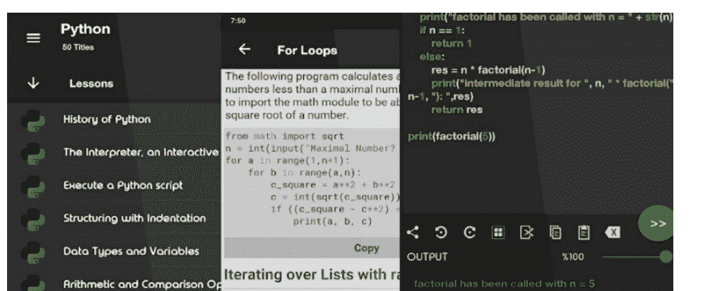

### 20. OpenCV

OpenCV 旨在推动实时计算应用程序开发的增长。它由英特尔创建。这个开源平台在 BSD 许可下授权，任何人都可以免费使用。它包括 2D 和 3D 特征工具包、对象识别算法、移动机器人、人脸识别、手势识别、运动跟踪、分割、SFM、AR、提升、梯度提升树、朴素贝叶斯分类器和许多其他有用的包。

即使 OpenCV 是用 C++ 编写的，它也提供了 Python、Java 和 Octave 的绑定。此应用程序支持 Windows、Linux、iOS、FreeBSD。

## 编程过程

Python 中最简单的事情是编写“Hello World”程序。大多数编程语言需要编写大量的特定方法、或函数、类或程序声明等。但 Python 使您无需这些要求即可开始编程。您可以在“比较”章节中查看我们给出的示例。

Python 是一种解释型语言，因此使用命令行解释器，学生可以轻松检查运算符或函数的工作方式。Python 解释器具有内置的帮助模块，可以显著提高理解语言不同方面的过程。

为了理解编程语言，新生（没有编程经验的学生）需要学习如何像计算机科学家一样思考，这需要付出巨大的努力并完全转变他们的思维范式。[5] Python 代码的实现非常简单，以至于通过基础数学课程的人会发现“变量”和“函数”等工具易于使用。

每当程序员需要软件原型时，可以使用 Python 及其丰富的库。然后，如果需要，可以用低级语言重写软件。Python 的优势是显著的，因此将其作为学习编程的主要语言可以极大地影响学习计算机科学的整体速度。

Fangohr 在他的论文中比较了 C、MATLAB 和 Python，这里我们展示 Python、JAVA 和 C++ 之间的差异。作为 Python 语言简单性的第一个非常初级的例子，我们将演示用三种不同语言编写的“hello world”程序的代码：Java、C++ 和 Python，分别如表 1、2 和 3 所示。

### 表 4. Person 层次结构的 JAVA 代码

```
1. public class Person{
2.     protected String name;
3.     protected String surname;
4.     public Person(String n, String s){
5.         this.name = n; this.surname = s;
6.     }
7. }
8. class Student extends Person{
9.     protected String group;
10.    public Student(String n, String s, String g){
11.        super(n,s); this.group = g;
12.    }
13. }
```

以下是几个示例：

### 表 1. 'hello world' 程序的 JAVA 代码

```
1. public class Hello{
2.     public static void main(String args[]){
3.         System.out.println("Hello, world!");
4.     }
5. }
```

### 表 2. 'hello world' 程序的 C++ 代码

```
1. #include <iostream>
2. using namespace std;
3. int main(){
4.     cout<<"Hello, world!"<<endl;
5. }
```

### 表 3. 'hello world' 程序的 Python 代码

```
1. print "Hello, world!"
```

另一个例子是类声明和继承。表 4、5 和 6 显示了创建小型类层次结构（Person 和 Student 及其构造函数）所需的代码：

### 表 6. Person 层次结构的 Python 代码

```
1. class Person:
2.     def __init__(self, name, surname):
3.         self.name = name; self.surname = surname
4. class Student(Person):
5.     def __init__(self, name, surname, group):
6.         Person.__init__(self, name, surname)
7.         self.group = group
```

### 表 5. Person 层次结构的 C++ 代码

```
1. #include <string>
2. using namespace std;
3. class Person
4. {
5.     public:
6.         Person(string &n, string &s);
7.     protected:
8.         string name, surname;
9. };
10. Person::Person(string &n, string &s)
11. {
12.     name = n; surname = s;
13. }
14. class Student: public Person
15. {
16.     public:
17.         Student(string &n, string &s, string &g);
18.     protected:
19.         string name, surname, group;
20. };
21. Student::Student(string &n, string &s, string &g):Person(n, s)
22. {
23.     group = g
24. }
```

Python 没有安全属性（如：public/private/protected），因此程序变得更简单、更短、更严格且易于理解。此外，Python 非常动态，字段/属性可以动态创建，这在 JAVA 或 C++ 中无法实现。多态性是 Python 函数和类方法的本质，不像 C++ 有其虚拟或非虚拟函数。

运算符重载为 Python 对象提供了额外的能力，因为它可以用于任何自然表达式，不像 JAVA 受限的语法。Python 中的编程缩进在程序结构中起着重要作用，因此任何用 Python 编写的程序都易于阅读和理解。但在 JAVA 或 C++ 的情况下，每个学生都试图使他的\她的程序更短，将其压缩在一行中，或者试图以相同的缩进编写每个语句，这使得程序不仅对老师而且对学生自己都难以阅读和理解。

Python 在其原生库中包含了出色的算法。因此，学生不需要理解长算术来进行大量计算。它已经存在于 Python 的原生长数据类型中。有很好的工具可以对任何数据序列进行排序、查找、切片和连接。有时它们可能不如为特定目的编写的 C++ 代码那样高效，但对于初学者来说，这不是首要考虑的问题。

Python 有其特定的方式来存储和使用变量，因此程序员不再需要定义变量的类型，它们将由变量存储的值来定义。当然，了解不同类型的变量如何存储在内存中很重要，这可以在讲座中讨论，但对于实践来说，跳过关于数据类型的信息更容易。此外，Python 具有自适应且直观的关键字和命令集，极大地帮助学生学习编程。

## 使用 Pandas 进行数据分析

Pandas 可能是 Python 编程语言中最流行的数据分析库。这个库是对底层 NumPy 的高级抽象，而 NumPy 是用纯 C 语言编写的。它的抽象层次相当高，因此你无需处理底层细节，除非你真的想这样做。

如果你正在处理复杂或大型的数据集，请认真考虑使用 Pandas。它基于 numpy 或 scipy，可以说是它们的超集。但它为你提供了许多强大的功能，例如直接从 Microsoft Excel 文件读取数据、进行数据连接等，其中一些功能我们将会介绍。

Pandas 有两种基本数据结构：Series 和 Dataframes。

Series 类似于 numpy 的数组或字典，尽管它附带了许多额外的功能。Dataframes 是一种二维数据结构，包含列和行信息，就像 Excel 文件的字段一样。请记住，Excel 文件有行和列，以及一个可选的标题字段。所有这些数据都可以在 Dataframe 中表示。

Pandas 是一个 Python 库，为数据分析提供了广泛的手段。数据科学家经常处理存储在表格格式中的数据，如 .csv、.tsv 或 .xlsx。Pandas 使得使用类似 SQL 的查询来加载、处理和分析此类表格数据变得非常方便。结合 Matplotlib 和 Seaborn，Pandas 为表格数据的可视化分析提供了广泛的机会。

Pandas 中的主要数据结构是通过 Series 和 DataFrame 类实现的。前者是某种固定数据类型的一维索引数组。后者是一种二维数据结构“一个表”，其中每列包含相同类型的数据。你可以将其视为 Series 实例的字典。DataFrames 非常适合表示真实数据：行对应于实例，列对应于这些实例的特征。

数据可以是：

-   标量值，可以是整数值、字符串
-   Python 字典，可以是键值对
-   Ndarray

Python 是一种非常适合进行数据分析的语言，主要归功于以数据为中心的 Python 包的出色生态系统。Pandas 就是这些包之一，它使得导入和分析数据变得更加容易。

数据分析中最重要的事情是比较值并相应地选择数据。“==”运算符也适用于 Pandas Data frame 中的多个值。

在下面的示例中，从 csv 文件创建了一个数据帧。在性别列中，只有 3 种类型的值（“Male”、“Female”或 NaN）。性别列的每一行都与“Male”进行比较，之后返回一个布尔序列。

```python
# importing pandas package
import pandas as pd
# making data frame from csv file
data = pd.read_csv("employees.csv")
# storing boolean series in new
new = data["Gender"] == "Male"
# inserting new series in data frame
data["New"]= new
# display
data
```

如输出图像所示，对于 Gender= “Male”，New 列中的值为 True，对于“Female”和 NaN 值则为 False。

| | First Name | Gender | Start Date | Last Login Time | Salary | Bonus % | Senior Management | Team | New |
|---|---|---|---|---|---|---|---|---|---|
| 0 | Douglas | Male | 8/6/1993 | 12:42 PM | 97308 | 6.945 | True | Marketing | True |
| 1 | Thomas | Male | 3/31/1996 | 6:53 AM | 61933 | 4.170 | True | NaN | True |
| 2 | Maria | Female | 4/23/1993 | 11:17 AM | 130590 | 11.858 | False | Finance | False |
| 3 | Jerry | Male | 3/4/2005 | 1:00 PM | 138705 | 9.340 | True | Finance | True |
| 4 | Larry | Male | 1/24/1998 | 4:47 PM | 101004 | 1.389 | True | Client Services | True |
| 5 | Dennis | Male | 4/18/1987 | 1:35 AM | 115163 | 10.125 | False | Legal | True |
| 6 | Ruby | Female | 8/17/1987 | 4:20 PM | 65476 | 10.012 | True | Product | False |
| 7 | NaN | Female | 7/20/2015 | 10:43 AM | 45906 | 11.598 | NaN | Finance | False |
| 8 | Angela | Female | 11/22/2005 | 6:29 AM | 95570 | 18.523 | True | Engineering | False |
| 9 | Frances | Female | 8/8/2002 | 6:51 AM | 139852 | 7.524 | True | Business Development | False |

在下面的示例中，布尔序列被传递给数据，只返回 Gender=”Male” 的行。

```python
# importing pandas package
import pandas as pd
# making data frame from csv file
data = pd.read_csv("employees.csv")
# storing boolean series in new
new = data["Gender"] != "Female"
# inserting new series in data frame
data["New"]= new
# display
data[new]
# OR
# data[data["Gender"]=="Male"]
# Both are the same
```

| | First Name | Gender | Start Date | Last Login Time | Salary | Bonus % | Senior Management | Team | New |
|---|---|---|---|---|---|---|---|---|---|
| 0 | Douglas | Male | 8/6/1993 | 12:42 PM | 97308 | 6.945 | True | Marketing | True |
| 1 | Thomas | Male | 3/31/1996 | 6:53 AM | 61933 | 4.170 | True | NaN | True |
| 3 | Jerry | Male | 3/4/2005 | 1:00 PM | 138705 | 9.340 | True | Finance | True |
| 4 | Larry | Male | 1/24/1998 | 4:47 PM | 101004 | 1.389 | True | Client Services | True |
| 5 | Dennis | Male | 4/18/1987 | 1:35 AM | 115163 | 10.125 | False | Legal | True |
| 12 | Brandon | Male | 12/1/1980 | 1:08 AM | 112807 | 17.492 | True | Human Resources | True |
| 13 | Gary | Male | 1/27/2008 | 11:40 PM | 109831 | 5.831 | False | Sales | True |
| 16 | Jeremy | Male | 9/21/2010 | 5:56 AM | 90370 | 7.369 | False | Human Resources | True |
| 17 | Shawn | Male | 12/7/1986 | 7:45 PM | 111737 | 6.414 | False | Product | True |
| 21 | Matthew | Male | 9/5/1995 | 2:12 AM | 100612 | 13.645 | False | Marketing | True |
| 23 | NaN | Male | 6/14/2012 | 4:19 PM | 125792 | 5.042 | NaN | NaN | True |
| 24 | John | Male | 7/1/1992 | 10:08 PM | 97950 | 13.873 | False | Client Services | True |

如输出图像所示，返回了 Gender=”Male” 的数据帧。

Pandas Index 是一个不可变的 ndarray，实现了一个有序的、可切片的集合。它是存储所有 pandas 对象轴标签的基本对象。Pandas Index.data 属性返回给定 Index 对象底层数据的数据指针。

使用 Index.data 属性查找给定 Index 对象底层数据的内存地址。以下是代码示例：

```python
# importing pandas as pd
import pandas as pd
# Creating the index
idx = pd.Index(['Jan', 'Feb', 'Mar', 'Apr', 'May'])
# Print the index
print(idx)
```

现在我们将使用 Index.data 属性查找给定 series 对象底层数据的内存地址。

```python
# return memory address
result = idx.data
# Print the result
print(result)
```

Pandas dataframe.pow() 函数计算 dataframe 和 other 的指数幂，逐元素计算。此函数本质上与 dataframe ** other 相同，但支持填充其中一个输入数据中的缺失值。

使用 pow() 函数查找 dataframe 中每个元素的幂。使用 series 将一行中的每个元素提升到不同的幂。例如：

```python
# importing pandas as pd
import pandas as pd
# Creating the dataframe
df1 = pd.DataFrame({"A":[14, 4, 5, 4, 1],
"B":[5, 2, 54, 3, 2],
"C":[20, 20, 7, 3, 8],
"D":[14, 3, 6, 2, 6]})
# Print the dataframe
df1
```

| | A | B | C | D |
|---|---|---|---|---|
| 0 | 14 | 5 | 20 | 14 |
| 1 | 4 | 2 | 20 | 3 |
| 2 | 5 | 54 | 7 | 6 |
| 3 | 4 | 3 | 3 | 2 |
| 4 | 1 | 2 | 8 | 6 |

Python Series.mod() 用于返回两个数字相除后的余数。在下面的示例中，使用的数据帧包含一些 NBA 球员的数据。操作前的数据帧图像如下所示。

使用 head() 方法提取了数据帧的 5 行。使用 Pandas Series() 方法从 Python 列表创建了一个 series。在新的短数据帧上调用了 mod() 方法，并将创建的列表作为 other 参数传递。代码示例：

| | Name | Team | Number | Position | Age | Height | Weight | College | Salary |
|---|---|---|---|---|---|---|---|---|---|
| 0 | Avery Bradley | Boston Celtics | 0.0 | PG | 25.0 | 6-2 | 180.0 | Texas | 7730337.0 |
| 1 | Jae Crowder | Boston Celtics | 99.0 | SF | 25.0 | 6-6 | 235.0 | Marquette | 6796117.0 |
| 2 | John Holland | Boston Celtics | 30.0 | SG | 27.0 | 6-5 | 205.0 | Boston University | NaN |
| 3 | R.J. Hunter | Boston Celtics | 28.0 | SG | 22.0 | 6-5 | 185.0 | Georgia State | 1148640.0 |
| 4 | Jonas Jerebko | Boston Celtics | 8.0 | PF | 29.0 | 6-10 | 231.0 | NaN | 5000000.0 |
| 5 | Amir Johnson | Boston Celtics | 90.0 | PF | 29.0 | 6-9 | 240.0 | NaN | 12000000.0 |
| 6 | Jordan Mickey | Boston Celtics | 55.0 | PF | 21.0 | 6-8 | 235.0 | LSU | 1170960.0 |
| 7 | Kelly Olynyk | Boston Celtics | 41.0 | C | 25.0 | 7-0 | 238.0 | Gonzaga | 2165160.0 |
| 8 | Terry Rozier | Boston Celtics | 12.0 | PG | 22.0 | 6-2 | 190.0 | Louisville | 1824360.0 |
| 9 | Marcus Smart | Boston Celtics | 36.0 | PG | 22.0 | 6-4 | 220.0 | Oklahoma State | 3431040.0 |
| 10 | Jared Sullinger | Boston Celtics | 7.0 | C | 24.0 | 6-9 | 260.0 | Ohio State | 2569260.0 |
| 11 | Isaiah Thomas | Boston Celtics | 4.0 | PG | 27.0 | 5-9 | 185.0 | Washington | 6912869.0 |
| 12 | Evan Turner | Boston Celtics | 11.0 | SG | 27.0 | 6-7 | 220.0 | Ohio State | 3425510.0 |
| 13 | James Young | Boston Celtics | 13.0 | SG | 20.0 | 6-6 | 215.0 | Kentucky | 1749840.0 |

```python
# importing pandas module
import pandas as pd
# reading csv file from url
data = pd.read_csv("https://media.geeksforgeeks.org/wp-content/uploads/nba.csv")
# creating short data of 5 rows
short_data = data.head()
# creating list with 5 values
list =[1, 2, 3, 4, 3]
# finding remainder
# creating new column
short_data["Remainder"]= short_data["Salary"].mod(list)
# display
```

## 数据可视化

浏览 Python 包索引，你会发现几乎能满足所有数据可视化需求的库，从用于眼动研究的 GazeParser 到用于实时可视化神经网络训练的 pastalog。尽管其中许多库都专注于完成特定任务，但也有一些库无论你身处哪个领域都可以使用。

数据可视化是一门试图通过将数据置于视觉上下文中来理解数据的学科，从而揭示那些可能无法被发现的模式、趋势和相关性。

Python 提供了多个优秀的绘图库，它们集成了许多不同的功能。无论你是想创建交互式、实时还是高度定制化的图表，Python 都有一个适合你的优秀库。

### Matplotlib

matplotlib 是 Python 数据可视化库的鼻祖。尽管已有十多年历史，它仍然是 Python 社区中使用最广泛的绘图库。它的设计初衷是与 MATLAB（一种在 1980 年代开发的专有编程语言）高度相似。

因为 matplotlib 是第一个 Python 数据可视化库，许多其他库都建立在它之上，或者设计为在分析过程中与之协同工作。一些库，如 pandas 和 Seaborn，是 matplotlib 的“封装器”。它们允许你用更少的代码访问 matplotlib 的许多方法。

虽然 matplotlib 适合用于初步了解数据，但对于快速轻松地创建出版级图表并不十分有用。正如 Chris Moffitt 在他对 Python 可视化工具的概述中指出的，matplotlib “功能极其强大，但随之而来的是复杂性”。matplotlib 长期以来因其默认样式而受到批评，这些样式带有明显的 1990 年代风格。即将发布的 matplotlib 2.0 版本承诺进行许多新的样式更改来解决这个问题。

### Seaborn

Seaborn 利用 matplotlib 的强大功能，只需几行代码即可创建精美的图表。关键区别在于 Seaborn 的默认样式和调色板，它们被设计得更具美感和现代感。由于 Seaborn 是建立在 matplotlib 之上的，你需要了解 matplotlib 才能调整 Seaborn 的默认设置。

### Ggplot

ggplot 基于 R 的绘图系统 ggplot2 以及《图形语法》中的概念。ggplot 的操作方式与 matplotlib 不同。它允许你分层添加组件以创建完整的图表。例如，你可以从坐标轴开始，然后添加点，再添加线条、趋势线等。尽管《图形语法》被誉为一种“直观的”绘图方法，但经验丰富的 matplotlib 用户可能需要时间来适应这种新的思维方式。

根据创建者的说法，ggplot 并非为创建高度定制化的图形而设计。它牺牲了复杂性，以换取更简单的绘图方法。

ggplot 与 pandas 紧密集成，因此在使用 ggplot 时，最好将数据存储在 DataFrame 中。

与 ggplot 类似，Bokeh 也基于《图形语法》，但与 ggplot 不同的是，它是 Python 原生的，而不是从 R 移植过来的。它的优势在于能够创建交互式、可随时用于 Web 的图表，这些图表可以轻松输出为 JSON 对象、HTML 文档或交互式 Web 应用程序。Bokeh 还支持流式和实时数据。

### Bokeh

Bokeh 提供了三个具有不同控制级别的接口，以适应不同类型的用户。最高级别用于快速创建图表。它包括创建常见图表的方法，如条形图、箱线图和直方图。中间级别具有与 matplotlib 相同的详细程度，允许你控制每个图表的基本构建块。最低级别面向开发人员和软件工程师。它没有预设的默认值，需要你定义图表的每个元素。

### Pygal

与 Bokeh 和 Plotly 类似，pygal 提供可嵌入 Web 浏览器的交互式图表。其主要区别在于能够将图表输出为 SVG 格式。只要处理的数据集较小，SVG 就能很好地工作。但如果你制作包含数十万个数据点的图表，它们可能会渲染困难并变得迟钝。由于每种图表类型都封装在一个方法中，且内置样式相当美观，因此只需几行代码就能创建出漂亮的图表。

### Plotly

你可能知道 Plotly 是一个在线数据可视化平台，但你是否知道你也可以从 Python notebook 中访问它的功能？与 Bokeh 类似，Plotly 的强项是制作交互式图表，但它提供了一些在大多数库中找不到的图表，如等高线图、树状图和 3D 图表。

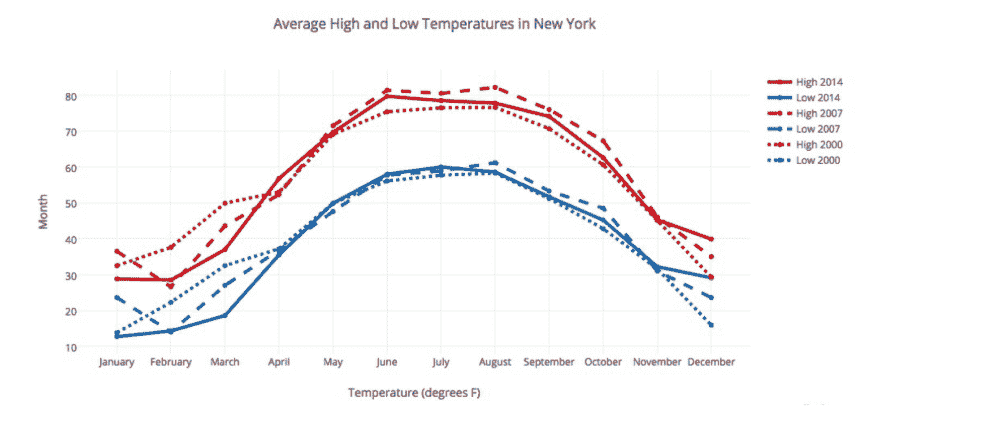

### Geoplotlib

geoplotlib 是一个用于创建地图和绘制地理数据的工具箱。你可以用它创建各种类型的地图，如分级统计图、热力图和点密度图。要使用 geoplotlib，你必须安装 Pyglet，一个面向对象的编程接口。尽管如此，由于大多数 Python 数据可视化库不提供地图功能，因此拥有一个专门用于地图的库是件好事。

### Gleam

Gleam 的灵感来源于 R 的 Shiny 包。它允许你仅使用 Python 脚本将分析转化为交互式 Web 应用程序，因此你无需了解

---

`short_data`

返回了调用者系列和另一个系列中相同索引处值的除法余数。由于未向 fill_value 参数传递任何内容，空值按原样返回。以下是示例图片：

| 姓名 | 球队 | 号码 | 位置 | 年龄 | 身高 | 体重 | 大学 | 薪水 | 添加的值 |
|---|---|---|---|---|---|---|---|---|---|
| 0 | 艾弗里·布拉德利 | 波士顿凯尔特人 | 0.0 | 控球后卫 | 25.0 | 6-2 | 180.0 | 德克萨斯大学 | 7730337.0 | 0.0 |
| 1 | 杰·克劳德 | 波士顿凯尔特人 | 99.0 | 小前锋 | 25.0 | 6-6 | 235.0 | 马凯特大学 | 6796117.0 | 1.0 |
| 2 | 约翰·霍兰德 | 波士顿凯尔特人 | 30.0 | 得分后卫 | 27.0 | 6-5 | 205.0 | 波士顿大学 | NaN | NaN |
| 3 | R.J. 亨特 | 波士顿凯尔特人 | 28.0 | 得分后卫 | 22.0 | 6-5 | 185.0 | 佐治亚州立大学 | 1148640.0 | 0.0 |
| 4 | 约纳斯·杰雷布科 | 波士顿凯尔特人 | 8.0 | 大前锋 | 29.0 | 6-10 | 231.0 | NaN | 5000000.0 | 2.0 |

`pandas.map()` 用于映射两个具有一列相同值的系列中的值。要映射两个系列，第一个系列的最后一列应与第二个系列的索引列相同，并且值应是唯一的。

在下面的示例中，两个系列由相同的数据制成。pokemon_names 列和 pokemon_types 索引列相同，因此 Pandas.map() 匹配其余两列并返回一个新系列。

```python
import pandas as pd
#reading csv files
pokemon_names = pd.read_csv("pokemon.csv", usecols = ["Pokemon"], squeeze = True)
#usecol is used to use selected columns
#index_col is used to make passed column as index
pokemon_types = pd.read_csv("pokemon.csv", index_col = "Pokemon", squeeze = True)
#using pandas map function
new=pokemon_names.map(pokemon_types)
print (new)
```

| 索引 | 类型 |
|---|---|
| 0 | 草 |
| 1 | 草 |
| 2 | 草 |
| 3 | 火 |
| 4 | 火 |
| 5 | 火 |
| 6 | 水 |
| 7 | 水 |
| 8 | 水 |
| 9 | 虫 |
| 10 | 虫 |
| 11 | 虫 |
| 12 | 虫 |
| 13 | 虫 |
| 14 | 虫 |
| 15 | 一般 |
| 16 | 一般 |
| 17 | 一般 |

此函数仅适用于 Series。传递 DataFrame 会导致属性错误。传递长度不同的系列将产生与调用者长度相同的输出系列。

```
In [7]: data2.map(data)

AttributeError                            Traceback (most recent call last)
<ipython-input-7-d750a707f3b6> in <module>()
----> 1 data2.map(data)

c:\python36-32\lib\site-packages\pandas\core\generic.py in __getattr__(self, name)
   4370         if self._info_axis._can_hold_identifiers_and_holds_name(name):
   4371             return self[name]
-> 4372         return object.__getattribute__(self, name)
   4373 
   4374     def __setattr__(self, name, value):

AttributeError: 'DataFrame' object has no attribute 'map'
```

任何其他语言，如HTML、CSS或JavaScript。Gleam可与任何Python数据可视化库配合使用。一旦创建了图表，你可以在其上构建字段，以便用户可以筛选和排序数据。

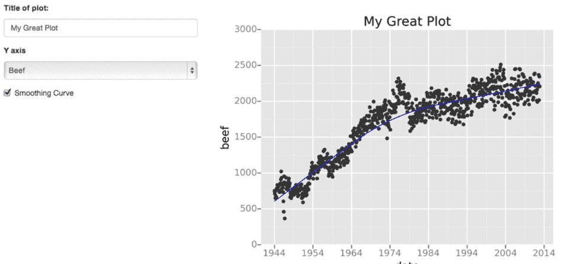

### Missingano

处理缺失数据是一件麻烦事。missingno允许你通过可视化摘要快速评估数据集的完整性，而无需费力地浏览表格。你可以根据完成度筛选和排序数据，或通过热图或树状图发现相关性。

### Leather

Leather的创建者Christopher Groskopf说得好：“Leather是为那些需要图表且不在乎它们是否完美的Python用户设计的图表库。”它旨在处理所有数据类型，并以SVG格式生成图表，因此你可以缩放它们而不会损失图像质量。由于这个库相对较新，部分文档仍在编写中。你可以制作的图表相当基础，但这正是其设计意图。

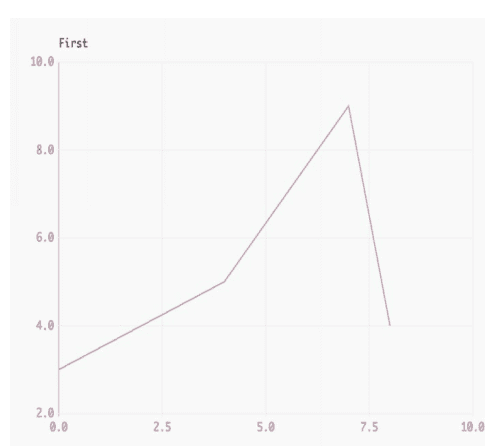

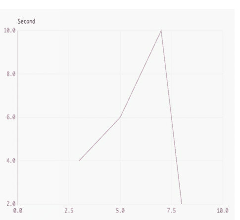

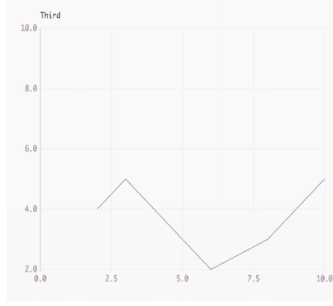

### 直方图

在Matplotlib中，我们可以使用`hist`方法创建直方图。如果我们传入分类数据，例如葡萄酒评论数据集中的`points`列，它将自动计算每个类别的出现频率。

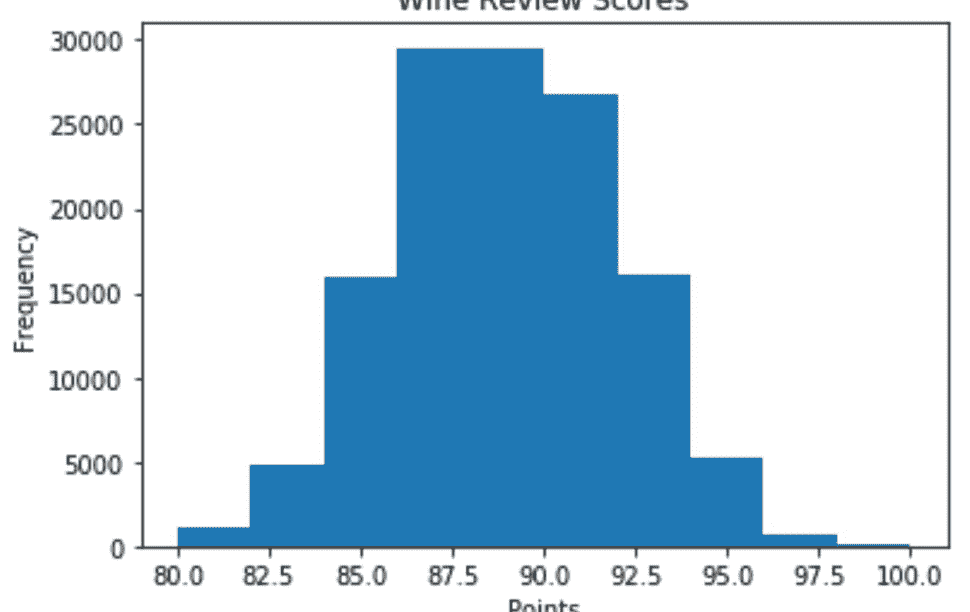

### 条形图

可以使用`bar`方法创建条形图。条形图不会自动计算类别的频率，因此我们将使用pandas的`value_counts`函数来完成此操作。条形图适用于类别不多（少于30个）的分类数据，因为否则可能会变得相当混乱。

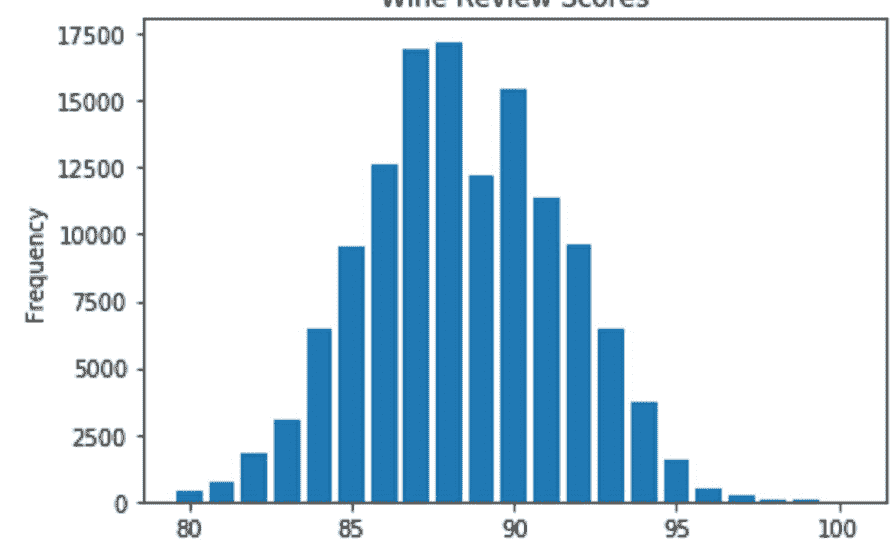

### Pandas可视化

Pandas是一个开源的高性能、易于使用的库，提供数据结构（如数据框）和数据分析工具，例如我们将在本文中使用的可视化工具。

Pandas可视化使得从pandas数据框和序列创建图表变得非常容易。它还具有比Matplotlib更高层次的API，因此我们只需更少的代码就能获得相同的结果。

### 折线图

要在Pandas中创建折线图，我们可以调用`<dataframe>.plot.line()`。虽然在Matplotlib中我们需要遍历要绘制的每一列，但在Pandas中我们不需要这样做，因为它会自动绘制所有可用的数值列。

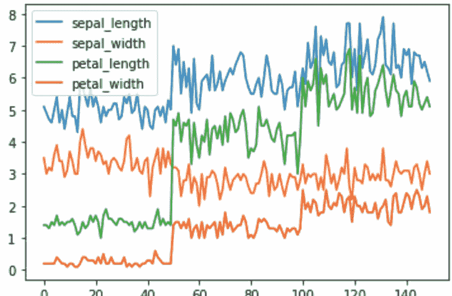

## 数据挖掘

数据挖掘是从大型数据库分析中发现预测性信息的过程。对于数据科学家来说，数据挖掘可能是一项模糊而艰巨的任务，它需要多样化的技能和对多种数据挖掘技术的了解，才能从原始数据中成功获取洞察。你需要理解统计学基础以及可以帮助你进行大规模数据挖掘的不同编程语言。

数据挖掘的期望结果是从给定数据集中创建一个模型，该模型的洞察可以推广到类似的数据集。一个成功的数据挖掘应用的实际例子可以在银行和信贷机构的自动欺诈检测中看到。

你的银行可能有一项政策，如果他们检测到你账户上的任何可疑活动，例如重复的ATM取款或在你注册居住州以外的大额购买，就会提醒你。这与数据挖掘有什么关系？数据科学家通过应用算法，将交易与历史上的欺诈和非欺诈收费模式进行比较，从而创建了这个系统来分类和预测交易是否为欺诈。

这只是数据挖掘众多强大应用中的一个。数据挖掘的其他应用包括基因组测序、社交网络分析或犯罪成像，但最常见的用例是分析消费者生命周期的各个方面。公司使用数据挖掘来发现消费者偏好，根据购买活动对不同消费者进行分类，并确定什么造就了一个高价值客户，以及可以对提高收入流和削减成本产生深远影响的信息。

有多种方法可以从数据集中构建预测模型，数据科学家应该理解这些技术背后的概念，以及如何使用代码生成类似的模型和可视化。这些技术包括：

- 回归
- 分类
- 聚类分析
- 关联与相关分析
- 异常值分析

回归代表通过优化误差减少来估计变量之间的关系。

分类代表识别对象属于哪个类别。一个例子是将电子邮件分类为垃圾邮件或合法邮件，或者查看一个人的信用评分并批准或拒绝贷款请求。

聚类分析是基于数据的已知特征，发现数据对象的自然分组。一个例子可以在市场营销中看到，分析可以揭示具有独特行为的客户分组，这些分组可以应用于商业战略决策。

关联与相关分析代表寻找变量之间是否存在不明显独特关系。一个著名的例子是啤酒和尿布。周末购买尿布的男性更有可能购买啤酒，因此商店将它们放在一起以增加销售。

异常值分析是检查异常值，以探究所述异常值的潜在原因和理由。一个例子是在欺诈检测中使用异常值分析，并试图确定超出常规的行为模式是否为欺诈。

企业的数据挖掘通常在事务性和实时数据库上执行，该数据库允许轻松使用数据挖掘工具进行分析。一个例子是在线分析处理服务器或OLAP，它允许用户在数据服务器内进行多维分析。OLAP允许企业查询和分析数据，而无需下载静态数据文件，这在数据库每天都在增长的情况下很有帮助。然而，对于想要学习数据挖掘并自行练习的人来说，iPython notebook将非常适合处理大多数数据挖掘任务。

让我们逐步了解如何使用Python执行数据挖掘，使用上述两种数据挖掘算法：回归和聚类。

首先，如果你想跟着做，请在你的桌面上安装Jupyter。它是一个免费的平台，提供了一个本质上是iPython notebook的处理器，使用起来非常直观。按照这些说明进行安装。我在这里做的一切都将在Jupyter中的一个Python文件中完成。

我们将使用Python的Pandas模块来清理和重构我们的数据。Pandas是一个用于处理数据结构和分析的开源模块，对于使用Python的数据科学家来说无处不在。它允许数据科学家以任何格式上传数据，并提供一个简单的平台来组织、排序和操作这些数据。

Numpy是科学计算的必要包。它包含一个极其通用的结构来处理数组，这是scikit-learn用于输入数据的主要数据格式。

Matplotlib代表Python中数据可视化的基础包。这个模块允许创建从简单的散点图到三维等高线图的所有内容。请注意，我们从matplotlib安装pyplot，这是模块层次结构中最高级的状态机环境。如果这对你来说没有意义，不用担心，只需确保将其导入到你的notebook中。

Scipy是Python中统计工具的集合。Stats是导入回归分析函数的scipy模块。

拥有回归摘要输出对于检查回归模型和用于估计和预测的数据的准确性很重要，但可视化回归是采取的重要一步，以更易于理解的格式传达回归结果。

使用Seaborn可视化线性关系代表了提供具体示例并展示如何修改回归图和显示你可能不知道如何编码的新功能的文档。它还教你如何拟合不同类型的模型，例如二次模型或逻辑模型。

分类是数据挖掘最大的用途之一，无论是在实际使用中还是在研究中。与之前一样，我们有一组样本，代表我们感兴趣分类的对象或事物。我们还有一个新的数组，即类别值。这些类别值为我们提供了样本的分类。以下是一些例子：

- 通过查看植物的测量值来确定其物种。这里的类别值是：这是哪个物种？
- 确定图像中是否包含狗。类别是：这张图像中有狗吗？
- 根据测试结果确定患者是否患有癌症。类别是：这位患者患有癌症吗？

虽然上面的许多例子是二元（是/否）问题，但它们不必如此，就像本节中的植物物种分类一样。分类应用的目标是在一组具有已知类别的样本上训练一个模型，然后将该模型应用于具有未知类别的新未见样本。例如，你想在你的过去的电子邮件，你已将其标记为垃圾邮件或非垃圾邮件。你想使用该分类器来判断下一封邮件是否为垃圾邮件，而无需自己进行分类。数据挖掘包含多种预测建模技术，你可以使用各种数据挖掘软件。学习使用Python应用这些技术颇具挑战，需要通过实践和勤奋才能在自己的数据集上应用。初期你会遇到无数的错误、报错信息和障碍。在数据挖掘尝试中，请保持坚持和勤奋。

OneR是一种简单的算法，它通过寻找特征值中最频繁的类别来预测样本的类别。OneR是One Rule的缩写，表示我们仅通过选择性能最佳的特征来使用单一规则进行分类。尽管后续的一些算法复杂得多，但这种简单的算法在多个真实数据集上已被证明具有良好的性能。

该算法首先遍历每个特征的每个值。对于该值，统计每个类别中具有该特征值的样本数量。记录该特征值最频繁的类别及其预测误差。例如，如果一个特征有两个值0和1，我们首先检查所有值为0的样本。对于该值，可能有20个属于A类，60个属于B类，另外20个属于C类。该值最频繁的类别是B，有40个实例属于不同类别。

该特征值的预测为B，误差为40，因为有40个样本的类别与预测不同。然后我们对该特征的值1执行相同的过程，接着对所有其他特征值组合进行相同操作。

过拟合是指创建一个模型能很好地分类我们的训练数据集，但在新样本上表现不佳的问题。解决方案很简单：切勿使用训练数据来测试你的算法。

### Scikit-learn

Scikit-learn是一个易于使用的通用Python机器学习工具箱。Scikit-learn是一个提供多种监督和无监督机器学习技术的库。监督机器学习指的是从标记的训练数据中推断函数的问题，它包括回归和分类。另一方面，无监督机器学习指的是在数据中发现有趣模式或结构的问题，它包括聚类和降维等技术。除了统计学习技术，scikit-learn还为模型选择、特征提取和特征选择等常见任务提供了实用工具。

Scikit-Learn包是Python的核心机器学习包，包含支持基础机器学习项目所需的大部分必要模块。该库为从业者提供了一个统一的API（即应用程序编程接口），只需编写几行代码即可轻松使用机器学习算法完成预测或分类任务。它是Python中少数几个承诺保持算法和接口层简单、不为覆盖整个机器学习功能领域而使其复杂化的库之一。该包主要用Python编写，并整合了LibSVM和LibLinear等C++库，用于支持向量机和广义线性模型的实现。该包依赖于Pandas、numpy和scipy。

scikit-learn之所以有用，主要在于其项目愿景。代码质量和完善的文档构成了核心愿景。对于给定算法，稳健的实现优先于尽可能多的功能包含，并且实现得到了单元测试的强力支持。

Scikit-learn提供了一个以Estimator概念为中心的面向对象接口。它可能是一个分类、回归或聚类算法，或者是一个从原始数据中提取或过滤有用特征的转换器。示例代码：

```python
class Estimator(object):
    def fit(self, X, y=None):
        """Fits estimator to data. """
        # set state of `self`
        return self
    def predict(self, X):
        """Predict response of `X`."""
        # compute predictions `pred`
        return pred
```

在拟合过程中，估计器的状态存储在具有尾随下划线（'_'）的实例属性中。例如，LinearRegression估计器的系数存储在该属性中。

能够生成预测的估计器提供Estimator.predict方法。在回归情况下，Estimator.predict将返回预测的回归值。在分类情况下，它将返回相应的类别标签。能够预测类别成员概率的分类器有一个方法Estimator.predict_proba，它返回一个形状为(n_samples, n_classes)的二维numpy数组，其中类别按字典顺序排列。

最后，有一种特殊类型的Estimator称为Transformer，它转换输入数据，例如选择特征子集或基于原始特征提取新特征。

通常，Transformer不提供predict方法，但在某些情况下可能提供。我们将在本文中使用的一个转换器是sklearn.preprocessing.StandardScaler。尽管回归和分类看起来非常不同，但它们实际上是相似的问题。

在回归中，我们对响应的预测是实数值。另一方面，在分类中，响应是互斥的类别标签，例如“这封邮件是垃圾邮件/正常邮件吗？”或“这笔信用卡交易是欺诈性的吗？”如果类别数等于二，则称为二元分类问题；如果类别数多于两个，则称为多类分类问题。在下文中，我们将假设是二元分类，因为这是更一般的情况，我们总是可以将多类问题表示为一系列二元分类问题。

我们也可以将分类视为一个函数估计问题，其中我们想要估计的函数将两个类别分开。

不同的分类技术通常可以通过它们能够学习的决策面类型来比较。决策面描述了模型在预测变量的哪些值上改变其预测，它可以呈现几种不同的形状：分段常数、线性、二次、Voronoi镶嵌等...

本节将介绍三种流行的分类技术：逻辑回归、判别分析和最近邻。我们将通过研究它们能够建模的决策边界来探讨它们的优缺点。

逻辑回归可以看作是线性回归在分类问题上的扩展。线性回归的局限性之一是它无法提供类别概率估计。这通常很有用，例如，当我们想手动检查最欺诈性的案例时。

线性判别分析（简称LDA）是另一种流行的技术，它与LogisticRegression有一些相似之处。LDA也在两个类别之间找到线性边界，其中一侧的点被分类为一个类别，另一侧的点被分类为另一个类别。

LDA和LogisticRegression之间的主要区别在于各自选择线性决策边界的方式：线性判别分析通过对数据生成过程进行分布假设来建模决策边界，而逻辑回归则根据特征值建模样本属于某个类别的概率。

最近邻与上述模型有根本不同，因为它是一种所谓的非参数技术。模型的参数数量可以随着训练数据规模的增长而无限增长。此外，它可以建模非线性决策边界，这对于前两个数据集（月牙形和圆形）很重要。

在监督学习中，我们有一个包含特征和标签的数据集。任务是构建一个估计器，能够根据给定的特征集预测对象的标签。一些更复杂的例子包括：

- 给定通过望远镜拍摄的物体的多色图像，确定该物体是恒星、类星体还是星系。
- 给定一个人的照片，识别照片中的人。
- 给定一个人看过的电影列表及其个人评分，推荐他们可能喜欢的电影列表。

### 1. iPython

IPython，即交互式Python，是一个用于多种编程语言交互式计算的命令行外壳，最初为Python编程语言开发，它提供了内省、富媒体、外壳语法、制表符补全和历史记录等功能。

IPython提供了一些特性，例如：

-   交互式外壳
-   基于浏览器的笔记本界面，支持代码、文本、数学表达式、内联绘图和其他媒体。
-   支持交互式数据可视化和GUI工具包的使用。
-   灵活、可嵌入的解释器，可加载到用户自己的项目中。
-   用于并行计算的工具。

IPython基于一个提供并行和分布式计算的架构。IPython使得并行应用程序能够以交互方式进行开发、执行、调试和监控。该架构抽象了并行性，使IPython能够支持多种不同的并行风格，包括：

-   单程序多数据（SPMD）并行
-   多程序多数据（MIMD）并行
-   使用MPI的消息传递
-   任务并行
-   数据并行
-   这些方法的组合
-   用户自定义的自定义方法

随着IPython 4.0的发布，其并行计算功能变为可选，并作为`ipyparallel` Python包发布。

IPython经常借鉴SciPy技术栈的库，如NumPy和SciPy，通常与众多科学Python发行版之一一起安装。IPython提供了与SciPy技术栈中一些库的集成，特别是matplotlib，在与Jupyter notebook一起使用时能生成内联图表。Python库可以实现IPython特定的钩子来定制富对象显示。例如，SymPy在IPython上下文中使用时，可以将数学表达式渲染为LaTeX。

IPython允许与Tkinter、PyGTK、PySide和wxPython进行非阻塞交互。IPython可以使用异步状态回调和MPI交互式地管理并行计算集群。IPython也可以用作系统外壳的替代品。其默认行为与Unix外壳大体相似，但它允许自定义，并能在实时Python环境中灵活执行代码。使用IPython作为外壳替代品并不常见，现在推荐使用Xonsh，它提供了IPython的大部分功能，并具有更好的外壳集成。

2014年，Fernando Pérez宣布了一个从IPython衍生出来的项目，名为Project Jupyter。IPython继续作为Python外壳和Jupyter的内核存在，但笔记本界面和其他与语言无关的部分被移至Jupyter名称下。Jupyter是语言无关的，其名称指的是Jupyter支持的核心编程语言，即Julia、Python和R。

### 2. Jupyter

Jupyter Notebook，前身为IPython Notebooks，是一个基于Web的交互式计算环境，用于创建Jupyter notebook文档。“笔记本”这个术语在口语中可以指代许多不同的实体，主要是Jupyter Web应用程序、Jupyter Python Web服务器或Jupyter文档格式，具体取决于上下文。Jupyter Notebook文档是一个JSON文档，遵循一个版本化的模式，包含一个有序的输入或输出单元格列表，这些单元格可以包含代码、文本、数学、绘图和富媒体，通常以`.ipynb`扩展名结尾。

Jupyter Notebook可以通过Web界面中的“Download As”、通过`nbconvert`库或在shell中使用`jupyter nbconvert`命令行接口转换为多种开放标准输出格式。

为了简化在Web上可视化Jupyter notebook文档，`nbconvert`库通过NbViewer作为服务提供，它可以接受任何公开可用的notebook文档的URL，即时将其转换为HTML并显示给用户。

Jupyter Notebook提供了一个基于浏览器的REPL，构建于多个流行的开源库之上：

-   IPython
-   OMQ
-   Tornado
-   jQuery
-   Bootstrap
-   MathJax

Jupyter内核是一个负责处理各种类型请求的程序，如代码执行、代码补全、检查和提供回复。内核通过网络使用ZeroMQ与Jupyter的其他组件通信，因此可以位于相同或远程的机器上。

与Jupyter中许多其他类似笔记本的接口不同，内核并不知道它们附加到特定文档，并且可以同时连接到多个客户端。通常内核只允许执行单一语言，但也有少数例外。

JupyterHub是一个用于Jupyter Notebooks的多用户服务器。它旨在通过生成、管理和代理多个独立的Jupyter Notebook服务器来支持许多用户。虽然JupyterHub需要管理服务器，但像Jupyo这样的第三方服务通过在云中托管和管理多用户Jupyter notebooks提供了JupyterHub的替代方案。

JupyterLab是Project Jupyter的下一代用户界面。它在一个灵活而强大的用户界面中提供了经典Jupyter Notebook的所有熟悉构建块。第一个稳定版本于2018年2月20日发布。

对于学习者以及更高级的数据科学家来说，Jupyter Notebook是目前流行的数据科学工具之一。交互式环境不仅非常适合教学和学习，以及与同行分享你的工作，还能确保研究的可重复性。然而，当你探索如何使用这个笔记本时，你会经常遇到IPython。

许多计算笔记本是在Maple和Mathematics笔记本之后创建的。然而，本节将重点介绍那些促进了数据科学笔记本兴起的笔记本。

Sage笔记本作为一个基于浏览器的系统，首次发布于2000年代中期，然后在2007年发布了一个更强大的新版本，该版本具有用户账户，并可用于将文档公开。它类似于Google Docs的UI设计，因为Sage笔记本的布局是基于Google笔记本的布局。

2001年底，大约在Guido van Rossum开始在荷兰国家数学与计算机科学研究所开发Python二十年后，Fernando Pérez开始开发IPython。该项目深受Mathematica笔记本和Maple工作表的影响，就像Sage笔记本和许多后续项目一样。

“Jupyter”这个名字的灵感来源于对科学领域领先开放语言的思考，尽管它看起来像任何其他首字母缩写词，但它从未意味着其他语言不受欢迎。

R Markdown和Jupyter Notebook共享交付可重复研究的特性。

（例如，所谓的推荐系统：一个著名的例子是Netflix Prize）。

监督学习进一步分为两类：分类和回归。在分类中，标签是离散的，而在回归中，标签是连续的。例如，在天文学中，确定一个天体是恒星、星系还是类星体的任务就是一个分类问题。标签来自三个不同的类别。另一方面，我们可能希望根据这些观测来估计天体的年龄。这将是一个回归问题，因为标签是一个连续量。

大多数机器学习算法将需要比玩具数据集更多的带标签观测值，该包内置了样本生成器例程，用于生成具有所需观测数量的带标签数据集。样本生成器`make_moons`接受两个关键参数`n_samples`和`noise`。实践者可以向该例程提供要生成的样本数量以及添加到输入特征中的噪声。

加载数据集后，必须将其拆分为训练集和测试集，以开始算法训练。该包有一个例程可以将pandas DataFrame或numpy数组拆分为训练集和测试集。该方法接受输入特征、目标数组、测试集的大小和分层数组。分层是一个方便的选项，因为目标类别的比例在训练集和测试集中保持一致。目标分布在训练集和测试集之间将是相同的。

必须缩放所有连续的数值输入特征，以确保没有单个特征影响模型性能和输入特征。A的范围可能在数百万，而B在数百，如果不缩放到标准尺度，模型将无法学习特征B中的方差。该包提供了介于0和1之间的MinMax缩放器和标准缩放器，后者的缩放输出将包含负值。

模型参数调整是一项艰巨的任务，必须记录多次迭代及其性能指标，直到找到最佳参数集。在Scikit-learn中，参数调整大多通过`GridSearchCV`例程简化。给定一组模型参数组合，该方法运行所有可能的组合，并返回最佳模型参数以及最佳估计器。该方法还执行交叉验证，因此最佳估计器不会过拟合训练数据。

实践者可以编写自定义估计器。自定义估计器可以是管道的一部分。管道接受多个估计器并按顺序执行它们。它会将前一个估计器的输出作为列表中下一个估计器的输入传递。可以使用管道设计整个模型过程，并且可以直接拟合到数据集。这个例程在简化模型生产部署方面非常有帮助。

任何机器学习模型都需要数值输入特征（连续或分类），而文本特征不能很好地集成。Scikit-learn对此也有解决方案。使用标签编码器或独热编码器。

工作流，即将代码、输出和文本编织在单个文档中，支持交互式小部件并输出到多种格式。

然而，两者也存在差异，例如前者侧重于可重复的批量执行、纯文本表示、版本控制、生产输出，并提供与你用于 R 脚本相同的编辑器和工具。笔记本则强调交互式执行模型。它们不使用纯文本表示，而是使用结构化数据表示，例如 JSON。

当然，当你进入数据科学领域时，还有更多笔记本可供考虑。近年来，许多新的替代方案已经出现在数据科学家和数据科学爱好者面前。不仅有 Beaker Notebook、Apache Zeppelin、Spark Notebook、DataBricks Cloud 等，还有其他工具如 Rodeo IDE 或 nteract，它们也使你的数据分析变得交互式和可重复。这里值得注意的一点是，nteract 与这里提到的其他工具不同，因为它利用了 Jupyter 架构，例如协议和格式。

而且笔记本似乎将长期存在。最近，下一代 Jupyter Notebook 已经介绍给社区：JupyterLab。该 Notebook 应用程序不仅支持笔记本，还包括文件管理器、文本编辑器、终端模拟器、用于运行 Jupyter 进程的监视器、IPython 集群管理器和用于显示帮助的分页器。

你现在可能认为这没什么新意。Jupyter Notebook 也有所有这些功能。然而，JupyterLab 使你能够以新颖的方式利用交互式计算的所有这些构建块。

可以通过 shell 转义将 IPython 适配用于系统 shell 使用。以 ‘!’ 开头的行会直接传递给系统 shell。例如，‘!ls ‘ 将在当前目录中运行 ls。你可以使用语法 myfiles=!ls 将系统命令的结果分配给 Python 变量。但是，如果你想将 ls 函数的结果显式打印为字符串列表，而不将其分配给变量，请使用两个感叹号 (!!ls) 或不带赋值的 %sx 魔术命令。

请注意，!! 命令不能分配给变量，但魔术的结果（只要它返回一个值）可以分配给变量。

IPython 还允许你在进行系统调用时扩展 Python 变量的值：只需将你的变量或表达式用花括号 ({}) 括起来。此外，在带有 ! 或 !! 的 shell 命令中，任何以 $ 为前缀的 Python 变量都会被扩展。在下面的代码块中，你将看到你回显了 sys 变量的 argv 属性。请注意，你也可以使用 $/$$ 语法从系统输出中获取 Python 变量，以便稍后用于进一步的脚本编写。

要将字面量 $ 传递给 shell，请使用双 $$。如果你想访问 shell 和环境变量（如 $PATH），则需要这个字面量 $。

请注意，除了 IPython 之外，还有其他内核具有特殊语法以确保行作为 shell 命令执行。这些在严格意义上并不是真正的“魔术”，因为它们可能以任何名称实现，并且可能与 IPython 魔术完全不同。

正如你可能已经知道的，IPython 内核使用 % 语法元素，因为它在 Python 中不是有效的单元运算符。然而，以 %% 开头的行表示单元格魔术：它们不仅将当前行的其余部分作为参数，还将当前执行块中其下方的所有行作为参数。单元格魔术实际上可以对接收到的输入进行任意修改，这些输入甚至可能根本不是有效的 Python 代码。它们将整个块作为单个字符串接收。

魔术是特定于内核并由内核提供的，旨在使你在 Jupyter Notebook 中的工作和体验更具交互性。某个内核中是否可用魔术命令取决于内核开发人员以及内核本身。

IPython 内核的一个主要功能是能够显示运行代码单元格的输出图表。该内核旨在与 matplotlib 数据可视化库无缝协作以提供此功能。要使用它，请使用魔术命令 %matplotlib。

因此，默认情况下，你的图表将显示在单独的窗口中。此外，你还可以指定后端，例如 inline 或 qt，绘图命令的输出将内联显示或通过不同的 GUI 后端显示。

接下来，你还可以使用魔术在每次出现未捕获异常时调用 Python 调试器 %pdb。这将引导你通过触发异常的代码部分，从而能够快速找到错误的根源。

你也可以使用带有 ‘d’ 选项的 %run 魔术命令在 Python 调试器的控制下运行脚本。它将自动为你设置初始断点。最后，你还可以使用 %debug 魔术以更轻松地访问调试器。

你可以使用 %load_ext 魔术通过其模块名称加载 IPython 扩展。IPython 扩展是修改 shell 行为的 Python 模块。扩展可以注册魔术、定义变量，并通常修改用户命名空间以提供在代码单元格中使用的新功能。以下是一些示例：

- 使用 %load_ext oct2py.ipython 从 Python 无缝调用 M 文件和 Octave 函数，
- 使用 %load_ext rpy2.ipython 使用在 Python 进程中嵌入运行的 R 的接口，
- 使用 %load_ext Cython 使用 Python 到 C 编译器，
- 使用 sympy.init_printing() 自动漂亮打印 Sympy Basic 对象

如果你正在使用另一个内核，并且想知道是否可以使用魔术命令，那么了解一些基于 metakernel 项目构建的内核可能会很方便，这些内核在大多数情况下将使用你在 IPython 内核中也会找到的相同魔术。你可以在此处找到 metakernel 魔术的列表。metakernel 是一个 Jupyter 或 IPython 内核模板，包含核心魔术函数。

一些示例：

- MATLAB 内核 matlab_kernel，
- Octave 内核 octave_kernel，
- Java9 内核 java9_kernel，
- Wolfram 内核 wolfram_kernel，
- SAS 内核 sas_kernel。……以及更多！

转换和格式化笔记本是你将在 Jupyter 生态系统中找到的功能。你通常会发现用于这些任务的两个工具是 nbconvert 和 nbformat。

你可以使用前者将笔记本转换为各种其他格式，以熟悉的格式呈现信息、发布研究并将笔记本嵌入论文中、与他人协作并与更广泛的受众分享内容。

后者基本上包含 Jupyter Notebook 格式，是理解笔记本文件是简单 JSON 文档的关键，这些文档包含元数据、笔记本格式的版本以及存储所有文本和代码的单元格。

保存和加载笔记本是 Jupyter Notebook 应用程序的一项功能。你可以加载以 .ipynb 文件扩展名保存的笔记本，这些笔记本是其他人通过下载并在 Jupyter 应用程序中打开文件创建的。更具体地说，你可以创建一个新笔记本，然后通过单击“文件”选项卡、单击“打开”并选择你下载的笔记本来选择打开文件。

并行计算网络是 IPython 项目的一部分，但从 4.0 开始，它是一个名为 ipyparallel 的独立包。该包基本上是一组用于控制 Jupyter 集群的 CLI 脚本。

尽管它被分离出来，但它仍然是 IPython 生态系统中一个通常被忽视的强大组件。它之所以如此强大，是因为它允许你在多台机器上启动许多分布式内核，而不是运行单个 Python 内核。

ipyparallel 的典型用例例如，你需要多次运行模型以估计其输出的分布或它们如何随输入参数变化的情况。当模型的运行是独立的时，你可以通过在集群中的多台计算机上并行运行它们来加速该过程。

此功能是 Jupyter 生态系统的一部分。你有 Jupyter Console 和 Jupyter 终端应用程序。然而，IPython 一直用于表示原始的、交互式的 Python 命令行终端。它提供了一个增强的、可读的打印循环环境，特别适合用于科学计算。这是2011年Notebook工具引入之前的标准，该工具开始为Python提供一个现代且功能强大的Web界面。

其次，你还有IPython控制台，它启动两个进程。原始的IPython终端shell和默认配置文件或内核（除非另有说明，否则会启动）。默认情况下，这是Python。IPython控制台现已弃用，如果你想启动它，需要使用Jupyter Console，这是一个基于终端的Jupyter内核控制台前端。此代码基于单进程IPython终端。Jupyter Console在终端提供IPython的交互式客户端体验，但能够连接到任何Jupyter内核，而不仅仅是IPython。这让你可以在终端测试任何已安装的Jupyter内核，而无需为此启动一个完整的Notebook。控制台允许基于控制台与其他Jupyter内核（如IJulia、IRKernel）进行交互。

## 总结

总之，我们想说，对编程的初步理解对计算机科学家至关重要。由于高级编程语言的复杂性，学习它们似乎并不容易。第一门编程语言会深刻影响学生对编程和计算机科学整体的理解和学习欲望。

因此，将精确且适当的策略应用于语言学习过程非常重要。如今，一些顶尖大学要么使用Python向学生教授编程入门，要么开发并教授他们自己的简单编译器，以便学生更容易理解。

结果我们可以看到，学生通过使用Python能很好地理解编程。他们拥有命令行工具，可以立即测试他们的理论。此外，解释器中有一个非常好的帮助工具，总是提醒特定类的结构。

学生喜欢简单的turtle库，它提供了在画布上绘图的非常简单的接口。这帮助他们理解像循环和条件这样的简单语句。但主要的结果，当然，取决于学生学习编程和计算机科学的意愿。在实验部分，我们比较了使用Java语言教授的课程期中成绩与使用Python教授的同一课程期中成绩的结果。我们观察到成绩提高了16%

### 从数据中学习

机器学习赋予计算机在没有明确编程的情况下学习的能力。它是计算机科学的一个子领域。

这个想法源于人工智能的工作。机器学习探索研究和构建能够学习并基于数据做出预测的算法。这些算法遵循编程指令，但也可以基于数据做出预测或决策。

机器学习在无法设计和编程明确算法的地方进行。例子包括垃圾邮件过滤、检测网络入侵者或试图数据泄露的恶意内部人员、光学字符识别（OCR）、搜索引擎和计算机视觉。

机器学习，即理解数据的算法的应用和科学，是所有计算机科学中最令人兴奋的领域。我们生活在一个数据丰富的时代，使用来自机器学习领域的自学习算法，我们可以将这些数据转化为知识。得益于近年来开发的许多强大的开源库，现在可能是进入机器学习领域并学习如何利用强大算法发现数据模式的最佳时机。

ML的使用越来越广泛，原因有很多...

- 机器最终会从自己的错误中改进自己。
- 比人快，所以节省时间。
- 这需要几年时间，通过处理许多参数直到它正确。
- 它广泛用于人脸识别和照片标注。它用于从摄像头捕捉小偷或任何涉及犯罪现场的人。

机器学习是计算机科学的一个领域。它也是一种人工智能，使程序员能够以更简单的方式编写程序。它更专注于开发程序，教计算机在接触新数据时改变并成长。其目标是理解并遵循方法，使用算法自动完成该任务，无需任何人类协助。1959年，Arthur Samuel将机器学习定义为“赋予计算机在没有明确编程的情况下学习能力的研究领域”。

ML算法的使用越来越广泛，原因有很多。主要原因是机器学习有一个系统，该系统在某些数据集上进行训练，如果给定特定任务，最终会学习并改进。机器学习比人类快得多，它投入时间并从给定给机器的数据或从它的错误中自我学习。这需要几年的工作，通过许多参数直到它正确。目前，ML用于在无序数据集中发现相关数据的特征。

机器学习与计算统计密切相关，后者专注于使用计算机进行预测。数学优化的研究为机器学习领域提供了方法、理论和应用领域。数据挖掘是机器学习内的一个研究领域，专注于通过无监督学习进行探索性数据分析。在跨业务问题的应用中，机器学习也被称为预测分析。

机器学习任务分为几个大类。在监督学习中，算法从一组包含输入和期望输出的数据中构建数学模型。例如，如果任务是确定图像是否包含某个对象，监督学习算法的训练数据将包括包含和不包含该对象的图像，并且每个图像都会有一个标签，指定它是否包含该对象。在特殊情况下，输入可能仅部分可用或仅限于特殊反馈。半监督学习算法从不完整的训练数据中开发数学模型，其中一部分样本输入没有标签。

分类算法和回归算法是监督学习的类型。分类算法用于输出仅限于有限值集的情况。对于过滤电子邮件的分类算法，输入将是传入的电子邮件，输出将是文件夹的名称，用于归档该电子邮件。对于识别垃圾邮件的算法，输出将是“垃圾邮件”或“非垃圾邮件”的预测，由布尔值true和false表示。回归算法因其连续输出而得名，这意味着它们可能在某个范围内具有任何值。连续值的例子包括温度、长度或物体的价格。

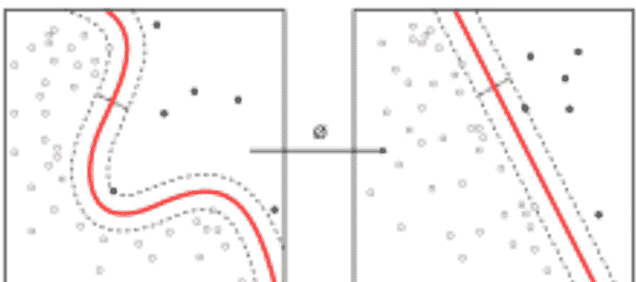

主动学习算法根据预算访问有限输入集的期望输出，并优化其将获取训练标签的输入选择。当交互式使用时，这些可以呈现给人类用户进行标记。

机器学习和数据挖掘经常使用相同的方法并且有显著重叠，但机器学习侧重于基于从训练数据中学到的已知属性进行预测，而数据挖掘侧重于发现数据中（先前）未知的属性。

数据挖掘使用许多机器学习方法，但目标不同。另一方面，机器学习也采用数据挖掘方法作为“无监督学习”或作为提高学习者准确性的预处理步骤。

这两个研究社区之间的许多混淆源于它们工作的基本假设：在机器学习中，性能通常根据再现已知知识的能力来评估，而在知识发现和数据挖掘（KDD）中，关键任务是发现先前未知的知识。根据

机器学习与优化也密切相关。许多学习问题被表述为在训练样本集上最小化某个损失函数。损失函数表达了正在训练的模型的预测与实际问题实例之间的差异。例如，在分类任务中，人们希望为实例分配标签，并训练模型以正确预测一组样本的预分配标签。这两个领域的区别源于泛化的目标。虽然优化算法可以最小化训练集上的损失，但机器学习关注的是最小化未见样本上的损失。

模拟人类智能的方法有很多，其中一些方法比其他方法更具智能性。

人工智能可以是一堆 if-then 语句，也可以是将原始感知数据映射到符号类别的复杂统计模型。if-then 语句只是由人工显式编程的规则。这些 if-then 语句有时统称为规则引擎、专家系统、知识图谱或符号人工智能。这些统称为“老式人工智能”（GOFAI）。

机器学习是人工智能的一个子集。也就是说，所有机器学习都属于人工智能，但并非所有人工智能都属于机器学习。例如，符号逻辑规则引擎、专家系统和知识图谱——都可以被描述为人工智能，但它们都不是机器学习。

深度学习是机器学习的一个子集。通常，当人们使用“深度学习”这个术语时，他们指的是深度人工神经网络，而较少指深度强化学习。

深度人工神经网络是一组算法，它们在许多重要问题上创下了准确性的新纪录，例如图像识别、声音识别、推荐系统、自然语言处理等。例如，深度学习是 DeepMind 著名的 AlphaGo 算法的一部分，该算法在 2016 年初击败了围棋前世界冠军李世石，并在 2017 年初击败了现任世界冠军柯洁。

这意味着人工智能的发展速度比其历史被书写的速度还要快，因此关于其未来的预测也会迅速过时。我们是在追逐像核裂变那样的突破，还是试图从硅中榨取智能的努力更像试图将铅变成金子？

鉴于人工智能的能力与计算硬件的能力同步发展，计算能力的进步，例如更好的芯片或量子计算，将为人工智能的进步奠定基础。在纯粹的算法层面，DeepMind 等实验室产生的大多数惊人成果来自于结合不同的 AI 方法，就像 AlphaGo 结合了深度学习和强化学习一样。将深度学习与符号推理、类比推理和进化方法相结合都显示出前景。

### 机器学习算法

机器学习算法是能够从数据中学习并从经验中改进，而无需人工干预的程序。学习任务可能包括学习将输入映射到输出的函数、学习未标记数据中的隐藏结构，或“基于实例的学习”，即通过将新实例与存储在内存中的训练数据实例进行比较，为新实例生成类别标签。“基于实例的学习”不会从特定实例中创建抽象。

机器学习（ML）算法有 3 种类型：

- 监督学习算法
- 无监督学习算法
- 强化学习

监督学习使用标记的训练数据来学习将输入变量（X）转换为输出变量（Y）的映射函数。换句话说，它解决以下示例中的 f：Y = f (X)

分类用于在输出变量为类别形式时预测给定样本的结果。分类模型可能会查看输入数据并尝试预测诸如“生病”或“健康”之类的标签。

回归用于在输出变量为实数值形式时预测给定样本的结果。例如，回归模型可能会处理输入数据以预测降雨量、人的身高等。

集成学习是另一种类型的监督学习。它意味着结合多个单独较弱的机器学习模型的预测，以在新样本上产生更准确的预测。使用随机森林的 Bagging、使用 XGBoost 的 Boosting 是集成技术的例子。

当我们只有输入变量（X）而没有相应的输出变量时，使用无监督学习模型。它们使用未标记的训练数据来建模数据的底层结构。

关联用于发现集合中项目共同出现的概率。它广泛应用于市场购物篮分析。例如，可以使用关联模型来发现，如果一个顾客购买了面包，他/她有 80% 的可能性也会购买鸡蛋。

聚类用于将样本分组，使得同一簇中的对象彼此之间比与其他簇中的对象更相似。

降维用于在确保重要信息仍然被传达的同时，减少数据集的变量数量。降维可以通过特征提取方法和特征选择方法来完成。特征选择选择原始变量的一个子集。特征执行从高维空间到低维空间的数据转换。例如：PCA 算法是一种特征提取方法。

强化学习是一种机器学习算法，它允许智能体通过学习最大化奖励的行为，根据其当前状态决定最佳的下一步行动。

强化算法通常通过试错来学习最优行动。例如，想象一个视频游戏，玩家需要在特定时间移动到特定地点以获得分数。玩这个游戏的强化算法一开始会随机移动，但随着时间的推移，通过试错，它会学习到需要在何时何地移动游戏中的角色以最大化其总分。

初学者的 5 大机器学习算法是：

#### 1. 线性回归

在机器学习中，我们有一组输入变量（x）用于确定输出变量（y）。输入变量和输出变量之间存在关系。机器学习的目标是量化这种关系。

在线性回归中，输入变量（x）和输出变量（y）之间的关系表示为 y = a + bx 形式的方程。线性回归的目标是找出系数 a 和 b 的值。这里，a 是截距，b 是直线的斜率。

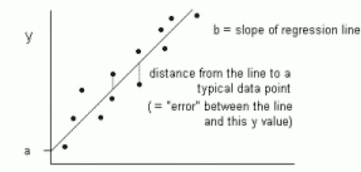

#### 2. 逻辑回归

线性回归的预测是连续值，逻辑回归的预测是应用转换函数后的离散值。在逻辑回归中，输出采用默认类别的概率形式（与线性回归不同，线性回归的输出是直接产生的）。由于它是概率，输出范围在 0-1 之间。因此，例如，如果我们试图预测患者是否生病，我们已经知道生病的患者被标记为 1，所以如果我们的算法给某个患者分配了 0.98 的分数，它认为该患者很可能生病。

#### 3. CART

分类与回归树（CART）是决策树的一种实现。

分类与回归树的非终端节点是根节点和内部节点。终端节点是叶节点。每个非终端节点代表一个单独的输入变量（x）和该变量上的一个分割点；叶节点代表输出变量（y）。模型按如下方式用于进行预测：遍历树的分割以到达叶节点，并输出叶节点中存在的值。

下图 3 中的决策树对一个人是否会购买

#### 4. 朴素贝叶斯

为了计算在另一个事件已经发生的情况下，某个事件发生的概率，我们使用贝叶斯定理。为了计算在已知先验知识(d)的情况下，假设(h)为真的概率，我们使用贝叶斯定理如下：

P(h|d)= (P(d|h) P(h)) / P(d)

其中：

- P(h|d) = 后验概率。在给定数据d的情况下，假设h为真的概率，其中 P(h|d)= P(d1| h) P(d2| h) ....P(dn| h) P(d)
- P(d|h) = 似然度。在假设h为真的情况下，数据d出现的概率。
- P(h) = 类别先验概率。假设h为真的概率（与数据无关）
- P(d) = 预测器先验概率。数据出现的概率（与假设无关）

该算法被称为“朴素”，是因为它假设所有变量彼此独立，这在现实世界的例子中是一个过于简化的假设。

| 天气 | 是否进行活动 |
| :--- | :--- |
| 晴天 | 否 |
| 多云 | 是 |
| 雨天 | 是 |
| 晴天 | 是 |
| 晴天 | 是 |
| 多云 | 是 |
| 雨天 | 否 |
| 雨天 | 否 |
| 晴天 | 是 |
| 雨天 | 是 |
| 晴天 | 否 |
| 多云 | 是 |
| 多云 | 是 |
| 雨天 | 否 |

#### 5. KNN

K-近邻算法使用整个数据集作为训练集，而不是将数据集划分为训练集和测试集。

当需要为一个新的数据实例预测结果时，KNN算法会遍历整个数据集，找出与新实例最接近的k个实例，或者与新记录最相似的k个实例，然后输出这些实例结果的平均值（对于回归问题）或众数（出现频率最高的类别，对于分类问题）。k的值由用户指定。

实例之间的相似度使用欧几里得距离和汉明距离等度量方法来计算。

我们已经介绍了一些数据科学中最重要的机器学习算法：

- 5种监督学习技术 - 线性回归、逻辑回归、CART、朴素贝叶斯、KNN。
- 3种无监督学习技术 - Apriori、K-means、PCA。
- 2种集成技术 - 基于随机森林的Bagging、基于XGBoost的Boosting。