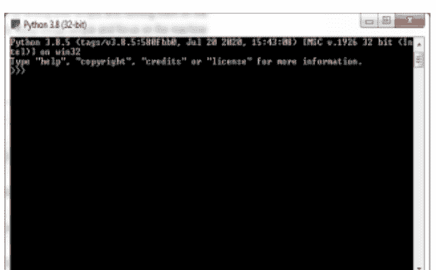
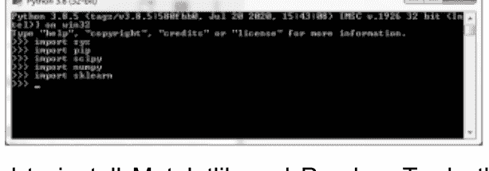
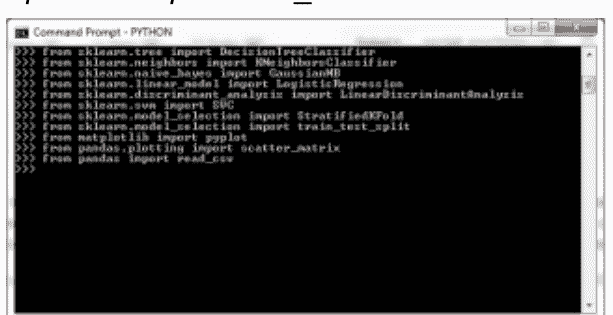
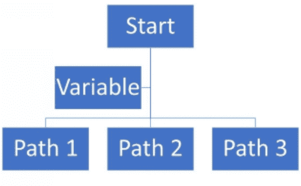
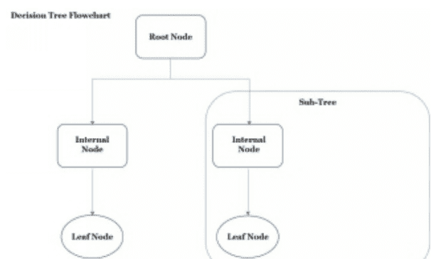
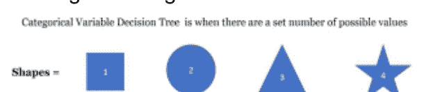
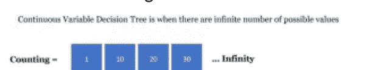
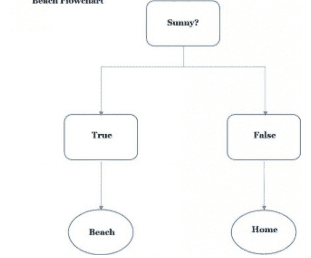
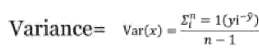
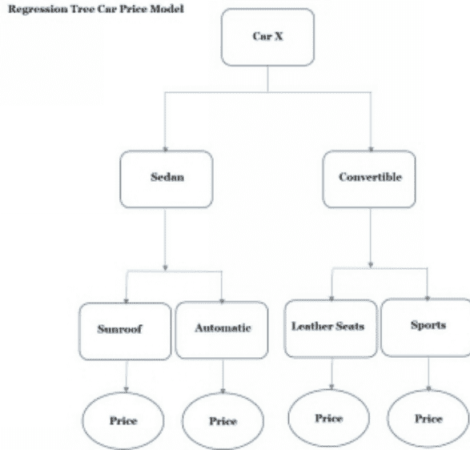

# PYTHON PROGRAMMING

**PYTHON编程：从零开始逐步学习机器学习的终极指南**

ALEX STARK

## © 版权所有 2020 - 保留所有权利。

未经作者或出版商直接书面许可，不得复制、转载或传播本书所含内容。

在任何情况下，出版商或作者均不对因本书所含信息直接或间接造成的任何损害、赔偿或金钱损失承担任何责任或法律责任。

## 法律声明：

本书受版权保护。仅供个人使用。未经作者或出版商同意，不得修改、分发、销售、使用、引用或转述本书的任何部分或内容。

## 免责声明：

请注意，本文档所含信息仅供教育和娱乐目的。我们已尽一切努力提供准确、最新、可靠、完整的信息。不作任何明示或暗示的保证。读者承认作者不提供法律、金融、医疗或专业建议。本书内容源自多种来源。在尝试本书概述的任何技术之前，请咨询持证专业人士。

阅读本文档即表示读者同意，在任何情况下，作者均不对因使用本文档所含信息而造成的任何直接或间接损失负责，包括但不限于错误、遗漏或不准确之处。

## 内容简介

如果您是Python机器学习的完全新手，那么*《PYTHON编程：从零开始逐步学习机器学习的终极指南》*就是为您准备的。本书将向您介绍机器学习的基本概念、Python编程语言、各种程序库以及支持平台。

大多数程序员都会惊讶于他们能如此轻松地掌握Python编程语言，因为它使用起来非常直接，易于学习。Python是编程初学者入门的最佳平台之一，特别是当您使用Python软件包附带的集成开发环境时。

Python也是一个免费的开源软件包，附带大量支持库，赋予其强大的编程能力。对于机器学习，Python正迅速成为新手入门学习机器学习的首选语言之一。

Python简洁、可读的代码为程序员提供了其他语言所不具备的简洁性。因此，程序员无需迷失在复杂的编程技巧和技术细节中，可以专注于他们正在编写的应用程序。在机器学习中，程序员需要更多地关注复杂的算法，而不是陷入复杂的代码中。

对于经验丰富的开发者和数据科学家来说，C、C++等编程语言是不错的选择。但对于同时开始学习编程和机器学习的人来说，它们可能相当笨重且令人困惑。Python编程提供了一个更精简、更简单的学习平台。

本指南将帮助您踏上Python机器学习之旅，并引导您从新手进阶到中级水平。

## 目录

- [引言](Introduction)
- [Python的历史](History of Python)
- [第1章：Python](Chapter 1: Python)
    - [Python编程语言的主要特性](Python Programming Language Top Features)
    - [机器学习](Machine Learning)
        - [Python最适合的常见AI/ML应用和技术](Common AI/ML Uses and Technologies Python is Best Suited for)
    - [Python AI和ML库](Python AI and ML Libraries)
        - [Scikit-learn](Scikit-learn)
        - [NLTK](NLTK)
        - [Theano](Theano)
        - [TensorFlow](TensorFlow)
        - [Keras](Keras)
        - [PyTorch](PyTorch)
- [第2章：开始学习Python](Chapter 2: Start Learning Python)
    - [机器学习过程简要概述](Brief Overview of Machine Learning Processes)
    - [Python机器学习的基本原理](The Basic Principles of Python Machine Learning)
        - [Python机器学习的基本原理](Basic Principles of Python Machine Learning)
        - [Python机器学习的阶段](Stages of Python Machine Learning)
    - [Python机器学习示例训练数据集](Python Machine Learning Example Training Datasets)
    - [Python入门](Getting Started with Python)
        - [步骤1：下载和安装](Step 1: Download and Install)
        - [步骤2：安装Python库](Step 2: Install the Python Libraries)
        - [步骤3：构建您的环境](Step 3 - Build Your Environment)
        - [步骤4：检查Python安装并导入库](Step 4: Check the Python Installation and Import the Libraries)
- [第3章：处理数据](Chapter 3: Working with Data)
    - [步骤1：加载Sklearn、Pandas和Matplotlib支持库](Step 1: Load Sklearn, Pandas, and Matplotlib Supporting Libraries)
    - [步骤2：将数据集导入Python](Step 2: Import the Dataset into Python)
    - [步骤3：使用Shape属性](Step 3: Working With the Shape Property)
    - [步骤4：使用Head()属性](Step 4: Working With the Head() Property)
    - [步骤6：使用Groupby()属性](Step 6: Working With the Groupby() Property)
    - [步骤7：创建您自己的数据集](Step 7: Creating Your Own Datasets)
- [第4章：处理数据可视化](Chapter 4: Working with Data Visualization)
    - [数据可视化入门](Getting Started With Data Visualization)
    - [基础葡萄酒评论分析](Basic Wine Review Analysis)
    - [高级葡萄酒评论分析](High-Level Wine Review Analysis)
        - [单变量分析](Univariate Analysis)
        - [多变量分析](Multivariate Analysis)
- [第5章：预测分析](Chapter 5: Predictive Analytics)
    - [什么是预测分析？](What is Predictive Analytics?)
        - [预测分析的应用](The Use of Predictive Analytics)
        - [谁使用预测分析？](Who Uses Predictive Analytics?)
- [第6章：处理算法](Chapter 6: Working With Algorithms)
    - [什么是算法？](What is an Algorithm?)
        - [算法的重要类别](Important Categories of an Algorithm)
        - [算法特性](Algorithm Characteristics)
    - [算法入门](Getting Started With Algorithms)
        - [如何开始编写算法？](How Do You Start Writing an Algorithm?)
        - [选择模型](Choosing a Model)
- [第7章：机器学习算法](Chapter 7: Machine Learning Algorithms)
    - [决策树（分类树示例）](Decisions Tree (Example of a Classification Tree))
        - [什么是决策树？](What is a Decision Tree?)
        - [决策树流程图的组成部分](The Components of a Decision Tree Flowchart)
        - [何时使用决策树](When to Use a Decision Tree)
        - [决策树算法](Decision Tree Algorithm)
        - [Python中决策树的结构？](Structure of a Decision Tree in Python?)
        - [决策树的优点](Advantages of Decision Tree)
        - [决策树的缺点/局限性](Disadvantages/Limitations of Decision Trees)
    - [Python中的熵和基尼指数](Entropy and Gini Index in Python)
        - [熵](Entropy)
        - [基尼指数](Gini Index)
- [第8章：回归树和CART](Chapter 8: Regression Trees and CART)
    - [回归树](Regressions Trees)
    - [CART模型](CART Models)
- [第9章：随机森林](Chapter 9: Random Forests)
    - [构建随机森林](Building the Random Forest)
        - [随机森林的优点](Advantages of Random Forest)
        - [随机森林的缺点](Disadvantages of Random Forest)
        - [随机森林的用途](Uses of Random Forest)
        - [随机森林的工作原理](How the Random Forest Works)

# 第10章：神经网络、大数据、物联网（IoT）与云计算概述

神经网络

神经网络的类型

大数据

大数据的5个关键要素（5V）

大数据的应用

物联网（IoT）

物联网（IoT）的应用

物联网与安全

基于云的机器学习

结论

参考文献

## 引言

感谢您选择*《Python编程：学习Python机器学习的终极初学者分步指南》*作为您的Python机器学习学习指南。

在这本初学者指南中，您将学习编程语言语法、基本编程概念以及如何将它们应用于编码。本书涵盖的其他主题包括：

- 初学者可以在现实世界中使用的实用Python功能
- 如何安装和配置Python
- Python编程机制，如控制流、因子、记录或词典以及类
- 机器学习基础以及如何在Python中实现机器学习，包括Scikit-learn、Tensorflow等

## 人工智能（AI）

由计算机控制的机器人和能够执行智能生物所能执行任务的数字计算机都被定义为人工智能（AI）。AI有许多子集，通常包括：

- 深度学习（DL）——神经网络。
- 专家系统（ES）——教学系统和具有决策支持的系统。
- 机器学习（ML）——版本空间和决策树学习。
- 机器视觉（MV）——理解图像和字符/对象识别。
- 自然语言处理（NLP）——机器翻译。
- 规划——游戏玩法、调度和任务驱动系统。
- 机器人学——具有智能控制的自主系统。
- 语音识别（SR）——语言识别。

要使机器被归类为人工智能系统，它需要能够：

- 感知
- 推理
- 行动
- 适应

为了使AI能够成功实现其目标并表现出上述四种品质，它需要能够思考。与自然智能不同，计算机的智能来自于巧妙设计的、能够学习的算法。因此，AI最重要的部分之一是机器学习，以及深度学习（可归类为ML的子集）。

机器学习是AI的一个子集，它赋予机器学习的能力。ML就像AI系统的大脑，赋予其通过经验自动学习所需的智能，而无需显式的编程指令。

## 机器学习（ML）

机器学习是研究旨在通过数据输入进行学习的算法的学科。使用程序员训练系统时所用的数据，算法将学习如何描述数据、改进数据并预测结果。现代大多数分析和统计数据都来自使用机器学习算法。

机器学习的一个典型例子是搜索引擎（如Google）上出现的弹出广告。您可能会注意到，出现的广告与您最近的搜索或在网上查看过的产品有关。这就是机器学习算法吸收您的搜索历史并预测您认为有趣或有用的内容。

一些更常见的机器学习方法或算法包括：

- 决策树
- K均值聚类
- K近邻
- 朴素贝叶斯
- 随机森林
- 支持向量机

## 大多数人工智能系统共有的四个重要技术

- 学习——AI能够从其环境中获取知识。
- 表示——AI能够确定如何表示从其环境中学习到的知识。
- 规则——AI有一套明确的指令或规则，这些是其学习和成长的指导方针。
- 搜索——AI能够搜索并找到一系列状态、权重连接等，从而得出解决方案或结果。

本指南涵盖了Python机器学习基础知识的介绍。Python是迄今为止最容易使用、最易于访问的编程环境之一，可用于开始学习人工智能的这个分支。

## Python的历史

Guido van Rossum在荷兰阿姆斯特丹的Centrum Wiskunde & Informatica（CWI）工作了几年后创立了Python。在CWI，Guido在20世纪80年代中期参与了一个名为ABC的编程语言项目。正是ABC编程语言启发他在20世纪80年代末以ABC为蓝本创建了Python。Guido利用他对ABC中哪些方面运作最佳的知识来借鉴和增强Python。对于那些在ABC中只让他感到沮丧的东西，他找到了一种方法来微调或完全省略（如果它们不是必需的话）。

Guido创建Python是为了使其成为免费的开源软件，易于使用，并允许其他人为语言库做出贡献，从而创建了一个庞大的Python社区。当他开始这个项目时，他选择Python作为语言的名称，因为他是Monty Python的*《飞行马戏团》*的忠实粉丝，并且当时他感到有些不拘一格。

版本0.9.0是Guido于1991年2月发布的第一个Python版本。它最初作为模块和面向对象系统发布在alt.sources上。此版本包含函数、异常处理和核心数据类型等功能。

1994年1月，Python 1.0版本发布，其中包含一些Guido不太满意的函数式编程工具。这些工具包括map、filter、reduce和lambda。

下一个新版本是在六年后的2000年10月发布的2.0版本，其中包含一系列新功能。2.0版本的功能支持Unicode、完整的垃圾回收器和列表推导式。

2.x版本一直存在并持续更新了八年，直到3.0版本发布。3.0版本与2.x版本不兼容，但可以作为完全独立的安装与之并行运行。3.0版本于2008年12月发布，是Python的一个更新、更精简的版本。Guido从Python编程语言中移除了许多在以前版本中发现的重复模块和构造。

尽管Python 3是主要使用的版本，但2.x版本仍被许多程序员使用，并且该版本仍在更新，最后一次更新是2.7版本。Python 2.x的开发于2020年4月在2.7版本停止，而3.x版本则越来越受欢迎。

# 第1章：Python

Python是一种通用的解释型、面向对象的编程语言，可以在任何系统上运行，包括Linux、Windows和Mac。在过去的十年左右，Python因其易用性、广泛的可用性和清晰的语法而成为一种非常流行的编程语言。

Python是开源软件，这意味着它可以免费访问和下载。它易于使用、理解和遵循，因为它是一种与英语非常相似的编程语言。

### Python编程语言的主要特点

自20世纪80年代末Python开发以来，它已成为一种非常受欢迎的首选编程语言，尤其是对于新程序员而言。

使Python如此受欢迎的一些特点包括：

- 动态类型，这意味着Python不需要显式声明正在使用的变量。
- 异常在语法上并不繁重。
- 即使您不是专业程序员，它也易于阅读和遵循。
- 作为解释型编程语言，它不需要编译器将程序编译成机器语言指令来运行。
- Python是一种面向对象的编程语言，类似于Ruby、Perl和Java。
- Python是免费的开源软件，其大量的库也是如此。
- Python不断更新和添加内容；这包括其库。

Python 拥有庞大的标准库，集成了简洁的编程命令、高效的处理能力和文件操作功能。
- Python 具备使用常用表达式和命令在文本中进行搜索的能力。
- Python 的平台独立性意味着它可在大多数操作系统上运行。
- Python 非常适合用于机器学习应用。
- 通过使用交互式界面，Python 使得测试小段代码变得简单得多。
- Python 标配一个名为 **IDLE** 的开发和学习环境。IDLE 交互式 shell 是一个功能齐全的 Python 文本编辑器，它使得创建 Python 脚本变得快速、轻松，并且几乎没有语法错误。IDLE 具备调试器、自动补全、智能缩进和语法高亮等功能。
- Python 可以无缝集成或与 C、C++、Java 等其他软件和编程语言协同工作。
- Python 可以用作其他应用程序的程序接口。

## 机器学习

机器学习（ML）是一种基于算法的程序，旨在鼓励计算机在没有被明确编程的情况下能够学习。它是一种人工智能（AI）的形式，其设计方式使得计算机能够利用新的数据输入作为学习、发展和进步的手段。

随着人工智能和机器学习与个人日常生活的联系日益紧密，我们对它们的依赖也与日俱增。从手机应用到能够自动驾驶和导航的汽车，再到厨房里的冰箱，各种设备都在使用某种形式的人工智能和机器学习。每次你与 Siri 或 Alexa 对话时，你都是在与一种形式的人工智能交流。每次你向人工智能提问时，它都在记录和追踪这些选择。

银行应用和自动化助手每天都在被使用。输入的信息越多，它们学习和成长得就越多。人工智能和机器学习是当下也是未来，这使得学习机器学习以保持你在就业市场中的地位变得尤为有价值。

学习机器学习甚至人工智能的最佳编程语言之一是 Python。使 Python 成为入门机器学习的良好语言的一些特点包括：

- 简洁性
- 一致性
- 丰富的库集合
- 丰富的框架集合
- Python 是平台独立的
- 由于 Python 的流行，它拥有庞大的社区

## Python 最适合的常见人工智能/机器学习应用和技术

Python 适用于以下应用和技术：

- 使用 OpenCV 技术的计算机视觉
- 使用 NumPy、Pandas、SciPy 和 Seaborn 技术的数据分析
- 使用 NumPy、Pandas、SciPy 和 Seaborn 技术的数据可视化
- 使用 Keras、Scikit-Learn 和 TensorFlow 技术的机器学习
- 使用 NLTK 和 spaCy 技术的自然语言处理

## Python 人工智能和机器学习库

Python 丰富的库选择不仅使编码更容易，还缩短了开发时间。Python 丰富的技术栈包含大量的机器学习和人工智能库集合。库中包含预编写的代码，使开发人员编写脚本变得容易得多，减少了编写复杂算法时可能出现的愚蠢错误。

Python 的机器学习库包括以下内容：

### Scikit-learn

Scikit-learn 包含许多监督和无监督学习算法，并提供机器学习功能，包括：

- 分类 — K-近邻算法
- 聚类 — K-Mean ++ 和 K-Means
- 模型选择
- 预处理
- 回归 — 线性回归和逻辑回归

Scikit-learn 建立在 Pandas、Matplotlib 和 NumPy 等技术之上。它是一个强大的库，允许程序员构建稳定、健壮的机器学习程序。

### NLTK

自然语言工具包（NLTK）并非专门为机器学习设计。然而，该工具包在创建需要处理人类语言数据的程序时非常方便。它用于在统计自然语言处理（NLP）中应用人类语言数据，并包含众多文本处理库。

### Theano

Theano 是一个用于机器学习和深度学习的 Python 库。自 2007 年以来，Theano 一直被用于大规模运行计算密集型科学研究。它是一个强大的库，可以评估、定义和优化具有多维数组的复杂数学表达式。

### TensorFlow

TensorFlow 是一个机器学习库，用于创建使用快速数值计算的深度学习模型。虽然它作为 Python 库运行，但 TensorFlow 是由 Google 设计、开发和发布的。与 Python 和大多数 Python 库一样，TensorFlow 是开源软件，易于免费下载和安装。

### Keras

Keras 是一个 Python 库，为神经网络系统提供高级应用程序编程接口（API）。它最好与 Theano、R、PlaidML、MS Cognitive Toolkit 或 TensorFlow 一起运行或在其之上运行。

### PyTorch

PyTorch 是一个流行的深度学习库，用 Lua 编写。它是 Torch 的 Python 开源模型。它使程序员能够访问相同的 Torch 库。PyTorch 适合初学者，并提供了一些有用的教程和大量示例。

# 第 2 章：开始学习 Python

Scikit-learn 是最受欢迎的机器学习 Python 库之一，是入门的首选。它为新开发者提供了一个良好的基础，从中可以学习机器学习各个方面的运作方式，例如标记、建模和测试。

另一个很好的机器学习入门基础是 Keras，它以易用性和直接的建模结构而闻名。随着你对 Python 和机器学习越来越熟练，你将能够做出更明智的 Python 机器学习库选择。

## 机器学习过程简要概述

在深入 Python 机器学习之前，你需要了解一些机器学习过程。这些过程包括：

- **监督学习** — 监督学习是系统基于输入和输出数据来开发预测结果。监督学习的模型包括：
    - 分类
    - 回归
- **无监督学习** — 无监督学习基于输入数据。系统将根据输入数据解释和分组数据。无监督学习的模型包括：
    - 聚类

## Python 机器学习的基本原理

机器学习的基础是让系统基于经验进行学习。例如，想想教一个孩子区分鲨鱼鳍和海豚鳍。你会向他们展示鲨鱼的尾鳍是垂直的，并且左右摇摆，而海豚的尾巴是水平的，上下摇摆。一旦孩子收集到这些信息，他们就能够用它来区分这两种生物。

类似地，机器学习算法被输入基础数据以供学习和成长。例如，房地产经纪人可能拥有关于社区、这些社区中的房屋以及每栋房屋平均成本的统计信息。这些信息将是机器学习的训练信息。根据这些信息，系统将能够根据某些标准输出两居室或三居室房屋的平均成本。这个标准可能是在一个拥有两间浴室和一个双车位车库的社区中，一套两居室房屋的成本。

## Python 机器学习的基本原理

要开始设计 Python 机器学习算法，你需要：

- 确定一个问题
- 收集和准备所需的数据
- 分析和评估算法
- 提高正面结果的产出
- 定义结果并以特定方式呈现它们

## Python 机器学习的阶段

一旦你确定了机器学习算法将要设计解决的问题，你就需要设计机器学习算法。

Python 机器学习的阶段包括：

- 数据收集
- 对收集的数据进行排序
- 分析排序后的数据集合
- 设计机器学习算法
- 开发机器学习算法

## Python 机器学习示例训练数据集

当你学习使用机器学习时，你不会想在实时数据集上进行学习。好消息是，有相当多的免费示例数据集可用于 Python 机器学习编码。

一些更受欢迎的示例数据集包括：

- Fisher 鸢尾花数据集 — 该数据集已存在多年，用于大多数机器学习训练场景。它是一个 CSV 文件，包含不同种类的鸢尾植物（*鸢尾花物种*，n.d.）。
- Prima 印第安人糖尿病数据集 — 该数据集可免费用作 Python 机器学习的训练数据集。与鸢尾花数据集一样，你必须下载 CSV 文件。该数据集用于根据某些标准预测一个人患糖尿病的可能性（*从医疗记录预测糖尿病*，n.d.）。

这些数据集都可以在一个名为 **Kaggle.com** 的网站上获取。

将你的数据集放在你拥有管理权限的目录中，并记下数据集的完整路径。

这两个数据集都很小，并且有足够的列和数据作为训练数据集使用，但不会变得难以控制。当你学习创建机器学习算法时，你不希望从可能包含大量可变标准的海量数据开始。

## Python 入门

首先要尝试的机器学习 Python 程序之一是简单的“欢迎世界”机器学习程序。

本节将讨论的一些 Python 特性包括：

- 介绍 Python 平台和库
- 加载数据集
- 压缩数据集
- 介绍数据集
- 使用算法
- 预测一些结果

在你刚开始学习时，重要的是要记住花足够的时间。按照自己的进度前进，并加入一个 Python 支持小组。有很多这样的小组，一些更受欢迎的可以在 Python 网站上找到（Python 社区，n.d.）。

### 步骤 1：下载和安装

最新版本的 Python 可在 Python 网站（Python.org）上获取。最好下载最新版本的 Python 及其所有支持库。在本指南发布时，Python 版本 3.8.5 是最新版本。版本 2.7.18 仍然受支持，并且可以用于以下练习。

- 从 Python.org 网站下载 Python。
- 按照 **Python.org** 提供的指南安装和设置 Python 环境，为机器学习做好准备。

### 步骤 2：安装 Python 库

你需要的 Python 机器学习支持库包括：

- Matplotlib
- Numpy
- Pandas
- Scipy
- Scikit-learn

再次，请按照 **Python.org** 网站上关于如何安装 Python 库的综合指南操作。

### 步骤 3 - 构建你的环境

使用 Python 机器学习进行编码和构建环境的最简单方法是使用 Anaconda 和 Jupyter Notebook（它是 Anaconda 套件的一部分）。

要下载 Anaconda，请访问 **Anaconda** 网站（*Anaconda 个人版*，n.d.）。下载最新版本以确保它与你机器上安装的 Python 版本兼容。

Python 网站和 Anaconda 网站都有关于如何使用 Anaconda 下载、安装和设置 Python 机器学习环境的综合指南。

或者，你可以使用 Python SciPy。以下示例使用 Python SciPy 运行。要运行和设置 Python SciPy 环境，请访问 SciPy 网页，并按照综合安装和设置指南操作（*SciPy 安装*，n.d.）。

### 步骤 4：检查 Python 安装并导入库

对于前几个练习，最好使用 Python 3.8 命令行。

在 Python 解释器中的新命令行中，输入以下内容：

```
python
```

应出现以下屏幕：



输入以下命令以导入所需的库：

```
import sys
import pip
import scipy
import numpy
import sklearn
```



你需要安装 Matplotlib 和 Pandas。为此，请在命令行提示符下输入以下命令。
要安装 Matplotlib，请输入以下内容：

```
python -m pip install matplotlib
```

安装程序将收集 matplotlib 文件，然后安装它们。如果安装结束时出现警告，提示你的版本可能需要升级，请使用以下命令运行升级：

```
python -m pip install matplotlib --upgrade
```

要安装 Pandas，请输入以下内容：

```
python -m pip install pandas
```

安装程序将收集 Pandas 文件，然后安装它们。如果安装结束时出现警告，提示你的版本可能需要升级，请使用以下命令运行升级：

```
python -m pip install pandas --upgrade
```

一旦 Matplotlib 和 Pandas 安装并更新完毕，请在命令行提示符下输入以下内容：

```
import matplotlib
import pandas
```

这将导入模块，你现在应该已经导入了所有需要的库/模块并准备使用。
要检查 Python 中安装的模块，请在命令行提示符下输入以下内容：

```
pip list
```

或

```
help(“modules”)
```

系统可能需要一两分钟来收集必要的信息，并将显示 Python 中所有已安装和可用库的列表。

# 第 3 章：处理数据

要处理数据，你需要从以下网站下载 Fisher 鸢尾花数据集（下载 ZIP 文件）：
https://gist.github.com/curran/a08a1080b88344b0c8a7#file-iris-csv

如果你想阅读有关此数据集的信息，可以在维基百科上进行，那里有大量关于它的信息。该数据集由 Ronald Fisher 于 1936 年设计，作为线性判别分析的示例（*鸢尾花数据集*，n.d.）。数据集中列出了三种鸢尾花，每种有超过五十个样本。测量了所有样本的花瓣和萼片的长度和宽度，以区分鸢尾花物种。

使用 CSV 格式将鸢尾花数据下载到 Python 中，并将其放在易于访问的目录中。

例如：
c:\datasets

## 步骤 1：加载 Sklearn、Pandas 和 Matplotlib 支持库

一旦你加载了鸢尾花数据集 CSV 文件，你需要加载 Sklearn、Pandas 和 Matplotlib 的支持库。

通过在命令行中输入以下内容导入 Sklearn 支持库：

```
from sklearn.metrics import accuracy_score
from sklearn.metrics import classification_report
from sklearn.model_selection import cross_val_score
from sklearn.metrics import confusion_matrix
from sklearn.tree import DecisionTreeClassifier
from sklearn.neighbors import KNeighborsClassifier
from sklearn.naive_bayes import GaussianNB
from sklearn.linear_model import LogisticRegression
from sklearn.discriminant_analysis import LinearDiscriminantAnalysis
from sklearn.svm import SVC
from sklearn.model_selection import StratifiedKFold
from sklearn.model_selection import train_test_split
```

通过在命令行中输入以下内容导入 Matplotlib 支持库：

```
from matplotlib import pyplot
```

通过在命令行中输入以下内容导入 Pandas 支持库：

```
from pandas.plotting import scatter_matrix
from pandas import read_csv
```



如果遇到错误，请检查你是否已正确安装 Sklearn、Matplotlib 和 Pandas 并将其导入 Python。

## 步骤 2：将数据集导入 Python

Pandas 用于导入数据集并设置列名。这就是我们设置输出数据可视化的方式。
你需要知道你下载鸢尾花 CSV 文件的目录的确切路径（例如 c:\datasets\iris.csv）。

在接下来的练习中，你将设置一个 **DataFrame**。DataFrame 类似于 Excel 电子表格，包含多个列出数据类型的列，以及包含与每个数据类型相关数据的多行。在 Python 中，DataFrame 被归类为二维数据结构（*数据结构简介*，无日期）。

在命令行提示符下输入以下内容：

```
import pandas as pd

ds = pd.read_csv(r'c:\datasets\iris.csv')

df = pd.DataFrame(ds, columns=['sepal_length',
'sepal_width', 'petal_length', 'petal_width', 'species'])

print(df)
```

确保你在“df”定义中使用的列标题与 .CSV 文件中的列名匹配。如果不匹配，打印时表格中将出现 NaN 值，如下图所示。

## 步骤 3：使用 Shape 属性

查看数据有多种方式，也可以从不同指标中提取信息。其中一个指标是数据集的维度。

当数据以行和列的形式大量排列时，有一种快速方法可以计算出有多少个实例和属性。你可以通过使用已定义数据集的 **.shape** 属性来实现。

在本练习中，你将使用在上一个练习中创建的已定义 DataFrame，名为 **df**。

要找出 iris.csv 数据集中有多少属性和实例，请在命令行提示符下输入以下内容：

```
print(df.shape)
```

该命令将返回：

```
(50, 5)
```

这表示有 50 个实例和 5 个属性。实例是数据行（数据），属性（描述数据）是数据列。

## 步骤 4：使用 Head() 属性

一旦你知道有多少数据，就可以通过查看前几行来确认数据类型是否正确或查看数据质量。要查看数据集中的前几行数据，你将使用 **.head()** 属性。

使用你在第一个练习中定义的 DataFrame，名为 **df**。在命令行提示符下输入以下内容：

```
print(df.head(15))
```

这告诉系统打印 DataFrame **df** 的前 15 行；系统应返回与下图类似的信息。

## 步骤 5：使用 Describe() 属性

Python Pandas 包含多个描述性统计函数，如下表所示。

| 描述性统计函数 | 函数用途 |
|---|---|
| abs() | 绝对值 |
| count() | 非空观测值数量 |
| cumsum() | 累积和 |
| cumprod() | 累积积 |
| max() | 最大值 |
| mean() | 平均值 |
| median | 中位数 |
| min() | 最小值 |
| mode() | 众数 |
| prod() | 乘积 |
| std() | 标准差 |

需要注意的是，由于 DataFrame 是异构数据结构，某些通用操作并非适用于所有描述性函数。有些函数同时适用于字符/字符串和数值数据，而有些仅适用于数值数据。

- 像 abs() 和 cumprod() 这样的函数，如果使用字符串或字符数据，将返回异常。
- 像 sum() 和 cumsum() 这样的函数，适用于数值和字符/字符串数据。

要获取 DataFrame 中数据列的统计摘要，需使用 **.describe()** 函数。
在命令行中输入以下内容，以总结 **ds** DataFrame 列中的数据。

```
print(ds.describe())
```

系统应返回一个与下图类似的屏幕。

.describe() 函数返回：

- count — 每个数据项列出的对象总数，不包括 DataFrame 中的任何空值。
- mean — DataFrame 中所有数据的平均值。
- std — DataFrame 中所有列出数据的标准差。
- min — DataFrame 中数据的最小值。
- IQR — 标记为 25%、50% 和 75% 的行是 DataFrame 中数据值的**四分位距**。这衡量了数据的第 25、50 和 75 百分位数之间的差异。
- max — DataFrame 中数据的最大值。

该函数排除了任何包含字符的列，这就是为什么输出表中没有列出或包含“species”列。

鸢尾花数据集以厘米为单位测量。从这个摘要中，可以看到表中的值在 0 到 8 厘米的范围内。

## 步骤 6：使用 Groupby() 属性

在大型数据表中，查看和处理分成集合的数据更容易。要将数据分成集合，需使用 .groupby() 属性。此属性用于执行以下功能：

- 聚合 — 此函数将计算数据的统计摘要。
- 过滤 — 此函数将筛选并丢弃条件数据。
- 转换 — 此函数用于特定于组的信息。

要使用 .groupby() 属性，请在命令行提示符下输入以下内容，按物种和大小对 df DataFrame 进行分组。

```
print(df.groupby('species').size())
```

系统应返回一个与下图类似的表格。

## 步骤 7：创建你自己的数据集

为什么不尝试以下练习并创建你自己的数据集呢？
想一个统计表，例如每个产品每年的销售统计。
创建一个工作表并填入数据，例如：

| 项目 | 销售额 | 年份 | 排名 |
|---|---|---|---|
| 黄油 | 20000 | 2010 | 2 |
| 奶油 | 15000 | 2011 | 3 |
| 鸡蛋 | 35000 | 2012 | 1 |
| 牛奶 | 45000 | 2013 | 1 |
| 巧克力 | 40000 | 2014 | 2 |

上表是一个商店的库存清单、每年的总销售额以及其在区域内的销售排名。
你可以在 Excel 中创建表格并保存为 CSV 文件，然后将其导入 Python。或者，你可以直接在命令行中创建它，以练习本章中学到的函数。
在新的命令行中输入以下内容：

```
import pandas as pd
sales_data = {'Item' : ['Butter', 'Cream', 'Eggs', 'Milk', 'Chocolate'],
'Sales' : [20000, 15000, 35000, 45000, 40000],
'Year' : [2010, 2011, 2012, 2013, 2014],
'Rank' : [2, 3, 1, 1, 2]}
df = pd.DataFrame(sales_data)
print(df)
```

系统输出将是一个类似于下表的表格。

创建你自己的数据集，并使用本章中的函数从中获取各种统计信息。

# 第 4 章：使用数据可视化

数据可视化的概念是以视觉形式查看或理解数据。将数据以视觉形式呈现，更容易区分趋势、模式和相关性，否则这些可能会被忽略。

Python 有不少用于数据可视化的库。每个绘图库都有有用的功能。你选择的库应该是最适合你数据可视化需求的。一些可以使用的 Python 绘图库包括：

- Matplotlib — 此库是 Python 中较受欢迎的绘图库之一。它用于创建条形图、直方图、折线图和其他基本图形。Matplotlib 需要相当多的编码来创建其数据可视化输出。
- Pandas Visualization — 此库具有应用程序编程接口（API）。它用于高级可视化，比 Matplotlib 需要更少的编码。
- Plotly — 此库适用于创建用于探索性可视化的交互式绘图。
- Seaborn — 此库基于 Matplotlib 库。它是一个高级接口，旨在以吸引人的方式提供更具信息性的统计数据。

有不同类型的绘图可用于可视化数据。一些更常用的绘图包括：

- 条形图
- 折线图或图表
- 直方图
- 散点图
- 箱线图

Matplotlib 是 Python 的核心绘图函数库。理解这个库的工作原理有助于你更好地理解 Pandas 和 Seaborn 中的绘图功能。

用于绘图的探索性数据分析方法有三种。它们是：

- 双变量分析 — 此方法用于发现数据集中变量之间的关系。
  - 箱线图
  - 小提琴图
- 多变量分析 — 此方法用于发现数据集中两个或多个变量之间的交互关系。
  - 散点图
  - 配对图
- 单变量分析 — 此方法用于基于一个变量总结数据集中每个字段的统计信息。
  - 箱线图
  - 累积分布函数 (CDF)
  - 概率密度函数 (PDF)
  - 分布图
  - 小提琴图

在本章中，你需要从以下网站下载葡萄酒评论分析 CSV 文件：

https://github.com/gorbulus/WineReviewAnalysis

将 CSV 文件放在与 iris.csv 文件相同的目录中。

你会发现 CSV 文件的名称很长，因此最好将其重命名为 wine.csv。

数据集包含以下列标题：

- _空白标题_
- country
- description
- designation
- points
- price
- region_1
- region_2
- variety
- winery

请记住，在设置数据集描述时，列名必须与 CSV 文件中的列名完全匹配。这包括大小写（它区分大小写）。CSV 文件中的第一列标题是空白的。最好给它一个名称，例如“num”。

## 数据可视化入门

在命令行提示符中输入以下内容以安装 Seaborn：

```
python -m pip install seaborn
import seaborn
```

最后一行将测试 Seaborn 是否成功安装。如果返回到命令行提示符且没有错误，则表示库已安装。

你需要做的第一件事是在新的命令行中导入并重命名库。

```
import numpy as np
import matplotlib.pyplot as plt
import pandas as pd
import seaborn as sns
```

接下来，你需要通过在命令行提示符中输入以下内容将 wine.csv 数据集加载到系统中：

```
wine = pd.read_csv(r'C:\datasets\wine.csv')
df = pd.DataFrame(wine, columns= ['num', 'country', 'description', 'designation', 'points', 'price', 'province', 'region_1', 'region_2', 'variety', 'winery'])
```

## 基本葡萄酒评论分析

基本分析是指 **.shape**、**.head()** 和 **.tail()** 函数对葡萄酒评论分析数据所能提供的信息。

在命令行提示符中输入以下内容以找出文件中的行数和列数：

```
print (wine.shape)
```

数据集中有 150930 行 x 11 列。

使用 **.head(15)** 属性查看数据集中的前 15 行数据。

```
print (df.head(15))
```

使用 **.tail(15)** 属性查看数据集中的最后 15 行数据。

```
print (df.tail(15))
```

## 高级葡萄酒评论分析

高级分析可以为你提供关于数据集的更深入的统计信息。这些信息是你通过使用 .describe() 和 .info() 属性获得的。这类统计信息可用于返回四分位距统计、均值、标准差、最大值等。

在命令行提示符中输入以下内容以输出一些高级葡萄酒评论统计信息：

```
print (df.describe())
```

在命令行提示符中输入以下内容：

```
print ("*"*60)
print (df.info())
```

## 单变量分析

你可以进行一些绘图，以便基于一个变量进行图形分析。在这些示例中，你将使用 iris.csv DataFrame。

### 分布图

由于数据集中的数据是数值型的，因此创建**箱线图**相当容易。这类绘图为你提供数据分布的可视化。

在命令行提示符中输入以下内容：

```
iris = pd.read_csv(r'C:\datasets\iris.csv')
df= pd.DataFrame(iris, columns= ['sepal_length', 'sepal_width', 'petal_length', 'petal_width', 'species'])
```

```
df.plot(kind= 'box', subplots=True, layout=(2,2),
sharex=False, sharey=False)
pyplot.show()
```

**直方图**是获取分布图的另一种方式。在命令行提示符中输入以下内容：

```
df.hist()
pyplot.show()
```

## 多变量分析

使用你已经设置好的 wine.csv DataFrame，你将继续使用上面创建的 iris DataFrame。
多变量分析允许你确定数据集中数据之间的相关性。此示例使用散点图。
在命令行提示符中输入以下内容：

```
python
scatter_matrix(df)
pyplot.show()
```

# 第 5 章：预测分析

很少有组织，尤其是大型组织，不使用预测分析来把握新机会或解决当前问题。

### 什么是预测分析？

各种机器学习技术和统计算法使用历史数据来预测未来结果。通过了解过去发生的事情，预测分析可用于预测可能的未来结果。

过去，预测分析是统计学家和数学家的工作。随着技术的进步，商业分析师看到了使用预测分析来增加企业收入的优势，尤其是在当今竞争激烈的商业环境中，社交媒体和交互式软件更加普及。

当今的技术世界允许更快、更便宜的计算机系统以及易于使用的分析软件。这使计算机用户能够访问大量不同类型的数据。这些数据可用于为组织提供有关各种业务、市场和客户趋势的宝贵见解。

本世纪的商业环境面临着严峻的经济条件，为了保持领先或维持其在市场中的优势，他们需要竞争优势。能够访问大量数据并从中提取各种统计数据，为他们提供了这种优势。

### 预测分析的应用

如今，预测分析被用于许多系统中，并在以下方面发挥着重要作用：

- 欺诈检测
- 运营改进
- 营销活动优化
- 降低风险
- 预测市场趋势

随着系统变得越来越先进，网络犯罪也是如此。借助预测分析，系统可以更容易地识别某些模式，从而快速检测异常。欺诈检测系统运行高性能行为分析算法，以寻找任何高级威胁的迹象。

企业现在使用预测分析来增强其营销活动，以扩大客户群并确保现有客户持续回流。这是通过分析客户对各种物品、服务等的反应来实现的。

降低风险在于能够评估客户违约贷款、大额购买等的可能性。保险公司将其用于保险索赔等等。

酒店业是使用预测分析来增加收入并确保每晚高入住率的一个典型例子。

### 谁在使用预测分析？

很少有行业不使用某种形式的预测分析。

一些现实世界的例子包括：

#### 航空业

随着航空公司在全球范围内扩张，它们属于大型复杂企业，伴随着大型复杂流程。预测分析帮助航空公司改进网络路线规划，能够快速适应紧急情况，并避免超售。

航空公司还努力为客户提供更个性化的服务。借助预测分析，系统可以根据客户之前的选择向其提供这些服务。

#### 银行与金融

银行和金融行业利用预测分析来检测欺诈，其速度远超人类。客户的信用风险评估可在几分钟内完成，而非数天或数周。得益于网上银行，这些机构能够收集客户数据，从而为其提供更个性化的服务套餐。

#### 汽车行业

车联网技术意味着汽车与其连接的互联网其他系统之间存在双向通信。这些通信包括将汽车里程、故障等各种统计数据发送给汽车公司或注册经销商。汽车追踪公司会记录汽车的行驶轨迹、历史位置、行驶速度等信息。所有这些数据都被收集并用于改进汽车性能、缩短故障响应时间、解决安全问题、应对交通状况等。

汽车制造商能够评估特定车辆中使用的各种产品的质量。他们还利用预测分析来评估其最新车载技术的运行效果或市场接受度。

#### 政府与公共部门

政府利用预测分析的时间比大多数行业都要长得多。他们利用人口普查局的统计数据来把握人口趋势，更好地了解其服务对象，并帮助改进服务。

预测分析还有助于他们发现哪些地区可能需要学校、公交线路以及各种城镇服务升级或实施，例如排污系统。如果某个社区日益受欢迎，城市需要确保该区域能够承受这种增长。预测分析可以轻松确定这一点，并帮助城市为此增长做好规划。

#### 健康与医疗

健康和医疗行业利用预测分析来帮助预测哪些人更有可能患上某些疾病。通过收集患者的病史、生活方式选择和习惯，预测分析可以确定他们是否有患心脏病、癌症、糖尿病等疾病的风险。

医疗行业正通过利用包含复杂预测算法的机器学习技术而飞速发展。

#### 保险业

保险公司利用预测分析来防止欺诈、加快理赔流程，并能检测到投保人是否未遵守合同条款。例如，在医疗保险领域，保险公司可以访问医生和药房数据库。医疗保险系统可以检测客户的购药记录和就医情况。这使得系统能够发现客户未按处方或医疗指示用药的模式。

### 制造业

制造商利用预测分析来确保零部件质量、优化服务资源，并减少浪费或系统故障风险。通过获取保修索赔、客户投诉、产品召回和销售数据等信息，制造商能够改进其产品。随着社交媒体的爆炸式增长，它开辟了一条新的广告渠道。成本更低、覆盖面更广的广告意味着大型制造商不仅要努力在大企业中保持立足点，也要争取小型公司。

预测分析帮助制造商在市场中站稳脚跟，快速评估劣质产品，并使其能够跟上或领先于市场趋势。

#### 石油、天然气与公用事业

能够预测大型发电涡轮机何时需要维护，或者供应可能很快无法满足需求，这对石油、天然气和公用事业行业来说是一个巨大的优势。随着世纪之交电力公司的放松管制，消费者可以选择私人电力供应。预测分析赋予电力公司优势，使其能够领先于消费者的需求，从而防止客户流失。

# 第六章：使用算法

至此，你应该对 Python 中一些基本机器学习函数的工作原理有所了解，并且知道什么是预测分析。在本章中，你将学习使用算法。

## 什么是算法？

编程中的算法是一组需要从开始到结束按顺序执行的指令，以实现预期结果。设计算法是通用的，并非特定于某种代码。一个算法可以用于许多不同的编程语言。尽管写法可能不同，但无论使用何种语言编写，其功能和结果都是相同的。

## 算法的重要类别

算法分为不同的类别，程序员在设计算法时需要考虑这些类别。

以下是需要了解的重要算法类别：

-   删除 — 这是从现有数据结构中删除重复数据的算法。
-   插入 — 这是将数据插入现有数据结构的算法。
-   搜索 — 这是在现有数据结构中搜索特定数据的算法。
-   排序 — 这是按特定顺序对现有数据结构中的数据进行排序的算法。
-   更新 — 这是能够更新/修改现有数据结构中数据的算法。

## 算法特征

算法具有明确的特征，如果一个过程不具备这些特征，则不能称之为算法。

以下是算法的特征：

-   有效性 — 算法需要是有用的，没有不必要的步骤，否则会降低其有效性。它必须在可用资源下是可行的。
-   明确性 — 算法必须是明确的；它只能有一种含义，因此每一步都必须清晰简洁。
-   有限性 — 算法需要表现出有限性的特征，并在特定步骤数后终止。
-   输入 — 算法必须有明确定义的输入。这意味着程序员需要知道数据量、数据形式以及他们正在处理的数据类型。所有算法都应有零个或多个输入。
-   输出 — 与输入数据一样，要获得所需的输出，程序员需要知道他们正在处理的数据类型、数据量以及数据形式。算法需要一个或多个明确定义的输出。

## 算法入门

由于算法并非特定于某种代码，程序员通常使用不同编程语言共享的基本通用代码结构来编写它们。设计和编写算法也没有既定的严格规则或标准，而是根据现有或可能出现的问题的可用资源来编写。

编写算法是一个过程，一旦为其编写的问题被明确定义，这个过程就开始了。由于算法是一组分步骤的过程，编写算法通常也是一个分步骤的过程。

## 如何开始编写算法？

算法就像一个食谱。你使用某些原料（数据），并按照分步骤的程序（执行任务）混合这些原料，以获得所需的菜肴（结果）。

以食谱为例，你将学习如何编写算法。

### 步骤 1：问题

第一步是定义问题。在这个例子中，它是一个食谱，但做什么呢？

-   你想做一个蛋糕。

什么类型的蛋糕：

-   巧克力蛋糕。

做几个蛋糕？

-   1 个

现在问题已经定义：

-   你想做一个巧克力蛋糕。

必须注意，现实生活中的问题并不像上面那么简单。定义问题涉及很多方面。通常，开发人员不会参与这个层面，除非他们正在为自己开发一个系统。

尽管大多数开发人员回避参与定义问题，但他们总是会被牵涉进来。如果你回顾本章开头，算法的一个特征是“明确定义的问题”。

一个明确定义的问题应包括一些共同特征：

-   描述不应模棱两可。
-   问题应清晰简洁，没有未说明的假设。
-   不应存在内部矛盾。

### 第二步：分析问题

一旦问题被确定为定义明确的问题，程序员就需要对其进行分析。在此步骤中，你需要回答诸如以下问题：

- 这是什么类型的数据？
- 处理数据是否有相关规则？
- 数据是否现成可用？
- 数据在哪里？
- 数据之间的关系是什么？
- 需要移除哪些项目？
- 需要更改、更新或修改哪些项目？
- 具体的更改、修改或更新是什么？
- 期望的结果或最终输出是什么？

### 第三步：算法

- 输入原料（输入数据）
- 以特定方式混合原料并放入烤箱（执行任务）
- 输出烤好的蛋糕（输出数据）

既然你已经定义并分析了问题，现在是时候找出解决方案算法以获得期望的结果了。但以烤蛋糕为例，你会发现烤蛋糕的方法不止一种。

与任何问题一样，通常有不止一种解决方案可以输出期望的结果。你不能只采用提出的第一个解决方案，因为第二个、第三个甚至第四个解决方案可能更适合当前情况。

在设计算法时，你很可能会得到多个可能适用于已定义问题的解决方案算法。

### 第四步：分析并选择最佳解决方案算法

最佳解决方案算法将取决于多种因素，例如：

- 你可支配的资源——你可以排除那些可能耗费额外时间、精力或资源的解决方案。
- 成本——在不降低质量且不对其他资源造成额外压力的前提下，最具成本效益的解决方案。
- 速度——算法需要精简且有限。如果某个解决方案实现期望结果所需的步骤更少，你就会选择它。

### 第五步：开发算法

一旦选择了解决方案算法，你就需要开发一个高级算法。这是算法的基本结构，如果按原样运行，它将提供令人满意的日常结果。

最好从这个结构开始，就像房屋的框架一样。一旦我们知道它能有效地执行基本任务，例如，如果地基和框架是坚固的，我们就可以为其添加细节。

### 第六步：完善所选解决方案算法

一旦选择了解决方案算法，就需要通过添加更多细节来对其进行完善。算法还需要什么？可能出现哪些潜在问题？等等。

就像烤蛋糕一样，当你设计算法时，不仅要考虑数据或问题。你还必须考虑更技术性的方面，比如计算能力。运行算法需要什么？

一个好的经验法则是，与其细节不足，不如细节过多。移除细节比添加细节更容易。

### 第七步：审查

第七步就像一个永无止境的循环。一旦算法完成，就必须不断审查其变更、更新或改进方法。如果有更新、更改或添加，它将回退一两步。

## 选择模型

一个问题不仅可能有多种不同的解决方案，还可能有几种可以作为算法基础的模型。
Python 中的一些机器学习算法模型包括：

- 分类与回归树（CART）——用于分类和预测建模。
- 决策树——此模型用于基于决策的结果，例如银行用于批准贷款。
- K-均值聚类——此模型用于无监督学习模型。它用于在特定数据集中发现模式。
- K-近邻（KNN）——通过观察其最近的邻居来确定模式。
- 线性回归——一个基础但强大的模型，用于基于一个或多个独立变量预测结果。
- 逻辑回归——此模型的工作原理与分类模型相同。它用于基于特定类别预测新的可能结果。
- 主成分分析（PCA）——此模型获取大量数据并将其压缩为更易于管理的数据。

在下一章中，你将简要概述上面列出的一些模型。

# 第七章：机器学习算法

## 决策树（分类树示例）

任何学过数学、编程或商业课程的人都知道流程图是什么。它们可以作为大多数商业、机械、技术和编程场景中事务流程的图形表示。
下图代表了一个可以视为基本流程图的示例，任何人都很容易识别。



### 什么是决策树？

决策树是一种具有树状结构的流程图，其工作方式与其他任何流程图相同。

### 决策树流程图的组成部分

决策树也具有相同类型的流程图元素，代表流程、决策和结果。这些节点如下：

- 决策节点
- 分支
- 叶节点
- 子树

决策树从一个称为根节点的决策节点开始。从节点流出的每条线称为分支。决策节点/内部节点可以分支出相当多的节点。有些甚至可能扩展到子树。所有结果都称为叶节点。



决策树流程图旨在帮助可视化决策过程，可用于大多数商业实践、程序设计和/或任何需要做出决策的地方。

### 何时使用决策树

当一个问题有多个结果时（如果……那么……否则……的情况），决策树是很好的模型。它们也适用于分类问题，其中需要对项目进行分类或归类，例如动物物种、植物物种等。

决策树是机器学习中常用的模型，应用于能源、金融、制药、商业、制造、医疗保健、工程等多个行业。

### 决策树算法

决策树是一种主要用作监督学习算法的分类模型算法。因此，它被称为分类树模型。

决策树模型有几种类型，包括：

- 分类变量决策树——具有分类目标变量的算法。



- 连续变量决策树——具有连续目标变量的算法。



### Python 中决策树的结构？

决策树的结构有五个步骤。

- 布置数据集
- 训练模型
- 创建决策节点以实现目标标准
- 创建叶节点作为预测
- 实现目标结果

例如，你将决定如果天气晴朗就去海滩，否则就待在家里。

### 海滩流程图



在命令行提示符中输入以下内容：

```
from sklearn import tree
from sklearn.model_selection import train_test_split
import numpy as np
features = ['sunny']
X = [[0], [1]]
Y = [0, 1]
des = tree.DecisionTreeClassifier()
des.fit(X, Y)
desfile = open("dtree.dot", 'w')
tree.export.graphviz(des, out_file = desfile, feature_names=
filled=True, rounded=True, impurity=False, class_names= [
'Beach', 'Home']
desfile.close()
print (des.predict([[0]]) )
```

尝试使用 [[1]]、[0] 和 [1] 预测的 *print* 语句来查看结果。

### 决策树的优势

使用决策树模型的优势包括：

- 易于使用和理解
- 非常适合特征选择
- 非常适合执行变量筛选
- 几乎不需要数据清理
- 与回归树模型等其他模型相比，不需要大量准备工作
- 在生成规则方面容易得多

### 决策树的缺点/局限性

决策树模型的缺点或局限性包括：

- 树可能变得复杂。这称为过拟合，即树不能泛化数据。
- 使用矩形分区进行分类。
- 如果不进行剪枝，数据可能变得相当大且笨重。
- 它对非数值数据不太友好。

### Python 中的熵和基尼指数

在 Python 决策树算法中，节点是通过计算信息增益来分裂的。这种分裂是通过熵和基尼指数完成的，它们是数据或节点不纯度的度量。不纯节点是与许多类别相关联的节点，因为节点中存在无序性。只包含单一类别的节点更有序，因此节点是纯的。熵和基尼指数都用于决策树中的选择标准。

在大多数数据集中，在决策树模型中使用熵或基尼指数不会有太大差异。然而，了解这两种度量很重要。

## 熵

熵衡量的是在一次分裂中如何减少不确定性。它不像基尼指数那样简单，因为计算更为复杂。熵倾向于选择具有许多唯一值但计数较小的分裂。熵的公式如下：

$$Entropy = \sum_{i=1}^{c} P_i * \log_2(P_i)$$

## 基尼指数

基尼指数用于CART算法。它使用类别的平方比例，通过从1中减去每个类别概率的平方和来计算。
基尼公式如下：

$$Gini = -\sum_{i=1}^{c} (P_i)^2$$

基尼指数通常用于连续属性；它会找出最大的类别，并且擅长最小化误分类。

# 第8章：回归树与CART

在分类树模型中，数据集是基于具有相同或相似性质的数据进行分裂的。例如，取一个数据集，该数据集将根据消费者的年龄和性别来判断他们是否会购买一件服装。如果95%购买该服装的人是女性，那么分裂点就会设在这里，树的顶部节点将变为女性（此时分裂的纯度为95%）。这就是基尼指数和熵度量发挥作用的地方，因为它们用于量化数据的同质性。就机器学习而言，分类模型非常适合具有离散目标特征的算法。在第7章的决策树示例中，你使用了去海滩的例子。在这里，你可以添加诸如待在家里或去海滩等特征；这些变量是已知的。

当存在一种分类可能涉及多个变量的情况时，会发生什么？

### 回归树

例如，如果有一个数据集需要预测展厅里一辆全新汽车的价格，决策树模型将不起作用。大多数车型都有不同的类别，甚至不同类别的价格也可能因车辆可选的附加配置而异。在这种情况下，分类树模型将不起作用，但回归树模型可以。回归树允许目标特征具有无限数量的连续缩放值。

回归树公式基于方差计算，如下所示：



回归树的构建方式与决策树非常相似，它从一个根节点开始，搜索描述性特征，将目标特征分裂成纯值。一旦获得这些值，数据集就会根据描述性特征进行划分。然后在分裂的子集中重复此过程，直到没有更多分裂并形成叶节点。



当遇到预测类型的问题时，最佳模型是回归树模型。

### CART模型

CART代表分类与回归树，是一种预测性机器学习算法。CART是机器学习中最古老的方法之一，为提升决策树、袋装决策树和随机森林等算法奠定了基础。

基于某些预测变量，CART算法可以预测结果。换句话说，它将表明一个目标变量可以通过多个值进行预测。CART可以处理回归和分类树模型的任务。

用于数据分类的树被称为分类模型（决策树），例如按物种对动物进行分组。用于估计的树是回归树，例如估计一辆带有真皮座椅、特殊轮毂和特定颜色油漆的双门敞篷车的成本。

CART模型允许你同时使用分类和回归树模型；它还支持数值型目标变量，但不会计算规则集。

对于更复杂的树，你需要先对一个物种进行分类，然后再对该物种的子集进行分类，这时你会使用CART树模型。

# 第9章：随机森林

大多数预测都存在方差。例如，你可能会创建一个模型来预测第二天的天气。这个预测将基于你输入到训练模型中的各种因素，例如季节、月份、过去几年的天气模式以获取历史平均值等。模型将获取所有训练数据，并寻找特征之间的关系，以预测目标结果。模型通过示例进行学习，就像人类一样，并制定出最佳问题以获得最准确的预测。

树有一个目标，它学习如何将相关数据映射到该目标，例如天气。它可能知道晴天是炎热的，以及属于炎热类别的平均温度。与人类不同，模型没有先前的温度知识，对于它来说，它是基于其训练模型生成与输入数据一致的输出。在像决策树这样的分类模型中，它的预测基于单个决策树模型。在这个层面上，模型将无法回答关于天气的不同问题。

为了让模型能够学习更多关于问题的知识，你可以使用随机森林来创建一个更多样化的知识库。如果我们从人类解决问题的角度来看，我们知道一个人可以解决多个小问题。随着问题变得复杂，一个人可能无法应对。存在许多变量，例如知识范围有限、只有自己的观点等等。但是，两个或更多的人共同解决同一个问题，会为解决问题带来一个全新的维度。智囊团由一群志同道合的人组成，他们一起工作，每个人都带来自己独特的技能和知识。

将决策树或回归树模型视为一个人在处理他们拥有信息、训练和知识的那部分问题，而随机森林则是决策树和回归树模型的智囊团，它们共同工作以创建一个更强大、更多样化的模型。随机森林中的树越多，模型的准确率就越高。例如，如果你的模型正在对大型猫科动物进行分类，一个包含不同猫科动物物种数据集的随机森林可以确保更准确、更多样化的数据，这些数据不会因某个特定数据集而产生偏差。

### 构建随机森林

第一步是创建多个决策树或回归树，它们将组成随机森林。这些树可以由各种决策树算法组成，例如基尼指数、信息增益等。

在CART模型中，只有单棵树。在随机森林中，你将生长多棵树。任何需要分类的新分类都是基于各种属性进行的。模型中已有的树将根据其数据集中的数据对这些属性进行分类。获得最多票数的树的分类结果将是新分类所属的类别。在回归模型中，使用的是投票的平均值。

### 随机森林的优点

- 模型不会过拟合
- 更高的维度，适合处理大型数据集
- 随机森林对任何缺失数据都能保持准确性并能够处理
- 随机森林可以执行回归和分类任务

### 随机森林的缺点

- 随机森林在处理分类模型方面比处理回归模型更好。
- 随机森林更像是一种黑盒方法，因为对模型的操作几乎没有控制。

### 随机森林的用途

- 医疗应用——药物验证。
- 疾病分析——根据个人的医疗史识别其患某些疾病的风险。
- 银行应用——欺诈检测
- 股票市场——识别股票行为模式以及预期的损失或收益。
- 搜索引擎——基于客户的搜索历史进行产品识别和推荐。
- 图像分类——计算机使用摄像头识别不同的身体部位，用于Xbox上的游戏等应用。
- 语音分类——语音识别和唇读系统。

### 随机森林的工作原理

1. 在一个训练集中，假设有A个案例。
2. 从A个案例中随机抽取一个样本，进行有放回抽样。
3. 对于B个输入特征或变量，指定b<B。
4. 这允许每个节点从B个输入值中随机选择b个变量。
5. 节点根据选定的b个值进行分裂。
6. 在森林生长过程中，b的值将保持不变。
7. 不进行数据剪枝，允许随机森林中的每棵树都充分生长。
8. 通过聚合b个值的预测结果，可以预测新数据。这就是分类模型中多数投票和回归模型中平均投票的来源。

随机森林算法的测试特征必须通过随机森林中每棵树所规定的所有规则。一个子集森林将对预测结果进行投票。例如，如果主题是一张脸，森林中的一些树可能会返回与脸部相关的数据，比如鼻子、眼睛或耳朵。如果在一个包含800棵树的森林中，只有200棵树返回了与脸部相关的信息，那么投票将在800棵树中进行。如果大多数节点列出的是眼睛，那么结果就是眼睛。如果其他一些树提出了耳朵、鼻子等，那么树的更高层级可以投票认为结果是一张脸。

## 集成算法

随机森林被称为集成算法，其基于一个概念：单个学习器可能不具备解决问题所需的所有能力。因此，它们被称为弱学习器。但一群弱学习者联合起来可以成为一个集体强大的学习器。

分类树也是如此。单独来看，它们是较弱的学习器，但集体起来，它们就成为一股知识的力量。随着它们共享知识并发展应用，它们的能力可以变得无穷无尽。

## 集成学习器

单个学习器由训练和测试数据组成。

-   训练数据 = 一种学习方法，例如K近邻（KNN）
-   从训练数据中形成一个模型，如果你输入一个查询，你将从中得到一个结果。

集成学习器也由训练和测试数据组成，但结合了多种不同的学习方法。每种学习方法都使用相同的数据进行训练和测试。每个模型都会被单独查询以获得预测结果，并返回它们的预测；得票最多的答案就是最终答案。在回归问题中，平均值将是答案。

集成学习器之所以好用，是因为你使用的每个模型都有其自身的偏差和变量。当你结合这些方法时，由于投票（分类）或平均（回归）系统，它们的偏差和变量会显著减少。

## Bagging 或 Bootstrap 聚合

Bagging 或 Bootstrap 聚合用于回归和统计分类。它主要用于提高算法的准确性。它通过减少方差和提高模型的稳定性来实现这一点。

在上一节的集成学习器中，我们研究了在相同数据上训练不同的模型。Bagging 或 Bootstrap 聚合是创建集成学习器的另一种方式，它使用相同的方法和数据集，但在数据的不同部分上训练每个学习器。

要对数据进行 bagging，你需要创建数据的子集（装有不同部分数据的袋子）。

数据是从同一数据集中随机选择的，每个袋子有放回地抽取。有放回意味着随机抽取数据时可能会选到已经收集过的数据。

-   n = 数据集中的数据实例数量。
-   n¹ = 每个袋子中的数据实例数量。每个袋子的训练实例的经验法则是不应超过数据集训练实例的60%。
-   m = 集成学习器中的袋子数量。

每个模型都在其随机收集的数据上进行训练，并根据模型投票的结果或平均值进行测试。

## Boosting

Boosting 机器学习集成元算法用于监督学习，以减少方差、降低偏差并提升弱学习器。Boosting 类似于 bagging，但它用于提升那些表现不佳的集成学习器。

当使用像 Ada Boost 这样的算法时，你会像在 bagging 中一样设置学习过程，从数据集中选择随机数据。模型将以相同的方式进行训练，唯一的区别是，不仅大约40%的数据集会被用来测试模型。所有的训练数据都被用来测试学习器的模型。这个测试的结果通常能找出测试数据集中的错误或不一致之处。

下一步是从数据集中构建下一个随机选择的数据袋，但会向错误数据倾斜。这意味着数据集中显示出错误的实例将优先于其他数据实例被选中。这个过程将持续进行，直到完成模型所需的 bagging 实例数量。

Boosting 有助于修正建模不佳的数据并减少模型中的错误。

# 第10章：神经网络、大数据、物联网（IoT）和云计算概述

当你开始学习机器学习时，你会遇到很多术语和类型的机器学习。虽然你可能不会深入学习它们，但了解它们都是什么仍然是最佳实践。在本章中，我们将简要概述其中几个主题。

## 神经网络

神经网络自20世纪50年代末就已存在，其模型是通过模仿大脑神经元的特征而围绕人脑建立的。神经网络通过数据在各种互连节点之间传递来工作。每个节点将分析、分类，然后将数据传递给下一个节点。神经网络中通常隐藏着超过两层或三层。一些神经网络有数百个隐藏层，这就是为什么大多数神经网络模型属于深度学习的范畴。如你所知，深度学习是机器学习和人工智能的一个子集。

### 神经网络的类型

神经网络有相当多的类型，每种类型都有其独特的应用价值，并使用不同的方法来确定规则。

不同类型的神经网络包括以下列表。

#### 卷积神经网络

卷积神经网络（CNN）层是池化或互连的。它们可以有一层到多层。卷积操作的使用运行在输入上，以减少网络对参数的需求，它是一个非常深的网络。

这些神经网络用于自然语言处理（NLP）、视频识别和推荐系统等应用。

#### 前馈神经网络

前馈神经网络是最简单的神经网络形式之一，其中数据仅从输入到输出单向移动。它使用分类激活函数来创建前向传播波。这种类型的神经网络可以有一层或多层隐藏层，但它没有反向传播。

前馈神经网络相当容易维护，通常用于包含大量噪声的数据集。包含大量噪声的数据是指混杂了大量无意义信息的数据。它们用于目标类别难以分类的应用，例如计算机视觉和人脸识别。

单层感知器（SLP）是一种前馈神经网络。它需要一个二元目标，只能对可以线性分离的情况进行分类。它是一种基于阈值的神经网络，当目标达到预定阈值时激活。

#### 模块化神经网络

顾名思义，模块化神经网络具有独立执行的模块化网络。这些网络都执行单独的子任务，在计算过程中不以任何方式相互发信号或交互。即使它们朝着共同的目标工作，它们也是这样工作的。它们就像一个拥有不同部门的公司，所有部门都独立工作，但最终都需要它们来维持公司的运营。执行的每项任务对系统的运行都至关重要。

大型复杂的数据结构被分解成更小的部分，从而加快了计算过程。再次，你可以将其想象成办公室的情况。不同的部门减轻了一两个人试图保持办公室高效运转的负担。通过增加劳动力，每个人都有自己独立的任务要做，工作完成得更快、更高效。这就是

## 多层感知机

多层感知机神经网络被广泛应用于语音识别或机器翻译等场景。它是一种由三层或更多层组成的神经网络。其中一层的每个节点都与下一层的节点相连。它是一种全连接神经网络。

多层感知机使用非线性激活函数来对非线性数据进行分类。

## 径向基函数神经网络

径向基函数被应用于大型电网等系统。它们由内层和外层两层组成，网络通过测量其中任意一点相对于中心点的距离来工作。

它通过计算从中心点到下一个点的输出，以找到两点之间的最短距离。随着发电站规模的扩大和系统变得越来越复杂，能够在停电时确定最快的恢复供电方式变得至关重要。

## 循环神经网络

为了帮助预测循环神经网络层的结果，一层的输出会被保存并反馈到输入端。它使用长短期记忆功能，并以第一层与前馈神经网络相同的方式启动网络。第一层之后的层则融入了循环神经网络功能。

循环神经网络从前向传播开始，将所需信息作为记忆存储在一个单元中。在将信息保存在记忆中的同时，它将继续执行下一组指令。这个系统是一个自我学习系统，如果它做出了错误的预测，它会在反向传播过程中返回并纠正错误。

## 大数据

计算机刚出现时，一千字节的信息被认为相当大。在现代计算术语中，与当今使用的海量数据相比，一千字节只是沧海一粟。

下表展示了从最小单位到目前存在的最大单位的数据衡量方式。

| 数据存储单位 | 单位容量 | 存储单位缩写 |
|---|---|---|
| 比特 | 1 或 0 | b |
| 字节 | 8 比特 | B |
| 千字节 | 1024 字节 | KB |
| 兆字节 | 1024 千字节 | MB |
| 吉字节 | 1024 兆字节 | GB |
| 太字节 | 1024 吉字节 | TB |
| 拍字节 | 1024 太字节 | PB |
| 艾字节 | 1024 拍字节 | EB |
| 泽字节 | 1024 艾字节 | ZB |
| 尧字节 | 1024 泽字节 | YB |

海量数据被称为大数据，它被收集、处理、学习，并且无论当前规模如何，都在呈指数级增长。

## 大数据的5个关键要素（5V）

大数据有五个关键要素，使其成为当今庞大的产业。这五个关键要素是：

### 体量

在21世纪初，可供分析的数据开始累积成巨大的体量。普通系统无法处理压倒它们的海量数据。正是在那时，“大数据”一词被创造出来，指的是数据过于庞大而无法放入传统系统。5V中的体量指的是分析师如今在数据系统中可用的信息总量，而这个系统还在持续增长。大多数大数据系统的规模每两年可能翻一番。

### 速度

速度指的是数据体量产生的速度。得益于实时数据应用，几乎每天每秒都会产生海量数据。实时数据应用包括手机、RFID芯片和面部识别系统等。由于实时数据必须在捕获后立即处理，这会对网络带宽等支持系统产生连锁反应。它还会占用大量的系统存储和处理能力。

### 真实性

每天捕获的大量数据被认为是噪声或无价值的。设计用来处理大数据的系统必须能够快速、有效、高效地处理这些垃圾数据，以确保输出数据的有效性和实用性。

### 价值

数据集越大，其结构化程度往往越低。数据结构化程度越低，系统处理它所需的工作量就越大。这就是为什么普通传统系统不具备处理大数据的能力。由于数据在当今时代是一种宝贵的商品，大数据才刚刚在机器学习领域站稳脚跟。

## 大数据的用途

数据为何如此宝贵？因为在现代商业世界中，竞争异常激烈。即使是小企业也有潜力触及全球数百万潜在客户。随着支付和配送方式变得像万维网所实现的那样便捷，客户会支持那些最关注他们需求的公司。

获取大量统计数据有助于组织通过预测目标受众的需求和期望来获得优势。这就是大数据和机器学习携手并进的地方。大数据的一些应用包括以下方面。

### 预测机器维护

对系统数据的正确分析可以预测机器部件何时可能失效，或者通过提供各种服务来延长部件的使用寿命。它还可以相当准确地提前预测故障，例如作为生产线的预警系统。

### 预测市场趋势

大数据能够根据从客户购买行为中收集的数月或数年的历史数据，准确预测市场趋势。在客户意识到自己想要什么之前就预测出他们的需求，这是一个巨大的优势。这也向客户表明，你一直在关注他们想要、需要以及未来可能喜欢的东西。

### 欺诈与合规

大数据最大的用途之一是欺诈检测。凭借海量数据，系统可以基于大量模式进行分析。因此，它可能能够准确预测欺诈交易或被篡改的交易。由于计算机处理这些数据的速度比人脑快得多，欺诈可以得到及时处理，甚至被预防。

### 产品开发

基于最新的市场趋势，制造商可以据此开发新的和改进的产品。这可以大大降低成本，并快速显示哪些产品值得升级或停产。

### 客户关系

对客户来说，填写那些客户满意度调查可能是一件麻烦事。大多数人会填写，因为他们觉得这给了他们发言权，而作为消费者，他们确实有权这样做。这对企业意味着，从这些信息中收集的数据不仅有助于生产，还有助于客户互动。在当今时代，企业努力保持客户满意，尤其是随着社交媒体的不断扩展，口碑现在变成了“指尖上的口碑”。

## 物联网

卡内基梅隆大学是20世纪80年代初最早实施物联网系统的机构之一。这个系统是一台连接到互联网的可乐机，允许远程系统监控机器的温度。通过互联网连接，也使机器供应商能够知道何时缺货。

物联网在21世纪的许多应用中都能找到，从手表到家电、汽车、建筑，甚至城镇。任何通过互联网连接的设备都被称为物联网设备。如果你现在环顾你的家，你肯定会发现至少一个属于物联网类别的设备。智能设备、恒温器，甚至如今的喷气发动机上都装有报告状态的传感器。

## 物联网的用途

基本上，任何带有开/关按钮并且通过互联网工作或与互联网协同工作的设备都被认为是物联网设备。由于我们生活在一个高科技世界，很快将不会有太多设备不被归入此类。在智慧城市中，甚至道路也通过互联网连接。

物联网应用有许多现代用途，包括以下方面。

### 制造业

得益于支持物联网的应用，制造商能够提高新产品的生产力，以更快的速度、更高的产量和更少的浪费生产出产品。机器现在配备了各种设备，如传感器、识别设备、执行监控和通信设备。这减少了

### 制造业

制造业曾面临各种高风险因素。这些设备减少了人为错误、安全问题和冗余流程的空间。

通过将机器学习整合到各种制造流程中，公司可以采用统计评估和预测性维护来最大化可靠性。物联网与机器学习的结合彻底改变了制造业的运作方式。

### 残障或老年人护理

通过在智能家居中安装监控系统，它提供了一种辅助生活模式，让体弱者和老年人能多一些独立性。物联网允许全天候监控和按需协助，无需全职护理人员。

### 交通运输

在交通运输方面，物联网连接了道路、交通控制甚至汽车。物联网使用智能传感器，有助于车队维护。它也适用于GPS追踪、驾驶中的驾驶员异常行为、车辆问题，并有助于减少交通事故。

对于交通控制，道路旁和道路内的传感器可以感知拥堵情况。利用这些数据，城市可以判断道路系统是否需要升级。交通灯可以感知到一侧比另一侧积压了更多车辆，并相应地切换信号。

智能汽车正在登场，它们配备了机器学习、人工智能和物联网系统，使其不仅能驾驶，还能适应乘客的需求。汽车在行驶过程中学习，根据车主或乘客的习惯收集和处理信息。

### 家庭或建筑自动化

家庭或建筑自动化是家庭或建筑中可以监控和控制的系统。这些包括照明、温度、电力、空气控制、消防系统等。

这些物联网系统有助于预防火灾、一氧化碳中毒，并帮助减少能源消耗，同时降低家庭运营成本。

### 农业

物联网通过使用各种传感器和气象设备帮助了农业。这些系统允许收集有价值的数据，如土壤成分、病虫害、温度、湿度、风速等。这些信息帮助农民减少作物维护、降低各种风险、减少浪费，并提高产品的质量和产量。

### 环境监测

鉴于当今对环境问题的高度重视，物联网有助于捕获空气质量、土壤状况、地震活动、野生动物栖息地等信息。一些更复杂的系统可以通过预测自然灾害来挽救生命，用于早期预警检测系统。这些系统对于早期疏散和应急响应系统至关重要。随着万维网覆盖全球，物联网与机器学习的结合实现了地理可扩展性。

### 城市管理

智慧城市正逐步在世界某些国家扎根。随着物联网和机器学习携手合作，城市现在能够更好地控制污水管理、电网和桥梁，监测各种风况等。它也可以有效地监测农村和城市基础设施。这对于确保这些地区的基础设施能够支持该地区不断增长或当前的人口是必要的。

### 能源管理

当今市场上几乎没有不能连接互联网的电子设备。许多智能家居已经内置了能源管理功能。这些管理功能控制温度、照明，并确保房屋节能。这有助于限制能源消耗并节省家庭开支。

一些智能家居可以远程控制，或者允许安排开启灯光、供暖、空调，甚至打开烤箱和咖啡机。

### 医疗保健

医疗保健拥有自己的物联网，这是一个近年来兴起的系统。健康物联网推动医疗保健系统数字化，以便远程监控个人健康。这些设备可以在起搏器和假肢等系统中找到。

可以远程监控的医疗保健系统可以减少用药错误，并通知医疗保健提供者潜在的健康问题。这在帮助提高应急响应时间方面也很有价值，特别是如果系统能够预测可能致命的健康问题。

健康物联网、人工智能和机器学习的结合为人们提供了更好的生活质量，并对潜在的健康相关问题做出更快的响应。

### 消费产品

智能设备、机器订购设备、信息机器人、联网车辆和智能手表都是物联网设备。如你所知，消费者已经依赖他们的大多数智能设备来跟踪约会、联系人、银行信息和操作。

## 物联网与安全

物联网在任何应用中的一个主要担忧是安全。现代犯罪分子真的不必离开舒适的家就能抢劫银行账户或控制联网汽车。由于每天从世界各地收集的大量个人信息数据，这些信息总是有可能变得脆弱。

我们被教导永远不要把ATM凭条乱扔，而是在丢弃前撕碎或粉碎账户信息。但是数据一旦出现在万维网上，就很难在不改变生活方式或身份的情况下收回。正如你现在所知，大数据价值连城。因此，它成为一些黑客的目标商品。

为了填补这些物联网漏洞，机器学习应用程序被部署。因此，物联网设备不再只是连接到互联网传输或收集信息。它们变得更智能，并学会预测事物。例如，空客有许多不同的传感器监控飞机的各个方面，如客舱温度和气压、发动机功能，以及可以预测准确外部温度的传感器。这些信息被输入到一个基于云的网络，可以在飞机上以及远程进行监控。

通过应用深度学习集成，物联网漏洞可以被克服，欺诈检测和异常活动很容易被深度学习算法捕捉到。美国宇航局使用物联网和机器学习集成来监控其Exo-Brake设备的性能功能，例如ZigBee和Xbee系统。美国宇航局使用经过极端修改的传感器以及机器学习来帮助延长火星车的寿命并使其更有效。美国宇航局一直在其月球着陆器项目中实施机器学习和物联网，该项目利用了太空中无限的太阳能。

军方使用物联网和机器学习集成来操作无人机，收集各种军事行动的数据。得益于每架无人机独特的机器学习算法，无人机飞行时收集的数据会自动进行筛选，以确定其是否相关。

由于物联网设备每天收集大量数据，需要机器学习分析来对数据进行分类，筛选出不需要的数据。

## 基于云的机器学习

随着大数据的兴起和公司需要更多处理能力或转向集成系统以降低成本，越来越多的公司转向基于云的环境。基于云的系统允许组织自由测试各种基础设施、软件应用程序，并为他们提供创建内部系统的更便宜的替代方案。

Amazon AWS提供可以根据客户需求随时扩展的按需资源套餐。这意味着如果客户在有限时间内需要更多的处理能力或存储空间，他们只需为使用空间和时长付费。有许多不同的公司提供基于云的套餐，例如Google Cloud Platform和Microsoft Azure。

那么，为什么将基于云的系统纳入本指南？因为基于云的系统不仅对大型组织有益，对小型组织和个人也有益。像Python这样的机器学习编程语言可能是开源系统及其大多数库，但它们仍然需要大量的处理能力和存储空间。由于基于云的系统提供商提供的可扩展的即时资源，那些由于成本或可访问性而原本可能无法获得的资源现在变得可用。

作为一个刚开始学习机器学习的个人，你当前的系统可能能够处理较小的项目，但随着你的成长，你会发现系统的资源可能会变得有限。找到一个既负担得起又适合你需求的基于云的系统，将对你的机器学习训练和成长大有裨益。

## 结论

希望你觉得这本书对你入门Python机器学习有所帮助。现在你应该已经掌握了基础工具，可以继续向更中级的Python机器学习迈进。

在开始学习Python机器学习时，需要记住的一些关键点是：

- 学习所有专业术语并确保理解它们
- 熟练掌握基础Python编程
- 如果你是初学者，请学习Python的基础知识，掌握函数、库和命令
- 尝试使用Anaconda或IDLE等支持平台编写一个小型Python程序
- 理解本指南中阐述的机器学习基本概念
- 练习习题，并随着信心的增强逐步扩展它们
- 查找各种YouTube视频以扩展你的Python机器学习知识
- 互联网是宝贵的信息来源，拥有大量Python机器学习支持小组，可以帮助你或与你交流想法。

与任何技术环境一样，你应该努力加入能让你及时了解该领域突破性技术的小组。阅读数据科学杂志和文章。订阅来自可靠来源的流行数据科学通讯，例如TechRepublic、Data Science Magazine以及Medium.com等网站。

一些值得关注的网站通讯或播客，以了解最新的AI或ML发展动态和新闻，包括：

- AI Weekly — http://aiweekly.co/ — 这个网站是获取通讯的好地方，有一些非常有趣的博客，定期更新和添加内容。
- AI News — https://artificialintelligence-news.com/ — AINEWS是另一个定期更新文章、博客和通讯的网站。
- Talking Machines — http://www.thetalkingmachines.com/ — 这是一个关于AI最新进展的播客网站。总是有很多有趣的谈话、节目、辩论等等。
- Concerning AI — https://concerning.ai/ — 这是一个关于AI创新、进步和潜力的播客网站。
- O’Reilly Data Show Podcast — https://www.oreilly.com/radar/topics/oreilly-data-show-podcast/ — 一个探索大数据驱动力、AI探索和数据科学的播客。
- TWIML — https://twimlai.com/shows/ — 这个播客网站是那些想了解所有最新AI和ML趋势的人的首选。它有各种主持人可供选择，讨论各种主题，不仅限于与AI或ML相关的主题。

感谢你购买这本书，如果你正在阅读结论，恭喜你完成了它！继续练习，因为做得越多，机器学习就会变得越容易，你很快就能编写自己的ML算法了。

祝你在Python机器学习之旅中好运，如果你觉得这本书有帮助，请告诉我们。收到读者的反馈总是很棒的！

## 参考文献

分类与回归树初学者指南。（无日期）。Digital Vidya。
https://www.digitalvidya.com/blog/classification-and-regression-trees/#:~:text=In%20a%20regression%20tree%2C%20a,Squared%20Errors%2E%80%9D(SSE) .

神经网络类型综合指南。（无日期）。Digital Vidya。
https://www.digitalvidya.com/blog/types-of-neural-networks/

Adkoli, V. (2019, October 5). 机器学习（ML）和物联网可以协同工作以改善生活。OpenSource。
https://www.opensourceforu.com/2019/10/machine-learning-ml-and-iot-can-work-together-to-improve-lives/#:~:text=Machine%20Learning%20(ML)%20and%20IoT%20can%20Work%20Together%20to%20Improve%20Lives,-By&text=They%20collect%20huge%20amounts%20of,and%20make%20them%20more%20efficient .

本书中的所有图片均为作者自行制作，包括任何代码的截图。

Anaconda个人版。（无日期）。Anaconda。
https://www.anaconda.com/products/individual

Python编程语言的优缺点。（2017, April 24）。Medium。https://medium.com/@mindfiresolutions.usa/advantages-and-disadvantages-of-python-programming-language-fd0b394f2121

Beklemyshsheva, A.（无日期）。为什么选择Python用于AI和机器学习？Steel Kiwi。https://steelkiwi.com/blog/python-for-ai-and-machine-learning/#:~:text=Benefits%20that%20make%20Python%20the,overall%20popularity%20of%20the%20language .

Brownlee, J. (2019, February 10). 你的第一个Python机器学习项目分步指南。Machine Learning Mastery。
https://machinelearningmastery.com/machine-learning-in-python-step-by-step/

Copeland, B.J. (2020, August 11). *人工智能*。Britannica。
https://www.britannica.com/technology/artificial-intelligence

*Python的历史*。（无日期）。Python Course。https://www.python-course.eu/python3_history_and_philosophy.php

*如何使用Pandas将CSV文件导入Python*。(2019, December 21)。Data to Fish。https://datatofish.com/import-csv-file-python-using-pandas/

*数据结构简介*。（无日期）。Pandas。
https://pandas.pydata.org/pandas-docs/stable/user_guide/dsintro.html

*鸢尾花数据集*。（无日期）。Wikipedia。
https://en.wikipedia.org/wiki/Iris_flower_data_set

*鸢尾花物种*。（无日期）。kaggle。https://www.kaggle.com/uciml/iris

Khareem Sudlow. (2019, August 3). *你的第一个Python机器学习项目分步指南 - 开始Python机器学习？* [视频]。YouTube。https://www.youtube.com/watch?v=_J-U7jcycLI

Koehrsen, W. (2017, December 27). *随机森林简单解释*。
Medium。https://medium.com/@williamkoehrsen/random-forest-simple-explanation-377895a60d2d

*机器学习随机森林*。（无日期）。Python Machine Learning Tutorial。
https://www.python-course.eu/Random_Forests.php

*现代机器学习算法：优势与劣势*。（无日期）。
https://elitedatascience.com/machine-learning-algorithms#regression

*从医疗记录预测糖尿病*。（无日期）。kaggle。
https://www.kaggle.com/paultimothymooney/predict-diabetes-with-python-starter-kernel

*Python语言优势与应用*。（无日期）。GeeksforGeeks。
https://www.geeksforgeeks.org/python-language-advantages-applications/

*Python Pandas - 描述性统计*。（无日期）。Tutorialspoint。
https://www.tutorialspoint.com/python_pandas/python_pandas_descriptive_statistics.htm

*Python Pandas - 函数应用*。（无日期）。Tutorialspoint。
https://www.tutorialspoint.com/python_pandas/python_pandas_function_application.htm

*回归树*。（无日期）。Python Machine Learning Tutorial。https://www.python-course.eu/Regression_Trees.php

*SciPy安装*。（无日期）。SciPy。https://www.scipy.org/install.html

*鸢尾花数据集*。（无日期）。GitHub。
https://gist.github.com/curran/a08a1080b88344b0c8a7#file-iris-csv

*Python社区*。（无日期）。Python。https://www.python.org/community-landing/

*什么是决策树？*（无日期）。Python Machine Learning Tutorial。
https://www.python-course.eu/Decision_Trees.php