# 使用问题解决方法进行PYTHON编程

H. BHASIN

# 许可证、免责声明和有限保证

购买或使用本书（即“作品”），即表示您同意本许可证授予使用其中所含内容的许可，但不赋予您对书中任何文本内容的所有权，也不赋予您对其中包含的任何信息或产品的所有权。*未经出版商书面同意，本许可证不允许将作品上传到互联网或任何类型的网络。* 对其中包含的任何文本、代码、模拟、图像等的复制或传播，仅限于并受相应产品许可条款的约束，必须从出版商或内容所有者等处获得许可，才能以任何媒体复制或网络传播作品中包含的任何部分文本材料。

MERCURY LEARNING AND INFORMATION（“MLI”或“出版商”）以及任何参与作品创作、写作、制作、附带算法、代码或计算机程序（“软件”）以及任何附带网站或软件的人员，均无法且不保证使用作品内容可能获得的性能或结果。作者、开发者和出版商已尽最大努力确保本包中包含的文本材料和/或程序的准确性和功能性；但是，我们不对这些内容或程序的性能做出任何明示或暗示的保证。作品按“原样”出售，不附带任何保证（制造本书所用材料的缺陷或工艺问题除外）。

任何附带内容的作者、开发者和出版商，以及任何参与本作品的编写、制作和制造的人员，均不对因使用（或无法使用）本出版物中包含的算法、源代码、计算机程序或文本材料而引起的任何类型的损害负责。这包括但不限于因使用本作品而产生的收入或利润损失，或其他附带的、物理的或后果性损害。

在发生任何类型索赔的情况下，唯一的补救措施明确限于更换书籍，且仅由出版商自行决定。“暗示保证”和某些“排除条款”的使用因州而异，可能不适用于本产品的购买者。

# 使用问题解决方法进行PYTHON编程

HARSH BHASIN

MERCURY LEARNING AND INFORMATION
弗吉尼亚州杜勒斯
马萨诸塞州波士顿
新德里

重印和修订版权 ©2023 由 MERCURY LEARNING AND INFORMATION LLC 所有。保留所有权利。
原始版权 ©2022 由 NEW AGE International Publishers 所有。
MERCURY LEARNING AND INFORMATION 是 Walter De Gruyter GmbH 的一个印记。

> 未经出版商事先书面许可，不得以任何方式复制本出版物、其部分内容或任何附带软件，不得将其存储在任何类型的检索系统中，也不得通过任何手段、媒体、电子显示或机械显示进行传输，包括但不限于影印、录音、互联网发布或扫描。

出版商：David Pallai
MERCURY LEARNING AND INFORMATION
22841 Quicksilver Drive
Dulles, VA 20166
info@merclearning.com
www.merclearning.com
800-232-0223

H. Bhasin. *使用问题解决方法进行Python编程*。
ISBN: 978-1-68392-862-1

出版商承认并尊重公司、制造商和开发者使用的所有标识，作为区分其产品的手段。本书中提到的所有品牌名称和产品名称均为其各自公司的商标或服务标志。任何遗漏或误用（任何形式的）服务标志或商标等，均非试图侵犯他人财产。

美国国会图书馆控制号：2023934762

232425321 本书在美国印刷于无酸纸上。

我们的书名可供机构、公司等采用、许可或批量购买。如需更多信息，请联系客户服务部，电话：800-232-0223（免费）。

我们所有的书名均可在 academiccourseware.com 和其他数字供应商处以数字格式获取。MERCURY LEARNING AND INFORMATION 对购买者的唯一义务是更换书籍，基于材料缺陷或工艺问题，而非基于产品的操作或功能。

# 献给
我的母亲

# 目录

前言

# 第一部分：算法问题解决与Python基础

## 第一章：算法问题解决

- 1.1 引言
- 1.2 定义与特征
- 1.3 表示法：伪代码和流程图
- 1.4 问题解决策略：递归与迭代
- 1.5 渐近表示法
- 1.6 复杂性
- 1.7 示例
    - 1.7.1 列表中的最小值
    - 1.7.2 在一副牌中插入一张牌（或在已排序列表中插入一个元素）。这副牌有十张，编号从1到10。
    - 1.7.3 在给定范围内猜一个数字
    - 1.7.4 汉诺塔
- 1.8 结论

术语表

要点回顾

练习

- 选择题
- 理论题
- 应用题

## 第二章：Python简介

- 2.1 引言
- 2.2 Python的特性
    - 2.2.1 简单易用
    - 2.2.2 输入即运行
    - 2.2.3 语法
    - 2.2.4 混合性
    - 2.2.5 动态类型
    - 2.2.6 内置对象类型
    - 2.2.7 丰富的库和工具
    - 2.2.8 可移植性
    - 2.2.9 免费
- 2.3 编程范式
    - 2.3.1 过程式
    - 2.3.2 面向对象
    - 2.3.3 函数式
- 2.4 历史沿革与用途
    - 2.4.1 历史沿革
    - 2.4.2 用途
- 2.5 Anaconda的安装
- 2.6 算法的实现：语句、状态、控制块和函数
    - 2.6.1 语句
    - 2.6.2 状态
    - 2.6.3 控制流
- 2.7 结论

术语表

要点回顾

资源

练习

- 选择题
- 理论题

## 第三章：基础

- 3.1 引言
- 3.2 基本输入输出
    - 3.2.1 Print函数
    - 3.2.2 Input
- 3.3 运行程序
    - 3.3.1 使用命令提示符
    - 3.3.2 执行.py文件中的程序
    - 3.3.3 使用Anaconda Navigator
- 3.4 Jupyter Notebook
- 3.5 值类型与引用类型
- 3.6 令牌、关键字和标识符
    - 3.6.1 Python关键字
    - 3.6.2 Python标识符
    - 3.6.3 Python转义序列
- 3.7 语句
    - 3.7.1 表达式语句
    - 3.7.2 赋值语句
    - 3.7.3 Assert语句
    - 3.7.4 Pass语句
    - 3.7.5 控制语句
- 3.8 注释
- 3.9 运算符
- 3.10 运算符的类型与示例
    - 3.10.1 算术运算符
    - 3.10.2 字符串运算符
    - 3.10.3 比较运算符
    - 3.10.4 赋值运算符
    - 3.10.5 逻辑运算符
    - 3.10.6 运算符优先级
- 3.11 基本数据类型
    - 3.11.1 整数
    - 3.11.2 浮点数
    - 3.11.3 字符串
- 3.12 结论

练习

- 选择题
- 理论题
- 探索题

# 第二部分：过程式编程

## 第四章：条件语句

- 4.1 引言
- 4.2 “If”、If-Else和If-Elif-Else结构
- 4.3 If-Elif-Else阶梯
- 4.4 逻辑运算符
- 4.5 三元运算符
- 4.6 Get结构
- 4.7 示例
- 4.8 总结

术语表

要点回顾

练习

- 选择题
- 编程练习

## 第五章：循环

- 5.1 引言
- 5.2 While循环
- 5.3 模式
- 5.4 嵌套与循环在列表中的应用
- 5.5 结论

术语表

要点回顾

练习

- 选择题
- 编程题

## 第六章：函数

- 6.1 引言
- 6.2 函数的特性
    - 6.2.1 模块化编程
    - 6.2.2 代码可重用性
    - 6.2.3 可管理性
        - 6.2.3.1 易于调试
        - 6.2.3.2 高效
- 6.3 基本术语
    - 6.3.1 函数名称
    - 6.3.2 参数
    - 6.3.3 返回值
- 6.4 定义与调用
    - 6.4.1 工作原理
- 6.5 函数类型
    - 6.5.1 参数：参数类型
- 6.6 实现搜索
- 6.7 作用域

## 6.8 递归

#### 6.8.1 兔子问题

#### 6.8.2 使用递归的缺点

## 6.9 结论

术语表

要点回顾

练习题

- 选择题
- 编程练习
- 基于递归的问题
- 理论题
- 额外问题

# 第7章：文件处理

## 7.1 简介

### 7.2 文件处理机制

## 7.3 open函数与文件访问模式

## 7.4 文件处理的Python函数

### 7.4.1 基本函数

### 7.4.2 OS模块方法

### 7.4.3 杂项函数与文件属性

## 7.5 命令行参数

## 7.6 实现与示例

## 7.7 结论

要点回顾

练习题

- 选择题
- 理论题
- 编程题

# 第8章：列表、元组与字典

## 8.1 简介

## 8.2 列表

### 8.2.1 访问元素：索引与切片

### 8.2.2 可变性

### 8.2.3 运算符

### 8.2.4 遍历

### 8.2.5 函数

## 8.3 元组

### 8.3.1 访问元组元素

### 8.3.2 不可变性

### 8.3.3 运算符

### 8.3.4 遍历

### 8.3.5 函数

## 8.4 关联数组与字典

### 8.4.1 显示字典元素

### 8.4.2 字典的一些重要函数

#### 8.4.2.1 *len*函数返回给定字典中*元素*的数量。

#### 8.4.2.2 *max*函数返回具有*最大*值的键。如果键是字符串，则返回字典序中的值。

#### 8.4.2.3 *min*函数返回具有*最小*值的键。如果键是字符串，则返回字典序中的值。

#### 8.4.2.4 *sorted*函数将按其键对给定字典的*元素*进行排序。如果键是字符串，则遵循字典序。

#### 8.4.2.5 *pop*函数从字典中*取出*具有给定键的元素。

### 8.4.3 用户输入

## 8.5 结论

术语表

要点回顾

练习题

- 选择题
- 理论题
- 编程练习

# 第9章：迭代、生成器与推导式

## 9.1 简介

## 9.2 “For”的威力

### 9.3 迭代器

## 9.4 定义可迭代对象

## 9.5 生成器

## 9.6 推导式

## 9.7 结论

术语表

要点回顾

练习题

- 选择题
- 理论题
- 编程练习

# 第10章：字符串

## 10.1 简介

## 10.2 循环回顾

## 10.3 字符串运算符

### 10.3.1 连接运算符 (+)

### 10.3.2 复制运算符 (*)

### 10.3.3 成员运算符

## 10.4 内置函数

### 10.4.1 len()

### 10.4.2 Capitalize()

### 10.4.3 Find()

### 10.4.4 Count

### 10.4.5 endswith()

### 10.4.6 encode

### 10.4.7 decode

### 10.4.8 杂项函数

## 10.5 结论

术语表

要点回顾

练习题

- 选择题
- 理论题

# 第三部分：面向对象编程

# 第11章：面向对象范式简介

## 11.1 简介

## 11.2 创建新类型

## 11.3 属性与函数

### 11.3.1 属性

## 11.4 面向对象编程的要素

### 11.4.1 类

### 11.4.2 对象

### 11.4.3 封装

### 11.4.4 数据隐藏

### 11.4.5 继承

### 11.4.6 多态

### 11.4.7 可重用性

## 11.5 结论

术语表

要点回顾

练习题

- 选择题
- 理论题
- 探索与设计

# 第12章：类与对象

### 12.1 类简介

## 12.2 定义类

## 12.3 创建对象

## 12.4 数据成员的作用域

## 12.5 嵌套

## 12.6 构造函数

## 12.7 多个 __Init__

## 12.8 析构函数

## 12.9 结论

术语表

要点回顾

练习题

- 选择题
- 理论题
- 编程练习

# 第13章：继承

### 13.1 继承与组合简介

#### 13.1.1 继承与方法

#### 13.1.2 组合

# 13.2 继承：重要性与类型

# 13.2.1 继承的必要性

# 13.2.2 继承的类型

#### 13.2.2.1 单继承

## 13.2.2.2 层次继承

## 13.2.2.3 多级继承

## 13.2.2.4 多重继承与混合继承

## 13.3 方法

### 13.3.1 绑定方法

### 13.3.2 非绑定方法

### 13.3.3 方法是可调用对象

### 13.3.4 Super的重要性与用法

### 13.3.5 使用Super调用基类函数

## 13.4 继承树中的搜索

## 13.5 类接口与抽象类

## 13.6 结论

术语表

要点回顾

练习题

- 选择题
- 理论题
- 编程练习

# 第14章：运算符重载

## 14.1 简介

## 14.2 重访 __Init__

### 14.2.1 重载 __init__（某种方式）

## 14.3 重载二元运算符的方法

## 14.4 重载二元运算符：分数示例

## 14.5 重载 += 运算符

## 14.6 重载 > 和 < 运算符

## 14.7 重载 __Bool__ 运算符：__Bool__ 优先于 __Len__

## 14.8 结论

术语表

要点回顾

练习题

- 选择题
- 理论题
- 编程题

# 第15章：异常处理

## 15.1 简介

## 15.2 重要性与机制

### 15.2.1 Try/Except示例

### 15.2.2 手动引发异常

## 15.3 Python中的内置异常

## 15.4 过程

### 15.4.1 示例

### 15.4.2 异常处理：Try/Except

### 15.4.3 引发异常

## 15.5 创建用户定义异常

## 15.6 异常处理示例

## 15.7 结论

术语表

要点回顾

练习题

- 选择题
- 理论题
- 编程题

# 第四部分：NumPy、Pandas与Matplotlib

# 第16章：NumPy–I

### 16.1 简介

## 16.2 基础

### 16.2.1 列表与NumPy数组的异同

## 16.3 生成序列的函数

### 16.3.1 arange()

### 16.3.2 linspace()

## 16.4 聚合函数

## 16.5 使用Numpy生成随机数

## 16.6 Zeros、Ones、Eyes与Full

## 16.7 索引

## 16.8 切片

## 16.9 操作：标量与数组

### 16.9.1 加法

#### 16.9.1.1 使用 + 运算符

## 16.9.1.2 使用 numpy.add 函数

## 16.9.2 减法

### 16.9.2.1 使用 – 运算符

### 16.9.2.2 使用 numpy.subtract 函数

## 16.9.3 乘法

### 16.9.3.1 使用 * 运算符

### 16.9.3.2 使用 numpy.multiply 函数

## 16.9.4 除法

### 16.9.4.1 使用 / 运算符

## 16.9.4.2 使用 numpy.divide 函数

## 16.9.5 余数

### 16.9.5.1 使用 % 运算符

### 16.9.5.2 使用 numpy.remainder 函数

## 16.9.6 幂运算

### 16.9.6.1 使用 ** 运算符

### 16.9.6.2 使用 numpy.power 函数

## 16.10 操作：数组与数组

### 16.10.1 加法

#### 16.10.1.1 使用 + 运算符

### 16.10.1.2 使用 numpy.add 函数

## 16.10.2 减法

#### 16.10.2.1 使用 – 运算符

### 16.10.2.2 使用 numpy.subtract 函数

## 16.10.3 乘法

### 16.10.3.1 使用 * 运算符

### 16.10.3.2 使用 numpy.multiply 函数

## 16.10.4 除法

### 16.10.4.1 使用 / 运算符

### 16.10.4.2 使用 numpy.divide 函数

## 16.10.5 余数

### 16.10.5.1 使用 % 运算符

### 16.10.5.2 使用 numpy.mod 函数

## 16.10.6 幂运算

### 16.10.6.1 使用 ** 运算符

### 16.10.6.2 使用 numpy.power 函数

## 16.11 结论

练习题

- 选择题
- 理论题

# 第17章：NumPy–II

## 17.1 简介

## 17.2 连接数组

### 17.2.1 hstack

### 17.2.2 vstack

### 17.2.3 Concatenate

## 17.3 分割数组

### 17.3.1 hsplit

### 17.3.2 vsplit

### 17.3.3 Split

### 17.3.4 Extract

## 17.4 方差

## 17.5 协方差

## 17.6 相关性

## 17.7 结论

练习题

- 选择题
- 理论题

# 第18章：数据可视化–I

## 18.1 简介

## 18.2 Plot函数

### 18.2.1 xlabel

### 18.2.2 ylabel

### 18.2.3 axis

### 18.2.4 xlim, ylim

### 18.2.5 xticks, yticks

### 18.2.6 show

### 18.2.7 savefig

## 18.3 绘制线条与曲线

### 18.3.1 Plot(X)

### 18.3.2 Plot(X, Y)

### 18.3.3 Plot(<2D Array>)

### 18.3.4 Axis函数

## 18.3.5 绘制点：散点图

### 18.3.6 正弦与余弦曲线

### 18.3.7 函数比较

## 18.3.8 绘制多条线

## 18.4 附加参数

### 18.4.1 标记

### 18.4.2 颜色

### 18.4.3 线型

### 18.4.4 线宽

## 18.5 条形图

## 18.6 结论

练习题

- 选择题
- 理论题

# 第19章：数据可视化–II

## 19.1 简介

## 19.2 箱线图

## 19.3 频率图与直方图

## 19.4 饼图

## 19.5 结论

练习题

- 选择题
- 理论题

# 第20章：Pandas–I

## 20.1 简介

## 20.2 创建Pandas Series

### 20.2.1 使用列表

### 20.2.2 使用NumPy数组

### 20.2.3 使用字典

## 20.3 索引、Iloc、切片和布尔索引

### 20.3.1 索引：loc

### 20.3.2 索引续：iloc

### 20.3.3 切片

### 20.3.4 函数：Head、Tail、Describe 和 index

#### 20.3.4.1 head()

#### 20.3.4.2 tail()

#### 20.3.4.3 index

#### 20.3.4.4 describe()

## 20.3.5 布尔索引

## 20.4 排序、统计分析和字符串函数

### 20.4.1 sort_values()

### 20.4.2 统计函数

### 20.4.3 字符串函数

## 20.5 创建数据框

### 20.5.1 使用字典创建数据框

### 20.5.2 使用二维数组创建数据框

### 20.5.3 使用 Series 创建数据框

## 20.6 数据框的行和列操作

### 20.6.1 在数据框中添加列

## 20.6.2 从数据框中删除列

## 20.6.3 在数据框中添加行

## 20.6.4 从数据框中删除行

## 20.7 处理行

### 20.7.1 loc[] 和 iloc[]

### 20.7.2 rename

## 20.8 迭代 Pandas 数据框

### 20.8.1 迭代 Pandas 数据框的行

#### 20.8.1.1 iterrows()

### 20.8.1.2 index

## 20.8.1.3 itertuples()

### 20.8.2 迭代列

### 20.8.2.1 iteritems()

### 20.8.2.2 list

## 20.9 结论

## 练习

- 选择题
- 理论题

# 第 21 章：PANDAS–II

## 21.1 简介

## 21.2 数据框方法：Head、Tail 和 Describe

### 21.2.1 函数：Head、Tail 和 Describe

#### 21.2.1.1 head()

##### 21.2.2 tail()

##### 21.2.3 columns

##### 21.2.4 describe()

## 21.3 布尔索引

## 21.4 排序、描述性统计和应用字符串函数

### 21.4.1 sort_values()

### 21.4.2 查找最大值、最小值、中位数、标准差、平均值和值计数

### 21.4.3 字符串函数

## 21.5 从 CSV 文件读取：Pandas.read_csv

## 21.6 缺失值

### 21.6.1 检查空值

### 21.6.2 dropna()

### 21.6.3 fillna()

## 21.7 结论

## 练习

- 选择题
- 理论题

## 附录 A：练习题：编程题

## 附录 B：选择题答案

## 参考文献

## 网络资源

# 索引

## 前言

Python 是一种健壮的、过程式的、面向对象的和函数式的语言。该语言的特性使其在网页开发、游戏和科学编程方面极具价值。最近，该语言变得异常流行。其流行程度可以从它目前被 *Google*、*YouTube*、*Bit Torrent* 以及许多其他公司使用这一事实中得到衡量。

本书涉及 Python 中的问题解决和编程。编程是计算机科学的灵魂，设计一个程序需要深入掌握范式，并具备使用标准程序的能力。因此，要成为一名优秀的程序员，不仅要学习语言的语法，还要培养将掌握的概念应用于解决问题的能力。这里可以指出，专业人员学习的编程语言及其语法，除非要实现的算法已经设计良好，否则是没有用的。因此，数据结构和算法的基础知识也是必不可少的。这就是本书第一部分专门用于问题解决的原因。本书最重要的目标之一是让读者理解 Python 的独特特性。Python 通过 `NumPy` 处理多维数组的能力已被包含在内。Python 还通过 `matplotlib` 帮助进行可视化。该主题也在 [第 IV 部分](section IV) 中进行了介绍。

**Harsh Bhasin**
**2023 年 6 月**

## 第 I 部分

## 算法问题解决与 Python 基础

本部分涉及算法并介绍 Python。它包含三章，分别是“算法简介”、“Python 简介”和“基础”。第一章介绍了算法的定义、良好算法的特征以及编写算法的方法。本章还讨论了渐近复杂度。本章还讨论了递归算法和迭代算法之间的区别。本章还包含了一些常见问题的算法。第二章介绍了 Python。第三章讨论了该语言的特性、其发展历史及其应用。本章还简要概述了 Python 中使用的控制结构。它还描述了 Anaconda 的安装，这是一个非常流行的数据科学平台。这些章节是后续章节的基础。

### 第 1 章

## 算法问题解决

### 目标

阅读本章后，读者应能够

- 理解算法的重要性。
- 理解良好算法的特征。
- 理解编写算法的方法。
- 理解渐近表示法。
- 区分递归算法和迭代算法。

## 1.1 简介

本章介绍问题解决和算法。让我们通过理解“算法”这个术语来开始我们的讨论。算法一词来自“algorithmi”，源自穆罕默德·伊本·穆萨·花拉子米所著的《印度数字算法》一书的标题。这个词被讹传，变成了“Algorism”。最终，在十九世纪，它变成了“algorithm”。有趣的是，上述这本书是关于印度数字的。最近，“算法”一词被用来指代为完成给定计算任务而应用的任何过程。

算法指导如何解决问题，同一个问题可能有许多种算法。然而，并非所有算法都是有效和高效的。此外，在完成任务的步骤序列中，每一步都应尽可能基本，这是可取的。任务应在有限的步骤内完成。因此，一个好的算法应该是有限的，并且每条指令都应该是明确的。

算法是使用编程语言实现的。然而，设计算法不能像艺术那样被自动化 [1]。艺术不能被自动化，但你至少可以学习诸如分治法、回溯法、分支定界法、动态规划、贪心方法等方法。学习这些方法不仅有助于你在计算机科学领域，也有助于在计算生物学、金融等其他学科领域。

算法无处不在，从你的机顶盒到收集生物识别数据的机器。算法领域的进步改变了数百万人的生活。拉里·佩奇的 PageRank 算法帮助创建了 Google，它已成为我们生活的一部分。路由算法允许数据包通过最短路径从一台计算机传输到另一台计算机，促进了通信的发展。同样，磁共振成像的预处理算法帮助科学家开发了用于疾病诊断的计算机辅助技术。传统技术与深度学习等最新进展相结合，已经能够解决社会中的许多问题。

## 1.2 定义和特征

了解了算法的重要性之后，现在让我们转向它们的正式定义并理解其特征。算法是用于完成给定任务的一系列步骤。它处理输入并生成一些输出。算法最基本的要素是输入、输出、正确性、效率和明确性。

输入参数的数量甚至可以为零。例如，一些伪随机数生成器在生成随机数时不接受任何参数。但是，必须至少有一个输出。设计算法时首先应注意的是其正确性。不正确的算法是没有用的。任何花哨的控制或复杂的技术都无法取代正确性。此外，解决给定问题可能有多种方法，但并非所有方法都同样高效。

算法的效率也很重要。算法在时间和空间方面都应该是高效的。也就是说，它应该占用尽可能少的时间和空间。例如，线性搜索和二分搜索是两种最重要的搜索技术。前者需要 $O(n)$ 时间，而后者需要 $O(\log n)$ 时间。也就是说，对于一个包含 1024 个元素的列表，在线性搜索的情况下，需要大约 1024 个单位的时间，而在二分搜索的情况下，需要与 10 个单位成比例的时间。因此，选择一个高效的算法对于建立一个有效的模型至关重要。O 的含义在 [第 1.5 节](#section-1.5) 中进行了解释。

上述讨论可以总结如下：

- 算法接受零个或多个输入，
- 它产生至少一个输出，
- 它必须是正确的，
- 它在内存和空间方面都应该是高效的，并且
- 它不应该是模棱两可的。

## 1.3 表示法：伪代码和流程图

为了更好地理解讨论，让我们回到线性搜索的例子。在线性搜索中，通过迭代地（即在列表的每个位置）查找项目来搜索列表中的项目。线性搜索的算法可以陈述如下（算法 1）。[表 1.1](#table-1.1) 显示了本书中用于编写算法的约定。该算法也可以表示为流程图，如 [图 1.1](#figure-1.1) 所示。伪代码和流程图是表示算法最常用的两种方式。编写算法的第三种方式可以是类英语的。然而，这并不推荐，因为它可能是模棱两可的。

**算法 1：线性搜索**

**输入：**

```
List: L
```

列表长度：n
待搜索项：item

## **算法：** 线性搜索

```
设置 i=0;
设置 Flag=0;
当 (i<n)
    {
        如果 (L[i]==item)
            {
                打印("在 ",i," 处找到项目");
                Flag=1;
            }
        i++;
    }
如果(Flag==0)
    {
        打印("未找到");
    }
}
```

## **线性搜索：流程图**

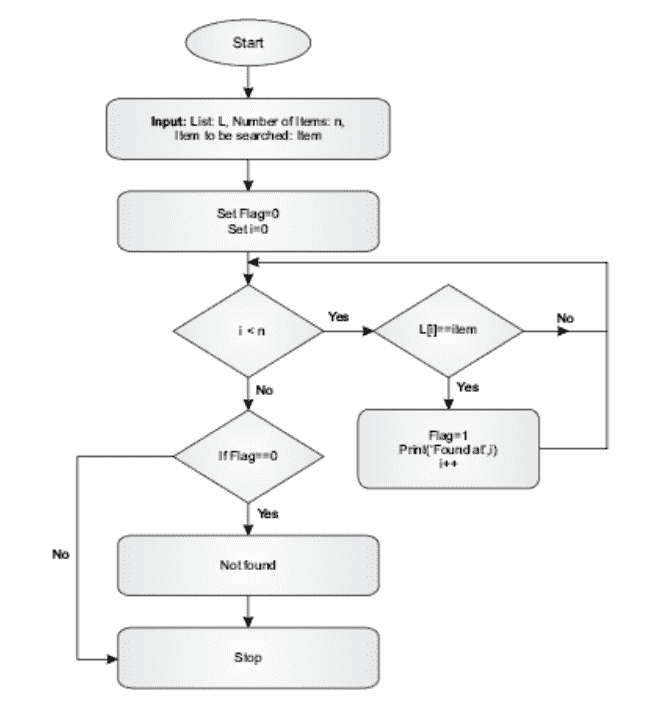

**图 1.1** 线性搜索流程图。

线性搜索：类英语描述

- 1. 设置 Flag=0
- 2. 将 i 的值设为 0，并开始扫描列表中的项目。如果找到待搜索项，则将 Flag 设为 1。
- 3. 如果 Flag==0，则打印“未找到”。

**表 1.1** 算法中使用的约定。

| 约定 | 描述 |
| --- | --- |
| // | 单行注释 |
| /*...*/ | 多行注释 |
| {} | 代码块 |
| <变量名> = <值> | 赋值 |
| a < b | 小于运算符 |
| a > b | 大于运算符 |
| a <= b | 小于或等于运算符 |
| a >= b | 大于或等于运算符 |
| a == b | 检查相等性 |
| a != b | 检查两个变量的值是否不相等 |
| && | 与运算符 |
| \|\| | 或运算符 |

## 1.4 问题解决策略：递归与迭代

算法可以是递归的或迭代的。递归是在函数内部调用该函数。为了使用递归开发代码，必须用函数自身（参数值减小）来表达该函数，并应指定基本条件作为停止标准。例如，*第 n 个*斐波那契项可以表示为（*n*-1）th 和（*n*-2）th 斐波那契项之和。由于计算 *第 n 个* 斐波那契项需要前两个计算结果，因此必须指定两个基本条件。该序列的第一项和第二项都是 1。因此，该函数可以写成如下形式。

$$fib(n) = fib(n-1) + fib(n-2)$$
$$fib(1) = 1$$
$$fib(2) = 1$$

也就是说，要找到第五个斐波那契项，我们需要找到第四项和第三项的和。第四项斐波那契数可以通过将第三项和第二项相加得到。第三项斐波那契数可以通过将第二项和第一项相加得到，这两项都是 1。该过程如图 1.2 所示。

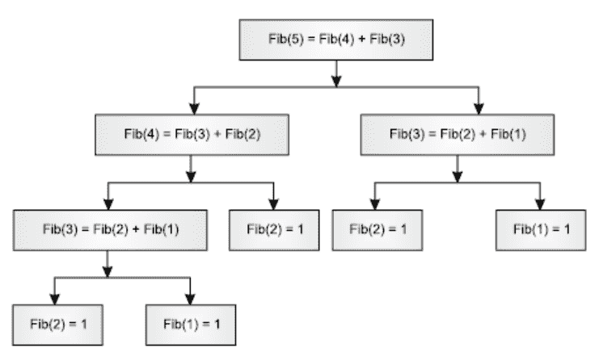

**图 1.2** 第五个斐波那契项的计算过程。

尽管递归提供了优雅的解决方案和一种数学上定义函数的方式，但很难掌握使用递归解决问题的方法。事实上，调试一个使用递归的复杂程序是困难的。此外，由于使用函数调用，它的效率较低。

然而，一些问题，如树的中序、前序和后序遍历；图的深度优先搜索和广度优先搜索；二分搜索、快速排序和归并排序等，可以很容易地使用递归解决。这里可以说明，一个可以使用递归解决的问题也可以使用迭代解决。

递归使用运行时栈，它提供后进先出的访问方式。为了理解这一点，让我们考虑一个使用递归计算阶乘的例子。一个数的阶乘可以使用以下公式计算。

$$fac(n) = n * fac(n - 1)$$
$$fac(1) = 1$$

计算 $fac(3)$ 需要将 $fac(2)$ 乘以 3。计算 $fac(2)$ 需要将 $fac(1)$ 乘以 2。$fac(1)$ 的值是 1。因此，在上面的例子中，$fac(3)$ 调用 $fac(2)$，而 $fac(2)$ 调用 $fac(1)$。

当 *fac(1)* 结束时，运行时栈存储 *fac(2)* 的位置以返回到 *fac(3)*。同样，当 *fac(2)* 结束时，运行时栈存储 *fac(3)* 的位置以返回到 *fac(4)*。运行时栈使回溯变得容易。[第 7 章](Chapter 7) 详细讨论了递归。

递归的另一个例子是计算给定数字的幂。一个数的幂可以使用迭代算法计算，如程序 1 所示。在程序中，变量 *p* 初始化为 1。循环运行 *b* 次，每次将 *a* 乘以 *p*。这里可以说明，编程的语法和细节将在后续章节中介绍。然而，读者可以在完成接下来的两个单元后重新阅读本节。

### 程序：

```
a=int(input('Enter the first number\t'))
b=int(input('Enter the second number\t:'))
p=1
i=1
while (i<=b):
    p=p*a
    i+=1
print(a, ' to the power of ', b, 'is ',p)
```

## 输出：

```
Enter the first number    : 2
Enter the second number   :10
2 to the power of 10 is 1024
```

上述任务也可以使用递归完成。可以使用以下公式来求 *a* 的 *b* 次幂。

$$a^b = (a^{b/2})^2, \text{ 如果 } b \text{ 是偶数，且}$$

$$a^b = (a^{(b-1)/2})^2 \times b, \text{ 如果 } b \text{ 是奇数}$$

该逻辑已在以下程序中实现。输出如下。

### 程序：

```
def pow (a, b):
    if b==1:
        return a
    elif b%2==0:
        return (pow(a, b/2)**2)
    else:
        return ((pow(a, int(b/2))**2)*a)
pow(5,1)
pow(5,2)
pow(5,3)
pow(5,4)
```

## 输出：

```
5
25
125
625
3125
```

## 1.5 渐近表示法

可以通过考虑算法的最佳情况和最坏情况来分析算法。例如，在线性搜索中，最佳情况是在列表的第一个位置找到元素。该算法的最坏情况是元素在最后一个位置被找到或未被找到。

函数的渐近增长可以根据其输入大小来定义，对于足够大的输入大小 n。渐近表示法可用于比较算法的运行时间或空间需求。算法的最佳情况运行时间可以用其下界来表示，最坏情况运行时间可以用其上界来表示。下界此后将用大欧米伽表示，即 Ω()。上界此后将用大欧表示，即 O()。两者的正式定义如下。

## 大 O：O()

算法的最坏情况行为由渐近上界表示法描述。对于任意两个函数 f(n) 和 g(n)

O(g(n)) = f(n)，对于所有 n > 0 且

$f(n) \leq c \times g(n)$

## 欧米伽：Ω()

算法的最佳情况行为由渐近下界表示法描述。对于任意两个函数 $f(n)$ 和 $g(n)$

$\Omega(g(n)) = f(n)$，对于所有 $n > 0$ 且
$f(n) \geq c \times g(n)$

## 西塔：Θ()

函数 $f(n)$ 的*渐近紧界*可以定义如下。对于任意两个函数 $f(n)$ 和 $g(n)$。

$\Theta(g(n)) = f(n)$，对于所有 $n > 0$ 且
$c_1 \times g(n) \leq f(n) \leq c_2 \times g(n)$

还应注意，

$f(n) = O(g(n))$ 且
$f(n) = \Omega(g(n))$
那么，
$f(n) = \Theta(g(n))$

## 1.6 复杂度

算法在内存和时间方面都应该是高效的。也就是说，算法应该占用最少的空间和时间。为了理解这个概念，让我们考虑五个不同的算法来解决同一个问题。假设作为算法输入的元素数量为 **n**。第一个算法花费与 **n** 成比例的时间来完成给定任务（$O(n)$），第二个算法花费与 **n²** 成比例的时间来完成相同的任务（$O(n^2)$），第三个花费与 **n³** 成比例的时间（$O(n^3)$），第四个花费与 $\log(n)$ 成比例的时间（$O(\log n)$），第五个花费与 $n \log(n)$ 成比例的时间，即 $O(n \log n)$。这意味着，如果元素数量加倍，第一个算法完成给定任务所需的时间将加倍，第二个算法将变为四倍，第三个算法将变为八倍，第四个算法的时间增加将小于第一个算法的增加，第五个算法的时间增加将小于第二个算法的增加。因此，时间复杂度的顺序如下：

$O(\log n) < O(n) < O(n \log n) < O(n^2) < O(n^3)$

例如，下一节描述的线性搜索需要 $O(n)$ 时间，而二分搜索需要 $O(\log n)$ 时间。因此，与线性搜索相比，二分搜索花费的时间更少。归并排序和冒泡排序是两种最流行的排序算法。归并排序需要 $O(n \log n)$ 时间，冒泡排序需要 $O(n^2)$ 时间。因此，与冒泡排序相比，归并排序的时间复杂度更低，因此更好。

## 1.7 示例

在了解了编写算法的定义、特性和表示法之后，让我们现在来看一些基本示例。本节介绍了四个问题及其解决方案。

### 1.7.1 列表中的最小值

**示例 1.1：**

*给定一个列表 L。编写一个算法来找到列表中值最小的元素。*

**解决方案：**

让列表的第一个元素作为最小值元素（“min” = $L[0]$）。列表从左到右扫描。在任何时刻，如果我们能找到一个值小于存储在“min”中的值的元素，则将该元素的值存储在变量“min”中。**min1** 函数执行所需的任务。

**算法：**

def min1(L):
    {
        min=L[0];
        i=0;
        while(i<len(L))
            {
                if(L[i]<min)
                    {
                        min=L[i];
                    }
                i+=1;
            }
        return min;
    }

**测试：**
min([51,12,71,91,13,19])

**输出：**
12

### 1.7.2 在一副牌中插入一张牌（或在已排序列表中插入一个元素）。这副牌有十张，编号从1到10。

**图示 1.2：**

> 要求在一副有序的牌中插入一张牌。上述问题也可以这样表述：给定一个已排序的列表，在其适当位置插入一个元素。

**解法：**

给定的列表是已排序的，需要将给定的元素插入到其适当位置。我们从最后一个元素开始，将每个元素向右移动一个位置，直到找到一个比给定元素小的元素。然后将给定元素插入到该位置。

**算法：**

```
def insert(L, item)
{
    //L是一个已排序的列表，item是要插入的数字
    n=len(L); //len函数用于获取给定列表的长度
    i=n;//将i设置为最后一个位置
    while(L[i]>item)
    {
        L[i+1]=L[i];
        i=i-1;
    }
    L[i+1]=item;
    print(L)
}
```

**测试：**
insert([1,3,4,6,8,9],7)

**预期输出（Python实现）：**
[1, 3, 4, 6, 7, 8, 9]

### 1.7.3 在给定范围内猜一个数字

**图示 1.3：**
*计算机在给定范围内生成一个数字，你需要在10次尝试内猜出它。*

**解法：**
该算法需要一个伪随机数生成器。用户输入一个范围，程序在该范围内生成一个随机数。计算机引导用户，告诉用户正确数字是比用户猜的数字大还是小。用户只允许进行十次尝试。

**算法：**

```
GuessNumber()
{
    import random;
    n = 0;
    //要求用户输入两个数字
    print('你好！我将猜一个你输入的范围内的数字\t:');
    a=int(input('输入第一个数字\t:'));
    b=int(input('输入第二个数字\t:'));
    print('正在生成一个介于 ',a, ' 和 ',b, ' 之间的数字');
    number = random.randint(a, b);
    while (n < 10)
    {
        guess = int(input('猜一个数字\t:'));
        if (guess < number)
        {
            print('猜一个更大的数字\t:');
        }
        if (guess > number)
        {
            print('猜一个更小的数字\t:');
        }
        if (guess == number)
        {
            print('恭喜你赢了！')
            break;
        }
        n = n + 1;
        if (guess == number)
        {
            print('在 ', (n+1), ' 次尝试内猜中');
        }
        if (guess != number)
        {
            print('这个数字是 ', number);
        }
    }
}
```

**预期输出**

你好！我将猜一个你输入的范围内的数字:

输入第一个数字 : 3
输入第二个数字 : 10
正在生成一个介于 3 和 10 之间的数字 :
猜一个数字 : 9
猜一个更小的数字 :
猜一个数字 : 8
猜一个更小的数字 :
猜一个数字 : 7
猜一个更小的数字 :
猜一个数字 : 6
猜一个更小的数字 :
猜一个数字 : 5
猜一个更小的数字 :
猜一个数字 : 4
猜一个更小的数字 :
这个数字是 3

### 1.7.4 汉诺塔

汉诺塔要求将**n**个大小递增的圆盘从源柱移动到目标柱，每次移动一个圆盘，并且任何时候都不能将较大的圆盘放在较小的圆盘上面。下面的例子说明了这个过程。本例中**n**的值为三。请注意，在任何步骤中，较大的圆盘都没有放在较小的圆盘上面（图1.3–1.9）。

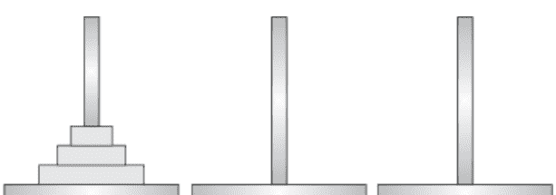

**图 1.3** 最初，第一个柱子（源柱）上有所有三个需要移动到第二个柱子（目标柱）的圆盘。

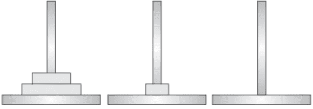

**图 1.4** 将最小的圆盘移动到第二个柱子。

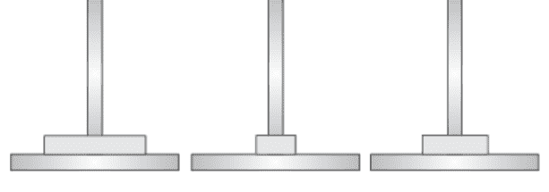

**图 1.5** 将第二大的圆盘移动到第三个柱子。

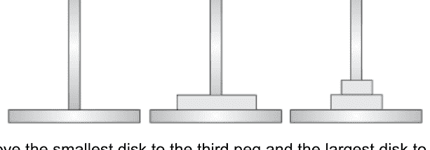

**图 1.6** 将最小的圆盘移动到第三个柱子，将最大的圆盘移动到第二个柱子。

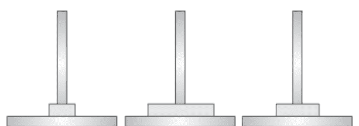

**图 1.7** 现在将最小的圆盘移动到第一个柱子。

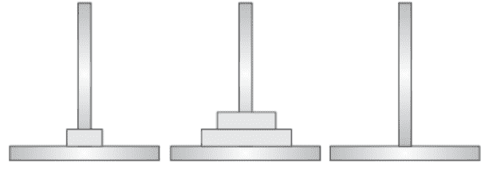

**图 1.8** 将第二大的圆盘移动到第二个柱子，并将其放在最大的圆盘上面。

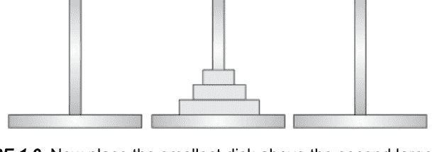

**图 1.9** 现在将最小的圆盘放在第二大的圆盘上面。

**图示 1.4：**

*为汉诺塔问题的解法编写一个算法。*

**算法：**

```
def towerOfHanoi(n, source, destination, intermediate)
{
    if(n==1)
    {
        print("将 ",n," 从 ", source, " 移动到 ",destination);
    }
    else
    {
        towerOfHanoi(n-1, source, intermediate, destination);
        print("将 ",n," 从 ", source, " 移动到 ",destination);
        towerOfHanoi(n-1, intermediate, destination, source);
    }
}
```

**测试：**

```
towerOfHanoi(1,'A','B', 'C')
```

**预期输出**

将 1 从 A 移动到 B

**测试：**

```
towerOfHanoi(2,'A','B', 'C')
```

**预期输出**

将 1 从 A 移动到 C
将 2 从 A 移动到 B
将 1 从 C 移动到 B

**测试：**

```
towerOfHanoi(3,'A','B', 'C')
```

**预期输出**

将 1 从 A 移动到 B
将 2 从 A 移动到 C
将 1 从 B 移动到 C
将 3 从 A 移动到 B
将 1 从 C 移动到 A
将 2 从 C 移动到 B
将 1 从 A 移动到 B

**测试：**

```
towerOfHanoi(4,'A','B', 'C')
```

**预期输出**

将 1 从 A 移动到 C
将 2 从 A 移动到 B
将 1 从 C 移动到 B
将 3 从 A 移动到 C
将 1 从 B 移动到 A
将 2 从 B 移动到 C
将 1 从 A 移动到 C
将 4 从 A 移动到 B
将 1 从 C 移动到 B
将 2 从 C 移动到 A
将 1 从 B 移动到 A
将 3 从 C 移动到 B
将 1 从 A 移动到 C
将 2 从 A 移动到 B
将 1 从 C 移动到 B

## 1.8 结论

算法是用于高效、有效地完成给定任务的一系列步骤。算法必须是明确的，每条指令都应该是清晰无歧义的。表示完成给定任务的步骤有许多方式：可以用简单的英语写出指令，可以绘制流程图，或者编写伪代码。算法必须至少产生一个输出。此外，一个好的算法应该在内存和计算时间方面都是高效的。渐近复杂度帮助我们确定算法的效率。使用算法解决问题是一个复杂的过程，需要适当的深思熟虑和细致的分析。本章介绍了一些算法，如线性搜索、二分搜索等。编程新手可能会觉得理解本章介绍的一些过程有些困难。然而，他们应该先学习本书第二部分介绍的过程式编程，然后再回顾本章。本章是通往引人入胜的问题解决世界的大门，而Python将是你在这段漫长旅程中的朋友。那么，让我们在下一章认识我们的新朋友“Python”吧。

## 术语表

**算法：** 为完成给定计算任务而编写的一系列步骤。

**优秀算法的特征：** 正确性、明确性、无歧义性、输入和输出。

## 要点回顾

- 设计算法时，正确性应是首要考虑。
- 算法应该是
  - 明确的，
  - 无歧义的，并且
  - 高效的。
- 对于已排序的列表，二分搜索更好。
- 大O表示法表示上界。
- Theta表示紧界。

## 练习

### 选择题

1. 算法应该是
   (a) 明确的
   (b) 无歧义的
   (c) (a)和(b)都是
   (d) 以上都不是
2. 在以下哪种算法中，可能不需要输入参数？
   (a) 线性搜索
   (b) 二分搜索
   (c) 伪随机数生成器
   (d) 以上都不是
3. 如果输入列表是已排序的，可以使用以下哪种方法？
   (a) 线性搜索
   (b) 二分搜索
   (c) 两者效率相同
   (d) 取决于输入约束
4. 如果输入数组未排序，以下哪种方法将不起作用？
   (a) 线性搜索
   (b) 二分搜索
   (c) (a)和(b)都是
   (d) 取决于问题
5. 在递归算法中
   (a) 函数需要用自身来表达
   (b) 必须说明基本情况
   (c) 以上两者都是
   (d) 以上都不是
6. 通常，以下哪种算法的时间复杂度更高？
   (a) 递归算法
   (b) 迭代算法
   (c) (a)和(b)都是
   (d) 以上都不是
7. 以下哪种表示上界？
   (a) 大O表示法
   (b) Omega表示法
   (c) Theta表示法
   (d) 以上都不是
8. 以下哪种表示下界？
   (a) 大O表示法

## 9. 以下哪个表示紧确界？

- (a) 大O符号
- (b) Omega符号
- (c) Theta符号
- (d) 以上都不是

## 10. 如果一个算法是 O(n)，那么它也是

- (a) $O(n^2)$
- (b) $O(n^3)$
- (c) $O(2^n)$
- (d) 以上都是

## 11. 如果一个算法是 O(n^2)，那么它不是

- (a) $O(n)$
- (b) $O(n^3)$
- (c) $O(2^n)$
- (d) 以上都是

## 12. 如果一个算法是 $\Omega(n^3)$，那么它也是

- (a) $\Omega(n^2)$
- (b) $\Omega(n)$
- (c) $\Omega(1)$
- (d) 以上都是

## 13. 如果一个算法是 $\Omega(n^2)$，那么它不是

- (a) $\Omega(n)$
- (b) $\Omega(n^3)$
- (c) $\Omega(2^n)$
- (d) 以上都是

## 14. 谁是著名的PageRank算法背后的智囊？

- (a) 拉里·佩奇
- (b) 艾伦·图灵
- (c) 特朗普
- (d) 以上都不是

## 15. 谁发明了图灵机？

- (a) 爱因斯坦
- (b) 牛顿
- (c) 乔治·布尔
- (d) 以上都不是

## 理论

1.  定义算法一词。同时，阐述一个好算法的特征。
2.  什么是空间和时间复杂度？并讨论两者的重要性。
3.  定义以下渐近符号。
    (a) 大O，
    (b) Omega，
    (c) Theta。
4.  编写算法有哪些不同的方式？
5.  区分算法和程序。
6.  为什么设计应先于实现？
7.  有哪些不同的设计方法？
8.  讨论时间-内存的权衡。

# 应用

1.  编写一个线性搜索的算法。
2.  如果给定的列表是有序的，可以按如下方式搜索元素。我们从查看列表的第一个、最后一个和中间位置开始。如果在这些位置未找到该元素，则将列表分成两半。如果要搜索的元素小于中间位置的元素，则在列表的左半部分重复此过程；否则，在右半部分重复。最后，会剩下一个元素，可以轻松检查。为这个过程编写一个正式的算法。
3.  在上述情况下，如果列表被分成四部分而不是两部分，编写该算法。
4.  编写一个对给定列表进行排序的算法。
5.  编写一个从给定列表中找到最小元素的算法。
6.  编写一个从给定列表中找到最大元素的算法。
7.  编写一个从给定列表中找到第二大元素的算法。
8.  编写一个计算给定列表所有元素之和的算法。同时，计算该列表中元素的平均值、标准差和四分位差。
9.  编写一个判断列表是否包含重复元素的算法。
10. 编写一个反转给定列表的算法。

# 第2章

# Python简介

### 目标

阅读本章后，读者应能够

- 理解Python的原则
- 认识Python的重要性和特点
- 列举Python的应用领域
- 安装Anaconda
- 理解Python中的控制流

# 2.1 简介

艺术是人类创造性技能的表达，因此编程是一门艺术。因此，编程语言的选择就像艺术家手中的工具。本书介绍Python，它将帮助你成为一名伟大的艺术家。美国普渡大学教授、首届图灵奖获得者A. J. Perlis曾说：

> 一门不影响你编程思维方式的语言，不值得学习。

Python值得学习。学习Python不仅能激励你以最简单的方式完成高度复杂的任务，还能打破传统编程范式的神话。此外，它是一门将改变你看待问题方式的语言。

本书旨在探索Python编程的要素。虽然我们将使用Python进行编程，但本书提出的大多数概念都是通用的。我们必须认识到，计算机科学现在也被用于解决社会问题，而你学习的语言应该助你朝着为社会做贡献的目标前进。

如前一章所述，程序是一组指令，我们不能使用类似英语的指令，因为它们是模糊的。另一方面，像Python这样的编程语言是明确的。Python解释器将解释输入给它的指令。

Python是一种强大的、过程式的、面向对象的、函数式的语言，由Guido Van Rossum在1980年代末精心打造。该语言以喜剧团体Monty Python命名。该语言目前应用于多个应用领域。这些领域包括软件开发、Web开发、桌面图形用户界面（GUI）开发以及教育和科学应用。因此，它几乎涵盖了开发的所有方面。它的流行主要归功于其简单性和健壮性，尽管许多其他因素将在后续章节中讨论。

有许多第三方模块可以完成上述任务。例如，Django是一个非常流行的Web框架，专注于干净快速的开发，它就是基于Python开发的。这连同对HTML、电子邮件、FTP等的支持，使其非常适合Web开发。

也有用于软件开发的第三方库。最常见的例子之一是Scions，用于构建控件。结合内置功能和支持，Python在GUI开发和移动应用程序开发方面也能创造奇迹，例如，Kivy用于开发多点触控应用程序。

Python也应用于科学分析。SciPy用于工程和数学，IPython用于并行计算。从事统计和机器学习工作的读者会发现一些库非常有用且易于使用。例如，SciPy提供类似MATLAB的功能，可用于处理多维数组。图2.1总结了上述讨论。

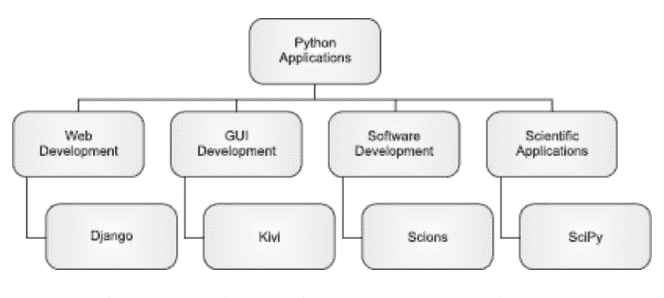

**图2.1** Python的一些应用。

本章组织如下。第2.2节讨论Python的特性。第2.3节讨论Python支持的编程语言范式，第2.4节讨论Python的历史和用途。第2.5节介绍了Anaconda的安装。第2.6节简要讨论了变量、语句等。最后一节是总结。

## 2.2 Python的特性

如前所述，Python是一种简单但强大的语言。它是可移植的且免费的。它具有内置对象类型和许多库。本节简要讨论Python的特性。

### 2.2.1 简单易学

Python易于学习和理解。事实上，如果你有编程背景，你会发现它优雅且不杂乱。移除花括号和括号使代码简洁明了。此外，Python中的一些任务非常简单。例如，在Python中交换数字就像写 $(a, b) = (b, a)$ 一样简单。

这里也可以说明，学习新事物是一项复杂而精细的任务。然而，Python的简单性使这种学习几乎变得轻而易举。此外，学习其高级功能虽然有点复杂，但值得付出努力。理解用这种语言编写的项目也很容易。代码简洁有效，使其易于理解。

### 2.2.2 即时运行

在大多数项目中，测试新内容需要大量更改，因此需要重新编译和重新运行。这使得测试代码成为一项困难且耗时的任务。在Python中，代码可以轻松执行。事实上，我们在Python中运行脚本。正如我们将在本章后面看到的，它还为用户提供了一个交互式环境来运行独立命令。

### 2.2.3 语法

Python的语法简单；这使得学习和理解过程变得容易。使这门语言具有吸引力的三个主要特点是简单、小巧和灵活。

### 2.2.4 混合使用

如果一个人在一个大型项目中工作，团队很大，可能会有一些团队成员擅长其他语言。这可能导致一些用其他语言编写的模块需要嵌入到Python代码中。Python实际上允许甚至支持这一点。

### 2.2.5 动态类型

Python有自己管理与对象相关内存的方式。当在Python中创建一个对象时，内存会动态分配给它。当对象的生命周期结束时，内存会被回收。Python的这种内存管理使程序更高效。

### 2.2.6 内置对象类型

正如我们将在下一章看到的，Python具有内置对象类型。这使得要完成的任务变得容易且易于管理。此外，与这些对象相关的问题由语言巧妙地处理。

### 2.2.7 丰富的库和工具

在Python中，要完成的任务变得简单，非常简单。这是因为大多数常见任务（实际上，一些不那么常见的任务也一样）在Python中都已有现成的解决方案。例如，它拥有帮助用户开发图形用户界面、编写移动应用程序、集成安全功能，甚至读取核磁共振成像的库。正如我们将在后续章节中看到的，这些库和辅助工具使得像模式识别这样复杂的任务也变得简单。

### 2.2.8 可移植性

用Python编写的程序几乎可以在所有已知平台上运行。无论是Windows、Linux还是Mac。这里也可以说明，Python是用C语言编写的。然而，该语言的某些版本也是用JAVA编写的。

### 2.2.9 免费

Python不是专有软件。人们可以从各种可用选择中下载Python编译器。此外，分发用Python开发的代码不涉及任何已知的法律问题。

## 2.3 编程范式

本节简要介绍三种主要的编程范式。请注意，Python完全支持前两种：过程式编程和面向对象编程。然而，它也支持一些其他特性，如尾调用优化等。

### 2.3.1 过程式

在过程式语言中，程序是一组按顺序执行的语句。程序在可管理性方面的唯一选择是将程序划分为小模块。例如，“C”就是一种过程式语言。Python支持过程式编程。本书的第五部分将讨论过程式编程。

### 2.3.2 面向对象

这种语言主要关注类的实例。类的实例称为对象。这里的类是一个真实或虚拟的实体，对当前问题很重要，并且有明确的物理边界。例如，在一个处理学生管理的程序中，“学生”可以是一个类。创建它的实例，并通过方法进行通信来完成手头的任务。Python是一种面向对象的语言。本书的第三部分将讨论面向对象编程。

### 2.3.3 函数式

在函数式编程中，每个计算都被视为数学函数求值的结果。Python也支持函数式编程。此外，Python支持不可变数据、尾调用优化等。对于有函数式编程背景的人来说，这无疑是好消息。这里需要说明的是，函数式编程超出了本书的范围。然而，上述一些特性将在后续章节中讨论。

## 2.4 历史沿革与用途

本节简要讨论Python的历史沿革，并激励读者与这门语言建立联系。

### 2.4.1 历史沿革

Python是一种多范式语言，构思于20世纪80年代末。Python的实现始于1989年12月，当时在Centrum Wiskunde & Informatica工作的Guido Van Rossum决定在圣诞假期做些有用的事情。他实际上想开发ABC编程语言的后续版本。

下一个版本Python 2于2000年10月16日发布，随后是Python 3，于2008年12月3日发布。然而，它并不向后兼容。2017年，Google宣布停止对Python 2.7的支持。

一些语言，如Perl，相信提供多种方式来完成一项任务。另一方面，Python相信完成一项任务应该有一种显而易见的方式，因此其核心很小。Python支持面向对象编程和过程式编程。它部分支持函数式编程。尽管它的核心很小，但标准库支持非常广泛。它简单、不杂乱，并且拥有可扩展的解释器。

Python所基于的原则可以通过在解释器中输入`import this`来查看。这会呈现“Python之禅”。

```
>>import this
```

```
The Zen of Python, by Tim Peters
Beautiful is better than ugly.
Explicit is better than implicit.
Simple is better than complex.
Complex is better than complicated.
Flat is better than nested.
Sparse is better than dense.
Readability counts.
Special cases aren’t special enough to break the rules.
Although practicality beats purity.
Errors should never pass silently.
Unless explicitly silenced.
In the face of ambiguity, refuse the temptation to guess.
There should be one-- and preferably only one --obvious way to do it.
Although that way may not be obvious at first unless you’re Dutch.
Now is better than never.
Although never is often better than *right* now.
If the implementation is hard to explain, it’s a bad idea.
If the implementation is easy to explain, it may be a good idea.
Namespaces are one honking great idea -- let’s do more of those!
```

还需要说明的是，Python拒绝那些只能带来边际速度提升却使代码更难理解的补丁。Python的特性将在本章的下一节中讨论。可以说，遵循上述规则的人使用的是Pythonic的编程方式。

这种语言的持续改进得益于一个致力于为世界提供一门简单而强大的语言的专门团队。这种语言的发展催生了许多Python兴趣小组和论坛。语言的变更通常通过所谓的PEP（Python增强提案）来实现。PSF（Python软件基金会）负责此事。

### 2.4.2 用途

Python被用于完成许多任务，其中最重要的如下：

- 图形用户界面开发
- 网页脚本编写
- 数据库编程
- 原型设计
- 游戏开发
- 基于组件的编程

如果你在Unix或Linux上工作，你不需要安装Python，因为它通常是预装的。如果你在Windows或Mac上工作，你需要下载Python。一旦你决定下载Python，请寻找其最新版本。请读者确保他们打算下载的版本不是alpha或beta版本。下一节将简要讨论下载开源发行版Anaconda的步骤。

Python有许多可用的开发环境。其中一些如下：

1. PyDev with Eclipse
2. Emacs
3. Vim
4. TextMate
5. Gedit
6. Idle
7. PIDA (Linux) (VIM Based)
8. NotePad++ (Windows)
9. BlueFish (Linux)

还有更多选择。然而，本书使用IDLE和Anaconda。下一节将介绍安装Anaconda的步骤。

## 2.5 安装Anaconda

要安装Anaconda，请访问 https://docs.continuum.io/anaconda/install 并选择安装程序（Windows或Mac OS或Linux）。本节介绍在Windows操作系统上安装Anaconda的步骤。

首先，必须根据处理器（32位或64位）选择安装程序。之后，单击所选安装程序并下载可执行文件。安装程序会要求你将软件安装在默认位置。在安装过程中，你可能需要禁用防病毒软件。图2.2(a)–(g)将引导读者完成安装过程。


**图2.2(a)** 安装程序的欢迎屏幕要求用户关闭所有正在运行的应用程序，然后单击“下一步”。


**图2.2(b)** 安装Anaconda3 4.3.0 (32-bit)的许可协议。


**图2.2(c)** 在第三步中，用户需要选择是为单个用户还是为所有用户安装Anaconda。


**图2.2(d)** 然后用户需要选择安装文件夹。

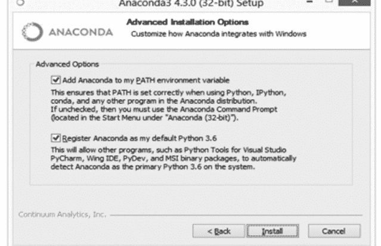

**图 2.2(e)** 用户随后必须决定是否要将 Anaconda 添加到 Path 环境变量，以及是否将 Anaconda 注册为默认的 Python 3.6。

安装随即开始。安装完成后，将出现以下屏幕。

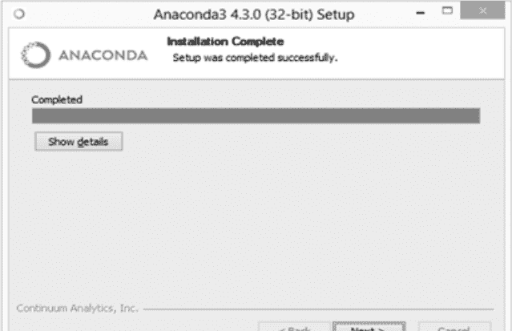

**图 2.2(f)** 安装完成后，将显示此屏幕。

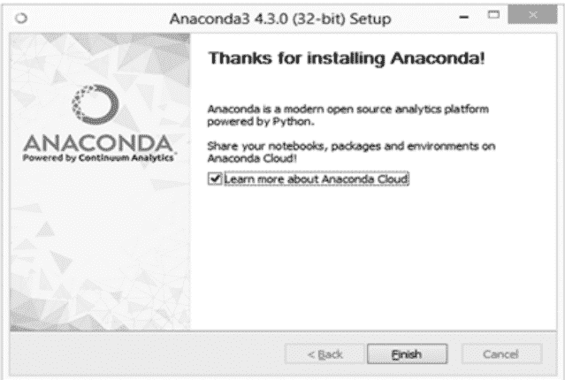

**图 2.2(g)** 你也可以在云端共享你的笔记本。

安装 Anaconda 后，你可以打开 Anaconda Navigator 并运行你的脚本。图 2.3 展示了 Anaconda Navigator。从可用的各种选项中，你可以选择合适的选项。例如，你可以打开 QTConsole 并运行命令/脚本。图 2.4 展示了 QTConsole 的快照。此时编写的命令可能看起来像乱码，但在后续章节中会变得清晰。建议读者使用 Jupyter Notebook 来执行本书中的代码。


**图 2.3** Anaconda Navigator。

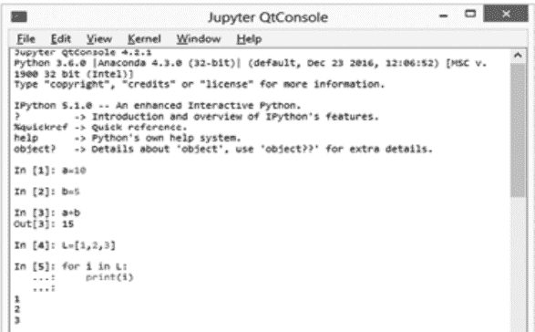

**图 2.4** QtConsole。

## 2.6 算法的实现：语句、状态、控制块和函数

上一章讨论了算法的定义、特性和类型。本章介绍 Python，它将帮助我们实现算法。本节简要描述程序的构建模块。

### 2.6.1 语句

如前所述，程序是一组指令。每条指令都指导计算机需要做什么。程序中的语句是 Python 解释器可以执行的指令。语句可以有多种类型，例如赋值语句、条件语句等。例如，赋值语句的形式如下

```
<变量名> = <表达式>
```

其中 `<变量名>` 是任何合法的变量名，`<表达式>` 是 Python 中任何合法的表达式，该表达式求值后将值赋给左侧的变量。Python 中合法的变量名以字母或下划线开头，不能包含空格或特殊字符。后续章节将详细解释每种类型的语句。

### 2.6.2 状态

如果一个程序能记住之前的交互，则称其为有状态的。因此，程序在某一时刻的状态就是该时刻变量的值及相关细节。一个系统可以处于称为状态空间的可能状态集合中的任何状态。

### 2.6.3 控制流

在 Python 程序中，语句是逐条执行的。如果要改变程序的流程，可以使用合法的控制流语句之一。Python 提供以下控制流语句：

- if、if-else、if-elif 梯形结构
- while 循环，以及
- for 循环

#### 条件语句

Python 还提供了 **break** 和 **continue** 关键字。`if` 语句帮助我们在给定条件为真时执行特定的一组语句。`if` 的语法如下。

## 语法

```
if <条件>:
    <代码块 1>
else:
    <代码块 2>
```

如果条件为真，则执行第一个代码块 `<代码块 1>`。如果条件不为真，则执行 `<代码块 2>`。以下示例检查用户输入的数字的值。如果用户输入的数字大于 10，则打印“Hi”，否则打印“Bye”。

## 代码：

```
num=int(input('Enter a number:'))
if num>10:
    print('Hi')
else:
    print('Bye')
```

## 输出：

```
Enter a number: 12
Hi
```

如果有多个条件，则使用 if-elif 梯形结构。[第 4 章](Chapter 4) 详细描述了条件语句。

#### 循环

代码块的重复使用 `while` 和 `for` 循环完成。`while` 循环在条件为真时重复执行一个代码块。在 Python 中，`while` 可以有一个可选的 `else`。循环的语法如下。

## 语法

```
while <条件>:
    <代码块 1>
else:
    <代码块 2>
```

第一个代码块 `<代码块 1>` 会一直重复，直到 `<条件>` 为假。如果条件为假，则执行第二个代码块 `<代码块 2>`。下面的示例打印用户输入数字的前十个倍数。变量 `i` 初始化为 1。循环运行直到 `i` 的值变为 `n`。在每次迭代中，打印 `i*n`。本书 [第 6 章](Chapter 6) 详细讨论了循环。Python 中的 `for` 循环与 C 语言有些不同，因为它还帮助我们遍历列表、元组或字符串。

## 代码：

```
n = int(input('Enter number: '))
i=1
while(i<=10):
    print(i, ' * ',n,' = ', (i*n))
    i+=1
```

## 输出：

```
Enter number: 7
    1   *   7   =   7
    2   *   7   =   14
    3   *   7   =   21
    4   *   7   =   28
    5   *   7   =   35
    6   *   7   =   42
    7   *   7   =   49
    8   *   7   =   56
    9   *   7   =   63
   10   *   7   =   70
```

#### 函数

函数是一个命名的代码块，它执行特定任务，并且可能显式返回值，也可能不返回。请注意，在 Python 中，每个函数至少返回 `NONE`。在 Python 中，函数使用 `def` 关键字定义。函数可以有任意数量的参数，并且可以被调用任意次数。[第 7 章](Chapter 7) 详细描述了这个主题。以下代码展示了一个名为 `fun` 的函数。它打印字符串“Turn Turn Turn”。注意 `fun` 被调用了两次。

## 代码：

```
def fun():
    print('Turn Turn Turn')
fun()
fun()
```

## 输出：

```
Turn Turn Turn
Turn Turn Turn
```

## 2.7 结论

在继续之前，读者必须注意 Python 的一些特性与其他语言不同。为了避免任何混淆，必须提及以下几点。

- 在 Python 中，语句不以任何特殊字符结尾。Python 将换行符视为语句结束的标志。如果一条语句要跨越多行，则下一行必须以反斜杠 (\) 开头。
- 在 Python 中，缩进用于检测代码块。Python 中的循环不以分隔符或关键字开始或结束。
- Python 中的文件通常以 .py 扩展名保存。
- Python shell 也可以用作便捷的计算器。
- 程序中不需要提及数据类型。

每一步都有选择是好事，但也可能令人望而生畏。如前所述，Python 的核心很小，因此易于学习。此外，有些东西，如 if else、循环和异常处理，几乎在所有程序中都会用到。

本章介绍了 Python 并讨论了其特性。必须认识到 Python 支持所有三种范式：过程式、面向对象和函数式。同时，本章为后续章节中介绍的主题铺平了道路。还可以说，本书中提供的代码将在 3.x 版本上运行。

## 术语表

- **PEP** Python 增强提案
- **PSF** Python 软件基金会

## 要点回顾

- Python 是一种强大的、过程式的、面向对象的、函数式的语言，由 Guido Van Rossum 在 1980 年代末期创建。
- Python 是开源的。
- Python 的应用包括软件开发、Web 开发、桌面 GUI 开发、教育和科学应用。
- Python 因其简单性和健壮性而广受欢迎。
- Python 易于与 C++ 和 JAVA 接口。
- SciPy 用于工程和数学，IPython 用于并行计算等，SCons 用于构建控制。
- Python 的各种开发环境包括 PyDev with Eclipse、Emacs、Vim、TextMate、Gedit、Idle、PIDA (Linux) (基于 VIM)、NotePad++ (Windows) 和 BlueFish (Linux)。

## 资源

- 要下载 Python，请访问 [www.python.org](http://www.python.org)。
- 文档可在 [www.python.org/doc/](http://www.python.org/doc/) 获取。

## 练习

### 选择题

1. Python 可以子类化在以下语言中创建的类
   (a) 仅 Python
   (b) Python, C++
   (c) Python, C++, C#, JAVA
   (d) 以上都不是
2. 谁创建了 Python？
   (a) Monty Python
   (b) Guido Van Rossum
   (c) Dennis Richie
   (d) 以上都不是
3. Monty Python 是
   (a) Python 编程语言的创造者

(b) 英国喜剧团体
(c) 美国乐队
(d) 多西·豪瑟的兄弟

4. 在Python中，库和工具是

(a) 不支持的
(b) 支持但不鼓励
(c) 支持（仅限PSF的）
(d) 以上都不是

5. Python拥有

(a) 内置对象类型
(b) 数据类型
(c) (a)和(b)都有
(d) 以上都不是

6. Python是一种

(a) 过程式语言
(b) 面向对象语言
(c) 函数式语言
(d) 以上都是

7. 在Python中，变量的数据类型无需指定；因此，它适用于整个对象范围。这被称为

(a) 动态绑定
(b) 动态类型
(c) 动态领导
(d) 以上都不是

8. 以下哪项是自动内存管理？

(a) 自动为对象分配内存
(b) 在生命周期结束时回收内存
(c) (a)和(b)都是
(d) 以上都不是

9. PEP代表

(a) Python结束过程
(b) Python增强提案
(c) Python珍爱项目
(d) 以上都不是

10. PSF代表

(a) Python软件基金会
(b) Python选择函数
(c) Python隔离函数
(d) 以上都不是

11. Python可用于创建

(a) 图形用户界面
(b) 互联网脚本
(c) 游戏
(d) 以上都是

12. 使用Python可以做什么？

(a) 系统编程
(b) 基于组件的编程
(c) 科学编程
(d) 以上都是

13. Python被以下哪些使用

(a) 谷歌
(b) 树莓派
(c) Bit Torrent
(d) 以上都是

14. Python被用于

(a) App Engine
(b) YouTube分享
(c) 实时编程
(d) 以上都是

15. 哪个更快？

(a) PyPy
(b) IDLE
(c) 两者同样好
(d) 取决于任务

## 理论

1. 写出三家使用Python的公司名称。
2. 解释Python的一些应用。
3. Python是什么类型的语言？（过程式、面向对象还是函数式）
4. 什么是PEP？
5. 什么是PSF？
6. 谁管理Python？
7. Python是开源的还是专有的？
8. 哪些语言可以与Python集成？
9. 解释Python开发的年代顺序。
10. 列举几个Python编辑器。
11. Python有哪些特性？
12. 使用Python相比其他语言有什么优势？
13. 什么是动态类型？
14. Python有数据类型吗？
15. Python与JAVA有何不同？
16. 系统状态是什么意思？
17. Briley解释了Python中控制结构的重要性。
18. 哪些控制语句可用于重复给定任务？
19. Pearl和Python的主要区别是什么？
20. 阐述函数的必要性和重要性。

# 第三章

## 基础

### 目标

阅读本章后，读者应能够

- 理解程序是如何执行的。
- 学习在**Python**中运行程序的各种方法。
- 理解**Python**中的**print**和**input**函数。
- 理解**Jupyter Notebook**的元素。
- 理解标记、关键字、标识符和语句的重要性。

## 3.1 引言

**Python**将极大地促进我们成为程序员的旅程。让我们通过探索在**Python**中编写和执行程序的模式来开始这段旅程。本章讨论了执行**Python**程序的各种方式。在开始讨论之前，让我们先看看在**C**等语言中程序是如何执行的。

在C中，运行程序需要以下步骤（**图3.1**）：


**图3.1** 在C中，编译器将源代码转换为目标代码。然后进行链接，最后为进程分配内存。

- 编译
- 链接
- 加载

编译器将源代码转换为目标代码。链接器将目标代码转换为可执行代码并将其交给加载器。加载器主要为可执行文件分配内存。将源代码转换为目标代码需要以下步骤（图3.2）：

- 词法分析
- 语法分析
- 语义分析
- 中间代码生成
- 优化
- 最终代码生成

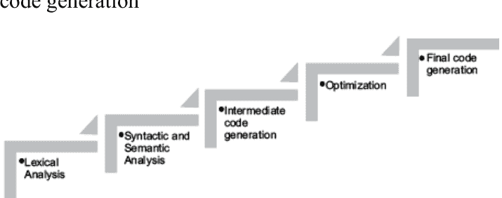

**图3.2** 在C中，编译器将源代码转换为目标代码。这是通过五个步骤完成的。第一步，编译器将源代码转换为标记。接下来是语法和语义分析。然后生成中间代码。最后，在优化后生成目标代码。

词法分析器将程序转换为可识别的标记。第二步检查语法。语义分析也在此步骤中完成。下一步生成中间代码。此中间代码经过优化，最后一步生成最终代码。然而，在某些编译器中，某些步骤是合并在一起的。例如，在大多数C编译器中，语法和语义分析是在同一阶段完成的。

上述过程产生优化后的代码，但生成的代码可能不兼容。因此，编译器在Java和C#等语言中生成中间代码以实现可移植性。其余过程由JAVA中的JVM和C#中的CLR完成。

在**Python**中，不需要上述所有步骤。此外，在**Python**中会生成**Python**字节码。在**Python**中，可以运行单个注释、一个过程，甚至一个大程序。有许多方法可以做到这一点，本章将进行讨论。

本章组织如下。[第3.2节](#)简要讨论基本输入输出。[第3.3节](#)介绍了在Windows中运行**Python**代码的各种方式。[第3.4节](#)也简要概述了**Jupyter notebook**。[第3.5节](#)讨论了**值**类型和引用类型。[第3.6节](#)讨论了标记、关键字和标识符。[第3.7节](#)简要解释了语句的类型。[第3.8节](#)介绍了注释。[第3.9节](#)和[3.10节](#)分别讨论了运算符和运算符的类型。[第3.11节](#)讨论了基本数据类型，[第3.12节](#)是总结。

## 3.2 基本输入输出

本节简要讨论**Python**中的基本输入/输出函数，主要是**input**和**print**函数。**input**函数提示用户输入一个值并将其存储在某个变量中。要打印字符串，可以使用**print**函数。

### 3.2.1 Print函数

**print**函数打印作为函数参数给出的字符串。例如，以下语句中打印了参数“Hi there”。同样，在下一条语句中，打印了“**Turn Turn Turn! to everything, there is a season**”。

**代码：**

```
print('Hi there')
```

**输出：**

```
'Hi there'
```

**代码：**

```
print('Turn Turn Turn! to everything, there is a season')
```

**输出：**

```
Turn Turn Turn! to everything, there is a season
```

**print**函数还接受多个参数，用逗号分隔。在这种情况下，函数打印输入字符串或变量的值（作为参数给出）。请注意，**print**函数中的所有参数可能属于不同的数据类型。例如，在以下代码中，打印了作为参数传递的变量的值。

**代码：**

```
a=10
b=3.678
x='harsh'
print(a, b, x)
```

**输出：**

```
10 3.678 harsh
```

### 3.2.2 Input

**Python**中的**input**函数提示用户输入一个值并将其存储在某个变量中。例如，在以下代码中，用户输入的字符串由名为**name**的变量引用。**input**函数接受一个字符串作为参数，该字符串提示用户输入其姓名。

**代码：**

```
name=input('Enter name\t:')
print('Hi ', name)
```

**输出：**

```
Enter name : Harsh
Hi Harsh
```

**int**函数将输入转换为整数。也就是说，要从用户那里获取整数输入，用户输入的字符串使用 **int** 函数将其转换为整数。例如，以下代码从用户处获取整数输入并打印出来。

**代码：**

```
num = int(input('Enter a number\t:'))
print(num)
```

**输出：**

```
Enter a number : 45
45
```

同样，**float** 函数将输入转换为浮点数。要从用户处获取浮点数输入，用户输入的字符串会通过 **float** 函数转换为浮点数。

**代码：**

```
num = float(input('Enter a number\t:'))
print(num)
```

**输出：**

```
Enter a number : 45.45
45.45
```

## 3.3 运行程序

一旦安装了 **Python**，你就可以通过多种方式编写和运行 **Python** 命令。本节讨论一些执行 **Python** 程序的最常见方式。

### 3.3.1 使用命令提示符

要在命令提示符中运行你的程序或脚本，应遵循以下步骤。

**步骤 1：打开命令提示符/更改目录：** 在开始菜单中输入“命令提示符”。一旦 **命令提示符** 出现，将目录更改为 **Python** 保存的位置。

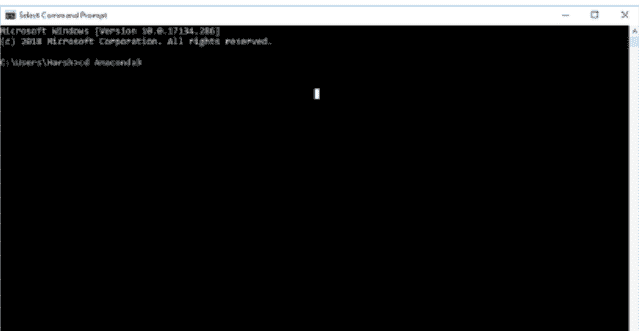

**步骤 2：更改目录：** 如果你安装了 **Anaconda**，如 [第 2 章](#) 所述，你可以将目录更改为“Python”并开始编写命令。

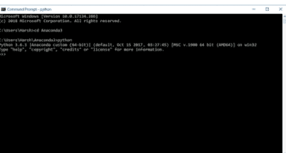

**步骤 3：编写命令：** 编写命令，解释器将解释这些命令并显示结果。

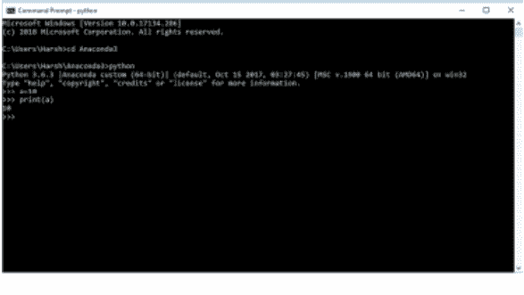

### 3.3.2 执行 .py 文件中的程序

你也可以在 **命令提示符** 中执行“.py”文件。为此，请执行以下步骤。

- 创建一个名为 helloworld.py 的新文件（在 **C:\Users\<your account>\Anaconda3** 文件夹中），并在其中编写以下代码。
  ```python
  print("Hello World")
  ```
- 在 **命令提示符** 中编写以下命令
  ```
  >>C:\Users\Harsh\Anaconda3> python helloworld.py
  ```
- 将显示以下输出。
  ```
  Hello World
  ```

### 3.3.3 使用 Anaconda Navigator

本书主要使用 **Jupyter**。它提供以下界面：

- **Jupyter notebook：** 这有助于编写和执行代码，将代码与文本和方程式结合。它还有助于可视化。详细说明，请参考以下链接。
  [https://jupyter-notebook.readthedocs.io/en/latest/](https://jupyter-notebook.readthedocs.io/en/latest/)
- **Jupyter Console：** 根据官方网站，“Jupyter Console 是一个基于终端的交互式计算控制台。”
- **Jupyter QT console**

可以执行以下步骤来使用 **Jupyter** 执行 **Python** 代码。

- 从开始菜单打开 **Anaconda Navigator**。
- 打开 **Jupyter** notebook（**图 3.3**）。
- 打开一个新的 **Python3** notebook。
- 如以下屏幕截图所示编写命令（**图 3.4**）。
- 运行单元格中编写的脚本。
- 输出显示在单元格之后。


**图 3.3** **Anaconda** navigator 为你提供了许多选项，包括 Jupyter notebook。

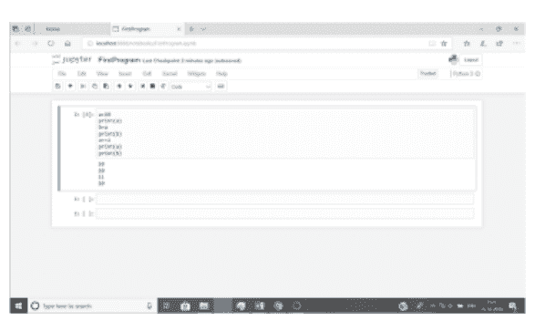

**图 3.4** 在 **Jupyter** notebook 中运行代码。

有关 **Anaconda** 的详细文档，请访问 [docs.anaconda.com/anaconda/navigator/](https://docs.anaconda.com/anaconda/navigator/)。在文档中，你还会找到一个解释 **Jupyter** 应用程序细节的链接。

## 3.4 JUPYTER NOTEBOOK

上一章已经讨论了 **Anaconda** 的安装。在 **Jupyter** 中运行 **Python** 程序的步骤如下：

**步骤 1：** 单击桌面上的 **Jupyter** 图标。如果看不到该图标，请转到开始 -> **Anaconda**，当 **Anaconda** 打开时，单击 **Jupyter**。([图 3.5](#figure-35))


**图 3.5** 单击桌面上的 **Jupyter** 图标，或转到开始 -> **Anaconda** 并单击 **Jupyter**。

**步骤 2：** **Jupyter** Notebook 打开后，通过单击菜单中的“New”创建一个新的“Notebook”（**图 3.6**）。

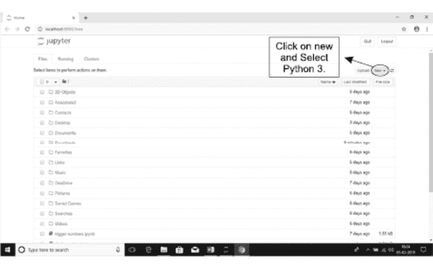

**图 3.6** 要在 **Jupyter** 中打开新的 Notebook，请如图所示单击 **New**。

**步骤 3：** 一个新的 **Notebook** 打开，如 **图 3.7** 所示。


**图 3.7** **Jupyter** 中的一个新 **Notebook**。

此时，你需要了解 **Jupyter notebook** 的元素。此用户界面中的元素如下：

1. **Notebook 名称：** **Jupyter Notebook** 可以被赋予任何合法名称。可以通过单击默认名称并替换文本来更改新 notebook 的名称。
2. **菜单栏：** 它帮助我们管理 **Notebook**。菜单栏中的元素如下：
    - **File：** 此选项允许创建新的 **Notebook**、打开现有的 **Notebook**、保存 **Notebook** 和重命名 **Notebook**。
    - **Edit：** 此选项允许我们剪切、删除、移动、拆分和合并单元格。
    - **Insert：** 此选项允许我们在现有 **cell** 的上方或下方插入 **cells**。
    - **Cell：** 此选项允许我们编写命令或脚本。
    - **Kernel：** 此选项允许我们中断 **cells**、重启 **cells**、清除输出和关闭。
    - **Widget：** 此选项允许我们保存、清除、下载 **Notebook** 小部件状态，以及嵌入小部件。
    - **Help：** 此选项提供 **帮助**。
3. 它包含用于常见操作的图标，例如 **Save & checkpoint**、**Insert cell below**、**cut & copy a selected cell**、**paste cell below**、**move selected cell up & down**、**run cell**、**interrupt & restart the kernel**。特别是，显示代码的下拉菜单允许你更改单元格的类型。

一旦创建了 **Notebook**，你就可以在 **cell** 中编写一段代码。**Cells** 主要有两种类型，即 **Code** 和 **Markdown**。

1. **Markdown cell：** **Markdown cell** 包含富文本。除了经典的格式选项（如粗体或斜体）外，我们还可以在 **cell** 中添加链接、图像、HTML 元素、LaTeX 数学方程式等。
2. **Code cell：** 代码 **cell** 包含由内核执行的代码。编程语言对应于内核的语言。

## 3.5 值类型和引用类型

本课程旨在使学生能够通过编写程序来解决问题。我们需要用户的输入来编写程序，并且通常将其存储在某个地方。要存储输入，我们需要变量。**Python** 中的变量指的是一个值被放置的位置；因此，与 **C** 等语言相比，它们是 **引用类型变量**。

例如，在 **C** 语言中，要创建一个 **整型变量** 并在其中存储 7，我们写

```
int i = 7;
```

在 **C** 语言中，这会创建一个名为 *i* 的变量，并以二进制格式存储 7。而在 **Python** 中编写

```
i = 7
```

会创建一个名为 *i* 的变量，它指向存储 7 的位置。（图 3.8）。

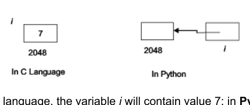

**图 3.8** 在 C 语言中，变量 *i* 将包含值 7；在 **Python** 中 *i* 指向包含 7 的位置。

然后使用各种语句处理这些变量，包含这些语句的程序会产生一些输出（图 3.9）。

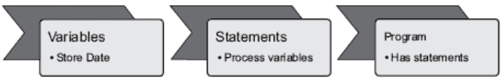

**图 3.9** 变量存储数据，语句处理变量，程序包含语句。

下一节将解释 **Python** 中的标记、关键字、标识符、运算符、各种数据类型、注释、赋值和输入/输出的概念。

## 3.6 标记、关键字和标识符

一种语言的 **字符集** 是该语言中所有合法字符的集合。**Python** 的字符集包含字符、数字、特殊符号和标点符号。这些字符形成 **标记**。程序中的逻辑单元称为 **标记**。它们可以是 **关键字**、**标识符**、**运算符**，甚至是 **标点符号**。本节讨论 **Python** 中的各种标记。

### 3.6.1 Python 关键字

**关键字** 被视为特殊单词，编译器保留它们并传达一些特殊含义。因此，不应将它们用作任何变量的名称。表 3.1 显示了 **Python** 中使用的 **关键字**。

**表 3.1** **Python** 中的关键字。

| and | as | assert |
| --- | --- | --- |
| break | class | continue |
| def | del | else |
| elif | except | for |
| from | finally | Global |
| if | lambda | none |
| not | pass | raise |
| return | sum | while |

### 3.6.2 Python 标识符

**标识符**是在 **Python** 中赋予不同变量或对象的名称。它们可以尽可能长，并且可以包含下划线。此外，标识符的名称不能以数字开头，但可以包含数字。有趣的是，在 **Python** 中，名称有其作用域，这将在后续章节中讨论。此外，**标识符**在 **Python** 中也可以包含一些特殊字符。同时，**标识符**是区分大小写的。

### 3.6.3 Python 转义序列

**转义序列**用于在字符串中打印特殊符号。这里可能需要说明，有些字符无法直接在字符串中打印。例如，要打印“**Hi How\s Mary?**”，需要使用以下字符串。

```
print(“Hi How\s Mary ?”)
```

请注意，要打印“\”，我们需要在“\”前加上另一个“\”。类似地，要在两行中打印一个字符串，我们需要在适当的位置使用“\n”。例如，

```
print(“HI there!\nHow are you”)
```

会在两行中分别打印“HI there!”和“How are you”。“\t”用于在给定字符串中插入制表符。表 3.2 显示了 **Python** 中的各种**转义序列**。

**表 3.2** **Python** 中的转义序列。

| 转义序列 | 描述 |
|---|---|
| \ | 打印反斜杠 |
| \' | 打印单引号 |
| " | 打印双引号 |
| \n | 换行 |
| \t | 插入制表符 |
| \b | 删除前一个字符 |
| \a | 产生警报声 |

## 3.7 语句

在 Python 中，语句是 Python 解释器可以解释和执行的指令。语句可以是单行的，也可以是多行的。我们使用“\”在每条语句的末尾来实现多行语句。

### 3.7.1 表达式语句

表达式语句用于计算并写入一个值，或调用一个函数。例如，以下语句将变量 `num1` 和 `num2` 中包含的值相加，并将结果存储在 `num3` 中。

```
num3 = num1 + num2
```

### 3.7.2 赋值语句

赋值语句将名称绑定到值，并修改允许变更的对象的项。例如，第一条语句将存储在 `num2` 中的值赋给 `num1`，第二条语句将 4 赋给列表 `L` 的第二个元素：

```
num1 = num2
L[1] = 4
```

此时，上述语句可能没有太大意义，但在学习了变量和运算符之后，上述语句就会变得清晰。

### 3.7.3 断言语句

**断言语句**帮助我们将调试断言插入程序中。这些在调试中使用。

```
<something> = "assert" expression [" " ,expression]
```

### 3.7.4 空语句

**pass** 是一个空操作。实际上，当执行时，它不执行任何任务。当一条语句是必需的但不需要执行任何代码时，它作为占位符非常有用。

### 3.7.5 控制语句

**控制语句**用于在程序中实现分支、循环等。接下来的两章将重点介绍控制语句。

## 3.8 注释

有时，需要对语句或代码的一部分或模块进行程序员可读的解释。程序员可能想写一些关于那部分的描述，这部分对他可见，但对编译器或解释器不可见。这些解释被称为**注释**。有时文档生成器也可能生成注释。**注释**使源代码易于理解。需要注意的是，注释的编写方式在不同语言中有所不同。事实上，编写**注释**的方式是编程风格的一部分。也可以说，不必要的注释是不可取的。

**注释**可以是单行注释，也可以跨越多行。在 **Python** 中，单行**注释**以“#”开头。以下代码（代码 1）展示了单行**注释**的用法。请注意，所有单行**注释**都以“#”开头。随着课程的进行，代码的其余部分将变得清晰。**多行注释**可以写作文档字符串。代码 2 展示了多行注释的用法。多行注释包含在“"""” “"""”中。

### 代码 1：

```
#Defining Student class
class Student():
    #Bound Method
    def display(self,something):
        print('\n',something)
#Instantiating Student
Hari=Student()
#Calling method
Hari.display('Hi I am Hari')
Student().display('Calling display again')
```

### 代码 2：

```
#Defining Student class
class Student():
    #Bound method
    def display(self,something):
        print('\n',something)
    #Another bound method
    def getdata(name,age):
        name=name
        age=age
        print('Name',name,'Age',age)
```

> “““ 以下代码实例化了类 Hari。要求用户输入学生的姓名和年龄。然后调用 getdata ”””

```
Hari=Student()
name=input('Enter the name of the student\t:')
age=int(input('Enter the age of the student\t:'))
Student.getdata(name,age)
```

## 3.9 运算符

Python 提供了许多运算符，如算术、比较、赋值、二进制逻辑、成员和身份运算符。表 3.3 展示了各种运算符、它们的用法和含义。这些运算符的用法在接下来的代码中进行了演示。之后将简要介绍运算符的优先级。请注意，接下来的代码中 **num1** 和 **num2** 包含一些值。

**表 3.3 Python 中的运算符。**

| 运算符 | 用法 | 含义 |
| :--- | :--- | :--- |
| **比较运算符** | | |
| == | num1==num2 | 如果 num1 等于 num2 则为 True，否则为 False |
| != | num1!=num2 | 如果 num1 不等于 num2 则为 True，否则为 False |
| < | num1<num2 | 如果 num1 小于 num2 则为 True |
| > | num1>num2 | 如果 num1 大于 num2 则为 True |
| <= | num1<=num2 | 如果 num1 小于或等于 num2 则为 True |
| >= | num1>=num2 | 如果 num1 大于或等于 num2 则为 True |
| **赋值运算符** | | |
| += | num1+=num2 | num1=num1+num2 |
| -= | num1-=num2 | num1=num1-num2 |
| *= | num1*=num2 | num1=num1*num2 |
| **= | num1**=num2 | num1=num1**num2 |
| //= | num1//=num2 | num1=num1//num2 |
| **二进制运算符** | | |
| & | num1&num2 | 按位与 |
| \| | num1\|num2 | 按位或 |
| ^ | num1^num2 | 按位异或 |
| ~ | ~num1 | 按位非 |
| **成员运算符** | | |
| in | x in L | 如果 x 存在于 L 中则为 True（L 可以是列表、元组、字符串等） |
| not in | x not in L | 如果 x 不存在于 L 中则为 True |
| **身份运算符** | | |
| Is | a is b | 如果 id(a) 与 id(b) 相同则为 True |
| is not | a is not b | 如果 id(a) 与 id(b) 不同则为 True |

## 3.10 运算符的类型和示例

### 3.10.1 算术运算符

**Python** 提供了用于加法、减法、乘法、除法、取模和幂运算的标准算术运算符。表 3.4 显示了这些运算符及其功能。以下代码演示了使用用户输入的两个整数来使用这些运算符。

**表 3.4 Python 中的算术运算符。**

| 运算符 | 功能 |
| :--- | :--- |
| + | 加法 |
| - | 减法 |
| * | 乘法 |
| / | 除法 |
| % | 取模 |
| ** | 幂运算 |

## 代码：

```
a=int(input('Enter the first number\t:'))
b=int(input('Enter the second number\t:'))
sum=a+b

prod=a*b
diff=a-b
mod=a%b
q=a/b
print(sum,' ',prod,' ',diff,' ',mod,' ',q)

r=a**b
print(r)
```

## 输出：

```
Enter the first number :45
Enter the second number :7
52 315 38 3 6.428571428571429
#Basic Operations in Python
373669453125
```

## 代码：

```
f1=float(input('Enter the first number\t:'))
f2=float(input('Enter the second number\t:'))
sum=f1+f2
prod=f1*f2
diff=f1-f2
mod=f1%f2
q=f1/f2
print(sum,' ',prod,' ',diff,' ',mod,' ',q)
```

## 输出：

```
Enter the first number :45.2
Enter the second number :5.32
50.52       240.46400000000003       39.88       2.6400000000000006
8.496240601503759
```

### 3.10.2 字符串运算符

**Python** 提供了两个用于字符串操作的运算符：+ 和 *。对于字符串，+ 运算符连接两个字符串，* 运算符将字符串重复 n 次。接下来的代码演示了这些运算符在字符串中的用法。

## 代码：

```
str1=input('Enter the first string')
str2=input('Enter the second string')
str3=str1+str2
print(str3)
```

## 输出：

```
Enter the first string nikhil
Enter the second string miglani
Nikhilmiglani
```

## 代码：

```
str1*3
```

## 输出：

```
'nikhilnikhilnikhil'
```

### 3.10.3 比较运算符

### 3.10.4 赋值运算符

**比较运算符**用于比较两个对象的值。如果对象的值相同，则返回 **True**；如果不同，则返回 **False**。以下代码说明了比较运算符的用法。以下代码创建了两个变量 **num1** 和 **num2**。**num1** 中存储的值为 5，**num2** 中存储的值为 3。语句 **num1==num2** 的结果为 **False**，因为这两个数字不相等。语句 **num1!=num2** 的结果为 **True**，因为这两个数字不相等。语句 **num1<num2** 的结果为 **False**，因为第一个数字不小于第二个数字。语句 **num1>num2** 的结果为 **True**，因为第一个数字大于第二个数字。同样，语句 **num1<=num2** 的结果为 **False**，因为第一个数字大于第二个数字，而语句 **num1>=num2** 的结果为 **True**，因为第一个数字大于第二个数字。输出如下。

**代码：**

```
num1=5
num2=3
print(num1==num2)
print(num1!=num2)
print(num1<num2)
print(num1>num2)
print(num1<=num2)
print(num1>=num2)
```

**输出：**

```
False
True
False
True
False
True
```

以下代码说明了赋值运算符的用法。以下代码创建了两个变量 **num1** 和 **num2**。**num1** 中存储的值为 5，**num2** 中存储的值为 3。语句 **num1+=num2** 将 8（即 5+3）赋值给 **num1**，而 **num2** 保持不变。语句 **num1*=num2** 将 24（即 8*3）赋值给 **num1**，而 **num2** 保持不变。语句 **num1//=num2**（即 24//3）将 8 赋值给 **num1**，而 **num2** 保持不变。语句 **num1**=num2**（即 8**3）将 512 赋值给 **num1**，而 **num2** 保持不变。最后，语句 **num1-=num2**（即 512-3）将 509 赋值给 **num1**，而 **num2** 保持不变。输出如下。

**代码：**

```
num1=5
num2=3
num1+=num2 #num1= num1+num2=8
print(num1)

num1*=num2 #num1 = num1*num2=8*3=24
print(num1)
num1//=num2 #num1=num1//num2=24//3=8
print(num1)

num1**=num2 #num1=num1**num2=512
print(num1)
num1-=num2 #num1=num1-num2=512-3=509
print(num1)
```

**输出：**

```
8
24
8
512
509
```

### 3.10.5 逻辑运算符

逻辑运算符如 **or** 和 **and** 已在布尔代数章节中详细讨论。**or** 运算符在任一输入为 **TRUE** 时返回 **TRUE**。**and** 运算符在两个输入均为 **TRUE** 时返回 **TRUE**。**not** 运算符对值取反。**xor** 运算符在输入交替时返回 **TRUE**。各种运算符的真值表如下（表 3.5 至 3.8）。以下代码说明了二元逻辑运算符的用法。以下代码创建了两个变量 **num1** 和 **num2**。**num1** 中存储的值为 0b101101（注意，前面的 0b 表示这是一个二进制数），**num2** 中存储的值为 0b110110。语句 **num3=num1 & num2** 将 0b100100 赋值给 **num3**。语句 **num1 ^ num2** 对 **num1** 和 **num2** 进行按位 **xor** 运算，并将结果存储在 **num5** 中。语句 **~num1** 对 **num1** 进行按位 **not** 运算，并将结果存储在 **num6** 中。

**表 3.5** **AND** 的真值表。

| A | B | A and B |
|---|---|---|
| False | False | False |
| False | True | False |
| True | False | False |
| True | True | True |

**表 3.6** **OR** 的真值表。

| A | B | A or B |
|---|---|---|
| False | False | False |
| False | True | True |
| True | False | True |
| True | True | True |

**表 3.7** **NOT** 的真值表。

| A | not A |
|---|---|
| False | True |
| True | False |

**表 3.8** **XOR** 的真值表。

| A | B | A xor B |
|---|---|---|
| False | False | False |
| False | True | True |
| True | False | True |
| True | True | False |

**代码：**

```
num1= 0b101101
num2= 0b110110
num3= num1&num2
num4= num1|num2
num5= num1^num2
num6= ~num1
print(bin(num3))
print(bin(num4))
print(bin(num5))
print(bin(num6))
```

**输出：**

```
0b100100
0b111111
0b11011
-0b101110
```

### 3.10.6 运算符优先级

如上表所述，运算符具有以下优先级。** 运算符具有最高优先级，其次是一元运算符 ~、+、-。运算符 *、/、%、|| 紧随其后。二元运算符 +、- 的优先级高于 >>、<<、&、^、|、<=、<、>、>=、<>、==、!=、=、!=、is、not is、in、not in、not、or、and。图 3.10 展示了运算符的优先级。

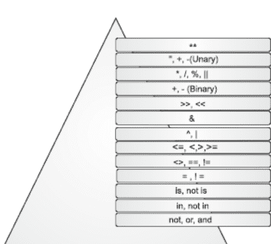

图 3.10 运算符优先级。

## 3.11 基本数据类型

本节讨论 **Python** 中的基本数据类型。以下代码也说明了运算符与这些数据类型的结合使用。

### 3.11.1 整数

如前所述，在 **Python** 中无需指定变量的类型。因此，要创建一个整数类型的变量，只需将一个整数值赋给一个对象即可。例如，在以下代码片段中，**i** 被赋值为 **10**。注意，变量的类型可以使用 **type()** 函数来确定。这里，**i** 的类型被存储在一个名为 **t** 的变量中。打印时会显示 't' 的值 <class, ‘int’>。

**代码：**

```
i=10
print('The value of i is ',i)
t=type(i)
print('The type of i is ',t)
```

**输出：**

```
The value of i is 10
The type of i is <class 'int'>
```

#Python 会自动查找变量的数据类型。我们不需要提及变量的类型。

可以使用 **input()** 函数从用户那里获取输入。**input()** 函数接受一个字符串作为参数，并在屏幕上显示。用户的输入被当作字符串处理。要将其转换为整数，需要使用 **int()** 函数。在以下代码片段中，用户输入的数字被转换为整数，然后一个名为 **num** 的变量指向存储该数字的位置。

**代码：**

```
num=int (input ('Enter a number\t:'))
print ('You have entered\t:', num)
```

**输出：**

```
Enter a number :34
You have entered: 34
```

### 3.11.2 浮点数

只需将一个浮点值赋给一个对象，即可创建一个浮点类型的变量。例如，在以下代码片段中，*i* 被赋值为 2.35768。注意，变量的类型可以使用 **type()** 函数来确定。这里，*i* 的类型被存储在一个名为 **t** 的变量中。打印时会显示 **t** 的值 <class, ‘float’>。

**代码：**

```
i=2.35768
print ('The value of i is ', i)
t=type(i)
print ('The type of i is ', t)
```

**输出：**

```
The value of i is 2.35768
The type of i is <class 'float'>
```

要将字符串转换为 **浮点数**，需要使用 **float()** 函数。在以下代码片段中，用户输入的数字被转换为 **浮点数**，然后一个名为 **num** 的变量指向存储该数字的位置。

**代码：**

```
num=float(input('Enter a number\t:'))
print('You have entered\t:',num)
```

**输出：**

```
Enter a number :34.567
You have entered : 34.567
```

### 3.11.3 字符串

要创建一个 **字符串** 类型的变量，只需将一个字符串值赋给一个对象即可。例如，在以下代码片段中，**i** 被赋值为 “Nikhil”。注意，变量的类型可以使用 **type()** 函数来确定。这里，**i** 的类型被存储在一个名为 **t** 的变量中。打印时会显示 **t** 的值 <class, ‘str’>。

**代码：**

```
i='Nikhil'
print('The value of i is ',i)
t=type(i)
print('The type of i is ',t)
```

**输出：**

```
The value of i is Nikhil
The type of i is <class 'str'>
```

如前所述，**input()** 函数接受字符串作为输入；因此，无需像整数或浮点数那样进行额外的转换。在以下代码片段中，用户输入一个字符串，然后一个名为 **num** 的变量指向存储该字符串的位置。

**代码：**

```
name=input('Enter your name\t:')
print('Hi ',name)
```

**输出：**

```
Enter your name: Harsh
Hi Harsh
```

## 3.12 结论

C 编译器将代码转换为目标文件。此转换的步骤包括词法分析、语义和语法分析、中间代码生成、优化以及最终代码生成。针对特定机器的优化使得代码不可移植。而在 **Python** 的情况下，代码被转换为 **Python 字节码**。可以使用 **命令提示符、Jupyter notebook、IDLE** 等运行 **Python** 代码。

使用许多其他集成开发环境（IDE）。本章介绍在**Python**中运行代码的一些方法。

本章还讨论了**input**和**print**函数。程序需要输入。要从用户处获取字符串类型的输入，使用**input()**函数。要从用户处获取整数类型的输入，使用**int(input())**函数，而要从用户处获取浮点类型的输入，则使用**float(input())**函数。然后根据问题的要求对这些输入进行操作。为此，我们需要运算符，最后，程序的输出会被打印出来。

本章详细解释了上述组件，为后续章节奠定了基础。建议读者完成练习，以更好地理解本章讨论的主题。

## 练习题

### 选择题

1.  在**Python**中，可以执行什么？
    (a) 单条指令
    (b) 脚本
    (c) 完整的源代码
    (d) 以上所有

2.  以下哪项用于在屏幕上显示输出？
    (a) print
    (b) printf
    (c) WriteLine
    (d) 以上所有

3.  在**Python3**中，**print**是一个
    (a) 函数
    (b) 命令
    (c) 以上都不是

4.  以下哪项支持值类型变量？
    (a) C#
    (b) Python
    (c) 两者都支持
    (d) 以上都不是

5.  在以下哪种语言中，变量在使用前无需先声明？
    (a) C
    (b) C++
    (c) C#
    (d) Python

6.  以下哪项不是Python中的运算符？
    (a) ++
    (b) +=
    (c) -=
    (d) 以上都不是

7.  在Python中，哪个运算符用于整数除法？
    (a) /
    (b) //
    (c) %
    (d) 以上都不是

8.  哪个运算符用于求余数？
    (a) /
    (b) //
    (c) %
    (d) 以上都不是

9.  哪个运算符用于比较两个数字？
    (a) ==
    (b) =
    (c) +=
    (d) 以上都不是

10. 哪个运算符用于计算幂？
    (a) *
    (b) **
    (c) //
    (d) 以上都不是

11. 对于字符串，+运算符的含义是什么？
    (a) 加法
    (b) 连接
    (c) 引发异常
    (d) 以上都不是

12. 对于字符串，*运算符的含义是什么？
    (a) 乘法
    (b) 多次打印一个字符串
    (c) 引发异常
    (d) 以上都不是

13. 在Python中，哪个运算符用于执行逻辑与（AND）？
    (a) &&
    (b) &
    (c) ^
    (d) 以上都不是

14. 在Python中，哪个运算符用于执行逻辑或（OR）？
    (a) ||
    (b) |
    (c) or
    (d) (a)和(b)都是

15. 哪个运算符用于查找元素是否在列表中？
    (a) in
    (b) is
    (c) not in
    (d) not is

### 理论题

1.  **Python**是一种解释型语言吗？请写出支持你答案的论据。
2.  写出在Windows中运行**Python**程序的各种方法。
3.  比较**Anaconda**和**IDLE**。（*探索*）。
4.  解释如何使用**命令窗口**运行**Python**脚本。
5.  陈述**Jupyter**的特性。
6.  我们能在**Python**中执行单条命令吗？
7.  解释**C语言**和**Python**中变量的区别。
8.  定义以下术语：
    (i) 关键字
    (ii) 标识符
    (iii) 转义序列
    (iv) 表达式语句
    (v) 赋值语句
9.  **Python**中的注释是什么？有哪些不同类型的注释？
10. **Python**中的算术运算符是什么？解释**Python**中所有不同类型的算术运算符。
11. **Python**中的字符串运算符是什么？解释**Python**中所有不同类型的字符串运算符。
12. **Python**中的赋值运算符是什么？解释**Python**中所有不同类型的赋值运算符。
13. **Python**中的逻辑运算符是什么？解释**Python**中所有不同类型的逻辑运算符。
14. 你将如何在**Python**中输入一个整数？
15. 你将如何在**Python**中输入一个浮点数？
16. 你将如何在**Python**中输入一个字符串？

### 探索

- 在**MAC**上安装Python的步骤。
- **Jupyter Lab**的特性。
- **Python**解释器的特性。
- 如何在**Jupyter**中重启内核并清除所有输出。

## 第二部分

## 过程式编程

本节涉及Python对象、基本数据类型和过程式编程元素。本节包含八章。接下来的两章将向读者介绍条件语句和循环。下一章讨论函数和递归。第7章和第8章讨论最重要的主题，即列表、元组、字典、迭代器和推导式。第9章涉及字符串，第10章讨论文件处理。

## 第4章

#### 条件语句

## 学习目标

阅读本章后，读者应能够

- 在程序中使用条件语句
- 理解**if-else**结构的重要性
- 使用**if-elif-else**阶梯
- 使用三元运算符
- 理解**&**和**|**的重要性

### 4.1 引言

前面的章节讨论了Python中的基本数据类型和简单语句。到目前为止所学的概念对于执行没有分支的程序是很好的。然而，程序员很少会找到一种没有分支的问题解决方法。

在继续之前，让我们花点时间思考一下生活。你能不做出决定就在生活中前进吗？答案是“不能”。同样，除非融入决策能力，否则问题解决方法不会产生结果。这就是为什么必须理解如何实现决策和循环过程的原因。本章描述第一个概念。这是构建具有分支的程序所必需的。“决策”使我们能够改变程序的控制流。在C、C++、JAVA、C#等语言中，有两种主要方法可以完成上述任务。第一种是“**if**”结构，另一种是“**switch**”。程序中的“**if**”块在“**测试**”条件为真时执行；否则，它不会执行。**Switch**用于实现场景，其中有多个“**测试**”条件，并且在特定测试条件为真时执行相应的块。

本章介绍了条件语句的概念、**if-elif**阶梯，最后是**get**语句。本章具有重要性，因为条件语句在编程的各个方面都有使用，无论是客户端开发、Web开发还是移动应用开发。

本章的组织结构如下。第二节介绍了“**if**”结构。[第4.3节](#)介绍了“**if-elif**”阶梯。[第4.4节](#)讨论了逻辑运算符的使用。[第4.5节](#)介绍了三元运算符。[第4.6节](#)介绍了**get**语句，最后一节是总结。

### 4.2 “IF”、“IF-ELSE”和“IF-ELIF-ELSE”结构

实现决策赋予了在程序中加入分支的能力。如前所述，程序是给计算机的一组指令。要完成给定的任务，大多数都需要做出决策。因此，条件语句构成了编程不可或缺的一部分。该结构的语法如下。

**通用格式**

1.  **if**

```python
if <测试条件>:
    <如果测试条件为真则执行的代码块>
```

2.  **if-else**

```python
if <测试条件>:
    <如果测试条件为真则执行的代码块>
else:
    <如果测试条件不为真则执行的代码块>
```

3.  **If else阶梯（在下一节讨论）**

```python
if <测试条件>:
    <如果测试条件为真则执行的代码块>
elif <测试2>:
    <第二个代码块>
elif <测试3>:
    <第三个代码块>
else:
    <如果测试条件为真则执行的代码块>
```

请注意，缩进很重要，因为Python通过缩进来识别代码块。因此，请确保**“if (<条件>)”:**后面跟着一个代码块，其中每条语句都处于相同的对齐位置。为了理解这个概念，让我们考虑一个简单的例子。在印度，学生通常如果得分超过40%就能通过大学考试。为了实现这个逻辑，要求用户输入百分比值。如果输入的百分比大于40，则打印“考试通过”；否则，打印“不及格”。下面的流程图描述了当用户输入百分比时宣布结果的过程（图4.1）。

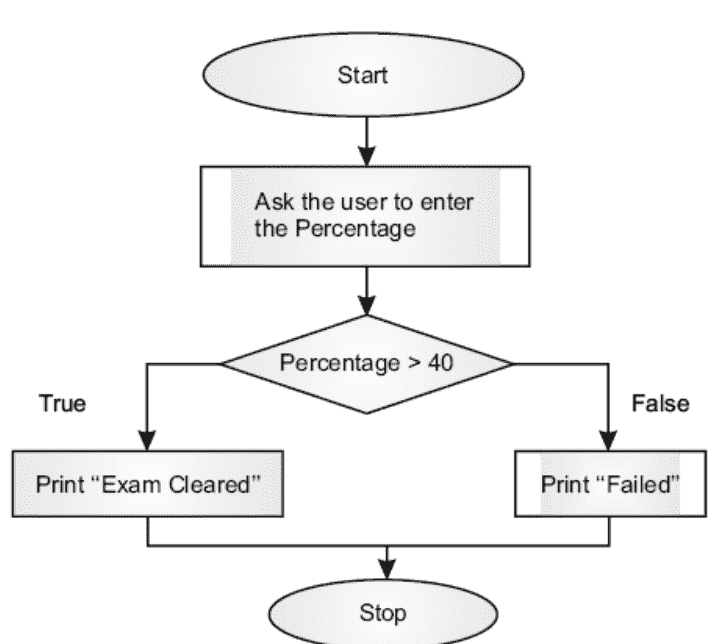

**图4.1** 示例1的流程图。

## 示例 4.1：

要求用户输入一名学生在某科目中的分数。如果输入的分数大于40，则打印“通过”，否则打印“不及格”。

### 程序：

```
a = input("Enter marks : ")
if int(a) > 40:
    print('Pass')
else:
    print('Fail')
```

**输出 1：** Enter Marks : 50
Pass

**输出 2：** Enter Marks : 30
Fail

让我们看另一个例子。在这个问题中，要求用户输入一个三位数，找出将该数字的各位数字顺序反转后得到的数字；然后求出原数与反转后数字的和；最后，检查这个和是否包含原数中的任何数字。为了完成这个任务，必须执行以下步骤（如示例 4.2 所示）。

## 示例 4.2：

要求用户输入一个三位数。将其称为“**num.**”。找出将各位数字顺序反转后得到的数字。求出给定数字与反转后数字的和。最后，检查所得和中的任何数字是否与原数中的数字相同。

## 解决方案：

该问题可以按如下方式解决。

- 当用户输入一个数字时，检查它是否在100到999之间（包含100和999）。
- 找出个位、十位和百位上的数字。分别将它们称为“u”、“t”和“h”。
- 使用以下公式找出将各位数字顺序反转后得到的数字（称为“rev”）。
  - 反转数字顺序后得到的数字，rev = h + t × 10 + u × 100
- 求出两个数字的和。
  $$Sum = rev + num$$
- 这个和可能是三位数或四位数。无论哪种情况，都要找出这个和的各位数字。将它们称为“u1”、“t1”、“h1”和“th1”（如果需要）。
- 设置“flag = 0”。
- 检查以下条件。如果任何一个条件为真，则设置 flag = 1。如果“sum”是一个三位数
  $$u == u1$$
  $$u == t1$$
  $$u == h1$$
  $$t == u1$$
  $$t == t1$$
  $$t == h1$$
  $$h == u1$$
  $$h == t1$$
  $$h == h1$$
- 如果“sum”是一个四位数，则需要在检查上述条件的同时，检查以下条件。
  $$u == th1$$
  $$t == th1$$
  $$h == th1$$
- 上述条件此后将被称为“集合 1”。如果“flag”的值为1，则打印“true”，否则打印“false”。
- 该过程已在图 4.2 中描绘。

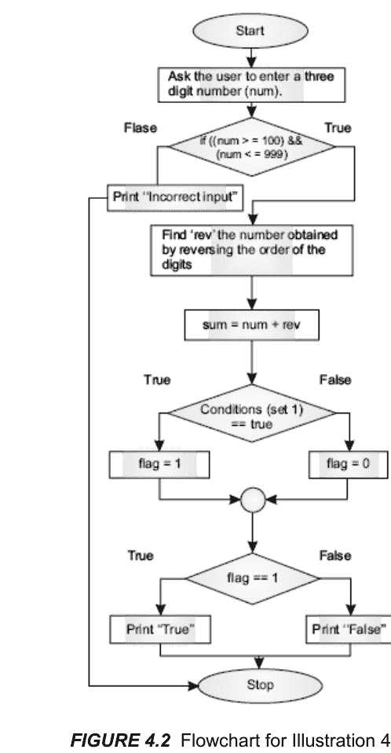

**图 4.2** 示例 4.2 的流程图。

### 程序：

```
num = int(input('Enter a three digit number\t:'))
if ((num < 100) | (num > 999)):
    print('You have not entered a number between 100 and 999')
else:
    flag = 0
    o = num % 10
    t = int(num / 10) % 10
    h = int(num / 100) % 10
    print('o\t:', str(o), 't\t:', str(t), 'h\t:', str(h))
    rev = h + t * 10 + o * 100
    print('Number obtained by reversing the order of the digits\t:', str(rev))
    sum1 = num + rev
    print('Sum of the number and that obtained by reversing the order of digits\t:', str(sum1))
    if sum1 < 1000:
        o1 = sum1 % 10
        t1 = int(sum1 / 10) % 10
        h1 = int(sum1 / 100) % 10
        print('o1\t:', str(o1), 't1\t:', str(t1), 'h1\t:', str(h1))
        if ((o == o1) | (o == t1) | (o == h1) | (t == o1) | (t == t1) | (t == h1) | (h == o1) | (h == t1) | (h == h1)):
            print('Condition true')
            flag = 1
    else:
        o1 = sum1 % 10
        t1 = int(sum1 / 10) % 10
        h1 = int(sum1 / 100) % 10
        th1 = int(sum1 / 1000) % 10
        print('o1\t:', str(o1), 't1\t:', str(t1), 'h1\t:', str(h1), 'th1\t:', str(th1))
        if ((o == o1) | (o == t1) | (o == h1) | (o == th1) | (t == o1) | (t == t1) | (t == h1) | (t == th1) | (h == o1) | (h == t1) | (h == h1) | (h == th1)):
            print('Condition true')
            flag = 1
```

## 输出：第一次运行

Enter a three digit number :4
You have not entered a number between 100 and 999
>>>

## 输出：第二次运行

Enter a three digit number :343
o : 3 t : 4 h : 3
Number obtained by reversing the order of the digits : 343
No digit of the sum is same as the original number
>>>

## 输出：第三次运行

Enter a three digit number :435
o : 5 t : 3 h : 4
Number obtained by reversing the order of the digits : 534
No digit of the sum is same as the original number
>>>

## 输出：第四次运行

Enter a three digit number :121
o : 1 t : 2 h : 1
Number obtained by reversing the order of the digits : 121
Sum of the number and that obtained by reversing the order of digits: 242
o1 : 2 t1 : 4 h1 : 2
Condition true
>>>

> 提示！
必须注意缩进，否则程序将无法编译。缩进决定了 Python 中特定代码块的开始和结束。建议不要在缩进中混合使用空格和制表符。许多 Python 版本会将此视为语法错误。

**if-elif** 梯形结构也可以使用字典中的 get 语句来实现，这将在本章后面解释。关于 Python 中条件语句的要点如下。

- **if <test>** 后面跟着一个冒号。
- 测试条件不需要括号。不过，将测试条件括在括号中不会导致错误。
- Python 中的嵌套块由缩进决定。因此，Python 中正确的缩进至关重要。事实上，不一致的缩进或没有缩进会导致错误。
- 一个 **if** 内部可以嵌套任意数量的 **if**。
- **if** 中的测试条件必须产生 **True** 或 **False**。

## 示例 4.3：

*编写一个程序，找出用户输入的三个数字中最大的那个。*

## 解决方案：

首先，要求用户输入三个数字（假设为 **num1**、**num2** 和 **num3**）。然后进行条件检查（如下列程序所示）。最后，显示最大的数字。

### 程序：

```
num1 = input('Enter the first number\t:')
num2 = input('Enter the second number\t:')
num3 = input('Enter the third number\t:')
if int(num1) > int(num2):
    if int(num1) > int(num3):
        big = int(num1)
    else:
        big = int(num2)
else:
    if int(num2) > int(num3):
        big = num2
    else:
        big = num3

print(big)
```

### 4.3 IF-ELIF-ELSE 梯形结构

如果有多个条件，并且结果决定了操作，那么可以使用 **if-elif-else** 梯形结构。本节讨论该结构，并使用适当的示例来阐述概念。该结构的语法如下。

## 语法

```
if <test condition 1>:
    # 如果条件 1 为真，则执行的任务
elif <test condition 2>:
    # 如果条件 2 为真，则执行的任务
elif <test condition 3>:
    # 如果条件 3 为真，则执行的任务
else:
    # 如果以上条件都不为真，则执行的任务
```

可以使用上述结构来管理程序的流程。图 4.3 显示了使用上述结构描绘程序流程的图表。在图中，左侧分支描绘了条件 C1 为真的场景，右侧分支描绘了条件为假的场景。在第二个图中，条件 C1、C2、C3 和 C4 导致不同的路径 [C# 编程，Harsh Bhasin，2014]。

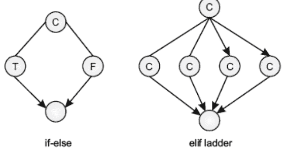

**图 4.3** if 和 elif 梯形结构的流程图。

以下部分包含展示 **elif** 梯形结构用法的程序。需要注意的是，如果有多个 **if** 语句，那么 **else** 与最近的 **if** 配对。

## 4.4 逻辑运算符

在许多情况下，一个代码块的执行取决于多个语句的真值。在这种情况下，“**and**”（“**&**”）和“**or**”（“**|**”）运算符就派上用场了。第一个（“**and**”）在两个条件都为“**真**”时，输出为“**真**”。第二个（“**or**”）在任何一个条件为“**真**”时，输出为“**真**”。

“**and**”和“**or**”的真值表如下。在下表中，“**T**”代表“**真**”，“**F**”代表“**假**”。

**表 4.1** a & b 的真值表。

| a | b | a & b |
|---|---|---|
| T | T | T |
| T | F | F |
| F | T | F |
| F | F | F |

**表 4.2** a | b 的真值表。

| a | b | a \| b |
|---|---|---|
| T | T | T |
| T | F | T |
| F | T | T |
| F | F | F |

上述语句帮助程序员轻松处理复合语句。例如，考虑一个找出用户输入的三个数字中最大数的程序。用户输入的数字是（假设）“**a**”、“**b**”和“**c**”，那么如果（**a > b**）且（**a > c**），则“**a**”最大。这可以写成如下形式：

```
if ((a > b) & (a > c)):
    print('The value of a greatest')
```

同样，可以构造“**b**”最大的条件。另一个例子是三角形。如果三角形的三条边都相等，那么它是一个等边三角形。这个条件可以表述如下。

```
if ((a == b) | (b == c)):
    # 该三角形是等边三角形；
```

## 4.5 三元运算符

上一节解释的条件语句对于编写任何包含条件的程序都极其重要。然而，代码仍然可以通过使用Python提供的三元语句来简化。三元运算符执行与if-else结构相同的任务。然而，它与C或C++的情况一样存在相同的缺点。问题在于每个部分只能处理单条语句。该语句的语法如下。

## 语法

<输出变量> = <条件为真时的结果> if <条件> else <条件不为真时的结果>

例如，可以使用条件运算符来检查用户输入的两个数字中哪个更大。

```
great = a if (a>b) else b
```

找出三个给定数字中的最大值稍微复杂一些。以下语句将三个数字中的最大值放入“**great**”中。

```
great = a if (a if (a > b) else c)) else(b if (b > c) else c))
```

使用三元运算符找出用户输入的三个数字中最大值的程序如下。

## 示例 4.4：

*找出用户输入的三个数字中的最大值；使用三元运算符。*

## 程序

```
a = int(input('Enter the first number\t:'))
b = int(input('Enter the second number\t:'))
c = int(input('Enter the third number\t:'))
big = (a if (a>c) else c) if (a>b) else (b if (b>c) else c)
print('The greatest of the three numbers is '+str(big))
>>>
```

## 输出：

```
Enter the first number :2
Enter the second number :3
Enter the third number :4
The greatest of the three numbers is 4
>>>
```

## 4.6 GET 构造

在C或C++（甚至在C#和JAVA中），当不同条件导致不同操作时使用switch。这也可以使用前面章节中解释的‘if-elif’阶梯来完成。**get**构造在处理字典时大大简化了任务。

在下面的示例中，有三个条件。然而，在许多情况下，条件要多得多。在这种情况下可以使用**get**构造。该构造的语法如下。

## 语法

```
<字典名>.get('<要搜索的值>', '默认值>')
```

示例4.5演示了get构造的使用。

## 示例 4.5：

*此示例包含一个目录，其中包含书名和对应的年份。后面的语句查找给定书名的出版年份。如果未找到该名称，则显示字符串（作为get的第二个参数）“Bad choice”。*

## 程序

```
hbbooks = {'programming in C#': 2014, 'Algorithms': 2015, 'Python': 2016}
print(hbbooks.get('Programming in C#', 'Bad Choice'))
print(hbbooks.get('Algorithms', 'Bad Choice'))
print(hbbooks.get('Python', 'Bad Choice'))
print(hbbooks.get('Theory Theory, all the way', 'Bad Choice'))
```

## 输出：

```
Bad Choice
2015
2016
Bad Choice
>>>
```

请注意，在第一种情况下，“Programming”的“P”是大写的。因此，显示“Bad Choice”。在第二种和第三种情况下，get函数可以找到所需的值。在最后一种情况下，未找到该值；因此，显示**get**构造的第二个参数。另外，请注意后部类似于C类型**switch**语句的默认值。[图4.4](#figure-44)中的流程图显示了一个具有多个分支的程序。

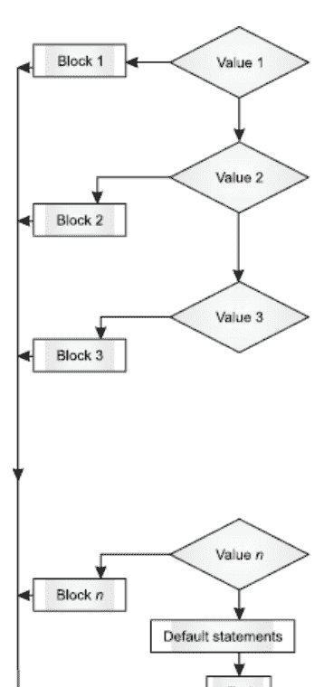

**图 4.4** 一个具有多个条件语句的程序。

## 观察

在Python中，字典和列表构成了语言基础的重要组成部分。**get**构造实现了条件选择的概念。值得注意的是，该构造大大减少了处理需要映射的情况的问题，因此很重要。

## 4.7 示例

“if”条件也用于输入验证。以下程序要求用户输入一个字符，并检查其ASCII**值是否大于某个值**。

**示例 4.6：**

*要求用户输入一个数字，并检查其ASCII值是否大于80。*

**程序：**

```
inp = input('Enter a character :')
if ord(inp) > 80:
    print('ASCII value is greater than 80')
else:
    print('ASCII value is less than 80')
```

**输出 1：**

```
Enter a character: A
ASCII value is less than 80
```

**输出 2：**

```
Enter a character: Z
ASCII value is greater than 80
```

该构造也可用于求多值函数的值。例如，考虑以下函数。

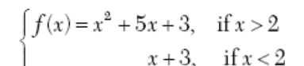

以下示例要求用户输入$x$的值，并根据给定的$x$值计算函数的值。

## 示例 4.7：

实现上述函数，并求出函数$f(x)$在$x = 2$和$x = 4$处的值。

### 程序：

```
f(x) = x^2 + 5x + 3 , if x > 2
     = x + 3 , if x <= 2
"""
x = int (input('Enter the value of x\t:'))
if x > 2:
    f = ((pow(x,2)) + (5*x) + 3)
else:
    f = x + 3
print('Value of function f(x) = %d' % f )
```

## 输出：

```
Enter the value of x :4
Value of function f(x) = 39
Enter the value of x :1
Value of function f(x) = 4
```

如前所述，“if-else”构造可用于根据某些条件找出结果。例如，如果$x$的系数之比与$y$的系数之比相同，则两条直线平行。也就是说，如果方程为

$a_1x + b_1y + c_1 = 0$ 和 $a_2x + b_2y + c_2 = 0$。那么直线平行的条件是

$$\frac{a_1}{a_2} = \frac{b_1}{b_2}$$

以下程序检查两条直线是否平行。

## 示例 4.8：

要求用户输入$a_1x + b_1y + c_1 = 0$和$a_2x + b_2y + c_2 = 0$的系数，并找出上述方程所描述的两条直线是否平行？

### 程序：

```
print('Enter Coefficients of the first equation [ a1x + b1y + c1 = 0 ]\n')
r1 = input('Enter the value of a1: ')
a1 = int (r1)
r1 = input('Enter the value of b1: ')
b1 = int (r1)
r1 = input('Enter the value of c1: ')
c1 = int (r1)
print('Enter Coefficients of second equation [ a2x + b2y + c2 = 0 ]\n')
r1 = input('Enter the value of a2: ')
a2 = int (r1)
r1 = input('Enter the value of b2: ')
b2 = int (r1)
r1 = input('Enter the value of c2: ')
c2 = int (r1)
if (a1/a2) == (b1/b2):
    print('Lines are parallel')
else:
    print('Lines are not parallel')
```

## 输出：

```
Enter Coefficients of the first equation [ a1x + b1y + c1 = 0 ]
Enter the value of a1: 2
Enter the value of b1: 3
Enter the value of c1: 4
Enter Coefficients of second equation [ a2x + b2y + c2 = 0 ]
Enter the value of a2: 4
Enter the value of b2: 6
Enter the value of c2: 7
Lines are parallel
>>>
```

上述程序可以扩展以找出直线是相交还是重合。如果以下条件为真，则两条直线相交。

$a_1x + b_1y + c_1 = 0$ 和 $a_2x + b_2y + c_2 = 0$。那么如果

$\frac{a_1}{a_2} \neq \frac{b_1}{b_2}$

则直线相交。

如果

$\frac{a_1}{a_2} = \frac{b_1}{b_2} = \frac{c_1}{c_2}$

则两条直线重合。

以下流程图显示了程序的控制流（图4.5）。

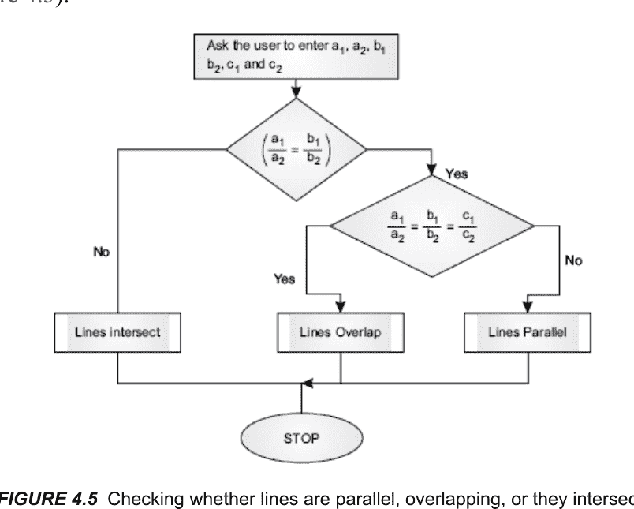

**图 4.5** 检查直线是平行、重合还是相交。

以下程序实现了该逻辑。

## 示例 4.9：

要求用户输入a1、a2、b1、b2、c1和c2的值，并找出直线是平行、重合还是相交。

### 程序：

```
print('Enter Coefficients of the first equation [ a1x + b1y + c1 = 0 ]\n')
r1 = input('Enter the value of a1: ')
a1 = int (r1)
r1 = input('Enter the value of b1: ')
b1 = int (r1)
r1 = input('Enter the value of c1: ')
c1 = int (r1)
print('Enter Coefficients of second equation [ a2x + b2y + c2 = 0 ]\n')
r1 = input('Enter the value of a2: ')
a2 = int (r1)
r1 = input('Enter the value of b2: ')
b2 = int (r1)
r1 = input('Enter the value of c2: ')
c2 = int (r1)

if ((a1/a2) == (b1/b2))&((a1/a2)==(c1/c2)):
    print('Lines overlap')
elif (a1/a2)==(b1/b2):
    print('Lines are parallel')
else:
    print('Lines intersect')
```

## 输出：

```
Enter Coefficients of the first equation [ a1x + b1y + c1 = 0 ]

Enter the value of a1: 2
Enter the value of b1: 3
Enter the value of c1: 4
Enter Coefficients of second equation [ a2x + b2y + c2 = 0 ]
Enter the value of a2: 1
Enter the value of b2: 2
Enter the value of c2: 3
Lines intersect
>>>
```

## 4.8 总结

正如第一章所述，我们编写程序是为了实现某个目的。程序要实现的目的通常需要做出决策。这种决策能力也使程序员能够编写需要分支的代码。此外，正如本章所解释的，许多问题可以使用“if-else”结构轻松解决。与C或C++程序相比，Python大大减少了不必要的冗余。在Python代码中，几乎不需要花括号，也不需要处理明显的条件。Python还为我们提供了一种类似switch的结构来处理多种条件。本章讨论条件语句的基础知识，并提供大量示例以阐明内容。条件语句无处不在；从基础程序到决策支持系统和专家系统。读者需要通阅要点并完成练习中的问题，以加深理解。还必须理解，条件语句是迈向编程的第一步。然而，理解条件语句虽然至关重要，但仅仅是开始。你成为程序员的旅程才刚刚开始。

## 术语表

1. ‘if’ 结构
   if <测试条件>:
       <如果测试条件为真则执行的代码块>

2. ‘if else’ 结构
   if <测试条件>
       <如果测试条件为真则执行的代码块>
   else:
       <如果测试条件为假则执行的代码块>
   ...

3. ‘If else 阶梯’：
   if <测试条件>:
       <如果测试条件为真则执行的代码块>
   elif <测试条件2>:
       <第二个代码块>
   elif <测试条件3>:
       <第三个代码块>
   else:
       <如果所有测试条件均为假则执行的代码块>

## 要点回顾

- ‘if’ 语句实现条件分支。
- 测试条件是一个布尔表达式，其结果为 **true** 或 **false**。
- 如果测试条件为 **true**，则执行“if”代码块。
- 如果测试条件为 **false**，则执行 **else** 部分。
- 可以使用 **if-elif** 阶梯实现多个分支。
- 可以嵌套任意数量的 **if-else**。
- Python中可以实现三元if。
- 逻辑运算符可用于实现条件语句。

## 练习

### 选择题

以下代码片段的输出是什么？

1. 以下代码的输出是什么？
   ```python
   if 28:
       print('Hi')
   else:
       print('Bye')
   ```
   (a) Hi
   (b) Bye
   (c) 以上都不是
   (d) 以上代码片段将无法编译

2. a = 5
   b = 7
   c = 9
   if a>b:
       if b>c:
           print(b)
       else:
           print(c)
   else:
       if b>c:
           print(c)
       else:
           print(b)
   (a) 7
   (b) 9
   (c) 34
   (d) 以上都不是

3. a = 34
   b = 7
   c = 9
   if a>b:
       if b>c:
           print(b)
       else:
           print(c)
   else:
       if b>c:
           print(c)
       else:
           print(b)
   (a) 7
   (b) 9
   (c) 以上都不是
   (d) 代码将无法编译

4. a = int(input('First number\t:'))
   b = int(input('Second number\t'))
   c = int(input('Third number\t:'))
   if ((a>b) & (a>c)):
       print(a)
   elif ((b>a) &(b>c)):
       print(b)
   else:
       print(c)
   (a) 用户输入的三个数字中最大的
   (b) 用户输入的三个数字中最小的
   (c) 无
   (d) 代码将无法编译

5. n = int(input('Enter a three digit number\t:'))
   if (n%10)==(n/100):
       print('Hi')
   else:
       print('Bye')
   # 用户输入的三位数是453
   (a) Hi
   (b) Bye
   (c) 以上都不是
   (d) 代码将无法编译

6. 在上一题中，如果输入的数字是545，答案会是什么？
   (a) Hi
   (b) Bye
   (c) 以上都不是
   (d) 代码将无法编译

7. hb1 = ['Programming in C#','Oxford University Press', 2014]
   hb2 = ['Algorithms', 'Oxford University Press', 2015]
   if hb1[1]==hb2[1]:
       print('Same')
   else:
       print('Different')
   (a) Same
   (b) Different
   (c) 无输出
   (d) 代码将无法编译

8. hb1 = ['Programming in C#','Oxford University Press', 2014]
   hb2 = ['Algorithms', 'Oxford University Press', 2015]
   if (hb1[0][3]==hb2[0][3]):
       print('Same')
   else:
       print('Different')
   (a) Same
   (b) Different
   (c) 无输出
   (d) 代码将无法编译

9. 在第8题的代码片段中，进行了以下更改。输出会是什么？
   hb1 = ['Programming in C#','Oxford University Press', 2014]
   hb2 = ['Algorithms', 'Oxford University Press', 2015]
   if (str(hb1[0][3])==str(hb2[0][3])):
       print('Same')
   else:
       print('Different')
   (a) Same
   (b) Different
   (c) 无输出
   (d) 代码将无法编译

10. 最后，第8题的代码被更改为以下内容。输出会是什么？
    hb1 = ['Programming in C#','Oxford University Press', 2014]
    hb2 = ['Algorithms', 'Oxford University Press', 2015]
    if (char(hb1[0][3])==char(hb2[0][3])):
        print('Same')
    else:
        print('Different')
    (a) Same
    (b) Different
    (c) 无输出
    (d) 代码将无法编译。

### 编程练习

1. 要求用户输入一个数字，并找出将数字顺序反转后得到的数字。
2. 要求用户输入一个四位数，并检查第一位和最后一位数字之和是否等于第二位和第三位数字之和。
3. 在上一题中，如果答案为真，则获得一个新数字，其中第二位和第三位数字比给定数字中的大1。
   示例：数字5342，第一位和最后一位数字之和 = 7，第二位和第三位数字之和 = 7。新数字：5452
4. 要求用户输入给定溶液中氢离子的浓度（C），并使用以下公式计算溶液的PH值。
   $PH = \log_{10}C$
5. 如果PH < 7，则溶液被视为酸性，否则被视为碱性。判断用户输入的氢离子浓度对应的溶液是酸性还是碱性？
6. 在上一题中，判断溶液是否为中性？（如果溶液的pH值为7，则为中性）
7. 作用于一个物体（质量m）的向心力，该物体以速度v在半径为r的圆周上运动，由公式$mv^2/r$给出。物体受到的重力由公式$(GmM)/R^2$给出，其中m和M分别是物体和地球的质量，R是地球的半径。要求用户输入必要的数据，并判断这两个力是否相等。
8. 要求用户输入其工资，并计算TADA（工资的10%）；HRA（工资的20%）以及总收入（工资、TADA和HRA的总和）。
9. 在上一题中，判断净工资是否大于300,000印度卢比。
10. 使用当前年度的税率表计算上述收入（第8题）的税款，假设储蓄为100,000印度卢比。
11. 判断用户输入的数字是否能被3和13整除。
12. 判断用户输入的数字是否为完全平方数。
13. 要求用户输入一个字符串，并找出字符串中的字母数字字符。
14. 在上一题中，找出字符串中的数字。
15. 在第11题中，找出字符串中所有不是数字或字母的组成部分。

## 第5章

#### 循环

### 目标

阅读本章后，读者应能够

- 理解循环的重要性和用途
- 领会 **while** 和 **for** 的重要性
- 使用 **range**
- 处理列表的列表
- 理解循环的嵌套

### 5.1 引言

考虑一个例子：写出给定数字的倍数（从1到10）。这需要写出，比如“$n \times $”后跟“$i$”（i从1变化到$n$），然后是计算结果（即$n \times 1$，$n \times 2$，等等）。许多这样的情况要求我们多次重复一个任务。这种重复可以用来计算函数的值、打印图案，或者简单地重复某些内容。本章讨论循环和迭代，这是过程式编程不可或缺的一部分。循环意味着重复一组语句，直到某个条件为真。这组语句重复的次数取决于测试条件。此外，必须重复的内容必须经过深思熟虑来确定。通常，重复一个代码块需要以下内容（图5.1）。

## 5.1 循环

Python 提供了两种循环类型：**for** 循环和 **while** 循环（图 5.2）。

**While** 循环是任何编程语言中最通用的结构之一。如果一个人有 C 语言背景，他一定熟悉上述结构。**While** 循环在 Python 中保留了其大部分特性，但也存在显著差异。

**While** 循环会重复一个由缩进标识的代码块，直到测试条件不再为真。然后，正如我们将在后续讨论中看到的，可以使用 **break** 和 **continue** 语句跳出循环。此外，如果循环是根据测试条件正常结束的，那么 **else** 部分的代码将会执行。这是 Python 的一个附加特性。

Python 中 **for** 的用法与类 C 语言有些不同。在 Python 中，**for** 结构通常用于列表、元组、数组等。本章介绍了 **range** 函数，它将帮助程序员从给定的范围中选择一个值。建议读者在开始学习 **for** 循环之前，先阅读本书第 3 章中关于列表和元组的讨论。

本章的组织结构如下。本章第 5.2 节介绍了 **while** 循环的基础知识。第 5.3 节使用循环来创建图案。第 5.4 节介绍了嵌套的概念以及使用 **for** 循环处理列表和元组。最后一节是总结。

## 5.2 WHILE 循环

在 Python 中，**while** 循环是重复执行任务最常用的结构。该任务会一直重复，直到测试条件不再为真，之后循环结束。如果循环是正常结束（而非通过 **break** 语句跳出），那么该结构的 **else** 部分将会执行。循环的语法如下。

```
Syntax
while test:
    ...
    ...
else:
    ...
```

这里需要说明的是，缩进决定了循环体。这就是为什么在缩进时必须格外小心的原因。另外，Python 中新增的 **else** 部分是可选的。为了理解这个概念，让我们来看下面的示例。

### 示例 5.1：

要求用户输入一个数字，并计算其阶乘。

### 解答：

数字 n 的阶乘定义如下。
$$factorial = 1 \times 2 \times 3 \times \dots \times n$$
也就是说，一个数字 **n** 的阶乘是从 1 开始的 **n** 个数字的乘积。要计算给定数字的阶乘，首先要求用户输入一个数字。然后将该数字转换为整数。接着将 **“factorial”** 初始化为 1。然后一个 **while** 循环将 **i** 依次乘到 **“factorial”** 上（注意每次迭代后，**i** 的值增加 1）。以下程序计算用户输入数字的阶乘。

### 程序：

```
n = input('Enter number whose factorial is required')#ask user to enter number
m = int(n)#convert the input to an integer
factorial = 1#initialize
i=1# counter
while i<=m:
    factorial =factorial*i
    i=i+1
print('\factorial of '+str(m)+' is '+str(factorial))
```

## 输出：

```
Enter number whose factorial is required6
Factorial of 6 is 720
```

### 示例 5.2：

要求用户输入两个数字 “a” 和 “b”，并计算 “a” 的 “b” 次幂。

### 解答：

“a” 的 “b” 次幂可以定义如下。

power = a × a × a × ... × a
(b 次)

要计算幂，首先要求用户输入两个数字。然后将这些数字转换为整数。接着将 “**power**” 初始化为 1。然后一个 **while** 循环将 “**a**” 依次乘到 “**power**” 上（注意每次迭代后 **i** 的值增加 1）。以下程序实现了该逻辑。

### 程序：

```
a = int(input('Enter the first number'))
b = int(input('Enter the second number'))
power=1
i = 1
while i<=b:
    power = power*a
    i=i+1
else:
    print(str(a)+'to the power of '+str(b)+' is '+str(power))
```

## 输出：

```
Enter the first number4
Enter the second number5
4 to the power of 5 is 1024
```

### 示例 5.3：

等差数列是通过将公差 “d” 依次加到首项 “a” 上得到的。等差数列的第 $i^{th}$ 项由以下公式给出。
$$T(i) = a + (i - 1) \times d$$
要求用户输入 “a”、“d” 和 “n”（项数）的值，并找出该等差数列的所有项。同时，计算所有项的和。

### 解答：

以下程序要求用户输入 “a”、“d” 和 “n” 的值。然后将输入转换为整数。
由于需要计算所有项，因此该计算在循环内完成。“sum” 初始化为 0，并在每次迭代中将各项加到 “sum” 上。

### 程序：

```
a = int(input('Enter the first term of the Arithmetic Progression\t:'))
d = int(input('Enter the common difference\t:'))
n = int(input('Enter the number of terms\t:'))
i = 1
sum = 0#initialize
while i<=n:
    term = a +(i-1)*d
    print('The '+str(i)+'th term is '+str(term))
    sum = sum + term
    i=i+1
else:
    print('The sum of '+str(n)+' terms is\t:'+str(sum))
```

## 输出：

```
RUN C:/Users/ACER
ASPIRE/AppData/Local/Programs/Python/Python35-
32/Tools/scripts/AP.py
Enter the first term of the Arithmetic Progression :5
Enter the common difference:6
Enter the number of terms :7
The 1th term is 5
The 2th term is 11
The 3th term is 17
The 4th term is 23
The 5th term is 29
The 6th term is 35
The 7th term is 41
The sum of 7 terms is :161
```

### 示例 5.4：

等比数列是通过将公比 “r” 依次乘到首项 “a” 上得到的。该数列的第 i<sup>th</sup> 项由以下公式给出。

$$T(i) = a \times r^{i-1}$$

要求用户输入 “a”、“r” 和 “n”（项数）的值，并找出该等比数列的所有项。同时，计算所有项的和。

### 解答：

以下程序要求用户输入 “a”、“r” 和 “n” 的值。由于需要计算所有项，因此该计算在循环内完成。“sum” 初始化为 0，并在每次迭代中将各项加到 “sum” 上。

### 程序：

```
a = int(input('Enter the first term of the Geometric Progression\t:'))
r = int(input('Enter the common ratio\t:'))
n = int(input('Enter the number of terms\t:'))
i = 1
sum = 0#initialize
while i<=n:
    term = a * (r**(i-1))
    print('The '+str(i)+'th term is '+str(term))
    sum = sum + term
    i=i+1
else:
    print('The sum of '+str(n)+' terms is\t:'+str(sum))
```

## 输出：

```
Enter the first term of the Arithmetic Progression :5
Enter the common ratio :3
Enter the number of terms :5
The 1th term is 5
The 2th term is 15
The 3th term is 45
The 4th term is 135
The 5th term is 405
The sum of 5 terms is :605
```

## 5.3 图案

你是否曾想过，为什么测验和谜题是任何智力测试不可或缺的一部分？以下事件将帮助读者理解图案的重要性。在第二次世界大战期间，英国人正努力破解恩尼格玛密码机，这是德国人用来加密其信息的机器。军方不知怎么找到了艾伦·图灵，他在生前从未因上述任务而受到认可。他需要一个团队来帮助他，为此他组织了一场考试。在考试中，他要求候选人在规定时间内解决给定的谜题。这一事件强调了理解图案的重要性。之后发生的事情已成为历史。解码图案、解决谜题有助于判断一个人的智力。这比学习一个公式重要得多。本节介绍了使用循环设计图案，以帮助读者理解嵌套的概念。此外，本书还旨在培养读者解决问题的方法。因此，这一节变得尤为重要。

以下示例展示了如何为内层和外层循环的计数器赋值以完成给定任务。这些图案本身可能不是非常有用。然而，完成以下程序将帮助读者理解嵌套的概念。因此，在每个示例中都解释了制作图案的方法。

### 示例 5.5：

要求用户输入行数，并编写一个 Python 程序来生成以下图案。

```
*
* *
* * *
* * * *
```

### 解答：

行数 **n** 将决定计数器的值（从 0 到 **n**）。在以下程序中，i 的值表示行号。在每一行中，星号的数量等于行号。在每次迭代中，**j** 的值表示每一行的星号数量。因此，这个循环是嵌套的。另外，请注意在内层循环结束后，使用 **print()** 函数打印一个新行。

### 程序：

```
>>>
n = input('Enter the number of rows')
m = int(n)
k=1
for i in range(m):
    for j in range(1, i+2):
        print ('*', end=" ")
    print ()
```

## 输出：

## 示例 5.6

请用户输入行数，并用 Python 编写程序生成以下图案。

```
1
2 2
3 3 3
4 4 4 4
```

### 解答：

行数将决定 **i** 的值（从 0 到 **n**）。**i** 的值表示行号。在每一行中，元素的数量等于行号。每次迭代中 **j** 的值表示每行的元素数量。因此，这是一个嵌套循环。然后打印 **i +1** 的值。另外，请注意，在内层循环结束后，使用 **print()** 函数打印一个新行。

### 程序：

```
n = input('Enter the number of rows')
m = int(n)
k=1
for i in range(m):
    for j in range(1, i+2):
        print(i+1, end=" ")
    print()
```

## 输出：

```
Enter the number of rows5
1
2 2
3 3 3
4 4 4 4
5 5 5 5 5
```

## 示例 5.7：

请用户输入行数，并用 Python 编写程序生成以下图案。

```
1
1 2
1 2 3
1 2 3 4
```

### 解答：

用户输入的行数将决定 **i** 的值（从 0 到 **n**）。**i** 的值表示行号。在每一行中，元素的数量等于行号。每次迭代中 **j** 的值表示每行的元素数量。因此，这是一个嵌套循环。然后打印 **j + 1** 的值。另外，请注意，在内层循环结束后，使用 **print()** 函数打印一个新行。

### 程序：

```
n = input('Enter the number of rows')
m = int(n)
k=1
for i in range(m):
    for j in range(1, i+2):
        print(j+1, end=" ")
    print()
```

## 输出：

```
Enter the number of rows5
2
2 3
2 3 4
2 3 4 5
2 3 4 5 6
```

## 示例 5.8：

请用户输入行数，并用 Python 编写程序生成以下图案。

```
1
2 3
4 5 6
7 8 9 10
```

### 解答：

在以下程序中，**i** 的值表示行号。在每一行中，元素的数量等于行号。每次迭代中 **i** 的值表示每行的元素数量。因此，这是一个嵌套循环。然后打印 **k** 的值，它从 1 开始并在每次迭代中递增。另外，请注意，在内层循环结束后，使用 **print()** 函数打印一个新行。

### 程序：

```
n = input('Enter the number of rows')
m = int(n)
k=1
for i in range(m):
    for j in range(1, i+2):
        print(k, end=" ")
        k=k+1
    print()
```

## 输出：

```
Enter the number of rows7
1
2 3
4 5 6
7 8 9 10
11 12 13 14 15
16 17 18 19 20 21
22 23 24 25 26 27 28
```

## 示例 5.9：

请用户输入行数，并用 Python 编写程序生成以下图案。

```
    *
   ***
  *****
 *******
*********
```

### 解答：

在以下程序中，**i** 的值表示行号。在每一行中，星号的数量等于行号。每次迭代中 **k** 的值表示每行的星号数量，范围从 0 到 **(2*i +1)**。因此，这是一个嵌套循环。前导空格由 **j** 的值控制，范围从 0 到 **(m - i -1)**。这是因为如果 **i** 的值为 0，空格数应为 4（如果 n 的值为 5）。如果 **i** 的值为 1，空格数应为 3，依此类推。另外，请注意，在内层循环结束后，使用 **print()** 函数打印一个新行。

### 程序：

```
n = input('Enter the number of rows')
m = int(n)
for i in range(m):
    for j in range(0, (m-i-1)):
        print(' ', end="")
    for k in range(0, 2*i+1):
        print('*',end="")
    print()
```

## 输出：

```
Enter the number of rows6
    *
   ***
  *****
 *******
*********
```

## 5.4 循环在列表中的嵌套与应用

嵌套循环可用于生成矩阵。为此，内层循环被设计为控制行，外层循环控制特定行的每个元素。以下示例展示了生成一个矩阵，其中第 $i$ 个元素由以下公式给出。

$a_{i,j}=2 \times (i+j)^2$

请注意，在以下示例中，使用了两个循环。外层循环运行 **n** 次，其中 **n** 是行数，内层循环运行 **m** 次，其中 **m** 是列数。列数可以理解为每行的元素数量。

内层循环有一条语句，用于计算元素。在每次迭代（外层循环）结束时，使用 **print()** 函数打印一个新行。

## 示例 5.10：

生成一个 $n \times m$ 矩阵，其中每个元素 ($a_{ij}$) 由下式给出

$a_{i,j}=2 \times (i+j)^2$

### 程序：

```
n = int(input('Enter the number of rows'))
m = int(input('Enter the number of columns'))
for i in range (n):
    for j in range(m):
        element = 5*(i+j)*(i+j)
        print(element, sep=' ', end= ' ')
print()
```

## 输出：

```
Enter the number of rows3
Enter the number of columns3
0 5 20
5 20 45
20 45 80
```

可以注意到，在接下来的章节中，这种嵌套用于处理矩阵的大多数操作。事实上，两个矩阵的加法和减法需要两级嵌套，而两个矩阵的乘法需要三级嵌套。

## 示例 5.11：

**处理列表的列表：** 请注意，在以下代码中，第一个列表的第二个元素本身就是一个列表。可以通过编写 hb[0][1] 来访问其第一个元素，而嵌套列表第一个元素的第一个字母将是 hb[0][1][0]。

### 程序：

```
hb=["Programming in C#",["Oxford University Press", 2015]]
rm=["SE is everything",["Obscure Publishers", 2015]]
authors=[hb, rm]
print(authors)
print("List:\n"+str(authors[0])+"\n"+str(authors[1])+"\n")
print("Name of books\n"+str(authors[0][0])+"\n"+str(authors[1][0])+"\n")
print("Details of the books\n"+str(authors[0][1])+"\n"+str(authors[1][1])+"\n")
print("\nLevel 3 Publisher 1\t:"+str(authors[0][1][0]))
```

## 输出：

```
[['Programming in C#', ['Oxford University Press', 2015]], ['SE is everything', ['Obscure Publishers', 2015]]]
List:
['Programming in C#', ['Oxford University Press', 2015]]
['SE is everything', ['Obscure Publishers', 2015]]
Name of books
Programming in C#
SE is everything
Details of the books
['Oxford University Press', 2015]
['Obscure Publishers', 2015]
Level 3 Publisher 1 :Oxford University Press
```

以下两个示例使用嵌套循环处理列表的列表。请注意输出和相应的映射关系。

## 示例 5.12：

**使用循环处理列表的列表：** 嵌套列表的元素也可以使用嵌套循环来处理，如本示例所示。

### 程序：

```
hb=["Programming in C#",["Oxford University Press", 2015]]
rm=["SE is everything",["Obscure Publishers", 2015]]
authors=[hb, rm]
print(authors)
for i in range(len(authors)):
    for j in range(len(authors[i])):
        print(str(i)+" "+str(j)+" "+str(authors[i][j])+"\n")
    print()
```

## 输出：

```
[['Programming in C#', ['Oxford University Press', 2015]], ['SE is everything', ['Obscure Publishers', 2015]]]
0 0 Programming in C#

0 1 ['Oxford University Press', 2015]
1 0 SE is everything
1 1 ['Obscure Publishers', 2015]
```

## 示例 5.13：

**处理嵌套列表：** 另一个使用循环处理嵌套列表的示例。请用户观察输出并理解它。

### 程序：

```
hb=["Programming in C#",["Oxford University Press", 2015]]
rm=["SE is everything",["Obscure Publishers", 2015]]
authors=[hb, rm]
print(authors)
for i in range(len(authors)):
    for j in range(len(authors[i])):
        for k in range(len(authors[i][j])):
            print(str(i)+" "+str(j)+" "+str(k)+" "+str(authors[i][j][k])+"\n")
print()
```

## 输出：

```
[['Programming in C#', ['Oxford University Press', 2015]], ['SE is everything', ['Obscure Publishers', 2015]]]
0 0 0 P
0 0 1 r
0 0 2 o
0 0 3 g
0 0 4 r
0 0 5 a
0 0 6 m
0 0 7 m
0 0 8 i
0 0 9 n
0 0 10 g
0 0 11
0 0 12 i
0 0 13 n
0 0 14
0 0 15 C
0 0 16 #
0 1 0 Oxford University Press
0 1 1 2015
1 0 0 S
1 0 1 E
1 0 2
1 0 3 i
1 0 4 s
1 0 5
1 0 6 e
1 0 7 v
```

## 5.5 结论

重复执行任务是一项极其重要的工作。在各种情况下，为了完成不同的任务，都需要这样做。本章介绍了 Python 中两个最重要的循环结构，并通过简单的例子演示了循环结构的使用。循环中包含循环被称为嵌套。本章通过模式和列表的列表解释了循环的嵌套。接下来的章节将简要回顾其中一种结构，并比较迭代器和生成器的使用。读者应尝试解决本章末尾的问题，以加深理解。可以说，Python 还提供了其他结构，可以大大简化程序编写。目前，请尝试各种排列组合，观察输出并学习。

## 术语表

1. 循环意味着将一个任务重复执行特定次数。
2. for 循环的语法
    for i in range(n):
        ...
        ...
    或
    for i in range(n, m):
        ...
        ...
    或
    for i in range (_, _, ...)
        ...
        ...
        ...
3. while 循环的语法
    while <测试条件>:
        ...

## 要点回顾

- Python 中的循环可以使用 **while** 和 **for** 来实现。
- “while” 是 Python 中最常见的循环结构。
- **while** 块中的语句会一直执行，直到测试条件不再为真。
- 如果循环在没有 break 的情况下结束，则会执行 else 部分。
- “for” 可以用于所有 “while” 能使用的场合。
- “for” 通常用于处理列表、元组、矩阵等。
- **range** (n) 表示从 0 到 (n-1) 的值。
- **range** (m, n) 表示从 m 到 (n-1) 的所有值。
- 循环可以嵌套在另一个循环中。
- 可以有任意层数的嵌套，尽管这并不理想。

## 练习题

### 选择题

1. 以下代码的输出是什么？
    ```
    a=8
    i=1
    while a:
        print(a)
        i=i+1
        a=a-i
    print(i)
    ```
    (a) 8, 6, 3
    (b) 8, 6, 3, -1
    (c) 8, 6, 3, -1, ...
    (d) 以上都不是

2. a=8
    i=1
    while a:
        print(a)
        i=i+1
        a=a/2
    print(i)
    (a) 8, 4, 2, 1
    (b) 8, 4, 2, 1, 0
    (c) 8, 4, 2, 1, 0.5
    (d) 无限循环

3. 以下循环会执行多少次？
    ```
    n = int(input('Enter number'))
    i = n
    while (i>0):
        print(n)
        i=i+1
        n = int(n/2)
    print(i)
    #用户输入的 n 值为 10
    ```
    (a) 4
    (b) 5
    (c) 无限
    (d) 代码无法编译

4. 当迭代次数未知时，可以使用哪种循环？
    (a) while
    (b) for
    (c) 两者都可以
    (d) 以上都不是

5. for 循环可以有多少层嵌套？
    (a) 2
    (b) 3
    (c) 两者都可以
    (d) 代码无法编译

6. n = int(input('Enter number'))
    ```
    for i in (0,7):
        print('i is '+str(i))
        i = i+1;
    else:
        print('bye')
    ```
    会打印出多少个值？
    (a) 2
    (b) 3
    (c) 6
    (d) 以上都不是

7. n = int(input('Enter number'))
    ```
    for i in range(n, 1, -1):
        for j in range(i):
            print(i, j)
    #用户输入的值为 5
    ```
    (a) (5, 0), (5, 1), ...(2, 1)
    (b) (5, 1), (5,2),...(2, 0)
    (c) (0,1), (0,2), ...(5, 2)
    (d) 以上都不是

8. 为了打印给定矩阵的元素，以下哪项是必需的？
    (a) 嵌套循环
    (b) 单个循环
    (c) if-else 语句
    (d) 以上都不是

9. range (5) 是什么意思？
    (a) 从 0 到 4 的整数
    (b) 从 0 到 5 的整数
    (c) 从 1 到 4 的整数
    (d) 从 1 到 5 的整数

10. range (3, 8) 是什么意思？
    (a) 3, 4, 5, 6, 7, 8
    (b) 3, 4, 5, 6, 7
    (c) 1, 2, 4, 5, 6, 7, 8
    (d) 8, 8, 8

### 编程题

1. 要求用户输入一个数字，并判断它是否是质数。
2. 要求用户输入一个数字，并找出它的所有因数。
    **示例：** 如果数字 = 30，则因数是 2、3 和 5。
3. 判断用户输入的数字是否是完全平方数？
4. 要求用户输入两个数字，并找出它们的最小公倍数。
    **示例：** 如果数字是 30 和 20，则最小公倍数是 60，因为 20 和 30 都是 60 的因数。
5. 要求用户输入两个数字，并找出它们的最大公因数。
    **示例：** 如果数字是 30 和 20，则最大公因数是 10。
6. 计算用户输入数字的平均值。
7. 计算用户输入数字的方差和标准差。
8. 要求用户输入 a 和 b 的值，并计算 $a^{ba}$。
9. 找出用户输入的 n 个数字的公因数。
10. 要求用户输入三个数字，并找出这些数字的所有可能排列。
11. 在上一题中，如果我们有四个数字而不是三个，会发生什么？
12. 上述逻辑是否可以扩展到 n 个数字？
13. 要求用户输入 n 个数字，并在不使用数组的情况下找出这些数字的最小值。
14. 要求用户输入 n 个数字，并在不使用数组的情况下找出这些数字的最大值。
15. 创建一个作者列表，其中每位作者的记录本身是一个列表，包含书名、出版社、出版年份、ISSN 和城市。现在使用 **for** 循环处理该列表。

### 第 6 章

#### 函数

## 学习目标

阅读本章后，读者应能够

- 理解模块化编程的重要性
- 理解函数的组成部分和类型
- 使用函数实现线性搜索
- 理解变量作用域的概念
- 理解并使用递归

## 6.1 引言

如果要执行一个较大的任务，建议将其分解为更小、更易管理的任务。这种划分有许多优点，将在以下章节中讨论。程序的单元，可以按需调用，接收一些输入，进行处理，并可能产生一些输出，被称为函数。

> 函数是执行特定任务、接收一些输入并可能产生一些输出的单元。

这个概念是过程式编程的灵魂。熟悉 C（或 C++、JAVA、C# 等）的读者一定熟悉函数的概念和用法。然而，下一节将简要讨论函数的特性和优点。

本章介绍函数的概念。本章的组织结构如下：下一节简要解释函数的特性；第三节解释基本术语；第四节解释函数的定义和调用；第五节简要讨论各种类型的函数；第六节通过线性搜索的例子来说明这个概念；第七节讨论变量的作用域；第八节介绍递归；最后一节是总结。

## 6.2 函数的特性

如前所述，函数构成了过程式编程的基础。使用函数最明显的优势之一是将程序划分为更小的部分。本节简要讨论函数的优点。

### 6.2.1. 模块化编程

一个好的程序被划分为小的部分，使得特定部分执行特定任务。将相似的函数组合在一起就形成了模块化编程。

### 6.2.2. 代码的可重用性

一个函数可以被多次调用。这免去了程序员重写相同代码的麻烦，从而可以减少程序的长度。

### 6.2.3. 可管理性

将较大的任务分解为较小的函数使程序易于管理。它使得定位错误变得容易，并提高了可靠性。此外，在函数中进行局部优化也变得容易。总而言之，可管理性带来了以下好处。

#### 6.2.3.1 易于调试

为了理解为什么创建函数会使调试变得容易，让我们考虑白盒测试。这种使用代码进行测试的测试类型，需要提取路径并设计针对这些路径的测试用例。分析较小的函数比分析整个任务更容易、更有效。

#### 6.2.3.2 高效

使代码在时间和内存方面都高效是至关重要的。事实上，即使在 C 的编译器中，大部分代码优化也归功于开发者而非编译器。

上述因素表明，将任务分解为函数是一个好习惯。这里需要注意的是，即使是面向对象编程也依赖于函数来实现类的行为。

## 6.3 基本术语

函数在过程式编程中的重要性已在上一节讨论过。本节简要介绍函数的术语，并给出语法，这将为后续讨论奠定基础。

### 6.3.1. 函数名

函数可以有任何合法的字面名称。例如，**sum1** 是一个有效的函数名，因为它满足名称的所有约束（也在 [第 6.4 节](#) 中讨论过）。这里可以说明，通常一个类可以有多个同名但参数不同的函数。这被称为重载。

### 6.3.2. 参数

函数的参数表示传递给函数的输入。一个函数可以有任意数量的参数。事实上，它

### 6.3.3. 返回值

一个函数可以返回值，也可以不返回值。Python 的美妙之处在于无需指定返回类型，因此可以使用相同的函数来返回各种数据类型。

在 Python 中，可以在命令提示符中创建一个函数。这意味着与 C（或 C++、JAVA、C#）不同，函数不必是程序的一部分。此外，如本节所述，无需提及返回类型。这为过程带来了灵活性。

## 6.4 定义与调用

本节讨论如何定义一个函数以及如何调用一个已定义的函数。函数的定义描述了其行为。函数要执行的任务包含在其定义中。在接下来的讨论中，将详细解释函数的组成部分。

函数的调用意味着调用一个函数。如第 6.8 节所述：函数也可以在其自身内部被调用。这被称为递归。

还需注意，一个函数只定义一次。但是，它可以被调用任意多次。

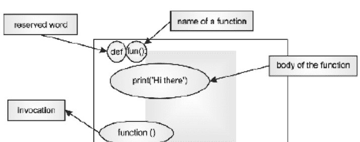

**图 6.1** 函数示例。

函数的定义包含以下内容：

**函数名：** 函数名应为任何有效的标识符。函数名应有意义，如果可能，应传达函数要执行的任务。

**参数：** 参数列表（用逗号分隔）位于函数名后的括号中。参数本质上是函数的输入。一个函数可以有任意数量的参数。

**函数体：** 函数体包含实现函数要执行任务的代码。

图 6.1 显示了函数名（**fun**）、函数名后括号中的参数列表（本例中没有参数）以及函数体。

还需注意，包含参数的右括号后跟一个冒号。函数体以适当的缩进开始。

函数的调用可以在定义之后的任何位置。但是，递归情况是此前提的例外。

函数的语法如图 6.2 所示。

### 语法：

```
def <name of the function>(list
of parameters):
    <body>
```

**图 6.2** 函数的语法。

### 6.4.1. 工作原理

考虑一个将两个作为参数传递的数字相乘的函数。

```
def product(num1, num2):
    prod= num1*num2
    print('The product of the numbers is \t:'+str(prod))
```

此函数的名称是 **product**。它接受两个参数作为输入（**num1** 和 **num2**），计算乘积，并显示结果。

该函数可以如下调用。

```
num1=int(input('Enter the first number\t:'))
num2=int(input('Enter the second number\t:'))
print('Calling the function...')
product(num1, num2)
print('Back to the calling function');
```

这里，调用 **product** 会将控制权转移到函数内部，在函数内部计算乘积并显示结果。然后控制权返回到调用函数（图 6.3）。

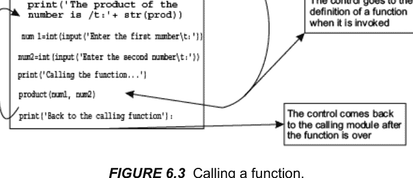

一个函数可以被调用任意多次。以下示例展示了一个不接受任何输入也不返回任何内容的函数。被调用的函数只是打印 **《传道书》** 的几行文字。以下清单显示了该函数，程序的输出紧随其后。

### 示例 6.1：

基本函数

### 清单：

```
def Ecclesiastes_3():
    print('To everything there is a season\nA time for every purpose under Heaven')
    print('A time to be born\nand a time to die\nA time to plant\nand a time to reap')
    print('A time to kill\nand a time to heal\nA time to break down\nand a time to build up')
    print('A time to cast away stones\nand a time to gather stones\nA time to embrace\nand a time to refrain')
    print('A time to gain\nand a time to lose\nA time to keep\nand a time to cast away')
    print('A time of love\nand a time of hate\nA time of war\nand a time of peace')
    print('Calling function\n')
    Ecclesiastes_3()
    print('Calling function again\n')
    Ecclesiastes_3()
>>>
```

## 输出：

Calling function

To everything there is a season
A time for every purpose under Heaven
A time to be born
and a time to die
A time to plant
and a time to reap
A time to kill
and a time to heal
A time to break down
and a time to build up
A time to cast away stones
and a time to gather stones
A time to embrace
and a time to refrain
A time to gain
and a time to lose
A time to keep
and a time to cast away
A time of love
and a time of hate
A time of war
and a time of peace

## 6.5 函数的类型

根据参数和返回类型，函数可以分为以下几类。第一种类型的函数不接受任何参数，也不返回任何内容。示例 6.2 中给出的程序就是此类函数的一个例子。

第二种类型的函数接受参数但不返回任何内容。示例 6.2 中的第二个函数就是此类函数的例子。第三种类型的函数接受参数并返回输出。接下来的示例使用函数将两个数字相加。该任务以三种不同的方式完成：在第一个函数（**sum1**）中，输入在函数内部获取，结果使用 print 语句显示，该语句也位于函数内部。

第二个函数接受两个数字作为输入（通过参数），将它们相加，并在函数内部打印结果。第三个函数（**sum3**）接受两个参数并返回它们的和。

### 示例 6.2：

编写一个使用函数将两个数字相加的程序。设计三个函数：一个不接受任何参数也不返回任何内容；第二个函数应接受参数但不返回任何内容；第三个函数应接受两个数字作为参数并返回它们的和。

### 程序：

```
def sum1():
    num1=int(input('Enter the first number\t:'))
    num2=int(input('Enter the second number\t:'))
    sum= num1+num2
    print('The sum of the numbers is \t:'+str(sum))
def sum2(num1, num2):
    sum= num1+num2
    print('The sum of the numbers is \t:'+str(sum))
def sum3(num1, num2):
    sum= num1+num2
    return(sum)
print('Calling the first function...')
sum1()
num1=int(input('Enter the first number\t:'))
num2=int(input('Enter the second number\t:'))
print('Calling the second function...')
sum2(num1, num2)
print('Calling the third function...')
result=sum3(num1, num2)
print(result)
```

## 输出：

```
RUN C:/Users/ACER
ASPIRE/AppData/Local/Programs/Python/Python35-
32/Tools/scripts/sum_of_numbers.py
Calling the first function...
Enter the first number :3
Enter the second number :4
The sum of the numbers is :7
Enter the first number :2
Enter the second number :1
Calling the second function...
The sum of the numbers is :3
Calling the third function...
3
```

### 6.5.1. 实参：实参的类型

在 Python 中，与 C 不同，在定义函数时，不指定实参的类型。这具有可以向同一函数传递不同类型实参的优点。例如，在接下来的函数中，第一次调用向函数传递一个整数值。函数将两个数字相加。在第二次调用的情况下，加法运算符将作为参数传递的字符串连接起来。

### 示例 6.3：

实参

### 清单 1：

```
def sum1(num1, num2):
    return (num1+num2)
    sum1(3,2)
    sum1('hi', 'there')
```

## 输出：

```
5
'hithere'
```

### 清单 2：

```
def sum1(num1, num2):
    return (num1+num2)
print('Calling function with integer arguments\t: Result: '+str(sum1(2,3)))
print('Calling the function with string arguments\t: Result: '+sum1('this',' world'))
```

## 输出：

```
Calling function with integer arguments    :Result: 5
Calling the function with string arguments    :Result: this world
```

## 6.6 实现搜索

本节演示了迄今为止讨论的主题最重要的应用之一：**搜索**。在搜索问题中，如果元素存在于给定列表中，则应打印其位置，否则应显示消息“未找到”。有两种主要策略可以完成此任务。它们是线性搜索和二分搜索。在线性搜索中，元素被逐一迭代。如果找到所需元素，则打印该元素的位置。可以使用 **标志** 来判断元素是否存在。

该算法已在示例 6.4 中实现。

### 示例 6.4：

编写一个程序来实现线性搜索。

## 解决方案：

## 代码：

```python
def search(L, item):
    flag = 0
    for i in L:
        if i == item:
            flag = 1
            print('Position ', i)
    if flag == 0:
        print('Not found')

L = [1, 2, 5, 9, 10]
search(L, 5)
search(L, 3)
```

## 输出：

```
Position 5
Not found
```

上述搜索策略效果良好。然而，该算法的复杂度为 O(n)。还有另一种搜索策略称为二分查找。在二分查找中，输入列表必须是已排序的。算法会检查要查找的元素是否出现在第一个位置、最后一个位置或中间位置。如果所需元素不在这些位置中的任何一个，并且它小于中间元素，那么列表的左半部分将成为该过程的输入；否则，列表的右半部分将成为该过程的输入。建议读者实现二分查找。二分查找的复杂度为 O(log n)。

## 6.7 作用域

Python 中变量的作用域是程序中其值合法或有效的部分。这里可以说明，虽然 Python 允许使用全局变量，但局部变量的值必须在被引用之前被赋值。示例 6.5 阐明了这个概念。该示例包含三个代码清单。在第一个清单中，变量 "a" 的值在函数外部和内部都被赋值。这会导致问题，因为变量在被赋值之前不能被引用。

在第二种情况下，这个问题得到了解决。最后，最后一个清单表明，出于某种奇怪的原因，Python 中非常允许使用全局变量。作为一名活跃的程序员，我坚信这不应该被允许，并且在编程语言中不允许使用全局变量有多个原因。

## 示例 6.5：

变量的作用域

### 清单 1：

## 代码：

```python
# 注意，当函数被调用时 a = 1 不成立
a = 1
def fun1():
    print(a)
    a = 7
    print(a)

def fun2():
    print(a)
    a = 3
    print(a)

fun1()
fun2()
```

## 输出：

```
Traceback (most recent call last):
  File "C:/Python/Functions/scope.py", line 12, in <module>
    fun1()
  File "C:/Python/Functions/scope.py", line 3, in fun1
    print(a)
UnboundLocalError: local variable 'a' referenced before assignment
```

### 清单 2：

## 代码：

```python
a = 1
def fun1():
    a = 1
    print(a)
    a = 7
    print(a)

def fun2():
    a = 1
    print(a)
    a = 3
    print(a)

fun1()
fun2()
```

## 输出：

```
1
7
1
3
```

另外，请注意，如果函数中没有给 'a' 赋值，那么全局值就足够了。

### 清单 3：

## 代码：

```python
a = 1
def fun1():
    print(a)
    def fun2():
        print(a)

fun1()
fun2()
```

## 输出：

```
1
1
```

## 6.8 递归

一个函数也可以在其自身内部被调用。在自身内部调用函数被称为递归。这个概念被用来轻松且直观地完成许多任务。例如，考虑以下数列：

1, 1, 2, 3, 5, 8, 13, ...

请注意，该数列的每一项都是前两项之和，第一项和第二项分别为 1 和 1。这个数列被称为斐波那契数列。该数列源于著名的兔子问题，其描述如下。

### 6.8.1. 兔子问题

最初，有一对兔子。这对兔子在前两个月不繁殖，之后它们每个月生成一对兔子。这样，前两个月只有一对兔子，之后数列变为 2, 3, 5, 8, 13，依此类推。该数列的形成如表 6.1 所示。R0 指的是第一对兔子，R01 指的是在第三个月由 R0 生成的那对兔子。同样，R02 是在第四个月由 R0 生成的那对兔子。

**表 6.1** 斐波那契数列。

| 月份 | 兔子对 | 对数 |
| :--- | :--- | :--- |
| 1 | R0 | 1 |
| 2 | R0 | 1 |
| 3 | R0 -> R01 | 2 |
| 4 | R0 -> R01, R02 | 3 |
| 5 | R0 -> R01 (->R010), R02, R03 | 5 |
| 6 | R0 -> R01 (->R010, R011), R02 (->R020), R03, R04 | 8 |

请注意，在上述数列中，每一项都是前两项之和。该数列可以用数学方式表示如下。

$$ \text{fib}(n) = \begin{cases} 1, & \text{当 } n = 1 \\ 1, & \text{当 } n = 2 \\ \text{fib}(n-1) + \text{fib}(n-2) & \end{cases} $$

示例 6.6 描述了使用递归实现斐波那契数列。

## 示例 6.6：

要求用户输入 n 的值，并找出第 n 个斐波那契项。

## 解决方案：

## 代码：

```python
def fib(n):
    if n == 1:
        return 1
    elif n == 2:
        return 1
    else:
        return (fib(n-1) + fib(n-2))

n = input('Enter the number\t:')
f = fib(n)
print('The nth fib term is ', str(f))
```

## 输出：

```
Enter the number    :5
The nth fib term is 5
```

请注意，斐波那契数的计算使用了之前计算出的斐波那契项。例如，计算第 5 个斐波那契项需要以下计算。fib(5) 需要 fib(4) 和 fib(3)；fib(4) 需要 fib(3) 和 fib(2)，而 fib(3) 需要 fib(2) 和 fib(1)（图 6.4）。

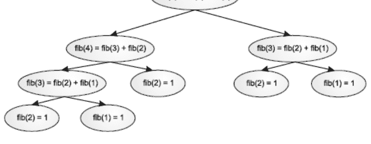

**图 6.4** 第五个斐波那契项的计算。

下一个示例使用递归计算一个数的阶乘。一个数 *n*（正整数）的阶乘是从 1 到 *n* 的所有整数的乘积。即

*n*! = 1 × 2 × 3 ×... × *n*

请注意，由于 (*n* – 1) ! = 1 × 2 × 3 ×... × (*n* – 1)

因此，*n*! = *n* × (*n* – 1) !

另外，1 的阶乘是 1，即 1! = 1，这可以在使用递归实现阶乘时用作基本情况。该程序如示例 6.7 所示。

## 示例 6.7：

要求用户输入 *n* 的值，并计算 *n* 的阶乘。

## 解决方案：

## 代码：

```python
def fac(n):
    if n == 1:
        return 1;
    else:
        return(n * fac(n-1))

n = int(input('Enter the number\t:'))
factorial = fac(n)
print('Factorial of ', n, ' is ', factorial)
```

## 输出：

```
Enter the number :5
Factorial of 5 is 120
```

一个数的幂也可以使用递归来计算。由于 *a*<sup>*b*</sup> = *a* × *a*<sup>*b* – 1</sup>，即 power(*a*, *b*) = *a*\*power(*a*, *b* - 1)。另外，*a*<sup>1</sup> = *a*，即 power(*a*, 1) = 1。上述逻辑已在接下来的示例中实现。

## 示例 6.8：

要求用户输入 a 和 b 的值，并使用递归计算 a 的 b 次幂。

### 程序：

## 代码：

```python
def power(a, b):
    if b == 1:
        return a
    else:
        return (a * power(a, b-1))

a = int(input('Enter the first number\t:'))
b = int(input('Enter the second number\t:'))
p = power(a, b)
print(a, ' to the power of ', b, ' is ', p)
```

## 输出：

```
Enter the first number :3
Enter the second number :4
3 to the power of 4 is 81
```

### 6.8.2. 使用递归的缺点

尽管递归使事情变得简单，并有助于直观地完成一些任务，但它也有不利的一面。考虑第一个示例。虽然程序计算了第 n 个斐波那契项，但该过程的复杂度非常高（O(φⁿ)，其中 Φ 是黄金数）。同样的任务可以使用称为动态规划的范式在线性时间内完成。

同样，分治法中的递归过程也需要大量时间。除了上述问题，还有另一个不利方面。递归需要大量内存。虽然一部分内存是为栈保留的，但递归过程可能会耗尽所有可用内存。

## 6.9 结论

本章介绍了函数的概念。将给定程序划分为不同部分的思想对于可管理性至关重要。本章为后续章节奠定了基础。也可以说，函数实现了类的行为；因此，在转向面向对象范式之前，必须熟悉函数和过程。

递归的概念对于涉及分治法和动态规划思想的实现也至关重要。因此，如果可能的话，也必须掌握递归的能力，并能够使用这个概念来解决问题。

## 术语表

- **函数：** 函数完成特定任务。它们有助于使程序易于管理。
- **参数：** 参数是在函数中传递的值。
- **递归：** 一个函数可以调用自身。这被称为递归。

## 要点回顾

- 一个函数可以有任意数量的参数。
- 一个函数最多只能返回一个值。
- 一个函数甚至可以不返回值。
- 一个函数可以调用自身。
- 一个函数可以被调用任意次数。

## 练习题

### 选择题

1. 以下哪个关键字用于定义函数？
    (a) Def

## 第7章

## 文件处理

### 目标

阅读本章后，读者应能够

- 理解文件处理的重要性
- 了解Python中文件处理的机制
- 学习各种文件访问模式
- 理解Python中用于文件处理的各种函数
- 实现本章所学的概念

### 7.1 引言

到目前为止讨论的数据类型和控制结构将帮助我们完成许多简单的任务。然而，问题在于我们无法将数据或获得的结果存储起来以供将来使用。此外，有时程序产生的结果非常庞大。在这种情况下，将数据存储在内存中甚至读取数据都变得困难。文件处理可以帮助我们处理上述情况。

读者也会认识到主存储器是易失性的这一事实。因此，程序产生的数据不能用于未来的努力。很多时候需要存储数据以供将来使用。例如，如果一个人开发了一个学生管理系统，只有当存储的数据能够根据需要检索时，它才是有用的。

在存储数据时，应注意数据的格式。然而，在程序员的层面，数据可以存储在文件或数据库中。数据库存储和管理相关数据。检索的便捷性、安全性和灵活性使数据库成为计算机科学中最重要的主题之一。数据库的概念、它们的使用和相关问题构成了一门专门的学科。然而，本章仅集中于文件处理。

文件可以看作是一组记录，其中每条记录有一些字段。这些字段又存储数据。如后文所述，文件可以有多种格式。然而，本章集中于二进制文件和文本文件。这两种格式在行尾的表示方式、文件结尾的表示方式以及标准数据类型的存储方面有所不同。文件可能具有某些关联的权限。例如，对于操作系统要使用的文件，用户可能没有写权限。同样，用户可能也没有读取此类文件的权限。在编写文件处理程序时，会考虑到这些限制。

Python提供了许多函数来执行与文件处理相关的操作。本章讨论了文件的创建、向文件写入数据、读取数据、向文件追加内容以及标准目录操作。此外，为了使内容更有趣，还讨论了上述操作在加密中的应用。

本章的组织结构如下。第二节讨论一般的文件处理机制。第三节讨论**open()**函数以及可以打开文件的各种模式。第四节讨论用于读取和写入文件的函数。该节还介绍了获取和设置文件中光标位置的函数。第五节简要讨论了命令行参数，最后一节是总结。

### 7.2 文件处理机制

在Python中，文件是通过文件对象访问的。事实上，文件对象不仅帮助我们访问普通的磁盘文件，还可以帮助我们完成许多涉及其他类型文件的额外任务。

---

1. (b) 定义
(c) 定义
(d) 以上都不是

2. 传递给函数的值称为

- (a) 参数
(b) 返回值
(c) 产出
(d) 以上都不是

3. 递归函数是调用

- (a) 自身
(b) 其他函数
(c) 主函数
(d) 以上都不是

4. 递归函数中应该包含以下哪项？

- (a) 初始值
(b) 最终值
(c) 两者都有
(d) 以上都不是

5. 以下哪项可以使用递归来完成？

- (a) 二分查找
(b) 斐波那契数列
(c) 幂运算
(d) 以上所有

6. 函数中允许使用以下哪项？

- (a) If
(b) While
(c) 调用函数
(d) 以上都不是

7. Python支持哪些类型的函数？

- (a) 内置函数
(b) 用户定义函数
(c) 两者都支持
(d) 以上都不是

8. 以下哪项是正确的？

- (a) 函数有助于将程序分成小部分
(b) 函数可以被调用任意次数
(c) 两者都对
(d) 以上都不是

9. 以下哪项是正确的？

- (a) 一个函数可以调用任意数量的函数
(b) 一个函数只能调用有限数量的函数
(c) Python中不允许嵌套函数
(d) 嵌套函数仅在特定条件下允许

10. 嵌套函数包含了以下哪个概念？

- (a) 栈
(b) 队列
(c) 链表
(d) 以上都不是

### 编程练习

1. 编写一个函数，计算用户输入数字的平均值。
2. 编写一个函数，计算用户输入数字的众数。
3. 编写一个函数，计算用户输入数字的中位数。
4. 编写一个函数，计算用户输入数字的标准差。
5. 编写一个函数，从给定列表中找出最大值。
6. 编写一个函数，从给定列表中找出最小值。
7. 编写一个函数，从给定列表中找出第二大值。
8. 编写一个函数，找出用户输入的三个数字中的最大值。
9. 编写一个函数，将摄氏温度转换为华氏温度。
10. 编写一个函数，在给定列表中搜索一个元素。
11. 编写一个函数，对给定列表进行排序。
12. 编写一个函数，接受两个列表作为输入并返回合并后的列表。
13. 编写一个函数，找出给定数字的所有因数。
14. 编写一个函数，找出两个给定数字的公因数。
15. 编写一个函数，返回通过反转给定数字的数字顺序得到的数字。

## 基于递归的问题

使用递归来解决以下问题

1. 求两个给定数字的和。
2. 求两个给定数字的乘积。
3. 给定两个数字，求第一个数字的第二个数字次幂。
4. 给定两个数字，求这两个数字的最大公约数。
5. 给定两个数字，求这两个数字的最小公倍数。
6. 生成n个斐波那契数列项。
7. 在一个数列中，前三项是1、1和1；第i<sup>th</sup>项使用以下公式获得
$$f(i) = 2 \times f(i-1) + 3 \times f(i-2)$$
编写一个函数来生成该数列的n项。
8. 在给定的有序列表中查找元素。
9. 从给定列表中找出最大值。
10. 反转给定数字的数字顺序。

## 理论

1. 在程序中使用函数有哪些优点？
2. 什么是函数？函数的组成部分是什么？
3. 参数和返回类型在函数中的重要性是什么？一个函数可以有多个返回值吗？
4. 什么是递归？实现递归时内部使用了哪种数据结构？
5. 递归的缺点是什么？

## 额外问题

1. 以下程序的输出是什么？

```python
def fun1(n):
    if n==1:
        return 1
    else:
        return (3*fun1(n-1)+2*fun1(n))

fun1(2)
```

- (a) 1
(b) 5
(c) 3
(d) 达到最大迭代深度

2. 以下代码的输出是什么？

```python
def fun1(n):
    if n==1:
        return 1
    elif n==2:
        return 2
    else:
        return (3*fun1(n-1)+2*fun1(n))
fun1(5)
```

- (a) 5
(b) 27
(c) 达到最大迭代深度
(d) 以上都不是

3. 以下代码的输出是什么？

```python
def fun1(n):
    if n==1:
        return 1
    elif n==2:
        return 2
    else:
        return (3*fun1(n-1)+2*fun1(n-2))
print(fun1(5))
```

- (a) 5
(b) 100
(c) 25
(d) 达到最大迭代深度

4. 以下代码的输出是什么？

```python
def fun1(n):
    if n==1:
        return 1
    elif n==2:
        return 2
    else:
        return (3*fun1(n-1)+2*fun1(n-2))
for i in range(10):
    print(fun1(i), end=' ')
```

- (a) 1 2 8 28 100 356 1268 4516 16084
(b) 1 3 5 7 9 11 13 15
(c) 达到最大迭代深度
(d) 以上都不是

5. 以下代码的输出是什么？

```python
def fun1(n):
    if n==1:
        return 1
    elif n==2:
        return 2
    else:
        return (3*fun1(n-1)+2*fun1(n-2))
for i in range(1, 10, 1):
    print(fun1(i), end=' ')
```

- (a) 1 2 8 28 100 356 1268 4516 16084
(b) 1 3 5 7 9 11 13 15
(c) 达到最大迭代深度
(d) 以上都不是

6. 以下代码的输出是什么？

```python
def _main_():
    print('I am in main')
    fun1()
    print('I am back in main')
def fun1():
    print('I am in fun1')
    fun2()
    print('I am back in fun1')
def fun2():
    print('I am in fun 2')
    _main_()
```

- (a) I am in main
I am in fun1
I am in fun 2
I am back in fun1
I am back in main

(b) 以上内容的逆序

(c) 以上都不是

(d) 程序不执行

7. 从概念上讲，上述程序实现了哪种数据结构？

- (a) 栈
(b) 队列
(c) 图
(d) 树

8. 以下代码实现了哪种技术？

```python
def search(L, item):
    flag=0
    for i in L:
        if i==item:
            flag=1
            print('Position ',i)
    if flag==0:
        print('Not found')
L =[1, 2, 5, 9, 10]
search(L, 5)
search(L, 3)
```

- (a) 线性查找
(b) 二分查找
(c) 以上都不是
(d) 代码不执行

9. 上述代码的复杂度是多少？

- (a) O (n)
(b) O (n²)
(c) O (log n)
(d) 以上都不是

10. 线性查找和二分查找哪个更好？

- (a) 线性查找
(b) 二分查找
(c) 两者同样好
(d) 取决于输入列表。

Python中的文件处理机制很简单。首先需要打开文件。也就是说，将文件关联到一个对象[1]。这可以通过**open()**函数来完成。该函数接受文件名和模式作为其参数。实际上，该函数可以有三个参数。这些参数将在下一节中讨论。open函数返回一个文件对象。然后，该对象使用库函数来读取文件、写入文件或追加内容。最后，使用**close()**函数释放对象占用的内存空间。该机制已在下图（图7.1）中描绘。


**图 7.1** Python中的文件处理。

在讨论了Python中处理文件的机制之后，让我们继续探讨文件访问模式和Python中的**open**函数。

### 7.3 OPEN函数和文件访问模式

文件通过使用**open()**函数创建的对象进行访问。请注意，该函数返回一个文件对象或类似文件的对象。这种抽象有助于将文件视为通信接口。因此，这种通信可以被视为字节的传输，因为文件可以被视为字节序列。

因此，要能够对文件进行输入/输出，需要**open()**函数。如果文件成功打开，则返回文件对象。如果文件未能成功打开，则会引发**IOERROR**异常。

**open**函数接受三个参数。第一个参数是文件名，第二个参数是文件要以何种模式打开，第三个参数指示缓冲区字符串。实际上，第三个参数很少使用。第一个参数是一个字符串，它是一个有效的文件名或路径。路径可以是相对路径或绝对路径。访问模式是文件将被打开的模式（图7.2）。各种模式已在图7.3中呈现。这些模式以读取、写入或追加模式打开文件。在读取模式（“r”）下，如果文件存在，则将其打开。写入模式（“w”）打开文件以进行写入。如果文件已存在，则文件的现有内容将被截断。追加模式（“a”）打开文件以进行写入，但不会截断现有内容。在此模式下，如果文件不存在，则会创建该文件。

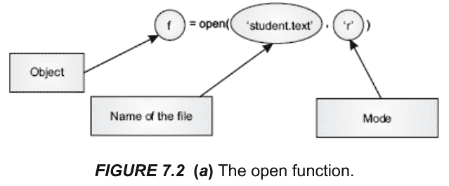

**图 7.2 (a)** open函数。

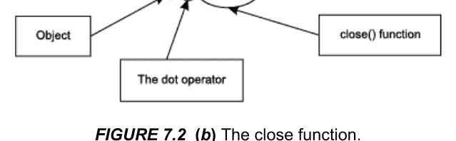

**图 7.2 (b)** close函数。

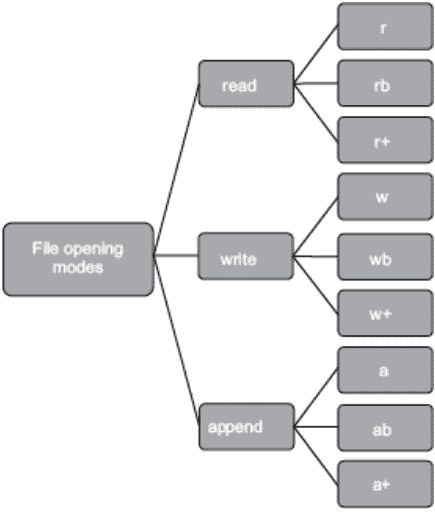

**图 7.3** Python中的文件打开模式。

模式可以后缀一个字母“b”，表示二进制访问。“+”后缀可用于授予文件读写权限。表7.1列出了各种模式以及可以执行的相应操作。

**表 7.1** 文件访问模式。

| 文件模式 | 操作 |
| :--- | :--- |
| r | 从文件读取 |
| w | 写入文件；如果文件不存在则创建；如果文件已存在则截断文件。 |
| a | 追加到文件；如果文件不存在则创建文件 |
| r+ | 以读写模式打开 |
| w+ | 以读写模式打开（w模式） |
| a+ | 以读写模式打开（a模式） |
| rb | 读取二进制文件 |
| wb | 以写入模式打开二进制文件 |
| ab | 以追加模式打开二进制文件 |
| rb+ | 以读写模式打开二进制文件（r+模式） |
| wb+ | 以读写模式打开二进制文件（w+模式） |
| ab+ | 以读写模式打开二进制文件（a+模式） |

## 7.4 用于文件处理的Python函数

Python提供了各种库函数来执行标准任务。这些函数帮助我们从文件读取、写入文件以及向现有文件追加内容。此外，Python还为程序员提供了将光标移动到特定位置或从给定位置读取的函数。

### 7.4.1 基本函数

本节简要解释了这些函数的使用。期望读者通过实验这些函数以获得清晰的理解。

#### read()函数

该函数以字符串形式读取字节。它可以接受一个整数参数，指示要读取的字节数。如果参数为−1，则必须读取文件直到末尾。此外，如果未给出参数，则默认值为−1。

**提示！**

*read() 等同于 read(-1)*

如果文件内容大于内存，则只会读取适合内存的内容。此外，当读取操作结束时，会返回一个“”（空字符串）。

#### **readline() 和 readlines()**

**readline()** 方法用于读取一行，直到读取换行符。这里需要说明的是，换行符会保留在返回的字符串中。**readlines()** 方法从给定文件读取所有行，并返回一个字符串列表。

#### **write() 和 writelines()**

**write()** 方法将字符串写入给定文件。该方法与**read()**方法互补。**writelines()** 方法将字符串列表写入文件。

> **提示！**
> *Python 3.x 中没有 writeline() 方法*

#### **seek()**

**seek** 函数将光标移动到给定文件中的指定位置。位置由给定的偏移量决定。偏移量可以是0、1或2。“0”表示文件的开头。值“1”表示当前位置，值2表示“文件末尾”。

#### **tell()**

**tell()** 函数与**seek()**函数互补。该函数返回光标的位置。

#### **close()**

**close()** 函数关闭文件。对象关闭后应分配给另一个文件。虽然Python在程序结束后会关闭文件（参见垃圾回收），但建议在完成所需任务后关闭文件。不关闭文件的后果可能在最意想不到的时候显现。

#### fileno()

**fileno()** 函数返回文件的描述符。例如，以下代码片段中名为“Textfile.txt”的文件的描述符是3。

```
>>>f=open('Textfile.txt')
>>>f.fileno()
3
```

### 7.4.2 操作系统方法

处理与操作系统相关问题的方法有助于程序员创建通用程序。这些方法也使程序员免于处理棘手的格式细节的困扰。例如，行尾在不同的操作系统中由不同的字符集表示。在Unix中，换行符由“\n”表示，在MAC中换行符是“\r”，在DOS中是“\r\n”。同样，文件分隔符在Unix中是“/”，在Windows中是“\”，在MAC中是“:”。这些不一致性使程序员的生活变得艰难。这就是为什么需要一种一致的方法来处理这种情况。表7.2列出了一些最重要的**操作系统方法**的名称和功能。

**表 7.2** 操作系统方法。

| 操作系统方法 | 功能 |
| :--- | :--- |
| **linesep** | 用于分隔文件中行的字符串 |
| **sep** | 用于分隔文件路径名组件 |
| **Pathsep** | 分隔一组文件路径名 |
| **Curdir** | 当前目录 |
| **Pardir** | 父目录 |

### 7.4.3 杂项函数和文件属性

除了上述函数外，**flush** 和 **isatty** 也用于使程序更加健壮。

**flush():** flush函数刷新内部缓冲区。

**isatty():** 如果文件是tty类设备，该函数返回“1”。

有关更多此类函数，读者可以参考本书末尾的参考文献。

#### 文件属性

这里还需要说明的是，文件属性有助于程序员查看文件的状态及其特征，如名称和模式。表7.3列出了一些最重要的文件属性。

**表 7.3** 文件属性。

| 文件属性 | 重要性 |
|---|---|
| file.closed | 如果文件已关闭则为1，否则为0 |
| file.mode | 访问模式 |
| file.name | 文件名 |

以下示例演示了上述属性的使用。

### 示例 7.1：

*以读取模式打开一个名为“Textfile.txt”的文件。使用文件属性检查文件的名称、模式，并确定其是否已关闭。*

### 解答：

## 代码：

```
f=open('Textfile.txt','r')
print('Name of the file\t:',f.name)
print('Mode\t:',f.mode)
print('File closed?\t:',f.closed)
```

## 7.5 命令行参数

如果编译器知道脚本的名称，那么脚本名称以及额外的参数会存储在一个名为 **argv** 的列表中。**argv** 变量位于 **sys** 模块中。这些参数连同脚本名称一起被称为命令行参数。这里需要注意的是，即使是脚本名称也是列表的一部分。事实上，脚本名称是列表的第一个元素。其余的参数存储在列表后续的位置中。可以通过导入 **sys** 模块来访问 **argv**。以下示例演示了 **argv** 变量的使用。

### 示例 7.2：

显示命令行参数的数量和各个参数。

### 解答：

## 代码：

```python
import sys
print('The number of arguments',len(sys.argv))
print('Arguments\n')
for x in sys.argv:
    print('Argument\t:',x)
```

## 输出：

```
The number of arguments 1
Arguments
Argument : C:/Python/file handling/commandLine.py
```

以下示例展示了冒泡排序，它以命令行输入的数字作为输入。

### 示例 7.3：

对作为命令行参数输入的数字进行排序（使用冒泡排序）。

### 解答：

## 代码：

```python
import sys
def sort(L):
    i=0;
    while(i<(len(L)-1)):
        print('\nIteration\t:',i,'\n');
        j=0
        flag=0
        while(j<(len(L)-i-1)):
            if(L[j]<L[j+1]):
                flag=1
                temp=L[j]
                L[j]=L[j+1]
                L[j+1]=temp
            #print(L[j],end=' ')
            j=j+1
        print(L)
        if(flag==0):
            break
        i=i+1
    return(L)
L=[]
for x in sys.argv:
    L.append(x)
print('Before sorting\t:',L)
print(sort(L))
```

## 7.6 实现与示例

在了解了文件处理的机制、函数和属性之后，让我们来看看上述函数的用法以及一个有趣任务的实现。我们将从向文件（例如 “TextFile.txt”）写入内容开始，首先以写模式打开文件。在这种情况下，**open** 函数将有两个参数：文件名（“TextFile.txt”）和模式（“w”）。同时，文件需要关闭。请注意，**write** 函数返回写入文件的字节数。

```python
>>> f = open('TextFile.txt','w')
>>> f.write('Hi there\nHow are you?')
21
>>>f.close()
```

**read** 函数读取给定文件的字节。如前所述，**read** 函数可以不带任何参数。这意味着读取文件直到末尾。读取的文本可以存储在一个字符串（“text”）中。

```python
>>> text=f.read()
>>> text
'Hi there\nHow are you?'
>>>f.close()
>>>
```

可以使用 **os** 模块的 **rename** 函数重命名文件。**rename** 函数接受两个参数：第一个是原始文件名，第二个是文件的新名称。在以下代码片段中，一个名为 “TextFile.txt” 的文件被重命名为 “TextFile1.txt”，并使用 open 函数读取到 “str” 中。

```python
>>>import os
>>>os.rename('TextFile.txt','TextFile1.txt')
>>>f=open('TextFile1.txt','r')
>>>str=f.read()
>>>str
'Hi thereHow are you'
>>>
```

### 将字符串列表写入文件

如前所述，可以使用 **writelines()** 函数将字符串列表写入文件。该函数的用法如下所示。在以下代码片段中，用户输入的行被放入一个列表 L 中，然后将该列表写入文件 f。

### 示例 7.4：

编写一个程序，要求用户输入文本行。用户应能输入任意数量的行。要停止输入，他必须输入 “\e”。这些行应追加到一个空列表（例如 L）中。然后将此列表写入名为 lines.txt 的文件。程序随后应读取 lines.txt 的行。

### 解答：

## 代码：

```python
print('Enter text, press \'\e\' to exit')
L=[]
i=1
in1=input('Line number'+str(i)+'\t:')
while(in1 !='\e'):
    L.append(in1)
    i=i+1
    in1=input('Line number'+str(i)+'\t:')
print(L)
f=open('Lines.txt','w')
f.writelines(L)
f.close()
f=open('lines.txt','r')
for l in f.readline():
    print(l, end=' ')
f.close()>>>
```

## 输出：

```
Enter text, press '\e' to exit
Line number1 :Hi there
Line number2 :How are you
Line number3 :I am good
Line number4 :\e
['Hi there', 'How are you', 'I am good']
Hi there How are you I am good >>>
```

### 读取 n 个字符和 seek() 函数

以下示例（示例 7.5）演示了 **read(n)** 函数的使用，该函数读取文件的前 “n” 个字符。请注意，**tell** 函数用于获取光标的位置。**seek()** 函数接受两个参数，第一个是偏移量，第二个是位置。例如，**seek(0, 0)** 将光标定位在从开头算起的第一个位置。

### 示例 7.5：

打开一个文件 TextFile.txt 并在其中写入几行。现在以读模式打开该文件，并从文件中读取前 15 个字符。然后读取接下来的五个字符。在每一步中显示文件中光标的位置。现在，返回到文件的第一个位置，并从文件中读取 20 个字符。

### 解答：

## 代码：

```python
f=open('TextFile.txt','w')
f.writelines(['Hi there', 'How are you'])
f.close()
f = open('TextFile.txt', 'r+')
str = f.read(15)
print('String str\t: ', str)
pos = f.tell()
print('Current position\t:', pos)
str1=f.read(5)
print('Str1\t:',str1)
pos = f.seek(0, 0)
print('Current position\t:',pos)
str = f.read(20);
print('Again read String is : ', str)
f.close()
```

## 输出：

```
String str : Hi thereHow are
Current position : 15
Str1 : you
Current position : 0
Again read String is : Hi thereHow are you
```

### 创建目录并在目录间导航

也可以在 Python 中使用 **mkdir()** 函数创建目录。该函数接受目录名作为参数之一。建议读者参阅本书末尾的参考资料以获取该函数的详细描述。**chdir()** 函数更改当前目录，**getpwd()** 函数打印当前工作目录的名称（包括路径）。这些函数的用法如下所示。

```python
>>> import os
>>> os.mkdir('PythonDirectory')
>>> os.chdir('PythonDirectory')
>>> os.getcwd()
'C:\Python\file handling\PythonDirectory'
>>>
```

### 加密示例

以下示例使用了 **ord(c)** 函数，该函数打印字符 “c” 的 **ASCII** 值，以及 **chr(n)** 函数，该函数返回对应于 ASCII 值 **n** 的字符。

### 示例 7.6：

将 “Hi there how are you” 写入名为 “TextFile.txt” 的文件。现在，从文件中逐个读取字符，并将字符的 ASCII 值加上 k（由用户输入）后得到的字符写入。同时，通过从第二个文件中字符的 ASCII 值中减去 “k” 来解密字符串。

### 解答：

## 代码：

```python
f=open('TextFile.txt','w')
f.write('Hi there how are you')
f.close()
k=int(input('Enter a number'))
f =open('TextFile.txt','r')
f1=open('TextFile1.txt','w')
for s in f.read():
    for c in s:
        print('Character ',c,' Ascii value\t:',ord(c))
        f1.write(str(chr(ord(c)+k)))

f1.close()
print((open('TextFile1.txt').read()))
f1 =open('TextFile1.txt','r')
f2=open('TextFile2.txt','w')
for s in f1.read():
    for c in s:
        print('Character ',c,' Ascii value\t:',ord(c))
        f2.write(str(chr(ord(c)-k)))

f2.close()
print((open('TextFile2.txt').read()))
```

## 输出：

```
Enter a number4
Character H Ascii value : 72
Character i Ascii value : 105
Character   Ascii value : 32
Character t Ascii value : 116
Character h Ascii value : 104
Character e Ascii value : 101
Character r Ascii value : 114
Character e Ascii value : 101
Character   Ascii value : 32
Character h Ascii value : 104
Character o Ascii value : 111
Character w Ascii value : 119
Character   Ascii value : 32
Character a Ascii value : 97
Character r Ascii value : 114
Character e Ascii value : 101
Character   Ascii value : 32
Character y Ascii value : 121
```

## 将一个文件的内容复制到另一个文件

要将一个文件的内容复制到另一个文件，第一个文件以读模式打开，第二个文件以写模式打开。然后，第一个文件的行被逐行读取（使用 `read` 函数）并写入另一个文件（使用 `write` 函数）。程序如下所示。

### 示例 7.7：

将一个文件的内容复制到另一个文件。

### 解答：

## 代码：

```python
f1=open('source.txt','r')
f2=open('dest.txt','w')
char=f1.read()
print(char)
f2.write(char)
f1.close()
f2.close()
```

### 示例 7.8：

编写一个程序来计算文件中的单词数量。

### 解答：

文件中的单词数量可以通过初始化 `n`（=1）并逐行读取，将行分割成单词并依次递增 **n** 的值来计算。

## 代码：

```python
fname = 'source.txt'
n = 0
with open(fname, 'r') as f:
    for line in f:
        w = line.split()
        n += len(w)
print('Word count\t:',n)
```

## 7.7 结论

文件处理为用户提供了持久化存储的能力。用户必须掌握文件访问模式、**open()**、**close()** 函数以及有助于读取和写入文件的函数。本章简要介绍了 Python 中用于文件处理的最基本函数。本章还向用户介绍了 OS 方法和基本文件属性，以帮助用户完成手头的任务。本章还包含大量的示例和解释，以最简单的方式阐明概念。

## 要点回顾

- **open** 函数接受三个参数
- 文件的打开模式决定了可以完成的任务
- 完成所需任务后应关闭文件
- **seek** 方法有助于在文件内移动光标
- 调用 **close** 函数后，**file.closed** 的值为 1
- **file.name** 属性打印文件名
- **file.mode** 属性给出文件访问模式
- **os.getcwd** 函数返回当前工作目录
- **os.chdir** 函数更改目录

## 练习题

### 选择题

1. 以下哪项是使用文件处理的有力论据？
    (a) 不可能将程序产生的所有数据存储在主内存中
    (b) 它用于持久化存储
    (c) 两者都是
    (d) 以上都不是

2. 在哪种格式中，行尾由“\n”和“\r”表示？
    (a) 文本
    (b) 二进制
    (c) 两者都是
    (d) 以上都不是

3. 要使用文件，必须先打开它。这样做的原因是
    (a) 为形成的对象分配内存
    (b) 指定访问模式
    (c) 指定偏移量（可选）
    (d) 以上所有

4. 在 `f =open(‘abc.txt’, ‘r’)` 中，偏移量是
    (a) 从开头算起 0
    (b) 从末尾算起 0
    (c) 随机
    (d) 以上都不是

5. open 函数接受多少个参数？
    (a) 1
    (b) 2
    (c) 3
    (d) 以上都不是

6. 如果文件以以下哪种模式打开，则必须关闭文件？
    (a) r
    (b) w
    (c) 两者都是
    (d) 以上都不是

7. 如果文件未成功打开，会引发以下哪个异常？
    (a) File not found
    (b) IOERROR
    (c) IO
    (d) 以上都不是

8. 在 `f =open(‘abc.txt’, ‘w’)` 中，如果文件“abc.txt”不存在，那么
    (a) 引发 IOERROR
    (b) 程序无法编译
    (c) 创建一个新文件
    (d) 以上都不是

9. 用于打开二进制文件的后缀是
    (a) b
    (b) bin
    (c) ab
    (d) 以上都不是

10. + 后缀允许
    (a) 读
    (b) 读和写
    (c) 读或写
    (d) 以上都不是

11. Python 中有多少种文件访问模式？
    (a) 3
    (b) 6
    (c) 9
    (d) 12

12. **read()** 函数中的整数参数表示要读取的字节数，如果未给出参数，以下哪项是默认参数？
    (a) -1
    (b) 0
    (c) len(file)
    (d) 以上都不是

13. 要读取文件中的所有行，可以使用以下哪个函数？
    (a) readline()
    (b) readlines()
    (c) 两者都是
    (d) 以上都不是

14. 以下哪种方法可用于将字符串列表写入文件？
    (a) writeline()
    (b) writelines()
    (c) write()
    (d) 以上都不是

15. seek() 函数中的以下哪个参数表示文件末尾？
    (a) 1
    (b) 2
    (c) 0
    (d) 以上都不是

16. 哪个函数返回文件的描述符？
    (a) fileno()
    (b) filedisp()
    (c) descriptor()
    (d) 以上都不是

17. linesep 函数用于查找以下哪项？
    (a) 新行
    (b) 文件末尾
    (c) 当前目录
    (d) 以上都不是

18. 以下哪项不是文件属性？
    (a) closed
    (b) opened
    (c) name
    (d) softspace

19. 命令行参数保存在以下哪个变量中？
    (a) argv
    (b) argc
    (c) 两者都是
    (d) 以上都不是

20. 以下哪个函数有助于创建目录？
    (a) os.mkdir()
    (b) os.chdir()
    (c) os.getcwd()
    (d) 以上都不是

21. 以下哪个函数有助于更改当前目录？
    (a) os.mkdir()
    (b) os.chdir()
    (c) os.getcwd()
    (d) 以上都不是

22. 以下哪个函数有助于打印当前目录的名称？
    (a) os.mkdir()
    (b) os.chdir()
    (c) os.getcwd()
    (d) 以上都不是

23. 哪个函数用于查找字符的 ASCII 值？
    (a) ascii
    (b) ord
    (c) chord
    (d) 以上都不是

24. 以下哪项不是 Python 中的文件访问模式？
    (a) a
    (b) ab
    (c) ab+
    (d) abc

25. 以下哪项是不正确的？
    (a) f=open(‘file.txt’)
    (b) f=open(‘file.txt’,’r’)
    (c) f=open(‘file.txt’,’r’,0)
    (d) 以上都不正确

### 理论题

1. 文件处理的重要性是什么？解释 Python 中文件处理的机制。
2. 解释各种文件访问模式。
3. 解释以下函数的签名和用法
    a. open
    b. close
    c. read
    d. write
    e. readline
    f. readlines
    g. writeline
    h. seek
4. 什么是文件属性？解释 Python 提供的文件属性。
5. 简要解释 Python 中以下 os 函数的用法
    a. mkdir
    b. chdir
    c. getpwd

### 编程题

1. 编写一个程序，将一个文件的内容复制到另一个文件。
2. 编写一个程序，将文件中每个单词的首字母大写。
3. 编写一个程序，查找文件中每个字符的 ASCII 值。
4. 编写一个程序，查找文件中每个字符的频率。
5. 编写一个程序，在给定文件中查找用户输入的单词的所有出现位置。
6. 编写一个程序，将文件中的给定字符替换为另一个字符。
7. 编写一个程序，在给定文件中将给定单词替换为另一个单词。
8. 编写一个程序，查找文件中给定单词的频率。
9. 编写一个程序，查找给定文件中使用次数最少的单词。
10. 编写一个程序，将文件名更改为用户输入的名称。
11. 编写一个程序，创建一个目录，然后在其中创建一个新文件。
12. 编写一个程序，打印文件的名称、字符数和空格数。
13. 编写一个程序，将给定文件的字符转换为二进制格式。
14. 编写一个程序，从给定文件中查找以元音开头的单词。
15. 编写一个程序，在给定文件的文本上实现任何替换密码。

## 第八章

## 列表、元组与字典

## 学习目标

阅读本章后，读者应能够

- 理解列表、元组和字典之间的区别
- 理解切片和索引
- 理解 Python 中的字符串
- 理解列表、元组、字典的内置函数

## 8.1 引言

Python 为我们提供了列表、元组和字典，它们都已成为编程便捷性的代名词，并可应用于多种场景。在 Python 中，列表可以包含不同类型的元素，且是可变的；而元组可以包含不同类型的元素，但它是不可变的。在字典中，可以使用字符串作为索引来访问条目（图 8.1）。

字典是一种集合，其中每个值都与一个键相关联。这个键值对构成了字典中的一个条目。为了理解这个概念，请看下面的例子。在 20 世纪 80 年代，人们可以通过电话簿查找一个城市中人们的电话号码。电话簿按姓名的字母顺序排列了该城市人们的电话号码。因此，通过一个人的名字，就可以找到他的电话号码。也就是说，值（此处为电话号码）的索引就是人的名字。Python 字典使用了相同的思想。然而，电话簿中一个名字可能出现两次，但在字典中，每个键都是唯一的。

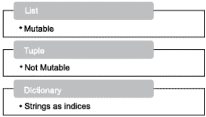

**图 8.1** 列表、元组和字典。

下一章将讨论字符串。字符串是字符的序列。这些数据结构用于存储文本。例如，如果想存储一个人的名字，或者他的地址，那么字符串是最合适的数据结构。事实上，字符串的知识对于开发许多应用程序（如文字处理器和解析器）至关重要。

本章的组织结构如下。第二节讨论列表，第三节讨论元组，下一节讨论字典。最后一节是总结。

## 8.2 列表

在 Python 中，列表是一个序列对象。列表可以是一个空列表（[]）。它可以包含任意数量的元素，这些元素可以是相同类型，也可以是不同类型。此外，列表可以包含不同类型的元素，包括另一个列表。而且，列表继承了字符串的许多属性。然而，与字符串不同的是，列表是可变的，并且可以包含不同类型的元素。

在下面的代码片段中，**L1** 是一个空列表，**L2** 包含 2, 4, 8, 16, 32 和 64。**L3** 包含一个整数（2）、一个字符串（“Harsh”）、另一个整数（3）、另一个字符串（“Manan”）、一个浮点数（4.7865）和另一个字符串（“Ali”）。**L4** 是一个列表的列表。它包含三个列表，每个列表包含不同数量的元素。

### 代码：创建

```
#空列表
L1=[]
#同质列表
L2=[2,4,8,16,32,64]
#异质列表
L3=[2, 'Harsh', 3,'Manan', 4.7865,'Ali']
#列表的列表
L4=[[1,2],[2,4,8],[3,9,27,81]]
print('First List',L1,'\nSecond List',L2,'\nThird List',L3)
```

## 输出：

First List []
Second List [2, 4, 8, 16, 32, 64]
Third List [2, 'Harsh', 3, 'Manan', 4.7865, 'Ali']

### 8.2.1 访问元素：索引和切片

列表的元素可以通过索引访问。列表第一个元素的索引是 0，第二个元素的索引是 1，以此类推。负索引表示从末尾开始的元素。例如，**L[-1]** 表示列表 **L** 的最后一个元素，同样，**L[-2]** 表示列表的倒数第二个元素（图 8.2）。

```
L = [1, 21, 5, 7, 9, 11]
L[0] 是 1
L[-1] 是 11
L[3] 是 7
```

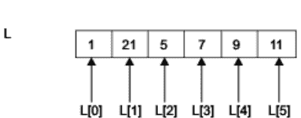

**图 8.2** Python 列表中的索引。注意 **L[0]** 表示第一个元素，**L[1]** 表示第二个元素，而 **L[-1]**（即 **L[5]**）表示最后一个元素。

切片通常用于从给定列表中取出一个子列表。在上面的例子中：

**L[:2]** 是一个子列表，包含 **L** 中从第一个元素开始到第一个索引处的元素（不包括索引 2 处的元素）的所有元素，即 [1, 3]。

**L[2:]** 是一个子列表，包含 **L** 中从第二个索引处的元素开始到最后一个元素的所有元素，即 [5, 7, 9 , 11]。

**L[1:4]** 是一个子列表，包含 **L** 中从第一个索引处的元素开始到第三个索引处的元素的所有元素，即 [3, 5, 7]。

### 8.2.2 可变性

可以说列表是可变的。也就是说，可以更新列表中的元素。为了理解这一点，请看下面的代码片段。以下代码将列表的第二个元素设置为 675。注意，列表的元素可以通过方括号访问。

### 代码：可变性

```
#可变
L2=[2,4,8,16,32,64]
L2[1]=675
#列表 L2 的第二个元素变为 675
print(L2)
```

## 输出：

```
[2, 675, 8, 16, 32, 64]
```

### 8.2.3 运算符

Python 为列表提供了四种运算符。它们是：+、*、**in** 和 **not in**。**L1+L2** 中的 + 运算符连接两个列表 **L1** 和 **L2**。**L1*n** 中的 * 运算符将列表 **L1** 的元素重复 **n** 次。**in** 运算符检查给定元素是否在列表中。**not in** 运算符检查给定元素是否不在列表中。为了理解这些运算符，请看下面的代码。列表 **L9** 是 **L2** 和 **L8** 的连接。列表 **L10** 包含 **L2** 的元素重复三次。注意，我们不能对列表使用 – 运算符。

# 代码：运算符 +、*、in 和 not in

```
#使用 + 运算符
L8= [90, 80, 70]
#连接两个列表
L9=L2+L8
print(L9)
#使用 * 运算符
num=3
#将元素重复 'num' 次
L10=L2*num
print(L10)
#- 非法
L11=L2-L8
print(L11)
```

## 输出：

```
[2, 675, 8, 16, 32, 64, 90, 80, 70]
[2, 675, 8, 16, 32, 64, 2, 675, 8, 16, 32, 64, 2, 675, 8, 16, 32, 64]
TypeError Traceback (most recent call last) <ipython-input-14-7ccfbd405905> in <module>() 1
#- 非法----> 2L11=L2-L8 3 print(L9)
TypeError: unsupported operand type(s) for -: 'list' and 'list'
```

### 8.2.4 遍历

列表是一个序列。列表中的每个元素都可以通过其方括号中的索引来访问。元素也可以使用循环和迭代器来访问。虽然可以使用任何循环来完成所述任务，但使用 **for** 循环会使事情变得简单。**for** 循环可用于遍历列表，如下面的代码所示，该代码将列表的每一项存储在 **i** 中并打印它们。在下一个代码中，使用嵌套循环来处理列表的列表。最后一个代码处理包含不同类型元素的列表。

### 代码：打印列表中的每个元素

```
L2=[2, 675, 8, 16, 32, 64]
#打印所有元素
for i in L2:
    print(i)
```

## 输出：

```
2
675
8
16
32
64
```

### 代码：使用嵌套循环处理列表的列表

```
L4=[[1,2],[2,4,8],[3,9,27,81]]
#打印列表 L4 中的所有列表
for i in L4:
    print(i)
```

## 输出：

```
[1, 2]
[2, 4, 8]
[3, 9, 27, 81]
```

### 代码：使用嵌套循环处理列表的列表中的所有元素

```
L4=[[1,2],[2,4,8],[3,9,27,81]]
#使用嵌套循环访问并打印列表 L4 内部列表的所有元素
for i in L4:
    print('List', end='\t')
    for j in i:
        print(j, end=' ')
    print('')
```

## 输出：

```
List 1 2
List 2 4 8
List 3 9 27 81
```

### 代码：处理包含不同类型元素的列表

```
L3=[2, 'Harsh', 3,'Manan', 4.7865,'Ali']
#使用 for 循环打印不同类型的元素
for i in L3:
    print(i)
```

## 输出：

```
2
Harsh
3
Manan
4.7865
Ali
```

以上讨论揭示了列表的创建方法、处理、切片和索引。了解了基础知识后，现在让我们使用列表的预定义函数来执行稍微复杂一些的任务。

### 8.2.5 函数

与列表相关的函数如表 8.1 所示。该表列举了一些用于列表的最重要方法及其说明。请注意，以下任务也可以在不使用函数的情况下完成。然而，这些函数帮助我们高效且有效地完成许多任务。接下来的代码演示了这些函数的使用。

**表 8.1** 列表的函数。

| 函数 | 说明 |
| :--- | :--- |
| list.append(item) | append 方法将 "item" 添加到列表末尾。 |
| list.extend(item) | extend 方法将 "item" 添加到列表末尾。 |
| list.insert(index, item) | insert 函数在 "index" 处插入 "item"。 |
| list.remove(item) | remove 函数从列表中移除第一个出现的 "item"。 |
| list.pop(index) | pop 函数移除列表中给定索引处的项目。此外，pop() 移除列表的最后一个元素。 |
| list.clear() | clear 方法移除列表中的所有元素。 |
| list.index(item) | 返回列表中第一个值等于 item 的项的从零开始的索引。 |
| list.count(item) | count 函数计算列表中 "item" 出现的次数。 |
| list.sort() | sort 函数对列表的项目进行排序。附加参数 reverse=True 可以按降序对列表进行排序。 |
| list.reverse() | reverse 函数反转列表的顺序。 |
| list.copy() | copy 函数返回列表的浅拷贝。 |

## 8.3 元组

元组可以为空，也可以包含任意数量的元素。它还可以包含不同类型的元素，如字符串、整数、浮点数、双精度数，甚至可以包含列表，以及上述类型的组合。例如，在下面的代码中，**T2** 包含一个整数 2、一个字符串 “Harsh”、以及另外两个整数 5 和 67。**T3** 是一个由三个不同元组组成的元组——(1,2)、(4,5) 和 (7,8)。**T4** 包含三个不同的列表，而 **T5** 则由一个包含元素 3 和 4 的元组、一个包含元素 4、5 和 6 的列表，以及一个字符串 “Harsh” 组成。

## 代码：

```
#创建元组
T1=(2,3,4,5,6,7,8,9,) #同质元组
print(T1)
T2=(2,'harsh',5,67) #异质元组
print(T2)
T3=((1,2),(4,5),(7,8)) #元组的元组
print(T3)
T4=([1,2],[-4],[8,9,10]) #列表的元组
print(T4)
T5=((3,4),[4,5,6],'Harsh') #包含元组、列表和字符串的元组
print(T5)
```

## 输出：

```
(2, 3, 4, 5, 6, 7, 8, 9)
(2, 'harsh', 5, 67)
((1, 2), (4, 5), (7, 8))
([1, 2], [-4], [8, 9, 10])
((3, 4), [4, 5, 6], 'Harsh')
```

### 8.3.1 访问元组的元素

元组的元素可以通过索引来访问。元组第一个元素的索引是 0，第二个元素的索引是 1，依此类推。负索引表示从末尾开始的元素。例如，**T[-1]** 表示列表 **T** 的最后一个元素，同样，**T[-2]** 表示列表的倒数第二个元素（图 8.3）。

```
T = (1, 3, 5, 7, 9, 11)
T[0] 是 1
T[-1] 是 11
T[3] 是 7
```

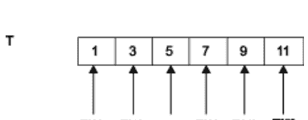

**图 8.3** Python 元组中的索引。注意 **T[0]** 表示第一个元素，**T[1]** 表示第二个元素，而 **T[-1]**（即 **T[5]**）表示最后一个元素。

切片通常用于从给定元组中取出一个子元组。在上面的例子中：

**T[:2]** 是一个子列表，包含 **T** 中从第一个元素到第一个索引处的元素（不是索引 2 处的元素）的所有元素，即 (1, 3)。

**T[2:]** 是一个子列表，包含 **T** 中从第二个索引处的元素（由于列表是基于零的索引，所以是第三个元素）到最后一个元素的所有元素，即 (5, 7, 9, 11)。

**T[1:4]** 是一个子列表，包含 **T** 中从第一个索引处的元素到第三个索引处的元素的所有元素，即 (3, 5, 7)。

### 8.3.2 不可变性

与列表不同，元组是不可变的，因为不能更新元组的任何元素。当尝试将元组的某个元素设置为特定值时，会得到以下错误。

```
# 不可变性
T1[2]=3
---------------------------------------------------------------------------
TypeError                                 Traceback (most recent call last)
<ipython-input-12-bc71ae9aae00> in <module>()
----> 1 T1[2]=3
TypeError: 'tuple' object does not support item
```

### 8.3.3 运算符

Python 为元组提供了四种运算符。它们是：+、*、**in** 和 **not in**。**T1+T2** 中的 + 运算符连接两个元组 **T1** 和 **T2**。**T1*n** 中的 * 运算符将列表 **T1** 的元素重复 **n** 次。**in** 运算符检查给定元素是否在元组中。**not in** 运算符检查给定元素是否不在元组中。为了理解这些运算符，请看下面的代码。列表 **T9** 是 **T2** 和 **T8** 的连接。列表 **T10** 的元素是 **T2** 的元素重复三次。注意，我们不能对元组使用 – 运算符。

# 代码：运算符 +、*、in 和 not in

```
T2=(90, 80, 70)
#连接两个元组
T9=T2+T8
print(T9)
#使用 * 运算符
num=3
#将元素重复 'num' 次
T10=T2*num
print(T10)
#- 非法
T11=T2-T8
print(T11)
```

## 输出：

```
(2, 675, 8, 16, 32, 64, 90, 80, 70)
(2, 675, 8, 16, 32, 64, 2, 675, 8, 16, 32, 64, 2, 675, 8, 16, 32, 64)
TypeError Traceback (most recent call last) <ipython-input-14-7ccfbd405905> in <module>()1
#- 非法----> 2L11=L2-L8 3 print(L9)
TypeError: unsupported operand type(s) for -: 'list' and 'list'
```

### 8.3.4 遍历

**for** 循环可以像遍历列表一样遍历元组。为了理解其用法，请看下面的代码，它将元组的每个项目存储在 **i** 中并打印出来。

## 代码：

```
#显示
def display(T):
    for i in T:
        print(i, end=',')
    print()
T=(2,3,4,5,6,7,8,10,)
display(T)
```

## 输出：

```
2,3,4,5,6,7,8,10,
```

以上讨论揭示了元组的创建方法、处理、切片和索引。在了解了基础知识之后，现在让我们执行一些稍微复杂的任务，比如显示用户输入的元组以及从元组中找出最大和最小元素。

# 示例 8.1：

要求用户输入一个元组，并在不使用 **max** 函数的情况下，找出元组中具有最大值的元素。

## 解决方案：

在下面的代码中，变量 **maxVal** 将存储元组中的最大元素。最初，它存储元组的第一个元素。在遍历过程中，如果我们找到一个大于 **maxVal** 的元素，**maxVal** 的值将被更新为在元组中找到的更大值。在程序结束时，打印 **maxVal** 的值。

### 程序：

```
#查找最大值
def max(T):
    maxVal=T[0]
    for i in T:
        if i>maxVal:
            maxVal=i
    return(maxVal)
T=(2,13,41,455,678,7,8,10,)
m=max(T)
print(m)
```

## 输出：

```
678
```

### 8.3.5 函数

表 8.2 显示了元组的各种函数。这些函数可以用于轻松高效地执行许多任务。接下来的示例展示了这些函数的使用。

**表 8.2** 与元组相关的函数。

| 函数 | 描述 |
| :--- | :--- |
| len(T) | 该函数返回元组 T 中的元素数量 |
| max(T) | 该函数返回具有最大值的元素 |
| min(T) | 该函数返回具有最小值的元素 |
| tuple(S) | 此函数将列表 (S) 转换为元组 |

# 示例 8.2：

编写一个程序，要求用户输入两个元组，并检查以下内容：

- (a) 比较两个元组。
- (b) 计算两个元组中的元素数量。
- (c) 返回第一个元组中具有最大值的元素。
- (d) 返回第二个列表中具有最小值的元素。
- (e) 将列表转换为元组。

上述任务应使用函数的方法来完成。

## 解决方案：

表 8.2 显示了与元组相关的各种函数。完成给定任务的程序如下。

### 程序：

```
print('对于第一个元组')
x1=int(input('输入第一个数字'))
y1=int(input('输入第二个数字'))
T1=(x1,y1)
print('对于第二个元组')
x2=int(input('输入第一个数字'))
y2=int(input('输入第二个数字'))
T2=(x2,y2)
l=len(T1)
print('第一个元组的长度',l)
m=max(T1)
print('第一个元组中的最大值',m)
m=min(T1)
print('第一个元组中的最小值',m)
if(T1 == T2):
    print('两个元组相同')
else:
    print('它们不相同')
L=[2,4,3,1]
T=tuple(L)
print(T)
```

## 输出：

```
对于第一个元组
输入第一个数字1
输入第二个数字2
对于第二个元组
输入第一个数字1
输入第二个数字2
第一个元组的长度 2
第一个元组中的最大值 2
第一个元组中的最小值 1
两个元组相同
(2,4,3,1)
```

## 8.4 关联数组和字典

关联数组是一种数据结构，包含键和对应值的配对集合。关联数组中的键是唯一的。这是因为每个值都是通过相应的键来访问的。如果存在多个具有相同值的键，将导致歧义。在关联数组中，可以向集合中插入项目、删除项目、更新它们，以及查找与键关联的特定值。

### 8.4.1. 显示字典的元素

Python 中的字典也是一种关联数组。它们包含键值对，其中键可以是任何不可变的数据结构，如字符串、元组等。在 Python 中，可以使用花括号创建字典。字典的元素用逗号分隔，每个元素有两部分：一个键和一个值。字典中的键可以是任何不可变对象，例如字符串。特定键对应的值通过在键后放置冒号来写入。例如，以下语句创建了一个名为 **PersonAge** 的字典。字典的第一个元素以“Harsh”为键，该键对应的值为 100。字典的第二个元素以“Rohan”为键，该键对应的值为 21，第三个元素以“Tarush”为键，该键对应的值为 21。可以使用 **print** 函数打印字典。字典已在图 8.4 中展示，项目和对应的键在表 8.3 中列出。

```
PersonAge={'Harsh':100,'Rohan':21,'Tarush':20}
print(PersonAge)
```

**输出：**

```
{'Harsh': 100, 'Rohan': 21, 'Tarush': 20}
```

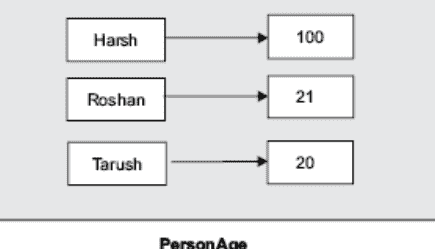

**图 8.4** 字典将键与值关联。

**表 8.3** 字典 Person Age。

| 键 | 值 | 项目 |
|---|---|---|
| “Harsh” | 100 | (“Harsh,” 100) |
| “Rohan” | 21 | (“Rohan,” 21) |
| “Tarush” | 20 | (“Tarush,” 20) |

可以使用 **items()** 函数查看字典的项目。以下语句打印字典 **PersonAge** 的项目。

```
PersonAge.items()
```

**输出：**

```
dict_items([('Harsh', 100), ('Rohan', 21), ('Tarush', 20)])
```

*语法*

```
<字典名称>.item()
```

可以通过使用键作为索引来查看特定键对应的值。例如，键“Harsh”对应的值可以如下查看：

```
PersonAge['Harsh']
```

**输出：**

```
100
```

*语法：字典中的索引*

```
<字典名称>[<键>]
```

Python 中的字典提供了许多内置函数，用于显示键、值或完整的项目。其中一些在表 8.4 中列出。

**表 8.4** 用于显示字典键、值和项目的函数。

| 函数名称 | 说明 |
|---|---|
| Keys() | 显示给定字典的键列表 |
| values() | 显示给定字典的值列表 |
| Items() | 显示给定字典的项目 |

以下代码展示了如何创建一个包含 5 个元素的字典。请注意，每个字符串都用单引号括起来，给定键对应的值使用冒号分隔。

```
BookPages = {'Programming in C': 250, 'Programming in C#': 450,
    'Python for beginners': 400, 'Physics': 100, 'Chemistry': 120}
```

**keys** 函数将显示字典的键。

```
BookPages.keys()
```

**输出：**

```
dict_keys(['Programming in C', 'Programming in C#', 'Python for beginners', 'Physics', 'Chemistry'])
```

*语法*

**<字典名称>.keys()**

**values** 函数将显示字典的值。

```
BookPages.values()
```

**输出：**

```
dict_values([250, 450, 400, 100, 120])
```

*语法*

**<字典名称>.values()**

### 8.4.2. 字典的一些重要函数

本节讨论处理字典的一些重要函数。本节介绍了函数的含义及其用法。

#### 8.4.2.1 **len** 函数返回给定字典中**元素**的数量。

**示例**

```
len(BookPages)
```

**输出：**

5

#### 8.4.2.2 **max** 函数返回具有**最大**值的键。如果键是字符串，则返回字典序中的值。

**示例：**

```
max(BookPages)
```

**输出：**

```
'Python for beginners'
```

#### 8.4.2.3 **min** 函数返回具有**最小**值的键。如果键是字符串，则返回字典序中的值。

**示例：**

```
min(BookPages)
```

**输出：**

```
'Chemistry'
```

#### 8.4.2.4 **sorted** 函数将按其键对给定字典的**元素**进行排序。如果键是字符串，则遵循字典序。

```
sorted(BookPages)
```

**输出：**

```
['Chemistry', 'Physics', 'Programming in C', 'Programming in C#', 'Python for beginners']
```

#### 8.4.2.5 **pop** 函数从字典中**取出**具有给定键的元素。

```
BookPages.pop('Physics')
```

**输出：**

```
100
```

请注意，调用 **pop** 函数后，键为“Physics”的项目已从字典中移除。

```
BookPages
{'Chemistry': 120, 'Programming in C': 250, 'Programming in C#': 450, 'Python for beginners': 400}
```

### 8.4.3. 用户输入

以下示例展示了如何要求用户输入字典的值。程序要求用户输入书名和对应的页数。

一个名为 **BookPages** 的字典初始化为 {}。接着要求用户输入元素的数量。在每次迭代中，获取键和对应的值并插入到字典中。

**输入**

```
BookPages={}
n=int(input('Enter the number of pages\t:'))
for i in range(n):
    Book=input('Enter the name of the book\t:')
    pages=int(input('Enter the number of pages\t:'))
    BookPages[Book]=pages
print(BookPages)
```

**输出：**

```
Enter the number of pages :5
Enter the name of the book :Programming in C
Enter the number of pages :250
Enter the name of the book :Programming in C#
Enter the number of pages :450
Enter the name of the book :Python for beginners
Enter the number of pages :400
Enter the name of the book :Physics
Enter the number of pages :100
Enter the name of the book :Chemistry
Enter the number of pages :120
{'Programming in C': 250, 'Programming in C#': 450, 'Python for beginners': 400, 'Physics': 100, 'Chemistry': 120}
```

## 8.5 结论

列表、元组和字典是 Python 中最重要的对象。学生在进一步学习之前必须掌握这些对象的功能。后续章节将广泛使用本章学习的概念；因此，建议读者花相当多的时间尝试随后的练习。

## 术语表

**列表：** Python 列表是一个序列对象。它可以包含任意数量的元素，这些元素可以是相同类型，也可以是不同类型。它们是可变的。

**元组：** 元组可以包含不同类型的元素，并且是不可变的。

**字典：** 字典将索引（可以是字符串）映射到值。

## 要点回顾

- 列表是可变的。
- 列表可以包含不同类型的元素。
- 元组是不可变的。
- 字典将键映射到值。
- Python 中的字符串是不可变的。

## 练习

### 选择题

1. 在 Python 中，列表是
    (a) 可变的
    (b) 可以包含不同类型的元素
    (c) 两者都是
    (d) 以上都不是

2. Python 中的列表
    (a) 基于 0 索引
    (b) 可以通过索引访问
    (c) 索引中可以使用负索引
    (d) 以上都是

3. L_names=[“Harsh,” “Amit,” “Sahil,” “Viresh”]
    L_names.sort()
    print(L_names)
    (a) [“Amit,” “Harsh,” “Sahil,” “Viresh”]
    (b) [“Amit,” “Sahil,” “Viresh”]
    (c) [“Harsh,” “Amit,” “Sahil,” “Viresh”]
    (d) 错误，因为 sort 函数不能应用于包含字符串作为元素的列表。

4. min(L_names)
    (a) “Harsh”
    (b) “Amit”
    (c) “Viresh”
    (d) 以上都不是

5. L_names[2:3]
    (a) [“Sahil”]
    (b) [“Sahil,” “Raven”]
    (c) [“Harsh,” “Sahil”]
    (d) 以上都不是

6. 哪个函数用于从列表中删除元素？
    (a) Clear
    (b) Pop
    (c) Append
    (d) 以上都不是

7. 元组可以包含列表作为其元素吗？
    (a) 是
    (b) 否
    (c) 取决于情况
    (d) 以上都不是

8. 以下哪个用于删除元组？
    (a) del
    (b) clear
    (c) 两者都是
    (d) 以上都不是

9. 哪个函数可以用于将列表转换为元组？
    (a) tuple
    (b) to_tuple
    (c) list
    (d) 以上都不是

10. 以下哪个可以作为字典的索引？
    (a) 字符串
    (b) 列表

## 理论

1.  什么是列表？它是可变的吗？

2.  解释列表中的索引和切片。

3.  解释以下函数在 Python 列表中的作用。

- (a) append()
- (b) extend()
- (c) insert()
- (d) remove()
- (e) pop()
- (f) clear()
- (g) index()
- (h) count()
- (i) sort()
- (j) reverse()
- (k) copy()

4.  解释以下运算符在列表中的用途。

- (a) +
- (b) *
- (c) in
- (d) not in

5.  解释字典的各种功能。字典和元组是一样的吗？

6.  解释以下函数：

- (a) isalnum()
- (b) isalpha()
- (c) isdecimal()
- (d) isdigit()
- (e) isidentifier()
- (f) islower()
- (g) isupper()
- (h) swapcase()
- (i) isspace()
- (j) lstrip()
- (k) rstrip()
- (l) replace()
- (m) join()

### 编程练习

1.  要求用户以列表形式输入其朋友的姓名。

- (a) 对上述列表进行排序。
- (b) 我们能否对上述列表应用 **min** 函数？
- (c) 从上述列表中创建一个子列表，包含奇数位置上的元素。
- (d) 该列表是否包含任何重复元素？
- (e) 从上述列表中找出元音字母最多的姓名。

2.  要求用户输入 n 个点的 x 和 y 坐标，并找出所有可能点对之间的距离。

3.  编写一个程序来反转一个字符串。

4.  编写一个程序来计算给定字符串中所有字符的 ASCII 值之和。

5.  编写一个程序来在给定字符串中查找特定的子字符串。

6.  编写一个程序将给定文本分割成词元。

7.  编写一个程序来检查上述问题中获得的哪些词元是标题大小写形式。

8.  编写一个程序来检查问题 6 中获得的词元中有多少是字母数字字符串。

9.  编写一个程序来检查问题 6 中获得的词元中有多少是字母字符串。

10. 编写一个程序来检查问题 6 中获得的词元中有多少是数字字符串。

### 第 9 章

## 迭代、生成器与推导式

## 学习目标

阅读本章后，读者应能够

- 理解迭代器的使用和应用
- 使用迭代器生成序列
- 使用生成器生成序列
- 理解并使用列表推导式

### 9.1 引言

Python 的强大之处在于其拥有列表、字符串、元组、字典和文件。然而，为了完成给定任务，必须能够高效地访问和操作这些对象的元素。虽然可以使用 **for** 循环来访问和操作这些对象的元素，但 Python 提供了更好的选择，即迭代器。迭代器帮助我们高效且有效地实现上述目标。在 Python 中，也可以定义一个可迭代对象。Python 中的生成器有助于动态生成列表和序列。本章还介绍了推导式，它提供了一种优雅的方式来创建列表、元组和集合。

本章的组织结构如下。本章第二节将重新探讨 **for** 循环。第三节介绍了迭代器。第四节解释了如何定义可迭代对象。第五节介绍并解释了生成器。第六节讨论了推导式。

本章之所以重要，是因为它构成了后续章节中许多复杂任务的基础。此外，掌握这些知识将使日常任务变得简单，并使程序员免于编写冗长代码的困扰。

### 9.2 “for”循环的威力

**for** 循环可用于遍历列表、元组、字符串或字典。本节简要描述了 **for** 循环对上述可迭代对象的使用。让我们从 **for** 的语法开始。请注意，在以下代码中，元素从 L 中逐个提取，并且在每次迭代中，i 存储该对象。

**语法：**

```
for i in L:
    #do something
```

L 是列表、字符串、元组或字典

当编写“**i in L**”时，其中 **L** 是一个列表，**i** 指向列表的第一个元素，随着迭代的进行，**i** 指向第二个元素、第三个元素，依此类推。然后可以独立地操作这些元素。这个概念在示例 9.1 中进行了说明。该示例展示了使用 **for** 循环操作列表。在示例中，给定列表包含一组数字，其中一些是正数，一些是负数。负数被追加到名为 **N** 的列表中，而正数被追加到名为 **P** 的列表中。

**示例 9.1：**

*从给定列表中，将所有正数放入一个列表，负数放入另一个列表。*

**解决方案：**

创建两个列表 **P** 和 **N**。将它们都初始化为 []。现在检查列表中的每个数字。如果数字是正数，则将其放入 P；如果数字是负数，则将其放入 N。

**程序：**

```
L= [1, 2, 5, 7, -1, 3, -6, 7]
P=[]
N=[]
for num in L:
    if(num>0):
        P.append(num)
    elif (num<0):
        N.append(num)
print('The list of positive numbers \t:',P)
print('The list of negative numbers \t:',N)
>>>
```

**输出：**

```
The list of positive numbers : [1, 2, 5, 7, 3, 7]
The list of negative numbers : [-1, -6]
>>>
```

**for** 循环也可用于操作字符串。当编写“**i in str**”时，其中 **str** 是一个字符串，**i** 指向字符串的第一个字符，随着迭代的进行，**i** 指向第二个字符、第三个字符，依此类推。然后可以独立地操作这些字符。这个概念在示例 9.2 中进行了说明。

**示例 9.2：**

*要求用户输入一个字符串，并将字符串中的所有元音放入一个字符串，辅音放入另一个字符串。*

**解决方案：**

创建两个字符串：**str1** 和 **str2**。将它们都初始化为“”。现在，检查字符串中的每个字符，如果是元音，则将其与 **str1** 连接；否则，将其与 **str2** 连接。

**程序：**

```
string =input('Enter a string\t:')
str1=""
str2=""
for i in string:
    if((i =='a')|(i=='e')|(i=='i')|(i=='o')|(i=='u')):
        str1=str1+str(i)
    else :
        str2=str2+str(i)
print('The string containing the vowels is '+str1)
print('The string containing consonants '+str2)
>>
```

类似地，**for** 循环可用于遍历元组和字典的键，如示例 9.3 和 9.4 所示。

**示例 9.3：**

*此示例演示了使用 **for** 遍历元组。*

**解决方案：**

```
T=(1, 2, 3)
for i in T:
    print(i)
print(T)
>>>
```

**输出：**

```
1
2
3
(1, 2, 3)
>>>
```

**示例 9.4：**

*此示例演示了使用 **for** 遍历字典。*

**解决方案：**

```
Dictionary={'Programming in C#': 499, 'Algorithms Analysis and Design':599}
print(Dictionary)
for i in Dictionary:
    print(i)
>>>
```

**输出：**

```
{'Programming in C#': 499, 'Algorithms Analysis and Design': 599}
Programming in C#
Algorithms Analysis and Design
>>>
```

### 9.3 迭代器

上述任务也可以使用迭代器来完成。**“iter”** 函数返回作为参数传递的对象的迭代器。该迭代器可用于操作列表、字符串、元组、文件和字典，其方式与 **for** 循环相同。然而，使用迭代器确保了灵活性并为程序员提供了额外的能力。这将在下一节中得到证实。

可以使用以下方式在列表上设置迭代器：
`<迭代器名称> = iter(<列表名称>)`

迭代器可以使用 **__next__()** 方法移动到下一个元素。如前所述，迭代器可以遍历任何可迭代对象，包括列表、元组、字符串或目录。当没有更多元素时，将引发 **StopIteration** 异常。

以下示例展示了使用迭代器操作列表。在示例中，给定列表包含一组数字，其中一些是正数，一些是负数。负数被追加到名为 **N** 的列表中，而正数被追加到名为 **P** 的列表中。同样的问题在示例 9.1 中使用 **for** 循环解决过。

**示例 9.5：**

*通过使用迭代器，以下程序将列表中的正数和负数放入两个单独的列表，并在最后引发错误*程序的一部分。

## 解决方案：

```
L = [ 1,2,3,-4,-5,-6]
P = []
N = []
t = iter(L)
try:
    while True:
        x = t.__next__()
        if x >= 0:
            P.append(x)
        else:
            N.append(x)
except StopIteration:
    print( 'original List- ' , L , '\nList containing the positive numbers- ', P , '\nList containing the negative numbers- ', N )
    raise StopIteration
```

下一个示例处理一个字符串。迭代器被设置为字符串的第一个元素，然后依次设置为第二个元素、第三个元素，依此类推。以下图示使用迭代器解决了图示 9.2 中给出的问题。

## 图示 9.6：

*该程序使用迭代器分离给定字符串中的元音和辅音，并在程序结束时引发错误。*

## 解决方案：

**vow** 和 **cons** 字符串被初始化为空字符串，并检查给定列表的每个字符。如果字符是辅音，则将其连接到 **cons**，否则连接到 vow。

```
s = 'colour'
t = iter(s)
vow = ''
cons = ''
try:
    while True:
        x = t.__next__()
        if x in ['a','e','i','o','u']:
            vow += x
        else:
            cons += x
except StopIteration:
    print( 'String - ' + s + '\nVowels - ' + vow + '\nConsonants - ' + cons )
    raise StopIteration
```

以下图示展示了一个稍微复杂一些的迭代器示例。该图示将两个列表的对应元素相加，然后对连接后的列表进行排序。

## 图示 9.7：

将两个给定列表的对应元素相加，并对最终列表进行排序。

## 解决方案：

```
#该程序通过使用列表函数迭代列表的各个元素，
#将两个列表连接成一个，然后对连接后的列表进行排序。
L1 = [ 3, 6, 1, 8, 5]
L2 = [ 7, 4, 6, 2, 9]
i1 = iter(L1)
i2 = iter(L2)
i3 = sorted( list(i1) + list(i2) )
print( 'List1 - ', i1 , '\nList2 - ', L2 , '\nSortedCombn - ', i3 )
```

## 9.4 定义可迭代对象

可以定义自己的类，其中可以根据需求定义 `__init__`、`__iter__` 和 `__next__`。`init` 函数初始化类的变量，`iter` 定义迭代机制，而 `next` 方法实现跳转到下一个项目的机制。

## 图示 9.8：

此图示演示了 **Iterator** 的使用。

## 解决方案：

```
class yrange:
    def __init__(self, n):
        self.a = int(input('Enter the first term\t:'))
        self.d=int(input('Enter the common difference\t:'))
        self.i=self.a
        self.n=n
    def __iter__(self):
        return self
    def __next__(self):
        if self.i<self.n:
            i=self.i
            self.i = self.i + self.d
            return i
        else:
            raise StopIteration()
y=yrange
y.__init__(y, 8)
print(y)
print(y.__next__(y))
print(y.__next__(y))
print(y.__next__(y))
>>>
```

## 输出：

```
Enter the first term :1
Enter the common difference :2
<class '__main__.yrange'>
1
3
5
>>>
```

## 9.5 生成器

生成器是生成所需序列的函数。然而，普通函数和生成器之间存在内在区别。

在生成器中，值是在我们进行过程中生成的。因此，如果在生成某个特定值后返回到该函数，那么函数不会从头开始，而是从我们离开的地方继续。

这个任务看起来很难，但有一个优势。这个概念可以帮助程序员生成包含所需序列的列表。例如，如果想要动态生成一个包含等差数列项的列表，其中每一项比第一项多“d”，生成器就能派上用场。同样，像等比数列、斐波那契数列等序列也可以使用生成器轻松生成。

Python 提供了 **yield**，它有助于从我们离开的地方继续。这与普通函数中使用的 **return** 明显不同，后者不会保存我们离开时的状态。如果带有 **return** 的函数再次被调用，它会从头开始。

以下图示举例说明了使用生成器生成简单序列（如等差数列、等比数列、斐波那契数列等）的方法。

## 图示 9.9：

*编写一个生成器来生成等差数列，其中第一项、公差和项数由用户输入。*

## 解决方案：

```
def arithmetic_progression(a, d, n):
    i=1
    while i<=n:
        yield (a+(i-1)*d)
        i+=1
a=int(input('Enter the first term of the arithmetic progression\t:'))
d=int(input('Enter the common difference of the arithmetic progression\t:'))
n=int(input('Enter the number of terms of the arithmetic progression\t:'))
ap = arithmetic_progression(a, d, n)
print(ap)
for i in ap:
    print(i)
>>>
```

## 输出：

```
Enter the first term of the arithmetic progression :3
Enter the common difference of the arithmetic progression  :5
Enter the number of terms of the arithmetic progression    :8
<generator object arithmetic_progression at 0x031C2DE0>
3
8
13
18
23
28
33
38
>>>
```

## 图示 9.10：

编写一个生成器来生成等比数列，其中第一项、公比和项数由用户输入。

## 解决方案：

```
def geometric_progression(a, r, n):
    i=1;
    while i<=n:
        yield(a*pow(a, i-1))
        i+=1

a=int(input('Enter the first term of the geometric progression\t:'))
r=int(input('Enter the common ratio of the geometric progression\t:'))
n=int(input('Enter the number of terms of the geometric progression\t:'))
gp=geometric_progression(a, r, n)
for i in gp:
    print(i)
>>>
```

## 输出：

```
Enter the first term of the geometric progression :3
Enter the common ratio of the geometric progression :4
Enter the number of terms of the geometric progression :7
3
9
27
81
243
729
2187
>>>
```

## 图示 9.11：

编写一个生成器来生成斐波那契数列。

## 解决方案：

```
def fib(n):
    a=[]
    if n==1:
        a[0]=1
        yield 1
    elif n==2:
        a[1]=1
        yield 1
    else:
        a[0]=1
        a[1]=1
        i=2
        while i<=n:
            a[i]=a[i-1]+a[i-2]
            yield (a[i])
n=int(input('Enter the number of terms\t:'))
fibList=fib(n)
for i in fibList:
    print(i)
```

这里可以说明，**i** 的值在下一次迭代中递增。该值在 **yield** 之前或之后都不会改变。为了理解这个概念，让我们看下面的图示。

## 图示 9.12：

此图示演示了 **yield** 对计数器值的影响：

## 解决方案：

读者应注意 yield 之后和之前的值的变化。

### 程序：

```
def demo():
    print ('Start')
    for i in range(20):
        print('Value of i before yield\t:',i)
        yield i
        print('Value of i after yield\t:',i)
    print('End')
a=demo()
for i in a:
    print (i)
```

## 输出：

```
Start
Value of i before yield : 0
0
Value of i after yield : 0
Value of i before yield : 1
1
Value of i after yield : 1
Value of i before yield : 2
2
Value of i after yield : 2
Value of i before yield : 3
3
Value of i after yield : 3
Value of i before yield : 4
4
Value of i after yield : 4
Value of i before yield : 5
5
Value of i after yield : 5
Value of i before yield : 6
6
Value of i after yield : 6
Value of i before yield : 7
7
Value of i after yield : 7
Value of i before yield : 8
8
Value of i after yield : 8
Value of i before yield : 9
9
Value of i after yield : 9
Value of i before yield : 10
10
Value of i after yield : 10
Value of i before yield : 11
11
Value of i after yield : 11
Value of i before yield : 12
12
Value of i after yield : 12
Value of i before yield : 13
13
Value of i after yield : 13
Value of i before yield : 14
14
Value of i after yield : 14
Value of i before yield : 15
15
Value of i after yield : 15
Value of i before yield : 16
16
Value of i after yield : 16
Value of i before yield : 17
17
Value of i after yield : 17
Value of i before yield : 18
```

## 9.6 推导式

编程语言的目标是让程序员的工作更轻松。然而，一项任务可以通过多种方式完成，但需要最少编码的方式对程序员最具吸引力。Python 拥有许多便于编程的特性，推导式就是其中之一。推导式允许从其他序列构建序列。推导式可用于列表、字典和集合推导。在早期版本的 Python（Python 2.0）中，只允许列表推导。然而，在较新的版本中，推导式也可以用于字典和集合。

以下示例说明了在各种情况下使用推导式生成列表的方法。

- **range(n)** 函数生成从 0 到 n-1 的数字。第一个推导式生成由 range 函数生成的所有数字的立方组成的列表。
- 第二个推导式以相同的方式工作，但生成 $3^x$。
- 第三个推导式生成一个列表，其中包含由 range(n) 函数生成的、是 5 的倍数的数字。
- 在第四个推导式中，推导式获取句子 “Winter is coming” 的单词，并生成一个包含大写单词、小写单词和单词长度的列表。
- 推导式也可用于生成满足给定条件的列表。

### 示例 9.13：

使用推导式生成以下列表。

- $x^3$，其中 $x$ 从 0 到 9
- $3^x$，其中 $x$ 从 2 到 10
- 上述列表中所有 5 的倍数
- 句子 “Winter is coming” 中每个单词的大写、小写形式及其长度

### 解答：

```
L1 = [x**3 for x in range(10)]
print(L1)
L2 = [3**x for x in range(2, 10, 1)]
print(L2)
L3 = [x for x in L2 if x%5==0]
print(L3)
String = "Winter is coming".split()
print(String)
String_cases=[[w.upper(), w.lower(), len(w)] for w in String]
for i in String_cases:
    print(i)
list1 = [1, '4', 9, 'a', 0, 4]
square_int = [ x**2 for x in list1 if type(x)==int]
print(square_int)
>>>
```

## 输出：

```
[0, 1, 8, 27, 64, 125, 216, 343, 512, 729]
[9, 27, 81, 243, 729, 2187, 6561, 19683]
[]
['Winter', 'is', 'coming']
['WINTER', 'winter', 6]
['IS', 'is', 2]
['COMING', 'coming', 7]
[1, 81, 0, 16]
>>>
```

推导式包含输入序列以及表示成员的表达式。推导式还可以有一个可选的谓词表达式。

为了理解这个概念，让我们再看一个示例，其中给定一个摄氏温度列表，需要生成相应的开尔文温度列表。摄氏温度和开尔文温度的关系如下：

开尔文(T) = 摄氏(T) + 273.16

### 示例 9.14：

给定一个包含摄氏温度的列表，生成一个包含开尔文温度的列表。

### 解答：

列表 **L_kelvin** 是一个列表，其中每个元素比 **L_cel** 中对应的元素大 273.16。请注意，该任务在列表 **L_Kelvin** 的定义中就已完成。

### 程序：

```
L_Cel = [21.2, 56.6, 89.2, 90,1, 78.1]
L_Kelvin = [x +273.16 for x in L_Cel]
print('The output list')
for i in L_Kelvin:
    print(i)
```

## 输出：

```
The output list
294.36
329.76000000000005
362.36
363.16
274.16
351.26
>>>
```

推导式的另一个重要应用是生成两个集合的笛卡尔积。

两个集合 A 和 B 的叉积是一个包含形如 (x, y) 的元组的集合，其中 x 属于集合 A，y 属于集合 B。示例 9.15 实现了该程序。

### 示例 9.15：

求两个给定集合的笛卡尔积。

### 解答：

```
A= ['a', 'b', 'c']
B= [1, 2, 3, 4]
AXB = [(x, y) for x in A for y in B]
for i in AXB:
    print(i)
>>>
```

## 输出：

```
('a', 1)
('a', 2)
('a', 3)
('a', 4)
('b', 1)
('b', 2)
('b', 3)
('b', 4)
('c', 1)
('c', 2)
('c', 3)
('c', 4)
>>>
```

上述程序很重要，因为数学中关系（进而函数）的概念源于叉积。事实上，A × B 的任何子集都是从 A 到 B 的一个关系。数学中有四种类型的关系：一对一、一对多、多对一和多对多。在这些关系中，一对一和多对一被称为函数。

## 9.7 结论

本章解释了使用 **for** 遍历列表、字符串、元组或字典的方法。这里需要说明的是，在 C 或 C++ 中，**for** 通常与 **while** 用于相同的目的。然而，在 Python 中，**for** 可以用来逐个访问每个元素。请注意，这在 JAVA 或 C# 中也可以实现。为了定义一个可迭代对象，需要为该类定义 **__iter__** 和 **__next__**。读者还应注意，**yield** 和 **return** 在 Python 中执行不同的任务。这两个的使用已在示例中进行了演示。最后，在定义列表时，每个元素都可以根据问题的需要进行设计。尽管本章内容简单，但由于这些技术在机器学习和模式识别任务中的广泛使用，它变得非常重要。

## 术语表

- 迭代器接受一个可迭代对象并帮助遍历该对象
- \_\_next\_\_()：它产生可迭代对象的下一个值
- \_\_iter\_\_()：它有助于迭代

## 要点回顾

- **for** 语句可用于遍历列表、字符串、元组、文件和字典。
- **iter** 接受一个对象并返回相应的迭代器。
- \_\_next\_\_ 给出下一个元素。
- **内置**函数如 list 等接受迭代器作为参数。
- 生成器产生一系列结果。
- 当需要从函数/生成器产生多个值时，使用 **yield**。

## 练习题

### 选择题

1. 以下哪项可以作为 \_\_iter()\_\_ 的参数？
(a) 字符串
(b) 元组
(c) 列表
(d) 字典
(e) 以上所有

2. **iter** 接受哪种类型的对象？
(a) 可迭代对象
(b) 任何对象
(c) 推导式
(d) 生成器

3. **_next()_** 的功能是什么？
(a) 产生迭代的下一个对象
(b) 产生一个新的迭代
(c) 遍历生成器
(d) 以上都不是

4. 以下哪项将控制权转移给调用函数？
(a) return
(b) yield
(c) 两者都是
(d) 以上之一

5. 以下哪项不将控制权转移给调用函数？
(a) return
(b) yield
(c) 两者都是
(d) 以上之一

6. 以下哪项本质上用于生成器？
(a) yield
(b) return
(c) 两者都是
(d) 以上都不是

7. 以下哪项是正确的？
(a) 可以在生成器中使用迭代器
(b) 可以在列表中使用迭代器
(c) 可以在推导式中使用迭代器
(d) 以上所有

8. 以下哪项可以使用 for 循环进行迭代？
(a) 字符串
(b) 列表
(c) 元组
(d) 以上所有

9. 以下哪项可以使用 **for** 循环进行迭代？
(a) 字符串
(b) 推导式
(c) 文件
(d) 以上所有

10. 以下哪项的行为与 **_iter()_** 和 **_next()_** 的组合相同？
(a) for
(b) if
(c) 两者都是
(d) 以上都不是

### 理论题

1. 解释 Python 中的迭代协议。
2. 生成器的功能是什么？
3. yield 和 return 之间有什么区别？
4. 什么是列表推导式？解释推导式如何帮助避免使用循环。
5. 探索 Python 中的一些迭代工具。

### 编程练习

（关于等差数列、等比数列、调和数列、素数的参考资料，请参阅本书末尾给出的参考文献）

1. 编写一个生成器，产生等差数列的项。
2. 针对上述问题，编写相应的迭代器类。
3. 编写一个生成器，产生等比数列的项。
4. 针对上述问题，编写相应的迭代器类。
5. 编写一个生成器，产生调和数列的项。
6. 针对上述问题，编写相应的迭代器类。
7. 编写一个生成器，产生给定数字以内的所有素数。
8. 针对上述问题，编写相应的迭代器类。
9. 编写一个生成器，产生 n 以内的所有斐波那契数。
10. 针对上述问题，编写相应的迭代器类。
11. 编写一个生成器，产生 n 以内的所有阿姆斯特朗数。
12. 针对上述问题，编写相应的迭代器类。
13. 编写一个生成器，产生范围 (1, 20) 内的毕达哥拉斯三元组。
14. 针对上述问题，编写相应的迭代器类。
15. 编写一个生成器，产生给定数字以内的所有 6 的倍数。
16. 针对上述问题，编写相应的迭代器类。
17. 编写一个列表推导式，产生所有是 2 或 5 的倍数的数字。

## 第10章

## 字符串

## 学习目标

阅读本章后，读者应能够

- 理解字符串的概念及其重要性
- 理解各种字符串运算符
- 了解用于操作字符串的内置函数

## 10.1 引言

字符串是字符的序列。这种数据结构用于存储文本。例如，如果想存储一个人的姓名，或者他的地址，那么字符串是最合适的数据结构。事实上，字符串的知识对于开发许多应用程序（如文字处理器和解析器）至关重要。

在Python中，字符串可以用单引号或双引号括起来，甚至可以用三引号括起来。不过，用单引号或双引号括起来的字符串没有区别。也就是说，“harsh”和“harsh”是相同的。三引号通常用于特殊情况，如本章后面所述。Python中的字符串提供了多种运算符和内置函数。

本章探讨了字符串的各个方面，如不可变性、遍历、运算符和内置函数。字符串和列表之间最显著的区别之一是不可变性。一旦给字符串赋值，就不能更改特定位置上字符的值。对于熟悉“C”、“C++”、“C#”或“Java”的用户来说，本章讨论的运算符，特别是*，将是一个惊喜。此外，Python提供了许多内置函数来帮助程序员处理字符串。

本章探讨了上述问题并举例说明。本章的组织结构如下。本章的第二节探讨了标准**for**和**while**循环在字符串中的使用。第三节讨论了可用于字符串的运算符。用于完成各种任务的内置函数在第四节中讨论。第五节讨论了索引和切片的概念。第六节讨论了字符串的特性，最后一节是总结。

## 10.2 循环回顾

字符串的遍历已经在前一章中讨论过。本节对该主题进行了简要描述。

如前所述，字符串是可迭代对象，因此可以使用标准循环（即**for**和**while**）来遍历它们。**for**循环通过将字符存储在某个变量中来帮助遍历每个字符。以下示例展示了使用**for**循环遍历字符串。

**示例 10.1：**

*要求用户输入一个字符串，并使用for循环打印每个字符。*

**代码清单：**

```
str1= input('Enter a string\t:')
for i in str1:
    print('Character \t:',i)
```

**输出：**

```
==================== RUN C:/Python/String/str2.py ====================
Enter a string :harsh
Character : h
Character : a
Character : r
Character : s
Character : h
```

上述过程也可以帮助我们找到字符串的长度。请注意，有一个内置函数可以完成此任务。然而，这里的目的是能够使用**for**循环来模拟**len**函数。在下面的示例中，一个名为length的变量被初始化为0，并在我们进行过程中递增。

**示例 10.2：**

要求用户输入一个字符串并找出其长度。

**代码清单：**

```
name=input('Enter your name\t');
length=0
for i in name:
    length=length +1
print('The length of ',name,' is ',length)
```

**输出：**

```
Enter your name harsh
The length of harsh is 5
```

能够单独处理字符串中的每个字符，使得基本密码学等任务变得可管理。为了理解这个概念，请看下面的例子。下面的例子将字符向右移动两个位置。这被称为转置。下一个例子将字符移动“k”个位置，其中“k”由用户输入。

**示例 10.3：**

要求用户输入一个字符串，并将每个字符向右移动两个位置。

**解决方案：**

```
str1=input('Enter the string\t:')
i=0
str2=""
while i<len(str1):
    str2[i]=str1[(i+2)%len(str1)]
print(str2)
```

**示例 10.4：**

要求用户输入一个字符串，并将每个字符向右移动k个位置。

**解决方案：**

```
str1=input('Enter the string\t:')
k=int(input('Enter the value of k\t:'))
i=0
str2=""
while i<len(str1):
    str2+=str1[(i+k)%len(str1)]
    print(str2)
    i+=1
print(str2)
```

**输出：**

```
================ RUN C:/Python/String/transposition.py ================
Enter the string :harsh
Enter the value of k :4
h
hh
hha
hhar
hhars
hhars
```

替换意味着用另一个符号替换一个符号。这种替换将导致由给定字符串形成另一个字符串。循环可用于替换。下面的例子实现了最基本的替换之一。这里，每个字符都被替换为通过将字符的ASCII值加二并找到所需字符而获得的字符。

**示例 10.5：**

要求用户输入一个字符串。将每个字符替换为通过将该字符的ASCII值加二而获得的字符。

**解决方案：**

```
str1=input('Enter the string\t:')
k=int(input('Enter the value of k\t:'))
i=0
str2=""
while i<len(str1):
    str2+=str((ascii(str1[i])+k))
    print(str2)
    i+=1
print(str2)
```

## 10.3 字符串运算符

Python为程序员提供了多种非常有用的运算符来操作字符串。这些运算符帮助用户轻松高效地执行复杂的任务。在这里，可以说复制和成员运算符使Python脱颖而出。本节简要介绍并举例说明这些运算符。

### 10.3.1 连接运算符 (+)

连接运算符接受两个字符串并生成一个连接后的字符串。该运算符作用于值和变量。在下面的例子中，应用连接运算符生成的结果已存储在名为**result1**和**str2**的变量中。

```
name=input('Enter your name\t:')
result1 = 'Hi'+' there'
print(result1)
str1='Hello'
str2=str1 + ' '+name
print(str2)
```

**输出：**

```
==================== RUN C:/Python/String/operator1.py ====================
Enter your name :Harsh
Hi there
Hello Harsh
```

### 10.3.2 复制运算符 (*)

Python中的复制运算符将字符串复制第一个操作数指定的次数。该运算符作用于两个操作数：第一个是数字，第二个是字符串。结果是一个字符串，其中输入字符串重复第一个参数指定的次数。在下面的例子中，结果已存储在名为**result1**的变量中。

```
name=input('Enter your name\t:')
print('Hi', ' ', name)
str1=input('Enter a string\t:')
num=int(input('Enter a number\t:'))
result1=num*str1
print(result1)
```

**输出：**

```
==================== RUN C:/Python/String/operator2.py ====================
Enter your name :harsh
Hi harsh
Enter a string :abc
Enter a number :4
abcabcabcabc
```

### 10.3.3 成员运算符

成员运算符检查给定字符串是否在给定列表中。如果第一个字符串是给定列表的一部分，则该运算符返回**True**，否则返回**False**。

18. 编写一个列表推导式，将包含摄氏温度的列表转换为华氏温度。
19. 编写一个列表推导式，生成所有质数。
20. 编写一个列表推导式，生成所有除以5余数为1的数。
21. 编写一个列表推导式，生成给定字符串的所有元音字母。
22. 编写一个列表推导式，生成给定列表中数字的四次方。
23. 编写一个列表推导式，生成给定列表中数字的绝对幂。

## 10.4 内置函数

本节介绍一些在Python中最常用的字符串操作函数。需要说明的是，尽管以下所有任务都可以在没有预定义函数的情况下完成，但完成的难易程度各不相同。这些函数的存在有助于程序员轻松高效地完成任务。此外，当一个人设计并实现自己的函数版本时，其实现可能在时间或空间效率上并不理想。然而，在Python中实现这些预定义函数时，与内存和时间相关的问题已经得到了处理。现在，让我们来看看Python中预定义函数的名称、含义和用法。

### 10.4.1 len()

**用法：**
`len(<字符串>)`

**说明：**
该函数返回字符串中的字符数。例如，如果一个名为**str1**的变量存储了“Harsh Bhasin”，那么可以通过编写**len(str1)**来计算字符串的长度。请注意，在计算字符串长度时，“Harsh”和“Bhasin”之间的空格也被计算在内。总之，该函数接受一个字符串参数，并返回一个整数，即字符串的长度。

**示例：**

```python
str1 = 'Harsh Bhasin'
len(str1)
```

**输出：**
12

**代码：**

```python
len('Harsh Bhasin')
```

**输出：**
12

**代码：**

```python
len('')
```

**输出：**
0

### 10.4.2 Capitalize()

**用法：**

```python
capitalize()
```

**说明：**

该函数将字符串的第一个字符大写。请注意，只有第一个字符会被大写。如果想要将字符串中所有单词的第一个字符都大写，可以使用**title()**函数。

**示例：**

```python
str2 = 'harsh bhasin'
str2
```

**输出：**

```
'harsh bhasin'
```

**代码：**

```python
str2.capitalize()
```

**输出：**

```
'Harsh bhasin'
```

### 10.4.3 Find()

**用法：**

```python
<字符串名称>.find(<参数>)
```

**说明：**

可以使用**“find”**函数来查找给定子字符串在给定字符串中的位置。此外，如果要确定子字符串在特定位置之后（且在特定索引之前）的位置，则可以向函数传递三个参数：子字符串、起始索引和结束索引。以下示例演示了该函数的用法。

**示例：**

```python
str2.find('ha')
```

**输出：**
0

**代码：**

```python
str2.find('ha', 3, len(str2))
```

**输出：**
7

### 10.4.4 Count

**用法：**
`<字符串名称>.count(<参数>)`

**说明：**
**count**函数可以用于查找特定子字符串的出现次数。该函数接受三个参数：子字符串、起始索引和结束索引。以下示例展示了该函数的用法。

**示例：**

```python
str3.count('ha', 0, len(str3))
```

**输出：**
1

**代码：**

```python
str3.count('ka', 0, len(str3))
```

**输出：**
0

### 10.4.5 endswith()

```python
<字符串名称>.endswith(<参数>)
```

**说明：**

可以确定一个字符串是否以特定子字符串结尾。这可以使用**endswith()**函数来完成。如果给定字符串以给定子字符串结尾，该函数返回**True**，否则返回**False**。

**示例：**

```python
str3.endswith('n')
```

**输出：**

```
True
```

### 10.4.6 encode

**用法：**

```python
<字符串名称>.encode(<参数>)
```

**说明：**

Python提供了一个名为**encode**的函数，用于将给定字符串编码为各种格式。它接受两个参数：encoding=<值>和errors=<值>。编码可以是多种编码方式之一（请参阅[https://www.tutorialspoint.com/python/string_encode.htm](https://www.tutorialspoint.com/python/string_encode.htm)）。以下示例演示了此函数的使用。

**示例：**

```python
>>> str3.encode(encoding='utf32', errors='strict')
b'\xff\xfe\x00\x00H\x00\x00\x00A\x00\x00\x00R\x00\x00\x00S\x00\x00\x00H\x00\x00\x00\x00\x00\x00b\x00\x00\x00h\x00\x00\x00a\x00\x00\x00s\x00\x00\x00i\x00\x00\x00n\x00\x00\x00'
```

### 10.4.7 decode

**decode**函数是Python中**encode**函数的补充。建议读者参阅本书末尾给出的参考文献以进行详细讨论。

```python
str3.decode()
```

**用法：**

```python
<字符串名称>.decode(<参数>)
```

**说明：**

此函数是**encode**函数的补充。它返回解码后的字符串。

### 10.4.8 杂项函数

除了上面讨论的函数外，还有一些用于完成各种任务的其他函数。以下列表列出了一些函数，随后的代码展示了其用法示例。

**列表：**

- isalnum()
- isalpha()
- isdecimal()
- isdigit()
- isidentifier()
- islower()
- isupper()
- swapcase()
- isspace()
- lstrip()
- rstrip()
- replace()
- join()

**说明：**

可以使用以下函数检查给定字符串的内容。**isalnum()**函数检查给定字符串是否为字母数字。其他函数如**isalpha()**和**isdecimal()**也检查给定字符串中内容的类型。

可以使用**isdigit()**函数检查给定字符串是否仅包含数字。类似地，可以使用**isidentifier()**函数检查给定字符串是否为标识符。**islower()**函数检查给定字符串是否仅包含小写字符，而**isupper()**函数检查给定字符串是否仅包含大写字符。**swapcase()**函数交换给定字符串的大小写，即将大写转换为小写，小写转换为大写。可以使用**isspace()**函数检查是否仅存在空格。可以使用**lstrip()**和**rstrip()**函数从左侧和右侧删除多余的空格。**replace()**函数用第二个参数中的字符串替换第一个参数的实例。**split**函数将给定字符串分割成标记。以下示例展示了使用此函数将字符串分割成组成单词的用法。**join()**函数的功能与**split**正好相反。

**示例：**

```python
str3.isalnum()
```

**输出：**

```
False
```

```python
str3.isalpha()
```

**输出：**

```
False
```

```python
str3.isdecimal()
```

**输出：**

```
False
```

```python
str3.isdigit()
```

**输出：**

```
False
```

```python
str3.isidentifier()
```

**输出：**

```
False
```

```python
str3.islower()
```

**输出：**

```
False
```

```python
str3.isnumeric()
```

**输出：**

```
False
```

```python
str3.replace('h', 'p')
```

**输出：**

```
'HARSH bhasin'
```

## 示例 10.6：

一个字符串**str4**包含句子“I am a good boy.”。将字符串分割成标记，并使用**for**循环显示每个标记。

### 解答：

```python
>>> str4 = 'I am a good boy'
>>> str4.split()
['I', 'am', 'a', 'good', 'boy']
>>> for i in str4.split():
        print('Token\t:', i)
```

**输出：**

```
Token    : I
Token    : am
Token    : a
Token    : good
Token    : boy
```

Token : good
Token : boy

## 10.5 结论

在C和C++中，字符串是字符数组。它们是一种特殊的数组类型，末尾带有一个“\0”字符。在C语言中，字符串附带一组内置函数。然而，存在两个主要问题。首先，字符串在C或C++中不是一种独立的数据类型；其次，字符串具有可变性。在Python中，字符串的重要性通过创建对象类型得到了充分认识。此外，Python中的字符串是不可变的。字符串附带广泛的内置函数。同时，还有有用的运算符，帮助程序员轻松高效地完成给定任务。本章介绍了字符串的概念、运算符和函数。然而，读者需要完成章末练习，才能理解和使用字符串。

## 术语表

**字符串：** 字符串是字符的序列。这些数据结构用于存储文本。

## 要点回顾

- Python中的字符串是不可变的。
- 负索引表示从右侧开始的字符。
- 字符串是可迭代对象。

## 练习

### 选择题

1. 以下哪项是正确的？
    (a) Python中的字符串是可迭代的
    (b) Python中的字符串不是可迭代的
    (c) 字符串的可迭代性取决于具体情况
    (d) 以上都不是

2. Python中的字符串是可变的吗？
    (a) 否
    (b) 是
    (c) 取决于具体情况
    (d) 以上都不是

3. 如果str1=“Hari,”，那么print(str1[4])的输出是什么？
    (a) i
    (b) \0
    (c) 引发异常
    (d) 以上都不是

4. 如果str1=“Hari,”，那么print(str1[-3])的输出是什么？
    (a) “a”
    (b) “H”
    (c) 引发异常
    (d) 以上都不是

5. “Hari”==”hari”的输出是什么？
    (a) True
    (b) False
    (c) 引发异常
    (d) 以上都不是

6. “a”<>“A”的输出是什么？
    (a) True
    (b) False
    (c) 引发异常
    (d) 以上都不是

7. “567”>“989”的输出是什么？
    (a) True
    (b) False
    (c) 引发异常
    (d) 以上都不是

8. 以下哪项有助于找到“C”的ASCII值？
    (a) ord(“C”)
    (b) chr(“C”)
    (c) 两者都是
    (d) 以上都不是

9. 以下哪项有助于找到ASCII值67所代表的字符？
    (a) ord(67)
    (b) chr(67)
    (c) 两者都是
    (d) 以上都不是

10. Python中的“in”和“not in”是什么？
    (a) 关系运算符
    (b) 成员运算符
    (c) 连接运算符
    (d) 以上都不是

11. “A” + “B”的输出是什么？
    (a) “A + B”
    (b) “AB”
    (c) 131
    (d) 以上都不是

12. 3*“A”的输出是什么？
    (a) “3A”
    (b) ASCII值65X3对应的字符
    (c) “AAA”
    (d) 以上都不是

13. 哪个函数将给定字符串的首字母大写？
    (a) Captilize()
    (b) Titlecase()
    (c) Toupper()
    (d) 以上都不是

14. Python中的find()函数接受
    (a) 1个参数
    (b) 3个参数
    (c) 两者都是
    (d) 以上都不是

15. 如果str1=“hari,”，那么str1.asalnum()的输出是什么？
    (a) True
    (b) False
    (c) 引发异常
    (d) 以上都不是

16. 如果str1=“hari3,”，那么str1.asalnum()的输出是什么？
    (a) True
    (b) False
    (c) 引发异常
    (d) 以上都不是

17. 如果str1=“hari feb,”，那么str1.asalnum()的输出是什么？
    (a) True
    (b) False
    (c) 引发异常
    (d) 以上都不是

18. 如果str1=“123h,”，那么str1.digit()的输出是什么？
    (a) True
    (b) False
    (c) 引发异常
    (d) 以上都不是

19. 哪个函数检查给定字符串中的所有字符是否都是小写？
    (a) lower()
    (b) islower()
    (c) istitle()
    (d) 以上都不是

20. 哪个函数检查给定字符串中的所有字符是否都是大写？
    (a) upper()
    (b) isupper()
    (c) istitle()
    (d) 以上都不是

21. 哪个函数移除给定字符串右侧的空白字符？
    (a) rstrip()
    (b) strip()
    (c) lstrip()
    (d) 以上都不是

22. 以下哪个函数将给定字符串转换为单词列表？
    (a) split()
    (b) break()
    (c) breakup()
    (d) 以上都不是

23. 以下哪项有助于将字符串分割成两个所需长度的子字符串？
    (a) 切片
    (b) 分割
    (c) 两者都是
    (d) 以上都不是

24. 以下哪个函数将作为参数给出的字符串组合起来？
    (a) split
    (b) join
    (c) slice
    (d) 以上都不是

25. 以下哪项在Python中是非法的（假设str1是一个字符串，初始值为“hari”）？
    (a) str1= “Harsh”
    (b) str1[0]= “t”
    (c) str1[0]=str[2]
    (d) 以上都不是

### 理论题

1. 编写一个程序来反转字符串。
2. 编写一个程序以UTF格式编码字符串。
3. 编写一个程序来查找给定字符串中字符的ASCII值之和。
4. 编写一个程序在给定字符串中查找特定子字符串。
5. 编写一个程序将给定文本分割成标记。
6. 编写一个程序检查上述问题中获得的标记哪些是（C的）关键字。
7. 编写一个程序检查问题6中获得的标记中有多少是字母数字字符串。
8. 编写一个程序检查问题6中获得的标记中有多少是字母字符串。
9. 编写一个程序检查问题6中获得的标记中有多少是数字字符串。
10. 编写一个程序将用户输入的字符串转换为通过将每个字符的ASCII值加上“k”得到的字符串。
11. 实现编译器设计的第一阶段（针对“C”）。（请参考书目了解编译器设计的简要概述）。
12. 在上述问题中，为C的关键字设计确定性有限接受器。

## 第三部分

## 面向对象编程

在学习了Python的基础知识和过程式编程之后，让我们转向编程的霍格沃茨：面向对象编程（OOP）。本部分包含五章。第11章介绍了OOP的基础知识、其重要性、必要性以及与其他范式的比较。

类是真实或概念上的实体，对当前问题具有重要性。第12章讨论了类的概念及相关主题，如构造函数和OOP的基石。我们创建类是为了从现有类派生新类。这称为继承，是面向对象编程范式不可或缺的一部分。第13章介绍了继承，讨论了继承的类型以及多重继承的问题。本章还讨论了绑定方法的概念以及派生类型与方法的关系。

Python为用户提供了运算符重载的能力。它基本上意味着将现有运算符用于用户定义的数据类型。然而，与C++或C#相比，Python中的运算符重载有些不同。在Python中，我们必须定义专门的函数来重载运算符。第14章讨论了运算符重载。本部分以所有内容中最重要的结束：异常处理。

## 第11章

## 面向对象范式简介

### 目标

阅读本章后，读者应该能够

- 理解面向对象范式的要素
- 理解类的概念并定义对象
- 定义封装、继承和多态

## 11.1 引言

在前面的章节中，讨论了Python的控制结构。章节讨论了循环、条件语句等。然而，这些构造也是其他过程式语言不可或缺的一部分。在过程中，每条指令告诉计算机需要做什么，这些过程构成了此类语言中的程序。Python不仅支持过程式编程，还支持面向对象编程（OOP）。本章介绍了OOP的原理，并解释了类和对象的必要性和重要性。本章还讨论了OOP与过程式编程之间的区别。

可以在此指出，本章讨论的主题将在后续章节中详细讨论。一些不熟悉C++（或就此而言C#或JAVA）的读者可能会觉得讨论很抽象，但随着我们的进行，事情会变得清晰。

如前所述，在过程式编程中，每条语句都告诉程序需要做什么。例如，以下代码向用户请求输入，计算用户输入数字的平方根，并显示结果。

**代码：**

```
a=float(input("Enter a number\t:"))
b=math.sqrt(a)
b
```

**输出：**

```
Enter a number :67
8.18535277187245
```

如果程序非常小，这种策略是很好的。通常，如果要完成的任务不是很复杂，一步一步地告诉计算机该做什么是有效的。在这种情况下，不需要其他范式。

对于中等规模的程序，将其划分为函数会使任务更容易。将较大的程序划分为模块使程序易于管理，并有助于实现代码的可重用性。函数通常完成一个明确定义的任务，并在需要完成该特定任务时变得得心应手。建议读者阅读关于函数的章节，以了解函数的优点。在某些基础上将函数组合在一起，就产生了通常所说的模块。这种编程范式称为模块化编程。

上述范式的问题在于，将不相关的函数偶然组合在一起与现实世界的情况相去甚远，因此在某个时间点会成为问题的根源。此外，该方法不限制对任何模块中数据的访问，从而危及数据的完整性。

需要注意的是，数据不应被所有模块访问。必须极其小心地管理数据的可访问性；否则，一个根据程序逻辑本不应访问数据的模块可能会更改数据。

为了理解问题的严重性，让我们以C语言为例。在C语言中，变量可以是全局的或局部的。如果是全局的，那么任何模块都可以更改它。但另一方面，如果是局部的，那么其他模块将无法访问它。所以，两者之间没有任何中间状态。

上述问题的解决方案是以这样的方式建模软件：设计在概念上尽可能接近现实世界。这种对现实世界情况的建模需要创建具有属性和行为的实体。将数据和操作数据的函数组合在一起将有助于创建上述实体。这些实体此后将被称为类。类的实例是对象，这种范式称为面向对象范式。各种编程范式及其缺点已在图11.1中总结。

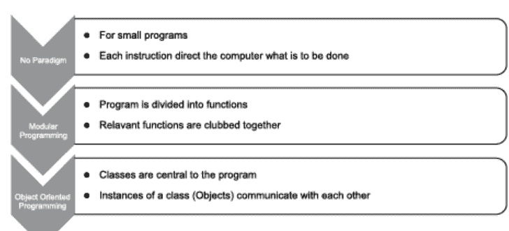

**图11.1** 编程范式。

## 11.2 创建新类型

虽然Python中没有显式声明类型，但在其他语言（嗯，大多数语言）中它们很重要。例如，当有人说一个“数字”是整数类型时，他陈述了信息的类型及其最大值和最小值。假设一个整数占用两个字节，“数字”的最大值将是32,767，最小值将是-32,768。此外，说“数字”是整数类型也限制了可以对该数字执行的操作。

整数是一种预定义类型。大多数语言还允许用户创建自定义类型，从而扩展内置类型的功能。这是必要的，因为创建新数据类型的能力将帮助我们创建接近现实世界的程序。例如，如果要设计一个库存管理系统，一个名为“item”的类型将使事情变得简单。这个“item”可以拥有预定义类型的变量，如整数和字符串。

可以通过声明一个类来创建一个新类型。一个类可以有许多组件，其中最重要的是属性和它的函数。这种函数和数据的组合构成了面向对象编程的基础。正如我们稍后将看到的，函数通常操作类的数据成员。在继续之前，让我们先概述一下属性和函数。

## 11.3 属性和函数

可以将类视为原型，将对象视为类的实例。例如，“movie”是一个类，“The Fault in Our Stars”、“Love Actually”和“Sarat”是对象（图11.2）。一个类具有属性和行为。属性通常存储数据，行为通过函数实现。一个类可以使用类图来描述。类图通常有三个部分，第一部分包含名称，第二部分有属性，第三部分显示类的函数。属性和行为的基础将在下一节中讨论。在图11.2中，类图（Movie）只有名称。

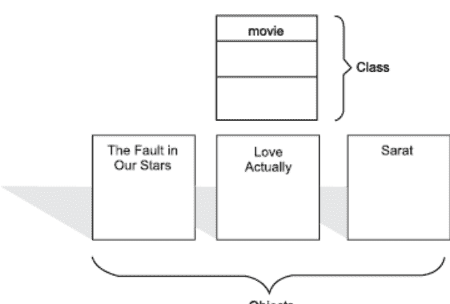

**图11.2** 类和对象的示例。

### 11.3.1 属性

这里的属性描述了我们所关注实体的特征。例如，在创建一个提供电影详情的网站时，需要一个“movie”类。假设经过详细讨论，决定该类将具有诸如name、year、genre、director、producer、actors、music_director和story_writer等属性。

请注意，对于所述目的，只需要上述详细信息。存储不必要的详细信息不仅会使数据管理变得困难，而且还会违反核心原则之一，即只包含与手头问题相关的详细信息。这些属性通常显示在类图的第二部分。在图11.3中，显示了“movie”类的属性。

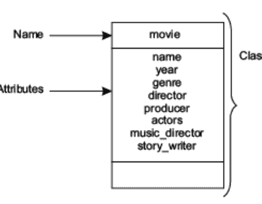

**图11.3** 电影类的名称和属性。

### 11.3.2 函数

下一步是在上述类中包含函数。在我们的示例中，有两个函数getdata()和putdata()。getdata()函数将向用户请求变量的值，putdata()函数将显示数据。函数实现了类的行为。如前所述，函数完成特定任务。在一个类中，可以有任意数量的函数，每个函数完成一个特定任务。我们还有用于初始化类的数据成员的特殊函数。类的函数此后将被称为成员函数。函数（或行为）显示在类图的第三部分。在图11.4中，“Movie”类的函数（getdata()和putdata()）显示在第三个框中。

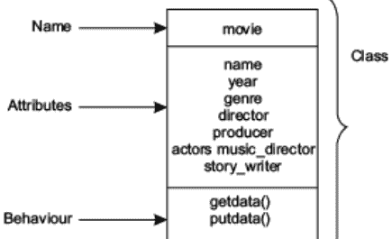

以下示例展示了一个名为movie的类。该类具有以下数据成员：

- Name
- Year
- Genre
- Director
- Producer
- Actors
- Music_Director，以及
- Story_writer

该类有两个函数getdata()，用于请求用户输入数据成员的值，以及putdata()，用于显示变量的值。为了调用函数getdata()和putdata()，创建了employee类的一个实例（“m”）。正如我们稍后将看到的，函数使用点运算符调用。有关语法的详细信息将在下一章中解释。

以下代码实现了上述类。尽管语法等尚未讨论，但给出代码是为了让大家了解实际的工作原理。

## 代码：

```
class movie:
    def getdata(self):
        self.name=input('Enter name\t:')
        self.year=int(input('Enter year\t:'))
        self.genre=input('Enter genre\t:')
        self.director=input('Enter the name of the director\t:')
        self.producer=input('Enter the producer\t:')
        L=[]
        item=input('Enter the name of the actor\t:')
        L.append(item)
        choice=input('Press \'y\' for more \'n\' to quit')
        while(choice == "y"):
            item=input('Enter the name of the actor\t:')
            L.append(item)
            choice=input('Enter \'y\' for more \'n\' to quit')
        self.actors=L
        self.music_director=input('Enter the name of the music director\t:')

    def putdata(self):
        print('Name\t:',self.name)
        print('Year\t',self.year)
        print('Genre\t:',self.genre)
        print('Director\t:',self.director)
        print('Producer\t:',self.producer)
        print('Music_director\t:',self.music_director)
```

print('演员\t:',self.actors)

m=movie()
m.getdata()
m.putdata()

```
Enter name        :Kapoor
Enter year        :2016
Enter genre       :Drama
Enter the name of the director    :ABC
Enter the producer     :Karan
Enter the name of the actor       :Siddarth
Press 'y' for more 'n' to quit
Enter the name of the actor       :Fawad
Enter 'y' for more 'n' to quit
Enter the name of the music director      :XYZ
Name    :   Kapoor
Year        2016
Genre:      Drama
Director    :   ABC
Producer    :   Karan
Music_director      :   XYZ
Actors     :   ['Siddarth', 'Fawad']
```

在面向对象的语言中，有一个特殊的函数用于初始化数据成员的值。在像C++这样的语言中，这个函数通常与类同名。这个函数被称为**构造函数**。

可以在类中创建一个**默认构造函数**，它不接受任何参数。而**带参数的构造函数**则接受参数，并使用这些参数来初始化数据成员。构造函数的实现及其用法将在下一章中讨论。

当对象的生命周期结束时，会调用一个析构函数。在Python中，可以使用**del**来调用**析构函数**。这个概念将在本书的下一章中解释。

> 提示！

构造函数在创建对象时被调用，而析构函数在对象生命周期结束时被调用。

## 11.4 面向对象编程的要素

以下讨论简要概述了面向对象编程的要素。本节讨论了封装、数据隐藏和多态等概念。即使现阶段内容可能显得有些抽象，也建议读者不要跳过本节。

### 11.4.1 类

类是一个真实或虚拟的实体，对当前问题具有重要性，并且具有明确的物理边界。类可以是一个真实实体。例如，当为一家洗车公司开发软件时，“汽车”是软件的核心，因此会有一个名为“Car”的类。类也可以是一个虚拟实体；例如，在开发学生管理系统时，会创建一个“学生”类，这是一个虚拟实体。在这两个例子中，创建该实体是因为它对当前问题很重要。

以“学生”类为例可以进一步说明。该类将包含程序所需的属性。属性的选择将决定类的物理边界。请注意，我们不需要不必要的细节，比如学生拥有多少辆车或他昨晚去了哪里。这是因为对于我们要为其制作学生管理系统的教育机构来说，存储这些细节没有意义。

以下是一些对所述软件至关重要的类的示例（表11.1）。

**表11.1** 对各种系统至关重要的类示例。

| 系统 | 对软件至关重要的类 |
| :--- | :--- |
| 学生管理系统 | 学生 |
| 员工管理系统 | 员工 |
| 库存控制 | 物品 |
| 图书馆管理 | 图书 |
| 电影评论 | 电影 |
| 航空公司管理 | 航班 |
| 考试 | 测试 |

### 11.4.2 对象

考虑一个学生管理系统，它存储学校每个学生的数据。请注意，操作员在输入数据时处理的是单个学生，而不是学生的概念。因此，类描绘了学生的概念，而对象则表示单个学生。

对象是类的实例。对象相互交互并完成工作。通常，一个类可以有任意数量的对象。甚至可以形成一个对象数组。示例“movie”中的“m”就是一个对象。事实上，我们创建一个对象并调用类的方法（那些可以被调用的方法）。

在面向对象范式中，程序围绕对象展开，因此这种编程类型被称为面向对象程序。调用对象的方法等同于向对象发送消息。

### 11.4.3 封装

类是一个同时包含数据和函数的实体。将数据和操作数据的函数组合在一起称为封装。事实上，封装是面向对象范式的核心原则之一。封装不仅使处理对象更容易，还提高了软件的可管理性。

此外，类中的函数可以以多种方式使用。例如，数据成员和成员函数的可访问性也可以使用访问说明符来管理，如下一小节所述。

### 11.4.4 数据隐藏

数据隐藏是面向对象编程的另一个重要原则。如上文讨论所述，数据的可访问性可以在类中进行控制。在整个程序中都可访问的数据称为全局数据。私有于类的数据只能由类成员访问。还有其他访问说明符，将在以下章节中解释。

例如，在C++中，类中的数据通常是私有的。也就是说，只有类的成员函数才能访问数据。这确保了数据不会被意外更改。另一方面，在C++中，函数是公共的。公共函数可以在程序中的任何位置访问（图11.5）。在C++、JAVA、C#等语言中，还有另一个访问说明符，即受保护的。如果一个成员需要在类及其派生类中访问，则使用受保护说明符。C#和JAVA还有一些其他说明符，如内部。


**图11.5** 访问说明符 public 和 private。

在说明了上述约定之后，必须明确的是，决定什么是私有的、什么是公共的，是项目设计和开发团队的自由裁量权。没有硬性规定什么应该是私有的，什么应该是公共的。设计者必须根据需要决定成员的可访问性。

这种数据保护与数据安全无关，而是与意外更改有关。这是为了确保数据只能通过有权更改数据的函数进行更改。

### 11.4.5 继承

创建类是为了让它们可以被子类化。这种创建子类的艺术称为继承。例如，movie类可以被子类化为各种类，如art_movie、commercial_movie等。同样，student类可以被子类化为“regular student”和“part_time_student”。在这两个例子中，子类与基类（该类派生自的类）有许多共同之处。此外，每个子类可以拥有仅属于该子类的函数和数据。

例如，student类可以有属性，如name、date_of_birth、address等。regular子类学生将使用所有上述数据成员，并且还可以有一个与之关联的属性，如attendance。被子类化的类称为基类，子类称为派生类。

例如，在图11.6中，movie是基类，commercial_movie和art_movie是派生类。

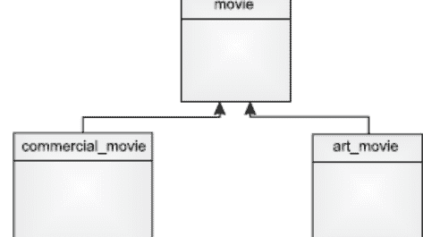

**图11.6** 从其他类派生类就是继承。继承有许多类型。此图显示了层次继承。

### 11.4.6 多态

Poly意为“多”，morphism意为“形态”，因此多态意味着多种形态。多态可以通过多种方式实现。多态最简单的例子之一是运算符重载。运算符重载通常意味着以多种方式使用同一个运算符。例如，“+”用于整数之间表示相加，用于字符串之间表示连接，甚至可以用于用户定义的数据类型，如本书第17章所述。

同样，函数重载意味着在一个类中拥有多个同名但参数不同的函数。多态的各种形式在本书的[第16章](Chapter 16)中进行了解释。

### 11.4.7 可重用性

过程式编程几乎没有可重用性。模块化编程允许重用，但仅在一定程度上。函数可以在模块化编程的基础上原样使用。在面向对象编程中，可重用性的概念可以充分发挥其作用。上面介绍并在本书[第13章](Chapter 13)中解释的继承概念，帮助程序员根据需要重用代码，并且是重用相关的部分。事实上，可重用性是面向对象范式的主要卖点之一。

## 11.5 结论

在设计软件时，必须牢记将要处理的实体。具体细节可以稍后决定。事实上，流行文献并不认为操作细节是面向对象编程需要关注的问题。因此，隐藏不必要的细节是面向对象编程的重要组成部分。

例如，在开发电影网站时，问题的核心实体是“Movie”。因此，从一个名为“movie”的空类开始。然后，设计者必须决定实现功能所需的属性。这些属性构成了所述类的数据成员。接下来是关于类行为实现细节的决策。然后为此目的设计函数。最后，像继承和多态这样的东西，将在后面讨论，开始发挥作用。

这个类的形成过程已在下图（图 11.7）中描绘。

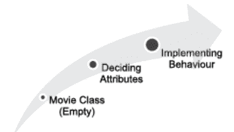

**图 11.7** 一个电影类的设计。

编程是一门艺术。一个优秀的程序员应该精通语言的语法、数据结构以及算法分析的概念。除了上述内容，程序员还需要决定他将使用的编程范式。本章简要介绍了各种编程范式及其优缺点。接下来，本章介绍了面向对象编程的概念。类、对象等的定义已在本章中讨论。本章还介绍了面向对象编程的特性。本章引入的概念将构成本节的基础。如前所述，其中一些概念在此时可能显得抽象，但后续章节将重新审视这些概念，并演示本章所讨论思想的实现。为了能够编写使用面向对象编程的程序，必须摆脱以过程方式做事的思维定式，开始将程序视为以具有属性和行为的现实世界实体为中心。还可以指出，设计面向对象程序通常先于设计类图、序列图等。这些是统一建模语言的一部分。建议读者查阅本书末尾给出的参考资料以了解 UML。

## 术语表

- **类：** 类是一个真实或虚拟的实体，对当前问题具有重要性，并且具有清晰的物理边界。
- **对象：** 对象是类的一个实例。
- **封装：** 将数据和操作数据的函数组合在一起称为封装。
- **继承：** 将类划分为子类的艺术就是继承。
- **运算符重载：** 运算符重载通常意味着以多种方式使用同一个运算符。
- **函数重载：** 它意味着在一个类中拥有多个同名但参数不同的函数。

## 要点回顾

- 如果要完成的任务不是非常复杂，逐步告诉计算机该做什么是有效的。
- 对于中等规模的程序，将其划分为函数可以使任务更容易。
- 将较大的程序划分为模块使程序易于管理，并有助于实现可重用性。
- 基于某些基础将函数组合在一起，就产生了模块。这种编程范式称为模块化编程。
- 一个类有两个重要组成部分：属性和行为。
- 构造函数初始化类的成员。
- 析构函数释放对象占用的内存。

## 练习

### 选择题

1.  以下哪项不是面向对象语言？
    (a) C
    (b) C++
    (c) Python
    (d) C#

2.  以下哪项是面向对象语言？
    (a) Python
    (b) C#
    (c) JAVA
    (d) 以上所有

3.  学生是一个概念实体，它作为每个学生的蓝图。这种映射类似于以下哪项？
    (a) 类和对象
    (b) 方法和模块化编程
    (c) 两者都是
    (d) 以上都不是

4.  以下哪项是类的两个最重要的组成部分？
    (a) 方法和属性
    (b) 列表和元组
    (c) 数组和函数
    (d) 以上都不是

5.  在面向对象范式中，类的变量称为
    (a) 数据成员
    (b) 成员函数
    (c) 全局数据
    (d) 以上都不是

6.  在面向对象范式中，类的函数是
    (a) 成员函数
    (b) 数据成员
    (c) 全局函数
    (d) 以上都不是

7.  类的一个实例称为
    (a) 对象
    (b) 主体
    (c) 注入
    (d) 以上都不是

8.  将数据和操作数据的函数组合在一起称为
    (a) 抽象
    (b) 封装
    (c) 重载
    (d) 以上都不是

9.  允许选择性访问类中的数据成员等同于
    (a) 数据隐藏
    (b) 封装
    (c) 抽象
    (d) 以上都不是

10. 在一个类中拥有多个同名函数称为
    (a) 函数重载
    (b) 重写
    (c) 封装
    (d) 以上都不是

11. “+”可用于添加两个数字类型。但是，程序员可以使用“+”来添加两个用户定义的数据类型（例如，复数）。这是
    (a) 方法重载
    (b) 运算符重载
    (c) 封装
    (d) 以上都不是

12. 继承有助于
    (a) 可重用性
    (b) 冗余
    (c) 开销
    (d) 以上都不是

13. 如果基类中的函数在派生类中被扩展，那么它是
    (a) 重载
    (b) 抽象
    (c) 封装
    (d) 以上都不是

14. 以下哪项不是继承的类型？
    (a) 单一继承
    (b) 多重继承
    (c) 层次继承
    (d) 以上都是继承的类型

15. 以下哪项初始化类的成员？
    (a) 构造函数
    (b) 析构函数
    (c) 两者都是
    (d) 以上都不是

16. 对于一个定义良好的类，以下哪项是正确的？
    (a) 它对当前问题具有重要性
    (b) 它具有清晰的物理边界
    (c) 它是一个真实或物理实体
    (d) 以上所有

17. 可以定义新数据类型的语言是
    (a) 综合性的
    (b) 可扩展的
    (c) 两者都是
    (d) 以上都不是

18. 在面向对象范式中，重点是
    (a) 数据
    (b) 完成工作的方式
    (c) 数据类型
    (d) 以上都不是

19. UML 是
    (a) 超现代语言
    (b) 统一建模语言
    (c) 联合模型联盟
    (d) 以上都不是

20. 以下哪项不是面向对象范式的原则？
    (a) 继承
    (b) 数据隐藏
    (c) 封装
    (d) 分而治之

### 理论题

1.  简要解释编程的各种范式。
2.  面向对象范式和过程式编程有什么区别？
3.  什么是类？类的基本组成部分是什么？定义类的属性和函数。
4.  对象和类之间的关系是什么？
5.  什么是类图？给出一个类图的例子。
6.  解释封装的重要性。
7.  解释数据隐藏的重要性。它与数据的安全性有关吗？
8.  什么是多态性？解释运算符重载和函数重载的概念。
9.  可重用性的优势是什么？结合面向对象范式解释可重用性的概念。
10. 探讨面向对象编程中的一些问题？

### 探索与设计

读者应阅读有关数据库管理系统的内容。关于实体关系图的章节详细介绍了其中涉及的实体。根据你的研究，为[表 14.1](Table 14.1)中提到的类创建类图。

### 第 12 章

## 类和对象

### 目标

阅读本章后，读者应该能够

- 理解如何在 Python 中创建一个类
- 实例化一个类
- 区分实例变量和类变量
- 使用构造函数和析构函数
- 理解构造函数的类型

### 12.1 类简介

类是一个真实或虚拟的实体，对当前问题具有重要性，并且具有清晰的物理边界。类的概念已在上一章中讨论。本章将讨论向前推进，并探讨实现中涉及的问题。与其他编程语言相比，在 Python 中创建类更容易。Python 中的类可以容纳任何种类和任何数量的数据。具有 C++ 背景的人可能会觉得语法和变量的使用有些奇怪。Python 中的类机制不仅受到 C++ 的启发，也受到 Modula-3 的启发。

Python 中的类可以被**子类化**。Python 支持所有类型的继承，包括**多重继承**。Python 也允许**方法重写**。类的动态特性使 Python 与其他语言区分开来。类可以在运行时创建。

在一个类中，所有数据成员本质上都是**公有**的。也就是说，它们可以在程序中的任何位置被访问。类中的所有成员函数都是**虚函数**。在类中，所有成员函数的第一个参数必须是代表该类的对象，此后称为**self**。有趣的是，所有内置类型本身也是类，并且可以由程序员进行扩展。

请注意，多个名称可以关联到同一个对象。这赋予了程序员与支持指针的语言中相同的能力。例如，使用指针，一个对象可以通过一个参数传递给函数，并且函数所做的更改在调用函数中是可见的。在Python的情况下，可以使用**别名**（为同一对象拥有多个名称）来完成上述任务。

本章的组织结构如下。[第12.2节](#)讨论类的定义，[第12.3节](#)解释对象的创建。[第12.4节](#)讨论数据成员的作用域，[第12.5节](#)介绍嵌套的概念。[第12.6节](#)讨论构造函数，[第12.7节](#)和[第12.8节](#)简要讨论重载和析构函数。最后一节进行总结。

## 12.2 定义一个类

在Python中，可以使用**class**关键字来定义一个类。**class**关键字后面跟着类的名称。然后是类的主体（具有正确的缩进）。

**语法**

```
class <name of the class>:
    def <function name>(<arguments>):
        ...
    <members>
```

例如，考虑**employee**类，它拥有数据成员**name**和**age**以及成员函数**getdata()**和**putdata()**。前面已经提到，类中的每个函数都必须至少有一个参数，即**self**。类的函数以传统方式定义。**getdata()**函数向用户请求**name**和**age**的值。数据成员通过**self**访问，因为它们属于类而不仅仅是函数。同样，**putdata()**函数显示数据成员的值。请注意，类的成员通过**self**访问。

> 提示！
- *类定义可以有函数，但也可以有其他成员。*

## 12.3 创建一个对象

通过将一个名称与类的实例关联来创建对象，该实例使用默认构造函数初始化。例如，在创建`employee`类的对象时，使用以下语句。

```
e1=employee()
```

这里，**e1**是对象的名称，**employee()**是类的构造函数。也可以使用参数化构造函数来创建对象，如以下各节所述。对象的创建称为**实例化**。

可以使用点运算符调用类的函数。例如，要调用employee类的**getdata()**函数，使用以下语句。

```
e1.getdata()
```

同样，可以使用点运算符调用类的其他方法。

```
Code:
class employee:
    def getdata(self):
        self.name=input('Enter name\t:')
        self.age=input('Enter age\t:')
    def putdata(self):
        print('Name\t:',self.name)
        print('Age\t:',self.age)
e1= employee()
e1.getdata()
e1.putdata()
>>>
```

```
==================== RUN C:/Python/Class/employee.py ====================
Enter name :Harsh
Enter age :28
Name : Harsh
Age : 28
>>>
```

**提示！**

*对象支持以下操作：*

- 实例化
- 属性引用

## 12.4 数据成员的作用域

命名空间的**作用域**是其可直接访问的区域。实际上，在Python中，作用域是动态使用的。在确定命名空间的作用域时，遵循以下规则。

- 首先，搜索最内层的作用域
- 然后搜索封闭函数的作用域
- 接着搜索全局命名空间
- 最后，查看内置名称

nonlocal语句重新绑定全局作用域中的变量。为了理解这个概念，请考虑以下代码。关于该代码，以下几点值得注意。

- 对于类的所有实例，**a**的值为5，直到调用一个更改**a**值的函数。
- 在**putdata()**中，**a**不存在，**a**是**getdata()**的局部变量
- **b**可以在两个函数中被访问，因为**b**是类的数据成员（请注意，每次调用**b**时，使用的是**self.b**）

基于上述讨论，用户应找出为什么以下代码会产生以下输出。

**代码：**

```
class demo_class:
    a=5
    def getdata(self,b):
        a=7;
        self.b=b
    def putdata(self):
        print('The value of \'a\' is',a,'and that of \'b\' is',self.b)

d=demo_class()
d.getdata(9)
d.putdata()
d.putdata()
    File "C:/Python/Class/variable_visibility.py", line 7, in putdata
    print('The value of \'a\' is',a,'and that of \'b\' is',self.b)
NameError: name 'a' is not defined
```

在以下代码中，**b**是类的成员。这里，**self.b=b**意味着类的数据成员**self.b**被赋值为**b**，即函数**getdata()**的第二个参数。**c**是**getdata()**的局部变量，因此**getdata()**中的**c**与**putdata()**中的**c**不同。

### 定义：实例变量和类变量

实例变量对每个实例都是唯一的，所有实例共享一个类变量。在以下代码中，**b**可以为每个实例分配不同的值，但**c**保持不变。

**代码：**

```
class demo_class:
    a=5
    def getdata(self,b):
        c=7;
        self.b=b
        print('\'c\' is ',c,' and \'b\' is ',self.b)
    def other_function(self):
        c=3
        print('Value',c)
    def putdata(self):
        print('\'b\' is',self.b)
```

```
d=demo_class()
d.getdata(9)
print(d.a)
d.other_function()
d.putdata()
e=demo_class()
print(e.a)
>>>
```

```
==========      RUN      C:/Python/Class/variable_visibility2.py
==========
'c' is 7 and 'b' is 9
5
Value 3
'b' is 9
5
```

除了上述内容，还可以在类外部创建全局数据成员，该成员可被所有方法访问（直到数据成员的作用域被更改）。在以下代码中，**a**对于类的所有实例是公共的，**b**是类的数据成员，**f**是全局变量，**c**是局部变量。

**代码：**

```
global f
f=7
class demo_class:
    a=5
    def getdata(self,b):
        c=7;
        self.b=b
        print('\'c\' is ',c,' and \'b\' is ',self.b,'\'f\'',f)
    def other_function(self):
        c=3
        print('Value',c)
    def putdata(self):
        print('\'b\' is',self.b)

d=demo_class()
d.getdata(9)
print(d.a)
d.other_function()
d.putdata()
e=demo_class()
print(e.a)
>>>
==========      RUN      C:/Python/Class/variable_visibility2.py
==========
'c' is 7 and 'b' is 9 'f' 7
5
Value 3
'b' is 9
5
```

## 12.5 嵌套

类的设计需要对一个具有属性和行为的实体进行概念化。对象也可以在另一个类中使用。也就是说，一个类也可以拥有另一个类的对象作为其成员。这称为嵌套。请注意，类的属性本身也可以是实体。例如，在以下代码中，在**student**类中创建了一个**date**类的实例。这是有意义的，因为**student**是一个实体，其属性本身是对象（如日期）。

**代码：**

```
class date:
    def getdata(self):
        self.dd=input('Enter date (dd)\t:')
        self.mm=input('Enter month (mm)\t:')
        self.yy=input('Enter year (yy)\t:')
    def display(self):
        print(self.dd,':',self.mm,':',self.yy)
class student:
    def getdata(self):
        self.name=input('Enter name\t:')
        self.dob= date()
        self.dob.getdata()
    def putdata(self):
        print('Name \t:',self.name)
        self.dob.display()
s= student()
```

## 12.6 构造函数

请注意，每次实例化一个类时，都会使用一个构造函数（例如，**e1=employee()**）。用C++的术语来说，构造函数是一个与类同名的函数，用于初始化数据成员。上面的例子使用了程序员未编写的默认构造函数。人们可以根据需要通过编写构造函数来初始化对象。以下讨论重点介绍两种类型的构造函数：**默认构造函数**和**参数化构造函数**。**默认构造函数**不接受任何参数（例如，**employee()**构造函数）。在Python中，构造函数通过与类同名的函数来调用。然而，它们是通过在类内部实现**__init__()**函数来完成的。

在下面的代码中，对象**e1**的行为符合预期。当调用**putdata()**时，用户在**getdata()**函数中输入的值会被显示出来。对于**e2**，由于没有调用**getdata()**函数，因此显示的是在**__init__()**中赋值的值。

**代码：**

```
class employee:
    def getdata(self):
        self.name=input('Enter name\t:')
        self.age=input('Enter age\t:')
    def putdata(self):
        print('Name\t:',self.name)
        print('Age\t:',self.age)
    def __init__(self):
        self.name='ABC'
        self.age=20

e1= employee()
e1.getdata()
e1.putdata()
e2=employee()
e2.putdata()
```

```
>>>
============= RUN C:/Python/Class/Constructor1.py =============
Enter name :Harsh
Enter age:28
Name : Harsh
Age : 28
Name: ABC
Age: 20
>>>
```

**参数化构造函数**是接受参数的构造函数，例如，在下面的代码中，创建了一个接受两个参数**name**和**age**的参数化构造函数。为了给对象赋值，实例化必须采用以下形式：

```
e2=employee('Naved', 32)
```

请注意，在定义参数化的**__init__**时，第一个参数始终是“**self,**”，其余参数是要赋给类不同数据成员的值。对于employee类，给出了三个参数：“**self,**”、“**name,**”和“**age**”。

**代码：**

```
class employee:
    def getdata(self):
        self.name=input('Enter name\t:')
        self.age=input('Enter age\t:')
    def putdata(self):
        print('Name\t:',self.name)
        print('Age\t:',self.age)
    def __init__(self, name, age):
        self.name=name
        self.age=age
    def __del__():
        print('Done')

#e1=employee()
#e1.getdata()
#e1.putdata()
e2=employee('Naved', 32)
e2.putdata()
```

```
>>>
==================			RUN			C:/Python/Class/Constructor2.py
==================
Name :Naved
Age :32
>>>
```

## 12.7 多个 __init__()

在类中拥有同名但参数数量不同或参数类型不同的函数，称为**函数重载**。在C++、JAVA、C#等语言中，构造函数也可以重载；可以拥有多个构造函数，每个构造函数具有不同的参数。然而，在Python中，一个类中不能有多个__init__。例如，如果我们尝试执行以下代码，就会出现错误。

请注意，如果定义了一个参数化的__init__，Python会在实例化时寻找其余的参数。

**代码：**

```
class employee:
    def getdata(self):
        self.name=input('Enter name\t:')
        self.age=input('Enter age\t:')
    def putdata(self):
        print('Name\t:',self.name)
        print('Age\t:',self.age)
    def __init__(self, name, age):
        self.name=name
        self.age=age

e1= employee()
e1.getdata()
e1.putdata()
e2=employee('Naved', 32)
e2.putdata()
>>>
```

```
================ RUN C:/Python/Class/Constructor2.py ================
Traceback (most recent call last):
  File "C:/Python/Class/Constructor2.py", line 11, in <module>
    e1=employee()
TypeError: __init__() missing 2 required positional arguments: 'name' and 'age'
>>>
```

在学习了构造函数的重要性和实现之后，现在让我们来实现一个构造函数；让我们重新审视上面创建的“movie”类。下面的代码包含一个movie类，其中包含一个**getdata()**和**putdata()**函数，以及一个用于初始化变量的**__init__(self)**。请注意，对象“m”没有调用**getdata()**函数，而只是调用了**putdata()**。构造函数中赋值的值被显示出来。

**代码：**

```
class movie:
    def getdata(self):
        self.name=input('Enter name\t:')
        self.year=int(input('Enter year\t:'))
        self.genre=input('Enter genre\t:')
        self.director=input('Enter the name of the director\t:')
        self.producer=input('Enter the producer\t:')
        L=[]
        item=input('Enter the name of the actor\t:')
        L.append(item)
        choice=input('Press \'y\' for more \'n\' to quit')
        while(choice == "y"):
            item=input('Enter the name of the actor\t:')
            L.append(item)
            choice=input('Enter \'y\' for more \'n\' to quit')
        self.actors=L
        self.music_director=input('Enter the name of the music director\t:')

    def putdata(self):
        print('Name\t:',self.name)
        print('Year\t',self.year)
        print('Genre\t:',self.genre)
        print('Director\t:',self.director)
        print('Producer\t:',self.producer)
        print('Music_director\t:',self.music_director)
        print('Actors\t:',self.actors)

    def __init__(self):
        self.name='Fault'
        self.year=2015
        self.genre='Drama'
        self.director='XYZ'
        self.producer='ABC'
        self.music_director='LMN'
        self.actors=['A1', 'A2', 'A3', 'A4']

m=movie()
#m.getdata()
m.putdata()
```

```
================ RUN C:\Python\Class\class_basic2.py ================
Name        : Fault
Year        2015
Genre       : Drama
Director    : XYZ
Producer    : ABC
Music_director :LMN
Actors      :['A1', 'A2', 'A3', 'A4']
```

## 12.8 析构函数

构造函数初始化类的数据成员，而析构函数则释放内存。析构函数使用`__del__`创建，并通过编写关键字`del`和对象名称来调用。下面的代码示例展示了前面章节中描述的employee类中的析构函数。

**代码：**

```
class employee:
    def getdata(self):
        self.name=input('Enter name\t:')
        self.age=input('Enter age\t:')
    def putdata(self):
        print('Name\t:',self.name)
        print('Age\t:',self.age)
    def __init__(self, name, age):
        self.name=name
        self.age=age
    def __del__(self):
        print('Done')

#e1=employee()
#e1.getdata()
#e1.putdata()
e2=employee('Naved', 32)
e2.putdata()
del e2
```

```
==================== RUN C:/Python/Class/Constructor2.py ====================
Name  : Naved
Age   : 32
Done
```

下一个例子与前一个相同。然而，下面的代码还演示了`__class__.__name__`的用法，它显示调用该函数的对象的名称。这很有用，因为在调试时可以显示正在调用其析构函数（或任何方法）的对象的名称。

**代码：**

```
class employee:
    def getdata(self):
        self.name=input('Enter name\t:')
        self.age=input('Enter age\t:')
    def putdata(self):
        print('Name\t:',self.name)
        print('Age\t:',self.age)
    def __init__(self, name, age):
        self.name=name
        self.age=age
    def __del__(self):
        print(__class__.__name__,'Done')

#e1=employee()
#e1.getdata()
#e1.putdata()
e2=employee('Naved', 32)
e2.putdata()
del e2
>>>
```

```
================ RUN C:/Python/Class/Constructor2.py ================
Name :Naved
Age :32
employee Done
>>>
```

与类关联的文档字符串可以在类的定义中用三个双引号（""" ... """)提及。与类关联的文档字符串可以通过__doc__访问，如下例所示。

**代码：**

```
class employee:
    """The employee class"""
    def getdata(self):
        self.name=input('Enter name\t:')
        self.age=input('Enter age\t:')
    def putdata(self):
        print('Name\t:',self.name)
        print('Age\t:',self.age)
    def __init__(self):
```

```python
self.name = 'ABC'
self.age = 20
e1 = employee()
e1.getdata()
e1.putdata()
print(e1.__doc__)
>>>
============ RUN C:/Python/Class/employeedocstring.py ============
Enter name :Sakib
Enter age :17
Name :Sakib
Age :17
The employee class
>>>
```

上一章讨论了所谓的实例方法。然而，在类中还可以创建另一种类型的方法，称为类方法。

## 12.9 结论

上一章介绍了面向对象编程的概念。本章将讨论向前推进。本章介绍了类的语法和对象的创建。构造函数的概念、其创建、类型和实现也在本章中进行了讨论。本章还介绍了析构函数的概念。本章给出了大量示例，解释了前面介绍的概念的实现。下一章将介绍继承和多态的概念，它们是面向对象编程的基本要素。然而，要能够继承一个类或实现运算符重载，必须熟练掌握类的创建及其使用。

## 术语表

- 对象的属性是**数据属性**，属于对象的函数是**方法**。
- **实例变量和类变量：** 实例变量对每个实例都是唯一的，而类变量由所有实例共享。
- **构造函数：** 构造函数用于初始化数据成员。
- **带参数的构造函数**是接受参数的构造函数。

## 要点回顾

- Python中的类可以被子类化。
- Python支持所有类型的继承，包括多重继承。
- 在Python中，可以使用 **class** 关键字定义一个类。**class** 关键字后面跟着类的名称。
- 通过将一个名称与类的实例（使用构造函数初始化）关联来创建对象。
- 可以使用点运算符调用类的函数。
- 对象支持以下操作
  - 实例化
  - 属性引用
- 构造函数初始化类的数据成员，而析构函数释放内存。
- 析构函数使用 **__del__** 创建，并通过编写关键字 del 来调用。
- **__class__.__name__** 显示调用该函数的对象的名称。
- 可以通过 **__doc__** 访问与类关联的文档字符串。

## 练习

### 选择题

1. 一个类通常包含
   (a) 函数和数据成员
   (b) 函数和列表
   (c) 列表和元组
   (d) 以上都不是

2. 一个类可以拥有
   (a) 任意数量的函数
   (b) 任意类型的数据成员
   (c) 一个局部于函数的变量
   (d) 以上所有

3. **self** 是
   (a) 同一个类的对象
   (b) 基类的对象
   (c) 预定义类的对象
   (d) 以上都不是

4. Python中的每个函数必须至少有一个参数，它是
   (a) 数据
   (b) 列表
   (c) Self
   (d) 以上都不是

5. `__init__` 函数
   (a) 初始化数据成员
   (b) 是必需的
   (c) 必须被重载
   (d) 以上都不是

6. 类中的 `__init__` 函数
   (a) 必须被重载
   (b) 可以被重载
   (c) 不能被重载
   (d) 以上都不是

7. 类的文档字符串可以使用以下方式访问
   (a) __init__
   (b) __doc__
   (c) __class__
   (d) 以上都不是

8. 全局变量
   (a) 可以在任何地方访问
   (b) 只能在 __init__ 中访问
   (c) 以上两者都对
   (d) 以上都不是

9. 非局部变量
   (a) 通常先关联然后使用
   (b) 不能关联
   (c) 不存在
   (d) 以上都不是

10. 由类的所有实例共享的变量是
    (a) 类变量
    (b) 实例变量
    (c) 两者都是
    (d) 以上都不是

11. 对实例唯一的变量是
    (a) 实例变量
    (b) 类变量
    (c) 两者都是
    (d) 以上都不是

12. 以下哪个关键字用于定义一个类？
    (a) class
    (b) def
    (c) del
    (d) 以上都不是

13. 以下哪个用于定义一个充当析构函数的函数？
    (a) del
    (b) init
    (c) 两者都是
    (d) 以上都不是

14. 对象支持以下哪些操作？
    (a) 实例化
    (b) 属性引用
    (c) 两者都是
    (d) 以上都不是

15. 假设 e1 是一个对象，以下哪个代码用于调用 __del__？
    (a) del e1
    (b) e1.__del__
    (c) 两者都是
    (d) 以上都不是

16. 如果要在类的函数中显示对象的名称，那么可以使用以下哪个？
    (a) __class__.__name__
    (b) __object__.__name__
    (c) 两者都是
    (d) 以上都不是

17. 在一个类中，所有变量默认是 _？
    (a) 公有的
    (b) 私有的
    (c) 无法确定
    (d) 取决于变量的类型

18. 在Python中，以下哪个运算符用于访问方法？
    (a) 点
    (b) 加号
    (c) []
    (d) 以上都不是

19. 可以创建对象的列表吗？
    (a) 可以，如果变量的类型是公有的
    (b) 可以，在所有情况下
    (c) 不可以，在所有情况下
    (d) 可以，如果变量的类型是私有的

20. 类的数据成员
    (a) 必须是私有的
    (b) 可以是私有的
    (c) 必须是公有的
    (d) 以上都不是

### 理论题

1. 什么是对象？在Python中如何创建一个对象？
2. 解释类中变量的作用域？给出一个类的数据成员的例子，这些成员被所有对象共享，以及那些对对象唯一的成员。
3. 什么是构造函数？Python中有哪些不同类型的构造函数？
4. 我们可以在Python中重载构造函数吗？
5. 如何在Python中访问文档字符串的名称？
6. 如何在Python中访问对象的名称？
7. 什么是析构函数？在Python中如何创建析构函数？
8. 给出一个在Python中使用析构函数的例子。
9. 给出一个类的实例化的例子。
10. 解释Python中别名的概念。

### 编程练习

一家初创公司有实习生。公司存储了以下实习生的详细信息。

- first_name
- last_name
- address
- mobile_number
- e_mail

1. 创建一个名为 **Intern** 的类，存储上述详细信息。设计两个函数 **getdata()**，用于询问用户输入数据，以及 **putdata()** 用于显示数据。
2. 在上述程序中创建 **__init__**，它只接受一个参数（self）。
3. 在第1题中，创建 **__init__**，它接受六个参数，第一个是“self”，其余是上述变量的值。
4. 在上述问题中，设计一个析构函数并调用它。
5. 需要创建一个图书馆管理系统，其中存储“**Book**”的以下详细信息。
   - Name
   - Publisher
   - Year
   - ISBN
   - Authors

   上述 **authors** 是一个列表，包含该书的所有作者。

   创建一个名为 Book 的 **class**，存储上述详细信息。设计两个函数 **getdata()**，用于询问用户输入数据，以及 **putdata()** 用于显示数据。
6. 在上述程序中创建 **__init__**，它只接受一个参数（self）。
7. 在第6题中，创建 **__init__**，它接受6个参数，第一个是“self”，其余是第1题中所述变量的值。
8. 在上述问题中设计一个析构函数并调用它。
9. 创建一个名为 complex 的类，具有 **real_part** 和 **ima_part** 作为其两个数据成员，以及 **getdata()** 和 **putdata()** 作为其成员函数。
10. 在上述问题中，设计 **__init__** 和 **__del__**。
11. 创建一个名为 **add** 的函数，它接受两个复数作为参数，并返回这两个复数的和。
12. 创建一个名为 **sub** 的函数，它接受两个复数作为参数，并返回这两个复数的差。
13. 创建一个名为 **multiply** 的函数，它接受两个复数作为参数，并返回这两个复数的乘积。
14. 创建一个名为 **div** 的函数，它接受两个复数作为参数，并返回这两个复数相除的结果。
```

## 第13章

### 继承

## 学习目标

阅读本章后，读者应能够

- 理解继承的概念及其重要性
- 区分继承与组合
- 理解继承的类型
- 领会“self”在方法中的作用
- 理解super的概念及其重要性
- 认识抽象类的必要性

### 13.1 继承与组合简介

熟悉C++的读者一定研究过继承和组合的重要性。继承曾被视为一个突破性的概念，有望解决所有问题并改变编程方式。然而，继承也可能带来问题，甚至比你想象的要多得多。

许多程序员认为继承是一个黑洞，它以某种方式吸引着程序员，使其陷入夸大其词的陷阱，最终将自己置于一个诱使他们使用多重继承的境地。多重继承就像伏地魔，而面向对象编程环境就是霍格沃茨。因此，最好尽可能避免使用多重继承。

面向对象编程有其魅力，但也伴随着自身的问题。因此，只在需要时才使用继承。在这种情况下，切记永远不要使用多重继承。同时要记住，任何通过继承能完成的任务，都可以用其他方式完成。本章稍后介绍的组合，可以轻松用于完成大多数可以通过继承完成的任务。

回顾一下，继承意味着一个类将从父类获得特性（全部或部分）。因此，当编写：

```
class SoftwareDeveloper(Employee):
    ...
```

时，意味着**SoftwareDeveloper**类是`Employee`类的子类。这种关系属于**“是一个”**类型的关系。即，**软件开发者是一个员工**。

派生出其他类的类称为**基类**，而从基类继承特性的类称为**派生类**。在上面的例子中，`Employee`是基类，**SoftwareDeveloper**是派生类。请注意，继承不会影响基类。派生类可以以多种方式使用基类的模块，具体讨论如下。

#### 13.1.1 继承与方法

就模块而言，继承可以帮助程序员通过以下方式之一派生特性。

**该方法在子类中不存在，仅存在于父类中：** 在这种情况下，如果子类的实例调用该方法，则会调用父类的方法。例如，在下面的代码片段中，派生类没有名为**show()**的方法，因此使用派生类的实例调用**show**会调用父类的方法。

**代码：**

```
class ABC:
    def show(self):
        print("show of ABC")

class XYZ(ABC):
    def show1(self):
        print("show of XYZ")

A = ABC()
A.show()
B = XYZ()
B.show()
B.show1()
```

**该方法在父类和派生类中都存在：** 在这种情况下，如果使用派生类的实例调用此方法，则会调用派生类的方法。如果使用基类的实例调用该方法，则会调用基类的方法。请注意，在这种情况下，派生类重新定义了该方法。这种**重写**确保了在继承树中搜索该方法时最终只会调用此方法。例如，在下面的代码片段中，**B.show()**调用派生类的**show()**方法，而**A.show()**调用基类的方法。

**代码：**

```
class ABC:
    def show(self):
        print("show of ABC")

class XYZ(ABC):
    def show(self):
        print("show of XYZ")

A = ABC()
A.show()
B = XYZ()
B.show()
```

**继承的类修改了基类的方法**，并且在此过程中，在派生类的方法内部也调用了基类的方法。请注意，在下面的代码片段中，派生类的**show**方法打印一条消息，然后调用基类的方法，最后打印另一条消息。请注意，在这种情况下，可以通过用基类的名称限定方法的名称来调用基类的方法。例如，在下面的代码片段中，可以使用**ABC.show(self)**调用基类的**show**方法。**self**参数的重要性已在[第13.3节](section 13.3)中解释。

**代码：**

```
class ABC:
    def show(self):
        print("show of ABC")

class XYZ(ABC):
    def show(self):
        print("Something before calling the base class function")
        ABC.show(self)
        print("Something after calling the base class function")

A = ABC()
A.show()
B = XYZ()
B.show()
```

第一种类型的继承此后将被称为**隐式继承**。在这种类型中，可以使用派生类的实例调用基类的方法。

第二种类型的继承此后将被称为**显式重写**。如前所述，派生类将重新定义基类的方法，并且使用派生类的实例调用此方法将调用派生类的方法。

第三种类型的继承是重写方法最重要且最实用的形式。这种类型的继承为在不需要时仍不创建基类实例但使用函数留下了空间。

以下示例结合了三种继承类型：

**示例13.1：**

创建一个名为**Student**的类，包含**__init__**和**show**方法。**Student**类应有一个名为**name**的数据成员。**__init__**应为**name**赋值，**show**应显示该值。创建另一个名为**RegularStudent**的类，它将是**Student**类的派生类。该类应有两个方法**__init__**和**show**。**__init__**应为**age**赋值，并应调用基类的**__init__**，将**name**的值传递给基类。**show**方法必须显示**Regular Student**的数据。除此之外，两个类都应有一个名为**random**的方法，这两个方法应彼此独立（图13.1）。找出当使用基类和派生类的实例调用基类和派生类的方法时会发生什么。

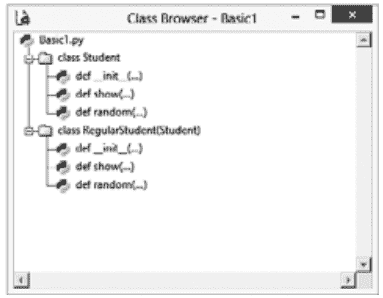

**图13.1** 示例13.1的类层次结构。

*解答：*

**代码：**

```
class Student:
    def __init__(self, name):
        self.name = name
    def show(self):
        print("Name\t:" + self.name)
    def random(self):
        print("A random method in the base class")

class RegularStudent(Student):
    def __init__(self, name):  ## 重写基类方法
        self.age = 22
        Student.__init__(self, name)
    def show(self):  ## 重新定义基类方法
        print("Name (derived class)\t:" + self.name + " Age\t:" + str(self.age))
    def random(self):  ## 与基类方法无关
        print("Random method in the derived class")

naks = Student("Nakul")
hari = RegularStudent("Harsh")
naks.show()
hari.show()
## 变量也可以在类外部访问
print(naks.name)
print(hari.name)
```

**输出：**

```
Name :Nakul
Name (derived class) :Harsh Age :22
Nakul
Harsh
```

#### 13.1.2 组合

在类内部创建另一个类的实例使事情变得简单，并帮助程序员完成许多任务。为了理解这个概念，让我们考虑一个例子。假设**Student**和他的**PhDguide**是**person**类的子类。此外，**PhD guide**的数据包括他们指导的学生列表。因此，组合就派上了用场。**PhDGuide**类中**students**的实例化可以按照以下示例中的说明进行。

**示例13.2：**

创建一个名为**Student**的类，其数据成员为**name**和**email**，绑定方法为**__init__(self, name, email)**和**putdata(self)**。**__init__**函数应将作为参数传递的值赋给相应的变量。**putdata**函数应显示学生的数据。创建另一个名为**PhDGuide**的类，其数据成员为**name**、**email**和**students**。这里，**students**变量是在指导下的学生。**PhDGuide** 类应包含四个绑定方法：**\_\_init\_\_**、**putdata**、**add** 和 **remove**。**\_\_init\_\_** 方法应初始化变量，**putdata** 应显示导师的数据，包括学生列表，**add** 方法应将一名学生添加到导师的学生列表中，**remove** 函数应将学生（如果该学生存在于该导师的学生列表中）从学生列表中移除。

**解决方案：**

类的详细信息已在**图 13.2** 中展示。需要注意的是，由于 **students** 是一个列表，因此需要使用 **for** 循环来显示 **students** 列表。此外，在将学生添加到列表时，传递参数的数据已存储在 **s**（Student 的一个实例）中，并且 **s** 已被添加到学生列表中。移除学生时采用了相同的流程。代码如下：

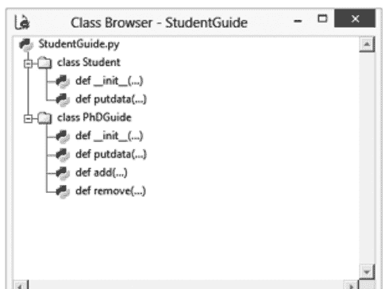

**图 13.2** 示例 13.2 的类详细信息。

**代码：**

```python
class Student:
    def __init__(self,name,email):
        self.name=name
        self.email=email

    def putdata(self):
        print("\nStudent's details\nName\t:",self.name,"\nE-mail\t:",self.email)

class PhDGuide:
    def __init__(self, name, email,students):
        self.name=name
        self.email=email
        self.students=students
    def putdata(self):
        print("\nGuide Data\nName\t:",self.name,"\nE-mail\t:",self.email)
        print("\nList of students\n")
        for s in self.students:
            print("\t",s.name,"\t",s.email)
    def add(self, student):
        s=Student(student.name,student.email)
        if s not in self.students:
            self.students.append(s)
    def remove(self, student):
        s=Student(student.name,student.email)
        flag=0
        for s1 in self.students:
            if(s1.email==s.email):
                print(s, " removed")
                self.students.remove(s1)
                flag=1
        if flag==0:
            print("Not found")

Harsh=Student("Harsh","i_harsh_bhasin@yahoo.com")
Nav=Student("Nav","i_nav@yahoo.com")
Naks=Student("Nakul","nakul@yahoo.com")
print("\nDetails of students\n")
Harsh.putdata()
Nav.putdata()
Naks.putdata()
KKA=PhDGuide("KKA","kka@gmail.com",[])
MU=PhDGuide("Moin Uddin","prof.moin@yahoo.com",[])
print("Details of Guides")
KKA.putdata()
MU.putdata()
MU.add(Harsh)
MU.add(Nav)
KKA.add(Naks)
print("Details of Guides (after addition of students")
KKA.putdata()
MU.putdata()
MU.remove(Harsh)
KKA.add(Harsh)
print("Details of Guides")
KKA.putdata()
MU.putdata()
```

## 输出：

学生详情

学生详情
姓名 : Harsh
电子邮件 : i_harsh_bhasin@yahoo.com

学生详情
姓名 : Nav
电子邮件 : i_nav@yahoo.com

学生详情
姓名 : Nakul
电子邮件 : nakul@yahoo.com

导师详情

导师数据
姓名 : KKA
电子邮件 : kka@gmail.com

学生列表

导师数据
姓名 : Moin Uddin
电子邮件 : prof.moin@yahoo.com

学生列表

导师详情（添加学生后）

导师数据
姓名 : KKA
电子邮件 : kka@gmail.com

学生列表

Nakul nakul@yahoo.com

导师数据
姓名 : Moin Uddin
电子邮件 : prof.moin@yahoo.com

学生列表

Harsh i_harsh_bhasin@yahoo.com
Nav i_nav@yahoo.com

```
<__main__.Student object at 0x03A49650> removed
```

导师详情

导师数据
姓名 : KKA
电子邮件 : kka@gmail.com

学生列表

Nakul nakul@yahoo.com
Harsh i_harsh_bhasin@yahoo.com

导师数据
姓名 : Moin Uddin
电子邮件 : prof.moin@yahoo.com

学生列表

Nav i_nav@yahoo.com

# 13.2 继承：重要性与类型

类的概念在前一章中已经介绍过。文中提到，类是具有明确物理边界并对当前问题具有重要性的实际或概念实体。类具有属性（数据成员）和行为（类方法）。然而，有时必须扩展这些类，以便能够解决某些特定问题，而无需修改原始类。为了能够做到这一点，语言应该支持继承。事实上，语言中存在类主要是因为它可以被继承。根据大多数作者的观点，继承是面向对象语言最基本的功能之一。

使用继承，可以从现有类（基类）创建新类（派生类）。请注意，一个派生类甚至可以有多个基类，这被称为**多重继承**，这是最不受欢迎的继承形式之一。此外，一个基类本身也可以是另一个类的派生类。派生类将拥有基类所有允许的特性以及它自己的一些特性。

类可以使用类图来描述。类图是类的图形表示，通常包含三个部分。在后续使用的表示法中，第一部分是类的名称。第二部分是属性，第三部分是类方法。图 13.3 显示了类图，其中 **Book** 类是基类，**Text_Book** 类是派生类。请注意，箭头是从派生类指向基类的。箭头表示“**派生自**”或“**继承自**”。图 13.4 给出了这两个类的详细信息。请注意，**Book** 类具有以下属性。

- name
- authors
- publisher
- ISBN
- year

该类的类方法是 **getdata()** 和 **putdata()**。**Text_Book** 类有另一个属性 **course**。图 13.5 显示了显示这两个类及其关系的类浏览器。相应的程序在示例 13.3 中给出。

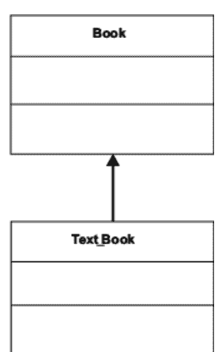

**图 13.3** Text_book 是 Book 类的派生类。

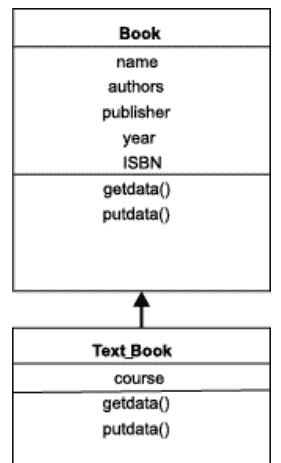

**图 13.4** 类图通常包含三个组成部分：类的名称、数据成员和类的方法。

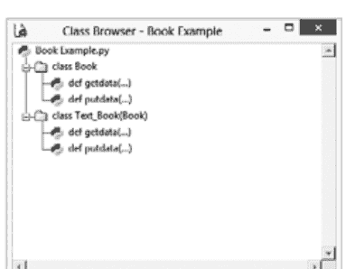

**图 13.5** Python 类浏览器中的 book 示例类层次结构。

# 13.2.1 继承的必要性

在非常大的程序中，编码和调试一个类是很困难的。一旦程序员创建了一个类，就几乎不需要修改它。如果需要创建具有与已开发类相同特性（并添加一些新特性）的类，那么从现有类派生类是有意义的。因此，继承有助于代码重用。重用代码有其自身的优点。它不仅节省时间，而且节省金钱。通过重用代码，程序的可靠性也得到了提高。人们也可以通过扩展现有的类来开发自己的类。也就是说，继承有助于分发库。继承还有助于实现更直观、更好、更实用的设计。继承也有一些缺点。

*继承之所以重要，是因为以下因素：*

- 可重用性
- 提高可靠性
- 分发库
- 直观、更好的程序

# 13.2.2 继承的类型

本节介绍各种类型的继承及相应的示例。请注意，读者应执行示例中给出的问题并分析输出。如前所述，继承意味着从现有类派生新类。从中派生特性的类称为**基类**，派生特性的类称为派生类。继承有五种类型：简单继承、层次继承、多级继承、多重继承和混合继承。

# 13.2.2.1 简单继承

简单继承有一个基类和一个派生类。示例 13.3 说明了这种类型。以下示例有两个类：**Book** 和 **Text_Book**。Book 类有两个方法：**getdata** 和 **putdata**。**getdata** 方法要求用户输入**书名、作者数量**、**作者列表、出版社、ISBN** 和**年份**。派生类 **Text_Book** 有另一个名为 **course** 的属性。**getdata** 和 **putdata** 方法扩展了基类方法（参考上一节）。

# 示例 13.3：

实现以下层次结构（图 13.6）。**Book** 函数有 name、**n**（作者数量）、**authors**（作者列表）、**publisher**、**ISBN** 和 **year** 作为其数据成员，派生类有 **course** 作为其数据成员。派生类方法重写（扩展）了基类的方法。


**图 13.6** 示例 13.3 的类层次结构。

## 解决方案：

## 13.2.2.2 层次继承

在层次继承中，一个基类至少有两个派生类。图13.4展示了这种类型。下图包含三个类：**Staff**、**Teaching** 和 **NonTeaching**。**Teaching** 和 **NonTeaching** 都是 **Staff** 类的派生类。**Staff** 类有两个方法：**getdata** 和 **putdata**。**getdata** 方法要求用户输入**员工**的**姓名**和**薪水**。派生类 **Teaching** 有一个名为 **subject** 的额外属性。**getdata** 和 **putdata** 方法扩展了基类的方法。类似地，派生类 **NonTeaching** 有一个名为 **department** 的属性。**getdata** 和 **putdata** 方法扩展了基类的方法。

### 图13.4：

实现以下层次结构（图13.7）。*Staff* 类有 *name* 和 *salary* 作为其数据成员，派生类 *Teaching* 有 *subject* 作为其数据成员，而 *NonTeaching* 类有 *department* 作为其数据成员。派生类方法重写（扩展）了基类的方法。


**图13.7** 图13.4的类层次结构。

## 解决方案：

以下代码实现了上述层次结构。程序的输出如下。

## 代码：

```python
class Staff:
    def getdata(self):
        self.name=input("\nEnter the name\t:")
        self.salary=float(input("\nEnter salary\t:"))
    def putdata(self):
        print("\nName\t:",self.name,"\nSalary\t:",self.salary)

class Teaching(Staff):
    def getdata(self):
        self.subject=input("\nEnter subject\t:")
        Staff.getdata(self)
    def putdata(self):
        Staff.putdata(self)
        print("\nSubject\t:",self.subject)

class NonTeaching(Staff):
    def getdata(self):
        self.department=input("\nEnter department\t:")
        Staff.getdata(self)
    def putdata(self):
        Staff.putdata(self)
        print("\nDepartment\t:",self.department)

X=Staff()
X.getdata()
X.putdata()
Y=Teaching()
Y.getdata()
Y.putdata()
Z=NonTeaching()
Z.getdata()
Z.putdata()
```

## 输出：

```
Enter the name           :Hari

Enter salary             :50000

Name                     :Hari
Salary                   :50000.0

Enter subject            :Algorithms

Enter the name           :Harsh

Enter salary             :70000

Name                     :Harsh
Salary                   :70000.0

Subject                  :Algorithms

Enter department         :HR

Enter the name           :Prasad

Enter salary             :52000

Name                     :Prasad
Salary                   :52000.0

Department               :HR
```

## 13.2.2.3 多级继承

在多级继承中，一个基类有一个派生类，而这个派生类本身又成为另一个类的基类。图13.5展示了这种类型。下图包含三个类：**Person**、**Employee** 和 **Programmer**。**Person** 类是基类。**Employee** 类派生自 **Person** 类。**Programmer** 类派生自 **Employee** 类。**Person** 类有两个属性 **name** 和 **age**，以及两个方法 **getdata** 和 **putdata**。**getdata** 方法要求用户输入**员工**的**姓名**和**年龄**。派生类 **Employee** 有一个名为 **emp_code** 的额外属性。**getdata** 和 **putdata** 方法扩展了基类的方法。类似地，**Programmer** 类有一个名为 **language** 的额外属性。**getdata** 和 **putdata** 方法扩展了其基类（**Employee** 类）的方法。

### 图13.5：

实现以下层次结构（图13.8）。**Person** 类有 **name** 和 **age** 作为其数据成员，派生类 **Employee** 有 **emp_code** 作为其数据成员，而 **Programmer** 类有 **language** 作为其数据成员。派生类方法重写（扩展）了基类的方法。


**图13.8** 图13.5的类层次结构。

## 解决方案：

以下代码实现了上述层次结构。程序的输出如下。

## 代码：

```python
class Person:
    def getdata(self):
        self.name=input("\nEnter Name\t:")
        self.age=int(input("\nEnter age\t:"))
    def putdata(self):
        print("\nName\t:",self.name,"\nAge\t:",str(self.age))

class Employee(Person):
    def getdata(self):
        Person.getdata(self)
        self.emp_code=input("\nEnter employee code\t:")
    def putdata(self):
        Person.putdata(self)
        print("\nEmployee Code\t:",self.emp_code)

class Programmer(Employee):
    def getdata(self):
        Employee.getdata(self)
        self.language=input("\nEnter Language\t:")
    def putdata(self):
        Employee.putdata(self)
        print("\nLanguage\t:",self.language)

A=Person()
print("\nA is a person\nEnter data\n")
A.getdata()
A.putdata()
B=Employee()
print("\nB is an Employee and hence a person\nEnter data\n")
B.getdata()
B.putdata()
C=Programmer()
print("\nC is a programmer hence an employee and employee is a person\nEnter data\n")
C.getdata()
C.putdata()
```

## 输出：

```
A is a person
Enter data
Enter Name	:Har
Enter age	:28
Name		:Har
Age		:28

B is an Employee and hence a person
Enter data
Enter Name                :Hari
Enter age                 :29
Enter employee code   :E001
Name                      :Hari
Age                       :29
Employee Code         :E001

C is a programmer hence an employee and employee is a person
Enter data
Enter Name                :Harsh
Enter age                 :30
Enter employee code   :E002
Enter Language            :Python
Name                      :Harsh
Age                       :30
Employee Code         :E002
Language                  :Python
>>>
```

## 13.2.2.4 多重继承与混合继承

在多重继承中，一个类有多个基类。这种类型的继承可能会带来问题，因为它可能导致歧义。因此，建议尽可能避免这种继承。然而，以下章节将对这种类型及其相关问题进行一些说明。

一个设计可能结合了多种继承类型。两个类 **B** 和 **C** 派生自类 **A**（见图13.9和13.10）。然而，对于类 **D**，类 **B** 和 **C** 是基类。这是结合层次继承和多重继承的一个例子。这种类型被称为**混合继承**。

## 13.3 方法

函数和方法的重要性在本书的第一节中已经阐述过。如前所述，方法只是类中具有特殊位置参数的函数。实际上，方法帮助程序员完成许多任务。方法可以是绑定的或未绑定的。未绑定的方法没有 **self** 作为参数。这里值得一提的是，在 Python 3.X 中，未绑定的方法与函数相同，而在 Python 2.X 中，它是一种不同的类型。另一方面，绑定的方法在通过类的实例限定访问方法时，将 **self** 作为第一个位置参数。这里，类的实例不需要被传递。

尽管存在上述差异，但不应忽视两种类型之间的以下相似之处。

- Python 中的方法也是一个对象。绑定和未绑定的方法都是对象。
- 同一个方法既可以作为绑定方法调用，也可以作为未绑定方法调用。

接下来的讨论和说明将阐明第二点。

### 13.3.1 绑定方法

方法可以通过多种方式调用。如果方法的第一个位置参数是 **self**，则它是绑定的。在这种情况下，类的实例可以通过传递必要的参数来调用该方法。

一个持有 **<对象名>.<方法名>**（例如 **Hari.display**）的变量也可以用来调用该方法。来自 C# 背景的读者可能会发现这个概念类似于委托。

方法也可以通过创建类的无名实例来调用。第三次调用 display 方法就描绘了这种调用方法的方式。

#### 说明 13.6：

## 调用绑定方法

此说明包含一个名为 **Student** 的类。**Student** 类有一个 **display** 方法，该方法接受两个参数。第一个是位置参数，第二个是要打印的字符串。请注意，**display** 方法是一个绑定方法，因此通过类的实例来调用。

## 代码：

```python
class Student:
    def display(self, something):
        print("\n"+something)

## 调用绑定方法
Hari = Student()
Hari.display("Hi I am Hari")
## display() 也可以通过方法的实例来调用
X= Hari.display
X("Hi I am through X")
## 再次调用 display
Student().display("Calling display again")
```

## 输出：

```
>>>
============ RUN C:\Python\Inheritance\BoundUnbound.py ============
Hi I am Hari
Hi I am through X
Calling display again
>>>
```

### 13.3.2 未绑定方法

未绑定方法没有 **self**。因此，在方法中不需要传递位置参数。在这种方法中，变量不应被 **self** 限定。以与之前相同的方式调用此类方法将导致错误，如说明 13.7 的清单 1 输出所示。第二个清单以适当的方式调用了未绑定方法。此类方法必须通过类的名称而不是对象来调用。在 Python 3.X 中，如前所述，此类方法的工作方式与函数相同。还要注意，普通函数可以使用它们所属的类来调用，如前面的说明所示。

#### 说明 13.7：

#### 调用未绑定方法

此说明扩展了前面的说明，并添加了 **getdata** 方法，该方法不接受 **self** 作为参数，因此由类本身调用。

## 代码：

```python
class Student:
    def display(self, something):
        print("\n"+something)
    def getdata(name,age):
        name=name
        age=age
        print("\nName\t:",name,"\nAge\t:",age)

## 创建一个新的学生
Naved=Student()
name=input("\nEnter the name of the student\t:")
age=int(input("\nEnter the age of the student\t:"))
Naved.getdata(name,age)
```

## 输出：

```
>>>
============ RUN C:/Python/Inheritance/BoundUnbound.py ============
Enter the name of the student :Naved

Enter the age of the student :22
Traceback (most recent call last):
  File "C:/Python/Inheritance/BoundUnbound.py", line 21, in <module>
    Naved.getdata(name,age)
>>>
```

#### 代码片段 2：

## 代码：

```python
class Student:
    def display(self, something):
        print("\n"+something)
    def getdata(name,age):
        print("\nName\t:",name,"\nAge\t:",str(age))
## 创建一个新的学生
Naved=Student()
name=input("\nEnter the name of the student\t:")
age=int(input("\nEnter the age of the student\t:"))
Student.getdata(name,age)
```

## 输出：

```
>>>
========== RUN C:/Python/Inheritance/BoundUnbound1.py ==========
Enter the name of the student :Naved
Enter the age of the student :22
Name :Naved
Age :22
>>>
```

### 13.3.3 方法是可调用对象

与 Python 中的任何其他对象一样，方法可以存储在列表中，并根据需要调用。在接下来的说明中，类 `operations` 有一个构造函数 `__init__(self, number)`，它将第二个参数的值赋给名为 `number` 的数据成员。该类有两个方法 `square` 和 `cube`。第一个方法计算（并返回）数字的平方，第二个方法计算（并返回）数字的立方。创建了类 `operations` 的两个实例：**X** 和 **Y**。**X** 初始化为 5，**Y** 初始化为 4。列表 `List` 存储了对象 `X.square`、`X.cube`、`Y.square` 和 `Y.cube`。然后逐个调用并执行列表的元素。

#### 说明 13.8：

*方法作为可调用对象*

## 代码：

```python
class operations:
    def __init__(self, number):
        self.number=number
    def square(self):
        return (self.number*self.number)
    def cube(self):
        return(self.number*self.number*self.number)

Num1=operations(5)
Num2=operations(4)
List= [Num1.square, Num1.cube, Num2.square, Num2.cube]
for callable_object in List:
    print(callable_object())
```

## 输出：

```
>>>
========= RUN C:/Python/Inheritance/CallableObjects.py =========
25
125
16
64
>>>
```

### 13.3.4 Super 的重要性和用法

一个类可以有数据成员和成员函数（方法）。方法只是类中使用关键字 `def` 定义的函数。如前面章节所讨论的，方法描述了类的行为。通常，方法的第一个参数是类本身的实例。第一个参数通常称为 **self**，类似于 C++ 中的 **this**。使用 **self** 与变量名一起表示引用的是实例变量，而不是全局作用域中的变量。例如，在下面的代码片段中，`__init__` 方法有两个参数：第一个是 **self**，第二个是 **name**。将 name 赋值给 `self.name` 意味着局部变量 name 被赋值为 **name**（`__init__` 的第二个参数）。类似地，`putdata` 方法有一个位置参数，表示调用 `putdata` 的实例的数据必须被显示。请注意，输出强化了 **self** 将方法调用与实例绑定的事实。

## 代码：

```python
class Student:
    def __init__(self,name):
        self.name=name
    def putdata(self):
        print("name\t:",self.name)
Hari=Student("Hari")
Hari.putdata()
Naks=Student("Nakul")
Naks.putdata()
>>>
```

## 输出：

```
====================		RUN		C:/Python/Inheritance/Basic.py
====================
name			: Hari
name			: Nakul
>>>
```

然而，方法也可以在没有 **self** 参数的情况下编写。这些是未绑定方法。这个概念在本章的 [第 13.3.2 节](#) 中已经讨论过。类的方法默认是实例方法。因此，通常可以通过创建类的实例并使用点运算符来调用类的方法。请注意，在 C#、JAVA 等语言中就是这种情况。

然而，还有其他类型的方法。例如，静态方法不需要类的实例作为其第一个参数。

### 13.3.5 使用 Super 调用基类函数

基类的函数可以使用 **super** 调用。事实上，**super** 可以用来调用基类的任何函数，它清楚地描绘了对基类函数的调用。为了理解 **super** 的用法，让我们考虑以下示例。在下面的示例中，**BaseClass** 有两个方法：`__init__` 和 `printData`。`__init__` 有一个位置参数和一个初始化 **data**（**BaseClass** 的数据成员）的参数。**DerivedClass** 是 **BaseClass** 的派生类。这个类有 `__init__`，它接受一个位置参数（**self**）和另外两个参数。第一个初始化 **DerivedClass** 的数据成员，第二个通过 **super** 传递给基类（**BaseClass**）的 `__init__`。**super** 接受类的名称（**DerivedClass**）、位置参数（**self**），并通过传递除位置参数外的所有参数来调用基类的 `__init__`。请注意，第二个函数也以相同的方式使用 **super**。

## 代码：

```python
class BaseClass:
    def __init__(self, data):
        self.data=data
```

## 13.4 在继承树中搜索

对象在继承树中以自底向上的方式被搜索。首先，类会搜索给定的对象。如果找到，则使用找到的对象来完成给定的任务。如果没有找到，则在其超类（基类）中搜索该对象。在存在多个基类的情况下，可能会出现歧义。

例如，在下面的示例中，**Derived1** 类派生自 **BaseClass**。该类的 **show()** 方法显示“**data1**”和“**data**”的值。前者存在于类中，因此其值会被显示。然而，如果前者不在类中，则会在继承树中搜索该对象。请注意，“**data**”存在于基类（**BaseClass**）中，因此其值会被显示。对于方法也是如此。即使派生类没有某个特定方法，如果该方法存在于父类或继承树中的任何其他类中，也可以调用它。


**图 13.11** 给定示例的类层次结构。

## 代码：

```python
class BaseClass:
    def __init__(self,data):
        self.data=data
    def show(self):
        print("\nData\t:",self.data)

class Derived1(BaseClass):
    def __init__(self,data,data1):
        self.data1=data1
        BaseClass.__init__(self,data)
    def show(self):
        print("\nData\t:",self.data1,"\nBase class data\t:",self.data)

class Derived2(BaseClass):
    def __init__(self,data,data2):
        self.data2=data2
        BaseClass.__init__(self,data)
    def show(self):
        print("\nData\t:",self.data2,"\nBase class data\t:",self.data)

X=BaseClass(1)
X.show()
print(X.data)
Y=Derived1(2,3)
Y.show()
Z=Derived2(4,5)
Z.show()
```

## 输出：

```
========= RUN C:/Python/Inheritance/InheritanceTree.py =========
Data : 1
1
Data : 3
Base class data : 2
Data : 5
Base class data : 4
```

## 13.5 类接口与抽象类

有时，类被设计成可以被子类化。在设计时，并没有实例化这些类的意图。也就是说，这些类不会被实例化，而只会用于创建称为抽象类的派生类。为了理解这个概念，让我们考虑一个例子。以下示例包含四个类：**BaseClass**、**Derived1**、**Derived2** 和 **Derived3**。

**BaseClass** 有两个方法：**method1** 和 **method2**。第一个方法有一些相关的任务，而第二个方法希望派生类来实现它。派生类为了能够调用此方法，必须有一个名为 **action** 的方法。第一个派生类（**Derived1**）替换了 **method1**。因此，如果 **Derived1** 的实例调用 **method1**，将调用在 **Derived1** 中定义的版本。第二个方法扩展了 **method1**，它向 **method1** 添加了一些内容，并且也调用了 **BaseClass** 版本的 **method1**。当从 **Derived2** 调用 **method1** 时，会调用 **BaseClass** 版本，因为在继承树中的搜索会调用该方法的基类版本。第三个派生类（**Derived3**）也实现了基类中定义的 **action** 方法。请注意，当通过 **Derived3** 的实例调用 **method2** 时，会调用 **method2** 的基类版本。此版本调用 **action** 并启动新的搜索，从而导致调用 **Derived3** 的 action。插图 13.9 展示了代码。

请注意，上述概念可以扩展，一个类可能拥有将由派生类实现的方法。有趣的是，Python 提供了一种机制，即在所有此类方法未被定义之前，此类不会被实例化。这样的基类称为抽象类。

# 插图 13.9：

实现以下层次结构。**Derived1** 的 “method1” 应替换基类的 **method1**，**Derived2** 的 **method1** 应扩展基类的 **method1**，**Derived3** 的 **action** 应实现 **BaseClass** 的 **method2**。


**图 13.12** 插图 13.9 的类层次结构。

### 解答：

```python
class BaseClass:
    def method1(self):
        print("In BaseClass from method1")
    def method2(self):
        self.action()
class Derived1(BaseClass):
    def method1(self):
        print("A new method, has got nothing to do with that of the base class")
class Derived2(BaseClass):
    def method1(self):
        print("A method that extends the base class method")
        BaseClass.method1(self)
class Derived3(BaseClass):
    def action(self):
        print("\nImplementing the base class method")

for className in (Derived1, Derived2, Derived3):
    print("\nClass\t:",className)
    className().method1()
X=Derived3()
X.method2()
```

**输出：**

```
Class  : <class '__main__.Derived1'>
A new method, has got nothing to do with that of the base class
Class  : <class '__main__.Derived2'>
A method that extends the base class method
In BaseClass from method1
Class  : <class '__main__.Derived3'>
In BaseClass from method1
Implementing the base class method
```

## 13.6 结论

本章介绍了继承的概念，这是面向对象编程最重要的组成部分之一。正如本章所解释的，继承有助于程序重用代码并使程序结构更加清晰。然而，应该明智地使用它，因为在许多情况下，它会导致歧义等问题。读者还必须认识到，并不总是需要使用继承。大多数任务可以通过组合来完成。然而，即使使用继承成为必要，也要清楚所需的继承类型、所需的方法调用类型以及绑定方法的使用。关于面向对象编程范式的讨论将在下一章继续，其中介绍了运算符重载的概念。上一章、本章和下一章将帮助读者成功地使用 OOP 开发软件。

## 术语表

- **继承：** 继承是从现有类创建子类的过程。
- **基类和派生类：** 其他类从中派生的类是基类，从基类继承的类是派生类。
- **隐式继承：** 在这种类型中，可以使用派生类的实例调用基类的方法。
- **显式重写：** 在这种类型的继承中，派生类重新定义基类的方法，并使用派生类的实例调用此方法会调用派生类的方法。

## 要点回顾

- 继承提供了可重用性和更高的可靠性。
- 继承的类型有简单继承、多重继承、多级继承、层次继承和混合继承。
- 多重继承可能导致歧义。
- 绑定方法有一个 “self” 参数，而非绑定方法没有 “self” 参数。
- 类也可以在另一个类中被实例化。
- 可以使用 **super** 来访问基类方法。
- 搜索继承树以找到要调用的方法版本。

## 练习

## 多项选择题

1. 一个类，直到其所有方法都被其子类定义后才能被实例化，称为
(a) 抽象类
(b) 元类

## 14.1 引言

运算符作用于操作数以产生结果。有时，一个运算符会执行多个任务。例如，在 Python 中，`+` 运算符可以用于两个数字相加、两个浮点数相加，或者连接两个字符串。也就是说，`+` 运算符既可以作用于整数，也可以作用于字符串。然而，对于用户定义的数据类型，程序员不能直接使用这些运算符。运算符重载帮助程序员为用户定义的对象重新定义现有运算符。这使得语言功能更强大，工作更简单。这种简洁性和直观性反过来又使编程变得有趣，并提高了代码的可读性。

我们还将定义方法来为用户定义的数据类型实现运算符重载。运算符重载可以被类用来拦截 Python 运算符，甚至重载内置操作。这些有助于运算符重载的特定方法被称为

(c) 基类

(d) 以上都不是

一个名为 **operation** 的类有一个 **__init__** 方法，它接受一个位置参数和一个整数作为参数。定义了两个 operation 的实例 **Num1** 和 **Num2**，如下所示。该类有两个函数，第一个计算一个数的平方，第二个计算立方。创建了一个名为 **List1** 的列表，其中包含四个方法的名称（两个来自 **Num1**，两个来自 **Num2**）。然后使用一个 **for** 循环来调用这些方法，如下所示代码片段。

```
Num1=operations(5)
Num2=operations(4)
List= [Num1.square, Num1.cube, Num2.square, Num2.cube]
for callable_object in List:
    print(callable_object())
```

2. 包含上述代码的程序（假设其余代码是正确的）

- (a) 没有语法错误但无法执行
- (b) 有语法错误
- (c) 没有语法错误且可以执行
- (d) 信息不足

3. 在上题中，输出会是什么（如果代码是正确的）？

- (a) 代码不正确
- (b) 25 125 16 64
- (c) 125 25 64 16
- (d) 以上都不是

4. 列表中的方法名称（问题 2）类似于（在 C# 中）

- (a) 元类
- (b) 委托
- (c) 两者都是
- (d) 以上都不是

5. Python 中的 “self” 类似于

- (a) C# 中的 “this”
- (b) C# 中的 “me”
- (c) C# 中的委托
- (d) 以上都不是

6. class Student:
    def display(self, something):
        print("\n"+something)
    def getdata(name, age):
        name=name
        age=age
        print("\nName\t:", name, "\nAge\t:", age)

在上面的代码片段中，你将如何调用 **getdata**（假设 **Hari** 是 **Student** 的一个实例）。

- (a) Student.getdata(“Harsh”, 22)
- (b) Hari.getdata(“Harsh”, 24)
- (c) 两者都正确
- (d) 以上都不是

7. 能否通过创建一个类的未命名实例来调用方法？

- (a) 能
- (b) 不能
- (c) 数据不足
- (d) Python 中没有所谓的类的未命名实例

8. 以下哪种方法用于在继承树中搜索？

- (a) 广度优先搜索
- (b) 深度优先搜索
- (c) 两者都是
- (d) 以上都不是

9. 在继承树中，在同一级别，使用哪种策略来搜索对象？

- (a) 从左到右
- (b) 从右到左
- (c) 任意
- (d) 以上都不是

10. “super” 可以用来调用

- (a) 基类的 __init__
- (b) 基类的任何方法
- (c) 不能用来调用基类的方法
- (d) 以上都不是

11. 哪种类型的继承会导致歧义？

- (a) 多重继承
- (b) 多级继承
- (c) 两者都是
- (d) 没有

12. 哪种类型的继承只有一个基类和一个派生类？

- (a) 简单继承
- (b) 层次继承
- (c) 多重继承
- (d) 以上都不是

13. 哪种类型的继承有多个基类和一个派生类？

- (a) 简单继承
- (b) 层次继承
- (c) 多重继承
- (d) 以上都不是

14. 哪种类型的继承有多个派生类和一个基类？

- (a) 简单继承
- (b) 层次继承
- (c) 多重继承
- (d) 以上都不是

15. 派生类能否成为另一个类的基类？

- (a) 能
- (b) 不能
- (c) 数据不足
- (d) 以上都不是

## 理论

1. 什么是继承？解释继承的重要性。
2. 继承的缺点是什么？请结合多重继承进行解释。
3. 继承有哪些类型？请举例说明。
4. 实现多重继承时会遇到哪些问题？如何解决这些问题？
5. 什么是组合？它是继承的一种类型吗？
6. 在面向对象编程中，继承是强制性的吗？请说明理由。
7. **is a** 和 **has a** 关系有什么区别？请举例说明。
8. 哪种更好：继承还是组合？使用继承能实现的所有功能，是否都能通过组合来实现？
9. 解释 **super** 的用途。如何使用它来调用基类的方法？
10. Python 中的方法是对象吗？请说明你的答案。可调用对象是什么意思？
11. 什么是抽象类？抽象类如何帮助实现面向对象编程的目标？
12. 什么是绑定方法？调用绑定方法有哪些方式？
13. 区分绑定方法和非绑定方法。请举例说明。
14. **self** 在 Python 中的重要性是什么？
15. 解释继承树中的搜索机制。

### 编程练习

1. 一个名为 **Base1** 的类有两个方法：**method1(self, message)** 和 **method2(self)**。第一个方法打印作为参数传递给该方法的消息。第二个方法调用另一个名为 **action1(self)** 的方法，该方法将由 **Base1** 的子类（**Derived2**）定义。**Derived1** 是 **Base1** 的另一个派生类，它重新定义了 **method1**，但对 **method2** 不做任何处理。另一方面，**Derived2** 对 **method1** 不做任何处理。实现这个层次结构，并找出在以下情况下会发生什么。
    - (a) **Base1** 的一个实例调用 **method1**
    - (b) **Derived1** 的一个实例调用 **method1**
    - (c) **Derived2** 的一个实例调用 **method1**
    - (d) **Base1** 的一个实例调用 **method2**
    - (e) **Derived2** 的一个实例调用 **method2**
    - (f) **Derived1** 的一个实例调用 **method2**
    - (g) **Derived2** 的一个实例调用 **action1**

2. 一个名为 **operation** 的类有一个 **__init__** 方法，它接受一个位置参数和一个整数作为参数。该类有两个函数，第一个计算一个数的平方根，第二个计算立方根。需要创建两个 operation 的实例：**Num1** 和 **Num2**。需要创建一个名为 **List1** 的列表，其中包含四个方法的名称（两个来自 **Num1**，两个来自 **Num2**）。实现上述内容，并使用 **for** 循环调用列表中的所有可调用对象。

3. 一个 **employee** 类有两个方法 **getdata(name, age)** 和 **getdata1(self, name, age)**。**getdata** 方法将值存储在局部变量中。另一个名为 **putdata** 的方法显示数据。编写一个程序来调用这些方法（第一个不是绑定的，第二个是绑定的）并显示数据。

4. 创建以下层次结构，并解释名为 **show** 的方法的搜索过程。


5. 创建一个名为 **Employee** 的类，具有 **name**、**email**、**age** 和 **phone_number** 作为数据成员。**getdata** 方法为变量赋值。**putdata** 方法应显示数据。该类必须有一个 **__init__** 方法。Programmer 是 **Employee** 的派生类，它有另一个名为 **language** 的数据成员。重写 **getdata** 和 **putdata** 函数。**Manager** 是 **Employee** 类的另一个派生类。**Manager** 类还应有一个在其手下工作的 **Employees** 列表。该类具有常规的 **getdata** 和 **putdata** 方法，以及用于添加或删除员工的特殊方法。

6. 实现上述层次结构并执行以下任务：
    - (a) 创建两个经理：**manager1** 和 **manager2**，并要求用户输入数据（包括在两位经理手下工作的 **employees**）
    - (b) 创建一个菜单驱动程序，用于在经理手下添加或删除员工
    - (c) 找出在 **manager1** 手下工作的员工中有多少是程序员？
    - (d) 找出在 **manager2** 手下工作的员工中有多少不是程序员？
    - (e) 找出在 **manager1** 手下工作的员工的最大年龄。
    - (f) 找出在 **manager2** 手下工作的员工的平均年龄。
    - (g) 找出所有 **age>35** 的员工的电话号码。
    - (h) 找出手下员工更多的经理。
    - (i) 哪位经理手下有更多的程序员？
    - (j) **manager1** 是程序员吗（相应地设计类并选择继承类型）。

### 第 14 章

### 运算符重载

### 目标

阅读本章后，读者应该能够

- 理解运算符重载的重要性
- 理解构造函数重载中的问题
- 使用用于重载运算符的各种方法
- 为复数和分数实现运算符重载

## 14.2 重新审视 `__init__`

`__init__` 函数之前已经解释过。这个函数用于初始化类的成员。之前提到 `__init__` 不能被重载，这部分是正确的。虽然一个类中不能有两个 `__init__`，但有一种方法可以实现构造函数重载，将在下面的讨论中说明。

让我们重新审视 `__init__`。`__init__` 的目的是初始化类的成员。在下面的例子（示例 14.1）中，一个名为 **Complex** 的类有两个成员：**real** 和 **imaginary**，它们由 `__init__` 函数的参数初始化。注意，类的成员用 **self.real** 和 **self.imaginary** 表示，函数的参数是 **real** 和 **imaginary**。该示例有一个名为 **putData** 的函数来显示成员的值。在 `__main__()` 函数中，**c1** 是类 **Complex** 的一个实例。对象 **c1** 用 5 和 3 初始化，并调用类的 **putData()** 来显示“**复数。**”

**示例 14.1：**

创建一个名为 **Complex** 的类，包含两个成员 **real** 和 **imaginary**。该类应有一个 **\_\_init\_\_**，它接受两个参数分别初始化 **real** 和 **imaginary** 的值，以及一个名为 **putData** 的函数来显示复数。在 **\_\_main\_\_()** 函数中创建一个复数的实例，用 (5, 3) 初始化它，并通过调用 **putData** 函数显示该数字。

## 代码：

```
class Complex:
    def __init__(self, real, imaginary):
        self.real = real
        self.imaginary = imaginary
    def putData(self):
        print(self.real," +i ",self.imaginary)

def __main__():
    c1=Complex(5, 3)
    c1.putData()
__main__()
```

## 输出：

```
5 +i    3
```

让我们考虑另一个例子（示例 14.2），它涉及向量的实现。在这个例子中，一个名为 **Vector** 的类有两个数据成员，即 **args** 和 **length**。由于 **args** 可以包含任意数量的项目，**\_\_init\_\_** 的参数是 **\*args**。**putData** 函数显示 **Vector**，**\_\_len\_\_** 函数计算 **Vector** 的长度（参数的数量）。

# 示例 14.2：

创建一个名为 **Vector** 的类，可以用任意长度的向量实例化。设计所需的 **\_\_init__** 函数和一个用于重载 **len** 运算符的函数。该类还应有一个 **putData** 函数来显示向量。用以下向量实例化该类：

-   没有元素
-   一个元素
-   两个元素
-   三个元素

显示每个向量并显示其长度。

## 代码：

```
class Vector:
    def __init__(self, * args):
        self.args=args
    def putData(self):
        print(self.args)
        print('Length ',len(self))
    def __len__(self):
        self.length = len(self.args)
        return(self.length)
def __main__():
    v0= Vector()
    v0.putData()
    v1 = Vector(2)
    v1.putData()
    v2 = Vector(3, 4)
    v2.putData()
    v3 = Vector(7, 8, 9)
    v3.putData()

__main__()
```

## 输出：

```
()
Length 0
(2,)
Length 1
(3, 4)
Length 2
(7, 8, 9)
Length 3
>>>
```

注意，在上面的例子中，`__init__` 的效果与拥有多个具有不同参数的构造函数相同。虽然 `__init__` 在字面意义上没有被重载，但该程序的效果与拥有重载构造函数的程序相同。

### 14.2.1 重载 `__init__`（某种程度上）

构造函数可以通过将参数（部分或全部，位置参数除外）赋值为 **None** 来实现（部分）重载。为了理解这一点，请考虑一个名为 **Complex** 的类。该类必须有两个构造函数，一个接受两个参数，另一个不接受参数。在第一种情况下，**Complex** 的 **real** 和 **imaginary** 部分应该用 `__init__` 的参数初始化，在第二种情况下，**real** 和 **imaginary** 应该变为零。最简单的解决方案之一是检查两个参数是否为 **NONE**。如果两者都是 **NONE**，数据成员应为零。在第二种情况下，它们应包含在 `__init__` 中传递的参数。虽然下面的程序（示例 14.3）没有两个 `__init__`，但上述任务已经完成。

# 示例 14.3：

构建一个名为 **Complex** 的类，其数据成员为 **real** 和 **ima**。该类应有一个 `__init__` 用于初始化数据成员，以及一个 **putData** 用于显示复数：

## 代码：

```
class Complex:
    def __init__(self, real=None, ima=None):
        if ((real == None)&(ima==None)):
            self.real=0
            self.ima=0
        else:
            self.real=real
            self.ima=ima
    def putData(self):
        print(str(self.real)," +i ",str(self.ima))
c1=Complex(5,3)
c1.putData()
c2=Complex()
c2.putData()
```

输出：
```
5 +i 3
0 +i 0
```

## 14.3 重载二元运算符的方法

以下方法（表 14.1）有助于重载二元运算符，如 +、-、* 和 /。这些运算符作用于两个操作数：**self** 和所需类的另一个实例。当在对象之间使用运算符时，会调用相应的方法。例如，对于名为 **Complex** 的类的对象 **c1** 和 **c2**，**c1+c2** 会调用 **\_\_add\_\_** 方法。类似地，– 运算符会调用 **\_\_sub\_\_** 方法，* 运算符会调用 **\_\_mul\_\_** 方法，依此类推。表 14.1 显示了这些方法以及调用该方法的运算符。

表 14.1 重载二元运算符的方法。

| 任务 | 方法 | 说明 |
| :--- | :--- | :--- |
| 加法 | \_\_add\_\_ | 有助于重载 + 运算符。通常接受两个参数：位置参数和要相加的实例。 |
| 减法 | \_\_sub\_\_ | 有助于重载 – 运算符。通常接受两个参数：位置参数和要相减的实例。 |
| 乘法 | \_\_mul\_\_ | 有助于重载 * 运算符。通常接受两个参数：位置参数和要相乘的实例。 |
| 除法 | \_\_truediv\_\_ | 有助于重载 / 运算符。通常接受两个参数：位置参数和要相除的实例。 |

上述运算符的使用将在下一节中解释。

## 14.4 重载二元运算符：分数示例

上表中所示运算符的重载可以通过下面的例子轻松理解。下面的例子为 **fraction** 类重载了加法 (+)、减法 (–)、乘法 (*) 和除法 (/) 运算符。**fraction** 类表示标准分数，包含分子和分母。

1.  **\_\_init\_\_**

    **\_\_init\_\_** 通过将分子设置为 0，分母设置为 1 来初始化类成员。语句

    `x=fraction()`

    因此，创建了一个分数 0/1。

2.  **\_\_add\_\_**

    **\_\_add\_\_** 方法有助于重载 + 运算符。语句

    `z=x+y`

    调用 **x** 的 **\_\_add\_\_** 方法，并将 **y** 作为“另一个”参数。因此，它必须有两个参数：一个**位置**参数（**self**）和一个**分数**（**other**）。两个分数 $\frac{a_1}{b_1}$ 和 $\frac{a_2}{b_2}$ 的加法如下进行。$b_1$ 和 $b_2$ 的最小公倍数（LCM）成为结果分数的分母。分子使用以下公式计算。

    $$\text{numerator} = \left( \frac{LCM}{b_1} \right) \times a_1 - \left( \frac{LCM}{b_2} \right) \times a_2$$

    注意，结果分数存储在另一个分数（s）中。方法 **\_\_add\_\_** 返回和。

3.  **\_\_sub\_\_**

    **\_\_sub\_\_** 方法有助于重载 – 运算符。语句

    `t=x-y`

    调用 **x** 的 **\_\_sub\_\_** 方法，并将 **y** 作为“另一个”参数。因此，它必须有两个参数：一个位置参数（**self**）和一个**分数**（**other**）。两个分数 $\frac{a_1}{b_1}$ 和 $\frac{a_2}{b_2}$ 的差计算如下如下所示。$b_1$ 和 $b_2$ 的最小公倍数（LCM）成为结果分数的分母。分子通过以下公式计算。

$$\text{numerator} = \left(\frac{\text{LCM}}{b_1}\right) \times a_1 - \left(\frac{\text{LCM}}{b_2}\right) \times a_2$$

请注意，结果分数存储在另一个分数（d）中。`__sub__` 方法返回 **d**。

## 4. `__mul__`

`__mul__` 方法有助于重载 * 运算符。语句

```
prod=x*y
```

调用 **x** 的 `__mul__` 方法，并将 **y** 作为“other”参数传入。因此，它必须有两个参数：一个位置参数（**self**）和一个分数（**other**）。两个分数 $\frac{a_1}{b_1}$ 和 $\frac{a_2}{b_2}$ 的乘积计算如下。分子使用以下公式计算。

$$\text{numerator} = a_1 \times a_2$$

分母计算如下。

$$\text{denominator} = b_1 \times b_2$$

请注意，结果 **分数** 存储在另一个 **分数 (m)** 中。`__mul__` 方法返回 **m**。

## 5. `__truediv__`

`__truediv__` 方法有助于重载 / 运算符（该运算符返回一个整数）。语句

```
div=x/y
```

调用 **x** 的 `__truediv__` 方法，并将 **y** 作为“other”参数传入。因此，它必须有两个参数：一个位置参数（**self**）和一个分数（**other**）。两个分数 $\frac{a_1}{b_1}$ 和 $\frac{a_2}{b_2}$ 的除法计算如下。分子使用以下公式计算。

$$\text{numerator} = a_1 \times b_2$$

分母计算如下。

$$\text{denominator} = b_1 \times a_2$$

请注意，结果 **分数** 存储在另一个 **分数** (answer) 中。`__truediv__` 方法返回 answer。

## 示例 14.4：

创建一个 **fraction** 类，其成员为分子和分母。为该类重载以下运算符：

- +
- -
- *
- /

创建 LCM 和 GCD 方法以完成上述任务。LCM 方法应找到两个数的最小公倍数，GCD 方法应找到两个数的最大公约数。请注意，*LCM(x, y) × GCD(x, y) = x × y*。

## 解决方案：

实现方式已经讨论过。以下代码执行所需任务，输出如下。

## 代码：

```python
class fraction:
    def __init__(self):
        self.num=0;
        self.den=1;
    def getdata(self):
        self.num=input("Enter the numerator\t:")
        self.den = input("Enter the denominator\t:")
    def display(self):
        print(str(int(self.num)),"/",str(int(self.den)))
    def gcd(first, second):
        if(first<second):
            temp=first
            first=second
            second=temp
        if(first%second==0):
            return second
        else:
            return(fraction.gcd(second, first%second))
    def lcm(first, second):
        ##print("GCD is",str(fraction.gcd(first,second)))
        return((first*second)/fraction.gcd(first,second))
    def __add__(self,other):
        s=fraction()
        lc=fraction.lcm(int(self.den), int(other.den))
        s.num=((lc/int(self.den))*int(self.num))+((lc/int(other.den))*int(other.num))
        s.den=lc
        return(s)
    def __sub__(self,other):
        lc=fraction.lcm(int(self.den), int(other.den))
        d=fraction()
        d.num=((lc/int(self.den))*int(self.num))-((lc/int(other.den))*int(other.num))
        d.den=lc
        return(d)
    def __mul__(self,other):
        m=fraction()
        m.num=int(self.num)*int(other.num)
        m.den=int(self.den)*int(other.den)
        return(m)
    def __truediv__(self,other):
        answer=fraction()
        answer.num=int(self.num)*int(other.den)
        answer.den=int(self.den)*int(other.num)
        return(answer)
x =fraction()
x.getdata()
print("First fraction\t:")
x.display()
y=fraction()
y.getdata()
print("Second fraction\t:")
y.display()
z=(x+y)
print("Sum\t:")
z.display()
t=x-y
print("Difference\t:")
t.display()
prod=x*y
print("Product")
prod.display()
div=x/y
print("Division")
div.display()
```

## 输出：

```
Enter the numerator          :2
Enter the denominator        :3
First fraction               :2 / 3
Enter the numerator          :4
Enter the denominator        :5
Second fraction              :4 / 5
Sum                          :22 / 15
Difference                   :-2 / 15
Product
8 / 15
Division
10 / 12
>>>
```

## 真的有必要吗？

请注意，上述示例包含在本章中是为了说明二元运算符的重载。Python 本身为分数提供了加法、减法、乘法和除法。无需重载运算符即可完成相同的任务，如下所示：

```python
from fractions import Fraction
X=Fraction(20,4)
X
Y=Fraction(3,5)
Y
X+Y
```

## 输出：

```
Fraction(28, 5)
```

```python
X-Y
```

## 输出：

```
Fraction(22, 5)
```

```python
X*Y
```

## 输出：

```
Fraction(3, 1)
```

```python
X/Y
```

## 输出：

```
Fraction(25, 3)
```

## 14.5 重载 += 运算符

+= 运算符将一个量加到给定对象上。例如，如果“a”的值是 5，那么 a+=4 将使其变为 9。但是，该运算符适用于整数、实数和字符串。以下展示了 += 用于整数、实数和字符串的用法。

```python
Code:
a=5
a+=4
a
```

输出：
9

```python
Code:
a=2.3
a+=1.3
a
```

输出：
3.5999999999999996

```python
Code:
a="Hi"
a+=" There"
a
```

输出：
'Hi There'

>>>

然而，要使其适用于用户定义的数据类型（或对象），则需要重载它。**__iadd__** 函数有助于完成此任务。以下示例（示例 14.5）描述了 **__iadd__** 在 **complex** 类对象上的使用。复数有一个 **实部** 和一个 **虚部**。将另一个复数加到给定复数上，就是将它们各自的实部和虚部相加。程序如下。请注意，**__iadd__** 接受两个参数。第一个是位置参数，第二个是另一个名为“**other**”的对象。“**other**”的实部加到对象的实部上，“**other**”的虚部加到虚部上。**__iadd__** 返回“**self**”。同样，读者可以根据需要为自己的类重载 **__iadd__** 运算符。

## 示例 14.5：

为 Complex 类重载 +=（示例 14.1 和示例 14.3）

## 代码：

```python
##overloading += for Complex class
class Complex:
    def __init__(self, real, imaginary):
        self.real=real
        self.imaginary=imaginary
    def __iadd__(self, other):
        self.real+=other.real
        self.imaginary+=other.imaginary
        return self
    def display(self):
        print("Real part\t:",str(self.real)," Imaginary part\t:",str(self.imaginary))
X=Complex(2,3)
Y=Complex(4,5)
X.display()
Y.display()
X+=Y
X.display()
X+=Y
X.display()
```

**输出：**

```
Real part : 2 Imaginary part : 3
Real part : 4 Imaginary part : 5
Real part : 6 Imaginary part : 8
Real part : 10 Imaginary part : 13
>>>
```

## 14.6 重载 > 和 < 运算符

大于 (>) 和小于 (<) 运算符对整数、分数和一些其他预定义类型以通常的方式工作。但是，为了能够将这些运算符用于用户定义的类，程序员必须重载这些运算符。在 Python 中，大于 (>) 和小于 (<) 可以使用 `__gt__` 和 `__lt__` 进行重载。`__gt__` 根据第一个对象是否大于第二个对象返回 **true** 或 **false**。同样，`__lt__` 根据第一个对象是否小于第二个对象返回 **true** 或 **false**。

以下示例为名为 **Data** 的类重载了 `__gt__` 和 `__lt__`。**Data** 类有一个名为“value”的数据成员。`__gt__` 比较实例（**self**）的值和另一个实例（**other**）的值。如果实例的值大于另一个实例的值，则返回 **true**，否则返回 **false**。同样，`__lt__` 比较实例（**self**）的值和另一个实例（**other**）的值。如果实例的值小于另一个实例的值，则返回 **true**，否则返回 **false**。

**示例 14.6：**

编写一个程序，创建一个名为 **Data** 的类，其数据成员为“value”。为该类重载 (>) 和 (<) 运算符。实例化该类，并使用 `__lt__` 和 `__gt__` 比较对象。

**解决方案：**

## 14.7 重载 `__bool__` 运算符：`__bool__` 优先于 `__len__`

`__gt__` 和 `__lt__` 的机制已经讨论过了。程序如下。

**代码：**

```python
class Data:
    def __init__(self, value):
        self.value = value
    def display(self):
        print("data is ", str(value))
    def __lt__(self, other):
        return(self.value < other.value)
    def __gt__(self, other):
        return(self.value > other.value)
X = Data(5)
Y = Data(4)
print(X > Y)
print(X < Y)
```

**输出：**

```
True
False
```

在使用“if”和“while”时，程序员检查传递给“if”或“while”的条件。如果条件为真，则执行“if”或“while”之后的代码块，否则不执行。我们也可以为用户定义的对象定义布尔运算符。为了完成这项任务，程序员需要一些有助于重载的方法。Python提供了两个布尔运算符 `__bool__` 和 `__len__`。`__bool__` 方法在满足必要条件时返回真，否则返回假。`__len__` 方法查找数据成员的长度，如果为空则返回假。只有在该类未定义 `__bool__` 时，才能使用 `__len__` 方法检查布尔条件。如果一个类同时定义了 `__len__` 和 `__bool__`，则 `__bool__` 优先于 `__len__`。

例如，在下面的示例中，编写 `if(X)`，其中 `X` 是类的实例，如果在实例化类时未传递参数，则返回假。请注意，第一个清单使用了 `__len__`。下一个示例（示例 14.7）检查数据成员“value”的长度，如果“value”不为空则返回真，否则返回假。

### 示例 14.7：

以下示例创建了一个名为 Data 的类。如果在实例化类时未传递参数，则返回假，否则返回真。

### 程序：

```python
class Data:
    def __len__(self): return 0
X = Data()
if X:
    print("True")
else:
    print("False")
```

## 输出：

```
False
```

### 示例 14.8：

上述示例的另一个变体将 value 作为其数据成员。如果 value 为空，则返回假，否则返回真。

### 程序：

```python
class Data:
    def __init__(self, value):
        self.value = value
    def __len__(self):
        if len(self.value) == 0:
            return 0
        else:
            return 1
Y = Data("hi")
if Y:
    print("True")
else:
    print("False")
X = Data("")
if X:
    print("True")
else:
    print("False")
```

## 输出：

```
True
False
```

另外，请注意，如果类中也定义了 `__bool__`，那么它优先于 `__len__` 方法。`__bool__` 根据给定条件返回真或假。尽管重载 `__bool__` 可能没有太大用处，因为在 Python 中每个对象要么是**真**，要么是**假**。示例 14.9 展示了一个同时定义了 `__bool__` 和 `__len__` 的例子。

### 示例 14.9：

一个同时定义了 `__bool__` 和 `__len__` 的例子。

### 程序：

```python
class Data:
    def __init__(self, value):
        self.value = value
    def __len__(self):
        if len(self.value) == 0:
            return 0
        else:
            return 1
    def __bool__(self):
        if len(self.value) == 0:
            print("From Bool")
            return False
        else:
            print("From Bool")
            return True
Y = Data("hi")
if Y:
    print("True")
else:
    print("False")
X = Data("")
if X:
    print("True")
else:
    print("False")
```

**输出：**

```
From Bool
True
From Bool
False
```

## 14.8 结论

本章简要概述了运算符重载。本章讨论了二元运算符、`+=`、`len` 和 `bool` 的重载。读者应尝试练习以掌握该概念。下一章将介绍异常处理，并讨论一些处理运行时错误的方法。

## 术语表

- **运算符重载：** 这是为现有运算符赋予新含义的机制。

## 要点回顾

- 运算符重载帮助程序员为用户定义的对象定义现有运算符。
- 在 Python 中，所有表达式运算符都可以重载。
- 运算符重载可以使用特殊方法实现。
- `__bool__` 的优先级高于 `__len__`。

## 练习题

### 选择题

1. 使用运算符重载，程序员可以
   (a) 为用户定义的数据类型定义现有运算符
   (b) 创建新的运算符
   (c) 两者都是
   (d) 以上都不是

2. 在 Python 中，运算符重载可以通过以下方式实现
   (a) 在将要创建用户定义对象的类中定义相应的方法
   (b) 以与 C++ 相同的方式重新定义运算符
   (c) Python 有预定义的方法来定义运算符
   (d) 以上都不是

3. `__init__` 可以被重载吗？
   (a) 是
   (b) 否
   (c) 只能为特定类重载
   (d) 以上都不是

4. 需要设计相同的 `__init__` 来接受不同数量的参数，以下哪项是正确的表示？
   (a) `def __init__(self)`
   (b) `def __init__(self, *args)`
   (c) `def __init__(self, args)`
   (d) b 和 c 都是

5. 上述任务是否可以用其他方式完成？
   (a) 在 `__init__` 中不提供任何参数
   (b) 将某些参数设置为 NONE
   (c) 两者都是
   (d) 以上都不是

6. 以下哪种方法用于重载 + 运算符？
   (a) `__add__`
   (b) `__iadd__`
   (c) `__sum__`
   (d) 以上都不是

7. 以下哪种方法用于重载 – 运算符？
   (a) `__diff__`
   (b) `__sub__`
   (c) `__minus__`
   (d) 以上都不是

8. 以下哪种方法用于重载 * 运算符？
   (a) `__prod__`
   (b) `__mul__`
   (c) 两者都是
   (d) 以上都不是

9. 在 Python 中，以下哪项真正需要运算符重载？
   (a) 复数
   (b) 分数
   (c) 极坐标
   (d) 以上都不是

10. 以下哪项使用 `__iadd__` 进行重载？
    (a) +
    (b) +=
    (c) ++
    (d) 以上都不是

11. 在 Python 中，> 和 < 运算符可以被重载吗？
    (a) 是
    (b) 否
    (c) 仅适用于特定类
    (d) 以上都不是

12. `__bool__` 和 `__len__` 哪个优先级更高？
    (a) `__bool__`
    (b) `__len__`
    (c) 两者相同
    (d) 以上都不是

### 理论题

1. 什么是运算符重载？解释其重要性。
2. 解释 Python 中运算符重载的机制。
3. 所有 Python 运算符都可以重载吗？
4. 成员关系可以使用“in”运算符进行测试。在 Python 中，`__contains__` 方法可用于测试成员关系。创建一个包含三个列表的类，并为该类重载成员关系运算符。
5. 解释以下方法，并使用运算符解释运算符重载。
   (a) `__add__`
   (b) `__iadd__`
   (c) `__sub__`
   (d) `__mul__`
   (e) `__div__`
   (f) `__len__`
   (g) `__bool__`
   (h) `__gt__`
   (i) `__lt__`
   (j) `__del__`

6. 本章未讨论以下方法。请探索以下内容（详情请参考参考文献）。
   (a) `__getitem__`
   (b) `__setitem__`
   (c) `__iter__`
   (d) `__next__`

### 编程题

1. 创建一个名为 `Distance` 的类，其数据成员为 `meter` 和 `centimetre`。该类的成员函数将是 `putData()`，它从用户获取 `meter` 和 `centimetre` 的值；`putData()`，它显示数据成员；以及 `add`，它将两个距离相加。

   两个距离实例（假设为 d1 和 d2）的加法需要将相应的厘米相加（d1.centimeter + d2.centimeter），如果总和小于 100，则结果为 (d1.centimeter + d2.centimeter) % 100。和的“米”将是两个实例的米数之和（d1.meter + d2.meter），如果 (d1.centimeter + d2.centimeter) < 100，否则为 (d1.meter + d2.meter + 1)。

2. 为上述类重载 + 运算符。+ 运算符应执行与 add 函数相同的任务。

3. 两个距离实例（假设为 d1 和 d2）的减法需要将相应的厘米相减（d1.centimeter - d2.centimeter）。差的“米”将是两个实例的米数之差（d1.meter - d2.meter）。为距离类重载 – 运算符。假设 d1-d2 总是意味着 d1>d2。

4. 为 Distance 类重载 += 运算符。+= 运算符（即 d1+=d2）需要将 d1 和 d2 相加（如前所述），并用 (d1+d2) 更新 d1。注意 d2 的值不会改变。

5. 为 Distance 类重载 * 运算符。

   一个发展中国家的政府打算废除现行货币，并打算引入一种易货系统，其中 12 瓶“Tanjali”将等同于一个货币单位。这反过来也会增加该公司的销售额。Hari 和 Aslam 分别有 37 瓶和 92 瓶“Tanjali”，他们想用这些瓶子交换电影票。如果每张票是 60 个单位，他们能看电影吗？

6. 现在，通过开发一个程序来帮助该国人民，该程序包含一个名为 `nat_currency` 的类，并重载 + 运算符，该运算符将两个 `nat_currency` 实例相加。

7. 对于上述问题，重载 – 运算符。

8. 对于问题 6 的 `nat_currency` 类，重载 += 运算符。

9. 对于问题 6 的 `nat_currency` 类，重载 * 运算符。

10. 创建一个名为 `date` 的类，其成员为 dd、mm 和 yyyy（日期、月份和年份）。重载 + 运算符，该运算符将两个日期类实例相加。

    一个名为 `irr` 的假设数字，形式为 a + c√b，其中 b 是常数。两个 `irr` 实例可以如下相加。如果第一个 `irr` 数字第一个是 $r_1 = a_1 + c_1\sqrt{d}$，第二个是 $r_2 = a_2 + c_2\sqrt{d}$，$r_1$ 与 $r_2$ 的加法可以定义如下。

$$r = r_1 + r_2 = (a_1 + a_2) + (c_1 + c_2)\sqrt{d}.$$

$r_1$ 与 $r_2$ 的差为。

$$r = r_1 - r_2 = (a_1 - a_2) + (c_1 - c_2)\sqrt{d}.$$

$r_1$ 与 $r_2$ 的乘积为。

$$r = r_1 \times r_2 = (a_1a_2 + c_1c_2d) + (a_1c_2 + a_2c_1)\sqrt{d}.$$

- 11. 创建一个名为 `irr` 的类，并重载 + 运算符。
- 12. 为 `irr` 类重载 - 运算符。
- 13. 为 `irr` 类重载 += 运算符。
- 14. 为 `irr` 类重载 * 运算符。

一个向量写作 $v = a\hat{i} + b\hat{j} + c\hat{k}$，其中 $\hat{i}$ 是 $x$ 轴上的单位向量，$\hat{j}$ 是 $y$ 轴上的单位向量，$\hat{k}$ 是 $z$ 轴上的单位向量。两个 `向量` 的加法，需要将对应的 $\hat{i}$ 分量相加，将对应的 $\hat{j}$ 分量相加，并将对应的 $\hat{k}$ 分量相加。也就是说，对于两个 `向量` $v_1 = a_1\hat{i} + b_1\hat{j} + c_1\hat{k}$ 和 $v_2 = a_2\hat{i} + b_2\hat{j} + c_2\hat{k}$，其和为 $v = v_1 + v_2 = (a_1 + a_2)\hat{i} + (b_1 + b_2)\hat{j} + (c_1 + c_2)\hat{k}$。同样地，两个向量的差需要将对应的 $\hat{i}$ 分量相减，将对应的 $\hat{j}$ 分量相减，并将对应的 $\hat{k}$ 分量相减。也就是说，对于两个向量 $v_1 = a_1\hat{i} + b_1\hat{j} + c_1\hat{k}$ 和 $v_2 = a_2\hat{i} + b_2\hat{j} + c_2\hat{k}$，其差为 $v = v_1 - v_2 = (a_1 - a_2)\hat{i} + (b_1 - b_2)\hat{j} + (c_1 - c_2)\hat{k}$。

- 15. 创建一个名为 vector 的类，包含三个数据成员 a、b 和 c。该类必须有 `getData()` 函数来要求用户输入 a、b 和 c 的值；以及 `putData()` 函数来显示该 `向量`。
- 16. 为 `vector` 类重载 + 运算符。
- 17. 为 `vector` 类重载 - 运算符。
- 18. 为 `vector` 类重载 += 运算符。

## 第15章

### 异常处理

### 目标

阅读本章后，读者应能够

- 理解异常处理的概念
- 认识到异常处理的重要性
- 使用 **try/except**
- 手动抛出异常
- 编写引发用户定义异常的程序

## 15.1 引言

编写程序是一项复杂的任务。它需要深思熟虑、精通语法以及问题解决能力。尽管付出了所有努力，仍有可能出现一些错误或意外输出。这些错误可以分为编译时错误和运行时错误。编译时错误可以被编译器拦截。程序员必须消除这些错误，才能执行程序。在编译程序时，如果存在某些错误，则会出现一些标准消息。这些错误可以通过学习语法或根据当前问题的要求更改代码来处理。以下是一个包含语法错误的代码示例。请注意，语句 `fun1('Harsh'` 中缺少右括号。

如果我们尝试执行以下代码，将出现一个显示语法错误的弹出消息。

## 代码：

```python
def fun1(a):
    print('\nArgument\t:',a)
    print('\nType\t:',type(a))
fun1(34)
fun1(34.67)
fun1('Harsh'
```

## 输出：


第二种类型更为复杂，程序在执行过程中停止工作或以不期望的方式运行。这可能是由于：

- 用户输入不正确，
- 无法打开文件，
- 访问程序无权访问的内容等等。

这些被称为异常。异常是“修改程序流程的事件”[1]。Python 在遇到此类错误时会调用异常处理机制。程序员也可以调用异常处理。

异常处理机制用于处理一些不期望的情况。因此，如果出现不可否认的情况，控制必须有一个去处（代码的一部分），在那里可以处理该情况。为了理解这一点，请考虑以下示例。

假设你打算设计一种机器学习技术来识别给定的 EEG 是否显示癫痫样放电。你必须决定算法、语言、工具等。然而，你无法获取数据。你会怎么做？简单地放弃项目，转到异常处理部分。也就是说，当出现上述情况时，将发生异常。让我们考虑一个最常见的异常处理示例。如果编写一个程序来除以用户输入的两个数字，如果输入的分母为零，则应引发异常。

处理异常最常见的方法之一是编写一个代码块，在其中预期会发生异常。如果在该块中的某处引发异常，控制将转到处理异常的部分。你预期会出现异常的代码块是 **try** 块，而处理异常的部分在 **except** 块中。本章讨论了更多处理异常的方法。然而，具有 C++ 或 C# 背景的读者会熟悉上述技术，因此会觉得它简单直观。尽管 Python 有处理异常的机制，读者也应该学习如何创建自己的类来处理异常。因此，读者必须重新阅读关于类和对象的章节。

在 Python 中，异常处理可以使用以下任一方式完成。

- try/except
- try/except/finally
- raise 和
- assert

然而，本章主要关注前三种。本章的组织结构如下。第 15.2 节讨论异常处理的重要性和机制，第 15.3 节介绍 Python 中一些最常见的异常，第 15.4 节通过一个示例总结该过程，第 15.5 节提供另一个异常处理示例，最后一节进行总结。

## 15.2 重要性和机制

异常处理机制可以帮助程序员通知某些情况。例如，考虑上一节讨论的问题。你拥有患者的 EEG，并且想要在 EEG 中找到癫痫样放电。如果你无法找到该放电，你可以简单地引发一个异常。与传统的返回整数代码以表示找到某些内容（或未找到某些内容）的方法相比，这种技术更好。同样地，在检测到某些特殊情况或异常条件时，可以引发异常。

在运行时，如果出现错误，则会引发异常。该异常可以由相应的 **except** 处理，也可以简单地忽略。此外，如果代码中没有处理异常的机制，Python 的默认错误处理机制将发挥作用。如前所述，在遇到错误条件后，执行将在 **try** 语句之后恢复。

Python 还有 try /finally 语句来处理终止条件。具有 JAVA 背景的读者一定熟悉 **finally**。它用于处理终止条件，无论是否发生异常。例如，在设计软件时，无论是否发生异常，最终屏幕都必须出现，或者对象的内存必须在结束时回收。对于此类情况，**except–finally** 非常有用。

### 15.2.1 Try/Except 示例

为了理解异常处理的工作原理，请考虑以下示例。一个列表包含一组有序的学生。第一个位置包含获得最高分的学生姓名。同样，获得第二高分的学生姓名位于第二个位置，依此类推。

```python
>>>L=['Harsh', 'Naved', 'Snigdha', 'Gaurav']
```

为了访问给定位置的元素，要求用户输入索引

```python
>>>Index=input('Enter the index')
```

现在，使用以下语句访问该位置的元素

```python
>>> print(L[int(index)])
```

因此，如果用户输入 1，输出将是 “Naved”，如果输入 2，输出将是 “Snigdha”。然而，如果当输入任何大于3的值时。

```
Traceback (most recent call last):
  File "<pyshell#5>", line 1, in <module>
    print(L[int(index)])
IndexError: list index out of range
>>>
```

这种情况可以通过使用**try/except**来处理，如下所示。

## 代码：

```
L= ['Harsh', 'Naved', 'Snigdha', 'Gaurav']
try:
    index=input('Enter index\t:')
    print(L[index])
except IndexError:
    print('List index out of bound')
print('This statement always executes')
```

请注意，try块包含了可能出现异常的代码部分。如果发生运行时错误，**except**部分会处理它。同时请注意，**except**可以包含预定义异常的名称。**except**之后的语句总会执行，无论异常是否被引发。读者可以注意到，控制流不会返回到异常实际发生的位置。它只能在相应的块中处理异常。之后，程序继续正常执行。异常处理机制的语法如下。

## 语法

```
try:
    ##可能出现异常的代码
except<Exception>:
    ##处理异常的代码
##程序的其余部分
```

### 15.2.2 手动引发异常

到目前为止的讨论集中在Python自身引发和捕获异常的情况。在Python中，可以手动引发异常。关键字**“raise”**用于显式触发异常。该关键字后跟<异常名称>（与被捕获的相同）。处理此类异常的机制与上述描述相同。即，相应的**except**会处理抛出的异常。语法如下。

```
语法
try:
    raise <something>
except <something>:
    ##处理异常的代码
##其余代码
```

如果此类异常不发生，可以按照上一节中的相同方式处理。[第15.4节](第15.4节)中的示例展示了引发和捕获异常的代码。

## 15.3 PYTHON中的内置异常

如果程序员能够引发特定的异常，程序将更加有效。要做到这一点，必须了解Python中预定义的异常，然后在适当的情况下使用它们。本节介绍Python中一些最常见的异常。以下各节展示了这些异常的使用。

- **断言错误**
  当assert语句失败时，会引发**AssertionError**。
- **属性错误**
  当赋值失败时，会引发**AttributeError**。
- **EOF错误**
  当到达文件末尾且程序尝试进一步读取时，会引发**EOFError**。
- **浮点错误**
  当浮点运算失败时，会引发此异常。
- **导入错误**
  如果代码中编写的import语句无法加载所述模块，则会引发此异常。这与Python后期版本中的**ModuleNotFoundError**相同。
- **索引错误**
  当序列超出范围时，会引发异常。
- **键错误**
  如果在字典中找不到键，则会引发此异常。
- **溢出错误**
  请注意，每种数据类型可以容纳一定的值，并且它能容纳的值总是有一个最大限制。当达到此限制时，会引发**OverflowError**。
- **递归错误**
  在执行使用递归的代码时，有时会达到最大迭代深度。此时，会引发**recursionError**。
- **运行时错误**
  如果发生错误且不属于上述任何类别，则会引发此异常。
- **停止迭代**
  如果使用`__next__()`且没有更多可处理的方法，则会引发此异常。
- **语法错误**
  当代码的语法不正确时，会引发此异常。
- **缩进错误**
  当错误使用缩进时，会出现此异常。
- **制表符错误**
  空格或制表符的不一致使用会导致此类错误。
- **系统错误**
  如果发现某些内部错误，则会引发此异常。该异常显示由于引发异常而遇到的问题。
- **未实现错误**
  如果对象不受支持或提供支持的部分尚未实现，则会引发**NotImplementedError**。
- **类型错误**
  如果传递了未预期的参数，则会引发**TypeError**。例如，在一个将用户输入的两个数字相除的程序中，如果传递了一个字符，则会引发**TypeError**。
- **值错误**
  当在函数中传递了不正确的值（或尝试将其输入变量）时，会引发**ValueError**。例如，如果传递了超出整数范围的值，则会引发此异常。
- **未绑定本地错误**
  当引用在该作用域中没有任何值的变量时，会引发此异常。
- **Unicode错误**
  当出现与Unicode编码或解码相关的错误时，会引发此异常。
- **零除错误**
  除法和取模运算有两个参数。如果第二个参数为零，则会引发此异常。

## 15.4 过程

本节重新审视两个数字的除法，并总结如何应用迄今为止所学的概念。

### 15.4.1 示例

考虑一个函数，它接受两个数字作为输入并相除。如果调用该函数并传递两个整数作为参数（例如，3和2），并且第二个数字不为零，则会产生预期的输出。然而，如果第二个数字为零，则会发生运行时错误，并产生错误消息（如下所示）。也就是说，Python会自动处理异常。

可以通过打印易于理解、易于理解的消息使程序对用户友好。这可以通过使用异常处理来实现。

## 代码：

```
def divide(a,b):
    result =a/b
    print('Result is\t:',result)
divide(3,2)
divide(3,0)
>>>
```

## 输出：

```
Result is    : 1.5
Traceback (most recent call last):
  File "C:/Python/Exception handling/No Exception.py", line 5, in <module>
    divide(3,0)
  File "C:/Python/Exception handling/No Exception.py", line 2, in divide
    result =a/b
ZeroDivisionError: division by zero
```

### 15.4.2 异常处理：Try/Except

上述问题可以通过使用**try/except**结构来处理运行时错误。可能引发异常的代码部分放在**try**块中。如果引发异常，它将在**except**块中处理。**except**块可以包含用户友好的错误消息或处理异常的代码。以下代码展示了**try**块的使用，并展示了如何在**except**块中处理运行时错误。请注意，将两个数字相除的语句在**try**块中。如果第二个数字为零，将引发异常，并将执行**except**块中的语句。

## 代码：

```
def divide(a, b):
    try:
        d=a/b
        print('Result is\t:',str(d))
    except:
        print('Exception caught')

divide(2,3)
divide(2,0)
```

## 输出：

```
Result is  : 0.6666666666666666
Exception caught
```

### 15.4.3 引发异常

也可以引发特定的异常。例如，以下代码在第二个数字为零时引发**ZeroDivisionError**。请注意，相应的**except**块会捕获此异常。如果用户确定在每种情况下引发哪个异常，可以这样做。此外，程序员有可能未能引发正确的异常，从而导致调用Python的自动异常处理机制。

一些常见的异常及其含义已在[第15.3节](#)中介绍。然而，还有更多。此类异常的列表可以在本书末尾参考文献中提供的链接处找到。

## 代码：

```
def divide(a, b):
    try:
        if b==0:
            raise ZeroDivisionError
        d=a/b
        print('Result is\t:',str(d))
    except ZeroDivisionError :
        print('Exception caught:ZeroDivisionError ')

divide(2,3)
divide(2,0)
```

## 输出：

结果为：0.6666666666666666
捕获到异常：ZeroDivisionError
>>>

## 15.5 创建用户自定义异常

到目前为止，我们已经了解了Python的自动异常处理能力。也就是说，即使没有**try/except**，Python也能处理异常。我们也讨论了**try/except**的使用。使用**raise**使异常处理更有意义，因为可以根据需要引发特定的异常。然而，到目前为止，我们还没有看到如何处理需要引发用户自定义异常的情况。本节将讨论用户自定义异常的创建和使用。

假设存在这样一种情况：需要引发一个特定的异常（根据程序的需要）。但是，没有预定义的异常来处理这种情况。在这种情况下，需要创建一个能够处理该异常的类。这个特定的类应该是**Exception**类的子类，这样我们才能用它来引发异常。当情况发生时，可以引发异常，如下图所示。在接下来的示例中，创建了一个名为**MyError**的类，它派生自**Exception**。这个类的**__init__**方法可以包含一条消息，当异常发生时，该消息将被打印出来。在引发异常时，使用了关键字**raise**，后面跟着类的名称。读者应该观察输出，并理解它将打印**__init__**中写的消息，后面跟着**except**块中的消息。虽然这只是一个简单的例子，但它展示了如何创建处理异常的类。

**代码：**

```
class MyError (Exception):
    def __init__(self):
        print('My Error type error')
def divide(a, b):
    try:
        if b==0:
            raise MyError
        d=a/b
        print('Result is\t:',str(d))
    except MyError:
        print('Exception caught : MyError ')
divide(2,3)
divide(2,0)
>>>
```

**输出：**

```
Result is  : 0.6666666666666666
My Error type error
Exception caught: My Error
>>>
```

## 15.6 异常处理示例

以下程序从给定的列表中找出最大数。思路很简单。首先，我们将第一个元素赋值给**max**。然后我们遍历给定列表的元素。在遍历过程中，如果任何元素大于存储在**max**中的值，则将该数字赋值给变量**max**。最后，打印**max**的值。以下程序和相应的输出将说明这一点。

**代码：**

```
def findMax(L):
    max =L[0]
    for item in L:
        if item>max:
            max =item
    print('Maximum\t:',str(max))

L=[2, 10, 5, 89, 9]
findMax(L)
>>>
```

**输出：**

```
Maximum:89
>>>
```

请注意，如果列表L的内容是字符串（例如 L=['Harsh', 'Nakul', 'Naved', 'Sahil']），字符串将根据规则进行比较，并打印出最大的（“Sahil”）。也就是说，该程序适用于整数、字符串或浮点数。但是，对于以下列表，将会引发异常。

```
L= [2, 'Harsh', 3.67]
```

**输出：**

```
Traceback (most recent call last):
  File "C:/Python/Exception handling/Example/findMax.py", line 15, in <module>
    findMax(L)
  File "C:/Python/Exception handling/Example/findMax.py", line 4, in findMax
    if item>max:
TypeError: unorderable types: str() > int()
>>>
```

这个问题可以通过将可能出现问题的代码部分放在**try**块中来处理。此外，如果列表的所有元素都是由用户输入的，那么出现运行时错误的可能性会更高。在这种情况下，程序员必须确保所有内容，包括元素的输入和函数的调用，都应该在try块中。以下代码展示了程序的版本，其中元素由用户输入，并且应该实现异常处理。请注意，第一次运行产生预期结果，而第二次运行导致运行时错误，因此它将调用异常处理机制。

**代码：**

```
def findMax(L):
    max =L[0]
    for item in L:
        if item>max:
            max =item
    print('Maximum\t:',str(max))

L=[]
item=input('Enter items (press 0 to end)\n')
try:
    while int(item) !=0:
        L.append(item)
        item=input('Enter item (press 0 to end)\n')
        #print('\nItem entered \t:',str(item))
    print('\nList \n')
    print(L)
    findMax(L)
except:
    print('Run time error')
```

**输出（第一次运行）：**

```
>>>
Enter items (press 0 to end)
3
Enter item (press 0 to end)
2
Enter item (press 0 to end)
5
Enter item (press 0 to end)
12
Enter item (press 0 to end)
8
Enter item (press 0 to end)
98
Enter item (press 0 to end)
1
Enter item (press 0 to end)
0

List

['3', '2', '5', '12', '8', '98', '1']
Maximum : 98
>>>
```

**输出（第二次运行）：**

```
Enter items (press 0 to end)
2
Enter item (press 0 to end)
8
Enter item (press 0 to end)
Harsh
Run time error
>>>
```

还要注意，如果在代码中添加了**finally**。无论是否发生异常，finally中的语句都将始终执行。同时包含**finally**和**except**的代码表示如下。请注意，第一个输出产生预期结果，并且它也打印**finally**中给出的语句。第二个输出导致运行时错误并调用异常处理机制，它也打印**finally**中的消息。读者应该认识到，由于**finally**已经存在，所以完全不需要**except**。代码本可以正确运行，因为它会用**finally**处理运行时错误，但是，两者都被包含在内是为了说明**except**在**finally**存在的情况下仍然执行其预期功能，并且**finally**可用于清理操作或释放内存等。

**代码：**

```
def findMax(L):
    max =L[0]
    for item in L:
        if item>max:
            max =item
    print('Maximum\t:',str(max))
L=[]
item=input('Enter items (press 0 to end)\n')
try:
    while int(item)!=0:
        L.append(item)
        item=input('Enter item (press 0 to end)\n')
        #print('\nItem entered \t:',str(item))
    print('\nList \n')
    print(L)
    findMax(L)
except:
    print('Run time error')
finally:
    print('This is always executed')
```

**输出（第一次运行）：**

```
Enter items (press 0 to end)
1
Enter item (press 0 to end)
4
Enter item (press 0 to end)
2
Enter item (press 0 to end)
89
Enter item (press 0 to end)
3
Enter item (press 0 to end)
0

List

['1', '4', '2', '89', '3']
Maximum  : 89
This is always executed
>>>
```

**输出（第二次运行）：**

```
Enter items (press 0 to end)
3
Enter item (press 0 to end)
1
Enter item (press 0 to end)
7
Enter item (press 0 to end)
harsh
Run time error
This is always executed
>>>
```

## 15.7 结论

本章介绍了一种处理异常的显著方法。虽然Python有内置的异常处理机制，但掌握异常处理知识能使程序更有效、更用户友好、更健壮。第一步是识别代码中可能出现异常的部分，并将该部分放在**try**块中。异常也可以在**except**块中手动捕获和处理。**finally**块处理未处理的异常，并且即使没有异常也会执行。本章还介绍了一些在Python中最常见的可捕获异常。读者应在他们的程序中运用本章学到的概念。编程愉快！

## 术语表

### try/except：语法

```
try:
    ##预期可能出现异常的代码
except<Exception>:
    ##处理异常的代码
##程序的其余部分
```

### 手动引发异常：语法：

```
try:
    raise <something>
except<something>:
    ##处理异常的代码
##代码的其余部分
```

## 要点回顾

- 在运行时，如果出现错误，就会引发异常。
- Python中的异常处理可以使用以下任一方式完成。
    - try/catch
    - try/finally
    - raise
    - assert
- 在Python中，也可以手动引发异常。
- 可能引发异常的代码部分被放在**try**块中。如果引发异常，它将在except 块。

- 用于引发用户自定义异常的类应该是 **Exception** 类的子类。
- **finally** 中的语句无论是否发生异常都会执行。

## 练习

### 选择题

1. 异常处理
   (a) 处理程序中的运行时错误
   (b) 提供健壮性
   (c) 两者都是
   (d) 以上都不是
2. 异常处理用于
   (a) 语法错误
   (b) 运行时错误
   (c) 两者都是
   (d) 以上都不是
3. 以下哪项在 Python 中不受支持？
   (a) 嵌套 try
   (b) 重新抛出异常
   (c) 两者都支持
   (d) 以上都不支持
4. 在除以零的情况下，会引发以下哪种异常？
   (a) Divide
   (b) ZeroDivide
   (c) 两者都是
   (d) 以上都不是
5. 在访问超出边界的索引时，会引发以下哪种异常？
   (a) Array Index Out of Bound
   (b) Out of Bound
   (c) Array
   (d) 以上都不是
6. 以下哪项是正确的？
   (a) 每个 try 恰好对应一个 catch
   (b) 每个 try 必须包含一个 raise
   (c) 一个 catch 可以处理任何类型的异常
   (d) 一个 catch 可以处理它设计用于处理的异常，除非它捕获所有异常（在这种情况下，它处理所有异常）。
7. 一个 try 可以有多少个异常处理程序？
   (a) 单个
   (b) 两个，仅在特定条件下
   (c) 任意数量的 catch
   (d) 以上都不是
8. 可能发生哪种类型的异常？
   (a) 预定义的
   (b) 用户自定义的
   (c) 两者都是
   (d) 以上都不是
9. 要引发其异常的类的基类是什么？
   (a) Exception
   (b) Error
   (c) 两者都是
   (d) 以上都不是
10. raise 的正确语法是什么？
    (a) raise <异常名称>
    (b) (raise (<异常名称>))
    (c) (raise (new<用户自定义异常>))
    (d) 以上都是

### 理论题

1. 编译时错误和运行时错误有什么区别？
2. 什么是异常处理？
3. 解释异常处理的机制？
4. 解释如何创建一个派生自 Exception 类的类。如何使用这个类来引发异常？
5. 提及以下哪些类必须解释？

### 编程练习

二次方程 $ax^2 + bx + c = 0$ 的根由公式 $x = \frac{-b + \sqrt{b^2 - 4ac}}{2a}$ 给出。编写一个程序，要求用户输入 $a$、$b$ 和 $c$ 的值，并计算根。

1. 在上面的问题中使用 try/except 来处理以下情况
   (a) 计算负数的平方根
   (b) 除以零
   (c) 格式不正确
2. 创建一个名为 negative_discriminant 的类，它是 Exception 类的子类。现在，在第 1 题中，当 $b^2 - 4ac$ 的值为负数时，引发 negative_discriminant 异常。

两个复数的除法定义如下。如果 $c_1 = a_1 + ib_1$ 是第一个复数，$c_2 = a_2 + ib_2$ 是第二个复数，那么复数

$c = (a_1 \times a_2 - b_1b_2)/(a^2_2 + b^2_2) + i(a_1 \times b_2 + b_1a_2)/(a^2_2 + b^2_2)$

3. 创建一个名为 Complex 的类，并在执行除法的方法中实现异常处理。
4. 对于上一题中定义的 Complex 类，使用异常处理来防止用户输入非实数（作为实部或虚部）。
5. 在 Complex 类中创建一个将复数转换为极坐标形式的函数。
6. 使用列表实现栈。结合异常处理。
7. 使用列表实现队列。结合异常处理。
8. 实现链表的操作，当用户输入的数字为负数时抛出异常。假设链表的数据部分只包含数字。
9. 编写一个程序，从用户那里获取水中氯的 ppm 值，并找出 ppm 是否在允许的限制范围内。在其他情况下，程序应该引发异常。
10. 编写一个程序来求给定矩阵的逆矩阵。当矩阵的行列式为零时，程序应该引发异常。

## 第四部分

## NUMPY、PANDAS 和 MATPLOTLIB

你现在掌握了 Python 并且知道如何编写程序。现在让我们进入更复杂的部分。本节有六章。前两章涉及 NumPy，接下来的两章涉及 MatplotLib，最后两章涉及 Pandas。本节是你通往机器学习和数据科学的大门。让我们深入真正的 Python！

### 第 16 章

## NUMPY–I

### 目标

阅读本章后，读者应该能够

- 理解列表和 **numpy** 数组之间的区别
- 理解创建 **numpy** 数组的各种函数
- 理解 **numpy** 数组中的切片和索引
- 理解标量和 **numpy** 数组之间的操作
- 理解 **numpy** 数组之间的操作

### 16.1 简介

**numpy** 包主要用于科学计算。它是一个强大的包，为我们提供了一个 N 维对象数组。**numpy** 中有众多的数据类型和工具，例如广播，它帮助我们轻松高效地实现复杂的算法。它还提供了用于查找各种变换的函数，例如给定序列的傅里叶变换，以及用于生成所有类型随机数的复杂函数。这个包还使得在 Python 中开发的项目与现有项目的集成变得无缝且容易。

要导入 numpy 包，需要编写以下语句

```
import numpy as np
```

**Anaconda** 的安装已经在前面的章节中解释过了。安装 **Anaconda** 后，**numpy** 和 **scipy** 包会自动安装。本书使用 **Jupyter** IDE 来运行代码。本章和下一章将讨论 **numpy** 的各个方面及其用于完成各种任务的用途。建议读者尝试本章末尾给出的问题，以掌握 **numpy** 的细微差别。本章的组织结构如下（图 16.1）。


**图 16.1** 本章的组织结构。

### 16.2 基础知识

本节简要介绍了能够执行实际任务的程序的各种构建模块。解释精确而简洁，以加速你向更重要主题的推进。

**数组：** 数组是一组存储在连续内存位置中的相同类型的元素。在下面的示例中，数字 8、1、5、89 和 45 存储在一个名为 **arr** 的数组中。

```
arr = array([8, 1, 5, 89, 45])
```

请注意，元素是相同类型的（它们都是整数），并且存储在连续的内存位置。

**从零开始的索引：** 数组是从零开始索引的，即第一个元素可以通过编写 **arr[0]** 来访问，第二个通过 **arr[1]** 来访问，依此类推。

**向量：** 一维数组称为向量。

**多维数组：** 多维数组可以有多个维度。例如，

$$A = \begin{bmatrix} 1 & 2 & 3 \\ 4 & 5 & 6 \\ 7 & 8 & 9 \end{bmatrix}$$

是一个包含三行三列的二维数组。第一行和第一列交叉处的元素表示为 $A[0, 0]$，第三行和第二列交叉处的元素表示为 $A[2, 1]$，依此类推。这些数组此后将被称为矩阵（或矩阵（单数））。

**存储：** 矩阵可以存储在以下格式之一中：

*行主序：* 在这种技术中，第一行存储在内存中，然后是第二行，依此类推。例如，

$$A = \begin{bmatrix} 1 & 2 & 3 \\ 4 & 5 & 6 \\ 7 & 8 & 9 \end{bmatrix}$$

在行主序格式中存储为

1, 2, 3, 4, 5, 6, 7, 8, 9

*列主序：* 在这种技术中，第一列存储在内存中，然后是第二列，依此类推。例如，

$$A = \begin{bmatrix} 1 & 2 & 3 \\ 4 & 5 & 6 \\ 7 & 8 & 9 \end{bmatrix}$$以列主序格式存储为

1, 4, 7, 2, 5, 8, 3, 6, 9

**轴：** 在 **numpy** 中，axis = i 表示轴。在一维数组中，元素存储在 axis = 0 处。对于二维数组，axis = 0 表示行，axis = 1 表示列（图 16.2）；对于三维数组，axis = 2 表示矩阵的数量。轴表示维度。因此，对于一维数组，axis = 0；对于二维数组，axis = 0 和 1；对于三维数组，axis = 0、1 和 2。


**图 16.2** **numpy** 数组中的轴。

**形状：** 一维数组的形状是数组中元素的数量。例如，如果

$A = array([8,1,5,89,45])$

那么 $A.shape = 5$。

二维数组的形状是（*行数，列数*）。例如，如果

$A = \begin{bmatrix} 1 & 2 & 3 \\ 4 & 5 & 6 \\ 7 & 8 & 9 \end{bmatrix}$

那么数组的形状是 (3, 3)。

**秩：** **numpy** 数组的轴数就是数组的秩。也就是说，一个三维数组的秩将是 3。

**列表转数组：** 函数 **numpy.array(L)** 将列表 **L** 转换为 **numpy** 数组。

## 16.2.1 列表与 NumPy 数组的相似之处与差异

列表与 numpy 数组的相似之处

列表和 **numpy** 数组都是基于零索引的。

**列表与数组的差异：**

- (a) **numpy** 数组是同质的，而列表可以包含不同类型的元素。
- (b) **numpy** 数组的元素存储在连续的内存位置。
- **Numpy 数组支持向量化操作：** 如果一个操作可以对数组的每个元素执行，那么它就是向量化的。**numpy** 数组支持向量化操作，而列表则不支持。

## 16.3 生成序列的函数

在了解了 **numpy** 数组的基础知识之后，让我们来看一些有助于创建有用数组的显著函数。

### 16.3.1 arange()

**arange** 函数有助于打印一个序列，该序列具有某个初始值（**start**）、某个最终值（**stop**）、连续项之间的差值（**step**）以及数据类型（**dtype**）。该函数的语法和每个参数的描述如下。

```
numpy.arange(start, stop, step, dtype)
```

- **Start：** 序列的起始值
- **Stop：** 序列生成到的值（不包括该值本身）
- **Step：** 连续值之间的差值
- **dtype：** 元素的数据类型

上述函数在以下代码中进行了示例，该代码生成一个首项为 3、末项为 23（小于 25）、连续项之间差值等于 2 的等差数列。元素的数据类型指定为 "**int**"。

```
a=np.arange(3,25,2, int)
print(a)
```

**输出：**

```
array([3, 5, 7, 9, 11, 13, 15, 17, 19, 21, 23])
```

**arange** 也可以接受单个参数。例如，编写 **np.arange(6)** 将生成一个首值为 0、连续项之间差值为 1、末项为 5 的序列，即

```
b=np.arange(6)
print(b)
```

**输出：**

```
array([0, 1, 2, 3, 4, 5])
```

```
c=np.arange(6, dtype=float)
print(c)
```

**输出：**

```
array([0., 1., 2., 3., 4., 5.])
```

### 16.3.2 linspace()

**linspace** 函数将给定范围划分为指定数量的分段，并返回形成的序列。该函数接受以下参数：

- **start：** 序列的第一个值
- **stop：** 最后一个值（默认情况下包含，除非将 endpoint 参数设置为 **False**）
- **num：** 项目数量
- **endpoint：** 如果 endpoint 为 False，则 **stop** 值不包含在序列中
- **retstep**：如果为 True，则返回 **步长**
- **dtype**：可以使用此参数指定元素的数据类型。

在下面的示例中，序列的第一个值是 1，最后一个值是 27。序列中的元素数量是 11。

```
d=np.linspace(11, 27, 11)
print(d)
```

**输出：**

```
array([11., 12.6, 14.2, 15.8, 17.4, 19., 20.6, 22.2, 23.8,
       25.4, 27.])
```

如果 **endpoint** 参数的值为 **False**，则不包含最后一个值（在本例中为 27）。

```
e=np.linspace(11, 27, 11, endpoint=False)
print(e)
```

**输出：**

```
array([11.        , 12.45454545, 13.90909091, 15.36363636, 16.01010102,
       18.27272727, 19.72727273, 21.10101010, 22.63636364,
       24.09090909, 25.54545455])
```

通过将 **retstep** 参数赋值为 **True** 可以查看 **step** 的值。例如，在将范围 11-26 划分为 11 部分生成的序列中，间隔（结果的最后一个参数）是 1.45454545454546。

```
f=np.linspace(11, 27, 11, endpoint=False, retstep=True)
print(f)
```

**输出：**

```
(array([11.        , 12.45454545, 13.90909091, 15.36363636,
       16.01010102, 18.27272727, 19.72727273, 21.10101010,
       22.63636364, 24.09090909, 25.54545455]), 1.4545454545454546)
```

## 16.4 聚合函数

**numpy** 模块包含许多聚合函数。各种函数及其简要说明如下：

- **numpy.sum：** 它计算参数（例如列表或数组）元素的总和。
- **numpy.prod：** 它计算参数（例如列表或数组）元素的乘积。
- **numpy.mean：** 它计算参数（例如列表或数组）元素的平均值。
- **numpy.std：** 它计算参数元素的标准差。
- **numpy.var：** 它计算参数元素的方差。
- **numpy.max：** 它找到参数的最大元素。对于列表或一维数组，将显示最大元素。但是，对于二维数组，也可以指定希望获取最大元素的轴。这里，**axis=0** 表示行，**axis=1** 表示列。
- **numpy.min：** 它找到参数的最小元素。对于列表或一维数组，将显示最小元素。但是，对于二维数组，也可以指定希望获取最小元素的轴。这里，**axis=0** 表示行，**axis=1** 表示列。
- **numpy.argmin：** 它找到最小元素的位置（索引）。
- **numpy.argmax：** 它找到最大元素的位置。
- **numpy.median：** 它计算参数元素的中位数。
- **numpy.percentile：** 它计算参数元素的百分位数。百分位数（25 等）是第二个参数。
- **numpy.any：** 它检查给定参数中是否有任何元素存在于列表中。
- **numpy.all：** 它检查给定参数的所有元素是否都存在于列表中。

以下代码通过生成一组 50 个值来示例说明上述函数。这些值在 0 到 100 之间（**np.random.random(50)** 乘以了 100）。使用上述函数计算了元素的最大值、最小值、最大值索引、最小值索引、平均值、中位数、标准差、方差、第 25 百分位数和第 75 百分位数。

## 代码：

```
Values1=100*(np.random.random(50))
print(Values1)
```

## 输出：

```
array([   7.89901504e+01,    3.10353272e+01,    4.55247975e+01,
       2.09271021e+01,    1.28704552e+01,    8.83259317e+01,
       4.34685519e+01,    6.47957990e+01,    3.94568075e+01,
       8.14517974e+01,    1.30191468e+01,    8.69577211e+01,
       9.94997332e+01,    5.33860103e+01,    5.67079066e+01,
       9.98534029e+01,    3.22963592e+01,    4.98089020e+01,
       6.68875653e+01,    9.65255635e+01,    4.94490583e+01,
       7.37397326e+01,    3.40551969e+01,    4.37639703e+01,
       4.48223897e+01,    3.25917428e+01,    9.59794929e+01,
       5.87367182e+01,    9.87710458e+01,    4.37364340e+01,
       1.97519881e+00,    6.03630476e+01,    8.92749410e-02,
       9.06113729e+01,    7.97883172e+01,    8.95203320e+01,
       1.69638876e+01,    8.40854179e+00,    3.45767708e+01,
       3.24516258e+01,    9.71498648e+01,    1.29033485e+01,
       7.12565243e+01,    3.77831919e+01,    6.59571908e+01,
       6.80006473e+01,    3.69824712e+00,    9.23685114e+01,
       3.10464585e+01,    3.48051930e+01])
```

## 代码：

```
Max=np.max(Values1)
Max_Index=np.argmax(Values1)
Min=np.min(Values1)
Min_Index=np.argmin(Values1)
Sum=np.sum(Values1)
Prod=np.prod(Values1)
Mean=np.mean(Values1)
SD=np.std(Values1)
Variance=np.var(Values1)
Med=np.median(Values1)
Per25=np.percentile(Values1,25)
Per75=np.percentile(Values1,75)
```

print("最大值\t:",Max,"\n索引\t:",Max_Index,"\n最小值\t:",Min,"\n索引\t:",Min_Index,"\n平均值\t:",Mean,"\n标准差\t:",SD,"\n方差\t:",Variance,"\n中位数\t:",Med,"\n第25百分位数\t:",Per25,"\n第75百分位数\t:",Per75)

## 输出：

最大值 : 99.8534028512
索引 : 15
最小值 : 0.0892749410473
索引 : 32
平均值 : 53.3430471879
标准差 : 29.5561768206
方差 : 873.567588252
中位数 : 49.6289801762
第25百分位数 : 32.4866550288
第75百分位数 : 79.5887755051

## 代码：

```
import numpy as np
v1 = np.array([True,False,True])
v2 = np.array([True,True,True])
v3 = np.array([False,False,False])
print(np.any(v1))
print(np.all(v1))
print(np.any(v2))
print(np.all(v2))
print(np.any(v3))
print(np.all(v3))
```

## 输出：

True
False
True
True
False
False

## 16.5 使用NumPy生成随机数

**numpy.random.random**、**numpy.random.normal** 和 **numpy.random.randint** 是生成随机数数组（或单个随机数）最常用的工具。这三个函数的参数和说明见[表16.1](#)。接下来的示例将阐明它们的用法。

**表16.1** 使用numpy生成随机数。

| 函数 | 参数 | 说明 |
| :--- | :--- | :--- |
| **numpy.random.random** | **size**：N维数组的大小。此参数的默认值为None | 此函数返回一个在区间[0.0, 1.0)内的随机浮点数 |
| **numpy.random.normal** | **loc**：正态分布的均值<br>**scale**：正态分布的标准差<br>**size**：N维数组的大小 | 此函数从参数化的正态分布中生成一个样本 |
| **numpy.random.randint** | **low**：此参数设置生成分布的最小值<br>**high**：此参数设置生成分布的最大值<br>**size**：此参数设置生成分布的大小<br>**dtype**：此参数设置生成分布中数字的数据类型 | 此函数在每个范围内生成随机整数 |

### 示例16.1：

使用 **numpy.random.random** 生成一个随机数。

## 代码：

```
import numpy as np
num=np.random.random()
print(num)
```

## 输出：

```
0.5829500009456373
```

### 示例16.2：

使用 **numpy.random.random** 生成一个介于3和9之间的随机数。

## 代码：

```
import numpy as np
a=3
b=9
num=(b-a)*(np.random.random())+a
print(num)
```

## 输出：

5.287550385736058

### 示例16.3：

使用 **numpy.random.normal** 从均值为3、标准差为2的正态分布中生成5个随机数。同时，打印生成数字的均值和标准差。

## 代码：

```
import numpy as np
rand_num_list=np.random.normal(3, 2, 5)
print(rand_num_list)
print(np.mean(rand_num_list))
print(np.std(rand_num_list))
```

## 输出：

[1.98930695 1.87258593 4.1491093 2.10198921 4.17106858]
2.8568119957867197 1.066613900848987

读者应注意作为参数传递的均值与生成的均值之间的差异。同样，思考标准差的变化原因。

**尝试**

注意生成的均值与作为参数传递的均值之间的差异。

## 16.6 零、一、单位矩阵和全填充

**numpy.zeros**、**numpy.ones** 和 **numpy.eye** 分别用于生成包含零、一和单位矩阵的数组。这三个函数的参数和说明见表16.2。接下来的示例将阐明它们的用法。

**表16.2** 零、一、单位矩阵和全填充。

| 函数 | 参数 | 说明 |
| :--- | :--- | :--- |
| **numpy.zeros** | **shape**：N维数组的形状<br>**dtype**：此参数设置零的**数据类型**。 | 此函数生成一个具有给定形状的零数组。 |
| **numpy.ones** | **shape**：N维数组的形状<br>**dtype**：此参数设置一的数据类型。 | 此函数生成一个具有给定形状的一数组。 |
| **numpy.eye** | **n**：行数<br>**m**：列数<br>**dtype**：此参数设置元素的数据类型。 | 此函数生成一个具有给定形状的单位矩阵。 |
| **numpy.full** | **shape**：N维数组的形状<br>**fill_value**：用于填充数组的值<br>**dtype**：此参数设置元素的数据类型。 | 此函数生成一个用fill_values填充的数组。 |

### 示例16.4：

生成一个填充为零的数组，具有5行2列。

## 解决方案：

```
Z=np.zeros((5,2))
print(Z)
```

## 输出：

```
[[0. 0.]
 [0. 0.]
 [0. 0.]
 [0. 0.]
 [0. 0.]]
```

### 示例16.5：

生成一个填充为一的数组，具有3行4列。

## 解决方案：

```
O=np.ones((3,4))
print(O)
```

## 输出：

```
[[1. 1. 1. 1.]
 [1. 1. 1. 1.]
 [1. 1. 1. 1.]]
```

### 示例16.6：

生成一个填充为“11”的数组，具有2行6列。

## 解决方案：

```
F=np.full((2,6),fill_value=11)
print(F)
```

## 输出：

```
[[11 11 11 11 11 11]
 [11 11 11 11 11 11]]
```

### 示例16.7：

生成一个3阶单位矩阵。

## 解决方案：

```
I=np.eye(3)
print(I)
```

## 输出：

```
[[1. 0. 0.]
 [0. 1. 0.]
 [0. 0. 1.]]
```

## 16.7 索引

**numpy** 一维数组的索引从零开始。可以通过在数组名称后跟包含0的方括号来访问数组的第一个元素，即

如果 arr=[364, 3748, 347, 849, 374]，那么 **arr[0]** 是 364。

同样，可以使用 **arr[1]** 访问第二个元素，使用 **arr[2]** 访问第三个元素，依此类推。可以通过编写 **arr[-1]** 访问最后一个元素。通过编写 **arr[-2]** 访问倒数第二个元素，依此类推。图16.3展示了给定数组索引的示例。


对于二维数组，**arr[i, j]** 表示第 i<sup>行</sup> 和第 j<sup>列</sup> 的元素。例如，考虑一个具有5行3列的数组，其中每个元素在7到80之间。可以通过编写以下代码生成该数组。

## 代码：

```
arr1=np.random.randint(7,80,(5,3))
print(arr1)
```

## 输出：

```
[[46 69 53]
 [79 52 53]
 [69 60 12]
 [38 32 76]
 [ 7 40 75]]
```

现在，考虑以下代码并观察输出。

## 代码：

```
print(arr1[0,1])
print(arr1[3,0])
print(arr1[3,2])
print(arr1[-1,2])
print(arr1[2,-2])
print(arr1[-3,-1])
```

## 输出：

69
38
76
75
60
12

图16.4解释了这种索引方式。


## 16.8 切片

切片可用于查找**numpy数组**的子集。对于一维数组 arr

- arr[:k] 生成一个由索引0到(k-1)的元素组成的数组。
- arr[k:] 生成一个由索引k到最后一个元素的元素组成的数组。
- arr[k:m] 生成一个由索引k到索引(m-1)的元素组成的数组。
- arr[k:-1] 生成一个由索引k到倒数第二个元素的元素组成的数组。
- arr[-k:-m] 生成一个由倒数第k个到倒数第(m-1)个元素组成的数组。

表16.3展示了一维数组中的切片。

### 表16.3 一维numpy数组中的切片。

| 数组 | 如果输入是arr1，则输出 |
| :--- | :--- |
| arr1 | [36 18 44 50 27 59 17 63 72 20] |
| arr1[:3] | array([36, 18, 44]) |
| arr1[3:] | array([50, 27, 59, 17, 63, 72, 20]) |
| arr1[2:7] | array([44, 50, 27, 59, 17]) |
| arr1[3:-1] | array([50, 27, 59, 17, 63, 72]) |
| arr1[-5:-1] | array([59, 17, 63, 72]) |

二维数组中的切片会创建一个子数组。要理解上述概念，请参考表16.4。该主题将在下一章“高级索引和切片数组”标题下重新讨论。在表中的示例中，使用了以下数组。

### 表16.4 二维数组中的切片。

| 函数 | 参数 | 说明 |
| :--- | :--- | :--- |
| arr2[:2,:3] | 首先，第一行和第二行的第二列和第三列。 | array([[ 4, 20, 9], [50, 24, 65]]) |
| arr2[2,3:] | 从第四列开始和第三行开始的元素组成的子数组。 | array([[28, 75], [ 9, 15]]) |
| arr2[1:3,2:3] | 由第二行和第三行以及第三列的元素组成的子数组。 | array([[65], [38]]) |

## 示例 16.8：

要求用户输入 n 的值（元素数量），并生成一个包含 n 个介于 0 和 1 之间的随机数的数组。

## 解决方案：

```
import numpy as np
n=int(input('Enter the number of elements\t:'))
random_num=np.random.random(n)
print(random_num)
```

## 输出：

```
Enter the number of elements : 8
[0.68487933 0.19415796 0.19550152 0.61254812 0.22986881
 0.80080749 0.41303666 0.57186362]
```

## 示例 16.9：

要求用户输入行数 (r) 和列数 (c)，并生成一个 r × c 阶的二维数组。

## 解决方案：

```
r=int(input('Enter the number of rows\t:'))
c=int(input('Enter the number of columns\t:'))
random_num_mat=np.random.random((r,c))
print(random_num_mat)
```

## 输出：

```
Enter the number of rows : 3
Enter the number of columns : 4
[[0.46332079 0.67111524 0.58163963 0.08379198]
 [0.72509431 0.48099346 0.12884776 0.40432988]
 [0.60843099 0.7945741 0.92891968 0.54176968]]
```

## 示例 16.10：

要求用户输入行数 (r)、列数 (c)、正态分布的均值 (mean) 和标准差 (std)，并生成一个 r × c 阶的二维数组。

## 解决方案：

```
r=int(input('Enter the number of rows\t:'))
c=int(input('Enter the number of columns\t:'))
mean=float(input('Enter the mean of the distribution\t:'))
std=float(input('Enter the standard deviation of the distribution'))
random_nd_mat=np.random.normal(mean,std,(r,c))
print(random_num_mat)
```

## 输出：

```
Enter the number of rows : 4
Enter the number of columns : 5
Enter the mean of the distribution : 3
Enter the standard deviation of the distribution : 4
[[0.46332079 0.67111524 0.58163963 0.08379198]
 [0.72509431 0.48099346 0.12884776 0.40432988]
 [0.60843099 0.7945741 0.92891968 0.54176968]]
```

## 示例 16.11：

将上述数组展平，对数字进行排序，并绘制它们。

## 解决方案：

```
numbers_nd=random_nd_mat.reshape(((random_nd_mat.shape[0]*random_nd_mat.shape[1]),1))
print(numbers_nd.shape)
numbers_nd_sorted=np.sort(numbers_nd)
print(numbers_nd_sorted)
index=np.arange(0, numbers_nd_sorted.shape[0] )
plt.plot(index,numbers_nd_sorted)
plt.show()
```

## 示例 16.12：

要求用户输入行数和列数，并生成一个包含给定范围内随机数的矩阵。

## 解决方案：

```
r=int(input('Enter the number of rows\t:'))
c=int(input('Enter the number of columns\t:'))
a=int(input('Enter the range: From\t:'))
b=int(input('Enter the range: To\t:'))
array_random_range=np.random.randint(a,b,(r,c))
print(array_random_range)
```

## 输出：

```
Enter the number of rows            : 3
Enter the number of columns          : 4
Enter the range: From                : 7
Enter the range: To                  : 21
[[11 13 10 17]
 [10 13 16  9]
 [17 17 16 10]]
```

## 示例 16.13：

生成一个由用户输入大小的单位矩阵。

## 解决方案：

```
n=int(input('Enter the number of rows\t:'))
I=np.eye(n)
print(I)
```

## 输出：

```
Enter the number of rows : 5
[[1. 0. 0. 0. 0.]
 [0. 1. 0. 0. 0.]
 [0. 0. 1. 0. 0.]
 [0. 0. 0. 1. 0.]
 [0. 0. 0. 0. 1.]]
```

## 示例 16.14：

生成一个包含零的数组，其形状由用户输入。

## 解决方案：

```
r=int(input('Enter the number of rows\t:'))
c=int(input('Enter the number of columns\t:'))
Z=np.zeros((r,c))
print(Z)
```

## 输出：

```
Enter the number of rows            : 4
Enter the number of columns          : 5
[[0. 0. 0. 0. 0.]
 [0. 0. 0. 0. 0.]
 [0. 0. 0. 0. 0.]
 [0. 0. 0. 0. 0.]]
```

## 示例 16.15：

在上述问题中，如何生成一个数据类型为**整数**的零数组？

## 解决方案：

```
r=int(input('Enter the number of rows\t:'))
c=int(input('Enter the number of columns\t:'))
Z=np.zeros((r,c), dtype=int)
print(Z)
```

## 输出：

```
Enter the number of rows            : 4
Enter the number of columns          : 5
[[0 0 0 0 0]
 [0 0 0 0 0]
 [0 0 0 0 0]
 [0 0 0 0 0]]
```

## 示例 16.16：

如何生成一个数据类型为**整数**的全1数组。

## 解决方案：

```
r=int(input('Enter the number of rows\t:'))
c=int(input('Enter the number of columns\t:'))
O=np.ones((r,c), dtype=int)
print(O)
```

## 输出：

```
Enter the number of rows          : 3
Enter the number of columns       : 5
[[1 1 1 1 1]
 [1 1 1 1 1]
 [1 1 1 1 1]]
```

## 示例 16.17：

如何生成一个数据类型为**浮点数**的全1数组。

## 解决方案：

```
r=int(input('Enter the number of rows\t:'))
c=int(input('Enter the number of columns\t:'))
O=np.ones((r,c), dtype=float)
print(O)
```

## 输出：

```
Enter the number of rows          : 2
Enter the number of columns       : 5
[[1. 1. 1. 1. 1.]
 [1. 1. 1. 1. 1.]]
```

## 示例 16.18：

要求用户输入一个二维矩阵的行数和列数。生成一个填充了相同数字（由用户输入）的数组。

## 解决方案：

```
r=int(input('Enter the number of rows\t:'))
c=int(input('Enter the number of columns\t:'))
item=int(input('Enter the item\t:'))
F=np.full((r,c), item)
print(F)
```

## 输出：

```
Enter the number of rows            : 4
Enter the number of columns      : 5
Enter the item                     : 78
[[78 78 78 78 78]
 [78 78 78 78 78]
 [78 78 78 78 78]
 [78 78 78 78 78]]
```

## 示例 16.19：

生成一个包含 n 个元素的数组，并找到用户输入位置的元素：

-   从开头算起
-   从末尾算起

## 解决方案：

```
n=int(input('Enter the number of elements\t:'))
random_num=np.random.random(n)
print(random_num)
pos=int(input('Enter position\t:'))
element=random_num[pos]
print('Element at ',pos,' ',element)
pos1=int(input('Enter position from end\t:'))
pos1=-1*pos1
element1=random_num[pos1]
print('Element at ',pos1,' from end ',element1)
```

## 输出：

```
Enter the number of elements : 6
[0.43713108 0.33305433 0.18057763 0.76521652 0.91477333 0.59816926]
Enter position : 3
Element at 3 is : 0.7652165243368857
Enter position from end : 2
Element at 2 from end : 0.9147733324270373
```

## 示例 16.20：

编写一个程序，在二维数组中找到用户指定位置的元素。

## 解决方案：

```
r=int(input('Enter the number of rows\t:'))
c=int(input('Enter the number of columns\t:'))
random_num_mat=np.random.random((r,c))
print(random_num_mat)
pos1=int(input('Enter row number\t:'))
pos2=int(input('Enter col number\t:'))
element=random_num_mat[pos1, pos2]
print('Element at (', pos1,',',pos2,' ) is', element)
```

## 输出：

```
Enter the number of rows : 3
Enter the number of columns : 4
[[0.3587718 0.10041165 0.16053454 0.47189602]
 [0.5167602 0.93113063 0.3259402 0.93074249]
 [0.29976931 0.78217725 0.11342043 0.40755382]]
Enter row number :2 Enter col number : 3
Element at ( 2 , 3 ) is 0.4075538186361203
```

## 示例 16.21：

在上述问题中，(pos1, -1*pos2) 处的元素是什么。

## 解决方案：

```
Element at (2 , -3) is 0.7821772493742479
```

## 示例 16.22：

在示例 16.20 中，(-1*pos1, pos2) 处的元素是什么。

## 解决方案：

```
Element at (-2 , 3) is 0.9307424897203977
```

## 示例 16.23：

在示例 16.20 中，(-1*pos1, -1*pos2) 处的元素是什么。

## 解决方案：

```
Element at (-2 , -3) is 0.9311306325583609
Hint:
pos1_new=-1*pos1
pos2_new=-1*pos2
element=random_num_mat[pos1, pos2_new]
print('Element at (', pos1,',',pos2_new,') is', element)
element=random_num_mat[pos1_new, pos2]
print('Element at (', pos1_new,',',pos2,') is', element)
element=random_num_mat[pos1_new, pos2_new]
print('Element at (', pos1_new,',',pos2_new,') is', element)
```

## 16.9 运算：标量与数组

本节讨论 **numpy** 数组与标量的各种运算。本节介绍了标准运算，即：加法、减法、乘法、除法、取模和幂运算。

### 16.9.1 加法

#### 16.9.1.1 使用 + 运算符

将标量与数组相加会导致该标量与给定数组的每个元素相加。例如，如果

## 16.9.1.2 使用 numpy.add 函数

标量与矩阵的加法也可以使用 **numpy.add** 函数来执行。该函数的签名如下。

```
numpy.add(x1, x2, out, where, casting, order, dtype)
```

其中，**x1** 和 **x2** 是数组或标量，**out** 是存储结果的位置，**where** 是广播到输入上的条件。

以下示例演示了此函数的使用。

### 示例 16.25：

参考示例 16.24。使用 **numpy.add** 函数执行该任务。

### 解答：

该过程已在前面解释。以下代码执行该任务。

## 代码：

```
r=int(input('Enter the number of rows\t:'))
c=int(input('Enter the number of columns\t:'))
array1=np.random.random((r,c))
print(array1)
array2=np.add(array1,5)
print(array2)
```

## 16.9.2 减法

### 16.9.2.1 使用 – 运算符

从数组中减去一个标量会导致该标量从给定数组的每个元素中减去。例如，如果

$$A = \begin{bmatrix} 1 & 2 & 3 \\ 4 & 5 & 6 \\ 7 & 8 & 9 \end{bmatrix}$$

那么，A - 1 变为

$$\begin{bmatrix} 1 & 2 & 3 \\ 4 & 5 & 6 \\ 7 & 8 & 9 \end{bmatrix} - 1 = \begin{bmatrix} 0 & 1 & 2 \\ 3 & 4 & 5 \\ 6 & 7 & 8 \end{bmatrix}$$

### 示例 16.26：

要求用户输入给定矩阵的行数和列数，并生成一个随机数矩阵（介于 0 和 1 之间）。从矩阵的每个元素中减去 2 并显示结果。

### 解答：

该过程已在前面解释。以下代码执行该任务，输出紧随代码之后。

## 代码：

```
r=int(input('Enter the number of rows\t:'))
c=int(input('Enter the number of columns\t:'))
array1=np.random.random((r,c))
print(array1)
array2=array1-2
print('The resultant matrix\t:')
print(array2)
```

## 输出：

```
Enter the number of rows            : 4
Enter the number of columns          : 5
[[0.39753919 0.89568943 0.56239721 0.00751823 0.51524542]
 [0.80519441 0.53579197 0.04500465 0.98211826 0.22254055]
 [0.80278989 0.84783075 0.03665448 0.64768028 0.72306593]
 [0.88770246 0.55138696 0.88508308 0.56852102 0.32854805]]
The resultant matrix :
[[-1.60246081 -1.10431057 -1.43760279 -1.99248177 -1.48475458]
 [-1.19480559 -1.46420803 -1.95499535 -1.01788174 -1.77745945]
 [-1.19721011 -1.15216925 -1.96334552 -1.35231972 -1.27693407]
 [-1.11229754 -1.44861304 -1.11491692 -1.43147898 -1.67145195]]
```

### 16.9.2.2 使用 numpy.subtract 函数

从矩阵中减去一个标量也可以使用 **numpy.subtract** 函数来执行。该函数的签名如下。

```
numpy.subtract(x1, x2, out, where, casting, order, dtype)
```

其中，**x1** 和 **x2** 是数组或标量，**out** 是存储结果的位置，**where** 是广播到输入上的条件。

以下示例演示了此函数的使用。

### 示例 16.27：

参考示例 16.26。使用 **numpy.subtract** 函数执行该任务。

### 解答：

该过程已在前面解释。以下代码执行该任务。

## 代码：

```
r=int(input('Enter the number of rows\t:'))
c=int(input('Enter the number of columns\t:'))
array1=np.random.random((r,c))
print(array1)
array2=np.subtract(array1,2)
print('The resultant matrix\t:')
print(array2)
```

## 16.9.3 乘法

### 16.9.3.1 使用 * 运算符

将一个标量乘以数组会导致该标量乘以给定数组的每个元素。例如，如果

$$A = \begin{bmatrix} 1 & 2 & 3 \\ 4 & 5 & 6 \\ 7 & 8 & 9 \end{bmatrix}$$

那么，A * 2 变为

$$\begin{bmatrix} 1 & 2 & 3 \\ 4 & 5 & 6 \\ 7 & 8 & 9 \end{bmatrix} \times 2 = \begin{bmatrix} 2 & 4 & 6 \\ 8 & 10 & 12 \\ 14 & 16 & 18 \end{bmatrix}$$

### 示例 16.28：

要求用户输入给定矩阵的行数和列数，并生成一个随机数矩阵（介于 0 和 1 之间）。将矩阵的每个元素乘以 3 并显示结果。

### 解答：

该过程已在前面解释。以下代码执行该任务，输出紧随代码之后。

## 代码：

```
r=int(input('Enter the number of rows\t:'))
c=int(input('Enter the number of columns\t:'))
array1=np.random.random((r,c))
print(array1)
array2=array1*3
print('The resultant matrix\t:')
print(array2)
```

## 输出：

```
Enter the number of rows            : 4
Enter the number of columns         : 5
[[0.22004619 0.49134188 0.0220215  0.89062779 0.53269214]
 [0.78610415 0.5981393  0.82281589 0.82419645 0.1447323 ]
 [0.23443228 0.0144362  0.93418983 0.88136115 0.21863549]
 [0.30558265 0.2338263  0.7479892  0.91168111 0.91016941]]
The resultant matrix :
[[0.66013856 1.47402565 0.06606451 2.67188337 1.59807643]
 [2.35831244 1.7944179  2.46844768 2.47258936 0.4341969 ]
 [0.70329685 0.04330859 2.80256949 2.64408345 0.65590647]
 [0.91674796 0.70147889 2.2439676  2.73504333 2.73050824]]
```

### 16.9.3.2 使用 numpy.multiply 函数

将一个标量乘以矩阵也可以使用 **numpy.multiply** 函数来执行。该函数的签名如下。

```
numpy.multiply(x1, x2, out, where, casting, order, dtype)
```

其中，**x1** 和 **x2** 是数组或标量，**out** 是存储结果的位置，**where** 是广播到输入上的条件。

以下示例演示了此函数的使用。

### 示例 16.29：

参考示例 16.28。使用 **numpy.multiply** 函数执行该任务。

### 解答：

该过程已在前面解释。以下代码执行该任务。

## 代码：

```
r=int(input('Enter the number of rows\t:'))
c=int(input('Enter the number of columns\t:'))
array1=np.random.random((r,c))
print(array1)
array2=np.multiply(array1,3)
print('The resultant matrix\t:')
print(array2)
```

## 16.9.4 除法

### 16.9.4.1 使用 / 运算符

将数组除以一个标量会导致给定数组的每个元素除以该标量。例如，如果

$$A = \begin{bmatrix} 2 & 4 & 4 \\ 4 & 6 & 8 \\ 10 & 8 & 14 \end{bmatrix}$$

那么，A / 2 变为

$$\begin{bmatrix} 2 & 4 & 4 \\ 4 & 6 & 8 \\ 10 & 8 & 14 \end{bmatrix} / 2 = \begin{bmatrix} 1 & 2 & 2 \\ 2 & 3 & 4 \\ 5 & 4 & 7 \end{bmatrix}$$

### 示例 16.30：

要求用户输入给定矩阵的行数和列数，并生成一个随机数矩阵（介于 0 和 1 之间）。将矩阵的每个元素除以 3 并显示结果。

### 解答：

该过程已在前面解释。以下代码执行该任务，输出紧随代码之后。

## 代码：

```
r=int(input('Enter the number of rows\t:'))
c=int(input('Enter the number of columns\t:'))
array1=np.random.random((r,c))
print(array1)
```

array2 = array1 / 3
print('结果矩阵\t：')
print(array2)

## 输出：

```
请输入行数            : 4
请输入列数          : 5
[[0.50390765 0.06109499 0.45480563 0.82350075 0.01273838]
 [0.09852436 0.67678827 0.41592833 0.71897566 0.29971024]
 [0.28596086 0.50947303 0.38423805 0.51570389 0.803762  ]
 [0.54649368 0.10232744 0.66355593 0.60196455 0.55477669]]

结果矩阵：
[[0.16796922 0.020365   0.15160188 0.27450025 0.00424613]
 [0.03284145 0.22559609 0.13864278 0.23965855 0.09990341]
 [0.09532029 0.16982434 0.12807935 0.1719013  0.26792067]
 [0.18216456 0.03410915 0.22118531 0.20065485 0.18492556]]
```

## 16.9.4.2 使用 numpy.divide 函数

标量与矩阵的除法也可以使用 **numpy.divide** 函数来执行。该函数的签名如下。

```
numpy.divide(x1, x2, out, where, casting, order, dtype)
```

其中，**x1** 和 **x2** 是数组或标量，**out** 是存储结果的位置，**where** 是在输入上广播的条件。

以下示例演示了此函数的使用。

### 示例 16.31：

参考示例 16.30。使用 **numpy.divide** 函数执行该任务。

### 解答：

过程已经解释过了。以下代码执行该任务。

代码：

```
r = int(input('请输入行数\t:'))
c = int(input('请输入列数\t:'))
array1 = np.random.random((r, c))
print(array1)
array2 = np.divide(array1, 3)
print('结果矩阵\t:')
print(array2)
```

## 16.9.5 余数

### 16.9.5.1 使用 % 运算符

将数组除以一个数后求余数，会生成一个新数组，其中每个元素都是原数组对应位置元素除以给定数后的余数。

例如，如果

A = 2 4 3
    5 6 8
    10 7 14

那么，A % 2 变成

2 4 3
5 6 8 %2 =
10 8 14

0 0 1
1 0 0
0 1 0

### 示例 16.32：

要求用户输入给定矩阵的行数和列数，并生成一个随机数矩阵（10 到 100 之间的整数）。求该矩阵对 3 取模的结果并显示。

### 解答：

过程已经解释过了。以下代码执行该任务，输出紧随代码之后。

**代码：**

```
r = int(input('请输入行数\t:'))
c = int(input('请输入列数\t:'))
array1 = np.random.randint(10, 100, (r, c))
print(array1)
array2 = array1 % 3
print('结果矩阵\t:')
print(array2)
```

**输出：**

```
请输入行数            : 4
请输入列数          : 5
[[29 35 51 52 74]
 [61 28 65 48 42]
 [20 55 78 92 34]
 [22 66 98 60 35]]

结果矩阵：
[[2 2 0 1 2]
 [1 1 2 0 0]
 [2 1 0 2 1]
 [1 0 2 0 2]]
```

### 16.9.5.2 使用 numpy.remainder 函数

上述任务也可以使用 **numpy.remainder** 函数来执行。该函数的签名如下。

```
numpy.remainder(x1, x2, out, where, casting, order, dtype)
```

其中，**x1** 和 **x2** 是数组或标量，**out** 是存储结果的位置，**where** 是在输入上广播的条件。

以下示例演示了此函数的使用。

**示例 16.33：**

参考示例 16.32。使用 **numpy.remainder** 函数执行该任务。

### 解答：

过程已经解释过了。以下代码执行该任务。

```
r = int(input('请输入行数\t:'))
c = int(input('请输入列数\t:'))
array1 = np.random.randint(10, 100, (r, c))
print(array1)
array2 = np.remainder(array1, 3)
print('结果矩阵\t:')
print(array2)
```

## 16.9.6 幂运算

### 16.9.6.1 使用 ** 运算符

数组的标量幂运算会生成一个新矩阵，其中每个元素都被提升到该标量的幂。

例如，如果

$$A = \begin{bmatrix} 2 & 4 & 3 \\ 5 & 6 & 8 \\ 0 & 1 & 4 \end{bmatrix}$$

那么，A ** 2 变成

$$\begin{bmatrix} 2 & 4 & 3 \\ 5 & 6 & 8 \\ 0 & 1 & 4 \end{bmatrix} ** 2 = \begin{bmatrix} 4 & 16 & 9 \\ 25 & 36 & 64 \\ 0 & 1 & 16 \end{bmatrix}$$

**示例 16.34：**

要求用户输入给定矩阵的行数和列数，并生成一个随机数矩阵（10 到 100 之间的整数）。求该矩阵的平方并显示结果。

### 解答：

过程已经解释过了。以下代码执行该任务，输出紧随代码之后。

**代码：**

```
r = int(input('请输入行数\t:'))
c = int(input('请输入列数\t:'))
array1 = np.random.randint(10, 100, (r, c))
print(array1)
array2 = array1 ** 2
print('结果矩阵\t:')
print(array2)
```

**输出：**

```
请输入行数:4
请输入列数:5
[[30 48 22 32 16]
 [20 46 33 65 24]
 [61 40 12 80 95]
 [65 49 59 25 33]]
结果矩阵：
[[ 900 2304 484 1024 256]
 [ 400 2116 1089 4225 576]
 [3721 1600 144 6400 9025]
 [4225 2401 3481 625 1089]]
```

### 16.9.6.2 使用 numpy.power 函数

上述任务也可以使用 **numpy.power** 函数来执行。该函数的签名如下。

```
numpy.power(x1, x2, out, where, casting, order, dtype)
```

其中，**x1** 和 **x2** 是数组或标量，**out** 是存储结果的位置，**where** 是在输入上广播的条件。

以下示例演示了此函数的使用。

### 示例 16.35：

参考示例 16.34。使用 **numpy.power** 函数执行该任务。

### 解答：

过程已经解释过了。以下代码执行该任务。

**代码：**

```
r = int(input('请输入行数\t:'))
c = int(input('请输入列数\t:'))
array1 = np.random.randint(10, 100, (r, c))
print(array1)
array2 = np.power(array1, 2)
print('结果矩阵\t:')
print(array2)
```

## 16.10 运算：数组与数组

本节讨论 **numpy** 数组的各种运算。本节介绍了标准运算，即：加法、减法、乘法、除法、取模和幂运算。

### 16.10.1 加法

#### 16.10.1.1 使用 + 运算符

将一个数组与另一个数组相加，会生成一个新数组，其中每个元素是两个数组对应元素的和。请注意，只有当两个数组的形状/阶数相同时，才能进行加法运算。例如，考虑一个 3 × 3 矩阵：

和另一个 3 × 3 矩阵

矩阵的加法 A + B，结果为

### 示例 16.36：

要求用户输入给定矩阵的行数和列数，并生成一个随机数矩阵（0 到 1 之间）（**array1**）。使用相同方法生成另一个矩阵（**array2**）。将两个矩阵相加并显示结果。

### 解答：

过程已经解释过了。以下代码执行该任务，输出紧随代码之后。

**代码：**

```
r = int(input('请输入行数\t:'))
c = int(input('请输入列数\t:'))
array1 = np.random.random((r, c))
array2 = np.random.random((r, c))
print('第一个 \n', array1)
print('第二个数组\n', array2)
array3 = array1 + array2
print('结果')
print(array3)
```

**输出：**

```
请输入行数 :3
请输入列数 :4
第一个
[[0.1135447 0.27965675 0.87464505 0.01639248]
 [0.81933991 0.40652706 0.84641946 0.20416069]
 [0.1686387 0.23038878 0.09283358 0.67776872]]
第二个数组
[[0.32315667 0.344913 0.14198167 0.94796551]
 [0.42761314 0.33848426 0.35338747 0.25145462]
 [0.26085704 0.5791141 0.74523068 0.45423378]]
结果
[[0.43670137 0.62456975 1.01662671 0.96435799]
 [1.24695305 0.74501133 1.19980693 0.45561531]
 [0.42949574 0.80950288 0.83806426 1.1320025 ]]
```

### 16.10.1.2 使用 numpy.add 函数

两个数组的加法也可以使用 **numpy.add** 函数来执行。该函数的签名如下：

```
numpy.add(x1, x2, out, where, casting, order, dtype)
```

其中，**x1** 和 **x2** 是数组或标量，**out** 是存储结果的位置，**where** 是在输入上广播的条件。

以下示例演示了此函数的使用。

### 示例 16.37：

参考示例 16.36。使用 **numpy.add** 函数执行该任务。

### 解答：

该过程已在前文说明。以下代码执行此任务。

## 代码：

```
r=int(input('Enter the number of rows\t:'))
c=int(input('Enter the number of columns\t:'))
array1=np.random.random((r,c))
array2=np.random.random((r,c))
print('First \n',array1)
print('Second Array\n',array2)
array3=np.add(array1,array2)
print('Resultant')
print(array3)
```

## 16.10.2 减法

### 16.10.2.1 使用 — 运算符

一个数组减去另一个数组会生成一个新数组，其中每个元素是两个数组对应元素的差值。请注意，只有当两个数组的形状/阶数相同时，才能进行减法运算。例如，考虑一个 3 × 3 矩阵：

$$A = \begin{bmatrix} 1 & 2 & 3 \\ 4 & 5 & 6 \\ 7 & 8 & 9 \end{bmatrix}$$

和另一个 3 × 3 矩阵

$$B = \begin{bmatrix} 2 & 3 & 4 \\ 5 & 6 & 7 \\ 8 & 9 & 10 \end{bmatrix}$$

矩阵 A – B 的减法结果为


## 示例 16.38

要求用户输入给定矩阵的行数和列数，并生成一个由随机数（介于 0 和 1 之间）组成的矩阵（**array1**）。使用相同方法生成另一个矩阵（**array2**）。将两个矩阵相减并显示结果。

### 解答：

该过程已在前文说明。以下代码执行此任务，输出结果紧随代码之后。

## 代码：

```
r=int(input('Enter the number of rows\t:'))
c=int(input('Enter the number of columns\t:'))
array1=np.random.random((r,c))
array2=np.random.random((r,c))
print('First Array\n',array1)
print('Second Array\n',array2)
array3=array1-array2
print('Resultant')
print(array3)
```

## 输出：

```
Enter the number of rows        : 3
Enter the number of columns     : 4
First Array
[[0.39961261 0.3053622 0.69981721 0.48149646]
 [0.65316203 0.78056023 0.91684406 0.03676577]
 [0.79883245 0.41177364 0.0832075 0.78792757]]
Second Array
[[0.14347229 0.09637157 0.71285074 0.88376306]
 [0.34381271 0.79531302 0.54566008 0.27621104]
 [0.17137891 0.30418202 0.31075256 0.43768344]]
Resultant
[[0.25614032 0.20899063 -0.01303353 -0.4022666 ]
 [0.30934932 -0.01475279 0.37118398 -0.23944527]
 [0.62745354 0.10759161 -0.22754506 0.35024414]]
```

### 16.10.2.2 使用 numpy.subtract 函数

两个矩阵的减法也可以使用 **numpy.subtract** 函数执行。该函数的签名如下：

`numpy.subtract(x1, x2, out, where, casting, order, dtype)`

其中，**x1** 和 **x2** 是数组或标量，**out** 是存储结果的位置，**where** 是广播到输入上的条件。

以下示例演示了此函数的使用。

## 示例 16.39：

参考示例 16.38。使用 **numpy.subtract** 函数执行此任务。

### 解答：

该过程已在前文说明。以下代码执行此任务。

## 代码：

```
r=int(input('Enter the number of rows\t:'))
c=int(input('Enter the number of columns\t:'))
array1=np.random.random((r,c))
array2=np.random.random((r,c))
print('First Array\n',array1)
print('Second Array\n',array2)
array3=np.subtract(array1,array2)
print('Resultant')
print(array3)
```

## 16.10.3 乘法

### 16.10.3.1 使用 * 运算符

两个数组相乘会生成一个新数组，其中结果数组的每个元素是两个数组对应元素的乘积。请注意，只有当两个数组的形状/阶数相同时，才能进行乘法运算。同时请注意，这与矩阵乘法不同。例如，考虑一个 3 × 3 矩阵：

$$A = \begin{bmatrix} 2 & 4 & 3 \\ 5 & 6 & 8 \\ 10 & 7 & 14 \end{bmatrix}$$

和另一个 3 × 3 矩阵

$$B = \begin{bmatrix} 2 & 2 & 2 \\ 4 & 3 & 4 \\ 3 & 2 & 5 \end{bmatrix}$$

矩阵 A * B 的乘法结果为

$$\begin{bmatrix} 2 & 4 & 3 \\ 5 & 6 & 8 \\ 10 & 7 & 14 \end{bmatrix} * \begin{bmatrix} 2 & 2 & 2 \\ 4 & 3 & 4 \\ 3 & 2 & 5 \end{bmatrix} = \begin{bmatrix} 4 & 8 & 6 \\ 20 & 18 & 32 \\ 30 & 14 & 70 \end{bmatrix}$$

## 示例 16.40：

要求用户输入给定矩阵的行数和列数，并生成一个由随机数（介于 0 和 1 之间）组成的矩阵（**array1**）。使用相同过程生成另一个矩阵（**array2**）。将两个矩阵相乘并显示结果。

### 解答：

该过程已在前文说明。以下代码执行此任务，输出结果紧随代码之后。

## 代码：

```
r=int(input('Enter the number of rows\t:'))
c=int(input('Enter the number of columns\t:'))
array1=np.random.random((r,c))
array2=np.random.random((r,c))
print('First Array\n',array1)
print('Second Array\n',array2)
array3=array1*array2
print('Resultant')
print(array3)
```

## 输出：

```
Enter the number of rows          : 3
Enter the number of columns       : 4
First Array
[[0.25006456 0.8206732 0.43550708 0.23582437]
 [0.93062724 0.95464531 0.85118977 0.91312727]
 [0.29366056 0.32679254 0.59282643 0.60242423]]
Second Array
[[0.63569123 0.15618804 0.21294601 0.18053783]
 [0.18802424 0.75908975 0.64221508 0.2679345 ]
 [0.26360182 0.07651079 0.25618303 0.21757418]]
Resultant
[[0.15896385 0.12817934 0.0927395 0.04257522]
 [0.17498048 0.72466147 0.54664691 0.2446583 ]
 [0.07740946 0.02500316 0.15187207 0.13107196]]
```

### 16.10.3.2 使用 numpy.multiply 函数

两个矩阵的乘法也可以使用 **numpy.multiply** 函数执行。该函数的签名如下：

`numpy.multiply(x1, x2, out, where, casting, order, dtype)`

其中，**x1** 和 **x2** 是数组或标量，**out** 是存储结果的位置，**where** 是广播到输入上的条件。

以下示例演示了此函数的使用。

## 示例 16.41：

*参考示例 16.40。使用 **numpy.multiply** 函数执行此任务。*

### 解答：

该过程已在前文说明。以下代码执行此任务。

## 代码：

```
r=int(input('Enter the number of rows\t:'))
c=int(input('Enter the number of columns\t:'))
array1=np.random.random((r,c))
array2=np.random.random((r,c))
print('First Array\n',array1)
print('Second Array\n',array2)
array3=np.multiply(array1,array2)
print('Resultant')
print(array3)
```

## 16.10.4 除法

### 16.10.4.1 使用 / 运算符

一个数组除以另一个数组会生成一个新数组，其中每个元素是两个数组对应元素除法的结果。请注意，只有当两个数组的形状/阶数相同时，才能进行除法运算。同时请注意，这不代表两个数组的数学除法。例如，考虑一个 3 × 3 矩阵：

和另一个 3 × 3 矩阵

矩阵 A / B 的除法结果为

## 示例 16.42：

要求用户输入给定矩阵的行数和列数，并生成一个由随机数（介于 0 和 1 之间）组成的矩阵（**array1**）。使用相同过程生成另一个数组（**array2**）。将两个矩阵相除并显示结果。

### 解答：

该过程已在前文说明。以下代码执行此任务，输出结果紧随代码之后。

## 代码：

```
r=int(input('Enter the number of rows\t:'))
c=int(input('Enter the number of columns\t:'))
array1=np.random.random((r,c))
array2=np.random.random((r,c))
print('First Array\n',array1)
print('Second Array\n',array2)
array3=array1/array2
print('Resultant')
print(array3)
```

## 输出：

```
Enter the number of rows :3
Enter the number of columns :4
First Array
[[0.10288708 0.05215324 0.781327 0.26069244]
 [0.73494996 0.65236699 0.73814042 0.18073924]
 [0.00529993 0.20723622 0.31061191 0.67826563]]
Second Array
[[0.07239933 0.48740549 0.52364227 0.9965622 ]
 [0.68518607 0.80388506 0.16278473 0.83231087]
 [0.45852829 0.96797794 0.39793673 0.71281227]]
Resultant
[[1.42110536 0.10700175 1.49210071 0.26159174]
 [1.07262829 0.81151775 4.5344575 0.21715352]
 [0.01155856 0.21409189 0.78055603 0.95153473]]
```

### 16.10.4.2 使用 numpy.divide 函数

两个矩阵的除法也可以使用 **numpy.divide** 函数执行。该函数的签名如下：

`numpy.divide(x1, x2, out, where, casting, order, dtype)`

其中，**x1** 和 **x2** 是数组或标量，**out** 是存储结果的位置，**where** 是广播到输入上的条件。

以下示例演示了此函数的使用。

## 示例 16.43：

参考示例 16.42。使用 **numpy.divide** 函数执行此任务。

### 解答：

该过程已在前文说明。以下代码执行此任务。

```
r=int(input('Enter the number of rows\t:'))
c=int(input('Enter the number of columns\t:'))
array1=np.random.random((r,c))
array2=np.random.random((r,c))
print('First Array\n',array1)
print('Second Array\n',array2)
array3=np.divide(array1,array2)
print('Resultant')
print(array3)
```

## 16.10.5 余数

### 16.10.5.1 使用 % 运算符

将一个数组除以另一个数组后求余数，会生成一个新数组，其中每个元素是两个数组对应元素除法运算的余数。请注意，此操作仅在两个数组的形状/阶数相同时才能执行。例如，考虑一个 3 × 3 矩阵：

$$A = \begin{bmatrix} 2 & 4 & 3 \\ 5 & 6 & 8 \\ 10 & 7 & 14 \end{bmatrix}$$

和另一个 3 × 3 矩阵

$$B = \begin{bmatrix} 2 & 2 & 2 \\ 4 & 3 & 4 \\ 3 & 2 & 5 \end{bmatrix}$$

矩阵 A 除以 B，即 A % B，结果为

$$\begin{bmatrix} 2 & 4 & 3 \\ 5 & 6 & 8 \\ 10 & 7 & 14 \end{bmatrix} \% \begin{bmatrix} 2 & 2 & 2 \\ 4 & 3 & 4 \\ 3 & 2 & 5 \end{bmatrix} = \begin{bmatrix} 0 & 0 & 1 \\ 1 & 0 & 0 \\ 1 & 1 & 4 \end{bmatrix}$$

## 示例 16.44：

要求用户输入给定矩阵的行数和列数，并生成一个由随机数（2 到 6 之间的整数）组成的矩阵（**array1**）。以相同方式生成另一个数组（**array2**）。求 **array1** 除以 **array2** 的余数并显示结果。

### 解答：

该过程已在前文说明。以下代码执行此任务，输出结果紧随代码之后。

## 代码：

```
r=int(input('Enter the number of rows\t:'))
c=int(input('Enter the number of columns\t:'))
array1=np.random.randint(2,6,(r,c))
array2=np.random.randint(2,6,(r,c))
print('First Array\n',array1)
print('Second Array\n',array2)
array3=array1%array2
print('Resultant')
print(array3)
```

## 输出：

```
Enter the number of rows :3
Enter the number of columns :4
First Array
[[3 5 5 5]
 [5 3 5 2]
 [3 5 2 3]]
Second Array
[[5 2 2 4]
 [5 5 5 5]
 [5 3 2 4]]
Resultant
[[3 1 1 1]
 [0 3 0 2]
 [3 2 0 3]]
```

### 16.10.5.2 使用 numpy.mod 函数

上述任务也可以使用 **numpy.remainder** 函数来完成。该函数的签名如下。

```
numpy.mod(x1, x2, out, where, casting, order, dtype)
```

其中，**x1** 和 **x2** 是数组或标量，**out** 是存储结果的位置，**where** 是广播到输入上的条件。

以下示例演示了此函数的使用。

## 示例 16.45：

参考示例 16.44。使用 **numpy.remainder** 函数执行该任务。

### 解答：

该过程已在前文说明。以下代码执行此任务。

## 代码：

```
r=int(input('Enter the number of rows\t:'))
c=int(input('Enter the number of columns\t:'))
array1=np.random.randint(2,6,(r,c))
array2=np.random.randint(2,6,(r,c))
print('First Array\n',array1)
print('Second Array\n',array2)
array3=np.mod(array1,array2)
print('Resultant')
print(array3)
```

## 16.10.6 幂运算

### 16.10.6.1 使用 ** 运算符

给定两个数组，第一个数组的幂次方运算会生成一个新数组，其中每个元素是 **a** 的 **b** 次幂，其中 **a** 是第一个数组的元素，**b** 是第二个数组的对应元素。请注意，此操作仅在两个数组的形状/阶数相同时才能应用于数组。例如，考虑一个 3 × 3 矩阵：

```
A = 2 4 3
    5 6 8
    0 1 4
```

和另一个 3 × 3 矩阵

```
B = 3 1 2
    2 2 1
    4 2 4
```

矩阵 A 的 B 次幂，即 A ** B，结果为

```
2 4 3
5 6 8
0 1 4
**
3 1 2
2 2 1
4 2 4
=
8 4 9
25 36 8
0 1 256
```

## 示例 16.46：

要求用户输入给定矩阵的行数和列数，并生成一个由随机数（2 到 6 之间的整数）组成的矩阵（**array1**）。以相同过程生成另一个数组（**array2**）。求 **array1** 的 **array2** 次幂。

### 解答：

该过程已在前文说明。以下代码执行此任务，输出结果紧随代码之后。

## 代码：

```
r=int(input('Enter the number of rows\t:'))
c=int(input('Enter the number of columns\t:'))
array1=np.random.randint(2,6,(r,c))
array2=np.random.randint(2,6,(r,c))
print('First Array\n',array1)
print('Second Array\n',array2)
array3=array1**array2
print('Resultant')
print(array3)
```

## 输出：

```
Enter the number of rows    :2
Enter the number of columns :3
First Array
[[3 2 5]
 [4 5 3]]
Second Array
[[5 5 3]
 [5 4 5]]
Resultant
[[ 243 32 125]
 [1024 625 243]]
```

### 16.10.6.2 使用 numpy.power 函数

上述任务也可以使用 **numpy.power** 函数来完成。该函数的签名如下：

```
numpy.power(x1, x2, out, where, casting, order, dtype)
```

其中，**x1** 和 **x2** 是数组或标量，**out** 是存储结果的位置，**where** 是广播到输入上的条件。

以下示例演示了此函数的使用。

## 示例 16.47：

参考示例 16.46。使用 **numpy.power** 函数执行该任务。

### 解答：

该过程已在前文说明。以下代码执行此任务。

## 代码：

```
r=int(input('Enter the number of rows\t:'))
c=int(input('Enter the number of columns\t:'))
array1=np.random.randint(2,6,(r,c))
array2=np.random.randint(2,6,(r,c))
print('First Array\n',array1)
print('Second Array\n',array2)
array3=np.power(array1,array2)
print('Resultant')
print(array3)
```

## 16.11 结论

本章讨论了 **numpy** 数组的重要性和特性。详细讨论了用于创建 **numpy** 数组的函数。本章还讨论了索引和切片的概念。标量与 **numpy** 数组之间的运算以及 **numpy** 数组之间的运算也已详细讨论。

此讨论将在下一章继续，其中将讨论数组的拆分和连接。此外，下一章还将讨论 **numpy** 数组在回归、求相关性等方面的应用。读者可以尝试练习，在 **numpy** 的海洋中遨游，开启成为数据科学家的旅程。

## 练习

### 选择题

1.  以下哪项遵循从零开始的索引？
    (a) 列表
    (b) Numpy 数组
    (c) 两者都是
    (d) 以上都不是

2.  以下哪项中的元素存储在连续的内存位置？
    (a) 列表
    (b) Numpy 数组
    (c) 两者都是
    (d) 以上都不是

3.  以下哪项支持向量化操作？
    (a) 列表
    (b) Numpy 数组
    (c) 两者都是
    (d) 以上都不是

4.  以下哪项更高效？
    (a) 列表
    (b) Numpy 数组
    (c) 两者效率相同
    (d) 以上都不是

5.  以下哪项是 numpy 数组的存储机制？
    (a) 行主序
    (b) 列主序
    (c) 两者都是
    (d) 以上都不是

6.  在一维 numpy 数组中，以下哪项可以是轴的正确值？
    (a) 0
    (b) 1
    (c) 2
    (d) 以上都不是

7.  如果 numpy 数组的一个轴的值为 3，那么该数组的最小维度是多少？
    (a) 4
    (b) 3
    (c) 2
    (d) 5

8.  对于一个有四行五列的 numpy 矩阵，以下哪项是 shape 的正确值？
    (a) 4 × 3
    (b) 3 × 4
    (c) 12 × 1
    (d) 以上都不是

9.  在上一题中，该数组的秩是多少？
    (a) 2
    (b) 3
    (c) 4
    (d) 以上都不是

10. 在第 8 题中，对行执行操作时，轴的值是多少？
    (a) 0
    (b) 1
    (c) 2
    (d) 以上都不是

11. 在第 8 题中，对列执行操作时，轴的值是多少？
    (a) 0
    (b) 1
    (c) 2
    (d) 以上都不是

12. 以下哪项用于生成全零数组？
    (a) zeros
    (b) ones
    (c) full
    (d) 以上都不是

13. 以下哪项用于生成全一数组？
    (a) zeros
    (b) ones
    (c) full
    (d) 以上都不是

14. 以下哪项用于生成填充相同数字的数组？
    (a) zeros
    (b) ones
    (c) full
    (d) 以上都不是

15. 以下哪项用于生成随机整数？
    (a) randint
    (b) random.random

## 第17章

## NUMPY–II

## 学习目标

阅读本章后，读者应能够

-   理解连接数组的方法
-   理解拆分数组的各种函数
-   理解方差、协方差和相关性的概念

## 17.1 引言

上一章介绍了**numpy**包，并讨论了**numpy**数组与列表之间的异同。该章还讨论了在**numpy**中生成不同类型数组的各种方法，并解释了一些最重要的运算符。

本章将讨论向前推进，介绍连接和拆分数组的方法。本章主要讨论三个主题：连接数组、拆分数组以及与方差相关的工具。

本章结构安排如下。第二节讨论数组的连接；第三节介绍拆分数组的方法；第四节讨论方差，第五节讨论协方差，第六节讨论相关性，最后一节为总结。

## 17.2 连接数组

本节讨论用于连接**numpy**数组的三种方法。它们是**hstack**、**vstack**和**concatenate**。

### 17.2.1 hstack

此方法水平连接两个数组，并生成一个具有相同行数的数组。结果数组中的列数是两个数组列数之和。

**参数：** 此函数接受一个元组作为参数，该元组包含具有相同行数的数组。

(array1, array2, array3, ...)

以下示例演示了**hstack**的使用。

### 示例 17.1：

生成两个数组，每个数组包含10个随机数。数字应在5到20之间。现在通过水平堆叠它们来生成一个数组。

### 解答：

```
arr1=np.random.randint(5,20,10)
arr2=np.random.randint(5,20,10)
arr_result1=np.hstack((arr1, arr2))
print('Result is\n',arr_result1)
```

## 输出：

```
Result is [17 14 5 17 5 16 14 15 17 7 8 10 13 12 18 15 14 6 19 11]
Shape : (20,)
```

### 示例 17.2：

要求用户输入创建两个数组的行数和列数。生成包含5到20之间数字的数组。通过水平堆叠它们来生成最终数组。（注意，在此示例中，两个输入数组具有相同的大小）

### 解答：

```
r=int(input('Enter the number of rows\t:'))
c=int(input('Enter the number of columns\t:'))
arr1=np.random.randint(5,20,(r,c))
arr2=np.random.randint(5,20,(r,c))
arr_result1=np.hstack((arr1, arr2))
print('Result is\n',arr_result1)
print('Shape\t:',arr_result1.shape)
```

## 输出：

```
Enter the number of rows :3
Enter the number of columns :4
Result is
[[19 11 10 12 8 14 10 17]
 [16 12 9 18 9 16 8 10]
 [15 15 5 6 7 15 18 11]]
Shape : (3, 8)
```

### 17.2.2 vstack

此方法垂直连接两个数组，并生成一个具有相同列数的数组。结果数组中的行数是两个数组行数之和。

**参数：** 此函数接受一个元组作为参数，该元组包含具有相同列数的数组。

(array1, array2, array3, ...)

以下示例演示了**vstack**的使用。

### 示例 17.3：

生成两个数组，每个数组包含10个随机数。数字应在5到20之间。现在通过垂直堆叠它们来生成一个数组。

### 解答：

```
arr1=np.random.randint(5,20,10)
arr2=np.random.randint(5,20,10)
arr_result2=np.vstack((arr1, arr2))
print('Result is\n',arr_result2)
print('Shape\t:',arr_result2.shape)
```

## 输出：

```
Result is
[[17 14 5 17 5 16 14 15 17 7]
 [ 8 10 13 12 18 15 14 6 19 11]]
Shape : (2,10)
```

### 示例 17.4：

要求用户输入两个输入数组的行数和列数。现在，生成两个数组，包含5到20之间的数字。通过垂直堆叠它们来生成一个数组。

### 解答：

```
r=int(input('Enter the number of rows\t:'))
c=int(input('Enter the number of columns\t:'))
arr1=np.random.randint(5,20,(r,c))
arr2=np.random.randint(5,20,(r,c))
arr_result2=np.vstack((arr1, arr2))
print('Result is\n',arr_result2)
print('Shape\t:',arr_result2.shape)
```

## 输出：

```
Enter the number of rows :3
Enter the number of columns :4
Result is
[[19 11 10 12]
 [16 12 9 18]
 [15 15 5 6]
 [ 8 14 10 17]
 [ 9 16 8 10]
 [ 7 15 18 11]]
Shape : (6, 4)
```

### 17.2.3 Concatenate

此函数沿指定轴连接输入数组。函数的参数如下：

**数组元组** (<array1, array2, ...>)：数组序列

**axis：** 此参数表示需要执行操作的轴。此参数的默认值为0。如果此参数的值为NONE，则输入数组会被展平然后连接。

**out：** 这是一个可选参数，用于指定结果数组的位置。请注意，如果指定了此参数，它必须具有正确的形状。

以下示例演示了此函数的使用。

### 示例 17.5：

生成两个包含10个5到25之间整数值的随机数组。沿以下轴连接它们：

(i) axis=0
(ii) axis=1
(iii) axis=None

并显示结果。

### 解答：

(i)

```
arr1=np.random.randint(5,20,10)
arr2=np.random.randint(5,20,10)
arr_result1=np.concatenate((arr1, arr2), axis=0)
print('Result is\n',arr_result1)
print('Shape\t:',arr_result1.shape)
```

## 输出：

```
Result is
[17  5  19  16   8  11   7   6   8  18   5  19   5  11  11   9  12
 14  19   9]
Shape : (20,)
```

(ii)

```
arr1=np.random.randint(5,20,10)
arr2=np.random.randint(5,20,10)
arr1=arr1.reshape(1,arr1.shape[0])
arr2=arr2.reshape(1,arr2.shape[0])
print(arr1.shape, ' ',arr2.shape)
arr_result1=np.concatenate((arr1.T, arr2.T), axis=1)
print('Result is\n',arr_result1)
print('Shape\t:',arr_result1.shape)
```

## 输出：

```
(1, 10)   (1, 10)
Result is
 [[10 14]
 [11 19]
 [15 10]
 [ 7  8]
 [12  5]
 [13 12]
 [ 6  9]
 [ 5  7]
 [17  9]
 [18  6]]
Shape   : (10, 2)
```

(iii)

```
arr1=np.random.randint(5,20,10)
arr2=np.random.randint(5,20,10)
arr_result3=np.concatenate((arr1, arr2), axis=None)
print('Result is\n',arr_result3)
print('Shape\t:',arr_result3.shape)
```

## 输出：

```
Result is
 [15  7  5  13  13  15  11  17  13  16  11   8  17  16  11  16
  9   5   8  14]
```

## 示例 17.6：

生成两个具有 *r* 行和 *c* 列的随机整数数组。数组的元素必须在 5 到 25 之间。沿以下轴连接它们：

- (i) axis=0
- (ii) axis=1
- (iii) axis=None

并显示结果。

### 解答：

### (i)

```
r=int(input('Enter the number of rows\t:'))
c=int(input('Enter the number of columns\t:'))
arr1=np.random.randint(5,20,(r,c))
arr2=np.random.randint(5,20,(r,c))
arr_result1=np.concatenate((arr1, arr2), axis=0) #Same as vstack
print('Result is\n',arr_result1)
print('Shape\t:',arr_result1.shape)
```

## 输出：

```
Enter the number of rows :3
Enter the number of columns :4
Result is
[[ 5 6 8 8]
 [ 8 10 17 19]
 [12 17 18 5]
 [14 19 7 17]
 [12 8 16 5]
 [16 13 18 9]]
Shape : (6, 4)
```

### (ii)

```
r=int(input('Enter the number of rows\t:'))
c=int(input('Enter the number of columns\t:'))
arr1=np.random.randint(5,20,(r,c))
arr2=np.random.randint(5,20,(r,c))
arr_result1=np.concatenate((arr1, arr2), axis=1)#Same as hstack
print('Result is\n',arr_result1)
print('Shape\t:',arr_result1.shape)
```

## 输出：

```
Enter the number of rows        :3
Enter the number of columns     :4
Result is
[[19  5 11  5 12 13 15 17]
 [13 12  6 18  7 17 16 15]
 [ 7  9 14 16 11 19  8  6]]
Shape    : (3, 8)
```

### (iii)

```
arr1=np.random.randint(5,20,10)
arr2=np.random.randint(5,20,10)
arr_result1=np.concatenate((arr1, arr2), axis=0)
print('Result is\n',arr_result1)
print('Shape\t:',arr_result1.shape)
```

## 输出：

```
Result is
 [17  5 19 16  8 11  7  6  8 18  5 19  5 11 11  9 12
 14 19  9]
Shape    : (20,)
```

## 17.3 数组的拆分

在了解了用于连接数组的方法之后，我们现在来讨论数组的拆分。以下小节讨论 **hsplit**、**vsplit**、**split** 和 **extract**，用于从给定数组中查找子集。

### 17.3.1 hsplit

如果第二个参数是一个数字，**numpy.hsplit** 函数会将数组水平分割成相等的部分。如果第二个参数是一个数组，该函数的工作方式如图 17.2 所示。

图 17.1 展示了将给定数组拆分为两个相等部分和四个相等部分的过程。请注意，如果列数不能被第二个参数整除，则会导致错误。


图 17.2 展示了当第二个参数是数组时，给定数组是如何被拆分的。第二个参数中的元素数量比分割次数少一。第二个参数的元素是给定数组被拆分的索引位置。


### 17.3.2 vsplit

如果第二个参数是一个数字，**numpy.vsplit** 函数会将数组垂直分割成相等的部分。如果第二个参数是一个数组，该函数的工作方式如图 17.4 所示。

图 17.3 展示了将给定数组拆分为两个相等部分和四个相等部分的过程。请注意，如果行数不能被第二个参数整除，则会导致错误。


**图 17.3** vsplit(arr, <integer>)。

图 17.4 展示了当 **vsplit** 的第二个参数是数组时，给定数组是如何被拆分的。第二个数组中的元素数量比分割次数少一。第二个参数的元素是给定数组被拆分的索引位置。


图 17.4 vsplit(arr, <array>)。

以下示例演示了如何使用上述函数来执行一些不同的任务。

## 示例 17.7：

生成一个形状为 (4, 8) 的随机整数数组，整数范围在 5 到 75 之间。通过将给定数组水平拆分为两部分来生成两个数组。

### 解答：

该过程已在前面解释。代码如下。

## 代码：

```
import numpy as np
arr1=np.random.randint(5,75,(4,8))
print(arr1)
sub1, sub2=np.hsplit(arr1,2)
print('First subarray:\n',sub1)
print('Second subarray:\n',sub2)
```

## 输出：

```
[[39 58 49 69 64 50 61 11]
 [74 72 22 23 11 7 8 47]
 [16 21 68 6 64 36 44 11]
 [31 5 27 61 51 8 11 38]]
First subarray:
[[39 58 49 69]
 [74 72 22 23]
 [16 21 68 6]
 [31 5 27 61]]
Second subarray:
[[64 50 61 11]
 [11 7 8 47]
 [64 36 44 11]
 [51 8 11 38]]
```

## 示例 17.8：

生成一个形状为 (4, 8) 的随机整数数组，整数范围在 5 到 75 之间。通过将给定数组水平拆分为四部分来生成两个数组。

### 解答：

该过程已在前面解释。代码如下。

## 代码：

```
arr1=np.random.randint(5,75,(4,8))
print(arr1)
sub1, sub2, sub3, sub4=np.hsplit(arr1,4)
print('First subarray:\n',sub1)
print('Second subarray:\n',sub2)
print('Third subarray:\n',sub3)
print('Fourth subarray:\n',sub4)
```

## 输出：

```
[[32 11 23 61 20 22 11 30]
 [68 62 11 68 14 69 58 50]
 [38 40 70 67 61 25 73 48]
 [54 51 54 45 49 19 68 9]]
First subarray:
[[32 11]
 [68 62]
 [38 40]
 [54 51]]
Second subarray:
[[23 61]
 [11 68]
 [70 67]
 [54 45]]
Third subarray:
[[20 22]
 [14 69]
 [61 25]
 [49 19]]
Fourth subarray:
[[11 30]
 [58 50]
 [73 48]
 [68 9]]
```

## 示例 17.9：

生成一个形状为 (4, 8) 的随机整数数组，整数范围在 5 到 75 之间。报告当我们尝试将给定数组水平拆分为三部分时会发生什么。

### 解答：

请注意，这将导致错误，因为给定的数组无法水平拆分为三部分。代码如下。

## 代码：

```
arr1=np.random.randint(5,75,(4,8))
#print(arr1)
sub1, sub2, sub3=np.hsplit(arr1,3)
print('First subarray:\n',sub1)
print('Second subarray:\n',sub2)
print('Third subarray:\n',sub3)
```

## 输出：

```
ValueError: array split does not result in an equal division
```

## 示例 17.10：

生成一个形状为 (4, 8) 的随机整数数组，整数范围在 5 到 75 之间。使用 [2, 5] 作为 **hsplit** 函数的第二个参数，通过将给定数组水平拆分为子数组来生成数组。

### 解答：

该过程已在前面解释。代码如下。

## 代码：

```
arr1=np.random.randint(5,75,(4,8))
print(arr1)
sub1, sub2, sub3=np.hsplit(arr1,[2,5])
print('First subarray:\n',sub1)
print('Second subarray:\n',sub2)
print('Third subarray:\n',sub3)
```

## 输出：

```
[[ 6 35 24 43 14 68 62 59]
 [23 50 58 11 12 24 69 19]
 [53 25 10 10 41 19 23 60]
 [14 7 74 36 74 39 54 34]]
First subarray:
[[ 6 35]
 [23 50]
 [53 25]
 [14 7]]
Second subarray:
[[24 43 14]
 [58 11 12]
 [10 10 41]
 [74 36 74]]
Third subarray:
[[68 62 59]
 [24 69 19]
 [19 23 60]
 [39 54 34]]
```

## 示例 17.11：

生成一个形状为 (4, 8) 的随机整数数组，整数范围在 5 到 75 之间。通过将给定数组垂直拆分为两部分来生成两个数组。

### 解答：

该过程已在前面解释。代码如下。

```
arr1=np.random.randint(5,75,(4,8))
print(arr1)
sub1, sub2=np.vsplit(arr1,2)
print('First subarray:\n',sub1)
print('Second subarray:\n',sub2)
```

## 输出：

```
[[10 40 18 64 66 11 52 53]
 [71 55 40 10 44 40 14 49]
 [24 53 57 68 57 13 5 22]
 [38 9 61 17 34 62 61 38]]
First subarray:
[[10 40 18 64 66 11 52 53]
 [71 55 40 10 44 40 14 49]]
Second subarray:
[[24 53 57 68 57 13 5 22]
 [38 9 61 17 34 62 61 38]]
```

## 示例 17.12：

生成一个形状为 (4, 8) 的随机整数数组，整数范围在 5 到 75 之间。通过将给定数组垂直拆分为四部分来生成两个数组。

### 解答：

该过程已在前面解释。代码如下。

```
arr1=np.random.randint(5,75,(4,8))
print(arr1)
sub1, sub2, sub3, sub4=np.vsplit(arr1,4)
print('First subarray:\n',sub1)
print('Second subarray:\n',sub2)
print('Third subarray:\n',sub3)
print('Fourth subarray:\n',sub4)
```

## 输出：

```
[[42 16 61 58 40 71 35 8]
 [13 7 73 32 38 52 43 6]
 [73 72 16 68 7 21 26 16]
 [43 32 8 69 23 15 71 55]]
First subarray:
[[42 16 61 58 40 71 35 8]]
Second subarray:
[[13 7 73 32 38 52 43 6]]
Third subarray:
[[73 72 16 68 7 21 26 16]]
Fourth subarray:
[[43 32 8 69 23 15 71 55]]
```

## 示例 17.13：

生成一个形状为 (4, 8) 的随机整数数组，整数范围在 5 到 75 之间。报告当我们尝试将给定数组垂直分割成三部分时会发生什么。

## 解决方案：

请注意，这将导致错误，因为给定的数组无法水平分割成三部分。代码如下。

## 代码：

```python
arr1=np.random.randint(5,75,(4,8))
#print(arr1)
sub1, sub2, sub3=np.vsplit(arr1,3)
print('First subarray:\n',sub1)
print('Second subarray:\n',sub2)
print('Third subarray:\n',sub3)
```

## 输出：

```
valueError: array split does not result in an equal division
```

## 示例 17.14：

生成一个形状为 (4, 8) 的随机整数数组，整数范围在 5 到 75 之间。使用 **vsplit** 函数的第二个参数 [2, 5]，将给定数组水平分割成子数组。

## 解决方案：

该过程已在前面解释。代码如下。

## 代码：

```python
arr1=np.random.randint(5,75,(4,8))
print(arr1)
sub1, sub2, sub3=np.vsplit(arr1,[2,3])
print('First subarray:\n',sub1)
print('Second subarray:\n',sub2)
print('Third subarray:\n',sub3)
```

## 输出：

```
[[34 12 8 55 55 12 69 44]
 [ 8 21 9 30 70 9 37 25]
 [ 8 60 63 72 66 36 59 54]
 [30 45 20 13 22 36 21 45]]
First subarray:
[[34 12 8 55 55 12 69 44]
 [ 8 21 9 30 70 9 37 25]]
Second subarray:
[[ 8 60 63 72 66 36 59 54]]
Third subarray: [[30 45 20 13 22 36 21 45]]
```

## 17.3.3 分割

上述任务也可以使用 **split** 函数完成。该函数接受数组、分割数量（或指示分割的数组）以及 **axis** 作为参数。该函数的工作方式与上述两个函数几乎相同。以下示例演示了此函数的使用。

## 示例 17.15：

*参考示例 17.7，使用 **split** 函数完成任务。*

## 解决方案：

```python
arr1=np.random.randint(5,75,(4,8))
print(arr1)
sub1, sub2=np.split(arr1,2, axis=1)
print('First subarray:\n',sub1)
print('Second subarray:\n',sub2)
```

## 示例 17.16：

参考示例 17.8，使用 **split** 函数完成任务。

## 解决方案：

```python
arr1=np.random.randint(5,75,(4,8))
print(arr1)
sub1, sub2, sub3, sub4=np.split(arr1,4, axis=1)
print('First subarray:\n',sub1)
print('Second subarray:\n',sub2)
print('Third subarray:\n',sub3)
print('Fourth subarray:\n',sub4)
```

## 示例 17.17：

参考示例 17.10，使用 **split** 函数完成任务。

## 解决方案：

```python
arr1=np.random.randint(5,75,(4,8))
print(arr1)
sub1, sub2, sub3=np.split(arr1,[2,5], axis=1)
print('First subarray:\n',sub1)
print('Second subarray:\n',sub2)
print('Third subarray:\n',sub3)
```

## 示例 17.18：

参考示例 17.11，使用 **split** 函数完成任务。

## 解决方案：

```python
arr1=np.random.randint(5,75,(4,8))
print(arr1)
sub1, sub2=np.split(arr1,2, axis=0)
print('First subarray:\n',sub1)
print('Second subarray:\n',sub2)
```

## 示例 17.19：

参考示例 17.12，使用 **split** 函数完成任务。

## 解决方案：

```python
arr1=np.random.randint(5,75,(4,8))
print(arr1)
sub1, sub2, sub3, sub4=np.split(arr1,4, axis=0)
print('First subarray:\n',sub1)
print('Second subarray:\n',sub2)
print('Third subarray:\n',sub3)
print('Fourth subarray:\n',sub4)
```

## 示例 17.20：

参考示例 17.14，使用 **split** 函数完成任务。

## 解决方案：

```python
arr1=np.random.randint(5,75,(4,8))
print(arr1)
sub1, sub2, sub3=np.split(arr1,[2,3], axis=0)
print('First subarray:\n',sub1)
print('Second subarray:\n',sub2)
print('Third subarray:\n',sub3)
```

## 17.3.4 提取

此函数根据某些条件提取给定数组的元素。它接受两个参数：

- 条件，以及
- 数组。

该函数的签名如下：

```python
numpy.extract(condition, arr)
```

条件可以是一个布尔数组。在这种情况下，此数组（条件）中 **True** 存在的位置将用于从作为第二个参数传递的数组中提取元素。在另一种情况下，此数组中的非零元素用于从第二个数组中提取元素。以下示例提供了对该函数工作原理的深入了解。

## 示例 17.21：

生成一个具有 7 行 9 列的随机整数二维数组。数组中的整数应在 0 到 255 的范围内。

## 解决方案：

## 代码：

```python
import numpy as np
arr1=np.random.randint(0,255,(7,9))
print(arr1)
```

## 输出：

```
[[116 218 124 57 202 210 138 102 5]
 [ 21 102 18 29 241 81 10 190 177]
 [114 205 215 124 141 163 19 141 3]
 [ 38 205 22 234 194 91 238 101 127]
 [ 75 41 108 7 211 4 203 251 231]
 [ 28 50 55 253 122 84 97 5 46]
 [157 171 221 184 227 241 167 167 154]]
```

## 示例 17.22：

现在，从上面示例生成的数组中提取能被 7 整除的元素。

## 解决方案：

## 代码：

```python
condition1=np.mod(arr1,7)==0
arr2=np.extract(condition1, arr1)
print(arr2)
```

## 输出：

```
[210 21 91 238 7 203 231 28 84 154]
```

请注意，**condition1** 不过是一个包含 **True**（在元素能被 7 整除的位置）和 **False**（在元素不能被 7 整除的位置）的数组。

```python
print(condition1)
[[False False False False False  True False False False]
 [ True False False False False False False False False]
 [False False False False False False False False False]
 [False False False False False  True  True False False]
 [False False False  True False False  True False  True]
 [ True False False False False  True False False False]
 [False False False False False False False False True]]
```

**尝试：**
*执行 arr1[arr2] 并报告结果*

**compress** 函数可以与 **extract** 函数一起使用，以对二维数组的行或列应用条件。以下示例概述了从给定数组中提取相关子集的机制。该示例旨在从给定的二维数组中选择每三行和每三列。为了完成此任务，生成一个包含从 0 到行数的数字的数组。此数组被施加条件 `<array> mod 3 ==0`（**r_c**）。同样，生成一个包含从 0 到列数的数字的数组。此数组被施加条件 `<array> mod 3 ==0`（**c_c**）。然后使用 compress 函数选择所需的行，接着选择所需的列。

## 示例 17.23：

*从给定的二维数组中选择每三行和每三列。*

## 解决方案：

该过程已在前面解释，代码如下。

```python
r=np.arange(arr1.shape[0])
c=np.arange(arr1.shape[1])
r_c=np.mod(r,3)==0
c_c=np.mod(c,3)==0
print(r_c)
print(c_c)
arr3=np.compress(r_c,arr1, axis=0)
print(arr3)
arr4=np.compress(c_c, arr1, axis=1)
print(arr4)
```

## 输出：

```
[ True False False True False False True]
[ True False False True False False True False False]
[[116 218 124  57 202 210 138 102   5]
 [ 38 205  22 234 194  91 238 101 127]
 [157 171 221 184 227 241 167 167 154]]
[[116  57 138]
 [ 21  29  10]
 [114 124  19]
 [ 38 234 238]
 [ 75   7 203]
 [ 28 253  97]
 [157 184 167]]
```

## 示例 17.24：

在不使用 **compress** 函数的情况下完成示例 17.23 的任务。

## 解决方案：

```python
r=np.arange(arr1.shape[0])
c=np.arange(arr1.shape[1])
r_cond=np.mod(r,3)==0
c_cond=np.mod(c,3)==0
r_c1=np.arange(arr1.shape[0])
r_c=r_c1[r_cond]
arr3=arr1[r_c, :]
c_c1=np.arange(arr1.shape[1])
c_c=c_c1[c_cond]
arr3=arr3[:, c_c]
print(arr3)
```

## 输出：

```
[[116  57 138]
 [ 38 234 238]
 [157 184 167]]
```

## 17.4 方差

根据牛津词典，“方差”一词的含义是“不同、分歧或不一致的事实或性质”。在统计学中，方差是计算一组数字离散程度的方法。因此，如果一组数据的方差较低，则它是集中的。如果给定的一组数字具有较大的方差，则它在较大程度上是分散的。

从数学上讲，方差表示随机变量与其期望值之间的差异。它可以通过取一组元素与平均值之间差值的平方的平均值来求得。标准差是方差的平方根。

对于一组 X = {x_i, x_2, ..., x_n}

标准差 = √方差 = √(Σ_{i=1}^n (x_i - x̄)² / n)

其中，

x̄ = (x_1 + x_2 + ... + x_n) / n

方差可以按如下方式计算。首先，使用 **numpy.mean** 找到给定数字集的平均值。接着，找到元素与平均值偏差的平方，然后将结果除以元素数量。最后，取所得结果的平方根。代码如下。

```python
x_mean=np.mean(X)
sq_deviations=(X-x_mean)**2
print(sq_deviations)
sum_sq_dev=np.sum(sq_deviations)
print(sum_sq_dev)
av1=sum_sq_dev/len(X)
var=np.sqrt(av1)
```

print(av1)

给定数据集的方差也可以使用 **numpy.var** 函数来计算。以下代码使用此函数计算 X 的方差。

## 代码：

```
var1=np.var(X)
print(var1)
```

## 17.5 协方差

两个数据集的协方差是一个帮助我们比较两个数组的工具。协方差提供了关于数据集之间接近程度的概念。如果协方差的值是一个很大的正数，这表明两个变量高度相关，其中一个的增加会导致另一个的增加。在高度负相关的情况下，两个变量也高度相关，但其中一个的增加会导致另一个的减少。零相关表示变量之间没有关系。其计算方法如下。

对于数据集 $X = \{x_1, x_2, ..., x_n\}$ 和 $Y = \{y_1, y_2, ..., y_n\}$

$$Cov(X,Y) = \frac{\sum_{i=1}^{n}(x_i - \bar{x})(y_i - \bar{y})}{n-1}$$

其中，

$$\bar{x} = \frac{x_1 + x_2 + ... + x_n}{n} \text{ 且 } \bar{y} = \frac{y_1 + y_2 + ... + y_n}{n}$$

可以使用以下代码计算协方差。

## 代码：

```
X=np.random.randint(5,90,20)
Y=np.random.randint(5,100,20)
dev_x=X-np.mean(X)
dev_y=Y-np.mean(Y)
cov1=(np.dot(dev_x, dev_y))/20
print(cov1)
```

**numpy** 包的 **cov** 函数接受参数并生成一个协方差矩阵。即，

$$Cov(X_1, X_2) = \begin{bmatrix} cov(X_1, X_1) & cov(X_1, X_2) \\ cov(X_2, X_1) & cov(X_2, X_2) \end{bmatrix}$$

其中，$cov(X_1, X_1)$ 是 $X_1$ 与 $X_1$ 之间的协方差，$cov(X_1, X_2)$ 是 $X_1$ 与 $X_2$ 之间的协方差。例如，对于以下代码

**代码：**

```
X=np.random.randint(5,90,20)
Y=np.random.randint(5,100,20)
print(X)
print(Y)
cov2=np.cov(X,Y)
print(cov2)
```

**输出：**

```
[[562.40789474 -66.98684211]
 [-66.98684211 628.02894737]]
```

## 17.6 相关性

相关性是衡量两个变量依赖关系的另一个指标。该指标给出了变量之间关系的方向。根据牛津词典的定义，它是“两个或多个事物之间的相互关系或联系”。两个数据集 $X$ 和 $Y$ 之间的协方差由下式给出，

$$Correlation(X,Y) = \frac{Covariance(X,Y)}{\sigma(X)\sigma(Y)}$$

其中 $\sigma(X)$ 是 $X$ 的标准差，$\sigma(Y)$ 是 $Y$ 的标准差。

以下代码计算 X 和 Y 之间的相关性。

**代码：**

```
X=np.random.randint(5,90,20)
Y=np.random.randint(5,100,20)
dev_x=X-np.mean(X)
dev_y=Y-np.mean(Y)
corr=(np.dot(dev_x, dev_y))/(20*np.std(X)*np.std(Y))
print(corr)
```

相关系数也可以使用 **numpy.corrcoef(X, Y)** 来计算。此函数计算 X 和 Y 之间的相关系数。以下代码演示了 **numpy.corrcoef(X, Y)** 的用法。

## 代码：

```
corr2=np.corrcoef(X,Y)
print(corr2)
```

## 输出：

```
[[1. 0.03415175]
 [0.03415175 1. ]]
```

## 17.7 结论

本章讨论了 **NumPy** 中一些最重要的主题。如果你在任何领域使用 Python，数组的连接和拆分都会用到。此外，方差、协方差、相关性和回归的概念将极大地帮助你进行数据分析，甚至在数据科学领域。建议你尝试本章末尾给出的练习，以更好地掌握 **numpy** 包。

## 练习

### 选择题

1.  以下哪个函数用于水平拆分数组？
    (a) hsplit
    (b) horzsplit
    (c) vsplit
    (d) 以上都不是

2.  以下哪些是 hsplit 函数的有效参数？
    (a) 数组
    (b) 拆分数量或包含拆分位置的数组
    (c) 以上两者都是
    (d) 以上都不是

3.  如果列数不能被 hsplit 函数的第二个参数整除，会发生什么？
    (a) 四舍五入
    (b) 向上取整
    (c) 生成错误
    (d) 以上都不是

4.  以下哪个函数用于垂直拆分数组？
    (a) vsplit
    (b) vertsplit
    (c) vsplit
    (d) 以上都不是

5.  以下哪些是 vsplit 函数的有效参数？
    (a) 数组
    (b) 拆分数量或包含拆分位置的数组
    (c) 以上两者都是
    (d) 以上都不是

6.  如果列数不能被 vsplit 函数的第二个参数整除，会发生什么？
    (a) 四舍五入
    (b) 向上取整
    (c) 生成错误
    (d) 以上都不是

7.  哪个函数可以同时进行垂直和水平拆分？
    (a) split
    (b) join
    (c) 两者都是
    (d) 以上都不是

8.  哪个函数将两个数组水平堆叠？
    (a) hstack
    (b) vstack
    (c) 两者都是
    (d) 以上都不是

9.  哪个函数将两个数组垂直堆叠？
    (a) hstack
    (b) vstack
    (c) 两者都是
    (d) 以上都不是

10. 以下哪个函数可以同时执行水平和垂直堆叠？
    (a) concatenate
    (b) stack
    (c) 两者都是
    (d) 以上都不是

11. 以下哪个代表方差？
    (a) 离散程度
    (b) 集中趋势
    (c) 两者都是
    (d) 以上都不是

12. 以下哪些函数用于计算给定数组的方差？
    (a) var
    (b) variance
    (c) 两者都是
    (d) 以上都不是

13. 以下哪个是衡量两个变量之间关系的指标？
    (a) 相关性
    (b) 协方差
    (c) 两者都是
    (d) 以上都不是

14. 以下哪个函数用于计算两个变量之间的相关系数？
    (a) corrcoeff
    (b) corrcoef
    (c) 两者都是
    (d) 以上都不是

15. 如果两个变量之间没有关系，协方差的值应该是多少？
    (a) 0
    (b) 正数
    (c) 负数
    (d) 以上都不是

### 理论题

1.  解释以下方法的目的并讨论其主要参数
    (a) split
    (b) vsplit
    (c) hsplit
    (d) concatenate
    (e) hstack
    (f) vstack
    (g) var
    (h) covar
    (i) corrcoef
2.  解释连接数组的各种方法？
3.  解释拆分数组的各种方法？
4.  方差是什么意思？解释计算方差的公式。
5.  什么是协方差？解释计算协方差的公式。
6.  相关性的重要性是什么？解释计算相关性的公式。

### 第 18 章

## 数据可视化-I

### 目标

阅读本章后，读者应该能够

- 理解 **可视化** 的重要性
- 欣赏 **Matplotlib** 的特性
- 理解 **plot** 函数的参数
- 绘制折线图和散点图
- 绘制条形图

## 18.1 引言

**IoT**（物联网）及相关技术的出现促进了海量数据的收集。然而，只有当我们能够分析这些数据并从中提取信息时，这些数据才能帮助我们做出明智的决策。这种分析可以基于从这些数据中得出的统计和趋势。分析给定数据的另一种方法是使用 **可视化**，即绘制图表、饼图、直方图等。

> **可视化**

它指的是使用视觉图像传达无形和有形想法的方式。它可能指使用散点图、折线图、条形图、直方图、频率图等工具对信息进行图形化表示。

**可视化** 帮助我们理解给定的数据。它很重要，因为它提供了对结果的洞察，并可能有助于揭示潜在的模式。此外，数据分析和机器学习日益增长的重要性极大地提升了 **可视化** 的价值。图 18.1 展示了可视化的优势。


本章讨论 **matplotlib** 包的 **pyplot** 模块，用于绘制折线图、散点图和条形图。

**Matplotlib** 是一个帮助我们绘制各种类型图表并可视化数据的包。它是一个绘图库。虽然最初是为 2D 绘图设计的；但现在，它也提供了对 3D 绘图的支持。使用 **Matplotlib** 主要可以生成：

- 图表
- 直方图
- 条形图
- 散点图
- 频率图等

**Seaborn** 包构建在 Matplotlib 之上，用于创建更具吸引力和信息性的统计图形，以可视化单变量和双变量数据。它使用精美的主题来装饰 Matplotlib 图形，并且在处理 Pandas 数据框时也更加方便。

尽管它也用于许多其他类型的绘图，但在本章和下一章中，我们将专注于所述类型。读者需要记下**NumPy**模块中讨论的处理数据的方法和步骤。

> **提示！**

***matplotlib**的**pyplot**模块有助于创建具有各种字体、坐标轴属性等的图形。它为我们提供了一组函数，帮助程序员执行与绘图相关的各种任务。*

在此可以说明，当您安装**Anaconda Navigator**时，**matplotlib**会随附安装。要检查是否已安装，您可以转到**环境**并检查已安装的包。如果您尚未安装Anaconda，请参考[https://matplotlib.org/3.1.1/users/installing.html](https://matplotlib.org/3.1.1/users/installing.html)

根据官方网站：“Matplotlib及其依赖项可作为适用于macOS、Windows和Linux发行版的wheel包使用：”

在命令shell中运行以下命令以完成安装：

- python –m pip install –U pip
- python –m pip install –U matplotlib.

本章提供了一些有趣的插图。本章的组织结构如下。[第18.2节](Section 18.2)介绍了**plot**函数，[第18.3节](Section 18.3)讨论了线条和曲线的绘制，[第18.4节](Section 18.4)简要讨论了**plot**函数的一些附加参数。[第18.5节](Section 18.5)概述了条形图，最后一节进行总结。

## 18.2 PLOT函数

我们通过绘制一个列表的值来开始讨论。可以使用**pyplot**包的**plot**函数实例化一个绘图。要生成基本绘图，可以将一个包含**n**个值（索引：0到(n-1)）的列表**L**作为参数传递给**plot**函数。在生成的绘图中，**X轴**的值将从0到(n-1)，**Y轴**的值将来自给定的列表。例如，如果

L = [3, 5, 9, 6, 8]

被传递给**plot**函数。那么，**X轴**的值将从0到4（注意列表中有五个元素，索引从0到4）。**Y轴**对应的值将是3、5、9、6和8。也就是说，(0, 3)、(1, 5)、(2, 9)、(3, 6)和(4,8)将显示在图表中（[图18.2](#)）。


现在，让我们转向**plot**函数的参数。接下来的讨论将介绍**xlabel**、**ylabel**、**axis**、**xlim**、**ylim**、**xticks**和**yticks**等参数。

### 18.2.1 xlabel

**xlabel**属性将标签与**X轴**关联。**xlabel**的值是一个字符串。

### 18.2.2 ylabel

**ylabel**属性将标签与**Y轴**关联。**ylabel**的值是一个字符串。

### 18.2.3 axis

可以使用**axis**函数更改**X**和**Y**轴的范围，该函数接受一个列表作为参数。作为参数传递的列表包含以下参数

- $X_{min}$
- $Y_{min}$
- $X_{max}$
- $Y_{max}$

分别表示X轴的最小值、Y轴的最小值、X轴的最大值和Y轴的最大值。

### 18.2.4 xlim, ylim

**pyplot**还提供了**xlim**和**ylim**参数，分别用于设置**X**和**Y**轴的范围。

### 18.2.5 xticks, yticks

可以使用**xticks**和**yticks**函数设置**X**和**Y**轴上的刻度。这些函数接受一个包含要在轴上显示的值的列表。

了解了**plot**函数的参数后，现在让我们转向与**plot**函数相关的一些有用方法。接下来的讨论将介绍与**plot**模块相关的**show**和**savefig**方法。

### 18.2.6 show

**show**方法显示图形。

### 18.2.7 savefig

可以使用**savefig**函数保存由**plot**函数生成的图形。**savefig**函数接受两个参数：正在保存的图形的路径和可选的**dpi**。

下一节将使用这些对象来绘制各种类型的线条和曲线。

## 18.3 绘制线条和曲线

本节介绍绘制线条、曲线和散点图的一些方法。请注意，在线图中，作为参数传递给**plot**函数的点由直线连接。在散点图的情况下，这些点被绘制出来，但不通过线连接。**plot**函数可用于绘制线图和散点图。默认情况下，该函数显示线图。本节讨论**plot(X)**、**plot(X, Y)**、**plot(<2D array>)**和散点图。

### 18.3.1 Plot(X)

**plot**函数可以接受一个列表（或数组）作为其参数，并绘制列表中的值。为了理解这一点，请看以下示例，其中将列表**L=[1, 4, 8, 10]**传递给**plot**函数。**xlabel**设置为字符串**X-Axis**，**ylabel**设置为**Y-Axis**。绘制的图形将保存为**line.png**。图18.3显示了程序的输出。

**代码：**

```
import matplotlib.pyplot as plt
plt.plot([1,4,8,10])
plt.xlabel("X Axis")
plt.ylabel("Y Axis")
plt.show()
plt.savefig("line.png",dpi=80)
```

**输出：**


**图18.3** 如果将列表传递给**plot**函数，则值将根据列表的**索引**进行绘制。请注意，**xlabel**和**ylabel**的值分别设置为**X-Axis**和**Y-Axis**。

### 18.3.2 Plot(X, Y)

在上面的示例中，**plot**函数接受一个参数。但是，它也可以接受两个参数，分别表示**X**和**Y**坐标的值。在这种情况下，将绘制由**X**中的一个元素和**Y**中对应的元素组成的元组。以下示例通过接受两个输入参数来绘制**y = 2x² - 3**（图18.4）。请注意，**X**包含从-5到5的整数，并且对于**X**中的每个*x*值，根据给定公式计算**Y**的一个元素。

**代码：**

```
X=[-5,-4,-3,-2,-1,0,1,2,3,4,5]
Y= [2*x*x-3 for x in X]
plt.plot(X,Y)
plt.xlabel("X Axis")
plt.ylabel("Y Axis")
plt.show()
plt.savefig("line.png",dpi=80)
```

**输出：**


**图18.4** **plot**函数也可以接受两个参数；第二个参数的值可以使用生成器或推导式生成。

### 18.3.3 Plot(<2D Array>)

甚至可以将二维数组（或列表的列表）传递给绘图，在这种情况下，每行（或列表）的第一个元素将作为单独的绘图绘制，第二个元素作为单独的绘图绘制，依此类推。

在以下程序中，第一条线的Y坐标是[2, 4, 6, 8, 9, 10, 11]；第二条线的Y坐标是[3, 6, 9, 10, 11, 18, 23]，第三条线的Y坐标是[1, 3, 7, 5, 7, 12, 14]。图18.5显示了以下程序的输出。

**代码：**

```
X=[[2,3,1],[4,6,3],[6,9,7],[8,10,5],[9,11,7],[10,18,12],
[11,23,14]]
plt.plot(X)
plt.show()
```

**输出：**


**图18.5** **plot**函数可以接受二维数组作为其参数，用于绘制多条线。

### 18.3.4 Axis函数

**axis**函数已在[第18.2节](Section 18.2)中讨论过。如前所述，它接受四个参数：$x_{min}$、$x_{max}$、$y_{min}$和$y_{max}$。让我们尝试通过一个例子来理解这个函数。在下面的示例中，由于**axis**函数的参数，**X轴**将跨越0到6，**Y轴**将跨越0到15。以下代码的输出将与第一个代码相同，只是绘图和坐标轴的颜色不同（[图18.6](Figure 18.6)）。

**代码：**

```
plt.plot([1,4,8,10], color='red')
plt.xlabel("X Axis")
plt.ylabel("Y Axis")
plt.axis([0,6,0,15])
plt.show()
plt.savefig("line.png",dpi=80)
```

**输出：**

## 18.3.5 绘制点：散点图

如果只想绘制点（用圆形标记表示）而不绘制连线，可以向 **plot** 函数传递一个额外的参数 **o**。同样，要绘制正方形和三角形标记的图形，可以分别传递 **s** 和 **^**。以下代码及其对应输出如图 18.7 和 18.8 所示。下一小节将详细讨论各种 **标记**。

代码：

```
# 绘制圆形
plt.plot([1,3,4], [7,8,3], 'o')
plt.show()
```

输出：

**图 18.7** **plot** 函数也可以通过额外的 "o" 参数来绘制圆形。

以下代码使用三种不同的标记绘制三组列表。第一组用圆形显示，第二组用正方形，第三组用三角形。

**代码：**

```
plt.plot([1,3,4], [7,8,3], 'o')
plt.plot([1,2,3,4], [2,1,3,5], 's')
plt.plot([1,5,6], [9,10,11], '^')
plt.show()
```

**输出：**

**图 18.8** **plot** 函数也可以通过额外的 "^" 或 "s" 参数来绘制正方形和三角形。

## 18.3.6 正弦和余弦曲线

以下示例展示了使用 **Matplotlib** 绘制 **正弦** 和 **余弦** 函数的过程。**plot**、**show** 和 **savefig** 函数在上述讨论中已经解释过。在下面的代码中，**X 轴** 被分成 256 个部分（从 –2π 到 2π）。**linspace** 函数有助于完成此任务（关于 **linspace** 函数的详细信息，请参阅 **Numpy** 章节）。X 值的 **正弦** 可以使用 **NumPy** 的 **sin** 函数计算。同样，余弦可以使用 **NumPy** 的 **cos** 函数计算。两个图形绘制在同一区域。输出如图 18.9 所示。

**代码：**

```
from matplotlib import pyplot as plt
import numpy as np
# 在同一图形上绘制 sin 和 cos
plt.figure(figsize=(8, 6), dpi=80)
plt.subplot(1, 1, 1)
X = np.linspace(-np.pi, np.pi, 256, endpoint=True)
S, C = np.cos(X), np.sin(X)
plt.plot(X, C, color="blue", linestyle="-")
plt.plot(X, S, color="red", linestyle="-")
plt.xlim(-4.0, 4.0)
plt.xticks(np.linspace(-4, 4, 9, endpoint=True))
plt.ylim(-1.0, 1.0)
plt.yticks(np.linspace(-1, 1, 5, endpoint=True))
plt.savefig("SinCos.png", dpi=180)
plt.show()
```

**输出：**

**图 18.9** 同一图形中的正弦和余弦函数。

## 18.3.7 比较函数

如上所述的图形是比较函数（例如 $x^2$、$x^3$ 和 $x^4$）的绝佳方式，可以使用 **numpy** 的幂函数。**plot** 函数有一个 **label** 参数，可以设置为曲线的类型。以下代码说明了绘图过程。**X** 轴的范围设置为从 1 到 20，**Y** 轴的范围设置为从 0 到 800。代码的输出如图 18.10 所示。

**代码：**

```
x = np.linspace (0, 10, 50)
y1 = np.power(x, 2)
y2=np.power(x,3)
y3 = np.power(x, 4)
plt.plot(x, y1, label='$x^2$')
plt.plot(x, y2, label='$x^3$')
plt.plot(x, y3, label='$x^4$')
plt.xlim((0 , 20))
plt.ylim((0 , 800))
plt.xlabel('X Axis')
plt.ylabel('Y : Powers')
plt.title('First :$x^2$ Second:$x^3$ Third:$x^4$')
#plt.legend()
plt.savefig("powers.png",dpi=80)
plt.show()
```

**输出：**

**图 18.10** $x^2$、$x^3$ 和 $x^4$ 的图形。

## 18.3.8 绘制多条线

如果向 **plot** 函数传递两个列表作为参数，第二个列表的值将被视为第一个列表的索引来绘制。你也可以像处理包含值的单个列表一样，指定线条的 **颜色**、**线型**、**宽度** 等。

## 18.4 额外参数

有时，我们需要在图形上看到点而不是完整的线条。在这种情况下，**标记** 就派上用场了。本节讨论 **标记** 并解释其重要性。

### 18.4.1 标记

**plot** 方法可以有一个名为 **marker** 的额外参数。例如，要打印圆形或三角形，可以使用标记 "o"、"^" 等作为第二个参数。下表（表 18.1）显示了各种标记。

**表 18.1** 标记。

| 符号 | 描述 |
|---|---|
| "." | 点 |
| "," | 像素 |
| "o" | 圆形 |
| "v" | 三角形（向下） |
| "^" | 三角形（向上） |
| "<" | 三角形（向左） |
| ">" | 三角形（向右） |
| "1" | 三叉（向下） |
| "2" | 三叉（向上） |
| "3" | 三叉（向左） |
| "4" | 三叉（向右） |
| "8" | 八边形 |
| "s" | 正方形 |
| "p" | 五边形 |
| "P" | 加号（填充） |
| "*" | 星形 |
| "h" | 六边形1 |
| "H" | 六边形2 |
| "+" | 加号 |
| "x" | 叉号 |
| "X" | 叉号（填充） |
| "D" | 菱形 |
| "d" | 细菱形 |
| "|" | 竖线 |
| "_" | 横线 |

来源：https://matplotlib.org/api/markers_api.html#module-matplotlib.markers

### 18.4.2 颜色

**plot** 方法可以有一个名为 **color** 的额外参数，用于将图形的颜色设置为所需的值。默认颜色是 **蓝色**，可以轻松更改。**plot** 函数的 **color** 参数可以设置为特定值，例如 **红色**（color = r）以生成红色图形。如果要显示特定颜色，表示该颜色的字母可以作为 **plot** 方法的参数之一。下表（表 18.2）显示了支持的各种颜色。

**表 18.2** 颜色。

| 符号 | 描述 |
|---|---|
| 'b' | 蓝色 |
| 'g' | 绿色 |
| 'r' | 红色 |
| 'c' | 青色 |
| 'm' | 品红色 |
| 'y' | 黄色 |
| 'k' | 黑色 |
| 'w' | 白色 |

### 18.4.3 线型

可以使用 **linestyle** 参数设置线条的样式。也可以指定可选的 **linestyle** 参数的值。下表（表 18.3）显示了 **linestyle 参数** 的各种值。

**表 18.3** 线型。

| 线型 | 描述 |
|---|---|
| '-' 或 'solid' | 实线 |
| '--' 或 'dashed' | 虚线 |
| '-.' 或 'dashdot' | 点划线 |
| ':' 或 'dotted' | 点线 |

### 18.4.4 线宽

**linewidth** 参数接受一个浮点数作为参数。它设置线条的 **宽度**。

研究了这些参数后，现在让我们看一些示例，以了解上述参数的用法。

## 示例 18.1：

要求用户输入一个列表，并使用 **plot** 函数绘制它。

**解决方案：**

完成此任务的过程已经讨论过。输出如图 18.11 所示。

**代码：**

```
from matplotlib import pyplot as plt
import numpy as np
L=[]
n=int(input('Enter the number of elements\t:'))
for i in range(n):
    item=int(input('Enter an element\t:'))
    L.append(item)
print('List\t:',L)
plt.plot(L)
plt.show()
```

**输出：**

```
Enter the number of elements  :5
Enter an element  :2
Enter an element  :7
Enter an element  :1
Enter an element  :4
Enter an element  :9
List : [2, 7, 1, 4, 9]
```

**图 18.11** 示例 18.1 的图形。

## 示例 18.2：

在上面的示例中，需要进行哪些更改才能在作为参数传递的列表所指示的点处打印正方形？

**解决方案：**

要完成给定的任务，需要在 **plot** 函数中传递一个额外的参数 "s"。

在示例 18.1 的代码中，将倒数第二行更改为 plt.plot(L,'s')。输出如图 18.12 所示。

**输出：**

**图 18.12** 示例 18.2 的图形。

## 示例 18.3：

在 – 2π 和 2π 之间绘制正弦波。同时使用颜色、线宽和线型函数绘制一条紫色的虚线曲线。

**解决方案：**

给定列表的 **正弦** 可以使用 **numpy.sin** 函数计算。输出如图 18.13 所示。

**代码：**

```
from matplotlib import pyplot as plt
import numpy as np
```

x = np.linspace(-2 * np.pi, 2 * np.pi, 256, endpoint=True)
s = np.sin(x)
plt.plot(x, s, color='purple', linewidth=5, linestyle='dashed')
# linestyle 或 ls=solid, dashed, dashdot, dotted
plt.show()

## 输出：


**图 18.13** 正弦曲线。

# 示例 18.4：

绘制 –2π 到 2π 之间的余弦波。同时使用颜色、线宽和线型函数绘制一条黄色的点划线曲线。

## 解决方案：

给定列表的**余弦**值可以通过使用 **numpy.cos** 函数来计算。其余函数已在上述讨论中说明。输出结果如 [图 18.14](#) 所示。

## 代码：

```
from matplotlib import pyplot as plt
import numpy as np
x = np.linspace(-2 * np.pi, 2 * np.pi, 256, endpoint=True)
c = np.cos(x)
plt.plot(x, c, color='y', linewidth=4, linestyle='dashdot')
plt.show()
```

## 输出：


**图 18.14** 余弦曲线。

# 示例 18.5：

输入一个列表，并使用自定义标记来标记列表中的点。

## 解决方案：

**marker** 属性和 **markeredgecolor** 可用于以所需形式显示点并设置边缘颜色。

完成此任务的过程已在前面讨论过。输出结果如 [图 18.15](#) 所示。

## 代码：

```
from matplotlib import pyplot as plt
import numpy as np
a = [2, 4, 6, 3, 6]
plt.plot(a, 'c*', markersize=15, markeredgecolor='orange')
plt.xlabel('X-Axis')
plt.ylabel("Y-Axis")
plt.show()
```

## 输出：


**图 18.15** 使用标记绘制数据并设置边缘颜色。

# 示例 18.6：

*输入一个学生在单科 n 次测试中的成绩，并绘制图表。*

# **解决方案：**

学生的成绩可以保存在一个列表中，并且可以按照前面示例中的说明打印该列表。输出结果如 [图 18.16](Figure 18.16) 所示。

### **代码：**

```
from matplotlib import pyplot as plt
import numpy as np
L = []
n = int(input('Enter number of tests\t:'))
i = 0
while(i < n):
    str1 = 'Enter mark[' + str(i) + ']:'
    num = int(input(str1))
    L.append(num)
    i += 1
print(L)
plt.plot(L, marker='s', color='red')
plt.xlabel('X-Axis')
plt.ylabel('Y-Axis')
plt.show()
```

## 输出：

```
Enter number of tests    :4
Enter mark[0]:34
Enter mark[1]:56
Enter mark[2]:78
Enter mark[3]:67
[34, 56, 78, 67]
```


**图 18.16** 学生在 n 次测试中的成绩。

# 示例 18.7：

输入一个学生在单科 *n* 次测试中的成绩，并使用方形标记绘制图表。

## 解决方案：

学生的成绩可以保存在一个列表中，并且可以按照标记小节中的说明打印该列表。输出结果如 [图 18.17](#) 所示。

## 代码：

```
L = []
n = int(input('Enter number of tests\t:'))
i = 0
while(i < n):
    str1 = 'Enter mark[' + str(i) + ']:'
    num = int(input(str1))
    L.append(num)
    i += 1
print(L)
plt.plot(L, 's', markersize=15, color='red')
plt.xlabel('X-Axis')
plt.ylabel('Y-Axis')
plt.show()
```

## 输出：

```
Enter number of tests :4
Enter mark[0]:34
Enter mark[1]:56
Enter mark[2]:78
Enter mark[3]:67
[34, 56, 78, 67]
```


**图 18.17** 示例 18.7 的绘图。

# 示例 18.8：

输入一个学生三门学科的成绩，并在同一张图上绘制它们。

## 解决方案：

包含特定学生成绩的列表将有三个值。列表的列表将表示 n 个学生在 3 门学科中的成绩。二维数组（或列表的列表）的传递已在前面讨论过。输出结果如 [图 18.18](#) 所示。

## 代码：

```
X = [[20, 30, 40], [40, 50, 70], [80, 90, 20], [70, 80, 100], [30, 60, 80],
     [20, 40, 56]]
# 线上的点=2,4,8,73,2 和 3,5,9,8,6,4 以及 4,7,2,10,8,11
plt.plot(X)
plt.xlabel('X-Axis')
plt.ylabel('Y-Axis')
plt.show()
```

## 输出：


**图 18.18** 示例 18.8 的绘图。

## 18.5 条形图

在**条形图**中，分类值使用垂直或水平条形表示。这些条形的长度与所代表的值成比例。**matplotlib.pyplot.bar** 包用于绘制条形图。

绘制的**条形**从底部开始，其尺寸由 **bar** 方法的 **width** 和 **height** 参数给出。**bar** 方法的参数如下：

- **x:** 此参数表示条形的坐标。
- **height:** 此参数表示条形的高度。
- **width:** 此参数表示条形的宽度。
- **bottom:** 此参数表示垂直位置。
- **color:** 此参数设置条形的颜色。这是一个可选参数。它可以是单个数字或包含 n 个元素的序列。
- **edgecolor:** 此参数设置边缘的颜色。
- **linewidth:** 此参数设置边缘的宽度。
- **orientation:** 此参数可以具有以下值：
  - "horizontal"
  - "vertical"

如果值要应用于每个条形，则上述每个参数都可以是标量，否则可以是序列。除了上述参数外，条形还可以具有以下参数：

要理解上述参数的用法，请考虑以下示例。

# 示例 18.9：

要求用户输入五名学生的成绩和姓名。使用条形图显示数据，在 x 轴上显示姓名和成绩。

## 解决方案：

在这种情况下，**bar** 函数将接受两个列表作为参数：第一个用于表示 **X 轴**上的标签，第二个用于表示条形的高度。输出结果如 [图 18.19](Figure 18.19) 所示。

## 代码：

```
from matplotlib import pyplot as plt
import numpy as np
a = ['Yash', 'Suraj', 'Sahil', 'Mahendra']
b = [24, 45, 67, 29]
plt.bar(a, b)
plt.xlabel('Names---->')
plt.ylabel('Marks---->')
plt.show()
```

## 输出：


**图 18.19** 示例 18.9 的图。

# 示例 18.10：

生成 20 个介于 100 到 200 之间的随机数和 20 个介于 0 到 50 之间的随机数。将第一个列表绘制在 Y 轴上，第二个绘制在 X 轴上。

# **解决方案：**

在这种情况下，两个列表将作为参数传递给 **plot** 函数。所需函数已在 [第 18.4 节](Section 18.4) 中说明。输出结果如 [图 18.20](Figure 18.20) 所示。

### **代码：**

```
A = np.random.randint(low=100, high=200, size=20)
B = np.random.randint(50, size=20)
print(A)
print(B)
plt.bar(B, A, width=0.8)
plt.xlabel('X-axis--->')
plt.ylabel('Y-Axis--->')
plt.show()
```

### **输出：**


**图 18.20** 示例 18.10 的图。

# 示例 18.11：

生成两个列表，*A* 和 *B*。绘制一个条形图，其中 *B* 表示条形的高度，*A* 表示 *x* 轴。同时，用不同的颜色表示所有不同的条形。

# **解决方案：**

要完成所需任务，可以将 **color** 属性设置为包含每个条形颜色值的列表。输出结果如 [图 18.21](Figure 18.21) 所示。

### **代码：**

```
a = []
n = int(input('Enter number of names\t:'))
i = 0
while(i < n):
    str1 = 'Enter name[' + str(i) + ']:'
    num = str(input(str1))
    a.append(num)
    i += 1
print(a)
b = []
n = int(input('Enter number of marks\t:'))
i = 0
while(i < n):
    str1 = 'Enter mark[' + str(i) + ']:'
    num = int(input(str1))
    b.append(num)
    i += 1
print(b)
plt.bar(a, b, width=0.6, color=['green', 'red', 'blue'])
plt.xlabel('Names---->')
plt.ylabel('Marks---->')
plt.show()
```

## 输出：

```
Enter number of names  :3
Enter name[0]:pulin
Enter name[1]:rakesh
Enter name[2]:suraj
['pulin', 'rakesh', 'suraj']
Enter number of marks  :3
Enter mark[0]:97
Enter mark[1]:56
Enter mark[2]:45
[97, 56, 45]
```


**图 18.21** 示例 18.11 的绘图。

# 示例 18.12：

在同一柱状图中绘制两个列表，将给定索引的值并排显示。

### 解答：

请参考 `bar` 函数的说明。请注意，第一个列表的X轴值向左偏移了0.35，第二个列表的X轴值向右偏移了0.35。输出结果如[图18.22](#)所示。

## 代码：

```
A=[2,4,6,8]
B=[2.4,6.5,3.9,8.5]
X=np.arange(len(A))
plt.bar(X,A,color='red',width=0.35)
plt.bar(X+0.35,B,color='blue',width=0.35)
plt.xlabel('Names Code---->')
plt.ylabel('Marks---->')
plt.show()
```

## 输出：


**图 18.22** 示例 18.12 的图示。

## 示例 18.13：

在[图18.22](#)中，进行什么更改可以生成水平柱状图？

### 解答：

可以使用 **barh** 函数来完成给定任务。输出结果如[图18.23](#)所示。

**代码：**

```
A=[2,4,6,8]
B=[2.4,6.5,3.9,8.5]
X=np.arange(len(A)) #即 4
plt.barh(X,A,color='red',height=0.35)
plt.barh(X+0.35,B,color='blue',height=0.35)
plt.xlabel('Marks---->')
plt.ylabel('Names Code---->')
plt.show()
```

**输出：**


**图 18.23** 示例 18.13 的输出。

## 18.6 结论

本章从可视化的重要性开始，并介绍了 **matplotlib**，这是一个极其重要的、用于可视化的库。可视化帮助我们理解输入数据、实验结果，并进行比较。**Matplotlib** 以非常简单的方式用于生成生产级别的图表。本章解释了绘图的基础知识，并详细介绍了 **bar** 图。本章包含大量示例，以使内容易于理解。还可以说明的是，下一章将继续这一讨论，并介绍频率图、饼图和箱线图。建议读者尝试练习，以更好地理解本章介绍的主题。

## 练习

### 选择题

- 1. 使用 **matplotlib** 主要可以生成
    (a) 图表
    (b) 直方图
    (c) 柱状图
    (d) 散点图
    (e) 以上所有

- 2. **axis** 函数可以接受以下哪些参数。
    (a) $x_{min}$
    (b) $y_{min}$
    (c) $x_{max}$
    (d) $y_{max}$
    (e) 以上所有

- 3. 标记符“o”代表
    (a) 圆形
    (b) 零
    (c) 字母“O”
    (d) 以上都不是

- 4. 哪个函数用于绘制直方图？
    (a) plot
    (b) hist
    (c) pie
    (d) 以上所有

- 5. 哪个参数用于绘制累积图？
    (a) commutative
    (b) sum
    (c) total
    (d) 以上都不是

- 6. 要求在图表中显示笛卡尔坐标？你将如何操作？
    (a) 通过传递两个列表
    (b) 通过传递单个列表
    (c) 通过传递饼图
    (d) 以上都不是

- 7. 在 **matplotlib** 中，哪个函数用于绘制柱状图？
    (a) bar
    (b) pie
    (c) 两者都是
    (d) 以上都不是

- 8. 哪个函数用于绘制柱状图？
    (a) plt.bar
    (b) plt.pie
    (c) plt.hist
    (d) 以上都不是

- 9. 在 bar 方法中，哪个参数用于设置柱子的宽度？
    (a) width
    (b) w
    (c) d
    (d) 以上都不是

- 10. width 参数是标量还是序列？
    (a) 标量
    (b) 序列
    (c) 两者都可以
    (d) 以上都不是

- 11. 在 bar 方法中，哪个参数用于设置柱子的底部位置？
    (a) bottom
    (b) b
    (c) h
    (d) 以上都不是

### 理论题

- 1. 解释可视化的重要性。
- 2. 解释 **matplotlib** 的特性。
- 3. 如何使用 plot 函数绘制单条线？
- 4. 如何使用 **matplotlib** 的 plot 函数绘制多条线？
- 5. 如何在图表中使用标记符绘制坐标？
- 6. 在 **matplotlib** 中，哪个函数用于绘制柱状图？解释其参数。
- 7. 在 **matplotlib** 中，哪个函数用于绘制水平柱状图？解释其参数。
- 8. 建议一种并排绘制两个柱状图的方法。
- 9. **xticks** 的目的是什么？
- 10. 解释使用二维数组在同一图表中绘制多条线的步骤。

### 第 19 章

## 数据可视化-II

### 目标

阅读本章后，读者应能够

- 理解 **频率图** 的重要性
- 欣赏 **箱线图** 的特性
- 绘制 **直方图**
- 绘制 **饼图**

## 19.1 引言

可视化的重要性已在上一章讨论过。本章将继续这一讨论，并介绍更多可视化方法。

本章结构如下。第二节概述了箱线图，第三节讨论了直方图和频率图。第四节讨论了饼图。最后一节是结论。

## 19.2 箱线图

数据的 **箱线图** 显示了输入数据的最小值、第一四分位数、中位数、第三四分位数和最大值。有一个框从数据的第一四分位数延伸到第三四分位数。

起始和结束的点显示了输入数据的最小值和最大值。框的起始位置表示第一四分位数的位置，框的结束位置表示第三四分位数的位置。中间的线表示数据的中位数。图19.1显示了箱线图的结构。


**matplotlib.pyplot** 包的 **boxplot** 方法帮助我们绘制 **箱线图**。此方法接受以下参数（表19.1）。

**表 19.1** boxplot 方法的参数。

| 参数 | 数据类型 | 说明 |
| :--- | :--- | :--- |
| x | 数组或向量序列 | 此参数表示输入数据。 |
| notch | bool | 这是一个可选参数。此参数的默认值为 **False**。如果此参数的值为 **True**，则会生成一个带缺口的箱线图。它表示中位数周围的置信区间。 |
| vert | bool | 如果此参数为 **True**，则图表垂直绘制；如果为 **False**，则图表水平绘制。 |

此方法返回一个 **字典**。该 **字典** 具有以下键（根据 https://matplotlib.org/3.1.1/api/_as_gen/matplotlib.pyplot.boxplot.html 的官方文档）：

- **boxes**: 四分位数和中位数的置信区间。
- **medians**: 数据每列中位数处的线。
- **whiskers**: 延伸到最极端、非离群值数据点的线。
- **caps**: 须线末端的线。
- **fliers:** 表示超出须线范围的数据的点。
- **means:** 表示均值的点或线。

以下示例显示了 **Iris** 数据集的 **箱线图**。该数据集有150个样本（行）和四个特征（列）。这四个特征是：

- **花萼长度**（厘米）
- **花萼宽度**（厘米）
- **花瓣长度**（厘米）
- **花瓣宽度**（厘米）

以下代码使用数据的前100个样本来绘制 **箱线图**。请注意[图19.2](#)中每个特征的 **箱线图**。

**代码：**

```
from sklearn.datasets import load_iris
Data=load_iris()
Data=Data.data[:100,:]
plt.boxplot(Data)
```

**输出：**


**图 19.2** **Iris** 数据的 **箱线图**。

在看到 **Iris** 数据集的 **箱线图** 后，让我们看看如果将 **showmeans** 参数的值传递为 **True** 会发生什么。

## 示例 19.1：

以下代码使用了 **showmeans = True**。输出结果如[图19.3](#)所示。观察每个 **箱线图**（每个特征）均值处的指示符。

## 代码：

```
plt.boxplot(Data, showmeans=True)
```

## 输出：


**图 19.3** 设置了 **showmeans = true** 的 Iris 数据 **箱线图**。

## 19.3 频率图和直方图

根据 **美国国家标准与技术研究院 (NIST)** 的定义，**频率图** 是一种图形化数据分析方法，用于总结变量的分布信息。响应变量被划分为大小相等的区间，称为 **组距**。然后计算每个组距内响应变量的 **出现次数**。

**频率图** 包含：

- **纵轴：** 频率
- **横轴：** 每个区间的中点

根据 **NIST**，有四种类型的 **频率图**（[图19.4](#)）

## 如何绘制频率图

绘制频率图的步骤如下：

- 绘制直方图。
- 连接直方图各条柱的中心点。

## 示例 2：

考虑以下数组：

[13, 15, 19, 26, 30, 12, 27, 8, 8, 24, 31, 30, 8, 6, 28, 20, 5, 20, 8, 22, 31, 27, 23, 24, 6, 16, 8, 26, 13, 29]

1.  设定分箱数量为 **10**。使用数据的第10百分位数、第20百分位数……来确定每个分箱中的元素数量。
    - 第10百分位数是7.8，数组中有三个数小于7.8，因此第一个分箱将有3个元素。
    - 第20百分位数是8；因此，第二个分箱中的元素数量将是5。
    - 第30百分位数是12.7；因此，第三个分箱中的元素数量将是1。
    - 第40百分位数是15.4；因此，第四个分箱中的元素数量将是1。
    - 第50百分位数是18.；因此，第五个分箱中的元素数量将是3。同样地，找出其余分箱中的元素数量。

2.  绘制直方图

直方图将是：
(array([3., 5., 1., 3., 1., 3., 2., 2., 5., 5.]), array([ 5. , 7.6, 10.2, 12.8, 15.4, 18., 20.6, 23.2, 25.8, 28.4, 31. ]), <一个包含10个Patch对象的列表>)

3.  现在，连接直方图各条柱的中点（图19.5）。

**图19.5** 上述示例的频率图。

根据卡尔·皮尔逊的说法，“**直方图**是对数值或分类数据分布的近似表示。”

**matplotlib** 的 **pyplot** 模块的 **hist** 方法允许我们绘制直方图。该方法的参数如表19.2所示，其属性如表19.3所示。

**表19.2** hist方法的参数。

| 参数 | 说明 |
| --- | --- |
| x | **数据：** 数组或数组序列 |
| bins | 这是一个整数，表示等宽分箱的数量。然而，它也可以是一个序列，在这种情况下，它表示不同分箱的宽度。 |
| histtype | 此参数可以具有以下值之一。<br>它是一个可选参数，其默认值为“bar”。<br>- bar：这创建一个条形直方图。如果传递了任何参数，则并排创建条形。<br>- step：此参数创建一个线图。默认情况下，此类直方图不填充。<br>- stepfilled：此参数创建一个填充的线图。<br>- barstacked：此参数帮助我们创建相互堆叠的直方图。 |
| align | 此参数控制直方图的放置方式。此参数的可能值为：<br>- left：此参数将条形居中于左侧，<br>- mid：此参数将条形居中于边缘之间，<br>- right：此参数将条形居中于边缘的右侧。 |
| orientation | 它是一个可选参数，默认值为“mid”。<br>此参数将条形沿垂直或水平方向定向。此参数是可选的，其默认值为垂直。 |
| color | 此参数表示颜色或类似颜色的数组或None。它是一个可选参数。此参数的默认值为None。 |
| stacked | 它是一个布尔参数。如果此参数的值为True，则多个条形相互堆叠。如果此参数的值为False，则如果histtype为“bar”，则多个条形并排排列，如果histtype为“step”，则相互堆叠 |

此方法返回以下属性（表19.3）：

### 表19.3 hist方法的属性。

| 属性 | 说明 |
| --- | --- |
| narray 或 list of arrays | 此数组（或数组列表）显示直方图分箱的值。 |
| binsarray | 根据官方文档，此属性表示，“分箱的边缘。长度为 nbins + 1（nbins个左边缘和最后一个分箱的右边缘）。” |
| patcheslist 或 list of lists | 根据官方文档，此属性表示“用于创建直方图的各个补丁的静默列表，如果是多个输入数据集，则是此类列表的列表。” |

以下插图将帮助读者理解上述参数在绘制直方图中的用法。

### 插图 19.1：

创建一个包含30个介于5和35之间的数字的数组。绘制一个具有10个分箱的直方图。将直方图的**颜色**设置为“gray”。

### **解答：**

**hist** 方法已经解释过了。代码如下，输出如[图19.6](#)所示。

### **代码：**

```
# 创建一个包含30个介于5和30之间的数字的数组
array_sample = np.random.randint(5,35,30)
# 绘制直方图
plt.hist(array_sample, 10,color='gray')
plt.show()
```

### **输出：**

**图19.6** 插图19.1的输出。

### **插图 19.2：**

在上面的插图中，绘制一个具有5个分箱的直方图。

### **解答：**

**hist** 方法已经解释过了。代码如下，输出如[图19.7](#)所示。

## 代码：

```
# 创建一个包含30个介于5和30之间的数字的数组
array_sample = np.random.randint(5,35,30)
# 绘制直方图
plt.hist(array_sample, 5)
plt.show()
```

## 输出：

**图19.7** 插图19.2的输出。

### 插图 19.3：

*创建一个包含30个介于5和35之间的元素的数组。绘制一个具有10个分箱的累积直方图。*

### 解答：

**hist** 方法已经解释过了。将 **hist** 方法的 **cumulative** 参数设置为 **True**。代码如下，输出如[图19.8](Figure 19.8)所示。

## 代码：

```
# 创建一个包含30个介于5和30之间的数字的数组
array_sample = np.random.randint(5,35,30)
# 绘制直方图
plt.hist(array_sample, 10, cumulative=True)
plt.show()
```

## 输出：

### 插图 19.4：

创建一个包含30个介于5和35之间的元素的数组。绘制一个具有20个分箱的直方图，**histtype = “step”**。

### 解答：

**hist** 方法已经解释过了。将 **histtype** 参数设置为 **step**。代码如下，输出如[图19.9](#)所示。

## 代码：

```
# 创建一个包含30个介于5和30之间的数字的数组
array_sample = np.random.randint(5,35,30)
# 绘制直方图
plt.hist(array_sample, bins=20, histtype='step')
plt.show()
```

## 输出：

**图19.9** 插图19.4的输出。

### **插图 19.5：**

*创建一个包含30个介于1和50之间的元素的数组。创建另一个包含30个介于5和35之间的元素的数组。现在，在同一个图中绘制一个显示两个数组直方图的直方图。*

### **解答：**

**hist** 方法已经解释过了。将两个数组传递给 **hist** 方法（用逗号分隔，放在方括号中）。代码如下，输出如[图19.10](Figure 19.10)所示。

### **代码：**

```
# 创建一个包含30个介于1和50之间的数字的数组
array_sample1 = np.random.randint(1,50,30)
print(array_sample1)
# 创建一个包含30个介于5和35之间的数字的数组
array_sample2 = np.random.randint(5,35,30)
print(array_sample2)
# 绘制直方图
plt.hist([array_sample1, array_sample2])
plt.show()
```

### **输出：**

**图19.10** 插图19.5的输出。

### 插图 19.6：

> 在上面的插图中，必须进行哪些更改才能将直方图相互堆叠。

### **解答：**

将 **hist** 方法的 **histtype** 参数设置为 **barstacked**。代码如下，输出如[图19.11](Figure 19.11)所示。

### **代码：**

```
plt.hist([array_sample1, array_sample2], histtype='barstacked')
plt.show()
```

### **输出：**

## 示例 19.7：

在示例 19.5 中，需要进行哪些更改才能将累积直方图堆叠在一起。

## 解决方案：

将 **hist** 方法的 **histtype** 参数设置为 **barstacked**，并将 **cumulative** 参数设置为 **True**。代码如下，输出结果如图 19.12 所示。

## 代码：

```python
plt.hist([array_sample1, array_sample2], histtype='barstacked',
         cumulative=True)
plt.show()
```

## 输出：


**图 19.12** 示例 19.7 的输出。

## 示例 19.8：

在示例 19.5 中，需要进行哪些更改才能将直方图堆叠在一起并将方向设置为水平。

## 解决方案：

将 **hist** 方法的 **histtype** 参数设置为 **barstacked**，并将 **orientation** 参数设置为 **horizontal**。代码如下，输出结果如图 19.13 所示。

## 代码：

```python
plt.hist([array_sample1, array_sample2],
    histtype='barstacked', orientation='horizontal')
plt.show()
```

## 输出：


**图 19.13** 示例 19.8 的输出。

## 19.4 饼图

**matplotlib.pyplot.pie** 使用作为输入提供的数组 x 绘制饼图。在饼图中，每个扇区的面积与其值成比例。在图表中，扇区按逆时针方向绘制。**pie** 函数的参数如下。

- **x:** 此参数表示值的序列。
- **explode:** 此参数给出每个扇区的偏移量。它是一个可选参数。
- **labels:** 此参数表示一个字符串序列，描述每个扇区的标签。它是一个可选参数。
- **colors:** 此参数设置每个扇区的颜色。
- **autopct:** 这是一个可选参数。此参数设置显示百分比的标签将放置在扇区内部。

以下示例将帮助我们理解使用上述参数绘制饼图。读者应通过观察输出来分析每个参数的效果。

**示例 19.9：**

> 要求用户输入其前五项支出并绘制其饼图。

## 解决方案：

支出可以存储在列表中，并可以使用 **pyplot** 的 **pie** 函数绘制相应的饼图。代码如下，输出结果如图 19.14 所示。

## 代码：

```python
from matplotlib import pyplot as plt
import numpy as np
exp=[]
n=int(input('Enter number of expenses\t:'))
i=0
while(i<n):
    str1='Enter expense['+str(i)+']:'
    num=int(input(str1))
    exp.append(num)
    i+=1
print(exp)
plt.pie(exp)
plt.show()
```

## 输出：

```
Enter number of expenses  :4
Enter expense[0]:45
Enter expense[1]:56
Enter expense[2]:34
Enter expense[3]:78
[45, 56, 34, 78]
```


**图 19.14** 示例 19.9 的绘图。

## 示例 19.10：

在上面的示例中，在饼图中添加标签。

## 解决方案：

可以使用 **pie** 方法的 **labels** 属性来设置标签。代码如下，输出结果如图 19.15 所示。

## 代码：

```python
expenses=[45,56,34,78]
names=['zen','pong','anny','master']
plt.pie(expenses,labels=names)
plt.show()
```


**图 19.15** 示例 19.10 的输出。

## 示例 19.11：

在上面的饼图中，显示每个切片的百分比，保留两位小数。

## 解决方案：

可以使用 **autopct** 属性来显示数据的百分比，如下面的代码所示。输出结果如图 19.16 所示。

## 代码：

```python
expenses=[45,56,34,78]
names=['zen','pong','anny','master']
plt.pie(expenses,labels=names,autopct="%1.2f%%")
plt.show()
```


**图 19.16** 示例 19.11 的输出。

## 示例 19.12：

根据规范更改上面饼图切片的颜色。

## 解决方案：

可以将 **colors** 属性设置为所需的列表，以完成所需的任务。代码如下，输出结果如图 19.17 所示。

## 代码：

```python
expenses=[45,56,34,78]
names=['zen','pong','anny','master']
colr=['r','g','m','y']
plt.pie(expenses,labels=names,colors=colr,autopct="%1.2f%%")
plt.show()
```


**图 19.17** 示例 19.12 的输出。

## 示例 19.13：

在示例 19.10 的饼图中，按给定距离分离一个切片。

## 解决方案：

可以使用 **explode** 属性完成所需的任务，如下所示。输出结果如图 19.18 所示。

## 代码：

```python
expenses=[45,56,34,78]
names=['zen','pong','anny','master']
colr=['r','g','m','y']
expl=[0,0,0.3,0]
plt.pie(expenses,labels=names,colors=colr,autopct="%1.2f%%",explode=expl)
plt.show()
```


**图 19.18** 示例 19.13 的图表。

## 19.5 结论

如前所述，可视化有助于我们理解输入数据、实验结果和比较。**matplotlib** 是一个极其重要的集合，用于可视化。它以非常简单的方式用于生成生产级图表。上一章介绍了一些 **matplotlib** 的方法。本章继续讨论，并介绍了**频率图、箱线图、直方图和饼图**。本章包含了足够多的示例，以使内容易于理解。建议读者尝试练习，以更好地理解本章介绍的主题。

## 练习

### 选择题

1. 以下哪些是**频率图**的类型？
    (a) 基本频率图
    (b) 相对频率图
    (c) 累积频率图
    (d) 累积相对频率图
    (e) 以上所有

2. 如何绘制**频率图**？
    (a) 连接直方图条形的中点
    (b) 找出每个唯一项目的频率并绘图
    (c) 找出每个区间中数字的频率
    (d) 以上都不是

3. **箱线图**中显示以下哪些内容？
    (a) 中位数
    (b) 最小值和最大值
    (c) Q1 和 Q3
    (d) 以上所有

4. 箱线图可以是水平的吗？
    (a) 是
    (b) 否
    (c) 取决于情况
    (d) 以上都不是

5. **箱线图**中显示以下哪些内容？
    (a) 箱子
    (b) 中位数
    (c) 须线
    (d) 顶盖
    (e) 离群值
    (f) 均值
    (g) 以上所有

### 理论题

1. 解释**频率图**的重要性。
2. 解释创建**频率图**的步骤。
3. **频率图**和**箱线图**之间有什么区别？
4. 解释**箱线图**的重要性。
5. **箱线图**的组成部分是什么？
6. 解释**饼图**的重要性。
7. 什么是直方图？
8. 解释饼图的重要性。

### 第 20 章

## PANDAS–I

### 目标

阅读本章后，读者应能够

- 理解 **Pandas Series** 和 **Data Frame** 之间的区别。
- 理解创建 **Pandas Series** 的各种方法。
- 操作 **Pandas Series**。
- 理解 **Pandas Series** 中的切片和索引。
- 理解创建 **Data Frame** 的各种方法。
- 理解对 **Data Frame** 的行和列的操作。
- 遍历 **Data Frame**。

## 20.1 简介

**Pandas** 是一个软件库，主要用于数据操作和分析。它由 Wes McKinney 开发，并于 2008 年 1 月 11 日发布。它是一个在三条款 BSD 许可证下发布的免费库。根据维基百科，该库的名称来源于 **Panel Data**。术语 **Panel Data** 在统计学和经济学中使用，它涉及随时间的测量。

**Pandas** 中两个最重要的数据结构是：

- Series 和
- DataFrame

前者代表一维索引数据，后者代表二维索引数据。从形式上讲，这些数据结构定义如下。

**Series：** **Pandas Series** 表示一维索引数据数组。它可以通过一个实际数据数组和一个关联的索引数组来创建。**Series** 函数帮助我们创建 **Series** 数据类型。

**DataFrame：** **DataFrame** 是一个二维带标签的数组，用于存储按列排列的有序集合。

**Pandas** 为我们提供了：
- 基于标签的数据访问
- 数据对齐
- 处理缺失数据的方法
- 层级索引
- 数据透视和重塑
- 聚合和分组
- 类似电子表格的数据透视表
- 高性能，适用于大型数据集

以及许多其他特性，这些特性使得这个库独特且实用。该库效率很高，主要是因为大部分代码是用 C 语言编写的。

本章深入介绍了 **Pandas** 并讨论了其一些最重要的特性。本章的组织结构如下（[图 20.1](https://example.com/figure20.1)）：


**图 20.1** 本章的组织结构。

现在让我们深入 **Pandas**，迈向 **数据科学**。

## 20.2 创建 Pandas Series

**Pandas Series** 可以通过使用 **列表**、**NumPy 数组** 或 **字典** 来创建（图 20.2）。本节解释了创建 **Series** 的三种方法，并给出了每种方法的示例。


**图 20.2** 创建 Pandas Series。

### 20.2.1 使用列表

可以通过将列表传递给 **pandas.Series** 方法，将 Python 列表转换为 **Pandas Series**。例如，在下面的代码中，一个名为 **L1** 的列表被传递给 **Series** 函数以创建 **Pandas Series**。

传递给 **Series** 函数的列表也可以包含 **NaN** 值，例如 **L2** 的情况。通过将 **L2** 传递给 **Pandas** 的 **Series** 函数来创建 **Series S2**。请注意，输出包含索引和值。

**代码：**

```
import pandas as pd
L1=[90, 81, 72, 63, 54, 45, 36]
S1=pd.Series(L1)
print(S1)
L2=[3, 6, 7, 1, np.nan, 8]
S2=pd.Series(L2)
print(S2)
```

**输出：**

```
0    90
1    81
2    72
3    63
4    54
5    45
6    36
dtype: int64
0    3.0
1    6.0
2    7.0
3    1.0
4    NaN
5    8.0
dtype: float64
```

### 20.2.2 使用 NumPy 数组

可以通过将数组传递给 **pandas.Series** 函数，将 **NumPy** 数组转换为 **Pandas Series**。例如，在下面的代码中，一个名为 **arr_np** 的 **NumPy** 数组被传递给 **Series** 函数以创建 **Pandas Series**。

传递给 **Series** 函数的数组也可以包含 **NaN** 值，例如 **arr_np2** 的情况。通过将 **arr_np2** 传递给 **Pandas** 的 **Series** 函数来创建 Series **S3**。

**代码：**

```
arr_np=np.random.randint(2,89,10)
S3=pd.Series(arr_np)
print(S3)
arr_np2=np.array([2, np.nan, 9])
S3=pd.Series(arr_np2)
print(S3)
```

**输出：**

```
0    23
1    20
2    50
3    70
4    35
5    58
6    46
7    65
8    68
9    44
dtype: int32
0    2.0
1    NaN
2    9.0
dtype: float64
```

### 20.2.3 使用字典

可以通过将字典传递给 **pandas.Series** 函数，将 **字典** 转换为 **Pandas Series**。例如，在下面的代码中，一个名为 **dict_1** 的字典被传递给 **Series** 函数以创建 **Pandas Series**。在这种情况下，字典的键成为 **Series** 的索引。

**代码：**

```
dict_1={'Harsh':97,'Naks':90,'Sahil':91}
S4=pd.Series(dict_1)
print(S4)
```

**输出：**

```
Harsh    97
Naks     90
Sahil    91
dtype: int64
```

## 20.3 索引、iloc、切片和布尔索引

本节介绍了访问 **pandas Series** 元素以及从给定 **Series** 中获取 **Series** 片段的方法。本节还概述了 **loc[]** 和 **iloc[]** 对象，并讨论了 **Series** 中的切片。可以使用 **head** 和 **tail** 方法分别显示 **Series** 的前五个元素和后五个元素。接下来的两个小节涵盖了 **Pandas Series** 的 **head** 和 **tail** 方法。最后，讨论了 **Pandas Series** 的 **index** 和 **describe** 方法。可以说，**上一小节解释的布尔索引** 也可以用于 **Series**。

### 20.3.1 索引：loc

可以通过将索引值放在方括号中来访问 **Series** 的元素。例如，**S1[0]** 用于访问系列 S1 中索引为 0 的元素。同样，**S1[2]** 用于访问第三个元素。请注意，下面代码中使用的 **S1** 与 [第 20.2.1 节](Section 20.2.1) 中创建的相同，**S4** 与 [第 20.2.3 节](Section 20.2.3) 中创建的相同。

**代码：**

```
print(S1[2])
print(S1[0])
print(S4['Harsh'])
```

**输出：**

```
72
90
97
```

### 20.3.2 索引续：iloc

**使用基于 0 的索引访问元素：** **iloc** 对象有助于以与 **NumPy** 数组相同的方式访问元素。请注意，**iloc** 也可以使用 **iloc[-1]** 给出最后一个元素，就像 **NumPy** 数组的情况一样。该对象还有助于以与 **NumPy** 数组相同的方式对给定的 **Series** 进行切片。请注意，下面代码中的 **S3** 与 [第 20.2.2 节](Section 20.2.2) 中创建的相同，**S4** 与 [第 20.2.3 节](Section 20.2.3) 中创建的相同。

**代码：**

```
#访问最后一个和第二个元素
S4.iloc[-1]
S4.iloc[1]
```

**输出：**

```
91
90
```

**代码：**

```
#从第二个索引检索元素到第四个索引
#（索引 5 处的元素将不包括在内）。
S3.iloc[2:5]
#在 S3 被更改之前
```

**输出：**

```
2    50
3    70
4    35
dtype: int32
```

### 20.3.3 切片

**切片** 用于通过指定第一个和最后一个所需索引（用“:”分隔）从给定的 **Series** 创建一个新的 **Series**。例如，在下面的代码中，**S5** 是通过从 **S2** 中获取索引 3 到 7 的元素创建的，**S6** 是从 **S4** 创建的，包含从索引“Harsh”到索引“Sahil”的值。请注意，下面代码中使用的 **S2** 与 [第 20.2.1 节](Section 20.2.1) 中创建的相同，**S4** 与 [第 20.2.3 节](Section 20.2.3) 中创建的相同。

**代码：**

```
S5=S2[3:7]
print(S5)
print(S4['Harsh'])
S6=S4['Harsh':'Sahil']
print(S6)
```

**输出：**

```
3    1.0
4    NaN
5    8.0
dtype: float64
97
Harsh    97
Naks     90
Sahil    91
dtype: int64
```

### 20.3.4 函数：Head、Tail、Describe 和 index

#### 20.3.4.1 head()

**head()** 函数显示 **Series** 的前 5 个值。例如，**S3.head()** 显示 **S3** 的前五个值。请注意，下面代码中使用的 S3 与 [第 20.2.2 节](Section 20.2.2) 中创建的相同。

**代码：**

```
S3.head()
```

**输出：**

```
0    23
1    20
2    50
3    70
4    35
dtype: int32
```

#### 20.3.4.2 tail()

**tail()** 函数显示 **Series** 的最后 5 个值。例如，**S3.tail()** 显示 **S3** 的最后 5 个值。请注意，下面代码中使用的 **S3** 与 [第 20.2.2 节](Section 20.2.2) 中创建的相同。

**代码：**

```
S3.tail()
```

**输出：**

```
5       58
6       46
7       65
8       68
9       44
dtype: int32
```

#### 20.3.4.3 index

此方法显示给定 **Series** 的 **索引**。例如，**S4.index** 显示系列 **S4** 的索引。请注意，下面代码中使用的 **S4** 与 [第 20.2.3 节](Section 20.2.3) 中创建的相同。

**代码：**

```
S4.index
```

**输出：**

```
Index(['Harsh', 'Naks', 'Sahil'], dtype='object')
```

#### 20.3.4.4 describe()

**Series** 对象的 **describe** 函数显示有关 **Series** 的以下信息：
- **count：** 这给出给定系列中的项目数量

## 20.3.5 布尔索引

在 **Series** 中，可以在方括号内指定所需的条件，以获取满足给定条件的元素。例如，要从 **S3** 中获取大于 30 的元素，可以编写以下代码。请注意，以下代码中使用的 **S3** 与在 [第 20.2.2 节](Section 20.2.2) 中创建的相同。

**代码：**

```
S3[S3>30]
```

**输出：**

```
2    50
3    70
4    35
5    58
6    46
7    65
8    68
9    44
dtype: int32
```

同样，你可以在方括号内，与 Series 一起，陈述任何涉及该 Series 的布尔语句。

## 20.4 排序、统计分析和字符串函数

本节讨论 **Pandas** 的 **Series** 数据结构的各种方法：对 **Series** 的值进行排序，查找最小值、最大值、平均值、中位数和标准差。

### 20.4.1 sort_values()

此方法对给定 Series 的项进行排序。它还会显示排序后数组的索引。例如，**S3.sort_values()** 对 Series **S3** 的元素进行排序。请注意，以下代码中使用的 **S3** 与在 [第 20.2.2 节](Section 20.2.2) 中创建的相同。

**代码：**

```
S3.sort_values()
```

**输出：**

```
1    20
0    23
4    35
9    44
6    46
2    50
5    58
7    65
8    68
3    70
dtype: int32
```

### 20.4.2 统计函数

除了上述方法，以下方法（表 20.1）可帮助我们从 Series 中获取所需的统计数据。请注意，在下表中，**S1** 和 **S2** 与在 [第 20.2.1 节](Section 20.2.1) 中创建的相同。

**表 20.1** 用于查找 Series 的最大值、最小值、总和、中位数、标准差和值计数的函数。

| 函数名称 | 说明 | 示例 | 输出 |
| :--- | :--- | :--- | :--- |
| **max** | 此函数从给定 Series 中查找最大值。 | max_S2=S2.max() | 8.0 |
| **min** | 此函数从给定 Series 中查找最小值。 | min_S2=S2.min() | 1.0 |
| **sum** | 此函数计算给定 Series 中值的总和。 | sum_S2=S2.sum() | 25.0 |
| **median** | 此函数查找给定 Series 的中位数。 | median_S2=S2.median() | 6.0 |
| **value_counts** | 此函数计算给定 Series 中值的频率。 | S6=pd.Series(np.random.randint(2,10,20))<br>print('Value Counts')<br>c=S6.value_counts()<br>print(c) | Value Counts<br>8 6<br>9 3<br>5 3<br>7 2<br>6 2<br>3 2<br>4 1<br>2 1 |

### 20.4.3 字符串函数

适用于字符串的函数也可以应用于 **Pandas Series**。例如，以下代码将给定 **Series** 中的所有字符串转换为大写，然后再转换为小写。建议读者尝试使用其他字符串函数与 **Pandas Series** 进行实验。

**代码：**

```
S7 = pd.Series(['Harsh', 'Bharsh', 'Carsh', 'Arsh',np.nan,
'Darsh', 'ABC'])
S8=S7.str.lower()
print(S8)
S9=S7.str.upper()
print(S9)
```

**输出：**

```
0 harsh
1 bharsh
2 carsh
3 arsh
4 NaN
5 darsh
6 abc
dtype: object
0 HARSH
1 BHARSH
2 CARSH
3 ARSH
4 NaN
5 DARSH
6 ABC
dtype: object
```

## 20.5 创建数据框

Pandas DataFrame 的定义已在本章第一节中讨论过。本节将重新审视该主题，并阐述数据框的创建和操作。

关于数据框，以下几点值得注意：

- 数据框有一个行轴（axis=0）。行的索引称为 **索引**。这些索引可以是字符串或整数。
- 数据框有一个列轴（axis=1）。列的索引称为 **列名**。
- 数据框中单元格的值可以更改。

可以使用以下任何一种方法（图 20.3）创建数据框：

- 通过在 **Pandas** 的 **DataFrame** 方法中传递一个字典
- 通过在 **Pandas** 的 **DataFrame** 方法中传递一个二维 **NumPy** 数组
- 通过在 **Pandas** 的 **DataFrame** 方法中传递一些 Series
- 通过在 **Pandas** 的 **DataFrame** 方法中传递一个 **Dataframe** 对象

本节将详细讨论上述方法，并提供每种方法的示例。


**图 20.3** 创建数据框。

### 20.5.1 使用字典创建数据框

以下步骤将使用字典创建一个 **数据框**：

1.  创建一个字典，其中每个索引与一个值列表相关联。确保每个列表包含相同数量的项目。
2.  在 **DataFrame** 方法中传递该字典。

以下代码使用名为 **book_details** 的字典创建一个名为 **df1** 的 **DataFrame**。

**代码：**

```
import pandas as pd
import numpy as np
#Dictionary
book_details={'Author' : ['A', 'B', 'C', 'D', 'E'], 'Books':
    ['5', '6', '4', '6', '3'], 'Country': ['INDIA', 'ITALY',
    'INDIA', 'CHINA', 'USA']}
#Data Frame From Dictionary
df1=pd.DataFrame(book_details)
print(df1)
```

**输出：**

| - | Author | Books | Country |
|---|---|---|---|
| 0 | A | 5 | INDIA |
| 1 | B | 6 | ITALY |
| 2 | C | 4 | INDIA |
| 3 | D | 6 | CHINA |
| 4 | E | 3 | USA |

### 20.5.2 使用二维数组创建数据框

以下步骤将使用二维数组创建一个 **数据框**：

1.  创建一个二维 **NumPy** 数组。
2.  在 **DataFrame** 方法中传递上述数组。

以下代码使用名为 **array1** 的 **NumPy** 数组创建一个名为 **df2** 的 **DataFrame**。此数组使用 **np.random.randint** 方法创建，包含三行四列。此数组的元素在 7 到 89 之间。

**代码：**

```
#Create a two-dimensional array
array1=np.random.randint(7,89,(3,4))
#Data Frame from array
df2=pd.DataFrame(array1)
print(df2)
```

**输出：**

| - | 0 | 1 | 2 | 3 |
|---|---|---|---|---|
| 0 | 61 | 53 | 51 | 53 |
| 1 | 52 | 80 | 29 | 54 |
| 2 | 69 | 40 | 17 | 9 |

### 20.5.3 使用 Series 创建数据框

以下步骤将使用 Pandas Series 创建一个 **数据框**：

1.  创建 **Series** 数据结构。**Series** 的数量将与所需数据框中的列数相同。这里的每个 **Series** 代表结果数据框的一列。每个 **Series** 中的元素数量应相同。
2.  在 **DataFrame** 方法中传递一个字典（其中每个 **Series** 与所需的索引相关联）。

以下代码使用三个 **Series**（即 **name**、**salary** 和 **post**）创建一个名为 **df3** 的 **DataFrame**。然后，这些 **Series** 在字典中与所需的索引相关联，并传递给 **DataFrame** 方法。

**代码：**

```
#Creating Series
name=['Duck', 'Rat', 'Cat', 'Snake']
name=pd.Series(name)
salary=[1000, 3421, 1127, 2379]
salary=pd.Series(salary)
post=['HR', 'CEO', 'ME', 'CFO']
post=pd.Series(post)
#DataFrame from Series
df3=pd.DataFrame({'Emp_Name': name, 'EMP_Salary':salary, 'Emp_Post':post})
print(df3)
```

**输出：**

| _ | Emp_Name | EMP_Salary | Emp_Post |
|---|---|---|---|
| 0 | Duck | 1000 | HR |
| 1 | Rat | 3421 | CEO |
| 2 | Cat | 1127 | ME |
| 3 | Snake | 2379 | CFO |

#### Students_df 数据框

以下示例使用 **Students_df 数据框**。建议学生使用以下代码创建 **数据框**。

**代码：**

```
import pandas as pd
Students={'Names':['Amit', 'Ajay', 'Atul', 'Abhay',' Amay' ],
'Age':[18,19,17,18,19],'Perc_Prev':[78,90.2,87.2,79.3,92] }
Students_df=pd.DataFrame(Students)
Students_df
```

**输出：**

| _ | Names | Age | Perc_Prev |
|---|---|---|---|
| 0 | Amit | 18 | 78.0 |
| 1 | Ajay | 19 | 90.2 |
| 2 | Atul | 17 | 87.2 |
| 3 | Abhay | 18 | 79.3 |
| 4 | Amay | 19 | 92.0 |

## 20.6 数据框的行和列操作

在了解了 **数据框** 的创建之后，让我们继续讨论可以应用于 **数据框** 行和列的操作。本节介绍一些最重要的方法和过程，用于访问 **数据框** 的行和列。

### 20.6.1 在数据框中添加列

在**数据框**中，我们可以通过多种方式添加一列，其中一种是使用列表。要在任何给定的**数据框**中添加一列，请执行以下步骤：

- 创建一个列表，例如**L**。
- 将该列表赋值给数据框名称，后跟方括号中的列名。即，
  `<数据框名称>['<列名>'] = L`

例如，以下代码在名为**Students_df**的**数据框**中添加名为**Perc**的列。

```python
#添加列
Students_df['Perc']=[90,87.2,72,69,89]
Students_df
```

**输出：**

| | Names | Age | Perc_Prev | Perc |
|---|---|---|---|---|
| 0 | Amit | 18 | 78.0 | 90.0 |
| 1 | Ajay | 19 | 90.2 | 87.2 |
| 2 | Atul | 17 | 87.2 | 72.0 |
| 3 | Abhay | 18 | 79.3 | 69.0 |
| 4 | Amay | 19 | 92.0 | 89.0 |

## 20.6.2 从数据框中删除列

**drop**函数用于从**数据框**中删除行/列。此函数接受以下参数：

- 包含要删除的列名的列表。
- **axis**，在此情况下赋值为1（因为我们希望删除列）。
- **inplace**，如果希望更改永久生效，则必须为**True**。

例如，以下代码从名为**Students_df**的**数据框**中删除**Perc**列。

**代码：**

```python
#删除列
Students_df.drop(['Perc_Prev'], axis=1)
```

**输出：**

| | Names | Age | Perc | Perc |
|---|---|---|---|---|
| 0 | Amit | 18 | 90.0 | 90.0 |
| 1 | Ajay | 19 | 87.2 | 87.2 |
| 2 | Atul | 17 | 72.0 | 72.0 |
| 3 | Abhay | 18 | 69.0 | 69.0 |
| 4 | Amay | 19 | 89.0 | 89.0 |

请注意，由于我们未使用**inplace**参数，更改不是永久性的。如果显示**Students_df**，该列仍然存在。

**代码：**

```python
Students_df
```

**输出：**

| | Names | Age | Perc_Prev | Perc |
|---|---|---|---|---|
| 0 | Amit | 18 | 78.0 | 90.0 |
| 1 | Ajay | 19 | 90.2 | 87.2 |
| 2 | Atul | 17 | 87.2 | 72.0 |
| 3 | Abhay | 18 | 79.3 | 69.0 |
| 4 | Amay | 19 | 92.0 | 89.0 |

但是，如果向**drop**方法传递**inplace=True**作为参数，更改将是永久性的。

**代码：**

```python
#删除列
Students_df.drop(['Perc_Prev'], axis=1, inplace=True)
Students_df
```

**输出：**

| | Names | Age | Perc |
|---|---|---|---|
| 0 | Amit | 18 | 90.0 |
| 1 | Ajay | 19 | 87.2 |
| 2 | Atul | 17 | 72.0 |
| 3 | Abhay | 18 | 69.0 |
| 4 | Amay | 19 | 89.0 |

## 20.6.3 在数据框中添加行

**concat**函数有助于向**数据框**添加行。可以将包含要添加的行值的**数据框**与给定的**数据框**连接，如下所示。

**代码：**

```python
#创建数据框
df1=pd.DataFrame([['Kim',17,92.8]], columns=['Names','Age', 'Perc'])
print(df1)
#与现有数据框连接
Students_df = pd.concat([Students_df,df1])
```

**输出：**

| | Names | Age | Perc |
|---|---|---|---|
| 0 | Amit | 18 | 90.0 |
| 1 | Ajay | 19 | 87.2 |
| 2 | Atul | 17 | 72.0 |
| 3 | Abhay | 18 | 69.0 |
| 4 | Amay | 19 | 89.0 |
| 0 | Kim | 17 | 92.8 |

## 20.6.4 从数据框中删除行

**drop**函数用于从**数据框**中删除行/列。此函数接受以下参数：

- 包含行名的列表。
- **axis**，在此情况下赋值为0（因为我们希望删除行）。
- **inplace**，如果希望更改永久生效，则必须为True。

例如，以下代码从名为**Students_df**的**数据框**中删除第五行。

**代码：**

```python
Students_df.drop([4], axis=0, inplace=True)
```

**输出：**

| | Names | Age | Perc |
|---|---|---|---|
| 0 | Amit | 18 | 90.0 |
| 1 | Ajay | 19 | 87.2 |
| 2 | Atul | 17 | 72.0 |
| 3 | Abhay | 18 | 69.0 |
| 0 | Kim | 17 | 92.8 |

## 20.7 处理行

在了解了**数据框**的创建和基本操作之后，让我们简要了解一下数据框行的各种操作。

### 20.7.1 loc[] 和 iloc[]

**loc[]**对象可用于访问**数据框**的行。它接受行名作为输入，帮助我们访问所需的行。另一方面，**iloc[]**对象有助于使用索引定位行。如前所述，当只能使用从零开始的索引访问数据时，**iloc**就派上用场了。

例如，以下代码使用**loc[]**和**iloc[]**访问第四行（索引=3）。

**代码：**

```python
Students_df.loc[3]
```

**输出：**

```
Names    Abhay
Age        18
Perc     69.0
Name: 3, dtype: object
```

**代码：**

```python
Students_df.iloc[2]
```

**输出：**

```
Name    Atul
Age      17
Perc    72.0
Name: 2, dtype: object
```

### 20.7.2 rename

**rename**方法帮助我们重命名给定**数据框**的行或列。此函数接受以下参数：

- 列/行名后跟新名称，用冒号分隔。
- **inplace** = True，如果希望更改永久生效。

例如，以下代码将**Students_df数据框**的**Perc**列重命名为**Percentage**。

```python
Students_df.rename(columns={"Perc":"Percentage"})
```

**输出：**

| | Names | Age | Percentage |
|---|---|---|---|
| 0 | Amit | 18 | 90.0 |
| 1 | Ajay | 19 | 87.2 |
| 2 | Atul | 17 | 72.0 |
| 3 | Abhay | 18 | 69.0 |

使用此方法，还可以重命名多列。此外，如果**inplace = True**，则所做的更改是永久性的。

**提示：**

- `<数据框名称>.columns`给出数据框的列列表。

**示例：**

要查看**Students_df数据框**的列名，请执行以下命令。

```python
Students_df.columns
```

**输出：**

```
Index(['Names', 'Age', 'Percentage'], dtype='object')
```

- **rename**函数重命名**数据框**的行或列。
- **unique**函数查找**数据框**列中的唯一值。

**示例：**

要查看**Students_df数据框**的**age**列的唯一值，请执行以下命令。

```python
Students_df.Age.unique()
```

**输出：**

```
array([18, 19, 17], dtype=int64)
```

- **nunique**函数查找**数据框**列中唯一值的数量。

**示例：**

```python
Students_df.Age.nunique()
```

**输出：**

```
3
```

- 字符串函数可用于对列名应用字符串操作。

## 20.8 迭代Pandas数据框

本节介绍迭代**Pandas数据框**的各种方法。第一小节讨论行的方法，第二小节讨论列的方法。本节使用**Students_df1数据框**。请读者在继续之前创建此**数据框**。

**代码：**

```python
import pandas as pd
Students={'Name':['Amit', 'Ajay', 'Atul', 'Abhay', 'Amay'],
'Age':[18, 19, 17, 18, 19],'Marks':[78, 90.2, 87.2, 79.3, 92],
'City':['Faridabad', 'New Delhi', 'Faridabad', 'Delhi', 'New Delhi']}
Students_df1=pd.DataFrame(Students)
Students_df1
```

**输出：**

| | Name | Age | Marks | City |
|---|---|---|---|---|
| 0 | Amit | 18 | 78.0 | Faridabad |
| 1 | Ajay | 19 | 90.2 | New Delhi |
| 2 | Atul | 17 | 87.2 | Faridabad |
| 3 | Abhay | 18 | 79.3 | Delhi |
| 4 | Amay | 19 | 92.0 | New Delhi |

### 20.8.1 迭代Pandas数据框行

迭代**Pandas数据框行**有多种方法。本小节讨论其中一些最重要的方法。

#### 20.8.1.1 *iterrows()*

**pandas.DataFrame.iterrows**方法帮助我们迭代**数据框**的行。此方法不接受任何参数，并生成行的**索引**和表示该行的**Series**。

例如，以下代码使用**iterrows**方法迭代**Students_df1数据框**。

**代码：**

```python
for index, row in Students_df1.iterrows():
    print(index,' : ', row)
```

**输出：**

```
0 : Name       Amit
Age         18
Marks     78.0
City    Faridabad
Name: 0, dtype: object
1 : Name         Ajay
Age            19
Marks        90.2
City    New Delhi
Name: 1, dtype: object
2 : Name       Atul
Age         17
Marks     87.2
City    Faridabad
Name: 2, dtype: object
3 : Name      Abhay
Age         18
Marks     79.3
City       Delhi
Name: 3, dtype: object
4 : Name       Amay
Age         19
Marks     92.0
City    New Delhi
Name: 4, dtype: object
```

### 20.8.1.2 index

**pandas.DataFrame.index**属性也可用于迭代给定**数据框**的行。此属性给出行的**索引**，如果需要迭代查看/操作**数据框**的某些属性，则特别有用。例如，以下代码打印对于**Students_df1 数据框**的每一行，输出“<学生姓名> 居住在 <城市>”。

这里，*<学生姓名>* 是每行中 name 属性的值，而 *<城市>* 是每行中 city 属性的值。

**代码：**

```
for ind in Students_df1.index:
    print(Students_df1['Name'][ind], ' lives in ', Students_df1['City'][ind])
```

**输出：**

```
Amit lives in Faridabad
Ajay lives in New Delhi
Atul lives in Faridabad
Abhay lives in Delhi
Amay lives in New Delhi
```

## 20.8.1.3 itertuples()

**DataFrame.itertuples()** 方法也可用于遍历 **Pandas 数据框**。此方法将行作为元组返回，这些元组映射了行中每个项目的属性和值。

例如，以下代码使用 **itertuples** 方法遍历 **Students_df1 数据框**。

**代码：**

```
for t in Students_df1.itertuples():
    print(t)
```

**输出：**

```
Pandas(Index=0, Name='Amit', Age=18, Marks=78.0, City='Faridabad')
Pandas(Index=1, Name='Ajay', Age=19, Marks=90.2, City='New Delhi')
Pandas(Index=2, Name='Atul', Age=17, Marks=87.2, City='Faridabad')
Pandas(Index=3, Name='Abhay', Age=18, Marks=79.3, City='Delhi')
Pandas(Index=4, Name='Amay', Age=19, Marks=92.0, City='New Delhi')
```

> **提示**
- **loc** 和 **iloc** 也可用于遍历**数据框**。
- **apply** 方法也可用于遍历**数据框**。但是，它需要了解 **lambda 函数**的知识，这超出了本书的范围。

## 20.8.2 遍历列

遍历 **Pandas 数据框**列的方法有很多。本节讨论其中一些最重要的方法。

### 20.8.2.1 iteritems()

**pandas.DataFrame.iteritems** 可用于遍历 **Pandas 数据框**的列。该方法不接受任何参数，并生成以下内容。

- **label**：列的名称
- **content**：表示该列的 **Series**。

例如，以下代码使用 **iteritems** 方法遍历 **Students_df1 数据框**。

```
for label, col in Students_df1.iteritems():
    print(label, ' : ', col)
```

```
Name : 0 Amit
1 Ajay
2 Atul
3 Abhay
4 Amay
Name: Name, dtype: object
Age : 0 18
1 19
2 17
3 18
4 19
Name: Age, dtype: int64
Marks : 0 78.0
1 90.2
2 87.2
3 79.3
4 92.0
Name: Marks, dtype: float64
City : 0 Faridabad
1 New Delhi
2 Faridabad
3 Delhi
4 New Delhi
Name: City, dtype: object
```

### 20.8.2.2 list

**list** 方法提取**数据框**的列名。此列表可用于通过 **for** 循环访问所需的数据。

例如，以下代码使用 **list** 方法遍历 **Students_df1 数据框**。

**代码：**

```
for col_name in list(Students_df1):
    print(Students_df1[col_name])
```

**输出：**

```
0 Amit
1 Ajay
2 Atul
3 Abhay
4 Amay
Name: Name, dtype: object
0 18
1 19
2 17
3 18
4 19
Name: Age, dtype: int64
0 78.0
1 90.2
2 87.2
3 79.3
4 92.0
Name: Marks, dtype: float64
0 Faridabad
1 New Delhi
2 Faridabad
3 Delhi
4 New Delhi
Name: City, dtype: object
```

> **提示**

***head** 方法显示数据框的前五行，而 **tail** 方法显示数据框的后五行。*

## 20.9 结论

本章讨论了创建 **Pandas Series** 和**数据框**的一些常见方法。还讨论了索引、切片和布尔索引等主题。本章还介绍了用于对值进行排序、查找最大值、最小值、中位数、标准差、平均值和值计数的函数，以及 head、tail 和 description。**数据框**的行和列操作也已详细讨论。

下一章将继续讨论，并介绍聚合、透视、连接、合并和串联等主题。本章还讨论了在 CSV 文件和**数据框**之间导入和导出数据的方法。

读者应尝试完成本章末尾的练习以及练习册中的练习，以更好地理解本章主题。

## 练习

### 选择题

1. 以下哪项代表实际数据的数组和关联的索引数组？
    (a) Series
    (b) Data Frame
    (c) 两者都是
    (d) 以上都不是

2. 以下哪项代表二维数据和关联的索引数组？
    (a) Series
    (b) Data Frame
    (c) 两者都是
    (d) 以上都不是

3. 以下哪项可用于创建 **Series**？
    (a) 列表
    (b) NumPy 数组
    (c) 字典
    (d) 以上所有

4. 以下哪项可用于创建数据框？
    (a) 列表的列表
    (b) 二维 NumPy 数组
    (c) 元素为列表的字典
    (d) 以上所有

5. 以下哪项可用于从 **Series** 访问元素？
    (a) loc
    (b) iloc
    (c) 两者都是
    (d) 以上都不是

6. 以下哪项可以接受 -1 作为参数？
    (a) loc
    (b) iloc
    (c) 两者都是
    (d) 以上都不是

7. 以下哪个函数显示数据框的前五行？
    (a) head
    (b) tail
    (c) 两者都是
    (d) 以上都不是

8. 布尔索引可应用于以下哪项？
    (a) Series
    (b) Data Frame
    (c) 两者都是
    (d) 以上都不是

9. 在数据框中，axis=0 代表
    (a) 行
    (b) 列
    (c) 两者都是
    (d) 以上都不是

10. 哪个方法查找数据框列中的唯一值？
    (a) unique
    (b) nunique
    (c) 两者都是
    (d) 以上都不是

11. 哪个方法查找数据框列中唯一值的数量？
    (a) unique
    (b) nunique
    (c) 两者都是
    (d) 以上都不是

12. 哪个函数用于查找 **Series** 的平均值？
    (a) mean
    (b) average
    (c) 两者都是
    (d) 以上都不是

### 理论题

1. 什么是 **Pandas Series**？
2. 什么是 **Pandas DataFrame**？
3. 讨论创建 **Pandas Series** 的各种方法。给出每种方法的示例。
4. 讨论创建 **Pandas DataFrame** 的各种方法。给出每种方法的示例。
5. 区分 loc 和 iloc。
6. 解释 **Pandas Series** 中的切片。
7. 解释 **Pandas Series** 的 describe 函数。
8. 解释在**数据框**中添加列的过程。
9. 解释从**数据框**中删除列的过程。**inplace** 的重要性是什么？
10. 解释在**数据框**中添加行的过程。
11. 解释从**数据框**中删除行的过程。**inplace** 的重要性是什么？
12. 如何遍历**数据框**？

### 第 21 章

## PANDAS–II

### 目标

阅读本章后，读者应能够

- 理解 **head()**、**tail()** 和 **describe()** 的重要性。
- 理解**布尔索引**。
- 使用显示**数据框**描述性统计信息的方法。
- 从 **CSV** 文件读取数据。
- 处理缺失值。

## 21.1 简介

上一章介绍了 **Pandas**，并讨论了 **Pandas** 中两个最重要的数据结构：**Series** 和**数据框**。本章深入介绍了 **Pandas**，并讨论了其一些最重要的特性。

本章将继续讨论，并解释 **Pandas 数据框**的一些最重要的方法。本章还讨论了从 **csv** 读取数据。本章还讨论了处理缺失值的过程。本章的组织结构如下（[图 21.1](https://example.com/figure21.1)）。

现在，让我们深入探讨 **Pandas** 的高级主题，并迈向**数据科学**。

## 21.2 数据框方法：HEAD、TAIL 和 DESCRIBE

本节概述了帮助我们查看**数据框**、描述它以及对**数据框**的列应用数学函数的方法。本节还重新讨论了**布尔索引**。

*以下部分使用以下数据框*


**图 21.1** 本章的组织结构。

**代码：**

```
Students={'Names':['Amit', 'Ajay', 'Atul', 'Abhay', 'Amay', 'Biyoy', 'Bimal', 'Binay', 'Darvesh', 'Durgesh', 'Ela'], 'Age': [18, 19, 17, 18, 19, 20, 21, 20, 19, 17, 20], 'Perc_Prev':[78, 90.2, 87.2, 79.3, 92, 91, 90, 89, 92, 80, 67] }
Students_df=pd.DataFrame(Students)
Students_df
```

**输出：**

| _ | 姓名 | 年龄 | 上次成绩 |
|---|---|---|---|
| 0 | Amit | 18 | 78.0 |
| 1 | Ajay | 19 | 90.2 |
| 2 | Atul | 17 | 87.2 |
| 3 | Abhay | 18 | 79.3 |
| 4 | Amay | 19 | 92.0 |
| 5 | Biyoy | 20 | 91.0 |
| 6 | Bimal | 21 | 90.0 |
| 7 | Binay | 20 | 89.0 |
| 8 | Darvesh | 19 | 92.0 |
| 9 | Durgesh | 17 | 80.0 |
| 10 | Ela | 20 | 67.0 |

### 21.2.1 函数：head、tail 和 describe

#### 21.2.1.1 head()

**head()** 函数显示 **数据框** 的前五行。例如，**Students_df.head()** 显示 **Students_df** 的前五行。

### 21.2.2 tail()

**tail()** 函数显示 **数据框** 的后五行。例如，**Students_df.tail()** 显示 **Students_df** 的后五行。

### 21.2.3 columns

此属性显示给定 **数据框** 的 **列名**。例如，**Students_df.columns** 显示 **数据框 Students_df** 的列名。

代码：

```
Students_df.columns
```

输出：
Index(['Names', 'Age', 'Perc_Prev'], dtype='object')

### 21.2.4 describe()

**数据框** 对象的 **describe** 方法显示关于 **数据框** 数值列的以下信息：

- **count**：这给出列中项目的数量。
- **mean**：这给出列中项目的平均值。
- **min**：这给出列中项目的最小值。
- **max**：这给出列中项目的最大值。
- **25%, 50%, 75%**：这三个值分别表示 25%、50% 和 75% 的分位数。
- **std**：这给出列中项目的标准差。

describe 函数的一个示例如下。

代码：
```
Students_df.describe()
```

输出：

| _ | 年龄 | 上次成绩 |
|---|---|---|
| count | 11.000000 | 11.000000 |
| mean | 18.909091 | 85.063636 |
| std | 1.300350 | 7.983267 |
| min | 17.000000 | 67.000000 |
| 25% | 18.000000 | 79.650000 |
| 50% | 19.000000 | 89.000000 |
| 75% | 20.000000 | 90.600000 |
| max | 21.000000 | 92.000000 |

## 21.3 布尔索引

在 **数据框** 中，可以在方括号内指定所需条件，以获取满足给定条件的行。例如，要显示 **Students_df** 中年龄大于 19 的学生记录，可以编写以下代码。

**代码：**

```
Students_df[Students_df['Age']>18]
```

**输出：**

| 姓名 | 年龄 | 上次成绩 |
|---|---|---|
| 1 | Ajay | 19 | 90.2 |
| 4 | Amay | 19 | 92.0 |
| 5 | Biyoy | 20 | 91.0 |
| 6 | Bimal | 21 | 90.0 |
| 7 | Binay | 20 | 89.0 |
| 8 | Darvesh | 19 | 92.0 |
| 10 | Ela | 20 | 67.0 |

同样，你可以在方括号中指定任何涉及列的布尔语句。

## 21.4 排序、描述性统计和应用字符串函数

本节讨论 **Pandas** 的 **数据框** 数据结构的各种方法：对 **列** 的值进行排序、查找最小值、最大值、列中值的平均值、中位数、众数和标准差。

### 21.4.1 sort_values()

此方法对给定 **数据框** 的 **列** 中的项目进行排序。它还会显示排序后数组的索引。例如，**Students_df['Age'].sort_values()** 对“Age”列的元素进行排序。

**代码：**

```
Students_df['Age'].sort_values()
```

**输出：**

```
2 17
9 17
0 18
3 18
1 19
4 19
8 19
5 20
7 20
10 20
6 21
Name: Age, dtype: int64
```

### 21.4.2 查找最大值、最小值、中位数、标准差、平均值和值计数

以下方法（表 21.1）帮助我们从给定 **数据框** 的列中获取所需的统计数据。

**表 21.1** 用于查找数据框列的最大值、最小值、总和、中位数、标准差、方差、众数、分位数和值计数的函数。

| 函数名 | 说明 | 示例 | 输出 |
| :--- | :--- | :--- | :--- |
| **max** | 此函数查找数据框指定列中的最大值。 | Students_df['Age'].max() | 21 |
| **min** | 此函数查找数据框指定列中的最小值。 | Students_df['Age'].min() | 17 |
| **sum** | 此函数查找数据框指定列中值的总和。 | Students_df['Age'].sum() | 208 |
| **median** | 此函数查找数据框指定列中值的中位数。 | Students_df['Age'].median() | 19.0 |
| **std** | 此函数查找数据框给定列中值的标准差。 | Students_df['Age'].std() | 1.3003 |
| **var** | 此函数查找数据框指定列中值的方差。 | Students_df['Age'].var() | 1.6909 |
| **mode** | 此函数查找数据框指定列中值的众数。 | Students_df['Age'].mode() | 0    19<br>1    20<br>dtype: int64 |
| **quantile** | 此函数查找数据框指定列中值的分位数。例如，quantile(0.25) 查找数据框给定列的第 25 百分位数，quantile(0.50) 查找第 50 百分位数。 | Students_df['Age'].quantile(0.25)<br>Students_df['Age'].quantile(0.75) | 18.0<br>19.0 |
| **value_counts** | 此函数计算数据框指定列中值的频率。 | c=Students_df['Age'].value_counts()<br>print(c) | Value<br>Counts<br>20    3<br>19    3<br>18    2<br>17    2<br>21    1<br>Name: Age, dtype: int64 |

### 21.4.3 字符串函数

适用于字符串的函数也可以应用于 **Pandas 数据框** 的列。例如，以下代码将 **Students_df 数据框** 的 **Names** 列中的所有字符串分别转换为大写和小写。读者应尝试使用 **数据框** 的 **str** 类型 **列** 来应用其他字符串函数。

**代码：**

```
Students_df['Names'].str.upper()
```

**输出：**

```
0 AMIT
1 AJAY
2 ATUL
3 ABHAY
4 AMAY
5 BIYOY
6 BIMAL
7 BINAY
8 DARVESH
9 DURGESH
10 ELA
Name: Names, dtype: object
```

**代码：**

```
Students_df['Names'].str.lower()
```

**输出：**

```
0 amit
1 ajay
2 atul
3 abhay
4 amay
5 biyoy
6 bimal
7 binay
8 darvesh
9 durgesh
10 ela
Name: Names, dtype: object
```

## 21.5 从 CSV 文件读取：Pandas.read_csv

**Pandas** 的 **read_csv** 方法帮助我们读取 **逗号分隔文件** 或 **csv** 文件。然而，需要说明的是，**csv** 文件中的分隔符并不总是逗号。表 21.2 介绍了该方法的参数，随后的示例说明了该方法的用法。

**表 21.2** read_csv 方法的参数。

| 参数 | 类型 | 说明 |
| :--- | :--- | :--- |
| filepath_or_buffer | str | 此参数表示文件的路径。此路径可以包括以下任何一种：<br>(i) http<br>(ii) ftp 或<br>(iii) file |
| sep | str | 此参数的默认值为 ","。此参数表示要使用的分隔符。 |
| header | int, int 列表 | 此参数表示要用作数据起始的行号。默认行为是推断列名。 |
| names | 类数组 | 这是一个可选参数。它表示要使用的列名列表。 |
| squeeze | bool | 此参数的默认值为 **False**。如果解析的数据只包含一列，则返回一个 Series。 |
| mangle_dupe_cols | bool | 此参数的默认值为 **True**。如果存在重复列，这有助于我们仅保留第一个重复列。 |

> **注意：** *以下示例中使用的 .csv 文件在本书的附录中提供。*

**示例 21.1：**

读取 **Data_Pandas1.csv** 文件。

**解决方案：**

使用 **read_csv** 方法读取 **csv** 文件。它以文件名作为参数。以下代码读取“**Data_Pandas1.csv**”。

**代码：**

```
Data=pd.read_csv('Data_Pandas1.csv')
Data
```

**输出：**

```
0    Tanu\t30\t1\tFalse
1    Manu\t28\t2\tTrue
2    Kim\t32\t1\tTrue
3    Lakshay\t24\t2\tFalse
4    Krishna\t18\t0\tTrue
```

**示例 21.2：**

请注意，原始文件使用“\t”作为分隔符；它在 **数据框** 中显示。请正确读取该文件。

**解决方案：**

要正确读取文件，需将 **sep** 参数设置为“\t”。以下代码通过设置 **sep=“\t”** 来读取“**Data_Pandas1.csv**”。

**代码：**

```
Data=pd.read_csv('Data_Pandas1.csv', sep = '\t')
Data
```

**输出：**

| | Harsh | 36 | 10 | True |
|---|---|---|---|---|
| 0 | Tanu | 30 | 1 | False |
| 1 | Manu | 28 | 2 | True |
| 2 | Kim | 32 | 1 | True |
| 3 | Lakshay | 24 | 2 | False |
| 4 | Krishna | 18 | 0 | True |

**示例 21.3：**

在上面的两个示例中，函数错误地将第一行读取为表头。请修正此问题。

**解决方案：**

为此，将 **header** 参数设置为 **None**。

**代码：**

```
Data=pd.read_csv('Data_Pandas1.csv', sep='\t', header=None)
Data
```

**输出：**

| | 0 | 1 | 2 | 3 |
|---|---|---|---|---|
| 0 | Harsh | 36 | 10 | True |
| 1 | Tanu | 30 | 1 | False |
| 2 | Manu | 28 | 2 | True |
| 3 | Kim | 32 | 1 | True |
| 4 | Lakshay | 24 | 2 | False |
| 5 | Krishna | 18 | 0 | True |

**示例 21.4：**

假设在上述示例中，我们想从 **csv** 文件的第四行（行号 = 2 之后）开始读取数据。代码需要做哪些更改才能完成此任务？

**解决方案：**

要完成给定任务，将 **header** 参数设置为 **2**。

**代码：**

```
Data=pd.read_csv('Data_Pandas2.csv', header=2)
Data
```

**输出：**

| | | | | |
|---|---|---|---|---|
| | Manu | 28 | 2 | True |
| 0 | Kim | 32 | 1 | True |
| 1 | Lakshay | 24 | 2 | False |
| 2 | Krishna | 18 | 0 | True |

## 21.6 缺失值

从 **csv** 文件或任何其他来源导入的数据可能包含缺失值。**None** 和 **NaN** 是 **Pandas** 中两种标准的缺失值表示。**None** 是一个 Python 对象，可被 **Pandas** 识别。**NaN** 意为“非数字”。它被所有系统识别。以下讨论将帮助我们识别和替换 **Pandas DataFrame** 中的缺失值。

### 21.6.1 检查空值

以下方法将帮助我们检查空值。

- **isnull()**：此函数返回一个布尔型 **DataFrame**，在具有空值的位置包含 **True**，在其余位置包含 **False**。
- **notnull()**：此函数返回一个布尔型 **DataFrame**，在具有空值的位置包含 **False**，在其余位置包含 **True**。

以下示例使用了使用 **Data_Pandas6.csv** 文件创建的以下 **DataFrame**。

**代码：**

```
import pandas as pd
DataFrame1=pd.read_csv('Data_Pandas6.csv', header=None)
DataFrame1
```

**输出：**

| | 0 | 1 | 2 | 3 |
|---|---|---|---|---|
| 0 | Harsh | 36.0 | 10 | True |
| 1 | Tanu | 30.0 | 1 | False |
| 2 | Manu | 28.0 | 2 | True |
| 3 | Kim | 32.0 | 1 | True |
| 4 | Lakshay | 24.0 | 2 | False |
| 5 | NaN | NaN | NaN | NaN |
| 6 | Krishna | 18.0 | NaN | True |

*示例 21.5：*

将 *isnull()* 方法应用于 **DataFrame** 并分析结果。

**解决方案：**

以下代码将 **isnull()** 方法应用于名为 **DataFrame1** 的 **DataFrame**，并返回一个 **DataFrame**，该 DataFrame 在具有 **NaN** 的位置包含 **True**，在其他位置包含 **False**。

**代码：**

```
DataFrame1.isnull()
```

**输出：**

| | 0 | 1 | 2 | 3 |
|---|---|---|---|---|
| 0 | False | False | False | False |
| 1 | False | False | False | False |
| 2 | False | False | False | False |
| 3 | False | False | False | False |
| 4 | False | False | False | False |
| 5 | True | True | True | True |
| 6 | False | False | False | False |

*示例 21.6：*

将 *notnull()* 方法应用于 **DataFrame** 并分析结果。

**解决方案：**

以下代码将 **notnull()** 方法应用于名为 **DataFrame1** 的 **DataFrame**，并返回一个 **DataFrame**，该 DataFrame 在具有 **NaN** 的位置包含 **False**，在其他位置包含 **True**。

**代码：**

```
DataFrame1.notnull()
```

**输出：**

| | 0 | 1 | 2 | 3 |
|---|---|---|---|---|
| 0 | True | True | True | True |
| 1 | True | True | True | True |
| 2 | True | True | True | True |
| 3 | True | True | True | True |
| 4 | True | True | True | True |
| 5 | False | False | False | False |
| 6 | True | True | True | True |

### 21.6.2 dropna()

从 **csv** 文件（或其他来源）导入的数据可能包含缺失值。**DataFrame** 在这些位置包含 **NaN**。**dropna()** 方法帮助程序员处理这些值。此方法接受以下参数：

- **axis:** 此参数的数据类型为整数或字符串。对于整数，**axis** 的值可以是 0 或 1；对于字符串，其值可以是“**index**”或“**column**”。
- **how:** 此参数决定要删除哪一行/列。如果此参数的值为“**any**”，则删除任何元素为 **Null** 的行/列。如果此参数的值为 all，则仅删除所有元素均为 **Null** 的行或列。
- **thresh:** 如果上述参数为“**any**”，则向方法指定必须为 **null** 的最小元素数量以删除行/列是有意义的。
- **inplace:** 如果 **inplace** 的值为 **True**，则 **DataFrame** 本身会被更改。

*示例 21.7：*

使用 **dropna()** 方法从 **DataFrame** 中删除包含所有 NaN 的行。

**解决方案：**

以下代码从名为 **DataFrame1** 的 **DataFrame** 中删除包含所有 **NaN** 的行。

**代码：**

```
DataFrame1.dropna()
```

**输出：**

| | 0 | 1 | 2 | 3 |
|---|---|---|---|---|
| 0 | Harsh | 36.0 | 10 | True |
| 1 | Tanu | 30.0 | 1 | False |
| 2 | Manu | 28.0 | 2 | True |
| 3 | Kim | 32.0 | 1 | True |
| 4 | Lakshay | 24.0 | 2 | False |
| 6 | Krishna | 18.0 | NaN | True |

### 21.6.3 fillna()

**fillna()** 方法用于将 **Null** 值替换为某个对象。此方法接受以下参数。

- **axis**: 此参数的数据类型为整数或字符串。对于整数，**axis** 的值可以是 0 或 1；对于字符串，其值可以是 **index** 或 **column**。
- **inplace**: 如果 **inplace** 的值为 **True**，则 **DataFrame** 本身会被更改。
- **value**: 此参数表示要为 **Null** 元素替换的值。
- **method**: 如果未传递参数值，则使用此参数。以下方法将空值替换为所述值。
  - **bfill**: 用前一个索引的值替换该位置。
  - backfill 或
  - ffill，用前向索引的值填充该位置，或 **limit**: 此参数的 **数据类型** 为整数。这指定了连续前向/后向 **NaN** 值填充的最大数量。
- **replace()**: **replace** 方法用于从 **DataFrame** 中替换字符串、正则表达式、列表、字典等。事实上，正则表达式是处理字符串最强大的技术之一。然而，这超出了本书的范围。
- **to_replace**: [str, regex, list, dict, Series, numeric, or None] 此参数表示我们试图在 **DataFrame** 中替换的模式。
- value、inplace、limit 和 method 与上一小节中解释的相同。
- **interpolate()**: **interpolate()** 方法用于填充 **DataFrame** 或 **Series** 中的 NA 值。此方法使用不同的插值技术来填充缺失值。

以下示例说明了此方法的用法。

*示例 21.8：*

将 **DataFrame** 中的 NaN 替换为字符串“Not Known”。

**解决方案：**

以下代码将名为 **DataFrame1** 的 **DataFrame** 中的 **NaN** 替换为 **Not Known**。

**代码：**

```
DataFrame1.fillna('Not Known')
```

**输出：**

| | 0 | 1 | 2 | 3 |
|---|---|---|---|---|
| 0 | Harsh | 36 | 10 | True |
| 1 | Tanu | 30 | 1 | False |
| 2 | Manu | 28 | 2 | True |
| 3 | Kim | 32 | 1 | True |
| 4 | Lakshay | 24 | 2 | False |
| 5 | Not Known | Not Known | Not Known | Not Known |
| 6 | Krishna | 18 | NaN | True |

*示例 21.9：*

将 **DataFrame** 中的 NaN 替换为字符串“**bfill**”。

**解决方案：**

以下代码使用“**bfill**”方法将名为 **DataFrame1** 的 **DataFrame** 中的 **NaN** 替换。

**代码：**

```
DataFrame1.fillna(method='bfill')
```

**输出：**

| | 0 | 1 | 2 | 3 |
|---|---|---|---|---|
| 0 | Harsh | 36.0 | 10 | True |
| 1 | Tanu | 30.0 | 1 | False |
| 2 | Manu | 28.0 | 2 | True |
| 3 | Kim | 32.0 | 1 | True |
| 4 | Lakshay | 24.0 | 2 | False |
| 5 | Krishna | 18.0 | NaN | True |
| 6 | Krishna | 18.0 | NaN | True |

*示例 21.10：*

将 **DataFrame** 中的 NaN 替换为字符串“**ffill**”。

**解决方案：**

以下代码使用“**ffill**”方法将名为 **DataFrame1** 的 **DataFrame** 中的 **NaN** 替换。

**代码：**

```
DataFrame1.fillna(method='ffill')
```

**输出：**

| | 0 | 1 | 2 | 3 |
|---|---|---|---|---|
| 0 | Harsh | 36.0 | 10 | True |
| 1 | Tanu | 30.0 | 1 | False |
| 2 | Manu | 28.0 | 2 | True |
| 3 | Kim | 32.0 | 1 | True |
| 4 | Lakshay | 24.0 | 2 | False |
| 5 | Lakshay | 24.0 | 2 | False |
| 6 | Krishna | 18.0 | NAN | True |

## 21.7 结论

本章讨论了与**数据框**相关的方法以及处理缺失数据的方式。章节中还讨论了从**csv**文件和SQL数据库读取数据的方法。本书的附录部分将进一步探讨，并介绍一些使用**Pandas**开发小型项目的想法。网络资源中也包含了本章使用的文件。鼓励读者查阅书末给出的参考文献，以获取对一些特定主题的详细讨论。现在，让我们来探索练习题。

## 练习题

### 选择题

- 1. 哪个方法显示**数据框**的前5行？
    (a) head
    (b) tail
    (c) describe
    (d) hover
- 2. 哪个方法显示**数据框**的后五行？
    (a) head
    (b) tail
    (c) describe
    (d) hover
- 3. 哪个方法显示**数据框**数值列最重要的统计信息？
    (a) head
    (b) tail
    (c) describe
    (d) hover
- 4. 要显示**Students_df数据框**中所有年龄小于等于17的学生行，需要执行以下哪个命令？
    (a) Students_df[Students_df['Age']<18]
    (b) Students_df['Age']>18
    (c) Students_df[Students_df['Age']]>18
    (d) 以上都不是
- 5. 以下哪个用于对给定列的值进行排序？
    (a) sort_values
    (b) sort
    (c) sorted
    (d) 以上都是
- 6. 哪个方法可用于计算**数据框**数值列的方差？
    (a) variance
    (b) var
    (c) 两者都是
    (d) 以上都不是
- 7. 哪个方法可用于计算**数据框**数值列的标准差？
    (a) standard_d
    (b) std
    (c) 两者都是
    (d) 以上都不是
- 8. 哪个方法可用于计算**数据框**某一列中的唯一值数量？
    (a) value_count
    (b) count
    (c) 两者都是
    (d) 以上都不是
- 9. 以下哪个可用于在**Pandas**中读取**csv**文件？
    (a) read_csv
    (b) csv_read()
    (c) read()
    (d) 以上都是
- 10. **read_csv**方法中的哪个参数用于指定**分隔符**？
    (a) sep
    (b) separator
    (c) dist
    (d) 以上都不是
- 11. 以下哪个用于检查**数据框**中的**空值**？
    (a) isnull()
    (b) notnull()
    (c) 两者都是
    (d) 以上都不是
- 12. 以下哪个用于替换数据框中的空值？
    (a) fillna()
    (b) nafill()
    (c) fill()
    (d) 以上都不是

### 理论题

- 1. 讨论在数据框中查找缺失值的方法。
- 2. 数据框中的上述值是如何被替换的？
- 3. 解释Pandas数据框的describe方法。
- 4. 写出从csv文件读取数据的步骤。
- 5. 讨论read_csv的sep和header参数。
- 6. Pandas中空值有哪些类型？
- 7. 简要说明如何处理空值。
- 8. 简要说明为什么CSV文件中通常会有空值。

## 附录 A

## 练习题：编程题

### 第一部分：过程式编程

#### 条件语句

- 1. 要求用户输入一个四位数，并检查第二位数字是否比第三位数字大1。
- 2. 在上一题中，如果条件为假，则交换第二位和第三位的数字，并将个位数字加1（如果它不是9）。如果个位数字是9，则不更改该数字。
- 3. 要求用户输入她的月薪、她的房租（或房屋贷款的月供）、她的汽车月供、报纸账单以及她一个月在其他事情上的花费。现在计算剩余的钱是否足够开始一个SIP（定期定额投资计划）。注意，即使500美元也可以开始一个SIP。
- 4. 要求用户输入他的总储蓄。在印度，如果储蓄超过10,000,000卢比，则该人无需缴纳任何税款。此外，此人有权获得政府补贴。如果储蓄超过1,000,000卢比，但低于上述指定金额，他需要支付其储蓄的30%作为税款，外加税款的2%作为附加费。计算该人支付的总税款。
- 5. 要求用户输入一个三位数，并找出该数字中最大的数字。同时找出各位数字之和，并检查该和是否等于最大数字的两倍。
- 6. 要求用户输入一名学生在5门科目中获得的分数。如果某科目得分超过90%，则获得“A+”。如果得分低于90%但高于85%，则获得“A”。如果得分高于80%，则获得“A−”。同样，如果得分高于75%，则获得“B+”。得分超过70%的人获得“B”。得分超过65%但低于70%的人获得“B−”，得分超过60%但低于65%的人获得“C+”。得分超过55%（且低于60%）的人获得“C”，得分超过50%（且低于55%）的人获得“C−”。此外，每个等级对应的CGPA如下。

| 等级 | CGPA |
|---|---|
| A+ | 9 |
| A | 8 |
| A− | 7 |
| B+ | 6 |
| B | 5 |
| B− | 4 |
| C+ | 3 |
| C | 2 |
| C− | 1 |

计算该学生的平均CGPA。

- 7. 在不使用%运算符的情况下，判断用户输入的年份是否是7的倍数。
- 8. 在不使用%运算符的情况下，判断用户输入的数字是否同时是5和7的倍数。
- 9. 要求用户输入一个字符串，并找出字符串中元音字母的出现次数。

#### 循环

- 10. 要求用户输入一个数字，并找出其数字顺序反转后得到的数字。
- 11. 要求用户输入一个十进制数，并找出其二进制等价数。
- 12. 要求用户输入一个十进制数，并找出其八进制等价数。
- 13. 要求用户输入一个十进制数，并找出其十六进制等价数。
- 14. 要求用户输入一个n位数，并找出其中最大的数字。
- 15. 要求用户输入一个数字列表（他必须输入0来退出），并找出最大数。
- 16. 在上一题中，找出最小数。
- 17. 要求用户输入一些数字，并计算这些数字的标准差和平均值。
- 18. 在上一题中，计算平均偏差。
- 19. 编写一个程序来生成规则30的图案，如以下链接所述。

https://en.wikipedia.org/wiki/Cellular_automaton

#### 函数

给你一组数据。该数据有许多特征（列），最后一列说明它所属的类别（0或1）。每个特征的数据可以分为X和Y，其中X是属于类别0的数据，Y是属于类别1的数据。特定特征的相关性可以通过多种方法计算，其中之一是费舍尔判别比。

特征（一个列向量）的费舍尔判别比使用以下公式计算：

FDR = (μ_X - μ_Y)^2 / (σ_X^2 - σ_Y^2)

其中μ_X是数据X的平均值，μ_Y是数据Y的平均值。X的标准差是σ_X，Y数据的标准差是σ_Y。

要求用户输入两个列表Feature和Label的元素。

- 20. 创建一个函数**Segregate**，它以Feature和Label作为输入，并找出向量X和Y。
- 21. **calculate_mean**函数应计算输入向量的平均值。
- 22. **calculate_standard_deviation**函数应计算输入向量的标准差。
- 23. **FDR**函数应计算特征的**FDR**。
- 24. 最后，编写一个程序，以二维数据作为输入，并计算每个特征的FDR。

特定特征的相关性也可以通过相关系数来计算。

特征（一个列向量）的相关系数使用以下公式计算：

$$CC = \frac{X \cdot Y}{|X| |Y|}$$，其中$|X|$是$\sqrt{x_1^2 + x_2^2 + \dots + x_m^2}$。对于$X = [x_1, x_2, \dots x_m]$。

同样，$|Y|$是$\sqrt{y_1^2 + y_2^2 + \dots + y_n^2}$。对于$Y = [y_1, y_2, \dots y_n]$。

- 25. 创建一个函数**Segregate**，它以Feature和Label作为输入，并找出向量X和Y。
- 26. **calculate_mod**函数应计算输入向量X的$|X|$。
- 27. **calculate_dot**函数应计算X.Y。
- 28. **CORR**函数应计算特征的相关系数。
- 29. 最后，编写一个程序，以二维数据作为输入，并计算每个特征的相关系数。

#### 文件处理/字符串

- 30. 创建一个名为data的文件，并从一个包含来自新闻网站的5篇新闻文章的文本文件中插入数据。
- 31. 现在打开该文件，找出以元音字母开头的单词。为每个元音字母开头的单词创建5个列表。
- 32. 绘制上述数据的直方图。

## 第二部分：面向对象编程

### 类与对象

你需要为一家**洗车**公司开发软件。该公司希望软件能够存储**汽车**的详细信息并生成发票。经过充分讨论，决定创建一个名为**car**的类，包含以下成员。

数据成员

- (a) 注册号
- (b) 型号
- (c) 品牌
- (d) 年份
- (e) 车主姓名

方法

- (f) getdata()：从用户处获取数据
- (g) putdata()：显示数据
- (h) __init__()：初始化成员
- (i) del：析构函数
- (j) capacity：当前存储容量。

1.  创建一个名为**car**的类，以促进所需软件的开发。
2.  创建该类的两个实例并显示数据。第一个实例应显示使用**putdata()**函数输入的数据，第二个应显示使用**__init__(self)**方法赋值的数据。
3.  创建一个汽车数组。要求用户输入n辆汽车的数据并显示这些数据。
4.  查找注册号中包含“HR51”的汽车。
5.  查找由“Maruti”制造的汽车。
6.  查找在2007年之前制造的汽车。
7.  查找车主姓名为“Harsh”的汽车。
8.  查找车主姓名以“A”开头且在2014年之后制造的汽车。
9.  查找具有特定类型发动机（由用户输入）的汽车。
10. 查找容量最大的汽车。

### 运算符重载

11. 创建一个名为**vector**的类，它有三个数据成员
    - (a) x1：向量的x分量
    - (b) y1：向量的y分量
    - (c) z1：向量的z分量
    该类应有一个名为**getdata()**的方法，用于从用户处获取数据；**putdata()**，用于显示数据；**__init__**，构造函数。

12. 创建一个名为vectors的类，并创建两个vector实例：**v1**和**v2**。显示这两个对象的数据。

13. 向量的模可以定义如下。如果 $v_1 = x_1 \vec{i} + y_1 \vec{j} + z_1 \vec{k}$，那么 $|v_1| = \sqrt{x_1^2 + y_1^2 + z_1^2}$。创建一个向量数组。要求用户输入n个向量的数据，并找出模最大的向量。

14. 在上述向量（问题13）中，找出y分量为0的向量。

15. 两个向量 $v_1$ 和 $v_2$ 可以通过减去两个向量的对应分量来相减。即如果 $v_1 = x_1 \vec{i} + y_1 \vec{j} + z_1 \vec{k}$ 且 $v_2 = x_2 \vec{i} + y_2 \vec{j} + z_2 \vec{k}$，那么
    $$v_1 - v_2 = (x_1 - x_2)\vec{i} + (y_1 - y_2)\vec{j} + (z_1 - z_2)\vec{k}.$$
    使用上述概念，为该类重载 - 运算符。

16. 两个向量 $v_1$ 和 $v_2$ 可以通过将两个向量的对应分量相加来求和。即如果 $v_1 = x_1 \vec{i} + y_1 \vec{j} + z_1 \vec{k}$ 且 $v_2 = x_2 \vec{i} + y_2 \vec{j} + z_2 \vec{k}$，那么
    $$v_1 + v_2 = (x_1 + x_2) \vec{i} + (y_1 + y_2) \vec{j} + (z_1 + z_2) \vec{k}.$$
    使用上述概念，为该类重载 + 运算符。

17. 两个向量的点积可以通过将两个向量对应分量的乘积相加得到。即，如果 $v_1 = x_1 \vec{i} + y_1 \vec{j} + z_1 \vec{k}$ 且 $v_2 = x_2 \vec{i} + y_2 \vec{j} + z_2 \vec{k}$，那么
    $$v_1 \cdot v_2 = (x_1 \cdot x_2) + (y_1 \cdot y_2) + (z_1 \cdot z_2)$$
    使用上述概念，为该类重载 . 运算符。

18. 一个假设的称为递增的操作可以定义如下。如果 $v_1 = x_1 \vec{i} + y_1 \vec{j} + z_1 \vec{k}$，那么
    $$v_1 ++ = (x_1 ++) \vec{i} + (y_1 ++) \vec{j} + (z_1 ++) \vec{k}$$
    使用上述概念，为该类重载 ++ 运算符。

19. 一个假设的称为递减的操作可以定义如下。如果 $v_1 = x_1 \vec{i} + y_1 \vec{j} + z_1 \vec{k}$，那么
    $$v_1 -- = (x_1 --) \vec{i} + (y_1 --) \vec{j} + (z_1 --) \vec{k}$$
    使用上述概念，为该类重载 — 运算符。

20. 对于向量类，重载一元（–）运算符。

### 继承

21. 创建一个名为**Book**的类，包含以下成员。
    - (a) 书名：字符串
    - (b) 作者：列表
    - (c) 年份：出版年份
    - (d) ISSN：字符串
    - (e) 出版社：出版社名称
    该类应有**getdata()**、**putdata()**和**__init__()**作为其方法。

22. 创建两个子类：**TextBook**和**ReferenceBook**，包含必要的数据成员。演示上述层次结构中重写的使用。

23. 现在，创建**TextBook**类的三个子类，即**SocialScience**、**Engineering**和**Management**。每个类应定义其版本的**getdata()**和**putdata()**。创建这些子类的实例并调用派生类的方法。

24. 创建一个名为**XBook**的类，它是**TextBook**和**ReferenceBook**的子类，并演示这如何导致歧义。

25. 创建一个名为**ABC**的类，并设计该类的一个类方法和一个实例方法。

### 异常处理

26. 创建一个名为**array**的类，它包含一个数组和**max**（数组可容纳的最大元素数），以及执行必要任务的方法**getdata()**和**putdata()**。

27. 现在创建一个类来引发自定义异常。应引发该异常，以便用户不能输入超过**max**的元素。

28. 如果用户输入的不是整数，应引发异常，并显示必要的消息。

29. 现在要求用户输入两个索引，并将这些位置的数字相除。如果第二个位置的数字为0，应引发异常。

30. 要求用户输入三个索引。这三个索引包含二次方程 $ax^2 + bx + c = 0$ 中“a”、“b”和“c”的值。求判别式和方程的根。如果 $b^2 - 4ac < 0$，应引发异常。

## 第三部分：数据结构（可选）

### 排序与搜索

1.  实现线性搜索和二分搜索。比较从500个随机数的列表中搜索一个元素所需的时间。
2.  对5000个整数的列表重复实验，并比较两种算法搜索一个元素所需的时间。将元素数量增加10倍，运行时间是否也增加10倍？
3.  实现计数排序。（参考本附录末尾）。
4.  实现桶排序。（参考本附录末尾的链接）。
5.  实现一个时间复杂度为O(n log n)的版本的选择排序。
6.  现在取一个包含500个整数的列表，比较选择排序和桶排序所需的时间。
7.  桶排序和计数排序哪个耗时更少？它们真的具有可比性吗？
8.  使用列表实现快速排序和归并排序。
9.  取一个包含5000个随机整数的数组，比较快速排序和归并排序的运行时间。
10. 快速排序的平均情况复杂度能否更好？

### 栈与队列

11. 实现一个动态栈，当发生溢出时添加一个占位符。
12. 实现一个动态栈，当发生溢出时将占位符数量加倍。
13. 实现一个动态栈，当发生溢出时随机增加占位符数量。
14. 使用栈将中缀表达式转换为后缀表达式。
15. 使用栈将中缀表达式转换为前缀表达式。
16. 使用栈求第n<sup>th</sup>个斐波那契数。

## 链表

- 21. 编写一个程序，判断给定的链表是否存在环。
- 22. 编写一个程序，连接两个链表。
- 23. 编写一个程序，合并两个链表。
- 24. 编写一个程序，从给定的链表中移除重复元素。
- 25. 编写一个程序，从给定的链表中找出第二大元素。
- 26. 编写一个程序，找出大于平均值的元素（假设链表的数据部分仅包含整数）。
- 27. 编写一个程序，找出两个给定链表的公共元素。
- 28. 编写一个程序，找出两个链表元素的并集。
- 29. 编写一个程序，将链表元素按降序排列。
- 30. 编写一个程序，根据以下参考中的算法对链表进行分区。

## 图与树

图可以使用二维数组表示。该数组将包含0和1。如果第 $i^{th}$ 行和第 $j^{th}$ 列的元素为1，则表示存在一条从顶点i到j的边。要求用户输入图的顶点数，并创建一个表示该图的二维数组。

- 31. 找出图中的边数。（注意，二维数组中1的数量与图中的边数并不相同）。
- 32. 找出连接最多边的顶点。
- 33. 判断图中是否存在环。
- 34. 要求用户输入起始顶点和终止顶点，并判断是否存在从起始顶点到终止顶点的路径。
- 35. 在上一题中，判断从起始顶点到终止顶点是否存在多条路径，并找出最短路径。
- 36. 现在，用用户输入的有限数字代替1，表示从顶点i到顶点j的边的代价。找出从源顶点到所有其他顶点的最短路径。
- 37. 编写一个程序，找出图的生成树。
- 38. 编写一个程序，判断该图是否是一棵树。
- 39. 树可以使用一个具有n行两列的二维数组表示。每一行中，第一列是i，第二列是j，表示存在一条从i到j的边。要求用户输入必要的数据并显示该树（仅显示顶点列表及其关联的边）。

使用双向链表创建一个二叉树。对于这棵树，完成以下任务。

- 40. 编写一个程序，实现二叉树的后序遍历。
- 41. 编写一个程序，实现二叉树的前序遍历。
- 42. 编写一个程序，实现树的中序遍历。
- 43. 检查给定的树是否是二叉搜索树。
- 44. 在每个二叉搜索树中，找出给定节点的右子树的最左节点。
- 45. 在每个二叉搜索树中，找出给定节点的左子树的最右节点。
- 46. 编写一个程序，在二叉搜索树中插入一个元素。
- 47. 编写一个程序，从给定的二叉搜索树中删除一个给定节点。
- 48. 编写一个程序，从给定的列表创建一个堆。
- 49. 实现堆排序。

## 附录 B

## 选择题答案

### 第 1 章

- 1. c
- 2. c
- 3. b
- 4. b
- 5. c
- 6. a
- 7. b
- 8. c
- 9. d
- 10. a
- 11. d
- 12. b, c
- 13. a
- 14. d

### 第 2 章

- 1. c
- 2. b
- 3. b
- 4. c
- 5. a
- 6. d
- 7. b
- 8. c
- 9. b
- 10. a
- 11. d
- 12. d
- 13. d
- 14. d
- 15. a

### 第 3 章

- 1. d
- 2. a
- 3. a
- 4. c
- 5. d
- 6. a
- 7. b
- 8. c
- 9. a
- 10. b
- 11. b
- 12. b
- 13. b
- 14. b
- 15. a

### 第 4 章

- 1. a
- 2. a
- 3. b
- 4. a
- 5. b
- 6. b
- 7. a
- 8. b
- 9. b
- 10. b

### 第 5 章

- 1. d
- 2. c
- 3. b
- 4. d
- 5. a
- 6. a
- 7. a
- 8. a
- 9. a
- 10. d

### 第 6 章

- 1. a
- 2. a
- 3. a
- 4. a
- 5. d
- 6. a, b, c
- 7. c
- 8. c
- 9. a
- 10. a

### 第 7 章

- 1. c
- 2. a
- 3. d
- 4. a
- 5. c
- 6. b
- 7. b
- 8. a
- 9. a
- 10. b
- 11. d
- 12. a
- 13. b
- 14. a
- 15. b
- 16. a
- 17. a
- 18. b
- 19. a
- 20. a
- 21. b
- 22. c
- 23. b
- 24. d
- 25. d

### 第 8 章

- 1. c
- 2. d
- 3. a
- 4. b
- 5. a
- 6. b
- 7. a
- 8. a
- 9. a
- 10. a, c
- 11. b
- 12. b

### 第 9 章

- 1. e
- 2. a
- 3. a
- 4. a
- 5. b
- 6. a
- 7. d
- 8. d
- 9. d
- 10. a

### 第 10 章

- 1. a
- 2. a
- 3. c
- 4. a
- 5. b
- 6. a
- 7. b
- 8. a
- 9. b
- 10. b
- 11. b
- 12. c
- 13. a
- 14. c
- 15. a
- 16. a
- 17. b
- 18. b
- 19. b
- 20. b
- 21. a
- 22. a
- 23. b
- 24. b
- 25. c

### 第 11 章

- 1. a
- 2. d
- 3. a
- 4. a
- 5. a
- 6. a
- 7. a
- 8. b
- 9. a
- 10. a
- 11. b
- 12. a
- 13. d
- 14. d
- 15. a
- 16. d
- 17. b
- 18. a
- 19. b
- 20. d

### 第 12 章

- 1. a
- 2. d
- 3. a
- 4. c
- 5. a
- 6. c
- 7. b
- 8. a
- 9. a
- 10. a
- 11. a
- 12. a
- 13. a
- 14. c
- 15. b
- 16. a
- 17. a
- 18. a
- 19. a
- 20. b

### 第 13 章

- 1. a
- 2. c
- 3. b
- 4. b
- 5. a
- 6. b
- 7. a
- 8. c
- 9. a
- 10. b
- 11. a
- 12. a
- 13. c
- 14. b
- 15. a

### 第 14 章

- 1. a
- 2. a
- 3. b
- 4. b
- 5. b
- 6. a
- 7. b
- 8. b
- 9. c
- 10. b
- 11. a
- 12. a

### 第 15 章

- 1. c
- 2. b
- 3. c
- 4. d
- 5. a
- 6. d
- 7. c
- 8. c
- 9. b
- 10. c

### 第 16 章

- 1. c
- 2. b
- 3. b
- 4. b
- 5. c
- 6. a
- 7. b
- 8. a
- 9. d
- 10. a
- 11. b
- 12. a
- 13. b
- 14. c
- 15. d
- 16. c
- 17. a
- 18. a
- 19. a
- 20. a

### 第 17 章

- 1. a
- 2. c
- 3. c
- 4. a
- 5. c
- 6. c
- 7. a
- 8. a
- 9. b
- 10. a
- 11. a
- 12. a
- 13. c
- 14. b
- 15. a

### 第 18 章

- 1. e
- 2. e
- 3. a
- 4. b
- 5. d
- 6. d
- 7. a
- 8. a
- 9. a
- 10. c
- 11. a

### 第 19 章

- 1. a
- 2. a
- 3. d
- 4. a
- 5. g

### 第 20 章

- 1. c
- 2. b
- 3. d
- 4. d
- 5. c
- 6. b
- 7. a
- 8. c
- 9. a
- 10. a
- 11. b
- 12. a

### 第 21 章

- 1. a
- 2. b
- 3. c
- 4. a
- 5. a
- 6. b
- 7. b
- 8. a
- 9. a
- 10. a
- 11. c
- 12. a

## 参考文献

- 1. Mark Lutz, *Learning Python, Fifth Edition*, O’Reilly, 2013.
- 2. Stef Maruch and Aahz Maruch, *Python for Dummies*, John Wiley & Sons, 2006, ISBN: 9780471778646.
- 3. David Beazley, *Python Essential Reference, Third Edition*, Sams Publishing, USA, 2006.
- 4. Allen Downey, *Think Python, How to Think Like a Computer Scientist, Version 2.0.16*, Green Tea Press, Needham, Massachusetts.
- 5. Wes McKinney, *Python for Data Analysis*, Wes McKinney. USA, 2013, ISBN: 978-1-449-31979-3.
- 6. Andrew Johansen, *Python, The Ultimate Beginner’s Guide!*
- 7. Wesley J. Chun, *Core Python Programming, First Edition*, Prentice Hall PTR, 2000, ISBN: 0-13-026036-3, 8.
- 8. Peter Harrington, *Machine Learning in Action*, Manning Publishing Company, 2012.
- 9. Richard L. Halterman, *Learning to Program with Python*, Copyright © 2011 Richard L. Halterman.
- 10. Willi Richert, Luis Pedro Coelho, *Building Machine Learning Systems with Python, Building Machine Learning Systems with Python*, Packt Publishing, 2013.
- 11. Bhasin, H., *Algorithms Design and Analysis*, Oxford University Press, 2015.
- 12. Bhasin, H., *Programming in C#*, Oxford University Press, 2014.
- 13. Bhasin, H., *Python for Beginners*, New Age International, 2018.
- 14. Horowitz, Shini et al., *Computer Algorithms*, University Press, 2017.
- 15. Rao, R. N., *Core Python Programming*, Dreamtech, 2019.

## 网络资源

### Python

- 1. 官方文档：http://www.python.org
- 2. 笔记：http://www.cheeseshop.python.org/
- 3. 维基：http://www.wiki.python.org
- 4. SciPy 门户：https://scipy-lectures.org/intro/language/python_language.html

### 数据结构

- 5. CMU 门户讲义：https://www.cs.cmu.edu/~fp/courses/15122-f15/lectures/09-stackqueue.pdf
- 6. Washington.edu 讲义：https://courses.cs.washington.edu/courses/cse373/14wi/lecture1.pdf
- 7. UTK 门户讲义：http://web.eecs.utk.edu/~jplank/plank/classes/cs140/Notes/Linked/

### 在线编译器

如果您不想安装 anaconda，可以在线运行您的程序。探索以下选项：

- https://repl.it/languages/python3
- https://www.tutorialspoint.com/execute_python3_online.php
- https://www.python.org/shell/

### 附加资源

官方 Python 文档可在以下地址获取：https://docs.python.org/3/。您可以使用 stack overflow 搜索与编码和算法相关的问题答案。

# 索引

**A**

- 抽象类 306
- 访问模式 149
- 聚合函数 369
- 算法 3
- Anaconda 32
- Arange() 367
- 参数 125, 131
- 算术运算符 60
- 数组与数组 398
- 赋值运算符 63
- 渐近表示法 10
- 轴函数 454

**B**

- 条形图 469
- 二元运算符 321
- 布尔索引 505, 509
- 绑定方法 298
- 箱线图 479
- Break 102
- 内置异常 346

**C**

- 年表 29
- 类 253, 254
- 类变量 257
- Close() 152
- 颜色 460
- 命令行参数 155
- 命令提示符 49
- 注释 58
- 比较运算符 62
- 复杂度 11
- 组合 275, 280
- 连接 422
- 条件语句 75
- 构造函数 260
- Continue 102
- 控制流 37
- 协方差 441
- 创建数据框 512

# D

- 数据框 522
- Describe() 509, 534
- 析构函数 264
- 字典 182
- 字典 169
- Dropna() 543
- 动态 28

# E

- 效率 4
- 异常处理 341
- 提取 437
- Eyes 374

# F

- 阶乘 9
- 斐波那契数列 7
- 文件处理 147
- Fileno() 152
- Fillna() 544
- 浮点数 67
- 流程图 5
- 频率图 482
- Full 374
- 函数式 29
- 函数 123

# G

- Get 构造 87
- 吉多·范·罗苏姆 26

# H

- Head 532
- Head() 508, 533
- 层次继承 291
- 直方图 482
- Hsplit 426
- Hstack 420
- 混合继承 296

# I

- 标识符 55
- If-elif-else 76, 83
- Iloc 505
- 内置函数 221
- 索引 508
- 索引 171, 376, 505
- 继承 245, 275
- 继承树 304
- Init 262
- 实例变量 257
- 整数 67
- 迭代 7
- Itertuples() 525

# J

- 连接数组 419
- Jupyter 52

# K

- 关键字 55

# L

- Len() 221
- 线型 460
- 线宽 461
- Linspace() 368
- 列表 169, 170
- 逻辑运算符 64, 85
- 循环 101

# M

- 可管理性 124
- 标记 459
- 方法重写 253
- 模块化编程 124
- 多级继承 293, 296
- 可变性 172

# N

- 嵌套 113, 259
- Numpy 363

# O

- 对象 255
- 面向对象 29
- 对象 253
- Ones 374
- Open 149
- 运算符 59, 172
- OS 方法 153

# P

- Pandas 序列 503
- Pandas 501
- 参数 126
- 模式 107
- 饼图 493
- 绘图函数 449
- 可移植 28
- Print 47
- 运算符优先级 66
- 过程式 29
- 伪代码 5
- 伪代码，流程图 5
- Public 253
- Python 25

# R

- 兔子问题 135
- 引发异常 349
- 随机数 372
- Range 102
- Read() 151
- Read_csv 538
- Readline() 152
- 递归 7, 135
- 引用类型 54
- 返回值 125
- 可重用性 124

# S

- 标量与数组 386
- 散点图 455
- Scipy 26
- 作用域 133, 256
- 搜索 132
- Seek() 152
- 简单继承 288
- 切片 171, 378, 505, 507
- Sort_values() 510, 535
- Split 435
- 分割数组 426
- 状态 37
- 语句 37, 57
- 统计函数 511
- 字符串 68, 215
- 字符串函数 511, 537
- 字符串运算符 62, 219
- Super 302

# T

- Tail 532
- Tail() 508, 533
- Tell() 152
- 三元运算符 86
- 成员运算符 220
- 标记 55
- 汉诺塔 16
- 遍历 173
- 元组 169, 176
- 函数类型 129

# U

- 非绑定方法 299
- 用途 31

# V

- 值 54
- 方差 440
- 虚拟 253
- 可视化 447
- Vsplit 427
- Vstack 421

# W

- While 102, 103
- Write() 152
- Writelines() 152

# Z

- Zeros 374