# PYTHON 编程

## 栈顶之位

```python
## %% Hello World Program

print('Hello World')
```

DARREN LEFCOE

## Python 编程

栈顶之位

### 引言

如何提升你的排名，成为一名更优秀的 Python 程序员和横向思维者。

学习核心概念和解决问题的新实践方法。利用庞大的社区知识，同时以专业知识挑战错误。我们探讨任何编码者都不可避免会遇到的常见问题和答案。

本书由在 stackoverflow 网站贡献者排名中位列前 1% 的科学家和程序员撰写，并且他们长期保持这一地位。本书将展示你如何也能达到同样的高度。

其中一些贡献是*与工作相关*的，另一些则纯粹是*出于好奇*。

**然而，正是这些问题、答案和技巧，将助你登上栈顶之位。**

社区欢迎你，并将乐于接受你的反馈和贡献。

### 关于作者

他拥有伦敦帝国理工学院物理学硕士学位，在工程、银行和金融行业拥有超过四分之一世纪的经验，主要担任量化交易员。他曾就职于初创公司、中型企业以及跨国组织。

近年来，他的研究重点转向数学和 Python 编程，后者是数据科学、机器学习和人工智能领域的热门语言。

他与编码和科学社区的许多顶尖贡献者有过交流，并将这些丰富的知识带给读者。

他始终站在技术前沿，是推动变革、追求进步的驱动者。现在，他分享了在这段旅程中获得的一些知识，这些知识将通过加速你的理解和进步，助你在自己的旅程中前行。

接力棒从一只手传递到下一只手……

### 致谢

首先，永远感谢我的母亲。她虽年届八旬，身形瘦小，却已成为家庭的磐石。这位心地善良、意志如钢的女士，曾是来自中东的难民，与现已离世但可敬可亲的丈夫一起，承担了最艰辛的生活，无私地将三个孩子送入私立学校。他们将纪律、教育和勤奋的礼物灌输给了孩子们，在撰写本书时，这份恩情显得尤为珍贵。即使想要，也无法充分表达对他们的感激之情。

感谢我的兄弟姐妹和他们的孩子。你们一直是作者生命中不变的存在。无论是顺境还是逆境，你们都以同样的喜悦和动力与我分享，愿这份情谊长存。正是你们的力量和幸福，激励着身边的人前行，也赋予了你们的兄弟从事这份工作的热情。

最后，献给我三个美丽的女儿。你们是我生命中的明星，代表着未来的一代。愿你们带着力量、努力和幸福，继续为我们所有人前行。

### 目录

- [引言](Introduction)
- [关于作者](About the author)
- [致谢](Acknowledgements)
- [目录](Table of contents)
- [Python 简介](A brief introduction to python)
    - [背景](Background)
    - [术语](Nomenclature)
    - [结构](Structure)
- [什么是栈？](What is the stack?)
    - [谁在使用栈？](Who uses the stack?)
    - [什么是栈溢出？](What is a stack overflow?)
- [让我们开始吧](Let’s get started)
    - [代码](The code)
    - [编辑器](The editor)
- [Python 基础](Python Basics)
    - [Hello world](Hello world)
- [可用资源](What is available)
- [注释](Comments)
- [数据类型](The data types)
- [变量](Variables)
- [列表、字典和元组](Lists, Dictionaries and Tuples)
- [如何计数](How to count)
- [可变与不可变](Mutable and immutable)
- [基础代数](Basic algebra)
- [For 和 while 循环](For and while loops)
- [If else 逻辑](If else logic)
- [函数](Functions)
- [类](Classes)
- [魔法方法](Magic methods)
- [导入模块](Importing modules)
- [逻辑顺序](Logical order)
- [创建模块](Making modules)
- [主模块](The main module)

## 编码技巧

- [什么是编码问题](What is a coding problem)
- [什么是编码技巧](What is a coding technique)
- [递归函数](Recursive functions)
- [回溯](Backtracking)
- [列表推导式](list comprehension)
- [二叉树](Binary Tree)

## 趣味问题

- [完美数](Perfect numbers)
- [用苹果换想法](Swap apples for ideas)
- [救援船](Rescue boats)
- [括号匹配](Bracket Matching)
- [考拉兹猜想](Collatz Conjecture)

## 数据科学

- [理解数据](Understanding Data)
- [数据探索：入门](Data exploration: beginner)
- [数据探索：进阶](Data exploration: intermediate)
- [数据可视化](Data visualisation)
- [机器学习](Machine learning)

## 金融

- [时间序列](Time series)
- [数据清洗](Cleaning data)
- [移动平均线](Moving averages)
- [读取数据](Reading data)
- [余弦相似度](Cosine similarity)

## 网络

- [HTTP 请求](HTTP request)
- [Websockets](Websockets)
- [异步](Asynchronous)

## 图形用户界面

- [Hello world GUI](Hello world GUI)
- [密码输入](Password entry)
- [动画](Animations)

## 数学

- [费马大定理](Fermat's last theorem)
- [复数](Complex numbers)
- [参数方程](Parametric equations)
- [导数](Derivatives)
- [极大值、极小值与拐点](Maxima, minima & points of inflexion)
- [牛顿-拉弗森法](Newton raphson)
- [绘制正方形](Graph a square)

## 动态系统

- [传染病](Infectious diseases)
- [谣言动力学](Rumour dynamics)
- [分形](Fractals)
- [曼德博集合](Mandelbrot set)
- [双摆](Double pendulum)
- [三体问题](Three body problem)
- [捕食者与猎物周期](Predator vs prey cycles)
- [康威生命游戏](Conway Game of life)
- [洛伦兹吸引子](The Lorenz Attractor)

## 数字图像处理

- [图像简介](Introduction to images)
- [读取图像和视频](Reading images and videos)
- [基本函数](Basic functions)
- [调整大小和裁剪](Resizing and cropping)
- [形状和文本](Shapes and text)
- [透视变换](Warp perspective)
- [颜色检测](Colour detection)
- [形状检测](Shape detection)
- [人脸识别](Facial recognition)
- [虚拟绘画](Virtual painting)

## 网页抓取

- [Selenium](Selenium)
- [Beautiful soup](Beautiful soup)
- [SQLite (数据库)](SQLite (Database))
- [自动化流程](Automation processes)

### 其他

- [我的第一个问题](My first problem)
- [我的第一个答案](My first answer)
- [100 个囚犯](100 prisoners)
- [类与可变性](Classes and mutability)

## Python 简介

Python 是一种编程语言，能让你快速工作并更有效地集成系统。

Python 是开源的，任何拥有计算机并想学习的人都可以免费使用。

维基百科的正式描述如下：

> “Python 是一种高级、解释型、通用编程语言。其设计哲学强调代码的可读性，并使用显著的缩进。”

那么，让我们来分解一下：

| 术语 | 含义 |
| :--- | :--- |
| 高级 | 对人类来说更易读 |
| 解释型 | 按照编写的方式运行 |
| 通用 | 适用于多种用例 |
| 缩进 | 使用缩进代替 {} |

### 背景

该语言本身于 90 年代初发布。大约十年后，一个引入了新功能的新版本（2.0 版）发布，最终又过了大约 8 年，一个更新的版本（3.0 版）发布。

3.0 版与 2.0 版并非完全向后兼容，这意味着一些 2.0 版的代码在 3.0 版中将无法运行。最显著的是，print 语句在新版本中加上了一对括号。

2.0 版：print “hello world”
3.0 版：print (“hello world”)

向后不兼容有时会令人烦恼，被一些人视为失误，而另一些人则认为这是必要的。特别是，2.0 版已于 2020 年 1 月停止支持，这意味着它*不再被支持*。

因此，随着时间的推移，3.0 版代码已成为**主要接受的版本**，这也是本书的重点。

当我们谈论 Python 时，我们指的是 Python 3.0。

在此期间，Python 一直被评为最顶级（最受欢迎）的编程语言之一，近年来由于在数据科学领域的应用案例，特别是得益于一个非常有能力的用户群体编写的大量模块，它重新获得了关注。

### 术语

不可避免地需要了解一些常被讨论的术语和短语。

**Pythonic（Python 风格）：**

用 Python 编写的代码看起来既与其他代码不同，又与其他代码相似。还有一些其他语言没有的新特性（例如用列表推导式代替 for 循环），使用这些特性被认为是 Pythonic 的。

#### Pythonista：

简而言之，这是指使用Python编程语言的人。那些以Pythonic方式编写代码的人——这种方式被认为是简洁而清晰的——可能会自称为Pythonista。

#### 结构

与其他前身语言相比，可能有三个主要特点脱颖而出：

1.  空白符替代花括号 {}
2.  行尾没有分号 ;
3.  注释行使用 # 代替 // 。

#### 空白符与缩进：

与许多其他语言中的花括号 {} 相比，最显著的特点是使用空白符和缩进。

迄今为止，所有代码都是以块的形式编写的，读者能够通过花括号来识别代码块。这是Python引入的一个关键特性，与其前身语言，特别是当时的C和C++语言相比，是独一无二的。

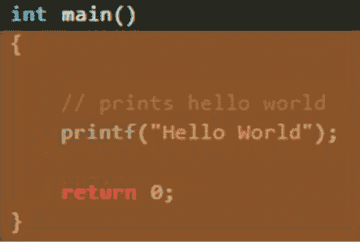

代码块位于花括号之间。

而Python版本看起来像这样：

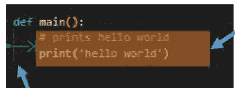

代码块由缩进标记。

缩进（4个空格）。

#### 分号行尾：

读者还会注意到许多语言中的分号行尾。Python在设计上没有这个，因为它旨在更简洁。

Python中的行在行尾结束，因此分号变得不必要。

#### 注释是 # 而不是 // ：

最后，我们看到Python中的单行注释使用 # 代替其他语言中常见的 //。这没有特别的原因（经过广泛的谷歌搜索），所以大概也是出于美学考虑。

还有许多其他差异，但由于这是一个基本概述，这些将留待以后介绍。

#### 什么是Stack？

维基百科提供了一个很好的正式描述：

> “Stack Overflow是一个面向专业和业余程序员的问答网站。它是Stack Exchange网络的旗舰网站。它创建于2008年。它提供关于计算机编程广泛主题的问题和答案”。该平台大约有1400万注册用户。

Stack通过正负投票来奖励和惩罚贡献，分别对应正面和负面贡献。

或者更Python化地说：

Stack**奖励**和**惩罚**贡献：

-   通过**赞成**或**反对**票
-   针对**正面**和**负面**贡献
-   分别对应。

基本格式如下：

| 好问题 | 赞成票 |
| 好答案 | 赞成票 |
| 好评论 | 赞成票 |
| 坏问题 | 反对票 |
| 坏答案 | 反对票 |

上述投票系统，虽然有时对初学者来说很严厉，但通过奖励贡献和惩罚干扰来保持社区的诚实。

就像任何其他平台或系统一样，有特定的细微差别和提问回答的方式。Stack相当直接，采用“最小、可重现示例”的方法。

这基本上意味着好的问题以“简短而简洁”的方式隔离非常具体的问题，并有助于快速定位解决方案。同样，对于答案，“简短而简洁”胜出。

那么，如何才能登上Stack的顶峰呢？

其实很简单，带着学习和贡献的渴望，并成为一个“好公民”。

#### 谁使用Stack？

基本上，任何曾经用任何语言问过编程问题的人可能都访问过stackoverflow网站。

最近的统计数据显示，大约有5000万用户，其中大约一半是专业开发者和大学生。所以另一半是爱好者、新手或其他对编码感兴趣的人群。

还有很多其他优秀的资源和网站，而且，对于任何编程语言来说，文档都非常出色。

尽管如此，有时在网上查找答案更有效率。我们经常“谷歌一下”，而stackoverflow凭借其海量的完整性（涵盖各种编程语言）总是排名在前几位链接中。

#### 什么是Stack Overflow？

Stack Overflow是一种缓冲区溢出错误，当计算机程序试图在调用栈中使用比分配给该栈更多的内存空间时发生。

Stack Overflow最常见的原因之一是递归函数，这是一种反复调用自身以执行特定逻辑的函数类型。每次函数调用自身时，它都会消耗更多的栈内存。如果函数运行次数过多，它会消耗所有可用内存，导致Stack Overflow。这不可避免地导致变量和数据损坏，并可能导致程序崩溃。

这个术语在很多方面都适合这个社区网站的名称，因为这是许多用户试图避免的问题之一。

用户访问stackoverflow是为了了解如何防止Stack Overflow。

#### 让我们开始吧

旅程在Python之前很久就开始了，但任何语言的程序都是一样的。创建一个hello world程序。从那里我们几乎可以做任何事情。

#### 代码

每种语言都有一个源代码和下载代码的地方。对于Python来说，在这方面也是一样的。在当今世界，用户所要做的就是“谷歌”python这个词。这会将用户带到主网站[https://www.python.org]，然后他们就可以开始了。

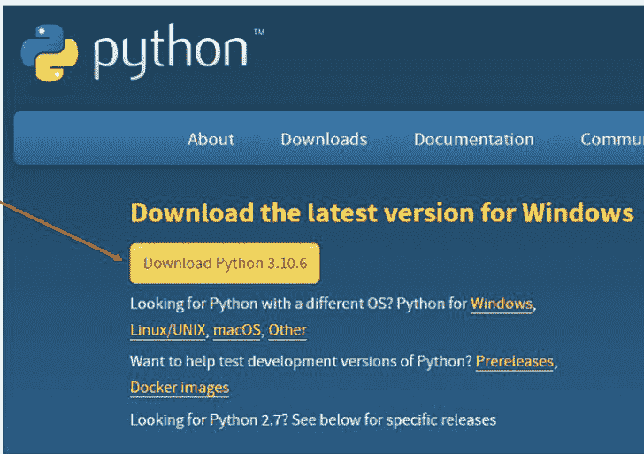

用户可能希望导航到适用于不同操作系统（Windows、MacOS或Linux）的相应版本，但基本上就是这么简单。

#### 编辑器

作为Python下载的一部分，用户会获得默认的包编辑器（称为IDLE），它完全可用，但缺乏其他编辑器的一些主要功能。

IDLE代表**I**ntegrated **D**evelopment and **L**earning **E**nvironment。它是一个用于Python的集成开发环境（IDE），它基本上看起来像这样：

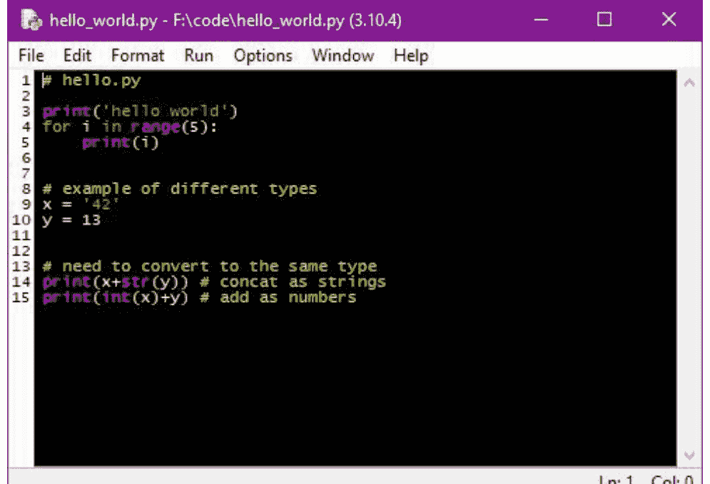

虽然这完全没问题，但IDLE相当基础，市场上已经开发出许多具有更多功能的编辑器。

在撰写本文时，最广泛使用的编辑器是Visual Studio Code，通常简称为VS Code。VS Code是微软为Windows、Linux和macOS制作的源代码编辑器。特别是其功能包括调试支持、语法高亮、智能代码补全和代码片段等。此外，它还通过扩展提供了大量额外功能。

一些调查显示，VS Code被70%的市场使用，因此这些功能已被证明很受欢迎。因此，我们将使用这个编辑器，但请注意还有许多其他选择。

同样，下载相对简单，只需“谷歌”VS Code，导航到网站并点击下载按钮。

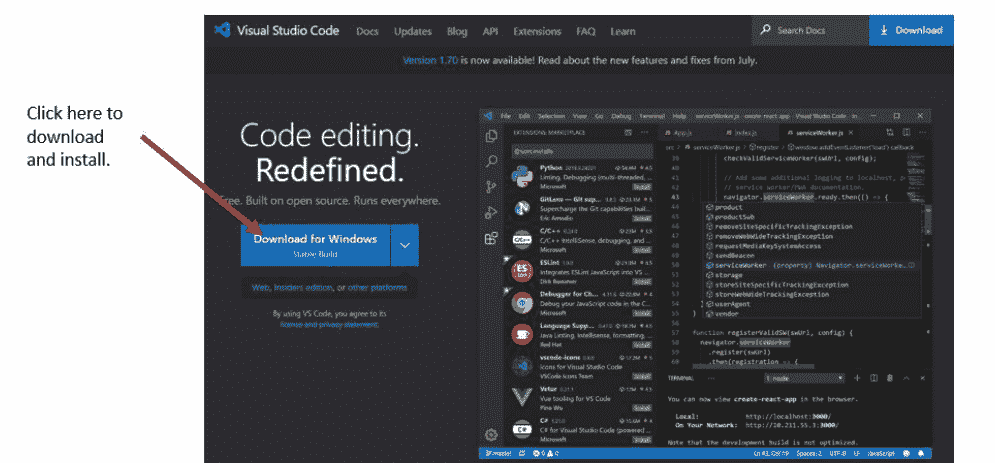

我们完成了。所以，虽然我们可以写一本关于编辑器的书或无尽的网页，但我们所拥有的对于继续Python编码之旅来说已经足够了。

#### Python基础

安装了Python并放置了合适的文本编辑器后，我们现在准备好编码了。第一个开始的地方将是让一个hello world程序运行起来。

这是测试**环境**是否工作的一种简单方法。

#### Hello world

Python的美妙之处在于，这可以用一行代码完成。我们创建一个文件并给它一个名字，最合适的是hello_world.py，然后我们就可以开始了。

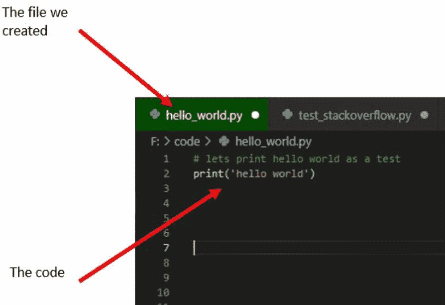

然后用户可以运行代码，它将打印到终端（或交互式控制台）hello world。

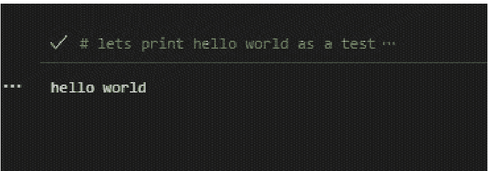

各种操作系统、下载、编辑器、配色方案等取决于每个用户的资源和偏好，但无论是什么，我们都希望达到这一点。

**达到这一点是关键，因为我们现在能够编码了！**

#### 可用资源

网络上有大量的支持材料和视频，建议读者尽可能多地使用这些资源，尽管任何一本好的Python书都应该涵盖语言的基本构建块。

信不信由你，大多数语言在早期阶段都相对容易掌握。有点像外语，有一些核心词汇可以让游客应付。例如“这个面包多少钱？”，如果你知道“多少钱”和“面包”这两个词，那么你就有足够的工具向店主询问一条面包。

此外，由于语言是相关的，我们也可以从其他语言中共享一些词汇和结构。

同样，编程也是如此。例如，我的旅程是从Basic到Fortran到C到C++，然后到Visual Basic，再到JavaScript，然后到NodeJs，最后到Python，在这个过程中还接触了几十种其他语言（如C#和PHP）。尽管这些语言看起来各不相同，但核心原则始终相同，相似度总是超过50%。

所以带着这种安心感，让我们深入进去。

#### 注释

注释是给人类阅读的，它们不会以任何方式干扰代码。通常使用注释是为了让我们能够记住或提示我们所做的事情，特别是当我们六个月后重新查看代码时，或者当其他人阅读代码并想知道发生了什么，或者我们所做的事情比较复杂时。

Python 中有两种类型的注释。**单行**注释和**多行**（块）注释。在 Python 中它们看起来像这样。

单行注释以 # 开头。

```
# this is a single line comment
```

多行（块）注释以三个引号开头，也以三个引号结尾。所以总共是六个引号。

```
"""
this is also a block comment
it uses quotation marks "
and is a bit more descriptive
"""
```

或者它也可以以三个单引号开头。

```
'''
this is a block comment
it uses single quotes '
and is a bit more descriptive
'''
```

多行注释通常用作函数的文档字符串。这些基本上是解释函数如何工作的文本块，对函数的其他用户非常有帮助。

#### 数据类型

主要有 5 种类型：字符串、整数、浮点数、布尔值和 None。

1.  字符串：字符串是一个字符或一系列字符。
2.  整数：任何正或负的整数。
3.  浮点数：带小数点的数字。
4.  布尔值：True 或 False，但也可以是 1 或 0。
5.  None：用于定义空值，或完全没有值。

```
s = 'hello world'  # this is a string
i = 100            # this is an integer
f = 10.5           # this is a float
b = True           # starts with a capital
n = None           # starts with a capital
```

#### 变量

这自然地引出了变量。你会注意到在上面的例子中，每个数据类型都被分配了一个字母。

我选择这些字母是因为它们在上下文中有意义（即 “s” 代表字符串，“i” 代表整数，等等）。

但我也可以这样做：

```
my_string = 'hello world'  # this is a string
an_int = 100              # this is an integer
a_float = 10.5            # this is a float
boo = True                # starts with a capital
nothingHere = None        # starts with a capital
```

你可以把变量想象成一个可以装东西的桶。在 Python 中，我们说一个值被赋给了变量。所以 an_int 被赋值为 100，boo 被赋值为 True。

注意，虽然使用了“等于号”，但我小心地没有说“等于”。这里有一个微妙的区别，这就是 Python 的工作方式。

上面提到的“桶”实际上是内存空间的一部分，所以字面上是处理器中的物理内存地址。值被分配给这些具有给定变量名的内存空间。

这是一个非常简化的概述，因此鼓励读者进行更多研究，但这是一个很好的起点，并且对于我们即将进行的工作来说已经足够了。

Python 比其他语言更容易上手的原因之一是，编码者不需要声明类型。事实上，类型是从给定的值推断出来的，这意味着**任何变量的类型都可以改变**。

```
# x starts as a string, but then becomes an integer
x = 'hello world'    # x is a string
x = 100              # now x is an integer
```

这有优点，特别是它更简洁（更少杂乱）并且编写代码更快，也有缺点，因为编码者可能会意外地改变一个变量类型，而*结构化语言*可能会检测到这一点。

在上面的例子中，Python 只是允许用户将 “x” 变量类型从字符串更改为整数，而没有警告用户类型已经改变。

这可能是用户的意外，也可能是对用户方便。

关于变量命名，你会注意到我使用了不同的约定。常见的约定有：

1.  驼峰命名法（camelCase）
2.  帕斯卡命名法（PascalCase）
3.  蛇形命名法（snake_case）

Python 中的约定是变量使用蛇形命名法，类使用帕斯卡命名法（我们稍后会讲到）。

编码者也可以在变量名中使用数字，只要数字不在名称开头即可。

```
# this is allowed
hello_01 = 'hello world'
hello_02 = 'hello mars'
hello99jupiter = 'hello jupiter'

# but this is not allowed
99hello = 'hello world'
```

变量命名还有更多规则，但这些是主要的，留给读者去尝试。

读者应该从中得到的一点是，**变量名应该是有意义的**。在示例中使用单字母变量很容易蒙混过关，但想象一下代码有 1000 行长，有许多变量名和大量复杂的工作。

哪个更清晰：`house_value` 还是 `hv`？

#### 列表、字典和元组

变量非常有用，因为它们已经让用户能够做很多事情，但所有编程语言的力量都随着列表而增强。


注意这里使用的是术语 List（列表），而**不是** array（数组）。

原因是*数组是一个“列表的列表”，其中每个级别的列表长度都相同*。

列表是一种数据结构，由一组有序的元素组成，每个元素可以是一个数字、另一个列表等。列表通常表示为 (a_1, a_2, ..., a_n) 或 {a_1,a_2,...,a_n}，也可以解释为一个向量。

简单地说，使用桶的例子，列表就像一个更大的桶，里面装着所有的小桶。

列表可能看起来像这样：

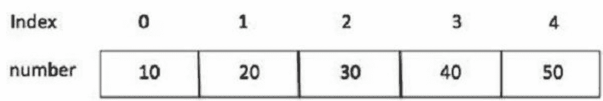

其中列表中的每个项目都有一个索引（它在列表中的位置）和一个数字，即该位置包含的值。

Python 中的列表非常方便，因为每个元素（即每个桶）实际上可以包含任何数据类型。

```python
list_of_ints = [1, 2, 3, 4, 5, 6]
list_of_strings = ['a', 'b', 'c', 'd', 'e', 'f']
list_of_words = ['hello', 'how', 'are', 'you']
list_of_bools = [True, True, False, True, False, True]

# the types in the list can be anything
mixed_list = [1, 'hello', True, 100.5, 'world']
```

我们甚至可以有一个空列表，只需使用方括号，但不在其中添加任何元素。

```python
new_list = []
```

不仅如此，我们现在可以创建数组，根据上面的定义，数组是**列表的列表**。

```python
my_array = [list_of_ints, list_of_strings, list_of_bools]
```

我们还可以通过将列表放入列表再放入列表等方式变得非常聪明。三维数组，n 维数组。

突然之间，我们非常基本的数据类型在短时间内发展成了强大的数据集合。

从列表继续，我们有**字典**。Python 中的字典用于以 {键: 值} 对的形式存储数据值。字典是一个无序、可变且不允许重复键（即字典中的键是唯一的）的集合。

因为“dictionary”这个词相当长且经常使用，我们通常将其缩写为 **dict**，这实际上是字典类的名称（或类型）。

如果我们回到桶的类比，列表和字典之间的唯一区别是，对于字典，桶现在有了特定的名称。所以索引不再是列表中的位置，索引现在是桶元素的特定名称（键）。

一个空的字典看起来像这样：

```
my_dict = {}
```

从这里我们可以向列表中添加项目，记住每个项目都是一个键：值对。

```
my_dict = {'a': 100, 'b':200, 'c':300}
```

键可以是任何东西，只要它们是唯一的。如果编码者意外或故意复制了一个项目，那么字典中的最后一个项目将覆盖前面的项目。

```
my_fruits = {'apples': 100, 'bananas':200, 'carrots':300}
my_numbers = {0:'hello', 1:'world', 2:'mars', 3:'mars'}
```

注意键和值都可以是任何有效的数据类型（字符串、整数、浮点数、布尔值、None）。

```
random_dict = {0:'c', 1.1:None, 2.5:'d', 3:True}
```

如果我们回到上面的 my_numbers 示例，我们看到这实际上与列表几乎相同，因为键是按数字顺序排序的。

所以我们看到**列表**和**字典**之间有很强的相似性。事实上，我们可以认为列表是一种特殊类型的字典。

```
my_list = ['hello', 'world', 'mars', 'mars']
my_dict = {0:'hello', 1:'world', 2:'mars', 3:'mars'}
```

#### 如何计数

关于计数，这里简单说明一下，因为这个问题会反复出现。我们人类从孩童时期就学会了用手指计数。这很简单，对吧？

1, 2, 3, 4, 5 等等...

然而，现实是我们几代人都用错了计数方式。尤其考虑到我们生活在一个十进制的世界里，我们应该从0开始数到9。数字10在十进制中是新的一行，而在我们的手指上，它是第一行的结束（我们的小指）。

因此，由于习惯，我们常常忘记列表和数组是从第零个元素开始的，这导致了几乎所有语言中都可能出现的愚蠢错误和边界情况。


Python中一个长度为10的列表有10个元素，实际上范围是从0到9，像这样：[0, 1, 2, 3, 4, 5, 6, 7, 8, 9]。记住这个常见的陷阱很重要，如果你想在技术栈上取得高分，这是一个值得学习的好点。

#### 可变与不可变

我们已经介绍了经典的数据类型：字符串、整数、浮点数、布尔值和None。我们将这些数字放入新的类型中，作为称为列表、字典、元组和集合的数据集合。

我们讨论了变量被分配了一块内存空间，并将其类比为一个桶。然后我们讨论了这些桶可以被放入更大的桶（集合）中，这些桶也在内存中被分配了空间。

让我们看一个简单的例子。

```python
# %%  the memory location of a variable is mutable
x = 10      # assign x the value of 10
print(id(x))  # print the ID (memory location) of x
x = 11      # assign x the new value of 11
print(id(x))  # print the ID (memory location) of x
```

结果如下：

```
2863537193488
2863537193520
```

我们看到，当x的值从10变为11时，x的内存位置发生了变化。因此，变量的内存位置是可变的。

现在让我们对列表做同样的操作。

```python
# %%  the memory location of a variable is immutable

x = [1,2,3]  # assign x the value of [1,2,3]
print(id(x))  # print the ID (memory location) of x
x.append(4)  # add an element to the list [1,2,3,4]
print(id(x))  # print the ID (memory location) of x
```

结果如下：

```
2864017202368
2864017202368
```

我们看到，即使我们将x的值从[1,2,3]更改为[1,2,3,4]，x的内存位置保持不变。因此，列表的内存位置是不可变的。

可变是一种花哨的说法，表示对象的内部状态被改变了（即发生了变异）。所以，最简单的定义是：**内部状态可以改变的对象是可变的**。另一方面，**不可变意味着对象一旦创建，就不允许任何改变。**

此时，我们仅从上面的观察中知道，像列表和字典这样的集合的内存地址是不可变的，因此它们的行为与像整数、字符串和布尔值这样的可变变量不同。

但在处理列表或字典时，这将变得很重要，因为有时我们可以利用这种行为来控制代码的效率。

我们将在讨论函数时重新审视这一特性，函数是接收输入（称为参数）进行处理并返回某些内容的代码块。由于通常使用变量和集合作为函数参数，而内存地址（可变性）会对代码的行为产生影响。

#### 基础代数

像任何标准语言一样，Python开箱即用地支持所有基本操作。事实上，动态类型使其更加方便，因为变量在使用前不需要指定类型。

它的工作原理与计算器自发明以来遵循BODMAS规则的方式相同。

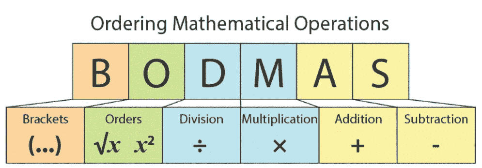

因此，我们可以方便地进行常规操作。

```python
a = 5 + 3 - 2    # adding and subtracting
b = 3 * 5 / 2    # multiplication and division
c = (3 + 5) / (2 * 2)  # brackets
d = 3**2           # powers

print(a,b,c,d)

# returns this: 6 7.5 2.0 9
```

以及基础代数

```python
z = (a + b) / (c * d)
print (z)

# returns this: 0.75
```

所以现在我们可以做的事情更多了。

#### For 和 while 循环

有人认为，计算的大部分力量始于这里。计算机相对于人类的最大优势之一是能够快速重复任务而不犯错。

```python
# %% for loops
for i in range(10):
    print(f'hello {i}')
```

这段简单的代码在几分之一秒内返回了这个列表。

```
hello 0
hello 1
hello 2
hello 3
hello 4
hello 5
hello 6
hello 7
hello 8
hello 9
```

现实是，我们可以在几分之一秒内打印出比整本书内容还多的文字。用于输入这本书的计算机可以在0.25秒内产生100,000个"hello n"句子。

这相当于每秒400,000次操作。因此，我们在标准设备上拥有巨大的计算能力。这是一个不错的开始。

我们将学习如何利用这种能力。

在其他语言如Visual Basic或C++中，for循环的结构如下：

```cpp
// for loop in c++

for (int i = 0; i < 5; i++) {
    // the block of code goes here.
    cout << i << "\n";
}
```

其中我们在括号中有起始、停止和增量，在花括号中有代码块。

在Python中，语法更简洁。没有花括号，取而代之的是缩进，循环实际上是在遍历一个对象。我们使用了range()函数，它创建了一个方便的数字序列range(start, stop, step)，完成了所有相同的事情，但代码行数更少，方便且更易读。

事实上，我们将看到Python循环在这方面甚至更方便，因为我们可以遍历任何集合，如列表和字典。

我们快速这样做：

```python
# lets make a list
my_list = ['a', 'b', 'c', 'd']

# now iterate over the list
for x in my_list:
    print('hello', x)
```

返回如下：

```
hello a
hello b
hello c
hello d
```

另一种强大的循环类型是while循环。我们可以说for循环是**有界的**，因为它从某个点开始，到某个数字结束，然后在到达终点时终止。所以，我们看到for i in range(10)执行了10次迭代。它到达了终点。如果我们设置100或1,000,000，它就会执行那么多次循环然后停止。

我们之所以这样说，是因为我们调用项目以获取其值的方式。

要获取特定的列表项，编码者需要知道它在列表中的位置（索引）。并以这种方式调用它。因此，列表中的第一项这样调用：my_list[0]，第二项my_list[1]，依此类推...

如果我们看字典，这完全相同：my_dict[0], my_dict[1]，依此类推...

所以我们可以看到，一个有序字典（从第一个键=0开始）与列表是相同的。

最后，我们有元组。我把它留到最后，因为某种程度上它被列表覆盖了。主要区别在于元组看起来像列表，但元素不能更改，但具有所有相同的属性。所以它就像一个固定的列表，因为我们不能像对列表那样更改元组的值或添加或删除元素。

```python
my_tuple = ("apple", "banana", "cherry", "apple")
```

这在我们知道不想更改列表大小的情况下很有用，例如在二维平面中，我们只想要x和y坐标，这最好用元组(x, y)表示，因为它永远不会改变其大小。

注意，还有“集合”，留给读者作为练习去跟进，它也有很好的用例（例如排序），但出现频率较低。因此，虽然提及，但我们较少深入探讨集合。

总之，这些是Python中的4种集合数据类型及其共同特征：

1. **列表**是一个**有序**且可更改的集合。允许重复成员。
2. **元组**是一个**有序**且不可更改的集合。允许重复成员。
3. **集合**是一个**无序**、不可更改且无索引的集合。不允许重复成员。
4. **字典**是一个**无序**且可更改的集合。不允许重复成员。

另一方面，while 循环会持续运行，因此它是**无界的**，直到满足某个条件为止。

```
x = 0
while x < 10:
    print('hello ' + str(x))
    x = x + 1
```

返回结果如下：

```
hello 0
hello 1
hello 2
hello 3
hello 4
hello 5
hello 6
hello 7
hello 8
hello 9
```

由于 while 循环的无界特性，我们需要更加小心。例如，在上面的例子中，如果删除了 `x = x + 1` 这一行，或者将其设置为 `x = x - 1`，那么 `x < 10` 的条件将永远成立，循环将永远不会结束。

程序将会挂起。

我们经常这样做：

```
i = 0
x = 0

condition = True
while condition:
    x = x + 10
    i = i + 1

    if x > 100:
        # 条件发生变化
        condition = False

print(i, 'loops done')
```

while 循环在条件为真时运行，然后在某个时刻变为假，循环退出。同样，我们需要确保条件可以退出，否则程序将永远停留在循环中（挂起）。

#### If else 逻辑

“if” 语句在编程中随处可见。其格式和逻辑相当直接：

```
if x > 10:
    print('x is big')
```

它可以与 else 语句结合使用。

```
if x > 10:
    print('x is big')
else:
    print('x is small')
```

同样，在 Python 中，缩进表示代码块，而其他语言会使用花括号。
我们可以组合 if 语句或使用 `elif` 关键字。

```
if x > 10:
    print('x is big')
elif x < 2:
    print('x is small')
else:
    print('x is medium')
```

或者这样

```
if x > 10:
    print('x is big')
if x < 2:
    print('x is small')
else:
    print('x is medium')
```

我们还可以嵌套 if 语句

```
if x < 10:
    if x > 2:
        print('x is medium')
```

嵌套的 if 表现得像 AND 逻辑运算符，因为需要满足两个条件才能调用 print 语句。

#### 函数

我们现在来到所有编程中最重要的特性之一。函数是一个**代码块**，只有在被调用时才会运行。你可以将数据（称为参数）传递给函数。函数可以返回数据作为结果。

使用函数，我们可以将代码分解成可操作的部分，就像小模块一样，然后根据需要调用这些模块。

函数具有相同的缩进块，因此看起来像这样：

```
def my_function():
    print('hello world')
```

我们可以在代码中的任何时间通过调用它来运行该函数。

```
# 定义函数
def my_function():
    print('hello world')

# 调用函数
my_function()
```

我们可以根据需要多次调用该函数，因为它是一个可重复使用的代码块：

```
# 定义函数
def my_function():
    print('hello world')

# 调用函数 10 次
for i in range(10):
    my_function()
```

返回结果如下：

```
hello world
hello world
hello world
hello world
hello world
hello world
hello world
hello world
hello world
hello world
```

就像 ‘for’ 和 ‘while’ 循环以及 ‘if’ 语句一样，一旦代码块（由缩进定义）完成，函数就结束了。
函数可以有称为参数的输入：

```
name = 'world'           # 一个变量

def my_function(name):    # 函数接受变量
    print('hello ' + name) # 函数使用变量
```

函数通常用一个字符串注释，称为文档字符串，向用户描述函数的功能：

```
def my_function(name):    # 函数接受变量
    """ 打印 hello 和名字 """
    print('hello ' + name) # 函数使用变量
```

函数可以返回一些内容。

```
name = 'world'           # 一个变量

def my_function(name):    # 函数接受变量
    """ 接受一个名字，返回一个字符串

        输入: name (str)
        返回: s (str)
    """

    s = 'hello ' + name    # 连接字符串
    return s # 函数返回一个字符串
```

我们可以将返回值赋值给一个变量，像这样：

```
def add_numbers(a, b):
    """ 将 a 和 b 相加，返回结果 """
    return a + b

my_sum = add_numbers(1, 3) # 返回的值

print('the sum is', my_sum) # 打印结果
```

返回结果如下：

```
the sum is 4
```

函数可以调用之前定义的其他函数，因此我们可以很好地以模块化块控制代码流程。

```
def add_numbers(a, b):
    """ 将 a 和 b 相加，返回结果 """
    return a + b
```

```
def my_name(name):
    """ 接受一个名字，返回一个字符串

    输入: name (str)
    返回: s (str)
    """

    s = 'hello ' + name
    return s
```

```
def main():
    """ 调用上述两个函数 """

    z = add_numbers(7, 8)

    if z > 10:
        s = my_name('world')
        print(s)
```

```
# 调用主函数
main()
```

大量有用函数的集合可以被视为一个*库*（或*模块*）。我们可以保存这个包含非常有用函数的模块，并在以后（即我们可以导入该模块）在另一段代码中调用它。

#### 类

紧随函数之后的是类。类是许多面向对象语言的基础。可以将类视为*用户定义的蓝图或原型，对象由此创建*。我们将看到这意味着什么。

我们将看一个例子，但请注意有很多例子。通常，我们看到的例子是关于人、汽车或动物的（狗是一个很好的例子）。事实上，任何具有可复制属性和方法的事物都非常适合类系统，这就是它如此强大的原因。

在我们这样做之前，让我们看看 Python 中的类是什么样子的。代码块如下所示。

```
class MyClass:
    "" 这是一个类 """
    pass
```

我们可以添加属性和方法（函数）。

```
class MyClass:
    "" 这是一个类 """
    pass

    x = 10    # 变量称为属性
    y = 100

    def add_one(self):
        """
        这个函数是类的“方法”
        x 增加 1
        """
        self.x = self.x + 1
        return self.x
```

这里我们添加了两个属性 x 和 y，以及一个方法 add_one()，它将输入的数字加 1。我们还注意到惯例（但不是规则）是使用大写字母来命名类。我们看到了一个新的关键字 `self`。

`self` 参数是类的一个重要特性，因为它引用自身，其他面向对象编程（OOP）语言使用类似的术语（例如 nodejs 使用 `this` 关键字来引用自身）。

我们可以通过调用它来创建类的实例。这称为实例化类。

```
x = MyClass()
```

我们可以轻松地调用其属性和方法。

```
class MyClass:
    """ 这是一个类 """
    pass

    x = 10    # 变量称为属性
    y = 100   # 这是另一个属性

    def add_one(self):
        """
        这个函数是类的“方法”
        x 增加 1
        """
        self.x = self.x + 1
        return self.x

# 创建类的实例
something = MyClass()  # 实例化类

print(something.x)    # 打印 10
print(something.y)    # 打印 100

something.add_one()   # 执行方法（加 1）
print(something.x)    # 打印 11
```

简而言之，以上内容概述了类的大部分内容及其使用方法。同样，为了本书的目的，我们仅坚持此描述，但请注意，实际上可以单独写一整本关于类的书。读者可以自行深入研究。

#### 魔术方法

当我们查看类时，会注意到一些函数以双下划线 `__` 开头。它们也被称为 dunder 方法，是 double 和 under 的混合词。

它们可以帮助为自定义类覆盖内置函数的功能。常见方法有：

`__str__`：用于字符串

`__len__`：项目数量

`__dict__`：项目的字典

对于类，我们经常在顶部看到 `__init__()`：这表示 Python 将在内部使用该方法。用户不应显式调用此方法。由于此方法在创建新类后立即被调用，我们可以用它来初始化对象的属性。

```
class Node:
    "" 树的节点 """

    def __init__(self, data):
        "" 构造类 """
        self.left = None
        self.right = None
        self.data = data

    def PrintTree(self):
        "" 另一个函数 """
        print(self.data)
```

我们目前不会深入探讨这一点，原因有二。

#### 导入模块

几乎在每段代码的开头，你都会看到一堆导入命令。按照惯例，所有导入语句都应放在模块或脚本的开头。

我们这样做的一个原因是，它有助于我们（用户或下一位程序员）记住从代码外部导入了哪些内容。这些是外部文件，被称为依赖项，因为没有它们代码将无法运行，它们被导入到代码的生态系统中。

常见的模块有：time、datetime、math、random、statistics、requests、pandas、numpy……

```python
import time    # a module of useful time functions

t = time.time()
print(t)

# the result
# 1660605141.3659403
```

事实上，这个列表几乎是无穷无尽的，因为有超过200个标准库和超过137,000个外部库。这是像Python这样语言的主要吸引力之一，它拥有一个庞大的社区和巨大的支持。

标准库是随Python一起打包的，因此在安装Python时就已经在桌面上并可使用，而且这类库数量较少，否则下载将非常耗数据。

外部库相对容易安装，可以使用称为包管理器（pip或conda）的工具，通常在命令提示符下用一行命令即可完成。

模块通常有相关的名称，暗示了它们的功能，同时也具有相同的描述和文档字符串，以便用户验证它们是否适合手头的任务。

内部模块示例：

- **Time**：提供各种与时间相关的函数
- **Datetime**：提供用于操作日期和时间的类
- **Math**：访问数学函数
- **Random**：实现各种分布的伪随机数生成器
- **Statistics**：提供用于计算数学统计的函数

外部模块示例：

- **Requests**：一个简单而优雅的HTTP库。
- **Pandas[1]**：强大的Python数据分析工具包
- **Numpy**：Python数组计算的基础包
- **Scipy**：Python的科学库

两个最常见的外部库是numpy和pandas，以下是Windows系统下的安装示例。

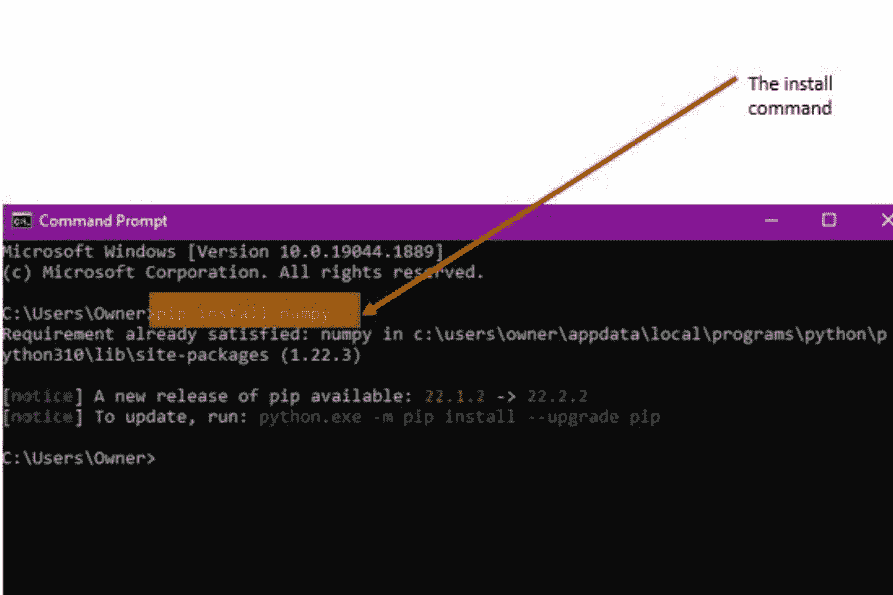

事实上，pandas和numpy使用如此普遍，以至于它们随Anaconda包一起安装，Anaconda自称是“世界上最受欢迎的开源Python分发平台”。

简单来说，我们喜欢保留、使用和重复好的代码，这样我们就不会不断浪费时间重复造轮子。

当代码变得足够充分和完整时，就值得将其打包成一个库。

Python以及所有其他模块化语言都从这些库中受益匪浅，因为用户只需要安装与他们相关的核心组件。

例如，**让我们生成一个随机数列表，计算该列表的最小值、最大值、平均值和标准差，然后看看执行此操作需要多长时间。**

```python
# the imports
import time       # module for time
import random     # module for random numbers
import statistics # statistics module
```

```python
t0 = time.time()          # the start time

rand_list = []            # an empty list
for i in range(100_000):   # loop 1000 times
    r = random.randint(0,100) # a random integer
    rand_list.append(r)    # add this to the list

# print the results
print('min:', min(rand_list))
print('max:', max(rand_list))
print('avg:', statistics.mean(rand_list))
print('std:', statistics.stdev(rand_list))

t1 = time.time()          # the end time
time_taken = round(t1-t0, 2) # time taken (2dp)

print('the time taken is', round(t1-t0, 2), 'seconds')
```

结果如下所示：

```
min: 0
max: 100
avg: 50.10659
std: 29.136766431494777
the time taken is 0.24 seconds
```

因此，我们生成了一个包含100,000个整数的随机列表，并在不到四分之一秒的时间内计算了该随机列表的基本统计数据。所有这一切都在不到20行代码内完成。

事实上，使用列表推导式并稍加整理，这可以在10行代码内完成。如果我们使用numpy库，速度也会更快。

```python
# list comprehension replaces for loop
rand_list = [random.randint(0,100) for x in range(1_000_000)]
```

有时库模块名称可能相当长，例如random.randint()就相当冗长。或者statistics.stdev()。当在同一行中多次重复时，代码会变得冗长和杂乱。

幸运的是，Python提供了一个别名系统，这样我们可以将较长的名称简写为更方便的名称。

```python
import random as rd    # alias is assigned: rd
import statistics as sts  # alias is assigned: sts
```

```python
r = rd.randint(0,100)  # we can use the alias rd
```

一个非常流行的库是matplotlib，用于绘制图表。典型的模块导入如下所示：

```python
from matplotlib import pyplot as plt
```

这看起来一行代码有点复杂，但实际上相当简单。因为pyplot只是matplotlib模块中的一个函数，而plt只是我们分配给所需内容的别名。我们稍后会更深入地探讨这一点。

最后，关于导入模块的一个常见陷阱。Python允许通配符导入。这意味着用户可以这样做：

```python
from math import *
from os import *
from tkinter import *
```

通配符`*`意味着所有方法都将被导入。因此，例如，我们不必这样做：

```python
x = math.cos(90)
```

我们现在可以这样做：

```python
y = cos(90)
```

这显然带来了一定程度的便利，因为前者比后者更冗长。实际上，对于较小的模块，这已经足够了。

然而，缺点是，如果不了解模块中包含的无数方法，我们很容易覆盖它们，而且，不再清楚`cos()`来自哪里。同样，对于小段代码，我们可以说这很容易，因为`cos()`显然是一个数学函数，来自数学模块，但看看这个错误。

```python
from PIL import Image, ImageTk
from tkinter import *
```

`tkinter`模块包含一个名为`Image`的方法，但程序员认为`Image`方法是从`PIL`模块[2]调用的。

因为Python允许重新赋值，第一个导入的Image函数被第二个覆盖而没有警告，这可能是无意的。

因此，明确导入是有帮助的，在这种情况下，使用别名会更合适，并消除歧义：

```python
import tkinter as tk
```

这样就很清楚了。

#### 逻辑顺序

我们之前学过，Python代码是按顺序逐行执行的。

这意味着顺序很重要。例如，我们不能在定义变量之前使用它，同样，我们也不能在定义函数之前使用它。

与其他语言相比，这需要一些适应，因为其他语言中的函数会被提升，这意味着在其他语言中，我们可以将大型函数放在代码底部。在Python中我们不能这样做，因为它们需要先被读取。

对于变量：

```python
x = 10    # define x
print(x)  # this works, x was defined

print(y)  # this fails, y is not defined yet
y = 10    # define y, but too late !!
```

我们看到这会抛出一个NameError，这意味着名称有错误。它在运行时未被定义。

```
NameError: name 'y' is not defined
```

对于函数：

```python
# the function has not been defined
# so it fails
print( add_numbers(1, 2) )

def add_numbers(a,b):
    return a + b

# we can call the function here
print( add_numbers(1, 2) )
```

因此，Python以同步方式运行。先出现的先执行。所以用户必须注意顺序，不能随意。

这有时会令人沮丧，因为通常将主要代码放在顶部并在之后调用函数会很有帮助（特别是对于那些来自Visual Basic和Node.js等语言的人）。

然而，Python中有一个巧妙的小技巧，那就是将调用包装

#### 创建模块

因此，我们可以导入由社区创建的模块，这类模块有成千上万之多。这些模块是非常强大的实用函数集合，包含用例示例和大量支持。

然而，创建的模块仅用于协助用户构建自己的项目。项目可以是一个不超过20行代码的单个代码片段，也可以是一个跨越数千行代码的大型有意义的代码块，并且还可以拥有用户自己创建的模块。

Python很好地兼顾了这两种情况，实际上它使用户创建和导入自己的模块变得非常容易。

用户创建的每个文件都保存为*.py文件，并且会存放在一个文件夹中。例如，“hello_world.py”会被保存在电脑上的某个位置。

假设它保存在C盘（对于基于Windows的计算机）的一个我们命名为“code”的文件夹中。那么完整路径将如下所示：
C:\code\hello_world.py

我们可以说这个Python文件名为hello_world.py，项目文件夹为c:\code。现在，如果我们在同一个文件夹中创建另一个文件，比如hello_moon.py，那么项目文件夹中就会有两个文件。

我们只需要这样做：

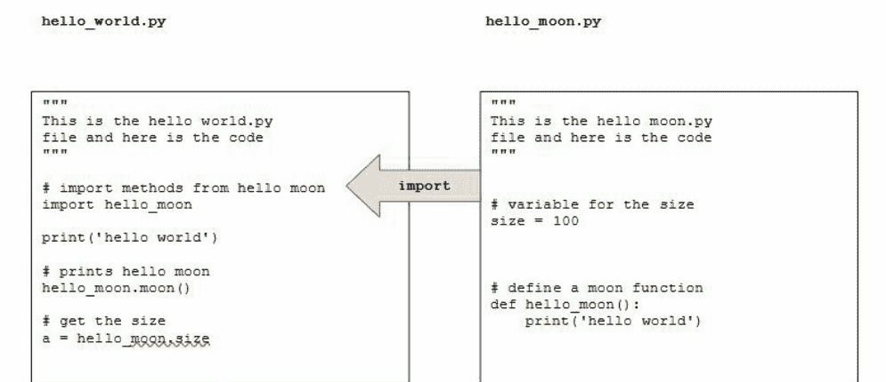

因此我们可以看到，import语句仅用一行代码就将一个文件（hello_moon.py）的所有属性和方法引入到另一个文件（hello_world.py）中。

规则也非常简单。被导入的文件夹应该位于项目文件夹的同一级或子文件夹中。仅此而已。

因此，我们现在拥有了创建整个项目所需的工具，该项目被分解为有用且有意义的模块。

#### 主模块

这一切还有一个最后的部分，那就是我们现在拥有了属性和函数的集合，以及位于不同文件夹中的模块集合（Python文件）（希望不要太多，否则项目会很复杂）。那么我们如何确定这一切的起点呢？

通常有一个文件被认为是主文件，或者我们可以说它是代码的入口点。该文件可以是用户想要的任何有用或描述性的名称。

阅读过**魔法方法**章节后，我们了解到Python中的所有对象都有特殊的内置函数，用双下划线表示。文件对象也不例外。以下是一些更有用的：

- `__file__`：文件的路径名。
- `__doc__`：文件的描述。
- `__name__`：文件的名称

实际上，我们可以通过在文件中输入`print(dir())`并运行代码来获取这些属性的列表。

这里有趣的是`__name__`属性，因为它告诉我们被导入文件的名称。它的值取决于我们如何执行包含该文件的脚本。因此，实际的**主文件**（未被导入的那个）被赋予名称`__main__`。

我们经常在几乎每个大型项目的主文件底部看到这个。

```
if __name__=="__main__":
    # run some code
    print('do something')
```

if语句内的代码现在仅在文件名是主文件时才运行。这就是我们的入口点！

作为旁注，我们可以通过添加额外的路径名来从项目文件夹之外的其他文件夹导入文件，如下所示。

```
# some_file.py
import sys
# caution: path[0] is reserved for script path (or "" in REPL)
sys.path.insert(1, '/path/to/application/app/folder')

import file
```

但出于我们的目的和*最佳实践，我们喜欢将包保持在一个文件夹中*。

## 编码技巧

至此，我们已经概览了Python、如何设置环境以及语言本身的基础知识。

我们研究了变量、集合、函数、循环和if语句等。我们所看到的一切都相对处于顶层，因为即使深入探讨一个主题本身也可能是一本书。

读者最好进行回顾，并通过在设备上进行实际的现实世界测试来支持他们的阅读。是的，这意味着**自己编写代码**，从`hello_world.py`程序开始。这一点再怎么强调也不为过，你现在必须将手指放在键盘上，以丰富这次阅读的收益。

话虽如此，现在是时候看看我们经常遇到的一些问题了。我不确定我将如何将它们分类。

需要记住的重要一点是，这些“问题”应该被视为有趣的脑筋急转弯和其他有趣的案例。

### 什么是编码问题

它是任何类型的问题，通常是我们可能无法仅用纸笔解决的有趣问题。最初，在尝试学习时，我参加了100天每日编码挑战。这基本上意味着，在100天里，每天选择一个问题，并尝试用任何语言解决该问题。

起初，我使用`node.js`，而一个朋友使用`python`，因此比较方法很有趣。现实是，这两种语言（有时被称为脚本语言）有超过75%的相似性。

事实上，如果将花括号替换为缩进，并移除行尾的分号，那么这两种语言就更接近了。

### 什么是编码技巧

我们可以将技巧视为我们处理问题的一般形式。我们经常使用相同的技巧来解决各种各样的问题，就像工具箱中的特定工具可能用于修复许多问题一样。

我们有常见的技巧，比如for循环和while循环，就像我们标准家用工具箱中有螺丝刀和扳手一样。

然后我们有更专业的工具，比如pandas dataframe，它可能更类似于工具台上的砂光机。它们做的事情更少，但做得更好。

有时我们甚至可以使用错误的工具来完成工作，比如用螺丝刀或刀子打开一罐油漆。

每种工具都有其优点和缺点。然而，如果我们能更多地选择正确的工具，那么我们的代码就会变得越来越高效。当数据量或处理数量变大时，这种效率尤其重要且明显。

可能就像将静态变量移到循环外一样简单。看看这两段代码：

#### for循环内的变量

```
import time

t0 = time.time()
for i in range(1_000_000):
    a = 100
    b = 2
    if i%1000 == 0:
        print(a + b + i, end = "\r")

t1 = time.time()

print('the time taken was', (t1-t0), 'seconds.')
```

#### for循环外的变量

```
import time

t0 = time.time()
a = 100
b = 2
for i in range(1_000_000):
    if i%1000==0:
        print(a + b + i, end = "\r")

t1 = time.time()

print('the time taken was', (t1-t0), 'seconds.')
```

哪一个更快，为什么？

如果我们看第一段代码，变量a和b在每次循环中都被赋值。有100万次循环，因此这行代码额外执行了100万次。而在第二段代码中，变量被移出了循环，节省了大量的编程开销。

在这种情况下，我们受到的惩罚并不太严重，因为我们的代码片段很小，在两种情况下运行时间都不到一秒。但如果代码更复杂，或者变量恰好是大型函数，那么代码就会面临效率问题。

这里，高效方法的差异是90毫秒，而低效方法是180毫秒。

我们可以通过以下方式轻松地突出显示这有多糟糕：

```
import time

n = 3
def n_second_process(n):
    """ a process that lasts for n seconds """
    time.sleep(n)
    return 'hello'

x = n_second_process(n)

for i in range(100):
    print(x + ' world')
```

再次是这个：

```
import time

def n_second_process(n):
    """ a process that lasts for n seconds """
    time.sleep(n)
```

return 'hello'

for i in range(100):
    n = 3
    x = n_second_process(n) # this is expensive !!!
    print(x + ' world')

这里，第一段代码耗时仅略超过3秒，而第二段代码片段则需要5分钟（100 * 3秒），因为耗时的函数被放在了循环内部，而且仅仅改变循环次数就可能导致情况变得更糟。

这些都是程序员需要意识到的简单优化点。

### 递归函数

递归是一个常见的数学和编程概念。它意味着一个函数调用自身。这样做的好处在于，你可以遍历数据并应用逻辑来得到结果。

当相同的模式重复出现时，这尤其有用，尽管未完成或无限的递归可能导致栈溢出。因此，程序员需要确保在某个时刻满足终止条件。

递归过程在Python中看起来是这样的：

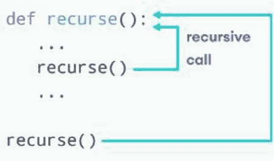

一个通过递归解决的常见数学问题是求一个数 n 的阶乘。

让我们看看递归过程在实践中是如何工作的：

```
def recur_factorial(n):
    """ calculate factorial of n """
    if n == 1:
        return n
    else:
        return n*recur_factorial(n-1)

recur_factorial(1000)
```

我们注意到递归函数如何简单地不断返回自身，每次降低 n 的值，直到达到 n==1 的条件，递归停止并返回最终值。

在这个例子中，我们看到 1000! 在不到一秒的时间内就被计算出来，得到了一个巨大的数字，不得不缩小字体大小才能放在这一页上。

40238726007709377354370243392300398571937486421071463254379991042993851239862902059204420848696940480047

在赞扬了递归函数之后，我们可以看到使用 for 循环以线性方式也能实现同样的功能。

```
def ret_factorial(n):
    f = 1
    for i in range(1,n+1):
        f = f * i
    return f
```

我们注意到，递归看起来很优雅，并且具有将复杂任务分解成小而简单的单元的优势。

然而，递归的缺点在于它们在内存和时间方面开销很大。在上面的例子中，阶乘问题运行良好，但如果 n > 2000 就会导致内存问题，因为每个新函数都会在内存中分配一个新的位置。

### 回溯

回溯本质上是递归的。回溯仅仅是在我们确定当前的解决方案无法继续成为一个完整的解决方案时，立即返回到上一步或上一个解决方案。

```
# backtracking

def permute(list, s):
    if list == 1:
        return s
    else:
        return [
            y + x
            for y in permute(1, s)
            for x in permute(list - 1, s)
        ]
print(permute(1, ["a","b","c"]))
print(permute(2, ["a","b","c"]))
```

上面的代码返回：

```
['a', 'b', 'c']
['aa', 'ab', 'ac', 'ba', 'bb', 'bc', 'ca', 'cb', 'cc']
```

### 列表推导式

如果我们看看回溯算法，会发现一些我们以前没见过的东西。它是列表推导式的一个复杂版本。

“列表推导式”在你想基于现有列表的值创建一个新列表时，提供了一种*更简洁的语法*，是Python中一种便捷的方法，在许多其他语言中并不存在。

让我们通过例子来说明：假设我们有一个数字列表，我们只想对偶数进行平方。这是旧方法：

```
my_list = [1,2,3,4,5,6,7,8,9,10]

squared_list = []     # create new list
for i in my_list:     # iterate thru list
    if i%2==0:        # check even numbers
        squared_list.append(i**2)  # append list
print(squared_list)   # [4, 16, 36, 64, 100]
```

而这是使用列表推导式的相同操作：

```
my_list = [1,2,3,4,5,6,7,8,9,10]

squared_list = [x**2 for x in my_list if x%2==0]
print(squared_list)  # [4, 16, 36, 64, 100]
```

或者，让我们从“hello world”这个词中提取所有元音字母，并将它们放入一个新列表。

```
s = 'hello world'

v = [x for x in s if x in 'aeiou']
print(v)  # ['e', 'o', 'o']
```

列表推导式也适用于其他集合，比如字典。这里有一个从字典中提取农场动物的例子，其中键是动物名称，值是数量。

```
d = {'cats':2, 'dogs':5, 'pigs':7, 'sheep':30, 'cows':12}
e = {k:v for k,v in d.items() if v>10}
print(e)  # {'sheep': 30, 'cows': 12}
```

这之所以有用，是因为集合中可以包含太多东西。

### 二叉树

二叉树是编程中的常见特征，因为它们有助于做出决策。这个过程是从树的顶部开始，通常称为根节点或父节点，然后向下遍历树的子节点，直到我们到达末端节点或叶节点。

这是一张包含一些关键术语的图片。

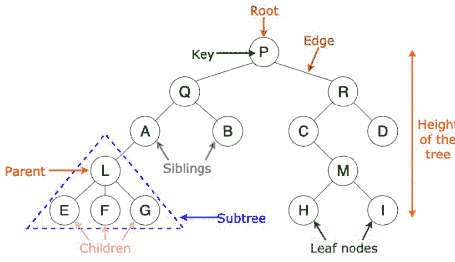

这个数学树状图转化为现实世界的过程是这样的。

### 我应该去健身房吗？

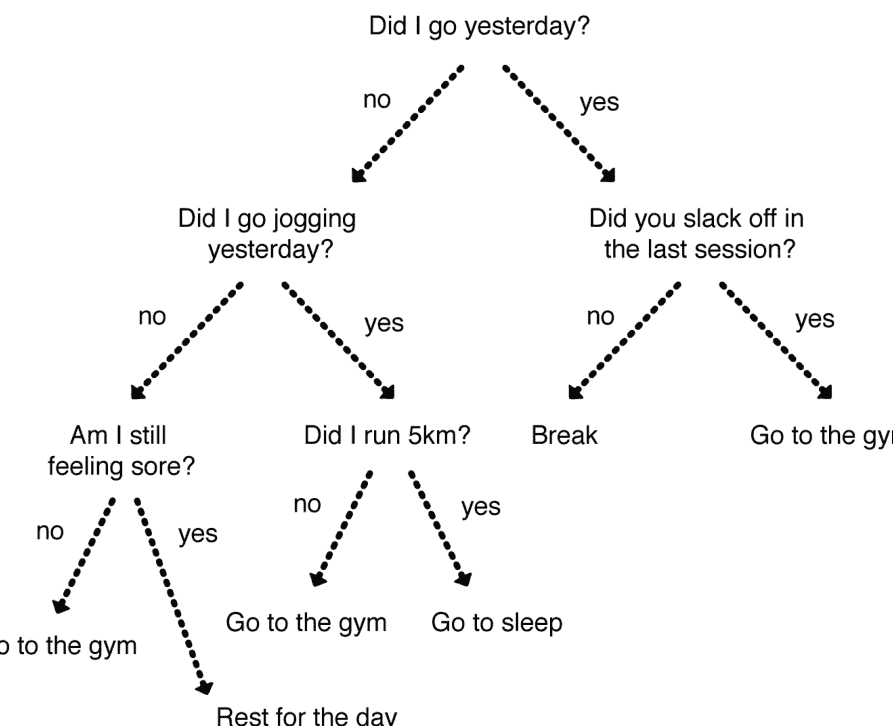

因为每个决策都消除了剩余树的一半，所以二分搜索在找到解决方案方面非常强大。由于树结构的重复性质，可以使用递归过程遍历树节点，或者使用迭代搜索（我们已经看到它更高效）。

搜索一直进行，直到我们到达某个叶节点，此时就得到了最终结果。

二叉树甚至比这更强大，因为你可以**向下遍历树**，然后通过一个称为**逆向归纳**的过程，一路反向回到**树的父节点**。这是金融期权定价的一种可能技术。

我们现在将使用前面章节的一些技术来部署一个二叉树。

特别是类。类结构非常适合树的重复性质，因为我们只需要一个类作为所有节点的蓝图，在Python中，构造看起来像这样：

```
class Node:
    """ node for the tree """

    def __init__(self, data):
        """ construct class """
        self.left = None  # a left child
        self.right = None # a right child
        self.data = data  # data at the node

    def PrintTree(self):
        print(self.data)

# instantiate node
root = Node(10)    # create instance
root.PrintTree()   # returns 10
```

现在我们有了节点的蓝图，我们可以通过在类中创建一个插入方法将其插入到树中。还应该指出的是，我们可以设置具有两个以上子节点的节点（例如，我们可以包含 self.middle）。

```
class Node:
    def __init__(self, data):
        self.left = None
        self.right = None
        self.data = data

    def insert(self, data):
        """
        a function to compare the new value with
        the parent node and add this to the tree.
        """
        if self.data:
            # whatever logic we need
            if data < self.data:
                if self.left is None:
                    self.left = Node(data)
                else:
                    self.left.insert(data)
            elif data > self.data:
                if self.right is None:
                    self.right = Node(data)
                else:
                    self.right.insert(data)
        else:
            self.data = data

    # Print the tree
    def PrintTree(self):
        if self.left:
            self.left.PrintTree()
        print(self.data),
        if self.right:
            self.right.PrintTree()

root = Node(12)    # create instance

# insert some nodes
root.insert(6)
root.insert(14)
root.insert(3)

root.PrintTree()   # returns 3, 6, 12, 14
```

现在树已经创建好了，我们可以遍历树。有三种不同的方式可以做到这一点。

- **中序遍历：** 先访问左子树，然后是根节点，最后是右子树。
- **前序遍历：** 先访问根节点，然后是左子树，最后是右子树。
- **后序遍历：** 我们遍历左子树，然后是右子树，最后是根节点。

这是我们会为前序遍历添加的额外方法。

```
def PreorderTraversal(self, root):
    res = []    # empty list to store values
    if root:
        res.append(root.data)
        res = res + self.PreorderTraversal(root.left)
        res = res + self.PreorderTraversal(root.right)
        return res
```

结果如下：

```
print(root.PreorderTraversal(root)) # 返回 [12, 6, 3, 14]
```

## 趣味问题

本节包含一些有趣且引人入胜的问题。这类问题种类繁多，而且其中一些问题有多种解决方法，因此我们只能涵盖有限的一部分。

所提出的解决方案可能并非最佳，因此如果读者对某个特定问题有更好的方法，鼓励您联系作者。

### 完美数

让我们从一个有趣的小问题开始。

如果一个数的各位数字之和恰好等于10，则该数被认为是完美数。给定一个正整数 n，返回第 n 个完美数。

例如，给定 1，你应该返回 19。给定 2，你应该返回 28，给定 123 你应该返回 1234。

这是一个很好的入门问题，因为我们可以实际运用一个函数，并且还能接触到：类型、if 语句和 for 循环。

这是一个解决方案：

```
def ten(number):
    """
    函数接收一个数字，返回使其和等于10的补数
    """
    numberstr = str(number)
    total = sum(int(x) for x in numberstr)
    if total == 10:
        return number
    elif total < 10:
        return int(numberstr + str(10 - total))
    else:
        return "Input number has digits that sum to more than 10."

# 让我们测试一下答案
for x in [3, 6, 142, 53453, 15, 363]:
    print(x, "-->", ten(x))
```

结果如下：

```
3 --> 37
6 --> 64
142 --> 1423
53453 --> Input number has digits that sum to more than 10.
15 --> 154
363 --> Input number has digits that sum to more than 10.
```

让我们看看。我们声明了一个函数并将其命名为 "ten"，因为这个名字对这个问题来说很贴切。该函数接受一个名为 "number" 的参数。

第一行将数字转换为字符串，并使用内置的 `str()` 函数将其赋值给一个名为 "numberstr" 的变量。我们这样做是因为我们知道 Python 可以将字符串视为字符列表，而我们希望单独获取每个字符，所以这是一个有用的小技巧。我们可以将所有单个数字相加，这些数字在 `sum()` 函数内部使用 `int()` 函数转换回整数，我们认出这看起来像一个列表推导式。

说起来有点绕口，但我们可以看到 Python 简洁性的威力，它将所有内容浓缩到一行逻辑代码中。

从这里开始，我们使用 if 语句进行一些逻辑检查。如果数字是 10，则函数返回该数字，因为无需做任何处理；否则，如果数字小于 10，我们计算最终数字并返回；最后，如果数字大于 10，我们返回一条相应的消息。

函数完成了，现在我们在一组数字上测试它，看看输出如何。看起来符合我们的预期。任务完成。

让我们测试一下边界情况。如果我们向列表中插入零会怎样？输出将返回 10，这是两个数字之和为 1，所以这是一个失败。你能想到如何防止这种情况吗？

你能提出一个更好或替代的解决方案吗？

### 以苹果换想法

这是一个相当不错的小轶事，不包含任何困难内容，但展示了类的使用以及交换变量（元组交换）的用法：`a,b = b,a`，以及 `if __name__ =="__main__"` 的用法，它会提升函数和类的执行。

> “如果你交换苹果，你不会得到任何东西。但如果你交换想法，你就会获得想法。”

```
def main():
    person1 = Person(5, 3)
    person2 = Person(1, 2)

    # 交换苹果
    person1.apples, person2.apples = person2.apples, person1.apples

    # 交换想法
    person1.ideas = person1.ideas + person2.ideas
    person2.ideas = person1.ideas
    print(person1)
    print(person2)

class Person:
    """ 类的描述 """

    def __init__(self, apples, ideas):
        """
        apples (int): 苹果数量
        ideas (int): 想法数量
        """
        self.apples = apples
        self.ideas = ideas

    def __repr__(self):
        """将类的对象表示为字符串"""
        return f'Person({self.apples},{self.ideas})'

if __name__=='__main__':
    """ 从命令行运行时执行此代码 """
    main()
```

这里的代码有效地总结了群体的想法（我们的群体中只有2个人，那么你如何将其扩展到n个人？），并且只是交换了苹果。

元组交换的思想只是 Python 相较于其前身语言提供的另一个便利。等效的 C++ 代码需要引入一个临时变量来执行相同的交换，如下所示：

```
#include <iostream>
using namespace std;

int main()
{
    int a = 5, b = 10, temp;

    cout << "Before swapping." << endl;
    cout << "a = " << a << ", b = " << b << endl;

    temp = a;
    a = b;
    b = temp;

    cout << "\nAfter swapping." << endl;
    cout << "a = " << a << ", b = " << b << endl;

    return 0;
}
```

Python 可以自然地处理（甚至更大的）交换。

```
a, b, c = 1, 2, 3
a, b, c = c, a, b

print(a,b,c)
```

我们在 Person 类中看到了两个魔术方法。它们是 `__init__` 和 `__repr__`。我们看到 `__init__` 用于类的初始化，因为默认情况下它是第一个运行的函数。

在 Python 中，`__repr__` 是一个特殊方法，用于将类的对象表示为字符串。`__repr__` 由内置函数 `repr()` 调用。你可以使用 `__repr__` 方法定义你自己类对象的**字符串表示**。

### 救援船

一场即将来临的飓风威胁着一个沿海城镇。

> 如果一艘救援船最多能容纳两个人，并且给定船只的最大重量限制为 k，确定需要多少艘船才能拯救所有人。

例如，给定一组体重为 [100, 200, 150, 80] 的人群，船只限制为 200，则所需的最少船只数量将是三艘。

这是一个典型的趣味问题，对于小规模人群可以用纸笔解决，但任何有意义的规模都非常适合用 Python 这样的编程语言来解决。

我们希望查看样本集中所有两人组合。如果我们能将这些配对（称为元组）放入一个列表中，那么我们就能确定所有满足重量限制的元组。

Python 有一个名为 `itertools` 的模块，它*标准化了一组快速、内存高效的工具*，特别是对于这个问题，它处理组合和排列之类的事情。

我们还可以快速对列表进行排序。因此，在示例中，排序后的列表如下所示：`[80, 100, 150, 200]`。在运行组合之前对列表进行排序的好处在于，元组是最大与最小配对，这恰好是我们想要的一个特性（即，匹配两个轻的人会浪费运力，所以我们更倾向于将重的人与轻的人匹配）。

我们可以用递归不断削减人员配对，直到没有配对剩下。因此解决方案如下所示：

```
import itertools as it
import time

# 一些人群案例
population = [30, 100, 200, 150, 80, 40, 100, 100, 100, 100, 90]
population = [10, 10, 10, 10, 10, 180, 180, 180, 180, 180]
population = [100, 200, 150, 80]
boatLimit = 200

def rescue(population, boatLimit, numBoats):
    """
    接收人群、限制并返回所需的最少船只数量
    输入：
        population: 数字数组
        limit: 数字
    返回：
        number: 最少的船只数量
    """
    population.sort(reverse=True)
    c = it.combinations(population, 2)

    viablePairs = []
    for i in c:
        # 找到有效的配对
        if i[0]+i[1] <= boatLimit:
            viablePairs.append(i)

    print('reductions made:',viablePairs)

    if len(viablePairs)==0:
        #print('no viable pairs')
        numBoats = numBoats + len(population)
        print('the number of boats:',numBoats)

    else:
        # 移除配对
        population.remove(viablePairs[0][0])
        population.remove(viablePairs[0][1])
        numBoats = numBoats + 1

        # 再次调用函数
        rescue(population, boatLimit, numBoats)


t1 = time.time()
rescue(population, boatLimit, 0)
t2 = time.time()
print('time taken:', round(t2-t1, 3), 'seconds')
```

- 再次，你能做得更好吗？
- 或者你能创建一个通用形式，让超过两个人，比如 n 个人，能装进一艘船吗？
- 我们如何用 while 循环来替代递归？

顺便提一下，我们看到所需的船只数量总是大于 `len(population)/2`，因为每艘船只能容纳两个人的规则。更重要的是，对于大型随机分布，解决方案趋近于 n/2，因为我们可以总是能找到成对的人来坐进小船。因此，统计方法可能更快。

记住，我们可以使用随机模块和列表推导式非常快速地创建一个大型随机列表，就像这样。

```python
import random
population = [random.randint(1,200) for x in range(1000)]
```

### 括号匹配

这是一个有趣的小问题，因为你使用的代码检查器在你编写代码时会多次执行此检查，这非常有用，但也是我们习以为常的事情。那么，问题如下：

*给定一个包含圆括号、花括号和方括号的字符串，返回括号是否平衡（格式良好）。*

*例如，给定字符串 "([])[]({})"，你应该返回 true。*

*给定字符串 "([)]" 或 "((()"，你应该返回 false。*

```python
openers = "[{("
closers = ")}"

# some strings for testing
inputstrings = ['([])[]({})',
                '([{}]){}',
                '[(({}]){}]',
                '([])',
                '(()',
                '(()',
                '()'
                ]

# An opener is allowed anywhere but a closer must match the last opener

def parse(inputstring):
    # Work from left to right, appending and removing from stack
    # when encountering openers and closers respectively
    stack = []
    print(f"Input is {inputstring}")

    for pos, char in enumerate(inputstring):
        if char in openers:
            stack.append(char)

        elif char in closers:
            # closer found, check last item in stack is corresponding opener
            # and if so remove it from our stack
            if not stack:
                # stack is empty so no corresponding opener exists
                print(f"Closer '{char}' found without opener at pos {pos}")
                return False

            expected_closer = closers[openers.index(stack[-1])]
            if char == expected_closer:
                stack.pop() # all good
            else:
                # an error is found
                print(f" opener or '{expected_closer}' at pos {pos}, got '{char}'")
                return False
    # End of string reached so stack should be empty
    if stack:
        print(f"Expected opener or '{expected_closer}', got END OF STRING")
        return False
    return True

for i in inputstrings:
    print(parse(i))
```

注释是内联的，以节省讨论，但读者此时应该能够逻辑地理解。

这个相对基础的括号匹配的简单规则大约需要20行代码。当我们考虑到我们所需的所有语法、拼写和语言功能时，很快就会明显看出，处理“纠正”或“建议”的模块必须非常复杂，并且已经开发多年。为此，**我们站在巨人的肩膀上**。

年长的读者可能还记得“回形针”，它有时有用，但有时却是个障碍。


存在许多边缘情况，例如笑脸 " :)" 会创建一个额外的括号并抛出未匹配括号错误，而我们实际上想要的是这个。

```python
# this is okay
print("hello world")

#Closer ')' found without preceding opener at pos 22
print("hello world :)")
```

那么，对读者来说一个好问题是，我们如何克服这个问题？以及其他类似的问题。

### 考拉兹猜想

考拉兹猜想是最简单的无人能解的数学问题。它简单到几乎任何人都能理解，但却以难以解决而闻名。

给定任何数字：

- 如果是奇数：n = n*3 + 1
- 如果是偶数：n = n/2

最终值总是一个 [4,2,1] 循环。

```python
import matplotlib.pyplot as plt
from numpy import average, std

def f(n):
    """ the function itself:

    given an input n, what is the next value
    """
    if n % 2 == 0:
        # have an even number
        v = int(n/2)
        return v
    if n%2 !=0:
        # have an odd number
        v = n * 3 + 1
        return v

def number_iterations(n):
    """ given a number n, how many steps until a solution is reached

    """
    m = [n]  # 4,2,1 loop

    for i in range(2):
        # first 3 elements of the loop
        n = f(n)
        m.append(n)
        # print(m)

    for i in range(2, 10000):
        # all the other loops
        n = f(n)
        # print(n)
        m.pop(0)
        m.append(n)
        # print(m)
        if m == [4,2,1]:
            return i


d = {}
for n in range(10_000):
    # n = 22  # initial number
    x = number_iterations(n)
    # print(n, x)
    d[n] = x

print(d.values())

# how many None's
print('number of nones', len([x for x in d.values() if x==None]) )
number_answers = [x for x in d.values() if x!=None]
print('max', max(number_answers))
print('avg', round(average(number_answers)))
print('std', round(std(number_answers)))

plt.plot(d.keys(), d.values())
plt.xlabel('number n')
plt.ylabel('number of iterations')

# giving a title to my graph
plt.title('Collatz Conjecture - iterations for n')
plt.show()
```

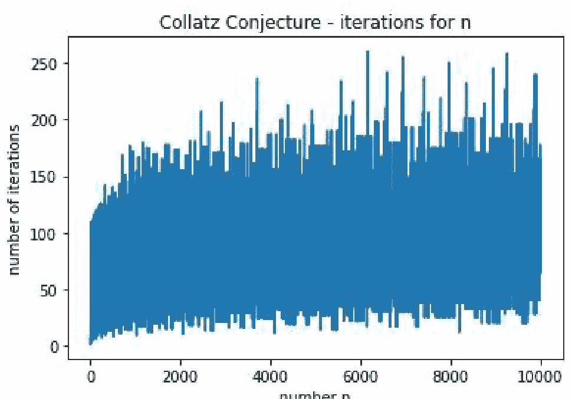

## 数据科学

数据科学结合了数学和统计学、专业编程、高级分析、人工智能和机器学习，以揭示隐藏在数据中的见解。

这些见解可用于指导决策和战略规划。

在开始一个项目时，我们通常知道最终目标是什么，但在此过程中有许多步骤。

- 数据捕获
- 数据清洗
- 处理
- 更多处理
- 产生连贯的结果

挑战在每个阶段都会加剧，通常是因为 [1] 数据的规模和 [2] 可用的处理能力和技术。

Python 有许多优秀的数据科学工具，正因如此，它近年来广受欢迎。还有大量专门针对 Python 数据科学的材料，鼓励读者阅读这些材料。

### 理解数据

数据是这个领域所做一切的基础。它以许多不同的方式收集，例如相机 CCD 阵列上的图像、大型交易数据数据库，或者通过某些研究收集的列表或 CSV 文件，这些文件可能是可下载的 Excel 或 CSV 文件，或者发布在网页上。

这种数据收集**有时很容易**，因为它已经以方便的电子同质格式出现（例如交易所特定股票的所有交易），而其他时候**相当困难**，比如缺少大量数据的人口调查。

数据收集本身就是一个编程问题，因为无论它如何收集，都需要将其转换为电子形式，以便我们有一个起始数据集来处理。

让我们以三个以不同方式收集的类似大型数据集为例。

1. 政府选举
2. 真人秀投票
3. 社交媒体民意调查

我们说数据相似，是因为它最终包含大致相同的信息。一个独特的人（投票者）及其选择（或投票）。

这个独特的人可能有一些额外的有用数据，例如：邮政编码、年收入、年龄、性别等。实际上，在 Python 中，这非常适合放入类结构或字典或列表中。

```python
class Voter:

    def __init__(self, vote, postcode, income, age, gender):
        self.vote = vote
        self.postcode = postcode
        self.income = income
        self.age = age
        self.gender = gender

# voter instances
v1 = Voter('adam apple', 'abc', 35000, 32, 'male')
v2 = Voter('brenda banana', 'def', 25000, 28, 'female')

all_voters = {1000001:v1, 1000002:v2}
```

然而，尽管最终收集的数据相同，但收集方法却大相径庭。

**对于选举**，选票通过选票收集，这些选票要么邮寄（在选举前几周寄出），要么由选民前往私人投票箱填写选票。

**对于真人秀**，选民通常已经在网站或移动应用上预先注册，或者通过电话拨入投票。

**对于社交媒体**，选民都有预先注册的账户，这将是唯一的投票方式。

我们看到，*政府选举数据缓慢而笨重*。整理信息需要大量的人力和资源（纸张、运输和人工阅读）。选民无法更改他们的选票，那些没有正确投票或无法亲自到场的人被排除在数据集之外。投票率约为65%，这意味着35%的合格选民因某种原因没有投票。尽管如此，最终的数据集很大（3000万），因为原始池大约有4500万。选票并不包含人们可能认为的丰富数据，而只是投票和一个区域。

另一方面，*真人秀投票*拥有更丰富的数据。由于许多用户已经预先注册，因此已经存在大量信息。除了电话投票外，电子投票是动态的，这意味着选民可以改变主意，这甚至可以是实时的。

最后，进入*社交媒体数据*，信息更加丰富，通常包含更详细的内容，例如个人或购物习惯。

结果是实时的。

转向其他系统，数据则要密集得多。例如，自动驾驶汽车会通过多个传感器持续收集数据，并将其输入处理系统，以实现实时校正和引导。

在这样的系统中，算法的效率必须最大化利用可用的处理能力。汽车需要在几秒钟内做出反应，而选举周期是4年，从计算角度来看，这大约是1亿倍的数量级差异。因此，我们需要考虑上述所有因素。

### 数据探索：入门

数据存储在物理存储设备上，如硬盘、USB驱动器和互联网。但它也保存在计算机的内存[3]中，以便更快地处理。

Python用于访问和处理这两部分。

让我们从一个基本的文本文件开始。我们如何将这些数据从硬盘读入计算机的RAM？

```
file_name = "C:/test/helloworld.txt"

with open(file_name) as f:
    data = f.read()

print(data)
```

这会将文件内容读入一个我们命名为`data`的变量。如果文件内容是“hello world”，那么：

data = 'hello world'

因此，Python在读取数据方面既快速又方便。用户只需要提供文件路径和名称。注意，我们喜欢使用内置的`with`语句，因为它能确保文件被正确地打开和关闭。

请注意，执行此过程所需的时间为1到2毫秒，文件越大，所需时间越长。

就像我们可以读取数据一样，我们也可以写入数据。

```
file_name = "C:/test/helloworld.txt"

# create a string to write
write_string = ""
for i in range(1000):
    write_string = write_string + 'hello world\n'

# write the string
with open(file_name, 'w') as f:
    data = f.write(write_string)
```

在一台中端PC[4]上，可以在15毫秒内写入100,000行“hello world”或2兆字节的数据。

随着数据量增大，我们需要考虑以块（chunking）的形式分块写入数据，并在每个块后追加文件，以避免内存问题。我们可以校准块大小和写入次数以优化时间。

```
# create a string to write
write_string = ""
for i in range(10_000):
    write_string = write_string + ' ' + str(i) + ' hello world\n'

# write the first block
with open(file_name, 'w') as f:
    data = f.write(write_string)

# keep adding blocks (chunks)
for i in range(450):
    print(f'adding chunk {i+1}')
    with open(file_name, 'a') as f:
        data = f.write(write_string)
```

同样，在一台中端PC上，可以在10秒多一点的时间内写入4500万行“hello world”或850兆字节的数据。这相当于为整个英国合格选民中的每一位选民写入了一条“hello world”。

### 数据探索：中级

在理解了数据的基础知识、存储位置以及如何读写数据以便我们的代码能够与之交互之后，现在是时候介绍流行的模块了。即Pandas、NumPy和SciPy。

我们已经能够向文本文件读写基本数据。我们相当快速地写了4500万次“hello world”，这让我们对速度和能力有了概念。

现在我们来看看其他数据以及我们能做什么。

显示数据最基本的方式是简单的纯文本文件格式。这已经为用户提供了充足的功能。惯例是将文本文件的行拆分为顶部的标题行，然后下面的每一行都是额外的数据行。

当数据具有结构时，我们将其拆分为多个部分。这意味着每一行包含关于一个唯一项目的多个数据片段。我们可以将其视为一个列表的列表，或者一个字典，其中键是标题，值是数据列表。但让我们从简单开始，逐步深入。

假设我们有这样一个选民表格：

| 唯一参考号 | 名字 | 地区 | 投票 |
|---|---|---|---|
| 100001 | alice | West Midlands | conservative |
| 100002 | bob | London | conservative |
| 100003 | clive | Yorkshire | labour |
| 100004 | david | London | conservative |
| 100005 | emma | London | labour |
| 100006 | fred | Yorkshire | liberal democrat |
| 100007 | gill | South East | conservative |
| 100008 | harry | London | conservative |
| 100009 | irene | London | other |

每个人被分配一个唯一的参考号，以确保他们只能投票一次。我们有名字、地区和他们的投票。这对于汇总投票来说已经足够了。

我们在文本文件中表示如下：

```
unique ref,first name,area,vote
100001,alice,West Midlands,conservative
100002,bob,London,conservative
100003,clive,Yorkshire,labour
100004,david,London,conservative
100005,emma,London,labour
100006,fred,Yorkshire,liberal democrat
100007,gill,South East,conservative
100008,harry,London,conservative
100009,irene,London,other
```

我们所做的就是用逗号分隔每个列项。我们本可以使用制表符、冒号、分号或`|`进行分隔，但逗号已经足够。如果数据中包含逗号，我们会选择另一种方法来分隔列数据。

这种格式被称为逗号分隔值（另一种流行的格式是制表符分隔值），文件扩展名为CSV。它不过是一个基本的文本文件，其中的数据行用逗号分隔。

Python有几种读取此数据的方法。

- 1. 文本：读取文本文件，然后用一段代码自己分隔数据。
- 2. 导入csv：使用内置模块处理数据。
- 3. 导入pandas：一个强大的软件库，用于处理数据。

还有其他方法，但这些是最常见的。

Python自带的内置csv模块如下所示：

```
import csv

file_name = "C:/test/example_election.txt"

data = []
with open(file_name, newline='') as csvfile:
    spamreader = csv.reader(csvfile, delimiter=',')
    for row in spamreader:
        data.append(row)
```

并生成一个列表的列表，我们将其赋值给变量`data`。

```
[['unique ref', 'first name', 'area', 'vote'],
['100001', 'alice', 'West Midlands', 'conservative'],
['100002', 'bob', 'London', 'conservative'],
['100003', 'clive', 'Yorkshire', 'labour'],
['100004', 'david', 'London', 'conservative'],
['100005', 'emma', 'London', 'labour'],
['100006', 'fred', 'Yorkshire', 'liberal democrat'],
['100007', 'gill', 'South East', 'conservative'],
['100008', 'harry', 'London', 'conservative'],
['100009', 'irene', 'London', 'other']]
```

但一个更方便的工具是pandas[5]模块。它只需2行代码就能为用户完成所有工作。

```
import pandas as pd

df = pd.read_csv("C:/test/example_election.txt")
```

并将结果推送到一个称为DataFrame的对象中，如下所示。

| 唯一参考号 | 名字 | 地区 | 投票 |
|---|---|---|---|
| 100001 | alice | West Midlands | conservative |
| 100002 | bob | London | conservative |
| 100003 | clive | Yorkshire | labour |
| 100004 | david | London | conservative |
| 100005 | emma | London | labour |
| 100006 | fred | Yorkshire | liberal democrat |
| 100007 | gill | South East | conservative |
| 100008 | harry | London | conservative |
| 100009 | irene | London | other |

对于小数据，DataFrame具有便利性（即更少的代码行）优势，但真正的优势在于数据量大时，因为其元素是连续且简洁的，因此可以更快地操作（特别是在向量化[6]的情况下），尽管并非所有情况都如此。

我们可以非常方便地执行诸如过滤列（类似于列表）之类的操作。

```
x = df['vote']=='conservative' # filter conservatives
x.sum()        # count conservatives
# returns 5
```

因此，我们只需几行代码就能计算出保守党的得票百分比：

```
x = df['vote']=='conservative' # filter conservatives
count_conserv = x.sum()        # count conservatives
count_total = df['unique ref'].count()  # total count

percent_conservative = round(count_conserv / count_total * 100, 2)
print('conservative percent is', percent_conservative, '%')
# conservative percent is 55.56 %
```

此时，我们已经在不知不觉中使用了Numpy。原因这是因为 Pandas 构建在 NumPy 之上，依赖于 ndarray 及其快速高效的基于数组的数学函数。例如，当我们统计唯一引用的计数时，我们是这样做的：

```
count_total = df['unique ref'].count() # total count
```

而如果我们想求平均值，我们会使用 `df['unique ref'].mean()`。

对 NumPy 最好的描述来自其官方网站：

> NumPy 是 Python 科学计算的基础包。它是一个 Python 库，提供了一个**多维数组对象**[7]、各种派生对象（如掩码数组和矩阵），以及一系列用于数组快速操作的**例程**，包括数学运算、逻辑运算、形状操作、排序、选择、输入/输出、离散傅里叶变换、基础线性代数、基础统计操作、随机模拟等等。

NumPy 的强大之处源于 ndarray 类及其在内存中的布局。ndarray 类包含：

1.  数据类型（全部为同一类型）。
2.  指向一块**连续**内存的指针。
3.  表示数组形状的元组。
4.  数组步幅。

形状指的是数组的维度（a*b），而步幅是在内存中遍历数组时，在特定维度上需要移动的字节数。有了这些信息，NumPy 就足以访问数组的所有元素。

NumPy 还允许**行优先**或**列优先**的存储方式，这可以通过 `order` 关键字来提高效率。一个很好的总结如下：

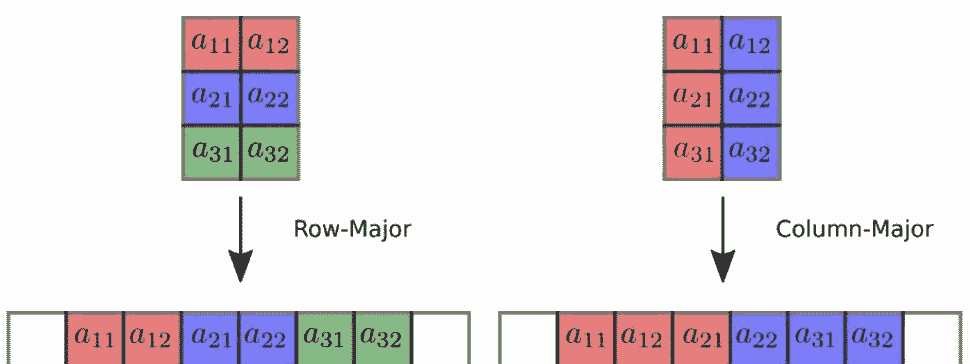

最重要的特性是与标准 Python 列表相比的连续内存块，并且每个内存块只有一种数据类型。数据可以是不同的数据类型（混合类型），但这会以效率为代价，因为列会变成一个对象[8]。此时内存分布在多个地址上。

我们可以更深入地探讨 NumPy，但就我们理解效率提升的需求而言，这些已经足够了。NumPy 的 ndarray 比 Python 列表更高效。

最基本的例子是：

```python
import numpy as np
a = np.arange(15).reshape(3, 5)

print(a)
```

这会创建一个数组：

```
array([[ 0,  1,  2,  3,  4],
       [ 5,  6,  7,  8,  9],
       [10, 11, 12, 13, 14]])
```

我们可以快速获取各种详细信息。

```
a.shape      # (3, 5)
a.ndim       # 2
a.dtype.name # 'int32'
a.itemsize   # 4 (4 bytes)
a.size       # 15
type(a)      # numpy.ndarray
```

我们可以看到，这看起来像一个具有指定大小的“特殊”类型的整数刚性列表。

我们可以这样访问 ndarray 的元素：

```
print(a[1,1])  # 返回 6
print(a[1][1]) # 返回 6
```

尽管以上两种方式看起来相同，但第一种方法（大约）快两倍，因为它通过 C 语言访问 NumPy API。而方法 2 先返回 [1] 处的切片，然后在切片的 [1] 处进行索引。

最后，我们来看看 scipy，这是另一个模块。然而，SciPy 和 NumPy 之间有着紧密的关系，以至于整个 numpy 命名空间都被包含在 scipy 中，这可以从 SciPy 的 `__init__` 方法中的这一行看出：

```
from numpy import *
```

SciPy 构建在 NumPy 之上。

### 数据可视化

Matplotlib；Seaborn；

到目前为止，我们已经研究了数据处理。我们可以通过终端或 pandas dataframe 来转换和输出数据，或者写入文件。

然而，到目前为止，我们还没有进行任何形式的可视化。所以让我们开始吧。我们从 Matplotlib 开始。

Matplotlib 是一个用于在 Python 中创建静态、动画和交互式可视化的综合库。Matplotlib 让简单的事情变得简单，让困难的事情变得可能。

我们经常会看到 Matplotlib 与 Numpy、Pandas 或 Scipy 一起出现。这是因为，与其他模块一样，Matplotlib 再次利用了快速的 Numpy ndarray。

为了快速入门，基本示例如下：

```python
import matplotlib.pyplot as plt
import numpy as np

x = np.linspace(0, 2 * np.pi, 200)
y = np.sin(x)

fig, ax = plt.subplots()
ax.plot(x, y)
plt.show()
```

这会快速生成一个正弦波，并方便地将结果绘制到图表中。

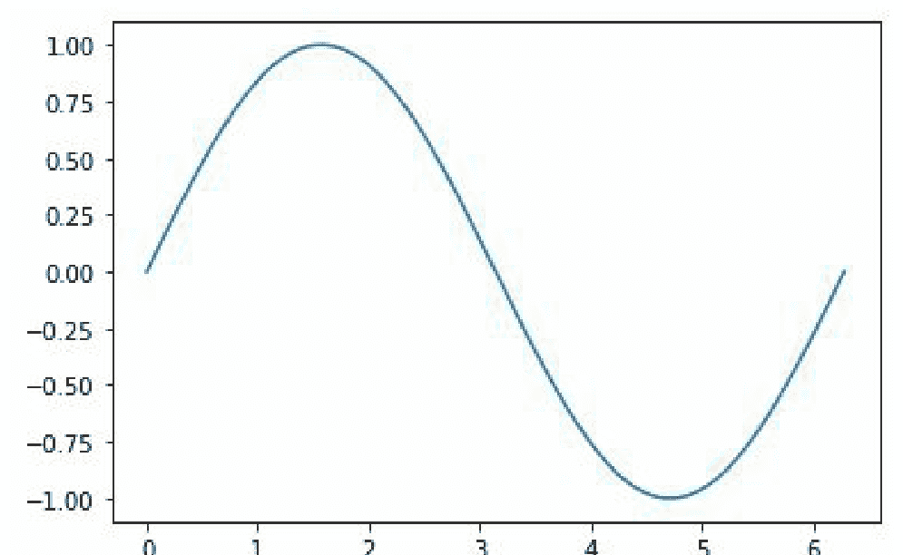

我们可以更改绘图类型，像这样：

```python
import matplotlib.pyplot as plt
import numpy as np

# 生成数据：
np.random.seed(3)
x = 0.5 + np.arange(8)
y = np.random.uniform(2, 7, len(x))

# 绘图
fig, ax = plt.subplots()

ax.bar(x, y, width=1, edgecolor="white", linewidth=0.7)

ax.set(xlim=(0, 8), xticks=np.arange(1, 8),
       ylim=(0, 8), yticks=np.arange(1, 8))

plt.show()
```

这会得到：

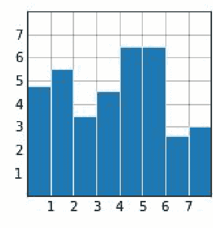

以及更复杂的数据，像这样：

```python
import matplotlib.pyplot as plt
import numpy as np

# 生成数据：
np.random.seed(1)
x = np.random.uniform(-3, 3, 256)
y = np.random.uniform(-3, 3, 256)
z = (1 - x/2 + x**5 + y**3) * np.exp(-x**2 - y**2)
levels = np.linspace(z.min(), z.max(), 7)

# 绘图：
fig, ax = plt.subplots()

ax.plot(x, y, 'o', markersize=2, color='lightgrey')
ax.tricontour(x, y, z, levels=levels)

ax.set(xlim=(-3, 3), ylim=(-3, 3))

plt.show()
```

这会产生：

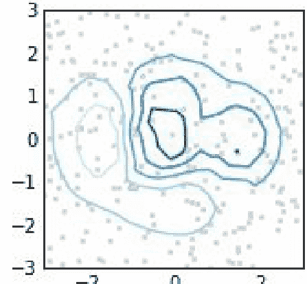

我们继续，注意到绘图类型非常广泛，所以只需要知道**选项非常丰富**[9]，并且生成图表的代码结构大约是 10 到 20 行代码，每次都很相似。

- 获取或创建数据
- 组织数据并设计图表外观
- 绘制图表（使用 `plt.show()`）

我们现在可以开始进行统计分析了。假设我们有 x 和 y 点，我们想找到一个简单的关系并绘制一条最佳拟合线。结合 numpy 和 matplotlib，这很容易实现。

```python
import matplotlib.pyplot as plt
import numpy as np

# 创建 x 和 y 点
x = np.linspace(0, 10, 50)
y = np.random.random(50) * np.linspace(0,10,50)

# 拟合一条线性曲线并估计其 y 值及其误差。
a, b = np.polyfit(x, y, deg=1)
y_est = a * x + b

fig, ax = plt.subplots()
ax.plot(x, y, '.', color='green')
ax.plot(x, y_est, '--', color='red')

plt.show()
```

这是分别针对 50 个点和 500 个点的结果：

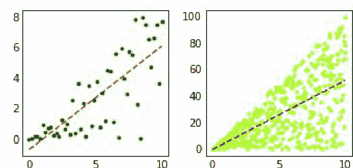

我们能够快速生成并绘制许多点，并反复生成**最佳拟合线**（同时调整参数和颜色）。

我们使用了一个函数来进行曲线（或直线）拟合，即 `polyfit(x,y, deg=1)`。如果我们使用 `deg=2`，那么我们将得到二次拟合，`deg=3` 则是三次拟合，依此类推。这就是我们所需要的全部。结果被解包[10]为系数。

这是进入数据科学以及我们拥有哪些工具和技术来描述、解释甚至预测数据的漫长旅程的开始。

或者，通过拟合的标准差变得更聪明一点：

```python
import matplotlib.pyplot as plt
import numpy as np

# 创建 x 和 y 点
n = 100
x = np.linspace(0, 10, n)
y = np.random.random(n) * np.linspace(0,10,n)

# 拟合一条线性曲线并估计其 y 值及其误差。
a, b = np.polyfit(x, y, deg=1)
y_est = a * x + b
y_err = np.sqrt(y.std()) # 一个误差估计器

fig, ax = plt.subplots()
ax.fill_between(x, y_est - y_err, y_est + y_err, color='yellow', alpha=0.75)
ax.plot(x, y, '.', color='green')
ax.plot(x, y_est, '--', color='red')

plt.show()
```

这会得到：

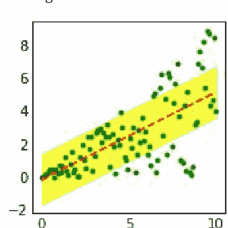

一个很好的收获是，这使用 Python 相对快速地实现了，并且在所有行业都有用例，如金融、工程、零售、学术界等等。

我们本可以研究曲面、三维、n 维动画，因此读者有很大的空间来扩展他们的知识。

### 机器学习

我们可以将其定义为任何监督或无监督学习任务（不包括深度学习）。Scikit-learn 是实现分类、回归、聚类等的主要工具模块（尽管也存在其他模块，如 OpenCV 和 TensorFlow）。

机器学习利用统计技术赋予计算机算法从过去经验中学习并执行特定任务的能力。

因此，我们接触了数据可视化。我们能够从各种基本统计中显示图表。我们在一个线性随机分布上使用了最佳拟合线，但我们同样可以轻松地部署许多其他拟合和分布。

我们轻松地乘以了 numpy 数组（向量的点积）：

```
y = np.random.random(n) * np.linspace(0,10,n)
```

以创建因变量 y，并且可以轻松地添加一个对数正态分布或其他非线性分布。

```python
import matplotlib.pyplot as plt
import numpy as np

# create x and y points
n = 100
x = np.linspace(0, 10, n)
y = np.random.random(n) * x * 100

# fit a linear curve an estimate its y-values and their error.
a, b, c = np.polyfit(x, y, deg=2)
y_est = (a * x * x) + (b * x) + c
y_err = y.std()

fig, ax = plt.subplots()
ax.fill_between(x, y_est - y_err, y_est + y_err, color='yellow', alpha=0.75)
ax.plot(x, y, '.', color='green')
ax.plot(x, y_est, '--', color='red')

plt.show()
```

得到如下结果：

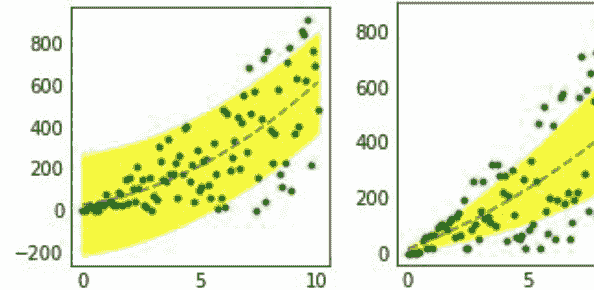

我们可以创建拟合数据的分布。常见的有正态分布和对数正态分布。它们的生成方式如下：

```python
import math
import numpy as np
from scipy.stats import lognorm
import matplotlib.pyplot as plt

#make this example reproducible
np.random.seed(1)

#generate log-normal distributed random variable with 1000 values
avg, std = 1, 1
lognorm_values = lognorm.rvs(s=std, scale=math.exp(avg), size=1000)

#view first five values
lognorm_values[:50]

#create histogram
plt.hist(lognorm_values, density=True, edgecolor='black', bins=100, label='log normal')
plt.legend(loc='best', frameon=False)
plt.show()
```

并产生如下结果

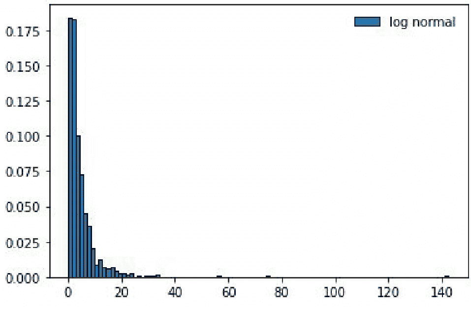

我们可以查看均值、标准差、四分位数、置信水平等统计数据。数据可能存在于主体中，也可能被归类为异常值。例如，距离数据集均值超过3个标准差的数据点，这属于回归类型模型。

我们也可以有决策树类型的模型。我们在二叉树中已经了解了其基础，其中树的每个节点都是一个决策，更多的节点通常意味着更高的准确率。Python中的sklearn模块为我们提供了一整套分类工具。例如，下面是一个针对流行数据集iris[11]的开箱即用的决策树分类器。

```python
from sklearn.datasets import load_iris
from sklearn.model_selection import cross_val_score
from sklearn.tree import DecisionTreeClassifier
clf = DecisionTreeClassifier(random_state=0)
iris = load_iris()
cross_val_score(clf, iris.data, iris.target, cv=10)
```

返回如下列表

```
array([1.        , 0.93333333, 1.        , 0.93333333, 0.93333333,
       0.86666667, 0.93333333, 1.        , 1.        , 1.        ])
```

可以输入到DecisionTreeClassifier模型中的输入（参数）数量反映了其潜在的复杂性，而这只是众多模型中的一种。因此，我们刚才只是触及了皮毛。

文档允许以下参数：

```
class sklearn.tree.DecisionTreeClassifier(*, criterion='gini', splitter='best', max_depth=None,
min_samples_split=2, min_samples_leaf=1, min_weight_fraction_leaf=0.0, max_features=None,
random_state=None, max_leaf_nodes=None, min_impurity_decrease=0.0, class_weight=None,
ccp_alpha=0.0)
```

仅这个问题的范围就足以占据本书的剩余篇幅。然而，需要注意的重要一点是，（鸢尾花数据集）数据如下所示：

### 前三个主成分方向

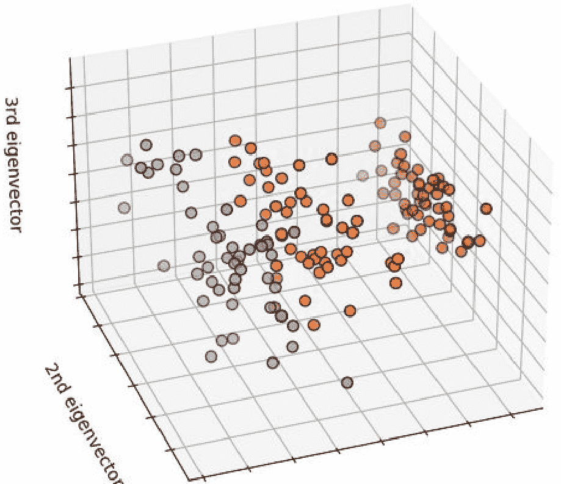

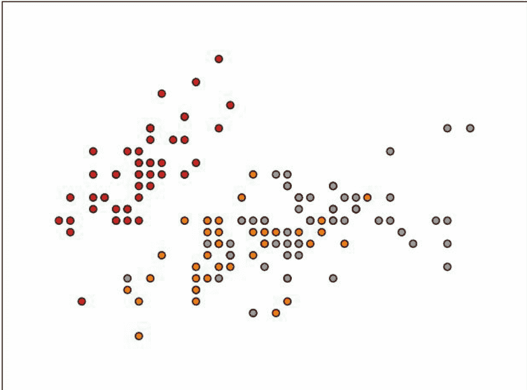

重要的是，该模型根据现有信息对花的类型进行分类。例如，给定较短的萼片长度和较高的萼片宽度，模型会预期该花的类型属于红色数据点所在的类别。

我们已经进入了逻辑回归的领域，它与线性回归相似，但不要混淆。逻辑回归用于建模有限数量结果（通常是两种）的概率。

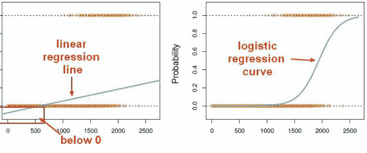

本质上，逻辑方程的创建方式使得输出值只能在0和1之间。

现在我们来看支持向量机（SVM），这是另一种监督分类技术。

给定两类数据。SVM将找到一个超平面或两类数据之间的边界，以最大化两类之间的间隔。

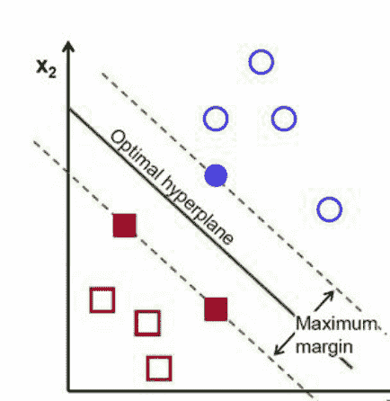

有许多平面可以分隔这两类，但我们寻求一个单一的平面，以最大化两类之间的间隔（或距离），即图中的蓝色和红色点。

与监督学习不同，无监督学习用于从输入数据中推断和发现模式，而不依赖于标记的结果。

其中一种方法是聚类，涉及数据点的分组或聚类。我们已经开始接触这一点，但让我们使用sklearn的knn[12]分类器KNeighborsClassifier进行更深入的探讨。

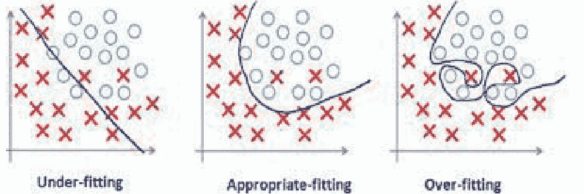

无论使用哪种技术，任务本质上都是尽可能好地对数据进行分类。

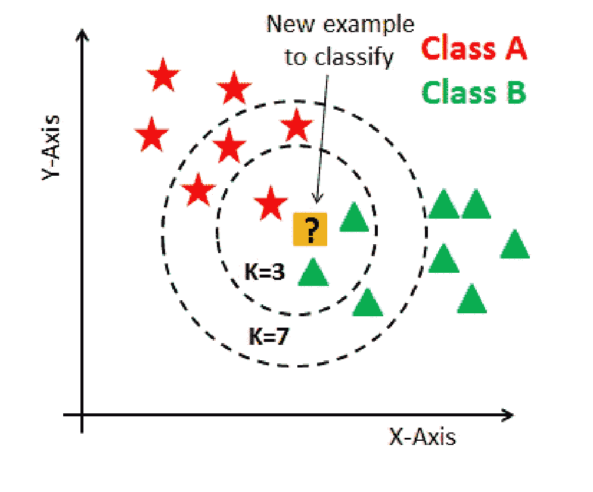

KNN是一种非常有趣的技术。K是最近邻的数量，这是核心决定因素。使用简单的计数算法，如果k是奇数会有所帮助，因为我们不希望出现平局决策。

寻找距离有不同的、有趣的度量方法，例如：

- 欧几里得距离
- 汉明距离
- 曼哈顿距离
- 闵可夫斯基距离

但本质上，每种方法都试图达到相同的结果。

像KNN这样的技术在特征数量较少时表现更好。当特征数量增加时，所需的数据量也会增加。这被称为维度灾难。

最后，我们如何决定最近邻的数量？这些都是需要考虑的因素，因此也是我们所见模型的输入参数。

以上所有内容展示了算法背后的复杂性，但我们关注的是Python实现以及一些用例和示例。

```python
X = [[0], [1], [2], [3]]
y = [0, 0, 1, 1]

from sklearn.neighbors import KNeighborsClassifier
neigh = KNeighborsClassifier(n_neighbors=3)
neigh.fit(X, y)

print(neigh.predict([[1.1]]))

print(neigh.predict_proba([[1.1]]))
```

那么让我们从这个使用KNeighborsClassifier方法的例子开始，它返回如下结果：

```
[0]
[[0.66666667 0.33333333]]
```

基本上，模型对于示例代码前两行中给定的x,y数据返回零，以及相应的概率（67% 对 33%），记住概率空间总和为100%。

在下一个例子中，我们从一个表示数据集的数组构建一个NearestNeighbors类，并询问谁是[1,1,1]的最近点。

```python
samples = [[0., 0., 0.], [0., .5, 0.], [1., 1., .5]]
from sklearn.neighbors import NearestNeighbors
neigh = NearestNeighbors(n_neighbors=1)
neigh.fit(samples)

print(neigh.kneighbors([[1., 1., 1.]]))
```

返回如下结果：

```
(array([[0.5]]), array([[2]], dtype=int64))
```

告诉我们“距离”是0.5，并且它是samples列表中的第三个元素（记住索引从零开始）。

在所有理论结束时，展示好的代码是很好的。这里是scikit-learn中10个分类器的比较。这个例子的目的是说明不同分类器决策边界的性质。

```python
# standard imports
import numpy as np
import matplotlib.pyplot as plt
from matplotlib.colors import ListedColormap

# import models
from sklearn.model_selection import train_test_split
from sklearn.preprocessing import StandardScaler
from sklearn.datasets import make_moons, make_circles, make_classification

# import the classifiers
from sklearn.neural_network import MLPClassifier
from sklearn.neighbors import KNeighborsClassifier
from sklearn.svm import SVC
from sklearn.gaussian_process import GaussianProcessClassifier
from sklearn.gaussian_process.kernels import RBF
from sklearn.tree import DecisionTreeClassifier
from sklearn.ensemble import RandomForestClassifier, AdaBoostClassifier
from sklearn.naive_bayes import GaussianNB
from sklearn.discriminant_analysis import QuadraticDiscriminantAnalysis
from sklearn.inspection import DecisionBoundaryDisplay

names = [  # names of classifiers
    "Nearest Neighbors",
    "Linear SVM",
    "RBF SVM",
    "Gaussian Process",
    "Decision Tree",
    "Random Forest",
    "Neural Net",
    "AdaBoost",
    "Naive Bayes",
    "QDA",
]

classifiers = [  # models
```

## 金融

Python 是一种*通用高级编程语言*，它非常适合金融领域，主要因为它在电子表格和低级语言之间架起了一座非常具体的桥梁。

| 类型 | 示例 | 难度 | 计算能力 | 构建时间 |
|---|---|---|---|---|
| 电子表格（代码） | excel | 简单 | 慢 | 快 |
| 高级代码 | python | 中等 | 中等 | 中等 |
| 低级代码 | c++ | 困难 | 快 | 快 |

其语法简洁，处理列表和数组相对直接。该语言能与系统的其他部分良好连接。访问数据库以及读写文件都很方便。

Python 具备一定程度的自动化能力，这超出了 Excel 的范畴，并且比（更强大的）C++ 等开发周期更长的语言更易于使用。

因此，Python 非常适合用于原型开发。例如，让我们看看对数正态分布，这是金融领域乃至任何具有零下限且本质上是随机的生物系统中最常见的分布之一。

- 取一组随机变量。
- 取这些变量的对数：$y = \ln(x)$

我们知道，因变量 y 是 x 的某个函数，而在对数正态分布的情况下，它是 x 的自然对数的某个函数。

$y = f(x) \Leftrightarrow x = f^{-1}(y)$

$y = \ln(x) \Leftrightarrow x = e^y$

这里我们设定均值 $\mu$ 和标准差 $\sigma$。

$y = \mu + \sigma x$

如果 x 是正态分布，那么 $\mu + \sigma x$ 也是正态分布，因为这些变换只是缩放分布，而不影响正态性，这意味着 x 的对数服从正态分布。

对数正态分布满足以下条件：

$$f(x) = \frac{1}{x\sigma\sqrt{2\pi}}e^{-\left(\frac{(\ln x - \mu)^2}{2\sigma^2}\right)}$$

这在 Python 中很容易实现。

```python
import math
import numpy as np
import statistics as sts
from matplotlib import pyplot as plt

n = 1000           # number of samples
avg, std = 100, 0.2 # avg , std
mu = math.log(avg)
sigma = math.sqrt(std)
y = np.random.lognormal(mean=mu, sigma=sigma, size=n)

print('avg:', round(sts.mean(y), 2))
print('std:', round(sts.stdev(y), 2))

fig, ax = plt.subplots(1,2)

ax[0].plot(y, '+')
# plt.show()
ax[1].hist(y, bins=int(n/10), orientation='horizontal')
ax[1].set_yticks([])
plt.show()
```

顶部的导入提供了执行所有基本数学运算的工具，整个分布由 `np.random.lognormal()` 函数生成。
我们能够使用 matplotlib 绘制此图，显示 1000 个点，同时绘制一个横向的直方图来表示数据的频率。

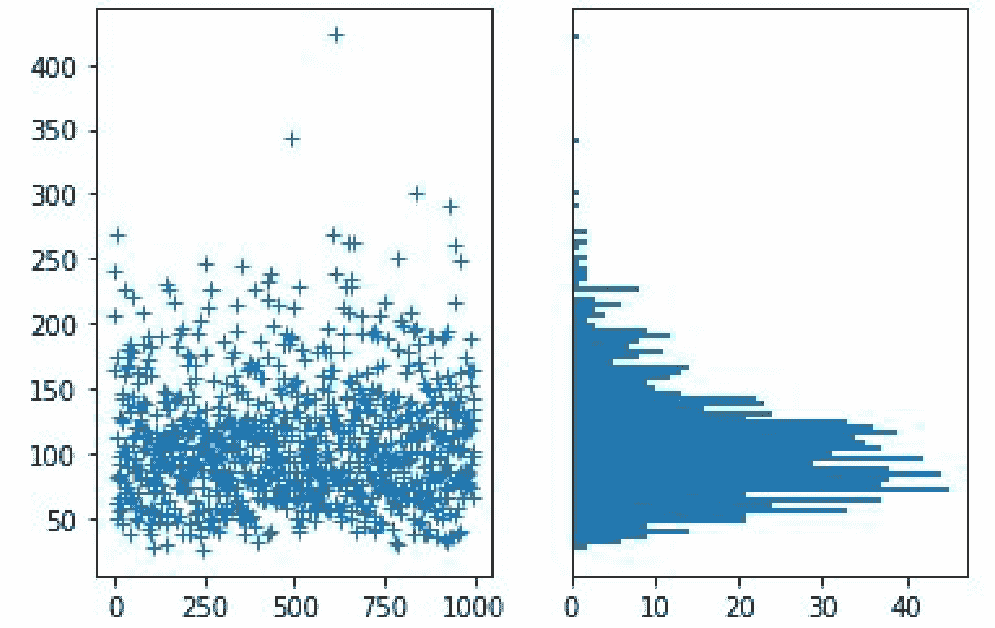

对于这个特定的图表，平均值为 108.36，标准差为 47.59。我们可以多次运行这个程序，这将创建许多外观相似的随机分布。
多次运行模拟是一种常见技术，尤其是在计算能力日益增强的今天，这被称为蒙特卡洛模拟，并有多种形式。

### 时间序列

时间序列很重要，因为它代表了一个函数（价格）随时间的演变。在金融领域，使用其他价值指标，例如债券收益率或利差（即收益率之间的差异）。

我们经常看到，当市场正在消除风险时，价格下跌而收益率上升或利差扩大；相反，当市场正在增加风险时，价格上涨而收益率下降或利差收窄。

我们可以捕获这些数据，对其进行测量和分析，并对我们所测量的系统做出各种统计陈述。

有几种方法，但让我们尝试以下两种：

- 通过创建随机游走生成我们自己的样本数据。
- 我们可以下载一个常用的数据集。

随机游走很有趣，我们可以用它做很多事情，而且它非常适合测试我们已经讨论过的一些技术，并且具有现实世界的应用。

在最简单的情况下，我们从一个价格开始，让它在离散的时间间隔（如天）上演变。因此，我们可以说明天的价格是今天价格的某个函数，或者等价地说，下一个价格取决于前一个价格以及用户设置的一些其他输入参数。

$$P_{n+1} = f(P_n)$$

对于股票价格，我们可以粗略地假设存在一个向上的漂移，在此基础上我们可以添加一个随机值来代表未知的波动率成分，所以我们有：

$$P_{n+1} = (\alpha + \beta_n)P_n$$

其中 $\alpha$ 是一个预定义的常数，$\beta_n$ 是在每一步生成的随机数。所以我们有一个**漂移**和一个**扩散**。

假设在一年的时间里，价格应该上涨 5%，没有波动（即，$\beta_n = 0, \forall n$）。那么以下等式成立：

$$P_{365} = \alpha^{365}P_0$$

因此，项 $\alpha^{365}$ 等于 1.05。于是我们可以解出 $\alpha$。

$\alpha = 1.05^{1/365}$

如果我们引入一个合适的波动率，例如 $\beta = \frac{random(0,1)}{100}$，那么就可以尝试进行合理的随机游走。

同样，我们用 30 行代码来实现它。

```python
import random
from matplotlib import pyplot as plt

start_price = 100
number_of_steps = 365

# 5% over a 1-year period
drift = pow(1.05, 1/365)

def random_walk():
    """a random walk function"""
    p = [start_price]
    for i in range(number_of_steps):
        vola = (random.random() - 0.5)/100
        p_next = (drift + vola) * p[i]
        p.append(p_next)

    return p

# lets do 100 random walks (list comprehension)
walks = [random_walk() for x in range(100)]

# plot all the paths
for i in walks:
    plt.plot(i)

plt.show()
```

这是使用上述模型，模拟 10 次随机游走，每次游走包含 365 个日步长，历时 1 年的结果。

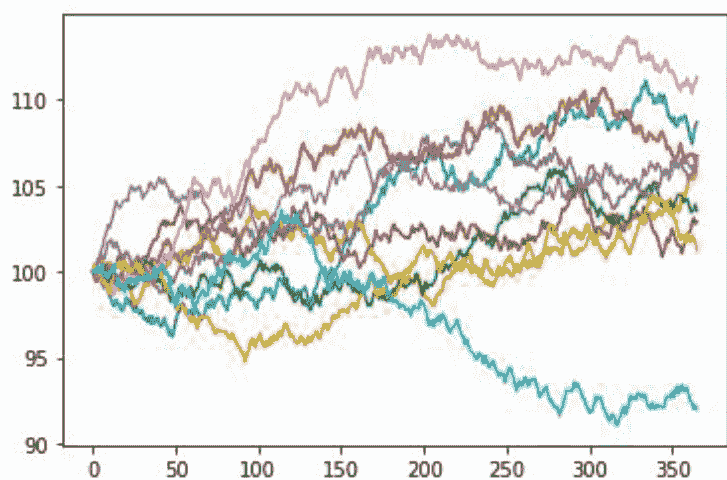

而这是 100 次游走的样子：

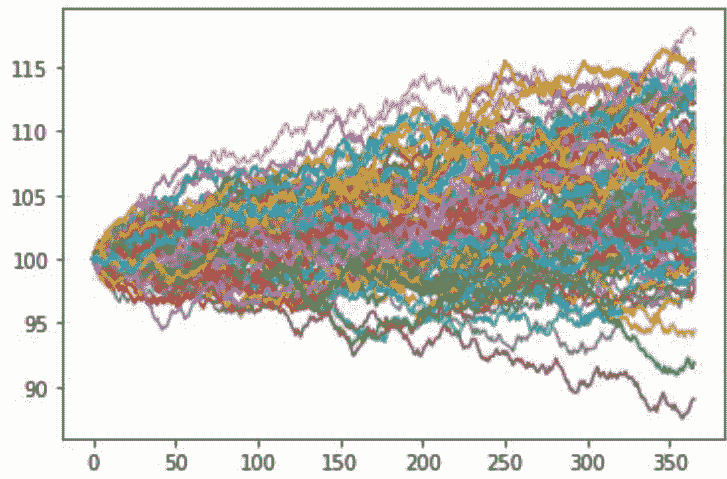

我们本可以基于复杂的参数模拟成千上万次具有多种结果的游走，这在其他学科中很常见，例如天气预报或工程问题，那里的模型复杂且计算密集。

特别是，如果我们考虑一个随时间演变的天气系统，示例中使用的一维时间步长变成了随时间演变的三个空间维度（因此是 4 个维度），突然之间，我们的 365 次计算就增长到了 365³ 次（大约 5000 万次计算）。

如果我们考虑英国大约 240,000 平方公里的天气系统，并考虑 1 公里的立方体，那么模型仅基础覆盖区域就需要 250 个立方体。如果我们想将精度提高到 1 米的方块，对于单次演化迭代，这将迅速分化为 2.4 亿个体积。突然之间，计算系统就面临挑战了。

接下来我们看一个常见的数据集，这可以是任何数据集，但我们以富时 100 指数为例，这是一个追踪英国市值前 100 支股票的指数。

我们有 25 年的数据，假设每年 250 个工作日，大约有 6250 个数据点。每天有 4 个数据点 [开盘价, 最高价, 最低价, 收盘价]。

数据有两种可下载的格式。一种是我们之前章节讨论过的 CSV 文件，另一种是 JSON[13] 文件。

使用任一格式，我们都可以通过 `pandas.read_csv()` 或 `pandas.read_json()` 方法快速将数据下载到 pandas 数据框中。

JSON 格式的一个摘录如下所示：

```json
[{"Symbol":"UKX:IND","Date":"01/09/2022","Open":7284.15000,"High":7284.15000,"Low":7131.69000,"Close":7148.50000},
{"Symbol":"UKX:IND","Date":"31/08/2022","Open":7361.63000,"High":7378.44000,"Low":7263.62000,"Close":7284.15000},
{"Symbol":"UKX:IND","Date":"30/08/2022","Open":7427.31000,"High":7486.40000,"Low":7351.12000,"Close":7361.63000},
{"Symbol":"UKX:IND","Date":"26/08/2022","Open":7479.74000,"High":7530.65000,"Low":7422.02000,"Close":7427.31000},
{"Symbol":"UKX:IND","Date":"25/08/2022","Open":7471.51000,"High":7535.70000,"Low":7469.17000,"Close":7479.74000},
{"Symbol":"UKX:IND","Date":"24/08/2022","Open":7488.11000,"High":7488.12000,"Low":7410.40000,"Close":7471.51000},
{"Symbol":"UKX:IND","Date":"23/08/2022","Open":7533.79000,"High":7533.79000,"Low":7467.56000,"Close":7488.11000},
{"Symbol":"UKX:IND","Date":"22/08/2022","Open":7550.37000,"High":7550.41000,"Low":7491.26000,"Close":7533.79000},
{"Symbol":"UKX:IND","Date":"19/08/2022","Open":7541.85000,"High":7578.85000,"Low":7513.26000,"Close":7550.37000},
{"Symbol":"UKX:IND","Date":"18/08/2022","Open":7515.75000,"High":7541.89000,"Low":7493.66000,"Close":7541.85000},
```

我们看到它看起来像一个 Python 字典的列表。而实际下载的汇总数据将如下所示：

| | Symbol | Date | Open | High | Low | Close |
|---|---|---|---|---|---|---|
| 0 | UKX:IND | 01/09/2022 | 7284.15 | 7284.15 | 7131.69 | 7148.50 |
| 1 | UKX:IND | 31/08/2022 | 7361.63 | 7378.44 | 7263.62 | 7284.15 |
| 2 | UKX:IND | 30/08/2022 | 7427.31 | 7486.40 | 7351.12 | 7361.63 |
| 3 | UKX:IND | 26/08/2022 | 7479.74 | 7530.65 | 7422.02 | 7427.31 |
| 4 | UKX:IND | 25/08/2022 | 7471.51 | 7535.70 | 7469.17 | 7479.74 |
| ... | ... | ... | ... | ... | ... | ... |
| 6315 | UKX:IND | 18/09/1997 | 4994.50 | 5057.80 | 4993.60 | 5046.20 |
| 6316 | UKX:IND | 17/09/1997 | 5025.40 | 5035.30 | 5002.30 | 5013.10 |
| 6317 | UKX:IND | 16/09/1997 | 4892.80 | 4977.30 | 4876.80 | 4976.40 |
| 6318 | UKX:IND | 15/09/1997 | 4876.30 | 4902.90 | 4864.60 | 4902.90 |
| 6319 | UKX:IND | 12/09/1997 | 4851.20 | 4878.00 | 4833.90 | 4848.20 |

6320 行 × 6 列

经过初步的目视检查，这看起来没问题。但是，如果数据有错误，我们就会收到错误提示。

例如，最初尝试导入数据框时出现了这个错误：

UnicodeDecodeError: 'utf-8' codec can't decode byte 0xff in position 0: invalid start byte

我们迅速在 stackoverflow 上搜索，发现其他用户通过将编码类型更改为 'utf-16' 解决了这个问题。这些通常是我们会遇到的这类小问题。

我们通过 `pip install` 安装了一个专门用于金融图表的新库 (mplfinance)，并运行以下代码：

```python
import mplfinance as mpf
import pandas as pd

df = pd.read_csv("C:/Users/admin/Downloads/markets_historical_ukx_ind.csv",
    encoding = 'utf-16')

# format the data
df['Date']=pd.to_datetime(df['Date'],format='%d/%m/%Y').dt.date
df.index= pd.DatetimeIndex(df['Date'])
df = df.drop(['Date'], axis=1)

# https://github.com/matplotlib/mplfinance#usage
mpf.plot(df, type='candle', style='charles', mav=(360),
         warn_too_much_data=10000)
```

得到这个结果：

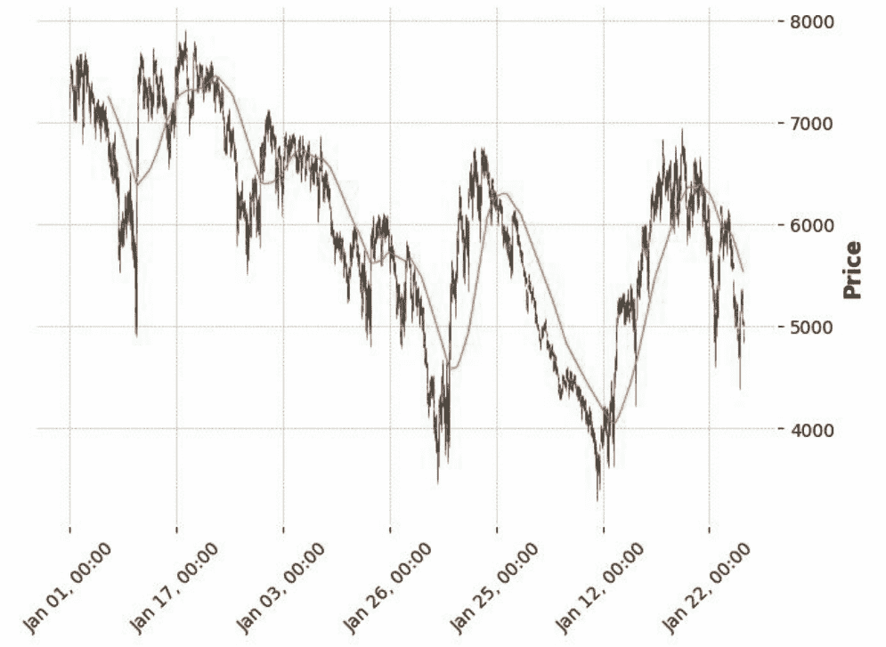

这是带有 360 天移动平均线的开盘价、最高价、最低价、收盘价数据。

### 清洗数据

在我们费尽周折将数据获取到易于读取并转换到代码中的格式后，接下来的任务是数据清洗和格式化。

这项任务中最不光鲜的部分就是清洗和格式化数据。这是因为外部世界看不到数据清洗过程的努力，而这部分工作往往远大于输出结果。

例如，在下载富时 100 数据时，我们必须将原始数据转换为模块可接受的格式（我们本可以选择不同的图表模块），该格式需要如下所示：

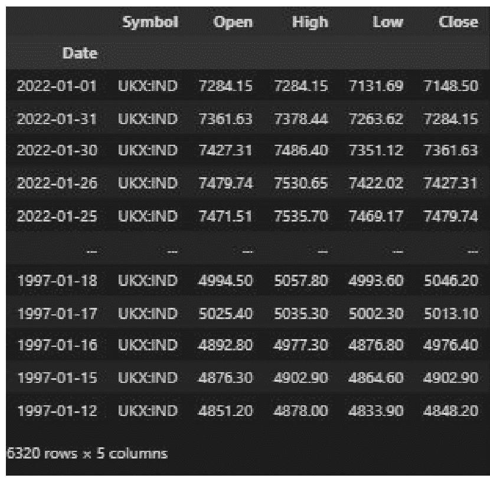

虽然格式看起来与原始数据下载非常相似，但存在以下问题：

- 数据框索引需要是日期时间格式。
- 日期列是一系列字符串，需要转换为日期时间。
- 列的顺序。

这些对于绘制该特定的蜡烛图都是必要的，缺少任何一项，代码都会抛出相应的错误。而逐一弄清楚每一项是很耗时的。

### 移动平均线

我们提供的图表有一个关键字参数 `mav=()`，允许用户绘制移动平均线或一系列移动平均线。

```python
import pandas as pd
from matplotlib import pyplot as plt

df = pd.read_csv("C:/Users/admin/Downloads/markets_historical_ukx_ind.csv",
    encoding = 'utf-16')
df['Date']=pd.to_datetime(df['Date'], format='%d/%m/%Y')

df = df.head(365)
df

fig, ax =  plt.subplots()

ax.plot(df['Date'],  df['Open'], '-', color='yellow', label='Open')
ax.plot(df['Date'],  df['High'], '_', color='green', label='high')
ax.plot(df['Date'],  df['Low'], '_', color='red', label='low')
ax.plot(df['Date'],  df['Close'], '-', color='orange', label='Close')
fig.autofmt_xdate()
ax.legend()

plt.show()
```

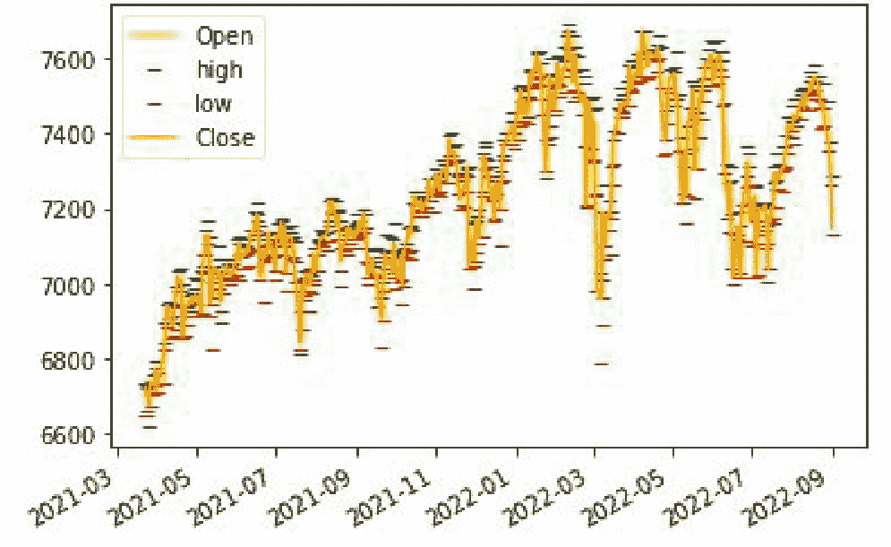

然而，我们可以通过向数据框添加新列来改进它。例如，我们添加一个移动平均线列和一个指数移动平均线列。

df['ma'] = df['Close'][::-1].rolling(window=5).mean()
df['ema'] = df['Close'][::-1].ewm(com=0.5).mean()

fig, ax = plt.subplots()

ax.plot(df['Date'], df['ma'], '-', color='blue', label='ma')
ax.plot(df['Date'], df['ema'], '-', color='green', label='ema')
ax.plot(df['Date'], df['Close'], '_', color='orange', label='Close')
fig.autofmt_xdate()
ax.legend()

plt.show()

这意味着我们可以将两者与每日收盘价一起绘制，例如，效果如下所示：

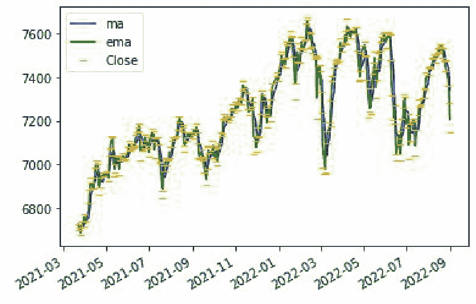

但实际上，我们可以对数据进行任何逻辑测试，并在图表上将其标记为交易信号或关注点。

完成此类任务的第一步是在数据框中创建一个新的关注列。例如，假设我们想要找出市场中的回撤[14]。那么我们可能会开始寻找行之间的差异，作为指数移动平均值的百分比。

然后我们可以这样做：

df['ma'] = df['Close'][::-1].rolling(window=5).mean()
df['ema'] = df['Close'][::-1].ewm(com=0.5).mean()
df['diff'] = df['Close'][::-1].diff(periods=5)
df['dd'] = df['diff'] / df['ema']

fig, ax = plt.subplots(2)

# ax[0].plot(df['Date'], df['ma'], '-', color='blue', label='ma')
ax[0].plot(df['Date'], df['ema'], '-', color='green', label='ema')
ax[0].plot(df['Date'], df['Close'], '_', color='orange', label='Close')
ax[0].legend()

ax[1].plot(df['Date'], df['dd'], '-', color='red', label='drawdown')
ax[1].legend()

fig.autofmt_xdate()

plt.show()

这将生成如下图表：

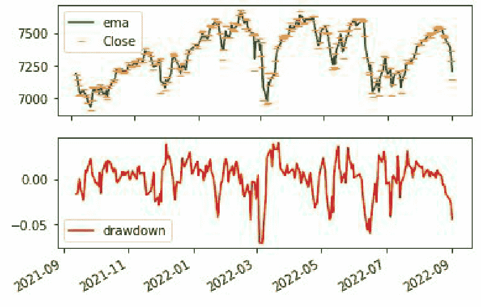

然后，我们可能会开始通过寻找那些超过某种阈值水平（如移动标准差或绝对值）的值，将这些值标记到系统中。

# find dates of interest

dd_dates = df[df['dd']<-0.05]['Date']
for dd in dd_dates:
    ax[1].axvline(x=dd, color='yellowgreen')
ax[1].legend()

我们查找并标记出在任何5天期间内回撤超过5%的日期。这在视觉上返回结果，并且可以根据用户要求作为列表、文本或json文件传递到系统中。

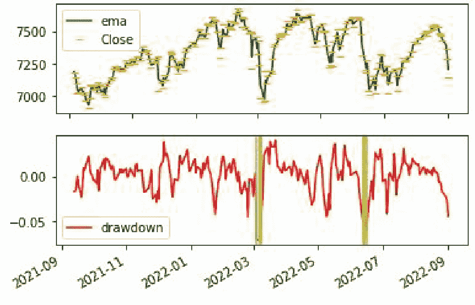

或者，考虑到所有6250行数据，我们找出所有在10天期间内回撤>10%的时期，如下所示：

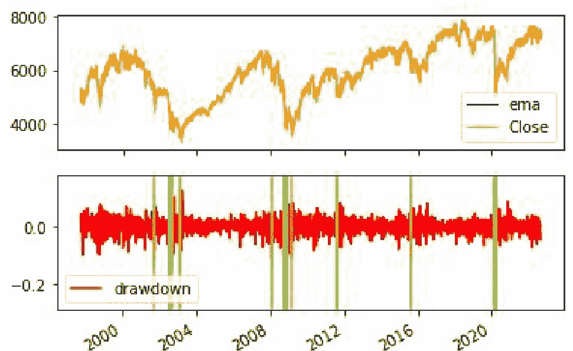

总而言之，我们现在手头有了一个非常强大的工具。我们可以检查*历史数据*，也可以在*实时*中做同样的事情。我们可以寻找并标记交易信号，甚至可以根据信息自动化启动交易或其他流程。

虽然所示技术属于交易部分，但其影响深远，因为我们可以在所有行业、科学和工程中使用类似的方法。

例如，一个完全基于摄像头ccd阵列收集的信号输入的自动驾驶汽车响应程序。

### 读取数据

我们已经通过open文件方法和pandas模块中的read_csv函数触及了将数据读入代码的方法。

然而，读取excel文件和json文件也很常见，后者因其人类可读性和嵌套特性而受到青睐。

| 信息 | JSON | CSV |
|---|---|---|
| 文件大小 | 大 | 紧凑 |
| 数据类型 | 使用Javascript数据类型。 | 不使用数据类型。 |
| 层次结构 | 支持层次和关系数据 | 扁平文件 |
| 用途 | 存储和交换数组、对象等中的数据语法。 | 在分隔文本文件中存储表格数据。 |

然后还有来自网络的xml和html表格，以及来自大量数据库的查询，这些数据库是sql或非sql的。

每个来源都有其细微的挑战，最终目标是将数据放入python对象中。从那里可以进行操作。

我们可以看到JSON与CSV的不同之处在于它允许层次结构。

```
{
    "index": {
        "ftse100": {"members": 100, "country": "uk"},
        "sp500": {"members": 500, "country": "usa"},
        "dax": {"members": 40, "country": "germany"},
        "cac": {"members": 30, "country": "france"}
    },
    "currency": ["gbp", "usd", "eur"],
    "transaction fee": [
        {"europe": 100},
        {"asia": 50},
    ]
}
```

```
json
{
    "america": {
        "north": 100,
        "south": 25
    },
    "passcode": 123456
}
```

好处在于我们可以像读取文本文件一样读取该文件。

```
python
import json

with open('C:/test/test.json') as f:
    d = json.load(f)
```

变量d被类型推断为dict，并将整个json内容分配为dict的{键，值}对。因此，访问嵌套数据与通过遍历分支访问dict的任何部分相同。

```
python
d['transaction fee']
# [{'europe': 100}, {'asia': 50}, {'america': {'north': 100, 'south': 25}}]

d['transaction fee'][2]
# {'america': {'north': 100, 'south': 25}}

d['transaction fee'][2]['america']['south']
# 25

d['index']['sp500']['members']
# 500
```

虽然可以将相同类型的数据存储到csv文件中，但JSON格式对于此任务来说逻辑性更强。

然后用户可以根据需要编辑dict，甚至创建一个新的dict并以非常相似的方式将数据写回。

```
python
# edit the price of asia (existing key)
d['transaction fee'][1]['asia'] = 75

# edit number of members in cac (existing key)
d['index']['cac']['members'] = 40
d['index']['dax']['members'] = 30

# add a new index (new key:value pair)
d['index']['ta'] = {'members':125,'country':'israel'}

# write to file
with open('C:/test/output.json', 'w') as f:
    json.dump(d, f, indent=4)
```

生成一个新的JSON文件，如下所示：

```
{
    "index": {
        "ftse100": {
            "members": 100,
            "country": "uk"
        },
        "sp500": {
            "members": 500,
            "country": "usa"
        },
        "dax": {
            "members": 30,
            "country": "germany"
        },
        "cac": {
            "members": 40,
            "country": "france"
        },
        "ta": {
            "members": 125,
            "country": "israel"
        }
    },
    "currency": [
        "gbp",
        "usd",
        "eur"
    ],
    "transaction fee": [
        {
            "europe": 100
        },
        {
            "asia": 75
        },
        {
            "america": {
                "north": 100,
                "south": 25
            }
        }
    ],
    "passcode": 123456
}
```

虽然文件大小更大，但我们可以清楚地看到JSON数据格式与python结合使用的优点和便利性。

### 余弦相似度

这个问题往往出现在自然语言处理（NLP）领域。特别是余弦相似度是一种用于衡量文档相似性的指标，无论其大小如何。从数学上讲，它衡量的是在多维空间中投影的两个向量之间夹角的余弦值。

然而，它在金融领域也有一个有用的应用，特别是在指数方面。以两个债券指数为例，假设每个指数包含1000只债券。我们如何衡量这两个指数之间的相似性？

嗯，这与比较两个字符串列表是相同的。所以如果我们能想出一种技术，那么我们就可以陈述“相似性”。

基本示例是：

- [a,b,c] 和 [a,b,c] 是100%相似
- [a,b,c] 和 [d,e,f] 是0%相似
- [a,b,c] 和 [a,j,k] 是33%相似

但是像这样呢：

- [a,b,c] 和 [c,a,b] 包含相同的字母但顺序不同。
- [a,b,c] 和 [f,g,a] 有一个匹配的字母但位置不同。

我们可以说，对于指数，*顺序无关紧要*，这将问题简化为前三种情况。

那么不同大小的列表呢？哪一对具有更高的相似性：

- [a,b,c] 与 [a,b,c,d]
- [a,b,c] 与 [a,b,c,d,e,f g]

同样，我们可能会说第一对更相似，因为与第二对相比，更多存在的项目同时存在于两个列表中。

我们尝试采用数学方法来解决这个问题，特别是在python中利用字典和列表，或者我们可以使用`sklearn`模块中的`cosine_similarity`方法。

所以我们现在列出一个如何操作的步骤：

### 1. 找出两个列表中的所有唯一项。
2.  编译两个并排的向量（长度相同）。
3.  执行余弦度量（点积）。

让我们创建一个包含两个示例索引和操作的字典，以整理数据，从而能够显示一个数据框。

```python
import pandas as pd

d = {'first_index_names':['d','c','b','a'],
     'first_index_weights':[0.2, 0.2,0.3,0.3],
     'second_index_names':['a', 'j', 'k', 'd', 'e'],
     'second_index_weights':[0.1, 0.1, 0.1,0.1,0.6]}

# combine names and weights
d['first_index']=zip(d['first_index_names'],d['first_index_weights'])
d['second_index']=zip(d['second_index_names'],d['second_index_weights'])

# check that the weights sum to 1
if sum(d['first_index_weights'])==1: pass
else: print('normalise first index values')
if sum(d['second_index_weights'])==1: pass
else: print('normalise second index values')

# create a unique index list
d['unique_names'] = d['first_index_names'] + d['second_index_names']
d['unique_names'] = list(set(d['unique_names']))
d['unique_names'].sort()

# create nulls such that the lists are of the same length
for i in d['unique_names']:
    if i not in d['first_index_names']:
        d['first_index_names'].append(i)
        d['first_index_weights'].append(0)
    if i not in d['second_index_names']:
        d['second_index_names'].append(i)
        d['second_index_weights'].append(0)

df = pd.DataFrame(d)

# order weights to unique list
df['first_index_weights_sorted']=df['first_index'].apply(lambda x: x[1])
df['second_index_weights_sorted']=df['second_index'].apply(lambda x: x[1])

# keep relevant columns
df = df.filter(['unique_names','first_index_weights_sorted',
                'second_index_weights_sorted'], axis=1)
df = df.rename(columns={'first_index_weights_sorted': 'first_index',
                         'second_index_weights_sorted': 'second_index'})
df
```

这是我们得到的结果：

| unique_names | first_index | second_index |
|---|---|---|
| a | 0.2 | 0.1 |
| b | 0.2 | 0.1 |
| c | 0.3 | 0.1 |
| d | 0.3 | 0.1 |
| e | 0.0 | 0.6 |
| j | 0.0 | 0.0 |
| k | 0.0 | 0.0 |

我们得到了两个并排的索引，它们长度相同且顺序一致。任何不包含值的项都被赋予零值，因此没有空白。计算相似度的任务变得无比清晰。

无论数据如何传入，无论是通过 csv 文件、json 还是通过列表构建，将列表重塑为上述样式总是可取的。

我们现在通过思考向量的几何来考虑余弦相似度的数学原理。

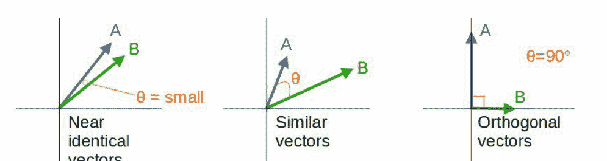

特别是，当两个向量之间的夹角余弦为零且向量的大小（称为向量范数或其长度）相同时，这两个向量是相同的。

余弦相似度的一般公式是：

similarity = cos(θ) = \frac{\mathbf{a} \cdot \mathbf{b}}{|\mathbf{a}||\mathbf{b}|}

简化为：

similarity = \frac{\mathbf{a} \cdot \mathbf{b}}{|\mathbf{a}||\mathbf{b}|} = \frac{\sum_{i=1}^{n} (a_i b_i)}{\sqrt{\sum_{i=1}^{n} a_i^2} \sqrt{\sum_{i=1}^{n} b_i^2}}

由于列表是同质的，我们可以用几行代码来实现这一点。

```python
import math
aibi = sum(df['first_weight'] * df['second_weight'])
a_norm = math.sqrt(sum(df['first_weight']**2))
b_norm = math.sqrt(sum(df['second_weight']**2))
similarity = aibi / (a_norm * b_norm)

print('the similarity is:', similarity)
# result is 0.155
```

我们现在可以比较任何两个索引，并且可以用逻辑输入来测试代码。

例如，以下两个列表没有相似性。

```python
d = {'first_index_names':['a','b','c'],
     'first_index_weights':[0.2, 0.2, 0.6],
     'second_index_names':['d', 'e', 'f'],
     'second_index_weights':[0.1, 0.1, 0.8]}
```

而这些列表是 100% 相似的。

```python
d = {'first_index_names':['a','b','c'],
    'first_index_weights':[0.2, 0.2, 0.6],
    'second_index_names':['c', 'a', 'b'],
    'second_index_weights':[0.6, 0.2, 0.2]}
```

这运行得很好。介于两者之间的一切将介于 0% 和 100% 之间。

这是一个非常有用的工具，因为它使得在进行历史价格比较之前，预测和解释两个投资组合或指数的表现成为可能，因为具有*高度相似性*的指数预期在价格上是*相关的*。

## 网络

网络提供了海量的数据和无数的用例，这些用例几乎产生了我们所知的所有信息。截至 2022 年 4 月，全球数字人口超过 50 亿互联网用户和近 50 亿社交媒体用户，但现实是，在世界某些地区，使用互联网的人口比例更接近 100%。

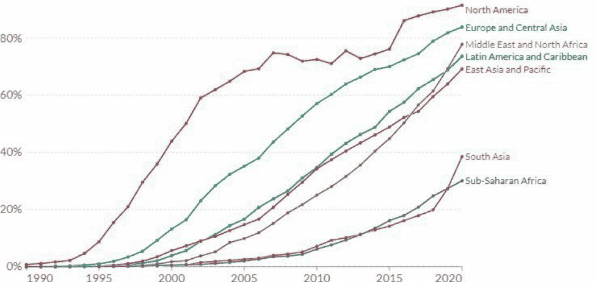

我们可以用几乎任何编程语言来自动化提取这种资源，而 Python 有模块使这变得相对容易。

我们将探讨两种类型的连接。HTTP 请求和 WebSockets。

### HTTP 请求

用于 http 请求的主要模块恰如其分地命名为 requests。requests 模块允许你使用 Python 发送 HTTP 请求。HTTP 请求返回一个 Response 对象，其中包含所有响应数据（内容、编码、状态等）。

主要函数是：

-   get：用于获取数据
-   post：用于发送数据

主要参数需要 url[15]，然后可以包含可选参数，例如用于身份验证的 auth，它需要一个 ('user', 'pass') 元组，或者用于保证连接超时的 timeout。

用户可以向任何网站发送 get 请求并会收到响应。

```python
import requests

r = requests.get('https://w3schools.com')
print(r.status_code)
```

响应带有一个状态码。

有许多状态码，分类如下：

-   信息性响应 (100–199)
-   成功响应 (200–299)
-   重定向消息 (300–399)
-   客户端错误响应 (400–499)
-   服务器错误响应 (500–599)

主要响应是：200。这意味着请求成功。其他常见的有：

-   400：错误请求 - 服务器无法处理请求
-   401 未授权 - 需要密码/身份验证
-   403 禁止 - 客户端没有访问内容的权限

我们可以在 try-except 块中检查请求：

```python
import requests

try:
    # a site that does NOT exist
    r = requests.get('https://blahblah.com')
    print(r.status_code)
except Exception as e:
    print('failed to connect')
    print(e)

try:
    # a site that exists
    r = requests.get('https://google.com')
    print(r.status_code)
except Exception as e:
    print('failed to connect')
    print(e)
```

但鉴于我们知道任何给定的站点都是有效的，更常见的做法是直接查看响应 status_code，如下所示：

```python
if r.status_code==200:
    print('proceed with code...')
else:
    print('can not proceed:', r.status_code)
```

除了状态码，我们还可以读取服务器响应的内容。这通常有 4 种类型：

1.  文本。r.text
2.  二进制。r.content
3.  JSON。r.json()
4.  原始（较少见）。r.raw

通常，requests 模块会根据 HTTP 头对响应的编码进行有根据的猜测。

然而，用户可以通过执行 r.encoding 来找到编码。

### Websockets

WebSocket 是一种事件驱动的协议，这意味着你实际上可以将其用于真正的实时通信。与 HTTP 不同，你必须不断请求更新，而使用 websockets，更新会在可用时立即发送。

以金融交易所为例，它全天持续更新不同证券的价格。websocket 允许用户登录交易所一次，然后在价格发生时监听各种证券的价格，而 HTTP 版本则要求用户不断连接并请求价格。

### 异步

在 WebSockets 章节中，我们遇到了一个之前未曾见过的函数。函数的通常格式如下。

```python
def normal_function(a, b):
    """ this is a normal function """
    c = a + b
    return c
```

但现在我们看到一个以关键字 `async` 开头的函数定义，并且还看到了 `await` 关键字。

```python
async def normal_function(a, b):
    """ this is a normal function """
    c = a + b
    await asyncio.sleep(0)
    return c
```

有时我们希望同时运行多个例程，而不希望等待一个完成后再开始下一个。异步过程的一个现实世界例子可能是泡茶。如果我们先打开水壶，那么在水壶烧水的同时，我们可以准备茶杯，放入茶包、牛奶和糖。我们能够同时进行两个过程，从而节省了时间。

`await` 关键字是过程可以将控制权移交给另一个过程的地方，在泡茶的例子中，逻辑上它会在水壶打开后发生。我们现在有两个过程同时运行：[1] 水壶烧水，[2] 准备茶杯。

这些同时运行的例程被称为协程，并且需要在 Python 中使用一些异步输入输出（Async IO）。Async IO 与多进程和线程相关，因为语言需要某种**不阻塞代码执行**的过程，以便代码的其他部分可以运行。这就是 Python 所提供的，所以让我们更深入地理解它。

| 异步类型 | CPU | 描述 |
| :--- | :--- | :--- |
| 并行（多进程） | 多个 | 将任务分布到计算机 CPU（或核心）上 |
| 并发 | 一个 | 多个任务能够以重叠的方式运行（由代码控制）。 |
| 线程 | 一个 | 多个线程轮流执行任务。一个进程可以包含多个线程。 |

协程是一种可以在到达 `return` 之前挂起执行的函数，它可以间接地将控制权传递给另一个协程一段时间。

在我们深入之前，必须理解这是一种新技术（Python 3.7 及以上版本），它建立在现有技术之上，我们只关注顶层，因为深入探讨本身就需要一本书。需要理解的组件包括：

- 1. 异步生态系统
- 2. 事件循环（所有语言）
- 3. 使用协程
- 4. 协程如何工作
- 5. 生态系统中包含什么
- 6. 典型的 Web 应用程序
- 7. 与阻塞世界交互
- 8. 错误处理、测试、调试

每种异步方法都有其优点和缺点。**使用多进程**，用户可以在任何时间点使用多个处理器，但缺点是处理器数量有限。**使用线程**，用户可以轻松地在同一线程上共享进程，但缺点是计算机控制何时发生这种情况，这可能导致竞态条件。**使用 asyncio**，用户可以实现与线程相同的功能并保持控制权，但缺点是函数需要定义为 `async`，并且需要使用额外的关键字和术语。

这是一个线程中竞态条件的经典例子，它导致需要额外的实现，并最终催生了 asyncio。

```python
import threading
import time

x = 10

def increment(by):
    global x

    local_counter = x
    local_counter += by

    time.sleep(1)

    x = local_counter
    print(f'{threading.current_thread().name} inc x {by}, x: {x}')
```

它的优点在于可以根据**服务器**和**客户端**的需要*按需*推送消息。

那么让我们看看双方的基本设置：

- 服务器
- 客户端

这是一个 WebSocket 服务器示例。

```python
import asyncio
import websockets

async def hello(websocket, path):
    name = await websocket.recv()
    print(f"< {name}")

    greeting = f"Hello {name}!"

    await websocket.send(greeting)
    print(f"> {greeting}")

start_server = websockets.serve(hello, "localhost", 8765)

asyncio.get_event_loop().run_until_complete(start_server)
asyncio.get_event_loop().run_forever()
```

这是相应的客户端示例。

```python
import asyncio
import websockets

async def hello():
    uri = "ws://localhost:8765"
    async with websockets.connect(uri) as websocket:
        name = input("What's your name? ")

        await websocket.send(name)
        print(f"> {name}")

        greeting = await websocket.recv()
        print(f"< {greeting}")

asyncio.get_event_loop().run_until_complete(hello())
```

这就是我们建立服务器-客户端连接所需的全部内容。

在给定的示例中，两段代码同时运行。**服务器**坐着等待连接建立。**客户端**连接到服务器（在示例中是 localhost:8765）并发送字符串名称。如果**服务器**收到消息，它会发送回复。最后，**客户端**接收回复。

所以这个例子做了这个：

虽然这个例子很基础，但它包含了客户端和服务器相互通信所需的一切。可以在任一端进行处理，并将结果发送回另一端。

这意味着我们可以，例如，从客户端向服务器发送少量信息，并让服务器计算一个繁重的过程（比如一个强大的云服务器），或者如果我们选择的话，也可以反过来。

所以我们可以让我们的函数和模块存在于服务器上。事实上，这就是互联网的基础，也是我们的网络浏览器和移动设备如何交互的基础。

这是一些代码，其中服务器发送消息，由浏览器访问。在示例的情况下，它只是每 3 秒发送一次当前时间，但类似的方法可用于流式传输股票价格、新闻标题、安全数据和任何其他动态数据。

```python
import asyncio
import datetime
import random
import websockets

async def time(websocket):
    while True:
        now = datetime.datetime.utcnow().isoformat() + "Z"
        await websocket.send(now)
        await asyncio.sleep(random.random() * 3)

start_server = websockets.serve(time, "127.0.0.1", 5678)

asyncio.get_event_loop().run_until_complete(start_server)
asyncio.get_event_loop().run_forever()
```

这是读取相同数据的 HTML 页面，可以在任何标准浏览器中打开。

```html
<!DOCTYPE html>
<html>
    <head>
        <title>WebSocket demo</title>
    </head>
    <body>
        <script>
            var ws = new WebSocket("ws://127.0.0.1:5678/"),
                messages = document.createElement('ul');
            ws.onmessage = function (event) {
                var messages = document.getElementsByTagName('ul')[0],
                    message = document.createElement('li'),
                    content = document.createTextNode(event.data);
                message.appendChild(content);
                messages.appendChild(message);
            };
            document.body.appendChild(messages);
        </script>
    </body>
</html>
```

你会注意到代码的主体包含一个 `script` 标签，其中包含 JavaScript，我们现在知道它在许多方面与 Python 相似，但其花括号和分号的语法来自 C 语言家族。

有了这个包含 JavaScript 的 HTML，我们就能看到时间每 3 秒在屏幕上流动一次。

一般来说，低功耗的移动设备是**客户端**。另一方面，拥有强大能力的网络主机是**服务器**。所以我们低功耗的设备向主机服务器发送轻量级消息（指令）。

而消耗大量能源的大型处理可以在服务器端进行。然后这些处理结果被发送回移动设备，这意味着手机中的小电池就足够了。

## 图形用户界面

目前，网络是首选平台，而Python通过Django和Flask等Web框架提供了自己的解决方案。

除了Web应用，还有专门的图形用户界面（GUI），允许用户在其设备（主要是台式机、笔记本电脑、平板电脑和移动设备）上构建本地应用程序。

在撰写本文时，粗略统计，大约有30种GUI可以在不同操作系统上运行。每种GUI都有其特定的功能和优势。

然而，我们将重点介绍一种名为tkinter[18]的特定GUI。我们选择tkinter的主要原因是：

- 1. 它速度快。
- 2. 它与Python捆绑在一起。
- 3. 使用GUI的通用概念大致相同。我们将说明为什么这个普遍说法是正确的。

### Hello world GUI

让我们看看使用tkinter实现的一个基本的hello world示例。

```python
import tkinter as tk

# create an instance
root = tk.Tk()

# place a label on the root window
message = tk.Label(root, text="Hello, World!")
message.pack()

# keeps the window displaying and running until you close it
root.mainloop()
```

这将打开一个显示“hello world”文本的GUI，如下所示：


因此，开箱即用，我们能够快速得到一个结果。我们所要做的就是：

- 1. 导入模块
- 2. 创建一个实例
- 3. 创建一个带有“hello world”文本的标签
- 4. 放置标签
- 5. 运行主循环

通常，我们将对mainloop()方法的调用放在Tkinter程序的最后一条语句。

添加的组件称为“小部件”。我们创建选择的小部件，然后将它们放置到容器中。如果我们忘记放置小部件，那么它会被创建但保持不可见。大约有20种基本小部件可供选择，如滚动条、复选框和输入框等……

我们之所以说所有GUI的通用概念是相同的，是因为它们往往遵循与上述相同的5个步骤。

所有绘图包实际发生的情况是，屏幕每秒刷新多次（通常称为每秒帧数，FPS），图像被依次创建或绘制。对于像pygame这样的游戏模块，这更为明显，我们可能需要小心地在绘制项目之前绘制背景。

Hello world很棒，但我们现在来扩展它。我们可以为GUI设置标题、在屏幕上的位置和大小：

```python
root.title("Tkinter Window Demo")
root.geometry("600x400+200+50")
```

geometry由两部分组成：

- 宽度 * 高度
- 左上角相对于屏幕的位置

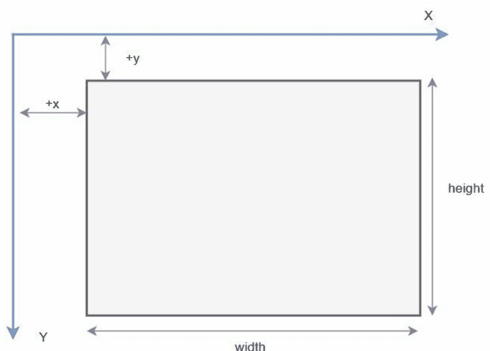

还有更多选项，但这已经足够了。实际上，省略左上角位置将使用合适的默认值。

如果我们想相对于屏幕定位和调整GUI的大小，那么我们需要获取屏幕尺寸并进行校准。

```python
# get the screen dimension
screen_width = root.winfo_screenwidth()
screen_height = root.winfo_screenheight()

# the GUI width and height
window_width = int(screen_width / 3)
window_height = int(screen_height / 3)
```

我们还可以做其他事情，例如：

- 控制窗口大小：resizable()、minsize()、maxsize()
- 调整透明度：attributes('-alpha',0.5)
- 堆叠顺序：attributes('-topmost', 1)
- 默认图标：iconbitmap('my_image.ico')

我们可以实现以上所有功能。

```python
import tkinter as tk

# create an instance
root = tk.Tk()
root.title('Tkinter Window Demo')

# get the screen dimension
screen_width = root.winfo_screenwidth()
screen_height = root.winfo_screenheight()

# the GUI width and height
window_width = int(screen_width / 3)
window_height = int(screen_height / 3)

# the GUI position
window_x_pos = int(screen_width * 0.1)
window_y_pos = int(screen_height * 0.1)

root.geometry(f'{window_width}x{window_height}+{window_x_pos}+{window_y_pos}')

# transparency
root.attributes('-alpha', 0.75)

# place a label on the root window
message = tk.Label(root, text="Hello, World!")
message.pack()

# keeps the window displaying and running until you close it
root.mainloop()
```

这将生成一个25%透明的窗口，该窗口位于屏幕左上角10%处，并且在x和y方向上占屏幕大小的⅓：

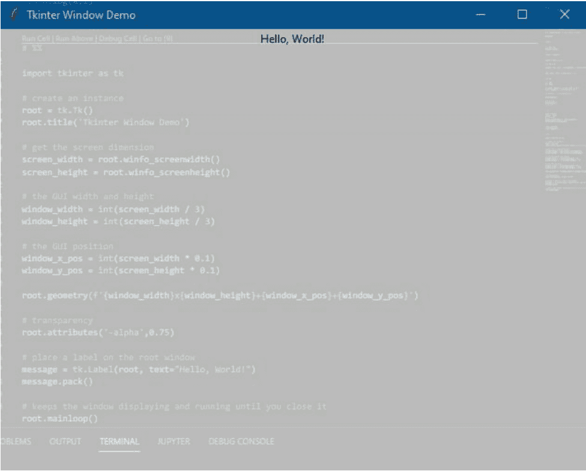

因此，我们有了一个可以在位置和大小等方面进行合理自定义的GUI。

接下来，我们可以添加一些小部件。

常见的小部件是按钮和输入框，尽管还有许多其他小部件。这些足以创建一个接收数据并执行基本操作的示例。

我们将以与创建标签类似的方式创建按钮和输入框。不同之处在于按钮执行一个函数，通常称为回调函数。回调[19]函数在现代编程中非常常见，我们已经在异步编程中见过它们。

这是一个带有回调的按钮示例：

```python
# make a button with a callback
def callback():
    """ this is called when the button is pressed """
    x = message.cget('text') # get current text
    if x == 'good night': message.config(text= 'hello world')
    else: message.config(text='good night')

button = tk.Button(root, text='press me', command=lambda: callback())
button.pack()
```

我们创建的按钮调用回调函数，该函数运行一个小例程，将文本框中的文本从“hello world”切换为“good night”。

它可以像所有其他Python函数一样用于任何其他更复杂的例程。此外，我们只是为了说明而使用了callback()这个名称，但我们可以使用更合适的名称，例如change_message_text()。

按钮设置好后，我们现在转向输入小部件，它允许用户输入单行文本。

```python
# make an entry box
entry = tk.Entry(root)
entry.pack()
```

这就是所需的全部，我们可以使用.get()语句从框中获取文本。

```python
my_text = entry.get()
print(my_text)
```

并将结果直接打印到控制台。我们可以将其添加到回调函数中，这样函数现在做两件事。[1] 更改文本标签消息，[2] 打印到控制台。

我们的基本代码如下所示：

```python
import tkinter as tk

# create an instance
root = tk.Tk()
root.title('Tkinter Window Demo')

# get the screen dimension
screen_width = root.winfo_screenwidth()
screen_height = root.winfo_screenheight()

# the GUI width and height
window_width = int(screen_width / 6)
window_height = int(screen_height / 3)

# the GUI position
window_x_pos = int(screen_width * 0.3)
window_y_pos = int(screen_height * 0.3)
```

root.geometry(f'{window_width}x{window_height}+{window_x_pos}+{window_y_pos}')

# 在根窗口上放置一个标签
message = tk.Label(root, text='hello world')
message.pack()

# 创建一个带回调函数的按钮
def callback():
    """ 在 'good night' 和 'hello world' 之间切换 """
    x = message.cget('text')
    my_text = entry.get()
    print(my_text)
    if x == 'good night': message.config(text= 'hello world')
    else: message.config(text='good night')

button = tk.Button(root, text='press me', command=lambda: callback())
button.pack()

# 创建一个输入框
entry = tk.Entry(root)
entry.pack()

# 保持窗口显示并运行，直到你关闭它
root.mainloop()
```

结果看起来像这样：

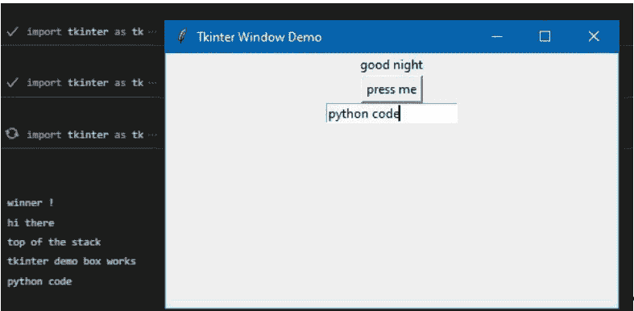

我们还可以做很多其他事情，例如，将控件的位置改为网格布局，而不是将它们一个接一个地堆叠起来。

### 密码输入

在“hello world”示例的基础上，这个示例很不错，但只是一个起点。这里有一个密码登录GUI的用例，它提示用户输入电子邮件和密码，然后在窗口信息框中返回结果。

```python
import tkinter as tk
from tkinter.messagebox import showinfo

# 根窗口
root = tk.Tk()
root.geometry("300x150")
root.resizable(False, False)
root.title('Sign In')

# 存储电子邮件地址和密码
email = tk.StringVar()
password = tk.StringVar()

def login_clicked():
    """ 登录按钮被点击时的回调函数
    """
    msg = f'You entered email: {email.get()} and password: {password.get()}'
    showinfo(
        title='Information',
        message=msg
    )

# 登录框架
signin = tk.Frame(root)
signin.pack(padx=10, pady=10, fill='x', expand=True)

# 电子邮件
email_label = tk.Label(signin, text="Email Address:")
email_label.pack(fill='x', expand=True)

email_entry = tk.Entry(signin, textvariable=email)
email_entry.pack(fill='x', expand=True)
email_entry.focus()

# 密码
password_label = tk.Label(signin, text="Password:")
password_label.pack(fill='x', expand=True)

password_entry = tk.Entry(signin, textvariable=password, show="*")
password_entry.pack(fill='x', expand=True)

# 登录按钮
login_button = tk.Button(signin, text="Login", command=login_clicked)
login_button.pack(fill='x', expand=True, pady=10)

root.mainloop()
```

仅仅20行代码，我们就创建了一个可以接受凭据并运行流程的登录框。它看起来像这样：


当用户点击“登录”按钮时，会通过回调函数调用另一段代码。在示例中，代码产生如下结果：


### 动画

所有的GUI功能都很不错。它们让用户能够通过众多控件提供的输入和输出，与设备进行清晰友好的界面交互。

然而，所有这些都相当静态，因为我们的应用程序就像一只温顺的狗一样坐着等待用户操作，但在那之前是空闲的（尽管，我们可以通过让设备查看股价并在突破时设置警报等方式来消除这种空闲状态）。

我们现在通过一个两个行星在太空中移动的例子，来介绍编码的动态部分。

```python
import tkinter as tk
import time

# 按照惯例，常量使用大写字母
WIDTH = 500
HEIGHT = 300
velocity_x = 1
velocity_y = 1

win = tk.Tk()
win.title("moving planets")

canvas = tk.Canvas(win, width=WIDTH, height=HEIGHT)
canvas.pack()

photo_space = tk.PhotoImage(file="space.png")
photo_jup = tk.PhotoImage(file="jupiter.png")
photo_sat = tk.PhotoImage(file="saturn.png")

image_space = canvas.create_image(0,0,image=photo_space)
image_jup = canvas.create_image(0,0,image=photo_jup)
image_sat = canvas.create_image(450,0,image=photo_sat)

t0 = time.time()
while True:
    # 将位置输出到控制台
    coords_jup = canvas.coords(image_jup)
    coords_sat = canvas.coords(image_sat)
    print('jup, sat:', coords_jup, coords_sat)

    # 移动行星
    canvas.move(image_jup, velocity_x, velocity_y)
    canvas.move(image_sat, -velocity_x, velocity_y)
    win.update()
    time.sleep(0.01)
    t1 = time.time()
    if t1-t0 > 5:
        break

win.mainloop()
```

这会产生如下移动效果：


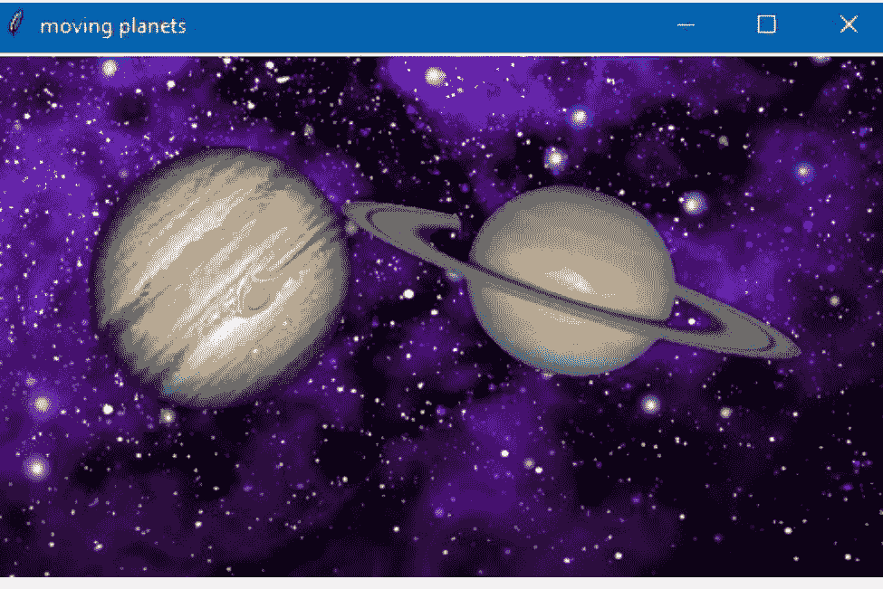

这是一个非常简短的动画片段，但以下是所有类似GUI（如pygame）的通用规则：

1. 图像和声音通常存储在名为“assets”的子文件夹中。
2. 所有图像都是具有透明背景的正方形。这些正方形由左上角定义，因此要获得中心点，我们需要获取图像的宽度和高度并除以2。
3. 我们使用中心点和宽度来确定与其他对象以及屏幕边缘的碰撞（在示例代码中，行星只是从屏幕上消失）。
4. 总是有一个循环，通常是while循环。
5. 我们在更新循环`win.update()`之前，不断在新位置重绘图像。重要的是，**这就是运动的效果**。

从这里开始，我们可以做很多事情，例如，我们可以为两个行星分配质量，并调用每个行星对另一个行星的引力。

每个行星（或粒子）受到的吸引力为

$$F = -\frac{GMm}{r^2}$$

其中r是两者之间的距离：

$$r^2 = x^2 + y^2$$

M是另一个行星的质量（或者如果有多个行星，则是行星系统的总质量）。使用这种方法，我们不仅可以模拟行星运动，还可以模拟整个星系或数千颗恒星组成的星团的碰撞。

现代计算机的处理能力，更不用说高性能计算机，完全能够产生惊人的模拟。我们将观察到的是混沌运动，但具有广泛可观察且相当美丽的模式。

生成并发布合理的代码是完全可能的，但这大约需要200行代码。

## 数学

至此，我们已经走了很长一段路，研究了各种技术，如递归函数、回溯和使用类的二叉树。

然后我们触及了一些数据科学概念，包括数据的读写、数据可视化，以及一些机器学习技术，如决策树和k<sup>th</sup>最近邻。

我们还研究了一些有趣的问题，这些问题让我们使用了到目前为止的各种基本技术，并实现了基本类型，如字符串、整数、列表、字典。

本节的目的是探讨我们如何考虑处理和解决一些更基本的数学问题的数学原理，以及这如何与使用Python进行高效计算相关联。

### 费马大定理

在数论中，费马大定理指出，对于任何大于2的整数n，不存在三个正整数a、b和c满足方程：

$$a^n + b^n = c^n$$

然而，在流行的卡通系列中，荷马·辛普森发现了一个例外情况，它击败了计算器（还有其他数字也能做到这一点）。

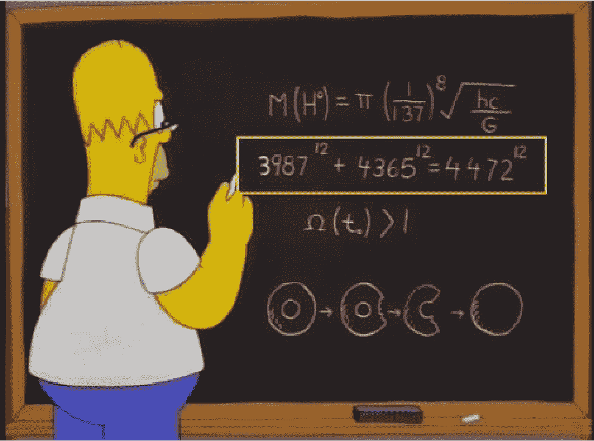

如果用户将这些数字输入计算器，他们会发现费马大定理的一个例外。

然而，仔细观察我们会发现：

```python
x = pow(3987, 12)
y = pow(4365, 12)
z = pow(4472, 12)

if x + x == z: print('this works')
else: print('this fails')

print('sum of squares:', x + y)
print('the big square:', z)
```

这会产生巨大的数字：

```
sum of squares: 2541210258614589176288669958142428526657
the big square: 2541210259314801410819278649643651567616
```

实际上我们可以找到数字不同的地方，只需添加这段代码：

```python
first_number = str(x+y)
```

second_number = str(z)

for i, v in enumerate(first_number):
    if second_number[i]==v: pass
    else:
        print(f'the break is at {i} which gives {second_number[i]} and {v}')
        break

所以费马大定理终究是正确的。我们也得以找出旧式手持计算器在何处以及为何会出错。

旧式计算器对大数的舍入表示为 6.39766563e+43，超过小数点后第8位的精度数字将会丢失。

```
the break is at index 10 which gives 8 and 9
```

请注意其中运用的几个技巧。

- 我们可以像遍历字符列表一样遍历字符串。
- 枚举（Enumerate）：获取列表的**索引**和**值**（类似于字典的键值对）。
- 我们可以使用 `break` 语句提前终止循环。

### 复数

Python 天然支持复数。事实上，`complex` 类型与 `int` 和 `float` 类型一样存在。

Python 还通过 `cmath` 模块提供了其他相关函数。对于一般的 Python 对象 x，`complex(x)` 会委托给 `x.__complex__()`。

复数经常出现在工程、数学和物理问题中，Python 提供了处理它们的有用工具。

复数 **Z** 的常见形式是：

**z = a + i · b**

其中 a 称为*实部*，b 称为*虚部*。

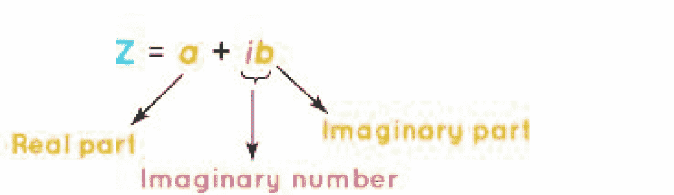

“虚数”这个术语相当令人困惑，因为它让初学者觉得这些数字近乎神奇。实际上，虚部是实数轴的正交轴。如果我们把虚数看作**实正交数**，那么其固有的“*神奇或虚幻概念*”就被消除了。

数字 a 和 b 是实数，用数学语言我们说：a, b ∈ **R**，这意味着 *a 和 b 属于实数集*。

数字是一个抽象概念。它们是为满足人类需求而创造的，并随着人类对世界理解的演进而发展。虽然这对于一本编程书来说颇具哲学意味，但了解数字及其历史和演变，对于理解复数的概念及其必要性是有益的。

#### 整数：

最原始的需求是用手指计数。例如，数苹果、橘子或石头。


#### 负整数和零：

账本或余额以及“无”（零）的概念需要**负数**和**零**。从最基本的意义上说，负数对于分配或拿取是必要的。

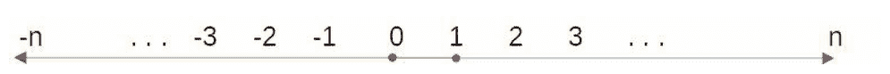

#### 实数：

实数是所有介于整数之间的数。如果我们将 1 分成两部分，那么我们得到 ½。2 的平方根是一个存在于 1 和 2 之间且非常接近 1.41 的数。这些数确实存在，但不是我们用手指计数或在传统数轴上发明的整数。

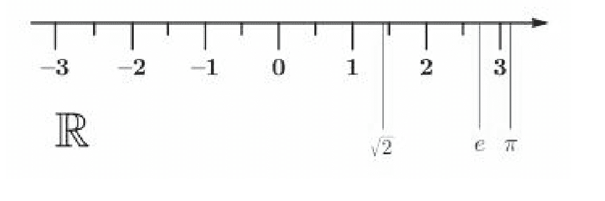

#### 最后，复数：

复数大约在 400 年前被创造出来。它们是三次和二次方程的根。特别是，它表明形如 ax² + bx + c = 0 的二次方程的根是：

```
x = -b ± √(b² - 4ac) / 2a
```

对于复数来说，最重要的是以下情况：

```
b² < 4ac
```

正是在这一点上，我们需要对负数开平方根。如果不发明一种新类型的数字或改变公认的编号系统，这根本无法做到。

于是，一种新的数字被勉强创造出来，并被命名为虚数 i。i 的定义如下：

$$i^2 = -1$$

这意味着“i”像所有平方根一样取两个值，如下所示：

$$i = \pm \sqrt{-1}$$

而被称为虚数的数轴正交分量的图像就此诞生。复数通常用 Z 或 C 表示，是纯虚数（实正交数）和实数的组合。

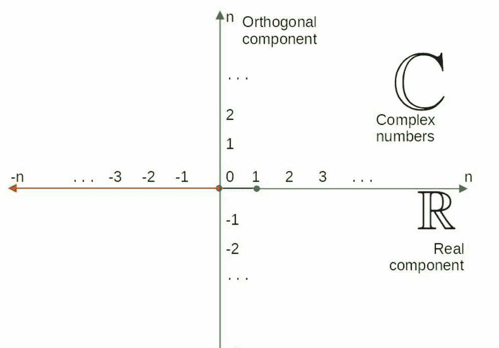

至此，我们已经获得了足够的理解，可以继续编写代码。

```
x = 5 # the real component
y = 3 # the orthogonal component

z = complex(x,y) # construct a complex number

print(z)
```

返回结果：

```
(5+3j)
```

首先需要注意的是，在计算中，字母 j 通常用来表示正交分量（即虚分量），以代替 i。使用字母 j 的原因是，在工程和物理领域，字母 i 常用来表示电流。

我们可以不使用 complex 构造函数来创建复数，如下所示：

```
z = 10 + 20j
print(type(z))
```

这将返回类型：

```
<class 'complex'>
```

因此，这自然地融入了 Python 框架。

复数也适用于流行的 numpy 模块以及许多其他模块，如 math 和 matplotlib。对于 numpy，它看起来像这样：

```
import numpy as np

c = 10 + 1j

print(f'real part: {np.real(c)}, orthog part: {np.imag(c)}')
```

返回结果：

```
real part: 10.0, orthog part: 1.0
```

我们顺便注意到，两个分量都是 float 类型，并且数字位于 j 之前以将其与变量区分开来。

为了说明这一点，我们可以这样做：

```
j = 10

c = 10j
d = 10*j

if c==d: print('c is the same as d')
else: print('c is different to d')
```

```
# prints: c is different to d
```

复数有一个模和一个辐角。模定义为：

$|z| = |a + jb| = \sqrt{a^2 + b^2}$

Python 在 abs() 函数的上下文中理解这一点，所以我们可以这样做。

```
z = 3 + 4j
print(abs(z))
# prints 5
```

复数的辐角定义为它与水平（或实）轴逆时针方向所成的角度。

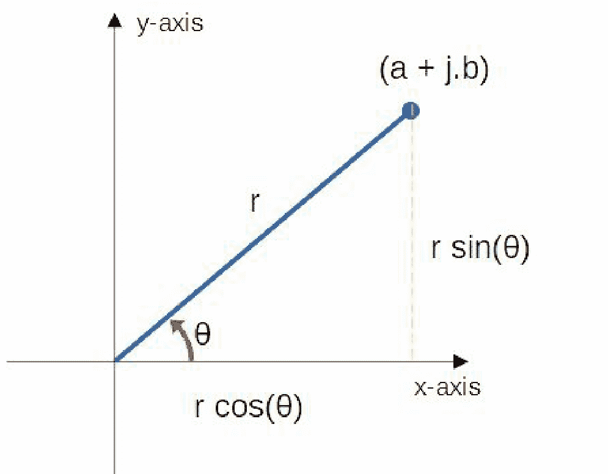

我们可以通过两种方式获得辐角：

```python
import cmath
import math

z = 4 + 3j

# Using cmath module
p = cmath.phase(z)
print('cmath Module:', p)

# Using math module
p = math.atan(z.imag/z.real)
print('Math Module:', p)
```

两者返回相同的值：

```
cmath Module: 0.6435011087932844
Math Module: 0.6435011087932844
```

请注意，这些数字是以弧度为单位的，因此如果需要转换为度，可以使用以下换算因子：

$2\pi \cdot \text{radians} = 360^\circ$

$1 \text{ radian} = \frac{180^\circ}{\pi} \sim 57^\circ$

或者使用如下函数：

```python
import math

z = 2 + 2j
p = math.atan(z.imag/z.real)
print(math.degrees(p))  # returns 45.0
```

最后，我们展示如何在极坐标图（阿冈[21]图）中可视化复数向量。

```python
import numpy as np
from matplotlib import pyplot as plt

def plot_polar_vector(c, label=None, color=None, start=0, linestyle='-'):
    # plot line in polar plane
    line = plt.polar([np.angle(start), np.angle(c)], [np.abs(start), np.abs(c)],
                     label=label, color=color, linestyle=linestyle)
    # plot arrow in same color
    this_color = line[0].get_color() if color is None else color
    plt.annotate('', xytext=(np.angle(start), np.abs(start)),
                 xy=(np.angle(c), np.abs(c)),
                 arrowprops=dict(facecolor=this_color, edgecolor='none',
                 headlength=12, headwidth=10, shrink=1, width=0))

c_abs = 1.5
c_angle = 45  # in degree
c_angle_rad = np.deg2rad(c_angle)
a = c_abs * np.cos(c_angle_rad)
b = c_abs * np.sin(c_angle_rad)
c1 = a + b*1j
c2 = -0.5 + 0.75*1j

plt.figure(figsize=(6, 6))
plot_polar_vector(c1, label='$c_1$', color='k')
plot_polar_vector(np.conj(c1), label='$\overline{c}_1$', color='gray')
plot_polar_vector(c2, label='$c_2$', color='b')
plot_polar_vector(c1*c2, label='$c_1 \cdot c_2$', color='r')
plot_polar_vector(c1/c2, label='$c_1/c_2$', color='g')

plt.ylim([0, 1.8])
plt.legend(framealpha=1)
```

### 参数方程

参数方程是依赖于相同参数的方程组：x = f(a,b)，y = g(a,b)。在物理学中，常见的参数通常是时间，因此我们有一个位置 (x,y)，它是时间的函数：x = f(t)，y = g(t)，但 x 和 y 是时间的不同函数，因为它们受到不同的力作用。

另一个例子是笛卡尔坐标和极坐标。虽然圆在笛卡尔坐标系中的方程可以表示为 r²=x²+y²，但同一个圆的参数方程则表示为：

$$x = r \cdot \cos \Theta$$
$$y = r \cdot \sin \Theta$$

在我们的例子中，有一个单一的参数 $\Theta$，x 和 y 都是它的函数。这在不同坐标系之间转换时非常方便，某种程度上，我们在复数的表示中也见过这种行为，复数存在于一个平面上。

我们可以通过将两个极坐标参数方程直接代回笛卡尔等效方程来证明这两个坐标系实际上是等价的。

$$r^2 = x^2 + y^2$$
$$r^2 = r^2 \cdot \cos^2 \Theta + r^2 \cdot \sin^2 \Theta$$
$$r^2 = r^2 \cdot (\cos^2 \Theta + \sin^2 \Theta)$$
$$r^2 = r^2$$

那么，让我们在 Python 中尝试一个参数方程。例如，一个等角螺线。如果我们设置径向坐标 r 为：$r = ae^{bt}$，其中 a 和 b 是实数常数，那么两个参数形式的方程将是：

- $x(t) = ae^{bt} \cos(t)$
- $y(t) = ae^{bt} \sin(t)$

我们可以使用 matplotlib 在 Python 中绘制一族这样的曲线。

```python
import math
import matplotlib.pyplot as plt

a = 1
b1, b2, b3 = 0.1, 0.2, 0.4
times = [x/20 for x in range(0,200,1)]

x1, y1 = [], []
x2, y2 = [], []
x3, y3 = [], []

for t in times:
    x1.append(a*(math.e**(b1*t)) * math.cos(t))
    y1.append(a*(math.e**(b1*t)) * math.sin(t))
    x2.append(a*(math.e**(b2*t)) * math.cos(t))
    y2.append(a*(math.e**(b2*t)) * math.sin(t))
    x3.append(a*(math.e**(b3*t)) * math.cos(t))
    y3.append(a*(math.e**(b3*t)) * math.sin(t))

fig, ax = plt.subplots()
ax.set_title('family of curves')
ax.set_xlabel('x axis')
ax.set_ylabel('y axis')

ax.plot(x1, y1, c='red', label='b = 0.1')
ax.plot(x2, y2, c='green', label='b = 0.2')
ax.plot(x3, y3, c='blue', label='b = 0.4')
plt.legend()
plt.show()
```

得到的结果如下：

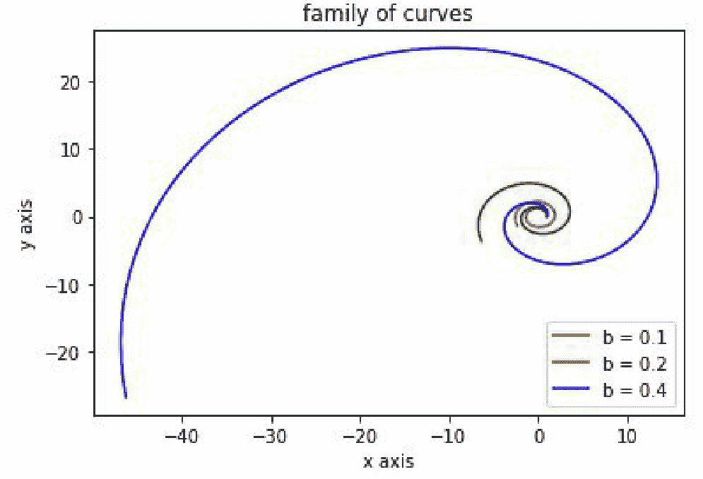

我们可以轻松地检查其他具有相同性质的曲线。例如，让我们将径向分量改为：

$$r = \frac{a}{t + 1}$$，其中 a 是一个常数。我们调整代码。

```python
a1, a2, a3, a4 = 1, 2, 4, 8
```

然后我们得到：

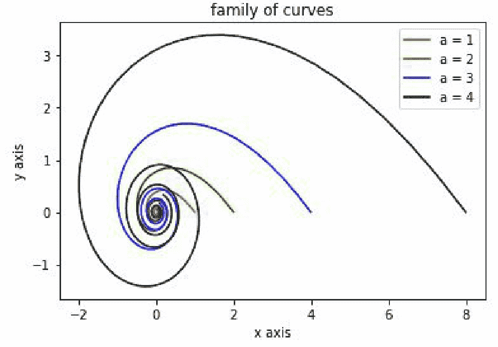

或者如果我们设置 r = sqrt(t)，我们得到：

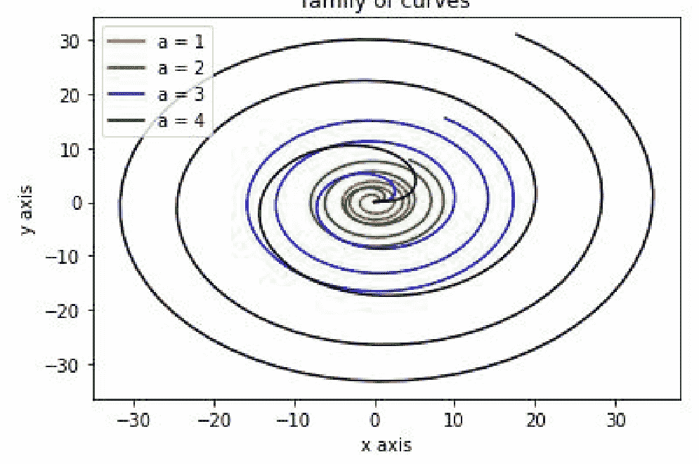

Python 代码中的调整相对简单。我们只需要修改 for 循环中出现的函数的径向分量，将其改为任何我们想要的形式。

```python
for t in times:
    r = math.sqrt(t)  # radial component
    x1.append(a1*r * math.cos(t))
    y1.append(a1*r * math.sin(t))
```

最后，通过添加第三个分量，我们可以在 3D 图中创建螺旋线的变体。添加第三维度只需要 3 个步骤：

1.  添加一个额外的列表来保存 z 分量。
2.  填充 z 分量。
3.  指定一个 3D 图。

这里我们添加额外的列表：

```python
x1, y1, z1 = [], [], []
```

这里我们添加 z 值：

```python
for t in times:
    r = math.sqrt(t)  # radial component
    x1.append(a1*r * math.cos(t))
    y1.append(a1*r * math.sin(t))
    z1.append(t)
```

这里我们调用新的 3D 绘图：

```python
fig = plt.figure()
ax = plt.axes(projection='3d')

ax.set_title('family of curves')
ax.set_xlabel('x axis')
ax.set_ylabel('y axis')
ax.set_zlabel('z axis')

ax.plot3D(x1, y1, z1, c='red', label='a = 1')
```

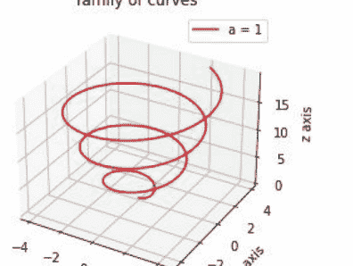

通过这种方式，我们可以生成螺旋线族。

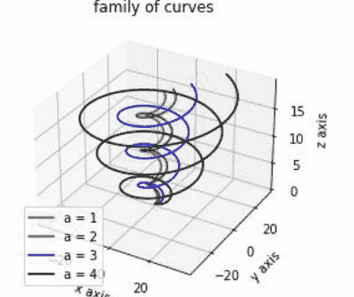

### 导数

导数在所有学科领域都极其重要。导数本质上是一个变量相对于另一个变量的变化率。

其基本概念是，对于任何给定的函数 y = f(x)，我们寻求 y 相对于 x 的变化率，其中：

$$y = f(x)$$
$$\frac{dy}{dx} = \frac{d}{dx}f(x)$$

同样的概念可以扩展到更高维度，例如：a = f(x, y, z, t)。然而，原理仍然是相同的，在这种情况下，可能需要对函数中的每个独立变量进行微分。

$$\frac{d}{dx}f(x, y, z, t) + \frac{d}{dy}f(x, y, z, t) + \frac{d}{dz}f(x, y, z, t)...$$

然而，无论这个过程如何完成，我们寻求的是两点之间的斜率。

$$\frac{dy}{dx}$$ 的计算机版本是 $$\frac{\Delta y}{\Delta x}$$，其中：
$$\Delta y = y_1 - y_0$$ 且 $$\Delta x = x_1 - x_0$$，这些是进行的离散计算。

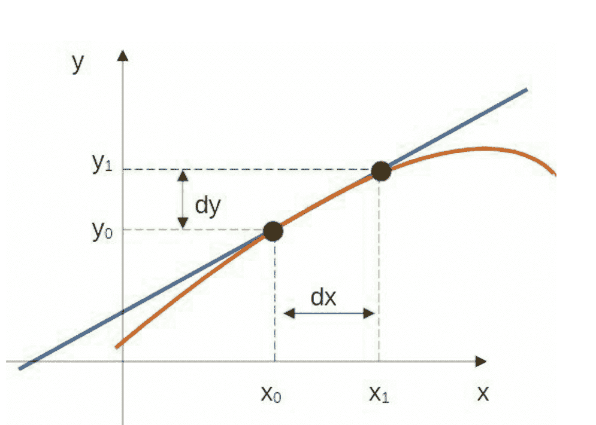

无论曲线的形状如何，找到斜率都是一个取曲线的一部分并计算差值的过程。

Python 中的曲线可以由两个列表组成。创建曲线还有其他方式（例如，一个元组列表），但这种方式很方便。

```python
x = [x for x in range(10)] # [0, 1, 2, 3, 4, 5, 6, 7, 8, 9]
y = [x**2 for x in x] # [0, 1, 4, 9, 16, 25, 36, 49, 64, 81]
```

然后我们可以计算斜率。

```python
slopes = []
for i in range(1, len(x)):
    dy = y[i] - y[i-1]
    dx = x[i] - x[i-1]
    slopes.append(dy/dx)
print(slopes)
# [1.0, 3.0, 5.0, 7.0, 9.0, 11.0, 13.0, 15.0, 17.0]
```

首先要注意的是，斜率列表的长度比原始列表少 1。这是因为斜率是*任意两点之间*计算的结果。

在我们的例子中，我们现在有了一个描述性的计算，说明 y 如何随 x 变化。我们可以在点之间进行插值。

有多种插值方法，例如直线插值、三次样条插值或多项式拟合，每种方法都有其优点和误差。

直线插值是最简单的方法。当我们试图插值的曲线曲率较低或数据点数量较多时，它效果很好。

插值点的计算公式为：

$$y_{\text{interp}} = x_{\text{low}} + (x_{\text{interp}} - x_{\text{low}}) \cdot \frac{y_{\text{up}} - y_{\text{low}}}{x_{\text{up}} - x_{\text{low}}}$$

$$y_{\text{interp}} = x_{\text{low}} + (x_{\text{interp}} - x_{\text{low}}) \cdot \text{slope}$$

其中 $x_{\text{low}}$ 是范围的下限，$x_{\text{up}}$ 是范围的上限。

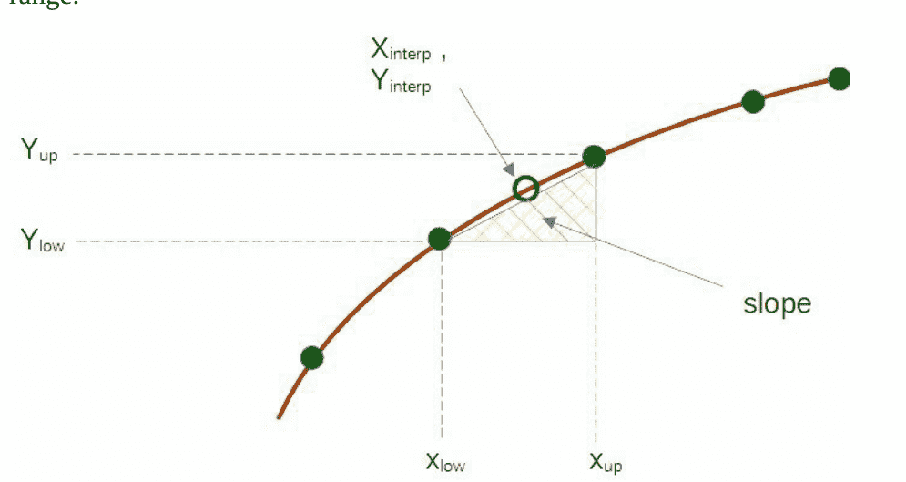

遵循上图中的步骤，并且鉴于我们已经计算了斜率，我们能够在 Python 中完成插值过程。

```python
x_list = [x for x in range(10)]
y_list = [x**2 for x in x_list]

def interp(x_interp: float, known_xs: list, known_ys: list) -> float:
    """ give point x, return interpolated y """

    slopes = []
    for i in range(1, len(known_xs)):
        dy = known_ys[i] - known_ys[i-1]
        dx = known_xs[i] - known_xs[i-1]
        slopes.append(dy/dx)

    # find x low
    for i, v in enumerate(known_xs):
        if v < x_interp: lower_idx = i
        else: break

    y_interp = known_xs[lower_idx] + \
        (x_interp - known_xs[lower_idx])* slopes[lower_idx]

    return y_interp

y = interp(2.5, x_list, y_list)
print(y)
```

这能快速找到答案，但有三点需要注意：

- 不是最快的。
- 凸性误差。
- 超出范围：外推。

**不是最快的：** 上述方法采用*线性*方法来定位 x 的索引。它只是遍历*已排序*的列表，直到找到值大于 x 的索引，然后停止。在计算语言中，这的时间复杂度是 **O(n)**，意味着列表越长，查找过程所需的时间就越长。

使用 Python 中的 bisect 模块进行二分查找（也称为半区间查找或对数查找）更为优化。下图可以直观地解释为什么是这样。

### 查找37之前的索引：

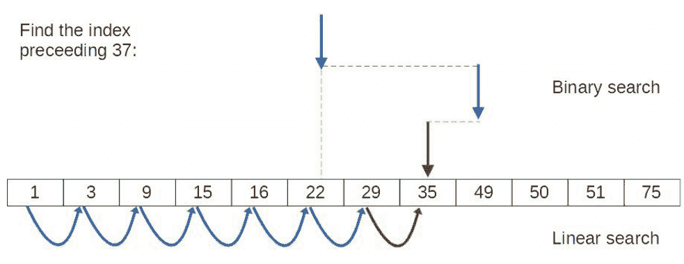

特别地，我们看到二分查找需要更少的迭代次数就能得到结果，直观上这在列表较大时尤其如此。二分查找的时间复杂度为 **O(log n)**，而线性查找为 **O(n)**。

以下是两种方法：

```
x_list = [1, 3.5, 5, 9.2, 20, 50.75]
n = 7.5

# linear search method
for i, v in enumerate(x_list):
    if v < n: r = i
    else: break
print(r)

#binary search method
import bisect
r = bisect.bisect_left(x_list, n)-1
print(r)
```

**凸性误差：** 对于直线插值，这一点更容易解释，但对于其他插值方法也同样成立。

一般来说，无论采用何种方法，都会与真实值存在误差。某些方法在特定情况下优于其他方法，例如，我们是选择三次样条还是直线？我们是否用三次样条过度拟合了数据，或者用直线欠拟合了数据？

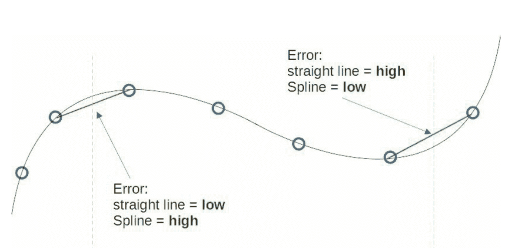

既然我们知道误差存在，我们可以改变方法或使用勾股定理等进行修正。改变方法可能意味着增加用于拟合曲线的多项式的阶数。

虽然我们尚未讨论二次或三次样条的数学原理，但计算的关键在于确保曲线在各点处的导数（斜率）彼此相等——这确保了曲线的平滑拟合。

### 外推：

现在我们有多种拟合数据的方法。两种最突出的方法是直线（简单直观）和三次样条（能很好地拟合曲线）。

但是，当所需的插值点位于样本范围之外时，我们该采取什么方法？

插值：$x_{min} \leq x_{interp} \leq x_{max}$

**外推：** $x_{min} > x_{interp} > x_{max}$

以下是几个直接的选择：

- 1. 放弃：输出数据超出范围的错误信息。
- 2. 所有点等于最后一个点。
- 3. 斜率延续。
- 4. 斜率和二阶导数延续。
- 5. 其他延伸至无穷的情况。

我们必须知道当数据超出范围时如何处理，即预期结果是什么。例如，是采用连续斜率的直线还是其他模型更合适？外推可能只适用于较短的区间。

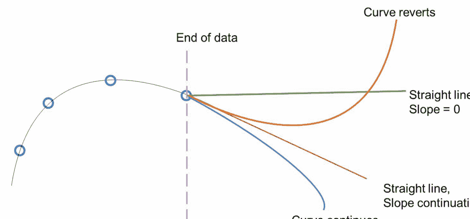

无论我们使用哪种方法，对于代码而言，我们只有 x<sub>low</sub> 和 dx。最终结果将取决于在外推区域假设的函数。

### 极大值、极小值与拐点

在标准微积分中，我们有极大值、极小值和拐点的定义。例如，设 f 是定义在区间 [a,b] 或 (a,b) 上的函数，p 是 (a,b) 中的一点（即，如果区间是闭区间，则不是端点）。

- 如果在 p 点附近的一个小区间内，对所有 x 都有 f(p) ≤ f(x)，则 f 在 p 点有局部最小值。
- 如果在 p 点附近的一个小区间内，对所有 x 都有 f(p) ≥ f(x)，则 f 在 p 点有局部最大值。
- 如果 f 在 p 点的凹凸性发生变化，即 f 在 p 点的一侧是凹的，在另一侧是凸的，则 f 在 p 点有一个拐点。

除了上述定义，我们还可以利用一阶和二阶导数来理解函数的形状，从而确定极大值、极小值和拐点。

给定函数 y = f(x)，我们可以使用一阶导数 dy/dx = 0 找到所有斜率为零（即平坦）的点。

然后，我们可以使用二阶导数来检查一阶导数的变化。因此，$\frac{d^2y}{dx^2} = \frac{d}{dx}\left(\frac{dy}{dx}\right)$ 告诉我们斜率是如何变化的。有三种情况：

- 如果 $\frac{d^2y}{dx^2} < 0$，则斜率持续减小，因此我们有一个**极大值**点。
- 如果 $\frac{d^2y}{dx^2} > 0$，则斜率持续增大，因此我们有一个**极小值**点。
- 如果 $\frac{d^2y}{dx^2} = 0$，则斜率没有变化，因此我们有一个**拐点**。

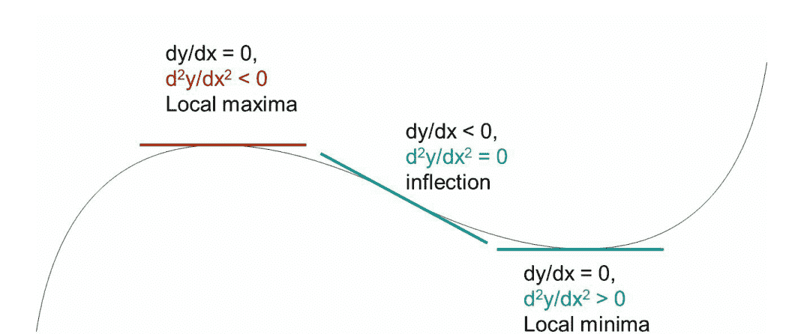

我们可以在 Python 代码中有效地使用这种构造来确定这些点，尽管确定结果将取决于数据类型及其采样方式[22]。

要找到斜率，我们至少需要2个点。而要找到斜率的变化（*二阶导数*），我们需要两个斜率，因此至少需要3个数据点。

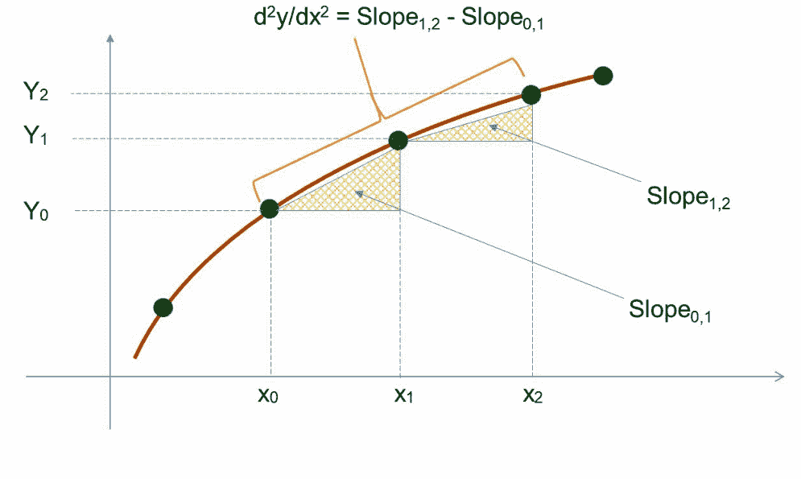

上图简化了我们为进行分析所需完成的工作。

现在让我们在代码中实现这一点，通过设置一个素数列表并计算它们之间的斜率。这个函数能高效地生成素数。

```
def gen_primes(n):
    """ Returns a list of primes < n """
    sieve = [True] * n
    for i in range(3,int(n**0.5)+1,2):
        if sieve[i]:
            sieve[i*i::2*i]=[False]*((n-i*i-1)//(2*i)+1)
    return [2] + [i for i in range(3,n,2) if sieve[i]]

n = 1_000_000
prm_list = gen_primes(n)
```

素数列表相当线性，起伏很小。因此检测斜率会更困难。

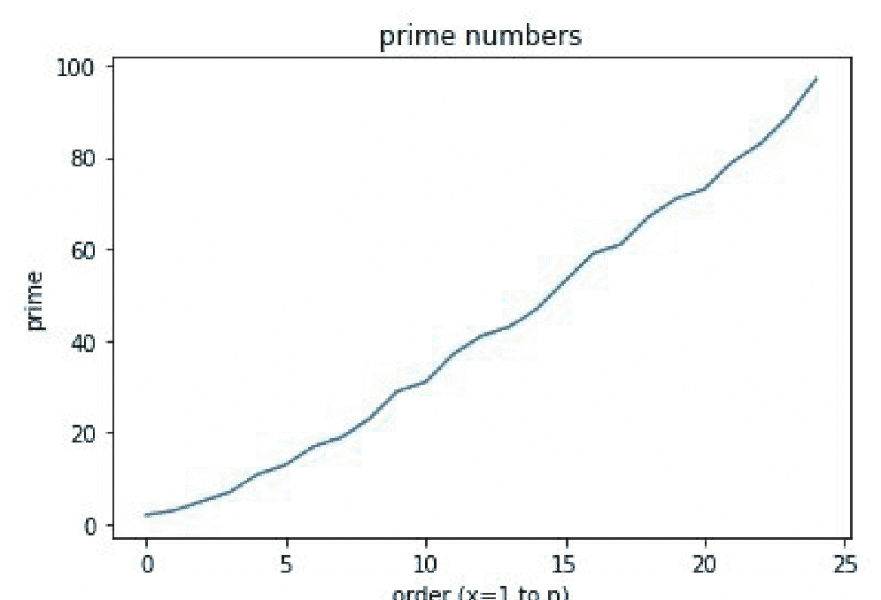

事实上，如果我们绘制更大的图景，结果看起来像一条直线。

然后我们需要计算素数之间的斜率。

```
x_values = []
prm_slopes = [] # generate prime slopes
for i, v in enumerate(prm_list[1:]):
    prm_slopes.append(v-prm_list[i])
    x_values.append(i)
```

请注意，我们能够在不到一秒的时间内轻松生成所有小于100万的素数。该算法找到了78,498个这样的素数，这比练习所需的数量多得多。

斜率的分布如下所示：

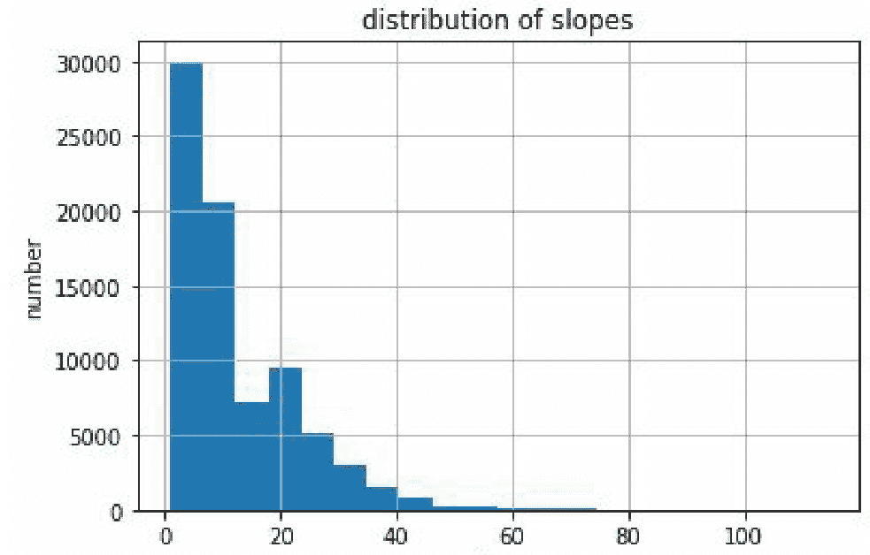

任意两个小于100万的素数之间的最大斜率为114。斜率始终为正，因为素数的值是递增的。

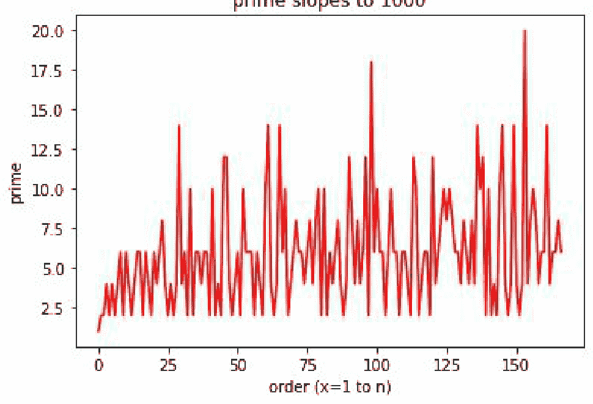

我们可以用与找到一阶导数相同的方法找到二阶导数。我们发现这更有趣，因为二阶导数包含了斜率的变化率，即曲线上任意点的凸性。

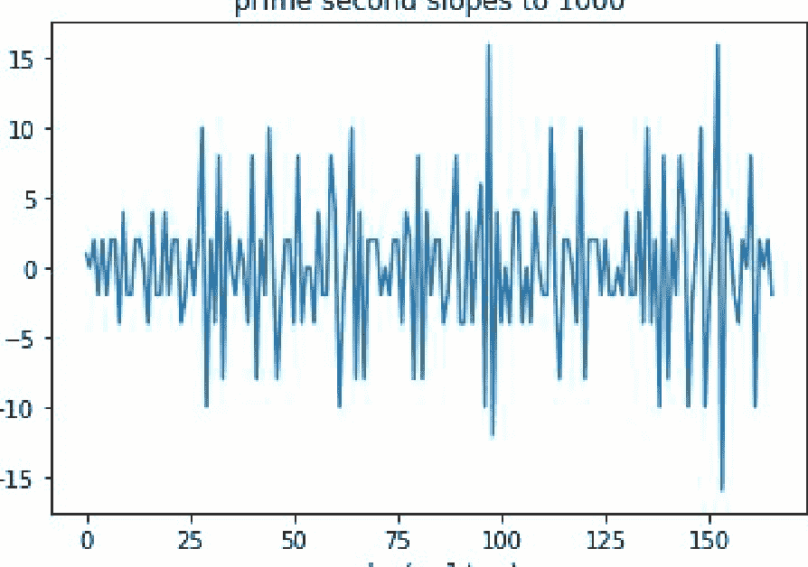

我们可以看到一阶和二阶导数描述了曲线。在这种情况下，它们讲述了一个平稳的故事。那么，让我们用正弦波来振荡这条素数曲线。我们可以用一行代码实现：

```
python
prm_list = [x*math.sin(x/100) for x in prm_list]
```

接下来，我们在一张图上绘制正弦调整后的素数曲线及其一阶和二阶斜率。

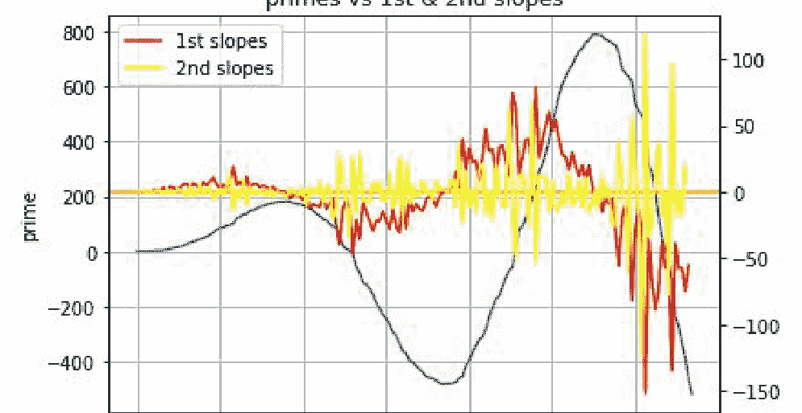

最后，我们可以识别极大值和极小值（一阶斜率 = 0）以及拐点（二阶斜率 = 0）。

在 Python 中，我们能够为每个列表用这样一行强大的代码完成：

```
null_slopes = [i for i,v in enumerate(prm_slopes) if -1<v<1 ]
```

我们之所以能做到这一点，是因为这些特性：

- 列表推导式：[x for x in list]
- 枚举解包：i,v in item
- 链式条件：-0.5 < v < 0.5

并将所有内容绘制在一张图上。

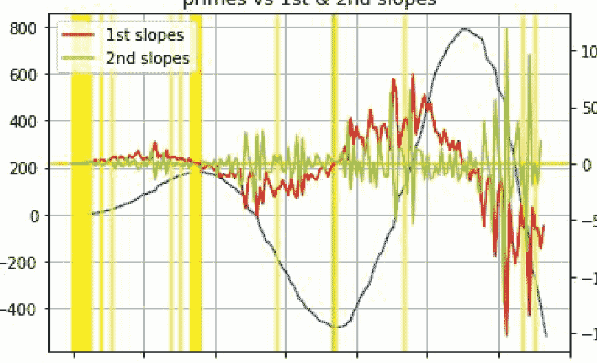

在上图中，我们成功识别了所有极大值和极小值（橙色垂直线）以及拐点（黄色线）。我们注意到，如果我们现在移除一阶和二阶斜率，我们将只剩下感兴趣的点。

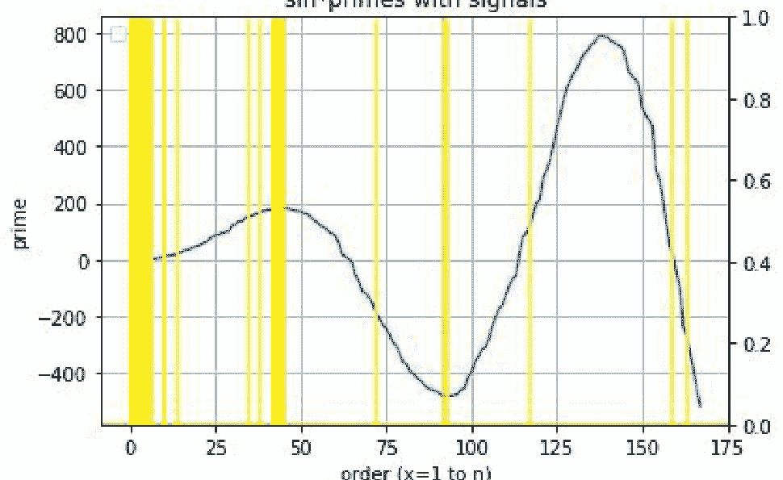

有趣的是，在 x = 140 的峰值处漏掉了一个信号，这是因为导数变化太快（从 +5 到 -5），错过了 -1 < v < 1 的更严格标准。因此，一个好的算法需要调整以捕获所有感兴趣的点（在这种情况下，我们可以放宽条件）。

一般来说，当数据本质上是不连续的，例如股票价格时，通过生成移动平均线来平滑曲线可能是有益的。一方面，这带来了现在平滑的数据集的好处，但另一方面，我们在平滑过程中损失了一些准确性。

这种权衡（在 x 方面的收益与在 y 方面的损失）存在于几乎每一个物理系统中，用户需要为任何给定的标准找到最佳解决方案。

### 牛顿-拉弗森法

我们研究了寻找解的方法，其速度比迭代解更快。例如，我们能够比较二分查找和线性查找，并证明我们可以将时间复杂度从 O(n) 降低到O(log n)。

我们还研究了函数和导数，并且可以通过使用两个局部点来计算斜率，从而在数值上计算函数在给定点的导数。

例如，给定函数 y = f(x)，我们能够通过取一个邻近点 (n+1) 并计算斜率，在计算上实现点 x=n 处的 dy/dx。

我们将函数称为 f(x)，同一函数的导数称为 f'(x)。我们这样做是因为符号更简洁（但仍然表示相同的意思 f'(x) = df/dx）。

我们说：$f'(x) = \frac{d}{dx}f(x) = \frac{df}{dx}$

以及：$f'(x_n) = \left[\frac{df}{dx}\right]_{x=n}$

意思是*点 x=n 处的导数*。

牛顿-拉弗森公式与二分法一样是迭代的。基本上，这意味着给定一个 $x_n$，我们可以找到下一个点 $x_{n+1}$，并不断重复这个过程，直到通过迭代逼近最终结果。

我们从著名的公式开始：

$x_{n+1} = x_n - \frac{f(x_n)}{f'(x_n)}$

上述公式的几何构造如下所示：

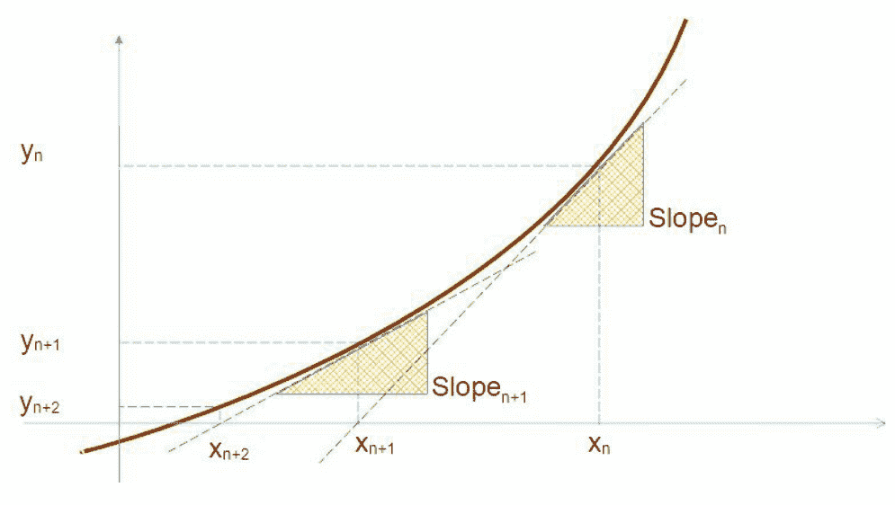

我们看到，使用这种方法，收敛到解的速度很快，如果我们知道函数的导数，我们可以比二分法和线性迭代更快地获得结果。

如果我们尝试一个著名的数字，比如 sqrt(2) 或任何非平方整数或数字，那么我们可以观察到获得满意精度所需的迭代次数。

令 f(x)= x² - 2

则 f’(x) = 2x

我们的迭代公式变为：

$$x_{n+1} = x_n - \frac{x^2 - 2}{2x}$$

我们可以直接将其在 python 中实现。

```python
def function(x):
    """ function of x """
    return x**2 - 2

def derivative(x):
    """ derivative of f(x) """
    return 2*x
```

```python
def newton_raphson(xn, f, df):
    """ take xn, a function and its derivative
    return x(n+1)
    """
    xn1 = xn - f(xn)/df(xn)
    return xn1
```

我们可以尝试将我们的猜测实现到百万分之一的精度，如下所示：

```python
# initial guess
initial_guess = 1.5

for i in range(10):
    next_guess = newton_raphson(initial_guess, function, derivative)
    if initial_guess - next_guess < 0.000_001:
        print(f'exit at loop {i} with result {next_guess}')
        break
    else:
        initial_guess = next_guess
```

返回结果如下：

```
exit at loop 3 with result 1.4142135623730951
```

仅用了 3 次迭代就达到了优于百万分之一的精度水平。

虽然精度和速度都很好，但需要注意的是，这种方法对于表现良好的函数效果很好。如果导数接近于零，那么下一个猜测（牛顿步）将会很远，方法会变慢。所以总结一下，这种方法虽然强大，但应有选择性地使用。

我们不会进一步深入探讨这一点，只是注意到 python 在 scipy 模块中提供了良好的求根功能。

```python
from scipy.optimize import fsolve

def f(x): return x**3-100*x**2-x+100
fsolve(f, [2,90])

# returns array([  1., 100.])
```

### 绘制正方形

给用户的一个练习。

x^2 + y^2 = 1

x^4 + y^4 = 1

x^8 + y^8 = 1

## 动态系统

当今的计算机在模拟涉及许多组件的演化系统方面要强大得多。我们在动画部分提到了星系合并的 n 体模拟的想法。确实，观察由数千颗恒星组成的两个碰撞星系之间的引力作用会非常美妙。

这个概念实际上映射到科学的几乎每一个方面，例如流体动力学、疾病动力学、人群行为习惯、小型和大型生物系统（如树木和森林）等等。每一个本身都很有趣，我们可以从数学和计算机模型中吸取教训。

### 传染病

传染病是 2022 年的一个热门话题，因为我们正在关注一种被确定为全球性的流感病毒的后续影响。

因此，让我们建模并研究疾病可能如何显现。首先要注意的是，动力学将对设定的规则和初始条件敏感。我们的意思是，规则或初始条件的微小变化可能会对结果产生不成比例的巨大影响。事实上，正是这些可能偶然或以其他方式引发的微小变化，可能导致激进的结果，从而在普通人群中引发大规模恐慌，而恐慌本身又是另一个可以建模的动态系统。

注意到上述情况，这里创建的模型将与其他创建的模型相似但又有所不同。

以下是一些初始假设：

- 1. 开始时，n% 的人口生病。
- 2. 一个人可以在一个定义的网格区域内移动。
- 3. 两个相邻的人可以传播疾病。
- 4. 疾病在一个人身上持续 t 天。
- 5. 一个人可能会生病，但会存活下来。

为了保持模型的简洁，我们将坚持基本规则。但请记住，我们可以轻松地更改参数，甚至可以思考并添加更多标准或移除我们认为不合适的其他标准。

所有模型（包括这个模型）的结果总是具有相同的特征。

- 1. 良性：什么都没发生。
- 2. 大规模传播然后消散。
- 3. 稳态：持续存在。

让我们定义一个 Person 类：

```python
import numpy as np
```

```python
class Person:

    def __init__(self, id=0, pct_sick=0.01, maxgrid=100):
        self.id = id
        self.sick = int((np.random.random()<pct_sick))
        self.maxgrid = maxgrid

        self.immune = False
        self.xpos = np.random.randint(1,self.maxgrid,1)[0]
        self.ypos = np.random.randint(1,self.maxgrid,1)[0]
        self.age = np.random.randint(1,90,1)[0]
        return
```

然后我们向类中添加一个用于移动人的方法，并确保人在边界内：

```python
def movePerson(self, step_size):
    # Generate a random integer number [1,2,3,4]
    pos = np.random.randint(1,5,1)[0]

    if pos == 1:
        self.ypos += step_size
    elif pos == 2:
        self.ypos -= step_size
    elif pos == 3:
        self.xpos += step_size
    elif pos == 4:
        self.xpos -= step_size

    # Check boundaries
    if self.xpos < 0:
        self.xpos = 1
    if self.xpos > self.maxgrid:
        self.xpos =self.maxgrid

    if self.ypos < 0:
        self.ypos = 1
    if self.ypos > self.maxgrid:
        self.ypos = self.maxgrid

    return
```

最后是一个用于维护人健康的方法。在这里，我们可以设置一个人携带病毒的天数，并添加免疫力（尽管例如，我们知道免疫力可能会随着时间的推移而消退）。

```python
def updateHealth(self, boardXY):
    # Neighborhood
    neighxv = np.array([self.xpos, self.xpos+1, self.xpos+1,
                       self.xpos+1, self.xpos, self.xpos-1,
                       self.xpos-1, self.xpos-1])
    neighyv = np.array([self.ypos+1, self.ypos+1, self.ypos,
                       self.ypos-1, self.ypos-1, self.ypos-1,
                       self.ypos, self.ypos+1])

    neighxv[neighxv > self.maxgrid] = self.maxgrid
    neighxv[neighxv < 0] = 0
    neighyv[neighyv > self.maxgrid] = self.maxgrid
    neighyv[neighyv < 0] = 0

    neighv = np.zeros(8)
    for i,(x,y) in enumerate(zip(neighxv,neighyv)):
        neighv[i] = boardXY[x,y]

    if self.sick > 0:
        self.sick += 1

    if self.sick > 14:
        self.sick = 0 # recovered and healthy again
        self.immune = True

    # If you bump into a sick person-field, make guy sick
    if ((self.sick == 0) and (np.sum(neighv) > 0)
        and (self.immune == False)):
        self.sick = 1 # newly sick

    return
```

现在，一个给出基本规则的“Person 类”已经建立，我们需要创建函数，在每轮模拟后移动人员，并且我们应该首先创建一个可以绘制图表的函数：

```python
def f_plotPeople(nrPeople, persList):
    """ make interim plots after each simulation round.
    One simulation round represents a day in our setup
    """
    fig = plt.figure()
    ax = plt.subplot(111, aspect='equal')
    ax.set_title('Healthy vs Sick Population')

    xposSickv = np.array([],dtype=int)
    yposSickv = np.array([],dtype=int)
    xposHealthyv = np.array([],dtype=int)
    yposHealthyv = np.array([],dtype=int)
    for i in range(nrPeople):
        person = persList[i]
        if person.sick > 0:
            xposSickv = np.append(xposSickv, person.xpos)
            yposSickv = np.append(yposSickv, person.ypos)
        else:
            xposHealthyv = np.append(xposHealthyv, person.xpos)
            yposHealthyv = np.append(yposHealthyv, person.ypos)

    ax.plot(xposSickv, yposSickv, marker='s', linestyle = 'None',
            color = 'red', markersize=5, alpha=0.6)
    ax.plot(xposHealthyv, yposHealthyv, marker='s', linestyle = 'None',
            color = 'green', markersize=5, alpha=0.6)
    plt.show()
    return
```

现在我们创建一个函数，用于更新社区（人员列表）的健康状况和位置。

```python
def f_update(nrPeople, persList: list[Person], boardXYin, xmax, ymax, step_size):
    """
    updates the population of people by first allowing
    the person to move according to the step_size variable.
    If step_size equals zero the person self isolates and
    does not move at all.
    """
    nrSick = 0
    for i in range(nrPeople):
        person = persList[i]
        person.movePerson(step_size)
        person.updateHealth(boardXYin)

    # Make new board and mark all the sick fields
    boardXY = np.zeros([xmax+1, ymax+1])
    for i in range(nrPeople):
        person = persList[i]
        if person.sick > 0:
            nrSick += 1
            boardXY[person.xpos, person.ypos] = 1

    return nrSick, boardXY
```

最后是一个模拟例程，如果有人生病则更新棋盘。

```python
def f_simulateCase(nrPeople, step_size, xmax, ymax, maxIter, i_plotBoard):
    persList = []

    boardXY = np.zeros([xmax+1, ymax+1])
    nrSickv = np.zeros(maxIter, dtype=int)

    # Make person list
    for i in range(nrPeople):
        # Make person
        person_i = Person(id=i, pct_sick=pct_sick, max_grid=xmax)
        # If person is sick update board
        if person_i.sick == True:
            boardXY[person_i.xpos, person_i.ypos] = 1

        # Store person in list
        persList.append(person_i)

    for i_loop in range(maxIter):
        nrSickv[i_loop], boardXY = \
            f_update(nrPeople, persList, boardXY, xmax, ymax, step_size)

        if i_loop < 10 or i_loop > (maxIter-5):
            print('-------------------------')
            print(f'Round {i_loop} num sick {nrSickv[i_loop]}')

        if ((i_loop % 10 == 0) and (i_plotBoard == 1)):
            f_plotPeople(nrPeople, persList)

    return nrSickv
```

至此，我们已准备好运行模拟。我们只需设置参数即可。这个模型相对简单，所以我们需要的是：

-   区域（最大网格）
-   人数
-   初始病患比例
-   以及一个步长（一个人可以移动的距离）

```python
# Set random seed
mySeedNumber = 143895784

# Maximum days to simulate
maxIter = 70

# Size of their world
maxgrid = 40
xmax = ymax = maxgrid

# People
pct_sick = 1/100
nrPeople = 400

# Case 1: Move a lot (no restrictions)
np.random.seed(mySeedNumber)
i_plotBoard = 1
step_size = 2  # How far they travel (interaction radius)
nrSick1v = f_simulateCase(nrPeople, step_size, xmax, ymax, maxIter, i_plotBoard)
```

在这些条件下，我们得到以下输出图（代表周期中每10天的快照）：

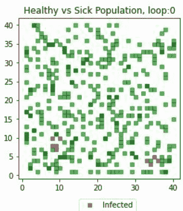

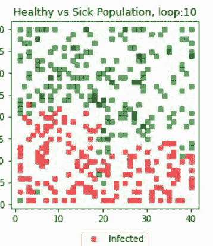

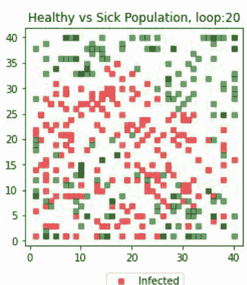

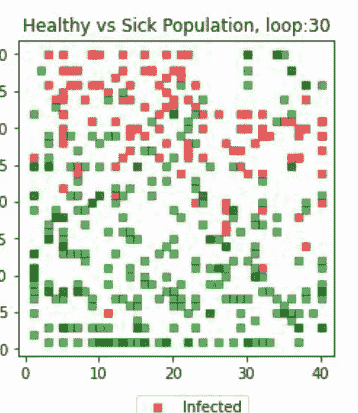

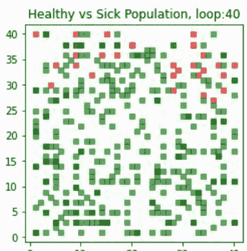

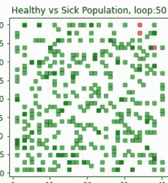

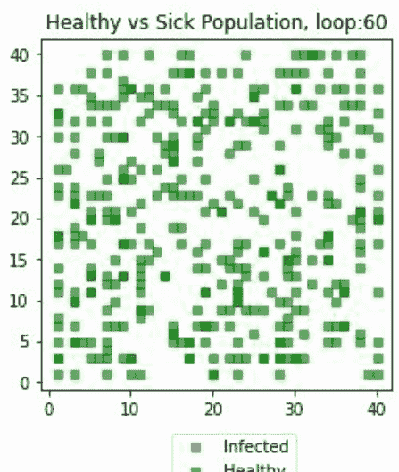

即使是最基本的假设，也可以清楚地看到，病患人数从人口的1%迅速增加到第20天时远超50%，然后在第60天前迅速降至零。

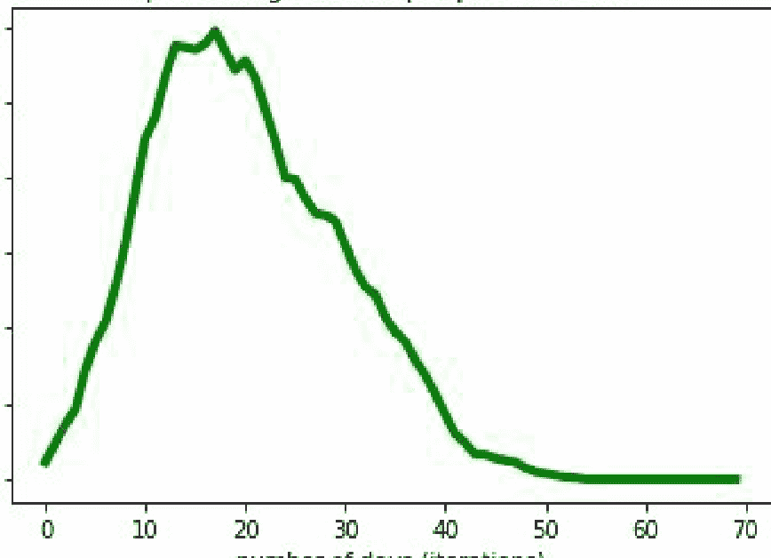

影响增长率的因素将是人口密度（单位面积的人数）和社区内的内部流动。如果模型包含一个杀死部分病患的功能，那么疾病也会更快地消退，因为这些人将不再被归类为传播者。

我们可以通过增加人口密度（保持人数不变但改变区域）来说明这一点，这将产生一系列如下所示的曲线：

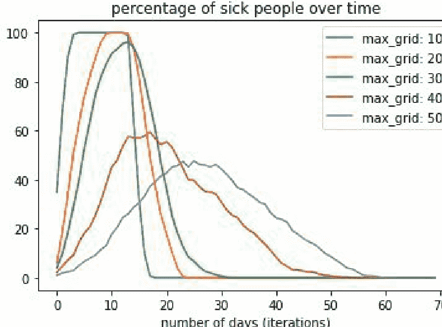

如果密度高（网格区域小），那么病患比例会迅速跳升至高位并快速消退，反之亦然，当密度低时。

同样，我们可以进行相同类型的模拟，但这次改变步长，得到如下结果：

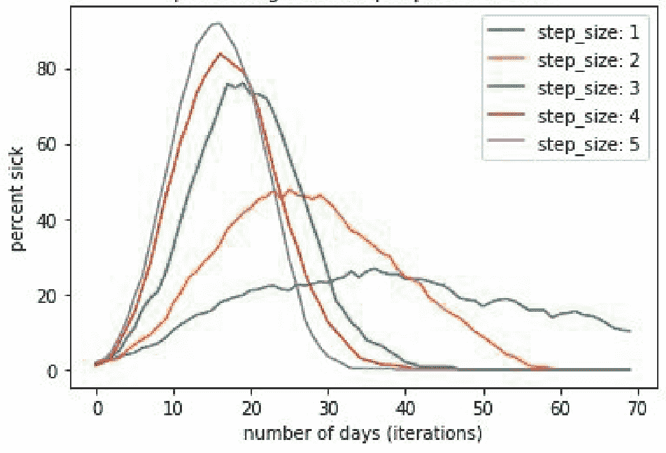

我们再次看到，更多的移动增加了病患比例，但也缩短了病毒的生命周期。

在许多方面，我们可能会预期上述特征，就像水在锅中沸腾一样。随着温度升高，粒子的内部运动增加。这增加了碰撞，从而增加了热量的传递。

总之，该模型表明，我们可以改变病毒在整个群体中渗透的时间分布，但最终，为了获得免疫力，所有人都需要在最初感染病毒。

### 谣言传播动力学

我们研究了传染病及其传播方式。病毒通过某种最近邻机制从一个人传播到另一个人。

该模型表明，较低的人口密度和较小的移动减少了传播，但最终，由于需要在个体层面实现免疫力，相同数量的人最终会在某个时间点感染病毒。

因此，现在我们将重点转移到谣言如何在系统中传播的数学原理上。如果我们把谣言本身视为信息的传递，无论它是真相（True）还是谎言（False）。例如，谣言可能是关于上一节中病毒的严重程度（危言耸听[23]）或关于完全无关主题的其他真相或谎言。

那么，谣言传播的规则是什么？

1.  一定比例的人开始传播谣言。
2.  任何听到谣言的人都会告诉他们的朋友。
3.  该人不再告诉其他人并停止关心。

广义上说，根据上述规则以及我们从传染病模型结果中获得的知识，我们可能会直觉地猜测传播动力学在某种程度上是相似的。

我们的谣言模型没有物理邻近性特征，因为各种形式的社交媒体意味着传播不需要物理互动。然而，*相同的邻近性特征会体现在一个人告诉他们最亲密的朋友这一点上*。

上述内容转化为人与人之间连接性的数学原理。一个*连接更紧密的系统*可以被视为类似于人口密集且流动性大的系统（锅中沸腾的水）。最终，预计在这种情况下传播率会很高。

知道传播率很高，我们现在必须注意连接广泛的人（超级传播者）。一个连接广泛的人（如社交媒体影响者或媒体渠道）会更快地传播信息。

一个超级传播者的传播方式与传染病模型中高度传染性且四处活动的人相同。

因此，让我们尝试建立一个模型，但同样尊重许多我们可以包含但为了简化而选择不包含的输入。

我们从一些初始条件开始，并设置一个人物类：

```python
import random
import matplotlib.pyplot as plt

# community of size n
num_people = 100_000
community = [x for x in range(num_people)]
community_notifications = []

class Person:

    def __init__(self, id=0) -> None:
        """ base conditions of a person to start """
        self.id = id  # unique id
        self.friends = self.generate_friends()
        self.motivation = 90  # motivation to transmit info
        self.aware = False  # is the person aware
        self.care = False  # if aware, does the person care
        self.notified = 0  # counter for times notified
        self.message_sent = 0  # counter for messages sent
        return
```

这些是我们想要的属性，但有无数种选择和方式可以建模谣言。

我们选择省略或合并到一个参数中的参数示例。

-   通过媒体传播
-   通过口头交流传播
-   交流渠道

这里的参数是合适的。特别是：

1.  **self.aware**：这个人知道谣言吗？
2.  **self.care**：这个人关心传播谣言吗？
3.  **self.notified**：这个人被通知了多少次。如果一个人收到太多通知，他们就会失去兴趣。
4.  **self.message_sent**：如果一个人发送了太多消息，他们会感到厌倦并停止。

接下来我们为这个类定义一些方法：首先我们生成一个朋友列表。

### 分形

分形是一种曲线或几何图形，其每一部分都具有与整体相同的统计特征。它们在建模具有相似模式在逐渐缩小尺度上重复出现的结构，以及描述部分随机或混沌现象方面非常有用。

可以说分形是动态系统的一部分。事实上，如果我们观察周围的世界，很容易发现我们被数百个分形所包围，甚至常常没有意识到。

让我们使用基础的海龟模块来创建一个分形：

```python
import turtle as ttl

ttl.shape('turtle')
ttl.speed(0)

def tree(size, levels, angle):
    if levels==0:
        ttl.color('green')
        ttl.dot(size)
        ttl.color('black')
        return
    
    ttl.forward(size)
    
    ttl.right(angle)
    tree(size*0.8, levels-1, angle)
    
    ttl.left(angle * 2)
    tree(size*0.8, levels-1, angle)
    
    ttl.right(angle)
    ttl.backward(size)

ttl.left(90)
tree(70, 9, 60)

ttl.mainloop()
```

分形的特性之一是其重复性，这在计算上与递归函数非常契合。

我们很早就接触过递归函数，并发现了两种便捷的形式。[1] 函数反复调用自身（简单），[2] 在循环中反复调用函数（高效）。在这两种情况下，我们都需要确保函数结束时达到基本情况，否则会陷入无限循环或栈溢出。

在上面的代码示例中，我们通过使用递归函数为左分支和右分支反复调用自身来创建一棵树。

基本情况由 `if` 语句设置，我们检查 `levels == 0`，然后绘制一个叶子（终端节点）并返回，不再调用该函数。

海龟开始遍历所有递归路径，直到每个节点都被访问到。这是代码运行的结果：

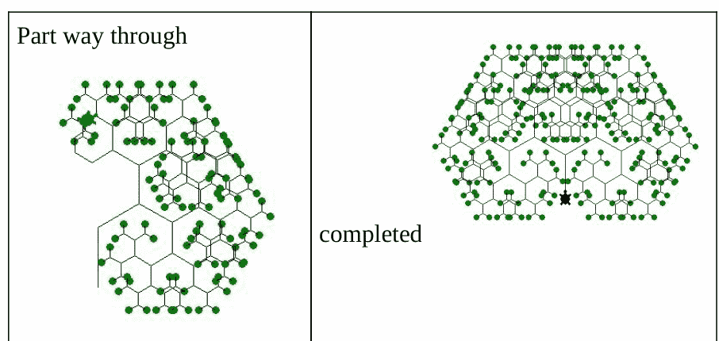

我们可以修改代码，在某些部分添加随机性，例如，设置随机角度或更改终端节点的颜色。随机化颜色只需添加以下两行代码即可完成：

```python
colour_choice = ['red','orange', 'yellow','green', 'blue', 'indigo']
ttl.color(random.choice(colour_choice))
```

这实现了如下图所示的彩虹色叶子的树。

| 进行中... | 已完成 |
| :---: | :---: |
|  |  |

我们可以让角度在预定义的约束内随机变化，这将实现一棵非对称的树，它与原始树非常相似，但又不完全相同。

我们通过设置以下代码来实现：

```python
angle = random.randint(30, 90)
```

有了这行代码，我们放弃了对海龟在30到90度约束内行进方向的控制，现在结果看起来像这样：

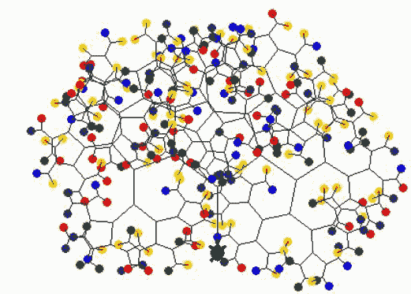

现实情况是，自然界同时包含上述两种情况。有序分形（如规则的晶格）和无序分形（如国家的海岸线）。

有趣的是，尽管存在某种形式的混沌，但海龟在

我们为了示例目的制作了一个小列表，但即使只有这个小数量，饱和点也仅在几次迭代后就达到了。

接下来，是一些用于更新已收到通知的人的规则：

```python
def update_person(self):
    """ update the persons status """
    self.notified += 1
    if self.notified > 1:
        self.motivation = self.motivation - 10

    if self.aware == False:
        # just heard a rumor, now spread it.
        self.aware = True
        self.care = True

    if self.notified > 3:
        # now bored so dont care
        self.care = False
```

我们添加了逻辑规则，例如动机下降和人们对谣言失去兴趣。

最后，是一个向朋友发送消息的方法。

```python
def message_friends(self, community_notifications:list):
    """ message friends making them aware """

    if self.aware == True and self.care == True:
        self.message_sent += 1
        self.motivation = self.motivation - 10
        if self.message_sent > 10:
            # sent enough messages, now bored
            self.care = False

    for i in self.friends:
        if self.motivation > random.randint(0,100):
            community_notifications.append(i)
```

我们以概率的方式使用动机。每个人的动机水平都在下降，这意味着他们将谣言转发给朋友列表中朋友的可能性降低。

现在我们可以开始编写代码主体：

```python
# generate a list of people
person = [Person(x) for x in community]

# a few people start a rumour
x = random.choices(community, k=3)
for i in x:
    person[i].aware = True
    person[i].care = True
    person[i].notified = 1
```

我们使用列表推导式在一行强大的代码中设置社区中的所有人。这是Python的一个特定特性，其他语言需要冗长地表达。并且从社区中，模型随机选择三个人来开始传播谣言。

最后，我们可以通过循环过程来生成模拟：

```python
# do some loops
who_is_aware = 0
who_cares = 0
community_aware = []
community_care = []
community_motivation = []

for i in range(40):
    # each aware person notifies friends
    for j in person:
        j.message_friends(community_notifications)

    # the people receive notifications
    for j in community_notifications:
        person[j].update_person()

    # updates complete, so empty the list
    community_notifications = []

    # collect the data from each loop
    who_is_aware = 0
    who_cares = 0
    motivation_level = 0
    for i in person:
        if i.aware == True:
            who_is_aware += 1
        if i.care == True:
            who_cares += 1
        motivation_level = motivation_level + i.motivation/100
    community_aware.append(who_is_aware)
    community_care.append(who_cares)
    community_motivation.append(motivation_level)
```

我们创建列表以便稍后绘制数据。循环本身包含一个向朋友发送消息，然后其他朋友接收这些消息的循环。

最后，我们可以绘制数据：

```python
plt.plot(community_motivation, label='community motivation')
plt.plot(community_aware, label='community aware')
plt.plot(community_care, label='community care', linewidth=4)

plt.title('who is aware and who cares')
plt.xlabel(' iteration ->')
plt.ylabel('count ->')
plt.legend()
plt.grid()
plt.show()
```

我们关心的三条线是：

- 1. 社区意识：这里我们发现了一个典型的S形曲线，先是急剧上升，然后达到饱和。
- 2. 社区关心：这是在任何时间点关心转发谣言的人数。这里我们看到了一个“兴趣高峰”点，之后人们对谣言感到厌倦。
- 3. 社区动机：是社区关心的另一种衡量标准。它代表了社区传播谣言的总体动机程度。我们看到它随着时间的推移而减弱。

我们的第一个图是标准模型。

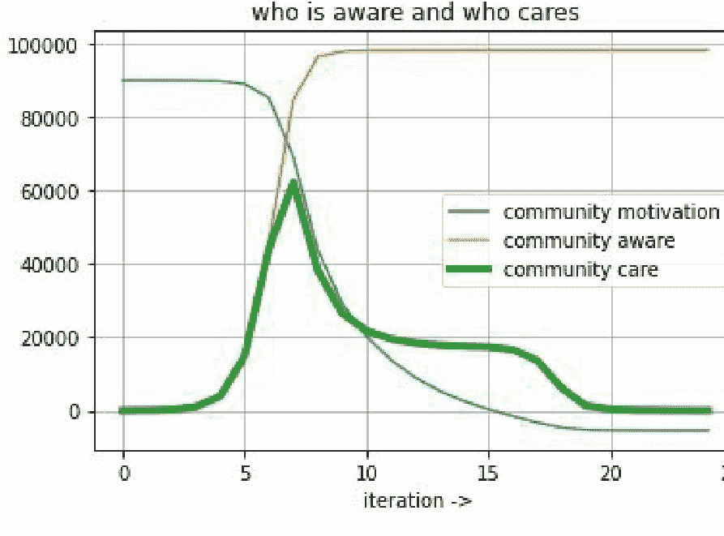

我们的第二个图与第一个类似，但动机水平降低了。动机的降低平滑并延长了曲线，因为达到饱和点需要更长的时间。

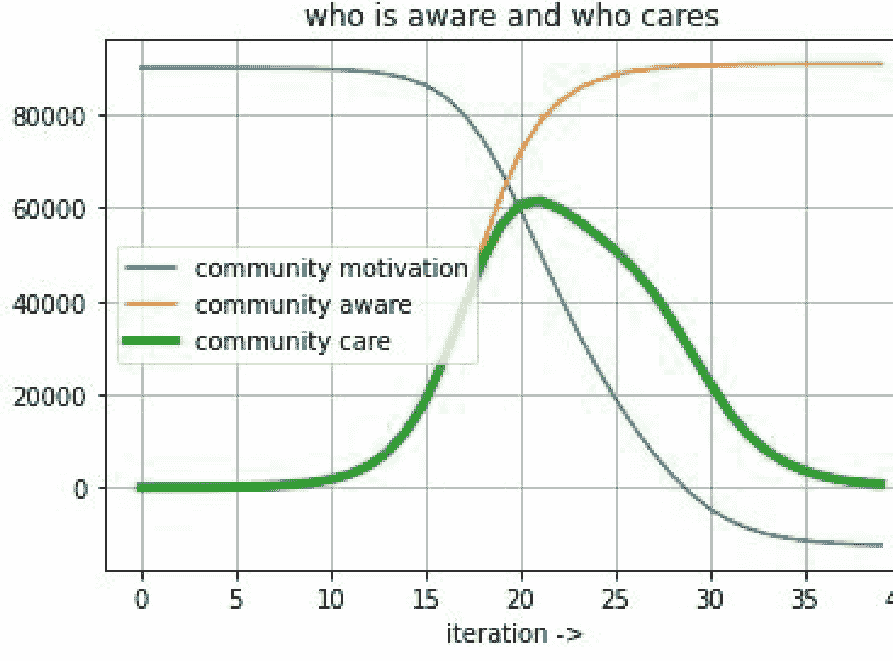

事实上，我们看到当动机水平降低时，最大饱和水平也更低。这是因为谣言在到达整个人口之前就已经消亡了（即人们太快地感到厌倦了）。

整个代码内容在Python中只有120行，却产生了极其强大的计算和结果。

```python
def generate_friends(self) -> list:
    """ generate a list of friends from the community """
    friends = random.choices(community, k=5)
    friends = list(set(friends))
    return friends
```

代码之所以能成功返回原点，是因为其递归特性。

我们可以通过将边界条件从[45, 75]度扩大到[30, 90]度来增加混沌程度，同时也可以修改代码，将宽角度节点着色为红色，窄角度节点着色为绿色。

```
if angle > 60:
    angle_colour = 'red'
else:
    angle_colour = 'green'
```

这向观察者突出了海龟所走的路径。

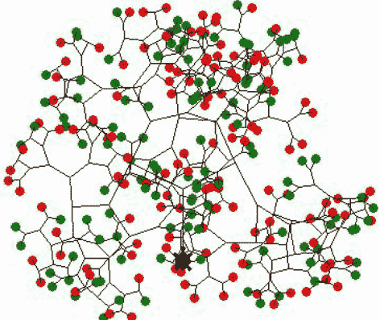

但即使在这个简单模型中，我们仍能在复制自然界的有序混沌方面做得更好。例如，假设树木有向一个方向——向阳面——生长的倾向，我们可以通过改变概率将这一特性纳入基础模型。

这样做，我们将创建一种颜色的叶子数量多于另一种，其比例大致与我们引入的偏差相同。

让我们创建一个偏斜列表函数。为此，我们可以使用`scipy`模块的`skewnorm.rvs()`方法。

```
from scipy.stats import skewnorm
import matplotlib.pyplot as plt

def skewed_list(skew, size=1000, x_low=30, x_high=120):
    """ returns a skewed list between x_low and x_high """
    data= skewnorm.rvs(skew, size=size)*100
    data = data - min(data)
    data = data / max(data)
    data = data * x_high
    data = [x for x in data if x > x_low]

    return data
r = skewed_list(-30, size=1000 ,x_low=30, x_high=120)

plt.hist(r, color='green', alpha=0.5)
print(min(r))
```

该列表产生的分布通常如下所示：

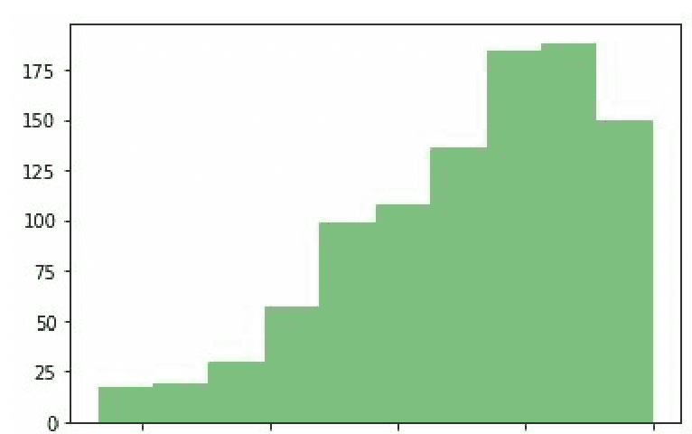

我们使用这个分布不均匀的列表来改变海龟的角度，因此其颜色也将不均匀分布（根据偏斜分布）。

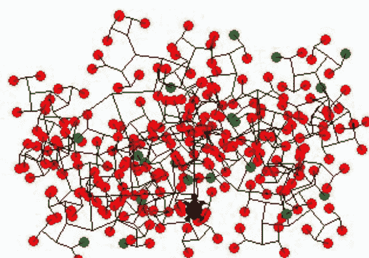

我们观察到的是一个随机网络，主要由红色叶子组成，树枝之间的角度通常更宽。

最后，再次改变大小（代表每根树枝的长度）会产生如下效果：

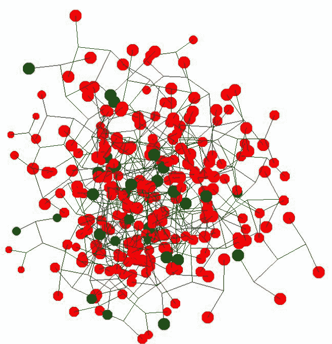

最后，让我们在最终模型中使用10到30度之间的角度来绘制一棵樱花树。这限制了树木向上生长，就像自然界中的普通树木一样。我们还改变了着色方式，使得基于不均匀概率分布的大多数叶子为绿色。因此，最终的图片如下：


在每一棵树中，通过使用递归函数，无论树枝或角度的复杂程度如何，我们总能将海龟送回原点。

这段不超过60行的代码为各种类型的树形分形提供了基础，用户只需更改几个参数或标准即可。

我们还可以注意到，尽管每根树枝和路径的长度和角度都是完全随机的，但秩序依然存在。节点最终形成了一个美丽的半圆形图案，几乎像是精心设计的。如果我们不断重新绘制树木，将会得到相似但不完全相同的图案，就像人类的指纹相似但不完全相同一样。

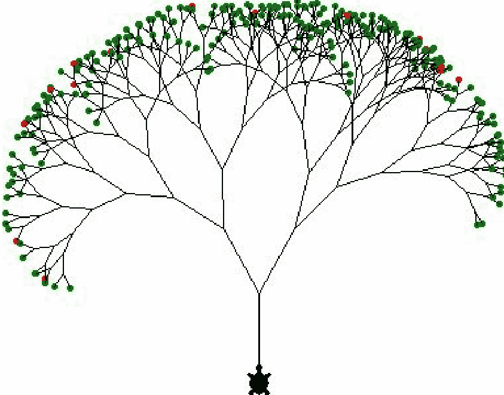

事实上，就像我们在循环中种植单棵树一样，我们也可以通过将代码移入`for`循环进行简短调整，以同样的方式构建一片森林。

```python
for i in range(7):
    # draw several trees
    ttl.left(90)
    tree_size = random.choice(skewed_list(-30, x_low=50, x_high=80))
    tree_levels = random.choice([5,6,7,8,9,10])
    tree(tree_size, tree_levels)
    # move to new random location
    ttl.right(90)
    ttl.penup()
    n = random.randint(0,360)
    ttl.right(n)
    ttl.forward(random.randint(1,5)*10 + 60)
    ttl.left(n)
    ttl.pendown()
```

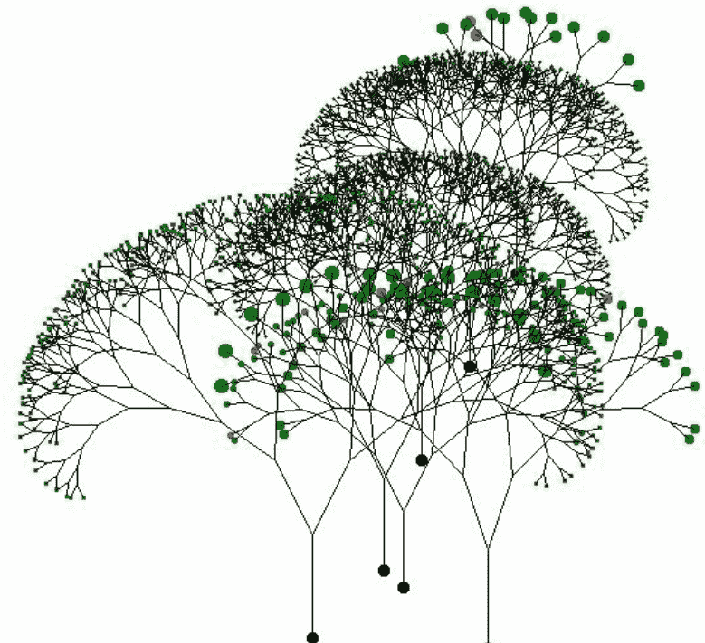

### 曼德博集合

有趣之处在于它们将复数与分形结合起来，同时，我们还学习了稳定性，这对所有迭代过程都是成立的。稳定性在曼德博集合中得到了美妙的体现。

有趣的是，这个高度复杂的图案是由最简单的公式产生的：

$$Z_{n+1} = Z_n^2 + c$$

其中 $Z_n$ 是复数。

曼德博集合的变化方式也是混沌理论的标志。在最终版本中，产生了美丽的图案，着色通常用于表示任何给定数字的稳定性（数字发散的可能性），而边缘附近稳定性的快速变化是混沌的。

曼德博集合起源于20世纪70年代，到80年代进行了首次可视化。然而，当时的计算能力远不及今天，因此创作者受限于当时的数学知识和可用的计算资源。所以他们制作出了这样的结果：

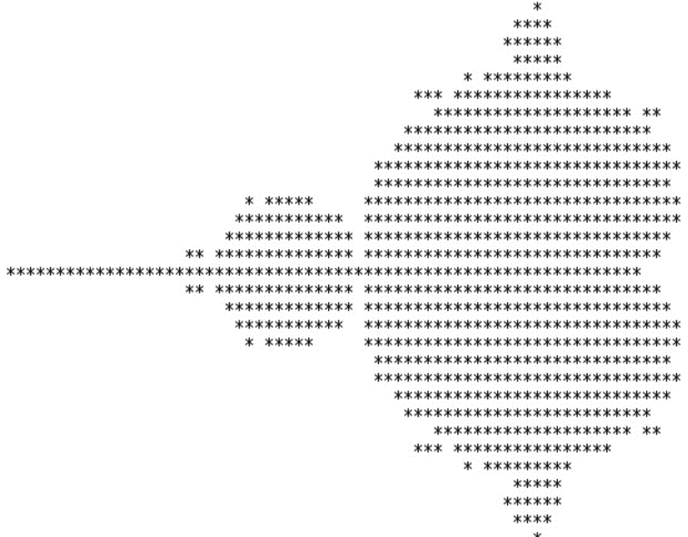

根据摩尔定律[24]，我们的集合、知识和能力比80年代高出几个数量级，我们将研究复数在迭代（或递归）过程中的行为基础。

在考虑复数之前，让我们思考一下数轴上的普通数字及其稳定性会发生什么。因此，让我们看看 $X_{n+1} = X_n^2 + c$，其中 X 是实数。

可以通过表格进行初步的基本检查。

| $x_n$ | $x_{n+1}$ | $x_{n+2}$ | $x_{n+3}$ | $x_{n+4}$ | $x_{n+5}$ | 类型 |
|---|---|---|---|---|---|---|
| -10 | 100 | 10,000 | 100,000,000 | 10,000,000,000,000,000 | 100,000,000,000,000,000,000,000,000,000,000,000,000 | 发散 |
| -5 | 25 | 625 | 390,625 | 152,587,890,625 | 23,283,064,365,387,000,000,000 | 发散 |
| -2 | 4 | 16 | 256 | 65,536 | 4,294,967,296 | 发散 |
| -1 | 1.00 | 1.00 | 1.00 | 1.00 | 1.00 | 稳定 |
| -0.5 | 0.25 | 0.06 | 0.00 | 0.00 | 0.00 | 收敛 |
| -0.25 | 0.06 | 0.00 | 0.00 | 0.00 | 0.00 | 收敛 |
| 0 | 0.00 | 0.00 | 0.00 | 0.00 | 0.00 | 收敛 |
| 0.25 | 0.06 | 0.00 | 0.00 | 0.00 | 0.00 | 收敛 |
| 0.5 | 0.25 | 0.06 | 0.00 | 0.00 | 0.00 | 收敛 |
| 1 | 1.00 | 1.00 | 1.00 | 1.00 | 1.00 | 稳定 |
| 2 | 4 | 16 | 256 | 65,536 | 4,294,967,296 | 发散 |
| 5 | 25 | 625 | 390,625 | 152,587,890,625 | 23,283,064,365,387,000,000,000 | 发散 |
| 10 | 100 | 10,000 | 100,000,000 | 10,000,000,000,000,000 | 100,000,000,000,000,000,000,000,000,000,000,000,000 | 发散 |

我们看到存在某种收敛区域，边界在 $x_n = \pm 1$。所有绝对值 < 1 的数字都收敛到零，被称为稳定的；而绝对值 > 1 的数字则趋向无穷大，被称为不稳定的。

实数的收敛区域（或收敛半径）最好用下面的数轴来描述。

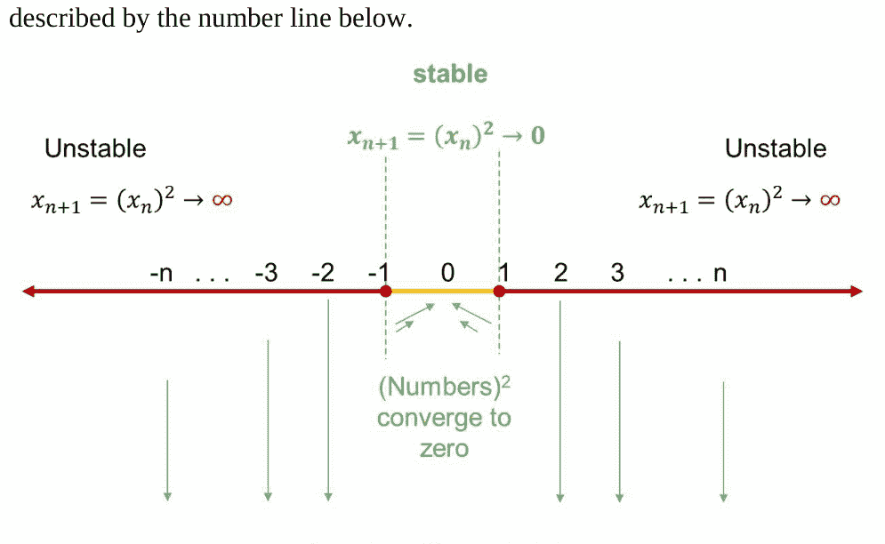

我们使用这个类比扩展到复平面。将 $x_n$ 扩展为 $z_n$ 意味着 $x_n^2$ 变为 $z_n^2$。我们知道 $z_n = a_n + i*b_n$，其中 a 和 b 是实数。

当我们将此转换为极坐标（正如我们在复数部分所做的那样），这转换为一个半径为 sqrt(a_n^2 + b_n^2) 的圆。因此，收敛区域变成了一个收敛半径，看起来像这样：

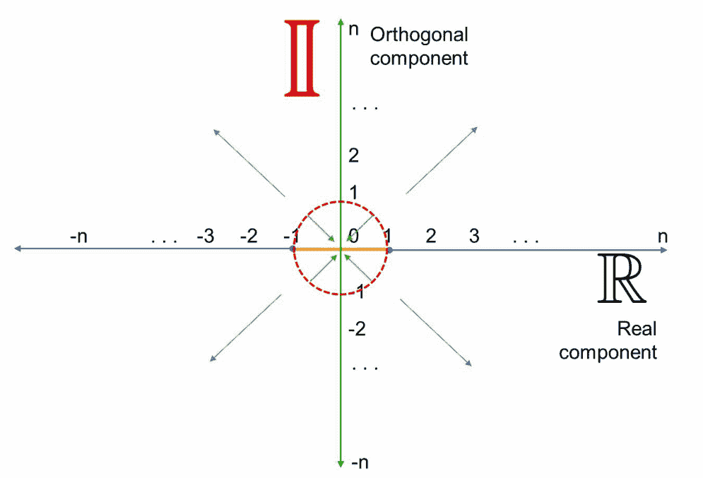

上述内容是简化的，但部分突出了我们可能预期的 $z_{n+1} = z_n^2$ 的行为。将同样的概念扩展到曼德博方程，通过添加一个常数 c，产生了一些意想不到的结果，但探索后部分是直观的。

那么，让我们开始编写代码：

我们使用了`pygame`模块，但请注意，我们也可以使用`tkinter`（甚至`turtle`）来显示图像。

```python
import pygame
import ctypes
import time

# to use pygame's functionality.
pygame.init()

# screen dimensions
```

### 曼德博集合程序

```python
user32 = ctypes.windll.user32
width = user32.GetSystemMetrics(0)
height = user32.GetSystemMetrics(1)
width, height = int(width/1.1), int(height/1.1)
win = (width, height)
screen = pygame.display.set_mode(win)

# set the pygame window name
pygame.display.set_caption('Mandelbrot Program')

xaxis = width/2 + 100
yaxis = height/2
scale = 200 # Mandelbrot size
iterations = 20 # the more iterations you make the better resolution you'll get
```

最初，我们只是将主屏幕参数设置为实际屏幕尺寸的函数（这样代码就能在任何尺寸的屏幕上运行）。y轴是屏幕高度的一半，因为图像在轴的上下两侧是对称的。

我们定义一个主函数，它将做两件事：

1.  循环的迭代
2.  允许用户进行一些基本控制

```python
def main():
    """ main code for Mandelbrot """
    the_iteration()
    the_loop()
```

然后我们开始进行主要的迭代。这就是公式 $z_{n+1}=z_n^2+c$ 被调用的地方。

```python
def the_iteration():
    for iy in range(int(height/2+1)):
        for ix in range(width):
            z = 0+0j
            c = complex(float(ix-xaxis)/scale, float(iy-yaxis)/scale)

            for i in range(iterations):

                z = z**2+c # Mandelbrot equation
                if abs(z) > 2:
                    v = 765*i/iterations
                    if v > 510:
                        color = (255, 255, v%255)
                    elif v > 255:
                        color = (100, v%255, 255)
                    else:
                        color = (0, 0, v%255)
                    break
            else:
                color = (0, 0, 0)

            screen.set_at((ix, iy), color)
            screen.set_at((ix, height-iy), color)

    # text labels
    font = pygame.font.Font('freesansbold.ttf', 20)
    text_iter = font.render(f'iterations (<-|->): {iterations}',
                            True, (255,200,200), (10,10,10))
    textRect_iter = text_iter.get_rect()
    textRect_iter.topleft = (width//10, height//10)
    screen.blit(text_iter, textRect_iter)
    text_scale = font.render(f'scale (up/dwn): {scale}',
                            True, (255,200,200), (10,10,10))
    textRect_scale = text_scale.get_rect()
    textRect_scale.topleft = (width//10, height//10 + 30)
    screen.blit(text_scale, textRect_scale)

    pygame.display.update()
```

主要迭代周围的大部分代码都是为了人类可视化，例如颜色比例尺和包含用户信息的文本框，因此只有一行是核心：

```python
z = z**2+c  # Mandelbrot equation
```

循环中的颜色部分是必要的，因为它向我们描述了每个点上序列的稳定性。黑点是最稳定的，通过这一行找到：

```python
if abs(z) > 2:
```

所有其他颜色都是根据点变得稳定所需的*迭代次数*在此之间生成的。

代码的最后一部分允许用户调整迭代次数和比例尺。

```python
def the_loop():
    global iterations
    global scale

    run = True
    while run:
        for event in pygame.event.get():
            if event.type == pygame.QUIT:
                run = False
        keys = pygame.key.get_pressed()
        if keys[pygame.K_LEFT]:
            time.sleep(0.1)
            print('iterations before:', iterations)
            iterations -= 5
            if iterations < 1:
                iterations = 2
            the_iteration()
            print('iterations after:', iterations)

        if keys[pygame.K_RIGHT]:
            time.sleep(0.1)
            print('iterations before:', iterations)
            iterations += 5
            the_iteration()
            print('iterations after:', iterations)

        if keys[pygame.K_UP]:
            time.sleep(0.1)
            print('scale before', scale)
            scale += 50
            the_iteration()
            print('scale after', scale)

        if keys[pygame.K_DOWN]:
            time.sleep(0.1)
            print('scale before', scale)
            scale -= 50
            the_iteration()
            print('scale after', scale)

    pygame.quit()
```

每次按下按钮，都会进行一次计算，并通过 `pygame.display.update()` 重绘屏幕。我们已经在其他GUI模块中了解了这种屏幕重绘功能。

最后，为了运行所有模块（通过主模块），我们使用常见的提升方法：

```python
if __name__ == "__main__":
    main()
```

我们现在可以运行代码，以给定的迭代次数生成曼德博集合。

如果我们使用较低的迭代次数，结果会相当乏味。这里我们只使用了2次迭代：

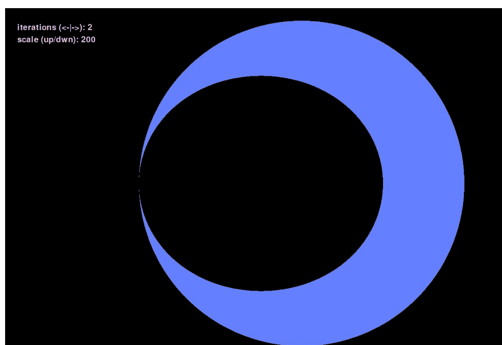

但随着我们增加迭代次数，我们开始看到一个看似平凡的内圈，变成了一个具有内部特征的不同形状，颜色也开始变化，这代表了 $z_{n+1}$ 的稳定性。

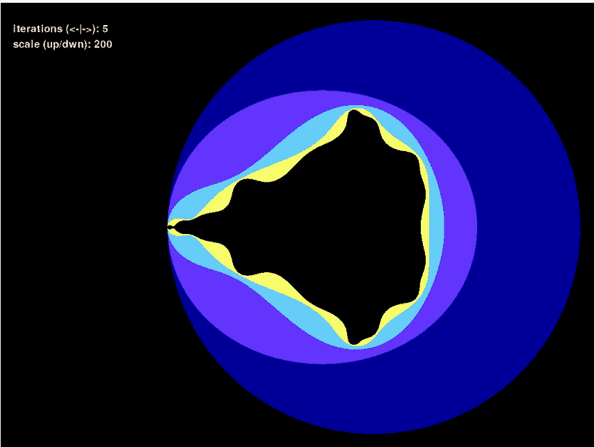

随着迭代次数进一步增加，我们得到这个：

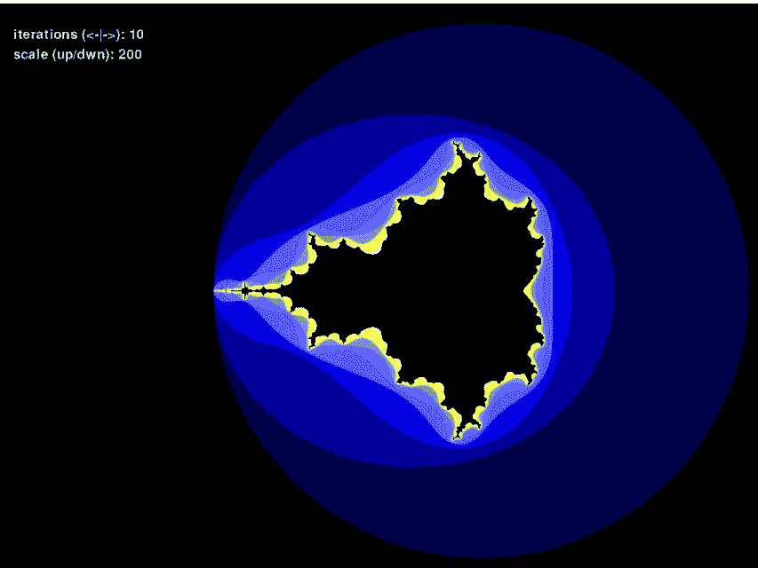

我们可以继续增加：

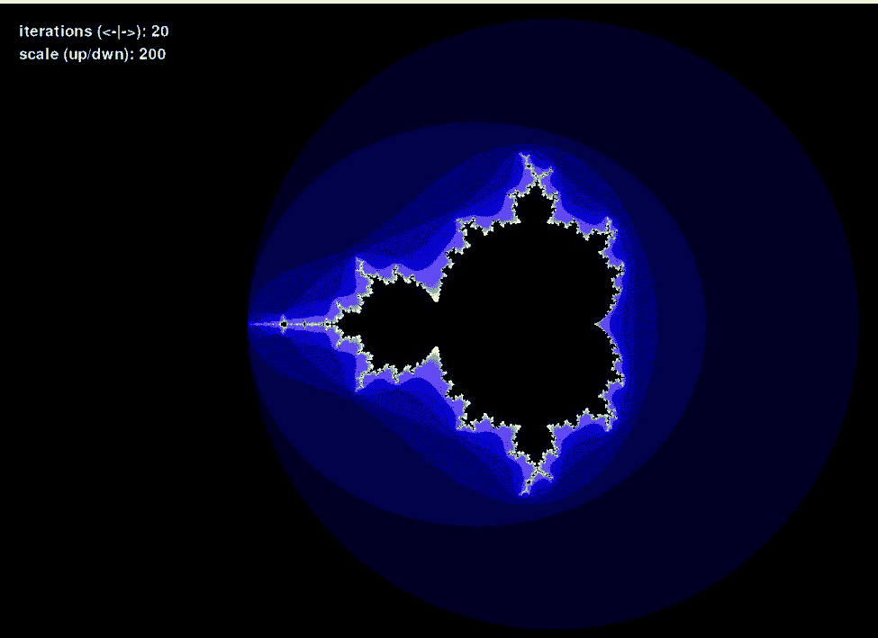

突然，在仅仅20次迭代时，我们开始看到形状边缘周围出现了大量的结构。

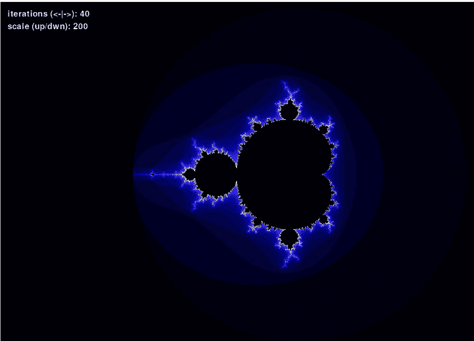

并且这会无限地持续下去。

关于计算的说明：在一台标准笔记本电脑上，通常有1920 * 1080个像素，因此在循环开始之前，我们大约需要计算200万个像素。所以如果我们做20次循环，这个过程将达到4000万次计算。

有各种技巧可以减少计算量，第一个是使用屏幕的较小比例，因为像素数量与边长的平方成正比。

关于曼德博集合的研究非常广泛，需要数周时间才能涵盖这个话题，所以我们已经达到了一个自然的停止点。但有趣的是边缘周围的数学，因为我们发现我们可以无限地放大这些点，它们会以相当混乱和不可预测的方式不断产生新的分形。

### 双摆

双摆直接源于单摆的概念。

众所周知，单摆是一个极好的计时器，因为无论单摆以何种振幅开始摆动，从一端到另一端的给定摆动（时钟的滴答声）所花费的时间都是恒定的。事实上，我们能够从基本原理证明，恒定时间 T 遵循以下公式。

$$T = 2\pi \sqrt{\frac{L}{g}}$$

其中 L 是摆长，g 是重力（在地球表面是恒定的）。我们看到，唯一能控制的、决定周期 T 的物理因素是摆长 L。

我们可以利用作用在摆上的基本力和牛顿运动定律完成上述所有操作。

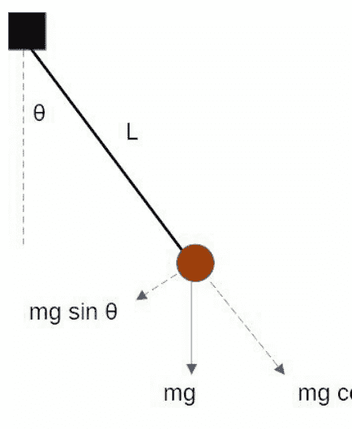

然而，双摆是一个经典的物理问题，它产生了一个混沌运动的例子，而人们原本可能预期的是有序运动。特别是，因为双摆的设置看起来与其单摆兄弟非常相似。

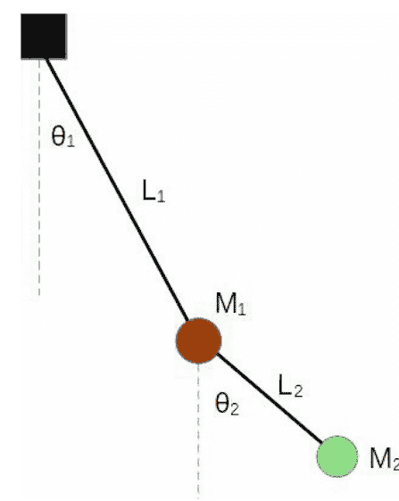

这个问题背后的数学很冗长，但本质上我们有每个摆锤的位置和速度。

位置：

- $(x_1,y_1) = (L_1\sin\theta_1 , L_1\cos\theta_1)$
- $(x_2,y_2) = (L_1\sin\theta_1 + L_2\sin\theta_2, - L_2\cos\theta_1 - L_2\cos\theta_2 )$

速度：

- $(\underline{x}_1,\underline{y}_1) = (L_1\underline{\theta}_1\cos \theta_1, L_1\underline{\theta}_1\sin \theta_1)$
- $(\underline{x}_2,\underline{y}_2) = (L_1\underline{\theta}_1\cos\theta_1 + L_2\underline{\theta}_2\cos\theta_2 , L_1\underline{\theta}_1\sin\theta_1 + L_2\underline{\theta}_2\sin\theta_2)$

其中 $\underline{x} = \frac{dx}{dt}$ 且 $\underline{\theta} = \frac{d\theta}{dt}$

根据以上信息，我们可以计算出两个摆锤的势能和动能，已知：

$$ke = \frac{1}{2}mv^2$$ 且 $$pe = mgh$$

我们知道能量是守恒的，因此：

$$ke + pe = Constant$$，这是哈密顿力学中系统的总能量。

然而，对于双摆，我们使用拉格朗日力学，即 ke - pe，代表能量之差。所以我们说：

L = ke - pe

这适用于欧拉-拉格朗日方程：

$$\frac{d}{dt}\left(\frac{dL}{dq}\right) = \frac{dL}{dq}$$

这给出了系统的运动方程，而无需考虑系统中的各个力。

经过一些微积分和代数运算，我们得到了两个涉及二阶导数的冗长方程。但既然我们知道二阶导数是对一阶导数的导数，我们就可以将其放入代码中。

我们从打算使用的导入开始：

```python
from numpy import sin, cos
import numpy as np
import matplotlib.pyplot as plt
import scipy.integrate as integrate
import matplotlib.animation as animation
```

并设置初始条件。

```python
G = 9.8 # acceleration due to gravity, in m/s^2
L1 = 1.0 # length of pendulum 1 in m
L2 = 1.0 # length of pendulum 2 in m
M1 = 1.0 # mass of pendulum 1 in kg
```

### 双摆模拟

M2 = 1.0  # 摆锤2的质量，单位：千克

接下来，我们需要一个函数来处理给定状态下的导数。

```python
def derivs(state, t):

    dydx = np.zeros_like(state)
    dydx[0] = state[1]

    delta = state[2] - state[0]
    den1 = (M1+M2) * L1 - M2 * L1 * cos(delta) * cos(delta)
    dydx[1] = ((M2 * L1 * state[1] * state[1] * sin(delta) * cos(delta)
                + M2 * G * sin(state[2]) * cos(delta)
                + M2 * L2 * state[3] * state[3] * sin(delta)
                - (M1+M2) * G * sin(state[0]))
               / den1)

    dydx[2] = state[3]

    den2 = (L2/L1) * den1
    dydx[3] = ((- M2 * L2 * state[3] * state[3] * sin(delta) * cos(delta)
                + (M1+M2) * G * sin(state[0]) * cos(delta)
                - (M1+M2) * L1 * state[1] * state[1] * sin(delta)
                - (M1+M2) * G * sin(state[2]))
               / den2)

    return dydx
```

然后，我们需要为模拟设定一个时间范围，以及初始角度和角速度。

```python
# 创建一个从0到100的时间数组，采样间隔为0.05秒
dt = 0.05
t = np.arange(0, 20, dt)
print(t)

# th1 和 th2 是初始角度（度）
# w10 和 w20 是初始角速度（度/秒）
th1 = 120.0
w1 = 0.0
th2 = -10.0
w2 = 0.0

# 初始状态
state = np.radians([th1, w1, th2, w2])
```

接着，我们使用 `scipy` 模块来积分我们最初推导出的常微分方程。

```python
# 使用 scipy.integrate 积分你的 ODE。
y = integrate.odeint(derivs, state, t)
```

对于每个时间值 `t`，我们都有一个状态。因此，我们生成了 `y` 值，它是一个列表的列表，看起来像这样：

```
[[ 2.0943951  0.    -0.17453293 0.    ]
[ 2.08189245 -0.49983043 -0.18037987 -0.23120247]
[ 2.04447081 -0.99609112 -0.19711468 -0.43005342]
...
[-0.25507841  4.38151899 -3.8135224   3.26796836]
[-0.04126843  4.14049477 -3.67188173  2.37875988]
[ 0.15636407  3.74412399 -3.57692326  1.41412786]]
```

`t` 的长度和状态的数量是相同的。

我们实际上存储了每个时间点 `t` 对应的两个角度和角速度。

现在，给定我们知道每个时间点摆锤的角度（θ₁, θ₂）和长度（L₁, L₂），绘制（x₁,y₁）和（x₂, y₂）的位置就变得很简单了。

```python
x1 = L1*sin(y[:, 0])
y1 = -L1*cos(y[:, 0])

x2 = L2*sin(y[:, 2]) + x1
y2 = -L2*cos(y[:, 2]) + y1
```

因此，我们现在可以着手绘制数据了。实际上，我们可以用这个来绘制双摆的动态模拟：

```python
fig = plt.figure()
ax = fig.add_subplot(111, autoscale_on=False, xlim=(-2, 2), ylim=(-2, 2))
ax.set_aspect('equal')
ax.grid()

line, = ax.plot([], [], 'o-', lw=2)
time_template = 'time = %.1fs'
time_text = ax.text(0.05, 0.9, '', transform=ax.transAxes)

def init():
    line.set_data([], [])
    time_text.set_text('')
    return line, time_text

def animate(i):
    thisx = [0, x1[i], x2[i]]
    thisy = [0, y1[i], y2[i]]

    line.set_data(thisx, thisy)
    time_text.set_text(time_template % (i*dt))
    return line, time_text

ani = animation.FuncAnimation(fig, animate, range(1, len(y)),
                            interval=dt*1000, blit=True, init_func=init)
plt.show()
```

这会生成以下动态动画序列：

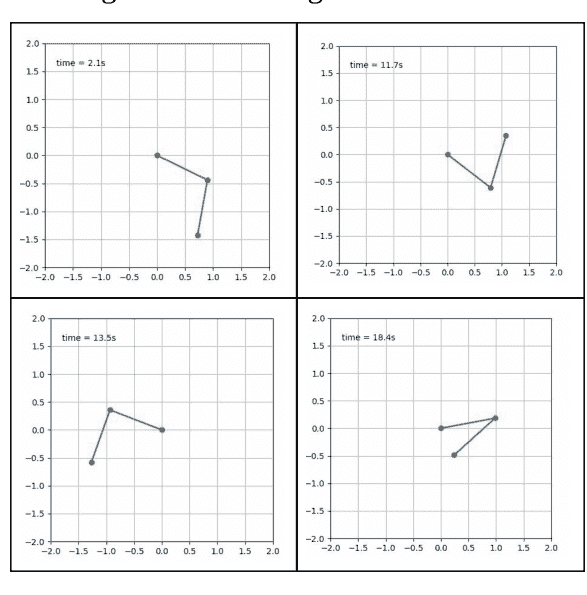

但为了本次练习的目的，我们也可以绘制摆锤的运动轨迹，特别是第二个摆锤的轨迹。

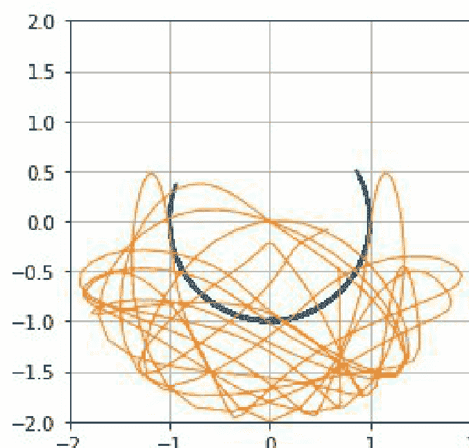

我们看到第一个摆锤的轨迹是一条有序的曲线，考虑到它只有一个自由度 $\theta_1$ 且长度 $L_1$ 固定，这必然是这种情况。

然而，第二个摆锤遵循一条不可预测且混沌的路径。第二个摆锤受到某些约束，例如，它不能超过 $|L_1| + |L_2|$ 的距离，也不能短于 $|L_1| - |L_2|$。然而，在这些约束范围内，我们无法说出摆锤在任何给定时间点会位于何处。

我们可以通过将两个图都简化为散点图来展示摆锤如何*随时间移动*，如下所示：

```python
cmap1 = plt.colormaps['Blues']
cmap2 = plt.colormaps["Reds"]

sp1 = ax.scatter(x1, y1, c=t, marker='.', cmap=cmap1)
sp2 = ax.scatter(x2, y2, c=t, marker='.', cmap=cmap2)
ax.set_xlabel('x values -->')
ax.set_ylabel('y values -->')

fig.colorbar(sp1, label='time')
fig.colorbar(sp2, label='time')

plt.show()
```

这会生成

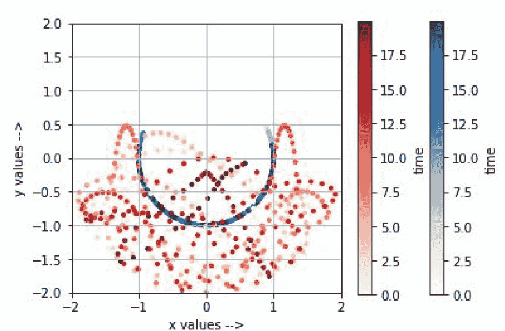

有趣的是，要注意当任何一个参数发生微小变化时，第二个摆锤的路径会发生什么变化。

因此，我们像这样设置一个新的初始状态（称为 delta）：

```python
# 初始状态
state = np.radians([th1, w1, th2, w2])
state_delta = np.radians([th1, w1+0.01, th2, w2])
```

我们可以用这个来生成新的 `y` 值，如下所示：

```python
# 使用 scipy.integrate 积分你的 ODE。
y = integrate.odeint(derivs, state, t)
y_delta = integrate.odeint(derivs, state_delta, t)
```

从这个微小的变化（ $w_1 \rightarrow w_1 + 0.01$ ）中，我们生成了一个完全不同的图。

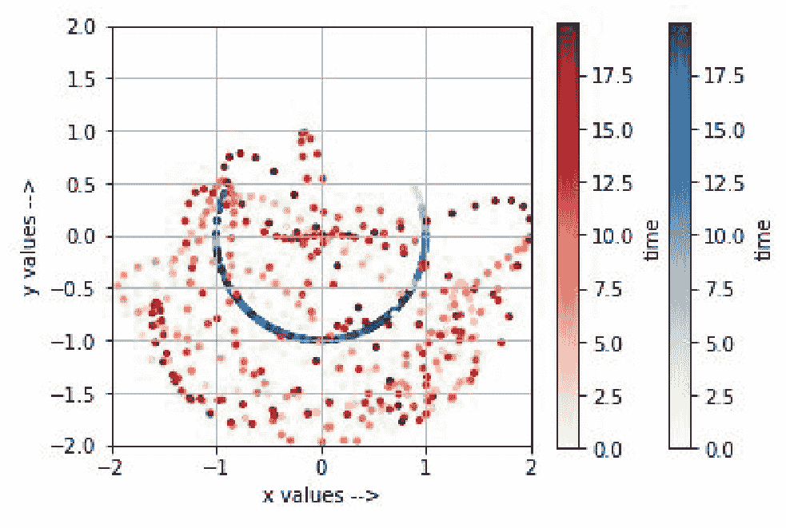

实际上，我们可以将第二个摆锤的两个图并排比较（为了清晰起见，我们移除了上方的摆锤，因为对于相同的 L₁，它们会重叠）。

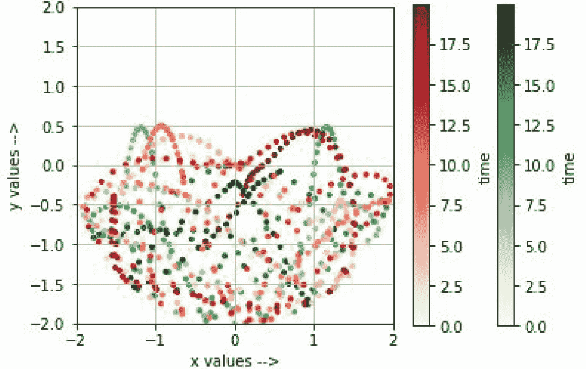

我们可以继续引入新的图，即使是最小的变化，例如通过修改 $\theta_1 \rightarrow \theta_1 + 0.01$ 来创建第三个状态。

```python
# 初始状态
state = np.radians([th1, w1, th2, w2])
state_delta = np.radians([th1, w1+0.01, th2, w2])
state_delta_2 = np.radians([th1+0.01, w1, th2, w2])
```

我们得到了第三个完全不同的图

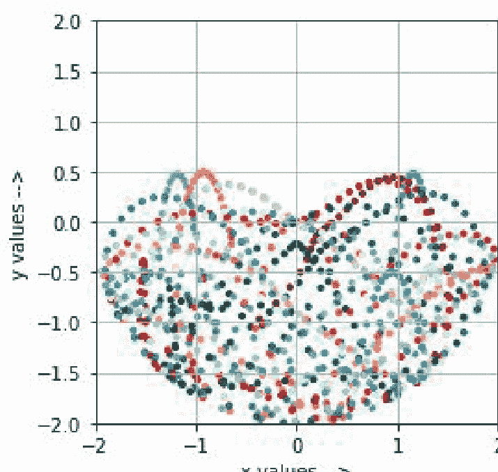

除了被限制在某些边界内，我们通过计算机模拟表明，双摆对初始条件敏感，且运动是混沌的。

### 三体问题

三体问题之所以有趣，是因为它代表了另一种类型的混沌问题，其中*初始条件的微小变化会导致截然不同的结果*。

同时，它也具有一定程度的可预测性，因为问题中的每个物体都遵循一个预先描述的运动模式，即万有引力。

$$\hat{\mathbf{f}} = \mathbf{G} \frac{m_1 m_2}{r^2} \cdot \hat{\mathbf{r}}$$

在我们选择的任意坐标系中。

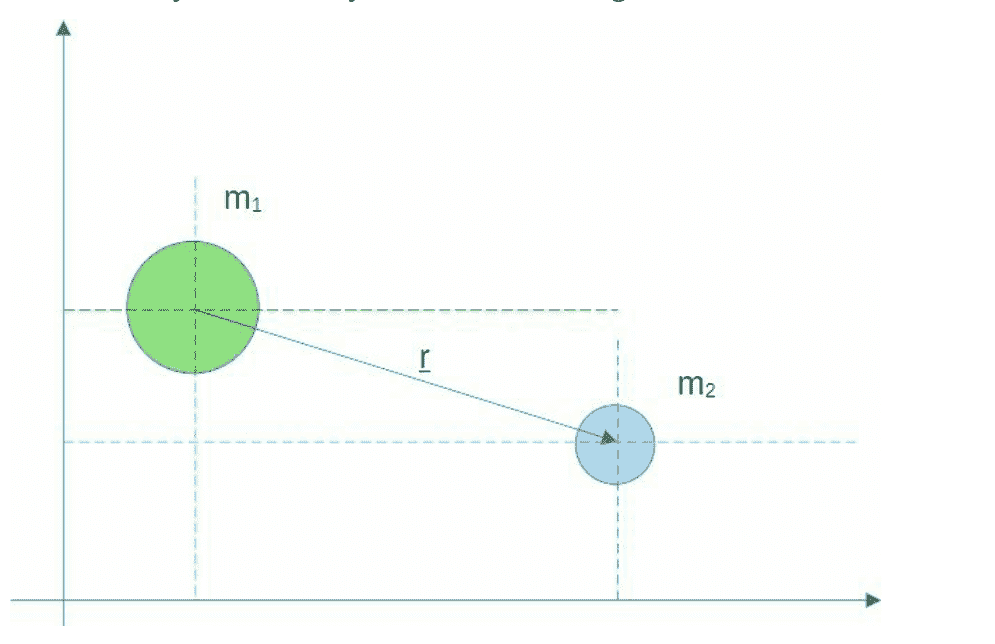

以及物体的加速度与其所受的力成正比这一事实。

$$\hat{\mathbf{f}} = m_i \frac{d^2\hat{\mathbf{r}}_i}{dt^2}$$

将这些方程结合起来，就得到了每个物体的运动方程。

$$m_1 \frac{d^2\hat{\mathbf{r}}_1}{dt^2} = G \frac{m_1 m_2}{r^2} \cdot \hat{\mathbf{r}}$$

事实上，我们知道两个物体的行为是有序的，有时会表现出优美的行为。我们可以称这些有序的模式为稳定状态。它们是可预测的，解会趋向于它们，就像我们在曼德博集合中看到的那样，那里存在收敛区域。

对于二体问题，稳定状态是模型预测的、我们通常观察到的椭圆（或圆形）轨道。因此，正是第三个物体的引入使系统陷入了混沌。

需要注意的是，我们使用“混沌”一词意味着*对初始条件敏感的结果*。混沌存在边界条件和位置限制，就像我们观察双摆时一样，即使我们很难预测下方摆锤在任何时间点的位置，我们仍然知道它存在于距离连接点小于 $L_1 + L_2$ 的范围内，这是由摆杆的长度保证的。

因此，我们可能预期三体问题也会有类似的情况。那么，让我们开始编写代码。

我们首先设置初始条件。我们的重力加速度 `g`，三个物体的质量，以及它们的初始位置和速度。唯一需要的模块是 `matplotlib` 和 `numpy`。

```python
# 导入
import numpy as np
import matplotlib.pyplot as plt

# 重力加速度
g = 9.8
```

### 质量
m_1 = 10
m_2 = 20
m_3 = 30

### 初始坐标
p1_start = np.array([-10, 10, -11])
v1_start = np.array([-3, 0, 0])

p2_start = np.array([0, 0, 0])
v2_start = np.array([0, 0, 0])

p3_start = np.array([10, 10, 12])
v3_start = np.array([3, 0, 0])

接下来，我们创建一个函数，它接收位置信息并返回加速度。这些加速度直接根据上述运动定律计算得出。

```python
def accelerations(p1, p2, p3):
    """
    A function to calculate the derivatives of x, y, and z
    given 3 object and their locations according to Newton's laws
    """
    p_1_dv = -g * m_2 * (p1 - p2)/(np.sqrt((p1[0] - p2[0])**2
                + (p1[1] - p2[1])**2 + (p1[2] - p2[2])**2)**3) - \
            g * m_3 * (p1 - p3)/(np.sqrt((p1[0] - p3[0])**2
                + (p1[1] - p3[1])**2 + (p1[2] - p3[2])**2)**3)

    p_2_dv = -g * m_3 * (p2 - p3)/(np.sqrt((p2[0] - p3[0])**2
                + (p2[1] - p3[1])**2 + (p2[2] - p3[2])**2)**3) - \
            g * m_1 * (p2 - p1)/(np.sqrt((p2[0] - p1[0])**2
                + (p2[1] - p1[1])**2 + (p2[2] - p1[2])**2)**3)

    p_3_dv = -g * m_1 * (p3 - p1)/(np.sqrt((p3[0] - p1[0])**2
                + (p3[1] - p1[1])**2 + (p3[2] - p1[2])**2)**3) - \
            g * m_2 * (p3 - p2)/(np.sqrt((p3[0] - p2[0])**2
                + (p3[1] - p2[1])**2 + (p3[2] - p2[2])**2)**3)

    return p_1_dv, p_2_dv, p_3_dv
```

虽然这看起来有些复杂，但实际上非常有规律。每个粒子的加速度都是根据系统中其他粒子的质量和位置计算出来的。

实际上，此时我们可以将同样的规则扩展到n体问题。事实上，这类问题非常适合用类来处理，这可以说是一种更清晰、更具扩展性的方法。然而，为了本文的目的，我们采用显式方法。

然后，我们设置步数以及用于存储每一步数据的数组。

```python
# parameters
delta_t = 0.01
steps = 10_000

# initialize trajectory array
p1 = np.array([[0.,0.,0.] for i in range(steps)])
v1 = np.array([[0.,0.,0.] for i in range(steps)])

p2 = np.array([[0.,0.,0.] for i in range(steps)])
v2 = np.array([[0.,0.,0.] for i in range(steps)])

p3 = np.array([[0.,0.,0.] for i in range(steps)])
v3 = np.array([[0.,0.,0.] for i in range(steps)])
```

我们可以如下设置初始位置：

```python
# starting point and velocity
p1[0], p2[0], p3[0] = p1_start, p2_start, p3_start
v1[0], v2[0], v3[0] = v1_start, v2_start, v3_start
```

然后我们就可以运行模拟，并填充包含位置和速度的列表。

```python
# evolution of the system
for i in range(steps-1):
    # calculate derivatives
    dv1, dv2, dv3 = accelerations(p1[i], p2[i], p3[i])

    v1[i + 1] = v1[i] + dv1 * delta_t
    v2[i + 1] = v2[i] + dv2 * delta_t
    v3[i + 1] = v3[i] + dv3 * delta_t

    p1[i + 1] = p1[i] + v1[i] * delta_t
    p2[i + 1] = p2[i] + v2[i] * delta_t
    p3[i + 1] = p3[i] + v3[i] * delta_t
```

这是计算过程的主体，处理10,000步所需时间不到1秒，处理100,000步也仅需约7秒。

最后，我们可以通过matplotlib绘图来查看过程的结果。

```python
# plot the chart
ax = plt.figure(figsize=(8, 8)).add_subplot(projection='3d')
plt.plot([i[0] for i in p1], [j[1] for j in p1], [k[2] for k in p1],
        '.', color='red', lw = 0.05, markersize = 0.1)
plt.plot([i[0] for i in p2], [j[1] for j in p2], [k[2] for k in p2],
        '.', color='green', lw = 0.05, markersize = 0.1)
plt.plot([i[0] for i in p3], [j[1] for j in p3], [k[2] for k in p3],
        '.', color='blue', lw = 0.05, markersize = 0.1)

ax.set_xlabel('X --->')
ax.set_ylabel('Y --->')
ax.set_zlabel('Z --->')

plt.show()
```

最初生成的图表如下：

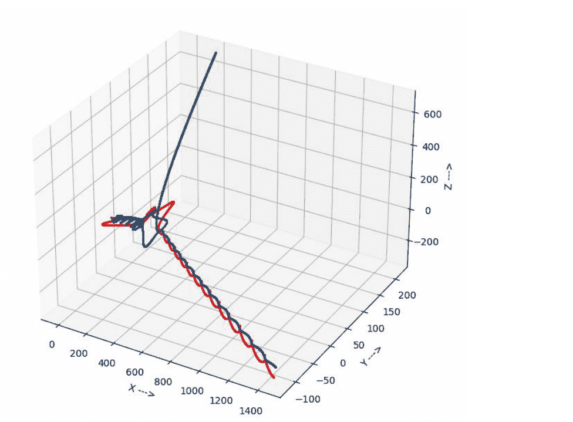

每个粒子用一种颜色表示，我们可以看到两个粒子（或行星）相互共转，而第三个粒子则向完全不同的方向运动。

以上是100,000次循环的结果，从混沌中产生了一些可预测性，但如果我们观察相同初始条件下较短的时间尺度，将很难预测到这种情况。

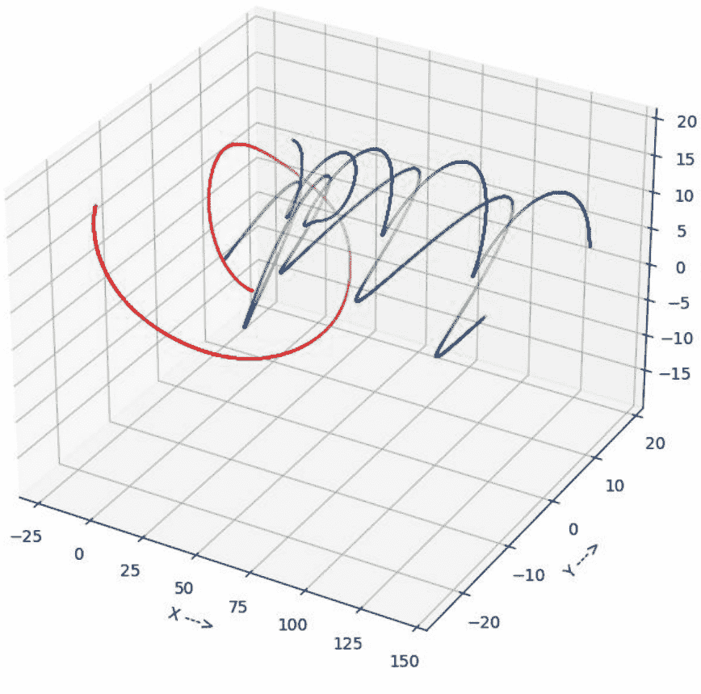

该图的一个显著特点是，我们基本上免费获得了一个特性：高速度由较浅的线条表示，因为点与点之间的距离更远。

让我们看看如果我们将初始条件改变一个微小量会发生什么。例如，我们对粒子1的起始坐标做如下微小更改，其他条件不变。

```python
p1_start = np.array([-10, 10, -11])
p1_start = np.array([-10, 10, -10])
```

生成的短期（10,000个点）图表完全不同：

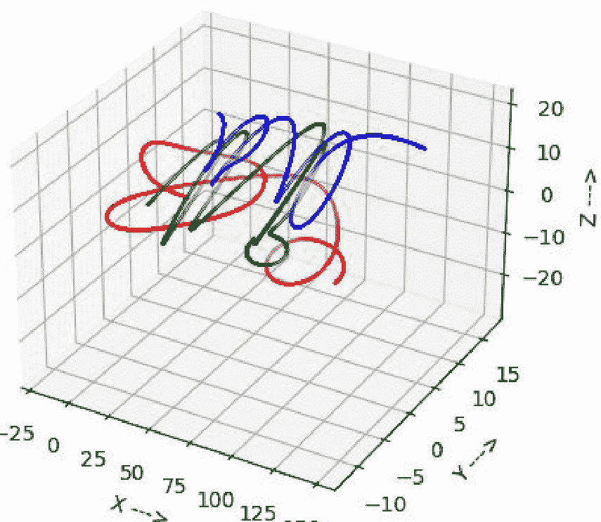

而长期图表则截然不同。特别是，红色粒子被弹射出系统，而绿色和蓝色粒子则共转

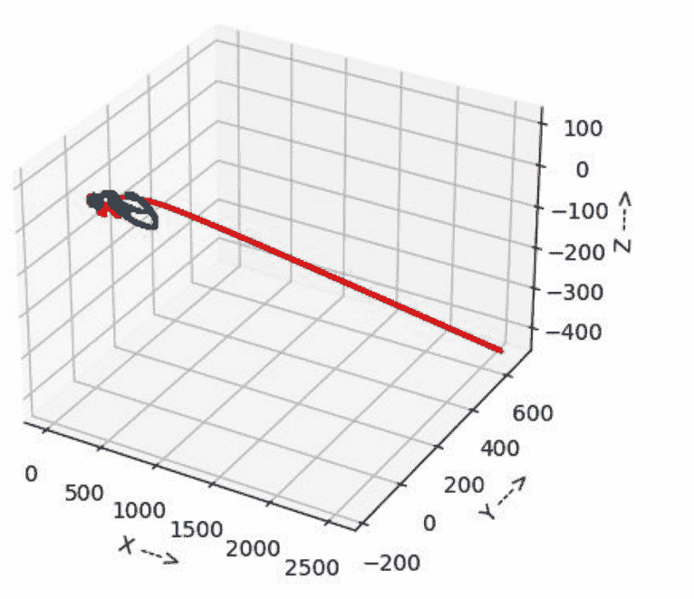

位置。

仅这三个天体，我们就可以创建大量不同的初始条件，每一种都会产生完全不同的结果。事实上，在撰写本文时，花了数小时试图获得可预测的模式，例如一个质量显著较大的天体和两个较小的天体，我们可能期望较小的粒子围绕较大的那个旋转，但事实上我们经常得到被弹射出系统的结果。

### 三体问题
迭代次数：25000

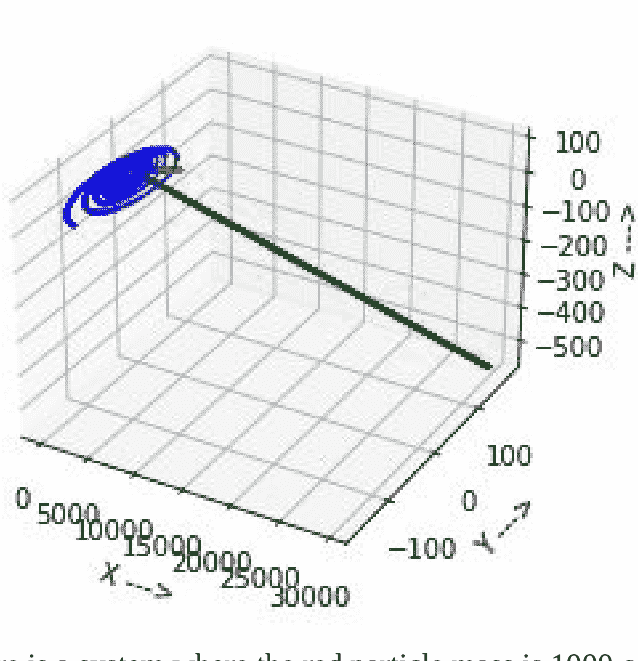

这是一个系统，其中红色粒子的质量为1000，而蓝色和绿色粒子的质量为10。我们看到绿色粒子被弹射出系统。

仅仅将绿色粒子的速度改变1米/秒就会极大地改变系统，要得到这样的三体模式需要非常小心。

### 三体问题
迭代次数：25000

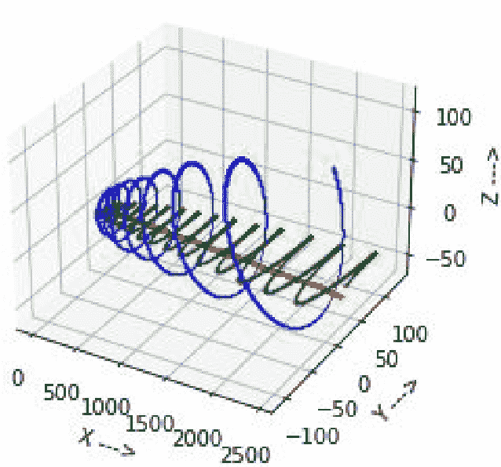

奇怪的是，如果我们增加系统中的粒子数量，实际上会引入某种可测量的统计秩序。这可能是第二本书的主题！

### 捕食者与猎物的循环

在过去的几章中，我们一直在研究混沌系统。我们从曼德博集合开始，然后进入双摆，再到三体问题，每一个都在二维和三维空间中产生了不可预测的曲线。

在捕食者-猎物循环中，我们期望看到更多的秩序。事实上，这种行为可能捕捉到疾病和谣言的一些动态，其中存在一种自我抑制效应，尽管我们可能期望它会振荡。

在深入研究数学之前，让我们先概述一下捕食者-猎物系统。例如狐狸和兔子。

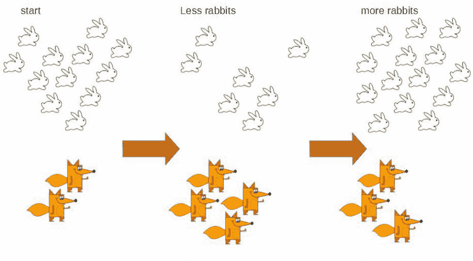

系统中每个组成部分的种群数量取决于另一个种群的数量。因此，更多的兔子意味着狐狸有更多的食物，这导致狐狸种群数量增加，但更多的狐狸会杀死兔子，减少兔子种群数量。这反过来又减少了狐狸的食物供应，从而减少了狐狸种群数量。狐狸减少意味着兔子增多……如此循环往复。

上述逻辑产生了以下数学公式：

$$\frac{dx}{dt} = \alpha x - \beta xy$$

$$\frac{dy}{dt} = \delta xy - \gamma y$$

其中x和y分别是猎物和捕食者的数量。

参数α和γ很有趣，因为它们代表了没有相互作用时的物种动态。因此，正的α描述了自然增长的猎物种群，而负的γ则描述了捕食者的相反情况。

这种动态往往总是如此，因为如果没有捕食者来控制种群，猎物往往会快速繁殖。同样，如果没有食物，捕食者种群数量就会减少。

以类似的方式，相互关联的xy项对两个种群具有相反的效果，我们可以看到大的xy对捕食者种群是正向的，但对猎物种群是负向的。

这非常接近于持续生态系统中自然选择的基本数学原理，因为如果这些参数中的任何一个被反转，系统就会变得不稳定，至少其中一个物种会灭绝。

由于我们知道：

$$\frac{dy}{dx} = \frac{dy}{dt} / \frac{dx}{dt}$$

我们可以将上面两个方程结合起来得到：

$$\frac{dy}{dx} = \frac{\delta xy - \gamma y}{\alpha x - \beta xy}$$

整理后得到：

$$\frac{\alpha - \beta y}{y} dy = \frac{\delta x - \gamma}{x} dx$$

虽然数学推导本身很有趣，但我们实际上可以从最初的两个方程直接生成代码。那么，我们就开始吧。

我们首先导入标准库并定义一些全局参数。

```python
import matplotlib.pyplot as plt
import numpy as np
import random

timestep = 0.0001  # 决定了精度

amp = 0.00  # 噪声项的振幅
end_time = 50  # 模拟结束时间
t = np.arange(0,end_time,timestep)  # 时间向量

# 初始化猎物 (x) 和捕食者 (y) 向量
x = []
y = []
```

接下来，设置四个系数以及捕食者和猎物数量的初始条件，确保有足够的猎物，否则系统将面临猎物灭绝的风险，从而导致崩溃。

```python
a = 1  # 猎物的出生率
b = 0.1  # 因捕食导致的猎物死亡率
c = 0.5  # 捕食者的自然死亡率
d = 0.02  # 被消耗的猎物转化为捕食者的比例

# 时间=0时的初始条件
x.append(100) # 猎物 (x)
y.append(20)  # 捕食者 (y)
```

然后我们进行数值计算：

```python
# 前向欧拉积分法
for index in range(1,len(t)):
    # 计算当前的微分值
    xd = x[index-1] * (a - b*y[index-1])
    yd = -y[index-1]*(c - d*x[index-1])

    # 计算x和y的下一个值
    next_x = x[index-1] + xd * timestep
    next_y = y[index-1] + yd * timestep

    # 添加x和y的下一个值
    x.append(next_x)
    y.append(next_y)
```

至此，我们已经创建并填充了捕食者和猎物种群所需的数组数据。

因此，我们可以开始绘制图表了。

```python
# 捕食者-猎物在同一坐标轴上随时间变化
plt.plot(t, x)
plt.plot(t, y)
plt.xlabel('时间 -->')
plt.ylabel('种群规模 -->')
plt.legend(('猎物', '捕食者'))
plt.title('捕食者 vs 猎物')
plt.show()
```

得到如下结果：

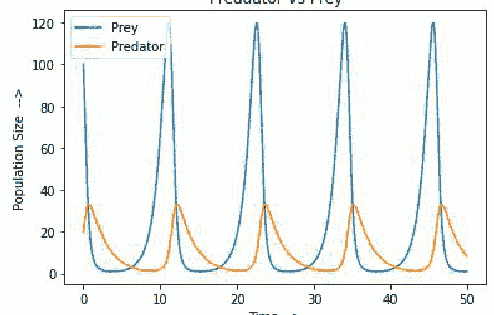

我们可以看到捕食者和猎物的周期是如何彼此错开的。捕食者滞后于猎物四分之一个周期，即 π/2 弧度或 90°。

然后：

```python
# 捕食者 vs 猎物周期
plt.plot(x,y)
plt.xlabel('捕食者种群  -->')
plt.ylabel('猎物种群  -->')
plt.title('捕食者-猎物周期')
plt.show()
```

得到如下结果：

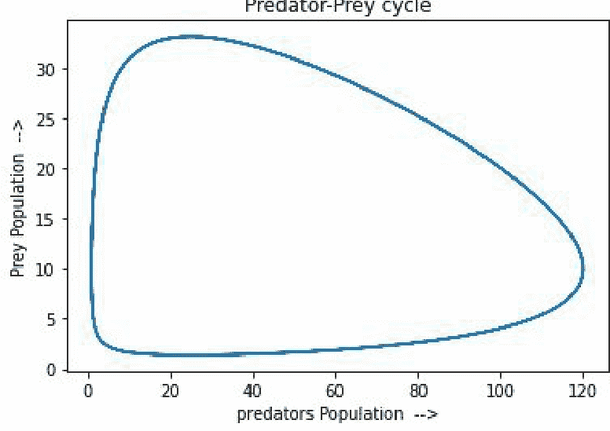

通过将捕食者和猎物种群绘制在不同的坐标轴上，我们可以清楚地看到两者之间的周期性关系。特别是，当一个种群数量高时，另一个种群数量就低，反之亦然。

我们还可以看到，在两个种群中，从峰值到谷值的变化都相当剧烈，这解释了为什么一个困难时期可能会破坏生态系统的平衡。

自然系统具有随机波动性，因此我们需要将其引入模型中，我们可以通过以下代码向系统引入噪声：

```python
def StochasticTerm(amp):
    return (amp * random.uniform(-1,1))
```

我们可以通过修改 for 循环中的系数，使用此噪声来扰动微分方程，如下所示：

```python
for index in range(1,len(t)):

    # 随机参数
    a = a + StochasticTerm(amp)
    b = b + StochasticTerm(amp)
    c = c + StochasticTerm(amp)
    d = d + StochasticTerm(amp)

    # 计算当前的微分值
    xd = x[index-1] * (a - b*y[index-1])
    yd = -y[index-1]*(c - d*x[index-1])

    # 计算x和y的下一个值
    next_x = x[index-1] + xd * timestep
    next_y = y[index-1] + yd * timestep

    # 添加x和y的下一个值
    x.append(next_x)
    y.append(next_y)
```

通过改变振幅（amp）值，我们现在能够影响系数。将振幅从零微调到百万分之十（0.000001）会产生如下效果。

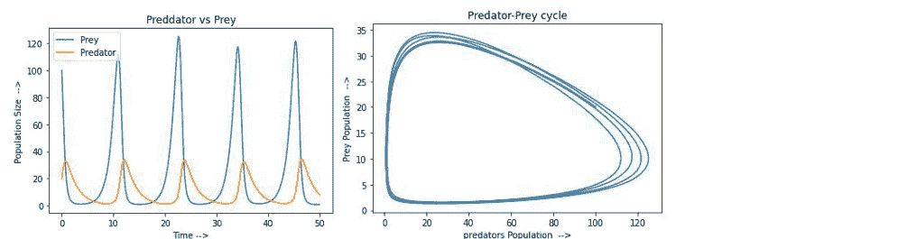

在百万分之五十时，我们得到：

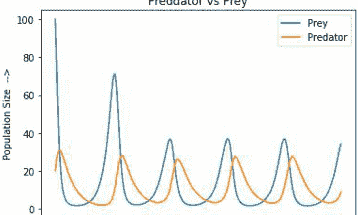

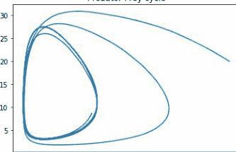

最后，如果波动性过大，系统将无法修复其稳态，随后崩溃。

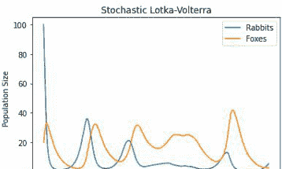

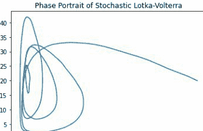

就像三体问题一样，有数百个例子和案例可以探索，模型也能在数学之外给我们带来启示。

出于本书的目的，我们在此停止，将剩余的探索作为读者的练习，仅需注意一点：生态系统有许多物种 x, y, z . . .

### 康威生命游戏

生命游戏是一个零玩家游戏，这意味着它的演化仅由其初始状态决定，无需进一步输入。

用户可以设置初始状态，此后模拟将无限期地继续下去。

游戏的规则如下：

- 每个细胞处于两种可能状态之一，**存活**或**死亡**（**开**或**关**或**1**或**0**）。
- 每个细胞与其八个邻居互动

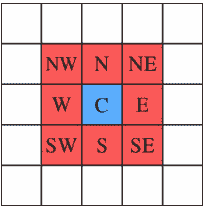

在每个时间步，为下一次迭代计算以下内容。

1. 任何*存活邻居少于两个*的存活细胞死亡，如同因人口不足而死。
2. 任何*有两个或三个存活邻居*的存活细胞存活到下一代。
3. 任何*存活邻居超过三个*的存活细胞死亡，如同因人口过剩而死。
4. 任何*恰好有三个存活邻居*的死亡细胞变为存活细胞，如同通过繁殖产生。

因此，在所有情况下，一个细胞的演化都取决于其相邻细胞。

我们可以在 Python 中设置这些规则，并在 matplotlib 中创建动画：

```python
import numpy as np
import matplotlib.pyplot as plt
import matplotlib.animation as animation

# 全局变量
OFF, ON = 0, 1
vals = [ON, OFF]

def main():
    """ 主函数 """
    N = 100  # 设置网格大小
    updateInterval = 100  # 设置动画更新间隔

    # 声明网格
    grid = np.array([])
    grid = randomGrid(N)

    for i in range(5):
        addGlider(np.random.randint(2,N-2),
                  np.random.randint(2,N-2), grid)

    # 设置动画
    fig, ax = plt.subplots()
    img = ax.imshow(grid, interpolation='nearest')
    ani = animation.FuncAnimation(fig, update,
                                 fargs=(img, grid, N, ), frames = 10,
                                 interval=updateInterval,save_count=50)

    plt.show()


def randomGrid(N):
    """返回一个NxN的随机值网格"""
    pyes=0.04
    pno=1-pyes
    return np.random.choice(vals, N*N, p=[pyes, pno]).reshape(N, N)


def addGlider(i, j, grid):
    """在(i, j)处添加一个左上角细胞的滑翔机"""
    glider = [[0,0,1],[1,0,1],[0,1,1]]
    grid[i:i+3, j:j+3] = glider


def update(frameNum, img, grid, N):
    # 复制网格，因为我们需要8个邻居
    newGrid = grid.copy()
    for i in range(N):
        for j in range(N):

            # 计算8个邻居的总和（x和y方向环绕）
            total = int(grid[i, (j-1)%N] + grid[i, (j+1)%N] +
                        grid[(i-1)%N, j] + grid[(i+1)%N, j] +
                        grid[(i-1)%N, (j-1)%N] + grid[(i-1)%N, (j+1)%N] +
                        grid[(i+1)%N, (j-1)%N] + grid[(i+1)%N, (j+1)%N])

            # 应用康威规则
            if grid[i, j] == ON:
                if (total < 2) or (total > 3):
                    newGrid[i, j] = OFF
            else:
                if total == 3:
                    newGrid[i, j] = ON

    # 更新数据
    img.set_data(newGrid)
    grid[:] = newGrid[:]
    return img

# 调用主函数
if __name__ == '__main__':
    main()
```

在这个最简单的游戏中，可以添加大量的变体和转折，但在我们考虑这些之前，让我们先看看代码的输出。

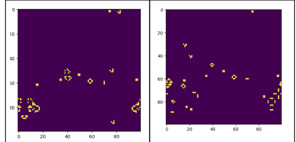

观察到的结果是不断演化的模式，具有一些多年来已被研究的共同特征。

特别是，以下三种尤为突出：

- 静态生命 - 永不改变（除非发生碰撞）
- 振荡器 - 不移动，但在状态之间切换。
- 太空船 - 沿恒定方向移动的振荡器。

当尺寸较小时，概念化上述形状相对容易。以下是一些基础示例：

| 静态生命 | 振荡器 | 太空船 |
|---|---|---|
| 方块 | 闪烁器 | 滑翔机 |
|  |  |  |

我们能够使用这段代码块制作一个简单的滑翔机：

```python
def addGlider(i, j, grid):
    """adds a glider with top left cell at (i, j)"""
    glider = [[0,0,1],[1,0,1],[0,1,1]]
    grid[i:i+3, j:j+3] = glider
```

还有许多更复杂的此类形状，例如能产生滑翔机的“枪”，并且人们已经对这个最初看似相当 trivial 的游戏进行了大量研究。

在另一段独立的代码中，展示了不同的技术（使用 pygame 代替 matplotlib 动画），我们可以看到一个“枪”的示例。

```python
import pygame
import numpy as np

col_about_to_die = (100, 200, 225)
col_alive = (255, 255, 215)
col_background = (10, 10, 40)
col_grid = (30, 30, 60)

def update(surface, cur, sz):
    nxt = np.zeros((cur.shape[0], cur.shape[1]))

    for r, c in np.ndindex(cur.shape):
        num_alive = np.sum(cur[r-1:r+2, c-1:c+2]) - cur[r, c]

        if cur[r, c] == 1 and num_alive < 2 or num_alive > 3:
            col = col_about_to_die
        elif (cur[r, c] == 1 and 2 <= num_alive <= 3) or \
                (cur[r, c] == 0 and num_alive == 3):
            nxt[r, c] = 1
            col = col_alive

        col = col if cur[r, c] == 1 else col_background
        pygame.draw.rect(surface, col, (c*sz, r*sz, sz-1, sz-1))

    return nxt

def init(dimx, dimy):
    cells = np.zeros((dimy, dimx))
    pattern = np.array([
        [0,0,0,0,0,0,0,0,0,0,0,0,0,0,0,0,0,0,0,0,0,0,0,0,0,0,0,0,0,0,0,0,0,0,0,0,0,0,0,0],
        [0,0,0,0,0,0,0,0,0,0,0,0,0,0,0,0,0,0,0,0,0,0,0,0,0,0,0,0,0,0,0,0,0,0,0,0,0,0,0,0],
        [0,0,0,0,0,0,0,0,0,0,0,0,0,0,0,0,0,0,0,0,0,0,0,0,0,0,0,0,0,0,0,0,0,0,0,0,0,0,0,0],
        [0,0,0,0,0,0,0,0,0,0,0,0,0,0,0,0,0,0,0,0,0,0,0,0,0,0,0,0,0,0,0,0,0,0,0,0,0,0,0,0],
        [0,0,0,0,0,0,0,0,0,0,0,0,0,0,0,0,0,0,0,0,0,0,0,0,0,0,0,0,0,0,0,0,0,0,0,0,0,0,0,0],
        [0,0,0,0,0,0,0,0,0,0,0,0,0,0,0,0,0,0,0,0,0,0,0,0,0,0,0,0,0,0,0,0,0,0,0,0,0,0,0,0],
        [0,0,0,0,0,0,0,0,0,0,0,0,0,0,0,0,0,0,0,0,0,0,0,0,0,0,0,0,0,0,0,0,0,0,0,0,0,0,0,0],
        [0,0,0,0,0,0,0,0,0,0,0,0,0,0,0,0,0,0,0,0,0,0,0,0,0,0,0,0,0,0,0,0,0,0,0,0,0,0,0,0],
        [0,0,0,0,0,0,0,0,0,0,0,0,0,0,0,0,0,0,0,0,0,0,0,0,0,0,0,0,0,0,0,0,0,0,0,0,0,0,0,0],
        [0,0,0,0,0,0,0,0,0,0,0,0,0,0,0,0,0,0,0,0,0,0,0,0,0,0,0,0,0,0,0,0,0,0,0,0,0,0,0,0],
        [0,0,0,0,0,0,0,0,0,0,0,0,0,0,0,0,0,0,0,0,0,0,0,0,0,0,0,0,0,0,0,0,0,0,0,0,0,0,0,0],
        [0,0,0,0,0,0,0,0,0,0,0,0,0,0,0,0,0,0,0,0,0,0,0,0,0,0,0,0,0,0,0,0,0,0,0,0,0,0,0,0],
        [0,0,0,0,0,0,0,0,0,0,0,0,0,0,0,0,0,0,0,0,0,0,0,0,0,0,0,0,0,0,0,0,0,0,0,0,0,0,0,0],
        [0,0,0,0,0,0,0,0,0,0,0,0,0,0,0,0,0,0,0,0,0,0,0,0,0,0,0,0,0,0,0,0,0,0,0,0,0,0,0,0],
        [0,0,0,0,0,0,0,0,0,0,0,0,0,0,0,0,0,0,0,0,0,0,0,0,0,0,0,0,0,0,0,0,0,0,0,0,0,0,0,0],
        [0,0,0,0,0,0,0,0,0,0,0,0,0,0,0,0,0,0,0,0,0,0,0,0,0,0,0,0,0,0,0,0,0,0,0,0,0,0,0,0],
        [0,0,0,0,0,0,0,0,0,0,0,0,0,0,0,0,0,0,0,0,0,0,0,0,0,0,0,0,0,0,0,0,0,0,0,0,0,0,0,0],
        [0,0,0,0,0,0,0,0,0,0,0,0,0,0,0,0,0,0,0,0,0,0,0,0,0,0,0,0,0,0,0,0,0,0,0,0,0,0,0,0],
        [0,0,0,0,0,0,0,0,0,0,0,0,0,0,0,0,0,0,0,0,0,0,0,0,0,0,0,0,0,0,0,0,0,0,0,0,0,0,0,0],
        [0,0,0,0,0,0,0,0,0,0,0,0,0,0,0,0,0,0,0,0,0,0,0,0,0,0,0,0,0,0,0,0,0,0,0,0,0,0,0,0],
        [0,0,0,0,0,0,0,0,0,0,0,0,0,0,0,0,0,0,0,0,0,0,0,0,0,0,0,0,0,0,0,0,0,0,0,0,0,0,0,0],
        [0,0,0,0,0,0,0,0,0,0,0,0,0,0,0,0,0,0,0,0,0,0,0,0,0,0,0,0,0,0,0,0,0,0,0,0,0,0,0,0],
        [0,0,0,0,0,0,0,0,0,0,0,0,0,0,0,0,0,0,0,0,0,0,0,0,0,0,0,0,0,0,0,0,0,0,0,0,0,0,0,0],
        [0,0,0,0,0,0,0,0,0,0,0,0,0,0,0,0,0,0,0,0,0,0,0,0,0,0,0,0,0,0,0,0,0,0,0,0,0,0,0,0],
        [0,0,0,0,0,0,0,0,0,0,0,0,0,0,0,0,0,0,0,0,0,0,0,0,0,0,0,0,0,0,0,0,0,0,0,0,0,0,0,0],
        [0,0,0,0,0,0,0,0,0,0,0,0,0,0,0,0,0,0,0,0,0,0,0,0,0,0,0,0,0,0,0,0,0,0,0,0,0,0,0,0],
        [0,0,0,0,0,0,0,0,0,0,0,0,0,0,0,0,0,0,0,0,0,0,0,0,0,0,0,0,0,0,0,0,0,0,0,0,0,0,0,0],
        [0,0,0,0,0,0,0,0,0,0,0,0,0,0,0,0,0,0,0,0,0,0,0,0,0,0,0,0,0,0,0,0,0,0,0,0,0,0,0,0],
        [0,0,0,0,0,0,0,0,0,0,0,0,0,0,0,0,0,0,0,0,0,0,0,0,0,0,0,0,0,0,0,0,0,0,0,0,0,0,0,0],
        [0,0,0,0,0,0,0,0,0,0,0,0,0,0,0,0,0,0,0,0,0,0,0,0,0,0,0,0,0,0,0,0,0,0,0,0,0,0,0,0],
        [0,0,0,0,0,0,0,0,0,0,0,0,0,0,0,0,0,0,0,0,0,0,0,0,0,0,0,0,0,0,0,0,0,0,0,0,0,0,0,0],
        [0,0,0,0,0,0,0,0,0,0,0,0,0,0,0,0,0,0,0,0,0,0,0,0,0,0,0,0,0,0,0,0,0,0,0,0,0,0,0,0],
        [0,0,0,0,0,0,0,0,0,0,0,0,0,0,0,0,0,0,0,0,0,0,0,0,0,0,0,0,0,0,0,0,0,0,0,0,0,0,0,0],
        [0,0,0,0,0,0,0,0,0,0,0,0,0,0,0,0,0,0,0,0,0,0,0,0,0,0,0,0,0,0,0,0,0,0,0,0,0,0,0,0],
        [0,0,0,0,0,0,0,0,0,0,0,0,0,0,0,0,0,0,0,0,0,0,0,0,0,0,0,0,0,0,0,0,0,0,0,0,0,0,0,0],
        [0,0,0,0,0,0,0,0,0,0,0,0,0,0,0,0,0,0,0,0,0,0,0,0,0,0,0,0,0,0,0,0,0,0,0,0,0,0,0,0],
        [0,0,0,0,0,0,0,0,0,0,0,0,0,0,0,0,0,0,0,0,0,0,0,0,0,0,0,0,0,0,0,0,0,0,0,0,0,0,0,0],
        [0,0,0,0,0,0,0,0,0,0,0,0,0,0,0,0,0,0,0,0,0,0,0,0,0,0,0,0,0,0,0,0,0,0,0,0,0,0,0,0],
        [0,0,0,0,0,0,0,0,0,0,0,0,0,0,0,0,0,0,0,0,0,0,0,0,0,0,0,0,0,0,0,0,0,0,0,0,0,0,0,0],
        [0,0,0,0,0,0,0,0,0,0,0,0,0,0,0,0,0,0,0,0,0,0,0,0,0,0,0,0,0,0,0,0,0,0,0,0,0,0,0,0],
        [0,0,0,0,0,0,0,0,0,0,0,0,0,0,0,0,0,0,0,0,0,0,0,0,0,0,0,0,0,0,0,0,0,0,0,0,0,0,0,0],
        [0,0,0,0,0,0,0,0,0,0,0,0,0,0,0,0,0,0,0,0,0,0,0,0,0,0,0,0,0,0,0,0,0,0,0,0,0,0,0,0]
    ])
    pos = (3,3)
    cells[pos[0]:pos[0]+pattern.shape[0],
          pos[1]:pos[1]+pattern.shape[1]] = pattern
    return cells

def main(dimx, dimy, cellsize):
    pygame.init()
    surface = pygame.display.set_mode((dimx*cellsize, dimy*cellsize))
    pygame.display.set_caption("Game of Life")

    cells = init(dimx, dimy)

    while True:
        for event in pygame.event.get():
            if event.type == pygame.QUIT:
                pygame.quit()
                return

        surface.fill(col_grid)
        cells = update(surface, cells, cellsize)
        pygame.display.update()

if __name__ == "__main__":
    main(120, 90, 8)
```

虽然这只是一个游戏，但它允许用户尝试多种技术。实际上，我们本可以使用 tkinter（甚至 turtle）来实现类似的图形用户界面。

我们注意到即将死亡的细胞使用了不同的颜色，这些细胞将在下一次迭代中被移除。

我们还注意到，初始网格是明确定义的，其中滑翔机枪（即“枪”）的图案被保存在名为 `pattern` 的变量中。

输出是一个动画，但“枪”的图案是静态的：

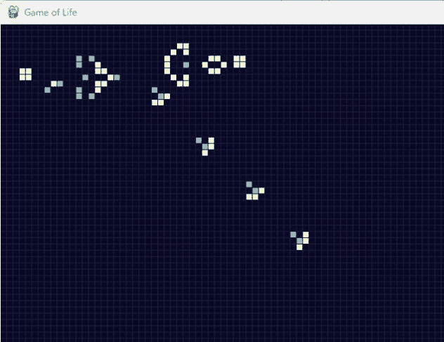

关于生命游戏的后续内容留给读者自行探索……

### 洛伦兹吸引子

留给读者的练习。

## 数字图像处理

在过去的25年里，图像处理领域已经完成了大量工作，该学科及其衍生技术的发展是巨大的。

图像处理通常对处理器要求很高，因此极大地受益于同期处理能力的提升。

Python 已被证明是图像处理的流行语言，并附带了许多库，这些库内在地包含了本节将要探讨的技术。特别是，Python 能够利用和整合更快的 C++ 算法，这为其赢得了普及度。

Python 中一个更受欢迎的模块叫做 opencv，它最初是用 C++ 编写的。虽然还有其他一些模块，但我们将专注于这一个。

在本章中，我们将尝试理解一系列过程，最终包括人脸检测或其他有趣的数字等效技术。我们将从基础开始：

- 读取图像、视频、网络摄像头
- 基本功能
- 调整大小和裁剪

### 图像简介

尽管我们可能无法用肉眼看到，但我们在屏幕、显示器或其他设备上看到的计算机图像是由许多称为像素的小点组成的。当我们放大图像时，这一点变得明显，因为图像会变得越来越像素化。

因此，我们可以将图像视为一系列方格。

我们可以不断放大这些方格，直到达到像素本身的分辨率。假设我们想绘制数字“3”，它看起来会像这样：

所有黑色方格的值为0，所有白色方格的值为1。图像本身是8x8个方格（或像素）的宽度和高度。因此总共有64个像素。

屏幕尺寸通常以（宽度 x 高度）表示，其中每个参数代表每个维度的像素数量。典型的屏幕尺寸有：

- VGA：640 x 480
- HD：1280 x 720
- 4k：3840 x 2160

因此，高清显示屏在水平方向有1280个像素，在垂直方向有720个像素。所以这个显示屏共有921,600个像素。由于人眼无法分辨VGA图像中近百万个点中的每一个点，因此这对于显示高度详细的图像来说已经足够清晰了。

上面的图像是二值图像。它只能包含黑色方格或白色方格，没有其他颜色。

- 0 = 黑色
- 1 = 白色

但我们可以通过允许不同的数字来创建灰度图像，从而改进这一点，以替代基本的黑白图像。

不同的灰度阴影使图像更加清晰。灰度级别以2的幂次递增（因为它们是二进制的），目前能提供良好图像质量的级别数是2^8，即256个级别。

彩色图像的构成方式与灰度图像完全相同，唯一的区别是有3个尺度：**红色** + **绿色** + **蓝色**。它们的总和构成了我们看到的图像。我们称之为RGB。

因此，一张彩色高清图像现在是1280 x 730 x 3（每种颜色一个像素）。这921,600个像素中的每一个都由3种颜色的总和组成，每种颜色有256个强度级别。

### 读取图像和视频

既然我们对图像的构成有了基本的理解，我们就可以开始更深入地了解这个过程。

Python的优点之一是它提供的易用性。导入图像使用opencv-python模块，这是一个像pandas和numpy模块一样的第三方模块，可以通过包管理器快速安装（pip install opencv-python）。

使用这个模块可以轻松读取图像：

```python
import cv2

img = cv2.imread('assets/apple_colour.png')
cv2.imshow('Output', img)
cv2.waitKey(0)
```

整个图像被读入内存，然后显示在屏幕上。

我们可以这样检查图像的内容：

```python
print(img)
print('columns:', len(img))
print('rows:', len(img[0]))
print('colours:', len(img[0][0]))
```

我们看到：

```
[[ 64 104 129]
 [ 64 104 129]
 [ 64 104 129]
 ...
 [ 88  73  70]
 [ 88  73  70]
 [ 88  73  70]]
 ...
 ...
 [194 194 178]
 [193 193 175]
 [192 192 174]]]

columns: 1204
rows: 1164
colours: 3
```

这是一个列表的列表（一个数组），每个子列表包含RGB值。因此，我们的示例图像（彩色苹果）包含一个由1204个元素（高度）x 1164个元素（宽度）x 3个元素（红色、绿色和蓝色值）组成的列表。因此，描述这张图像需要超过400万个值。虽然我们在书中无法欣赏到图像的精彩，但在高清屏幕上放大的图像非常壮观。

重要的是，我们现在只需几行代码就获得了数据，这很有价值。

从图像快速过渡，我们可以通过创建视频捕获对象来捕获视频，如下所示：

```python
import cv2

cap = cv2.VideoCapture('assets/sample_video.mkv')

while True:
    done, img = cap.read()
    if done == False:
        break
    cv2.imshow('Video', img)
    if cv2.waitKey(1) & 0xFF == ord('q'):
        break
```

我们首先注意到的是，视频是由一系列图像组成的。cap.read()函数返回一个元组，第一个值表示图像是否成功读取，第二个值是图像文件本身。我们之前见过列表解包（在数据科学章节中），现在这是一个方便的功能。

复杂的waitkey(1)行本质上是在等待按下退出键或字母“q”，可以替换为：

```python
key = cv2.waitKey(1)
if key == 27 or key == 113:
    break
```

我们喜欢保持简单。

因此，我们能够读取并显示图像文件，然后我们能够读取并显示视频文件，视频文件是一系列图像。我们的最后一个技术是从设备网络摄像头捕获视频。因此，这是**实时**视频，而不是预先存储的视频。

从网络摄像头读取数据与视频完全相同，除了1行代码变为3行：

```python
cap = cv2.VideoCapture(0)
cap.set(3,640) # 宽度
cap.set(4,480) # 高度
```

VideoCapture()函数将零读取为设备的*默认网络摄像头*。两个set()函数是我们想要返回的图像尺寸（宽度和高度）。

### 基本功能

在上一节中，我们能够：

- 读取图像文件并显示图片。
- 读取视频文件并显示视频。
- 读取设备摄像头并显示视频。

Python中的cv2模块提供了许多开箱即用的图像处理功能。我们将首先尝试理解它们，然后实现几个。

图像处理的一般规则是将一个扫描方格在图像上移动。通过这个，我们可以做很多功能，比如模糊和边缘增强、锐化等等。我们甚至可以做颜色过滤等等。

如果我们想模糊或平滑图像，我们可以取方格中所有像素的平均值，并将平均值分配给中心像素。

在上面的例子中，扫描方格中所有9个像素的平均值是6（四舍五入到最接近的整数）。我们将这个值分配给中心像素，所以它的值从2变为6。当我们通过嵌套for循环或列表推导在i和j方向上移动这个方格时，会为图像中的所有像素生成平均值。我们已经平滑了图像。在这个过程中有几件事需要注意。

- 扫描方格的大小（平滑和处理时间）。
- 边缘处的平均值（信息损失）。
- 不同类型的平均值（不同的效果和复杂性）。

同样，通过比较列表中相邻的像素列，可以进行边缘增强。

应用范围广泛，从时尚、媒体和娱乐到军事和工业设备。

### 模糊图像：

模糊图像的过程实际上是取目标像素周围数组中像素的平均值。cv2模块提供高斯模糊，这与简单的平均类型过程不同。

以下是代码：

```python
import cv2
img = cv2.imread('assets/apple_colour.png')
img_gray = cv2.cvtColor(img, cv2.COLOR_BGR2GRAY)
img_blur = cv2.GaussianBlur(img_gray, (49,49), 0)

cv2.imshow('Gray image', img_gray)
cv2.imshow('Blur image', img_blur)

cv2.waitKey(0)
```

结果如下：

| 普通图像 | 模糊图像 |
|---|---|
| | |

在代码中，我们做了两个处理：

1. 将图像转换为灰色（我们本可以保留颜色）。
2. 模糊了图像。

一个有趣的旁注是，opencv模块将颜色称为BGR（蓝色、绿色、红色），而不是众所周知的RGB惯例。这是opencv房间里的大象，其核心模块是在早期创建的，BGR惯例一直沿用至今，所以我们必须习惯这一点。

### 边缘检测器：

对于边缘检测，我们只需要两行额外的代码：

```python
img_edge = cv2.Canny(img_gray,150,200)
cv2.imshow('Edge image', img_edge)
```

如果我们想进一步增强边缘，我们可以膨胀图像。使用这段额外的代码：

```python
import numpy as np
kernel = np.ones((5,5), np.uint8)
img_dilation = cv2.dilate(img_edge, kernel, iterations=2)
cv2.imshow('dilated image', img_dilation)
```

| 边缘检测 | 边缘增强 |
| --- | --- |

我们可以看到，我们无法看到物体的侧面，甚至可以增强这些侧面。这对于避免撞到椅子或保持在道路中央可能很有用。

最后一点，可以执行膨胀的反向操作，称为腐蚀，如下所示：

```python
img_eroded = cv2.erode(img_dilation, kernel, iterations=2)
cv2.imshow('eroded image', img_eroded)
cv2.waitKey(0)
```

迭代次数为2的腐蚀并不等于相同阶数的膨胀，这类似于90%并不与110%相反（请思考一下）。要撤销一个操作，更清晰的方法是返回到之前的操作。

### 调整大小和裁剪

OpenCV和其他类似应用程序中的图像通常从屏幕的左上角定义坐标系。这意味着左上角是原点（x=0, y=0）。

这与我们习惯的标准笛卡尔坐标系不同，后者的原点在左下角，并且可以有负值。

| 笛卡尔坐标 | 屏幕坐标 |
| :--- | :--- |
| | |

负数在“屏幕之外”。同样，大于宽度和高度的数字存在于可见屏幕边界之外，因此不会被绘制或显示。

大多数绘图软件包倾向于遵循相同的坐标系，我们已经在GUI部分（对于turtle、tkinter和pygame）体验过相同的坐标系。

现在我们了解了如何表示图像，我们可以用示例图像深入研究代码：

```python
import cv2

img = cv2.imread('assets/apple_colour.png')

h, w, c = img.shape
print(img.shape)
print(f'height: {h}, width: {w}, colours: {c}')
```

我们可以使用shape属性获取形状，该属性返回一个包含高度、宽度和颜色数量（BGR）的元组。

我们的代码返回了这个：

```
(1204, 1164, 3)
height: 1204, width: 1164, colours: 3
```

所以现在我们有了图片的尺寸。

我们现在可以使用resize()方法来改变图像的尺寸，例如通过添加以下代码来缩小或拉伸它：

```python
img_resize = cv2.resize(img, (100,100))
img_stretch = cv2.resize(img, (500,200))

cv2.imshow('resized image', img_resize)
cv2.imshow('resized image', img_stretch)
cv2.waitKey(0)
```

注意，resize接受一个元组（宽度，高度），这与shape属性的（高度，宽度，颜色）顺序不同。

因此，使用OpenCV时，我们需要小心尺寸和颜色的顺序。

以下是结果图像：

调整图像大小（拉伸）后，我们可能还想裁剪图像。当用户只想从更大的图像中获取一个特定的兴趣区域时，这很有用，例如从人群中获取一个人的脸，或从交通中获取汽车的车牌等。

对于裁剪，我们不需要模块中的方法，因为我们可以利用图像是一个矩阵（即列表的列表）的知识，因此我们可以通过切片列表来提取兴趣区域。

Python原生提供了一个对列表有用的功能，称为切片，其工作方式如下：

```python
x = ['a', 'b', 'c', 'd', 'e', 'f', 'g', 'h']
x[3:6]

# 返回这个：['d', 'e', 'f']
```

给定一个列表，我们可以从起始索引（记住索引从零开始）到结束索引（但不包括结束索引本身）提取列表的一部分（*称为切片*）。

因此，在上面的示例中，x[3:6]返回索引位置3、4和5的字母。即‘d’、‘e’、‘f’。

因此，使用这种方便且Python化的方法只需要：

```python
img_cropped = img[350:1050, 200:975]
cv2.imshow('cropped image', img_cropped)
```

这里我们通过切片裁剪了垂直方向（y轴）的元素350到1050和水平方向（x轴）的元素200到975。这导致仅从原始图像中选择苹果。

结果图像的尺寸也因新的较小高度和宽度而变小。

### 形状和文本

本节介绍向图像添加各种线条和形状的基础知识。我们回想一下，图像只是一个数字矩阵。

我们可以创建一个512 x 512的方形图像，并将图像的每个元素赋值为零，记住零代表黑色（无颜色）。

在这个方形黑色图像内部，我们创建一个长的紫色（紫色是蓝色和红色混合）矩形。

```python
import cv2
import numpy as np

img = np.zeros((515, 512, 3)) # 黑色方形

# 紫色矩形，高度=200，宽度=20
img[100:300, 200:220] = (255,0,255)

cv2.imshow('image', img)
cv2.waitKey(0)
```

我们使用与裁剪部分相同的切片技术来创建矩形。

在这个图像上，我们添加一条从原点（0,0）到右下角（512,512）的绿色线。

```python
# 绿色对角线
cv2.line(img, (0,0), (512, 512), color=(0,255,0), thickness=2)
```

然后我们添加一个黄色矩形。

```python
# 黄色矩形
cv2.rectangle(img, (100,50), (250,250),
              color=(0,255,255), thickness=10)
```

矩形的定义方式与线条类似。用户需要做的就是输入矩形形状的左上角和右下角坐标。

接下来我们添加一个白色圆圈，记住白色是所有颜色混合的最大值（255,255,255）。我们还需要知道，我们输入的坐标定义了圆的中心和半径。当有很多参数时，有时使用参数分配的关键字会更清晰。

```python
# 白色圆圈
cv2.circle(img, center=(350,350), radius=100,
           color=(255,255,255), thickness=50)
```

最后添加一些红色文本“hello world”：

```python
# 添加一些红色文本
cv2.putText(img, text='Hello World', org=(200,100),
            fontFace=cv2.FONT_HERSHEY_PLAIN,
            fontScale=3, color=(0,0,255), thickness=2)
```

所有上述组件的整个组合看起来像这样：

此时，我们已经尝试了一些我们可以对图像进行的基本操作，剩下的就是让读者发挥创造力。

### 透视变换

这是一种改变图像透视的有用技术，这样我们可以获得*扁平化*图像的鸟瞰图。例如，想象一下我们以一定角度拍摄文档的照片，但我们想看到它的真实矩形形状。

所需卡片

或者在我们上面的示例案例中，我们有一些散落在桌子上的扑克牌，我们想获取黑桃K。我们需要知道卡片角的坐标才能做到这一点，我们可以通过将鼠标悬停在图像上来获取。

```python
import cv2
import numpy as np

img = cv2.imread('assets/cards.jpg')

width, height = 200, 300
points = np.float32([[82,157],[212,134],[115,356],[264,323]])
new_pts = np.float32([[0,0], [width,0], [0,height], [width,height]])
matrix = cv2.getPerspectiveTransform(points, new_pts)
img_warp = cv2.warpPerspective(img, matrix, (width, height))

cv2.imshow('output image', img_warp)
cv2.waitKey(0)
```

使用旧点和新点可以生成变换矩阵。这在cv2模块中通过getPerspectiveTransform()函数完成，然后使用此矩阵可以执行变换，保留垂直扁平化的图像。

### 颜色检测

当涉及到颜色检测时，逻辑步骤是通过它们的RGB（或BGR）元组值选择颜色。例如，如果我们想选择蓝色，那么这些将是所有蓝色值相对于其他值较高的元组。

因此，在OpenCV模块中，(200, 50, 50)将主要是蓝色。因此，通过这种逻辑，我们可以选择所有本质上是蓝色的颜色。蓝色坐标 > 200就足够了。

然而，虽然可以使用这种逻辑，但首选方法是将图像转换为HSV（色调、饱和度、值），用于将图像亮度与颜色信息分离。这使得我们在处理或需要图像/帧的亮度时更容易。HSV也在颜色描述起重要作用的情况下使用。

在HSV颜色表示中，色调决定你想要的颜色，饱和度决定颜色的强度，值决定图像的亮度。

因此我们最终得到一个如下所示的变换：

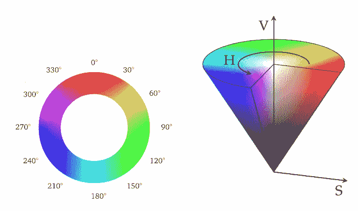

还有其他类似的表示方式，但对于这种模型，颜色被更方便地分成了各自的类别。例如，可以通过寻找接近0度的色相（在极坐标刻度上，比如小于30%且大于330%）来获取所有红色，包括浅红和深红。

在OpenCV中，色相（Hue）的值范围是0到180，饱和度（Saturation）和明度（Value）的范围是0到255。因此，OpenCV使用的HSV范围是(0-180, 0-255, 0-255)。

那么，对于我们的原始苹果图像，我们可以将BGR图像转换为HSV图像。有了HSV图像，我们接着创建一个掩码图像，最后使用该掩码从中提取红色，如下所示：

```python
import cv2

img = cv2.imread(base_path + 'assets/apple_colour.png')
img_hsv = cv2.cvtColor(img, cv2.COLOR_BGR2HSV)
hue_low, hue_high = 160, 180  # hue for reds
img_mask = cv2.inRange(img_hsv, (hue_low,0,0), (hue_high, 255,255))
img_result = cv2.bitwise_and(img, img, mask=img_mask)

cv2.imshow('image', img)
cv2.imshow('hsv image', img_hsv)
cv2.imshow('mask image', img_mask)
cv2.imshow('result image', img_result)
cv2.waitKey(0)
```

以下是得到的结果图像。

原始图像 → hsv → 掩码 → 红色

| 原始图像 | Hsv |
| :--- | :--- |
|  |  |
| 掩码 | 红色 |
|  |  |

我们看到，HSV技术在从红苹果图片中提取红色方面非常方便。

### 形状检测

为了检测形状，拥有一个检测边缘的方法很有用。幸运的是，我们在前面的章节中已经接触过这类方法，特别是在基本功能部分，我们能够为苹果图像生成粗糙的边缘增强。

OpenCV模块为上述操作提供了一些有用的函数：

- GaussianBlur() → 平滑处理
- Canny()[25] → 边缘检测
- Dilate() → 边缘增强

上述步骤使得我们可以使用GaussianBlur平滑原始图像，然后用Canny()函数进行边缘检测，最后用Dilate()函数增强边缘。

```python
import numpy as np
import matplotlib.pyplot as plt
import cv2

img = cv2.imread('assets/shapes.jpg')

# blur the image
img_blur = cv2.medianBlur(img, 5)

# convert to grayscale
img_gray = cv2.cvtColor(img_blur, cv2.COLOR_BGR2GRAY)

# perform edge detection
img_edge = cv2.Canny(img_gray, 30, 100)

# detect lines in the image using hough lines technique
img_line = cv2.HoughLinesP(img_edge, 1, np.pi/180, 60, np.array([]), 50, 5)

# finds the circles in the grayscale image using the Hough transform
img_crcl = cv2.HoughCircles(image=img_gray,
                            method=cv2.HOUGH_GRADIENT, dp=0.9, minDist=80,
                            param1=110, param2=39, maxRadius=70)

# iterate over the output lines and draw them
for line in img_line:
    for x1, y1, x2, y2 in line:
        cv2.line(img, (x1, y1), (x2, y2), (20, 100, 20), 10)

# iterate over circles
for co, i in enumerate(img_crcl[0, :], start=1):
    # draw the outer circle in green
    cv2.circle(img,(int(i[0]),int(i[1])),int(i[2]),(0,255,0),5)
    # draw the center of the circle in red
    cv2.circle(img,(int(i[0]),int(i[1])),2,(255,0,0),10)

# show the image
plt.imshow(img)
plt.show()
```

需要使用不同的技术来检测（并绘制）直线和圆：

- HoughLinesP
- HoughCircles

但除此之外，我们能够在不到50行代码内完成对不同类型形状的检测。那么，让我们创建一个包含圆形、正方形和三角形的图像，然后调用上述程序。

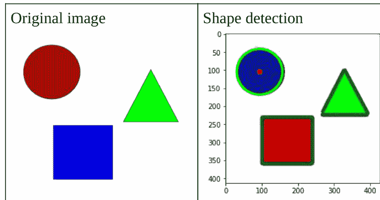

我们成功地使用python opencv模块识别出了各种形状。请注意，我们还可以显示形状的位置和尺寸，甚至形状的类型及其颜色。

### 人脸识别

人脸识别依赖于我们在前面章节中学到的所有知识。我们需要[1] 形状检测来识别人脸可能出现的位置，以及[2] 一个包含人脸（和非人脸）的、经过某种形式训练数据的AI解决方案。

有趣的是，尽管代码量很少，但在人脸图像上运行的代码确实表现出了一些初步的性能。结果如下。

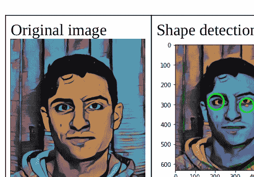

在上图中，通过圆形检测方法检测到了眼睛，尽管通过目视检查并不完全准确，但甚至尝试定位了眼睛的中心。

因此，基于以上内容，我们有希望相信所采用的方法正引导我们走向解决方案的正确道路。

幸运的是，OpenCV模块提供了一个经过预训练的人脸文件，因此用户无需像在没有此类数据的情况下那样事先运行训练文件。

事实上，OpenCV提供了许多默认的级联分类器，可以检测不同的东西，如车牌、眼睛甚至全身。使用级联分类器使代码保持简洁：

```python
import cv2

img = cv2.imread('assets/author_02.jpg')

# Load the cascade
face_cascade = cv2.CascadeClassifier(
    "haarcascade_frontalface_default.xml")

# Convert into grayscale
img_gray = cv2.cvtColor(img, cv2.COLOR_BGR2GRAY)

# Detect faces
faces = face_cascade.detectMultiScale(img_gray, 1.1, 4)

# Draw rectangle around the faces
for (x, y, w, h) in faces:
    cv2.rectangle(img, (x, y), (x+w, y+h), (0, 0, 255), 10)

# show the image
cv2.imshow('result', img)
cv2.waitKey(0)
```

对于单张人脸图像，结果非常清晰。


事实上，我们可以通过添加随机物品和背景来制作一张复杂的图像，并执行相同的测试。

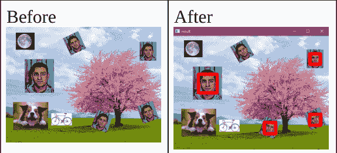

观察到该算法对于不同尺寸和旋转（高达20度）的人脸也表现良好，同时能排除所有背景物品。

### 虚拟绘画

至此，我们在图像处理的旅程上已经走了很长一段路。开始是识别一系列黑白方块，然后我们做了各种基本操作来改变图像特征，最终实现了人脸识别。

人们可以构想出无数的应用，但让我们尝试一个虚拟绘画应用，我们可以将任何颜色的笔举到摄像头前，在屏幕上绘制图像。

对于这个任务，我们需要使用网络摄像头找到笔的颜色，然后在屏幕上笔尖的位置放置点，以便我们可以绘制虚拟图像。

我们将利用一些现有的知识和代码来协助完成手头的任务。

首先需要知道的是选择颜色的HSV范围。另一种方法是使用颜色拾取器来检测我们笔的颜色。

通用范围如下：

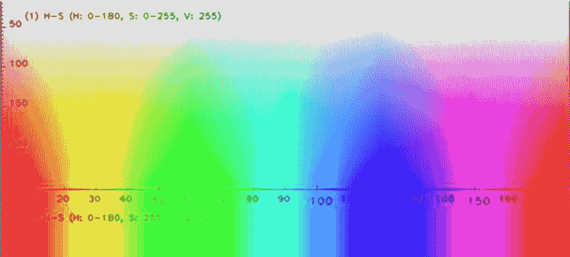

因此，我们可以确定绿色的色相范围是40到80，蓝色的色相范围是100到140。这足以挑选我们的笔。如果我们想要红色，那么我们需要两个范围：色相=0到10用于橙红色（较浅的红色），170到180用于紫红色（较深的红色）。

那么，知道了如何部署视频捕获方法，现在又知道了如何为我们的笔选择颜色，我们可以生成以下代码：

```python
import cv2
import numpy as np

print('starting video capture...')
cap = cv2.VideoCapture(0)

# screen dimensions
w, h = cap.get(3), cap.get(4)
print('video shape', w, h)

# calibrated from a color picker.
lower_blue = np.array([100,150,0])
upper_blue = np.array([140,255,255])
lower_green = np.array([40,150,0])
upper_green = np.array([80,255,255])

my_colors = {'blue':{'lower':lower_blue, 'upper':upper_blue},
            'green':{'lower':lower_green, 'upper':upper_green}}

def find_color(img, my_colors:dict):
    img_hsv = cv2.cvtColor(img, cv2.COLOR_BGR2HSV)
    for color in my_colors.keys():
        lower = np.array(my_colors[color]['lower'])
        upper = np.array(my_colors[color]['upper'])
        mask = cv2.inRange(img_hsv, lower, upper)
        cv2.imshow('image:'+color, mask)
    return

while True:

    # break at the end
    done, img = cap.read()
    if done == False:
        break

    find_color(img, my_colors)
    cv2.imshow('Video', img)

    # break if 'esc' or 'q' is pressed
    key = cv2.waitKey(1)
    if key==27 or key==113:
        break
```

请注意，该代码允许显示主图像以及我们选择添加到掩码中的每种颜色。因此将打开三个窗口。


| 蓝色掩码 | 绿色掩码 |
| --- | --- |

## 网页抓取

至此，我们已拥有强大的计算能力。我们还掌握了设备间通信的方法。现在，我们了解了用于I/O连接的异步方法，这些连接可能导致瓶颈。

各种系统将数据推送到网络这个生态系统中，而这些系统可以提取数据。例如，我们可以使用设备浏览网页，但我们也有自动化工具。

我们已经研究过`requests`模块，它使用户能够以文本、JSON或二进制格式检索数据，这在许多情况下都很有用。

我们还可以通过应用程序编程接口（API）进行连接，并更高效地收集数据。

然而，使用`selenium`和`beautiful soup`等模块，还有强大的替代方法。我们将概述这些方法，讨论何时可能更倾向于使用某种机制而非另一种，并考虑“糟糕，他们重新设计了”这个问题。

### Selenium

根据官方网站，“*selenium自动化浏览器。仅此而已。你如何使用这个能力完全取决于你*”。

我们首先想尝试的是selenium模块中相当于“hello world”的操作。那么让我们尝试打开一个网页：

```python
from selenium import webdriver
from selenium.webdriver.chrome.service import Service
from webdriver_manager.chrome import ChromeDriverManager
import time

service=Service(ChromeDriverManager().install())
driver = webdriver.Chrome(service=service)

url = "http://www.spacegoo.com/solar_system/"

driver.get(url)
time.sleep(30)
```

首先需要注意的是，selenium包比我们之前见过的其他包需要更多的导入。

这是因为Selenium模块需要考虑市场上所有可用的浏览器（chrome、firefox、edge等）以及浏览器的所有不同版本。所以这本身就是一个庞大的任务，因此是模块使用场景的一个典型例子。

事实上，hello world示例需要3个导入：

1.  Selenium - selenium模块
2.  Service - 选择chrome浏览器
3.  ChromeDriverManager - 获取最新版本

第一个是webdriver工具本身。第二和第三个导入步骤选择要自动化的*哪个浏览器*，以及用于所选浏览器*最新版本*的便捷工具。

在引入管理器工具（在selenium版本4中引入）之前，用户需要指向PC上的驱动程序文件路径，并且当浏览器升级时，代码需要更新。

对于我们检测到的每个掩码，我们需要找到对象在图像中的位置。为此，我们需要找到轮廓并围绕它近似一个边界框，以便我们可以找到对象的位置。

为此，我们可以创建一个像这样的轮廓函数：

```python
def get_contours(img):
    contours, hierachy = cv2.findContours(img,
                                         cv2.RETR_EXTERNAL, cv2.CHAIN_APPROX_NONE)
    for cnt in contours:
        area = cv2.contourArea(cnt)
        print(area)
        if area>500:
            cv2.drawContours(img_result, cnt, -1, (255,0,0), 3)
            peri = cv2.arcLength(cnt, True)
            approx = cv2.approxPolyDP(cnt, 0.02*peri, True)
            x,y,w,h = cv2.boundingRect(approx)
```

这基本上使我们能够显示笔周围的轮廓。

结果看起来令人满意，因为我们可以看到笔被红色边框高亮显示。所以下一个任务是识别区域的顶部，因为这是我们打算在屏幕上绘制的地方。

我们可以通过向我们之前创建的轮廓函数添加一个返回值来实现这一点，使用这行代码。

```
return x+w//2, y + h//10
```

x + w/2是左上角加上一半的宽度，这是水平中心点。同样，对于垂直方向，我们使用y和十分之一的高度，这样我们就靠近笔尖了。（记住，在大多数绘图模块中，高度是从顶部向下开始的。）

我们可以将这些返回值解析回`find_color()`函数，并通过添加此代码在这些点绘制圆圈：

```
x, y = get_contours(mask)
cv2.circle(img_result, (x,y), 10 , (0,0,255), cv2.FILLED)
```

这再次产生了令人满意的结果。

下一个阶段是将红色圆圈更改为笔的颜色。最简单的方法是扩展`my_colors`字典，为每支笔包含一种颜色。

```python
my_colors = {'blue':
    {'lower':lower_blue, 'upper':upper_blue, 'value':[255,0,0]},
    'Green':
    {'lower':lower_green, 'upper':upper_green, 'value':[0,255,0]}}
```

这意味着我们已方便地将值作为字典的一部分解析回`find_color()`函数。字典是此类用途的绝佳工具，因为它们可扩展且速度快。

最后的任务是将这些点捕获到一个列表中，以便我们可以存储并将它们绘制到屏幕上。列表需要包含屏幕上的(x, y)位置及其颜色。因此列表中的每个项目将是一个像这样的元组：(x, y, colour)。

我们需要创建一个绘制函数，将存储在列表中的项目绘制到画布上，这是通过此函数完成的：

```python
def draw_on_canvas(my_points):
    for p in my_points:
        cv2.circle(img_result, (p[0], p[1]), 10, p[2], cv2.FILLED)
```

为完整起见，我们展示整个代码，长度不到80行。

```python
import cv2
import numpy as np

print('starting video capture...')
cap = cv2.VideoCapture(0)

# screen dimensions
w, h = cap.get(3), cap.get(4)
print('video shape', w, h)

# calibrated from a color picker.
lower_blue = np.array([100,150,0])
upper_blue = np.array([140,255,255])
lower_green = np.array([40,150,0])
upper_green = np.array([80,255,255])

my_colors = {
    'blue':{'lower':lower_blue, 'upper':upper_blue, 'value':[255,0,0]},
    'green':{'lower':lower_green, 'upper':upper_green, 'value':[0,255,0]}
}

my_points = []

def find_color(img, my_colors:dict):
    img_hsv = cv2.cvtColor(img, cv2.COLOR_BGR2HSV)
    new_points = []
    for color in my_colors.keys():
        lower = np.array(my_colors[color]['lower'])
        upper = np.array(my_colors[color]['upper'])
        mask = cv2.inRange(img_hsv, lower, upper)
        x, y = get_contours(mask)
        c = my_colors[color]['value']
        cv2.circle(img_result, (x,y), 10 , c, cv2.FILLED)
        if x!=0 and y!=0:
            new_points.append([x,y,c])
        # cv2.imshow('image:'+color, mask)
    return new_points

def get_contours(img):
    contours, hierachy = cv2.findContours(img,
                                          cv2.RETR_EXTERNAL, cv2.CHAIN_APPROX_NONE)
    x,y,w,h = 0,0,0,0
    for cnt in contours:
        area = cv2.contourArea(cnt)
        print(area)
        if area>500:
            cv2.drawContours(img_result, cnt, -1, (0,0,255), 3)
            peri = cv2.arcLength(cnt, True)
            approx = cv2.approxPolyDP(cnt, 0.02*peri, True)
            x,y,w,h = cv2.boundingRect(approx)
    return x+w//2, y + h//10

def draw_on_canvas(my_points):
    for p in my_points:
        cv2.circle(img_result, (p[0], p[1]), 10, p[2], cv2.FILLED)


while True:

    # break at the end
    done, img = cap.read()
    if done == False:
        break

    img_result = img.copy()
    new_points = find_color(img, my_colors)
    if len(new_points)!=0:
        for newp in new_points:
            my_points.append(newp)
    if len(my_points)!=0:
        draw_on_canvas(my_points)
    cv2.imshow('Video', img_result)

    # break if 'esc' or 'q' is pressed
    key = cv2.waitKey(1)
    if key==27 or key==113:
        break
```

这是结果：

一个看起来相当有趣的虚拟绘画应用！

我们已经结束了数字图像处理部分，这段旅程始于一些1和0，并扩展到人脸识别和虚拟绘画。我们本可以包含其他项目，例如文档扫描仪或车牌检测。但这些留给读者……

-   车牌识别
-   检测运动
-   物体检测

已更新指向新版本，考虑到许多用户倾向于自动升级到最新版本，这相当繁琐。

因此，用户实际上在每次运行代码时都会安装最新的兼容浏览器，结果最终被赋值给驱动变量。

从这一点开始，用浏览器打开一个网站只需调用用户本会输入到浏览器中的相同URL字符串，然后运行`driver.get()`函数。

一旦用户到达网页，通常他们可能想要做一些特定的事情，比如下载文件、点击链接或按下按钮。这就是自动化部分。

我们将在此暂停，因为在继续之前，我们应该考虑其他自动化流程。

关于selenium的提示是，其主要用例是自动化，这是在访问网页之前需要用户操作的地方。

[https://www.selenium.dev/](https://www.selenium.dev/)

### Beautiful soup

Beautiful Soup是一个库，使得从网页中抓取信息变得容易。它位于HTML或XML解析器之上，提供了Pythonic的惯用方法来遍历、搜索和修改解析树。

此模块专为快速周转项目设计，如屏幕抓取。特别是以下三个特点：

1.  一些简单的方法和Pythonic惯用法，用于遍历、搜索和修改解析树。
2.  自动将传入文档转换为Unicode[26]，将传出文档转换为UTF-8。因此用户无需考虑编码问题。
3.  位于流行的Python解析器之上，如lxml和html5lib。

我们可以使用bs4模块快速入门：

```
from bs4 import BeautifulSoup
soup = BeautifulSoup("<p>Some<b>bad<i>HTML")
print(soup.prettify())
```

用户需要做的就是导入模块，然后将任何HTML字符串或文档解析到包中。

这是输出结果：

```
GuessedAtParserWarning: No parser was explicitly specified, so I'm using the best available HTML parser for this system ("lxml"). This usually isn't a problem, but if you run this code on another system, or in a different virtual environment, it may use a different parser and behave differently.

To get rid of this warning, pass the additional argument 'features="lxml"' to the BeautifulSoup constructor.

soup = BeautifulSoup("<p>Some<b>bad<i>HTML")
<html>
<body>
 <p>
  Some
  <b>
   bad
   <i>
    HTML
   </i>
  </b>
 </p>
</body>
</html>
```

我们甚至得到了如何修复此错误的便捷错误消息。

我们还不知道这个错误是什么意思，只知道它与文档的结构有关。

像所有代码一样，我们期望一个结构良好（或编写良好）的文档，但情况并非总是如此，因此像bs4这样有用的模块旨在帮助解决这个问题。

我们知道如何在本书的HTTP请求部分使用requests模块下载文档。因此，这些模块通常携手合作[先是请求，然后是数据读取]。

同样，就像selenium一样，我们将暂停以考虑其他自动化流程。

### SQLite（数据库）

本书的数据库部分本可以包含在多个章节中，最值得注意的是*数据类型*和*数据科学*部分。

市场上有许多不同的数据库，这些数据库大致分为两类。

- SQL
- No SQL

SQL和NoSQL的区别在于它们是关系型（SQL）还是非关系型（NoSQL），它们的模式是预定义的还是动态的，它们如何扩展，它们包含的数据类型，以及它们更适合多行事务还是非结构化数据。

Python开箱即用地提供SQLite作为核心模块之一，自2.5版本（即3.0版本之前）以来一直如此。

> “SQLite是一个进程内库，它实现了一个**自包含、无服务器、零配置、事务性**的SQL数据库引擎”。

上述描述中的术语基本上告诉我们SQLite是一个相对简单的数据库。它是最广泛部署和使用的数据库引擎，已进入每个主要操作系统以及每个网络浏览器，还有许多主要产品和公司使用它。

因此，适合使用SQLite作为示例案例，因为它有可能为初学者和高级用户提供用例。

SQLite与大多数其他数据库的关键区别在于SQLite没有单独的服务器进程。SQLite直接读写普通磁盘文件。

通常，数据库比文件系统更快，SQLite声称比标准文件快约35%。一个主要原因是数据库只调用一次open()和close()系统调用。

大多数SQL数据库引擎使用静态、严格的类型。因此，每列实际上在开始时就被赋予了一个类型。

以下是SQLite提供的类型：

- NULL。值为NULL值。
- INTEGER。值为有符号[27]整数。
- REAL。值为浮点值。
- TEXT。值为文本字符串。
- BLOB。值为数据块，完全按输入存储。

因此，Python语言对类型很熟悉，引入了“blob”。

SQLite不提供布尔数据类型，但这通过1（True）和0（False）处理。

SQLite也没有日期和时间数据类型，因此将其作为**文本**、**实数**或**整数**类型处理。例如，整数作为Unix时间表示自1970-01-01 00:00:00 UTC以来的秒数。

我们已经讨论了很多，现在让我们进入代码。我们这样创建一个数据库：

```
import sqlite3

conn = sqlite3.connect('employee.db')  # 创建一个数据库文件
c = conn.cursor()  # 创建一个游标

# 开始运行SQL命令
c.execute("""CREATE TABLE employees (
    first text,
    last text,
    pay integer
) """)

conn.commit()  # 将数据提交到数据库并关闭
conn.close()
```

使用sqlite3模块，我们只需几行代码就能创建一个数据库。实际上，我们可以通过将“employee.db”替换为字符串`:memory:`来创建一个**内存**数据库，但为了示例目的，我们创建了一个文件。

在Python（和其他语言）中，大多数数据库函数的过程是相似的。

1.  连接到数据库
2.  执行SQL命令（以接收或发送数据）。
3.  关闭连接。

在示例中，“employee.db”包含一些员工薪资数据。前两列是姓名，为**文本**，下一列薪资是**整数**。

我们可以这样向数据库添加数据：

```
c.execute('insert into employees VALUES ("alice", "apple", 50000)')
c.execute('insert into employees VALUES ("bob", "banana", 75000)')
```

并在VSCode中使用SQLite扩展查看结果。

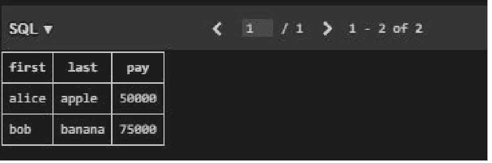

我们可以在Python中使用select语句访问相同的语句：

```
c.execute('SELECT * FROM employees WHERE last="apple"')
result = c.fetchall()
print(result)
```

这给出：

```
[('alice', 'apple', 50000)]
```

这正是我们所期望的。实际上有3个fetch命令：

- fetchone() - 返回下一行
- fetchmany(n) - 返回接下来的n行
- fetchall() - 返回所有行

因此，在这一点上，我们能够在Python中用几行代码设置、填充和检索（查询）数据库中的数据。

通过代码访问数据库的优势在于，我们可以以编程方式从列表、字典甚至类或变量中添加数据，如下所示：

```
employee_3 = {'first':'clive', 'last':'banana', 'pay':60000}
c.execute('insert into employees VALUES (:first, :last, :pay)',
    employee_3)
```

请注意，我们避免使用容易受到SQL注入攻击的字符串格式化，而是直接将对象（我们使用了一个字典）传递给数据库，冒号表示法代表数据库列。

上述相同方法可以扩展到查询：

```
c.execute('SELECT * FROM employees WHERE last=:last',
          {'last':'banana'})
result = c.fetchall()
print(result)
```

现在返回一个元组列表，因为有两个同名的员工（banana）。

```
[('bob', 'banana', 75000), ('clive', 'banana', 60000)]
```

因此，我们再次对结果充满信心。

Python中数据库的一个有用特性是，我们可以将所有数据拉入pandas数据框，类似于我们使用read_sql()方法在一行代码中处理文本和csv文件的方式。

为了完整起见，我们将介绍Python与数据库的另一个方面，即使用函数和上下文管理器（with语句）来方便地操作数据库。

插入一个新员工：

```
def insert_emp(emp:dict):
    with conn:
```

### 自动化流程

获取数据至关重要。事实上，除了环境搭建之外，无论是数据科学还是其他领域，这通常是流程中的首要任务。

在数据获取方面，有几个关键因素需要考虑：

-   数据量
-   传输速度（延迟）
-   数据复杂性
-   访问便捷性
-   数据源的演变

以上是一些主要的考量点，但可以进一步细分，这就是为什么在 Selenium 和 BeautifulSoup 模块上暂停讲解是审慎的。

**数据量：**
有些数据可能只有几行。例如，超市中特定商品的价格。这可能以网络查询的形式出现，我们会使用 `requests` 模块。

我们可能也会处理轻量级数据，比如特定股票的价格，但这在一天中会不断变化，更适合使用 WebSocket。

**速度：**
除了请求的数据量，不同数据源被获取到系统中所需的时间也各不相同。例如，通过 `pandas` 或 `csv` 模块读取 CSV 文件，与通过网络发起 HTTP 请求相比，是一个相对快速的过程。

如果用户需要发起大量 HTTP 请求，那么他们需要考虑异步方法（如 `asyncio`、线程或多进程），以避免请求相互阻塞。

我们将这种“速度”称为网络的**延迟**，它涉及数据请求的往返以及根据请求接收数据的过程。

因此，读取文件是低延迟的，而读取网页则是高延迟的。

**复杂性：**
接下来我们需要考虑数据的复杂性。这包括数据以何种格式呈现（例如文本、CSV 或 JSON），以及数据的结构化程度。

扁平的 CSV 文件可以非常快速地读入 Pandas DataFrame，而 JSON 文件更大，但可能包含更丰富的内容，例如多层嵌套。

我们还需要考虑数据的编码，如果忽略这一点，可能会导致在 Selenium 和 bs4 模块中出现错误或产生与预期不同的结果。

**访问便捷性：**
这个方面可能看起来微不足道，但有许多特性会阻碍简单的数据传输。这可能简单到访问数据库需要密码或链接，或者在 HTML 文档中，用户登录一个页面后被重定向到第二个或第三个页面才能获取所需数据。

有时，访问方法会在系统更新时发生变化，就像升级后的 API 一样。

另一个问题是，一些网络主机不愿意以机器可读的格式公开共享数据，或者不希望被机器人抓取，并采取了相应的防范措施。用户将不得不采取替代措施，例如使用无头浏览器。

### 数据源的演变：

互联网、数据库以及其他数据源（如 CCD 阵列，即网络摄像头）都在不断演变。其中最显著的是网页的演变和格式变化。创建一个在很长一段时间内运行良好的爬虫，然后在网页格式发生变化时崩溃，这种情况相当常见。

这是因为典型的 HTML 文档由各种元素组成，网站重构时许多术语会发生变化，就像代码重构可能会促使程序员修改变量名一样，即使只是为了清晰度这样简单的原因。

然而，如果抓取代码在 HTML 页面中搜索一个不再存在的元素或 XPath[28]，并依赖这些数据，那么抓取代码就会失效。

这就是“糟糕，他们重新设计了”问题的诅咒。

### 最佳工具：

最后，随着对可用产品有了更全面的了解，让我们来探索各种数据源以及完成任务的相应 Python 工具。

| 内容类型 | 方法 |
|---|---|
| 文件 | - 使用上下文管理器进行读写。<br>- 读取 CSV：`pandas.read_csv`<br>- 读取 JSON |
| 数据库 | 数据库工具，如 SQLite |
| 网页 | - **基础文本**：`requests`、Beautiful Soup<br>- **表格**：`pandas.read_html()`<br>- **包含数据文件**：`requests`、Selenium<br>- **需要点击/导航**：Selenium |
| 外设 | 视为文件处理 |

请注意，解决问题的方法多种多样，但上表提供了一些有用的指导原则。

### 其他

其他尚未完成的想法。

### 我的第一个问题

这实际上可能不是我遇到的第一个问题，但这是我第一次被难住到需要去 Stack Overflow 提问 Python 问题的程度，因为之前我一直在使用 Node.JS，这是另一种流行的脚本语言（它使用花括号、分号和 `//` 进行注释）。

提出一个好问题的过程——我们可以将其定义为社区会给你点赞而不是踩赞的问题——是一个相当漫长的过程。

实际上，有一个特定的格式，我们之前提到过，并且会反复遵循。这就是**最小可复现示例**。

此时，我非常关心以这样的方式提出问题，以便社区能够看到我：

-   对问题进行了充分的研究
-   提供了足够的代码，以便其他人能够快速重现问题
-   尝试了我认为是解决方案的方法
-   清楚地说明了我理解什么和不理解什么
-   对期望的输出非常具体

如果用户没有完成这些基本事项，那么他们就有被踩的风险。

那么，让我们回到正题，我的问题是：

```
HTTPError: Forbidden
```

```
当我尝试从一个需要以单选按钮形式提供反馈响应的网站读取数据时，我遇到了 HTTPError: Forbidden 错误。如何解决？？？

一个导致错误的示例 URL 链接已注释掉：url = 'http://www.londonstockexchange.com/exchange/news/market-news/market-news-detail/WWH/13673174.html'
```

这在当时是一件非常具体且令人烦恼的事情。虽然我能够使用特定的库（在这种情况下是 `requests` 模块），但我无法在网站上点击第一个按钮之后继续导航。

我试图做一些相当简单的事情，让代码为我导航网页，但很早就卡住了，而相关网页要求用户点击一个单选框按钮，如果不点击，就会得到这个 Forbidden 错误。

我提供了我编写的代码：

```python
import urllib.request as req
import re

from bs4 import BeautifulSoup


# get all text from websites.
url = 'https://www.bbc.co.uk/sport/football'
#url = 'http://www.londonstockexchange.com/exchange/news/market-news/market-news-de
html = req.urlopen(url).read()
soup = BeautifulSoup(html)

# kill all script and style elements
for script in soup(["script", "style"]):
    script.extract()    # rip it out

# get text
text = soup.get_text()

# break into lines and remove leading and trailing space on each
lines = (line.strip() for line in text.splitlines())
# break multi-headlines into a line each
chunks = (phrase.strip() for line in lines for phrase in line.split("  "))
# drop blank lines
text = '\n'.join(chunk for chunk in chunks if chunk)

print(text)
```

这个特定的问题获得了 79 次浏览，但没有人发布任何答案。

无论如何。

然而，有一个人发表了评论。

你可以尝试使用 selenium 来模拟单选按钮的选择和按钮点击。现在，大约四年后，我回头发现，有一位比我优秀得多（其 Stack 得分是我的两倍）的用户，他向我推荐了一个我之前未曾接触过的、相对流行的软件包。

基本上，他的意思是“你正在用扳手开罐头，为什么不试试用开罐器呢？”

重点在于，我使用了完全错误的工具来完成这项任务。

此时，我可以深入探讨他提到的 selenium 包的具体细节，但这会违背初衷。编码的原则，如同生活中的所有其他方面一样，是使用正确或至少是最佳的工具来完成工作。

一个好的程序员通常会知道这些工具是什么，就像木匠会有专门的工具来切割木材，或者电工会有专门的工具来修理电线一样。

这个答案在某种程度上需要一个（在成千上万个可用软件包中）能够快速导航网页浏览器的软件包，而在我拥有这个特定工具之前，我总会感到力不从心。

### 我的第一个答案

在深入探讨之前，我注意到我回答的问题数量是我提问数量的三倍。我不知道这意味着什么，除了我可能是一个净贡献者，因为我不断与问题作斗争，并且本以为平衡实际上应该是相反的。

所以也许我问的问题不够多？

尽管如此，让我们看看我回答过的那个问题。

标题是：同时运行多个 Python 脚本

问题是这样的：

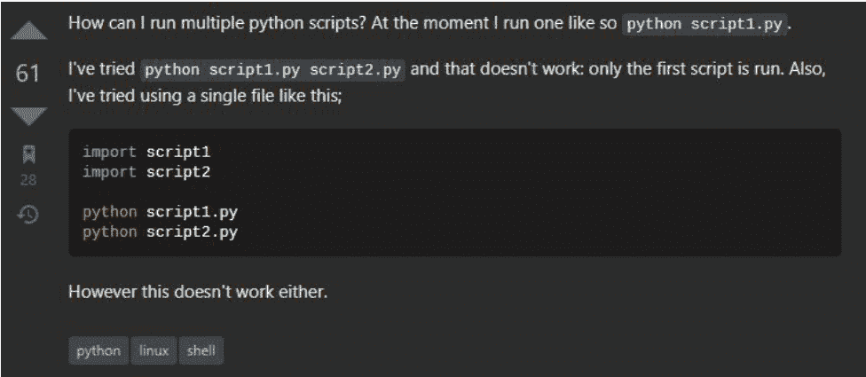

我们可以看到它有 61 个赞，所以从许多人可能面临同样问题的意义上说，这显然是一个值得尊敬的问题。

多年来，已经发布了几个答案。

大约在问题发布三年后，我偶然发现了同一个问题，显然也是想做同样的事情。事实上，我遇到了这个问题，或者至少是一个非常类似的问题，不过是关于 Node.js 的，这是另一种脚本语言，所以我发布了一个关于如何在 Node 中解决这个问题的方案，以及相同的规则如何转移到 Python。

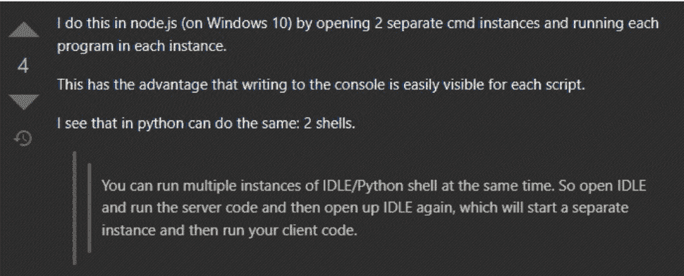

这是众多解决方案中的一个，甚至可能不是最好的解决方案，尽管它足以以简单的方式为几个有相同问题的用户解决问题。

再次强调，这里的重点不是答案的技术细节，而是作为程序员，我们可以从其他类似的语言中借鉴技巧。**我们首先关注的实际上是通用规则，而不是具体细节。**

第二点值得注意，也更有趣的是，用户想要同时运行多个代码。这是编码世界中一个巨大的问题，几乎无处不在。

### 100 个囚犯

所以这个问题在 Stack 上还不存在，但 YouTube 上有一个关于此的精彩视频。这里我们将探讨这个问题。

有 100 个囚犯，每个囚犯必须进入一个房间。房间里有 100 个盒子。每个盒子里装着一个不同的数字。每个囚犯最多可以打开 50 个盒子。如果囚犯找到了自己的数字，那么就算成功。如果所有 100 个囚犯都成功了，那么他们都会被释放。如果哪怕有一个囚犯失败（打开了超过 50 个盒子），那么他们都会死。

100 个囚犯存活的概率是多少？

### 类与可变性

https://stackoverflow.com/questions/73537529/unexpected-behavior-with-python-list-of-dictionaries-when-adding-new-key-to-them/73538560#73538560

这是原始问题：

> “我在一个项目中遇到了 Python 解释器的意外行为。我知道，在某些情况下，Python 使用的是对象的引用，而不是对象本身。然而，我无法解释为什么这段代码会出现这个问题，因为列表中的元素似乎是具有不同对象 ID 的不同实例。每当我向字典中添加一个新的 {键:值} 对时，该列表中的所有其他字典都会被更新。”

```
class Node():
    def __init__(self, name, neighbors=dict()):
        self.name = name
        self.neighbors = neighbors # a dict {}

    def add_neighbor(self, neighbor, value=0):
        self.neighbors[str(neighbor)] = value

if __name__ == "__main__":
    n_1 = Node(name='node_1')
    n_1.add_neighbor('node_2', value=5)
    n_2 = Node(name='node_2')

    node_list = [n_1, n_2]
    for node in node_list:
        print(id(node), node.name, node.neighbors)
```

结果是这样的：

```
2129022374520 node_1 {'node_2': 5}
2129022374576 node_2 {'node_2': 5}
```

那么为什么会发生这种情况，我们如何解决这个问题呢？

“neighbors”的默认值是一个在类实例之间共享的单个字典。这意味着每个实例都指向同一个字典。这是列表和字典可变性的固有部分（当值改变时，内存地址不会改变）。当正确使用时，这是一个有用的特性，但当被忽视或误解时，可能会导致问题。

那么我们如何纠正这个问题呢？

一种方法是只对字典进行类型提示，而不是直接赋值一个字典。记住，Python 中的类型提示就是类型提示。这意味着用户可以在创建（实例化）对象时为每个实例分配他们自己的字典。

```
class Node():
    def __init__(self, name, neighbors:dict):  # hint
        self.name = name
        self.neighbors = neighbors # a dict {}

    def add_neighbor(self, neighbor, value=0):
        self.neighbors[str(neighbor)] = value

if __name__ == "__main__":
    n_1 = Node(name='node_1', neighbors={})  # dict a
    n_1.add_neighbor('node_2', value=5)
    n_2 = Node(name='node_2', neighbors={})  # dict b

    node_list = [n_1, n_2]
    for node in node_list:
        print(id(node), node.name, node.neighbors)
```

[1] Pandas 源自“面板数据”一词。它与熊猫无关。

[2] PIL 库提供了相当强大的图像处理能力。

[3] 随机存取存储器（RAM）本质上是短期记忆，数据根据处理器的需要存储在其中。

[4] 硬盘：希捷 BarraCuda Q5 NVMe SSD
内存：AMD Ryzen 3 4300U

[5] 我们可以从命令提示符使用 `pip install pandas` 来安装 pandas。

[6] 向量化最适合数值代码，但对字符串效果较差。

[7] 这被称为 ndarray。

[8] 一个连续的指针块，其中每个指针引用一个 Python 对象。

[9] 粗略查看该网站，似乎提供了超过 1000 种基本类型。

[10] 解包是 Python 中另一个便捷的功能。
`a,b = np.polyfit(...)` 可以在一行代码中同时获取斜率和截距变量。

[11] 鸢尾花数据集：该数据集包含来自三种鸢尾花（山鸢尾、维吉尼亚鸢尾和变色鸢尾）各 50 个样本。

[12] KNN 代表 K<sup>th</sup> 最近邻。

[13] JSON 代表 **JavaScript 对象表示法**。

[14] 回撤是指市场抛售至特定金额。

[15] 统一资源定位符，实际上是唯一的网络地址。

[16] 当两个或多个线程可以访问共享数据并同时尝试更改它时，就会发生竞态条件。由于线程调度算法可以随时在线程之间切换，因此你不知道线程尝试访问共享数据的顺序。

[17] Python 全局解释器锁（GIL）是一个锁，它只允许一个线程持有 Python 解释器的控制权。因此，在任何时间点，只能有一个线程处于执行状态。GIL 对单线程程序没有影响，但在异步代码中可能成为性能瓶颈。

[18] Tkinter 源自 Tk，Tk 是一个免费、开源、跨平台的窗口小部件工具包，它提供了一个基本 GUI 小部件元素库，用于在许多编程语言中构建图形用户界面（GUI）。第一个版本于 1991 年发布。

[19] 回调函数是*作为参数传递给另一个函数的函数*，然后在外部函数内部调用以完成某种例程或操作。

[20] 最初由勒内·笛卡尔在 17 世纪创造为一个贬义词，并被视为虚构或无用，但在莱昂哈德·欧拉（18 世纪）以及奥古斯丁-路易·柯西和卡尔·弗里德里希·高斯（19 世纪初）的工作之后，这个概念得到了广泛接受。

[21] 从历史上看，将复数表示为平面上的点的几何表示很重要，因为它使复数的整个概念更容易被接受。

[22] 数据采样很重要，因为它可能产生不同的结果。采样取决于数据检查的频率相对于可用数据量的关系。

[23] 散布恐慌是谣言传播的一种形式。每个节点（人）中的“恐惧”可能会以与该特定节点“恐惧”阈值成比例的方式激活数据传输。我们可以将其称为触发激活函数。

[24] 摩尔定律是观察到的密集集成电路（IC）中晶体管数量

### 摩尔定律

摩尔定律指出，微芯片上的晶体管数量大约每两年翻一番。摩尔定律是对历史趋势的一种观察和预测。它并非物理定律，而是与生产经验积累带来的收益相关的一种经验性关系。

### Canny 边缘检测器

该方法以其创造者 John F. Canny 的名字命名。它是一种流行的边缘检测算法，利用图像梯度进行工作。

### Unicode 标准

世界上的每个人都应该能够在手机和电脑上使用自己的语言。Unicode 标准允许对世界上大多数书写系统表达的文本进行一致的编码、表示和处理。

### 有符号整数

有符号整数是一个 32 位的数据，用于编码范围在 [-2147483648 到 2147483647] 之间的整数。有符号整数采用二进制补码表示法（1,2,3..8 字节）。

### XPath

XPath 代表 XML 路径语言。它使用非 XML 语法，提供了一种灵活的方式来寻址（指向）XML 文档的不同部分。